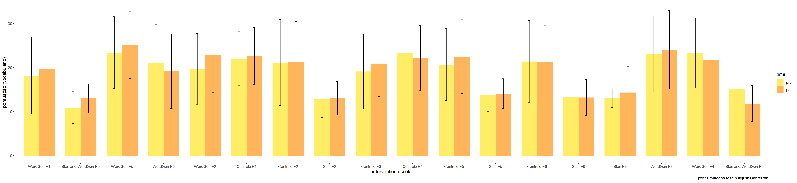

# ANCOVA test for vocabulario (aprendizagem de vocabulário)

Geiser C. Challco <geiser@alumni.usp.br>

- [Descriptive Statistics of Initial
  Data](#descriptive-statistics-of-initial-data)
  - [Baseado nos acertos (score) da
    prova](#baseado-nos-acertos-score-da-prova)
  - [Baseado nas estimativas da aprendizagem (theta - traço latente)
    mediante TRI aplicado as respostas da
    prova](#baseado-nas-estimativas-da-aprendizagem-theta---traço-latente-mediante-tri-aplicado-as-respostas-da-prova)
- [Checking of Assumptions](#checking-of-assumptions)
  - [Identify and dealing with outliers (performing treatment of
    outliers)](#identify-and-dealing-with-outliers-performing-treatment-of-outliers)
  - [Assumption: Normality distribution of
    data](#assumption-normality-distribution-of-data)
    - [Para fatores de:
      **intervention:genero**](#para-fatores-de-interventiongenero)
    - [Para fatores de:
      **intervention:idade**](#para-fatores-de-interventionidade)
    - [Para fatores de:
      **intervention:zona.escola**](#para-fatores-de-interventionzonaescola)
    - [Para fatores de:
      **intervention:zona.participante**](#para-fatores-de-interventionzonaparticipante)
    - [Para fatores de:
      **intervention:escola**](#para-fatores-de-interventionescola)
    - [Para fatores de:
      **intervention:monitor**](#para-fatores-de-interventionmonitor)
  - [Assumption: Homogeneity of data
    distribution](#assumption-homogeneity-of-data-distribution)
    - [Para fatores de:
      **intervention:genero**](#para-fatores-de-interventiongenero-1)
    - [Para fatores de:
      **intervention:idade**](#para-fatores-de-interventionidade-1)
    - [Para fatores de:
      **intervention:zona.escola**](#para-fatores-de-interventionzonaescola-1)
    - [Para fatores de:
      **intervention:zona.participante**](#para-fatores-de-interventionzonaparticipante-1)
    - [Para fatores de:
      **intervention:escola**](#para-fatores-de-interventionescola-1)
    - [Para fatores de:
      **intervention:monitor**](#para-fatores-de-interventionmonitor-1)
- [Computation of ANCOVA test and Pairwise
  Comparison](#computation-of-ancova-test-and-pairwise-comparison)
  - [ANCOVA test](#ancova-test)
    - [ANCOVA test usando acertos (pontuação - score) da
      prova](#ancova-test-usando-acertos-pontuação---score-da-prova)
    - [ANCOVA test usando as estimativas da aprendizagem (theta - traço
      latente) mediante TRI aplicado as respostas da
      prova](#ancova-test-usando-as-estimativas-da-aprendizagem-theta---traço-latente-mediante-tri-aplicado-as-respostas-da-prova)
  - [Pairwise comparisons for one
    factor](#pairwise-comparisons-for-one-factor)
    - [factor: **intervention**](#factor-intervention)
    - [factor: **genero**](#factor-genero)
    - [factor: **idade**](#factor-idade)
    - [factor: **zona.escola**](#factor-zonaescola)
    - [factor: **zona.participante**](#factor-zonaparticipante)
    - [factor: **escola**](#factor-escola)
    - [factor: **monitor**](#factor-monitor)
    - [factor: **monitor.genero**](#factor-monitorgenero)
    - [factor: **monitor.formacao**](#factor-monitorformacao)
    - [factor: **monitor.titulacao**](#factor-monitortitulacao)
    - [factor: **monitor.experiencia**](#factor-monitorexperiencia)
  - [Pairwise comparisons for two
    factor](#pairwise-comparisons-for-two-factor)
    - [factores: **intervention:genero**](#factores-interventiongenero)
    - [factores: **intervention:idade**](#factores-interventionidade)
    - [factores:
      **intervention:zona.escola**](#factores-interventionzonaescola)
    - [factores:
      **intervention:zona.participante**](#factores-interventionzonaparticipante)
    - [factores: **intervention:escola**](#factores-interventionescola)
    - [factores:
      **intervention:monitor**](#factores-interventionmonitor)
    - [factores:
      **intervention:monitor.genero**](#factores-interventionmonitorgenero)
    - [factores:
      **intervention:monitor.formacao**](#factores-interventionmonitorformacao)
    - [factores:
      **intervention:monitor.titulacao**](#factores-interventionmonitortitulacao)
    - [factores:
      **intervention:monitor.experiencia**](#factores-interventionmonitorexperiencia)

Teste ANCOVA para determinar se houve diferenças significativas em
referência ao aprendizado de vocabulario (medido usando pre- e
pos-testes).

ANCOVA test to determine whether there were significant differences in
reference to learn vocabulary (measured using pre- and post-tests).

# Descriptive Statistics of Initial Data

## Baseado nos acertos (score) da prova

| intervention      | genero | variable              |   n |   mean | median | min | max |    sd |    se |    ci |   iqr |
|:------------------|:-------|:----------------------|----:|-------:|-------:|----:|----:|------:|------:|------:|------:|
| Controle          | F      | pos_score.vocabulario |  80 | 22.938 |   23.0 |   8 |  42 | 7.492 | 0.838 | 1.667 | 12.00 |
| Controle          | M      | pos_score.vocabulario |  81 | 20.802 |   21.0 |   4 |  39 | 8.642 | 0.960 | 1.911 | 13.00 |
| Stari             | F      | pos_score.vocabulario |  17 | 14.118 |   14.0 |   6 |  24 | 4.241 | 1.029 | 2.180 |  6.00 |
| Stari             | M      | pos_score.vocabulario |  22 | 14.500 |   14.0 |   7 |  25 | 4.857 | 1.036 | 2.154 |  3.75 |
| WordGen           | F      | pos_score.vocabulario |  53 | 25.868 |   27.0 |   8 |  41 | 8.658 | 1.189 | 2.386 | 16.00 |
| WordGen           | M      | pos_score.vocabulario |  69 | 21.232 |   22.0 |   8 |  41 | 7.941 | 0.956 | 1.908 | 12.00 |
| Stari and WordGen | F      | pos_score.vocabulario |   4 | 14.000 |   13.5 |  11 |  18 | 3.162 | 1.581 | 5.032 |  4.00 |
| Stari and WordGen | M      | pos_score.vocabulario |  14 | 13.071 |   11.0 |   7 |  30 | 5.771 | 1.542 | 3.332 |  4.75 |
| Controle          | F      | pre_score.vocabulario |  80 | 21.812 |   21.0 |   7 |  41 | 8.105 | 0.906 | 1.804 | 13.00 |
| Controle          | M      | pre_score.vocabulario |  81 | 20.296 |   19.0 |   5 |  39 | 8.747 | 0.972 | 1.934 | 14.00 |
| Stari             | F      | pre_score.vocabulario |  17 | 12.353 |   12.0 |   6 |  22 | 3.517 | 0.853 | 1.808 |  3.00 |
| Stari             | M      | pre_score.vocabulario |  22 | 13.864 |   14.0 |   9 |  20 | 3.285 | 0.700 | 1.456 |  5.00 |
| WordGen           | F      | pre_score.vocabulario |  53 | 24.057 |   24.0 |   6 |  40 | 8.690 | 1.194 | 2.395 | 11.00 |
| WordGen           | M      | pre_score.vocabulario |  69 | 20.043 |   19.0 |   5 |  37 | 7.775 | 0.936 | 1.868 | 12.00 |
| Stari and WordGen | F      | pre_score.vocabulario |   4 | 11.750 |   11.5 |   8 |  16 | 3.500 | 1.750 | 5.569 |  4.25 |
| Stari and WordGen | M      | pre_score.vocabulario |  14 | 14.286 |   13.0 |   6 |  24 | 5.469 | 1.462 | 3.158 |  6.50 |

| intervention      | escola | variable              |   n |   mean | median | min | max |     sd |    se |     ci |   iqr |
|:------------------|:-------|:----------------------|----:|-------:|-------:|----:|----:|-------:|------:|-------:|------:|
| Controle          | E1     | pos_score.vocabulario |  11 | 22.636 |   24.0 |  12 |  31 |  6.500 | 1.960 |  4.367 |  5.50 |
| Controle          | E2     | pos_score.vocabulario |  34 | 21.206 |   18.5 |  10 |  42 |  9.286 | 1.593 |  3.240 | 15.00 |
| Controle          | E3     | pos_score.vocabulario |  21 | 20.905 |   21.0 |   9 |  37 |  7.449 | 1.626 |  3.391 | 10.00 |
| Controle          | E4     | pos_score.vocabulario |  20 | 22.150 |   24.0 |   9 |  39 |  7.422 | 1.660 |  3.473 |  7.25 |
| Controle          | E5     | pos_score.vocabulario |  61 | 22.459 |   22.0 |   4 |  38 |  8.392 | 1.074 |  2.149 | 15.00 |
| Controle          | E6     | pos_score.vocabulario |  14 | 21.286 |   21.0 |   8 |  35 |  8.203 | 2.192 |  4.737 | 12.00 |
| Stari             | E1     | pos_score.vocabulario |   5 | 19.600 |   18.0 |  15 |  25 |  5.079 | 2.272 |  6.307 | 10.00 |
| Stari             | E2     | pos_score.vocabulario |   9 | 13.000 |   14.0 |   7 |  18 |  3.808 | 1.269 |  2.927 |  4.00 |
| Stari             | E3     | pos_score.vocabulario |   6 | 14.333 |   14.0 |   6 |  24 |  5.854 | 2.390 |  6.143 |  3.00 |
| Stari             | E4     | pos_score.vocabulario |   1 |  9.000 |    9.0 |   9 |   9 |     NA |    NA |    NaN |  0.00 |
| Stari             | E5     | pos_score.vocabulario |  13 | 14.077 |   14.0 |   8 |  22 |  3.378 | 0.937 |  2.041 |  4.00 |
| Stari             | E6     | pos_score.vocabulario |   5 | 13.200 |   14.0 |   9 |  18 |  4.087 | 1.828 |  5.074 |  7.00 |
| WordGen           | E1     | pos_score.vocabulario |  12 | 19.667 |   15.0 |   9 |  37 | 10.491 | 3.028 |  6.666 | 17.50 |
| WordGen           | E2     | pos_score.vocabulario |  22 | 22.818 |   22.5 |   9 |  41 |  8.444 | 1.800 |  3.744 | 13.25 |
| WordGen           | E3     | pos_score.vocabulario |  16 | 25.000 |   24.0 |   8 |  41 |  9.374 | 2.343 |  4.995 |  9.50 |
| WordGen           | E4     | pos_score.vocabulario |  10 | 21.800 |   20.5 |  13 |  33 |  7.613 | 2.407 |  5.446 | 13.50 |
| WordGen           | E5     | pos_score.vocabulario |  49 | 25.122 |   25.0 |   8 |  39 |  7.645 | 1.092 |  2.196 | 11.00 |
| WordGen           | E6     | pos_score.vocabulario |  13 | 19.154 |   17.0 |   9 |  37 |  8.464 | 2.348 |  5.115 |  8.00 |
| Stari and WordGen | E2     | pos_score.vocabulario |   2 | 11.500 |   11.5 |  10 |  13 |  2.121 | 1.500 | 19.059 |  1.50 |
| Stari and WordGen | E4     | pos_score.vocabulario |   5 | 11.800 |   10.0 |   7 |  17 |  4.087 | 1.828 |  5.074 |  5.00 |
| Stari and WordGen | E5     | pos_score.vocabulario |  10 | 14.700 |   13.0 |   8 |  30 |  6.201 | 1.961 |  4.436 |  5.25 |
| Stari and WordGen | E6     | pos_score.vocabulario |   1 | 10.000 |   10.0 |  10 |  10 |     NA |    NA |    NaN |  0.00 |
| Controle          | E1     | pre_score.vocabulario |  11 | 22.000 |   23.0 |  13 |  31 |  6.132 | 1.849 |  4.119 |  9.00 |
| Controle          | E2     | pre_score.vocabulario |  34 | 21.118 |   17.5 |   8 |  41 |  9.776 | 1.676 |  3.411 | 18.00 |
| Controle          | E3     | pre_score.vocabulario |  21 | 19.095 |   16.0 |   5 |  39 |  8.461 | 1.846 |  3.851 | 12.00 |
| Controle          | E4     | pre_score.vocabulario |  20 | 23.400 |   23.5 |   9 |  39 |  7.632 | 1.707 |  3.572 | 10.00 |
| Controle          | E5     | pre_score.vocabulario |  61 | 20.672 |   19.0 |   6 |  36 |  8.156 | 1.044 |  2.089 | 12.00 |
| Controle          | E6     | pre_score.vocabulario |  14 | 21.357 |   24.0 |   6 |  33 |  9.337 | 2.495 |  5.391 | 13.50 |
| Stari             | E1     | pre_score.vocabulario |   5 | 12.800 |   10.0 |   9 |  18 |  4.324 | 1.934 |  5.369 |  7.00 |
| Stari             | E2     | pre_score.vocabulario |   9 | 12.778 |   12.0 |   6 |  20 |  4.116 | 1.372 |  3.164 |  4.00 |
| Stari             | E3     | pre_score.vocabulario |   6 | 13.000 |   12.5 |  11 |  16 |  2.098 | 0.856 |  2.201 |  3.25 |
| Stari             | E4     | pre_score.vocabulario |   1 | 11.000 |   11.0 |  11 |  11 |     NA |    NA |    NaN |  0.00 |
| Stari             | E5     | pre_score.vocabulario |  13 | 13.846 |   14.0 |   9 |  22 |  3.805 | 1.055 |  2.299 |  4.00 |
| Stari             | E6     | pre_score.vocabulario |   5 | 13.400 |   14.0 |   9 |  16 |  2.608 | 1.166 |  3.238 |  0.00 |
| WordGen           | E1     | pre_score.vocabulario |  12 | 18.167 |   15.5 |   6 |  34 |  8.726 | 2.519 |  5.545 |  8.25 |
| WordGen           | E2     | pre_score.vocabulario |  22 | 19.682 |   18.5 |   5 |  37 |  8.032 | 1.712 |  3.561 |  9.25 |
| WordGen           | E3     | pre_score.vocabulario |  16 | 22.188 |   21.0 |   9 |  39 |  9.020 | 2.255 |  4.806 |  8.25 |
| WordGen           | E4     | pre_score.vocabulario |  10 | 23.300 |   20.5 |  14 |  37 |  7.945 | 2.512 |  5.683 | 12.00 |
| WordGen           | E5     | pre_score.vocabulario |  49 | 23.408 |   24.0 |   6 |  38 |  8.155 | 1.165 |  2.342 | 10.00 |
| WordGen           | E6     | pre_score.vocabulario |  13 | 20.923 |   19.0 |   8 |  40 |  8.798 | 2.440 |  5.317 | 10.00 |
| Stari and WordGen | E2     | pre_score.vocabulario |   2 | 20.000 |   20.0 |  18 |  22 |  2.828 | 2.000 | 25.412 |  2.00 |
| Stari and WordGen | E4     | pre_score.vocabulario |   5 | 15.200 |   14.0 |  11 |  24 |  5.357 | 2.396 |  6.652 |  5.00 |
| Stari and WordGen | E5     | pre_score.vocabulario |  10 | 11.900 |   11.0 |   6 |  21 |  4.677 | 1.479 |  3.346 |  6.75 |
| Stari and WordGen | E6     | pre_score.vocabulario |   1 | 12.000 |   12.0 |  12 |  12 |     NA |    NA |    NaN |  0.00 |

| intervention      | zona.escola | variable              |   n |   mean | median | min | max |    sd |    se |    ci |   iqr |
|:------------------|:------------|:----------------------|----:|-------:|-------:|----:|----:|------:|------:|------:|------:|
| Controle          | Urbana      | pos_score.vocabulario | 106 | 22.075 |   22.0 |   4 |  42 | 8.469 | 0.823 | 1.631 | 15.00 |
| Controle          | Rural       | pos_score.vocabulario |  55 | 21.455 |   22.0 |   8 |  39 | 7.513 | 1.013 | 2.031 | 10.50 |
| Stari             | Urbana      | pos_score.vocabulario |  27 | 14.741 |   14.0 |   7 |  25 | 4.417 | 0.850 | 1.747 |  4.50 |
| Stari             | Rural       | pos_score.vocabulario |  12 | 13.417 |   14.0 |   6 |  24 | 4.889 | 1.411 | 3.106 |  7.00 |
| WordGen           | Urbana      | pos_score.vocabulario |  83 | 23.723 |   24.0 |   8 |  41 | 8.428 | 0.925 | 1.840 | 14.00 |
| WordGen           | Rural       | pos_score.vocabulario |  39 | 22.231 |   22.0 |   8 |  41 | 8.806 | 1.410 | 2.855 | 15.00 |
| Stari and WordGen | Urbana      | pos_score.vocabulario |  12 | 14.167 |   12.5 |   8 |  30 | 5.781 | 1.669 | 3.673 |  4.75 |
| Stari and WordGen | Rural       | pos_score.vocabulario |   6 | 11.500 |   10.0 |   7 |  17 | 3.728 | 1.522 | 3.913 |  3.75 |
| Controle          | Urbana      | pre_score.vocabulario | 106 | 20.953 |   19.0 |   6 |  41 | 8.473 | 0.823 | 1.632 | 15.00 |
| Controle          | Rural       | pre_score.vocabulario |  55 | 21.236 |   21.0 |   5 |  39 | 8.457 | 1.140 | 2.286 | 12.00 |
| Stari             | Urbana      | pre_score.vocabulario |  27 | 13.296 |   12.0 |   6 |  22 | 3.881 | 0.747 | 1.535 |  6.00 |
| Stari             | Rural       | pre_score.vocabulario |  12 | 13.000 |   13.5 |   9 |  16 | 2.216 | 0.640 | 1.408 |  3.25 |
| WordGen           | Urbana      | pre_score.vocabulario |  83 | 21.663 |   21.0 |   5 |  38 | 8.386 | 0.920 | 1.831 | 13.50 |
| WordGen           | Rural       | pre_score.vocabulario |  39 | 22.051 |   20.0 |   8 |  40 | 8.507 | 1.362 | 2.758 | 10.00 |
| Stari and WordGen | Urbana      | pre_score.vocabulario |  12 | 13.250 |   12.0 |   6 |  22 | 5.345 | 1.543 | 3.396 |  7.00 |
| Stari and WordGen | Rural       | pre_score.vocabulario |   6 | 14.667 |   13.0 |  11 |  24 | 4.967 | 2.028 | 5.212 |  4.25 |

| intervention      | zona.participante | variable              |   n |   mean | median | min | max |    sd |    se |    ci |   iqr |
|:------------------|:------------------|:----------------------|----:|-------:|-------:|----:|----:|------:|------:|------:|------:|
| Controle          | Urbana            | pos_score.vocabulario |  69 | 22.739 |   24.0 |   4 |  42 | 8.562 | 1.031 | 2.057 | 15.00 |
| Controle          | Rural             | pos_score.vocabulario |  54 | 21.352 |   21.0 |   9 |  38 | 7.479 | 1.018 | 2.041 | 11.50 |
| Controle          | NA                | pos_score.vocabulario |  38 | 21.000 |   19.5 |   8 |  37 | 8.298 | 1.346 | 2.728 | 12.75 |
| Stari             | Urbana            | pos_score.vocabulario |  14 | 14.929 |   14.5 |   7 |  25 | 5.385 | 1.439 | 3.109 |  6.00 |
| Stari             | Rural             | pos_score.vocabulario |  15 | 14.933 |   15.0 |   6 |  24 | 4.399 | 1.136 | 2.436 |  4.50 |
| Stari             | NA                | pos_score.vocabulario |  10 | 12.600 |   13.5 |   8 |  18 | 3.273 | 1.035 | 2.341 |  4.50 |
| WordGen           | Urbana            | pos_score.vocabulario |  45 | 23.600 |   24.0 |   8 |  41 | 8.869 | 1.322 | 2.664 | 14.00 |
| WordGen           | Rural             | pos_score.vocabulario |  52 | 23.692 |   23.0 |   8 |  41 | 8.233 | 1.142 | 2.292 | 15.00 |
| WordGen           | NA                | pos_score.vocabulario |  25 | 21.680 |   21.0 |   9 |  37 | 8.745 | 1.749 | 3.610 | 13.00 |
| Stari and WordGen | Urbana            | pos_score.vocabulario |   8 | 16.125 |   15.0 |  10 |  30 | 6.151 | 2.175 | 5.143 |  3.75 |
| Stari and WordGen | Rural             | pos_score.vocabulario |   6 | 11.167 |   10.0 |   7 |  18 | 3.710 | 1.515 | 3.894 |  1.50 |
| Stari and WordGen | NA                | pos_score.vocabulario |   4 | 10.750 |   11.0 |   8 |  13 | 2.217 | 1.109 | 3.528 |  2.75 |
| Controle          | Urbana            | pre_score.vocabulario |  69 | 22.087 |   22.0 |   7 |  39 | 7.963 | 0.959 | 1.913 | 13.00 |
| Controle          | Rural             | pre_score.vocabulario |  54 | 20.056 |   18.5 |   5 |  41 | 8.717 | 1.186 | 2.379 | 12.75 |
| Controle          | NA                | pre_score.vocabulario |  38 | 20.579 |   19.0 |   6 |  37 | 8.898 | 1.443 | 2.925 | 14.00 |
| Stari             | Urbana            | pre_score.vocabulario |  14 | 12.429 |   11.5 |   9 |  18 | 2.954 | 0.789 | 1.706 |  4.75 |
| Stari             | Rural             | pre_score.vocabulario |  15 | 13.733 |   13.0 |   6 |  22 | 4.026 | 1.040 | 2.230 |  5.50 |
| Stari             | NA                | pre_score.vocabulario |  10 | 13.500 |   14.0 |   9 |  20 | 3.206 | 1.014 | 2.293 |  3.50 |
| WordGen           | Urbana            | pre_score.vocabulario |  45 | 22.978 |   23.0 |   6 |  38 | 8.178 | 1.219 | 2.457 | 12.00 |
| WordGen           | Rural             | pre_score.vocabulario |  52 | 20.577 |   20.0 |   5 |  39 | 8.532 | 1.183 | 2.375 | 11.25 |
| WordGen           | NA                | pre_score.vocabulario |  25 | 22.160 |   21.0 |   8 |  40 | 8.469 | 1.694 | 3.496 | 11.00 |
| Stari and WordGen | Urbana            | pre_score.vocabulario |   8 | 12.500 |   12.0 |   6 |  21 | 4.690 | 1.658 | 3.921 |  4.25 |
| Stari and WordGen | Rural             | pre_score.vocabulario |   6 | 16.000 |   16.0 |   7 |  24 | 6.419 | 2.620 | 6.736 |  8.25 |
| Stari and WordGen | NA                | pre_score.vocabulario |   4 | 12.750 |   11.5 |  10 |  18 | 3.594 | 1.797 | 5.719 |  2.75 |

| intervention      | monitor | variable              |   n |   mean | median | min | max |     sd |    se |     ci |   iqr |
|:------------------|:--------|:----------------------|----:|-------:|-------:|----:|----:|-------:|------:|-------:|------:|
| Controle          | NA      | pos_score.vocabulario | 161 | 21.863 |   22.0 |   4 |  42 |  8.137 | 0.641 |  1.266 | 13.00 |
| Stari             | AC      | pos_score.vocabulario |   3 | 14.333 |   14.0 |  14 |  15 |  0.577 | 0.333 |  1.434 |  0.50 |
| Stari             | AC,MM   | pos_score.vocabulario |   3 | 11.333 |    9.0 |   7 |  18 |  5.859 | 3.383 | 14.556 |  5.50 |
| Stari             | CE      | pos_score.vocabulario |   1 |  9.000 |    9.0 |   9 |   9 |     NA |    NA |    NaN |  0.00 |
| Stari             | EA      | pos_score.vocabulario |   3 | 11.667 |   12.0 |  11 |  12 |  0.577 | 0.333 |  1.434 |  0.50 |
| Stari             | EA,MF   | pos_score.vocabulario |   2 | 17.500 |   17.5 |  13 |  22 |  6.364 | 4.500 | 57.178 |  4.50 |
| Stari             | GR      | pos_score.vocabulario |   1 | 17.000 |   17.0 |  17 |  17 |     NA |    NA |    NaN |  0.00 |
| Stari             | GR,JC   | pos_score.vocabulario |   1 | 15.000 |   15.0 |  15 |  15 |     NA |    NA |    NaN |  0.00 |
| Stari             | JC      | pos_score.vocabulario |   4 | 14.750 |   15.0 |  13 |  16 |  1.500 | 0.750 |  2.387 |  2.25 |
| Stari             | MF      | pos_score.vocabulario |   2 | 11.000 |   11.0 |   8 |  14 |  4.243 | 3.000 | 38.119 |  3.00 |
| Stari             | ML      | pos_score.vocabulario |   6 | 14.333 |   14.0 |   6 |  24 |  5.854 | 2.390 |  6.143 |  3.00 |
| Stari             | MM      | pos_score.vocabulario |   3 | 13.333 |   11.0 |  11 |  18 |  4.041 | 2.333 | 10.040 |  3.50 |
| Stari             | PR      | pos_score.vocabulario |   5 | 19.600 |   18.0 |  15 |  25 |  5.079 | 2.272 |  6.307 | 10.00 |
| Stari             | VL      | pos_score.vocabulario |   5 | 13.200 |   14.0 |   9 |  18 |  4.087 | 1.828 |  5.074 |  7.00 |
| WordGen           | AC      | pos_score.vocabulario |  11 | 27.364 |   27.0 |  17 |  41 |  7.032 | 2.120 |  4.724 |  5.00 |
| WordGen           | AC,MM   | pos_score.vocabulario |   1 | 15.000 |   15.0 |  15 |  15 |     NA |    NA |    NaN |  0.00 |
| WordGen           | CE      | pos_score.vocabulario |  10 | 21.800 |   20.5 |  13 |  33 |  7.613 | 2.407 |  5.446 | 13.50 |
| WordGen           | EA      | pos_score.vocabulario |   9 | 25.889 |   26.0 |  15 |  36 |  7.407 | 2.469 |  5.693 |  8.00 |
| WordGen           | EA,MF   | pos_score.vocabulario |   1 | 14.000 |   14.0 |  14 |  14 |     NA |    NA |    NaN |  0.00 |
| WordGen           | GR      | pos_score.vocabulario |  15 | 24.400 |   25.0 |   8 |  39 |  9.210 | 2.378 |  5.100 | 14.50 |
| WordGen           | GR,JC   | pos_score.vocabulario |   2 | 17.500 |   17.5 |  13 |  22 |  6.364 | 4.500 | 57.178 |  4.50 |
| WordGen           | JC      | pos_score.vocabulario |  11 | 27.818 |   27.0 |  20 |  34 |  4.895 | 1.476 |  3.289 |  8.50 |
| WordGen           | MF      | pos_score.vocabulario |  11 | 25.182 |   23.0 |  15 |  37 |  7.521 | 2.268 |  5.053 | 11.00 |
| WordGen           | ML      | pos_score.vocabulario |  16 | 25.000 |   24.0 |   8 |  41 |  9.374 | 2.343 |  4.995 |  9.50 |
| WordGen           | MM      | pos_score.vocabulario |  10 | 18.600 |   17.0 |   9 |  32 |  7.720 | 2.441 |  5.523 | 10.00 |
| WordGen           | PR      | pos_score.vocabulario |  12 | 19.667 |   15.0 |   9 |  37 | 10.491 | 3.028 |  6.666 | 17.50 |
| WordGen           | VL      | pos_score.vocabulario |  13 | 19.154 |   17.0 |   9 |  37 |  8.464 | 2.348 |  5.115 |  8.00 |
| Stari and WordGen | AC,MM   | pos_score.vocabulario |   1 | 13.000 |   13.0 |  13 |  13 |     NA |    NA |    NaN |  0.00 |
| Stari and WordGen | CE      | pos_score.vocabulario |   5 | 11.800 |   10.0 |   7 |  17 |  4.087 | 1.828 |  5.074 |  5.00 |
| Stari and WordGen | EA      | pos_score.vocabulario |   1 | 12.000 |   12.0 |  12 |  12 |     NA |    NA |    NaN |  0.00 |
| Stari and WordGen | EA,GR   | pos_score.vocabulario |   1 | 15.000 |   15.0 |  15 |  15 |     NA |    NA |    NaN |  0.00 |
| Stari and WordGen | EA,MF   | pos_score.vocabulario |   3 | 13.333 |   14.0 |   8 |  18 |  5.033 | 2.906 | 12.503 |  5.00 |
| Stari and WordGen | GR,JC   | pos_score.vocabulario |   3 | 19.000 |   17.0 |  10 |  30 | 10.149 | 5.859 | 25.211 | 10.00 |
| Stari and WordGen | JC      | pos_score.vocabulario |   1 | 11.000 |   11.0 |  11 |  11 |     NA |    NA |    NaN |  0.00 |
| Stari and WordGen | MF      | pos_score.vocabulario |   1 | 12.000 |   12.0 |  12 |  12 |     NA |    NA |    NaN |  0.00 |
| Stari and WordGen | MM      | pos_score.vocabulario |   1 | 10.000 |   10.0 |  10 |  10 |     NA |    NA |    NaN |  0.00 |
| Stari and WordGen | VL      | pos_score.vocabulario |   1 | 10.000 |   10.0 |  10 |  10 |     NA |    NA |    NaN |  0.00 |
| Controle          | NA      | pre_score.vocabulario | 161 | 21.050 |   20.0 |   5 |  41 |  8.442 | 0.665 |  1.314 | 14.00 |
| Stari             | AC      | pre_score.vocabulario |   3 | 15.667 |   15.0 |  12 |  20 |  4.041 | 2.333 | 10.040 |  4.00 |
| Stari             | AC,MM   | pre_score.vocabulario |   3 | 13.333 |   13.0 |  10 |  17 |  3.512 | 2.028 |  8.724 |  3.50 |
| Stari             | CE      | pre_score.vocabulario |   1 | 11.000 |   11.0 |  11 |  11 |     NA |    NA |    NaN |  0.00 |
| Stari             | EA      | pre_score.vocabulario |   3 | 12.000 |   12.0 |  10 |  14 |  2.000 | 1.155 |  4.968 |  2.00 |
| Stari             | EA,MF   | pre_score.vocabulario |   2 | 13.500 |   13.5 |  10 |  17 |  4.950 | 3.500 | 44.472 |  3.50 |
| Stari             | GR      | pre_score.vocabulario |   1 | 22.000 |   22.0 |  22 |  22 |     NA |    NA |    NaN |  0.00 |
| Stari             | GR,JC   | pre_score.vocabulario |   1 | 19.000 |   19.0 |  19 |  19 |     NA |    NA |    NaN |  0.00 |
| Stari             | JC      | pre_score.vocabulario |   4 | 12.250 |   12.5 |   9 |  15 |  2.754 | 1.377 |  4.382 |  3.75 |
| Stari             | MF      | pre_score.vocabulario |   2 | 13.500 |   13.5 |  12 |  15 |  2.121 | 1.500 | 19.059 |  1.50 |
| Stari             | ML      | pre_score.vocabulario |   6 | 13.000 |   12.5 |  11 |  16 |  2.098 | 0.856 |  2.201 |  3.25 |
| Stari             | MM      | pre_score.vocabulario |   3 |  9.333 |   11.0 |   6 |  11 |  2.887 | 1.667 |  7.171 |  2.50 |
| Stari             | PR      | pre_score.vocabulario |   5 | 12.800 |   10.0 |   9 |  18 |  4.324 | 1.934 |  5.369 |  7.00 |
| Stari             | VL      | pre_score.vocabulario |   5 | 13.400 |   14.0 |   9 |  16 |  2.608 | 1.166 |  3.238 |  0.00 |
| WordGen           | AC      | pre_score.vocabulario |  11 | 23.455 |   25.0 |   5 |  37 |  9.363 | 2.823 |  6.290 | 10.50 |
| WordGen           | AC,MM   | pre_score.vocabulario |   1 |  7.000 |    7.0 |   7 |   7 |     NA |    NA |    NaN |  0.00 |
| WordGen           | CE      | pre_score.vocabulario |  10 | 23.300 |   20.5 |  14 |  37 |  7.945 | 2.512 |  5.683 | 12.00 |
| WordGen           | EA      | pre_score.vocabulario |   9 | 24.667 |   28.0 |  11 |  31 |  6.442 | 2.147 |  4.952 |  8.00 |
| WordGen           | EA,MF   | pre_score.vocabulario |   1 | 14.000 |   14.0 |  14 |  14 |     NA |    NA |    NaN |  0.00 |
| WordGen           | GR      | pre_score.vocabulario |  15 | 22.333 |   22.0 |   6 |  38 |  9.940 | 2.567 |  5.505 | 15.00 |
| WordGen           | GR,JC   | pre_score.vocabulario |   2 | 19.500 |   19.5 |  15 |  24 |  6.364 | 4.500 | 57.178 |  4.50 |
| WordGen           | JC      | pre_score.vocabulario |  11 | 24.455 |   25.0 |   8 |  36 |  7.673 | 2.313 |  5.155 |  6.50 |
| WordGen           | MF      | pre_score.vocabulario |  11 | 24.364 |   23.0 |   8 |  37 |  8.213 | 2.476 |  5.518 | 10.00 |
| WordGen           | ML      | pre_score.vocabulario |  16 | 22.188 |   21.0 |   9 |  39 |  9.020 | 2.255 |  4.806 |  8.25 |
| WordGen           | MM      | pre_score.vocabulario |  10 | 16.800 |   16.5 |  12 |  21 |  2.936 | 0.929 |  2.101 |  4.50 |
| WordGen           | PR      | pre_score.vocabulario |  12 | 18.167 |   15.5 |   6 |  34 |  8.726 | 2.519 |  5.545 |  8.25 |
| WordGen           | VL      | pre_score.vocabulario |  13 | 20.923 |   19.0 |   8 |  40 |  8.798 | 2.440 |  5.317 | 10.00 |
| Stari and WordGen | AC,MM   | pre_score.vocabulario |   1 | 18.000 |   18.0 |  18 |  18 |     NA |    NA |    NaN |  0.00 |
| Stari and WordGen | CE      | pre_score.vocabulario |   5 | 15.200 |   14.0 |  11 |  24 |  5.357 | 2.396 |  6.652 |  5.00 |
| Stari and WordGen | EA      | pre_score.vocabulario |   1 |  7.000 |    7.0 |   7 |   7 |     NA |    NA |    NaN |  0.00 |
| Stari and WordGen | EA,GR   | pre_score.vocabulario |   1 | 13.000 |   13.0 |  13 |  13 |     NA |    NA |    NaN |  0.00 |
| Stari and WordGen | EA,MF   | pre_score.vocabulario |   3 | 11.000 |   11.0 |   6 |  16 |  5.000 | 2.887 | 12.421 |  5.00 |
| Stari and WordGen | GR,JC   | pre_score.vocabulario |   3 | 16.000 |   16.0 |  11 |  21 |  5.000 | 2.887 | 12.421 |  5.00 |
| Stari and WordGen | JC      | pre_score.vocabulario |   1 |  8.000 |    8.0 |   8 |   8 |     NA |    NA |    NaN |  0.00 |
| Stari and WordGen | MF      | pre_score.vocabulario |   1 | 10.000 |   10.0 |  10 |  10 |     NA |    NA |    NaN |  0.00 |
| Stari and WordGen | MM      | pre_score.vocabulario |   1 | 22.000 |   22.0 |  22 |  22 |     NA |    NA |    NaN |  0.00 |
| Stari and WordGen | VL      | pre_score.vocabulario |   1 | 12.000 |   12.0 |  12 |  12 |     NA |    NA |    NaN |  0.00 |

## Baseado nas estimativas da aprendizagem (theta - traço latente) mediante TRI aplicado as respostas da prova

| intervention      | genero | variable                  |   n |   mean | median |    min |    max |    sd |    se |    ci |   iqr |
|:------------------|:-------|:--------------------------|----:|-------:|-------:|-------:|-------:|------:|------:|------:|------:|
| Controle          | F      | pos_score_tri.vocabulario |  80 |  0.175 |  0.340 | -2.129 |  2.047 | 0.917 | 0.103 | 0.204 | 1.205 |
| Controle          | M      | pos_score_tri.vocabulario |  81 |  0.009 |  0.074 | -2.005 |  1.925 | 0.968 | 0.108 | 0.214 | 1.510 |
| Stari             | F      | pos_score_tri.vocabulario |  17 | -0.851 | -0.806 | -1.918 |  0.592 | 0.741 | 0.180 | 0.381 | 0.881 |
| Stari             | M      | pos_score_tri.vocabulario |  22 | -0.661 | -0.742 | -1.857 |  1.479 | 0.705 | 0.150 | 0.313 | 0.617 |
| WordGen           | F      | pos_score_tri.vocabulario |  53 |  0.538 |  0.629 | -1.900 |  2.076 | 0.874 | 0.120 | 0.241 | 1.126 |
| WordGen           | M      | pos_score_tri.vocabulario |  69 | -0.008 |  0.047 | -1.888 |  1.728 | 0.868 | 0.105 | 0.209 | 1.507 |
| Stari and WordGen | F      | pos_score_tri.vocabulario |   4 | -0.608 | -0.552 | -1.346 |  0.016 | 0.619 | 0.309 | 0.984 | 0.824 |
| Stari and WordGen | M      | pos_score_tri.vocabulario |  14 | -0.812 | -0.969 | -1.590 |  1.320 | 0.720 | 0.192 | 0.416 | 0.555 |
| Controle          | F      | pre_score_tri.vocabulario |  80 |  0.223 |  0.342 | -1.986 |  1.976 | 0.835 | 0.093 | 0.186 | 1.199 |
| Controle          | M      | pre_score_tri.vocabulario |  81 |  0.056 |  0.031 | -1.956 |  2.102 | 0.963 | 0.107 | 0.213 | 1.597 |
| Stari             | F      | pre_score_tri.vocabulario |  17 | -0.894 | -0.917 | -2.019 |  0.540 | 0.611 | 0.148 | 0.314 | 0.547 |
| Stari             | M      | pre_score_tri.vocabulario |  22 | -0.781 | -0.776 | -1.977 |  0.542 | 0.702 | 0.150 | 0.311 | 0.911 |
| WordGen           | F      | pre_score_tri.vocabulario |  53 |  0.456 |  0.603 | -1.923 |  2.029 | 0.902 | 0.124 | 0.249 | 0.970 |
| WordGen           | M      | pre_score_tri.vocabulario |  69 | -0.030 | -0.038 | -2.218 |  2.000 | 0.940 | 0.113 | 0.226 | 1.489 |
| Stari and WordGen | F      | pre_score_tri.vocabulario |   4 | -0.876 | -0.822 | -1.260 | -0.600 | 0.284 | 0.142 | 0.452 | 0.284 |
| Stari and WordGen | M      | pre_score_tri.vocabulario |  14 | -0.626 | -0.720 | -1.730 |  0.471 | 0.657 | 0.176 | 0.379 | 0.886 |

| intervention      | escola | variable                  |   n |   mean | median |    min |    max |    sd |    se |    ci |   iqr |
|:------------------|:-------|:--------------------------|----:|-------:|-------:|-------:|-------:|------:|------:|------:|------:|
| Controle          | E1     | pos_score_tri.vocabulario |  11 |  0.439 |  0.436 | -0.762 |  1.368 | 0.620 | 0.187 | 0.417 | 0.735 |
| Controle          | E2     | pos_score_tri.vocabulario |  34 | -0.073 | -0.103 | -2.099 |  2.047 | 1.114 | 0.191 | 0.389 | 1.690 |
| Controle          | E3     | pos_score_tri.vocabulario |  21 | -0.055 |  0.014 | -1.804 |  1.938 | 0.846 | 0.185 | 0.385 | 0.967 |
| Controle          | E4     | pos_score_tri.vocabulario |  20 |  0.048 |  0.360 | -1.809 |  1.925 | 0.947 | 0.212 | 0.443 | 1.208 |
| Controle          | E5     | pos_score_tri.vocabulario |  61 |  0.176 |  0.314 | -2.129 |  1.991 | 0.957 | 0.122 | 0.245 | 1.473 |
| Controle          | E6     | pos_score_tri.vocabulario |  14 |  0.132 |  0.200 | -1.468 |  1.352 | 0.796 | 0.213 | 0.459 | 0.963 |
| Stari             | E1     | pos_score_tri.vocabulario |   5 |  0.146 | -0.184 | -0.910 |  1.479 | 0.923 | 0.413 | 1.146 | 0.900 |
| Stari             | E2     | pos_score_tri.vocabulario |   9 | -0.843 | -0.806 | -1.388 | -0.452 | 0.380 | 0.127 | 0.292 | 0.693 |
| Stari             | E3     | pos_score_tri.vocabulario |   6 | -0.707 | -0.694 | -1.883 |  0.592 | 0.843 | 0.344 | 0.885 | 0.743 |
| Stari             | E4     | pos_score_tri.vocabulario |   1 | -1.224 | -1.224 | -1.224 | -1.224 |    NA |    NA |   NaN | 0.000 |
| Stari             | E5     | pos_score_tri.vocabulario |  13 | -0.793 | -0.718 | -1.918 |  0.061 | 0.612 | 0.170 | 0.370 | 0.602 |
| Stari             | E6     | pos_score_tri.vocabulario |   5 | -1.274 | -1.129 | -1.859 | -0.673 | 0.557 | 0.249 | 0.691 | 1.002 |
| WordGen           | E1     | pos_score_tri.vocabulario |  12 | -0.205 | -0.565 | -1.888 |  1.696 | 1.228 | 0.355 | 0.781 | 1.717 |
| WordGen           | E2     | pos_score_tri.vocabulario |  22 |  0.160 |  0.200 | -1.240 |  1.728 | 0.861 | 0.184 | 0.382 | 1.345 |
| WordGen           | E3     | pos_score_tri.vocabulario |  16 |  0.444 |  0.416 | -0.926 |  2.076 | 0.897 | 0.224 | 0.478 | 1.012 |
| WordGen           | E4     | pos_score_tri.vocabulario |  10 |  0.155 | -0.055 | -0.950 |  1.314 | 0.782 | 0.247 | 0.560 | 1.200 |
| WordGen           | E5     | pos_score_tri.vocabulario |  49 |  0.418 |  0.572 | -1.900 |  1.835 | 0.836 | 0.119 | 0.240 | 1.018 |
| WordGen           | E6     | pos_score_tri.vocabulario |  13 | -0.168 | -0.233 | -1.695 |  1.654 | 0.899 | 0.249 | 0.543 | 0.859 |
| Stari and WordGen | E2     | pos_score_tri.vocabulario |   2 | -1.103 | -1.103 | -1.244 | -0.962 | 0.199 | 0.141 | 1.792 | 0.141 |
| Stari and WordGen | E4     | pos_score_tri.vocabulario |   5 | -0.898 | -0.724 | -1.590 | -0.529 | 0.428 | 0.191 | 0.531 | 0.392 |
| Stari and WordGen | E5     | pos_score_tri.vocabulario |  10 | -0.619 | -0.925 | -1.531 |  1.320 | 0.863 | 0.273 | 0.617 | 1.003 |
| Stari and WordGen | E6     | pos_score_tri.vocabulario |   1 | -0.903 | -0.903 | -0.903 | -0.903 |    NA |    NA |   NaN | 0.000 |
| Controle          | E1     | pre_score_tri.vocabulario |  11 |  0.371 |  0.322 | -0.573 |  1.392 | 0.618 | 0.186 | 0.415 | 0.797 |
| Controle          | E2     | pre_score_tri.vocabulario |  34 |  0.093 | -0.156 | -1.986 |  1.976 | 1.048 | 0.180 | 0.366 | 1.692 |
| Controle          | E3     | pre_score_tri.vocabulario |  21 | -0.049 |  0.016 | -1.956 |  1.637 | 0.851 | 0.186 | 0.387 | 1.240 |
| Controle          | E4     | pre_score_tri.vocabulario |  20 |  0.274 |  0.369 | -1.418 |  2.102 | 0.900 | 0.201 | 0.421 | 0.718 |
| Controle          | E5     | pre_score_tri.vocabulario |  61 |  0.115 |  0.031 | -1.463 |  1.738 | 0.892 | 0.114 | 0.228 | 1.471 |
| Controle          | E6     | pre_score_tri.vocabulario |  14 |  0.262 |  0.551 | -1.684 |  1.403 | 0.907 | 0.242 | 0.523 | 1.045 |
| Stari             | E1     | pre_score_tri.vocabulario |   5 | -0.988 | -1.131 | -1.400 | -0.424 | 0.398 | 0.178 | 0.494 | 0.499 |
| Stari             | E2     | pre_score_tri.vocabulario |   9 | -1.056 | -0.976 | -2.019 |  0.052 | 0.651 | 0.217 | 0.500 | 0.849 |
| Stari             | E3     | pre_score_tri.vocabulario |   6 | -0.697 | -0.391 | -1.977 | -0.028 | 0.782 | 0.319 | 0.821 | 0.967 |
| Stari             | E4     | pre_score_tri.vocabulario |   1 | -0.856 | -0.856 | -0.856 | -0.856 |    NA |    NA |   NaN | 0.000 |
| Stari             | E5     | pre_score_tri.vocabulario |  13 | -0.663 | -0.738 | -1.552 |  0.540 | 0.656 | 0.182 | 0.396 | 0.863 |
| Stari             | E6     | pre_score_tri.vocabulario |   5 | -0.858 | -0.885 | -1.865 |  0.542 | 0.887 | 0.397 | 1.101 | 0.457 |
| WordGen           | E1     | pre_score_tri.vocabulario |  12 | -0.408 | -0.815 | -2.218 |  1.541 | 1.202 | 0.347 | 0.764 | 1.549 |
| WordGen           | E2     | pre_score_tri.vocabulario |  22 |  0.000 |  0.048 | -1.923 |  1.810 | 0.915 | 0.195 | 0.405 | 1.208 |
| WordGen           | E3     | pre_score_tri.vocabulario |  16 |  0.300 |  0.331 | -1.497 |  2.029 | 1.056 | 0.264 | 0.563 | 1.661 |
| WordGen           | E4     | pre_score_tri.vocabulario |  10 |  0.309 |  0.170 | -1.100 |  1.182 | 0.703 | 0.222 | 0.503 | 0.904 |
| WordGen           | E5     | pre_score_tri.vocabulario |  49 |  0.390 |  0.676 | -2.003 |  2.000 | 0.897 | 0.128 | 0.258 | 1.162 |
| WordGen           | E6     | pre_score_tri.vocabulario |  13 |  0.003 | -0.030 | -1.422 |  1.676 | 0.838 | 0.232 | 0.507 | 0.857 |
| Stari and WordGen | E2     | pre_score_tri.vocabulario |   2 | -0.234 | -0.234 | -0.462 | -0.006 | 0.323 | 0.228 | 2.900 | 0.228 |
| Stari and WordGen | E4     | pre_score_tri.vocabulario |   5 | -0.405 | -0.700 | -0.878 |  0.402 | 0.539 | 0.241 | 0.669 | 0.630 |
| Stari and WordGen | E5     | pre_score_tri.vocabulario |  10 | -0.897 | -1.018 | -1.730 |  0.471 | 0.625 | 0.198 | 0.447 | 0.617 |
| Stari and WordGen | E6     | pre_score_tri.vocabulario |   1 | -0.807 | -0.807 | -0.807 | -0.807 |    NA |    NA |   NaN | 0.000 |

| intervention      | zona.escola | variable                  |   n |   mean | median |    min |    max |    sd |    se |    ci |   iqr |
|:------------------|:------------|:--------------------------|----:|-------:|-------:|-------:|-------:|------:|------:|------:|------:|
| Controle          | Urbana      | pos_score_tri.vocabulario | 106 |  0.123 |  0.253 | -2.129 |  2.047 | 0.987 | 0.096 | 0.190 | 1.631 |
| Controle          | Rural       | pos_score_tri.vocabulario |  55 |  0.030 |  0.098 | -1.809 |  1.938 | 0.859 | 0.116 | 0.232 | 1.138 |
| Stari             | Urbana      | pos_score_tri.vocabulario |  27 | -0.636 | -0.688 | -1.918 |  1.479 | 0.702 | 0.135 | 0.278 | 0.730 |
| Stari             | Rural       | pos_score_tri.vocabulario |  12 | -0.986 | -1.044 | -1.883 |  0.592 | 0.722 | 0.208 | 0.459 | 0.770 |
| WordGen           | Urbana      | pos_score_tri.vocabulario |  83 |  0.260 |  0.449 | -1.900 |  1.835 | 0.922 | 0.101 | 0.201 | 1.258 |
| WordGen           | Rural       | pos_score_tri.vocabulario |  39 |  0.166 |  0.103 | -1.695 |  2.076 | 0.888 | 0.142 | 0.288 | 1.305 |
| Stari and WordGen | Urbana      | pos_score_tri.vocabulario |  12 | -0.700 | -0.969 | -1.531 |  1.320 | 0.805 | 0.232 | 0.511 | 1.010 |
| Stari and WordGen | Rural       | pos_score_tri.vocabulario |   6 | -0.899 | -0.814 | -1.590 | -0.529 | 0.383 | 0.156 | 0.402 | 0.338 |
| Controle          | Urbana      | pre_score_tri.vocabulario | 106 |  0.134 |  0.068 | -1.986 |  1.976 | 0.918 | 0.089 | 0.177 | 1.463 |
| Controle          | Rural       | pre_score_tri.vocabulario |  55 |  0.148 |  0.325 | -1.956 |  2.102 | 0.881 | 0.119 | 0.238 | 1.198 |
| Stari             | Urbana      | pre_score_tri.vocabulario |  27 | -0.854 | -0.976 | -2.019 |  0.540 | 0.623 | 0.120 | 0.247 | 0.800 |
| Stari             | Rural       | pre_score_tri.vocabulario |  12 | -0.777 | -0.835 | -1.977 |  0.542 | 0.756 | 0.218 | 0.480 | 1.018 |
| WordGen           | Urbana      | pre_score_tri.vocabulario |  83 |  0.171 |  0.295 | -2.218 |  2.000 | 0.982 | 0.108 | 0.214 | 1.535 |
| WordGen           | Rural       | pre_score_tri.vocabulario |  39 |  0.203 |  0.104 | -1.497 |  2.029 | 0.894 | 0.143 | 0.290 | 1.275 |
| Stari and WordGen | Urbana      | pre_score_tri.vocabulario |  12 | -0.787 | -0.822 | -1.730 |  0.471 | 0.629 | 0.182 | 0.400 | 0.792 |
| Stari and WordGen | Rural       | pre_score_tri.vocabulario |   6 | -0.472 | -0.720 | -0.878 |  0.402 | 0.509 | 0.208 | 0.534 | 0.532 |

| intervention      | zona.participante | variable                  |   n |   mean | median |    min |    max |    sd |    se |    ci |   iqr |
|:------------------|:------------------|:--------------------------|----:|-------:|-------:|-------:|-------:|------:|------:|------:|------:|
| Controle          | Urbana            | pos_score_tri.vocabulario |  69 |  0.218 |  0.406 | -2.099 |  2.047 | 0.978 | 0.118 | 0.235 | 1.389 |
| Controle          | Rural             | pos_score_tri.vocabulario |  54 | -0.016 |  0.023 | -2.129 |  1.991 | 0.900 | 0.123 | 0.246 | 1.087 |
| Controle          | NA                | pos_score_tri.vocabulario |  38 |  0.014 |  0.055 | -2.005 |  1.827 | 0.938 | 0.152 | 0.308 | 1.393 |
| Stari             | Urbana            | pos_score_tri.vocabulario |  14 | -0.476 | -0.465 | -1.388 |  1.479 | 0.770 | 0.206 | 0.445 | 0.786 |
| Stari             | Rural             | pos_score_tri.vocabulario |  15 | -0.764 | -0.806 | -1.918 |  0.592 | 0.737 | 0.190 | 0.408 | 0.795 |
| Stari             | NA                | pos_score_tri.vocabulario |  10 | -1.088 | -0.992 | -1.859 | -0.516 | 0.481 | 0.152 | 0.344 | 0.598 |
| WordGen           | Urbana            | pos_score_tri.vocabulario |  45 |  0.216 |  0.301 | -1.900 |  1.728 | 0.999 | 0.149 | 0.300 | 1.609 |
| WordGen           | Rural             | pos_score_tri.vocabulario |  52 |  0.295 |  0.327 | -1.339 |  2.076 | 0.843 | 0.117 | 0.235 | 1.198 |
| WordGen           | NA                | pos_score_tri.vocabulario |  25 |  0.118 |  0.103 | -1.695 |  1.702 | 0.896 | 0.179 | 0.370 | 1.206 |
| Stari and WordGen | Urbana            | pos_score_tri.vocabulario |   8 | -0.386 | -0.579 | -1.227 |  1.320 | 0.766 | 0.271 | 0.641 | 0.541 |
| Stari and WordGen | Rural             | pos_score_tri.vocabulario |   6 | -1.011 | -0.998 | -1.590 |  0.016 | 0.577 | 0.236 | 0.605 | 0.438 |
| Stari and WordGen | NA                | pos_score_tri.vocabulario |   4 | -1.160 | -1.196 | -1.346 | -0.903 | 0.190 | 0.095 | 0.302 | 0.182 |
| Controle          | Urbana            | pre_score_tri.vocabulario |  69 |  0.217 |  0.325 | -1.986 |  2.102 | 0.914 | 0.110 | 0.220 | 1.274 |
| Controle          | Rural             | pre_score_tri.vocabulario |  54 |  0.084 |  0.102 | -1.484 |  1.976 | 0.855 | 0.116 | 0.233 | 1.405 |
| Controle          | NA                | pre_score_tri.vocabulario |  38 |  0.075 | -0.047 | -1.684 |  1.738 | 0.959 | 0.156 | 0.315 | 1.504 |
| Stari             | Urbana            | pre_score_tri.vocabulario |  14 | -1.002 | -1.016 | -2.019 | -0.029 | 0.531 | 0.142 | 0.306 | 0.684 |
| Stari             | Rural             | pre_score_tri.vocabulario |  15 | -0.672 | -0.736 | -1.977 |  0.540 | 0.723 | 0.187 | 0.401 | 1.103 |
| Stari             | NA                | pre_score_tri.vocabulario |  10 | -0.829 | -0.901 | -1.865 |  0.542 | 0.720 | 0.228 | 0.515 | 0.672 |
| WordGen           | Urbana            | pre_score_tri.vocabulario |  45 |  0.256 |  0.518 | -2.003 |  1.810 | 0.971 | 0.145 | 0.292 | 1.533 |
| WordGen           | Rural             | pre_score_tri.vocabulario |  52 |  0.115 |  0.143 | -2.218 |  2.029 | 0.968 | 0.134 | 0.269 | 1.388 |
| WordGen           | NA                | pre_score_tri.vocabulario |  25 |  0.185 |  0.088 | -1.756 |  2.000 | 0.906 | 0.181 | 0.374 | 0.958 |
| Stari and WordGen | Urbana            | pre_score_tri.vocabulario |   8 | -0.649 | -0.720 | -1.439 |  0.471 | 0.543 | 0.192 | 0.454 | 0.333 |
| Stari and WordGen | Rural             | pre_score_tri.vocabulario |   6 | -0.646 | -0.602 | -1.730 |  0.402 | 0.768 | 0.314 | 0.806 | 0.912 |
| Stari and WordGen | NA                | pre_score_tri.vocabulario |   4 | -0.801 | -0.970 | -1.260 | -0.006 | 0.564 | 0.282 | 0.897 | 0.559 |

| intervention      | monitor | variable                  |   n |   mean | median |    min |    max |    sd |    se |    ci |   iqr |
|:------------------|:--------|:--------------------------|----:|-------:|-------:|-------:|-------:|------:|------:|------:|------:|
| Controle          | NA      | pos_score_tri.vocabulario | 161 |  0.091 |  0.188 | -2.129 |  2.047 | 0.944 | 0.074 | 0.147 | 1.321 |
| Stari             | AC      | pos_score_tri.vocabulario |   3 | -0.482 | -0.477 | -0.516 | -0.452 | 0.033 | 0.019 | 0.081 | 0.032 |
| Stari             | AC,MM   | pos_score_tri.vocabulario |   3 | -0.992 | -1.135 | -1.388 | -0.454 | 0.483 | 0.279 | 1.200 | 0.467 |
| Stari             | CE      | pos_score_tri.vocabulario |   1 | -1.224 | -1.224 | -1.224 | -1.224 |    NA |    NA |   NaN | 0.000 |
| Stari             | EA      | pos_score_tri.vocabulario |   3 | -1.572 | -1.853 | -1.918 | -0.945 | 0.544 | 0.314 | 1.352 | 0.486 |
| Stari             | EA,MF   | pos_score_tri.vocabulario |   2 | -0.641 | -0.641 | -1.344 |  0.061 | 0.994 | 0.703 | 8.927 | 0.703 |
| Stari             | GR      | pos_score_tri.vocabulario |   1 | -0.110 | -0.110 | -0.110 | -0.110 |    NA |    NA |   NaN | 0.000 |
| Stari             | GR,JC   | pos_score_tri.vocabulario |   1 | -0.613 | -0.613 | -0.613 | -0.613 |    NA |    NA |   NaN | 0.000 |
| Stari             | JC      | pos_score_tri.vocabulario |   4 | -0.535 | -0.530 | -0.856 | -0.222 | 0.301 | 0.150 | 0.479 | 0.440 |
| Stari             | MF      | pos_score_tri.vocabulario |   2 | -0.727 | -0.727 | -0.766 | -0.688 | 0.055 | 0.039 | 0.492 | 0.039 |
| Stari             | ML      | pos_score_tri.vocabulario |   6 | -0.707 | -0.694 | -1.883 |  0.592 | 0.843 | 0.344 | 0.885 | 0.743 |
| Stari             | MM      | pos_score_tri.vocabulario |   3 | -1.056 | -1.169 | -1.191 | -0.806 | 0.216 | 0.125 | 0.537 | 0.192 |
| Stari             | PR      | pos_score_tri.vocabulario |   5 |  0.146 | -0.184 | -0.910 |  1.479 | 0.923 | 0.413 | 1.146 | 0.900 |
| Stari             | VL      | pos_score_tri.vocabulario |   5 | -1.274 | -1.129 | -1.859 | -0.673 | 0.557 | 0.249 | 0.691 | 1.002 |
| WordGen           | AC      | pos_score_tri.vocabulario |  11 |  0.715 |  0.725 | -0.108 |  1.728 | 0.587 | 0.177 | 0.395 | 0.536 |
| WordGen           | AC,MM   | pos_score_tri.vocabulario |   1 | -0.947 | -0.947 | -0.947 | -0.947 |    NA |    NA |   NaN | 0.000 |
| WordGen           | CE      | pos_score_tri.vocabulario |  10 |  0.155 | -0.055 | -0.950 |  1.314 | 0.782 | 0.247 | 0.560 | 1.200 |
| WordGen           | EA      | pos_score_tri.vocabulario |   9 |  0.435 |  0.534 | -0.911 |  1.660 | 0.885 | 0.295 | 0.680 | 0.807 |
| WordGen           | EA,MF   | pos_score_tri.vocabulario |   1 | -1.339 | -1.339 | -1.339 | -1.339 |    NA |    NA |   NaN | 0.000 |
| WordGen           | GR      | pos_score_tri.vocabulario |  15 |  0.301 |  0.629 | -1.900 |  1.835 | 1.022 | 0.264 | 0.566 | 1.179 |
| WordGen           | GR,JC   | pos_score_tri.vocabulario |   2 | -0.371 | -0.371 | -0.915 |  0.173 | 0.770 | 0.544 | 6.914 | 0.544 |
| WordGen           | JC      | pos_score_tri.vocabulario |  11 |  0.744 |  0.597 |  0.134 |  1.325 | 0.392 | 0.118 | 0.263 | 0.570 |
| WordGen           | MF      | pos_score_tri.vocabulario |  11 |  0.541 |  0.755 | -0.391 |  1.702 | 0.682 | 0.206 | 0.458 | 1.021 |
| WordGen           | ML      | pos_score_tri.vocabulario |  16 |  0.444 |  0.416 | -0.926 |  2.076 | 0.897 | 0.224 | 0.478 | 1.012 |
| WordGen           | MM      | pos_score_tri.vocabulario |  10 | -0.340 | -0.428 | -1.240 |  1.123 | 0.747 | 0.236 | 0.535 | 1.117 |
| WordGen           | PR      | pos_score_tri.vocabulario |  12 | -0.205 | -0.565 | -1.888 |  1.696 | 1.228 | 0.355 | 0.781 | 1.717 |
| WordGen           | VL      | pos_score_tri.vocabulario |  13 | -0.168 | -0.233 | -1.695 |  1.654 | 0.899 | 0.249 | 0.543 | 0.859 |
| Stari and WordGen | AC,MM   | pos_score_tri.vocabulario |   1 | -1.244 | -1.244 | -1.244 | -1.244 |    NA |    NA |   NaN | 0.000 |
| Stari and WordGen | CE      | pos_score_tri.vocabulario |   5 | -0.898 | -0.724 | -1.590 | -0.529 | 0.428 | 0.191 | 0.531 | 0.392 |
| Stari and WordGen | EA      | pos_score_tri.vocabulario |   1 | -0.976 | -0.976 | -0.976 | -0.976 |    NA |    NA |   NaN | 0.000 |
| Stari and WordGen | EA,GR   | pos_score_tri.vocabulario |   1 | -0.229 | -0.229 | -0.229 | -0.229 |    NA |    NA |   NaN | 0.000 |
| Stari and WordGen | EA,MF   | pos_score_tri.vocabulario |   3 | -0.787 | -1.149 | -1.227 |  0.016 | 0.696 | 0.402 | 1.729 | 0.621 |
| Stari and WordGen | GR,JC   | pos_score_tri.vocabulario |   3 | -0.136 | -0.196 | -1.531 |  1.320 | 1.427 | 0.824 | 3.544 | 1.426 |
| Stari and WordGen | JC      | pos_score_tri.vocabulario |   1 | -0.874 | -0.874 | -0.874 | -0.874 |    NA |    NA |   NaN | 0.000 |
| Stari and WordGen | MF      | pos_score_tri.vocabulario |   1 | -1.346 | -1.346 | -1.346 | -1.346 |    NA |    NA |   NaN | 0.000 |
| Stari and WordGen | MM      | pos_score_tri.vocabulario |   1 | -0.962 | -0.962 | -0.962 | -0.962 |    NA |    NA |   NaN | 0.000 |
| Stari and WordGen | VL      | pos_score_tri.vocabulario |   1 | -0.903 | -0.903 | -0.903 | -0.903 |    NA |    NA |   NaN | 0.000 |
| Controle          | NA      | pre_score_tri.vocabulario | 161 |  0.139 |  0.167 | -1.986 |  2.102 | 0.903 | 0.071 | 0.141 | 1.404 |
| Stari             | AC      | pre_score_tri.vocabulario |   3 | -0.660 | -0.644 | -1.389 |  0.052 | 0.721 | 0.416 | 1.790 | 0.721 |
| Stari             | AC,MM   | pre_score_tri.vocabulario |   3 | -1.032 | -0.976 | -1.666 | -0.453 | 0.608 | 0.351 | 1.511 | 0.606 |
| Stari             | CE      | pre_score_tri.vocabulario |   1 | -0.856 | -0.856 | -0.856 | -0.856 |    NA |    NA |   NaN | 0.000 |
| Stari             | EA      | pre_score_tri.vocabulario |   3 | -1.026 | -1.059 | -1.283 | -0.736 | 0.275 | 0.159 | 0.683 | 0.273 |
| Stari             | EA,MF   | pre_score_tri.vocabulario |   2 | -0.900 | -0.900 | -1.552 | -0.247 | 0.922 | 0.652 | 8.288 | 0.652 |
| Stari             | GR      | pre_score_tri.vocabulario |   1 |  0.540 |  0.540 |  0.540 |  0.540 |    NA |    NA |   NaN | 0.000 |
| Stari             | GR,JC   | pre_score_tri.vocabulario |   1 |  0.368 |  0.368 |  0.368 |  0.368 |    NA |    NA |   NaN | 0.000 |
| Stari             | JC      | pre_score_tri.vocabulario |   4 | -0.767 | -0.898 | -1.244 | -0.029 | 0.534 | 0.267 | 0.850 | 0.543 |
| Stari             | MF      | pre_score_tri.vocabulario |   2 | -0.791 | -0.791 | -1.110 | -0.473 | 0.451 | 0.319 | 4.050 | 0.319 |
| Stari             | ML      | pre_score_tri.vocabulario |   6 | -0.697 | -0.391 | -1.977 | -0.028 | 0.782 | 0.319 | 0.821 | 0.967 |
| Stari             | MM      | pre_score_tri.vocabulario |   3 | -1.476 | -1.493 | -2.019 | -0.917 | 0.551 | 0.318 | 1.369 | 0.551 |
| Stari             | PR      | pre_score_tri.vocabulario |   5 | -0.988 | -1.131 | -1.400 | -0.424 | 0.398 | 0.178 | 0.494 | 0.499 |
| Stari             | VL      | pre_score_tri.vocabulario |   5 | -0.858 | -0.885 | -1.865 |  0.542 | 0.887 | 0.397 | 1.101 | 0.457 |
| WordGen           | AC      | pre_score_tri.vocabulario |  11 |  0.543 |  0.705 | -0.934 |  1.810 | 0.757 | 0.228 | 0.509 | 0.869 |
| WordGen           | AC,MM   | pre_score_tri.vocabulario |   1 | -1.518 | -1.518 | -1.518 | -1.518 |    NA |    NA |   NaN | 0.000 |
| WordGen           | CE      | pre_score_tri.vocabulario |  10 |  0.309 |  0.170 | -1.100 |  1.182 | 0.703 | 0.222 | 0.503 | 0.904 |
| WordGen           | EA      | pre_score_tri.vocabulario |   9 |  0.559 |  0.783 | -0.398 |  1.214 | 0.583 | 0.194 | 0.448 | 0.836 |
| WordGen           | EA,MF   | pre_score_tri.vocabulario |   1 | -0.604 | -0.604 | -0.604 | -0.604 |    NA |    NA |   NaN | 0.000 |
| WordGen           | GR      | pre_score_tri.vocabulario |  15 |  0.252 |  0.603 | -2.003 |  1.823 | 1.127 | 0.291 | 0.624 | 1.430 |
| WordGen           | GR,JC   | pre_score_tri.vocabulario |   2 | -0.160 | -0.160 | -0.865 |  0.545 | 0.997 | 0.705 | 8.958 | 0.705 |
| WordGen           | JC      | pre_score_tri.vocabulario |  11 |  0.540 |  0.688 | -1.070 |  1.296 | 0.695 | 0.210 | 0.467 | 0.488 |
| WordGen           | MF      | pre_score_tri.vocabulario |  11 |  0.479 |  0.740 | -1.756 |  2.000 | 0.992 | 0.299 | 0.666 | 0.919 |
| WordGen           | ML      | pre_score_tri.vocabulario |  16 |  0.300 |  0.331 | -1.497 |  2.029 | 1.056 | 0.264 | 0.563 | 1.661 |
| WordGen           | MM      | pre_score_tri.vocabulario |  10 | -0.446 | -0.340 | -1.923 |  0.433 | 0.691 | 0.219 | 0.494 | 0.638 |
| WordGen           | PR      | pre_score_tri.vocabulario |  12 | -0.408 | -0.815 | -2.218 |  1.541 | 1.202 | 0.347 | 0.764 | 1.549 |
| WordGen           | VL      | pre_score_tri.vocabulario |  13 |  0.003 | -0.030 | -1.422 |  1.676 | 0.838 | 0.232 | 0.507 | 0.857 |
| Stari and WordGen | AC,MM   | pre_score_tri.vocabulario |   1 | -0.006 | -0.006 | -0.006 | -0.006 |    NA |    NA |   NaN | 0.000 |
| Stari and WordGen | CE      | pre_score_tri.vocabulario |   5 | -0.405 | -0.700 | -0.878 |  0.402 | 0.539 | 0.241 | 0.669 | 0.630 |
| Stari and WordGen | EA      | pre_score_tri.vocabulario |   1 | -1.730 | -1.730 | -1.730 | -1.730 |    NA |    NA |   NaN | 0.000 |
| Stari and WordGen | EA,GR   | pre_score_tri.vocabulario |   1 | -0.902 | -0.902 | -0.902 | -0.902 |    NA |    NA |   NaN | 0.000 |
| Stari and WordGen | EA,MF   | pre_score_tri.vocabulario |   3 | -1.105 | -1.133 | -1.439 | -0.742 | 0.349 | 0.202 | 0.867 | 0.348 |
| Stari and WordGen | GR,JC   | pre_score_tri.vocabulario |   3 | -0.389 | -0.404 | -1.233 |  0.471 | 0.852 | 0.492 | 2.116 | 0.852 |
| Stari and WordGen | JC      | pre_score_tri.vocabulario |   1 | -0.600 | -0.600 | -0.600 | -0.600 |    NA |    NA |   NaN | 0.000 |
| Stari and WordGen | MF      | pre_score_tri.vocabulario |   1 | -1.260 | -1.260 | -1.260 | -1.260 |    NA |    NA |   NaN | 0.000 |
| Stari and WordGen | MM      | pre_score_tri.vocabulario |   1 | -0.462 | -0.462 | -0.462 | -0.462 |    NA |    NA |   NaN | 0.000 |
| Stari and WordGen | VL      | pre_score_tri.vocabulario |   1 | -0.807 | -0.807 | -0.807 | -0.807 |    NA |    NA |   NaN | 0.000 |

# Checking of Assumptions

## Identify and dealing with outliers (performing treatment of outliers)

| intervention | genero | escola | zona.escola | zona.participante | id   | pos_score.vocabulario | pre_score.vocabulario | is.outlier | is.extreme |
|:-------------|:-------|:-------|:------------|:------------------|:-----|----------------------:|----------------------:|:-----------|:-----------|
| Controle     | F      | E2     | Urbana      | Urbana            | s183 |                    42 |                    32 | TRUE       | FALSE      |
| Controle     | F      | E4     | Rural       | Urbana            | s228 |                    29 |                    36 | TRUE       | FALSE      |
| Controle     | F      | E4     | Rural       | Urbana            | s359 |                    18 |                    17 | TRUE       | FALSE      |
| Controle     | M      | E1     | Urbana      | Urbana            | s156 |                    12 |                    13 | TRUE       | FALSE      |
| Controle     | M      | E2     | Urbana      | NA                | s207 |                    37 |                    37 | TRUE       | FALSE      |
| Stari        | F      | E5     | Urbana      | Rural             | s336 |                    17 |                    22 | TRUE       | FALSE      |
| WordGen      | F      | E5     | Urbana      | Urbana            | s88  |                    11 |                     9 | TRUE       | FALSE      |
| WordGen      | F      | E5     | Urbana      | Urbana            | s90  |                     8 |                     6 | TRUE       | FALSE      |
| WordGen      | M      | E2     | Urbana      | Urbana            | s25  |                    14 |                    16 | TRUE       | TRUE       |
| WordGen      | M      | E2     | Urbana      | Urbana            | s32  |                    41 |                    37 | TRUE       | TRUE       |
| WordGen      | M      | E4     | Rural       | Rural             | s73  |                    31 |                    31 | TRUE       | FALSE      |

| intervention | genero | escola | zona.escola | zona.participante | id   | pos_score_tri.vocabulario | pre_score_tri.vocabulario | is.outlier | is.extreme |
|:-------------|:-------|:-------|:------------|:------------------|:-----|--------------------------:|--------------------------:|:-----------|:-----------|
| Controle     | F      | E3     | Rural       | Rural             | s214 |                 1.9377520 |                 1.6373960 | TRUE       | FALSE      |
| Controle     | F      | E4     | Rural       | Urbana            | s359 |                -0.7591027 |                -1.1903734 | TRUE       | TRUE       |
| Controle     | F      | E4     | Rural       | Rural             | s226 |                -1.8091961 |                -0.7323269 | TRUE       | FALSE      |
| Controle     | F      | E5     | Urbana      | Rural             | s256 |                -2.1288778 |                -1.2269592 | TRUE       | FALSE      |
| Controle     | M      | E2     | Urbana      | NA                | s207 |                 1.8271025 |                 1.5670796 | TRUE       | FALSE      |
| WordGen      | F      | E5     | Urbana      | Urbana            | s88  |                -1.8997899 |                -1.2457242 | TRUE       | TRUE       |
| WordGen      | F      | E5     | Urbana      | Urbana            | s90  |                -1.3723462 |                -1.2127760 | TRUE       | TRUE       |
| WordGen      | F      | E6     | Rural       | NA                | s146 |                 1.6543483 |                 1.6759286 | TRUE       | FALSE      |
| WordGen      | M      | E2     | Urbana      | Urbana            | s25  |                -1.0400729 |                -0.5746585 | TRUE       | TRUE       |
| WordGen      | M      | E2     | Urbana      | Urbana            | s32  |                 1.7275647 |                 1.8098079 | TRUE       | TRUE       |
| WordGen      | M      | E6     | Rural       | NA                | s140 |                -1.6952496 |                -0.9842819 | TRUE       | FALSE      |

*Note*: There are four extreme values: c(“s25”,“s32”) and s(“s88”,“s90”)
which are indicated as sugestion to be removed

## Assumption: Normality distribution of data

**Note**: To satisfy normality assumption the following elements were
removed *c(“s58”,“s87”,“s163”)*

### Para fatores de: **intervention:genero**

| var                   |   n | skewness |  kurtosis | symmetry | statistic | method     |         p | p.signif | normality |
|:----------------------|----:|---------:|----------:|:---------|----------:|:-----------|----------:|:---------|:----------|
| pos_score.vocabulario | 337 | 0.051516 | 0.5356765 | YES      |  3.788032 | D’Agostino | 0.1504663 | ns       | \-        |

| var                       |   n |   skewness |  kurtosis | symmetry | statistic | method     |         p | p.signif | normality |
|:--------------------------|----:|-----------:|----------:|:---------|----------:|:-----------|----------:|:---------|:----------|
| pos_score_tri.vocabulario | 337 | -0.1826126 | 0.0928295 | YES      |  2.297958 | D’Agostino | 0.3169602 | ns       | \-        |

### Para fatores de: **intervention:idade**

| var                   |   n |  skewness |  kurtosis | symmetry | statistic | method     |         p | p.signif | normality |
|:----------------------|----:|----------:|----------:|:---------|----------:|:-----------|----------:|:---------|:----------|
| pos_score.vocabulario | 328 | 0.0573584 | 0.4417978 | YES      |  2.907805 | D’Agostino | 0.2336567 | ns       | \-        |

| var                       |   n |   skewness |   kurtosis | symmetry | statistic | method     |         p | p.signif | normality |
|:--------------------------|----:|-----------:|-----------:|:---------|----------:|:-----------|----------:|:---------|:----------|
| pos_score_tri.vocabulario | 328 | -0.0564229 | -0.0434748 | YES      | 0.1921108 | D’Agostino | 0.9084137 | ns       | \-        |

### Para fatores de: **intervention:zona.escola**

| var                   |   n |  skewness |  kurtosis | symmetry | statistic | method     |         p | p.signif | normality |
|:----------------------|----:|----------:|----------:|:---------|----------:|:-----------|----------:|:---------|:----------|
| pos_score.vocabulario | 337 | 0.0508264 | 0.4540067 | YES      |  3.028153 | D’Agostino | 0.2200113 | ns       | \-        |

| var                       |   n |   skewness | kurtosis | symmetry | statistic | method     |         p | p.signif | normality |
|:--------------------------|----:|-----------:|---------:|:---------|----------:|:-----------|----------:|:---------|:----------|
| pos_score_tri.vocabulario | 337 | -0.2050849 | 0.094155 | YES      |  2.800782 | D’Agostino | 0.2465005 | ns       | \-        |

### Para fatores de: **intervention:zona.participante**

| var                   |   n |  skewness |  kurtosis | symmetry | statistic | method     |         p | p.signif | normality |
|:----------------------|----:|----------:|----------:|:---------|----------:|:-----------|----------:|:---------|:----------|
| pos_score.vocabulario | 260 | 0.0183015 | 0.4814044 | YES      |  2.665712 | D’Agostino | 0.2637231 | ns       | \-        |

| var                       |   n |   skewness | kurtosis | symmetry | statistic | method     |        p | p.signif | normality |
|:--------------------------|----:|-----------:|---------:|:---------|----------:|:-----------|---------:|:---------|:----------|
| pos_score_tri.vocabulario | 260 | -0.0957637 | 0.005169 | YES      | 0.5181141 | D’Agostino | 0.771779 | ns       | \-        |

### Para fatores de: **intervention:escola**

| var                   |   n | skewness |  kurtosis | symmetry | statistic | method     |         p | p.signif | normality |
|:----------------------|----:|---------:|----------:|:---------|----------:|:-----------|----------:|:---------|:----------|
| pos_score.vocabulario | 337 | 8.79e-05 | 0.5628702 | YES      |  3.892487 | D’Agostino | 0.1428095 | ns       | \-        |

| var                       |   n |   skewness | kurtosis | symmetry | statistic | method     |         p | p.signif | normality |
|:--------------------------|----:|-----------:|---------:|:---------|----------:|:-----------|----------:|:---------|:----------|
| pos_score_tri.vocabulario | 337 | -0.1657562 | 0.092201 | YES      |  1.957961 | D’Agostino | 0.3756939 | ns       | \-        |

### Para fatores de: **intervention:monitor**

| var                   |   n |   skewness | kurtosis | symmetry | statistic | method     |         p | p.signif | normality |
|:----------------------|----:|-----------:|---------:|:---------|----------:|:-----------|----------:|:---------|:----------|
| pos_score.vocabulario | 176 | -0.0242776 | 0.784791 | YES      |  4.018114 | D’Agostino | 0.1341151 | ns       | QQ        |

| var                       |   n |   skewness |   kurtosis | symmetry | statistic | method     |         p | p.signif | normality |
|:--------------------------|----:|-----------:|-----------:|:---------|----------:|:-----------|----------:|:---------|:----------|
| pos_score_tri.vocabulario | 176 | -0.2255331 | -0.1858899 | YES      |  1.648218 | D’Agostino | 0.4386256 | ns       | QQ        |

## Assumption: Homogeneity of data distribution

*Note*: Can be applied parametric tests, all data satisfied homogeneity
tests

### Para fatores de: **intervention:genero**

| var                   | method         | formula                         |   n | DFn.df1 | DFd.df2 | statistic |         p | p.signif |
|:----------------------|:---------------|:--------------------------------|----:|--------:|--------:|----------:|----------:|:---------|
| pos_score.vocabulario | Levene’s test  | `.res`~`intervention`\*`genero` | 337 |       7 |     329 |  2.051861 | 0.0483309 | ns       |
| pos_score.vocabulario | Anova’s slopes | `.res`~`intervention`\*`genero` | 337 |       7 |     321 |  2.987000 | 0.0050000 | \*       |

| var                       | method         | formula                         |   n | DFn.df1 | DFd.df2 | statistic |         p | p.signif |
|:--------------------------|:---------------|:--------------------------------|----:|--------:|--------:|----------:|----------:|:---------|
| pos_score_tri.vocabulario | Levene’s test  | `.res`~`intervention`\*`genero` | 337 |       7 |     329 |  1.396413 | 0.2058951 | ns       |
| pos_score_tri.vocabulario | Anova’s slopes | `.res`~`intervention`\*`genero` | 337 |       7 |     321 |  3.052000 | 0.0040000 | \*       |

### Para fatores de: **intervention:idade**

| var                   | method         | formula                        |   n | DFn.df1 | DFd.df2 | statistic |         p | p.signif |
|:----------------------|:---------------|:-------------------------------|----:|--------:|--------:|----------:|----------:|:---------|
| pos_score.vocabulario | Levene’s test  | `.res`~`intervention`\*`idade` | 328 |      18 |     309 |  1.428501 | 0.1160697 | ns       |
| pos_score.vocabulario | Anova’s slopes | `.res`~`intervention`\*`idade` | 328 |      17 |     291 |  2.028000 | 0.0100000 | \*       |

### Para fatores de: **intervention:zona.escola**

| var                   | method         | formula                              |   n | DFn.df1 | DFd.df2 | statistic |         p | p.signif |
|:----------------------|:---------------|:-------------------------------------|----:|--------:|--------:|----------:|----------:|:---------|
| pos_score.vocabulario | Levene’s test  | `.res`~`intervention`\*`zona.escola` | 337 |       7 |     329 | 0.7510703 | 0.6288246 | ns       |
| pos_score.vocabulario | Anova’s slopes | `.res`~`intervention`\*`zona.escola` | 337 |       7 |     321 | 2.2270000 | 0.0320000 | ns       |

| var                       | method         | formula                              |   n | DFn.df1 | DFd.df2 | statistic |        p | p.signif |
|:--------------------------|:---------------|:-------------------------------------|----:|--------:|--------:|----------:|---------:|:---------|
| pos_score_tri.vocabulario | Levene’s test  | `.res`~`intervention`\*`zona.escola` | 337 |       7 |     329 |  0.632205 | 0.729222 | ns       |
| pos_score_tri.vocabulario | Anova’s slopes | `.res`~`intervention`\*`zona.escola` | 337 |       7 |     321 |  2.550000 | 0.014000 | ns       |

### Para fatores de: **intervention:zona.participante**

| var                   | method         | formula                                    |   n | DFn.df1 | DFd.df2 | statistic |         p | p.signif |
|:----------------------|:---------------|:-------------------------------------------|----:|--------:|--------:|----------:|----------:|:---------|
| pos_score.vocabulario | Levene’s test  | `.res`~`intervention`\*`zona.participante` | 260 |       7 |     252 |  1.043393 | 0.4012236 | ns       |
| pos_score.vocabulario | Anova’s slopes | `.res`~`intervention`\*`zona.participante` | 260 |       7 |     244 |  3.115000 | 0.0040000 | \*       |

| var                       | method         | formula                                    |   n | DFn.df1 | DFd.df2 | statistic |         p | p.signif |
|:--------------------------|:---------------|:-------------------------------------------|----:|--------:|--------:|----------:|----------:|:---------|
| pos_score_tri.vocabulario | Levene’s test  | `.res`~`intervention`\*`zona.participante` | 260 |       7 |     252 |  1.260336 | 0.2705797 | ns       |
| pos_score_tri.vocabulario | Anova’s slopes | `.res`~`intervention`\*`zona.participante` | 260 |       7 |     244 |  2.294000 | 0.0280000 | ns       |

### Para fatores de: **intervention:escola**

| var                   | method         | formula                         |   n | DFn.df1 | DFd.df2 | statistic |         p | p.signif |
|:----------------------|:---------------|:--------------------------------|----:|--------:|--------:|----------:|----------:|:---------|
| pos_score.vocabulario | Levene’s test  | `.res`~`intervention`\*`escola` | 337 |      21 |     315 |  1.393934 | 0.1182859 | ns       |
| pos_score.vocabulario | Anova’s slopes | `.res`~`intervention`\*`escola` | 337 |      19 |     295 |  0.959000 | 0.5110000 | ns       |

| var                       | method         | formula                         |   n | DFn.df1 | DFd.df2 | statistic |         p | p.signif |
|:--------------------------|:---------------|:--------------------------------|----:|--------:|--------:|----------:|----------:|:---------|
| pos_score_tri.vocabulario | Levene’s test  | `.res`~`intervention`\*`escola` | 337 |      21 |     315 | 0.7521287 | 0.7768202 | ns       |
| pos_score_tri.vocabulario | Anova’s slopes | `.res`~`intervention`\*`escola` | 337 |      19 |     295 | 1.0680000 | 0.3840000 | ns       |

### Para fatores de: **intervention:monitor**

| var                   | method         | formula                          |   n | DFn.df1 | DFd.df2 | statistic |        p | p.signif |
|:----------------------|:---------------|:---------------------------------|----:|--------:|--------:|----------:|---------:|:---------|
| pos_score.vocabulario | Levene’s test  | `.res`~`intervention`\*`monitor` | 176 |      35 |     140 |  1.170709 | 0.257721 | ns       |
| pos_score.vocabulario | Anova’s slopes | `.res`~`intervention`\*`monitor` | 176 |      23 |     116 |  1.080000 | 0.378000 | ns       |

| var                       | method         | formula                          |   n | DFn.df1 | DFd.df2 | statistic |         p | p.signif |
|:--------------------------|:---------------|:---------------------------------|----:|--------:|--------:|----------:|----------:|:---------|
| pos_score_tri.vocabulario | Levene’s test  | `.res`~`intervention`\*`monitor` | 176 |      35 |     140 | 0.8812745 | 0.6597088 | ns       |
| pos_score_tri.vocabulario | Anova’s slopes | `.res`~`intervention`\*`monitor` | 176 |      23 |     116 | 1.1710000 | 0.2850000 | ns       |

# Computation of ANCOVA test and Pairwise Comparison

## ANCOVA test

### ANCOVA test usando acertos (pontuação - score) da prova

| Effect                           | DFn | DFd |       SSn |      SSd |       F | p       |   ges | p\<.05 |
|:---------------------------------|----:|----:|----------:|---------:|--------:|:--------|------:|:-------|
| pre_score.vocabulario            |   1 | 332 | 11760.955 | 8249.843 | 473.298 | \<0.001 | 0.588 | \*     |
| intervention                     |   3 | 332 |   365.737 | 8249.843 |   4.906 | 0.002   | 0.042 | \*     |
| genero                           |   1 | 334 |   126.940 | 8488.640 |   4.995 | 0.026   | 0.015 | \*     |
| idade                            |   5 | 321 |   459.528 | 8006.193 |   3.685 | 0.003   | 0.054 | \*     |
| zona.escola                      |   1 | 334 |   174.493 | 8441.087 |   6.904 | 0.009   | 0.020 | \*     |
| zona.participante                |   1 | 257 |     8.149 | 7069.866 |   0.296 | 0.587   | 0.001 |        |
| escola                           |   5 | 330 |   375.476 | 8240.103 |   3.007 | 0.011   | 0.044 | \*     |
| monitor                          |  13 | 161 |   553.440 | 4539.264 |   1.510 | 0.119   | 0.109 |        |
| monitor.genero                   |   3 | 171 |    46.481 | 5046.222 |   0.525 | 0.666   | 0.009 |        |
| monitor.formacao                 |  11 | 163 |   546.292 | 4546.411 |   1.781 | 0.061   | 0.107 |        |
| monitor.experiencia              |   2 | 172 |   122.586 | 4970.117 |   2.121 | 0.123   | 0.024 |        |
| monitor.titulacao                |   3 | 171 |   205.437 | 4887.266 |   2.396 | 0.07    | 0.040 |        |
| intervention:genero              |   3 | 328 |    21.771 | 8108.811 |   0.294 | 0.83    | 0.003 |        |
| intervention:idade               |  10 | 308 |   194.481 | 7501.008 |   0.799 | 0.63    | 0.025 |        |
| intervention:zona.escola         |   3 | 328 |    55.364 | 8029.199 |   0.754 | 0.521   | 0.007 |        |
| intervention:zona.participante   |   3 | 251 |   179.628 | 6597.878 |   2.278 | 0.08    | 0.027 |        |
| intervention:escola              |  13 | 314 |   290.635 | 7620.048 |   0.921 | 0.531   | 0.037 |        |
| intervention:monitor             |  20 | 139 |   373.814 | 3877.985 |   0.670 | 0.85    | 0.088 |        |
| intervention:monitor.genero      |   6 | 163 |   108.144 | 4545.693 |   0.646 | 0.693   | 0.023 |        |
| intervention:monitor.formacao    |  19 | 142 |   373.094 | 3881.331 |   0.718 | 0.795   | 0.088 |        |
| intervention:monitor.experiencia |   3 | 167 |    25.494 | 4619.309 |   0.307 | 0.82    | 0.005 |        |
| intervention:monitor.titulacao   |   6 | 163 |    85.192 | 4484.643 |   0.516 | 0.796   | 0.019 |        |

### ANCOVA test usando as estimativas da aprendizagem (theta - traço latente) mediante TRI aplicado as respostas da prova

| Effect                           | DFn | DFd |     SSn |    SSd |       F | p       |   ges | p\<.05 |
|:---------------------------------|----:|----:|--------:|-------:|--------:|:--------|------:|:-------|
| pre_score_tri.vocabulario        |   1 | 332 | 160.119 | 97.673 | 544.257 | \<0.001 | 0.621 | \*     |
| intervention                     |   3 | 332 |   2.600 | 97.673 |   2.946 | 0.033   | 0.026 | \*     |
| genero                           |   1 | 334 |   0.515 | 99.758 |   1.724 | 0.19    | 0.005 |        |
| idade                            |   5 | 321 |   5.957 | 90.095 |   4.245 | \<0.001 | 0.062 | \*     |
| zona.escola                      |   1 | 334 |   2.307 | 97.966 |   7.865 | 0.005   | 0.023 | \*     |
| zona.participante                |   1 | 257 |   0.288 | 80.768 |   0.915 | 0.34    | 0.004 |        |
| escola                           |   5 | 330 |   4.392 | 95.881 |   3.023 | 0.011   | 0.044 | \*     |
| monitor                          |  13 | 161 |   6.962 | 50.622 |   1.703 | 0.065   | 0.121 |        |
| monitor.genero                   |   3 | 171 |   0.661 | 56.923 |   0.662 | 0.577   | 0.011 |        |
| monitor.formacao                 |  11 | 163 |   6.389 | 51.195 |   1.849 | 0.05    | 0.111 | \*     |
| monitor.experiencia              |   2 | 172 |   2.450 | 55.134 |   3.821 | 0.024   | 0.043 | \*     |
| monitor.titulacao                |   3 | 171 |   1.416 | 56.167 |   1.437 | 0.234   | 0.025 |        |
| intervention:genero              |   3 | 328 |   0.679 | 96.484 |   0.769 | 0.512   | 0.007 |        |
| intervention:idade               |  10 | 308 |   3.936 | 83.660 |   1.449 | 0.158   | 0.045 |        |
| intervention:zona.escola         |   3 | 328 |   0.473 | 95.009 |   0.545 | 0.652   | 0.005 |        |
| intervention:zona.participante   |   3 | 251 |   2.400 | 76.858 |   2.613 | 0.052   | 0.030 |        |
| intervention:escola              |  13 | 314 |   4.523 | 89.151 |   1.225 | 0.26    | 0.048 |        |
| intervention:monitor             |  20 | 139 |   5.851 | 41.737 |   0.974 | 0.497   | 0.123 |        |
| intervention:monitor.genero      |   6 | 163 |   2.651 | 50.313 |   1.431 | 0.206   | 0.050 |        |
| intervention:monitor.formacao    |  19 | 142 |   6.360 | 41.902 |   1.134 | 0.324   | 0.132 |        |
| intervention:monitor.experiencia |   3 | 167 |   1.503 | 50.433 |   1.659 | 0.178   | 0.029 |        |
| intervention:monitor.titulacao   |   6 | 163 |   1.573 | 51.236 |   0.834 | 0.545   | 0.030 |        |

## Pairwise comparisons for one factor

### factor: **intervention**

#### Baseado nos acertos (score) da prova

| var                   | intervention      |   n | M (pre) | SE (pre) | M (unadj) | SE (unadj) | M (adj) | SE (adj) |
|:----------------------|:------------------|----:|--------:|---------:|----------:|-----------:|--------:|---------:|
| pos_score.vocabulario | Controle          | 161 |  21.050 |    0.665 |    21.863 |      0.641 |  21.137 |    0.394 |
| pos_score.vocabulario | Stari             |  38 |  13.316 |    0.552 |    14.053 |      0.689 |  19.173 |    0.842 |
| pos_score.vocabulario | Stari and WordGen |  17 |  13.294 |    1.197 |    12.294 |      0.789 |  17.431 |    1.232 |
| pos_score.vocabulario | WordGen           | 121 |  21.893 |    0.759 |    23.116 |      0.769 |  21.752 |    0.457 |

| .y.                   | group1   | group2            | estimate | conf.low | conf.high |    se | statistic | p       | p.adj   | p.adj.signif |
|:----------------------|:---------|:------------------|---------:|---------:|----------:|------:|----------:|:--------|:--------|:-------------|
| pos_score.vocabulario | Controle | Stari             |    1.964 |    0.118 |     3.810 | 0.938 |     2.093 | 0.037   | 0.223   | ns           |
| pos_score.vocabulario | Controle | WordGen           |   -0.615 |   -1.796 |     0.566 | 0.600 |    -1.024 | 0.306   | 1       | ns           |
| pos_score.vocabulario | Controle | Stari and WordGen |    3.706 |    1.150 |     6.262 | 1.299 |     2.852 | 0.005   | 0.028   | \*           |
| pos_score.vocabulario | Stari    | WordGen           |   -2.579 |   -4.494 |    -0.663 | 0.974 |    -2.649 | 0.008   | 0.051   | ns           |
| pos_score.vocabulario | Stari    | Stari and WordGen |    1.742 |   -1.119 |     4.603 | 1.455 |     1.198 | 0.232   | 1       | ns           |
| pos_score.vocabulario | WordGen  | Stari and WordGen |    4.321 |    1.714 |     6.928 | 1.325 |     3.260 | 0.001   | 0.007   | \*\*         |
| pre_score.vocabulario | Controle | Stari             |    7.734 |    4.945 |    10.523 | 1.418 |     5.455 | \<0.001 | \<0.001 | \*\*\*\*     |
| pre_score.vocabulario | Controle | WordGen           |   -0.843 |   -2.703 |     1.018 | 0.946 |    -0.891 | 0.373   | 1       | ns           |
| pre_score.vocabulario | Controle | Stari and WordGen |    7.756 |    3.812 |    11.699 | 2.005 |     3.869 | \<0.001 | \<0.001 | \*\*\*       |
| pre_score.vocabulario | Stari    | WordGen           |   -8.577 |  -11.452 |    -5.701 | 1.462 |    -5.867 | \<0.001 | \<0.001 | \*\*\*\*     |
| pre_score.vocabulario | Stari    | Stari and WordGen |    0.022 |   -4.490 |     4.534 | 2.294 |     0.009 | 0.992   | 1       | ns           |
| pre_score.vocabulario | WordGen  | Stari and WordGen |    8.598 |    4.593 |    12.604 | 2.036 |     4.223 | \<0.001 | \<0.001 | \*\*\*       |

| intervention      | group1 | group2 | estimate | conf.low | conf.high |    se | statistic |     p | p.adj | p.adj.signif |
|:------------------|:-------|:-------|---------:|---------:|----------:|------:|----------:|------:|------:|:-------------|
| Controle          | pre    | pos    |   -0.814 |   -2.522 |     0.895 | 0.870 |    -0.935 | 0.350 | 0.350 | ns           |
| Stari             | pre    | pos    |   -0.737 |   -4.253 |     2.780 | 1.791 |    -0.411 | 0.681 | 0.681 | ns           |
| WordGen           | pre    | pos    |   -1.223 |   -3.194 |     0.748 | 1.004 |    -1.219 | 0.223 | 0.223 | ns           |
| Stari and WordGen | pre    | pos    |    1.000 |   -4.258 |     6.258 | 2.678 |     0.373 | 0.709 | 0.709 | ns           |

    ## Scale for colour is already present.
    ## Adding another scale for colour, which will replace the existing scale.

<!-- -->

<!-- -->

<!-- -->

#### Baseado nas estimativas da aprendizagem (theta - traço latente) mediante TRI aplicado as respostas da prova

| var                       | intervention      |   n | M (pre) | SE (pre) | M (unadj) | SE (unadj) | M (adj) | SE (adj) |
|:--------------------------|:------------------|----:|--------:|---------:|----------:|-----------:|--------:|---------:|
| pos_score_tri.vocabulario | Controle          | 161 |   0.139 |    0.071 |     0.091 |      0.074 |  -0.013 |    0.043 |
| pos_score_tri.vocabulario | Stari             |  38 |  -0.816 |    0.107 |    -0.802 |      0.102 |  -0.156 |    0.092 |
| pos_score_tri.vocabulario | Stari and WordGen |  17 |  -0.750 |    0.131 |    -0.889 |      0.112 |  -0.294 |    0.134 |
| pos_score_tri.vocabulario | WordGen           | 121 |   0.193 |    0.086 |     0.216 |      0.082 |   0.069 |    0.050 |

| .y.                       | group1   | group2            | estimate | conf.low | conf.high |    se | statistic | p       | p.adj   | p.adj.signif |
|:--------------------------|:---------|:------------------|---------:|---------:|----------:|------:|----------:|:--------|:--------|:-------------|
| pos_score_tri.vocabulario | Controle | Stari             |    0.143 |   -0.060 |     0.345 | 0.103 |     1.384 | 0.167   | 1       | ns           |
| pos_score_tri.vocabulario | Controle | WordGen           |   -0.082 |   -0.210 |     0.047 | 0.065 |    -1.253 | 0.211   | 1       | ns           |
| pos_score_tri.vocabulario | Controle | Stari and WordGen |    0.281 |    0.003 |     0.560 | 0.142 |     1.988 | 0.048   | 0.286   | ns           |
| pos_score_tri.vocabulario | Stari    | WordGen           |   -0.224 |   -0.434 |    -0.015 | 0.106 |    -2.108 | 0.036   | 0.215   | ns           |
| pos_score_tri.vocabulario | Stari    | Stari and WordGen |    0.139 |   -0.173 |     0.450 | 0.158 |     0.877 | 0.381   | 1       | ns           |
| pos_score_tri.vocabulario | WordGen  | Stari and WordGen |    0.363 |    0.080 |     0.646 | 0.144 |     2.521 | 0.012   | 0.073   | ns           |
| pre_score_tri.vocabulario | Controle | Stari             |    0.954 |    0.642 |     1.267 | 0.159 |     6.006 | \<0.001 | \<0.001 | \*\*\*\*     |
| pre_score_tri.vocabulario | Controle | WordGen           |   -0.055 |   -0.263 |     0.154 | 0.106 |    -0.517 | 0.606   | 1       | ns           |
| pre_score_tri.vocabulario | Controle | Stari and WordGen |    0.888 |    0.446 |     1.330 | 0.225 |     3.954 | \<0.001 | \<0.001 | \*\*\*       |
| pre_score_tri.vocabulario | Stari    | WordGen           |   -1.009 |   -1.331 |    -0.687 | 0.164 |    -6.159 | \<0.001 | \<0.001 | \*\*\*\*     |
| pre_score_tri.vocabulario | Stari    | Stari and WordGen |   -0.066 |   -0.572 |     0.440 | 0.257 |    -0.257 | 0.798   | 1       | ns           |
| pre_score_tri.vocabulario | WordGen  | Stari and WordGen |    0.943 |    0.494 |     1.392 | 0.228 |     4.133 | \<0.001 | \<0.001 | \*\*\*       |

| intervention      | group1 | group2 | estimate | conf.low | conf.high |    se | statistic |     p | p.adj | p.adj.signif |
|:------------------|:-------|:-------|---------:|---------:|----------:|------:|----------:|------:|------:|:-------------|
| Controle          | pre    | pos    |    0.047 |   -0.145 |     0.240 | 0.098 |     0.481 | 0.631 | 0.631 | ns           |
| Stari             | pre    | pos    |   -0.013 |   -0.410 |     0.383 | 0.202 |    -0.066 | 0.947 | 0.947 | ns           |
| WordGen           | pre    | pos    |   -0.023 |   -0.245 |     0.199 | 0.113 |    -0.202 | 0.840 | 0.840 | ns           |
| Stari and WordGen | pre    | pos    |    0.139 |   -0.453 |     0.732 | 0.302 |     0.462 | 0.644 | 0.644 | ns           |

    ## Scale for colour is already present.
    ## Adding another scale for colour, which will replace the existing scale.

<!-- -->

<!-- -->

<!-- -->

### factor: **genero**

#### Baseado nos acertos (score) da prova

| var                   | genero |   n | M (pre) | SE (pre) | M (unadj) | SE (unadj) | M (adj) | SE (adj) |
|:----------------------|:-------|----:|--------:|---------:|----------:|-----------:|--------:|---------:|
| pos_score.vocabulario | F      | 153 |  21.359 |    0.699 |    22.634 |      0.671 |  21.629 |    0.410 |
| pos_score.vocabulario | M      | 184 |  19.033 |    0.593 |    19.549 |      0.610 |  20.384 |    0.373 |

| .y.                   | group1 | group2 | estimate | conf.low | conf.high |    se | statistic |     p | p.adj | p.adj.signif |
|:----------------------|:-------|:-------|---------:|---------:|----------:|------:|----------:|------:|------:|:-------------|
| pos_score.vocabulario | F      | M      |    1.245 |    0.149 |     2.340 | 0.557 |     2.235 | 0.026 | 0.026 | \*           |
| pre_score.vocabulario | F      | M      |    2.327 |    0.536 |     4.118 | 0.910 |     2.556 | 0.011 | 0.011 | \*           |

| genero | group1 | group2 | estimate | conf.low | conf.high |    se | statistic |     p | p.adj | p.adj.signif |
|:-------|:-------|:-------|---------:|---------:|----------:|------:|----------:|------:|------:|:-------------|
| F      | pre    | pos    |   -1.275 |   -3.139 |     0.590 | 0.949 |    -1.343 | 0.180 | 0.180 | ns           |
| M      | pre    | pos    |   -0.516 |   -2.216 |     1.183 | 0.866 |    -0.596 | 0.551 | 0.551 | ns           |

    ## Scale for colour is already present.
    ## Adding another scale for colour, which will replace the existing scale.

<!-- -->

<!-- -->

<!-- -->

#### Baseado nas estimativas da aprendizagem (theta - traço latente) mediante TRI aplicado as respostas da prova

| var                       | genero |   n | M (pre) | SE (pre) | M (unadj) | SE (unadj) | M (adj) | SE (adj) |
|:--------------------------|:-------|----:|--------:|---------:|----------:|-----------:|--------:|---------:|
| pos_score_tri.vocabulario | F      | 153 |   0.161 |    0.075 |     0.155 |      0.078 |   0.029 |    0.044 |
| pos_score_tri.vocabulario | M      | 184 |  -0.123 |    0.070 |    -0.155 |      0.068 |  -0.050 |    0.040 |

| .y.                       | group1 | group2 | estimate | conf.low | conf.high |    se | statistic |     p | p.adj | p.adj.signif |
|:--------------------------|:-------|:-------|---------:|---------:|----------:|------:|----------:|------:|------:|:-------------|
| pos_score_tri.vocabulario | F      | M      |    0.079 |   -0.040 |     0.198 | 0.060 |     1.313 | 0.190 | 0.190 | ns           |
| pre_score_tri.vocabulario | F      | M      |    0.283 |    0.082 |     0.485 | 0.103 |     2.765 | 0.006 | 0.006 | \*\*         |

| genero | group1 | group2 | estimate | conf.low | conf.high |    se | statistic |     p | p.adj | p.adj.signif |
|:-------|:-------|:-------|---------:|---------:|----------:|------:|----------:|------:|------:|:-------------|
| F      | pre    | pos    |    0.005 |   -0.205 |     0.216 | 0.107 |     0.050 | 0.960 | 0.960 | ns           |
| M      | pre    | pos    |    0.032 |   -0.160 |     0.224 | 0.098 |     0.327 | 0.744 | 0.744 | ns           |

    ## Scale for colour is already present.
    ## Adding another scale for colour, which will replace the existing scale.

<!-- -->

<!-- -->

<!-- -->

### factor: **idade**

#### Baseado nos acertos (score) da prova

| var                   | idade |   n | M (pre) | SE (pre) | M (unadj) | SE (unadj) | M (adj) | SE (adj) |
|:----------------------|:------|----:|--------:|---------:|----------:|-----------:|--------:|---------:|
| pos_score.vocabulario | 10y   |  61 |  20.902 |    1.026 |    20.984 |      0.926 |  20.458 |    0.641 |
| pos_score.vocabulario | 11y   | 196 |  20.750 |    0.624 |    22.179 |      0.620 |  21.772 |    0.358 |
| pos_score.vocabulario | 12y   |  47 |  18.702 |    1.189 |    19.319 |      1.201 |  20.512 |    0.732 |
| pos_score.vocabulario | 13y   |  19 |  16.474 |    1.415 |    14.211 |      1.478 |  17.145 |    1.155 |

| .y.                   | group1 | group2 | estimate | conf.low | conf.high |    se | statistic | p       | p.adj   | p.adj.signif |
|:----------------------|:-------|:-------|---------:|---------:|----------:|------:|----------:|:--------|:--------|:-------------|
| pos_score.vocabulario | 10y    | 11y    |   -1.313 |   -2.757 |     0.131 | 0.734 |    -1.790 | 0.074   | 0.447   | ns           |
| pos_score.vocabulario | 10y    | 12y    |   -0.054 |   -1.971 |     1.863 | 0.974 |    -0.055 | 0.956   | 1       | ns           |
| pos_score.vocabulario | 10y    | 13y    |    3.314 |    0.710 |     5.917 | 1.323 |     2.504 | 0.013   | 0.077   | ns           |
| pos_score.vocabulario | 11y    | 12y    |    1.259 |   -0.346 |     2.865 | 0.816 |     1.544 | 0.124   | 0.742   | ns           |
| pos_score.vocabulario | 11y    | 13y    |    4.627 |    2.244 |     7.010 | 1.211 |     3.820 | \<0.001 | \<0.001 | \*\*\*       |
| pos_score.vocabulario | 12y    | 13y    |    3.368 |    0.686 |     6.049 | 1.363 |     2.471 | 0.014   | 0.084   | ns           |
| pre_score.vocabulario | 10y    | 11y    |    0.152 |   -2.269 |     2.572 | 1.230 |     0.123 | 0.902   | 1       | ns           |
| pre_score.vocabulario | 10y    | 12y    |    2.200 |   -1.005 |     5.404 | 1.629 |     1.350 | 0.178   | 1       | ns           |
| pre_score.vocabulario | 10y    | 13y    |    4.428 |    0.090 |     8.766 | 2.205 |     2.008 | 0.045   | 0.273   | ns           |
| pre_score.vocabulario | 11y    | 12y    |    2.048 |   -0.634 |     4.730 | 1.363 |     1.502 | 0.134   | 0.804   | ns           |
| pre_score.vocabulario | 11y    | 13y    |    4.276 |    0.309 |     8.244 | 2.016 |     2.121 | 0.035   | 0.208   | ns           |
| pre_score.vocabulario | 12y    | 13y    |    2.228 |   -2.260 |     6.717 | 2.282 |     0.977 | 0.329   | 1       | ns           |

| idade | group1 | group2 | estimate | conf.low | conf.high |    se | statistic |     p | p.adj | p.adj.signif |
|:------|:-------|:-------|---------:|---------:|----------:|------:|----------:|------:|------:|:-------------|
| 10y   | pre    | pos    |   -0.082 |   -3.040 |     2.876 | 1.506 |    -0.054 | 0.957 | 0.957 | ns           |
| 11y   | pre    | pos    |   -1.429 |   -3.079 |     0.222 | 0.840 |    -1.700 | 0.090 | 0.090 | ns           |
| 12y   | pre    | pos    |   -0.617 |   -3.987 |     2.753 | 1.716 |    -0.360 | 0.719 | 0.719 | ns           |
| 13y   | pre    | pos    |    2.263 |   -3.037 |     7.563 | 2.699 |     0.839 | 0.402 | 0.402 | ns           |

    ## Scale for colour is already present.
    ## Adding another scale for colour, which will replace the existing scale.

<!-- -->

<!-- -->

<!-- -->

#### Baseado nas estimativas da aprendizagem (theta - traço latente) mediante TRI aplicado as respostas da prova

| var                       | idade |   n | M (pre) | SE (pre) | M (unadj) | SE (unadj) | M (adj) | SE (adj) |
|:--------------------------|:------|----:|--------:|---------:|----------:|-----------:|--------:|---------:|
| pos_score_tri.vocabulario | 10y   |  61 |   0.107 |    0.116 |    -0.002 |      0.115 |  -0.073 |    0.067 |
| pos_score_tri.vocabulario | 11y   | 196 |   0.087 |    0.068 |     0.132 |      0.066 |   0.078 |    0.038 |
| pos_score_tri.vocabulario | 12y   |  47 |  -0.175 |    0.145 |    -0.193 |      0.136 |  -0.039 |    0.077 |
| pos_score_tri.vocabulario | 13y   |  19 |  -0.498 |    0.175 |    -0.725 |      0.174 |  -0.315 |    0.122 |

| .y.                       | group1 | group2 | estimate | conf.low | conf.high |    se | statistic |     p | p.adj | p.adj.signif |
|:--------------------------|:-------|:-------|---------:|---------:|----------:|------:|----------:|------:|------:|:-------------|
| pos_score_tri.vocabulario | 10y    | 11y    |   -0.150 |   -0.302 |     0.001 | 0.077 |    -1.949 | 0.052 | 0.313 | ns           |
| pos_score_tri.vocabulario | 10y    | 12y    |   -0.033 |   -0.235 |     0.168 | 0.102 |    -0.324 | 0.746 | 1.000 | ns           |
| pos_score_tri.vocabulario | 10y    | 13y    |    0.242 |   -0.033 |     0.516 | 0.140 |     1.733 | 0.084 | 0.504 | ns           |
| pos_score_tri.vocabulario | 11y    | 12y    |    0.117 |   -0.052 |     0.286 | 0.086 |     1.364 | 0.173 | 1.000 | ns           |
| pos_score_tri.vocabulario | 11y    | 13y    |    0.392 |    0.141 |     0.643 | 0.128 |     3.070 | 0.002 | 0.014 | \*           |
| pos_score_tri.vocabulario | 12y    | 13y    |    0.275 |   -0.007 |     0.557 | 0.143 |     1.918 | 0.056 | 0.336 | ns           |
| pre_score_tri.vocabulario | 10y    | 11y    |    0.020 |   -0.252 |     0.292 | 0.138 |     0.146 | 0.884 | 1.000 | ns           |
| pre_score_tri.vocabulario | 10y    | 12y    |    0.282 |   -0.077 |     0.642 | 0.183 |     1.544 | 0.123 | 0.741 | ns           |
| pre_score_tri.vocabulario | 10y    | 13y    |    0.605 |    0.118 |     1.092 | 0.247 |     2.444 | 0.015 | 0.090 | ns           |
| pre_score_tri.vocabulario | 11y    | 12y    |    0.262 |   -0.039 |     0.563 | 0.153 |     1.714 | 0.087 | 0.525 | ns           |
| pre_score_tri.vocabulario | 11y    | 13y    |    0.585 |    0.139 |     1.030 | 0.226 |     2.583 | 0.010 | 0.061 | ns           |
| pre_score_tri.vocabulario | 12y    | 13y    |    0.322 |   -0.181 |     0.826 | 0.256 |     1.259 | 0.209 | 1.000 | ns           |

| idade | group1 | group2 | estimate | conf.low | conf.high |    se | statistic |     p | p.adj | p.adj.signif |
|:------|:-------|:-------|---------:|---------:|----------:|------:|----------:|------:|------:|:-------------|
| 10y   | pre    | pos    |    0.109 |   -0.221 |     0.439 | 0.168 |     0.648 | 0.517 | 0.517 | ns           |
| 11y   | pre    | pos    |   -0.045 |   -0.230 |     0.139 | 0.094 |    -0.484 | 0.629 | 0.629 | ns           |
| 12y   | pre    | pos    |    0.018 |   -0.358 |     0.394 | 0.192 |     0.095 | 0.924 | 0.924 | ns           |
| 13y   | pre    | pos    |    0.227 |   -0.364 |     0.819 | 0.301 |     0.755 | 0.451 | 0.451 | ns           |

    ## Scale for colour is already present.
    ## Adding another scale for colour, which will replace the existing scale.

<!-- -->

<!-- -->

<!-- -->

### factor: **zona.escola**

#### Baseado nos acertos (score) da prova

| var                   | zona.escola |   n | M (pre) | SE (pre) | M (unadj) | SE (unadj) | M (adj) | SE (adj) |
|:----------------------|:------------|----:|--------:|---------:|----------:|-----------:|--------:|---------:|
| pos_score.vocabulario | Rural       | 111 |  20.387 |    0.792 |    20.162 |      0.769 |  19.922 |    0.477 |
| pos_score.vocabulario | Urbana      | 226 |  19.942 |    0.560 |    21.336 |      0.569 |  21.454 |    0.334 |

| .y.                   | group1 | group2 | estimate | conf.low | conf.high |    se | statistic |     p | p.adj | p.adj.signif |
|:----------------------|:-------|:-------|---------:|---------:|----------:|------:|----------:|------:|------:|:-------------|
| pos_score.vocabulario | Urbana | Rural  |    1.532 |    0.385 |     2.678 | 0.583 |     2.628 | 0.009 | 0.009 | \*\*         |
| pre_score.vocabulario | Urbana | Rural  |   -0.445 |   -2.360 |     1.470 | 0.973 |    -0.457 | 0.648 | 0.648 | ns           |

| zona.escola | group1 | group2 | estimate | conf.low | conf.high |    se | statistic |     p | p.adj | p.adj.signif |
|:------------|:-------|:-------|---------:|---------:|----------:|------:|----------:|------:|------:|:-------------|
| Urbana      | pre    | pos    |   -1.394 |   -2.946 |     0.159 | 0.791 |    -1.763 | 0.078 | 0.078 | ns           |
| Rural       | pre    | pos    |    0.225 |   -1.990 |     2.440 | 1.128 |     0.200 | 0.842 | 0.842 | ns           |

    ## Scale for colour is already present.
    ## Adding another scale for colour, which will replace the existing scale.

<!-- -->

<!-- -->

<!-- -->

#### Baseado nas estimativas da aprendizagem (theta - traço latente) mediante TRI aplicado as respostas da prova

| var                       | zona.escola |   n | M (pre) | SE (pre) | M (unadj) | SE (unadj) | M (adj) | SE (adj) |
|:--------------------------|:------------|----:|--------:|---------:|----------:|-----------:|--------:|---------:|
| pos_score_tri.vocabulario | Rural       | 111 |   0.047 |    0.086 |    -0.099 |      0.086 |  -0.132 |    0.051 |
| pos_score_tri.vocabulario | Urbana      | 226 |  -0.014 |    0.064 |     0.028 |      0.065 |   0.044 |    0.036 |

| .y.                       | group1 | group2 | estimate | conf.low | conf.high |    se | statistic |     p | p.adj | p.adj.signif |
|:--------------------------|:-------|:-------|---------:|---------:|----------:|------:|----------:|------:|------:|:-------------|
| pos_score_tri.vocabulario | Urbana | Rural  |    0.176 |    0.053 |     0.300 | 0.063 |     2.805 | 0.005 | 0.005 | \*\*         |
| pre_score_tri.vocabulario | Urbana | Rural  |   -0.061 |   -0.277 |     0.155 | 0.110 |    -0.552 | 0.581 | 0.581 | ns           |

| zona.escola | group1 | group2 | estimate | conf.low | conf.high |    se | statistic |     p | p.adj | p.adj.signif |
|:------------|:-------|:-------|---------:|---------:|----------:|------:|----------:|------:|------:|:-------------|
| Urbana      | pre    | pos    |   -0.042 |   -0.217 |     0.133 | 0.089 |    -0.468 | 0.640 | 0.640 | ns           |
| Rural       | pre    | pos    |    0.145 |   -0.105 |     0.395 | 0.127 |     1.141 | 0.254 | 0.254 | ns           |

    ## Scale for colour is already present.
    ## Adding another scale for colour, which will replace the existing scale.

<!-- -->

<!-- -->

<!-- -->

### factor: **zona.participante**

#### Baseado nos acertos (score) da prova

| var                   | zona.participante |   n | M (pre) | SE (pre) | M (unadj) | SE (unadj) | M (adj) | SE (adj) |
|:----------------------|:------------------|----:|--------:|---------:|----------:|-----------:|--------:|---------:|
| pos_score.vocabulario | Rural             | 126 |  19.413 |    0.744 |    20.929 |      0.711 |  21.533 |    0.468 |
| pos_score.vocabulario | Urbana            | 134 |  20.910 |    0.720 |    21.746 |      0.754 |  21.178 |    0.454 |

| .y.                   | group1 | group2 | estimate | conf.low | conf.high |    se | statistic |     p | p.adj | p.adj.signif |
|:----------------------|:-------|:-------|---------:|---------:|----------:|------:|----------:|------:|------:|:-------------|
| pos_score.vocabulario | Urbana | Rural  |   -0.356 |   -1.643 |     0.931 | 0.653 |    -0.544 | 0.587 | 0.587 | ns           |
| pre_score.vocabulario | Urbana | Rural  |    1.498 |   -0.541 |     3.536 | 1.035 |     1.447 | 0.149 | 0.149 | ns           |

| zona.participante | group1 | group2 | estimate | conf.low | conf.high |    se | statistic |     p | p.adj | p.adj.signif |
|:------------------|:-------|:-------|---------:|---------:|----------:|------:|----------:|------:|------:|:-------------|
| Urbana            | pre    | pos    |   -0.836 |   -2.842 |     1.170 | 1.021 |    -0.819 | 0.413 | 0.413 | ns           |
| Rural             | pre    | pos    |   -1.516 |   -3.584 |     0.553 | 1.053 |    -1.440 | 0.151 | 0.151 | ns           |

    ## Scale for colour is already present.
    ## Adding another scale for colour, which will replace the existing scale.

<!-- -->

<!-- -->

<!-- -->

#### Baseado nas estimativas da aprendizagem (theta - traço latente) mediante TRI aplicado as respostas da prova

| var                       | zona.participante |   n | M (pre) | SE (pre) | M (unadj) | SE (unadj) | M (adj) | SE (adj) |
|:--------------------------|:------------------|----:|--------:|---------:|----------:|-----------:|--------:|---------:|
| pos_score_tri.vocabulario | Rural             | 126 |  -0.017 |    0.082 |    -0.039 |      0.081 |  -0.006 |    0.050 |
| pos_score_tri.vocabulario | Urbana            | 134 |   0.061 |    0.084 |     0.091 |      0.084 |   0.060 |    0.048 |

| .y.                       | group1 | group2 | estimate | conf.low | conf.high |    se | statistic |     p | p.adj | p.adj.signif |
|:--------------------------|:-------|:-------|---------:|---------:|----------:|------:|----------:|------:|------:|:-------------|
| pos_score_tri.vocabulario | Urbana | Rural  |    0.067 |   -0.071 |     0.204 | 0.070 |     0.957 | 0.340 | 0.340 | ns           |
| pre_score_tri.vocabulario | Urbana | Rural  |    0.078 |   -0.153 |     0.309 | 0.117 |     0.669 | 0.504 | 0.504 | ns           |

| zona.participante | group1 | group2 | estimate | conf.low | conf.high |    se | statistic |     p | p.adj | p.adj.signif |
|:------------------|:-------|:-------|---------:|---------:|----------:|------:|----------:|------:|------:|:-------------|
| Urbana            | pre    | pos    |   -0.030 |   -0.257 |     0.197 | 0.115 |    -0.258 | 0.796 | 0.796 | ns           |
| Rural             | pre    | pos    |    0.021 |   -0.212 |     0.255 | 0.119 |     0.180 | 0.857 | 0.857 | ns           |

    ## Scale for colour is already present.
    ## Adding another scale for colour, which will replace the existing scale.

<!-- -->

<!-- -->

<!-- -->

### factor: **escola**

#### Baseado nos acertos (score) da prova

| var                   | escola |   n | M (pre) | SE (pre) | M (unadj) | SE (unadj) | M (adj) | SE (adj) |
|:----------------------|:-------|----:|--------:|---------:|----------:|-----------:|--------:|---------:|
| pos_score.vocabulario | E1     |  27 |  19.074 |    1.456 |    20.667 |      1.591 |  21.484 |    0.962 |
| pos_score.vocabulario | E2     |  67 |  19.493 |    1.079 |    20.343 |      1.091 |  20.824 |    0.611 |
| pos_score.vocabulario | E3     |  42 |  19.643 |    1.306 |    21.095 |      1.275 |  21.455 |    0.771 |
| pos_score.vocabulario | E4     |  36 |  21.889 |    1.321 |    20.250 |      1.326 |  18.800 |    0.835 |
| pos_score.vocabulario | E5     | 132 |  20.348 |    0.733 |    21.977 |      0.733 |  21.768 |    0.435 |
| pos_score.vocabulario | E6     |  33 |  19.697 |    1.509 |    18.879 |      1.418 |  19.195 |    0.870 |

| .y.                   | group1 | group2 | estimate | conf.low | conf.high |    se | statistic |     p | p.adj | p.adj.signif |
|:----------------------|:-------|:-------|---------:|---------:|----------:|------:|----------:|------:|------:|:-------------|
| pos_score.vocabulario | E1     | E2     |    0.661 |   -1.580 |     2.901 | 1.139 |     0.580 | 0.562 | 1.000 | ns           |
| pos_score.vocabulario | E1     | E3     |    0.030 |   -2.395 |     2.455 | 1.233 |     0.024 | 0.981 | 1.000 | ns           |
| pos_score.vocabulario | E1     | E4     |    2.685 |    0.176 |     5.194 | 1.275 |     2.105 | 0.036 | 0.541 | ns           |
| pos_score.vocabulario | E1     | E5     |   -0.284 |   -2.362 |     1.794 | 1.056 |    -0.269 | 0.788 | 1.000 | ns           |
| pos_score.vocabulario | E1     | E6     |    2.290 |   -0.261 |     4.841 | 1.297 |     1.766 | 0.078 | 1.000 | ns           |
| pos_score.vocabulario | E2     | E3     |   -0.631 |   -2.566 |     1.304 | 0.983 |    -0.641 | 0.522 | 1.000 | ns           |
| pos_score.vocabulario | E2     | E4     |    2.024 |   -0.013 |     4.061 | 1.036 |     1.955 | 0.051 | 0.772 | ns           |
| pos_score.vocabulario | E2     | E5     |   -0.944 |   -2.420 |     0.531 | 0.750 |    -1.259 | 0.209 | 1.000 | ns           |
| pos_score.vocabulario | E2     | E6     |    1.629 |   -0.461 |     3.720 | 1.063 |     1.533 | 0.126 | 1.000 | ns           |
| pos_score.vocabulario | E3     | E4     |    2.655 |    0.418 |     4.892 | 1.137 |     2.334 | 0.020 | 0.303 | ns           |
| pos_score.vocabulario | E3     | E5     |   -0.313 |   -2.056 |     1.429 | 0.886 |    -0.354 | 0.724 | 1.000 | ns           |
| pos_score.vocabulario | E3     | E6     |    2.260 |   -0.027 |     4.547 | 1.162 |     1.944 | 0.053 | 0.791 | ns           |
| pos_score.vocabulario | E4     | E5     |   -2.968 |   -4.819 |    -1.117 | 0.941 |    -3.155 | 0.002 | 0.026 | \*           |
| pos_score.vocabulario | E4     | E6     |   -0.395 |   -2.768 |     1.978 | 1.206 |    -0.327 | 0.744 | 1.000 | ns           |
| pos_score.vocabulario | E5     | E6     |    2.574 |    0.660 |     4.487 | 0.973 |     2.646 | 0.009 | 0.128 | ns           |
| pre_score.vocabulario | E1     | E2     |   -0.418 |   -4.193 |     3.356 | 1.919 |    -0.218 | 0.828 | 1.000 | ns           |
| pre_score.vocabulario | E1     | E3     |   -0.569 |   -4.654 |     3.516 | 2.077 |    -0.274 | 0.784 | 1.000 | ns           |
| pre_score.vocabulario | E1     | E4     |   -2.815 |   -7.031 |     1.401 | 2.143 |    -1.313 | 0.190 | 1.000 | ns           |
| pre_score.vocabulario | E1     | E5     |   -1.274 |   -4.772 |     2.223 | 1.778 |    -0.717 | 0.474 | 1.000 | ns           |
| pre_score.vocabulario | E1     | E6     |   -0.623 |   -4.920 |     3.674 | 2.185 |    -0.285 | 0.776 | 1.000 | ns           |
| pre_score.vocabulario | E2     | E3     |   -0.150 |   -3.410 |     3.109 | 1.657 |    -0.091 | 0.928 | 1.000 | ns           |
| pre_score.vocabulario | E2     | E4     |   -2.396 |   -5.818 |     1.026 | 1.740 |    -1.378 | 0.169 | 1.000 | ns           |
| pre_score.vocabulario | E2     | E5     |   -0.856 |   -3.340 |     1.628 | 1.263 |    -0.678 | 0.498 | 1.000 | ns           |
| pre_score.vocabulario | E2     | E6     |   -0.204 |   -3.726 |     3.317 | 1.790 |    -0.114 | 0.909 | 1.000 | ns           |
| pre_score.vocabulario | E3     | E4     |   -2.246 |   -6.007 |     1.515 | 1.912 |    -1.175 | 0.241 | 1.000 | ns           |
| pre_score.vocabulario | E3     | E5     |   -0.706 |   -3.639 |     2.228 | 1.491 |    -0.473 | 0.636 | 1.000 | ns           |
| pre_score.vocabulario | E3     | E6     |   -0.054 |   -3.906 |     3.798 | 1.958 |    -0.028 | 0.978 | 1.000 | ns           |
| pre_score.vocabulario | E4     | E5     |    1.540 |   -1.573 |     4.654 | 1.583 |     0.973 | 0.331 | 1.000 | ns           |
| pre_score.vocabulario | E4     | E6     |    2.192 |   -1.799 |     6.183 | 2.029 |     1.080 | 0.281 | 1.000 | ns           |
| pre_score.vocabulario | E5     | E6     |    0.652 |   -2.571 |     3.874 | 1.638 |     0.398 | 0.691 | 1.000 | ns           |

| escola | group1 | group2 | estimate | conf.low | conf.high |    se | statistic |     p | p.adj | p.adj.signif |
|:-------|:-------|:-------|---------:|---------:|----------:|------:|----------:|------:|------:|:-------------|
| E1     | pre    | pos    |   -1.593 |   -6.092 |     2.907 | 2.291 |    -0.695 | 0.487 | 0.487 | ns           |
| E2     | pre    | pos    |   -0.851 |   -3.707 |     2.005 | 1.455 |    -0.585 | 0.559 | 0.559 | ns           |
| E3     | pre    | pos    |   -1.452 |   -5.060 |     2.155 | 1.837 |    -0.791 | 0.430 | 0.430 | ns           |
| E4     | pre    | pos    |    1.639 |   -2.258 |     5.535 | 1.984 |     0.826 | 0.409 | 0.409 | ns           |
| E5     | pre    | pos    |   -1.629 |   -3.664 |     0.406 | 1.036 |    -1.572 | 0.117 | 0.117 | ns           |
| E6     | pre    | pos    |    0.818 |   -3.252 |     4.888 | 2.073 |     0.395 | 0.693 | 0.693 | ns           |

    ## Scale for colour is already present.
    ## Adding another scale for colour, which will replace the existing scale.

<!-- -->

<!-- -->

<!-- -->

#### Baseado nas estimativas da aprendizagem (theta - traço latente) mediante TRI aplicado as respostas da prova

| var                       | escola |   n | M (pre) | SE (pre) | M (unadj) | SE (unadj) | M (adj) | SE (adj) |
|:--------------------------|:-------|----:|--------:|---------:|----------:|-----------:|--------:|---------:|
| pos_score_tri.vocabulario | E1     |  27 |  -0.161 |    0.193 |     0.060 |      0.186 |   0.198 |    0.104 |
| pos_score_tri.vocabulario | E2     |  67 |  -0.102 |    0.123 |    -0.131 |      0.122 |  -0.042 |    0.066 |
| pos_score_tri.vocabulario | E3     |  42 |   0.021 |    0.147 |    -0.003 |      0.138 |  -0.015 |    0.083 |
| pos_score_tri.vocabulario | E4     |  36 |   0.158 |    0.138 |    -0.089 |      0.151 |  -0.214 |    0.090 |
| pos_score_tri.vocabulario | E5     | 132 |   0.061 |    0.082 |     0.101 |      0.083 |   0.056 |    0.047 |
| pos_score_tri.vocabulario | E6     |  33 |  -0.042 |    0.161 |    -0.231 |      0.160 |  -0.191 |    0.094 |

| .y.                       | group1 | group2 | estimate | conf.low | conf.high |    se | statistic |     p | p.adj | p.adj.signif |
|:--------------------------|:-------|:-------|---------:|---------:|----------:|------:|----------:|------:|------:|:-------------|
| pos_score_tri.vocabulario | E1     | E2     |    0.240 |   -0.002 |     0.482 | 0.123 |     1.952 | 0.052 | 0.777 | ns           |
| pos_score_tri.vocabulario | E1     | E3     |    0.213 |   -0.048 |     0.475 | 0.133 |     1.603 | 0.110 | 1.000 | ns           |
| pos_score_tri.vocabulario | E1     | E4     |    0.413 |    0.142 |     0.683 | 0.138 |     2.998 | 0.003 | 0.044 | \*           |
| pos_score_tri.vocabulario | E1     | E5     |    0.142 |   -0.082 |     0.366 | 0.114 |     1.244 | 0.214 | 1.000 | ns           |
| pos_score_tri.vocabulario | E1     | E6     |    0.389 |    0.114 |     0.664 | 0.140 |     2.781 | 0.006 | 0.086 | ns           |
| pos_score_tri.vocabulario | E2     | E3     |   -0.026 |   -0.235 |     0.182 | 0.106 |    -0.250 | 0.803 | 1.000 | ns           |
| pos_score_tri.vocabulario | E2     | E4     |    0.173 |   -0.047 |     0.392 | 0.112 |     1.546 | 0.123 | 1.000 | ns           |
| pos_score_tri.vocabulario | E2     | E5     |   -0.098 |   -0.257 |     0.061 | 0.081 |    -1.208 | 0.228 | 1.000 | ns           |
| pos_score_tri.vocabulario | E2     | E6     |    0.149 |   -0.076 |     0.375 | 0.115 |     1.302 | 0.194 | 1.000 | ns           |
| pos_score_tri.vocabulario | E3     | E4     |    0.199 |   -0.042 |     0.440 | 0.123 |     1.626 | 0.105 | 1.000 | ns           |
| pos_score_tri.vocabulario | E3     | E5     |   -0.071 |   -0.259 |     0.116 | 0.096 |    -0.748 | 0.455 | 1.000 | ns           |
| pos_score_tri.vocabulario | E3     | E6     |    0.176 |   -0.071 |     0.422 | 0.125 |     1.401 | 0.162 | 1.000 | ns           |
| pos_score_tri.vocabulario | E4     | E5     |   -0.271 |   -0.470 |    -0.071 | 0.101 |    -2.669 | 0.008 | 0.120 | ns           |
| pos_score_tri.vocabulario | E4     | E6     |   -0.023 |   -0.279 |     0.232 | 0.130 |    -0.180 | 0.857 | 1.000 | ns           |
| pos_score_tri.vocabulario | E5     | E6     |    0.247 |    0.041 |     0.454 | 0.105 |     2.355 | 0.019 | 0.287 | ns           |
| pre_score_tri.vocabulario | E1     | E2     |   -0.059 |   -0.485 |     0.366 | 0.216 |    -0.275 | 0.784 | 1.000 | ns           |
| pre_score_tri.vocabulario | E1     | E3     |   -0.182 |   -0.643 |     0.278 | 0.234 |    -0.778 | 0.437 | 1.000 | ns           |
| pre_score_tri.vocabulario | E1     | E4     |   -0.320 |   -0.795 |     0.156 | 0.242 |    -1.323 | 0.187 | 1.000 | ns           |
| pre_score_tri.vocabulario | E1     | E5     |   -0.222 |   -0.616 |     0.172 | 0.200 |    -1.108 | 0.269 | 1.000 | ns           |
| pre_score_tri.vocabulario | E1     | E6     |   -0.119 |   -0.604 |     0.365 | 0.246 |    -0.484 | 0.628 | 1.000 | ns           |
| pre_score_tri.vocabulario | E2     | E3     |   -0.123 |   -0.490 |     0.245 | 0.187 |    -0.657 | 0.512 | 1.000 | ns           |
| pre_score_tri.vocabulario | E2     | E4     |   -0.260 |   -0.646 |     0.126 | 0.196 |    -1.326 | 0.186 | 1.000 | ns           |
| pre_score_tri.vocabulario | E2     | E5     |   -0.163 |   -0.443 |     0.117 | 0.142 |    -1.143 | 0.254 | 1.000 | ns           |
| pre_score_tri.vocabulario | E2     | E6     |   -0.060 |   -0.457 |     0.337 | 0.202 |    -0.296 | 0.767 | 1.000 | ns           |
| pre_score_tri.vocabulario | E3     | E4     |   -0.137 |   -0.561 |     0.287 | 0.216 |    -0.637 | 0.524 | 1.000 | ns           |
| pre_score_tri.vocabulario | E3     | E5     |   -0.040 |   -0.371 |     0.291 | 0.168 |    -0.238 | 0.812 | 1.000 | ns           |
| pre_score_tri.vocabulario | E3     | E6     |    0.063 |   -0.371 |     0.497 | 0.221 |     0.285 | 0.776 | 1.000 | ns           |
| pre_score_tri.vocabulario | E4     | E5     |    0.097 |   -0.254 |     0.448 | 0.178 |     0.546 | 0.585 | 1.000 | ns           |
| pre_score_tri.vocabulario | E4     | E6     |    0.200 |   -0.250 |     0.650 | 0.229 |     0.876 | 0.382 | 1.000 | ns           |
| pre_score_tri.vocabulario | E5     | E6     |    0.103 |   -0.260 |     0.466 | 0.185 |     0.557 | 0.578 | 1.000 | ns           |

| escola | group1 | group2 | estimate | conf.low | conf.high |    se | statistic |     p | p.adj | p.adj.signif |
|:-------|:-------|:-------|---------:|---------:|----------:|------:|----------:|------:|------:|:-------------|
| E1     | pre    | pos    |   -0.222 |   -0.729 |     0.285 | 0.258 |    -0.858 | 0.391 | 0.391 | ns           |
| E2     | pre    | pos    |    0.029 |   -0.293 |     0.351 | 0.164 |     0.175 | 0.861 | 0.861 | ns           |
| E3     | pre    | pos    |    0.024 |   -0.383 |     0.430 | 0.207 |     0.115 | 0.909 | 0.909 | ns           |
| E4     | pre    | pos    |    0.247 |   -0.192 |     0.686 | 0.224 |     1.105 | 0.269 | 0.269 | ns           |
| E5     | pre    | pos    |   -0.041 |   -0.270 |     0.189 | 0.117 |    -0.347 | 0.728 | 0.728 | ns           |
| E6     | pre    | pos    |    0.188 |   -0.270 |     0.647 | 0.234 |     0.807 | 0.420 | 0.420 | ns           |

    ## Scale for colour is already present.
    ## Adding another scale for colour, which will replace the existing scale.

<!-- -->

<!-- -->

<!-- -->

### factor: **monitor**

#### Baseado nos acertos (score) da prova

| var                   | monitor |   n | M (pre) | SE (pre) | M (unadj) | SE (unadj) | M (adj) | SE (adj) |
|:----------------------|:--------|----:|--------:|---------:|----------:|-----------:|--------:|---------:|
| pos_score.vocabulario | AC      |  14 |  21.786 |    2.405 |    24.571 |      2.218 |  22.989 |    1.456 |
| pos_score.vocabulario | CE      |  16 |  20.000 |    2.029 |    17.875 |      2.047 |  17.697 |    1.358 |
| pos_score.vocabulario | EA      |  13 |  20.385 |    2.395 |    21.538 |      2.523 |  21.058 |    1.507 |
| pos_score.vocabulario | GR      |  16 |  22.312 |    2.401 |    23.938 |      2.272 |  21.941 |    1.365 |
| pos_score.vocabulario | JC      |  16 |  20.375 |    2.247 |    23.500 |      1.951 |  23.027 |    1.359 |
| pos_score.vocabulario | MF      |  14 |  21.786 |    2.377 |    22.214 |      2.386 |  20.632 |    1.456 |
| pos_score.vocabulario | ML      |  21 |  20.190 |    1.884 |    21.286 |      2.004 |  20.958 |    1.186 |
| pos_score.vocabulario | MM      |  14 |  15.571 |    1.212 |    16.857 |      1.938 |  20.161 |    1.469 |
| pos_score.vocabulario | PR      |  16 |  17.062 |    1.993 |    19.312 |      2.312 |  21.444 |    1.366 |
| pos_score.vocabulario | VL      |  19 |  18.474 |    1.877 |    17.105 |      1.800 |  18.127 |    1.248 |

| .y.                   | group1 | group2 | estimate | conf.low | conf.high |    se | statistic |     p | p.adj | p.adj.signif |
|:----------------------|:-------|:-------|---------:|---------:|----------:|------:|----------:|------:|------:|:-------------|
| pos_score.vocabulario | AC     | CE     |    5.292 |    1.359 |     9.226 | 1.990 |     2.659 | 0.009 | 0.392 | ns           |
| pos_score.vocabulario | AC     | EA     |    1.931 |   -2.206 |     6.069 | 2.094 |     0.922 | 0.358 | 1.000 | ns           |
| pos_score.vocabulario | AC     | GR     |    1.048 |   -2.881 |     4.978 | 1.988 |     0.527 | 0.599 | 1.000 | ns           |
| pos_score.vocabulario | AC     | JC     |   -0.038 |   -3.970 |     3.894 | 1.990 |    -0.019 | 0.985 | 1.000 | ns           |
| pos_score.vocabulario | AC     | MF     |    2.357 |   -1.701 |     6.415 | 2.053 |     1.148 | 0.253 | 1.000 | ns           |
| pos_score.vocabulario | AC     | ML     |    2.031 |   -1.677 |     5.739 | 1.876 |     1.083 | 0.281 | 1.000 | ns           |
| pos_score.vocabulario | AC     | MM     |    2.828 |   -1.282 |     6.938 | 2.080 |     1.360 | 0.176 | 1.000 | ns           |
| pos_score.vocabulario | AC     | PR     |    1.545 |   -2.415 |     5.505 | 2.004 |     0.771 | 0.442 | 1.000 | ns           |
| pos_score.vocabulario | AC     | VL     |    4.862 |    1.065 |     8.659 | 1.922 |     2.530 | 0.012 | 0.560 | ns           |
| pos_score.vocabulario | CE     | EA     |   -3.361 |   -7.370 |     0.648 | 2.029 |    -1.657 | 0.100 | 1.000 | ns           |
| pos_score.vocabulario | CE     | GR     |   -4.244 |   -8.048 |    -0.441 | 1.925 |    -2.205 | 0.029 | 1.000 | ns           |
| pos_score.vocabulario | CE     | JC     |   -5.330 |   -9.126 |    -1.534 | 1.921 |    -2.775 | 0.006 | 0.281 | ns           |
| pos_score.vocabulario | CE     | MF     |   -2.935 |   -6.869 |     0.998 | 1.990 |    -1.475 | 0.142 | 1.000 | ns           |
| pos_score.vocabulario | CE     | ML     |   -3.261 |   -6.824 |     0.302 | 1.803 |    -1.809 | 0.073 | 1.000 | ns           |
| pos_score.vocabulario | CE     | MM     |   -2.464 |   -6.421 |     1.492 | 2.002 |    -1.231 | 0.220 | 1.000 | ns           |
| pos_score.vocabulario | CE     | PR     |   -3.747 |   -7.556 |     0.061 | 1.927 |    -1.944 | 0.054 | 1.000 | ns           |
| pos_score.vocabulario | CE     | VL     |   -0.430 |   -4.077 |     3.216 | 1.845 |    -0.233 | 0.816 | 1.000 | ns           |
| pos_score.vocabulario | EA     | GR     |   -0.883 |   -4.897 |     3.131 | 2.031 |    -0.435 | 0.664 | 1.000 | ns           |
| pos_score.vocabulario | EA     | JC     |   -1.969 |   -5.978 |     2.040 | 2.029 |    -0.971 | 0.333 | 1.000 | ns           |
| pos_score.vocabulario | EA     | MF     |    0.426 |   -3.712 |     4.564 | 2.094 |     0.203 | 0.839 | 1.000 | ns           |
| pos_score.vocabulario | EA     | ML     |    0.100 |   -3.689 |     3.889 | 1.917 |     0.052 | 0.958 | 1.000 | ns           |
| pos_score.vocabulario | EA     | MM     |    0.897 |   -3.269 |     5.063 | 2.108 |     0.425 | 0.671 | 1.000 | ns           |
| pos_score.vocabulario | EA     | PR     |   -0.386 |   -4.410 |     3.638 | 2.036 |    -0.190 | 0.850 | 1.000 | ns           |
| pos_score.vocabulario | EA     | VL     |    2.931 |   -0.939 |     6.800 | 1.958 |     1.497 | 0.137 | 1.000 | ns           |
| pos_score.vocabulario | GR     | JC     |   -1.086 |   -4.887 |     2.715 | 1.924 |    -0.565 | 0.573 | 1.000 | ns           |
| pos_score.vocabulario | GR     | MF     |    1.309 |   -2.620 |     5.238 | 1.988 |     0.658 | 0.511 | 1.000 | ns           |
| pos_score.vocabulario | GR     | ML     |    0.983 |   -2.586 |     4.553 | 1.806 |     0.544 | 0.587 | 1.000 | ns           |
| pos_score.vocabulario | GR     | MM     |    1.780 |   -2.212 |     5.772 | 2.020 |     0.881 | 0.380 | 1.000 | ns           |
| pos_score.vocabulario | GR     | PR     |    0.497 |   -3.339 |     4.332 | 1.941 |     0.256 | 0.798 | 1.000 | ns           |
| pos_score.vocabulario | GR     | VL     |    3.814 |    0.149 |     7.479 | 1.855 |     2.056 | 0.042 | 1.000 | ns           |
| pos_score.vocabulario | JC     | MF     |    2.395 |   -1.537 |     6.327 | 1.990 |     1.204 | 0.231 | 1.000 | ns           |
| pos_score.vocabulario | JC     | ML     |    2.069 |   -1.494 |     5.632 | 1.803 |     1.148 | 0.253 | 1.000 | ns           |
| pos_score.vocabulario | JC     | MM     |    2.866 |   -1.095 |     6.827 | 2.005 |     1.430 | 0.155 | 1.000 | ns           |
| pos_score.vocabulario | JC     | PR     |    1.583 |   -2.229 |     5.395 | 1.929 |     0.821 | 0.413 | 1.000 | ns           |
| pos_score.vocabulario | JC     | VL     |    4.900 |    1.251 |     8.548 | 1.846 |     2.654 | 0.009 | 0.397 | ns           |
| pos_score.vocabulario | MF     | ML     |   -0.326 |   -4.034 |     3.382 | 1.876 |    -0.174 | 0.862 | 1.000 | ns           |
| pos_score.vocabulario | MF     | MM     |    0.471 |   -3.639 |     4.581 | 2.080 |     0.226 | 0.821 | 1.000 | ns           |
| pos_score.vocabulario | MF     | PR     |   -0.812 |   -4.772 |     3.148 | 2.004 |    -0.405 | 0.686 | 1.000 | ns           |
| pos_score.vocabulario | MF     | VL     |    2.505 |   -1.293 |     6.302 | 1.922 |     1.303 | 0.194 | 1.000 | ns           |
| pos_score.vocabulario | ML     | MM     |    0.797 |   -2.939 |     4.532 | 1.890 |     0.421 | 0.674 | 1.000 | ns           |
| pos_score.vocabulario | ML     | PR     |   -0.486 |   -4.064 |     3.091 | 1.810 |    -0.269 | 0.789 | 1.000 | ns           |
| pos_score.vocabulario | ML     | VL     |    2.831 |   -0.574 |     6.235 | 1.723 |     1.643 | 0.102 | 1.000 | ns           |
| pos_score.vocabulario | MM     | PR     |   -1.283 |   -5.215 |     2.649 | 1.990 |    -0.645 | 0.520 | 1.000 | ns           |
| pos_score.vocabulario | MM     | VL     |    2.034 |   -1.760 |     5.828 | 1.920 |     1.059 | 0.291 | 1.000 | ns           |
| pos_score.vocabulario | PR     | VL     |    3.317 |   -0.329 |     6.963 | 1.845 |     1.798 | 0.074 | 1.000 | ns           |
| pre_score.vocabulario | AC     | CE     |    1.786 |   -4.278 |     7.849 | 3.069 |     0.582 | 0.561 | 1.000 | ns           |
| pre_score.vocabulario | AC     | EA     |    1.401 |   -4.980 |     7.783 | 3.230 |     0.434 | 0.665 | 1.000 | ns           |
| pre_score.vocabulario | AC     | GR     |   -0.527 |   -6.590 |     5.537 | 3.069 |    -0.172 | 0.864 | 1.000 | ns           |
| pre_score.vocabulario | AC     | JC     |    1.411 |   -4.653 |     7.474 | 3.069 |     0.460 | 0.646 | 1.000 | ns           |
| pre_score.vocabulario | AC     | MF     |    0.000 |   -6.262 |     6.262 | 3.169 |     0.000 | 1.000 | 1.000 | ns           |
| pre_score.vocabulario | AC     | ML     |    1.595 |   -4.121 |     7.312 | 2.893 |     0.551 | 0.582 | 1.000 | ns           |
| pre_score.vocabulario | AC     | MM     |    6.214 |   -0.048 |    12.477 | 3.169 |     1.961 | 0.052 | 1.000 | ns           |
| pre_score.vocabulario | AC     | PR     |    4.723 |   -1.340 |    10.787 | 3.069 |     1.539 | 0.126 | 1.000 | ns           |
| pre_score.vocabulario | AC     | VL     |    3.312 |   -2.524 |     9.148 | 2.953 |     1.121 | 0.264 | 1.000 | ns           |
| pre_score.vocabulario | CE     | EA     |   -0.385 |   -6.571 |     5.802 | 3.131 |    -0.123 | 0.902 | 1.000 | ns           |
| pre_score.vocabulario | CE     | GR     |   -2.312 |   -8.170 |     3.545 | 2.964 |    -0.780 | 0.437 | 1.000 | ns           |
| pre_score.vocabulario | CE     | JC     |   -0.375 |   -6.233 |     5.483 | 2.964 |    -0.126 | 0.900 | 1.000 | ns           |
| pre_score.vocabulario | CE     | MF     |   -1.786 |   -7.849 |     4.278 | 3.069 |    -0.582 | 0.561 | 1.000 | ns           |
| pre_score.vocabulario | CE     | ML     |   -0.190 |   -5.689 |     5.308 | 2.782 |    -0.068 | 0.946 | 1.000 | ns           |
| pre_score.vocabulario | CE     | MM     |    4.429 |   -1.635 |    10.492 | 3.069 |     1.443 | 0.151 | 1.000 | ns           |
| pre_score.vocabulario | CE     | PR     |    2.938 |   -2.920 |     8.795 | 2.964 |     0.991 | 0.323 | 1.000 | ns           |
| pre_score.vocabulario | CE     | VL     |    1.526 |   -4.096 |     7.148 | 2.845 |     0.536 | 0.592 | 1.000 | ns           |
| pre_score.vocabulario | EA     | GR     |   -1.928 |   -8.114 |     4.259 | 3.131 |    -0.616 | 0.539 | 1.000 | ns           |
| pre_score.vocabulario | EA     | JC     |    0.010 |   -6.177 |     6.196 | 3.131 |     0.003 | 0.998 | 1.000 | ns           |
| pre_score.vocabulario | EA     | MF     |   -1.401 |   -7.783 |     4.980 | 3.230 |    -0.434 | 0.665 | 1.000 | ns           |
| pre_score.vocabulario | EA     | ML     |    0.194 |   -5.653 |     6.041 | 2.959 |     0.066 | 0.948 | 1.000 | ns           |
| pre_score.vocabulario | EA     | MM     |    4.813 |   -1.568 |    11.195 | 3.230 |     1.490 | 0.138 | 1.000 | ns           |
| pre_score.vocabulario | EA     | PR     |    3.322 |   -2.864 |     9.509 | 3.131 |     1.061 | 0.290 | 1.000 | ns           |
| pre_score.vocabulario | EA     | VL     |    1.911 |   -4.053 |     7.875 | 3.018 |     0.633 | 0.528 | 1.000 | ns           |
| pre_score.vocabulario | GR     | JC     |    1.937 |   -3.920 |     7.795 | 2.964 |     0.654 | 0.514 | 1.000 | ns           |
| pre_score.vocabulario | GR     | MF     |    0.527 |   -5.537 |     6.590 | 3.069 |     0.172 | 0.864 | 1.000 | ns           |
| pre_score.vocabulario | GR     | ML     |    2.122 |   -3.376 |     7.620 | 2.782 |     0.763 | 0.447 | 1.000 | ns           |
| pre_score.vocabulario | GR     | MM     |    6.741 |    0.678 |    12.804 | 3.069 |     2.197 | 0.030 | 1.000 | ns           |
| pre_score.vocabulario | GR     | PR     |    5.250 |   -0.608 |    11.108 | 2.964 |     1.771 | 0.079 | 1.000 | ns           |
| pre_score.vocabulario | GR     | VL     |    3.839 |   -1.783 |     9.461 | 2.845 |     1.349 | 0.179 | 1.000 | ns           |
| pre_score.vocabulario | JC     | MF     |   -1.411 |   -7.474 |     4.653 | 3.069 |    -0.460 | 0.646 | 1.000 | ns           |
| pre_score.vocabulario | JC     | ML     |    0.185 |   -5.314 |     5.683 | 2.782 |     0.066 | 0.947 | 1.000 | ns           |
| pre_score.vocabulario | JC     | MM     |    4.804 |   -1.260 |    10.867 | 3.069 |     1.565 | 0.120 | 1.000 | ns           |
| pre_score.vocabulario | JC     | PR     |    3.312 |   -2.545 |     9.170 | 2.964 |     1.117 | 0.266 | 1.000 | ns           |
| pre_score.vocabulario | JC     | VL     |    1.901 |   -3.721 |     7.523 | 2.845 |     0.668 | 0.505 | 1.000 | ns           |
| pre_score.vocabulario | MF     | ML     |    1.595 |   -4.121 |     7.312 | 2.893 |     0.551 | 0.582 | 1.000 | ns           |
| pre_score.vocabulario | MF     | MM     |    6.214 |   -0.048 |    12.477 | 3.169 |     1.961 | 0.052 | 1.000 | ns           |
| pre_score.vocabulario | MF     | PR     |    4.723 |   -1.340 |    10.787 | 3.069 |     1.539 | 0.126 | 1.000 | ns           |
| pre_score.vocabulario | MF     | VL     |    3.312 |   -2.524 |     9.148 | 2.953 |     1.121 | 0.264 | 1.000 | ns           |
| pre_score.vocabulario | ML     | MM     |    4.619 |   -1.098 |    10.336 | 2.893 |     1.597 | 0.112 | 1.000 | ns           |
| pre_score.vocabulario | ML     | PR     |    3.128 |   -2.370 |     8.626 | 2.782 |     1.124 | 0.263 | 1.000 | ns           |
| pre_score.vocabulario | ML     | VL     |    1.717 |   -3.529 |     6.963 | 2.655 |     0.647 | 0.519 | 1.000 | ns           |
| pre_score.vocabulario | MM     | PR     |   -1.491 |   -7.554 |     4.572 | 3.069 |    -0.486 | 0.628 | 1.000 | ns           |
| pre_score.vocabulario | MM     | VL     |   -2.902 |   -8.738 |     2.933 | 2.953 |    -0.983 | 0.327 | 1.000 | ns           |
| pre_score.vocabulario | PR     | VL     |   -1.411 |   -7.033 |     4.211 | 2.845 |    -0.496 | 0.621 | 1.000 | ns           |

| monitor | group1 | group2 | estimate | conf.low | conf.high |    se | statistic |     p | p.adj | p.adj.signif |
|:--------|:-------|:-------|---------:|---------:|----------:|------:|----------:|------:|------:|:-------------|
| AC      | pre    | pos    |   -2.786 |   -9.077 |     3.506 | 3.197 |    -0.871 | 0.384 | 0.384 | ns           |
| CE      | pre    | pos    |    2.125 |   -3.760 |     8.010 | 2.990 |     0.711 | 0.478 | 0.478 | ns           |
| EA      | pre    | pos    |   -1.154 |   -7.683 |     5.375 | 3.318 |    -0.348 | 0.728 | 0.728 | ns           |
| GR      | pre    | pos    |   -1.625 |   -7.510 |     4.260 | 2.990 |    -0.543 | 0.587 | 0.587 | ns           |
| JC      | pre    | pos    |   -3.125 |   -9.010 |     2.760 | 2.990 |    -1.045 | 0.297 | 0.297 | ns           |
| MF      | pre    | pos    |   -0.429 |   -6.720 |     5.863 | 3.197 |    -0.134 | 0.893 | 0.893 | ns           |
| ML      | pre    | pos    |   -1.095 |   -6.232 |     4.042 | 2.610 |    -0.420 | 0.675 | 0.675 | ns           |
| MM      | pre    | pos    |   -1.286 |   -7.577 |     5.006 | 3.197 |    -0.402 | 0.688 | 0.688 | ns           |
| PR      | pre    | pos    |   -2.250 |   -8.135 |     3.635 | 2.990 |    -0.752 | 0.452 | 0.452 | ns           |
| VL      | pre    | pos    |    1.368 |   -4.032 |     6.769 | 2.744 |     0.499 | 0.618 | 0.618 | ns           |

    ## Scale for colour is already present.
    ## Adding another scale for colour, which will replace the existing scale.

<!-- -->

<!-- -->

<!-- -->

#### Baseado nas estimativas da aprendizagem (theta - traço latente) mediante TRI aplicado as respostas da prova

| var                       | monitor |   n | M (pre) | SE (pre) | M (unadj) | SE (unadj) | M (adj) | SE (adj) |
|:--------------------------|:--------|----:|--------:|---------:|----------:|-----------:|--------:|---------:|
| pos_score_tri.vocabulario | AC      |  14 |   0.285 |    0.237 |     0.458 |      0.194 |   0.206 |    0.152 |
| pos_score_tri.vocabulario | CE      |  16 |   0.013 |    0.184 |    -0.261 |      0.213 |  -0.306 |    0.141 |
| pos_score_tri.vocabulario | EA      |  13 |   0.017 |    0.275 |    -0.137 |      0.327 |  -0.186 |    0.157 |
| pos_score_tri.vocabulario | GR      |  16 |   0.270 |    0.273 |     0.276 |      0.248 |   0.035 |    0.142 |
| pos_score_tri.vocabulario | JC      |  16 |   0.142 |    0.217 |     0.323 |      0.184 |   0.180 |    0.142 |
| pos_score_tri.vocabulario | MF      |  14 |   0.174 |    0.287 |     0.225 |      0.235 |   0.057 |    0.152 |
| pos_score_tri.vocabulario | ML      |  21 |   0.091 |    0.230 |     0.049 |      0.209 |  -0.055 |    0.124 |
| pos_score_tri.vocabulario | MM      |  14 |  -0.668 |    0.202 |    -0.538 |      0.189 |  -0.066 |    0.154 |
| pos_score_tri.vocabulario | PR      |  16 |  -0.527 |    0.266 |    -0.200 |      0.272 |   0.164 |    0.143 |
| pos_score_tri.vocabulario | VL      |  19 |  -0.266 |    0.206 |    -0.498 |      0.213 |  -0.332 |    0.130 |

| .y.                       | group1 | group2 | estimate | conf.low | conf.high |    se | statistic |     p | p.adj | p.adj.signif |
|:--------------------------|:-------|:-------|---------:|---------:|----------:|------:|----------:|------:|------:|:-------------|
| pos_score_tri.vocabulario | AC     | CE     |    0.512 |    0.102 |     0.922 | 0.207 |     2.470 | 0.015 | 0.659 | ns           |
| pos_score_tri.vocabulario | AC     | EA     |    0.391 |   -0.040 |     0.823 | 0.218 |     1.794 | 0.075 | 1.000 | ns           |
| pos_score_tri.vocabulario | AC     | GR     |    0.171 |   -0.238 |     0.580 | 0.207 |     0.827 | 0.410 | 1.000 | ns           |
| pos_score_tri.vocabulario | AC     | JC     |    0.026 |   -0.383 |     0.436 | 0.207 |     0.127 | 0.899 | 1.000 | ns           |
| pos_score_tri.vocabulario | AC     | MF     |    0.149 |   -0.274 |     0.571 | 0.214 |     0.696 | 0.487 | 1.000 | ns           |
| pos_score_tri.vocabulario | AC     | ML     |    0.261 |   -0.125 |     0.647 | 0.195 |     1.337 | 0.183 | 1.000 | ns           |
| pos_score_tri.vocabulario | AC     | MM     |    0.272 |   -0.160 |     0.704 | 0.219 |     1.243 | 0.216 | 1.000 | ns           |
| pos_score_tri.vocabulario | AC     | PR     |    0.041 |   -0.375 |     0.458 | 0.211 |     0.196 | 0.844 | 1.000 | ns           |
| pos_score_tri.vocabulario | AC     | VL     |    0.537 |    0.140 |     0.935 | 0.201 |     2.674 | 0.008 | 0.376 | ns           |
| pos_score_tri.vocabulario | CE     | EA     |   -0.121 |   -0.538 |     0.296 | 0.211 |    -0.573 | 0.568 | 1.000 | ns           |
| pos_score_tri.vocabulario | CE     | GR     |   -0.341 |   -0.737 |     0.055 | 0.200 |    -1.703 | 0.091 | 1.000 | ns           |
| pos_score_tri.vocabulario | CE     | JC     |   -0.486 |   -0.881 |    -0.091 | 0.200 |    -2.429 | 0.016 | 0.734 | ns           |
| pos_score_tri.vocabulario | CE     | MF     |   -0.363 |   -0.773 |     0.046 | 0.207 |    -1.755 | 0.081 | 1.000 | ns           |
| pos_score_tri.vocabulario | CE     | ML     |   -0.251 |   -0.622 |     0.120 | 0.188 |    -1.338 | 0.183 | 1.000 | ns           |
| pos_score_tri.vocabulario | CE     | MM     |   -0.240 |   -0.655 |     0.174 | 0.210 |    -1.147 | 0.253 | 1.000 | ns           |
| pos_score_tri.vocabulario | CE     | PR     |   -0.471 |   -0.869 |    -0.072 | 0.202 |    -2.335 | 0.021 | 0.940 | ns           |
| pos_score_tri.vocabulario | CE     | VL     |    0.025 |   -0.355 |     0.405 | 0.192 |     0.130 | 0.897 | 1.000 | ns           |
| pos_score_tri.vocabulario | EA     | GR     |   -0.220 |   -0.638 |     0.198 | 0.212 |    -1.041 | 0.299 | 1.000 | ns           |
| pos_score_tri.vocabulario | EA     | JC     |   -0.365 |   -0.783 |     0.052 | 0.211 |    -1.728 | 0.086 | 1.000 | ns           |
| pos_score_tri.vocabulario | EA     | MF     |   -0.243 |   -0.673 |     0.188 | 0.218 |    -1.113 | 0.268 | 1.000 | ns           |
| pos_score_tri.vocabulario | EA     | ML     |   -0.130 |   -0.525 |     0.264 | 0.200 |    -0.653 | 0.515 | 1.000 | ns           |
| pos_score_tri.vocabulario | EA     | MM     |   -0.119 |   -0.555 |     0.316 | 0.220 |    -0.542 | 0.589 | 1.000 | ns           |
| pos_score_tri.vocabulario | EA     | PR     |   -0.350 |   -0.771 |     0.071 | 0.213 |    -1.644 | 0.102 | 1.000 | ns           |
| pos_score_tri.vocabulario | EA     | VL     |    0.146 |   -0.257 |     0.549 | 0.204 |     0.716 | 0.475 | 1.000 | ns           |
| pos_score_tri.vocabulario | GR     | JC     |   -0.145 |   -0.540 |     0.251 | 0.200 |    -0.724 | 0.470 | 1.000 | ns           |
| pos_score_tri.vocabulario | GR     | MF     |   -0.022 |   -0.431 |     0.387 | 0.207 |    -0.107 | 0.915 | 1.000 | ns           |
| pos_score_tri.vocabulario | GR     | ML     |    0.090 |   -0.281 |     0.461 | 0.188 |     0.479 | 0.632 | 1.000 | ns           |
| pos_score_tri.vocabulario | GR     | MM     |    0.101 |   -0.318 |     0.520 | 0.212 |     0.476 | 0.635 | 1.000 | ns           |
| pos_score_tri.vocabulario | GR     | PR     |   -0.130 |   -0.532 |     0.273 | 0.204 |    -0.637 | 0.525 | 1.000 | ns           |
| pos_score_tri.vocabulario | GR     | VL     |    0.366 |   -0.016 |     0.749 | 0.194 |     1.892 | 0.060 | 1.000 | ns           |
| pos_score_tri.vocabulario | JC     | MF     |    0.123 |   -0.286 |     0.532 | 0.207 |     0.592 | 0.555 | 1.000 | ns           |
| pos_score_tri.vocabulario | JC     | ML     |    0.235 |   -0.136 |     0.606 | 0.188 |     1.251 | 0.213 | 1.000 | ns           |
| pos_score_tri.vocabulario | JC     | MM     |    0.246 |   -0.171 |     0.662 | 0.211 |     1.166 | 0.245 | 1.000 | ns           |
| pos_score_tri.vocabulario | JC     | PR     |    0.015 |   -0.385 |     0.415 | 0.203 |     0.074 | 0.941 | 1.000 | ns           |
| pos_score_tri.vocabulario | JC     | VL     |    0.511 |    0.130 |     0.892 | 0.193 |     2.649 | 0.009 | 0.403 | ns           |
| pos_score_tri.vocabulario | MF     | ML     |    0.112 |   -0.273 |     0.498 | 0.195 |     0.575 | 0.566 | 1.000 | ns           |
| pos_score_tri.vocabulario | MF     | MM     |    0.123 |   -0.307 |     0.553 | 0.218 |     0.566 | 0.572 | 1.000 | ns           |
| pos_score_tri.vocabulario | MF     | PR     |   -0.107 |   -0.522 |     0.307 | 0.210 |    -0.512 | 0.609 | 1.000 | ns           |
| pos_score_tri.vocabulario | MF     | VL     |    0.389 |   -0.007 |     0.784 | 0.200 |     1.939 | 0.054 | 1.000 | ns           |
| pos_score_tri.vocabulario | ML     | MM     |    0.011 |   -0.382 |     0.403 | 0.199 |     0.055 | 0.957 | 1.000 | ns           |
| pos_score_tri.vocabulario | ML     | PR     |   -0.220 |   -0.595 |     0.156 | 0.190 |    -1.156 | 0.250 | 1.000 | ns           |
| pos_score_tri.vocabulario | ML     | VL     |    0.276 |   -0.079 |     0.632 | 0.180 |     1.536 | 0.127 | 1.000 | ns           |
| pos_score_tri.vocabulario | MM     | PR     |   -0.231 |   -0.640 |     0.179 | 0.207 |    -1.113 | 0.267 | 1.000 | ns           |
| pos_score_tri.vocabulario | MM     | VL     |    0.265 |   -0.130 |     0.661 | 0.200 |     1.326 | 0.187 | 1.000 | ns           |
| pos_score_tri.vocabulario | PR     | VL     |    0.496 |    0.116 |     0.876 | 0.192 |     2.579 | 0.011 | 0.490 | ns           |
| pre_score_tri.vocabulario | AC     | CE     |    0.272 |   -0.418 |     0.961 | 0.349 |     0.779 | 0.437 | 1.000 | ns           |
| pre_score_tri.vocabulario | AC     | EA     |    0.268 |   -0.458 |     0.994 | 0.367 |     0.729 | 0.467 | 1.000 | ns           |
| pre_score_tri.vocabulario | AC     | GR     |    0.015 |   -0.674 |     0.705 | 0.349 |     0.044 | 0.965 | 1.000 | ns           |
| pre_score_tri.vocabulario | AC     | JC     |    0.143 |   -0.546 |     0.833 | 0.349 |     0.411 | 0.682 | 1.000 | ns           |
| pre_score_tri.vocabulario | AC     | MF     |    0.112 |   -0.601 |     0.824 | 0.360 |     0.309 | 0.757 | 1.000 | ns           |
| pre_score_tri.vocabulario | AC     | ML     |    0.194 |   -0.456 |     0.845 | 0.329 |     0.591 | 0.555 | 1.000 | ns           |
| pre_score_tri.vocabulario | AC     | MM     |    0.953 |    0.241 |     1.665 | 0.360 |     2.644 | 0.009 | 0.408 | ns           |
| pre_score_tri.vocabulario | AC     | PR     |    0.812 |    0.123 |     1.502 | 0.349 |     2.327 | 0.021 | 0.958 | ns           |
| pre_score_tri.vocabulario | AC     | VL     |    0.551 |   -0.113 |     1.215 | 0.336 |     1.641 | 0.103 | 1.000 | ns           |
| pre_score_tri.vocabulario | CE     | EA     |   -0.004 |   -0.708 |     0.700 | 0.356 |    -0.011 | 0.991 | 1.000 | ns           |
| pre_score_tri.vocabulario | CE     | GR     |   -0.256 |   -0.923 |     0.410 | 0.337 |    -0.760 | 0.448 | 1.000 | ns           |
| pre_score_tri.vocabulario | CE     | JC     |   -0.128 |   -0.795 |     0.538 | 0.337 |    -0.381 | 0.704 | 1.000 | ns           |
| pre_score_tri.vocabulario | CE     | MF     |   -0.160 |   -0.850 |     0.529 | 0.349 |    -0.459 | 0.647 | 1.000 | ns           |
| pre_score_tri.vocabulario | CE     | ML     |   -0.077 |   -0.703 |     0.548 | 0.316 |    -0.245 | 0.807 | 1.000 | ns           |
| pre_score_tri.vocabulario | CE     | MM     |    0.681 |   -0.009 |     1.371 | 0.349 |     1.951 | 0.053 | 1.000 | ns           |
| pre_score_tri.vocabulario | CE     | PR     |    0.540 |   -0.126 |     1.207 | 0.337 |     1.603 | 0.111 | 1.000 | ns           |
| pre_score_tri.vocabulario | CE     | VL     |    0.279 |   -0.360 |     0.919 | 0.324 |     0.863 | 0.389 | 1.000 | ns           |
| pre_score_tri.vocabulario | EA     | GR     |   -0.252 |   -0.956 |     0.451 | 0.356 |    -0.709 | 0.480 | 1.000 | ns           |
| pre_score_tri.vocabulario | EA     | JC     |   -0.124 |   -0.828 |     0.579 | 0.356 |    -0.350 | 0.727 | 1.000 | ns           |
| pre_score_tri.vocabulario | EA     | MF     |   -0.156 |   -0.882 |     0.569 | 0.367 |    -0.426 | 0.671 | 1.000 | ns           |
| pre_score_tri.vocabulario | EA     | ML     |   -0.073 |   -0.738 |     0.592 | 0.337 |    -0.218 | 0.828 | 1.000 | ns           |
| pre_score_tri.vocabulario | EA     | MM     |    0.685 |   -0.041 |     1.411 | 0.367 |     1.865 | 0.064 | 1.000 | ns           |
| pre_score_tri.vocabulario | EA     | PR     |    0.544 |   -0.159 |     1.248 | 0.356 |     1.529 | 0.128 | 1.000 | ns           |
| pre_score_tri.vocabulario | EA     | VL     |    0.283 |   -0.395 |     0.962 | 0.343 |     0.825 | 0.410 | 1.000 | ns           |
| pre_score_tri.vocabulario | GR     | JC     |    0.128 |   -0.538 |     0.794 | 0.337 |     0.379 | 0.705 | 1.000 | ns           |
| pre_score_tri.vocabulario | GR     | MF     |    0.096 |   -0.594 |     0.786 | 0.349 |     0.275 | 0.784 | 1.000 | ns           |
| pre_score_tri.vocabulario | GR     | ML     |    0.179 |   -0.446 |     0.804 | 0.316 |     0.566 | 0.572 | 1.000 | ns           |
| pre_score_tri.vocabulario | GR     | MM     |    0.937 |    0.248 |     1.627 | 0.349 |     2.686 | 0.008 | 0.362 | ns           |
| pre_score_tri.vocabulario | GR     | PR     |    0.797 |    0.130 |     1.463 | 0.337 |     2.363 | 0.019 | 0.874 | ns           |
| pre_score_tri.vocabulario | GR     | VL     |    0.536 |   -0.104 |     1.175 | 0.324 |     1.655 | 0.100 | 1.000 | ns           |
| pre_score_tri.vocabulario | JC     | MF     |   -0.032 |   -0.721 |     0.658 | 0.349 |    -0.091 | 0.927 | 1.000 | ns           |
| pre_score_tri.vocabulario | JC     | ML     |    0.051 |   -0.574 |     0.676 | 0.316 |     0.162 | 0.872 | 1.000 | ns           |
| pre_score_tri.vocabulario | JC     | MM     |    0.809 |    0.120 |     1.499 | 0.349 |     2.320 | 0.022 | 0.978 | ns           |
| pre_score_tri.vocabulario | JC     | PR     |    0.669 |    0.003 |     1.335 | 0.337 |     1.984 | 0.049 | 1.000 | ns           |
| pre_score_tri.vocabulario | JC     | VL     |    0.408 |   -0.232 |     1.047 | 0.324 |     1.260 | 0.210 | 1.000 | ns           |
| pre_score_tri.vocabulario | MF     | ML     |    0.083 |   -0.567 |     0.733 | 0.329 |     0.252 | 0.801 | 1.000 | ns           |
| pre_score_tri.vocabulario | MF     | MM     |    0.841 |    0.129 |     1.554 | 0.360 |     2.334 | 0.021 | 0.941 | ns           |
| pre_score_tri.vocabulario | MF     | PR     |    0.701 |    0.011 |     1.390 | 0.349 |     2.008 | 0.046 | 1.000 | ns           |
| pre_score_tri.vocabulario | MF     | VL     |    0.440 |   -0.224 |     1.103 | 0.336 |     1.309 | 0.193 | 1.000 | ns           |
| pre_score_tri.vocabulario | ML     | MM     |    0.758 |    0.108 |     1.409 | 0.329 |     2.305 | 0.023 | 1.000 | ns           |
| pre_score_tri.vocabulario | ML     | PR     |    0.618 |   -0.008 |     1.243 | 0.316 |     1.952 | 0.053 | 1.000 | ns           |
| pre_score_tri.vocabulario | ML     | VL     |    0.357 |   -0.240 |     0.953 | 0.302 |     1.181 | 0.239 | 1.000 | ns           |
| pre_score_tri.vocabulario | MM     | PR     |   -0.141 |   -0.830 |     0.549 | 0.349 |    -0.403 | 0.687 | 1.000 | ns           |
| pre_score_tri.vocabulario | MM     | VL     |   -0.402 |   -1.065 |     0.262 | 0.336 |    -1.196 | 0.234 | 1.000 | ns           |
| pre_score_tri.vocabulario | PR     | VL     |   -0.261 |   -0.900 |     0.378 | 0.324 |    -0.807 | 0.421 | 1.000 | ns           |

| monitor | group1 | group2 | estimate | conf.low | conf.high |    se | statistic |     p | p.adj | p.adj.signif |
|:--------|:-------|:-------|---------:|---------:|----------:|------:|----------:|------:|------:|:-------------|
| AC      | pre    | pos    |   -0.173 |   -0.870 |     0.523 | 0.354 |    -0.490 | 0.625 | 0.625 | ns           |
| CE      | pre    | pos    |    0.274 |   -0.377 |     0.925 | 0.331 |     0.827 | 0.409 | 0.409 | ns           |
| EA      | pre    | pos    |    0.154 |   -0.569 |     0.876 | 0.367 |     0.419 | 0.676 | 0.676 | ns           |
| GR      | pre    | pos    |   -0.006 |   -0.657 |     0.645 | 0.331 |    -0.018 | 0.986 | 0.986 | ns           |
| JC      | pre    | pos    |   -0.181 |   -0.833 |     0.470 | 0.331 |    -0.548 | 0.584 | 0.584 | ns           |
| MF      | pre    | pos    |   -0.051 |   -0.747 |     0.645 | 0.354 |    -0.145 | 0.885 | 0.885 | ns           |
| ML      | pre    | pos    |    0.041 |   -0.527 |     0.610 | 0.289 |     0.142 | 0.887 | 0.887 | ns           |
| MM      | pre    | pos    |   -0.130 |   -0.826 |     0.566 | 0.354 |    -0.368 | 0.713 | 0.713 | ns           |
| PR      | pre    | pos    |   -0.327 |   -0.978 |     0.324 | 0.331 |    -0.988 | 0.324 | 0.324 | ns           |
| VL      | pre    | pos    |    0.232 |   -0.366 |     0.829 | 0.304 |     0.763 | 0.446 | 0.446 | ns           |

    ## Scale for colour is already present.
    ## Adding another scale for colour, which will replace the existing scale.

<!-- -->

<!-- -->

<!-- -->

### factor: **monitor.genero**

#### Baseado nos acertos (score) da prova

| var                   | monitor.genero |   n | M (pre) | SE (pre) | M (unadj) | SE (unadj) | M (adj) | SE (adj) |
|:----------------------|:---------------|----:|--------:|---------:|----------:|-----------:|--------:|---------:|
| pos_score.vocabulario | F              |  98 |   20.00 |    0.853 |    20.878 |      0.889 |  20.696 |    0.563 |
| pos_score.vocabulario | M              |  61 |   19.41 |    1.067 |    20.508 |      1.107 |  20.801 |    0.713 |

| .y.                   | group1 | group2 | estimate | conf.low | conf.high |    se | statistic |     p | p.adj | p.adj.signif |
|:----------------------|:-------|:-------|---------:|---------:|----------:|------:|----------:|------:|------:|:-------------|
| pos_score.vocabulario | F      | M      |   -0.105 |   -1.900 |     1.689 | 0.908 |    -0.116 | 0.908 | 0.908 | ns           |
| pre_score.vocabulario | F      | M      |    0.590 |   -2.117 |     3.298 | 1.371 |     0.431 | 0.667 | 0.667 | ns           |

| monitor.genero | group1 | group2 | estimate | conf.low | conf.high |    se | statistic |     p | p.adj | p.adj.signif |
|:---------------|:-------|:-------|---------:|---------:|----------:|------:|----------:|------:|------:|:-------------|
| F              | pre    | pos    |   -0.878 |   -3.288 |     1.533 | 1.225 |    -0.716 | 0.474 | 0.474 | ns           |
| M              | pre    | pos    |   -1.098 |   -4.154 |     1.957 | 1.553 |    -0.707 | 0.480 | 0.480 | ns           |

    ## Scale for colour is already present.
    ## Adding another scale for colour, which will replace the existing scale.

<!-- -->

<!-- -->

<!-- -->

#### Baseado nas estimativas da aprendizagem (theta - traço latente) mediante TRI aplicado as respostas da prova

| var                       | monitor.genero |   n | M (pre) | SE (pre) | M (unadj) | SE (unadj) | M (adj) | SE (adj) |
|:--------------------------|:---------------|----:|--------:|---------:|----------:|-----------:|--------:|---------:|
| pos_score_tri.vocabulario | F              |  98 |  -0.018 |    0.101 |    -0.020 |      0.095 |  -0.043 |    0.059 |
| pos_score_tri.vocabulario | M              |  61 |  -0.094 |    0.120 |    -0.065 |      0.125 |  -0.029 |    0.075 |

| .y.                       | group1 | group2 | estimate | conf.low | conf.high |    se | statistic |     p | p.adj | p.adj.signif |
|:--------------------------|:-------|:-------|---------:|---------:|----------:|------:|----------:|------:|------:|:-------------|
| pos_score_tri.vocabulario | F      | M      |   -0.014 |   -0.201 |     0.174 | 0.095 |    -0.143 | 0.886 | 0.886 | ns           |
| pre_score_tri.vocabulario | F      | M      |    0.076 |   -0.239 |     0.391 | 0.160 |     0.476 | 0.635 | 0.635 | ns           |

| monitor.genero | group1 | group2 | estimate | conf.low | conf.high |    se | statistic |     p | p.adj | p.adj.signif |
|:---------------|:-------|:-------|---------:|---------:|----------:|------:|----------:|------:|------:|:-------------|
| F              | pre    | pos    |    0.002 |   -0.269 |     0.274 | 0.138 |     0.015 | 0.988 | 0.988 | ns           |
| M              | pre    | pos    |   -0.029 |   -0.373 |     0.315 | 0.175 |    -0.164 | 0.870 | 0.870 | ns           |

    ## Scale for colour is already present.
    ## Adding another scale for colour, which will replace the existing scale.

<!-- -->

<!-- -->

<!-- -->

### factor: **monitor.formacao**

#### Baseado nos acertos (score) da prova

| var                   | monitor.formacao           |   n | M (pre) | SE (pre) | M (unadj) | SE (unadj) | M (adj) | SE (adj) |
|:----------------------|:---------------------------|----:|--------:|---------:|----------:|-----------:|--------:|---------:|
| pos_score.vocabulario | Arquitetura e Urbanismo    |  16 |  20.375 |    2.247 |    23.500 |      1.951 |  23.026 |    1.355 |
| pos_score.vocabulario | Ciencias Biologicas        |  21 |  20.190 |    1.884 |    21.286 |      2.004 |  20.957 |    1.183 |
| pos_score.vocabulario | Comunicacao Social         |  16 |  20.000 |    2.029 |    17.875 |      2.047 |  17.697 |    1.355 |
| pos_score.vocabulario | Historia                   |  16 |  17.062 |    1.993 |    19.312 |      2.312 |  21.447 |    1.362 |
| pos_score.vocabulario | Letras - Lingua Portuguesa |  14 |  21.786 |    2.377 |    22.214 |      2.386 |  20.630 |    1.452 |
| pos_score.vocabulario | Matematica                 |  29 |  21.448 |    1.685 |    22.862 |      1.673 |  21.543 |    1.010 |
| pos_score.vocabulario | Nutricao                   |  14 |  15.571 |    1.212 |    16.857 |      1.938 |  20.166 |    1.465 |
| pos_score.vocabulario | Pedagogia                  |  14 |  21.786 |    2.405 |    24.571 |      2.218 |  22.987 |    1.452 |
| pos_score.vocabulario | Servico Social             |  19 |  18.474 |    1.877 |    17.105 |      1.800 |  18.129 |    1.245 |

| .y.                   | group1                  | group2              | estimate | conf.low | conf.high |    se | statistic |     p | p.adj | p.adj.signif |
|:----------------------|:------------------------|:--------------------|---------:|---------:|----------:|------:|----------:|------:|------:|:-------------|
| pos_score.vocabulario | Arquitetura e Urbanismo | Ciencias Biologicas |    2.069 |   -1.484 |     5.622 | 1.798 |     1.151 | 0.252 | 1.000 | ns           |
| pos_score.vocabulario | Arquitetura e Urbanismo | Comunicacao Social  |    5.330 |    1.544 |     9.115 | 1.916 |     2.782 | 0.006 | 0.220 | ns           |
| pos_score.vocabulario | Arquitetura e Urbanismo | Historia            |    1.579 |   -2.222 |     5.380 | 1.924 |     0.821 | 0.413 | 1.000 | ns           |
| pos_score.vocabulario | Arquitetura e Urbanismo | Letras              |    2.397 |   -1.524 |     6.317 | 1.984 |     1.208 | 0.229 | 1.000 | ns           |
| pos_score.vocabulario | Arquitetura e Urbanismo | Matematica          |    1.483 |   -1.853 |     4.819 | 1.688 |     0.878 | 0.381 | 1.000 | ns           |
| pos_score.vocabulario | Arquitetura e Urbanismo | Nutricao            |    2.860 |   -1.090 |     6.810 | 1.999 |     1.431 | 0.155 | 1.000 | ns           |
| pos_score.vocabulario | Arquitetura e Urbanismo | Pedagogia           |    0.039 |   -3.881 |     3.960 | 1.984 |     0.020 | 0.984 | 1.000 | ns           |
| pos_score.vocabulario | Arquitetura e Urbanismo | Servico Social      |    4.898 |    1.259 |     8.536 | 1.841 |     2.660 | 0.009 | 0.312 | ns           |
| pos_score.vocabulario | Ciencias Biologicas     | Comunicacao Social  |    3.261 |   -0.292 |     6.814 | 1.798 |     1.814 | 0.072 | 1.000 | ns           |
| pos_score.vocabulario | Ciencias Biologicas     | Historia            |   -0.490 |   -4.058 |     3.078 | 1.806 |    -0.271 | 0.786 | 1.000 | ns           |
| pos_score.vocabulario | Ciencias Biologicas     | Letras              |    0.328 |   -3.370 |     4.025 | 1.871 |     0.175 | 0.861 | 1.000 | ns           |
| pos_score.vocabulario | Ciencias Biologicas     | Matematica          |   -0.586 |   -3.656 |     2.485 | 1.554 |    -0.377 | 0.707 | 1.000 | ns           |
| pos_score.vocabulario | Ciencias Biologicas     | Nutricao            |    0.791 |   -2.934 |     4.517 | 1.885 |     0.420 | 0.675 | 1.000 | ns           |
| pos_score.vocabulario | Ciencias Biologicas     | Pedagogia           |   -2.030 |   -5.727 |     1.668 | 1.871 |    -1.085 | 0.280 | 1.000 | ns           |
| pos_score.vocabulario | Ciencias Biologicas     | Servico Social      |    2.829 |   -0.566 |     6.223 | 1.718 |     1.647 | 0.102 | 1.000 | ns           |
| pos_score.vocabulario | Comunicacao Social      | Historia            |   -3.751 |   -7.548 |     0.047 | 1.922 |    -1.952 | 0.053 | 1.000 | ns           |
| pos_score.vocabulario | Comunicacao Social      | Letras              |   -2.933 |   -6.856 |     0.989 | 1.985 |    -1.478 | 0.142 | 1.000 | ns           |
| pos_score.vocabulario | Comunicacao Social      | Matematica          |   -3.847 |   -7.184 |    -0.509 | 1.689 |    -2.277 | 0.024 | 0.871 | ns           |
| pos_score.vocabulario | Comunicacao Social      | Nutricao            |   -2.469 |   -6.415 |     1.476 | 1.997 |    -1.237 | 0.218 | 1.000 | ns           |
| pos_score.vocabulario | Comunicacao Social      | Pedagogia           |   -5.290 |   -9.213 |    -1.368 | 1.985 |    -2.665 | 0.009 | 0.308 | ns           |
| pos_score.vocabulario | Comunicacao Social      | Servico Social      |   -0.432 |   -4.068 |     3.204 | 1.840 |    -0.235 | 0.815 | 1.000 | ns           |
| pos_score.vocabulario | Historia                | Letras              |    0.818 |   -3.131 |     4.767 | 1.998 |     0.409 | 0.683 | 1.000 | ns           |
| pos_score.vocabulario | Historia                | Matematica          |   -0.096 |   -3.461 |     3.270 | 1.703 |    -0.056 | 0.955 | 1.000 | ns           |
| pos_score.vocabulario | Historia                | Nutricao            |    1.281 |   -2.640 |     5.202 | 1.984 |     0.646 | 0.520 | 1.000 | ns           |
| pos_score.vocabulario | Historia                | Pedagogia           |   -1.540 |   -5.489 |     2.409 | 1.998 |    -0.770 | 0.442 | 1.000 | ns           |
| pos_score.vocabulario | Historia                | Servico Social      |    3.318 |   -0.317 |     6.954 | 1.840 |     1.804 | 0.073 | 1.000 | ns           |
| pos_score.vocabulario | Letras                  | Lingua Portuguesa   |   -0.914 |   -4.398 |     2.571 | 1.763 |    -0.518 | 0.605 | 1.000 | ns           |
| pos_score.vocabulario | Letras                  | Lingua Portuguesa   |    0.464 |   -3.635 |     4.562 | 2.074 |     0.224 | 0.823 | 1.000 | ns           |
| pos_score.vocabulario | Letras                  | Lingua Portuguesa   |   -2.357 |   -6.404 |     1.689 | 2.048 |    -1.151 | 0.252 | 1.000 | ns           |
| pos_score.vocabulario | Letras                  | Lingua Portuguesa   |    2.501 |   -1.286 |     6.288 | 1.916 |     1.305 | 0.194 | 1.000 | ns           |
| pos_score.vocabulario | Matematica              | Nutricao            |    1.377 |   -2.161 |     4.915 | 1.790 |     0.769 | 0.443 | 1.000 | ns           |
| pos_score.vocabulario | Matematica              | Pedagogia           |   -1.444 |   -4.928 |     2.041 | 1.763 |    -0.819 | 0.414 | 1.000 | ns           |
| pos_score.vocabulario | Matematica              | Servico Social      |    3.414 |    0.239 |     6.590 | 1.607 |     2.125 | 0.035 | 1.000 | ns           |
| pos_score.vocabulario | Nutricao                | Pedagogia           |   -2.821 |   -6.919 |     1.278 | 2.074 |    -1.360 | 0.176 | 1.000 | ns           |
| pos_score.vocabulario | Nutricao                | Servico Social      |    2.037 |   -1.746 |     5.820 | 1.915 |     1.064 | 0.289 | 1.000 | ns           |
| pos_score.vocabulario | Pedagogia               | Servico Social      |    4.858 |    1.071 |     8.645 | 1.916 |     2.535 | 0.012 | 0.442 | ns           |
| pre_score.vocabulario | Arquitetura e Urbanismo | Ciencias Biologicas |    0.185 |   -5.302 |     5.671 | 2.777 |     0.066 | 0.947 | 1.000 | ns           |
| pre_score.vocabulario | Arquitetura e Urbanismo | Comunicacao Social  |    0.375 |   -5.470 |     6.220 | 2.958 |     0.127 | 0.899 | 1.000 | ns           |
| pre_score.vocabulario | Arquitetura e Urbanismo | Historia            |    3.312 |   -2.533 |     9.158 | 2.958 |     1.120 | 0.265 | 1.000 | ns           |
| pre_score.vocabulario | Arquitetura e Urbanismo | Letras              |   -1.411 |   -7.461 |     4.640 | 3.062 |    -0.461 | 0.646 | 1.000 | ns           |
| pre_score.vocabulario | Arquitetura e Urbanismo | Matematica          |   -1.073 |   -6.222 |     4.075 | 2.606 |    -0.412 | 0.681 | 1.000 | ns           |
| pre_score.vocabulario | Arquitetura e Urbanismo | Nutricao            |    4.804 |   -1.247 |    10.854 | 3.062 |     1.569 | 0.119 | 1.000 | ns           |
| pre_score.vocabulario | Arquitetura e Urbanismo | Pedagogia           |   -1.411 |   -7.461 |     4.640 | 3.062 |    -0.461 | 0.646 | 1.000 | ns           |
| pre_score.vocabulario | Arquitetura e Urbanismo | Servico Social      |    1.901 |   -3.709 |     7.511 | 2.839 |     0.670 | 0.504 | 1.000 | ns           |
| pre_score.vocabulario | Ciencias Biologicas     | Comunicacao Social  |    0.190 |   -5.296 |     5.677 | 2.777 |     0.069 | 0.945 | 1.000 | ns           |
| pre_score.vocabulario | Ciencias Biologicas     | Historia            |    3.128 |   -2.358 |     8.614 | 2.777 |     1.127 | 0.262 | 1.000 | ns           |
| pre_score.vocabulario | Ciencias Biologicas     | Letras              |   -1.595 |   -7.300 |     4.109 | 2.887 |    -0.553 | 0.581 | 1.000 | ns           |
| pre_score.vocabulario | Ciencias Biologicas     | Matematica          |   -1.258 |   -5.995 |     3.480 | 2.398 |    -0.525 | 0.601 | 1.000 | ns           |
| pre_score.vocabulario | Ciencias Biologicas     | Nutricao            |    4.619 |   -1.085 |    10.324 | 2.887 |     1.600 | 0.112 | 1.000 | ns           |
| pre_score.vocabulario | Ciencias Biologicas     | Pedagogia           |   -1.595 |   -7.300 |     4.109 | 2.887 |    -0.553 | 0.581 | 1.000 | ns           |
| pre_score.vocabulario | Ciencias Biologicas     | Servico Social      |    1.717 |   -3.518 |     6.952 | 2.649 |     0.648 | 0.518 | 1.000 | ns           |
| pre_score.vocabulario | Comunicacao Social      | Historia            |    2.937 |   -2.908 |     8.783 | 2.958 |     0.993 | 0.322 | 1.000 | ns           |
| pre_score.vocabulario | Comunicacao Social      | Letras              |   -1.786 |   -7.836 |     4.265 | 3.062 |    -0.583 | 0.561 | 1.000 | ns           |
| pre_score.vocabulario | Comunicacao Social      | Matematica          |   -1.448 |   -6.597 |     3.700 | 2.606 |    -0.556 | 0.579 | 1.000 | ns           |
| pre_score.vocabulario | Comunicacao Social      | Nutricao            |    4.429 |   -1.622 |    10.479 | 3.062 |     1.446 | 0.150 | 1.000 | ns           |
| pre_score.vocabulario | Comunicacao Social      | Pedagogia           |   -1.786 |   -7.836 |     4.265 | 3.062 |    -0.583 | 0.561 | 1.000 | ns           |
| pre_score.vocabulario | Comunicacao Social      | Servico Social      |    1.526 |   -4.084 |     7.136 | 2.839 |     0.538 | 0.592 | 1.000 | ns           |
| pre_score.vocabulario | Historia                | Letras              |   -4.723 |  -10.774 |     1.327 | 3.062 |    -1.542 | 0.125 | 1.000 | ns           |
| pre_score.vocabulario | Historia                | Matematica          |   -4.386 |   -9.535 |     0.763 | 2.606 |    -1.683 | 0.094 | 1.000 | ns           |
| pre_score.vocabulario | Historia                | Nutricao            |    1.491 |   -4.559 |     7.542 | 3.062 |     0.487 | 0.627 | 1.000 | ns           |
| pre_score.vocabulario | Historia                | Pedagogia           |   -4.723 |  -10.774 |     1.327 | 3.062 |    -1.542 | 0.125 | 1.000 | ns           |
| pre_score.vocabulario | Historia                | Servico Social      |   -1.411 |   -7.021 |     4.199 | 2.839 |    -0.497 | 0.620 | 1.000 | ns           |
| pre_score.vocabulario | Letras                  | Lingua Portuguesa   |    0.337 |   -5.043 |     5.718 | 2.723 |     0.124 | 0.902 | 1.000 | ns           |
| pre_score.vocabulario | Letras                  | Lingua Portuguesa   |    6.214 |   -0.035 |    12.463 | 3.163 |     1.965 | 0.051 | 1.000 | ns           |
| pre_score.vocabulario | Letras                  | Lingua Portuguesa   |    0.000 |   -6.249 |     6.249 | 3.163 |     0.000 | 1.000 | 1.000 | ns           |
| pre_score.vocabulario | Letras                  | Lingua Portuguesa   |    3.312 |   -2.511 |     9.135 | 2.947 |     1.124 | 0.263 | 1.000 | ns           |
| pre_score.vocabulario | Matematica              | Nutricao            |    5.877 |    0.496 |    11.257 | 2.723 |     2.158 | 0.033 | 1.000 | ns           |
| pre_score.vocabulario | Matematica              | Pedagogia           |   -0.337 |   -5.718 |     5.043 | 2.723 |    -0.124 | 0.902 | 1.000 | ns           |
| pre_score.vocabulario | Matematica              | Servico Social      |    2.975 |   -1.905 |     7.854 | 2.470 |     1.204 | 0.230 | 1.000 | ns           |
| pre_score.vocabulario | Nutricao                | Pedagogia           |   -6.214 |  -12.463 |     0.035 | 3.163 |    -1.965 | 0.051 | 1.000 | ns           |
| pre_score.vocabulario | Nutricao                | Servico Social      |   -2.902 |   -8.726 |     2.921 | 2.947 |    -0.985 | 0.326 | 1.000 | ns           |
| pre_score.vocabulario | Pedagogia               | Servico Social      |    3.312 |   -2.511 |     9.135 | 2.947 |     1.124 | 0.263 | 1.000 | ns           |

| monitor.formacao           | group1 | group2 | estimate | conf.low | conf.high |    se | statistic |     p | p.adj | p.adj.signif |
|:---------------------------|:-------|:-------|---------:|---------:|----------:|------:|----------:|------:|------:|:-------------|
| Arquitetura e Urbanismo    | pre    | pos    |   -3.125 |   -9.000 |     2.750 | 2.985 |    -1.047 | 0.296 | 0.296 | ns           |
| Ciencias Biologicas        | pre    | pos    |   -1.095 |   -6.223 |     4.033 | 2.606 |    -0.420 | 0.675 | 0.675 | ns           |
| Comunicacao Social         | pre    | pos    |    2.125 |   -3.750 |     8.000 | 2.985 |     0.712 | 0.477 | 0.477 | ns           |
| Historia                   | pre    | pos    |   -2.250 |   -8.125 |     3.625 | 2.985 |    -0.754 | 0.452 | 0.452 | ns           |
| Letras - Lingua Portuguesa | pre    | pos    |   -0.429 |   -6.709 |     5.852 | 3.191 |    -0.134 | 0.893 | 0.893 | ns           |
| Matematica                 | pre    | pos    |   -1.414 |   -5.777 |     2.950 | 2.217 |    -0.638 | 0.524 | 0.524 | ns           |
| Nutricao                   | pre    | pos    |   -1.286 |   -7.566 |     4.995 | 3.191 |    -0.403 | 0.687 | 0.687 | ns           |
| Pedagogia                  | pre    | pos    |   -2.786 |   -9.066 |     3.495 | 3.191 |    -0.873 | 0.383 | 0.383 | ns           |
| Servico Social             | pre    | pos    |    1.368 |   -4.023 |     6.759 | 2.739 |     0.500 | 0.618 | 0.618 | ns           |

    ## Scale for colour is already present.
    ## Adding another scale for colour, which will replace the existing scale.

<!-- -->

<!-- -->

<!-- -->

#### Baseado nas estimativas da aprendizagem (theta - traço latente) mediante TRI aplicado as respostas da prova

| var                       | monitor.formacao           |   n | M (pre) | SE (pre) | M (unadj) | SE (unadj) | M (adj) | SE (adj) |
|:--------------------------|:---------------------------|----:|--------:|---------:|----------:|-----------:|--------:|---------:|
| pos_score_tri.vocabulario | Arquitetura e Urbanismo    |  16 |   0.142 |    0.217 |     0.323 |      0.184 |   0.179 |    0.142 |
| pos_score_tri.vocabulario | Ciencias Biologicas        |  21 |   0.091 |    0.230 |     0.049 |      0.209 |  -0.056 |    0.124 |
| pos_score_tri.vocabulario | Comunicacao Social         |  16 |   0.013 |    0.184 |    -0.261 |      0.213 |  -0.307 |    0.141 |
| pos_score_tri.vocabulario | Historia                   |  16 |  -0.527 |    0.266 |    -0.200 |      0.272 |   0.166 |    0.143 |
| pos_score_tri.vocabulario | Letras - Lingua Portuguesa |  14 |   0.174 |    0.287 |     0.225 |      0.235 |   0.056 |    0.152 |
| pos_score_tri.vocabulario | Matematica                 |  29 |   0.156 |    0.193 |     0.091 |      0.201 |  -0.065 |    0.106 |
| pos_score_tri.vocabulario | Nutricao                   |  14 |  -0.668 |    0.202 |    -0.538 |      0.189 |  -0.064 |    0.154 |
| pos_score_tri.vocabulario | Pedagogia                  |  14 |   0.285 |    0.237 |     0.458 |      0.194 |   0.205 |    0.152 |
| pos_score_tri.vocabulario | Servico Social             |  19 |  -0.266 |    0.206 |    -0.498 |      0.213 |  -0.331 |    0.130 |

| .y.                       | group1                  | group2              | estimate | conf.low | conf.high |    se | statistic |     p | p.adj | p.adj.signif |
|:--------------------------|:------------------------|:--------------------|---------:|---------:|----------:|------:|----------:|------:|------:|:-------------|
| pos_score_tri.vocabulario | Arquitetura e Urbanismo | Ciencias Biologicas |    0.235 |   -0.136 |     0.606 | 0.188 |     1.250 | 0.213 | 1.000 | ns           |
| pos_score_tri.vocabulario | Arquitetura e Urbanismo | Comunicacao Social  |    0.486 |    0.090 |     0.881 | 0.200 |     2.427 | 0.016 | 0.591 | ns           |
| pos_score_tri.vocabulario | Arquitetura e Urbanismo | Historia            |    0.013 |   -0.387 |     0.414 | 0.203 |     0.065 | 0.948 | 1.000 | ns           |
| pos_score_tri.vocabulario | Arquitetura e Urbanismo | Letras              |    0.123 |   -0.286 |     0.532 | 0.207 |     0.592 | 0.555 | 1.000 | ns           |
| pos_score_tri.vocabulario | Arquitetura e Urbanismo | Matematica          |    0.244 |   -0.105 |     0.592 | 0.176 |     1.382 | 0.169 | 1.000 | ns           |
| pos_score_tri.vocabulario | Arquitetura e Urbanismo | Nutricao            |    0.243 |   -0.173 |     0.660 | 0.211 |     1.154 | 0.250 | 1.000 | ns           |
| pos_score_tri.vocabulario | Arquitetura e Urbanismo | Pedagogia           |   -0.026 |   -0.435 |     0.383 | 0.207 |    -0.125 | 0.901 | 1.000 | ns           |
| pos_score_tri.vocabulario | Arquitetura e Urbanismo | Servico Social      |    0.510 |    0.129 |     0.891 | 0.193 |     2.642 | 0.009 | 0.328 | ns           |
| pos_score_tri.vocabulario | Ciencias Biologicas     | Comunicacao Social  |    0.251 |   -0.120 |     0.622 | 0.188 |     1.337 | 0.183 | 1.000 | ns           |
| pos_score_tri.vocabulario | Ciencias Biologicas     | Historia            |   -0.222 |   -0.597 |     0.154 | 0.190 |    -1.165 | 0.246 | 1.000 | ns           |
| pos_score_tri.vocabulario | Ciencias Biologicas     | Letras              |   -0.112 |   -0.498 |     0.274 | 0.195 |    -0.574 | 0.567 | 1.000 | ns           |
| pos_score_tri.vocabulario | Ciencias Biologicas     | Matematica          |    0.009 |   -0.311 |     0.329 | 0.162 |     0.055 | 0.956 | 1.000 | ns           |
| pos_score_tri.vocabulario | Ciencias Biologicas     | Nutricao            |    0.009 |   -0.384 |     0.401 | 0.199 |     0.043 | 0.965 | 1.000 | ns           |
| pos_score_tri.vocabulario | Ciencias Biologicas     | Pedagogia           |   -0.261 |   -0.647 |     0.126 | 0.195 |    -1.333 | 0.184 | 1.000 | ns           |
| pos_score_tri.vocabulario | Ciencias Biologicas     | Servico Social      |    0.275 |   -0.080 |     0.631 | 0.180 |     1.530 | 0.128 | 1.000 | ns           |
| pos_score_tri.vocabulario | Comunicacao Social      | Historia            |   -0.473 |   -0.871 |    -0.074 | 0.202 |    -2.342 | 0.020 | 0.737 | ns           |
| pos_score_tri.vocabulario | Comunicacao Social      | Letras              |   -0.363 |   -0.772 |     0.046 | 0.207 |    -1.752 | 0.082 | 1.000 | ns           |
| pos_score_tri.vocabulario | Comunicacao Social      | Matematica          |   -0.242 |   -0.590 |     0.106 | 0.176 |    -1.373 | 0.172 | 1.000 | ns           |
| pos_score_tri.vocabulario | Comunicacao Social      | Nutricao            |   -0.242 |   -0.657 |     0.172 | 0.210 |    -1.156 | 0.250 | 1.000 | ns           |
| pos_score_tri.vocabulario | Comunicacao Social      | Pedagogia           |   -0.512 |   -0.921 |    -0.102 | 0.207 |    -2.466 | 0.015 | 0.533 | ns           |
| pos_score_tri.vocabulario | Comunicacao Social      | Servico Social      |    0.024 |   -0.356 |     0.405 | 0.192 |     0.126 | 0.900 | 1.000 | ns           |
| pos_score_tri.vocabulario | Historia                | Letras              |    0.110 |   -0.305 |     0.524 | 0.210 |     0.522 | 0.602 | 1.000 | ns           |
| pos_score_tri.vocabulario | Historia                | Matematica          |    0.230 |   -0.124 |     0.585 | 0.179 |     1.285 | 0.201 | 1.000 | ns           |
| pos_score_tri.vocabulario | Historia                | Nutricao            |    0.230 |   -0.179 |     0.639 | 0.207 |     1.111 | 0.268 | 1.000 | ns           |
| pos_score_tri.vocabulario | Historia                | Pedagogia           |   -0.039 |   -0.455 |     0.377 | 0.211 |    -0.185 | 0.853 | 1.000 | ns           |
| pos_score_tri.vocabulario | Historia                | Servico Social      |    0.497 |    0.117 |     0.877 | 0.192 |     2.582 | 0.011 | 0.388 | ns           |
| pos_score_tri.vocabulario | Letras                  | Lingua Portuguesa   |    0.121 |   -0.243 |     0.485 | 0.184 |     0.657 | 0.512 | 1.000 | ns           |
| pos_score_tri.vocabulario | Letras                  | Lingua Portuguesa   |    0.121 |   -0.310 |     0.551 | 0.218 |     0.554 | 0.580 | 1.000 | ns           |
| pos_score_tri.vocabulario | Letras                  | Lingua Portuguesa   |   -0.149 |   -0.571 |     0.274 | 0.214 |    -0.694 | 0.489 | 1.000 | ns           |
| pos_score_tri.vocabulario | Letras                  | Lingua Portuguesa   |    0.387 |   -0.009 |     0.783 | 0.200 |     1.932 | 0.055 | 1.000 | ns           |
| pos_score_tri.vocabulario | Matematica              | Nutricao            |    0.000 |   -0.373 |     0.372 | 0.188 |    -0.002 | 0.999 | 1.000 | ns           |
| pos_score_tri.vocabulario | Matematica              | Pedagogia           |   -0.269 |   -0.633 |     0.095 | 0.184 |    -1.463 | 0.146 | 1.000 | ns           |
| pos_score_tri.vocabulario | Matematica              | Servico Social      |    0.266 |   -0.066 |     0.599 | 0.168 |     1.583 | 0.116 | 1.000 | ns           |
| pos_score_tri.vocabulario | Nutricao                | Pedagogia           |   -0.269 |   -0.701 |     0.163 | 0.219 |    -1.230 | 0.220 | 1.000 | ns           |
| pos_score_tri.vocabulario | Nutricao                | Servico Social      |    0.267 |   -0.129 |     0.662 | 0.200 |     1.332 | 0.185 | 1.000 | ns           |
| pos_score_tri.vocabulario | Pedagogia               | Servico Social      |    0.536 |    0.139 |     0.933 | 0.201 |     2.665 | 0.009 | 0.308 | ns           |
| pre_score_tri.vocabulario | Arquitetura e Urbanismo | Ciencias Biologicas |    0.051 |   -0.573 |     0.675 | 0.316 |     0.162 | 0.872 | 1.000 | ns           |
| pre_score_tri.vocabulario | Arquitetura e Urbanismo | Comunicacao Social  |    0.128 |   -0.537 |     0.794 | 0.337 |     0.382 | 0.703 | 1.000 | ns           |
| pre_score_tri.vocabulario | Arquitetura e Urbanismo | Historia            |    0.669 |    0.004 |     1.334 | 0.337 |     1.987 | 0.049 | 1.000 | ns           |
| pre_score_tri.vocabulario | Arquitetura e Urbanismo | Letras              |   -0.032 |   -0.720 |     0.657 | 0.348 |    -0.091 | 0.927 | 1.000 | ns           |
| pre_score_tri.vocabulario | Arquitetura e Urbanismo | Matematica          |   -0.015 |   -0.601 |     0.571 | 0.296 |    -0.050 | 0.960 | 1.000 | ns           |
| pre_score_tri.vocabulario | Arquitetura e Urbanismo | Nutricao            |    0.809 |    0.121 |     1.498 | 0.348 |     2.323 | 0.021 | 0.774 | ns           |
| pre_score_tri.vocabulario | Arquitetura e Urbanismo | Pedagogia           |   -0.143 |   -0.832 |     0.545 | 0.348 |    -0.412 | 0.681 | 1.000 | ns           |
| pre_score_tri.vocabulario | Arquitetura e Urbanismo | Servico Social      |    0.408 |   -0.231 |     1.046 | 0.323 |     1.262 | 0.209 | 1.000 | ns           |
| pre_score_tri.vocabulario | Ciencias Biologicas     | Comunicacao Social  |    0.077 |   -0.547 |     0.702 | 0.316 |     0.245 | 0.807 | 1.000 | ns           |
| pre_score_tri.vocabulario | Ciencias Biologicas     | Historia            |    0.618 |   -0.007 |     1.242 | 0.316 |     1.955 | 0.052 | 1.000 | ns           |
| pre_score_tri.vocabulario | Ciencias Biologicas     | Letras              |   -0.083 |   -0.732 |     0.566 | 0.328 |    -0.253 | 0.801 | 1.000 | ns           |
| pre_score_tri.vocabulario | Ciencias Biologicas     | Matematica          |   -0.066 |   -0.605 |     0.473 | 0.273 |    -0.241 | 0.810 | 1.000 | ns           |
| pre_score_tri.vocabulario | Ciencias Biologicas     | Nutricao            |    0.758 |    0.109 |     1.407 | 0.328 |     2.309 | 0.022 | 0.804 | ns           |
| pre_score_tri.vocabulario | Ciencias Biologicas     | Pedagogia           |   -0.194 |   -0.844 |     0.455 | 0.328 |    -0.592 | 0.555 | 1.000 | ns           |
| pre_score_tri.vocabulario | Ciencias Biologicas     | Servico Social      |    0.357 |   -0.239 |     0.952 | 0.301 |     1.183 | 0.239 | 1.000 | ns           |
| pre_score_tri.vocabulario | Comunicacao Social      | Historia            |    0.540 |   -0.125 |     1.205 | 0.337 |     1.605 | 0.111 | 1.000 | ns           |
| pre_score_tri.vocabulario | Comunicacao Social      | Letras              |   -0.160 |   -0.849 |     0.528 | 0.348 |    -0.460 | 0.646 | 1.000 | ns           |
| pre_score_tri.vocabulario | Comunicacao Social      | Matematica          |   -0.143 |   -0.729 |     0.443 | 0.296 |    -0.483 | 0.630 | 1.000 | ns           |
| pre_score_tri.vocabulario | Comunicacao Social      | Nutricao            |    0.681 |   -0.007 |     1.369 | 0.348 |     1.955 | 0.052 | 1.000 | ns           |
| pre_score_tri.vocabulario | Comunicacao Social      | Pedagogia           |   -0.272 |   -0.960 |     0.417 | 0.348 |    -0.780 | 0.436 | 1.000 | ns           |
| pre_score_tri.vocabulario | Comunicacao Social      | Servico Social      |    0.279 |   -0.359 |     0.918 | 0.323 |     0.865 | 0.389 | 1.000 | ns           |
| pre_score_tri.vocabulario | Historia                | Letras              |   -0.701 |   -1.389 |    -0.012 | 0.348 |    -2.011 | 0.046 | 1.000 | ns           |
| pre_score_tri.vocabulario | Historia                | Matematica          |   -0.684 |   -1.269 |    -0.098 | 0.296 |    -2.306 | 0.023 | 0.810 | ns           |
| pre_score_tri.vocabulario | Historia                | Nutricao            |    0.141 |   -0.548 |     0.829 | 0.348 |     0.404 | 0.687 | 1.000 | ns           |
| pre_score_tri.vocabulario | Historia                | Pedagogia           |   -0.812 |   -1.501 |    -0.124 | 0.348 |    -2.331 | 0.021 | 0.759 | ns           |
| pre_score_tri.vocabulario | Historia                | Servico Social      |   -0.261 |   -0.899 |     0.377 | 0.323 |    -0.808 | 0.420 | 1.000 | ns           |
| pre_score_tri.vocabulario | Letras                  | Lingua Portuguesa   |    0.017 |   -0.595 |     0.629 | 0.310 |     0.055 | 0.956 | 1.000 | ns           |
| pre_score_tri.vocabulario | Letras                  | Lingua Portuguesa   |    0.841 |    0.130 |     1.552 | 0.360 |     2.338 | 0.021 | 0.745 | ns           |
| pre_score_tri.vocabulario | Letras                  | Lingua Portuguesa   |   -0.112 |   -0.823 |     0.599 | 0.360 |    -0.310 | 0.757 | 1.000 | ns           |
| pre_score_tri.vocabulario | Letras                  | Lingua Portuguesa   |    0.440 |   -0.223 |     1.102 | 0.335 |     1.311 | 0.192 | 1.000 | ns           |
| pre_score_tri.vocabulario | Matematica              | Nutricao            |    0.824 |    0.212 |     1.436 | 0.310 |     2.660 | 0.009 | 0.312 | ns           |
| pre_score_tri.vocabulario | Matematica              | Pedagogia           |   -0.129 |   -0.741 |     0.484 | 0.310 |    -0.415 | 0.679 | 1.000 | ns           |
| pre_score_tri.vocabulario | Matematica              | Servico Social      |    0.423 |   -0.133 |     0.978 | 0.281 |     1.504 | 0.135 | 1.000 | ns           |
| pre_score_tri.vocabulario | Nutricao                | Pedagogia           |   -0.953 |   -1.664 |    -0.242 | 0.360 |    -2.648 | 0.009 | 0.323 | ns           |
| pre_score_tri.vocabulario | Nutricao                | Servico Social      |   -0.402 |   -1.064 |     0.261 | 0.335 |    -1.198 | 0.233 | 1.000 | ns           |
| pre_score_tri.vocabulario | Pedagogia               | Servico Social      |    0.551 |   -0.111 |     1.214 | 0.335 |     1.644 | 0.102 | 1.000 | ns           |

| monitor.formacao           | group1 | group2 | estimate | conf.low | conf.high |    se | statistic |     p | p.adj | p.adj.signif |
|:---------------------------|:-------|:-------|---------:|---------:|----------:|------:|----------:|------:|------:|:-------------|
| Arquitetura e Urbanismo    | pre    | pos    |   -0.181 |   -0.833 |     0.470 | 0.331 |    -0.548 | 0.584 | 0.584 | ns           |
| Ciencias Biologicas        | pre    | pos    |    0.041 |   -0.527 |     0.610 | 0.289 |     0.142 | 0.887 | 0.887 | ns           |
| Comunicacao Social         | pre    | pos    |    0.274 |   -0.377 |     0.925 | 0.331 |     0.827 | 0.409 | 0.409 | ns           |
| Historia                   | pre    | pos    |   -0.327 |   -0.978 |     0.324 | 0.331 |    -0.988 | 0.324 | 0.324 | ns           |
| Letras - Lingua Portuguesa | pre    | pos    |   -0.051 |   -0.747 |     0.645 | 0.354 |    -0.145 | 0.885 | 0.885 | ns           |
| Matematica                 | pre    | pos    |    0.066 |   -0.418 |     0.549 | 0.246 |     0.267 | 0.790 | 0.790 | ns           |
| Nutricao                   | pre    | pos    |   -0.130 |   -0.826 |     0.566 | 0.354 |    -0.368 | 0.713 | 0.713 | ns           |
| Pedagogia                  | pre    | pos    |   -0.173 |   -0.869 |     0.523 | 0.354 |    -0.490 | 0.625 | 0.625 | ns           |
| Servico Social             | pre    | pos    |    0.232 |   -0.366 |     0.829 | 0.304 |     0.763 | 0.446 | 0.446 | ns           |

    ## Scale for colour is already present.
    ## Adding another scale for colour, which will replace the existing scale.

<!-- -->

<!-- -->

<!-- -->

### factor: **monitor.titulacao**

#### Baseado nos acertos (score) da prova

| var                   | monitor.titulacao |   n | M (pre) | SE (pre) | M (unadj) | SE (unadj) | M (adj) | SE (adj) |
|:----------------------|:------------------|----:|--------:|---------:|----------:|-----------:|--------:|---------:|
| pos_score.vocabulario | ensino medio      | 116 |  19.431 |    0.779 |    20.578 |      0.811 |  20.852 |    0.508 |
| pos_score.vocabulario | especializacao    |  16 |  20.000 |    2.029 |    17.875 |      2.047 |  17.694 |    1.368 |
| pos_score.vocabulario | graduacao         |  27 |  21.111 |    1.671 |    23.111 |      1.667 |  22.040 |    1.055 |

| .y.                   | group1         | group2         | estimate | conf.low | conf.high |    se | statistic |     p | p.adj | p.adj.signif |
|:----------------------|:---------------|:---------------|---------:|---------:|----------:|------:|----------:|------:|------:|:-------------|
| pos_score.vocabulario | ensino medio   | especializacao |    3.158 |    0.275 |     6.041 | 1.459 |     2.164 | 0.032 | 0.096 | ns           |
| pos_score.vocabulario | ensino medio   | graduacao      |   -1.188 |   -3.504 |     1.128 | 1.172 |    -1.013 | 0.312 | 0.937 | ns           |
| pos_score.vocabulario | especializacao | graduacao      |   -4.346 |   -7.758 |    -0.934 | 1.727 |    -2.516 | 0.013 | 0.039 | \*           |
| pre_score.vocabulario | ensino medio   | especializacao |   -0.569 |   -5.001 |     3.863 | 2.244 |    -0.254 | 0.800 | 1.000 | ns           |
| pre_score.vocabulario | ensino medio   | graduacao      |   -1.680 |   -5.231 |     1.871 | 1.798 |    -0.935 | 0.351 | 1.000 | ns           |
| pre_score.vocabulario | especializacao | graduacao      |   -1.111 |   -6.354 |     4.132 | 2.654 |    -0.419 | 0.676 | 1.000 | ns           |

| monitor.titulacao | group1 | group2 | estimate | conf.low | conf.high |    se | statistic |     p | p.adj | p.adj.signif |
|:------------------|:-------|:-------|---------:|---------:|----------:|------:|----------:|------:|------:|:-------------|
| ensino medio      | pre    | pos    |   -1.147 |   -3.353 |     1.060 | 1.122 |    -1.022 | 0.307 | 0.307 | ns           |
| especializacao    | pre    | pos    |    2.125 |   -3.817 |     8.067 | 3.020 |     0.704 | 0.482 | 0.482 | ns           |
| graduacao         | pre    | pos    |   -2.000 |   -6.574 |     2.574 | 2.325 |    -0.860 | 0.390 | 0.390 | ns           |

    ## Scale for colour is already present.
    ## Adding another scale for colour, which will replace the existing scale.

<!-- -->

<!-- -->

<!-- -->

#### Baseado nas estimativas da aprendizagem (theta - traço latente) mediante TRI aplicado as respostas da prova

| var                       | monitor.titulacao |   n | M (pre) | SE (pre) | M (unadj) | SE (unadj) | M (adj) | SE (adj) |
|:--------------------------|:------------------|----:|--------:|---------:|----------:|-----------:|--------:|---------:|
| pos_score_tri.vocabulario | ensino medio      | 116 |  -0.103 |    0.094 |    -0.055 |      0.088 |  -0.012 |    0.054 |
| pos_score_tri.vocabulario | especializacao    |  16 |   0.013 |    0.184 |    -0.261 |      0.213 |  -0.307 |    0.144 |
| pos_score_tri.vocabulario | graduacao         |  27 |   0.156 |    0.179 |     0.172 |      0.192 |   0.015 |    0.111 |

| .y.                       | group1         | group2         | estimate | conf.low | conf.high |    se | statistic |     p | p.adj | p.adj.signif |
|:--------------------------|:---------------|:---------------|---------:|---------:|----------:|------:|----------:|------:|------:|:-------------|
| pos_score_tri.vocabulario | ensino medio   | especializacao |    0.295 |   -0.009 |     0.599 | 0.154 |     1.916 | 0.057 | 0.171 | ns           |
| pos_score_tri.vocabulario | ensino medio   | graduacao      |   -0.027 |   -0.272 |     0.218 | 0.124 |    -0.218 | 0.828 | 1.000 | ns           |
| pos_score_tri.vocabulario | especializacao | graduacao      |   -0.322 |   -0.682 |     0.038 | 0.182 |    -1.768 | 0.079 | 0.237 | ns           |
| pre_score_tri.vocabulario | ensino medio   | especializacao |   -0.116 |   -0.631 |     0.399 | 0.261 |    -0.445 | 0.657 | 1.000 | ns           |
| pre_score_tri.vocabulario | ensino medio   | graduacao      |   -0.259 |   -0.671 |     0.153 | 0.209 |    -1.240 | 0.217 | 0.650 | ns           |
| pre_score_tri.vocabulario | especializacao | graduacao      |   -0.143 |   -0.752 |     0.466 | 0.308 |    -0.464 | 0.644 | 1.000 | ns           |

| monitor.titulacao | group1 | group2 | estimate | conf.low | conf.high |    se | statistic |     p | p.adj | p.adj.signif |
|:------------------|:-------|:-------|---------:|---------:|----------:|------:|----------:|------:|------:|:-------------|
| ensino medio      | pre    | pos    |   -0.047 |   -0.296 |     0.201 | 0.126 |    -0.375 | 0.708 | 0.708 | ns           |
| especializacao    | pre    | pos    |    0.274 |   -0.396 |     0.944 | 0.341 |     0.804 | 0.422 | 0.422 | ns           |
| graduacao         | pre    | pos    |   -0.016 |   -0.532 |     0.500 | 0.262 |    -0.060 | 0.952 | 0.952 | ns           |

    ## Scale for colour is already present.
    ## Adding another scale for colour, which will replace the existing scale.

<!-- -->

<!-- -->

<!-- -->

### factor: **monitor.experiencia**

#### Baseado nos acertos (score) da prova

| var                   | monitor.experiencia |   n | M (pre) | SE (pre) | M (unadj) | SE (unadj) | M (adj) | SE (adj) |
|:----------------------|:--------------------|----:|--------:|---------:|----------:|-----------:|--------:|---------:|
| pos_score.vocabulario | \> 01 ano           |  30 |  19.267 |    1.580 |    21.767 |      1.656 |  22.175 |    1.009 |
| pos_score.vocabulario | até 01 ano          | 129 |  19.891 |    0.735 |    20.496 |      0.762 |  20.401 |    0.486 |

| .y.                   | group1    | group2     | estimate | conf.low | conf.high |    se | statistic |     p | p.adj | p.adj.signif |
|:----------------------|:----------|:-----------|---------:|---------:|----------:|------:|----------:|------:|------:|:-------------|
| pos_score.vocabulario | \> 01 ano | até 01 ano |    1.774 |   -0.438 |     3.987 | 1.120 |     1.584 | 0.115 | 0.115 | ns           |
| pre_score.vocabulario | \> 01 ano | até 01 ano |   -0.625 |   -3.990 |     2.741 | 1.704 |    -0.367 | 0.714 | 0.714 | ns           |

| monitor.experiencia | group1 | group2 | estimate | conf.low | conf.high |    se | statistic |     p | p.adj | p.adj.signif |
|:--------------------|:-------|:-------|---------:|---------:|----------:|------:|----------:|------:|------:|:-------------|
| \> 01 ano           | pre    | pos    |   -2.500 |   -6.854 |     1.854 | 2.213 |    -1.130 | 0.259 | 0.259 | ns           |
| até 01 ano          | pre    | pos    |   -0.605 |   -2.704 |     1.495 | 1.067 |    -0.567 | 0.571 | 0.571 | ns           |

    ## Scale for colour is already present.
    ## Adding another scale for colour, which will replace the existing scale.

<!-- -->

<!-- -->

<!-- -->

#### Baseado nas estimativas da aprendizagem (theta - traço latente) mediante TRI aplicado as respostas da prova

| var                       | monitor.experiencia |   n | M (pre) | SE (pre) | M (unadj) | SE (unadj) | M (adj) | SE (adj) |
|:--------------------------|:--------------------|----:|--------:|---------:|----------:|-----------:|--------:|---------:|
| pos_score_tri.vocabulario | \> 01 ano           |  30 |  -0.148 |    0.192 |     0.107 |      0.179 |   0.186 |    0.105 |
| pos_score_tri.vocabulario | até 01 ano          | 129 |  -0.024 |    0.085 |    -0.071 |      0.083 |  -0.089 |    0.050 |

| .y.                       | group1    | group2     | estimate | conf.low | conf.high |    se | statistic |     p | p.adj | p.adj.signif |
|:--------------------------|:----------|:-----------|---------:|---------:|----------:|------:|----------:|------:|------:|:-------------|
| pos_score_tri.vocabulario | \> 01 ano | até 01 ano |    0.275 |    0.046 |     0.504 | 0.116 |     2.369 | 0.019 | 0.019 | \*           |
| pre_score_tri.vocabulario | \> 01 ano | até 01 ano |   -0.124 |   -0.516 |     0.267 | 0.198 |    -0.628 | 0.531 | 0.531 | ns           |

| monitor.experiencia | group1 | group2 | estimate | conf.low | conf.high |    se | statistic |     p | p.adj | p.adj.signif |
|:--------------------|:-------|:-------|---------:|---------:|----------:|------:|----------:|------:|------:|:-------------|
| \> 01 ano           | pre    | pos    |   -0.255 |   -0.745 |     0.235 | 0.249 |    -1.025 | 0.306 | 0.306 | ns           |
| até 01 ano          | pre    | pos    |    0.047 |   -0.189 |     0.284 | 0.120 |     0.395 | 0.693 | 0.693 | ns           |

    ## Scale for colour is already present.
    ## Adding another scale for colour, which will replace the existing scale.

<!-- -->

<!-- -->

<!-- -->

## Pairwise comparisons for two factor

### factores: **intervention:genero**

#### Baseado nos acertos (score) da prova

| var                   | intervention      | genero |   n | M (pre) | SE (pre) | M (unadj) | SE (unadj) | M (adj) | SE (adj) |
|:----------------------|:------------------|:-------|----:|--------:|---------:|----------:|-----------:|--------:|---------:|
| pos_score.vocabulario | Controle          | F      |  80 |  21.812 |    0.906 |    22.938 |      0.838 |  21.724 |    0.561 |
| pos_score.vocabulario | Controle          | M      |  81 |  20.296 |    0.972 |    20.802 |      0.960 |  20.722 |    0.555 |
| pos_score.vocabulario | Stari and WordGen | M      |  13 |  13.769 |    1.477 |    11.769 |      0.893 |  16.570 |    1.404 |
| pos_score.vocabulario | Stari             | F      |  17 |  12.353 |    0.853 |    14.118 |      1.029 |  19.978 |    1.243 |
| pos_score.vocabulario | Stari             | M      |  21 |  14.095 |    0.693 |    14.000 |      0.951 |  18.557 |    1.111 |
| pos_score.vocabulario | WordGen           | F      |  52 |  24.346 |    1.180 |    25.615 |      1.185 |  22.507 |    0.708 |
| pos_score.vocabulario | WordGen           | M      |  69 |  20.043 |    0.936 |    21.232 |      0.956 |  21.341 |    0.601 |

|     | intervention | genero | group1   | group2            | estimate | conf.low | conf.high |    se | statistic | p       | p.adj   | p.adj.signif |
|:----|:-------------|:-------|:---------|:------------------|---------:|---------:|----------:|------:|----------:|:--------|:--------|:-------------|
| 1   | NA           | F      | Controle | Stari             |    1.746 |   -0.960 |     4.452 | 1.375 |     1.269 | 0.205   | 0.616   | ns           |
| 2   | NA           | F      | Controle | WordGen           |   -0.783 |   -2.542 |     0.976 | 0.894 |    -0.876 | 0.382   | 1       | ns           |
| 4   | NA           | F      | Stari    | WordGen           |   -2.529 |   -5.399 |     0.341 | 1.459 |    -1.734 | 0.084   | 0.252   | ns           |
| 7   | NA           | M      | Controle | Stari             |    2.165 |   -0.279 |     4.610 | 1.243 |     1.742 | 0.082   | 0.494   | ns           |
| 8   | NA           | M      | Controle | WordGen           |   -0.618 |   -2.228 |     0.991 | 0.818 |    -0.756 | 0.45    | 1       | ns           |
| 9   | NA           | M      | Controle | Stari and WordGen |    4.152 |    1.181 |     7.123 | 1.510 |     2.750 | 0.006   | 0.038   | \*           |
| 10  | NA           | M      | Stari    | WordGen           |   -2.784 |   -5.267 |    -0.300 | 1.263 |    -2.205 | 0.028   | 0.169   | ns           |
| 11  | NA           | M      | Stari    | Stari and WordGen |    1.987 |   -1.481 |     5.455 | 1.763 |     1.127 | 0.26    | 1       | ns           |
| 12  | NA           | M      | WordGen  | Stari and WordGen |    4.771 |    1.768 |     7.774 | 1.526 |     3.125 | 0.002   | 0.012   | \*           |
| 13  | NA           | F      | Controle | Stari             |    9.460 |    5.359 |    13.560 | 2.084 |     4.538 | \<0.001 | \<0.001 | \*\*\*\*     |
| 14  | NA           | F      | Controle | WordGen           |   -2.534 |   -5.269 |     0.201 | 1.390 |    -1.822 | 0.069   | 0.208   | ns           |
| 16  | NA           | F      | Stari    | WordGen           |  -11.993 |  -16.283 |    -7.704 | 2.180 |    -5.500 | \<0.001 | \<0.001 | \*\*\*\*     |
| 19  | NA           | M      | Controle | Stari             |    6.201 |    2.441 |     9.961 | 1.911 |     3.245 | 0.001   | 0.008   | \*\*         |
| 20  | NA           | M      | Controle | WordGen           |    0.253 |   -2.263 |     2.768 | 1.279 |     0.198 | 0.843   | 1       | ns           |
| 21  | NA           | M      | Controle | Stari and WordGen |    6.527 |    1.940 |    11.114 | 2.332 |     2.799 | 0.005   | 0.033   | \*           |
| 22  | NA           | M      | Stari    | WordGen           |   -5.948 |   -9.775 |    -2.122 | 1.945 |    -3.058 | 0.002   | 0.014   | \*           |
| 23  | NA           | M      | Stari    | Stari and WordGen |    0.326 |   -5.092 |     5.744 | 2.754 |     0.118 | 0.906   | 1       | ns           |
| 24  | NA           | M      | WordGen  | Stari and WordGen |    6.274 |    1.632 |    10.917 | 2.360 |     2.659 | 0.008   | 0.049   | \*           |
| 25  | Controle     | NA     | F        | M                 |    1.001 |   -0.551 |     2.554 | 0.789 |     1.269 | 0.205   | 0.205   | ns           |
| 26  | Stari        | NA     | F        | M                 |    1.421 |   -1.788 |     4.629 | 1.631 |     0.871 | 0.384   | 0.384   | ns           |
| 27  | WordGen      | NA     | F        | M                 |    1.166 |   -0.663 |     2.995 | 0.930 |     1.254 | 0.211   | 0.211   | ns           |
| 29  | Controle     | NA     | F        | M                 |    1.516 |   -0.904 |     3.936 | 1.230 |     1.232 | 0.219   | 0.219   | ns           |
| 30  | Stari        | NA     | F        | M                 |   -1.742 |   -6.752 |     3.267 | 2.546 |    -0.684 | 0.494   | 0.494   | ns           |
| 31  | WordGen      | NA     | F        | M                 |    4.303 |    1.483 |     7.122 | 1.433 |     3.002 | 0.003   | 0.003   | \*\*         |

| genero | group1 | group2 | estimate | conf.low | conf.high |    se | statistic |     p | p.adj | p.adj.signif |
|:-------|:-------|:-------|---------:|---------:|----------:|------:|----------:|------:|------:|:-------------|
| F      | pre    | pos    |   -1.125 |   -3.528 |     1.278 | 1.224 |    -0.919 | 0.358 | 0.358 | ns           |
| M      | pre    | pos    |   -0.506 |   -2.895 |     1.882 | 1.216 |    -0.416 | 0.677 | 0.677 | ns           |
| F      | pre    | pos    |   -1.765 |   -6.978 |     3.449 | 2.655 |    -0.665 | 0.507 | 0.507 | ns           |
| M      | pre    | pos    |    0.095 |   -4.596 |     4.786 | 2.389 |     0.040 | 0.968 | 0.968 | ns           |
| F      | pre    | pos    |   -1.269 |   -4.250 |     1.712 | 1.518 |    -0.836 | 0.403 | 0.403 | ns           |
| M      | pre    | pos    |   -1.188 |   -3.776 |     1.399 | 1.318 |    -0.902 | 0.368 | 0.368 | ns           |
| M      | pre    | pos    |    2.000 |   -3.962 |     7.962 | 3.036 |     0.659 | 0.510 | 0.510 | ns           |

<!-- -->

    ## Scale for colour is already present.
    ## Adding another scale for colour, which will replace the existing scale.

<!-- -->

<!-- -->

<!-- -->

#### Baseado nas estimativas da aprendizagem (theta - traço latente) mediante TRI aplicado as respostas da prova

| var                       | intervention      | genero |   n | M (pre) | SE (pre) | M (unadj) | SE (unadj) | M (adj) | SE (adj) |
|:--------------------------|:------------------|:-------|----:|--------:|---------:|----------:|-----------:|--------:|---------:|
| pos_score_tri.vocabulario | Controle          | F      |  80 |   0.223 |    0.093 |     0.175 |      0.103 |   0.014 |    0.061 |
| pos_score_tri.vocabulario | Controle          | M      |  81 |   0.056 |    0.107 |     0.009 |      0.108 |  -0.021 |    0.060 |
| pos_score_tri.vocabulario | Stari and WordGen | M      |  13 |  -0.711 |    0.166 |    -0.975 |      0.109 |  -0.408 |    0.153 |
| pos_score_tri.vocabulario | Stari             | F      |  17 |  -0.894 |    0.148 |    -0.851 |      0.180 |  -0.141 |    0.135 |
| pos_score_tri.vocabulario | Stari             | M      |  21 |  -0.752 |    0.154 |    -0.763 |      0.116 |  -0.163 |    0.121 |
| pos_score_tri.vocabulario | WordGen           | F      |  52 |   0.490 |    0.122 |     0.513 |      0.120 |   0.144 |    0.077 |
| pos_score_tri.vocabulario | WordGen           | M      |  69 |  -0.030 |    0.113 |    -0.008 |      0.105 |   0.029 |    0.065 |

|     | intervention | genero | group1   | group2            | estimate | conf.low | conf.high |    se | statistic | p       | p.adj   | p.adj.signif |
|:----|:-------------|:-------|:---------|:------------------|---------:|---------:|----------:|------:|----------:|:--------|:--------|:-------------|
| 1   | NA           | F      | Controle | Stari             |    0.154 |   -0.140 |     0.449 | 0.150 |     1.030 | 0.304   | 0.911   | ns           |
| 2   | NA           | F      | Controle | WordGen           |   -0.130 |   -0.321 |     0.061 | 0.097 |    -1.343 | 0.18    | 0.541   | ns           |
| 4   | NA           | F      | Stari    | WordGen           |   -0.285 |   -0.597 |     0.028 | 0.159 |    -1.793 | 0.074   | 0.222   | ns           |
| 7   | NA           | M      | Controle | Stari             |    0.142 |   -0.125 |     0.409 | 0.136 |     1.047 | 0.296   | 1       | ns           |
| 8   | NA           | M      | Controle | WordGen           |   -0.050 |   -0.225 |     0.125 | 0.089 |    -0.562 | 0.574   | 1       | ns           |
| 9   | NA           | M      | Controle | Stari and WordGen |    0.387 |    0.064 |     0.710 | 0.164 |     2.356 | 0.019   | 0.114   | ns           |
| 10  | NA           | M      | Stari    | WordGen           |   -0.192 |   -0.462 |     0.078 | 0.137 |    -1.397 | 0.163   | 0.98    | ns           |
| 11  | NA           | M      | Stari    | Stari and WordGen |    0.245 |   -0.132 |     0.621 | 0.191 |     1.279 | 0.202   | 1       | ns           |
| 12  | NA           | M      | WordGen  | Stari and WordGen |    0.437 |    0.111 |     0.763 | 0.166 |     2.637 | 0.009   | 0.053   | ns           |
| 13  | NA           | F      | Controle | Stari             |    1.117 |    0.658 |     1.576 | 0.233 |     4.789 | \<0.001 | \<0.001 | \*\*\*\*     |
| 14  | NA           | F      | Controle | WordGen           |   -0.267 |   -0.573 |     0.039 | 0.156 |    -1.717 | 0.087   | 0.261   | ns           |
| 16  | NA           | F      | Stari    | WordGen           |   -1.384 |   -1.864 |    -0.904 | 0.244 |    -5.672 | \<0.001 | \<0.001 | \*\*\*\*     |
| 19  | NA           | M      | Controle | Stari             |    0.807 |    0.387 |     1.228 | 0.214 |     3.774 | \<0.001 | 0.001   | \*\*         |
| 20  | NA           | M      | Controle | WordGen           |    0.086 |   -0.196 |     0.367 | 0.143 |     0.598 | 0.55    | 1       | ns           |
| 21  | NA           | M      | Controle | Stari and WordGen |    0.766 |    0.253 |     1.280 | 0.261 |     2.936 | 0.004   | 0.021   | \*           |
| 22  | NA           | M      | Stari    | WordGen           |   -0.722 |   -1.150 |    -0.293 | 0.218 |    -3.315 | 0.001   | 0.006   | \*\*         |
| 23  | NA           | M      | Stari    | Stari and WordGen |   -0.041 |   -0.648 |     0.565 | 0.308 |    -0.133 | 0.894   | 1       | ns           |
| 24  | NA           | M      | WordGen  | Stari and WordGen |    0.681 |    0.161 |     1.200 | 0.264 |     2.577 | 0.01    | 0.062   | ns           |
| 25  | Controle     | NA     | F        | M                 |    0.035 |   -0.133 |     0.204 | 0.086 |     0.409 | 0.682   | 0.682   | ns           |
| 26  | Stari        | NA     | F        | M                 |    0.023 |   -0.326 |     0.371 | 0.177 |     0.129 | 0.898   | 0.898   | ns           |
| 27  | WordGen      | NA     | F        | M                 |    0.115 |   -0.084 |     0.315 | 0.101 |     1.141 | 0.255   | 0.255   | ns           |
| 29  | Controle     | NA     | F        | M                 |    0.167 |   -0.104 |     0.438 | 0.138 |     1.214 | 0.226   | 0.226   | ns           |
| 30  | Stari        | NA     | F        | M                 |   -0.143 |   -0.703 |     0.418 | 0.285 |    -0.501 | 0.617   | 0.617   | ns           |
| 31  | WordGen      | NA     | F        | M                 |    0.520 |    0.204 |     0.835 | 0.160 |     3.241 | 0.001   | 0.001   | \*\*         |

| intervention      | genero | group1 | group2 | estimate | conf.low | conf.high |    se | statistic |     p | p.adj | p.adj.signif |
|:------------------|:-------|:-------|:-------|---------:|---------:|----------:|------:|----------:|------:|------:|:-------------|
| Controle          | F      | pre    | pos    |    0.048 |   -0.223 |     0.319 | 0.138 |     0.349 | 0.728 | 0.728 | ns           |
| Controle          | M      | pre    | pos    |    0.046 |   -0.223 |     0.315 | 0.137 |     0.338 | 0.735 | 0.735 | ns           |
| Stari             | F      | pre    | pos    |   -0.043 |   -0.631 |     0.544 | 0.299 |    -0.145 | 0.885 | 0.885 | ns           |
| Stari             | M      | pre    | pos    |    0.011 |   -0.518 |     0.539 | 0.269 |     0.040 | 0.968 | 0.968 | ns           |
| WordGen           | F      | pre    | pos    |   -0.024 |   -0.359 |     0.312 | 0.171 |    -0.138 | 0.891 | 0.891 | ns           |
| WordGen           | M      | pre    | pos    |   -0.022 |   -0.314 |     0.269 | 0.148 |    -0.151 | 0.880 | 0.880 | ns           |
| Stari and WordGen | M      | pre    | pos    |    0.265 |   -0.407 |     0.936 | 0.342 |     0.774 | 0.439 | 0.439 | ns           |

<!-- -->

    ## Scale for colour is already present.
    ## Adding another scale for colour, which will replace the existing scale.

<!-- -->

<!-- -->

<!-- -->

### factores: **intervention:idade**

#### Baseado nos acertos (score) da prova

| var                   | intervention      | idade |   n | M (pre) | SE (pre) | M (unadj) | SE (unadj) | M (adj) | SE (adj) |
|:----------------------|:------------------|:------|----:|--------:|---------:|----------:|-----------:|--------:|---------:|
| pos_score.vocabulario | Controle          | 10y   |  28 |  23.393 |    1.446 |    22.179 |      1.440 |  20.015 |    0.943 |
| pos_score.vocabulario | Controle          | 11y   |  92 |  21.283 |    0.925 |    22.978 |      0.881 |  22.375 |    0.518 |
| pos_score.vocabulario | Controle          | 12y   |  23 |  19.348 |    1.740 |    19.391 |      1.627 |  20.218 |    1.034 |
| pos_score.vocabulario | Controle          | 13y   |   8 |  19.500 |    2.471 |    19.250 |      2.455 |  19.965 |    1.753 |
| pos_score.vocabulario | Stari and WordGen | 11y   |   9 |  13.889 |    2.010 |    13.556 |      1.069 |  18.419 |    1.669 |
| pos_score.vocabulario | Stari             | 10y   |   7 |  12.286 |    1.190 |    13.857 |      1.534 |  19.906 |    1.897 |
| pos_score.vocabulario | Stari             | 11y   |  21 |  13.333 |    0.823 |    14.429 |      1.075 |  19.702 |    1.112 |
| pos_score.vocabulario | Stari             | 12y   |   8 |  14.125 |    1.125 |    14.500 |      0.707 |  19.189 |    1.767 |
| pos_score.vocabulario | WordGen           | 10y   |  24 |  21.333 |    1.515 |    22.542 |      1.183 |  21.901 |    1.012 |
| pos_score.vocabulario | WordGen           | 11y   |  74 |  23.027 |    0.976 |    24.432 |      0.987 |  22.539 |    0.584 |
| pos_score.vocabulario | WordGen           | 12y   |  14 |  21.143 |    2.476 |    22.929 |      2.647 |  22.428 |    1.325 |
| pos_score.vocabulario | WordGen           | 13y   |   5 |  15.200 |    2.956 |    11.400 |      1.364 |  15.294 |    2.225 |

|     | intervention | idade | group1   | group2            | estimate | conf.low | conf.high |    se | statistic | p       | p.adj   | p.adj.signif |
|:----|:-------------|:------|:---------|:------------------|---------:|---------:|----------:|------:|----------:|:--------|:--------|:-------------|
| 1   | NA           | 10y   | Controle | Stari             |    0.109 |   -4.087 |     4.306 | 2.132 |     0.051 | 0.959   | 1       | ns           |
| 2   | NA           | 10y   | Controle | WordGen           |   -1.886 |   -4.603 |     0.832 | 1.381 |    -1.366 | 0.173   | 0.519   | ns           |
| 4   | NA           | 10y   | Stari    | WordGen           |   -1.995 |   -6.234 |     2.244 | 2.154 |    -0.926 | 0.355   | 1       | ns           |
| 7   | NA           | 11y   | Controle | Stari             |    2.672 |    0.247 |     5.098 | 1.232 |     2.168 | 0.031   | 0.185   | ns           |
| 8   | NA           | 11y   | Controle | WordGen           |   -0.164 |   -1.693 |     1.364 | 0.777 |    -0.212 | 0.832   | 1       | ns           |
| 9   | NA           | 11y   | Controle | Stari and WordGen |    3.956 |    0.509 |     7.403 | 1.752 |     2.259 | 0.025   | 0.148   | ns           |
| 10  | NA           | 11y   | Stari    | WordGen           |   -2.837 |   -5.344 |    -0.329 | 1.274 |    -2.226 | 0.027   | 0.16    | ns           |
| 11  | NA           | 11y   | Stari    | Stari and WordGen |    1.284 |   -2.603 |     5.171 | 1.975 |     0.650 | 0.516   | 1       | ns           |
| 12  | NA           | 11y   | WordGen  | Stari and WordGen |    4.121 |    0.617 |     7.625 | 1.781 |     2.314 | 0.021   | 0.128   | ns           |
| 13  | NA           | 12y   | Controle | Stari             |    1.030 |   -2.991 |     5.051 | 2.043 |     0.504 | 0.615   | 1       | ns           |
| 14  | NA           | 12y   | Controle | WordGen           |   -2.210 |   -5.519 |     1.099 | 1.682 |    -1.314 | 0.19    | 0.569   | ns           |
| 16  | NA           | 12y   | Stari    | WordGen           |   -3.240 |   -7.592 |     1.112 | 2.211 |    -1.465 | 0.144   | 0.432   | ns           |
| 20  | NA           | 13y   | Controle | WordGen           |    4.671 |   -0.899 |    10.241 | 2.830 |     1.650 | 0.1     | 0.1     | ns           |
| 25  | NA           | 10y   | Controle | Stari             |   11.107 |    4.495 |    17.719 | 3.360 |     3.306 | 0.001   | 0.003   | \*\*         |
| 26  | NA           | 10y   | Controle | WordGen           |    2.060 |   -2.293 |     6.412 | 2.212 |     0.931 | 0.353   | 1       | ns           |
| 28  | NA           | 10y   | Stari    | WordGen           |   -9.048 |  -15.769 |    -2.327 | 3.415 |    -2.649 | 0.008   | 0.025   | \*           |
| 31  | NA           | 11y   | Controle | Stari             |    7.949 |    4.165 |    11.733 | 1.923 |     4.134 | \<0.001 | \<0.001 | \*\*\*       |
| 32  | NA           | 11y   | Controle | WordGen           |   -1.744 |   -4.188 |     0.699 | 1.242 |    -1.405 | 0.161   | 0.966   | ns           |
| 33  | NA           | 11y   | Controle | Stari and WordGen |    7.394 |    1.929 |    12.858 | 2.777 |     2.663 | 0.008   | 0.049   | \*           |
| 34  | NA           | 11y   | Stari    | WordGen           |   -9.694 |  -13.562 |    -5.825 | 1.966 |    -4.931 | \<0.001 | \<0.001 | \*\*\*\*     |
| 35  | NA           | 11y   | Stari    | Stari and WordGen |   -0.556 |   -6.789 |     5.678 | 3.168 |    -0.175 | 0.861   | 1       | ns           |
| 36  | NA           | 11y   | WordGen  | Stari and WordGen |    9.138 |    3.615 |    14.662 | 2.807 |     3.256 | 0.001   | 0.008   | \*\*         |
| 37  | NA           | 12y   | Controle | Stari             |    5.223 |   -1.199 |    11.645 | 3.264 |     1.600 | 0.111   | 0.332   | ns           |
| 38  | NA           | 12y   | Controle | WordGen           |   -1.795 |   -7.099 |     3.509 | 2.695 |    -0.666 | 0.506   | 1       | ns           |
| 40  | NA           | 12y   | Stari    | WordGen           |   -7.018 |  -13.952 |    -0.083 | 3.524 |    -1.992 | 0.047   | 0.142   | ns           |
| 44  | NA           | 13y   | Controle | WordGen           |    4.300 |   -4.620 |    13.220 | 4.533 |     0.949 | 0.344   | 0.344   | ns           |
| 49  | Controle     | NA    | 10y      | 11y               |   -2.360 |   -4.471 |    -0.249 | 1.073 |    -2.200 | 0.029   | 0.171   | ns           |
| 50  | Controle     | NA    | 10y      | 12y               |   -0.203 |   -2.964 |     2.557 | 1.403 |    -0.145 | 0.885   | 1       | ns           |
| 51  | Controle     | NA    | 10y      | 13y               |    0.050 |   -3.870 |     3.971 | 1.992 |     0.025 | 0.98    | 1       | ns           |
| 52  | Controle     | NA    | 11y      | 12y               |    2.156 |   -0.122 |     4.435 | 1.158 |     1.863 | 0.063   | 0.381   | ns           |
| 53  | Controle     | NA    | 11y      | 13y               |    2.410 |   -1.188 |     6.008 | 1.828 |     1.318 | 0.188   | 1       | ns           |
| 54  | Controle     | NA    | 12y      | 13y               |    0.254 |   -3.750 |     4.258 | 2.035 |     0.125 | 0.901   | 1       | ns           |
| 55  | Stari        | NA    | 10y      | 11y               |    0.203 |   -4.055 |     4.461 | 2.164 |     0.094 | 0.925   | 1       | ns           |
| 56  | Stari        | NA    | 10y      | 12y               |    0.717 |   -4.334 |     5.768 | 2.566 |     0.279 | 0.78    | 1       | ns           |
| 58  | Stari        | NA    | 11y      | 12y               |    0.514 |   -3.540 |     4.567 | 2.060 |     0.249 | 0.803   | 1       | ns           |
| 61  | WordGen      | NA    | 10y      | 11y               |   -0.639 |   -2.933 |     1.656 | 1.166 |    -0.548 | 0.584   | 1       | ns           |
| 62  | WordGen      | NA    | 10y      | 12y               |   -0.528 |   -3.808 |     2.753 | 1.667 |    -0.317 | 0.752   | 1       | ns           |
| 63  | WordGen      | NA    | 10y      | 13y               |    6.607 |    1.792 |    11.422 | 2.447 |     2.700 | 0.007   | 0.044   | \*           |
| 64  | WordGen      | NA    | 11y      | 12y               |    0.111 |   -2.735 |     2.957 | 1.446 |     0.077 | 0.939   | 1       | ns           |
| 65  | WordGen      | NA    | 11y      | 13y               |    7.246 |    2.704 |    11.787 | 2.308 |     3.140 | 0.002   | 0.011   | \*           |
| 66  | WordGen      | NA    | 12y      | 13y               |    7.135 |    2.035 |    12.235 | 2.591 |     2.753 | 0.006   | 0.038   | \*           |
| 73  | Controle     | NA    | 10y      | 11y               |    2.110 |   -1.267 |     5.487 | 1.716 |     1.230 | 0.22    | 1       | ns           |
| 74  | Controle     | NA    | 10y      | 12y               |    4.045 |   -0.358 |     8.448 | 2.237 |     1.808 | 0.072   | 0.43    | ns           |
| 75  | Controle     | NA    | 10y      | 13y               |    3.893 |   -2.380 |    10.165 | 3.187 |     1.221 | 0.223   | 1       | ns           |
| 76  | Controle     | NA    | 11y      | 12y               |    1.935 |   -1.713 |     5.582 | 1.854 |     1.044 | 0.297   | 1       | ns           |
| 77  | Controle     | NA    | 11y      | 13y               |    1.783 |   -3.985 |     7.550 | 2.931 |     0.608 | 0.543   | 1       | ns           |
| 78  | Controle     | NA    | 12y      | 13y               |   -0.152 |   -6.574 |     6.270 | 3.264 |    -0.047 | 0.963   | 1       | ns           |
| 79  | Stari        | NA    | 10y      | 11y               |   -1.048 |   -7.876 |     5.781 | 3.470 |    -0.302 | 0.763   | 1       | ns           |
| 80  | Stari        | NA    | 10y      | 12y               |   -1.839 |   -9.937 |     6.258 | 4.115 |    -0.447 | 0.655   | 1       | ns           |
| 82  | Stari        | NA    | 11y      | 12y               |   -0.792 |   -7.292 |     5.709 | 3.303 |    -0.240 | 0.811   | 1       | ns           |
| 85  | WordGen      | NA    | 10y      | 11y               |   -1.694 |   -5.369 |     1.982 | 1.868 |    -0.907 | 0.365   | 1       | ns           |
| 86  | WordGen      | NA    | 10y      | 12y               |    0.190 |   -5.071 |     5.452 | 2.674 |     0.071 | 0.943   | 1       | ns           |
| 87  | WordGen      | NA    | 10y      | 13y               |    6.133 |   -1.558 |    13.825 | 3.909 |     1.569 | 0.118   | 0.706   | ns           |
| 88  | WordGen      | NA    | 11y      | 12y               |    1.884 |   -2.676 |     6.444 | 2.317 |     0.813 | 0.417   | 1       | ns           |
| 89  | WordGen      | NA    | 11y      | 13y               |    7.827 |    0.597 |    15.057 | 3.674 |     2.130 | 0.034   | 0.204   | ns           |
| 90  | WordGen      | NA    | 12y      | 13y               |    5.943 |   -2.209 |    14.094 | 4.142 |     1.435 | 0.152   | 0.915   | ns           |

| idade | group1 | group2 | estimate | conf.low | conf.high |    se | statistic |     p | p.adj | p.adj.signif |
|:------|:-------|:-------|---------:|---------:|----------:|------:|----------:|------:|------:|:-------------|
| 10y   | pre    | pos    |    1.214 |   -2.890 |     5.318 | 2.090 |     0.581 | 0.561 | 0.561 | ns           |
| 11y   | pre    | pos    |   -1.696 |   -3.960 |     0.568 | 1.153 |    -1.471 | 0.142 | 0.142 | ns           |
| 12y   | pre    | pos    |   -0.043 |   -4.572 |     4.485 | 2.306 |    -0.019 | 0.985 | 0.985 | ns           |
| 13y   | pre    | pos    |    0.250 |   -7.428 |     7.928 | 3.909 |     0.064 | 0.949 | 0.949 | ns           |
| 10y   | pre    | pos    |   -1.571 |   -9.779 |     6.636 | 4.179 |    -0.376 | 0.707 | 0.707 | ns           |
| 11y   | pre    | pos    |   -1.095 |   -5.834 |     3.644 | 2.413 |    -0.454 | 0.650 | 0.650 | ns           |
| 12y   | pre    | pos    |   -0.375 |   -8.053 |     7.303 | 3.909 |    -0.096 | 0.924 | 0.924 | ns           |
| 10y   | pre    | pos    |   -1.208 |   -5.641 |     3.224 | 2.257 |    -0.535 | 0.593 | 0.593 | ns           |
| 11y   | pre    | pos    |   -1.405 |   -3.930 |     1.119 | 1.285 |    -1.093 | 0.275 | 0.275 | ns           |
| 12y   | pre    | pos    |   -1.786 |   -7.589 |     4.018 | 2.955 |    -0.604 | 0.546 | 0.546 | ns           |
| 13y   | pre    | pos    |    3.800 |   -5.912 |    13.512 | 4.945 |     0.768 | 0.443 | 0.443 | ns           |
| 11y   | pre    | pos    |    0.333 |   -6.905 |     7.572 | 3.686 |     0.090 | 0.928 | 0.928 | ns           |

    ## Scale for colour is already present.
    ## Adding another scale for colour, which will replace the existing scale.

<!-- -->

<!-- -->

<!-- -->

#### Baseado nas estimativas da aprendizagem (theta - traço latente) mediante TRI aplicado as respostas da prova

| var                       | intervention      | idade |   n | M (pre) | SE (pre) | M (unadj) | SE (unadj) | M (adj) | SE (adj) |
|:--------------------------|:------------------|:------|----:|--------:|---------:|----------:|-----------:|--------:|---------:|
| pos_score_tri.vocabulario | Controle          | 10y   |  28 |   0.367 |    0.149 |     0.173 |      0.171 |  -0.073 |    0.098 |
| pos_score_tri.vocabulario | Controle          | 11y   |  92 |   0.196 |    0.095 |     0.226 |      0.097 |   0.111 |    0.054 |
| pos_score_tri.vocabulario | Controle          | 12y   |  23 |  -0.168 |    0.213 |    -0.192 |      0.184 |  -0.029 |    0.108 |
| pos_score_tri.vocabulario | Controle          | 13y   |   8 |  -0.161 |    0.312 |    -0.096 |      0.270 |   0.062 |    0.182 |
| pos_score_tri.vocabulario | Stari and WordGen | 11y   |   9 |  -0.693 |    0.195 |    -0.724 |      0.144 |  -0.159 |    0.173 |
| pos_score_tri.vocabulario | Stari             | 10y   |   7 |  -1.061 |    0.194 |    -1.034 |      0.314 |  -0.188 |    0.198 |
| pos_score_tri.vocabulario | Stari             | 11y   |  21 |  -0.821 |    0.160 |    -0.638 |      0.133 |   0.025 |    0.116 |
| pos_score_tri.vocabulario | Stari             | 12y   |   8 |  -0.566 |    0.227 |    -0.916 |      0.159 |  -0.448 |    0.183 |
| pos_score_tri.vocabulario | WordGen           | 10y   |  24 |   0.218 |    0.176 |     0.212 |      0.128 |   0.080 |    0.105 |
| pos_score_tri.vocabulario | WordGen           | 11y   |  74 |   0.304 |    0.106 |     0.338 |      0.103 |   0.140 |    0.061 |
| pos_score_tri.vocabulario | WordGen           | 12y   |  14 |   0.133 |    0.295 |     0.270 |      0.278 |   0.203 |    0.138 |
| pos_score_tri.vocabulario | WordGen           | 13y   |   5 |  -0.626 |    0.343 |    -1.170 |      0.143 |  -0.656 |    0.231 |

|     | intervention | idade | group1   | group2            | estimate | conf.low | conf.high |    se | statistic | p       | p.adj   | p.adj.signif |
|:----|:-------------|:------|:---------|:------------------|---------:|---------:|----------:|------:|----------:|:--------|:--------|:-------------|
| 1   | NA           | 10y   | Controle | Stari             |    0.115 |   -0.323 |     0.554 | 0.223 |     0.518 | 0.605   | 1       | ns           |
| 2   | NA           | 10y   | Controle | WordGen           |   -0.153 |   -0.435 |     0.129 | 0.143 |    -1.066 | 0.287   | 0.862   | ns           |
| 4   | NA           | 10y   | Stari    | WordGen           |   -0.268 |   -0.712 |     0.175 | 0.225 |    -1.190 | 0.235   | 0.705   | ns           |
| 7   | NA           | 11y   | Controle | Stari             |    0.087 |   -0.168 |     0.341 | 0.129 |     0.671 | 0.503   | 1       | ns           |
| 8   | NA           | 11y   | Controle | WordGen           |   -0.029 |   -0.187 |     0.130 | 0.081 |    -0.358 | 0.721   | 1       | ns           |
| 9   | NA           | 11y   | Controle | Stari and WordGen |    0.271 |   -0.088 |     0.630 | 0.182 |     1.485 | 0.139   | 0.832   | ns           |
| 10  | NA           | 11y   | Stari    | WordGen           |   -0.115 |   -0.377 |     0.146 | 0.133 |    -0.869 | 0.385   | 1       | ns           |
| 11  | NA           | 11y   | Stari    | Stari and WordGen |    0.184 |   -0.220 |     0.588 | 0.205 |     0.897 | 0.37    | 1       | ns           |
| 12  | NA           | 11y   | WordGen  | Stari and WordGen |    0.300 |   -0.064 |     0.663 | 0.185 |     1.620 | 0.106   | 0.637   | ns           |
| 13  | NA           | 12y   | Controle | Stari             |    0.419 |    0.002 |     0.836 | 0.212 |     1.978 | 0.049   | 0.147   | ns           |
| 14  | NA           | 12y   | Controle | WordGen           |   -0.232 |   -0.576 |     0.112 | 0.175 |    -1.327 | 0.186   | 0.557   | ns           |
| 16  | NA           | 12y   | Stari    | WordGen           |   -0.651 |   -1.103 |    -0.199 | 0.229 |    -2.837 | 0.005   | 0.015   | \*           |
| 20  | NA           | 13y   | Controle | WordGen           |    0.718 |    0.139 |     1.297 | 0.294 |     2.442 | 0.015   | 0.015   | \*           |
| 25  | NA           | 10y   | Controle | Stari             |    1.428 |    0.692 |     2.163 | 0.374 |     3.820 | \<0.001 | \<0.001 | \*\*\*       |
| 26  | NA           | 10y   | Controle | WordGen           |    0.149 |   -0.336 |     0.633 | 0.246 |     0.604 | 0.546   | 1       | ns           |
| 28  | NA           | 10y   | Stari    | WordGen           |   -1.279 |   -2.027 |    -0.532 | 0.380 |    -3.367 | \<0.001 | 0.003   | \*\*         |
| 31  | NA           | 11y   | Controle | Stari             |    1.017 |    0.596 |     1.438 | 0.214 |     4.756 | \<0.001 | \<0.001 | \*\*\*\*     |
| 32  | NA           | 11y   | Controle | WordGen           |   -0.109 |   -0.380 |     0.163 | 0.138 |    -0.787 | 0.432   | 1       | ns           |
| 33  | NA           | 11y   | Controle | Stari and WordGen |    0.889 |    0.281 |     1.496 | 0.309 |     2.877 | 0.004   | 0.026   | \*           |
| 34  | NA           | 11y   | Stari    | WordGen           |   -1.126 |   -1.556 |    -0.695 | 0.219 |    -5.149 | \<0.001 | \<0.001 | \*\*\*\*     |
| 35  | NA           | 11y   | Stari    | Stari and WordGen |   -0.129 |   -0.822 |     0.565 | 0.352 |    -0.365 | 0.716   | 1       | ns           |
| 36  | NA           | 11y   | WordGen  | Stari and WordGen |    0.997 |    0.383 |     1.612 | 0.312 |     3.194 | 0.002   | 0.009   | \*\*         |
| 37  | NA           | 12y   | Controle | Stari             |    0.398 |   -0.316 |     1.112 | 0.363 |     1.097 | 0.274   | 0.821   | ns           |
| 38  | NA           | 12y   | Controle | WordGen           |   -0.302 |   -0.891 |     0.288 | 0.300 |    -1.006 | 0.315   | 0.946   | ns           |
| 40  | NA           | 12y   | Stari    | WordGen           |   -0.700 |   -1.471 |     0.072 | 0.392 |    -1.785 | 0.075   | 0.226   | ns           |
| 44  | NA           | 13y   | Controle | WordGen           |    0.465 |   -0.527 |     1.457 | 0.504 |     0.923 | 0.357   | 0.357   | ns           |
| 49  | Controle     | NA    | 10y      | 11y               |   -0.184 |   -0.403 |     0.035 | 0.111 |    -1.655 | 0.099   | 0.594   | ns           |
| 50  | Controle     | NA    | 10y      | 12y               |   -0.044 |   -0.331 |     0.244 | 0.146 |    -0.300 | 0.764   | 1       | ns           |
| 51  | Controle     | NA    | 10y      | 13y               |   -0.135 |   -0.543 |     0.273 | 0.207 |    -0.651 | 0.515   | 1       | ns           |
| 52  | Controle     | NA    | 11y      | 12y               |    0.140 |   -0.097 |     0.378 | 0.121 |     1.163 | 0.246   | 1       | ns           |
| 53  | Controle     | NA    | 11y      | 13y               |    0.049 |   -0.325 |     0.424 | 0.190 |     0.259 | 0.796   | 1       | ns           |
| 54  | Controle     | NA    | 12y      | 13y               |   -0.091 |   -0.507 |     0.325 | 0.211 |    -0.431 | 0.667   | 1       | ns           |
| 55  | Stari        | NA    | 10y      | 11y               |   -0.213 |   -0.656 |     0.230 | 0.225 |    -0.947 | 0.344   | 1       | ns           |
| 56  | Stari        | NA    | 10y      | 12y               |    0.260 |   -0.266 |     0.785 | 0.267 |     0.972 | 0.332   | 0.995   | ns           |
| 58  | Stari        | NA    | 11y      | 12y               |    0.473 |    0.051 |     0.894 | 0.214 |     2.207 | 0.028   | 0.084   | ns           |
| 61  | WordGen      | NA    | 10y      | 11y               |   -0.060 |   -0.298 |     0.178 | 0.121 |    -0.497 | 0.62    | 1       | ns           |
| 62  | WordGen      | NA    | 10y      | 12y               |   -0.123 |   -0.464 |     0.218 | 0.173 |    -0.710 | 0.478   | 1       | ns           |
| 63  | WordGen      | NA    | 10y      | 13y               |    0.736 |    0.235 |     1.237 | 0.255 |     2.888 | 0.004   | 0.025   | \*           |
| 64  | WordGen      | NA    | 11y      | 12y               |   -0.063 |   -0.359 |     0.233 | 0.150 |    -0.419 | 0.676   | 1       | ns           |
| 65  | WordGen      | NA    | 11y      | 13y               |    0.796 |    0.324 |     1.269 | 0.240 |     3.316 | 0.001   | 0.006   | \*\*         |
| 66  | WordGen      | NA    | 12y      | 13y               |    0.859 |    0.329 |     1.390 | 0.270 |     3.187 | 0.002   | 0.01    | \*\*         |
| 73  | Controle     | NA    | 10y      | 11y               |    0.171 |   -0.205 |     0.547 | 0.191 |     0.896 | 0.371   | 1       | ns           |
| 74  | Controle     | NA    | 10y      | 12y               |    0.535 |    0.045 |     1.025 | 0.249 |     2.150 | 0.032   | 0.194   | ns           |
| 75  | Controle     | NA    | 10y      | 13y               |    0.528 |   -0.170 |     1.225 | 0.354 |     1.488 | 0.138   | 0.826   | ns           |
| 76  | Controle     | NA    | 11y      | 12y               |    0.364 |   -0.042 |     0.770 | 0.206 |     1.765 | 0.079   | 0.471   | ns           |
| 77  | Controle     | NA    | 11y      | 13y               |    0.357 |   -0.285 |     0.998 | 0.326 |     1.094 | 0.275   | 1       | ns           |
| 78  | Controle     | NA    | 12y      | 13y               |   -0.007 |   -0.722 |     0.707 | 0.363 |    -0.020 | 0.984   | 1       | ns           |
| 79  | Stari        | NA    | 10y      | 11y               |   -0.239 |   -0.999 |     0.520 | 0.386 |    -0.621 | 0.535   | 1       | ns           |
| 80  | Stari        | NA    | 10y      | 12y               |   -0.495 |   -1.395 |     0.406 | 0.458 |    -1.081 | 0.281   | 0.842   | ns           |
| 82  | Stari        | NA    | 11y      | 12y               |   -0.255 |   -0.978 |     0.468 | 0.367 |    -0.695 | 0.488   | 1       | ns           |
| 85  | WordGen      | NA    | 10y      | 11y               |   -0.086 |   -0.495 |     0.323 | 0.208 |    -0.415 | 0.679   | 1       | ns           |
| 86  | WordGen      | NA    | 10y      | 12y               |    0.085 |   -0.500 |     0.670 | 0.297 |     0.285 | 0.776   | 1       | ns           |
| 87  | WordGen      | NA    | 10y      | 13y               |    0.844 |   -0.011 |     1.700 | 0.435 |     1.943 | 0.053   | 0.318   | ns           |
| 88  | WordGen      | NA    | 11y      | 12y               |    0.171 |   -0.336 |     0.678 | 0.258 |     0.663 | 0.508   | 1       | ns           |
| 89  | WordGen      | NA    | 11y      | 13y               |    0.931 |    0.127 |     1.735 | 0.409 |     2.278 | 0.023   | 0.141   | ns           |
| 90  | WordGen      | NA    | 12y      | 13y               |    0.760 |   -0.147 |     1.666 | 0.461 |     1.649 | 0.1     | 0.601   | ns           |

| intervention      | idade | group1 | group2 | estimate | conf.low | conf.high |    se | statistic |     p | p.adj | p.adj.signif |
|:------------------|:------|:-------|:-------|---------:|---------:|----------:|------:|----------:|------:|------:|:-------------|
| Controle          | 10y   | pre    | pos    |    0.194 |   -0.261 |     0.649 | 0.232 |     0.836 | 0.403 | 0.403 | ns           |
| Controle          | 11y   | pre    | pos    |   -0.031 |   -0.282 |     0.220 | 0.128 |    -0.240 | 0.811 | 0.811 | ns           |
| Controle          | 12y   | pre    | pos    |    0.024 |   -0.478 |     0.526 | 0.256 |     0.094 | 0.925 | 0.925 | ns           |
| Controle          | 13y   | pre    | pos    |   -0.065 |   -0.917 |     0.786 | 0.434 |    -0.151 | 0.880 | 0.880 | ns           |
| Stari             | 10y   | pre    | pos    |   -0.026 |   -0.937 |     0.884 | 0.463 |    -0.057 | 0.954 | 0.954 | ns           |
| Stari             | 11y   | pre    | pos    |   -0.183 |   -0.709 |     0.342 | 0.268 |    -0.684 | 0.494 | 0.494 | ns           |
| Stari             | 12y   | pre    | pos    |    0.350 |   -0.502 |     1.201 | 0.434 |     0.806 | 0.420 | 0.420 | ns           |
| WordGen           | 10y   | pre    | pos    |    0.006 |   -0.486 |     0.498 | 0.250 |     0.024 | 0.981 | 0.981 | ns           |
| WordGen           | 11y   | pre    | pos    |   -0.034 |   -0.314 |     0.246 | 0.143 |    -0.238 | 0.812 | 0.812 | ns           |
| WordGen           | 12y   | pre    | pos    |   -0.137 |   -0.781 |     0.507 | 0.328 |    -0.418 | 0.676 | 0.676 | ns           |
| WordGen           | 13y   | pre    | pos    |    0.543 |   -0.534 |     1.620 | 0.548 |     0.991 | 0.322 | 0.322 | ns           |
| Stari and WordGen | 11y   | pre    | pos    |    0.031 |   -0.772 |     0.834 | 0.409 |     0.076 | 0.939 | 0.939 | ns           |

    ## Scale for colour is already present.
    ## Adding another scale for colour, which will replace the existing scale.

<!-- -->

<!-- -->

<!-- -->

### factores: **intervention:zona.escola**

#### Baseado nos acertos (score) da prova

| var                   | intervention      | zona.escola |   n | M (pre) | SE (pre) | M (unadj) | SE (unadj) | M (adj) | SE (adj) |
|:----------------------|:------------------|:------------|----:|--------:|---------:|----------:|-----------:|--------:|---------:|
| pos_score.vocabulario | Controle          | Rural       |  55 |  21.236 |    1.140 |    21.455 |      1.013 |  20.583 |    0.668 |
| pos_score.vocabulario | Controle          | Urbana      | 106 |  20.953 |    0.823 |    22.075 |      0.823 |  21.419 |    0.481 |
| pos_score.vocabulario | Stari and WordGen | Rural       |   6 |  14.667 |    2.028 |    11.500 |      1.522 |  15.620 |    2.029 |
| pos_score.vocabulario | Stari and WordGen | Urbana      |  11 |  12.545 |    1.504 |    12.727 |      0.925 |  18.459 |    1.514 |
| pos_score.vocabulario | Stari             | Rural       |  12 |  13.000 |    0.640 |    13.417 |      1.411 |  18.803 |    1.449 |
| pos_score.vocabulario | Stari             | Urbana      |  26 |  13.462 |    0.757 |    14.346 |      0.782 |  19.382 |    0.997 |
| pos_score.vocabulario | WordGen           | Rural       |  38 |  22.395 |    1.353 |    21.789 |      1.375 |  20.038 |    0.807 |
| pos_score.vocabulario | WordGen           | Urbana      |  83 |  21.663 |    0.920 |    23.723 |      0.925 |  22.527 |    0.546 |

| intervention      | zona.escola | group1   | group2            | estimate | conf.low | conf.high |    se | statistic | p       | p.adj   | p.adj.signif |
|:------------------|:------------|:---------|:------------------|---------:|---------:|----------:|------:|----------:|:--------|:--------|:-------------|
| NA                | Urbana      | Controle | Stari             |    2.038 |   -0.152 |     4.228 | 1.113 |     1.830 | 0.068   | 0.409   | ns           |
| NA                | Urbana      | Controle | WordGen           |   -1.108 |   -2.535 |     0.319 | 0.726 |    -1.527 | 0.128   | 0.766   | ns           |
| NA                | Urbana      | Controle | Stari and WordGen |    2.961 |   -0.175 |     6.096 | 1.594 |     1.857 | 0.064   | 0.385   | ns           |
| NA                | Urbana      | Stari    | WordGen           |   -3.146 |   -5.403 |    -0.889 | 1.147 |    -2.742 | 0.006   | 0.039   | \*           |
| NA                | Urbana      | Stari    | Stari and WordGen |    0.923 |   -2.579 |     4.424 | 1.780 |     0.519 | 0.604   | 1       | ns           |
| NA                | Urbana      | WordGen  | Stari and WordGen |    4.069 |    0.885 |     7.252 | 1.618 |     2.514 | 0.012   | 0.075   | ns           |
| NA                | Rural       | Controle | Stari             |    1.780 |   -1.371 |     4.931 | 1.602 |     1.111 | 0.267   | 1       | ns           |
| NA                | Rural       | Controle | WordGen           |    0.545 |   -1.509 |     2.600 | 1.044 |     0.522 | 0.602   | 1       | ns           |
| NA                | Rural       | Controle | Stari and WordGen |    4.963 |    0.755 |     9.171 | 2.139 |     2.320 | 0.021   | 0.126   | ns           |
| NA                | Rural       | Stari    | WordGen           |   -1.235 |   -4.520 |     2.051 | 1.670 |    -0.739 | 0.46    | 1       | ns           |
| NA                | Rural       | Stari    | Stari and WordGen |    3.183 |   -1.685 |     8.051 | 2.474 |     1.286 | 0.199   | 1       | ns           |
| NA                | Rural       | WordGen  | Stari and WordGen |    4.418 |    0.110 |     8.726 | 2.190 |     2.017 | 0.044   | 0.267   | ns           |
| NA                | Urbana      | Controle | Stari             |    7.491 |    4.090 |    10.893 | 1.729 |     4.332 | \<0.001 | \<0.001 | \*\*\*       |
| NA                | Urbana      | Controle | WordGen           |   -0.710 |   -2.988 |     1.568 | 1.158 |    -0.613 | 0.54    | 1       | ns           |
| NA                | Urbana      | Controle | Stari and WordGen |    8.407 |    3.484 |    13.331 | 2.503 |     3.359 | \<0.001 | 0.005   | \*\*         |
| NA                | Urbana      | Stari    | WordGen           |   -8.201 |  -11.695 |    -4.708 | 1.776 |    -4.618 | \<0.001 | \<0.001 | \*\*\*\*     |
| NA                | Urbana      | Stari    | Stari and WordGen |    0.916 |   -4.675 |     6.507 | 2.842 |     0.322 | 0.747   | 1       | ns           |
| NA                | Urbana      | WordGen  | Stari and WordGen |    9.117 |    4.130 |    14.105 | 2.535 |     3.596 | \<0.001 | 0.002   | \*\*         |
| NA                | Rural       | Controle | Stari             |    8.236 |    3.284 |    13.189 | 2.518 |     3.272 | 0.001   | 0.007   | \*\*         |
| NA                | Rural       | Controle | WordGen           |   -1.158 |   -4.437 |     2.121 | 1.667 |    -0.695 | 0.488   | 1       | ns           |
| NA                | Rural       | Controle | Stari and WordGen |    6.570 |   -0.113 |    13.253 | 3.397 |     1.934 | 0.054   | 0.324   | ns           |
| NA                | Rural       | Stari    | WordGen           |   -9.395 |  -14.542 |    -4.248 | 2.616 |    -3.591 | \<0.001 | 0.002   | \*\*         |
| NA                | Rural       | Stari    | Stari and WordGen |   -1.667 |   -9.439 |     6.105 | 3.951 |    -0.422 | 0.673   | 1       | ns           |
| NA                | Rural       | WordGen  | Stari and WordGen |    7.728 |    0.900 |    14.556 | 3.471 |     2.226 | 0.027   | 0.16    | ns           |
| Controle          | NA          | Urbana   | Rural             |    0.836 |   -0.781 |     2.454 | 0.822 |     1.017 | 0.31    | 0.31    | ns           |
| Stari             | NA          | Urbana   | Rural             |    0.579 |   -2.818 |     3.976 | 1.727 |     0.335 | 0.738   | 0.738   | ns           |
| WordGen           | NA          | Urbana   | Rural             |    2.490 |    0.583 |     4.397 | 0.969 |     2.568 | 0.011   | 0.011   | \*           |
| Stari and WordGen | NA          | Urbana   | Rural             |    2.839 |   -2.103 |     7.781 | 2.512 |     1.130 | 0.259   | 0.259   | ns           |
| Controle          | NA          | Urbana   | Rural             |   -0.284 |   -2.867 |     2.300 | 1.313 |    -0.216 | 0.829   | 0.829   | ns           |
| Stari             | NA          | Urbana   | Rural             |    0.462 |   -4.963 |     5.886 | 2.758 |     0.167 | 0.867   | 0.867   | ns           |
| WordGen           | NA          | Urbana   | Rural             |   -0.732 |   -3.777 |     2.312 | 1.548 |    -0.473 | 0.637   | 0.637   | ns           |
| Stari and WordGen | NA          | Urbana   | Rural             |   -2.121 |  -10.010 |     5.768 | 4.010 |    -0.529 | 0.597   | 0.597   | ns           |

| zona.escola | group1 | group2 | estimate | conf.low | conf.high |    se | statistic |     p | p.adj | p.adj.signif |
|:------------|:-------|:-------|---------:|---------:|----------:|------:|----------:|------:|------:|:-------------|
| Urbana      | pre    | pos    |   -1.123 |   -3.237 |     0.992 | 1.077 |    -1.043 | 0.297 | 0.297 | ns           |
| Rural       | pre    | pos    |   -0.218 |   -3.153 |     2.717 | 1.495 |    -0.146 | 0.884 | 0.884 | ns           |
| Urbana      | pre    | pos    |   -0.885 |   -5.153 |     3.384 | 2.174 |    -0.407 | 0.684 | 0.684 | ns           |
| Rural       | pre    | pos    |   -0.417 |   -6.700 |     5.867 | 3.200 |    -0.130 | 0.896 | 0.896 | ns           |
| Urbana      | pre    | pos    |   -2.060 |   -4.449 |     0.329 | 1.217 |    -1.693 | 0.091 | 0.091 | ns           |
| Rural       | pre    | pos    |    0.605 |   -2.926 |     4.136 | 1.798 |     0.337 | 0.737 | 0.737 | ns           |
| Urbana      | pre    | pos    |   -0.182 |   -6.745 |     6.381 | 3.342 |    -0.054 | 0.957 | 0.957 | ns           |
| Rural       | pre    | pos    |    3.167 |   -5.719 |    12.053 | 4.525 |     0.700 | 0.484 | 0.484 | ns           |

    ## Scale for colour is already present.
    ## Adding another scale for colour, which will replace the existing scale.

<!-- -->

    ## Scale for colour is already present.
    ## Adding another scale for colour, which will replace the existing scale.

<!-- -->

<!-- -->

<!-- -->

#### Baseado nas estimativas da aprendizagem (theta - traço latente) mediante TRI aplicado as respostas da prova

| var                       | intervention      | zona.escola |   n | M (pre) | SE (pre) | M (unadj) | SE (unadj) | M (adj) | SE (adj) |
|:--------------------------|:------------------|:------------|----:|--------:|---------:|----------:|-----------:|--------:|---------:|
| pos_score_tri.vocabulario | Controle          | Rural       |  55 |   0.148 |    0.119 |     0.030 |      0.116 |  -0.082 |    0.073 |
| pos_score_tri.vocabulario | Controle          | Urbana      | 106 |   0.134 |    0.089 |     0.123 |      0.096 |   0.022 |    0.052 |
| pos_score_tri.vocabulario | Stari and WordGen | Rural       |   6 |  -0.472 |    0.208 |    -0.899 |      0.156 |  -0.521 |    0.220 |
| pos_score_tri.vocabulario | Stari and WordGen | Urbana      |  11 |  -0.901 |    0.155 |    -0.884 |      0.156 |  -0.166 |    0.165 |
| pos_score_tri.vocabulario | Stari             | Rural       |  12 |  -0.777 |    0.218 |    -0.986 |      0.208 |  -0.366 |    0.158 |
| pos_score_tri.vocabulario | Stari             | Urbana      |  26 |  -0.833 |    0.123 |    -0.717 |      0.112 |  -0.053 |    0.109 |
| pos_score_tri.vocabulario | WordGen           | Rural       |  38 |   0.243 |    0.141 |     0.122 |      0.139 |  -0.065 |    0.088 |
| pos_score_tri.vocabulario | WordGen           | Urbana      |  83 |   0.171 |    0.108 |     0.260 |      0.101 |   0.129 |    0.059 |

| intervention      | zona.escola | group1   | group2            | estimate | conf.low | conf.high |    se | statistic | p       | p.adj   | p.adj.signif |
|:------------------|:------------|:---------|:------------------|---------:|---------:|----------:|------:|----------:|:--------|:--------|:-------------|
| NA                | Urbana      | Controle | Stari             |    0.075 |   -0.165 |     0.315 | 0.122 |     0.614 | 0.54    | 1       | ns           |
| NA                | Urbana      | Controle | WordGen           |   -0.107 |   -0.262 |     0.048 | 0.079 |    -1.356 | 0.176   | 1       | ns           |
| NA                | Urbana      | Controle | Stari and WordGen |    0.188 |   -0.155 |     0.530 | 0.174 |     1.078 | 0.282   | 1       | ns           |
| NA                | Urbana      | Stari    | WordGen           |   -0.182 |   -0.429 |     0.065 | 0.126 |    -1.449 | 0.148   | 0.89    | ns           |
| NA                | Urbana      | Stari    | Stari and WordGen |    0.113 |   -0.268 |     0.493 | 0.194 |     0.582 | 0.561   | 1       | ns           |
| NA                | Urbana      | WordGen  | Stari and WordGen |    0.295 |   -0.052 |     0.642 | 0.176 |     1.670 | 0.096   | 0.575   | ns           |
| NA                | Rural       | Controle | Stari             |    0.284 |   -0.059 |     0.627 | 0.174 |     1.630 | 0.104   | 0.624   | ns           |
| NA                | Rural       | Controle | WordGen           |   -0.017 |   -0.240 |     0.207 | 0.114 |    -0.149 | 0.882   | 1       | ns           |
| NA                | Rural       | Controle | Stari and WordGen |    0.439 |   -0.018 |     0.896 | 0.232 |     1.888 | 0.06    | 0.359   | ns           |
| NA                | Rural       | Stari    | WordGen           |   -0.301 |   -0.658 |     0.056 | 0.181 |    -1.659 | 0.098   | 0.589   | ns           |
| NA                | Rural       | Stari    | Stari and WordGen |    0.155 |   -0.375 |     0.684 | 0.269 |     0.574 | 0.566   | 1       | ns           |
| NA                | Rural       | WordGen  | Stari and WordGen |    0.456 |   -0.012 |     0.923 | 0.238 |     1.917 | 0.056   | 0.337   | ns           |
| NA                | Urbana      | Controle | Stari             |    0.967 |    0.586 |     1.348 | 0.194 |     4.995 | \<0.001 | \<0.001 | \*\*\*\*     |
| NA                | Urbana      | Controle | WordGen           |   -0.037 |   -0.292 |     0.218 | 0.130 |    -0.285 | 0.776   | 1       | ns           |
| NA                | Urbana      | Controle | Stari and WordGen |    1.035 |    0.484 |     1.586 | 0.280 |     3.693 | \<0.001 | 0.002   | \*\*         |
| NA                | Urbana      | Stari    | WordGen           |   -1.004 |   -1.395 |    -0.613 | 0.199 |    -5.050 | \<0.001 | \<0.001 | \*\*\*\*     |
| NA                | Urbana      | Stari    | Stari and WordGen |    0.068 |   -0.558 |     0.694 | 0.318 |     0.213 | 0.831   | 1       | ns           |
| NA                | Urbana      | WordGen  | Stari and WordGen |    1.072 |    0.513 |     1.630 | 0.284 |     3.776 | \<0.001 | 0.001   | \*\*         |
| NA                | Rural       | Controle | Stari             |    0.925 |    0.370 |     1.480 | 0.282 |     3.281 | 0.001   | 0.007   | \*\*         |
| NA                | Rural       | Controle | WordGen           |   -0.095 |   -0.462 |     0.272 | 0.187 |    -0.509 | 0.611   | 1       | ns           |
| NA                | Rural       | Controle | Stari and WordGen |    0.620 |   -0.129 |     1.368 | 0.380 |     1.629 | 0.104   | 0.626   | ns           |
| NA                | Rural       | Stari    | WordGen           |   -1.020 |   -1.596 |    -0.444 | 0.293 |    -3.482 | \<0.001 | 0.003   | \*\*         |
| NA                | Rural       | Stari    | Stari and WordGen |   -0.305 |   -1.176 |     0.565 | 0.442 |    -0.690 | 0.491   | 1       | ns           |
| NA                | Rural       | WordGen  | Stari and WordGen |    0.715 |   -0.050 |     1.479 | 0.389 |     1.839 | 0.067   | 0.401   | ns           |
| Controle          | NA          | Urbana   | Rural             |    0.104 |   -0.072 |     0.280 | 0.089 |     1.164 | 0.245   | 0.245   | ns           |
| Stari             | NA          | Urbana   | Rural             |    0.313 |   -0.056 |     0.683 | 0.188 |     1.667 | 0.096   | 0.096   | ns           |
| WordGen           | NA          | Urbana   | Rural             |    0.194 |   -0.013 |     0.402 | 0.105 |     1.841 | 0.067   | 0.067   | ns           |
| Stari and WordGen | NA          | Urbana   | Rural             |    0.355 |   -0.183 |     0.893 | 0.274 |     1.298 | 0.195   | 0.195   | ns           |
| Controle          | NA          | Urbana   | Rural             |   -0.014 |   -0.303 |     0.276 | 0.147 |    -0.092 | 0.927   | 0.927   | ns           |
| Stari             | NA          | Urbana   | Rural             |   -0.056 |   -0.663 |     0.552 | 0.309 |    -0.181 | 0.857   | 0.857   | ns           |
| WordGen           | NA          | Urbana   | Rural             |   -0.072 |   -0.413 |     0.269 | 0.173 |    -0.413 | 0.68    | 0.68    | ns           |
| Stari and WordGen | NA          | Urbana   | Rural             |   -0.429 |   -1.312 |     0.454 | 0.449 |    -0.955 | 0.34    | 0.34    | ns           |

| intervention      | zona.escola | group1 | group2 | estimate | conf.low | conf.high |    se | statistic |     p | p.adj | p.adj.signif |
|:------------------|:------------|:-------|:-------|---------:|---------:|----------:|------:|----------:|------:|------:|:-------------|
| Controle          | Urbana      | pre    | pos    |    0.011 |   -0.228 |     0.249 | 0.121 |     0.088 | 0.930 | 0.930 | ns           |
| Controle          | Rural       | pre    | pos    |    0.118 |   -0.213 |     0.449 | 0.169 |     0.698 | 0.486 | 0.486 | ns           |
| Stari             | Urbana      | pre    | pos    |   -0.116 |   -0.597 |     0.365 | 0.245 |    -0.473 | 0.636 | 0.636 | ns           |
| Stari             | Rural       | pre    | pos    |    0.209 |   -0.500 |     0.917 | 0.361 |     0.579 | 0.563 | 0.563 | ns           |
| WordGen           | Urbana      | pre    | pos    |   -0.089 |   -0.358 |     0.181 | 0.137 |    -0.646 | 0.519 | 0.519 | ns           |
| WordGen           | Rural       | pre    | pos    |    0.121 |   -0.278 |     0.519 | 0.203 |     0.594 | 0.552 | 0.552 | ns           |
| Stari and WordGen | Urbana      | pre    | pos    |   -0.017 |   -0.757 |     0.723 | 0.377 |    -0.046 | 0.963 | 0.963 | ns           |
| Stari and WordGen | Rural       | pre    | pos    |    0.427 |   -0.575 |     1.429 | 0.510 |     0.837 | 0.403 | 0.403 | ns           |

    ## Scale for colour is already present.
    ## Adding another scale for colour, which will replace the existing scale.

<!-- -->

    ## Scale for colour is already present.
    ## Adding another scale for colour, which will replace the existing scale.

<!-- -->

<!-- -->

<!-- -->

### factores: **intervention:zona.participante**

#### Baseado nos acertos (score) da prova

| var                   | intervention      | zona.participante |   n | M (pre) | SE (pre) | M (unadj) | SE (unadj) | M (adj) | SE (adj) |
|:----------------------|:------------------|:------------------|----:|--------:|---------:|----------:|-----------:|--------:|---------:|
| pos_score.vocabulario | Controle          | Rural             |  54 |  20.056 |    1.186 |    21.352 |      1.018 |  21.449 |    0.698 |
| pos_score.vocabulario | Controle          | Urbana            |  69 |  22.087 |    0.959 |    22.739 |      1.031 |  21.314 |    0.622 |
| pos_score.vocabulario | Stari and WordGen | Rural             |   6 |  16.000 |    2.620 |    11.167 |      1.515 |  14.302 |    2.100 |
| pos_score.vocabulario | Stari and WordGen | Urbana            |   7 |  11.286 |    1.304 |    14.143 |      1.033 |  20.811 |    1.972 |
| pos_score.vocabulario | Stari             | Rural             |  15 |  13.733 |    1.040 |    14.933 |      1.136 |  19.768 |    1.350 |
| pos_score.vocabulario | Stari             | Urbana            |  13 |  12.692 |    0.804 |    14.154 |      1.310 |  19.768 |    1.455 |
| pos_score.vocabulario | WordGen           | Rural             |  51 |  20.804 |    1.184 |    23.392 |      1.123 |  22.928 |    0.718 |
| pos_score.vocabulario | WordGen           | Urbana            |  45 |  22.978 |    1.219 |    23.600 |      1.322 |  21.507 |    0.773 |

| intervention      | zona.participante | group1   | group2            | estimate | conf.low | conf.high |    se | statistic | p       | p.adj   | p.adj.signif |
|:------------------|:------------------|:---------|:------------------|---------:|---------:|----------:|------:|----------:|:--------|:--------|:-------------|
| NA                | Urbana            | Controle | Stari             |    1.545 |   -1.602 |     4.692 | 1.598 |     0.967 | 0.334   | 1       | ns           |
| NA                | Urbana            | Controle | WordGen           |   -0.193 |   -2.129 |     1.743 | 0.983 |    -0.197 | 0.844   | 1       | ns           |
| NA                | Urbana            | Controle | Stari and WordGen |    0.502 |   -3.598 |     4.602 | 2.082 |     0.241 | 0.81    | 1       | ns           |
| NA                | Urbana            | Stari    | WordGen           |   -1.739 |   -5.026 |     1.549 | 1.669 |    -1.042 | 0.299   | 1       | ns           |
| NA                | Urbana            | Stari    | Stari and WordGen |   -1.043 |   -5.778 |     3.692 | 2.404 |    -0.434 | 0.665   | 1       | ns           |
| NA                | Urbana            | WordGen  | Stari and WordGen |    0.695 |   -3.516 |     4.906 | 2.138 |     0.325 | 0.745   | 1       | ns           |
| NA                | Rural             | Controle | Stari             |    1.681 |   -1.311 |     4.672 | 1.519 |     1.107 | 0.27    | 1       | ns           |
| NA                | Rural             | Controle | WordGen           |   -1.480 |   -3.452 |     0.493 | 1.002 |    -1.477 | 0.141   | 0.845   | ns           |
| NA                | Rural             | Controle | Stari and WordGen |    7.146 |    2.788 |    11.504 | 2.213 |     3.230 | 0.001   | 0.008   | \*\*         |
| NA                | Rural             | Stari    | WordGen           |   -3.160 |   -6.181 |    -0.139 | 1.534 |    -2.060 | 0.04    | 0.242   | ns           |
| NA                | Rural             | Stari    | Stari and WordGen |    5.465 |    0.584 |    10.346 | 2.478 |     2.205 | 0.028   | 0.17    | ns           |
| NA                | Rural             | WordGen  | Stari and WordGen |    8.626 |    4.250 |    13.001 | 2.222 |     3.883 | \<0.001 | \<0.001 | \*\*\*       |
| NA                | Urbana            | Controle | Stari             |    9.395 |    4.730 |    14.059 | 2.368 |     3.967 | \<0.001 | \<0.001 | \*\*\*       |
| NA                | Urbana            | Controle | WordGen           |   -0.891 |   -3.847 |     2.065 | 1.501 |    -0.594 | 0.553   | 1       | ns           |
| NA                | Urbana            | Controle | Stari and WordGen |   10.801 |    4.682 |    16.921 | 3.107 |     3.476 | \<0.001 | 0.004   | \*\*         |
| NA                | Urbana            | Stari    | WordGen           |  -10.285 |  -15.143 |    -5.428 | 2.466 |    -4.170 | \<0.001 | \<0.001 | \*\*\*       |
| NA                | Urbana            | Stari    | Stari and WordGen |    1.407 |   -5.826 |     8.639 | 3.672 |     0.383 | 0.702   | 1       | ns           |
| NA                | Urbana            | WordGen  | Stari and WordGen |   11.692 |    5.424 |    17.960 | 3.183 |     3.674 | \<0.001 | 0.002   | \*\*         |
| NA                | Rural             | Controle | Stari             |    6.322 |    1.820 |    10.825 | 2.286 |     2.765 | 0.006   | 0.037   | \*           |
| NA                | Rural             | Controle | WordGen           |   -0.748 |   -3.761 |     2.264 | 1.530 |    -0.489 | 0.625   | 1       | ns           |
| NA                | Rural             | Controle | Stari and WordGen |    4.056 |   -2.583 |    10.694 | 3.371 |     1.203 | 0.23    | 1       | ns           |
| NA                | Rural             | Stari    | WordGen           |   -7.071 |  -11.602 |    -2.539 | 2.301 |    -3.073 | 0.002   | 0.014   | \*           |
| NA                | Rural             | Stari    | Stari and WordGen |   -2.267 |   -9.719 |     5.185 | 3.784 |    -0.599 | 0.55    | 1       | ns           |
| NA                | Rural             | WordGen  | Stari and WordGen |    4.804 |   -1.854 |    11.462 | 3.381 |     1.421 | 0.157   | 0.939   | ns           |
| Controle          | NA                | Urbana   | Rural             |   -0.135 |   -1.977 |     1.707 | 0.935 |    -0.144 | 0.885   | 0.885   | ns           |
| Stari             | NA                | Urbana   | Rural             |    0.001 |   -3.827 |     3.828 | 1.943 |     0.000 | 1       | 1       | ns           |
| WordGen           | NA                | Urbana   | Rural             |   -1.421 |   -3.494 |     0.652 | 1.052 |    -1.350 | 0.178   | 0.178   | ns           |
| Stari and WordGen | NA                | Urbana   | Rural             |    6.509 |    0.878 |    12.140 | 2.859 |     2.277 | 0.024   | 0.024   | \*           |
| Controle          | NA                | Urbana   | Rural             |    2.031 |   -0.772 |     4.834 | 1.423 |     1.427 | 0.155   | 0.155   | ns           |
| Stari             | NA                | Urbana   | Rural             |   -1.041 |   -6.887 |     4.805 | 2.968 |    -0.351 | 0.726   | 0.726   | ns           |
| WordGen           | NA                | Urbana   | Rural             |    2.174 |   -0.981 |     5.329 | 1.602 |     1.357 | 0.176   | 0.176   | ns           |
| Stari and WordGen | NA                | Urbana   | Rural             |   -4.714 |  -13.297 |     3.868 | 4.358 |    -1.082 | 0.28    | 0.28    | ns           |

| zona.participante | group1 | group2 | estimate | conf.low | conf.high |    se | statistic |     p | p.adj | p.adj.signif |
|:------------------|:-------|:-------|---------:|---------:|----------:|------:|----------:|------:|------:|:-------------|
| Urbana            | pre    | pos    |   -0.652 |   -3.265 |     1.960 | 1.330 |    -0.490 | 0.624 | 0.624 | ns           |
| Rural             | pre    | pos    |   -1.296 |   -4.249 |     1.657 | 1.503 |    -0.862 | 0.389 | 0.389 | ns           |
| Urbana            | pre    | pos    |   -1.462 |   -7.480 |     4.557 | 3.063 |    -0.477 | 0.633 | 0.633 | ns           |
| Rural             | pre    | pos    |   -1.200 |   -6.803 |     4.403 | 2.852 |    -0.421 | 0.674 | 0.674 | ns           |
| Urbana            | pre    | pos    |   -0.622 |   -3.857 |     2.613 | 1.647 |    -0.378 | 0.706 | 0.706 | ns           |
| Rural             | pre    | pos    |   -2.588 |   -5.627 |     0.450 | 1.547 |    -1.673 | 0.095 | 0.095 | ns           |
| Urbana            | pre    | pos    |   -2.857 |  -11.059 |     5.345 | 4.175 |    -0.684 | 0.494 | 0.494 | ns           |
| Rural             | pre    | pos    |    4.833 |   -4.026 |    13.692 | 4.509 |     1.072 | 0.284 | 0.284 | ns           |

    ## Scale for colour is already present.
    ## Adding another scale for colour, which will replace the existing scale.

<!-- -->

    ## Scale for colour is already present.
    ## Adding another scale for colour, which will replace the existing scale.

<!-- -->

<!-- -->

<!-- -->

#### Baseado nas estimativas da aprendizagem (theta - traço latente) mediante TRI aplicado as respostas da prova

| var                       | intervention      | zona.participante |   n | M (pre) | SE (pre) | M (unadj) | SE (unadj) | M (adj) | SE (adj) |
|:--------------------------|:------------------|:------------------|----:|--------:|---------:|----------:|-----------:|--------:|---------:|
| pos_score_tri.vocabulario | Controle          | Rural             |  54 |   0.084 |    0.116 |    -0.016 |      0.123 |  -0.063 |    0.075 |
| pos_score_tri.vocabulario | Controle          | Urbana            |  69 |   0.217 |    0.110 |     0.218 |      0.118 |   0.065 |    0.067 |
| pos_score_tri.vocabulario | Stari and WordGen | Rural             |   6 |  -0.646 |    0.314 |    -1.011 |      0.236 |  -0.483 |    0.227 |
| pos_score_tri.vocabulario | Stari and WordGen | Urbana            |   7 |  -0.809 |    0.123 |    -0.630 |      0.137 |   0.026 |    0.212 |
| pos_score_tri.vocabulario | Stari             | Rural             |  15 |  -0.672 |    0.187 |    -0.764 |      0.190 |  -0.216 |    0.145 |
| pos_score_tri.vocabulario | Stari             | Urbana            |  13 |  -0.971 |    0.150 |    -0.627 |      0.152 |   0.157 |    0.158 |
| pos_score_tri.vocabulario | WordGen           | Rural             |  51 |   0.142 |    0.134 |     0.265 |      0.115 |   0.171 |    0.078 |
| pos_score_tri.vocabulario | WordGen           | Urbana            |  45 |   0.256 |    0.145 |     0.216 |      0.149 |   0.032 |    0.083 |

| intervention      | zona.participante | group1   | group2            | estimate | conf.low | conf.high |    se | statistic | p       | p.adj   | p.adj.signif |
|:------------------|:------------------|:---------|:------------------|---------:|---------:|----------:|------:|----------:|:--------|:--------|:-------------|
| NA                | Urbana            | Controle | Stari             |   -0.092 |   -0.434 |     0.250 | 0.174 |    -0.528 | 0.598   | 1       | ns           |
| NA                | Urbana            | Controle | WordGen           |    0.033 |   -0.176 |     0.242 | 0.106 |     0.312 | 0.755   | 1       | ns           |
| NA                | Urbana            | Controle | Stari and WordGen |    0.039 |   -0.400 |     0.479 | 0.223 |     0.176 | 0.86    | 1       | ns           |
| NA                | Urbana            | Stari    | WordGen           |    0.125 |   -0.231 |     0.481 | 0.181 |     0.690 | 0.491   | 1       | ns           |
| NA                | Urbana            | Stari    | Stari and WordGen |    0.131 |   -0.380 |     0.642 | 0.259 |     0.505 | 0.614   | 1       | ns           |
| NA                | Urbana            | WordGen  | Stari and WordGen |    0.006 |   -0.444 |     0.457 | 0.229 |     0.027 | 0.978   | 1       | ns           |
| NA                | Rural             | Controle | Stari             |    0.153 |   -0.170 |     0.476 | 0.164 |     0.931 | 0.353   | 1       | ns           |
| NA                | Rural             | Controle | WordGen           |   -0.234 |   -0.447 |    -0.021 | 0.108 |    -2.167 | 0.031   | 0.187   | ns           |
| NA                | Rural             | Controle | Stari and WordGen |    0.420 |   -0.052 |     0.892 | 0.240 |     1.751 | 0.081   | 0.487   | ns           |
| NA                | Rural             | Stari    | WordGen           |   -0.387 |   -0.713 |    -0.061 | 0.166 |    -2.337 | 0.02    | 0.121   | ns           |
| NA                | Rural             | Stari    | Stari and WordGen |    0.267 |   -0.259 |     0.793 | 0.267 |     0.999 | 0.319   | 1       | ns           |
| NA                | Rural             | WordGen  | Stari and WordGen |    0.654 |    0.180 |     1.128 | 0.241 |     2.716 | 0.007   | 0.042   | \*           |
| NA                | Urbana            | Controle | Stari             |    1.188 |    0.661 |     1.715 | 0.268 |     4.440 | \<0.001 | \<0.001 | \*\*\*\*     |
| NA                | Urbana            | Controle | WordGen           |   -0.040 |   -0.373 |     0.294 | 0.170 |    -0.233 | 0.816   | 1       | ns           |
| NA                | Urbana            | Controle | Stari and WordGen |    1.026 |    0.334 |     1.717 | 0.351 |     2.922 | 0.004   | 0.023   | \*           |
| NA                | Urbana            | Stari    | WordGen           |   -1.227 |   -1.776 |    -0.679 | 0.279 |    -4.405 | \<0.001 | \<0.001 | \*\*\*\*     |
| NA                | Urbana            | Stari    | Stari and WordGen |   -0.162 |   -0.979 |     0.655 | 0.415 |    -0.391 | 0.696   | 1       | ns           |
| NA                | Urbana            | WordGen  | Stari and WordGen |    1.065 |    0.357 |     1.773 | 0.360 |     2.963 | 0.003   | 0.02    | \*           |
| NA                | Rural             | Controle | Stari             |    0.756 |    0.247 |     1.264 | 0.258 |     2.927 | 0.004   | 0.022   | \*           |
| NA                | Rural             | Controle | WordGen           |   -0.059 |   -0.399 |     0.282 | 0.173 |    -0.339 | 0.735   | 1       | ns           |
| NA                | Rural             | Controle | Stari and WordGen |    0.730 |   -0.020 |     1.480 | 0.381 |     1.916 | 0.056   | 0.339   | ns           |
| NA                | Rural             | Stari    | WordGen           |   -0.814 |   -1.326 |    -0.302 | 0.260 |    -3.133 | 0.002   | 0.012   | \*           |
| NA                | Rural             | Stari    | Stari and WordGen |   -0.026 |   -0.868 |     0.816 | 0.427 |    -0.061 | 0.951   | 1       | ns           |
| NA                | Rural             | WordGen  | Stari and WordGen |    0.788 |    0.036 |     1.540 | 0.382 |     2.064 | 0.04    | 0.24    | ns           |
| Controle          | NA                | Urbana   | Rural             |    0.129 |   -0.070 |     0.327 | 0.101 |     1.279 | 0.202   | 0.202   | ns           |
| Stari             | NA                | Urbana   | Rural             |    0.373 |   -0.040 |     0.787 | 0.210 |     1.778 | 0.077   | 0.077   | ns           |
| WordGen           | NA                | Urbana   | Rural             |   -0.139 |   -0.362 |     0.084 | 0.113 |    -1.224 | 0.222   | 0.222   | ns           |
| Stari and WordGen | NA                | Urbana   | Rural             |    0.509 |   -0.097 |     1.116 | 0.308 |     1.654 | 0.099   | 0.099   | ns           |
| Controle          | NA                | Urbana   | Rural             |    0.133 |   -0.184 |     0.450 | 0.161 |     0.827 | 0.409   | 0.409   | ns           |
| Stari             | NA                | Urbana   | Rural             |   -0.299 |   -0.959 |     0.361 | 0.335 |    -0.892 | 0.373   | 0.373   | ns           |
| WordGen           | NA                | Urbana   | Rural             |    0.114 |   -0.242 |     0.470 | 0.181 |     0.630 | 0.529   | 0.529   | ns           |
| Stari and WordGen | NA                | Urbana   | Rural             |   -0.163 |   -1.133 |     0.806 | 0.492 |    -0.331 | 0.741   | 0.741   | ns           |

| intervention      | zona.participante | group1 | group2 | estimate | conf.low | conf.high |    se | statistic |     p | p.adj | p.adj.signif |
|:------------------|:------------------|:-------|:-------|---------:|---------:|----------:|------:|----------:|------:|------:|:-------------|
| Controle          | Urbana            | pre    | pos    |   -0.001 |   -0.298 |     0.296 | 0.151 |    -0.008 | 0.994 | 0.994 | ns           |
| Controle          | Rural             | pre    | pos    |    0.099 |   -0.236 |     0.435 | 0.171 |     0.582 | 0.561 | 0.561 | ns           |
| Stari             | Urbana            | pre    | pos    |   -0.344 |   -1.028 |     0.339 | 0.348 |    -0.990 | 0.323 | 0.323 | ns           |
| Stari             | Rural             | pre    | pos    |    0.092 |   -0.544 |     0.729 | 0.324 |     0.285 | 0.776 | 0.776 | ns           |
| WordGen           | Urbana            | pre    | pos    |    0.040 |   -0.327 |     0.408 | 0.187 |     0.216 | 0.829 | 0.829 | ns           |
| WordGen           | Rural             | pre    | pos    |   -0.122 |   -0.468 |     0.223 | 0.176 |    -0.697 | 0.486 | 0.486 | ns           |
| Stari and WordGen | Urbana            | pre    | pos    |   -0.179 |   -1.111 |     0.753 | 0.474 |    -0.378 | 0.706 | 0.706 | ns           |
| Stari and WordGen | Rural             | pre    | pos    |    0.365 |   -0.642 |     1.371 | 0.512 |     0.712 | 0.477 | 0.477 | ns           |

    ## Scale for colour is already present.
    ## Adding another scale for colour, which will replace the existing scale.

<!-- -->

    ## Scale for colour is already present.
    ## Adding another scale for colour, which will replace the existing scale.

<!-- -->

<!-- -->

<!-- -->

### factores: **intervention:escola**

#### Baseado nos acertos (score) da prova

| var                   | intervention      | escola |   n | M (pre) | SE (pre) | M (unadj) | SE (unadj) | M (adj) | SE (adj) |
|:----------------------|:------------------|:-------|----:|--------:|---------:|----------:|-----------:|--------:|---------:|
| pos_score.vocabulario | Controle          | E1     |  11 |  22.000 |    1.849 |    22.636 |      1.960 |  21.268 |    1.489 |
| pos_score.vocabulario | Controle          | E2     |  34 |  21.118 |    1.676 |    21.206 |      1.593 |  20.515 |    0.847 |
| pos_score.vocabulario | Controle          | E3     |  21 |  19.095 |    1.846 |    20.905 |      1.626 |  21.768 |    1.078 |
| pos_score.vocabulario | Controle          | E4     |  20 |  23.400 |    1.707 |    22.150 |      1.660 |  19.706 |    1.109 |
| pos_score.vocabulario | Controle          | E5     |  61 |  20.672 |    1.044 |    22.459 |      1.074 |  22.111 |    0.632 |
| pos_score.vocabulario | Controle          | E6     |  14 |  21.357 |    2.495 |    21.286 |      2.192 |  20.411 |    1.320 |
| pos_score.vocabulario | Stari and WordGen | E4     |   5 |  15.200 |    2.396 |    11.800 |      1.828 |  15.656 |    2.214 |
| pos_score.vocabulario | Stari and WordGen | E5     |   9 |  10.889 |    1.207 |    13.000 |      1.093 |  20.169 |    1.677 |
| pos_score.vocabulario | Stari             | E2     |   9 |  12.778 |    1.372 |    13.000 |      1.269 |  18.717 |    1.666 |
| pos_score.vocabulario | Stari             | E3     |   6 |  13.000 |    0.856 |    14.333 |      2.390 |  19.880 |    2.031 |
| pos_score.vocabulario | Stari             | E5     |  13 |  13.846 |    1.055 |    14.077 |      0.937 |  18.973 |    1.387 |
| pos_score.vocabulario | Stari             | E6     |   5 |  13.400 |    1.166 |    13.200 |      1.828 |  18.439 |    2.220 |
| pos_score.vocabulario | WordGen           | E1     |  12 |  18.167 |    2.519 |    19.667 |      3.028 |  21.243 |    1.426 |
| pos_score.vocabulario | WordGen           | E2     |  22 |  19.682 |    1.712 |    22.818 |      1.800 |  23.231 |    1.052 |
| pos_score.vocabulario | WordGen           | E3     |  15 |  23.067 |    2.220 |    24.067 |      2.298 |  21.879 |    1.278 |
| pos_score.vocabulario | WordGen           | E4     |  10 |  23.300 |    2.512 |    21.800 |      2.407 |  19.433 |    1.564 |
| pos_score.vocabulario | WordGen           | E5     |  49 |  23.408 |    1.165 |    25.122 |      1.092 |  22.672 |    0.714 |
| pos_score.vocabulario | WordGen           | E6     |  13 |  20.923 |    2.440 |    19.154 |      2.348 |  18.613 |    1.369 |

|     | intervention      | escola | group1   | group2            | estimate | conf.low | conf.high |    se | statistic | p       | p.adj   | p.adj.signif |
|:----|:------------------|:-------|:---------|:------------------|---------:|---------:|----------:|------:|----------:|:--------|:--------|:-------------|
| 2   | NA                | E1     | Controle | WordGen           |    0.024 |   -4.038 |     4.086 | 2.064 |     0.012 | 0.991   | 0.991   | ns           |
| 7   | NA                | E2     | Controle | Stari             |    1.798 |   -1.887 |     5.483 | 1.873 |     0.960 | 0.338   | 1       | ns           |
| 8   | NA                | E2     | Controle | WordGen           |   -2.716 |   -5.374 |    -0.057 | 1.351 |    -2.010 | 0.045   | 0.136   | ns           |
| 10  | NA                | E2     | Stari    | WordGen           |   -4.514 |   -8.385 |    -0.642 | 1.968 |    -2.294 | 0.022   | 0.067   | ns           |
| 13  | NA                | E3     | Controle | Stari             |    1.888 |   -2.626 |     6.403 | 2.294 |     0.823 | 0.411   | 1       | ns           |
| 14  | NA                | E3     | Controle | WordGen           |   -0.110 |   -3.405 |     3.184 | 1.674 |    -0.066 | 0.947   | 1       | ns           |
| 16  | NA                | E3     | Stari    | WordGen           |   -1.999 |   -6.741 |     2.743 | 2.410 |    -0.829 | 0.408   | 1       | ns           |
| 20  | NA                | E4     | Controle | WordGen           |    0.273 |   -3.488 |     4.034 | 1.911 |     0.143 | 0.886   | 1       | ns           |
| 21  | NA                | E4     | Controle | Stari and WordGen |    4.050 |   -0.839 |     8.938 | 2.484 |     1.630 | 0.104   | 0.312   | ns           |
| 24  | NA                | E4     | WordGen  | Stari and WordGen |    3.776 |   -1.571 |     9.124 | 2.718 |     1.389 | 0.166   | 0.497   | ns           |
| 25  | NA                | E5     | Controle | Stari             |    3.137 |    0.134 |     6.141 | 1.526 |     2.055 | 0.041   | 0.244   | ns           |
| 26  | NA                | E5     | Controle | WordGen           |   -0.561 |   -2.434 |     1.311 | 0.952 |    -0.590 | 0.556   | 1       | ns           |
| 27  | NA                | E5     | Controle | Stari and WordGen |    1.942 |   -1.591 |     5.475 | 1.795 |     1.082 | 0.28    | 1       | ns           |
| 28  | NA                | E5     | Stari    | WordGen           |   -3.699 |   -6.799 |    -0.598 | 1.576 |    -2.347 | 0.02    | 0.117   | ns           |
| 29  | NA                | E5     | Stari    | Stari and WordGen |   -1.195 |   -5.411 |     3.020 | 2.142 |    -0.558 | 0.577   | 1       | ns           |
| 30  | NA                | E5     | WordGen  | Stari and WordGen |    2.503 |   -1.123 |     6.130 | 1.843 |     1.358 | 0.175   | 1       | ns           |
| 31  | NA                | E6     | Controle | Stari             |    1.972 |   -3.117 |     7.061 | 2.586 |     0.762 | 0.446   | 1       | ns           |
| 32  | NA                | E6     | Controle | WordGen           |    1.798 |   -1.942 |     5.538 | 1.901 |     0.946 | 0.345   | 1       | ns           |
| 34  | NA                | E6     | Stari    | WordGen           |   -0.174 |   -5.310 |     4.963 | 2.610 |    -0.066 | 0.947   | 1       | ns           |
| 38  | NA                | E1     | Controle | WordGen           |    3.833 |   -2.701 |    10.368 | 3.321 |     1.154 | 0.249   | 0.249   | ns           |
| 43  | NA                | E2     | Controle | Stari             |    8.340 |    2.471 |    14.208 | 2.983 |     2.796 | 0.005   | 0.016   | \*           |
| 44  | NA                | E2     | Controle | WordGen           |    1.436 |   -2.848 |     5.719 | 2.177 |     0.660 | 0.51    | 1       | ns           |
| 46  | NA                | E2     | Stari    | WordGen           |   -6.904 |  -13.098 |    -0.710 | 3.148 |    -2.193 | 0.029   | 0.087   | ns           |
| 49  | NA                | E3     | Controle | Stari             |    6.095 |   -1.152 |    13.342 | 3.683 |     1.655 | 0.099   | 0.297   | ns           |
| 50  | NA                | E3     | Controle | WordGen           |   -3.971 |   -9.264 |     1.321 | 2.690 |    -1.477 | 0.141   | 0.422   | ns           |
| 52  | NA                | E3     | Stari    | WordGen           |  -10.067 |  -17.629 |    -2.505 | 3.843 |    -2.619 | 0.009   | 0.028   | \*           |
| 56  | NA                | E4     | Controle | WordGen           |    0.100 |   -5.963 |     6.163 | 3.081 |     0.032 | 0.974   | 1       | ns           |
| 57  | NA                | E4     | Controle | Stari and WordGen |    8.200 |    0.373 |    16.027 | 3.978 |     2.061 | 0.04    | 0.12    | ns           |
| 60  | NA                | E4     | WordGen  | Stari and WordGen |    8.100 |   -0.475 |    16.675 | 4.358 |     1.859 | 0.064   | 0.192   | ns           |
| 61  | NA                | E5     | Controle | Stari             |    6.826 |    2.044 |    11.608 | 2.430 |     2.808 | 0.005   | 0.032   | \*           |
| 62  | NA                | E5     | Controle | WordGen           |   -2.736 |   -5.739 |     0.267 | 1.526 |    -1.793 | 0.074   | 0.444   | ns           |
| 63  | NA                | E5     | Controle | Stari and WordGen |    9.783 |    4.193 |    15.373 | 2.841 |     3.444 | \<0.001 | 0.004   | \*\*         |
| 64  | NA                | E5     | Stari    | WordGen           |   -9.562 |  -14.446 |    -4.678 | 2.482 |    -3.852 | \<0.001 | \<0.001 | \*\*\*       |
| 65  | NA                | E5     | Stari    | Stari and WordGen |    2.957 |   -3.831 |     9.746 | 3.450 |     0.857 | 0.392   | 1       | ns           |
| 66  | NA                | E5     | WordGen  | Stari and WordGen |   12.519 |    6.842 |    18.197 | 2.885 |     4.339 | \<0.001 | \<0.001 | \*\*\*       |
| 67  | NA                | E6     | Controle | Stari             |    7.957 |   -0.199 |    16.113 | 4.145 |     1.920 | 0.056   | 0.167   | ns           |
| 68  | NA                | E6     | Controle | WordGen           |    0.434 |   -5.596 |     6.464 | 3.064 |     0.142 | 0.887   | 1       | ns           |
| 70  | NA                | E6     | Stari    | WordGen           |   -7.523 |  -15.761 |     0.715 | 4.187 |    -1.797 | 0.073   | 0.22    | ns           |
| 73  | Controle          | NA     | E1       | E2                |    0.753 |   -2.616 |     4.121 | 1.712 |     0.440 | 0.661   | 1       | ns           |
| 74  | Controle          | NA     | E1       | E3                |   -0.500 |   -4.120 |     3.119 | 1.840 |    -0.272 | 0.786   | 1       | ns           |
| 75  | Controle          | NA     | E1       | E4                |    1.562 |   -2.084 |     5.208 | 1.853 |     0.843 | 0.4     | 1       | ns           |
| 76  | Controle          | NA     | E1       | E5                |   -0.843 |   -4.025 |     2.339 | 1.617 |    -0.521 | 0.603   | 1       | ns           |
| 77  | Controle          | NA     | E1       | E6                |    0.857 |   -3.056 |     4.769 | 1.988 |     0.431 | 0.667   | 1       | ns           |
| 78  | Controle          | NA     | E2       | E3                |   -1.253 |   -3.951 |     1.446 | 1.371 |    -0.913 | 0.362   | 1       | ns           |
| 79  | Controle          | NA     | E2       | E4                |    0.810 |   -1.931 |     3.550 | 1.393 |     0.581 | 0.562   | 1       | ns           |
| 80  | Controle          | NA     | E2       | E5                |   -1.595 |   -3.674 |     0.483 | 1.056 |    -1.510 | 0.132   | 1       | ns           |
| 81  | Controle          | NA     | E2       | E6                |    0.104 |   -2.979 |     3.188 | 1.567 |     0.066 | 0.947   | 1       | ns           |
| 82  | Controle          | NA     | E3       | E4                |    2.062 |   -0.986 |     5.111 | 1.549 |     1.331 | 0.184   | 1       | ns           |
| 83  | Controle          | NA     | E3       | E5                |   -0.343 |   -2.802 |     2.116 | 1.250 |    -0.274 | 0.784   | 1       | ns           |
| 84  | Controle          | NA     | E3       | E6                |    1.357 |   -1.997 |     4.711 | 1.705 |     0.796 | 0.427   | 1       | ns           |
| 85  | Controle          | NA     | E4       | E5                |   -2.405 |   -4.914 |     0.104 | 1.275 |    -1.886 | 0.06    | 0.903   | ns           |
| 86  | Controle          | NA     | E4       | E6                |   -0.705 |   -4.092 |     2.681 | 1.721 |    -0.410 | 0.682   | 1       | ns           |
| 87  | Controle          | NA     | E5       | E6                |    1.700 |   -1.178 |     4.578 | 1.463 |     1.162 | 0.246   | 1       | ns           |
| 93  | Stari             | NA     | E2       | E3                |   -1.163 |   -6.280 |     3.955 | 2.601 |    -0.447 | 0.655   | 1       | ns           |
| 95  | Stari             | NA     | E2       | E5                |   -0.256 |   -4.467 |     3.955 | 2.140 |    -0.120 | 0.905   | 1       | ns           |
| 96  | Stari             | NA     | E2       | E6                |    0.278 |   -5.138 |     5.694 | 2.753 |     0.101 | 0.92    | 1       | ns           |
| 98  | Stari             | NA     | E3       | E5                |    0.907 |   -3.886 |     5.699 | 2.436 |     0.372 | 0.71    | 1       | ns           |
| 99  | Stari             | NA     | E3       | E6                |    1.441 |   -4.439 |     7.320 | 2.988 |     0.482 | 0.63    | 1       | ns           |
| 102 | Stari             | NA     | E5       | E6                |    0.534 |   -4.576 |     5.644 | 2.597 |     0.206 | 0.837   | 1       | ns           |
| 103 | WordGen           | NA     | E1       | E2                |   -1.987 |   -5.474 |     1.499 | 1.772 |    -1.122 | 0.263   | 1       | ns           |
| 104 | WordGen           | NA     | E1       | E3                |   -0.635 |   -4.411 |     3.141 | 1.919 |    -0.331 | 0.741   | 1       | ns           |
| 105 | WordGen           | NA     | E1       | E4                |    1.811 |   -2.362 |     5.984 | 2.121 |     0.854 | 0.394   | 1       | ns           |
| 106 | WordGen           | NA     | E1       | E5                |   -1.429 |   -4.577 |     1.720 | 1.600 |    -0.893 | 0.373   | 1       | ns           |
| 107 | WordGen           | NA     | E1       | E6                |    2.631 |   -1.261 |     6.523 | 1.978 |     1.330 | 0.184   | 1       | ns           |
| 108 | WordGen           | NA     | E2       | E3                |    1.352 |   -1.908 |     4.612 | 1.657 |     0.816 | 0.415   | 1       | ns           |
| 109 | WordGen           | NA     | E2       | E4                |    3.798 |    0.086 |     7.510 | 1.886 |     2.013 | 0.045   | 0.674   | ns           |
| 110 | WordGen           | NA     | E2       | E5                |    0.559 |   -1.946 |     3.064 | 1.273 |     0.439 | 0.661   | 1       | ns           |
| 111 | WordGen           | NA     | E2       | E6                |    4.618 |    1.220 |     8.016 | 1.727 |     2.674 | 0.008   | 0.118   | ns           |
| 112 | WordGen           | NA     | E3       | E4                |    2.446 |   -1.518 |     6.410 | 2.015 |     1.214 | 0.226   | 1       | ns           |
| 113 | WordGen           | NA     | E3       | E5                |   -0.793 |   -3.659 |     2.072 | 1.456 |    -0.545 | 0.586   | 1       | ns           |
| 114 | WordGen           | NA     | E3       | E6                |    3.266 |   -0.417 |     6.948 | 1.872 |     1.745 | 0.082   | 1       | ns           |
| 115 | WordGen           | NA     | E4       | E5                |   -3.239 |   -6.609 |     0.130 | 1.712 |    -1.892 | 0.059   | 0.892   | ns           |
| 116 | WordGen           | NA     | E4       | E6                |    0.820 |   -3.268 |     4.907 | 2.077 |     0.395 | 0.693   | 1       | ns           |
| 117 | WordGen           | NA     | E5       | E6                |    4.059 |    1.025 |     7.093 | 1.542 |     2.632 | 0.009   | 0.134   | ns           |
| 130 | Stari and WordGen | NA     | E4       | E5                |   -4.512 |   -9.937 |     0.912 | 2.757 |    -1.637 | 0.103   | 0.103   | ns           |
| 133 | Controle          | NA     | E1       | E2                |    0.882 |   -4.548 |     6.313 | 2.760 |     0.320 | 0.749   | 1       | ns           |
| 134 | Controle          | NA     | E1       | E3                |    2.905 |   -2.922 |     8.731 | 2.961 |     0.981 | 0.327   | 1       | ns           |
| 135 | Controle          | NA     | E1       | E4                |   -1.400 |   -7.277 |     4.477 | 2.987 |    -0.469 | 0.64    | 1       | ns           |
| 136 | Controle          | NA     | E1       | E5                |    1.328 |   -3.800 |     6.456 | 2.606 |     0.509 | 0.611   | 1       | ns           |
| 137 | Controle          | NA     | E1       | E6                |    0.643 |   -5.665 |     6.950 | 3.206 |     0.201 | 0.841   | 1       | ns           |
| 138 | Controle          | NA     | E2       | E3                |    2.022 |   -2.323 |     6.367 | 2.208 |     0.916 | 0.36    | 1       | ns           |
| 139 | Controle          | NA     | E2       | E4                |   -2.282 |   -6.694 |     2.129 | 2.242 |    -1.018 | 0.309   | 1       | ns           |
| 140 | Controle          | NA     | E2       | E5                |    0.446 |   -2.905 |     3.796 | 1.703 |     0.262 | 0.794   | 1       | ns           |
| 141 | Controle          | NA     | E2       | E6                |   -0.239 |   -5.211 |     4.732 | 2.527 |    -0.095 | 0.925   | 1       | ns           |
| 142 | Controle          | NA     | E3       | E4                |   -4.305 |   -9.196 |     0.586 | 2.486 |    -1.732 | 0.084   | 1       | ns           |
| 143 | Controle          | NA     | E3       | E5                |   -1.577 |   -5.538 |     2.384 | 2.013 |    -0.783 | 0.434   | 1       | ns           |
| 144 | Controle          | NA     | E3       | E6                |   -2.262 |   -7.663 |     3.140 | 2.745 |    -0.824 | 0.411   | 1       | ns           |
| 145 | Controle          | NA     | E4       | E5                |    2.728 |   -1.306 |     6.762 | 2.050 |     1.331 | 0.184   | 1       | ns           |
| 146 | Controle          | NA     | E4       | E6                |    2.043 |   -3.412 |     7.498 | 2.773 |     0.737 | 0.462   | 1       | ns           |
| 147 | Controle          | NA     | E5       | E6                |   -0.685 |   -5.324 |     3.954 | 2.358 |    -0.291 | 0.772   | 1       | ns           |
| 153 | Stari             | NA     | E2       | E3                |   -0.222 |   -8.473 |     8.029 | 4.193 |    -0.053 | 0.958   | 1       | ns           |
| 155 | Stari             | NA     | E2       | E5                |   -1.068 |   -7.857 |     5.720 | 3.450 |    -0.310 | 0.757   | 1       | ns           |
| 156 | Stari             | NA     | E2       | E6                |   -0.622 |   -9.354 |     8.110 | 4.438 |    -0.140 | 0.889   | 1       | ns           |
| 158 | Stari             | NA     | E3       | E5                |   -0.846 |   -8.573 |     6.880 | 3.927 |    -0.215 | 0.83    | 1       | ns           |
| 159 | Stari             | NA     | E3       | E6                |   -0.400 |   -9.880 |     9.080 | 4.818 |    -0.083 | 0.934   | 1       | ns           |
| 162 | Stari             | NA     | E5       | E6                |    0.446 |   -7.792 |     8.684 | 4.187 |     0.107 | 0.915   | 1       | ns           |
| 163 | WordGen           | NA     | E1       | E2                |   -1.515 |   -7.133 |     4.103 | 2.855 |    -0.531 | 0.596   | 1       | ns           |
| 164 | WordGen           | NA     | E1       | E3                |   -4.900 |  -10.963 |     1.163 | 3.081 |    -1.590 | 0.113   | 1       | ns           |
| 165 | WordGen           | NA     | E1       | E4                |   -5.133 |  -11.836 |     1.570 | 3.407 |    -1.507 | 0.133   | 1       | ns           |
| 166 | WordGen           | NA     | E1       | E5                |   -5.241 |  -10.284 |    -0.199 | 2.563 |    -2.045 | 0.042   | 0.625   | ns           |
| 167 | WordGen           | NA     | E1       | E6                |   -2.756 |   -9.023 |     3.511 | 3.185 |    -0.865 | 0.387   | 1       | ns           |
| 168 | WordGen           | NA     | E2       | E3                |   -3.385 |   -8.627 |     1.857 | 2.664 |    -1.271 | 0.205   | 1       | ns           |
| 169 | WordGen           | NA     | E2       | E4                |   -3.618 |   -9.589 |     2.352 | 3.034 |    -1.192 | 0.234   | 1       | ns           |
| 170 | WordGen           | NA     | E2       | E5                |   -3.726 |   -7.744 |     0.291 | 2.042 |    -1.825 | 0.069   | 1       | ns           |
| 171 | WordGen           | NA     | E2       | E6                |   -1.241 |   -6.718 |     4.235 | 2.783 |    -0.446 | 0.656   | 1       | ns           |
| 172 | WordGen           | NA     | E3       | E4                |   -0.233 |   -6.624 |     6.158 | 3.248 |    -0.072 | 0.943   | 1       | ns           |
| 173 | WordGen           | NA     | E3       | E5                |   -0.341 |   -4.961 |     4.278 | 2.348 |    -0.145 | 0.884   | 1       | ns           |
| 174 | WordGen           | NA     | E3       | E6                |    2.144 |   -3.789 |     8.076 | 3.015 |     0.711 | 0.478   | 1       | ns           |
| 175 | WordGen           | NA     | E4       | E5                |   -0.108 |   -5.540 |     5.324 | 2.761 |    -0.039 | 0.969   | 1       | ns           |
| 176 | WordGen           | NA     | E4       | E6                |    2.377 |   -4.208 |     8.962 | 3.347 |     0.710 | 0.478   | 1       | ns           |
| 177 | WordGen           | NA     | E5       | E6                |    2.485 |   -2.399 |     7.369 | 2.482 |     1.001 | 0.318   | 1       | ns           |
| 190 | Stari and WordGen | NA     | E4       | E5                |    4.311 |   -4.421 |    13.043 | 4.438 |     0.971 | 0.332   | 0.332   | ns           |

| escola | group1 | group2 | estimate | conf.low | conf.high |    se | statistic |     p | p.adj | p.adj.signif |
|:-------|:-------|:-------|---------:|---------:|----------:|------:|----------:|------:|------:|:-------------|
| E1     | pre    | pos    |   -0.636 |   -7.255 |     5.982 | 3.370 |    -0.189 | 0.850 | 0.850 | ns           |
| E2     | pre    | pos    |   -0.088 |   -3.853 |     3.676 | 1.917 |    -0.046 | 0.963 | 0.963 | ns           |
| E3     | pre    | pos    |   -1.810 |   -6.600 |     2.981 | 2.439 |    -0.742 | 0.458 | 0.458 | ns           |
| E4     | pre    | pos    |    1.250 |   -3.658 |     6.158 | 2.499 |     0.500 | 0.617 | 0.617 | ns           |
| E5     | pre    | pos    |   -1.787 |   -4.597 |     1.024 | 1.431 |    -1.249 | 0.212 | 0.212 | ns           |
| E6     | pre    | pos    |    0.071 |   -5.795 |     5.938 | 2.987 |     0.024 | 0.981 | 0.981 | ns           |
| E2     | pre    | pos    |   -0.222 |   -7.539 |     7.095 | 3.726 |    -0.060 | 0.952 | 0.952 | ns           |
| E3     | pre    | pos    |   -1.333 |  -10.295 |     7.628 | 4.563 |    -0.292 | 0.770 | 0.770 | ns           |
| E5     | pre    | pos    |   -0.231 |   -6.319 |     5.857 | 3.100 |    -0.074 | 0.941 | 0.941 | ns           |
| E6     | pre    | pos    |    0.200 |   -9.617 |    10.017 | 4.999 |     0.040 | 0.968 | 0.968 | ns           |
| E1     | pre    | pos    |   -1.500 |   -7.837 |     4.837 | 3.227 |    -0.465 | 0.642 | 0.642 | ns           |
| E2     | pre    | pos    |   -3.136 |   -7.816 |     1.544 | 2.383 |    -1.316 | 0.189 | 0.189 | ns           |
| E3     | pre    | pos    |   -1.000 |   -6.668 |     4.668 | 2.886 |    -0.346 | 0.729 | 0.729 | ns           |
| E4     | pre    | pos    |    1.500 |   -5.442 |     8.442 | 3.535 |     0.424 | 0.671 | 0.671 | ns           |
| E5     | pre    | pos    |   -1.714 |   -4.850 |     1.422 | 1.597 |    -1.074 | 0.283 | 0.283 | ns           |
| E6     | pre    | pos    |    1.769 |   -4.319 |     7.857 | 3.100 |     0.571 | 0.568 | 0.568 | ns           |
| E4     | pre    | pos    |    3.400 |   -6.417 |    13.217 | 4.999 |     0.680 | 0.497 | 0.497 | ns           |
| E5     | pre    | pos    |   -2.111 |   -9.428 |     5.206 | 3.726 |    -0.567 | 0.571 | 0.571 | ns           |

    ## Scale for colour is already present.
    ## Adding another scale for colour, which will replace the existing scale.

<!-- -->

    ## Scale for colour is already present.
    ## Adding another scale for colour, which will replace the existing scale.

<!-- -->

<!-- -->

<!-- -->

#### Baseado nas estimativas da aprendizagem (theta - traço latente) mediante TRI aplicado as respostas da prova

| var                       | intervention      | escola |   n | M (pre) | SE (pre) | M (unadj) | SE (unadj) | M (adj) | SE (adj) |
|:--------------------------|:------------------|:-------|----:|--------:|---------:|----------:|-----------:|--------:|---------:|
| pos_score_tri.vocabulario | Controle          | E1     |  11 |   0.371 |    0.186 |     0.439 |      0.187 |   0.162 |    0.161 |
| pos_score_tri.vocabulario | Controle          | E2     |  34 |   0.093 |    0.180 |    -0.073 |      0.191 |  -0.128 |    0.092 |
| pos_score_tri.vocabulario | Controle          | E3     |  21 |  -0.049 |    0.186 |    -0.055 |      0.185 |   0.002 |    0.117 |
| pos_score_tri.vocabulario | Controle          | E4     |  20 |   0.274 |    0.201 |     0.048 |      0.212 |  -0.152 |    0.120 |
| pos_score_tri.vocabulario | Controle          | E5     |  61 |   0.115 |    0.114 |     0.176 |      0.122 |   0.103 |    0.068 |
| pos_score_tri.vocabulario | Controle          | E6     |  14 |   0.262 |    0.242 |     0.132 |      0.213 |  -0.058 |    0.143 |
| pos_score_tri.vocabulario | Stari and WordGen | E4     |   5 |  -0.405 |    0.241 |    -0.898 |      0.191 |  -0.557 |    0.239 |
| pos_score_tri.vocabulario | Stari and WordGen | E5     |   9 |  -1.049 |    0.141 |    -0.835 |      0.187 |   0.020 |    0.182 |
| pos_score_tri.vocabulario | Stari             | E2     |   9 |  -1.056 |    0.217 |    -0.843 |      0.127 |   0.017 |    0.182 |
| pos_score_tri.vocabulario | Stari             | E3     |   6 |  -0.697 |    0.319 |    -0.707 |      0.344 |  -0.132 |    0.219 |
| pos_score_tri.vocabulario | Stari             | E5     |  13 |  -0.663 |    0.182 |    -0.793 |      0.170 |  -0.246 |    0.150 |
| pos_score_tri.vocabulario | Stari             | E6     |   5 |  -0.858 |    0.397 |    -1.274 |      0.249 |  -0.572 |    0.241 |
| pos_score_tri.vocabulario | WordGen           | E1     |  12 |  -0.408 |    0.347 |    -0.205 |      0.355 |   0.139 |    0.155 |
| pos_score_tri.vocabulario | WordGen           | E2     |  22 |   0.000 |    0.195 |     0.160 |      0.184 |   0.179 |    0.114 |
| pos_score_tri.vocabulario | WordGen           | E3     |  15 |   0.406 |    0.258 |     0.352 |      0.219 |   0.047 |    0.139 |
| pos_score_tri.vocabulario | WordGen           | E4     |  10 |   0.309 |    0.222 |     0.155 |      0.247 |  -0.073 |    0.169 |
| pos_score_tri.vocabulario | WordGen           | E5     |  49 |   0.390 |    0.128 |     0.418 |      0.119 |   0.126 |    0.077 |
| pos_score_tri.vocabulario | WordGen           | E6     |  13 |   0.003 |    0.232 |    -0.168 |      0.249 |  -0.152 |    0.148 |

|     | intervention      | escola | group1   | group2            | estimate | conf.low | conf.high |    se | statistic | p       | p.adj   | p.adj.signif |
|:----|:------------------|:-------|:---------|:------------------|---------:|---------:|----------:|------:|----------:|:--------|:--------|:-------------|
| 2   | NA                | E1     | Controle | WordGen           |    0.023 |   -0.419 |     0.465 | 0.225 |     0.103 | 0.918   | 0.918   | ns           |
| 7   | NA                | E2     | Controle | Stari             |   -0.145 |   -0.547 |     0.256 | 0.204 |    -0.712 | 0.477   | 1       | ns           |
| 8   | NA                | E2     | Controle | WordGen           |   -0.306 |   -0.594 |    -0.019 | 0.146 |    -2.096 | 0.037   | 0.111   | ns           |
| 10  | NA                | E2     | Stari    | WordGen           |   -0.161 |   -0.583 |     0.261 | 0.214 |    -0.752 | 0.453   | 1       | ns           |
| 13  | NA                | E3     | Controle | Stari             |    0.134 |   -0.354 |     0.623 | 0.248 |     0.542 | 0.588   | 1       | ns           |
| 14  | NA                | E3     | Controle | WordGen           |   -0.045 |   -0.401 |     0.312 | 0.181 |    -0.247 | 0.805   | 1       | ns           |
| 16  | NA                | E3     | Stari    | WordGen           |   -0.179 |   -0.692 |     0.334 | 0.261 |    -0.688 | 0.492   | 1       | ns           |
| 20  | NA                | E4     | Controle | WordGen           |   -0.078 |   -0.485 |     0.329 | 0.207 |    -0.379 | 0.705   | 1       | ns           |
| 21  | NA                | E4     | Controle | Stari and WordGen |    0.405 |   -0.122 |     0.933 | 0.268 |     1.511 | 0.132   | 0.395   | ns           |
| 24  | NA                | E4     | WordGen  | Stari and WordGen |    0.484 |   -0.094 |     1.061 | 0.294 |     1.647 | 0.1     | 0.301   | ns           |
| 25  | NA                | E5     | Controle | Stari             |    0.349 |    0.024 |     0.674 | 0.165 |     2.111 | 0.036   | 0.213   | ns           |
| 26  | NA                | E5     | Controle | WordGen           |   -0.023 |   -0.225 |     0.179 | 0.103 |    -0.224 | 0.823   | 1       | ns           |
| 27  | NA                | E5     | Controle | Stari and WordGen |    0.083 |   -0.301 |     0.466 | 0.195 |     0.424 | 0.672   | 1       | ns           |
| 28  | NA                | E5     | Stari    | WordGen           |   -0.372 |   -0.707 |    -0.037 | 0.170 |    -2.183 | 0.03    | 0.179   | ns           |
| 29  | NA                | E5     | Stari    | Stari and WordGen |   -0.266 |   -0.723 |     0.190 | 0.232 |    -1.149 | 0.252   | 1       | ns           |
| 30  | NA                | E5     | WordGen  | Stari and WordGen |    0.106 |   -0.288 |     0.499 | 0.200 |     0.529 | 0.597   | 1       | ns           |
| 31  | NA                | E6     | Controle | Stari             |    0.514 |   -0.039 |     1.066 | 0.281 |     1.830 | 0.068   | 0.205   | ns           |
| 32  | NA                | E6     | Controle | WordGen           |    0.094 |   -0.311 |     0.499 | 0.206 |     0.457 | 0.648   | 1       | ns           |
| 34  | NA                | E6     | Stari    | WordGen           |   -0.420 |   -0.976 |     0.136 | 0.283 |    -1.485 | 0.138   | 0.415   | ns           |
| 38  | NA                | E1     | Controle | WordGen           |    0.779 |    0.050 |     1.507 | 0.370 |     2.103 | 0.036   | 0.036   | \*           |
| 43  | NA                | E2     | Controle | Stari             |    1.149 |    0.494 |     1.803 | 0.333 |     3.454 | \<0.001 | 0.002   | \*\*         |
| 44  | NA                | E2     | Controle | WordGen           |    0.093 |   -0.385 |     0.570 | 0.243 |     0.382 | 0.703   | 1       | ns           |
| 46  | NA                | E2     | Stari    | WordGen           |   -1.056 |   -1.746 |    -0.365 | 0.351 |    -3.008 | 0.003   | 0.009   | \*\*         |
| 49  | NA                | E3     | Controle | Stari             |    0.648 |   -0.160 |     1.456 | 0.411 |     1.578 | 0.116   | 0.347   | ns           |
| 50  | NA                | E3     | Controle | WordGen           |   -0.455 |   -1.045 |     0.135 | 0.300 |    -1.516 | 0.13    | 0.391   | ns           |
| 52  | NA                | E3     | Stari    | WordGen           |   -1.103 |   -1.946 |    -0.260 | 0.428 |    -2.574 | 0.011   | 0.032   | \*           |
| 56  | NA                | E4     | Controle | WordGen           |   -0.035 |   -0.711 |     0.641 | 0.344 |    -0.103 | 0.918   | 1       | ns           |
| 57  | NA                | E4     | Controle | Stari and WordGen |    0.679 |   -0.193 |     1.552 | 0.444 |     1.531 | 0.127   | 0.38    | ns           |
| 60  | NA                | E4     | WordGen  | Stari and WordGen |    0.714 |   -0.241 |     1.670 | 0.486 |     1.471 | 0.142   | 0.427   | ns           |
| 61  | NA                | E5     | Controle | Stari             |    0.778 |    0.245 |     1.311 | 0.271 |     2.870 | 0.004   | 0.026   | \*           |
| 62  | NA                | E5     | Controle | WordGen           |   -0.275 |   -0.610 |     0.060 | 0.170 |    -1.616 | 0.107   | 0.642   | ns           |
| 63  | NA                | E5     | Controle | Stari and WordGen |    1.164 |    0.541 |     1.787 | 0.317 |     3.674 | \<0.001 | 0.002   | \*\*         |
| 64  | NA                | E5     | Stari    | WordGen           |   -1.053 |   -1.597 |    -0.508 | 0.277 |    -3.804 | \<0.001 | 0.001   | \*\*         |
| 65  | NA                | E5     | Stari    | Stari and WordGen |    0.386 |   -0.371 |     1.143 | 0.385 |     1.004 | 0.316   | 1       | ns           |
| 66  | NA                | E5     | WordGen  | Stari and WordGen |    1.439 |    0.806 |     2.072 | 0.322 |     4.473 | \<0.001 | \<0.001 | \*\*\*\*     |
| 67  | NA                | E6     | Controle | Stari             |    1.120 |    0.211 |     2.029 | 0.462 |     2.423 | 0.016   | 0.048   | \*           |
| 68  | NA                | E6     | Controle | WordGen           |    0.259 |   -0.414 |     0.931 | 0.342 |     0.757 | 0.45    | 1       | ns           |
| 70  | NA                | E6     | Stari    | WordGen           |   -0.861 |   -1.780 |     0.057 | 0.467 |    -1.845 | 0.066   | 0.198   | ns           |
| 73  | Controle          | NA     | E1       | E2                |    0.290 |   -0.075 |     0.655 | 0.185 |     1.565 | 0.119   | 1       | ns           |
| 74  | Controle          | NA     | E1       | E3                |    0.160 |   -0.232 |     0.552 | 0.199 |     0.804 | 0.422   | 1       | ns           |
| 75  | Controle          | NA     | E1       | E4                |    0.314 |   -0.080 |     0.709 | 0.201 |     1.567 | 0.118   | 1       | ns           |
| 76  | Controle          | NA     | E1       | E5                |    0.059 |   -0.285 |     0.404 | 0.175 |     0.340 | 0.734   | 1       | ns           |
| 77  | Controle          | NA     | E1       | E6                |    0.220 |   -0.203 |     0.644 | 0.215 |     1.024 | 0.307   | 1       | ns           |
| 78  | Controle          | NA     | E2       | E3                |   -0.130 |   -0.422 |     0.162 | 0.148 |    -0.877 | 0.381   | 1       | ns           |
| 79  | Controle          | NA     | E2       | E4                |    0.024 |   -0.272 |     0.320 | 0.151 |     0.159 | 0.874   | 1       | ns           |
| 80  | Controle          | NA     | E2       | E5                |   -0.231 |   -0.456 |    -0.006 | 0.114 |    -2.019 | 0.044   | 0.665   | ns           |
| 81  | Controle          | NA     | E2       | E6                |   -0.070 |   -0.404 |     0.264 | 0.170 |    -0.412 | 0.68    | 1       | ns           |
| 82  | Controle          | NA     | E3       | E4                |    0.154 |   -0.175 |     0.483 | 0.167 |     0.921 | 0.358   | 1       | ns           |
| 83  | Controle          | NA     | E3       | E5                |   -0.101 |   -0.367 |     0.165 | 0.135 |    -0.745 | 0.457   | 1       | ns           |
| 84  | Controle          | NA     | E3       | E6                |    0.060 |   -0.303 |     0.423 | 0.185 |     0.326 | 0.745   | 1       | ns           |
| 85  | Controle          | NA     | E4       | E5                |   -0.255 |   -0.526 |     0.016 | 0.138 |    -1.849 | 0.065   | 0.981   | ns           |
| 86  | Controle          | NA     | E4       | E6                |   -0.094 |   -0.460 |     0.272 | 0.186 |    -0.504 | 0.614   | 1       | ns           |
| 87  | Controle          | NA     | E5       | E6                |    0.161 |   -0.151 |     0.472 | 0.158 |     1.016 | 0.311   | 1       | ns           |
| 93  | Stari             | NA     | E2       | E3                |    0.150 |   -0.405 |     0.704 | 0.282 |     0.531 | 0.596   | 1       | ns           |
| 95  | Stari             | NA     | E2       | E5                |    0.263 |   -0.193 |     0.720 | 0.232 |     1.136 | 0.257   | 1       | ns           |
| 96  | Stari             | NA     | E2       | E6                |    0.589 |    0.003 |     1.175 | 0.298 |     1.977 | 0.049   | 0.293   | ns           |
| 98  | Stari             | NA     | E3       | E5                |    0.114 |   -0.405 |     0.632 | 0.264 |     0.432 | 0.666   | 1       | ns           |
| 99  | Stari             | NA     | E3       | E6                |    0.439 |   -0.197 |     1.076 | 0.323 |     1.359 | 0.175   | 1       | ns           |
| 102 | Stari             | NA     | E5       | E6                |    0.326 |   -0.227 |     0.879 | 0.281 |     1.158 | 0.248   | 1       | ns           |
| 103 | WordGen           | NA     | E1       | E2                |   -0.039 |   -0.417 |     0.339 | 0.192 |    -0.205 | 0.838   | 1       | ns           |
| 104 | WordGen           | NA     | E1       | E3                |    0.092 |   -0.319 |     0.503 | 0.209 |     0.441 | 0.659   | 1       | ns           |
| 105 | WordGen           | NA     | E1       | E4                |    0.212 |   -0.240 |     0.665 | 0.230 |     0.924 | 0.356   | 1       | ns           |
| 106 | WordGen           | NA     | E1       | E5                |    0.013 |   -0.329 |     0.356 | 0.174 |     0.076 | 0.94    | 1       | ns           |
| 107 | WordGen           | NA     | E1       | E6                |    0.291 |   -0.130 |     0.713 | 0.214 |     1.359 | 0.175   | 1       | ns           |
| 108 | WordGen           | NA     | E2       | E3                |    0.132 |   -0.221 |     0.484 | 0.179 |     0.733 | 0.464   | 1       | ns           |
| 109 | WordGen           | NA     | E2       | E4                |    0.252 |   -0.149 |     0.653 | 0.204 |     1.235 | 0.218   | 1       | ns           |
| 110 | WordGen           | NA     | E2       | E5                |    0.053 |   -0.218 |     0.324 | 0.138 |     0.382 | 0.703   | 1       | ns           |
| 111 | WordGen           | NA     | E2       | E6                |    0.331 |   -0.037 |     0.698 | 0.187 |     1.769 | 0.078   | 1       | ns           |
| 112 | WordGen           | NA     | E3       | E4                |    0.120 |   -0.309 |     0.549 | 0.218 |     0.552 | 0.581   | 1       | ns           |
| 113 | WordGen           | NA     | E3       | E5                |   -0.079 |   -0.389 |     0.231 | 0.158 |    -0.501 | 0.617   | 1       | ns           |
| 114 | WordGen           | NA     | E3       | E6                |    0.199 |   -0.200 |     0.598 | 0.203 |     0.981 | 0.327   | 1       | ns           |
| 115 | WordGen           | NA     | E4       | E5                |   -0.199 |   -0.564 |     0.165 | 0.185 |    -1.075 | 0.283   | 1       | ns           |
| 116 | WordGen           | NA     | E4       | E6                |    0.079 |   -0.364 |     0.521 | 0.225 |     0.350 | 0.727   | 1       | ns           |
| 117 | WordGen           | NA     | E5       | E6                |    0.278 |   -0.051 |     0.607 | 0.167 |     1.663 | 0.097   | 1       | ns           |
| 130 | Stari and WordGen | NA     | E4       | E5                |   -0.577 |   -1.165 |     0.011 | 0.299 |    -1.932 | 0.054   | 0.054   | ns           |
| 133 | Controle          | NA     | E1       | E2                |    0.278 |   -0.327 |     0.883 | 0.308 |     0.903 | 0.367   | 1       | ns           |
| 134 | Controle          | NA     | E1       | E3                |    0.420 |   -0.230 |     1.069 | 0.330 |     1.271 | 0.205   | 1       | ns           |
| 135 | Controle          | NA     | E1       | E4                |    0.096 |   -0.559 |     0.752 | 0.333 |     0.290 | 0.772   | 1       | ns           |
| 136 | Controle          | NA     | E1       | E5                |    0.256 |   -0.316 |     0.828 | 0.291 |     0.881 | 0.379   | 1       | ns           |
| 137 | Controle          | NA     | E1       | E6                |    0.109 |   -0.594 |     0.812 | 0.357 |     0.304 | 0.761   | 1       | ns           |
| 138 | Controle          | NA     | E2       | E3                |    0.142 |   -0.343 |     0.626 | 0.246 |     0.575 | 0.566   | 1       | ns           |
| 139 | Controle          | NA     | E2       | E4                |   -0.182 |   -0.673 |     0.310 | 0.250 |    -0.726 | 0.468   | 1       | ns           |
| 140 | Controle          | NA     | E2       | E5                |   -0.022 |   -0.396 |     0.352 | 0.190 |    -0.116 | 0.908   | 1       | ns           |
| 141 | Controle          | NA     | E2       | E6                |   -0.169 |   -0.723 |     0.385 | 0.282 |    -0.601 | 0.548   | 1       | ns           |
| 142 | Controle          | NA     | E3       | E4                |   -0.323 |   -0.868 |     0.222 | 0.277 |    -1.166 | 0.245   | 1       | ns           |
| 143 | Controle          | NA     | E3       | E5                |   -0.164 |   -0.605 |     0.278 | 0.224 |    -0.729 | 0.467   | 1       | ns           |
| 144 | Controle          | NA     | E3       | E6                |   -0.311 |   -0.913 |     0.291 | 0.306 |    -1.016 | 0.311   | 1       | ns           |
| 145 | Controle          | NA     | E4       | E5                |    0.160 |   -0.290 |     0.609 | 0.229 |     0.698 | 0.486   | 1       | ns           |
| 146 | Controle          | NA     | E4       | E6                |    0.012 |   -0.596 |     0.620 | 0.309 |     0.040 | 0.968   | 1       | ns           |
| 147 | Controle          | NA     | E5       | E6                |   -0.147 |   -0.664 |     0.370 | 0.263 |    -0.560 | 0.576   | 1       | ns           |
| 153 | Stari             | NA     | E2       | E3                |   -0.359 |   -1.279 |     0.561 | 0.467 |    -0.768 | 0.443   | 1       | ns           |
| 155 | Stari             | NA     | E2       | E5                |   -0.393 |   -1.150 |     0.364 | 0.385 |    -1.022 | 0.308   | 1       | ns           |
| 156 | Stari             | NA     | E2       | E6                |   -0.198 |   -1.171 |     0.776 | 0.495 |    -0.400 | 0.689   | 1       | ns           |
| 158 | Stari             | NA     | E3       | E5                |   -0.034 |   -0.895 |     0.827 | 0.438 |    -0.078 | 0.938   | 1       | ns           |
| 159 | Stari             | NA     | E3       | E6                |    0.161 |   -0.896 |     1.218 | 0.537 |     0.300 | 0.765   | 1       | ns           |
| 162 | Stari             | NA     | E5       | E6                |    0.195 |   -0.723 |     1.113 | 0.467 |     0.418 | 0.676   | 1       | ns           |
| 163 | WordGen           | NA     | E1       | E2                |   -0.408 |   -1.034 |     0.218 | 0.318 |    -1.281 | 0.201   | 1       | ns           |
| 164 | WordGen           | NA     | E1       | E3                |   -0.814 |   -1.490 |    -0.138 | 0.344 |    -2.369 | 0.018   | 0.277   | ns           |
| 165 | WordGen           | NA     | E1       | E4                |   -0.717 |   -1.465 |     0.030 | 0.380 |    -1.889 | 0.06    | 0.898   | ns           |
| 166 | WordGen           | NA     | E1       | E5                |   -0.798 |   -1.360 |    -0.236 | 0.286 |    -2.792 | 0.006   | 0.083   | ns           |
| 167 | WordGen           | NA     | E1       | E6                |   -0.411 |   -1.110 |     0.287 | 0.355 |    -1.158 | 0.248   | 1       | ns           |
| 168 | WordGen           | NA     | E2       | E3                |   -0.406 |   -0.990 |     0.179 | 0.297 |    -1.366 | 0.173   | 1       | ns           |
| 169 | WordGen           | NA     | E2       | E4                |   -0.310 |   -0.975 |     0.356 | 0.338 |    -0.915 | 0.361   | 1       | ns           |
| 170 | WordGen           | NA     | E2       | E5                |   -0.390 |   -0.838 |     0.058 | 0.228 |    -1.712 | 0.088   | 1       | ns           |
| 171 | WordGen           | NA     | E2       | E6                |   -0.003 |   -0.614 |     0.607 | 0.310 |    -0.011 | 0.991   | 1       | ns           |
| 172 | WordGen           | NA     | E3       | E4                |    0.096 |   -0.616 |     0.809 | 0.362 |     0.266 | 0.79    | 1       | ns           |
| 173 | WordGen           | NA     | E3       | E5                |    0.016 |   -0.499 |     0.531 | 0.262 |     0.061 | 0.951   | 1       | ns           |
| 174 | WordGen           | NA     | E3       | E6                |    0.402 |   -0.259 |     1.064 | 0.336 |     1.197 | 0.232   | 1       | ns           |
| 175 | WordGen           | NA     | E4       | E5                |   -0.080 |   -0.686 |     0.525 | 0.308 |    -0.261 | 0.794   | 1       | ns           |
| 176 | WordGen           | NA     | E4       | E6                |    0.306 |   -0.428 |     1.040 | 0.373 |     0.820 | 0.413   | 1       | ns           |
| 177 | WordGen           | NA     | E5       | E6                |    0.386 |   -0.158 |     0.931 | 0.277 |     1.396 | 0.164   | 1       | ns           |
| 190 | Stari and WordGen | NA     | E4       | E5                |    0.644 |   -0.329 |     1.618 | 0.495 |     1.302 | 0.194   | 0.194   | ns           |

| intervention      | escola | group1 | group2 | estimate | conf.low | conf.high |    se | statistic |     p | p.adj | p.adj.signif |
|:------------------|:-------|:-------|:-------|---------:|---------:|----------:|------:|----------:|------:|------:|:-------------|
| Controle          | E1     | pre    | pos    |   -0.069 |   -0.811 |     0.673 | 0.378 |    -0.182 | 0.856 | 0.856 | ns           |
| Controle          | E2     | pre    | pos    |    0.165 |   -0.257 |     0.587 | 0.215 |     0.768 | 0.442 | 0.442 | ns           |
| Controle          | E3     | pre    | pos    |    0.006 |   -0.531 |     0.544 | 0.274 |     0.024 | 0.981 | 0.981 | ns           |
| Controle          | E4     | pre    | pos    |    0.226 |   -0.325 |     0.776 | 0.280 |     0.806 | 0.421 | 0.421 | ns           |
| Controle          | E5     | pre    | pos    |   -0.061 |   -0.376 |     0.254 | 0.160 |    -0.381 | 0.704 | 0.704 | ns           |
| Controle          | E6     | pre    | pos    |    0.130 |   -0.528 |     0.787 | 0.335 |     0.387 | 0.699 | 0.699 | ns           |
| Stari             | E2     | pre    | pos    |   -0.213 |   -1.033 |     0.608 | 0.418 |    -0.510 | 0.611 | 0.611 | ns           |
| Stari             | E3     | pre    | pos    |    0.010 |   -0.995 |     1.014 | 0.512 |     0.019 | 0.985 | 0.985 | ns           |
| Stari             | E5     | pre    | pos    |    0.130 |   -0.553 |     0.813 | 0.348 |     0.375 | 0.708 | 0.708 | ns           |
| Stari             | E6     | pre    | pos    |    0.416 |   -0.684 |     1.517 | 0.561 |     0.743 | 0.458 | 0.458 | ns           |
| WordGen           | E1     | pre    | pos    |   -0.203 |   -0.914 |     0.507 | 0.362 |    -0.562 | 0.574 | 0.574 | ns           |
| WordGen           | E2     | pre    | pos    |   -0.160 |   -0.685 |     0.365 | 0.267 |    -0.599 | 0.550 | 0.550 | ns           |
| WordGen           | E3     | pre    | pos    |    0.054 |   -0.582 |     0.689 | 0.324 |     0.166 | 0.868 | 0.868 | ns           |
| WordGen           | E4     | pre    | pos    |    0.155 |   -0.624 |     0.933 | 0.396 |     0.390 | 0.697 | 0.697 | ns           |
| WordGen           | E5     | pre    | pos    |   -0.028 |   -0.380 |     0.323 | 0.179 |    -0.159 | 0.874 | 0.874 | ns           |
| WordGen           | E6     | pre    | pos    |    0.171 |   -0.511 |     0.854 | 0.348 |     0.493 | 0.622 | 0.622 | ns           |
| Stari and WordGen | E4     | pre    | pos    |    0.493 |   -0.608 |     1.594 | 0.561 |     0.880 | 0.379 | 0.379 | ns           |
| Stari and WordGen | E5     | pre    | pos    |   -0.214 |   -1.035 |     0.606 | 0.418 |    -0.513 | 0.608 | 0.608 | ns           |

    ## Scale for colour is already present.
    ## Adding another scale for colour, which will replace the existing scale.

<!-- -->

    ## Scale for colour is already present.
    ## Adding another scale for colour, which will replace the existing scale.

<!-- -->

<!-- -->

<!-- -->

### factores: **intervention:monitor**

#### Baseado nos acertos (score) da prova

| var                   | intervention      | monitor |   n | M (pre) | SE (pre) | M (unadj) | SE (unadj) | M (adj) | SE (adj) |
|:----------------------|:------------------|:--------|----:|--------:|---------:|----------:|-----------:|--------:|---------:|
| pos_score.vocabulario | Stari and WordGen | CE      |   5 |  15.200 |    2.396 |    11.800 |      1.828 |  16.057 |    2.495 |
| pos_score.vocabulario | Stari             | ML      |   6 |  13.000 |    0.856 |    14.333 |      2.390 |  20.171 |    2.310 |
| pos_score.vocabulario | Stari             | VL      |   5 |  13.400 |    1.166 |    13.200 |      1.828 |  18.750 |    2.514 |
| pos_score.vocabulario | WordGen           | AC      |  11 |  23.455 |    2.823 |    27.364 |      2.120 |  25.693 |    1.669 |
| pos_score.vocabulario | WordGen           | CE      |  10 |  23.300 |    2.512 |    21.800 |      2.407 |  20.240 |    1.749 |
| pos_score.vocabulario | WordGen           | EA      |   9 |  24.667 |    2.147 |    25.889 |      2.469 |  23.347 |    1.852 |
| pos_score.vocabulario | WordGen           | GR      |  15 |  22.333 |    2.567 |    24.400 |      2.378 |  23.534 |    1.426 |
| pos_score.vocabulario | WordGen           | JC      |  11 |  24.455 |    2.313 |    27.818 |      1.476 |  25.429 |    1.676 |
| pos_score.vocabulario | WordGen           | MF      |  11 |  24.364 |    2.476 |    25.182 |      2.268 |  22.858 |    1.675 |
| pos_score.vocabulario | WordGen           | ML      |  15 |  23.067 |    2.220 |    24.067 |      2.298 |  22.674 |    1.429 |
| pos_score.vocabulario | WordGen           | MM      |  10 |  16.800 |    0.929 |    18.600 |      2.441 |  21.708 |    1.765 |
| pos_score.vocabulario | WordGen           | PR      |  12 |  18.167 |    2.519 |    19.667 |      3.028 |  21.793 |    1.603 |
| pos_score.vocabulario | WordGen           | VL      |  13 |  20.923 |    2.440 |    19.154 |      2.348 |  19.301 |    1.529 |

|     | intervention | monitor | group1  | group2            | estimate | conf.low | conf.high |    se | statistic |     p | p.adj | p.adj.signif |
|:----|:-------------|:--------|:--------|:------------------|---------:|---------:|----------:|------:|----------:|------:|------:|:-------------|
| 6   | NA           | CE      | WordGen | Stari and WordGen |    4.183 |   -1.884 |    10.249 | 3.064 |     1.365 | 0.175 | 0.175 | ns           |
| 19  | NA           | ML      | Stari   | WordGen           |   -2.504 |   -7.928 |     2.921 | 2.740 |    -0.914 | 0.363 | 0.363 | ns           |
| 28  | NA           | VL      | Stari   | WordGen           |   -0.551 |   -6.374 |     5.272 | 2.941 |    -0.187 | 0.852 | 0.852 | ns           |
| 36  | NA           | CE      | WordGen | Stari and WordGen |    8.100 |   -0.454 |    16.654 | 4.320 |     1.875 | 0.063 | 0.063 | ns           |
| 49  | NA           | ML      | Stari   | WordGen           |  -10.067 |  -17.611 |    -2.523 | 3.810 |    -2.642 | 0.009 | 0.009 | \*\*         |
| 58  | NA           | VL      | Stari   | WordGen           |   -7.523 |  -15.742 |     0.696 | 4.151 |    -1.812 | 0.072 | 0.072 | ns           |
| 102 | Stari        | NA      | ML      | VL                |    1.421 |   -5.190 |     8.031 | 3.339 |     0.426 | 0.671 | 0.671 | ns           |
| 106 | WordGen      | NA      | AC      | CE                |    5.453 |    0.683 |    10.223 | 2.409 |     2.263 | 0.025 | 1.000 | ns           |
| 107 | WordGen      | NA      | AC      | EA                |    2.345 |   -2.564 |     7.255 | 2.479 |     0.946 | 0.346 | 1.000 | ns           |
| 108 | WordGen      | NA      | AC      | GR                |    2.158 |   -2.178 |     6.494 | 2.190 |     0.986 | 0.326 | 1.000 | ns           |
| 109 | WordGen      | NA      | AC      | JC                |    0.264 |   -4.393 |     4.920 | 2.352 |     0.112 | 0.911 | 1.000 | ns           |
| 110 | WordGen      | NA      | AC      | MF                |    2.835 |   -1.822 |     7.491 | 2.352 |     1.205 | 0.230 | 1.000 | ns           |
| 111 | WordGen      | NA      | AC      | ML                |    3.018 |   -1.316 |     7.352 | 2.189 |     1.379 | 0.170 | 1.000 | ns           |
| 112 | WordGen      | NA      | AC      | MM                |    3.984 |   -0.859 |     8.828 | 2.446 |     1.629 | 0.106 | 1.000 | ns           |
| 113 | WordGen      | NA      | AC      | PR                |    3.899 |   -0.706 |     8.505 | 2.326 |     1.676 | 0.096 | 1.000 | ns           |
| 114 | WordGen      | NA      | AC      | VL                |    6.392 |    1.908 |    10.876 | 2.264 |     2.823 | 0.006 | 0.251 | ns           |
| 115 | WordGen      | NA      | CE      | EA                |   -3.107 |   -8.126 |     1.912 | 2.535 |    -1.226 | 0.223 | 1.000 | ns           |
| 116 | WordGen      | NA      | CE      | GR                |   -3.294 |   -7.753 |     1.164 | 2.252 |    -1.463 | 0.146 | 1.000 | ns           |
| 117 | WordGen      | NA      | CE      | JC                |   -5.189 |   -9.961 |    -0.417 | 2.410 |    -2.153 | 0.033 | 1.000 | ns           |
| 118 | WordGen      | NA      | CE      | MF                |   -2.618 |   -7.390 |     2.154 | 2.410 |    -1.086 | 0.280 | 1.000 | ns           |
| 119 | WordGen      | NA      | CE      | ML                |   -2.434 |   -6.891 |     2.023 | 2.251 |    -1.081 | 0.282 | 1.000 | ns           |
| 120 | WordGen      | NA      | CE      | MM                |   -1.468 |   -6.419 |     3.483 | 2.500 |    -0.587 | 0.558 | 1.000 | ns           |
| 121 | WordGen      | NA      | CE      | PR                |   -1.553 |   -6.273 |     3.166 | 2.383 |    -0.652 | 0.516 | 1.000 | ns           |
| 122 | WordGen      | NA      | CE      | VL                |    0.939 |   -3.663 |     5.541 | 2.324 |     0.404 | 0.687 | 1.000 | ns           |
| 123 | WordGen      | NA      | EA      | GR                |   -0.187 |   -4.799 |     4.426 | 2.329 |    -0.080 | 0.936 | 1.000 | ns           |
| 124 | WordGen      | NA      | EA      | JC                |   -2.082 |   -6.989 |     2.825 | 2.478 |    -0.840 | 0.403 | 1.000 | ns           |
| 125 | WordGen      | NA      | EA      | MF                |    0.489 |   -4.418 |     5.396 | 2.478 |     0.197 | 0.844 | 1.000 | ns           |
| 126 | WordGen      | NA      | EA      | ML                |    0.673 |   -3.934 |     5.281 | 2.327 |     0.289 | 0.773 | 1.000 | ns           |
| 127 | WordGen      | NA      | EA      | MM                |    1.639 |   -3.474 |     6.753 | 2.582 |     0.635 | 0.527 | 1.000 | ns           |
| 128 | WordGen      | NA      | EA      | PR                |    1.554 |   -3.330 |     6.438 | 2.466 |     0.630 | 0.530 | 1.000 | ns           |
| 129 | WordGen      | NA      | EA      | VL                |    4.046 |   -0.711 |     8.804 | 2.403 |     1.684 | 0.095 | 1.000 | ns           |
| 130 | WordGen      | NA      | GR      | JC                |   -1.895 |   -6.237 |     2.447 | 2.193 |    -0.864 | 0.389 | 1.000 | ns           |
| 131 | WordGen      | NA      | GR      | MF                |    0.676 |   -3.665 |     5.018 | 2.192 |     0.308 | 0.758 | 1.000 | ns           |
| 132 | WordGen      | NA      | GR      | ML                |    0.860 |   -3.127 |     4.847 | 2.014 |     0.427 | 0.670 | 1.000 | ns           |
| 133 | WordGen      | NA      | GR      | MM                |    1.826 |   -2.685 |     6.337 | 2.278 |     0.801 | 0.424 | 1.000 | ns           |
| 134 | WordGen      | NA      | GR      | PR                |    1.741 |   -2.520 |     6.002 | 2.152 |     0.809 | 0.420 | 1.000 | ns           |
| 135 | WordGen      | NA      | GR      | VL                |    4.233 |    0.093 |     8.374 | 2.091 |     2.024 | 0.045 | 1.000 | ns           |
| 136 | WordGen      | NA      | JC      | MF                |    2.571 |   -2.084 |     7.226 | 2.351 |     1.094 | 0.276 | 1.000 | ns           |
| 137 | WordGen      | NA      | JC      | ML                |    2.755 |   -1.582 |     7.092 | 2.190 |     1.258 | 0.211 | 1.000 | ns           |
| 138 | WordGen      | NA      | JC      | MM                |    3.721 |   -1.146 |     8.588 | 2.458 |     1.514 | 0.133 | 1.000 | ns           |
| 139 | WordGen      | NA      | JC      | PR                |    3.636 |   -0.990 |     8.261 | 2.336 |     1.556 | 0.122 | 1.000 | ns           |
| 140 | WordGen      | NA      | JC      | VL                |    6.128 |    1.633 |    10.623 | 2.270 |     2.700 | 0.008 | 0.358 | ns           |
| 141 | WordGen      | NA      | MF      | ML                |    0.184 |   -4.153 |     4.520 | 2.190 |     0.084 | 0.933 | 1.000 | ns           |
| 142 | WordGen      | NA      | MF      | MM                |    1.150 |   -3.715 |     6.015 | 2.457 |     0.468 | 0.641 | 1.000 | ns           |
| 143 | WordGen      | NA      | MF      | PR                |    1.065 |   -3.559 |     5.688 | 2.335 |     0.456 | 0.649 | 1.000 | ns           |
| 144 | WordGen      | NA      | MF      | VL                |    3.557 |   -0.937 |     8.051 | 2.269 |     1.567 | 0.120 | 1.000 | ns           |
| 145 | WordGen      | NA      | ML      | MM                |    0.966 |   -3.561 |     5.493 | 2.286 |     0.423 | 0.673 | 1.000 | ns           |
| 146 | WordGen      | NA      | ML      | PR                |    0.881 |   -3.392 |     5.154 | 2.158 |     0.408 | 0.684 | 1.000 | ns           |
| 147 | WordGen      | NA      | ML      | VL                |    3.373 |   -0.772 |     7.519 | 2.094 |     1.611 | 0.110 | 1.000 | ns           |
| 148 | WordGen      | NA      | MM      | PR                |   -0.085 |   -4.763 |     4.592 | 2.362 |    -0.036 | 0.971 | 1.000 | ns           |
| 149 | WordGen      | NA      | MM      | VL                |    2.407 |   -2.214 |     7.029 | 2.334 |     1.031 | 0.304 | 1.000 | ns           |
| 150 | WordGen      | NA      | PR      | VL                |    2.492 |   -1.892 |     6.877 | 2.214 |     1.126 | 0.263 | 1.000 | ns           |
| 237 | Stari        | NA      | ML      | VL                |   -0.400 |   -9.857 |     9.057 | 4.776 |    -0.084 | 0.933 | 0.933 | ns           |
| 241 | WordGen      | NA      | AC      | CE                |    0.155 |   -6.669 |     6.978 | 3.447 |     0.045 | 0.964 | 1.000 | ns           |
| 242 | WordGen      | NA      | AC      | EA                |   -1.212 |   -8.232 |     5.808 | 3.545 |    -0.342 | 0.733 | 1.000 | ns           |
| 243 | WordGen      | NA      | AC      | GR                |    1.121 |   -5.078 |     7.321 | 3.131 |     0.358 | 0.721 | 1.000 | ns           |
| 244 | WordGen      | NA      | AC      | JC                |   -1.000 |   -7.659 |     5.659 | 3.363 |    -0.297 | 0.767 | 1.000 | ns           |
| 245 | WordGen      | NA      | AC      | MF                |   -0.909 |   -7.569 |     5.750 | 3.363 |    -0.270 | 0.787 | 1.000 | ns           |
| 246 | WordGen      | NA      | AC      | ML                |    0.388 |   -5.812 |     6.587 | 3.131 |     0.124 | 0.902 | 1.000 | ns           |
| 247 | WordGen      | NA      | AC      | MM                |    6.655 |   -0.169 |    13.478 | 3.447 |     1.931 | 0.056 | 1.000 | ns           |
| 248 | WordGen      | NA      | AC      | PR                |    5.288 |   -1.231 |    11.807 | 3.293 |     1.606 | 0.111 | 1.000 | ns           |
| 249 | WordGen      | NA      | AC      | VL                |    2.531 |   -3.867 |     8.930 | 3.232 |     0.783 | 0.435 | 1.000 | ns           |
| 250 | WordGen      | NA      | CE      | EA                |   -1.367 |   -8.543 |     5.809 | 3.624 |    -0.377 | 0.707 | 1.000 | ns           |
| 251 | WordGen      | NA      | CE      | GR                |    0.967 |   -5.409 |     7.343 | 3.220 |     0.300 | 0.765 | 1.000 | ns           |
| 252 | WordGen      | NA      | CE      | JC                |   -1.155 |   -7.978 |     5.669 | 3.447 |    -0.335 | 0.738 | 1.000 | ns           |
| 253 | WordGen      | NA      | CE      | MF                |   -1.064 |   -7.888 |     5.760 | 3.447 |    -0.309 | 0.758 | 1.000 | ns           |
| 254 | WordGen      | NA      | CE      | ML                |    0.233 |   -6.143 |     6.609 | 3.220 |     0.072 | 0.942 | 1.000 | ns           |
| 255 | WordGen      | NA      | CE      | MM                |    6.500 |   -0.484 |    13.484 | 3.528 |     1.843 | 0.068 | 1.000 | ns           |
| 256 | WordGen      | NA      | CE      | PR                |    5.133 |   -1.554 |    11.820 | 3.377 |     1.520 | 0.131 | 1.000 | ns           |
| 257 | WordGen      | NA      | CE      | VL                |    2.377 |   -4.192 |     8.946 | 3.318 |     0.716 | 0.475 | 1.000 | ns           |
| 258 | WordGen      | NA      | EA      | GR                |    2.333 |   -4.252 |     8.918 | 3.326 |     0.702 | 0.484 | 1.000 | ns           |
| 259 | WordGen      | NA      | EA      | JC                |    0.212 |   -6.808 |     7.232 | 3.545 |     0.060 | 0.952 | 1.000 | ns           |
| 260 | WordGen      | NA      | EA      | MF                |    0.303 |   -6.717 |     7.323 | 3.545 |     0.085 | 0.932 | 1.000 | ns           |
| 261 | WordGen      | NA      | EA      | ML                |    1.600 |   -4.985 |     8.185 | 3.326 |     0.481 | 0.631 | 1.000 | ns           |
| 262 | WordGen      | NA      | EA      | MM                |    7.867 |    0.691 |    15.043 | 3.624 |     2.171 | 0.032 | 1.000 | ns           |
| 263 | WordGen      | NA      | EA      | PR                |    6.500 |   -0.387 |    13.387 | 3.478 |     1.869 | 0.064 | 1.000 | ns           |
| 264 | WordGen      | NA      | EA      | VL                |    3.744 |   -3.029 |    10.516 | 3.420 |     1.094 | 0.276 | 1.000 | ns           |
| 265 | WordGen      | NA      | GR      | JC                |   -2.121 |   -8.321 |     4.078 | 3.131 |    -0.677 | 0.499 | 1.000 | ns           |
| 266 | WordGen      | NA      | GR      | MF                |   -2.030 |   -8.230 |     4.169 | 3.131 |    -0.648 | 0.518 | 1.000 | ns           |
| 267 | WordGen      | NA      | GR      | ML                |   -0.733 |   -6.436 |     4.969 | 2.880 |    -0.255 | 0.799 | 1.000 | ns           |
| 268 | WordGen      | NA      | GR      | MM                |    5.533 |   -0.843 |    11.909 | 3.220 |     1.718 | 0.088 | 1.000 | ns           |
| 269 | WordGen      | NA      | GR      | PR                |    4.167 |   -1.882 |    10.215 | 3.055 |     1.364 | 0.175 | 1.000 | ns           |
| 270 | WordGen      | NA      | GR      | VL                |    1.410 |   -4.508 |     7.328 | 2.989 |     0.472 | 0.638 | 1.000 | ns           |
| 271 | WordGen      | NA      | JC      | MF                |    0.091 |   -6.569 |     6.750 | 3.363 |     0.027 | 0.978 | 1.000 | ns           |
| 272 | WordGen      | NA      | JC      | ML                |    1.388 |   -4.812 |     7.587 | 3.131 |     0.443 | 0.658 | 1.000 | ns           |
| 273 | WordGen      | NA      | JC      | MM                |    7.655 |    0.831 |    14.478 | 3.447 |     2.221 | 0.028 | 1.000 | ns           |
| 274 | WordGen      | NA      | JC      | PR                |    6.288 |   -0.231 |    12.807 | 3.293 |     1.910 | 0.059 | 1.000 | ns           |
| 275 | WordGen      | NA      | JC      | VL                |    3.531 |   -2.867 |     9.930 | 3.232 |     1.093 | 0.277 | 1.000 | ns           |
| 276 | WordGen      | NA      | MF      | ML                |    1.297 |   -4.903 |     7.497 | 3.131 |     0.414 | 0.679 | 1.000 | ns           |
| 277 | WordGen      | NA      | MF      | MM                |    7.564 |    0.740 |    14.388 | 3.447 |     2.195 | 0.030 | 1.000 | ns           |
| 278 | WordGen      | NA      | MF      | PR                |    6.197 |   -0.322 |    12.716 | 3.293 |     1.882 | 0.062 | 1.000 | ns           |
| 279 | WordGen      | NA      | MF      | VL                |    3.441 |   -2.958 |     9.839 | 3.232 |     1.065 | 0.289 | 1.000 | ns           |
| 280 | WordGen      | NA      | ML      | MM                |    6.267 |   -0.109 |    12.643 | 3.220 |     1.946 | 0.054 | 1.000 | ns           |
| 281 | WordGen      | NA      | ML      | PR                |    4.900 |   -1.149 |    10.949 | 3.055 |     1.604 | 0.111 | 1.000 | ns           |
| 282 | WordGen      | NA      | ML      | VL                |    2.144 |   -3.774 |     8.062 | 2.989 |     0.717 | 0.475 | 1.000 | ns           |
| 283 | WordGen      | NA      | MM      | PR                |   -1.367 |   -8.054 |     5.320 | 3.377 |    -0.405 | 0.686 | 1.000 | ns           |
| 284 | WordGen      | NA      | MM      | VL                |   -4.123 |  -10.692 |     2.446 | 3.318 |    -1.243 | 0.216 | 1.000 | ns           |
| 285 | WordGen      | NA      | PR      | VL                |   -2.756 |   -9.009 |     3.496 | 3.158 |    -0.873 | 0.384 | 1.000 | ns           |

| monitor | group1 | group2 | estimate | conf.low | conf.high |    se | statistic |     p | p.adj | p.adj.signif |
|:--------|:-------|:-------|---------:|---------:|----------:|------:|----------:|------:|------:|:-------------|
| ML      | pre    | pos    |   -1.333 |  -10.305 |     7.639 | 4.554 |    -0.293 | 0.770 | 0.770 | ns           |
| VL      | pre    | pos    |    0.200 |   -9.628 |    10.028 | 4.989 |     0.040 | 0.968 | 0.968 | ns           |
| AC      | pre    | pos    |   -3.909 |  -10.535 |     2.717 | 3.364 |    -1.162 | 0.246 | 0.246 | ns           |
| CE      | pre    | pos    |    1.500 |   -5.450 |     8.450 | 3.528 |     0.425 | 0.671 | 0.671 | ns           |
| EA      | pre    | pos    |   -1.222 |   -8.548 |     6.103 | 3.719 |    -0.329 | 0.743 | 0.743 | ns           |
| GR      | pre    | pos    |   -2.067 |   -7.741 |     3.608 | 2.880 |    -0.717 | 0.474 | 0.474 | ns           |
| JC      | pre    | pos    |   -3.364 |   -9.990 |     3.263 | 3.364 |    -1.000 | 0.318 | 0.318 | ns           |
| MF      | pre    | pos    |   -0.818 |   -7.444 |     5.808 | 3.364 |    -0.243 | 0.808 | 0.808 | ns           |
| ML      | pre    | pos    |   -1.000 |   -6.674 |     4.674 | 2.880 |    -0.347 | 0.729 | 0.729 | ns           |
| MM      | pre    | pos    |   -1.800 |   -8.750 |     5.150 | 3.528 |    -0.510 | 0.610 | 0.610 | ns           |
| PR      | pre    | pos    |   -1.500 |   -7.844 |     4.844 | 3.220 |    -0.466 | 0.642 | 0.642 | ns           |
| VL      | pre    | pos    |    1.769 |   -4.326 |     7.864 | 3.094 |     0.572 | 0.568 | 0.568 | ns           |
| CE      | pre    | pos    |    3.400 |   -6.428 |    13.228 | 4.989 |     0.681 | 0.496 | 0.496 | ns           |

<!-- -->

<!-- -->

#### Baseado nas estimativas da aprendizagem (theta - traço latente) mediante TRI aplicado as respostas da prova

| var                       | intervention      | monitor |   n | M (pre) | SE (pre) | M (unadj) | SE (unadj) | M (adj) | SE (adj) |
|:--------------------------|:------------------|:--------|----:|--------:|---------:|----------:|-----------:|--------:|---------:|
| pos_score_tri.vocabulario | Stari and WordGen | CE      |   5 |  -0.405 |    0.241 |    -0.898 |      0.191 |  -0.543 |    0.256 |
| pos_score_tri.vocabulario | Stari             | ML      |   6 |  -0.697 |    0.319 |    -0.707 |      0.344 |  -0.151 |    0.237 |
| pos_score_tri.vocabulario | Stari             | VL      |   5 |  -0.858 |    0.397 |    -1.274 |      0.249 |  -0.609 |    0.260 |
| pos_score_tri.vocabulario | WordGen           | AC      |  11 |   0.543 |    0.228 |     0.715 |      0.177 |   0.422 |    0.173 |
| pos_score_tri.vocabulario | WordGen           | CE      |  10 |   0.309 |    0.222 |     0.155 |      0.247 |   0.022 |    0.180 |
| pos_score_tri.vocabulario | WordGen           | EA      |   9 |   0.559 |    0.194 |     0.435 |      0.295 |   0.132 |    0.191 |
| pos_score_tri.vocabulario | WordGen           | GR      |  15 |   0.252 |    0.291 |     0.301 |      0.264 |   0.208 |    0.147 |
| pos_score_tri.vocabulario | WordGen           | JC      |  11 |   0.540 |    0.210 |     0.744 |      0.118 |   0.454 |    0.173 |
| pos_score_tri.vocabulario | WordGen           | MF      |  11 |   0.479 |    0.299 |     0.541 |      0.206 |   0.292 |    0.172 |
| pos_score_tri.vocabulario | WordGen           | ML      |  15 |   0.406 |    0.258 |     0.352 |      0.219 |   0.153 |    0.148 |
| pos_score_tri.vocabulario | WordGen           | MM      |  10 |  -0.446 |    0.219 |    -0.340 |      0.236 |   0.044 |    0.182 |
| pos_score_tri.vocabulario | WordGen           | PR      |  12 |  -0.408 |    0.347 |    -0.205 |      0.355 |   0.153 |    0.167 |
| pos_score_tri.vocabulario | WordGen           | VL      |  13 |   0.003 |    0.232 |    -0.168 |      0.249 |  -0.091 |    0.158 |

|     | intervention | monitor | group1  | group2            | estimate | conf.low | conf.high |    se | statistic |     p | p.adj | p.adj.signif |
|:----|:-------------|:--------|:--------|:------------------|---------:|---------:|----------:|------:|----------:|------:|------:|:-------------|
| 6   | NA           | CE      | WordGen | Stari and WordGen |    0.565 |   -0.057 |     1.186 | 0.314 |     1.800 | 0.074 | 0.074 | ns           |
| 19  | NA           | ML      | Stari   | WordGen           |   -0.305 |   -0.862 |     0.253 | 0.282 |    -1.081 | 0.282 | 0.282 | ns           |
| 28  | NA           | VL      | Stari   | WordGen           |   -0.518 |   -1.117 |     0.082 | 0.303 |    -1.708 | 0.090 | 0.090 | ns           |
| 36  | NA           | CE      | WordGen | Stari and WordGen |    0.714 |   -0.252 |     1.681 | 0.488 |     1.463 | 0.146 | 0.146 | ns           |
| 49  | NA           | ML      | Stari   | WordGen           |   -1.103 |   -1.955 |    -0.250 | 0.431 |    -2.561 | 0.012 | 0.012 | \*           |
| 58  | NA           | VL      | Stari   | WordGen           |   -0.861 |   -1.790 |     0.067 | 0.469 |    -1.836 | 0.069 | 0.069 | ns           |
| 102 | Stari        | NA      | ML      | VL                |    0.458 |   -0.223 |     1.139 | 0.344 |     1.331 | 0.186 | 0.186 | ns           |
| 106 | WordGen      | NA      | AC      | CE                |    0.400 |   -0.092 |     0.892 | 0.248 |     1.611 | 0.110 | 1.000 | ns           |
| 107 | WordGen      | NA      | AC      | EA                |    0.291 |   -0.215 |     0.796 | 0.255 |     1.139 | 0.257 | 1.000 | ns           |
| 108 | WordGen      | NA      | AC      | GR                |    0.214 |   -0.233 |     0.662 | 0.226 |     0.948 | 0.345 | 1.000 | ns           |
| 109 | WordGen      | NA      | AC      | JC                |   -0.031 |   -0.511 |     0.448 | 0.242 |    -0.130 | 0.897 | 1.000 | ns           |
| 110 | WordGen      | NA      | AC      | MF                |    0.131 |   -0.349 |     0.610 | 0.242 |     0.539 | 0.591 | 1.000 | ns           |
| 111 | WordGen      | NA      | AC      | ML                |    0.269 |   -0.178 |     0.716 | 0.226 |     1.193 | 0.235 | 1.000 | ns           |
| 112 | WordGen      | NA      | AC      | MM                |    0.379 |   -0.126 |     0.883 | 0.255 |     1.487 | 0.140 | 1.000 | ns           |
| 113 | WordGen      | NA      | AC      | PR                |    0.269 |   -0.213 |     0.751 | 0.243 |     1.107 | 0.271 | 1.000 | ns           |
| 114 | WordGen      | NA      | AC      | VL                |    0.514 |    0.049 |     0.979 | 0.235 |     2.189 | 0.031 | 1.000 | ns           |
| 115 | WordGen      | NA      | CE      | EA                |   -0.110 |   -0.627 |     0.408 | 0.261 |    -0.419 | 0.676 | 1.000 | ns           |
| 116 | WordGen      | NA      | CE      | GR                |   -0.186 |   -0.645 |     0.273 | 0.232 |    -0.802 | 0.424 | 1.000 | ns           |
| 117 | WordGen      | NA      | CE      | JC                |   -0.432 |   -0.924 |     0.060 | 0.248 |    -1.738 | 0.085 | 1.000 | ns           |
| 118 | WordGen      | NA      | CE      | MF                |   -0.270 |   -0.761 |     0.222 | 0.248 |    -1.086 | 0.280 | 1.000 | ns           |
| 119 | WordGen      | NA      | CE      | ML                |   -0.131 |   -0.590 |     0.328 | 0.232 |    -0.566 | 0.572 | 1.000 | ns           |
| 120 | WordGen      | NA      | CE      | MM                |   -0.022 |   -0.532 |     0.489 | 0.258 |    -0.084 | 0.933 | 1.000 | ns           |
| 121 | WordGen      | NA      | CE      | PR                |   -0.131 |   -0.619 |     0.357 | 0.247 |    -0.531 | 0.596 | 1.000 | ns           |
| 122 | WordGen      | NA      | CE      | VL                |    0.113 |   -0.361 |     0.588 | 0.239 |     0.474 | 0.636 | 1.000 | ns           |
| 123 | WordGen      | NA      | EA      | GR                |   -0.076 |   -0.552 |     0.399 | 0.240 |    -0.318 | 0.751 | 1.000 | ns           |
| 124 | WordGen      | NA      | EA      | JC                |   -0.322 |   -0.827 |     0.183 | 0.255 |    -1.262 | 0.209 | 1.000 | ns           |
| 125 | WordGen      | NA      | EA      | MF                |   -0.160 |   -0.666 |     0.345 | 0.255 |    -0.627 | 0.532 | 1.000 | ns           |
| 126 | WordGen      | NA      | EA      | ML                |   -0.022 |   -0.496 |     0.453 | 0.240 |    -0.091 | 0.928 | 1.000 | ns           |
| 127 | WordGen      | NA      | EA      | MM                |    0.088 |   -0.441 |     0.617 | 0.267 |     0.329 | 0.743 | 1.000 | ns           |
| 128 | WordGen      | NA      | EA      | PR                |   -0.021 |   -0.530 |     0.487 | 0.257 |    -0.084 | 0.933 | 1.000 | ns           |
| 129 | WordGen      | NA      | EA      | VL                |    0.223 |   -0.269 |     0.715 | 0.248 |     0.898 | 0.371 | 1.000 | ns           |
| 130 | WordGen      | NA      | GR      | JC                |   -0.246 |   -0.693 |     0.202 | 0.226 |    -1.087 | 0.279 | 1.000 | ns           |
| 131 | WordGen      | NA      | GR      | MF                |   -0.084 |   -0.531 |     0.363 | 0.226 |    -0.371 | 0.712 | 1.000 | ns           |
| 132 | WordGen      | NA      | GR      | ML                |    0.055 |   -0.356 |     0.466 | 0.208 |     0.264 | 0.793 | 1.000 | ns           |
| 133 | WordGen      | NA      | GR      | MM                |    0.164 |   -0.302 |     0.630 | 0.235 |     0.698 | 0.486 | 1.000 | ns           |
| 134 | WordGen      | NA      | GR      | PR                |    0.055 |   -0.387 |     0.497 | 0.223 |     0.246 | 0.806 | 1.000 | ns           |
| 135 | WordGen      | NA      | GR      | VL                |    0.299 |   -0.128 |     0.726 | 0.216 |     1.389 | 0.167 | 1.000 | ns           |
| 136 | WordGen      | NA      | JC      | MF                |    0.162 |   -0.317 |     0.641 | 0.242 |     0.669 | 0.505 | 1.000 | ns           |
| 137 | WordGen      | NA      | JC      | ML                |    0.300 |   -0.146 |     0.747 | 0.226 |     1.332 | 0.185 | 1.000 | ns           |
| 138 | WordGen      | NA      | JC      | MM                |    0.410 |   -0.094 |     0.914 | 0.255 |     1.610 | 0.110 | 1.000 | ns           |
| 139 | WordGen      | NA      | JC      | PR                |    0.301 |   -0.181 |     0.782 | 0.243 |     1.236 | 0.219 | 1.000 | ns           |
| 140 | WordGen      | NA      | JC      | VL                |    0.545 |    0.080 |     1.010 | 0.235 |     2.323 | 0.022 | 0.984 | ns           |
| 141 | WordGen      | NA      | MF      | ML                |    0.138 |   -0.308 |     0.585 | 0.225 |     0.614 | 0.540 | 1.000 | ns           |
| 142 | WordGen      | NA      | MF      | MM                |    0.248 |   -0.255 |     0.751 | 0.254 |     0.977 | 0.331 | 1.000 | ns           |
| 143 | WordGen      | NA      | MF      | PR                |    0.139 |   -0.342 |     0.619 | 0.243 |     0.572 | 0.569 | 1.000 | ns           |
| 144 | WordGen      | NA      | MF      | VL                |    0.383 |   -0.081 |     0.847 | 0.234 |     1.636 | 0.105 | 1.000 | ns           |
| 145 | WordGen      | NA      | ML      | MM                |    0.110 |   -0.360 |     0.579 | 0.237 |     0.463 | 0.645 | 1.000 | ns           |
| 146 | WordGen      | NA      | ML      | PR                |    0.000 |   -0.445 |     0.446 | 0.225 |     0.001 | 0.999 | 1.000 | ns           |
| 147 | WordGen      | NA      | ML      | VL                |    0.245 |   -0.184 |     0.673 | 0.216 |     1.131 | 0.260 | 1.000 | ns           |
| 148 | WordGen      | NA      | MM      | PR                |   -0.109 |   -0.591 |     0.372 | 0.243 |    -0.450 | 0.654 | 1.000 | ns           |
| 149 | WordGen      | NA      | MM      | VL                |    0.135 |   -0.341 |     0.611 | 0.240 |     0.563 | 0.575 | 1.000 | ns           |
| 150 | WordGen      | NA      | PR      | VL                |    0.244 |   -0.208 |     0.697 | 0.229 |     1.070 | 0.287 | 1.000 | ns           |
| 237 | Stari        | NA      | ML      | VL                |    0.161 |   -0.908 |     1.230 | 0.540 |     0.298 | 0.766 | 0.766 | ns           |
| 241 | WordGen      | NA      | AC      | CE                |    0.234 |   -0.537 |     1.005 | 0.389 |     0.600 | 0.550 | 1.000 | ns           |
| 242 | WordGen      | NA      | AC      | EA                |   -0.016 |   -0.809 |     0.777 | 0.401 |    -0.041 | 0.968 | 1.000 | ns           |
| 243 | WordGen      | NA      | AC      | GR                |    0.291 |   -0.409 |     0.992 | 0.354 |     0.823 | 0.412 | 1.000 | ns           |
| 244 | WordGen      | NA      | AC      | JC                |    0.003 |   -0.749 |     0.756 | 0.380 |     0.009 | 0.993 | 1.000 | ns           |
| 245 | WordGen      | NA      | AC      | MF                |    0.064 |   -0.689 |     0.816 | 0.380 |     0.167 | 0.867 | 1.000 | ns           |
| 246 | WordGen      | NA      | AC      | ML                |    0.137 |   -0.563 |     0.838 | 0.354 |     0.388 | 0.699 | 1.000 | ns           |
| 247 | WordGen      | NA      | AC      | MM                |    0.989 |    0.218 |     1.760 | 0.389 |     2.539 | 0.012 | 0.558 | ns           |
| 248 | WordGen      | NA      | AC      | PR                |    0.951 |    0.214 |     1.688 | 0.372 |     2.556 | 0.012 | 0.533 | ns           |
| 249 | WordGen      | NA      | AC      | VL                |    0.540 |   -0.183 |     1.263 | 0.365 |     1.478 | 0.142 | 1.000 | ns           |
| 250 | WordGen      | NA      | CE      | EA                |   -0.250 |   -1.061 |     0.561 | 0.410 |    -0.610 | 0.543 | 1.000 | ns           |
| 251 | WordGen      | NA      | CE      | GR                |    0.058 |   -0.663 |     0.778 | 0.364 |     0.159 | 0.874 | 1.000 | ns           |
| 252 | WordGen      | NA      | CE      | JC                |   -0.230 |   -1.001 |     0.541 | 0.389 |    -0.591 | 0.555 | 1.000 | ns           |
| 253 | WordGen      | NA      | CE      | MF                |   -0.170 |   -0.941 |     0.601 | 0.389 |    -0.436 | 0.663 | 1.000 | ns           |
| 254 | WordGen      | NA      | CE      | ML                |   -0.096 |   -0.817 |     0.624 | 0.364 |    -0.265 | 0.792 | 1.000 | ns           |
| 255 | WordGen      | NA      | CE      | MM                |    0.755 |   -0.034 |     1.544 | 0.399 |     1.894 | 0.061 | 1.000 | ns           |
| 256 | WordGen      | NA      | CE      | PR                |    0.717 |   -0.038 |     1.473 | 0.382 |     1.880 | 0.063 | 1.000 | ns           |
| 257 | WordGen      | NA      | CE      | VL                |    0.306 |   -0.436 |     1.048 | 0.375 |     0.816 | 0.416 | 1.000 | ns           |
| 258 | WordGen      | NA      | EA      | GR                |    0.308 |   -0.436 |     1.052 | 0.376 |     0.819 | 0.415 | 1.000 | ns           |
| 259 | WordGen      | NA      | EA      | JC                |    0.020 |   -0.774 |     0.813 | 0.401 |     0.049 | 0.961 | 1.000 | ns           |
| 260 | WordGen      | NA      | EA      | MF                |    0.080 |   -0.713 |     0.873 | 0.401 |     0.199 | 0.842 | 1.000 | ns           |
| 261 | WordGen      | NA      | EA      | ML                |    0.154 |   -0.591 |     0.898 | 0.376 |     0.409 | 0.684 | 1.000 | ns           |
| 262 | WordGen      | NA      | EA      | MM                |    1.005 |    0.194 |     1.816 | 0.410 |     2.454 | 0.016 | 0.700 | ns           |
| 263 | WordGen      | NA      | EA      | PR                |    0.967 |    0.189 |     1.745 | 0.393 |     2.461 | 0.015 | 0.688 | ns           |
| 264 | WordGen      | NA      | EA      | VL                |    0.556 |   -0.209 |     1.321 | 0.387 |     1.438 | 0.153 | 1.000 | ns           |
| 265 | WordGen      | NA      | GR      | JC                |   -0.288 |   -0.989 |     0.413 | 0.354 |    -0.814 | 0.417 | 1.000 | ns           |
| 266 | WordGen      | NA      | GR      | MF                |   -0.228 |   -0.928 |     0.473 | 0.354 |    -0.644 | 0.521 | 1.000 | ns           |
| 267 | WordGen      | NA      | GR      | ML                |   -0.154 |   -0.799 |     0.490 | 0.325 |    -0.473 | 0.637 | 1.000 | ns           |
| 268 | WordGen      | NA      | GR      | MM                |    0.697 |   -0.023 |     1.418 | 0.364 |     1.917 | 0.058 | 1.000 | ns           |
| 269 | WordGen      | NA      | GR      | PR                |    0.660 |   -0.024 |     1.343 | 0.345 |     1.911 | 0.058 | 1.000 | ns           |
| 270 | WordGen      | NA      | GR      | VL                |    0.248 |   -0.420 |     0.917 | 0.338 |     0.735 | 0.464 | 1.000 | ns           |
| 271 | WordGen      | NA      | JC      | MF                |    0.060 |   -0.692 |     0.813 | 0.380 |     0.159 | 0.874 | 1.000 | ns           |
| 272 | WordGen      | NA      | JC      | ML                |    0.134 |   -0.567 |     0.834 | 0.354 |     0.379 | 0.706 | 1.000 | ns           |
| 273 | WordGen      | NA      | JC      | MM                |    0.985 |    0.214 |     1.757 | 0.389 |     2.530 | 0.013 | 0.571 | ns           |
| 274 | WordGen      | NA      | JC      | PR                |    0.948 |    0.211 |     1.684 | 0.372 |     2.547 | 0.012 | 0.546 | ns           |
| 275 | WordGen      | NA      | JC      | VL                |    0.536 |   -0.187 |     1.259 | 0.365 |     1.469 | 0.144 | 1.000 | ns           |
| 276 | WordGen      | NA      | MF      | ML                |    0.074 |   -0.627 |     0.774 | 0.354 |     0.208 | 0.835 | 1.000 | ns           |
| 277 | WordGen      | NA      | MF      | MM                |    0.925 |    0.154 |     1.696 | 0.389 |     2.375 | 0.019 | 0.860 | ns           |
| 278 | WordGen      | NA      | MF      | PR                |    0.887 |    0.151 |     1.624 | 0.372 |     2.385 | 0.019 | 0.839 | ns           |
| 279 | WordGen      | NA      | MF      | VL                |    0.476 |   -0.247 |     1.199 | 0.365 |     1.304 | 0.195 | 1.000 | ns           |
| 280 | WordGen      | NA      | ML      | MM                |    0.852 |    0.131 |     1.572 | 0.364 |     2.340 | 0.021 | 0.942 | ns           |
| 281 | WordGen      | NA      | ML      | PR                |    0.814 |    0.130 |     1.497 | 0.345 |     2.357 | 0.020 | 0.902 | ns           |
| 282 | WordGen      | NA      | ML      | VL                |    0.402 |   -0.266 |     1.071 | 0.338 |     1.191 | 0.236 | 1.000 | ns           |
| 283 | WordGen      | NA      | MM      | PR                |   -0.038 |   -0.793 |     0.718 | 0.382 |    -0.099 | 0.921 | 1.000 | ns           |
| 284 | WordGen      | NA      | MM      | VL                |   -0.449 |   -1.191 |     0.293 | 0.375 |    -1.198 | 0.233 | 1.000 | ns           |
| 285 | WordGen      | NA      | PR      | VL                |   -0.411 |   -1.118 |     0.295 | 0.357 |    -1.153 | 0.251 | 1.000 | ns           |

| intervention      | monitor | group1 | group2 | estimate | conf.low | conf.high |    se | statistic |     p | p.adj | p.adj.signif |
|:------------------|:--------|:-------|:-------|---------:|---------:|----------:|------:|----------:|------:|------:|:-------------|
| Stari             | ML      | pre    | pos    |    0.010 |   -0.971 |     0.990 | 0.498 |     0.019 | 0.985 | 0.985 | ns           |
| Stari             | VL      | pre    | pos    |    0.416 |   -0.657 |     1.490 | 0.545 |     0.764 | 0.446 | 0.446 | ns           |
| WordGen           | AC      | pre    | pos    |   -0.172 |   -0.896 |     0.552 | 0.367 |    -0.467 | 0.641 | 0.641 | ns           |
| WordGen           | CE      | pre    | pos    |    0.155 |   -0.605 |     0.914 | 0.385 |     0.401 | 0.689 | 0.689 | ns           |
| WordGen           | EA      | pre    | pos    |    0.124 |   -0.676 |     0.924 | 0.406 |     0.306 | 0.760 | 0.760 | ns           |
| WordGen           | GR      | pre    | pos    |   -0.050 |   -0.670 |     0.570 | 0.315 |    -0.158 | 0.875 | 0.875 | ns           |
| WordGen           | JC      | pre    | pos    |   -0.204 |   -0.928 |     0.520 | 0.367 |    -0.556 | 0.579 | 0.579 | ns           |
| WordGen           | MF      | pre    | pos    |   -0.061 |   -0.785 |     0.663 | 0.367 |    -0.167 | 0.868 | 0.868 | ns           |
| WordGen           | ML      | pre    | pos    |    0.054 |   -0.566 |     0.674 | 0.315 |     0.171 | 0.864 | 0.864 | ns           |
| WordGen           | MM      | pre    | pos    |   -0.106 |   -0.865 |     0.653 | 0.385 |    -0.275 | 0.784 | 0.784 | ns           |
| WordGen           | PR      | pre    | pos    |   -0.203 |   -0.896 |     0.490 | 0.352 |    -0.578 | 0.564 | 0.564 | ns           |
| WordGen           | VL      | pre    | pos    |    0.171 |   -0.495 |     0.837 | 0.338 |     0.507 | 0.613 | 0.613 | ns           |
| Stari and WordGen | CE      | pre    | pos    |    0.493 |   -0.580 |     1.567 | 0.545 |     0.905 | 0.366 | 0.366 | ns           |

<!-- -->

<!-- -->

### factores: **intervention:monitor.genero**

#### Baseado nos acertos (score) da prova

| var                   | intervention      | monitor.genero |   n | M (pre) | SE (pre) | M (unadj) | SE (unadj) | M (adj) | SE (adj) |
|:----------------------|:------------------|:---------------|----:|--------:|---------:|----------:|-----------:|--------:|---------:|
| pos_score.vocabulario | Stari and WordGen | M              |   7 |  13.000 |    2.182 |    11.714 |      1.267 |  16.706 |    2.081 |
| pos_score.vocabulario | Stari             | F              |  20 |  13.450 |    0.800 |    13.700 |      0.918 |  18.365 |    1.265 |
| pos_score.vocabulario | Stari             | M              |  12 |  12.583 |    0.857 |    14.667 |      1.183 |  19.961 |    1.617 |
| pos_score.vocabulario | WordGen           | F              |  75 |  21.960 |    0.983 |    23.200 |      0.990 |  21.683 |    0.636 |
| pos_score.vocabulario | WordGen           | M              |  42 |  22.429 |    1.239 |    23.643 |      1.291 |  21.785 |    0.847 |

|     | intervention | monitor.genero | group1  | group2            | estimate | conf.low | conf.high |    se | statistic | p       | p.adj   | p.adj.signif |
|:----|:-------------|:---------------|:--------|:------------------|---------:|---------:|----------:|------:|----------:|:--------|:--------|:-------------|
| 1   | NA           | F              | Stari   | WordGen           |   -3.318 |   -6.178 |    -0.458 | 1.448 |    -2.292 | 0.023   | 0.023   | \*           |
| 4   | NA           | M              | Stari   | WordGen           |   -1.824 |   -5.498 |     1.850 | 1.859 |    -0.981 | 0.328   | 0.985   | ns           |
| 5   | NA           | M              | Stari   | Stari and WordGen |    3.255 |   -1.822 |     8.332 | 2.569 |     1.267 | 0.207   | 0.621   | ns           |
| 6   | NA           | M              | WordGen | Stari and WordGen |    5.079 |    0.588 |     9.571 | 2.273 |     2.234 | 0.027   | 0.081   | ns           |
| 7   | NA           | F              | Stari   | WordGen           |   -8.510 |  -12.251 |    -4.769 | 1.893 |    -4.495 | \<0.001 | \<0.001 | \*\*\*\*     |
| 10  | NA           | M              | Stari   | WordGen           |   -9.845 |  -14.711 |    -4.980 | 2.463 |    -3.998 | \<0.001 | \<0.001 | \*\*\*       |
| 11  | NA           | M              | Stari   | Stari and WordGen |   -0.417 |   -7.486 |     6.653 | 3.578 |    -0.116 | 0.907   | 1       | ns           |
| 12  | NA           | M              | WordGen | Stari and WordGen |    9.429 |    3.360 |    15.497 | 3.071 |     3.070 | 0.003   | 0.008   | \*\*         |
| 13  | Stari        | NA             | F       | M                 |   -1.596 |   -5.495 |     2.303 | 1.973 |    -0.809 | 0.42    | 0.42    | ns           |
| 14  | WordGen      | NA             | F       | M                 |   -0.102 |   -2.160 |     1.955 | 1.041 |    -0.098 | 0.922   | 0.922   | ns           |
| 16  | Stari        | NA             | F       | M                 |    0.867 |   -4.561 |     6.295 | 2.747 |     0.315 | 0.753   | 0.753   | ns           |
| 17  | WordGen      | NA             | F       | M                 |   -0.469 |   -3.333 |     2.396 | 1.450 |    -0.323 | 0.747   | 0.747   | ns           |

| monitor.genero | group1 | group2 | estimate | conf.low | conf.high |    se | statistic |     p | p.adj | p.adj.signif |
|:---------------|:-------|:-------|---------:|---------:|----------:|------:|----------:|------:|------:|:-------------|
| F              | pre    | pos    |   -0.250 |   -4.978 |     4.478 | 2.403 |    -0.104 | 0.917 | 0.917 | ns           |
| M              | pre    | pos    |   -2.083 |   -8.187 |     4.021 | 3.102 |    -0.672 | 0.502 | 0.502 | ns           |
| F              | pre    | pos    |   -1.240 |   -3.682 |     1.202 | 1.241 |    -0.999 | 0.318 | 0.318 | ns           |
| M              | pre    | pos    |   -1.214 |   -4.477 |     2.049 | 1.658 |    -0.732 | 0.465 | 0.465 | ns           |
| M              | pre    | pos    |    1.286 |   -6.706 |     9.278 | 4.061 |     0.317 | 0.752 | 0.752 | ns           |

    ## Scale for colour is already present.
    ## Adding another scale for colour, which will replace the existing scale.

<!-- -->

<!-- -->

<!-- -->

#### Baseado nas estimativas da aprendizagem (theta - traço latente) mediante TRI aplicado as respostas da prova

| var                       | intervention      | monitor.genero |   n | M (pre) | SE (pre) | M (unadj) | SE (unadj) | M (adj) | SE (adj) |
|:--------------------------|:------------------|:---------------|----:|--------:|---------:|----------:|-----------:|--------:|---------:|
| pos_score_tri.vocabulario | Stari and WordGen | M              |   7 |  -0.622 |    0.250 |    -0.906 |      0.133 |  -0.495 |    0.217 |
| pos_score_tri.vocabulario | Stari             | F              |  20 |  -0.796 |    0.173 |    -0.839 |      0.136 |  -0.307 |    0.133 |
| pos_score_tri.vocabulario | Stari             | M              |  12 |  -0.878 |    0.108 |    -0.735 |      0.209 |  -0.146 |    0.170 |
| pos_score_tri.vocabulario | WordGen           | F              |  75 |   0.222 |    0.110 |     0.240 |      0.101 |   0.063 |    0.067 |
| pos_score_tri.vocabulario | WordGen           | M              |  42 |   0.218 |    0.142 |     0.266 |      0.143 |   0.092 |    0.089 |

|     | intervention | monitor.genero | group1  | group2            | estimate | conf.low | conf.high |    se | statistic | p       | p.adj   | p.adj.signif |
|:----|:-------------|:---------------|:--------|:------------------|---------:|---------:|----------:|------:|----------:|:--------|:--------|:-------------|
| 1   | NA           | F              | Stari   | WordGen           |   -0.370 |   -0.672 |    -0.068 | 0.153 |    -2.424 | 0.017   | 0.017   | \*           |
| 4   | NA           | M              | Stari   | WordGen           |   -0.238 |   -0.623 |     0.147 | 0.195 |    -1.223 | 0.223   | 0.67    | ns           |
| 5   | NA           | M              | Stari   | Stari and WordGen |    0.349 |   -0.186 |     0.884 | 0.271 |     1.288 | 0.2     | 0.599   | ns           |
| 6   | NA           | M              | WordGen | Stari and WordGen |    0.587 |    0.120 |     1.054 | 0.236 |     2.484 | 0.014   | 0.042   | \*           |
| 7   | NA           | F              | Stari   | WordGen           |   -1.019 |   -1.458 |    -0.579 | 0.222 |    -4.581 | \<0.001 | \<0.001 | \*\*\*\*     |
| 10  | NA           | M              | Stari   | WordGen           |   -1.097 |   -1.668 |    -0.525 | 0.289 |    -3.791 | \<0.001 | \<0.001 | \*\*\*       |
| 11  | NA           | M              | Stari   | Stari and WordGen |   -0.256 |   -1.087 |     0.574 | 0.420 |    -0.609 | 0.543   | 1       | ns           |
| 12  | NA           | M              | WordGen | Stari and WordGen |    0.841 |    0.128 |     1.553 | 0.361 |     2.330 | 0.021   | 0.063   | ns           |
| 13  | Stari        | NA             | F       | M                 |   -0.161 |   -0.572 |     0.249 | 0.208 |    -0.775 | 0.439   | 0.439   | ns           |
| 14  | WordGen      | NA             | F       | M                 |   -0.029 |   -0.246 |     0.188 | 0.110 |    -0.265 | 0.791   | 0.791   | ns           |
| 16  | Stari        | NA             | F       | M                 |    0.082 |   -0.556 |     0.720 | 0.323 |     0.254 | 0.8     | 0.8     | ns           |
| 17  | WordGen      | NA             | F       | M                 |    0.004 |   -0.332 |     0.341 | 0.170 |     0.025 | 0.98    | 0.98    | ns           |

| intervention      | monitor.genero | group1 | group2 | estimate | conf.low | conf.high |    se | statistic |     p | p.adj | p.adj.signif |
|:------------------|:---------------|:-------|:-------|---------:|---------:|----------:|------:|----------:|------:|------:|:-------------|
| Stari             | F              | pre    | pos    |    0.043 |   -0.492 |     0.579 | 0.272 |     0.158 | 0.874 | 0.874 | ns           |
| Stari             | M              | pre    | pos    |   -0.143 |   -0.834 |     0.548 | 0.351 |    -0.407 | 0.684 | 0.684 | ns           |
| WordGen           | F              | pre    | pos    |   -0.018 |   -0.294 |     0.259 | 0.141 |    -0.127 | 0.899 | 0.899 | ns           |
| WordGen           | M              | pre    | pos    |   -0.048 |   -0.418 |     0.321 | 0.188 |    -0.257 | 0.798 | 0.798 | ns           |
| Stari and WordGen | M              | pre    | pos    |    0.284 |   -0.622 |     1.189 | 0.460 |     0.617 | 0.538 | 0.538 | ns           |

    ## Scale for colour is already present.
    ## Adding another scale for colour, which will replace the existing scale.

<!-- -->

<!-- -->

<!-- -->

### factores: **intervention:monitor.formacao**

#### Baseado nos acertos (score) da prova

| var                   | intervention      | monitor.formacao           |   n | M (pre) | SE (pre) | M (unadj) | SE (unadj) | M (adj) | SE (adj) |
|:----------------------|:------------------|:---------------------------|----:|--------:|---------:|----------:|-----------:|--------:|---------:|
| pos_score.vocabulario | Stari and WordGen | Comunicacao Social         |   5 |  15.200 |    2.396 |    11.800 |      1.828 |  16.055 |    2.484 |
| pos_score.vocabulario | Stari             | Ciencias Biologicas        |   6 |  13.000 |    0.856 |    14.333 |      2.390 |  20.168 |    2.300 |
| pos_score.vocabulario | Stari             | Servico Social             |   5 |  13.400 |    1.166 |    13.200 |      1.828 |  18.747 |    2.504 |
| pos_score.vocabulario | WordGen           | Arquitetura e Urbanismo    |  11 |  24.455 |    2.313 |    27.818 |      1.476 |  25.430 |    1.669 |
| pos_score.vocabulario | WordGen           | Ciencias Biologicas        |  15 |  23.067 |    2.220 |    24.067 |      2.298 |  22.675 |    1.423 |
| pos_score.vocabulario | WordGen           | Comunicacao Social         |  10 |  23.300 |    2.512 |    21.800 |      2.407 |  20.241 |    1.742 |
| pos_score.vocabulario | WordGen           | Historia                   |  12 |  18.167 |    2.519 |    19.667 |      3.028 |  21.792 |    1.596 |
| pos_score.vocabulario | WordGen           | Letras - Lingua Portuguesa |  11 |  24.364 |    2.476 |    25.182 |      2.268 |  22.859 |    1.668 |
| pos_score.vocabulario | WordGen           | Matematica                 |  24 |  23.208 |    1.778 |    24.958 |      1.723 |  23.465 |    1.128 |
| pos_score.vocabulario | WordGen           | Nutricao                   |  10 |  16.800 |    0.929 |    18.600 |      2.441 |  21.707 |    1.758 |
| pos_score.vocabulario | WordGen           | Pedagogia                  |  11 |  23.455 |    2.823 |    27.364 |      2.120 |  25.693 |    1.662 |
| pos_score.vocabulario | WordGen           | Servico Social             |  13 |  20.923 |    2.440 |    19.154 |      2.348 |  19.301 |    1.523 |

|     | intervention | monitor.formacao    | group1                  | group2              | estimate | conf.low | conf.high |    se | statistic |     p | p.adj | p.adj.signif |
|:----|:-------------|:--------------------|:------------------------|:--------------------|---------:|---------:|----------:|------:|----------:|------:|------:|:-------------|
| 4   | NA           | Ciencias Biologicas | Stari                   | WordGen             |   -2.507 |   -7.908 |     2.894 | 2.728 |    -0.919 | 0.360 | 0.360 | ns           |
| 9   | NA           | Comunicacao Social  | WordGen                 | Stari and WordGen   |    4.185 |   -1.855 |    10.226 | 3.051 |     1.372 | 0.173 | 0.173 | ns           |
| 25  | NA           | Servico Social      | Stari                   | WordGen             |   -0.553 |   -6.351 |     5.245 | 2.928 |    -0.189 | 0.850 | 0.850 | ns           |
| 31  | NA           | Ciencias Biologicas | Stari                   | WordGen             |  -10.067 |  -17.594 |    -2.539 | 3.802 |    -2.648 | 0.009 | 0.009 | \*\*         |
| 36  | NA           | Comunicacao Social  | WordGen                 | Stari and WordGen   |    8.100 |   -0.436 |    16.636 | 4.311 |     1.879 | 0.063 | 0.063 | ns           |
| 52  | NA           | Servico Social      | Stari                   | WordGen             |   -7.523 |  -15.724 |     0.678 | 4.142 |    -1.816 | 0.072 | 0.072 | ns           |
| 69  | Stari        | NA                  | Ciencias Biologicas     | Servico Social      |    1.420 |   -5.162 |     8.003 | 3.325 |     0.427 | 0.670 | 0.670 | ns           |
| 91  | WordGen      | NA                  | Arquitetura e Urbanismo | Ciencias Biologicas |    2.755 |   -1.564 |     7.074 | 2.181 |     1.263 | 0.209 | 1.000 | ns           |
| 92  | WordGen      | NA                  | Arquitetura e Urbanismo | Comunicacao Social  |    5.189 |    0.437 |     9.941 | 2.400 |     2.162 | 0.033 | 1.000 | ns           |
| 93  | WordGen      | NA                  | Arquitetura e Urbanismo | Historia            |    3.638 |   -0.968 |     8.244 | 2.326 |     1.564 | 0.121 | 1.000 | ns           |
| 94  | WordGen      | NA                  | Arquitetura e Urbanismo | Letras              |    2.571 |   -2.064 |     7.206 | 2.341 |     1.098 | 0.274 | 1.000 | ns           |
| 95  | WordGen      | NA                  | Arquitetura e Urbanismo | Matematica          |    1.965 |   -1.996 |     5.927 | 2.001 |     0.982 | 0.328 | 1.000 | ns           |
| 96  | WordGen      | NA                  | Arquitetura e Urbanismo | Nutricao            |    3.723 |   -1.123 |     8.569 | 2.448 |     1.521 | 0.131 | 1.000 | ns           |
| 97  | WordGen      | NA                  | Arquitetura e Urbanismo | Pedagogia           |   -0.263 |   -4.900 |     4.374 | 2.342 |    -0.112 | 0.911 | 1.000 | ns           |
| 98  | WordGen      | NA                  | Arquitetura e Urbanismo | Servico Social      |    6.129 |    1.654 |    10.605 | 2.260 |     2.712 | 0.008 | 0.277 | ns           |
| 99  | WordGen      | NA                  | Ciencias Biologicas     | Comunicacao Social  |    2.434 |   -2.004 |     6.872 | 2.242 |     1.086 | 0.280 | 1.000 | ns           |
| 100 | WordGen      | NA                  | Ciencias Biologicas     | Historia            |    0.882 |   -3.373 |     5.137 | 2.149 |     0.411 | 0.682 | 1.000 | ns           |
| 101 | WordGen      | NA                  | Ciencias Biologicas     | Letras              |   -0.184 |   -4.502 |     4.134 | 2.181 |    -0.084 | 0.933 | 1.000 | ns           |
| 102 | WordGen      | NA                  | Ciencias Biologicas     | Matematica          |   -0.790 |   -4.368 |     2.788 | 1.807 |    -0.437 | 0.663 | 1.000 | ns           |
| 103 | WordGen      | NA                  | Ciencias Biologicas     | Nutricao            |    0.968 |   -3.539 |     5.475 | 2.276 |     0.425 | 0.671 | 1.000 | ns           |
| 104 | WordGen      | NA                  | Ciencias Biologicas     | Pedagogia           |   -3.019 |   -7.334 |     1.297 | 2.180 |    -1.385 | 0.169 | 1.000 | ns           |
| 105 | WordGen      | NA                  | Ciencias Biologicas     | Servico Social      |    3.374 |   -0.754 |     7.502 | 2.085 |     1.618 | 0.108 | 1.000 | ns           |
| 106 | WordGen      | NA                  | Comunicacao Social      | Historia            |   -1.552 |   -6.251 |     3.147 | 2.373 |    -0.654 | 0.514 | 1.000 | ns           |
| 107 | WordGen      | NA                  | Comunicacao Social      | Letras              |   -2.618 |   -7.370 |     2.133 | 2.400 |    -1.091 | 0.277 | 1.000 | ns           |
| 108 | WordGen      | NA                  | Comunicacao Social      | Matematica          |   -3.224 |   -7.316 |     0.868 | 2.067 |    -1.560 | 0.121 | 1.000 | ns           |
| 109 | WordGen      | NA                  | Comunicacao Social      | Nutricao            |   -1.466 |   -6.396 |     3.464 | 2.490 |    -0.589 | 0.557 | 1.000 | ns           |
| 110 | WordGen      | NA                  | Comunicacao Social      | Pedagogia           |   -5.453 |  -10.203 |    -0.703 | 2.399 |    -2.273 | 0.025 | 0.893 | ns           |
| 111 | WordGen      | NA                  | Comunicacao Social      | Servico Social      |    0.940 |   -3.642 |     5.522 | 2.314 |     0.406 | 0.685 | 1.000 | ns           |
| 112 | WordGen      | NA                  | Historia                | Letras              |   -1.067 |   -5.671 |     3.537 | 2.325 |    -0.459 | 0.647 | 1.000 | ns           |
| 113 | WordGen      | NA                  | Historia                | Matematica          |   -1.672 |   -5.568 |     2.223 | 1.967 |    -0.850 | 0.397 | 1.000 | ns           |
| 114 | WordGen      | NA                  | Historia                | Nutricao            |    0.086 |   -4.572 |     4.743 | 2.353 |     0.036 | 0.971 | 1.000 | ns           |
| 115 | WordGen      | NA                  | Historia                | Pedagogia           |   -3.901 |   -8.487 |     0.685 | 2.316 |    -1.684 | 0.095 | 1.000 | ns           |
| 116 | WordGen      | NA                  | Historia                | Servico Social      |    2.492 |   -1.874 |     6.857 | 2.205 |     1.130 | 0.261 | 1.000 | ns           |
| 117 | WordGen      | NA                  | Letras                  | Lingua Portuguesa   |   -0.606 |   -4.567 |     3.355 | 2.001 |    -0.303 | 0.763 | 1.000 | ns           |
| 118 | WordGen      | NA                  | Letras                  | Lingua Portuguesa   |    1.152 |   -3.692 |     5.996 | 2.446 |     0.471 | 0.639 | 1.000 | ns           |
| 119 | WordGen      | NA                  | Letras                  | Lingua Portuguesa   |   -2.834 |   -7.471 |     1.802 | 2.342 |    -1.210 | 0.229 | 1.000 | ns           |
| 120 | WordGen      | NA                  | Letras                  | Lingua Portuguesa   |    3.558 |   -0.916 |     8.033 | 2.260 |     1.574 | 0.118 | 1.000 | ns           |
| 121 | WordGen      | NA                  | Matematica              | Nutricao            |    1.758 |   -2.412 |     5.928 | 2.106 |     0.835 | 0.406 | 1.000 | ns           |
| 122 | WordGen      | NA                  | Matematica              | Pedagogia           |   -2.229 |   -6.187 |     1.730 | 1.999 |    -1.115 | 0.267 | 1.000 | ns           |
| 123 | WordGen      | NA                  | Matematica              | Servico Social      |    4.164 |    0.409 |     7.919 | 1.896 |     2.196 | 0.030 | 1.000 | ns           |
| 124 | WordGen      | NA                  | Nutricao                | Pedagogia           |   -3.987 |   -8.809 |     0.836 | 2.436 |    -1.637 | 0.104 | 1.000 | ns           |
| 125 | WordGen      | NA                  | Nutricao                | Servico Social      |    2.406 |   -2.196 |     7.008 | 2.324 |     1.035 | 0.303 | 1.000 | ns           |
| 126 | WordGen      | NA                  | Pedagogia               | Servico Social      |    6.393 |    1.928 |    10.857 | 2.255 |     2.835 | 0.005 | 0.194 | ns           |
| 177 | Stari        | NA                  | Ciencias Biologicas     | Servico Social      |   -0.400 |   -9.836 |     9.036 | 4.766 |    -0.084 | 0.933 | 0.933 | ns           |
| 199 | WordGen      | NA                  | Arquitetura e Urbanismo | Ciencias Biologicas |    1.388 |   -4.798 |     7.574 | 3.125 |     0.444 | 0.658 | 1.000 | ns           |
| 200 | WordGen      | NA                  | Arquitetura e Urbanismo | Comunicacao Social  |    1.155 |   -5.654 |     7.964 | 3.439 |     0.336 | 0.738 | 1.000 | ns           |
| 201 | WordGen      | NA                  | Arquitetura e Urbanismo | Historia            |    6.288 |   -0.217 |    12.793 | 3.286 |     1.914 | 0.058 | 1.000 | ns           |
| 202 | WordGen      | NA                  | Arquitetura e Urbanismo | Letras              |    0.091 |   -6.554 |     6.736 | 3.356 |     0.027 | 0.978 | 1.000 | ns           |
| 203 | WordGen      | NA                  | Arquitetura e Urbanismo | Matematica          |    1.246 |   -4.428 |     6.920 | 2.866 |     0.435 | 0.664 | 1.000 | ns           |
| 204 | WordGen      | NA                  | Arquitetura e Urbanismo | Nutricao            |    7.655 |    0.846 |    14.464 | 3.439 |     2.226 | 0.028 | 1.000 | ns           |
| 205 | WordGen      | NA                  | Arquitetura e Urbanismo | Pedagogia           |    1.000 |   -5.645 |     7.645 | 3.356 |     0.298 | 0.766 | 1.000 | ns           |
| 206 | WordGen      | NA                  | Arquitetura e Urbanismo | Servico Social      |    3.531 |   -2.853 |     9.916 | 3.225 |     1.095 | 0.276 | 1.000 | ns           |
| 207 | WordGen      | NA                  | Ciencias Biologicas     | Comunicacao Social  |   -0.233 |   -6.595 |     6.129 | 3.214 |    -0.073 | 0.942 | 1.000 | ns           |
| 208 | WordGen      | NA                  | Ciencias Biologicas     | Historia            |    4.900 |   -1.136 |    10.936 | 3.049 |     1.607 | 0.111 | 1.000 | ns           |
| 209 | WordGen      | NA                  | Ciencias Biologicas     | Letras              |   -1.297 |   -7.483 |     4.889 | 3.125 |    -0.415 | 0.679 | 1.000 | ns           |
| 210 | WordGen      | NA                  | Ciencias Biologicas     | Matematica          |   -0.142 |   -5.271 |     4.988 | 2.591 |    -0.055 | 0.956 | 1.000 | ns           |
| 211 | WordGen      | NA                  | Ciencias Biologicas     | Nutricao            |    6.267 |   -0.095 |    12.629 | 3.214 |     1.950 | 0.053 | 1.000 | ns           |
| 212 | WordGen      | NA                  | Ciencias Biologicas     | Pedagogia           |   -0.388 |   -6.574 |     5.798 | 3.125 |    -0.124 | 0.901 | 1.000 | ns           |
| 213 | WordGen      | NA                  | Ciencias Biologicas     | Servico Social      |    2.144 |   -3.762 |     8.049 | 2.983 |     0.719 | 0.474 | 1.000 | ns           |
| 214 | WordGen      | NA                  | Comunicacao Social      | Historia            |    5.133 |   -1.539 |    11.806 | 3.370 |     1.523 | 0.130 | 1.000 | ns           |
| 215 | WordGen      | NA                  | Comunicacao Social      | Letras              |   -1.064 |   -7.873 |     5.745 | 3.439 |    -0.309 | 0.758 | 1.000 | ns           |
| 216 | WordGen      | NA                  | Comunicacao Social      | Matematica          |    0.092 |   -5.774 |     5.957 | 2.963 |     0.031 | 0.975 | 1.000 | ns           |
| 217 | WordGen      | NA                  | Comunicacao Social      | Nutricao            |    6.500 |   -0.469 |    13.469 | 3.520 |     1.846 | 0.067 | 1.000 | ns           |
| 218 | WordGen      | NA                  | Comunicacao Social      | Pedagogia           |   -0.155 |   -6.964 |     6.654 | 3.439 |    -0.045 | 0.964 | 1.000 | ns           |
| 219 | WordGen      | NA                  | Comunicacao Social      | Servico Social      |    2.377 |   -4.178 |     8.932 | 3.311 |     0.718 | 0.474 | 1.000 | ns           |
| 220 | WordGen      | NA                  | Historia                | Letras              |   -6.197 |  -12.702 |     0.308 | 3.286 |    -1.886 | 0.062 | 1.000 | ns           |
| 221 | WordGen      | NA                  | Historia                | Matematica          |   -5.042 |  -10.551 |     0.468 | 2.783 |    -1.812 | 0.073 | 1.000 | ns           |
| 222 | WordGen      | NA                  | Historia                | Nutricao            |    1.367 |   -5.306 |     8.039 | 3.370 |     0.405 | 0.686 | 1.000 | ns           |
| 223 | WordGen      | NA                  | Historia                | Pedagogia           |   -5.288 |  -11.793 |     1.217 | 3.286 |    -1.609 | 0.110 | 1.000 | ns           |
| 224 | WordGen      | NA                  | Historia                | Servico Social      |   -2.756 |   -8.995 |     3.482 | 3.151 |    -0.875 | 0.383 | 1.000 | ns           |
| 225 | WordGen      | NA                  | Letras                  | Lingua Portuguesa   |    1.155 |   -4.519 |     6.829 | 2.866 |     0.403 | 0.688 | 1.000 | ns           |
| 226 | WordGen      | NA                  | Letras                  | Lingua Portuguesa   |    7.564 |    0.755 |    14.373 | 3.439 |     2.199 | 0.030 | 1.000 | ns           |
| 227 | WordGen      | NA                  | Letras                  | Lingua Portuguesa   |    0.909 |   -5.736 |     7.554 | 3.356 |     0.271 | 0.787 | 1.000 | ns           |
| 228 | WordGen      | NA                  | Letras                  | Lingua Portuguesa   |    3.441 |   -2.944 |     9.825 | 3.225 |     1.067 | 0.288 | 1.000 | ns           |
| 229 | WordGen      | NA                  | Matematica              | Nutricao            |    6.408 |    0.543 |    12.274 | 2.963 |     2.163 | 0.033 | 1.000 | ns           |
| 230 | WordGen      | NA                  | Matematica              | Pedagogia           |   -0.246 |   -5.920 |     5.428 | 2.866 |    -0.086 | 0.932 | 1.000 | ns           |
| 231 | WordGen      | NA                  | Matematica              | Servico Social      |    2.285 |   -3.081 |     7.652 | 2.711 |     0.843 | 0.401 | 1.000 | ns           |
| 232 | WordGen      | NA                  | Nutricao                | Pedagogia           |   -6.655 |  -13.464 |     0.154 | 3.439 |    -1.935 | 0.055 | 1.000 | ns           |
| 233 | WordGen      | NA                  | Nutricao                | Servico Social      |   -4.123 |  -10.678 |     2.432 | 3.311 |    -1.245 | 0.215 | 1.000 | ns           |
| 234 | WordGen      | NA                  | Pedagogia               | Servico Social      |    2.531 |   -3.853 |     8.916 | 3.225 |     0.785 | 0.434 | 1.000 | ns           |

| monitor.formacao           | group1 | group2 | estimate | conf.low | conf.high |    se | statistic |     p | p.adj | p.adj.signif |
|:---------------------------|:-------|:-------|---------:|---------:|----------:|------:|----------:|------:|------:|:-------------|
| Ciencias Biologicas        | pre    | pos    |   -1.333 |  -10.281 |     7.614 | 4.542 |    -0.294 | 0.769 | 0.769 | ns           |
| Servico Social             | pre    | pos    |    0.200 |   -9.601 |    10.001 | 4.976 |     0.040 | 0.968 | 0.968 | ns           |
| Arquitetura e Urbanismo    | pre    | pos    |   -3.364 |   -9.972 |     3.244 | 3.355 |    -1.003 | 0.317 | 0.317 | ns           |
| Ciencias Biologicas        | pre    | pos    |   -1.000 |   -6.659 |     4.659 | 2.873 |    -0.348 | 0.728 | 0.728 | ns           |
| Comunicacao Social         | pre    | pos    |    1.500 |   -5.430 |     8.430 | 3.518 |     0.426 | 0.670 | 0.670 | ns           |
| Historia                   | pre    | pos    |   -1.500 |   -7.827 |     4.827 | 3.212 |    -0.467 | 0.641 | 0.641 | ns           |
| Letras - Lingua Portuguesa | pre    | pos    |   -0.818 |   -7.426 |     5.790 | 3.355 |    -0.244 | 0.808 | 0.808 | ns           |
| Matematica                 | pre    | pos    |   -1.750 |   -6.224 |     2.724 | 2.271 |    -0.771 | 0.442 | 0.442 | ns           |
| Nutricao                   | pre    | pos    |   -1.800 |   -8.730 |     5.130 | 3.518 |    -0.512 | 0.609 | 0.609 | ns           |
| Pedagogia                  | pre    | pos    |   -3.909 |  -10.517 |     2.699 | 3.355 |    -1.165 | 0.245 | 0.245 | ns           |
| Servico Social             | pre    | pos    |    1.769 |   -4.309 |     7.848 | 3.086 |     0.573 | 0.567 | 0.567 | ns           |
| Comunicacao Social         | pre    | pos    |    3.400 |   -6.401 |    13.201 | 4.976 |     0.683 | 0.495 | 0.495 | ns           |

<!-- -->

<!-- -->

#### Baseado nas estimativas da aprendizagem (theta - traço latente) mediante TRI aplicado as respostas da prova

| var                       | intervention      | monitor.formacao           |   n | M (pre) | SE (pre) | M (unadj) | SE (unadj) | M (adj) | SE (adj) |
|:--------------------------|:------------------|:---------------------------|----:|--------:|---------:|----------:|-----------:|--------:|---------:|
| pos_score_tri.vocabulario | Stari and WordGen | Comunicacao Social         |   5 |  -0.405 |    0.241 |    -0.898 |      0.191 |  -0.543 |    0.255 |
| pos_score_tri.vocabulario | Stari             | Ciencias Biologicas        |   6 |  -0.697 |    0.319 |    -0.707 |      0.344 |  -0.152 |    0.236 |
| pos_score_tri.vocabulario | Stari             | Servico Social             |   5 |  -0.858 |    0.397 |    -1.274 |      0.249 |  -0.610 |    0.259 |
| pos_score_tri.vocabulario | WordGen           | Arquitetura e Urbanismo    |  11 |   0.540 |    0.210 |     0.744 |      0.118 |   0.454 |    0.172 |
| pos_score_tri.vocabulario | WordGen           | Ciencias Biologicas        |  15 |   0.406 |    0.258 |     0.352 |      0.219 |   0.154 |    0.147 |
| pos_score_tri.vocabulario | WordGen           | Comunicacao Social         |  10 |   0.309 |    0.222 |     0.155 |      0.247 |   0.022 |    0.179 |
| pos_score_tri.vocabulario | WordGen           | Historia                   |  12 |  -0.408 |    0.347 |    -0.205 |      0.355 |   0.152 |    0.166 |
| pos_score_tri.vocabulario | WordGen           | Letras - Lingua Portuguesa |  11 |   0.479 |    0.299 |     0.541 |      0.206 |   0.292 |    0.172 |
| pos_score_tri.vocabulario | WordGen           | Matematica                 |  24 |   0.367 |    0.195 |     0.351 |      0.195 |   0.180 |    0.116 |
| pos_score_tri.vocabulario | WordGen           | Nutricao                   |  10 |  -0.446 |    0.219 |    -0.340 |      0.236 |   0.043 |    0.182 |
| pos_score_tri.vocabulario | WordGen           | Pedagogia                  |  11 |   0.543 |    0.228 |     0.715 |      0.177 |   0.423 |    0.172 |
| pos_score_tri.vocabulario | WordGen           | Servico Social             |  13 |   0.003 |    0.232 |    -0.168 |      0.249 |  -0.091 |    0.157 |

|     | intervention | monitor.formacao    | group1                  | group2              | estimate | conf.low | conf.high |    se | statistic |     p | p.adj | p.adj.signif |
|:----|:-------------|:--------------------|:------------------------|:--------------------|---------:|---------:|----------:|------:|----------:|------:|------:|:-------------|
| 4   | NA           | Ciencias Biologicas | Stari                   | WordGen             |   -0.306 |   -0.862 |     0.249 | 0.281 |    -1.091 | 0.278 | 0.278 | ns           |
| 9   | NA           | Comunicacao Social  | WordGen                 | Stari and WordGen   |    0.566 |   -0.053 |     1.184 | 0.313 |     1.810 | 0.073 | 0.073 | ns           |
| 25  | NA           | Servico Social      | Stari                   | WordGen             |   -0.519 |   -1.116 |     0.079 | 0.302 |    -1.719 | 0.088 | 0.088 | ns           |
| 31  | NA           | Ciencias Biologicas | Stari                   | WordGen             |   -1.103 |   -1.954 |    -0.251 | 0.430 |    -2.565 | 0.012 | 0.012 | \*           |
| 36  | NA           | Comunicacao Social  | WordGen                 | Stari and WordGen   |    0.714 |   -0.251 |     1.680 | 0.488 |     1.465 | 0.145 | 0.145 | ns           |
| 52  | NA           | Servico Social      | Stari                   | WordGen             |   -0.861 |   -1.789 |     0.066 | 0.468 |    -1.839 | 0.068 | 0.068 | ns           |
| 69  | Stari        | NA                  | Ciencias Biologicas     | Servico Social      |    0.458 |   -0.220 |     1.136 | 0.343 |     1.337 | 0.184 | 0.184 | ns           |
| 91  | WordGen      | NA                  | Arquitetura e Urbanismo | Ciencias Biologicas |    0.301 |   -0.144 |     0.745 | 0.225 |     1.338 | 0.183 | 1.000 | ns           |
| 92  | WordGen      | NA                  | Arquitetura e Urbanismo | Comunicacao Social  |    0.432 |   -0.058 |     0.922 | 0.247 |     1.746 | 0.083 | 1.000 | ns           |
| 93  | WordGen      | NA                  | Arquitetura e Urbanismo | Historia            |    0.302 |   -0.178 |     0.782 | 0.242 |     1.246 | 0.215 | 1.000 | ns           |
| 94  | WordGen      | NA                  | Arquitetura e Urbanismo | Letras              |    0.162 |   -0.315 |     0.640 | 0.241 |     0.672 | 0.503 | 1.000 | ns           |
| 95  | WordGen      | NA                  | Arquitetura e Urbanismo | Matematica          |    0.275 |   -0.134 |     0.683 | 0.206 |     1.332 | 0.185 | 1.000 | ns           |
| 96  | WordGen      | NA                  | Arquitetura e Urbanismo | Nutricao            |    0.411 |   -0.091 |     0.914 | 0.254 |     1.622 | 0.107 | 1.000 | ns           |
| 97  | WordGen      | NA                  | Arquitetura e Urbanismo | Pedagogia           |    0.031 |   -0.446 |     0.509 | 0.241 |     0.130 | 0.897 | 1.000 | ns           |
| 98  | WordGen      | NA                  | Arquitetura e Urbanismo | Servico Social      |    0.546 |    0.083 |     1.009 | 0.234 |     2.335 | 0.021 | 0.763 | ns           |
| 99  | WordGen      | NA                  | Ciencias Biologicas     | Comunicacao Social  |    0.131 |   -0.326 |     0.589 | 0.231 |     0.569 | 0.570 | 1.000 | ns           |
| 100 | WordGen      | NA                  | Ciencias Biologicas     | Historia            |    0.001 |   -0.442 |     0.445 | 0.224 |     0.006 | 0.995 | 1.000 | ns           |
| 101 | WordGen      | NA                  | Ciencias Biologicas     | Letras              |   -0.138 |   -0.583 |     0.306 | 0.225 |    -0.617 | 0.539 | 1.000 | ns           |
| 102 | WordGen      | NA                  | Ciencias Biologicas     | Matematica          |   -0.026 |   -0.395 |     0.343 | 0.186 |    -0.139 | 0.889 | 1.000 | ns           |
| 103 | WordGen      | NA                  | Ciencias Biologicas     | Nutricao            |    0.111 |   -0.357 |     0.578 | 0.236 |     0.469 | 0.640 | 1.000 | ns           |
| 104 | WordGen      | NA                  | Ciencias Biologicas     | Pedagogia           |   -0.269 |   -0.714 |     0.176 | 0.225 |    -1.198 | 0.233 | 1.000 | ns           |
| 105 | WordGen      | NA                  | Ciencias Biologicas     | Servico Social      |    0.245 |   -0.182 |     0.672 | 0.216 |     1.138 | 0.257 | 1.000 | ns           |
| 106 | WordGen      | NA                  | Comunicacao Social      | Historia            |   -0.130 |   -0.617 |     0.356 | 0.246 |    -0.529 | 0.598 | 1.000 | ns           |
| 107 | WordGen      | NA                  | Comunicacao Social      | Letras              |   -0.270 |   -0.760 |     0.220 | 0.247 |    -1.091 | 0.277 | 1.000 | ns           |
| 108 | WordGen      | NA                  | Comunicacao Social      | Matematica          |   -0.157 |   -0.579 |     0.264 | 0.213 |    -0.739 | 0.461 | 1.000 | ns           |
| 109 | WordGen      | NA                  | Comunicacao Social      | Nutricao            |   -0.021 |   -0.529 |     0.488 | 0.257 |    -0.080 | 0.936 | 1.000 | ns           |
| 110 | WordGen      | NA                  | Comunicacao Social      | Pedagogia           |   -0.401 |   -0.891 |     0.089 | 0.248 |    -1.619 | 0.108 | 1.000 | ns           |
| 111 | WordGen      | NA                  | Comunicacao Social      | Servico Social      |    0.114 |   -0.358 |     0.586 | 0.239 |     0.477 | 0.634 | 1.000 | ns           |
| 112 | WordGen      | NA                  | Historia                | Letras              |   -0.140 |   -0.618 |     0.338 | 0.242 |    -0.579 | 0.564 | 1.000 | ns           |
| 113 | WordGen      | NA                  | Historia                | Matematica          |   -0.027 |   -0.433 |     0.378 | 0.205 |    -0.134 | 0.894 | 1.000 | ns           |
| 114 | WordGen      | NA                  | Historia                | Nutricao            |    0.109 |   -0.370 |     0.589 | 0.242 |     0.452 | 0.652 | 1.000 | ns           |
| 115 | WordGen      | NA                  | Historia                | Pedagogia           |   -0.271 |   -0.751 |     0.209 | 0.242 |    -1.116 | 0.267 | 1.000 | ns           |
| 116 | WordGen      | NA                  | Historia                | Servico Social      |    0.244 |   -0.207 |     0.695 | 0.228 |     1.071 | 0.286 | 1.000 | ns           |
| 117 | WordGen      | NA                  | Letras                  | Lingua Portuguesa   |    0.113 |   -0.295 |     0.520 | 0.206 |     0.546 | 0.586 | 1.000 | ns           |
| 118 | WordGen      | NA                  | Letras                  | Lingua Portuguesa   |    0.249 |   -0.251 |     0.750 | 0.253 |     0.986 | 0.326 | 1.000 | ns           |
| 119 | WordGen      | NA                  | Letras                  | Lingua Portuguesa   |   -0.131 |   -0.608 |     0.347 | 0.241 |    -0.542 | 0.589 | 1.000 | ns           |
| 120 | WordGen      | NA                  | Letras                  | Lingua Portuguesa   |    0.384 |   -0.078 |     0.846 | 0.233 |     1.645 | 0.103 | 1.000 | ns           |
| 121 | WordGen      | NA                  | Matematica              | Nutricao            |    0.137 |   -0.295 |     0.568 | 0.218 |     0.627 | 0.532 | 1.000 | ns           |
| 122 | WordGen      | NA                  | Matematica              | Pedagogia           |   -0.243 |   -0.651 |     0.165 | 0.206 |    -1.180 | 0.241 | 1.000 | ns           |
| 123 | WordGen      | NA                  | Matematica              | Servico Social      |    0.271 |   -0.117 |     0.659 | 0.196 |     1.385 | 0.169 | 1.000 | ns           |
| 124 | WordGen      | NA                  | Nutricao                | Pedagogia           |   -0.380 |   -0.882 |     0.122 | 0.254 |    -1.498 | 0.137 | 1.000 | ns           |
| 125 | WordGen      | NA                  | Nutricao                | Servico Social      |    0.135 |   -0.339 |     0.608 | 0.239 |     0.562 | 0.575 | 1.000 | ns           |
| 126 | WordGen      | NA                  | Pedagogia               | Servico Social      |    0.515 |    0.052 |     0.977 | 0.234 |     2.201 | 0.030 | 1.000 | ns           |
| 177 | Stari        | NA                  | Ciencias Biologicas     | Servico Social      |    0.161 |   -0.906 |     1.228 | 0.539 |     0.299 | 0.766 | 0.766 | ns           |
| 199 | WordGen      | NA                  | Arquitetura e Urbanismo | Ciencias Biologicas |    0.134 |   -0.566 |     0.833 | 0.353 |     0.379 | 0.705 | 1.000 | ns           |
| 200 | WordGen      | NA                  | Arquitetura e Urbanismo | Comunicacao Social  |    0.230 |   -0.540 |     1.000 | 0.389 |     0.592 | 0.555 | 1.000 | ns           |
| 201 | WordGen      | NA                  | Arquitetura e Urbanismo | Historia            |    0.948 |    0.212 |     1.683 | 0.372 |     2.550 | 0.012 | 0.432 | ns           |
| 202 | WordGen      | NA                  | Arquitetura e Urbanismo | Letras              |    0.060 |   -0.691 |     0.812 | 0.380 |     0.159 | 0.874 | 1.000 | ns           |
| 203 | WordGen      | NA                  | Arquitetura e Urbanismo | Matematica          |    0.173 |   -0.469 |     0.814 | 0.324 |     0.533 | 0.595 | 1.000 | ns           |
| 204 | WordGen      | NA                  | Arquitetura e Urbanismo | Nutricao            |    0.985 |    0.215 |     1.755 | 0.389 |     2.534 | 0.013 | 0.452 | ns           |
| 205 | WordGen      | NA                  | Arquitetura e Urbanismo | Pedagogia           |   -0.003 |   -0.755 |     0.748 | 0.380 |    -0.009 | 0.993 | 1.000 | ns           |
| 206 | WordGen      | NA                  | Arquitetura e Urbanismo | Servico Social      |    0.536 |   -0.186 |     1.258 | 0.365 |     1.471 | 0.144 | 1.000 | ns           |
| 207 | WordGen      | NA                  | Ciencias Biologicas     | Comunicacao Social  |    0.096 |   -0.623 |     0.816 | 0.363 |     0.265 | 0.791 | 1.000 | ns           |
| 208 | WordGen      | NA                  | Ciencias Biologicas     | Historia            |    0.814 |    0.131 |     1.496 | 0.345 |     2.360 | 0.020 | 0.715 | ns           |
| 209 | WordGen      | NA                  | Ciencias Biologicas     | Letras              |   -0.074 |   -0.773 |     0.626 | 0.353 |    -0.208 | 0.835 | 1.000 | ns           |
| 210 | WordGen      | NA                  | Ciencias Biologicas     | Matematica          |    0.039 |   -0.541 |     0.619 | 0.293 |     0.132 | 0.895 | 1.000 | ns           |
| 211 | WordGen      | NA                  | Ciencias Biologicas     | Nutricao            |    0.852 |    0.132 |     1.571 | 0.363 |     2.343 | 0.021 | 0.747 | ns           |
| 212 | WordGen      | NA                  | Ciencias Biologicas     | Pedagogia           |   -0.137 |   -0.837 |     0.562 | 0.353 |    -0.389 | 0.698 | 1.000 | ns           |
| 213 | WordGen      | NA                  | Ciencias Biologicas     | Servico Social      |    0.402 |   -0.265 |     1.070 | 0.337 |     1.193 | 0.235 | 1.000 | ns           |
| 214 | WordGen      | NA                  | Comunicacao Social      | Historia            |    0.717 |   -0.037 |     1.472 | 0.381 |     1.882 | 0.062 | 1.000 | ns           |
| 215 | WordGen      | NA                  | Comunicacao Social      | Letras              |   -0.170 |   -0.940 |     0.600 | 0.389 |    -0.437 | 0.663 | 1.000 | ns           |
| 216 | WordGen      | NA                  | Comunicacao Social      | Matematica          |   -0.058 |   -0.721 |     0.606 | 0.335 |    -0.172 | 0.864 | 1.000 | ns           |
| 217 | WordGen      | NA                  | Comunicacao Social      | Nutricao            |    0.755 |   -0.033 |     1.543 | 0.398 |     1.897 | 0.060 | 1.000 | ns           |
| 218 | WordGen      | NA                  | Comunicacao Social      | Pedagogia           |   -0.234 |   -1.004 |     0.536 | 0.389 |    -0.601 | 0.549 | 1.000 | ns           |
| 219 | WordGen      | NA                  | Comunicacao Social      | Servico Social      |    0.306 |   -0.435 |     1.047 | 0.374 |     0.818 | 0.415 | 1.000 | ns           |
| 220 | WordGen      | NA                  | Historia                | Letras              |   -0.887 |   -1.623 |    -0.152 | 0.372 |    -2.388 | 0.018 | 0.665 | ns           |
| 221 | WordGen      | NA                  | Historia                | Matematica          |   -0.775 |   -1.398 |    -0.152 | 0.315 |    -2.462 | 0.015 | 0.547 | ns           |
| 222 | WordGen      | NA                  | Historia                | Nutricao            |    0.038 |   -0.717 |     0.792 | 0.381 |     0.099 | 0.921 | 1.000 | ns           |
| 223 | WordGen      | NA                  | Historia                | Pedagogia           |   -0.951 |   -1.687 |    -0.215 | 0.372 |    -2.559 | 0.012 | 0.422 | ns           |
| 224 | WordGen      | NA                  | Historia                | Servico Social      |   -0.411 |   -1.117 |     0.294 | 0.356 |    -1.154 | 0.251 | 1.000 | ns           |
| 225 | WordGen      | NA                  | Letras                  | Lingua Portuguesa   |    0.112 |   -0.529 |     0.754 | 0.324 |     0.347 | 0.729 | 1.000 | ns           |
| 226 | WordGen      | NA                  | Letras                  | Lingua Portuguesa   |    0.925 |    0.155 |     1.695 | 0.389 |     2.379 | 0.019 | 0.682 | ns           |
| 227 | WordGen      | NA                  | Letras                  | Lingua Portuguesa   |   -0.064 |   -0.815 |     0.688 | 0.380 |    -0.168 | 0.867 | 1.000 | ns           |
| 228 | WordGen      | NA                  | Letras                  | Lingua Portuguesa   |    0.476 |   -0.246 |     1.198 | 0.365 |     1.306 | 0.194 | 1.000 | ns           |
| 229 | WordGen      | NA                  | Matematica              | Nutricao            |    0.813 |    0.150 |     1.476 | 0.335 |     2.426 | 0.017 | 0.603 | ns           |
| 230 | WordGen      | NA                  | Matematica              | Pedagogia           |   -0.176 |   -0.818 |     0.466 | 0.324 |    -0.543 | 0.588 | 1.000 | ns           |
| 231 | WordGen      | NA                  | Matematica              | Servico Social      |    0.364 |   -0.243 |     0.971 | 0.307 |     1.187 | 0.238 | 1.000 | ns           |
| 232 | WordGen      | NA                  | Nutricao                | Pedagogia           |   -0.989 |   -1.759 |    -0.219 | 0.389 |    -2.542 | 0.012 | 0.442 | ns           |
| 233 | WordGen      | NA                  | Nutricao                | Servico Social      |   -0.449 |   -1.190 |     0.292 | 0.374 |    -1.199 | 0.233 | 1.000 | ns           |
| 234 | WordGen      | NA                  | Pedagogia               | Servico Social      |    0.540 |   -0.182 |     1.262 | 0.365 |     1.480 | 0.141 | 1.000 | ns           |

| intervention      | monitor.formacao           | group1 | group2 | estimate | conf.low | conf.high |    se | statistic |     p | p.adj | p.adj.signif |
|:------------------|:---------------------------|:-------|:-------|---------:|---------:|----------:|------:|----------:|------:|------:|:-------------|
| Stari             | Ciencias Biologicas        | pre    | pos    |    0.010 |   -0.968 |     0.987 | 0.496 |     0.019 | 0.985 | 0.985 | ns           |
| Stari             | Servico Social             | pre    | pos    |    0.416 |   -0.655 |     1.488 | 0.544 |     0.766 | 0.445 | 0.445 | ns           |
| WordGen           | Arquitetura e Urbanismo    | pre    | pos    |   -0.204 |   -0.926 |     0.518 | 0.367 |    -0.557 | 0.578 | 0.578 | ns           |
| WordGen           | Ciencias Biologicas        | pre    | pos    |    0.054 |   -0.565 |     0.672 | 0.314 |     0.171 | 0.864 | 0.864 | ns           |
| WordGen           | Comunicacao Social         | pre    | pos    |    0.155 |   -0.603 |     0.912 | 0.385 |     0.402 | 0.688 | 0.688 | ns           |
| WordGen           | Historia                   | pre    | pos    |   -0.203 |   -0.895 |     0.488 | 0.351 |    -0.579 | 0.563 | 0.563 | ns           |
| WordGen           | Letras - Lingua Portuguesa | pre    | pos    |   -0.061 |   -0.783 |     0.661 | 0.367 |    -0.167 | 0.867 | 0.867 | ns           |
| WordGen           | Matematica                 | pre    | pos    |    0.016 |   -0.473 |     0.504 | 0.248 |     0.063 | 0.950 | 0.950 | ns           |
| WordGen           | Nutricao                   | pre    | pos    |   -0.106 |   -0.863 |     0.651 | 0.385 |    -0.276 | 0.783 | 0.783 | ns           |
| WordGen           | Pedagogia                  | pre    | pos    |   -0.172 |   -0.894 |     0.550 | 0.367 |    -0.469 | 0.640 | 0.640 | ns           |
| WordGen           | Servico Social             | pre    | pos    |    0.171 |   -0.493 |     0.836 | 0.337 |     0.508 | 0.612 | 0.612 | ns           |
| Stari and WordGen | Comunicacao Social         | pre    | pos    |    0.493 |   -0.578 |     1.564 | 0.544 |     0.907 | 0.365 | 0.365 | ns           |

<!-- -->

<!-- -->

### factores: **intervention:monitor.titulacao**

#### Baseado nos acertos (score) da prova

| var                   | intervention      | monitor.titulacao |   n | M (pre) | SE (pre) | M (unadj) | SE (unadj) | M (adj) | SE (adj) |
|:----------------------|:------------------|:------------------|----:|--------:|---------:|----------:|-----------:|--------:|---------:|
| pos_score.vocabulario | Stari and WordGen | especializacao    |   5 |  15.200 |    2.396 |     11.80 |      1.828 |  15.351 |    2.410 |
| pos_score.vocabulario | Stari             | ensino medio      |  25 |  13.040 |    0.679 |     14.52 |      0.878 |  19.639 |    1.147 |
| pos_score.vocabulario | Stari             | graduacao         |   6 |  13.833 |    1.424 |     13.00 |      0.632 |  17.543 |    2.215 |
| pos_score.vocabulario | WordGen           | ensino medio      |  87 |  21.563 |    0.904 |     22.77 |      0.938 |  21.702 |    0.580 |
| pos_score.vocabulario | WordGen           | especializacao    |  10 |  23.300 |    2.512 |     21.80 |      2.407 |  19.471 |    1.703 |
| pos_score.vocabulario | WordGen           | graduacao         |  20 |  24.000 |    1.789 |     26.70 |      1.576 |  23.863 |    1.218 |

|     | intervention | monitor.titulacao | group1         | group2            | estimate | conf.low | conf.high |    se | statistic | p       | p.adj   | p.adj.signif |
|:----|:-------------|:------------------|:---------------|:------------------|---------:|---------:|----------:|------:|----------:|:--------|:--------|:-------------|
| 1   | NA           | ensino medio      | Stari          | WordGen           |   -2.063 |   -4.658 |     0.532 | 1.313 |    -1.571 | 0.118   | 0.118   | ns           |
| 6   | NA           | especializacao    | WordGen        | Stari and WordGen |    4.120 |   -1.749 |     9.989 | 2.969 |     1.387 | 0.167   | 0.167   | ns           |
| 7   | NA           | graduacao         | Stari          | WordGen           |   -6.320 |  -11.382 |    -1.258 | 2.561 |    -2.467 | 0.015   | 0.015   | \*           |
| 10  | NA           | ensino medio      | Stari          | WordGen           |   -8.523 |  -11.904 |    -5.143 | 1.711 |    -4.982 | \<0.001 | \<0.001 | \*\*\*\*     |
| 15  | NA           | especializacao    | WordGen        | Stari and WordGen |    8.100 |   -0.060 |    16.260 | 4.129 |     1.962 | 0.052   | 0.052   | ns           |
| 16  | NA           | graduacao         | Stari          | WordGen           |  -10.167 |  -17.101 |    -3.232 | 3.509 |    -2.897 | 0.004   | 0.004   | \*\*         |
| 20  | Stari        | NA                | ensino medio   | graduacao         |    2.096 |   -2.713 |     6.905 | 2.433 |     0.861 | 0.39    | 0.39    | ns           |
| 22  | WordGen      | NA                | ensino medio   | especializacao    |    2.231 |   -1.307 |     5.768 | 1.790 |     1.246 | 0.215   | 0.644   | ns           |
| 23  | WordGen      | NA                | ensino medio   | graduacao         |   -2.161 |   -4.799 |     0.477 | 1.335 |    -1.619 | 0.108   | 0.323   | ns           |
| 24  | WordGen      | NA                | especializacao | graduacao         |   -4.392 |   -8.489 |    -0.295 | 2.073 |    -2.118 | 0.036   | 0.107   | ns           |
| 29  | Stari        | NA                | ensino medio   | graduacao         |   -0.793 |   -7.566 |     5.979 | 3.427 |    -0.231 | 0.817   | 0.817   | ns           |
| 31  | WordGen      | NA                | ensino medio   | especializacao    |   -1.737 |   -6.711 |     3.238 | 2.517 |    -0.690 | 0.491   | 1       | ns           |
| 32  | WordGen      | NA                | ensino medio   | graduacao         |   -2.437 |   -6.131 |     1.258 | 1.869 |    -1.303 | 0.194   | 0.583   | ns           |
| 33  | WordGen      | NA                | especializacao | graduacao         |   -0.700 |   -6.470 |     5.070 | 2.920 |    -0.240 | 0.811   | 1       | ns           |

| monitor.titulacao | group1 | group2 | estimate | conf.low | conf.high |    se | statistic |     p | p.adj | p.adj.signif |
|:------------------|:-------|:-------|---------:|---------:|----------:|------:|----------:|------:|------:|:-------------|
| ensino medio      | pre    | pos    |   -1.480 |   -5.705 |     2.745 | 2.147 |    -0.689 | 0.491 | 0.491 | ns           |
| graduacao         | pre    | pos    |    0.833 |   -7.791 |     9.458 | 4.382 |     0.190 | 0.849 | 0.849 | ns           |
| ensino medio      | pre    | pos    |   -1.207 |   -3.472 |     1.058 | 1.151 |    -1.049 | 0.295 | 0.295 | ns           |
| especializacao    | pre    | pos    |    1.500 |   -5.181 |     8.181 | 3.395 |     0.442 | 0.659 | 0.659 | ns           |
| graduacao         | pre    | pos    |   -2.700 |   -7.424 |     2.024 | 2.400 |    -1.125 | 0.262 | 0.262 | ns           |
| especializacao    | pre    | pos    |    3.400 |   -6.048 |    12.848 | 4.801 |     0.708 | 0.479 | 0.479 | ns           |

    ## Scale for colour is already present.
    ## Adding another scale for colour, which will replace the existing scale.

<!-- -->

<!-- -->

<!-- -->

#### Baseado nas estimativas da aprendizagem (theta - traço latente) mediante TRI aplicado as respostas da prova

| var                       | intervention      | monitor.titulacao |   n | M (pre) | SE (pre) | M (unadj) | SE (unadj) | M (adj) | SE (adj) |
|:--------------------------|:------------------|:------------------|----:|--------:|---------:|----------:|-----------:|--------:|---------:|
| pos_score_tri.vocabulario | Stari and WordGen | especializacao    |   5 |  -0.405 |    0.241 |    -0.898 |      0.191 |  -0.624 |    0.255 |
| pos_score_tri.vocabulario | Stari             | ensino medio      |  25 |  -0.822 |    0.139 |    -0.729 |      0.128 |  -0.164 |    0.122 |
| pos_score_tri.vocabulario | Stari             | graduacao         |   6 |  -0.843 |    0.215 |    -1.027 |      0.281 |  -0.446 |    0.236 |
| pos_score_tri.vocabulario | WordGen           | ensino medio      |  87 |   0.135 |    0.108 |     0.183 |      0.099 |   0.080 |    0.061 |
| pos_score_tri.vocabulario | WordGen           | especializacao    |  10 |   0.309 |    0.222 |     0.155 |      0.247 |  -0.069 |    0.180 |
| pos_score_tri.vocabulario | WordGen           | graduacao         |  20 |   0.550 |    0.149 |     0.589 |      0.163 |   0.197 |    0.130 |

|     | intervention | monitor.titulacao | group1         | group2            | estimate | conf.low | conf.high |    se | statistic | p       | p.adj   | p.adj.signif |
|:----|:-------------|:------------------|:---------------|:------------------|---------:|---------:|----------:|------:|----------:|:--------|:--------|:-------------|
| 1   | NA           | ensino medio      | Stari          | WordGen           |   -0.244 |   -0.518 |     0.030 | 0.139 |    -1.760 | 0.08    | 0.08    | ns           |
| 6   | NA           | especializacao    | WordGen        | Stari and WordGen |    0.555 |   -0.065 |     1.174 | 0.313 |     1.770 | 0.079   | 0.079   | ns           |
| 7   | NA           | graduacao         | Stari          | WordGen           |   -0.643 |   -1.186 |    -0.101 | 0.275 |    -2.343 | 0.02    | 0.02    | \*           |
| 10  | NA           | ensino medio      | Stari          | WordGen           |   -0.957 |   -1.351 |    -0.563 | 0.200 |    -4.797 | \<0.001 | \<0.001 | \*\*\*\*     |
| 15  | NA           | especializacao    | WordGen        | Stari and WordGen |    0.714 |   -0.237 |     1.666 | 0.482 |     1.484 | 0.14    | 0.14    | ns           |
| 16  | NA           | graduacao         | Stari          | WordGen           |   -1.394 |   -2.202 |    -0.585 | 0.409 |    -3.405 | \<0.001 | \<0.001 | \*\*\*       |
| 20  | Stari        | NA                | ensino medio   | graduacao         |    0.283 |   -0.228 |     0.793 | 0.258 |     1.095 | 0.276   | 0.276   | ns           |
| 22  | WordGen      | NA                | ensino medio   | especializacao    |    0.149 |   -0.226 |     0.525 | 0.190 |     0.787 | 0.433   | 1       | ns           |
| 23  | WordGen      | NA                | ensino medio   | graduacao         |   -0.117 |   -0.398 |     0.165 | 0.143 |    -0.818 | 0.414   | 1       | ns           |
| 24  | WordGen      | NA                | especializacao | graduacao         |   -0.266 |   -0.702 |     0.169 | 0.220 |    -1.208 | 0.229   | 0.688   | ns           |
| 29  | Stari        | NA                | ensino medio   | graduacao         |    0.021 |   -0.769 |     0.811 | 0.400 |     0.053 | 0.957   | 0.957   | ns           |
| 31  | WordGen      | NA                | ensino medio   | especializacao    |   -0.174 |   -0.754 |     0.406 | 0.294 |    -0.593 | 0.554   | 1       | ns           |
| 32  | WordGen      | NA                | ensino medio   | graduacao         |   -0.415 |   -0.846 |     0.016 | 0.218 |    -1.904 | 0.059   | 0.177   | ns           |
| 33  | WordGen      | NA                | especializacao | graduacao         |   -0.241 |   -0.914 |     0.432 | 0.341 |    -0.708 | 0.48    | 1       | ns           |

| intervention      | monitor.titulacao | group1 | group2 | estimate | conf.low | conf.high |    se | statistic |     p | p.adj | p.adj.signif |
|:------------------|:------------------|:-------|:-------|---------:|---------:|----------:|------:|----------:|------:|------:|:-------------|
| Stari             | ensino medio      | pre    | pos    |   -0.093 |   -0.570 |     0.384 | 0.242 |    -0.383 | 0.702 | 0.702 | ns           |
| Stari             | graduacao         | pre    | pos    |    0.183 |   -0.791 |     1.157 | 0.495 |     0.370 | 0.711 | 0.711 | ns           |
| WordGen           | ensino medio      | pre    | pos    |   -0.047 |   -0.303 |     0.208 | 0.130 |    -0.365 | 0.715 | 0.715 | ns           |
| WordGen           | especializacao    | pre    | pos    |    0.155 |   -0.600 |     0.909 | 0.383 |     0.403 | 0.687 | 0.687 | ns           |
| WordGen           | graduacao         | pre    | pos    |   -0.039 |   -0.572 |     0.495 | 0.271 |    -0.142 | 0.887 | 0.887 | ns           |
| Stari and WordGen | especializacao    | pre    | pos    |    0.493 |   -0.574 |     1.560 | 0.542 |     0.910 | 0.364 | 0.364 | ns           |

    ## Scale for colour is already present.
    ## Adding another scale for colour, which will replace the existing scale.

<!-- -->

<!-- -->

<!-- -->

### factores: **intervention:monitor.experiencia**

#### Baseado nos acertos (score) da prova

| var                   | intervention      | monitor.experiencia |   n | M (pre) | SE (pre) | M (unadj) | SE (unadj) | M (adj) | SE (adj) |
|:----------------------|:------------------|:--------------------|----:|--------:|---------:|----------:|-----------:|--------:|---------:|
| pos_score.vocabulario | Stari and WordGen | até 01 ano          |  10 |  13.500 |    1.790 |    11.400 |      0.897 |  15.911 |    1.738 |
| pos_score.vocabulario | Stari             | \> 01 ano           |   7 |  14.571 |    1.510 |    16.571 |      1.494 |  20.312 |    2.053 |
| pos_score.vocabulario | Stari             | até 01 ano          |  25 |  12.720 |    0.621 |    13.360 |      0.776 |  18.432 |    1.150 |
| pos_score.vocabulario | WordGen           | \> 01 ano           |  23 |  20.696 |    1.925 |    23.348 |      2.010 |  22.685 |    1.122 |
| pos_score.vocabulario | WordGen           | até 01 ano          |  94 |  22.479 |    0.834 |    23.362 |      0.847 |  21.416 |    0.576 |

|     | intervention | monitor.experiencia | group1    | group2            | estimate | conf.low | conf.high |    se | statistic | p       | p.adj   | p.adj.signif |
|:----|:-------------|:--------------------|:----------|:------------------|---------:|---------:|----------:|------:|----------:|:--------|:--------|:-------------|
| 1   | NA           | \> 01 ano           | Stari     | WordGen           |   -2.372 |   -7.008 |     2.263 | 2.347 |    -1.011 | 0.314   | 0.314   | ns           |
| 4   | NA           | até 01 ano          | Stari     | WordGen           |   -2.984 |   -5.622 |    -0.346 | 1.335 |    -2.235 | 0.027   | 0.081   | ns           |
| 5   | NA           | até 01 ano          | Stari     | Stari and WordGen |    2.521 |   -1.452 |     6.494 | 2.011 |     1.254 | 0.212   | 0.636   | ns           |
| 6   | NA           | até 01 ano          | WordGen   | Stari and WordGen |    5.505 |    1.827 |     9.183 | 1.862 |     2.957 | 0.004   | 0.011   | \*           |
| 7   | NA           | \> 01 ano           | Stari     | WordGen           |   -6.124 |  -12.485 |     0.237 | 3.220 |    -1.902 | 0.059   | 0.059   | ns           |
| 10  | NA           | até 01 ano          | Stari     | WordGen           |   -9.759 |  -13.075 |    -6.443 | 1.679 |    -5.813 | \<0.001 | \<0.001 | \*\*\*\*     |
| 11  | NA           | até 01 ano          | Stari     | Stari and WordGen |   -0.780 |   -6.294 |     4.734 | 2.791 |    -0.279 | 0.78    | 1       | ns           |
| 12  | NA           | até 01 ano          | WordGen   | Stari and WordGen |    8.979 |    4.077 |    13.880 | 2.481 |     3.619 | \<0.001 | 0.001   | \*\*         |
| 13  | Stari        | NA                  | \> 01 ano | até 01 ano        |    1.880 |   -2.664 |     6.424 | 2.300 |     0.817 | 0.415   | 0.415   | ns           |
| 14  | WordGen      | NA                  | \> 01 ano | até 01 ano        |    1.268 |   -1.210 |     3.746 | 1.254 |     1.011 | 0.314   | 0.314   | ns           |
| 16  | Stari        | NA                  | \> 01 ano | até 01 ano        |    1.851 |   -4.450 |     8.153 | 3.190 |     0.580 | 0.562   | 0.562   | ns           |
| 17  | WordGen      | NA                  | \> 01 ano | até 01 ano        |   -1.783 |   -5.211 |     1.645 | 1.735 |    -1.028 | 0.306   | 0.306   | ns           |

| monitor.experiencia | group1 | group2 | estimate | conf.low | conf.high |    se | statistic |     p | p.adj | p.adj.signif |
|:--------------------|:-------|:-------|---------:|---------:|----------:|------:|----------:|------:|------:|:-------------|
| \> 01 ano           | pre    | pos    |   -2.000 |   -9.910 |     5.910 | 4.020 |    -0.498 | 0.619 | 0.619 | ns           |
| até 01 ano          | pre    | pos    |   -0.640 |   -4.825 |     3.545 | 2.127 |    -0.301 | 0.764 | 0.764 | ns           |
| \> 01 ano           | pre    | pos    |   -2.652 |   -7.016 |     1.711 | 2.218 |    -1.196 | 0.233 | 0.233 | ns           |
| até 01 ano          | pre    | pos    |   -0.883 |   -3.041 |     1.275 | 1.097 |    -0.805 | 0.421 | 0.421 | ns           |
| até 01 ano          | pre    | pos    |    2.100 |   -4.518 |     8.718 | 3.363 |     0.624 | 0.533 | 0.533 | ns           |

    ## Scale for colour is already present.
    ## Adding another scale for colour, which will replace the existing scale.

<!-- -->

<!-- -->

<!-- -->

#### Baseado nas estimativas da aprendizagem (theta - traço latente) mediante TRI aplicado as respostas da prova

| var                       | intervention      | monitor.experiencia |   n | M (pre) | SE (pre) | M (unadj) | SE (unadj) | M (adj) | SE (adj) |
|:--------------------------|:------------------|:--------------------|----:|--------:|---------:|----------:|-----------:|--------:|---------:|
| pos_score_tri.vocabulario | Stari and WordGen | até 01 ano          |  10 |  -0.688 |    0.184 |    -0.955 |      0.101 |  -0.508 |    0.177 |
| pos_score_tri.vocabulario | Stari             | \> 01 ano           |   7 |  -0.788 |    0.192 |    -0.313 |      0.179 |   0.204 |    0.212 |
| pos_score_tri.vocabulario | Stari             | até 01 ano          |  25 |  -0.838 |    0.138 |    -0.937 |      0.125 |  -0.385 |    0.117 |
| pos_score_tri.vocabulario | WordGen           | \> 01 ano           |  23 |   0.047 |    0.230 |     0.235 |      0.222 |   0.169 |    0.115 |
| pos_score_tri.vocabulario | WordGen           | até 01 ano          |  94 |   0.264 |    0.092 |     0.253 |      0.088 |   0.036 |    0.059 |

|     | intervention | monitor.experiencia | group1    | group2            | estimate | conf.low | conf.high |    se | statistic | p       | p.adj   | p.adj.signif |
|:----|:-------------|:--------------------|:----------|:------------------|---------:|---------:|----------:|------:|----------:|:--------|:--------|:-------------|
| 1   | NA           | \> 01 ano           | Stari     | WordGen           |    0.035 |   -0.443 |     0.513 | 0.242 |     0.144 | 0.885   | 0.885   | ns           |
| 4   | NA           | até 01 ano          | Stari     | WordGen           |   -0.421 |   -0.690 |    -0.152 | 0.136 |    -3.091 | 0.002   | 0.007   | \*\*         |
| 5   | NA           | até 01 ano          | Stari     | Stari and WordGen |    0.123 |   -0.285 |     0.531 | 0.207 |     0.594 | 0.553   | 1       | ns           |
| 6   | NA           | até 01 ano          | WordGen   | Stari and WordGen |    0.544 |    0.169 |     0.919 | 0.190 |     2.865 | 0.005   | 0.014   | \*           |
| 7   | NA           | \> 01 ano           | Stari     | WordGen           |   -0.835 |   -1.580 |    -0.090 | 0.377 |    -2.215 | 0.028   | 0.028   | \*           |
| 10  | NA           | até 01 ano          | Stari     | WordGen           |   -1.101 |   -1.490 |    -0.713 | 0.197 |    -5.603 | \<0.001 | \<0.001 | \*\*\*\*     |
| 11  | NA           | até 01 ano          | Stari     | Stari and WordGen |   -0.149 |   -0.795 |     0.496 | 0.327 |    -0.457 | 0.648   | 1       | ns           |
| 12  | NA           | até 01 ano          | WordGen   | Stari and WordGen |    0.952 |    0.378 |     1.526 | 0.291 |     3.276 | 0.001   | 0.004   | \*\*         |
| 13  | Stari        | NA                  | \> 01 ano | até 01 ano        |    0.589 |    0.123 |     1.055 | 0.236 |     2.497 | 0.014   | 0.014   | \*           |
| 14  | WordGen      | NA                  | \> 01 ano | até 01 ano        |    0.133 |   -0.121 |     0.388 | 0.129 |     1.033 | 0.303   | 0.303   | ns           |
| 16  | Stari        | NA                  | \> 01 ano | até 01 ano        |    0.050 |   -0.688 |     0.788 | 0.374 |     0.133 | 0.895   | 0.895   | ns           |
| 17  | WordGen      | NA                  | \> 01 ano | até 01 ano        |   -0.217 |   -0.618 |     0.185 | 0.203 |    -1.067 | 0.288   | 0.288   | ns           |

| intervention      | monitor.experiencia | group1 | group2 | estimate | conf.low | conf.high |    se | statistic |     p | p.adj | p.adj.signif |
|:------------------|:--------------------|:-------|:-------|---------:|---------:|----------:|------:|----------:|------:|------:|:-------------|
| Stari             | \> 01 ano           | pre    | pos    |   -0.475 |   -1.367 |     0.416 | 0.453 |    -1.049 | 0.295 | 0.295 | ns           |
| Stari             | até 01 ano          | pre    | pos    |    0.099 |   -0.373 |     0.571 | 0.240 |     0.412 | 0.680 | 0.680 | ns           |
| WordGen           | \> 01 ano           | pre    | pos    |   -0.188 |   -0.680 |     0.304 | 0.250 |    -0.753 | 0.452 | 0.452 | ns           |
| WordGen           | até 01 ano          | pre    | pos    |    0.010 |   -0.233 |     0.254 | 0.124 |     0.084 | 0.933 | 0.933 | ns           |
| Stari and WordGen | até 01 ano          | pre    | pos    |    0.267 |   -0.479 |     1.013 | 0.379 |     0.704 | 0.482 | 0.482 | ns           |

    ## Scale for colour is already present.
    ## Adding another scale for colour, which will replace the existing scale.

<!-- -->

<!-- -->

<!-- -->
