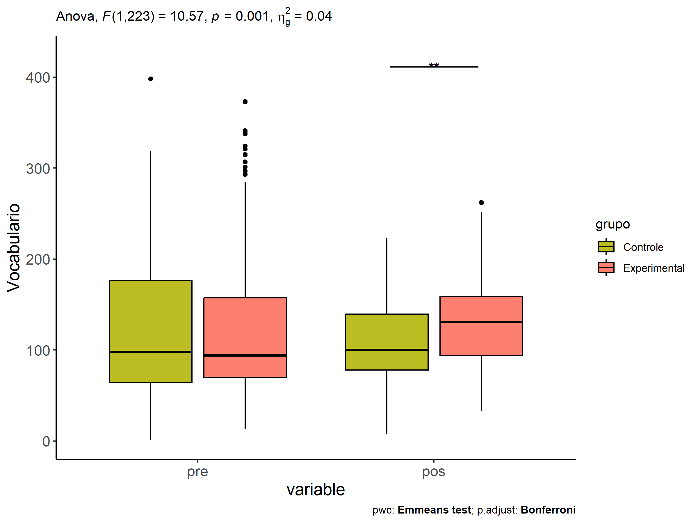
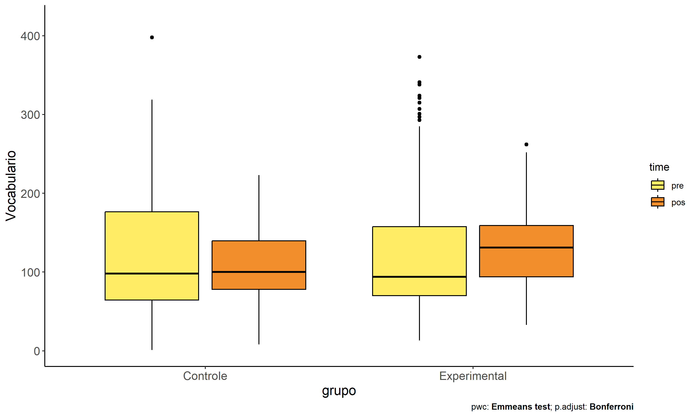
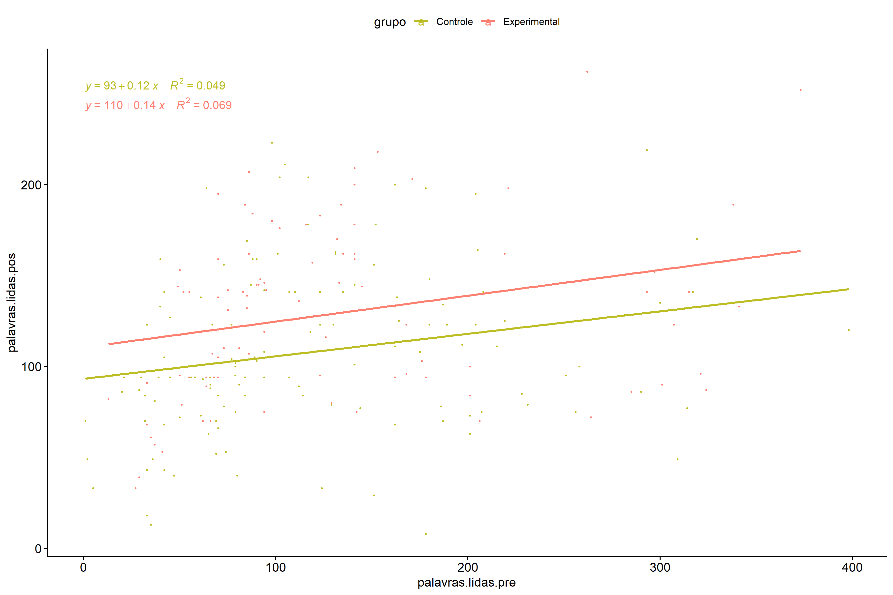

ANCOVA in Vocabulario (Vocabulario)
================
Geiser C. Challco <geiser@alumni.usp.br>

- [Setting Initial Variables and
  Data](#setting-initial-variables-and-data)
- [ANCOVA and Pairwise without remove non-normal
  data](#ancova-and-pairwise-without-remove-non-normal-data)
  - [Computing ANCOVA and PairWise After removing non-normal data
    (OK)](#computing-ancova-and-pairwise-after-removing-non-normal-data-ok)
    - [Plots for ancova](#plots-for-ancova)
    - [Checking linearity assumption](#checking-linearity-assumption)
    - [Checking normality and
      homogeneity](#checking-normality-and-homogeneity)
- [Summary of Results](#summary-of-results)
  - [Descriptive Statistics](#descriptive-statistics)
  - [ANCOVA Table Comparison](#ancova-table-comparison)
  - [PairWise Table Comparison](#pairwise-table-comparison)
  - [EMMS Table Comparison](#emms-table-comparison)

# Setting Initial Variables and Data

# ANCOVA and Pairwise without remove non-normal data

``` r
(aov.1 = anova_test(pdat, aov.f))
```

    ## ANOVA Table (type II tests)
    ## 
    ##               Effect DFn DFd      F     p p<.05   ges
    ## 1 palavras.lidas.pre   1 238  9.375 0.002     * 0.038
    ## 2              grupo   1 238 10.181 0.002     * 0.041

``` r
(pwc.1 <- emmeans_test(pdat, aov.p, covariate = dv.pre,
                       p.adjust.method = "bonferroni"))
```

    ## Warning: Using an external vector in selections was deprecated in tidyselect 1.1.0.
    ## ℹ Please use `all_of()` or `any_of()` instead.
    ##   # Was:
    ##   data %>% select(dv.pre)
    ## 
    ##   # Now:
    ##   data %>% select(all_of(dv.pre))
    ## 
    ## See <https://tidyselect.r-lib.org/reference/faq-external-vector.html>.
    ## This warning is displayed once every 8 hours.
    ## Call `lifecycle::last_lifecycle_warnings()` to see where this warning was
    ## generated.

    ## # A tibble: 1 × 9
    ##   term          .y.   group1 group2    df statistic       p   p.adj p.adj.signif
    ## * <chr>         <chr> <chr>  <chr>  <dbl>     <dbl>   <dbl>   <dbl> <chr>       
    ## 1 palavras.lid… pala… Contr… Exper…   238     -3.19 0.00161 0.00161 **

``` r
(pwc.long.1 <- emmeans_test(dplyr::group_by_at(pdat.long, iv),
                            as.formula(paste0(dv," ~ time")),
                            p.adjust.method = "bonferroni"))
```

    ## # A tibble: 2 × 10
    ##   grupo       term  .y.   group1 group2    df statistic     p p.adj p.adj.signif
    ## * <fct>       <chr> <chr> <chr>  <chr>  <dbl>     <dbl> <dbl> <dbl> <chr>       
    ## 1 Controle    time  pala… pre    pos      478     0.841 0.401 0.401 ns          
    ## 2 Experiment… time  pala… pre    pos      478    -1.45  0.146 0.146 ns

``` r
ds1 <- get.descriptives(pdat, dv.pos, iv, covar = dv.pre)
ds1 <- merge(ds1[ds1$variable != dv.pre,],
             ds1[ds1$variable == dv.pre, !colnames(ds1) %in% c("variable")],
             by = iv, all.x = T, suffixes = c("", ".dv.pre"))
ds1 <- merge(get_emmeans(pwc.1), ds1, by = iv, suffixes = c(".emms", ""))
ds1 <- ds1[,c(iv,"n","mean.dv.pre","se.dv.pre","mean","se","emmean","se.emms")]

colnames(ds1) <- c(iv,"N",paste0(c("M","SE")," (pre)"),
                   paste0(c("M","SE")," (unadj)"),paste0(c("M", "SE")," (adj)"))
```

| grupo        |   N | M (pre) | SE (pre) | M (unadj) | SE (unadj) | M (adj) | SE (adj) |
|:-------------|----:|--------:|---------:|----------:|-----------:|--------:|---------:|
| Controle     | 137 | 122.562 |    6.914 |   114.993 |      5.132 | 115.288 |    5.438 |
| Experimental | 104 | 127.077 |    8.412 |   142.096 |      6.907 | 141.707 |    6.242 |

## Computing ANCOVA and PairWise After removing non-normal data (OK)

``` r
wdat = pdat 

res = residuals(lm(aov.f, data = wdat))
non.normal = getNonNormal(res, wdat[[wid]], plimit = 0.05)

wdat = wdat[!wdat[[wid]] %in% non.normal,]

wdat.long <- data.frame(time = c(rep("pre",nrow(wdat)), rep("pos",nrow(wdat))))
wdat.long[[wid]] <- c(wdat[[wid]], wdat[[wid]])
wdat.long[[iv]] <- c(wdat[[iv]], wdat[[iv]])
wdat.long[[dv]] <- c(wdat[[dv.pre]], wdat[[dv.pos]])
wdat.long[["time"]] <- factor(wdat.long[["time"]], c("pre","pos"))

(non.normal)
```

    ##  [1] "P96"  "P171" "P24"  "P172" "P68"  "P40"  "P229" "P37"  "P318" "P180"
    ## [11] "P283" "P16"  "P90"  "P94"  "P353"

``` r
(aov.2 = anova_test(wdat, aov.f))
```

    ## ANOVA Table (type II tests)
    ## 
    ##               Effect DFn DFd      F        p p<.05   ges
    ## 1 palavras.lidas.pre   1 223 13.569 0.000289     * 0.057
    ## 2              grupo   1 223 10.571 0.001000     * 0.045

``` r
(pwc.2 <- emmeans_test(wdat, aov.p, covariate = iv, p.adjust.method = "bonferroni"))
```

    ## Warning: Using an external vector in selections was deprecated in tidyselect 1.1.0.
    ## ℹ Please use `all_of()` or `any_of()` instead.
    ##   # Was:
    ##   data %>% select(iv)
    ## 
    ##   # Now:
    ##   data %>% select(all_of(iv))
    ## 
    ## See <https://tidyselect.r-lib.org/reference/faq-external-vector.html>.
    ## This warning is displayed once every 8 hours.
    ## Call `lifecycle::last_lifecycle_warnings()` to see where this warning was
    ## generated.

    ## # A tibble: 1 × 9
    ##   term  .y.           group1 group2    df statistic       p   p.adj p.adj.signif
    ## * <chr> <chr>         <chr>  <chr>  <dbl>     <dbl>   <dbl>   <dbl> <chr>       
    ## 1 grupo palavras.lid… Contr… Exper…   224     -3.31 0.00110 0.00110 **

``` r
(pwc.long.2 <- emmeans_test(dplyr::group_by_at(wdat.long, iv),
                            as.formula(paste0(dv," ~ time")),
                            p.adjust.method = "bonferroni"))
```

    ## # A tibble: 2 × 10
    ##   grupo       term  .y.   group1 group2    df statistic     p p.adj p.adj.signif
    ## * <fct>       <chr> <chr> <chr>  <chr>  <dbl>     <dbl> <dbl> <dbl> <chr>       
    ## 1 Controle    time  pala… pre    pos      448    1.61   0.107 0.107 ns          
    ## 2 Experiment… time  pala… pre    pos      448   -0.0519 0.959 0.959 ns

``` r
ds2 <- get.descriptives(wdat, dv.pos, iv, covar = dv.pre)
ds2 <- merge(ds2[ds2$variable != dv.pre,],
             ds2[ds2$variable == dv.pre, !colnames(ds2) %in% c("variable")],
             by = iv, all.x = T, suffixes = c("", ".dv.pre"))

ds2 <- merge(get_emmeans(pwc.2), ds2, by = iv, suffixes = c(".emms", ""))
ds2 <- ds2[,c(iv,"n","mean.dv.pre","se.dv.pre","mean","se","emmean","se.emms")]

colnames(ds2) <- c(iv, "N", paste0(c("M","SE")," (pre)"),
                  paste0(c("M","SE")," (unadj)"),paste0(c("M", "SE")," (adj)"))
```

| grupo        |   N | M (pre) | SE (pre) | M (unadj) | SE (unadj) | M (adj) | SE (adj) |
|:-------------|----:|--------:|---------:|----------:|-----------:|--------:|---------:|
| Controle     | 131 | 121.626 |    7.058 |   108.237 |      3.947 | 108.237 |    4.004 |
| Experimental |  95 | 128.147 |    8.848 |   128.653 |      4.794 | 128.653 |    4.702 |

### Plots for ancova

``` r
lpwc = list(); lpwc[[iv]] = pwc.2
plots <- oneWayAncovaPlots(
  wdat, dv.pos, iv, aov.2, lpwc, addParam = c("mean_ci"),
  font.label.size=10, step.increase=0.05, p.label="p.adj",
  subtitle = which(aov.2$Effect == iv))
```

``` r
if (!is.null(nrow(plots[[iv]]$data)))
  plots[[iv]] + ggplot2::scale_color_manual(values = color[[iv]])
```

    ## Scale for colour is already present.
    ## Adding another scale for colour, which will replace the existing scale.

<!-- -->

``` r
plots <- oneWayAncovaBoxPlots(
  wdat, dv.pos, iv, aov.2, pwc.2, covar = dv.pre,
  theme = "classic", color = color[[iv]],
  subtitle = which(aov.2$Effect == iv))
```

``` r
if (length(unique(wdat[[iv]])) > 1)
  plots[[iv]] + ggplot2::ylab("Vocabulario") + ggplot2::scale_x_discrete(labels=c('pre', 'pos'))
```

<!-- -->

``` r
if (length(unique(wdat.long[[iv]])) > 1)
  plots <- oneWayAncovaBoxPlots(
    wdat.long, dv, iv, aov, pwc.long.2, pre.post = "time",
    theme = "classic", color = color$prepost)
```

``` r
if (length(unique(wdat.long[[iv]])) > 1)
  plots[[iv]] + ggplot2::ylab("Vocabulario")
```

<!-- -->

### Checking linearity assumption

``` r
ggscatter(wdat, x = dv.pre, y = dv.pos, size = 0.5,
          color = iv, add = "reg.line") +
  stat_regline_equation(
    aes(label = paste(..eq.label.., ..rr.label.., sep = "~~~~"), color = grupo)) +
  ggplot2::scale_color_manual(values = color[[iv]])
```

    ## Warning: The dot-dot notation (`..eq.label..`) was deprecated in ggplot2 3.4.0.
    ## ℹ Please use `after_stat(eq.label)` instead.
    ## ℹ The deprecated feature was likely used in the ggpubr package.
    ##   Please report the issue at <https://github.com/kassambara/ggpubr/issues>.
    ## This warning is displayed once every 8 hours.
    ## Call `lifecycle::last_lifecycle_warnings()` to see where this warning was
    ## generated.

<!-- -->

### Checking normality and homogeneity

``` r
res <- augment(lm(aov.f, data = wdat))
```

``` r
shapiro_test(res$.resid)
```

    ## # A tibble: 1 × 3
    ##   variable   statistic p.value
    ##   <chr>          <dbl>   <dbl>
    ## 1 res$.resid     0.988  0.0565

``` r
levene_test(res, .resid ~ grupo)
```

    ## # A tibble: 1 × 4
    ##     df1   df2 statistic     p
    ##   <int> <int>     <dbl> <dbl>
    ## 1     1   224      1.37 0.243

# Summary of Results

## Descriptive Statistics

``` r
df <- get.descriptives(gdat, c(dv.pre, dv.pos), c(iv), 
                       include.global = T, symmetry.test = T, normality.test = F)
```

| grupo        | variable           |   n |    mean | median | min | max |     sd |    se |     ci |    iqr | symmetry | skewness | kurtosis |
|:-------------|:-------------------|----:|--------:|-------:|----:|----:|-------:|------:|-------:|-------:|:---------|---------:|---------:|
| Controle     | palavras.lidas.pre | 137 | 122.562 |     98 |   1 | 398 | 80.931 | 6.914 | 13.674 | 113.00 | NO       |    0.915 |    0.315 |
| Experimental | palavras.lidas.pre | 104 | 127.077 |     94 |  13 | 373 | 85.781 | 8.412 | 16.682 |  85.25 | NO       |    1.164 |    0.386 |
|              | palavras.lidas.pre | 241 | 124.510 |     94 |   1 | 398 | 82.913 | 5.341 | 10.521 | 101.00 | NO       |    1.045 |    0.412 |
| Controle     | palavras.lidas.pos | 137 | 114.993 |    102 |   8 | 430 | 60.072 | 5.132 | 10.149 |  63.00 | NO       |    1.755 |    6.056 |
| Experimental | palavras.lidas.pos | 104 | 142.096 |    137 |  33 | 430 | 70.439 | 6.907 | 13.699 |  77.50 | NO       |    1.557 |    3.594 |
|              | palavras.lidas.pos | 241 | 126.689 |    116 |   8 | 430 | 65.994 | 4.251 |  8.374 |  70.00 | NO       |    1.664 |    4.706 |

``` r
df <- get.descriptives(pdat, c(dv.pre, dv.pos), c(iv), 
                       include.global = T, symmetry.test = T, normality.test = F)
```

| grupo        | variable           |   n |    mean | median | min | max |     sd |    se |     ci |    iqr | symmetry | skewness | kurtosis |
|:-------------|:-------------------|----:|--------:|-------:|----:|----:|-------:|------:|-------:|-------:|:---------|---------:|---------:|
| Controle     | palavras.lidas.pre | 137 | 122.562 |     98 |   1 | 398 | 80.931 | 6.914 | 13.674 | 113.00 | NO       |    0.915 |    0.315 |
| Experimental | palavras.lidas.pre | 104 | 127.077 |     94 |  13 | 373 | 85.781 | 8.412 | 16.682 |  85.25 | NO       |    1.164 |    0.386 |
|              | palavras.lidas.pre | 241 | 124.510 |     94 |   1 | 398 | 82.913 | 5.341 | 10.521 | 101.00 | NO       |    1.045 |    0.412 |
| Controle     | palavras.lidas.pos | 137 | 114.993 |    102 |   8 | 430 | 60.072 | 5.132 | 10.149 |  63.00 | NO       |    1.755 |    6.056 |
| Experimental | palavras.lidas.pos | 104 | 142.096 |    137 |  33 | 430 | 70.439 | 6.907 | 13.699 |  77.50 | NO       |    1.557 |    3.594 |
|              | palavras.lidas.pos | 241 | 126.689 |    116 |   8 | 430 | 65.994 | 4.251 |  8.374 |  70.00 | NO       |    1.664 |    4.706 |

## ANCOVA Table Comparison

``` r
df <- merge(aov.1, aov.2, by = c("Effect"), suffixes = c("'",""))
```

| Effect             | DFn’ | DFd’ |     F’ |    p’ | p\<.05’ |  ges’ | DFn | DFd |      F |     p | p\<.05 |   ges |
|:-------------------|-----:|-----:|-------:|------:|:--------|------:|----:|----:|-------:|------:|:-------|------:|
| grupo              |    1 |  238 | 10.181 | 0.002 | \*      | 0.041 |   1 | 223 | 10.571 | 0.001 | \*     | 0.045 |
| palavras.lidas.pre |    1 |  238 |  9.375 | 0.002 | \*      | 0.038 |   1 | 223 | 13.569 | 0.000 | \*     | 0.057 |

## PairWise Table Comparison

``` r
df <- merge(pwc.1, pwc.2, by = c(".y.","group1","group2"), suffixes = c("'",""))
df <- df[,c(names(df)[!names(df) %in% c(iv,"term","term'",".y.")])]
```

| group1   | group2       | df’ | statistic’ |    p’ | p.adj’ | p.adj.signif’ |  df | statistic |     p | p.adj | p.adj.signif |
|:---------|:-------------|----:|-----------:|------:|-------:|:--------------|----:|----------:|------:|------:|:-------------|
| Controle | Experimental | 238 |     -3.191 | 0.002 |  0.002 | \*\*          | 224 |    -3.306 | 0.001 | 0.001 | \*\*         |

## EMMS Table Comparison

``` r
df <- merge(ds1, ds2, by = iv, suffixes = c("'",""))
df[["N'-N"]] <- df[["N'"]] - df[["N"]]
```

| grupo        |  N’ | M (pre)’ | SE (pre)’ | M (unadj)’ | SE (unadj)’ | M (adj)’ | SE (adj)’ |   N | M (pre) | SE (pre) | M (unadj) | SE (unadj) | M (adj) | SE (adj) | N’-N |
|:-------------|----:|---------:|----------:|-----------:|------------:|---------:|----------:|----:|--------:|---------:|----------:|-----------:|--------:|---------:|-----:|
| Controle     | 137 |  122.562 |     6.914 |    114.993 |       5.132 |  115.288 |     5.438 | 131 | 121.626 |    7.058 |   108.237 |      3.947 | 108.237 |    4.004 |    6 |
| Experimental | 104 |  127.077 |     8.412 |    142.096 |       6.907 |  141.707 |     6.242 |  95 | 128.147 |    8.848 |   128.653 |      4.794 | 128.653 |    4.702 |    9 |
