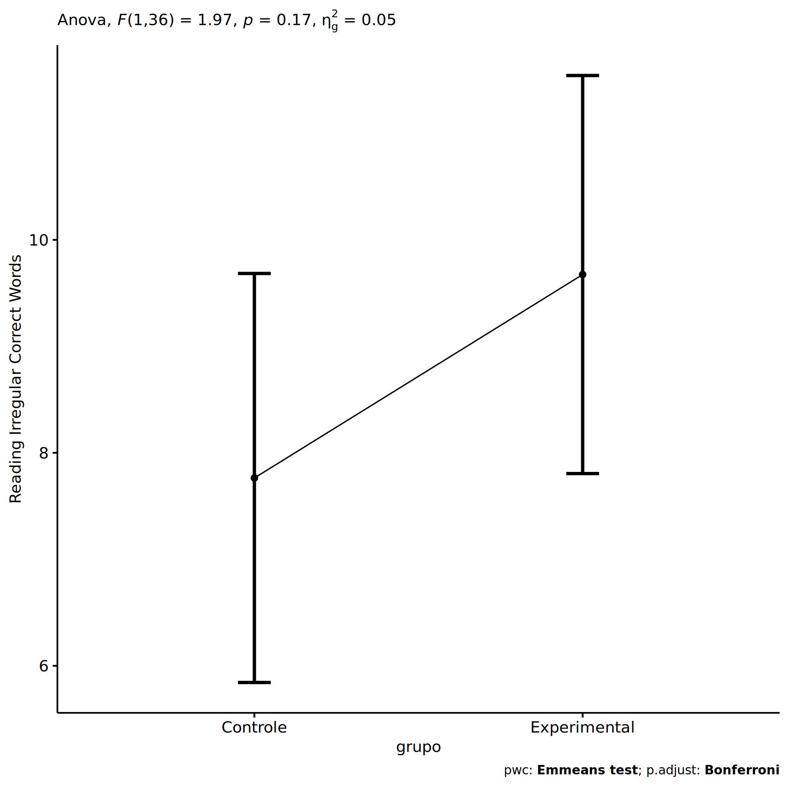
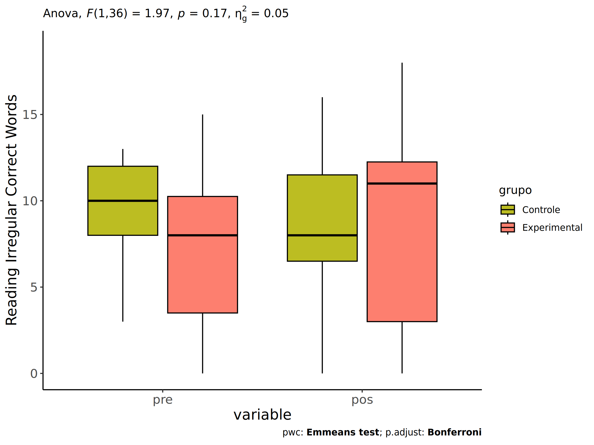
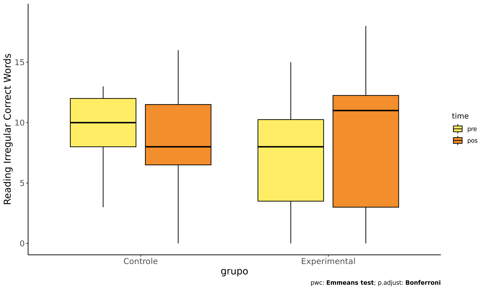
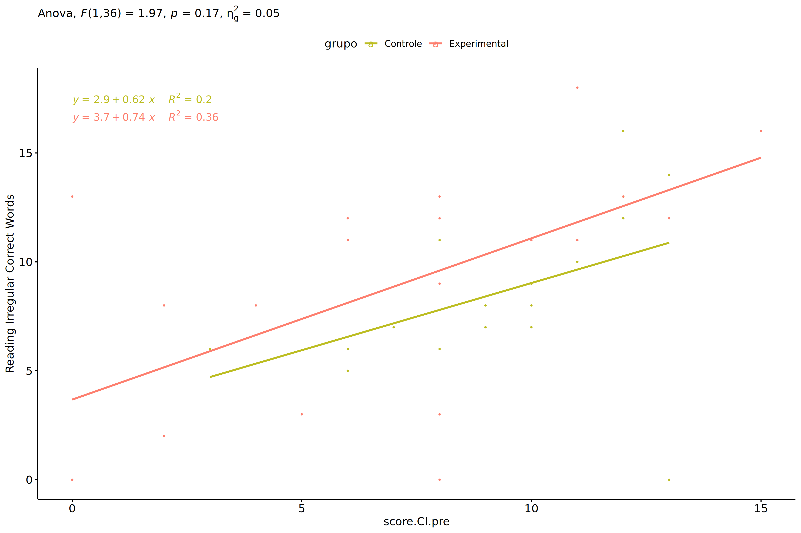

ANCOVA in Reading Irregular Correct Words (Reading Irregular Correct
Words)
================
Geiser C. Challco <geiser@alumni.usp.br>

- [Setting Initial Variables](#setting-initial-variables)
- [Descriptive Statistics of Initial
  Data](#descriptive-statistics-of-initial-data)
- [ANCOVA and Pairwise for one factor:
  **grupo**](#ancova-and-pairwise-for-one-factor-grupo)
  - [Without remove non-normal data](#without-remove-non-normal-data)
  - [Computing ANCOVA and PairWise After removing non-normal data
    (OK)](#computing-ancova-and-pairwise-after-removing-non-normal-data-ok)
    - [Plots for ancova](#plots-for-ancova)
    - [Checking linearity assumption](#checking-linearity-assumption)
    - [Checking normality and
      homogeneity](#checking-normality-and-homogeneity)
- [ANCOVA and Pairwise for two factors
  **grupo:genero**](#ancova-and-pairwise-for-two-factors-grupogenero)
  - [Without remove non-normal data](#without-remove-non-normal-data-1)
  - [Computing ANCOVA and PairWise After removing non-normal data
    (OK)](#computing-ancova-and-pairwise-after-removing-non-normal-data-ok-1)
    - [Plots for ancova](#plots-for-ancova-1)
    - [Checking linearity assumption](#checking-linearity-assumption-1)
    - [Checking normality and
      homogeneity](#checking-normality-and-homogeneity-1)
- [ANCOVA and Pairwise for two factors
  **grupo:zona.participante**](#ancova-and-pairwise-for-two-factors-grupozonaparticipante)
  - [Without remove non-normal data](#without-remove-non-normal-data-2)
  - [Computing ANCOVA and PairWise After removing non-normal data
    (OK)](#computing-ancova-and-pairwise-after-removing-non-normal-data-ok-2)
    - [Plots for ancova](#plots-for-ancova-2)
    - [Checking linearity assumption](#checking-linearity-assumption-2)
    - [Checking normality and
      homogeneity](#checking-normality-and-homogeneity-2)
- [ANCOVA and Pairwise for two factors
  **grupo:zona.escola**](#ancova-and-pairwise-for-two-factors-grupozonaescola)
  - [Without remove non-normal data](#without-remove-non-normal-data-3)
  - [Computing ANCOVA and PairWise After removing non-normal data
    (OK)](#computing-ancova-and-pairwise-after-removing-non-normal-data-ok-3)
    - [Plots for ancova](#plots-for-ancova-3)
    - [Checking linearity assumption](#checking-linearity-assumption-3)
    - [Checking normality and
      homogeneity](#checking-normality-and-homogeneity-3)
- [Summary of Results](#summary-of-results)
  - [Descriptive Statistics](#descriptive-statistics)
  - [ANCOVA Table Comparison](#ancova-table-comparison)
  - [PairWise Table Comparison](#pairwise-table-comparison)
  - [EMMS Table Comparison](#emms-table-comparison)

**NOTE**:

- Teste ANCOVA para determinar se houve diferenças significativas no
  Reading Irregular Correct Words (medido usando pre- e pos-testes).
- ANCOVA test to determine whether there were significant differences in
  Reading Irregular Correct Words (measured using pre- and post-tests).

# Setting Initial Variables

``` r
dv = "score.CI"
dv.pos = "score.CI.pos"
dv.pre = "score.CI.pre"

fatores2 <- c("genero","zona.participante","zona.escola")
lfatores2 <- as.list(fatores2)
names(lfatores2) <- fatores2

fatores1 <- c("grupo", fatores2)
lfatores1 <- as.list(fatores1)
names(lfatores1) <- fatores1

lfatores <- c(lfatores1)

color <- list()
color[["prepost"]] = c("#ffee65","#f28e2B")
color[["grupo"]] = c("#bcbd22","#fd7f6f")
color[["genero"]] = c("#FF007F","#4D4DFF")
color[["zona.escola"]] = c("#AA00FF","#00CCCC")
color[["zona.participante"]] = c("#AA00FF","#00CCCC")

level <- list()
level[["grupo"]] = c("Controle","Experimental")
level[["genero"]] = c("F","M")
level[["zona.escola"]] = c("Rural","Urbana")
level[["zona.participante"]] = c("Rural","Urbana")

# ..

ymin <- 0
ymax <- 0

ymin.ci <- 0
ymax.ci <- 0


color[["grupo:genero"]] = c(
  "Controle:F"="#ff99cb", "Controle:M"="#b7b7ff",
  "Experimental:F"="#FF007F", "Experimental:M"="#4D4DFF",
  "Controle.F"="#ff99cb", "Controle.M"="#b7b7ff",
  "Experimental.F"="#FF007F", "Experimental.M"="#4D4DFF"
)
color[["grupo:zona.escola"]] = c(
  "Controle:Rural"="#b2efef","Controle:Urbana"="#e5b2ff",
  "Experimental:Rural"="#00CCCC", "Experimental:Urbana"="#AA00FF",
  "Controle.Rural"="#b2efef","Controle.Urbana"="#e5b2ff",
  "Experimental.Rural"="#00CCCC", "Experimental.Urbana"="#AA00FF"
)
color[["grupo:zona.participante"]] = c(
  "Controle:Rural"="#b2efef","Controle:Urbana"="#e5b2ff",
  "Experimental:Rural"="#00CCCC", "Experimental:Urbana"="#AA00FF",
  "Controle.Rural"="#b2efef","Controle.Urbana"="#e5b2ff",
  "Experimental.Rural"="#00CCCC", "Experimental.Urbana"="#AA00FF"
)

for (coln in c(
  "palavras.lidas","score.compreensao","tri.compreensao",
  "score.vocab","tri.vocab",
  "score.vocab.ensinado","tri.vocab.ensinado","score.vocab.nao.ensinado","tri.vocab.nao.ensinado",
  "score.CLPP","tri.CLPP","score.CR","tri.CR",
  "score.CI","tri.CI","score.TV","tri.TV","score.TF","tri.TF","score.TO","tri.TO")) {
  color[[paste0(coln,".quintile")]] = c("#BF0040","#FF0000","#800080","#0000FF","#4000BF")
  level[[paste0(coln,".quintile")]] = c("1st quintile","2nd quintile","3rd quintile","4th quintile","5th quintile")
  color[[paste0("grupo:",coln,".quintile")]] = c(
    "Experimental.1st quintile"="#BF0040", "Controle.1st quintile"="#d8668c",
    "Experimental.2nd quintile"="#FF0000", "Controle.2nd quintile"="#ff7f7f",
    "Experimental.3rd quintile"="#8fce00", "Controle.3rd quintile"="#ddf0b2",
    "Experimental.4th quintile"="#0000FF", "Controle.4th quintile"="#b2b2ff",
    "Experimental.5th quintile"="#4000BF", "Controle.5th quintile"="#b299e5",
    
    "Experimental:1st quintile"="#BF0040", "Controle:1st quintile"="#d8668c",
    "Experimental:2nd quintile"="#FF0000", "Controle:2nd quintile"="#ff7f7f",
    "Experimental:3rd quintile"="#8fce00", "Controle:3rd quintile"="#ddf0b2",
    "Experimental:4th quintile"="#0000FF", "Controle:4th quintile"="#b2b2ff",
    "Experimental:5th quintile"="#4000BF", "Controle:5th quintile"="#b299e5")
}


gdat <- read_excel("../data/data.xlsx", sheet = "leitura.stWG")


dat <- gdat
dat$grupo <- factor(dat[["grupo"]], level[["grupo"]])
for (coln in c(names(lfatores))) {
  dat[[coln]] <- factor(dat[[coln]], level[[coln]][level[[coln]] %in% unique(dat[[coln]])])
}
dat <- dat[which(!is.na(dat[[dv.pre]]) & !is.na(dat[[dv.pos]])),]
dat <- dat[,c("id",names(lfatores),dv.pre,dv.pos)]

dat.long <- rbind(dat, dat)
dat.long$time <- c(rep("pre", nrow(dat)), rep("pos", nrow(dat)))
dat.long$time <- factor(dat.long$time, c("pre","pos"))
dat.long[[dv]] <- c(dat[[dv.pre]], dat[[dv.pos]])


for (f in c("grupo", names(lfatores))) {
  if (is.null(color[[f]]) && length(unique(dat[[f]])) > 0) 
      color[[f]] <- distinctColorPalette(length(unique(dat[[f]])))
}
for (f in c(fatores2)) {
  if (is.null(color[[paste0("grupo:",f)]]) && length(unique(dat[[f]])) > 0)
    color[[paste0("grupo:",f)]] <- distinctColorPalette(length(unique(dat[["grupo"]]))*length(unique(dat[[f]])))
}

ldat <- list()
laov <- list()
lpwc <- list()
lemms <- list()
```

# Descriptive Statistics of Initial Data

``` r
df <- get.descriptives(dat, c(dv.pre, dv.pos), c("grupo"), 
                       include.global = T, symmetry.test = T, normality.test = F)
df <- plyr::rbind.fill(
  df, do.call(plyr::rbind.fill, lapply(lfatores2, FUN = function(f) {
    if (nrow(dat) > 0 && sum(!is.na(unique(dat[[f]]))) > 1)
      get.descriptives(dat, c(dv.pre,dv.pos), c("grupo", f),
                       symmetry.test = T, normality.test = F)
    }))
)
df <- df[,c(fatores1[fatores1 %in% colnames(df)],"variable",
            colnames(df)[!colnames(df) %in% c(fatores1,"variable")])]
```

| grupo | genero | zona.participante | zona.escola | variable | n | mean | median | min | max | sd | se | ci | iqr | symmetry | skewness | kurtosis |
|:---|:---|:---|:---|:---|---:|---:|---:|---:|---:|---:|---:|---:|---:|:---|---:|---:|
| Controle |  |  |  | score.CI.pre | 20 | 9.700 | 10.0 | 3 | 13 | 2.736 | 0.612 | 1.280 | 4.00 | NO | -0.668 | -0.384 |
| Experimental |  |  |  | score.CI.pre | 21 | 7.000 | 8.0 | 0 | 15 | 4.427 | 0.966 | 2.015 | 6.00 | YES | -0.151 | -1.110 |
|  |  |  |  | score.CI.pre | 41 | 8.317 | 9.0 | 0 | 15 | 3.902 | 0.609 | 1.231 | 5.00 | NO | -0.617 | -0.477 |
| Controle |  |  |  | score.CI.pos | 20 | 8.300 | 8.0 | 0 | 16 | 4.118 | 0.921 | 1.927 | 5.25 | YES | -0.251 | -0.357 |
| Experimental |  |  |  | score.CI.pos | 21 | 8.333 | 11.0 | 0 | 18 | 5.721 | 1.248 | 2.604 | 9.00 | YES | -0.256 | -1.364 |
|  |  |  |  | score.CI.pos | 41 | 8.317 | 9.0 | 0 | 18 | 4.942 | 0.772 | 1.560 | 6.00 | YES | -0.272 | -0.874 |
| Controle | F |  |  | score.CI.pre | 7 | 9.286 | 10.0 | 3 | 13 | 3.251 | 1.229 | 3.007 | 2.50 | NO | -0.742 | -0.688 |
| Controle | M |  |  | score.CI.pre | 13 | 9.923 | 10.0 | 6 | 13 | 2.532 | 0.702 | 1.530 | 4.00 | YES | -0.319 | -1.507 |
| Experimental | F |  |  | score.CI.pre | 4 | 7.250 | 9.0 | 0 | 11 | 4.992 | 2.496 | 7.943 | 4.25 | NO | -0.617 | -1.785 |
| Experimental | M |  |  | score.CI.pre | 17 | 6.941 | 8.0 | 0 | 15 | 4.451 | 1.079 | 2.288 | 6.00 | YES | 0.021 | -1.125 |
| Controle | F |  |  | score.CI.pos | 7 | 8.000 | 7.0 | 0 | 16 | 4.899 | 1.852 | 4.531 | 3.50 | YES | 0.022 | -0.943 |
| Controle | M |  |  | score.CI.pos | 13 | 8.462 | 8.0 | 0 | 14 | 3.843 | 1.066 | 2.322 | 6.00 | YES | -0.440 | -0.520 |
| Experimental | F |  |  | score.CI.pos | 4 | 5.750 | 5.5 | 0 | 12 | 6.652 | 3.326 | 10.585 | 11.25 | few data | 0.000 | 0.000 |
| Experimental | M |  |  | score.CI.pos | 17 | 8.941 | 11.0 | 0 | 18 | 5.528 | 1.341 | 2.842 | 10.00 | YES | -0.284 | -1.246 |
| Controle |  | Rural |  | score.CI.pre | 2 | 10.000 | 10.0 | 10 | 10 | 0.000 | 0.000 | 0.000 | 0.00 | few data | 0.000 | 0.000 |
| Controle |  | Urbana |  | score.CI.pre | 12 | 10.083 | 11.0 | 3 | 13 | 3.029 | 0.874 | 1.924 | 3.00 | NO | -1.044 | -0.033 |
| Controle |  |  |  | score.CI.pre | 6 | 8.833 | 8.0 | 6 | 13 | 2.639 | 1.078 | 2.770 | 3.00 | YES | 0.475 | -1.626 |
| Experimental |  | Rural |  | score.CI.pre | 7 | 8.000 | 8.0 | 0 | 15 | 5.447 | 2.059 | 5.037 | 6.50 | YES | -0.223 | -1.631 |
| Experimental |  | Urbana |  | score.CI.pre | 8 | 6.375 | 7.0 | 0 | 11 | 3.777 | 1.335 | 3.158 | 3.50 | YES | -0.436 | -1.365 |
| Experimental |  |  |  | score.CI.pre | 6 | 6.667 | 6.5 | 0 | 12 | 4.546 | 1.856 | 4.771 | 6.00 | YES | -0.150 | -1.752 |
| Controle |  | Rural |  | score.CI.pos | 2 | 8.500 | 8.5 | 8 | 9 | 0.707 | 0.500 | 6.353 | 0.50 | few data | 0.000 | 0.000 |
| Controle |  | Urbana |  | score.CI.pos | 12 | 7.917 | 7.5 | 0 | 16 | 4.907 | 1.417 | 3.118 | 6.25 | YES | -0.161 | -1.069 |
| Controle |  |  |  | score.CI.pos | 6 | 9.000 | 8.5 | 6 | 14 | 3.225 | 1.317 | 3.384 | 4.50 | YES | 0.358 | -1.736 |
| Experimental |  | Rural |  | score.CI.pos | 7 | 10.714 | 12.0 | 3 | 16 | 4.152 | 1.569 | 3.840 | 3.00 | NO | -0.629 | -0.880 |
| Experimental |  | Urbana |  | score.CI.pos | 8 | 8.125 | 10.0 | 0 | 18 | 6.707 | 2.371 | 5.607 | 10.75 | YES | -0.058 | -1.734 |
| Experimental |  |  |  | score.CI.pos | 6 | 5.833 | 5.5 | 0 | 13 | 5.636 | 2.301 | 5.915 | 9.50 | YES | 0.090 | -2.050 |
| Controle |  |  | Rural | score.CI.pre | 3 | 11.000 | 12.0 | 8 | 13 | 2.646 | 1.528 | 6.572 | 2.50 | few data | 0.000 | 0.000 |
| Controle |  |  | Urbana | score.CI.pre | 17 | 9.471 | 10.0 | 3 | 13 | 2.764 | 0.670 | 1.421 | 4.00 | NO | -0.647 | -0.456 |
| Experimental |  |  | Rural | score.CI.pre | 8 | 10.000 | 10.5 | 5 | 15 | 3.464 | 1.225 | 2.896 | 4.75 | YES | -0.108 | -1.594 |
| Experimental |  |  | Urbana | score.CI.pre | 13 | 5.154 | 6.0 | 0 | 11 | 3.997 | 1.109 | 2.415 | 6.00 | YES | -0.083 | -1.704 |
| Controle |  |  | Rural | score.CI.pos | 3 | 12.667 | 13.0 | 11 | 14 | 1.528 | 0.882 | 3.795 | 1.50 | few data | 0.000 | 0.000 |
| Controle |  |  | Urbana | score.CI.pos | 17 | 7.529 | 7.0 | 0 | 16 | 3.955 | 0.959 | 2.033 | 3.00 | YES | -0.069 | 0.001 |
| Experimental |  |  | Rural | score.CI.pos | 8 | 12.125 | 12.5 | 3 | 18 | 4.422 | 1.563 | 3.697 | 2.75 | NO | -0.723 | -0.269 |
| Experimental |  |  | Urbana | score.CI.pos | 13 | 6.000 | 8.0 | 0 | 13 | 5.260 | 1.459 | 3.179 | 11.00 | YES | -0.006 | -1.869 |

# ANCOVA and Pairwise for one factor: **grupo**

## Without remove non-normal data

``` r
pdat = remove_group_data(dat[!is.na(dat[["grupo"]]),], "score.CI.pos", "grupo")

pdat.long <- rbind(pdat[,c("id","grupo")], pdat[,c("id","grupo")])
pdat.long[["time"]] <- c(rep("pre", nrow(pdat)), rep("pos", nrow(pdat)))
pdat.long[["time"]] <- factor(pdat.long[["time"]], c("pre","pos"))
pdat.long[["score.CI"]] <- c(pdat[["score.CI.pre"]], pdat[["score.CI.pos"]])

aov = anova_test(pdat, score.CI.pos ~ score.CI.pre + grupo)
laov[["grupo"]] <- get_anova_table(aov)
```

``` r
pwc <- emmeans_test(pdat, score.CI.pos ~ grupo, covariate = score.CI.pre,
                    p.adjust.method = "bonferroni")
```

``` r
pwc.long <- emmeans_test(dplyr::group_by_at(pdat.long, "grupo"),
                          score.CI ~ time,
                          p.adjust.method = "bonferroni")
lpwc[["grupo"]] <- plyr::rbind.fill(pwc, pwc.long)
```

``` r
ds <- get.descriptives(pdat, "score.CI.pos", "grupo", covar = "score.CI.pre")
ds <- merge(ds[ds$variable != "score.CI.pre",],
            ds[ds$variable == "score.CI.pre", !colnames(ds) %in% c("variable")],
            by = "grupo", all.x = T, suffixes = c("", ".score.CI.pre"))
ds <- merge(get_emmeans(pwc), ds, by = "grupo", suffixes = c(".emms", ""))
ds <- ds[,c("grupo","n","mean.score.CI.pre","se.score.CI.pre","mean","se",
            "emmean","se.emms","conf.low","conf.high")]

colnames(ds) <- c("grupo", "N", paste0(c("M","SE")," (pre)"),
                  paste0(c("M","SE"), " (unadj)"),
                  paste0(c("M", "SE"), " (adj)"), "conf.low", "conf.high")

lemms[["grupo"]] <- ds
```

## Computing ANCOVA and PairWise After removing non-normal data (OK)

``` r
wdat = pdat 

res = residuals(lm(score.CI.pos ~ score.CI.pre + grupo, data = wdat))
non.normal = getNonNormal(res, wdat$id, plimit = 0.05)

wdat = wdat[!wdat$id %in% non.normal,]

wdat.long <- rbind(wdat[,c("id","grupo")], wdat[,c("id","grupo")])
wdat.long[["time"]] <- c(rep("pre", nrow(wdat)), rep("pos", nrow(wdat)))
wdat.long[["time"]] <- factor(wdat.long[["time"]], c("pre","pos"))
wdat.long[["score.CI"]] <- c(wdat[["score.CI.pre"]], wdat[["score.CI.pos"]])

ldat[["grupo"]] = wdat

(non.normal)
```

    ## [1] "P6"  "P83"

``` r
aov = anova_test(wdat, score.CI.pos ~ score.CI.pre + grupo)
laov[["grupo"]] <- merge(get_anova_table(aov), laov[["grupo"]],
                            by="Effect", suffixes = c("","'"))

(df = get_anova_table(aov))
```

    ## ANOVA Table (type II tests)
    ## 
    ##         Effect DFn DFd      F        p p<.05   ges
    ## 1 score.CI.pre   1  36 16.194 0.000281     * 0.310
    ## 2        grupo   1  36  1.965 0.170000       0.052

| Effect       | DFn | DFd |      F |    p | p\<.05 |   ges |
|:-------------|----:|----:|-------:|-----:|:-------|------:|
| score.CI.pre |   1 |  36 | 16.194 | 0.00 | \*     | 0.310 |
| grupo        |   1 |  36 |  1.965 | 0.17 |        | 0.052 |

``` r
pwc <- emmeans_test(wdat, score.CI.pos ~ grupo, covariate = score.CI.pre,
                    p.adjust.method = "bonferroni")
```

| term | .y. | group1 | group2 | df | statistic | p | p.adj | p.adj.signif |
|:---|:---|:---|:---|---:|---:|---:|---:|:---|
| score.CI.pre\*grupo | score.CI.pos | Controle | Experimental | 36 | -1.402 | 0.17 | 0.17 | ns |

``` r
pwc.long <- emmeans_test(dplyr::group_by_at(wdat.long, "grupo"),
                         score.CI ~ time,
                         p.adjust.method = "bonferroni")
lpwc[["grupo"]] <- merge(plyr::rbind.fill(pwc, pwc.long), lpwc[["grupo"]],
                            by=c("grupo","term",".y.","group1","group2"),
                            suffixes = c("","'"))
```

| grupo        | term | .y.      | group1 | group2 |  df | statistic |     p | p.adj | p.adj.signif |
|:-------------|:-----|:---------|:-------|:-------|----:|----------:|------:|------:|:-------------|
| Controle     | time | score.CI | pre    | pos    |  74 |     0.571 | 0.570 | 0.570 | ns           |
| Experimental | time | score.CI | pre    | pos    |  74 |    -1.409 | 0.163 | 0.163 | ns           |

``` r
ds <- get.descriptives(wdat, "score.CI.pos", "grupo", covar = "score.CI.pre")
ds <- merge(ds[ds$variable != "score.CI.pre",],
            ds[ds$variable == "score.CI.pre", !colnames(ds) %in% c("variable")],
            by = "grupo", all.x = T, suffixes = c("", ".score.CI.pre"))
ds <- merge(get_emmeans(pwc), ds, by = "grupo", suffixes = c(".emms", ""))
ds <- ds[,c("grupo","n","mean.score.CI.pre","se.score.CI.pre","mean","se",
            "emmean","se.emms","conf.low","conf.high")]

colnames(ds) <- c("grupo", "N", paste0(c("M","SE")," (pre)"),
                  paste0(c("M","SE"), " (unadj)"),
                  paste0(c("M", "SE"), " (adj)"), "conf.low", "conf.high")

lemms[["grupo"]] <- merge(ds, lemms[["grupo"]], by=c("grupo"), suffixes = c("","'"))
```

| grupo | N | M (pre) | SE (pre) | M (unadj) | SE (unadj) | M (adj) | SE (adj) | conf.low | conf.high |
|:---|---:|---:|---:|---:|---:|---:|---:|---:|---:|
| Controle | 19 | 9.526 | 0.618 | 8.737 | 0.854 | 7.764 | 0.947 | 5.843 | 9.685 |
| Experimental | 20 | 6.850 | 1.003 | 8.750 | 1.237 | 9.674 | 0.922 | 7.805 | 11.543 |

### Plots for ancova

``` r
plots <- oneWayAncovaPlots(
  wdat, "score.CI.pos", "grupo", aov, list("grupo"=pwc), addParam = c("mean_ci"),
  font.label.size=10, step.increase=0.05, p.label="p.adj",
  subtitle = which(aov$Effect == "grupo"))
```

``` r
if (!is.null(nrow(plots[["grupo"]]$data)))
  plots[["grupo"]] + ggplot2::ylab("Reading Irregular Correct Words") + 
  if (ymin.ci < ymax.ci) ggplot2::ylim(ymin.ci, ymax.ci)
```

<!-- -->

``` r
plots <- oneWayAncovaBoxPlots(
  wdat, "score.CI.pos", "grupo", aov, pwc, covar = "score.CI.pre",
  theme = "classic", color = color[["grupo"]],
  subtitle = which(aov$Effect == "grupo"))
```

``` r
if (length(unique(wdat[["grupo"]])) > 1)
  plots[["grupo"]] + ggplot2::ylab("Reading Irregular Correct Words") +
  ggplot2::scale_x_discrete(labels=c('pre', 'pos')) +
  if (ymin < ymax) ggplot2::ylim(ymin, ymax)
```

<!-- -->

``` r
if (length(unique(wdat.long[["grupo"]])) > 1)
  plots <- oneWayAncovaBoxPlots(
    wdat.long, "score.CI", "grupo", aov, pwc.long,
    pre.post = "time", theme = "classic", color = color$prepost)
```

``` r
if (length(unique(wdat.long[["grupo"]])) > 1)
  plots[["grupo"]] + ggplot2::ylab("Reading Irregular Correct Words") +
  if (ymin < ymax) ggplot2::ylim(ymin, ymax) 
```

<!-- -->

### Checking linearity assumption

``` r
ggscatter(wdat, x = "score.CI.pre", y = "score.CI.pos", size = 0.5,
          color = "grupo", add = "reg.line")+
  stat_regline_equation(
    aes(label =  paste(..eq.label.., ..rr.label.., sep = "~~~~"), color = grupo)
  ) +
  ggplot2::labs(subtitle = rstatix::get_test_label(aov, detailed = T, row = which(aov$Effect == "grupo"))) +
  ggplot2::scale_color_manual(values = color[["grupo"]]) +
  ggplot2::ylab("Reading Irregular Correct Words")  +
  if (ymin < ymax) ggplot2::ylim(ymin, ymax)
```

<!-- -->

### Checking normality and homogeneity

``` r
res <- augment(lm(score.CI.pos ~ score.CI.pre + grupo, data = wdat))
```

``` r
shapiro_test(res$.resid)
```

    ## # A tibble: 1 × 3
    ##   variable   statistic p.value
    ##   <chr>          <dbl>   <dbl>
    ## 1 res$.resid     0.951  0.0860

``` r
levene_test(res, .resid ~ grupo)
```

    ## # A tibble: 1 × 4
    ##     df1   df2 statistic     p
    ##   <int> <int>     <dbl> <dbl>
    ## 1     1    37      2.55 0.119

# ANCOVA and Pairwise for two factors **grupo:genero**

## Without remove non-normal data

``` r
pdat = tryCatch(
  remove_group_data(dat[!is.na(dat[["grupo"]]) & !is.na(dat[["genero"]]),],
                         "score.CI.pos", c("grupo","genero")),
  error = function(e) NULL
)

if (!is.null(pdat)) {

pdat = pdat[pdat[["genero"]] %in% do.call(
  intersect, lapply(unique(pdat[["grupo"]]), FUN = function(x) {
    unique(pdat[["genero"]][which(pdat[["grupo"]] == x)])
  })),]
pdat[["grupo"]] = factor(pdat[["grupo"]], level[["grupo"]])
pdat[["genero"]] = factor(
  pdat[["genero"]],
  level[["genero"]][level[["genero"]] %in% unique(pdat[["genero"]])])

pdat.long <- rbind(pdat[,c("id","grupo","genero")], pdat[,c("id","grupo","genero")])
pdat.long[["time"]] <- c(rep("pre", nrow(pdat)), rep("pos", nrow(pdat)))
pdat.long[["time"]] <- factor(pdat.long[["time"]], c("pre","pos"))
pdat.long[["score.CI"]] <- c(pdat[["score.CI.pre"]], pdat[["score.CI.pos"]])

if (length(unique(pdat[["genero"]])) >= 2) {
  aov = anova_test(pdat, score.CI.pos ~ score.CI.pre + grupo*genero)
  laov[["grupo:genero"]] <- get_anova_table(aov)
}

}
```

``` r
if (!is.null(pdat) && length(unique(pdat[["genero"]])) >= 2) {
  pwcs <- list()
  pwcs[["genero"]] <- emmeans_test(
    group_by(pdat, grupo), score.CI.pos ~ genero,
    covariate = score.CI.pre, p.adjust.method = "bonferroni")
  pwcs[["grupo"]] <- emmeans_test(
    group_by(pdat, genero), score.CI.pos ~ grupo,
    covariate = score.CI.pre, p.adjust.method = "bonferroni")
  
  pwc <- plyr::rbind.fill(pwcs[["grupo"]], pwcs[["genero"]])
  pwc <- pwc[,c("grupo","genero", colnames(pwc)[!colnames(pwc) %in% c("grupo","genero")])]
}
```

``` r
if (!is.null(pdat) && length(unique(pdat[["genero"]])) >= 2) {
  pwc.long <- emmeans_test(dplyr::group_by_at(pdat.long, c("grupo","genero")),
                           score.CI ~ time,
                           p.adjust.method = "bonferroni")
  lpwc[["grupo:genero"]] <- plyr::rbind.fill(pwc, pwc.long)
}
```

``` r
if (!is.null(pdat) && length(unique(pdat[["genero"]])) >= 2) {
  ds <- get.descriptives(pdat, "score.CI.pos", c("grupo","genero"), covar = "score.CI.pre")
  ds <- merge(ds[ds$variable != "score.CI.pre",],
              ds[ds$variable == "score.CI.pre", !colnames(ds) %in% c("variable")],
              by = c("grupo","genero"), all.x = T, suffixes = c("", ".score.CI.pre"))
  ds <- merge(get_emmeans(pwcs[["grupo"]]), ds,
              by = c("grupo","genero"), suffixes = c(".emms", ""))
  ds <- ds[,c("grupo","genero","n","mean.score.CI.pre","se.score.CI.pre","mean","se",
              "emmean","se.emms","conf.low","conf.high")]
  
  colnames(ds) <- c("grupo","genero", "N", paste0(c("M","SE")," (pre)"),
                    paste0(c("M","SE"), " (unadj)"),
                    paste0(c("M", "SE"), " (adj)"), "conf.low", "conf.high")
  
  lemms[["grupo:genero"]] <- ds
}
```

## Computing ANCOVA and PairWise After removing non-normal data (OK)

``` r
if (!is.null(pdat) && length(unique(pdat[["genero"]])) >= 2) {
  wdat = pdat 
  
  res = residuals(lm(score.CI.pos ~ score.CI.pre + grupo*genero, data = wdat))
  non.normal = getNonNormal(res, wdat$id, plimit = 0.05)
  
  wdat = wdat[!wdat$id %in% non.normal,]
  
  wdat.long <- rbind(wdat[,c("id","grupo","genero")], wdat[,c("id","grupo","genero")])
  wdat.long[["time"]] <- c(rep("pre", nrow(wdat)), rep("pos", nrow(wdat)))
  wdat.long[["time"]] <- factor(wdat.long[["time"]], c("pre","pos"))
  wdat.long[["score.CI"]] <- c(wdat[["score.CI.pre"]], wdat[["score.CI.pos"]])
  
  
  ldat[["grupo:genero"]] = wdat
  
  (non.normal)
}
```

``` r
if (!is.null(pdat) && length(unique(pdat[["genero"]])) >= 2) {
  aov = anova_test(wdat, score.CI.pos ~ score.CI.pre + grupo*genero)
  laov[["grupo:genero"]] <- merge(get_anova_table(aov), laov[["grupo:genero"]],
                                         by="Effect", suffixes = c("","'"))
  df = get_anova_table(aov)
}
```

``` r
if (!is.null(pdat) && length(unique(pdat[["genero"]])) >= 2) {
  pwcs <- list()
  pwcs[["genero"]] <- emmeans_test(
    group_by(wdat, grupo), score.CI.pos ~ genero,
    covariate = score.CI.pre, p.adjust.method = "bonferroni")
  pwcs[["grupo"]] <- emmeans_test(
    group_by(wdat, genero), score.CI.pos ~ grupo,
    covariate = score.CI.pre, p.adjust.method = "bonferroni")
  
  pwc <- plyr::rbind.fill(pwcs[["grupo"]], pwcs[["genero"]])
  pwc <- pwc[,c("grupo","genero", colnames(pwc)[!colnames(pwc) %in% c("grupo","genero")])]
}
```

``` r
if (!is.null(pdat) && length(unique(pdat[["genero"]])) >= 2) {
  pwc.long <- emmeans_test(dplyr::group_by_at(wdat.long, c("grupo","genero")),
                           score.CI ~ time,
                           p.adjust.method = "bonferroni")
  lpwc[["grupo:genero"]] <- merge(plyr::rbind.fill(pwc, pwc.long),
                                         lpwc[["grupo:genero"]],
                                         by=c("grupo","genero","term",".y.","group1","group2"),
                                         suffixes = c("","'"))
}
```

``` r
if (!is.null(pdat) && length(unique(pdat[["genero"]])) >= 2) {
  ds <- get.descriptives(wdat, "score.CI.pos", c("grupo","genero"), covar = "score.CI.pre")
  ds <- merge(ds[ds$variable != "score.CI.pre",],
              ds[ds$variable == "score.CI.pre", !colnames(ds) %in% c("variable")],
              by = c("grupo","genero"), all.x = T, suffixes = c("", ".score.CI.pre"))
  ds <- merge(get_emmeans(pwcs[["grupo"]]), ds,
              by = c("grupo","genero"), suffixes = c(".emms", ""))
  ds <- ds[,c("grupo","genero","n","mean.score.CI.pre","se.score.CI.pre",
              "mean","se","emmean","se.emms","conf.low","conf.high")]
  
  colnames(ds) <- c("grupo","genero", "N", paste0(c("M","SE")," (pre)"),
                    paste0(c("M","SE"), " (unadj)"),
                    paste0(c("M", "SE"), " (adj)"), "conf.low", "conf.high")
  
  lemms[["grupo:genero"]] <- merge(ds, lemms[["grupo:genero"]],
                                          by=c("grupo","genero"), suffixes = c("","'"))
}
```

### Plots for ancova

``` r
if (!is.null(pdat) && length(unique(pdat[["genero"]])) >= 2) {
  ggPlotAoC2(pwcs, "grupo", "genero", aov, ylab = "Reading Irregular Correct Words",
             subtitle = which(aov$Effect == "grupo:genero"), addParam = "errorbar") +
    ggplot2::scale_color_manual(values = color[["genero"]]) +
    ggplot2::ylab("Reading Irregular Correct Words") +
    if (ymin.ci < ymax.ci) ggplot2::ylim(ymin.ci, ymax.ci)
}
```

``` r
if (!is.null(pdat) && length(unique(pdat[["genero"]])) >= 2) {
  ggPlotAoC2(pwcs, "genero", "grupo", aov, ylab = "Reading Irregular Correct Words",
               subtitle = which(aov$Effect == "grupo:genero"), addParam = "errorbar") +
    ggplot2::scale_color_manual(values = color[["grupo"]]) +
    ggplot2::ylab("Reading Irregular Correct Words") +
    if (ymin.ci < ymax.ci) ggplot2::ylim(ymin.ci, ymax.ci)
}
```

``` r
if (!is.null(pdat) && length(unique(pdat[["genero"]])) >= 2) {
  plots <- twoWayAncovaBoxPlots(
    wdat, "score.CI.pos", c("grupo","genero"), aov, pwcs, covar = "score.CI.pre",
    theme = "classic", color = color[["grupo:genero"]],
    subtitle = which(aov$Effect == "grupo:genero"))
}
```

``` r
if (!is.null(pdat) && length(unique(pdat[["genero"]])) >= 2) {
  plots[["grupo:genero"]] + ggplot2::ylab("Reading Irregular Correct Words") +
  ggplot2::scale_x_discrete(labels=c('pre', 'pos')) +
  if (ymin < ymax) ggplot2::ylim(ymin, ymax)
}
```

``` r
if (!is.null(pdat) && length(unique(pdat[["genero"]])) >= 2) {
  plots <- twoWayAncovaBoxPlots(
    wdat.long, "score.CI", c("grupo","genero"), aov, pwc.long,
    pre.post = "time",
    theme = "classic", color = color$prepost)
}
```

``` r
if (!is.null(pdat) && length(unique(pdat[["genero"]])) >= 2) 
  plots[["grupo:genero"]] + ggplot2::ylab("Reading Irregular Correct Words") +
    if (ymin < ymax) ggplot2::ylim(ymin, ymax)
```

### Checking linearity assumption

``` r
if (!is.null(pdat) && length(unique(pdat[["genero"]])) >= 2) {
  ggscatter(wdat, x = "score.CI.pre", y = "score.CI.pos", size = 0.5,
            facet.by = c("grupo","genero"), add = "reg.line")+
    stat_regline_equation(
      aes(label =  paste(..eq.label.., ..rr.label.., sep = "~~~~"))
    ) + ggplot2::ylab("Reading Irregular Correct Words") +
    if (ymin < ymax) ggplot2::ylim(ymin, ymax)
}
```

``` r
if (!is.null(pdat) && length(unique(pdat[["genero"]])) >= 2) {
  ggscatter(wdat, x = "score.CI.pre", y = "score.CI.pos", size = 0.5,
            color = "grupo", facet.by = "genero", add = "reg.line")+
    stat_regline_equation(
      aes(label =  paste(..eq.label.., ..rr.label.., sep = "~~~~"), color = grupo)
    ) +
    ggplot2::labs(subtitle = rstatix::get_test_label(aov, detailed = T, row = which(aov$Effect == "grupo:genero"))) +
    ggplot2::scale_color_manual(values = color[["grupo"]]) +
    ggplot2::ylab("Reading Irregular Correct Words") +
    if (ymin < ymax) ggplot2::ylim(ymin, ymax)
}
```

``` r
if (!is.null(pdat) && length(unique(pdat[["genero"]])) >= 2) {
  ggscatter(wdat, x = "score.CI.pre", y = "score.CI.pos", size = 0.5,
            color = "genero", facet.by = "grupo", add = "reg.line")+
    stat_regline_equation(
      aes(label =  paste(..eq.label.., ..rr.label.., sep = "~~~~"), color = genero)
    ) +
    ggplot2::labs(subtitle = rstatix::get_test_label(aov, detailed = T, row = which(aov$Effect == "grupo:genero"))) +
    ggplot2::scale_color_manual(values = color[["genero"]]) +
    ggplot2::ylab("Reading Irregular Correct Words") +
    if (ymin < ymax) ggplot2::ylim(ymin, ymax)
}
```

### Checking normality and homogeneity

``` r
if (!is.null(pdat) && length(unique(pdat[["genero"]])) >= 2) 
  res <- augment(lm(score.CI.pos ~ score.CI.pre + grupo*genero, data = wdat))
```

``` r
if (!is.null(pdat) && length(unique(pdat[["genero"]])) >= 2)
  shapiro_test(res$.resid)
```

``` r
if (!is.null(pdat) && length(unique(pdat[["genero"]])) >= 2) 
  levene_test(res, .resid ~ grupo*genero)
```

# ANCOVA and Pairwise for two factors **grupo:zona.participante**

## Without remove non-normal data

``` r
pdat = tryCatch(
  remove_group_data(dat[!is.na(dat[["grupo"]]) & !is.na(dat[["zona.participante"]]),],
                         "score.CI.pos", c("grupo","zona.participante")),
  error = function(e) NULL
)

if (!is.null(pdat)) {

pdat = pdat[pdat[["zona.participante"]] %in% do.call(
  intersect, lapply(unique(pdat[["grupo"]]), FUN = function(x) {
    unique(pdat[["zona.participante"]][which(pdat[["grupo"]] == x)])
  })),]
pdat[["grupo"]] = factor(pdat[["grupo"]], level[["grupo"]])
pdat[["zona.participante"]] = factor(
  pdat[["zona.participante"]],
  level[["zona.participante"]][level[["zona.participante"]] %in% unique(pdat[["zona.participante"]])])

pdat.long <- rbind(pdat[,c("id","grupo","zona.participante")], pdat[,c("id","grupo","zona.participante")])
pdat.long[["time"]] <- c(rep("pre", nrow(pdat)), rep("pos", nrow(pdat)))
pdat.long[["time"]] <- factor(pdat.long[["time"]], c("pre","pos"))
pdat.long[["score.CI"]] <- c(pdat[["score.CI.pre"]], pdat[["score.CI.pos"]])

if (length(unique(pdat[["zona.participante"]])) >= 2) {
  aov = anova_test(pdat, score.CI.pos ~ score.CI.pre + grupo*zona.participante)
  laov[["grupo:zona.participante"]] <- get_anova_table(aov)
}

}
```

``` r
if (!is.null(pdat) && length(unique(pdat[["zona.participante"]])) >= 2) {
  pwcs <- list()
  pwcs[["zona.participante"]] <- emmeans_test(
    group_by(pdat, grupo), score.CI.pos ~ zona.participante,
    covariate = score.CI.pre, p.adjust.method = "bonferroni")
  pwcs[["grupo"]] <- emmeans_test(
    group_by(pdat, zona.participante), score.CI.pos ~ grupo,
    covariate = score.CI.pre, p.adjust.method = "bonferroni")
  
  pwc <- plyr::rbind.fill(pwcs[["grupo"]], pwcs[["zona.participante"]])
  pwc <- pwc[,c("grupo","zona.participante", colnames(pwc)[!colnames(pwc) %in% c("grupo","zona.participante")])]
}
```

``` r
if (!is.null(pdat) && length(unique(pdat[["zona.participante"]])) >= 2) {
  pwc.long <- emmeans_test(dplyr::group_by_at(pdat.long, c("grupo","zona.participante")),
                           score.CI ~ time,
                           p.adjust.method = "bonferroni")
  lpwc[["grupo:zona.participante"]] <- plyr::rbind.fill(pwc, pwc.long)
}
```

``` r
if (!is.null(pdat) && length(unique(pdat[["zona.participante"]])) >= 2) {
  ds <- get.descriptives(pdat, "score.CI.pos", c("grupo","zona.participante"), covar = "score.CI.pre")
  ds <- merge(ds[ds$variable != "score.CI.pre",],
              ds[ds$variable == "score.CI.pre", !colnames(ds) %in% c("variable")],
              by = c("grupo","zona.participante"), all.x = T, suffixes = c("", ".score.CI.pre"))
  ds <- merge(get_emmeans(pwcs[["grupo"]]), ds,
              by = c("grupo","zona.participante"), suffixes = c(".emms", ""))
  ds <- ds[,c("grupo","zona.participante","n","mean.score.CI.pre","se.score.CI.pre","mean","se",
              "emmean","se.emms","conf.low","conf.high")]
  
  colnames(ds) <- c("grupo","zona.participante", "N", paste0(c("M","SE")," (pre)"),
                    paste0(c("M","SE"), " (unadj)"),
                    paste0(c("M", "SE"), " (adj)"), "conf.low", "conf.high")
  
  lemms[["grupo:zona.participante"]] <- ds
}
```

## Computing ANCOVA and PairWise After removing non-normal data (OK)

``` r
if (!is.null(pdat) && length(unique(pdat[["zona.participante"]])) >= 2) {
  wdat = pdat 
  
  res = residuals(lm(score.CI.pos ~ score.CI.pre + grupo*zona.participante, data = wdat))
  non.normal = getNonNormal(res, wdat$id, plimit = 0.05)
  
  wdat = wdat[!wdat$id %in% non.normal,]
  
  wdat.long <- rbind(wdat[,c("id","grupo","zona.participante")], wdat[,c("id","grupo","zona.participante")])
  wdat.long[["time"]] <- c(rep("pre", nrow(wdat)), rep("pos", nrow(wdat)))
  wdat.long[["time"]] <- factor(wdat.long[["time"]], c("pre","pos"))
  wdat.long[["score.CI"]] <- c(wdat[["score.CI.pre"]], wdat[["score.CI.pos"]])
  
  
  ldat[["grupo:zona.participante"]] = wdat
  
  (non.normal)
}
```

``` r
if (!is.null(pdat) && length(unique(pdat[["zona.participante"]])) >= 2) {
  aov = anova_test(wdat, score.CI.pos ~ score.CI.pre + grupo*zona.participante)
  laov[["grupo:zona.participante"]] <- merge(get_anova_table(aov), laov[["grupo:zona.participante"]],
                                         by="Effect", suffixes = c("","'"))
  df = get_anova_table(aov)
}
```

``` r
if (!is.null(pdat) && length(unique(pdat[["zona.participante"]])) >= 2) {
  pwcs <- list()
  pwcs[["zona.participante"]] <- emmeans_test(
    group_by(wdat, grupo), score.CI.pos ~ zona.participante,
    covariate = score.CI.pre, p.adjust.method = "bonferroni")
  pwcs[["grupo"]] <- emmeans_test(
    group_by(wdat, zona.participante), score.CI.pos ~ grupo,
    covariate = score.CI.pre, p.adjust.method = "bonferroni")
  
  pwc <- plyr::rbind.fill(pwcs[["grupo"]], pwcs[["zona.participante"]])
  pwc <- pwc[,c("grupo","zona.participante", colnames(pwc)[!colnames(pwc) %in% c("grupo","zona.participante")])]
}
```

``` r
if (!is.null(pdat) && length(unique(pdat[["zona.participante"]])) >= 2) {
  pwc.long <- emmeans_test(dplyr::group_by_at(wdat.long, c("grupo","zona.participante")),
                           score.CI ~ time,
                           p.adjust.method = "bonferroni")
  lpwc[["grupo:zona.participante"]] <- merge(plyr::rbind.fill(pwc, pwc.long),
                                         lpwc[["grupo:zona.participante"]],
                                         by=c("grupo","zona.participante","term",".y.","group1","group2"),
                                         suffixes = c("","'"))
}
```

``` r
if (!is.null(pdat) && length(unique(pdat[["zona.participante"]])) >= 2) {
  ds <- get.descriptives(wdat, "score.CI.pos", c("grupo","zona.participante"), covar = "score.CI.pre")
  ds <- merge(ds[ds$variable != "score.CI.pre",],
              ds[ds$variable == "score.CI.pre", !colnames(ds) %in% c("variable")],
              by = c("grupo","zona.participante"), all.x = T, suffixes = c("", ".score.CI.pre"))
  ds <- merge(get_emmeans(pwcs[["grupo"]]), ds,
              by = c("grupo","zona.participante"), suffixes = c(".emms", ""))
  ds <- ds[,c("grupo","zona.participante","n","mean.score.CI.pre","se.score.CI.pre",
              "mean","se","emmean","se.emms","conf.low","conf.high")]
  
  colnames(ds) <- c("grupo","zona.participante", "N", paste0(c("M","SE")," (pre)"),
                    paste0(c("M","SE"), " (unadj)"),
                    paste0(c("M", "SE"), " (adj)"), "conf.low", "conf.high")
  
  lemms[["grupo:zona.participante"]] <- merge(ds, lemms[["grupo:zona.participante"]],
                                          by=c("grupo","zona.participante"), suffixes = c("","'"))
}
```

### Plots for ancova

``` r
if (!is.null(pdat) && length(unique(pdat[["zona.participante"]])) >= 2) {
  ggPlotAoC2(pwcs, "grupo", "zona.participante", aov, ylab = "Reading Irregular Correct Words",
             subtitle = which(aov$Effect == "grupo:zona.participante"), addParam = "errorbar") +
    ggplot2::scale_color_manual(values = color[["zona.participante"]]) +
    ggplot2::ylab("Reading Irregular Correct Words") +
    if (ymin.ci < ymax.ci) ggplot2::ylim(ymin.ci, ymax.ci)
}
```

``` r
if (!is.null(pdat) && length(unique(pdat[["zona.participante"]])) >= 2) {
  ggPlotAoC2(pwcs, "zona.participante", "grupo", aov, ylab = "Reading Irregular Correct Words",
               subtitle = which(aov$Effect == "grupo:zona.participante"), addParam = "errorbar") +
    ggplot2::scale_color_manual(values = color[["grupo"]]) +
    ggplot2::ylab("Reading Irregular Correct Words") +
    if (ymin.ci < ymax.ci) ggplot2::ylim(ymin.ci, ymax.ci)
}
```

``` r
if (!is.null(pdat) && length(unique(pdat[["zona.participante"]])) >= 2) {
  plots <- twoWayAncovaBoxPlots(
    wdat, "score.CI.pos", c("grupo","zona.participante"), aov, pwcs, covar = "score.CI.pre",
    theme = "classic", color = color[["grupo:zona.participante"]],
    subtitle = which(aov$Effect == "grupo:zona.participante"))
}
```

``` r
if (!is.null(pdat) && length(unique(pdat[["zona.participante"]])) >= 2) {
  plots[["grupo:zona.participante"]] + ggplot2::ylab("Reading Irregular Correct Words") +
  ggplot2::scale_x_discrete(labels=c('pre', 'pos')) +
  if (ymin < ymax) ggplot2::ylim(ymin, ymax)
}
```

``` r
if (!is.null(pdat) && length(unique(pdat[["zona.participante"]])) >= 2) {
  plots <- twoWayAncovaBoxPlots(
    wdat.long, "score.CI", c("grupo","zona.participante"), aov, pwc.long,
    pre.post = "time",
    theme = "classic", color = color$prepost)
}
```

``` r
if (!is.null(pdat) && length(unique(pdat[["zona.participante"]])) >= 2) 
  plots[["grupo:zona.participante"]] + ggplot2::ylab("Reading Irregular Correct Words") +
    if (ymin < ymax) ggplot2::ylim(ymin, ymax)
```

### Checking linearity assumption

``` r
if (!is.null(pdat) && length(unique(pdat[["zona.participante"]])) >= 2) {
  ggscatter(wdat, x = "score.CI.pre", y = "score.CI.pos", size = 0.5,
            facet.by = c("grupo","zona.participante"), add = "reg.line")+
    stat_regline_equation(
      aes(label =  paste(..eq.label.., ..rr.label.., sep = "~~~~"))
    ) + ggplot2::ylab("Reading Irregular Correct Words") +
    if (ymin < ymax) ggplot2::ylim(ymin, ymax)
}
```

``` r
if (!is.null(pdat) && length(unique(pdat[["zona.participante"]])) >= 2) {
  ggscatter(wdat, x = "score.CI.pre", y = "score.CI.pos", size = 0.5,
            color = "grupo", facet.by = "zona.participante", add = "reg.line")+
    stat_regline_equation(
      aes(label =  paste(..eq.label.., ..rr.label.., sep = "~~~~"), color = grupo)
    ) +
    ggplot2::labs(subtitle = rstatix::get_test_label(aov, detailed = T, row = which(aov$Effect == "grupo:zona.participante"))) +
    ggplot2::scale_color_manual(values = color[["grupo"]]) +
    ggplot2::ylab("Reading Irregular Correct Words") +
    if (ymin < ymax) ggplot2::ylim(ymin, ymax)
}
```

``` r
if (!is.null(pdat) && length(unique(pdat[["zona.participante"]])) >= 2) {
  ggscatter(wdat, x = "score.CI.pre", y = "score.CI.pos", size = 0.5,
            color = "zona.participante", facet.by = "grupo", add = "reg.line")+
    stat_regline_equation(
      aes(label =  paste(..eq.label.., ..rr.label.., sep = "~~~~"), color = zona.participante)
    ) +
    ggplot2::labs(subtitle = rstatix::get_test_label(aov, detailed = T, row = which(aov$Effect == "grupo:zona.participante"))) +
    ggplot2::scale_color_manual(values = color[["zona.participante"]]) +
    ggplot2::ylab("Reading Irregular Correct Words") +
    if (ymin < ymax) ggplot2::ylim(ymin, ymax)
}
```

### Checking normality and homogeneity

``` r
if (!is.null(pdat) && length(unique(pdat[["zona.participante"]])) >= 2) 
  res <- augment(lm(score.CI.pos ~ score.CI.pre + grupo*zona.participante, data = wdat))
```

``` r
if (!is.null(pdat) && length(unique(pdat[["zona.participante"]])) >= 2)
  shapiro_test(res$.resid)
```

``` r
if (!is.null(pdat) && length(unique(pdat[["zona.participante"]])) >= 2) 
  levene_test(res, .resid ~ grupo*zona.participante)
```

# ANCOVA and Pairwise for two factors **grupo:zona.escola**

## Without remove non-normal data

``` r
pdat = tryCatch(
  remove_group_data(dat[!is.na(dat[["grupo"]]) & !is.na(dat[["zona.escola"]]),],
                         "score.CI.pos", c("grupo","zona.escola")),
  error = function(e) NULL
)

if (!is.null(pdat)) {

pdat = pdat[pdat[["zona.escola"]] %in% do.call(
  intersect, lapply(unique(pdat[["grupo"]]), FUN = function(x) {
    unique(pdat[["zona.escola"]][which(pdat[["grupo"]] == x)])
  })),]
pdat[["grupo"]] = factor(pdat[["grupo"]], level[["grupo"]])
pdat[["zona.escola"]] = factor(
  pdat[["zona.escola"]],
  level[["zona.escola"]][level[["zona.escola"]] %in% unique(pdat[["zona.escola"]])])

pdat.long <- rbind(pdat[,c("id","grupo","zona.escola")], pdat[,c("id","grupo","zona.escola")])
pdat.long[["time"]] <- c(rep("pre", nrow(pdat)), rep("pos", nrow(pdat)))
pdat.long[["time"]] <- factor(pdat.long[["time"]], c("pre","pos"))
pdat.long[["score.CI"]] <- c(pdat[["score.CI.pre"]], pdat[["score.CI.pos"]])

if (length(unique(pdat[["zona.escola"]])) >= 2) {
  aov = anova_test(pdat, score.CI.pos ~ score.CI.pre + grupo*zona.escola)
  laov[["grupo:zona.escola"]] <- get_anova_table(aov)
}

}
```

``` r
if (!is.null(pdat) && length(unique(pdat[["zona.escola"]])) >= 2) {
  pwcs <- list()
  pwcs[["zona.escola"]] <- emmeans_test(
    group_by(pdat, grupo), score.CI.pos ~ zona.escola,
    covariate = score.CI.pre, p.adjust.method = "bonferroni")
  pwcs[["grupo"]] <- emmeans_test(
    group_by(pdat, zona.escola), score.CI.pos ~ grupo,
    covariate = score.CI.pre, p.adjust.method = "bonferroni")
  
  pwc <- plyr::rbind.fill(pwcs[["grupo"]], pwcs[["zona.escola"]])
  pwc <- pwc[,c("grupo","zona.escola", colnames(pwc)[!colnames(pwc) %in% c("grupo","zona.escola")])]
}
```

``` r
if (!is.null(pdat) && length(unique(pdat[["zona.escola"]])) >= 2) {
  pwc.long <- emmeans_test(dplyr::group_by_at(pdat.long, c("grupo","zona.escola")),
                           score.CI ~ time,
                           p.adjust.method = "bonferroni")
  lpwc[["grupo:zona.escola"]] <- plyr::rbind.fill(pwc, pwc.long)
}
```

``` r
if (!is.null(pdat) && length(unique(pdat[["zona.escola"]])) >= 2) {
  ds <- get.descriptives(pdat, "score.CI.pos", c("grupo","zona.escola"), covar = "score.CI.pre")
  ds <- merge(ds[ds$variable != "score.CI.pre",],
              ds[ds$variable == "score.CI.pre", !colnames(ds) %in% c("variable")],
              by = c("grupo","zona.escola"), all.x = T, suffixes = c("", ".score.CI.pre"))
  ds <- merge(get_emmeans(pwcs[["grupo"]]), ds,
              by = c("grupo","zona.escola"), suffixes = c(".emms", ""))
  ds <- ds[,c("grupo","zona.escola","n","mean.score.CI.pre","se.score.CI.pre","mean","se",
              "emmean","se.emms","conf.low","conf.high")]
  
  colnames(ds) <- c("grupo","zona.escola", "N", paste0(c("M","SE")," (pre)"),
                    paste0(c("M","SE"), " (unadj)"),
                    paste0(c("M", "SE"), " (adj)"), "conf.low", "conf.high")
  
  lemms[["grupo:zona.escola"]] <- ds
}
```

## Computing ANCOVA and PairWise After removing non-normal data (OK)

``` r
if (!is.null(pdat) && length(unique(pdat[["zona.escola"]])) >= 2) {
  wdat = pdat 
  
  res = residuals(lm(score.CI.pos ~ score.CI.pre + grupo*zona.escola, data = wdat))
  non.normal = getNonNormal(res, wdat$id, plimit = 0.05)
  
  wdat = wdat[!wdat$id %in% non.normal,]
  
  wdat.long <- rbind(wdat[,c("id","grupo","zona.escola")], wdat[,c("id","grupo","zona.escola")])
  wdat.long[["time"]] <- c(rep("pre", nrow(wdat)), rep("pos", nrow(wdat)))
  wdat.long[["time"]] <- factor(wdat.long[["time"]], c("pre","pos"))
  wdat.long[["score.CI"]] <- c(wdat[["score.CI.pre"]], wdat[["score.CI.pos"]])
  
  
  ldat[["grupo:zona.escola"]] = wdat
  
  (non.normal)
}
```

``` r
if (!is.null(pdat) && length(unique(pdat[["zona.escola"]])) >= 2) {
  aov = anova_test(wdat, score.CI.pos ~ score.CI.pre + grupo*zona.escola)
  laov[["grupo:zona.escola"]] <- merge(get_anova_table(aov), laov[["grupo:zona.escola"]],
                                         by="Effect", suffixes = c("","'"))
  df = get_anova_table(aov)
}
```

``` r
if (!is.null(pdat) && length(unique(pdat[["zona.escola"]])) >= 2) {
  pwcs <- list()
  pwcs[["zona.escola"]] <- emmeans_test(
    group_by(wdat, grupo), score.CI.pos ~ zona.escola,
    covariate = score.CI.pre, p.adjust.method = "bonferroni")
  pwcs[["grupo"]] <- emmeans_test(
    group_by(wdat, zona.escola), score.CI.pos ~ grupo,
    covariate = score.CI.pre, p.adjust.method = "bonferroni")
  
  pwc <- plyr::rbind.fill(pwcs[["grupo"]], pwcs[["zona.escola"]])
  pwc <- pwc[,c("grupo","zona.escola", colnames(pwc)[!colnames(pwc) %in% c("grupo","zona.escola")])]
}
```

``` r
if (!is.null(pdat) && length(unique(pdat[["zona.escola"]])) >= 2) {
  pwc.long <- emmeans_test(dplyr::group_by_at(wdat.long, c("grupo","zona.escola")),
                           score.CI ~ time,
                           p.adjust.method = "bonferroni")
  lpwc[["grupo:zona.escola"]] <- merge(plyr::rbind.fill(pwc, pwc.long),
                                         lpwc[["grupo:zona.escola"]],
                                         by=c("grupo","zona.escola","term",".y.","group1","group2"),
                                         suffixes = c("","'"))
}
```

``` r
if (!is.null(pdat) && length(unique(pdat[["zona.escola"]])) >= 2) {
  ds <- get.descriptives(wdat, "score.CI.pos", c("grupo","zona.escola"), covar = "score.CI.pre")
  ds <- merge(ds[ds$variable != "score.CI.pre",],
              ds[ds$variable == "score.CI.pre", !colnames(ds) %in% c("variable")],
              by = c("grupo","zona.escola"), all.x = T, suffixes = c("", ".score.CI.pre"))
  ds <- merge(get_emmeans(pwcs[["grupo"]]), ds,
              by = c("grupo","zona.escola"), suffixes = c(".emms", ""))
  ds <- ds[,c("grupo","zona.escola","n","mean.score.CI.pre","se.score.CI.pre",
              "mean","se","emmean","se.emms","conf.low","conf.high")]
  
  colnames(ds) <- c("grupo","zona.escola", "N", paste0(c("M","SE")," (pre)"),
                    paste0(c("M","SE"), " (unadj)"),
                    paste0(c("M", "SE"), " (adj)"), "conf.low", "conf.high")
  
  lemms[["grupo:zona.escola"]] <- merge(ds, lemms[["grupo:zona.escola"]],
                                          by=c("grupo","zona.escola"), suffixes = c("","'"))
}
```

### Plots for ancova

``` r
if (!is.null(pdat) && length(unique(pdat[["zona.escola"]])) >= 2) {
  ggPlotAoC2(pwcs, "grupo", "zona.escola", aov, ylab = "Reading Irregular Correct Words",
             subtitle = which(aov$Effect == "grupo:zona.escola"), addParam = "errorbar") +
    ggplot2::scale_color_manual(values = color[["zona.escola"]]) +
    ggplot2::ylab("Reading Irregular Correct Words") +
    if (ymin.ci < ymax.ci) ggplot2::ylim(ymin.ci, ymax.ci)
}
```

``` r
if (!is.null(pdat) && length(unique(pdat[["zona.escola"]])) >= 2) {
  ggPlotAoC2(pwcs, "zona.escola", "grupo", aov, ylab = "Reading Irregular Correct Words",
               subtitle = which(aov$Effect == "grupo:zona.escola"), addParam = "errorbar") +
    ggplot2::scale_color_manual(values = color[["grupo"]]) +
    ggplot2::ylab("Reading Irregular Correct Words") +
    if (ymin.ci < ymax.ci) ggplot2::ylim(ymin.ci, ymax.ci)
}
```

``` r
if (!is.null(pdat) && length(unique(pdat[["zona.escola"]])) >= 2) {
  plots <- twoWayAncovaBoxPlots(
    wdat, "score.CI.pos", c("grupo","zona.escola"), aov, pwcs, covar = "score.CI.pre",
    theme = "classic", color = color[["grupo:zona.escola"]],
    subtitle = which(aov$Effect == "grupo:zona.escola"))
}
```

``` r
if (!is.null(pdat) && length(unique(pdat[["zona.escola"]])) >= 2) {
  plots[["grupo:zona.escola"]] + ggplot2::ylab("Reading Irregular Correct Words") +
  ggplot2::scale_x_discrete(labels=c('pre', 'pos')) +
  if (ymin < ymax) ggplot2::ylim(ymin, ymax)
}
```

``` r
if (!is.null(pdat) && length(unique(pdat[["zona.escola"]])) >= 2) {
  plots <- twoWayAncovaBoxPlots(
    wdat.long, "score.CI", c("grupo","zona.escola"), aov, pwc.long,
    pre.post = "time",
    theme = "classic", color = color$prepost)
}
```

``` r
if (!is.null(pdat) && length(unique(pdat[["zona.escola"]])) >= 2) 
  plots[["grupo:zona.escola"]] + ggplot2::ylab("Reading Irregular Correct Words") +
    if (ymin < ymax) ggplot2::ylim(ymin, ymax)
```

### Checking linearity assumption

``` r
if (!is.null(pdat) && length(unique(pdat[["zona.escola"]])) >= 2) {
  ggscatter(wdat, x = "score.CI.pre", y = "score.CI.pos", size = 0.5,
            facet.by = c("grupo","zona.escola"), add = "reg.line")+
    stat_regline_equation(
      aes(label =  paste(..eq.label.., ..rr.label.., sep = "~~~~"))
    ) + ggplot2::ylab("Reading Irregular Correct Words") +
    if (ymin < ymax) ggplot2::ylim(ymin, ymax)
}
```

``` r
if (!is.null(pdat) && length(unique(pdat[["zona.escola"]])) >= 2) {
  ggscatter(wdat, x = "score.CI.pre", y = "score.CI.pos", size = 0.5,
            color = "grupo", facet.by = "zona.escola", add = "reg.line")+
    stat_regline_equation(
      aes(label =  paste(..eq.label.., ..rr.label.., sep = "~~~~"), color = grupo)
    ) +
    ggplot2::labs(subtitle = rstatix::get_test_label(aov, detailed = T, row = which(aov$Effect == "grupo:zona.escola"))) +
    ggplot2::scale_color_manual(values = color[["grupo"]]) +
    ggplot2::ylab("Reading Irregular Correct Words") +
    if (ymin < ymax) ggplot2::ylim(ymin, ymax)
}
```

``` r
if (!is.null(pdat) && length(unique(pdat[["zona.escola"]])) >= 2) {
  ggscatter(wdat, x = "score.CI.pre", y = "score.CI.pos", size = 0.5,
            color = "zona.escola", facet.by = "grupo", add = "reg.line")+
    stat_regline_equation(
      aes(label =  paste(..eq.label.., ..rr.label.., sep = "~~~~"), color = zona.escola)
    ) +
    ggplot2::labs(subtitle = rstatix::get_test_label(aov, detailed = T, row = which(aov$Effect == "grupo:zona.escola"))) +
    ggplot2::scale_color_manual(values = color[["zona.escola"]]) +
    ggplot2::ylab("Reading Irregular Correct Words") +
    if (ymin < ymax) ggplot2::ylim(ymin, ymax)
}
```

### Checking normality and homogeneity

``` r
if (!is.null(pdat) && length(unique(pdat[["zona.escola"]])) >= 2) 
  res <- augment(lm(score.CI.pos ~ score.CI.pre + grupo*zona.escola, data = wdat))
```

``` r
if (!is.null(pdat) && length(unique(pdat[["zona.escola"]])) >= 2)
  shapiro_test(res$.resid)
```

``` r
if (!is.null(pdat) && length(unique(pdat[["zona.escola"]])) >= 2) 
  levene_test(res, .resid ~ grupo*zona.escola)
```

# Summary of Results

## Descriptive Statistics

``` r
df <- get.descriptives(ldat[["grupo"]], c(dv.pre, dv.pos), c("grupo"), 
                       include.global = T, symmetry.test = T, normality.test = F)
df <- plyr::rbind.fill(
  df, do.call(plyr::rbind.fill, lapply(lfatores2, FUN = function(f) {
    if (nrow(dat) > 0 && sum(!is.na(unique(dat[[f]]))) > 1 && paste0("grupo:",f) %in% names(ldat))
      get.descriptives(ldat[[paste0("grupo:",f)]], c(dv.pre,dv.pos), c("grupo", f),
                       symmetry.test = T, normality.test = F)
    }))
)
df <- df[,c(fatores1[fatores1 %in% colnames(df)],"variable",
             colnames(df)[!colnames(df) %in% c(fatores1,"variable")])]
```

| grupo | variable | n | mean | median | min | max | sd | se | ci | iqr | symmetry | skewness | kurtosis |
|:---|:---|---:|---:|---:|---:|---:|---:|---:|---:|---:|:---|---:|---:|
| Controle | score.CI.pre | 19 | 9.526 | 10 | 3 | 13 | 2.695 | 0.618 | 1.299 | 4.00 | NO | -0.649 | -0.385 |
| Experimental | score.CI.pre | 20 | 6.850 | 8 | 0 | 15 | 4.487 | 1.003 | 2.100 | 6.75 | YES | -0.072 | -1.145 |
|  | score.CI.pre | 39 | 8.154 | 8 | 0 | 15 | 3.917 | 0.627 | 1.270 | 5.00 | NO | -0.565 | -0.547 |
| Controle | score.CI.pos | 19 | 8.737 | 8 | 0 | 16 | 3.724 | 0.854 | 1.795 | 5.00 | YES | -0.110 | -0.168 |
| Experimental | score.CI.pos | 20 | 8.750 | 11 | 0 | 18 | 5.533 | 1.237 | 2.590 | 9.25 | YES | -0.342 | -1.223 |
|  | score.CI.pos | 39 | 8.744 | 9 | 0 | 18 | 4.678 | 0.749 | 1.516 | 6.00 | YES | -0.316 | -0.662 |

## ANCOVA Table Comparison

``` r
df <- do.call(plyr::rbind.fill, laov)
df <- df[!duplicated(df$Effect),]
```

| Effect       | DFn | DFd |      F |    p | p\<.05 |   ges | DFn’ | DFd’ |    F’ |    p’ | p\<.05’ |  ges’ |
|:-------------|----:|----:|-------:|-----:|:-------|------:|-----:|-----:|------:|------:|:--------|------:|
| grupo        |   1 |  36 |  1.965 | 0.17 |        | 0.052 |    1 |   38 | 1.087 | 0.304 |         | 0.028 |
| score.CI.pre |   1 |  36 | 16.194 | 0.00 | \*     | 0.310 |    1 |   38 | 8.496 | 0.006 | \*      | 0.183 |

## PairWise Table Comparison

``` r
df <- do.call(plyr::rbind.fill, lpwc)
df <- df[,c(names(lfatores)[names(lfatores) %in% colnames(df)],
            names(df)[!names(df) %in% c(names(lfatores),"term",".y.")])]
```

| grupo | group1 | group2 | df | statistic | p | p.adj | p.adj.signif | df’ | statistic’ | p’ | p.adj’ | p.adj.signif’ |
|:---|:---|:---|---:|---:|---:|---:|:---|---:|---:|---:|---:|:---|
| Controle | pre | pos | 74 | 0.571 | 0.570 | 0.570 | ns | 78 | 1.006 | 0.318 | 0.318 | ns |
| Experimental | pre | pos | 74 | -1.409 | 0.163 | 0.163 | ns | 78 | -0.982 | 0.329 | 0.329 | ns |
|  | Controle | Experimental | 36 | -1.402 | 0.170 | 0.170 | ns | 38 | -1.043 | 0.304 | 0.304 | ns |

## EMMS Table Comparison

``` r
df <- do.call(plyr::rbind.fill, lemms)
df[["N-N'"]] <- df[["N"]] - df[["N'"]]
df <- df[,c(names(lfatores)[names(lfatores) %in% colnames(df)],
            names(df)[!names(df) %in% names(lfatores)])]
```

| grupo | N | M (pre) | SE (pre) | M (unadj) | SE (unadj) | M (adj) | SE (adj) | conf.low | conf.high | N’ | M (pre)’ | SE (pre)’ | M (unadj)’ | SE (unadj)’ | M (adj)’ | SE (adj)’ | conf.low’ | conf.high’ | N-N’ |
|:---|---:|---:|---:|---:|---:|---:|---:|---:|---:|---:|---:|---:|---:|---:|---:|---:|---:|---:|---:|
| Controle | 19 | 9.526 | 0.618 | 8.737 | 0.854 | 7.764 | 0.947 | 5.843 | 9.685 | 20 | 9.7 | 0.612 | 8.300 | 0.921 | 7.501 | 1.061 | 5.353 | 9.648 | -1 |
| Experimental | 20 | 6.850 | 1.003 | 8.750 | 1.237 | 9.674 | 0.922 | 7.805 | 11.543 | 21 | 7.0 | 0.966 | 8.333 | 1.248 | 9.095 | 1.034 | 7.002 | 11.187 | -1 |
