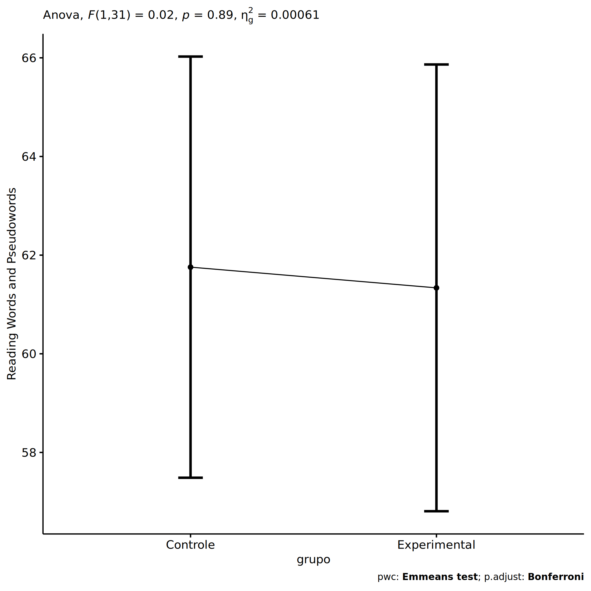
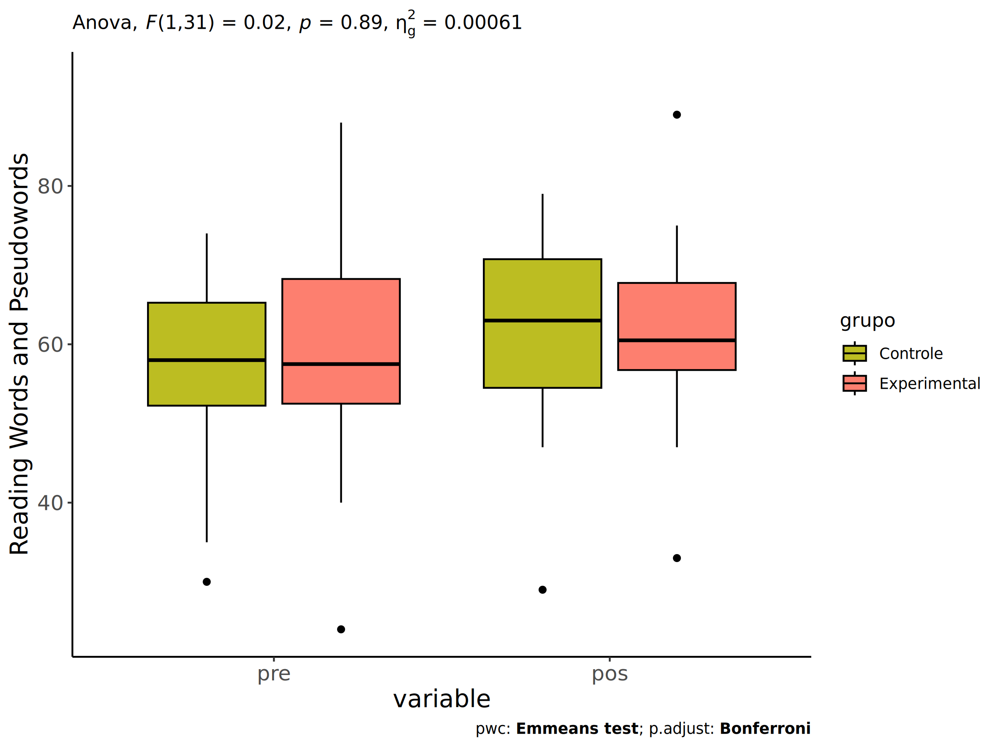
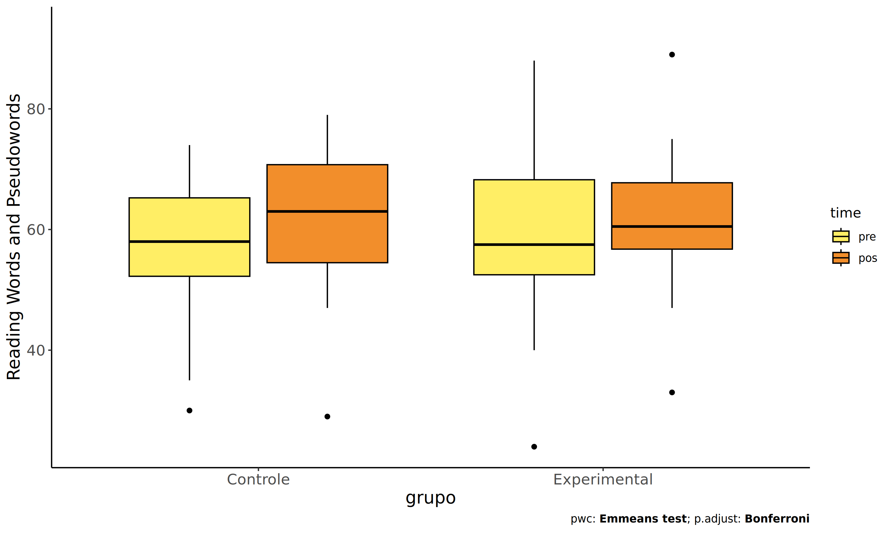
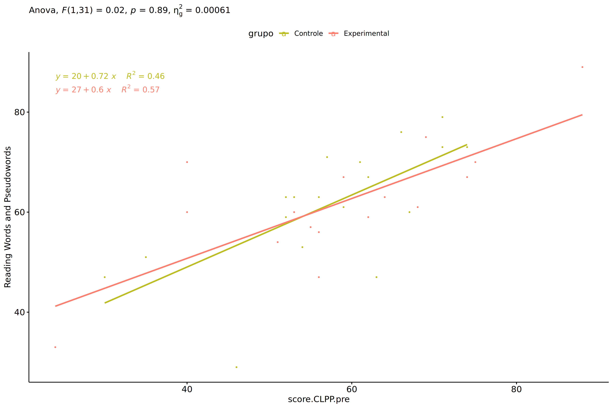

ANCOVA in Reading Words and Pseudowords (Reading Words and Pseudowords)
================
Geiser C. Challco <geiser@alumni.usp.br>

- [Setting Initial Variables](#setting-initial-variables)
- [Descriptive Statistics of Initial
  Data](#descriptive-statistics-of-initial-data)
- [ANCOVA and Pairwise for one factor:
  **grupo**](#ancova-and-pairwise-for-one-factor-grupo)
  - [Without remove non-normal data](#without-remove-non-normal-data)
  - [Computing ANCOVA and PairWise After removing non-normal data
    (OK)](#computing-ancova-and-pairwise-after-removing-non-normal-data-ok)
    - [Plots for ancova](#plots-for-ancova)
    - [Checking linearity assumption](#checking-linearity-assumption)
    - [Checking normality and
      homogeneity](#checking-normality-and-homogeneity)
- [ANCOVA and Pairwise for two factors
  **grupo:genero**](#ancova-and-pairwise-for-two-factors-grupogenero)
  - [Without remove non-normal data](#without-remove-non-normal-data-1)
  - [Computing ANCOVA and PairWise After removing non-normal data
    (OK)](#computing-ancova-and-pairwise-after-removing-non-normal-data-ok-1)
    - [Plots for ancova](#plots-for-ancova-1)
    - [Checking linearity assumption](#checking-linearity-assumption-1)
    - [Checking normality and
      homogeneity](#checking-normality-and-homogeneity-1)
- [ANCOVA and Pairwise for two factors
  **grupo:zona.participante**](#ancova-and-pairwise-for-two-factors-grupozonaparticipante)
  - [Without remove non-normal data](#without-remove-non-normal-data-2)
  - [Computing ANCOVA and PairWise After removing non-normal data
    (OK)](#computing-ancova-and-pairwise-after-removing-non-normal-data-ok-2)
    - [Plots for ancova](#plots-for-ancova-2)
    - [Checking linearity assumption](#checking-linearity-assumption-2)
    - [Checking normality and
      homogeneity](#checking-normality-and-homogeneity-2)
- [ANCOVA and Pairwise for two factors
  **grupo:zona.escola**](#ancova-and-pairwise-for-two-factors-grupozonaescola)
  - [Without remove non-normal data](#without-remove-non-normal-data-3)
  - [Computing ANCOVA and PairWise After removing non-normal data
    (OK)](#computing-ancova-and-pairwise-after-removing-non-normal-data-ok-3)
    - [Plots for ancova](#plots-for-ancova-3)
    - [Checking linearity assumption](#checking-linearity-assumption-3)
    - [Checking normality and
      homogeneity](#checking-normality-and-homogeneity-3)
- [Summary of Results](#summary-of-results)
  - [Descriptive Statistics](#descriptive-statistics)
  - [ANCOVA Table Comparison](#ancova-table-comparison)
  - [PairWise Table Comparison](#pairwise-table-comparison)
  - [EMMS Table Comparison](#emms-table-comparison)

**NOTE**:

- Teste ANCOVA para determinar se houve diferenças significativas no
  Reading Words and Pseudowords (medido usando pre- e pos-testes).
- ANCOVA test to determine whether there were significant differences in
  Reading Words and Pseudowords (measured using pre- and post-tests).

# Setting Initial Variables

``` r
dv = "score.CLPP"
dv.pos = "score.CLPP.pos"
dv.pre = "score.CLPP.pre"

fatores2 <- c("genero","zona.participante","zona.escola")
lfatores2 <- as.list(fatores2)
names(lfatores2) <- fatores2

fatores1 <- c("grupo", fatores2)
lfatores1 <- as.list(fatores1)
names(lfatores1) <- fatores1

lfatores <- c(lfatores1)

color <- list()
color[["prepost"]] = c("#ffee65","#f28e2B")
color[["grupo"]] = c("#bcbd22","#fd7f6f")
color[["genero"]] = c("#FF007F","#4D4DFF")
color[["zona.escola"]] = c("#AA00FF","#00CCCC")
color[["zona.participante"]] = c("#AA00FF","#00CCCC")

level <- list()
level[["grupo"]] = c("Controle","Experimental")
level[["genero"]] = c("F","M")
level[["zona.escola"]] = c("Rural","Urbana")
level[["zona.participante"]] = c("Rural","Urbana")

# ..

ymin <- 0
ymax <- 0

ymin.ci <- 0
ymax.ci <- 0


color[["grupo:genero"]] = c(
  "Controle:F"="#ff99cb", "Controle:M"="#b7b7ff",
  "Experimental:F"="#FF007F", "Experimental:M"="#4D4DFF",
  "Controle.F"="#ff99cb", "Controle.M"="#b7b7ff",
  "Experimental.F"="#FF007F", "Experimental.M"="#4D4DFF"
)
color[["grupo:zona.escola"]] = c(
  "Controle:Rural"="#b2efef","Controle:Urbana"="#e5b2ff",
  "Experimental:Rural"="#00CCCC", "Experimental:Urbana"="#AA00FF",
  "Controle.Rural"="#b2efef","Controle.Urbana"="#e5b2ff",
  "Experimental.Rural"="#00CCCC", "Experimental.Urbana"="#AA00FF"
)
color[["grupo:zona.participante"]] = c(
  "Controle:Rural"="#b2efef","Controle:Urbana"="#e5b2ff",
  "Experimental:Rural"="#00CCCC", "Experimental:Urbana"="#AA00FF",
  "Controle.Rural"="#b2efef","Controle.Urbana"="#e5b2ff",
  "Experimental.Rural"="#00CCCC", "Experimental.Urbana"="#AA00FF"
)

for (coln in c(
  "palavras.lidas","score.compreensao","tri.compreensao",
  "score.vocab","tri.vocab",
  "score.vocab.ensinado","tri.vocab.ensinado","score.vocab.nao.ensinado","tri.vocab.nao.ensinado",
  "score.CLPP","tri.CLPP","score.CR","tri.CR",
  "score.CI","tri.CI","score.TV","tri.TV","score.TF","tri.TF","score.TO","tri.TO")) {
  color[[paste0(coln,".quintile")]] = c("#BF0040","#FF0000","#800080","#0000FF","#4000BF")
  level[[paste0(coln,".quintile")]] = c("1st quintile","2nd quintile","3rd quintile","4th quintile","5th quintile")
  color[[paste0("grupo:",coln,".quintile")]] = c(
    "Experimental.1st quintile"="#BF0040", "Controle.1st quintile"="#d8668c",
    "Experimental.2nd quintile"="#FF0000", "Controle.2nd quintile"="#ff7f7f",
    "Experimental.3rd quintile"="#8fce00", "Controle.3rd quintile"="#ddf0b2",
    "Experimental.4th quintile"="#0000FF", "Controle.4th quintile"="#b2b2ff",
    "Experimental.5th quintile"="#4000BF", "Controle.5th quintile"="#b299e5",
    
    "Experimental:1st quintile"="#BF0040", "Controle:1st quintile"="#d8668c",
    "Experimental:2nd quintile"="#FF0000", "Controle:2nd quintile"="#ff7f7f",
    "Experimental:3rd quintile"="#8fce00", "Controle:3rd quintile"="#ddf0b2",
    "Experimental:4th quintile"="#0000FF", "Controle:4th quintile"="#b2b2ff",
    "Experimental:5th quintile"="#4000BF", "Controle:5th quintile"="#b299e5")
}


gdat <- read_excel("../data/data.xlsx", sheet = "leitura.stWG")


dat <- gdat
dat$grupo <- factor(dat[["grupo"]], level[["grupo"]])
for (coln in c(names(lfatores))) {
  dat[[coln]] <- factor(dat[[coln]], level[[coln]][level[[coln]] %in% unique(dat[[coln]])])
}
dat <- dat[which(!is.na(dat[[dv.pre]]) & !is.na(dat[[dv.pos]])),]
dat <- dat[,c("id",names(lfatores),dv.pre,dv.pos)]

dat.long <- rbind(dat, dat)
dat.long$time <- c(rep("pre", nrow(dat)), rep("pos", nrow(dat)))
dat.long$time <- factor(dat.long$time, c("pre","pos"))
dat.long[[dv]] <- c(dat[[dv.pre]], dat[[dv.pos]])


for (f in c("grupo", names(lfatores))) {
  if (is.null(color[[f]]) && length(unique(dat[[f]])) > 0) 
      color[[f]] <- distinctColorPalette(length(unique(dat[[f]])))
}
for (f in c(fatores2)) {
  if (is.null(color[[paste0("grupo:",f)]]) && length(unique(dat[[f]])) > 0)
    color[[paste0("grupo:",f)]] <- distinctColorPalette(length(unique(dat[["grupo"]]))*length(unique(dat[[f]])))
}

ldat <- list()
laov <- list()
lpwc <- list()
lemms <- list()
```

# Descriptive Statistics of Initial Data

``` r
df <- get.descriptives(dat, c(dv.pre, dv.pos), c("grupo"), 
                       include.global = T, symmetry.test = T, normality.test = F)
df <- plyr::rbind.fill(
  df, do.call(plyr::rbind.fill, lapply(lfatores2, FUN = function(f) {
    if (nrow(dat) > 0 && sum(!is.na(unique(dat[[f]]))) > 1)
      get.descriptives(dat, c(dv.pre,dv.pos), c("grupo", f),
                       symmetry.test = T, normality.test = F)
    }))
)
df <- df[,c(fatores1[fatores1 %in% colnames(df)],"variable",
            colnames(df)[!colnames(df) %in% c(fatores1,"variable")])]
```

| grupo | genero | zona.participante | zona.escola | variable | n | mean | median | min | max | sd | se | ci | iqr | symmetry | skewness | kurtosis |
|:---|:---|:---|:---|:---|---:|---:|---:|---:|---:|---:|---:|---:|---:|:---|---:|---:|
| Controle |  |  |  | score.CLPP.pre | 18 | 57.167 | 58.0 | 30 | 74 | 11.764 | 2.773 | 5.850 | 13.00 | NO | -0.704 | -0.173 |
| Experimental |  |  |  | score.CLPP.pre | 16 | 58.375 | 57.5 | 24 | 88 | 15.517 | 3.879 | 8.269 | 15.75 | YES | -0.283 | -0.243 |
|  |  |  |  | score.CLPP.pre | 34 | 57.735 | 58.0 | 24 | 88 | 13.458 | 2.308 | 4.696 | 14.50 | YES | -0.418 | 0.182 |
| Controle |  |  |  | score.CLPP.pos | 18 | 61.389 | 63.0 | 29 | 79 | 12.481 | 2.942 | 6.207 | 16.25 | NO | -0.807 | 0.196 |
| Experimental |  |  |  | score.CLPP.pos | 16 | 61.750 | 60.5 | 33 | 89 | 12.342 | 3.086 | 6.577 | 11.00 | YES | -0.126 | 0.579 |
|  |  |  |  | score.CLPP.pos | 34 | 61.559 | 62.0 | 29 | 89 | 12.228 | 2.097 | 4.267 | 13.75 | NO | -0.516 | 0.607 |
| Controle | F |  |  | score.CLPP.pre | 6 | 63.833 | 64.5 | 53 | 74 | 8.329 | 3.400 | 8.740 | 12.50 | YES | -0.089 | -1.927 |
| Controle | M |  |  | score.CLPP.pre | 12 | 53.833 | 55.5 | 30 | 71 | 12.082 | 3.488 | 7.676 | 11.00 | NO | -0.593 | -0.765 |
| Experimental | F |  |  | score.CLPP.pre | 2 | 48.000 | 48.0 | 40 | 56 | 11.314 | 8.000 | 101.650 | 8.00 | few data | 0.000 | 0.000 |
| Experimental | M |  |  | score.CLPP.pre | 14 | 59.857 | 60.5 | 24 | 88 | 15.781 | 4.218 | 9.112 | 15.25 | YES | -0.457 | -0.064 |
| Controle | F |  |  | score.CLPP.pos | 6 | 67.500 | 65.0 | 60 | 79 | 7.204 | 2.941 | 7.560 | 8.50 | YES | 0.483 | -1.615 |
| Controle | M |  |  | score.CLPP.pos | 12 | 58.333 | 60.0 | 29 | 76 | 13.660 | 3.943 | 8.679 | 20.25 | NO | -0.532 | -0.689 |
| Experimental | F |  |  | score.CLPP.pos | 2 | 58.000 | 58.0 | 56 | 60 | 2.828 | 2.000 | 25.412 | 2.00 | few data | 0.000 | 0.000 |
| Experimental | M |  |  | score.CLPP.pos | 14 | 62.286 | 62.0 | 33 | 89 | 13.141 | 3.512 | 7.587 | 11.75 | YES | -0.227 | 0.208 |
| Controle |  | Rural |  | score.CLPP.pre | 2 | 59.500 | 59.5 | 52 | 67 | 10.607 | 7.500 | 95.297 | 7.50 | few data | 0.000 | 0.000 |
| Controle |  | Urbana |  | score.CLPP.pre | 10 | 60.200 | 61.5 | 35 | 74 | 11.641 | 3.681 | 8.327 | 15.25 | NO | -0.730 | -0.418 |
| Controle |  |  |  | score.CLPP.pre | 6 | 51.333 | 55.0 | 30 | 63 | 11.944 | 4.876 | 12.535 | 10.75 | NO | -0.747 | -1.109 |
| Experimental |  | Rural |  | score.CLPP.pre | 6 | 66.167 | 69.0 | 40 | 88 | 16.786 | 6.853 | 17.616 | 16.75 | YES | -0.261 | -1.496 |
| Experimental |  | Urbana |  | score.CLPP.pre | 6 | 50.667 | 55.0 | 24 | 68 | 16.269 | 6.642 | 17.073 | 18.50 | NO | -0.501 | -1.501 |
| Experimental |  |  |  | score.CLPP.pre | 4 | 58.250 | 55.5 | 53 | 69 | 7.274 | 3.637 | 11.575 | 4.75 | NO | 0.683 | -1.728 |
| Controle |  | Rural |  | score.CLPP.pos | 2 | 61.500 | 61.5 | 60 | 63 | 2.121 | 1.500 | 19.059 | 1.50 | few data | 0.000 | 0.000 |
| Controle |  | Urbana |  | score.CLPP.pos | 10 | 66.400 | 68.5 | 51 | 79 | 9.629 | 3.045 | 6.888 | 13.00 | YES | -0.336 | -1.496 |
| Controle |  |  |  | score.CLPP.pos | 6 | 53.000 | 54.0 | 29 | 71 | 15.073 | 6.154 | 15.818 | 15.50 | YES | -0.336 | -1.536 |
| Experimental |  | Rural |  | score.CLPP.pos | 6 | 66.000 | 65.0 | 47 | 89 | 13.799 | 5.633 | 14.481 | 8.50 | YES | 0.325 | -1.107 |
| Experimental |  | Urbana |  | score.CLPP.pos | 6 | 57.333 | 60.0 | 33 | 70 | 13.216 | 5.395 | 13.870 | 10.25 | NO | -0.827 | -0.895 |
| Experimental |  |  |  | score.CLPP.pos | 4 | 62.000 | 58.5 | 56 | 75 | 8.832 | 4.416 | 14.053 | 7.00 | NO | 0.671 | -1.747 |
| Controle |  |  | Rural | score.CLPP.pre | 3 | 48.333 | 53.0 | 35 | 57 | 11.719 | 6.766 | 29.111 | 11.00 | few data | 0.000 | 0.000 |
| Controle |  |  | Urbana | score.CLPP.pre | 15 | 58.933 | 61.0 | 30 | 74 | 11.329 | 2.925 | 6.274 | 13.50 | NO | -0.884 | 0.379 |
| Experimental |  |  | Rural | score.CLPP.pre | 8 | 66.000 | 68.5 | 40 | 88 | 14.580 | 5.155 | 12.189 | 16.25 | YES | -0.295 | -1.011 |
| Experimental |  |  | Urbana | score.CLPP.pre | 8 | 50.750 | 54.5 | 24 | 64 | 13.058 | 4.617 | 10.916 | 9.25 | NO | -0.917 | -0.533 |
| Controle |  |  | Rural | score.CLPP.pos | 3 | 61.667 | 63.0 | 51 | 71 | 10.066 | 5.812 | 25.006 | 10.00 | few data | 0.000 | 0.000 |
| Controle |  |  | Urbana | score.CLPP.pos | 15 | 61.333 | 63.0 | 29 | 79 | 13.216 | 3.412 | 7.319 | 15.50 | NO | -0.797 | -0.007 |
| Experimental |  |  | Rural | score.CLPP.pos | 8 | 69.500 | 68.5 | 57 | 89 | 9.651 | 3.412 | 8.068 | 5.75 | NO | 0.693 | -0.475 |
| Experimental |  |  | Urbana | score.CLPP.pos | 8 | 54.000 | 57.5 | 33 | 63 | 9.798 | 3.464 | 8.191 | 7.75 | NO | -1.104 | -0.197 |

# ANCOVA and Pairwise for one factor: **grupo**

## Without remove non-normal data

``` r
pdat = remove_group_data(dat[!is.na(dat[["grupo"]]),], "score.CLPP.pos", "grupo")

pdat.long <- rbind(pdat[,c("id","grupo")], pdat[,c("id","grupo")])
pdat.long[["time"]] <- c(rep("pre", nrow(pdat)), rep("pos", nrow(pdat)))
pdat.long[["time"]] <- factor(pdat.long[["time"]], c("pre","pos"))
pdat.long[["score.CLPP"]] <- c(pdat[["score.CLPP.pre"]], pdat[["score.CLPP.pos"]])

aov = anova_test(pdat, score.CLPP.pos ~ score.CLPP.pre + grupo)
laov[["grupo"]] <- get_anova_table(aov)
```

``` r
pwc <- emmeans_test(pdat, score.CLPP.pos ~ grupo, covariate = score.CLPP.pre,
                    p.adjust.method = "bonferroni")
```

``` r
pwc.long <- emmeans_test(dplyr::group_by_at(pdat.long, "grupo"),
                          score.CLPP ~ time,
                          p.adjust.method = "bonferroni")
lpwc[["grupo"]] <- plyr::rbind.fill(pwc, pwc.long)
```

``` r
ds <- get.descriptives(pdat, "score.CLPP.pos", "grupo", covar = "score.CLPP.pre")
ds <- merge(ds[ds$variable != "score.CLPP.pre",],
            ds[ds$variable == "score.CLPP.pre", !colnames(ds) %in% c("variable")],
            by = "grupo", all.x = T, suffixes = c("", ".score.CLPP.pre"))
ds <- merge(get_emmeans(pwc), ds, by = "grupo", suffixes = c(".emms", ""))
ds <- ds[,c("grupo","n","mean.score.CLPP.pre","se.score.CLPP.pre","mean","se",
            "emmean","se.emms","conf.low","conf.high")]

colnames(ds) <- c("grupo", "N", paste0(c("M","SE")," (pre)"),
                  paste0(c("M","SE"), " (unadj)"),
                  paste0(c("M", "SE"), " (adj)"), "conf.low", "conf.high")

lemms[["grupo"]] <- ds
```

## Computing ANCOVA and PairWise After removing non-normal data (OK)

``` r
wdat = pdat 

res = residuals(lm(score.CLPP.pos ~ score.CLPP.pre + grupo, data = wdat))
non.normal = getNonNormal(res, wdat$id, plimit = 0.05)

wdat = wdat[!wdat$id %in% non.normal,]

wdat.long <- rbind(wdat[,c("id","grupo")], wdat[,c("id","grupo")])
wdat.long[["time"]] <- c(rep("pre", nrow(wdat)), rep("pos", nrow(wdat)))
wdat.long[["time"]] <- factor(wdat.long[["time"]], c("pre","pos"))
wdat.long[["score.CLPP"]] <- c(wdat[["score.CLPP.pre"]], wdat[["score.CLPP.pos"]])

ldat[["grupo"]] = wdat

(non.normal)
```

    ## NULL

``` r
aov = anova_test(wdat, score.CLPP.pos ~ score.CLPP.pre + grupo)
laov[["grupo"]] <- merge(get_anova_table(aov), laov[["grupo"]],
                            by="Effect", suffixes = c("","'"))

(df = get_anova_table(aov))
```

    ## ANOVA Table (type II tests)
    ## 
    ##           Effect DFn DFd      F        p p<.05      ges
    ## 1 score.CLPP.pre   1  31 31.614 3.60e-06     * 0.505000
    ## 2          grupo   1  31  0.019 8.92e-01       0.000609

| Effect         | DFn | DFd |      F |     p | p\<.05 |   ges |
|:---------------|----:|----:|-------:|------:|:-------|------:|
| score.CLPP.pre |   1 |  31 | 31.614 | 0.000 | \*     | 0.505 |
| grupo          |   1 |  31 |  0.019 | 0.892 |        | 0.001 |

``` r
pwc <- emmeans_test(wdat, score.CLPP.pos ~ grupo, covariate = score.CLPP.pre,
                    p.adjust.method = "bonferroni")
```

| term | .y. | group1 | group2 | df | statistic | p | p.adj | p.adj.signif |
|:---|:---|:---|:---|---:|---:|---:|---:|:---|
| score.CLPP.pre\*grupo | score.CLPP.pos | Controle | Experimental | 31 | 0.137 | 0.892 | 0.892 | ns |

``` r
pwc.long <- emmeans_test(dplyr::group_by_at(wdat.long, "grupo"),
                         score.CLPP ~ time,
                         p.adjust.method = "bonferroni")
lpwc[["grupo"]] <- merge(plyr::rbind.fill(pwc, pwc.long), lpwc[["grupo"]],
                            by=c("grupo","term",".y.","group1","group2"),
                            suffixes = c("","'"))
```

| grupo        | term | .y.        | group1 | group2 |  df | statistic |     p | p.adj | p.adj.signif |
|:-------------|:-----|:-----------|:-------|:-------|----:|----------:|------:|------:|:-------------|
| Controle     | time | score.CLPP | pre    | pos    |  64 |    -0.971 | 0.335 | 0.335 | ns           |
| Experimental | time | score.CLPP | pre    | pos    |  64 |    -0.732 | 0.467 | 0.467 | ns           |

``` r
ds <- get.descriptives(wdat, "score.CLPP.pos", "grupo", covar = "score.CLPP.pre")
ds <- merge(ds[ds$variable != "score.CLPP.pre",],
            ds[ds$variable == "score.CLPP.pre", !colnames(ds) %in% c("variable")],
            by = "grupo", all.x = T, suffixes = c("", ".score.CLPP.pre"))
ds <- merge(get_emmeans(pwc), ds, by = "grupo", suffixes = c(".emms", ""))
ds <- ds[,c("grupo","n","mean.score.CLPP.pre","se.score.CLPP.pre","mean","se",
            "emmean","se.emms","conf.low","conf.high")]

colnames(ds) <- c("grupo", "N", paste0(c("M","SE")," (pre)"),
                  paste0(c("M","SE"), " (unadj)"),
                  paste0(c("M", "SE"), " (adj)"), "conf.low", "conf.high")

lemms[["grupo"]] <- merge(ds, lemms[["grupo"]], by=c("grupo"), suffixes = c("","'"))
```

| grupo | N | M (pre) | SE (pre) | M (unadj) | SE (unadj) | M (adj) | SE (adj) | conf.low | conf.high |
|:---|---:|---:|---:|---:|---:|---:|---:|---:|---:|
| Controle | 18 | 57.167 | 2.773 | 61.389 | 2.942 | 61.756 | 2.093 | 57.487 | 66.025 |
| Experimental | 16 | 58.375 | 3.879 | 61.750 | 3.086 | 61.337 | 2.220 | 56.808 | 65.865 |

### Plots for ancova

``` r
plots <- oneWayAncovaPlots(
  wdat, "score.CLPP.pos", "grupo", aov, list("grupo"=pwc), addParam = c("mean_ci"),
  font.label.size=10, step.increase=0.05, p.label="p.adj",
  subtitle = which(aov$Effect == "grupo"))
```

``` r
if (!is.null(nrow(plots[["grupo"]]$data)))
  plots[["grupo"]] + ggplot2::ylab("Reading Words and Pseudowords") + 
  if (ymin.ci < ymax.ci) ggplot2::ylim(ymin.ci, ymax.ci)
```

<!-- -->

``` r
plots <- oneWayAncovaBoxPlots(
  wdat, "score.CLPP.pos", "grupo", aov, pwc, covar = "score.CLPP.pre",
  theme = "classic", color = color[["grupo"]],
  subtitle = which(aov$Effect == "grupo"))
```

``` r
if (length(unique(wdat[["grupo"]])) > 1)
  plots[["grupo"]] + ggplot2::ylab("Reading Words and Pseudowords") +
  ggplot2::scale_x_discrete(labels=c('pre', 'pos')) +
  if (ymin < ymax) ggplot2::ylim(ymin, ymax)
```

<!-- -->

``` r
if (length(unique(wdat.long[["grupo"]])) > 1)
  plots <- oneWayAncovaBoxPlots(
    wdat.long, "score.CLPP", "grupo", aov, pwc.long,
    pre.post = "time", theme = "classic", color = color$prepost)
```

``` r
if (length(unique(wdat.long[["grupo"]])) > 1)
  plots[["grupo"]] + ggplot2::ylab("Reading Words and Pseudowords") +
  if (ymin < ymax) ggplot2::ylim(ymin, ymax) 
```

<!-- -->

### Checking linearity assumption

``` r
ggscatter(wdat, x = "score.CLPP.pre", y = "score.CLPP.pos", size = 0.5,
          color = "grupo", add = "reg.line")+
  stat_regline_equation(
    aes(label =  paste(..eq.label.., ..rr.label.., sep = "~~~~"), color = grupo)
  ) +
  ggplot2::labs(subtitle = rstatix::get_test_label(aov, detailed = T, row = which(aov$Effect == "grupo"))) +
  ggplot2::scale_color_manual(values = color[["grupo"]]) +
  ggplot2::ylab("Reading Words and Pseudowords")  +
  if (ymin < ymax) ggplot2::ylim(ymin, ymax)
```

<!-- -->

### Checking normality and homogeneity

``` r
res <- augment(lm(score.CLPP.pos ~ score.CLPP.pre + grupo, data = wdat))
```

``` r
shapiro_test(res$.resid)
```

    ## # A tibble: 1 × 3
    ##   variable   statistic p.value
    ##   <chr>          <dbl>   <dbl>
    ## 1 res$.resid     0.956   0.183

``` r
levene_test(res, .resid ~ grupo)
```

    ## # A tibble: 1 × 4
    ##     df1   df2 statistic     p
    ##   <int> <int>     <dbl> <dbl>
    ## 1     1    32  0.000110 0.992

# ANCOVA and Pairwise for two factors **grupo:genero**

## Without remove non-normal data

``` r
pdat = tryCatch(
  remove_group_data(dat[!is.na(dat[["grupo"]]) & !is.na(dat[["genero"]]),],
                         "score.CLPP.pos", c("grupo","genero")),
  error = function(e) NULL
)

if (!is.null(pdat)) {

pdat = pdat[pdat[["genero"]] %in% do.call(
  intersect, lapply(unique(pdat[["grupo"]]), FUN = function(x) {
    unique(pdat[["genero"]][which(pdat[["grupo"]] == x)])
  })),]
pdat[["grupo"]] = factor(pdat[["grupo"]], level[["grupo"]])
pdat[["genero"]] = factor(
  pdat[["genero"]],
  level[["genero"]][level[["genero"]] %in% unique(pdat[["genero"]])])

pdat.long <- rbind(pdat[,c("id","grupo","genero")], pdat[,c("id","grupo","genero")])
pdat.long[["time"]] <- c(rep("pre", nrow(pdat)), rep("pos", nrow(pdat)))
pdat.long[["time"]] <- factor(pdat.long[["time"]], c("pre","pos"))
pdat.long[["score.CLPP"]] <- c(pdat[["score.CLPP.pre"]], pdat[["score.CLPP.pos"]])

if (length(unique(pdat[["genero"]])) >= 2) {
  aov = anova_test(pdat, score.CLPP.pos ~ score.CLPP.pre + grupo*genero)
  laov[["grupo:genero"]] <- get_anova_table(aov)
}

}
```

``` r
if (!is.null(pdat) && length(unique(pdat[["genero"]])) >= 2) {
  pwcs <- list()
  pwcs[["genero"]] <- emmeans_test(
    group_by(pdat, grupo), score.CLPP.pos ~ genero,
    covariate = score.CLPP.pre, p.adjust.method = "bonferroni")
  pwcs[["grupo"]] <- emmeans_test(
    group_by(pdat, genero), score.CLPP.pos ~ grupo,
    covariate = score.CLPP.pre, p.adjust.method = "bonferroni")
  
  pwc <- plyr::rbind.fill(pwcs[["grupo"]], pwcs[["genero"]])
  pwc <- pwc[,c("grupo","genero", colnames(pwc)[!colnames(pwc) %in% c("grupo","genero")])]
}
```

``` r
if (!is.null(pdat) && length(unique(pdat[["genero"]])) >= 2) {
  pwc.long <- emmeans_test(dplyr::group_by_at(pdat.long, c("grupo","genero")),
                           score.CLPP ~ time,
                           p.adjust.method = "bonferroni")
  lpwc[["grupo:genero"]] <- plyr::rbind.fill(pwc, pwc.long)
}
```

``` r
if (!is.null(pdat) && length(unique(pdat[["genero"]])) >= 2) {
  ds <- get.descriptives(pdat, "score.CLPP.pos", c("grupo","genero"), covar = "score.CLPP.pre")
  ds <- merge(ds[ds$variable != "score.CLPP.pre",],
              ds[ds$variable == "score.CLPP.pre", !colnames(ds) %in% c("variable")],
              by = c("grupo","genero"), all.x = T, suffixes = c("", ".score.CLPP.pre"))
  ds <- merge(get_emmeans(pwcs[["grupo"]]), ds,
              by = c("grupo","genero"), suffixes = c(".emms", ""))
  ds <- ds[,c("grupo","genero","n","mean.score.CLPP.pre","se.score.CLPP.pre","mean","se",
              "emmean","se.emms","conf.low","conf.high")]
  
  colnames(ds) <- c("grupo","genero", "N", paste0(c("M","SE")," (pre)"),
                    paste0(c("M","SE"), " (unadj)"),
                    paste0(c("M", "SE"), " (adj)"), "conf.low", "conf.high")
  
  lemms[["grupo:genero"]] <- ds
}
```

## Computing ANCOVA and PairWise After removing non-normal data (OK)

``` r
if (!is.null(pdat) && length(unique(pdat[["genero"]])) >= 2) {
  wdat = pdat 
  
  res = residuals(lm(score.CLPP.pos ~ score.CLPP.pre + grupo*genero, data = wdat))
  non.normal = getNonNormal(res, wdat$id, plimit = 0.05)
  
  wdat = wdat[!wdat$id %in% non.normal,]
  
  wdat.long <- rbind(wdat[,c("id","grupo","genero")], wdat[,c("id","grupo","genero")])
  wdat.long[["time"]] <- c(rep("pre", nrow(wdat)), rep("pos", nrow(wdat)))
  wdat.long[["time"]] <- factor(wdat.long[["time"]], c("pre","pos"))
  wdat.long[["score.CLPP"]] <- c(wdat[["score.CLPP.pre"]], wdat[["score.CLPP.pos"]])
  
  
  ldat[["grupo:genero"]] = wdat
  
  (non.normal)
}
```

``` r
if (!is.null(pdat) && length(unique(pdat[["genero"]])) >= 2) {
  aov = anova_test(wdat, score.CLPP.pos ~ score.CLPP.pre + grupo*genero)
  laov[["grupo:genero"]] <- merge(get_anova_table(aov), laov[["grupo:genero"]],
                                         by="Effect", suffixes = c("","'"))
  df = get_anova_table(aov)
}
```

``` r
if (!is.null(pdat) && length(unique(pdat[["genero"]])) >= 2) {
  pwcs <- list()
  pwcs[["genero"]] <- emmeans_test(
    group_by(wdat, grupo), score.CLPP.pos ~ genero,
    covariate = score.CLPP.pre, p.adjust.method = "bonferroni")
  pwcs[["grupo"]] <- emmeans_test(
    group_by(wdat, genero), score.CLPP.pos ~ grupo,
    covariate = score.CLPP.pre, p.adjust.method = "bonferroni")
  
  pwc <- plyr::rbind.fill(pwcs[["grupo"]], pwcs[["genero"]])
  pwc <- pwc[,c("grupo","genero", colnames(pwc)[!colnames(pwc) %in% c("grupo","genero")])]
}
```

``` r
if (!is.null(pdat) && length(unique(pdat[["genero"]])) >= 2) {
  pwc.long <- emmeans_test(dplyr::group_by_at(wdat.long, c("grupo","genero")),
                           score.CLPP ~ time,
                           p.adjust.method = "bonferroni")
  lpwc[["grupo:genero"]] <- merge(plyr::rbind.fill(pwc, pwc.long),
                                         lpwc[["grupo:genero"]],
                                         by=c("grupo","genero","term",".y.","group1","group2"),
                                         suffixes = c("","'"))
}
```

``` r
if (!is.null(pdat) && length(unique(pdat[["genero"]])) >= 2) {
  ds <- get.descriptives(wdat, "score.CLPP.pos", c("grupo","genero"), covar = "score.CLPP.pre")
  ds <- merge(ds[ds$variable != "score.CLPP.pre",],
              ds[ds$variable == "score.CLPP.pre", !colnames(ds) %in% c("variable")],
              by = c("grupo","genero"), all.x = T, suffixes = c("", ".score.CLPP.pre"))
  ds <- merge(get_emmeans(pwcs[["grupo"]]), ds,
              by = c("grupo","genero"), suffixes = c(".emms", ""))
  ds <- ds[,c("grupo","genero","n","mean.score.CLPP.pre","se.score.CLPP.pre",
              "mean","se","emmean","se.emms","conf.low","conf.high")]
  
  colnames(ds) <- c("grupo","genero", "N", paste0(c("M","SE")," (pre)"),
                    paste0(c("M","SE"), " (unadj)"),
                    paste0(c("M", "SE"), " (adj)"), "conf.low", "conf.high")
  
  lemms[["grupo:genero"]] <- merge(ds, lemms[["grupo:genero"]],
                                          by=c("grupo","genero"), suffixes = c("","'"))
}
```

### Plots for ancova

``` r
if (!is.null(pdat) && length(unique(pdat[["genero"]])) >= 2) {
  ggPlotAoC2(pwcs, "grupo", "genero", aov, ylab = "Reading Words and Pseudowords",
             subtitle = which(aov$Effect == "grupo:genero"), addParam = "errorbar") +
    ggplot2::scale_color_manual(values = color[["genero"]]) +
    ggplot2::ylab("Reading Words and Pseudowords") +
    if (ymin.ci < ymax.ci) ggplot2::ylim(ymin.ci, ymax.ci)
}
```

``` r
if (!is.null(pdat) && length(unique(pdat[["genero"]])) >= 2) {
  ggPlotAoC2(pwcs, "genero", "grupo", aov, ylab = "Reading Words and Pseudowords",
               subtitle = which(aov$Effect == "grupo:genero"), addParam = "errorbar") +
    ggplot2::scale_color_manual(values = color[["grupo"]]) +
    ggplot2::ylab("Reading Words and Pseudowords") +
    if (ymin.ci < ymax.ci) ggplot2::ylim(ymin.ci, ymax.ci)
}
```

``` r
if (!is.null(pdat) && length(unique(pdat[["genero"]])) >= 2) {
  plots <- twoWayAncovaBoxPlots(
    wdat, "score.CLPP.pos", c("grupo","genero"), aov, pwcs, covar = "score.CLPP.pre",
    theme = "classic", color = color[["grupo:genero"]],
    subtitle = which(aov$Effect == "grupo:genero"))
}
```

``` r
if (!is.null(pdat) && length(unique(pdat[["genero"]])) >= 2) {
  plots[["grupo:genero"]] + ggplot2::ylab("Reading Words and Pseudowords") +
  ggplot2::scale_x_discrete(labels=c('pre', 'pos')) +
  if (ymin < ymax) ggplot2::ylim(ymin, ymax)
}
```

``` r
if (!is.null(pdat) && length(unique(pdat[["genero"]])) >= 2) {
  plots <- twoWayAncovaBoxPlots(
    wdat.long, "score.CLPP", c("grupo","genero"), aov, pwc.long,
    pre.post = "time",
    theme = "classic", color = color$prepost)
}
```

``` r
if (!is.null(pdat) && length(unique(pdat[["genero"]])) >= 2) 
  plots[["grupo:genero"]] + ggplot2::ylab("Reading Words and Pseudowords") +
    if (ymin < ymax) ggplot2::ylim(ymin, ymax)
```

### Checking linearity assumption

``` r
if (!is.null(pdat) && length(unique(pdat[["genero"]])) >= 2) {
  ggscatter(wdat, x = "score.CLPP.pre", y = "score.CLPP.pos", size = 0.5,
            facet.by = c("grupo","genero"), add = "reg.line")+
    stat_regline_equation(
      aes(label =  paste(..eq.label.., ..rr.label.., sep = "~~~~"))
    ) + ggplot2::ylab("Reading Words and Pseudowords") +
    if (ymin < ymax) ggplot2::ylim(ymin, ymax)
}
```

``` r
if (!is.null(pdat) && length(unique(pdat[["genero"]])) >= 2) {
  ggscatter(wdat, x = "score.CLPP.pre", y = "score.CLPP.pos", size = 0.5,
            color = "grupo", facet.by = "genero", add = "reg.line")+
    stat_regline_equation(
      aes(label =  paste(..eq.label.., ..rr.label.., sep = "~~~~"), color = grupo)
    ) +
    ggplot2::labs(subtitle = rstatix::get_test_label(aov, detailed = T, row = which(aov$Effect == "grupo:genero"))) +
    ggplot2::scale_color_manual(values = color[["grupo"]]) +
    ggplot2::ylab("Reading Words and Pseudowords") +
    if (ymin < ymax) ggplot2::ylim(ymin, ymax)
}
```

``` r
if (!is.null(pdat) && length(unique(pdat[["genero"]])) >= 2) {
  ggscatter(wdat, x = "score.CLPP.pre", y = "score.CLPP.pos", size = 0.5,
            color = "genero", facet.by = "grupo", add = "reg.line")+
    stat_regline_equation(
      aes(label =  paste(..eq.label.., ..rr.label.., sep = "~~~~"), color = genero)
    ) +
    ggplot2::labs(subtitle = rstatix::get_test_label(aov, detailed = T, row = which(aov$Effect == "grupo:genero"))) +
    ggplot2::scale_color_manual(values = color[["genero"]]) +
    ggplot2::ylab("Reading Words and Pseudowords") +
    if (ymin < ymax) ggplot2::ylim(ymin, ymax)
}
```

### Checking normality and homogeneity

``` r
if (!is.null(pdat) && length(unique(pdat[["genero"]])) >= 2) 
  res <- augment(lm(score.CLPP.pos ~ score.CLPP.pre + grupo*genero, data = wdat))
```

``` r
if (!is.null(pdat) && length(unique(pdat[["genero"]])) >= 2)
  shapiro_test(res$.resid)
```

``` r
if (!is.null(pdat) && length(unique(pdat[["genero"]])) >= 2) 
  levene_test(res, .resid ~ grupo*genero)
```

# ANCOVA and Pairwise for two factors **grupo:zona.participante**

## Without remove non-normal data

``` r
pdat = tryCatch(
  remove_group_data(dat[!is.na(dat[["grupo"]]) & !is.na(dat[["zona.participante"]]),],
                         "score.CLPP.pos", c("grupo","zona.participante")),
  error = function(e) NULL
)

if (!is.null(pdat)) {

pdat = pdat[pdat[["zona.participante"]] %in% do.call(
  intersect, lapply(unique(pdat[["grupo"]]), FUN = function(x) {
    unique(pdat[["zona.participante"]][which(pdat[["grupo"]] == x)])
  })),]
pdat[["grupo"]] = factor(pdat[["grupo"]], level[["grupo"]])
pdat[["zona.participante"]] = factor(
  pdat[["zona.participante"]],
  level[["zona.participante"]][level[["zona.participante"]] %in% unique(pdat[["zona.participante"]])])

pdat.long <- rbind(pdat[,c("id","grupo","zona.participante")], pdat[,c("id","grupo","zona.participante")])
pdat.long[["time"]] <- c(rep("pre", nrow(pdat)), rep("pos", nrow(pdat)))
pdat.long[["time"]] <- factor(pdat.long[["time"]], c("pre","pos"))
pdat.long[["score.CLPP"]] <- c(pdat[["score.CLPP.pre"]], pdat[["score.CLPP.pos"]])

if (length(unique(pdat[["zona.participante"]])) >= 2) {
  aov = anova_test(pdat, score.CLPP.pos ~ score.CLPP.pre + grupo*zona.participante)
  laov[["grupo:zona.participante"]] <- get_anova_table(aov)
}

}
```

``` r
if (!is.null(pdat) && length(unique(pdat[["zona.participante"]])) >= 2) {
  pwcs <- list()
  pwcs[["zona.participante"]] <- emmeans_test(
    group_by(pdat, grupo), score.CLPP.pos ~ zona.participante,
    covariate = score.CLPP.pre, p.adjust.method = "bonferroni")
  pwcs[["grupo"]] <- emmeans_test(
    group_by(pdat, zona.participante), score.CLPP.pos ~ grupo,
    covariate = score.CLPP.pre, p.adjust.method = "bonferroni")
  
  pwc <- plyr::rbind.fill(pwcs[["grupo"]], pwcs[["zona.participante"]])
  pwc <- pwc[,c("grupo","zona.participante", colnames(pwc)[!colnames(pwc) %in% c("grupo","zona.participante")])]
}
```

``` r
if (!is.null(pdat) && length(unique(pdat[["zona.participante"]])) >= 2) {
  pwc.long <- emmeans_test(dplyr::group_by_at(pdat.long, c("grupo","zona.participante")),
                           score.CLPP ~ time,
                           p.adjust.method = "bonferroni")
  lpwc[["grupo:zona.participante"]] <- plyr::rbind.fill(pwc, pwc.long)
}
```

``` r
if (!is.null(pdat) && length(unique(pdat[["zona.participante"]])) >= 2) {
  ds <- get.descriptives(pdat, "score.CLPP.pos", c("grupo","zona.participante"), covar = "score.CLPP.pre")
  ds <- merge(ds[ds$variable != "score.CLPP.pre",],
              ds[ds$variable == "score.CLPP.pre", !colnames(ds) %in% c("variable")],
              by = c("grupo","zona.participante"), all.x = T, suffixes = c("", ".score.CLPP.pre"))
  ds <- merge(get_emmeans(pwcs[["grupo"]]), ds,
              by = c("grupo","zona.participante"), suffixes = c(".emms", ""))
  ds <- ds[,c("grupo","zona.participante","n","mean.score.CLPP.pre","se.score.CLPP.pre","mean","se",
              "emmean","se.emms","conf.low","conf.high")]
  
  colnames(ds) <- c("grupo","zona.participante", "N", paste0(c("M","SE")," (pre)"),
                    paste0(c("M","SE"), " (unadj)"),
                    paste0(c("M", "SE"), " (adj)"), "conf.low", "conf.high")
  
  lemms[["grupo:zona.participante"]] <- ds
}
```

## Computing ANCOVA and PairWise After removing non-normal data (OK)

``` r
if (!is.null(pdat) && length(unique(pdat[["zona.participante"]])) >= 2) {
  wdat = pdat 
  
  res = residuals(lm(score.CLPP.pos ~ score.CLPP.pre + grupo*zona.participante, data = wdat))
  non.normal = getNonNormal(res, wdat$id, plimit = 0.05)
  
  wdat = wdat[!wdat$id %in% non.normal,]
  
  wdat.long <- rbind(wdat[,c("id","grupo","zona.participante")], wdat[,c("id","grupo","zona.participante")])
  wdat.long[["time"]] <- c(rep("pre", nrow(wdat)), rep("pos", nrow(wdat)))
  wdat.long[["time"]] <- factor(wdat.long[["time"]], c("pre","pos"))
  wdat.long[["score.CLPP"]] <- c(wdat[["score.CLPP.pre"]], wdat[["score.CLPP.pos"]])
  
  
  ldat[["grupo:zona.participante"]] = wdat
  
  (non.normal)
}
```

``` r
if (!is.null(pdat) && length(unique(pdat[["zona.participante"]])) >= 2) {
  aov = anova_test(wdat, score.CLPP.pos ~ score.CLPP.pre + grupo*zona.participante)
  laov[["grupo:zona.participante"]] <- merge(get_anova_table(aov), laov[["grupo:zona.participante"]],
                                         by="Effect", suffixes = c("","'"))
  df = get_anova_table(aov)
}
```

``` r
if (!is.null(pdat) && length(unique(pdat[["zona.participante"]])) >= 2) {
  pwcs <- list()
  pwcs[["zona.participante"]] <- emmeans_test(
    group_by(wdat, grupo), score.CLPP.pos ~ zona.participante,
    covariate = score.CLPP.pre, p.adjust.method = "bonferroni")
  pwcs[["grupo"]] <- emmeans_test(
    group_by(wdat, zona.participante), score.CLPP.pos ~ grupo,
    covariate = score.CLPP.pre, p.adjust.method = "bonferroni")
  
  pwc <- plyr::rbind.fill(pwcs[["grupo"]], pwcs[["zona.participante"]])
  pwc <- pwc[,c("grupo","zona.participante", colnames(pwc)[!colnames(pwc) %in% c("grupo","zona.participante")])]
}
```

``` r
if (!is.null(pdat) && length(unique(pdat[["zona.participante"]])) >= 2) {
  pwc.long <- emmeans_test(dplyr::group_by_at(wdat.long, c("grupo","zona.participante")),
                           score.CLPP ~ time,
                           p.adjust.method = "bonferroni")
  lpwc[["grupo:zona.participante"]] <- merge(plyr::rbind.fill(pwc, pwc.long),
                                         lpwc[["grupo:zona.participante"]],
                                         by=c("grupo","zona.participante","term",".y.","group1","group2"),
                                         suffixes = c("","'"))
}
```

``` r
if (!is.null(pdat) && length(unique(pdat[["zona.participante"]])) >= 2) {
  ds <- get.descriptives(wdat, "score.CLPP.pos", c("grupo","zona.participante"), covar = "score.CLPP.pre")
  ds <- merge(ds[ds$variable != "score.CLPP.pre",],
              ds[ds$variable == "score.CLPP.pre", !colnames(ds) %in% c("variable")],
              by = c("grupo","zona.participante"), all.x = T, suffixes = c("", ".score.CLPP.pre"))
  ds <- merge(get_emmeans(pwcs[["grupo"]]), ds,
              by = c("grupo","zona.participante"), suffixes = c(".emms", ""))
  ds <- ds[,c("grupo","zona.participante","n","mean.score.CLPP.pre","se.score.CLPP.pre",
              "mean","se","emmean","se.emms","conf.low","conf.high")]
  
  colnames(ds) <- c("grupo","zona.participante", "N", paste0(c("M","SE")," (pre)"),
                    paste0(c("M","SE"), " (unadj)"),
                    paste0(c("M", "SE"), " (adj)"), "conf.low", "conf.high")
  
  lemms[["grupo:zona.participante"]] <- merge(ds, lemms[["grupo:zona.participante"]],
                                          by=c("grupo","zona.participante"), suffixes = c("","'"))
}
```

### Plots for ancova

``` r
if (!is.null(pdat) && length(unique(pdat[["zona.participante"]])) >= 2) {
  ggPlotAoC2(pwcs, "grupo", "zona.participante", aov, ylab = "Reading Words and Pseudowords",
             subtitle = which(aov$Effect == "grupo:zona.participante"), addParam = "errorbar") +
    ggplot2::scale_color_manual(values = color[["zona.participante"]]) +
    ggplot2::ylab("Reading Words and Pseudowords") +
    if (ymin.ci < ymax.ci) ggplot2::ylim(ymin.ci, ymax.ci)
}
```

``` r
if (!is.null(pdat) && length(unique(pdat[["zona.participante"]])) >= 2) {
  ggPlotAoC2(pwcs, "zona.participante", "grupo", aov, ylab = "Reading Words and Pseudowords",
               subtitle = which(aov$Effect == "grupo:zona.participante"), addParam = "errorbar") +
    ggplot2::scale_color_manual(values = color[["grupo"]]) +
    ggplot2::ylab("Reading Words and Pseudowords") +
    if (ymin.ci < ymax.ci) ggplot2::ylim(ymin.ci, ymax.ci)
}
```

``` r
if (!is.null(pdat) && length(unique(pdat[["zona.participante"]])) >= 2) {
  plots <- twoWayAncovaBoxPlots(
    wdat, "score.CLPP.pos", c("grupo","zona.participante"), aov, pwcs, covar = "score.CLPP.pre",
    theme = "classic", color = color[["grupo:zona.participante"]],
    subtitle = which(aov$Effect == "grupo:zona.participante"))
}
```

``` r
if (!is.null(pdat) && length(unique(pdat[["zona.participante"]])) >= 2) {
  plots[["grupo:zona.participante"]] + ggplot2::ylab("Reading Words and Pseudowords") +
  ggplot2::scale_x_discrete(labels=c('pre', 'pos')) +
  if (ymin < ymax) ggplot2::ylim(ymin, ymax)
}
```

``` r
if (!is.null(pdat) && length(unique(pdat[["zona.participante"]])) >= 2) {
  plots <- twoWayAncovaBoxPlots(
    wdat.long, "score.CLPP", c("grupo","zona.participante"), aov, pwc.long,
    pre.post = "time",
    theme = "classic", color = color$prepost)
}
```

``` r
if (!is.null(pdat) && length(unique(pdat[["zona.participante"]])) >= 2) 
  plots[["grupo:zona.participante"]] + ggplot2::ylab("Reading Words and Pseudowords") +
    if (ymin < ymax) ggplot2::ylim(ymin, ymax)
```

### Checking linearity assumption

``` r
if (!is.null(pdat) && length(unique(pdat[["zona.participante"]])) >= 2) {
  ggscatter(wdat, x = "score.CLPP.pre", y = "score.CLPP.pos", size = 0.5,
            facet.by = c("grupo","zona.participante"), add = "reg.line")+
    stat_regline_equation(
      aes(label =  paste(..eq.label.., ..rr.label.., sep = "~~~~"))
    ) + ggplot2::ylab("Reading Words and Pseudowords") +
    if (ymin < ymax) ggplot2::ylim(ymin, ymax)
}
```

``` r
if (!is.null(pdat) && length(unique(pdat[["zona.participante"]])) >= 2) {
  ggscatter(wdat, x = "score.CLPP.pre", y = "score.CLPP.pos", size = 0.5,
            color = "grupo", facet.by = "zona.participante", add = "reg.line")+
    stat_regline_equation(
      aes(label =  paste(..eq.label.., ..rr.label.., sep = "~~~~"), color = grupo)
    ) +
    ggplot2::labs(subtitle = rstatix::get_test_label(aov, detailed = T, row = which(aov$Effect == "grupo:zona.participante"))) +
    ggplot2::scale_color_manual(values = color[["grupo"]]) +
    ggplot2::ylab("Reading Words and Pseudowords") +
    if (ymin < ymax) ggplot2::ylim(ymin, ymax)
}
```

``` r
if (!is.null(pdat) && length(unique(pdat[["zona.participante"]])) >= 2) {
  ggscatter(wdat, x = "score.CLPP.pre", y = "score.CLPP.pos", size = 0.5,
            color = "zona.participante", facet.by = "grupo", add = "reg.line")+
    stat_regline_equation(
      aes(label =  paste(..eq.label.., ..rr.label.., sep = "~~~~"), color = zona.participante)
    ) +
    ggplot2::labs(subtitle = rstatix::get_test_label(aov, detailed = T, row = which(aov$Effect == "grupo:zona.participante"))) +
    ggplot2::scale_color_manual(values = color[["zona.participante"]]) +
    ggplot2::ylab("Reading Words and Pseudowords") +
    if (ymin < ymax) ggplot2::ylim(ymin, ymax)
}
```

### Checking normality and homogeneity

``` r
if (!is.null(pdat) && length(unique(pdat[["zona.participante"]])) >= 2) 
  res <- augment(lm(score.CLPP.pos ~ score.CLPP.pre + grupo*zona.participante, data = wdat))
```

``` r
if (!is.null(pdat) && length(unique(pdat[["zona.participante"]])) >= 2)
  shapiro_test(res$.resid)
```

``` r
if (!is.null(pdat) && length(unique(pdat[["zona.participante"]])) >= 2) 
  levene_test(res, .resid ~ grupo*zona.participante)
```

# ANCOVA and Pairwise for two factors **grupo:zona.escola**

## Without remove non-normal data

``` r
pdat = tryCatch(
  remove_group_data(dat[!is.na(dat[["grupo"]]) & !is.na(dat[["zona.escola"]]),],
                         "score.CLPP.pos", c("grupo","zona.escola")),
  error = function(e) NULL
)

if (!is.null(pdat)) {

pdat = pdat[pdat[["zona.escola"]] %in% do.call(
  intersect, lapply(unique(pdat[["grupo"]]), FUN = function(x) {
    unique(pdat[["zona.escola"]][which(pdat[["grupo"]] == x)])
  })),]
pdat[["grupo"]] = factor(pdat[["grupo"]], level[["grupo"]])
pdat[["zona.escola"]] = factor(
  pdat[["zona.escola"]],
  level[["zona.escola"]][level[["zona.escola"]] %in% unique(pdat[["zona.escola"]])])

pdat.long <- rbind(pdat[,c("id","grupo","zona.escola")], pdat[,c("id","grupo","zona.escola")])
pdat.long[["time"]] <- c(rep("pre", nrow(pdat)), rep("pos", nrow(pdat)))
pdat.long[["time"]] <- factor(pdat.long[["time"]], c("pre","pos"))
pdat.long[["score.CLPP"]] <- c(pdat[["score.CLPP.pre"]], pdat[["score.CLPP.pos"]])

if (length(unique(pdat[["zona.escola"]])) >= 2) {
  aov = anova_test(pdat, score.CLPP.pos ~ score.CLPP.pre + grupo*zona.escola)
  laov[["grupo:zona.escola"]] <- get_anova_table(aov)
}

}
```

``` r
if (!is.null(pdat) && length(unique(pdat[["zona.escola"]])) >= 2) {
  pwcs <- list()
  pwcs[["zona.escola"]] <- emmeans_test(
    group_by(pdat, grupo), score.CLPP.pos ~ zona.escola,
    covariate = score.CLPP.pre, p.adjust.method = "bonferroni")
  pwcs[["grupo"]] <- emmeans_test(
    group_by(pdat, zona.escola), score.CLPP.pos ~ grupo,
    covariate = score.CLPP.pre, p.adjust.method = "bonferroni")
  
  pwc <- plyr::rbind.fill(pwcs[["grupo"]], pwcs[["zona.escola"]])
  pwc <- pwc[,c("grupo","zona.escola", colnames(pwc)[!colnames(pwc) %in% c("grupo","zona.escola")])]
}
```

``` r
if (!is.null(pdat) && length(unique(pdat[["zona.escola"]])) >= 2) {
  pwc.long <- emmeans_test(dplyr::group_by_at(pdat.long, c("grupo","zona.escola")),
                           score.CLPP ~ time,
                           p.adjust.method = "bonferroni")
  lpwc[["grupo:zona.escola"]] <- plyr::rbind.fill(pwc, pwc.long)
}
```

``` r
if (!is.null(pdat) && length(unique(pdat[["zona.escola"]])) >= 2) {
  ds <- get.descriptives(pdat, "score.CLPP.pos", c("grupo","zona.escola"), covar = "score.CLPP.pre")
  ds <- merge(ds[ds$variable != "score.CLPP.pre",],
              ds[ds$variable == "score.CLPP.pre", !colnames(ds) %in% c("variable")],
              by = c("grupo","zona.escola"), all.x = T, suffixes = c("", ".score.CLPP.pre"))
  ds <- merge(get_emmeans(pwcs[["grupo"]]), ds,
              by = c("grupo","zona.escola"), suffixes = c(".emms", ""))
  ds <- ds[,c("grupo","zona.escola","n","mean.score.CLPP.pre","se.score.CLPP.pre","mean","se",
              "emmean","se.emms","conf.low","conf.high")]
  
  colnames(ds) <- c("grupo","zona.escola", "N", paste0(c("M","SE")," (pre)"),
                    paste0(c("M","SE"), " (unadj)"),
                    paste0(c("M", "SE"), " (adj)"), "conf.low", "conf.high")
  
  lemms[["grupo:zona.escola"]] <- ds
}
```

## Computing ANCOVA and PairWise After removing non-normal data (OK)

``` r
if (!is.null(pdat) && length(unique(pdat[["zona.escola"]])) >= 2) {
  wdat = pdat 
  
  res = residuals(lm(score.CLPP.pos ~ score.CLPP.pre + grupo*zona.escola, data = wdat))
  non.normal = getNonNormal(res, wdat$id, plimit = 0.05)
  
  wdat = wdat[!wdat$id %in% non.normal,]
  
  wdat.long <- rbind(wdat[,c("id","grupo","zona.escola")], wdat[,c("id","grupo","zona.escola")])
  wdat.long[["time"]] <- c(rep("pre", nrow(wdat)), rep("pos", nrow(wdat)))
  wdat.long[["time"]] <- factor(wdat.long[["time"]], c("pre","pos"))
  wdat.long[["score.CLPP"]] <- c(wdat[["score.CLPP.pre"]], wdat[["score.CLPP.pos"]])
  
  
  ldat[["grupo:zona.escola"]] = wdat
  
  (non.normal)
}
```

``` r
if (!is.null(pdat) && length(unique(pdat[["zona.escola"]])) >= 2) {
  aov = anova_test(wdat, score.CLPP.pos ~ score.CLPP.pre + grupo*zona.escola)
  laov[["grupo:zona.escola"]] <- merge(get_anova_table(aov), laov[["grupo:zona.escola"]],
                                         by="Effect", suffixes = c("","'"))
  df = get_anova_table(aov)
}
```

``` r
if (!is.null(pdat) && length(unique(pdat[["zona.escola"]])) >= 2) {
  pwcs <- list()
  pwcs[["zona.escola"]] <- emmeans_test(
    group_by(wdat, grupo), score.CLPP.pos ~ zona.escola,
    covariate = score.CLPP.pre, p.adjust.method = "bonferroni")
  pwcs[["grupo"]] <- emmeans_test(
    group_by(wdat, zona.escola), score.CLPP.pos ~ grupo,
    covariate = score.CLPP.pre, p.adjust.method = "bonferroni")
  
  pwc <- plyr::rbind.fill(pwcs[["grupo"]], pwcs[["zona.escola"]])
  pwc <- pwc[,c("grupo","zona.escola", colnames(pwc)[!colnames(pwc) %in% c("grupo","zona.escola")])]
}
```

``` r
if (!is.null(pdat) && length(unique(pdat[["zona.escola"]])) >= 2) {
  pwc.long <- emmeans_test(dplyr::group_by_at(wdat.long, c("grupo","zona.escola")),
                           score.CLPP ~ time,
                           p.adjust.method = "bonferroni")
  lpwc[["grupo:zona.escola"]] <- merge(plyr::rbind.fill(pwc, pwc.long),
                                         lpwc[["grupo:zona.escola"]],
                                         by=c("grupo","zona.escola","term",".y.","group1","group2"),
                                         suffixes = c("","'"))
}
```

``` r
if (!is.null(pdat) && length(unique(pdat[["zona.escola"]])) >= 2) {
  ds <- get.descriptives(wdat, "score.CLPP.pos", c("grupo","zona.escola"), covar = "score.CLPP.pre")
  ds <- merge(ds[ds$variable != "score.CLPP.pre",],
              ds[ds$variable == "score.CLPP.pre", !colnames(ds) %in% c("variable")],
              by = c("grupo","zona.escola"), all.x = T, suffixes = c("", ".score.CLPP.pre"))
  ds <- merge(get_emmeans(pwcs[["grupo"]]), ds,
              by = c("grupo","zona.escola"), suffixes = c(".emms", ""))
  ds <- ds[,c("grupo","zona.escola","n","mean.score.CLPP.pre","se.score.CLPP.pre",
              "mean","se","emmean","se.emms","conf.low","conf.high")]
  
  colnames(ds) <- c("grupo","zona.escola", "N", paste0(c("M","SE")," (pre)"),
                    paste0(c("M","SE"), " (unadj)"),
                    paste0(c("M", "SE"), " (adj)"), "conf.low", "conf.high")
  
  lemms[["grupo:zona.escola"]] <- merge(ds, lemms[["grupo:zona.escola"]],
                                          by=c("grupo","zona.escola"), suffixes = c("","'"))
}
```

### Plots for ancova

``` r
if (!is.null(pdat) && length(unique(pdat[["zona.escola"]])) >= 2) {
  ggPlotAoC2(pwcs, "grupo", "zona.escola", aov, ylab = "Reading Words and Pseudowords",
             subtitle = which(aov$Effect == "grupo:zona.escola"), addParam = "errorbar") +
    ggplot2::scale_color_manual(values = color[["zona.escola"]]) +
    ggplot2::ylab("Reading Words and Pseudowords") +
    if (ymin.ci < ymax.ci) ggplot2::ylim(ymin.ci, ymax.ci)
}
```

``` r
if (!is.null(pdat) && length(unique(pdat[["zona.escola"]])) >= 2) {
  ggPlotAoC2(pwcs, "zona.escola", "grupo", aov, ylab = "Reading Words and Pseudowords",
               subtitle = which(aov$Effect == "grupo:zona.escola"), addParam = "errorbar") +
    ggplot2::scale_color_manual(values = color[["grupo"]]) +
    ggplot2::ylab("Reading Words and Pseudowords") +
    if (ymin.ci < ymax.ci) ggplot2::ylim(ymin.ci, ymax.ci)
}
```

``` r
if (!is.null(pdat) && length(unique(pdat[["zona.escola"]])) >= 2) {
  plots <- twoWayAncovaBoxPlots(
    wdat, "score.CLPP.pos", c("grupo","zona.escola"), aov, pwcs, covar = "score.CLPP.pre",
    theme = "classic", color = color[["grupo:zona.escola"]],
    subtitle = which(aov$Effect == "grupo:zona.escola"))
}
```

``` r
if (!is.null(pdat) && length(unique(pdat[["zona.escola"]])) >= 2) {
  plots[["grupo:zona.escola"]] + ggplot2::ylab("Reading Words and Pseudowords") +
  ggplot2::scale_x_discrete(labels=c('pre', 'pos')) +
  if (ymin < ymax) ggplot2::ylim(ymin, ymax)
}
```

``` r
if (!is.null(pdat) && length(unique(pdat[["zona.escola"]])) >= 2) {
  plots <- twoWayAncovaBoxPlots(
    wdat.long, "score.CLPP", c("grupo","zona.escola"), aov, pwc.long,
    pre.post = "time",
    theme = "classic", color = color$prepost)
}
```

``` r
if (!is.null(pdat) && length(unique(pdat[["zona.escola"]])) >= 2) 
  plots[["grupo:zona.escola"]] + ggplot2::ylab("Reading Words and Pseudowords") +
    if (ymin < ymax) ggplot2::ylim(ymin, ymax)
```

### Checking linearity assumption

``` r
if (!is.null(pdat) && length(unique(pdat[["zona.escola"]])) >= 2) {
  ggscatter(wdat, x = "score.CLPP.pre", y = "score.CLPP.pos", size = 0.5,
            facet.by = c("grupo","zona.escola"), add = "reg.line")+
    stat_regline_equation(
      aes(label =  paste(..eq.label.., ..rr.label.., sep = "~~~~"))
    ) + ggplot2::ylab("Reading Words and Pseudowords") +
    if (ymin < ymax) ggplot2::ylim(ymin, ymax)
}
```

``` r
if (!is.null(pdat) && length(unique(pdat[["zona.escola"]])) >= 2) {
  ggscatter(wdat, x = "score.CLPP.pre", y = "score.CLPP.pos", size = 0.5,
            color = "grupo", facet.by = "zona.escola", add = "reg.line")+
    stat_regline_equation(
      aes(label =  paste(..eq.label.., ..rr.label.., sep = "~~~~"), color = grupo)
    ) +
    ggplot2::labs(subtitle = rstatix::get_test_label(aov, detailed = T, row = which(aov$Effect == "grupo:zona.escola"))) +
    ggplot2::scale_color_manual(values = color[["grupo"]]) +
    ggplot2::ylab("Reading Words and Pseudowords") +
    if (ymin < ymax) ggplot2::ylim(ymin, ymax)
}
```

``` r
if (!is.null(pdat) && length(unique(pdat[["zona.escola"]])) >= 2) {
  ggscatter(wdat, x = "score.CLPP.pre", y = "score.CLPP.pos", size = 0.5,
            color = "zona.escola", facet.by = "grupo", add = "reg.line")+
    stat_regline_equation(
      aes(label =  paste(..eq.label.., ..rr.label.., sep = "~~~~"), color = zona.escola)
    ) +
    ggplot2::labs(subtitle = rstatix::get_test_label(aov, detailed = T, row = which(aov$Effect == "grupo:zona.escola"))) +
    ggplot2::scale_color_manual(values = color[["zona.escola"]]) +
    ggplot2::ylab("Reading Words and Pseudowords") +
    if (ymin < ymax) ggplot2::ylim(ymin, ymax)
}
```

### Checking normality and homogeneity

``` r
if (!is.null(pdat) && length(unique(pdat[["zona.escola"]])) >= 2) 
  res <- augment(lm(score.CLPP.pos ~ score.CLPP.pre + grupo*zona.escola, data = wdat))
```

``` r
if (!is.null(pdat) && length(unique(pdat[["zona.escola"]])) >= 2)
  shapiro_test(res$.resid)
```

``` r
if (!is.null(pdat) && length(unique(pdat[["zona.escola"]])) >= 2) 
  levene_test(res, .resid ~ grupo*zona.escola)
```

# Summary of Results

## Descriptive Statistics

``` r
df <- get.descriptives(ldat[["grupo"]], c(dv.pre, dv.pos), c("grupo"), 
                       include.global = T, symmetry.test = T, normality.test = F)
df <- plyr::rbind.fill(
  df, do.call(plyr::rbind.fill, lapply(lfatores2, FUN = function(f) {
    if (nrow(dat) > 0 && sum(!is.na(unique(dat[[f]]))) > 1 && paste0("grupo:",f) %in% names(ldat))
      get.descriptives(ldat[[paste0("grupo:",f)]], c(dv.pre,dv.pos), c("grupo", f),
                       symmetry.test = T, normality.test = F)
    }))
)
df <- df[,c(fatores1[fatores1 %in% colnames(df)],"variable",
             colnames(df)[!colnames(df) %in% c(fatores1,"variable")])]
```

| grupo | variable | n | mean | median | min | max | sd | se | ci | iqr | symmetry | skewness | kurtosis |
|:---|:---|---:|---:|---:|---:|---:|---:|---:|---:|---:|:---|---:|---:|
| Controle | score.CLPP.pre | 18 | 57.167 | 58.0 | 30 | 74 | 11.764 | 2.773 | 5.850 | 13.00 | NO | -0.704 | -0.173 |
| Experimental | score.CLPP.pre | 16 | 58.375 | 57.5 | 24 | 88 | 15.517 | 3.879 | 8.269 | 15.75 | YES | -0.283 | -0.243 |
|  | score.CLPP.pre | 34 | 57.735 | 58.0 | 24 | 88 | 13.458 | 2.308 | 4.696 | 14.50 | YES | -0.418 | 0.182 |
| Controle | score.CLPP.pos | 18 | 61.389 | 63.0 | 29 | 79 | 12.481 | 2.942 | 6.207 | 16.25 | NO | -0.807 | 0.196 |
| Experimental | score.CLPP.pos | 16 | 61.750 | 60.5 | 33 | 89 | 12.342 | 3.086 | 6.577 | 11.00 | YES | -0.126 | 0.579 |
|  | score.CLPP.pos | 34 | 61.559 | 62.0 | 29 | 89 | 12.228 | 2.097 | 4.267 | 13.75 | NO | -0.516 | 0.607 |

## ANCOVA Table Comparison

``` r
df <- do.call(plyr::rbind.fill, laov)
df <- df[!duplicated(df$Effect),]
```

| Effect | DFn | DFd | F | p | p\<.05 | ges | DFn’ | DFd’ | F’ | p’ | p\<.05’ | ges’ |
|:---|---:|---:|---:|---:|:---|---:|---:|---:|---:|---:|:---|---:|
| grupo | 1 | 31 | 0.019 | 0.892 |  | 0.001 | 1 | 31 | 0.019 | 0.892 |  | 0.001 |
| score.CLPP.pre | 1 | 31 | 31.614 | 0.000 | \* | 0.505 | 1 | 31 | 31.614 | 0.000 | \* | 0.505 |

## PairWise Table Comparison

``` r
df <- do.call(plyr::rbind.fill, lpwc)
df <- df[,c(names(lfatores)[names(lfatores) %in% colnames(df)],
            names(df)[!names(df) %in% c(names(lfatores),"term",".y.")])]
```

| grupo | group1 | group2 | df | statistic | p | p.adj | p.adj.signif | df’ | statistic’ | p’ | p.adj’ | p.adj.signif’ |
|:---|:---|:---|---:|---:|---:|---:|:---|---:|---:|---:|---:|:---|
| Controle | pre | pos | 64 | -0.971 | 0.335 | 0.335 | ns | 64 | -0.971 | 0.335 | 0.335 | ns |
| Experimental | pre | pos | 64 | -0.732 | 0.467 | 0.467 | ns | 64 | -0.732 | 0.467 | 0.467 | ns |
|  | Controle | Experimental | 31 | 0.137 | 0.892 | 0.892 | ns | 31 | 0.137 | 0.892 | 0.892 | ns |

## EMMS Table Comparison

``` r
df <- do.call(plyr::rbind.fill, lemms)
df[["N-N'"]] <- df[["N"]] - df[["N'"]]
df <- df[,c(names(lfatores)[names(lfatores) %in% colnames(df)],
            names(df)[!names(df) %in% names(lfatores)])]
```

| grupo | N | M (pre) | SE (pre) | M (unadj) | SE (unadj) | M (adj) | SE (adj) | conf.low | conf.high | N’ | M (pre)’ | SE (pre)’ | M (unadj)’ | SE (unadj)’ | M (adj)’ | SE (adj)’ | conf.low’ | conf.high’ | N-N’ |
|:---|---:|---:|---:|---:|---:|---:|---:|---:|---:|---:|---:|---:|---:|---:|---:|---:|---:|---:|---:|
| Controle | 18 | 57.167 | 2.773 | 61.389 | 2.942 | 61.756 | 2.093 | 57.487 | 66.025 | 18 | 57.167 | 2.773 | 61.389 | 2.942 | 61.756 | 2.093 | 57.487 | 66.025 | 0 |
| Experimental | 16 | 58.375 | 3.879 | 61.750 | 3.086 | 61.337 | 2.220 | 56.808 | 65.865 | 16 | 58.375 | 3.879 | 61.750 | 3.086 | 61.337 | 2.220 | 56.808 | 65.865 | 0 |
