ANCOVA in flow (math) (flow (math))
================
Geiser C. Challco <geiser@alumni.usp.br>

- [Setting Initial Variables](#setting-initial-variables)
- [Descriptive Statistics of Initial
  Data](#descriptive-statistics-of-initial-data)
- [ANCOVA and Pairwise for one factor:
  **grupo**](#ancova-and-pairwise-for-one-factor-grupo)
  - [Without remove non-normal data](#without-remove-non-normal-data)
  - [Computing ANCOVA and PairWise After removing non-normal data
    (OK)](#computing-ancova-and-pairwise-after-removing-non-normal-data-ok)
    - [Plots for ancova](#plots-for-ancova)
    - [Checking linearity assumption](#checking-linearity-assumption)
    - [Checking normality and
      homogeneity](#checking-normality-and-homogeneity)
- [ANCOVA and Pairwise for two factors
  **grupo:genero**](#ancova-and-pairwise-for-two-factors-grupogenero)
  - [Without remove non-normal data](#without-remove-non-normal-data-1)
  - [Computing ANCOVA and PairWise After removing non-normal data
    (OK)](#computing-ancova-and-pairwise-after-removing-non-normal-data-ok-1)
    - [Plots for ancova](#plots-for-ancova-1)
    - [Checking linearity assumption](#checking-linearity-assumption-1)
    - [Checking normality and
      homogeneity](#checking-normality-and-homogeneity-1)
- [ANCOVA and Pairwise for two factors
  **grupo:zona.participante**](#ancova-and-pairwise-for-two-factors-grupozonaparticipante)
  - [Without remove non-normal data](#without-remove-non-normal-data-2)
  - [Computing ANCOVA and PairWise After removing non-normal data
    (OK)](#computing-ancova-and-pairwise-after-removing-non-normal-data-ok-2)
    - [Plots for ancova](#plots-for-ancova-2)
    - [Checking linearity assumption](#checking-linearity-assumption-2)
    - [Checking normality and
      homogeneity](#checking-normality-and-homogeneity-2)
- [Summary of Results](#summary-of-results)
  - [Descriptive Statistics](#descriptive-statistics)
  - [ANCOVA Table Comparison](#ancova-table-comparison)
  - [PairWise Table Comparison](#pairwise-table-comparison)
  - [EMMS Table Comparison](#emms-table-comparison)

**NOTE**:

- Teste ANCOVA para determinar se houve diferenças significativas no
  flow (math) (medido usando pre- e pos-testes).
- ANCOVA test to determine whether there were significant differences in
  flow (math) (measured using pre- and post-tests).

# Setting Initial Variables

``` r
dv = "flow.math"
dv.pos = "fss.matematica"
dv.pre = "dfs.matematica"

fatores2 <- c("genero","zona.participante","zona.escola")
lfatores2 <- as.list(fatores2)
names(lfatores2) <- fatores2

fatores1 <- c("grupo", fatores2)
lfatores1 <- as.list(fatores1)
names(lfatores1) <- fatores1

lfatores <- c(lfatores1)

color <- list()
color[["prepost"]] = c("#ffee65","#f28e2B")
color[["grupo"]] = c("#bcbd22","#fd7f6f")
color[["genero"]] = c("#FF007F","#4D4DFF")
color[["zona.escola"]] = c("#AA00FF","#00CCCC")
color[["zona.participante"]] = c("#AA00FF","#00CCCC")

level <- list()
level[["grupo"]] = c("Controle","Experimental")
level[["genero"]] = c("F","M")
level[["zona.escola"]] = c("Rural","Urbana")
level[["zona.participante"]] = c("Rural","Urbana")

# ..

ymin <- 0
ymax <- 0

ymin.ci <- 0
ymax.ci <- 0


color[["grupo:genero"]] = c(
  "Controle:F"="#ff99cb", "Controle:M"="#b7b7ff",
  "Experimental:F"="#FF007F", "Experimental:M"="#4D4DFF",
  "Controle.F"="#ff99cb", "Controle.M"="#b7b7ff",
  "Experimental.F"="#FF007F", "Experimental.M"="#4D4DFF"
)
color[["grupo:zona.escola"]] = c(
  "Controle:Rural"="#b2efef","Controle:Urbana"="#e5b2ff",
  "Experimental:Rural"="#00CCCC", "Experimental:Urbana"="#AA00FF",
  "Controle.Rural"="#b2efef","Controle.Urbana"="#e5b2ff",
  "Experimental.Rural"="#00CCCC", "Experimental.Urbana"="#AA00FF"
)
color[["grupo:zona.participante"]] = c(
  "Controle:Rural"="#b2efef","Controle:Urbana"="#e5b2ff",
  "Experimental:Rural"="#00CCCC", "Experimental:Urbana"="#AA00FF",
  "Controle.Rural"="#b2efef","Controle.Urbana"="#e5b2ff",
  "Experimental.Rural"="#00CCCC", "Experimental.Urbana"="#AA00FF"
)

for (coln in c(
  "palavras.lidas","score.compreensao","tri.compreensao",
  "score.vocab","tri.vocab",
  "score.vocab.ensinado","tri.vocab.ensinado","score.vocab.nao.ensinado","tri.vocab.nao.ensinado",
  "score.CLPP","tri.CLPP","score.CR","tri.CR",
  "score.CI","tri.CI","score.TV","tri.TV","score.TF","tri.TF","score.TO","tri.TO")) {
  color[[paste0(coln,".quintile")]] = c("#BF0040","#FF0000","#800080","#0000FF","#4000BF")
  level[[paste0(coln,".quintile")]] = c("1st quintile","2nd quintile","3rd quintile","4th quintile","5th quintile")
  color[[paste0("grupo:",coln,".quintile")]] = c(
    "Experimental.1st quintile"="#BF0040", "Controle.1st quintile"="#d8668c",
    "Experimental.2nd quintile"="#FF0000", "Controle.2nd quintile"="#ff7f7f",
    "Experimental.3rd quintile"="#8fce00", "Controle.3rd quintile"="#ddf0b2",
    "Experimental.4th quintile"="#0000FF", "Controle.4th quintile"="#b2b2ff",
    "Experimental.5th quintile"="#4000BF", "Controle.5th quintile"="#b299e5",
    
    "Experimental:1st quintile"="#BF0040", "Controle:1st quintile"="#d8668c",
    "Experimental:2nd quintile"="#FF0000", "Controle:2nd quintile"="#ff7f7f",
    "Experimental:3rd quintile"="#8fce00", "Controle:3rd quintile"="#ddf0b2",
    "Experimental:4th quintile"="#0000FF", "Controle:4th quintile"="#b2b2ff",
    "Experimental:5th quintile"="#4000BF", "Controle:5th quintile"="#b299e5")
}


gdat <- read_excel("../data/data.xlsx", sheet = "flow.st")


dat <- gdat
dat$grupo <- factor(dat[["grupo"]], level[["grupo"]])
for (coln in c(names(lfatores))) {
  dat[[coln]] <- factor(dat[[coln]], level[[coln]][level[[coln]] %in% unique(dat[[coln]])])
}
dat <- dat[which(!is.na(dat[[dv.pre]]) & !is.na(dat[[dv.pos]])),]
dat <- dat[,c("id",names(lfatores),dv.pre,dv.pos)]

dat.long <- rbind(dat, dat)
dat.long$time <- c(rep("pre", nrow(dat)), rep("pos", nrow(dat)))
dat.long$time <- factor(dat.long$time, c("pre","pos"))
dat.long[[dv]] <- c(dat[[dv.pre]], dat[[dv.pos]])


for (f in c("grupo", names(lfatores))) {
  if (is.null(color[[f]]) && length(unique(dat[[f]])) > 0) 
      color[[f]] <- distinctColorPalette(length(unique(dat[[f]])))
}
for (f in c(fatores2)) {
  if (is.null(color[[paste0("grupo:",f)]]) && length(unique(dat[[f]])) > 0)
    color[[paste0("grupo:",f)]] <- distinctColorPalette(length(unique(dat[["grupo"]]))*length(unique(dat[[f]])))
}

ldat <- list()
laov <- list()
lpwc <- list()
lemms <- list()
```

# Descriptive Statistics of Initial Data

``` r
df <- get.descriptives(dat, c(dv.pre, dv.pos), c("grupo"), 
                       include.global = T, symmetry.test = T, normality.test = F)
df <- plyr::rbind.fill(
  df, do.call(plyr::rbind.fill, lapply(lfatores2, FUN = function(f) {
    if (nrow(dat) > 0 && sum(!is.na(unique(dat[[f]]))) > 1)
      get.descriptives(dat, c(dv.pre,dv.pos), c("grupo", f),
                       symmetry.test = T, normality.test = F)
    }))
)
df <- df[,c(fatores1[fatores1 %in% colnames(df)],"variable",
            colnames(df)[!colnames(df) %in% c(fatores1,"variable")])]
```

| grupo        | genero | zona.participante | zona.escola | variable       |   n |  mean | median |   min |   max |    sd |    se |    ci |   iqr | symmetry | skewness | kurtosis |
|:-------------|:-------|:------------------|:------------|:---------------|----:|------:|-------:|------:|------:|------:|------:|------:|------:|:---------|---------:|---------:|
| Controle     |        |                   |             | dfs.matematica |  16 | 3.174 |  3.167 | 2.222 | 4.111 | 0.497 | 0.124 | 0.265 | 0.389 | YES      |    0.095 |   -0.497 |
| Experimental |        |                   |             | dfs.matematica |  11 | 2.687 |  2.778 | 1.000 | 3.889 | 0.828 | 0.250 | 0.556 | 1.167 | YES      |   -0.447 |   -0.812 |
|              |        |                   |             | dfs.matematica |  27 | 2.975 |  3.000 | 1.000 | 4.111 | 0.682 | 0.131 | 0.270 | 0.667 | NO       |   -0.755 |    0.679 |
| Controle     |        |                   |             | fss.matematica |  16 | 3.214 |  3.000 | 2.444 | 4.222 | 0.576 | 0.144 | 0.307 | 0.806 | NO       |    0.634 |   -1.091 |
| Experimental |        |                   |             | fss.matematica |  11 | 2.889 |  2.889 | 2.000 | 4.222 | 0.553 | 0.167 | 0.372 | 0.333 | NO       |    0.799 |    0.770 |
|              |        |                   |             | fss.matematica |  27 | 3.081 |  3.000 | 2.000 | 4.222 | 0.579 | 0.111 | 0.229 | 0.458 | NO       |    0.685 |   -0.253 |
| Controle     | F      |                   |             | dfs.matematica |   6 | 3.056 |  3.167 | 2.222 | 3.444 | 0.437 | 0.179 | 0.459 | 0.278 | NO       |   -0.983 |   -0.670 |
| Controle     | M      |                   |             | dfs.matematica |  10 | 3.244 |  3.111 | 2.444 | 4.111 | 0.539 | 0.170 | 0.385 | 0.667 | YES      |    0.301 |   -1.336 |
| Experimental | F      |                   |             | dfs.matematica |   5 | 2.933 |  3.000 | 2.111 | 3.444 | 0.564 | 0.252 | 0.701 | 0.778 | YES      |   -0.342 |   -1.820 |
| Experimental | M      |                   |             | dfs.matematica |   6 | 2.481 |  2.444 | 1.000 | 3.889 | 1.003 | 0.409 | 1.052 | 1.000 | YES      |   -0.058 |   -1.521 |
| Controle     | F      |                   |             | fss.matematica |   6 | 3.426 |  3.278 | 2.778 | 4.222 | 0.634 | 0.259 | 0.665 | 1.056 | YES      |    0.212 |   -2.056 |
| Controle     | M      |                   |             | fss.matematica |  10 | 3.086 |  2.944 | 2.444 | 4.222 | 0.530 | 0.168 | 0.379 | 0.521 | NO       |    0.847 |   -0.463 |
| Experimental | F      |                   |             | fss.matematica |   5 | 3.111 |  3.000 | 2.333 | 4.222 | 0.689 | 0.308 | 0.856 | 0.222 | NO       |    0.543 |   -1.324 |
| Experimental | M      |                   |             | fss.matematica |   6 | 2.704 |  2.778 | 2.000 | 3.000 | 0.376 | 0.154 | 0.395 | 0.306 | NO       |   -0.908 |   -0.823 |
| Controle     |        | Rural             |             | dfs.matematica |   2 | 3.222 |  3.222 | 3.000 | 3.444 | 0.314 | 0.222 | 2.824 | 0.222 | few data |    0.000 |    0.000 |
| Controle     |        | Urbana            |             | dfs.matematica |  10 | 3.111 |  3.167 | 2.222 | 4.000 | 0.534 | 0.169 | 0.382 | 0.500 | YES      |   -0.092 |   -1.085 |
| Controle     |        |                   |             | dfs.matematica |   4 | 3.306 |  3.111 | 2.889 | 4.111 | 0.555 | 0.277 | 0.883 | 0.472 | NO       |    0.617 |   -1.785 |
| Experimental |        | Rural             |             | dfs.matematica |   5 | 2.867 |  3.000 | 2.111 | 3.444 | 0.506 | 0.226 | 0.628 | 0.444 | YES      |   -0.355 |   -1.644 |
| Experimental |        | Urbana            |             | dfs.matematica |   4 | 2.139 |  2.056 | 1.000 | 3.444 | 1.004 | 0.502 | 1.597 | 0.694 | YES      |    0.184 |   -1.869 |
| Experimental |        |                   |             | dfs.matematica |   2 | 3.333 |  3.333 | 2.778 | 3.889 | 0.786 | 0.556 | 7.059 | 0.556 | few data |    0.000 |    0.000 |
| Controle     |        | Rural             |             | fss.matematica |   2 | 2.944 |  2.944 | 2.889 | 3.000 | 0.079 | 0.056 | 0.706 | 0.056 | few data |    0.000 |    0.000 |
| Controle     |        | Urbana            |             | fss.matematica |  10 | 3.278 |  3.056 | 2.444 | 4.222 | 0.671 | 0.212 | 0.480 | 1.111 | YES      |    0.412 |   -1.627 |
| Controle     |        |                   |             | fss.matematica |   4 | 3.188 |  3.167 | 2.750 | 3.667 | 0.491 | 0.246 | 0.782 | 0.813 | YES      |    0.015 |   -2.417 |
| Experimental |        | Rural             |             | fss.matematica |   5 | 2.800 |  2.889 | 2.333 | 3.111 | 0.308 | 0.138 | 0.383 | 0.333 | YES      |   -0.445 |   -1.699 |
| Experimental |        | Urbana            |             | fss.matematica |   4 | 3.028 |  2.944 | 2.000 | 4.222 | 0.913 | 0.457 | 1.453 | 0.639 | YES      |    0.202 |   -1.868 |
| Experimental |        |                   |             | fss.matematica |   2 | 2.833 |  2.833 | 2.667 | 3.000 | 0.236 | 0.167 | 2.118 | 0.167 | few data |    0.000 |    0.000 |
| Controle     |        |                   | Rural       | dfs.matematica |   3 | 3.407 |  3.222 | 3.000 | 4.000 | 0.525 | 0.303 | 1.304 | 0.500 | few data |    0.000 |    0.000 |
| Controle     |        |                   | Urbana      | dfs.matematica |  13 | 3.120 |  3.111 | 2.222 | 4.111 | 0.496 | 0.138 | 0.300 | 0.444 | YES      |    0.067 |   -0.524 |
| Experimental |        |                   | Urbana      | dfs.matematica |  11 | 2.687 |  2.778 | 1.000 | 3.889 | 0.828 | 0.250 | 0.556 | 1.167 | YES      |   -0.447 |   -0.812 |
| Controle     |        |                   | Rural       | fss.matematica |   3 | 3.519 |  3.556 | 3.333 | 3.667 | 0.170 | 0.098 | 0.422 | 0.167 | few data |    0.000 |    0.000 |
| Controle     |        |                   | Urbana      | fss.matematica |  13 | 3.143 |  2.889 | 2.444 | 4.222 | 0.617 | 0.171 | 0.373 | 0.333 | NO       |    0.907 |   -0.910 |
| Experimental |        |                   | Urbana      | fss.matematica |  11 | 2.889 |  2.889 | 2.000 | 4.222 | 0.553 | 0.167 | 0.372 | 0.333 | NO       |    0.799 |    0.770 |

# ANCOVA and Pairwise for one factor: **grupo**

## Without remove non-normal data

``` r
pdat = remove_group_data(dat[!is.na(dat[["grupo"]]),], "fss.matematica", "grupo")

pdat.long <- rbind(pdat[,c("id","grupo")], pdat[,c("id","grupo")])
pdat.long[["time"]] <- c(rep("pre", nrow(pdat)), rep("pos", nrow(pdat)))
pdat.long[["time"]] <- factor(pdat.long[["time"]], c("pre","pos"))
pdat.long[["flow.math"]] <- c(pdat[["dfs.matematica"]], pdat[["fss.matematica"]])

aov = anova_test(pdat, fss.matematica ~ dfs.matematica + grupo)
laov[["grupo"]] <- get_anova_table(aov)
```

``` r
pwc <- emmeans_test(pdat, fss.matematica ~ grupo, covariate = dfs.matematica,
                    p.adjust.method = "bonferroni")
```

``` r
pwc.long <- emmeans_test(dplyr::group_by_at(pdat.long, "grupo"),
                          flow.math ~ time,
                          p.adjust.method = "bonferroni")
lpwc[["grupo"]] <- plyr::rbind.fill(pwc, pwc.long)
```

``` r
ds <- get.descriptives(pdat, "fss.matematica", "grupo", covar = "dfs.matematica")
ds <- merge(ds[ds$variable != "dfs.matematica",],
            ds[ds$variable == "dfs.matematica", !colnames(ds) %in% c("variable")],
            by = "grupo", all.x = T, suffixes = c("", ".dfs.matematica"))
ds <- merge(get_emmeans(pwc), ds, by = "grupo", suffixes = c(".emms", ""))
ds <- ds[,c("grupo","n","mean.dfs.matematica","se.dfs.matematica","mean","se",
            "emmean","se.emms","conf.low","conf.high")]

colnames(ds) <- c("grupo", "N", paste0(c("M","SE")," (pre)"),
                  paste0(c("M","SE"), " (unadj)"),
                  paste0(c("M", "SE"), " (adj)"), "conf.low", "conf.high")

lemms[["grupo"]] <- ds
```

## Computing ANCOVA and PairWise After removing non-normal data (OK)

``` r
wdat = pdat 

res = residuals(lm(fss.matematica ~ dfs.matematica + grupo, data = wdat))
non.normal = getNonNormal(res, wdat$id, plimit = 0.05)

wdat = wdat[!wdat$id %in% non.normal,]

wdat.long <- rbind(wdat[,c("id","grupo")], wdat[,c("id","grupo")])
wdat.long[["time"]] <- c(rep("pre", nrow(wdat)), rep("pos", nrow(wdat)))
wdat.long[["time"]] <- factor(wdat.long[["time"]], c("pre","pos"))
wdat.long[["flow.math"]] <- c(wdat[["dfs.matematica"]], wdat[["fss.matematica"]])

ldat[["grupo"]] = wdat

(non.normal)
```

    ## [1] "P178" "P73"  "P167"

``` r
aov = anova_test(wdat, fss.matematica ~ dfs.matematica + grupo)
laov[["grupo"]] <- merge(get_anova_table(aov), laov[["grupo"]],
                            by="Effect", suffixes = c("","'"))

(df = get_anova_table(aov))
```

    ## ANOVA Table (type II tests)
    ## 
    ##           Effect DFn DFd     F     p p<.05   ges
    ## 1 dfs.matematica   1  21 6.977 0.015     * 0.249
    ## 2          grupo   1  21 0.111 0.742       0.005

| Effect         | DFn | DFd |     F |     p | p\<.05 |   ges |
|:---------------|----:|----:|------:|------:|:-------|------:|
| dfs.matematica |   1 |  21 | 6.977 | 0.015 | \*     | 0.249 |
| grupo          |   1 |  21 | 0.111 | 0.742 |        | 0.005 |

``` r
pwc <- emmeans_test(wdat, fss.matematica ~ grupo, covariate = dfs.matematica,
                    p.adjust.method = "bonferroni")
```

| term                  | .y.            | group1   | group2       |  df | statistic |     p | p.adj | p.adj.signif |
|:----------------------|:---------------|:---------|:-------------|----:|----------:|------:|------:|:-------------|
| dfs.matematica\*grupo | fss.matematica | Controle | Experimental |  21 |    -0.333 | 0.742 | 0.742 | ns           |

``` r
pwc.long <- emmeans_test(dplyr::group_by_at(wdat.long, "grupo"),
                         flow.math ~ time,
                         p.adjust.method = "bonferroni")
lpwc[["grupo"]] <- merge(plyr::rbind.fill(pwc, pwc.long), lpwc[["grupo"]],
                            by=c("grupo","term",".y.","group1","group2"),
                            suffixes = c("","'"))
```

| grupo        | term | .y.       | group1 | group2 |  df | statistic |     p | p.adj | p.adj.signif |
|:-------------|:-----|:----------|:-------|:-------|----:|----------:|------:|------:|:-------------|
| Controle     | time | flow.math | pre    | pos    |  44 |     0.792 | 0.433 | 0.433 | ns           |
| Experimental | time | flow.math | pre    | pos    |  44 |    -0.810 | 0.422 | 0.422 | ns           |

``` r
ds <- get.descriptives(wdat, "fss.matematica", "grupo", covar = "dfs.matematica")
ds <- merge(ds[ds$variable != "dfs.matematica",],
            ds[ds$variable == "dfs.matematica", !colnames(ds) %in% c("variable")],
            by = "grupo", all.x = T, suffixes = c("", ".dfs.matematica"))
ds <- merge(get_emmeans(pwc), ds, by = "grupo", suffixes = c(".emms", ""))
ds <- ds[,c("grupo","n","mean.dfs.matematica","se.dfs.matematica","mean","se",
            "emmean","se.emms","conf.low","conf.high")]

colnames(ds) <- c("grupo", "N", paste0(c("M","SE")," (pre)"),
                  paste0(c("M","SE"), " (unadj)"),
                  paste0(c("M", "SE"), " (adj)"), "conf.low", "conf.high")

lemms[["grupo"]] <- merge(ds, lemms[["grupo"]], by=c("grupo"), suffixes = c("","'"))
```

| grupo        |   N | M (pre) | SE (pre) | M (unadj) | SE (unadj) | M (adj) | SE (adj) | conf.low | conf.high |
|:-------------|----:|--------:|---------:|----------:|-----------:|--------:|---------:|---------:|----------:|
| Controle     |  13 |   3.171 |    0.153 |     2.989 |      0.097 |   2.916 |    0.115 |    2.677 |     3.156 |
| Experimental |  11 |   2.687 |    0.250 |     2.889 |      0.167 |   2.975 |    0.126 |    2.713 |     3.237 |

### Plots for ancova

``` r
plots <- oneWayAncovaPlots(
  wdat, "fss.matematica", "grupo", aov, list("grupo"=pwc), addParam = c("mean_ci"),
  font.label.size=10, step.increase=0.05, p.label="p.adj",
  subtitle = which(aov$Effect == "grupo"))
```

``` r
if (!is.null(nrow(plots[["grupo"]]$data)))
  plots[["grupo"]] + ggplot2::ylab("flow (math)") + 
  if (ymin.ci < ymax.ci) ggplot2::ylim(ymin.ci, ymax.ci)
```

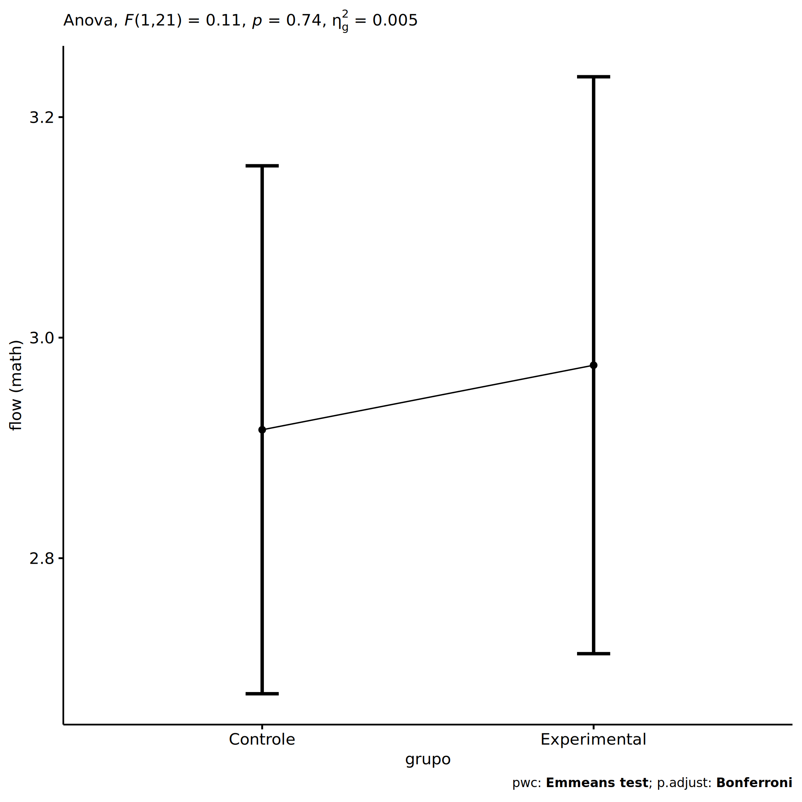<!-- -->

``` r
plots <- oneWayAncovaBoxPlots(
  wdat, "fss.matematica", "grupo", aov, pwc, covar = "dfs.matematica",
  theme = "classic", color = color[["grupo"]],
  subtitle = which(aov$Effect == "grupo"))
```

``` r
if (length(unique(wdat[["grupo"]])) > 1)
  plots[["grupo"]] + ggplot2::ylab("flow (math)") +
  ggplot2::scale_x_discrete(labels=c('pre', 'pos')) +
  if (ymin < ymax) ggplot2::ylim(ymin, ymax)
```

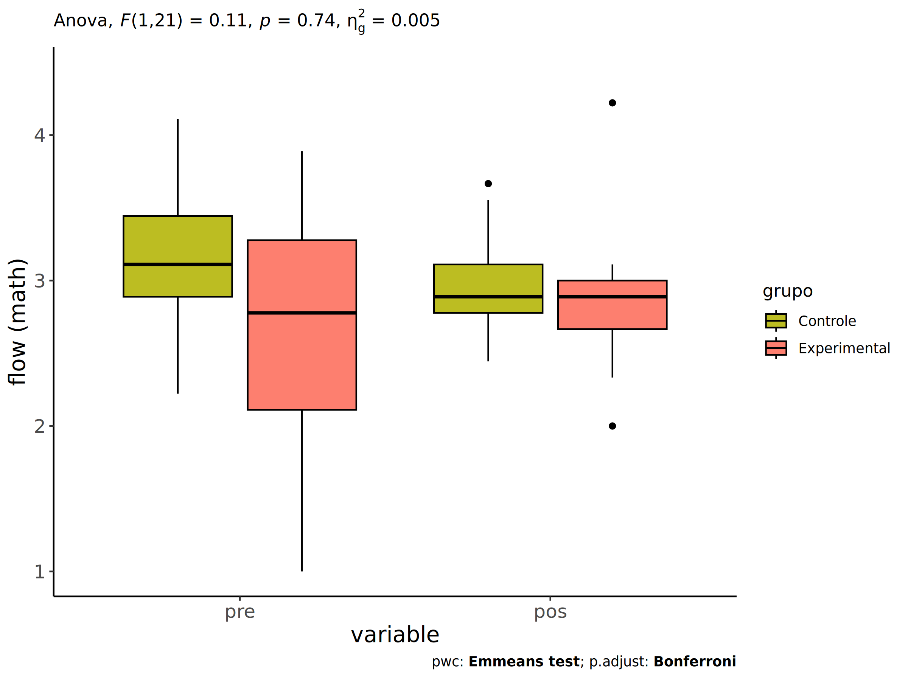<!-- -->

``` r
if (length(unique(wdat.long[["grupo"]])) > 1)
  plots <- oneWayAncovaBoxPlots(
    wdat.long, "flow.math", "grupo", aov, pwc.long,
    pre.post = "time", theme = "classic", color = color$prepost)
```

``` r
if (length(unique(wdat.long[["grupo"]])) > 1)
  plots[["grupo"]] + ggplot2::ylab("flow (math)") +
  if (ymin < ymax) ggplot2::ylim(ymin, ymax) 
```

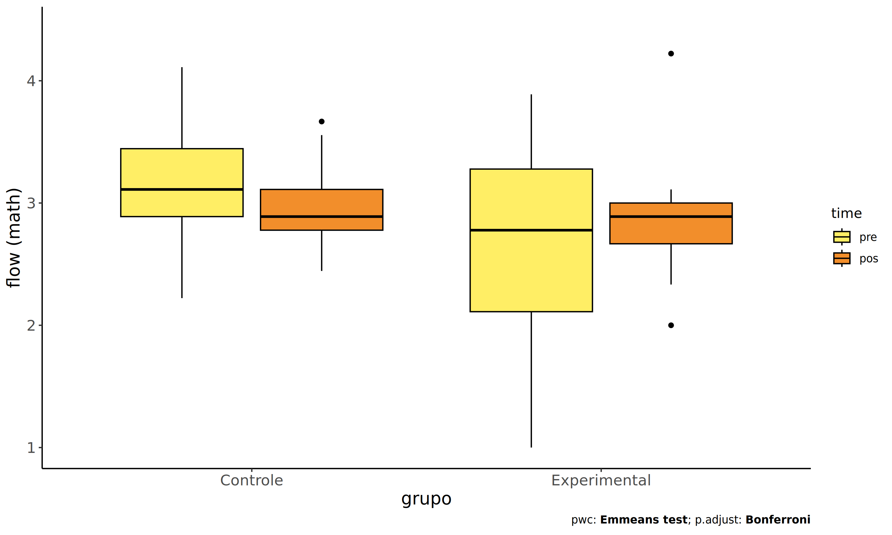<!-- -->

### Checking linearity assumption

``` r
ggscatter(wdat, x = "dfs.matematica", y = "fss.matematica", size = 0.5,
          color = "grupo", add = "reg.line")+
  stat_regline_equation(
    aes(label =  paste(..eq.label.., ..rr.label.., sep = "~~~~"), color = grupo)
  ) +
  ggplot2::labs(subtitle = rstatix::get_test_label(aov, detailed = T, row = which(aov$Effect == "grupo"))) +
  ggplot2::scale_color_manual(values = color[["grupo"]]) +
  ggplot2::ylab("flow (math)")  +
  if (ymin < ymax) ggplot2::ylim(ymin, ymax)
```

    ## Warning: The dot-dot notation (`..eq.label..`) was deprecated in ggplot2 3.4.0.
    ## ℹ Please use `after_stat(eq.label)` instead.
    ## ℹ The deprecated feature was likely used in the ggpubr package.
    ##   Please report the issue at <https://github.com/kassambara/ggpubr/issues>.
    ## This warning is displayed once every 8 hours.
    ## Call `lifecycle::last_lifecycle_warnings()` to see where this warning was
    ## generated.

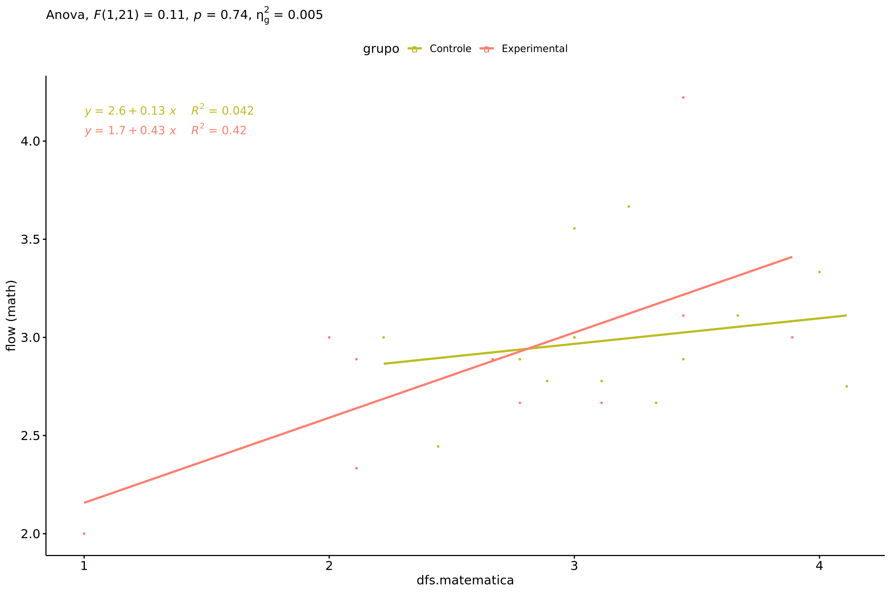<!-- -->

### Checking normality and homogeneity

``` r
res <- augment(lm(fss.matematica ~ dfs.matematica + grupo, data = wdat))
```

``` r
shapiro_test(res$.resid)
```

    ## # A tibble: 1 × 3
    ##   variable   statistic p.value
    ##   <chr>          <dbl>   <dbl>
    ## 1 res$.resid     0.907  0.0298

``` r
levene_test(res, .resid ~ grupo)
```

    ## # A tibble: 1 × 4
    ##     df1   df2 statistic     p
    ##   <int> <int>     <dbl> <dbl>
    ## 1     1    22    0.0469 0.830

# ANCOVA and Pairwise for two factors **grupo:genero**

## Without remove non-normal data

``` r
pdat = remove_group_data(dat[!is.na(dat[["grupo"]]) & !is.na(dat[["genero"]]),],
                         "fss.matematica", c("grupo","genero"))
pdat = pdat[pdat[["genero"]] %in% do.call(
  intersect, lapply(unique(pdat[["grupo"]]), FUN = function(x) {
    unique(pdat[["genero"]][which(pdat[["grupo"]] == x)])
  })),]
pdat[["grupo"]] = factor(pdat[["grupo"]], level[["grupo"]])
pdat[["genero"]] = factor(
  pdat[["genero"]],
  level[["genero"]][level[["genero"]] %in% unique(pdat[["genero"]])])

pdat.long <- rbind(pdat[,c("id","grupo","genero")], pdat[,c("id","grupo","genero")])
pdat.long[["time"]] <- c(rep("pre", nrow(pdat)), rep("pos", nrow(pdat)))
pdat.long[["time"]] <- factor(pdat.long[["time"]], c("pre","pos"))
pdat.long[["flow.math"]] <- c(pdat[["dfs.matematica"]], pdat[["fss.matematica"]])

if (length(unique(pdat[["genero"]])) >= 2) {
  aov = anova_test(pdat, fss.matematica ~ dfs.matematica + grupo*genero)
  laov[["grupo:genero"]] <- get_anova_table(aov)
}
```

``` r
if (length(unique(pdat[["genero"]])) >= 2) {
  pwcs <- list()
  pwcs[["genero"]] <- emmeans_test(
    group_by(pdat, grupo), fss.matematica ~ genero,
    covariate = dfs.matematica, p.adjust.method = "bonferroni")
  pwcs[["grupo"]] <- emmeans_test(
    group_by(pdat, genero), fss.matematica ~ grupo,
    covariate = dfs.matematica, p.adjust.method = "bonferroni")
  
  pwc <- plyr::rbind.fill(pwcs[["grupo"]], pwcs[["genero"]])
  pwc <- pwc[,c("grupo","genero", colnames(pwc)[!colnames(pwc) %in% c("grupo","genero")])]
}
```

``` r
if (length(unique(pdat[["genero"]])) >= 2) {
  pwc.long <- emmeans_test(dplyr::group_by_at(pdat.long, c("grupo","genero")),
                           flow.math ~ time,
                           p.adjust.method = "bonferroni")
  lpwc[["grupo:genero"]] <- plyr::rbind.fill(pwc, pwc.long)
}
```

``` r
if (length(unique(pdat[["genero"]])) >= 2) {
  ds <- get.descriptives(pdat, "fss.matematica", c("grupo","genero"), covar = "dfs.matematica")
  ds <- merge(ds[ds$variable != "dfs.matematica",],
              ds[ds$variable == "dfs.matematica", !colnames(ds) %in% c("variable")],
              by = c("grupo","genero"), all.x = T, suffixes = c("", ".dfs.matematica"))
  ds <- merge(get_emmeans(pwcs[["grupo"]]), ds,
              by = c("grupo","genero"), suffixes = c(".emms", ""))
  ds <- ds[,c("grupo","genero","n","mean.dfs.matematica","se.dfs.matematica","mean","se",
              "emmean","se.emms","conf.low","conf.high")]
  
  colnames(ds) <- c("grupo","genero", "N", paste0(c("M","SE")," (pre)"),
                    paste0(c("M","SE"), " (unadj)"),
                    paste0(c("M", "SE"), " (adj)"), "conf.low", "conf.high")
  
  lemms[["grupo:genero"]] <- ds
}
```

## Computing ANCOVA and PairWise After removing non-normal data (OK)

``` r
if (length(unique(pdat[["genero"]])) >= 2) {
  wdat = pdat 
  
  res = residuals(lm(fss.matematica ~ dfs.matematica + grupo*genero, data = wdat))
  non.normal = getNonNormal(res, wdat$id, plimit = 0.05)
  
  wdat = wdat[!wdat$id %in% non.normal,]
  
  wdat.long <- rbind(wdat[,c("id","grupo","genero")], wdat[,c("id","grupo","genero")])
  wdat.long[["time"]] <- c(rep("pre", nrow(wdat)), rep("pos", nrow(wdat)))
  wdat.long[["time"]] <- factor(wdat.long[["time"]], c("pre","pos"))
  wdat.long[["flow.math"]] <- c(wdat[["dfs.matematica"]], wdat[["fss.matematica"]])
  
  
  ldat[["grupo:genero"]] = wdat
  
  (non.normal)
}
```

    ## [1] "P167"

``` r
if (length(unique(pdat[["genero"]])) >= 2) {
  aov = anova_test(wdat, fss.matematica ~ dfs.matematica + grupo*genero)
  laov[["grupo:genero"]] <- merge(get_anova_table(aov), laov[["grupo:genero"]],
                                         by="Effect", suffixes = c("","'"))
  df = get_anova_table(aov)
}
```

| Effect         | DFn | DFd |     F |     p | p\<.05 |   ges |
|:---------------|----:|----:|------:|------:|:-------|------:|
| dfs.matematica |   1 |  21 | 6.021 | 0.023 | \*     | 0.223 |
| grupo          |   1 |  21 | 0.345 | 0.563 |        | 0.016 |
| genero         |   1 |  21 | 5.184 | 0.033 | \*     | 0.198 |
| grupo:genero   |   1 |  21 | 0.614 | 0.442 |        | 0.028 |

``` r
if (length(unique(pdat[["genero"]])) >= 2) {
  pwcs <- list()
  pwcs[["genero"]] <- emmeans_test(
    group_by(wdat, grupo), fss.matematica ~ genero,
    covariate = dfs.matematica, p.adjust.method = "bonferroni")
  pwcs[["grupo"]] <- emmeans_test(
    group_by(wdat, genero), fss.matematica ~ grupo,
    covariate = dfs.matematica, p.adjust.method = "bonferroni")
  
  pwc <- plyr::rbind.fill(pwcs[["grupo"]], pwcs[["genero"]])
  pwc <- pwc[,c("grupo","genero", colnames(pwc)[!colnames(pwc) %in% c("grupo","genero")])]
}
```

| grupo        | genero | term                   | .y.            | group1   | group2       |  df | statistic |     p | p.adj | p.adj.signif |
|:-------------|:-------|:-----------------------|:---------------|:---------|:-------------|----:|----------:|------:|------:|:-------------|
|              | F      | dfs.matematica\*grupo  | fss.matematica | Controle | Experimental |  21 |     0.970 | 0.343 | 0.343 | ns           |
|              | M      | dfs.matematica\*grupo  | fss.matematica | Controle | Experimental |  21 |    -0.106 | 0.916 | 0.916 | ns           |
| Controle     |        | dfs.matematica\*genero | fss.matematica | F        | M            |  21 |     2.225 | 0.037 | 0.037 | \*           |
| Experimental |        | dfs.matematica\*genero | fss.matematica | F        | M            |  21 |     0.854 | 0.403 | 0.403 | ns           |

``` r
if (length(unique(pdat[["genero"]])) >= 2) {
  pwc.long <- emmeans_test(dplyr::group_by_at(wdat.long, c("grupo","genero")),
                           flow.math ~ time,
                           p.adjust.method = "bonferroni")
  lpwc[["grupo:genero"]] <- merge(plyr::rbind.fill(pwc, pwc.long),
                                         lpwc[["grupo:genero"]],
                                         by=c("grupo","genero","term",".y.","group1","group2"),
                                         suffixes = c("","'"))
}
```

| grupo        | genero | term | .y.       | group1 | group2 |  df | statistic |     p | p.adj | p.adj.signif |
|:-------------|:-------|:-----|:----------|:-------|:-------|----:|----------:|------:|------:|:-------------|
| Controle     | F      | time | flow.math | pre    | pos    |  44 |    -1.080 | 0.286 | 0.286 | ns           |
| Controle     | M      | time | flow.math | pre    | pos    |  44 |     1.113 | 0.272 | 0.272 | ns           |
| Experimental | F      | time | flow.math | pre    | pos    |  44 |    -0.473 | 0.638 | 0.638 | ns           |
| Experimental | M      | time | flow.math | pre    | pos    |  44 |    -0.648 | 0.520 | 0.520 | ns           |

``` r
if (length(unique(pdat[["genero"]])) >= 2) {
  ds <- get.descriptives(wdat, "fss.matematica", c("grupo","genero"), covar = "dfs.matematica")
  ds <- merge(ds[ds$variable != "dfs.matematica",],
              ds[ds$variable == "dfs.matematica", !colnames(ds) %in% c("variable")],
              by = c("grupo","genero"), all.x = T, suffixes = c("", ".dfs.matematica"))
  ds <- merge(get_emmeans(pwcs[["grupo"]]), ds,
              by = c("grupo","genero"), suffixes = c(".emms", ""))
  ds <- ds[,c("grupo","genero","n","mean.dfs.matematica","se.dfs.matematica",
              "mean","se","emmean","se.emms","conf.low","conf.high")]
  
  colnames(ds) <- c("grupo","genero", "N", paste0(c("M","SE")," (pre)"),
                    paste0(c("M","SE"), " (unadj)"),
                    paste0(c("M", "SE"), " (adj)"), "conf.low", "conf.high")
  
  lemms[["grupo:genero"]] <- merge(ds, lemms[["grupo:genero"]],
                                          by=c("grupo","genero"), suffixes = c("","'"))
}
```

| grupo        | genero |   N | M (pre) | SE (pre) | M (unadj) | SE (unadj) | M (adj) | SE (adj) | conf.low | conf.high |
|:-------------|:-------|----:|--------:|---------:|----------:|-----------:|--------:|---------:|---------:|----------:|
| Controle     | F      |   6 |   3.056 |    0.179 |     3.426 |      0.259 |   3.397 |    0.188 |    3.005 |     3.788 |
| Controle     | M      |   9 |   3.272 |    0.188 |     2.960 |      0.123 |   2.853 |    0.159 |    2.521 |     3.184 |
| Experimental | F      |   5 |   2.933 |    0.252 |     3.111 |      0.308 |   3.126 |    0.206 |    2.698 |     3.554 |
| Experimental | M      |   6 |   2.481 |    0.409 |     2.704 |      0.154 |   2.881 |    0.201 |    2.463 |     3.300 |

### Plots for ancova

``` r
if (length(unique(pdat[["genero"]])) >= 2) {
  ggPlotAoC2(pwcs, "grupo", "genero", aov, ylab = "flow (math)",
             subtitle = which(aov$Effect == "grupo:genero"), addParam = "errorbar") +
    ggplot2::scale_color_manual(values = color[["genero"]]) +
    ggplot2::ylab("flow (math)") +
    if (ymin.ci < ymax.ci) ggplot2::ylim(ymin.ci, ymax.ci)
}
```

    ## Scale for colour is already present.
    ## Adding another scale for colour, which will replace the existing scale.

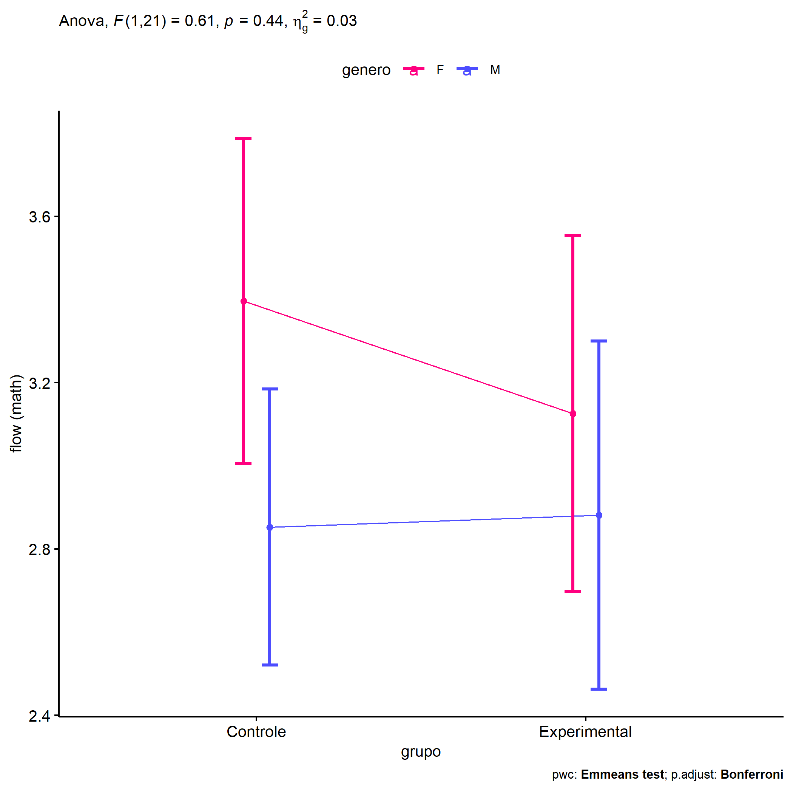<!-- -->

``` r
if (length(unique(pdat[["genero"]])) >= 2) {
  ggPlotAoC2(pwcs, "genero", "grupo", aov, ylab = "flow (math)",
               subtitle = which(aov$Effect == "grupo:genero"), addParam = "errorbar") +
    ggplot2::scale_color_manual(values = color[["grupo"]]) +
    ggplot2::ylab("flow (math)") +
    if (ymin.ci < ymax.ci) ggplot2::ylim(ymin.ci, ymax.ci)
}
```

    ## Scale for colour is already present.
    ## Adding another scale for colour, which will replace the existing scale.

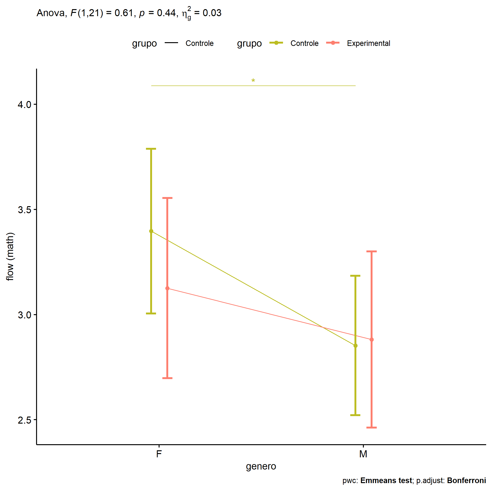<!-- -->

``` r
if (length(unique(pdat[["genero"]])) >= 2) {
  plots <- twoWayAncovaBoxPlots(
    wdat, "fss.matematica", c("grupo","genero"), aov, pwcs, covar = "dfs.matematica",
    theme = "classic", color = color[["grupo:genero"]],
    subtitle = which(aov$Effect == "grupo:genero"))
}
```

``` r
if (length(unique(pdat[["genero"]])) >= 2) {
  plots[["grupo:genero"]] + ggplot2::ylab("flow (math)") +
  ggplot2::scale_x_discrete(labels=c('pre', 'pos')) +
  if (ymin < ymax) ggplot2::ylim(ymin, ymax)
}
```

    ## Warning: No shared levels found between `names(values)` of the manual scale and the
    ## data's colour values.

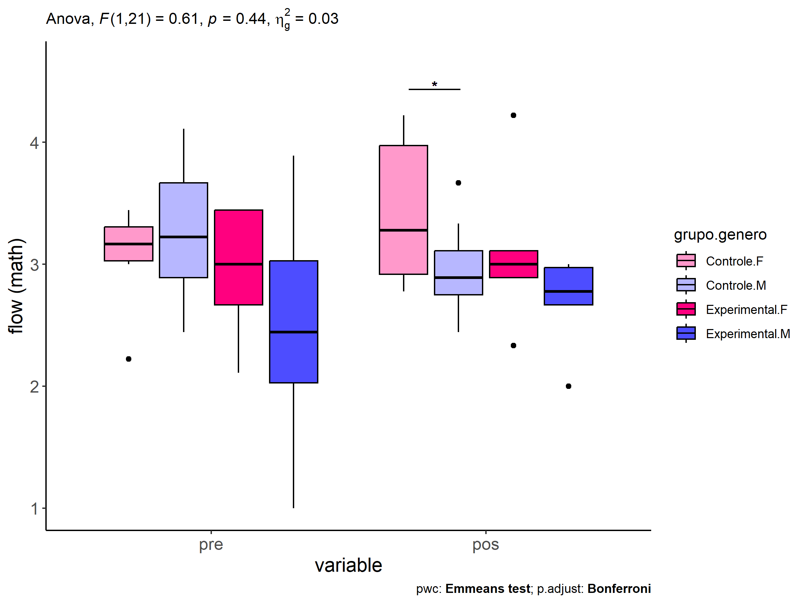<!-- -->

``` r
if (length(unique(pdat[["genero"]])) >= 2) {
  plots <- twoWayAncovaBoxPlots(
    wdat.long, "flow.math", c("grupo","genero"), aov, pwc.long,
    pre.post = "time",
    theme = "classic", color = color$prepost)
}
```

``` r
if (length(unique(pdat[["genero"]])) >= 2) 
  plots[["grupo:genero"]] + ggplot2::ylab("flow (math)") +
    if (ymin < ymax) ggplot2::ylim(ymin, ymax)
```

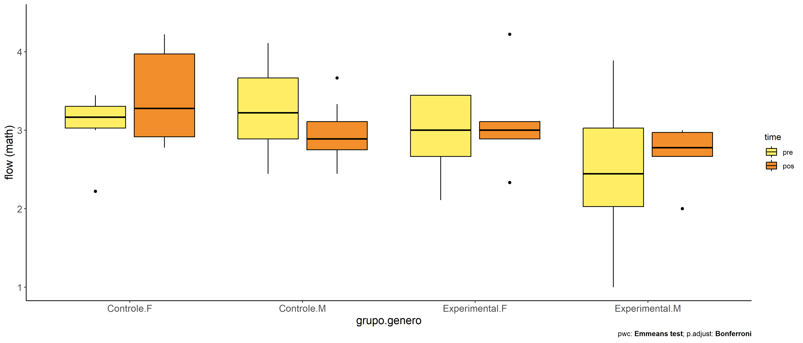<!-- -->

### Checking linearity assumption

``` r
if (length(unique(pdat[["genero"]])) >= 2) {
  ggscatter(wdat, x = "dfs.matematica", y = "fss.matematica", size = 0.5,
            facet.by = c("grupo","genero"), add = "reg.line")+
    stat_regline_equation(
      aes(label =  paste(..eq.label.., ..rr.label.., sep = "~~~~"))
    ) + ggplot2::ylab("flow (math)") +
    if (ymin < ymax) ggplot2::ylim(ymin, ymax)
}
```

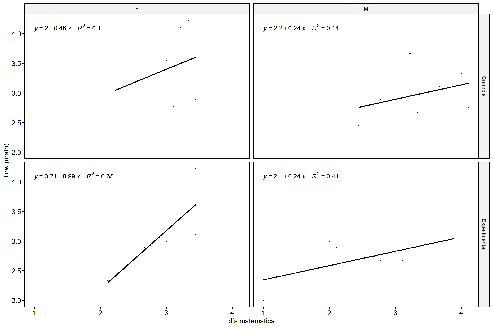<!-- -->

``` r
if (length(unique(pdat[["genero"]])) >= 2) {
  ggscatter(wdat, x = "dfs.matematica", y = "fss.matematica", size = 0.5,
            color = "grupo", facet.by = "genero", add = "reg.line")+
    stat_regline_equation(
      aes(label =  paste(..eq.label.., ..rr.label.., sep = "~~~~"), color = grupo)
    ) +
    ggplot2::labs(subtitle = rstatix::get_test_label(aov, detailed = T, row = which(aov$Effect == "grupo:genero"))) +
    ggplot2::scale_color_manual(values = color[["grupo"]]) +
    ggplot2::ylab("flow (math)") +
    if (ymin < ymax) ggplot2::ylim(ymin, ymax)
}
```

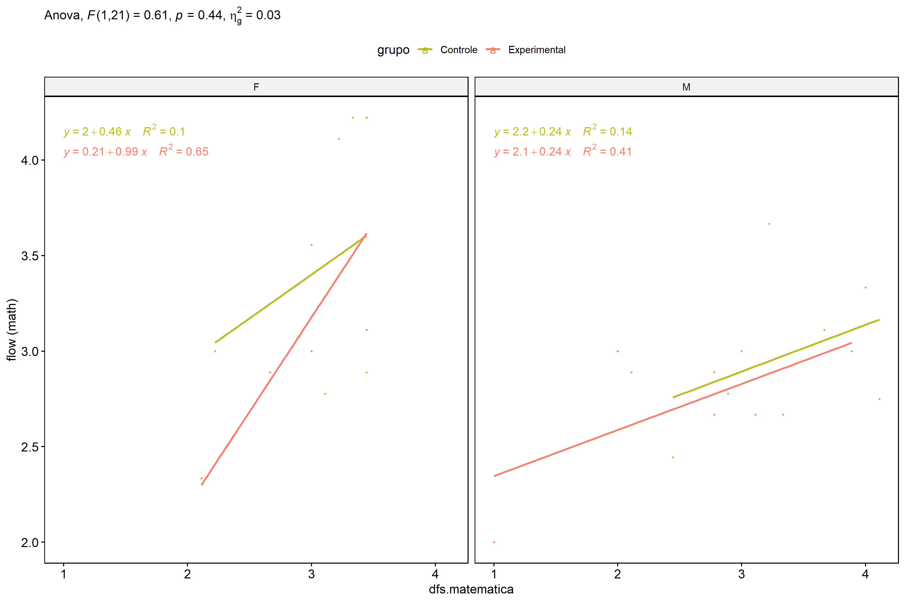<!-- -->

``` r
if (length(unique(pdat[["genero"]])) >= 2) {
  ggscatter(wdat, x = "dfs.matematica", y = "fss.matematica", size = 0.5,
            color = "genero", facet.by = "grupo", add = "reg.line")+
    stat_regline_equation(
      aes(label =  paste(..eq.label.., ..rr.label.., sep = "~~~~"), color = genero)
    ) +
    ggplot2::labs(subtitle = rstatix::get_test_label(aov, detailed = T, row = which(aov$Effect == "grupo:genero"))) +
    ggplot2::scale_color_manual(values = color[["genero"]]) +
    ggplot2::ylab("flow (math)") +
    if (ymin < ymax) ggplot2::ylim(ymin, ymax)
}
```

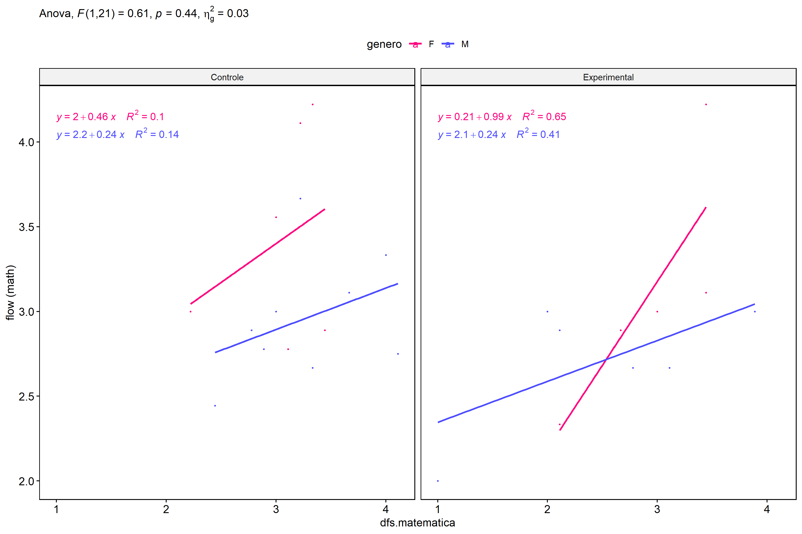<!-- -->

### Checking normality and homogeneity

``` r
if (length(unique(pdat[["genero"]])) >= 2) 
  res <- augment(lm(fss.matematica ~ dfs.matematica + grupo*genero, data = wdat))
```

``` r
if (length(unique(pdat[["genero"]])) >= 2)
  shapiro_test(res$.resid)
```

    ## # A tibble: 1 × 3
    ##   variable   statistic p.value
    ##   <chr>          <dbl>   <dbl>
    ## 1 res$.resid     0.948   0.210

``` r
if (length(unique(pdat[["genero"]])) >= 2) 
  levene_test(res, .resid ~ grupo*genero)
```

    ## # A tibble: 1 × 4
    ##     df1   df2 statistic     p
    ##   <int> <int>     <dbl> <dbl>
    ## 1     3    22      1.07 0.384

# ANCOVA and Pairwise for two factors **grupo:zona.participante**

## Without remove non-normal data

``` r
pdat = remove_group_data(dat[!is.na(dat[["grupo"]]) & !is.na(dat[["zona.participante"]]),],
                         "fss.matematica", c("grupo","zona.participante"))
pdat = pdat[pdat[["zona.participante"]] %in% do.call(
  intersect, lapply(unique(pdat[["grupo"]]), FUN = function(x) {
    unique(pdat[["zona.participante"]][which(pdat[["grupo"]] == x)])
  })),]
pdat[["grupo"]] = factor(pdat[["grupo"]], level[["grupo"]])
pdat[["zona.participante"]] = factor(
  pdat[["zona.participante"]],
  level[["zona.participante"]][level[["zona.participante"]] %in% unique(pdat[["zona.participante"]])])

pdat.long <- rbind(pdat[,c("id","grupo","zona.participante")], pdat[,c("id","grupo","zona.participante")])
pdat.long[["time"]] <- c(rep("pre", nrow(pdat)), rep("pos", nrow(pdat)))
pdat.long[["time"]] <- factor(pdat.long[["time"]], c("pre","pos"))
pdat.long[["flow.math"]] <- c(pdat[["dfs.matematica"]], pdat[["fss.matematica"]])

if (length(unique(pdat[["zona.participante"]])) >= 2) {
  aov = anova_test(pdat, fss.matematica ~ dfs.matematica + grupo*zona.participante)
  laov[["grupo:zona.participante"]] <- get_anova_table(aov)
}
```

``` r
if (length(unique(pdat[["zona.participante"]])) >= 2) {
  pwcs <- list()
  pwcs[["zona.participante"]] <- emmeans_test(
    group_by(pdat, grupo), fss.matematica ~ zona.participante,
    covariate = dfs.matematica, p.adjust.method = "bonferroni")
  pwcs[["grupo"]] <- emmeans_test(
    group_by(pdat, zona.participante), fss.matematica ~ grupo,
    covariate = dfs.matematica, p.adjust.method = "bonferroni")
  
  pwc <- plyr::rbind.fill(pwcs[["grupo"]], pwcs[["zona.participante"]])
  pwc <- pwc[,c("grupo","zona.participante", colnames(pwc)[!colnames(pwc) %in% c("grupo","zona.participante")])]
}
```

``` r
if (length(unique(pdat[["zona.participante"]])) >= 2) {
  pwc.long <- emmeans_test(dplyr::group_by_at(pdat.long, c("grupo","zona.participante")),
                           flow.math ~ time,
                           p.adjust.method = "bonferroni")
  lpwc[["grupo:zona.participante"]] <- plyr::rbind.fill(pwc, pwc.long)
}
```

``` r
if (length(unique(pdat[["zona.participante"]])) >= 2) {
  ds <- get.descriptives(pdat, "fss.matematica", c("grupo","zona.participante"), covar = "dfs.matematica")
  ds <- merge(ds[ds$variable != "dfs.matematica",],
              ds[ds$variable == "dfs.matematica", !colnames(ds) %in% c("variable")],
              by = c("grupo","zona.participante"), all.x = T, suffixes = c("", ".dfs.matematica"))
  ds <- merge(get_emmeans(pwcs[["grupo"]]), ds,
              by = c("grupo","zona.participante"), suffixes = c(".emms", ""))
  ds <- ds[,c("grupo","zona.participante","n","mean.dfs.matematica","se.dfs.matematica","mean","se",
              "emmean","se.emms","conf.low","conf.high")]
  
  colnames(ds) <- c("grupo","zona.participante", "N", paste0(c("M","SE")," (pre)"),
                    paste0(c("M","SE"), " (unadj)"),
                    paste0(c("M", "SE"), " (adj)"), "conf.low", "conf.high")
  
  lemms[["grupo:zona.participante"]] <- ds
}
```

## Computing ANCOVA and PairWise After removing non-normal data (OK)

``` r
if (length(unique(pdat[["zona.participante"]])) >= 2) {
  wdat = pdat 
  
  res = residuals(lm(fss.matematica ~ dfs.matematica + grupo*zona.participante, data = wdat))
  non.normal = getNonNormal(res, wdat$id, plimit = 0.05)
  
  wdat = wdat[!wdat$id %in% non.normal,]
  
  wdat.long <- rbind(wdat[,c("id","grupo","zona.participante")], wdat[,c("id","grupo","zona.participante")])
  wdat.long[["time"]] <- c(rep("pre", nrow(wdat)), rep("pos", nrow(wdat)))
  wdat.long[["time"]] <- factor(wdat.long[["time"]], c("pre","pos"))
  wdat.long[["flow.math"]] <- c(wdat[["dfs.matematica"]], wdat[["fss.matematica"]])
  
  
  ldat[["grupo:zona.participante"]] = wdat
  
  (non.normal)
}
```

``` r
if (length(unique(pdat[["zona.participante"]])) >= 2) {
  aov = anova_test(wdat, fss.matematica ~ dfs.matematica + grupo*zona.participante)
  laov[["grupo:zona.participante"]] <- merge(get_anova_table(aov), laov[["grupo:zona.participante"]],
                                         by="Effect", suffixes = c("","'"))
  df = get_anova_table(aov)
}
```

``` r
if (length(unique(pdat[["zona.participante"]])) >= 2) {
  pwcs <- list()
  pwcs[["zona.participante"]] <- emmeans_test(
    group_by(wdat, grupo), fss.matematica ~ zona.participante,
    covariate = dfs.matematica, p.adjust.method = "bonferroni")
  pwcs[["grupo"]] <- emmeans_test(
    group_by(wdat, zona.participante), fss.matematica ~ grupo,
    covariate = dfs.matematica, p.adjust.method = "bonferroni")
  
  pwc <- plyr::rbind.fill(pwcs[["grupo"]], pwcs[["zona.participante"]])
  pwc <- pwc[,c("grupo","zona.participante", colnames(pwc)[!colnames(pwc) %in% c("grupo","zona.participante")])]
}
```

``` r
if (length(unique(pdat[["zona.participante"]])) >= 2) {
  pwc.long <- emmeans_test(dplyr::group_by_at(wdat.long, c("grupo","zona.participante")),
                           flow.math ~ time,
                           p.adjust.method = "bonferroni")
  lpwc[["grupo:zona.participante"]] <- merge(plyr::rbind.fill(pwc, pwc.long),
                                         lpwc[["grupo:zona.participante"]],
                                         by=c("grupo","zona.participante","term",".y.","group1","group2"),
                                         suffixes = c("","'"))
}
```

``` r
if (length(unique(pdat[["zona.participante"]])) >= 2) {
  ds <- get.descriptives(wdat, "fss.matematica", c("grupo","zona.participante"), covar = "dfs.matematica")
  ds <- merge(ds[ds$variable != "dfs.matematica",],
              ds[ds$variable == "dfs.matematica", !colnames(ds) %in% c("variable")],
              by = c("grupo","zona.participante"), all.x = T, suffixes = c("", ".dfs.matematica"))
  ds <- merge(get_emmeans(pwcs[["grupo"]]), ds,
              by = c("grupo","zona.participante"), suffixes = c(".emms", ""))
  ds <- ds[,c("grupo","zona.participante","n","mean.dfs.matematica","se.dfs.matematica",
              "mean","se","emmean","se.emms","conf.low","conf.high")]
  
  colnames(ds) <- c("grupo","zona.participante", "N", paste0(c("M","SE")," (pre)"),
                    paste0(c("M","SE"), " (unadj)"),
                    paste0(c("M", "SE"), " (adj)"), "conf.low", "conf.high")
  
  lemms[["grupo:zona.participante"]] <- merge(ds, lemms[["grupo:zona.participante"]],
                                          by=c("grupo","zona.participante"), suffixes = c("","'"))
}
```

### Plots for ancova

``` r
if (length(unique(pdat[["zona.participante"]])) >= 2) {
  ggPlotAoC2(pwcs, "grupo", "zona.participante", aov, ylab = "flow (math)",
             subtitle = which(aov$Effect == "grupo:zona.participante"), addParam = "errorbar") +
    ggplot2::scale_color_manual(values = color[["zona.participante"]]) +
    ggplot2::ylab("flow (math)") +
    if (ymin.ci < ymax.ci) ggplot2::ylim(ymin.ci, ymax.ci)
}
```

``` r
if (length(unique(pdat[["zona.participante"]])) >= 2) {
  ggPlotAoC2(pwcs, "zona.participante", "grupo", aov, ylab = "flow (math)",
               subtitle = which(aov$Effect == "grupo:zona.participante"), addParam = "errorbar") +
    ggplot2::scale_color_manual(values = color[["grupo"]]) +
    ggplot2::ylab("flow (math)") +
    if (ymin.ci < ymax.ci) ggplot2::ylim(ymin.ci, ymax.ci)
}
```

``` r
if (length(unique(pdat[["zona.participante"]])) >= 2) {
  plots <- twoWayAncovaBoxPlots(
    wdat, "fss.matematica", c("grupo","zona.participante"), aov, pwcs, covar = "dfs.matematica",
    theme = "classic", color = color[["grupo:zona.participante"]],
    subtitle = which(aov$Effect == "grupo:zona.participante"))
}
```

``` r
if (length(unique(pdat[["zona.participante"]])) >= 2) {
  plots[["grupo:zona.participante"]] + ggplot2::ylab("flow (math)") +
  ggplot2::scale_x_discrete(labels=c('pre', 'pos')) +
  if (ymin < ymax) ggplot2::ylim(ymin, ymax)
}
```

``` r
if (length(unique(pdat[["zona.participante"]])) >= 2) {
  plots <- twoWayAncovaBoxPlots(
    wdat.long, "flow.math", c("grupo","zona.participante"), aov, pwc.long,
    pre.post = "time",
    theme = "classic", color = color$prepost)
}
```

``` r
if (length(unique(pdat[["zona.participante"]])) >= 2) 
  plots[["grupo:zona.participante"]] + ggplot2::ylab("flow (math)") +
    if (ymin < ymax) ggplot2::ylim(ymin, ymax)
```

### Checking linearity assumption

``` r
if (length(unique(pdat[["zona.participante"]])) >= 2) {
  ggscatter(wdat, x = "dfs.matematica", y = "fss.matematica", size = 0.5,
            facet.by = c("grupo","zona.participante"), add = "reg.line")+
    stat_regline_equation(
      aes(label =  paste(..eq.label.., ..rr.label.., sep = "~~~~"))
    ) + ggplot2::ylab("flow (math)") +
    if (ymin < ymax) ggplot2::ylim(ymin, ymax)
}
```

``` r
if (length(unique(pdat[["zona.participante"]])) >= 2) {
  ggscatter(wdat, x = "dfs.matematica", y = "fss.matematica", size = 0.5,
            color = "grupo", facet.by = "zona.participante", add = "reg.line")+
    stat_regline_equation(
      aes(label =  paste(..eq.label.., ..rr.label.., sep = "~~~~"), color = grupo)
    ) +
    ggplot2::labs(subtitle = rstatix::get_test_label(aov, detailed = T, row = which(aov$Effect == "grupo:zona.participante"))) +
    ggplot2::scale_color_manual(values = color[["grupo"]]) +
    ggplot2::ylab("flow (math)") +
    if (ymin < ymax) ggplot2::ylim(ymin, ymax)
}
```

``` r
if (length(unique(pdat[["zona.participante"]])) >= 2) {
  ggscatter(wdat, x = "dfs.matematica", y = "fss.matematica", size = 0.5,
            color = "zona.participante", facet.by = "grupo", add = "reg.line")+
    stat_regline_equation(
      aes(label =  paste(..eq.label.., ..rr.label.., sep = "~~~~"), color = zona.participante)
    ) +
    ggplot2::labs(subtitle = rstatix::get_test_label(aov, detailed = T, row = which(aov$Effect == "grupo:zona.participante"))) +
    ggplot2::scale_color_manual(values = color[["zona.participante"]]) +
    ggplot2::ylab("flow (math)") +
    if (ymin < ymax) ggplot2::ylim(ymin, ymax)
}
```

### Checking normality and homogeneity

``` r
if (length(unique(pdat[["zona.participante"]])) >= 2) 
  res <- augment(lm(fss.matematica ~ dfs.matematica + grupo*zona.participante, data = wdat))
```

``` r
if (length(unique(pdat[["zona.participante"]])) >= 2)
  shapiro_test(res$.resid)
```

``` r
if (length(unique(pdat[["zona.participante"]])) >= 2) 
  levene_test(res, .resid ~ grupo*zona.participante)
```

# Summary of Results

## Descriptive Statistics

``` r
df <- get.descriptives(ldat[["grupo"]], c(dv.pre, dv.pos), c("grupo"), 
                       include.global = T, symmetry.test = T, normality.test = F)
df <- plyr::rbind.fill(
  df, do.call(plyr::rbind.fill, lapply(lfatores2, FUN = function(f) {
    if (nrow(dat) > 0 && sum(!is.na(unique(dat[[f]]))) > 1 && paste0("grupo:",f) %in% names(ldat))
      get.descriptives(ldat[[paste0("grupo:",f)]], c(dv.pre,dv.pos), c("grupo", f),
                       symmetry.test = T, normality.test = F)
    }))
)
df <- df[,c(fatores1[fatores1 %in% colnames(df)],"variable",
             colnames(df)[!colnames(df) %in% c(fatores1,"variable")])]
```

| grupo        | genero | variable       |   n |  mean | median |   min |   max |    sd |    se |    ci |   iqr | symmetry | skewness | kurtosis |
|:-------------|:-------|:---------------|----:|------:|-------:|------:|------:|------:|------:|------:|------:|:---------|---------:|---------:|
| Controle     |        | dfs.matematica |  13 | 3.171 |  3.111 | 2.222 | 4.111 | 0.551 | 0.153 | 0.333 | 0.556 | YES      |    0.100 |   -0.965 |
| Experimental |        | dfs.matematica |  11 | 2.687 |  2.778 | 1.000 | 3.889 | 0.828 | 0.250 | 0.556 | 1.167 | YES      |   -0.447 |   -0.812 |
|              |        | dfs.matematica |  24 | 2.949 |  3.000 | 1.000 | 4.111 | 0.719 | 0.147 | 0.304 | 0.833 | NO       |   -0.627 |    0.249 |
| Controle     |        | fss.matematica |  13 | 2.989 |  2.889 | 2.444 | 3.667 | 0.351 | 0.097 | 0.212 | 0.333 | NO       |    0.541 |   -0.808 |
| Experimental |        | fss.matematica |  11 | 2.889 |  2.889 | 2.000 | 4.222 | 0.553 | 0.167 | 0.372 | 0.333 | NO       |    0.799 |    0.770 |
|              |        | fss.matematica |  24 | 2.943 |  2.889 | 2.000 | 4.222 | 0.447 | 0.091 | 0.189 | 0.299 | NO       |    0.698 |    1.294 |
| Controle     | F      | dfs.matematica |   6 | 3.056 |  3.167 | 2.222 | 3.444 | 0.437 | 0.179 | 0.459 | 0.278 | NO       |   -0.983 |   -0.670 |
| Controle     | M      | dfs.matematica |   9 | 3.272 |  3.222 | 2.444 | 4.111 | 0.564 | 0.188 | 0.434 | 0.778 | YES      |    0.172 |   -1.511 |
| Experimental | F      | dfs.matematica |   5 | 2.933 |  3.000 | 2.111 | 3.444 | 0.564 | 0.252 | 0.701 | 0.778 | YES      |   -0.342 |   -1.820 |
| Experimental | M      | dfs.matematica |   6 | 2.481 |  2.444 | 1.000 | 3.889 | 1.003 | 0.409 | 1.052 | 1.000 | YES      |   -0.058 |   -1.521 |
| Controle     | F      | fss.matematica |   6 | 3.426 |  3.278 | 2.778 | 4.222 | 0.634 | 0.259 | 0.665 | 1.056 | YES      |    0.212 |   -2.056 |
| Controle     | M      | fss.matematica |   9 | 2.960 |  2.889 | 2.444 | 3.667 | 0.370 | 0.123 | 0.285 | 0.361 | NO       |    0.505 |   -0.930 |
| Experimental | F      | fss.matematica |   5 | 3.111 |  3.000 | 2.333 | 4.222 | 0.689 | 0.308 | 0.856 | 0.222 | NO       |    0.543 |   -1.324 |
| Experimental | M      | fss.matematica |   6 | 2.704 |  2.778 | 2.000 | 3.000 | 0.376 | 0.154 | 0.395 | 0.306 | NO       |   -0.908 |   -0.823 |

## ANCOVA Table Comparison

``` r
df <- do.call(plyr::rbind.fill, laov)
df <- df[!duplicated(df$Effect),]
```

|     | Effect         | DFn | DFd |     F |     p | p\<.05 |   ges | DFn’ | DFd’ |    F’ |    p’ | p\<.05’ |  ges’ |
|:----|:---------------|----:|----:|------:|------:|:-------|------:|-----:|-----:|------:|------:|:--------|------:|
| 1   | dfs.matematica |   1 |  21 | 6.977 | 0.015 | \*     | 0.249 |    1 |   24 | 4.013 | 0.057 |         | 0.143 |
| 2   | grupo          |   1 |  21 | 0.111 | 0.742 |        | 0.005 |    1 |   24 | 0.533 | 0.472 |         | 0.022 |
| 4   | genero         |   1 |  21 | 5.184 | 0.033 | \*     | 0.198 |    1 |   22 | 2.738 | 0.112 |         | 0.111 |
| 6   | grupo:genero   |   1 |  21 | 0.614 | 0.442 |        | 0.028 |    1 |   22 | 0.107 | 0.746 |         | 0.005 |

## PairWise Table Comparison

``` r
df <- do.call(plyr::rbind.fill, lpwc)
df <- df[,c(names(lfatores)[names(lfatores) %in% colnames(df)],
            names(df)[!names(df) %in% c(names(lfatores),"term",".y.")])]
```

| grupo        | genero | group1   | group2       |  df | statistic |     p | p.adj | p.adj.signif | df’ | statistic’ |    p’ | p.adj’ | p.adj.signif’ |
|:-------------|:-------|:---------|:-------------|----:|----------:|------:|------:|:-------------|----:|-----------:|------:|-------:|:--------------|
| Controle     |        | pre      | pos          |  44 |     0.792 | 0.433 | 0.433 | ns           |  50 |     -0.185 | 0.854 |  0.854 | ns            |
| Experimental |        | pre      | pos          |  44 |    -0.810 | 0.422 | 0.422 | ns           |  50 |     -0.777 | 0.441 |  0.441 | ns            |
|              |        | Controle | Experimental |  21 |    -0.333 | 0.742 | 0.742 | ns           |  24 |      0.730 | 0.472 |  0.472 | ns            |
| Controle     | F      | pre      | pos          |  44 |    -1.080 | 0.286 | 0.286 | ns           |  46 |     -1.055 | 0.297 |  0.297 | ns            |
| Controle     | M      | pre      | pos          |  44 |     1.113 | 0.272 | 0.272 | ns           |  46 |      0.582 | 0.563 |  0.563 | ns            |
| Controle     |        | F        | M            |  21 |     2.225 | 0.037 | 0.037 | \*           |  22 |      1.467 | 0.156 |  0.156 | ns            |
| Experimental | F      | pre      | pos          |  44 |    -0.473 | 0.638 | 0.638 | ns           |  46 |     -0.462 | 0.646 |  0.646 | ns            |
| Experimental | M      | pre      | pos          |  44 |    -0.648 | 0.520 | 0.520 | ns           |  46 |     -0.633 | 0.530 |  0.530 | ns            |
| Experimental |        | F        | M            |  21 |     0.854 | 0.403 | 0.403 | ns           |  22 |      0.793 | 0.436 |  0.436 | ns            |
|              | F      | Controle | Experimental |  21 |     0.970 | 0.343 | 0.343 | ns           |  22 |      0.861 | 0.399 |  0.399 | ns            |
|              | M      | Controle | Experimental |  21 |    -0.106 | 0.916 | 0.916 | ns           |  22 |      0.443 | 0.662 |  0.662 | ns            |

## EMMS Table Comparison

``` r
df <- do.call(plyr::rbind.fill, lemms)
df[["N-N'"]] <- df[["N"]] - df[["N'"]]
df <- df[,c(names(lfatores)[names(lfatores) %in% colnames(df)],
            names(df)[!names(df) %in% names(lfatores)])]
```

| grupo        | genero |   N | M (pre) | SE (pre) | M (unadj) | SE (unadj) | M (adj) | SE (adj) | conf.low | conf.high |  N’ | M (pre)’ | SE (pre)’ | M (unadj)’ | SE (unadj)’ | M (adj)’ | SE (adj)’ | conf.low’ | conf.high’ | N-N’ |
|:-------------|:-------|----:|--------:|---------:|----------:|-----------:|--------:|---------:|---------:|----------:|----:|---------:|----------:|-----------:|------------:|---------:|----------:|----------:|-----------:|-----:|
| Controle     |        |  13 |   3.171 |    0.153 |     2.989 |      0.097 |   2.916 |    0.115 |    2.677 |     3.156 |  16 |    3.174 |     0.124 |      3.214 |       0.144 |    3.148 |     0.138 |     2.864 |      3.433 |   -3 |
| Experimental |        |  11 |   2.687 |    0.250 |     2.889 |      0.167 |   2.975 |    0.126 |    2.713 |     3.237 |  11 |    2.687 |     0.250 |      2.889 |       0.167 |    2.984 |     0.168 |     2.637 |      3.332 |    0 |
| Controle     | F      |   6 |   3.056 |    0.179 |     3.426 |      0.259 |   3.397 |    0.188 |    3.005 |     3.788 |   6 |    3.056 |     0.179 |      3.426 |       0.259 |    3.400 |     0.215 |     2.953 |      3.846 |    0 |
| Controle     | M      |   9 |   3.272 |    0.188 |     2.960 |      0.123 |   2.853 |    0.159 |    2.521 |     3.184 |  10 |    3.244 |     0.170 |      3.086 |       0.168 |    2.998 |     0.172 |     2.640 |      3.356 |   -1 |
| Experimental | F      |   5 |   2.933 |    0.252 |     3.111 |      0.308 |   3.126 |    0.206 |    2.698 |     3.554 |   5 |    2.933 |     0.252 |      3.111 |       0.308 |    3.125 |     0.236 |     2.636 |      3.613 |    0 |
| Experimental | M      |   6 |   2.481 |    0.409 |     2.704 |      0.154 |   2.881 |    0.201 |    2.463 |     3.300 |   6 |    2.481 |     0.409 |      2.704 |       0.154 |    2.865 |     0.230 |     2.387 |      3.343 |    0 |
