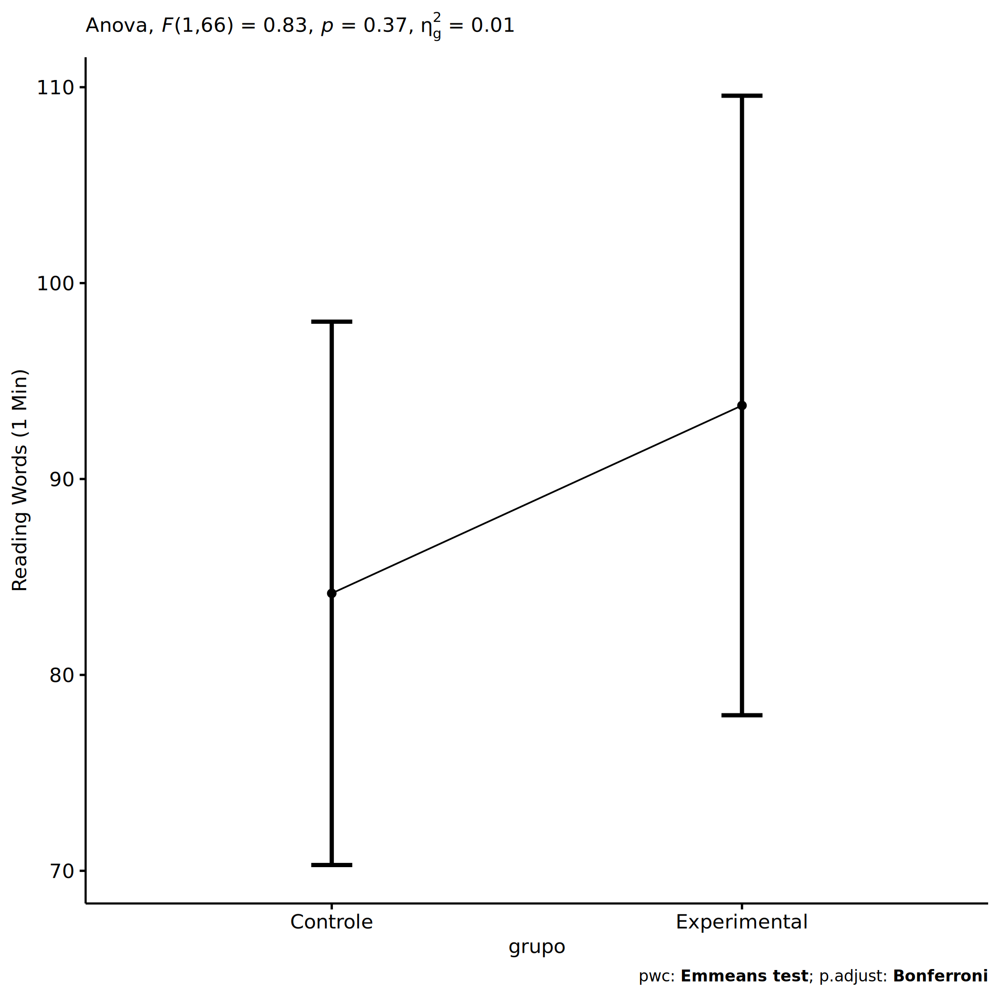
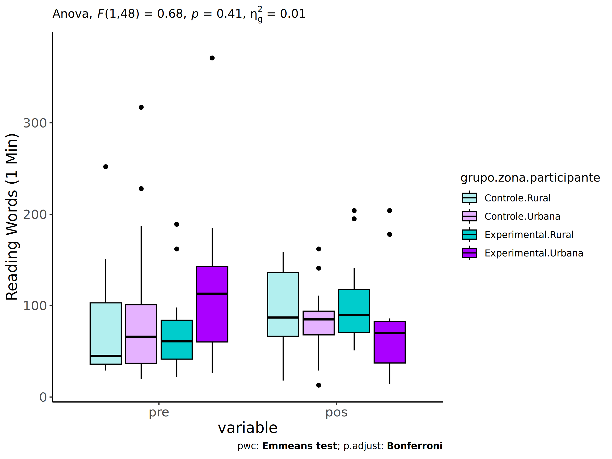
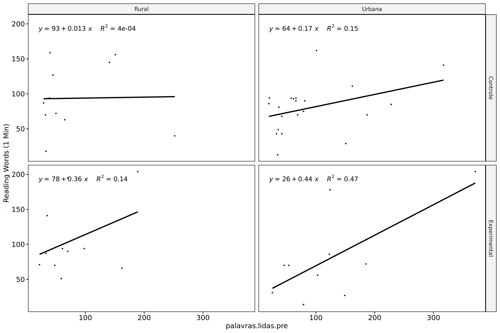
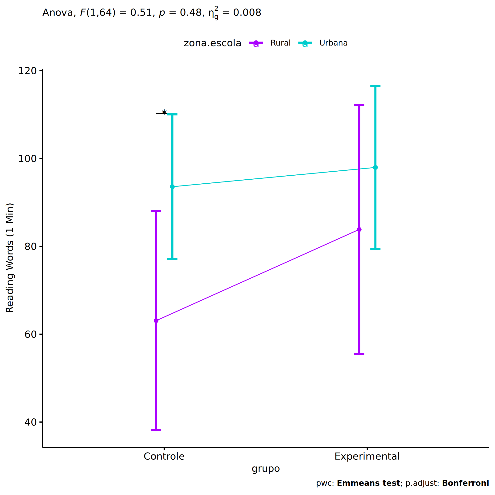
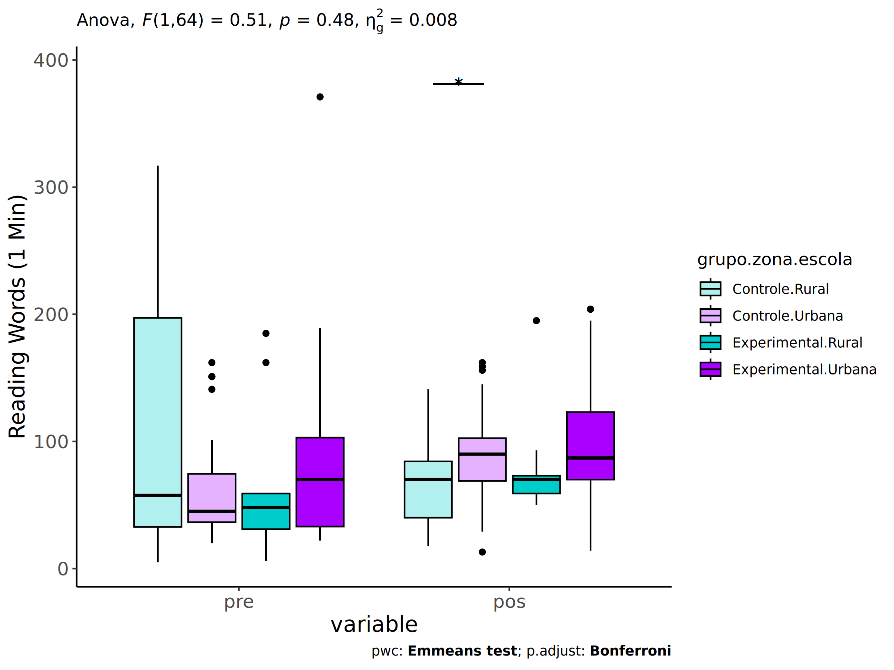
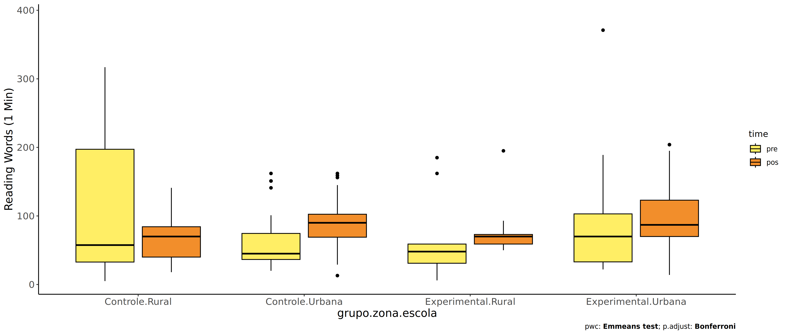
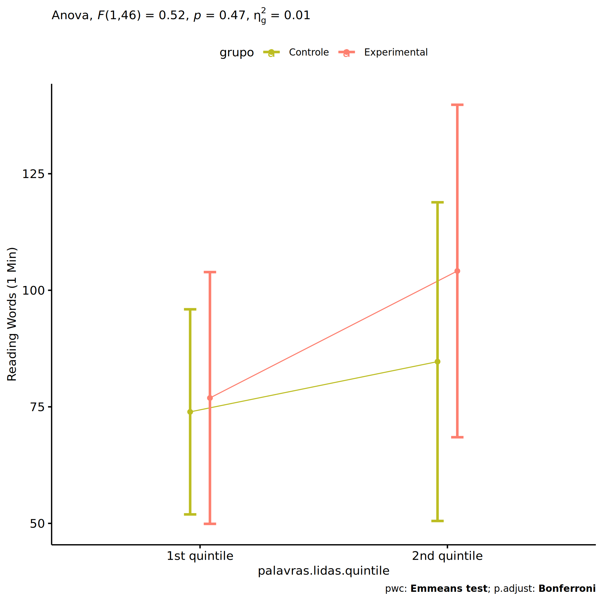
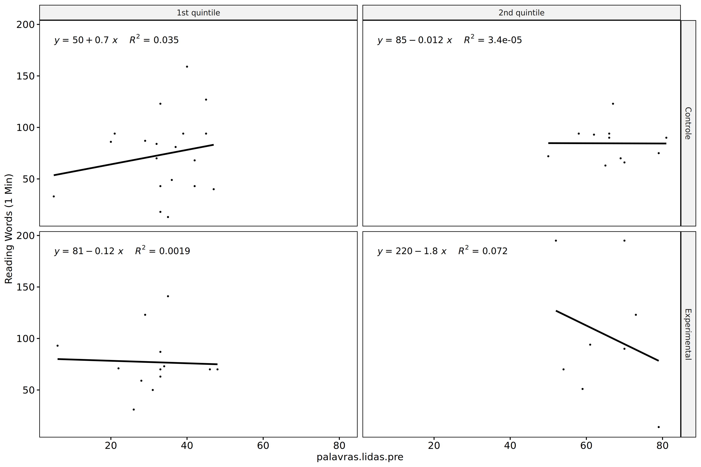

ANCOVA in Reading Words (1 Min) (Reading Words (1 Min))
================
Geiser C. Challco <geiser@alumni.usp.br>

- [Setting Initial Variables](#setting-initial-variables)
- [Descriptive Statistics of Initial
  Data](#descriptive-statistics-of-initial-data)
- [ANCOVA and Pairwise for one factor:
  **grupo**](#ancova-and-pairwise-for-one-factor-grupo)
  - [Without remove non-normal data](#without-remove-non-normal-data)
  - [Computing ANCOVA and PairWise After removing non-normal data
    (OK)](#computing-ancova-and-pairwise-after-removing-non-normal-data-ok)
    - [Plots for ancova](#plots-for-ancova)
    - [Checking linearity assumption](#checking-linearity-assumption)
    - [Checking normality and
      homogeneity](#checking-normality-and-homogeneity)
- [ANCOVA and Pairwise for two factors
  **grupo:genero**](#ancova-and-pairwise-for-two-factors-grupogenero)
  - [Without remove non-normal data](#without-remove-non-normal-data-1)
  - [Computing ANCOVA and PairWise After removing non-normal data
    (OK)](#computing-ancova-and-pairwise-after-removing-non-normal-data-ok-1)
    - [Plots for ancova](#plots-for-ancova-1)
    - [Checking linearity assumption](#checking-linearity-assumption-1)
    - [Checking normality and
      homogeneity](#checking-normality-and-homogeneity-1)
- [ANCOVA and Pairwise for two factors
  **grupo:zona.participante**](#ancova-and-pairwise-for-two-factors-grupozonaparticipante)
  - [Without remove non-normal data](#without-remove-non-normal-data-2)
  - [Computing ANCOVA and PairWise After removing non-normal data
    (OK)](#computing-ancova-and-pairwise-after-removing-non-normal-data-ok-2)
    - [Plots for ancova](#plots-for-ancova-2)
    - [Checking linearity assumption](#checking-linearity-assumption-2)
    - [Checking normality and
      homogeneity](#checking-normality-and-homogeneity-2)
- [ANCOVA and Pairwise for two factors
  **grupo:zona.escola**](#ancova-and-pairwise-for-two-factors-grupozonaescola)
  - [Without remove non-normal data](#without-remove-non-normal-data-3)
  - [Computing ANCOVA and PairWise After removing non-normal data
    (OK)](#computing-ancova-and-pairwise-after-removing-non-normal-data-ok-3)
    - [Plots for ancova](#plots-for-ancova-3)
    - [Checking linearity assumption](#checking-linearity-assumption-3)
    - [Checking normality and
      homogeneity](#checking-normality-and-homogeneity-3)
- [ANCOVA and Pairwise for two factors
  **grupo:palavras.lidas.quintile**](#ancova-and-pairwise-for-two-factors-grupopalavraslidasquintile)
  - [Without remove non-normal data](#without-remove-non-normal-data-4)
  - [Computing ANCOVA and PairWise After removing non-normal data
    (OK)](#computing-ancova-and-pairwise-after-removing-non-normal-data-ok-4)
    - [Plots for ancova](#plots-for-ancova-4)
    - [Checking linearity assumption](#checking-linearity-assumption-4)
    - [Checking normality and
      homogeneity](#checking-normality-and-homogeneity-4)
- [Summary of Results](#summary-of-results)
  - [Descriptive Statistics](#descriptive-statistics)
  - [ANCOVA Table Comparison](#ancova-table-comparison)
  - [PairWise Table Comparison](#pairwise-table-comparison)
  - [EMMS Table Comparison](#emms-table-comparison)

**NOTE**:

- Teste ANCOVA para determinar se houve diferenças significativas no
  Reading Words (1 Min) (medido usando pre- e pos-testes).
- ANCOVA test to determine whether there were significant differences in
  Reading Words (1 Min) (measured using pre- and post-tests).

# Setting Initial Variables

``` r
dv = "palavras.lidas"
dv.pos = "palavras.lidas.pos"
dv.pre = "palavras.lidas.pre"

fatores2 <- c("genero","zona.participante","zona.escola","palavras.lidas.quintile")
lfatores2 <- as.list(fatores2)
names(lfatores2) <- fatores2

fatores1 <- c("grupo", fatores2)
lfatores1 <- as.list(fatores1)
names(lfatores1) <- fatores1

lfatores <- c(lfatores1)

color <- list()
color[["prepost"]] = c("#ffee65","#f28e2B")
color[["grupo"]] = c("#bcbd22","#fd7f6f")
color[["genero"]] = c("#FF007F","#4D4DFF")
color[["zona.escola"]] = c("#AA00FF","#00CCCC")
color[["zona.participante"]] = c("#AA00FF","#00CCCC")

level <- list()
level[["grupo"]] = c("Controle","Experimental")
level[["genero"]] = c("F","M")
level[["zona.escola"]] = c("Rural","Urbana")
level[["zona.participante"]] = c("Rural","Urbana")

# ..

ymin <- 0
ymax <- 0

ymin.ci <- 0
ymax.ci <- 0


color[["grupo:genero"]] = c(
  "Controle:F"="#ff99cb", "Controle:M"="#b7b7ff",
  "Experimental:F"="#FF007F", "Experimental:M"="#4D4DFF",
  "Controle.F"="#ff99cb", "Controle.M"="#b7b7ff",
  "Experimental.F"="#FF007F", "Experimental.M"="#4D4DFF"
)
color[["grupo:zona.escola"]] = c(
  "Controle:Rural"="#b2efef","Controle:Urbana"="#e5b2ff",
  "Experimental:Rural"="#00CCCC", "Experimental:Urbana"="#AA00FF",
  "Controle.Rural"="#b2efef","Controle.Urbana"="#e5b2ff",
  "Experimental.Rural"="#00CCCC", "Experimental.Urbana"="#AA00FF"
)
color[["grupo:zona.participante"]] = c(
  "Controle:Rural"="#b2efef","Controle:Urbana"="#e5b2ff",
  "Experimental:Rural"="#00CCCC", "Experimental:Urbana"="#AA00FF",
  "Controle.Rural"="#b2efef","Controle.Urbana"="#e5b2ff",
  "Experimental.Rural"="#00CCCC", "Experimental.Urbana"="#AA00FF"
)

for (coln in c(
  "palavras.lidas","score.compreensao","tri.compreensao",
  "score.vocab","tri.vocab",
  "score.vocab.ensinado","tri.vocab.ensinado","score.vocab.nao.ensinado","tri.vocab.nao.ensinado",
  "score.CLPP","tri.CLPP","score.CR","tri.CR",
  "score.CI","tri.CI","score.TV","tri.TV","score.TF","tri.TF","score.TO","tri.TO")) {
  color[[paste0(coln,".quintile")]] = c("#BF0040","#FF0000","#800080","#0000FF","#4000BF")
  level[[paste0(coln,".quintile")]] = c("1st quintile","2nd quintile","3rd quintile","4th quintile","5th quintile")
  color[[paste0("grupo:",coln,".quintile")]] = c(
    "Experimental.1st quintile"="#BF0040", "Controle.1st quintile"="#d8668c",
    "Experimental.2nd quintile"="#FF0000", "Controle.2nd quintile"="#ff7f7f",
    "Experimental.3rd quintile"="#8fce00", "Controle.3rd quintile"="#ddf0b2",
    "Experimental.4th quintile"="#0000FF", "Controle.4th quintile"="#b2b2ff",
    "Experimental.5th quintile"="#4000BF", "Controle.5th quintile"="#b299e5",
    
    "Experimental:1st quintile"="#BF0040", "Controle:1st quintile"="#d8668c",
    "Experimental:2nd quintile"="#FF0000", "Controle:2nd quintile"="#ff7f7f",
    "Experimental:3rd quintile"="#8fce00", "Controle:3rd quintile"="#ddf0b2",
    "Experimental:4th quintile"="#0000FF", "Controle:4th quintile"="#b2b2ff",
    "Experimental:5th quintile"="#4000BF", "Controle:5th quintile"="#b299e5")
}


gdat <- read_excel("../data/data.xlsx", sheet = "triagem.st")


dat <- gdat
dat$grupo <- factor(dat[["grupo"]], level[["grupo"]])
for (coln in c(names(lfatores))) {
  dat[[coln]] <- factor(dat[[coln]], level[[coln]][level[[coln]] %in% unique(dat[[coln]])])
}
dat <- dat[which(!is.na(dat[[dv.pre]]) & !is.na(dat[[dv.pos]])),]
dat <- dat[,c("id",names(lfatores),dv.pre,dv.pos)]

dat.long <- rbind(dat, dat)
dat.long$time <- c(rep("pre", nrow(dat)), rep("pos", nrow(dat)))
dat.long$time <- factor(dat.long$time, c("pre","pos"))
dat.long[[dv]] <- c(dat[[dv.pre]], dat[[dv.pos]])


for (f in c("grupo", names(lfatores))) {
  if (is.null(color[[f]]) && length(unique(dat[[f]])) > 0) 
      color[[f]] <- distinctColorPalette(length(unique(dat[[f]])))
}
for (f in c(fatores2)) {
  if (is.null(color[[paste0("grupo:",f)]]) && length(unique(dat[[f]])) > 0)
    color[[paste0("grupo:",f)]] <- distinctColorPalette(length(unique(dat[["grupo"]]))*length(unique(dat[[f]])))
}

ldat <- list()
laov <- list()
lpwc <- list()
lemms <- list()
```

# Descriptive Statistics of Initial Data

``` r
df <- get.descriptives(dat, c(dv.pre, dv.pos), c("grupo"), 
                       include.global = T, symmetry.test = T, normality.test = F)
df <- plyr::rbind.fill(
  df, do.call(plyr::rbind.fill, lapply(lfatores2, FUN = function(f) {
    if (nrow(dat) > 0 && sum(!is.na(unique(dat[[f]]))) > 1)
      get.descriptives(dat, c(dv.pre,dv.pos), c("grupo", f),
                       symmetry.test = T, normality.test = F)
    }))
)
```

    ## Warning: There were 2 warnings in `mutate()`.
    ## The first warning was:
    ## ℹ In argument: `ci = abs(stats::qt(alpha/2, .data$n - 1) * .data$se)`.
    ## Caused by warning:
    ## ! There was 1 warning in `mutate()`.
    ## ℹ In argument: `ci = abs(stats::qt(alpha/2, .data$n - 1) * .data$se)`.
    ## Caused by warning in `stats::qt()`:
    ## ! NaNs produced
    ## ℹ Run `dplyr::last_dplyr_warnings()` to see the 1 remaining warning.
    ## There were 2 warnings in `mutate()`.
    ## The first warning was:
    ## ℹ In argument: `ci = abs(stats::qt(alpha/2, .data$n - 1) * .data$se)`.
    ## Caused by warning:
    ## ! There was 1 warning in `mutate()`.
    ## ℹ In argument: `ci = abs(stats::qt(alpha/2, .data$n - 1) * .data$se)`.
    ## Caused by warning in `stats::qt()`:
    ## ! NaNs produced
    ## ℹ Run `dplyr::last_dplyr_warnings()` to see the 1 remaining warning.

``` r
df <- df[,c(fatores1[fatores1 %in% colnames(df)],"variable",
            colnames(df)[!colnames(df) %in% c(fatores1,"variable")])]
```

| grupo | genero | zona.participante | zona.escola | palavras.lidas.quintile | variable | n | mean | median | min | max | sd | se | ci | iqr | symmetry | skewness | kurtosis |
|:---|:---|:---|:---|:---|:---|---:|---:|---:|---:|---:|---:|---:|---:|---:|:---|---:|---:|
| Controle |  |  |  |  | palavras.lidas.pre | 40 | 78.475 | 54.0 | 5 | 317 | 68.847 | 10.886 | 22.018 | 43.75 | NO | 1.764 | 2.568 |
| Experimental |  |  |  |  | palavras.lidas.pre | 31 | 79.935 | 54.0 | 6 | 371 | 72.896 | 13.093 | 26.739 | 67.50 | NO | 2.197 | 5.697 |
|  |  |  |  |  | palavras.lidas.pre | 71 | 79.113 | 54.0 | 5 | 371 | 70.134 | 8.323 | 16.600 | 56.00 | NO | 2.019 | 4.362 |
| Controle |  |  |  |  | palavras.lidas.pos | 40 | 90.950 | 85.5 | 13 | 363 | 58.042 | 9.177 | 18.563 | 33.00 | NO | 2.499 | 9.516 |
| Experimental |  |  |  |  | palavras.lidas.pos | 31 | 99.097 | 73.0 | 14 | 252 | 59.625 | 10.709 | 21.870 | 58.50 | NO | 0.961 | -0.126 |
|  |  |  |  |  | palavras.lidas.pos | 71 | 94.507 | 85.0 | 13 | 363 | 58.456 | 6.937 | 13.836 | 52.50 | NO | 1.828 | 5.044 |
| Controle | F |  |  |  | palavras.lidas.pre | 23 | 73.609 | 42.0 | 20 | 317 | 70.135 | 14.624 | 30.329 | 39.50 | NO | 2.036 | 3.848 |
| Controle | M |  |  |  | palavras.lidas.pre | 17 | 85.059 | 67.0 | 5 | 252 | 68.629 | 16.645 | 35.286 | 34.00 | NO | 1.267 | 0.419 |
| Experimental | F |  |  |  | palavras.lidas.pre | 14 | 83.857 | 62.0 | 22 | 189 | 60.606 | 16.198 | 34.993 | 90.25 | NO | 0.617 | -1.330 |
| Experimental | M |  |  |  | palavras.lidas.pre | 17 | 76.706 | 52.0 | 6 | 371 | 83.394 | 20.226 | 42.877 | 46.00 | NO | 2.534 | 6.217 |
| Controle | F |  |  |  | palavras.lidas.pos | 23 | 89.391 | 90.0 | 13 | 162 | 34.185 | 7.128 | 14.783 | 24.00 | YES | 0.228 | 0.133 |
| Controle | M |  |  |  | palavras.lidas.pos | 17 | 93.059 | 72.0 | 18 | 363 | 81.218 | 19.698 | 41.759 | 83.00 | NO | 2.063 | 4.331 |
| Experimental | F |  |  |  | palavras.lidas.pos | 14 | 103.714 | 79.0 | 59 | 204 | 52.263 | 13.968 | 30.176 | 58.25 | NO | 0.933 | -0.925 |
| Experimental | M |  |  |  | palavras.lidas.pos | 17 | 95.294 | 73.0 | 14 | 252 | 66.426 | 16.111 | 34.153 | 72.00 | NO | 0.955 | -0.170 |
| Controle |  | Rural |  |  | palavras.lidas.pre | 11 | 79.727 | 45.0 | 29 | 252 | 71.477 | 21.551 | 48.019 | 67.00 | NO | 1.285 | 0.291 |
| Controle |  | Urbana |  |  | palavras.lidas.pre | 22 | 89.227 | 66.0 | 20 | 317 | 75.361 | 16.067 | 33.413 | 57.75 | NO | 1.536 | 1.633 |
| Controle |  |  |  |  | palavras.lidas.pre | 7 | 42.714 | 45.0 | 5 | 70 | 22.321 | 8.437 | 20.644 | 24.50 | YES | -0.271 | -1.304 |
| Experimental |  | Rural |  |  | palavras.lidas.pre | 12 | 74.917 | 60.0 | 22 | 189 | 51.369 | 14.829 | 32.639 | 32.25 | NO | 1.127 | -0.109 |
| Experimental |  | Urbana |  |  | palavras.lidas.pre | 10 | 126.000 | 113.0 | 26 | 371 | 99.090 | 31.335 | 70.885 | 82.50 | NO | 1.328 | 0.929 |
| Experimental |  |  |  |  | palavras.lidas.pre | 9 | 35.444 | 33.0 | 6 | 73 | 18.311 | 6.104 | 14.075 | 5.00 | NO | 0.564 | -0.211 |
| Controle |  | Rural |  |  | palavras.lidas.pos | 11 | 93.727 | 87.0 | 18 | 159 | 47.455 | 14.308 | 31.881 | 69.50 | YES | 0.042 | -1.495 |
| Controle |  | Urbana |  |  | palavras.lidas.pos | 22 | 92.909 | 85.5 | 13 | 363 | 69.009 | 14.713 | 30.597 | 25.50 | NO | 2.628 | 7.872 |
| Controle |  |  |  |  | palavras.lidas.pos | 7 | 80.429 | 84.0 | 33 | 123 | 36.317 | 13.727 | 33.588 | 55.50 | YES | -0.056 | -1.819 |
| Experimental |  | Rural |  |  | palavras.lidas.pos | 12 | 117.917 | 92.0 | 51 | 252 | 64.957 | 18.751 | 41.271 | 83.75 | NO | 0.847 | -0.878 |
| Experimental |  | Urbana |  |  | palavras.lidas.pos | 10 | 80.800 | 70.0 | 14 | 204 | 62.730 | 19.837 | 44.874 | 45.25 | NO | 0.888 | -0.711 |
| Experimental |  |  |  |  | palavras.lidas.pos | 9 | 94.333 | 73.0 | 50 | 195 | 46.128 | 15.376 | 35.457 | 60.00 | NO | 0.997 | -0.276 |
| Controle |  |  | Rural |  | palavras.lidas.pre | 12 | 109.583 | 57.5 | 5 | 317 | 105.928 | 30.579 | 67.304 | 164.50 | NO | 0.756 | -1.176 |
| Controle |  |  | Urbana |  | palavras.lidas.pre | 28 | 65.143 | 51.5 | 20 | 162 | 40.752 | 7.701 | 15.802 | 35.50 | NO | 1.173 | 0.202 |
| Experimental |  |  | Rural |  | palavras.lidas.pre | 9 | 67.222 | 48.0 | 6 | 185 | 62.476 | 20.825 | 48.023 | 28.00 | NO | 0.957 | -0.866 |
| Experimental |  |  | Urbana |  | palavras.lidas.pre | 22 | 85.136 | 65.5 | 22 | 371 | 77.503 | 16.524 | 34.363 | 68.25 | NO | 2.297 | 5.676 |
| Controle |  |  | Rural |  | palavras.lidas.pos | 12 | 69.917 | 70.0 | 18 | 141 | 35.925 | 10.371 | 22.826 | 44.25 | YES | 0.487 | -0.784 |
| Controle |  |  | Urbana |  | palavras.lidas.pos | 28 | 99.964 | 91.5 | 13 | 363 | 63.713 | 12.041 | 24.705 | 44.50 | NO | 2.389 | 7.713 |
| Experimental |  |  | Rural |  | palavras.lidas.pos | 9 | 81.000 | 70.0 | 50 | 195 | 44.688 | 14.896 | 34.350 | 14.00 | NO | 1.755 | 1.763 |
| Experimental |  |  | Urbana |  | palavras.lidas.pos | 22 | 106.500 | 88.5 | 14 | 252 | 64.189 | 13.685 | 28.460 | 66.50 | NO | 0.669 | -0.641 |
| Controle |  |  |  | 1st quintile | palavras.lidas.pre | 19 | 34.000 | 35.0 | 5 | 47 | 10.154 | 2.330 | 4.894 | 9.00 | NO | -1.167 | 1.173 |
| Controle |  |  |  | 2nd quintile | palavras.lidas.pre | 12 | 66.917 | 66.5 | 50 | 81 | 8.328 | 2.404 | 5.291 | 5.75 | YES | -0.152 | -0.407 |
| Controle |  |  |  | 3rd quintile | palavras.lidas.pre | 1 | 101.000 | 101.0 | 101 | 101 |  |  |  | 0.00 | few data | 0.000 | 0.000 |
| Controle |  |  |  | 4th quintile | palavras.lidas.pre | 5 | 158.400 | 151.0 | 141 | 187 | 17.630 | 7.884 | 21.890 | 11.00 | NO | 0.634 | -1.412 |
| Controle |  |  |  | 5th quintile | palavras.lidas.pre | 3 | 265.667 | 252.0 | 228 | 317 | 46.047 | 26.585 | 114.387 | 44.50 | few data | 0.000 | 0.000 |
| Experimental |  |  |  | 1st quintile | palavras.lidas.pre | 13 | 31.077 | 33.0 | 6 | 48 | 10.388 | 2.881 | 6.277 | 6.00 | NO | -0.577 | 0.534 |
| Experimental |  |  |  | 2nd quintile | palavras.lidas.pre | 9 | 63.333 | 61.0 | 52 | 79 | 9.975 | 3.325 | 7.667 | 16.00 | YES | 0.170 | -1.722 |
| Experimental |  |  |  | 3rd quintile | palavras.lidas.pre | 4 | 112.000 | 113.0 | 98 | 124 | 13.441 | 6.721 | 21.388 | 21.50 | YES | -0.043 | -2.385 |
| Experimental |  |  |  | 4th quintile | palavras.lidas.pre | 4 | 171.250 | 173.5 | 149 | 189 | 19.015 | 9.508 | 30.258 | 27.25 | YES | -0.131 | -2.259 |
| Experimental |  |  |  | 5th quintile | palavras.lidas.pre | 1 | 371.000 | 371.0 | 371 | 371 |  |  |  | 0.00 | few data | 0.000 | 0.000 |
| Controle |  |  |  | 1st quintile | palavras.lidas.pos | 19 | 74.000 | 81.0 | 13 | 159 | 38.290 | 8.784 | 18.455 | 51.00 | YES | 0.303 | -0.638 |
| Controle |  |  |  | 2nd quintile | palavras.lidas.pos | 12 | 107.750 | 90.0 | 63 | 363 | 82.093 | 23.698 | 52.160 | 22.50 | NO | 2.458 | 4.811 |
| Controle |  |  |  | 3rd quintile | palavras.lidas.pos | 1 | 162.000 | 162.0 | 162 | 162 |  |  |  | 0.00 | few data | 0.000 | 0.000 |
| Controle |  |  |  | 4th quintile | palavras.lidas.pos | 5 | 102.200 | 111.0 | 29 | 156 | 52.912 | 23.663 | 65.699 | 75.00 | YES | -0.258 | -1.940 |
| Controle |  |  |  | 5th quintile | palavras.lidas.pos | 3 | 88.667 | 85.0 | 40 | 141 | 50.600 | 29.214 | 125.697 | 50.50 | few data | 0.000 | 0.000 |
| Experimental |  |  |  | 1st quintile | palavras.lidas.pos | 13 | 77.000 | 70.0 | 31 | 141 | 29.057 | 8.059 | 17.559 | 24.00 | NO | 0.745 | -0.142 |
| Experimental |  |  |  | 2nd quintile | palavras.lidas.pos | 9 | 120.444 | 94.0 | 14 | 252 | 78.066 | 26.022 | 60.007 | 125.00 | YES | 0.325 | -1.442 |
| Experimental |  |  |  | 3rd quintile | palavras.lidas.pos | 4 | 103.500 | 90.0 | 56 | 178 | 52.291 | 26.145 | 83.206 | 36.50 | NO | 0.525 | -1.796 |
| Experimental |  |  |  | 4th quintile | palavras.lidas.pos | 4 | 92.250 | 69.0 | 27 | 204 | 77.125 | 38.562 | 122.723 | 48.75 | NO | 0.595 | -1.765 |
| Experimental |  |  |  | 5th quintile | palavras.lidas.pos | 1 | 204.000 | 204.0 | 204 | 204 |  |  |  | 0.00 | few data | 0.000 | 0.000 |

# ANCOVA and Pairwise for one factor: **grupo**

## Without remove non-normal data

``` r
pdat = remove_group_data(dat[!is.na(dat[["grupo"]]),], "palavras.lidas.pos", "grupo")

pdat.long <- rbind(pdat[,c("id","grupo")], pdat[,c("id","grupo")])
pdat.long[["time"]] <- c(rep("pre", nrow(pdat)), rep("pos", nrow(pdat)))
pdat.long[["time"]] <- factor(pdat.long[["time"]], c("pre","pos"))
pdat.long[["palavras.lidas"]] <- c(pdat[["palavras.lidas.pre"]], pdat[["palavras.lidas.pos"]])

aov = anova_test(pdat, palavras.lidas.pos ~ palavras.lidas.pre + grupo)
laov[["grupo"]] <- get_anova_table(aov)
```

``` r
pwc <- emmeans_test(pdat, palavras.lidas.pos ~ grupo, covariate = palavras.lidas.pre,
                    p.adjust.method = "bonferroni")
```

``` r
pwc.long <- emmeans_test(dplyr::group_by_at(pdat.long, "grupo"),
                          palavras.lidas ~ time,
                          p.adjust.method = "bonferroni")
lpwc[["grupo"]] <- plyr::rbind.fill(pwc, pwc.long)
```

``` r
ds <- get.descriptives(pdat, "palavras.lidas.pos", "grupo", covar = "palavras.lidas.pre")
ds <- merge(ds[ds$variable != "palavras.lidas.pre",],
            ds[ds$variable == "palavras.lidas.pre", !colnames(ds) %in% c("variable")],
            by = "grupo", all.x = T, suffixes = c("", ".palavras.lidas.pre"))
ds <- merge(get_emmeans(pwc), ds, by = "grupo", suffixes = c(".emms", ""))
ds <- ds[,c("grupo","n","mean.palavras.lidas.pre","se.palavras.lidas.pre","mean","se",
            "emmean","se.emms","conf.low","conf.high")]

colnames(ds) <- c("grupo", "N", paste0(c("M","SE")," (pre)"),
                  paste0(c("M","SE"), " (unadj)"),
                  paste0(c("M", "SE"), " (adj)"), "conf.low", "conf.high")

lemms[["grupo"]] <- ds
```

## Computing ANCOVA and PairWise After removing non-normal data (OK)

``` r
wdat = pdat 

res = residuals(lm(palavras.lidas.pos ~ palavras.lidas.pre + grupo, data = wdat))
non.normal = getNonNormal(res, wdat$id, plimit = 0.05)

wdat = wdat[!wdat$id %in% non.normal,]

wdat.long <- rbind(wdat[,c("id","grupo")], wdat[,c("id","grupo")])
wdat.long[["time"]] <- c(rep("pre", nrow(wdat)), rep("pos", nrow(wdat)))
wdat.long[["time"]] <- factor(wdat.long[["time"]], c("pre","pos"))
wdat.long[["palavras.lidas"]] <- c(wdat[["palavras.lidas.pre"]], wdat[["palavras.lidas.pos"]])

ldat[["grupo"]] = wdat

(non.normal)
```

    ## [1] "P171" "P193"

``` r
aov = anova_test(wdat, palavras.lidas.pos ~ palavras.lidas.pre + grupo)
laov[["grupo"]] <- merge(get_anova_table(aov), laov[["grupo"]],
                            by="Effect", suffixes = c("","'"))

(df = get_anova_table(aov))
```

    ## ANOVA Table (type II tests)
    ## 
    ##               Effect DFn DFd     F     p p<.05   ges
    ## 1 palavras.lidas.pre   1  66 7.335 0.009     * 0.100
    ## 2              grupo   1  66 0.829 0.366       0.012

| Effect             | DFn | DFd |     F |     p | p\<.05 |   ges |
|:-------------------|----:|----:|------:|------:|:-------|------:|
| palavras.lidas.pre |   1 |  66 | 7.335 | 0.009 | \*     | 0.100 |
| grupo              |   1 |  66 | 0.829 | 0.366 |        | 0.012 |

``` r
pwc <- emmeans_test(wdat, palavras.lidas.pos ~ grupo, covariate = palavras.lidas.pre,
                    p.adjust.method = "bonferroni")
```

| term | .y. | group1 | group2 | df | statistic | p | p.adj | p.adj.signif |
|:---|:---|:---|:---|---:|---:|---:|---:|:---|
| palavras.lidas.pre\*grupo | palavras.lidas.pos | Controle | Experimental | 66 | -0.91 | 0.366 | 0.366 | ns |

``` r
pwc.long <- emmeans_test(dplyr::group_by_at(wdat.long, "grupo"),
                         palavras.lidas ~ time,
                         p.adjust.method = "bonferroni")
lpwc[["grupo"]] <- merge(plyr::rbind.fill(pwc, pwc.long), lpwc[["grupo"]],
                            by=c("grupo","term",".y.","group1","group2"),
                            suffixes = c("","'"))
```

| grupo | term | .y. | group1 | group2 | df | statistic | p | p.adj | p.adj.signif |
|:---|:---|:---|:---|:---|---:|---:|---:|---:|:---|
| Controle | time | palavras.lidas | pre | pos | 134 | -0.389 | 0.698 | 0.698 | ns |
| Experimental | time | palavras.lidas | pre | pos | 134 | -0.849 | 0.398 | 0.398 | ns |

``` r
ds <- get.descriptives(wdat, "palavras.lidas.pos", "grupo", covar = "palavras.lidas.pre")
ds <- merge(ds[ds$variable != "palavras.lidas.pre",],
            ds[ds$variable == "palavras.lidas.pre", !colnames(ds) %in% c("variable")],
            by = "grupo", all.x = T, suffixes = c("", ".palavras.lidas.pre"))
ds <- merge(get_emmeans(pwc), ds, by = "grupo", suffixes = c(".emms", ""))
ds <- ds[,c("grupo","n","mean.palavras.lidas.pre","se.palavras.lidas.pre","mean","se",
            "emmean","se.emms","conf.low","conf.high")]

colnames(ds) <- c("grupo", "N", paste0(c("M","SE")," (pre)"),
                  paste0(c("M","SE"), " (unadj)"),
                  paste0(c("M", "SE"), " (adj)"), "conf.low", "conf.high")

lemms[["grupo"]] <- merge(ds, lemms[["grupo"]], by=c("grupo"), suffixes = c("","'"))
```

| grupo | N | M (pre) | SE (pre) | M (unadj) | SE (unadj) | M (adj) | SE (adj) | conf.low | conf.high |
|:---|---:|---:|---:|---:|---:|---:|---:|---:|---:|
| Controle | 39 | 78.692 | 11.166 | 83.974 | 6.118 | 84.164 | 6.946 | 70.296 | 98.032 |
| Experimental | 30 | 80.867 | 13.502 | 94.000 | 9.738 | 93.754 | 7.920 | 77.942 | 109.566 |

### Plots for ancova

``` r
plots <- oneWayAncovaPlots(
  wdat, "palavras.lidas.pos", "grupo", aov, list("grupo"=pwc), addParam = c("mean_ci"),
  font.label.size=10, step.increase=0.05, p.label="p.adj",
  subtitle = which(aov$Effect == "grupo"))
```

``` r
if (!is.null(nrow(plots[["grupo"]]$data)))
  plots[["grupo"]] + ggplot2::ylab("Reading Words (1 Min)") + 
  if (ymin.ci < ymax.ci) ggplot2::ylim(ymin.ci, ymax.ci)
```

<!-- -->

``` r
plots <- oneWayAncovaBoxPlots(
  wdat, "palavras.lidas.pos", "grupo", aov, pwc, covar = "palavras.lidas.pre",
  theme = "classic", color = color[["grupo"]],
  subtitle = which(aov$Effect == "grupo"))
```

``` r
if (length(unique(wdat[["grupo"]])) > 1)
  plots[["grupo"]] + ggplot2::ylab("Reading Words (1 Min)") +
  ggplot2::scale_x_discrete(labels=c('pre', 'pos')) +
  if (ymin < ymax) ggplot2::ylim(ymin, ymax)
```

<!-- -->

``` r
if (length(unique(wdat.long[["grupo"]])) > 1)
  plots <- oneWayAncovaBoxPlots(
    wdat.long, "palavras.lidas", "grupo", aov, pwc.long,
    pre.post = "time", theme = "classic", color = color$prepost)
```

``` r
if (length(unique(wdat.long[["grupo"]])) > 1)
  plots[["grupo"]] + ggplot2::ylab("Reading Words (1 Min)") +
  if (ymin < ymax) ggplot2::ylim(ymin, ymax) 
```

<!-- -->

### Checking linearity assumption

``` r
ggscatter(wdat, x = "palavras.lidas.pre", y = "palavras.lidas.pos", size = 0.5,
          color = "grupo", add = "reg.line")+
  stat_regline_equation(
    aes(label =  paste(..eq.label.., ..rr.label.., sep = "~~~~"), color = grupo)
  ) +
  ggplot2::labs(subtitle = rstatix::get_test_label(aov, detailed = T, row = which(aov$Effect == "grupo"))) +
  ggplot2::scale_color_manual(values = color[["grupo"]]) +
  ggplot2::ylab("Reading Words (1 Min)")  +
  if (ymin < ymax) ggplot2::ylim(ymin, ymax)
```

<!-- -->

### Checking normality and homogeneity

``` r
res <- augment(lm(palavras.lidas.pos ~ palavras.lidas.pre + grupo, data = wdat))
```

``` r
shapiro_test(res$.resid)
```

    ## # A tibble: 1 × 3
    ##   variable   statistic p.value
    ##   <chr>          <dbl>   <dbl>
    ## 1 res$.resid     0.973   0.135

``` r
levene_test(res, .resid ~ grupo)
```

    ## # A tibble: 1 × 4
    ##     df1   df2 statistic     p
    ##   <int> <int>     <dbl> <dbl>
    ## 1     1    67      1.05 0.309

# ANCOVA and Pairwise for two factors **grupo:genero**

## Without remove non-normal data

``` r
pdat = remove_group_data(dat[!is.na(dat[["grupo"]]) & !is.na(dat[["genero"]]),],
                         "palavras.lidas.pos", c("grupo","genero"))
pdat = pdat[pdat[["genero"]] %in% do.call(
  intersect, lapply(unique(pdat[["grupo"]]), FUN = function(x) {
    unique(pdat[["genero"]][which(pdat[["grupo"]] == x)])
  })),]
pdat[["grupo"]] = factor(pdat[["grupo"]], level[["grupo"]])
pdat[["genero"]] = factor(
  pdat[["genero"]],
  level[["genero"]][level[["genero"]] %in% unique(pdat[["genero"]])])

pdat.long <- rbind(pdat[,c("id","grupo","genero")], pdat[,c("id","grupo","genero")])
pdat.long[["time"]] <- c(rep("pre", nrow(pdat)), rep("pos", nrow(pdat)))
pdat.long[["time"]] <- factor(pdat.long[["time"]], c("pre","pos"))
pdat.long[["palavras.lidas"]] <- c(pdat[["palavras.lidas.pre"]], pdat[["palavras.lidas.pos"]])

if (length(unique(pdat[["genero"]])) >= 2) {
  aov = anova_test(pdat, palavras.lidas.pos ~ palavras.lidas.pre + grupo*genero)
  laov[["grupo:genero"]] <- get_anova_table(aov)
}
```

``` r
if (length(unique(pdat[["genero"]])) >= 2) {
  pwcs <- list()
  pwcs[["genero"]] <- emmeans_test(
    group_by(pdat, grupo), palavras.lidas.pos ~ genero,
    covariate = palavras.lidas.pre, p.adjust.method = "bonferroni")
  pwcs[["grupo"]] <- emmeans_test(
    group_by(pdat, genero), palavras.lidas.pos ~ grupo,
    covariate = palavras.lidas.pre, p.adjust.method = "bonferroni")
  
  pwc <- plyr::rbind.fill(pwcs[["grupo"]], pwcs[["genero"]])
  pwc <- pwc[,c("grupo","genero", colnames(pwc)[!colnames(pwc) %in% c("grupo","genero")])]
}
```

``` r
if (length(unique(pdat[["genero"]])) >= 2) {
  pwc.long <- emmeans_test(dplyr::group_by_at(pdat.long, c("grupo","genero")),
                           palavras.lidas ~ time,
                           p.adjust.method = "bonferroni")
  lpwc[["grupo:genero"]] <- plyr::rbind.fill(pwc, pwc.long)
}
```

``` r
if (length(unique(pdat[["genero"]])) >= 2) {
  ds <- get.descriptives(pdat, "palavras.lidas.pos", c("grupo","genero"), covar = "palavras.lidas.pre")
  ds <- merge(ds[ds$variable != "palavras.lidas.pre",],
              ds[ds$variable == "palavras.lidas.pre", !colnames(ds) %in% c("variable")],
              by = c("grupo","genero"), all.x = T, suffixes = c("", ".palavras.lidas.pre"))
  ds <- merge(get_emmeans(pwcs[["grupo"]]), ds,
              by = c("grupo","genero"), suffixes = c(".emms", ""))
  ds <- ds[,c("grupo","genero","n","mean.palavras.lidas.pre","se.palavras.lidas.pre","mean","se",
              "emmean","se.emms","conf.low","conf.high")]
  
  colnames(ds) <- c("grupo","genero", "N", paste0(c("M","SE")," (pre)"),
                    paste0(c("M","SE"), " (unadj)"),
                    paste0(c("M", "SE"), " (adj)"), "conf.low", "conf.high")
  
  lemms[["grupo:genero"]] <- ds
}
```

## Computing ANCOVA and PairWise After removing non-normal data (OK)

``` r
if (length(unique(pdat[["genero"]])) >= 2) {
  wdat = pdat 
  
  res = residuals(lm(palavras.lidas.pos ~ palavras.lidas.pre + grupo*genero, data = wdat))
  non.normal = getNonNormal(res, wdat$id, plimit = 0.05)
  
  wdat = wdat[!wdat$id %in% non.normal,]
  
  wdat.long <- rbind(wdat[,c("id","grupo","genero")], wdat[,c("id","grupo","genero")])
  wdat.long[["time"]] <- c(rep("pre", nrow(wdat)), rep("pos", nrow(wdat)))
  wdat.long[["time"]] <- factor(wdat.long[["time"]], c("pre","pos"))
  wdat.long[["palavras.lidas"]] <- c(wdat[["palavras.lidas.pre"]], wdat[["palavras.lidas.pos"]])
  
  
  ldat[["grupo:genero"]] = wdat
  
  (non.normal)
}
```

    ## [1] "P171" "P193"

``` r
if (length(unique(pdat[["genero"]])) >= 2) {
  aov = anova_test(wdat, palavras.lidas.pos ~ palavras.lidas.pre + grupo*genero)
  laov[["grupo:genero"]] <- merge(get_anova_table(aov), laov[["grupo:genero"]],
                                         by="Effect", suffixes = c("","'"))
  df = get_anova_table(aov)
}
```

| Effect             | DFn | DFd |     F |     p | p\<.05 |   ges |
|:-------------------|----:|----:|------:|------:|:-------|------:|
| palavras.lidas.pre |   1 |  64 | 7.586 | 0.008 | \*     | 0.106 |
| grupo              |   1 |  64 | 1.200 | 0.277 |        | 0.018 |
| genero             |   1 |  64 | 2.406 | 0.126 |        | 0.036 |
| grupo:genero       |   1 |  64 | 0.004 | 0.950 |        | 0.000 |

``` r
if (length(unique(pdat[["genero"]])) >= 2) {
  pwcs <- list()
  pwcs[["genero"]] <- emmeans_test(
    group_by(wdat, grupo), palavras.lidas.pos ~ genero,
    covariate = palavras.lidas.pre, p.adjust.method = "bonferroni")
  pwcs[["grupo"]] <- emmeans_test(
    group_by(wdat, genero), palavras.lidas.pos ~ grupo,
    covariate = palavras.lidas.pre, p.adjust.method = "bonferroni")
  
  pwc <- plyr::rbind.fill(pwcs[["grupo"]], pwcs[["genero"]])
  pwc <- pwc[,c("grupo","genero", colnames(pwc)[!colnames(pwc) %in% c("grupo","genero")])]
}
```

| grupo | genero | term | .y. | group1 | group2 | df | statistic | p | p.adj | p.adj.signif |
|:---|:---|:---|:---|:---|:---|---:|---:|---:|---:|:---|
|  | F | palavras.lidas.pre\*grupo | palavras.lidas.pos | Controle | Experimental | 64 | -0.834 | 0.408 | 0.408 | ns |
|  | M | palavras.lidas.pre\*grupo | palavras.lidas.pos | Controle | Experimental | 64 | -0.712 | 0.479 | 0.479 | ns |
| Controle |  | palavras.lidas.pre\*genero | palavras.lidas.pos | F | M | 64 | 1.115 | 0.269 | 0.269 | ns |
| Experimental |  | palavras.lidas.pre\*genero | palavras.lidas.pos | F | M | 64 | 1.078 | 0.285 | 0.285 | ns |

``` r
if (length(unique(pdat[["genero"]])) >= 2) {
  pwc.long <- emmeans_test(dplyr::group_by_at(wdat.long, c("grupo","genero")),
                           palavras.lidas ~ time,
                           p.adjust.method = "bonferroni")
  lpwc[["grupo:genero"]] <- merge(plyr::rbind.fill(pwc, pwc.long),
                                         lpwc[["grupo:genero"]],
                                         by=c("grupo","genero","term",".y.","group1","group2"),
                                         suffixes = c("","'"))
}
```

| grupo | genero | term | .y. | group1 | group2 | df | statistic | p | p.adj | p.adj.signif |
|:---|:---|:---|:---|:---|:---|---:|---:|---:|---:|:---|
| Controle | F | time | palavras.lidas | pre | pos | 130 | -0.885 | 0.378 | 0.378 | ns |
| Controle | M | time | palavras.lidas | pre | pos | 130 | 0.459 | 0.647 | 0.647 | ns |
| Experimental | F | time | palavras.lidas | pre | pos | 130 | -0.869 | 0.387 | 0.387 | ns |
| Experimental | M | time | palavras.lidas | pre | pos | 130 | -0.339 | 0.735 | 0.735 | ns |

``` r
if (length(unique(pdat[["genero"]])) >= 2) {
  ds <- get.descriptives(wdat, "palavras.lidas.pos", c("grupo","genero"), covar = "palavras.lidas.pre")
  ds <- merge(ds[ds$variable != "palavras.lidas.pre",],
              ds[ds$variable == "palavras.lidas.pre", !colnames(ds) %in% c("variable")],
              by = c("grupo","genero"), all.x = T, suffixes = c("", ".palavras.lidas.pre"))
  ds <- merge(get_emmeans(pwcs[["grupo"]]), ds,
              by = c("grupo","genero"), suffixes = c(".emms", ""))
  ds <- ds[,c("grupo","genero","n","mean.palavras.lidas.pre","se.palavras.lidas.pre",
              "mean","se","emmean","se.emms","conf.low","conf.high")]
  
  colnames(ds) <- c("grupo","genero", "N", paste0(c("M","SE")," (pre)"),
                    paste0(c("M","SE"), " (unadj)"),
                    paste0(c("M", "SE"), " (adj)"), "conf.low", "conf.high")
  
  lemms[["grupo:genero"]] <- merge(ds, lemms[["grupo:genero"]],
                                          by=c("grupo","genero"), suffixes = c("","'"))
}
```

| grupo | genero | N | M (pre) | SE (pre) | M (unadj) | SE (unadj) | M (adj) | SE (adj) | conf.low | conf.high |
|:---|:---|---:|---:|---:|---:|---:|---:|---:|---:|---:|
| Controle | F | 23 | 73.609 | 14.624 | 89.391 | 7.128 | 90.620 | 9.027 | 72.586 | 108.654 |
| Controle | M | 16 | 86.000 | 17.692 | 76.188 | 10.824 | 74.891 | 10.820 | 53.275 | 96.507 |
| Experimental | F | 14 | 83.857 | 16.198 | 103.714 | 13.968 | 102.855 | 11.561 | 79.760 | 125.950 |
| Experimental | M | 16 | 78.250 | 21.469 | 85.500 | 13.618 | 85.783 | 10.811 | 64.186 | 107.379 |

### Plots for ancova

``` r
if (length(unique(pdat[["genero"]])) >= 2) {
  ggPlotAoC2(pwcs, "grupo", "genero", aov, ylab = "Reading Words (1 Min)",
             subtitle = which(aov$Effect == "grupo:genero"), addParam = "errorbar") +
    ggplot2::scale_color_manual(values = color[["genero"]]) +
    ggplot2::ylab("Reading Words (1 Min)") +
    if (ymin.ci < ymax.ci) ggplot2::ylim(ymin.ci, ymax.ci)
}
```

    ## Scale for colour is already present.
    ## Adding another scale for colour, which will replace the existing scale.

<!-- -->

``` r
if (length(unique(pdat[["genero"]])) >= 2) {
  ggPlotAoC2(pwcs, "genero", "grupo", aov, ylab = "Reading Words (1 Min)",
               subtitle = which(aov$Effect == "grupo:genero"), addParam = "errorbar") +
    ggplot2::scale_color_manual(values = color[["grupo"]]) +
    ggplot2::ylab("Reading Words (1 Min)") +
    if (ymin.ci < ymax.ci) ggplot2::ylim(ymin.ci, ymax.ci)
}
```

    ## Scale for colour is already present.
    ## Adding another scale for colour, which will replace the existing scale.

<!-- -->

``` r
if (length(unique(pdat[["genero"]])) >= 2) {
  plots <- twoWayAncovaBoxPlots(
    wdat, "palavras.lidas.pos", c("grupo","genero"), aov, pwcs, covar = "palavras.lidas.pre",
    theme = "classic", color = color[["grupo:genero"]],
    subtitle = which(aov$Effect == "grupo:genero"))
}
```

``` r
if (length(unique(pdat[["genero"]])) >= 2) {
  plots[["grupo:genero"]] + ggplot2::ylab("Reading Words (1 Min)") +
  ggplot2::scale_x_discrete(labels=c('pre', 'pos')) +
  if (ymin < ymax) ggplot2::ylim(ymin, ymax)
}
```

    ## Warning: No shared levels found between `names(values)` of the manual scale and the data's colour values.

<!-- -->

``` r
if (length(unique(pdat[["genero"]])) >= 2) {
  plots <- twoWayAncovaBoxPlots(
    wdat.long, "palavras.lidas", c("grupo","genero"), aov, pwc.long,
    pre.post = "time",
    theme = "classic", color = color$prepost)
}
```

``` r
if (length(unique(pdat[["genero"]])) >= 2) 
  plots[["grupo:genero"]] + ggplot2::ylab("Reading Words (1 Min)") +
    if (ymin < ymax) ggplot2::ylim(ymin, ymax)
```

<!-- -->

### Checking linearity assumption

``` r
if (length(unique(pdat[["genero"]])) >= 2) {
  ggscatter(wdat, x = "palavras.lidas.pre", y = "palavras.lidas.pos", size = 0.5,
            facet.by = c("grupo","genero"), add = "reg.line")+
    stat_regline_equation(
      aes(label =  paste(..eq.label.., ..rr.label.., sep = "~~~~"))
    ) + ggplot2::ylab("Reading Words (1 Min)") +
    if (ymin < ymax) ggplot2::ylim(ymin, ymax)
}
```

<!-- -->

``` r
if (length(unique(pdat[["genero"]])) >= 2) {
  ggscatter(wdat, x = "palavras.lidas.pre", y = "palavras.lidas.pos", size = 0.5,
            color = "grupo", facet.by = "genero", add = "reg.line")+
    stat_regline_equation(
      aes(label =  paste(..eq.label.., ..rr.label.., sep = "~~~~"), color = grupo)
    ) +
    ggplot2::labs(subtitle = rstatix::get_test_label(aov, detailed = T, row = which(aov$Effect == "grupo:genero"))) +
    ggplot2::scale_color_manual(values = color[["grupo"]]) +
    ggplot2::ylab("Reading Words (1 Min)") +
    if (ymin < ymax) ggplot2::ylim(ymin, ymax)
}
```

<!-- -->

``` r
if (length(unique(pdat[["genero"]])) >= 2) {
  ggscatter(wdat, x = "palavras.lidas.pre", y = "palavras.lidas.pos", size = 0.5,
            color = "genero", facet.by = "grupo", add = "reg.line")+
    stat_regline_equation(
      aes(label =  paste(..eq.label.., ..rr.label.., sep = "~~~~"), color = genero)
    ) +
    ggplot2::labs(subtitle = rstatix::get_test_label(aov, detailed = T, row = which(aov$Effect == "grupo:genero"))) +
    ggplot2::scale_color_manual(values = color[["genero"]]) +
    ggplot2::ylab("Reading Words (1 Min)") +
    if (ymin < ymax) ggplot2::ylim(ymin, ymax)
}
```

<!-- -->

### Checking normality and homogeneity

``` r
if (length(unique(pdat[["genero"]])) >= 2) 
  res <- augment(lm(palavras.lidas.pos ~ palavras.lidas.pre + grupo*genero, data = wdat))
```

``` r
if (length(unique(pdat[["genero"]])) >= 2)
  shapiro_test(res$.resid)
```

    ## # A tibble: 1 × 3
    ##   variable   statistic p.value
    ##   <chr>          <dbl>   <dbl>
    ## 1 res$.resid     0.963  0.0371

``` r
if (length(unique(pdat[["genero"]])) >= 2) 
  levene_test(res, .resid ~ grupo*genero)
```

    ## # A tibble: 1 × 4
    ##     df1   df2 statistic     p
    ##   <int> <int>     <dbl> <dbl>
    ## 1     3    65      1.42 0.244

# ANCOVA and Pairwise for two factors **grupo:zona.participante**

## Without remove non-normal data

``` r
pdat = remove_group_data(dat[!is.na(dat[["grupo"]]) & !is.na(dat[["zona.participante"]]),],
                         "palavras.lidas.pos", c("grupo","zona.participante"))
pdat = pdat[pdat[["zona.participante"]] %in% do.call(
  intersect, lapply(unique(pdat[["grupo"]]), FUN = function(x) {
    unique(pdat[["zona.participante"]][which(pdat[["grupo"]] == x)])
  })),]
pdat[["grupo"]] = factor(pdat[["grupo"]], level[["grupo"]])
pdat[["zona.participante"]] = factor(
  pdat[["zona.participante"]],
  level[["zona.participante"]][level[["zona.participante"]] %in% unique(pdat[["zona.participante"]])])

pdat.long <- rbind(pdat[,c("id","grupo","zona.participante")], pdat[,c("id","grupo","zona.participante")])
pdat.long[["time"]] <- c(rep("pre", nrow(pdat)), rep("pos", nrow(pdat)))
pdat.long[["time"]] <- factor(pdat.long[["time"]], c("pre","pos"))
pdat.long[["palavras.lidas"]] <- c(pdat[["palavras.lidas.pre"]], pdat[["palavras.lidas.pos"]])

if (length(unique(pdat[["zona.participante"]])) >= 2) {
  aov = anova_test(pdat, palavras.lidas.pos ~ palavras.lidas.pre + grupo*zona.participante)
  laov[["grupo:zona.participante"]] <- get_anova_table(aov)
}
```

``` r
if (length(unique(pdat[["zona.participante"]])) >= 2) {
  pwcs <- list()
  pwcs[["zona.participante"]] <- emmeans_test(
    group_by(pdat, grupo), palavras.lidas.pos ~ zona.participante,
    covariate = palavras.lidas.pre, p.adjust.method = "bonferroni")
  pwcs[["grupo"]] <- emmeans_test(
    group_by(pdat, zona.participante), palavras.lidas.pos ~ grupo,
    covariate = palavras.lidas.pre, p.adjust.method = "bonferroni")
  
  pwc <- plyr::rbind.fill(pwcs[["grupo"]], pwcs[["zona.participante"]])
  pwc <- pwc[,c("grupo","zona.participante", colnames(pwc)[!colnames(pwc) %in% c("grupo","zona.participante")])]
}
```

``` r
if (length(unique(pdat[["zona.participante"]])) >= 2) {
  pwc.long <- emmeans_test(dplyr::group_by_at(pdat.long, c("grupo","zona.participante")),
                           palavras.lidas ~ time,
                           p.adjust.method = "bonferroni")
  lpwc[["grupo:zona.participante"]] <- plyr::rbind.fill(pwc, pwc.long)
}
```

``` r
if (length(unique(pdat[["zona.participante"]])) >= 2) {
  ds <- get.descriptives(pdat, "palavras.lidas.pos", c("grupo","zona.participante"), covar = "palavras.lidas.pre")
  ds <- merge(ds[ds$variable != "palavras.lidas.pre",],
              ds[ds$variable == "palavras.lidas.pre", !colnames(ds) %in% c("variable")],
              by = c("grupo","zona.participante"), all.x = T, suffixes = c("", ".palavras.lidas.pre"))
  ds <- merge(get_emmeans(pwcs[["grupo"]]), ds,
              by = c("grupo","zona.participante"), suffixes = c(".emms", ""))
  ds <- ds[,c("grupo","zona.participante","n","mean.palavras.lidas.pre","se.palavras.lidas.pre","mean","se",
              "emmean","se.emms","conf.low","conf.high")]
  
  colnames(ds) <- c("grupo","zona.participante", "N", paste0(c("M","SE")," (pre)"),
                    paste0(c("M","SE"), " (unadj)"),
                    paste0(c("M", "SE"), " (adj)"), "conf.low", "conf.high")
  
  lemms[["grupo:zona.participante"]] <- ds
}
```

## Computing ANCOVA and PairWise After removing non-normal data (OK)

``` r
if (length(unique(pdat[["zona.participante"]])) >= 2) {
  wdat = pdat 
  
  res = residuals(lm(palavras.lidas.pos ~ palavras.lidas.pre + grupo*zona.participante, data = wdat))
  non.normal = getNonNormal(res, wdat$id, plimit = 0.05)
  
  wdat = wdat[!wdat$id %in% non.normal,]
  
  wdat.long <- rbind(wdat[,c("id","grupo","zona.participante")], wdat[,c("id","grupo","zona.participante")])
  wdat.long[["time"]] <- c(rep("pre", nrow(wdat)), rep("pos", nrow(wdat)))
  wdat.long[["time"]] <- factor(wdat.long[["time"]], c("pre","pos"))
  wdat.long[["palavras.lidas"]] <- c(wdat[["palavras.lidas.pre"]], wdat[["palavras.lidas.pos"]])
  
  
  ldat[["grupo:zona.participante"]] = wdat
  
  (non.normal)
}
```

    ## [1] "P171" "P193"

``` r
if (length(unique(pdat[["zona.participante"]])) >= 2) {
  aov = anova_test(wdat, palavras.lidas.pos ~ palavras.lidas.pre + grupo*zona.participante)
  laov[["grupo:zona.participante"]] <- merge(get_anova_table(aov), laov[["grupo:zona.participante"]],
                                         by="Effect", suffixes = c("","'"))
  df = get_anova_table(aov)
}
```

| Effect                  | DFn | DFd |     F |     p | p\<.05 |   ges |
|:------------------------|----:|----:|------:|------:|:-------|------:|
| palavras.lidas.pre      |   1 |  48 | 9.085 | 0.004 | \*     | 0.159 |
| grupo                   |   1 |  48 | 0.012 | 0.912 |        | 0.000 |
| zona.participante       |   1 |  48 | 3.893 | 0.054 |        | 0.075 |
| grupo:zona.participante |   1 |  48 | 0.675 | 0.415 |        | 0.014 |

``` r
if (length(unique(pdat[["zona.participante"]])) >= 2) {
  pwcs <- list()
  pwcs[["zona.participante"]] <- emmeans_test(
    group_by(wdat, grupo), palavras.lidas.pos ~ zona.participante,
    covariate = palavras.lidas.pre, p.adjust.method = "bonferroni")
  pwcs[["grupo"]] <- emmeans_test(
    group_by(wdat, zona.participante), palavras.lidas.pos ~ grupo,
    covariate = palavras.lidas.pre, p.adjust.method = "bonferroni")
  
  pwc <- plyr::rbind.fill(pwcs[["grupo"]], pwcs[["zona.participante"]])
  pwc <- pwc[,c("grupo","zona.participante", colnames(pwc)[!colnames(pwc) %in% c("grupo","zona.participante")])]
}
```

| grupo | zona.participante | term | .y. | group1 | group2 | df | statistic | p | p.adj | p.adj.signif |
|:---|:---|:---|:---|:---|:---|---:|---:|---:|---:|:---|
|  | Rural | palavras.lidas.pre\*grupo | palavras.lidas.pos | Controle | Experimental | 48 | -0.682 | 0.499 | 0.499 | ns |
|  | Urbana | palavras.lidas.pre\*grupo | palavras.lidas.pos | Controle | Experimental | 48 | 0.473 | 0.638 | 0.638 | ns |
| Controle |  | palavras.lidas.pre\*zona.participante | palavras.lidas.pos | Rural | Urbana | 48 | 1.000 | 0.322 | 0.322 | ns |
| Experimental |  | palavras.lidas.pre\*zona.participante | palavras.lidas.pos | Rural | Urbana | 48 | 1.900 | 0.063 | 0.063 | ns |

``` r
if (length(unique(pdat[["zona.participante"]])) >= 2) {
  pwc.long <- emmeans_test(dplyr::group_by_at(wdat.long, c("grupo","zona.participante")),
                           palavras.lidas ~ time,
                           p.adjust.method = "bonferroni")
  lpwc[["grupo:zona.participante"]] <- merge(plyr::rbind.fill(pwc, pwc.long),
                                         lpwc[["grupo:zona.participante"]],
                                         by=c("grupo","zona.participante","term",".y.","group1","group2"),
                                         suffixes = c("","'"))
}
```

| grupo | zona.participante | term | .y. | group1 | group2 | df | statistic | p | p.adj | p.adj.signif |
|:---|:---|:---|:---|:---|:---|---:|---:|---:|---:|:---|
| Controle | Rural | time | palavras.lidas | pre | pos | 98 | -0.517 | 0.606 | 0.606 | ns |
| Controle | Urbana | time | palavras.lidas | pre | pos | 98 | 0.515 | 0.608 | 0.608 | ns |
| Experimental | Rural | time | palavras.lidas | pre | pos | 98 | -1.061 | 0.291 | 0.291 | ns |
| Experimental | Urbana | time | palavras.lidas | pre | pos | 98 | 1.592 | 0.115 | 0.115 | ns |

``` r
if (length(unique(pdat[["zona.participante"]])) >= 2) {
  ds <- get.descriptives(wdat, "palavras.lidas.pos", c("grupo","zona.participante"), covar = "palavras.lidas.pre")
  ds <- merge(ds[ds$variable != "palavras.lidas.pre",],
              ds[ds$variable == "palavras.lidas.pre", !colnames(ds) %in% c("variable")],
              by = c("grupo","zona.participante"), all.x = T, suffixes = c("", ".palavras.lidas.pre"))
  ds <- merge(get_emmeans(pwcs[["grupo"]]), ds,
              by = c("grupo","zona.participante"), suffixes = c(".emms", ""))
  ds <- ds[,c("grupo","zona.participante","n","mean.palavras.lidas.pre","se.palavras.lidas.pre",
              "mean","se","emmean","se.emms","conf.low","conf.high")]
  
  colnames(ds) <- c("grupo","zona.participante", "N", paste0(c("M","SE")," (pre)"),
                    paste0(c("M","SE"), " (unadj)"),
                    paste0(c("M", "SE"), " (adj)"), "conf.low", "conf.high")
  
  lemms[["grupo:zona.participante"]] <- merge(ds, lemms[["grupo:zona.participante"]],
                                          by=c("grupo","zona.participante"), suffixes = c("","'"))
}
```

| grupo | zona.participante | N | M (pre) | SE (pre) | M (unadj) | SE (unadj) | M (adj) | SE (adj) | conf.low | conf.high |
|:---|:---|---:|---:|---:|---:|---:|---:|---:|---:|---:|
| Controle | Rural | 11 | 79.727 | 21.551 | 93.727 | 14.308 | 96.741 | 13.172 | 70.257 | 123.225 |
| Controle | Urbana | 21 | 90.143 | 16.824 | 80.048 | 7.493 | 80.508 | 9.507 | 61.393 | 99.622 |
| Experimental | Rural | 11 | 77.000 | 16.083 | 105.727 | 15.609 | 109.409 | 13.191 | 82.888 | 135.931 |
| Experimental | Urbana | 10 | 126.000 | 31.335 | 80.800 | 19.837 | 72.469 | 14.050 | 44.220 | 100.718 |

### Plots for ancova

``` r
if (length(unique(pdat[["zona.participante"]])) >= 2) {
  ggPlotAoC2(pwcs, "grupo", "zona.participante", aov, ylab = "Reading Words (1 Min)",
             subtitle = which(aov$Effect == "grupo:zona.participante"), addParam = "errorbar") +
    ggplot2::scale_color_manual(values = color[["zona.participante"]]) +
    ggplot2::ylab("Reading Words (1 Min)") +
    if (ymin.ci < ymax.ci) ggplot2::ylim(ymin.ci, ymax.ci)
}
```

    ## Scale for colour is already present.
    ## Adding another scale for colour, which will replace the existing scale.

<!-- -->

``` r
if (length(unique(pdat[["zona.participante"]])) >= 2) {
  ggPlotAoC2(pwcs, "zona.participante", "grupo", aov, ylab = "Reading Words (1 Min)",
               subtitle = which(aov$Effect == "grupo:zona.participante"), addParam = "errorbar") +
    ggplot2::scale_color_manual(values = color[["grupo"]]) +
    ggplot2::ylab("Reading Words (1 Min)") +
    if (ymin.ci < ymax.ci) ggplot2::ylim(ymin.ci, ymax.ci)
}
```

    ## Scale for colour is already present.
    ## Adding another scale for colour, which will replace the existing scale.

<!-- -->

``` r
if (length(unique(pdat[["zona.participante"]])) >= 2) {
  plots <- twoWayAncovaBoxPlots(
    wdat, "palavras.lidas.pos", c("grupo","zona.participante"), aov, pwcs, covar = "palavras.lidas.pre",
    theme = "classic", color = color[["grupo:zona.participante"]],
    subtitle = which(aov$Effect == "grupo:zona.participante"))
}
```

``` r
if (length(unique(pdat[["zona.participante"]])) >= 2) {
  plots[["grupo:zona.participante"]] + ggplot2::ylab("Reading Words (1 Min)") +
  ggplot2::scale_x_discrete(labels=c('pre', 'pos')) +
  if (ymin < ymax) ggplot2::ylim(ymin, ymax)
}
```

    ## Warning: No shared levels found between `names(values)` of the manual scale and the data's colour values.

<!-- -->

``` r
if (length(unique(pdat[["zona.participante"]])) >= 2) {
  plots <- twoWayAncovaBoxPlots(
    wdat.long, "palavras.lidas", c("grupo","zona.participante"), aov, pwc.long,
    pre.post = "time",
    theme = "classic", color = color$prepost)
}
```

``` r
if (length(unique(pdat[["zona.participante"]])) >= 2) 
  plots[["grupo:zona.participante"]] + ggplot2::ylab("Reading Words (1 Min)") +
    if (ymin < ymax) ggplot2::ylim(ymin, ymax)
```

<!-- -->

### Checking linearity assumption

``` r
if (length(unique(pdat[["zona.participante"]])) >= 2) {
  ggscatter(wdat, x = "palavras.lidas.pre", y = "palavras.lidas.pos", size = 0.5,
            facet.by = c("grupo","zona.participante"), add = "reg.line")+
    stat_regline_equation(
      aes(label =  paste(..eq.label.., ..rr.label.., sep = "~~~~"))
    ) + ggplot2::ylab("Reading Words (1 Min)") +
    if (ymin < ymax) ggplot2::ylim(ymin, ymax)
}
```

<!-- -->

``` r
if (length(unique(pdat[["zona.participante"]])) >= 2) {
  ggscatter(wdat, x = "palavras.lidas.pre", y = "palavras.lidas.pos", size = 0.5,
            color = "grupo", facet.by = "zona.participante", add = "reg.line")+
    stat_regline_equation(
      aes(label =  paste(..eq.label.., ..rr.label.., sep = "~~~~"), color = grupo)
    ) +
    ggplot2::labs(subtitle = rstatix::get_test_label(aov, detailed = T, row = which(aov$Effect == "grupo:zona.participante"))) +
    ggplot2::scale_color_manual(values = color[["grupo"]]) +
    ggplot2::ylab("Reading Words (1 Min)") +
    if (ymin < ymax) ggplot2::ylim(ymin, ymax)
}
```

<!-- -->

``` r
if (length(unique(pdat[["zona.participante"]])) >= 2) {
  ggscatter(wdat, x = "palavras.lidas.pre", y = "palavras.lidas.pos", size = 0.5,
            color = "zona.participante", facet.by = "grupo", add = "reg.line")+
    stat_regline_equation(
      aes(label =  paste(..eq.label.., ..rr.label.., sep = "~~~~"), color = zona.participante)
    ) +
    ggplot2::labs(subtitle = rstatix::get_test_label(aov, detailed = T, row = which(aov$Effect == "grupo:zona.participante"))) +
    ggplot2::scale_color_manual(values = color[["zona.participante"]]) +
    ggplot2::ylab("Reading Words (1 Min)") +
    if (ymin < ymax) ggplot2::ylim(ymin, ymax)
}
```

<!-- -->

### Checking normality and homogeneity

``` r
if (length(unique(pdat[["zona.participante"]])) >= 2) 
  res <- augment(lm(palavras.lidas.pos ~ palavras.lidas.pre + grupo*zona.participante, data = wdat))
```

``` r
if (length(unique(pdat[["zona.participante"]])) >= 2)
  shapiro_test(res$.resid)
```

    ## # A tibble: 1 × 3
    ##   variable   statistic p.value
    ##   <chr>          <dbl>   <dbl>
    ## 1 res$.resid     0.980   0.498

``` r
if (length(unique(pdat[["zona.participante"]])) >= 2) 
  levene_test(res, .resid ~ grupo*zona.participante)
```

    ## # A tibble: 1 × 4
    ##     df1   df2 statistic     p
    ##   <int> <int>     <dbl> <dbl>
    ## 1     3    49     0.791 0.505

# ANCOVA and Pairwise for two factors **grupo:zona.escola**

## Without remove non-normal data

``` r
pdat = remove_group_data(dat[!is.na(dat[["grupo"]]) & !is.na(dat[["zona.escola"]]),],
                         "palavras.lidas.pos", c("grupo","zona.escola"))
pdat = pdat[pdat[["zona.escola"]] %in% do.call(
  intersect, lapply(unique(pdat[["grupo"]]), FUN = function(x) {
    unique(pdat[["zona.escola"]][which(pdat[["grupo"]] == x)])
  })),]
pdat[["grupo"]] = factor(pdat[["grupo"]], level[["grupo"]])
pdat[["zona.escola"]] = factor(
  pdat[["zona.escola"]],
  level[["zona.escola"]][level[["zona.escola"]] %in% unique(pdat[["zona.escola"]])])

pdat.long <- rbind(pdat[,c("id","grupo","zona.escola")], pdat[,c("id","grupo","zona.escola")])
pdat.long[["time"]] <- c(rep("pre", nrow(pdat)), rep("pos", nrow(pdat)))
pdat.long[["time"]] <- factor(pdat.long[["time"]], c("pre","pos"))
pdat.long[["palavras.lidas"]] <- c(pdat[["palavras.lidas.pre"]], pdat[["palavras.lidas.pos"]])

if (length(unique(pdat[["zona.escola"]])) >= 2) {
  aov = anova_test(pdat, palavras.lidas.pos ~ palavras.lidas.pre + grupo*zona.escola)
  laov[["grupo:zona.escola"]] <- get_anova_table(aov)
}
```

``` r
if (length(unique(pdat[["zona.escola"]])) >= 2) {
  pwcs <- list()
  pwcs[["zona.escola"]] <- emmeans_test(
    group_by(pdat, grupo), palavras.lidas.pos ~ zona.escola,
    covariate = palavras.lidas.pre, p.adjust.method = "bonferroni")
  pwcs[["grupo"]] <- emmeans_test(
    group_by(pdat, zona.escola), palavras.lidas.pos ~ grupo,
    covariate = palavras.lidas.pre, p.adjust.method = "bonferroni")
  
  pwc <- plyr::rbind.fill(pwcs[["grupo"]], pwcs[["zona.escola"]])
  pwc <- pwc[,c("grupo","zona.escola", colnames(pwc)[!colnames(pwc) %in% c("grupo","zona.escola")])]
}
```

``` r
if (length(unique(pdat[["zona.escola"]])) >= 2) {
  pwc.long <- emmeans_test(dplyr::group_by_at(pdat.long, c("grupo","zona.escola")),
                           palavras.lidas ~ time,
                           p.adjust.method = "bonferroni")
  lpwc[["grupo:zona.escola"]] <- plyr::rbind.fill(pwc, pwc.long)
}
```

``` r
if (length(unique(pdat[["zona.escola"]])) >= 2) {
  ds <- get.descriptives(pdat, "palavras.lidas.pos", c("grupo","zona.escola"), covar = "palavras.lidas.pre")
  ds <- merge(ds[ds$variable != "palavras.lidas.pre",],
              ds[ds$variable == "palavras.lidas.pre", !colnames(ds) %in% c("variable")],
              by = c("grupo","zona.escola"), all.x = T, suffixes = c("", ".palavras.lidas.pre"))
  ds <- merge(get_emmeans(pwcs[["grupo"]]), ds,
              by = c("grupo","zona.escola"), suffixes = c(".emms", ""))
  ds <- ds[,c("grupo","zona.escola","n","mean.palavras.lidas.pre","se.palavras.lidas.pre","mean","se",
              "emmean","se.emms","conf.low","conf.high")]
  
  colnames(ds) <- c("grupo","zona.escola", "N", paste0(c("M","SE")," (pre)"),
                    paste0(c("M","SE"), " (unadj)"),
                    paste0(c("M", "SE"), " (adj)"), "conf.low", "conf.high")
  
  lemms[["grupo:zona.escola"]] <- ds
}
```

## Computing ANCOVA and PairWise After removing non-normal data (OK)

``` r
if (length(unique(pdat[["zona.escola"]])) >= 2) {
  wdat = pdat 
  
  res = residuals(lm(palavras.lidas.pos ~ palavras.lidas.pre + grupo*zona.escola, data = wdat))
  non.normal = getNonNormal(res, wdat$id, plimit = 0.05)
  
  wdat = wdat[!wdat$id %in% non.normal,]
  
  wdat.long <- rbind(wdat[,c("id","grupo","zona.escola")], wdat[,c("id","grupo","zona.escola")])
  wdat.long[["time"]] <- c(rep("pre", nrow(wdat)), rep("pos", nrow(wdat)))
  wdat.long[["time"]] <- factor(wdat.long[["time"]], c("pre","pos"))
  wdat.long[["palavras.lidas"]] <- c(wdat[["palavras.lidas.pre"]], wdat[["palavras.lidas.pos"]])
  
  
  ldat[["grupo:zona.escola"]] = wdat
  
  (non.normal)
}
```

    ## [1] "P171" "P193"

``` r
if (length(unique(pdat[["zona.escola"]])) >= 2) {
  aov = anova_test(wdat, palavras.lidas.pos ~ palavras.lidas.pre + grupo*zona.escola)
  laov[["grupo:zona.escola"]] <- merge(get_anova_table(aov), laov[["grupo:zona.escola"]],
                                         by="Effect", suffixes = c("","'"))
  df = get_anova_table(aov)
}
```

| Effect             | DFn | DFd |     F |     p | p\<.05 |   ges |
|:-------------------|----:|----:|------:|------:|:-------|------:|
| palavras.lidas.pre |   1 |  64 | 9.377 | 0.003 | \*     | 0.128 |
| grupo              |   1 |  64 | 0.826 | 0.367 |        | 0.013 |
| zona.escola        |   1 |  64 | 4.321 | 0.042 | \*     | 0.063 |
| grupo:zona.escola  |   1 |  64 | 0.509 | 0.478 |        | 0.008 |

``` r
if (length(unique(pdat[["zona.escola"]])) >= 2) {
  pwcs <- list()
  pwcs[["zona.escola"]] <- emmeans_test(
    group_by(wdat, grupo), palavras.lidas.pos ~ zona.escola,
    covariate = palavras.lidas.pre, p.adjust.method = "bonferroni")
  pwcs[["grupo"]] <- emmeans_test(
    group_by(wdat, zona.escola), palavras.lidas.pos ~ grupo,
    covariate = palavras.lidas.pre, p.adjust.method = "bonferroni")
  
  pwc <- plyr::rbind.fill(pwcs[["grupo"]], pwcs[["zona.escola"]])
  pwc <- pwc[,c("grupo","zona.escola", colnames(pwc)[!colnames(pwc) %in% c("grupo","zona.escola")])]
}
```

| grupo | zona.escola | term | .y. | group1 | group2 | df | statistic | p | p.adj | p.adj.signif |
|:---|:---|:---|:---|:---|:---|---:|---:|---:|---:|:---|
|  | Rural | palavras.lidas.pre\*grupo | palavras.lidas.pos | Controle | Experimental | 64 | -1.093 | 0.279 | 0.279 | ns |
|  | Urbana | palavras.lidas.pre\*grupo | palavras.lidas.pos | Controle | Experimental | 64 | -0.352 | 0.726 | 0.726 | ns |
| Controle |  | palavras.lidas.pre\*zona.escola | palavras.lidas.pos | Rural | Urbana | 64 | -2.019 | 0.048 | 0.048 | \* |
| Experimental |  | palavras.lidas.pre\*zona.escola | palavras.lidas.pos | Rural | Urbana | 64 | -0.831 | 0.409 | 0.409 | ns |

``` r
if (length(unique(pdat[["zona.escola"]])) >= 2) {
  pwc.long <- emmeans_test(dplyr::group_by_at(wdat.long, c("grupo","zona.escola")),
                           palavras.lidas ~ time,
                           p.adjust.method = "bonferroni")
  lpwc[["grupo:zona.escola"]] <- merge(plyr::rbind.fill(pwc, pwc.long),
                                         lpwc[["grupo:zona.escola"]],
                                         by=c("grupo","zona.escola","term",".y.","group1","group2"),
                                         suffixes = c("","'"))
}
```

| grupo | zona.escola | term | .y. | group1 | group2 | df | statistic | p | p.adj | p.adj.signif |
|:---|:---|:---|:---|:---|:---|---:|---:|---:|---:|:---|
| Controle | Rural | time | palavras.lidas | pre | pos | 130 | 1.639 | 0.104 | 0.104 | ns |
| Controle | Urbana | time | palavras.lidas | pre | pos | 130 | -1.566 | 0.120 | 0.120 | ns |
| Experimental | Rural | time | palavras.lidas | pre | pos | 130 | -0.493 | 0.623 | 0.623 | ns |
| Experimental | Urbana | time | palavras.lidas | pre | pos | 130 | -0.703 | 0.483 | 0.483 | ns |

``` r
if (length(unique(pdat[["zona.escola"]])) >= 2) {
  ds <- get.descriptives(wdat, "palavras.lidas.pos", c("grupo","zona.escola"), covar = "palavras.lidas.pre")
  ds <- merge(ds[ds$variable != "palavras.lidas.pre",],
              ds[ds$variable == "palavras.lidas.pre", !colnames(ds) %in% c("variable")],
              by = c("grupo","zona.escola"), all.x = T, suffixes = c("", ".palavras.lidas.pre"))
  ds <- merge(get_emmeans(pwcs[["grupo"]]), ds,
              by = c("grupo","zona.escola"), suffixes = c(".emms", ""))
  ds <- ds[,c("grupo","zona.escola","n","mean.palavras.lidas.pre","se.palavras.lidas.pre",
              "mean","se","emmean","se.emms","conf.low","conf.high")]
  
  colnames(ds) <- c("grupo","zona.escola", "N", paste0(c("M","SE")," (pre)"),
                    paste0(c("M","SE"), " (unadj)"),
                    paste0(c("M", "SE"), " (adj)"), "conf.low", "conf.high")
  
  lemms[["grupo:zona.escola"]] <- merge(ds, lemms[["grupo:zona.escola"]],
                                          by=c("grupo","zona.escola"), suffixes = c("","'"))
}
```

| grupo | zona.escola | N | M (pre) | SE (pre) | M (unadj) | SE (unadj) | M (adj) | SE (adj) | conf.low | conf.high |
|:---|:---|---:|---:|---:|---:|---:|---:|---:|---:|---:|
| Controle | Rural | 12 | 109.583 | 30.579 | 69.917 | 10.371 | 63.079 | 12.463 | 38.182 | 87.976 |
| Controle | Urbana | 27 | 64.963 | 7.990 | 90.222 | 7.343 | 93.573 | 8.247 | 77.098 | 110.048 |
| Experimental | Rural | 9 | 67.222 | 20.825 | 81.000 | 14.896 | 83.835 | 14.188 | 55.491 | 112.179 |
| Experimental | Urbana | 21 | 86.714 | 17.251 | 99.571 | 12.378 | 97.956 | 9.283 | 79.410 | 116.501 |

### Plots for ancova

``` r
if (length(unique(pdat[["zona.escola"]])) >= 2) {
  ggPlotAoC2(pwcs, "grupo", "zona.escola", aov, ylab = "Reading Words (1 Min)",
             subtitle = which(aov$Effect == "grupo:zona.escola"), addParam = "errorbar") +
    ggplot2::scale_color_manual(values = color[["zona.escola"]]) +
    ggplot2::ylab("Reading Words (1 Min)") +
    if (ymin.ci < ymax.ci) ggplot2::ylim(ymin.ci, ymax.ci)
}
```

    ## Scale for colour is already present.
    ## Adding another scale for colour, which will replace the existing scale.

<!-- -->

``` r
if (length(unique(pdat[["zona.escola"]])) >= 2) {
  ggPlotAoC2(pwcs, "zona.escola", "grupo", aov, ylab = "Reading Words (1 Min)",
               subtitle = which(aov$Effect == "grupo:zona.escola"), addParam = "errorbar") +
    ggplot2::scale_color_manual(values = color[["grupo"]]) +
    ggplot2::ylab("Reading Words (1 Min)") +
    if (ymin.ci < ymax.ci) ggplot2::ylim(ymin.ci, ymax.ci)
}
```

    ## Scale for colour is already present.
    ## Adding another scale for colour, which will replace the existing scale.

<!-- -->

``` r
if (length(unique(pdat[["zona.escola"]])) >= 2) {
  plots <- twoWayAncovaBoxPlots(
    wdat, "palavras.lidas.pos", c("grupo","zona.escola"), aov, pwcs, covar = "palavras.lidas.pre",
    theme = "classic", color = color[["grupo:zona.escola"]],
    subtitle = which(aov$Effect == "grupo:zona.escola"))
}
```

``` r
if (length(unique(pdat[["zona.escola"]])) >= 2) {
  plots[["grupo:zona.escola"]] + ggplot2::ylab("Reading Words (1 Min)") +
  ggplot2::scale_x_discrete(labels=c('pre', 'pos')) +
  if (ymin < ymax) ggplot2::ylim(ymin, ymax)
}
```

    ## Warning: No shared levels found between `names(values)` of the manual scale and the data's colour values.

<!-- -->

``` r
if (length(unique(pdat[["zona.escola"]])) >= 2) {
  plots <- twoWayAncovaBoxPlots(
    wdat.long, "palavras.lidas", c("grupo","zona.escola"), aov, pwc.long,
    pre.post = "time",
    theme = "classic", color = color$prepost)
}
```

``` r
if (length(unique(pdat[["zona.escola"]])) >= 2) 
  plots[["grupo:zona.escola"]] + ggplot2::ylab("Reading Words (1 Min)") +
    if (ymin < ymax) ggplot2::ylim(ymin, ymax)
```

<!-- -->

### Checking linearity assumption

``` r
if (length(unique(pdat[["zona.escola"]])) >= 2) {
  ggscatter(wdat, x = "palavras.lidas.pre", y = "palavras.lidas.pos", size = 0.5,
            facet.by = c("grupo","zona.escola"), add = "reg.line")+
    stat_regline_equation(
      aes(label =  paste(..eq.label.., ..rr.label.., sep = "~~~~"))
    ) + ggplot2::ylab("Reading Words (1 Min)") +
    if (ymin < ymax) ggplot2::ylim(ymin, ymax)
}
```

<!-- -->

``` r
if (length(unique(pdat[["zona.escola"]])) >= 2) {
  ggscatter(wdat, x = "palavras.lidas.pre", y = "palavras.lidas.pos", size = 0.5,
            color = "grupo", facet.by = "zona.escola", add = "reg.line")+
    stat_regline_equation(
      aes(label =  paste(..eq.label.., ..rr.label.., sep = "~~~~"), color = grupo)
    ) +
    ggplot2::labs(subtitle = rstatix::get_test_label(aov, detailed = T, row = which(aov$Effect == "grupo:zona.escola"))) +
    ggplot2::scale_color_manual(values = color[["grupo"]]) +
    ggplot2::ylab("Reading Words (1 Min)") +
    if (ymin < ymax) ggplot2::ylim(ymin, ymax)
}
```

<!-- -->

``` r
if (length(unique(pdat[["zona.escola"]])) >= 2) {
  ggscatter(wdat, x = "palavras.lidas.pre", y = "palavras.lidas.pos", size = 0.5,
            color = "zona.escola", facet.by = "grupo", add = "reg.line")+
    stat_regline_equation(
      aes(label =  paste(..eq.label.., ..rr.label.., sep = "~~~~"), color = zona.escola)
    ) +
    ggplot2::labs(subtitle = rstatix::get_test_label(aov, detailed = T, row = which(aov$Effect == "grupo:zona.escola"))) +
    ggplot2::scale_color_manual(values = color[["zona.escola"]]) +
    ggplot2::ylab("Reading Words (1 Min)") +
    if (ymin < ymax) ggplot2::ylim(ymin, ymax)
}
```

<!-- -->

### Checking normality and homogeneity

``` r
if (length(unique(pdat[["zona.escola"]])) >= 2) 
  res <- augment(lm(palavras.lidas.pos ~ palavras.lidas.pre + grupo*zona.escola, data = wdat))
```

``` r
if (length(unique(pdat[["zona.escola"]])) >= 2)
  shapiro_test(res$.resid)
```

    ## # A tibble: 1 × 3
    ##   variable   statistic p.value
    ##   <chr>          <dbl>   <dbl>
    ## 1 res$.resid     0.976   0.195

``` r
if (length(unique(pdat[["zona.escola"]])) >= 2) 
  levene_test(res, .resid ~ grupo*zona.escola)
```

    ## # A tibble: 1 × 4
    ##     df1   df2 statistic     p
    ##   <int> <int>     <dbl> <dbl>
    ## 1     3    65     0.724 0.541

# ANCOVA and Pairwise for two factors **grupo:palavras.lidas.quintile**

## Without remove non-normal data

``` r
pdat = remove_group_data(dat[!is.na(dat[["grupo"]]) & !is.na(dat[["palavras.lidas.quintile"]]),],
                         "palavras.lidas.pos", c("grupo","palavras.lidas.quintile"))
```

    ## Warning: There were 2 warnings in `mutate()`.
    ## The first warning was:
    ## ℹ In argument: `ci = abs(stats::qt(alpha/2, .data$n - 1) * .data$se)`.
    ## Caused by warning:
    ## ! There was 1 warning in `mutate()`.
    ## ℹ In argument: `ci = abs(stats::qt(alpha/2, .data$n - 1) * .data$se)`.
    ## Caused by warning in `stats::qt()`:
    ## ! NaNs produced
    ## ℹ Run `dplyr::last_dplyr_warnings()` to see the 1 remaining warning.

``` r
pdat = pdat[pdat[["palavras.lidas.quintile"]] %in% do.call(
  intersect, lapply(unique(pdat[["grupo"]]), FUN = function(x) {
    unique(pdat[["palavras.lidas.quintile"]][which(pdat[["grupo"]] == x)])
  })),]
pdat[["grupo"]] = factor(pdat[["grupo"]], level[["grupo"]])
pdat[["palavras.lidas.quintile"]] = factor(
  pdat[["palavras.lidas.quintile"]],
  level[["palavras.lidas.quintile"]][level[["palavras.lidas.quintile"]] %in% unique(pdat[["palavras.lidas.quintile"]])])

pdat.long <- rbind(pdat[,c("id","grupo","palavras.lidas.quintile")], pdat[,c("id","grupo","palavras.lidas.quintile")])
pdat.long[["time"]] <- c(rep("pre", nrow(pdat)), rep("pos", nrow(pdat)))
pdat.long[["time"]] <- factor(pdat.long[["time"]], c("pre","pos"))
pdat.long[["palavras.lidas"]] <- c(pdat[["palavras.lidas.pre"]], pdat[["palavras.lidas.pos"]])

if (length(unique(pdat[["palavras.lidas.quintile"]])) >= 2) {
  aov = anova_test(pdat, palavras.lidas.pos ~ palavras.lidas.pre + grupo*palavras.lidas.quintile)
  laov[["grupo:palavras.lidas.quintile"]] <- get_anova_table(aov)
}
```

``` r
if (length(unique(pdat[["palavras.lidas.quintile"]])) >= 2) {
  pwcs <- list()
  pwcs[["palavras.lidas.quintile"]] <- emmeans_test(
    group_by(pdat, grupo), palavras.lidas.pos ~ palavras.lidas.quintile,
    covariate = palavras.lidas.pre, p.adjust.method = "bonferroni")
  pwcs[["grupo"]] <- emmeans_test(
    group_by(pdat, palavras.lidas.quintile), palavras.lidas.pos ~ grupo,
    covariate = palavras.lidas.pre, p.adjust.method = "bonferroni")
  
  pwc <- plyr::rbind.fill(pwcs[["grupo"]], pwcs[["palavras.lidas.quintile"]])
  pwc <- pwc[,c("grupo","palavras.lidas.quintile", colnames(pwc)[!colnames(pwc) %in% c("grupo","palavras.lidas.quintile")])]
}
```

``` r
if (length(unique(pdat[["palavras.lidas.quintile"]])) >= 2) {
  pwc.long <- emmeans_test(dplyr::group_by_at(pdat.long, c("grupo","palavras.lidas.quintile")),
                           palavras.lidas ~ time,
                           p.adjust.method = "bonferroni")
  lpwc[["grupo:palavras.lidas.quintile"]] <- plyr::rbind.fill(pwc, pwc.long)
}
```

``` r
if (length(unique(pdat[["palavras.lidas.quintile"]])) >= 2) {
  ds <- get.descriptives(pdat, "palavras.lidas.pos", c("grupo","palavras.lidas.quintile"), covar = "palavras.lidas.pre")
  ds <- merge(ds[ds$variable != "palavras.lidas.pre",],
              ds[ds$variable == "palavras.lidas.pre", !colnames(ds) %in% c("variable")],
              by = c("grupo","palavras.lidas.quintile"), all.x = T, suffixes = c("", ".palavras.lidas.pre"))
  ds <- merge(get_emmeans(pwcs[["grupo"]]), ds,
              by = c("grupo","palavras.lidas.quintile"), suffixes = c(".emms", ""))
  ds <- ds[,c("grupo","palavras.lidas.quintile","n","mean.palavras.lidas.pre","se.palavras.lidas.pre","mean","se",
              "emmean","se.emms","conf.low","conf.high")]
  
  colnames(ds) <- c("grupo","palavras.lidas.quintile", "N", paste0(c("M","SE")," (pre)"),
                    paste0(c("M","SE"), " (unadj)"),
                    paste0(c("M", "SE"), " (adj)"), "conf.low", "conf.high")
  
  lemms[["grupo:palavras.lidas.quintile"]] <- ds
}
```

## Computing ANCOVA and PairWise After removing non-normal data (OK)

``` r
if (length(unique(pdat[["palavras.lidas.quintile"]])) >= 2) {
  wdat = pdat 
  
  res = residuals(lm(palavras.lidas.pos ~ palavras.lidas.pre + grupo*palavras.lidas.quintile, data = wdat))
  non.normal = getNonNormal(res, wdat$id, plimit = 0.05)
  
  wdat = wdat[!wdat$id %in% non.normal,]
  
  wdat.long <- rbind(wdat[,c("id","grupo","palavras.lidas.quintile")], wdat[,c("id","grupo","palavras.lidas.quintile")])
  wdat.long[["time"]] <- c(rep("pre", nrow(wdat)), rep("pos", nrow(wdat)))
  wdat.long[["time"]] <- factor(wdat.long[["time"]], c("pre","pos"))
  wdat.long[["palavras.lidas"]] <- c(wdat[["palavras.lidas.pre"]], wdat[["palavras.lidas.pos"]])
  
  
  ldat[["grupo:palavras.lidas.quintile"]] = wdat
  
  (non.normal)
}
```

    ## [1] "P171" "P193"

``` r
if (length(unique(pdat[["palavras.lidas.quintile"]])) >= 2) {
  aov = anova_test(wdat, palavras.lidas.pos ~ palavras.lidas.pre + grupo*palavras.lidas.quintile)
  laov[["grupo:palavras.lidas.quintile"]] <- merge(get_anova_table(aov), laov[["grupo:palavras.lidas.quintile"]],
                                         by="Effect", suffixes = c("","'"))
  df = get_anova_table(aov)
}
```

| Effect                        | DFn | DFd |     F |     p | p\<.05 |   ges |
|:------------------------------|----:|----:|------:|------:|:-------|------:|
| palavras.lidas.pre            |   1 |  46 | 0.000 | 0.990 |        | 0.000 |
| grupo                         |   1 |  46 | 0.683 | 0.413 |        | 0.015 |
| palavras.lidas.quintile       |   1 |  46 | 0.614 | 0.437 |        | 0.013 |
| grupo:palavras.lidas.quintile |   1 |  46 | 0.524 | 0.473 |        | 0.011 |

``` r
if (length(unique(pdat[["palavras.lidas.quintile"]])) >= 2) {
  pwcs <- list()
  pwcs[["palavras.lidas.quintile"]] <- emmeans_test(
    group_by(wdat, grupo), palavras.lidas.pos ~ palavras.lidas.quintile,
    covariate = palavras.lidas.pre, p.adjust.method = "bonferroni")
  pwcs[["grupo"]] <- emmeans_test(
    group_by(wdat, palavras.lidas.quintile), palavras.lidas.pos ~ grupo,
    covariate = palavras.lidas.pre, p.adjust.method = "bonferroni")
  
  pwc <- plyr::rbind.fill(pwcs[["grupo"]], pwcs[["palavras.lidas.quintile"]])
  pwc <- pwc[,c("grupo","palavras.lidas.quintile", colnames(pwc)[!colnames(pwc) %in% c("grupo","palavras.lidas.quintile")])]
}
```

| grupo | palavras.lidas.quintile | term | .y. | group1 | group2 | df | statistic | p | p.adj | p.adj.signif |
|:---|:---|:---|:---|:---|:---|---:|---:|---:|---:|:---|
|  | 1st quintile | palavras.lidas.pre\*grupo | palavras.lidas.pos | Controle | Experimental | 46 | -0.212 | 0.833 | 0.833 | ns |
|  | 2nd quintile | palavras.lidas.pre\*grupo | palavras.lidas.pos | Controle | Experimental | 46 | -1.079 | 0.286 | 0.286 | ns |
| Controle |  | palavras.lidas.pre\*palavras.lidas.quintile | palavras.lidas.pos | 1st quintile | 2nd quintile | 46 | -0.453 | 0.652 | 0.652 | ns |
| Experimental |  | palavras.lidas.pre\*palavras.lidas.quintile | palavras.lidas.pos | 1st quintile | 2nd quintile | 46 | -1.048 | 0.300 | 0.300 | ns |

``` r
if (length(unique(pdat[["palavras.lidas.quintile"]])) >= 2) {
  pwc.long <- emmeans_test(dplyr::group_by_at(wdat.long, c("grupo","palavras.lidas.quintile")),
                           palavras.lidas ~ time,
                           p.adjust.method = "bonferroni")
  lpwc[["grupo:palavras.lidas.quintile"]] <- merge(plyr::rbind.fill(pwc, pwc.long),
                                         lpwc[["grupo:palavras.lidas.quintile"]],
                                         by=c("grupo","palavras.lidas.quintile","term",".y.","group1","group2"),
                                         suffixes = c("","'"))
}
```

| grupo | palavras.lidas.quintile | term | .y. | group1 | group2 | df | statistic | p | p.adj | p.adj.signif |
|:---|:---|:---|:---|:---|:---|---:|---:|---:|---:|:---|
| Controle | 1st quintile | time | palavras.lidas | pre | pos | 94 | -4.411 | 0.000 | 0.000 | \*\*\*\* |
| Controle | 2nd quintile | time | palavras.lidas | pre | pos | 94 | -1.503 | 0.136 | 0.136 | ns |
| Experimental | 1st quintile | time | palavras.lidas | pre | pos | 94 | -4.189 | 0.000 | 0.000 | \*\*\*\* |
| Experimental | 2nd quintile | time | palavras.lidas | pre | pos | 94 | -2.809 | 0.006 | 0.006 | \*\* |

``` r
if (length(unique(pdat[["palavras.lidas.quintile"]])) >= 2) {
  ds <- get.descriptives(wdat, "palavras.lidas.pos", c("grupo","palavras.lidas.quintile"), covar = "palavras.lidas.pre")
  ds <- merge(ds[ds$variable != "palavras.lidas.pre",],
              ds[ds$variable == "palavras.lidas.pre", !colnames(ds) %in% c("variable")],
              by = c("grupo","palavras.lidas.quintile"), all.x = T, suffixes = c("", ".palavras.lidas.pre"))
  ds <- merge(get_emmeans(pwcs[["grupo"]]), ds,
              by = c("grupo","palavras.lidas.quintile"), suffixes = c(".emms", ""))
  ds <- ds[,c("grupo","palavras.lidas.quintile","n","mean.palavras.lidas.pre","se.palavras.lidas.pre",
              "mean","se","emmean","se.emms","conf.low","conf.high")]
  
  colnames(ds) <- c("grupo","palavras.lidas.quintile", "N", paste0(c("M","SE")," (pre)"),
                    paste0(c("M","SE"), " (unadj)"),
                    paste0(c("M", "SE"), " (adj)"), "conf.low", "conf.high")
  
  lemms[["grupo:palavras.lidas.quintile"]] <- merge(ds, lemms[["grupo:palavras.lidas.quintile"]],
                                          by=c("grupo","palavras.lidas.quintile"), suffixes = c("","'"))
}
```

| grupo | palavras.lidas.quintile | N | M (pre) | SE (pre) | M (unadj) | SE (unadj) | M (adj) | SE (adj) | conf.low | conf.high |
|:---|:---|---:|---:|---:|---:|---:|---:|---:|---:|---:|
| Controle | 1st quintile | 19 | 34.000 | 2.330 | 74.000 | 8.784 | 73.922 | 10.928 | 51.926 | 95.918 |
| Controle | 2nd quintile | 11 | 66.636 | 2.616 | 84.545 | 5.271 | 84.696 | 16.979 | 50.519 | 118.872 |
| Experimental | 1st quintile | 13 | 31.077 | 2.881 | 77.000 | 8.059 | 76.902 | 13.414 | 49.900 | 103.904 |
| Experimental | 2nd quintile | 8 | 64.750 | 3.411 | 104.000 | 22.868 | 104.137 | 17.714 | 68.480 | 139.794 |

### Plots for ancova

``` r
if (length(unique(pdat[["palavras.lidas.quintile"]])) >= 2) {
  ggPlotAoC2(pwcs, "grupo", "palavras.lidas.quintile", aov, ylab = "Reading Words (1 Min)",
             subtitle = which(aov$Effect == "grupo:palavras.lidas.quintile"), addParam = "errorbar") +
    ggplot2::scale_color_manual(values = color[["palavras.lidas.quintile"]]) +
    ggplot2::ylab("Reading Words (1 Min)") +
    if (ymin.ci < ymax.ci) ggplot2::ylim(ymin.ci, ymax.ci)
}
```

    ## Scale for colour is already present.
    ## Adding another scale for colour, which will replace the existing scale.

<!-- -->

``` r
if (length(unique(pdat[["palavras.lidas.quintile"]])) >= 2) {
  ggPlotAoC2(pwcs, "palavras.lidas.quintile", "grupo", aov, ylab = "Reading Words (1 Min)",
               subtitle = which(aov$Effect == "grupo:palavras.lidas.quintile"), addParam = "errorbar") +
    ggplot2::scale_color_manual(values = color[["grupo"]]) +
    ggplot2::ylab("Reading Words (1 Min)") +
    if (ymin.ci < ymax.ci) ggplot2::ylim(ymin.ci, ymax.ci)
}
```

    ## Scale for colour is already present.
    ## Adding another scale for colour, which will replace the existing scale.

<!-- -->

``` r
if (length(unique(pdat[["palavras.lidas.quintile"]])) >= 2) {
  plots <- twoWayAncovaBoxPlots(
    wdat, "palavras.lidas.pos", c("grupo","palavras.lidas.quintile"), aov, pwcs, covar = "palavras.lidas.pre",
    theme = "classic", color = color[["grupo:palavras.lidas.quintile"]],
    subtitle = which(aov$Effect == "grupo:palavras.lidas.quintile"))
}
```

``` r
if (length(unique(pdat[["palavras.lidas.quintile"]])) >= 2) {
  plots[["grupo:palavras.lidas.quintile"]] + ggplot2::ylab("Reading Words (1 Min)") +
  ggplot2::scale_x_discrete(labels=c('pre', 'pos')) +
  if (ymin < ymax) ggplot2::ylim(ymin, ymax)
}
```

    ## Warning: No shared levels found between `names(values)` of the manual scale and the data's colour values.

<!-- -->

``` r
if (length(unique(pdat[["palavras.lidas.quintile"]])) >= 2) {
  plots <- twoWayAncovaBoxPlots(
    wdat.long, "palavras.lidas", c("grupo","palavras.lidas.quintile"), aov, pwc.long,
    pre.post = "time",
    theme = "classic", color = color$prepost)
}
```

``` r
if (length(unique(pdat[["palavras.lidas.quintile"]])) >= 2) 
  plots[["grupo:palavras.lidas.quintile"]] + ggplot2::ylab("Reading Words (1 Min)") +
    if (ymin < ymax) ggplot2::ylim(ymin, ymax)
```

<!-- -->

### Checking linearity assumption

``` r
if (length(unique(pdat[["palavras.lidas.quintile"]])) >= 2) {
  ggscatter(wdat, x = "palavras.lidas.pre", y = "palavras.lidas.pos", size = 0.5,
            facet.by = c("grupo","palavras.lidas.quintile"), add = "reg.line")+
    stat_regline_equation(
      aes(label =  paste(..eq.label.., ..rr.label.., sep = "~~~~"))
    ) + ggplot2::ylab("Reading Words (1 Min)") +
    if (ymin < ymax) ggplot2::ylim(ymin, ymax)
}
```

<!-- -->

``` r
if (length(unique(pdat[["palavras.lidas.quintile"]])) >= 2) {
  ggscatter(wdat, x = "palavras.lidas.pre", y = "palavras.lidas.pos", size = 0.5,
            color = "grupo", facet.by = "palavras.lidas.quintile", add = "reg.line")+
    stat_regline_equation(
      aes(label =  paste(..eq.label.., ..rr.label.., sep = "~~~~"), color = grupo)
    ) +
    ggplot2::labs(subtitle = rstatix::get_test_label(aov, detailed = T, row = which(aov$Effect == "grupo:palavras.lidas.quintile"))) +
    ggplot2::scale_color_manual(values = color[["grupo"]]) +
    ggplot2::ylab("Reading Words (1 Min)") +
    if (ymin < ymax) ggplot2::ylim(ymin, ymax)
}
```

<!-- -->

``` r
if (length(unique(pdat[["palavras.lidas.quintile"]])) >= 2) {
  ggscatter(wdat, x = "palavras.lidas.pre", y = "palavras.lidas.pos", size = 0.5,
            color = "palavras.lidas.quintile", facet.by = "grupo", add = "reg.line")+
    stat_regline_equation(
      aes(label =  paste(..eq.label.., ..rr.label.., sep = "~~~~"), color = palavras.lidas.quintile)
    ) +
    ggplot2::labs(subtitle = rstatix::get_test_label(aov, detailed = T, row = which(aov$Effect == "grupo:palavras.lidas.quintile"))) +
    ggplot2::scale_color_manual(values = color[["palavras.lidas.quintile"]]) +
    ggplot2::ylab("Reading Words (1 Min)") +
    if (ymin < ymax) ggplot2::ylim(ymin, ymax)
}
```

<!-- -->

### Checking normality and homogeneity

``` r
if (length(unique(pdat[["palavras.lidas.quintile"]])) >= 2) 
  res <- augment(lm(palavras.lidas.pos ~ palavras.lidas.pre + grupo*palavras.lidas.quintile, data = wdat))
```

``` r
if (length(unique(pdat[["palavras.lidas.quintile"]])) >= 2)
  shapiro_test(res$.resid)
```

    ## # A tibble: 1 × 3
    ##   variable   statistic p.value
    ##   <chr>          <dbl>   <dbl>
    ## 1 res$.resid     0.961  0.0917

``` r
if (length(unique(pdat[["palavras.lidas.quintile"]])) >= 2) 
  levene_test(res, .resid ~ grupo*palavras.lidas.quintile)
```

    ## # A tibble: 1 × 4
    ##     df1   df2 statistic      p
    ##   <int> <int>     <dbl>  <dbl>
    ## 1     3    47      3.40 0.0253

# Summary of Results

## Descriptive Statistics

``` r
df <- get.descriptives(ldat[["grupo"]], c(dv.pre, dv.pos), c("grupo"), 
                       include.global = T, symmetry.test = T, normality.test = F)
df <- plyr::rbind.fill(
  df, do.call(plyr::rbind.fill, lapply(lfatores2, FUN = function(f) {
    if (nrow(dat) > 0 && sum(!is.na(unique(dat[[f]]))) > 1 && paste0("grupo:",f) %in% names(ldat))
      get.descriptives(ldat[[paste0("grupo:",f)]], c(dv.pre,dv.pos), c("grupo", f),
                       symmetry.test = T, normality.test = F)
    }))
)
df <- df[,c(fatores1[fatores1 %in% colnames(df)],"variable",
             colnames(df)[!colnames(df) %in% c(fatores1,"variable")])]
```

| grupo | genero | zona.participante | zona.escola | palavras.lidas.quintile | variable | n | mean | median | min | max | sd | se | ci | iqr | symmetry | skewness | kurtosis |
|:---|:---|:---|:---|:---|:---|---:|---:|---:|---:|---:|---:|---:|---:|---:|:---|---:|---:|
| Controle |  |  |  |  | palavras.lidas.pre | 39 | 78.692 | 50.0 | 5 | 317 | 69.733 | 11.166 | 22.605 | 44.50 | NO | 1.732 | 2.405 |
| Experimental |  |  |  |  | palavras.lidas.pre | 30 | 80.867 | 56.5 | 6 | 371 | 73.955 | 13.502 | 27.615 | 68.75 | NO | 2.140 | 5.374 |
|  |  |  |  |  | palavras.lidas.pre | 69 | 79.638 | 54.0 | 5 | 371 | 71.071 | 8.556 | 17.073 | 65.00 | NO | 1.976 | 4.125 |
| Controle |  |  |  |  | palavras.lidas.pos | 39 | 83.974 | 85.0 | 13 | 162 | 38.208 | 6.118 | 12.386 | 29.50 | YES | 0.269 | -0.545 |
| Experimental |  |  |  |  | palavras.lidas.pos | 30 | 94.000 | 72.5 | 14 | 204 | 53.335 | 9.738 | 19.916 | 52.00 | NO | 0.879 | -0.330 |
|  |  |  |  |  | palavras.lidas.pos | 69 | 88.333 | 84.0 | 13 | 204 | 45.321 | 5.456 | 10.887 | 31.00 | NO | 0.820 | 0.281 |
| Controle | F |  |  |  | palavras.lidas.pre | 23 | 73.609 | 42.0 | 20 | 317 | 70.135 | 14.624 | 30.329 | 39.50 | NO | 2.036 | 3.848 |
| Controle | M |  |  |  | palavras.lidas.pre | 16 | 86.000 | 66.5 | 5 | 252 | 70.766 | 17.692 | 37.709 | 50.75 | NO | 1.191 | 0.149 |
| Experimental | F |  |  |  | palavras.lidas.pre | 14 | 83.857 | 62.0 | 22 | 189 | 60.606 | 16.198 | 34.993 | 90.25 | NO | 0.617 | -1.330 |
| Experimental | M |  |  |  | palavras.lidas.pre | 16 | 78.250 | 55.5 | 6 | 371 | 85.878 | 21.469 | 45.761 | 51.25 | NO | 2.416 | 5.533 |
| Controle | F |  |  |  | palavras.lidas.pos | 23 | 89.391 | 90.0 | 13 | 162 | 34.185 | 7.128 | 14.783 | 24.00 | YES | 0.228 | 0.133 |
| Controle | M |  |  |  | palavras.lidas.pos | 16 | 76.188 | 71.0 | 18 | 159 | 43.298 | 10.824 | 23.072 | 61.25 | YES | 0.476 | -1.122 |
| Experimental | F |  |  |  | palavras.lidas.pos | 14 | 103.714 | 79.0 | 59 | 204 | 52.263 | 13.968 | 30.176 | 58.25 | NO | 0.933 | -0.925 |
| Experimental | M |  |  |  | palavras.lidas.pos | 16 | 85.500 | 71.5 | 14 | 204 | 54.472 | 13.618 | 29.026 | 50.50 | NO | 0.864 | -0.192 |
| Controle |  | Rural |  |  | palavras.lidas.pre | 11 | 79.727 | 45.0 | 29 | 252 | 71.477 | 21.551 | 48.019 | 67.00 | NO | 1.285 | 0.291 |
| Controle |  | Urbana |  |  | palavras.lidas.pre | 21 | 90.143 | 66.0 | 20 | 317 | 77.097 | 16.824 | 35.094 | 64.00 | NO | 1.470 | 1.360 |
| Experimental |  | Rural |  |  | palavras.lidas.pre | 11 | 77.000 | 61.0 | 22 | 189 | 53.342 | 16.083 | 35.836 | 42.50 | NO | 0.999 | -0.455 |
| Experimental |  | Urbana |  |  | palavras.lidas.pre | 10 | 126.000 | 113.0 | 26 | 371 | 99.090 | 31.335 | 70.885 | 82.50 | NO | 1.328 | 0.929 |
| Controle |  | Rural |  |  | palavras.lidas.pos | 11 | 93.727 | 87.0 | 18 | 159 | 47.455 | 14.308 | 31.881 | 69.50 | YES | 0.042 | -1.495 |
| Controle |  | Urbana |  |  | palavras.lidas.pos | 21 | 80.048 | 85.0 | 13 | 162 | 34.339 | 7.493 | 15.631 | 26.00 | YES | 0.293 | 0.142 |
| Experimental |  | Rural |  |  | palavras.lidas.pos | 11 | 105.727 | 90.0 | 51 | 204 | 51.769 | 15.609 | 34.779 | 47.00 | NO | 0.902 | -0.809 |
| Experimental |  | Urbana |  |  | palavras.lidas.pos | 10 | 80.800 | 70.0 | 14 | 204 | 62.730 | 19.837 | 44.874 | 45.25 | NO | 0.888 | -0.711 |
| Controle |  |  | Rural |  | palavras.lidas.pre | 12 | 109.583 | 57.5 | 5 | 317 | 105.928 | 30.579 | 67.304 | 164.50 | NO | 0.756 | -1.176 |
| Controle |  |  | Urbana |  | palavras.lidas.pre | 27 | 64.963 | 45.0 | 20 | 162 | 41.517 | 7.990 | 16.424 | 38.00 | NO | 1.163 | 0.103 |
| Experimental |  |  | Rural |  | palavras.lidas.pre | 9 | 67.222 | 48.0 | 6 | 185 | 62.476 | 20.825 | 48.023 | 28.00 | NO | 0.957 | -0.866 |
| Experimental |  |  | Urbana |  | palavras.lidas.pre | 21 | 86.714 | 70.0 | 22 | 371 | 79.054 | 17.251 | 35.985 | 70.00 | NO | 2.214 | 5.216 |
| Controle |  |  | Rural |  | palavras.lidas.pos | 12 | 69.917 | 70.0 | 18 | 141 | 35.925 | 10.371 | 22.826 | 44.25 | YES | 0.487 | -0.784 |
| Controle |  |  | Urbana |  | palavras.lidas.pos | 27 | 90.222 | 90.0 | 13 | 162 | 38.156 | 7.343 | 15.094 | 33.50 | YES | 0.153 | -0.500 |
| Experimental |  |  | Rural |  | palavras.lidas.pos | 9 | 81.000 | 70.0 | 50 | 195 | 44.688 | 14.896 | 34.350 | 14.00 | NO | 1.755 | 1.763 |
| Experimental |  |  | Urbana |  | palavras.lidas.pos | 21 | 99.571 | 87.0 | 14 | 204 | 56.721 | 12.378 | 25.819 | 53.00 | NO | 0.563 | -0.819 |
| Controle |  |  |  | 1st quintile | palavras.lidas.pre | 19 | 34.000 | 35.0 | 5 | 47 | 10.154 | 2.330 | 4.894 | 9.00 | NO | -1.167 | 1.173 |
| Controle |  |  |  | 2nd quintile | palavras.lidas.pre | 11 | 66.636 | 66.0 | 50 | 81 | 8.675 | 2.616 | 5.828 | 6.00 | YES | -0.062 | -0.613 |
| Experimental |  |  |  | 1st quintile | palavras.lidas.pre | 13 | 31.077 | 33.0 | 6 | 48 | 10.388 | 2.881 | 6.277 | 6.00 | NO | -0.577 | 0.534 |
| Experimental |  |  |  | 2nd quintile | palavras.lidas.pre | 8 | 64.750 | 65.5 | 52 | 79 | 9.647 | 3.411 | 8.065 | 13.00 | YES | 0.026 | -1.724 |
| Controle |  |  |  | 1st quintile | palavras.lidas.pos | 19 | 74.000 | 81.0 | 13 | 159 | 38.290 | 8.784 | 18.455 | 51.00 | YES | 0.303 | -0.638 |
| Controle |  |  |  | 2nd quintile | palavras.lidas.pos | 11 | 84.545 | 90.0 | 63 | 123 | 17.483 | 5.271 | 11.746 | 22.50 | NO | 0.632 | -0.450 |
| Experimental |  |  |  | 1st quintile | palavras.lidas.pos | 13 | 77.000 | 70.0 | 31 | 141 | 29.057 | 8.059 | 17.559 | 24.00 | NO | 0.745 | -0.142 |
| Experimental |  |  |  | 2nd quintile | palavras.lidas.pos | 8 | 104.000 | 92.0 | 14 | 195 | 64.679 | 22.868 | 54.073 | 75.75 | YES | 0.274 | -1.485 |

## ANCOVA Table Comparison

``` r
df <- do.call(plyr::rbind.fill, laov)
df <- df[!duplicated(df$Effect),]
```

|  | Effect | DFn | DFd | F | p | p\<.05 | ges | DFn’ | DFd’ | F’ | p’ | p\<.05’ | ges’ |
|:---|:---|---:|---:|---:|---:|:---|---:|---:|---:|---:|---:|:---|---:|
| 1 | grupo | 1 | 66 | 0.829 | 0.366 |  | 0.012 | 1 | 68 | 0.325 | 0.570 |  | 0.005 |
| 2 | palavras.lidas.pre | 1 | 66 | 7.335 | 0.009 | \* | 0.100 | 1 | 68 | 3.353 | 0.071 |  | 0.047 |
| 3 | genero | 1 | 64 | 2.406 | 0.126 |  | 0.036 | 1 | 66 | 0.026 | 0.874 |  | 0.000 |
| 5 | grupo:genero | 1 | 64 | 0.004 | 0.950 |  | 0.000 | 1 | 66 | 0.096 | 0.758 |  | 0.001 |
| 8 | grupo:zona.participante | 1 | 48 | 0.675 | 0.415 |  | 0.014 | 1 | 50 | 1.639 | 0.206 |  | 0.032 |
| 10 | zona.participante | 1 | 48 | 3.893 | 0.054 |  | 0.075 | 1 | 50 | 1.508 | 0.225 |  | 0.029 |
| 12 | grupo:zona.escola | 1 | 64 | 0.509 | 0.478 |  | 0.008 | 1 | 66 | 0.353 | 0.554 |  | 0.005 |
| 14 | zona.escola | 1 | 64 | 4.321 | 0.042 | \* | 0.063 | 1 | 66 | 4.572 | 0.036 | \* | 0.065 |
| 16 | grupo:palavras.lidas.quintile | 1 | 46 | 0.524 | 0.473 |  | 0.011 | 1 | 48 | 0.085 | 0.772 |  | 0.002 |
| 18 | palavras.lidas.quintile | 1 | 46 | 0.614 | 0.437 |  | 0.013 | 1 | 48 | 1.900 | 0.174 |  | 0.038 |

## PairWise Table Comparison

``` r
df <- do.call(plyr::rbind.fill, lpwc)
df <- df[,c(names(lfatores)[names(lfatores) %in% colnames(df)],
            names(df)[!names(df) %in% c(names(lfatores),"term",".y.")])]
```

| grupo | genero | zona.participante | zona.escola | palavras.lidas.quintile | group1 | group2 | df | statistic | p | p.adj | p.adj.signif | df’ | statistic’ | p’ | p.adj’ | p.adj.signif’ |
|:---|:---|:---|:---|:---|:---|:---|---:|---:|---:|---:|:---|---:|---:|---:|---:|:---|
| Controle |  |  |  |  | pre | pos | 134 | -0.389 | 0.698 | 0.698 | ns | 138 | -0.859 | 0.392 | 0.392 | ns |
| Experimental |  |  |  |  | pre | pos | 134 | -0.849 | 0.398 | 0.398 | ns | 138 | -1.161 | 0.248 | 0.248 | ns |
|  |  |  |  |  | Controle | Experimental | 66 | -0.910 | 0.366 | 0.366 | ns | 68 | -0.570 | 0.570 | 0.570 | ns |
| Controle | F |  |  |  | pre | pos | 130 | -0.885 | 0.378 | 0.378 | ns | 134 | -0.814 | 0.417 | 0.417 | ns |
| Controle | M |  |  |  | pre | pos | 130 | 0.459 | 0.647 | 0.647 | ns | 134 | -0.355 | 0.723 | 0.723 | ns |
| Controle |  |  |  |  | F | M | 64 | 1.115 | 0.269 | 0.269 | ns | 66 | -0.086 | 0.931 | 0.931 | ns |
| Experimental | F |  |  |  | pre | pos | 130 | -0.869 | 0.387 | 0.387 | ns | 134 | -0.799 | 0.426 | 0.426 | ns |
| Experimental | M |  |  |  | pre | pos | 130 | -0.339 | 0.735 | 0.735 | ns | 134 | -0.824 | 0.412 | 0.412 | ns |
| Experimental |  |  |  |  | F | M | 64 | 1.078 | 0.285 | 0.285 | ns | 66 | 0.338 | 0.737 | 0.737 | ns |
|  | F |  |  |  | Controle | Experimental | 64 | -0.834 | 0.408 | 0.408 | ns | 66 | -0.628 | 0.532 | 0.532 | ns |
|  | M |  |  |  | Controle | Experimental | 64 | -0.712 | 0.479 | 0.479 | ns | 66 | -0.185 | 0.854 | 0.854 | ns |
| Controle |  |  |  |  | Rural | Urbana | 48 | 1.000 | 0.322 | 0.322 | ns | 50 | 0.125 | 0.901 | 0.901 | ns |
| Controle |  | Rural |  |  | pre | pos | 98 | -0.517 | 0.606 | 0.606 | ns | 102 | -0.473 | 0.637 | 0.637 | ns |
| Controle |  | Urbana |  |  | pre | pos | 98 | 0.515 | 0.608 | 0.608 | ns | 102 | -0.176 | 0.861 | 0.861 | ns |
| Experimental |  |  |  |  | Rural | Urbana | 48 | 1.900 | 0.063 | 0.063 | ns | 50 | 1.771 | 0.083 | 0.083 | ns |
| Experimental |  | Rural |  |  | pre | pos | 98 | -1.061 | 0.291 | 0.291 | ns | 102 | -1.516 | 0.133 | 0.133 | ns |
| Experimental |  | Urbana |  |  | pre | pos | 98 | 1.592 | 0.115 | 0.115 | ns | 102 | 1.455 | 0.149 | 0.149 | ns |
|  |  | Rural |  |  | Controle | Experimental | 48 | -0.682 | 0.499 | 0.499 | ns | 50 | -0.977 | 0.333 | 0.333 | ns |
|  |  | Urbana |  |  | Controle | Experimental | 48 | 0.473 | 0.638 | 0.638 | ns | 50 | 0.833 | 0.409 | 0.409 | ns |
| Controle |  |  |  |  | Rural | Urbana | 64 | -2.019 | 0.048 | 0.048 | \* | 66 | -1.982 | 0.052 | 0.052 | ns |
| Controle |  |  | Rural |  | pre | pos | 130 | 1.639 | 0.104 | 0.104 | ns | 134 | 1.514 | 0.132 | 0.132 | ns |
| Controle |  |  | Urbana |  | pre | pos | 130 | -1.566 | 0.120 | 0.120 | ns | 134 | -2.030 | 0.044 | 0.044 | \* |
| Experimental |  |  |  |  | Rural | Urbana | 64 | -0.831 | 0.409 | 0.409 | ns | 66 | -0.964 | 0.339 | 0.339 | ns |
| Experimental |  |  | Rural |  | pre | pos | 130 | -0.493 | 0.623 | 0.623 | ns | 134 | -0.455 | 0.650 | 0.650 | ns |
| Experimental |  |  | Urbana |  | pre | pos | 130 | -0.703 | 0.483 | 0.483 | ns | 134 | -1.104 | 0.272 | 0.272 | ns |
|  |  |  | Rural |  | Controle | Experimental | 64 | -1.093 | 0.279 | 0.279 | ns | 66 | -0.800 | 0.426 | 0.426 | ns |
|  |  |  | Urbana |  | Controle | Experimental | 64 | -0.352 | 0.726 | 0.726 | ns | 66 | -0.136 | 0.892 | 0.892 | ns |
| Controle |  |  |  | 1st quintile | pre | pos | 94 | -4.411 | 0.000 | 0.000 | \*\*\*\* | 98 | -3.013 | 0.003 | 0.003 | \*\* |
| Controle |  |  |  | 2nd quintile | pre | pos | 94 | -1.503 | 0.136 | 0.136 | ns | 98 | -2.444 | 0.016 | 0.016 | \* |
| Controle |  |  |  |  | 1st quintile | 2nd quintile | 46 | -0.453 | 0.652 | 0.652 | ns | 48 | -1.139 | 0.260 | 0.260 | ns |
| Experimental |  |  |  | 1st quintile | pre | pos | 94 | -4.189 | 0.000 | 0.000 | \*\*\*\* | 98 | -2.861 | 0.005 | 0.005 | \*\* |
| Experimental |  |  |  | 2nd quintile | pre | pos | 94 | -2.809 | 0.006 | 0.006 | \*\* | 98 | -2.960 | 0.004 | 0.004 | \*\* |
| Experimental |  |  |  |  | 1st quintile | 2nd quintile | 46 | -1.048 | 0.300 | 0.300 | ns | 48 | -1.338 | 0.187 | 0.187 | ns |
|  |  |  |  | 1st quintile | Controle | Experimental | 46 | -0.212 | 0.833 | 0.833 | ns | 48 | -0.118 | 0.906 | 0.906 | ns |
|  |  |  |  | 2nd quintile | Controle | Experimental | 46 | -1.079 | 0.286 | 0.286 | ns | 48 | -0.471 | 0.640 | 0.640 | ns |

## EMMS Table Comparison

``` r
df <- do.call(plyr::rbind.fill, lemms)
df[["N-N'"]] <- df[["N"]] - df[["N'"]]
df <- df[,c(names(lfatores)[names(lfatores) %in% colnames(df)],
            names(df)[!names(df) %in% names(lfatores)])]
```

| grupo | genero | zona.participante | zona.escola | palavras.lidas.quintile | N | M (pre) | SE (pre) | M (unadj) | SE (unadj) | M (adj) | SE (adj) | conf.low | conf.high | N’ | M (pre)’ | SE (pre)’ | M (unadj)’ | SE (unadj)’ | M (adj)’ | SE (adj)’ | conf.low’ | conf.high’ | N-N’ |
|:---|:---|:---|:---|:---|---:|---:|---:|---:|---:|---:|---:|---:|---:|---:|---:|---:|---:|---:|---:|---:|---:|---:|---:|
| Controle |  |  |  |  | 39 | 78.692 | 11.166 | 83.974 | 6.118 | 84.164 | 6.946 | 70.296 | 98.032 | 40 | 78.475 | 10.886 | 90.950 | 9.177 | 91.065 | 9.133 | 72.841 | 109.289 | -1 |
| Experimental |  |  |  |  | 30 | 80.867 | 13.502 | 94.000 | 9.738 | 93.754 | 7.920 | 77.942 | 109.566 | 31 | 79.935 | 13.093 | 99.097 | 10.709 | 98.948 | 10.374 | 78.247 | 119.649 | -1 |
| Controle | F |  |  |  | 23 | 73.609 | 14.624 | 89.391 | 7.128 | 90.620 | 9.027 | 72.586 | 108.654 | 23 | 73.609 | 14.624 | 89.391 | 7.128 | 90.374 | 12.226 | 65.965 | 114.784 | 0 |
| Controle | M |  |  |  | 16 | 86.000 | 17.692 | 76.188 | 10.824 | 74.891 | 10.820 | 53.275 | 96.507 | 17 | 85.059 | 16.645 | 93.059 | 19.698 | 91.997 | 14.219 | 63.609 | 120.385 | -1 |
| Experimental | F |  |  |  | 14 | 83.857 | 16.198 | 103.714 | 13.968 | 102.855 | 11.561 | 79.760 | 125.950 | 14 | 83.857 | 16.198 | 103.714 | 13.968 | 102.867 | 15.662 | 71.598 | 134.136 | 0 |
| Experimental | M |  |  |  | 16 | 78.250 | 21.469 | 85.500 | 13.618 | 85.783 | 10.811 | 64.186 | 107.379 | 17 | 76.706 | 20.226 | 95.294 | 16.111 | 95.724 | 14.208 | 67.357 | 124.091 | -1 |
| Controle |  | Rural |  |  | 11 | 79.727 | 21.551 | 93.727 | 14.308 | 96.741 | 13.172 | 70.257 | 123.225 | 11 | 79.727 | 21.551 | 93.727 | 14.308 | 96.114 | 18.689 | 58.575 | 133.653 | 0 |
| Controle |  | Urbana |  |  | 21 | 90.143 | 16.824 | 80.048 | 7.493 | 80.508 | 9.507 | 61.393 | 99.622 | 22 | 89.227 | 16.067 | 92.909 | 14.713 | 93.265 | 13.185 | 66.781 | 119.749 | -1 |
| Experimental |  | Rural |  |  | 11 | 77.000 | 16.083 | 105.727 | 15.609 | 109.409 | 13.191 | 82.888 | 135.931 | 12 | 74.917 | 14.829 | 117.917 | 18.751 | 121.332 | 17.946 | 85.286 | 157.378 | -1 |
| Experimental |  | Urbana |  |  | 10 | 126.000 | 31.335 | 80.800 | 19.837 | 72.469 | 14.050 | 44.220 | 100.718 | 10 | 126.000 | 31.335 | 80.800 | 19.837 | 73.294 | 19.970 | 33.184 | 113.404 | 0 |
| Controle |  |  | Rural |  | 12 | 109.583 | 30.579 | 69.917 | 10.371 | 63.079 | 12.463 | 38.182 | 87.976 | 12 | 109.583 | 30.579 | 69.917 | 10.371 | 63.333 | 16.603 | 30.184 | 96.482 | 0 |
| Controle |  |  | Urbana |  | 27 | 64.963 | 7.990 | 90.222 | 7.343 | 93.573 | 8.247 | 77.098 | 110.048 | 28 | 65.143 | 7.701 | 99.964 | 12.041 | 102.983 | 10.777 | 81.465 | 124.500 | -1 |
| Experimental |  |  | Rural |  | 9 | 67.222 | 20.825 | 81.000 | 14.896 | 83.835 | 14.188 | 55.491 | 112.179 | 9 | 67.222 | 20.825 | 81.000 | 14.896 | 83.569 | 18.888 | 45.857 | 121.281 | 0 |
| Experimental |  |  | Urbana |  | 21 | 86.714 | 17.251 | 99.571 | 12.378 | 97.956 | 9.283 | 79.410 | 116.501 | 22 | 85.136 | 16.524 | 106.500 | 13.685 | 105.198 | 12.072 | 81.095 | 129.302 | -1 |
| Controle |  |  |  | 1st quintile | 19 | 34.000 | 2.330 | 74.000 | 8.784 | 73.922 | 10.928 | 51.926 | 95.918 | 19 | 34.000 | 2.330 | 74.000 | 8.784 | 71.884 | 16.472 | 38.764 | 105.003 | 0 |
| Controle |  |  |  | 2nd quintile | 11 | 66.636 | 2.616 | 84.545 | 5.271 | 84.696 | 16.979 | 50.519 | 118.872 | 12 | 66.917 | 2.404 | 107.750 | 23.698 | 111.579 | 24.353 | 62.613 | 160.544 | -1 |
| Experimental |  |  |  | 1st quintile | 13 | 31.077 | 2.881 | 77.000 | 8.059 | 76.902 | 13.414 | 49.900 | 103.904 | 13 | 31.077 | 2.881 | 77.000 | 8.059 | 74.356 | 20.154 | 33.833 | 114.879 | 0 |
| Experimental |  |  |  | 2nd quintile | 8 | 64.750 | 3.411 | 104.000 | 22.868 | 104.137 | 17.714 | 68.480 | 139.794 | 9 | 63.333 | 3.325 | 120.444 | 26.022 | 123.626 | 24.233 | 74.901 | 172.350 | -1 |
