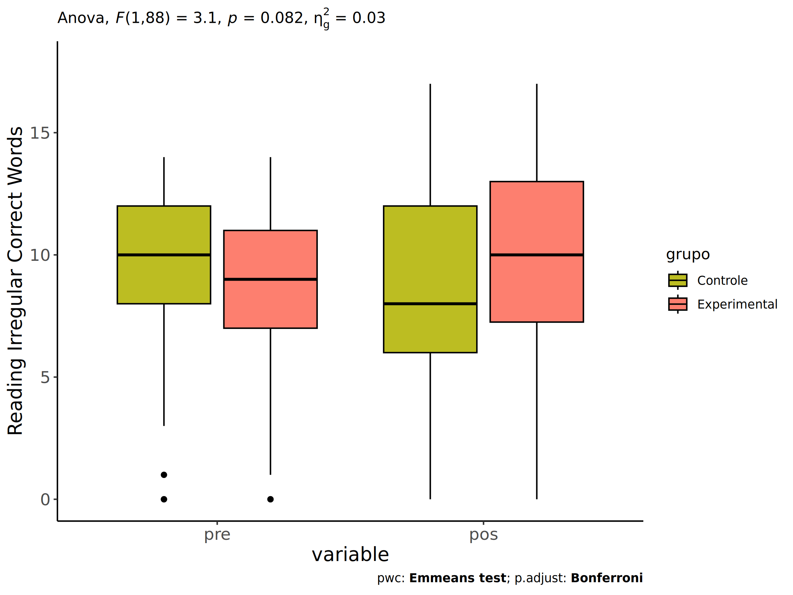
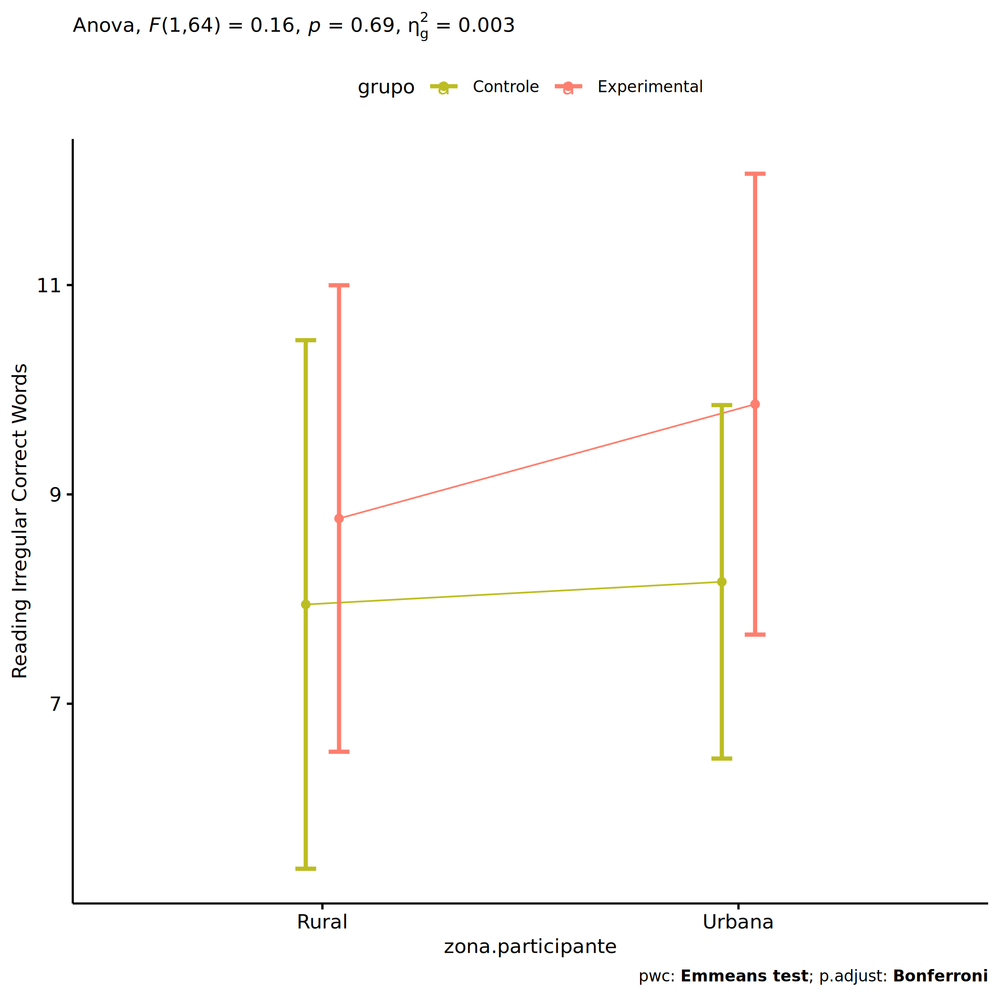
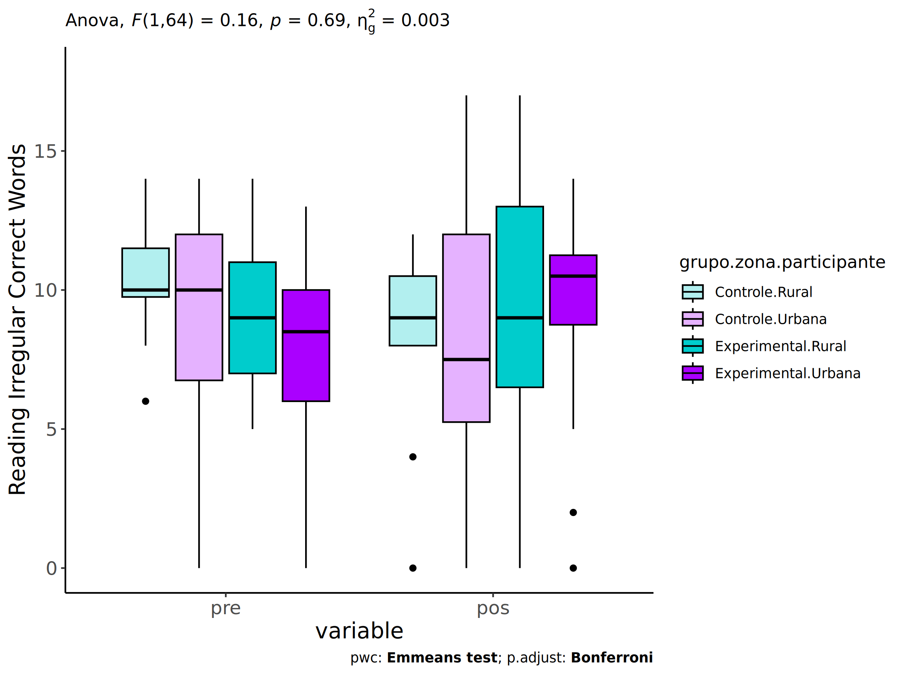
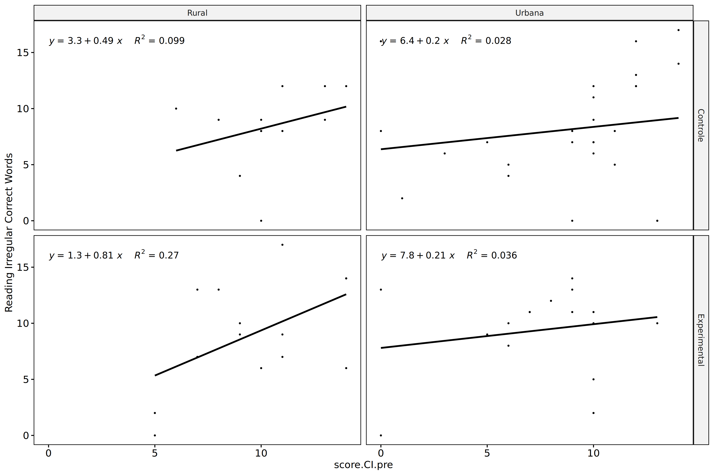
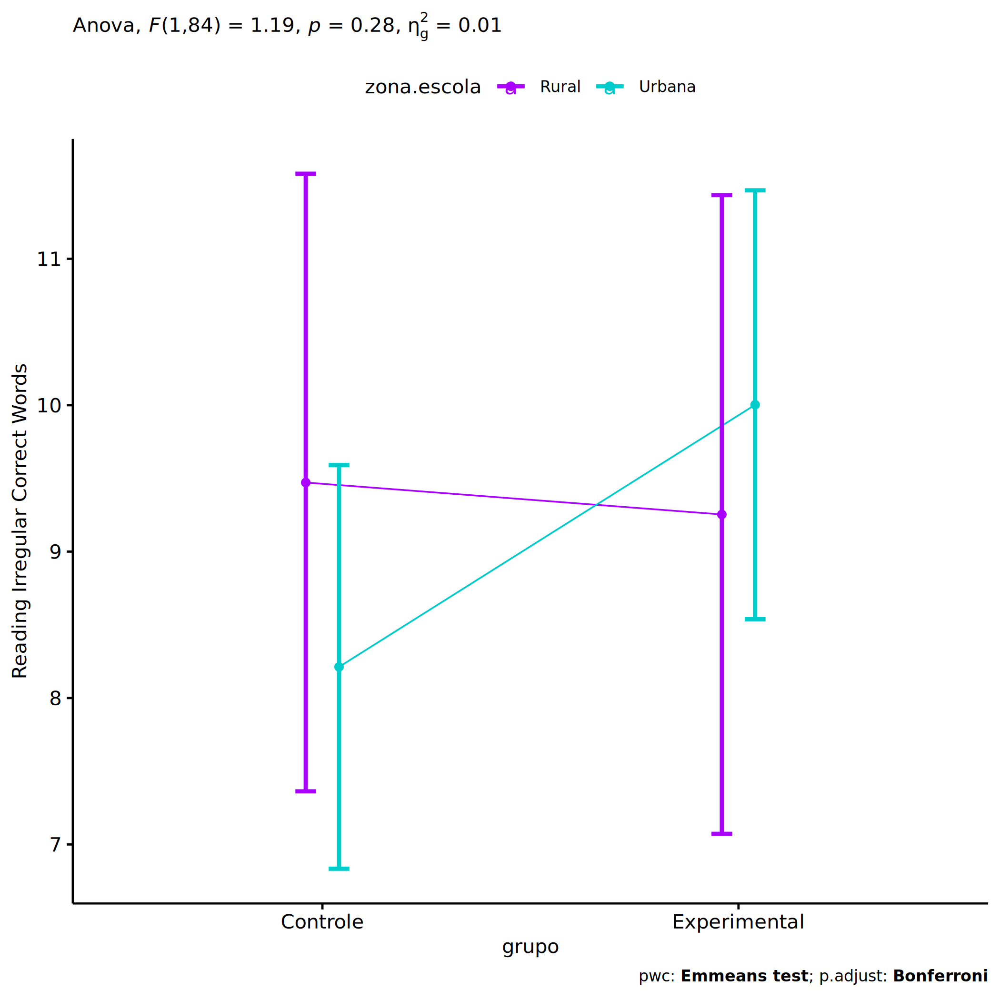
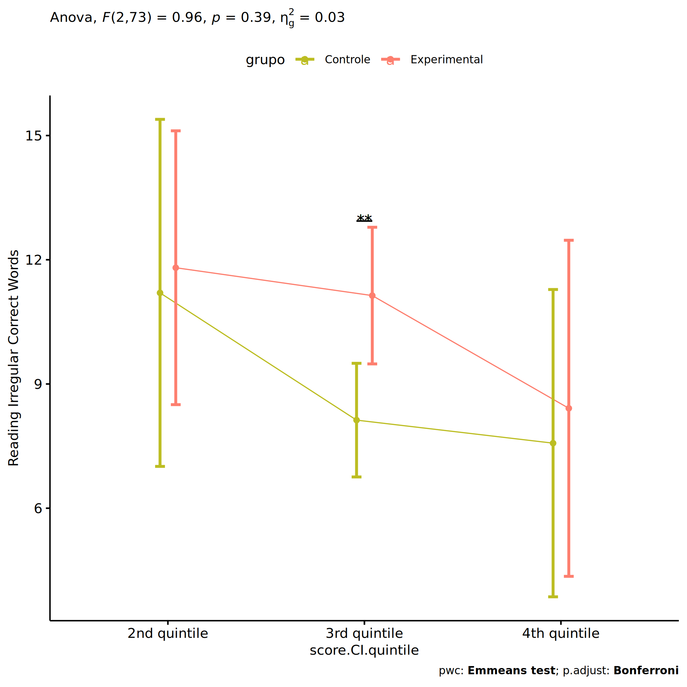

ANCOVA in Reading Irregular Correct Words (Reading Irregular Correct
Words)
================
Geiser C. Challco <geiser@alumni.usp.br>

- [Setting Initial Variables](#setting-initial-variables)
- [Descriptive Statistics of Initial
  Data](#descriptive-statistics-of-initial-data)
- [ANCOVA and Pairwise for one factor:
  **grupo**](#ancova-and-pairwise-for-one-factor-grupo)
  - [Without remove non-normal data](#without-remove-non-normal-data)
  - [Computing ANCOVA and PairWise After removing non-normal data
    (OK)](#computing-ancova-and-pairwise-after-removing-non-normal-data-ok)
    - [Plots for ancova](#plots-for-ancova)
    - [Checking linearity assumption](#checking-linearity-assumption)
    - [Checking normality and
      homogeneity](#checking-normality-and-homogeneity)
- [ANCOVA and Pairwise for two factors
  **grupo:genero**](#ancova-and-pairwise-for-two-factors-grupogenero)
  - [Without remove non-normal data](#without-remove-non-normal-data-1)
  - [Computing ANCOVA and PairWise After removing non-normal data
    (OK)](#computing-ancova-and-pairwise-after-removing-non-normal-data-ok-1)
    - [Plots for ancova](#plots-for-ancova-1)
    - [Checking linearity assumption](#checking-linearity-assumption-1)
    - [Checking normality and
      homogeneity](#checking-normality-and-homogeneity-1)
- [ANCOVA and Pairwise for two factors
  **grupo:zona.participante**](#ancova-and-pairwise-for-two-factors-grupozonaparticipante)
  - [Without remove non-normal data](#without-remove-non-normal-data-2)
  - [Computing ANCOVA and PairWise After removing non-normal data
    (OK)](#computing-ancova-and-pairwise-after-removing-non-normal-data-ok-2)
    - [Plots for ancova](#plots-for-ancova-2)
    - [Checking linearity assumption](#checking-linearity-assumption-2)
    - [Checking normality and
      homogeneity](#checking-normality-and-homogeneity-2)
- [ANCOVA and Pairwise for two factors
  **grupo:zona.escola**](#ancova-and-pairwise-for-two-factors-grupozonaescola)
  - [Without remove non-normal data](#without-remove-non-normal-data-3)
  - [Computing ANCOVA and PairWise After removing non-normal data
    (OK)](#computing-ancova-and-pairwise-after-removing-non-normal-data-ok-3)
    - [Plots for ancova](#plots-for-ancova-3)
    - [Checking linearity assumption](#checking-linearity-assumption-3)
    - [Checking normality and
      homogeneity](#checking-normality-and-homogeneity-3)
- [ANCOVA and Pairwise for two factors
  **grupo:score.CI.quintile**](#ancova-and-pairwise-for-two-factors-gruposcoreciquintile)
  - [Without remove non-normal data](#without-remove-non-normal-data-4)
  - [Computing ANCOVA and PairWise After removing non-normal data
    (OK)](#computing-ancova-and-pairwise-after-removing-non-normal-data-ok-4)
    - [Plots for ancova](#plots-for-ancova-4)
    - [Checking linearity assumption](#checking-linearity-assumption-4)
    - [Checking normality and
      homogeneity](#checking-normality-and-homogeneity-4)
- [Summary of Results](#summary-of-results)
  - [Descriptive Statistics](#descriptive-statistics)
  - [ANCOVA Table Comparison](#ancova-table-comparison)
  - [PairWise Table Comparison](#pairwise-table-comparison)
  - [EMMS Table Comparison](#emms-table-comparison)

**NOTE**:

- Teste ANCOVA para determinar se houve diferenças significativas no
  Reading Irregular Correct Words (medido usando pre- e pos-testes).
- ANCOVA test to determine whether there were significant differences in
  Reading Irregular Correct Words (measured using pre- and post-tests).

# Setting Initial Variables

``` r
dv = "score.CI"
dv.pos = "score.CI.pos"
dv.pre = "score.CI.pre"

fatores2 <- c("genero","zona.participante","zona.escola","score.CI.quintile")
lfatores2 <- as.list(fatores2)
names(lfatores2) <- fatores2

fatores1 <- c("grupo", fatores2)
lfatores1 <- as.list(fatores1)
names(lfatores1) <- fatores1

lfatores <- c(lfatores1)

color <- list()
color[["prepost"]] = c("#ffee65","#f28e2B")
color[["grupo"]] = c("#bcbd22","#fd7f6f")
color[["genero"]] = c("#FF007F","#4D4DFF")
color[["zona.escola"]] = c("#AA00FF","#00CCCC")
color[["zona.participante"]] = c("#AA00FF","#00CCCC")

level <- list()
level[["grupo"]] = c("Controle","Experimental")
level[["genero"]] = c("F","M")
level[["zona.escola"]] = c("Rural","Urbana")
level[["zona.participante"]] = c("Rural","Urbana")

# ..

ymin <- 0
ymax <- 0

ymin.ci <- 0
ymax.ci <- 0


color[["grupo:genero"]] = c(
  "Controle:F"="#ff99cb", "Controle:M"="#b7b7ff",
  "Experimental:F"="#FF007F", "Experimental:M"="#4D4DFF",
  "Controle.F"="#ff99cb", "Controle.M"="#b7b7ff",
  "Experimental.F"="#FF007F", "Experimental.M"="#4D4DFF"
)
color[["grupo:zona.escola"]] = c(
  "Controle:Rural"="#b2efef","Controle:Urbana"="#e5b2ff",
  "Experimental:Rural"="#00CCCC", "Experimental:Urbana"="#AA00FF",
  "Controle.Rural"="#b2efef","Controle.Urbana"="#e5b2ff",
  "Experimental.Rural"="#00CCCC", "Experimental.Urbana"="#AA00FF"
)
color[["grupo:zona.participante"]] = c(
  "Controle:Rural"="#b2efef","Controle:Urbana"="#e5b2ff",
  "Experimental:Rural"="#00CCCC", "Experimental:Urbana"="#AA00FF",
  "Controle.Rural"="#b2efef","Controle.Urbana"="#e5b2ff",
  "Experimental.Rural"="#00CCCC", "Experimental.Urbana"="#AA00FF"
)

for (coln in c(
  "palavras.lidas","score.compreensao","tri.compreensao",
  "score.vocab","tri.vocab",
  "score.vocab.ensinado","tri.vocab.ensinado","score.vocab.nao.ensinado","tri.vocab.nao.ensinado",
  "score.CLPP","tri.CLPP","score.CR","tri.CR",
  "score.CI","tri.CI","score.TV","tri.TV","score.TF","tri.TF","score.TO","tri.TO")) {
  color[[paste0(coln,".quintile")]] = c("#BF0040","#FF0000","#800080","#0000FF","#4000BF")
  level[[paste0(coln,".quintile")]] = c("1st quintile","2nd quintile","3rd quintile","4th quintile","5th quintile")
  color[[paste0("grupo:",coln,".quintile")]] = c(
    "Experimental.1st quintile"="#BF0040", "Controle.1st quintile"="#d8668c",
    "Experimental.2nd quintile"="#FF0000", "Controle.2nd quintile"="#ff7f7f",
    "Experimental.3rd quintile"="#8fce00", "Controle.3rd quintile"="#ddf0b2",
    "Experimental.4th quintile"="#0000FF", "Controle.4th quintile"="#b2b2ff",
    "Experimental.5th quintile"="#4000BF", "Controle.5th quintile"="#b299e5",
    
    "Experimental:1st quintile"="#BF0040", "Controle:1st quintile"="#d8668c",
    "Experimental:2nd quintile"="#FF0000", "Controle:2nd quintile"="#ff7f7f",
    "Experimental:3rd quintile"="#8fce00", "Controle:3rd quintile"="#ddf0b2",
    "Experimental:4th quintile"="#0000FF", "Controle:4th quintile"="#b2b2ff",
    "Experimental:5th quintile"="#4000BF", "Controle:5th quintile"="#b299e5")
}


gdat <- read_excel("../data/data.xlsx", sheet = "leitura.st")


dat <- gdat
dat$grupo <- factor(dat[["grupo"]], level[["grupo"]])
for (coln in c(names(lfatores))) {
  dat[[coln]] <- factor(dat[[coln]], level[[coln]][level[[coln]] %in% unique(dat[[coln]])])
}
dat <- dat[which(!is.na(dat[[dv.pre]]) & !is.na(dat[[dv.pos]])),]
dat <- dat[,c("id",names(lfatores),dv.pre,dv.pos)]

dat.long <- rbind(dat, dat)
dat.long$time <- c(rep("pre", nrow(dat)), rep("pos", nrow(dat)))
dat.long$time <- factor(dat.long$time, c("pre","pos"))
dat.long[[dv]] <- c(dat[[dv.pre]], dat[[dv.pos]])


for (f in c("grupo", names(lfatores))) {
  if (is.null(color[[f]]) && length(unique(dat[[f]])) > 0) 
      color[[f]] <- distinctColorPalette(length(unique(dat[[f]])))
}
for (f in c(fatores2)) {
  if (is.null(color[[paste0("grupo:",f)]]) && length(unique(dat[[f]])) > 0)
    color[[paste0("grupo:",f)]] <- distinctColorPalette(length(unique(dat[["grupo"]]))*length(unique(dat[[f]])))
}

ldat <- list()
laov <- list()
lpwc <- list()
lemms <- list()
```

# Descriptive Statistics of Initial Data

``` r
df <- get.descriptives(dat, c(dv.pre, dv.pos), c("grupo"), 
                       include.global = T, symmetry.test = T, normality.test = F)
df <- plyr::rbind.fill(
  df, do.call(plyr::rbind.fill, lapply(lfatores2, FUN = function(f) {
    if (nrow(dat) > 0 && sum(!is.na(unique(dat[[f]]))) > 1)
      get.descriptives(dat, c(dv.pre,dv.pos), c("grupo", f),
                       symmetry.test = T, normality.test = F)
    }))
)
df <- df[,c(fatores1[fatores1 %in% colnames(df)],"variable",
            colnames(df)[!colnames(df) %in% c(fatores1,"variable")])]
```

| grupo        | genero | zona.participante | zona.escola | score.CI.quintile | variable     |   n |   mean | median | min | max |    sd |    se |     ci |  iqr | symmetry | skewness | kurtosis |
|:-------------|:-------|:------------------|:------------|:------------------|:-------------|----:|-------:|-------:|----:|----:|------:|------:|-------:|-----:|:---------|---------:|---------:|
| Controle     |        |                   |             |                   | score.CI.pre |  50 |  9.300 |   10.0 |   0 |  14 | 3.512 | 0.497 |  0.998 | 4.00 | NO       |   -0.962 |    0.427 |
| Experimental |        |                   |             |                   | score.CI.pre |  42 |  8.667 |    9.0 |   0 |  14 | 3.490 | 0.538 |  1.088 | 4.00 | NO       |   -0.574 |    0.210 |
|              |        |                   |             |                   | score.CI.pre |  92 |  9.011 |   10.0 |   0 |  14 | 3.497 | 0.365 |  0.724 | 4.00 | NO       |   -0.788 |    0.323 |
| Controle     |        |                   |             |                   | score.CI.pos |  50 |  8.180 |    8.0 |   0 |  17 | 4.498 | 0.636 |  1.278 | 6.00 | YES      |   -0.192 |   -0.585 |
| Experimental |        |                   |             |                   | score.CI.pos |  42 |  9.643 |   10.0 |   0 |  17 | 4.282 | 0.661 |  1.334 | 5.75 | NO       |   -0.768 |   -0.122 |
|              |        |                   |             |                   | score.CI.pos |  92 |  8.848 |    9.0 |   0 |  17 | 4.437 | 0.463 |  0.919 | 6.00 | YES      |   -0.447 |   -0.481 |
| Controle     | F      |                   |             |                   | score.CI.pre |  25 |  9.240 |   10.0 |   0 |  14 | 3.734 | 0.747 |  1.541 | 3.00 | NO       |   -0.988 |    0.207 |
| Controle     | M      |                   |             |                   | score.CI.pre |  25 |  9.360 |   10.0 |   0 |  14 | 3.353 | 0.671 |  1.384 | 5.00 | NO       |   -0.836 |    0.282 |
| Experimental | F      |                   |             |                   | score.CI.pre |  19 |  8.895 |    9.0 |   0 |  14 | 3.943 | 0.904 |  1.900 | 6.00 | YES      |   -0.276 |   -0.787 |
| Experimental | M      |                   |             |                   | score.CI.pre |  23 |  8.478 |    9.0 |   0 |  13 | 3.146 | 0.656 |  1.360 | 3.00 | NO       |   -1.078 |    1.179 |
| Controle     | F      |                   |             |                   | score.CI.pos |  25 |  7.960 |    8.0 |   0 |  17 | 4.198 | 0.840 |  1.733 | 3.00 | YES      |    0.147 |   -0.129 |
| Controle     | M      |                   |             |                   | score.CI.pos |  25 |  8.400 |    9.0 |   0 |  16 | 4.856 | 0.971 |  2.005 | 6.00 | YES      |   -0.433 |   -0.973 |
| Experimental | F      |                   |             |                   | score.CI.pos |  19 |  8.947 |    9.0 |   0 |  17 | 4.588 | 1.053 |  2.211 | 4.50 | NO       |   -0.504 |   -0.482 |
| Experimental | M      |                   |             |                   | score.CI.pos |  23 | 10.217 |   11.0 |   0 |  15 | 4.022 | 0.839 |  1.739 | 5.50 | NO       |   -0.954 |    0.044 |
| Controle     |        | Rural             |             |                   | score.CI.pre |  12 | 10.417 |   10.0 |   6 |  14 | 2.234 | 0.645 |  1.420 | 1.75 | YES      |   -0.168 |   -0.750 |
| Controle     |        | Urbana            |             |                   | score.CI.pre |  26 |  8.923 |   10.0 |   0 |  14 | 4.137 | 0.811 |  1.671 | 5.25 | NO       |   -0.922 |   -0.305 |
| Controle     |        |                   |             |                   | score.CI.pre |  12 |  9.000 |    8.5 |   4 |  13 | 3.045 | 0.879 |  1.935 | 4.75 | YES      |    0.035 |   -1.459 |
| Experimental |        | Rural             |             |                   | score.CI.pre |  15 |  9.467 |    9.0 |   5 |  14 | 3.044 | 0.786 |  1.686 | 4.00 | YES      |    0.151 |   -1.295 |
| Experimental |        | Urbana            |             |                   | score.CI.pre |  16 |  7.438 |    8.5 |   0 |  13 | 3.521 | 0.880 |  1.876 | 4.00 | NO       |   -0.848 |   -0.026 |
| Experimental |        |                   |             |                   | score.CI.pre |  11 |  9.364 |    9.0 |   1 |  14 | 3.802 | 1.146 |  2.554 | 5.50 | NO       |   -0.672 |   -0.453 |
| Controle     |        | Rural             |             |                   | score.CI.pos |  12 |  8.417 |    9.0 |   0 |  12 | 3.476 | 1.003 |  2.209 | 2.50 | NO       |   -1.071 |    0.368 |
| Controle     |        | Urbana            |             |                   | score.CI.pos |  26 |  8.154 |    7.5 |   0 |  17 | 4.905 | 0.962 |  1.981 | 6.75 | YES      |    0.048 |   -0.914 |
| Controle     |        |                   |             |                   | score.CI.pos |  12 |  8.000 |    8.0 |   0 |  15 | 4.824 | 1.393 |  3.065 | 5.25 | YES      |   -0.289 |   -1.109 |
| Experimental |        | Rural             |             |                   | score.CI.pos |  15 |  8.933 |    9.0 |   0 |  17 | 4.682 | 1.209 |  2.593 | 6.50 | YES      |   -0.128 |   -0.924 |
| Experimental |        | Urbana            |             |                   | score.CI.pos |  16 |  9.375 |   10.5 |   0 |  14 | 3.914 | 0.978 |  2.085 | 2.50 | NO       |   -1.127 |    0.179 |
| Experimental |        |                   |             |                   | score.CI.pos |  11 | 11.000 |   12.0 |   0 |  15 | 4.313 | 1.300 |  2.897 | 4.00 | NO       |   -1.353 |    1.038 |
| Controle     |        |                   | Rural       |                   | score.CI.pre |  14 |  8.214 |    8.5 |   0 |  14 | 4.406 | 1.178 |  2.544 | 5.75 | YES      |   -0.444 |   -1.091 |
| Controle     |        |                   | Urbana      |                   | score.CI.pre |  36 |  9.722 |   10.0 |   0 |  14 | 3.067 | 0.511 |  1.038 | 3.00 | NO       |   -1.091 |    1.223 |
| Experimental |        |                   | Rural       |                   | score.CI.pre |  13 |  9.077 |   10.0 |   1 |  14 | 3.730 | 1.034 |  2.254 | 4.00 | NO       |   -0.563 |   -0.709 |
| Experimental |        |                   | Urbana      |                   | score.CI.pre |  29 |  8.483 |    9.0 |   0 |  14 | 3.429 | 0.637 |  1.304 | 3.00 | NO       |   -0.573 |    0.523 |
| Controle     |        |                   | Rural       |                   | score.CI.pos |  14 |  9.143 |    9.5 |   0 |  17 | 5.763 | 1.540 |  3.327 | 8.75 | YES      |   -0.315 |   -1.363 |
| Controle     |        |                   | Urbana      |                   | score.CI.pos |  36 |  7.806 |    8.0 |   0 |  16 | 3.934 | 0.656 |  1.331 | 5.25 | YES      |   -0.311 |   -0.272 |
| Experimental |        |                   | Rural       |                   | score.CI.pos |  13 |  9.308 |   10.0 |   0 |  17 | 5.313 | 1.474 |  3.211 | 6.00 | YES      |   -0.432 |   -1.020 |
| Experimental |        |                   | Urbana      |                   | score.CI.pos |  29 |  9.793 |   10.0 |   0 |  15 | 3.830 | 0.711 |  1.457 | 4.00 | NO       |   -0.941 |    0.143 |
| Controle     |        |                   |             | 1st quintile      | score.CI.pre |   4 |  1.000 |    0.5 |   0 |   3 | 1.414 | 0.707 |  2.250 | 1.50 | few data |    0.000 |    0.000 |
| Controle     |        |                   |             | 2nd quintile      | score.CI.pre |   8 |  5.750 |    6.0 |   4 |   7 | 0.886 | 0.313 |  0.741 | 0.25 | NO       |   -0.673 |   -0.539 |
| Controle     |        |                   |             | 3rd quintile      | score.CI.pre |  28 | 10.071 |   10.0 |   8 |  12 | 1.184 | 0.224 |  0.459 | 2.00 | YES      |   -0.003 |   -0.804 |
| Controle     |        |                   |             | 4th quintile      | score.CI.pre |  10 | 13.300 |   13.0 |  13 |  14 | 0.483 | 0.153 |  0.346 | 0.75 | few data |    0.000 |    0.000 |
| Experimental |        |                   |             | 1st quintile      | score.CI.pre |   3 |  0.333 |    0.0 |   0 |   1 | 0.577 | 0.333 |  1.434 | 0.50 | few data |    0.000 |    0.000 |
| Experimental |        |                   |             | 2nd quintile      | score.CI.pre |  13 |  6.385 |    7.0 |   5 |   7 | 0.870 | 0.241 |  0.526 | 1.00 | few data |    0.000 |    0.000 |
| Experimental |        |                   |             | 3rd quintile      | score.CI.pre |  19 |  9.737 |   10.0 |   8 |  12 | 1.098 | 0.252 |  0.529 | 1.50 | YES      |    0.257 |   -0.944 |
| Experimental |        |                   |             | 4th quintile      | score.CI.pre |   7 | 13.571 |   14.0 |  13 |  14 | 0.535 | 0.202 |  0.494 | 1.00 | few data |    0.000 |    0.000 |
| Controle     |        |                   |             | 1st quintile      | score.CI.pos |   4 |  8.000 |    7.0 |   2 |  16 | 5.888 | 2.944 |  9.369 | 5.00 | YES      |    0.353 |   -1.875 |
| Controle     |        |                   |             | 2nd quintile      | score.CI.pos |   8 |  6.750 |    6.5 |   0 |  15 | 4.400 | 1.556 |  3.678 | 3.00 | YES      |    0.384 |   -0.703 |
| Controle     |        |                   |             | 3rd quintile      | score.CI.pos |  28 |  8.107 |    8.0 |   0 |  16 | 3.881 | 0.733 |  1.505 | 4.25 | YES      |   -0.500 |   -0.023 |
| Controle     |        |                   |             | 4th quintile      | score.CI.pos |  10 |  9.600 |   12.0 |   0 |  17 | 5.854 | 1.851 |  4.188 | 6.75 | NO       |   -0.598 |   -1.211 |
| Experimental |        |                   |             | 1st quintile      | score.CI.pos |   3 |  4.333 |    0.0 |   0 |  13 | 7.506 | 4.333 | 18.645 | 6.50 | few data |    0.000 |    0.000 |
| Experimental |        |                   |             | 2nd quintile      | score.CI.pos |  13 |  8.308 |    9.0 |   0 |  13 | 3.816 | 1.058 |  2.306 | 4.00 | NO       |   -0.800 |   -0.303 |
| Experimental |        |                   |             | 3rd quintile      | score.CI.pos |  19 | 10.632 |   11.0 |   2 |  17 | 3.774 | 0.866 |  1.819 | 4.00 | YES      |   -0.463 |   -0.457 |
| Experimental |        |                   |             | 4th quintile      | score.CI.pos |   7 | 11.714 |   12.0 |   6 |  14 | 2.928 | 1.107 |  2.708 | 3.00 | NO       |   -0.887 |   -0.751 |

# ANCOVA and Pairwise for one factor: **grupo**

## Without remove non-normal data

``` r
pdat = remove_group_data(dat[!is.na(dat[["grupo"]]),], "score.CI.pos", "grupo")

pdat.long <- rbind(pdat[,c("id","grupo")], pdat[,c("id","grupo")])
pdat.long[["time"]] <- c(rep("pre", nrow(pdat)), rep("pos", nrow(pdat)))
pdat.long[["time"]] <- factor(pdat.long[["time"]], c("pre","pos"))
pdat.long[["score.CI"]] <- c(pdat[["score.CI.pre"]], pdat[["score.CI.pos"]])

aov = anova_test(pdat, score.CI.pos ~ score.CI.pre + grupo)
laov[["grupo"]] <- get_anova_table(aov)
```

``` r
pwc <- emmeans_test(pdat, score.CI.pos ~ grupo, covariate = score.CI.pre,
                    p.adjust.method = "bonferroni")
```

``` r
pwc.long <- emmeans_test(dplyr::group_by_at(pdat.long, "grupo"),
                          score.CI ~ time,
                          p.adjust.method = "bonferroni")
lpwc[["grupo"]] <- plyr::rbind.fill(pwc, pwc.long)
```

``` r
ds <- get.descriptives(pdat, "score.CI.pos", "grupo", covar = "score.CI.pre")
ds <- merge(ds[ds$variable != "score.CI.pre",],
            ds[ds$variable == "score.CI.pre", !colnames(ds) %in% c("variable")],
            by = "grupo", all.x = T, suffixes = c("", ".score.CI.pre"))
ds <- merge(get_emmeans(pwc), ds, by = "grupo", suffixes = c(".emms", ""))
ds <- ds[,c("grupo","n","mean.score.CI.pre","se.score.CI.pre","mean","se",
            "emmean","se.emms","conf.low","conf.high")]

colnames(ds) <- c("grupo", "N", paste0(c("M","SE")," (pre)"),
                  paste0(c("M","SE"), " (unadj)"),
                  paste0(c("M", "SE"), " (adj)"), "conf.low", "conf.high")

lemms[["grupo"]] <- ds
```

## Computing ANCOVA and PairWise After removing non-normal data (OK)

``` r
wdat = pdat 

res = residuals(lm(score.CI.pos ~ score.CI.pre + grupo, data = wdat))
non.normal = getNonNormal(res, wdat$id, plimit = 0.05)

wdat = wdat[!wdat$id %in% non.normal,]

wdat.long <- rbind(wdat[,c("id","grupo")], wdat[,c("id","grupo")])
wdat.long[["time"]] <- c(rep("pre", nrow(wdat)), rep("pos", nrow(wdat)))
wdat.long[["time"]] <- factor(wdat.long[["time"]], c("pre","pos"))
wdat.long[["score.CI"]] <- c(wdat[["score.CI.pre"]], wdat[["score.CI.pos"]])

ldat[["grupo"]] = wdat

(non.normal)
```

    ## [1] "P294"

``` r
aov = anova_test(wdat, score.CI.pos ~ score.CI.pre + grupo)
laov[["grupo"]] <- merge(get_anova_table(aov), laov[["grupo"]],
                            by="Effect", suffixes = c("","'"))

(df = get_anova_table(aov))
```

    ## ANOVA Table (type II tests)
    ## 
    ##         Effect DFn DFd     F     p p<.05   ges
    ## 1 score.CI.pre   1  88 9.470 0.003     * 0.097
    ## 2        grupo   1  88 3.101 0.082       0.034

| Effect       | DFn | DFd |     F |     p | p\<.05 |   ges |
|:-------------|----:|----:|------:|------:|:-------|------:|
| score.CI.pre |   1 |  88 | 9.470 | 0.003 | \*     | 0.097 |
| grupo        |   1 |  88 | 3.101 | 0.082 |        | 0.034 |

``` r
pwc <- emmeans_test(wdat, score.CI.pos ~ grupo, covariate = score.CI.pre,
                    p.adjust.method = "bonferroni")
```

| term                | .y.          | group1   | group2       |  df | statistic |     p | p.adj | p.adj.signif |
|:--------------------|:-------------|:---------|:-------------|----:|----------:|------:|------:|:-------------|
| score.CI.pre\*grupo | score.CI.pos | Controle | Experimental |  88 |    -1.761 | 0.082 | 0.082 | ns           |

``` r
pwc.long <- emmeans_test(dplyr::group_by_at(wdat.long, "grupo"),
                         score.CI ~ time,
                         p.adjust.method = "bonferroni")
lpwc[["grupo"]] <- merge(plyr::rbind.fill(pwc, pwc.long), lpwc[["grupo"]],
                            by=c("grupo","term",".y.","group1","group2"),
                            suffixes = c("","'"))
```

| grupo        | term | .y.      | group1 | group2 |  df | statistic |     p | p.adj | p.adj.signif |
|:-------------|:-----|:---------|:-------|:-------|----:|----------:|------:|------:|:-------------|
| Controle     | time | score.CI | pre    | pos    | 178 |     1.202 | 0.231 | 0.231 | ns           |
| Experimental | time | score.CI | pre    | pos    | 178 |    -1.132 | 0.259 | 0.259 | ns           |

``` r
ds <- get.descriptives(wdat, "score.CI.pos", "grupo", covar = "score.CI.pre")
ds <- merge(ds[ds$variable != "score.CI.pre",],
            ds[ds$variable == "score.CI.pre", !colnames(ds) %in% c("variable")],
            by = "grupo", all.x = T, suffixes = c("", ".score.CI.pre"))
ds <- merge(get_emmeans(pwc), ds, by = "grupo", suffixes = c(".emms", ""))
ds <- ds[,c("grupo","n","mean.score.CI.pre","se.score.CI.pre","mean","se",
            "emmean","se.emms","conf.low","conf.high")]

colnames(ds) <- c("grupo", "N", paste0(c("M","SE")," (pre)"),
                  paste0(c("M","SE"), " (unadj)"),
                  paste0(c("M", "SE"), " (adj)"), "conf.low", "conf.high")

lemms[["grupo"]] <- merge(ds, lemms[["grupo"]], by=c("grupo"), suffixes = c("","'"))
```

| grupo        |   N | M (pre) | SE (pre) | M (unadj) | SE (unadj) | M (adj) | SE (adj) | conf.low | conf.high |
|:-------------|----:|--------:|---------:|----------:|-----------:|--------:|---------:|---------:|----------:|
| Controle     |  49 |   9.306 |    0.507 |     8.347 |      0.626 |   8.234 |    0.593 |    7.055 |     9.413 |
| Experimental |  42 |   8.667 |    0.538 |     9.643 |      0.661 |   9.775 |    0.641 |    8.501 |    11.049 |

### Plots for ancova

``` r
plots <- oneWayAncovaPlots(
  wdat, "score.CI.pos", "grupo", aov, list("grupo"=pwc), addParam = c("mean_ci"),
  font.label.size=10, step.increase=0.05, p.label="p.adj",
  subtitle = which(aov$Effect == "grupo"))
```

``` r
if (!is.null(nrow(plots[["grupo"]]$data)))
  plots[["grupo"]] + ggplot2::ylab("Reading Irregular Correct Words") + 
  if (ymin.ci < ymax.ci) ggplot2::ylim(ymin.ci, ymax.ci)
```

<!-- -->

``` r
plots <- oneWayAncovaBoxPlots(
  wdat, "score.CI.pos", "grupo", aov, pwc, covar = "score.CI.pre",
  theme = "classic", color = color[["grupo"]],
  subtitle = which(aov$Effect == "grupo"))
```

``` r
if (length(unique(wdat[["grupo"]])) > 1)
  plots[["grupo"]] + ggplot2::ylab("Reading Irregular Correct Words") +
  ggplot2::scale_x_discrete(labels=c('pre', 'pos')) +
  if (ymin < ymax) ggplot2::ylim(ymin, ymax)
```

<!-- -->

``` r
if (length(unique(wdat.long[["grupo"]])) > 1)
  plots <- oneWayAncovaBoxPlots(
    wdat.long, "score.CI", "grupo", aov, pwc.long,
    pre.post = "time", theme = "classic", color = color$prepost)
```

``` r
if (length(unique(wdat.long[["grupo"]])) > 1)
  plots[["grupo"]] + ggplot2::ylab("Reading Irregular Correct Words") +
  if (ymin < ymax) ggplot2::ylim(ymin, ymax) 
```

<!-- -->

### Checking linearity assumption

``` r
ggscatter(wdat, x = "score.CI.pre", y = "score.CI.pos", size = 0.5,
          color = "grupo", add = "reg.line")+
  stat_regline_equation(
    aes(label =  paste(..eq.label.., ..rr.label.., sep = "~~~~"), color = grupo)
  ) +
  ggplot2::labs(subtitle = rstatix::get_test_label(aov, detailed = T, row = which(aov$Effect == "grupo"))) +
  ggplot2::scale_color_manual(values = color[["grupo"]]) +
  ggplot2::ylab("Reading Irregular Correct Words")  +
  if (ymin < ymax) ggplot2::ylim(ymin, ymax)
```

<!-- -->

### Checking normality and homogeneity

``` r
res <- augment(lm(score.CI.pos ~ score.CI.pre + grupo, data = wdat))
```

``` r
shapiro_test(res$.resid)
```

    ## # A tibble: 1 × 3
    ##   variable   statistic p.value
    ##   <chr>          <dbl>   <dbl>
    ## 1 res$.resid     0.974  0.0641

``` r
levene_test(res, .resid ~ grupo)
```

    ## # A tibble: 1 × 4
    ##     df1   df2 statistic     p
    ##   <int> <int>     <dbl> <dbl>
    ## 1     1    89     0.158 0.692

# ANCOVA and Pairwise for two factors **grupo:genero**

## Without remove non-normal data

``` r
pdat = remove_group_data(dat[!is.na(dat[["grupo"]]) & !is.na(dat[["genero"]]),],
                         "score.CI.pos", c("grupo","genero"))
pdat = pdat[pdat[["genero"]] %in% do.call(
  intersect, lapply(unique(pdat[["grupo"]]), FUN = function(x) {
    unique(pdat[["genero"]][which(pdat[["grupo"]] == x)])
  })),]
pdat[["grupo"]] = factor(pdat[["grupo"]], level[["grupo"]])
pdat[["genero"]] = factor(
  pdat[["genero"]],
  level[["genero"]][level[["genero"]] %in% unique(pdat[["genero"]])])

pdat.long <- rbind(pdat[,c("id","grupo","genero")], pdat[,c("id","grupo","genero")])
pdat.long[["time"]] <- c(rep("pre", nrow(pdat)), rep("pos", nrow(pdat)))
pdat.long[["time"]] <- factor(pdat.long[["time"]], c("pre","pos"))
pdat.long[["score.CI"]] <- c(pdat[["score.CI.pre"]], pdat[["score.CI.pos"]])

if (length(unique(pdat[["genero"]])) >= 2) {
  aov = anova_test(pdat, score.CI.pos ~ score.CI.pre + grupo*genero)
  laov[["grupo:genero"]] <- get_anova_table(aov)
}
```

``` r
if (length(unique(pdat[["genero"]])) >= 2) {
  pwcs <- list()
  pwcs[["genero"]] <- emmeans_test(
    group_by(pdat, grupo), score.CI.pos ~ genero,
    covariate = score.CI.pre, p.adjust.method = "bonferroni")
  pwcs[["grupo"]] <- emmeans_test(
    group_by(pdat, genero), score.CI.pos ~ grupo,
    covariate = score.CI.pre, p.adjust.method = "bonferroni")
  
  pwc <- plyr::rbind.fill(pwcs[["grupo"]], pwcs[["genero"]])
  pwc <- pwc[,c("grupo","genero", colnames(pwc)[!colnames(pwc) %in% c("grupo","genero")])]
}
```

``` r
if (length(unique(pdat[["genero"]])) >= 2) {
  pwc.long <- emmeans_test(dplyr::group_by_at(pdat.long, c("grupo","genero")),
                           score.CI ~ time,
                           p.adjust.method = "bonferroni")
  lpwc[["grupo:genero"]] <- plyr::rbind.fill(pwc, pwc.long)
}
```

``` r
if (length(unique(pdat[["genero"]])) >= 2) {
  ds <- get.descriptives(pdat, "score.CI.pos", c("grupo","genero"), covar = "score.CI.pre")
  ds <- merge(ds[ds$variable != "score.CI.pre",],
              ds[ds$variable == "score.CI.pre", !colnames(ds) %in% c("variable")],
              by = c("grupo","genero"), all.x = T, suffixes = c("", ".score.CI.pre"))
  ds <- merge(get_emmeans(pwcs[["grupo"]]), ds,
              by = c("grupo","genero"), suffixes = c(".emms", ""))
  ds <- ds[,c("grupo","genero","n","mean.score.CI.pre","se.score.CI.pre","mean","se",
              "emmean","se.emms","conf.low","conf.high")]
  
  colnames(ds) <- c("grupo","genero", "N", paste0(c("M","SE")," (pre)"),
                    paste0(c("M","SE"), " (unadj)"),
                    paste0(c("M", "SE"), " (adj)"), "conf.low", "conf.high")
  
  lemms[["grupo:genero"]] <- ds
}
```

## Computing ANCOVA and PairWise After removing non-normal data (OK)

``` r
if (length(unique(pdat[["genero"]])) >= 2) {
  wdat = pdat 
  
  res = residuals(lm(score.CI.pos ~ score.CI.pre + grupo*genero, data = wdat))
  non.normal = getNonNormal(res, wdat$id, plimit = 0.05)
  
  wdat = wdat[!wdat$id %in% non.normal,]
  
  wdat.long <- rbind(wdat[,c("id","grupo","genero")], wdat[,c("id","grupo","genero")])
  wdat.long[["time"]] <- c(rep("pre", nrow(wdat)), rep("pos", nrow(wdat)))
  wdat.long[["time"]] <- factor(wdat.long[["time"]], c("pre","pos"))
  wdat.long[["score.CI"]] <- c(wdat[["score.CI.pre"]], wdat[["score.CI.pos"]])
  
  
  ldat[["grupo:genero"]] = wdat
  
  (non.normal)
}
```

    ## [1] "P300" "P282"

``` r
if (length(unique(pdat[["genero"]])) >= 2) {
  aov = anova_test(wdat, score.CI.pos ~ score.CI.pre + grupo*genero)
  laov[["grupo:genero"]] <- merge(get_anova_table(aov), laov[["grupo:genero"]],
                                         by="Effect", suffixes = c("","'"))
  df = get_anova_table(aov)
}
```

| Effect       | DFn | DFd |      F |     p | p\<.05 |   ges |
|:-------------|----:|----:|-------:|------:|:-------|------:|
| score.CI.pre |   1 |  85 | 10.874 | 0.001 | \*     | 0.113 |
| grupo        |   1 |  85 |  2.204 | 0.141 |        | 0.025 |
| genero       |   1 |  85 |  2.240 | 0.138 |        | 0.026 |
| grupo:genero |   1 |  85 |  0.029 | 0.865 |        | 0.000 |

``` r
if (length(unique(pdat[["genero"]])) >= 2) {
  pwcs <- list()
  pwcs[["genero"]] <- emmeans_test(
    group_by(wdat, grupo), score.CI.pos ~ genero,
    covariate = score.CI.pre, p.adjust.method = "bonferroni")
  pwcs[["grupo"]] <- emmeans_test(
    group_by(wdat, genero), score.CI.pos ~ grupo,
    covariate = score.CI.pre, p.adjust.method = "bonferroni")
  
  pwc <- plyr::rbind.fill(pwcs[["grupo"]], pwcs[["genero"]])
  pwc <- pwc[,c("grupo","genero", colnames(pwc)[!colnames(pwc) %in% c("grupo","genero")])]
}
```

| grupo        | genero | term                 | .y.          | group1   | group2       |  df | statistic |     p | p.adj | p.adj.signif |
|:-------------|:-------|:---------------------|:-------------|:---------|:-------------|----:|----------:|------:|------:|:-------------|
|              | F      | score.CI.pre\*grupo  | score.CI.pos | Controle | Experimental |  85 |    -0.914 | 0.363 | 0.363 | ns           |
|              | M      | score.CI.pre\*grupo  | score.CI.pos | Controle | Experimental |  85 |    -1.185 | 0.239 | 0.239 | ns           |
| Controle     |        | score.CI.pre\*genero | score.CI.pos | F        | M            |  85 |    -0.979 | 0.330 | 0.330 | ns           |
| Experimental |        | score.CI.pre\*genero | score.CI.pos | F        | M            |  85 |    -1.145 | 0.256 | 0.256 | ns           |

``` r
if (length(unique(pdat[["genero"]])) >= 2) {
  pwc.long <- emmeans_test(dplyr::group_by_at(wdat.long, c("grupo","genero")),
                           score.CI ~ time,
                           p.adjust.method = "bonferroni")
  lpwc[["grupo:genero"]] <- merge(plyr::rbind.fill(pwc, pwc.long),
                                         lpwc[["grupo:genero"]],
                                         by=c("grupo","genero","term",".y.","group1","group2"),
                                         suffixes = c("","'"))
}
```

| grupo        | genero | term | .y.      | group1 | group2 |  df | statistic |     p | p.adj | p.adj.signif |
|:-------------|:-------|:-----|:---------|:-------|:-------|----:|----------:|------:|------:|:-------------|
| Controle     | F      | time | score.CI | pre    | pos    | 172 |     1.148 | 0.252 | 0.252 | ns           |
| Controle     | M      | time | score.CI | pre    | pos    | 172 |     0.150 | 0.881 | 0.881 | ns           |
| Experimental | F      | time | score.CI | pre    | pos    | 172 |    -0.041 | 0.967 | 0.967 | ns           |
| Experimental | M      | time | score.CI | pre    | pos    | 172 |    -1.497 | 0.136 | 0.136 | ns           |

``` r
if (length(unique(pdat[["genero"]])) >= 2) {
  ds <- get.descriptives(wdat, "score.CI.pos", c("grupo","genero"), covar = "score.CI.pre")
  ds <- merge(ds[ds$variable != "score.CI.pre",],
              ds[ds$variable == "score.CI.pre", !colnames(ds) %in% c("variable")],
              by = c("grupo","genero"), all.x = T, suffixes = c("", ".score.CI.pre"))
  ds <- merge(get_emmeans(pwcs[["grupo"]]), ds,
              by = c("grupo","genero"), suffixes = c(".emms", ""))
  ds <- ds[,c("grupo","genero","n","mean.score.CI.pre","se.score.CI.pre",
              "mean","se","emmean","se.emms","conf.low","conf.high")]
  
  colnames(ds) <- c("grupo","genero", "N", paste0(c("M","SE")," (pre)"),
                    paste0(c("M","SE"), " (unadj)"),
                    paste0(c("M", "SE"), " (adj)"), "conf.low", "conf.high")
  
  lemms[["grupo:genero"]] <- merge(ds, lemms[["grupo:genero"]],
                                          by=c("grupo","genero"), suffixes = c("","'"))
}
```

| grupo        | genero |   N | M (pre) | SE (pre) | M (unadj) | SE (unadj) | M (adj) | SE (adj) | conf.low | conf.high |
|:-------------|:-------|----:|--------:|---------:|----------:|-----------:|--------:|---------:|---------:|----------:|
| Controle     | F      |  25 |   9.240 |    0.747 |     7.960 |      0.840 |   7.859 |    0.810 |    6.248 |     9.470 |
| Controle     | M      |  23 |   9.304 |    0.729 |     9.130 |      0.903 |   9.004 |    0.845 |    7.324 |    10.683 |
| Experimental | F      |  19 |   8.895 |    0.904 |     8.947 |      1.053 |   8.985 |    0.929 |    7.139 |    10.831 |
| Experimental | M      |  23 |   8.478 |    0.656 |    10.217 |      0.839 |  10.423 |    0.846 |    8.740 |    12.105 |

### Plots for ancova

``` r
if (length(unique(pdat[["genero"]])) >= 2) {
  ggPlotAoC2(pwcs, "grupo", "genero", aov, ylab = "Reading Irregular Correct Words",
             subtitle = which(aov$Effect == "grupo:genero"), addParam = "errorbar") +
    ggplot2::scale_color_manual(values = color[["genero"]]) +
    ggplot2::ylab("Reading Irregular Correct Words") +
    if (ymin.ci < ymax.ci) ggplot2::ylim(ymin.ci, ymax.ci)
}
```

    ## Scale for colour is already present.
    ## Adding another scale for colour, which will replace the existing scale.

<!-- -->

``` r
if (length(unique(pdat[["genero"]])) >= 2) {
  ggPlotAoC2(pwcs, "genero", "grupo", aov, ylab = "Reading Irregular Correct Words",
               subtitle = which(aov$Effect == "grupo:genero"), addParam = "errorbar") +
    ggplot2::scale_color_manual(values = color[["grupo"]]) +
    ggplot2::ylab("Reading Irregular Correct Words") +
    if (ymin.ci < ymax.ci) ggplot2::ylim(ymin.ci, ymax.ci)
}
```

    ## Scale for colour is already present.
    ## Adding another scale for colour, which will replace the existing scale.

<!-- -->

``` r
if (length(unique(pdat[["genero"]])) >= 2) {
  plots <- twoWayAncovaBoxPlots(
    wdat, "score.CI.pos", c("grupo","genero"), aov, pwcs, covar = "score.CI.pre",
    theme = "classic", color = color[["grupo:genero"]],
    subtitle = which(aov$Effect == "grupo:genero"))
}
```

``` r
if (length(unique(pdat[["genero"]])) >= 2) {
  plots[["grupo:genero"]] + ggplot2::ylab("Reading Irregular Correct Words") +
  ggplot2::scale_x_discrete(labels=c('pre', 'pos')) +
  if (ymin < ymax) ggplot2::ylim(ymin, ymax)
}
```

    ## Warning: No shared levels found between `names(values)` of the manual scale and the data's colour
    ## values.

<!-- -->

``` r
if (length(unique(pdat[["genero"]])) >= 2) {
  plots <- twoWayAncovaBoxPlots(
    wdat.long, "score.CI", c("grupo","genero"), aov, pwc.long,
    pre.post = "time",
    theme = "classic", color = color$prepost)
}
```

``` r
if (length(unique(pdat[["genero"]])) >= 2) 
  plots[["grupo:genero"]] + ggplot2::ylab("Reading Irregular Correct Words") +
    if (ymin < ymax) ggplot2::ylim(ymin, ymax)
```

<!-- -->

### Checking linearity assumption

``` r
if (length(unique(pdat[["genero"]])) >= 2) {
  ggscatter(wdat, x = "score.CI.pre", y = "score.CI.pos", size = 0.5,
            facet.by = c("grupo","genero"), add = "reg.line")+
    stat_regline_equation(
      aes(label =  paste(..eq.label.., ..rr.label.., sep = "~~~~"))
    ) + ggplot2::ylab("Reading Irregular Correct Words") +
    if (ymin < ymax) ggplot2::ylim(ymin, ymax)
}
```

<!-- -->

``` r
if (length(unique(pdat[["genero"]])) >= 2) {
  ggscatter(wdat, x = "score.CI.pre", y = "score.CI.pos", size = 0.5,
            color = "grupo", facet.by = "genero", add = "reg.line")+
    stat_regline_equation(
      aes(label =  paste(..eq.label.., ..rr.label.., sep = "~~~~"), color = grupo)
    ) +
    ggplot2::labs(subtitle = rstatix::get_test_label(aov, detailed = T, row = which(aov$Effect == "grupo:genero"))) +
    ggplot2::scale_color_manual(values = color[["grupo"]]) +
    ggplot2::ylab("Reading Irregular Correct Words") +
    if (ymin < ymax) ggplot2::ylim(ymin, ymax)
}
```

<!-- -->

``` r
if (length(unique(pdat[["genero"]])) >= 2) {
  ggscatter(wdat, x = "score.CI.pre", y = "score.CI.pos", size = 0.5,
            color = "genero", facet.by = "grupo", add = "reg.line")+
    stat_regline_equation(
      aes(label =  paste(..eq.label.., ..rr.label.., sep = "~~~~"), color = genero)
    ) +
    ggplot2::labs(subtitle = rstatix::get_test_label(aov, detailed = T, row = which(aov$Effect == "grupo:genero"))) +
    ggplot2::scale_color_manual(values = color[["genero"]]) +
    ggplot2::ylab("Reading Irregular Correct Words") +
    if (ymin < ymax) ggplot2::ylim(ymin, ymax)
}
```

<!-- -->

### Checking normality and homogeneity

``` r
if (length(unique(pdat[["genero"]])) >= 2) 
  res <- augment(lm(score.CI.pos ~ score.CI.pre + grupo*genero, data = wdat))
```

``` r
if (length(unique(pdat[["genero"]])) >= 2)
  shapiro_test(res$.resid)
```

    ## # A tibble: 1 × 3
    ##   variable   statistic p.value
    ##   <chr>          <dbl>   <dbl>
    ## 1 res$.resid     0.977   0.103

``` r
if (length(unique(pdat[["genero"]])) >= 2) 
  levene_test(res, .resid ~ grupo*genero)
```

    ## # A tibble: 1 × 4
    ##     df1   df2 statistic     p
    ##   <int> <int>     <dbl> <dbl>
    ## 1     3    86    0.0814 0.970

# ANCOVA and Pairwise for two factors **grupo:zona.participante**

## Without remove non-normal data

``` r
pdat = remove_group_data(dat[!is.na(dat[["grupo"]]) & !is.na(dat[["zona.participante"]]),],
                         "score.CI.pos", c("grupo","zona.participante"))
pdat = pdat[pdat[["zona.participante"]] %in% do.call(
  intersect, lapply(unique(pdat[["grupo"]]), FUN = function(x) {
    unique(pdat[["zona.participante"]][which(pdat[["grupo"]] == x)])
  })),]
pdat[["grupo"]] = factor(pdat[["grupo"]], level[["grupo"]])
pdat[["zona.participante"]] = factor(
  pdat[["zona.participante"]],
  level[["zona.participante"]][level[["zona.participante"]] %in% unique(pdat[["zona.participante"]])])

pdat.long <- rbind(pdat[,c("id","grupo","zona.participante")], pdat[,c("id","grupo","zona.participante")])
pdat.long[["time"]] <- c(rep("pre", nrow(pdat)), rep("pos", nrow(pdat)))
pdat.long[["time"]] <- factor(pdat.long[["time"]], c("pre","pos"))
pdat.long[["score.CI"]] <- c(pdat[["score.CI.pre"]], pdat[["score.CI.pos"]])

if (length(unique(pdat[["zona.participante"]])) >= 2) {
  aov = anova_test(pdat, score.CI.pos ~ score.CI.pre + grupo*zona.participante)
  laov[["grupo:zona.participante"]] <- get_anova_table(aov)
}
```

``` r
if (length(unique(pdat[["zona.participante"]])) >= 2) {
  pwcs <- list()
  pwcs[["zona.participante"]] <- emmeans_test(
    group_by(pdat, grupo), score.CI.pos ~ zona.participante,
    covariate = score.CI.pre, p.adjust.method = "bonferroni")
  pwcs[["grupo"]] <- emmeans_test(
    group_by(pdat, zona.participante), score.CI.pos ~ grupo,
    covariate = score.CI.pre, p.adjust.method = "bonferroni")
  
  pwc <- plyr::rbind.fill(pwcs[["grupo"]], pwcs[["zona.participante"]])
  pwc <- pwc[,c("grupo","zona.participante", colnames(pwc)[!colnames(pwc) %in% c("grupo","zona.participante")])]
}
```

``` r
if (length(unique(pdat[["zona.participante"]])) >= 2) {
  pwc.long <- emmeans_test(dplyr::group_by_at(pdat.long, c("grupo","zona.participante")),
                           score.CI ~ time,
                           p.adjust.method = "bonferroni")
  lpwc[["grupo:zona.participante"]] <- plyr::rbind.fill(pwc, pwc.long)
}
```

``` r
if (length(unique(pdat[["zona.participante"]])) >= 2) {
  ds <- get.descriptives(pdat, "score.CI.pos", c("grupo","zona.participante"), covar = "score.CI.pre")
  ds <- merge(ds[ds$variable != "score.CI.pre",],
              ds[ds$variable == "score.CI.pre", !colnames(ds) %in% c("variable")],
              by = c("grupo","zona.participante"), all.x = T, suffixes = c("", ".score.CI.pre"))
  ds <- merge(get_emmeans(pwcs[["grupo"]]), ds,
              by = c("grupo","zona.participante"), suffixes = c(".emms", ""))
  ds <- ds[,c("grupo","zona.participante","n","mean.score.CI.pre","se.score.CI.pre","mean","se",
              "emmean","se.emms","conf.low","conf.high")]
  
  colnames(ds) <- c("grupo","zona.participante", "N", paste0(c("M","SE")," (pre)"),
                    paste0(c("M","SE"), " (unadj)"),
                    paste0(c("M", "SE"), " (adj)"), "conf.low", "conf.high")
  
  lemms[["grupo:zona.participante"]] <- ds
}
```

## Computing ANCOVA and PairWise After removing non-normal data (OK)

``` r
if (length(unique(pdat[["zona.participante"]])) >= 2) {
  wdat = pdat 
  
  res = residuals(lm(score.CI.pos ~ score.CI.pre + grupo*zona.participante, data = wdat))
  non.normal = getNonNormal(res, wdat$id, plimit = 0.05)
  
  wdat = wdat[!wdat$id %in% non.normal,]
  
  wdat.long <- rbind(wdat[,c("id","grupo","zona.participante")], wdat[,c("id","grupo","zona.participante")])
  wdat.long[["time"]] <- c(rep("pre", nrow(wdat)), rep("pos", nrow(wdat)))
  wdat.long[["time"]] <- factor(wdat.long[["time"]], c("pre","pos"))
  wdat.long[["score.CI"]] <- c(wdat[["score.CI.pre"]], wdat[["score.CI.pos"]])
  
  
  ldat[["grupo:zona.participante"]] = wdat
  
  (non.normal)
}
```

    ## NULL

``` r
if (length(unique(pdat[["zona.participante"]])) >= 2) {
  aov = anova_test(wdat, score.CI.pos ~ score.CI.pre + grupo*zona.participante)
  laov[["grupo:zona.participante"]] <- merge(get_anova_table(aov), laov[["grupo:zona.participante"]],
                                         by="Effect", suffixes = c("","'"))
  df = get_anova_table(aov)
}
```

| Effect                  | DFn | DFd |     F |     p | p\<.05 |   ges |
|:------------------------|----:|----:|------:|------:|:-------|------:|
| score.CI.pre            |   1 |  64 | 4.421 | 0.039 | \*     | 0.065 |
| grupo                   |   1 |  64 | 1.555 | 0.217 |        | 0.024 |
| zona.participante       |   1 |  64 | 0.329 | 0.568 |        | 0.005 |
| grupo:zona.participante |   1 |  64 | 0.164 | 0.686 |        | 0.003 |

``` r
if (length(unique(pdat[["zona.participante"]])) >= 2) {
  pwcs <- list()
  pwcs[["zona.participante"]] <- emmeans_test(
    group_by(wdat, grupo), score.CI.pos ~ zona.participante,
    covariate = score.CI.pre, p.adjust.method = "bonferroni")
  pwcs[["grupo"]] <- emmeans_test(
    group_by(wdat, zona.participante), score.CI.pos ~ grupo,
    covariate = score.CI.pre, p.adjust.method = "bonferroni")
  
  pwc <- plyr::rbind.fill(pwcs[["grupo"]], pwcs[["zona.participante"]])
  pwc <- pwc[,c("grupo","zona.participante", colnames(pwc)[!colnames(pwc) %in% c("grupo","zona.participante")])]
}
```

| grupo        | zona.participante | term                            | .y.          | group1   | group2       |  df | statistic |     p | p.adj | p.adj.signif |
|:-------------|:------------------|:--------------------------------|:-------------|:---------|:-------------|----:|----------:|------:|------:|:-------------|
|              | Rural             | score.CI.pre\*grupo             | score.CI.pos | Controle | Experimental |  64 |    -0.490 | 0.626 | 0.626 | ns           |
|              | Urbana            | score.CI.pre\*grupo             | score.CI.pos | Controle | Experimental |  64 |    -1.223 | 0.226 | 0.226 | ns           |
| Controle     |                   | score.CI.pre\*zona.participante | score.CI.pos | Rural    | Urbana       |  64 |    -0.142 | 0.887 | 0.887 | ns           |
| Experimental |                   | score.CI.pre\*zona.participante | score.CI.pos | Rural    | Urbana       |  64 |    -0.692 | 0.492 | 0.492 | ns           |

``` r
if (length(unique(pdat[["zona.participante"]])) >= 2) {
  pwc.long <- emmeans_test(dplyr::group_by_at(wdat.long, c("grupo","zona.participante")),
                           score.CI ~ time,
                           p.adjust.method = "bonferroni")
  lpwc[["grupo:zona.participante"]] <- merge(plyr::rbind.fill(pwc, pwc.long),
                                         lpwc[["grupo:zona.participante"]],
                                         by=c("grupo","zona.participante","term",".y.","group1","group2"),
                                         suffixes = c("","'"))
}
```

| grupo        | zona.participante | term | .y.      | group1 | group2 |  df | statistic |     p | p.adj | p.adj.signif |
|:-------------|:------------------|:-----|:---------|:-------|:-------|----:|----------:|------:|------:|:-------------|
| Controle     | Rural             | time | score.CI | pre    | pos    | 130 |     1.228 | 0.222 | 0.222 | ns           |
| Controle     | Urbana            | time | score.CI | pre    | pos    | 130 |     0.695 | 0.488 | 0.488 | ns           |
| Experimental | Rural             | time | score.CI | pre    | pos    | 130 |     0.366 | 0.715 | 0.715 | ns           |
| Experimental | Urbana            | time | score.CI | pre    | pos    | 130 |    -1.374 | 0.172 | 0.172 | ns           |

``` r
if (length(unique(pdat[["zona.participante"]])) >= 2) {
  ds <- get.descriptives(wdat, "score.CI.pos", c("grupo","zona.participante"), covar = "score.CI.pre")
  ds <- merge(ds[ds$variable != "score.CI.pre",],
              ds[ds$variable == "score.CI.pre", !colnames(ds) %in% c("variable")],
              by = c("grupo","zona.participante"), all.x = T, suffixes = c("", ".score.CI.pre"))
  ds <- merge(get_emmeans(pwcs[["grupo"]]), ds,
              by = c("grupo","zona.participante"), suffixes = c(".emms", ""))
  ds <- ds[,c("grupo","zona.participante","n","mean.score.CI.pre","se.score.CI.pre",
              "mean","se","emmean","se.emms","conf.low","conf.high")]
  
  colnames(ds) <- c("grupo","zona.participante", "N", paste0(c("M","SE")," (pre)"),
                    paste0(c("M","SE"), " (unadj)"),
                    paste0(c("M", "SE"), " (adj)"), "conf.low", "conf.high")
  
  lemms[["grupo:zona.participante"]] <- merge(ds, lemms[["grupo:zona.participante"]],
                                          by=c("grupo","zona.participante"), suffixes = c("","'"))
}
```

| grupo        | zona.participante |   N | M (pre) | SE (pre) | M (unadj) | SE (unadj) | M (adj) | SE (adj) | conf.low | conf.high |
|:-------------|:------------------|----:|--------:|---------:|----------:|-----------:|--------:|---------:|---------:|----------:|
| Controle     | Rural             |  12 |  10.417 |    0.645 |     8.417 |      1.003 |   7.948 |    1.264 |    5.423 |    10.473 |
| Controle     | Urbana            |  26 |   8.923 |    0.811 |     8.154 |      0.962 |   8.165 |    0.845 |    6.476 |     9.853 |
| Experimental | Rural             |  15 |   9.467 |    0.786 |     8.933 |      1.209 |   8.770 |    1.116 |    6.541 |    10.998 |
| Experimental | Urbana            |  16 |   7.438 |    0.880 |     9.375 |      0.978 |   9.862 |    1.102 |    7.660 |    12.064 |

### Plots for ancova

``` r
if (length(unique(pdat[["zona.participante"]])) >= 2) {
  ggPlotAoC2(pwcs, "grupo", "zona.participante", aov, ylab = "Reading Irregular Correct Words",
             subtitle = which(aov$Effect == "grupo:zona.participante"), addParam = "errorbar") +
    ggplot2::scale_color_manual(values = color[["zona.participante"]]) +
    ggplot2::ylab("Reading Irregular Correct Words") +
    if (ymin.ci < ymax.ci) ggplot2::ylim(ymin.ci, ymax.ci)
}
```

    ## Scale for colour is already present.
    ## Adding another scale for colour, which will replace the existing scale.

<!-- -->

``` r
if (length(unique(pdat[["zona.participante"]])) >= 2) {
  ggPlotAoC2(pwcs, "zona.participante", "grupo", aov, ylab = "Reading Irregular Correct Words",
               subtitle = which(aov$Effect == "grupo:zona.participante"), addParam = "errorbar") +
    ggplot2::scale_color_manual(values = color[["grupo"]]) +
    ggplot2::ylab("Reading Irregular Correct Words") +
    if (ymin.ci < ymax.ci) ggplot2::ylim(ymin.ci, ymax.ci)
}
```

    ## Scale for colour is already present.
    ## Adding another scale for colour, which will replace the existing scale.

<!-- -->

``` r
if (length(unique(pdat[["zona.participante"]])) >= 2) {
  plots <- twoWayAncovaBoxPlots(
    wdat, "score.CI.pos", c("grupo","zona.participante"), aov, pwcs, covar = "score.CI.pre",
    theme = "classic", color = color[["grupo:zona.participante"]],
    subtitle = which(aov$Effect == "grupo:zona.participante"))
}
```

``` r
if (length(unique(pdat[["zona.participante"]])) >= 2) {
  plots[["grupo:zona.participante"]] + ggplot2::ylab("Reading Irregular Correct Words") +
  ggplot2::scale_x_discrete(labels=c('pre', 'pos')) +
  if (ymin < ymax) ggplot2::ylim(ymin, ymax)
}
```

    ## Warning: No shared levels found between `names(values)` of the manual scale and the data's colour
    ## values.

<!-- -->

``` r
if (length(unique(pdat[["zona.participante"]])) >= 2) {
  plots <- twoWayAncovaBoxPlots(
    wdat.long, "score.CI", c("grupo","zona.participante"), aov, pwc.long,
    pre.post = "time",
    theme = "classic", color = color$prepost)
}
```

``` r
if (length(unique(pdat[["zona.participante"]])) >= 2) 
  plots[["grupo:zona.participante"]] + ggplot2::ylab("Reading Irregular Correct Words") +
    if (ymin < ymax) ggplot2::ylim(ymin, ymax)
```

<!-- -->

### Checking linearity assumption

``` r
if (length(unique(pdat[["zona.participante"]])) >= 2) {
  ggscatter(wdat, x = "score.CI.pre", y = "score.CI.pos", size = 0.5,
            facet.by = c("grupo","zona.participante"), add = "reg.line")+
    stat_regline_equation(
      aes(label =  paste(..eq.label.., ..rr.label.., sep = "~~~~"))
    ) + ggplot2::ylab("Reading Irregular Correct Words") +
    if (ymin < ymax) ggplot2::ylim(ymin, ymax)
}
```

<!-- -->

``` r
if (length(unique(pdat[["zona.participante"]])) >= 2) {
  ggscatter(wdat, x = "score.CI.pre", y = "score.CI.pos", size = 0.5,
            color = "grupo", facet.by = "zona.participante", add = "reg.line")+
    stat_regline_equation(
      aes(label =  paste(..eq.label.., ..rr.label.., sep = "~~~~"), color = grupo)
    ) +
    ggplot2::labs(subtitle = rstatix::get_test_label(aov, detailed = T, row = which(aov$Effect == "grupo:zona.participante"))) +
    ggplot2::scale_color_manual(values = color[["grupo"]]) +
    ggplot2::ylab("Reading Irregular Correct Words") +
    if (ymin < ymax) ggplot2::ylim(ymin, ymax)
}
```

<!-- -->

``` r
if (length(unique(pdat[["zona.participante"]])) >= 2) {
  ggscatter(wdat, x = "score.CI.pre", y = "score.CI.pos", size = 0.5,
            color = "zona.participante", facet.by = "grupo", add = "reg.line")+
    stat_regline_equation(
      aes(label =  paste(..eq.label.., ..rr.label.., sep = "~~~~"), color = zona.participante)
    ) +
    ggplot2::labs(subtitle = rstatix::get_test_label(aov, detailed = T, row = which(aov$Effect == "grupo:zona.participante"))) +
    ggplot2::scale_color_manual(values = color[["zona.participante"]]) +
    ggplot2::ylab("Reading Irregular Correct Words") +
    if (ymin < ymax) ggplot2::ylim(ymin, ymax)
}
```

<!-- -->

### Checking normality and homogeneity

``` r
if (length(unique(pdat[["zona.participante"]])) >= 2) 
  res <- augment(lm(score.CI.pos ~ score.CI.pre + grupo*zona.participante, data = wdat))
```

``` r
if (length(unique(pdat[["zona.participante"]])) >= 2)
  shapiro_test(res$.resid)
```

    ## # A tibble: 1 × 3
    ##   variable   statistic p.value
    ##   <chr>          <dbl>   <dbl>
    ## 1 res$.resid     0.976   0.199

``` r
if (length(unique(pdat[["zona.participante"]])) >= 2) 
  levene_test(res, .resid ~ grupo*zona.participante)
```

    ## # A tibble: 1 × 4
    ##     df1   df2 statistic     p
    ##   <int> <int>     <dbl> <dbl>
    ## 1     3    65     0.877 0.458

# ANCOVA and Pairwise for two factors **grupo:zona.escola**

## Without remove non-normal data

``` r
pdat = remove_group_data(dat[!is.na(dat[["grupo"]]) & !is.na(dat[["zona.escola"]]),],
                         "score.CI.pos", c("grupo","zona.escola"))
pdat = pdat[pdat[["zona.escola"]] %in% do.call(
  intersect, lapply(unique(pdat[["grupo"]]), FUN = function(x) {
    unique(pdat[["zona.escola"]][which(pdat[["grupo"]] == x)])
  })),]
pdat[["grupo"]] = factor(pdat[["grupo"]], level[["grupo"]])
pdat[["zona.escola"]] = factor(
  pdat[["zona.escola"]],
  level[["zona.escola"]][level[["zona.escola"]] %in% unique(pdat[["zona.escola"]])])

pdat.long <- rbind(pdat[,c("id","grupo","zona.escola")], pdat[,c("id","grupo","zona.escola")])
pdat.long[["time"]] <- c(rep("pre", nrow(pdat)), rep("pos", nrow(pdat)))
pdat.long[["time"]] <- factor(pdat.long[["time"]], c("pre","pos"))
pdat.long[["score.CI"]] <- c(pdat[["score.CI.pre"]], pdat[["score.CI.pos"]])

if (length(unique(pdat[["zona.escola"]])) >= 2) {
  aov = anova_test(pdat, score.CI.pos ~ score.CI.pre + grupo*zona.escola)
  laov[["grupo:zona.escola"]] <- get_anova_table(aov)
}
```

``` r
if (length(unique(pdat[["zona.escola"]])) >= 2) {
  pwcs <- list()
  pwcs[["zona.escola"]] <- emmeans_test(
    group_by(pdat, grupo), score.CI.pos ~ zona.escola,
    covariate = score.CI.pre, p.adjust.method = "bonferroni")
  pwcs[["grupo"]] <- emmeans_test(
    group_by(pdat, zona.escola), score.CI.pos ~ grupo,
    covariate = score.CI.pre, p.adjust.method = "bonferroni")
  
  pwc <- plyr::rbind.fill(pwcs[["grupo"]], pwcs[["zona.escola"]])
  pwc <- pwc[,c("grupo","zona.escola", colnames(pwc)[!colnames(pwc) %in% c("grupo","zona.escola")])]
}
```

``` r
if (length(unique(pdat[["zona.escola"]])) >= 2) {
  pwc.long <- emmeans_test(dplyr::group_by_at(pdat.long, c("grupo","zona.escola")),
                           score.CI ~ time,
                           p.adjust.method = "bonferroni")
  lpwc[["grupo:zona.escola"]] <- plyr::rbind.fill(pwc, pwc.long)
}
```

``` r
if (length(unique(pdat[["zona.escola"]])) >= 2) {
  ds <- get.descriptives(pdat, "score.CI.pos", c("grupo","zona.escola"), covar = "score.CI.pre")
  ds <- merge(ds[ds$variable != "score.CI.pre",],
              ds[ds$variable == "score.CI.pre", !colnames(ds) %in% c("variable")],
              by = c("grupo","zona.escola"), all.x = T, suffixes = c("", ".score.CI.pre"))
  ds <- merge(get_emmeans(pwcs[["grupo"]]), ds,
              by = c("grupo","zona.escola"), suffixes = c(".emms", ""))
  ds <- ds[,c("grupo","zona.escola","n","mean.score.CI.pre","se.score.CI.pre","mean","se",
              "emmean","se.emms","conf.low","conf.high")]
  
  colnames(ds) <- c("grupo","zona.escola", "N", paste0(c("M","SE")," (pre)"),
                    paste0(c("M","SE"), " (unadj)"),
                    paste0(c("M", "SE"), " (adj)"), "conf.low", "conf.high")
  
  lemms[["grupo:zona.escola"]] <- ds
}
```

## Computing ANCOVA and PairWise After removing non-normal data (OK)

``` r
if (length(unique(pdat[["zona.escola"]])) >= 2) {
  wdat = pdat 
  
  res = residuals(lm(score.CI.pos ~ score.CI.pre + grupo*zona.escola, data = wdat))
  non.normal = getNonNormal(res, wdat$id, plimit = 0.05)
  
  wdat = wdat[!wdat$id %in% non.normal,]
  
  wdat.long <- rbind(wdat[,c("id","grupo","zona.escola")], wdat[,c("id","grupo","zona.escola")])
  wdat.long[["time"]] <- c(rep("pre", nrow(wdat)), rep("pos", nrow(wdat)))
  wdat.long[["time"]] <- factor(wdat.long[["time"]], c("pre","pos"))
  wdat.long[["score.CI"]] <- c(wdat[["score.CI.pre"]], wdat[["score.CI.pos"]])
  
  
  ldat[["grupo:zona.escola"]] = wdat
  
  (non.normal)
}
```

    ## [1] "P294" "P300" "P83"

``` r
if (length(unique(pdat[["zona.escola"]])) >= 2) {
  aov = anova_test(wdat, score.CI.pos ~ score.CI.pre + grupo*zona.escola)
  laov[["grupo:zona.escola"]] <- merge(get_anova_table(aov), laov[["grupo:zona.escola"]],
                                         by="Effect", suffixes = c("","'"))
  df = get_anova_table(aov)
}
```

| Effect            | DFn | DFd |      F |     p | p\<.05 |   ges |
|:------------------|----:|----:|-------:|------:|:-------|------:|
| score.CI.pre      |   1 |  84 | 13.441 | 0.000 | \*     | 0.138 |
| grupo             |   1 |  84 |  1.931 | 0.168 |        | 0.022 |
| zona.escola       |   1 |  84 |  0.103 | 0.750 |        | 0.001 |
| grupo:zona.escola |   1 |  84 |  1.189 | 0.279 |        | 0.014 |

``` r
if (length(unique(pdat[["zona.escola"]])) >= 2) {
  pwcs <- list()
  pwcs[["zona.escola"]] <- emmeans_test(
    group_by(wdat, grupo), score.CI.pos ~ zona.escola,
    covariate = score.CI.pre, p.adjust.method = "bonferroni")
  pwcs[["grupo"]] <- emmeans_test(
    group_by(wdat, zona.escola), score.CI.pos ~ grupo,
    covariate = score.CI.pre, p.adjust.method = "bonferroni")
  
  pwc <- plyr::rbind.fill(pwcs[["grupo"]], pwcs[["zona.escola"]])
  pwc <- pwc[,c("grupo","zona.escola", colnames(pwc)[!colnames(pwc) %in% c("grupo","zona.escola")])]
}
```

| grupo        | zona.escola | term                      | .y.          | group1   | group2       |  df | statistic |     p | p.adj | p.adj.signif |
|:-------------|:------------|:--------------------------|:-------------|:---------|:-------------|----:|----------:|------:|------:|:-------------|
|              | Rural       | score.CI.pre\*grupo       | score.CI.pos | Controle | Experimental |  84 |     0.143 | 0.887 | 0.887 | ns           |
|              | Urbana      | score.CI.pre\*grupo       | score.CI.pos | Controle | Experimental |  84 |    -1.762 | 0.082 | 0.082 | ns           |
| Controle     |             | score.CI.pre\*zona.escola | score.CI.pos | Rural    | Urbana       |  84 |     0.989 | 0.325 | 0.325 | ns           |
| Experimental |             | score.CI.pre\*zona.escola | score.CI.pos | Rural    | Urbana       |  84 |    -0.567 | 0.572 | 0.572 | ns           |

``` r
if (length(unique(pdat[["zona.escola"]])) >= 2) {
  pwc.long <- emmeans_test(dplyr::group_by_at(wdat.long, c("grupo","zona.escola")),
                           score.CI ~ time,
                           p.adjust.method = "bonferroni")
  lpwc[["grupo:zona.escola"]] <- merge(plyr::rbind.fill(pwc, pwc.long),
                                         lpwc[["grupo:zona.escola"]],
                                         by=c("grupo","zona.escola","term",".y.","group1","group2"),
                                         suffixes = c("","'"))
}
```

| grupo        | zona.escola | term | .y.      | group1 | group2 |  df | statistic |     p | p.adj | p.adj.signif |
|:-------------|:------------|:-----|:---------|:-------|:-------|----:|----------:|------:|------:|:-------------|
| Controle     | Rural       | time | score.CI | pre    | pos    | 170 |    -0.629 | 0.530 | 0.530 | ns           |
| Controle     | Urbana      | time | score.CI | pre    | pos    | 170 |     1.167 | 0.245 | 0.245 | ns           |
| Experimental | Rural       | time | score.CI | pre    | pos    | 170 |    -0.151 | 0.880 | 0.880 | ns           |
| Experimental | Urbana      | time | score.CI | pre    | pos    | 170 |    -1.278 | 0.203 | 0.203 | ns           |

``` r
if (length(unique(pdat[["zona.escola"]])) >= 2) {
  ds <- get.descriptives(wdat, "score.CI.pos", c("grupo","zona.escola"), covar = "score.CI.pre")
  ds <- merge(ds[ds$variable != "score.CI.pre",],
              ds[ds$variable == "score.CI.pre", !colnames(ds) %in% c("variable")],
              by = c("grupo","zona.escola"), all.x = T, suffixes = c("", ".score.CI.pre"))
  ds <- merge(get_emmeans(pwcs[["grupo"]]), ds,
              by = c("grupo","zona.escola"), suffixes = c(".emms", ""))
  ds <- ds[,c("grupo","zona.escola","n","mean.score.CI.pre","se.score.CI.pre",
              "mean","se","emmean","se.emms","conf.low","conf.high")]
  
  colnames(ds) <- c("grupo","zona.escola", "N", paste0(c("M","SE")," (pre)"),
                    paste0(c("M","SE"), " (unadj)"),
                    paste0(c("M", "SE"), " (adj)"), "conf.low", "conf.high")
  
  lemms[["grupo:zona.escola"]] <- merge(ds, lemms[["grupo:zona.escola"]],
                                          by=c("grupo","zona.escola"), suffixes = c("","'"))
}
```

| grupo        | zona.escola |   N | M (pre) | SE (pre) | M (unadj) | SE (unadj) | M (adj) | SE (adj) | conf.low | conf.high |
|:-------------|:------------|----:|--------:|---------:|----------:|-----------:|--------:|---------:|---------:|----------:|
| Controle     | Rural       |  14 |   8.214 |    1.178 |     9.143 |      1.540 |   9.472 |    1.061 |    7.363 |    11.581 |
| Controle     | Urbana      |  33 |   9.636 |    0.548 |     8.515 |      0.569 |   8.213 |    0.693 |    6.834 |     9.591 |
| Experimental | Rural       |  13 |   9.077 |    1.034 |     9.308 |      1.474 |   9.254 |    1.097 |    7.073 |    11.435 |
| Experimental | Urbana      |  29 |   8.483 |    0.637 |     9.793 |      0.711 |  10.003 |    0.736 |    8.538 |    11.467 |

### Plots for ancova

``` r
if (length(unique(pdat[["zona.escola"]])) >= 2) {
  ggPlotAoC2(pwcs, "grupo", "zona.escola", aov, ylab = "Reading Irregular Correct Words",
             subtitle = which(aov$Effect == "grupo:zona.escola"), addParam = "errorbar") +
    ggplot2::scale_color_manual(values = color[["zona.escola"]]) +
    ggplot2::ylab("Reading Irregular Correct Words") +
    if (ymin.ci < ymax.ci) ggplot2::ylim(ymin.ci, ymax.ci)
}
```

    ## Scale for colour is already present.
    ## Adding another scale for colour, which will replace the existing scale.

<!-- -->

``` r
if (length(unique(pdat[["zona.escola"]])) >= 2) {
  ggPlotAoC2(pwcs, "zona.escola", "grupo", aov, ylab = "Reading Irregular Correct Words",
               subtitle = which(aov$Effect == "grupo:zona.escola"), addParam = "errorbar") +
    ggplot2::scale_color_manual(values = color[["grupo"]]) +
    ggplot2::ylab("Reading Irregular Correct Words") +
    if (ymin.ci < ymax.ci) ggplot2::ylim(ymin.ci, ymax.ci)
}
```

    ## Scale for colour is already present.
    ## Adding another scale for colour, which will replace the existing scale.

<!-- -->

``` r
if (length(unique(pdat[["zona.escola"]])) >= 2) {
  plots <- twoWayAncovaBoxPlots(
    wdat, "score.CI.pos", c("grupo","zona.escola"), aov, pwcs, covar = "score.CI.pre",
    theme = "classic", color = color[["grupo:zona.escola"]],
    subtitle = which(aov$Effect == "grupo:zona.escola"))
}
```

``` r
if (length(unique(pdat[["zona.escola"]])) >= 2) {
  plots[["grupo:zona.escola"]] + ggplot2::ylab("Reading Irregular Correct Words") +
  ggplot2::scale_x_discrete(labels=c('pre', 'pos')) +
  if (ymin < ymax) ggplot2::ylim(ymin, ymax)
}
```

    ## Warning: No shared levels found between `names(values)` of the manual scale and the data's colour
    ## values.

<!-- -->

``` r
if (length(unique(pdat[["zona.escola"]])) >= 2) {
  plots <- twoWayAncovaBoxPlots(
    wdat.long, "score.CI", c("grupo","zona.escola"), aov, pwc.long,
    pre.post = "time",
    theme = "classic", color = color$prepost)
}
```

``` r
if (length(unique(pdat[["zona.escola"]])) >= 2) 
  plots[["grupo:zona.escola"]] + ggplot2::ylab("Reading Irregular Correct Words") +
    if (ymin < ymax) ggplot2::ylim(ymin, ymax)
```

<!-- -->

### Checking linearity assumption

``` r
if (length(unique(pdat[["zona.escola"]])) >= 2) {
  ggscatter(wdat, x = "score.CI.pre", y = "score.CI.pos", size = 0.5,
            facet.by = c("grupo","zona.escola"), add = "reg.line")+
    stat_regline_equation(
      aes(label =  paste(..eq.label.., ..rr.label.., sep = "~~~~"))
    ) + ggplot2::ylab("Reading Irregular Correct Words") +
    if (ymin < ymax) ggplot2::ylim(ymin, ymax)
}
```

<!-- -->

``` r
if (length(unique(pdat[["zona.escola"]])) >= 2) {
  ggscatter(wdat, x = "score.CI.pre", y = "score.CI.pos", size = 0.5,
            color = "grupo", facet.by = "zona.escola", add = "reg.line")+
    stat_regline_equation(
      aes(label =  paste(..eq.label.., ..rr.label.., sep = "~~~~"), color = grupo)
    ) +
    ggplot2::labs(subtitle = rstatix::get_test_label(aov, detailed = T, row = which(aov$Effect == "grupo:zona.escola"))) +
    ggplot2::scale_color_manual(values = color[["grupo"]]) +
    ggplot2::ylab("Reading Irregular Correct Words") +
    if (ymin < ymax) ggplot2::ylim(ymin, ymax)
}
```

<!-- -->

``` r
if (length(unique(pdat[["zona.escola"]])) >= 2) {
  ggscatter(wdat, x = "score.CI.pre", y = "score.CI.pos", size = 0.5,
            color = "zona.escola", facet.by = "grupo", add = "reg.line")+
    stat_regline_equation(
      aes(label =  paste(..eq.label.., ..rr.label.., sep = "~~~~"), color = zona.escola)
    ) +
    ggplot2::labs(subtitle = rstatix::get_test_label(aov, detailed = T, row = which(aov$Effect == "grupo:zona.escola"))) +
    ggplot2::scale_color_manual(values = color[["zona.escola"]]) +
    ggplot2::ylab("Reading Irregular Correct Words") +
    if (ymin < ymax) ggplot2::ylim(ymin, ymax)
}
```

<!-- -->

### Checking normality and homogeneity

``` r
if (length(unique(pdat[["zona.escola"]])) >= 2) 
  res <- augment(lm(score.CI.pos ~ score.CI.pre + grupo*zona.escola, data = wdat))
```

``` r
if (length(unique(pdat[["zona.escola"]])) >= 2)
  shapiro_test(res$.resid)
```

    ## # A tibble: 1 × 3
    ##   variable   statistic p.value
    ##   <chr>          <dbl>   <dbl>
    ## 1 res$.resid     0.979   0.161

``` r
if (length(unique(pdat[["zona.escola"]])) >= 2) 
  levene_test(res, .resid ~ grupo*zona.escola)
```

    ## # A tibble: 1 × 4
    ##     df1   df2 statistic      p
    ##   <int> <int>     <dbl>  <dbl>
    ## 1     3    85      3.20 0.0275

# ANCOVA and Pairwise for two factors **grupo:score.CI.quintile**

## Without remove non-normal data

``` r
pdat = remove_group_data(dat[!is.na(dat[["grupo"]]) & !is.na(dat[["score.CI.quintile"]]),],
                         "score.CI.pos", c("grupo","score.CI.quintile"))
pdat = pdat[pdat[["score.CI.quintile"]] %in% do.call(
  intersect, lapply(unique(pdat[["grupo"]]), FUN = function(x) {
    unique(pdat[["score.CI.quintile"]][which(pdat[["grupo"]] == x)])
  })),]
pdat[["grupo"]] = factor(pdat[["grupo"]], level[["grupo"]])
pdat[["score.CI.quintile"]] = factor(
  pdat[["score.CI.quintile"]],
  level[["score.CI.quintile"]][level[["score.CI.quintile"]] %in% unique(pdat[["score.CI.quintile"]])])

pdat.long <- rbind(pdat[,c("id","grupo","score.CI.quintile")], pdat[,c("id","grupo","score.CI.quintile")])
pdat.long[["time"]] <- c(rep("pre", nrow(pdat)), rep("pos", nrow(pdat)))
pdat.long[["time"]] <- factor(pdat.long[["time"]], c("pre","pos"))
pdat.long[["score.CI"]] <- c(pdat[["score.CI.pre"]], pdat[["score.CI.pos"]])

if (length(unique(pdat[["score.CI.quintile"]])) >= 2) {
  aov = anova_test(pdat, score.CI.pos ~ score.CI.pre + grupo*score.CI.quintile)
  laov[["grupo:score.CI.quintile"]] <- get_anova_table(aov)
}
```

``` r
if (length(unique(pdat[["score.CI.quintile"]])) >= 2) {
  pwcs <- list()
  pwcs[["score.CI.quintile"]] <- emmeans_test(
    group_by(pdat, grupo), score.CI.pos ~ score.CI.quintile,
    covariate = score.CI.pre, p.adjust.method = "bonferroni")
  pwcs[["grupo"]] <- emmeans_test(
    group_by(pdat, score.CI.quintile), score.CI.pos ~ grupo,
    covariate = score.CI.pre, p.adjust.method = "bonferroni")
  
  pwc <- plyr::rbind.fill(pwcs[["grupo"]], pwcs[["score.CI.quintile"]])
  pwc <- pwc[,c("grupo","score.CI.quintile", colnames(pwc)[!colnames(pwc) %in% c("grupo","score.CI.quintile")])]
}
```

``` r
if (length(unique(pdat[["score.CI.quintile"]])) >= 2) {
  pwc.long <- emmeans_test(dplyr::group_by_at(pdat.long, c("grupo","score.CI.quintile")),
                           score.CI ~ time,
                           p.adjust.method = "bonferroni")
  lpwc[["grupo:score.CI.quintile"]] <- plyr::rbind.fill(pwc, pwc.long)
}
```

``` r
if (length(unique(pdat[["score.CI.quintile"]])) >= 2) {
  ds <- get.descriptives(pdat, "score.CI.pos", c("grupo","score.CI.quintile"), covar = "score.CI.pre")
  ds <- merge(ds[ds$variable != "score.CI.pre",],
              ds[ds$variable == "score.CI.pre", !colnames(ds) %in% c("variable")],
              by = c("grupo","score.CI.quintile"), all.x = T, suffixes = c("", ".score.CI.pre"))
  ds <- merge(get_emmeans(pwcs[["grupo"]]), ds,
              by = c("grupo","score.CI.quintile"), suffixes = c(".emms", ""))
  ds <- ds[,c("grupo","score.CI.quintile","n","mean.score.CI.pre","se.score.CI.pre","mean","se",
              "emmean","se.emms","conf.low","conf.high")]
  
  colnames(ds) <- c("grupo","score.CI.quintile", "N", paste0(c("M","SE")," (pre)"),
                    paste0(c("M","SE"), " (unadj)"),
                    paste0(c("M", "SE"), " (adj)"), "conf.low", "conf.high")
  
  lemms[["grupo:score.CI.quintile"]] <- ds
}
```

## Computing ANCOVA and PairWise After removing non-normal data (OK)

``` r
if (length(unique(pdat[["score.CI.quintile"]])) >= 2) {
  wdat = pdat 
  
  res = residuals(lm(score.CI.pos ~ score.CI.pre + grupo*score.CI.quintile, data = wdat))
  non.normal = getNonNormal(res, wdat$id, plimit = 0.05)
  
  wdat = wdat[!wdat$id %in% non.normal,]
  
  wdat.long <- rbind(wdat[,c("id","grupo","score.CI.quintile")], wdat[,c("id","grupo","score.CI.quintile")])
  wdat.long[["time"]] <- c(rep("pre", nrow(wdat)), rep("pos", nrow(wdat)))
  wdat.long[["time"]] <- factor(wdat.long[["time"]], c("pre","pos"))
  wdat.long[["score.CI"]] <- c(wdat[["score.CI.pre"]], wdat[["score.CI.pos"]])
  
  
  ldat[["grupo:score.CI.quintile"]] = wdat
  
  (non.normal)
}
```

    ## [1] "P300" "P85"  "P83"  "P256" "P305"

``` r
if (length(unique(pdat[["score.CI.quintile"]])) >= 2) {
  aov = anova_test(wdat, score.CI.pos ~ score.CI.pre + grupo*score.CI.quintile)
  laov[["grupo:score.CI.quintile"]] <- merge(get_anova_table(aov), laov[["grupo:score.CI.quintile"]],
                                         by="Effect", suffixes = c("","'"))
  df = get_anova_table(aov)
}
```

| Effect                  | DFn | DFd |     F |     p | p\<.05 |   ges |
|:------------------------|----:|----:|------:|------:|:-------|------:|
| score.CI.pre            |   1 |  73 | 4.573 | 0.036 | \*     | 0.059 |
| grupo                   |   1 |  73 | 6.287 | 0.014 | \*     | 0.079 |
| score.CI.quintile       |   2 |  73 | 0.307 | 0.736 |        | 0.008 |
| grupo:score.CI.quintile |   2 |  73 | 0.958 | 0.389 |        | 0.026 |

``` r
if (length(unique(pdat[["score.CI.quintile"]])) >= 2) {
  pwcs <- list()
  pwcs[["score.CI.quintile"]] <- emmeans_test(
    group_by(wdat, grupo), score.CI.pos ~ score.CI.quintile,
    covariate = score.CI.pre, p.adjust.method = "bonferroni")
  pwcs[["grupo"]] <- emmeans_test(
    group_by(wdat, score.CI.quintile), score.CI.pos ~ grupo,
    covariate = score.CI.pre, p.adjust.method = "bonferroni")
  
  pwc <- plyr::rbind.fill(pwcs[["grupo"]], pwcs[["score.CI.quintile"]])
  pwc <- pwc[,c("grupo","score.CI.quintile", colnames(pwc)[!colnames(pwc) %in% c("grupo","score.CI.quintile")])]
}
```

| grupo        | score.CI.quintile | term                            | .y.          | group1       | group2       |  df | statistic |     p | p.adj | p.adj.signif |
|:-------------|:------------------|:--------------------------------|:-------------|:-------------|:-------------|----:|----------:|------:|------:|:-------------|
|              | 2nd quintile      | score.CI.pre\*grupo             | score.CI.pos | Controle     | Experimental |  73 |    -0.357 | 0.722 | 0.722 | ns           |
|              | 3rd quintile      | score.CI.pre\*grupo             | score.CI.pos | Controle     | Experimental |  73 |    -2.789 | 0.007 | 0.007 | \*\*         |
|              | 4th quintile      | score.CI.pre\*grupo             | score.CI.pos | Controle     | Experimental |  73 |    -0.475 | 0.636 | 0.636 | ns           |
| Controle     |                   | score.CI.pre\*score.CI.quintile | score.CI.pos | 2nd quintile | 3rd quintile |  73 |     1.332 | 0.187 | 0.561 | ns           |
| Controle     |                   | score.CI.pre\*score.CI.quintile | score.CI.pos | 2nd quintile | 4th quintile |  73 |     1.022 | 0.310 | 0.930 | ns           |
| Controle     |                   | score.CI.pre\*score.CI.quintile | score.CI.pos | 3rd quintile | 4th quintile |  73 |     0.295 | 0.769 | 1.000 | ns           |
| Experimental |                   | score.CI.pre\*score.CI.quintile | score.CI.pos | 2nd quintile | 3rd quintile |  73 |     0.364 | 0.717 | 1.000 | ns           |
| Experimental |                   | score.CI.pre\*score.CI.quintile | score.CI.pos | 2nd quintile | 4th quintile |  73 |     1.026 | 0.308 | 0.925 | ns           |
| Experimental |                   | score.CI.pre\*score.CI.quintile | score.CI.pos | 3rd quintile | 4th quintile |  73 |     1.234 | 0.221 | 0.664 | ns           |

``` r
if (length(unique(pdat[["score.CI.quintile"]])) >= 2) {
  pwc.long <- emmeans_test(dplyr::group_by_at(wdat.long, c("grupo","score.CI.quintile")),
                           score.CI ~ time,
                           p.adjust.method = "bonferroni")
  lpwc[["grupo:score.CI.quintile"]] <- merge(plyr::rbind.fill(pwc, pwc.long),
                                         lpwc[["grupo:score.CI.quintile"]],
                                         by=c("grupo","score.CI.quintile","term",".y.","group1","group2"),
                                         suffixes = c("","'"))
}
```

| grupo        | score.CI.quintile | term | .y.      | group1 | group2 |  df | statistic |     p | p.adj | p.adj.signif |
|:-------------|:------------------|:-----|:---------|:-------|:-------|----:|----------:|------:|------:|:-------------|
| Controle     | 2nd quintile      | time | score.CI | pre    | pos    | 148 |    -1.416 | 0.159 | 0.159 | ns           |
| Controle     | 3rd quintile      | time | score.CI | pre    | pos    | 148 |     2.318 | 0.022 | 0.022 | \*           |
| Controle     | 4th quintile      | time | score.CI | pre    | pos    | 148 |     2.141 | 0.034 | 0.034 | \*           |
| Experimental | 2nd quintile      | time | score.CI | pre    | pos    | 148 |    -2.318 | 0.022 | 0.022 | \*           |
| Experimental | 3rd quintile      | time | score.CI | pre    | pos    | 148 |    -1.577 | 0.117 | 0.117 | ns           |
| Experimental | 4th quintile      | time | score.CI | pre    | pos    | 148 |     1.315 | 0.190 | 0.190 | ns           |

``` r
if (length(unique(pdat[["score.CI.quintile"]])) >= 2) {
  ds <- get.descriptives(wdat, "score.CI.pos", c("grupo","score.CI.quintile"), covar = "score.CI.pre")
  ds <- merge(ds[ds$variable != "score.CI.pre",],
              ds[ds$variable == "score.CI.pre", !colnames(ds) %in% c("variable")],
              by = c("grupo","score.CI.quintile"), all.x = T, suffixes = c("", ".score.CI.pre"))
  ds <- merge(get_emmeans(pwcs[["grupo"]]), ds,
              by = c("grupo","score.CI.quintile"), suffixes = c(".emms", ""))
  ds <- ds[,c("grupo","score.CI.quintile","n","mean.score.CI.pre","se.score.CI.pre",
              "mean","se","emmean","se.emms","conf.low","conf.high")]
  
  colnames(ds) <- c("grupo","score.CI.quintile", "N", paste0(c("M","SE")," (pre)"),
                    paste0(c("M","SE"), " (unadj)"),
                    paste0(c("M", "SE"), " (adj)"), "conf.low", "conf.high")
  
  lemms[["grupo:score.CI.quintile"]] <- merge(ds, lemms[["grupo:score.CI.quintile"]],
                                          by=c("grupo","score.CI.quintile"), suffixes = c("","'"))
}
```

| grupo        | score.CI.quintile |   N | M (pre) | SE (pre) | M (unadj) | SE (unadj) | M (adj) | SE (adj) | conf.low | conf.high |
|:-------------|:------------------|----:|--------:|---------:|----------:|-----------:|--------:|---------:|---------:|----------:|
| Controle     | 2nd quintile      |   7 |   5.714 |    0.360 |     7.714 |      1.409 |  11.201 |    2.103 |    7.010 |    15.391 |
| Controle     | 3rd quintile      |  27 |  10.074 |    0.232 |     8.407 |      0.694 |   8.127 |    0.689 |    6.755 |     9.500 |
| Controle     | 4th quintile      |   9 |  13.333 |    0.167 |    10.667 |      1.691 |   7.571 |    1.862 |    3.861 |    11.282 |
| Experimental | 2nd quintile      |  12 |   6.500 |    0.230 |     9.000 |      0.870 |  11.808 |    1.659 |    8.501 |    15.114 |
| Experimental | 3rd quintile      |  18 |   9.722 |    0.266 |    11.111 |      0.762 |  11.135 |    0.828 |    9.485 |    12.785 |
| Experimental | 4th quintile      |   7 |  13.571 |    0.202 |    11.714 |      1.107 |   8.413 |    2.036 |    4.355 |    12.471 |

### Plots for ancova

``` r
if (length(unique(pdat[["score.CI.quintile"]])) >= 2) {
  ggPlotAoC2(pwcs, "grupo", "score.CI.quintile", aov, ylab = "Reading Irregular Correct Words",
             subtitle = which(aov$Effect == "grupo:score.CI.quintile"), addParam = "errorbar") +
    ggplot2::scale_color_manual(values = color[["score.CI.quintile"]]) +
    ggplot2::ylab("Reading Irregular Correct Words") +
    if (ymin.ci < ymax.ci) ggplot2::ylim(ymin.ci, ymax.ci)
}
```

    ## Scale for colour is already present.
    ## Adding another scale for colour, which will replace the existing scale.

<!-- -->

``` r
if (length(unique(pdat[["score.CI.quintile"]])) >= 2) {
  ggPlotAoC2(pwcs, "score.CI.quintile", "grupo", aov, ylab = "Reading Irregular Correct Words",
               subtitle = which(aov$Effect == "grupo:score.CI.quintile"), addParam = "errorbar") +
    ggplot2::scale_color_manual(values = color[["grupo"]]) +
    ggplot2::ylab("Reading Irregular Correct Words") +
    if (ymin.ci < ymax.ci) ggplot2::ylim(ymin.ci, ymax.ci)
}
```

    ## Scale for colour is already present.
    ## Adding another scale for colour, which will replace the existing scale.

<!-- -->

``` r
if (length(unique(pdat[["score.CI.quintile"]])) >= 2) {
  plots <- twoWayAncovaBoxPlots(
    wdat, "score.CI.pos", c("grupo","score.CI.quintile"), aov, pwcs, covar = "score.CI.pre",
    theme = "classic", color = color[["grupo:score.CI.quintile"]],
    subtitle = which(aov$Effect == "grupo:score.CI.quintile"))
}
```

``` r
if (length(unique(pdat[["score.CI.quintile"]])) >= 2) {
  plots[["grupo:score.CI.quintile"]] + ggplot2::ylab("Reading Irregular Correct Words") +
  ggplot2::scale_x_discrete(labels=c('pre', 'pos')) +
  if (ymin < ymax) ggplot2::ylim(ymin, ymax)
}
```

    ## Warning: No shared levels found between `names(values)` of the manual scale and the data's colour
    ## values.

<!-- -->

``` r
if (length(unique(pdat[["score.CI.quintile"]])) >= 2) {
  plots <- twoWayAncovaBoxPlots(
    wdat.long, "score.CI", c("grupo","score.CI.quintile"), aov, pwc.long,
    pre.post = "time",
    theme = "classic", color = color$prepost)
}
```

``` r
if (length(unique(pdat[["score.CI.quintile"]])) >= 2) 
  plots[["grupo:score.CI.quintile"]] + ggplot2::ylab("Reading Irregular Correct Words") +
    if (ymin < ymax) ggplot2::ylim(ymin, ymax)
```

<!-- -->

### Checking linearity assumption

``` r
if (length(unique(pdat[["score.CI.quintile"]])) >= 2) {
  ggscatter(wdat, x = "score.CI.pre", y = "score.CI.pos", size = 0.5,
            facet.by = c("grupo","score.CI.quintile"), add = "reg.line")+
    stat_regline_equation(
      aes(label =  paste(..eq.label.., ..rr.label.., sep = "~~~~"))
    ) + ggplot2::ylab("Reading Irregular Correct Words") +
    if (ymin < ymax) ggplot2::ylim(ymin, ymax)
}
```

<!-- -->

``` r
if (length(unique(pdat[["score.CI.quintile"]])) >= 2) {
  ggscatter(wdat, x = "score.CI.pre", y = "score.CI.pos", size = 0.5,
            color = "grupo", facet.by = "score.CI.quintile", add = "reg.line")+
    stat_regline_equation(
      aes(label =  paste(..eq.label.., ..rr.label.., sep = "~~~~"), color = grupo)
    ) +
    ggplot2::labs(subtitle = rstatix::get_test_label(aov, detailed = T, row = which(aov$Effect == "grupo:score.CI.quintile"))) +
    ggplot2::scale_color_manual(values = color[["grupo"]]) +
    ggplot2::ylab("Reading Irregular Correct Words") +
    if (ymin < ymax) ggplot2::ylim(ymin, ymax)
}
```

<!-- -->

``` r
if (length(unique(pdat[["score.CI.quintile"]])) >= 2) {
  ggscatter(wdat, x = "score.CI.pre", y = "score.CI.pos", size = 0.5,
            color = "score.CI.quintile", facet.by = "grupo", add = "reg.line")+
    stat_regline_equation(
      aes(label =  paste(..eq.label.., ..rr.label.., sep = "~~~~"), color = score.CI.quintile)
    ) +
    ggplot2::labs(subtitle = rstatix::get_test_label(aov, detailed = T, row = which(aov$Effect == "grupo:score.CI.quintile"))) +
    ggplot2::scale_color_manual(values = color[["score.CI.quintile"]]) +
    ggplot2::ylab("Reading Irregular Correct Words") +
    if (ymin < ymax) ggplot2::ylim(ymin, ymax)
}
```

<!-- -->

### Checking normality and homogeneity

``` r
if (length(unique(pdat[["score.CI.quintile"]])) >= 2) 
  res <- augment(lm(score.CI.pos ~ score.CI.pre + grupo*score.CI.quintile, data = wdat))
```

``` r
if (length(unique(pdat[["score.CI.quintile"]])) >= 2)
  shapiro_test(res$.resid)
```

    ## # A tibble: 1 × 3
    ##   variable   statistic p.value
    ##   <chr>          <dbl>   <dbl>
    ## 1 res$.resid     0.971  0.0676

``` r
if (length(unique(pdat[["score.CI.quintile"]])) >= 2) 
  levene_test(res, .resid ~ grupo*score.CI.quintile)
```

    ## # A tibble: 1 × 4
    ##     df1   df2 statistic     p
    ##   <int> <int>     <dbl> <dbl>
    ## 1     5    74     0.319 0.900

# Summary of Results

## Descriptive Statistics

``` r
df <- get.descriptives(ldat[["grupo"]], c(dv.pre, dv.pos), c("grupo"), 
                       include.global = T, symmetry.test = T, normality.test = F)
df <- plyr::rbind.fill(
  df, do.call(plyr::rbind.fill, lapply(lfatores2, FUN = function(f) {
    if (nrow(dat) > 0 && sum(!is.na(unique(dat[[f]]))) > 1 && paste0("grupo:",f) %in% names(ldat))
      get.descriptives(ldat[[paste0("grupo:",f)]], c(dv.pre,dv.pos), c("grupo", f),
                       symmetry.test = T, normality.test = F)
    }))
)
df <- df[,c(fatores1[fatores1 %in% colnames(df)],"variable",
             colnames(df)[!colnames(df) %in% c(fatores1,"variable")])]
```

| grupo        | genero | zona.participante | zona.escola | score.CI.quintile | variable     |   n |   mean | median | min | max |    sd |    se |    ci |  iqr | symmetry | skewness | kurtosis |
|:-------------|:-------|:------------------|:------------|:------------------|:-------------|----:|-------:|-------:|----:|----:|------:|------:|------:|-----:|:---------|---------:|---------:|
| Controle     |        |                   |             |                   | score.CI.pre |  49 |  9.306 |   10.0 |   0 |  14 | 3.548 | 0.507 | 1.019 | 4.00 | NO       |   -0.957 |    0.363 |
| Experimental |        |                   |             |                   | score.CI.pre |  42 |  8.667 |    9.0 |   0 |  14 | 3.490 | 0.538 | 1.088 | 4.00 | NO       |   -0.574 |    0.210 |
|              |        |                   |             |                   | score.CI.pre |  91 |  9.011 |   10.0 |   0 |  14 | 3.517 | 0.369 | 0.732 | 4.00 | NO       |   -0.784 |    0.286 |
| Controle     |        |                   |             |                   | score.CI.pos |  49 |  8.347 |    8.0 |   0 |  17 | 4.385 | 0.626 | 1.260 | 6.00 | YES      |   -0.191 |   -0.499 |
| Experimental |        |                   |             |                   | score.CI.pos |  42 |  9.643 |   10.0 |   0 |  17 | 4.282 | 0.661 | 1.334 | 5.75 | NO       |   -0.768 |   -0.122 |
|              |        |                   |             |                   | score.CI.pos |  91 |  8.945 |    9.0 |   0 |  17 | 4.362 | 0.457 | 0.909 | 5.50 | YES      |   -0.450 |   -0.422 |
| Controle     | F      |                   |             |                   | score.CI.pre |  25 |  9.240 |   10.0 |   0 |  14 | 3.734 | 0.747 | 1.541 | 3.00 | NO       |   -0.988 |    0.207 |
| Controle     | M      |                   |             |                   | score.CI.pre |  23 |  9.304 |   10.0 |   0 |  14 | 3.496 | 0.729 | 1.512 | 5.50 | NO       |   -0.756 |   -0.033 |
| Experimental | F      |                   |             |                   | score.CI.pre |  19 |  8.895 |    9.0 |   0 |  14 | 3.943 | 0.904 | 1.900 | 6.00 | YES      |   -0.276 |   -0.787 |
| Experimental | M      |                   |             |                   | score.CI.pre |  23 |  8.478 |    9.0 |   0 |  13 | 3.146 | 0.656 | 1.360 | 3.00 | NO       |   -1.078 |    1.179 |
| Controle     | F      |                   |             |                   | score.CI.pos |  25 |  7.960 |    8.0 |   0 |  17 | 4.198 | 0.840 | 1.733 | 3.00 | YES      |    0.147 |   -0.129 |
| Controle     | M      |                   |             |                   | score.CI.pos |  23 |  9.130 |   10.0 |   0 |  16 | 4.331 | 0.903 | 1.873 | 5.50 | NO       |   -0.518 |   -0.561 |
| Experimental | F      |                   |             |                   | score.CI.pos |  19 |  8.947 |    9.0 |   0 |  17 | 4.588 | 1.053 | 2.211 | 4.50 | NO       |   -0.504 |   -0.482 |
| Experimental | M      |                   |             |                   | score.CI.pos |  23 | 10.217 |   11.0 |   0 |  15 | 4.022 | 0.839 | 1.739 | 5.50 | NO       |   -0.954 |    0.044 |
| Controle     |        | Rural             |             |                   | score.CI.pre |  12 | 10.417 |   10.0 |   6 |  14 | 2.234 | 0.645 | 1.420 | 1.75 | YES      |   -0.168 |   -0.750 |
| Controle     |        | Urbana            |             |                   | score.CI.pre |  26 |  8.923 |   10.0 |   0 |  14 | 4.137 | 0.811 | 1.671 | 5.25 | NO       |   -0.922 |   -0.305 |
| Experimental |        | Rural             |             |                   | score.CI.pre |  15 |  9.467 |    9.0 |   5 |  14 | 3.044 | 0.786 | 1.686 | 4.00 | YES      |    0.151 |   -1.295 |
| Experimental |        | Urbana            |             |                   | score.CI.pre |  16 |  7.438 |    8.5 |   0 |  13 | 3.521 | 0.880 | 1.876 | 4.00 | NO       |   -0.848 |   -0.026 |
| Controle     |        | Rural             |             |                   | score.CI.pos |  12 |  8.417 |    9.0 |   0 |  12 | 3.476 | 1.003 | 2.209 | 2.50 | NO       |   -1.071 |    0.368 |
| Controle     |        | Urbana            |             |                   | score.CI.pos |  26 |  8.154 |    7.5 |   0 |  17 | 4.905 | 0.962 | 1.981 | 6.75 | YES      |    0.048 |   -0.914 |
| Experimental |        | Rural             |             |                   | score.CI.pos |  15 |  8.933 |    9.0 |   0 |  17 | 4.682 | 1.209 | 2.593 | 6.50 | YES      |   -0.128 |   -0.924 |
| Experimental |        | Urbana            |             |                   | score.CI.pos |  16 |  9.375 |   10.5 |   0 |  14 | 3.914 | 0.978 | 2.085 | 2.50 | NO       |   -1.127 |    0.179 |
| Controle     |        |                   | Rural       |                   | score.CI.pre |  14 |  8.214 |    8.5 |   0 |  14 | 4.406 | 1.178 | 2.544 | 5.75 | YES      |   -0.444 |   -1.091 |
| Controle     |        |                   | Urbana      |                   | score.CI.pre |  33 |  9.636 |   10.0 |   0 |  14 | 3.151 | 0.548 | 1.117 | 3.00 | NO       |   -1.052 |    0.983 |
| Experimental |        |                   | Rural       |                   | score.CI.pre |  13 |  9.077 |   10.0 |   1 |  14 | 3.730 | 1.034 | 2.254 | 4.00 | NO       |   -0.563 |   -0.709 |
| Experimental |        |                   | Urbana      |                   | score.CI.pre |  29 |  8.483 |    9.0 |   0 |  14 | 3.429 | 0.637 | 1.304 | 3.00 | NO       |   -0.573 |    0.523 |
| Controle     |        |                   | Rural       |                   | score.CI.pos |  14 |  9.143 |    9.5 |   0 |  17 | 5.763 | 1.540 | 3.327 | 8.75 | YES      |   -0.315 |   -1.363 |
| Controle     |        |                   | Urbana      |                   | score.CI.pos |  33 |  8.515 |    8.0 |   0 |  16 | 3.270 | 0.569 | 1.160 | 6.00 | YES      |    0.005 |    0.000 |
| Experimental |        |                   | Rural       |                   | score.CI.pos |  13 |  9.308 |   10.0 |   0 |  17 | 5.313 | 1.474 | 3.211 | 6.00 | YES      |   -0.432 |   -1.020 |
| Experimental |        |                   | Urbana      |                   | score.CI.pos |  29 |  9.793 |   10.0 |   0 |  15 | 3.830 | 0.711 | 1.457 | 4.00 | NO       |   -0.941 |    0.143 |
| Controle     |        |                   |             | 2nd quintile      | score.CI.pre |   7 |  5.714 |    6.0 |   4 |   7 | 0.951 | 0.360 | 0.880 | 0.50 | NO       |   -0.528 |   -0.966 |
| Controle     |        |                   |             | 3rd quintile      | score.CI.pre |  27 | 10.074 |   10.0 |   8 |  12 | 1.207 | 0.232 | 0.477 | 2.00 | YES      |   -0.009 |   -0.888 |
| Controle     |        |                   |             | 4th quintile      | score.CI.pre |   9 | 13.333 |   13.0 |  13 |  14 | 0.500 | 0.167 | 0.384 | 1.00 | few data |    0.000 |    0.000 |
| Experimental |        |                   |             | 2nd quintile      | score.CI.pre |  12 |  6.500 |    7.0 |   5 |   7 | 0.798 | 0.230 | 0.507 | 1.00 | few data |    0.000 |    0.000 |
| Experimental |        |                   |             | 3rd quintile      | score.CI.pre |  18 |  9.722 |    9.5 |   8 |  12 | 1.127 | 0.266 | 0.561 | 1.75 | YES      |    0.287 |   -1.037 |
| Experimental |        |                   |             | 4th quintile      | score.CI.pre |   7 | 13.571 |   14.0 |  13 |  14 | 0.535 | 0.202 | 0.494 | 1.00 | few data |    0.000 |    0.000 |
| Controle     |        |                   |             | 2nd quintile      | score.CI.pos |   7 |  7.714 |    7.0 |   4 |  15 | 3.729 | 1.409 | 3.449 | 3.00 | NO       |    0.886 |   -0.710 |
| Controle     |        |                   |             | 3rd quintile      | score.CI.pos |  27 |  8.407 |    8.0 |   0 |  16 | 3.608 | 0.694 | 1.427 | 4.00 | YES      |   -0.466 |    0.302 |
| Controle     |        |                   |             | 4th quintile      | score.CI.pos |   9 | 10.667 |   12.0 |   0 |  17 | 5.074 | 1.691 | 3.901 | 5.00 | NO       |   -0.837 |   -0.437 |
| Experimental |        |                   |             | 2nd quintile      | score.CI.pos |  12 |  9.000 |    9.0 |   2 |  13 | 3.015 | 0.870 | 1.916 | 3.25 | NO       |   -0.657 |    0.005 |
| Experimental |        |                   |             | 3rd quintile      | score.CI.pos |  18 | 11.111 |   11.0 |   5 |  17 | 3.234 | 0.762 | 1.608 | 3.75 | YES      |   -0.143 |   -0.879 |
| Experimental |        |                   |             | 4th quintile      | score.CI.pos |   7 | 11.714 |   12.0 |   6 |  14 | 2.928 | 1.107 | 2.708 | 3.00 | NO       |   -0.887 |   -0.751 |

## ANCOVA Table Comparison

``` r
df <- do.call(plyr::rbind.fill, laov)
df <- df[!duplicated(df$Effect),]
```

|     | Effect                  | DFn | DFd |     F |     p | p\<.05 |   ges | DFn’ | DFd’ |    F’ |    p’ | p\<.05’ |  ges’ |
|:----|:------------------------|----:|----:|------:|------:|:-------|------:|-----:|-----:|------:|------:|:--------|------:|
| 1   | grupo                   |   1 |  88 | 3.101 | 0.082 |        | 0.034 |    1 |   89 | 3.721 | 0.057 |         | 0.040 |
| 2   | score.CI.pre            |   1 |  88 | 9.470 | 0.003 | \*     | 0.097 |    1 |   89 | 9.283 | 0.003 | \*      | 0.094 |
| 3   | genero                  |   1 |  85 | 2.240 | 0.138 |        | 0.026 |    1 |   87 | 0.959 | 0.330 |         | 0.011 |
| 5   | grupo:genero            |   1 |  85 | 0.029 | 0.865 |        | 0.000 |    1 |   87 | 0.343 | 0.560 |         | 0.004 |
| 8   | grupo:zona.participante |   1 |  64 | 0.164 | 0.686 |        | 0.003 |    1 |   64 | 0.164 | 0.686 |         | 0.003 |
| 10  | zona.participante       |   1 |  64 | 0.329 | 0.568 |        | 0.005 |    1 |   64 | 0.329 | 0.568 |         | 0.005 |
| 12  | grupo:zona.escola       |   1 |  84 | 1.189 | 0.279 |        | 0.014 |    1 |   87 | 1.922 | 0.169 |         | 0.022 |
| 14  | zona.escola             |   1 |  84 | 0.103 | 0.750 |        | 0.001 |    1 |   87 | 0.500 | 0.482 |         | 0.006 |
| 16  | grupo:score.CI.quintile |   2 |  73 | 0.958 | 0.389 |        | 0.026 |    2 |   78 | 0.398 | 0.673 |         | 0.010 |
| 18  | score.CI.quintile       |   2 |  73 | 0.307 | 0.736 |        | 0.008 |    2 |   78 | 0.489 | 0.615 |         | 0.012 |

## PairWise Table Comparison

``` r
df <- do.call(plyr::rbind.fill, lpwc)
df <- df[,c(names(lfatores)[names(lfatores) %in% colnames(df)],
            names(df)[!names(df) %in% c(names(lfatores),"term",".y.")])]
```

| grupo        | genero | zona.participante | zona.escola | score.CI.quintile | group1       | group2       |  df | statistic |     p | p.adj | p.adj.signif | df’ | statistic’ |    p’ | p.adj’ | p.adj.signif’ |
|:-------------|:-------|:------------------|:------------|:------------------|:-------------|:-------------|----:|----------:|------:|------:|:-------------|----:|-----------:|------:|-------:|:--------------|
| Controle     |        |                   |             |                   | pre          | pos          | 178 |     1.202 | 0.231 | 0.231 | ns           | 180 |      1.408 | 0.161 |  0.161 | ns            |
| Experimental |        |                   |             |                   | pre          | pos          | 178 |    -1.132 | 0.259 | 0.259 | ns           | 180 |     -1.125 | 0.262 |  0.262 | ns            |
|              |        |                   |             |                   | Controle     | Experimental |  88 |    -1.761 | 0.082 | 0.082 | ns           |  89 |     -1.929 | 0.057 |  0.057 | ns            |
| Controle     | F      |                   |             |                   | pre          | pos          | 172 |     1.148 | 0.252 | 0.252 | ns           | 176 |      1.129 | 0.260 |  0.260 | ns            |
| Controle     | M      |                   |             |                   | pre          | pos          | 172 |     0.150 | 0.881 | 0.881 | ns           | 176 |      0.847 | 0.398 |  0.398 | ns            |
| Controle     |        |                   |             |                   | F            | M            |  85 |    -0.979 | 0.330 | 0.330 | ns           |  87 |     -0.329 | 0.743 |  0.743 | ns            |
| Experimental | F      |                   |             |                   | pre          | pos          | 172 |    -0.041 | 0.967 | 0.967 | ns           | 176 |     -0.040 | 0.968 |  0.968 | ns            |
| Experimental | M      |                   |             |                   | pre          | pos          | 172 |    -1.497 | 0.136 | 0.136 | ns           | 176 |     -1.472 | 0.143 |  0.143 | ns            |
| Experimental |        |                   |             |                   | F            | M            |  85 |    -1.145 | 0.256 | 0.256 | ns           |  87 |     -1.092 | 0.278 |  0.278 | ns            |
|              | F      |                   |             |                   | Controle     | Experimental |  85 |    -0.914 | 0.363 | 0.363 | ns           |  87 |     -0.872 | 0.386 |  0.386 | ns            |
|              | M      |                   |             |                   | Controle     | Experimental |  85 |    -1.185 | 0.239 | 0.239 | ns           |  87 |     -1.763 | 0.081 |  0.081 | ns            |
| Controle     |        |                   |             |                   | Rural        | Urbana       |  64 |    -0.142 | 0.887 | 0.887 | ns           |  64 |     -0.142 | 0.887 |  0.887 | ns            |
| Controle     |        | Rural             |             |                   | pre          | pos          | 130 |     1.228 | 0.222 | 0.222 | ns           | 130 |      1.228 | 0.222 |  0.222 | ns            |
| Controle     |        | Urbana            |             |                   | pre          | pos          | 130 |     0.695 | 0.488 | 0.488 | ns           | 130 |      0.695 | 0.488 |  0.488 | ns            |
| Experimental |        |                   |             |                   | Rural        | Urbana       |  64 |    -0.692 | 0.492 | 0.492 | ns           |  64 |     -0.692 | 0.492 |  0.492 | ns            |
| Experimental |        | Rural             |             |                   | pre          | pos          | 130 |     0.366 | 0.715 | 0.715 | ns           | 130 |      0.366 | 0.715 |  0.715 | ns            |
| Experimental |        | Urbana            |             |                   | pre          | pos          | 130 |    -1.374 | 0.172 | 0.172 | ns           | 130 |     -1.374 | 0.172 |  0.172 | ns            |
|              |        | Rural             |             |                   | Controle     | Experimental |  64 |    -0.490 | 0.626 | 0.626 | ns           |  64 |     -0.490 | 0.626 |  0.626 | ns            |
|              |        | Urbana            |             |                   | Controle     | Experimental |  64 |    -1.223 | 0.226 | 0.226 | ns           |  64 |     -1.223 | 0.226 |  0.226 | ns            |
| Controle     |        |                   |             |                   | Rural        | Urbana       |  84 |     0.989 | 0.325 | 0.325 | ns           |  87 |      1.470 | 0.145 |  0.145 | ns            |
| Controle     |        |                   | Rural       |                   | pre          | pos          | 170 |    -0.629 | 0.530 | 0.530 | ns           | 176 |     -0.616 | 0.539 |  0.539 | ns            |
| Controle     |        |                   | Urbana      |                   | pre          | pos          | 170 |     1.167 | 0.245 | 0.245 | ns           | 176 |      2.039 | 0.043 |  0.043 | \*            |
| Experimental |        |                   |             |                   | Rural        | Urbana       |  84 |    -0.567 | 0.572 | 0.572 | ns           |  87 |     -0.522 | 0.603 |  0.603 | ns            |
| Experimental |        |                   | Rural       |                   | pre          | pos          | 170 |    -0.151 | 0.880 | 0.880 | ns           | 176 |     -0.147 | 0.883 |  0.883 | ns            |
| Experimental |        |                   | Urbana      |                   | pre          | pos          | 170 |    -1.278 | 0.203 | 0.203 | ns           | 176 |     -1.251 | 0.213 |  0.213 | ns            |
|              |        |                   | Rural       |                   | Controle     | Experimental |  84 |     0.143 | 0.887 | 0.887 | ns           |  87 |      0.120 | 0.905 |  0.905 | ns            |
|              |        |                   | Urbana      |                   | Controle     | Experimental |  84 |    -1.762 | 0.082 | 0.082 | ns           |  87 |     -2.362 | 0.020 |  0.020 | \*            |
| Controle     |        |                   |             | 2nd quintile      | pre          | pos          | 148 |    -1.416 | 0.159 | 0.159 | ns           | 158 |     -0.669 | 0.504 |  0.504 | ns            |
| Controle     |        |                   |             | 3rd quintile      | pre          | pos          | 148 |     2.318 | 0.022 | 0.022 | \*           | 158 |      2.459 | 0.015 |  0.015 | \*            |
| Controle     |        |                   |             | 4th quintile      | pre          | pos          | 148 |     2.141 | 0.034 | 0.034 | \*           | 158 |      2.768 | 0.006 |  0.006 | \*\*          |
| Controle     |        |                   |             |                   | 2nd quintile | 3rd quintile |  73 |     1.332 | 0.187 | 0.561 | ns           |  78 |      1.152 | 0.253 |  0.758 | ns            |
| Controle     |        |                   |             |                   | 2nd quintile | 4th quintile |  73 |     1.022 | 0.310 | 0.930 | ns           |  78 |      1.180 | 0.241 |  0.724 | ns            |
| Controle     |        |                   |             |                   | 3rd quintile | 4th quintile |  73 |     0.295 | 0.769 | 1.000 | ns           |  78 |      0.819 | 0.415 |  1.000 | ns            |
| Experimental |        |                   |             | 2nd quintile      | pre          | pos          | 148 |    -2.318 | 0.022 | 0.022 | \*           | 158 |     -1.641 | 0.103 |  0.103 | ns            |
| Experimental |        |                   |             | 3rd quintile      | pre          | pos          | 148 |    -1.577 | 0.117 | 0.117 | ns           | 158 |     -0.923 | 0.358 |  0.358 | ns            |
| Experimental |        |                   |             | 4th quintile      | pre          | pos          | 148 |     1.315 | 0.190 | 0.190 | ns           | 158 |      1.163 | 0.247 |  0.247 | ns            |
| Experimental |        |                   |             |                   | 2nd quintile | 3rd quintile |  73 |     0.364 | 0.717 | 1.000 | ns           |  78 |      0.476 | 0.636 |  1.000 | ns            |
| Experimental |        |                   |             |                   | 2nd quintile | 4th quintile |  73 |     1.026 | 0.308 | 0.925 | ns           |  78 |      0.986 | 0.327 |  0.982 | ns            |
| Experimental |        |                   |             |                   | 3rd quintile | 4th quintile |  73 |     1.234 | 0.221 | 0.664 | ns           |  78 |      1.093 | 0.278 |  0.834 | ns            |
|              |        |                   |             | 2nd quintile      | Controle     | Experimental |  73 |    -0.357 | 0.722 | 0.722 | ns           |  78 |     -0.508 | 0.613 |  0.613 | ns            |
|              |        |                   |             | 3rd quintile      | Controle     | Experimental |  73 |    -2.789 | 0.007 | 0.007 | \*\*         |  78 |     -2.375 | 0.020 |  0.020 | \*            |
|              |        |                   |             | 4th quintile      | Controle     | Experimental |  73 |    -0.475 | 0.636 | 0.636 | ns           |  78 |     -0.931 | 0.355 |  0.355 | ns            |

## EMMS Table Comparison

``` r
df <- do.call(plyr::rbind.fill, lemms)
df[["N-N'"]] <- df[["N"]] - df[["N'"]]
df <- df[,c(names(lfatores)[names(lfatores) %in% colnames(df)],
            names(df)[!names(df) %in% names(lfatores)])]
```

| grupo        | genero | zona.participante | zona.escola | score.CI.quintile |   N | M (pre) | SE (pre) | M (unadj) | SE (unadj) | M (adj) | SE (adj) | conf.low | conf.high |  N’ | M (pre)’ | SE (pre)’ | M (unadj)’ | SE (unadj)’ | M (adj)’ | SE (adj)’ | conf.low’ | conf.high’ | N-N’ |
|:-------------|:-------|:------------------|:------------|:------------------|----:|--------:|---------:|----------:|-----------:|--------:|---------:|---------:|----------:|----:|---------:|----------:|-----------:|------------:|---------:|----------:|----------:|-----------:|-----:|
| Controle     |        |                   |             |                   |  49 |   9.306 |    0.507 |     8.347 |      0.626 |   8.234 |    0.593 |    7.055 |     9.413 |  50 |    9.300 |     0.497 |      8.180 |       0.636 |    8.068 |     0.597 |     6.883 |      9.254 |   -1 |
| Experimental |        |                   |             |                   |  42 |   8.667 |    0.538 |     9.643 |      0.661 |   9.775 |    0.641 |    8.501 |    11.049 |  42 |    8.667 |     0.538 |      9.643 |       0.661 |    9.776 |     0.651 |     8.482 |     11.070 |    0 |
| Controle     | F      |                   |             |                   |  25 |   9.240 |    0.747 |     7.960 |      0.840 |   7.859 |    0.810 |    6.248 |     9.470 |  25 |    9.240 |     0.747 |      7.960 |       0.840 |    7.870 |     0.846 |     6.189 |      9.552 |    0 |
| Controle     | M      |                   |             |                   |  23 |   9.304 |    0.729 |     9.130 |      0.903 |   9.004 |    0.845 |    7.324 |    10.683 |  25 |    9.360 |     0.671 |      8.400 |       0.971 |    8.263 |     0.847 |     6.580 |      9.946 |   -2 |
| Experimental | F      |                   |             |                   |  19 |   8.895 |    0.904 |     8.947 |      1.053 |   8.985 |    0.929 |    7.139 |    10.831 |  19 |    8.895 |     0.904 |      8.947 |       1.053 |    8.993 |     0.970 |     7.065 |     10.921 |    0 |
| Experimental | M      |                   |             |                   |  23 |   8.478 |    0.656 |    10.217 |      0.839 |  10.423 |    0.846 |    8.740 |    12.105 |  23 |    8.478 |     0.656 |     10.217 |       0.839 |   10.426 |     0.884 |     8.668 |     12.183 |    0 |
| Controle     |        | Rural             |             |                   |  12 |  10.417 |    0.645 |     8.417 |      1.003 |   7.948 |    1.264 |    5.423 |    10.473 |  12 |   10.417 |     0.645 |      8.417 |       1.003 |    7.948 |     1.264 |     5.423 |     10.473 |    0 |
| Controle     |        | Urbana            |             |                   |  26 |   8.923 |    0.811 |     8.154 |      0.962 |   8.165 |    0.845 |    6.476 |     9.853 |  26 |    8.923 |     0.811 |      8.154 |       0.962 |    8.165 |     0.845 |     6.476 |      9.853 |    0 |
| Experimental |        | Rural             |             |                   |  15 |   9.467 |    0.786 |     8.933 |      1.209 |   8.770 |    1.116 |    6.541 |    10.998 |  15 |    9.467 |     0.786 |      8.933 |       1.209 |    8.770 |     1.116 |     6.541 |     10.998 |    0 |
| Experimental |        | Urbana            |             |                   |  16 |   7.438 |    0.880 |     9.375 |      0.978 |   9.862 |    1.102 |    7.660 |    12.064 |  16 |    7.438 |     0.880 |      9.375 |       0.978 |    9.862 |     1.102 |     7.660 |     12.064 |    0 |
| Controle     |        |                   | Rural       |                   |  14 |   8.214 |    1.178 |     9.143 |      1.540 |   9.472 |    1.061 |    7.363 |    11.581 |  14 |    8.214 |     1.178 |      9.143 |       1.540 |    9.475 |     1.127 |     7.234 |     11.716 |    0 |
| Controle     |        |                   | Urbana      |                   |  33 |   9.636 |    0.548 |     8.515 |      0.569 |   8.213 |    0.693 |    6.834 |     9.591 |  36 |    9.722 |     0.511 |      7.806 |       0.656 |    7.509 |     0.706 |     6.106 |      8.913 |   -3 |
| Experimental |        |                   | Rural       |                   |  13 |   9.077 |    1.034 |     9.308 |      1.474 |   9.254 |    1.097 |    7.073 |    11.435 |  13 |    9.077 |     1.034 |      9.308 |       1.474 |    9.280 |     1.165 |     6.964 |     11.596 |    0 |
| Experimental |        |                   | Urbana      |                   |  29 |   8.483 |    0.637 |     9.793 |      0.711 |  10.003 |    0.736 |    8.538 |    11.467 |  29 |    8.483 |     0.637 |      9.793 |       0.711 |   10.013 |     0.783 |     8.457 |     11.570 |    0 |
| Controle     |        |                   |             | 2nd quintile      |   7 |   5.714 |    0.360 |     7.714 |      1.409 |  11.201 |    2.103 |    7.010 |    15.391 |   8 |    5.750 |     0.313 |      6.750 |       1.556 |   10.659 |     2.287 |     6.107 |     15.212 |   -1 |
| Controle     |        |                   |             | 3rd quintile      |  27 |  10.074 |    0.232 |     8.407 |      0.694 |   8.127 |    0.689 |    6.755 |     9.500 |  28 |   10.071 |     0.224 |      8.107 |       0.733 |    7.733 |     0.778 |     6.185 |      9.281 |   -1 |
| Controle     |        |                   |             | 4th quintile      |   9 |  13.333 |    0.167 |    10.667 |      1.691 |   7.571 |    1.862 |    3.861 |    11.282 |  10 |   13.300 |     0.153 |      9.600 |       1.851 |    6.026 |     2.073 |     1.898 |     10.154 |   -1 |
| Experimental |        |                   |             | 2nd quintile      |  12 |   6.500 |    0.230 |     9.000 |      0.870 |  11.808 |    1.659 |    8.501 |    15.114 |  13 |    6.385 |     0.241 |      8.308 |       1.058 |   11.588 |     1.872 |     7.862 |     15.315 |   -1 |
| Experimental |        |                   |             | 3rd quintile      |  18 |   9.722 |    0.266 |    11.111 |      0.762 |  11.135 |    0.828 |    9.485 |    12.785 |  19 |    9.737 |     0.252 |     10.632 |       0.866 |   10.589 |     0.921 |     8.756 |     12.423 |   -1 |
| Experimental |        |                   |             | 4th quintile      |   7 |  13.571 |    0.202 |    11.714 |      1.107 |   8.413 |    2.036 |    4.355 |    12.471 |   7 |   13.571 |     0.202 |     11.714 |       1.107 |    7.871 |     2.326 |     3.241 |     12.501 |    0 |
