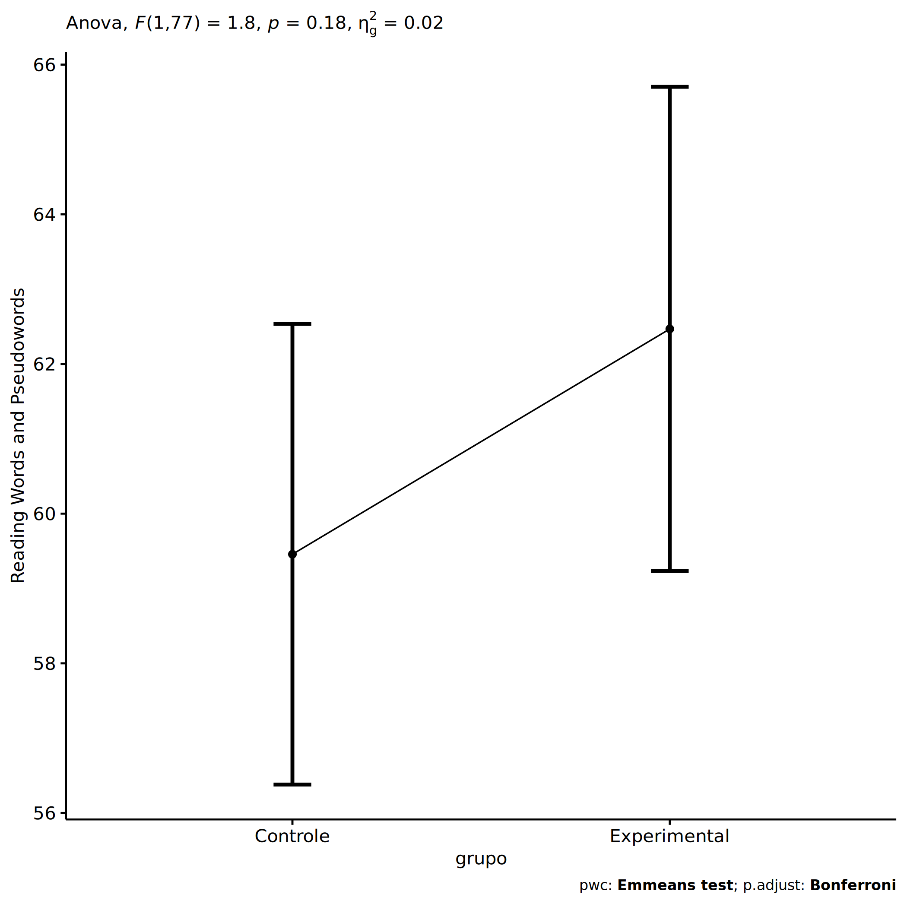
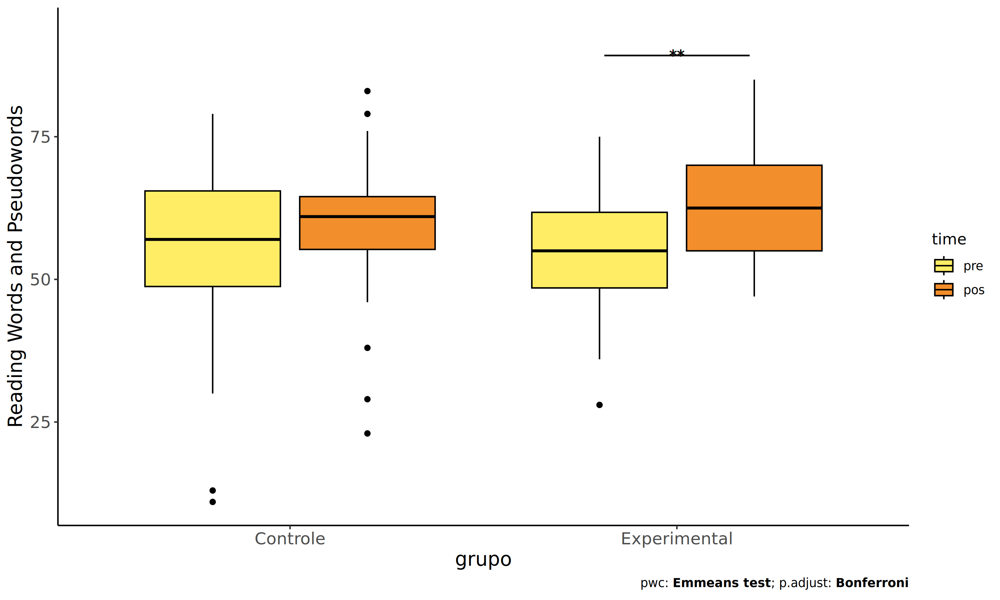
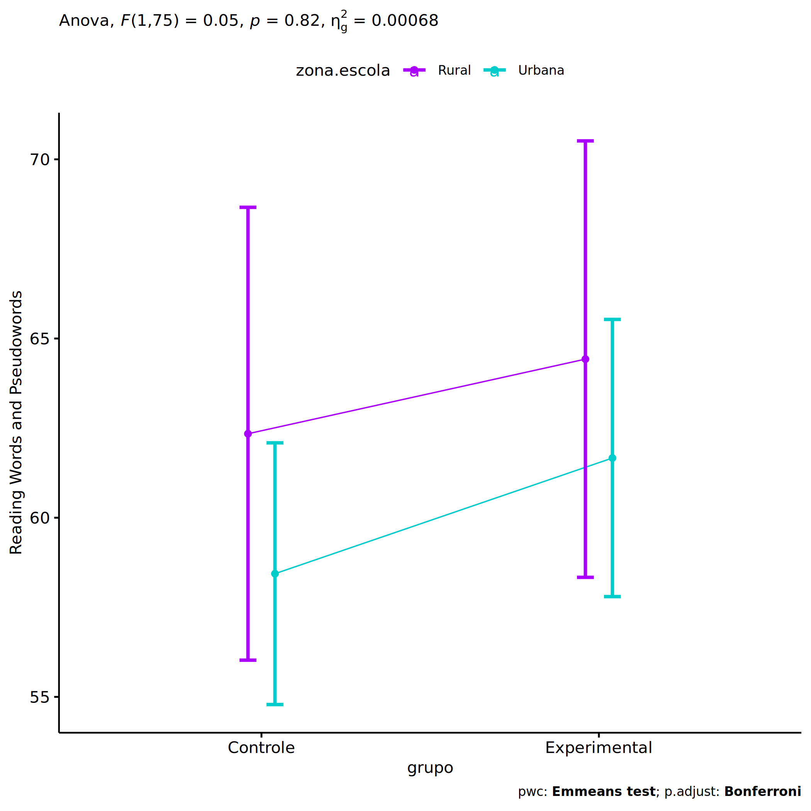
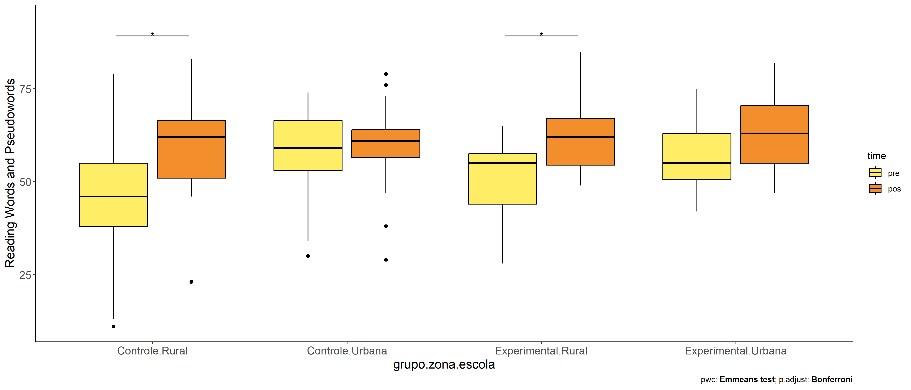
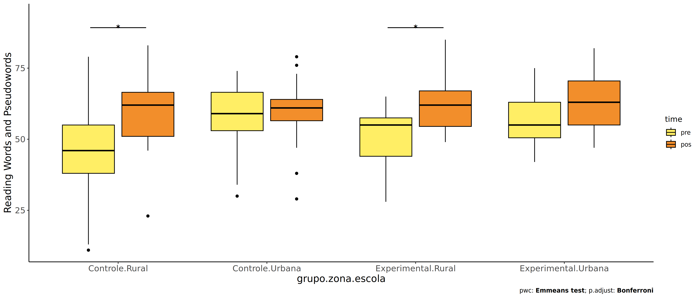
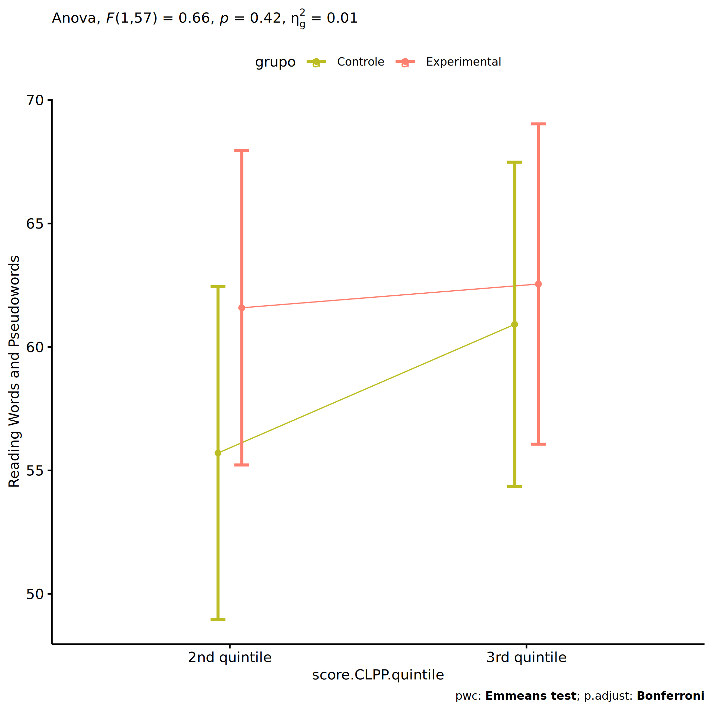
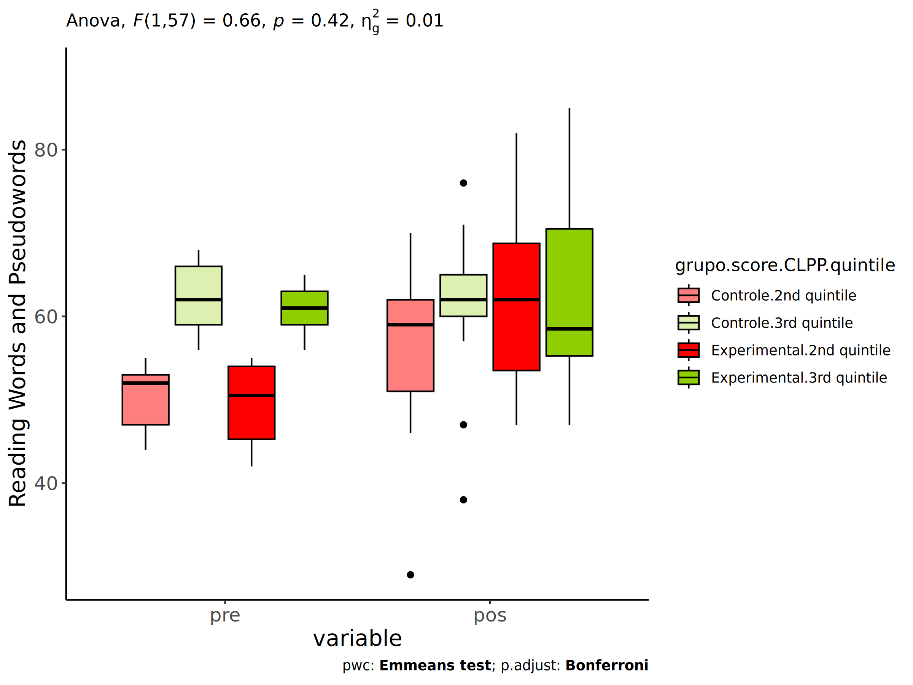

ANCOVA in Reading Words and Pseudowords (Reading Words and Pseudowords)
================
Geiser C. Challco <geiser@alumni.usp.br>

- [Setting Initial Variables](#setting-initial-variables)
- [Descriptive Statistics of Initial
  Data](#descriptive-statistics-of-initial-data)
- [ANCOVA and Pairwise for one factor:
  **grupo**](#ancova-and-pairwise-for-one-factor-grupo)
  - [Without remove non-normal data](#without-remove-non-normal-data)
  - [Computing ANCOVA and PairWise After removing non-normal data
    (OK)](#computing-ancova-and-pairwise-after-removing-non-normal-data-ok)
    - [Plots for ancova](#plots-for-ancova)
    - [Checking linearity assumption](#checking-linearity-assumption)
    - [Checking normality and
      homogeneity](#checking-normality-and-homogeneity)
- [ANCOVA and Pairwise for two factors
  **grupo:genero**](#ancova-and-pairwise-for-two-factors-grupogenero)
  - [Without remove non-normal data](#without-remove-non-normal-data-1)
  - [Computing ANCOVA and PairWise After removing non-normal data
    (OK)](#computing-ancova-and-pairwise-after-removing-non-normal-data-ok-1)
    - [Plots for ancova](#plots-for-ancova-1)
    - [Checking linearity assumption](#checking-linearity-assumption-1)
    - [Checking normality and
      homogeneity](#checking-normality-and-homogeneity-1)
- [ANCOVA and Pairwise for two factors
  **grupo:zona.participante**](#ancova-and-pairwise-for-two-factors-grupozonaparticipante)
  - [Without remove non-normal data](#without-remove-non-normal-data-2)
  - [Computing ANCOVA and PairWise After removing non-normal data
    (OK)](#computing-ancova-and-pairwise-after-removing-non-normal-data-ok-2)
    - [Plots for ancova](#plots-for-ancova-2)
    - [Checking linearity assumption](#checking-linearity-assumption-2)
    - [Checking normality and
      homogeneity](#checking-normality-and-homogeneity-2)
- [ANCOVA and Pairwise for two factors
  **grupo:zona.escola**](#ancova-and-pairwise-for-two-factors-grupozonaescola)
  - [Without remove non-normal data](#without-remove-non-normal-data-3)
  - [Computing ANCOVA and PairWise After removing non-normal data
    (OK)](#computing-ancova-and-pairwise-after-removing-non-normal-data-ok-3)
    - [Plots for ancova](#plots-for-ancova-3)
    - [Checking linearity assumption](#checking-linearity-assumption-3)
    - [Checking normality and
      homogeneity](#checking-normality-and-homogeneity-3)
- [ANCOVA and Pairwise for two factors
  **grupo:score.CLPP.quintile**](#ancova-and-pairwise-for-two-factors-gruposcoreclppquintile)
  - [Without remove non-normal data](#without-remove-non-normal-data-4)
  - [Computing ANCOVA and PairWise After removing non-normal data
    (OK)](#computing-ancova-and-pairwise-after-removing-non-normal-data-ok-4)
    - [Plots for ancova](#plots-for-ancova-4)
    - [Checking linearity assumption](#checking-linearity-assumption-4)
    - [Checking normality and
      homogeneity](#checking-normality-and-homogeneity-4)
- [Summary of Results](#summary-of-results)
  - [Descriptive Statistics](#descriptive-statistics)
  - [ANCOVA Table Comparison](#ancova-table-comparison)
  - [PairWise Table Comparison](#pairwise-table-comparison)
  - [EMMS Table Comparison](#emms-table-comparison)

**NOTE**:

- Teste ANCOVA para determinar se houve diferenças significativas no
  Reading Words and Pseudowords (medido usando pre- e pos-testes).
- ANCOVA test to determine whether there were significant differences in
  Reading Words and Pseudowords (measured using pre- and post-tests).

# Setting Initial Variables

``` r
dv = "score.CLPP"
dv.pos = "score.CLPP.pos"
dv.pre = "score.CLPP.pre"

fatores2 <- c("genero","zona.participante","zona.escola","score.CLPP.quintile")
lfatores2 <- as.list(fatores2)
names(lfatores2) <- fatores2

fatores1 <- c("grupo", fatores2)
lfatores1 <- as.list(fatores1)
names(lfatores1) <- fatores1

lfatores <- c(lfatores1)

color <- list()
color[["prepost"]] = c("#ffee65","#f28e2B")
color[["grupo"]] = c("#bcbd22","#fd7f6f")
color[["genero"]] = c("#FF007F","#4D4DFF")
color[["zona.escola"]] = c("#AA00FF","#00CCCC")
color[["zona.participante"]] = c("#AA00FF","#00CCCC")

level <- list()
level[["grupo"]] = c("Controle","Experimental")
level[["genero"]] = c("F","M")
level[["zona.escola"]] = c("Rural","Urbana")
level[["zona.participante"]] = c("Rural","Urbana")

# ..

ymin <- 0
ymax <- 0

ymin.ci <- 0
ymax.ci <- 0


color[["grupo:genero"]] = c(
  "Controle:F"="#ff99cb", "Controle:M"="#b7b7ff",
  "Experimental:F"="#FF007F", "Experimental:M"="#4D4DFF",
  "Controle.F"="#ff99cb", "Controle.M"="#b7b7ff",
  "Experimental.F"="#FF007F", "Experimental.M"="#4D4DFF"
)
color[["grupo:zona.escola"]] = c(
  "Controle:Rural"="#b2efef","Controle:Urbana"="#e5b2ff",
  "Experimental:Rural"="#00CCCC", "Experimental:Urbana"="#AA00FF",
  "Controle.Rural"="#b2efef","Controle.Urbana"="#e5b2ff",
  "Experimental.Rural"="#00CCCC", "Experimental.Urbana"="#AA00FF"
)
color[["grupo:zona.participante"]] = c(
  "Controle:Rural"="#b2efef","Controle:Urbana"="#e5b2ff",
  "Experimental:Rural"="#00CCCC", "Experimental:Urbana"="#AA00FF",
  "Controle.Rural"="#b2efef","Controle.Urbana"="#e5b2ff",
  "Experimental.Rural"="#00CCCC", "Experimental.Urbana"="#AA00FF"
)

for (coln in c(
  "palavras.lidas","score.compreensao","tri.compreensao",
  "score.vocab","tri.vocab",
  "score.vocab.ensinado","tri.vocab.ensinado","score.vocab.nao.ensinado","tri.vocab.nao.ensinado",
  "score.CLPP","tri.CLPP","score.CR","tri.CR",
  "score.CI","tri.CI","score.TV","tri.TV","score.TF","tri.TF","score.TO","tri.TO")) {
  color[[paste0(coln,".quintile")]] = c("#BF0040","#FF0000","#800080","#0000FF","#4000BF")
  level[[paste0(coln,".quintile")]] = c("1st quintile","2nd quintile","3rd quintile","4th quintile","5th quintile")
  color[[paste0("grupo:",coln,".quintile")]] = c(
    "Experimental.1st quintile"="#BF0040", "Controle.1st quintile"="#d8668c",
    "Experimental.2nd quintile"="#FF0000", "Controle.2nd quintile"="#ff7f7f",
    "Experimental.3rd quintile"="#8fce00", "Controle.3rd quintile"="#ddf0b2",
    "Experimental.4th quintile"="#0000FF", "Controle.4th quintile"="#b2b2ff",
    "Experimental.5th quintile"="#4000BF", "Controle.5th quintile"="#b299e5",
    
    "Experimental:1st quintile"="#BF0040", "Controle:1st quintile"="#d8668c",
    "Experimental:2nd quintile"="#FF0000", "Controle:2nd quintile"="#ff7f7f",
    "Experimental:3rd quintile"="#8fce00", "Controle:3rd quintile"="#ddf0b2",
    "Experimental:4th quintile"="#0000FF", "Controle:4th quintile"="#b2b2ff",
    "Experimental:5th quintile"="#4000BF", "Controle:5th quintile"="#b299e5")
}


gdat <- read_excel("../data/data.xlsx", sheet = "leitura.st")


dat <- gdat
dat$grupo <- factor(dat[["grupo"]], level[["grupo"]])
for (coln in c(names(lfatores))) {
  dat[[coln]] <- factor(dat[[coln]], level[[coln]][level[[coln]] %in% unique(dat[[coln]])])
}
dat <- dat[which(!is.na(dat[[dv.pre]]) & !is.na(dat[[dv.pos]])),]
dat <- dat[,c("id",names(lfatores),dv.pre,dv.pos)]

dat.long <- rbind(dat, dat)
dat.long$time <- c(rep("pre", nrow(dat)), rep("pos", nrow(dat)))
dat.long$time <- factor(dat.long$time, c("pre","pos"))
dat.long[[dv]] <- c(dat[[dv.pre]], dat[[dv.pos]])


for (f in c("grupo", names(lfatores))) {
  if (is.null(color[[f]]) && length(unique(dat[[f]])) > 0) 
      color[[f]] <- distinctColorPalette(length(unique(dat[[f]])))
}
for (f in c(fatores2)) {
  if (is.null(color[[paste0("grupo:",f)]]) && length(unique(dat[[f]])) > 0)
    color[[paste0("grupo:",f)]] <- distinctColorPalette(length(unique(dat[["grupo"]]))*length(unique(dat[[f]])))
}

ldat <- list()
laov <- list()
lpwc <- list()
lemms <- list()
```

# Descriptive Statistics of Initial Data

``` r
df <- get.descriptives(dat, c(dv.pre, dv.pos), c("grupo"), 
                       include.global = T, symmetry.test = T, normality.test = F)
df <- plyr::rbind.fill(
  df, do.call(plyr::rbind.fill, lapply(lfatores2, FUN = function(f) {
    if (nrow(dat) > 0 && sum(!is.na(unique(dat[[f]]))) > 1)
      get.descriptives(dat, c(dv.pre,dv.pos), c("grupo", f),
                       symmetry.test = T, normality.test = F)
    }))
)
df <- df[,c(fatores1[fatores1 %in% colnames(df)],"variable",
            colnames(df)[!colnames(df) %in% c(fatores1,"variable")])]
```

| grupo        | genero | zona.participante | zona.escola | score.CLPP.quintile | variable       |   n |   mean | median | min | max |     sd |    se |     ci |   iqr | symmetry | skewness | kurtosis |
|:-------------|:-------|:------------------|:------------|:--------------------|:---------------|----:|-------:|-------:|----:|----:|-------:|------:|-------:|------:|:---------|---------:|---------:|
| Controle     |        |                   |             |                     | score.CLPP.pre |  42 | 54.976 |   57.0 |  11 |  79 | 14.665 | 2.263 |  4.570 | 16.75 | NO       |   -1.139 |    1.369 |
| Experimental |        |                   |             |                     | score.CLPP.pre |  38 | 55.132 |   55.0 |  28 |  75 | 10.030 | 1.627 |  3.297 | 13.25 | YES      |   -0.347 |   -0.011 |
|              |        |                   |             |                     | score.CLPP.pre |  80 | 55.050 |   56.0 |  11 |  79 | 12.599 | 1.409 |  2.804 | 15.00 | NO       |   -1.033 |    1.801 |
| Controle     |        |                   |             |                     | score.CLPP.pos |  42 | 59.429 |   61.0 |  23 |  83 | 11.906 | 1.837 |  3.710 |  9.25 | NO       |   -0.820 |    1.267 |
| Experimental |        |                   |             |                     | score.CLPP.pos |  38 | 62.500 |   62.5 |  47 |  85 | 10.173 | 1.650 |  3.344 | 15.00 | YES      |    0.290 |   -0.901 |
|              |        |                   |             |                     | score.CLPP.pos |  80 | 60.888 |   61.5 |  23 |  85 | 11.155 | 1.247 |  2.482 | 14.25 | YES      |   -0.481 |    1.040 |
| Controle     | F      |                   |             |                     | score.CLPP.pre |  22 | 57.136 |   59.0 |  13 |  79 | 14.685 | 3.131 |  6.511 | 15.75 | NO       |   -1.121 |    1.454 |
| Controle     | M      |                   |             |                     | score.CLPP.pre |  20 | 52.600 |   56.0 |  11 |  71 | 14.641 | 3.274 |  6.852 | 15.50 | NO       |   -1.164 |    0.965 |
| Experimental | F      |                   |             |                     | score.CLPP.pre |  17 | 58.941 |   61.0 |  42 |  72 |  9.162 | 2.222 |  4.710 | 10.00 | YES      |   -0.468 |   -1.053 |
| Experimental | M      |                   |             |                     | score.CLPP.pre |  21 | 52.048 |   54.0 |  28 |  75 |  9.831 | 2.145 |  4.475 | 10.00 | YES      |   -0.250 |    0.646 |
| Controle     | F      |                   |             |                     | score.CLPP.pos |  22 | 60.455 |   61.0 |  23 |  83 | 12.678 | 2.703 |  5.621 |  9.00 | NO       |   -0.948 |    1.682 |
| Controle     | M      |                   |             |                     | score.CLPP.pos |  20 | 58.300 |   61.0 |  29 |  76 | 11.211 | 2.507 |  5.247 | 12.75 | NO       |   -0.637 |    0.147 |
| Experimental | F      |                   |             |                     | score.CLPP.pos |  17 | 65.235 |   66.0 |  47 |  85 | 10.121 | 2.455 |  5.204 | 10.00 | YES      |   -0.141 |   -0.585 |
| Experimental | M      |                   |             |                     | score.CLPP.pos |  21 | 60.286 |   56.0 |  47 |  82 |  9.900 | 2.160 |  4.507 | 12.00 | NO       |    0.664 |   -0.830 |
| Controle     |        | Rural             |             |                     | score.CLPP.pre |  11 | 55.818 |   52.0 |  41 |  69 | 10.591 | 3.193 |  7.115 | 20.00 | YES      |    0.014 |   -1.851 |
| Controle     |        | Urbana            |             |                     | score.CLPP.pre |  21 | 57.048 |   59.0 |  13 |  79 | 15.279 | 3.334 |  6.955 | 12.00 | NO       |   -1.129 |    1.136 |
| Controle     |        |                   |             |                     | score.CLPP.pre |  10 | 49.700 |   55.0 |  11 |  68 | 17.160 | 5.426 | 12.275 | 11.75 | NO       |   -1.091 |   -0.053 |
| Experimental |        | Rural             |             |                     | score.CLPP.pre |  14 | 58.714 |   61.5 |  28 |  75 | 11.964 | 3.198 |  6.908 |  9.50 | NO       |   -0.962 |    0.626 |
| Experimental |        | Urbana            |             |                     | score.CLPP.pre |  14 | 53.071 |   53.0 |  42 |  69 |  7.810 | 2.087 |  4.509 |  7.75 | YES      |    0.478 |   -0.802 |
| Experimental |        |                   |             |                     | score.CLPP.pre |  10 | 53.000 |   56.0 |  36 |  65 |  9.333 | 2.951 |  6.677 | 12.50 | YES      |   -0.488 |   -1.283 |
| Controle     |        | Rural             |             |                     | score.CLPP.pos |  11 | 58.636 |   60.0 |  46 |  70 |  6.516 | 1.965 |  4.377 |  7.00 | YES      |   -0.277 |   -0.645 |
| Controle     |        | Urbana            |             |                     | score.CLPP.pos |  21 | 61.524 |   62.0 |  23 |  83 | 13.927 | 3.039 |  6.340 | 16.00 | NO       |   -0.891 |    0.732 |
| Controle     |        |                   |             |                     | score.CLPP.pos |  10 | 55.900 |   60.0 |  29 |  71 | 11.949 | 3.778 |  8.547 | 13.25 | NO       |   -0.957 |   -0.079 |
| Experimental |        | Rural             |             |                     | score.CLPP.pos |  14 | 64.571 |   64.0 |  47 |  85 | 12.829 | 3.429 |  7.407 | 20.00 | YES      |    0.069 |   -1.479 |
| Experimental |        | Urbana            |             |                     | score.CLPP.pos |  14 | 64.000 |   67.0 |  47 |  77 |  9.438 | 2.522 |  5.449 | 14.25 | YES      |   -0.459 |   -1.307 |
| Experimental |        |                   |             |                     | score.CLPP.pos |  10 | 57.500 |   56.0 |  52 |  65 |  4.601 | 1.455 |  3.291 |  6.25 | YES      |    0.407 |   -1.465 |
| Controle     |        |                   | Rural       |                     | score.CLPP.pre |  11 | 45.273 |   46.0 |  11 |  79 | 20.480 | 6.175 | 13.758 | 17.00 | YES      |   -0.254 |   -0.924 |
| Controle     |        |                   | Urbana      |                     | score.CLPP.pre |  31 | 58.419 |   59.0 |  30 |  74 | 10.359 | 1.861 |  3.800 | 13.50 | NO       |   -0.849 |    0.471 |
| Experimental |        |                   | Rural       |                     | score.CLPP.pre |  11 | 50.727 |   55.0 |  28 |  65 | 11.376 | 3.430 |  7.643 | 13.50 | NO       |   -0.663 |   -0.940 |
| Experimental |        |                   | Urbana      |                     | score.CLPP.pre |  27 | 56.926 |   55.0 |  42 |  75 |  9.047 | 1.741 |  3.579 | 12.50 | YES      |    0.193 |   -1.024 |
| Controle     |        |                   | Rural       |                     | score.CLPP.pos |  11 | 58.091 |   62.0 |  23 |  83 | 15.732 | 4.743 | 10.569 | 15.50 | NO       |   -0.610 |   -0.066 |
| Controle     |        |                   | Urbana      |                     | score.CLPP.pos |  31 | 59.903 |   61.0 |  29 |  79 | 10.505 | 1.887 |  3.853 |  7.50 | NO       |   -0.746 |    0.986 |
| Experimental |        |                   | Rural       |                     | score.CLPP.pos |  11 | 62.545 |   62.0 |  49 |  85 | 10.615 | 3.200 |  7.131 | 12.50 | NO       |    0.615 |   -0.618 |
| Experimental |        |                   | Urbana      |                     | score.CLPP.pos |  27 | 62.481 |   63.0 |  47 |  82 | 10.196 | 1.962 |  4.033 | 15.50 | YES      |    0.122 |   -1.216 |
| Controle     |        |                   |             | 1st quintile        | score.CLPP.pre |   6 | 27.333 |   32.0 |  11 |  41 | 12.404 | 5.064 | 13.018 | 17.50 | YES      |   -0.348 |   -1.918 |
| Controle     |        |                   |             | 2nd quintile        | score.CLPP.pre |  13 | 50.308 |   52.0 |  44 |  55 |  3.637 | 1.009 |  2.198 |  6.00 | YES      |   -0.353 |   -1.526 |
| Controle     |        |                   |             | 3rd quintile        | score.CLPP.pre |  17 | 62.118 |   62.0 |  56 |  68 |  3.935 | 0.954 |  2.023 |  7.00 | YES      |    0.028 |   -1.479 |
| Controle     |        |                   |             | 4th quintile        | score.CLPP.pre |   6 | 72.500 |   71.0 |  69 |  79 |  3.564 | 1.455 |  3.740 |  2.25 | NO       |    0.829 |   -0.979 |
| Experimental |        |                   |             | 1st quintile        | score.CLPP.pre |   2 | 32.000 |   32.0 |  28 |  36 |  5.657 | 4.000 | 50.825 |  4.00 | few data |    0.000 |    0.000 |
| Experimental |        |                   |             | 2nd quintile        | score.CLPP.pre |  18 | 49.556 |   50.5 |  42 |  55 |  4.681 | 1.103 |  2.328 |  8.75 | YES      |   -0.235 |   -1.514 |
| Experimental |        |                   |             | 3rd quintile        | score.CLPP.pre |  14 | 60.929 |   61.0 |  56 |  65 |  3.100 | 0.829 |  1.790 |  4.00 | YES      |   -0.140 |   -1.341 |
| Experimental |        |                   |             | 4th quintile        | score.CLPP.pre |   4 | 71.500 |   71.0 |  69 |  75 |  2.646 | 1.323 |  4.210 |  3.00 | YES      |    0.324 |   -2.009 |
| Controle     |        |                   |             | 1st quintile        | score.CLPP.pos |   6 | 49.333 |   53.5 |  23 |  63 | 13.981 | 5.708 | 14.672 |  8.00 | NO       |   -0.922 |   -0.733 |
| Controle     |        |                   |             | 2nd quintile        | score.CLPP.pos |  13 | 55.385 |   59.0 |  29 |  70 | 10.243 | 2.841 |  6.190 | 11.00 | NO       |   -1.071 |    0.834 |
| Controle     |        |                   |             | 3rd quintile        | score.CLPP.pos |  17 | 61.294 |   62.0 |  38 |  76 |  8.752 | 2.123 |  4.500 |  5.00 | NO       |   -0.941 |    1.006 |
| Controle     |        |                   |             | 4th quintile        | score.CLPP.pos |   6 | 73.000 |   73.0 |  58 |  83 |  8.509 | 3.474 |  8.929 |  5.25 | NO       |   -0.584 |   -1.031 |
| Experimental |        |                   |             | 1st quintile        | score.CLPP.pos |   2 | 57.000 |   57.0 |  52 |  62 |  7.071 | 5.000 | 63.531 |  5.00 | few data |    0.000 |    0.000 |
| Experimental |        |                   |             | 2nd quintile        | score.CLPP.pos |  18 | 61.222 |   62.0 |  47 |  82 | 10.270 | 2.421 |  5.107 | 15.25 | YES      |    0.243 |   -1.106 |
| Experimental |        |                   |             | 3rd quintile        | score.CLPP.pos |  14 | 62.857 |   58.5 |  47 |  85 | 11.176 | 2.987 |  6.453 | 15.25 | NO       |    0.521 |   -1.092 |
| Experimental |        |                   |             | 4th quintile        | score.CLPP.pos |   4 | 69.750 |   68.5 |  66 |  76 |  4.500 | 2.250 |  7.161 |  4.75 | YES      |    0.468 |   -1.914 |

# ANCOVA and Pairwise for one factor: **grupo**

## Without remove non-normal data

``` r
pdat = remove_group_data(dat[!is.na(dat[["grupo"]]),], "score.CLPP.pos", "grupo")

pdat.long <- rbind(pdat[,c("id","grupo")], pdat[,c("id","grupo")])
pdat.long[["time"]] <- c(rep("pre", nrow(pdat)), rep("pos", nrow(pdat)))
pdat.long[["time"]] <- factor(pdat.long[["time"]], c("pre","pos"))
pdat.long[["score.CLPP"]] <- c(pdat[["score.CLPP.pre"]], pdat[["score.CLPP.pos"]])

aov = anova_test(pdat, score.CLPP.pos ~ score.CLPP.pre + grupo)
laov[["grupo"]] <- get_anova_table(aov)
```

``` r
pwc <- emmeans_test(pdat, score.CLPP.pos ~ grupo, covariate = score.CLPP.pre,
                    p.adjust.method = "bonferroni")
```

``` r
pwc.long <- emmeans_test(dplyr::group_by_at(pdat.long, "grupo"),
                          score.CLPP ~ time,
                          p.adjust.method = "bonferroni")
lpwc[["grupo"]] <- plyr::rbind.fill(pwc, pwc.long)
```

``` r
ds <- get.descriptives(pdat, "score.CLPP.pos", "grupo", covar = "score.CLPP.pre")
ds <- merge(ds[ds$variable != "score.CLPP.pre",],
            ds[ds$variable == "score.CLPP.pre", !colnames(ds) %in% c("variable")],
            by = "grupo", all.x = T, suffixes = c("", ".score.CLPP.pre"))
ds <- merge(get_emmeans(pwc), ds, by = "grupo", suffixes = c(".emms", ""))
ds <- ds[,c("grupo","n","mean.score.CLPP.pre","se.score.CLPP.pre","mean","se",
            "emmean","se.emms","conf.low","conf.high")]

colnames(ds) <- c("grupo", "N", paste0(c("M","SE")," (pre)"),
                  paste0(c("M","SE"), " (unadj)"),
                  paste0(c("M", "SE"), " (adj)"), "conf.low", "conf.high")

lemms[["grupo"]] <- ds
```

## Computing ANCOVA and PairWise After removing non-normal data (OK)

``` r
wdat = pdat 

res = residuals(lm(score.CLPP.pos ~ score.CLPP.pre + grupo, data = wdat))
non.normal = getNonNormal(res, wdat$id, plimit = 0.05)

wdat = wdat[!wdat$id %in% non.normal,]

wdat.long <- rbind(wdat[,c("id","grupo")], wdat[,c("id","grupo")])
wdat.long[["time"]] <- c(rep("pre", nrow(wdat)), rep("pos", nrow(wdat)))
wdat.long[["time"]] <- factor(wdat.long[["time"]], c("pre","pos"))
wdat.long[["score.CLPP"]] <- c(wdat[["score.CLPP.pre"]], wdat[["score.CLPP.pos"]])

ldat[["grupo"]] = wdat

(non.normal)
```

    ## NULL

``` r
aov = anova_test(wdat, score.CLPP.pos ~ score.CLPP.pre + grupo)
laov[["grupo"]] <- merge(get_anova_table(aov), laov[["grupo"]],
                            by="Effect", suffixes = c("","'"))

(df = get_anova_table(aov))
```

    ## ANOVA Table (type II tests)
    ## 
    ##           Effect DFn DFd      F        p p<.05   ges
    ## 1 score.CLPP.pre   1  77 19.109 3.82e-05     * 0.199
    ## 2          grupo   1  77  1.802 1.83e-01       0.023

| Effect         | DFn | DFd |      F |     p | p\<.05 |   ges |
|:---------------|----:|----:|-------:|------:|:-------|------:|
| score.CLPP.pre |   1 |  77 | 19.109 | 0.000 | \*     | 0.199 |
| grupo          |   1 |  77 |  1.802 | 0.183 |        | 0.023 |

``` r
pwc <- emmeans_test(wdat, score.CLPP.pos ~ grupo, covariate = score.CLPP.pre,
                    p.adjust.method = "bonferroni")
```

| term                  | .y.            | group1   | group2       |  df | statistic |     p | p.adj | p.adj.signif |
|:----------------------|:---------------|:---------|:-------------|----:|----------:|------:|------:|:-------------|
| score.CLPP.pre\*grupo | score.CLPP.pos | Controle | Experimental |  77 |    -1.343 | 0.183 | 0.183 | ns           |

``` r
pwc.long <- emmeans_test(dplyr::group_by_at(wdat.long, "grupo"),
                         score.CLPP ~ time,
                         p.adjust.method = "bonferroni")
lpwc[["grupo"]] <- merge(plyr::rbind.fill(pwc, pwc.long), lpwc[["grupo"]],
                            by=c("grupo","term",".y.","group1","group2"),
                            suffixes = c("","'"))
```

| grupo        | term | .y.        | group1 | group2 |  df | statistic |     p | p.adj | p.adj.signif |
|:-------------|:-----|:-----------|:-------|:-------|----:|----------:|------:|------:|:-------------|
| Controle     | time | score.CLPP | pre    | pos    | 156 |    -1.711 | 0.089 | 0.089 | ns           |
| Experimental | time | score.CLPP | pre    | pos    | 156 |    -2.694 | 0.008 | 0.008 | \*\*         |

``` r
ds <- get.descriptives(wdat, "score.CLPP.pos", "grupo", covar = "score.CLPP.pre")
ds <- merge(ds[ds$variable != "score.CLPP.pre",],
            ds[ds$variable == "score.CLPP.pre", !colnames(ds) %in% c("variable")],
            by = "grupo", all.x = T, suffixes = c("", ".score.CLPP.pre"))
ds <- merge(get_emmeans(pwc), ds, by = "grupo", suffixes = c(".emms", ""))
ds <- ds[,c("grupo","n","mean.score.CLPP.pre","se.score.CLPP.pre","mean","se",
            "emmean","se.emms","conf.low","conf.high")]

colnames(ds) <- c("grupo", "N", paste0(c("M","SE")," (pre)"),
                  paste0(c("M","SE"), " (unadj)"),
                  paste0(c("M", "SE"), " (adj)"), "conf.low", "conf.high")

lemms[["grupo"]] <- merge(ds, lemms[["grupo"]], by=c("grupo"), suffixes = c("","'"))
```

| grupo        |   N | M (pre) | SE (pre) | M (unadj) | SE (unadj) | M (adj) | SE (adj) | conf.low | conf.high |
|:-------------|----:|--------:|---------:|----------:|-----------:|--------:|---------:|---------:|----------:|
| Controle     |  42 |  54.976 |    2.263 |    59.429 |      1.837 |  59.457 |    1.546 |   56.380 |    62.535 |
| Experimental |  38 |  55.132 |    1.627 |    62.500 |      1.650 |  62.468 |    1.625 |   59.233 |    65.704 |

### Plots for ancova

``` r
plots <- oneWayAncovaPlots(
  wdat, "score.CLPP.pos", "grupo", aov, list("grupo"=pwc), addParam = c("mean_ci"),
  font.label.size=10, step.increase=0.05, p.label="p.adj",
  subtitle = which(aov$Effect == "grupo"))
```

``` r
if (!is.null(nrow(plots[["grupo"]]$data)))
  plots[["grupo"]] + ggplot2::ylab("Reading Words and Pseudowords") + 
  if (ymin.ci < ymax.ci) ggplot2::ylim(ymin.ci, ymax.ci)
```

<!-- -->

``` r
plots <- oneWayAncovaBoxPlots(
  wdat, "score.CLPP.pos", "grupo", aov, pwc, covar = "score.CLPP.pre",
  theme = "classic", color = color[["grupo"]],
  subtitle = which(aov$Effect == "grupo"))
```

``` r
if (length(unique(wdat[["grupo"]])) > 1)
  plots[["grupo"]] + ggplot2::ylab("Reading Words and Pseudowords") +
  ggplot2::scale_x_discrete(labels=c('pre', 'pos')) +
  if (ymin < ymax) ggplot2::ylim(ymin, ymax)
```

<!-- -->

``` r
if (length(unique(wdat.long[["grupo"]])) > 1)
  plots <- oneWayAncovaBoxPlots(
    wdat.long, "score.CLPP", "grupo", aov, pwc.long,
    pre.post = "time", theme = "classic", color = color$prepost)
```

``` r
if (length(unique(wdat.long[["grupo"]])) > 1)
  plots[["grupo"]] + ggplot2::ylab("Reading Words and Pseudowords") +
  if (ymin < ymax) ggplot2::ylim(ymin, ymax) 
```

<!-- -->

### Checking linearity assumption

``` r
ggscatter(wdat, x = "score.CLPP.pre", y = "score.CLPP.pos", size = 0.5,
          color = "grupo", add = "reg.line")+
  stat_regline_equation(
    aes(label =  paste(..eq.label.., ..rr.label.., sep = "~~~~"), color = grupo)
  ) +
  ggplot2::labs(subtitle = rstatix::get_test_label(aov, detailed = T, row = which(aov$Effect == "grupo"))) +
  ggplot2::scale_color_manual(values = color[["grupo"]]) +
  ggplot2::ylab("Reading Words and Pseudowords")  +
  if (ymin < ymax) ggplot2::ylim(ymin, ymax)
```

<!-- -->

### Checking normality and homogeneity

``` r
res <- augment(lm(score.CLPP.pos ~ score.CLPP.pre + grupo, data = wdat))
```

``` r
shapiro_test(res$.resid)
```

    ## # A tibble: 1 × 3
    ##   variable   statistic p.value
    ##   <chr>          <dbl>   <dbl>
    ## 1 res$.resid     0.991   0.877

``` r
levene_test(res, .resid ~ grupo)
```

    ## # A tibble: 1 × 4
    ##     df1   df2 statistic     p
    ##   <int> <int>     <dbl> <dbl>
    ## 1     1    78     0.772 0.382

# ANCOVA and Pairwise for two factors **grupo:genero**

## Without remove non-normal data

``` r
pdat = remove_group_data(dat[!is.na(dat[["grupo"]]) & !is.na(dat[["genero"]]),],
                         "score.CLPP.pos", c("grupo","genero"))
pdat = pdat[pdat[["genero"]] %in% do.call(
  intersect, lapply(unique(pdat[["grupo"]]), FUN = function(x) {
    unique(pdat[["genero"]][which(pdat[["grupo"]] == x)])
  })),]
pdat[["grupo"]] = factor(pdat[["grupo"]], level[["grupo"]])
pdat[["genero"]] = factor(
  pdat[["genero"]],
  level[["genero"]][level[["genero"]] %in% unique(pdat[["genero"]])])

pdat.long <- rbind(pdat[,c("id","grupo","genero")], pdat[,c("id","grupo","genero")])
pdat.long[["time"]] <- c(rep("pre", nrow(pdat)), rep("pos", nrow(pdat)))
pdat.long[["time"]] <- factor(pdat.long[["time"]], c("pre","pos"))
pdat.long[["score.CLPP"]] <- c(pdat[["score.CLPP.pre"]], pdat[["score.CLPP.pos"]])

if (length(unique(pdat[["genero"]])) >= 2) {
  aov = anova_test(pdat, score.CLPP.pos ~ score.CLPP.pre + grupo*genero)
  laov[["grupo:genero"]] <- get_anova_table(aov)
}
```

``` r
if (length(unique(pdat[["genero"]])) >= 2) {
  pwcs <- list()
  pwcs[["genero"]] <- emmeans_test(
    group_by(pdat, grupo), score.CLPP.pos ~ genero,
    covariate = score.CLPP.pre, p.adjust.method = "bonferroni")
  pwcs[["grupo"]] <- emmeans_test(
    group_by(pdat, genero), score.CLPP.pos ~ grupo,
    covariate = score.CLPP.pre, p.adjust.method = "bonferroni")
  
  pwc <- plyr::rbind.fill(pwcs[["grupo"]], pwcs[["genero"]])
  pwc <- pwc[,c("grupo","genero", colnames(pwc)[!colnames(pwc) %in% c("grupo","genero")])]
}
```

``` r
if (length(unique(pdat[["genero"]])) >= 2) {
  pwc.long <- emmeans_test(dplyr::group_by_at(pdat.long, c("grupo","genero")),
                           score.CLPP ~ time,
                           p.adjust.method = "bonferroni")
  lpwc[["grupo:genero"]] <- plyr::rbind.fill(pwc, pwc.long)
}
```

``` r
if (length(unique(pdat[["genero"]])) >= 2) {
  ds <- get.descriptives(pdat, "score.CLPP.pos", c("grupo","genero"), covar = "score.CLPP.pre")
  ds <- merge(ds[ds$variable != "score.CLPP.pre",],
              ds[ds$variable == "score.CLPP.pre", !colnames(ds) %in% c("variable")],
              by = c("grupo","genero"), all.x = T, suffixes = c("", ".score.CLPP.pre"))
  ds <- merge(get_emmeans(pwcs[["grupo"]]), ds,
              by = c("grupo","genero"), suffixes = c(".emms", ""))
  ds <- ds[,c("grupo","genero","n","mean.score.CLPP.pre","se.score.CLPP.pre","mean","se",
              "emmean","se.emms","conf.low","conf.high")]
  
  colnames(ds) <- c("grupo","genero", "N", paste0(c("M","SE")," (pre)"),
                    paste0(c("M","SE"), " (unadj)"),
                    paste0(c("M", "SE"), " (adj)"), "conf.low", "conf.high")
  
  lemms[["grupo:genero"]] <- ds
}
```

## Computing ANCOVA and PairWise After removing non-normal data (OK)

``` r
if (length(unique(pdat[["genero"]])) >= 2) {
  wdat = pdat 
  
  res = residuals(lm(score.CLPP.pos ~ score.CLPP.pre + grupo*genero, data = wdat))
  non.normal = getNonNormal(res, wdat$id, plimit = 0.05)
  
  wdat = wdat[!wdat$id %in% non.normal,]
  
  wdat.long <- rbind(wdat[,c("id","grupo","genero")], wdat[,c("id","grupo","genero")])
  wdat.long[["time"]] <- c(rep("pre", nrow(wdat)), rep("pos", nrow(wdat)))
  wdat.long[["time"]] <- factor(wdat.long[["time"]], c("pre","pos"))
  wdat.long[["score.CLPP"]] <- c(wdat[["score.CLPP.pre"]], wdat[["score.CLPP.pos"]])
  
  
  ldat[["grupo:genero"]] = wdat
  
  (non.normal)
}
```

    ## NULL

``` r
if (length(unique(pdat[["genero"]])) >= 2) {
  aov = anova_test(wdat, score.CLPP.pos ~ score.CLPP.pre + grupo*genero)
  laov[["grupo:genero"]] <- merge(get_anova_table(aov), laov[["grupo:genero"]],
                                         by="Effect", suffixes = c("","'"))
  df = get_anova_table(aov)
}
```

| Effect         | DFn | DFd |      F |     p | p\<.05 |   ges |
|:---------------|----:|----:|-------:|------:|:-------|------:|
| score.CLPP.pre |   1 |  75 | 16.517 | 0.000 | \*     | 0.180 |
| grupo          |   1 |  75 |  1.879 | 0.174 |        | 0.024 |
| genero         |   1 |  75 |  0.328 | 0.568 |        | 0.004 |
| grupo:genero   |   1 |  75 |  0.175 | 0.677 |        | 0.002 |

``` r
if (length(unique(pdat[["genero"]])) >= 2) {
  pwcs <- list()
  pwcs[["genero"]] <- emmeans_test(
    group_by(wdat, grupo), score.CLPP.pos ~ genero,
    covariate = score.CLPP.pre, p.adjust.method = "bonferroni")
  pwcs[["grupo"]] <- emmeans_test(
    group_by(wdat, genero), score.CLPP.pos ~ grupo,
    covariate = score.CLPP.pre, p.adjust.method = "bonferroni")
  
  pwc <- plyr::rbind.fill(pwcs[["grupo"]], pwcs[["genero"]])
  pwc <- pwc[,c("grupo","genero", colnames(pwc)[!colnames(pwc) %in% c("grupo","genero")])]
}
```

| grupo        | genero | term                   | .y.            | group1   | group2       |  df | statistic |     p | p.adj | p.adj.signif |
|:-------------|:-------|:-----------------------|:---------------|:---------|:-------------|----:|----------:|------:|------:|:-------------|
|              | F      | score.CLPP.pre\*grupo  | score.CLPP.pos | Controle | Experimental |  75 |    -1.254 | 0.214 | 0.214 | ns           |
|              | M      | score.CLPP.pre\*grupo  | score.CLPP.pos | Controle | Experimental |  75 |    -0.694 | 0.490 | 0.490 | ns           |
| Controle     |        | score.CLPP.pre\*genero | score.CLPP.pos | F        | M            |  75 |     0.141 | 0.889 | 0.889 | ns           |
| Experimental |        | score.CLPP.pre\*genero | score.CLPP.pos | F        | M            |  75 |     0.699 | 0.487 | 0.487 | ns           |

``` r
if (length(unique(pdat[["genero"]])) >= 2) {
  pwc.long <- emmeans_test(dplyr::group_by_at(wdat.long, c("grupo","genero")),
                           score.CLPP ~ time,
                           p.adjust.method = "bonferroni")
  lpwc[["grupo:genero"]] <- merge(plyr::rbind.fill(pwc, pwc.long),
                                         lpwc[["grupo:genero"]],
                                         by=c("grupo","genero","term",".y.","group1","group2"),
                                         suffixes = c("","'"))
}
```

| grupo        | genero | term | .y.        | group1 | group2 |  df | statistic |     p | p.adj | p.adj.signif |
|:-------------|:-------|:-----|:-----------|:-------|:-------|----:|----------:|------:|------:|:-------------|
| Controle     | F      | time | score.CLPP | pre    | pos    | 152 |    -0.931 | 0.353 | 0.353 | ns           |
| Controle     | M      | time | score.CLPP | pre    | pos    | 152 |    -1.525 | 0.129 | 0.129 | ns           |
| Experimental | F      | time | score.CLPP | pre    | pos    | 152 |    -1.552 | 0.123 | 0.123 | ns           |
| Experimental | M      | time | score.CLPP | pre    | pos    | 152 |    -2.258 | 0.025 | 0.025 | \*           |

``` r
if (length(unique(pdat[["genero"]])) >= 2) {
  ds <- get.descriptives(wdat, "score.CLPP.pos", c("grupo","genero"), covar = "score.CLPP.pre")
  ds <- merge(ds[ds$variable != "score.CLPP.pre",],
              ds[ds$variable == "score.CLPP.pre", !colnames(ds) %in% c("variable")],
              by = c("grupo","genero"), all.x = T, suffixes = c("", ".score.CLPP.pre"))
  ds <- merge(get_emmeans(pwcs[["grupo"]]), ds,
              by = c("grupo","genero"), suffixes = c(".emms", ""))
  ds <- ds[,c("grupo","genero","n","mean.score.CLPP.pre","se.score.CLPP.pre",
              "mean","se","emmean","se.emms","conf.low","conf.high")]
  
  colnames(ds) <- c("grupo","genero", "N", paste0(c("M","SE")," (pre)"),
                    paste0(c("M","SE"), " (unadj)"),
                    paste0(c("M", "SE"), " (adj)"), "conf.low", "conf.high")
  
  lemms[["grupo:genero"]] <- merge(ds, lemms[["grupo:genero"]],
                                          by=c("grupo","genero"), suffixes = c("","'"))
}
```

| grupo        | genero |   N | M (pre) | SE (pre) | M (unadj) | SE (unadj) | M (adj) | SE (adj) | conf.low | conf.high |
|:-------------|:-------|----:|--------:|---------:|----------:|-----------:|--------:|---------:|---------:|----------:|
| Controle     | F      |  22 |  57.136 |    3.131 |    60.455 |      2.703 |  59.668 |    2.165 |   55.354 |    63.981 |
| Controle     | M      |  20 |  52.600 |    3.274 |    58.300 |      2.507 |  59.224 |    2.273 |   54.696 |    63.752 |
| Experimental | F      |  17 |  58.941 |    2.222 |    65.235 |      2.455 |  63.768 |    2.480 |   58.828 |    68.707 |
| Experimental | M      |  21 |  52.048 |    2.145 |    60.286 |      2.160 |  61.418 |    2.225 |   56.986 |    65.850 |

### Plots for ancova

``` r
if (length(unique(pdat[["genero"]])) >= 2) {
  ggPlotAoC2(pwcs, "grupo", "genero", aov, ylab = "Reading Words and Pseudowords",
             subtitle = which(aov$Effect == "grupo:genero"), addParam = "errorbar") +
    ggplot2::scale_color_manual(values = color[["genero"]]) +
    ggplot2::ylab("Reading Words and Pseudowords") +
    if (ymin.ci < ymax.ci) ggplot2::ylim(ymin.ci, ymax.ci)
}
```

    ## Scale for colour is already present.
    ## Adding another scale for colour, which will replace the existing scale.

<!-- -->

``` r
if (length(unique(pdat[["genero"]])) >= 2) {
  ggPlotAoC2(pwcs, "genero", "grupo", aov, ylab = "Reading Words and Pseudowords",
               subtitle = which(aov$Effect == "grupo:genero"), addParam = "errorbar") +
    ggplot2::scale_color_manual(values = color[["grupo"]]) +
    ggplot2::ylab("Reading Words and Pseudowords") +
    if (ymin.ci < ymax.ci) ggplot2::ylim(ymin.ci, ymax.ci)
}
```

    ## Scale for colour is already present.
    ## Adding another scale for colour, which will replace the existing scale.

<!-- -->

``` r
if (length(unique(pdat[["genero"]])) >= 2) {
  plots <- twoWayAncovaBoxPlots(
    wdat, "score.CLPP.pos", c("grupo","genero"), aov, pwcs, covar = "score.CLPP.pre",
    theme = "classic", color = color[["grupo:genero"]],
    subtitle = which(aov$Effect == "grupo:genero"))
}
```

``` r
if (length(unique(pdat[["genero"]])) >= 2) {
  plots[["grupo:genero"]] + ggplot2::ylab("Reading Words and Pseudowords") +
  ggplot2::scale_x_discrete(labels=c('pre', 'pos')) +
  if (ymin < ymax) ggplot2::ylim(ymin, ymax)
}
```

    ## Warning: No shared levels found between `names(values)` of the manual scale and the data's colour
    ## values.

<!-- -->

``` r
if (length(unique(pdat[["genero"]])) >= 2) {
  plots <- twoWayAncovaBoxPlots(
    wdat.long, "score.CLPP", c("grupo","genero"), aov, pwc.long,
    pre.post = "time",
    theme = "classic", color = color$prepost)
}
```

``` r
if (length(unique(pdat[["genero"]])) >= 2) 
  plots[["grupo:genero"]] + ggplot2::ylab("Reading Words and Pseudowords") +
    if (ymin < ymax) ggplot2::ylim(ymin, ymax)
```

<!-- -->

### Checking linearity assumption

``` r
if (length(unique(pdat[["genero"]])) >= 2) {
  ggscatter(wdat, x = "score.CLPP.pre", y = "score.CLPP.pos", size = 0.5,
            facet.by = c("grupo","genero"), add = "reg.line")+
    stat_regline_equation(
      aes(label =  paste(..eq.label.., ..rr.label.., sep = "~~~~"))
    ) + ggplot2::ylab("Reading Words and Pseudowords") +
    if (ymin < ymax) ggplot2::ylim(ymin, ymax)
}
```

<!-- -->

``` r
if (length(unique(pdat[["genero"]])) >= 2) {
  ggscatter(wdat, x = "score.CLPP.pre", y = "score.CLPP.pos", size = 0.5,
            color = "grupo", facet.by = "genero", add = "reg.line")+
    stat_regline_equation(
      aes(label =  paste(..eq.label.., ..rr.label.., sep = "~~~~"), color = grupo)
    ) +
    ggplot2::labs(subtitle = rstatix::get_test_label(aov, detailed = T, row = which(aov$Effect == "grupo:genero"))) +
    ggplot2::scale_color_manual(values = color[["grupo"]]) +
    ggplot2::ylab("Reading Words and Pseudowords") +
    if (ymin < ymax) ggplot2::ylim(ymin, ymax)
}
```

<!-- -->

``` r
if (length(unique(pdat[["genero"]])) >= 2) {
  ggscatter(wdat, x = "score.CLPP.pre", y = "score.CLPP.pos", size = 0.5,
            color = "genero", facet.by = "grupo", add = "reg.line")+
    stat_regline_equation(
      aes(label =  paste(..eq.label.., ..rr.label.., sep = "~~~~"), color = genero)
    ) +
    ggplot2::labs(subtitle = rstatix::get_test_label(aov, detailed = T, row = which(aov$Effect == "grupo:genero"))) +
    ggplot2::scale_color_manual(values = color[["genero"]]) +
    ggplot2::ylab("Reading Words and Pseudowords") +
    if (ymin < ymax) ggplot2::ylim(ymin, ymax)
}
```

<!-- -->

### Checking normality and homogeneity

``` r
if (length(unique(pdat[["genero"]])) >= 2) 
  res <- augment(lm(score.CLPP.pos ~ score.CLPP.pre + grupo*genero, data = wdat))
```

``` r
if (length(unique(pdat[["genero"]])) >= 2)
  shapiro_test(res$.resid)
```

    ## # A tibble: 1 × 3
    ##   variable   statistic p.value
    ##   <chr>          <dbl>   <dbl>
    ## 1 res$.resid     0.990   0.768

``` r
if (length(unique(pdat[["genero"]])) >= 2) 
  levene_test(res, .resid ~ grupo*genero)
```

    ## # A tibble: 1 × 4
    ##     df1   df2 statistic     p
    ##   <int> <int>     <dbl> <dbl>
    ## 1     3    76     0.204 0.893

# ANCOVA and Pairwise for two factors **grupo:zona.participante**

## Without remove non-normal data

``` r
pdat = remove_group_data(dat[!is.na(dat[["grupo"]]) & !is.na(dat[["zona.participante"]]),],
                         "score.CLPP.pos", c("grupo","zona.participante"))
pdat = pdat[pdat[["zona.participante"]] %in% do.call(
  intersect, lapply(unique(pdat[["grupo"]]), FUN = function(x) {
    unique(pdat[["zona.participante"]][which(pdat[["grupo"]] == x)])
  })),]
pdat[["grupo"]] = factor(pdat[["grupo"]], level[["grupo"]])
pdat[["zona.participante"]] = factor(
  pdat[["zona.participante"]],
  level[["zona.participante"]][level[["zona.participante"]] %in% unique(pdat[["zona.participante"]])])

pdat.long <- rbind(pdat[,c("id","grupo","zona.participante")], pdat[,c("id","grupo","zona.participante")])
pdat.long[["time"]] <- c(rep("pre", nrow(pdat)), rep("pos", nrow(pdat)))
pdat.long[["time"]] <- factor(pdat.long[["time"]], c("pre","pos"))
pdat.long[["score.CLPP"]] <- c(pdat[["score.CLPP.pre"]], pdat[["score.CLPP.pos"]])

if (length(unique(pdat[["zona.participante"]])) >= 2) {
  aov = anova_test(pdat, score.CLPP.pos ~ score.CLPP.pre + grupo*zona.participante)
  laov[["grupo:zona.participante"]] <- get_anova_table(aov)
}
```

``` r
if (length(unique(pdat[["zona.participante"]])) >= 2) {
  pwcs <- list()
  pwcs[["zona.participante"]] <- emmeans_test(
    group_by(pdat, grupo), score.CLPP.pos ~ zona.participante,
    covariate = score.CLPP.pre, p.adjust.method = "bonferroni")
  pwcs[["grupo"]] <- emmeans_test(
    group_by(pdat, zona.participante), score.CLPP.pos ~ grupo,
    covariate = score.CLPP.pre, p.adjust.method = "bonferroni")
  
  pwc <- plyr::rbind.fill(pwcs[["grupo"]], pwcs[["zona.participante"]])
  pwc <- pwc[,c("grupo","zona.participante", colnames(pwc)[!colnames(pwc) %in% c("grupo","zona.participante")])]
}
```

``` r
if (length(unique(pdat[["zona.participante"]])) >= 2) {
  pwc.long <- emmeans_test(dplyr::group_by_at(pdat.long, c("grupo","zona.participante")),
                           score.CLPP ~ time,
                           p.adjust.method = "bonferroni")
  lpwc[["grupo:zona.participante"]] <- plyr::rbind.fill(pwc, pwc.long)
}
```

``` r
if (length(unique(pdat[["zona.participante"]])) >= 2) {
  ds <- get.descriptives(pdat, "score.CLPP.pos", c("grupo","zona.participante"), covar = "score.CLPP.pre")
  ds <- merge(ds[ds$variable != "score.CLPP.pre",],
              ds[ds$variable == "score.CLPP.pre", !colnames(ds) %in% c("variable")],
              by = c("grupo","zona.participante"), all.x = T, suffixes = c("", ".score.CLPP.pre"))
  ds <- merge(get_emmeans(pwcs[["grupo"]]), ds,
              by = c("grupo","zona.participante"), suffixes = c(".emms", ""))
  ds <- ds[,c("grupo","zona.participante","n","mean.score.CLPP.pre","se.score.CLPP.pre","mean","se",
              "emmean","se.emms","conf.low","conf.high")]
  
  colnames(ds) <- c("grupo","zona.participante", "N", paste0(c("M","SE")," (pre)"),
                    paste0(c("M","SE"), " (unadj)"),
                    paste0(c("M", "SE"), " (adj)"), "conf.low", "conf.high")
  
  lemms[["grupo:zona.participante"]] <- ds
}
```

## Computing ANCOVA and PairWise After removing non-normal data (OK)

``` r
if (length(unique(pdat[["zona.participante"]])) >= 2) {
  wdat = pdat 
  
  res = residuals(lm(score.CLPP.pos ~ score.CLPP.pre + grupo*zona.participante, data = wdat))
  non.normal = getNonNormal(res, wdat$id, plimit = 0.05)
  
  wdat = wdat[!wdat$id %in% non.normal,]
  
  wdat.long <- rbind(wdat[,c("id","grupo","zona.participante")], wdat[,c("id","grupo","zona.participante")])
  wdat.long[["time"]] <- c(rep("pre", nrow(wdat)), rep("pos", nrow(wdat)))
  wdat.long[["time"]] <- factor(wdat.long[["time"]], c("pre","pos"))
  wdat.long[["score.CLPP"]] <- c(wdat[["score.CLPP.pre"]], wdat[["score.CLPP.pos"]])
  
  
  ldat[["grupo:zona.participante"]] = wdat
  
  (non.normal)
}
```

    ## NULL

``` r
if (length(unique(pdat[["zona.participante"]])) >= 2) {
  aov = anova_test(wdat, score.CLPP.pos ~ score.CLPP.pre + grupo*zona.participante)
  laov[["grupo:zona.participante"]] <- merge(get_anova_table(aov), laov[["grupo:zona.participante"]],
                                         by="Effect", suffixes = c("","'"))
  df = get_anova_table(aov)
}
```

| Effect                  | DFn | DFd |      F |     p | p\<.05 |   ges |
|:------------------------|----:|----:|-------:|------:|:-------|------:|
| score.CLPP.pre          |   1 |  55 | 22.386 | 0.000 | \*     | 0.289 |
| grupo                   |   1 |  55 |  2.976 | 0.090 |        | 0.051 |
| zona.participante       |   1 |  55 |  0.749 | 0.391 |        | 0.013 |
| grupo:zona.participante |   1 |  55 |  0.000 | 0.993 |        | 0.000 |

``` r
if (length(unique(pdat[["zona.participante"]])) >= 2) {
  pwcs <- list()
  pwcs[["zona.participante"]] <- emmeans_test(
    group_by(wdat, grupo), score.CLPP.pos ~ zona.participante,
    covariate = score.CLPP.pre, p.adjust.method = "bonferroni")
  pwcs[["grupo"]] <- emmeans_test(
    group_by(wdat, zona.participante), score.CLPP.pos ~ grupo,
    covariate = score.CLPP.pre, p.adjust.method = "bonferroni")
  
  pwc <- plyr::rbind.fill(pwcs[["grupo"]], pwcs[["zona.participante"]])
  pwc <- pwc[,c("grupo","zona.participante", colnames(pwc)[!colnames(pwc) %in% c("grupo","zona.participante")])]
}
```

| grupo        | zona.participante | term                              | .y.            | group1   | group2       |  df | statistic |     p | p.adj | p.adj.signif |
|:-------------|:------------------|:----------------------------------|:---------------|:---------|:-------------|----:|----------:|------:|------:|:-------------|
|              | Rural             | score.CLPP.pre\*grupo             | score.CLPP.pos | Controle | Experimental |  55 |    -1.113 | 0.271 | 0.271 | ns           |
|              | Urbana            | score.CLPP.pre\*grupo             | score.CLPP.pos | Controle | Experimental |  55 |    -1.307 | 0.197 | 0.197 | ns           |
| Controle     |                   | score.CLPP.pre\*zona.participante | score.CLPP.pos | Rural    | Urbana       |  55 |    -0.612 | 0.543 | 0.543 | ns           |
| Experimental |                   | score.CLPP.pre\*zona.participante | score.CLPP.pos | Rural    | Urbana       |  55 |    -0.608 | 0.546 | 0.546 | ns           |

``` r
if (length(unique(pdat[["zona.participante"]])) >= 2) {
  pwc.long <- emmeans_test(dplyr::group_by_at(wdat.long, c("grupo","zona.participante")),
                           score.CLPP ~ time,
                           p.adjust.method = "bonferroni")
  lpwc[["grupo:zona.participante"]] <- merge(plyr::rbind.fill(pwc, pwc.long),
                                         lpwc[["grupo:zona.participante"]],
                                         by=c("grupo","zona.participante","term",".y.","group1","group2"),
                                         suffixes = c("","'"))
}
```

| grupo        | zona.participante | term | .y.        | group1 | group2 |  df | statistic |     p | p.adj | p.adj.signif |
|:-------------|:------------------|:-----|:-----------|:-------|:-------|----:|----------:|------:|------:|:-------------|
| Controle     | Rural             | time | score.CLPP | pre    | pos    | 112 |    -0.552 | 0.582 | 0.582 | ns           |
| Controle     | Urbana            | time | score.CLPP | pre    | pos    | 112 |    -1.212 | 0.228 | 0.228 | ns           |
| Experimental | Rural             | time | score.CLPP | pre    | pos    | 112 |    -1.295 | 0.198 | 0.198 | ns           |
| Experimental | Urbana            | time | score.CLPP | pre    | pos    | 112 |    -2.416 | 0.017 | 0.017 | \*           |

``` r
if (length(unique(pdat[["zona.participante"]])) >= 2) {
  ds <- get.descriptives(wdat, "score.CLPP.pos", c("grupo","zona.participante"), covar = "score.CLPP.pre")
  ds <- merge(ds[ds$variable != "score.CLPP.pre",],
              ds[ds$variable == "score.CLPP.pre", !colnames(ds) %in% c("variable")],
              by = c("grupo","zona.participante"), all.x = T, suffixes = c("", ".score.CLPP.pre"))
  ds <- merge(get_emmeans(pwcs[["grupo"]]), ds,
              by = c("grupo","zona.participante"), suffixes = c(".emms", ""))
  ds <- ds[,c("grupo","zona.participante","n","mean.score.CLPP.pre","se.score.CLPP.pre",
              "mean","se","emmean","se.emms","conf.low","conf.high")]
  
  colnames(ds) <- c("grupo","zona.participante", "N", paste0(c("M","SE")," (pre)"),
                    paste0(c("M","SE"), " (unadj)"),
                    paste0(c("M", "SE"), " (adj)"), "conf.low", "conf.high")
  
  lemms[["grupo:zona.participante"]] <- merge(ds, lemms[["grupo:zona.participante"]],
                                          by=c("grupo","zona.participante"), suffixes = c("","'"))
}
```

| grupo        | zona.participante |   N | M (pre) | SE (pre) | M (unadj) | SE (unadj) | M (adj) | SE (adj) | conf.low | conf.high |
|:-------------|:------------------|----:|--------:|---------:|----------:|-----------:|--------:|---------:|---------:|----------:|
| Controle     | Rural             |  11 |  55.818 |    3.193 |    58.636 |      1.965 |  58.874 |    2.989 |   52.884 |    64.863 |
| Controle     | Urbana            |  21 |  57.048 |    3.334 |    61.524 |      3.039 |  61.134 |    2.164 |   56.796 |    65.471 |
| Experimental | Rural             |  14 |  58.714 |    3.198 |    64.571 |      3.429 |  63.331 |    2.662 |   57.997 |    68.665 |
| Experimental | Urbana            |  14 |  53.071 |    2.087 |    64.000 |      2.522 |  65.639 |    2.671 |   60.285 |    70.992 |

### Plots for ancova

``` r
if (length(unique(pdat[["zona.participante"]])) >= 2) {
  ggPlotAoC2(pwcs, "grupo", "zona.participante", aov, ylab = "Reading Words and Pseudowords",
             subtitle = which(aov$Effect == "grupo:zona.participante"), addParam = "errorbar") +
    ggplot2::scale_color_manual(values = color[["zona.participante"]]) +
    ggplot2::ylab("Reading Words and Pseudowords") +
    if (ymin.ci < ymax.ci) ggplot2::ylim(ymin.ci, ymax.ci)
}
```

    ## Scale for colour is already present.
    ## Adding another scale for colour, which will replace the existing scale.

<!-- -->

``` r
if (length(unique(pdat[["zona.participante"]])) >= 2) {
  ggPlotAoC2(pwcs, "zona.participante", "grupo", aov, ylab = "Reading Words and Pseudowords",
               subtitle = which(aov$Effect == "grupo:zona.participante"), addParam = "errorbar") +
    ggplot2::scale_color_manual(values = color[["grupo"]]) +
    ggplot2::ylab("Reading Words and Pseudowords") +
    if (ymin.ci < ymax.ci) ggplot2::ylim(ymin.ci, ymax.ci)
}
```

    ## Scale for colour is already present.
    ## Adding another scale for colour, which will replace the existing scale.

<!-- -->

``` r
if (length(unique(pdat[["zona.participante"]])) >= 2) {
  plots <- twoWayAncovaBoxPlots(
    wdat, "score.CLPP.pos", c("grupo","zona.participante"), aov, pwcs, covar = "score.CLPP.pre",
    theme = "classic", color = color[["grupo:zona.participante"]],
    subtitle = which(aov$Effect == "grupo:zona.participante"))
}
```

``` r
if (length(unique(pdat[["zona.participante"]])) >= 2) {
  plots[["grupo:zona.participante"]] + ggplot2::ylab("Reading Words and Pseudowords") +
  ggplot2::scale_x_discrete(labels=c('pre', 'pos')) +
  if (ymin < ymax) ggplot2::ylim(ymin, ymax)
}
```

    ## Warning: No shared levels found between `names(values)` of the manual scale and the data's colour
    ## values.

<!-- -->

``` r
if (length(unique(pdat[["zona.participante"]])) >= 2) {
  plots <- twoWayAncovaBoxPlots(
    wdat.long, "score.CLPP", c("grupo","zona.participante"), aov, pwc.long,
    pre.post = "time",
    theme = "classic", color = color$prepost)
}
```

``` r
if (length(unique(pdat[["zona.participante"]])) >= 2) 
  plots[["grupo:zona.participante"]] + ggplot2::ylab("Reading Words and Pseudowords") +
    if (ymin < ymax) ggplot2::ylim(ymin, ymax)
```

<!-- -->

### Checking linearity assumption

``` r
if (length(unique(pdat[["zona.participante"]])) >= 2) {
  ggscatter(wdat, x = "score.CLPP.pre", y = "score.CLPP.pos", size = 0.5,
            facet.by = c("grupo","zona.participante"), add = "reg.line")+
    stat_regline_equation(
      aes(label =  paste(..eq.label.., ..rr.label.., sep = "~~~~"))
    ) + ggplot2::ylab("Reading Words and Pseudowords") +
    if (ymin < ymax) ggplot2::ylim(ymin, ymax)
}
```

<!-- -->

``` r
if (length(unique(pdat[["zona.participante"]])) >= 2) {
  ggscatter(wdat, x = "score.CLPP.pre", y = "score.CLPP.pos", size = 0.5,
            color = "grupo", facet.by = "zona.participante", add = "reg.line")+
    stat_regline_equation(
      aes(label =  paste(..eq.label.., ..rr.label.., sep = "~~~~"), color = grupo)
    ) +
    ggplot2::labs(subtitle = rstatix::get_test_label(aov, detailed = T, row = which(aov$Effect == "grupo:zona.participante"))) +
    ggplot2::scale_color_manual(values = color[["grupo"]]) +
    ggplot2::ylab("Reading Words and Pseudowords") +
    if (ymin < ymax) ggplot2::ylim(ymin, ymax)
}
```

<!-- -->

``` r
if (length(unique(pdat[["zona.participante"]])) >= 2) {
  ggscatter(wdat, x = "score.CLPP.pre", y = "score.CLPP.pos", size = 0.5,
            color = "zona.participante", facet.by = "grupo", add = "reg.line")+
    stat_regline_equation(
      aes(label =  paste(..eq.label.., ..rr.label.., sep = "~~~~"), color = zona.participante)
    ) +
    ggplot2::labs(subtitle = rstatix::get_test_label(aov, detailed = T, row = which(aov$Effect == "grupo:zona.participante"))) +
    ggplot2::scale_color_manual(values = color[["zona.participante"]]) +
    ggplot2::ylab("Reading Words and Pseudowords") +
    if (ymin < ymax) ggplot2::ylim(ymin, ymax)
}
```

<!-- -->

### Checking normality and homogeneity

``` r
if (length(unique(pdat[["zona.participante"]])) >= 2) 
  res <- augment(lm(score.CLPP.pos ~ score.CLPP.pre + grupo*zona.participante, data = wdat))
```

``` r
if (length(unique(pdat[["zona.participante"]])) >= 2)
  shapiro_test(res$.resid)
```

    ## # A tibble: 1 × 3
    ##   variable   statistic p.value
    ##   <chr>          <dbl>   <dbl>
    ## 1 res$.resid     0.989   0.870

``` r
if (length(unique(pdat[["zona.participante"]])) >= 2) 
  levene_test(res, .resid ~ grupo*zona.participante)
```

    ## # A tibble: 1 × 4
    ##     df1   df2 statistic      p
    ##   <int> <int>     <dbl>  <dbl>
    ## 1     3    56      2.30 0.0874

# ANCOVA and Pairwise for two factors **grupo:zona.escola**

## Without remove non-normal data

``` r
pdat = remove_group_data(dat[!is.na(dat[["grupo"]]) & !is.na(dat[["zona.escola"]]),],
                         "score.CLPP.pos", c("grupo","zona.escola"))
pdat = pdat[pdat[["zona.escola"]] %in% do.call(
  intersect, lapply(unique(pdat[["grupo"]]), FUN = function(x) {
    unique(pdat[["zona.escola"]][which(pdat[["grupo"]] == x)])
  })),]
pdat[["grupo"]] = factor(pdat[["grupo"]], level[["grupo"]])
pdat[["zona.escola"]] = factor(
  pdat[["zona.escola"]],
  level[["zona.escola"]][level[["zona.escola"]] %in% unique(pdat[["zona.escola"]])])

pdat.long <- rbind(pdat[,c("id","grupo","zona.escola")], pdat[,c("id","grupo","zona.escola")])
pdat.long[["time"]] <- c(rep("pre", nrow(pdat)), rep("pos", nrow(pdat)))
pdat.long[["time"]] <- factor(pdat.long[["time"]], c("pre","pos"))
pdat.long[["score.CLPP"]] <- c(pdat[["score.CLPP.pre"]], pdat[["score.CLPP.pos"]])

if (length(unique(pdat[["zona.escola"]])) >= 2) {
  aov = anova_test(pdat, score.CLPP.pos ~ score.CLPP.pre + grupo*zona.escola)
  laov[["grupo:zona.escola"]] <- get_anova_table(aov)
}
```

``` r
if (length(unique(pdat[["zona.escola"]])) >= 2) {
  pwcs <- list()
  pwcs[["zona.escola"]] <- emmeans_test(
    group_by(pdat, grupo), score.CLPP.pos ~ zona.escola,
    covariate = score.CLPP.pre, p.adjust.method = "bonferroni")
  pwcs[["grupo"]] <- emmeans_test(
    group_by(pdat, zona.escola), score.CLPP.pos ~ grupo,
    covariate = score.CLPP.pre, p.adjust.method = "bonferroni")
  
  pwc <- plyr::rbind.fill(pwcs[["grupo"]], pwcs[["zona.escola"]])
  pwc <- pwc[,c("grupo","zona.escola", colnames(pwc)[!colnames(pwc) %in% c("grupo","zona.escola")])]
}
```

``` r
if (length(unique(pdat[["zona.escola"]])) >= 2) {
  pwc.long <- emmeans_test(dplyr::group_by_at(pdat.long, c("grupo","zona.escola")),
                           score.CLPP ~ time,
                           p.adjust.method = "bonferroni")
  lpwc[["grupo:zona.escola"]] <- plyr::rbind.fill(pwc, pwc.long)
}
```

``` r
if (length(unique(pdat[["zona.escola"]])) >= 2) {
  ds <- get.descriptives(pdat, "score.CLPP.pos", c("grupo","zona.escola"), covar = "score.CLPP.pre")
  ds <- merge(ds[ds$variable != "score.CLPP.pre",],
              ds[ds$variable == "score.CLPP.pre", !colnames(ds) %in% c("variable")],
              by = c("grupo","zona.escola"), all.x = T, suffixes = c("", ".score.CLPP.pre"))
  ds <- merge(get_emmeans(pwcs[["grupo"]]), ds,
              by = c("grupo","zona.escola"), suffixes = c(".emms", ""))
  ds <- ds[,c("grupo","zona.escola","n","mean.score.CLPP.pre","se.score.CLPP.pre","mean","se",
              "emmean","se.emms","conf.low","conf.high")]
  
  colnames(ds) <- c("grupo","zona.escola", "N", paste0(c("M","SE")," (pre)"),
                    paste0(c("M","SE"), " (unadj)"),
                    paste0(c("M", "SE"), " (adj)"), "conf.low", "conf.high")
  
  lemms[["grupo:zona.escola"]] <- ds
}
```

## Computing ANCOVA and PairWise After removing non-normal data (OK)

``` r
if (length(unique(pdat[["zona.escola"]])) >= 2) {
  wdat = pdat 
  
  res = residuals(lm(score.CLPP.pos ~ score.CLPP.pre + grupo*zona.escola, data = wdat))
  non.normal = getNonNormal(res, wdat$id, plimit = 0.05)
  
  wdat = wdat[!wdat$id %in% non.normal,]
  
  wdat.long <- rbind(wdat[,c("id","grupo","zona.escola")], wdat[,c("id","grupo","zona.escola")])
  wdat.long[["time"]] <- c(rep("pre", nrow(wdat)), rep("pos", nrow(wdat)))
  wdat.long[["time"]] <- factor(wdat.long[["time"]], c("pre","pos"))
  wdat.long[["score.CLPP"]] <- c(wdat[["score.CLPP.pre"]], wdat[["score.CLPP.pos"]])
  
  
  ldat[["grupo:zona.escola"]] = wdat
  
  (non.normal)
}
```

    ## NULL

``` r
if (length(unique(pdat[["zona.escola"]])) >= 2) {
  aov = anova_test(wdat, score.CLPP.pos ~ score.CLPP.pre + grupo*zona.escola)
  laov[["grupo:zona.escola"]] <- merge(get_anova_table(aov), laov[["grupo:zona.escola"]],
                                         by="Effect", suffixes = c("","'"))
  df = get_anova_table(aov)
}
```

| Effect            | DFn | DFd |      F |     p | p\<.05 |   ges |
|:------------------|----:|----:|-------:|------:|:-------|------:|
| score.CLPP.pre    |   1 |  75 | 20.318 | 0.000 | \*     | 0.213 |
| grupo             |   1 |  75 |  1.676 | 0.199 |        | 0.022 |
| zona.escola       |   1 |  75 |  1.527 | 0.220 |        | 0.020 |
| grupo:zona.escola |   1 |  75 |  0.051 | 0.822 |        | 0.001 |

``` r
if (length(unique(pdat[["zona.escola"]])) >= 2) {
  pwcs <- list()
  pwcs[["zona.escola"]] <- emmeans_test(
    group_by(wdat, grupo), score.CLPP.pos ~ zona.escola,
    covariate = score.CLPP.pre, p.adjust.method = "bonferroni")
  pwcs[["grupo"]] <- emmeans_test(
    group_by(wdat, zona.escola), score.CLPP.pos ~ grupo,
    covariate = score.CLPP.pre, p.adjust.method = "bonferroni")
  
  pwc <- plyr::rbind.fill(pwcs[["grupo"]], pwcs[["zona.escola"]])
  pwc <- pwc[,c("grupo","zona.escola", colnames(pwc)[!colnames(pwc) %in% c("grupo","zona.escola")])]
}
```

| grupo        | zona.escola | term                        | .y.            | group1   | group2       |  df | statistic |     p | p.adj | p.adj.signif |
|:-------------|:------------|:----------------------------|:---------------|:---------|:-------------|----:|----------:|------:|------:|:-------------|
|              | Rural       | score.CLPP.pre\*grupo       | score.CLPP.pos | Controle | Experimental |  75 |    -0.483 | 0.631 | 0.631 | ns           |
|              | Urbana      | score.CLPP.pre\*grupo       | score.CLPP.pos | Controle | Experimental |  75 |    -1.219 | 0.227 | 0.227 | ns           |
| Controle     |             | score.CLPP.pre\*zona.escola | score.CLPP.pos | Rural    | Urbana       |  75 |     1.042 | 0.301 | 0.301 | ns           |
| Experimental |             | score.CLPP.pre\*zona.escola | score.CLPP.pos | Rural    | Urbana       |  75 |     0.758 | 0.451 | 0.451 | ns           |

``` r
if (length(unique(pdat[["zona.escola"]])) >= 2) {
  pwc.long <- emmeans_test(dplyr::group_by_at(wdat.long, c("grupo","zona.escola")),
                           score.CLPP ~ time,
                           p.adjust.method = "bonferroni")
  lpwc[["grupo:zona.escola"]] <- merge(plyr::rbind.fill(pwc, pwc.long),
                                         lpwc[["grupo:zona.escola"]],
                                         by=c("grupo","zona.escola","term",".y.","group1","group2"),
                                         suffixes = c("","'"))
}
```

| grupo        | zona.escola | term | .y.        | group1 | group2 |  df | statistic |     p | p.adj | p.adj.signif |
|:-------------|:------------|:-----|:-----------|:-------|:-------|----:|----------:|------:|------:|:-------------|
| Controle     | Rural       | time | score.CLPP | pre    | pos    | 152 |    -2.592 | 0.010 | 0.010 | \*           |
| Controle     | Urbana      | time | score.CLPP | pre    | pos    | 152 |    -0.504 | 0.615 | 0.615 | ns           |
| Experimental | Rural       | time | score.CLPP | pre    | pos    | 152 |    -2.389 | 0.018 | 0.018 | \*           |
| Experimental | Urbana      | time | score.CLPP | pre    | pos    | 152 |    -1.760 | 0.080 | 0.080 | ns           |

``` r
if (length(unique(pdat[["zona.escola"]])) >= 2) {
  ds <- get.descriptives(wdat, "score.CLPP.pos", c("grupo","zona.escola"), covar = "score.CLPP.pre")
  ds <- merge(ds[ds$variable != "score.CLPP.pre",],
              ds[ds$variable == "score.CLPP.pre", !colnames(ds) %in% c("variable")],
              by = c("grupo","zona.escola"), all.x = T, suffixes = c("", ".score.CLPP.pre"))
  ds <- merge(get_emmeans(pwcs[["grupo"]]), ds,
              by = c("grupo","zona.escola"), suffixes = c(".emms", ""))
  ds <- ds[,c("grupo","zona.escola","n","mean.score.CLPP.pre","se.score.CLPP.pre",
              "mean","se","emmean","se.emms","conf.low","conf.high")]
  
  colnames(ds) <- c("grupo","zona.escola", "N", paste0(c("M","SE")," (pre)"),
                    paste0(c("M","SE"), " (unadj)"),
                    paste0(c("M", "SE"), " (adj)"), "conf.low", "conf.high")
  
  lemms[["grupo:zona.escola"]] <- merge(ds, lemms[["grupo:zona.escola"]],
                                          by=c("grupo","zona.escola"), suffixes = c("","'"))
}
```

| grupo        | zona.escola |   N | M (pre) | SE (pre) | M (unadj) | SE (unadj) | M (adj) | SE (adj) | conf.low | conf.high |
|:-------------|:------------|----:|--------:|---------:|----------:|-----------:|--------:|---------:|---------:|----------:|
| Controle     | Rural       |  11 |  45.273 |    6.175 |    58.091 |      4.743 |  62.343 |    3.172 |   56.025 |    68.662 |
| Controle     | Urbana      |  31 |  58.419 |    1.861 |    59.903 |      1.887 |  58.438 |    1.833 |   54.786 |    62.089 |
| Experimental | Rural       |  11 |  50.727 |    3.430 |    62.545 |      3.200 |  64.425 |    3.057 |   58.336 |    70.515 |
| Experimental | Urbana      |  27 |  56.926 |    1.741 |    62.481 |      1.962 |  61.666 |    1.941 |   57.798 |    65.533 |

### Plots for ancova

``` r
if (length(unique(pdat[["zona.escola"]])) >= 2) {
  ggPlotAoC2(pwcs, "grupo", "zona.escola", aov, ylab = "Reading Words and Pseudowords",
             subtitle = which(aov$Effect == "grupo:zona.escola"), addParam = "errorbar") +
    ggplot2::scale_color_manual(values = color[["zona.escola"]]) +
    ggplot2::ylab("Reading Words and Pseudowords") +
    if (ymin.ci < ymax.ci) ggplot2::ylim(ymin.ci, ymax.ci)
}
```

    ## Scale for colour is already present.
    ## Adding another scale for colour, which will replace the existing scale.

<!-- -->

``` r
if (length(unique(pdat[["zona.escola"]])) >= 2) {
  ggPlotAoC2(pwcs, "zona.escola", "grupo", aov, ylab = "Reading Words and Pseudowords",
               subtitle = which(aov$Effect == "grupo:zona.escola"), addParam = "errorbar") +
    ggplot2::scale_color_manual(values = color[["grupo"]]) +
    ggplot2::ylab("Reading Words and Pseudowords") +
    if (ymin.ci < ymax.ci) ggplot2::ylim(ymin.ci, ymax.ci)
}
```

    ## Scale for colour is already present.
    ## Adding another scale for colour, which will replace the existing scale.

<!-- -->

``` r
if (length(unique(pdat[["zona.escola"]])) >= 2) {
  plots <- twoWayAncovaBoxPlots(
    wdat, "score.CLPP.pos", c("grupo","zona.escola"), aov, pwcs, covar = "score.CLPP.pre",
    theme = "classic", color = color[["grupo:zona.escola"]],
    subtitle = which(aov$Effect == "grupo:zona.escola"))
}
```

``` r
if (length(unique(pdat[["zona.escola"]])) >= 2) {
  plots[["grupo:zona.escola"]] + ggplot2::ylab("Reading Words and Pseudowords") +
  ggplot2::scale_x_discrete(labels=c('pre', 'pos')) +
  if (ymin < ymax) ggplot2::ylim(ymin, ymax)
}
```

    ## Warning: No shared levels found between `names(values)` of the manual scale and the data's colour
    ## values.

<!-- -->

``` r
if (length(unique(pdat[["zona.escola"]])) >= 2) {
  plots <- twoWayAncovaBoxPlots(
    wdat.long, "score.CLPP", c("grupo","zona.escola"), aov, pwc.long,
    pre.post = "time",
    theme = "classic", color = color$prepost)
}
```

``` r
if (length(unique(pdat[["zona.escola"]])) >= 2) 
  plots[["grupo:zona.escola"]] + ggplot2::ylab("Reading Words and Pseudowords") +
    if (ymin < ymax) ggplot2::ylim(ymin, ymax)
```

<!-- -->

### Checking linearity assumption

``` r
if (length(unique(pdat[["zona.escola"]])) >= 2) {
  ggscatter(wdat, x = "score.CLPP.pre", y = "score.CLPP.pos", size = 0.5,
            facet.by = c("grupo","zona.escola"), add = "reg.line")+
    stat_regline_equation(
      aes(label =  paste(..eq.label.., ..rr.label.., sep = "~~~~"))
    ) + ggplot2::ylab("Reading Words and Pseudowords") +
    if (ymin < ymax) ggplot2::ylim(ymin, ymax)
}
```

<!-- -->

``` r
if (length(unique(pdat[["zona.escola"]])) >= 2) {
  ggscatter(wdat, x = "score.CLPP.pre", y = "score.CLPP.pos", size = 0.5,
            color = "grupo", facet.by = "zona.escola", add = "reg.line")+
    stat_regline_equation(
      aes(label =  paste(..eq.label.., ..rr.label.., sep = "~~~~"), color = grupo)
    ) +
    ggplot2::labs(subtitle = rstatix::get_test_label(aov, detailed = T, row = which(aov$Effect == "grupo:zona.escola"))) +
    ggplot2::scale_color_manual(values = color[["grupo"]]) +
    ggplot2::ylab("Reading Words and Pseudowords") +
    if (ymin < ymax) ggplot2::ylim(ymin, ymax)
}
```

<!-- -->

``` r
if (length(unique(pdat[["zona.escola"]])) >= 2) {
  ggscatter(wdat, x = "score.CLPP.pre", y = "score.CLPP.pos", size = 0.5,
            color = "zona.escola", facet.by = "grupo", add = "reg.line")+
    stat_regline_equation(
      aes(label =  paste(..eq.label.., ..rr.label.., sep = "~~~~"), color = zona.escola)
    ) +
    ggplot2::labs(subtitle = rstatix::get_test_label(aov, detailed = T, row = which(aov$Effect == "grupo:zona.escola"))) +
    ggplot2::scale_color_manual(values = color[["zona.escola"]]) +
    ggplot2::ylab("Reading Words and Pseudowords") +
    if (ymin < ymax) ggplot2::ylim(ymin, ymax)
}
```

<!-- -->

### Checking normality and homogeneity

``` r
if (length(unique(pdat[["zona.escola"]])) >= 2) 
  res <- augment(lm(score.CLPP.pos ~ score.CLPP.pre + grupo*zona.escola, data = wdat))
```

``` r
if (length(unique(pdat[["zona.escola"]])) >= 2)
  shapiro_test(res$.resid)
```

    ## # A tibble: 1 × 3
    ##   variable   statistic p.value
    ##   <chr>          <dbl>   <dbl>
    ## 1 res$.resid     0.991   0.828

``` r
if (length(unique(pdat[["zona.escola"]])) >= 2) 
  levene_test(res, .resid ~ grupo*zona.escola)
```

    ## # A tibble: 1 × 4
    ##     df1   df2 statistic     p
    ##   <int> <int>     <dbl> <dbl>
    ## 1     3    76     0.992 0.401

# ANCOVA and Pairwise for two factors **grupo:score.CLPP.quintile**

## Without remove non-normal data

``` r
pdat = remove_group_data(dat[!is.na(dat[["grupo"]]) & !is.na(dat[["score.CLPP.quintile"]]),],
                         "score.CLPP.pos", c("grupo","score.CLPP.quintile"))
pdat = pdat[pdat[["score.CLPP.quintile"]] %in% do.call(
  intersect, lapply(unique(pdat[["grupo"]]), FUN = function(x) {
    unique(pdat[["score.CLPP.quintile"]][which(pdat[["grupo"]] == x)])
  })),]
pdat[["grupo"]] = factor(pdat[["grupo"]], level[["grupo"]])
pdat[["score.CLPP.quintile"]] = factor(
  pdat[["score.CLPP.quintile"]],
  level[["score.CLPP.quintile"]][level[["score.CLPP.quintile"]] %in% unique(pdat[["score.CLPP.quintile"]])])

pdat.long <- rbind(pdat[,c("id","grupo","score.CLPP.quintile")], pdat[,c("id","grupo","score.CLPP.quintile")])
pdat.long[["time"]] <- c(rep("pre", nrow(pdat)), rep("pos", nrow(pdat)))
pdat.long[["time"]] <- factor(pdat.long[["time"]], c("pre","pos"))
pdat.long[["score.CLPP"]] <- c(pdat[["score.CLPP.pre"]], pdat[["score.CLPP.pos"]])

if (length(unique(pdat[["score.CLPP.quintile"]])) >= 2) {
  aov = anova_test(pdat, score.CLPP.pos ~ score.CLPP.pre + grupo*score.CLPP.quintile)
  laov[["grupo:score.CLPP.quintile"]] <- get_anova_table(aov)
}
```

``` r
if (length(unique(pdat[["score.CLPP.quintile"]])) >= 2) {
  pwcs <- list()
  pwcs[["score.CLPP.quintile"]] <- emmeans_test(
    group_by(pdat, grupo), score.CLPP.pos ~ score.CLPP.quintile,
    covariate = score.CLPP.pre, p.adjust.method = "bonferroni")
  pwcs[["grupo"]] <- emmeans_test(
    group_by(pdat, score.CLPP.quintile), score.CLPP.pos ~ grupo,
    covariate = score.CLPP.pre, p.adjust.method = "bonferroni")
  
  pwc <- plyr::rbind.fill(pwcs[["grupo"]], pwcs[["score.CLPP.quintile"]])
  pwc <- pwc[,c("grupo","score.CLPP.quintile", colnames(pwc)[!colnames(pwc) %in% c("grupo","score.CLPP.quintile")])]
}
```

``` r
if (length(unique(pdat[["score.CLPP.quintile"]])) >= 2) {
  pwc.long <- emmeans_test(dplyr::group_by_at(pdat.long, c("grupo","score.CLPP.quintile")),
                           score.CLPP ~ time,
                           p.adjust.method = "bonferroni")
  lpwc[["grupo:score.CLPP.quintile"]] <- plyr::rbind.fill(pwc, pwc.long)
}
```

``` r
if (length(unique(pdat[["score.CLPP.quintile"]])) >= 2) {
  ds <- get.descriptives(pdat, "score.CLPP.pos", c("grupo","score.CLPP.quintile"), covar = "score.CLPP.pre")
  ds <- merge(ds[ds$variable != "score.CLPP.pre",],
              ds[ds$variable == "score.CLPP.pre", !colnames(ds) %in% c("variable")],
              by = c("grupo","score.CLPP.quintile"), all.x = T, suffixes = c("", ".score.CLPP.pre"))
  ds <- merge(get_emmeans(pwcs[["grupo"]]), ds,
              by = c("grupo","score.CLPP.quintile"), suffixes = c(".emms", ""))
  ds <- ds[,c("grupo","score.CLPP.quintile","n","mean.score.CLPP.pre","se.score.CLPP.pre","mean","se",
              "emmean","se.emms","conf.low","conf.high")]
  
  colnames(ds) <- c("grupo","score.CLPP.quintile", "N", paste0(c("M","SE")," (pre)"),
                    paste0(c("M","SE"), " (unadj)"),
                    paste0(c("M", "SE"), " (adj)"), "conf.low", "conf.high")
  
  lemms[["grupo:score.CLPP.quintile"]] <- ds
}
```

## Computing ANCOVA and PairWise After removing non-normal data (OK)

``` r
if (length(unique(pdat[["score.CLPP.quintile"]])) >= 2) {
  wdat = pdat 
  
  res = residuals(lm(score.CLPP.pos ~ score.CLPP.pre + grupo*score.CLPP.quintile, data = wdat))
  non.normal = getNonNormal(res, wdat$id, plimit = 0.05)
  
  wdat = wdat[!wdat$id %in% non.normal,]
  
  wdat.long <- rbind(wdat[,c("id","grupo","score.CLPP.quintile")], wdat[,c("id","grupo","score.CLPP.quintile")])
  wdat.long[["time"]] <- c(rep("pre", nrow(wdat)), rep("pos", nrow(wdat)))
  wdat.long[["time"]] <- factor(wdat.long[["time"]], c("pre","pos"))
  wdat.long[["score.CLPP"]] <- c(wdat[["score.CLPP.pre"]], wdat[["score.CLPP.pos"]])
  
  
  ldat[["grupo:score.CLPP.quintile"]] = wdat
  
  (non.normal)
}
```

    ## NULL

``` r
if (length(unique(pdat[["score.CLPP.quintile"]])) >= 2) {
  aov = anova_test(wdat, score.CLPP.pos ~ score.CLPP.pre + grupo*score.CLPP.quintile)
  laov[["grupo:score.CLPP.quintile"]] <- merge(get_anova_table(aov), laov[["grupo:score.CLPP.quintile"]],
                                         by="Effect", suffixes = c("","'"))
  df = get_anova_table(aov)
}
```

| Effect                    | DFn | DFd |     F |     p | p\<.05 |   ges |
|:--------------------------|----:|----:|------:|------:|:-------|------:|
| score.CLPP.pre            |   1 |  57 | 0.031 | 0.862 |        | 0.001 |
| grupo                     |   1 |  57 | 2.034 | 0.159 |        | 0.034 |
| score.CLPP.quintile       |   1 |  57 | 0.386 | 0.537 |        | 0.007 |
| grupo:score.CLPP.quintile |   1 |  57 | 0.663 | 0.419 |        | 0.012 |

``` r
if (length(unique(pdat[["score.CLPP.quintile"]])) >= 2) {
  pwcs <- list()
  pwcs[["score.CLPP.quintile"]] <- emmeans_test(
    group_by(wdat, grupo), score.CLPP.pos ~ score.CLPP.quintile,
    covariate = score.CLPP.pre, p.adjust.method = "bonferroni")
  pwcs[["grupo"]] <- emmeans_test(
    group_by(wdat, score.CLPP.quintile), score.CLPP.pos ~ grupo,
    covariate = score.CLPP.pre, p.adjust.method = "bonferroni")
  
  pwc <- plyr::rbind.fill(pwcs[["grupo"]], pwcs[["score.CLPP.quintile"]])
  pwc <- pwc[,c("grupo","score.CLPP.quintile", colnames(pwc)[!colnames(pwc) %in% c("grupo","score.CLPP.quintile")])]
}
```

| grupo        | score.CLPP.quintile | term                                | .y.            | group1       | group2       |  df | statistic |     p | p.adj | p.adj.signif |
|:-------------|:--------------------|:------------------------------------|:---------------|:-------------|:-------------|----:|----------:|------:|------:|:-------------|
|              | 2nd quintile        | score.CLPP.pre\*grupo               | score.CLPP.pos | Controle     | Experimental |  57 |    -1.585 | 0.119 | 0.119 | ns           |
|              | 3rd quintile        | score.CLPP.pre\*grupo               | score.CLPP.pos | Controle     | Experimental |  57 |    -0.442 | 0.660 | 0.660 | ns           |
| Controle     |                     | score.CLPP.pre\*score.CLPP.quintile | score.CLPP.pos | 2nd quintile | 3rd quintile |  57 |    -0.951 | 0.346 | 0.346 | ns           |
| Experimental |                     | score.CLPP.pre\*score.CLPP.quintile | score.CLPP.pos | 2nd quintile | 3rd quintile |  57 |    -0.182 | 0.856 | 0.856 | ns           |

``` r
if (length(unique(pdat[["score.CLPP.quintile"]])) >= 2) {
  pwc.long <- emmeans_test(dplyr::group_by_at(wdat.long, c("grupo","score.CLPP.quintile")),
                           score.CLPP ~ time,
                           p.adjust.method = "bonferroni")
  lpwc[["grupo:score.CLPP.quintile"]] <- merge(plyr::rbind.fill(pwc, pwc.long),
                                         lpwc[["grupo:score.CLPP.quintile"]],
                                         by=c("grupo","score.CLPP.quintile","term",".y.","group1","group2"),
                                         suffixes = c("","'"))
}
```

| grupo        | score.CLPP.quintile | term | .y.        | group1 | group2 |  df | statistic |     p | p.adj | p.adj.signif |
|:-------------|:--------------------|:-----|:-----------|:-------|:-------|----:|----------:|------:|------:|:-------------|
| Controle     | 2nd quintile        | time | score.CLPP | pre    | pos    | 116 |    -1.690 | 0.094 | 0.094 | ns           |
| Controle     | 3rd quintile        | time | score.CLPP | pre    | pos    | 116 |     0.313 | 0.754 | 0.754 | ns           |
| Experimental | 2nd quintile        | time | score.CLPP | pre    | pos    | 116 |    -4.570 | 0.000 | 0.000 | \*\*\*\*     |
| Experimental | 3rd quintile        | time | score.CLPP | pre    | pos    | 116 |    -0.666 | 0.507 | 0.507 | ns           |

``` r
if (length(unique(pdat[["score.CLPP.quintile"]])) >= 2) {
  ds <- get.descriptives(wdat, "score.CLPP.pos", c("grupo","score.CLPP.quintile"), covar = "score.CLPP.pre")
  ds <- merge(ds[ds$variable != "score.CLPP.pre",],
              ds[ds$variable == "score.CLPP.pre", !colnames(ds) %in% c("variable")],
              by = c("grupo","score.CLPP.quintile"), all.x = T, suffixes = c("", ".score.CLPP.pre"))
  ds <- merge(get_emmeans(pwcs[["grupo"]]), ds,
              by = c("grupo","score.CLPP.quintile"), suffixes = c(".emms", ""))
  ds <- ds[,c("grupo","score.CLPP.quintile","n","mean.score.CLPP.pre","se.score.CLPP.pre",
              "mean","se","emmean","se.emms","conf.low","conf.high")]
  
  colnames(ds) <- c("grupo","score.CLPP.quintile", "N", paste0(c("M","SE")," (pre)"),
                    paste0(c("M","SE"), " (unadj)"),
                    paste0(c("M", "SE"), " (adj)"), "conf.low", "conf.high")
  
  lemms[["grupo:score.CLPP.quintile"]] <- merge(ds, lemms[["grupo:score.CLPP.quintile"]],
                                          by=c("grupo","score.CLPP.quintile"), suffixes = c("","'"))
}
```

| grupo        | score.CLPP.quintile |   N | M (pre) | SE (pre) | M (unadj) | SE (unadj) | M (adj) | SE (adj) | conf.low | conf.high |
|:-------------|:--------------------|----:|--------:|---------:|----------:|-----------:|--------:|---------:|---------:|----------:|
| Controle     | 2nd quintile        |  13 |  50.308 |    1.009 |    55.385 |      2.841 |  55.705 |    3.365 |   48.968 |    62.443 |
| Controle     | 3rd quintile        |  17 |  62.118 |    0.954 |    61.294 |      2.123 |  60.916 |    3.281 |   54.346 |    67.486 |
| Experimental | 2nd quintile        |  18 |  49.556 |    1.103 |    61.222 |      2.421 |  61.587 |    3.179 |   55.221 |    67.954 |
| Experimental | 3rd quintile        |  14 |  60.929 |    0.829 |    62.857 |      2.987 |  62.549 |    3.239 |   56.063 |    69.035 |

### Plots for ancova

``` r
if (length(unique(pdat[["score.CLPP.quintile"]])) >= 2) {
  ggPlotAoC2(pwcs, "grupo", "score.CLPP.quintile", aov, ylab = "Reading Words and Pseudowords",
             subtitle = which(aov$Effect == "grupo:score.CLPP.quintile"), addParam = "errorbar") +
    ggplot2::scale_color_manual(values = color[["score.CLPP.quintile"]]) +
    ggplot2::ylab("Reading Words and Pseudowords") +
    if (ymin.ci < ymax.ci) ggplot2::ylim(ymin.ci, ymax.ci)
}
```

    ## Scale for colour is already present.
    ## Adding another scale for colour, which will replace the existing scale.

<!-- -->

``` r
if (length(unique(pdat[["score.CLPP.quintile"]])) >= 2) {
  ggPlotAoC2(pwcs, "score.CLPP.quintile", "grupo", aov, ylab = "Reading Words and Pseudowords",
               subtitle = which(aov$Effect == "grupo:score.CLPP.quintile"), addParam = "errorbar") +
    ggplot2::scale_color_manual(values = color[["grupo"]]) +
    ggplot2::ylab("Reading Words and Pseudowords") +
    if (ymin.ci < ymax.ci) ggplot2::ylim(ymin.ci, ymax.ci)
}
```

    ## Scale for colour is already present.
    ## Adding another scale for colour, which will replace the existing scale.

<!-- -->

``` r
if (length(unique(pdat[["score.CLPP.quintile"]])) >= 2) {
  plots <- twoWayAncovaBoxPlots(
    wdat, "score.CLPP.pos", c("grupo","score.CLPP.quintile"), aov, pwcs, covar = "score.CLPP.pre",
    theme = "classic", color = color[["grupo:score.CLPP.quintile"]],
    subtitle = which(aov$Effect == "grupo:score.CLPP.quintile"))
}
```

``` r
if (length(unique(pdat[["score.CLPP.quintile"]])) >= 2) {
  plots[["grupo:score.CLPP.quintile"]] + ggplot2::ylab("Reading Words and Pseudowords") +
  ggplot2::scale_x_discrete(labels=c('pre', 'pos')) +
  if (ymin < ymax) ggplot2::ylim(ymin, ymax)
}
```

    ## Warning: No shared levels found between `names(values)` of the manual scale and the data's colour
    ## values.

<!-- -->

``` r
if (length(unique(pdat[["score.CLPP.quintile"]])) >= 2) {
  plots <- twoWayAncovaBoxPlots(
    wdat.long, "score.CLPP", c("grupo","score.CLPP.quintile"), aov, pwc.long,
    pre.post = "time",
    theme = "classic", color = color$prepost)
}
```

``` r
if (length(unique(pdat[["score.CLPP.quintile"]])) >= 2) 
  plots[["grupo:score.CLPP.quintile"]] + ggplot2::ylab("Reading Words and Pseudowords") +
    if (ymin < ymax) ggplot2::ylim(ymin, ymax)
```

<!-- -->

### Checking linearity assumption

``` r
if (length(unique(pdat[["score.CLPP.quintile"]])) >= 2) {
  ggscatter(wdat, x = "score.CLPP.pre", y = "score.CLPP.pos", size = 0.5,
            facet.by = c("grupo","score.CLPP.quintile"), add = "reg.line")+
    stat_regline_equation(
      aes(label =  paste(..eq.label.., ..rr.label.., sep = "~~~~"))
    ) + ggplot2::ylab("Reading Words and Pseudowords") +
    if (ymin < ymax) ggplot2::ylim(ymin, ymax)
}
```

<!-- -->

``` r
if (length(unique(pdat[["score.CLPP.quintile"]])) >= 2) {
  ggscatter(wdat, x = "score.CLPP.pre", y = "score.CLPP.pos", size = 0.5,
            color = "grupo", facet.by = "score.CLPP.quintile", add = "reg.line")+
    stat_regline_equation(
      aes(label =  paste(..eq.label.., ..rr.label.., sep = "~~~~"), color = grupo)
    ) +
    ggplot2::labs(subtitle = rstatix::get_test_label(aov, detailed = T, row = which(aov$Effect == "grupo:score.CLPP.quintile"))) +
    ggplot2::scale_color_manual(values = color[["grupo"]]) +
    ggplot2::ylab("Reading Words and Pseudowords") +
    if (ymin < ymax) ggplot2::ylim(ymin, ymax)
}
```

<!-- -->

``` r
if (length(unique(pdat[["score.CLPP.quintile"]])) >= 2) {
  ggscatter(wdat, x = "score.CLPP.pre", y = "score.CLPP.pos", size = 0.5,
            color = "score.CLPP.quintile", facet.by = "grupo", add = "reg.line")+
    stat_regline_equation(
      aes(label =  paste(..eq.label.., ..rr.label.., sep = "~~~~"), color = score.CLPP.quintile)
    ) +
    ggplot2::labs(subtitle = rstatix::get_test_label(aov, detailed = T, row = which(aov$Effect == "grupo:score.CLPP.quintile"))) +
    ggplot2::scale_color_manual(values = color[["score.CLPP.quintile"]]) +
    ggplot2::ylab("Reading Words and Pseudowords") +
    if (ymin < ymax) ggplot2::ylim(ymin, ymax)
}
```

<!-- -->

### Checking normality and homogeneity

``` r
if (length(unique(pdat[["score.CLPP.quintile"]])) >= 2) 
  res <- augment(lm(score.CLPP.pos ~ score.CLPP.pre + grupo*score.CLPP.quintile, data = wdat))
```

``` r
if (length(unique(pdat[["score.CLPP.quintile"]])) >= 2)
  shapiro_test(res$.resid)
```

    ## # A tibble: 1 × 3
    ##   variable   statistic p.value
    ##   <chr>          <dbl>   <dbl>
    ## 1 res$.resid     0.992   0.969

``` r
if (length(unique(pdat[["score.CLPP.quintile"]])) >= 2) 
  levene_test(res, .resid ~ grupo*score.CLPP.quintile)
```

    ## # A tibble: 1 × 4
    ##     df1   df2 statistic     p
    ##   <int> <int>     <dbl> <dbl>
    ## 1     3    58     0.766 0.518

# Summary of Results

## Descriptive Statistics

``` r
df <- get.descriptives(ldat[["grupo"]], c(dv.pre, dv.pos), c("grupo"), 
                       include.global = T, symmetry.test = T, normality.test = F)
df <- plyr::rbind.fill(
  df, do.call(plyr::rbind.fill, lapply(lfatores2, FUN = function(f) {
    if (nrow(dat) > 0 && sum(!is.na(unique(dat[[f]]))) > 1 && paste0("grupo:",f) %in% names(ldat))
      get.descriptives(ldat[[paste0("grupo:",f)]], c(dv.pre,dv.pos), c("grupo", f),
                       symmetry.test = T, normality.test = F)
    }))
)
df <- df[,c(fatores1[fatores1 %in% colnames(df)],"variable",
             colnames(df)[!colnames(df) %in% c(fatores1,"variable")])]
```

| grupo        | genero | zona.participante | zona.escola | score.CLPP.quintile | variable       |   n |   mean | median | min | max |     sd |    se |     ci |   iqr | symmetry | skewness | kurtosis |
|:-------------|:-------|:------------------|:------------|:--------------------|:---------------|----:|-------:|-------:|----:|----:|-------:|------:|-------:|------:|:---------|---------:|---------:|
| Controle     |        |                   |             |                     | score.CLPP.pre |  42 | 54.976 |   57.0 |  11 |  79 | 14.665 | 2.263 |  4.570 | 16.75 | NO       |   -1.139 |    1.369 |
| Experimental |        |                   |             |                     | score.CLPP.pre |  38 | 55.132 |   55.0 |  28 |  75 | 10.030 | 1.627 |  3.297 | 13.25 | YES      |   -0.347 |   -0.011 |
|              |        |                   |             |                     | score.CLPP.pre |  80 | 55.050 |   56.0 |  11 |  79 | 12.599 | 1.409 |  2.804 | 15.00 | NO       |   -1.033 |    1.801 |
| Controle     |        |                   |             |                     | score.CLPP.pos |  42 | 59.429 |   61.0 |  23 |  83 | 11.906 | 1.837 |  3.710 |  9.25 | NO       |   -0.820 |    1.267 |
| Experimental |        |                   |             |                     | score.CLPP.pos |  38 | 62.500 |   62.5 |  47 |  85 | 10.173 | 1.650 |  3.344 | 15.00 | YES      |    0.290 |   -0.901 |
|              |        |                   |             |                     | score.CLPP.pos |  80 | 60.888 |   61.5 |  23 |  85 | 11.155 | 1.247 |  2.482 | 14.25 | YES      |   -0.481 |    1.040 |
| Controle     | F      |                   |             |                     | score.CLPP.pre |  22 | 57.136 |   59.0 |  13 |  79 | 14.685 | 3.131 |  6.511 | 15.75 | NO       |   -1.121 |    1.454 |
| Controle     | M      |                   |             |                     | score.CLPP.pre |  20 | 52.600 |   56.0 |  11 |  71 | 14.641 | 3.274 |  6.852 | 15.50 | NO       |   -1.164 |    0.965 |
| Experimental | F      |                   |             |                     | score.CLPP.pre |  17 | 58.941 |   61.0 |  42 |  72 |  9.162 | 2.222 |  4.710 | 10.00 | YES      |   -0.468 |   -1.053 |
| Experimental | M      |                   |             |                     | score.CLPP.pre |  21 | 52.048 |   54.0 |  28 |  75 |  9.831 | 2.145 |  4.475 | 10.00 | YES      |   -0.250 |    0.646 |
| Controle     | F      |                   |             |                     | score.CLPP.pos |  22 | 60.455 |   61.0 |  23 |  83 | 12.678 | 2.703 |  5.621 |  9.00 | NO       |   -0.948 |    1.682 |
| Controle     | M      |                   |             |                     | score.CLPP.pos |  20 | 58.300 |   61.0 |  29 |  76 | 11.211 | 2.507 |  5.247 | 12.75 | NO       |   -0.637 |    0.147 |
| Experimental | F      |                   |             |                     | score.CLPP.pos |  17 | 65.235 |   66.0 |  47 |  85 | 10.121 | 2.455 |  5.204 | 10.00 | YES      |   -0.141 |   -0.585 |
| Experimental | M      |                   |             |                     | score.CLPP.pos |  21 | 60.286 |   56.0 |  47 |  82 |  9.900 | 2.160 |  4.507 | 12.00 | NO       |    0.664 |   -0.830 |
| Controle     |        | Rural             |             |                     | score.CLPP.pre |  11 | 55.818 |   52.0 |  41 |  69 | 10.591 | 3.193 |  7.115 | 20.00 | YES      |    0.014 |   -1.851 |
| Controle     |        | Urbana            |             |                     | score.CLPP.pre |  21 | 57.048 |   59.0 |  13 |  79 | 15.279 | 3.334 |  6.955 | 12.00 | NO       |   -1.129 |    1.136 |
| Experimental |        | Rural             |             |                     | score.CLPP.pre |  14 | 58.714 |   61.5 |  28 |  75 | 11.964 | 3.198 |  6.908 |  9.50 | NO       |   -0.962 |    0.626 |
| Experimental |        | Urbana            |             |                     | score.CLPP.pre |  14 | 53.071 |   53.0 |  42 |  69 |  7.810 | 2.087 |  4.509 |  7.75 | YES      |    0.478 |   -0.802 |
| Controle     |        | Rural             |             |                     | score.CLPP.pos |  11 | 58.636 |   60.0 |  46 |  70 |  6.516 | 1.965 |  4.377 |  7.00 | YES      |   -0.277 |   -0.645 |
| Controle     |        | Urbana            |             |                     | score.CLPP.pos |  21 | 61.524 |   62.0 |  23 |  83 | 13.927 | 3.039 |  6.340 | 16.00 | NO       |   -0.891 |    0.732 |
| Experimental |        | Rural             |             |                     | score.CLPP.pos |  14 | 64.571 |   64.0 |  47 |  85 | 12.829 | 3.429 |  7.407 | 20.00 | YES      |    0.069 |   -1.479 |
| Experimental |        | Urbana            |             |                     | score.CLPP.pos |  14 | 64.000 |   67.0 |  47 |  77 |  9.438 | 2.522 |  5.449 | 14.25 | YES      |   -0.459 |   -1.307 |
| Controle     |        |                   | Rural       |                     | score.CLPP.pre |  11 | 45.273 |   46.0 |  11 |  79 | 20.480 | 6.175 | 13.758 | 17.00 | YES      |   -0.254 |   -0.924 |
| Controle     |        |                   | Urbana      |                     | score.CLPP.pre |  31 | 58.419 |   59.0 |  30 |  74 | 10.359 | 1.861 |  3.800 | 13.50 | NO       |   -0.849 |    0.471 |
| Experimental |        |                   | Rural       |                     | score.CLPP.pre |  11 | 50.727 |   55.0 |  28 |  65 | 11.376 | 3.430 |  7.643 | 13.50 | NO       |   -0.663 |   -0.940 |
| Experimental |        |                   | Urbana      |                     | score.CLPP.pre |  27 | 56.926 |   55.0 |  42 |  75 |  9.047 | 1.741 |  3.579 | 12.50 | YES      |    0.193 |   -1.024 |
| Controle     |        |                   | Rural       |                     | score.CLPP.pos |  11 | 58.091 |   62.0 |  23 |  83 | 15.732 | 4.743 | 10.569 | 15.50 | NO       |   -0.610 |   -0.066 |
| Controle     |        |                   | Urbana      |                     | score.CLPP.pos |  31 | 59.903 |   61.0 |  29 |  79 | 10.505 | 1.887 |  3.853 |  7.50 | NO       |   -0.746 |    0.986 |
| Experimental |        |                   | Rural       |                     | score.CLPP.pos |  11 | 62.545 |   62.0 |  49 |  85 | 10.615 | 3.200 |  7.131 | 12.50 | NO       |    0.615 |   -0.618 |
| Experimental |        |                   | Urbana      |                     | score.CLPP.pos |  27 | 62.481 |   63.0 |  47 |  82 | 10.196 | 1.962 |  4.033 | 15.50 | YES      |    0.122 |   -1.216 |
| Controle     |        |                   |             | 2nd quintile        | score.CLPP.pre |  13 | 50.308 |   52.0 |  44 |  55 |  3.637 | 1.009 |  2.198 |  6.00 | YES      |   -0.353 |   -1.526 |
| Controle     |        |                   |             | 3rd quintile        | score.CLPP.pre |  17 | 62.118 |   62.0 |  56 |  68 |  3.935 | 0.954 |  2.023 |  7.00 | YES      |    0.028 |   -1.479 |
| Experimental |        |                   |             | 2nd quintile        | score.CLPP.pre |  18 | 49.556 |   50.5 |  42 |  55 |  4.681 | 1.103 |  2.328 |  8.75 | YES      |   -0.235 |   -1.514 |
| Experimental |        |                   |             | 3rd quintile        | score.CLPP.pre |  14 | 60.929 |   61.0 |  56 |  65 |  3.100 | 0.829 |  1.790 |  4.00 | YES      |   -0.140 |   -1.341 |
| Controle     |        |                   |             | 2nd quintile        | score.CLPP.pos |  13 | 55.385 |   59.0 |  29 |  70 | 10.243 | 2.841 |  6.190 | 11.00 | NO       |   -1.071 |    0.834 |
| Controle     |        |                   |             | 3rd quintile        | score.CLPP.pos |  17 | 61.294 |   62.0 |  38 |  76 |  8.752 | 2.123 |  4.500 |  5.00 | NO       |   -0.941 |    1.006 |
| Experimental |        |                   |             | 2nd quintile        | score.CLPP.pos |  18 | 61.222 |   62.0 |  47 |  82 | 10.270 | 2.421 |  5.107 | 15.25 | YES      |    0.243 |   -1.106 |
| Experimental |        |                   |             | 3rd quintile        | score.CLPP.pos |  14 | 62.857 |   58.5 |  47 |  85 | 11.176 | 2.987 |  6.453 | 15.25 | NO       |    0.521 |   -1.092 |

## ANCOVA Table Comparison

``` r
df <- do.call(plyr::rbind.fill, laov)
df <- df[!duplicated(df$Effect),]
```

|     | Effect                    | DFn | DFd |      F |     p | p\<.05 |   ges | DFn’ | DFd’ |     F’ |    p’ | p\<.05’ |  ges’ |
|:----|:--------------------------|----:|----:|-------:|------:|:-------|------:|-----:|-----:|-------:|------:|:--------|------:|
| 1   | grupo                     |   1 |  77 |  1.802 | 0.183 |        | 0.023 |    1 |   77 |  1.802 | 0.183 |         | 0.023 |
| 2   | score.CLPP.pre            |   1 |  77 | 19.109 | 0.000 | \*     | 0.199 |    1 |   77 | 19.109 | 0.000 | \*      | 0.199 |
| 3   | genero                    |   1 |  75 |  0.328 | 0.568 |        | 0.004 |    1 |   75 |  0.328 | 0.568 |         | 0.004 |
| 5   | grupo:genero              |   1 |  75 |  0.175 | 0.677 |        | 0.002 |    1 |   75 |  0.175 | 0.677 |         | 0.002 |
| 8   | grupo:zona.participante   |   1 |  55 |  0.000 | 0.993 |        | 0.000 |    1 |   55 |  0.000 | 0.993 |         | 0.000 |
| 10  | zona.participante         |   1 |  55 |  0.749 | 0.391 |        | 0.013 |    1 |   55 |  0.749 | 0.391 |         | 0.013 |
| 12  | grupo:zona.escola         |   1 |  75 |  0.051 | 0.822 |        | 0.001 |    1 |   75 |  0.051 | 0.822 |         | 0.001 |
| 14  | zona.escola               |   1 |  75 |  1.527 | 0.220 |        | 0.020 |    1 |   75 |  1.527 | 0.220 |         | 0.020 |
| 16  | grupo:score.CLPP.quintile |   1 |  57 |  0.663 | 0.419 |        | 0.012 |    1 |   57 |  0.663 | 0.419 |         | 0.012 |
| 18  | score.CLPP.quintile       |   1 |  57 |  0.386 | 0.537 |        | 0.007 |    1 |   57 |  0.386 | 0.537 |         | 0.007 |

## PairWise Table Comparison

``` r
df <- do.call(plyr::rbind.fill, lpwc)
df <- df[,c(names(lfatores)[names(lfatores) %in% colnames(df)],
            names(df)[!names(df) %in% c(names(lfatores),"term",".y.")])]
```

| grupo        | genero | zona.participante | zona.escola | score.CLPP.quintile | group1       | group2       |  df | statistic |     p | p.adj | p.adj.signif | df’ | statistic’ |    p’ | p.adj’ | p.adj.signif’ |
|:-------------|:-------|:------------------|:------------|:--------------------|:-------------|:-------------|----:|----------:|------:|------:|:-------------|----:|-----------:|------:|-------:|:--------------|
| Controle     |        |                   |             |                     | pre          | pos          | 156 |    -1.711 | 0.089 | 0.089 | ns           | 156 |     -1.711 | 0.089 |  0.089 | ns            |
| Experimental |        |                   |             |                     | pre          | pos          | 156 |    -2.694 | 0.008 | 0.008 | \*\*         | 156 |     -2.694 | 0.008 |  0.008 | \*\*          |
|              |        |                   |             |                     | Controle     | Experimental |  77 |    -1.343 | 0.183 | 0.183 | ns           |  77 |     -1.343 | 0.183 |  0.183 | ns            |
| Controle     | F      |                   |             |                     | pre          | pos          | 152 |    -0.931 | 0.353 | 0.353 | ns           | 152 |     -0.931 | 0.353 |  0.353 | ns            |
| Controle     | M      |                   |             |                     | pre          | pos          | 152 |    -1.525 | 0.129 | 0.129 | ns           | 152 |     -1.525 | 0.129 |  0.129 | ns            |
| Controle     |        |                   |             |                     | F            | M            |  75 |     0.141 | 0.889 | 0.889 | ns           |  75 |      0.141 | 0.889 |  0.889 | ns            |
| Experimental | F      |                   |             |                     | pre          | pos          | 152 |    -1.552 | 0.123 | 0.123 | ns           | 152 |     -1.552 | 0.123 |  0.123 | ns            |
| Experimental | M      |                   |             |                     | pre          | pos          | 152 |    -2.258 | 0.025 | 0.025 | \*           | 152 |     -2.258 | 0.025 |  0.025 | \*            |
| Experimental |        |                   |             |                     | F            | M            |  75 |     0.699 | 0.487 | 0.487 | ns           |  75 |      0.699 | 0.487 |  0.487 | ns            |
|              | F      |                   |             |                     | Controle     | Experimental |  75 |    -1.254 | 0.214 | 0.214 | ns           |  75 |     -1.254 | 0.214 |  0.214 | ns            |
|              | M      |                   |             |                     | Controle     | Experimental |  75 |    -0.694 | 0.490 | 0.490 | ns           |  75 |     -0.694 | 0.490 |  0.490 | ns            |
| Controle     |        |                   |             |                     | Rural        | Urbana       |  55 |    -0.612 | 0.543 | 0.543 | ns           |  55 |     -0.612 | 0.543 |  0.543 | ns            |
| Controle     |        | Rural             |             |                     | pre          | pos          | 112 |    -0.552 | 0.582 | 0.582 | ns           | 112 |     -0.552 | 0.582 |  0.582 | ns            |
| Controle     |        | Urbana            |             |                     | pre          | pos          | 112 |    -1.212 | 0.228 | 0.228 | ns           | 112 |     -1.212 | 0.228 |  0.228 | ns            |
| Experimental |        |                   |             |                     | Rural        | Urbana       |  55 |    -0.608 | 0.546 | 0.546 | ns           |  55 |     -0.608 | 0.546 |  0.546 | ns            |
| Experimental |        | Rural             |             |                     | pre          | pos          | 112 |    -1.295 | 0.198 | 0.198 | ns           | 112 |     -1.295 | 0.198 |  0.198 | ns            |
| Experimental |        | Urbana            |             |                     | pre          | pos          | 112 |    -2.416 | 0.017 | 0.017 | \*           | 112 |     -2.416 | 0.017 |  0.017 | \*            |
|              |        | Rural             |             |                     | Controle     | Experimental |  55 |    -1.113 | 0.271 | 0.271 | ns           |  55 |     -1.113 | 0.271 |  0.271 | ns            |
|              |        | Urbana            |             |                     | Controle     | Experimental |  55 |    -1.307 | 0.197 | 0.197 | ns           |  55 |     -1.307 | 0.197 |  0.197 | ns            |
| Controle     |        |                   |             |                     | Rural        | Urbana       |  75 |     1.042 | 0.301 | 0.301 | ns           |  75 |      1.042 | 0.301 |  0.301 | ns            |
| Controle     |        |                   | Rural       |                     | pre          | pos          | 152 |    -2.592 | 0.010 | 0.010 | \*           | 152 |     -2.592 | 0.010 |  0.010 | \*            |
| Controle     |        |                   | Urbana      |                     | pre          | pos          | 152 |    -0.504 | 0.615 | 0.615 | ns           | 152 |     -0.504 | 0.615 |  0.615 | ns            |
| Experimental |        |                   |             |                     | Rural        | Urbana       |  75 |     0.758 | 0.451 | 0.451 | ns           |  75 |      0.758 | 0.451 |  0.451 | ns            |
| Experimental |        |                   | Rural       |                     | pre          | pos          | 152 |    -2.389 | 0.018 | 0.018 | \*           | 152 |     -2.389 | 0.018 |  0.018 | \*            |
| Experimental |        |                   | Urbana      |                     | pre          | pos          | 152 |    -1.760 | 0.080 | 0.080 | ns           | 152 |     -1.760 | 0.080 |  0.080 | ns            |
|              |        |                   | Rural       |                     | Controle     | Experimental |  75 |    -0.483 | 0.631 | 0.631 | ns           |  75 |     -0.483 | 0.631 |  0.631 | ns            |
|              |        |                   | Urbana      |                     | Controle     | Experimental |  75 |    -1.219 | 0.227 | 0.227 | ns           |  75 |     -1.219 | 0.227 |  0.227 | ns            |
| Controle     |        |                   |             | 2nd quintile        | pre          | pos          | 116 |    -1.690 | 0.094 | 0.094 | ns           | 116 |     -1.690 | 0.094 |  0.094 | ns            |
| Controle     |        |                   |             | 3rd quintile        | pre          | pos          | 116 |     0.313 | 0.754 | 0.754 | ns           | 116 |      0.313 | 0.754 |  0.754 | ns            |
| Controle     |        |                   |             |                     | 2nd quintile | 3rd quintile |  57 |    -0.951 | 0.346 | 0.346 | ns           |  57 |     -0.951 | 0.346 |  0.346 | ns            |
| Experimental |        |                   |             | 2nd quintile        | pre          | pos          | 116 |    -4.570 | 0.000 | 0.000 | \*\*\*\*     | 116 |     -4.570 | 0.000 |  0.000 | \*\*\*\*      |
| Experimental |        |                   |             | 3rd quintile        | pre          | pos          | 116 |    -0.666 | 0.507 | 0.507 | ns           | 116 |     -0.666 | 0.507 |  0.507 | ns            |
| Experimental |        |                   |             |                     | 2nd quintile | 3rd quintile |  57 |    -0.182 | 0.856 | 0.856 | ns           |  57 |     -0.182 | 0.856 |  0.856 | ns            |
|              |        |                   |             | 2nd quintile        | Controle     | Experimental |  57 |    -1.585 | 0.119 | 0.119 | ns           |  57 |     -1.585 | 0.119 |  0.119 | ns            |
|              |        |                   |             | 3rd quintile        | Controle     | Experimental |  57 |    -0.442 | 0.660 | 0.660 | ns           |  57 |     -0.442 | 0.660 |  0.660 | ns            |

## EMMS Table Comparison

``` r
df <- do.call(plyr::rbind.fill, lemms)
df[["N-N'"]] <- df[["N"]] - df[["N'"]]
df <- df[,c(names(lfatores)[names(lfatores) %in% colnames(df)],
            names(df)[!names(df) %in% names(lfatores)])]
```

| grupo        | genero | zona.participante | zona.escola | score.CLPP.quintile |   N | M (pre) | SE (pre) | M (unadj) | SE (unadj) | M (adj) | SE (adj) | conf.low | conf.high |  N’ | M (pre)’ | SE (pre)’ | M (unadj)’ | SE (unadj)’ | M (adj)’ | SE (adj)’ | conf.low’ | conf.high’ | N-N’ |
|:-------------|:-------|:------------------|:------------|:--------------------|----:|--------:|---------:|----------:|-----------:|--------:|---------:|---------:|----------:|----:|---------:|----------:|-----------:|------------:|---------:|----------:|----------:|-----------:|-----:|
| Controle     |        |                   |             |                     |  42 |  54.976 |    2.263 |    59.429 |      1.837 |  59.457 |    1.546 |   56.380 |    62.535 |  42 |   54.976 |     2.263 |     59.429 |       1.837 |   59.457 |     1.546 |    56.380 |     62.535 |    0 |
| Experimental |        |                   |             |                     |  38 |  55.132 |    1.627 |    62.500 |      1.650 |  62.468 |    1.625 |   59.233 |    65.704 |  38 |   55.132 |     1.627 |     62.500 |       1.650 |   62.468 |     1.625 |    59.233 |     65.704 |    0 |
| Controle     | F      |                   |             |                     |  22 |  57.136 |    3.131 |    60.455 |      2.703 |  59.668 |    2.165 |   55.354 |    63.981 |  22 |   57.136 |     3.131 |     60.455 |       2.703 |   59.668 |     2.165 |    55.354 |     63.981 |    0 |
| Controle     | M      |                   |             |                     |  20 |  52.600 |    3.274 |    58.300 |      2.507 |  59.224 |    2.273 |   54.696 |    63.752 |  20 |   52.600 |     3.274 |     58.300 |       2.507 |   59.224 |     2.273 |    54.696 |     63.752 |    0 |
| Experimental | F      |                   |             |                     |  17 |  58.941 |    2.222 |    65.235 |      2.455 |  63.768 |    2.480 |   58.828 |    68.707 |  17 |   58.941 |     2.222 |     65.235 |       2.455 |   63.768 |     2.480 |    58.828 |     68.707 |    0 |
| Experimental | M      |                   |             |                     |  21 |  52.048 |    2.145 |    60.286 |      2.160 |  61.418 |    2.225 |   56.986 |    65.850 |  21 |   52.048 |     2.145 |     60.286 |       2.160 |   61.418 |     2.225 |    56.986 |     65.850 |    0 |
| Controle     |        | Rural             |             |                     |  11 |  55.818 |    3.193 |    58.636 |      1.965 |  58.874 |    2.989 |   52.884 |    64.863 |  11 |   55.818 |     3.193 |     58.636 |       1.965 |   58.874 |     2.989 |    52.884 |     64.863 |    0 |
| Controle     |        | Urbana            |             |                     |  21 |  57.048 |    3.334 |    61.524 |      3.039 |  61.134 |    2.164 |   56.796 |    65.471 |  21 |   57.048 |     3.334 |     61.524 |       3.039 |   61.134 |     2.164 |    56.796 |     65.471 |    0 |
| Experimental |        | Rural             |             |                     |  14 |  58.714 |    3.198 |    64.571 |      3.429 |  63.331 |    2.662 |   57.997 |    68.665 |  14 |   58.714 |     3.198 |     64.571 |       3.429 |   63.331 |     2.662 |    57.997 |     68.665 |    0 |
| Experimental |        | Urbana            |             |                     |  14 |  53.071 |    2.087 |    64.000 |      2.522 |  65.639 |    2.671 |   60.285 |    70.992 |  14 |   53.071 |     2.087 |     64.000 |       2.522 |   65.639 |     2.671 |    60.285 |     70.992 |    0 |
| Controle     |        |                   | Rural       |                     |  11 |  45.273 |    6.175 |    58.091 |      4.743 |  62.343 |    3.172 |   56.025 |    68.662 |  11 |   45.273 |     6.175 |     58.091 |       4.743 |   62.343 |     3.172 |    56.025 |     68.662 |    0 |
| Controle     |        |                   | Urbana      |                     |  31 |  58.419 |    1.861 |    59.903 |      1.887 |  58.438 |    1.833 |   54.786 |    62.089 |  31 |   58.419 |     1.861 |     59.903 |       1.887 |   58.438 |     1.833 |    54.786 |     62.089 |    0 |
| Experimental |        |                   | Rural       |                     |  11 |  50.727 |    3.430 |    62.545 |      3.200 |  64.425 |    3.057 |   58.336 |    70.515 |  11 |   50.727 |     3.430 |     62.545 |       3.200 |   64.425 |     3.057 |    58.336 |     70.515 |    0 |
| Experimental |        |                   | Urbana      |                     |  27 |  56.926 |    1.741 |    62.481 |      1.962 |  61.666 |    1.941 |   57.798 |    65.533 |  27 |   56.926 |     1.741 |     62.481 |       1.962 |   61.666 |     1.941 |    57.798 |     65.533 |    0 |
| Controle     |        |                   |             | 2nd quintile        |  13 |  50.308 |    1.009 |    55.385 |      2.841 |  55.705 |    3.365 |   48.968 |    62.443 |  13 |   50.308 |     1.009 |     55.385 |       2.841 |   55.705 |     3.365 |    48.968 |     62.443 |    0 |
| Controle     |        |                   |             | 3rd quintile        |  17 |  62.118 |    0.954 |    61.294 |      2.123 |  60.916 |    3.281 |   54.346 |    67.486 |  17 |   62.118 |     0.954 |     61.294 |       2.123 |   60.916 |     3.281 |    54.346 |     67.486 |    0 |
| Experimental |        |                   |             | 2nd quintile        |  18 |  49.556 |    1.103 |    61.222 |      2.421 |  61.587 |    3.179 |   55.221 |    67.954 |  18 |   49.556 |     1.103 |     61.222 |       2.421 |   61.587 |     3.179 |    55.221 |     67.954 |    0 |
| Experimental |        |                   |             | 3rd quintile        |  14 |  60.929 |    0.829 |    62.857 |      2.987 |  62.549 |    3.239 |   56.063 |    69.035 |  14 |   60.929 |     0.829 |     62.857 |       2.987 |   62.549 |     3.239 |    56.063 |     69.035 |    0 |
