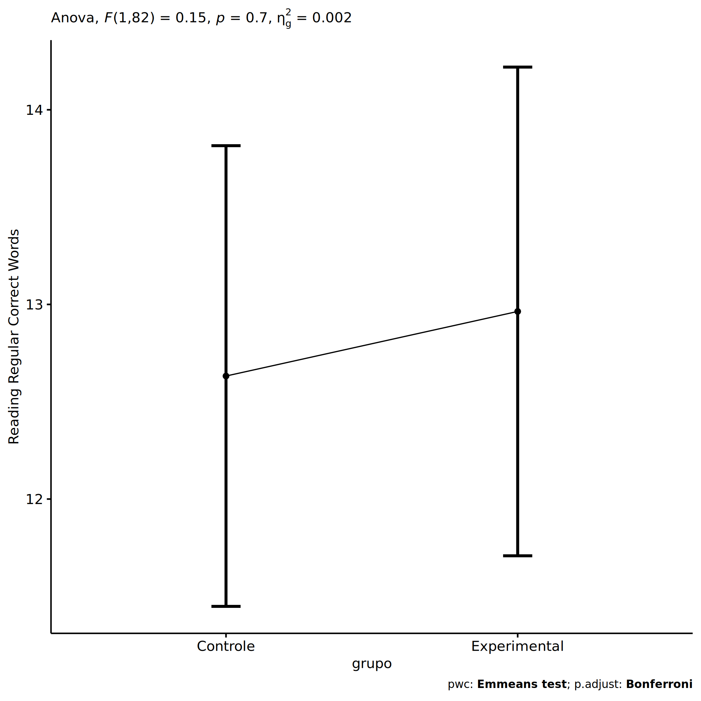
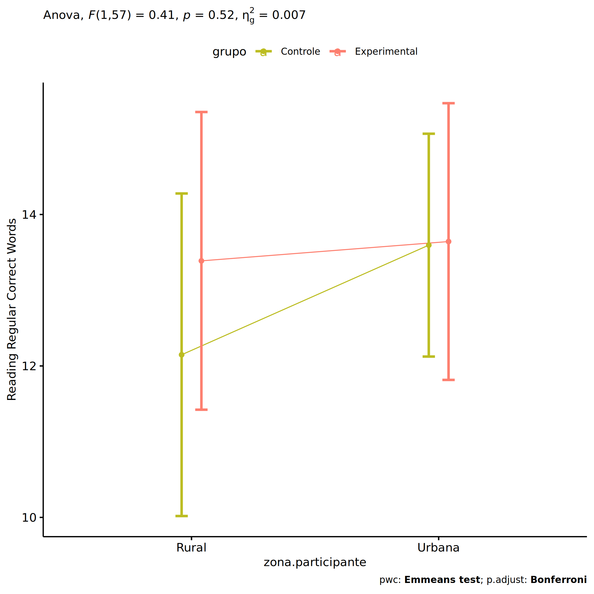
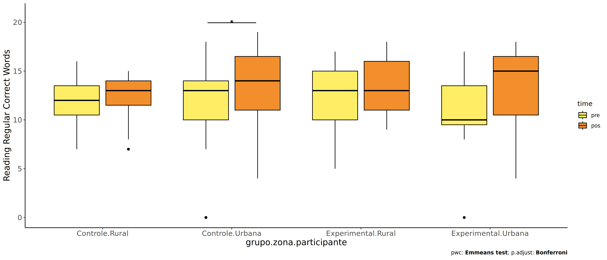
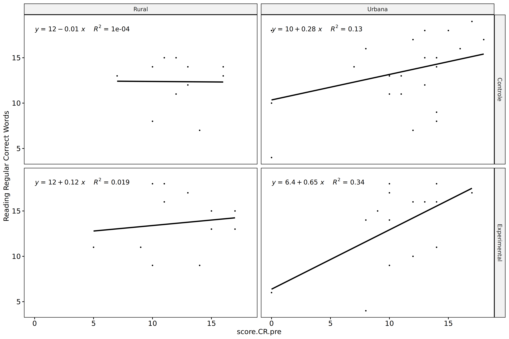
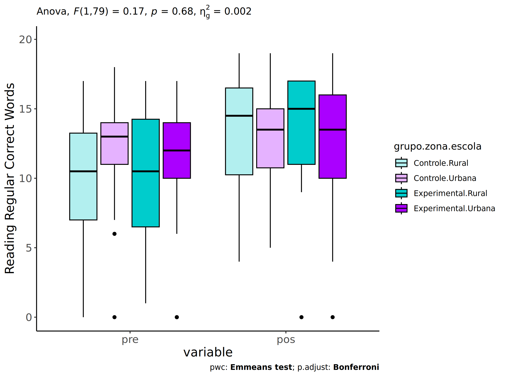
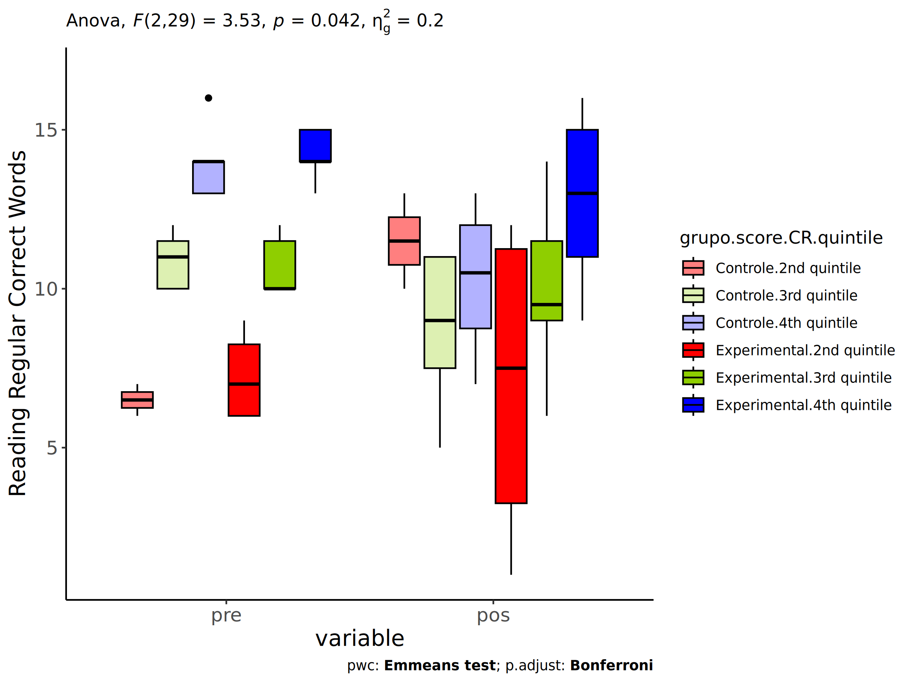

ANCOVA in Reading Regular Correct Words (Reading Regular Correct Words)
================
Geiser C. Challco <geiser@alumni.usp.br>

- [Setting Initial Variables](#setting-initial-variables)
- [Descriptive Statistics of Initial
  Data](#descriptive-statistics-of-initial-data)
- [ANCOVA and Pairwise for one factor:
  **grupo**](#ancova-and-pairwise-for-one-factor-grupo)
  - [Without remove non-normal data](#without-remove-non-normal-data)
  - [Computing ANCOVA and PairWise After removing non-normal data
    (OK)](#computing-ancova-and-pairwise-after-removing-non-normal-data-ok)
    - [Plots for ancova](#plots-for-ancova)
    - [Checking linearity assumption](#checking-linearity-assumption)
    - [Checking normality and
      homogeneity](#checking-normality-and-homogeneity)
- [ANCOVA and Pairwise for two factors
  **grupo:genero**](#ancova-and-pairwise-for-two-factors-grupogenero)
  - [Without remove non-normal data](#without-remove-non-normal-data-1)
  - [Computing ANCOVA and PairWise After removing non-normal data
    (OK)](#computing-ancova-and-pairwise-after-removing-non-normal-data-ok-1)
    - [Plots for ancova](#plots-for-ancova-1)
    - [Checking linearity assumption](#checking-linearity-assumption-1)
    - [Checking normality and
      homogeneity](#checking-normality-and-homogeneity-1)
- [ANCOVA and Pairwise for two factors
  **grupo:zona.participante**](#ancova-and-pairwise-for-two-factors-grupozonaparticipante)
  - [Without remove non-normal data](#without-remove-non-normal-data-2)
  - [Computing ANCOVA and PairWise After removing non-normal data
    (OK)](#computing-ancova-and-pairwise-after-removing-non-normal-data-ok-2)
    - [Plots for ancova](#plots-for-ancova-2)
    - [Checking linearity assumption](#checking-linearity-assumption-2)
    - [Checking normality and
      homogeneity](#checking-normality-and-homogeneity-2)
- [ANCOVA and Pairwise for two factors
  **grupo:zona.escola**](#ancova-and-pairwise-for-two-factors-grupozonaescola)
  - [Without remove non-normal data](#without-remove-non-normal-data-3)
  - [Computing ANCOVA and PairWise After removing non-normal data
    (OK)](#computing-ancova-and-pairwise-after-removing-non-normal-data-ok-3)
    - [Plots for ancova](#plots-for-ancova-3)
    - [Checking linearity assumption](#checking-linearity-assumption-3)
    - [Checking normality and
      homogeneity](#checking-normality-and-homogeneity-3)
- [ANCOVA and Pairwise for two factors
  **grupo:score.CR.quintile**](#ancova-and-pairwise-for-two-factors-gruposcorecrquintile)
  - [Without remove non-normal data](#without-remove-non-normal-data-4)
  - [Computing ANCOVA and PairWise After removing non-normal data
    (OK)](#computing-ancova-and-pairwise-after-removing-non-normal-data-ok-4)
    - [Plots for ancova](#plots-for-ancova-4)
    - [Checking linearity assumption](#checking-linearity-assumption-4)
    - [Checking normality and
      homogeneity](#checking-normality-and-homogeneity-4)
- [Summary of Results](#summary-of-results)
  - [Descriptive Statistics](#descriptive-statistics)
  - [ANCOVA Table Comparison](#ancova-table-comparison)
  - [PairWise Table Comparison](#pairwise-table-comparison)
  - [EMMS Table Comparison](#emms-table-comparison)

**NOTE**:

- Teste ANCOVA para determinar se houve diferenças significativas no
  Reading Regular Correct Words (medido usando pre- e pos-testes).
- ANCOVA test to determine whether there were significant differences in
  Reading Regular Correct Words (measured using pre- and post-tests).

# Setting Initial Variables

``` r
dv = "score.CR"
dv.pos = "score.CR.pos"
dv.pre = "score.CR.pre"

fatores2 <- c("genero","zona.participante","zona.escola","score.CR.quintile")
lfatores2 <- as.list(fatores2)
names(lfatores2) <- fatores2

fatores1 <- c("grupo", fatores2)
lfatores1 <- as.list(fatores1)
names(lfatores1) <- fatores1

lfatores <- c(lfatores1)

color <- list()
color[["prepost"]] = c("#ffee65","#f28e2B")
color[["grupo"]] = c("#bcbd22","#fd7f6f")
color[["genero"]] = c("#FF007F","#4D4DFF")
color[["zona.escola"]] = c("#AA00FF","#00CCCC")
color[["zona.participante"]] = c("#AA00FF","#00CCCC")

level <- list()
level[["grupo"]] = c("Controle","Experimental")
level[["genero"]] = c("F","M")
level[["zona.escola"]] = c("Rural","Urbana")
level[["zona.participante"]] = c("Rural","Urbana")

# ..

ymin <- 0
ymax <- 0

ymin.ci <- 0
ymax.ci <- 0


color[["grupo:genero"]] = c(
  "Controle:F"="#ff99cb", "Controle:M"="#b7b7ff",
  "Experimental:F"="#FF007F", "Experimental:M"="#4D4DFF",
  "Controle.F"="#ff99cb", "Controle.M"="#b7b7ff",
  "Experimental.F"="#FF007F", "Experimental.M"="#4D4DFF"
)
color[["grupo:zona.escola"]] = c(
  "Controle:Rural"="#b2efef","Controle:Urbana"="#e5b2ff",
  "Experimental:Rural"="#00CCCC", "Experimental:Urbana"="#AA00FF",
  "Controle.Rural"="#b2efef","Controle.Urbana"="#e5b2ff",
  "Experimental.Rural"="#00CCCC", "Experimental.Urbana"="#AA00FF"
)
color[["grupo:zona.participante"]] = c(
  "Controle:Rural"="#b2efef","Controle:Urbana"="#e5b2ff",
  "Experimental:Rural"="#00CCCC", "Experimental:Urbana"="#AA00FF",
  "Controle.Rural"="#b2efef","Controle.Urbana"="#e5b2ff",
  "Experimental.Rural"="#00CCCC", "Experimental.Urbana"="#AA00FF"
)

for (coln in c(
  "palavras.lidas","score.compreensao","tri.compreensao",
  "score.vocab","tri.vocab",
  "score.vocab.ensinado","tri.vocab.ensinado","score.vocab.nao.ensinado","tri.vocab.nao.ensinado",
  "score.CLPP","tri.CLPP","score.CR","tri.CR",
  "score.CI","tri.CI","score.TV","tri.TV","score.TF","tri.TF","score.TO","tri.TO")) {
  color[[paste0(coln,".quintile")]] = c("#BF0040","#FF0000","#800080","#0000FF","#4000BF")
  level[[paste0(coln,".quintile")]] = c("1st quintile","2nd quintile","3rd quintile","4th quintile","5th quintile")
  color[[paste0("grupo:",coln,".quintile")]] = c(
    "Experimental.1st quintile"="#BF0040", "Controle.1st quintile"="#d8668c",
    "Experimental.2nd quintile"="#FF0000", "Controle.2nd quintile"="#ff7f7f",
    "Experimental.3rd quintile"="#8fce00", "Controle.3rd quintile"="#ddf0b2",
    "Experimental.4th quintile"="#0000FF", "Controle.4th quintile"="#b2b2ff",
    "Experimental.5th quintile"="#4000BF", "Controle.5th quintile"="#b299e5",
    
    "Experimental:1st quintile"="#BF0040", "Controle:1st quintile"="#d8668c",
    "Experimental:2nd quintile"="#FF0000", "Controle:2nd quintile"="#ff7f7f",
    "Experimental:3rd quintile"="#8fce00", "Controle:3rd quintile"="#ddf0b2",
    "Experimental:4th quintile"="#0000FF", "Controle:4th quintile"="#b2b2ff",
    "Experimental:5th quintile"="#4000BF", "Controle:5th quintile"="#b299e5")
}


gdat <- read_excel("../data/data.xlsx", sheet = "leitura.st")


dat <- gdat
dat$grupo <- factor(dat[["grupo"]], level[["grupo"]])
for (coln in c(names(lfatores))) {
  dat[[coln]] <- factor(dat[[coln]], level[[coln]][level[[coln]] %in% unique(dat[[coln]])])
}
dat <- dat[which(!is.na(dat[[dv.pre]]) & !is.na(dat[[dv.pos]])),]
dat <- dat[,c("id",names(lfatores),dv.pre,dv.pos)]

dat.long <- rbind(dat, dat)
dat.long$time <- c(rep("pre", nrow(dat)), rep("pos", nrow(dat)))
dat.long$time <- factor(dat.long$time, c("pre","pos"))
dat.long[[dv]] <- c(dat[[dv.pre]], dat[[dv.pos]])


for (f in c("grupo", names(lfatores))) {
  if (is.null(color[[f]]) && length(unique(dat[[f]])) > 0) 
      color[[f]] <- distinctColorPalette(length(unique(dat[[f]])))
}
for (f in c(fatores2)) {
  if (is.null(color[[paste0("grupo:",f)]]) && length(unique(dat[[f]])) > 0)
    color[[paste0("grupo:",f)]] <- distinctColorPalette(length(unique(dat[["grupo"]]))*length(unique(dat[[f]])))
}

ldat <- list()
laov <- list()
lpwc <- list()
lemms <- list()
```

# Descriptive Statistics of Initial Data

``` r
df <- get.descriptives(dat, c(dv.pre, dv.pos), c("grupo"), 
                       include.global = T, symmetry.test = T, normality.test = F)
df <- plyr::rbind.fill(
  df, do.call(plyr::rbind.fill, lapply(lfatores2, FUN = function(f) {
    if (nrow(dat) > 0 && sum(!is.na(unique(dat[[f]]))) > 1)
      get.descriptives(dat, c(dv.pre,dv.pos), c("grupo", f),
                       symmetry.test = T, normality.test = F)
    }))
)
df <- df[,c(fatores1[fatores1 %in% colnames(df)],"variable",
            colnames(df)[!colnames(df) %in% c(fatores1,"variable")])]
```

| grupo | genero | zona.participante | zona.escola | score.CR.quintile | variable | n | mean | median | min | max | sd | se | ci | iqr | symmetry | skewness | kurtosis |
|:---|:---|:---|:---|:---|:---|---:|---:|---:|---:|---:|---:|---:|---:|---:|:---|---:|---:|
| Controle |  |  |  |  | score.CR.pre | 50 | 11.720 | 13.0 | 0 | 18 | 4.091 | 0.579 | 1.163 | 4.00 | NO | -1.280 | 1.617 |
| Experimental |  |  |  |  | score.CR.pre | 42 | 10.810 | 11.0 | 0 | 17 | 4.374 | 0.675 | 1.363 | 5.00 | NO | -0.791 | 0.092 |
|  |  |  |  |  | score.CR.pre | 92 | 11.304 | 12.0 | 0 | 18 | 4.224 | 0.440 | 0.875 | 4.00 | NO | -1.054 | 0.840 |
| Controle |  |  |  |  | score.CR.pos | 50 | 11.480 | 13.0 | 0 | 19 | 5.559 | 0.786 | 1.580 | 6.00 | NO | -0.812 | -0.287 |
| Experimental |  |  |  |  | score.CR.pos | 42 | 12.238 | 13.5 | 0 | 19 | 5.327 | 0.822 | 1.660 | 6.00 | NO | -0.968 | -0.001 |
|  |  |  |  |  | score.CR.pos | 92 | 11.826 | 13.0 | 0 | 19 | 5.438 | 0.567 | 1.126 | 7.00 | NO | -0.896 | -0.106 |
| Controle | F |  |  |  | score.CR.pre | 25 | 12.040 | 13.0 | 0 | 17 | 4.411 | 0.882 | 1.821 | 4.00 | NO | -1.522 | 1.728 |
| Controle | M |  |  |  | score.CR.pre | 25 | 11.400 | 12.0 | 0 | 18 | 3.808 | 0.762 | 1.572 | 4.00 | NO | -0.892 | 1.188 |
| Experimental | F |  |  |  | score.CR.pre | 19 | 11.421 | 12.0 | 0 | 17 | 4.414 | 1.013 | 2.127 | 5.00 | NO | -0.745 | 0.088 |
| Experimental | M |  |  |  | score.CR.pre | 23 | 10.304 | 11.0 | 0 | 16 | 4.374 | 0.912 | 1.891 | 5.50 | NO | -0.817 | -0.191 |
| Controle | F |  |  |  | score.CR.pos | 25 | 11.600 | 14.0 | 0 | 19 | 4.899 | 0.980 | 2.022 | 6.00 | NO | -1.013 | 0.143 |
| Controle | M |  |  |  | score.CR.pos | 25 | 11.360 | 12.0 | 0 | 19 | 6.251 | 1.250 | 2.580 | 8.00 | NO | -0.634 | -0.805 |
| Experimental | F |  |  |  | score.CR.pos | 19 | 12.316 | 14.0 | 0 | 18 | 5.926 | 1.360 | 2.856 | 6.00 | NO | -1.121 | -0.155 |
| Experimental | M |  |  |  | score.CR.pos | 23 | 12.174 | 12.0 | 0 | 19 | 4.914 | 1.025 | 2.125 | 6.00 | NO | -0.645 | -0.341 |
| Controle |  | Rural |  |  | score.CR.pre | 12 | 12.333 | 12.5 | 7 | 16 | 2.605 | 0.752 | 1.655 | 3.25 | YES | -0.335 | -0.741 |
| Controle |  | Urbana |  |  | score.CR.pre | 26 | 11.692 | 13.0 | 0 | 18 | 5.058 | 0.992 | 2.043 | 4.50 | NO | -1.221 | 0.585 |
| Controle |  |  |  |  | score.CR.pre | 12 | 11.167 | 12.0 | 6 | 15 | 2.980 | 0.860 | 1.893 | 3.75 | YES | -0.393 | -1.418 |
| Experimental |  | Rural |  |  | score.CR.pre | 15 | 11.933 | 11.0 | 5 | 17 | 3.654 | 0.943 | 2.024 | 5.00 | YES | -0.311 | -1.034 |
| Experimental |  | Urbana |  |  | score.CR.pre | 16 | 10.062 | 10.0 | 0 | 17 | 4.640 | 1.160 | 2.472 | 4.50 | NO | -0.938 | 0.193 |
| Experimental |  |  |  |  | score.CR.pre | 11 | 10.364 | 12.0 | 1 | 16 | 4.945 | 1.491 | 3.322 | 8.00 | YES | -0.487 | -1.302 |
| Controle |  | Rural |  |  | score.CR.pos | 12 | 11.333 | 13.0 | 0 | 15 | 4.397 | 1.269 | 2.794 | 3.75 | NO | -1.381 | 0.902 |
| Controle |  | Urbana |  |  | score.CR.pos | 26 | 11.923 | 13.5 | 0 | 19 | 5.754 | 1.129 | 2.324 | 6.75 | NO | -0.860 | -0.395 |
| Controle |  |  |  |  | score.CR.pos | 12 | 10.667 | 10.5 | 0 | 19 | 6.471 | 1.868 | 4.112 | 7.25 | YES | -0.365 | -1.201 |
| Experimental |  | Rural |  |  | score.CR.pos | 15 | 11.933 | 13.0 | 0 | 18 | 5.470 | 1.412 | 3.029 | 5.50 | NO | -0.958 | -0.131 |
| Experimental |  | Urbana |  |  | score.CR.pos | 16 | 12.562 | 14.5 | 0 | 18 | 5.416 | 1.354 | 2.886 | 6.50 | NO | -0.913 | -0.433 |
| Experimental |  |  |  |  | score.CR.pos | 11 | 12.182 | 12.0 | 0 | 19 | 5.492 | 1.656 | 3.690 | 5.50 | NO | -0.807 | -0.315 |
| Controle |  |  | Rural |  | score.CR.pre | 14 | 9.857 | 10.5 | 0 | 17 | 5.127 | 1.370 | 2.960 | 6.50 | NO | -0.680 | -0.618 |
| Controle |  |  | Urbana |  | score.CR.pre | 36 | 12.444 | 13.0 | 0 | 18 | 3.426 | 0.571 | 1.159 | 3.00 | NO | -1.385 | 2.902 |
| Experimental |  |  | Rural |  | score.CR.pre | 13 | 10.231 | 11.0 | 1 | 17 | 4.711 | 1.307 | 2.847 | 7.00 | YES | -0.372 | -1.084 |
| Experimental |  |  | Urbana |  | score.CR.pre | 29 | 11.069 | 12.0 | 0 | 17 | 4.276 | 0.794 | 1.626 | 4.00 | NO | -0.975 | 0.679 |
| Controle |  |  | Rural |  | score.CR.pos | 14 | 11.357 | 13.5 | 0 | 19 | 6.570 | 1.756 | 3.794 | 8.50 | NO | -0.514 | -1.224 |
| Controle |  |  | Urbana |  | score.CR.pos | 36 | 11.528 | 13.0 | 0 | 19 | 5.218 | 0.870 | 1.766 | 5.25 | NO | -0.952 | 0.115 |
| Experimental |  |  | Rural |  | score.CR.pos | 13 | 12.000 | 15.0 | 0 | 17 | 6.014 | 1.668 | 3.634 | 6.00 | NO | -1.014 | -0.385 |
| Experimental |  |  | Urbana |  | score.CR.pos | 29 | 12.345 | 13.0 | 0 | 19 | 5.101 | 0.947 | 1.940 | 6.00 | NO | -0.833 | -0.177 |
| Controle |  |  |  | 1st quintile | score.CR.pre | 3 | 0.000 | 0.0 | 0 | 0 | 0.000 | 0.000 | 0.000 | 0.00 | few data | 0.000 | 0.000 |
| Controle |  |  |  | 2nd quintile | score.CR.pre | 6 | 7.167 | 7.0 | 6 | 8 | 0.753 | 0.307 | 0.790 | 0.75 | few data | 0.000 | 0.000 |
| Controle |  |  |  | 3rd quintile | score.CR.pre | 14 | 10.857 | 11.0 | 10 | 12 | 0.864 | 0.231 | 0.499 | 1.75 | few data | 0.000 | 0.000 |
| Controle |  |  |  | 4th quintile | score.CR.pre | 24 | 14.125 | 14.0 | 13 | 16 | 1.076 | 0.220 | 0.454 | 2.00 | NO | 0.568 | -1.010 |
| Controle |  |  |  | 5th quintile | score.CR.pre | 3 | 17.333 | 17.0 | 17 | 18 | 0.577 | 0.333 | 1.434 | 0.50 | few data | 0.000 | 0.000 |
| Experimental |  |  |  | 1st quintile | score.CR.pre | 5 | 2.200 | 1.0 | 0 | 5 | 2.588 | 1.158 | 3.214 | 5.00 | few data | 0.000 | 0.000 |
| Experimental |  |  |  | 2nd quintile | score.CR.pre | 7 | 7.571 | 8.0 | 6 | 9 | 1.272 | 0.481 | 1.177 | 2.00 | YES | -0.136 | -1.872 |
| Experimental |  |  |  | 3rd quintile | score.CR.pre | 13 | 10.692 | 10.0 | 10 | 12 | 0.855 | 0.237 | 0.517 | 1.00 | few data | 0.000 | 0.000 |
| Experimental |  |  |  | 4th quintile | score.CR.pre | 14 | 14.286 | 14.0 | 13 | 16 | 0.914 | 0.244 | 0.528 | 1.00 | YES | 0.034 | -1.139 |
| Experimental |  |  |  | 5th quintile | score.CR.pre | 3 | 17.000 | 17.0 | 17 | 17 | 0.000 | 0.000 | 0.000 | 0.00 | few data | 0.000 | 0.000 |
| Controle |  |  |  | 1st quintile | score.CR.pos | 3 | 10.667 | 10.0 | 4 | 18 | 7.024 | 4.055 | 17.448 | 7.00 | few data | 0.000 | 0.000 |
| Controle |  |  |  | 2nd quintile | score.CR.pos | 6 | 11.500 | 13.5 | 0 | 16 | 6.058 | 2.473 | 6.358 | 4.75 | NO | -0.992 | -0.728 |
| Controle |  |  |  | 3rd quintile | score.CR.pos | 14 | 10.643 | 11.0 | 0 | 17 | 4.551 | 1.216 | 2.627 | 5.50 | NO | -0.735 | -0.232 |
| Controle |  |  |  | 4th quintile | score.CR.pos | 24 | 12.000 | 14.0 | 0 | 19 | 5.618 | 1.147 | 2.372 | 5.25 | NO | -0.960 | -0.021 |
| Controle |  |  |  | 5th quintile | score.CR.pos | 3 | 12.000 | 17.0 | 0 | 19 | 10.440 | 6.028 | 25.935 | 9.50 | few data | 0.000 | 0.000 |
| Experimental |  |  |  | 1st quintile | score.CR.pos | 5 | 5.600 | 6.0 | 0 | 11 | 5.505 | 2.462 | 6.835 | 11.00 | few data | 0.000 | 0.000 |
| Experimental |  |  |  | 2nd quintile | score.CR.pos | 7 | 10.286 | 12.0 | 1 | 15 | 5.589 | 2.112 | 5.169 | 7.00 | NO | -0.641 | -1.509 |
| Experimental |  |  |  | 3rd quintile | score.CR.pos | 13 | 12.538 | 14.0 | 0 | 18 | 5.532 | 1.534 | 3.343 | 8.00 | NO | -0.769 | -0.515 |
| Experimental |  |  |  | 4th quintile | score.CR.pos | 14 | 14.714 | 15.5 | 9 | 19 | 3.074 | 0.822 | 1.775 | 4.00 | YES | -0.488 | -1.153 |
| Experimental |  |  |  | 5th quintile | score.CR.pos | 3 | 15.000 | 15.0 | 13 | 17 | 2.000 | 1.155 | 4.968 | 2.00 | few data | 0.000 | 0.000 |

# ANCOVA and Pairwise for one factor: **grupo**

## Without remove non-normal data

``` r
pdat = remove_group_data(dat[!is.na(dat[["grupo"]]),], "score.CR.pos", "grupo")

pdat.long <- rbind(pdat[,c("id","grupo")], pdat[,c("id","grupo")])
pdat.long[["time"]] <- c(rep("pre", nrow(pdat)), rep("pos", nrow(pdat)))
pdat.long[["time"]] <- factor(pdat.long[["time"]], c("pre","pos"))
pdat.long[["score.CR"]] <- c(pdat[["score.CR.pre"]], pdat[["score.CR.pos"]])

aov = anova_test(pdat, score.CR.pos ~ score.CR.pre + grupo)
laov[["grupo"]] <- get_anova_table(aov)
```

``` r
pwc <- emmeans_test(pdat, score.CR.pos ~ grupo, covariate = score.CR.pre,
                    p.adjust.method = "bonferroni")
```

``` r
pwc.long <- emmeans_test(dplyr::group_by_at(pdat.long, "grupo"),
                          score.CR ~ time,
                          p.adjust.method = "bonferroni")
lpwc[["grupo"]] <- plyr::rbind.fill(pwc, pwc.long)
```

``` r
ds <- get.descriptives(pdat, "score.CR.pos", "grupo", covar = "score.CR.pre")
ds <- merge(ds[ds$variable != "score.CR.pre",],
            ds[ds$variable == "score.CR.pre", !colnames(ds) %in% c("variable")],
            by = "grupo", all.x = T, suffixes = c("", ".score.CR.pre"))
ds <- merge(get_emmeans(pwc), ds, by = "grupo", suffixes = c(".emms", ""))
ds <- ds[,c("grupo","n","mean.score.CR.pre","se.score.CR.pre","mean","se",
            "emmean","se.emms","conf.low","conf.high")]

colnames(ds) <- c("grupo", "N", paste0(c("M","SE")," (pre)"),
                  paste0(c("M","SE"), " (unadj)"),
                  paste0(c("M", "SE"), " (adj)"), "conf.low", "conf.high")

lemms[["grupo"]] <- ds
```

## Computing ANCOVA and PairWise After removing non-normal data (OK)

``` r
wdat = pdat 

res = residuals(lm(score.CR.pos ~ score.CR.pre + grupo, data = wdat))
non.normal = getNonNormal(res, wdat$id, plimit = 0.05)

wdat = wdat[!wdat$id %in% non.normal,]

wdat.long <- rbind(wdat[,c("id","grupo")], wdat[,c("id","grupo")])
wdat.long[["time"]] <- c(rep("pre", nrow(wdat)), rep("pos", nrow(wdat)))
wdat.long[["time"]] <- factor(wdat.long[["time"]], c("pre","pos"))
wdat.long[["score.CR"]] <- c(wdat[["score.CR.pre"]], wdat[["score.CR.pos"]])

ldat[["grupo"]] = wdat

(non.normal)
```

    ## [1] "P256" "P282" "P83"  "P294" "P80"  "P218" "P305"

``` r
aov = anova_test(wdat, score.CR.pos ~ score.CR.pre + grupo)
laov[["grupo"]] <- merge(get_anova_table(aov), laov[["grupo"]],
                            by="Effect", suffixes = c("","'"))

(df = get_anova_table(aov))
```

    ## ANOVA Table (type II tests)
    ## 
    ##         Effect DFn DFd      F       p p<.05   ges
    ## 1 score.CR.pre   1  82 22.172 0.00001     * 0.213
    ## 2        grupo   1  82  0.146 0.70300       0.002

| Effect       | DFn | DFd |      F |     p | p\<.05 |   ges |
|:-------------|----:|----:|-------:|------:|:-------|------:|
| score.CR.pre |   1 |  82 | 22.172 | 0.000 | \*     | 0.213 |
| grupo        |   1 |  82 |  0.146 | 0.703 |        | 0.002 |

``` r
pwc <- emmeans_test(wdat, score.CR.pos ~ grupo, covariate = score.CR.pre,
                    p.adjust.method = "bonferroni")
```

| term | .y. | group1 | group2 | df | statistic | p | p.adj | p.adj.signif |
|:---|:---|:---|:---|---:|---:|---:|---:|:---|
| score.CR.pre\*grupo | score.CR.pos | Controle | Experimental | 82 | -0.382 | 0.703 | 0.703 | ns |

``` r
pwc.long <- emmeans_test(dplyr::group_by_at(wdat.long, "grupo"),
                         score.CR ~ time,
                         p.adjust.method = "bonferroni")
lpwc[["grupo"]] <- merge(plyr::rbind.fill(pwc, pwc.long), lpwc[["grupo"]],
                            by=c("grupo","term",".y.","group1","group2"),
                            suffixes = c("","'"))
```

| grupo        | term | .y.      | group1 | group2 |  df | statistic |     p | p.adj | p.adj.signif |
|:-------------|:-----|:---------|:-------|:-------|----:|----------:|------:|------:|:-------------|
| Controle     | time | score.CR | pre    | pos    | 166 |    -1.402 | 0.163 | 0.163 | ns           |
| Experimental | time | score.CR | pre    | pos    | 166 |    -1.948 | 0.053 | 0.053 | ns           |

``` r
ds <- get.descriptives(wdat, "score.CR.pos", "grupo", covar = "score.CR.pre")
ds <- merge(ds[ds$variable != "score.CR.pre",],
            ds[ds$variable == "score.CR.pre", !colnames(ds) %in% c("variable")],
            by = "grupo", all.x = T, suffixes = c("", ".score.CR.pre"))
ds <- merge(get_emmeans(pwc), ds, by = "grupo", suffixes = c(".emms", ""))
ds <- ds[,c("grupo","n","mean.score.CR.pre","se.score.CR.pre","mean","se",
            "emmean","se.emms","conf.low","conf.high")]

colnames(ds) <- c("grupo", "N", paste0(c("M","SE")," (pre)"),
                  paste0(c("M","SE"), " (unadj)"),
                  paste0(c("M", "SE"), " (adj)"), "conf.low", "conf.high")

lemms[["grupo"]] <- merge(ds, lemms[["grupo"]], by=c("grupo"), suffixes = c("","'"))
```

| grupo | N | M (pre) | SE (pre) | M (unadj) | SE (unadj) | M (adj) | SE (adj) | conf.low | conf.high |
|:---|---:|---:|---:|---:|---:|---:|---:|---:|---:|
| Controle | 45 | 11.467 | 0.612 | 12.756 | 0.629 | 12.632 | 0.595 | 11.449 | 13.816 |
| Experimental | 40 | 10.925 | 0.698 | 12.825 | 0.748 | 12.964 | 0.631 | 11.708 | 14.219 |

### Plots for ancova

``` r
plots <- oneWayAncovaPlots(
  wdat, "score.CR.pos", "grupo", aov, list("grupo"=pwc), addParam = c("mean_ci"),
  font.label.size=10, step.increase=0.05, p.label="p.adj",
  subtitle = which(aov$Effect == "grupo"))
```

``` r
if (!is.null(nrow(plots[["grupo"]]$data)))
  plots[["grupo"]] + ggplot2::ylab("Reading Regular Correct Words") + 
  if (ymin.ci < ymax.ci) ggplot2::ylim(ymin.ci, ymax.ci)
```

<!-- -->

``` r
plots <- oneWayAncovaBoxPlots(
  wdat, "score.CR.pos", "grupo", aov, pwc, covar = "score.CR.pre",
  theme = "classic", color = color[["grupo"]],
  subtitle = which(aov$Effect == "grupo"))
```

``` r
if (length(unique(wdat[["grupo"]])) > 1)
  plots[["grupo"]] + ggplot2::ylab("Reading Regular Correct Words") +
  ggplot2::scale_x_discrete(labels=c('pre', 'pos')) +
  if (ymin < ymax) ggplot2::ylim(ymin, ymax)
```

<!-- -->

``` r
if (length(unique(wdat.long[["grupo"]])) > 1)
  plots <- oneWayAncovaBoxPlots(
    wdat.long, "score.CR", "grupo", aov, pwc.long,
    pre.post = "time", theme = "classic", color = color$prepost)
```

``` r
if (length(unique(wdat.long[["grupo"]])) > 1)
  plots[["grupo"]] + ggplot2::ylab("Reading Regular Correct Words") +
  if (ymin < ymax) ggplot2::ylim(ymin, ymax) 
```

<!-- -->

### Checking linearity assumption

``` r
ggscatter(wdat, x = "score.CR.pre", y = "score.CR.pos", size = 0.5,
          color = "grupo", add = "reg.line")+
  stat_regline_equation(
    aes(label =  paste(..eq.label.., ..rr.label.., sep = "~~~~"), color = grupo)
  ) +
  ggplot2::labs(subtitle = rstatix::get_test_label(aov, detailed = T, row = which(aov$Effect == "grupo"))) +
  ggplot2::scale_color_manual(values = color[["grupo"]]) +
  ggplot2::ylab("Reading Regular Correct Words")  +
  if (ymin < ymax) ggplot2::ylim(ymin, ymax)
```

<!-- -->

### Checking normality and homogeneity

``` r
res <- augment(lm(score.CR.pos ~ score.CR.pre + grupo, data = wdat))
```

``` r
shapiro_test(res$.resid)
```

    ## # A tibble: 1 × 3
    ##   variable   statistic p.value
    ##   <chr>          <dbl>   <dbl>
    ## 1 res$.resid     0.975  0.0964

``` r
levene_test(res, .resid ~ grupo)
```

    ## # A tibble: 1 × 4
    ##     df1   df2 statistic     p
    ##   <int> <int>     <dbl> <dbl>
    ## 1     1    83   0.00812 0.928

# ANCOVA and Pairwise for two factors **grupo:genero**

## Without remove non-normal data

``` r
pdat = remove_group_data(dat[!is.na(dat[["grupo"]]) & !is.na(dat[["genero"]]),],
                         "score.CR.pos", c("grupo","genero"))
pdat = pdat[pdat[["genero"]] %in% do.call(
  intersect, lapply(unique(pdat[["grupo"]]), FUN = function(x) {
    unique(pdat[["genero"]][which(pdat[["grupo"]] == x)])
  })),]
pdat[["grupo"]] = factor(pdat[["grupo"]], level[["grupo"]])
pdat[["genero"]] = factor(
  pdat[["genero"]],
  level[["genero"]][level[["genero"]] %in% unique(pdat[["genero"]])])

pdat.long <- rbind(pdat[,c("id","grupo","genero")], pdat[,c("id","grupo","genero")])
pdat.long[["time"]] <- c(rep("pre", nrow(pdat)), rep("pos", nrow(pdat)))
pdat.long[["time"]] <- factor(pdat.long[["time"]], c("pre","pos"))
pdat.long[["score.CR"]] <- c(pdat[["score.CR.pre"]], pdat[["score.CR.pos"]])

if (length(unique(pdat[["genero"]])) >= 2) {
  aov = anova_test(pdat, score.CR.pos ~ score.CR.pre + grupo*genero)
  laov[["grupo:genero"]] <- get_anova_table(aov)
}
```

``` r
if (length(unique(pdat[["genero"]])) >= 2) {
  pwcs <- list()
  pwcs[["genero"]] <- emmeans_test(
    group_by(pdat, grupo), score.CR.pos ~ genero,
    covariate = score.CR.pre, p.adjust.method = "bonferroni")
  pwcs[["grupo"]] <- emmeans_test(
    group_by(pdat, genero), score.CR.pos ~ grupo,
    covariate = score.CR.pre, p.adjust.method = "bonferroni")
  
  pwc <- plyr::rbind.fill(pwcs[["grupo"]], pwcs[["genero"]])
  pwc <- pwc[,c("grupo","genero", colnames(pwc)[!colnames(pwc) %in% c("grupo","genero")])]
}
```

``` r
if (length(unique(pdat[["genero"]])) >= 2) {
  pwc.long <- emmeans_test(dplyr::group_by_at(pdat.long, c("grupo","genero")),
                           score.CR ~ time,
                           p.adjust.method = "bonferroni")
  lpwc[["grupo:genero"]] <- plyr::rbind.fill(pwc, pwc.long)
}
```

``` r
if (length(unique(pdat[["genero"]])) >= 2) {
  ds <- get.descriptives(pdat, "score.CR.pos", c("grupo","genero"), covar = "score.CR.pre")
  ds <- merge(ds[ds$variable != "score.CR.pre",],
              ds[ds$variable == "score.CR.pre", !colnames(ds) %in% c("variable")],
              by = c("grupo","genero"), all.x = T, suffixes = c("", ".score.CR.pre"))
  ds <- merge(get_emmeans(pwcs[["grupo"]]), ds,
              by = c("grupo","genero"), suffixes = c(".emms", ""))
  ds <- ds[,c("grupo","genero","n","mean.score.CR.pre","se.score.CR.pre","mean","se",
              "emmean","se.emms","conf.low","conf.high")]
  
  colnames(ds) <- c("grupo","genero", "N", paste0(c("M","SE")," (pre)"),
                    paste0(c("M","SE"), " (unadj)"),
                    paste0(c("M", "SE"), " (adj)"), "conf.low", "conf.high")
  
  lemms[["grupo:genero"]] <- ds
}
```

## Computing ANCOVA and PairWise After removing non-normal data (OK)

``` r
if (length(unique(pdat[["genero"]])) >= 2) {
  wdat = pdat 
  
  res = residuals(lm(score.CR.pos ~ score.CR.pre + grupo*genero, data = wdat))
  non.normal = getNonNormal(res, wdat$id, plimit = 0.05)
  
  wdat = wdat[!wdat$id %in% non.normal,]
  
  wdat.long <- rbind(wdat[,c("id","grupo","genero")], wdat[,c("id","grupo","genero")])
  wdat.long[["time"]] <- c(rep("pre", nrow(wdat)), rep("pos", nrow(wdat)))
  wdat.long[["time"]] <- factor(wdat.long[["time"]], c("pre","pos"))
  wdat.long[["score.CR"]] <- c(wdat[["score.CR.pre"]], wdat[["score.CR.pos"]])
  
  
  ldat[["grupo:genero"]] = wdat
  
  (non.normal)
}
```

    ## [1] "P256" "P282" "P83"  "P300" "P294" "P80"  "P305" "P218"

``` r
if (length(unique(pdat[["genero"]])) >= 2) {
  aov = anova_test(wdat, score.CR.pos ~ score.CR.pre + grupo*genero)
  laov[["grupo:genero"]] <- merge(get_anova_table(aov), laov[["grupo:genero"]],
                                         by="Effect", suffixes = c("","'"))
  df = get_anova_table(aov)
}
```

| Effect       | DFn | DFd |      F |     p | p\<.05 |   ges |
|:-------------|----:|----:|-------:|------:|:-------|------:|
| score.CR.pre |   1 |  79 | 22.586 | 0.000 | \*     | 0.222 |
| grupo        |   1 |  79 |  0.001 | 0.970 |        | 0.000 |
| genero       |   1 |  79 |  0.066 | 0.798 |        | 0.001 |
| grupo:genero |   1 |  79 |  1.433 | 0.235 |        | 0.018 |

``` r
if (length(unique(pdat[["genero"]])) >= 2) {
  pwcs <- list()
  pwcs[["genero"]] <- emmeans_test(
    group_by(wdat, grupo), score.CR.pos ~ genero,
    covariate = score.CR.pre, p.adjust.method = "bonferroni")
  pwcs[["grupo"]] <- emmeans_test(
    group_by(wdat, genero), score.CR.pos ~ grupo,
    covariate = score.CR.pre, p.adjust.method = "bonferroni")
  
  pwc <- plyr::rbind.fill(pwcs[["grupo"]], pwcs[["genero"]])
  pwc <- pwc[,c("grupo","genero", colnames(pwc)[!colnames(pwc) %in% c("grupo","genero")])]
}
```

| grupo | genero | term | .y. | group1 | group2 | df | statistic | p | p.adj | p.adj.signif |
|:---|:---|:---|:---|:---|:---|---:|---:|---:|---:|:---|
|  | F | score.CR.pre\*grupo | score.CR.pos | Controle | Experimental | 79 | -0.896 | 0.373 | 0.373 | ns |
|  | M | score.CR.pre\*grupo | score.CR.pos | Controle | Experimental | 79 | 0.795 | 0.429 | 0.429 | ns |
| Controle |  | score.CR.pre\*genero | score.CR.pos | F | M | 79 | -1.005 | 0.318 | 0.318 | ns |
| Experimental |  | score.CR.pre\*genero | score.CR.pos | F | M | 79 | 0.695 | 0.489 | 0.489 | ns |

``` r
if (length(unique(pdat[["genero"]])) >= 2) {
  pwc.long <- emmeans_test(dplyr::group_by_at(wdat.long, c("grupo","genero")),
                           score.CR ~ time,
                           p.adjust.method = "bonferroni")
  lpwc[["grupo:genero"]] <- merge(plyr::rbind.fill(pwc, pwc.long),
                                         lpwc[["grupo:genero"]],
                                         by=c("grupo","genero","term",".y.","group1","group2"),
                                         suffixes = c("","'"))
}
```

| grupo | genero | term | .y. | group1 | group2 | df | statistic | p | p.adj | p.adj.signif |
|:---|:---|:---|:---|:---|:---|---:|---:|---:|---:|:---|
| Controle | F | time | score.CR | pre | pos | 160 | -0.689 | 0.492 | 0.492 | ns |
| Controle | M | time | score.CR | pre | pos | 160 | -1.730 | 0.086 | 0.086 | ns |
| Experimental | F | time | score.CR | pre | pos | 160 | -1.322 | 0.188 | 0.188 | ns |
| Experimental | M | time | score.CR | pre | pos | 160 | -1.481 | 0.141 | 0.141 | ns |

``` r
if (length(unique(pdat[["genero"]])) >= 2) {
  ds <- get.descriptives(wdat, "score.CR.pos", c("grupo","genero"), covar = "score.CR.pre")
  ds <- merge(ds[ds$variable != "score.CR.pre",],
              ds[ds$variable == "score.CR.pre", !colnames(ds) %in% c("variable")],
              by = c("grupo","genero"), all.x = T, suffixes = c("", ".score.CR.pre"))
  ds <- merge(get_emmeans(pwcs[["grupo"]]), ds,
              by = c("grupo","genero"), suffixes = c(".emms", ""))
  ds <- ds[,c("grupo","genero","n","mean.score.CR.pre","se.score.CR.pre",
              "mean","se","emmean","se.emms","conf.low","conf.high")]
  
  colnames(ds) <- c("grupo","genero", "N", paste0(c("M","SE")," (pre)"),
                    paste0(c("M","SE"), " (unadj)"),
                    paste0(c("M", "SE"), " (adj)"), "conf.low", "conf.high")
  
  lemms[["grupo:genero"]] <- merge(ds, lemms[["grupo:genero"]],
                                          by=c("grupo","genero"), suffixes = c("","'"))
}
```

| grupo | genero | N | M (pre) | SE (pre) | M (unadj) | SE (unadj) | M (adj) | SE (adj) | conf.low | conf.high |
|:---|:---|---:|---:|---:|---:|---:|---:|---:|---:|---:|
| Controle | F | 23 | 11.739 | 0.933 | 12.609 | 0.748 | 12.368 | 0.791 | 10.793 | 13.944 |
| Controle | M | 21 | 11.238 | 0.839 | 13.524 | 0.877 | 13.518 | 0.827 | 11.873 | 15.164 |
| Experimental | F | 17 | 11.765 | 1.083 | 13.706 | 1.084 | 13.454 | 0.920 | 11.622 | 15.285 |
| Experimental | M | 23 | 10.304 | 0.912 | 12.174 | 1.025 | 12.606 | 0.795 | 11.023 | 14.188 |

### Plots for ancova

``` r
if (length(unique(pdat[["genero"]])) >= 2) {
  ggPlotAoC2(pwcs, "grupo", "genero", aov, ylab = "Reading Regular Correct Words",
             subtitle = which(aov$Effect == "grupo:genero"), addParam = "errorbar") +
    ggplot2::scale_color_manual(values = color[["genero"]]) +
    ggplot2::ylab("Reading Regular Correct Words") +
    if (ymin.ci < ymax.ci) ggplot2::ylim(ymin.ci, ymax.ci)
}
```

    ## Scale for colour is already present.
    ## Adding another scale for colour, which will replace the existing scale.

<!-- -->

``` r
if (length(unique(pdat[["genero"]])) >= 2) {
  ggPlotAoC2(pwcs, "genero", "grupo", aov, ylab = "Reading Regular Correct Words",
               subtitle = which(aov$Effect == "grupo:genero"), addParam = "errorbar") +
    ggplot2::scale_color_manual(values = color[["grupo"]]) +
    ggplot2::ylab("Reading Regular Correct Words") +
    if (ymin.ci < ymax.ci) ggplot2::ylim(ymin.ci, ymax.ci)
}
```

    ## Scale for colour is already present.
    ## Adding another scale for colour, which will replace the existing scale.

<!-- -->

``` r
if (length(unique(pdat[["genero"]])) >= 2) {
  plots <- twoWayAncovaBoxPlots(
    wdat, "score.CR.pos", c("grupo","genero"), aov, pwcs, covar = "score.CR.pre",
    theme = "classic", color = color[["grupo:genero"]],
    subtitle = which(aov$Effect == "grupo:genero"))
}
```

``` r
if (length(unique(pdat[["genero"]])) >= 2) {
  plots[["grupo:genero"]] + ggplot2::ylab("Reading Regular Correct Words") +
  ggplot2::scale_x_discrete(labels=c('pre', 'pos')) +
  if (ymin < ymax) ggplot2::ylim(ymin, ymax)
}
```

    ## Warning: No shared levels found between `names(values)` of the manual scale and the data's colour values.

<!-- -->

``` r
if (length(unique(pdat[["genero"]])) >= 2) {
  plots <- twoWayAncovaBoxPlots(
    wdat.long, "score.CR", c("grupo","genero"), aov, pwc.long,
    pre.post = "time",
    theme = "classic", color = color$prepost)
}
```

``` r
if (length(unique(pdat[["genero"]])) >= 2) 
  plots[["grupo:genero"]] + ggplot2::ylab("Reading Regular Correct Words") +
    if (ymin < ymax) ggplot2::ylim(ymin, ymax)
```

<!-- -->

### Checking linearity assumption

``` r
if (length(unique(pdat[["genero"]])) >= 2) {
  ggscatter(wdat, x = "score.CR.pre", y = "score.CR.pos", size = 0.5,
            facet.by = c("grupo","genero"), add = "reg.line")+
    stat_regline_equation(
      aes(label =  paste(..eq.label.., ..rr.label.., sep = "~~~~"))
    ) + ggplot2::ylab("Reading Regular Correct Words") +
    if (ymin < ymax) ggplot2::ylim(ymin, ymax)
}
```

<!-- -->

``` r
if (length(unique(pdat[["genero"]])) >= 2) {
  ggscatter(wdat, x = "score.CR.pre", y = "score.CR.pos", size = 0.5,
            color = "grupo", facet.by = "genero", add = "reg.line")+
    stat_regline_equation(
      aes(label =  paste(..eq.label.., ..rr.label.., sep = "~~~~"), color = grupo)
    ) +
    ggplot2::labs(subtitle = rstatix::get_test_label(aov, detailed = T, row = which(aov$Effect == "grupo:genero"))) +
    ggplot2::scale_color_manual(values = color[["grupo"]]) +
    ggplot2::ylab("Reading Regular Correct Words") +
    if (ymin < ymax) ggplot2::ylim(ymin, ymax)
}
```

<!-- -->

``` r
if (length(unique(pdat[["genero"]])) >= 2) {
  ggscatter(wdat, x = "score.CR.pre", y = "score.CR.pos", size = 0.5,
            color = "genero", facet.by = "grupo", add = "reg.line")+
    stat_regline_equation(
      aes(label =  paste(..eq.label.., ..rr.label.., sep = "~~~~"), color = genero)
    ) +
    ggplot2::labs(subtitle = rstatix::get_test_label(aov, detailed = T, row = which(aov$Effect == "grupo:genero"))) +
    ggplot2::scale_color_manual(values = color[["genero"]]) +
    ggplot2::ylab("Reading Regular Correct Words") +
    if (ymin < ymax) ggplot2::ylim(ymin, ymax)
}
```

<!-- -->

### Checking normality and homogeneity

``` r
if (length(unique(pdat[["genero"]])) >= 2) 
  res <- augment(lm(score.CR.pos ~ score.CR.pre + grupo*genero, data = wdat))
```

``` r
if (length(unique(pdat[["genero"]])) >= 2)
  shapiro_test(res$.resid)
```

    ## # A tibble: 1 × 3
    ##   variable   statistic p.value
    ##   <chr>          <dbl>   <dbl>
    ## 1 res$.resid     0.976   0.127

``` r
if (length(unique(pdat[["genero"]])) >= 2) 
  levene_test(res, .resid ~ grupo*genero)
```

    ## # A tibble: 1 × 4
    ##     df1   df2 statistic     p
    ##   <int> <int>     <dbl> <dbl>
    ## 1     3    80     0.735 0.534

# ANCOVA and Pairwise for two factors **grupo:zona.participante**

## Without remove non-normal data

``` r
pdat = remove_group_data(dat[!is.na(dat[["grupo"]]) & !is.na(dat[["zona.participante"]]),],
                         "score.CR.pos", c("grupo","zona.participante"))
pdat = pdat[pdat[["zona.participante"]] %in% do.call(
  intersect, lapply(unique(pdat[["grupo"]]), FUN = function(x) {
    unique(pdat[["zona.participante"]][which(pdat[["grupo"]] == x)])
  })),]
pdat[["grupo"]] = factor(pdat[["grupo"]], level[["grupo"]])
pdat[["zona.participante"]] = factor(
  pdat[["zona.participante"]],
  level[["zona.participante"]][level[["zona.participante"]] %in% unique(pdat[["zona.participante"]])])

pdat.long <- rbind(pdat[,c("id","grupo","zona.participante")], pdat[,c("id","grupo","zona.participante")])
pdat.long[["time"]] <- c(rep("pre", nrow(pdat)), rep("pos", nrow(pdat)))
pdat.long[["time"]] <- factor(pdat.long[["time"]], c("pre","pos"))
pdat.long[["score.CR"]] <- c(pdat[["score.CR.pre"]], pdat[["score.CR.pos"]])

if (length(unique(pdat[["zona.participante"]])) >= 2) {
  aov = anova_test(pdat, score.CR.pos ~ score.CR.pre + grupo*zona.participante)
  laov[["grupo:zona.participante"]] <- get_anova_table(aov)
}
```

``` r
if (length(unique(pdat[["zona.participante"]])) >= 2) {
  pwcs <- list()
  pwcs[["zona.participante"]] <- emmeans_test(
    group_by(pdat, grupo), score.CR.pos ~ zona.participante,
    covariate = score.CR.pre, p.adjust.method = "bonferroni")
  pwcs[["grupo"]] <- emmeans_test(
    group_by(pdat, zona.participante), score.CR.pos ~ grupo,
    covariate = score.CR.pre, p.adjust.method = "bonferroni")
  
  pwc <- plyr::rbind.fill(pwcs[["grupo"]], pwcs[["zona.participante"]])
  pwc <- pwc[,c("grupo","zona.participante", colnames(pwc)[!colnames(pwc) %in% c("grupo","zona.participante")])]
}
```

``` r
if (length(unique(pdat[["zona.participante"]])) >= 2) {
  pwc.long <- emmeans_test(dplyr::group_by_at(pdat.long, c("grupo","zona.participante")),
                           score.CR ~ time,
                           p.adjust.method = "bonferroni")
  lpwc[["grupo:zona.participante"]] <- plyr::rbind.fill(pwc, pwc.long)
}
```

``` r
if (length(unique(pdat[["zona.participante"]])) >= 2) {
  ds <- get.descriptives(pdat, "score.CR.pos", c("grupo","zona.participante"), covar = "score.CR.pre")
  ds <- merge(ds[ds$variable != "score.CR.pre",],
              ds[ds$variable == "score.CR.pre", !colnames(ds) %in% c("variable")],
              by = c("grupo","zona.participante"), all.x = T, suffixes = c("", ".score.CR.pre"))
  ds <- merge(get_emmeans(pwcs[["grupo"]]), ds,
              by = c("grupo","zona.participante"), suffixes = c(".emms", ""))
  ds <- ds[,c("grupo","zona.participante","n","mean.score.CR.pre","se.score.CR.pre","mean","se",
              "emmean","se.emms","conf.low","conf.high")]
  
  colnames(ds) <- c("grupo","zona.participante", "N", paste0(c("M","SE")," (pre)"),
                    paste0(c("M","SE"), " (unadj)"),
                    paste0(c("M", "SE"), " (adj)"), "conf.low", "conf.high")
  
  lemms[["grupo:zona.participante"]] <- ds
}
```

## Computing ANCOVA and PairWise After removing non-normal data (OK)

``` r
if (length(unique(pdat[["zona.participante"]])) >= 2) {
  wdat = pdat 
  
  res = residuals(lm(score.CR.pos ~ score.CR.pre + grupo*zona.participante, data = wdat))
  non.normal = getNonNormal(res, wdat$id, plimit = 0.05)
  
  wdat = wdat[!wdat$id %in% non.normal,]
  
  wdat.long <- rbind(wdat[,c("id","grupo","zona.participante")], wdat[,c("id","grupo","zona.participante")])
  wdat.long[["time"]] <- c(rep("pre", nrow(wdat)), rep("pos", nrow(wdat)))
  wdat.long[["time"]] <- factor(wdat.long[["time"]], c("pre","pos"))
  wdat.long[["score.CR"]] <- c(wdat[["score.CR.pre"]], wdat[["score.CR.pos"]])
  
  
  ldat[["grupo:zona.participante"]] = wdat
  
  (non.normal)
}
```

    ## [1] "P256" "P83"  "P282" "P294" "P78"  "P218" "P80"

``` r
if (length(unique(pdat[["zona.participante"]])) >= 2) {
  aov = anova_test(wdat, score.CR.pos ~ score.CR.pre + grupo*zona.participante)
  laov[["grupo:zona.participante"]] <- merge(get_anova_table(aov), laov[["grupo:zona.participante"]],
                                         by="Effect", suffixes = c("","'"))
  df = get_anova_table(aov)
}
```

| Effect                  | DFn | DFd |     F |     p | p\<.05 |   ges |
|:------------------------|----:|----:|------:|------:|:-------|------:|
| score.CR.pre            |   1 |  57 | 8.167 | 0.006 | \*     | 0.125 |
| grupo                   |   1 |  57 | 0.329 | 0.569 |        | 0.006 |
| zona.participante       |   1 |  57 | 0.867 | 0.356 |        | 0.015 |
| grupo:zona.participante |   1 |  57 | 0.413 | 0.523 |        | 0.007 |

``` r
if (length(unique(pdat[["zona.participante"]])) >= 2) {
  pwcs <- list()
  pwcs[["zona.participante"]] <- emmeans_test(
    group_by(wdat, grupo), score.CR.pos ~ zona.participante,
    covariate = score.CR.pre, p.adjust.method = "bonferroni")
  pwcs[["grupo"]] <- emmeans_test(
    group_by(wdat, zona.participante), score.CR.pos ~ grupo,
    covariate = score.CR.pre, p.adjust.method = "bonferroni")
  
  pwc <- plyr::rbind.fill(pwcs[["grupo"]], pwcs[["zona.participante"]])
  pwc <- pwc[,c("grupo","zona.participante", colnames(pwc)[!colnames(pwc) %in% c("grupo","zona.participante")])]
}
```

| grupo | zona.participante | term | .y. | group1 | group2 | df | statistic | p | p.adj | p.adj.signif |
|:---|:---|:---|:---|:---|:---|---:|---:|---:|---:|:---|
|  | Rural | score.CR.pre\*grupo | score.CR.pos | Controle | Experimental | 57 | -0.860 | 0.393 | 0.393 | ns |
|  | Urbana | score.CR.pre\*grupo | score.CR.pos | Controle | Experimental | 57 | -0.041 | 0.968 | 0.968 | ns |
| Controle |  | score.CR.pre\*zona.participante | score.CR.pos | Rural | Urbana | 57 | -1.118 | 0.268 | 0.268 | ns |
| Experimental |  | score.CR.pre\*zona.participante | score.CR.pos | Rural | Urbana | 57 | -0.189 | 0.851 | 0.851 | ns |

``` r
if (length(unique(pdat[["zona.participante"]])) >= 2) {
  pwc.long <- emmeans_test(dplyr::group_by_at(wdat.long, c("grupo","zona.participante")),
                           score.CR ~ time,
                           p.adjust.method = "bonferroni")
  lpwc[["grupo:zona.participante"]] <- merge(plyr::rbind.fill(pwc, pwc.long),
                                         lpwc[["grupo:zona.participante"]],
                                         by=c("grupo","zona.participante","term",".y.","group1","group2"),
                                         suffixes = c("","'"))
}
```

| grupo | zona.participante | term | .y. | group1 | group2 | df | statistic | p | p.adj | p.adj.signif |
|:---|:---|:---|:---|:---|:---|---:|---:|---:|---:|:---|
| Controle | Rural | time | score.CR | pre | pos | 116 | -0.108 | 0.914 | 0.914 | ns |
| Controle | Urbana | time | score.CR | pre | pos | 116 | -2.013 | 0.046 | 0.046 | \* |
| Experimental | Rural | time | score.CR | pre | pos | 116 | -0.793 | 0.429 | 0.429 | ns |
| Experimental | Urbana | time | score.CR | pre | pos | 116 | -1.846 | 0.067 | 0.067 | ns |

``` r
if (length(unique(pdat[["zona.participante"]])) >= 2) {
  ds <- get.descriptives(wdat, "score.CR.pos", c("grupo","zona.participante"), covar = "score.CR.pre")
  ds <- merge(ds[ds$variable != "score.CR.pre",],
              ds[ds$variable == "score.CR.pre", !colnames(ds) %in% c("variable")],
              by = c("grupo","zona.participante"), all.x = T, suffixes = c("", ".score.CR.pre"))
  ds <- merge(get_emmeans(pwcs[["grupo"]]), ds,
              by = c("grupo","zona.participante"), suffixes = c(".emms", ""))
  ds <- ds[,c("grupo","zona.participante","n","mean.score.CR.pre","se.score.CR.pre",
              "mean","se","emmean","se.emms","conf.low","conf.high")]
  
  colnames(ds) <- c("grupo","zona.participante", "N", paste0(c("M","SE")," (pre)"),
                    paste0(c("M","SE"), " (unadj)"),
                    paste0(c("M", "SE"), " (adj)"), "conf.low", "conf.high")
  
  lemms[["grupo:zona.participante"]] <- merge(ds, lemms[["grupo:zona.participante"]],
                                          by=c("grupo","zona.participante"), suffixes = c("","'"))
}
```

| grupo | zona.participante | N | M (pre) | SE (pre) | M (unadj) | SE (unadj) | M (adj) | SE (adj) | conf.low | conf.high |
|:---|:---|---:|---:|---:|---:|---:|---:|---:|---:|---:|
| Controle | Rural | 11 | 12.182 | 0.807 | 12.364 | 0.812 | 12.148 | 1.063 | 10.018 | 14.277 |
| Controle | Urbana | 23 | 11.130 | 1.066 | 13.478 | 0.827 | 13.595 | 0.735 | 12.124 | 15.067 |
| Experimental | Rural | 13 | 12.462 | 0.971 | 13.692 | 0.865 | 13.388 | 0.982 | 11.422 | 15.353 |
| Experimental | Urbana | 15 | 10.733 | 1.012 | 13.400 | 1.137 | 13.643 | 0.912 | 11.816 | 15.470 |

### Plots for ancova

``` r
if (length(unique(pdat[["zona.participante"]])) >= 2) {
  ggPlotAoC2(pwcs, "grupo", "zona.participante", aov, ylab = "Reading Regular Correct Words",
             subtitle = which(aov$Effect == "grupo:zona.participante"), addParam = "errorbar") +
    ggplot2::scale_color_manual(values = color[["zona.participante"]]) +
    ggplot2::ylab("Reading Regular Correct Words") +
    if (ymin.ci < ymax.ci) ggplot2::ylim(ymin.ci, ymax.ci)
}
```

    ## Scale for colour is already present.
    ## Adding another scale for colour, which will replace the existing scale.

<!-- -->

``` r
if (length(unique(pdat[["zona.participante"]])) >= 2) {
  ggPlotAoC2(pwcs, "zona.participante", "grupo", aov, ylab = "Reading Regular Correct Words",
               subtitle = which(aov$Effect == "grupo:zona.participante"), addParam = "errorbar") +
    ggplot2::scale_color_manual(values = color[["grupo"]]) +
    ggplot2::ylab("Reading Regular Correct Words") +
    if (ymin.ci < ymax.ci) ggplot2::ylim(ymin.ci, ymax.ci)
}
```

    ## Scale for colour is already present.
    ## Adding another scale for colour, which will replace the existing scale.

<!-- -->

``` r
if (length(unique(pdat[["zona.participante"]])) >= 2) {
  plots <- twoWayAncovaBoxPlots(
    wdat, "score.CR.pos", c("grupo","zona.participante"), aov, pwcs, covar = "score.CR.pre",
    theme = "classic", color = color[["grupo:zona.participante"]],
    subtitle = which(aov$Effect == "grupo:zona.participante"))
}
```

``` r
if (length(unique(pdat[["zona.participante"]])) >= 2) {
  plots[["grupo:zona.participante"]] + ggplot2::ylab("Reading Regular Correct Words") +
  ggplot2::scale_x_discrete(labels=c('pre', 'pos')) +
  if (ymin < ymax) ggplot2::ylim(ymin, ymax)
}
```

    ## Warning: No shared levels found between `names(values)` of the manual scale and the data's colour values.

<!-- -->

``` r
if (length(unique(pdat[["zona.participante"]])) >= 2) {
  plots <- twoWayAncovaBoxPlots(
    wdat.long, "score.CR", c("grupo","zona.participante"), aov, pwc.long,
    pre.post = "time",
    theme = "classic", color = color$prepost)
}
```

``` r
if (length(unique(pdat[["zona.participante"]])) >= 2) 
  plots[["grupo:zona.participante"]] + ggplot2::ylab("Reading Regular Correct Words") +
    if (ymin < ymax) ggplot2::ylim(ymin, ymax)
```

<!-- -->

### Checking linearity assumption

``` r
if (length(unique(pdat[["zona.participante"]])) >= 2) {
  ggscatter(wdat, x = "score.CR.pre", y = "score.CR.pos", size = 0.5,
            facet.by = c("grupo","zona.participante"), add = "reg.line")+
    stat_regline_equation(
      aes(label =  paste(..eq.label.., ..rr.label.., sep = "~~~~"))
    ) + ggplot2::ylab("Reading Regular Correct Words") +
    if (ymin < ymax) ggplot2::ylim(ymin, ymax)
}
```

<!-- -->

``` r
if (length(unique(pdat[["zona.participante"]])) >= 2) {
  ggscatter(wdat, x = "score.CR.pre", y = "score.CR.pos", size = 0.5,
            color = "grupo", facet.by = "zona.participante", add = "reg.line")+
    stat_regline_equation(
      aes(label =  paste(..eq.label.., ..rr.label.., sep = "~~~~"), color = grupo)
    ) +
    ggplot2::labs(subtitle = rstatix::get_test_label(aov, detailed = T, row = which(aov$Effect == "grupo:zona.participante"))) +
    ggplot2::scale_color_manual(values = color[["grupo"]]) +
    ggplot2::ylab("Reading Regular Correct Words") +
    if (ymin < ymax) ggplot2::ylim(ymin, ymax)
}
```

<!-- -->

``` r
if (length(unique(pdat[["zona.participante"]])) >= 2) {
  ggscatter(wdat, x = "score.CR.pre", y = "score.CR.pos", size = 0.5,
            color = "zona.participante", facet.by = "grupo", add = "reg.line")+
    stat_regline_equation(
      aes(label =  paste(..eq.label.., ..rr.label.., sep = "~~~~"), color = zona.participante)
    ) +
    ggplot2::labs(subtitle = rstatix::get_test_label(aov, detailed = T, row = which(aov$Effect == "grupo:zona.participante"))) +
    ggplot2::scale_color_manual(values = color[["zona.participante"]]) +
    ggplot2::ylab("Reading Regular Correct Words") +
    if (ymin < ymax) ggplot2::ylim(ymin, ymax)
}
```

<!-- -->

### Checking normality and homogeneity

``` r
if (length(unique(pdat[["zona.participante"]])) >= 2) 
  res <- augment(lm(score.CR.pos ~ score.CR.pre + grupo*zona.participante, data = wdat))
```

``` r
if (length(unique(pdat[["zona.participante"]])) >= 2)
  shapiro_test(res$.resid)
```

    ## # A tibble: 1 × 3
    ##   variable   statistic p.value
    ##   <chr>          <dbl>   <dbl>
    ## 1 res$.resid     0.976   0.266

``` r
if (length(unique(pdat[["zona.participante"]])) >= 2) 
  levene_test(res, .resid ~ grupo*zona.participante)
```

    ## # A tibble: 1 × 4
    ##     df1   df2 statistic     p
    ##   <int> <int>     <dbl> <dbl>
    ## 1     3    58     0.198 0.897

# ANCOVA and Pairwise for two factors **grupo:zona.escola**

## Without remove non-normal data

``` r
pdat = remove_group_data(dat[!is.na(dat[["grupo"]]) & !is.na(dat[["zona.escola"]]),],
                         "score.CR.pos", c("grupo","zona.escola"))
pdat = pdat[pdat[["zona.escola"]] %in% do.call(
  intersect, lapply(unique(pdat[["grupo"]]), FUN = function(x) {
    unique(pdat[["zona.escola"]][which(pdat[["grupo"]] == x)])
  })),]
pdat[["grupo"]] = factor(pdat[["grupo"]], level[["grupo"]])
pdat[["zona.escola"]] = factor(
  pdat[["zona.escola"]],
  level[["zona.escola"]][level[["zona.escola"]] %in% unique(pdat[["zona.escola"]])])

pdat.long <- rbind(pdat[,c("id","grupo","zona.escola")], pdat[,c("id","grupo","zona.escola")])
pdat.long[["time"]] <- c(rep("pre", nrow(pdat)), rep("pos", nrow(pdat)))
pdat.long[["time"]] <- factor(pdat.long[["time"]], c("pre","pos"))
pdat.long[["score.CR"]] <- c(pdat[["score.CR.pre"]], pdat[["score.CR.pos"]])

if (length(unique(pdat[["zona.escola"]])) >= 2) {
  aov = anova_test(pdat, score.CR.pos ~ score.CR.pre + grupo*zona.escola)
  laov[["grupo:zona.escola"]] <- get_anova_table(aov)
}
```

``` r
if (length(unique(pdat[["zona.escola"]])) >= 2) {
  pwcs <- list()
  pwcs[["zona.escola"]] <- emmeans_test(
    group_by(pdat, grupo), score.CR.pos ~ zona.escola,
    covariate = score.CR.pre, p.adjust.method = "bonferroni")
  pwcs[["grupo"]] <- emmeans_test(
    group_by(pdat, zona.escola), score.CR.pos ~ grupo,
    covariate = score.CR.pre, p.adjust.method = "bonferroni")
  
  pwc <- plyr::rbind.fill(pwcs[["grupo"]], pwcs[["zona.escola"]])
  pwc <- pwc[,c("grupo","zona.escola", colnames(pwc)[!colnames(pwc) %in% c("grupo","zona.escola")])]
}
```

``` r
if (length(unique(pdat[["zona.escola"]])) >= 2) {
  pwc.long <- emmeans_test(dplyr::group_by_at(pdat.long, c("grupo","zona.escola")),
                           score.CR ~ time,
                           p.adjust.method = "bonferroni")
  lpwc[["grupo:zona.escola"]] <- plyr::rbind.fill(pwc, pwc.long)
}
```

``` r
if (length(unique(pdat[["zona.escola"]])) >= 2) {
  ds <- get.descriptives(pdat, "score.CR.pos", c("grupo","zona.escola"), covar = "score.CR.pre")
  ds <- merge(ds[ds$variable != "score.CR.pre",],
              ds[ds$variable == "score.CR.pre", !colnames(ds) %in% c("variable")],
              by = c("grupo","zona.escola"), all.x = T, suffixes = c("", ".score.CR.pre"))
  ds <- merge(get_emmeans(pwcs[["grupo"]]), ds,
              by = c("grupo","zona.escola"), suffixes = c(".emms", ""))
  ds <- ds[,c("grupo","zona.escola","n","mean.score.CR.pre","se.score.CR.pre","mean","se",
              "emmean","se.emms","conf.low","conf.high")]
  
  colnames(ds) <- c("grupo","zona.escola", "N", paste0(c("M","SE")," (pre)"),
                    paste0(c("M","SE"), " (unadj)"),
                    paste0(c("M", "SE"), " (adj)"), "conf.low", "conf.high")
  
  lemms[["grupo:zona.escola"]] <- ds
}
```

## Computing ANCOVA and PairWise After removing non-normal data (OK)

``` r
if (length(unique(pdat[["zona.escola"]])) >= 2) {
  wdat = pdat 
  
  res = residuals(lm(score.CR.pos ~ score.CR.pre + grupo*zona.escola, data = wdat))
  non.normal = getNonNormal(res, wdat$id, plimit = 0.05)
  
  wdat = wdat[!wdat$id %in% non.normal,]
  
  wdat.long <- rbind(wdat[,c("id","grupo","zona.escola")], wdat[,c("id","grupo","zona.escola")])
  wdat.long[["time"]] <- c(rep("pre", nrow(wdat)), rep("pos", nrow(wdat)))
  wdat.long[["time"]] <- factor(wdat.long[["time"]], c("pre","pos"))
  wdat.long[["score.CR"]] <- c(wdat[["score.CR.pre"]], wdat[["score.CR.pos"]])
  
  
  ldat[["grupo:zona.escola"]] = wdat
  
  (non.normal)
}
```

    ## [1] "P256" "P83"  "P294" "P300" "P282" "P80"  "P305" "P218"

``` r
if (length(unique(pdat[["zona.escola"]])) >= 2) {
  aov = anova_test(wdat, score.CR.pos ~ score.CR.pre + grupo*zona.escola)
  laov[["grupo:zona.escola"]] <- merge(get_anova_table(aov), laov[["grupo:zona.escola"]],
                                         by="Effect", suffixes = c("","'"))
  df = get_anova_table(aov)
}
```

| Effect            | DFn | DFd |      F |     p | p\<.05 |   ges |
|:------------------|----:|----:|-------:|------:|:-------|------:|
| score.CR.pre      |   1 |  79 | 25.048 | 0.000 | \*     | 0.241 |
| grupo             |   1 |  79 |  0.002 | 0.968 |        | 0.000 |
| zona.escola       |   1 |  79 |  1.571 | 0.214 |        | 0.019 |
| grupo:zona.escola |   1 |  79 |  0.167 | 0.684 |        | 0.002 |

``` r
if (length(unique(pdat[["zona.escola"]])) >= 2) {
  pwcs <- list()
  pwcs[["zona.escola"]] <- emmeans_test(
    group_by(wdat, grupo), score.CR.pos ~ zona.escola,
    covariate = score.CR.pre, p.adjust.method = "bonferroni")
  pwcs[["grupo"]] <- emmeans_test(
    group_by(wdat, zona.escola), score.CR.pos ~ grupo,
    covariate = score.CR.pre, p.adjust.method = "bonferroni")
  
  pwc <- plyr::rbind.fill(pwcs[["grupo"]], pwcs[["zona.escola"]])
  pwc <- pwc[,c("grupo","zona.escola", colnames(pwc)[!colnames(pwc) %in% c("grupo","zona.escola")])]
}
```

| grupo | zona.escola | term | .y. | group1 | group2 | df | statistic | p | p.adj | p.adj.signif |
|:---|:---|:---|:---|:---|:---|---:|---:|---:|---:|:---|
|  | Rural | score.CR.pre\*grupo | score.CR.pos | Controle | Experimental | 79 | 0.324 | 0.747 | 0.747 | ns |
|  | Urbana | score.CR.pre\*grupo | score.CR.pos | Controle | Experimental | 79 | -0.254 | 0.800 | 0.800 | ns |
| Controle |  | score.CR.pre\*zona.escola | score.CR.pos | Rural | Urbana | 79 | 1.181 | 0.241 | 0.241 | ns |
| Experimental |  | score.CR.pre\*zona.escola | score.CR.pos | Rural | Urbana | 79 | 0.604 | 0.547 | 0.547 | ns |

``` r
if (length(unique(pdat[["zona.escola"]])) >= 2) {
  pwc.long <- emmeans_test(dplyr::group_by_at(wdat.long, c("grupo","zona.escola")),
                           score.CR ~ time,
                           p.adjust.method = "bonferroni")
  lpwc[["grupo:zona.escola"]] <- merge(plyr::rbind.fill(pwc, pwc.long),
                                         lpwc[["grupo:zona.escola"]],
                                         by=c("grupo","zona.escola","term",".y.","group1","group2"),
                                         suffixes = c("","'"))
}
```

| grupo | zona.escola | term | .y. | group1 | group2 | df | statistic | p | p.adj | p.adj.signif |
|:---|:---|:---|:---|:---|:---|---:|---:|---:|---:|:---|
| Controle | Rural | time | score.CR | pre | pos | 160 | -2.054 | 0.042 | 0.042 | \* |
| Controle | Urbana | time | score.CR | pre | pos | 160 | -0.731 | 0.466 | 0.466 | ns |
| Experimental | Rural | time | score.CR | pre | pos | 160 | -1.624 | 0.106 | 0.106 | ns |
| Experimental | Urbana | time | score.CR | pre | pos | 160 | -1.313 | 0.191 | 0.191 | ns |

``` r
if (length(unique(pdat[["zona.escola"]])) >= 2) {
  ds <- get.descriptives(wdat, "score.CR.pos", c("grupo","zona.escola"), covar = "score.CR.pre")
  ds <- merge(ds[ds$variable != "score.CR.pre",],
              ds[ds$variable == "score.CR.pre", !colnames(ds) %in% c("variable")],
              by = c("grupo","zona.escola"), all.x = T, suffixes = c("", ".score.CR.pre"))
  ds <- merge(get_emmeans(pwcs[["grupo"]]), ds,
              by = c("grupo","zona.escola"), suffixes = c(".emms", ""))
  ds <- ds[,c("grupo","zona.escola","n","mean.score.CR.pre","se.score.CR.pre",
              "mean","se","emmean","se.emms","conf.low","conf.high")]
  
  colnames(ds) <- c("grupo","zona.escola", "N", paste0(c("M","SE")," (pre)"),
                    paste0(c("M","SE"), " (unadj)"),
                    paste0(c("M", "SE"), " (adj)"), "conf.low", "conf.high")
  
  lemms[["grupo:zona.escola"]] <- merge(ds, lemms[["grupo:zona.escola"]],
                                          by=c("grupo","zona.escola"), suffixes = c("","'"))
}
```

| grupo | zona.escola | N | M (pre) | SE (pre) | M (unadj) | SE (unadj) | M (adj) | SE (adj) | conf.low | conf.high |
|:---|:---|---:|---:|---:|---:|---:|---:|---:|---:|---:|
| Controle | Rural | 12 | 9.667 | 1.559 | 13.250 | 1.404 | 14.029 | 1.103 | 11.834 | 16.225 |
| Controle | Urbana | 32 | 12.188 | 0.605 | 12.969 | 0.598 | 12.488 | 0.675 | 11.144 | 13.833 |
| Experimental | Rural | 12 | 10.167 | 1.419 | 13.000 | 1.451 | 13.530 | 1.097 | 11.346 | 15.713 |
| Experimental | Urbana | 28 | 11.250 | 0.801 | 12.750 | 0.887 | 12.738 | 0.715 | 11.315 | 14.161 |

### Plots for ancova

``` r
if (length(unique(pdat[["zona.escola"]])) >= 2) {
  ggPlotAoC2(pwcs, "grupo", "zona.escola", aov, ylab = "Reading Regular Correct Words",
             subtitle = which(aov$Effect == "grupo:zona.escola"), addParam = "errorbar") +
    ggplot2::scale_color_manual(values = color[["zona.escola"]]) +
    ggplot2::ylab("Reading Regular Correct Words") +
    if (ymin.ci < ymax.ci) ggplot2::ylim(ymin.ci, ymax.ci)
}
```

    ## Scale for colour is already present.
    ## Adding another scale for colour, which will replace the existing scale.

<!-- -->

``` r
if (length(unique(pdat[["zona.escola"]])) >= 2) {
  ggPlotAoC2(pwcs, "zona.escola", "grupo", aov, ylab = "Reading Regular Correct Words",
               subtitle = which(aov$Effect == "grupo:zona.escola"), addParam = "errorbar") +
    ggplot2::scale_color_manual(values = color[["grupo"]]) +
    ggplot2::ylab("Reading Regular Correct Words") +
    if (ymin.ci < ymax.ci) ggplot2::ylim(ymin.ci, ymax.ci)
}
```

    ## Scale for colour is already present.
    ## Adding another scale for colour, which will replace the existing scale.

<!-- -->

``` r
if (length(unique(pdat[["zona.escola"]])) >= 2) {
  plots <- twoWayAncovaBoxPlots(
    wdat, "score.CR.pos", c("grupo","zona.escola"), aov, pwcs, covar = "score.CR.pre",
    theme = "classic", color = color[["grupo:zona.escola"]],
    subtitle = which(aov$Effect == "grupo:zona.escola"))
}
```

``` r
if (length(unique(pdat[["zona.escola"]])) >= 2) {
  plots[["grupo:zona.escola"]] + ggplot2::ylab("Reading Regular Correct Words") +
  ggplot2::scale_x_discrete(labels=c('pre', 'pos')) +
  if (ymin < ymax) ggplot2::ylim(ymin, ymax)
}
```

    ## Warning: No shared levels found between `names(values)` of the manual scale and the data's colour values.

<!-- -->

``` r
if (length(unique(pdat[["zona.escola"]])) >= 2) {
  plots <- twoWayAncovaBoxPlots(
    wdat.long, "score.CR", c("grupo","zona.escola"), aov, pwc.long,
    pre.post = "time",
    theme = "classic", color = color$prepost)
}
```

``` r
if (length(unique(pdat[["zona.escola"]])) >= 2) 
  plots[["grupo:zona.escola"]] + ggplot2::ylab("Reading Regular Correct Words") +
    if (ymin < ymax) ggplot2::ylim(ymin, ymax)
```

<!-- -->

### Checking linearity assumption

``` r
if (length(unique(pdat[["zona.escola"]])) >= 2) {
  ggscatter(wdat, x = "score.CR.pre", y = "score.CR.pos", size = 0.5,
            facet.by = c("grupo","zona.escola"), add = "reg.line")+
    stat_regline_equation(
      aes(label =  paste(..eq.label.., ..rr.label.., sep = "~~~~"))
    ) + ggplot2::ylab("Reading Regular Correct Words") +
    if (ymin < ymax) ggplot2::ylim(ymin, ymax)
}
```

<!-- -->

``` r
if (length(unique(pdat[["zona.escola"]])) >= 2) {
  ggscatter(wdat, x = "score.CR.pre", y = "score.CR.pos", size = 0.5,
            color = "grupo", facet.by = "zona.escola", add = "reg.line")+
    stat_regline_equation(
      aes(label =  paste(..eq.label.., ..rr.label.., sep = "~~~~"), color = grupo)
    ) +
    ggplot2::labs(subtitle = rstatix::get_test_label(aov, detailed = T, row = which(aov$Effect == "grupo:zona.escola"))) +
    ggplot2::scale_color_manual(values = color[["grupo"]]) +
    ggplot2::ylab("Reading Regular Correct Words") +
    if (ymin < ymax) ggplot2::ylim(ymin, ymax)
}
```

<!-- -->

``` r
if (length(unique(pdat[["zona.escola"]])) >= 2) {
  ggscatter(wdat, x = "score.CR.pre", y = "score.CR.pos", size = 0.5,
            color = "zona.escola", facet.by = "grupo", add = "reg.line")+
    stat_regline_equation(
      aes(label =  paste(..eq.label.., ..rr.label.., sep = "~~~~"), color = zona.escola)
    ) +
    ggplot2::labs(subtitle = rstatix::get_test_label(aov, detailed = T, row = which(aov$Effect == "grupo:zona.escola"))) +
    ggplot2::scale_color_manual(values = color[["zona.escola"]]) +
    ggplot2::ylab("Reading Regular Correct Words") +
    if (ymin < ymax) ggplot2::ylim(ymin, ymax)
}
```

<!-- -->

### Checking normality and homogeneity

``` r
if (length(unique(pdat[["zona.escola"]])) >= 2) 
  res <- augment(lm(score.CR.pos ~ score.CR.pre + grupo*zona.escola, data = wdat))
```

``` r
if (length(unique(pdat[["zona.escola"]])) >= 2)
  shapiro_test(res$.resid)
```

    ## # A tibble: 1 × 3
    ##   variable   statistic p.value
    ##   <chr>          <dbl>   <dbl>
    ## 1 res$.resid     0.982   0.281

``` r
if (length(unique(pdat[["zona.escola"]])) >= 2) 
  levene_test(res, .resid ~ grupo*zona.escola)
```

    ## # A tibble: 1 × 4
    ##     df1   df2 statistic     p
    ##   <int> <int>     <dbl> <dbl>
    ## 1     3    80      1.25 0.297

# ANCOVA and Pairwise for two factors **grupo:score.CR.quintile**

## Without remove non-normal data

``` r
pdat = remove_group_data(dat[!is.na(dat[["grupo"]]) & !is.na(dat[["score.CR.quintile"]]),],
                         "score.CR.pos", c("grupo","score.CR.quintile"))
pdat = pdat[pdat[["score.CR.quintile"]] %in% do.call(
  intersect, lapply(unique(pdat[["grupo"]]), FUN = function(x) {
    unique(pdat[["score.CR.quintile"]][which(pdat[["grupo"]] == x)])
  })),]
pdat[["grupo"]] = factor(pdat[["grupo"]], level[["grupo"]])
pdat[["score.CR.quintile"]] = factor(
  pdat[["score.CR.quintile"]],
  level[["score.CR.quintile"]][level[["score.CR.quintile"]] %in% unique(pdat[["score.CR.quintile"]])])

pdat.long <- rbind(pdat[,c("id","grupo","score.CR.quintile")], pdat[,c("id","grupo","score.CR.quintile")])
pdat.long[["time"]] <- c(rep("pre", nrow(pdat)), rep("pos", nrow(pdat)))
pdat.long[["time"]] <- factor(pdat.long[["time"]], c("pre","pos"))
pdat.long[["score.CR"]] <- c(pdat[["score.CR.pre"]], pdat[["score.CR.pos"]])

if (length(unique(pdat[["score.CR.quintile"]])) >= 2) {
  aov = anova_test(pdat, score.CR.pos ~ score.CR.pre + grupo*score.CR.quintile)
  laov[["grupo:score.CR.quintile"]] <- get_anova_table(aov)
}
```

``` r
if (length(unique(pdat[["score.CR.quintile"]])) >= 2) {
  pwcs <- list()
  pwcs[["score.CR.quintile"]] <- emmeans_test(
    group_by(pdat, grupo), score.CR.pos ~ score.CR.quintile,
    covariate = score.CR.pre, p.adjust.method = "bonferroni")
  pwcs[["grupo"]] <- emmeans_test(
    group_by(pdat, score.CR.quintile), score.CR.pos ~ grupo,
    covariate = score.CR.pre, p.adjust.method = "bonferroni")
  
  pwc <- plyr::rbind.fill(pwcs[["grupo"]], pwcs[["score.CR.quintile"]])
  pwc <- pwc[,c("grupo","score.CR.quintile", colnames(pwc)[!colnames(pwc) %in% c("grupo","score.CR.quintile")])]
}
```

``` r
if (length(unique(pdat[["score.CR.quintile"]])) >= 2) {
  pwc.long <- emmeans_test(dplyr::group_by_at(pdat.long, c("grupo","score.CR.quintile")),
                           score.CR ~ time,
                           p.adjust.method = "bonferroni")
  lpwc[["grupo:score.CR.quintile"]] <- plyr::rbind.fill(pwc, pwc.long)
}
```

``` r
if (length(unique(pdat[["score.CR.quintile"]])) >= 2) {
  ds <- get.descriptives(pdat, "score.CR.pos", c("grupo","score.CR.quintile"), covar = "score.CR.pre")
  ds <- merge(ds[ds$variable != "score.CR.pre",],
              ds[ds$variable == "score.CR.pre", !colnames(ds) %in% c("variable")],
              by = c("grupo","score.CR.quintile"), all.x = T, suffixes = c("", ".score.CR.pre"))
  ds <- merge(get_emmeans(pwcs[["grupo"]]), ds,
              by = c("grupo","score.CR.quintile"), suffixes = c(".emms", ""))
  ds <- ds[,c("grupo","score.CR.quintile","n","mean.score.CR.pre","se.score.CR.pre","mean","se",
              "emmean","se.emms","conf.low","conf.high")]
  
  colnames(ds) <- c("grupo","score.CR.quintile", "N", paste0(c("M","SE")," (pre)"),
                    paste0(c("M","SE"), " (unadj)"),
                    paste0(c("M", "SE"), " (adj)"), "conf.low", "conf.high")
  
  lemms[["grupo:score.CR.quintile"]] <- ds
}
```

## Computing ANCOVA and PairWise After removing non-normal data (OK)

``` r
if (length(unique(pdat[["score.CR.quintile"]])) >= 2) {
  wdat = pdat 
  
  res = residuals(lm(score.CR.pos ~ score.CR.pre + grupo*score.CR.quintile, data = wdat))
  non.normal = getNonNormal(res, wdat$id, plimit = 0.05)
  
  wdat = wdat[!wdat$id %in% non.normal,]
  
  wdat.long <- rbind(wdat[,c("id","grupo","score.CR.quintile")], wdat[,c("id","grupo","score.CR.quintile")])
  wdat.long[["time"]] <- c(rep("pre", nrow(wdat)), rep("pos", nrow(wdat)))
  wdat.long[["time"]] <- factor(wdat.long[["time"]], c("pre","pos"))
  wdat.long[["score.CR"]] <- c(wdat[["score.CR.pre"]], wdat[["score.CR.pos"]])
  
  
  ldat[["grupo:score.CR.quintile"]] = wdat
  
  (non.normal)
}
```

    ##  [1] "P305" "P282" "P100" "P83"  "P300" "P294" "P256" "P236" "P295" "P64"  "P82"  "P264" "P92"  "P196" "P234" "P251"
    ## [17] "P304" "P267" "P277" "P215" "P285" "P252" "P65"  "P81"  "P261" "P287" "P263" "P253" "P245" "P302" "P69"  "P303"
    ## [33] "P275" "P178" "P260" "P280" "P247" "P273" "P292" "P211" "P73"  "P301"

``` r
if (length(unique(pdat[["score.CR.quintile"]])) >= 2) {
  aov = anova_test(wdat, score.CR.pos ~ score.CR.pre + grupo*score.CR.quintile)
  laov[["grupo:score.CR.quintile"]] <- merge(get_anova_table(aov), laov[["grupo:score.CR.quintile"]],
                                         by="Effect", suffixes = c("","'"))
  df = get_anova_table(aov)
}
```

| Effect                  | DFn | DFd |     F |     p | p\<.05 |   ges |
|:------------------------|----:|----:|------:|------:|:-------|------:|
| score.CR.pre            |   1 |  29 | 1.092 | 0.305 |        | 0.036 |
| grupo                   |   1 |  29 | 1.106 | 0.302 |        | 0.037 |
| score.CR.quintile       |   2 |  29 | 0.255 | 0.776 |        | 0.017 |
| grupo:score.CR.quintile |   2 |  29 | 3.534 | 0.042 | \*     | 0.196 |

``` r
if (length(unique(pdat[["score.CR.quintile"]])) >= 2) {
  pwcs <- list()
  pwcs[["score.CR.quintile"]] <- emmeans_test(
    group_by(wdat, grupo), score.CR.pos ~ score.CR.quintile,
    covariate = score.CR.pre, p.adjust.method = "bonferroni")
  pwcs[["grupo"]] <- emmeans_test(
    group_by(wdat, score.CR.quintile), score.CR.pos ~ grupo,
    covariate = score.CR.pre, p.adjust.method = "bonferroni")
  
  pwc <- plyr::rbind.fill(pwcs[["grupo"]], pwcs[["score.CR.quintile"]])
  pwc <- pwc[,c("grupo","score.CR.quintile", colnames(pwc)[!colnames(pwc) %in% c("grupo","score.CR.quintile")])]
}
```

| grupo | score.CR.quintile | term | .y. | group1 | group2 | df | statistic | p | p.adj | p.adj.signif |
|:---|:---|:---|:---|:---|:---|---:|---:|---:|---:|:---|
|  | 2nd quintile | score.CR.pre\*grupo | score.CR.pos | Controle | Experimental | 29 | 1.952 | 0.061 | 0.061 | ns |
|  | 3rd quintile | score.CR.pre\*grupo | score.CR.pos | Controle | Experimental | 29 | -0.780 | 0.442 | 0.442 | ns |
|  | 4th quintile | score.CR.pre\*grupo | score.CR.pos | Controle | Experimental | 29 | -1.899 | 0.068 | 0.068 | ns |
| Controle |  | score.CR.pre\*score.CR.quintile | score.CR.pos | 2nd quintile | 3rd quintile | 29 | 1.551 | 0.132 | 0.395 | ns |
| Controle |  | score.CR.pre\*score.CR.quintile | score.CR.pos | 2nd quintile | 4th quintile | 29 | 1.180 | 0.248 | 0.743 | ns |
| Controle |  | score.CR.pre\*score.CR.quintile | score.CR.pos | 3rd quintile | 4th quintile | 29 | 0.121 | 0.905 | 1.000 | ns |
| Experimental |  | score.CR.pre\*score.CR.quintile | score.CR.pos | 2nd quintile | 3rd quintile | 29 | -0.437 | 0.666 | 1.000 | ns |
| Experimental |  | score.CR.pre\*score.CR.quintile | score.CR.pos | 2nd quintile | 4th quintile | 29 | -0.565 | 0.576 | 1.000 | ns |
| Experimental |  | score.CR.pre\*score.CR.quintile | score.CR.pos | 3rd quintile | 4th quintile | 29 | -0.483 | 0.633 | 1.000 | ns |

``` r
if (length(unique(pdat[["score.CR.quintile"]])) >= 2) {
  pwc.long <- emmeans_test(dplyr::group_by_at(wdat.long, c("grupo","score.CR.quintile")),
                           score.CR ~ time,
                           p.adjust.method = "bonferroni")
  lpwc[["grupo:score.CR.quintile"]] <- merge(plyr::rbind.fill(pwc, pwc.long),
                                         lpwc[["grupo:score.CR.quintile"]],
                                         by=c("grupo","score.CR.quintile","term",".y.","group1","group2"),
                                         suffixes = c("","'"))
}
```

| grupo | score.CR.quintile | term | .y. | group1 | group2 | df | statistic | p | p.adj | p.adj.signif |
|:---|:---|:---|:---|:---|:---|---:|---:|---:|---:|:---|
| Controle | 2nd quintile | time | score.CR | pre | pos | 60 | -2.324 | 0.024 | 0.024 | \* |
| Controle | 3rd quintile | time | score.CR | pre | pos | 60 | 1.739 | 0.087 | 0.087 | ns |
| Controle | 4th quintile | time | score.CR | pre | pos | 60 | 3.370 | 0.001 | 0.001 | \*\* |
| Experimental | 2nd quintile | time | score.CR | pre | pos | 60 | 0.164 | 0.870 | 0.870 | ns |
| Experimental | 3rd quintile | time | score.CR | pre | pos | 60 | 0.537 | 0.593 | 0.593 | ns |
| Experimental | 4th quintile | time | score.CR | pre | pos | 60 | 1.096 | 0.278 | 0.278 | ns |

``` r
if (length(unique(pdat[["score.CR.quintile"]])) >= 2) {
  ds <- get.descriptives(wdat, "score.CR.pos", c("grupo","score.CR.quintile"), covar = "score.CR.pre")
  ds <- merge(ds[ds$variable != "score.CR.pre",],
              ds[ds$variable == "score.CR.pre", !colnames(ds) %in% c("variable")],
              by = c("grupo","score.CR.quintile"), all.x = T, suffixes = c("", ".score.CR.pre"))
  ds <- merge(get_emmeans(pwcs[["grupo"]]), ds,
              by = c("grupo","score.CR.quintile"), suffixes = c(".emms", ""))
  ds <- ds[,c("grupo","score.CR.quintile","n","mean.score.CR.pre","se.score.CR.pre",
              "mean","se","emmean","se.emms","conf.low","conf.high")]
  
  colnames(ds) <- c("grupo","score.CR.quintile", "N", paste0(c("M","SE")," (pre)"),
                    paste0(c("M","SE"), " (unadj)"),
                    paste0(c("M", "SE"), " (adj)"), "conf.low", "conf.high")
  
  lemms[["grupo:score.CR.quintile"]] <- merge(ds, lemms[["grupo:score.CR.quintile"]],
                                          by=c("grupo","score.CR.quintile"), suffixes = c("","'"))
}
```

| grupo | score.CR.quintile | N | M (pre) | SE (pre) | M (unadj) | SE (unadj) | M (adj) | SE (adj) | conf.low | conf.high |
|:---|:---|---:|---:|---:|---:|---:|---:|---:|---:|---:|
| Controle | 2nd quintile | 2 | 6.500 | 0.500 | 11.500 | 1.500 | 14.349 | 3.399 | 7.397 | 21.301 |
| Controle | 3rd quintile | 7 | 10.857 | 0.340 | 8.857 | 0.884 | 9.316 | 1.170 | 6.923 | 11.710 |
| Controle | 4th quintile | 8 | 13.875 | 0.350 | 10.250 | 0.750 | 9.054 | 1.530 | 5.926 | 12.182 |
| Experimental | 2nd quintile | 4 | 7.250 | 0.750 | 7.000 | 2.677 | 9.438 | 2.739 | 3.836 | 15.040 |
| Experimental | 3rd quintile | 6 | 10.667 | 0.422 | 10.000 | 1.125 | 10.564 | 1.290 | 7.926 | 13.201 |
| Experimental | 4th quintile | 9 | 14.222 | 0.278 | 13.111 | 0.873 | 11.725 | 1.636 | 8.379 | 15.070 |

### Plots for ancova

``` r
if (length(unique(pdat[["score.CR.quintile"]])) >= 2) {
  ggPlotAoC2(pwcs, "grupo", "score.CR.quintile", aov, ylab = "Reading Regular Correct Words",
             subtitle = which(aov$Effect == "grupo:score.CR.quintile"), addParam = "errorbar") +
    ggplot2::scale_color_manual(values = color[["score.CR.quintile"]]) +
    ggplot2::ylab("Reading Regular Correct Words") +
    if (ymin.ci < ymax.ci) ggplot2::ylim(ymin.ci, ymax.ci)
}
```

    ## Scale for colour is already present.
    ## Adding another scale for colour, which will replace the existing scale.

<!-- -->

``` r
if (length(unique(pdat[["score.CR.quintile"]])) >= 2) {
  ggPlotAoC2(pwcs, "score.CR.quintile", "grupo", aov, ylab = "Reading Regular Correct Words",
               subtitle = which(aov$Effect == "grupo:score.CR.quintile"), addParam = "errorbar") +
    ggplot2::scale_color_manual(values = color[["grupo"]]) +
    ggplot2::ylab("Reading Regular Correct Words") +
    if (ymin.ci < ymax.ci) ggplot2::ylim(ymin.ci, ymax.ci)
}
```

    ## Scale for colour is already present.
    ## Adding another scale for colour, which will replace the existing scale.

<!-- -->

``` r
if (length(unique(pdat[["score.CR.quintile"]])) >= 2) {
  plots <- twoWayAncovaBoxPlots(
    wdat, "score.CR.pos", c("grupo","score.CR.quintile"), aov, pwcs, covar = "score.CR.pre",
    theme = "classic", color = color[["grupo:score.CR.quintile"]],
    subtitle = which(aov$Effect == "grupo:score.CR.quintile"))
}
```

``` r
if (length(unique(pdat[["score.CR.quintile"]])) >= 2) {
  plots[["grupo:score.CR.quintile"]] + ggplot2::ylab("Reading Regular Correct Words") +
  ggplot2::scale_x_discrete(labels=c('pre', 'pos')) +
  if (ymin < ymax) ggplot2::ylim(ymin, ymax)
}
```

    ## Warning: No shared levels found between `names(values)` of the manual scale and the data's colour values.

<!-- -->

``` r
if (length(unique(pdat[["score.CR.quintile"]])) >= 2) {
  plots <- twoWayAncovaBoxPlots(
    wdat.long, "score.CR", c("grupo","score.CR.quintile"), aov, pwc.long,
    pre.post = "time",
    theme = "classic", color = color$prepost)
}
```

``` r
if (length(unique(pdat[["score.CR.quintile"]])) >= 2) 
  plots[["grupo:score.CR.quintile"]] + ggplot2::ylab("Reading Regular Correct Words") +
    if (ymin < ymax) ggplot2::ylim(ymin, ymax)
```

<!-- -->

### Checking linearity assumption

``` r
if (length(unique(pdat[["score.CR.quintile"]])) >= 2) {
  ggscatter(wdat, x = "score.CR.pre", y = "score.CR.pos", size = 0.5,
            facet.by = c("grupo","score.CR.quintile"), add = "reg.line")+
    stat_regline_equation(
      aes(label =  paste(..eq.label.., ..rr.label.., sep = "~~~~"))
    ) + ggplot2::ylab("Reading Regular Correct Words") +
    if (ymin < ymax) ggplot2::ylim(ymin, ymax)
}
```

<!-- -->

``` r
if (length(unique(pdat[["score.CR.quintile"]])) >= 2) {
  ggscatter(wdat, x = "score.CR.pre", y = "score.CR.pos", size = 0.5,
            color = "grupo", facet.by = "score.CR.quintile", add = "reg.line")+
    stat_regline_equation(
      aes(label =  paste(..eq.label.., ..rr.label.., sep = "~~~~"), color = grupo)
    ) +
    ggplot2::labs(subtitle = rstatix::get_test_label(aov, detailed = T, row = which(aov$Effect == "grupo:score.CR.quintile"))) +
    ggplot2::scale_color_manual(values = color[["grupo"]]) +
    ggplot2::ylab("Reading Regular Correct Words") +
    if (ymin < ymax) ggplot2::ylim(ymin, ymax)
}
```

<!-- -->

``` r
if (length(unique(pdat[["score.CR.quintile"]])) >= 2) {
  ggscatter(wdat, x = "score.CR.pre", y = "score.CR.pos", size = 0.5,
            color = "score.CR.quintile", facet.by = "grupo", add = "reg.line")+
    stat_regline_equation(
      aes(label =  paste(..eq.label.., ..rr.label.., sep = "~~~~"), color = score.CR.quintile)
    ) +
    ggplot2::labs(subtitle = rstatix::get_test_label(aov, detailed = T, row = which(aov$Effect == "grupo:score.CR.quintile"))) +
    ggplot2::scale_color_manual(values = color[["score.CR.quintile"]]) +
    ggplot2::ylab("Reading Regular Correct Words") +
    if (ymin < ymax) ggplot2::ylim(ymin, ymax)
}
```

<!-- -->

### Checking normality and homogeneity

``` r
if (length(unique(pdat[["score.CR.quintile"]])) >= 2) 
  res <- augment(lm(score.CR.pos ~ score.CR.pre + grupo*score.CR.quintile, data = wdat))
```

``` r
if (length(unique(pdat[["score.CR.quintile"]])) >= 2)
  shapiro_test(res$.resid)
```

    ## # A tibble: 1 × 3
    ##   variable   statistic p.value
    ##   <chr>          <dbl>   <dbl>
    ## 1 res$.resid     0.984   0.879

``` r
if (length(unique(pdat[["score.CR.quintile"]])) >= 2) 
  levene_test(res, .resid ~ grupo*score.CR.quintile)
```

    ## # A tibble: 1 × 4
    ##     df1   df2 statistic      p
    ##   <int> <int>     <dbl>  <dbl>
    ## 1     5    30      2.21 0.0796

# Summary of Results

## Descriptive Statistics

``` r
df <- get.descriptives(ldat[["grupo"]], c(dv.pre, dv.pos), c("grupo"), 
                       include.global = T, symmetry.test = T, normality.test = F)
df <- plyr::rbind.fill(
  df, do.call(plyr::rbind.fill, lapply(lfatores2, FUN = function(f) {
    if (nrow(dat) > 0 && sum(!is.na(unique(dat[[f]]))) > 1 && paste0("grupo:",f) %in% names(ldat))
      get.descriptives(ldat[[paste0("grupo:",f)]], c(dv.pre,dv.pos), c("grupo", f),
                       symmetry.test = T, normality.test = F)
    }))
)
df <- df[,c(fatores1[fatores1 %in% colnames(df)],"variable",
             colnames(df)[!colnames(df) %in% c(fatores1,"variable")])]
```

| grupo | genero | zona.participante | zona.escola | score.CR.quintile | variable | n | mean | median | min | max | sd | se | ci | iqr | symmetry | skewness | kurtosis |
|:---|:---|:---|:---|:---|:---|---:|---:|---:|---:|---:|---:|---:|---:|---:|:---|---:|---:|
| Controle |  |  |  |  | score.CR.pre | 45 | 11.467 | 13.0 | 0 | 18 | 4.104 | 0.612 | 1.233 | 4.00 | NO | -1.298 | 1.608 |
| Experimental |  |  |  |  | score.CR.pre | 40 | 10.925 | 11.5 | 0 | 17 | 4.417 | 0.698 | 1.413 | 5.00 | NO | -0.851 | 0.173 |
|  |  |  |  |  | score.CR.pre | 85 | 11.212 | 12.0 | 0 | 18 | 4.237 | 0.460 | 0.914 | 4.00 | NO | -1.092 | 0.907 |
| Controle |  |  |  |  | score.CR.pos | 45 | 12.756 | 14.0 | 0 | 19 | 4.217 | 0.629 | 1.267 | 5.00 | NO | -0.742 | 0.358 |
| Experimental |  |  |  |  | score.CR.pos | 40 | 12.825 | 14.0 | 0 | 19 | 4.733 | 0.748 | 1.514 | 5.50 | NO | -1.048 | 0.571 |
|  |  |  |  |  | score.CR.pos | 85 | 12.788 | 14.0 | 0 | 19 | 4.440 | 0.482 | 0.958 | 6.00 | NO | -0.931 | 0.606 |
| Controle | F |  |  |  | score.CR.pre | 23 | 11.739 | 13.0 | 0 | 17 | 4.474 | 0.933 | 1.935 | 4.00 | NO | -1.434 | 1.408 |
| Controle | M |  |  |  | score.CR.pre | 21 | 11.238 | 12.0 | 0 | 18 | 3.846 | 0.839 | 1.751 | 3.00 | NO | -1.037 | 1.354 |
| Experimental | F |  |  |  | score.CR.pre | 17 | 11.765 | 13.0 | 0 | 17 | 4.466 | 1.083 | 2.296 | 5.00 | NO | -0.916 | 0.414 |
| Experimental | M |  |  |  | score.CR.pre | 23 | 10.304 | 11.0 | 0 | 16 | 4.374 | 0.912 | 1.891 | 5.50 | NO | -0.817 | -0.191 |
| Controle | F |  |  |  | score.CR.pos | 23 | 12.609 | 14.0 | 4 | 19 | 3.590 | 0.748 | 1.552 | 4.50 | NO | -0.693 | -0.313 |
| Controle | M |  |  |  | score.CR.pos | 21 | 13.524 | 13.0 | 5 | 19 | 4.020 | 0.877 | 1.830 | 6.00 | YES | -0.234 | -1.104 |
| Experimental | F |  |  |  | score.CR.pos | 17 | 13.706 | 15.0 | 0 | 18 | 4.469 | 1.084 | 2.298 | 4.00 | NO | -1.644 | 2.512 |
| Experimental | M |  |  |  | score.CR.pos | 23 | 12.174 | 12.0 | 0 | 19 | 4.914 | 1.025 | 2.125 | 6.00 | NO | -0.645 | -0.341 |
| Controle |  | Rural |  |  | score.CR.pre | 11 | 12.182 | 12.0 | 7 | 16 | 2.676 | 0.807 | 1.798 | 3.00 | YES | -0.205 | -0.865 |
| Controle |  | Urbana |  |  | score.CR.pre | 23 | 11.130 | 13.0 | 0 | 18 | 5.111 | 1.066 | 2.210 | 4.00 | NO | -1.108 | 0.251 |
| Experimental |  | Rural |  |  | score.CR.pre | 13 | 12.462 | 13.0 | 5 | 17 | 3.503 | 0.971 | 2.117 | 5.00 | YES | -0.453 | -0.800 |
| Experimental |  | Urbana |  |  | score.CR.pre | 15 | 10.733 | 10.0 | 0 | 17 | 3.918 | 1.012 | 2.170 | 4.00 | NO | -1.017 | 1.330 |
| Controle |  | Rural |  |  | score.CR.pos | 11 | 12.364 | 13.0 | 7 | 15 | 2.693 | 0.812 | 1.809 | 2.50 | NO | -0.882 | -0.733 |
| Controle |  | Urbana |  |  | score.CR.pos | 23 | 13.478 | 14.0 | 4 | 19 | 3.964 | 0.827 | 1.714 | 5.50 | NO | -0.612 | -0.544 |
| Experimental |  | Rural |  |  | score.CR.pos | 13 | 13.692 | 13.0 | 9 | 18 | 3.119 | 0.865 | 1.885 | 5.00 | YES | -0.086 | -1.442 |
| Experimental |  | Urbana |  |  | score.CR.pos | 15 | 13.400 | 15.0 | 4 | 18 | 4.405 | 1.137 | 2.439 | 6.00 | NO | -0.803 | -0.746 |
| Controle |  |  | Rural |  | score.CR.pre | 12 | 9.667 | 10.5 | 0 | 17 | 5.399 | 1.559 | 3.430 | 6.25 | NO | -0.617 | -0.865 |
| Controle |  |  | Urbana |  | score.CR.pre | 32 | 12.188 | 13.0 | 0 | 18 | 3.421 | 0.605 | 1.234 | 3.00 | NO | -1.456 | 3.055 |
| Experimental |  |  | Rural |  | score.CR.pre | 12 | 10.167 | 10.5 | 1 | 17 | 4.914 | 1.419 | 3.122 | 7.75 | YES | -0.319 | -1.265 |
| Experimental |  |  | Urbana |  | score.CR.pre | 28 | 11.250 | 12.0 | 0 | 17 | 4.239 | 0.801 | 1.644 | 4.00 | NO | -1.098 | 1.046 |
| Controle |  |  | Rural |  | score.CR.pos | 12 | 13.250 | 14.5 | 4 | 19 | 4.864 | 1.404 | 3.090 | 6.25 | YES | -0.487 | -1.153 |
| Controle |  |  | Urbana |  | score.CR.pos | 32 | 12.969 | 13.5 | 5 | 19 | 3.384 | 0.598 | 1.220 | 4.25 | YES | -0.298 | -0.602 |
| Experimental |  |  | Rural |  | score.CR.pos | 12 | 13.000 | 15.0 | 0 | 17 | 5.027 | 1.451 | 3.194 | 6.00 | NO | -1.303 | 0.914 |
| Experimental |  |  | Urbana |  | score.CR.pos | 28 | 12.750 | 13.5 | 0 | 19 | 4.695 | 0.887 | 1.821 | 6.00 | NO | -0.852 | 0.106 |
| Controle |  |  |  | 2nd quintile | score.CR.pre | 2 | 6.500 | 6.5 | 6 | 7 | 0.707 | 0.500 | 6.353 | 0.50 | few data | 0.000 | 0.000 |
| Controle |  |  |  | 3rd quintile | score.CR.pre | 7 | 10.857 | 11.0 | 10 | 12 | 0.900 | 0.340 | 0.832 | 1.50 | few data | 0.000 | 0.000 |
| Controle |  |  |  | 4th quintile | score.CR.pre | 8 | 13.875 | 14.0 | 13 | 16 | 0.991 | 0.350 | 0.829 | 1.00 | few data | 0.000 | 0.000 |
| Experimental |  |  |  | 2nd quintile | score.CR.pre | 4 | 7.250 | 7.0 | 6 | 9 | 1.500 | 0.750 | 2.387 | 2.25 | few data | 0.000 | 0.000 |
| Experimental |  |  |  | 3rd quintile | score.CR.pre | 6 | 10.667 | 10.0 | 10 | 12 | 1.033 | 0.422 | 1.084 | 1.50 | few data | 0.000 | 0.000 |
| Experimental |  |  |  | 4th quintile | score.CR.pre | 9 | 14.222 | 14.0 | 13 | 15 | 0.833 | 0.278 | 0.641 | 1.00 | few data | 0.000 | 0.000 |
| Controle |  |  |  | 2nd quintile | score.CR.pos | 2 | 11.500 | 11.5 | 10 | 13 | 2.121 | 1.500 | 19.059 | 1.50 | few data | 0.000 | 0.000 |
| Controle |  |  |  | 3rd quintile | score.CR.pos | 7 | 8.857 | 9.0 | 5 | 11 | 2.340 | 0.884 | 2.164 | 3.50 | YES | -0.389 | -1.585 |
| Controle |  |  |  | 4th quintile | score.CR.pos | 8 | 10.250 | 10.5 | 7 | 13 | 2.121 | 0.750 | 1.773 | 3.25 | YES | -0.206 | -1.667 |
| Experimental |  |  |  | 2nd quintile | score.CR.pos | 4 | 7.000 | 7.5 | 1 | 12 | 5.354 | 2.677 | 8.520 | 8.00 | YES | -0.088 | -2.313 |
| Experimental |  |  |  | 3rd quintile | score.CR.pos | 6 | 10.000 | 9.5 | 6 | 14 | 2.757 | 1.125 | 2.893 | 2.50 | YES | 0.048 | -1.471 |
| Experimental |  |  |  | 4th quintile | score.CR.pos | 9 | 13.111 | 13.0 | 9 | 16 | 2.619 | 0.873 | 2.013 | 4.00 | YES | -0.292 | -1.669 |

## ANCOVA Table Comparison

``` r
df <- do.call(plyr::rbind.fill, laov)
df <- df[!duplicated(df$Effect),]
```

|  | Effect | DFn | DFd | F | p | p\<.05 | ges | DFn’ | DFd’ | F’ | p’ | p\<.05’ | ges’ |
|:---|:---|---:|---:|---:|---:|:---|---:|---:|---:|---:|---:|:---|---:|
| 1 | grupo | 1 | 82 | 0.146 | 0.703 |  | 0.002 | 1 | 89 | 1.037 | 0.311 |  | 0.012 |
| 2 | score.CR.pre | 1 | 82 | 22.172 | 0.000 | \* | 0.213 | 1 | 89 | 9.268 | 0.003 | \* | 0.094 |
| 3 | genero | 1 | 79 | 0.066 | 0.798 |  | 0.001 | 1 | 87 | 0.017 | 0.896 |  | 0.000 |
| 5 | grupo:genero | 1 | 79 | 1.433 | 0.235 |  | 0.018 | 1 | 87 | 0.017 | 0.897 |  | 0.000 |
| 8 | grupo:zona.participante | 1 | 57 | 0.413 | 0.523 |  | 0.007 | 1 | 64 | 0.021 | 0.885 |  | 0.000 |
| 10 | zona.participante | 1 | 57 | 0.867 | 0.356 |  | 0.015 | 1 | 64 | 0.511 | 0.478 |  | 0.008 |
| 12 | grupo:zona.escola | 1 | 79 | 0.167 | 0.684 |  | 0.002 | 1 | 87 | 0.135 | 0.714 |  | 0.002 |
| 14 | zona.escola | 1 | 79 | 1.571 | 0.214 |  | 0.019 | 1 | 87 | 0.142 | 0.707 |  | 0.002 |
| 16 | grupo:score.CR.quintile | 2 | 29 | 3.534 | 0.042 | \* | 0.196 | 2 | 71 | 0.708 | 0.496 |  | 0.020 |
| 18 | score.CR.quintile | 2 | 29 | 0.255 | 0.776 |  | 0.017 | 2 | 71 | 0.195 | 0.823 |  | 0.005 |

## PairWise Table Comparison

``` r
df <- do.call(plyr::rbind.fill, lpwc)
df <- df[,c(names(lfatores)[names(lfatores) %in% colnames(df)],
            names(df)[!names(df) %in% c(names(lfatores),"term",".y.")])]
```

| grupo | genero | zona.participante | zona.escola | score.CR.quintile | group1 | group2 | df | statistic | p | p.adj | p.adj.signif | df’ | statistic’ | p’ | p.adj’ | p.adj.signif’ |
|:---|:---|:---|:---|:---|:---|:---|---:|---:|---:|---:|:---|---:|---:|---:|---:|:---|
| Controle |  |  |  |  | pre | pos | 166 | -1.402 | 0.163 | 0.163 | ns | 180 | 0.246 | 0.806 | 0.806 | ns |
| Experimental |  |  |  |  | pre | pos | 166 | -1.948 | 0.053 | 0.053 | ns | 180 | -1.342 | 0.181 | 0.181 | ns |
|  |  |  |  |  | Controle | Experimental | 82 | -0.382 | 0.703 | 0.703 | ns | 89 | -1.018 | 0.311 | 0.311 | ns |
| Controle | F |  |  |  | pre | pos | 160 | -0.689 | 0.492 | 0.492 | ns | 176 | 0.316 | 0.752 | 0.752 | ns |
| Controle | M |  |  |  | pre | pos | 160 | -1.730 | 0.086 | 0.086 | ns | 176 | 0.029 | 0.977 | 0.977 | ns |
| Controle |  |  |  |  | F | M | 79 | -1.005 | 0.318 | 0.318 | ns | 87 | -0.010 | 0.992 | 0.992 | ns |
| Experimental | F |  |  |  | pre | pos | 160 | -1.322 | 0.188 | 0.188 | ns | 176 | -0.560 | 0.576 | 0.576 | ns |
| Experimental | M |  |  |  | pre | pos | 160 | -1.481 | 0.141 | 0.141 | ns | 176 | -1.288 | 0.199 | 0.199 | ns |
| Experimental |  |  |  |  | F | M | 79 | 0.695 | 0.489 | 0.489 | ns | 87 | -0.185 | 0.854 | 0.854 | ns |
|  | F |  |  |  | Controle | Experimental | 79 | -0.896 | 0.373 | 0.373 | ns | 87 | -0.598 | 0.551 | 0.551 | ns |
|  | M |  |  |  | Controle | Experimental | 79 | 0.795 | 0.429 | 0.429 | ns | 87 | -0.817 | 0.416 | 0.416 | ns |
| Controle |  |  |  |  | Rural | Urbana | 57 | -1.118 | 0.268 | 0.268 | ns | 64 | -0.416 | 0.679 | 0.679 | ns |
| Controle |  | Rural |  |  | pre | pos | 116 | -0.108 | 0.914 | 0.914 | ns | 130 | 0.500 | 0.618 | 0.618 | ns |
| Controle |  | Urbana |  |  | pre | pos | 116 | -2.013 | 0.046 | 0.046 | \* | 130 | -0.170 | 0.865 | 0.865 | ns |
| Experimental |  |  |  |  | Rural | Urbana | 57 | -0.189 | 0.851 | 0.851 | ns | 64 | -0.602 | 0.549 | 0.549 | ns |
| Experimental |  | Rural |  |  | pre | pos | 116 | -0.793 | 0.429 | 0.429 | ns | 130 | 0.000 | 1.000 | 1.000 | ns |
| Experimental |  | Urbana |  |  | pre | pos | 116 | -1.846 | 0.067 | 0.067 | ns | 130 | -1.443 | 0.152 | 0.152 | ns |
|  |  | Rural |  |  | Controle | Experimental | 57 | -0.860 | 0.393 | 0.393 | ns | 64 | -0.347 | 0.730 | 0.730 | ns |
|  |  | Urbana |  |  | Controle | Experimental | 57 | -0.041 | 0.968 | 0.968 | ns | 64 | -0.647 | 0.520 | 0.520 | ns |
| Controle |  |  |  |  | Rural | Urbana | 79 | 1.181 | 0.241 | 0.241 | ns | 87 | 0.527 | 0.600 | 0.600 | ns |
| Controle |  |  | Rural |  | pre | pos | 160 | -2.054 | 0.042 | 0.042 | \* | 176 | -0.812 | 0.418 | 0.418 | ns |
| Controle |  |  | Urbana |  | pre | pos | 160 | -0.731 | 0.466 | 0.466 | ns | 176 | 0.795 | 0.427 | 0.427 | ns |
| Experimental |  |  |  |  | Rural | Urbana | 79 | 0.604 | 0.547 | 0.547 | ns | 87 | 0.000 | 1.000 | 1.000 | ns |
| Experimental |  |  | Rural |  | pre | pos | 160 | -1.624 | 0.106 | 0.106 | ns | 176 | -0.923 | 0.358 | 0.358 | ns |
| Experimental |  |  | Urbana |  | pre | pos | 160 | -1.313 | 0.191 | 0.191 | ns | 176 | -0.994 | 0.322 | 0.322 | ns |
|  |  |  | Rural |  | Controle | Experimental | 79 | 0.324 | 0.747 | 0.747 | ns | 87 | -0.241 | 0.810 | 0.810 | ns |
|  |  |  | Urbana |  | Controle | Experimental | 79 | -0.254 | 0.800 | 0.800 | ns | 87 | -1.041 | 0.301 | 0.301 | ns |
| Controle |  |  |  | 2nd quintile | pre | pos | 60 | -2.324 | 0.024 | 0.024 | \* | 144 | -2.053 | 0.042 | 0.042 | \* |
| Controle |  |  |  | 3rd quintile | pre | pos | 60 | 1.739 | 0.087 | 0.087 | ns | 144 | 0.155 | 0.877 | 0.877 | ns |
| Controle |  |  |  | 4th quintile | pre | pos | 60 | 3.370 | 0.001 | 0.001 | \*\* | 144 | 2.013 | 0.046 | 0.046 | \* |
| Controle |  |  |  |  | 2nd quintile | 3rd quintile | 29 | 1.551 | 0.132 | 0.395 | ns | 71 | 0.332 | 0.741 | 1.000 | ns |
| Controle |  |  |  |  | 2nd quintile | 4th quintile | 29 | 1.180 | 0.248 | 0.743 | ns | 71 | 0.000 | 1.000 | 1.000 | ns |
| Controle |  |  |  |  | 3rd quintile | 4th quintile | 29 | 0.121 | 0.905 | 1.000 | ns | 71 | -0.423 | 0.674 | 1.000 | ns |
| Experimental |  |  |  | 2nd quintile | pre | pos | 60 | 0.164 | 0.870 | 0.870 | ns | 144 | -1.389 | 0.167 | 0.167 | ns |
| Experimental |  |  |  | 3rd quintile | pre | pos | 60 | 0.537 | 0.593 | 0.593 | ns | 144 | -1.287 | 0.200 | 0.200 | ns |
| Experimental |  |  |  | 4th quintile | pre | pos | 60 | 1.096 | 0.278 | 0.278 | ns | 144 | -0.310 | 0.757 | 0.757 | ns |
| Experimental |  |  |  |  | 2nd quintile | 3rd quintile | 29 | -0.437 | 0.666 | 1.000 | ns | 71 | -0.659 | 0.512 | 1.000 | ns |
| Experimental |  |  |  |  | 2nd quintile | 4th quintile | 29 | -0.565 | 0.576 | 1.000 | ns | 71 | -0.826 | 0.412 | 1.000 | ns |
| Experimental |  |  |  |  | 3rd quintile | 4th quintile | 29 | -0.483 | 0.633 | 1.000 | ns | 71 | -0.646 | 0.520 | 1.000 | ns |
|  |  |  |  | 2nd quintile | Controle | Experimental | 29 | 1.952 | 0.061 | 0.061 | ns | 71 | 0.435 | 0.665 | 0.665 | ns |
|  |  |  |  | 3rd quintile | Controle | Experimental | 29 | -0.780 | 0.442 | 0.442 | ns | 71 | -0.967 | 0.337 | 0.337 | ns |
|  |  |  |  | 4th quintile | Controle | Experimental | 29 | -1.899 | 0.068 | 0.068 | ns | 71 | -1.569 | 0.121 | 0.121 | ns |

## EMMS Table Comparison

``` r
df <- do.call(plyr::rbind.fill, lemms)
df[["N-N'"]] <- df[["N"]] - df[["N'"]]
df <- df[,c(names(lfatores)[names(lfatores) %in% colnames(df)],
            names(df)[!names(df) %in% names(lfatores)])]
```

| grupo | genero | zona.participante | zona.escola | score.CR.quintile | N | M (pre) | SE (pre) | M (unadj) | SE (unadj) | M (adj) | SE (adj) | conf.low | conf.high | N’ | M (pre)’ | SE (pre)’ | M (unadj)’ | SE (unadj)’ | M (adj)’ | SE (adj)’ | conf.low’ | conf.high’ | N-N’ |
|:---|:---|:---|:---|:---|---:|---:|---:|---:|---:|---:|---:|---:|---:|---:|---:|---:|---:|---:|---:|---:|---:|---:|---:|
| Controle |  |  |  |  | 45 | 11.467 | 0.612 | 12.756 | 0.629 | 12.632 | 0.595 | 11.449 | 13.816 | 50 | 11.720 | 0.579 | 11.480 | 0.786 | 11.315 | 0.740 | 9.844 | 12.786 | -5 |
| Experimental |  |  |  |  | 40 | 10.925 | 0.698 | 12.825 | 0.748 | 12.964 | 0.631 | 11.708 | 14.219 | 42 | 10.810 | 0.675 | 12.238 | 0.822 | 12.434 | 0.808 | 10.829 | 14.040 | -2 |
| Controle | F |  |  |  | 23 | 11.739 | 0.933 | 12.609 | 0.748 | 12.368 | 0.791 | 10.793 | 13.944 | 25 | 12.040 | 0.882 | 11.600 | 0.980 | 11.306 | 1.060 | 9.199 | 13.414 | -2 |
| Controle | M |  |  |  | 21 | 11.238 | 0.839 | 13.524 | 0.877 | 13.518 | 0.827 | 11.873 | 15.164 | 25 | 11.400 | 0.762 | 11.360 | 1.250 | 11.322 | 1.056 | 9.223 | 13.421 | -4 |
| Experimental | F |  |  |  | 17 | 11.765 | 1.083 | 13.706 | 1.084 | 13.454 | 0.920 | 11.622 | 15.285 | 19 | 11.421 | 1.013 | 12.316 | 1.360 | 12.269 | 1.211 | 9.862 | 14.677 | -2 |
| Experimental | M |  |  |  | 23 | 10.304 | 0.912 | 12.174 | 1.025 | 12.606 | 0.795 | 11.023 | 14.188 | 23 | 10.304 | 0.912 | 12.174 | 1.025 | 12.573 | 1.109 | 10.369 | 14.777 | 0 |
| Controle |  | Rural |  |  | 11 | 12.182 | 0.807 | 12.364 | 0.812 | 12.148 | 1.063 | 10.018 | 14.277 | 12 | 12.333 | 0.752 | 11.333 | 1.269 | 11.091 | 1.537 | 8.021 | 14.161 | -1 |
| Controle |  | Urbana |  |  | 23 | 11.130 | 1.066 | 13.478 | 0.827 | 13.595 | 0.735 | 12.124 | 15.067 | 26 | 11.692 | 0.992 | 11.923 | 1.129 | 11.862 | 1.041 | 9.783 | 13.942 | -3 |
| Experimental |  | Rural |  |  | 13 | 12.462 | 0.971 | 13.692 | 0.865 | 13.388 | 0.982 | 11.422 | 15.353 | 15 | 11.933 | 0.943 | 11.933 | 1.412 | 11.804 | 1.371 | 9.065 | 14.544 | -2 |
| Experimental |  | Urbana |  |  | 15 | 10.733 | 1.012 | 13.400 | 1.137 | 13.643 | 0.912 | 11.816 | 15.470 | 16 | 10.062 | 1.160 | 12.562 | 1.354 | 12.964 | 1.343 | 10.281 | 15.648 | -1 |
| Controle |  |  | Rural |  | 12 | 9.667 | 1.559 | 13.250 | 1.404 | 14.029 | 1.103 | 11.834 | 16.225 | 14 | 9.857 | 1.370 | 11.357 | 1.756 | 11.952 | 1.422 | 9.125 | 14.779 | -2 |
| Controle |  |  | Urbana |  | 32 | 12.188 | 0.605 | 12.969 | 0.598 | 12.488 | 0.675 | 11.144 | 13.833 | 36 | 12.444 | 0.571 | 11.528 | 0.870 | 11.059 | 0.892 | 9.286 | 12.832 | -4 |
| Experimental |  |  | Rural |  | 12 | 10.167 | 1.419 | 13.000 | 1.451 | 13.530 | 1.097 | 11.346 | 15.713 | 13 | 10.231 | 1.307 | 12.000 | 1.668 | 12.442 | 1.469 | 9.521 | 15.362 | -1 |
| Experimental |  |  | Urbana |  | 28 | 11.250 | 0.801 | 12.750 | 0.887 | 12.738 | 0.715 | 11.315 | 14.161 | 29 | 11.069 | 0.794 | 12.345 | 0.947 | 12.442 | 0.979 | 10.495 | 14.388 | -1 |
| Controle |  |  |  | 2nd quintile | 2 | 6.500 | 0.500 | 11.500 | 1.500 | 14.349 | 3.399 | 7.397 | 21.301 | 6 | 7.167 | 0.307 | 11.500 | 2.473 | 11.839 | 3.578 | 4.705 | 18.974 | -4 |
| Controle |  |  |  | 3rd quintile | 7 | 10.857 | 0.340 | 8.857 | 0.884 | 9.316 | 1.170 | 6.923 | 11.710 | 14 | 10.857 | 0.231 | 10.643 | 1.216 | 10.716 | 1.503 | 7.719 | 13.713 | -7 |
| Controle |  |  |  | 4th quintile | 8 | 13.875 | 0.350 | 10.250 | 0.750 | 9.054 | 1.530 | 5.926 | 12.182 | 24 | 14.125 | 0.220 | 12.000 | 1.147 | 11.838 | 1.740 | 8.369 | 15.306 | -16 |
| Experimental |  |  |  | 2nd quintile | 4 | 7.250 | 0.750 | 7.000 | 2.677 | 9.438 | 2.739 | 3.836 | 15.040 | 7 | 7.571 | 0.481 | 10.286 | 2.112 | 10.596 | 3.285 | 4.046 | 17.145 | -3 |
| Experimental |  |  |  | 3rd quintile | 6 | 10.667 | 0.422 | 10.000 | 1.125 | 10.564 | 1.290 | 7.926 | 13.201 | 13 | 10.692 | 0.237 | 12.538 | 1.534 | 12.623 | 1.594 | 9.445 | 15.802 | -7 |
| Experimental |  |  |  | 4th quintile | 9 | 14.222 | 0.278 | 13.111 | 0.873 | 11.725 | 1.636 | 8.379 | 15.070 | 14 | 14.286 | 0.244 | 14.714 | 0.822 | 14.540 | 2.022 | 10.508 | 18.573 | -5 |
