ANCOVA in Reading Comprehension (Reading Comprehension)
================
Geiser C. Challco <geiser@alumni.usp.br>

- [Setting Initial Variables](#setting-initial-variables)
- [Descriptive Statistics of Initial
  Data](#descriptive-statistics-of-initial-data)
- [ANCOVA and Pairwise for one factor:
  **grupo**](#ancova-and-pairwise-for-one-factor-grupo)
  - [Without remove non-normal data](#without-remove-non-normal-data)
  - [Computing ANCOVA and PairWise After removing non-normal data
    (OK)](#computing-ancova-and-pairwise-after-removing-non-normal-data-ok)
    - [Plots for ancova](#plots-for-ancova)
    - [Checking linearity assumption](#checking-linearity-assumption)
    - [Checking normality and
      homogeneity](#checking-normality-and-homogeneity)
- [ANCOVA and Pairwise for two factors
  **grupo:genero**](#ancova-and-pairwise-for-two-factors-grupogenero)
  - [Without remove non-normal data](#without-remove-non-normal-data-1)
  - [Computing ANCOVA and PairWise After removing non-normal data
    (OK)](#computing-ancova-and-pairwise-after-removing-non-normal-data-ok-1)
    - [Plots for ancova](#plots-for-ancova-1)
    - [Checking linearity assumption](#checking-linearity-assumption-1)
    - [Checking normality and
      homogeneity](#checking-normality-and-homogeneity-1)
- [ANCOVA and Pairwise for two factors
  **grupo:zona.participante**](#ancova-and-pairwise-for-two-factors-grupozonaparticipante)
  - [Without remove non-normal data](#without-remove-non-normal-data-2)
  - [Computing ANCOVA and PairWise After removing non-normal data
    (OK)](#computing-ancova-and-pairwise-after-removing-non-normal-data-ok-2)
    - [Plots for ancova](#plots-for-ancova-2)
    - [Checking linearity assumption](#checking-linearity-assumption-2)
    - [Checking normality and
      homogeneity](#checking-normality-and-homogeneity-2)
- [ANCOVA and Pairwise for two factors
  **grupo:zona.escola**](#ancova-and-pairwise-for-two-factors-grupozonaescola)
  - [Without remove non-normal data](#without-remove-non-normal-data-3)
  - [Computing ANCOVA and PairWise After removing non-normal data
    (OK)](#computing-ancova-and-pairwise-after-removing-non-normal-data-ok-3)
    - [Plots for ancova](#plots-for-ancova-3)
    - [Checking linearity assumption](#checking-linearity-assumption-3)
    - [Checking normality and
      homogeneity](#checking-normality-and-homogeneity-3)
- [ANCOVA and Pairwise for two factors
  **grupo:score.compreensao.quintile**](#ancova-and-pairwise-for-two-factors-gruposcorecompreensaoquintile)
  - [Without remove non-normal data](#without-remove-non-normal-data-4)
  - [Computing ANCOVA and PairWise After removing non-normal data
    (OK)](#computing-ancova-and-pairwise-after-removing-non-normal-data-ok-4)
    - [Plots for ancova](#plots-for-ancova-4)
    - [Checking linearity assumption](#checking-linearity-assumption-4)
    - [Checking normality and
      homogeneity](#checking-normality-and-homogeneity-4)
- [Summary of Results](#summary-of-results)
  - [Descriptive Statistics](#descriptive-statistics)
  - [ANCOVA Table Comparison](#ancova-table-comparison)
  - [PairWise Table Comparison](#pairwise-table-comparison)
  - [EMMS Table Comparison](#emms-table-comparison)

**NOTE**:

- Teste ANCOVA para determinar se houve diferenças significativas no
  Reading Comprehension (medido usando pre- e pos-testes).
- ANCOVA test to determine whether there were significant differences in
  Reading Comprehension (measured using pre- and post-tests).

# Setting Initial Variables

``` r
dv = "score.compreensao"
dv.pos = "score.compreensao.pos"
dv.pre = "score.compreensao.pre"

fatores2 <- c("genero","zona.participante","zona.escola","score.compreensao.quintile")
lfatores2 <- as.list(fatores2)
names(lfatores2) <- fatores2

fatores1 <- c("grupo", fatores2)
lfatores1 <- as.list(fatores1)
names(lfatores1) <- fatores1

lfatores <- c(lfatores1)

color <- list()
color[["prepost"]] = c("#ffee65","#f28e2B")
color[["grupo"]] = c("#bcbd22","#fd7f6f")
color[["genero"]] = c("#FF007F","#4D4DFF")
color[["zona.escola"]] = c("#AA00FF","#00CCCC")
color[["zona.participante"]] = c("#AA00FF","#00CCCC")

level <- list()
level[["grupo"]] = c("Controle","Experimental")
level[["genero"]] = c("F","M")
level[["zona.escola"]] = c("Rural","Urbana")
level[["zona.participante"]] = c("Rural","Urbana")

# ..

ymin <- 0
ymax <- 0

ymin.ci <- 0
ymax.ci <- 0


color[["grupo:genero"]] = c(
  "Controle:F"="#ff99cb", "Controle:M"="#b7b7ff",
  "Experimental:F"="#FF007F", "Experimental:M"="#4D4DFF",
  "Controle.F"="#ff99cb", "Controle.M"="#b7b7ff",
  "Experimental.F"="#FF007F", "Experimental.M"="#4D4DFF"
)
color[["grupo:zona.escola"]] = c(
  "Controle:Rural"="#b2efef","Controle:Urbana"="#e5b2ff",
  "Experimental:Rural"="#00CCCC", "Experimental:Urbana"="#AA00FF",
  "Controle.Rural"="#b2efef","Controle.Urbana"="#e5b2ff",
  "Experimental.Rural"="#00CCCC", "Experimental.Urbana"="#AA00FF"
)
color[["grupo:zona.participante"]] = c(
  "Controle:Rural"="#b2efef","Controle:Urbana"="#e5b2ff",
  "Experimental:Rural"="#00CCCC", "Experimental:Urbana"="#AA00FF",
  "Controle.Rural"="#b2efef","Controle.Urbana"="#e5b2ff",
  "Experimental.Rural"="#00CCCC", "Experimental.Urbana"="#AA00FF"
)

for (coln in c(
  "palavras.lidas","score.compreensao","tri.compreensao",
  "score.vocab","tri.vocab",
  "score.vocab.ensinado","tri.vocab.ensinado","score.vocab.nao.ensinado","tri.vocab.nao.ensinado",
  "score.CLPP","tri.CLPP","score.CR","tri.CR",
  "score.CI","tri.CI","score.TV","tri.TV","score.TF","tri.TF","score.TO","tri.TO")) {
  color[[paste0(coln,".quintile")]] = c("#BF0040","#FF0000","#800080","#0000FF","#4000BF")
  level[[paste0(coln,".quintile")]] = c("1st quintile","2nd quintile","3rd quintile","4th quintile","5th quintile")
  color[[paste0("grupo:",coln,".quintile")]] = c(
    "Experimental.1st quintile"="#BF0040", "Controle.1st quintile"="#d8668c",
    "Experimental.2nd quintile"="#FF0000", "Controle.2nd quintile"="#ff7f7f",
    "Experimental.3rd quintile"="#8fce00", "Controle.3rd quintile"="#ddf0b2",
    "Experimental.4th quintile"="#0000FF", "Controle.4th quintile"="#b2b2ff",
    "Experimental.5th quintile"="#4000BF", "Controle.5th quintile"="#b299e5",
    
    "Experimental:1st quintile"="#BF0040", "Controle:1st quintile"="#d8668c",
    "Experimental:2nd quintile"="#FF0000", "Controle:2nd quintile"="#ff7f7f",
    "Experimental:3rd quintile"="#8fce00", "Controle:3rd quintile"="#ddf0b2",
    "Experimental:4th quintile"="#0000FF", "Controle:4th quintile"="#b2b2ff",
    "Experimental:5th quintile"="#4000BF", "Controle:5th quintile"="#b299e5")
}


gdat <- read_excel("../data/data.xlsx", sheet = "triagem.st")


dat <- gdat
dat$grupo <- factor(dat[["grupo"]], level[["grupo"]])
for (coln in c(names(lfatores))) {
  dat[[coln]] <- factor(dat[[coln]], level[[coln]][level[[coln]] %in% unique(dat[[coln]])])
}
dat <- dat[which(!is.na(dat[[dv.pre]]) & !is.na(dat[[dv.pos]])),]
dat <- dat[,c("id",names(lfatores),dv.pre,dv.pos)]

dat.long <- rbind(dat, dat)
dat.long$time <- c(rep("pre", nrow(dat)), rep("pos", nrow(dat)))
dat.long$time <- factor(dat.long$time, c("pre","pos"))
dat.long[[dv]] <- c(dat[[dv.pre]], dat[[dv.pos]])


for (f in c("grupo", names(lfatores))) {
  if (is.null(color[[f]]) && length(unique(dat[[f]])) > 0) 
      color[[f]] <- distinctColorPalette(length(unique(dat[[f]])))
}
for (f in c(fatores2)) {
  if (is.null(color[[paste0("grupo:",f)]]) && length(unique(dat[[f]])) > 0)
    color[[paste0("grupo:",f)]] <- distinctColorPalette(length(unique(dat[["grupo"]]))*length(unique(dat[[f]])))
}

ldat <- list()
laov <- list()
lpwc <- list()
lemms <- list()
```

# Descriptive Statistics of Initial Data

``` r
df <- get.descriptives(dat, c(dv.pre, dv.pos), c("grupo"), 
                       include.global = T, symmetry.test = T, normality.test = F)
df <- plyr::rbind.fill(
  df, do.call(plyr::rbind.fill, lapply(lfatores2, FUN = function(f) {
    if (nrow(dat) > 0 && sum(!is.na(unique(dat[[f]]))) > 1)
      get.descriptives(dat, c(dv.pre,dv.pos), c("grupo", f),
                       symmetry.test = T, normality.test = F)
    }))
)
```

    ## Warning: There was 1 warning in `mutate()`.
    ## ℹ In argument: `ci = abs(stats::qt(alpha/2, .data$n - 1) * .data$se)`.
    ## Caused by warning:
    ## ! There was 1 warning in `mutate()`.
    ## ℹ In argument: `ci = abs(stats::qt(alpha/2, .data$n - 1) * .data$se)`.
    ## Caused by warning in `stats::qt()`:
    ## ! NaNs produced
    ## There was 1 warning in `mutate()`.
    ## ℹ In argument: `ci = abs(stats::qt(alpha/2, .data$n - 1) * .data$se)`.
    ## Caused by warning:
    ## ! There was 1 warning in `mutate()`.
    ## ℹ In argument: `ci = abs(stats::qt(alpha/2, .data$n - 1) * .data$se)`.
    ## Caused by warning in `stats::qt()`:
    ## ! NaNs produced

``` r
df <- df[,c(fatores1[fatores1 %in% colnames(df)],"variable",
            colnames(df)[!colnames(df) %in% c(fatores1,"variable")])]
```

| grupo        | genero | zona.participante | zona.escola | score.compreensao.quintile | variable              |   n |  mean | median | min | max |    sd |    se |    ci |  iqr | symmetry | skewness | kurtosis |
|:-------------|:-------|:------------------|:------------|:---------------------------|:----------------------|----:|------:|-------:|----:|----:|------:|------:|------:|-----:|:---------|---------:|---------:|
| Controle     |        |                   |             |                            | score.compreensao.pre |  45 | 3.378 |    3.0 |   0 |   9 | 1.527 | 0.228 | 0.459 | 2.00 | NO       |    0.864 |    2.410 |
| Experimental |        |                   |             |                            | score.compreensao.pre |  37 | 2.865 |    2.0 |   0 |   6 | 1.619 | 0.266 | 0.540 | 1.00 | NO       |    0.633 |   -0.613 |
|              |        |                   |             |                            | score.compreensao.pre |  82 | 3.146 |    3.0 |   0 |   9 | 1.580 | 0.174 | 0.347 | 2.00 | NO       |    0.708 |    0.959 |
| Controle     |        |                   |             |                            | score.compreensao.pos |  45 | 3.511 |    3.0 |   0 |   9 | 1.792 | 0.267 | 0.538 | 2.00 | NO       |    0.573 |    0.436 |
| Experimental |        |                   |             |                            | score.compreensao.pos |  37 | 3.189 |    3.0 |   1 |   9 | 1.745 | 0.287 | 0.582 | 2.00 | NO       |    0.938 |    1.321 |
|              |        |                   |             |                            | score.compreensao.pos |  82 | 3.366 |    3.0 |   0 |   9 | 1.767 | 0.195 | 0.388 | 2.00 | NO       |    0.743 |    0.838 |
| Controle     | F      |                   |             |                            | score.compreensao.pre |  24 | 3.458 |    3.0 |   0 |   9 | 1.744 | 0.356 | 0.736 | 1.25 | NO       |    0.915 |    2.243 |
| Controle     | M      |                   |             |                            | score.compreensao.pre |  21 | 3.286 |    3.0 |   1 |   6 | 1.271 | 0.277 | 0.578 | 2.00 | YES      |    0.321 |   -0.766 |
| Experimental | F      |                   |             |                            | score.compreensao.pre |  18 | 2.833 |    2.0 |   1 |   6 | 1.543 | 0.364 | 0.768 | 1.00 | NO       |    1.078 |   -0.437 |
| Experimental | M      |                   |             |                            | score.compreensao.pre |  19 | 2.895 |    3.0 |   0 |   6 | 1.729 | 0.397 | 0.833 | 2.00 | YES      |    0.275 |   -0.938 |
| Controle     | F      |                   |             |                            | score.compreensao.pos |  24 | 4.208 |    4.0 |   2 |   9 | 1.793 | 0.366 | 0.757 | 2.00 | NO       |    0.654 |    0.015 |
| Controle     | M      |                   |             |                            | score.compreensao.pos |  21 | 2.714 |    3.0 |   0 |   6 | 1.454 | 0.317 | 0.662 | 2.00 | YES      |    0.104 |   -0.626 |
| Experimental | F      |                   |             |                            | score.compreensao.pos |  18 | 3.667 |    3.0 |   1 |   9 | 1.782 | 0.420 | 0.886 | 1.00 | NO       |    1.361 |    2.025 |
| Experimental | M      |                   |             |                            | score.compreensao.pos |  19 | 2.737 |    2.0 |   1 |   6 | 1.628 | 0.373 | 0.784 | 3.00 | YES      |    0.403 |   -1.261 |
| Controle     |        | Rural             |             |                            | score.compreensao.pre |  12 | 3.417 |    3.5 |   2 |   5 | 0.900 | 0.260 | 0.572 | 1.00 | YES      |   -0.116 |   -1.093 |
| Controle     |        | Urbana            |             |                            | score.compreensao.pre |  23 | 3.696 |    3.0 |   1 |   9 | 1.743 | 0.364 | 0.754 | 2.50 | NO       |    1.040 |    1.376 |
| Controle     |        |                   |             |                            | score.compreensao.pre |  10 | 2.600 |    3.0 |   0 |   5 | 1.430 | 0.452 | 1.023 | 1.00 | YES      |   -0.181 |   -0.856 |
| Experimental |        | Rural             |             |                            | score.compreensao.pre |  15 | 3.267 |    3.0 |   1 |   6 | 1.831 | 0.473 | 1.014 | 3.00 | YES      |    0.415 |   -1.510 |
| Experimental |        | Urbana            |             |                            | score.compreensao.pre |  12 | 2.167 |    2.0 |   0 |   6 | 1.467 | 0.423 | 0.932 | 0.50 | NO       |    1.165 |    1.368 |
| Experimental |        |                   |             |                            | score.compreensao.pre |  10 | 3.100 |    3.0 |   1 |   5 | 1.287 | 0.407 | 0.920 | 1.50 | YES      |    0.118 |   -1.209 |
| Controle     |        | Rural             |             |                            | score.compreensao.pos |  12 | 3.667 |    4.0 |   2 |   5 | 0.985 | 0.284 | 0.626 | 1.00 | YES      |   -0.427 |   -1.031 |
| Controle     |        | Urbana            |             |                            | score.compreensao.pos |  23 | 4.000 |    4.0 |   1 |   9 | 2.067 | 0.431 | 0.894 | 3.50 | YES      |    0.443 |   -0.576 |
| Controle     |        |                   |             |                            | score.compreensao.pos |  10 | 2.200 |    2.5 |   0 |   4 | 1.229 | 0.389 | 0.879 | 1.75 | YES      |   -0.336 |   -1.261 |
| Experimental |        | Rural             |             |                            | score.compreensao.pos |  15 | 3.533 |    3.0 |   1 |   9 | 1.995 | 0.515 | 1.105 | 2.00 | NO       |    1.264 |    1.200 |
| Experimental |        | Urbana            |             |                            | score.compreensao.pos |  12 | 2.917 |    3.0 |   1 |   5 | 1.443 | 0.417 | 0.917 | 2.25 | YES      |   -0.035 |   -1.433 |
| Experimental |        |                   |             |                            | score.compreensao.pos |  10 | 3.000 |    3.0 |   1 |   6 | 1.764 | 0.558 | 1.262 | 2.75 | YES      |    0.219 |   -1.471 |
| Controle     |        |                   | Rural       |                            | score.compreensao.pre |  13 | 4.000 |    4.0 |   1 |   9 | 1.826 | 0.506 | 1.103 | 1.00 | NO       |    1.213 |    1.929 |
| Controle     |        |                   | Urbana      |                            | score.compreensao.pre |  32 | 3.125 |    3.0 |   0 |   6 | 1.338 | 0.237 | 0.482 | 2.00 | YES      |    0.093 |   -0.434 |
| Experimental |        |                   | Rural       |                            | score.compreensao.pre |  12 | 3.000 |    3.0 |   1 |   6 | 1.414 | 0.408 | 0.899 | 1.25 | NO       |    0.707 |   -0.542 |
| Experimental |        |                   | Urbana      |                            | score.compreensao.pre |  25 | 2.800 |    2.0 |   0 |   6 | 1.732 | 0.346 | 0.715 | 1.00 | NO       |    0.619 |   -0.813 |
| Controle     |        |                   | Rural       |                            | score.compreensao.pos |  13 | 3.923 |    4.0 |   1 |   7 | 1.605 | 0.445 | 0.970 | 2.00 | YES      |    0.114 |   -0.686 |
| Controle     |        |                   | Urbana      |                            | score.compreensao.pos |  32 | 3.344 |    3.0 |   0 |   9 | 1.860 | 0.329 | 0.671 | 2.00 | NO       |    0.763 |    0.758 |
| Experimental |        |                   | Rural       |                            | score.compreensao.pos |  12 | 3.417 |    3.5 |   1 |   6 | 1.379 | 0.398 | 0.876 | 1.25 | YES      |    0.063 |   -0.844 |
| Experimental |        |                   | Urbana      |                            | score.compreensao.pos |  25 | 3.080 |    3.0 |   1 |   9 | 1.913 | 0.383 | 0.790 | 2.00 | NO       |    1.125 |    1.364 |
| Controle     |        |                   |             | 1st quintile               | score.compreensao.pre |   3 | 0.667 |    1.0 |   0 |   1 | 0.577 | 0.333 | 1.434 | 0.50 | few data |    0.000 |    0.000 |
| Controle     |        |                   |             | 2nd quintile               | score.compreensao.pre |  23 | 2.609 |    3.0 |   2 |   3 | 0.499 | 0.104 | 0.216 | 1.00 | few data |    0.000 |    0.000 |
| Controle     |        |                   |             | 3rd quintile               | score.compreensao.pre |  18 | 4.500 |    4.0 |   4 |   6 | 0.618 | 0.146 | 0.307 | 1.00 | few data |    0.000 |    0.000 |
| Controle     |        |                   |             | 5th quintile               | score.compreensao.pre |   1 | 9.000 |    9.0 |   9 |   9 |       |       |       | 0.00 | few data |    0.000 |    0.000 |
| Experimental |        |                   |             | 1st quintile               | score.compreensao.pre |   6 | 0.833 |    1.0 |   0 |   1 | 0.408 | 0.167 | 0.428 | 0.00 | few data |    0.000 |    0.000 |
| Experimental |        |                   |             | 2nd quintile               | score.compreensao.pre |  22 | 2.409 |    2.0 |   2 |   3 | 0.503 | 0.107 | 0.223 | 1.00 | few data |    0.000 |    0.000 |
| Experimental |        |                   |             | 3rd quintile               | score.compreensao.pre |   9 | 5.333 |    5.0 |   4 |   6 | 0.707 | 0.236 | 0.544 | 1.00 | few data |    0.000 |    0.000 |
| Controle     |        |                   |             | 1st quintile               | score.compreensao.pos |   3 | 3.000 |    3.0 |   2 |   4 | 1.000 | 0.577 | 2.484 | 1.00 | few data |    0.000 |    0.000 |
| Controle     |        |                   |             | 2nd quintile               | score.compreensao.pos |  23 | 3.087 |    3.0 |   0 |   6 | 1.676 | 0.350 | 0.725 | 2.00 | YES      |    0.202 |   -0.866 |
| Controle     |        |                   |             | 3rd quintile               | score.compreensao.pos |  18 | 3.944 |    4.0 |   1 |   9 | 1.830 | 0.431 | 0.910 | 2.00 | NO       |    0.838 |    0.944 |
| Controle     |        |                   |             | 5th quintile               | score.compreensao.pos |   1 | 7.000 |    7.0 |   7 |   7 |       |       |       | 0.00 | few data |    0.000 |    0.000 |
| Experimental |        |                   |             | 1st quintile               | score.compreensao.pos |   6 | 2.167 |    2.0 |   1 |   3 | 0.753 | 0.307 | 0.790 | 0.75 | few data |    0.000 |    0.000 |
| Experimental |        |                   |             | 2nd quintile               | score.compreensao.pos |  22 | 3.227 |    3.0 |   1 |   9 | 1.926 | 0.411 | 0.854 | 2.00 | NO       |    1.067 |    1.359 |
| Experimental |        |                   |             | 3rd quintile               | score.compreensao.pos |   9 | 3.778 |    4.0 |   1 |   6 | 1.563 | 0.521 | 1.202 | 2.00 | YES      |   -0.374 |   -1.164 |

# ANCOVA and Pairwise for one factor: **grupo**

## Without remove non-normal data

``` r
pdat = remove_group_data(dat[!is.na(dat[["grupo"]]),], "score.compreensao.pos", "grupo")

pdat.long <- rbind(pdat[,c("id","grupo")], pdat[,c("id","grupo")])
pdat.long[["time"]] <- c(rep("pre", nrow(pdat)), rep("pos", nrow(pdat)))
pdat.long[["time"]] <- factor(pdat.long[["time"]], c("pre","pos"))
pdat.long[["score.compreensao"]] <- c(pdat[["score.compreensao.pre"]], pdat[["score.compreensao.pos"]])

aov = anova_test(pdat, score.compreensao.pos ~ score.compreensao.pre + grupo)
laov[["grupo"]] <- get_anova_table(aov)
```

``` r
pwc <- emmeans_test(pdat, score.compreensao.pos ~ grupo, covariate = score.compreensao.pre,
                    p.adjust.method = "bonferroni")
```

``` r
pwc.long <- emmeans_test(dplyr::group_by_at(pdat.long, "grupo"),
                          score.compreensao ~ time,
                          p.adjust.method = "bonferroni")
lpwc[["grupo"]] <- plyr::rbind.fill(pwc, pwc.long)
```

``` r
ds <- get.descriptives(pdat, "score.compreensao.pos", "grupo", covar = "score.compreensao.pre")
ds <- merge(ds[ds$variable != "score.compreensao.pre",],
            ds[ds$variable == "score.compreensao.pre", !colnames(ds) %in% c("variable")],
            by = "grupo", all.x = T, suffixes = c("", ".score.compreensao.pre"))
ds <- merge(get_emmeans(pwc), ds, by = "grupo", suffixes = c(".emms", ""))
ds <- ds[,c("grupo","n","mean.score.compreensao.pre","se.score.compreensao.pre","mean","se",
            "emmean","se.emms","conf.low","conf.high")]

colnames(ds) <- c("grupo", "N", paste0(c("M","SE")," (pre)"),
                  paste0(c("M","SE"), " (unadj)"),
                  paste0(c("M", "SE"), " (adj)"), "conf.low", "conf.high")

lemms[["grupo"]] <- ds
```

## Computing ANCOVA and PairWise After removing non-normal data (OK)

``` r
wdat = pdat 

res = residuals(lm(score.compreensao.pos ~ score.compreensao.pre + grupo, data = wdat))
non.normal = getNonNormal(res, wdat$id, plimit = 0.05)

wdat = wdat[!wdat$id %in% non.normal,]

wdat.long <- rbind(wdat[,c("id","grupo")], wdat[,c("id","grupo")])
wdat.long[["time"]] <- c(rep("pre", nrow(wdat)), rep("pos", nrow(wdat)))
wdat.long[["time"]] <- factor(wdat.long[["time"]], c("pre","pos"))
wdat.long[["score.compreensao"]] <- c(wdat[["score.compreensao.pre"]], wdat[["score.compreensao.pos"]])

ldat[["grupo"]] = wdat

(non.normal)
```

    ## [1] "P270"

``` r
aov = anova_test(wdat, score.compreensao.pos ~ score.compreensao.pre + grupo)
laov[["grupo"]] <- merge(get_anova_table(aov), laov[["grupo"]],
                            by="Effect", suffixes = c("","'"))

(df = get_anova_table(aov))
```

    ## ANOVA Table (type II tests)
    ## 
    ##                  Effect DFn DFd      F     p p<.05   ges
    ## 1 score.compreensao.pre   1  78 10.330 0.002     * 0.117
    ## 2                 grupo   1  78  0.756 0.387       0.010

| Effect                | DFn | DFd |      F |     p | p\<.05 |   ges |
|:----------------------|----:|----:|-------:|------:|:-------|------:|
| score.compreensao.pre |   1 |  78 | 10.330 | 0.002 | \*     | 0.117 |
| grupo                 |   1 |  78 |  0.756 | 0.387 |        | 0.010 |

``` r
pwc <- emmeans_test(wdat, score.compreensao.pos ~ grupo, covariate = score.compreensao.pre,
                    p.adjust.method = "bonferroni")
```

| term                         | .y.                   | group1   | group2       |  df | statistic |     p | p.adj | p.adj.signif |
|:-----------------------------|:----------------------|:---------|:-------------|----:|----------:|------:|------:|:-------------|
| score.compreensao.pre\*grupo | score.compreensao.pos | Controle | Experimental |  78 |     0.869 | 0.387 | 0.387 | ns           |

``` r
pwc.long <- emmeans_test(dplyr::group_by_at(wdat.long, "grupo"),
                         score.compreensao ~ time,
                         p.adjust.method = "bonferroni")
lpwc[["grupo"]] <- merge(plyr::rbind.fill(pwc, pwc.long), lpwc[["grupo"]],
                            by=c("grupo","term",".y.","group1","group2"),
                            suffixes = c("","'"))
```

| grupo        | term | .y.               | group1 | group2 |  df | statistic |     p | p.adj | p.adj.signif |
|:-------------|:-----|:------------------|:-------|:-------|----:|----------:|------:|------:|:-------------|
| Controle     | time | score.compreensao | pre    | pos    | 158 |    -0.391 | 0.696 | 0.696 | ns           |
| Experimental | time | score.compreensao | pre    | pos    | 158 |    -0.365 | 0.716 | 0.716 | ns           |

``` r
ds <- get.descriptives(wdat, "score.compreensao.pos", "grupo", covar = "score.compreensao.pre")
ds <- merge(ds[ds$variable != "score.compreensao.pre",],
            ds[ds$variable == "score.compreensao.pre", !colnames(ds) %in% c("variable")],
            by = "grupo", all.x = T, suffixes = c("", ".score.compreensao.pre"))
ds <- merge(get_emmeans(pwc), ds, by = "grupo", suffixes = c(".emms", ""))
ds <- ds[,c("grupo","n","mean.score.compreensao.pre","se.score.compreensao.pre","mean","se",
            "emmean","se.emms","conf.low","conf.high")]

colnames(ds) <- c("grupo", "N", paste0(c("M","SE")," (pre)"),
                  paste0(c("M","SE"), " (unadj)"),
                  paste0(c("M", "SE"), " (adj)"), "conf.low", "conf.high")

lemms[["grupo"]] <- merge(ds, lemms[["grupo"]], by=c("grupo"), suffixes = c("","'"))
```

| grupo        |   N | M (pre) | SE (pre) | M (unadj) | SE (unadj) | M (adj) | SE (adj) | conf.low | conf.high |
|:-------------|----:|--------:|---------:|----------:|-----------:|--------:|---------:|---------:|----------:|
| Controle     |  45 |   3.378 |    0.228 |     3.511 |      0.267 |   3.433 |    0.234 |    2.966 |     3.900 |
| Experimental |  36 |   2.889 |    0.272 |     3.028 |      0.244 |   3.125 |    0.263 |    2.603 |     3.648 |

### Plots for ancova

``` r
plots <- oneWayAncovaPlots(
  wdat, "score.compreensao.pos", "grupo", aov, list("grupo"=pwc), addParam = c("mean_ci"),
  font.label.size=10, step.increase=0.05, p.label="p.adj",
  subtitle = which(aov$Effect == "grupo"))
```

``` r
if (!is.null(nrow(plots[["grupo"]]$data)))
  plots[["grupo"]] + ggplot2::ylab("Reading Comprehension") + 
  if (ymin.ci < ymax.ci) ggplot2::ylim(ymin.ci, ymax.ci)
```

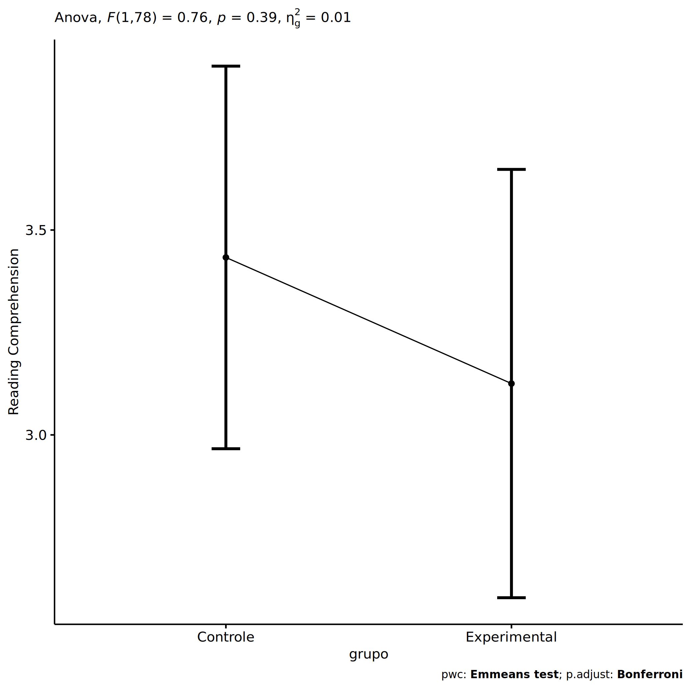<!-- -->

``` r
plots <- oneWayAncovaBoxPlots(
  wdat, "score.compreensao.pos", "grupo", aov, pwc, covar = "score.compreensao.pre",
  theme = "classic", color = color[["grupo"]],
  subtitle = which(aov$Effect == "grupo"))
```

``` r
if (length(unique(wdat[["grupo"]])) > 1)
  plots[["grupo"]] + ggplot2::ylab("Reading Comprehension") +
  ggplot2::scale_x_discrete(labels=c('pre', 'pos')) +
  if (ymin < ymax) ggplot2::ylim(ymin, ymax)
```

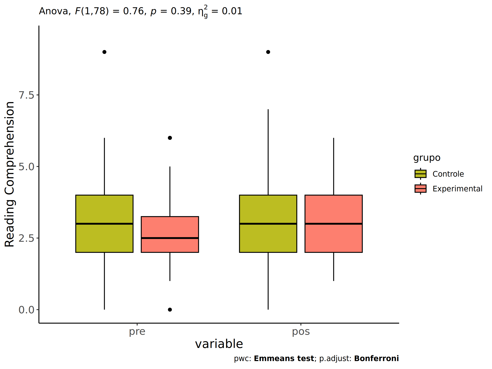<!-- -->

``` r
if (length(unique(wdat.long[["grupo"]])) > 1)
  plots <- oneWayAncovaBoxPlots(
    wdat.long, "score.compreensao", "grupo", aov, pwc.long,
    pre.post = "time", theme = "classic", color = color$prepost)
```

``` r
if (length(unique(wdat.long[["grupo"]])) > 1)
  plots[["grupo"]] + ggplot2::ylab("Reading Comprehension") +
  if (ymin < ymax) ggplot2::ylim(ymin, ymax) 
```

<!-- -->

### Checking linearity assumption

``` r
ggscatter(wdat, x = "score.compreensao.pre", y = "score.compreensao.pos", size = 0.5,
          color = "grupo", add = "reg.line")+
  stat_regline_equation(
    aes(label =  paste(..eq.label.., ..rr.label.., sep = "~~~~"), color = grupo)
  ) +
  ggplot2::labs(subtitle = rstatix::get_test_label(aov, detailed = T, row = which(aov$Effect == "grupo"))) +
  ggplot2::scale_color_manual(values = color[["grupo"]]) +
  ggplot2::ylab("Reading Comprehension")  +
  if (ymin < ymax) ggplot2::ylim(ymin, ymax)
```

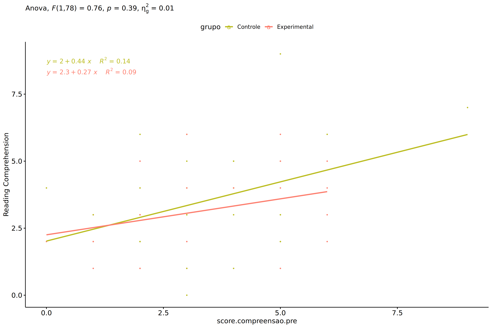<!-- -->

### Checking normality and homogeneity

``` r
res <- augment(lm(score.compreensao.pos ~ score.compreensao.pre + grupo, data = wdat))
```

``` r
shapiro_test(res$.resid)
```

    ## # A tibble: 1 × 3
    ##   variable   statistic p.value
    ##   <chr>          <dbl>   <dbl>
    ## 1 res$.resid     0.980   0.237

``` r
levene_test(res, .resid ~ grupo)
```

    ## # A tibble: 1 × 4
    ##     df1   df2 statistic     p
    ##   <int> <int>     <dbl> <dbl>
    ## 1     1    79      1.04 0.310

# ANCOVA and Pairwise for two factors **grupo:genero**

## Without remove non-normal data

``` r
pdat = remove_group_data(dat[!is.na(dat[["grupo"]]) & !is.na(dat[["genero"]]),],
                         "score.compreensao.pos", c("grupo","genero"))
pdat = pdat[pdat[["genero"]] %in% do.call(
  intersect, lapply(unique(pdat[["grupo"]]), FUN = function(x) {
    unique(pdat[["genero"]][which(pdat[["grupo"]] == x)])
  })),]
pdat[["grupo"]] = factor(pdat[["grupo"]], level[["grupo"]])
pdat[["genero"]] = factor(
  pdat[["genero"]],
  level[["genero"]][level[["genero"]] %in% unique(pdat[["genero"]])])

pdat.long <- rbind(pdat[,c("id","grupo","genero")], pdat[,c("id","grupo","genero")])
pdat.long[["time"]] <- c(rep("pre", nrow(pdat)), rep("pos", nrow(pdat)))
pdat.long[["time"]] <- factor(pdat.long[["time"]], c("pre","pos"))
pdat.long[["score.compreensao"]] <- c(pdat[["score.compreensao.pre"]], pdat[["score.compreensao.pos"]])

if (length(unique(pdat[["genero"]])) >= 2) {
  aov = anova_test(pdat, score.compreensao.pos ~ score.compreensao.pre + grupo*genero)
  laov[["grupo:genero"]] <- get_anova_table(aov)
}
```

``` r
if (length(unique(pdat[["genero"]])) >= 2) {
  pwcs <- list()
  pwcs[["genero"]] <- emmeans_test(
    group_by(pdat, grupo), score.compreensao.pos ~ genero,
    covariate = score.compreensao.pre, p.adjust.method = "bonferroni")
  pwcs[["grupo"]] <- emmeans_test(
    group_by(pdat, genero), score.compreensao.pos ~ grupo,
    covariate = score.compreensao.pre, p.adjust.method = "bonferroni")
  
  pwc <- plyr::rbind.fill(pwcs[["grupo"]], pwcs[["genero"]])
  pwc <- pwc[,c("grupo","genero", colnames(pwc)[!colnames(pwc) %in% c("grupo","genero")])]
}
```

``` r
if (length(unique(pdat[["genero"]])) >= 2) {
  pwc.long <- emmeans_test(dplyr::group_by_at(pdat.long, c("grupo","genero")),
                           score.compreensao ~ time,
                           p.adjust.method = "bonferroni")
  lpwc[["grupo:genero"]] <- plyr::rbind.fill(pwc, pwc.long)
}
```

``` r
if (length(unique(pdat[["genero"]])) >= 2) {
  ds <- get.descriptives(pdat, "score.compreensao.pos", c("grupo","genero"), covar = "score.compreensao.pre")
  ds <- merge(ds[ds$variable != "score.compreensao.pre",],
              ds[ds$variable == "score.compreensao.pre", !colnames(ds) %in% c("variable")],
              by = c("grupo","genero"), all.x = T, suffixes = c("", ".score.compreensao.pre"))
  ds <- merge(get_emmeans(pwcs[["grupo"]]), ds,
              by = c("grupo","genero"), suffixes = c(".emms", ""))
  ds <- ds[,c("grupo","genero","n","mean.score.compreensao.pre","se.score.compreensao.pre","mean","se",
              "emmean","se.emms","conf.low","conf.high")]
  
  colnames(ds) <- c("grupo","genero", "N", paste0(c("M","SE")," (pre)"),
                    paste0(c("M","SE"), " (unadj)"),
                    paste0(c("M", "SE"), " (adj)"), "conf.low", "conf.high")
  
  lemms[["grupo:genero"]] <- ds
}
```

## Computing ANCOVA and PairWise After removing non-normal data (OK)

``` r
if (length(unique(pdat[["genero"]])) >= 2) {
  wdat = pdat 
  
  res = residuals(lm(score.compreensao.pos ~ score.compreensao.pre + grupo*genero, data = wdat))
  non.normal = getNonNormal(res, wdat$id, plimit = 0.05)
  
  wdat = wdat[!wdat$id %in% non.normal,]
  
  wdat.long <- rbind(wdat[,c("id","grupo","genero")], wdat[,c("id","grupo","genero")])
  wdat.long[["time"]] <- c(rep("pre", nrow(wdat)), rep("pos", nrow(wdat)))
  wdat.long[["time"]] <- factor(wdat.long[["time"]], c("pre","pos"))
  wdat.long[["score.compreensao"]] <- c(wdat[["score.compreensao.pre"]], wdat[["score.compreensao.pos"]])
  
  
  ldat[["grupo:genero"]] = wdat
  
  (non.normal)
}
```

    ## [1] "P270"

``` r
if (length(unique(pdat[["genero"]])) >= 2) {
  aov = anova_test(wdat, score.compreensao.pos ~ score.compreensao.pre + grupo*genero)
  laov[["grupo:genero"]] <- merge(get_anova_table(aov), laov[["grupo:genero"]],
                                         by="Effect", suffixes = c("","'"))
  df = get_anova_table(aov)
}
```

| Effect                | DFn | DFd |      F |     p | p\<.05 |   ges |
|:----------------------|----:|----:|-------:|------:|:-------|------:|
| score.compreensao.pre |   1 |  76 | 10.785 | 0.002 | \*     | 0.124 |
| grupo                 |   1 |  76 |  0.549 | 0.461 |        | 0.007 |
| genero                |   1 |  76 | 10.703 | 0.002 | \*     | 0.123 |
| grupo:genero          |   1 |  76 |  1.524 | 0.221 |        | 0.020 |

``` r
if (length(unique(pdat[["genero"]])) >= 2) {
  pwcs <- list()
  pwcs[["genero"]] <- emmeans_test(
    group_by(wdat, grupo), score.compreensao.pos ~ genero,
    covariate = score.compreensao.pre, p.adjust.method = "bonferroni")
  pwcs[["grupo"]] <- emmeans_test(
    group_by(wdat, genero), score.compreensao.pos ~ grupo,
    covariate = score.compreensao.pre, p.adjust.method = "bonferroni")
  
  pwc <- plyr::rbind.fill(pwcs[["grupo"]], pwcs[["genero"]])
  pwc <- pwc[,c("grupo","genero", colnames(pwc)[!colnames(pwc) %in% c("grupo","genero")])]
}
```

| grupo        | genero | term                          | .y.                   | group1   | group2       |  df | statistic |     p | p.adj | p.adj.signif |
|:-------------|:-------|:------------------------------|:----------------------|:---------|:-------------|----:|----------:|------:|------:|:-------------|
|              | F      | score.compreensao.pre\*grupo  | score.compreensao.pos | Controle | Experimental |  76 |     1.396 | 0.167 | 0.167 | ns           |
|              | M      | score.compreensao.pre\*grupo  | score.compreensao.pos | Controle | Experimental |  76 |    -0.337 | 0.737 | 0.737 | ns           |
| Controle     |        | score.compreensao.pre\*genero | score.compreensao.pos | F        | M            |  76 |     3.261 | 0.002 | 0.002 | \*\*         |
| Experimental |        | score.compreensao.pre\*genero | score.compreensao.pos | F        | M            |  76 |     1.263 | 0.210 | 0.210 | ns           |

``` r
if (length(unique(pdat[["genero"]])) >= 2) {
  pwc.long <- emmeans_test(dplyr::group_by_at(wdat.long, c("grupo","genero")),
                           score.compreensao ~ time,
                           p.adjust.method = "bonferroni")
  lpwc[["grupo:genero"]] <- merge(plyr::rbind.fill(pwc, pwc.long),
                                         lpwc[["grupo:genero"]],
                                         by=c("grupo","genero","term",".y.","group1","group2"),
                                         suffixes = c("","'"))
}
```

| grupo        | genero | term | .y.               | group1 | group2 |  df | statistic |     p | p.adj | p.adj.signif |
|:-------------|:-------|:-----|:------------------|:-------|:-------|----:|----------:|------:|------:|:-------------|
| Controle     | F      | time | score.compreensao | pre    | pos    | 154 |    -1.646 | 0.102 | 0.102 | ns           |
| Controle     | M      | time | score.compreensao | pre    | pos    | 154 |     1.173 | 0.243 | 0.243 | ns           |
| Experimental | F      | time | score.compreensao | pre    | pos    | 154 |    -0.869 | 0.386 | 0.386 | ns           |
| Experimental | M      | time | score.compreensao | pre    | pos    | 154 |     0.308 | 0.758 | 0.758 | ns           |

``` r
if (length(unique(pdat[["genero"]])) >= 2) {
  ds <- get.descriptives(wdat, "score.compreensao.pos", c("grupo","genero"), covar = "score.compreensao.pre")
  ds <- merge(ds[ds$variable != "score.compreensao.pre",],
              ds[ds$variable == "score.compreensao.pre", !colnames(ds) %in% c("variable")],
              by = c("grupo","genero"), all.x = T, suffixes = c("", ".score.compreensao.pre"))
  ds <- merge(get_emmeans(pwcs[["grupo"]]), ds,
              by = c("grupo","genero"), suffixes = c(".emms", ""))
  ds <- ds[,c("grupo","genero","n","mean.score.compreensao.pre","se.score.compreensao.pre",
              "mean","se","emmean","se.emms","conf.low","conf.high")]
  
  colnames(ds) <- c("grupo","genero", "N", paste0(c("M","SE")," (pre)"),
                    paste0(c("M","SE"), " (unadj)"),
                    paste0(c("M", "SE"), " (adj)"), "conf.low", "conf.high")
  
  lemms[["grupo:genero"]] <- merge(ds, lemms[["grupo:genero"]],
                                          by=c("grupo","genero"), suffixes = c("","'"))
}
```

| grupo        | genero |   N | M (pre) | SE (pre) | M (unadj) | SE (unadj) | M (adj) | SE (adj) | conf.low | conf.high |
|:-------------|:-------|----:|--------:|---------:|----------:|-----------:|--------:|---------:|---------:|----------:|
| Controle     | F      |  24 |   3.458 |    0.356 |     4.208 |      0.366 |   4.105 |    0.302 |    3.504 |     4.707 |
| Controle     | M      |  21 |   3.286 |    0.277 |     2.714 |      0.317 |   2.671 |    0.321 |    2.031 |     3.311 |
| Experimental | F      |  17 |   2.882 |    0.382 |     3.353 |      0.296 |   3.449 |    0.358 |    2.736 |     4.162 |
| Experimental | M      |  19 |   2.895 |    0.397 |     2.737 |      0.373 |   2.829 |    0.339 |    2.154 |     3.503 |

### Plots for ancova

``` r
if (length(unique(pdat[["genero"]])) >= 2) {
  ggPlotAoC2(pwcs, "grupo", "genero", aov, ylab = "Reading Comprehension",
             subtitle = which(aov$Effect == "grupo:genero"), addParam = "errorbar") +
    ggplot2::scale_color_manual(values = color[["genero"]]) +
    ggplot2::ylab("Reading Comprehension") +
    if (ymin.ci < ymax.ci) ggplot2::ylim(ymin.ci, ymax.ci)
}
```

    ## Scale for colour is already present.
    ## Adding another scale for colour, which will replace the existing scale.

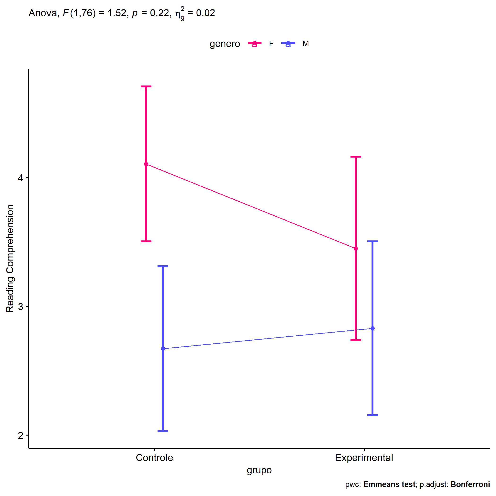<!-- -->

``` r
if (length(unique(pdat[["genero"]])) >= 2) {
  ggPlotAoC2(pwcs, "genero", "grupo", aov, ylab = "Reading Comprehension",
               subtitle = which(aov$Effect == "grupo:genero"), addParam = "errorbar") +
    ggplot2::scale_color_manual(values = color[["grupo"]]) +
    ggplot2::ylab("Reading Comprehension") +
    if (ymin.ci < ymax.ci) ggplot2::ylim(ymin.ci, ymax.ci)
}
```

    ## Scale for colour is already present.
    ## Adding another scale for colour, which will replace the existing scale.

<!-- -->

``` r
if (length(unique(pdat[["genero"]])) >= 2) {
  plots <- twoWayAncovaBoxPlots(
    wdat, "score.compreensao.pos", c("grupo","genero"), aov, pwcs, covar = "score.compreensao.pre",
    theme = "classic", color = color[["grupo:genero"]],
    subtitle = which(aov$Effect == "grupo:genero"))
}
```

``` r
if (length(unique(pdat[["genero"]])) >= 2) {
  plots[["grupo:genero"]] + ggplot2::ylab("Reading Comprehension") +
  ggplot2::scale_x_discrete(labels=c('pre', 'pos')) +
  if (ymin < ymax) ggplot2::ylim(ymin, ymax)
}
```

    ## Warning: No shared levels found between `names(values)` of the manual scale and the data's colour
    ## values.

<!-- -->

``` r
if (length(unique(pdat[["genero"]])) >= 2) {
  plots <- twoWayAncovaBoxPlots(
    wdat.long, "score.compreensao", c("grupo","genero"), aov, pwc.long,
    pre.post = "time",
    theme = "classic", color = color$prepost)
}
```

``` r
if (length(unique(pdat[["genero"]])) >= 2) 
  plots[["grupo:genero"]] + ggplot2::ylab("Reading Comprehension") +
    if (ymin < ymax) ggplot2::ylim(ymin, ymax)
```

<!-- -->

### Checking linearity assumption

``` r
if (length(unique(pdat[["genero"]])) >= 2) {
  ggscatter(wdat, x = "score.compreensao.pre", y = "score.compreensao.pos", size = 0.5,
            facet.by = c("grupo","genero"), add = "reg.line")+
    stat_regline_equation(
      aes(label =  paste(..eq.label.., ..rr.label.., sep = "~~~~"))
    ) + ggplot2::ylab("Reading Comprehension") +
    if (ymin < ymax) ggplot2::ylim(ymin, ymax)
}
```

<!-- -->

``` r
if (length(unique(pdat[["genero"]])) >= 2) {
  ggscatter(wdat, x = "score.compreensao.pre", y = "score.compreensao.pos", size = 0.5,
            color = "grupo", facet.by = "genero", add = "reg.line")+
    stat_regline_equation(
      aes(label =  paste(..eq.label.., ..rr.label.., sep = "~~~~"), color = grupo)
    ) +
    ggplot2::labs(subtitle = rstatix::get_test_label(aov, detailed = T, row = which(aov$Effect == "grupo:genero"))) +
    ggplot2::scale_color_manual(values = color[["grupo"]]) +
    ggplot2::ylab("Reading Comprehension") +
    if (ymin < ymax) ggplot2::ylim(ymin, ymax)
}
```

<!-- -->

``` r
if (length(unique(pdat[["genero"]])) >= 2) {
  ggscatter(wdat, x = "score.compreensao.pre", y = "score.compreensao.pos", size = 0.5,
            color = "genero", facet.by = "grupo", add = "reg.line")+
    stat_regline_equation(
      aes(label =  paste(..eq.label.., ..rr.label.., sep = "~~~~"), color = genero)
    ) +
    ggplot2::labs(subtitle = rstatix::get_test_label(aov, detailed = T, row = which(aov$Effect == "grupo:genero"))) +
    ggplot2::scale_color_manual(values = color[["genero"]]) +
    ggplot2::ylab("Reading Comprehension") +
    if (ymin < ymax) ggplot2::ylim(ymin, ymax)
}
```

<!-- -->

### Checking normality and homogeneity

``` r
if (length(unique(pdat[["genero"]])) >= 2) 
  res <- augment(lm(score.compreensao.pos ~ score.compreensao.pre + grupo*genero, data = wdat))
```

``` r
if (length(unique(pdat[["genero"]])) >= 2)
  shapiro_test(res$.resid)
```

    ## # A tibble: 1 × 3
    ##   variable   statistic p.value
    ##   <chr>          <dbl>   <dbl>
    ## 1 res$.resid     0.981   0.275

``` r
if (length(unique(pdat[["genero"]])) >= 2) 
  levene_test(res, .resid ~ grupo*genero)
```

    ## # A tibble: 1 × 4
    ##     df1   df2 statistic     p
    ##   <int> <int>     <dbl> <dbl>
    ## 1     3    77      1.64 0.187

# ANCOVA and Pairwise for two factors **grupo:zona.participante**

## Without remove non-normal data

``` r
pdat = remove_group_data(dat[!is.na(dat[["grupo"]]) & !is.na(dat[["zona.participante"]]),],
                         "score.compreensao.pos", c("grupo","zona.participante"))
pdat = pdat[pdat[["zona.participante"]] %in% do.call(
  intersect, lapply(unique(pdat[["grupo"]]), FUN = function(x) {
    unique(pdat[["zona.participante"]][which(pdat[["grupo"]] == x)])
  })),]
pdat[["grupo"]] = factor(pdat[["grupo"]], level[["grupo"]])
pdat[["zona.participante"]] = factor(
  pdat[["zona.participante"]],
  level[["zona.participante"]][level[["zona.participante"]] %in% unique(pdat[["zona.participante"]])])

pdat.long <- rbind(pdat[,c("id","grupo","zona.participante")], pdat[,c("id","grupo","zona.participante")])
pdat.long[["time"]] <- c(rep("pre", nrow(pdat)), rep("pos", nrow(pdat)))
pdat.long[["time"]] <- factor(pdat.long[["time"]], c("pre","pos"))
pdat.long[["score.compreensao"]] <- c(pdat[["score.compreensao.pre"]], pdat[["score.compreensao.pos"]])

if (length(unique(pdat[["zona.participante"]])) >= 2) {
  aov = anova_test(pdat, score.compreensao.pos ~ score.compreensao.pre + grupo*zona.participante)
  laov[["grupo:zona.participante"]] <- get_anova_table(aov)
}
```

``` r
if (length(unique(pdat[["zona.participante"]])) >= 2) {
  pwcs <- list()
  pwcs[["zona.participante"]] <- emmeans_test(
    group_by(pdat, grupo), score.compreensao.pos ~ zona.participante,
    covariate = score.compreensao.pre, p.adjust.method = "bonferroni")
  pwcs[["grupo"]] <- emmeans_test(
    group_by(pdat, zona.participante), score.compreensao.pos ~ grupo,
    covariate = score.compreensao.pre, p.adjust.method = "bonferroni")
  
  pwc <- plyr::rbind.fill(pwcs[["grupo"]], pwcs[["zona.participante"]])
  pwc <- pwc[,c("grupo","zona.participante", colnames(pwc)[!colnames(pwc) %in% c("grupo","zona.participante")])]
}
```

``` r
if (length(unique(pdat[["zona.participante"]])) >= 2) {
  pwc.long <- emmeans_test(dplyr::group_by_at(pdat.long, c("grupo","zona.participante")),
                           score.compreensao ~ time,
                           p.adjust.method = "bonferroni")
  lpwc[["grupo:zona.participante"]] <- plyr::rbind.fill(pwc, pwc.long)
}
```

``` r
if (length(unique(pdat[["zona.participante"]])) >= 2) {
  ds <- get.descriptives(pdat, "score.compreensao.pos", c("grupo","zona.participante"), covar = "score.compreensao.pre")
  ds <- merge(ds[ds$variable != "score.compreensao.pre",],
              ds[ds$variable == "score.compreensao.pre", !colnames(ds) %in% c("variable")],
              by = c("grupo","zona.participante"), all.x = T, suffixes = c("", ".score.compreensao.pre"))
  ds <- merge(get_emmeans(pwcs[["grupo"]]), ds,
              by = c("grupo","zona.participante"), suffixes = c(".emms", ""))
  ds <- ds[,c("grupo","zona.participante","n","mean.score.compreensao.pre","se.score.compreensao.pre","mean","se",
              "emmean","se.emms","conf.low","conf.high")]
  
  colnames(ds) <- c("grupo","zona.participante", "N", paste0(c("M","SE")," (pre)"),
                    paste0(c("M","SE"), " (unadj)"),
                    paste0(c("M", "SE"), " (adj)"), "conf.low", "conf.high")
  
  lemms[["grupo:zona.participante"]] <- ds
}
```

## Computing ANCOVA and PairWise After removing non-normal data (OK)

``` r
if (length(unique(pdat[["zona.participante"]])) >= 2) {
  wdat = pdat 
  
  res = residuals(lm(score.compreensao.pos ~ score.compreensao.pre + grupo*zona.participante, data = wdat))
  non.normal = getNonNormal(res, wdat$id, plimit = 0.05)
  
  wdat = wdat[!wdat$id %in% non.normal,]
  
  wdat.long <- rbind(wdat[,c("id","grupo","zona.participante")], wdat[,c("id","grupo","zona.participante")])
  wdat.long[["time"]] <- c(rep("pre", nrow(wdat)), rep("pos", nrow(wdat)))
  wdat.long[["time"]] <- factor(wdat.long[["time"]], c("pre","pos"))
  wdat.long[["score.compreensao"]] <- c(wdat[["score.compreensao.pre"]], wdat[["score.compreensao.pos"]])
  
  
  ldat[["grupo:zona.participante"]] = wdat
  
  (non.normal)
}
```

    ## [1] "P270"

``` r
if (length(unique(pdat[["zona.participante"]])) >= 2) {
  aov = anova_test(wdat, score.compreensao.pos ~ score.compreensao.pre + grupo*zona.participante)
  laov[["grupo:zona.participante"]] <- merge(get_anova_table(aov), laov[["grupo:zona.participante"]],
                                         by="Effect", suffixes = c("","'"))
  df = get_anova_table(aov)
}
```

| Effect                  | DFn | DFd |      F |     p | p\<.05 |   ges |
|:------------------------|----:|----:|-------:|------:|:-------|------:|
| score.compreensao.pre   |   1 |  56 | 10.219 | 0.002 | \*     | 0.154 |
| grupo                   |   1 |  56 |  1.373 | 0.246 |        | 0.024 |
| zona.participante       |   1 |  56 |  0.341 | 0.561 |        | 0.006 |
| grupo:zona.participante |   1 |  56 |  0.001 | 0.970 |        | 0.000 |

``` r
if (length(unique(pdat[["zona.participante"]])) >= 2) {
  pwcs <- list()
  pwcs[["zona.participante"]] <- emmeans_test(
    group_by(wdat, grupo), score.compreensao.pos ~ zona.participante,
    covariate = score.compreensao.pre, p.adjust.method = "bonferroni")
  pwcs[["grupo"]] <- emmeans_test(
    group_by(wdat, zona.participante), score.compreensao.pos ~ grupo,
    covariate = score.compreensao.pre, p.adjust.method = "bonferroni")
  
  pwc <- plyr::rbind.fill(pwcs[["grupo"]], pwcs[["zona.participante"]])
  pwc <- pwc[,c("grupo","zona.participante", colnames(pwc)[!colnames(pwc) %in% c("grupo","zona.participante")])]
}
```

| grupo        | zona.participante | term                                     | .y.                   | group1   | group2       |  df | statistic |     p | p.adj | p.adj.signif |
|:-------------|:------------------|:-----------------------------------------|:----------------------|:---------|:-------------|----:|----------:|------:|------:|:-------------|
|              | Rural             | score.compreensao.pre\*grupo             | score.compreensao.pos | Controle | Experimental |  56 |     0.841 | 0.404 | 0.404 | ns           |
|              | Urbana            | score.compreensao.pre\*grupo             | score.compreensao.pos | Controle | Experimental |  56 |     0.821 | 0.415 | 0.415 | ns           |
| Controle     |                   | score.compreensao.pre\*zona.participante | score.compreensao.pos | Rural    | Urbana       |  56 |    -0.410 | 0.683 | 0.683 | ns           |
| Experimental |                   | score.compreensao.pre\*zona.participante | score.compreensao.pos | Rural    | Urbana       |  56 |    -0.411 | 0.683 | 0.683 | ns           |

``` r
if (length(unique(pdat[["zona.participante"]])) >= 2) {
  pwc.long <- emmeans_test(dplyr::group_by_at(wdat.long, c("grupo","zona.participante")),
                           score.compreensao ~ time,
                           p.adjust.method = "bonferroni")
  lpwc[["grupo:zona.participante"]] <- merge(plyr::rbind.fill(pwc, pwc.long),
                                         lpwc[["grupo:zona.participante"]],
                                         by=c("grupo","zona.participante","term",".y.","group1","group2"),
                                         suffixes = c("","'"))
}
```

| grupo        | zona.participante | term | .y.               | group1 | group2 |  df | statistic |     p | p.adj | p.adj.signif |
|:-------------|:------------------|:-----|:------------------|:-------|:-------|----:|----------:|------:|------:|:-------------|
| Controle     | Rural             | time | score.compreensao | pre    | pos    | 114 |    -0.380 | 0.705 | 0.705 | ns           |
| Controle     | Urbana            | time | score.compreensao | pre    | pos    | 114 |    -0.641 | 0.523 | 0.523 | ns           |
| Experimental | Rural             | time | score.compreensao | pre    | pos    | 114 |     0.352 | 0.726 | 0.726 | ns           |
| Experimental | Urbana            | time | score.compreensao | pre    | pos    | 114 |    -1.140 | 0.257 | 0.257 | ns           |

``` r
if (length(unique(pdat[["zona.participante"]])) >= 2) {
  ds <- get.descriptives(wdat, "score.compreensao.pos", c("grupo","zona.participante"), covar = "score.compreensao.pre")
  ds <- merge(ds[ds$variable != "score.compreensao.pre",],
              ds[ds$variable == "score.compreensao.pre", !colnames(ds) %in% c("variable")],
              by = c("grupo","zona.participante"), all.x = T, suffixes = c("", ".score.compreensao.pre"))
  ds <- merge(get_emmeans(pwcs[["grupo"]]), ds,
              by = c("grupo","zona.participante"), suffixes = c(".emms", ""))
  ds <- ds[,c("grupo","zona.participante","n","mean.score.compreensao.pre","se.score.compreensao.pre",
              "mean","se","emmean","se.emms","conf.low","conf.high")]
  
  colnames(ds) <- c("grupo","zona.participante", "N", paste0(c("M","SE")," (pre)"),
                    paste0(c("M","SE"), " (unadj)"),
                    paste0(c("M", "SE"), " (adj)"), "conf.low", "conf.high")
  
  lemms[["grupo:zona.participante"]] <- merge(ds, lemms[["grupo:zona.participante"]],
                                          by=c("grupo","zona.participante"), suffixes = c("","'"))
}
```

| grupo        | zona.participante |   N | M (pre) | SE (pre) | M (unadj) | SE (unadj) | M (adj) | SE (adj) | conf.low | conf.high |
|:-------------|:------------------|----:|--------:|---------:|----------:|-----------:|--------:|---------:|---------:|----------:|
| Controle     | Rural             |  12 |   3.417 |    0.260 |     3.667 |      0.284 |   3.605 |    0.437 |    2.730 |     4.480 |
| Controle     | Urbana            |  23 |   3.696 |    0.364 |     4.000 |      0.431 |   3.826 |    0.320 |    3.185 |     4.467 |
| Experimental | Rural             |  14 |   3.357 |    0.498 |     3.143 |      0.361 |   3.105 |    0.404 |    2.295 |     3.914 |
| Experimental | Urbana            |  12 |   2.167 |    0.423 |     2.917 |      0.417 |   3.357 |    0.458 |    2.440 |     4.273 |

### Plots for ancova

``` r
if (length(unique(pdat[["zona.participante"]])) >= 2) {
  ggPlotAoC2(pwcs, "grupo", "zona.participante", aov, ylab = "Reading Comprehension",
             subtitle = which(aov$Effect == "grupo:zona.participante"), addParam = "errorbar") +
    ggplot2::scale_color_manual(values = color[["zona.participante"]]) +
    ggplot2::ylab("Reading Comprehension") +
    if (ymin.ci < ymax.ci) ggplot2::ylim(ymin.ci, ymax.ci)
}
```

    ## Scale for colour is already present.
    ## Adding another scale for colour, which will replace the existing scale.

<!-- -->

``` r
if (length(unique(pdat[["zona.participante"]])) >= 2) {
  ggPlotAoC2(pwcs, "zona.participante", "grupo", aov, ylab = "Reading Comprehension",
               subtitle = which(aov$Effect == "grupo:zona.participante"), addParam = "errorbar") +
    ggplot2::scale_color_manual(values = color[["grupo"]]) +
    ggplot2::ylab("Reading Comprehension") +
    if (ymin.ci < ymax.ci) ggplot2::ylim(ymin.ci, ymax.ci)
}
```

    ## Scale for colour is already present.
    ## Adding another scale for colour, which will replace the existing scale.

<!-- -->

``` r
if (length(unique(pdat[["zona.participante"]])) >= 2) {
  plots <- twoWayAncovaBoxPlots(
    wdat, "score.compreensao.pos", c("grupo","zona.participante"), aov, pwcs, covar = "score.compreensao.pre",
    theme = "classic", color = color[["grupo:zona.participante"]],
    subtitle = which(aov$Effect == "grupo:zona.participante"))
}
```

``` r
if (length(unique(pdat[["zona.participante"]])) >= 2) {
  plots[["grupo:zona.participante"]] + ggplot2::ylab("Reading Comprehension") +
  ggplot2::scale_x_discrete(labels=c('pre', 'pos')) +
  if (ymin < ymax) ggplot2::ylim(ymin, ymax)
}
```

    ## Warning: No shared levels found between `names(values)` of the manual scale and the data's colour
    ## values.

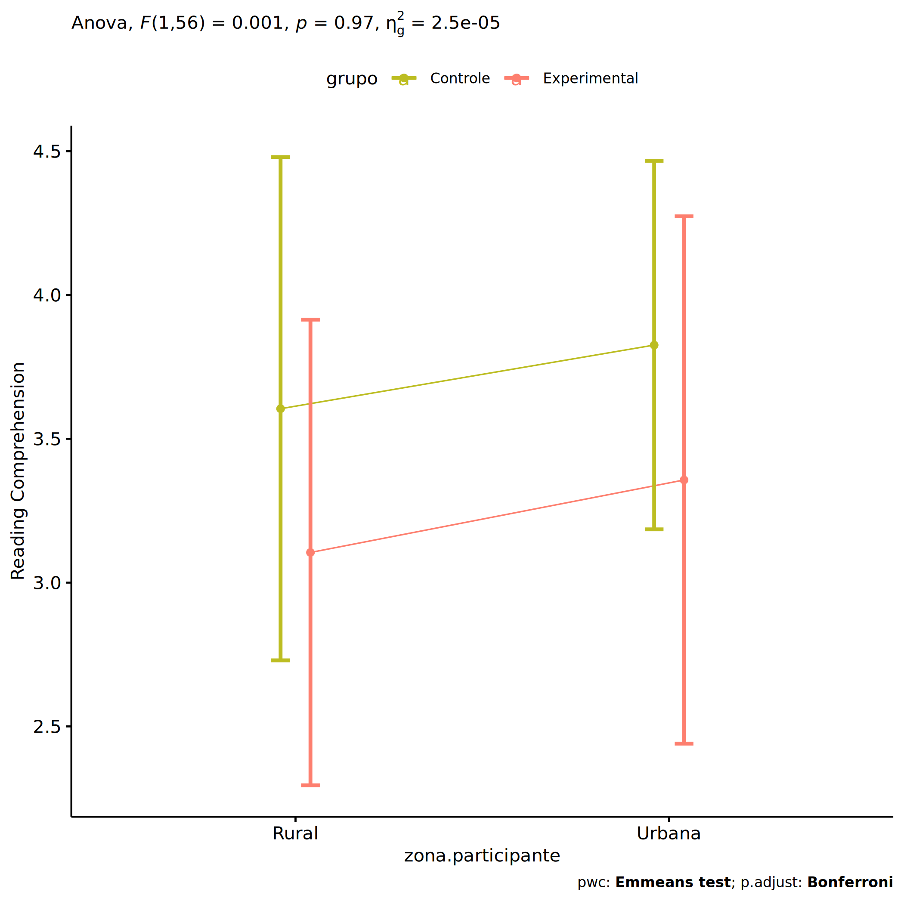<!-- -->

``` r
if (length(unique(pdat[["zona.participante"]])) >= 2) {
  plots <- twoWayAncovaBoxPlots(
    wdat.long, "score.compreensao", c("grupo","zona.participante"), aov, pwc.long,
    pre.post = "time",
    theme = "classic", color = color$prepost)
}
```

``` r
if (length(unique(pdat[["zona.participante"]])) >= 2) 
  plots[["grupo:zona.participante"]] + ggplot2::ylab("Reading Comprehension") +
    if (ymin < ymax) ggplot2::ylim(ymin, ymax)
```

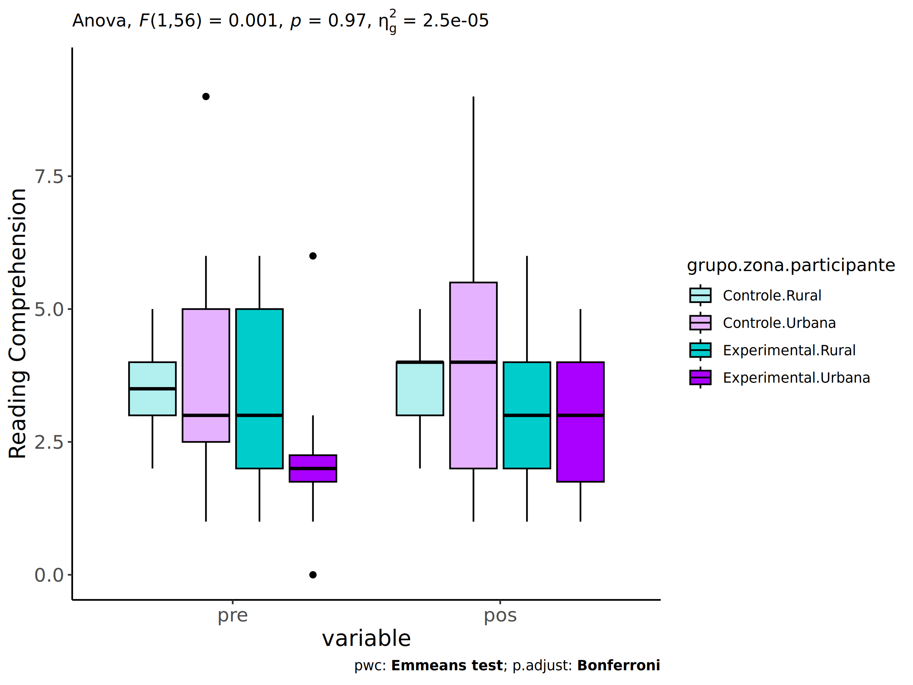<!-- -->

### Checking linearity assumption

``` r
if (length(unique(pdat[["zona.participante"]])) >= 2) {
  ggscatter(wdat, x = "score.compreensao.pre", y = "score.compreensao.pos", size = 0.5,
            facet.by = c("grupo","zona.participante"), add = "reg.line")+
    stat_regline_equation(
      aes(label =  paste(..eq.label.., ..rr.label.., sep = "~~~~"))
    ) + ggplot2::ylab("Reading Comprehension") +
    if (ymin < ymax) ggplot2::ylim(ymin, ymax)
}
```

<!-- -->

``` r
if (length(unique(pdat[["zona.participante"]])) >= 2) {
  ggscatter(wdat, x = "score.compreensao.pre", y = "score.compreensao.pos", size = 0.5,
            color = "grupo", facet.by = "zona.participante", add = "reg.line")+
    stat_regline_equation(
      aes(label =  paste(..eq.label.., ..rr.label.., sep = "~~~~"), color = grupo)
    ) +
    ggplot2::labs(subtitle = rstatix::get_test_label(aov, detailed = T, row = which(aov$Effect == "grupo:zona.participante"))) +
    ggplot2::scale_color_manual(values = color[["grupo"]]) +
    ggplot2::ylab("Reading Comprehension") +
    if (ymin < ymax) ggplot2::ylim(ymin, ymax)
}
```

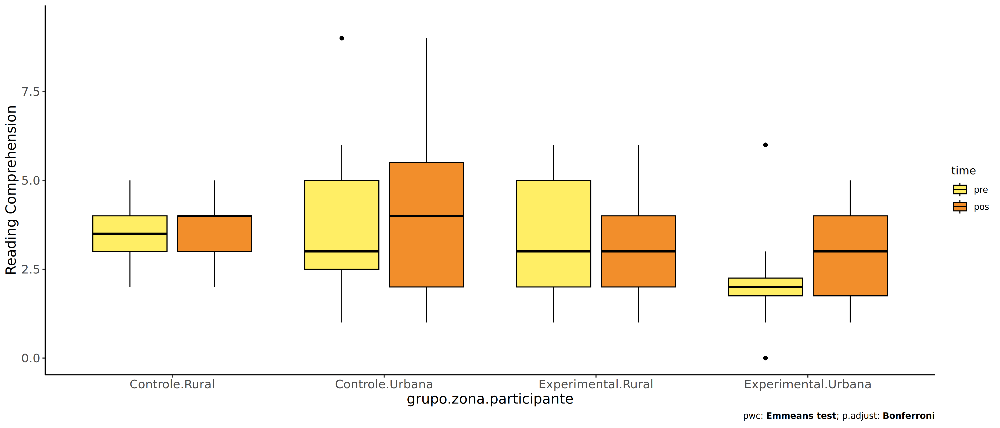<!-- -->

``` r
if (length(unique(pdat[["zona.participante"]])) >= 2) {
  ggscatter(wdat, x = "score.compreensao.pre", y = "score.compreensao.pos", size = 0.5,
            color = "zona.participante", facet.by = "grupo", add = "reg.line")+
    stat_regline_equation(
      aes(label =  paste(..eq.label.., ..rr.label.., sep = "~~~~"), color = zona.participante)
    ) +
    ggplot2::labs(subtitle = rstatix::get_test_label(aov, detailed = T, row = which(aov$Effect == "grupo:zona.participante"))) +
    ggplot2::scale_color_manual(values = color[["zona.participante"]]) +
    ggplot2::ylab("Reading Comprehension") +
    if (ymin < ymax) ggplot2::ylim(ymin, ymax)
}
```

<!-- -->

### Checking normality and homogeneity

``` r
if (length(unique(pdat[["zona.participante"]])) >= 2) 
  res <- augment(lm(score.compreensao.pos ~ score.compreensao.pre + grupo*zona.participante, data = wdat))
```

``` r
if (length(unique(pdat[["zona.participante"]])) >= 2)
  shapiro_test(res$.resid)
```

    ## # A tibble: 1 × 3
    ##   variable   statistic p.value
    ##   <chr>          <dbl>   <dbl>
    ## 1 res$.resid     0.970   0.145

``` r
if (length(unique(pdat[["zona.participante"]])) >= 2) 
  levene_test(res, .resid ~ grupo*zona.participante)
```

    ## # A tibble: 1 × 4
    ##     df1   df2 statistic     p
    ##   <int> <int>     <dbl> <dbl>
    ## 1     3    57      2.14 0.105

# ANCOVA and Pairwise for two factors **grupo:zona.escola**

## Without remove non-normal data

``` r
pdat = remove_group_data(dat[!is.na(dat[["grupo"]]) & !is.na(dat[["zona.escola"]]),],
                         "score.compreensao.pos", c("grupo","zona.escola"))
pdat = pdat[pdat[["zona.escola"]] %in% do.call(
  intersect, lapply(unique(pdat[["grupo"]]), FUN = function(x) {
    unique(pdat[["zona.escola"]][which(pdat[["grupo"]] == x)])
  })),]
pdat[["grupo"]] = factor(pdat[["grupo"]], level[["grupo"]])
pdat[["zona.escola"]] = factor(
  pdat[["zona.escola"]],
  level[["zona.escola"]][level[["zona.escola"]] %in% unique(pdat[["zona.escola"]])])

pdat.long <- rbind(pdat[,c("id","grupo","zona.escola")], pdat[,c("id","grupo","zona.escola")])
pdat.long[["time"]] <- c(rep("pre", nrow(pdat)), rep("pos", nrow(pdat)))
pdat.long[["time"]] <- factor(pdat.long[["time"]], c("pre","pos"))
pdat.long[["score.compreensao"]] <- c(pdat[["score.compreensao.pre"]], pdat[["score.compreensao.pos"]])

if (length(unique(pdat[["zona.escola"]])) >= 2) {
  aov = anova_test(pdat, score.compreensao.pos ~ score.compreensao.pre + grupo*zona.escola)
  laov[["grupo:zona.escola"]] <- get_anova_table(aov)
}
```

``` r
if (length(unique(pdat[["zona.escola"]])) >= 2) {
  pwcs <- list()
  pwcs[["zona.escola"]] <- emmeans_test(
    group_by(pdat, grupo), score.compreensao.pos ~ zona.escola,
    covariate = score.compreensao.pre, p.adjust.method = "bonferroni")
  pwcs[["grupo"]] <- emmeans_test(
    group_by(pdat, zona.escola), score.compreensao.pos ~ grupo,
    covariate = score.compreensao.pre, p.adjust.method = "bonferroni")
  
  pwc <- plyr::rbind.fill(pwcs[["grupo"]], pwcs[["zona.escola"]])
  pwc <- pwc[,c("grupo","zona.escola", colnames(pwc)[!colnames(pwc) %in% c("grupo","zona.escola")])]
}
```

``` r
if (length(unique(pdat[["zona.escola"]])) >= 2) {
  pwc.long <- emmeans_test(dplyr::group_by_at(pdat.long, c("grupo","zona.escola")),
                           score.compreensao ~ time,
                           p.adjust.method = "bonferroni")
  lpwc[["grupo:zona.escola"]] <- plyr::rbind.fill(pwc, pwc.long)
}
```

``` r
if (length(unique(pdat[["zona.escola"]])) >= 2) {
  ds <- get.descriptives(pdat, "score.compreensao.pos", c("grupo","zona.escola"), covar = "score.compreensao.pre")
  ds <- merge(ds[ds$variable != "score.compreensao.pre",],
              ds[ds$variable == "score.compreensao.pre", !colnames(ds) %in% c("variable")],
              by = c("grupo","zona.escola"), all.x = T, suffixes = c("", ".score.compreensao.pre"))
  ds <- merge(get_emmeans(pwcs[["grupo"]]), ds,
              by = c("grupo","zona.escola"), suffixes = c(".emms", ""))
  ds <- ds[,c("grupo","zona.escola","n","mean.score.compreensao.pre","se.score.compreensao.pre","mean","se",
              "emmean","se.emms","conf.low","conf.high")]
  
  colnames(ds) <- c("grupo","zona.escola", "N", paste0(c("M","SE")," (pre)"),
                    paste0(c("M","SE"), " (unadj)"),
                    paste0(c("M", "SE"), " (adj)"), "conf.low", "conf.high")
  
  lemms[["grupo:zona.escola"]] <- ds
}
```

## Computing ANCOVA and PairWise After removing non-normal data (OK)

``` r
if (length(unique(pdat[["zona.escola"]])) >= 2) {
  wdat = pdat 
  
  res = residuals(lm(score.compreensao.pos ~ score.compreensao.pre + grupo*zona.escola, data = wdat))
  non.normal = getNonNormal(res, wdat$id, plimit = 0.05)
  
  wdat = wdat[!wdat$id %in% non.normal,]
  
  wdat.long <- rbind(wdat[,c("id","grupo","zona.escola")], wdat[,c("id","grupo","zona.escola")])
  wdat.long[["time"]] <- c(rep("pre", nrow(wdat)), rep("pos", nrow(wdat)))
  wdat.long[["time"]] <- factor(wdat.long[["time"]], c("pre","pos"))
  wdat.long[["score.compreensao"]] <- c(wdat[["score.compreensao.pre"]], wdat[["score.compreensao.pos"]])
  
  
  ldat[["grupo:zona.escola"]] = wdat
  
  (non.normal)
}
```

    ## [1] "P270"

``` r
if (length(unique(pdat[["zona.escola"]])) >= 2) {
  aov = anova_test(wdat, score.compreensao.pos ~ score.compreensao.pre + grupo*zona.escola)
  laov[["grupo:zona.escola"]] <- merge(get_anova_table(aov), laov[["grupo:zona.escola"]],
                                         by="Effect", suffixes = c("","'"))
  df = get_anova_table(aov)
}
```

| Effect                | DFn | DFd |     F |     p | p\<.05 |   ges |
|:----------------------|----:|----:|------:|------:|:-------|------:|
| score.compreensao.pre |   1 |  76 | 9.031 | 0.004 | \*     | 0.106 |
| grupo                 |   1 |  76 | 0.879 | 0.351 |        | 0.011 |
| zona.escola           |   1 |  76 | 1.061 | 0.306 |        | 0.014 |
| grupo:zona.escola     |   1 |  76 | 0.105 | 0.747 |        | 0.001 |

``` r
if (length(unique(pdat[["zona.escola"]])) >= 2) {
  pwcs <- list()
  pwcs[["zona.escola"]] <- emmeans_test(
    group_by(wdat, grupo), score.compreensao.pos ~ zona.escola,
    covariate = score.compreensao.pre, p.adjust.method = "bonferroni")
  pwcs[["grupo"]] <- emmeans_test(
    group_by(wdat, zona.escola), score.compreensao.pos ~ grupo,
    covariate = score.compreensao.pre, p.adjust.method = "bonferroni")
  
  pwc <- plyr::rbind.fill(pwcs[["grupo"]], pwcs[["zona.escola"]])
  pwc <- pwc[,c("grupo","zona.escola", colnames(pwc)[!colnames(pwc) %in% c("grupo","zona.escola")])]
}
```

| grupo        | zona.escola | term                               | .y.                   | group1   | group2       |  df | statistic |     p | p.adj | p.adj.signif |
|:-------------|:------------|:-----------------------------------|:----------------------|:---------|:-------------|----:|----------:|------:|------:|:-------------|
|              | Rural       | score.compreensao.pre\*grupo       | score.compreensao.pos | Controle | Experimental |  76 |     0.254 | 0.800 | 0.800 | ns           |
|              | Urbana      | score.compreensao.pre\*grupo       | score.compreensao.pos | Controle | Experimental |  76 |     0.962 | 0.339 | 0.339 | ns           |
| Controle     |             | score.compreensao.pre\*zona.escola | score.compreensao.pos | Rural    | Urbana       |  76 |     0.528 | 0.599 | 0.599 | ns           |
| Experimental |             | score.compreensao.pre\*zona.escola | score.compreensao.pos | Rural    | Urbana       |  76 |     0.945 | 0.348 | 0.348 | ns           |

``` r
if (length(unique(pdat[["zona.escola"]])) >= 2) {
  pwc.long <- emmeans_test(dplyr::group_by_at(wdat.long, c("grupo","zona.escola")),
                           score.compreensao ~ time,
                           p.adjust.method = "bonferroni")
  lpwc[["grupo:zona.escola"]] <- merge(plyr::rbind.fill(pwc, pwc.long),
                                         lpwc[["grupo:zona.escola"]],
                                         by=c("grupo","zona.escola","term",".y.","group1","group2"),
                                         suffixes = c("","'"))
}
```

| grupo        | zona.escola | term | .y.               | group1 | group2 |  df | statistic |     p | p.adj | p.adj.signif |
|:-------------|:------------|:-----|:------------------|:-------|:-------|----:|----------:|------:|------:|:-------------|
| Controle     | Rural       | time | score.compreensao | pre    | pos    | 154 |     0.122 | 0.903 | 0.903 | ns           |
| Controle     | Urbana      | time | score.compreensao | pre    | pos    | 154 |    -0.543 | 0.588 | 0.588 | ns           |
| Experimental | Rural       | time | score.compreensao | pre    | pos    | 154 |    -0.634 | 0.527 | 0.527 | ns           |
| Experimental | Urbana      | time | score.compreensao | pre    | pos    | 154 |     0.000 | 1.000 | 1.000 | ns           |

``` r
if (length(unique(pdat[["zona.escola"]])) >= 2) {
  ds <- get.descriptives(wdat, "score.compreensao.pos", c("grupo","zona.escola"), covar = "score.compreensao.pre")
  ds <- merge(ds[ds$variable != "score.compreensao.pre",],
              ds[ds$variable == "score.compreensao.pre", !colnames(ds) %in% c("variable")],
              by = c("grupo","zona.escola"), all.x = T, suffixes = c("", ".score.compreensao.pre"))
  ds <- merge(get_emmeans(pwcs[["grupo"]]), ds,
              by = c("grupo","zona.escola"), suffixes = c(".emms", ""))
  ds <- ds[,c("grupo","zona.escola","n","mean.score.compreensao.pre","se.score.compreensao.pre",
              "mean","se","emmean","se.emms","conf.low","conf.high")]
  
  colnames(ds) <- c("grupo","zona.escola", "N", paste0(c("M","SE")," (pre)"),
                    paste0(c("M","SE"), " (unadj)"),
                    paste0(c("M", "SE"), " (adj)"), "conf.low", "conf.high")
  
  lemms[["grupo:zona.escola"]] <- merge(ds, lemms[["grupo:zona.escola"]],
                                          by=c("grupo","zona.escola"), suffixes = c("","'"))
}
```

| grupo        | zona.escola |   N | M (pre) | SE (pre) | M (unadj) | SE (unadj) | M (adj) | SE (adj) | conf.low | conf.high |
|:-------------|:------------|----:|--------:|---------:|----------:|-----------:|--------:|---------:|---------:|----------:|
| Controle     | Rural       |  13 |   4.000 |    0.506 |     3.923 |      0.445 |   3.634 |    0.447 |    2.745 |     4.524 |
| Controle     | Urbana      |  32 |   3.125 |    0.237 |     3.344 |      0.329 |   3.356 |    0.278 |    2.802 |     3.910 |
| Experimental | Rural       |  12 |   3.000 |    0.408 |     3.417 |      0.398 |   3.472 |    0.454 |    2.567 |     4.377 |
| Experimental | Urbana      |  24 |   2.833 |    0.359 |     2.833 |      0.305 |   2.946 |    0.323 |    2.302 |     3.590 |

### Plots for ancova

``` r
if (length(unique(pdat[["zona.escola"]])) >= 2) {
  ggPlotAoC2(pwcs, "grupo", "zona.escola", aov, ylab = "Reading Comprehension",
             subtitle = which(aov$Effect == "grupo:zona.escola"), addParam = "errorbar") +
    ggplot2::scale_color_manual(values = color[["zona.escola"]]) +
    ggplot2::ylab("Reading Comprehension") +
    if (ymin.ci < ymax.ci) ggplot2::ylim(ymin.ci, ymax.ci)
}
```

    ## Scale for colour is already present.
    ## Adding another scale for colour, which will replace the existing scale.

<!-- -->

``` r
if (length(unique(pdat[["zona.escola"]])) >= 2) {
  ggPlotAoC2(pwcs, "zona.escola", "grupo", aov, ylab = "Reading Comprehension",
               subtitle = which(aov$Effect == "grupo:zona.escola"), addParam = "errorbar") +
    ggplot2::scale_color_manual(values = color[["grupo"]]) +
    ggplot2::ylab("Reading Comprehension") +
    if (ymin.ci < ymax.ci) ggplot2::ylim(ymin.ci, ymax.ci)
}
```

    ## Scale for colour is already present.
    ## Adding another scale for colour, which will replace the existing scale.

<!-- -->

``` r
if (length(unique(pdat[["zona.escola"]])) >= 2) {
  plots <- twoWayAncovaBoxPlots(
    wdat, "score.compreensao.pos", c("grupo","zona.escola"), aov, pwcs, covar = "score.compreensao.pre",
    theme = "classic", color = color[["grupo:zona.escola"]],
    subtitle = which(aov$Effect == "grupo:zona.escola"))
}
```

``` r
if (length(unique(pdat[["zona.escola"]])) >= 2) {
  plots[["grupo:zona.escola"]] + ggplot2::ylab("Reading Comprehension") +
  ggplot2::scale_x_discrete(labels=c('pre', 'pos')) +
  if (ymin < ymax) ggplot2::ylim(ymin, ymax)
}
```

    ## Warning: No shared levels found between `names(values)` of the manual scale and the data's colour
    ## values.

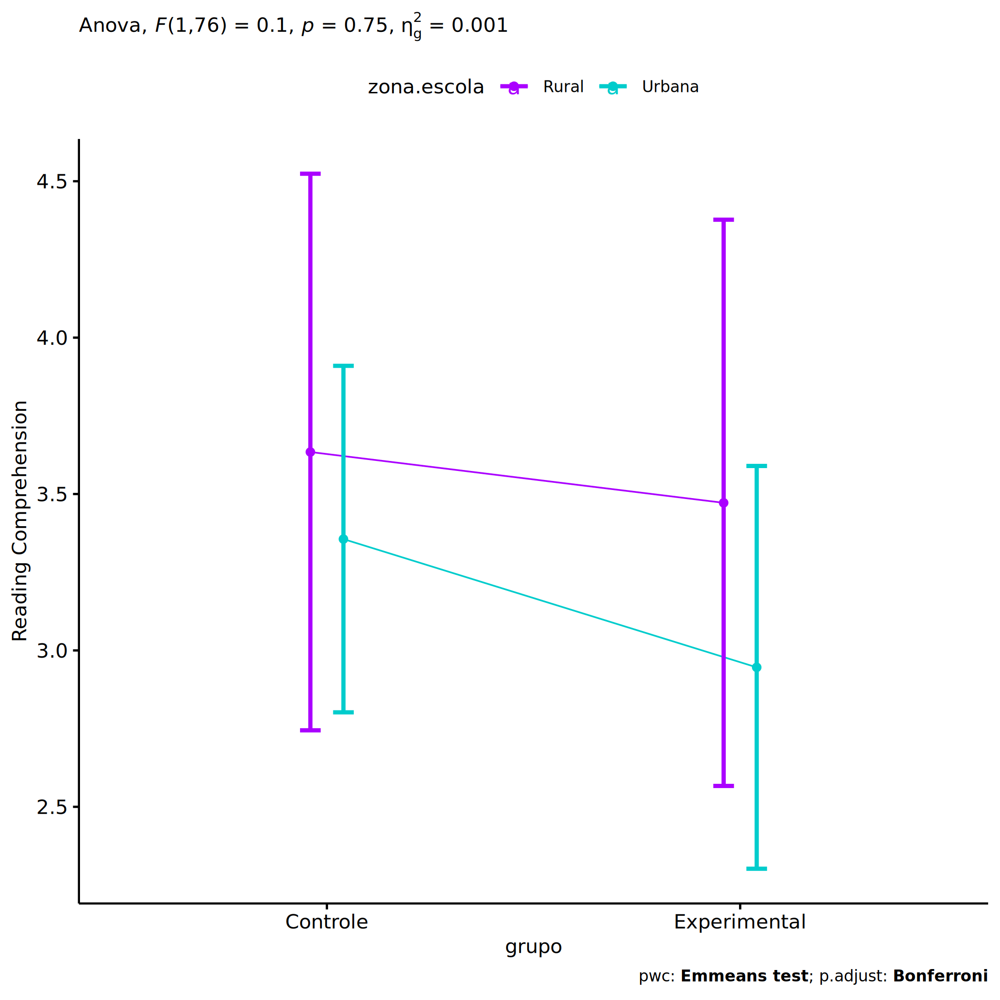<!-- -->

``` r
if (length(unique(pdat[["zona.escola"]])) >= 2) {
  plots <- twoWayAncovaBoxPlots(
    wdat.long, "score.compreensao", c("grupo","zona.escola"), aov, pwc.long,
    pre.post = "time",
    theme = "classic", color = color$prepost)
}
```

``` r
if (length(unique(pdat[["zona.escola"]])) >= 2) 
  plots[["grupo:zona.escola"]] + ggplot2::ylab("Reading Comprehension") +
    if (ymin < ymax) ggplot2::ylim(ymin, ymax)
```

<!-- -->

### Checking linearity assumption

``` r
if (length(unique(pdat[["zona.escola"]])) >= 2) {
  ggscatter(wdat, x = "score.compreensao.pre", y = "score.compreensao.pos", size = 0.5,
            facet.by = c("grupo","zona.escola"), add = "reg.line")+
    stat_regline_equation(
      aes(label =  paste(..eq.label.., ..rr.label.., sep = "~~~~"))
    ) + ggplot2::ylab("Reading Comprehension") +
    if (ymin < ymax) ggplot2::ylim(ymin, ymax)
}
```

<!-- -->

``` r
if (length(unique(pdat[["zona.escola"]])) >= 2) {
  ggscatter(wdat, x = "score.compreensao.pre", y = "score.compreensao.pos", size = 0.5,
            color = "grupo", facet.by = "zona.escola", add = "reg.line")+
    stat_regline_equation(
      aes(label =  paste(..eq.label.., ..rr.label.., sep = "~~~~"), color = grupo)
    ) +
    ggplot2::labs(subtitle = rstatix::get_test_label(aov, detailed = T, row = which(aov$Effect == "grupo:zona.escola"))) +
    ggplot2::scale_color_manual(values = color[["grupo"]]) +
    ggplot2::ylab("Reading Comprehension") +
    if (ymin < ymax) ggplot2::ylim(ymin, ymax)
}
```

<!-- -->

``` r
if (length(unique(pdat[["zona.escola"]])) >= 2) {
  ggscatter(wdat, x = "score.compreensao.pre", y = "score.compreensao.pos", size = 0.5,
            color = "zona.escola", facet.by = "grupo", add = "reg.line")+
    stat_regline_equation(
      aes(label =  paste(..eq.label.., ..rr.label.., sep = "~~~~"), color = zona.escola)
    ) +
    ggplot2::labs(subtitle = rstatix::get_test_label(aov, detailed = T, row = which(aov$Effect == "grupo:zona.escola"))) +
    ggplot2::scale_color_manual(values = color[["zona.escola"]]) +
    ggplot2::ylab("Reading Comprehension") +
    if (ymin < ymax) ggplot2::ylim(ymin, ymax)
}
```

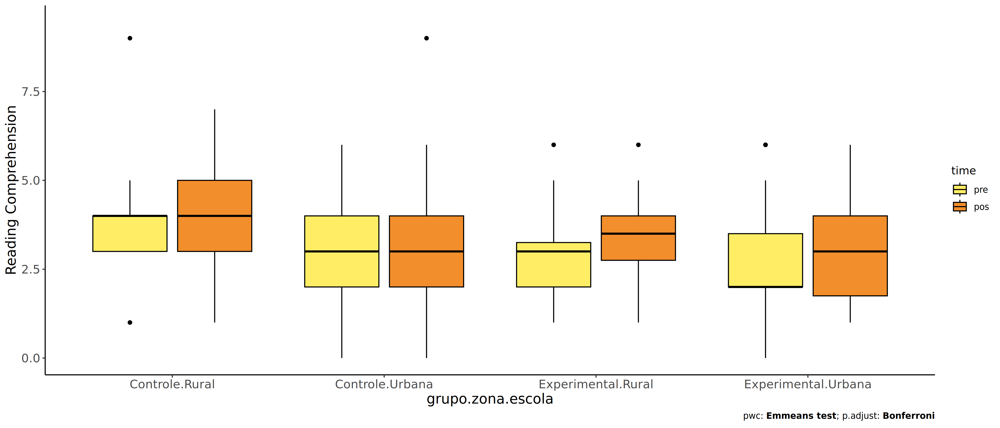<!-- -->

### Checking normality and homogeneity

``` r
if (length(unique(pdat[["zona.escola"]])) >= 2) 
  res <- augment(lm(score.compreensao.pos ~ score.compreensao.pre + grupo*zona.escola, data = wdat))
```

``` r
if (length(unique(pdat[["zona.escola"]])) >= 2)
  shapiro_test(res$.resid)
```

    ## # A tibble: 1 × 3
    ##   variable   statistic p.value
    ##   <chr>          <dbl>   <dbl>
    ## 1 res$.resid     0.984   0.398

``` r
if (length(unique(pdat[["zona.escola"]])) >= 2) 
  levene_test(res, .resid ~ grupo*zona.escola)
```

    ## # A tibble: 1 × 4
    ##     df1   df2 statistic     p
    ##   <int> <int>     <dbl> <dbl>
    ## 1     3    77     0.515 0.673

# ANCOVA and Pairwise for two factors **grupo:score.compreensao.quintile**

## Without remove non-normal data

``` r
pdat = remove_group_data(dat[!is.na(dat[["grupo"]]) & !is.na(dat[["score.compreensao.quintile"]]),],
                         "score.compreensao.pos", c("grupo","score.compreensao.quintile"))
```

    ## Warning: There was 1 warning in `mutate()`.
    ## ℹ In argument: `ci = abs(stats::qt(alpha/2, .data$n - 1) * .data$se)`.
    ## Caused by warning:
    ## ! There was 1 warning in `mutate()`.
    ## ℹ In argument: `ci = abs(stats::qt(alpha/2, .data$n - 1) * .data$se)`.
    ## Caused by warning in `stats::qt()`:
    ## ! NaNs produced

``` r
pdat = pdat[pdat[["score.compreensao.quintile"]] %in% do.call(
  intersect, lapply(unique(pdat[["grupo"]]), FUN = function(x) {
    unique(pdat[["score.compreensao.quintile"]][which(pdat[["grupo"]] == x)])
  })),]
pdat[["grupo"]] = factor(pdat[["grupo"]], level[["grupo"]])
pdat[["score.compreensao.quintile"]] = factor(
  pdat[["score.compreensao.quintile"]],
  level[["score.compreensao.quintile"]][level[["score.compreensao.quintile"]] %in% unique(pdat[["score.compreensao.quintile"]])])

pdat.long <- rbind(pdat[,c("id","grupo","score.compreensao.quintile")], pdat[,c("id","grupo","score.compreensao.quintile")])
pdat.long[["time"]] <- c(rep("pre", nrow(pdat)), rep("pos", nrow(pdat)))
pdat.long[["time"]] <- factor(pdat.long[["time"]], c("pre","pos"))
pdat.long[["score.compreensao"]] <- c(pdat[["score.compreensao.pre"]], pdat[["score.compreensao.pos"]])

if (length(unique(pdat[["score.compreensao.quintile"]])) >= 2) {
  aov = anova_test(pdat, score.compreensao.pos ~ score.compreensao.pre + grupo*score.compreensao.quintile)
  laov[["grupo:score.compreensao.quintile"]] <- get_anova_table(aov)
}
```

``` r
if (length(unique(pdat[["score.compreensao.quintile"]])) >= 2) {
  pwcs <- list()
  pwcs[["score.compreensao.quintile"]] <- emmeans_test(
    group_by(pdat, grupo), score.compreensao.pos ~ score.compreensao.quintile,
    covariate = score.compreensao.pre, p.adjust.method = "bonferroni")
  pwcs[["grupo"]] <- emmeans_test(
    group_by(pdat, score.compreensao.quintile), score.compreensao.pos ~ grupo,
    covariate = score.compreensao.pre, p.adjust.method = "bonferroni")
  
  pwc <- plyr::rbind.fill(pwcs[["grupo"]], pwcs[["score.compreensao.quintile"]])
  pwc <- pwc[,c("grupo","score.compreensao.quintile", colnames(pwc)[!colnames(pwc) %in% c("grupo","score.compreensao.quintile")])]
}
```

``` r
if (length(unique(pdat[["score.compreensao.quintile"]])) >= 2) {
  pwc.long <- emmeans_test(dplyr::group_by_at(pdat.long, c("grupo","score.compreensao.quintile")),
                           score.compreensao ~ time,
                           p.adjust.method = "bonferroni")
  lpwc[["grupo:score.compreensao.quintile"]] <- plyr::rbind.fill(pwc, pwc.long)
}
```

``` r
if (length(unique(pdat[["score.compreensao.quintile"]])) >= 2) {
  ds <- get.descriptives(pdat, "score.compreensao.pos", c("grupo","score.compreensao.quintile"), covar = "score.compreensao.pre")
  ds <- merge(ds[ds$variable != "score.compreensao.pre",],
              ds[ds$variable == "score.compreensao.pre", !colnames(ds) %in% c("variable")],
              by = c("grupo","score.compreensao.quintile"), all.x = T, suffixes = c("", ".score.compreensao.pre"))
  ds <- merge(get_emmeans(pwcs[["grupo"]]), ds,
              by = c("grupo","score.compreensao.quintile"), suffixes = c(".emms", ""))
  ds <- ds[,c("grupo","score.compreensao.quintile","n","mean.score.compreensao.pre","se.score.compreensao.pre","mean","se",
              "emmean","se.emms","conf.low","conf.high")]
  
  colnames(ds) <- c("grupo","score.compreensao.quintile", "N", paste0(c("M","SE")," (pre)"),
                    paste0(c("M","SE"), " (unadj)"),
                    paste0(c("M", "SE"), " (adj)"), "conf.low", "conf.high")
  
  lemms[["grupo:score.compreensao.quintile"]] <- ds
}
```

## Computing ANCOVA and PairWise After removing non-normal data (OK)

``` r
if (length(unique(pdat[["score.compreensao.quintile"]])) >= 2) {
  wdat = pdat 
  
  res = residuals(lm(score.compreensao.pos ~ score.compreensao.pre + grupo*score.compreensao.quintile, data = wdat))
  non.normal = getNonNormal(res, wdat$id, plimit = 0.05)
  
  wdat = wdat[!wdat$id %in% non.normal,]
  
  wdat.long <- rbind(wdat[,c("id","grupo","score.compreensao.quintile")], wdat[,c("id","grupo","score.compreensao.quintile")])
  wdat.long[["time"]] <- c(rep("pre", nrow(wdat)), rep("pos", nrow(wdat)))
  wdat.long[["time"]] <- factor(wdat.long[["time"]], c("pre","pos"))
  wdat.long[["score.compreensao"]] <- c(wdat[["score.compreensao.pre"]], wdat[["score.compreensao.pos"]])
  
  
  ldat[["grupo:score.compreensao.quintile"]] = wdat
  
  (non.normal)
}
```

    ## [1] "P270"

``` r
if (length(unique(pdat[["score.compreensao.quintile"]])) >= 2) {
  aov = anova_test(wdat, score.compreensao.pos ~ score.compreensao.pre + grupo*score.compreensao.quintile)
  laov[["grupo:score.compreensao.quintile"]] <- merge(get_anova_table(aov), laov[["grupo:score.compreensao.quintile"]],
                                         by="Effect", suffixes = c("","'"))
  df = get_anova_table(aov)
}
```

| Effect                           | DFn | DFd |     F |     p | p\<.05 |   ges |
|:---------------------------------|----:|----:|------:|------:|:-------|------:|
| score.compreensao.pre            |   1 |  66 | 0.197 | 0.658 |        | 0.003 |
| grupo                            |   1 |  66 | 0.173 | 0.679 |        | 0.003 |
| score.compreensao.quintile       |   1 |  66 | 0.412 | 0.523 |        | 0.006 |
| grupo:score.compreensao.quintile |   1 |  66 | 0.045 | 0.833 |        | 0.001 |

``` r
if (length(unique(pdat[["score.compreensao.quintile"]])) >= 2) {
  pwcs <- list()
  pwcs[["score.compreensao.quintile"]] <- emmeans_test(
    group_by(wdat, grupo), score.compreensao.pos ~ score.compreensao.quintile,
    covariate = score.compreensao.pre, p.adjust.method = "bonferroni")
  pwcs[["grupo"]] <- emmeans_test(
    group_by(wdat, score.compreensao.quintile), score.compreensao.pos ~ grupo,
    covariate = score.compreensao.pre, p.adjust.method = "bonferroni")
  
  pwc <- plyr::rbind.fill(pwcs[["grupo"]], pwcs[["score.compreensao.quintile"]])
  pwc <- pwc[,c("grupo","score.compreensao.quintile", colnames(pwc)[!colnames(pwc) %in% c("grupo","score.compreensao.quintile")])]
}
```

| grupo        | score.compreensao.quintile | term                                              | .y.                   | group1       | group2       |  df | statistic |     p | p.adj | p.adj.signif |
|:-------------|:---------------------------|:--------------------------------------------------|:----------------------|:-------------|:-------------|----:|----------:|------:|------:|:-------------|
|              | 2nd quintile               | score.compreensao.pre\*grupo                      | score.compreensao.pos | Controle     | Experimental |  66 |     0.210 | 0.834 | 0.834 | ns           |
|              | 3rd quintile               | score.compreensao.pre\*grupo                      | score.compreensao.pos | Controle     | Experimental |  66 |     0.406 | 0.686 | 0.686 | ns           |
| Controle     |                            | score.compreensao.pre\*score.compreensao.quintile | score.compreensao.pos | 2nd quintile | 3rd quintile |  66 |    -0.647 | 0.520 | 0.520 | ns           |
| Experimental |                            | score.compreensao.pre\*score.compreensao.quintile | score.compreensao.pos | 2nd quintile | 3rd quintile |  66 |    -0.292 | 0.771 | 0.771 | ns           |

``` r
if (length(unique(pdat[["score.compreensao.quintile"]])) >= 2) {
  pwc.long <- emmeans_test(dplyr::group_by_at(wdat.long, c("grupo","score.compreensao.quintile")),
                           score.compreensao ~ time,
                           p.adjust.method = "bonferroni")
  lpwc[["grupo:score.compreensao.quintile"]] <- merge(plyr::rbind.fill(pwc, pwc.long),
                                         lpwc[["grupo:score.compreensao.quintile"]],
                                         by=c("grupo","score.compreensao.quintile","term",".y.","group1","group2"),
                                         suffixes = c("","'"))
}
```

| grupo        | score.compreensao.quintile | term | .y.               | group1 | group2 |  df | statistic |     p | p.adj | p.adj.signif |
|:-------------|:---------------------------|:-----|:------------------|:-------|:-------|----:|----------:|------:|------:|:-------------|
| Controle     | 2nd quintile               | time | score.compreensao | pre    | pos    | 134 |    -1.320 | 0.189 | 0.189 | ns           |
| Controle     | 3rd quintile               | time | score.compreensao | pre    | pos    | 134 |     1.356 | 0.177 | 0.177 | ns           |
| Experimental | 2nd quintile               | time | score.compreensao | pre    | pos    | 134 |    -1.381 | 0.170 | 0.170 | ns           |
| Experimental | 3rd quintile               | time | score.compreensao | pre    | pos    | 134 |     2.685 | 0.008 | 0.008 | \*\*         |

``` r
if (length(unique(pdat[["score.compreensao.quintile"]])) >= 2) {
  ds <- get.descriptives(wdat, "score.compreensao.pos", c("grupo","score.compreensao.quintile"), covar = "score.compreensao.pre")
  ds <- merge(ds[ds$variable != "score.compreensao.pre",],
              ds[ds$variable == "score.compreensao.pre", !colnames(ds) %in% c("variable")],
              by = c("grupo","score.compreensao.quintile"), all.x = T, suffixes = c("", ".score.compreensao.pre"))
  ds <- merge(get_emmeans(pwcs[["grupo"]]), ds,
              by = c("grupo","score.compreensao.quintile"), suffixes = c(".emms", ""))
  ds <- ds[,c("grupo","score.compreensao.quintile","n","mean.score.compreensao.pre","se.score.compreensao.pre",
              "mean","se","emmean","se.emms","conf.low","conf.high")]
  
  colnames(ds) <- c("grupo","score.compreensao.quintile", "N", paste0(c("M","SE")," (pre)"),
                    paste0(c("M","SE"), " (unadj)"),
                    paste0(c("M", "SE"), " (adj)"), "conf.low", "conf.high")
  
  lemms[["grupo:score.compreensao.quintile"]] <- merge(ds, lemms[["grupo:score.compreensao.quintile"]],
                                          by=c("grupo","score.compreensao.quintile"), suffixes = c("","'"))
}
```

| grupo        | score.compreensao.quintile |   N | M (pre) | SE (pre) | M (unadj) | SE (unadj) | M (adj) | SE (adj) | conf.low | conf.high |
|:-------------|:---------------------------|----:|--------:|---------:|----------:|-----------:|--------:|---------:|---------:|----------:|
| Controle     | 2nd quintile               |  23 |   2.609 |    0.104 |     3.087 |      0.350 |   3.210 |    0.443 |    2.326 |     4.095 |
| Controle     | 3rd quintile               |  18 |   4.500 |    0.146 |     3.944 |      0.431 |   3.765 |    0.561 |    2.645 |     4.885 |
| Experimental | 2nd quintile               |  21 |   2.429 |    0.111 |     2.952 |      0.320 |   3.105 |    0.498 |    2.111 |     4.099 |
| Experimental | 3rd quintile               |   9 |   5.333 |    0.236 |     3.778 |      0.521 |   3.465 |    0.894 |    1.681 |     5.250 |

### Plots for ancova

``` r
if (length(unique(pdat[["score.compreensao.quintile"]])) >= 2) {
  ggPlotAoC2(pwcs, "grupo", "score.compreensao.quintile", aov, ylab = "Reading Comprehension",
             subtitle = which(aov$Effect == "grupo:score.compreensao.quintile"), addParam = "errorbar") +
    ggplot2::scale_color_manual(values = color[["score.compreensao.quintile"]]) +
    ggplot2::ylab("Reading Comprehension") +
    if (ymin.ci < ymax.ci) ggplot2::ylim(ymin.ci, ymax.ci)
}
```

    ## Scale for colour is already present.
    ## Adding another scale for colour, which will replace the existing scale.

<!-- -->

``` r
if (length(unique(pdat[["score.compreensao.quintile"]])) >= 2) {
  ggPlotAoC2(pwcs, "score.compreensao.quintile", "grupo", aov, ylab = "Reading Comprehension",
               subtitle = which(aov$Effect == "grupo:score.compreensao.quintile"), addParam = "errorbar") +
    ggplot2::scale_color_manual(values = color[["grupo"]]) +
    ggplot2::ylab("Reading Comprehension") +
    if (ymin.ci < ymax.ci) ggplot2::ylim(ymin.ci, ymax.ci)
}
```

    ## Scale for colour is already present.
    ## Adding another scale for colour, which will replace the existing scale.

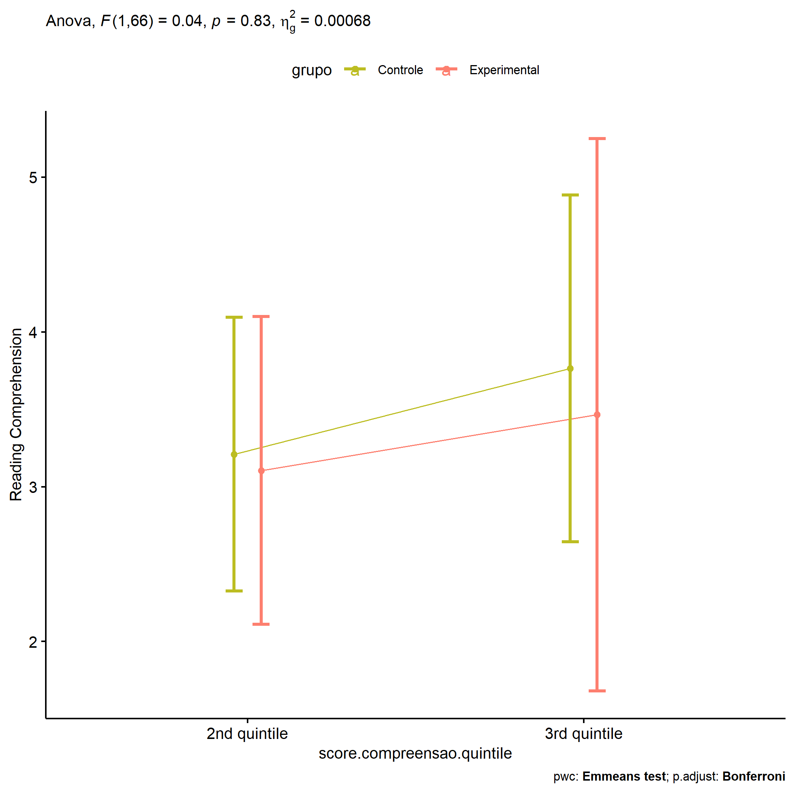<!-- -->

``` r
if (length(unique(pdat[["score.compreensao.quintile"]])) >= 2) {
  plots <- twoWayAncovaBoxPlots(
    wdat, "score.compreensao.pos", c("grupo","score.compreensao.quintile"), aov, pwcs, covar = "score.compreensao.pre",
    theme = "classic", color = color[["grupo:score.compreensao.quintile"]],
    subtitle = which(aov$Effect == "grupo:score.compreensao.quintile"))
}
```

``` r
if (length(unique(pdat[["score.compreensao.quintile"]])) >= 2) {
  plots[["grupo:score.compreensao.quintile"]] + ggplot2::ylab("Reading Comprehension") +
  ggplot2::scale_x_discrete(labels=c('pre', 'pos')) +
  if (ymin < ymax) ggplot2::ylim(ymin, ymax)
}
```

    ## Warning: No shared levels found between `names(values)` of the manual scale and the data's colour
    ## values.

<!-- -->

``` r
if (length(unique(pdat[["score.compreensao.quintile"]])) >= 2) {
  plots <- twoWayAncovaBoxPlots(
    wdat.long, "score.compreensao", c("grupo","score.compreensao.quintile"), aov, pwc.long,
    pre.post = "time",
    theme = "classic", color = color$prepost)
}
```

``` r
if (length(unique(pdat[["score.compreensao.quintile"]])) >= 2) 
  plots[["grupo:score.compreensao.quintile"]] + ggplot2::ylab("Reading Comprehension") +
    if (ymin < ymax) ggplot2::ylim(ymin, ymax)
```

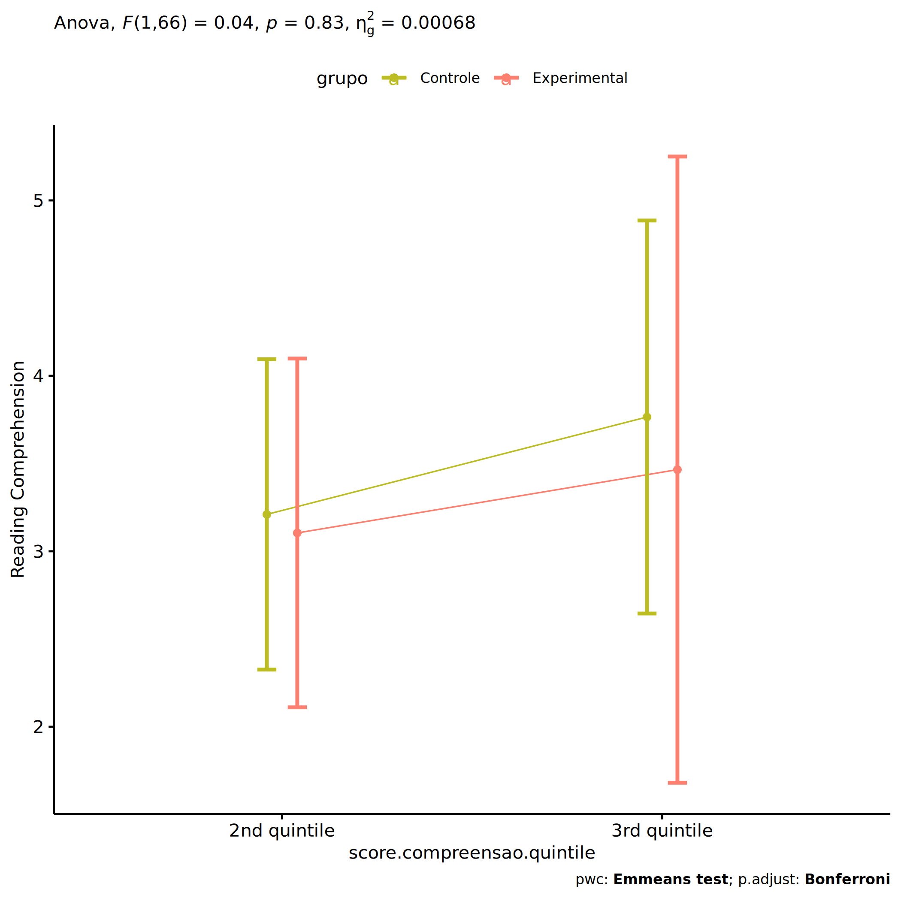<!-- -->

### Checking linearity assumption

``` r
if (length(unique(pdat[["score.compreensao.quintile"]])) >= 2) {
  ggscatter(wdat, x = "score.compreensao.pre", y = "score.compreensao.pos", size = 0.5,
            facet.by = c("grupo","score.compreensao.quintile"), add = "reg.line")+
    stat_regline_equation(
      aes(label =  paste(..eq.label.., ..rr.label.., sep = "~~~~"))
    ) + ggplot2::ylab("Reading Comprehension") +
    if (ymin < ymax) ggplot2::ylim(ymin, ymax)
}
```

<!-- -->

``` r
if (length(unique(pdat[["score.compreensao.quintile"]])) >= 2) {
  ggscatter(wdat, x = "score.compreensao.pre", y = "score.compreensao.pos", size = 0.5,
            color = "grupo", facet.by = "score.compreensao.quintile", add = "reg.line")+
    stat_regline_equation(
      aes(label =  paste(..eq.label.., ..rr.label.., sep = "~~~~"), color = grupo)
    ) +
    ggplot2::labs(subtitle = rstatix::get_test_label(aov, detailed = T, row = which(aov$Effect == "grupo:score.compreensao.quintile"))) +
    ggplot2::scale_color_manual(values = color[["grupo"]]) +
    ggplot2::ylab("Reading Comprehension") +
    if (ymin < ymax) ggplot2::ylim(ymin, ymax)
}
```

<!-- -->

``` r
if (length(unique(pdat[["score.compreensao.quintile"]])) >= 2) {
  ggscatter(wdat, x = "score.compreensao.pre", y = "score.compreensao.pos", size = 0.5,
            color = "score.compreensao.quintile", facet.by = "grupo", add = "reg.line")+
    stat_regline_equation(
      aes(label =  paste(..eq.label.., ..rr.label.., sep = "~~~~"), color = score.compreensao.quintile)
    ) +
    ggplot2::labs(subtitle = rstatix::get_test_label(aov, detailed = T, row = which(aov$Effect == "grupo:score.compreensao.quintile"))) +
    ggplot2::scale_color_manual(values = color[["score.compreensao.quintile"]]) +
    ggplot2::ylab("Reading Comprehension") +
    if (ymin < ymax) ggplot2::ylim(ymin, ymax)
}
```

<!-- -->

### Checking normality and homogeneity

``` r
if (length(unique(pdat[["score.compreensao.quintile"]])) >= 2) 
  res <- augment(lm(score.compreensao.pos ~ score.compreensao.pre + grupo*score.compreensao.quintile, data = wdat))
```

``` r
if (length(unique(pdat[["score.compreensao.quintile"]])) >= 2)
  shapiro_test(res$.resid)
```

    ## # A tibble: 1 × 3
    ##   variable   statistic p.value
    ##   <chr>          <dbl>   <dbl>
    ## 1 res$.resid     0.968  0.0702

``` r
if (length(unique(pdat[["score.compreensao.quintile"]])) >= 2) 
  levene_test(res, .resid ~ grupo*score.compreensao.quintile)
```

    ## # A tibble: 1 × 4
    ##     df1   df2 statistic     p
    ##   <int> <int>     <dbl> <dbl>
    ## 1     3    67     0.141 0.935

# Summary of Results

## Descriptive Statistics

``` r
df <- get.descriptives(ldat[["grupo"]], c(dv.pre, dv.pos), c("grupo"), 
                       include.global = T, symmetry.test = T, normality.test = F)
df <- plyr::rbind.fill(
  df, do.call(plyr::rbind.fill, lapply(lfatores2, FUN = function(f) {
    if (nrow(dat) > 0 && sum(!is.na(unique(dat[[f]]))) > 1 && paste0("grupo:",f) %in% names(ldat))
      get.descriptives(ldat[[paste0("grupo:",f)]], c(dv.pre,dv.pos), c("grupo", f),
                       symmetry.test = T, normality.test = F)
    }))
)
df <- df[,c(fatores1[fatores1 %in% colnames(df)],"variable",
             colnames(df)[!colnames(df) %in% c(fatores1,"variable")])]
```

| grupo        | genero | zona.participante | zona.escola | score.compreensao.quintile | variable              |   n |  mean | median | min | max |    sd |    se |    ci |  iqr | symmetry | skewness | kurtosis |
|:-------------|:-------|:------------------|:------------|:---------------------------|:----------------------|----:|------:|-------:|----:|----:|------:|------:|------:|-----:|:---------|---------:|---------:|
| Controle     |        |                   |             |                            | score.compreensao.pre |  45 | 3.378 |    3.0 |   0 |   9 | 1.527 | 0.228 | 0.459 | 2.00 | NO       |    0.864 |    2.410 |
| Experimental |        |                   |             |                            | score.compreensao.pre |  36 | 2.889 |    2.5 |   0 |   6 | 1.635 | 0.272 | 0.553 | 1.25 | NO       |    0.593 |   -0.681 |
|              |        |                   |             |                            | score.compreensao.pre |  81 | 3.160 |    3.0 |   0 |   9 | 1.585 | 0.176 | 0.350 | 2.00 | NO       |    0.688 |    0.933 |
| Controle     |        |                   |             |                            | score.compreensao.pos |  45 | 3.511 |    3.0 |   0 |   9 | 1.792 | 0.267 | 0.538 | 2.00 | NO       |    0.573 |    0.436 |
| Experimental |        |                   |             |                            | score.compreensao.pos |  36 | 3.028 |    3.0 |   1 |   6 | 1.464 | 0.244 | 0.495 | 2.00 | YES      |    0.219 |   -0.894 |
|              |        |                   |             |                            | score.compreensao.pos |  81 | 3.296 |    3.0 |   0 |   9 | 1.662 | 0.185 | 0.367 | 2.00 | NO       |    0.548 |    0.423 |
| Controle     | F      |                   |             |                            | score.compreensao.pre |  24 | 3.458 |    3.0 |   0 |   9 | 1.744 | 0.356 | 0.736 | 1.25 | NO       |    0.915 |    2.243 |
| Controle     | M      |                   |             |                            | score.compreensao.pre |  21 | 3.286 |    3.0 |   1 |   6 | 1.271 | 0.277 | 0.578 | 2.00 | YES      |    0.321 |   -0.766 |
| Experimental | F      |                   |             |                            | score.compreensao.pre |  17 | 2.882 |    2.0 |   1 |   6 | 1.576 | 0.382 | 0.811 | 1.00 | NO       |    0.992 |   -0.640 |
| Experimental | M      |                   |             |                            | score.compreensao.pre |  19 | 2.895 |    3.0 |   0 |   6 | 1.729 | 0.397 | 0.833 | 2.00 | YES      |    0.275 |   -0.938 |
| Controle     | F      |                   |             |                            | score.compreensao.pos |  24 | 4.208 |    4.0 |   2 |   9 | 1.793 | 0.366 | 0.757 | 2.00 | NO       |    0.654 |    0.015 |
| Controle     | M      |                   |             |                            | score.compreensao.pos |  21 | 2.714 |    3.0 |   0 |   6 | 1.454 | 0.317 | 0.662 | 2.00 | YES      |    0.104 |   -0.626 |
| Experimental | F      |                   |             |                            | score.compreensao.pos |  17 | 3.353 |    3.0 |   1 |   6 | 1.222 | 0.296 | 0.628 | 1.00 | YES      |    0.321 |   -0.312 |
| Experimental | M      |                   |             |                            | score.compreensao.pos |  19 | 2.737 |    2.0 |   1 |   6 | 1.628 | 0.373 | 0.784 | 3.00 | YES      |    0.403 |   -1.261 |
| Controle     |        | Rural             |             |                            | score.compreensao.pre |  12 | 3.417 |    3.5 |   2 |   5 | 0.900 | 0.260 | 0.572 | 1.00 | YES      |   -0.116 |   -1.093 |
| Controle     |        | Urbana            |             |                            | score.compreensao.pre |  23 | 3.696 |    3.0 |   1 |   9 | 1.743 | 0.364 | 0.754 | 2.50 | NO       |    1.040 |    1.376 |
| Experimental |        | Rural             |             |                            | score.compreensao.pre |  14 | 3.357 |    3.0 |   1 |   6 | 1.865 | 0.498 | 1.077 | 3.00 | YES      |    0.307 |   -1.605 |
| Experimental |        | Urbana            |             |                            | score.compreensao.pre |  12 | 2.167 |    2.0 |   0 |   6 | 1.467 | 0.423 | 0.932 | 0.50 | NO       |    1.165 |    1.368 |
| Controle     |        | Rural             |             |                            | score.compreensao.pos |  12 | 3.667 |    4.0 |   2 |   5 | 0.985 | 0.284 | 0.626 | 1.00 | YES      |   -0.427 |   -1.031 |
| Controle     |        | Urbana            |             |                            | score.compreensao.pos |  23 | 4.000 |    4.0 |   1 |   9 | 2.067 | 0.431 | 0.894 | 3.50 | YES      |    0.443 |   -0.576 |
| Experimental |        | Rural             |             |                            | score.compreensao.pos |  14 | 3.143 |    3.0 |   1 |   6 | 1.351 | 0.361 | 0.780 | 2.00 | YES      |    0.458 |   -0.680 |
| Experimental |        | Urbana            |             |                            | score.compreensao.pos |  12 | 2.917 |    3.0 |   1 |   5 | 1.443 | 0.417 | 0.917 | 2.25 | YES      |   -0.035 |   -1.433 |
| Controle     |        |                   | Rural       |                            | score.compreensao.pre |  13 | 4.000 |    4.0 |   1 |   9 | 1.826 | 0.506 | 1.103 | 1.00 | NO       |    1.213 |    1.929 |
| Controle     |        |                   | Urbana      |                            | score.compreensao.pre |  32 | 3.125 |    3.0 |   0 |   6 | 1.338 | 0.237 | 0.482 | 2.00 | YES      |    0.093 |   -0.434 |
| Experimental |        |                   | Rural       |                            | score.compreensao.pre |  12 | 3.000 |    3.0 |   1 |   6 | 1.414 | 0.408 | 0.899 | 1.25 | NO       |    0.707 |   -0.542 |
| Experimental |        |                   | Urbana      |                            | score.compreensao.pre |  24 | 2.833 |    2.0 |   0 |   6 | 1.761 | 0.359 | 0.744 | 1.50 | NO       |    0.563 |   -0.915 |
| Controle     |        |                   | Rural       |                            | score.compreensao.pos |  13 | 3.923 |    4.0 |   1 |   7 | 1.605 | 0.445 | 0.970 | 2.00 | YES      |    0.114 |   -0.686 |
| Controle     |        |                   | Urbana      |                            | score.compreensao.pos |  32 | 3.344 |    3.0 |   0 |   9 | 1.860 | 0.329 | 0.671 | 2.00 | NO       |    0.763 |    0.758 |
| Experimental |        |                   | Rural       |                            | score.compreensao.pos |  12 | 3.417 |    3.5 |   1 |   6 | 1.379 | 0.398 | 0.876 | 1.25 | YES      |    0.063 |   -0.844 |
| Experimental |        |                   | Urbana      |                            | score.compreensao.pos |  24 | 2.833 |    3.0 |   1 |   6 | 1.494 | 0.305 | 0.631 | 2.25 | YES      |    0.347 |   -0.976 |
| Controle     |        |                   |             | 2nd quintile               | score.compreensao.pre |  23 | 2.609 |    3.0 |   2 |   3 | 0.499 | 0.104 | 0.216 | 1.00 | few data |    0.000 |    0.000 |
| Controle     |        |                   |             | 3rd quintile               | score.compreensao.pre |  18 | 4.500 |    4.0 |   4 |   6 | 0.618 | 0.146 | 0.307 | 1.00 | few data |    0.000 |    0.000 |
| Experimental |        |                   |             | 2nd quintile               | score.compreensao.pre |  21 | 2.429 |    2.0 |   2 |   3 | 0.507 | 0.111 | 0.231 | 1.00 | few data |    0.000 |    0.000 |
| Experimental |        |                   |             | 3rd quintile               | score.compreensao.pre |   9 | 5.333 |    5.0 |   4 |   6 | 0.707 | 0.236 | 0.544 | 1.00 | few data |    0.000 |    0.000 |
| Controle     |        |                   |             | 2nd quintile               | score.compreensao.pos |  23 | 3.087 |    3.0 |   0 |   6 | 1.676 | 0.350 | 0.725 | 2.00 | YES      |    0.202 |   -0.866 |
| Controle     |        |                   |             | 3rd quintile               | score.compreensao.pos |  18 | 3.944 |    4.0 |   1 |   9 | 1.830 | 0.431 | 0.910 | 2.00 | NO       |    0.838 |    0.944 |
| Experimental |        |                   |             | 2nd quintile               | score.compreensao.pos |  21 | 2.952 |    3.0 |   1 |   6 | 1.465 | 0.320 | 0.667 | 2.00 | YES      |    0.169 |   -0.930 |
| Experimental |        |                   |             | 3rd quintile               | score.compreensao.pos |   9 | 3.778 |    4.0 |   1 |   6 | 1.563 | 0.521 | 1.202 | 2.00 | YES      |   -0.374 |   -1.164 |

## ANCOVA Table Comparison

``` r
df <- do.call(plyr::rbind.fill, laov)
df <- df[!duplicated(df$Effect),]
```

|     | Effect                           | DFn | DFd |      F |     p | p\<.05 |   ges | DFn’ | DFd’ |     F’ |    p’ | p\<.05’ |  ges’ |
|:----|:---------------------------------|----:|----:|-------:|------:|:-------|------:|-----:|-----:|-------:|------:|:--------|------:|
| 1   | grupo                            |   1 |  78 |  0.756 | 0.387 |        | 0.010 |    1 |   79 |  0.157 | 0.693 |         | 0.002 |
| 2   | score.compreensao.pre            |   1 |  78 | 10.330 | 0.002 | \*     | 0.117 |    1 |   79 |  7.451 | 0.008 | \*      | 0.086 |
| 3   | genero                           |   1 |  76 | 10.703 | 0.002 | \*     | 0.123 |    1 |   77 | 11.788 | 0.001 | \*      | 0.133 |
| 5   | grupo:genero                     |   1 |  76 |  1.524 | 0.221 |        | 0.020 |    1 |   77 |  0.471 | 0.494 |         | 0.006 |
| 8   | grupo:zona.participante          |   1 |  56 |  0.001 | 0.970 |        | 0.000 |    1 |   57 |  0.265 | 0.609 |         | 0.005 |
| 10  | zona.participante                |   1 |  56 |  0.341 | 0.561 |        | 0.006 |    1 |   57 |  0.003 | 0.955 |         | 0.000 |
| 12  | grupo:zona.escola                |   1 |  76 |  0.105 | 0.747 |        | 0.001 |    1 |   77 |  0.001 | 0.972 |         | 0.000 |
| 14  | zona.escola                      |   1 |  76 |  1.061 | 0.306 |        | 0.014 |    1 |   77 |  0.474 | 0.493 |         | 0.006 |
| 16  | grupo:score.compreensao.quintile |   1 |  66 |  0.045 | 0.833 |        | 0.001 |    1 |   67 |  0.125 | 0.725 |         | 0.002 |
| 18  | score.compreensao.quintile       |   1 |  66 |  0.412 | 0.523 |        | 0.006 |    1 |   67 |  0.687 | 0.410 |         | 0.010 |

## PairWise Table Comparison

``` r
df <- do.call(plyr::rbind.fill, lpwc)
df <- df[,c(names(lfatores)[names(lfatores) %in% colnames(df)],
            names(df)[!names(df) %in% c(names(lfatores),"term",".y.")])]
```

| grupo        | genero | zona.participante | zona.escola | score.compreensao.quintile | group1       | group2       |  df | statistic |     p | p.adj | p.adj.signif | df’ | statistic’ |    p’ | p.adj’ | p.adj.signif’ |
|:-------------|:-------|:------------------|:------------|:---------------------------|:-------------|:-------------|----:|----------:|------:|------:|:-------------|----:|-----------:|------:|-------:|:--------------|
| Controle     |        |                   |             |                            | pre          | pos          | 158 |    -0.391 | 0.696 | 0.696 | ns           | 160 |     -0.378 | 0.706 |  0.706 | ns            |
| Experimental |        |                   |             |                            | pre          | pos          | 158 |    -0.365 | 0.716 | 0.716 | ns           | 160 |     -0.834 | 0.406 |  0.406 | ns            |
|              |        |                   |             |                            | Controle     | Experimental |  78 |     0.869 | 0.387 | 0.387 | ns           |  79 |      0.397 | 0.693 |  0.693 | ns            |
| Controle     | F      |                   |             |                            | pre          | pos          | 154 |    -1.646 | 0.102 | 0.102 | ns           | 156 |     -1.594 | 0.113 |  0.113 | ns            |
| Controle     | M      |                   |             |                            | pre          | pos          | 154 |     1.173 | 0.243 | 0.243 | ns           | 156 |      1.136 | 0.258 |  0.258 | ns            |
| Controle     |        |                   |             |                            | F            | M            |  76 |     3.261 | 0.002 | 0.002 | \*\*         |  77 |      3.002 | 0.004 |  0.004 | \*\*          |
| Experimental | F      |                   |             |                            | pre          | pos          | 154 |    -0.869 | 0.386 | 0.386 | ns           | 156 |     -1.534 | 0.127 |  0.127 | ns            |
| Experimental | M      |                   |             |                            | pre          | pos          | 154 |     0.308 | 0.758 | 0.758 | ns           | 156 |      0.299 | 0.766 |  0.766 | ns            |
| Experimental |        |                   |             |                            | F            | M            |  76 |     1.263 | 0.210 | 0.210 | ns           |  77 |      1.801 | 0.076 |  0.076 | ns            |
|              | F      |                   |             |                            | Controle     | Experimental |  76 |     1.396 | 0.167 | 0.167 | ns           |  77 |      0.677 | 0.501 |  0.501 | ns            |
|              | M      |                   |             |                            | Controle     | Experimental |  76 |    -0.337 | 0.737 | 0.737 | ns           |  77 |     -0.290 | 0.773 |  0.773 | ns            |
| Controle     |        |                   |             |                            | Rural        | Urbana       |  56 |    -0.410 | 0.683 | 0.683 | ns           |  57 |     -0.389 | 0.699 |  0.699 | ns            |
| Controle     |        | Rural             |             |                            | pre          | pos          | 114 |    -0.380 | 0.705 | 0.705 | ns           | 116 |     -0.363 | 0.717 |  0.717 | ns            |
| Controle     |        | Urbana            |             |                            | pre          | pos          | 114 |    -0.641 | 0.523 | 0.523 | ns           | 116 |     -0.612 | 0.542 |  0.542 | ns            |
| Experimental |        |                   |             |                            | Rural        | Urbana       |  56 |    -0.411 | 0.683 | 0.683 | ns           |  57 |      0.347 | 0.730 |  0.730 | ns            |
| Experimental |        | Rural             |             |                            | pre          | pos          | 114 |     0.352 | 0.726 | 0.726 | ns           | 116 |     -0.433 | 0.666 |  0.666 | ns            |
| Experimental |        | Urbana            |             |                            | pre          | pos          | 114 |    -1.140 | 0.257 | 0.257 | ns           | 116 |     -1.090 | 0.278 |  0.278 | ns            |
|              |        | Rural             |             |                            | Controle     | Experimental |  56 |     0.841 | 0.404 | 0.404 | ns           |  57 |      0.123 | 0.902 |  0.902 | ns            |
|              |        | Urbana            |             |                            | Controle     | Experimental |  56 |     0.821 | 0.415 | 0.415 | ns           |  57 |      0.859 | 0.394 |  0.394 | ns            |
| Controle     |        |                   |             |                            | Rural        | Urbana       |  76 |     0.528 | 0.599 | 0.599 | ns           |  77 |      0.524 | 0.602 |  0.602 | ns            |
| Controle     |        |                   | Rural       |                            | pre          | pos          | 154 |     0.122 | 0.903 | 0.903 | ns           | 156 |      0.117 | 0.907 |  0.907 | ns            |
| Controle     |        |                   | Urbana      |                            | pre          | pos          | 154 |    -0.543 | 0.588 | 0.588 | ns           | 156 |     -0.523 | 0.602 |  0.602 | ns            |
| Experimental |        |                   |             |                            | Rural        | Urbana       |  76 |     0.945 | 0.348 | 0.348 | ns           |  77 |      0.452 | 0.653 |  0.653 | ns            |
| Experimental |        |                   | Rural       |                            | pre          | pos          | 154 |    -0.634 | 0.527 | 0.527 | ns           | 156 |     -0.610 | 0.543 |  0.543 | ns            |
| Experimental |        |                   | Urbana      |                            | pre          | pos          | 154 |     0.000 | 1.000 | 1.000 | ns           | 156 |     -0.592 | 0.555 |  0.555 | ns            |
|              |        |                   | Rural       |                            | Controle     | Experimental |  76 |     0.254 | 0.800 | 0.800 | ns           |  77 |      0.271 | 0.787 |  0.787 | ns            |
|              |        |                   | Urbana      |                            | Controle     | Experimental |  76 |     0.962 | 0.339 | 0.339 | ns           |  77 |      0.349 | 0.728 |  0.728 | ns            |
| Controle     |        |                   |             | 2nd quintile               | pre          | pos          | 134 |    -1.320 | 0.189 | 0.189 | ns           | 136 |     -1.227 | 0.222 |  0.222 | ns            |
| Controle     |        |                   |             | 3rd quintile               | pre          | pos          | 134 |     1.356 | 0.177 | 0.177 | ns           | 136 |      1.261 | 0.209 |  0.209 | ns            |
| Controle     |        |                   |             |                            | 2nd quintile | 3rd quintile |  66 |    -0.647 | 0.520 | 0.520 | ns           |  67 |     -0.837 | 0.405 |  0.405 | ns            |
| Experimental |        |                   |             | 2nd quintile               | pre          | pos          | 134 |    -1.381 | 0.170 | 0.170 | ns           | 136 |     -2.054 | 0.042 |  0.042 | \*            |
| Experimental |        |                   |             | 3rd quintile               | pre          | pos          | 134 |     2.685 | 0.008 | 0.008 | \*\*         | 136 |      2.497 | 0.014 |  0.014 | \*            |
| Experimental |        |                   |             |                            | 2nd quintile | 3rd quintile |  66 |    -0.292 | 0.771 | 0.771 | ns           |  67 |     -0.318 | 0.752 |  0.752 | ns            |
|              |        |                   |             | 2nd quintile               | Controle     | Experimental |  66 |     0.210 | 0.834 | 0.834 | ns           |  67 |     -0.275 | 0.784 |  0.784 | ns            |
|              |        |                   |             | 3rd quintile               | Controle     | Experimental |  66 |     0.406 | 0.686 | 0.686 | ns           |  67 |      0.252 | 0.802 |  0.802 | ns            |

## EMMS Table Comparison

``` r
df <- do.call(plyr::rbind.fill, lemms)
df[["N-N'"]] <- df[["N"]] - df[["N'"]]
df <- df[,c(names(lfatores)[names(lfatores) %in% colnames(df)],
            names(df)[!names(df) %in% names(lfatores)])]
```

| grupo        | genero | zona.participante | zona.escola | score.compreensao.quintile |   N | M (pre) | SE (pre) | M (unadj) | SE (unadj) | M (adj) | SE (adj) | conf.low | conf.high |  N’ | M (pre)’ | SE (pre)’ | M (unadj)’ | SE (unadj)’ | M (adj)’ | SE (adj)’ | conf.low’ | conf.high’ | N-N’ |
|:-------------|:-------|:------------------|:------------|:---------------------------|----:|--------:|---------:|----------:|-----------:|--------:|---------:|---------:|----------:|----:|---------:|----------:|-----------:|------------:|---------:|----------:|----------:|-----------:|-----:|
| Controle     |        |                   |             |                            |  45 |   3.378 |    0.228 |     3.511 |      0.267 |   3.433 |    0.234 |    2.966 |     3.900 |  45 |    3.378 |     0.228 |      3.511 |       0.267 |    3.434 |     0.256 |     2.926 |      3.943 |    0 |
| Experimental |        |                   |             |                            |  36 |   2.889 |    0.272 |     3.028 |      0.244 |   3.125 |    0.263 |    2.603 |     3.648 |  37 |    2.865 |     0.266 |      3.189 |       0.287 |    3.282 |     0.282 |     2.721 |      3.844 |   -1 |
| Controle     | F      |                   |             |                            |  24 |   3.458 |    0.356 |     4.208 |      0.366 |   4.105 |    0.302 |    3.504 |     4.707 |  24 |    3.458 |     0.356 |      4.208 |       0.366 |    4.108 |     0.329 |     3.453 |      4.764 |    0 |
| Controle     | M      |                   |             |                            |  21 |   3.286 |    0.277 |     2.714 |      0.317 |   2.671 |    0.321 |    2.031 |     3.311 |  21 |    3.286 |     0.277 |      2.714 |       0.317 |    2.670 |     0.350 |     1.973 |      3.367 |    0 |
| Experimental | F      |                   |             |                            |  17 |   2.882 |    0.382 |     3.353 |      0.296 |   3.449 |    0.358 |    2.736 |     4.162 |  18 |    2.833 |     0.364 |      3.667 |       0.420 |    3.767 |     0.379 |     3.011 |      4.522 |   -1 |
| Experimental | M      |                   |             |                            |  19 |   2.895 |    0.397 |     2.737 |      0.373 |   2.829 |    0.339 |    2.154 |     3.503 |  19 |    2.895 |     0.397 |      2.737 |       0.373 |    2.817 |     0.369 |     2.083 |      3.552 |    0 |
| Controle     |        | Rural             |             |                            |  12 |   3.417 |    0.260 |     3.667 |      0.284 |   3.605 |    0.437 |    2.730 |     4.480 |  12 |    3.417 |     0.260 |      3.667 |       0.284 |    3.606 |     0.493 |     2.619 |      4.593 |    0 |
| Controle     |        | Urbana            |             |                            |  23 |   3.696 |    0.364 |     4.000 |      0.431 |   3.826 |    0.320 |    3.185 |     4.467 |  23 |    3.696 |     0.364 |      4.000 |       0.431 |    3.843 |     0.361 |     3.119 |      4.566 |    0 |
| Experimental |        | Rural             |             |                            |  14 |   3.357 |    0.498 |     3.143 |      0.361 |   3.105 |    0.404 |    2.295 |     3.914 |  15 |    3.267 |     0.473 |      3.533 |       0.515 |    3.525 |     0.440 |     2.643 |      4.406 |   -1 |
| Experimental |        | Urbana            |             |                            |  12 |   2.167 |    0.423 |     2.917 |      0.417 |   3.357 |    0.458 |    2.440 |     4.273 |  12 |    2.167 |     0.423 |      2.917 |       0.417 |    3.289 |     0.515 |     2.258 |      4.321 |    0 |
| Controle     |        |                   | Rural       |                            |  13 |   4.000 |    0.506 |     3.923 |      0.445 |   3.634 |    0.447 |    2.745 |     4.524 |  13 |    4.000 |     0.506 |      3.923 |       0.445 |    3.653 |     0.489 |     2.679 |      4.626 |    0 |
| Controle     |        |                   | Urbana      |                            |  32 |   3.125 |    0.237 |     3.344 |      0.329 |   3.356 |    0.278 |    2.802 |     3.910 |  32 |    3.125 |     0.237 |      3.344 |       0.329 |    3.351 |     0.304 |     2.745 |      3.956 |    0 |
| Experimental |        |                   | Rural       |                            |  12 |   3.000 |    0.408 |     3.417 |      0.398 |   3.472 |    0.454 |    2.567 |     4.377 |  12 |    3.000 |     0.408 |      3.417 |       0.398 |    3.463 |     0.497 |     2.473 |      4.453 |    0 |
| Experimental |        |                   | Urbana      |                            |  24 |   2.833 |    0.359 |     2.833 |      0.305 |   2.946 |    0.323 |    2.302 |     3.590 |  25 |    2.800 |     0.346 |      3.080 |       0.383 |    3.190 |     0.347 |     2.499 |      3.880 |   -1 |
| Controle     |        |                   |             | 2nd quintile               |  23 |   2.609 |    0.104 |     3.087 |      0.350 |   3.210 |    0.443 |    2.326 |     4.095 |  23 |    2.609 |     0.104 |      3.087 |       0.350 |    3.119 |     0.475 |     2.170 |      4.068 |    0 |
| Controle     |        |                   |             | 3rd quintile               |  18 |   4.500 |    0.146 |     3.944 |      0.431 |   3.765 |    0.561 |    2.645 |     4.885 |  18 |    4.500 |     0.146 |      3.944 |       0.431 |    3.896 |     0.613 |     2.673 |      5.120 |    0 |
| Experimental |        |                   |             | 2nd quintile               |  21 |   2.429 |    0.111 |     2.952 |      0.320 |   3.105 |    0.498 |    2.111 |     4.099 |  22 |    2.409 |     0.107 |      3.227 |       0.411 |    3.268 |     0.533 |     2.204 |      4.331 |   -1 |
| Experimental |        |                   |             | 3rd quintile               |   9 |   5.333 |    0.236 |     3.778 |      0.521 |   3.465 |    0.894 |    1.681 |     5.250 |   9 |    5.333 |     0.236 |      3.778 |       0.521 |    3.694 |     0.973 |     1.751 |      5.637 |    0 |
