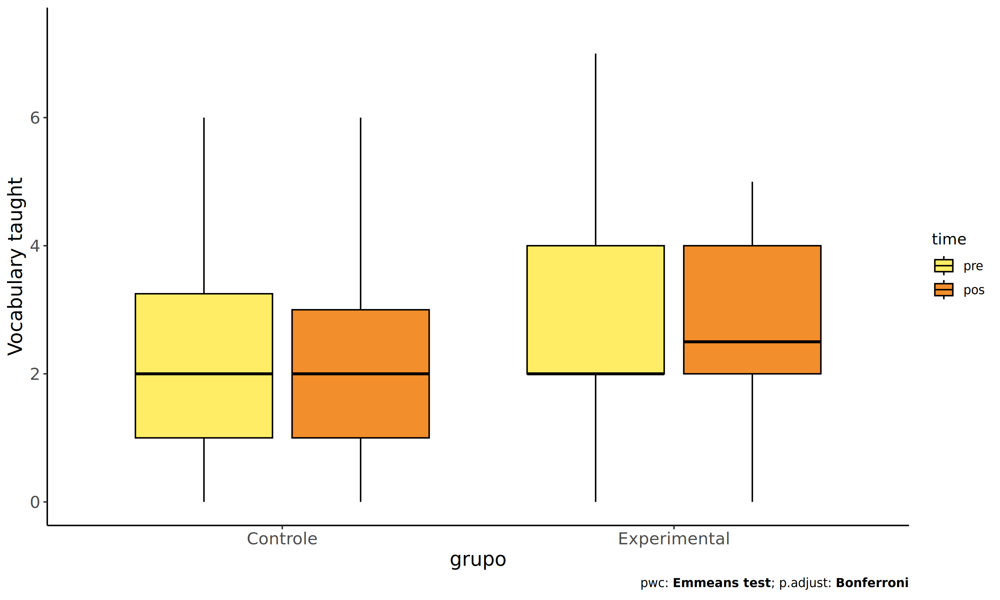
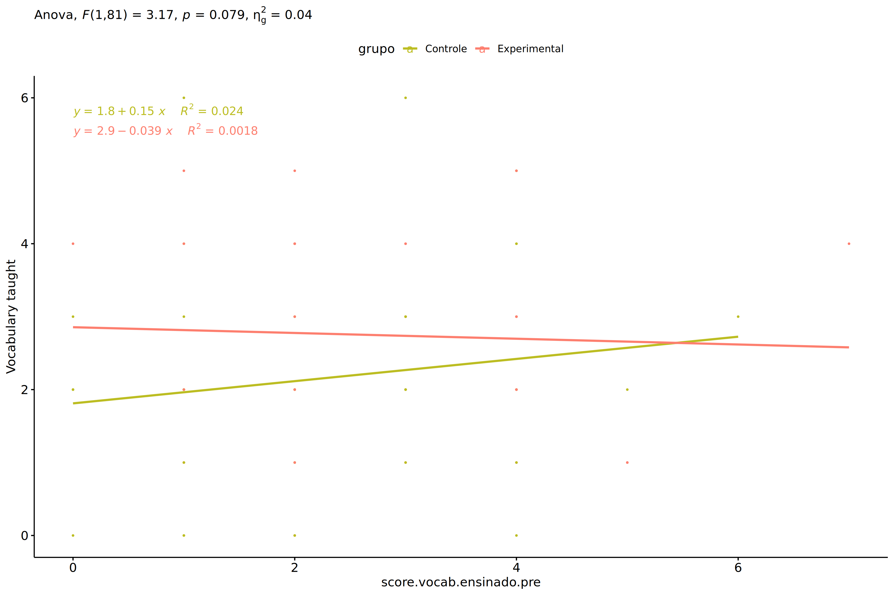
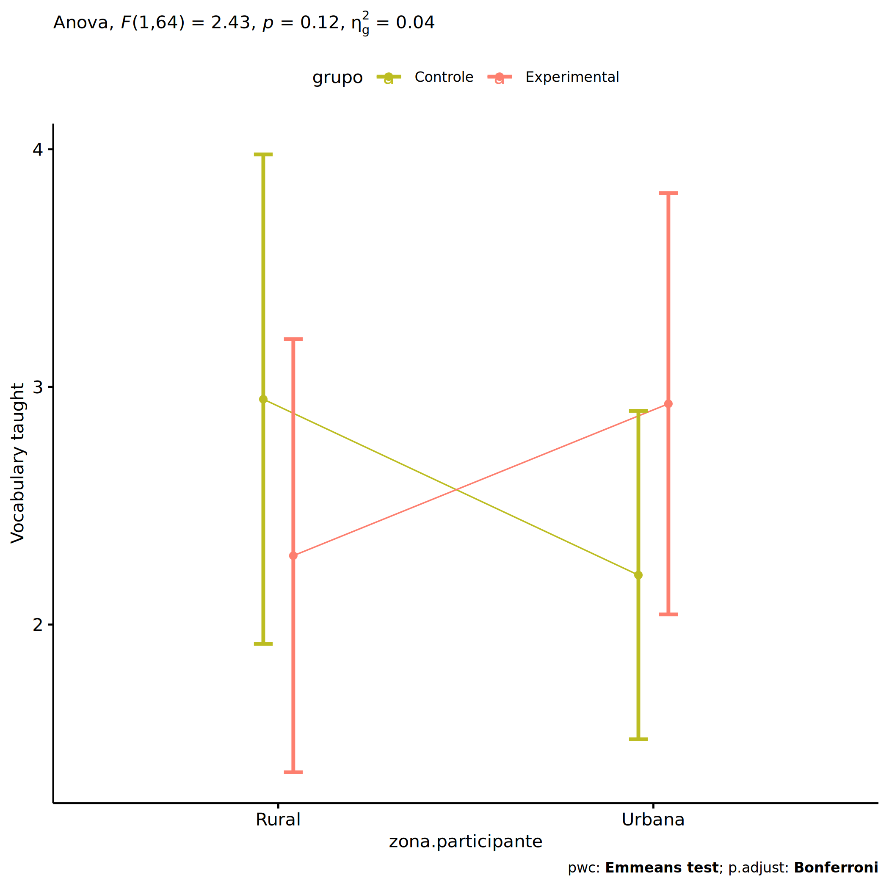
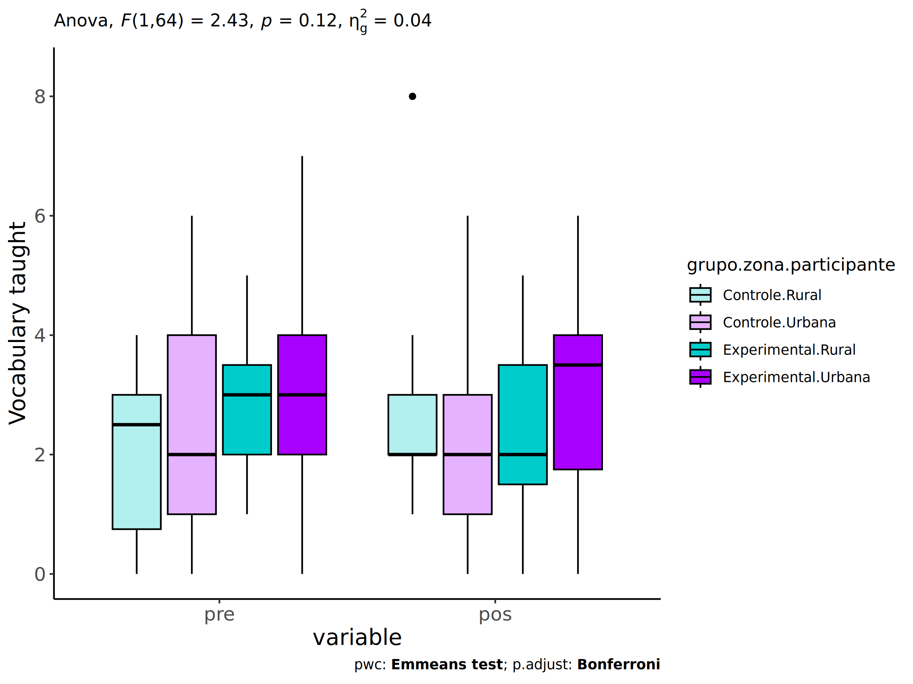
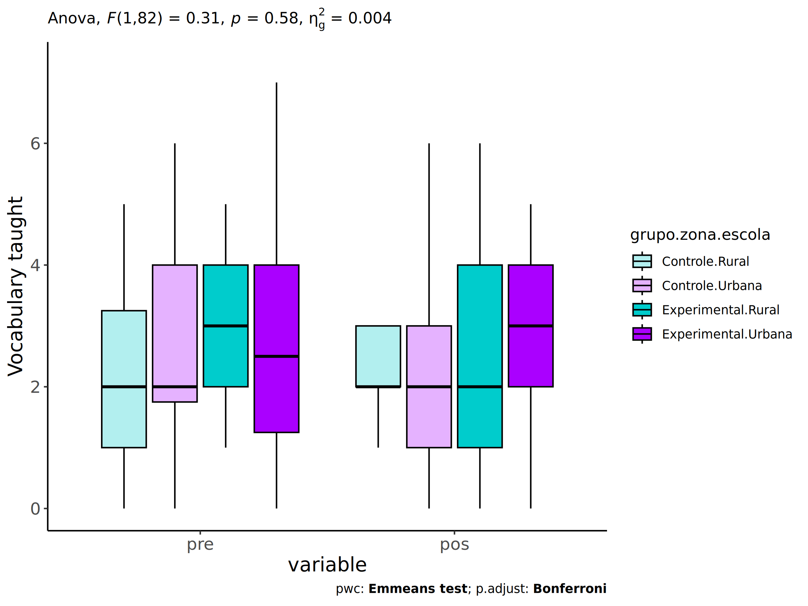
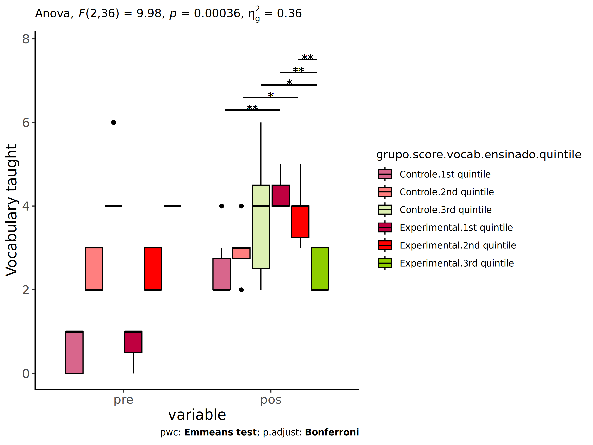

ANCOVA in Vocabulary taught (Vocabulary taught)
================
Geiser C. Challco <geiser@alumni.usp.br>

- [Setting Initial Variables](#setting-initial-variables)
- [Descriptive Statistics of Initial
  Data](#descriptive-statistics-of-initial-data)
- [ANCOVA and Pairwise for one factor:
  **grupo**](#ancova-and-pairwise-for-one-factor-grupo)
  - [Without remove non-normal data](#without-remove-non-normal-data)
  - [Computing ANCOVA and PairWise After removing non-normal data
    (OK)](#computing-ancova-and-pairwise-after-removing-non-normal-data-ok)
    - [Plots for ancova](#plots-for-ancova)
    - [Checking linearity assumption](#checking-linearity-assumption)
    - [Checking normality and
      homogeneity](#checking-normality-and-homogeneity)
- [ANCOVA and Pairwise for two factors
  **grupo:genero**](#ancova-and-pairwise-for-two-factors-grupogenero)
  - [Without remove non-normal data](#without-remove-non-normal-data-1)
  - [Computing ANCOVA and PairWise After removing non-normal data
    (OK)](#computing-ancova-and-pairwise-after-removing-non-normal-data-ok-1)
    - [Plots for ancova](#plots-for-ancova-1)
    - [Checking linearity assumption](#checking-linearity-assumption-1)
    - [Checking normality and
      homogeneity](#checking-normality-and-homogeneity-1)
- [ANCOVA and Pairwise for two factors
  **grupo:zona.participante**](#ancova-and-pairwise-for-two-factors-grupozonaparticipante)
  - [Without remove non-normal data](#without-remove-non-normal-data-2)
  - [Computing ANCOVA and PairWise After removing non-normal data
    (OK)](#computing-ancova-and-pairwise-after-removing-non-normal-data-ok-2)
    - [Plots for ancova](#plots-for-ancova-2)
    - [Checking linearity assumption](#checking-linearity-assumption-2)
    - [Checking normality and
      homogeneity](#checking-normality-and-homogeneity-2)
- [ANCOVA and Pairwise for two factors
  **grupo:zona.escola**](#ancova-and-pairwise-for-two-factors-grupozonaescola)
  - [Without remove non-normal data](#without-remove-non-normal-data-3)
  - [Computing ANCOVA and PairWise After removing non-normal data
    (OK)](#computing-ancova-and-pairwise-after-removing-non-normal-data-ok-3)
    - [Plots for ancova](#plots-for-ancova-3)
    - [Checking linearity assumption](#checking-linearity-assumption-3)
    - [Checking normality and
      homogeneity](#checking-normality-and-homogeneity-3)
- [ANCOVA and Pairwise for two factors
  **grupo:score.vocab.ensinado.quintile**](#ancova-and-pairwise-for-two-factors-gruposcorevocabensinadoquintile)
  - [Without remove non-normal data](#without-remove-non-normal-data-4)
  - [Computing ANCOVA and PairWise After removing non-normal data
    (OK)](#computing-ancova-and-pairwise-after-removing-non-normal-data-ok-4)
    - [Plots for ancova](#plots-for-ancova-4)
    - [Checking linearity assumption](#checking-linearity-assumption-4)
    - [Checking normality and
      homogeneity](#checking-normality-and-homogeneity-4)
- [Summary of Results](#summary-of-results)
  - [Descriptive Statistics](#descriptive-statistics)
  - [ANCOVA Table Comparison](#ancova-table-comparison)
  - [PairWise Table Comparison](#pairwise-table-comparison)
  - [EMMS Table Comparison](#emms-table-comparison)

**NOTE**:

- Teste ANCOVA para determinar se houve diferenças significativas no
  Vocabulary taught (medido usando pre- e pos-testes).
- ANCOVA test to determine whether there were significant differences in
  Vocabulary taught (measured using pre- and post-tests).

# Setting Initial Variables

``` r
dv = "score.vocab.ensinado"
dv.pos = "score.vocab.ensinado.pos"
dv.pre = "score.vocab.ensinado.pre"

fatores2 <- c("genero","zona.participante","zona.escola","score.vocab.ensinado.quintile")
lfatores2 <- as.list(fatores2)
names(lfatores2) <- fatores2

fatores1 <- c("grupo", fatores2)
lfatores1 <- as.list(fatores1)
names(lfatores1) <- fatores1

lfatores <- c(lfatores1)

color <- list()
color[["prepost"]] = c("#ffee65","#f28e2B")
color[["grupo"]] = c("#bcbd22","#fd7f6f")
color[["genero"]] = c("#FF007F","#4D4DFF")
color[["zona.escola"]] = c("#AA00FF","#00CCCC")
color[["zona.participante"]] = c("#AA00FF","#00CCCC")

level <- list()
level[["grupo"]] = c("Controle","Experimental")
level[["genero"]] = c("F","M")
level[["zona.escola"]] = c("Rural","Urbana")
level[["zona.participante"]] = c("Rural","Urbana")

# ..

ymin <- 0
ymax <- 0

ymin.ci <- 0
ymax.ci <- 0


color[["grupo:genero"]] = c(
  "Controle:F"="#ff99cb", "Controle:M"="#b7b7ff",
  "Experimental:F"="#FF007F", "Experimental:M"="#4D4DFF",
  "Controle.F"="#ff99cb", "Controle.M"="#b7b7ff",
  "Experimental.F"="#FF007F", "Experimental.M"="#4D4DFF"
)
color[["grupo:zona.escola"]] = c(
  "Controle:Rural"="#b2efef","Controle:Urbana"="#e5b2ff",
  "Experimental:Rural"="#00CCCC", "Experimental:Urbana"="#AA00FF",
  "Controle.Rural"="#b2efef","Controle.Urbana"="#e5b2ff",
  "Experimental.Rural"="#00CCCC", "Experimental.Urbana"="#AA00FF"
)
color[["grupo:zona.participante"]] = c(
  "Controle:Rural"="#b2efef","Controle:Urbana"="#e5b2ff",
  "Experimental:Rural"="#00CCCC", "Experimental:Urbana"="#AA00FF",
  "Controle.Rural"="#b2efef","Controle.Urbana"="#e5b2ff",
  "Experimental.Rural"="#00CCCC", "Experimental.Urbana"="#AA00FF"
)

for (coln in c(
  "palavras.lidas","score.compreensao","tri.compreensao",
  "score.vocab","tri.vocab",
  "score.vocab.ensinado","tri.vocab.ensinado","score.vocab.nao.ensinado","tri.vocab.nao.ensinado",
  "score.CLPP","tri.CLPP","score.CR","tri.CR",
  "score.CI","tri.CI","score.TV","tri.TV","score.TF","tri.TF","score.TO","tri.TO")) {
  color[[paste0(coln,".quintile")]] = c("#BF0040","#FF0000","#800080","#0000FF","#4000BF")
  level[[paste0(coln,".quintile")]] = c("1st quintile","2nd quintile","3rd quintile","4th quintile","5th quintile")
  color[[paste0("grupo:",coln,".quintile")]] = c(
    "Experimental.1st quintile"="#BF0040", "Controle.1st quintile"="#d8668c",
    "Experimental.2nd quintile"="#FF0000", "Controle.2nd quintile"="#ff7f7f",
    "Experimental.3rd quintile"="#8fce00", "Controle.3rd quintile"="#ddf0b2",
    "Experimental.4th quintile"="#0000FF", "Controle.4th quintile"="#b2b2ff",
    "Experimental.5th quintile"="#4000BF", "Controle.5th quintile"="#b299e5",
    
    "Experimental:1st quintile"="#BF0040", "Controle:1st quintile"="#d8668c",
    "Experimental:2nd quintile"="#FF0000", "Controle:2nd quintile"="#ff7f7f",
    "Experimental:3rd quintile"="#8fce00", "Controle:3rd quintile"="#ddf0b2",
    "Experimental:4th quintile"="#0000FF", "Controle:4th quintile"="#b2b2ff",
    "Experimental:5th quintile"="#4000BF", "Controle:5th quintile"="#b299e5")
}


gdat <- read_excel("../data/data.xlsx", sheet = "vocabulario.st")


dat <- gdat
dat$grupo <- factor(dat[["grupo"]], level[["grupo"]])
for (coln in c(names(lfatores))) {
  dat[[coln]] <- factor(dat[[coln]], level[[coln]][level[[coln]] %in% unique(dat[[coln]])])
}
dat <- dat[which(!is.na(dat[[dv.pre]]) & !is.na(dat[[dv.pos]])),]
dat <- dat[,c("id",names(lfatores),dv.pre,dv.pos)]

dat.long <- rbind(dat, dat)
dat.long$time <- c(rep("pre", nrow(dat)), rep("pos", nrow(dat)))
dat.long$time <- factor(dat.long$time, c("pre","pos"))
dat.long[[dv]] <- c(dat[[dv.pre]], dat[[dv.pos]])


for (f in c("grupo", names(lfatores))) {
  if (is.null(color[[f]]) && length(unique(dat[[f]])) > 0) 
      color[[f]] <- distinctColorPalette(length(unique(dat[[f]])))
}
for (f in c(fatores2)) {
  if (is.null(color[[paste0("grupo:",f)]]) && length(unique(dat[[f]])) > 0)
    color[[paste0("grupo:",f)]] <- distinctColorPalette(length(unique(dat[["grupo"]]))*length(unique(dat[[f]])))
}

ldat <- list()
laov <- list()
lpwc <- list()
lemms <- list()
```

# Descriptive Statistics of Initial Data

``` r
df <- get.descriptives(dat, c(dv.pre, dv.pos), c("grupo"), 
                       include.global = T, symmetry.test = T, normality.test = F)
df <- plyr::rbind.fill(
  df, do.call(plyr::rbind.fill, lapply(lfatores2, FUN = function(f) {
    if (nrow(dat) > 0 && sum(!is.na(unique(dat[[f]]))) > 1)
      get.descriptives(dat, c(dv.pre,dv.pos), c("grupo", f),
                       symmetry.test = T, normality.test = F)
    }))
)
```

    ## Warning: There was 1 warning in `mutate()`.
    ## ℹ In argument: `ci = abs(stats::qt(alpha/2, .data$n - 1) * .data$se)`.
    ## Caused by warning:
    ## ! There was 1 warning in `mutate()`.
    ## ℹ In argument: `ci = abs(stats::qt(alpha/2, .data$n - 1) * .data$se)`.
    ## Caused by warning in `stats::qt()`:
    ## ! NaNs produced
    ## There was 1 warning in `mutate()`.
    ## ℹ In argument: `ci = abs(stats::qt(alpha/2, .data$n - 1) * .data$se)`.
    ## Caused by warning:
    ## ! There was 1 warning in `mutate()`.
    ## ℹ In argument: `ci = abs(stats::qt(alpha/2, .data$n - 1) * .data$se)`.
    ## Caused by warning in `stats::qt()`:
    ## ! NaNs produced

``` r
df <- df[,c(fatores1[fatores1 %in% colnames(df)],"variable",
            colnames(df)[!colnames(df) %in% c(fatores1,"variable")])]
```

| grupo | genero | zona.participante | zona.escola | score.vocab.ensinado.quintile | variable | n | mean | median | min | max | sd | se | ci | iqr | symmetry | skewness | kurtosis |
|:---|:---|:---|:---|:---|:---|---:|---:|---:|---:|---:|---:|---:|---:|---:|:---|---:|---:|
| Controle |  |  |  |  | score.vocab.ensinado.pre | 50 | 2.420 | 2.0 | 0 | 6 | 1.527 | 0.216 | 0.434 | 2.75 | YES | 0.267 | -0.595 |
| Experimental |  |  |  |  | score.vocab.ensinado.pre | 42 | 2.833 | 3.0 | 0 | 7 | 1.447 | 0.223 | 0.451 | 2.00 | YES | 0.378 | -0.084 |
|  |  |  |  |  | score.vocab.ensinado.pre | 92 | 2.609 | 3.0 | 0 | 7 | 1.497 | 0.156 | 0.310 | 3.00 | YES | 0.288 | -0.299 |
| Controle |  |  |  |  | score.vocab.ensinado.pos | 50 | 2.360 | 2.0 | 0 | 8 | 1.711 | 0.242 | 0.486 | 2.00 | NO | 1.048 | 1.269 |
| Experimental |  |  |  |  | score.vocab.ensinado.pos | 42 | 2.643 | 2.0 | 0 | 6 | 1.694 | 0.261 | 0.528 | 2.75 | YES | 0.142 | -0.982 |
|  |  |  |  |  | score.vocab.ensinado.pos | 92 | 2.489 | 2.0 | 0 | 8 | 1.700 | 0.177 | 0.352 | 3.00 | NO | 0.642 | 0.178 |
| Controle | F |  |  |  | score.vocab.ensinado.pre | 25 | 2.640 | 3.0 | 0 | 6 | 1.497 | 0.299 | 0.618 | 2.00 | YES | 0.098 | -0.588 |
| Controle | M |  |  |  | score.vocab.ensinado.pre | 25 | 2.200 | 2.0 | 0 | 6 | 1.555 | 0.311 | 0.642 | 2.00 | YES | 0.447 | -0.620 |
| Experimental | F |  |  |  | score.vocab.ensinado.pre | 19 | 2.579 | 3.0 | 0 | 5 | 1.427 | 0.327 | 0.688 | 2.00 | YES | 0.067 | -1.086 |
| Experimental | M |  |  |  | score.vocab.ensinado.pre | 23 | 3.043 | 3.0 | 1 | 7 | 1.461 | 0.305 | 0.632 | 2.00 | NO | 0.598 | 0.121 |
| Controle | F |  |  |  | score.vocab.ensinado.pos | 25 | 2.400 | 2.0 | 0 | 8 | 1.871 | 0.374 | 0.772 | 2.00 | NO | 1.415 | 1.611 |
| Controle | M |  |  |  | score.vocab.ensinado.pos | 25 | 2.320 | 2.0 | 0 | 6 | 1.574 | 0.315 | 0.650 | 2.00 | YES | 0.289 | -0.488 |
| Experimental | F |  |  |  | score.vocab.ensinado.pos | 19 | 2.579 | 2.0 | 0 | 6 | 1.835 | 0.421 | 0.885 | 3.00 | YES | 0.136 | -1.266 |
| Experimental | M |  |  |  | score.vocab.ensinado.pos | 23 | 2.696 | 2.0 | 0 | 6 | 1.608 | 0.335 | 0.695 | 2.00 | YES | 0.163 | -0.904 |
| Controle |  | Rural |  |  | score.vocab.ensinado.pre | 12 | 2.000 | 2.5 | 0 | 4 | 1.537 | 0.444 | 0.977 | 2.25 | YES | -0.138 | -1.717 |
| Controle |  | Urbana |  |  | score.vocab.ensinado.pre | 26 | 2.500 | 2.0 | 0 | 6 | 1.631 | 0.320 | 0.659 | 3.00 | YES | 0.479 | -0.610 |
| Controle |  |  |  |  | score.vocab.ensinado.pre | 12 | 2.667 | 3.0 | 1 | 5 | 1.303 | 0.376 | 0.828 | 1.50 | YES | 0.117 | -1.277 |
| Experimental |  | Rural |  |  | score.vocab.ensinado.pre | 15 | 2.800 | 3.0 | 1 | 5 | 1.265 | 0.327 | 0.700 | 1.50 | YES | 0.348 | -1.072 |
| Experimental |  | Urbana |  |  | score.vocab.ensinado.pre | 16 | 2.938 | 3.0 | 0 | 7 | 1.611 | 0.403 | 0.859 | 2.00 | NO | 0.543 | 0.443 |
| Experimental |  |  |  |  | score.vocab.ensinado.pre | 11 | 2.727 | 3.0 | 1 | 5 | 1.555 | 0.469 | 1.045 | 3.00 | YES | -0.024 | -1.864 |
| Controle |  | Rural |  |  | score.vocab.ensinado.pos | 12 | 2.833 | 2.0 | 1 | 8 | 1.801 | 0.520 | 1.144 | 1.00 | NO | 1.854 | 2.776 |
| Controle |  | Urbana |  |  | score.vocab.ensinado.pos | 26 | 2.192 | 2.0 | 0 | 6 | 1.877 | 0.368 | 0.758 | 2.00 | NO | 0.780 | -0.425 |
| Controle |  |  |  |  | score.vocab.ensinado.pos | 12 | 2.250 | 2.0 | 0 | 4 | 1.215 | 0.351 | 0.772 | 1.25 | YES | -0.157 | -1.082 |
| Experimental |  | Rural |  |  | score.vocab.ensinado.pos | 15 | 2.333 | 2.0 | 0 | 5 | 1.496 | 0.386 | 0.828 | 2.00 | YES | 0.062 | -1.140 |
| Experimental |  | Urbana |  |  | score.vocab.ensinado.pos | 16 | 3.000 | 3.5 | 0 | 6 | 1.826 | 0.456 | 0.973 | 2.25 | YES | -0.246 | -1.234 |
| Experimental |  |  |  |  | score.vocab.ensinado.pos | 11 | 2.545 | 2.0 | 0 | 6 | 1.809 | 0.545 | 1.215 | 2.00 | NO | 0.532 | -0.989 |
| Controle |  |  | Rural |  | score.vocab.ensinado.pre | 14 | 2.214 | 2.0 | 0 | 5 | 1.528 | 0.408 | 0.882 | 2.00 | YES | 0.267 | -1.439 |
| Controle |  |  | Urbana |  | score.vocab.ensinado.pre | 36 | 2.500 | 2.0 | 0 | 6 | 1.540 | 0.257 | 0.521 | 2.25 | YES | 0.251 | -0.415 |
| Experimental |  |  | Rural |  | score.vocab.ensinado.pre | 13 | 2.846 | 3.0 | 1 | 5 | 1.144 | 0.317 | 0.691 | 2.00 | YES | 0.272 | -1.155 |
| Experimental |  |  | Urbana |  | score.vocab.ensinado.pre | 29 | 2.828 | 3.0 | 0 | 7 | 1.583 | 0.294 | 0.602 | 2.00 | YES | 0.378 | -0.272 |
| Controle |  |  | Rural |  | score.vocab.ensinado.pos | 14 | 2.929 | 2.5 | 1 | 8 | 1.900 | 0.508 | 1.097 | 1.00 | NO | 1.469 | 1.286 |
| Controle |  |  | Urbana |  | score.vocab.ensinado.pos | 36 | 2.139 | 2.0 | 0 | 6 | 1.606 | 0.268 | 0.543 | 2.00 | NO | 0.665 | -0.090 |
| Experimental |  |  | Rural |  | score.vocab.ensinado.pos | 13 | 2.538 | 2.0 | 0 | 6 | 1.941 | 0.538 | 1.173 | 3.00 | YES | 0.356 | -1.288 |
| Experimental |  |  | Urbana |  | score.vocab.ensinado.pos | 29 | 2.690 | 3.0 | 0 | 6 | 1.606 | 0.298 | 0.611 | 2.00 | YES | -0.008 | -0.968 |
| Controle |  |  |  | 1st quintile | score.vocab.ensinado.pre | 16 | 0.688 | 1.0 | 0 | 1 | 0.479 | 0.120 | 0.255 | 1.00 | few data | 0.000 | 0.000 |
| Controle |  |  |  | 2nd quintile | score.vocab.ensinado.pre | 21 | 2.524 | 3.0 | 2 | 3 | 0.512 | 0.112 | 0.233 | 1.00 | few data | 0.000 | 0.000 |
| Controle |  |  |  | 3rd quintile | score.vocab.ensinado.pre | 13 | 4.385 | 4.0 | 4 | 6 | 0.768 | 0.213 | 0.464 | 0.00 | few data | 0.000 | 0.000 |
| Experimental |  |  |  | 1st quintile | score.vocab.ensinado.pre | 8 | 0.875 | 1.0 | 0 | 1 | 0.354 | 0.125 | 0.296 | 0.00 | few data | 0.000 | 0.000 |
| Experimental |  |  |  | 2nd quintile | score.vocab.ensinado.pre | 19 | 2.421 | 2.0 | 2 | 3 | 0.507 | 0.116 | 0.244 | 1.00 | few data | 0.000 | 0.000 |
| Experimental |  |  |  | 3rd quintile | score.vocab.ensinado.pre | 14 | 4.214 | 4.0 | 4 | 5 | 0.426 | 0.114 | 0.246 | 0.00 | few data | 0.000 | 0.000 |
| Experimental |  |  |  | 4th quintile | score.vocab.ensinado.pre | 1 | 7.000 | 7.0 | 7 | 7 |  |  |  | 0.00 | few data | 0.000 | 0.000 |
| Controle |  |  |  | 1st quintile | score.vocab.ensinado.pos | 16 | 2.000 | 2.0 | 0 | 6 | 1.549 | 0.387 | 0.826 | 1.25 | NO | 0.807 | 0.516 |
| Controle |  |  |  | 2nd quintile | score.vocab.ensinado.pos | 21 | 2.429 | 2.0 | 0 | 8 | 1.859 | 0.406 | 0.846 | 2.00 | NO | 1.352 | 1.858 |
| Controle |  |  |  | 3rd quintile | score.vocab.ensinado.pos | 13 | 2.692 | 2.0 | 0 | 6 | 1.702 | 0.472 | 1.029 | 2.00 | YES | 0.351 | -0.949 |
| Experimental |  |  |  | 1st quintile | score.vocab.ensinado.pos | 8 | 2.750 | 2.0 | 1 | 5 | 1.389 | 0.491 | 1.161 | 2.00 | YES | 0.385 | -1.617 |
| Experimental |  |  |  | 2nd quintile | score.vocab.ensinado.pos | 19 | 3.158 | 3.0 | 0 | 6 | 1.642 | 0.377 | 0.791 | 2.00 | YES | -0.025 | -0.863 |
| Experimental |  |  |  | 3rd quintile | score.vocab.ensinado.pos | 14 | 1.786 | 1.5 | 0 | 5 | 1.718 | 0.459 | 0.992 | 2.50 | NO | 0.645 | -0.870 |
| Experimental |  |  |  | 4th quintile | score.vocab.ensinado.pos | 1 | 4.000 | 4.0 | 4 | 4 |  |  |  | 0.00 | few data | 0.000 | 0.000 |

# ANCOVA and Pairwise for one factor: **grupo**

## Without remove non-normal data

``` r
pdat = remove_group_data(dat[!is.na(dat[["grupo"]]),], "score.vocab.ensinado.pos", "grupo")

pdat.long <- rbind(pdat[,c("id","grupo")], pdat[,c("id","grupo")])
pdat.long[["time"]] <- c(rep("pre", nrow(pdat)), rep("pos", nrow(pdat)))
pdat.long[["time"]] <- factor(pdat.long[["time"]], c("pre","pos"))
pdat.long[["score.vocab.ensinado"]] <- c(pdat[["score.vocab.ensinado.pre"]], pdat[["score.vocab.ensinado.pos"]])

aov = anova_test(pdat, score.vocab.ensinado.pos ~ score.vocab.ensinado.pre + grupo)
laov[["grupo"]] <- get_anova_table(aov)
```

``` r
pwc <- emmeans_test(pdat, score.vocab.ensinado.pos ~ grupo, covariate = score.vocab.ensinado.pre,
                    p.adjust.method = "bonferroni")
```

``` r
pwc.long <- emmeans_test(dplyr::group_by_at(pdat.long, "grupo"),
                          score.vocab.ensinado ~ time,
                          p.adjust.method = "bonferroni")
lpwc[["grupo"]] <- plyr::rbind.fill(pwc, pwc.long)
```

``` r
ds <- get.descriptives(pdat, "score.vocab.ensinado.pos", "grupo", covar = "score.vocab.ensinado.pre")
ds <- merge(ds[ds$variable != "score.vocab.ensinado.pre",],
            ds[ds$variable == "score.vocab.ensinado.pre", !colnames(ds) %in% c("variable")],
            by = "grupo", all.x = T, suffixes = c("", ".score.vocab.ensinado.pre"))
ds <- merge(get_emmeans(pwc), ds, by = "grupo", suffixes = c(".emms", ""))
ds <- ds[,c("grupo","n","mean.score.vocab.ensinado.pre","se.score.vocab.ensinado.pre","mean","se",
            "emmean","se.emms","conf.low","conf.high")]

colnames(ds) <- c("grupo", "N", paste0(c("M","SE")," (pre)"),
                  paste0(c("M","SE"), " (unadj)"),
                  paste0(c("M", "SE"), " (adj)"), "conf.low", "conf.high")

lemms[["grupo"]] <- ds
```

## Computing ANCOVA and PairWise After removing non-normal data (OK)

``` r
wdat = pdat 

res = residuals(lm(score.vocab.ensinado.pos ~ score.vocab.ensinado.pre + grupo, data = wdat))
non.normal = getNonNormal(res, wdat$id, plimit = 0.05)

wdat = wdat[!wdat$id %in% non.normal,]

wdat.long <- rbind(wdat[,c("id","grupo")], wdat[,c("id","grupo")])
wdat.long[["time"]] <- c(rep("pre", nrow(wdat)), rep("pos", nrow(wdat)))
wdat.long[["time"]] <- factor(wdat.long[["time"]], c("pre","pos"))
wdat.long[["score.vocab.ensinado"]] <- c(wdat[["score.vocab.ensinado.pre"]], wdat[["score.vocab.ensinado.pos"]])

ldat[["grupo"]] = wdat

(non.normal)
```

    ## [1] "P264" "P286" "P78"  "P97"  "P272" "P85"  "P273" "P82"

``` r
aov = anova_test(wdat, score.vocab.ensinado.pos ~ score.vocab.ensinado.pre + grupo)
laov[["grupo"]] <- merge(get_anova_table(aov), laov[["grupo"]],
                            by="Effect", suffixes = c("","'"))

(df = get_anova_table(aov))
```

    ## ANOVA Table (type II tests)
    ## 
    ##                     Effect DFn DFd     F     p p<.05   ges
    ## 1 score.vocab.ensinado.pre   1  81 0.429 0.514       0.005
    ## 2                    grupo   1  81 3.174 0.079       0.038

| Effect                   | DFn | DFd |     F |     p | p\<.05 |   ges |
|:-------------------------|----:|----:|------:|------:|:-------|------:|
| score.vocab.ensinado.pre |   1 |  81 | 0.429 | 0.514 |        | 0.005 |
| grupo                    |   1 |  81 | 3.174 | 0.079 |        | 0.038 |

``` r
pwc <- emmeans_test(wdat, score.vocab.ensinado.pos ~ grupo, covariate = score.vocab.ensinado.pre,
                    p.adjust.method = "bonferroni")
```

| term | .y. | group1 | group2 | df | statistic | p | p.adj | p.adj.signif |
|:---|:---|:---|:---|---:|---:|---:|---:|:---|
| score.vocab.ensinado.pre\*grupo | score.vocab.ensinado.pos | Controle | Experimental | 81 | -1.782 | 0.079 | 0.079 | ns |

``` r
pwc.long <- emmeans_test(dplyr::group_by_at(wdat.long, "grupo"),
                         score.vocab.ensinado ~ time,
                         p.adjust.method = "bonferroni")
lpwc[["grupo"]] <- merge(plyr::rbind.fill(pwc, pwc.long), lpwc[["grupo"]],
                            by=c("grupo","term",".y.","group1","group2"),
                            suffixes = c("","'"))
```

| grupo | term | .y. | group1 | group2 | df | statistic | p | p.adj | p.adj.signif |
|:---|:---|:---|:---|:---|---:|---:|---:|---:|:---|
| Controle | time | score.vocab.ensinado | pre | pos | 164 | 0.567 | 0.571 | 0.571 | ns |
| Experimental | time | score.vocab.ensinado | pre | pos | 164 | -0.246 | 0.806 | 0.806 | ns |

``` r
ds <- get.descriptives(wdat, "score.vocab.ensinado.pos", "grupo", covar = "score.vocab.ensinado.pre")
ds <- merge(ds[ds$variable != "score.vocab.ensinado.pre",],
            ds[ds$variable == "score.vocab.ensinado.pre", !colnames(ds) %in% c("variable")],
            by = "grupo", all.x = T, suffixes = c("", ".score.vocab.ensinado.pre"))
ds <- merge(get_emmeans(pwc), ds, by = "grupo", suffixes = c(".emms", ""))
ds <- ds[,c("grupo","n","mean.score.vocab.ensinado.pre","se.score.vocab.ensinado.pre","mean","se",
            "emmean","se.emms","conf.low","conf.high")]

colnames(ds) <- c("grupo", "N", paste0(c("M","SE")," (pre)"),
                  paste0(c("M","SE"), " (unadj)"),
                  paste0(c("M", "SE"), " (adj)"), "conf.low", "conf.high")

lemms[["grupo"]] <- merge(ds, lemms[["grupo"]], by=c("grupo"), suffixes = c("","'"))
```

| grupo | N | M (pre) | SE (pre) | M (unadj) | SE (unadj) | M (adj) | SE (adj) | conf.low | conf.high |
|:---|---:|---:|---:|---:|---:|---:|---:|---:|---:|
| Controle | 48 | 2.333 | 0.211 | 2.167 | 0.207 | 2.177 | 0.205 | 1.769 | 2.585 |
| Experimental | 36 | 2.667 | 0.246 | 2.750 | 0.230 | 2.737 | 0.237 | 2.265 | 3.208 |

### Plots for ancova

``` r
plots <- oneWayAncovaPlots(
  wdat, "score.vocab.ensinado.pos", "grupo", aov, list("grupo"=pwc), addParam = c("mean_ci"),
  font.label.size=10, step.increase=0.05, p.label="p.adj",
  subtitle = which(aov$Effect == "grupo"))
```

``` r
if (!is.null(nrow(plots[["grupo"]]$data)))
  plots[["grupo"]] + ggplot2::ylab("Vocabulary taught") + 
  if (ymin.ci < ymax.ci) ggplot2::ylim(ymin.ci, ymax.ci)
```

<!-- -->

``` r
plots <- oneWayAncovaBoxPlots(
  wdat, "score.vocab.ensinado.pos", "grupo", aov, pwc, covar = "score.vocab.ensinado.pre",
  theme = "classic", color = color[["grupo"]],
  subtitle = which(aov$Effect == "grupo"))
```

``` r
if (length(unique(wdat[["grupo"]])) > 1)
  plots[["grupo"]] + ggplot2::ylab("Vocabulary taught") +
  ggplot2::scale_x_discrete(labels=c('pre', 'pos')) +
  if (ymin < ymax) ggplot2::ylim(ymin, ymax)
```

<!-- -->

``` r
if (length(unique(wdat.long[["grupo"]])) > 1)
  plots <- oneWayAncovaBoxPlots(
    wdat.long, "score.vocab.ensinado", "grupo", aov, pwc.long,
    pre.post = "time", theme = "classic", color = color$prepost)
```

``` r
if (length(unique(wdat.long[["grupo"]])) > 1)
  plots[["grupo"]] + ggplot2::ylab("Vocabulary taught") +
  if (ymin < ymax) ggplot2::ylim(ymin, ymax) 
```

<!-- -->

### Checking linearity assumption

``` r
ggscatter(wdat, x = "score.vocab.ensinado.pre", y = "score.vocab.ensinado.pos", size = 0.5,
          color = "grupo", add = "reg.line")+
  stat_regline_equation(
    aes(label =  paste(..eq.label.., ..rr.label.., sep = "~~~~"), color = grupo)
  ) +
  ggplot2::labs(subtitle = rstatix::get_test_label(aov, detailed = T, row = which(aov$Effect == "grupo"))) +
  ggplot2::scale_color_manual(values = color[["grupo"]]) +
  ggplot2::ylab("Vocabulary taught")  +
  if (ymin < ymax) ggplot2::ylim(ymin, ymax)
```

<!-- -->

### Checking normality and homogeneity

``` r
res <- augment(lm(score.vocab.ensinado.pos ~ score.vocab.ensinado.pre + grupo, data = wdat))
```

``` r
shapiro_test(res$.resid)
```

    ## # A tibble: 1 × 3
    ##   variable   statistic p.value
    ##   <chr>          <dbl>   <dbl>
    ## 1 res$.resid     0.977   0.145

``` r
levene_test(res, .resid ~ grupo)
```

    ## # A tibble: 1 × 4
    ##     df1   df2 statistic     p
    ##   <int> <int>     <dbl> <dbl>
    ## 1     1    82     0.757 0.387

# ANCOVA and Pairwise for two factors **grupo:genero**

## Without remove non-normal data

``` r
pdat = remove_group_data(dat[!is.na(dat[["grupo"]]) & !is.na(dat[["genero"]]),],
                         "score.vocab.ensinado.pos", c("grupo","genero"))
pdat = pdat[pdat[["genero"]] %in% do.call(
  intersect, lapply(unique(pdat[["grupo"]]), FUN = function(x) {
    unique(pdat[["genero"]][which(pdat[["grupo"]] == x)])
  })),]
pdat[["grupo"]] = factor(pdat[["grupo"]], level[["grupo"]])
pdat[["genero"]] = factor(
  pdat[["genero"]],
  level[["genero"]][level[["genero"]] %in% unique(pdat[["genero"]])])

pdat.long <- rbind(pdat[,c("id","grupo","genero")], pdat[,c("id","grupo","genero")])
pdat.long[["time"]] <- c(rep("pre", nrow(pdat)), rep("pos", nrow(pdat)))
pdat.long[["time"]] <- factor(pdat.long[["time"]], c("pre","pos"))
pdat.long[["score.vocab.ensinado"]] <- c(pdat[["score.vocab.ensinado.pre"]], pdat[["score.vocab.ensinado.pos"]])

if (length(unique(pdat[["genero"]])) >= 2) {
  aov = anova_test(pdat, score.vocab.ensinado.pos ~ score.vocab.ensinado.pre + grupo*genero)
  laov[["grupo:genero"]] <- get_anova_table(aov)
}
```

``` r
if (length(unique(pdat[["genero"]])) >= 2) {
  pwcs <- list()
  pwcs[["genero"]] <- emmeans_test(
    group_by(pdat, grupo), score.vocab.ensinado.pos ~ genero,
    covariate = score.vocab.ensinado.pre, p.adjust.method = "bonferroni")
  pwcs[["grupo"]] <- emmeans_test(
    group_by(pdat, genero), score.vocab.ensinado.pos ~ grupo,
    covariate = score.vocab.ensinado.pre, p.adjust.method = "bonferroni")
  
  pwc <- plyr::rbind.fill(pwcs[["grupo"]], pwcs[["genero"]])
  pwc <- pwc[,c("grupo","genero", colnames(pwc)[!colnames(pwc) %in% c("grupo","genero")])]
}
```

``` r
if (length(unique(pdat[["genero"]])) >= 2) {
  pwc.long <- emmeans_test(dplyr::group_by_at(pdat.long, c("grupo","genero")),
                           score.vocab.ensinado ~ time,
                           p.adjust.method = "bonferroni")
  lpwc[["grupo:genero"]] <- plyr::rbind.fill(pwc, pwc.long)
}
```

``` r
if (length(unique(pdat[["genero"]])) >= 2) {
  ds <- get.descriptives(pdat, "score.vocab.ensinado.pos", c("grupo","genero"), covar = "score.vocab.ensinado.pre")
  ds <- merge(ds[ds$variable != "score.vocab.ensinado.pre",],
              ds[ds$variable == "score.vocab.ensinado.pre", !colnames(ds) %in% c("variable")],
              by = c("grupo","genero"), all.x = T, suffixes = c("", ".score.vocab.ensinado.pre"))
  ds <- merge(get_emmeans(pwcs[["grupo"]]), ds,
              by = c("grupo","genero"), suffixes = c(".emms", ""))
  ds <- ds[,c("grupo","genero","n","mean.score.vocab.ensinado.pre","se.score.vocab.ensinado.pre","mean","se",
              "emmean","se.emms","conf.low","conf.high")]
  
  colnames(ds) <- c("grupo","genero", "N", paste0(c("M","SE")," (pre)"),
                    paste0(c("M","SE"), " (unadj)"),
                    paste0(c("M", "SE"), " (adj)"), "conf.low", "conf.high")
  
  lemms[["grupo:genero"]] <- ds
}
```

## Computing ANCOVA and PairWise After removing non-normal data (OK)

``` r
if (length(unique(pdat[["genero"]])) >= 2) {
  wdat = pdat 
  
  res = residuals(lm(score.vocab.ensinado.pos ~ score.vocab.ensinado.pre + grupo*genero, data = wdat))
  non.normal = getNonNormal(res, wdat$id, plimit = 0.05)
  
  wdat = wdat[!wdat$id %in% non.normal,]
  
  wdat.long <- rbind(wdat[,c("id","grupo","genero")], wdat[,c("id","grupo","genero")])
  wdat.long[["time"]] <- c(rep("pre", nrow(wdat)), rep("pos", nrow(wdat)))
  wdat.long[["time"]] <- factor(wdat.long[["time"]], c("pre","pos"))
  wdat.long[["score.vocab.ensinado"]] <- c(wdat[["score.vocab.ensinado.pre"]], wdat[["score.vocab.ensinado.pos"]])
  
  
  ldat[["grupo:genero"]] = wdat
  
  (non.normal)
}
```

    ## [1] "P97"  "P286" "P272" "P264" "P78"  "P85"  "P273" "P82"

``` r
if (length(unique(pdat[["genero"]])) >= 2) {
  aov = anova_test(wdat, score.vocab.ensinado.pos ~ score.vocab.ensinado.pre + grupo*genero)
  laov[["grupo:genero"]] <- merge(get_anova_table(aov), laov[["grupo:genero"]],
                                         by="Effect", suffixes = c("","'"))
  df = get_anova_table(aov)
}
```

| Effect                   | DFn | DFd |     F |     p | p\<.05 |   ges |
|:-------------------------|----:|----:|------:|------:|:-------|------:|
| score.vocab.ensinado.pre |   1 |  79 | 0.394 | 0.532 |        | 0.005 |
| grupo                    |   1 |  79 | 3.053 | 0.084 |        | 0.037 |
| genero                   |   1 |  79 | 0.028 | 0.868 |        | 0.000 |
| grupo:genero             |   1 |  79 | 0.002 | 0.966 |        | 0.000 |

``` r
if (length(unique(pdat[["genero"]])) >= 2) {
  pwcs <- list()
  pwcs[["genero"]] <- emmeans_test(
    group_by(wdat, grupo), score.vocab.ensinado.pos ~ genero,
    covariate = score.vocab.ensinado.pre, p.adjust.method = "bonferroni")
  pwcs[["grupo"]] <- emmeans_test(
    group_by(wdat, genero), score.vocab.ensinado.pos ~ grupo,
    covariate = score.vocab.ensinado.pre, p.adjust.method = "bonferroni")
  
  pwc <- plyr::rbind.fill(pwcs[["grupo"]], pwcs[["genero"]])
  pwc <- pwc[,c("grupo","genero", colnames(pwc)[!colnames(pwc) %in% c("grupo","genero")])]
}
```

| grupo | genero | term | .y. | group1 | group2 | df | statistic | p | p.adj | p.adj.signif |
|:---|:---|:---|:---|:---|:---|---:|---:|---:|---:|:---|
|  | F | score.vocab.ensinado.pre\*grupo | score.vocab.ensinado.pos | Controle | Experimental | 79 | -1.169 | 0.246 | 0.246 | ns |
|  | M | score.vocab.ensinado.pre\*grupo | score.vocab.ensinado.pos | Controle | Experimental | 79 | -1.280 | 0.204 | 0.204 | ns |
| Controle |  | score.vocab.ensinado.pre\*genero | score.vocab.ensinado.pos | F | M | 79 | -0.096 | 0.923 | 0.923 | ns |
| Experimental |  | score.vocab.ensinado.pre\*genero | score.vocab.ensinado.pos | F | M | 79 | -0.141 | 0.889 | 0.889 | ns |

``` r
if (length(unique(pdat[["genero"]])) >= 2) {
  pwc.long <- emmeans_test(dplyr::group_by_at(wdat.long, c("grupo","genero")),
                           score.vocab.ensinado ~ time,
                           p.adjust.method = "bonferroni")
  lpwc[["grupo:genero"]] <- merge(plyr::rbind.fill(pwc, pwc.long),
                                         lpwc[["grupo:genero"]],
                                         by=c("grupo","genero","term",".y.","group1","group2"),
                                         suffixes = c("","'"))
}
```

| grupo | genero | term | .y. | group1 | group2 | df | statistic | p | p.adj | p.adj.signif |
|:---|:---|:---|:---|:---|:---|---:|---:|---:|---:|:---|
| Controle | F | time | score.vocab.ensinado | pre | pos | 160 | 1.102 | 0.272 | 0.272 | ns |
| Controle | M | time | score.vocab.ensinado | pre | pos | 160 | -0.300 | 0.764 | 0.764 | ns |
| Experimental | F | time | score.vocab.ensinado | pre | pos | 160 | -0.736 | 0.463 | 0.463 | ns |
| Experimental | M | time | score.vocab.ensinado | pre | pos | 160 | 0.329 | 0.742 | 0.742 | ns |

``` r
if (length(unique(pdat[["genero"]])) >= 2) {
  ds <- get.descriptives(wdat, "score.vocab.ensinado.pos", c("grupo","genero"), covar = "score.vocab.ensinado.pre")
  ds <- merge(ds[ds$variable != "score.vocab.ensinado.pre",],
              ds[ds$variable == "score.vocab.ensinado.pre", !colnames(ds) %in% c("variable")],
              by = c("grupo","genero"), all.x = T, suffixes = c("", ".score.vocab.ensinado.pre"))
  ds <- merge(get_emmeans(pwcs[["grupo"]]), ds,
              by = c("grupo","genero"), suffixes = c(".emms", ""))
  ds <- ds[,c("grupo","genero","n","mean.score.vocab.ensinado.pre","se.score.vocab.ensinado.pre",
              "mean","se","emmean","se.emms","conf.low","conf.high")]
  
  colnames(ds) <- c("grupo","genero", "N", paste0(c("M","SE")," (pre)"),
                    paste0(c("M","SE"), " (unadj)"),
                    paste0(c("M", "SE"), " (adj)"), "conf.low", "conf.high")
  
  lemms[["grupo:genero"]] <- merge(ds, lemms[["grupo:genero"]],
                                          by=c("grupo","genero"), suffixes = c("","'"))
}
```

| grupo | genero | N | M (pre) | SE (pre) | M (unadj) | SE (unadj) | M (adj) | SE (adj) | conf.low | conf.high |
|:---|:---|---:|---:|---:|---:|---:|---:|---:|---:|---:|
| Controle | F | 24 | 2.625 | 0.312 | 2.167 | 0.305 | 2.156 | 0.293 | 1.573 | 2.740 |
| Controle | M | 24 | 2.042 | 0.279 | 2.167 | 0.287 | 2.197 | 0.297 | 1.606 | 2.787 |
| Experimental | F | 16 | 2.312 | 0.338 | 2.688 | 0.384 | 2.699 | 0.359 | 1.984 | 3.413 |
| Experimental | M | 20 | 2.950 | 0.344 | 2.800 | 0.287 | 2.767 | 0.325 | 2.120 | 3.414 |

### Plots for ancova

``` r
if (length(unique(pdat[["genero"]])) >= 2) {
  ggPlotAoC2(pwcs, "grupo", "genero", aov, ylab = "Vocabulary taught",
             subtitle = which(aov$Effect == "grupo:genero"), addParam = "errorbar") +
    ggplot2::scale_color_manual(values = color[["genero"]]) +
    ggplot2::ylab("Vocabulary taught") +
    if (ymin.ci < ymax.ci) ggplot2::ylim(ymin.ci, ymax.ci)
}
```

    ## Scale for colour is already present.
    ## Adding another scale for colour, which will replace the existing scale.

<!-- -->

``` r
if (length(unique(pdat[["genero"]])) >= 2) {
  ggPlotAoC2(pwcs, "genero", "grupo", aov, ylab = "Vocabulary taught",
               subtitle = which(aov$Effect == "grupo:genero"), addParam = "errorbar") +
    ggplot2::scale_color_manual(values = color[["grupo"]]) +
    ggplot2::ylab("Vocabulary taught") +
    if (ymin.ci < ymax.ci) ggplot2::ylim(ymin.ci, ymax.ci)
}
```

    ## Scale for colour is already present.
    ## Adding another scale for colour, which will replace the existing scale.

<!-- -->

``` r
if (length(unique(pdat[["genero"]])) >= 2) {
  plots <- twoWayAncovaBoxPlots(
    wdat, "score.vocab.ensinado.pos", c("grupo","genero"), aov, pwcs, covar = "score.vocab.ensinado.pre",
    theme = "classic", color = color[["grupo:genero"]],
    subtitle = which(aov$Effect == "grupo:genero"))
}
```

``` r
if (length(unique(pdat[["genero"]])) >= 2) {
  plots[["grupo:genero"]] + ggplot2::ylab("Vocabulary taught") +
  ggplot2::scale_x_discrete(labels=c('pre', 'pos')) +
  if (ymin < ymax) ggplot2::ylim(ymin, ymax)
}
```

    ## Warning: No shared levels found between `names(values)` of the manual scale and the data's colour values.

<!-- -->

``` r
if (length(unique(pdat[["genero"]])) >= 2) {
  plots <- twoWayAncovaBoxPlots(
    wdat.long, "score.vocab.ensinado", c("grupo","genero"), aov, pwc.long,
    pre.post = "time",
    theme = "classic", color = color$prepost)
}
```

``` r
if (length(unique(pdat[["genero"]])) >= 2) 
  plots[["grupo:genero"]] + ggplot2::ylab("Vocabulary taught") +
    if (ymin < ymax) ggplot2::ylim(ymin, ymax)
```

<!-- -->

### Checking linearity assumption

``` r
if (length(unique(pdat[["genero"]])) >= 2) {
  ggscatter(wdat, x = "score.vocab.ensinado.pre", y = "score.vocab.ensinado.pos", size = 0.5,
            facet.by = c("grupo","genero"), add = "reg.line")+
    stat_regline_equation(
      aes(label =  paste(..eq.label.., ..rr.label.., sep = "~~~~"))
    ) + ggplot2::ylab("Vocabulary taught") +
    if (ymin < ymax) ggplot2::ylim(ymin, ymax)
}
```

<!-- -->

``` r
if (length(unique(pdat[["genero"]])) >= 2) {
  ggscatter(wdat, x = "score.vocab.ensinado.pre", y = "score.vocab.ensinado.pos", size = 0.5,
            color = "grupo", facet.by = "genero", add = "reg.line")+
    stat_regline_equation(
      aes(label =  paste(..eq.label.., ..rr.label.., sep = "~~~~"), color = grupo)
    ) +
    ggplot2::labs(subtitle = rstatix::get_test_label(aov, detailed = T, row = which(aov$Effect == "grupo:genero"))) +
    ggplot2::scale_color_manual(values = color[["grupo"]]) +
    ggplot2::ylab("Vocabulary taught") +
    if (ymin < ymax) ggplot2::ylim(ymin, ymax)
}
```

<!-- -->

``` r
if (length(unique(pdat[["genero"]])) >= 2) {
  ggscatter(wdat, x = "score.vocab.ensinado.pre", y = "score.vocab.ensinado.pos", size = 0.5,
            color = "genero", facet.by = "grupo", add = "reg.line")+
    stat_regline_equation(
      aes(label =  paste(..eq.label.., ..rr.label.., sep = "~~~~"), color = genero)
    ) +
    ggplot2::labs(subtitle = rstatix::get_test_label(aov, detailed = T, row = which(aov$Effect == "grupo:genero"))) +
    ggplot2::scale_color_manual(values = color[["genero"]]) +
    ggplot2::ylab("Vocabulary taught") +
    if (ymin < ymax) ggplot2::ylim(ymin, ymax)
}
```

<!-- -->

### Checking normality and homogeneity

``` r
if (length(unique(pdat[["genero"]])) >= 2) 
  res <- augment(lm(score.vocab.ensinado.pos ~ score.vocab.ensinado.pre + grupo*genero, data = wdat))
```

``` r
if (length(unique(pdat[["genero"]])) >= 2)
  shapiro_test(res$.resid)
```

    ## # A tibble: 1 × 3
    ##   variable   statistic p.value
    ##   <chr>          <dbl>   <dbl>
    ## 1 res$.resid     0.977   0.133

``` r
if (length(unique(pdat[["genero"]])) >= 2) 
  levene_test(res, .resid ~ grupo*genero)
```

    ## # A tibble: 1 × 4
    ##     df1   df2 statistic     p
    ##   <int> <int>     <dbl> <dbl>
    ## 1     3    80     0.439 0.726

# ANCOVA and Pairwise for two factors **grupo:zona.participante**

## Without remove non-normal data

``` r
pdat = remove_group_data(dat[!is.na(dat[["grupo"]]) & !is.na(dat[["zona.participante"]]),],
                         "score.vocab.ensinado.pos", c("grupo","zona.participante"))
pdat = pdat[pdat[["zona.participante"]] %in% do.call(
  intersect, lapply(unique(pdat[["grupo"]]), FUN = function(x) {
    unique(pdat[["zona.participante"]][which(pdat[["grupo"]] == x)])
  })),]
pdat[["grupo"]] = factor(pdat[["grupo"]], level[["grupo"]])
pdat[["zona.participante"]] = factor(
  pdat[["zona.participante"]],
  level[["zona.participante"]][level[["zona.participante"]] %in% unique(pdat[["zona.participante"]])])

pdat.long <- rbind(pdat[,c("id","grupo","zona.participante")], pdat[,c("id","grupo","zona.participante")])
pdat.long[["time"]] <- c(rep("pre", nrow(pdat)), rep("pos", nrow(pdat)))
pdat.long[["time"]] <- factor(pdat.long[["time"]], c("pre","pos"))
pdat.long[["score.vocab.ensinado"]] <- c(pdat[["score.vocab.ensinado.pre"]], pdat[["score.vocab.ensinado.pos"]])

if (length(unique(pdat[["zona.participante"]])) >= 2) {
  aov = anova_test(pdat, score.vocab.ensinado.pos ~ score.vocab.ensinado.pre + grupo*zona.participante)
  laov[["grupo:zona.participante"]] <- get_anova_table(aov)
}
```

``` r
if (length(unique(pdat[["zona.participante"]])) >= 2) {
  pwcs <- list()
  pwcs[["zona.participante"]] <- emmeans_test(
    group_by(pdat, grupo), score.vocab.ensinado.pos ~ zona.participante,
    covariate = score.vocab.ensinado.pre, p.adjust.method = "bonferroni")
  pwcs[["grupo"]] <- emmeans_test(
    group_by(pdat, zona.participante), score.vocab.ensinado.pos ~ grupo,
    covariate = score.vocab.ensinado.pre, p.adjust.method = "bonferroni")
  
  pwc <- plyr::rbind.fill(pwcs[["grupo"]], pwcs[["zona.participante"]])
  pwc <- pwc[,c("grupo","zona.participante", colnames(pwc)[!colnames(pwc) %in% c("grupo","zona.participante")])]
}
```

``` r
if (length(unique(pdat[["zona.participante"]])) >= 2) {
  pwc.long <- emmeans_test(dplyr::group_by_at(pdat.long, c("grupo","zona.participante")),
                           score.vocab.ensinado ~ time,
                           p.adjust.method = "bonferroni")
  lpwc[["grupo:zona.participante"]] <- plyr::rbind.fill(pwc, pwc.long)
}
```

``` r
if (length(unique(pdat[["zona.participante"]])) >= 2) {
  ds <- get.descriptives(pdat, "score.vocab.ensinado.pos", c("grupo","zona.participante"), covar = "score.vocab.ensinado.pre")
  ds <- merge(ds[ds$variable != "score.vocab.ensinado.pre",],
              ds[ds$variable == "score.vocab.ensinado.pre", !colnames(ds) %in% c("variable")],
              by = c("grupo","zona.participante"), all.x = T, suffixes = c("", ".score.vocab.ensinado.pre"))
  ds <- merge(get_emmeans(pwcs[["grupo"]]), ds,
              by = c("grupo","zona.participante"), suffixes = c(".emms", ""))
  ds <- ds[,c("grupo","zona.participante","n","mean.score.vocab.ensinado.pre","se.score.vocab.ensinado.pre","mean","se",
              "emmean","se.emms","conf.low","conf.high")]
  
  colnames(ds) <- c("grupo","zona.participante", "N", paste0(c("M","SE")," (pre)"),
                    paste0(c("M","SE"), " (unadj)"),
                    paste0(c("M", "SE"), " (adj)"), "conf.low", "conf.high")
  
  lemms[["grupo:zona.participante"]] <- ds
}
```

## Computing ANCOVA and PairWise After removing non-normal data (OK)

``` r
if (length(unique(pdat[["zona.participante"]])) >= 2) {
  wdat = pdat 
  
  res = residuals(lm(score.vocab.ensinado.pos ~ score.vocab.ensinado.pre + grupo*zona.participante, data = wdat))
  non.normal = getNonNormal(res, wdat$id, plimit = 0.05)
  
  wdat = wdat[!wdat$id %in% non.normal,]
  
  wdat.long <- rbind(wdat[,c("id","grupo","zona.participante")], wdat[,c("id","grupo","zona.participante")])
  wdat.long[["time"]] <- c(rep("pre", nrow(wdat)), rep("pos", nrow(wdat)))
  wdat.long[["time"]] <- factor(wdat.long[["time"]], c("pre","pos"))
  wdat.long[["score.vocab.ensinado"]] <- c(wdat[["score.vocab.ensinado.pre"]], wdat[["score.vocab.ensinado.pos"]])
  
  
  ldat[["grupo:zona.participante"]] = wdat
  
  (non.normal)
}
```

    ## NULL

``` r
if (length(unique(pdat[["zona.participante"]])) >= 2) {
  aov = anova_test(wdat, score.vocab.ensinado.pos ~ score.vocab.ensinado.pre + grupo*zona.participante)
  laov[["grupo:zona.participante"]] <- merge(get_anova_table(aov), laov[["grupo:zona.participante"]],
                                         by="Effect", suffixes = c("","'"))
  df = get_anova_table(aov)
}
```

| Effect                   | DFn | DFd |     F |     p | p\<.05 |   ges |
|:-------------------------|----:|----:|------:|------:|:-------|------:|
| score.vocab.ensinado.pre |   1 |  64 | 1.945 | 0.168 |        | 0.029 |
| grupo                    |   1 |  64 | 0.155 | 0.695 |        | 0.002 |
| zona.participante        |   1 |  64 | 0.022 | 0.881 |        | 0.000 |
| grupo:zona.participante  |   1 |  64 | 2.431 | 0.124 |        | 0.037 |

``` r
if (length(unique(pdat[["zona.participante"]])) >= 2) {
  pwcs <- list()
  pwcs[["zona.participante"]] <- emmeans_test(
    group_by(wdat, grupo), score.vocab.ensinado.pos ~ zona.participante,
    covariate = score.vocab.ensinado.pre, p.adjust.method = "bonferroni")
  pwcs[["grupo"]] <- emmeans_test(
    group_by(wdat, zona.participante), score.vocab.ensinado.pos ~ grupo,
    covariate = score.vocab.ensinado.pre, p.adjust.method = "bonferroni")
  
  pwc <- plyr::rbind.fill(pwcs[["grupo"]], pwcs[["zona.participante"]])
  pwc <- pwc[,c("grupo","zona.participante", colnames(pwc)[!colnames(pwc) %in% c("grupo","zona.participante")])]
}
```

| grupo | zona.participante | term | .y. | group1 | group2 | df | statistic | p | p.adj | p.adj.signif |
|:---|:---|:---|:---|:---|:---|---:|---:|---:|---:|:---|
|  | Rural | score.vocab.ensinado.pre\*grupo | score.vocab.ensinado.pos | Controle | Experimental | 64 | 0.951 | 0.345 | 0.345 | ns |
|  | Urbana | score.vocab.ensinado.pre\*grupo | score.vocab.ensinado.pos | Controle | Experimental | 64 | -1.279 | 0.206 | 0.206 | ns |
| Controle |  | score.vocab.ensinado.pre\*zona.participante | score.vocab.ensinado.pos | Rural | Urbana | 64 | 1.195 | 0.237 | 0.237 | ns |
| Experimental |  | score.vocab.ensinado.pre\*zona.participante | score.vocab.ensinado.pos | Rural | Urbana | 64 | -1.008 | 0.317 | 0.317 | ns |

``` r
if (length(unique(pdat[["zona.participante"]])) >= 2) {
  pwc.long <- emmeans_test(dplyr::group_by_at(wdat.long, c("grupo","zona.participante")),
                           score.vocab.ensinado ~ time,
                           p.adjust.method = "bonferroni")
  lpwc[["grupo:zona.participante"]] <- merge(plyr::rbind.fill(pwc, pwc.long),
                                         lpwc[["grupo:zona.participante"]],
                                         by=c("grupo","zona.participante","term",".y.","group1","group2"),
                                         suffixes = c("","'"))
}
```

| grupo | zona.participante | term | .y. | group1 | group2 | df | statistic | p | p.adj | p.adj.signif |
|:---|:---|:---|:---|:---|:---|---:|---:|---:|---:|:---|
| Controle | Rural | time | score.vocab.ensinado | pre | pos | 130 | -1.229 | 0.221 | 0.221 | ns |
| Controle | Urbana | time | score.vocab.ensinado | pre | pos | 130 | 0.668 | 0.506 | 0.506 | ns |
| Experimental | Rural | time | score.vocab.ensinado | pre | pos | 130 | 0.769 | 0.443 | 0.443 | ns |
| Experimental | Urbana | time | score.vocab.ensinado | pre | pos | 130 | -0.106 | 0.915 | 0.915 | ns |

``` r
if (length(unique(pdat[["zona.participante"]])) >= 2) {
  ds <- get.descriptives(wdat, "score.vocab.ensinado.pos", c("grupo","zona.participante"), covar = "score.vocab.ensinado.pre")
  ds <- merge(ds[ds$variable != "score.vocab.ensinado.pre",],
              ds[ds$variable == "score.vocab.ensinado.pre", !colnames(ds) %in% c("variable")],
              by = c("grupo","zona.participante"), all.x = T, suffixes = c("", ".score.vocab.ensinado.pre"))
  ds <- merge(get_emmeans(pwcs[["grupo"]]), ds,
              by = c("grupo","zona.participante"), suffixes = c(".emms", ""))
  ds <- ds[,c("grupo","zona.participante","n","mean.score.vocab.ensinado.pre","se.score.vocab.ensinado.pre",
              "mean","se","emmean","se.emms","conf.low","conf.high")]
  
  colnames(ds) <- c("grupo","zona.participante", "N", paste0(c("M","SE")," (pre)"),
                    paste0(c("M","SE"), " (unadj)"),
                    paste0(c("M", "SE"), " (adj)"), "conf.low", "conf.high")
  
  lemms[["grupo:zona.participante"]] <- merge(ds, lemms[["grupo:zona.participante"]],
                                          by=c("grupo","zona.participante"), suffixes = c("","'"))
}
```

| grupo | zona.participante | N | M (pre) | SE (pre) | M (unadj) | SE (unadj) | M (adj) | SE (adj) | conf.low | conf.high |
|:---|:---|---:|---:|---:|---:|---:|---:|---:|---:|---:|
| Controle | Rural | 12 | 2.000 | 0.444 | 2.833 | 0.520 | 2.948 | 0.516 | 1.918 | 3.978 |
| Controle | Urbana | 26 | 2.500 | 0.320 | 2.192 | 0.368 | 2.208 | 0.346 | 1.517 | 2.899 |
| Experimental | Rural | 15 | 2.800 | 0.327 | 2.333 | 0.386 | 2.290 | 0.456 | 1.378 | 3.201 |
| Experimental | Urbana | 16 | 2.938 | 0.403 | 3.000 | 0.456 | 2.929 | 0.444 | 2.043 | 3.816 |

### Plots for ancova

``` r
if (length(unique(pdat[["zona.participante"]])) >= 2) {
  ggPlotAoC2(pwcs, "grupo", "zona.participante", aov, ylab = "Vocabulary taught",
             subtitle = which(aov$Effect == "grupo:zona.participante"), addParam = "errorbar") +
    ggplot2::scale_color_manual(values = color[["zona.participante"]]) +
    ggplot2::ylab("Vocabulary taught") +
    if (ymin.ci < ymax.ci) ggplot2::ylim(ymin.ci, ymax.ci)
}
```

    ## Scale for colour is already present.
    ## Adding another scale for colour, which will replace the existing scale.

<!-- -->

``` r
if (length(unique(pdat[["zona.participante"]])) >= 2) {
  ggPlotAoC2(pwcs, "zona.participante", "grupo", aov, ylab = "Vocabulary taught",
               subtitle = which(aov$Effect == "grupo:zona.participante"), addParam = "errorbar") +
    ggplot2::scale_color_manual(values = color[["grupo"]]) +
    ggplot2::ylab("Vocabulary taught") +
    if (ymin.ci < ymax.ci) ggplot2::ylim(ymin.ci, ymax.ci)
}
```

    ## Scale for colour is already present.
    ## Adding another scale for colour, which will replace the existing scale.

<!-- -->

``` r
if (length(unique(pdat[["zona.participante"]])) >= 2) {
  plots <- twoWayAncovaBoxPlots(
    wdat, "score.vocab.ensinado.pos", c("grupo","zona.participante"), aov, pwcs, covar = "score.vocab.ensinado.pre",
    theme = "classic", color = color[["grupo:zona.participante"]],
    subtitle = which(aov$Effect == "grupo:zona.participante"))
}
```

``` r
if (length(unique(pdat[["zona.participante"]])) >= 2) {
  plots[["grupo:zona.participante"]] + ggplot2::ylab("Vocabulary taught") +
  ggplot2::scale_x_discrete(labels=c('pre', 'pos')) +
  if (ymin < ymax) ggplot2::ylim(ymin, ymax)
}
```

    ## Warning: No shared levels found between `names(values)` of the manual scale and the data's colour values.

<!-- -->

``` r
if (length(unique(pdat[["zona.participante"]])) >= 2) {
  plots <- twoWayAncovaBoxPlots(
    wdat.long, "score.vocab.ensinado", c("grupo","zona.participante"), aov, pwc.long,
    pre.post = "time",
    theme = "classic", color = color$prepost)
}
```

``` r
if (length(unique(pdat[["zona.participante"]])) >= 2) 
  plots[["grupo:zona.participante"]] + ggplot2::ylab("Vocabulary taught") +
    if (ymin < ymax) ggplot2::ylim(ymin, ymax)
```

<!-- -->

### Checking linearity assumption

``` r
if (length(unique(pdat[["zona.participante"]])) >= 2) {
  ggscatter(wdat, x = "score.vocab.ensinado.pre", y = "score.vocab.ensinado.pos", size = 0.5,
            facet.by = c("grupo","zona.participante"), add = "reg.line")+
    stat_regline_equation(
      aes(label =  paste(..eq.label.., ..rr.label.., sep = "~~~~"))
    ) + ggplot2::ylab("Vocabulary taught") +
    if (ymin < ymax) ggplot2::ylim(ymin, ymax)
}
```

<!-- -->

``` r
if (length(unique(pdat[["zona.participante"]])) >= 2) {
  ggscatter(wdat, x = "score.vocab.ensinado.pre", y = "score.vocab.ensinado.pos", size = 0.5,
            color = "grupo", facet.by = "zona.participante", add = "reg.line")+
    stat_regline_equation(
      aes(label =  paste(..eq.label.., ..rr.label.., sep = "~~~~"), color = grupo)
    ) +
    ggplot2::labs(subtitle = rstatix::get_test_label(aov, detailed = T, row = which(aov$Effect == "grupo:zona.participante"))) +
    ggplot2::scale_color_manual(values = color[["grupo"]]) +
    ggplot2::ylab("Vocabulary taught") +
    if (ymin < ymax) ggplot2::ylim(ymin, ymax)
}
```

<!-- -->

``` r
if (length(unique(pdat[["zona.participante"]])) >= 2) {
  ggscatter(wdat, x = "score.vocab.ensinado.pre", y = "score.vocab.ensinado.pos", size = 0.5,
            color = "zona.participante", facet.by = "grupo", add = "reg.line")+
    stat_regline_equation(
      aes(label =  paste(..eq.label.., ..rr.label.., sep = "~~~~"), color = zona.participante)
    ) +
    ggplot2::labs(subtitle = rstatix::get_test_label(aov, detailed = T, row = which(aov$Effect == "grupo:zona.participante"))) +
    ggplot2::scale_color_manual(values = color[["zona.participante"]]) +
    ggplot2::ylab("Vocabulary taught") +
    if (ymin < ymax) ggplot2::ylim(ymin, ymax)
}
```

<!-- -->

### Checking normality and homogeneity

``` r
if (length(unique(pdat[["zona.participante"]])) >= 2) 
  res <- augment(lm(score.vocab.ensinado.pos ~ score.vocab.ensinado.pre + grupo*zona.participante, data = wdat))
```

``` r
if (length(unique(pdat[["zona.participante"]])) >= 2)
  shapiro_test(res$.resid)
```

    ## # A tibble: 1 × 3
    ##   variable   statistic p.value
    ##   <chr>          <dbl>   <dbl>
    ## 1 res$.resid     0.969  0.0856

``` r
if (length(unique(pdat[["zona.participante"]])) >= 2) 
  levene_test(res, .resid ~ grupo*zona.participante)
```

    ## # A tibble: 1 × 4
    ##     df1   df2 statistic     p
    ##   <int> <int>     <dbl> <dbl>
    ## 1     3    65     0.764 0.518

# ANCOVA and Pairwise for two factors **grupo:zona.escola**

## Without remove non-normal data

``` r
pdat = remove_group_data(dat[!is.na(dat[["grupo"]]) & !is.na(dat[["zona.escola"]]),],
                         "score.vocab.ensinado.pos", c("grupo","zona.escola"))
pdat = pdat[pdat[["zona.escola"]] %in% do.call(
  intersect, lapply(unique(pdat[["grupo"]]), FUN = function(x) {
    unique(pdat[["zona.escola"]][which(pdat[["grupo"]] == x)])
  })),]
pdat[["grupo"]] = factor(pdat[["grupo"]], level[["grupo"]])
pdat[["zona.escola"]] = factor(
  pdat[["zona.escola"]],
  level[["zona.escola"]][level[["zona.escola"]] %in% unique(pdat[["zona.escola"]])])

pdat.long <- rbind(pdat[,c("id","grupo","zona.escola")], pdat[,c("id","grupo","zona.escola")])
pdat.long[["time"]] <- c(rep("pre", nrow(pdat)), rep("pos", nrow(pdat)))
pdat.long[["time"]] <- factor(pdat.long[["time"]], c("pre","pos"))
pdat.long[["score.vocab.ensinado"]] <- c(pdat[["score.vocab.ensinado.pre"]], pdat[["score.vocab.ensinado.pos"]])

if (length(unique(pdat[["zona.escola"]])) >= 2) {
  aov = anova_test(pdat, score.vocab.ensinado.pos ~ score.vocab.ensinado.pre + grupo*zona.escola)
  laov[["grupo:zona.escola"]] <- get_anova_table(aov)
}
```

``` r
if (length(unique(pdat[["zona.escola"]])) >= 2) {
  pwcs <- list()
  pwcs[["zona.escola"]] <- emmeans_test(
    group_by(pdat, grupo), score.vocab.ensinado.pos ~ zona.escola,
    covariate = score.vocab.ensinado.pre, p.adjust.method = "bonferroni")
  pwcs[["grupo"]] <- emmeans_test(
    group_by(pdat, zona.escola), score.vocab.ensinado.pos ~ grupo,
    covariate = score.vocab.ensinado.pre, p.adjust.method = "bonferroni")
  
  pwc <- plyr::rbind.fill(pwcs[["grupo"]], pwcs[["zona.escola"]])
  pwc <- pwc[,c("grupo","zona.escola", colnames(pwc)[!colnames(pwc) %in% c("grupo","zona.escola")])]
}
```

``` r
if (length(unique(pdat[["zona.escola"]])) >= 2) {
  pwc.long <- emmeans_test(dplyr::group_by_at(pdat.long, c("grupo","zona.escola")),
                           score.vocab.ensinado ~ time,
                           p.adjust.method = "bonferroni")
  lpwc[["grupo:zona.escola"]] <- plyr::rbind.fill(pwc, pwc.long)
}
```

``` r
if (length(unique(pdat[["zona.escola"]])) >= 2) {
  ds <- get.descriptives(pdat, "score.vocab.ensinado.pos", c("grupo","zona.escola"), covar = "score.vocab.ensinado.pre")
  ds <- merge(ds[ds$variable != "score.vocab.ensinado.pre",],
              ds[ds$variable == "score.vocab.ensinado.pre", !colnames(ds) %in% c("variable")],
              by = c("grupo","zona.escola"), all.x = T, suffixes = c("", ".score.vocab.ensinado.pre"))
  ds <- merge(get_emmeans(pwcs[["grupo"]]), ds,
              by = c("grupo","zona.escola"), suffixes = c(".emms", ""))
  ds <- ds[,c("grupo","zona.escola","n","mean.score.vocab.ensinado.pre","se.score.vocab.ensinado.pre","mean","se",
              "emmean","se.emms","conf.low","conf.high")]
  
  colnames(ds) <- c("grupo","zona.escola", "N", paste0(c("M","SE")," (pre)"),
                    paste0(c("M","SE"), " (unadj)"),
                    paste0(c("M", "SE"), " (adj)"), "conf.low", "conf.high")
  
  lemms[["grupo:zona.escola"]] <- ds
}
```

## Computing ANCOVA and PairWise After removing non-normal data (OK)

``` r
if (length(unique(pdat[["zona.escola"]])) >= 2) {
  wdat = pdat 
  
  res = residuals(lm(score.vocab.ensinado.pos ~ score.vocab.ensinado.pre + grupo*zona.escola, data = wdat))
  non.normal = getNonNormal(res, wdat$id, plimit = 0.05)
  
  wdat = wdat[!wdat$id %in% non.normal,]
  
  wdat.long <- rbind(wdat[,c("id","grupo","zona.escola")], wdat[,c("id","grupo","zona.escola")])
  wdat.long[["time"]] <- c(rep("pre", nrow(wdat)), rep("pos", nrow(wdat)))
  wdat.long[["time"]] <- factor(wdat.long[["time"]], c("pre","pos"))
  wdat.long[["score.vocab.ensinado"]] <- c(wdat[["score.vocab.ensinado.pre"]], wdat[["score.vocab.ensinado.pos"]])
  
  
  ldat[["grupo:zona.escola"]] = wdat
  
  (non.normal)
}
```

    ## [1] "P264" "P286" "P78"  "P290" "P85"

``` r
if (length(unique(pdat[["zona.escola"]])) >= 2) {
  aov = anova_test(wdat, score.vocab.ensinado.pos ~ score.vocab.ensinado.pre + grupo*zona.escola)
  laov[["grupo:zona.escola"]] <- merge(get_anova_table(aov), laov[["grupo:zona.escola"]],
                                         by="Effect", suffixes = c("","'"))
  df = get_anova_table(aov)
}
```

| Effect                   | DFn | DFd |     F |     p | p\<.05 |   ges |
|:-------------------------|----:|----:|------:|------:|:-------|------:|
| score.vocab.ensinado.pre |   1 |  82 | 1.572 | 0.213 |        | 0.019 |
| grupo                    |   1 |  82 | 2.241 | 0.138 |        | 0.027 |
| zona.escola              |   1 |  82 | 0.019 | 0.890 |        | 0.000 |
| grupo:zona.escola        |   1 |  82 | 0.307 | 0.581 |        | 0.004 |

``` r
if (length(unique(pdat[["zona.escola"]])) >= 2) {
  pwcs <- list()
  pwcs[["zona.escola"]] <- emmeans_test(
    group_by(wdat, grupo), score.vocab.ensinado.pos ~ zona.escola,
    covariate = score.vocab.ensinado.pre, p.adjust.method = "bonferroni")
  pwcs[["grupo"]] <- emmeans_test(
    group_by(wdat, zona.escola), score.vocab.ensinado.pos ~ grupo,
    covariate = score.vocab.ensinado.pre, p.adjust.method = "bonferroni")
  
  pwc <- plyr::rbind.fill(pwcs[["grupo"]], pwcs[["zona.escola"]])
  pwc <- pwc[,c("grupo","zona.escola", colnames(pwc)[!colnames(pwc) %in% c("grupo","zona.escola")])]
}
```

| grupo | zona.escola | term | .y. | group1 | group2 | df | statistic | p | p.adj | p.adj.signif |
|:---|:---|:---|:---|:---|:---|---:|---:|---:|---:|:---|
|  | Rural | score.vocab.ensinado.pre\*grupo | score.vocab.ensinado.pos | Controle | Experimental | 82 | -0.343 | 0.733 | 0.733 | ns |
|  | Urbana | score.vocab.ensinado.pre\*grupo | score.vocab.ensinado.pos | Controle | Experimental | 82 | -1.561 | 0.122 | 0.122 | ns |
| Controle |  | score.vocab.ensinado.pre\*zona.escola | score.vocab.ensinado.pos | Rural | Urbana | 82 | 0.290 | 0.773 | 0.773 | ns |
| Experimental |  | score.vocab.ensinado.pre\*zona.escola | score.vocab.ensinado.pos | Rural | Urbana | 82 | -0.493 | 0.623 | 0.623 | ns |

``` r
if (length(unique(pdat[["zona.escola"]])) >= 2) {
  pwc.long <- emmeans_test(dplyr::group_by_at(wdat.long, c("grupo","zona.escola")),
                           score.vocab.ensinado ~ time,
                           p.adjust.method = "bonferroni")
  lpwc[["grupo:zona.escola"]] <- merge(plyr::rbind.fill(pwc, pwc.long),
                                         lpwc[["grupo:zona.escola"]],
                                         by=c("grupo","zona.escola","term",".y.","group1","group2"),
                                         suffixes = c("","'"))
}
```

| grupo | zona.escola | term | .y. | group1 | group2 | df | statistic | p | p.adj | p.adj.signif |
|:---|:---|:---|:---|:---|:---|---:|---:|---:|---:|:---|
| Controle | Rural | time | score.vocab.ensinado | pre | pos | 166 | 0.000 | 1.000 | 1.000 | ns |
| Controle | Urbana | time | score.vocab.ensinado | pre | pos | 166 | 1.014 | 0.312 | 0.312 | ns |
| Experimental | Rural | time | score.vocab.ensinado | pre | pos | 166 | 0.519 | 0.604 | 0.604 | ns |
| Experimental | Urbana | time | score.vocab.ensinado | pre | pos | 166 | -0.184 | 0.855 | 0.855 | ns |

``` r
if (length(unique(pdat[["zona.escola"]])) >= 2) {
  ds <- get.descriptives(wdat, "score.vocab.ensinado.pos", c("grupo","zona.escola"), covar = "score.vocab.ensinado.pre")
  ds <- merge(ds[ds$variable != "score.vocab.ensinado.pre",],
              ds[ds$variable == "score.vocab.ensinado.pre", !colnames(ds) %in% c("variable")],
              by = c("grupo","zona.escola"), all.x = T, suffixes = c("", ".score.vocab.ensinado.pre"))
  ds <- merge(get_emmeans(pwcs[["grupo"]]), ds,
              by = c("grupo","zona.escola"), suffixes = c(".emms", ""))
  ds <- ds[,c("grupo","zona.escola","n","mean.score.vocab.ensinado.pre","se.score.vocab.ensinado.pre",
              "mean","se","emmean","se.emms","conf.low","conf.high")]
  
  colnames(ds) <- c("grupo","zona.escola", "N", paste0(c("M","SE")," (pre)"),
                    paste0(c("M","SE"), " (unadj)"),
                    paste0(c("M", "SE"), " (adj)"), "conf.low", "conf.high")
  
  lemms[["grupo:zona.escola"]] <- merge(ds, lemms[["grupo:zona.escola"]],
                                          by=c("grupo","zona.escola"), suffixes = c("","'"))
}
```

| grupo | zona.escola | N | M (pre) | SE (pre) | M (unadj) | SE (unadj) | M (adj) | SE (adj) | conf.low | conf.high |
|:---|:---|---:|---:|---:|---:|---:|---:|---:|---:|---:|
| Controle | Rural | 12 | 2.250 | 0.463 | 2.250 | 0.218 | 2.294 | 0.435 | 1.429 | 3.159 |
| Controle | Urbana | 36 | 2.500 | 0.257 | 2.139 | 0.268 | 2.149 | 0.250 | 1.651 | 2.647 |
| Experimental | Rural | 13 | 2.846 | 0.317 | 2.538 | 0.538 | 2.501 | 0.417 | 1.671 | 3.332 |
| Experimental | Urbana | 26 | 2.692 | 0.313 | 2.769 | 0.268 | 2.753 | 0.295 | 2.167 | 3.340 |

### Plots for ancova

``` r
if (length(unique(pdat[["zona.escola"]])) >= 2) {
  ggPlotAoC2(pwcs, "grupo", "zona.escola", aov, ylab = "Vocabulary taught",
             subtitle = which(aov$Effect == "grupo:zona.escola"), addParam = "errorbar") +
    ggplot2::scale_color_manual(values = color[["zona.escola"]]) +
    ggplot2::ylab("Vocabulary taught") +
    if (ymin.ci < ymax.ci) ggplot2::ylim(ymin.ci, ymax.ci)
}
```

    ## Scale for colour is already present.
    ## Adding another scale for colour, which will replace the existing scale.

<!-- -->

``` r
if (length(unique(pdat[["zona.escola"]])) >= 2) {
  ggPlotAoC2(pwcs, "zona.escola", "grupo", aov, ylab = "Vocabulary taught",
               subtitle = which(aov$Effect == "grupo:zona.escola"), addParam = "errorbar") +
    ggplot2::scale_color_manual(values = color[["grupo"]]) +
    ggplot2::ylab("Vocabulary taught") +
    if (ymin.ci < ymax.ci) ggplot2::ylim(ymin.ci, ymax.ci)
}
```

    ## Scale for colour is already present.
    ## Adding another scale for colour, which will replace the existing scale.

<!-- -->

``` r
if (length(unique(pdat[["zona.escola"]])) >= 2) {
  plots <- twoWayAncovaBoxPlots(
    wdat, "score.vocab.ensinado.pos", c("grupo","zona.escola"), aov, pwcs, covar = "score.vocab.ensinado.pre",
    theme = "classic", color = color[["grupo:zona.escola"]],
    subtitle = which(aov$Effect == "grupo:zona.escola"))
}
```

``` r
if (length(unique(pdat[["zona.escola"]])) >= 2) {
  plots[["grupo:zona.escola"]] + ggplot2::ylab("Vocabulary taught") +
  ggplot2::scale_x_discrete(labels=c('pre', 'pos')) +
  if (ymin < ymax) ggplot2::ylim(ymin, ymax)
}
```

    ## Warning: No shared levels found between `names(values)` of the manual scale and the data's colour values.

<!-- -->

``` r
if (length(unique(pdat[["zona.escola"]])) >= 2) {
  plots <- twoWayAncovaBoxPlots(
    wdat.long, "score.vocab.ensinado", c("grupo","zona.escola"), aov, pwc.long,
    pre.post = "time",
    theme = "classic", color = color$prepost)
}
```

``` r
if (length(unique(pdat[["zona.escola"]])) >= 2) 
  plots[["grupo:zona.escola"]] + ggplot2::ylab("Vocabulary taught") +
    if (ymin < ymax) ggplot2::ylim(ymin, ymax)
```

<!-- -->

### Checking linearity assumption

``` r
if (length(unique(pdat[["zona.escola"]])) >= 2) {
  ggscatter(wdat, x = "score.vocab.ensinado.pre", y = "score.vocab.ensinado.pos", size = 0.5,
            facet.by = c("grupo","zona.escola"), add = "reg.line")+
    stat_regline_equation(
      aes(label =  paste(..eq.label.., ..rr.label.., sep = "~~~~"))
    ) + ggplot2::ylab("Vocabulary taught") +
    if (ymin < ymax) ggplot2::ylim(ymin, ymax)
}
```

<!-- -->

``` r
if (length(unique(pdat[["zona.escola"]])) >= 2) {
  ggscatter(wdat, x = "score.vocab.ensinado.pre", y = "score.vocab.ensinado.pos", size = 0.5,
            color = "grupo", facet.by = "zona.escola", add = "reg.line")+
    stat_regline_equation(
      aes(label =  paste(..eq.label.., ..rr.label.., sep = "~~~~"), color = grupo)
    ) +
    ggplot2::labs(subtitle = rstatix::get_test_label(aov, detailed = T, row = which(aov$Effect == "grupo:zona.escola"))) +
    ggplot2::scale_color_manual(values = color[["grupo"]]) +
    ggplot2::ylab("Vocabulary taught") +
    if (ymin < ymax) ggplot2::ylim(ymin, ymax)
}
```

<!-- -->

``` r
if (length(unique(pdat[["zona.escola"]])) >= 2) {
  ggscatter(wdat, x = "score.vocab.ensinado.pre", y = "score.vocab.ensinado.pos", size = 0.5,
            color = "zona.escola", facet.by = "grupo", add = "reg.line")+
    stat_regline_equation(
      aes(label =  paste(..eq.label.., ..rr.label.., sep = "~~~~"), color = zona.escola)
    ) +
    ggplot2::labs(subtitle = rstatix::get_test_label(aov, detailed = T, row = which(aov$Effect == "grupo:zona.escola"))) +
    ggplot2::scale_color_manual(values = color[["zona.escola"]]) +
    ggplot2::ylab("Vocabulary taught") +
    if (ymin < ymax) ggplot2::ylim(ymin, ymax)
}
```

<!-- -->

### Checking normality and homogeneity

``` r
if (length(unique(pdat[["zona.escola"]])) >= 2) 
  res <- augment(lm(score.vocab.ensinado.pos ~ score.vocab.ensinado.pre + grupo*zona.escola, data = wdat))
```

``` r
if (length(unique(pdat[["zona.escola"]])) >= 2)
  shapiro_test(res$.resid)
```

    ## # A tibble: 1 × 3
    ##   variable   statistic p.value
    ##   <chr>          <dbl>   <dbl>
    ## 1 res$.resid     0.984   0.365

``` r
if (length(unique(pdat[["zona.escola"]])) >= 2) 
  levene_test(res, .resid ~ grupo*zona.escola)
```

    ## # A tibble: 1 × 4
    ##     df1   df2 statistic     p
    ##   <int> <int>     <dbl> <dbl>
    ## 1     3    83      2.00 0.120

# ANCOVA and Pairwise for two factors **grupo:score.vocab.ensinado.quintile**

## Without remove non-normal data

``` r
pdat = remove_group_data(dat[!is.na(dat[["grupo"]]) & !is.na(dat[["score.vocab.ensinado.quintile"]]),],
                         "score.vocab.ensinado.pos", c("grupo","score.vocab.ensinado.quintile"))
```

    ## Warning: There was 1 warning in `mutate()`.
    ## ℹ In argument: `ci = abs(stats::qt(alpha/2, .data$n - 1) * .data$se)`.
    ## Caused by warning:
    ## ! There was 1 warning in `mutate()`.
    ## ℹ In argument: `ci = abs(stats::qt(alpha/2, .data$n - 1) * .data$se)`.
    ## Caused by warning in `stats::qt()`:
    ## ! NaNs produced

``` r
pdat = pdat[pdat[["score.vocab.ensinado.quintile"]] %in% do.call(
  intersect, lapply(unique(pdat[["grupo"]]), FUN = function(x) {
    unique(pdat[["score.vocab.ensinado.quintile"]][which(pdat[["grupo"]] == x)])
  })),]
pdat[["grupo"]] = factor(pdat[["grupo"]], level[["grupo"]])
pdat[["score.vocab.ensinado.quintile"]] = factor(
  pdat[["score.vocab.ensinado.quintile"]],
  level[["score.vocab.ensinado.quintile"]][level[["score.vocab.ensinado.quintile"]] %in% unique(pdat[["score.vocab.ensinado.quintile"]])])

pdat.long <- rbind(pdat[,c("id","grupo","score.vocab.ensinado.quintile")], pdat[,c("id","grupo","score.vocab.ensinado.quintile")])
pdat.long[["time"]] <- c(rep("pre", nrow(pdat)), rep("pos", nrow(pdat)))
pdat.long[["time"]] <- factor(pdat.long[["time"]], c("pre","pos"))
pdat.long[["score.vocab.ensinado"]] <- c(pdat[["score.vocab.ensinado.pre"]], pdat[["score.vocab.ensinado.pos"]])

if (length(unique(pdat[["score.vocab.ensinado.quintile"]])) >= 2) {
  aov = anova_test(pdat, score.vocab.ensinado.pos ~ score.vocab.ensinado.pre + grupo*score.vocab.ensinado.quintile)
  laov[["grupo:score.vocab.ensinado.quintile"]] <- get_anova_table(aov)
}
```

``` r
if (length(unique(pdat[["score.vocab.ensinado.quintile"]])) >= 2) {
  pwcs <- list()
  pwcs[["score.vocab.ensinado.quintile"]] <- emmeans_test(
    group_by(pdat, grupo), score.vocab.ensinado.pos ~ score.vocab.ensinado.quintile,
    covariate = score.vocab.ensinado.pre, p.adjust.method = "bonferroni")
  pwcs[["grupo"]] <- emmeans_test(
    group_by(pdat, score.vocab.ensinado.quintile), score.vocab.ensinado.pos ~ grupo,
    covariate = score.vocab.ensinado.pre, p.adjust.method = "bonferroni")
  
  pwc <- plyr::rbind.fill(pwcs[["grupo"]], pwcs[["score.vocab.ensinado.quintile"]])
  pwc <- pwc[,c("grupo","score.vocab.ensinado.quintile", colnames(pwc)[!colnames(pwc) %in% c("grupo","score.vocab.ensinado.quintile")])]
}
```

``` r
if (length(unique(pdat[["score.vocab.ensinado.quintile"]])) >= 2) {
  pwc.long <- emmeans_test(dplyr::group_by_at(pdat.long, c("grupo","score.vocab.ensinado.quintile")),
                           score.vocab.ensinado ~ time,
                           p.adjust.method = "bonferroni")
  lpwc[["grupo:score.vocab.ensinado.quintile"]] <- plyr::rbind.fill(pwc, pwc.long)
}
```

``` r
if (length(unique(pdat[["score.vocab.ensinado.quintile"]])) >= 2) {
  ds <- get.descriptives(pdat, "score.vocab.ensinado.pos", c("grupo","score.vocab.ensinado.quintile"), covar = "score.vocab.ensinado.pre")
  ds <- merge(ds[ds$variable != "score.vocab.ensinado.pre",],
              ds[ds$variable == "score.vocab.ensinado.pre", !colnames(ds) %in% c("variable")],
              by = c("grupo","score.vocab.ensinado.quintile"), all.x = T, suffixes = c("", ".score.vocab.ensinado.pre"))
  ds <- merge(get_emmeans(pwcs[["grupo"]]), ds,
              by = c("grupo","score.vocab.ensinado.quintile"), suffixes = c(".emms", ""))
  ds <- ds[,c("grupo","score.vocab.ensinado.quintile","n","mean.score.vocab.ensinado.pre","se.score.vocab.ensinado.pre","mean","se",
              "emmean","se.emms","conf.low","conf.high")]
  
  colnames(ds) <- c("grupo","score.vocab.ensinado.quintile", "N", paste0(c("M","SE")," (pre)"),
                    paste0(c("M","SE"), " (unadj)"),
                    paste0(c("M", "SE"), " (adj)"), "conf.low", "conf.high")
  
  lemms[["grupo:score.vocab.ensinado.quintile"]] <- ds
}
```

## Computing ANCOVA and PairWise After removing non-normal data (OK)

``` r
if (length(unique(pdat[["score.vocab.ensinado.quintile"]])) >= 2) {
  wdat = pdat 
  
  res = residuals(lm(score.vocab.ensinado.pos ~ score.vocab.ensinado.pre + grupo*score.vocab.ensinado.quintile, data = wdat))
  non.normal = getNonNormal(res, wdat$id, plimit = 0.05)
  
  wdat = wdat[!wdat$id %in% non.normal,]
  
  wdat.long <- rbind(wdat[,c("id","grupo","score.vocab.ensinado.quintile")], wdat[,c("id","grupo","score.vocab.ensinado.quintile")])
  wdat.long[["time"]] <- c(rep("pre", nrow(wdat)), rep("pos", nrow(wdat)))
  wdat.long[["time"]] <- factor(wdat.long[["time"]], c("pre","pos"))
  wdat.long[["score.vocab.ensinado"]] <- c(wdat[["score.vocab.ensinado.pre"]], wdat[["score.vocab.ensinado.pos"]])
  
  
  ldat[["grupo:score.vocab.ensinado.quintile"]] = wdat
  
  (non.normal)
}
```

    ##  [1] "P255" "P286" "P300" "P264" "P76"  "P69"  "P66"  "P294" "P274" "P262" "P167" "P210" "P73"  "P296" "P78"  "P81" 
    ## [17] "P97"  "P272" "P80"  "P281" "P83"  "P270" "P261" "P256" "P271" "P283" "P236" "P64"  "P277" "P245" "P74"  "P258"
    ## [33] "P234" "P250" "P93"  "P290" "P251" "P230" "P284" "P273" "P303" "P171" "P297" "P211" "P85"  "P92"  "P65"  "P288"

``` r
if (length(unique(pdat[["score.vocab.ensinado.quintile"]])) >= 2) {
  aov = anova_test(wdat, score.vocab.ensinado.pos ~ score.vocab.ensinado.pre + grupo*score.vocab.ensinado.quintile)
  laov[["grupo:score.vocab.ensinado.quintile"]] <- merge(get_anova_table(aov), laov[["grupo:score.vocab.ensinado.quintile"]],
                                         by="Effect", suffixes = c("","'"))
  df = get_anova_table(aov)
}
```

| Effect                              | DFn | DFd |     F |     p | p\<.05 |   ges |
|:------------------------------------|----:|----:|------:|------:|:-------|------:|
| score.vocab.ensinado.pre            |   1 |  36 | 3.033 | 0.090 |        | 0.078 |
| grupo                               |   1 |  36 | 3.958 | 0.054 |        | 0.099 |
| score.vocab.ensinado.quintile       |   2 |  36 | 2.496 | 0.097 |        | 0.122 |
| grupo:score.vocab.ensinado.quintile |   2 |  36 | 9.983 | 0.000 | \*     | 0.357 |

``` r
if (length(unique(pdat[["score.vocab.ensinado.quintile"]])) >= 2) {
  pwcs <- list()
  pwcs[["score.vocab.ensinado.quintile"]] <- emmeans_test(
    group_by(wdat, grupo), score.vocab.ensinado.pos ~ score.vocab.ensinado.quintile,
    covariate = score.vocab.ensinado.pre, p.adjust.method = "bonferroni")
  pwcs[["grupo"]] <- emmeans_test(
    group_by(wdat, score.vocab.ensinado.quintile), score.vocab.ensinado.pos ~ grupo,
    covariate = score.vocab.ensinado.pre, p.adjust.method = "bonferroni")
  
  pwc <- plyr::rbind.fill(pwcs[["grupo"]], pwcs[["score.vocab.ensinado.quintile"]])
  pwc <- pwc[,c("grupo","score.vocab.ensinado.quintile", colnames(pwc)[!colnames(pwc) %in% c("grupo","score.vocab.ensinado.quintile")])]
}
```

| grupo | score.vocab.ensinado.quintile | term | .y. | group1 | group2 | df | statistic | p | p.adj | p.adj.signif |
|:---|:---|:---|:---|:---|:---|---:|---:|---:|---:|:---|
|  | 1st quintile | score.vocab.ensinado.pre\*grupo | score.vocab.ensinado.pos | Controle | Experimental | 36 | -3.531 | 0.001 | 0.001 | \*\* |
|  | 2nd quintile | score.vocab.ensinado.pre\*grupo | score.vocab.ensinado.pos | Controle | Experimental | 36 | -2.353 | 0.024 | 0.024 | \* |
|  | 3rd quintile | score.vocab.ensinado.pre\*grupo | score.vocab.ensinado.pos | Controle | Experimental | 36 | 2.455 | 0.019 | 0.019 | \* |
| Controle |  | score.vocab.ensinado.pre\*score.vocab.ensinado.quintile | score.vocab.ensinado.pos | 1st quintile | 2nd quintile | 36 | 0.503 | 0.618 | 1.000 | ns |
| Controle |  | score.vocab.ensinado.pre\*score.vocab.ensinado.quintile | score.vocab.ensinado.pos | 1st quintile | 3rd quintile | 36 | 0.286 | 0.777 | 1.000 | ns |
| Controle |  | score.vocab.ensinado.pre\*score.vocab.ensinado.quintile | score.vocab.ensinado.pos | 2nd quintile | 3rd quintile | 36 | -0.014 | 0.989 | 1.000 | ns |
| Experimental |  | score.vocab.ensinado.pre\*score.vocab.ensinado.quintile | score.vocab.ensinado.pos | 1st quintile | 2nd quintile | 36 | 1.862 | 0.071 | 0.213 | ns |
| Experimental |  | score.vocab.ensinado.pre\*score.vocab.ensinado.quintile | score.vocab.ensinado.pos | 1st quintile | 3rd quintile | 36 | 3.301 | 0.002 | 0.007 | \*\* |
| Experimental |  | score.vocab.ensinado.pre\*score.vocab.ensinado.quintile | score.vocab.ensinado.pos | 2nd quintile | 3rd quintile | 36 | 3.490 | 0.001 | 0.004 | \*\* |

``` r
if (length(unique(pdat[["score.vocab.ensinado.quintile"]])) >= 2) {
  pwc.long <- emmeans_test(dplyr::group_by_at(wdat.long, c("grupo","score.vocab.ensinado.quintile")),
                           score.vocab.ensinado ~ time,
                           p.adjust.method = "bonferroni")
  lpwc[["grupo:score.vocab.ensinado.quintile"]] <- merge(plyr::rbind.fill(pwc, pwc.long),
                                         lpwc[["grupo:score.vocab.ensinado.quintile"]],
                                         by=c("grupo","score.vocab.ensinado.quintile","term",".y.","group1","group2"),
                                         suffixes = c("","'"))
}
```

| grupo | score.vocab.ensinado.quintile | term | .y. | group1 | group2 | df | statistic | p | p.adj | p.adj.signif |
|:---|:---|:---|:---|:---|:---|---:|---:|---:|---:|:---|
| Controle | 1st quintile | time | score.vocab.ensinado | pre | pos | 74 | -5.697 | 0.000 | 0.000 | \*\*\*\* |
| Controle | 2nd quintile | time | score.vocab.ensinado | pre | pos | 74 | -1.415 | 0.161 | 0.161 | ns |
| Controle | 3rd quintile | time | score.vocab.ensinado | pre | pos | 74 | 1.513 | 0.135 | 0.135 | ns |
| Experimental | 1st quintile | time | score.vocab.ensinado | pre | pos | 74 | -6.356 | 0.000 | 0.000 | \*\*\*\* |
| Experimental | 2nd quintile | time | score.vocab.ensinado | pre | pos | 74 | -4.431 | 0.000 | 0.000 | \*\*\*\* |
| Experimental | 3rd quintile | time | score.vocab.ensinado | pre | pos | 74 | 3.581 | 0.001 | 0.001 | \*\*\* |

``` r
if (length(unique(pdat[["score.vocab.ensinado.quintile"]])) >= 2) {
  ds <- get.descriptives(wdat, "score.vocab.ensinado.pos", c("grupo","score.vocab.ensinado.quintile"), covar = "score.vocab.ensinado.pre")
  ds <- merge(ds[ds$variable != "score.vocab.ensinado.pre",],
              ds[ds$variable == "score.vocab.ensinado.pre", !colnames(ds) %in% c("variable")],
              by = c("grupo","score.vocab.ensinado.quintile"), all.x = T, suffixes = c("", ".score.vocab.ensinado.pre"))
  ds <- merge(get_emmeans(pwcs[["grupo"]]), ds,
              by = c("grupo","score.vocab.ensinado.quintile"), suffixes = c(".emms", ""))
  ds <- ds[,c("grupo","score.vocab.ensinado.quintile","n","mean.score.vocab.ensinado.pre","se.score.vocab.ensinado.pre",
              "mean","se","emmean","se.emms","conf.low","conf.high")]
  
  colnames(ds) <- c("grupo","score.vocab.ensinado.quintile", "N", paste0(c("M","SE")," (pre)"),
                    paste0(c("M","SE"), " (unadj)"),
                    paste0(c("M", "SE"), " (adj)"), "conf.low", "conf.high")
  
  lemms[["grupo:score.vocab.ensinado.quintile"]] <- merge(ds, lemms[["grupo:score.vocab.ensinado.quintile"]],
                                          by=c("grupo","score.vocab.ensinado.quintile"), suffixes = c("","'"))
}
```

| grupo | score.vocab.ensinado.quintile | N | M (pre) | SE (pre) | M (unadj) | SE (unadj) | M (adj) | SE (adj) | conf.low | conf.high |
|:---|:---|---:|---:|---:|---:|---:|---:|---:|---:|---:|
| Controle | 1st quintile | 10 | 0.600 | 0.163 | 2.400 | 0.221 | 3.160 | 0.507 | 2.131 | 4.189 |
| Controle | 2nd quintile | 8 | 2.375 | 0.183 | 2.875 | 0.227 | 2.864 | 0.290 | 2.276 | 3.451 |
| Controle | 3rd quintile | 7 | 4.286 | 0.286 | 3.714 | 0.565 | 2.873 | 0.574 | 1.709 | 4.037 |
| Experimental | 1st quintile | 3 | 0.667 | 0.333 | 4.333 | 0.333 | 5.064 | 0.632 | 3.782 | 6.346 |
| Experimental | 2nd quintile | 10 | 2.400 | 0.163 | 3.800 | 0.200 | 3.778 | 0.259 | 3.252 | 4.304 |
| Experimental | 3rd quintile | 5 | 4.000 | 0.000 | 2.400 | 0.245 | 1.683 | 0.551 | 0.565 | 2.800 |

### Plots for ancova

``` r
if (length(unique(pdat[["score.vocab.ensinado.quintile"]])) >= 2) {
  ggPlotAoC2(pwcs, "grupo", "score.vocab.ensinado.quintile", aov, ylab = "Vocabulary taught",
             subtitle = which(aov$Effect == "grupo:score.vocab.ensinado.quintile"), addParam = "errorbar") +
    ggplot2::scale_color_manual(values = color[["score.vocab.ensinado.quintile"]]) +
    ggplot2::ylab("Vocabulary taught") +
    if (ymin.ci < ymax.ci) ggplot2::ylim(ymin.ci, ymax.ci)
}
```

    ## Scale for colour is already present.
    ## Adding another scale for colour, which will replace the existing scale.

<!-- -->

``` r
if (length(unique(pdat[["score.vocab.ensinado.quintile"]])) >= 2) {
  ggPlotAoC2(pwcs, "score.vocab.ensinado.quintile", "grupo", aov, ylab = "Vocabulary taught",
               subtitle = which(aov$Effect == "grupo:score.vocab.ensinado.quintile"), addParam = "errorbar") +
    ggplot2::scale_color_manual(values = color[["grupo"]]) +
    ggplot2::ylab("Vocabulary taught") +
    if (ymin.ci < ymax.ci) ggplot2::ylim(ymin.ci, ymax.ci)
}
```

    ## Scale for colour is already present.
    ## Adding another scale for colour, which will replace the existing scale.

<!-- -->

``` r
if (length(unique(pdat[["score.vocab.ensinado.quintile"]])) >= 2) {
  plots <- twoWayAncovaBoxPlots(
    wdat, "score.vocab.ensinado.pos", c("grupo","score.vocab.ensinado.quintile"), aov, pwcs, covar = "score.vocab.ensinado.pre",
    theme = "classic", color = color[["grupo:score.vocab.ensinado.quintile"]],
    subtitle = which(aov$Effect == "grupo:score.vocab.ensinado.quintile"))
}
```

``` r
if (length(unique(pdat[["score.vocab.ensinado.quintile"]])) >= 2) {
  plots[["grupo:score.vocab.ensinado.quintile"]] + ggplot2::ylab("Vocabulary taught") +
  ggplot2::scale_x_discrete(labels=c('pre', 'pos')) +
  if (ymin < ymax) ggplot2::ylim(ymin, ymax)
}
```

    ## Warning: No shared levels found between `names(values)` of the manual scale and the data's colour values.

<!-- -->

``` r
if (length(unique(pdat[["score.vocab.ensinado.quintile"]])) >= 2) {
  plots <- twoWayAncovaBoxPlots(
    wdat.long, "score.vocab.ensinado", c("grupo","score.vocab.ensinado.quintile"), aov, pwc.long,
    pre.post = "time",
    theme = "classic", color = color$prepost)
}
```

``` r
if (length(unique(pdat[["score.vocab.ensinado.quintile"]])) >= 2) 
  plots[["grupo:score.vocab.ensinado.quintile"]] + ggplot2::ylab("Vocabulary taught") +
    if (ymin < ymax) ggplot2::ylim(ymin, ymax)
```

<!-- -->

### Checking linearity assumption

``` r
if (length(unique(pdat[["score.vocab.ensinado.quintile"]])) >= 2) {
  ggscatter(wdat, x = "score.vocab.ensinado.pre", y = "score.vocab.ensinado.pos", size = 0.5,
            facet.by = c("grupo","score.vocab.ensinado.quintile"), add = "reg.line")+
    stat_regline_equation(
      aes(label =  paste(..eq.label.., ..rr.label.., sep = "~~~~"))
    ) + ggplot2::ylab("Vocabulary taught") +
    if (ymin < ymax) ggplot2::ylim(ymin, ymax)
}
```

<!-- -->

``` r
if (length(unique(pdat[["score.vocab.ensinado.quintile"]])) >= 2) {
  ggscatter(wdat, x = "score.vocab.ensinado.pre", y = "score.vocab.ensinado.pos", size = 0.5,
            color = "grupo", facet.by = "score.vocab.ensinado.quintile", add = "reg.line")+
    stat_regline_equation(
      aes(label =  paste(..eq.label.., ..rr.label.., sep = "~~~~"), color = grupo)
    ) +
    ggplot2::labs(subtitle = rstatix::get_test_label(aov, detailed = T, row = which(aov$Effect == "grupo:score.vocab.ensinado.quintile"))) +
    ggplot2::scale_color_manual(values = color[["grupo"]]) +
    ggplot2::ylab("Vocabulary taught") +
    if (ymin < ymax) ggplot2::ylim(ymin, ymax)
}
```

<!-- -->

``` r
if (length(unique(pdat[["score.vocab.ensinado.quintile"]])) >= 2) {
  ggscatter(wdat, x = "score.vocab.ensinado.pre", y = "score.vocab.ensinado.pos", size = 0.5,
            color = "score.vocab.ensinado.quintile", facet.by = "grupo", add = "reg.line")+
    stat_regline_equation(
      aes(label =  paste(..eq.label.., ..rr.label.., sep = "~~~~"), color = score.vocab.ensinado.quintile)
    ) +
    ggplot2::labs(subtitle = rstatix::get_test_label(aov, detailed = T, row = which(aov$Effect == "grupo:score.vocab.ensinado.quintile"))) +
    ggplot2::scale_color_manual(values = color[["score.vocab.ensinado.quintile"]]) +
    ggplot2::ylab("Vocabulary taught") +
    if (ymin < ymax) ggplot2::ylim(ymin, ymax)
}
```

<!-- -->

### Checking normality and homogeneity

``` r
if (length(unique(pdat[["score.vocab.ensinado.quintile"]])) >= 2) 
  res <- augment(lm(score.vocab.ensinado.pos ~ score.vocab.ensinado.pre + grupo*score.vocab.ensinado.quintile, data = wdat))
```

``` r
if (length(unique(pdat[["score.vocab.ensinado.quintile"]])) >= 2)
  shapiro_test(res$.resid)
```

    ## # A tibble: 1 × 3
    ##   variable   statistic p.value
    ##   <chr>          <dbl>   <dbl>
    ## 1 res$.resid     0.964   0.202

``` r
if (length(unique(pdat[["score.vocab.ensinado.quintile"]])) >= 2) 
  levene_test(res, .resid ~ grupo*score.vocab.ensinado.quintile)
```

    ## # A tibble: 1 × 4
    ##     df1   df2 statistic     p
    ##   <int> <int>     <dbl> <dbl>
    ## 1     5    37      1.29 0.290

# Summary of Results

## Descriptive Statistics

``` r
df <- get.descriptives(ldat[["grupo"]], c(dv.pre, dv.pos), c("grupo"), 
                       include.global = T, symmetry.test = T, normality.test = F)
df <- plyr::rbind.fill(
  df, do.call(plyr::rbind.fill, lapply(lfatores2, FUN = function(f) {
    if (nrow(dat) > 0 && sum(!is.na(unique(dat[[f]]))) > 1 && paste0("grupo:",f) %in% names(ldat))
      get.descriptives(ldat[[paste0("grupo:",f)]], c(dv.pre,dv.pos), c("grupo", f),
                       symmetry.test = T, normality.test = F)
    }))
)
df <- df[,c(fatores1[fatores1 %in% colnames(df)],"variable",
             colnames(df)[!colnames(df) %in% c(fatores1,"variable")])]
```

| grupo | genero | zona.participante | zona.escola | score.vocab.ensinado.quintile | variable | n | mean | median | min | max | sd | se | ci | iqr | symmetry | skewness | kurtosis |
|:---|:---|:---|:---|:---|:---|---:|---:|---:|---:|---:|---:|---:|---:|---:|:---|---:|---:|
| Controle |  |  |  |  | score.vocab.ensinado.pre | 48 | 2.333 | 2.0 | 0 | 6 | 1.464 | 0.211 | 0.425 | 2.25 | YES | 0.183 | -0.759 |
| Experimental |  |  |  |  | score.vocab.ensinado.pre | 36 | 2.667 | 2.0 | 0 | 7 | 1.474 | 0.246 | 0.499 | 2.00 | NO | 0.619 | 0.205 |
|  |  |  |  |  | score.vocab.ensinado.pre | 84 | 2.476 | 2.0 | 0 | 7 | 1.468 | 0.160 | 0.319 | 3.00 | YES | 0.373 | -0.170 |
| Controle |  |  |  |  | score.vocab.ensinado.pos | 48 | 2.167 | 2.0 | 0 | 6 | 1.434 | 0.207 | 0.416 | 2.00 | NO | 0.646 | 0.412 |
| Experimental |  |  |  |  | score.vocab.ensinado.pos | 36 | 2.750 | 2.5 | 0 | 5 | 1.381 | 0.230 | 0.467 | 2.00 | YES | 0.059 | -1.156 |
|  |  |  |  |  | score.vocab.ensinado.pos | 84 | 2.417 | 2.0 | 0 | 6 | 1.433 | 0.156 | 0.311 | 1.25 | YES | 0.372 | -0.369 |
| Controle | F |  |  |  | score.vocab.ensinado.pre | 24 | 2.625 | 3.0 | 0 | 6 | 1.527 | 0.312 | 0.645 | 2.25 | YES | 0.124 | -0.676 |
| Controle | M |  |  |  | score.vocab.ensinado.pre | 24 | 2.042 | 2.0 | 0 | 4 | 1.367 | 0.279 | 0.577 | 2.00 | YES | 0.125 | -1.360 |
| Experimental | F |  |  |  | score.vocab.ensinado.pre | 16 | 2.312 | 2.0 | 0 | 5 | 1.352 | 0.338 | 0.721 | 2.00 | YES | 0.222 | -0.949 |
| Experimental | M |  |  |  | score.vocab.ensinado.pre | 20 | 2.950 | 2.5 | 1 | 7 | 1.538 | 0.344 | 0.720 | 2.00 | NO | 0.738 | 0.065 |
| Controle | F |  |  |  | score.vocab.ensinado.pos | 24 | 2.167 | 2.0 | 0 | 6 | 1.494 | 0.305 | 0.631 | 1.25 | NO | 1.152 | 1.165 |
| Controle | M |  |  |  | score.vocab.ensinado.pos | 24 | 2.167 | 2.0 | 0 | 5 | 1.404 | 0.287 | 0.593 | 2.00 | YES | -0.012 | -0.909 |
| Experimental | F |  |  |  | score.vocab.ensinado.pos | 16 | 2.688 | 2.5 | 0 | 5 | 1.537 | 0.384 | 0.819 | 2.25 | YES | -0.022 | -1.360 |
| Experimental | M |  |  |  | score.vocab.ensinado.pos | 20 | 2.800 | 2.5 | 1 | 5 | 1.281 | 0.287 | 0.600 | 2.00 | YES | 0.211 | -1.302 |
| Controle |  | Rural |  |  | score.vocab.ensinado.pre | 12 | 2.000 | 2.5 | 0 | 4 | 1.537 | 0.444 | 0.977 | 2.25 | YES | -0.138 | -1.717 |
| Controle |  | Urbana |  |  | score.vocab.ensinado.pre | 26 | 2.500 | 2.0 | 0 | 6 | 1.631 | 0.320 | 0.659 | 3.00 | YES | 0.479 | -0.610 |
| Experimental |  | Rural |  |  | score.vocab.ensinado.pre | 15 | 2.800 | 3.0 | 1 | 5 | 1.265 | 0.327 | 0.700 | 1.50 | YES | 0.348 | -1.072 |
| Experimental |  | Urbana |  |  | score.vocab.ensinado.pre | 16 | 2.938 | 3.0 | 0 | 7 | 1.611 | 0.403 | 0.859 | 2.00 | NO | 0.543 | 0.443 |
| Controle |  | Rural |  |  | score.vocab.ensinado.pos | 12 | 2.833 | 2.0 | 1 | 8 | 1.801 | 0.520 | 1.144 | 1.00 | NO | 1.854 | 2.776 |
| Controle |  | Urbana |  |  | score.vocab.ensinado.pos | 26 | 2.192 | 2.0 | 0 | 6 | 1.877 | 0.368 | 0.758 | 2.00 | NO | 0.780 | -0.425 |
| Experimental |  | Rural |  |  | score.vocab.ensinado.pos | 15 | 2.333 | 2.0 | 0 | 5 | 1.496 | 0.386 | 0.828 | 2.00 | YES | 0.062 | -1.140 |
| Experimental |  | Urbana |  |  | score.vocab.ensinado.pos | 16 | 3.000 | 3.5 | 0 | 6 | 1.826 | 0.456 | 0.973 | 2.25 | YES | -0.246 | -1.234 |
| Controle |  |  | Rural |  | score.vocab.ensinado.pre | 12 | 2.250 | 2.0 | 0 | 5 | 1.603 | 0.463 | 1.018 | 2.25 | YES | 0.235 | -1.550 |
| Controle |  |  | Urbana |  | score.vocab.ensinado.pre | 36 | 2.500 | 2.0 | 0 | 6 | 1.540 | 0.257 | 0.521 | 2.25 | YES | 0.251 | -0.415 |
| Experimental |  |  | Rural |  | score.vocab.ensinado.pre | 13 | 2.846 | 3.0 | 1 | 5 | 1.144 | 0.317 | 0.691 | 2.00 | YES | 0.272 | -1.155 |
| Experimental |  |  | Urbana |  | score.vocab.ensinado.pre | 26 | 2.692 | 2.5 | 0 | 7 | 1.594 | 0.313 | 0.644 | 2.75 | NO | 0.545 | -0.045 |
| Controle |  |  | Rural |  | score.vocab.ensinado.pos | 12 | 2.250 | 2.0 | 1 | 3 | 0.754 | 0.218 | 0.479 | 1.00 | few data | 0.000 | 0.000 |
| Controle |  |  | Urbana |  | score.vocab.ensinado.pos | 36 | 2.139 | 2.0 | 0 | 6 | 1.606 | 0.268 | 0.543 | 2.00 | NO | 0.665 | -0.090 |
| Experimental |  |  | Rural |  | score.vocab.ensinado.pos | 13 | 2.538 | 2.0 | 0 | 6 | 1.941 | 0.538 | 1.173 | 3.00 | YES | 0.356 | -1.288 |
| Experimental |  |  | Urbana |  | score.vocab.ensinado.pos | 26 | 2.769 | 3.0 | 0 | 5 | 1.366 | 0.268 | 0.552 | 2.00 | YES | -0.142 | -1.138 |
| Controle |  |  |  | 1st quintile | score.vocab.ensinado.pre | 10 | 0.600 | 1.0 | 0 | 1 | 0.516 | 0.163 | 0.369 | 1.00 | few data | 0.000 | 0.000 |
| Controle |  |  |  | 2nd quintile | score.vocab.ensinado.pre | 8 | 2.375 | 2.0 | 2 | 3 | 0.518 | 0.183 | 0.433 | 1.00 | few data | 0.000 | 0.000 |
| Controle |  |  |  | 3rd quintile | score.vocab.ensinado.pre | 7 | 4.286 | 4.0 | 4 | 6 | 0.756 | 0.286 | 0.699 | 0.00 | few data | 0.000 | 0.000 |
| Experimental |  |  |  | 1st quintile | score.vocab.ensinado.pre | 3 | 0.667 | 1.0 | 0 | 1 | 0.577 | 0.333 | 1.434 | 0.50 | few data | 0.000 | 0.000 |
| Experimental |  |  |  | 2nd quintile | score.vocab.ensinado.pre | 10 | 2.400 | 2.0 | 2 | 3 | 0.516 | 0.163 | 0.369 | 1.00 | few data | 0.000 | 0.000 |
| Experimental |  |  |  | 3rd quintile | score.vocab.ensinado.pre | 5 | 4.000 | 4.0 | 4 | 4 | 0.000 | 0.000 | 0.000 | 0.00 | few data | 0.000 | 0.000 |
| Controle |  |  |  | 1st quintile | score.vocab.ensinado.pos | 10 | 2.400 | 2.0 | 2 | 4 | 0.699 | 0.221 | 0.500 | 0.75 | few data | 0.000 | 0.000 |
| Controle |  |  |  | 2nd quintile | score.vocab.ensinado.pos | 8 | 2.875 | 3.0 | 2 | 4 | 0.641 | 0.227 | 0.536 | 0.25 | few data | 0.000 | 0.000 |
| Controle |  |  |  | 3rd quintile | score.vocab.ensinado.pos | 7 | 3.714 | 4.0 | 2 | 6 | 1.496 | 0.565 | 1.384 | 2.00 | YES | 0.157 | -1.643 |
| Experimental |  |  |  | 1st quintile | score.vocab.ensinado.pos | 3 | 4.333 | 4.0 | 4 | 5 | 0.577 | 0.333 | 1.434 | 0.50 | few data | 0.000 | 0.000 |
| Experimental |  |  |  | 2nd quintile | score.vocab.ensinado.pos | 10 | 3.800 | 4.0 | 3 | 5 | 0.632 | 0.200 | 0.452 | 0.75 | few data | 0.000 | 0.000 |
| Experimental |  |  |  | 3rd quintile | score.vocab.ensinado.pos | 5 | 2.400 | 2.0 | 2 | 3 | 0.548 | 0.245 | 0.680 | 1.00 | few data | 0.000 | 0.000 |

## ANCOVA Table Comparison

``` r
df <- do.call(plyr::rbind.fill, laov)
df <- df[!duplicated(df$Effect),]
```

|  | Effect | DFn | DFd | F | p | p\<.05 | ges | DFn’ | DFd’ | F’ | p’ | p\<.05’ | ges’ |
|:---|:---|---:|---:|---:|---:|:---|---:|---:|---:|---:|---:|:---|---:|
| 1 | grupo | 1 | 81 | 3.174 | 0.079 |  | 0.038 | 1 | 89 | 0.487 | 0.487 |  | 0.005 |
| 2 | score.vocab.ensinado.pre | 1 | 81 | 0.429 | 0.514 |  | 0.005 | 1 | 89 | 0.382 | 0.538 |  | 0.004 |
| 3 | genero | 1 | 79 | 0.028 | 0.868 |  | 0.000 | 1 | 87 | 0.001 | 0.975 |  | 0.000 |
| 5 | grupo:genero | 1 | 79 | 0.002 | 0.966 |  | 0.000 | 1 | 87 | 0.032 | 0.858 |  | 0.000 |
| 8 | grupo:zona.participante | 1 | 64 | 2.431 | 0.124 |  | 0.037 | 1 | 64 | 2.431 | 0.124 |  | 0.037 |
| 10 | zona.participante | 1 | 64 | 0.022 | 0.881 |  | 0.000 | 1 | 64 | 0.022 | 0.881 |  | 0.000 |
| 12 | grupo:zona.escola | 1 | 82 | 0.307 | 0.581 |  | 0.004 | 1 | 87 | 1.523 | 0.220 |  | 0.017 |
| 14 | zona.escola | 1 | 82 | 0.019 | 0.890 |  | 0.000 | 1 | 87 | 0.837 | 0.363 |  | 0.010 |
| 16 | grupo:score.vocab.ensinado.quintile | 2 | 36 | 9.983 | 0.000 | \* | 0.357 | 2 | 84 | 2.030 | 0.138 |  | 0.046 |
| 18 | score.vocab.ensinado.quintile | 2 | 36 | 2.496 | 0.097 |  | 0.122 | 2 | 84 | 2.586 | 0.081 |  | 0.058 |

## PairWise Table Comparison

``` r
df <- do.call(plyr::rbind.fill, lpwc)
df <- df[,c(names(lfatores)[names(lfatores) %in% colnames(df)],
            names(df)[!names(df) %in% c(names(lfatores),"term",".y.")])]
```

| grupo | genero | zona.participante | zona.escola | score.vocab.ensinado.quintile | group1 | group2 | df | statistic | p | p.adj | p.adj.signif | df’ | statistic’ | p’ | p.adj’ | p.adj.signif’ |
|:---|:---|:---|:---|:---|:---|:---|---:|---:|---:|---:|:---|---:|---:|---:|---:|:---|
| Controle |  |  |  |  | pre | pos | 164 | 0.567 | 0.571 | 0.571 | ns | 180 | 0.187 | 0.852 | 0.852 | ns |
| Experimental |  |  |  |  | pre | pos | 164 | -0.246 | 0.806 | 0.806 | ns | 180 | 0.545 | 0.586 | 0.586 | ns |
|  |  |  |  |  | Controle | Experimental | 81 | -1.782 | 0.079 | 0.079 | ns | 89 | -0.698 | 0.487 | 0.487 | ns |
| Controle | F |  |  |  | pre | pos | 160 | 1.102 | 0.272 | 0.272 | ns | 176 | 0.527 | 0.599 | 0.599 | ns |
| Controle | M |  |  |  | pre | pos | 160 | -0.300 | 0.764 | 0.764 | ns | 176 | -0.263 | 0.792 | 0.792 | ns |
| Controle |  |  |  |  | F | M | 79 | -0.096 | 0.923 | 0.923 | ns | 87 | 0.099 | 0.922 | 0.922 | ns |
| Experimental | F |  |  |  | pre | pos | 160 | -0.736 | 0.463 | 0.463 | ns | 176 | 0.000 | 1.000 | 1.000 | ns |
| Experimental | M |  |  |  | pre | pos | 160 | 0.329 | 0.742 | 0.742 | ns | 176 | 0.733 | 0.465 | 0.465 | ns |
| Experimental |  |  |  |  | F | M | 79 | -0.141 | 0.889 | 0.889 | ns | 87 | -0.155 | 0.877 | 0.877 | ns |
|  | F |  |  |  | Controle | Experimental | 79 | -1.169 | 0.246 | 0.246 | ns | 87 | -0.348 | 0.728 | 0.728 | ns |
|  | M |  |  |  | Controle | Experimental | 79 | -1.280 | 0.204 | 0.204 | ns | 87 | -0.618 | 0.538 | 0.538 | ns |
| Controle |  |  |  |  | Rural | Urbana | 64 | 1.195 | 0.237 | 0.237 | ns | 64 | 1.195 | 0.237 | 0.237 | ns |
| Controle |  | Rural |  |  | pre | pos | 130 | -1.229 | 0.221 | 0.221 | ns | 130 | -1.229 | 0.221 | 0.221 | ns |
| Controle |  | Urbana |  |  | pre | pos | 130 | 0.668 | 0.506 | 0.506 | ns | 130 | 0.668 | 0.506 | 0.506 | ns |
| Experimental |  |  |  |  | Rural | Urbana | 64 | -1.008 | 0.317 | 0.317 | ns | 64 | -1.008 | 0.317 | 0.317 | ns |
| Experimental |  | Rural |  |  | pre | pos | 130 | 0.769 | 0.443 | 0.443 | ns | 130 | 0.769 | 0.443 | 0.443 | ns |
| Experimental |  | Urbana |  |  | pre | pos | 130 | -0.106 | 0.915 | 0.915 | ns | 130 | -0.106 | 0.915 | 0.915 | ns |
|  |  | Rural |  |  | Controle | Experimental | 64 | 0.951 | 0.345 | 0.345 | ns | 64 | 0.951 | 0.345 | 0.345 | ns |
|  |  | Urbana |  |  | Controle | Experimental | 64 | -1.279 | 0.206 | 0.206 | ns | 64 | -1.279 | 0.206 | 0.206 | ns |
| Controle |  |  |  |  | Rural | Urbana | 82 | 0.290 | 0.773 | 0.773 | ns | 87 | 1.513 | 0.134 | 0.134 | ns |
| Controle |  |  | Rural |  | pre | pos | 166 | 0.000 | 1.000 | 1.000 | ns | 176 | -1.177 | 0.241 | 0.241 | ns |
| Controle |  |  | Urbana |  | pre | pos | 166 | 1.014 | 0.312 | 0.312 | ns | 176 | 0.954 | 0.341 | 0.341 | ns |
| Experimental |  |  |  |  | Rural | Urbana | 82 | -0.493 | 0.623 | 0.623 | ns | 87 | -0.268 | 0.789 | 0.789 | ns |
| Experimental |  |  | Rural |  | pre | pos | 166 | 0.519 | 0.604 | 0.604 | ns | 176 | 0.489 | 0.626 | 0.626 | ns |
| Experimental |  |  | Urbana |  | pre | pos | 166 | -0.184 | 0.855 | 0.855 | ns | 176 | 0.327 | 0.744 | 0.744 | ns |
|  |  |  | Rural |  | Controle | Experimental | 82 | -0.343 | 0.733 | 0.733 | ns | 87 | 0.672 | 0.503 | 0.503 | ns |
|  |  |  | Urbana |  | Controle | Experimental | 82 | -1.561 | 0.122 | 0.122 | ns | 87 | -1.222 | 0.225 | 0.225 | ns |
| Controle |  |  |  | 1st quintile | pre | pos | 74 | -5.697 | 0.000 | 0.000 | \*\*\*\* | 170 | -2.979 | 0.003 | 0.003 | \*\* |
| Controle |  |  |  | 2nd quintile | pre | pos | 74 | -1.415 | 0.161 | 0.161 | ns | 170 | 0.248 | 0.805 | 0.805 | ns |
| Controle |  |  |  | 3rd quintile | pre | pos | 74 | 1.513 | 0.135 | 0.135 | ns | 170 | 3.463 | 0.001 | 0.001 | \*\*\* |
| Controle |  |  |  |  | 1st quintile | 2nd quintile | 36 | 0.503 | 0.618 | 1.000 | ns | 84 | 0.691 | 0.492 | 1.000 | ns |
| Controle |  |  |  |  | 1st quintile | 3rd quintile | 36 | 0.286 | 0.777 | 1.000 | ns | 84 | 0.946 | 0.347 | 1.000 | ns |
| Controle |  |  |  |  | 2nd quintile | 3rd quintile | 36 | -0.014 | 0.989 | 1.000 | ns | 84 | 0.872 | 0.385 | 1.000 | ns |
| Experimental |  |  |  | 1st quintile | pre | pos | 74 | -6.356 | 0.000 | 0.000 | \*\*\*\* | 170 | -3.010 | 0.003 | 0.003 | \*\* |
| Experimental |  |  |  | 2nd quintile | pre | pos | 74 | -4.431 | 0.000 | 0.000 | \*\*\*\* | 170 | -1.823 | 0.070 | 0.070 | ns |
| Experimental |  |  |  | 3rd quintile | pre | pos | 74 | 3.581 | 0.001 | 0.001 | \*\*\* | 170 | 5.157 | 0.000 | 0.000 | \*\*\*\* |
| Experimental |  |  |  |  | 1st quintile | 2nd quintile | 36 | 1.862 | 0.071 | 0.213 | ns | 84 | 0.500 | 0.618 | 1.000 | ns |
| Experimental |  |  |  |  | 1st quintile | 3rd quintile | 36 | 3.301 | 0.002 | 0.007 | \*\* | 84 | 2.052 | 0.043 | 0.130 | ns |
| Experimental |  |  |  |  | 2nd quintile | 3rd quintile | 36 | 3.490 | 0.001 | 0.004 | \*\* | 84 | 2.772 | 0.007 | 0.021 | \* |
|  |  |  |  | 1st quintile | Controle | Experimental | 36 | -3.531 | 0.001 | 0.001 | \*\* | 84 | -0.893 | 0.374 | 0.374 | ns |
|  |  |  |  | 2nd quintile | Controle | Experimental | 36 | -2.353 | 0.024 | 0.024 | \* | 84 | -1.486 | 0.141 | 0.141 | ns |
|  |  |  |  | 3rd quintile | Controle | Experimental | 36 | 2.455 | 0.019 | 0.019 | \* | 84 | 1.262 | 0.210 | 0.210 | ns |

## EMMS Table Comparison

``` r
df <- do.call(plyr::rbind.fill, lemms)
df[["N-N'"]] <- df[["N"]] - df[["N'"]]
df <- df[,c(names(lfatores)[names(lfatores) %in% colnames(df)],
            names(df)[!names(df) %in% names(lfatores)])]
```

| grupo | genero | zona.participante | zona.escola | score.vocab.ensinado.quintile | N | M (pre) | SE (pre) | M (unadj) | SE (unadj) | M (adj) | SE (adj) | conf.low | conf.high | N’ | M (pre)’ | SE (pre)’ | M (unadj)’ | SE (unadj)’ | M (adj)’ | SE (adj)’ | conf.low’ | conf.high’ | N-N’ |
|:---|:---|:---|:---|:---|---:|---:|---:|---:|---:|---:|---:|---:|---:|---:|---:|---:|---:|---:|---:|---:|---:|---:|---:|
| Controle |  |  |  |  | 48 | 2.333 | 0.211 | 2.167 | 0.207 | 2.177 | 0.205 | 1.769 | 2.585 | 50 | 2.420 | 0.216 | 2.360 | 0.242 | 2.374 | 0.243 | 1.892 | 2.857 | -2 |
| Experimental |  |  |  |  | 36 | 2.667 | 0.246 | 2.750 | 0.230 | 2.737 | 0.237 | 2.265 | 3.208 | 42 | 2.833 | 0.223 | 2.643 | 0.261 | 2.626 | 0.265 | 2.099 | 3.153 | -6 |
| Controle | F |  |  |  | 24 | 2.625 | 0.312 | 2.167 | 0.305 | 2.156 | 0.293 | 1.573 | 2.740 | 25 | 2.640 | 0.299 | 2.400 | 0.374 | 2.398 | 0.346 | 1.711 | 3.085 | -1 |
| Controle | M |  |  |  | 24 | 2.042 | 0.279 | 2.167 | 0.287 | 2.197 | 0.297 | 1.606 | 2.787 | 25 | 2.200 | 0.311 | 2.320 | 0.315 | 2.349 | 0.349 | 1.655 | 3.044 | -1 |
| Experimental | F |  |  |  | 16 | 2.312 | 0.338 | 2.688 | 0.384 | 2.699 | 0.359 | 1.984 | 3.413 | 19 | 2.579 | 0.327 | 2.579 | 0.421 | 2.581 | 0.397 | 1.793 | 3.369 | -3 |
| Experimental | M |  |  |  | 20 | 2.950 | 0.344 | 2.800 | 0.287 | 2.767 | 0.325 | 2.120 | 3.414 | 23 | 3.043 | 0.305 | 2.696 | 0.335 | 2.665 | 0.364 | 1.940 | 3.389 | -3 |
| Controle |  | Rural |  |  | 12 | 2.000 | 0.444 | 2.833 | 0.520 | 2.948 | 0.516 | 1.918 | 3.978 | 12 | 2.000 | 0.444 | 2.833 | 0.520 | 2.948 | 0.516 | 1.918 | 3.978 | 0 |
| Controle |  | Urbana |  |  | 26 | 2.500 | 0.320 | 2.192 | 0.368 | 2.208 | 0.346 | 1.517 | 2.899 | 26 | 2.500 | 0.320 | 2.192 | 0.368 | 2.208 | 0.346 | 1.517 | 2.899 | 0 |
| Experimental |  | Rural |  |  | 15 | 2.800 | 0.327 | 2.333 | 0.386 | 2.290 | 0.456 | 1.378 | 3.201 | 15 | 2.800 | 0.327 | 2.333 | 0.386 | 2.290 | 0.456 | 1.378 | 3.201 | 0 |
| Experimental |  | Urbana |  |  | 16 | 2.938 | 0.403 | 3.000 | 0.456 | 2.929 | 0.444 | 2.043 | 3.816 | 16 | 2.938 | 0.403 | 3.000 | 0.456 | 2.929 | 0.444 | 2.043 | 3.816 | 0 |
| Controle |  |  | Rural |  | 12 | 2.250 | 0.463 | 2.250 | 0.218 | 2.294 | 0.435 | 1.429 | 3.159 | 14 | 2.214 | 0.408 | 2.929 | 0.508 | 2.963 | 0.458 | 2.052 | 3.874 | -2 |
| Controle |  |  | Urbana |  | 36 | 2.500 | 0.257 | 2.139 | 0.268 | 2.149 | 0.250 | 1.651 | 2.647 | 36 | 2.500 | 0.257 | 2.139 | 0.268 | 2.148 | 0.285 | 1.583 | 2.714 | 0 |
| Experimental |  |  | Rural |  | 13 | 2.846 | 0.317 | 2.538 | 0.538 | 2.501 | 0.417 | 1.671 | 3.332 | 13 | 2.846 | 0.317 | 2.538 | 0.538 | 2.518 | 0.474 | 1.576 | 3.460 | 0 |
| Experimental |  |  | Urbana |  | 26 | 2.692 | 0.313 | 2.769 | 0.268 | 2.753 | 0.295 | 2.167 | 3.340 | 29 | 2.828 | 0.294 | 2.690 | 0.298 | 2.671 | 0.318 | 2.039 | 3.303 | -3 |
| Controle |  |  |  | 1st quintile | 10 | 0.600 | 0.163 | 2.400 | 0.221 | 3.160 | 0.507 | 2.131 | 4.189 | 16 | 0.688 | 0.120 | 2.000 | 0.387 | 3.027 | 0.765 | 1.505 | 4.549 | -6 |
| Controle |  |  |  | 2nd quintile | 8 | 2.375 | 0.183 | 2.875 | 0.227 | 2.864 | 0.290 | 2.276 | 3.451 | 21 | 2.524 | 0.112 | 2.429 | 0.406 | 2.449 | 0.364 | 1.725 | 3.172 | -13 |
| Controle |  |  |  | 3rd quintile | 7 | 4.286 | 0.286 | 3.714 | 0.565 | 2.873 | 0.574 | 1.709 | 4.037 | 13 | 4.385 | 0.213 | 2.692 | 0.472 | 1.692 | 0.778 | 0.145 | 3.238 | -6 |
| Experimental |  |  |  | 1st quintile | 3 | 0.667 | 0.333 | 4.333 | 0.333 | 5.064 | 0.632 | 3.782 | 6.346 | 8 | 0.875 | 0.125 | 2.750 | 0.491 | 3.674 | 0.825 | 2.034 | 5.315 | -5 |
| Experimental |  |  |  | 2nd quintile | 10 | 2.400 | 0.163 | 3.800 | 0.200 | 3.778 | 0.259 | 3.252 | 4.304 | 19 | 2.421 | 0.116 | 3.158 | 0.377 | 3.234 | 0.385 | 2.468 | 4.000 | -9 |
| Experimental |  |  |  | 3rd quintile | 5 | 4.000 | 0.000 | 2.400 | 0.245 | 1.683 | 0.551 | 0.565 | 2.800 | 14 | 4.214 | 0.114 | 1.786 | 0.459 | 0.879 | 0.721 | -0.555 | 2.312 | -9 |
