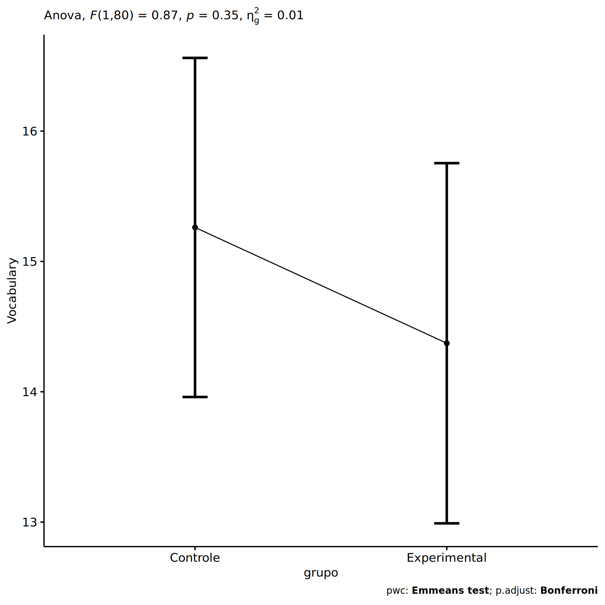
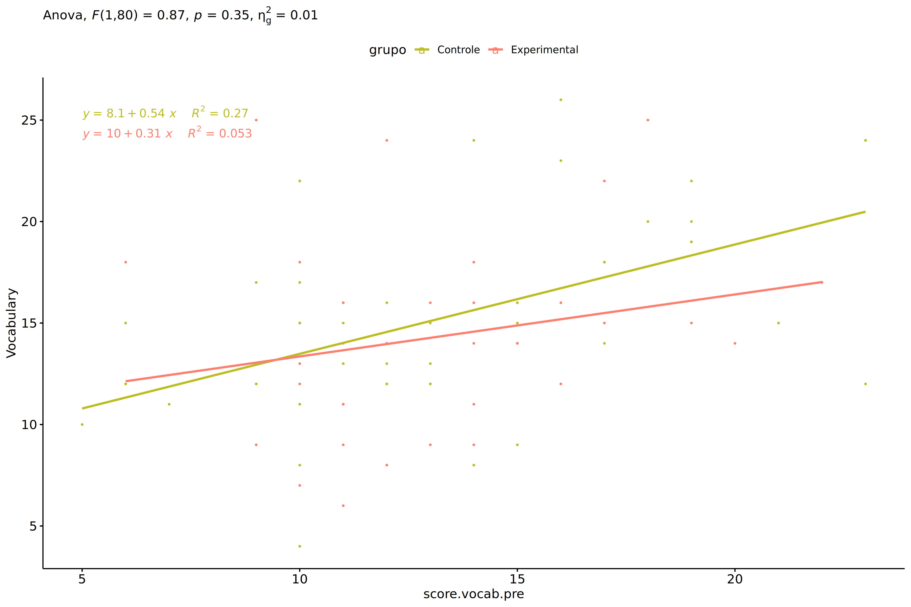
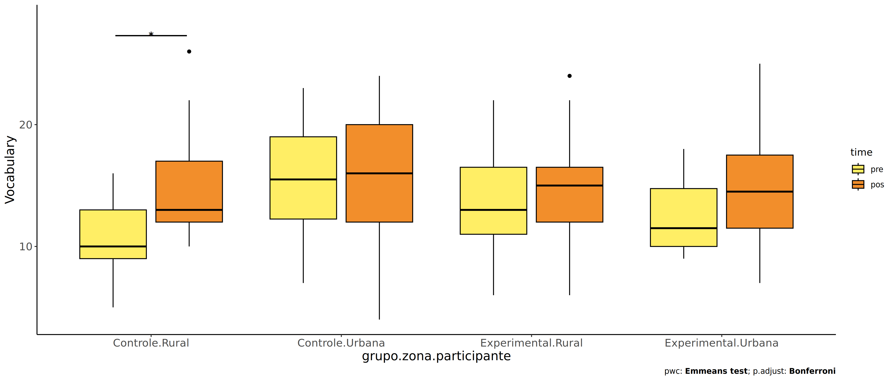
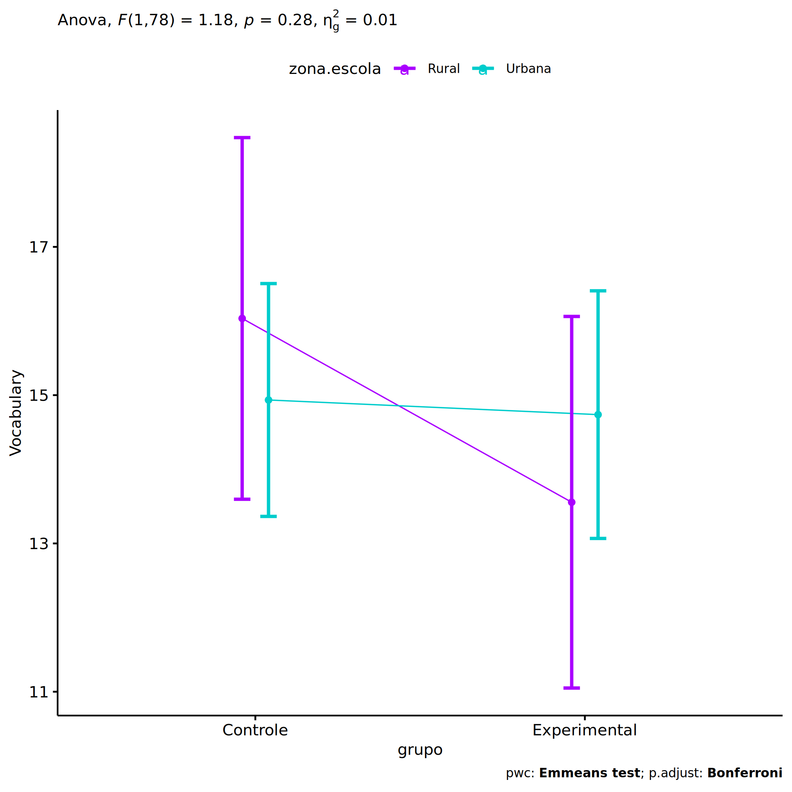
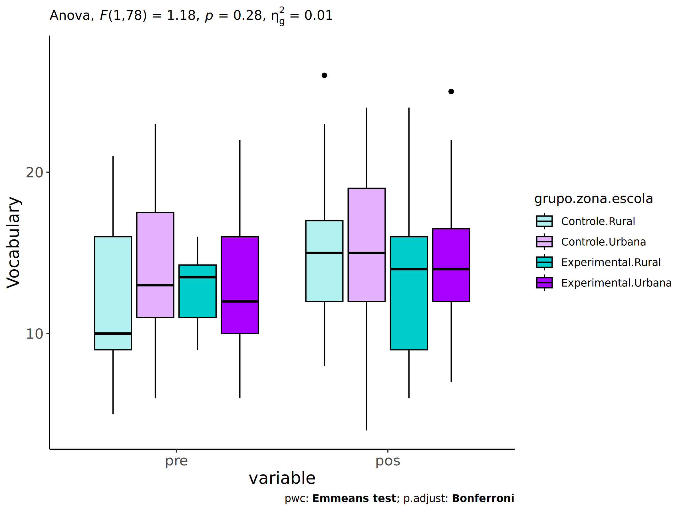

ANCOVA in Vocabulary (Vocabulary)
================
Geiser C. Challco <geiser@alumni.usp.br>

- [Setting Initial Variables](#setting-initial-variables)
- [Descriptive Statistics of Initial
  Data](#descriptive-statistics-of-initial-data)
- [ANCOVA and Pairwise for one factor:
  **grupo**](#ancova-and-pairwise-for-one-factor-grupo)
  - [Without remove non-normal data](#without-remove-non-normal-data)
  - [Computing ANCOVA and PairWise After removing non-normal data
    (OK)](#computing-ancova-and-pairwise-after-removing-non-normal-data-ok)
    - [Plots for ancova](#plots-for-ancova)
    - [Checking linearity assumption](#checking-linearity-assumption)
    - [Checking normality and
      homogeneity](#checking-normality-and-homogeneity)
- [ANCOVA and Pairwise for two factors
  **grupo:genero**](#ancova-and-pairwise-for-two-factors-grupogenero)
  - [Without remove non-normal data](#without-remove-non-normal-data-1)
  - [Computing ANCOVA and PairWise After removing non-normal data
    (OK)](#computing-ancova-and-pairwise-after-removing-non-normal-data-ok-1)
    - [Plots for ancova](#plots-for-ancova-1)
    - [Checking linearity assumption](#checking-linearity-assumption-1)
    - [Checking normality and
      homogeneity](#checking-normality-and-homogeneity-1)
- [ANCOVA and Pairwise for two factors
  **grupo:zona.participante**](#ancova-and-pairwise-for-two-factors-grupozonaparticipante)
  - [Without remove non-normal data](#without-remove-non-normal-data-2)
  - [Computing ANCOVA and PairWise After removing non-normal data
    (OK)](#computing-ancova-and-pairwise-after-removing-non-normal-data-ok-2)
    - [Plots for ancova](#plots-for-ancova-2)
    - [Checking linearity assumption](#checking-linearity-assumption-2)
    - [Checking normality and
      homogeneity](#checking-normality-and-homogeneity-2)
- [ANCOVA and Pairwise for two factors
  **grupo:zona.escola**](#ancova-and-pairwise-for-two-factors-grupozonaescola)
  - [Without remove non-normal data](#without-remove-non-normal-data-3)
  - [Computing ANCOVA and PairWise After removing non-normal data
    (OK)](#computing-ancova-and-pairwise-after-removing-non-normal-data-ok-3)
    - [Plots for ancova](#plots-for-ancova-3)
    - [Checking linearity assumption](#checking-linearity-assumption-3)
    - [Checking normality and
      homogeneity](#checking-normality-and-homogeneity-3)
- [ANCOVA and Pairwise for two factors
  **grupo:score.vocab.quintile**](#ancova-and-pairwise-for-two-factors-gruposcorevocabquintile)
  - [Without remove non-normal data](#without-remove-non-normal-data-4)
  - [Computing ANCOVA and PairWise After removing non-normal data
    (OK)](#computing-ancova-and-pairwise-after-removing-non-normal-data-ok-4)
    - [Plots for ancova](#plots-for-ancova-4)
    - [Checking linearity assumption](#checking-linearity-assumption-4)
    - [Checking normality and
      homogeneity](#checking-normality-and-homogeneity-4)
- [Summary of Results](#summary-of-results)
  - [Descriptive Statistics](#descriptive-statistics)
  - [ANCOVA Table Comparison](#ancova-table-comparison)
  - [PairWise Table Comparison](#pairwise-table-comparison)
  - [EMMS Table Comparison](#emms-table-comparison)

**NOTE**:

- Teste ANCOVA para determinar se houve diferenças significativas no
  Vocabulary (medido usando pre- e pos-testes).
- ANCOVA test to determine whether there were significant differences in
  Vocabulary (measured using pre- and post-tests).

# Setting Initial Variables

``` r
dv = "score.vocab"
dv.pos = "score.vocab.pos"
dv.pre = "score.vocab.pre"

fatores2 <- c("genero","zona.participante","zona.escola","score.vocab.quintile")
lfatores2 <- as.list(fatores2)
names(lfatores2) <- fatores2

fatores1 <- c("grupo", fatores2)
lfatores1 <- as.list(fatores1)
names(lfatores1) <- fatores1

lfatores <- c(lfatores1)

color <- list()
color[["prepost"]] = c("#ffee65","#f28e2B")
color[["grupo"]] = c("#bcbd22","#fd7f6f")
color[["genero"]] = c("#FF007F","#4D4DFF")
color[["zona.escola"]] = c("#AA00FF","#00CCCC")
color[["zona.participante"]] = c("#AA00FF","#00CCCC")

level <- list()
level[["grupo"]] = c("Controle","Experimental")
level[["genero"]] = c("F","M")
level[["zona.escola"]] = c("Rural","Urbana")
level[["zona.participante"]] = c("Rural","Urbana")

# ..

ymin <- 0
ymax <- 0

ymin.ci <- 0
ymax.ci <- 0


color[["grupo:genero"]] = c(
  "Controle:F"="#ff99cb", "Controle:M"="#b7b7ff",
  "Experimental:F"="#FF007F", "Experimental:M"="#4D4DFF",
  "Controle.F"="#ff99cb", "Controle.M"="#b7b7ff",
  "Experimental.F"="#FF007F", "Experimental.M"="#4D4DFF"
)
color[["grupo:zona.escola"]] = c(
  "Controle:Rural"="#b2efef","Controle:Urbana"="#e5b2ff",
  "Experimental:Rural"="#00CCCC", "Experimental:Urbana"="#AA00FF",
  "Controle.Rural"="#b2efef","Controle.Urbana"="#e5b2ff",
  "Experimental.Rural"="#00CCCC", "Experimental.Urbana"="#AA00FF"
)
color[["grupo:zona.participante"]] = c(
  "Controle:Rural"="#b2efef","Controle:Urbana"="#e5b2ff",
  "Experimental:Rural"="#00CCCC", "Experimental:Urbana"="#AA00FF",
  "Controle.Rural"="#b2efef","Controle.Urbana"="#e5b2ff",
  "Experimental.Rural"="#00CCCC", "Experimental.Urbana"="#AA00FF"
)

for (coln in c(
  "palavras.lidas","score.compreensao","tri.compreensao",
  "score.vocab","tri.vocab",
  "score.vocab.ensinado","tri.vocab.ensinado","score.vocab.nao.ensinado","tri.vocab.nao.ensinado",
  "score.CLPP","tri.CLPP","score.CR","tri.CR",
  "score.CI","tri.CI","score.TV","tri.TV","score.TF","tri.TF","score.TO","tri.TO")) {
  color[[paste0(coln,".quintile")]] = c("#BF0040","#FF0000","#800080","#0000FF","#4000BF")
  level[[paste0(coln,".quintile")]] = c("1st quintile","2nd quintile","3rd quintile","4th quintile","5th quintile")
  color[[paste0("grupo:",coln,".quintile")]] = c(
    "Experimental.1st quintile"="#BF0040", "Controle.1st quintile"="#d8668c",
    "Experimental.2nd quintile"="#FF0000", "Controle.2nd quintile"="#ff7f7f",
    "Experimental.3rd quintile"="#8fce00", "Controle.3rd quintile"="#ddf0b2",
    "Experimental.4th quintile"="#0000FF", "Controle.4th quintile"="#b2b2ff",
    "Experimental.5th quintile"="#4000BF", "Controle.5th quintile"="#b299e5",
    
    "Experimental:1st quintile"="#BF0040", "Controle:1st quintile"="#d8668c",
    "Experimental:2nd quintile"="#FF0000", "Controle:2nd quintile"="#ff7f7f",
    "Experimental:3rd quintile"="#8fce00", "Controle:3rd quintile"="#ddf0b2",
    "Experimental:4th quintile"="#0000FF", "Controle:4th quintile"="#b2b2ff",
    "Experimental:5th quintile"="#4000BF", "Controle:5th quintile"="#b299e5")
}


gdat <- read_excel("../data/data.xlsx", sheet = "vocabulario.st")


dat <- gdat
dat$grupo <- factor(dat[["grupo"]], level[["grupo"]])
for (coln in c(names(lfatores))) {
  dat[[coln]] <- factor(dat[[coln]], level[[coln]][level[[coln]] %in% unique(dat[[coln]])])
}
dat <- dat[which(!is.na(dat[[dv.pre]]) & !is.na(dat[[dv.pos]])),]
dat <- dat[,c("id",names(lfatores),dv.pre,dv.pos)]

dat.long <- rbind(dat, dat)
dat.long$time <- c(rep("pre", nrow(dat)), rep("pos", nrow(dat)))
dat.long$time <- factor(dat.long$time, c("pre","pos"))
dat.long[[dv]] <- c(dat[[dv.pre]], dat[[dv.pos]])


for (f in c("grupo", names(lfatores))) {
  if (is.null(color[[f]]) && length(unique(dat[[f]])) > 0) 
      color[[f]] <- distinctColorPalette(length(unique(dat[[f]])))
}
for (f in c(fatores2)) {
  if (is.null(color[[paste0("grupo:",f)]]) && length(unique(dat[[f]])) > 0)
    color[[paste0("grupo:",f)]] <- distinctColorPalette(length(unique(dat[["grupo"]]))*length(unique(dat[[f]])))
}

ldat <- list()
laov <- list()
lpwc <- list()
lemms <- list()
```

# Descriptive Statistics of Initial Data

``` r
df <- get.descriptives(dat, c(dv.pre, dv.pos), c("grupo"), 
                       include.global = T, symmetry.test = T, normality.test = F)
df <- plyr::rbind.fill(
  df, do.call(plyr::rbind.fill, lapply(lfatores2, FUN = function(f) {
    if (nrow(dat) > 0 && sum(!is.na(unique(dat[[f]]))) > 1)
      get.descriptives(dat, c(dv.pre,dv.pos), c("grupo", f),
                       symmetry.test = T, normality.test = F)
    }))
)
df <- df[,c(fatores1[fatores1 %in% colnames(df)],"variable",
            colnames(df)[!colnames(df) %in% c(fatores1,"variable")])]
```

| grupo        | genero | zona.participante | zona.escola | score.vocab.quintile | variable        |   n |   mean | median | min | max |    sd |    se |     ci |  iqr | symmetry | skewness | kurtosis |
|:-------------|:-------|:------------------|:------------|:---------------------|:----------------|----:|-------:|-------:|----:|----:|------:|------:|-------:|-----:|:---------|---------:|---------:|
| Controle     |        |                   |             |                      | score.vocab.pre |  44 | 13.364 |   13.0 |   5 |  23 | 4.725 | 0.712 |  1.437 | 6.25 | YES      |    0.329 |   -0.650 |
| Experimental |        |                   |             |                      | score.vocab.pre |  39 | 13.205 |   13.0 |   6 |  22 | 3.427 | 0.549 |  1.111 | 4.00 | YES      |    0.445 |   -0.237 |
|              |        |                   |             |                      | score.vocab.pre |  83 | 13.289 |   13.0 |   5 |  23 | 4.142 | 0.455 |  0.905 | 6.00 | YES      |    0.395 |   -0.271 |
| Controle     |        |                   |             |                      | score.vocab.pos |  44 | 15.295 |   15.0 |   4 |  26 | 4.878 | 0.735 |  1.483 | 6.25 | YES      |    0.295 |   -0.376 |
| Experimental |        |                   |             |                      | score.vocab.pos |  39 | 14.333 |   14.0 |   6 |  25 | 4.544 | 0.728 |  1.473 | 4.50 | NO       |    0.554 |    0.122 |
|              |        |                   |             |                      | score.vocab.pos |  83 | 14.843 |   14.0 |   4 |  26 | 4.720 | 0.518 |  1.031 | 5.00 | YES      |    0.426 |   -0.128 |
| Controle     | F      |                   |             |                      | score.vocab.pre |  23 | 14.348 |   14.0 |   7 |  23 | 4.519 | 0.942 |  1.954 | 7.00 | YES      |    0.342 |   -0.917 |
| Controle     | M      |                   |             |                      | score.vocab.pre |  21 | 12.286 |   12.0 |   5 |  23 | 4.818 | 1.051 |  2.193 | 5.00 | YES      |    0.418 |   -0.608 |
| Experimental | F      |                   |             |                      | score.vocab.pre |  17 | 12.353 |   12.0 |   6 |  22 | 3.517 | 0.853 |  1.808 | 3.00 | NO       |    0.941 |    1.239 |
| Experimental | M      |                   |             |                      | score.vocab.pre |  22 | 13.864 |   14.0 |   9 |  20 | 3.285 | 0.700 |  1.456 | 5.00 | YES      |    0.084 |   -1.211 |
| Controle     | F      |                   |             |                      | score.vocab.pos |  23 | 16.696 |   16.0 |   8 |  26 | 4.922 | 1.026 |  2.128 | 8.00 | YES      |    0.285 |   -1.082 |
| Controle     | M      |                   |             |                      | score.vocab.pos |  21 | 13.762 |   13.0 |   4 |  24 | 4.449 | 0.971 |  2.025 | 4.00 | YES      |    0.173 |    0.041 |
| Experimental | F      |                   |             |                      | score.vocab.pos |  17 | 14.118 |   14.0 |   6 |  24 | 4.241 | 1.029 |  2.180 | 6.00 | YES      |    0.303 |   -0.153 |
| Experimental | M      |                   |             |                      | score.vocab.pos |  22 | 14.500 |   14.0 |   7 |  25 | 4.857 | 1.036 |  2.154 | 3.75 | NO       |    0.625 |   -0.112 |
| Controle     |        | Rural             |             |                      | score.vocab.pre |  11 | 10.727 |   10.0 |   5 |  16 | 3.467 | 1.045 |  2.329 | 4.00 | YES      |   -0.119 |   -1.265 |
| Controle     |        | Urbana            |             |                      | score.vocab.pre |  22 | 15.545 |   15.5 |   7 |  23 | 4.667 | 0.995 |  2.069 | 6.75 | YES      |   -0.025 |   -1.075 |
| Controle     |        |                   |             |                      | score.vocab.pre |  11 | 11.636 |   11.0 |   6 |  21 | 4.105 | 1.238 |  2.758 | 2.00 | NO       |    0.655 |    0.151 |
| Experimental |        | Rural             |             |                      | score.vocab.pre |  15 | 13.733 |   13.0 |   6 |  22 | 4.026 | 1.040 |  2.230 | 5.50 | YES      |    0.212 |   -0.551 |
| Experimental |        | Urbana            |             |                      | score.vocab.pre |  14 | 12.429 |   11.5 |   9 |  18 | 2.954 | 0.789 |  1.706 | 4.75 | YES      |    0.491 |   -1.233 |
| Experimental |        |                   |             |                      | score.vocab.pre |  10 | 13.500 |   14.0 |   9 |  20 | 3.206 | 1.014 |  2.293 | 3.50 | YES      |    0.428 |   -0.696 |
| Controle     |        | Rural             |             |                      | score.vocab.pos |  11 | 15.364 |   13.0 |  10 |  26 | 4.864 | 1.466 |  3.267 | 5.00 | NO       |    0.956 |   -0.396 |
| Controle     |        | Urbana            |             |                      | score.vocab.pos |  22 | 16.273 |   16.0 |   4 |  24 | 5.539 | 1.181 |  2.456 | 8.00 | YES      |   -0.252 |   -0.861 |
| Controle     |        |                   |             |                      | score.vocab.pos |  11 | 13.273 |   15.0 |   8 |  16 | 2.760 | 0.832 |  1.854 | 3.00 | NO       |   -0.724 |   -1.030 |
| Experimental |        | Rural             |             |                      | score.vocab.pos |  15 | 14.933 |   15.0 |   6 |  24 | 4.399 | 1.136 |  2.436 | 4.50 | YES      |    0.225 |   -0.118 |
| Experimental |        | Urbana            |             |                      | score.vocab.pos |  14 | 14.929 |   14.5 |   7 |  25 | 5.385 | 1.439 |  3.109 | 6.00 | NO       |    0.511 |   -0.669 |
| Experimental |        |                   |             |                      | score.vocab.pos |  10 | 12.600 |   13.5 |   8 |  18 | 3.273 | 1.035 |  2.341 | 4.50 | YES      |    0.029 |   -1.444 |
| Controle     |        |                   | Rural       |                      | score.vocab.pre |  13 | 11.615 |   10.0 |   5 |  21 | 4.874 | 1.352 |  2.945 | 7.00 | YES      |    0.311 |   -1.180 |
| Controle     |        |                   | Urbana      |                      | score.vocab.pre |  31 | 14.097 |   13.0 |   6 |  23 | 4.541 | 0.816 |  1.666 | 6.50 | YES      |    0.431 |   -0.690 |
| Experimental |        |                   | Rural       |                      | score.vocab.pre |  12 | 13.000 |   13.5 |   9 |  16 | 2.216 | 0.640 |  1.408 | 3.25 | YES      |   -0.184 |   -1.319 |
| Experimental |        |                   | Urbana      |                      | score.vocab.pre |  27 | 13.296 |   12.0 |   6 |  22 | 3.881 | 0.747 |  1.535 | 6.00 | YES      |    0.411 |   -0.699 |
| Controle     |        |                   | Rural       |                      | score.vocab.pos |  13 | 15.231 |   15.0 |   8 |  26 | 5.052 | 1.401 |  3.053 | 5.00 | NO       |    0.666 |   -0.520 |
| Controle     |        |                   | Urbana      |                      | score.vocab.pos |  31 | 15.323 |   15.0 |   4 |  24 | 4.888 | 0.878 |  1.793 | 7.00 | YES      |    0.108 |   -0.480 |
| Experimental |        |                   | Rural       |                      | score.vocab.pos |  12 | 13.417 |   14.0 |   6 |  24 | 4.889 | 1.411 |  3.106 | 7.00 | YES      |    0.462 |   -0.484 |
| Experimental |        |                   | Urbana      |                      | score.vocab.pos |  27 | 14.741 |   14.0 |   7 |  25 | 4.417 | 0.850 |  1.747 | 4.50 | NO       |    0.641 |    0.189 |
| Controle     |        |                   |             | 1st quintile         | score.vocab.pre |  21 |  9.429 |   10.0 |   5 |  12 | 2.204 | 0.481 |  1.003 | 2.00 | NO       |   -0.630 |   -0.925 |
| Controle     |        |                   |             | 2nd quintile         | score.vocab.pre |  19 | 15.789 |   15.0 |  13 |  19 | 2.226 | 0.511 |  1.073 | 3.50 | YES      |    0.222 |   -1.461 |
| Controle     |        |                   |             | 3rd quintile         | score.vocab.pre |   4 | 22.500 |   23.0 |  21 |  23 | 1.000 | 0.500 |  1.591 | 0.50 | few data |    0.000 |    0.000 |
| Experimental |        |                   |             | 1st quintile         | score.vocab.pre |  19 | 10.368 |   11.0 |   6 |  12 | 1.461 | 0.335 |  0.704 | 1.00 | NO       |   -1.222 |    1.668 |
| Experimental |        |                   |             | 2nd quintile         | score.vocab.pre |  18 | 15.333 |   15.0 |  13 |  19 | 1.715 | 0.404 |  0.853 | 2.75 | YES      |    0.499 |   -0.881 |
| Experimental |        |                   |             | 3rd quintile         | score.vocab.pre |   2 | 21.000 |   21.0 |  20 |  22 | 1.414 | 1.000 | 12.706 | 1.00 | few data |    0.000 |    0.000 |
| Controle     |        |                   |             | 1st quintile         | score.vocab.pos |  21 | 13.190 |   13.0 |   4 |  22 | 3.683 | 0.804 |  1.676 | 3.00 | YES      |   -0.115 |    0.785 |
| Controle     |        |                   |             | 2nd quintile         | score.vocab.pos |  19 | 16.895 |   16.0 |   8 |  26 | 4.988 | 1.144 |  2.404 | 6.50 | YES      |    0.011 |   -1.015 |
| Controle     |        |                   |             | 3rd quintile         | score.vocab.pos |   4 | 18.750 |   19.5 |  12 |  24 | 6.185 | 3.092 |  9.841 | 9.75 | few data |    0.000 |    0.000 |
| Experimental |        |                   |             | 1st quintile         | score.vocab.pos |  19 | 13.421 |   13.0 |   6 |  25 | 5.157 | 1.183 |  2.485 | 5.50 | NO       |    0.733 |   -0.181 |
| Experimental |        |                   |             | 2nd quintile         | score.vocab.pos |  18 | 15.167 |   15.0 |   9 |  25 | 3.989 | 0.940 |  1.984 | 2.00 | NO       |    0.646 |    0.283 |
| Experimental |        |                   |             | 3rd quintile         | score.vocab.pos |   2 | 15.500 |   15.5 |  14 |  17 | 2.121 | 1.500 | 19.059 | 1.50 | few data |    0.000 |    0.000 |

# ANCOVA and Pairwise for one factor: **grupo**

## Without remove non-normal data

``` r
pdat = remove_group_data(dat[!is.na(dat[["grupo"]]),], "score.vocab.pos", "grupo")

pdat.long <- rbind(pdat[,c("id","grupo")], pdat[,c("id","grupo")])
pdat.long[["time"]] <- c(rep("pre", nrow(pdat)), rep("pos", nrow(pdat)))
pdat.long[["time"]] <- factor(pdat.long[["time"]], c("pre","pos"))
pdat.long[["score.vocab"]] <- c(pdat[["score.vocab.pre"]], pdat[["score.vocab.pos"]])

aov = anova_test(pdat, score.vocab.pos ~ score.vocab.pre + grupo)
laov[["grupo"]] <- get_anova_table(aov)
```

``` r
pwc <- emmeans_test(pdat, score.vocab.pos ~ grupo, covariate = score.vocab.pre,
                    p.adjust.method = "bonferroni")
```

``` r
pwc.long <- emmeans_test(dplyr::group_by_at(pdat.long, "grupo"),
                          score.vocab ~ time,
                          p.adjust.method = "bonferroni")
lpwc[["grupo"]] <- plyr::rbind.fill(pwc, pwc.long)
```

``` r
ds <- get.descriptives(pdat, "score.vocab.pos", "grupo", covar = "score.vocab.pre")
ds <- merge(ds[ds$variable != "score.vocab.pre",],
            ds[ds$variable == "score.vocab.pre", !colnames(ds) %in% c("variable")],
            by = "grupo", all.x = T, suffixes = c("", ".score.vocab.pre"))
ds <- merge(get_emmeans(pwc), ds, by = "grupo", suffixes = c(".emms", ""))
ds <- ds[,c("grupo","n","mean.score.vocab.pre","se.score.vocab.pre","mean","se",
            "emmean","se.emms","conf.low","conf.high")]

colnames(ds) <- c("grupo", "N", paste0(c("M","SE")," (pre)"),
                  paste0(c("M","SE"), " (unadj)"),
                  paste0(c("M", "SE"), " (adj)"), "conf.low", "conf.high")

lemms[["grupo"]] <- ds
```

## Computing ANCOVA and PairWise After removing non-normal data (OK)

``` r
wdat = pdat 

res = residuals(lm(score.vocab.pos ~ score.vocab.pre + grupo, data = wdat))
non.normal = getNonNormal(res, wdat$id, plimit = 0.05)

wdat = wdat[!wdat$id %in% non.normal,]

wdat.long <- rbind(wdat[,c("id","grupo")], wdat[,c("id","grupo")])
wdat.long[["time"]] <- c(rep("pre", nrow(wdat)), rep("pos", nrow(wdat)))
wdat.long[["time"]] <- factor(wdat.long[["time"]], c("pre","pos"))
wdat.long[["score.vocab"]] <- c(wdat[["score.vocab.pre"]], wdat[["score.vocab.pos"]])

ldat[["grupo"]] = wdat

(non.normal)
```

    ## NULL

``` r
aov = anova_test(wdat, score.vocab.pos ~ score.vocab.pre + grupo)
laov[["grupo"]] <- merge(get_anova_table(aov), laov[["grupo"]],
                            by="Effect", suffixes = c("","'"))

(df = get_anova_table(aov))
```

    ## ANOVA Table (type II tests)
    ## 
    ##            Effect DFn DFd      F        p p<.05   ges
    ## 1 score.vocab.pre   1  80 16.154 0.000131     * 0.168
    ## 2           grupo   1  80  0.868 0.354000       0.011

| Effect          | DFn | DFd |      F |     p | p\<.05 |   ges |
|:----------------|----:|----:|-------:|------:|:-------|------:|
| score.vocab.pre |   1 |  80 | 16.154 | 0.000 | \*     | 0.168 |
| grupo           |   1 |  80 |  0.868 | 0.354 |        | 0.011 |

``` r
pwc <- emmeans_test(wdat, score.vocab.pos ~ grupo, covariate = score.vocab.pre,
                    p.adjust.method = "bonferroni")
```

| term                   | .y.             | group1   | group2       |  df | statistic |     p | p.adj | p.adj.signif |
|:-----------------------|:----------------|:---------|:-------------|----:|----------:|------:|------:|:-------------|
| score.vocab.pre\*grupo | score.vocab.pos | Controle | Experimental |  80 |     0.932 | 0.354 | 0.354 | ns           |

``` r
pwc.long <- emmeans_test(dplyr::group_by_at(wdat.long, "grupo"),
                         score.vocab ~ time,
                         p.adjust.method = "bonferroni")
lpwc[["grupo"]] <- merge(plyr::rbind.fill(pwc, pwc.long), lpwc[["grupo"]],
                            by=c("grupo","term",".y.","group1","group2"),
                            suffixes = c("","'"))
```

| grupo        | term | .y.         | group1 | group2 |  df | statistic |     p | p.adj | p.adj.signif |
|:-------------|:-----|:------------|:-------|:-------|----:|----------:|------:|------:|:-------------|
| Controle     | time | score.vocab | pre    | pos    | 162 |    -2.034 | 0.044 | 0.044 | \*           |
| Experimental | time | score.vocab | pre    | pos    | 162 |    -1.118 | 0.265 | 0.265 | ns           |

``` r
ds <- get.descriptives(wdat, "score.vocab.pos", "grupo", covar = "score.vocab.pre")
ds <- merge(ds[ds$variable != "score.vocab.pre",],
            ds[ds$variable == "score.vocab.pre", !colnames(ds) %in% c("variable")],
            by = "grupo", all.x = T, suffixes = c("", ".score.vocab.pre"))
ds <- merge(get_emmeans(pwc), ds, by = "grupo", suffixes = c(".emms", ""))
ds <- ds[,c("grupo","n","mean.score.vocab.pre","se.score.vocab.pre","mean","se",
            "emmean","se.emms","conf.low","conf.high")]

colnames(ds) <- c("grupo", "N", paste0(c("M","SE")," (pre)"),
                  paste0(c("M","SE"), " (unadj)"),
                  paste0(c("M", "SE"), " (adj)"), "conf.low", "conf.high")

lemms[["grupo"]] <- merge(ds, lemms[["grupo"]], by=c("grupo"), suffixes = c("","'"))
```

| grupo        |   N | M (pre) | SE (pre) | M (unadj) | SE (unadj) | M (adj) | SE (adj) | conf.low | conf.high |
|:-------------|----:|--------:|---------:|----------:|-----------:|--------:|---------:|---------:|----------:|
| Controle     |  44 |  13.364 |    0.712 |    15.295 |      0.735 |  15.261 |    0.654 |    13.96 |    16.562 |
| Experimental |  39 |  13.205 |    0.549 |    14.333 |      0.728 |  14.372 |    0.694 |    12.99 |    15.754 |

### Plots for ancova

``` r
plots <- oneWayAncovaPlots(
  wdat, "score.vocab.pos", "grupo", aov, list("grupo"=pwc), addParam = c("mean_ci"),
  font.label.size=10, step.increase=0.05, p.label="p.adj",
  subtitle = which(aov$Effect == "grupo"))
```

``` r
if (!is.null(nrow(plots[["grupo"]]$data)))
  plots[["grupo"]] + ggplot2::ylab("Vocabulary") + 
  if (ymin.ci < ymax.ci) ggplot2::ylim(ymin.ci, ymax.ci)
```

<!-- -->

``` r
plots <- oneWayAncovaBoxPlots(
  wdat, "score.vocab.pos", "grupo", aov, pwc, covar = "score.vocab.pre",
  theme = "classic", color = color[["grupo"]],
  subtitle = which(aov$Effect == "grupo"))
```

``` r
if (length(unique(wdat[["grupo"]])) > 1)
  plots[["grupo"]] + ggplot2::ylab("Vocabulary") +
  ggplot2::scale_x_discrete(labels=c('pre', 'pos')) +
  if (ymin < ymax) ggplot2::ylim(ymin, ymax)
```

<!-- -->

``` r
if (length(unique(wdat.long[["grupo"]])) > 1)
  plots <- oneWayAncovaBoxPlots(
    wdat.long, "score.vocab", "grupo", aov, pwc.long,
    pre.post = "time", theme = "classic", color = color$prepost)
```

``` r
if (length(unique(wdat.long[["grupo"]])) > 1)
  plots[["grupo"]] + ggplot2::ylab("Vocabulary") +
  if (ymin < ymax) ggplot2::ylim(ymin, ymax) 
```

<!-- -->

### Checking linearity assumption

``` r
ggscatter(wdat, x = "score.vocab.pre", y = "score.vocab.pos", size = 0.5,
          color = "grupo", add = "reg.line")+
  stat_regline_equation(
    aes(label =  paste(..eq.label.., ..rr.label.., sep = "~~~~"), color = grupo)
  ) +
  ggplot2::labs(subtitle = rstatix::get_test_label(aov, detailed = T, row = which(aov$Effect == "grupo"))) +
  ggplot2::scale_color_manual(values = color[["grupo"]]) +
  ggplot2::ylab("Vocabulary")  +
  if (ymin < ymax) ggplot2::ylim(ymin, ymax)
```

<!-- -->

### Checking normality and homogeneity

``` r
res <- augment(lm(score.vocab.pos ~ score.vocab.pre + grupo, data = wdat))
```

``` r
shapiro_test(res$.resid)
```

    ## # A tibble: 1 × 3
    ##   variable   statistic p.value
    ##   <chr>          <dbl>   <dbl>
    ## 1 res$.resid     0.975   0.108

``` r
levene_test(res, .resid ~ grupo)
```

    ## # A tibble: 1 × 4
    ##     df1   df2 statistic     p
    ##   <int> <int>     <dbl> <dbl>
    ## 1     1    81    0.0395 0.843

# ANCOVA and Pairwise for two factors **grupo:genero**

## Without remove non-normal data

``` r
pdat = remove_group_data(dat[!is.na(dat[["grupo"]]) & !is.na(dat[["genero"]]),],
                         "score.vocab.pos", c("grupo","genero"))
pdat = pdat[pdat[["genero"]] %in% do.call(
  intersect, lapply(unique(pdat[["grupo"]]), FUN = function(x) {
    unique(pdat[["genero"]][which(pdat[["grupo"]] == x)])
  })),]
pdat[["grupo"]] = factor(pdat[["grupo"]], level[["grupo"]])
pdat[["genero"]] = factor(
  pdat[["genero"]],
  level[["genero"]][level[["genero"]] %in% unique(pdat[["genero"]])])

pdat.long <- rbind(pdat[,c("id","grupo","genero")], pdat[,c("id","grupo","genero")])
pdat.long[["time"]] <- c(rep("pre", nrow(pdat)), rep("pos", nrow(pdat)))
pdat.long[["time"]] <- factor(pdat.long[["time"]], c("pre","pos"))
pdat.long[["score.vocab"]] <- c(pdat[["score.vocab.pre"]], pdat[["score.vocab.pos"]])

if (length(unique(pdat[["genero"]])) >= 2) {
  aov = anova_test(pdat, score.vocab.pos ~ score.vocab.pre + grupo*genero)
  laov[["grupo:genero"]] <- get_anova_table(aov)
}
```

``` r
if (length(unique(pdat[["genero"]])) >= 2) {
  pwcs <- list()
  pwcs[["genero"]] <- emmeans_test(
    group_by(pdat, grupo), score.vocab.pos ~ genero,
    covariate = score.vocab.pre, p.adjust.method = "bonferroni")
  pwcs[["grupo"]] <- emmeans_test(
    group_by(pdat, genero), score.vocab.pos ~ grupo,
    covariate = score.vocab.pre, p.adjust.method = "bonferroni")
  
  pwc <- plyr::rbind.fill(pwcs[["grupo"]], pwcs[["genero"]])
  pwc <- pwc[,c("grupo","genero", colnames(pwc)[!colnames(pwc) %in% c("grupo","genero")])]
}
```

``` r
if (length(unique(pdat[["genero"]])) >= 2) {
  pwc.long <- emmeans_test(dplyr::group_by_at(pdat.long, c("grupo","genero")),
                           score.vocab ~ time,
                           p.adjust.method = "bonferroni")
  lpwc[["grupo:genero"]] <- plyr::rbind.fill(pwc, pwc.long)
}
```

``` r
if (length(unique(pdat[["genero"]])) >= 2) {
  ds <- get.descriptives(pdat, "score.vocab.pos", c("grupo","genero"), covar = "score.vocab.pre")
  ds <- merge(ds[ds$variable != "score.vocab.pre",],
              ds[ds$variable == "score.vocab.pre", !colnames(ds) %in% c("variable")],
              by = c("grupo","genero"), all.x = T, suffixes = c("", ".score.vocab.pre"))
  ds <- merge(get_emmeans(pwcs[["grupo"]]), ds,
              by = c("grupo","genero"), suffixes = c(".emms", ""))
  ds <- ds[,c("grupo","genero","n","mean.score.vocab.pre","se.score.vocab.pre","mean","se",
              "emmean","se.emms","conf.low","conf.high")]
  
  colnames(ds) <- c("grupo","genero", "N", paste0(c("M","SE")," (pre)"),
                    paste0(c("M","SE"), " (unadj)"),
                    paste0(c("M", "SE"), " (adj)"), "conf.low", "conf.high")
  
  lemms[["grupo:genero"]] <- ds
}
```

## Computing ANCOVA and PairWise After removing non-normal data (OK)

``` r
if (length(unique(pdat[["genero"]])) >= 2) {
  wdat = pdat 
  
  res = residuals(lm(score.vocab.pos ~ score.vocab.pre + grupo*genero, data = wdat))
  non.normal = getNonNormal(res, wdat$id, plimit = 0.05)
  
  wdat = wdat[!wdat$id %in% non.normal,]
  
  wdat.long <- rbind(wdat[,c("id","grupo","genero")], wdat[,c("id","grupo","genero")])
  wdat.long[["time"]] <- c(rep("pre", nrow(wdat)), rep("pos", nrow(wdat)))
  wdat.long[["time"]] <- factor(wdat.long[["time"]], c("pre","pos"))
  wdat.long[["score.vocab"]] <- c(wdat[["score.vocab.pre"]], wdat[["score.vocab.pos"]])
  
  
  ldat[["grupo:genero"]] = wdat
  
  (non.normal)
}
```

    ## NULL

``` r
if (length(unique(pdat[["genero"]])) >= 2) {
  aov = anova_test(wdat, score.vocab.pos ~ score.vocab.pre + grupo*genero)
  laov[["grupo:genero"]] <- merge(get_anova_table(aov), laov[["grupo:genero"]],
                                         by="Effect", suffixes = c("","'"))
  df = get_anova_table(aov)
}
```

| Effect          | DFn | DFd |      F |     p | p\<.05 |   ges |
|:----------------|----:|----:|-------:|------:|:-------|------:|
| score.vocab.pre |   1 |  78 | 13.518 | 0.000 | \*     | 0.148 |
| grupo           |   1 |  78 |  0.676 | 0.414 |        | 0.009 |
| genero          |   1 |  78 |  1.596 | 0.210 |        | 0.020 |
| grupo:genero    |   1 |  78 |  0.811 | 0.371 |        | 0.010 |

``` r
if (length(unique(pdat[["genero"]])) >= 2) {
  pwcs <- list()
  pwcs[["genero"]] <- emmeans_test(
    group_by(wdat, grupo), score.vocab.pos ~ genero,
    covariate = score.vocab.pre, p.adjust.method = "bonferroni")
  pwcs[["grupo"]] <- emmeans_test(
    group_by(wdat, genero), score.vocab.pos ~ grupo,
    covariate = score.vocab.pre, p.adjust.method = "bonferroni")
  
  pwc <- plyr::rbind.fill(pwcs[["grupo"]], pwcs[["genero"]])
  pwc <- pwc[,c("grupo","genero", colnames(pwc)[!colnames(pwc) %in% c("grupo","genero")])]
}
```

| grupo        | genero | term                    | .y.             | group1   | group2       |  df | statistic |     p | p.adj | p.adj.signif |
|:-------------|:-------|:------------------------|:----------------|:---------|:-------------|----:|----------:|------:|------:|:-------------|
|              | F      | score.vocab.pre\*grupo  | score.vocab.pos | Controle | Experimental |  78 |     1.219 | 0.226 | 0.226 | ns           |
|              | M      | score.vocab.pre\*grupo  | score.vocab.pos | Controle | Experimental |  78 |    -0.039 | 0.969 | 0.969 | ns           |
| Controle     |        | score.vocab.pre\*genero | score.vocab.pos | F        | M            |  78 |     1.534 | 0.129 | 0.129 | ns           |
| Experimental |        | score.vocab.pre\*genero | score.vocab.pos | F        | M            |  78 |     0.195 | 0.846 | 0.846 | ns           |

``` r
if (length(unique(pdat[["genero"]])) >= 2) {
  pwc.long <- emmeans_test(dplyr::group_by_at(wdat.long, c("grupo","genero")),
                           score.vocab ~ time,
                           p.adjust.method = "bonferroni")
  lpwc[["grupo:genero"]] <- merge(plyr::rbind.fill(pwc, pwc.long),
                                         lpwc[["grupo:genero"]],
                                         by=c("grupo","genero","term",".y.","group1","group2"),
                                         suffixes = c("","'"))
}
```

| grupo        | genero | term | .y.         | group1 | group2 |  df | statistic |     p | p.adj | p.adj.signif |
|:-------------|:-------|:-----|:------------|:-------|:-------|----:|----------:|------:|------:|:-------------|
| Controle     | F      | time | score.vocab | pre    | pos    | 158 |    -1.812 | 0.072 | 0.072 | ns           |
| Controle     | M      | time | score.vocab | pre    | pos    | 158 |    -1.089 | 0.278 | 0.278 | ns           |
| Experimental | F      | time | score.vocab | pre    | pos    | 158 |    -1.171 | 0.243 | 0.243 | ns           |
| Experimental | M      | time | score.vocab | pre    | pos    | 158 |    -0.480 | 0.632 | 0.632 | ns           |

``` r
if (length(unique(pdat[["genero"]])) >= 2) {
  ds <- get.descriptives(wdat, "score.vocab.pos", c("grupo","genero"), covar = "score.vocab.pre")
  ds <- merge(ds[ds$variable != "score.vocab.pre",],
              ds[ds$variable == "score.vocab.pre", !colnames(ds) %in% c("variable")],
              by = c("grupo","genero"), all.x = T, suffixes = c("", ".score.vocab.pre"))
  ds <- merge(get_emmeans(pwcs[["grupo"]]), ds,
              by = c("grupo","genero"), suffixes = c(".emms", ""))
  ds <- ds[,c("grupo","genero","n","mean.score.vocab.pre","se.score.vocab.pre",
              "mean","se","emmean","se.emms","conf.low","conf.high")]
  
  colnames(ds) <- c("grupo","genero", "N", paste0(c("M","SE")," (pre)"),
                    paste0(c("M","SE"), " (unadj)"),
                    paste0(c("M", "SE"), " (adj)"), "conf.low", "conf.high")
  
  lemms[["grupo:genero"]] <- merge(ds, lemms[["grupo:genero"]],
                                          by=c("grupo","genero"), suffixes = c("","'"))
}
```

| grupo        | genero |   N | M (pre) | SE (pre) | M (unadj) | SE (unadj) | M (adj) | SE (adj) | conf.low | conf.high |
|:-------------|:-------|----:|--------:|---------:|----------:|-----------:|--------:|---------:|---------:|----------:|
| Controle     | F      |  23 |  14.348 |    0.942 |    16.696 |      1.026 |  16.235 |    0.910 |   14.423 |    18.048 |
| Controle     | M      |  21 |  12.286 |    1.051 |    13.762 |      0.971 |  14.198 |    0.951 |   12.304 |    16.092 |
| Experimental | F      |  17 |  12.353 |    0.853 |    14.118 |      1.029 |  14.525 |    1.055 |   12.425 |    16.625 |
| Experimental | M      |  22 |  13.864 |    0.700 |    14.500 |      1.036 |  14.250 |    0.925 |   12.410 |    16.091 |

### Plots for ancova

``` r
if (length(unique(pdat[["genero"]])) >= 2) {
  ggPlotAoC2(pwcs, "grupo", "genero", aov, ylab = "Vocabulary",
             subtitle = which(aov$Effect == "grupo:genero"), addParam = "errorbar") +
    ggplot2::scale_color_manual(values = color[["genero"]]) +
    ggplot2::ylab("Vocabulary") +
    if (ymin.ci < ymax.ci) ggplot2::ylim(ymin.ci, ymax.ci)
}
```

    ## Scale for colour is already present.
    ## Adding another scale for colour, which will replace the existing scale.

<!-- -->

``` r
if (length(unique(pdat[["genero"]])) >= 2) {
  ggPlotAoC2(pwcs, "genero", "grupo", aov, ylab = "Vocabulary",
               subtitle = which(aov$Effect == "grupo:genero"), addParam = "errorbar") +
    ggplot2::scale_color_manual(values = color[["grupo"]]) +
    ggplot2::ylab("Vocabulary") +
    if (ymin.ci < ymax.ci) ggplot2::ylim(ymin.ci, ymax.ci)
}
```

    ## Scale for colour is already present.
    ## Adding another scale for colour, which will replace the existing scale.

<!-- -->

``` r
if (length(unique(pdat[["genero"]])) >= 2) {
  plots <- twoWayAncovaBoxPlots(
    wdat, "score.vocab.pos", c("grupo","genero"), aov, pwcs, covar = "score.vocab.pre",
    theme = "classic", color = color[["grupo:genero"]],
    subtitle = which(aov$Effect == "grupo:genero"))
}
```

``` r
if (length(unique(pdat[["genero"]])) >= 2) {
  plots[["grupo:genero"]] + ggplot2::ylab("Vocabulary") +
  ggplot2::scale_x_discrete(labels=c('pre', 'pos')) +
  if (ymin < ymax) ggplot2::ylim(ymin, ymax)
}
```

    ## Warning: No shared levels found between `names(values)` of the manual scale and the data's colour
    ## values.

<!-- -->

``` r
if (length(unique(pdat[["genero"]])) >= 2) {
  plots <- twoWayAncovaBoxPlots(
    wdat.long, "score.vocab", c("grupo","genero"), aov, pwc.long,
    pre.post = "time",
    theme = "classic", color = color$prepost)
}
```

``` r
if (length(unique(pdat[["genero"]])) >= 2) 
  plots[["grupo:genero"]] + ggplot2::ylab("Vocabulary") +
    if (ymin < ymax) ggplot2::ylim(ymin, ymax)
```

<!-- -->

### Checking linearity assumption

``` r
if (length(unique(pdat[["genero"]])) >= 2) {
  ggscatter(wdat, x = "score.vocab.pre", y = "score.vocab.pos", size = 0.5,
            facet.by = c("grupo","genero"), add = "reg.line")+
    stat_regline_equation(
      aes(label =  paste(..eq.label.., ..rr.label.., sep = "~~~~"))
    ) + ggplot2::ylab("Vocabulary") +
    if (ymin < ymax) ggplot2::ylim(ymin, ymax)
}
```

<!-- -->

``` r
if (length(unique(pdat[["genero"]])) >= 2) {
  ggscatter(wdat, x = "score.vocab.pre", y = "score.vocab.pos", size = 0.5,
            color = "grupo", facet.by = "genero", add = "reg.line")+
    stat_regline_equation(
      aes(label =  paste(..eq.label.., ..rr.label.., sep = "~~~~"), color = grupo)
    ) +
    ggplot2::labs(subtitle = rstatix::get_test_label(aov, detailed = T, row = which(aov$Effect == "grupo:genero"))) +
    ggplot2::scale_color_manual(values = color[["grupo"]]) +
    ggplot2::ylab("Vocabulary") +
    if (ymin < ymax) ggplot2::ylim(ymin, ymax)
}
```

<!-- -->

``` r
if (length(unique(pdat[["genero"]])) >= 2) {
  ggscatter(wdat, x = "score.vocab.pre", y = "score.vocab.pos", size = 0.5,
            color = "genero", facet.by = "grupo", add = "reg.line")+
    stat_regline_equation(
      aes(label =  paste(..eq.label.., ..rr.label.., sep = "~~~~"), color = genero)
    ) +
    ggplot2::labs(subtitle = rstatix::get_test_label(aov, detailed = T, row = which(aov$Effect == "grupo:genero"))) +
    ggplot2::scale_color_manual(values = color[["genero"]]) +
    ggplot2::ylab("Vocabulary") +
    if (ymin < ymax) ggplot2::ylim(ymin, ymax)
}
```

<!-- -->

### Checking normality and homogeneity

``` r
if (length(unique(pdat[["genero"]])) >= 2) 
  res <- augment(lm(score.vocab.pos ~ score.vocab.pre + grupo*genero, data = wdat))
```

``` r
if (length(unique(pdat[["genero"]])) >= 2)
  shapiro_test(res$.resid)
```

    ## # A tibble: 1 × 3
    ##   variable   statistic p.value
    ##   <chr>          <dbl>   <dbl>
    ## 1 res$.resid     0.982   0.281

``` r
if (length(unique(pdat[["genero"]])) >= 2) 
  levene_test(res, .resid ~ grupo*genero)
```

    ## # A tibble: 1 × 4
    ##     df1   df2 statistic     p
    ##   <int> <int>     <dbl> <dbl>
    ## 1     3    79     0.605 0.614

# ANCOVA and Pairwise for two factors **grupo:zona.participante**

## Without remove non-normal data

``` r
pdat = remove_group_data(dat[!is.na(dat[["grupo"]]) & !is.na(dat[["zona.participante"]]),],
                         "score.vocab.pos", c("grupo","zona.participante"))
pdat = pdat[pdat[["zona.participante"]] %in% do.call(
  intersect, lapply(unique(pdat[["grupo"]]), FUN = function(x) {
    unique(pdat[["zona.participante"]][which(pdat[["grupo"]] == x)])
  })),]
pdat[["grupo"]] = factor(pdat[["grupo"]], level[["grupo"]])
pdat[["zona.participante"]] = factor(
  pdat[["zona.participante"]],
  level[["zona.participante"]][level[["zona.participante"]] %in% unique(pdat[["zona.participante"]])])

pdat.long <- rbind(pdat[,c("id","grupo","zona.participante")], pdat[,c("id","grupo","zona.participante")])
pdat.long[["time"]] <- c(rep("pre", nrow(pdat)), rep("pos", nrow(pdat)))
pdat.long[["time"]] <- factor(pdat.long[["time"]], c("pre","pos"))
pdat.long[["score.vocab"]] <- c(pdat[["score.vocab.pre"]], pdat[["score.vocab.pos"]])

if (length(unique(pdat[["zona.participante"]])) >= 2) {
  aov = anova_test(pdat, score.vocab.pos ~ score.vocab.pre + grupo*zona.participante)
  laov[["grupo:zona.participante"]] <- get_anova_table(aov)
}
```

``` r
if (length(unique(pdat[["zona.participante"]])) >= 2) {
  pwcs <- list()
  pwcs[["zona.participante"]] <- emmeans_test(
    group_by(pdat, grupo), score.vocab.pos ~ zona.participante,
    covariate = score.vocab.pre, p.adjust.method = "bonferroni")
  pwcs[["grupo"]] <- emmeans_test(
    group_by(pdat, zona.participante), score.vocab.pos ~ grupo,
    covariate = score.vocab.pre, p.adjust.method = "bonferroni")
  
  pwc <- plyr::rbind.fill(pwcs[["grupo"]], pwcs[["zona.participante"]])
  pwc <- pwc[,c("grupo","zona.participante", colnames(pwc)[!colnames(pwc) %in% c("grupo","zona.participante")])]
}
```

``` r
if (length(unique(pdat[["zona.participante"]])) >= 2) {
  pwc.long <- emmeans_test(dplyr::group_by_at(pdat.long, c("grupo","zona.participante")),
                           score.vocab ~ time,
                           p.adjust.method = "bonferroni")
  lpwc[["grupo:zona.participante"]] <- plyr::rbind.fill(pwc, pwc.long)
}
```

``` r
if (length(unique(pdat[["zona.participante"]])) >= 2) {
  ds <- get.descriptives(pdat, "score.vocab.pos", c("grupo","zona.participante"), covar = "score.vocab.pre")
  ds <- merge(ds[ds$variable != "score.vocab.pre",],
              ds[ds$variable == "score.vocab.pre", !colnames(ds) %in% c("variable")],
              by = c("grupo","zona.participante"), all.x = T, suffixes = c("", ".score.vocab.pre"))
  ds <- merge(get_emmeans(pwcs[["grupo"]]), ds,
              by = c("grupo","zona.participante"), suffixes = c(".emms", ""))
  ds <- ds[,c("grupo","zona.participante","n","mean.score.vocab.pre","se.score.vocab.pre","mean","se",
              "emmean","se.emms","conf.low","conf.high")]
  
  colnames(ds) <- c("grupo","zona.participante", "N", paste0(c("M","SE")," (pre)"),
                    paste0(c("M","SE"), " (unadj)"),
                    paste0(c("M", "SE"), " (adj)"), "conf.low", "conf.high")
  
  lemms[["grupo:zona.participante"]] <- ds
}
```

## Computing ANCOVA and PairWise After removing non-normal data (OK)

``` r
if (length(unique(pdat[["zona.participante"]])) >= 2) {
  wdat = pdat 
  
  res = residuals(lm(score.vocab.pos ~ score.vocab.pre + grupo*zona.participante, data = wdat))
  non.normal = getNonNormal(res, wdat$id, plimit = 0.05)
  
  wdat = wdat[!wdat$id %in% non.normal,]
  
  wdat.long <- rbind(wdat[,c("id","grupo","zona.participante")], wdat[,c("id","grupo","zona.participante")])
  wdat.long[["time"]] <- c(rep("pre", nrow(wdat)), rep("pos", nrow(wdat)))
  wdat.long[["time"]] <- factor(wdat.long[["time"]], c("pre","pos"))
  wdat.long[["score.vocab"]] <- c(wdat[["score.vocab.pre"]], wdat[["score.vocab.pos"]])
  
  
  ldat[["grupo:zona.participante"]] = wdat
  
  (non.normal)
}
```

    ## NULL

``` r
if (length(unique(pdat[["zona.participante"]])) >= 2) {
  aov = anova_test(wdat, score.vocab.pos ~ score.vocab.pre + grupo*zona.participante)
  laov[["grupo:zona.participante"]] <- merge(get_anova_table(aov), laov[["grupo:zona.participante"]],
                                         by="Effect", suffixes = c("","'"))
  df = get_anova_table(aov)
}
```

| Effect                  | DFn | DFd |      F |     p | p\<.05 |   ges |
|:------------------------|----:|----:|-------:|------:|:-------|------:|
| score.vocab.pre         |   1 |  57 | 13.732 | 0.000 | \*     | 0.194 |
| grupo                   |   1 |  57 |  0.330 | 0.568 |        | 0.006 |
| zona.participante       |   1 |  57 |  0.136 | 0.714 |        | 0.002 |
| grupo:zona.participante |   1 |  57 |  0.967 | 0.329 |        | 0.017 |

``` r
if (length(unique(pdat[["zona.participante"]])) >= 2) {
  pwcs <- list()
  pwcs[["zona.participante"]] <- emmeans_test(
    group_by(wdat, grupo), score.vocab.pos ~ zona.participante,
    covariate = score.vocab.pre, p.adjust.method = "bonferroni")
  pwcs[["grupo"]] <- emmeans_test(
    group_by(wdat, zona.participante), score.vocab.pos ~ grupo,
    covariate = score.vocab.pre, p.adjust.method = "bonferroni")
  
  pwc <- plyr::rbind.fill(pwcs[["grupo"]], pwcs[["zona.participante"]])
  pwc <- pwc[,c("grupo","zona.participante", colnames(pwc)[!colnames(pwc) %in% c("grupo","zona.participante")])]
}
```

| grupo        | zona.participante | term                               | .y.             | group1   | group2       |  df | statistic |     p | p.adj | p.adj.signif |
|:-------------|:------------------|:-----------------------------------|:----------------|:---------|:-------------|----:|----------:|------:|------:|:-------------|
|              | Rural             | score.vocab.pre\*grupo             | score.vocab.pos | Controle | Experimental |  57 |     1.125 | 0.265 | 0.265 | ns           |
|              | Urbana            | score.vocab.pre\*grupo             | score.vocab.pos | Controle | Experimental |  57 |    -0.258 | 0.797 | 0.797 | ns           |
| Controle     |                   | score.vocab.pre\*zona.participante | score.vocab.pos | Rural    | Urbana       |  57 |     0.979 | 0.332 | 0.332 | ns           |
| Experimental |                   | score.vocab.pre\*zona.participante | score.vocab.pos | Rural    | Urbana       |  57 |    -0.424 | 0.673 | 0.673 | ns           |

``` r
if (length(unique(pdat[["zona.participante"]])) >= 2) {
  pwc.long <- emmeans_test(dplyr::group_by_at(wdat.long, c("grupo","zona.participante")),
                           score.vocab ~ time,
                           p.adjust.method = "bonferroni")
  lpwc[["grupo:zona.participante"]] <- merge(plyr::rbind.fill(pwc, pwc.long),
                                         lpwc[["grupo:zona.participante"]],
                                         by=c("grupo","zona.participante","term",".y.","group1","group2"),
                                         suffixes = c("","'"))
}
```

| grupo        | zona.participante | term | .y.         | group1 | group2 |  df | statistic |     p | p.adj | p.adj.signif |
|:-------------|:------------------|:-----|:------------|:-------|:-------|----:|----------:|------:|------:|:-------------|
| Controle     | Rural             | time | score.vocab | pre    | pos    | 116 |    -2.368 | 0.020 | 0.020 | \*           |
| Controle     | Urbana            | time | score.vocab | pre    | pos    | 116 |    -0.525 | 0.600 | 0.600 | ns           |
| Experimental | Rural             | time | score.vocab | pre    | pos    | 116 |    -0.716 | 0.476 | 0.476 | ns           |
| Experimental | Urbana            | time | score.vocab | pre    | pos    | 116 |    -1.440 | 0.153 | 0.153 | ns           |

``` r
if (length(unique(pdat[["zona.participante"]])) >= 2) {
  ds <- get.descriptives(wdat, "score.vocab.pos", c("grupo","zona.participante"), covar = "score.vocab.pre")
  ds <- merge(ds[ds$variable != "score.vocab.pre",],
              ds[ds$variable == "score.vocab.pre", !colnames(ds) %in% c("variable")],
              by = c("grupo","zona.participante"), all.x = T, suffixes = c("", ".score.vocab.pre"))
  ds <- merge(get_emmeans(pwcs[["grupo"]]), ds,
              by = c("grupo","zona.participante"), suffixes = c(".emms", ""))
  ds <- ds[,c("grupo","zona.participante","n","mean.score.vocab.pre","se.score.vocab.pre",
              "mean","se","emmean","se.emms","conf.low","conf.high")]
  
  colnames(ds) <- c("grupo","zona.participante", "N", paste0(c("M","SE")," (pre)"),
                    paste0(c("M","SE"), " (unadj)"),
                    paste0(c("M", "SE"), " (adj)"), "conf.low", "conf.high")
  
  lemms[["grupo:zona.participante"]] <- merge(ds, lemms[["grupo:zona.participante"]],
                                          by=c("grupo","zona.participante"), suffixes = c("","'"))
}
```

| grupo        | zona.participante |   N | M (pre) | SE (pre) | M (unadj) | SE (unadj) | M (adj) | SE (adj) | conf.low | conf.high |
|:-------------|:------------------|----:|--------:|---------:|----------:|-----------:|--------:|---------:|---------:|----------:|
| Controle     | Rural             |  11 |  10.727 |    1.045 |    15.364 |      1.466 |  16.968 |    1.467 |   14.030 |    19.905 |
| Controle     | Urbana            |  22 |  15.545 |    0.995 |    16.273 |      1.181 |  15.137 |    1.037 |   13.060 |    17.215 |
| Experimental | Rural             |  15 |  13.733 |    1.040 |    14.933 |      1.136 |  14.828 |    1.201 |   12.424 |    17.233 |
| Experimental | Urbana            |  14 |  12.429 |    0.789 |    14.929 |      1.439 |  15.565 |    1.254 |   13.054 |    18.077 |

### Plots for ancova

``` r
if (length(unique(pdat[["zona.participante"]])) >= 2) {
  ggPlotAoC2(pwcs, "grupo", "zona.participante", aov, ylab = "Vocabulary",
             subtitle = which(aov$Effect == "grupo:zona.participante"), addParam = "errorbar") +
    ggplot2::scale_color_manual(values = color[["zona.participante"]]) +
    ggplot2::ylab("Vocabulary") +
    if (ymin.ci < ymax.ci) ggplot2::ylim(ymin.ci, ymax.ci)
}
```

    ## Scale for colour is already present.
    ## Adding another scale for colour, which will replace the existing scale.

<!-- -->

``` r
if (length(unique(pdat[["zona.participante"]])) >= 2) {
  ggPlotAoC2(pwcs, "zona.participante", "grupo", aov, ylab = "Vocabulary",
               subtitle = which(aov$Effect == "grupo:zona.participante"), addParam = "errorbar") +
    ggplot2::scale_color_manual(values = color[["grupo"]]) +
    ggplot2::ylab("Vocabulary") +
    if (ymin.ci < ymax.ci) ggplot2::ylim(ymin.ci, ymax.ci)
}
```

    ## Scale for colour is already present.
    ## Adding another scale for colour, which will replace the existing scale.

<!-- -->

``` r
if (length(unique(pdat[["zona.participante"]])) >= 2) {
  plots <- twoWayAncovaBoxPlots(
    wdat, "score.vocab.pos", c("grupo","zona.participante"), aov, pwcs, covar = "score.vocab.pre",
    theme = "classic", color = color[["grupo:zona.participante"]],
    subtitle = which(aov$Effect == "grupo:zona.participante"))
}
```

``` r
if (length(unique(pdat[["zona.participante"]])) >= 2) {
  plots[["grupo:zona.participante"]] + ggplot2::ylab("Vocabulary") +
  ggplot2::scale_x_discrete(labels=c('pre', 'pos')) +
  if (ymin < ymax) ggplot2::ylim(ymin, ymax)
}
```

    ## Warning: No shared levels found between `names(values)` of the manual scale and the data's colour
    ## values.

<!-- -->

``` r
if (length(unique(pdat[["zona.participante"]])) >= 2) {
  plots <- twoWayAncovaBoxPlots(
    wdat.long, "score.vocab", c("grupo","zona.participante"), aov, pwc.long,
    pre.post = "time",
    theme = "classic", color = color$prepost)
}
```

``` r
if (length(unique(pdat[["zona.participante"]])) >= 2) 
  plots[["grupo:zona.participante"]] + ggplot2::ylab("Vocabulary") +
    if (ymin < ymax) ggplot2::ylim(ymin, ymax)
```

<!-- -->

### Checking linearity assumption

``` r
if (length(unique(pdat[["zona.participante"]])) >= 2) {
  ggscatter(wdat, x = "score.vocab.pre", y = "score.vocab.pos", size = 0.5,
            facet.by = c("grupo","zona.participante"), add = "reg.line")+
    stat_regline_equation(
      aes(label =  paste(..eq.label.., ..rr.label.., sep = "~~~~"))
    ) + ggplot2::ylab("Vocabulary") +
    if (ymin < ymax) ggplot2::ylim(ymin, ymax)
}
```

<!-- -->

``` r
if (length(unique(pdat[["zona.participante"]])) >= 2) {
  ggscatter(wdat, x = "score.vocab.pre", y = "score.vocab.pos", size = 0.5,
            color = "grupo", facet.by = "zona.participante", add = "reg.line")+
    stat_regline_equation(
      aes(label =  paste(..eq.label.., ..rr.label.., sep = "~~~~"), color = grupo)
    ) +
    ggplot2::labs(subtitle = rstatix::get_test_label(aov, detailed = T, row = which(aov$Effect == "grupo:zona.participante"))) +
    ggplot2::scale_color_manual(values = color[["grupo"]]) +
    ggplot2::ylab("Vocabulary") +
    if (ymin < ymax) ggplot2::ylim(ymin, ymax)
}
```

<!-- -->

``` r
if (length(unique(pdat[["zona.participante"]])) >= 2) {
  ggscatter(wdat, x = "score.vocab.pre", y = "score.vocab.pos", size = 0.5,
            color = "zona.participante", facet.by = "grupo", add = "reg.line")+
    stat_regline_equation(
      aes(label =  paste(..eq.label.., ..rr.label.., sep = "~~~~"), color = zona.participante)
    ) +
    ggplot2::labs(subtitle = rstatix::get_test_label(aov, detailed = T, row = which(aov$Effect == "grupo:zona.participante"))) +
    ggplot2::scale_color_manual(values = color[["zona.participante"]]) +
    ggplot2::ylab("Vocabulary") +
    if (ymin < ymax) ggplot2::ylim(ymin, ymax)
}
```

<!-- -->

### Checking normality and homogeneity

``` r
if (length(unique(pdat[["zona.participante"]])) >= 2) 
  res <- augment(lm(score.vocab.pos ~ score.vocab.pre + grupo*zona.participante, data = wdat))
```

``` r
if (length(unique(pdat[["zona.participante"]])) >= 2)
  shapiro_test(res$.resid)
```

    ## # A tibble: 1 × 3
    ##   variable   statistic p.value
    ##   <chr>          <dbl>   <dbl>
    ## 1 res$.resid     0.979   0.367

``` r
if (length(unique(pdat[["zona.participante"]])) >= 2) 
  levene_test(res, .resid ~ grupo*zona.participante)
```

    ## # A tibble: 1 × 4
    ##     df1   df2 statistic     p
    ##   <int> <int>     <dbl> <dbl>
    ## 1     3    58    0.0846 0.968

# ANCOVA and Pairwise for two factors **grupo:zona.escola**

## Without remove non-normal data

``` r
pdat = remove_group_data(dat[!is.na(dat[["grupo"]]) & !is.na(dat[["zona.escola"]]),],
                         "score.vocab.pos", c("grupo","zona.escola"))
pdat = pdat[pdat[["zona.escola"]] %in% do.call(
  intersect, lapply(unique(pdat[["grupo"]]), FUN = function(x) {
    unique(pdat[["zona.escola"]][which(pdat[["grupo"]] == x)])
  })),]
pdat[["grupo"]] = factor(pdat[["grupo"]], level[["grupo"]])
pdat[["zona.escola"]] = factor(
  pdat[["zona.escola"]],
  level[["zona.escola"]][level[["zona.escola"]] %in% unique(pdat[["zona.escola"]])])

pdat.long <- rbind(pdat[,c("id","grupo","zona.escola")], pdat[,c("id","grupo","zona.escola")])
pdat.long[["time"]] <- c(rep("pre", nrow(pdat)), rep("pos", nrow(pdat)))
pdat.long[["time"]] <- factor(pdat.long[["time"]], c("pre","pos"))
pdat.long[["score.vocab"]] <- c(pdat[["score.vocab.pre"]], pdat[["score.vocab.pos"]])

if (length(unique(pdat[["zona.escola"]])) >= 2) {
  aov = anova_test(pdat, score.vocab.pos ~ score.vocab.pre + grupo*zona.escola)
  laov[["grupo:zona.escola"]] <- get_anova_table(aov)
}
```

``` r
if (length(unique(pdat[["zona.escola"]])) >= 2) {
  pwcs <- list()
  pwcs[["zona.escola"]] <- emmeans_test(
    group_by(pdat, grupo), score.vocab.pos ~ zona.escola,
    covariate = score.vocab.pre, p.adjust.method = "bonferroni")
  pwcs[["grupo"]] <- emmeans_test(
    group_by(pdat, zona.escola), score.vocab.pos ~ grupo,
    covariate = score.vocab.pre, p.adjust.method = "bonferroni")
  
  pwc <- plyr::rbind.fill(pwcs[["grupo"]], pwcs[["zona.escola"]])
  pwc <- pwc[,c("grupo","zona.escola", colnames(pwc)[!colnames(pwc) %in% c("grupo","zona.escola")])]
}
```

``` r
if (length(unique(pdat[["zona.escola"]])) >= 2) {
  pwc.long <- emmeans_test(dplyr::group_by_at(pdat.long, c("grupo","zona.escola")),
                           score.vocab ~ time,
                           p.adjust.method = "bonferroni")
  lpwc[["grupo:zona.escola"]] <- plyr::rbind.fill(pwc, pwc.long)
}
```

``` r
if (length(unique(pdat[["zona.escola"]])) >= 2) {
  ds <- get.descriptives(pdat, "score.vocab.pos", c("grupo","zona.escola"), covar = "score.vocab.pre")
  ds <- merge(ds[ds$variable != "score.vocab.pre",],
              ds[ds$variable == "score.vocab.pre", !colnames(ds) %in% c("variable")],
              by = c("grupo","zona.escola"), all.x = T, suffixes = c("", ".score.vocab.pre"))
  ds <- merge(get_emmeans(pwcs[["grupo"]]), ds,
              by = c("grupo","zona.escola"), suffixes = c(".emms", ""))
  ds <- ds[,c("grupo","zona.escola","n","mean.score.vocab.pre","se.score.vocab.pre","mean","se",
              "emmean","se.emms","conf.low","conf.high")]
  
  colnames(ds) <- c("grupo","zona.escola", "N", paste0(c("M","SE")," (pre)"),
                    paste0(c("M","SE"), " (unadj)"),
                    paste0(c("M", "SE"), " (adj)"), "conf.low", "conf.high")
  
  lemms[["grupo:zona.escola"]] <- ds
}
```

## Computing ANCOVA and PairWise After removing non-normal data (OK)

``` r
if (length(unique(pdat[["zona.escola"]])) >= 2) {
  wdat = pdat 
  
  res = residuals(lm(score.vocab.pos ~ score.vocab.pre + grupo*zona.escola, data = wdat))
  non.normal = getNonNormal(res, wdat$id, plimit = 0.05)
  
  wdat = wdat[!wdat$id %in% non.normal,]
  
  wdat.long <- rbind(wdat[,c("id","grupo","zona.escola")], wdat[,c("id","grupo","zona.escola")])
  wdat.long[["time"]] <- c(rep("pre", nrow(wdat)), rep("pos", nrow(wdat)))
  wdat.long[["time"]] <- factor(wdat.long[["time"]], c("pre","pos"))
  wdat.long[["score.vocab"]] <- c(wdat[["score.vocab.pre"]], wdat[["score.vocab.pos"]])
  
  
  ldat[["grupo:zona.escola"]] = wdat
  
  (non.normal)
}
```

    ## NULL

``` r
if (length(unique(pdat[["zona.escola"]])) >= 2) {
  aov = anova_test(wdat, score.vocab.pos ~ score.vocab.pre + grupo*zona.escola)
  laov[["grupo:zona.escola"]] <- merge(get_anova_table(aov), laov[["grupo:zona.escola"]],
                                         by="Effect", suffixes = c("","'"))
  df = get_anova_table(aov)
}
```

| Effect            | DFn | DFd |      F |     p | p\<.05 |   ges |
|:------------------|----:|----:|-------:|------:|:-------|------:|
| score.vocab.pre   |   1 |  78 | 16.393 | 0.000 | \*     | 0.174 |
| grupo             |   1 |  78 |  0.859 | 0.357 |        | 0.011 |
| zona.escola       |   1 |  78 |  0.000 | 0.994 |        | 0.000 |
| grupo:zona.escola |   1 |  78 |  1.176 | 0.282 |        | 0.015 |

``` r
if (length(unique(pdat[["zona.escola"]])) >= 2) {
  pwcs <- list()
  pwcs[["zona.escola"]] <- emmeans_test(
    group_by(wdat, grupo), score.vocab.pos ~ zona.escola,
    covariate = score.vocab.pre, p.adjust.method = "bonferroni")
  pwcs[["grupo"]] <- emmeans_test(
    group_by(wdat, zona.escola), score.vocab.pos ~ grupo,
    covariate = score.vocab.pre, p.adjust.method = "bonferroni")
  
  pwc <- plyr::rbind.fill(pwcs[["grupo"]], pwcs[["zona.escola"]])
  pwc <- pwc[,c("grupo","zona.escola", colnames(pwc)[!colnames(pwc) %in% c("grupo","zona.escola")])]
}
```

| grupo        | zona.escola | term                         | .y.             | group1   | group2       |  df | statistic |     p | p.adj | p.adj.signif |
|:-------------|:------------|:-----------------------------|:----------------|:---------|:-------------|----:|----------:|------:|------:|:-------------|
|              | Rural       | score.vocab.pre\*grupo       | score.vocab.pos | Controle | Experimental |  78 |     1.415 | 0.161 | 0.161 | ns           |
|              | Urbana      | score.vocab.pre\*grupo       | score.vocab.pos | Controle | Experimental |  78 |     0.171 | 0.864 | 0.864 | ns           |
| Controle     |             | score.vocab.pre\*zona.escola | score.vocab.pos | Rural    | Urbana       |  78 |     0.748 | 0.456 | 0.456 | ns           |
| Experimental |             | score.vocab.pre\*zona.escola | score.vocab.pos | Rural    | Urbana       |  78 |    -0.781 | 0.437 | 0.437 | ns           |

``` r
if (length(unique(pdat[["zona.escola"]])) >= 2) {
  pwc.long <- emmeans_test(dplyr::group_by_at(wdat.long, c("grupo","zona.escola")),
                           score.vocab ~ time,
                           p.adjust.method = "bonferroni")
  lpwc[["grupo:zona.escola"]] <- merge(plyr::rbind.fill(pwc, pwc.long),
                                         lpwc[["grupo:zona.escola"]],
                                         by=c("grupo","zona.escola","term",".y.","group1","group2"),
                                         suffixes = c("","'"))
}
```

| grupo        | zona.escola | term | .y.         | group1 | group2 |  df | statistic |     p | p.adj | p.adj.signif |
|:-------------|:------------|:-----|:------------|:-------|:-------|----:|----------:|------:|------:|:-------------|
| Controle     | Rural       | time | score.vocab | pre    | pos    | 158 |    -2.067 | 0.040 | 0.040 | \*           |
| Controle     | Urbana      | time | score.vocab | pre    | pos    | 158 |    -1.082 | 0.281 | 0.281 | ns           |
| Experimental | Rural       | time | score.vocab | pre    | pos    | 158 |    -0.229 | 0.819 | 0.819 | ns           |
| Experimental | Urbana      | time | score.vocab | pre    | pos    | 158 |    -1.190 | 0.236 | 0.236 | ns           |

``` r
if (length(unique(pdat[["zona.escola"]])) >= 2) {
  ds <- get.descriptives(wdat, "score.vocab.pos", c("grupo","zona.escola"), covar = "score.vocab.pre")
  ds <- merge(ds[ds$variable != "score.vocab.pre",],
              ds[ds$variable == "score.vocab.pre", !colnames(ds) %in% c("variable")],
              by = c("grupo","zona.escola"), all.x = T, suffixes = c("", ".score.vocab.pre"))
  ds <- merge(get_emmeans(pwcs[["grupo"]]), ds,
              by = c("grupo","zona.escola"), suffixes = c(".emms", ""))
  ds <- ds[,c("grupo","zona.escola","n","mean.score.vocab.pre","se.score.vocab.pre",
              "mean","se","emmean","se.emms","conf.low","conf.high")]
  
  colnames(ds) <- c("grupo","zona.escola", "N", paste0(c("M","SE")," (pre)"),
                    paste0(c("M","SE"), " (unadj)"),
                    paste0(c("M", "SE"), " (adj)"), "conf.low", "conf.high")
  
  lemms[["grupo:zona.escola"]] <- merge(ds, lemms[["grupo:zona.escola"]],
                                          by=c("grupo","zona.escola"), suffixes = c("","'"))
}
```

| grupo        | zona.escola |   N | M (pre) | SE (pre) | M (unadj) | SE (unadj) | M (adj) | SE (adj) | conf.low | conf.high |
|:-------------|:------------|----:|--------:|---------:|----------:|-----------:|--------:|---------:|---------:|----------:|
| Controle     | Rural       |  13 |  11.615 |    1.352 |    15.231 |      1.401 |  16.035 |    1.225 |   13.596 |    18.474 |
| Controle     | Urbana      |  31 |  14.097 |    0.816 |    15.323 |      0.878 |  14.935 |    0.789 |   13.364 |    16.505 |
| Experimental | Rural       |  12 |  13.000 |    0.640 |    13.417 |      1.411 |  13.556 |    1.259 |   11.050 |    16.061 |
| Experimental | Urbana      |  27 |  13.296 |    0.747 |    14.741 |      0.850 |  14.737 |    0.839 |   13.067 |    16.407 |

### Plots for ancova

``` r
if (length(unique(pdat[["zona.escola"]])) >= 2) {
  ggPlotAoC2(pwcs, "grupo", "zona.escola", aov, ylab = "Vocabulary",
             subtitle = which(aov$Effect == "grupo:zona.escola"), addParam = "errorbar") +
    ggplot2::scale_color_manual(values = color[["zona.escola"]]) +
    ggplot2::ylab("Vocabulary") +
    if (ymin.ci < ymax.ci) ggplot2::ylim(ymin.ci, ymax.ci)
}
```

    ## Scale for colour is already present.
    ## Adding another scale for colour, which will replace the existing scale.

<!-- -->

``` r
if (length(unique(pdat[["zona.escola"]])) >= 2) {
  ggPlotAoC2(pwcs, "zona.escola", "grupo", aov, ylab = "Vocabulary",
               subtitle = which(aov$Effect == "grupo:zona.escola"), addParam = "errorbar") +
    ggplot2::scale_color_manual(values = color[["grupo"]]) +
    ggplot2::ylab("Vocabulary") +
    if (ymin.ci < ymax.ci) ggplot2::ylim(ymin.ci, ymax.ci)
}
```

    ## Scale for colour is already present.
    ## Adding another scale for colour, which will replace the existing scale.

<!-- -->

``` r
if (length(unique(pdat[["zona.escola"]])) >= 2) {
  plots <- twoWayAncovaBoxPlots(
    wdat, "score.vocab.pos", c("grupo","zona.escola"), aov, pwcs, covar = "score.vocab.pre",
    theme = "classic", color = color[["grupo:zona.escola"]],
    subtitle = which(aov$Effect == "grupo:zona.escola"))
}
```

``` r
if (length(unique(pdat[["zona.escola"]])) >= 2) {
  plots[["grupo:zona.escola"]] + ggplot2::ylab("Vocabulary") +
  ggplot2::scale_x_discrete(labels=c('pre', 'pos')) +
  if (ymin < ymax) ggplot2::ylim(ymin, ymax)
}
```

    ## Warning: No shared levels found between `names(values)` of the manual scale and the data's colour
    ## values.

<!-- -->

``` r
if (length(unique(pdat[["zona.escola"]])) >= 2) {
  plots <- twoWayAncovaBoxPlots(
    wdat.long, "score.vocab", c("grupo","zona.escola"), aov, pwc.long,
    pre.post = "time",
    theme = "classic", color = color$prepost)
}
```

``` r
if (length(unique(pdat[["zona.escola"]])) >= 2) 
  plots[["grupo:zona.escola"]] + ggplot2::ylab("Vocabulary") +
    if (ymin < ymax) ggplot2::ylim(ymin, ymax)
```

<!-- -->

### Checking linearity assumption

``` r
if (length(unique(pdat[["zona.escola"]])) >= 2) {
  ggscatter(wdat, x = "score.vocab.pre", y = "score.vocab.pos", size = 0.5,
            facet.by = c("grupo","zona.escola"), add = "reg.line")+
    stat_regline_equation(
      aes(label =  paste(..eq.label.., ..rr.label.., sep = "~~~~"))
    ) + ggplot2::ylab("Vocabulary") +
    if (ymin < ymax) ggplot2::ylim(ymin, ymax)
}
```

<!-- -->

``` r
if (length(unique(pdat[["zona.escola"]])) >= 2) {
  ggscatter(wdat, x = "score.vocab.pre", y = "score.vocab.pos", size = 0.5,
            color = "grupo", facet.by = "zona.escola", add = "reg.line")+
    stat_regline_equation(
      aes(label =  paste(..eq.label.., ..rr.label.., sep = "~~~~"), color = grupo)
    ) +
    ggplot2::labs(subtitle = rstatix::get_test_label(aov, detailed = T, row = which(aov$Effect == "grupo:zona.escola"))) +
    ggplot2::scale_color_manual(values = color[["grupo"]]) +
    ggplot2::ylab("Vocabulary") +
    if (ymin < ymax) ggplot2::ylim(ymin, ymax)
}
```

<!-- -->

``` r
if (length(unique(pdat[["zona.escola"]])) >= 2) {
  ggscatter(wdat, x = "score.vocab.pre", y = "score.vocab.pos", size = 0.5,
            color = "zona.escola", facet.by = "grupo", add = "reg.line")+
    stat_regline_equation(
      aes(label =  paste(..eq.label.., ..rr.label.., sep = "~~~~"), color = zona.escola)
    ) +
    ggplot2::labs(subtitle = rstatix::get_test_label(aov, detailed = T, row = which(aov$Effect == "grupo:zona.escola"))) +
    ggplot2::scale_color_manual(values = color[["zona.escola"]]) +
    ggplot2::ylab("Vocabulary") +
    if (ymin < ymax) ggplot2::ylim(ymin, ymax)
}
```

<!-- -->

### Checking normality and homogeneity

``` r
if (length(unique(pdat[["zona.escola"]])) >= 2) 
  res <- augment(lm(score.vocab.pos ~ score.vocab.pre + grupo*zona.escola, data = wdat))
```

``` r
if (length(unique(pdat[["zona.escola"]])) >= 2)
  shapiro_test(res$.resid)
```

    ## # A tibble: 1 × 3
    ##   variable   statistic p.value
    ##   <chr>          <dbl>   <dbl>
    ## 1 res$.resid     0.976   0.121

``` r
if (length(unique(pdat[["zona.escola"]])) >= 2) 
  levene_test(res, .resid ~ grupo*zona.escola)
```

    ## # A tibble: 1 × 4
    ##     df1   df2 statistic     p
    ##   <int> <int>     <dbl> <dbl>
    ## 1     3    79     0.116 0.950

# ANCOVA and Pairwise for two factors **grupo:score.vocab.quintile**

## Without remove non-normal data

``` r
pdat = remove_group_data(dat[!is.na(dat[["grupo"]]) & !is.na(dat[["score.vocab.quintile"]]),],
                         "score.vocab.pos", c("grupo","score.vocab.quintile"))
pdat = pdat[pdat[["score.vocab.quintile"]] %in% do.call(
  intersect, lapply(unique(pdat[["grupo"]]), FUN = function(x) {
    unique(pdat[["score.vocab.quintile"]][which(pdat[["grupo"]] == x)])
  })),]
pdat[["grupo"]] = factor(pdat[["grupo"]], level[["grupo"]])
pdat[["score.vocab.quintile"]] = factor(
  pdat[["score.vocab.quintile"]],
  level[["score.vocab.quintile"]][level[["score.vocab.quintile"]] %in% unique(pdat[["score.vocab.quintile"]])])

pdat.long <- rbind(pdat[,c("id","grupo","score.vocab.quintile")], pdat[,c("id","grupo","score.vocab.quintile")])
pdat.long[["time"]] <- c(rep("pre", nrow(pdat)), rep("pos", nrow(pdat)))
pdat.long[["time"]] <- factor(pdat.long[["time"]], c("pre","pos"))
pdat.long[["score.vocab"]] <- c(pdat[["score.vocab.pre"]], pdat[["score.vocab.pos"]])

if (length(unique(pdat[["score.vocab.quintile"]])) >= 2) {
  aov = anova_test(pdat, score.vocab.pos ~ score.vocab.pre + grupo*score.vocab.quintile)
  laov[["grupo:score.vocab.quintile"]] <- get_anova_table(aov)
}
```

``` r
if (length(unique(pdat[["score.vocab.quintile"]])) >= 2) {
  pwcs <- list()
  pwcs[["score.vocab.quintile"]] <- emmeans_test(
    group_by(pdat, grupo), score.vocab.pos ~ score.vocab.quintile,
    covariate = score.vocab.pre, p.adjust.method = "bonferroni")
  pwcs[["grupo"]] <- emmeans_test(
    group_by(pdat, score.vocab.quintile), score.vocab.pos ~ grupo,
    covariate = score.vocab.pre, p.adjust.method = "bonferroni")
  
  pwc <- plyr::rbind.fill(pwcs[["grupo"]], pwcs[["score.vocab.quintile"]])
  pwc <- pwc[,c("grupo","score.vocab.quintile", colnames(pwc)[!colnames(pwc) %in% c("grupo","score.vocab.quintile")])]
}
```

``` r
if (length(unique(pdat[["score.vocab.quintile"]])) >= 2) {
  pwc.long <- emmeans_test(dplyr::group_by_at(pdat.long, c("grupo","score.vocab.quintile")),
                           score.vocab ~ time,
                           p.adjust.method = "bonferroni")
  lpwc[["grupo:score.vocab.quintile"]] <- plyr::rbind.fill(pwc, pwc.long)
}
```

``` r
if (length(unique(pdat[["score.vocab.quintile"]])) >= 2) {
  ds <- get.descriptives(pdat, "score.vocab.pos", c("grupo","score.vocab.quintile"), covar = "score.vocab.pre")
  ds <- merge(ds[ds$variable != "score.vocab.pre",],
              ds[ds$variable == "score.vocab.pre", !colnames(ds) %in% c("variable")],
              by = c("grupo","score.vocab.quintile"), all.x = T, suffixes = c("", ".score.vocab.pre"))
  ds <- merge(get_emmeans(pwcs[["grupo"]]), ds,
              by = c("grupo","score.vocab.quintile"), suffixes = c(".emms", ""))
  ds <- ds[,c("grupo","score.vocab.quintile","n","mean.score.vocab.pre","se.score.vocab.pre","mean","se",
              "emmean","se.emms","conf.low","conf.high")]
  
  colnames(ds) <- c("grupo","score.vocab.quintile", "N", paste0(c("M","SE")," (pre)"),
                    paste0(c("M","SE"), " (unadj)"),
                    paste0(c("M", "SE"), " (adj)"), "conf.low", "conf.high")
  
  lemms[["grupo:score.vocab.quintile"]] <- ds
}
```

## Computing ANCOVA and PairWise After removing non-normal data (OK)

``` r
if (length(unique(pdat[["score.vocab.quintile"]])) >= 2) {
  wdat = pdat 
  
  res = residuals(lm(score.vocab.pos ~ score.vocab.pre + grupo*score.vocab.quintile, data = wdat))
  non.normal = getNonNormal(res, wdat$id, plimit = 0.05)
  
  wdat = wdat[!wdat$id %in% non.normal,]
  
  wdat.long <- rbind(wdat[,c("id","grupo","score.vocab.quintile")], wdat[,c("id","grupo","score.vocab.quintile")])
  wdat.long[["time"]] <- c(rep("pre", nrow(wdat)), rep("pos", nrow(wdat)))
  wdat.long[["time"]] <- factor(wdat.long[["time"]], c("pre","pos"))
  wdat.long[["score.vocab"]] <- c(wdat[["score.vocab.pre"]], wdat[["score.vocab.pos"]])
  
  
  ldat[["grupo:score.vocab.quintile"]] = wdat
  
  (non.normal)
}
```

    ## NULL

``` r
if (length(unique(pdat[["score.vocab.quintile"]])) >= 2) {
  aov = anova_test(wdat, score.vocab.pos ~ score.vocab.pre + grupo*score.vocab.quintile)
  laov[["grupo:score.vocab.quintile"]] <- merge(get_anova_table(aov), laov[["grupo:score.vocab.quintile"]],
                                         by="Effect", suffixes = c("","'"))
  df = get_anova_table(aov)
}
```

| Effect                     | DFn | DFd |     F |     p | p\<.05 |   ges |
|:---------------------------|----:|----:|------:|------:|:-------|------:|
| score.vocab.pre            |   1 |  72 | 5.551 | 0.021 | \*     | 0.072 |
| grupo                      |   1 |  72 | 0.790 | 0.377 |        | 0.011 |
| score.vocab.quintile       |   1 |  72 | 0.260 | 0.612 |        | 0.004 |
| grupo:score.vocab.quintile |   1 |  72 | 0.294 | 0.589 |        | 0.004 |

``` r
if (length(unique(pdat[["score.vocab.quintile"]])) >= 2) {
  pwcs <- list()
  pwcs[["score.vocab.quintile"]] <- emmeans_test(
    group_by(wdat, grupo), score.vocab.pos ~ score.vocab.quintile,
    covariate = score.vocab.pre, p.adjust.method = "bonferroni")
  pwcs[["grupo"]] <- emmeans_test(
    group_by(wdat, score.vocab.quintile), score.vocab.pos ~ grupo,
    covariate = score.vocab.pre, p.adjust.method = "bonferroni")
  
  pwc <- plyr::rbind.fill(pwcs[["grupo"]], pwcs[["score.vocab.quintile"]])
  pwc <- pwc[,c("grupo","score.vocab.quintile", colnames(pwc)[!colnames(pwc) %in% c("grupo","score.vocab.quintile")])]
}
```

| grupo        | score.vocab.quintile | term                                  | .y.             | group1       | group2       |  df | statistic |     p | p.adj | p.adj.signif |
|:-------------|:---------------------|:--------------------------------------|:----------------|:-------------|:-------------|----:|----------:|------:|------:|:-------------|
|              | 1st quintile         | score.vocab.pre\*grupo                | score.vocab.pos | Controle     | Experimental |  72 |     0.251 | 0.803 | 0.803 | ns           |
|              | 2nd quintile         | score.vocab.pre\*grupo                | score.vocab.pos | Controle     | Experimental |  72 |     1.007 | 0.317 | 0.317 | ns           |
| Controle     |                      | score.vocab.pre\*score.vocab.quintile | score.vocab.pos | 1st quintile | 2nd quintile |  72 |     0.106 | 0.916 | 0.916 | ns           |
| Experimental |                      | score.vocab.pre\*score.vocab.quintile | score.vocab.pos | 1st quintile | 2nd quintile |  72 |     0.685 | 0.496 | 0.496 | ns           |

``` r
if (length(unique(pdat[["score.vocab.quintile"]])) >= 2) {
  pwc.long <- emmeans_test(dplyr::group_by_at(wdat.long, c("grupo","score.vocab.quintile")),
                           score.vocab ~ time,
                           p.adjust.method = "bonferroni")
  lpwc[["grupo:score.vocab.quintile"]] <- merge(plyr::rbind.fill(pwc, pwc.long),
                                         lpwc[["grupo:score.vocab.quintile"]],
                                         by=c("grupo","score.vocab.quintile","term",".y.","group1","group2"),
                                         suffixes = c("","'"))
}
```

| grupo        | score.vocab.quintile | term | .y.         | group1 | group2 |  df | statistic |     p | p.adj | p.adj.signif |
|:-------------|:---------------------|:-----|:------------|:-------|:-------|----:|----------:|------:|------:|:-------------|
| Controle     | 1st quintile         | time | score.vocab | pre    | pos    | 146 |    -3.528 | 0.001 | 0.001 | \*\*\*       |
| Controle     | 2nd quintile         | time | score.vocab | pre    | pos    | 146 |    -0.986 | 0.326 | 0.326 | ns           |
| Experimental | 1st quintile         | time | score.vocab | pre    | pos    | 146 |    -2.723 | 0.007 | 0.007 | \*\*         |
| Experimental | 2nd quintile         | time | score.vocab | pre    | pos    | 146 |     0.145 | 0.885 | 0.885 | ns           |

``` r
if (length(unique(pdat[["score.vocab.quintile"]])) >= 2) {
  ds <- get.descriptives(wdat, "score.vocab.pos", c("grupo","score.vocab.quintile"), covar = "score.vocab.pre")
  ds <- merge(ds[ds$variable != "score.vocab.pre",],
              ds[ds$variable == "score.vocab.pre", !colnames(ds) %in% c("variable")],
              by = c("grupo","score.vocab.quintile"), all.x = T, suffixes = c("", ".score.vocab.pre"))
  ds <- merge(get_emmeans(pwcs[["grupo"]]), ds,
              by = c("grupo","score.vocab.quintile"), suffixes = c(".emms", ""))
  ds <- ds[,c("grupo","score.vocab.quintile","n","mean.score.vocab.pre","se.score.vocab.pre",
              "mean","se","emmean","se.emms","conf.low","conf.high")]
  
  colnames(ds) <- c("grupo","score.vocab.quintile", "N", paste0(c("M","SE")," (pre)"),
                    paste0(c("M","SE"), " (unadj)"),
                    paste0(c("M", "SE"), " (adj)"), "conf.low", "conf.high")
  
  lemms[["grupo:score.vocab.quintile"]] <- merge(ds, lemms[["grupo:score.vocab.quintile"]],
                                          by=c("grupo","score.vocab.quintile"), suffixes = c("","'"))
}
```

| grupo        | score.vocab.quintile |   N | M (pre) | SE (pre) | M (unadj) | SE (unadj) | M (adj) | SE (adj) | conf.low | conf.high |
|:-------------|:---------------------|----:|--------:|---------:|----------:|-----------:|--------:|---------:|---------:|----------:|
| Controle     | 1st quintile         |  21 |   9.429 |    0.481 |    13.190 |      0.804 |  15.158 |    1.265 |   12.638 |    17.679 |
| Controle     | 2nd quintile         |  19 |  15.789 |    0.511 |    16.895 |      1.144 |  14.928 |    1.301 |   12.335 |    17.522 |
| Experimental | 1st quintile         |  19 |  10.368 |    0.335 |    13.421 |      1.183 |  14.808 |    1.159 |   12.498 |    17.118 |
| Experimental | 2nd quintile         |  18 |  15.333 |    0.404 |    15.167 |      0.940 |  13.483 |    1.250 |   10.991 |    15.974 |

### Plots for ancova

``` r
if (length(unique(pdat[["score.vocab.quintile"]])) >= 2) {
  ggPlotAoC2(pwcs, "grupo", "score.vocab.quintile", aov, ylab = "Vocabulary",
             subtitle = which(aov$Effect == "grupo:score.vocab.quintile"), addParam = "errorbar") +
    ggplot2::scale_color_manual(values = color[["score.vocab.quintile"]]) +
    ggplot2::ylab("Vocabulary") +
    if (ymin.ci < ymax.ci) ggplot2::ylim(ymin.ci, ymax.ci)
}
```

    ## Scale for colour is already present.
    ## Adding another scale for colour, which will replace the existing scale.

<!-- -->

``` r
if (length(unique(pdat[["score.vocab.quintile"]])) >= 2) {
  ggPlotAoC2(pwcs, "score.vocab.quintile", "grupo", aov, ylab = "Vocabulary",
               subtitle = which(aov$Effect == "grupo:score.vocab.quintile"), addParam = "errorbar") +
    ggplot2::scale_color_manual(values = color[["grupo"]]) +
    ggplot2::ylab("Vocabulary") +
    if (ymin.ci < ymax.ci) ggplot2::ylim(ymin.ci, ymax.ci)
}
```

    ## Scale for colour is already present.
    ## Adding another scale for colour, which will replace the existing scale.

<!-- -->

``` r
if (length(unique(pdat[["score.vocab.quintile"]])) >= 2) {
  plots <- twoWayAncovaBoxPlots(
    wdat, "score.vocab.pos", c("grupo","score.vocab.quintile"), aov, pwcs, covar = "score.vocab.pre",
    theme = "classic", color = color[["grupo:score.vocab.quintile"]],
    subtitle = which(aov$Effect == "grupo:score.vocab.quintile"))
}
```

``` r
if (length(unique(pdat[["score.vocab.quintile"]])) >= 2) {
  plots[["grupo:score.vocab.quintile"]] + ggplot2::ylab("Vocabulary") +
  ggplot2::scale_x_discrete(labels=c('pre', 'pos')) +
  if (ymin < ymax) ggplot2::ylim(ymin, ymax)
}
```

    ## Warning: No shared levels found between `names(values)` of the manual scale and the data's colour
    ## values.

<!-- -->

``` r
if (length(unique(pdat[["score.vocab.quintile"]])) >= 2) {
  plots <- twoWayAncovaBoxPlots(
    wdat.long, "score.vocab", c("grupo","score.vocab.quintile"), aov, pwc.long,
    pre.post = "time",
    theme = "classic", color = color$prepost)
}
```

``` r
if (length(unique(pdat[["score.vocab.quintile"]])) >= 2) 
  plots[["grupo:score.vocab.quintile"]] + ggplot2::ylab("Vocabulary") +
    if (ymin < ymax) ggplot2::ylim(ymin, ymax)
```

<!-- -->

### Checking linearity assumption

``` r
if (length(unique(pdat[["score.vocab.quintile"]])) >= 2) {
  ggscatter(wdat, x = "score.vocab.pre", y = "score.vocab.pos", size = 0.5,
            facet.by = c("grupo","score.vocab.quintile"), add = "reg.line")+
    stat_regline_equation(
      aes(label =  paste(..eq.label.., ..rr.label.., sep = "~~~~"))
    ) + ggplot2::ylab("Vocabulary") +
    if (ymin < ymax) ggplot2::ylim(ymin, ymax)
}
```

<!-- -->

``` r
if (length(unique(pdat[["score.vocab.quintile"]])) >= 2) {
  ggscatter(wdat, x = "score.vocab.pre", y = "score.vocab.pos", size = 0.5,
            color = "grupo", facet.by = "score.vocab.quintile", add = "reg.line")+
    stat_regline_equation(
      aes(label =  paste(..eq.label.., ..rr.label.., sep = "~~~~"), color = grupo)
    ) +
    ggplot2::labs(subtitle = rstatix::get_test_label(aov, detailed = T, row = which(aov$Effect == "grupo:score.vocab.quintile"))) +
    ggplot2::scale_color_manual(values = color[["grupo"]]) +
    ggplot2::ylab("Vocabulary") +
    if (ymin < ymax) ggplot2::ylim(ymin, ymax)
}
```

<!-- -->

``` r
if (length(unique(pdat[["score.vocab.quintile"]])) >= 2) {
  ggscatter(wdat, x = "score.vocab.pre", y = "score.vocab.pos", size = 0.5,
            color = "score.vocab.quintile", facet.by = "grupo", add = "reg.line")+
    stat_regline_equation(
      aes(label =  paste(..eq.label.., ..rr.label.., sep = "~~~~"), color = score.vocab.quintile)
    ) +
    ggplot2::labs(subtitle = rstatix::get_test_label(aov, detailed = T, row = which(aov$Effect == "grupo:score.vocab.quintile"))) +
    ggplot2::scale_color_manual(values = color[["score.vocab.quintile"]]) +
    ggplot2::ylab("Vocabulary") +
    if (ymin < ymax) ggplot2::ylim(ymin, ymax)
}
```

<!-- -->

### Checking normality and homogeneity

``` r
if (length(unique(pdat[["score.vocab.quintile"]])) >= 2) 
  res <- augment(lm(score.vocab.pos ~ score.vocab.pre + grupo*score.vocab.quintile, data = wdat))
```

``` r
if (length(unique(pdat[["score.vocab.quintile"]])) >= 2)
  shapiro_test(res$.resid)
```

    ## # A tibble: 1 × 3
    ##   variable   statistic p.value
    ##   <chr>          <dbl>   <dbl>
    ## 1 res$.resid     0.969  0.0547

``` r
if (length(unique(pdat[["score.vocab.quintile"]])) >= 2) 
  levene_test(res, .resid ~ grupo*score.vocab.quintile)
```

    ## # A tibble: 1 × 4
    ##     df1   df2 statistic     p
    ##   <int> <int>     <dbl> <dbl>
    ## 1     3    73      1.04 0.379

# Summary of Results

## Descriptive Statistics

``` r
df <- get.descriptives(ldat[["grupo"]], c(dv.pre, dv.pos), c("grupo"), 
                       include.global = T, symmetry.test = T, normality.test = F)
df <- plyr::rbind.fill(
  df, do.call(plyr::rbind.fill, lapply(lfatores2, FUN = function(f) {
    if (nrow(dat) > 0 && sum(!is.na(unique(dat[[f]]))) > 1 && paste0("grupo:",f) %in% names(ldat))
      get.descriptives(ldat[[paste0("grupo:",f)]], c(dv.pre,dv.pos), c("grupo", f),
                       symmetry.test = T, normality.test = F)
    }))
)
df <- df[,c(fatores1[fatores1 %in% colnames(df)],"variable",
             colnames(df)[!colnames(df) %in% c(fatores1,"variable")])]
```

| grupo        | genero | zona.participante | zona.escola | score.vocab.quintile | variable        |   n |   mean | median | min | max |    sd |    se |    ci |  iqr | symmetry | skewness | kurtosis |
|:-------------|:-------|:------------------|:------------|:---------------------|:----------------|----:|-------:|-------:|----:|----:|------:|------:|------:|-----:|:---------|---------:|---------:|
| Controle     |        |                   |             |                      | score.vocab.pre |  44 | 13.364 |   13.0 |   5 |  23 | 4.725 | 0.712 | 1.437 | 6.25 | YES      |    0.329 |   -0.650 |
| Experimental |        |                   |             |                      | score.vocab.pre |  39 | 13.205 |   13.0 |   6 |  22 | 3.427 | 0.549 | 1.111 | 4.00 | YES      |    0.445 |   -0.237 |
|              |        |                   |             |                      | score.vocab.pre |  83 | 13.289 |   13.0 |   5 |  23 | 4.142 | 0.455 | 0.905 | 6.00 | YES      |    0.395 |   -0.271 |
| Controle     |        |                   |             |                      | score.vocab.pos |  44 | 15.295 |   15.0 |   4 |  26 | 4.878 | 0.735 | 1.483 | 6.25 | YES      |    0.295 |   -0.376 |
| Experimental |        |                   |             |                      | score.vocab.pos |  39 | 14.333 |   14.0 |   6 |  25 | 4.544 | 0.728 | 1.473 | 4.50 | NO       |    0.554 |    0.122 |
|              |        |                   |             |                      | score.vocab.pos |  83 | 14.843 |   14.0 |   4 |  26 | 4.720 | 0.518 | 1.031 | 5.00 | YES      |    0.426 |   -0.128 |
| Controle     | F      |                   |             |                      | score.vocab.pre |  23 | 14.348 |   14.0 |   7 |  23 | 4.519 | 0.942 | 1.954 | 7.00 | YES      |    0.342 |   -0.917 |
| Controle     | M      |                   |             |                      | score.vocab.pre |  21 | 12.286 |   12.0 |   5 |  23 | 4.818 | 1.051 | 2.193 | 5.00 | YES      |    0.418 |   -0.608 |
| Experimental | F      |                   |             |                      | score.vocab.pre |  17 | 12.353 |   12.0 |   6 |  22 | 3.517 | 0.853 | 1.808 | 3.00 | NO       |    0.941 |    1.239 |
| Experimental | M      |                   |             |                      | score.vocab.pre |  22 | 13.864 |   14.0 |   9 |  20 | 3.285 | 0.700 | 1.456 | 5.00 | YES      |    0.084 |   -1.211 |
| Controle     | F      |                   |             |                      | score.vocab.pos |  23 | 16.696 |   16.0 |   8 |  26 | 4.922 | 1.026 | 2.128 | 8.00 | YES      |    0.285 |   -1.082 |
| Controle     | M      |                   |             |                      | score.vocab.pos |  21 | 13.762 |   13.0 |   4 |  24 | 4.449 | 0.971 | 2.025 | 4.00 | YES      |    0.173 |    0.041 |
| Experimental | F      |                   |             |                      | score.vocab.pos |  17 | 14.118 |   14.0 |   6 |  24 | 4.241 | 1.029 | 2.180 | 6.00 | YES      |    0.303 |   -0.153 |
| Experimental | M      |                   |             |                      | score.vocab.pos |  22 | 14.500 |   14.0 |   7 |  25 | 4.857 | 1.036 | 2.154 | 3.75 | NO       |    0.625 |   -0.112 |
| Controle     |        | Rural             |             |                      | score.vocab.pre |  11 | 10.727 |   10.0 |   5 |  16 | 3.467 | 1.045 | 2.329 | 4.00 | YES      |   -0.119 |   -1.265 |
| Controle     |        | Urbana            |             |                      | score.vocab.pre |  22 | 15.545 |   15.5 |   7 |  23 | 4.667 | 0.995 | 2.069 | 6.75 | YES      |   -0.025 |   -1.075 |
| Experimental |        | Rural             |             |                      | score.vocab.pre |  15 | 13.733 |   13.0 |   6 |  22 | 4.026 | 1.040 | 2.230 | 5.50 | YES      |    0.212 |   -0.551 |
| Experimental |        | Urbana            |             |                      | score.vocab.pre |  14 | 12.429 |   11.5 |   9 |  18 | 2.954 | 0.789 | 1.706 | 4.75 | YES      |    0.491 |   -1.233 |
| Controle     |        | Rural             |             |                      | score.vocab.pos |  11 | 15.364 |   13.0 |  10 |  26 | 4.864 | 1.466 | 3.267 | 5.00 | NO       |    0.956 |   -0.396 |
| Controle     |        | Urbana            |             |                      | score.vocab.pos |  22 | 16.273 |   16.0 |   4 |  24 | 5.539 | 1.181 | 2.456 | 8.00 | YES      |   -0.252 |   -0.861 |
| Experimental |        | Rural             |             |                      | score.vocab.pos |  15 | 14.933 |   15.0 |   6 |  24 | 4.399 | 1.136 | 2.436 | 4.50 | YES      |    0.225 |   -0.118 |
| Experimental |        | Urbana            |             |                      | score.vocab.pos |  14 | 14.929 |   14.5 |   7 |  25 | 5.385 | 1.439 | 3.109 | 6.00 | NO       |    0.511 |   -0.669 |
| Controle     |        |                   | Rural       |                      | score.vocab.pre |  13 | 11.615 |   10.0 |   5 |  21 | 4.874 | 1.352 | 2.945 | 7.00 | YES      |    0.311 |   -1.180 |
| Controle     |        |                   | Urbana      |                      | score.vocab.pre |  31 | 14.097 |   13.0 |   6 |  23 | 4.541 | 0.816 | 1.666 | 6.50 | YES      |    0.431 |   -0.690 |
| Experimental |        |                   | Rural       |                      | score.vocab.pre |  12 | 13.000 |   13.5 |   9 |  16 | 2.216 | 0.640 | 1.408 | 3.25 | YES      |   -0.184 |   -1.319 |
| Experimental |        |                   | Urbana      |                      | score.vocab.pre |  27 | 13.296 |   12.0 |   6 |  22 | 3.881 | 0.747 | 1.535 | 6.00 | YES      |    0.411 |   -0.699 |
| Controle     |        |                   | Rural       |                      | score.vocab.pos |  13 | 15.231 |   15.0 |   8 |  26 | 5.052 | 1.401 | 3.053 | 5.00 | NO       |    0.666 |   -0.520 |
| Controle     |        |                   | Urbana      |                      | score.vocab.pos |  31 | 15.323 |   15.0 |   4 |  24 | 4.888 | 0.878 | 1.793 | 7.00 | YES      |    0.108 |   -0.480 |
| Experimental |        |                   | Rural       |                      | score.vocab.pos |  12 | 13.417 |   14.0 |   6 |  24 | 4.889 | 1.411 | 3.106 | 7.00 | YES      |    0.462 |   -0.484 |
| Experimental |        |                   | Urbana      |                      | score.vocab.pos |  27 | 14.741 |   14.0 |   7 |  25 | 4.417 | 0.850 | 1.747 | 4.50 | NO       |    0.641 |    0.189 |
| Controle     |        |                   |             | 1st quintile         | score.vocab.pre |  21 |  9.429 |   10.0 |   5 |  12 | 2.204 | 0.481 | 1.003 | 2.00 | NO       |   -0.630 |   -0.925 |
| Controle     |        |                   |             | 2nd quintile         | score.vocab.pre |  19 | 15.789 |   15.0 |  13 |  19 | 2.226 | 0.511 | 1.073 | 3.50 | YES      |    0.222 |   -1.461 |
| Experimental |        |                   |             | 1st quintile         | score.vocab.pre |  19 | 10.368 |   11.0 |   6 |  12 | 1.461 | 0.335 | 0.704 | 1.00 | NO       |   -1.222 |    1.668 |
| Experimental |        |                   |             | 2nd quintile         | score.vocab.pre |  18 | 15.333 |   15.0 |  13 |  19 | 1.715 | 0.404 | 0.853 | 2.75 | YES      |    0.499 |   -0.881 |
| Controle     |        |                   |             | 1st quintile         | score.vocab.pos |  21 | 13.190 |   13.0 |   4 |  22 | 3.683 | 0.804 | 1.676 | 3.00 | YES      |   -0.115 |    0.785 |
| Controle     |        |                   |             | 2nd quintile         | score.vocab.pos |  19 | 16.895 |   16.0 |   8 |  26 | 4.988 | 1.144 | 2.404 | 6.50 | YES      |    0.011 |   -1.015 |
| Experimental |        |                   |             | 1st quintile         | score.vocab.pos |  19 | 13.421 |   13.0 |   6 |  25 | 5.157 | 1.183 | 2.485 | 5.50 | NO       |    0.733 |   -0.181 |
| Experimental |        |                   |             | 2nd quintile         | score.vocab.pos |  18 | 15.167 |   15.0 |   9 |  25 | 3.989 | 0.940 | 1.984 | 2.00 | NO       |    0.646 |    0.283 |

## ANCOVA Table Comparison

``` r
df <- do.call(plyr::rbind.fill, laov)
df <- df[!duplicated(df$Effect),]
```

|     | Effect                     | DFn | DFd |      F |     p | p\<.05 |   ges | DFn’ | DFd’ |     F’ |    p’ | p\<.05’ |  ges’ |
|:----|:---------------------------|----:|----:|-------:|------:|:-------|------:|-----:|-----:|-------:|------:|:--------|------:|
| 1   | grupo                      |   1 |  80 |  0.868 | 0.354 |        | 0.011 |    1 |   80 |  0.868 | 0.354 |         | 0.011 |
| 2   | score.vocab.pre            |   1 |  80 | 16.154 | 0.000 | \*     | 0.168 |    1 |   80 | 16.154 | 0.000 | \*      | 0.168 |
| 3   | genero                     |   1 |  78 |  1.596 | 0.210 |        | 0.020 |    1 |   78 |  1.596 | 0.210 |         | 0.020 |
| 5   | grupo:genero               |   1 |  78 |  0.811 | 0.371 |        | 0.010 |    1 |   78 |  0.811 | 0.371 |         | 0.010 |
| 8   | grupo:zona.participante    |   1 |  57 |  0.967 | 0.329 |        | 0.017 |    1 |   57 |  0.967 | 0.329 |         | 0.017 |
| 10  | zona.participante          |   1 |  57 |  0.136 | 0.714 |        | 0.002 |    1 |   57 |  0.136 | 0.714 |         | 0.002 |
| 12  | grupo:zona.escola          |   1 |  78 |  1.176 | 0.282 |        | 0.015 |    1 |   78 |  1.176 | 0.282 |         | 0.015 |
| 14  | zona.escola                |   1 |  78 |  0.000 | 0.994 |        | 0.000 |    1 |   78 |  0.000 | 0.994 |         | 0.000 |
| 16  | grupo:score.vocab.quintile |   1 |  72 |  0.294 | 0.589 |        | 0.004 |    1 |   72 |  0.294 | 0.589 |         | 0.004 |
| 18  | score.vocab.quintile       |   1 |  72 |  0.260 | 0.612 |        | 0.004 |    1 |   72 |  0.260 | 0.612 |         | 0.004 |

## PairWise Table Comparison

``` r
df <- do.call(plyr::rbind.fill, lpwc)
df <- df[,c(names(lfatores)[names(lfatores) %in% colnames(df)],
            names(df)[!names(df) %in% c(names(lfatores),"term",".y.")])]
```

| grupo        | genero | zona.participante | zona.escola | score.vocab.quintile | group1       | group2       |  df | statistic |     p | p.adj | p.adj.signif | df’ | statistic’ |    p’ | p.adj’ | p.adj.signif’ |
|:-------------|:-------|:------------------|:------------|:---------------------|:-------------|:-------------|----:|----------:|------:|------:|:-------------|----:|-----------:|------:|-------:|:--------------|
| Controle     |        |                   |             |                      | pre          | pos          | 162 |    -2.034 | 0.044 | 0.044 | \*           | 162 |     -2.034 | 0.044 |  0.044 | \*            |
| Experimental |        |                   |             |                      | pre          | pos          | 162 |    -1.118 | 0.265 | 0.265 | ns           | 162 |     -1.118 | 0.265 |  0.265 | ns            |
|              |        |                   |             |                      | Controle     | Experimental |  80 |     0.932 | 0.354 | 0.354 | ns           |  80 |      0.932 | 0.354 |  0.354 | ns            |
| Controle     | F      |                   |             |                      | pre          | pos          | 158 |    -1.812 | 0.072 | 0.072 | ns           | 158 |     -1.812 | 0.072 |  0.072 | ns            |
| Controle     | M      |                   |             |                      | pre          | pos          | 158 |    -1.089 | 0.278 | 0.278 | ns           | 158 |     -1.089 | 0.278 |  0.278 | ns            |
| Controle     |        |                   |             |                      | F            | M            |  78 |     1.534 | 0.129 | 0.129 | ns           |  78 |      1.534 | 0.129 |  0.129 | ns            |
| Experimental | F      |                   |             |                      | pre          | pos          | 158 |    -1.171 | 0.243 | 0.243 | ns           | 158 |     -1.171 | 0.243 |  0.243 | ns            |
| Experimental | M      |                   |             |                      | pre          | pos          | 158 |    -0.480 | 0.632 | 0.632 | ns           | 158 |     -0.480 | 0.632 |  0.632 | ns            |
| Experimental |        |                   |             |                      | F            | M            |  78 |     0.195 | 0.846 | 0.846 | ns           |  78 |      0.195 | 0.846 |  0.846 | ns            |
|              | F      |                   |             |                      | Controle     | Experimental |  78 |     1.219 | 0.226 | 0.226 | ns           |  78 |      1.219 | 0.226 |  0.226 | ns            |
|              | M      |                   |             |                      | Controle     | Experimental |  78 |    -0.039 | 0.969 | 0.969 | ns           |  78 |     -0.039 | 0.969 |  0.969 | ns            |
| Controle     |        |                   |             |                      | Rural        | Urbana       |  57 |     0.979 | 0.332 | 0.332 | ns           |  57 |      0.979 | 0.332 |  0.332 | ns            |
| Controle     |        | Rural             |             |                      | pre          | pos          | 116 |    -2.368 | 0.020 | 0.020 | \*           | 116 |     -2.368 | 0.020 |  0.020 | \*            |
| Controle     |        | Urbana            |             |                      | pre          | pos          | 116 |    -0.525 | 0.600 | 0.600 | ns           | 116 |     -0.525 | 0.600 |  0.600 | ns            |
| Experimental |        |                   |             |                      | Rural        | Urbana       |  57 |    -0.424 | 0.673 | 0.673 | ns           |  57 |     -0.424 | 0.673 |  0.673 | ns            |
| Experimental |        | Rural             |             |                      | pre          | pos          | 116 |    -0.716 | 0.476 | 0.476 | ns           | 116 |     -0.716 | 0.476 |  0.476 | ns            |
| Experimental |        | Urbana            |             |                      | pre          | pos          | 116 |    -1.440 | 0.153 | 0.153 | ns           | 116 |     -1.440 | 0.153 |  0.153 | ns            |
|              |        | Rural             |             |                      | Controle     | Experimental |  57 |     1.125 | 0.265 | 0.265 | ns           |  57 |      1.125 | 0.265 |  0.265 | ns            |
|              |        | Urbana            |             |                      | Controle     | Experimental |  57 |    -0.258 | 0.797 | 0.797 | ns           |  57 |     -0.258 | 0.797 |  0.797 | ns            |
| Controle     |        |                   |             |                      | Rural        | Urbana       |  78 |     0.748 | 0.456 | 0.456 | ns           |  78 |      0.748 | 0.456 |  0.456 | ns            |
| Controle     |        |                   | Rural       |                      | pre          | pos          | 158 |    -2.067 | 0.040 | 0.040 | \*           | 158 |     -2.067 | 0.040 |  0.040 | \*            |
| Controle     |        |                   | Urbana      |                      | pre          | pos          | 158 |    -1.082 | 0.281 | 0.281 | ns           | 158 |     -1.082 | 0.281 |  0.281 | ns            |
| Experimental |        |                   |             |                      | Rural        | Urbana       |  78 |    -0.781 | 0.437 | 0.437 | ns           |  78 |     -0.781 | 0.437 |  0.437 | ns            |
| Experimental |        |                   | Rural       |                      | pre          | pos          | 158 |    -0.229 | 0.819 | 0.819 | ns           | 158 |     -0.229 | 0.819 |  0.819 | ns            |
| Experimental |        |                   | Urbana      |                      | pre          | pos          | 158 |    -1.190 | 0.236 | 0.236 | ns           | 158 |     -1.190 | 0.236 |  0.236 | ns            |
|              |        |                   | Rural       |                      | Controle     | Experimental |  78 |     1.415 | 0.161 | 0.161 | ns           |  78 |      1.415 | 0.161 |  0.161 | ns            |
|              |        |                   | Urbana      |                      | Controle     | Experimental |  78 |     0.171 | 0.864 | 0.864 | ns           |  78 |      0.171 | 0.864 |  0.864 | ns            |
| Controle     |        |                   |             | 1st quintile         | pre          | pos          | 146 |    -3.528 | 0.001 | 0.001 | \*\*\*       | 146 |     -3.528 | 0.001 |  0.001 | \*\*\*        |
| Controle     |        |                   |             | 2nd quintile         | pre          | pos          | 146 |    -0.986 | 0.326 | 0.326 | ns           | 146 |     -0.986 | 0.326 |  0.326 | ns            |
| Controle     |        |                   |             |                      | 1st quintile | 2nd quintile |  72 |     0.106 | 0.916 | 0.916 | ns           |  72 |      0.106 | 0.916 |  0.916 | ns            |
| Experimental |        |                   |             | 1st quintile         | pre          | pos          | 146 |    -2.723 | 0.007 | 0.007 | \*\*         | 146 |     -2.723 | 0.007 |  0.007 | \*\*          |
| Experimental |        |                   |             | 2nd quintile         | pre          | pos          | 146 |     0.145 | 0.885 | 0.885 | ns           | 146 |      0.145 | 0.885 |  0.885 | ns            |
| Experimental |        |                   |             |                      | 1st quintile | 2nd quintile |  72 |     0.685 | 0.496 | 0.496 | ns           |  72 |      0.685 | 0.496 |  0.496 | ns            |
|              |        |                   |             | 1st quintile         | Controle     | Experimental |  72 |     0.251 | 0.803 | 0.803 | ns           |  72 |      0.251 | 0.803 |  0.803 | ns            |
|              |        |                   |             | 2nd quintile         | Controle     | Experimental |  72 |     1.007 | 0.317 | 0.317 | ns           |  72 |      1.007 | 0.317 |  0.317 | ns            |

## EMMS Table Comparison

``` r
df <- do.call(plyr::rbind.fill, lemms)
df[["N-N'"]] <- df[["N"]] - df[["N'"]]
df <- df[,c(names(lfatores)[names(lfatores) %in% colnames(df)],
            names(df)[!names(df) %in% names(lfatores)])]
```

| grupo        | genero | zona.participante | zona.escola | score.vocab.quintile |   N | M (pre) | SE (pre) | M (unadj) | SE (unadj) | M (adj) | SE (adj) | conf.low | conf.high |  N’ | M (pre)’ | SE (pre)’ | M (unadj)’ | SE (unadj)’ | M (adj)’ | SE (adj)’ | conf.low’ | conf.high’ | N-N’ |
|:-------------|:-------|:------------------|:------------|:---------------------|----:|--------:|---------:|----------:|-----------:|--------:|---------:|---------:|----------:|----:|---------:|----------:|-----------:|------------:|---------:|----------:|----------:|-----------:|-----:|
| Controle     |        |                   |             |                      |  44 |  13.364 |    0.712 |    15.295 |      0.735 |  15.261 |    0.654 |   13.960 |    16.562 |  44 |   13.364 |     0.712 |     15.295 |       0.735 |   15.261 |     0.654 |    13.960 |     16.562 |    0 |
| Experimental |        |                   |             |                      |  39 |  13.205 |    0.549 |    14.333 |      0.728 |  14.372 |    0.694 |   12.990 |    15.754 |  39 |   13.205 |     0.549 |     14.333 |       0.728 |   14.372 |     0.694 |    12.990 |     15.754 |    0 |
| Controle     | F      |                   |             |                      |  23 |  14.348 |    0.942 |    16.696 |      1.026 |  16.235 |    0.910 |   14.423 |    18.048 |  23 |   14.348 |     0.942 |     16.696 |       1.026 |   16.235 |     0.910 |    14.423 |     18.048 |    0 |
| Controle     | M      |                   |             |                      |  21 |  12.286 |    1.051 |    13.762 |      0.971 |  14.198 |    0.951 |   12.304 |    16.092 |  21 |   12.286 |     1.051 |     13.762 |       0.971 |   14.198 |     0.951 |    12.304 |     16.092 |    0 |
| Experimental | F      |                   |             |                      |  17 |  12.353 |    0.853 |    14.118 |      1.029 |  14.525 |    1.055 |   12.425 |    16.625 |  17 |   12.353 |     0.853 |     14.118 |       1.029 |   14.525 |     1.055 |    12.425 |     16.625 |    0 |
| Experimental | M      |                   |             |                      |  22 |  13.864 |    0.700 |    14.500 |      1.036 |  14.250 |    0.925 |   12.410 |    16.091 |  22 |   13.864 |     0.700 |     14.500 |       1.036 |   14.250 |     0.925 |    12.410 |     16.091 |    0 |
| Controle     |        | Rural             |             |                      |  11 |  10.727 |    1.045 |    15.364 |      1.466 |  16.968 |    1.467 |   14.030 |    19.905 |  11 |   10.727 |     1.045 |     15.364 |       1.466 |   16.968 |     1.467 |    14.030 |     19.905 |    0 |
| Controle     |        | Urbana            |             |                      |  22 |  15.545 |    0.995 |    16.273 |      1.181 |  15.137 |    1.037 |   13.060 |    17.215 |  22 |   15.545 |     0.995 |     16.273 |       1.181 |   15.137 |     1.037 |    13.060 |     17.215 |    0 |
| Experimental |        | Rural             |             |                      |  15 |  13.733 |    1.040 |    14.933 |      1.136 |  14.828 |    1.201 |   12.424 |    17.233 |  15 |   13.733 |     1.040 |     14.933 |       1.136 |   14.828 |     1.201 |    12.424 |     17.233 |    0 |
| Experimental |        | Urbana            |             |                      |  14 |  12.429 |    0.789 |    14.929 |      1.439 |  15.565 |    1.254 |   13.054 |    18.077 |  14 |   12.429 |     0.789 |     14.929 |       1.439 |   15.565 |     1.254 |    13.054 |     18.077 |    0 |
| Controle     |        |                   | Rural       |                      |  13 |  11.615 |    1.352 |    15.231 |      1.401 |  16.035 |    1.225 |   13.596 |    18.474 |  13 |   11.615 |     1.352 |     15.231 |       1.401 |   16.035 |     1.225 |    13.596 |     18.474 |    0 |
| Controle     |        |                   | Urbana      |                      |  31 |  14.097 |    0.816 |    15.323 |      0.878 |  14.935 |    0.789 |   13.364 |    16.505 |  31 |   14.097 |     0.816 |     15.323 |       0.878 |   14.935 |     0.789 |    13.364 |     16.505 |    0 |
| Experimental |        |                   | Rural       |                      |  12 |  13.000 |    0.640 |    13.417 |      1.411 |  13.556 |    1.259 |   11.050 |    16.061 |  12 |   13.000 |     0.640 |     13.417 |       1.411 |   13.556 |     1.259 |    11.050 |     16.061 |    0 |
| Experimental |        |                   | Urbana      |                      |  27 |  13.296 |    0.747 |    14.741 |      0.850 |  14.737 |    0.839 |   13.067 |    16.407 |  27 |   13.296 |     0.747 |     14.741 |       0.850 |   14.737 |     0.839 |    13.067 |     16.407 |    0 |
| Controle     |        |                   |             | 1st quintile         |  21 |   9.429 |    0.481 |    13.190 |      0.804 |  15.158 |    1.265 |   12.638 |    17.679 |  21 |    9.429 |     0.481 |     13.190 |       0.804 |   15.158 |     1.265 |    12.638 |     17.679 |    0 |
| Controle     |        |                   |             | 2nd quintile         |  19 |  15.789 |    0.511 |    16.895 |      1.144 |  14.928 |    1.301 |   12.335 |    17.522 |  19 |   15.789 |     0.511 |     16.895 |       1.144 |   14.928 |     1.301 |    12.335 |     17.522 |    0 |
| Experimental |        |                   |             | 1st quintile         |  19 |  10.368 |    0.335 |    13.421 |      1.183 |  14.808 |    1.159 |   12.498 |    17.118 |  19 |   10.368 |     0.335 |     13.421 |       1.183 |   14.808 |     1.159 |    12.498 |     17.118 |    0 |
| Experimental |        |                   |             | 2nd quintile         |  18 |  15.333 |    0.404 |    15.167 |      0.940 |  13.483 |    1.250 |   10.991 |    15.974 |  18 |   15.333 |     0.404 |     15.167 |       0.940 |   13.483 |     1.250 |    10.991 |     15.974 |    0 |
