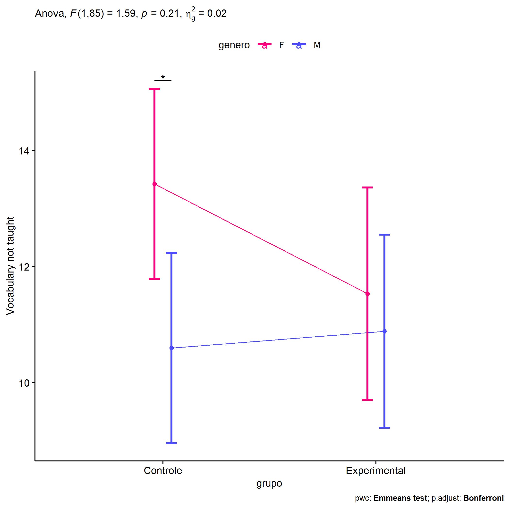
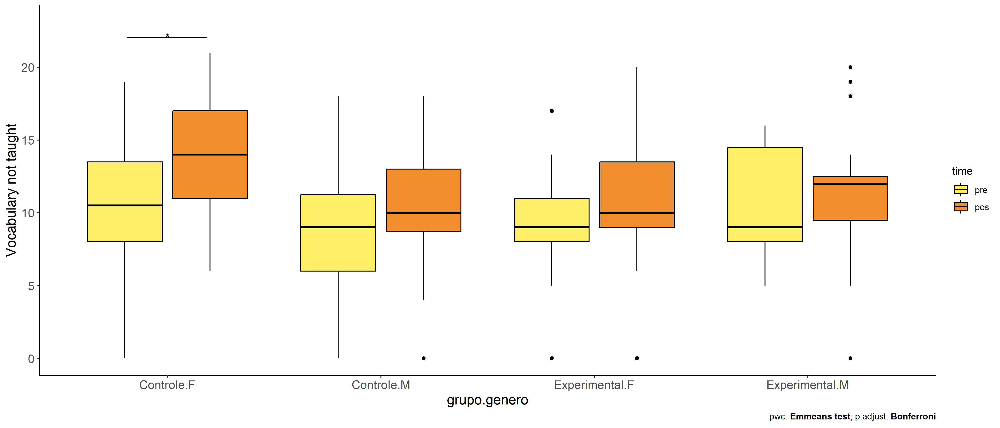
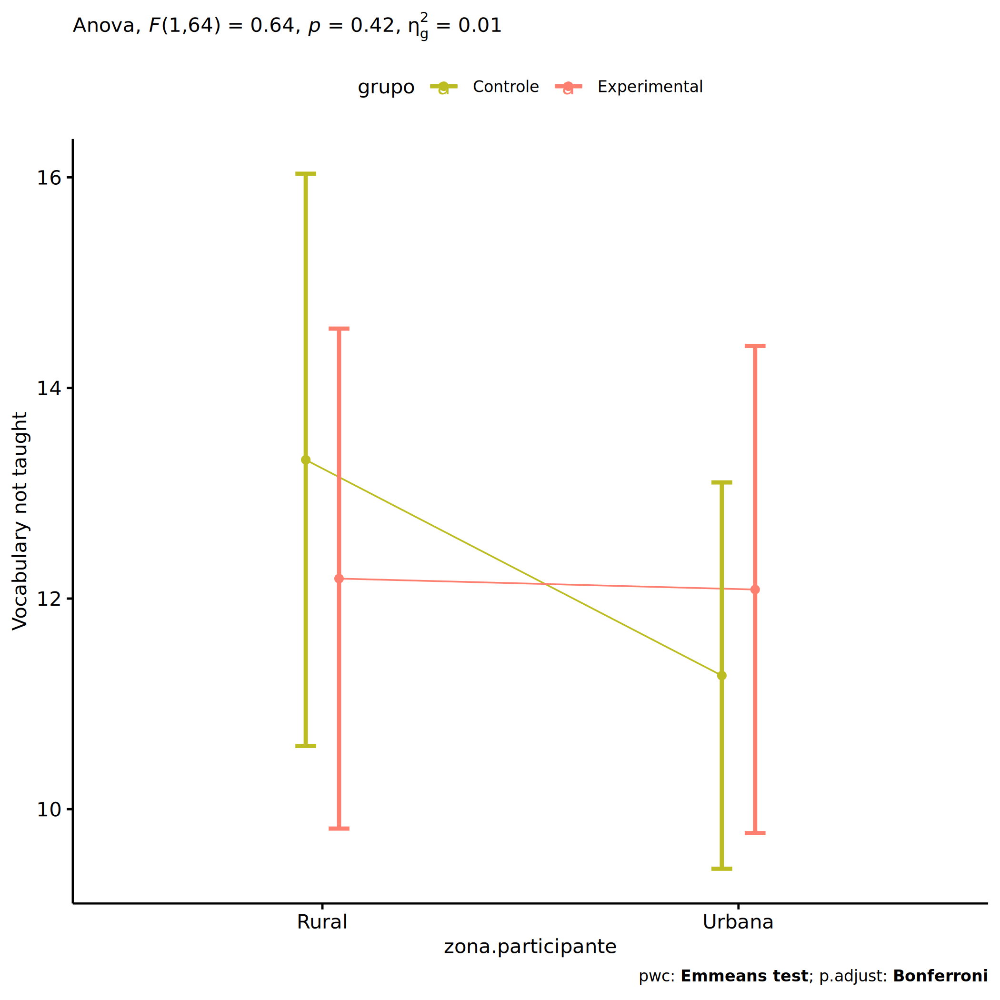
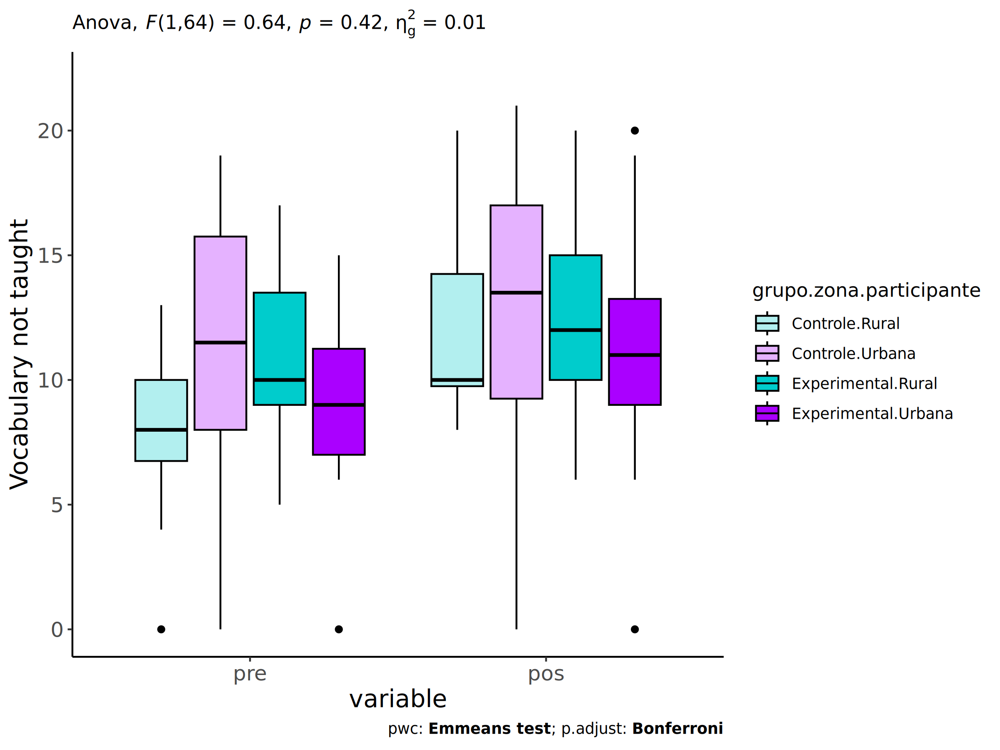
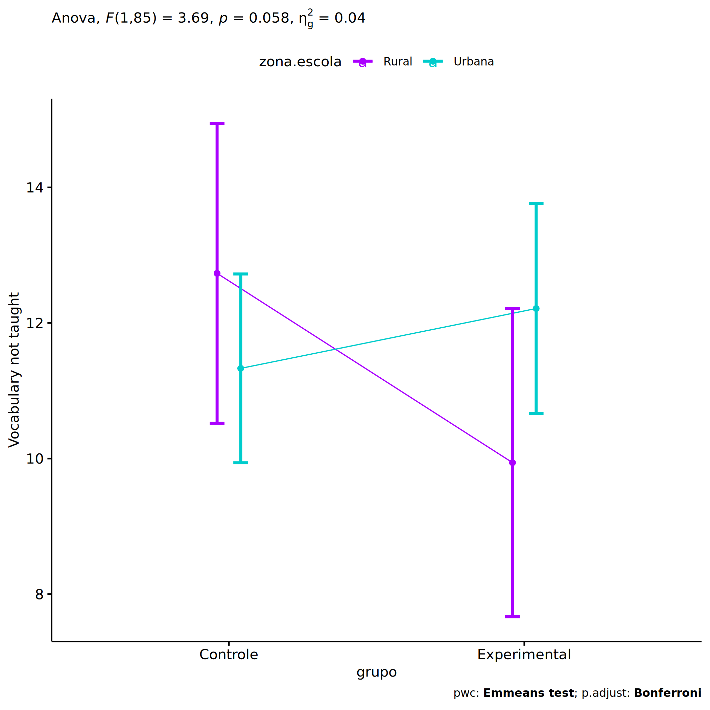
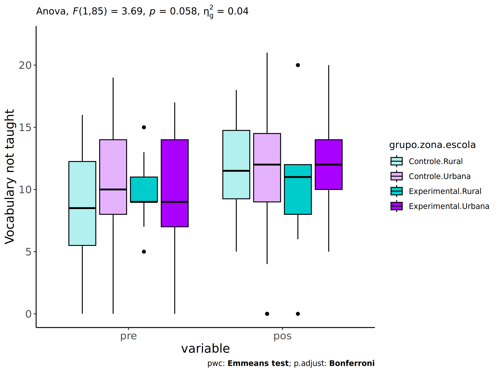
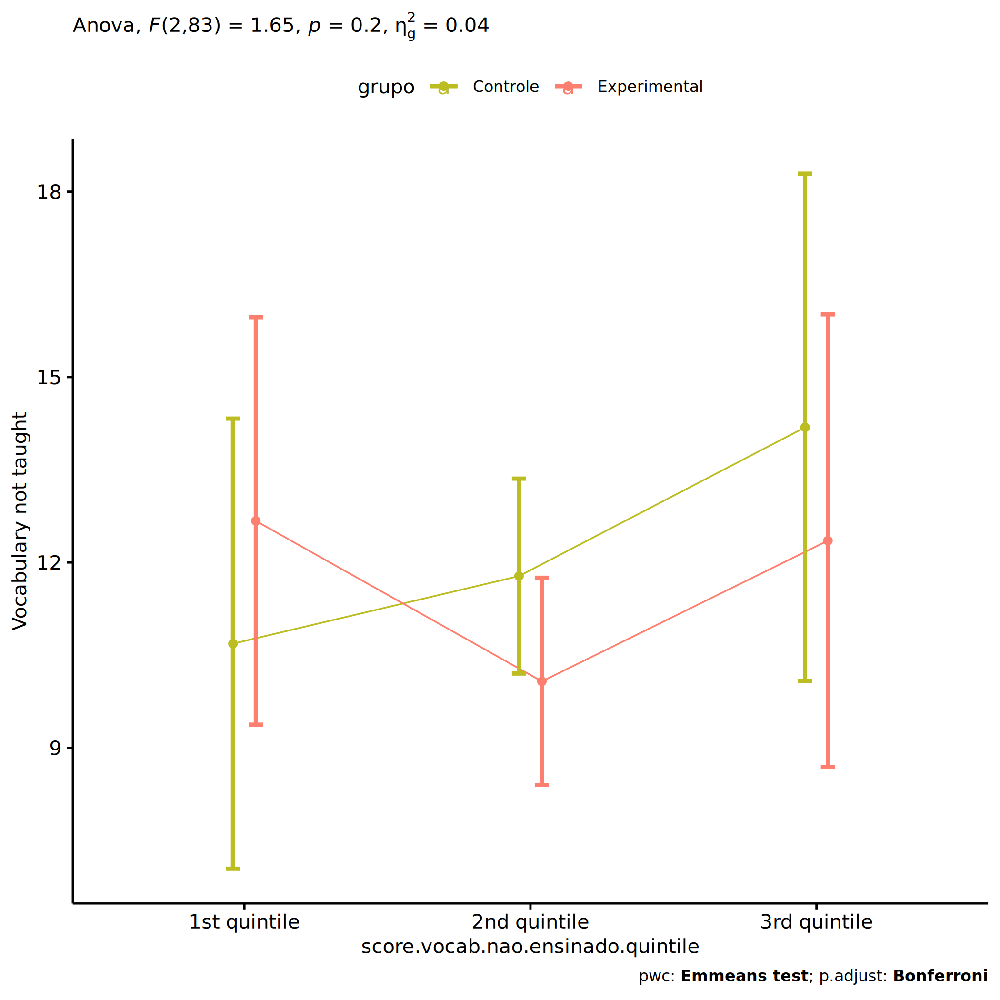
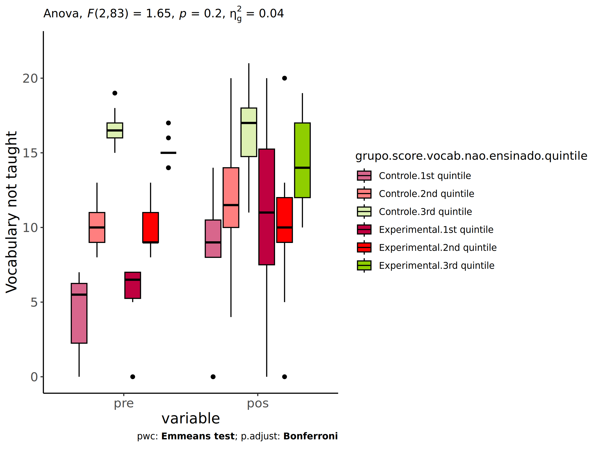

ANCOVA in Vocabulary not taught (Vocabulary not taught)
================
Geiser C. Challco <geiser@alumni.usp.br>

- [Setting Initial Variables](#setting-initial-variables)
- [Descriptive Statistics of Initial
  Data](#descriptive-statistics-of-initial-data)
- [ANCOVA and Pairwise for one factor:
  **grupo**](#ancova-and-pairwise-for-one-factor-grupo)
  - [Without remove non-normal data](#without-remove-non-normal-data)
  - [Computing ANCOVA and PairWise After removing non-normal data
    (OK)](#computing-ancova-and-pairwise-after-removing-non-normal-data-ok)
    - [Plots for ancova](#plots-for-ancova)
    - [Checking linearity assumption](#checking-linearity-assumption)
    - [Checking normality and
      homogeneity](#checking-normality-and-homogeneity)
- [ANCOVA and Pairwise for two factors
  **grupo:genero**](#ancova-and-pairwise-for-two-factors-grupogenero)
  - [Without remove non-normal data](#without-remove-non-normal-data-1)
  - [Computing ANCOVA and PairWise After removing non-normal data
    (OK)](#computing-ancova-and-pairwise-after-removing-non-normal-data-ok-1)
    - [Plots for ancova](#plots-for-ancova-1)
    - [Checking linearity assumption](#checking-linearity-assumption-1)
    - [Checking normality and
      homogeneity](#checking-normality-and-homogeneity-1)
- [ANCOVA and Pairwise for two factors
  **grupo:zona.participante**](#ancova-and-pairwise-for-two-factors-grupozonaparticipante)
  - [Without remove non-normal data](#without-remove-non-normal-data-2)
  - [Computing ANCOVA and PairWise After removing non-normal data
    (OK)](#computing-ancova-and-pairwise-after-removing-non-normal-data-ok-2)
    - [Plots for ancova](#plots-for-ancova-2)
    - [Checking linearity assumption](#checking-linearity-assumption-2)
    - [Checking normality and
      homogeneity](#checking-normality-and-homogeneity-2)
- [ANCOVA and Pairwise for two factors
  **grupo:zona.escola**](#ancova-and-pairwise-for-two-factors-grupozonaescola)
  - [Without remove non-normal data](#without-remove-non-normal-data-3)
  - [Computing ANCOVA and PairWise After removing non-normal data
    (OK)](#computing-ancova-and-pairwise-after-removing-non-normal-data-ok-3)
    - [Plots for ancova](#plots-for-ancova-3)
    - [Checking linearity assumption](#checking-linearity-assumption-3)
    - [Checking normality and
      homogeneity](#checking-normality-and-homogeneity-3)
- [ANCOVA and Pairwise for two factors
  **grupo:score.vocab.nao.ensinado.quintile**](#ancova-and-pairwise-for-two-factors-gruposcorevocabnaoensinadoquintile)
  - [Without remove non-normal data](#without-remove-non-normal-data-4)
  - [Computing ANCOVA and PairWise After removing non-normal data
    (OK)](#computing-ancova-and-pairwise-after-removing-non-normal-data-ok-4)
    - [Plots for ancova](#plots-for-ancova-4)
    - [Checking linearity assumption](#checking-linearity-assumption-4)
    - [Checking normality and
      homogeneity](#checking-normality-and-homogeneity-4)
- [Summary of Results](#summary-of-results)
  - [Descriptive Statistics](#descriptive-statistics)
  - [ANCOVA Table Comparison](#ancova-table-comparison)
  - [PairWise Table Comparison](#pairwise-table-comparison)
  - [EMMS Table Comparison](#emms-table-comparison)

**NOTE**:

- Teste ANCOVA para determinar se houve diferenças significativas no
  Vocabulary not taught (medido usando pre- e pos-testes).
- ANCOVA test to determine whether there were significant differences in
  Vocabulary not taught (measured using pre- and post-tests).

# Setting Initial Variables

``` r
dv = "score.vocab.nao.ensinado"
dv.pos = "score.vocab.nao.ensinado.pos"
dv.pre = "score.vocab.nao.ensinado.pre"

fatores2 <- c("genero","zona.participante","zona.escola","score.vocab.nao.ensinado.quintile")
lfatores2 <- as.list(fatores2)
names(lfatores2) <- fatores2

fatores1 <- c("grupo", fatores2)
lfatores1 <- as.list(fatores1)
names(lfatores1) <- fatores1

lfatores <- c(lfatores1)

color <- list()
color[["prepost"]] = c("#ffee65","#f28e2B")
color[["grupo"]] = c("#bcbd22","#fd7f6f")
color[["genero"]] = c("#FF007F","#4D4DFF")
color[["zona.escola"]] = c("#AA00FF","#00CCCC")
color[["zona.participante"]] = c("#AA00FF","#00CCCC")

level <- list()
level[["grupo"]] = c("Controle","Experimental")
level[["genero"]] = c("F","M")
level[["zona.escola"]] = c("Rural","Urbana")
level[["zona.participante"]] = c("Rural","Urbana")

# ..

ymin <- 0
ymax <- 0

ymin.ci <- 0
ymax.ci <- 0


color[["grupo:genero"]] = c(
  "Controle:F"="#ff99cb", "Controle:M"="#b7b7ff",
  "Experimental:F"="#FF007F", "Experimental:M"="#4D4DFF",
  "Controle.F"="#ff99cb", "Controle.M"="#b7b7ff",
  "Experimental.F"="#FF007F", "Experimental.M"="#4D4DFF"
)
color[["grupo:zona.escola"]] = c(
  "Controle:Rural"="#b2efef","Controle:Urbana"="#e5b2ff",
  "Experimental:Rural"="#00CCCC", "Experimental:Urbana"="#AA00FF",
  "Controle.Rural"="#b2efef","Controle.Urbana"="#e5b2ff",
  "Experimental.Rural"="#00CCCC", "Experimental.Urbana"="#AA00FF"
)
color[["grupo:zona.participante"]] = c(
  "Controle:Rural"="#b2efef","Controle:Urbana"="#e5b2ff",
  "Experimental:Rural"="#00CCCC", "Experimental:Urbana"="#AA00FF",
  "Controle.Rural"="#b2efef","Controle.Urbana"="#e5b2ff",
  "Experimental.Rural"="#00CCCC", "Experimental.Urbana"="#AA00FF"
)

for (coln in c(
  "palavras.lidas","score.compreensao","tri.compreensao",
  "score.vocab","tri.vocab",
  "score.vocab.ensinado","tri.vocab.ensinado","score.vocab.nao.ensinado","tri.vocab.nao.ensinado",
  "score.CLPP","tri.CLPP","score.CR","tri.CR",
  "score.CI","tri.CI","score.TV","tri.TV","score.TF","tri.TF","score.TO","tri.TO")) {
  color[[paste0(coln,".quintile")]] = c("#BF0040","#FF0000","#800080","#0000FF","#4000BF")
  level[[paste0(coln,".quintile")]] = c("1st quintile","2nd quintile","3rd quintile","4th quintile","5th quintile")
  color[[paste0("grupo:",coln,".quintile")]] = c(
    "Experimental.1st quintile"="#BF0040", "Controle.1st quintile"="#d8668c",
    "Experimental.2nd quintile"="#FF0000", "Controle.2nd quintile"="#ff7f7f",
    "Experimental.3rd quintile"="#8fce00", "Controle.3rd quintile"="#ddf0b2",
    "Experimental.4th quintile"="#0000FF", "Controle.4th quintile"="#b2b2ff",
    "Experimental.5th quintile"="#4000BF", "Controle.5th quintile"="#b299e5",
    
    "Experimental:1st quintile"="#BF0040", "Controle:1st quintile"="#d8668c",
    "Experimental:2nd quintile"="#FF0000", "Controle:2nd quintile"="#ff7f7f",
    "Experimental:3rd quintile"="#8fce00", "Controle:3rd quintile"="#ddf0b2",
    "Experimental:4th quintile"="#0000FF", "Controle:4th quintile"="#b2b2ff",
    "Experimental:5th quintile"="#4000BF", "Controle:5th quintile"="#b299e5")
}


gdat <- read_excel("../data/data.xlsx", sheet = "vocabulario.st")


dat <- gdat
dat$grupo <- factor(dat[["grupo"]], level[["grupo"]])
for (coln in c(names(lfatores))) {
  dat[[coln]] <- factor(dat[[coln]], level[[coln]][level[[coln]] %in% unique(dat[[coln]])])
}
dat <- dat[which(!is.na(dat[[dv.pre]]) & !is.na(dat[[dv.pos]])),]
dat <- dat[,c("id",names(lfatores),dv.pre,dv.pos)]

dat.long <- rbind(dat, dat)
dat.long$time <- c(rep("pre", nrow(dat)), rep("pos", nrow(dat)))
dat.long$time <- factor(dat.long$time, c("pre","pos"))
dat.long[[dv]] <- c(dat[[dv.pre]], dat[[dv.pos]])


for (f in c("grupo", names(lfatores))) {
  if (is.null(color[[f]]) && length(unique(dat[[f]])) > 0) 
      color[[f]] <- distinctColorPalette(length(unique(dat[[f]])))
}
for (f in c(fatores2)) {
  if (is.null(color[[paste0("grupo:",f)]]) && length(unique(dat[[f]])) > 0)
    color[[paste0("grupo:",f)]] <- distinctColorPalette(length(unique(dat[["grupo"]]))*length(unique(dat[[f]])))
}

ldat <- list()
laov <- list()
lpwc <- list()
lemms <- list()
```

# Descriptive Statistics of Initial Data

``` r
df <- get.descriptives(dat, c(dv.pre, dv.pos), c("grupo"), 
                       include.global = T, symmetry.test = T, normality.test = F)
df <- plyr::rbind.fill(
  df, do.call(plyr::rbind.fill, lapply(lfatores2, FUN = function(f) {
    if (nrow(dat) > 0 && sum(!is.na(unique(dat[[f]]))) > 1)
      get.descriptives(dat, c(dv.pre,dv.pos), c("grupo", f),
                       symmetry.test = T, normality.test = F)
    }))
)
df <- df[,c(fatores1[fatores1 %in% colnames(df)],"variable",
            colnames(df)[!colnames(df) %in% c(fatores1,"variable")])]
```

| grupo        | genero | zona.participante | zona.escola | score.vocab.nao.ensinado.quintile | variable                     |   n |   mean | median | min | max |    sd |    se |    ci |  iqr | symmetry | skewness | kurtosis |
|:-------------|:-------|:------------------|:------------|:----------------------------------|:-----------------------------|----:|-------:|-------:|----:|----:|------:|------:|------:|-----:|:---------|---------:|---------:|
| Controle     |        |                   |             |                                   | score.vocab.nao.ensinado.pre |  50 | 10.280 |   10.0 |   0 |  20 | 4.794 | 0.678 | 1.362 | 5.00 | YES      |   -0.101 |   -0.370 |
| Experimental |        |                   |             |                                   | score.vocab.nao.ensinado.pre |  42 | 10.024 |    9.0 |   0 |  17 | 3.558 | 0.549 | 1.109 | 4.75 | YES      |   -0.105 |   -0.062 |
|              |        |                   |             |                                   | score.vocab.nao.ensinado.pre |  92 | 10.163 |   10.0 |   0 |  20 | 4.254 | 0.443 | 0.881 | 5.00 | YES      |   -0.081 |   -0.038 |
| Controle     |        |                   |             |                                   | score.vocab.nao.ensinado.pos |  50 | 11.520 |   11.5 |   0 |  21 | 5.211 | 0.737 | 1.481 | 5.75 | YES      |   -0.473 |   -0.113 |
| Experimental |        |                   |             |                                   | score.vocab.nao.ensinado.pos |  42 | 11.190 |   11.0 |   0 |  20 | 4.430 | 0.684 | 1.380 | 4.00 | YES      |   -0.181 |    0.513 |
|              |        |                   |             |                                   | score.vocab.nao.ensinado.pos |  92 | 11.370 |   11.0 |   0 |  21 | 4.846 | 0.505 | 1.004 | 5.00 | YES      |   -0.367 |    0.192 |
| Controle     | F      |                   |             |                                   | score.vocab.nao.ensinado.pre |  25 | 11.200 |   11.0 |   0 |  19 | 4.243 | 0.849 | 1.751 | 7.00 | YES      |   -0.356 |    0.001 |
| Controle     | M      |                   |             |                                   | score.vocab.nao.ensinado.pre |  25 |  9.360 |    9.0 |   0 |  20 | 5.211 | 1.042 | 2.151 | 6.00 | YES      |    0.207 |   -0.571 |
| Experimental | F      |                   |             |                                   | score.vocab.nao.ensinado.pre |  19 |  9.316 |    9.0 |   0 |  17 | 3.575 | 0.820 | 1.723 | 3.00 | YES      |   -0.397 |    0.912 |
| Experimental | M      |                   |             |                                   | score.vocab.nao.ensinado.pre |  23 | 10.609 |    9.0 |   5 |  16 | 3.513 | 0.732 | 1.519 | 6.50 | YES      |    0.162 |   -1.567 |
| Controle     | F      |                   |             |                                   | score.vocab.nao.ensinado.pos |  25 | 13.360 |   14.0 |   0 |  21 | 4.786 | 0.957 | 1.976 | 6.00 | NO       |   -0.649 |    0.428 |
| Controle     | M      |                   |             |                                   | score.vocab.nao.ensinado.pos |  25 |  9.680 |   10.0 |   0 |  18 | 5.047 | 1.009 | 2.083 | 5.00 | YES      |   -0.381 |   -0.450 |
| Experimental | F      |                   |             |                                   | score.vocab.nao.ensinado.pos |  19 | 11.211 |   10.0 |   0 |  20 | 4.565 | 1.047 | 2.200 | 4.50 | YES      |   -0.165 |    0.215 |
| Experimental | M      |                   |             |                                   | score.vocab.nao.ensinado.pos |  23 | 11.174 |   12.0 |   0 |  20 | 4.417 | 0.921 | 1.910 | 3.00 | YES      |   -0.184 |    0.456 |
| Controle     |        | Rural             |             |                                   | score.vocab.nao.ensinado.pre |  12 |  7.833 |    8.0 |   0 |  13 | 3.512 | 1.014 | 2.231 | 3.25 | NO       |   -0.600 |   -0.232 |
| Controle     |        | Urbana            |             |                                   | score.vocab.nao.ensinado.pre |  26 | 11.538 |   11.5 |   0 |  19 | 5.101 | 1.000 | 2.060 | 7.75 | NO       |   -0.613 |   -0.346 |
| Controle     |        |                   |             |                                   | score.vocab.nao.ensinado.pre |  12 | 10.000 |    9.5 |   3 |  20 | 4.533 | 1.308 | 2.880 | 2.00 | NO       |    0.650 |   -0.153 |
| Experimental |        | Rural             |             |                                   | score.vocab.nao.ensinado.pre |  15 | 10.933 |   10.0 |   5 |  17 | 3.411 | 0.881 | 1.889 | 4.50 | YES      |    0.134 |   -1.210 |
| Experimental |        | Urbana            |             |                                   | score.vocab.nao.ensinado.pre |  16 |  8.938 |    9.0 |   0 |  15 | 3.714 | 0.929 | 1.979 | 4.25 | YES      |   -0.334 |    0.110 |
| Experimental |        |                   |             |                                   | score.vocab.nao.ensinado.pre |  11 | 10.364 |   10.0 |   5 |  16 | 3.414 | 1.029 | 2.293 | 4.00 | YES      |    0.266 |   -1.233 |
| Controle     |        | Rural             |             |                                   | score.vocab.nao.ensinado.pos |  12 | 12.083 |   10.0 |   8 |  20 | 3.848 | 1.111 | 2.445 | 4.50 | NO       |    0.837 |   -0.807 |
| Controle     |        | Urbana            |             |                                   | score.vocab.nao.ensinado.pos |  26 | 12.000 |   13.5 |   0 |  21 | 6.112 | 1.199 | 2.469 | 7.75 | NO       |   -0.613 |   -0.664 |
| Controle     |        |                   |             |                                   | score.vocab.nao.ensinado.pos |  12 |  9.917 |   11.5 |   0 |  14 | 4.188 | 1.209 | 2.661 | 4.50 | NO       |   -1.049 |   -0.023 |
| Experimental |        | Rural             |             |                                   | score.vocab.nao.ensinado.pos |  15 | 12.600 |   12.0 |   6 |  20 | 3.776 | 0.975 | 2.091 | 5.00 | YES      |    0.365 |   -0.843 |
| Experimental |        | Urbana            |             |                                   | score.vocab.nao.ensinado.pos |  16 | 11.438 |   11.0 |   0 |  20 | 4.993 | 1.248 | 2.661 | 4.25 | YES      |   -0.183 |   -0.107 |
| Experimental |        |                   |             |                                   | score.vocab.nao.ensinado.pos |  11 |  8.909 |   10.0 |   0 |  12 | 3.780 | 1.140 | 2.540 | 4.50 | NO       |   -1.087 |    0.086 |
| Controle     |        |                   | Rural       |                                   | score.vocab.nao.ensinado.pre |  14 |  8.571 |    8.5 |   0 |  16 | 4.636 | 1.239 | 2.677 | 6.75 | YES      |   -0.069 |   -1.068 |
| Controle     |        |                   | Urbana      |                                   | score.vocab.nao.ensinado.pre |  36 | 10.944 |   10.0 |   0 |  20 | 4.751 | 0.792 | 1.607 | 7.00 | YES      |   -0.141 |   -0.239 |
| Experimental |        |                   | Rural       |                                   | score.vocab.nao.ensinado.pre |  13 |  9.846 |    9.0 |   5 |  15 | 2.672 | 0.741 | 1.615 | 2.00 | YES      |    0.224 |   -0.683 |
| Experimental |        |                   | Urbana      |                                   | score.vocab.nao.ensinado.pre |  29 | 10.103 |    9.0 |   0 |  17 | 3.931 | 0.730 | 1.495 | 7.00 | YES      |   -0.177 |   -0.351 |
| Controle     |        |                   | Rural       |                                   | score.vocab.nao.ensinado.pos |  14 | 12.000 |   11.5 |   5 |  18 | 3.823 | 1.022 | 2.207 | 5.50 | YES      |   -0.046 |   -1.275 |
| Controle     |        |                   | Urbana      |                                   | score.vocab.nao.ensinado.pos |  36 | 11.333 |   11.5 |   0 |  21 | 5.697 | 0.950 | 1.928 | 5.25 | YES      |   -0.443 |   -0.399 |
| Experimental |        |                   | Rural       |                                   | score.vocab.nao.ensinado.pos |  13 |  9.846 |   11.0 |   0 |  20 | 4.543 | 1.260 | 2.745 | 4.00 | YES      |    0.028 |    0.684 |
| Experimental |        |                   | Urbana      |                                   | score.vocab.nao.ensinado.pos |  29 | 11.793 |   12.0 |   0 |  20 | 4.321 | 0.802 | 1.644 | 4.00 | YES      |   -0.264 |    0.383 |
| Controle     |        |                   |             | 1st quintile                      | score.vocab.nao.ensinado.pre |  12 |  4.250 |    5.5 |   0 |   7 | 2.832 | 0.818 | 1.800 | 4.00 | NO       |   -0.562 |   -1.471 |
| Controle     |        |                   |             | 2nd quintile                      | score.vocab.nao.ensinado.pre |  26 | 10.077 |   10.0 |   8 |  13 | 1.671 | 0.328 | 0.675 | 2.00 | YES      |    0.328 |   -1.131 |
| Controle     |        |                   |             | 3rd quintile                      | score.vocab.nao.ensinado.pre |  12 | 16.750 |   16.5 |  15 |  20 | 1.603 | 0.463 | 1.018 | 1.50 | NO       |    0.615 |   -0.868 |
| Experimental |        |                   |             | 1st quintile                      | score.vocab.nao.ensinado.pre |  10 |  5.700 |    6.5 |   0 |   7 | 2.163 | 0.684 | 1.547 | 1.75 | NO       |   -1.728 |    1.892 |
| Experimental |        |                   |             | 2nd quintile                      | score.vocab.nao.ensinado.pre |  23 |  9.913 |    9.0 |   8 |  13 | 1.505 | 0.314 | 0.651 | 2.00 | NO       |    0.676 |   -0.710 |
| Experimental |        |                   |             | 3rd quintile                      | score.vocab.nao.ensinado.pre |   9 | 15.111 |   15.0 |  14 |  17 | 0.928 | 0.309 | 0.713 | 0.00 | NO       |    0.652 |   -0.542 |
| Controle     |        |                   |             | 1st quintile                      | score.vocab.nao.ensinado.pos |  12 |  8.583 |    9.0 |   0 |  14 | 4.502 | 1.300 | 2.860 | 2.50 | NO       |   -0.823 |   -0.418 |
| Controle     |        |                   |             | 2nd quintile                      | score.vocab.nao.ensinado.pos |  26 | 11.808 |   11.5 |   4 |  20 | 3.960 | 0.777 | 1.599 | 4.00 | YES      |    0.014 |   -0.541 |
| Controle     |        |                   |             | 3rd quintile                      | score.vocab.nao.ensinado.pos |  12 | 13.833 |   17.0 |   0 |  21 | 7.043 | 2.033 | 4.475 | 5.50 | NO       |   -1.067 |   -0.349 |
| Experimental |        |                   |             | 1st quintile                      | score.vocab.nao.ensinado.pos |  10 | 11.100 |   11.0 |   0 |  20 | 6.027 | 1.906 | 4.311 | 7.75 | YES      |   -0.192 |   -1.083 |
| Experimental |        |                   |             | 2nd quintile                      | score.vocab.nao.ensinado.pos |  23 | 10.043 |   10.0 |   0 |  20 | 3.599 | 0.750 | 1.556 | 3.00 | YES      |   -0.162 |    2.470 |
| Experimental |        |                   |             | 3rd quintile                      | score.vocab.nao.ensinado.pos |   9 | 14.222 |   14.0 |  10 |  19 | 3.153 | 1.051 | 2.424 | 5.00 | YES      |    0.223 |   -1.611 |

# ANCOVA and Pairwise for one factor: **grupo**

## Without remove non-normal data

``` r
pdat = remove_group_data(dat[!is.na(dat[["grupo"]]),], "score.vocab.nao.ensinado.pos", "grupo")

pdat.long <- rbind(pdat[,c("id","grupo")], pdat[,c("id","grupo")])
pdat.long[["time"]] <- c(rep("pre", nrow(pdat)), rep("pos", nrow(pdat)))
pdat.long[["time"]] <- factor(pdat.long[["time"]], c("pre","pos"))
pdat.long[["score.vocab.nao.ensinado"]] <- c(pdat[["score.vocab.nao.ensinado.pre"]], pdat[["score.vocab.nao.ensinado.pos"]])

aov = anova_test(pdat, score.vocab.nao.ensinado.pos ~ score.vocab.nao.ensinado.pre + grupo)
laov[["grupo"]] <- get_anova_table(aov)
```

``` r
pwc <- emmeans_test(pdat, score.vocab.nao.ensinado.pos ~ grupo, covariate = score.vocab.nao.ensinado.pre,
                    p.adjust.method = "bonferroni")
```

``` r
pwc.long <- emmeans_test(dplyr::group_by_at(pdat.long, "grupo"),
                          score.vocab.nao.ensinado ~ time,
                          p.adjust.method = "bonferroni")
lpwc[["grupo"]] <- plyr::rbind.fill(pwc, pwc.long)
```

``` r
ds <- get.descriptives(pdat, "score.vocab.nao.ensinado.pos", "grupo", covar = "score.vocab.nao.ensinado.pre")
ds <- merge(ds[ds$variable != "score.vocab.nao.ensinado.pre",],
            ds[ds$variable == "score.vocab.nao.ensinado.pre", !colnames(ds) %in% c("variable")],
            by = "grupo", all.x = T, suffixes = c("", ".score.vocab.nao.ensinado.pre"))
ds <- merge(get_emmeans(pwc), ds, by = "grupo", suffixes = c(".emms", ""))
ds <- ds[,c("grupo","n","mean.score.vocab.nao.ensinado.pre","se.score.vocab.nao.ensinado.pre","mean","se",
            "emmean","se.emms","conf.low","conf.high")]

colnames(ds) <- c("grupo", "N", paste0(c("M","SE")," (pre)"),
                  paste0(c("M","SE"), " (unadj)"),
                  paste0(c("M", "SE"), " (adj)"), "conf.low", "conf.high")

lemms[["grupo"]] <- ds
```

## Computing ANCOVA and PairWise After removing non-normal data (OK)

``` r
wdat = pdat 

res = residuals(lm(score.vocab.nao.ensinado.pos ~ score.vocab.nao.ensinado.pre + grupo, data = wdat))
non.normal = getNonNormal(res, wdat$id, plimit = 0.05)

wdat = wdat[!wdat$id %in% non.normal,]

wdat.long <- rbind(wdat[,c("id","grupo")], wdat[,c("id","grupo")])
wdat.long[["time"]] <- c(rep("pre", nrow(wdat)), rep("pos", nrow(wdat)))
wdat.long[["time"]] <- factor(wdat.long[["time"]], c("pre","pos"))
wdat.long[["score.vocab.nao.ensinado"]] <- c(wdat[["score.vocab.nao.ensinado.pre"]], wdat[["score.vocab.nao.ensinado.pos"]])

ldat[["grupo"]] = wdat

(non.normal)
```

    ## [1] "P300" "P294"

``` r
aov = anova_test(wdat, score.vocab.nao.ensinado.pos ~ score.vocab.nao.ensinado.pre + grupo)
laov[["grupo"]] <- merge(get_anova_table(aov), laov[["grupo"]],
                            by="Effect", suffixes = c("","'"))

(df = get_anova_table(aov))
```

    ## ANOVA Table (type II tests)
    ## 
    ##                         Effect DFn DFd      F        p p<.05   ges
    ## 1 score.vocab.nao.ensinado.pre   1  87 24.099 4.24e-06     * 0.217
    ## 2                        grupo   1  87  0.928 3.38e-01       0.011

| Effect                       | DFn | DFd |      F |     p | p\<.05 |   ges |
|:-----------------------------|----:|----:|-------:|------:|:-------|------:|
| score.vocab.nao.ensinado.pre |   1 |  87 | 24.099 | 0.000 | \*     | 0.217 |
| grupo                        |   1 |  87 |  0.928 | 0.338 |        | 0.011 |

``` r
pwc <- emmeans_test(wdat, score.vocab.nao.ensinado.pos ~ grupo, covariate = score.vocab.nao.ensinado.pre,
                    p.adjust.method = "bonferroni")
```

| term                                | .y.                          | group1   | group2       |  df | statistic |     p | p.adj | p.adj.signif |
|:------------------------------------|:-----------------------------|:---------|:-------------|----:|----------:|------:|------:|:-------------|
| score.vocab.nao.ensinado.pre\*grupo | score.vocab.nao.ensinado.pos | Controle | Experimental |  87 |     0.963 | 0.338 | 0.338 | ns           |

``` r
pwc.long <- emmeans_test(dplyr::group_by_at(wdat.long, "grupo"),
                         score.vocab.nao.ensinado ~ time,
                         p.adjust.method = "bonferroni")
lpwc[["grupo"]] <- merge(plyr::rbind.fill(pwc, pwc.long), lpwc[["grupo"]],
                            by=c("grupo","term",".y.","group1","group2"),
                            suffixes = c("","'"))
```

| grupo        | term | .y.                      | group1 | group2 |  df | statistic |     p | p.adj | p.adj.signif |
|:-------------|:-----|:-------------------------|:-------|:-------|----:|----------:|------:|------:|:-------------|
| Controle     | time | score.vocab.nao.ensinado | pre    | pos    | 176 |    -2.258 | 0.025 | 0.025 | \*           |
| Experimental | time | score.vocab.nao.ensinado | pre    | pos    | 176 |    -1.220 | 0.224 | 0.224 | ns           |

``` r
ds <- get.descriptives(wdat, "score.vocab.nao.ensinado.pos", "grupo", covar = "score.vocab.nao.ensinado.pre")
ds <- merge(ds[ds$variable != "score.vocab.nao.ensinado.pre",],
            ds[ds$variable == "score.vocab.nao.ensinado.pre", !colnames(ds) %in% c("variable")],
            by = "grupo", all.x = T, suffixes = c("", ".score.vocab.nao.ensinado.pre"))
ds <- merge(get_emmeans(pwc), ds, by = "grupo", suffixes = c(".emms", ""))
ds <- ds[,c("grupo","n","mean.score.vocab.nao.ensinado.pre","se.score.vocab.nao.ensinado.pre","mean","se",
            "emmean","se.emms","conf.low","conf.high")]

colnames(ds) <- c("grupo", "N", paste0(c("M","SE")," (pre)"),
                  paste0(c("M","SE"), " (unadj)"),
                  paste0(c("M", "SE"), " (adj)"), "conf.low", "conf.high")

lemms[["grupo"]] <- merge(ds, lemms[["grupo"]], by=c("grupo"), suffixes = c("","'"))
```

| grupo        |   N | M (pre) | SE (pre) | M (unadj) | SE (unadj) | M (adj) | SE (adj) | conf.low | conf.high |
|:-------------|----:|--------:|---------:|----------:|-----------:|--------:|---------:|---------:|----------:|
| Controle     |  48 |   9.979 |    0.667 |     12.00 |      0.684 |  12.011 |    0.590 |   10.837 |    13.184 |
| Experimental |  42 |  10.024 |    0.549 |     11.19 |      0.684 |  11.178 |    0.631 |    9.924 |    12.433 |

### Plots for ancova

``` r
plots <- oneWayAncovaPlots(
  wdat, "score.vocab.nao.ensinado.pos", "grupo", aov, list("grupo"=pwc), addParam = c("mean_ci"),
  font.label.size=10, step.increase=0.05, p.label="p.adj",
  subtitle = which(aov$Effect == "grupo"))
```

``` r
if (!is.null(nrow(plots[["grupo"]]$data)))
  plots[["grupo"]] + ggplot2::ylab("Vocabulary not taught") + 
  if (ymin.ci < ymax.ci) ggplot2::ylim(ymin.ci, ymax.ci)
```

<!-- -->

``` r
plots <- oneWayAncovaBoxPlots(
  wdat, "score.vocab.nao.ensinado.pos", "grupo", aov, pwc, covar = "score.vocab.nao.ensinado.pre",
  theme = "classic", color = color[["grupo"]],
  subtitle = which(aov$Effect == "grupo"))
```

``` r
if (length(unique(wdat[["grupo"]])) > 1)
  plots[["grupo"]] + ggplot2::ylab("Vocabulary not taught") +
  ggplot2::scale_x_discrete(labels=c('pre', 'pos')) +
  if (ymin < ymax) ggplot2::ylim(ymin, ymax)
```

<!-- -->

``` r
if (length(unique(wdat.long[["grupo"]])) > 1)
  plots <- oneWayAncovaBoxPlots(
    wdat.long, "score.vocab.nao.ensinado", "grupo", aov, pwc.long,
    pre.post = "time", theme = "classic", color = color$prepost)
```

``` r
if (length(unique(wdat.long[["grupo"]])) > 1)
  plots[["grupo"]] + ggplot2::ylab("Vocabulary not taught") +
  if (ymin < ymax) ggplot2::ylim(ymin, ymax) 
```

<!-- -->

### Checking linearity assumption

``` r
ggscatter(wdat, x = "score.vocab.nao.ensinado.pre", y = "score.vocab.nao.ensinado.pos", size = 0.5,
          color = "grupo", add = "reg.line")+
  stat_regline_equation(
    aes(label =  paste(..eq.label.., ..rr.label.., sep = "~~~~"), color = grupo)
  ) +
  ggplot2::labs(subtitle = rstatix::get_test_label(aov, detailed = T, row = which(aov$Effect == "grupo"))) +
  ggplot2::scale_color_manual(values = color[["grupo"]]) +
  ggplot2::ylab("Vocabulary not taught")  +
  if (ymin < ymax) ggplot2::ylim(ymin, ymax)
```

<!-- -->

### Checking normality and homogeneity

``` r
res <- augment(lm(score.vocab.nao.ensinado.pos ~ score.vocab.nao.ensinado.pre + grupo, data = wdat))
```

``` r
shapiro_test(res$.resid)
```

    ## # A tibble: 1 × 3
    ##   variable   statistic p.value
    ##   <chr>          <dbl>   <dbl>
    ## 1 res$.resid     0.973  0.0558

``` r
levene_test(res, .resid ~ grupo)
```

    ## # A tibble: 1 × 4
    ##     df1   df2 statistic     p
    ##   <int> <int>     <dbl> <dbl>
    ## 1     1    88     0.275 0.601

# ANCOVA and Pairwise for two factors **grupo:genero**

## Without remove non-normal data

``` r
pdat = remove_group_data(dat[!is.na(dat[["grupo"]]) & !is.na(dat[["genero"]]),],
                         "score.vocab.nao.ensinado.pos", c("grupo","genero"))
pdat = pdat[pdat[["genero"]] %in% do.call(
  intersect, lapply(unique(pdat[["grupo"]]), FUN = function(x) {
    unique(pdat[["genero"]][which(pdat[["grupo"]] == x)])
  })),]
pdat[["grupo"]] = factor(pdat[["grupo"]], level[["grupo"]])
pdat[["genero"]] = factor(
  pdat[["genero"]],
  level[["genero"]][level[["genero"]] %in% unique(pdat[["genero"]])])

pdat.long <- rbind(pdat[,c("id","grupo","genero")], pdat[,c("id","grupo","genero")])
pdat.long[["time"]] <- c(rep("pre", nrow(pdat)), rep("pos", nrow(pdat)))
pdat.long[["time"]] <- factor(pdat.long[["time"]], c("pre","pos"))
pdat.long[["score.vocab.nao.ensinado"]] <- c(pdat[["score.vocab.nao.ensinado.pre"]], pdat[["score.vocab.nao.ensinado.pos"]])

if (length(unique(pdat[["genero"]])) >= 2) {
  aov = anova_test(pdat, score.vocab.nao.ensinado.pos ~ score.vocab.nao.ensinado.pre + grupo*genero)
  laov[["grupo:genero"]] <- get_anova_table(aov)
}
```

``` r
if (length(unique(pdat[["genero"]])) >= 2) {
  pwcs <- list()
  pwcs[["genero"]] <- emmeans_test(
    group_by(pdat, grupo), score.vocab.nao.ensinado.pos ~ genero,
    covariate = score.vocab.nao.ensinado.pre, p.adjust.method = "bonferroni")
  pwcs[["grupo"]] <- emmeans_test(
    group_by(pdat, genero), score.vocab.nao.ensinado.pos ~ grupo,
    covariate = score.vocab.nao.ensinado.pre, p.adjust.method = "bonferroni")
  
  pwc <- plyr::rbind.fill(pwcs[["grupo"]], pwcs[["genero"]])
  pwc <- pwc[,c("grupo","genero", colnames(pwc)[!colnames(pwc) %in% c("grupo","genero")])]
}
```

``` r
if (length(unique(pdat[["genero"]])) >= 2) {
  pwc.long <- emmeans_test(dplyr::group_by_at(pdat.long, c("grupo","genero")),
                           score.vocab.nao.ensinado ~ time,
                           p.adjust.method = "bonferroni")
  lpwc[["grupo:genero"]] <- plyr::rbind.fill(pwc, pwc.long)
}
```

``` r
if (length(unique(pdat[["genero"]])) >= 2) {
  ds <- get.descriptives(pdat, "score.vocab.nao.ensinado.pos", c("grupo","genero"), covar = "score.vocab.nao.ensinado.pre")
  ds <- merge(ds[ds$variable != "score.vocab.nao.ensinado.pre",],
              ds[ds$variable == "score.vocab.nao.ensinado.pre", !colnames(ds) %in% c("variable")],
              by = c("grupo","genero"), all.x = T, suffixes = c("", ".score.vocab.nao.ensinado.pre"))
  ds <- merge(get_emmeans(pwcs[["grupo"]]), ds,
              by = c("grupo","genero"), suffixes = c(".emms", ""))
  ds <- ds[,c("grupo","genero","n","mean.score.vocab.nao.ensinado.pre","se.score.vocab.nao.ensinado.pre","mean","se",
              "emmean","se.emms","conf.low","conf.high")]
  
  colnames(ds) <- c("grupo","genero", "N", paste0(c("M","SE")," (pre)"),
                    paste0(c("M","SE"), " (unadj)"),
                    paste0(c("M", "SE"), " (adj)"), "conf.low", "conf.high")
  
  lemms[["grupo:genero"]] <- ds
}
```

## Computing ANCOVA and PairWise After removing non-normal data (OK)

``` r
if (length(unique(pdat[["genero"]])) >= 2) {
  wdat = pdat 
  
  res = residuals(lm(score.vocab.nao.ensinado.pos ~ score.vocab.nao.ensinado.pre + grupo*genero, data = wdat))
  non.normal = getNonNormal(res, wdat$id, plimit = 0.05)
  
  wdat = wdat[!wdat$id %in% non.normal,]
  
  wdat.long <- rbind(wdat[,c("id","grupo","genero")], wdat[,c("id","grupo","genero")])
  wdat.long[["time"]] <- c(rep("pre", nrow(wdat)), rep("pos", nrow(wdat)))
  wdat.long[["time"]] <- factor(wdat.long[["time"]], c("pre","pos"))
  wdat.long[["score.vocab.nao.ensinado"]] <- c(wdat[["score.vocab.nao.ensinado.pre"]], wdat[["score.vocab.nao.ensinado.pos"]])
  
  
  ldat[["grupo:genero"]] = wdat
  
  (non.normal)
}
```

    ## [1] "P294" "P300"

``` r
if (length(unique(pdat[["genero"]])) >= 2) {
  aov = anova_test(wdat, score.vocab.nao.ensinado.pos ~ score.vocab.nao.ensinado.pre + grupo*genero)
  laov[["grupo:genero"]] <- merge(get_anova_table(aov), laov[["grupo:genero"]],
                                         by="Effect", suffixes = c("","'"))
  df = get_anova_table(aov)
}
```

| Effect                       | DFn | DFd |      F |     p | p\<.05 |   ges |
|:-----------------------------|----:|----:|-------:|------:|:-------|------:|
| score.vocab.nao.ensinado.pre |   1 |  85 | 20.320 | 0.000 | \*     | 0.193 |
| grupo                        |   1 |  85 |  0.779 | 0.380 |        | 0.009 |
| genero                       |   1 |  85 |  4.532 | 0.036 | \*     | 0.051 |
| grupo:genero                 |   1 |  85 |  1.589 | 0.211 |        | 0.018 |

``` r
if (length(unique(pdat[["genero"]])) >= 2) {
  pwcs <- list()
  pwcs[["genero"]] <- emmeans_test(
    group_by(wdat, grupo), score.vocab.nao.ensinado.pos ~ genero,
    covariate = score.vocab.nao.ensinado.pre, p.adjust.method = "bonferroni")
  pwcs[["grupo"]] <- emmeans_test(
    group_by(wdat, genero), score.vocab.nao.ensinado.pos ~ grupo,
    covariate = score.vocab.nao.ensinado.pre, p.adjust.method = "bonferroni")
  
  pwc <- plyr::rbind.fill(pwcs[["grupo"]], pwcs[["genero"]])
  pwc <- pwc[,c("grupo","genero", colnames(pwc)[!colnames(pwc) %in% c("grupo","genero")])]
}
```

| grupo        | genero | term                                 | .y.                          | group1   | group2       |  df | statistic |     p | p.adj | p.adj.signif |
|:-------------|:-------|:-------------------------------------|:-----------------------------|:---------|:-------------|----:|----------:|------:|------:|:-------------|
|              | F      | score.vocab.nao.ensinado.pre\*grupo  | score.vocab.nao.ensinado.pos | Controle | Experimental |  85 |     1.524 | 0.131 | 0.131 | ns           |
|              | M      | score.vocab.nao.ensinado.pre\*grupo  | score.vocab.nao.ensinado.pos | Controle | Experimental |  85 |    -0.246 | 0.806 | 0.806 | ns           |
| Controle     |        | score.vocab.nao.ensinado.pre\*genero | score.vocab.nao.ensinado.pos | F        | M            |  85 |     2.408 | 0.018 | 0.018 | \*           |
| Experimental |        | score.vocab.nao.ensinado.pre\*genero | score.vocab.nao.ensinado.pos | F        | M            |  85 |     0.520 | 0.605 | 0.605 | ns           |

``` r
if (length(unique(pdat[["genero"]])) >= 2) {
  pwc.long <- emmeans_test(dplyr::group_by_at(wdat.long, c("grupo","genero")),
                           score.vocab.nao.ensinado ~ time,
                           p.adjust.method = "bonferroni")
  lpwc[["grupo:genero"]] <- merge(plyr::rbind.fill(pwc, pwc.long),
                                         lpwc[["grupo:genero"]],
                                         by=c("grupo","genero","term",".y.","group1","group2"),
                                         suffixes = c("","'"))
}
```

| grupo        | genero | term | .y.                      | group1 | group2 |  df | statistic |     p | p.adj | p.adj.signif |
|:-------------|:-------|:-----|:-------------------------|:-------|:-------|----:|----------:|------:|------:|:-------------|
| Controle     | F      | time | score.vocab.nao.ensinado | pre    | pos    | 172 |    -2.333 | 0.021 | 0.021 | \*           |
| Controle     | M      | time | score.vocab.nao.ensinado | pre    | pos    | 172 |    -0.947 | 0.345 | 0.345 | ns           |
| Experimental | F      | time | score.vocab.nao.ensinado | pre    | pos    | 172 |    -1.368 | 0.173 | 0.173 | ns           |
| Experimental | M      | time | score.vocab.nao.ensinado | pre    | pos    | 172 |    -0.449 | 0.654 | 0.654 | ns           |

``` r
if (length(unique(pdat[["genero"]])) >= 2) {
  ds <- get.descriptives(wdat, "score.vocab.nao.ensinado.pos", c("grupo","genero"), covar = "score.vocab.nao.ensinado.pre")
  ds <- merge(ds[ds$variable != "score.vocab.nao.ensinado.pre",],
              ds[ds$variable == "score.vocab.nao.ensinado.pre", !colnames(ds) %in% c("variable")],
              by = c("grupo","genero"), all.x = T, suffixes = c("", ".score.vocab.nao.ensinado.pre"))
  ds <- merge(get_emmeans(pwcs[["grupo"]]), ds,
              by = c("grupo","genero"), suffixes = c(".emms", ""))
  ds <- ds[,c("grupo","genero","n","mean.score.vocab.nao.ensinado.pre","se.score.vocab.nao.ensinado.pre",
              "mean","se","emmean","se.emms","conf.low","conf.high")]
  
  colnames(ds) <- c("grupo","genero", "N", paste0(c("M","SE")," (pre)"),
                    paste0(c("M","SE"), " (unadj)"),
                    paste0(c("M", "SE"), " (adj)"), "conf.low", "conf.high")
  
  lemms[["grupo:genero"]] <- merge(ds, lemms[["grupo:genero"]],
                                          by=c("grupo","genero"), suffixes = c("","'"))
}
```

| grupo        | genero |   N | M (pre) | SE (pre) | M (unadj) | SE (unadj) | M (adj) | SE (adj) | conf.low | conf.high |
|:-------------|:-------|----:|--------:|---------:|----------:|-----------:|--------:|---------:|---------:|----------:|
| Controle     | F      |  24 |  11.042 |    0.869 |    13.917 |      0.812 |  13.424 |    0.823 |   11.788 |    15.061 |
| Controle     | M      |  24 |   8.917 |    0.983 |    10.083 |      0.965 |  10.595 |    0.824 |    8.958 |    12.233 |
| Experimental | F      |  19 |   9.316 |    0.820 |    11.211 |      1.047 |  11.534 |    0.920 |    9.705 |    13.362 |
| Experimental | M      |  23 |  10.609 |    0.732 |    11.174 |      0.921 |  10.886 |    0.836 |    9.224 |    12.548 |

### Plots for ancova

``` r
if (length(unique(pdat[["genero"]])) >= 2) {
  ggPlotAoC2(pwcs, "grupo", "genero", aov, ylab = "Vocabulary not taught",
             subtitle = which(aov$Effect == "grupo:genero"), addParam = "errorbar") +
    ggplot2::scale_color_manual(values = color[["genero"]]) +
    ggplot2::ylab("Vocabulary not taught") +
    if (ymin.ci < ymax.ci) ggplot2::ylim(ymin.ci, ymax.ci)
}
```

    ## Scale for colour is already present.
    ## Adding another scale for colour, which will replace the existing scale.

<!-- -->

``` r
if (length(unique(pdat[["genero"]])) >= 2) {
  ggPlotAoC2(pwcs, "genero", "grupo", aov, ylab = "Vocabulary not taught",
               subtitle = which(aov$Effect == "grupo:genero"), addParam = "errorbar") +
    ggplot2::scale_color_manual(values = color[["grupo"]]) +
    ggplot2::ylab("Vocabulary not taught") +
    if (ymin.ci < ymax.ci) ggplot2::ylim(ymin.ci, ymax.ci)
}
```

    ## Scale for colour is already present.
    ## Adding another scale for colour, which will replace the existing scale.

<!-- -->

``` r
if (length(unique(pdat[["genero"]])) >= 2) {
  plots <- twoWayAncovaBoxPlots(
    wdat, "score.vocab.nao.ensinado.pos", c("grupo","genero"), aov, pwcs, covar = "score.vocab.nao.ensinado.pre",
    theme = "classic", color = color[["grupo:genero"]],
    subtitle = which(aov$Effect == "grupo:genero"))
}
```

``` r
if (length(unique(pdat[["genero"]])) >= 2) {
  plots[["grupo:genero"]] + ggplot2::ylab("Vocabulary not taught") +
  ggplot2::scale_x_discrete(labels=c('pre', 'pos')) +
  if (ymin < ymax) ggplot2::ylim(ymin, ymax)
}
```

    ## Warning: No shared levels found between `names(values)` of the manual scale and the data's colour
    ## values.

<!-- -->

``` r
if (length(unique(pdat[["genero"]])) >= 2) {
  plots <- twoWayAncovaBoxPlots(
    wdat.long, "score.vocab.nao.ensinado", c("grupo","genero"), aov, pwc.long,
    pre.post = "time",
    theme = "classic", color = color$prepost)
}
```

``` r
if (length(unique(pdat[["genero"]])) >= 2) 
  plots[["grupo:genero"]] + ggplot2::ylab("Vocabulary not taught") +
    if (ymin < ymax) ggplot2::ylim(ymin, ymax)
```

<!-- -->

### Checking linearity assumption

``` r
if (length(unique(pdat[["genero"]])) >= 2) {
  ggscatter(wdat, x = "score.vocab.nao.ensinado.pre", y = "score.vocab.nao.ensinado.pos", size = 0.5,
            facet.by = c("grupo","genero"), add = "reg.line")+
    stat_regline_equation(
      aes(label =  paste(..eq.label.., ..rr.label.., sep = "~~~~"))
    ) + ggplot2::ylab("Vocabulary not taught") +
    if (ymin < ymax) ggplot2::ylim(ymin, ymax)
}
```

<!-- -->

``` r
if (length(unique(pdat[["genero"]])) >= 2) {
  ggscatter(wdat, x = "score.vocab.nao.ensinado.pre", y = "score.vocab.nao.ensinado.pos", size = 0.5,
            color = "grupo", facet.by = "genero", add = "reg.line")+
    stat_regline_equation(
      aes(label =  paste(..eq.label.., ..rr.label.., sep = "~~~~"), color = grupo)
    ) +
    ggplot2::labs(subtitle = rstatix::get_test_label(aov, detailed = T, row = which(aov$Effect == "grupo:genero"))) +
    ggplot2::scale_color_manual(values = color[["grupo"]]) +
    ggplot2::ylab("Vocabulary not taught") +
    if (ymin < ymax) ggplot2::ylim(ymin, ymax)
}
```

<!-- -->

``` r
if (length(unique(pdat[["genero"]])) >= 2) {
  ggscatter(wdat, x = "score.vocab.nao.ensinado.pre", y = "score.vocab.nao.ensinado.pos", size = 0.5,
            color = "genero", facet.by = "grupo", add = "reg.line")+
    stat_regline_equation(
      aes(label =  paste(..eq.label.., ..rr.label.., sep = "~~~~"), color = genero)
    ) +
    ggplot2::labs(subtitle = rstatix::get_test_label(aov, detailed = T, row = which(aov$Effect == "grupo:genero"))) +
    ggplot2::scale_color_manual(values = color[["genero"]]) +
    ggplot2::ylab("Vocabulary not taught") +
    if (ymin < ymax) ggplot2::ylim(ymin, ymax)
}
```

<!-- -->

### Checking normality and homogeneity

``` r
if (length(unique(pdat[["genero"]])) >= 2) 
  res <- augment(lm(score.vocab.nao.ensinado.pos ~ score.vocab.nao.ensinado.pre + grupo*genero, data = wdat))
```

``` r
if (length(unique(pdat[["genero"]])) >= 2)
  shapiro_test(res$.resid)
```

    ## # A tibble: 1 × 3
    ##   variable   statistic p.value
    ##   <chr>          <dbl>   <dbl>
    ## 1 res$.resid     0.977   0.120

``` r
if (length(unique(pdat[["genero"]])) >= 2) 
  levene_test(res, .resid ~ grupo*genero)
```

    ## # A tibble: 1 × 4
    ##     df1   df2 statistic     p
    ##   <int> <int>     <dbl> <dbl>
    ## 1     3    86     0.323 0.809

# ANCOVA and Pairwise for two factors **grupo:zona.participante**

## Without remove non-normal data

``` r
pdat = remove_group_data(dat[!is.na(dat[["grupo"]]) & !is.na(dat[["zona.participante"]]),],
                         "score.vocab.nao.ensinado.pos", c("grupo","zona.participante"))
pdat = pdat[pdat[["zona.participante"]] %in% do.call(
  intersect, lapply(unique(pdat[["grupo"]]), FUN = function(x) {
    unique(pdat[["zona.participante"]][which(pdat[["grupo"]] == x)])
  })),]
pdat[["grupo"]] = factor(pdat[["grupo"]], level[["grupo"]])
pdat[["zona.participante"]] = factor(
  pdat[["zona.participante"]],
  level[["zona.participante"]][level[["zona.participante"]] %in% unique(pdat[["zona.participante"]])])

pdat.long <- rbind(pdat[,c("id","grupo","zona.participante")], pdat[,c("id","grupo","zona.participante")])
pdat.long[["time"]] <- c(rep("pre", nrow(pdat)), rep("pos", nrow(pdat)))
pdat.long[["time"]] <- factor(pdat.long[["time"]], c("pre","pos"))
pdat.long[["score.vocab.nao.ensinado"]] <- c(pdat[["score.vocab.nao.ensinado.pre"]], pdat[["score.vocab.nao.ensinado.pos"]])

if (length(unique(pdat[["zona.participante"]])) >= 2) {
  aov = anova_test(pdat, score.vocab.nao.ensinado.pos ~ score.vocab.nao.ensinado.pre + grupo*zona.participante)
  laov[["grupo:zona.participante"]] <- get_anova_table(aov)
}
```

``` r
if (length(unique(pdat[["zona.participante"]])) >= 2) {
  pwcs <- list()
  pwcs[["zona.participante"]] <- emmeans_test(
    group_by(pdat, grupo), score.vocab.nao.ensinado.pos ~ zona.participante,
    covariate = score.vocab.nao.ensinado.pre, p.adjust.method = "bonferroni")
  pwcs[["grupo"]] <- emmeans_test(
    group_by(pdat, zona.participante), score.vocab.nao.ensinado.pos ~ grupo,
    covariate = score.vocab.nao.ensinado.pre, p.adjust.method = "bonferroni")
  
  pwc <- plyr::rbind.fill(pwcs[["grupo"]], pwcs[["zona.participante"]])
  pwc <- pwc[,c("grupo","zona.participante", colnames(pwc)[!colnames(pwc) %in% c("grupo","zona.participante")])]
}
```

``` r
if (length(unique(pdat[["zona.participante"]])) >= 2) {
  pwc.long <- emmeans_test(dplyr::group_by_at(pdat.long, c("grupo","zona.participante")),
                           score.vocab.nao.ensinado ~ time,
                           p.adjust.method = "bonferroni")
  lpwc[["grupo:zona.participante"]] <- plyr::rbind.fill(pwc, pwc.long)
}
```

``` r
if (length(unique(pdat[["zona.participante"]])) >= 2) {
  ds <- get.descriptives(pdat, "score.vocab.nao.ensinado.pos", c("grupo","zona.participante"), covar = "score.vocab.nao.ensinado.pre")
  ds <- merge(ds[ds$variable != "score.vocab.nao.ensinado.pre",],
              ds[ds$variable == "score.vocab.nao.ensinado.pre", !colnames(ds) %in% c("variable")],
              by = c("grupo","zona.participante"), all.x = T, suffixes = c("", ".score.vocab.nao.ensinado.pre"))
  ds <- merge(get_emmeans(pwcs[["grupo"]]), ds,
              by = c("grupo","zona.participante"), suffixes = c(".emms", ""))
  ds <- ds[,c("grupo","zona.participante","n","mean.score.vocab.nao.ensinado.pre","se.score.vocab.nao.ensinado.pre","mean","se",
              "emmean","se.emms","conf.low","conf.high")]
  
  colnames(ds) <- c("grupo","zona.participante", "N", paste0(c("M","SE")," (pre)"),
                    paste0(c("M","SE"), " (unadj)"),
                    paste0(c("M", "SE"), " (adj)"), "conf.low", "conf.high")
  
  lemms[["grupo:zona.participante"]] <- ds
}
```

## Computing ANCOVA and PairWise After removing non-normal data (OK)

``` r
if (length(unique(pdat[["zona.participante"]])) >= 2) {
  wdat = pdat 
  
  res = residuals(lm(score.vocab.nao.ensinado.pos ~ score.vocab.nao.ensinado.pre + grupo*zona.participante, data = wdat))
  non.normal = getNonNormal(res, wdat$id, plimit = 0.05)
  
  wdat = wdat[!wdat$id %in% non.normal,]
  
  wdat.long <- rbind(wdat[,c("id","grupo","zona.participante")], wdat[,c("id","grupo","zona.participante")])
  wdat.long[["time"]] <- c(rep("pre", nrow(wdat)), rep("pos", nrow(wdat)))
  wdat.long[["time"]] <- factor(wdat.long[["time"]], c("pre","pos"))
  wdat.long[["score.vocab.nao.ensinado"]] <- c(wdat[["score.vocab.nao.ensinado.pre"]], wdat[["score.vocab.nao.ensinado.pos"]])
  
  
  ldat[["grupo:zona.participante"]] = wdat
  
  (non.normal)
}
```

    ## NULL

``` r
if (length(unique(pdat[["zona.participante"]])) >= 2) {
  aov = anova_test(wdat, score.vocab.nao.ensinado.pos ~ score.vocab.nao.ensinado.pre + grupo*zona.participante)
  laov[["grupo:zona.participante"]] <- merge(get_anova_table(aov), laov[["grupo:zona.participante"]],
                                         by="Effect", suffixes = c("","'"))
  df = get_anova_table(aov)
}
```

| Effect                       | DFn | DFd |      F |     p | p\<.05 |   ges |
|:-----------------------------|----:|----:|-------:|------:|:-------|------:|
| score.vocab.nao.ensinado.pre |   1 |  64 | 15.476 | 0.000 | \*     | 0.195 |
| grupo                        |   1 |  64 |  0.000 | 0.983 |        | 0.000 |
| zona.participante            |   1 |  64 |  0.864 | 0.356 |        | 0.013 |
| grupo:zona.participante      |   1 |  64 |  0.645 | 0.425 |        | 0.010 |

``` r
if (length(unique(pdat[["zona.participante"]])) >= 2) {
  pwcs <- list()
  pwcs[["zona.participante"]] <- emmeans_test(
    group_by(wdat, grupo), score.vocab.nao.ensinado.pos ~ zona.participante,
    covariate = score.vocab.nao.ensinado.pre, p.adjust.method = "bonferroni")
  pwcs[["grupo"]] <- emmeans_test(
    group_by(wdat, zona.participante), score.vocab.nao.ensinado.pos ~ grupo,
    covariate = score.vocab.nao.ensinado.pre, p.adjust.method = "bonferroni")
  
  pwc <- plyr::rbind.fill(pwcs[["grupo"]], pwcs[["zona.participante"]])
  pwc <- pwc[,c("grupo","zona.participante", colnames(pwc)[!colnames(pwc) %in% c("grupo","zona.participante")])]
}
```

| grupo        | zona.participante | term                                            | .y.                          | group1   | group2       |  df | statistic |     p | p.adj | p.adj.signif |
|:-------------|:------------------|:------------------------------------------------|:-----------------------------|:---------|:-------------|----:|----------:|------:|------:|:-------------|
|              | Rural             | score.vocab.nao.ensinado.pre\*grupo             | score.vocab.nao.ensinado.pos | Controle | Experimental |  64 |     0.618 | 0.539 | 0.539 | ns           |
|              | Urbana            | score.vocab.nao.ensinado.pre\*grupo             | score.vocab.nao.ensinado.pos | Controle | Experimental |  64 |    -0.545 | 0.587 | 0.587 | ns           |
| Controle     |                   | score.vocab.nao.ensinado.pre\*zona.participante | score.vocab.nao.ensinado.pos | Rural    | Urbana       |  64 |     1.222 | 0.226 | 0.226 | ns           |
| Experimental |                   | score.vocab.nao.ensinado.pre\*zona.participante | score.vocab.nao.ensinado.pos | Rural    | Urbana       |  64 |     0.062 | 0.951 | 0.951 | ns           |

``` r
if (length(unique(pdat[["zona.participante"]])) >= 2) {
  pwc.long <- emmeans_test(dplyr::group_by_at(wdat.long, c("grupo","zona.participante")),
                           score.vocab.nao.ensinado ~ time,
                           p.adjust.method = "bonferroni")
  lpwc[["grupo:zona.participante"]] <- merge(plyr::rbind.fill(pwc, pwc.long),
                                         lpwc[["grupo:zona.participante"]],
                                         by=c("grupo","zona.participante","term",".y.","group1","group2"),
                                         suffixes = c("","'"))
}
```

| grupo        | zona.participante | term | .y.                      | group1 | group2 |  df | statistic |     p | p.adj | p.adj.signif |
|:-------------|:------------------|:-----|:-------------------------|:-------|:-------|----:|----------:|------:|------:|:-------------|
| Controle     | Rural             | time | score.vocab.nao.ensinado | pre    | pos    | 130 |    -2.233 | 0.027 | 0.027 | \*           |
| Controle     | Urbana            | time | score.vocab.nao.ensinado | pre    | pos    | 130 |    -0.357 | 0.722 | 0.722 | ns           |
| Experimental | Rural             | time | score.vocab.nao.ensinado | pre    | pos    | 130 |    -0.979 | 0.329 | 0.329 | ns           |
| Experimental | Urbana            | time | score.vocab.nao.ensinado | pre    | pos    | 130 |    -1.516 | 0.132 | 0.132 | ns           |

``` r
if (length(unique(pdat[["zona.participante"]])) >= 2) {
  ds <- get.descriptives(wdat, "score.vocab.nao.ensinado.pos", c("grupo","zona.participante"), covar = "score.vocab.nao.ensinado.pre")
  ds <- merge(ds[ds$variable != "score.vocab.nao.ensinado.pre",],
              ds[ds$variable == "score.vocab.nao.ensinado.pre", !colnames(ds) %in% c("variable")],
              by = c("grupo","zona.participante"), all.x = T, suffixes = c("", ".score.vocab.nao.ensinado.pre"))
  ds <- merge(get_emmeans(pwcs[["grupo"]]), ds,
              by = c("grupo","zona.participante"), suffixes = c(".emms", ""))
  ds <- ds[,c("grupo","zona.participante","n","mean.score.vocab.nao.ensinado.pre","se.score.vocab.nao.ensinado.pre",
              "mean","se","emmean","se.emms","conf.low","conf.high")]
  
  colnames(ds) <- c("grupo","zona.participante", "N", paste0(c("M","SE")," (pre)"),
                    paste0(c("M","SE"), " (unadj)"),
                    paste0(c("M", "SE"), " (adj)"), "conf.low", "conf.high")
  
  lemms[["grupo:zona.participante"]] <- merge(ds, lemms[["grupo:zona.participante"]],
                                          by=c("grupo","zona.participante"), suffixes = c("","'"))
}
```

| grupo        | zona.participante |   N | M (pre) | SE (pre) | M (unadj) | SE (unadj) | M (adj) | SE (adj) | conf.low | conf.high |
|:-------------|:------------------|----:|--------:|---------:|----------:|-----------:|--------:|---------:|---------:|----------:|
| Controle     | Rural             |  12 |   7.833 |    1.014 |    12.083 |      1.111 |  13.317 |    1.360 |   10.600 |    16.034 |
| Controle     | Urbana            |  26 |  11.538 |    1.000 |    12.000 |      1.199 |  11.268 |    0.918 |    9.434 |    13.103 |
| Experimental | Rural             |  15 |  10.933 |    0.881 |    12.600 |      0.975 |  12.189 |    1.188 |    9.816 |    14.563 |
| Experimental | Urbana            |  16 |   8.938 |    0.929 |    11.438 |      1.248 |  12.086 |    1.158 |    9.772 |    14.399 |

### Plots for ancova

``` r
if (length(unique(pdat[["zona.participante"]])) >= 2) {
  ggPlotAoC2(pwcs, "grupo", "zona.participante", aov, ylab = "Vocabulary not taught",
             subtitle = which(aov$Effect == "grupo:zona.participante"), addParam = "errorbar") +
    ggplot2::scale_color_manual(values = color[["zona.participante"]]) +
    ggplot2::ylab("Vocabulary not taught") +
    if (ymin.ci < ymax.ci) ggplot2::ylim(ymin.ci, ymax.ci)
}
```

    ## Scale for colour is already present.
    ## Adding another scale for colour, which will replace the existing scale.

<!-- -->

``` r
if (length(unique(pdat[["zona.participante"]])) >= 2) {
  ggPlotAoC2(pwcs, "zona.participante", "grupo", aov, ylab = "Vocabulary not taught",
               subtitle = which(aov$Effect == "grupo:zona.participante"), addParam = "errorbar") +
    ggplot2::scale_color_manual(values = color[["grupo"]]) +
    ggplot2::ylab("Vocabulary not taught") +
    if (ymin.ci < ymax.ci) ggplot2::ylim(ymin.ci, ymax.ci)
}
```

    ## Scale for colour is already present.
    ## Adding another scale for colour, which will replace the existing scale.

<!-- -->

``` r
if (length(unique(pdat[["zona.participante"]])) >= 2) {
  plots <- twoWayAncovaBoxPlots(
    wdat, "score.vocab.nao.ensinado.pos", c("grupo","zona.participante"), aov, pwcs, covar = "score.vocab.nao.ensinado.pre",
    theme = "classic", color = color[["grupo:zona.participante"]],
    subtitle = which(aov$Effect == "grupo:zona.participante"))
}
```

``` r
if (length(unique(pdat[["zona.participante"]])) >= 2) {
  plots[["grupo:zona.participante"]] + ggplot2::ylab("Vocabulary not taught") +
  ggplot2::scale_x_discrete(labels=c('pre', 'pos')) +
  if (ymin < ymax) ggplot2::ylim(ymin, ymax)
}
```

    ## Warning: No shared levels found between `names(values)` of the manual scale and the data's colour
    ## values.

<!-- -->

``` r
if (length(unique(pdat[["zona.participante"]])) >= 2) {
  plots <- twoWayAncovaBoxPlots(
    wdat.long, "score.vocab.nao.ensinado", c("grupo","zona.participante"), aov, pwc.long,
    pre.post = "time",
    theme = "classic", color = color$prepost)
}
```

``` r
if (length(unique(pdat[["zona.participante"]])) >= 2) 
  plots[["grupo:zona.participante"]] + ggplot2::ylab("Vocabulary not taught") +
    if (ymin < ymax) ggplot2::ylim(ymin, ymax)
```

<!-- -->

### Checking linearity assumption

``` r
if (length(unique(pdat[["zona.participante"]])) >= 2) {
  ggscatter(wdat, x = "score.vocab.nao.ensinado.pre", y = "score.vocab.nao.ensinado.pos", size = 0.5,
            facet.by = c("grupo","zona.participante"), add = "reg.line")+
    stat_regline_equation(
      aes(label =  paste(..eq.label.., ..rr.label.., sep = "~~~~"))
    ) + ggplot2::ylab("Vocabulary not taught") +
    if (ymin < ymax) ggplot2::ylim(ymin, ymax)
}
```

<!-- -->

``` r
if (length(unique(pdat[["zona.participante"]])) >= 2) {
  ggscatter(wdat, x = "score.vocab.nao.ensinado.pre", y = "score.vocab.nao.ensinado.pos", size = 0.5,
            color = "grupo", facet.by = "zona.participante", add = "reg.line")+
    stat_regline_equation(
      aes(label =  paste(..eq.label.., ..rr.label.., sep = "~~~~"), color = grupo)
    ) +
    ggplot2::labs(subtitle = rstatix::get_test_label(aov, detailed = T, row = which(aov$Effect == "grupo:zona.participante"))) +
    ggplot2::scale_color_manual(values = color[["grupo"]]) +
    ggplot2::ylab("Vocabulary not taught") +
    if (ymin < ymax) ggplot2::ylim(ymin, ymax)
}
```

<!-- -->

``` r
if (length(unique(pdat[["zona.participante"]])) >= 2) {
  ggscatter(wdat, x = "score.vocab.nao.ensinado.pre", y = "score.vocab.nao.ensinado.pos", size = 0.5,
            color = "zona.participante", facet.by = "grupo", add = "reg.line")+
    stat_regline_equation(
      aes(label =  paste(..eq.label.., ..rr.label.., sep = "~~~~"), color = zona.participante)
    ) +
    ggplot2::labs(subtitle = rstatix::get_test_label(aov, detailed = T, row = which(aov$Effect == "grupo:zona.participante"))) +
    ggplot2::scale_color_manual(values = color[["zona.participante"]]) +
    ggplot2::ylab("Vocabulary not taught") +
    if (ymin < ymax) ggplot2::ylim(ymin, ymax)
}
```

<!-- -->

### Checking normality and homogeneity

``` r
if (length(unique(pdat[["zona.participante"]])) >= 2) 
  res <- augment(lm(score.vocab.nao.ensinado.pos ~ score.vocab.nao.ensinado.pre + grupo*zona.participante, data = wdat))
```

``` r
if (length(unique(pdat[["zona.participante"]])) >= 2)
  shapiro_test(res$.resid)
```

    ## # A tibble: 1 × 3
    ##   variable   statistic p.value
    ##   <chr>          <dbl>   <dbl>
    ## 1 res$.resid     0.965  0.0505

``` r
if (length(unique(pdat[["zona.participante"]])) >= 2) 
  levene_test(res, .resid ~ grupo*zona.participante)
```

    ## # A tibble: 1 × 4
    ##     df1   df2 statistic     p
    ##   <int> <int>     <dbl> <dbl>
    ## 1     3    65     0.724 0.541

# ANCOVA and Pairwise for two factors **grupo:zona.escola**

## Without remove non-normal data

``` r
pdat = remove_group_data(dat[!is.na(dat[["grupo"]]) & !is.na(dat[["zona.escola"]]),],
                         "score.vocab.nao.ensinado.pos", c("grupo","zona.escola"))
pdat = pdat[pdat[["zona.escola"]] %in% do.call(
  intersect, lapply(unique(pdat[["grupo"]]), FUN = function(x) {
    unique(pdat[["zona.escola"]][which(pdat[["grupo"]] == x)])
  })),]
pdat[["grupo"]] = factor(pdat[["grupo"]], level[["grupo"]])
pdat[["zona.escola"]] = factor(
  pdat[["zona.escola"]],
  level[["zona.escola"]][level[["zona.escola"]] %in% unique(pdat[["zona.escola"]])])

pdat.long <- rbind(pdat[,c("id","grupo","zona.escola")], pdat[,c("id","grupo","zona.escola")])
pdat.long[["time"]] <- c(rep("pre", nrow(pdat)), rep("pos", nrow(pdat)))
pdat.long[["time"]] <- factor(pdat.long[["time"]], c("pre","pos"))
pdat.long[["score.vocab.nao.ensinado"]] <- c(pdat[["score.vocab.nao.ensinado.pre"]], pdat[["score.vocab.nao.ensinado.pos"]])

if (length(unique(pdat[["zona.escola"]])) >= 2) {
  aov = anova_test(pdat, score.vocab.nao.ensinado.pos ~ score.vocab.nao.ensinado.pre + grupo*zona.escola)
  laov[["grupo:zona.escola"]] <- get_anova_table(aov)
}
```

``` r
if (length(unique(pdat[["zona.escola"]])) >= 2) {
  pwcs <- list()
  pwcs[["zona.escola"]] <- emmeans_test(
    group_by(pdat, grupo), score.vocab.nao.ensinado.pos ~ zona.escola,
    covariate = score.vocab.nao.ensinado.pre, p.adjust.method = "bonferroni")
  pwcs[["grupo"]] <- emmeans_test(
    group_by(pdat, zona.escola), score.vocab.nao.ensinado.pos ~ grupo,
    covariate = score.vocab.nao.ensinado.pre, p.adjust.method = "bonferroni")
  
  pwc <- plyr::rbind.fill(pwcs[["grupo"]], pwcs[["zona.escola"]])
  pwc <- pwc[,c("grupo","zona.escola", colnames(pwc)[!colnames(pwc) %in% c("grupo","zona.escola")])]
}
```

``` r
if (length(unique(pdat[["zona.escola"]])) >= 2) {
  pwc.long <- emmeans_test(dplyr::group_by_at(pdat.long, c("grupo","zona.escola")),
                           score.vocab.nao.ensinado ~ time,
                           p.adjust.method = "bonferroni")
  lpwc[["grupo:zona.escola"]] <- plyr::rbind.fill(pwc, pwc.long)
}
```

``` r
if (length(unique(pdat[["zona.escola"]])) >= 2) {
  ds <- get.descriptives(pdat, "score.vocab.nao.ensinado.pos", c("grupo","zona.escola"), covar = "score.vocab.nao.ensinado.pre")
  ds <- merge(ds[ds$variable != "score.vocab.nao.ensinado.pre",],
              ds[ds$variable == "score.vocab.nao.ensinado.pre", !colnames(ds) %in% c("variable")],
              by = c("grupo","zona.escola"), all.x = T, suffixes = c("", ".score.vocab.nao.ensinado.pre"))
  ds <- merge(get_emmeans(pwcs[["grupo"]]), ds,
              by = c("grupo","zona.escola"), suffixes = c(".emms", ""))
  ds <- ds[,c("grupo","zona.escola","n","mean.score.vocab.nao.ensinado.pre","se.score.vocab.nao.ensinado.pre","mean","se",
              "emmean","se.emms","conf.low","conf.high")]
  
  colnames(ds) <- c("grupo","zona.escola", "N", paste0(c("M","SE")," (pre)"),
                    paste0(c("M","SE"), " (unadj)"),
                    paste0(c("M", "SE"), " (adj)"), "conf.low", "conf.high")
  
  lemms[["grupo:zona.escola"]] <- ds
}
```

## Computing ANCOVA and PairWise After removing non-normal data (OK)

``` r
if (length(unique(pdat[["zona.escola"]])) >= 2) {
  wdat = pdat 
  
  res = residuals(lm(score.vocab.nao.ensinado.pos ~ score.vocab.nao.ensinado.pre + grupo*zona.escola, data = wdat))
  non.normal = getNonNormal(res, wdat$id, plimit = 0.05)
  
  wdat = wdat[!wdat$id %in% non.normal,]
  
  wdat.long <- rbind(wdat[,c("id","grupo","zona.escola")], wdat[,c("id","grupo","zona.escola")])
  wdat.long[["time"]] <- c(rep("pre", nrow(wdat)), rep("pos", nrow(wdat)))
  wdat.long[["time"]] <- factor(wdat.long[["time"]], c("pre","pos"))
  wdat.long[["score.vocab.nao.ensinado"]] <- c(wdat[["score.vocab.nao.ensinado.pre"]], wdat[["score.vocab.nao.ensinado.pos"]])
  
  
  ldat[["grupo:zona.escola"]] = wdat
  
  (non.normal)
}
```

    ## [1] "P300" "P78"

``` r
if (length(unique(pdat[["zona.escola"]])) >= 2) {
  aov = anova_test(wdat, score.vocab.nao.ensinado.pos ~ score.vocab.nao.ensinado.pre + grupo*zona.escola)
  laov[["grupo:zona.escola"]] <- merge(get_anova_table(aov), laov[["grupo:zona.escola"]],
                                         by="Effect", suffixes = c("","'"))
  df = get_anova_table(aov)
}
```

| Effect                       | DFn | DFd |      F |     p | p\<.05 |   ges |
|:-----------------------------|----:|----:|-------:|------:|:-------|------:|
| score.vocab.nao.ensinado.pre |   1 |  85 | 22.114 | 0.000 | \*     | 0.206 |
| grupo                        |   1 |  85 |  0.069 | 0.793 |        | 0.001 |
| zona.escola                  |   1 |  85 |  0.136 | 0.713 |        | 0.002 |
| grupo:zona.escola            |   1 |  85 |  3.694 | 0.058 |        | 0.042 |

``` r
if (length(unique(pdat[["zona.escola"]])) >= 2) {
  pwcs <- list()
  pwcs[["zona.escola"]] <- emmeans_test(
    group_by(wdat, grupo), score.vocab.nao.ensinado.pos ~ zona.escola,
    covariate = score.vocab.nao.ensinado.pre, p.adjust.method = "bonferroni")
  pwcs[["grupo"]] <- emmeans_test(
    group_by(wdat, zona.escola), score.vocab.nao.ensinado.pos ~ grupo,
    covariate = score.vocab.nao.ensinado.pre, p.adjust.method = "bonferroni")
  
  pwc <- plyr::rbind.fill(pwcs[["grupo"]], pwcs[["zona.escola"]])
  pwc <- pwc[,c("grupo","zona.escola", colnames(pwc)[!colnames(pwc) %in% c("grupo","zona.escola")])]
}
```

| grupo        | zona.escola | term                                      | .y.                          | group1   | group2       |  df | statistic |     p | p.adj | p.adj.signif |
|:-------------|:------------|:------------------------------------------|:-----------------------------|:---------|:-------------|----:|----------:|------:|------:|:-------------|
|              | Rural       | score.vocab.nao.ensinado.pre\*grupo       | score.vocab.nao.ensinado.pos | Controle | Experimental |  85 |     1.752 | 0.083 | 0.083 | ns           |
|              | Urbana      | score.vocab.nao.ensinado.pre\*grupo       | score.vocab.nao.ensinado.pos | Controle | Experimental |  85 |    -0.843 | 0.402 | 0.402 | ns           |
| Controle     |             | score.vocab.nao.ensinado.pre\*zona.escola | score.vocab.nao.ensinado.pos | Rural    | Urbana       |  85 |     1.059 | 0.292 | 0.292 | ns           |
| Experimental |             | score.vocab.nao.ensinado.pre\*zona.escola | score.vocab.nao.ensinado.pos | Rural    | Urbana       |  85 |    -1.643 | 0.104 | 0.104 | ns           |

``` r
if (length(unique(pdat[["zona.escola"]])) >= 2) {
  pwc.long <- emmeans_test(dplyr::group_by_at(wdat.long, c("grupo","zona.escola")),
                           score.vocab.nao.ensinado ~ time,
                           p.adjust.method = "bonferroni")
  lpwc[["grupo:zona.escola"]] <- merge(plyr::rbind.fill(pwc, pwc.long),
                                         lpwc[["grupo:zona.escola"]],
                                         by=c("grupo","zona.escola","term",".y.","group1","group2"),
                                         suffixes = c("","'"))
}
```

| grupo        | zona.escola | term | .y.                      | group1 | group2 |  df | statistic |     p | p.adj | p.adj.signif |
|:-------------|:------------|:-----|:-------------------------|:-------|:-------|----:|----------:|------:|------:|:-------------|
| Controle     | Rural       | time | score.vocab.nao.ensinado | pre    | pos    | 172 |    -2.065 | 0.040 | 0.040 | \*           |
| Controle     | Urbana      | time | score.vocab.nao.ensinado | pre    | pos    | 172 |    -0.925 | 0.356 | 0.356 | ns           |
| Experimental | Rural       | time | score.vocab.nao.ensinado | pre    | pos    | 172 |     0.000 | 1.000 | 1.000 | ns           |
| Experimental | Urbana      | time | score.vocab.nao.ensinado | pre    | pos    | 172 |    -1.855 | 0.065 | 0.065 | ns           |

``` r
if (length(unique(pdat[["zona.escola"]])) >= 2) {
  ds <- get.descriptives(wdat, "score.vocab.nao.ensinado.pos", c("grupo","zona.escola"), covar = "score.vocab.nao.ensinado.pre")
  ds <- merge(ds[ds$variable != "score.vocab.nao.ensinado.pre",],
              ds[ds$variable == "score.vocab.nao.ensinado.pre", !colnames(ds) %in% c("variable")],
              by = c("grupo","zona.escola"), all.x = T, suffixes = c("", ".score.vocab.nao.ensinado.pre"))
  ds <- merge(get_emmeans(pwcs[["grupo"]]), ds,
              by = c("grupo","zona.escola"), suffixes = c(".emms", ""))
  ds <- ds[,c("grupo","zona.escola","n","mean.score.vocab.nao.ensinado.pre","se.score.vocab.nao.ensinado.pre",
              "mean","se","emmean","se.emms","conf.low","conf.high")]
  
  colnames(ds) <- c("grupo","zona.escola", "N", paste0(c("M","SE")," (pre)"),
                    paste0(c("M","SE"), " (unadj)"),
                    paste0(c("M", "SE"), " (adj)"), "conf.low", "conf.high")
  
  lemms[["grupo:zona.escola"]] <- merge(ds, lemms[["grupo:zona.escola"]],
                                          by=c("grupo","zona.escola"), suffixes = c("","'"))
}
```

| grupo        | zona.escola |   N | M (pre) | SE (pre) | M (unadj) | SE (unadj) | M (adj) | SE (adj) | conf.low | conf.high |
|:-------------|:------------|----:|--------:|---------:|----------:|-----------:|--------:|---------:|---------:|----------:|
| Controle     | Rural       |  14 |   8.571 |    1.239 |    12.000 |      1.022 |  12.732 |    1.113 |   10.519 |    14.944 |
| Controle     | Urbana      |  35 |  10.686 |    0.770 |    11.657 |      0.918 |  11.331 |    0.700 |    9.938 |    12.723 |
| Experimental | Rural       |  13 |   9.846 |    0.741 |     9.846 |      1.260 |   9.940 |    1.144 |    7.666 |    12.213 |
| Experimental | Urbana      |  28 |  10.036 |    0.753 |    12.214 |      0.708 |  12.213 |    0.779 |   10.664 |    13.762 |

### Plots for ancova

``` r
if (length(unique(pdat[["zona.escola"]])) >= 2) {
  ggPlotAoC2(pwcs, "grupo", "zona.escola", aov, ylab = "Vocabulary not taught",
             subtitle = which(aov$Effect == "grupo:zona.escola"), addParam = "errorbar") +
    ggplot2::scale_color_manual(values = color[["zona.escola"]]) +
    ggplot2::ylab("Vocabulary not taught") +
    if (ymin.ci < ymax.ci) ggplot2::ylim(ymin.ci, ymax.ci)
}
```

    ## Scale for colour is already present.
    ## Adding another scale for colour, which will replace the existing scale.

<!-- -->

``` r
if (length(unique(pdat[["zona.escola"]])) >= 2) {
  ggPlotAoC2(pwcs, "zona.escola", "grupo", aov, ylab = "Vocabulary not taught",
               subtitle = which(aov$Effect == "grupo:zona.escola"), addParam = "errorbar") +
    ggplot2::scale_color_manual(values = color[["grupo"]]) +
    ggplot2::ylab("Vocabulary not taught") +
    if (ymin.ci < ymax.ci) ggplot2::ylim(ymin.ci, ymax.ci)
}
```

    ## Scale for colour is already present.
    ## Adding another scale for colour, which will replace the existing scale.

<!-- -->

``` r
if (length(unique(pdat[["zona.escola"]])) >= 2) {
  plots <- twoWayAncovaBoxPlots(
    wdat, "score.vocab.nao.ensinado.pos", c("grupo","zona.escola"), aov, pwcs, covar = "score.vocab.nao.ensinado.pre",
    theme = "classic", color = color[["grupo:zona.escola"]],
    subtitle = which(aov$Effect == "grupo:zona.escola"))
}
```

``` r
if (length(unique(pdat[["zona.escola"]])) >= 2) {
  plots[["grupo:zona.escola"]] + ggplot2::ylab("Vocabulary not taught") +
  ggplot2::scale_x_discrete(labels=c('pre', 'pos')) +
  if (ymin < ymax) ggplot2::ylim(ymin, ymax)
}
```

    ## Warning: No shared levels found between `names(values)` of the manual scale and the data's colour
    ## values.

<!-- -->

``` r
if (length(unique(pdat[["zona.escola"]])) >= 2) {
  plots <- twoWayAncovaBoxPlots(
    wdat.long, "score.vocab.nao.ensinado", c("grupo","zona.escola"), aov, pwc.long,
    pre.post = "time",
    theme = "classic", color = color$prepost)
}
```

``` r
if (length(unique(pdat[["zona.escola"]])) >= 2) 
  plots[["grupo:zona.escola"]] + ggplot2::ylab("Vocabulary not taught") +
    if (ymin < ymax) ggplot2::ylim(ymin, ymax)
```

<!-- -->

### Checking linearity assumption

``` r
if (length(unique(pdat[["zona.escola"]])) >= 2) {
  ggscatter(wdat, x = "score.vocab.nao.ensinado.pre", y = "score.vocab.nao.ensinado.pos", size = 0.5,
            facet.by = c("grupo","zona.escola"), add = "reg.line")+
    stat_regline_equation(
      aes(label =  paste(..eq.label.., ..rr.label.., sep = "~~~~"))
    ) + ggplot2::ylab("Vocabulary not taught") +
    if (ymin < ymax) ggplot2::ylim(ymin, ymax)
}
```

<!-- -->

``` r
if (length(unique(pdat[["zona.escola"]])) >= 2) {
  ggscatter(wdat, x = "score.vocab.nao.ensinado.pre", y = "score.vocab.nao.ensinado.pos", size = 0.5,
            color = "grupo", facet.by = "zona.escola", add = "reg.line")+
    stat_regline_equation(
      aes(label =  paste(..eq.label.., ..rr.label.., sep = "~~~~"), color = grupo)
    ) +
    ggplot2::labs(subtitle = rstatix::get_test_label(aov, detailed = T, row = which(aov$Effect == "grupo:zona.escola"))) +
    ggplot2::scale_color_manual(values = color[["grupo"]]) +
    ggplot2::ylab("Vocabulary not taught") +
    if (ymin < ymax) ggplot2::ylim(ymin, ymax)
}
```

<!-- -->

``` r
if (length(unique(pdat[["zona.escola"]])) >= 2) {
  ggscatter(wdat, x = "score.vocab.nao.ensinado.pre", y = "score.vocab.nao.ensinado.pos", size = 0.5,
            color = "zona.escola", facet.by = "grupo", add = "reg.line")+
    stat_regline_equation(
      aes(label =  paste(..eq.label.., ..rr.label.., sep = "~~~~"), color = zona.escola)
    ) +
    ggplot2::labs(subtitle = rstatix::get_test_label(aov, detailed = T, row = which(aov$Effect == "grupo:zona.escola"))) +
    ggplot2::scale_color_manual(values = color[["zona.escola"]]) +
    ggplot2::ylab("Vocabulary not taught") +
    if (ymin < ymax) ggplot2::ylim(ymin, ymax)
}
```

<!-- -->

### Checking normality and homogeneity

``` r
if (length(unique(pdat[["zona.escola"]])) >= 2) 
  res <- augment(lm(score.vocab.nao.ensinado.pos ~ score.vocab.nao.ensinado.pre + grupo*zona.escola, data = wdat))
```

``` r
if (length(unique(pdat[["zona.escola"]])) >= 2)
  shapiro_test(res$.resid)
```

    ## # A tibble: 1 × 3
    ##   variable   statistic p.value
    ##   <chr>          <dbl>   <dbl>
    ## 1 res$.resid     0.972  0.0491

``` r
if (length(unique(pdat[["zona.escola"]])) >= 2) 
  levene_test(res, .resid ~ grupo*zona.escola)
```

    ## # A tibble: 1 × 4
    ##     df1   df2 statistic     p
    ##   <int> <int>     <dbl> <dbl>
    ## 1     3    86     0.210 0.889

# ANCOVA and Pairwise for two factors **grupo:score.vocab.nao.ensinado.quintile**

## Without remove non-normal data

``` r
pdat = remove_group_data(dat[!is.na(dat[["grupo"]]) & !is.na(dat[["score.vocab.nao.ensinado.quintile"]]),],
                         "score.vocab.nao.ensinado.pos", c("grupo","score.vocab.nao.ensinado.quintile"))
pdat = pdat[pdat[["score.vocab.nao.ensinado.quintile"]] %in% do.call(
  intersect, lapply(unique(pdat[["grupo"]]), FUN = function(x) {
    unique(pdat[["score.vocab.nao.ensinado.quintile"]][which(pdat[["grupo"]] == x)])
  })),]
pdat[["grupo"]] = factor(pdat[["grupo"]], level[["grupo"]])
pdat[["score.vocab.nao.ensinado.quintile"]] = factor(
  pdat[["score.vocab.nao.ensinado.quintile"]],
  level[["score.vocab.nao.ensinado.quintile"]][level[["score.vocab.nao.ensinado.quintile"]] %in% unique(pdat[["score.vocab.nao.ensinado.quintile"]])])

pdat.long <- rbind(pdat[,c("id","grupo","score.vocab.nao.ensinado.quintile")], pdat[,c("id","grupo","score.vocab.nao.ensinado.quintile")])
pdat.long[["time"]] <- c(rep("pre", nrow(pdat)), rep("pos", nrow(pdat)))
pdat.long[["time"]] <- factor(pdat.long[["time"]], c("pre","pos"))
pdat.long[["score.vocab.nao.ensinado"]] <- c(pdat[["score.vocab.nao.ensinado.pre"]], pdat[["score.vocab.nao.ensinado.pos"]])

if (length(unique(pdat[["score.vocab.nao.ensinado.quintile"]])) >= 2) {
  aov = anova_test(pdat, score.vocab.nao.ensinado.pos ~ score.vocab.nao.ensinado.pre + grupo*score.vocab.nao.ensinado.quintile)
  laov[["grupo:score.vocab.nao.ensinado.quintile"]] <- get_anova_table(aov)
}
```

``` r
if (length(unique(pdat[["score.vocab.nao.ensinado.quintile"]])) >= 2) {
  pwcs <- list()
  pwcs[["score.vocab.nao.ensinado.quintile"]] <- emmeans_test(
    group_by(pdat, grupo), score.vocab.nao.ensinado.pos ~ score.vocab.nao.ensinado.quintile,
    covariate = score.vocab.nao.ensinado.pre, p.adjust.method = "bonferroni")
  pwcs[["grupo"]] <- emmeans_test(
    group_by(pdat, score.vocab.nao.ensinado.quintile), score.vocab.nao.ensinado.pos ~ grupo,
    covariate = score.vocab.nao.ensinado.pre, p.adjust.method = "bonferroni")
  
  pwc <- plyr::rbind.fill(pwcs[["grupo"]], pwcs[["score.vocab.nao.ensinado.quintile"]])
  pwc <- pwc[,c("grupo","score.vocab.nao.ensinado.quintile", colnames(pwc)[!colnames(pwc) %in% c("grupo","score.vocab.nao.ensinado.quintile")])]
}
```

``` r
if (length(unique(pdat[["score.vocab.nao.ensinado.quintile"]])) >= 2) {
  pwc.long <- emmeans_test(dplyr::group_by_at(pdat.long, c("grupo","score.vocab.nao.ensinado.quintile")),
                           score.vocab.nao.ensinado ~ time,
                           p.adjust.method = "bonferroni")
  lpwc[["grupo:score.vocab.nao.ensinado.quintile"]] <- plyr::rbind.fill(pwc, pwc.long)
}
```

``` r
if (length(unique(pdat[["score.vocab.nao.ensinado.quintile"]])) >= 2) {
  ds <- get.descriptives(pdat, "score.vocab.nao.ensinado.pos", c("grupo","score.vocab.nao.ensinado.quintile"), covar = "score.vocab.nao.ensinado.pre")
  ds <- merge(ds[ds$variable != "score.vocab.nao.ensinado.pre",],
              ds[ds$variable == "score.vocab.nao.ensinado.pre", !colnames(ds) %in% c("variable")],
              by = c("grupo","score.vocab.nao.ensinado.quintile"), all.x = T, suffixes = c("", ".score.vocab.nao.ensinado.pre"))
  ds <- merge(get_emmeans(pwcs[["grupo"]]), ds,
              by = c("grupo","score.vocab.nao.ensinado.quintile"), suffixes = c(".emms", ""))
  ds <- ds[,c("grupo","score.vocab.nao.ensinado.quintile","n","mean.score.vocab.nao.ensinado.pre","se.score.vocab.nao.ensinado.pre","mean","se",
              "emmean","se.emms","conf.low","conf.high")]
  
  colnames(ds) <- c("grupo","score.vocab.nao.ensinado.quintile", "N", paste0(c("M","SE")," (pre)"),
                    paste0(c("M","SE"), " (unadj)"),
                    paste0(c("M", "SE"), " (adj)"), "conf.low", "conf.high")
  
  lemms[["grupo:score.vocab.nao.ensinado.quintile"]] <- ds
}
```

## Computing ANCOVA and PairWise After removing non-normal data (OK)

``` r
if (length(unique(pdat[["score.vocab.nao.ensinado.quintile"]])) >= 2) {
  wdat = pdat 
  
  res = residuals(lm(score.vocab.nao.ensinado.pos ~ score.vocab.nao.ensinado.pre + grupo*score.vocab.nao.ensinado.quintile, data = wdat))
  non.normal = getNonNormal(res, wdat$id, plimit = 0.05)
  
  wdat = wdat[!wdat$id %in% non.normal,]
  
  wdat.long <- rbind(wdat[,c("id","grupo","score.vocab.nao.ensinado.quintile")], wdat[,c("id","grupo","score.vocab.nao.ensinado.quintile")])
  wdat.long[["time"]] <- c(rep("pre", nrow(wdat)), rep("pos", nrow(wdat)))
  wdat.long[["time"]] <- factor(wdat.long[["time"]], c("pre","pos"))
  wdat.long[["score.vocab.nao.ensinado"]] <- c(wdat[["score.vocab.nao.ensinado.pre"]], wdat[["score.vocab.nao.ensinado.pos"]])
  
  
  ldat[["grupo:score.vocab.nao.ensinado.quintile"]] = wdat
  
  (non.normal)
}
```

    ## [1] "P300" "P294"

``` r
if (length(unique(pdat[["score.vocab.nao.ensinado.quintile"]])) >= 2) {
  aov = anova_test(wdat, score.vocab.nao.ensinado.pos ~ score.vocab.nao.ensinado.pre + grupo*score.vocab.nao.ensinado.quintile)
  laov[["grupo:score.vocab.nao.ensinado.quintile"]] <- merge(get_anova_table(aov), laov[["grupo:score.vocab.nao.ensinado.quintile"]],
                                         by="Effect", suffixes = c("","'"))
  df = get_anova_table(aov)
}
```

| Effect                                  | DFn | DFd |     F |     p | p\<.05 |   ges |
|:----------------------------------------|----:|----:|------:|------:|:-------|------:|
| score.vocab.nao.ensinado.pre            |   1 |  83 | 2.219 | 0.140 |        | 0.026 |
| grupo                                   |   1 |  83 | 0.938 | 0.336 |        | 0.011 |
| score.vocab.nao.ensinado.quintile       |   2 |  83 | 1.370 | 0.260 |        | 0.032 |
| grupo:score.vocab.nao.ensinado.quintile |   2 |  83 | 1.654 | 0.197 |        | 0.038 |

``` r
if (length(unique(pdat[["score.vocab.nao.ensinado.quintile"]])) >= 2) {
  pwcs <- list()
  pwcs[["score.vocab.nao.ensinado.quintile"]] <- emmeans_test(
    group_by(wdat, grupo), score.vocab.nao.ensinado.pos ~ score.vocab.nao.ensinado.quintile,
    covariate = score.vocab.nao.ensinado.pre, p.adjust.method = "bonferroni")
  pwcs[["grupo"]] <- emmeans_test(
    group_by(wdat, score.vocab.nao.ensinado.quintile), score.vocab.nao.ensinado.pos ~ grupo,
    covariate = score.vocab.nao.ensinado.pre, p.adjust.method = "bonferroni")
  
  pwc <- plyr::rbind.fill(pwcs[["grupo"]], pwcs[["score.vocab.nao.ensinado.quintile"]])
  pwc <- pwc[,c("grupo","score.vocab.nao.ensinado.quintile", colnames(pwc)[!colnames(pwc) %in% c("grupo","score.vocab.nao.ensinado.quintile")])]
}
```

| grupo        | score.vocab.nao.ensinado.quintile | term                                                            | .y.                          | group1       | group2       |  df | statistic |     p | p.adj | p.adj.signif |
|:-------------|:----------------------------------|:----------------------------------------------------------------|:-----------------------------|:-------------|:-------------|----:|----------:|------:|------:|:-------------|
|              | 1st quintile                      | score.vocab.nao.ensinado.pre\*grupo                             | score.vocab.nao.ensinado.pos | Controle     | Experimental |  83 |    -1.124 | 0.264 | 0.264 | ns           |
|              | 2nd quintile                      | score.vocab.nao.ensinado.pre\*grupo                             | score.vocab.nao.ensinado.pos | Controle     | Experimental |  83 |     1.472 | 0.145 | 0.145 | ns           |
|              | 3rd quintile                      | score.vocab.nao.ensinado.pre\*grupo                             | score.vocab.nao.ensinado.pos | Controle     | Experimental |  83 |     0.968 | 0.336 | 0.336 | ns           |
| Controle     |                                   | score.vocab.nao.ensinado.pre\*score.vocab.nao.ensinado.quintile | score.vocab.nao.ensinado.pos | 1st quintile | 2nd quintile |  83 |    -0.545 | 0.588 | 1.000 | ns           |
| Controle     |                                   | score.vocab.nao.ensinado.pre\*score.vocab.nao.ensinado.quintile | score.vocab.nao.ensinado.pos | 1st quintile | 3rd quintile |  83 |    -1.003 | 0.319 | 0.956 | ns           |
| Controle     |                                   | score.vocab.nao.ensinado.pre\*score.vocab.nao.ensinado.quintile | score.vocab.nao.ensinado.pos | 2nd quintile | 3rd quintile |  83 |    -1.096 | 0.276 | 0.829 | ns           |
| Experimental |                                   | score.vocab.nao.ensinado.pre\*score.vocab.nao.ensinado.quintile | score.vocab.nao.ensinado.pos | 1st quintile | 2nd quintile |  83 |     1.405 | 0.164 | 0.491 | ns           |
| Experimental |                                   | score.vocab.nao.ensinado.pre\*score.vocab.nao.ensinado.quintile | score.vocab.nao.ensinado.pos | 1st quintile | 3rd quintile |  83 |     0.108 | 0.915 | 1.000 | ns           |
| Experimental |                                   | score.vocab.nao.ensinado.pre\*score.vocab.nao.ensinado.quintile | score.vocab.nao.ensinado.pos | 2nd quintile | 3rd quintile |  83 |    -1.118 | 0.267 | 0.801 | ns           |

``` r
if (length(unique(pdat[["score.vocab.nao.ensinado.quintile"]])) >= 2) {
  pwc.long <- emmeans_test(dplyr::group_by_at(wdat.long, c("grupo","score.vocab.nao.ensinado.quintile")),
                           score.vocab.nao.ensinado ~ time,
                           p.adjust.method = "bonferroni")
  lpwc[["grupo:score.vocab.nao.ensinado.quintile"]] <- merge(plyr::rbind.fill(pwc, pwc.long),
                                         lpwc[["grupo:score.vocab.nao.ensinado.quintile"]],
                                         by=c("grupo","score.vocab.nao.ensinado.quintile","term",".y.","group1","group2"),
                                         suffixes = c("","'"))
}
```

| grupo        | score.vocab.nao.ensinado.quintile | term | .y.                      | group1 | group2 |  df | statistic |     p | p.adj | p.adj.signif |
|:-------------|:----------------------------------|:-----|:-------------------------|:-------|:-------|----:|----------:|------:|------:|:-------------|
| Controle     | 1st quintile                      | time | score.vocab.nao.ensinado | pre    | pos    | 168 |    -3.373 | 0.001 | 0.001 | \*\*\*       |
| Controle     | 2nd quintile                      | time | score.vocab.nao.ensinado | pre    | pos    | 168 |    -1.983 | 0.049 | 0.049 | \*           |
| Controle     | 3rd quintile                      | time | score.vocab.nao.ensinado | pre    | pos    | 168 |     0.000 | 1.000 | 1.000 | ns           |
| Experimental | 1st quintile                      | time | score.vocab.nao.ensinado | pre    | pos    | 168 |    -3.837 | 0.000 | 0.000 | \*\*\*       |
| Experimental | 2nd quintile                      | time | score.vocab.nao.ensinado | pre    | pos    | 168 |    -0.141 | 0.888 | 0.888 | ns           |
| Experimental | 3rd quintile                      | time | score.vocab.nao.ensinado | pre    | pos    | 168 |     0.599 | 0.550 | 0.550 | ns           |

``` r
if (length(unique(pdat[["score.vocab.nao.ensinado.quintile"]])) >= 2) {
  ds <- get.descriptives(wdat, "score.vocab.nao.ensinado.pos", c("grupo","score.vocab.nao.ensinado.quintile"), covar = "score.vocab.nao.ensinado.pre")
  ds <- merge(ds[ds$variable != "score.vocab.nao.ensinado.pre",],
              ds[ds$variable == "score.vocab.nao.ensinado.pre", !colnames(ds) %in% c("variable")],
              by = c("grupo","score.vocab.nao.ensinado.quintile"), all.x = T, suffixes = c("", ".score.vocab.nao.ensinado.pre"))
  ds <- merge(get_emmeans(pwcs[["grupo"]]), ds,
              by = c("grupo","score.vocab.nao.ensinado.quintile"), suffixes = c(".emms", ""))
  ds <- ds[,c("grupo","score.vocab.nao.ensinado.quintile","n","mean.score.vocab.nao.ensinado.pre","se.score.vocab.nao.ensinado.pre",
              "mean","se","emmean","se.emms","conf.low","conf.high")]
  
  colnames(ds) <- c("grupo","score.vocab.nao.ensinado.quintile", "N", paste0(c("M","SE")," (pre)"),
                    paste0(c("M","SE"), " (unadj)"),
                    paste0(c("M", "SE"), " (adj)"), "conf.low", "conf.high")
  
  lemms[["grupo:score.vocab.nao.ensinado.quintile"]] <- merge(ds, lemms[["grupo:score.vocab.nao.ensinado.quintile"]],
                                          by=c("grupo","score.vocab.nao.ensinado.quintile"), suffixes = c("","'"))
}
```

| grupo        | score.vocab.nao.ensinado.quintile |   N | M (pre) | SE (pre) | M (unadj) | SE (unadj) | M (adj) | SE (adj) | conf.low | conf.high |
|:-------------|:----------------------------------|----:|--------:|---------:|----------:|-----------:|--------:|---------:|---------:|----------:|
| Controle     | 1st quintile                      |  12 |   4.250 |    0.818 |     8.583 |      1.300 |  10.686 |    1.831 |    7.043 |    14.328 |
| Controle     | 2nd quintile                      |  26 |  10.077 |    0.328 |    11.808 |      0.777 |  11.780 |    0.793 |   10.202 |    13.357 |
| Controle     | 3rd quintile                      |  10 |  16.600 |    0.400 |    16.600 |      0.980 |  14.187 |    2.064 |   10.082 |    18.291 |
| Experimental | 1st quintile                      |  10 |   5.700 |    0.684 |    11.100 |      1.906 |  12.672 |    1.658 |    9.375 |    15.969 |
| Experimental | 2nd quintile                      |  23 |   9.913 |    0.314 |    10.043 |      0.750 |  10.075 |    0.843 |    8.398 |    11.752 |
| Experimental | 3rd quintile                      |   9 |  15.111 |    0.309 |    14.222 |      1.051 |  12.353 |    1.841 |    8.692 |    16.015 |

### Plots for ancova

``` r
if (length(unique(pdat[["score.vocab.nao.ensinado.quintile"]])) >= 2) {
  ggPlotAoC2(pwcs, "grupo", "score.vocab.nao.ensinado.quintile", aov, ylab = "Vocabulary not taught",
             subtitle = which(aov$Effect == "grupo:score.vocab.nao.ensinado.quintile"), addParam = "errorbar") +
    ggplot2::scale_color_manual(values = color[["score.vocab.nao.ensinado.quintile"]]) +
    ggplot2::ylab("Vocabulary not taught") +
    if (ymin.ci < ymax.ci) ggplot2::ylim(ymin.ci, ymax.ci)
}
```

    ## Scale for colour is already present.
    ## Adding another scale for colour, which will replace the existing scale.

<!-- -->

``` r
if (length(unique(pdat[["score.vocab.nao.ensinado.quintile"]])) >= 2) {
  ggPlotAoC2(pwcs, "score.vocab.nao.ensinado.quintile", "grupo", aov, ylab = "Vocabulary not taught",
               subtitle = which(aov$Effect == "grupo:score.vocab.nao.ensinado.quintile"), addParam = "errorbar") +
    ggplot2::scale_color_manual(values = color[["grupo"]]) +
    ggplot2::ylab("Vocabulary not taught") +
    if (ymin.ci < ymax.ci) ggplot2::ylim(ymin.ci, ymax.ci)
}
```

    ## Scale for colour is already present.
    ## Adding another scale for colour, which will replace the existing scale.

<!-- -->

``` r
if (length(unique(pdat[["score.vocab.nao.ensinado.quintile"]])) >= 2) {
  plots <- twoWayAncovaBoxPlots(
    wdat, "score.vocab.nao.ensinado.pos", c("grupo","score.vocab.nao.ensinado.quintile"), aov, pwcs, covar = "score.vocab.nao.ensinado.pre",
    theme = "classic", color = color[["grupo:score.vocab.nao.ensinado.quintile"]],
    subtitle = which(aov$Effect == "grupo:score.vocab.nao.ensinado.quintile"))
}
```

``` r
if (length(unique(pdat[["score.vocab.nao.ensinado.quintile"]])) >= 2) {
  plots[["grupo:score.vocab.nao.ensinado.quintile"]] + ggplot2::ylab("Vocabulary not taught") +
  ggplot2::scale_x_discrete(labels=c('pre', 'pos')) +
  if (ymin < ymax) ggplot2::ylim(ymin, ymax)
}
```

    ## Warning: No shared levels found between `names(values)` of the manual scale and the data's colour
    ## values.

<!-- -->

``` r
if (length(unique(pdat[["score.vocab.nao.ensinado.quintile"]])) >= 2) {
  plots <- twoWayAncovaBoxPlots(
    wdat.long, "score.vocab.nao.ensinado", c("grupo","score.vocab.nao.ensinado.quintile"), aov, pwc.long,
    pre.post = "time",
    theme = "classic", color = color$prepost)
}
```

``` r
if (length(unique(pdat[["score.vocab.nao.ensinado.quintile"]])) >= 2) 
  plots[["grupo:score.vocab.nao.ensinado.quintile"]] + ggplot2::ylab("Vocabulary not taught") +
    if (ymin < ymax) ggplot2::ylim(ymin, ymax)
```

<!-- -->

### Checking linearity assumption

``` r
if (length(unique(pdat[["score.vocab.nao.ensinado.quintile"]])) >= 2) {
  ggscatter(wdat, x = "score.vocab.nao.ensinado.pre", y = "score.vocab.nao.ensinado.pos", size = 0.5,
            facet.by = c("grupo","score.vocab.nao.ensinado.quintile"), add = "reg.line")+
    stat_regline_equation(
      aes(label =  paste(..eq.label.., ..rr.label.., sep = "~~~~"))
    ) + ggplot2::ylab("Vocabulary not taught") +
    if (ymin < ymax) ggplot2::ylim(ymin, ymax)
}
```

<!-- -->

``` r
if (length(unique(pdat[["score.vocab.nao.ensinado.quintile"]])) >= 2) {
  ggscatter(wdat, x = "score.vocab.nao.ensinado.pre", y = "score.vocab.nao.ensinado.pos", size = 0.5,
            color = "grupo", facet.by = "score.vocab.nao.ensinado.quintile", add = "reg.line")+
    stat_regline_equation(
      aes(label =  paste(..eq.label.., ..rr.label.., sep = "~~~~"), color = grupo)
    ) +
    ggplot2::labs(subtitle = rstatix::get_test_label(aov, detailed = T, row = which(aov$Effect == "grupo:score.vocab.nao.ensinado.quintile"))) +
    ggplot2::scale_color_manual(values = color[["grupo"]]) +
    ggplot2::ylab("Vocabulary not taught") +
    if (ymin < ymax) ggplot2::ylim(ymin, ymax)
}
```

<!-- -->

``` r
if (length(unique(pdat[["score.vocab.nao.ensinado.quintile"]])) >= 2) {
  ggscatter(wdat, x = "score.vocab.nao.ensinado.pre", y = "score.vocab.nao.ensinado.pos", size = 0.5,
            color = "score.vocab.nao.ensinado.quintile", facet.by = "grupo", add = "reg.line")+
    stat_regline_equation(
      aes(label =  paste(..eq.label.., ..rr.label.., sep = "~~~~"), color = score.vocab.nao.ensinado.quintile)
    ) +
    ggplot2::labs(subtitle = rstatix::get_test_label(aov, detailed = T, row = which(aov$Effect == "grupo:score.vocab.nao.ensinado.quintile"))) +
    ggplot2::scale_color_manual(values = color[["score.vocab.nao.ensinado.quintile"]]) +
    ggplot2::ylab("Vocabulary not taught") +
    if (ymin < ymax) ggplot2::ylim(ymin, ymax)
}
```

<!-- -->

### Checking normality and homogeneity

``` r
if (length(unique(pdat[["score.vocab.nao.ensinado.quintile"]])) >= 2) 
  res <- augment(lm(score.vocab.nao.ensinado.pos ~ score.vocab.nao.ensinado.pre + grupo*score.vocab.nao.ensinado.quintile, data = wdat))
```

``` r
if (length(unique(pdat[["score.vocab.nao.ensinado.quintile"]])) >= 2)
  shapiro_test(res$.resid)
```

    ## # A tibble: 1 × 3
    ##   variable   statistic p.value
    ##   <chr>          <dbl>   <dbl>
    ## 1 res$.resid     0.971  0.0417

``` r
if (length(unique(pdat[["score.vocab.nao.ensinado.quintile"]])) >= 2) 
  levene_test(res, .resid ~ grupo*score.vocab.nao.ensinado.quintile)
```

    ## # A tibble: 1 × 4
    ##     df1   df2 statistic     p
    ##   <int> <int>     <dbl> <dbl>
    ## 1     5    84      1.57 0.177

# Summary of Results

## Descriptive Statistics

``` r
df <- get.descriptives(ldat[["grupo"]], c(dv.pre, dv.pos), c("grupo"), 
                       include.global = T, symmetry.test = T, normality.test = F)
df <- plyr::rbind.fill(
  df, do.call(plyr::rbind.fill, lapply(lfatores2, FUN = function(f) {
    if (nrow(dat) > 0 && sum(!is.na(unique(dat[[f]]))) > 1 && paste0("grupo:",f) %in% names(ldat))
      get.descriptives(ldat[[paste0("grupo:",f)]], c(dv.pre,dv.pos), c("grupo", f),
                       symmetry.test = T, normality.test = F)
    }))
)
df <- df[,c(fatores1[fatores1 %in% colnames(df)],"variable",
             colnames(df)[!colnames(df) %in% c(fatores1,"variable")])]
```

| grupo        | genero | zona.participante | zona.escola | score.vocab.nao.ensinado.quintile | variable                     |   n |   mean | median | min | max |    sd |    se |    ci |  iqr | symmetry | skewness | kurtosis |
|:-------------|:-------|:------------------|:------------|:----------------------------------|:-----------------------------|----:|-------:|-------:|----:|----:|------:|------:|------:|-----:|:---------|---------:|---------:|
| Controle     |        |                   |             |                                   | score.vocab.nao.ensinado.pre |  48 |  9.979 |   10.0 |   0 |  19 | 4.624 | 0.667 | 1.343 | 5.25 | YES      |   -0.141 |   -0.327 |
| Experimental |        |                   |             |                                   | score.vocab.nao.ensinado.pre |  42 | 10.024 |    9.0 |   0 |  17 | 3.558 | 0.549 | 1.109 | 4.75 | YES      |   -0.105 |   -0.062 |
|              |        |                   |             |                                   | score.vocab.nao.ensinado.pre |  90 | 10.000 |   10.0 |   0 |  19 | 4.138 | 0.436 | 0.867 | 5.00 | YES      |   -0.140 |   -0.026 |
| Controle     |        |                   |             |                                   | score.vocab.nao.ensinado.pos |  48 | 12.000 |   12.0 |   0 |  21 | 4.736 | 0.684 | 1.375 | 6.00 | YES      |   -0.355 |    0.033 |
| Experimental |        |                   |             |                                   | score.vocab.nao.ensinado.pos |  42 | 11.190 |   11.0 |   0 |  20 | 4.430 | 0.684 | 1.380 | 4.00 | YES      |   -0.181 |    0.513 |
|              |        |                   |             |                                   | score.vocab.nao.ensinado.pos |  90 | 11.622 |   11.0 |   0 |  21 | 4.588 | 0.484 | 0.961 | 5.00 | YES      |   -0.267 |    0.267 |
| Controle     | F      |                   |             |                                   | score.vocab.nao.ensinado.pre |  24 | 11.042 |   10.5 |   0 |  19 | 4.258 | 0.869 | 1.798 | 5.50 | YES      |   -0.290 |    0.005 |
| Controle     | M      |                   |             |                                   | score.vocab.nao.ensinado.pre |  24 |  8.917 |    9.0 |   0 |  18 | 4.818 | 0.983 | 2.034 | 5.25 | YES      |    0.089 |   -0.543 |
| Experimental | F      |                   |             |                                   | score.vocab.nao.ensinado.pre |  19 |  9.316 |    9.0 |   0 |  17 | 3.575 | 0.820 | 1.723 | 3.00 | YES      |   -0.397 |    0.912 |
| Experimental | M      |                   |             |                                   | score.vocab.nao.ensinado.pre |  23 | 10.609 |    9.0 |   5 |  16 | 3.513 | 0.732 | 1.519 | 6.50 | YES      |    0.162 |   -1.567 |
| Controle     | F      |                   |             |                                   | score.vocab.nao.ensinado.pos |  24 | 13.917 |   14.0 |   6 |  21 | 3.977 | 0.812 | 1.679 | 6.00 | YES      |   -0.005 |   -0.928 |
| Controle     | M      |                   |             |                                   | score.vocab.nao.ensinado.pos |  24 | 10.083 |   10.0 |   0 |  18 | 4.727 | 0.965 | 1.996 | 4.25 | YES      |   -0.372 |   -0.194 |
| Experimental | F      |                   |             |                                   | score.vocab.nao.ensinado.pos |  19 | 11.211 |   10.0 |   0 |  20 | 4.565 | 1.047 | 2.200 | 4.50 | YES      |   -0.165 |    0.215 |
| Experimental | M      |                   |             |                                   | score.vocab.nao.ensinado.pos |  23 | 11.174 |   12.0 |   0 |  20 | 4.417 | 0.921 | 1.910 | 3.00 | YES      |   -0.184 |    0.456 |
| Controle     |        | Rural             |             |                                   | score.vocab.nao.ensinado.pre |  12 |  7.833 |    8.0 |   0 |  13 | 3.512 | 1.014 | 2.231 | 3.25 | NO       |   -0.600 |   -0.232 |
| Controle     |        | Urbana            |             |                                   | score.vocab.nao.ensinado.pre |  26 | 11.538 |   11.5 |   0 |  19 | 5.101 | 1.000 | 2.060 | 7.75 | NO       |   -0.613 |   -0.346 |
| Experimental |        | Rural             |             |                                   | score.vocab.nao.ensinado.pre |  15 | 10.933 |   10.0 |   5 |  17 | 3.411 | 0.881 | 1.889 | 4.50 | YES      |    0.134 |   -1.210 |
| Experimental |        | Urbana            |             |                                   | score.vocab.nao.ensinado.pre |  16 |  8.938 |    9.0 |   0 |  15 | 3.714 | 0.929 | 1.979 | 4.25 | YES      |   -0.334 |    0.110 |
| Controle     |        | Rural             |             |                                   | score.vocab.nao.ensinado.pos |  12 | 12.083 |   10.0 |   8 |  20 | 3.848 | 1.111 | 2.445 | 4.50 | NO       |    0.837 |   -0.807 |
| Controle     |        | Urbana            |             |                                   | score.vocab.nao.ensinado.pos |  26 | 12.000 |   13.5 |   0 |  21 | 6.112 | 1.199 | 2.469 | 7.75 | NO       |   -0.613 |   -0.664 |
| Experimental |        | Rural             |             |                                   | score.vocab.nao.ensinado.pos |  15 | 12.600 |   12.0 |   6 |  20 | 3.776 | 0.975 | 2.091 | 5.00 | YES      |    0.365 |   -0.843 |
| Experimental |        | Urbana            |             |                                   | score.vocab.nao.ensinado.pos |  16 | 11.438 |   11.0 |   0 |  20 | 4.993 | 1.248 | 2.661 | 4.25 | YES      |   -0.183 |   -0.107 |
| Controle     |        |                   | Rural       |                                   | score.vocab.nao.ensinado.pre |  14 |  8.571 |    8.5 |   0 |  16 | 4.636 | 1.239 | 2.677 | 6.75 | YES      |   -0.069 |   -1.068 |
| Controle     |        |                   | Urbana      |                                   | score.vocab.nao.ensinado.pre |  35 | 10.686 |   10.0 |   0 |  19 | 4.555 | 0.770 | 1.565 | 6.00 | YES      |   -0.223 |   -0.157 |
| Experimental |        |                   | Rural       |                                   | score.vocab.nao.ensinado.pre |  13 |  9.846 |    9.0 |   5 |  15 | 2.672 | 0.741 | 1.615 | 2.00 | YES      |    0.224 |   -0.683 |
| Experimental |        |                   | Urbana      |                                   | score.vocab.nao.ensinado.pre |  28 | 10.036 |    9.0 |   0 |  17 | 3.986 | 0.753 | 1.546 | 7.00 | YES      |   -0.130 |   -0.417 |
| Controle     |        |                   | Rural       |                                   | score.vocab.nao.ensinado.pos |  14 | 12.000 |   11.5 |   5 |  18 | 3.823 | 1.022 | 2.207 | 5.50 | YES      |   -0.046 |   -1.275 |
| Controle     |        |                   | Urbana      |                                   | score.vocab.nao.ensinado.pos |  35 | 11.657 |   12.0 |   0 |  21 | 5.434 | 0.918 | 1.867 | 5.50 | YES      |   -0.440 |   -0.224 |
| Experimental |        |                   | Rural       |                                   | score.vocab.nao.ensinado.pos |  13 |  9.846 |   11.0 |   0 |  20 | 4.543 | 1.260 | 2.745 | 4.00 | YES      |    0.028 |    0.684 |
| Experimental |        |                   | Urbana      |                                   | score.vocab.nao.ensinado.pos |  28 | 12.214 |   12.0 |   5 |  20 | 3.745 | 0.708 | 1.452 | 4.00 | YES      |    0.369 |   -0.542 |
| Controle     |        |                   |             | 1st quintile                      | score.vocab.nao.ensinado.pre |  12 |  4.250 |    5.5 |   0 |   7 | 2.832 | 0.818 | 1.800 | 4.00 | NO       |   -0.562 |   -1.471 |
| Controle     |        |                   |             | 2nd quintile                      | score.vocab.nao.ensinado.pre |  26 | 10.077 |   10.0 |   8 |  13 | 1.671 | 0.328 | 0.675 | 2.00 | YES      |    0.328 |   -1.131 |
| Controle     |        |                   |             | 3rd quintile                      | score.vocab.nao.ensinado.pre |  10 | 16.600 |   16.5 |  15 |  19 | 1.265 | 0.400 | 0.905 | 1.00 | YES      |    0.391 |   -1.024 |
| Experimental |        |                   |             | 1st quintile                      | score.vocab.nao.ensinado.pre |  10 |  5.700 |    6.5 |   0 |   7 | 2.163 | 0.684 | 1.547 | 1.75 | NO       |   -1.728 |    1.892 |
| Experimental |        |                   |             | 2nd quintile                      | score.vocab.nao.ensinado.pre |  23 |  9.913 |    9.0 |   8 |  13 | 1.505 | 0.314 | 0.651 | 2.00 | NO       |    0.676 |   -0.710 |
| Experimental |        |                   |             | 3rd quintile                      | score.vocab.nao.ensinado.pre |   9 | 15.111 |   15.0 |  14 |  17 | 0.928 | 0.309 | 0.713 | 0.00 | NO       |    0.652 |   -0.542 |
| Controle     |        |                   |             | 1st quintile                      | score.vocab.nao.ensinado.pos |  12 |  8.583 |    9.0 |   0 |  14 | 4.502 | 1.300 | 2.860 | 2.50 | NO       |   -0.823 |   -0.418 |
| Controle     |        |                   |             | 2nd quintile                      | score.vocab.nao.ensinado.pos |  26 | 11.808 |   11.5 |   4 |  20 | 3.960 | 0.777 | 1.599 | 4.00 | YES      |    0.014 |   -0.541 |
| Controle     |        |                   |             | 3rd quintile                      | score.vocab.nao.ensinado.pos |  10 | 16.600 |   17.0 |  11 |  21 | 3.098 | 0.980 | 2.216 | 3.25 | YES      |   -0.369 |   -1.141 |
| Experimental |        |                   |             | 1st quintile                      | score.vocab.nao.ensinado.pos |  10 | 11.100 |   11.0 |   0 |  20 | 6.027 | 1.906 | 4.311 | 7.75 | YES      |   -0.192 |   -1.083 |
| Experimental |        |                   |             | 2nd quintile                      | score.vocab.nao.ensinado.pos |  23 | 10.043 |   10.0 |   0 |  20 | 3.599 | 0.750 | 1.556 | 3.00 | YES      |   -0.162 |    2.470 |
| Experimental |        |                   |             | 3rd quintile                      | score.vocab.nao.ensinado.pos |   9 | 14.222 |   14.0 |  10 |  19 | 3.153 | 1.051 | 2.424 | 5.00 | YES      |    0.223 |   -1.611 |

## ANCOVA Table Comparison

``` r
df <- do.call(plyr::rbind.fill, laov)
df <- df[!duplicated(df$Effect),]
```

|     | Effect                                  | DFn | DFd |      F |     p | p\<.05 |   ges | DFn’ | DFd’ |     F’ |    p’ | p\<.05’ |  ges’ |
|:----|:----------------------------------------|----:|----:|-------:|------:|:-------|------:|-----:|-----:|-------:|------:|:--------|------:|
| 1   | grupo                                   |   1 |  87 |  0.928 | 0.338 |        | 0.011 |    1 |   89 |  0.058 | 0.810 |         | 0.001 |
| 2   | score.vocab.nao.ensinado.pre            |   1 |  87 | 24.099 | 0.000 | \*     | 0.217 |    1 |   89 | 10.567 | 0.002 | \*      | 0.106 |
| 3   | genero                                  |   1 |  85 |  4.532 | 0.036 | \*     | 0.051 |    1 |   87 |  3.901 | 0.051 |         | 0.043 |
| 5   | grupo:genero                            |   1 |  85 |  1.589 | 0.211 |        | 0.018 |    1 |   87 |  1.806 | 0.183 |         | 0.020 |
| 8   | grupo:zona.participante                 |   1 |  64 |  0.645 | 0.425 |        | 0.010 |    1 |   64 |  0.645 | 0.425 |         | 0.010 |
| 10  | zona.participante                       |   1 |  64 |  0.864 | 0.356 |        | 0.013 |    1 |   64 |  0.864 | 0.356 |         | 0.013 |
| 12  | grupo:zona.escola                       |   1 |  85 |  3.694 | 0.058 |        | 0.042 |    1 |   87 |  2.607 | 0.110 |         | 0.029 |
| 14  | zona.escola                             |   1 |  85 |  0.136 | 0.713 |        | 0.002 |    1 |   87 |  0.003 | 0.959 |         | 0.000 |
| 16  | grupo:score.vocab.nao.ensinado.quintile |   2 |  83 |  1.654 | 0.197 |        | 0.038 |    2 |   85 |  1.457 | 0.239 |         | 0.033 |
| 18  | score.vocab.nao.ensinado.quintile       |   2 |  83 |  1.370 | 0.260 |        | 0.032 |    2 |   85 |  0.298 | 0.743 |         | 0.007 |

## PairWise Table Comparison

``` r
df <- do.call(plyr::rbind.fill, lpwc)
df <- df[,c(names(lfatores)[names(lfatores) %in% colnames(df)],
            names(df)[!names(df) %in% c(names(lfatores),"term",".y.")])]
```

| grupo        | genero | zona.participante | zona.escola | score.vocab.nao.ensinado.quintile | group1       | group2       |  df | statistic |     p | p.adj | p.adj.signif | df’ | statistic’ |    p’ | p.adj’ | p.adj.signif’ |
|:-------------|:-------|:------------------|:------------|:----------------------------------|:-------------|:-------------|----:|----------:|------:|------:|:-------------|----:|-----------:|------:|-------:|:--------------|
| Controle     |        |                   |             |                                   | pre          | pos          | 176 |    -2.258 | 0.025 | 0.025 | \*           | 180 |     -1.353 | 0.178 |  0.178 | ns            |
| Experimental |        |                   |             |                                   | pre          | pos          | 176 |    -1.220 | 0.224 | 0.224 | ns           | 180 |     -1.167 | 0.245 |  0.245 | ns            |
|              |        |                   |             |                                   | Controle     | Experimental |  87 |     0.963 | 0.338 | 0.338 | ns           |  89 |      0.242 | 0.810 |  0.810 | ns            |
| Controle     | F      |                   |             |                                   | pre          | pos          | 172 |    -2.333 | 0.021 | 0.021 | \*           | 176 |     -1.700 | 0.091 |  0.091 | ns            |
| Controle     | M      |                   |             |                                   | pre          | pos          | 172 |    -0.947 | 0.345 | 0.345 | ns           | 176 |     -0.252 | 0.801 |  0.801 | ns            |
| Controle     |        |                   |             |                                   | F            | M            |  85 |     2.408 | 0.018 | 0.018 | \*           |  87 |      2.360 | 0.020 |  0.020 | \*            |
| Experimental | F      |                   |             |                                   | pre          | pos          | 172 |    -1.368 | 0.173 | 0.173 | ns           | 176 |     -1.300 | 0.195 |  0.195 | ns            |
| Experimental | M      |                   |             |                                   | pre          | pos          | 172 |    -0.449 | 0.654 | 0.654 | ns           | 176 |     -0.427 | 0.670 |  0.670 | ns            |
| Experimental |        |                   |             |                                   | F            | M            |  85 |     0.520 | 0.605 | 0.605 | ns           |  87 |      0.329 | 0.743 |  0.743 | ns            |
|              | F      |                   |             |                                   | Controle     | Experimental |  85 |     1.524 | 0.131 | 0.131 | ns           |  87 |      1.090 | 0.279 |  0.279 | ns            |
|              | M      |                   |             |                                   | Controle     | Experimental |  85 |    -0.246 | 0.806 | 0.806 | ns           |  87 |     -0.819 | 0.415 |  0.415 | ns            |
| Controle     |        |                   |             |                                   | Rural        | Urbana       |  64 |     1.222 | 0.226 | 0.226 | ns           |  64 |      1.222 | 0.226 |  0.226 | ns            |
| Controle     |        | Rural             |             |                                   | pre          | pos          | 130 |    -2.233 | 0.027 | 0.027 | \*           | 130 |     -2.233 | 0.027 |  0.027 | \*            |
| Controle     |        | Urbana            |             |                                   | pre          | pos          | 130 |    -0.357 | 0.722 | 0.722 | ns           | 130 |     -0.357 | 0.722 |  0.722 | ns            |
| Experimental |        |                   |             |                                   | Rural        | Urbana       |  64 |     0.062 | 0.951 | 0.951 | ns           |  64 |      0.062 | 0.951 |  0.951 | ns            |
| Experimental |        | Rural             |             |                                   | pre          | pos          | 130 |    -0.979 | 0.329 | 0.329 | ns           | 130 |     -0.979 | 0.329 |  0.329 | ns            |
| Experimental |        | Urbana            |             |                                   | pre          | pos          | 130 |    -1.516 | 0.132 | 0.132 | ns           | 130 |     -1.516 | 0.132 |  0.132 | ns            |
|              |        | Rural             |             |                                   | Controle     | Experimental |  64 |     0.618 | 0.539 | 0.539 | ns           |  64 |      0.618 | 0.539 |  0.539 | ns            |
|              |        | Urbana            |             |                                   | Controle     | Experimental |  64 |    -0.545 | 0.587 | 0.587 | ns           |  64 |     -0.545 | 0.587 |  0.587 | ns            |
| Controle     |        |                   |             |                                   | Rural        | Urbana       |  85 |     1.059 | 0.292 | 0.292 | ns           |  87 |      1.079 | 0.284 |  0.284 | ns            |
| Controle     |        |                   | Rural       |                                   | pre          | pos          | 172 |    -2.065 | 0.040 | 0.040 | \*           | 176 |     -1.983 | 0.049 |  0.049 | \*            |
| Controle     |        |                   | Urbana      |                                   | pre          | pos          | 172 |    -0.925 | 0.356 | 0.356 | ns           | 176 |     -0.361 | 0.719 |  0.719 | ns            |
| Experimental |        |                   |             |                                   | Rural        | Urbana       |  85 |    -1.643 | 0.104 | 0.104 | ns           |  87 |     -1.198 | 0.234 |  0.234 | ns            |
| Experimental |        |                   | Rural       |                                   | pre          | pos          | 172 |     0.000 | 1.000 | 1.000 | ns           | 176 |      0.000 | 1.000 |  1.000 | ns            |
| Experimental |        |                   | Urbana      |                                   | pre          | pos          | 172 |    -1.855 | 0.065 | 0.065 | ns           | 176 |     -1.406 | 0.161 |  0.161 | ns            |
|              |        |                   | Rural       |                                   | Controle     | Experimental |  85 |     1.752 | 0.083 | 0.083 | ns           |  87 |      1.488 | 0.140 |  0.140 | ns            |
|              |        |                   | Urbana      |                                   | Controle     | Experimental |  85 |    -0.843 | 0.402 | 0.402 | ns           |  87 |     -0.683 | 0.496 |  0.496 | ns            |
| Controle     |        |                   |             | 1st quintile                      | pre          | pos          | 168 |    -3.373 | 0.001 | 0.001 | \*\*\*       | 172 |     -3.011 | 0.003 |  0.003 | \*\*          |
| Controle     |        |                   |             | 2nd quintile                      | pre          | pos          | 168 |    -1.983 | 0.049 | 0.049 | \*           | 172 |     -1.770 | 0.078 |  0.078 | ns            |
| Controle     |        |                   |             | 3rd quintile                      | pre          | pos          | 168 |     0.000 | 1.000 | 1.000 | ns           | 172 |      2.027 | 0.044 |  0.044 | \*            |
| Controle     |        |                   |             |                                   | 1st quintile | 2nd quintile |  83 |    -0.545 | 0.588 | 1.000 | ns           |  85 |     -0.749 | 0.456 |  1.000 | ns            |
| Controle     |        |                   |             |                                   | 1st quintile | 3rd quintile |  83 |    -1.003 | 0.319 | 0.956 | ns           |  85 |     -0.508 | 0.613 |  1.000 | ns            |
| Controle     |        |                   |             |                                   | 2nd quintile | 3rd quintile |  83 |    -1.096 | 0.276 | 0.829 | ns           |  85 |     -0.117 | 0.907 |  1.000 | ns            |
| Experimental |        |                   |             | 1st quintile                      | pre          | pos          | 168 |    -3.837 | 0.000 | 0.000 | \*\*\*       | 172 |     -3.425 | 0.001 |  0.001 | \*\*\*        |
| Experimental |        |                   |             | 2nd quintile                      | pre          | pos          | 168 |    -0.141 | 0.888 | 0.888 | ns           | 172 |     -0.125 | 0.900 |  0.900 | ns            |
| Experimental |        |                   |             | 3rd quintile                      | pre          | pos          | 168 |     0.599 | 0.550 | 0.550 | ns           | 172 |      0.535 | 0.593 |  0.593 | ns            |
| Experimental |        |                   |             |                                   | 1st quintile | 2nd quintile |  83 |     1.405 | 0.164 | 0.491 | ns           |  85 |      1.023 | 0.309 |  0.928 | ns            |
| Experimental |        |                   |             |                                   | 1st quintile | 3rd quintile |  83 |     0.108 | 0.915 | 1.000 | ns           |  85 |     -0.200 | 0.842 |  1.000 | ns            |
| Experimental |        |                   |             |                                   | 2nd quintile | 3rd quintile |  83 |    -1.118 | 0.267 | 0.801 | ns           |  85 |     -1.218 | 0.227 |  0.680 | ns            |
|              |        |                   |             | 1st quintile                      | Controle     | Experimental |  83 |    -1.124 | 0.264 | 0.264 | ns           |  85 |     -1.055 | 0.295 |  0.295 | ns            |
|              |        |                   |             | 2nd quintile                      | Controle     | Experimental |  83 |     1.472 | 0.145 | 0.145 | ns           |  85 |      1.294 | 0.199 |  0.199 | ns            |
|              |        |                   |             | 3rd quintile                      | Controle     | Experimental |  83 |     0.968 | 0.336 | 0.336 | ns           |  85 |     -0.389 | 0.698 |  0.698 | ns            |

## EMMS Table Comparison

``` r
df <- do.call(plyr::rbind.fill, lemms)
df[["N-N'"]] <- df[["N"]] - df[["N'"]]
df <- df[,c(names(lfatores)[names(lfatores) %in% colnames(df)],
            names(df)[!names(df) %in% names(lfatores)])]
```

| grupo        | genero | zona.participante | zona.escola | score.vocab.nao.ensinado.quintile |   N | M (pre) | SE (pre) | M (unadj) | SE (unadj) | M (adj) | SE (adj) | conf.low | conf.high |  N’ | M (pre)’ | SE (pre)’ | M (unadj)’ | SE (unadj)’ | M (adj)’ | SE (adj)’ | conf.low’ | conf.high’ | N-N’ |
|:-------------|:-------|:------------------|:------------|:----------------------------------|----:|--------:|---------:|----------:|-----------:|--------:|---------:|---------:|----------:|----:|---------:|----------:|-----------:|------------:|---------:|----------:|----------:|-----------:|-----:|
| Controle     |        |                   |             |                                   |  48 |   9.979 |    0.667 |    12.000 |      0.684 |  12.011 |    0.590 |   10.837 |    13.184 |  50 |   10.280 |     0.678 |     11.520 |       0.737 |   11.477 |     0.655 |    10.175 |     12.778 |   -2 |
| Experimental |        |                   |             |                                   |  42 |  10.024 |    0.549 |    11.190 |      0.684 |  11.178 |    0.631 |    9.924 |    12.433 |  42 |   10.024 |     0.549 |     11.190 |       0.684 |   11.242 |     0.715 |     9.822 |     12.662 |    0 |
| Controle     | F      |                   |             |                                   |  24 |  11.042 |    0.869 |    13.917 |      0.812 |  13.424 |    0.823 |   11.788 |    15.061 |  25 |   11.200 |     0.849 |     13.360 |       0.957 |   13.016 |     0.915 |    11.197 |     14.835 |   -1 |
| Controle     | M      |                   |             |                                   |  24 |   8.917 |    0.983 |    10.083 |      0.965 |  10.595 |    0.824 |    8.958 |    12.233 |  25 |    9.360 |     1.042 |      9.680 |       1.009 |    9.947 |     0.912 |     8.134 |     11.759 |   -1 |
| Experimental | F      |                   |             |                                   |  19 |   9.316 |    0.820 |    11.211 |      1.047 |  11.534 |    0.920 |    9.705 |    13.362 |  19 |    9.316 |     0.820 |     11.211 |       1.047 |   11.492 |     1.045 |     9.414 |     13.570 |    0 |
| Experimental | M      |                   |             |                                   |  23 |  10.609 |    0.732 |    11.174 |      0.921 |  10.886 |    0.836 |    9.224 |    12.548 |  23 |   10.609 |     0.732 |     11.174 |       0.921 |   11.026 |     0.947 |     9.143 |     12.909 |    0 |
| Controle     |        | Rural             |             |                                   |  12 |   7.833 |    1.014 |    12.083 |      1.111 |  13.317 |    1.360 |   10.600 |    16.034 |  12 |    7.833 |     1.014 |     12.083 |       1.111 |   13.317 |     1.360 |    10.600 |     16.034 |    0 |
| Controle     |        | Urbana            |             |                                   |  26 |  11.538 |    1.000 |    12.000 |      1.199 |  11.268 |    0.918 |    9.434 |    13.103 |  26 |   11.538 |     1.000 |     12.000 |       1.199 |   11.268 |     0.918 |     9.434 |     13.103 |    0 |
| Experimental |        | Rural             |             |                                   |  15 |  10.933 |    0.881 |    12.600 |      0.975 |  12.189 |    1.188 |    9.816 |    14.563 |  15 |   10.933 |     0.881 |     12.600 |       0.975 |   12.189 |     1.188 |     9.816 |     14.563 |    0 |
| Experimental |        | Urbana            |             |                                   |  16 |   8.938 |    0.929 |    11.438 |      1.248 |  12.086 |    1.158 |    9.772 |    14.399 |  16 |    8.938 |     0.929 |     11.438 |       1.248 |   12.086 |     1.158 |     9.772 |     14.399 |    0 |
| Controle     |        |                   | Rural       |                                   |  14 |   8.571 |    1.239 |    12.000 |      1.022 |  12.732 |    1.113 |   10.519 |    14.944 |  14 |    8.571 |     1.239 |     12.000 |       1.022 |   12.624 |     1.247 |    10.145 |     15.102 |    0 |
| Controle     |        |                   | Urbana      |                                   |  35 |  10.686 |    0.770 |    11.657 |      0.918 |  11.331 |    0.700 |    9.938 |    12.723 |  36 |   10.944 |     0.792 |     11.333 |       0.950 |   11.027 |     0.774 |     9.488 |     12.567 |   -1 |
| Experimental |        |                   | Rural       |                                   |  13 |   9.846 |    0.741 |     9.846 |      1.260 |   9.940 |    1.144 |    7.666 |    12.213 |  13 |    9.846 |     0.741 |      9.846 |       1.260 |    9.970 |     1.280 |     7.425 |     12.515 |    0 |
| Experimental |        |                   | Urbana      |                                   |  28 |  10.036 |    0.753 |    12.214 |      0.708 |  12.213 |    0.779 |   10.664 |    13.762 |  29 |   10.103 |     0.730 |     11.793 |       0.802 |   11.816 |     0.857 |    10.113 |     13.520 |   -1 |
| Controle     |        |                   |             | 1st quintile                      |  12 |   4.250 |    0.818 |     8.583 |      1.300 |  10.686 |    1.831 |    7.043 |    14.328 |  12 |    4.250 |     0.818 |      8.583 |       1.300 |   10.124 |     2.107 |     5.934 |     14.314 |    0 |
| Controle     |        |                   |             | 2nd quintile                      |  26 |  10.077 |    0.328 |    11.808 |      0.777 |  11.780 |    0.793 |   10.202 |    13.357 |  26 |   10.077 |     0.328 |     11.808 |       0.777 |   11.830 |     0.911 |    10.019 |     13.641 |    0 |
| Controle     |        |                   |             | 3rd quintile                      |  10 |  16.600 |    0.400 |    16.600 |      0.980 |  14.187 |    2.064 |   10.082 |    18.291 |  12 |   16.750 |     0.463 |     13.833 |       2.033 |   12.117 |     2.253 |     7.637 |     16.597 |   -2 |
| Experimental |        |                   |             | 1st quintile                      |  10 |   5.700 |    0.684 |    11.100 |      1.906 |  12.672 |    1.658 |    9.375 |    15.969 |  10 |    5.700 |     0.684 |     11.100 |       1.906 |   12.263 |     1.914 |     8.458 |     16.068 |    0 |
| Experimental |        |                   |             | 2nd quintile                      |  23 |   9.913 |    0.314 |    10.043 |      0.750 |  10.075 |    0.843 |    8.398 |    11.752 |  23 |    9.913 |     0.314 |     10.043 |       0.750 |   10.109 |     0.971 |     8.179 |     12.039 |    0 |
| Experimental |        |                   |             | 3rd quintile                      |   9 |  15.111 |    0.309 |    14.222 |      1.051 |  12.353 |    1.841 |    8.692 |    16.015 |   9 |   15.111 |     0.309 |     14.222 |       1.051 |   12.933 |     2.061 |     8.836 |     17.030 |    0 |
