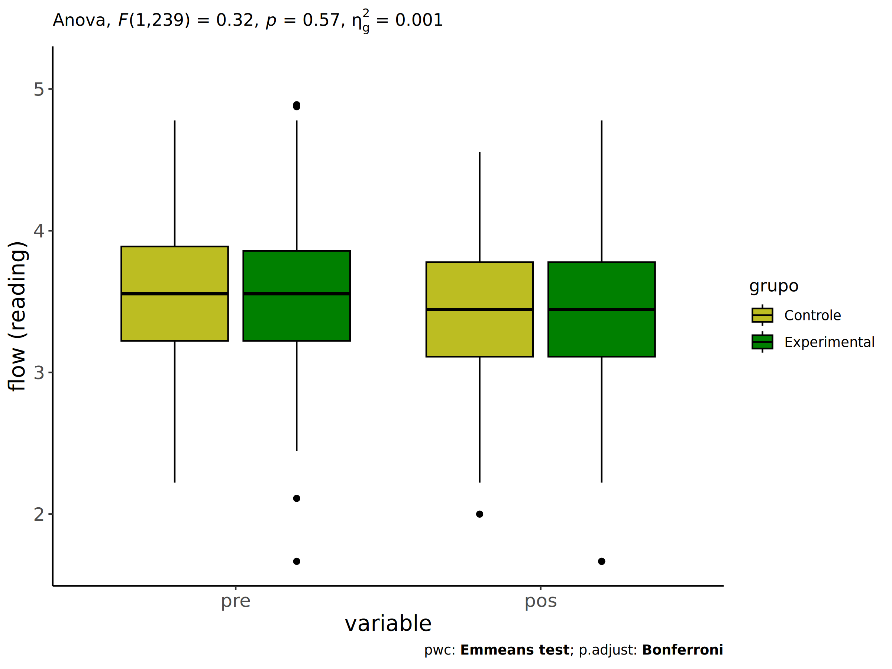
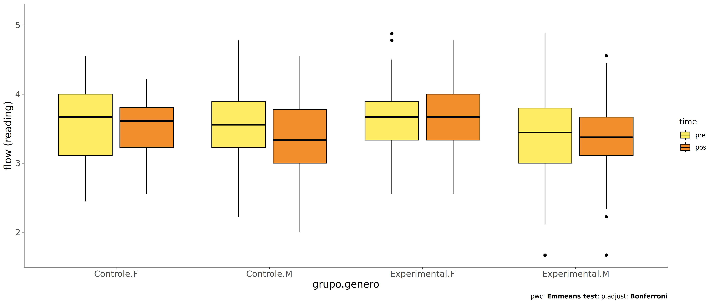
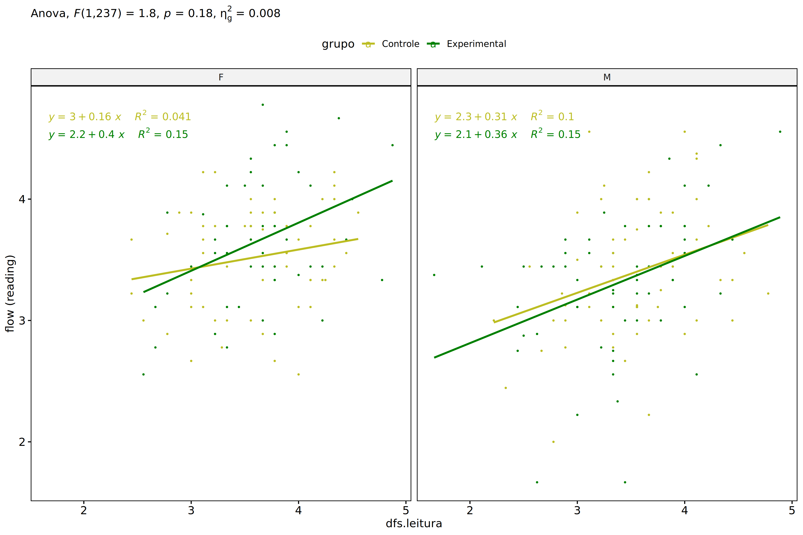
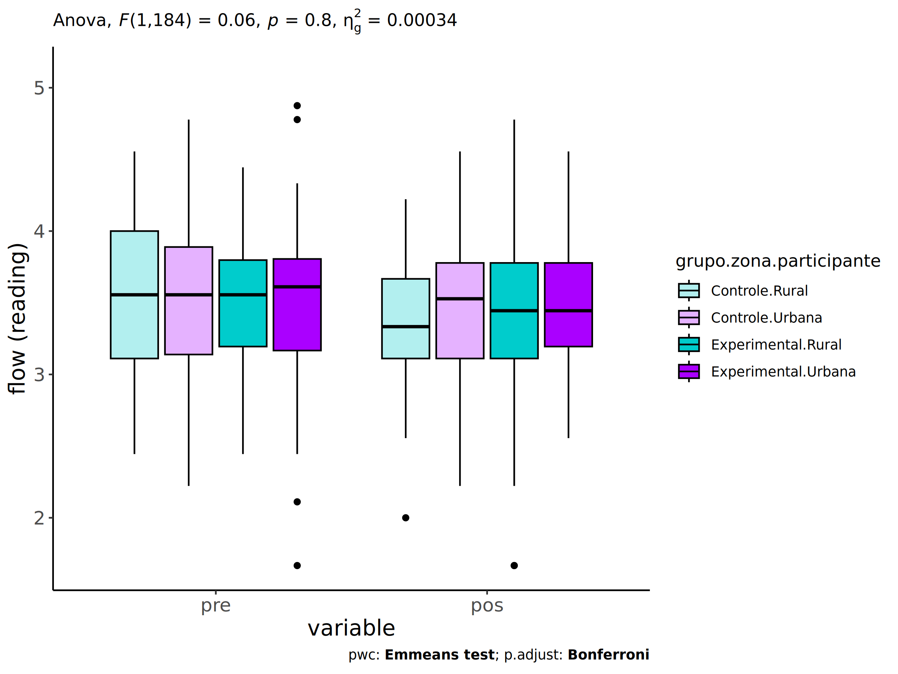
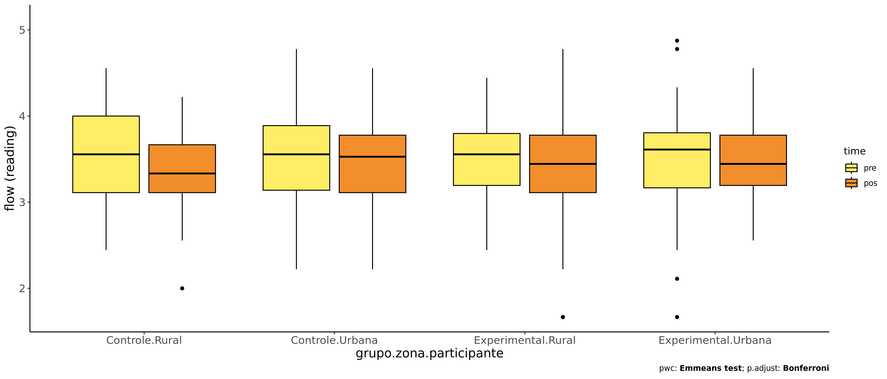
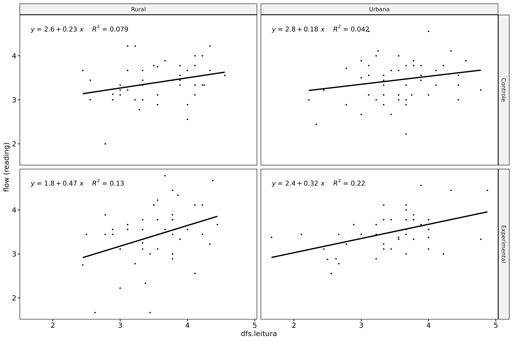
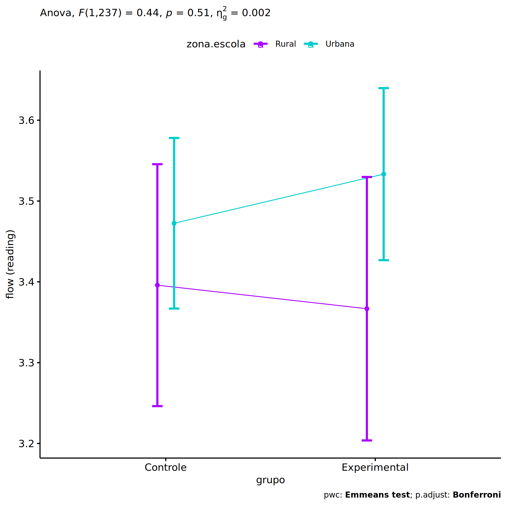

ANCOVA in flow (reading) (flow (reading))
================
Geiser C. Challco <geiser@alumni.usp.br>

- [Setting Initial Variables](#setting-initial-variables)
- [Descriptive Statistics of Initial
  Data](#descriptive-statistics-of-initial-data)
- [ANCOVA and Pairwise for one factor:
  **grupo**](#ancova-and-pairwise-for-one-factor-grupo)
  - [Without remove non-normal data](#without-remove-non-normal-data)
  - [Computing ANCOVA and PairWise After removing non-normal data
    (OK)](#computing-ancova-and-pairwise-after-removing-non-normal-data-ok)
    - [Plots for ancova](#plots-for-ancova)
    - [Checking linearity assumption](#checking-linearity-assumption)
    - [Checking normality and
      homogeneity](#checking-normality-and-homogeneity)
- [ANCOVA and Pairwise for two factors
  **grupo:genero**](#ancova-and-pairwise-for-two-factors-grupogenero)
  - [Without remove non-normal data](#without-remove-non-normal-data-1)
  - [Computing ANCOVA and PairWise After removing non-normal data
    (OK)](#computing-ancova-and-pairwise-after-removing-non-normal-data-ok-1)
    - [Plots for ancova](#plots-for-ancova-1)
    - [Checking linearity assumption](#checking-linearity-assumption-1)
    - [Checking normality and
      homogeneity](#checking-normality-and-homogeneity-1)
- [ANCOVA and Pairwise for two factors
  **grupo:zona.participante**](#ancova-and-pairwise-for-two-factors-grupozonaparticipante)
  - [Without remove non-normal data](#without-remove-non-normal-data-2)
  - [Computing ANCOVA and PairWise After removing non-normal data
    (OK)](#computing-ancova-and-pairwise-after-removing-non-normal-data-ok-2)
    - [Plots for ancova](#plots-for-ancova-2)
    - [Checking linearity assumption](#checking-linearity-assumption-2)
    - [Checking normality and
      homogeneity](#checking-normality-and-homogeneity-2)
- [ANCOVA and Pairwise for two factors
  **grupo:zona.escola**](#ancova-and-pairwise-for-two-factors-grupozonaescola)
  - [Without remove non-normal data](#without-remove-non-normal-data-3)
  - [Computing ANCOVA and PairWise After removing non-normal data
    (OK)](#computing-ancova-and-pairwise-after-removing-non-normal-data-ok-3)
    - [Plots for ancova](#plots-for-ancova-3)
    - [Checking linearity assumption](#checking-linearity-assumption-3)
    - [Checking normality and
      homogeneity](#checking-normality-and-homogeneity-3)
- [Summary of Results](#summary-of-results)
  - [Descriptive Statistics](#descriptive-statistics)
  - [ANCOVA Table Comparison](#ancova-table-comparison)
  - [PairWise Table Comparison](#pairwise-table-comparison)
  - [EMMS Table Comparison](#emms-table-comparison)

**NOTE**:

- Teste ANCOVA para determinar se houve diferenças significativas no
  flow (reading) (medido usando pre- e pos-testes).
- ANCOVA test to determine whether there were significant differences in
  flow (reading) (measured using pre- and post-tests).

# Setting Initial Variables

``` r
dv = "flow.read"
dv.pos = "fss.leitura"
dv.pre = "dfs.leitura"

fatores2 <- c("genero","zona.participante","zona.escola")
lfatores2 <- as.list(fatores2)
names(lfatores2) <- fatores2

fatores1 <- c("grupo", fatores2)
lfatores1 <- as.list(fatores1)
names(lfatores1) <- fatores1

lfatores <- c(lfatores1)

color <- list()
color[["prepost"]] = c("#ffee65","#f28e2B")
color[["grupo"]] = c("#bcbd22","#008000")
color[["genero"]] = c("#FF007F","#4D4DFF")
color[["zona.escola"]] = c("#AA00FF","#00CCCC")
color[["zona.participante"]] = c("#AA00FF","#00CCCC")

level <- list()
level[["grupo"]] = c("Controle","Experimental")
level[["genero"]] = c("F","M")
level[["zona.escola"]] = c("Rural","Urbana")
level[["zona.participante"]] = c("Rural","Urbana")

# ..

ymin <- 0
ymax <- 0

ymin.ci <- 0
ymax.ci <- 0


color[["grupo:genero"]] = c(
  "Controle:F"="#ff99cb", "Controle:M"="#b7b7ff",
  "Experimental:F"="#FF007F", "Experimental:M"="#4D4DFF",
  "Controle.F"="#ff99cb", "Controle.M"="#b7b7ff",
  "Experimental.F"="#FF007F", "Experimental.M"="#4D4DFF"
)
color[["grupo:zona.escola"]] = c(
  "Controle:Rural"="#b2efef","Controle:Urbana"="#e5b2ff",
  "Experimental:Rural"="#00CCCC", "Experimental:Urbana"="#AA00FF",
  "Controle.Rural"="#b2efef","Controle.Urbana"="#e5b2ff",
  "Experimental.Rural"="#00CCCC", "Experimental.Urbana"="#AA00FF"
)
color[["grupo:zona.participante"]] = c(
  "Controle:Rural"="#b2efef","Controle:Urbana"="#e5b2ff",
  "Experimental:Rural"="#00CCCC", "Experimental:Urbana"="#AA00FF",
  "Controle.Rural"="#b2efef","Controle.Urbana"="#e5b2ff",
  "Experimental.Rural"="#00CCCC", "Experimental.Urbana"="#AA00FF"
)

for (coln in c(
  "palavras.lidas","score.compreensao","tri.compreensao",
  "score.vocab","tri.vocab",
  "score.vocab.ensinado","tri.vocab.ensinado","score.vocab.nao.ensinado","tri.vocab.nao.ensinado",
  "score.CLPP","tri.CLPP","score.CR","tri.CR",
  "score.CI","tri.CI","score.TV","tri.TV","score.TF","tri.TF","score.TO","tri.TO")) {
  color[[paste0(coln,".quintile")]] = c("#BF0040","#FF0000","#800080","#0000FF","#4000BF")
  level[[paste0(coln,".quintile")]] = c("1st quintile","2nd quintile","3rd quintile","4th quintile","5th quintile")
  color[[paste0("grupo:",coln,".quintile")]] = c(
    "Experimental.1st quintile"="#BF0040", "Controle.1st quintile"="#d8668c",
    "Experimental.2nd quintile"="#FF0000", "Controle.2nd quintile"="#ff7f7f",
    "Experimental.3rd quintile"="#8fce00", "Controle.3rd quintile"="#ddf0b2",
    "Experimental.4th quintile"="#0000FF", "Controle.4th quintile"="#b2b2ff",
    "Experimental.5th quintile"="#4000BF", "Controle.5th quintile"="#b299e5",
    
    "Experimental:1st quintile"="#BF0040", "Controle:1st quintile"="#d8668c",
    "Experimental:2nd quintile"="#FF0000", "Controle:2nd quintile"="#ff7f7f",
    "Experimental:3rd quintile"="#8fce00", "Controle:3rd quintile"="#ddf0b2",
    "Experimental:4th quintile"="#0000FF", "Controle:4th quintile"="#b2b2ff",
    "Experimental:5th quintile"="#4000BF", "Controle:5th quintile"="#b299e5")
}


gdat <- read_excel("../data/data.xlsx", sheet = "flow.wg.wo.st")


dat <- gdat
dat$grupo <- factor(dat[["grupo"]], level[["grupo"]])
for (coln in c(names(lfatores))) {
  dat[[coln]] <- factor(dat[[coln]], level[[coln]][level[[coln]] %in% unique(dat[[coln]])])
}
dat <- dat[which(!is.na(dat[[dv.pre]]) & !is.na(dat[[dv.pos]])),]
dat <- dat[,c("id",names(lfatores),dv.pre,dv.pos)]

dat.long <- rbind(dat, dat)
dat.long$time <- c(rep("pre", nrow(dat)), rep("pos", nrow(dat)))
dat.long$time <- factor(dat.long$time, c("pre","pos"))
dat.long[[dv]] <- c(dat[[dv.pre]], dat[[dv.pos]])


for (f in c("grupo", names(lfatores))) {
  if (is.null(color[[f]]) && length(unique(dat[[f]])) > 0) 
      color[[f]] <- distinctColorPalette(length(unique(dat[[f]])))
}
for (f in c(fatores2)) {
  if (is.null(color[[paste0("grupo:",f)]]) && length(unique(dat[[f]])) > 0)
    color[[paste0("grupo:",f)]] <- distinctColorPalette(length(unique(dat[["grupo"]]))*length(unique(dat[[f]])))
}

ldat <- list()
laov <- list()
lpwc <- list()
lemms <- list()
```

# Descriptive Statistics of Initial Data

``` r
df <- get.descriptives(dat, c(dv.pre, dv.pos), c("grupo"), 
                       include.global = T, symmetry.test = T, normality.test = F)
df <- plyr::rbind.fill(
  df, do.call(plyr::rbind.fill, lapply(lfatores2, FUN = function(f) {
    if (nrow(dat) > 0 && sum(!is.na(unique(dat[[f]]))) > 1)
      get.descriptives(dat, c(dv.pre,dv.pos), c("grupo", f),
                       symmetry.test = T, normality.test = F)
    }))
)
df <- df[,c(fatores1[fatores1 %in% colnames(df)],"variable",
            colnames(df)[!colnames(df) %in% c(fatores1,"variable")])]
```

| grupo | genero | zona.participante | zona.escola | variable | n | mean | median | min | max | sd | se | ci | iqr | symmetry | skewness | kurtosis |
|:---|:---|:---|:---|:---|---:|---:|---:|---:|---:|---:|---:|---:|---:|:---|---:|---:|
| Controle |  |  |  | dfs.leitura | 125 | 3.558 | 3.556 | 2.222 | 4.778 | 0.532 | 0.048 | 0.094 | 0.667 | YES | -0.168 | -0.502 |
| Experimental |  |  |  | dfs.leitura | 117 | 3.515 | 3.556 | 1.667 | 4.889 | 0.563 | 0.052 | 0.103 | 0.635 | YES | -0.290 | 0.490 |
|  |  |  |  | dfs.leitura | 242 | 3.537 | 3.556 | 1.667 | 4.889 | 0.546 | 0.035 | 0.069 | 0.667 | YES | -0.240 | 0.081 |
| Controle |  |  |  | fss.leitura | 125 | 3.454 | 3.444 | 2.000 | 4.556 | 0.480 | 0.043 | 0.085 | 0.667 | YES | -0.192 | -0.132 |
| Experimental |  |  |  | fss.leitura | 117 | 3.475 | 3.444 | 1.667 | 4.778 | 0.561 | 0.052 | 0.103 | 0.667 | YES | -0.346 | 0.853 |
|  |  |  |  | fss.leitura | 242 | 3.464 | 3.444 | 1.667 | 4.778 | 0.519 | 0.033 | 0.066 | 0.667 | YES | -0.279 | 0.597 |
| Controle | F |  |  | dfs.leitura | 60 | 3.595 | 3.667 | 2.444 | 4.556 | 0.536 | 0.069 | 0.138 | 0.889 | YES | -0.245 | -0.866 |
| Controle | M |  |  | dfs.leitura | 65 | 3.524 | 3.556 | 2.222 | 4.778 | 0.530 | 0.066 | 0.131 | 0.667 | YES | -0.097 | -0.199 |
| Experimental | F |  |  | dfs.leitura | 53 | 3.640 | 3.667 | 2.556 | 4.875 | 0.498 | 0.068 | 0.137 | 0.556 | YES | 0.071 | 0.153 |
| Experimental | M |  |  | dfs.leitura | 64 | 3.411 | 3.444 | 1.667 | 4.889 | 0.595 | 0.074 | 0.149 | 0.798 | YES | -0.330 | 0.227 |
| Controle | F |  |  | fss.leitura | 60 | 3.521 | 3.611 | 2.556 | 4.222 | 0.418 | 0.054 | 0.108 | 0.583 | YES | -0.413 | -0.691 |
| Controle | M |  |  | fss.leitura | 65 | 3.393 | 3.333 | 2.000 | 4.556 | 0.526 | 0.065 | 0.130 | 0.778 | YES | 0.038 | -0.062 |
| Experimental | F |  |  | fss.leitura | 53 | 3.663 | 3.667 | 2.556 | 4.778 | 0.516 | 0.071 | 0.142 | 0.667 | YES | 0.082 | -0.585 |
| Experimental | M |  |  | fss.leitura | 64 | 3.320 | 3.375 | 1.667 | 4.556 | 0.552 | 0.069 | 0.138 | 0.556 | NO | -0.622 | 1.215 |
| Controle |  | Rural |  | dfs.leitura | 43 | 3.549 | 3.556 | 2.444 | 4.556 | 0.549 | 0.084 | 0.169 | 0.889 | YES | -0.156 | -1.052 |
| Controle |  | Urbana |  | dfs.leitura | 54 | 3.539 | 3.556 | 2.222 | 4.778 | 0.552 | 0.075 | 0.151 | 0.750 | YES | -0.064 | -0.160 |
| Controle |  |  |  | dfs.leitura | 28 | 3.610 | 3.667 | 2.667 | 4.333 | 0.479 | 0.091 | 0.186 | 0.583 | YES | -0.373 | -0.830 |
| Experimental |  | Rural |  | dfs.leitura | 48 | 3.526 | 3.556 | 2.444 | 4.444 | 0.511 | 0.074 | 0.148 | 0.603 | YES | -0.148 | -0.673 |
| Experimental |  | Urbana |  | dfs.leitura | 44 | 3.447 | 3.611 | 1.667 | 4.875 | 0.658 | 0.099 | 0.200 | 0.639 | YES | -0.401 | 0.163 |
| Experimental |  |  |  | dfs.leitura | 25 | 3.612 | 3.556 | 2.667 | 4.889 | 0.476 | 0.095 | 0.196 | 0.556 | NO | 0.627 | 0.499 |
| Controle |  | Rural |  | fss.leitura | 43 | 3.395 | 3.333 | 2.000 | 4.222 | 0.454 | 0.069 | 0.140 | 0.556 | YES | -0.394 | 0.564 |
| Controle |  | Urbana |  | fss.leitura | 54 | 3.450 | 3.528 | 2.222 | 4.556 | 0.487 | 0.066 | 0.133 | 0.667 | YES | -0.104 | -0.199 |
| Controle |  |  |  | fss.leitura | 28 | 3.553 | 3.597 | 2.667 | 4.375 | 0.504 | 0.095 | 0.195 | 0.719 | YES | -0.214 | -1.199 |
| Experimental |  | Rural |  | fss.leitura | 48 | 3.424 | 3.444 | 1.667 | 4.778 | 0.653 | 0.094 | 0.190 | 0.667 | NO | -0.553 | 0.709 |
| Experimental |  | Urbana |  | fss.leitura | 44 | 3.495 | 3.444 | 2.556 | 4.556 | 0.448 | 0.068 | 0.136 | 0.583 | YES | 0.335 | -0.183 |
| Experimental |  |  |  | fss.leitura | 25 | 3.541 | 3.556 | 2.556 | 4.556 | 0.560 | 0.112 | 0.231 | 0.667 | YES | 0.022 | -0.998 |
| Controle |  |  | Rural | dfs.leitura | 42 | 3.730 | 3.778 | 2.889 | 4.556 | 0.409 | 0.063 | 0.127 | 0.486 | YES | -0.105 | -0.738 |
| Controle |  |  | Urbana | dfs.leitura | 83 | 3.471 | 3.556 | 2.222 | 4.778 | 0.567 | 0.062 | 0.124 | 0.778 | YES | 0.021 | -0.644 |
| Experimental |  |  | Rural | dfs.leitura | 35 | 3.684 | 3.667 | 2.500 | 4.500 | 0.512 | 0.087 | 0.176 | 0.722 | YES | -0.333 | -0.610 |
| Experimental |  |  | Urbana | dfs.leitura | 82 | 3.442 | 3.556 | 1.667 | 4.889 | 0.571 | 0.063 | 0.125 | 0.639 | YES | -0.224 | 0.775 |
| Controle |  |  | Rural | fss.leitura | 42 | 3.465 | 3.444 | 2.556 | 4.000 | 0.371 | 0.057 | 0.116 | 0.438 | YES | -0.482 | -0.371 |
| Controle |  |  | Urbana | fss.leitura | 83 | 3.449 | 3.444 | 2.000 | 4.556 | 0.528 | 0.058 | 0.115 | 0.833 | YES | -0.117 | -0.386 |
| Experimental |  |  | Rural | fss.leitura | 35 | 3.419 | 3.444 | 1.667 | 4.667 | 0.651 | 0.110 | 0.224 | 0.667 | NO | -0.706 | 0.990 |
| Experimental |  |  | Urbana | fss.leitura | 82 | 3.499 | 3.444 | 2.222 | 4.778 | 0.520 | 0.057 | 0.114 | 0.639 | YES | 0.049 | -0.080 |

# ANCOVA and Pairwise for one factor: **grupo**

## Without remove non-normal data

``` r
pdat = remove_group_data(dat[!is.na(dat[["grupo"]]),], "fss.leitura", "grupo")

pdat.long <- rbind(pdat[,c("id","grupo")], pdat[,c("id","grupo")])
pdat.long[["time"]] <- c(rep("pre", nrow(pdat)), rep("pos", nrow(pdat)))
pdat.long[["time"]] <- factor(pdat.long[["time"]], c("pre","pos"))
pdat.long[["flow.read"]] <- c(pdat[["dfs.leitura"]], pdat[["fss.leitura"]])

aov = anova_test(pdat, fss.leitura ~ dfs.leitura + grupo)
laov[["grupo"]] <- get_anova_table(aov)
```

``` r
pwc <- emmeans_test(pdat, fss.leitura ~ grupo, covariate = dfs.leitura,
                    p.adjust.method = "bonferroni")
```

``` r
pwc.long <- emmeans_test(dplyr::group_by_at(pdat.long, "grupo"),
                          flow.read ~ time,
                          p.adjust.method = "bonferroni")
lpwc[["grupo"]] <- plyr::rbind.fill(pwc, pwc.long)
```

``` r
ds <- get.descriptives(pdat, "fss.leitura", "grupo", covar = "dfs.leitura")
ds <- merge(ds[ds$variable != "dfs.leitura",],
            ds[ds$variable == "dfs.leitura", !colnames(ds) %in% c("variable")],
            by = "grupo", all.x = T, suffixes = c("", ".dfs.leitura"))
ds <- merge(get_emmeans(pwc), ds, by = "grupo", suffixes = c(".emms", ""))
ds <- ds[,c("grupo","n","mean.dfs.leitura","se.dfs.leitura","mean","se",
            "emmean","se.emms","conf.low","conf.high")]

colnames(ds) <- c("grupo", "N", paste0(c("M","SE")," (pre)"),
                  paste0(c("M","SE"), " (unadj)"),
                  paste0(c("M", "SE"), " (adj)"), "conf.low", "conf.high")

lemms[["grupo"]] <- ds
```

## Computing ANCOVA and PairWise After removing non-normal data (OK)

``` r
wdat = pdat 

res = residuals(lm(fss.leitura ~ dfs.leitura + grupo, data = wdat))
non.normal = getNonNormal(res, wdat$id, plimit = 0.05)

wdat = wdat[!wdat$id %in% non.normal,]

wdat.long <- rbind(wdat[,c("id","grupo")], wdat[,c("id","grupo")])
wdat.long[["time"]] <- c(rep("pre", nrow(wdat)), rep("pos", nrow(wdat)))
wdat.long[["time"]] <- factor(wdat.long[["time"]], c("pre","pos"))
wdat.long[["flow.read"]] <- c(wdat[["dfs.leitura"]], wdat[["fss.leitura"]])

ldat[["grupo"]] = wdat

(non.normal)
```

    ## NULL

``` r
aov = anova_test(wdat, fss.leitura ~ dfs.leitura + grupo)
laov[["grupo"]] <- merge(get_anova_table(aov), laov[["grupo"]],
                            by="Effect", suffixes = c("","'"))

(df = get_anova_table(aov))
```

    ## ANOVA Table (type II tests)
    ## 
    ##        Effect DFn DFd      F        p p<.05   ges
    ## 1 dfs.leitura   1 239 33.677 2.06e-08     * 0.124
    ## 2       grupo   1 239  0.324 5.70e-01       0.001

| Effect      | DFn | DFd |      F |    p | p\<.05 |   ges |
|:------------|----:|----:|-------:|-----:|:-------|------:|
| dfs.leitura |   1 | 239 | 33.677 | 0.00 | \*     | 0.124 |
| grupo       |   1 | 239 |  0.324 | 0.57 |        | 0.001 |

``` r
pwc <- emmeans_test(wdat, fss.leitura ~ grupo, covariate = dfs.leitura,
                    p.adjust.method = "bonferroni")
```

| term | .y. | group1 | group2 | df | statistic | p | p.adj | p.adj.signif |
|:---|:---|:---|:---|---:|---:|---:|---:|:---|
| dfs.leitura\*grupo | fss.leitura | Controle | Experimental | 239 | -0.569 | 0.57 | 0.57 | ns |

``` r
pwc.long <- emmeans_test(dplyr::group_by_at(wdat.long, "grupo"),
                         flow.read ~ time,
                         p.adjust.method = "bonferroni")
lpwc[["grupo"]] <- merge(plyr::rbind.fill(pwc, pwc.long), lpwc[["grupo"]],
                            by=c("grupo","term",".y.","group1","group2"),
                            suffixes = c("","'"))
```

| grupo        | term | .y.       | group1 | group2 |  df | statistic |     p | p.adj | p.adj.signif |
|:-------------|:-----|:----------|:-------|:-------|----:|----------:|------:|------:|:-------------|
| Controle     | time | flow.read | pre    | pos    | 480 |     1.540 | 0.124 | 0.124 | ns           |
| Experimental | time | flow.read | pre    | pos    | 480 |     0.561 | 0.575 | 0.575 | ns           |

``` r
ds <- get.descriptives(wdat, "fss.leitura", "grupo", covar = "dfs.leitura")
ds <- merge(ds[ds$variable != "dfs.leitura",],
            ds[ds$variable == "dfs.leitura", !colnames(ds) %in% c("variable")],
            by = "grupo", all.x = T, suffixes = c("", ".dfs.leitura"))
ds <- merge(get_emmeans(pwc), ds, by = "grupo", suffixes = c(".emms", ""))
ds <- ds[,c("grupo","n","mean.dfs.leitura","se.dfs.leitura","mean","se",
            "emmean","se.emms","conf.low","conf.high")]

colnames(ds) <- c("grupo", "N", paste0(c("M","SE")," (pre)"),
                  paste0(c("M","SE"), " (unadj)"),
                  paste0(c("M", "SE"), " (adj)"), "conf.low", "conf.high")

lemms[["grupo"]] <- merge(ds, lemms[["grupo"]], by=c("grupo"), suffixes = c("","'"))
```

| grupo | N | M (pre) | SE (pre) | M (unadj) | SE (unadj) | M (adj) | SE (adj) | conf.low | conf.high |
|:---|---:|---:|---:|---:|---:|---:|---:|---:|---:|
| Controle | 125 | 3.558 | 0.048 | 3.454 | 0.043 | 3.447 | 0.044 | 3.361 | 3.533 |
| Experimental | 117 | 3.515 | 0.052 | 3.475 | 0.052 | 3.483 | 0.045 | 3.394 | 3.572 |

### Plots for ancova

``` r
plots <- oneWayAncovaPlots(
  wdat, "fss.leitura", "grupo", aov, list("grupo"=pwc), addParam = c("mean_ci"),
  font.label.size=10, step.increase=0.05, p.label="p.adj",
  subtitle = which(aov$Effect == "grupo"))
```

``` r
if (!is.null(nrow(plots[["grupo"]]$data)))
  plots[["grupo"]] + ggplot2::ylab("flow (reading)") + 
  if (ymin.ci < ymax.ci) ggplot2::ylim(ymin.ci, ymax.ci)
```

<!-- -->

``` r
plots <- oneWayAncovaBoxPlots(
  wdat, "fss.leitura", "grupo", aov, pwc, covar = "dfs.leitura",
  theme = "classic", color = color[["grupo"]],
  subtitle = which(aov$Effect == "grupo"))
```

``` r
if (length(unique(wdat[["grupo"]])) > 1)
  plots[["grupo"]] + ggplot2::ylab("flow (reading)") +
  ggplot2::scale_x_discrete(labels=c('pre', 'pos')) +
  if (ymin < ymax) ggplot2::ylim(ymin, ymax)
```

<!-- -->

``` r
if (length(unique(wdat.long[["grupo"]])) > 1)
  plots <- oneWayAncovaBoxPlots(
    wdat.long, "flow.read", "grupo", aov, pwc.long,
    pre.post = "time", theme = "classic", color = color$prepost)
```

``` r
if (length(unique(wdat.long[["grupo"]])) > 1)
  plots[["grupo"]] + ggplot2::ylab("flow (reading)") +
  if (ymin < ymax) ggplot2::ylim(ymin, ymax) 
```

<!-- -->

### Checking linearity assumption

``` r
ggscatter(wdat, x = "dfs.leitura", y = "fss.leitura", size = 0.5,
          color = "grupo", add = "reg.line")+
  stat_regline_equation(
    aes(label =  paste(..eq.label.., ..rr.label.., sep = "~~~~"), color = grupo)
  ) +
  ggplot2::labs(subtitle = rstatix::get_test_label(aov, detailed = T, row = which(aov$Effect == "grupo"))) +
  ggplot2::scale_color_manual(values = color[["grupo"]]) +
  ggplot2::ylab("flow (reading)")  +
  if (ymin < ymax) ggplot2::ylim(ymin, ymax)
```

<!-- -->

### Checking normality and homogeneity

``` r
res <- augment(lm(fss.leitura ~ dfs.leitura + grupo, data = wdat))
```

``` r
shapiro_test(res$.resid)
```

    ## # A tibble: 1 × 3
    ##   variable   statistic p.value
    ##   <chr>          <dbl>   <dbl>
    ## 1 res$.resid     0.990   0.107

``` r
levene_test(res, .resid ~ grupo)
```

    ## # A tibble: 1 × 4
    ##     df1   df2 statistic     p
    ##   <int> <int>     <dbl> <dbl>
    ## 1     1   240     0.274 0.601

# ANCOVA and Pairwise for two factors **grupo:genero**

## Without remove non-normal data

``` r
pdat = remove_group_data(dat[!is.na(dat[["grupo"]]) & !is.na(dat[["genero"]]),],
                         "fss.leitura", c("grupo","genero"))
pdat = pdat[pdat[["genero"]] %in% do.call(
  intersect, lapply(unique(pdat[["grupo"]]), FUN = function(x) {
    unique(pdat[["genero"]][which(pdat[["grupo"]] == x)])
  })),]
pdat[["grupo"]] = factor(pdat[["grupo"]], level[["grupo"]])
pdat[["genero"]] = factor(
  pdat[["genero"]],
  level[["genero"]][level[["genero"]] %in% unique(pdat[["genero"]])])

pdat.long <- rbind(pdat[,c("id","grupo","genero")], pdat[,c("id","grupo","genero")])
pdat.long[["time"]] <- c(rep("pre", nrow(pdat)), rep("pos", nrow(pdat)))
pdat.long[["time"]] <- factor(pdat.long[["time"]], c("pre","pos"))
pdat.long[["flow.read"]] <- c(pdat[["dfs.leitura"]], pdat[["fss.leitura"]])

if (length(unique(pdat[["genero"]])) >= 2) {
  aov = anova_test(pdat, fss.leitura ~ dfs.leitura + grupo*genero)
  laov[["grupo:genero"]] <- get_anova_table(aov)
}
```

``` r
if (length(unique(pdat[["genero"]])) >= 2) {
  pwcs <- list()
  pwcs[["genero"]] <- emmeans_test(
    group_by(pdat, grupo), fss.leitura ~ genero,
    covariate = dfs.leitura, p.adjust.method = "bonferroni")
  pwcs[["grupo"]] <- emmeans_test(
    group_by(pdat, genero), fss.leitura ~ grupo,
    covariate = dfs.leitura, p.adjust.method = "bonferroni")
  
  pwc <- plyr::rbind.fill(pwcs[["grupo"]], pwcs[["genero"]])
  pwc <- pwc[,c("grupo","genero", colnames(pwc)[!colnames(pwc) %in% c("grupo","genero")])]
}
```

``` r
if (length(unique(pdat[["genero"]])) >= 2) {
  pwc.long <- emmeans_test(dplyr::group_by_at(pdat.long, c("grupo","genero")),
                           flow.read ~ time,
                           p.adjust.method = "bonferroni")
  lpwc[["grupo:genero"]] <- plyr::rbind.fill(pwc, pwc.long)
}
```

``` r
if (length(unique(pdat[["genero"]])) >= 2) {
  ds <- get.descriptives(pdat, "fss.leitura", c("grupo","genero"), covar = "dfs.leitura")
  ds <- merge(ds[ds$variable != "dfs.leitura",],
              ds[ds$variable == "dfs.leitura", !colnames(ds) %in% c("variable")],
              by = c("grupo","genero"), all.x = T, suffixes = c("", ".dfs.leitura"))
  ds <- merge(get_emmeans(pwcs[["grupo"]]), ds,
              by = c("grupo","genero"), suffixes = c(".emms", ""))
  ds <- ds[,c("grupo","genero","n","mean.dfs.leitura","se.dfs.leitura","mean","se",
              "emmean","se.emms","conf.low","conf.high")]
  
  colnames(ds) <- c("grupo","genero", "N", paste0(c("M","SE")," (pre)"),
                    paste0(c("M","SE"), " (unadj)"),
                    paste0(c("M", "SE"), " (adj)"), "conf.low", "conf.high")
  
  lemms[["grupo:genero"]] <- ds
}
```

## Computing ANCOVA and PairWise After removing non-normal data (OK)

``` r
if (length(unique(pdat[["genero"]])) >= 2) {
  wdat = pdat 
  
  res = residuals(lm(fss.leitura ~ dfs.leitura + grupo*genero, data = wdat))
  non.normal = getNonNormal(res, wdat$id, plimit = 0.05)
  
  wdat = wdat[!wdat$id %in% non.normal,]
  
  wdat.long <- rbind(wdat[,c("id","grupo","genero")], wdat[,c("id","grupo","genero")])
  wdat.long[["time"]] <- c(rep("pre", nrow(wdat)), rep("pos", nrow(wdat)))
  wdat.long[["time"]] <- factor(wdat.long[["time"]], c("pre","pos"))
  wdat.long[["flow.read"]] <- c(wdat[["dfs.leitura"]], wdat[["fss.leitura"]])
  
  
  ldat[["grupo:genero"]] = wdat
  
  (non.normal)
}
```

    ## NULL

``` r
if (length(unique(pdat[["genero"]])) >= 2) {
  aov = anova_test(wdat, fss.leitura ~ dfs.leitura + grupo*genero)
  laov[["grupo:genero"]] <- merge(get_anova_table(aov), laov[["grupo:genero"]],
                                         by="Effect", suffixes = c("","'"))
  df = get_anova_table(aov)
}
```

| Effect       | DFn | DFd |      F |     p | p\<.05 |   ges |
|:-------------|----:|----:|-------:|------:|:-------|------:|
| dfs.leitura  |   1 | 237 | 28.519 | 0.000 | \*     | 0.107 |
| grupo        |   1 | 237 |  0.415 | 0.520 |        | 0.002 |
| genero       |   1 | 237 |  8.847 | 0.003 | \*     | 0.036 |
| grupo:genero |   1 | 237 |  1.805 | 0.180 |        | 0.008 |

``` r
if (length(unique(pdat[["genero"]])) >= 2) {
  pwcs <- list()
  pwcs[["genero"]] <- emmeans_test(
    group_by(wdat, grupo), fss.leitura ~ genero,
    covariate = dfs.leitura, p.adjust.method = "bonferroni")
  pwcs[["grupo"]] <- emmeans_test(
    group_by(wdat, genero), fss.leitura ~ grupo,
    covariate = dfs.leitura, p.adjust.method = "bonferroni")
  
  pwc <- plyr::rbind.fill(pwcs[["grupo"]], pwcs[["genero"]])
  pwc <- pwc[,c("grupo","genero", colnames(pwc)[!colnames(pwc) %in% c("grupo","genero")])]
}
```

| grupo | genero | term | .y. | group1 | group2 | df | statistic | p | p.adj | p.adj.signif |
|:---|:---|:---|:---|:---|:---|---:|---:|---:|---:|:---|
|  | F | dfs.leitura\*grupo | fss.leitura | Controle | Experimental | 237 | -1.421 | 0.157 | 0.157 | ns |
|  | M | dfs.leitura\*grupo | fss.leitura | Controle | Experimental | 237 | 0.450 | 0.653 | 0.653 | ns |
| Controle |  | dfs.leitura\*genero | fss.leitura | F | M | 237 | 1.234 | 0.218 | 0.218 | ns |
| Experimental |  | dfs.leitura\*genero | fss.leitura | F | M | 237 | 3.030 | 0.003 | 0.003 | \*\* |

``` r
if (length(unique(pdat[["genero"]])) >= 2) {
  pwc.long <- emmeans_test(dplyr::group_by_at(wdat.long, c("grupo","genero")),
                           flow.read ~ time,
                           p.adjust.method = "bonferroni")
  lpwc[["grupo:genero"]] <- merge(plyr::rbind.fill(pwc, pwc.long),
                                         lpwc[["grupo:genero"]],
                                         by=c("grupo","genero","term",".y.","group1","group2"),
                                         suffixes = c("","'"))
}
```

| grupo | genero | term | .y. | group1 | group2 | df | statistic | p | p.adj | p.adj.signif |
|:---|:---|:---|:---|:---|:---|---:|---:|---:|---:|:---|
| Controle | F | time | flow.read | pre | pos | 476 | 0.775 | 0.438 | 0.438 | ns |
| Controle | M | time | flow.read | pre | pos | 476 | 1.426 | 0.155 | 0.155 | ns |
| Experimental | F | time | flow.read | pre | pos | 476 | -0.226 | 0.821 | 0.821 | ns |
| Experimental | M | time | flow.read | pre | pos | 476 | 0.977 | 0.329 | 0.329 | ns |

``` r
if (length(unique(pdat[["genero"]])) >= 2) {
  ds <- get.descriptives(wdat, "fss.leitura", c("grupo","genero"), covar = "dfs.leitura")
  ds <- merge(ds[ds$variable != "dfs.leitura",],
              ds[ds$variable == "dfs.leitura", !colnames(ds) %in% c("variable")],
              by = c("grupo","genero"), all.x = T, suffixes = c("", ".dfs.leitura"))
  ds <- merge(get_emmeans(pwcs[["grupo"]]), ds,
              by = c("grupo","genero"), suffixes = c(".emms", ""))
  ds <- ds[,c("grupo","genero","n","mean.dfs.leitura","se.dfs.leitura",
              "mean","se","emmean","se.emms","conf.low","conf.high")]
  
  colnames(ds) <- c("grupo","genero", "N", paste0(c("M","SE")," (pre)"),
                    paste0(c("M","SE"), " (unadj)"),
                    paste0(c("M", "SE"), " (adj)"), "conf.low", "conf.high")
  
  lemms[["grupo:genero"]] <- merge(ds, lemms[["grupo:genero"]],
                                          by=c("grupo","genero"), suffixes = c("","'"))
}
```

| grupo | genero | N | M (pre) | SE (pre) | M (unadj) | SE (unadj) | M (adj) | SE (adj) | conf.low | conf.high |
|:---|:---|---:|---:|---:|---:|---:|---:|---:|---:|---:|
| Controle | F | 60 | 3.595 | 0.069 | 3.521 | 0.054 | 3.503 | 0.062 | 3.381 | 3.625 |
| Controle | M | 65 | 3.524 | 0.066 | 3.393 | 0.065 | 3.397 | 0.059 | 3.280 | 3.514 |
| Experimental | F | 53 | 3.640 | 0.068 | 3.663 | 0.071 | 3.632 | 0.066 | 3.501 | 3.762 |
| Experimental | M | 64 | 3.411 | 0.074 | 3.320 | 0.069 | 3.359 | 0.060 | 3.240 | 3.478 |

### Plots for ancova

``` r
if (length(unique(pdat[["genero"]])) >= 2) {
  ggPlotAoC2(pwcs, "grupo", "genero", aov, ylab = "flow (reading)",
             subtitle = which(aov$Effect == "grupo:genero"), addParam = "errorbar") +
    ggplot2::scale_color_manual(values = color[["genero"]]) +
    ggplot2::ylab("flow (reading)") +
    if (ymin.ci < ymax.ci) ggplot2::ylim(ymin.ci, ymax.ci)
}
```

    ## Scale for colour is already present.
    ## Adding another scale for colour, which will replace the existing scale.

<!-- -->

``` r
if (length(unique(pdat[["genero"]])) >= 2) {
  ggPlotAoC2(pwcs, "genero", "grupo", aov, ylab = "flow (reading)",
               subtitle = which(aov$Effect == "grupo:genero"), addParam = "errorbar") +
    ggplot2::scale_color_manual(values = color[["grupo"]]) +
    ggplot2::ylab("flow (reading)") +
    if (ymin.ci < ymax.ci) ggplot2::ylim(ymin.ci, ymax.ci)
}
```

    ## Scale for colour is already present.
    ## Adding another scale for colour, which will replace the existing scale.

<!-- -->

``` r
if (length(unique(pdat[["genero"]])) >= 2) {
  plots <- twoWayAncovaBoxPlots(
    wdat, "fss.leitura", c("grupo","genero"), aov, pwcs, covar = "dfs.leitura",
    theme = "classic", color = color[["grupo:genero"]],
    subtitle = which(aov$Effect == "grupo:genero"))
}
```

``` r
if (length(unique(pdat[["genero"]])) >= 2) {
  plots[["grupo:genero"]] + ggplot2::ylab("flow (reading)") +
  ggplot2::scale_x_discrete(labels=c('pre', 'pos')) +
  if (ymin < ymax) ggplot2::ylim(ymin, ymax)
}
```

    ## Warning: No shared levels found between `names(values)` of the manual scale and the data's colour values.

<!-- -->

``` r
if (length(unique(pdat[["genero"]])) >= 2) {
  plots <- twoWayAncovaBoxPlots(
    wdat.long, "flow.read", c("grupo","genero"), aov, pwc.long,
    pre.post = "time",
    theme = "classic", color = color$prepost)
}
```

``` r
if (length(unique(pdat[["genero"]])) >= 2) 
  plots[["grupo:genero"]] + ggplot2::ylab("flow (reading)") +
    if (ymin < ymax) ggplot2::ylim(ymin, ymax)
```

<!-- -->

### Checking linearity assumption

``` r
if (length(unique(pdat[["genero"]])) >= 2) {
  ggscatter(wdat, x = "dfs.leitura", y = "fss.leitura", size = 0.5,
            facet.by = c("grupo","genero"), add = "reg.line")+
    stat_regline_equation(
      aes(label =  paste(..eq.label.., ..rr.label.., sep = "~~~~"))
    ) + ggplot2::ylab("flow (reading)") +
    if (ymin < ymax) ggplot2::ylim(ymin, ymax)
}
```

<!-- -->

``` r
if (length(unique(pdat[["genero"]])) >= 2) {
  ggscatter(wdat, x = "dfs.leitura", y = "fss.leitura", size = 0.5,
            color = "grupo", facet.by = "genero", add = "reg.line")+
    stat_regline_equation(
      aes(label =  paste(..eq.label.., ..rr.label.., sep = "~~~~"), color = grupo)
    ) +
    ggplot2::labs(subtitle = rstatix::get_test_label(aov, detailed = T, row = which(aov$Effect == "grupo:genero"))) +
    ggplot2::scale_color_manual(values = color[["grupo"]]) +
    ggplot2::ylab("flow (reading)") +
    if (ymin < ymax) ggplot2::ylim(ymin, ymax)
}
```

<!-- -->

``` r
if (length(unique(pdat[["genero"]])) >= 2) {
  ggscatter(wdat, x = "dfs.leitura", y = "fss.leitura", size = 0.5,
            color = "genero", facet.by = "grupo", add = "reg.line")+
    stat_regline_equation(
      aes(label =  paste(..eq.label.., ..rr.label.., sep = "~~~~"), color = genero)
    ) +
    ggplot2::labs(subtitle = rstatix::get_test_label(aov, detailed = T, row = which(aov$Effect == "grupo:genero"))) +
    ggplot2::scale_color_manual(values = color[["genero"]]) +
    ggplot2::ylab("flow (reading)") +
    if (ymin < ymax) ggplot2::ylim(ymin, ymax)
}
```

<!-- -->

### Checking normality and homogeneity

``` r
if (length(unique(pdat[["genero"]])) >= 2) 
  res <- augment(lm(fss.leitura ~ dfs.leitura + grupo*genero, data = wdat))
```

``` r
if (length(unique(pdat[["genero"]])) >= 2)
  shapiro_test(res$.resid)
```

    ## # A tibble: 1 × 3
    ##   variable   statistic p.value
    ##   <chr>          <dbl>   <dbl>
    ## 1 res$.resid     0.994   0.401

``` r
if (length(unique(pdat[["genero"]])) >= 2) 
  levene_test(res, .resid ~ grupo*genero)
```

    ## # A tibble: 1 × 4
    ##     df1   df2 statistic     p
    ##   <int> <int>     <dbl> <dbl>
    ## 1     3   238     0.390 0.760

# ANCOVA and Pairwise for two factors **grupo:zona.participante**

## Without remove non-normal data

``` r
pdat = remove_group_data(dat[!is.na(dat[["grupo"]]) & !is.na(dat[["zona.participante"]]),],
                         "fss.leitura", c("grupo","zona.participante"))
pdat = pdat[pdat[["zona.participante"]] %in% do.call(
  intersect, lapply(unique(pdat[["grupo"]]), FUN = function(x) {
    unique(pdat[["zona.participante"]][which(pdat[["grupo"]] == x)])
  })),]
pdat[["grupo"]] = factor(pdat[["grupo"]], level[["grupo"]])
pdat[["zona.participante"]] = factor(
  pdat[["zona.participante"]],
  level[["zona.participante"]][level[["zona.participante"]] %in% unique(pdat[["zona.participante"]])])

pdat.long <- rbind(pdat[,c("id","grupo","zona.participante")], pdat[,c("id","grupo","zona.participante")])
pdat.long[["time"]] <- c(rep("pre", nrow(pdat)), rep("pos", nrow(pdat)))
pdat.long[["time"]] <- factor(pdat.long[["time"]], c("pre","pos"))
pdat.long[["flow.read"]] <- c(pdat[["dfs.leitura"]], pdat[["fss.leitura"]])

if (length(unique(pdat[["zona.participante"]])) >= 2) {
  aov = anova_test(pdat, fss.leitura ~ dfs.leitura + grupo*zona.participante)
  laov[["grupo:zona.participante"]] <- get_anova_table(aov)
}
```

``` r
if (length(unique(pdat[["zona.participante"]])) >= 2) {
  pwcs <- list()
  pwcs[["zona.participante"]] <- emmeans_test(
    group_by(pdat, grupo), fss.leitura ~ zona.participante,
    covariate = dfs.leitura, p.adjust.method = "bonferroni")
  pwcs[["grupo"]] <- emmeans_test(
    group_by(pdat, zona.participante), fss.leitura ~ grupo,
    covariate = dfs.leitura, p.adjust.method = "bonferroni")
  
  pwc <- plyr::rbind.fill(pwcs[["grupo"]], pwcs[["zona.participante"]])
  pwc <- pwc[,c("grupo","zona.participante", colnames(pwc)[!colnames(pwc) %in% c("grupo","zona.participante")])]
}
```

``` r
if (length(unique(pdat[["zona.participante"]])) >= 2) {
  pwc.long <- emmeans_test(dplyr::group_by_at(pdat.long, c("grupo","zona.participante")),
                           flow.read ~ time,
                           p.adjust.method = "bonferroni")
  lpwc[["grupo:zona.participante"]] <- plyr::rbind.fill(pwc, pwc.long)
}
```

``` r
if (length(unique(pdat[["zona.participante"]])) >= 2) {
  ds <- get.descriptives(pdat, "fss.leitura", c("grupo","zona.participante"), covar = "dfs.leitura")
  ds <- merge(ds[ds$variable != "dfs.leitura",],
              ds[ds$variable == "dfs.leitura", !colnames(ds) %in% c("variable")],
              by = c("grupo","zona.participante"), all.x = T, suffixes = c("", ".dfs.leitura"))
  ds <- merge(get_emmeans(pwcs[["grupo"]]), ds,
              by = c("grupo","zona.participante"), suffixes = c(".emms", ""))
  ds <- ds[,c("grupo","zona.participante","n","mean.dfs.leitura","se.dfs.leitura","mean","se",
              "emmean","se.emms","conf.low","conf.high")]
  
  colnames(ds) <- c("grupo","zona.participante", "N", paste0(c("M","SE")," (pre)"),
                    paste0(c("M","SE"), " (unadj)"),
                    paste0(c("M", "SE"), " (adj)"), "conf.low", "conf.high")
  
  lemms[["grupo:zona.participante"]] <- ds
}
```

## Computing ANCOVA and PairWise After removing non-normal data (OK)

``` r
if (length(unique(pdat[["zona.participante"]])) >= 2) {
  wdat = pdat 
  
  res = residuals(lm(fss.leitura ~ dfs.leitura + grupo*zona.participante, data = wdat))
  non.normal = getNonNormal(res, wdat$id, plimit = 0.05)
  
  wdat = wdat[!wdat$id %in% non.normal,]
  
  wdat.long <- rbind(wdat[,c("id","grupo","zona.participante")], wdat[,c("id","grupo","zona.participante")])
  wdat.long[["time"]] <- c(rep("pre", nrow(wdat)), rep("pos", nrow(wdat)))
  wdat.long[["time"]] <- factor(wdat.long[["time"]], c("pre","pos"))
  wdat.long[["flow.read"]] <- c(wdat[["dfs.leitura"]], wdat[["fss.leitura"]])
  
  
  ldat[["grupo:zona.participante"]] = wdat
  
  (non.normal)
}
```

    ## NULL

``` r
if (length(unique(pdat[["zona.participante"]])) >= 2) {
  aov = anova_test(wdat, fss.leitura ~ dfs.leitura + grupo*zona.participante)
  laov[["grupo:zona.participante"]] <- merge(get_anova_table(aov), laov[["grupo:zona.participante"]],
                                         by="Effect", suffixes = c("","'"))
  df = get_anova_table(aov)
}
```

| Effect                  | DFn | DFd |      F |     p | p\<.05 |   ges |
|:------------------------|----:|----:|-------:|------:|:-------|------:|
| dfs.leitura             |   1 | 184 | 21.380 | 0.000 | \*     | 0.104 |
| grupo                   |   1 | 184 |  0.563 | 0.454 |        | 0.003 |
| zona.participante       |   1 | 184 |  1.112 | 0.293 |        | 0.006 |
| grupo:zona.participante |   1 | 184 |  0.063 | 0.801 |        | 0.000 |

``` r
if (length(unique(pdat[["zona.participante"]])) >= 2) {
  pwcs <- list()
  pwcs[["zona.participante"]] <- emmeans_test(
    group_by(wdat, grupo), fss.leitura ~ zona.participante,
    covariate = dfs.leitura, p.adjust.method = "bonferroni")
  pwcs[["grupo"]] <- emmeans_test(
    group_by(wdat, zona.participante), fss.leitura ~ grupo,
    covariate = dfs.leitura, p.adjust.method = "bonferroni")
  
  pwc <- plyr::rbind.fill(pwcs[["grupo"]], pwcs[["zona.participante"]])
  pwc <- pwc[,c("grupo","zona.participante", colnames(pwc)[!colnames(pwc) %in% c("grupo","zona.participante")])]
}
```

| grupo | zona.participante | term | .y. | group1 | group2 | df | statistic | p | p.adj | p.adj.signif |
|:---|:---|:---|:---|:---|:---|---:|---:|---:|---:|:---|
|  | Rural | dfs.leitura\*grupo | fss.leitura | Controle | Experimental | 184 | -0.341 | 0.733 | 0.733 | ns |
|  | Urbana | dfs.leitura\*grupo | fss.leitura | Controle | Experimental | 184 | -0.714 | 0.476 | 0.476 | ns |
| Controle |  | dfs.leitura\*zona.participante | fss.leitura | Rural | Urbana | 184 | -0.578 | 0.564 | 0.564 | ns |
| Experimental |  | dfs.leitura\*zona.participante | fss.leitura | Rural | Urbana | 184 | -0.918 | 0.360 | 0.360 | ns |

``` r
if (length(unique(pdat[["zona.participante"]])) >= 2) {
  pwc.long <- emmeans_test(dplyr::group_by_at(wdat.long, c("grupo","zona.participante")),
                           flow.read ~ time,
                           p.adjust.method = "bonferroni")
  lpwc[["grupo:zona.participante"]] <- merge(plyr::rbind.fill(pwc, pwc.long),
                                         lpwc[["grupo:zona.participante"]],
                                         by=c("grupo","zona.participante","term",".y.","group1","group2"),
                                         suffixes = c("","'"))
}
```

| grupo | zona.participante | term | .y. | group1 | group2 | df | statistic | p | p.adj | p.adj.signif |
|:---|:---|:---|:---|:---|:---|---:|---:|---:|---:|:---|
| Controle | Rural | time | flow.read | pre | pos | 370 | 1.309 | 0.192 | 0.192 | ns |
| Controle | Urbana | time | flow.read | pre | pos | 370 | 0.846 | 0.398 | 0.398 | ns |
| Experimental | Rural | time | flow.read | pre | pos | 370 | 0.919 | 0.359 | 0.359 | ns |
| Experimental | Urbana | time | flow.read | pre | pos | 370 | -0.413 | 0.680 | 0.680 | ns |

``` r
if (length(unique(pdat[["zona.participante"]])) >= 2) {
  ds <- get.descriptives(wdat, "fss.leitura", c("grupo","zona.participante"), covar = "dfs.leitura")
  ds <- merge(ds[ds$variable != "dfs.leitura",],
              ds[ds$variable == "dfs.leitura", !colnames(ds) %in% c("variable")],
              by = c("grupo","zona.participante"), all.x = T, suffixes = c("", ".dfs.leitura"))
  ds <- merge(get_emmeans(pwcs[["grupo"]]), ds,
              by = c("grupo","zona.participante"), suffixes = c(".emms", ""))
  ds <- ds[,c("grupo","zona.participante","n","mean.dfs.leitura","se.dfs.leitura",
              "mean","se","emmean","se.emms","conf.low","conf.high")]
  
  colnames(ds) <- c("grupo","zona.participante", "N", paste0(c("M","SE")," (pre)"),
                    paste0(c("M","SE"), " (unadj)"),
                    paste0(c("M", "SE"), " (adj)"), "conf.low", "conf.high")
  
  lemms[["grupo:zona.participante"]] <- merge(ds, lemms[["grupo:zona.participante"]],
                                          by=c("grupo","zona.participante"), suffixes = c("","'"))
}
```

| grupo | zona.participante | N | M (pre) | SE (pre) | M (unadj) | SE (unadj) | M (adj) | SE (adj) | conf.low | conf.high |
|:---|:---|---:|---:|---:|---:|---:|---:|---:|---:|---:|
| Controle | Rural | 43 | 3.549 | 0.084 | 3.395 | 0.069 | 3.386 | 0.075 | 3.237 | 3.534 |
| Controle | Urbana | 54 | 3.539 | 0.075 | 3.450 | 0.066 | 3.444 | 0.067 | 3.311 | 3.576 |
| Experimental | Rural | 48 | 3.526 | 0.074 | 3.424 | 0.094 | 3.421 | 0.071 | 3.280 | 3.561 |
| Experimental | Urbana | 44 | 3.447 | 0.099 | 3.495 | 0.068 | 3.515 | 0.074 | 3.368 | 3.662 |

### Plots for ancova

``` r
if (length(unique(pdat[["zona.participante"]])) >= 2) {
  ggPlotAoC2(pwcs, "grupo", "zona.participante", aov, ylab = "flow (reading)",
             subtitle = which(aov$Effect == "grupo:zona.participante"), addParam = "errorbar") +
    ggplot2::scale_color_manual(values = color[["zona.participante"]]) +
    ggplot2::ylab("flow (reading)") +
    if (ymin.ci < ymax.ci) ggplot2::ylim(ymin.ci, ymax.ci)
}
```

    ## Scale for colour is already present.
    ## Adding another scale for colour, which will replace the existing scale.

<!-- -->

``` r
if (length(unique(pdat[["zona.participante"]])) >= 2) {
  ggPlotAoC2(pwcs, "zona.participante", "grupo", aov, ylab = "flow (reading)",
               subtitle = which(aov$Effect == "grupo:zona.participante"), addParam = "errorbar") +
    ggplot2::scale_color_manual(values = color[["grupo"]]) +
    ggplot2::ylab("flow (reading)") +
    if (ymin.ci < ymax.ci) ggplot2::ylim(ymin.ci, ymax.ci)
}
```

    ## Scale for colour is already present.
    ## Adding another scale for colour, which will replace the existing scale.

<!-- -->

``` r
if (length(unique(pdat[["zona.participante"]])) >= 2) {
  plots <- twoWayAncovaBoxPlots(
    wdat, "fss.leitura", c("grupo","zona.participante"), aov, pwcs, covar = "dfs.leitura",
    theme = "classic", color = color[["grupo:zona.participante"]],
    subtitle = which(aov$Effect == "grupo:zona.participante"))
}
```

``` r
if (length(unique(pdat[["zona.participante"]])) >= 2) {
  plots[["grupo:zona.participante"]] + ggplot2::ylab("flow (reading)") +
  ggplot2::scale_x_discrete(labels=c('pre', 'pos')) +
  if (ymin < ymax) ggplot2::ylim(ymin, ymax)
}
```

    ## Warning: No shared levels found between `names(values)` of the manual scale and the data's colour values.

<!-- -->

``` r
if (length(unique(pdat[["zona.participante"]])) >= 2) {
  plots <- twoWayAncovaBoxPlots(
    wdat.long, "flow.read", c("grupo","zona.participante"), aov, pwc.long,
    pre.post = "time",
    theme = "classic", color = color$prepost)
}
```

``` r
if (length(unique(pdat[["zona.participante"]])) >= 2) 
  plots[["grupo:zona.participante"]] + ggplot2::ylab("flow (reading)") +
    if (ymin < ymax) ggplot2::ylim(ymin, ymax)
```

<!-- -->

### Checking linearity assumption

``` r
if (length(unique(pdat[["zona.participante"]])) >= 2) {
  ggscatter(wdat, x = "dfs.leitura", y = "fss.leitura", size = 0.5,
            facet.by = c("grupo","zona.participante"), add = "reg.line")+
    stat_regline_equation(
      aes(label =  paste(..eq.label.., ..rr.label.., sep = "~~~~"))
    ) + ggplot2::ylab("flow (reading)") +
    if (ymin < ymax) ggplot2::ylim(ymin, ymax)
}
```

<!-- -->

``` r
if (length(unique(pdat[["zona.participante"]])) >= 2) {
  ggscatter(wdat, x = "dfs.leitura", y = "fss.leitura", size = 0.5,
            color = "grupo", facet.by = "zona.participante", add = "reg.line")+
    stat_regline_equation(
      aes(label =  paste(..eq.label.., ..rr.label.., sep = "~~~~"), color = grupo)
    ) +
    ggplot2::labs(subtitle = rstatix::get_test_label(aov, detailed = T, row = which(aov$Effect == "grupo:zona.participante"))) +
    ggplot2::scale_color_manual(values = color[["grupo"]]) +
    ggplot2::ylab("flow (reading)") +
    if (ymin < ymax) ggplot2::ylim(ymin, ymax)
}
```

<!-- -->

``` r
if (length(unique(pdat[["zona.participante"]])) >= 2) {
  ggscatter(wdat, x = "dfs.leitura", y = "fss.leitura", size = 0.5,
            color = "zona.participante", facet.by = "grupo", add = "reg.line")+
    stat_regline_equation(
      aes(label =  paste(..eq.label.., ..rr.label.., sep = "~~~~"), color = zona.participante)
    ) +
    ggplot2::labs(subtitle = rstatix::get_test_label(aov, detailed = T, row = which(aov$Effect == "grupo:zona.participante"))) +
    ggplot2::scale_color_manual(values = color[["zona.participante"]]) +
    ggplot2::ylab("flow (reading)") +
    if (ymin < ymax) ggplot2::ylim(ymin, ymax)
}
```

<!-- -->

### Checking normality and homogeneity

``` r
if (length(unique(pdat[["zona.participante"]])) >= 2) 
  res <- augment(lm(fss.leitura ~ dfs.leitura + grupo*zona.participante, data = wdat))
```

``` r
if (length(unique(pdat[["zona.participante"]])) >= 2)
  shapiro_test(res$.resid)
```

    ## # A tibble: 1 × 3
    ##   variable   statistic p.value
    ##   <chr>          <dbl>   <dbl>
    ## 1 res$.resid     0.989   0.135

``` r
if (length(unique(pdat[["zona.participante"]])) >= 2) 
  levene_test(res, .resid ~ grupo*zona.participante)
```

    ## # A tibble: 1 × 4
    ##     df1   df2 statistic     p
    ##   <int> <int>     <dbl> <dbl>
    ## 1     3   185      1.84 0.142

# ANCOVA and Pairwise for two factors **grupo:zona.escola**

## Without remove non-normal data

``` r
pdat = remove_group_data(dat[!is.na(dat[["grupo"]]) & !is.na(dat[["zona.escola"]]),],
                         "fss.leitura", c("grupo","zona.escola"))
pdat = pdat[pdat[["zona.escola"]] %in% do.call(
  intersect, lapply(unique(pdat[["grupo"]]), FUN = function(x) {
    unique(pdat[["zona.escola"]][which(pdat[["grupo"]] == x)])
  })),]
pdat[["grupo"]] = factor(pdat[["grupo"]], level[["grupo"]])
pdat[["zona.escola"]] = factor(
  pdat[["zona.escola"]],
  level[["zona.escola"]][level[["zona.escola"]] %in% unique(pdat[["zona.escola"]])])

pdat.long <- rbind(pdat[,c("id","grupo","zona.escola")], pdat[,c("id","grupo","zona.escola")])
pdat.long[["time"]] <- c(rep("pre", nrow(pdat)), rep("pos", nrow(pdat)))
pdat.long[["time"]] <- factor(pdat.long[["time"]], c("pre","pos"))
pdat.long[["flow.read"]] <- c(pdat[["dfs.leitura"]], pdat[["fss.leitura"]])

if (length(unique(pdat[["zona.escola"]])) >= 2) {
  aov = anova_test(pdat, fss.leitura ~ dfs.leitura + grupo*zona.escola)
  laov[["grupo:zona.escola"]] <- get_anova_table(aov)
}
```

``` r
if (length(unique(pdat[["zona.escola"]])) >= 2) {
  pwcs <- list()
  pwcs[["zona.escola"]] <- emmeans_test(
    group_by(pdat, grupo), fss.leitura ~ zona.escola,
    covariate = dfs.leitura, p.adjust.method = "bonferroni")
  pwcs[["grupo"]] <- emmeans_test(
    group_by(pdat, zona.escola), fss.leitura ~ grupo,
    covariate = dfs.leitura, p.adjust.method = "bonferroni")
  
  pwc <- plyr::rbind.fill(pwcs[["grupo"]], pwcs[["zona.escola"]])
  pwc <- pwc[,c("grupo","zona.escola", colnames(pwc)[!colnames(pwc) %in% c("grupo","zona.escola")])]
}
```

``` r
if (length(unique(pdat[["zona.escola"]])) >= 2) {
  pwc.long <- emmeans_test(dplyr::group_by_at(pdat.long, c("grupo","zona.escola")),
                           flow.read ~ time,
                           p.adjust.method = "bonferroni")
  lpwc[["grupo:zona.escola"]] <- plyr::rbind.fill(pwc, pwc.long)
}
```

``` r
if (length(unique(pdat[["zona.escola"]])) >= 2) {
  ds <- get.descriptives(pdat, "fss.leitura", c("grupo","zona.escola"), covar = "dfs.leitura")
  ds <- merge(ds[ds$variable != "dfs.leitura",],
              ds[ds$variable == "dfs.leitura", !colnames(ds) %in% c("variable")],
              by = c("grupo","zona.escola"), all.x = T, suffixes = c("", ".dfs.leitura"))
  ds <- merge(get_emmeans(pwcs[["grupo"]]), ds,
              by = c("grupo","zona.escola"), suffixes = c(".emms", ""))
  ds <- ds[,c("grupo","zona.escola","n","mean.dfs.leitura","se.dfs.leitura","mean","se",
              "emmean","se.emms","conf.low","conf.high")]
  
  colnames(ds) <- c("grupo","zona.escola", "N", paste0(c("M","SE")," (pre)"),
                    paste0(c("M","SE"), " (unadj)"),
                    paste0(c("M", "SE"), " (adj)"), "conf.low", "conf.high")
  
  lemms[["grupo:zona.escola"]] <- ds
}
```

## Computing ANCOVA and PairWise After removing non-normal data (OK)

``` r
if (length(unique(pdat[["zona.escola"]])) >= 2) {
  wdat = pdat 
  
  res = residuals(lm(fss.leitura ~ dfs.leitura + grupo*zona.escola, data = wdat))
  non.normal = getNonNormal(res, wdat$id, plimit = 0.05)
  
  wdat = wdat[!wdat$id %in% non.normal,]
  
  wdat.long <- rbind(wdat[,c("id","grupo","zona.escola")], wdat[,c("id","grupo","zona.escola")])
  wdat.long[["time"]] <- c(rep("pre", nrow(wdat)), rep("pos", nrow(wdat)))
  wdat.long[["time"]] <- factor(wdat.long[["time"]], c("pre","pos"))
  wdat.long[["flow.read"]] <- c(wdat[["dfs.leitura"]], wdat[["fss.leitura"]])
  
  
  ldat[["grupo:zona.escola"]] = wdat
  
  (non.normal)
}
```

    ## NULL

``` r
if (length(unique(pdat[["zona.escola"]])) >= 2) {
  aov = anova_test(wdat, fss.leitura ~ dfs.leitura + grupo*zona.escola)
  laov[["grupo:zona.escola"]] <- merge(get_anova_table(aov), laov[["grupo:zona.escola"]],
                                         by="Effect", suffixes = c("","'"))
  df = get_anova_table(aov)
}
```

| Effect            | DFn | DFd |      F |     p | p\<.05 |   ges |
|:------------------|----:|----:|-------:|------:|:-------|------:|
| dfs.leitura       |   1 | 237 | 36.600 | 0.000 | \*     | 0.134 |
| grupo             |   1 | 237 |  0.266 | 0.607 |        | 0.001 |
| zona.escola       |   1 | 237 |  2.976 | 0.086 |        | 0.012 |
| grupo:zona.escola |   1 | 237 |  0.445 | 0.505 |        | 0.002 |

``` r
if (length(unique(pdat[["zona.escola"]])) >= 2) {
  pwcs <- list()
  pwcs[["zona.escola"]] <- emmeans_test(
    group_by(wdat, grupo), fss.leitura ~ zona.escola,
    covariate = dfs.leitura, p.adjust.method = "bonferroni")
  pwcs[["grupo"]] <- emmeans_test(
    group_by(wdat, zona.escola), fss.leitura ~ grupo,
    covariate = dfs.leitura, p.adjust.method = "bonferroni")
  
  pwc <- plyr::rbind.fill(pwcs[["grupo"]], pwcs[["zona.escola"]])
  pwc <- pwc[,c("grupo","zona.escola", colnames(pwc)[!colnames(pwc) %in% c("grupo","zona.escola")])]
}
```

| grupo | zona.escola | term | .y. | group1 | group2 | df | statistic | p | p.adj | p.adj.signif |
|:---|:---|:---|:---|:---|:---|---:|---:|---:|---:|:---|
|  | Rural | dfs.leitura\*grupo | fss.leitura | Controle | Experimental | 237 | 0.261 | 0.794 | 0.794 | ns |
|  | Urbana | dfs.leitura\*grupo | fss.leitura | Controle | Experimental | 237 | -0.801 | 0.424 | 0.424 | ns |
| Controle |  | dfs.leitura\*zona.escola | fss.leitura | Rural | Urbana | 237 | -0.820 | 0.413 | 0.413 | ns |
| Experimental |  | dfs.leitura\*zona.escola | fss.leitura | Rural | Urbana | 237 | -1.677 | 0.095 | 0.095 | ns |

``` r
if (length(unique(pdat[["zona.escola"]])) >= 2) {
  pwc.long <- emmeans_test(dplyr::group_by_at(wdat.long, c("grupo","zona.escola")),
                           flow.read ~ time,
                           p.adjust.method = "bonferroni")
  lpwc[["grupo:zona.escola"]] <- merge(plyr::rbind.fill(pwc, pwc.long),
                                         lpwc[["grupo:zona.escola"]],
                                         by=c("grupo","zona.escola","term",".y.","group1","group2"),
                                         suffixes = c("","'"))
}
```

| grupo | zona.escola | term | .y. | group1 | group2 | df | statistic | p | p.adj | p.adj.signif |
|:---|:---|:---|:---|:---|:---|---:|---:|---:|---:|:---|
| Controle | Rural | time | flow.read | pre | pos | 476 | 2.300 | 0.022 | 0.022 | \* |
| Controle | Urbana | time | flow.read | pre | pos | 476 | 0.269 | 0.788 | 0.788 | ns |
| Experimental | Rural | time | flow.read | pre | pos | 476 | 2.095 | 0.037 | 0.037 | \* |
| Experimental | Urbana | time | flow.read | pre | pos | 476 | -0.693 | 0.489 | 0.489 | ns |

``` r
if (length(unique(pdat[["zona.escola"]])) >= 2) {
  ds <- get.descriptives(wdat, "fss.leitura", c("grupo","zona.escola"), covar = "dfs.leitura")
  ds <- merge(ds[ds$variable != "dfs.leitura",],
              ds[ds$variable == "dfs.leitura", !colnames(ds) %in% c("variable")],
              by = c("grupo","zona.escola"), all.x = T, suffixes = c("", ".dfs.leitura"))
  ds <- merge(get_emmeans(pwcs[["grupo"]]), ds,
              by = c("grupo","zona.escola"), suffixes = c(".emms", ""))
  ds <- ds[,c("grupo","zona.escola","n","mean.dfs.leitura","se.dfs.leitura",
              "mean","se","emmean","se.emms","conf.low","conf.high")]
  
  colnames(ds) <- c("grupo","zona.escola", "N", paste0(c("M","SE")," (pre)"),
                    paste0(c("M","SE"), " (unadj)"),
                    paste0(c("M", "SE"), " (adj)"), "conf.low", "conf.high")
  
  lemms[["grupo:zona.escola"]] <- merge(ds, lemms[["grupo:zona.escola"]],
                                          by=c("grupo","zona.escola"), suffixes = c("","'"))
}
```

| grupo | zona.escola | N | M (pre) | SE (pre) | M (unadj) | SE (unadj) | M (adj) | SE (adj) | conf.low | conf.high |
|:---|:---|---:|---:|---:|---:|---:|---:|---:|---:|---:|
| Controle | Rural | 42 | 3.730 | 0.063 | 3.465 | 0.057 | 3.396 | 0.076 | 3.246 | 3.546 |
| Controle | Urbana | 83 | 3.471 | 0.062 | 3.449 | 0.058 | 3.473 | 0.054 | 3.367 | 3.578 |
| Experimental | Rural | 35 | 3.684 | 0.087 | 3.419 | 0.110 | 3.367 | 0.083 | 3.204 | 3.530 |
| Experimental | Urbana | 82 | 3.442 | 0.063 | 3.499 | 0.057 | 3.533 | 0.054 | 3.427 | 3.640 |

### Plots for ancova

``` r
if (length(unique(pdat[["zona.escola"]])) >= 2) {
  ggPlotAoC2(pwcs, "grupo", "zona.escola", aov, ylab = "flow (reading)",
             subtitle = which(aov$Effect == "grupo:zona.escola"), addParam = "errorbar") +
    ggplot2::scale_color_manual(values = color[["zona.escola"]]) +
    ggplot2::ylab("flow (reading)") +
    if (ymin.ci < ymax.ci) ggplot2::ylim(ymin.ci, ymax.ci)
}
```

    ## Scale for colour is already present.
    ## Adding another scale for colour, which will replace the existing scale.

<!-- -->

``` r
if (length(unique(pdat[["zona.escola"]])) >= 2) {
  ggPlotAoC2(pwcs, "zona.escola", "grupo", aov, ylab = "flow (reading)",
               subtitle = which(aov$Effect == "grupo:zona.escola"), addParam = "errorbar") +
    ggplot2::scale_color_manual(values = color[["grupo"]]) +
    ggplot2::ylab("flow (reading)") +
    if (ymin.ci < ymax.ci) ggplot2::ylim(ymin.ci, ymax.ci)
}
```

    ## Scale for colour is already present.
    ## Adding another scale for colour, which will replace the existing scale.

<!-- -->

``` r
if (length(unique(pdat[["zona.escola"]])) >= 2) {
  plots <- twoWayAncovaBoxPlots(
    wdat, "fss.leitura", c("grupo","zona.escola"), aov, pwcs, covar = "dfs.leitura",
    theme = "classic", color = color[["grupo:zona.escola"]],
    subtitle = which(aov$Effect == "grupo:zona.escola"))
}
```

``` r
if (length(unique(pdat[["zona.escola"]])) >= 2) {
  plots[["grupo:zona.escola"]] + ggplot2::ylab("flow (reading)") +
  ggplot2::scale_x_discrete(labels=c('pre', 'pos')) +
  if (ymin < ymax) ggplot2::ylim(ymin, ymax)
}
```

    ## Warning: No shared levels found between `names(values)` of the manual scale and the data's colour values.

<!-- -->

``` r
if (length(unique(pdat[["zona.escola"]])) >= 2) {
  plots <- twoWayAncovaBoxPlots(
    wdat.long, "flow.read", c("grupo","zona.escola"), aov, pwc.long,
    pre.post = "time",
    theme = "classic", color = color$prepost)
}
```

``` r
if (length(unique(pdat[["zona.escola"]])) >= 2) 
  plots[["grupo:zona.escola"]] + ggplot2::ylab("flow (reading)") +
    if (ymin < ymax) ggplot2::ylim(ymin, ymax)
```

<!-- -->

### Checking linearity assumption

``` r
if (length(unique(pdat[["zona.escola"]])) >= 2) {
  ggscatter(wdat, x = "dfs.leitura", y = "fss.leitura", size = 0.5,
            facet.by = c("grupo","zona.escola"), add = "reg.line")+
    stat_regline_equation(
      aes(label =  paste(..eq.label.., ..rr.label.., sep = "~~~~"))
    ) + ggplot2::ylab("flow (reading)") +
    if (ymin < ymax) ggplot2::ylim(ymin, ymax)
}
```

<!-- -->

``` r
if (length(unique(pdat[["zona.escola"]])) >= 2) {
  ggscatter(wdat, x = "dfs.leitura", y = "fss.leitura", size = 0.5,
            color = "grupo", facet.by = "zona.escola", add = "reg.line")+
    stat_regline_equation(
      aes(label =  paste(..eq.label.., ..rr.label.., sep = "~~~~"), color = grupo)
    ) +
    ggplot2::labs(subtitle = rstatix::get_test_label(aov, detailed = T, row = which(aov$Effect == "grupo:zona.escola"))) +
    ggplot2::scale_color_manual(values = color[["grupo"]]) +
    ggplot2::ylab("flow (reading)") +
    if (ymin < ymax) ggplot2::ylim(ymin, ymax)
}
```

<!-- -->

``` r
if (length(unique(pdat[["zona.escola"]])) >= 2) {
  ggscatter(wdat, x = "dfs.leitura", y = "fss.leitura", size = 0.5,
            color = "zona.escola", facet.by = "grupo", add = "reg.line")+
    stat_regline_equation(
      aes(label =  paste(..eq.label.., ..rr.label.., sep = "~~~~"), color = zona.escola)
    ) +
    ggplot2::labs(subtitle = rstatix::get_test_label(aov, detailed = T, row = which(aov$Effect == "grupo:zona.escola"))) +
    ggplot2::scale_color_manual(values = color[["zona.escola"]]) +
    ggplot2::ylab("flow (reading)") +
    if (ymin < ymax) ggplot2::ylim(ymin, ymax)
}
```

<!-- -->

### Checking normality and homogeneity

``` r
if (length(unique(pdat[["zona.escola"]])) >= 2) 
  res <- augment(lm(fss.leitura ~ dfs.leitura + grupo*zona.escola, data = wdat))
```

``` r
if (length(unique(pdat[["zona.escola"]])) >= 2)
  shapiro_test(res$.resid)
```

    ## # A tibble: 1 × 3
    ##   variable   statistic p.value
    ##   <chr>          <dbl>   <dbl>
    ## 1 res$.resid     0.993   0.336

``` r
if (length(unique(pdat[["zona.escola"]])) >= 2) 
  levene_test(res, .resid ~ grupo*zona.escola)
```

    ## # A tibble: 1 × 4
    ##     df1   df2 statistic     p
    ##   <int> <int>     <dbl> <dbl>
    ## 1     3   238      1.41 0.240

# Summary of Results

## Descriptive Statistics

``` r
df <- get.descriptives(ldat[["grupo"]], c(dv.pre, dv.pos), c("grupo"), 
                       include.global = T, symmetry.test = T, normality.test = F)
df <- plyr::rbind.fill(
  df, do.call(plyr::rbind.fill, lapply(lfatores2, FUN = function(f) {
    if (nrow(dat) > 0 && sum(!is.na(unique(dat[[f]]))) > 1 && paste0("grupo:",f) %in% names(ldat))
      get.descriptives(ldat[[paste0("grupo:",f)]], c(dv.pre,dv.pos), c("grupo", f),
                       symmetry.test = T, normality.test = F)
    }))
)
df <- df[,c(fatores1[fatores1 %in% colnames(df)],"variable",
             colnames(df)[!colnames(df) %in% c(fatores1,"variable")])]
```

| grupo | genero | zona.participante | zona.escola | variable | n | mean | median | min | max | sd | se | ci | iqr | symmetry | skewness | kurtosis |
|:---|:---|:---|:---|:---|---:|---:|---:|---:|---:|---:|---:|---:|---:|:---|---:|---:|
| Controle |  |  |  | dfs.leitura | 125 | 3.558 | 3.556 | 2.222 | 4.778 | 0.532 | 0.048 | 0.094 | 0.667 | YES | -0.168 | -0.502 |
| Experimental |  |  |  | dfs.leitura | 117 | 3.515 | 3.556 | 1.667 | 4.889 | 0.563 | 0.052 | 0.103 | 0.635 | YES | -0.290 | 0.490 |
|  |  |  |  | dfs.leitura | 242 | 3.537 | 3.556 | 1.667 | 4.889 | 0.546 | 0.035 | 0.069 | 0.667 | YES | -0.240 | 0.081 |
| Controle |  |  |  | fss.leitura | 125 | 3.454 | 3.444 | 2.000 | 4.556 | 0.480 | 0.043 | 0.085 | 0.667 | YES | -0.192 | -0.132 |
| Experimental |  |  |  | fss.leitura | 117 | 3.475 | 3.444 | 1.667 | 4.778 | 0.561 | 0.052 | 0.103 | 0.667 | YES | -0.346 | 0.853 |
|  |  |  |  | fss.leitura | 242 | 3.464 | 3.444 | 1.667 | 4.778 | 0.519 | 0.033 | 0.066 | 0.667 | YES | -0.279 | 0.597 |
| Controle | F |  |  | dfs.leitura | 60 | 3.595 | 3.667 | 2.444 | 4.556 | 0.536 | 0.069 | 0.138 | 0.889 | YES | -0.245 | -0.866 |
| Controle | M |  |  | dfs.leitura | 65 | 3.524 | 3.556 | 2.222 | 4.778 | 0.530 | 0.066 | 0.131 | 0.667 | YES | -0.097 | -0.199 |
| Experimental | F |  |  | dfs.leitura | 53 | 3.640 | 3.667 | 2.556 | 4.875 | 0.498 | 0.068 | 0.137 | 0.556 | YES | 0.071 | 0.153 |
| Experimental | M |  |  | dfs.leitura | 64 | 3.411 | 3.444 | 1.667 | 4.889 | 0.595 | 0.074 | 0.149 | 0.798 | YES | -0.330 | 0.227 |
| Controle | F |  |  | fss.leitura | 60 | 3.521 | 3.611 | 2.556 | 4.222 | 0.418 | 0.054 | 0.108 | 0.583 | YES | -0.413 | -0.691 |
| Controle | M |  |  | fss.leitura | 65 | 3.393 | 3.333 | 2.000 | 4.556 | 0.526 | 0.065 | 0.130 | 0.778 | YES | 0.038 | -0.062 |
| Experimental | F |  |  | fss.leitura | 53 | 3.663 | 3.667 | 2.556 | 4.778 | 0.516 | 0.071 | 0.142 | 0.667 | YES | 0.082 | -0.585 |
| Experimental | M |  |  | fss.leitura | 64 | 3.320 | 3.375 | 1.667 | 4.556 | 0.552 | 0.069 | 0.138 | 0.556 | NO | -0.622 | 1.215 |
| Controle |  | Rural |  | dfs.leitura | 43 | 3.549 | 3.556 | 2.444 | 4.556 | 0.549 | 0.084 | 0.169 | 0.889 | YES | -0.156 | -1.052 |
| Controle |  | Urbana |  | dfs.leitura | 54 | 3.539 | 3.556 | 2.222 | 4.778 | 0.552 | 0.075 | 0.151 | 0.750 | YES | -0.064 | -0.160 |
| Experimental |  | Rural |  | dfs.leitura | 48 | 3.526 | 3.556 | 2.444 | 4.444 | 0.511 | 0.074 | 0.148 | 0.603 | YES | -0.148 | -0.673 |
| Experimental |  | Urbana |  | dfs.leitura | 44 | 3.447 | 3.611 | 1.667 | 4.875 | 0.658 | 0.099 | 0.200 | 0.639 | YES | -0.401 | 0.163 |
| Controle |  | Rural |  | fss.leitura | 43 | 3.395 | 3.333 | 2.000 | 4.222 | 0.454 | 0.069 | 0.140 | 0.556 | YES | -0.394 | 0.564 |
| Controle |  | Urbana |  | fss.leitura | 54 | 3.450 | 3.528 | 2.222 | 4.556 | 0.487 | 0.066 | 0.133 | 0.667 | YES | -0.104 | -0.199 |
| Experimental |  | Rural |  | fss.leitura | 48 | 3.424 | 3.444 | 1.667 | 4.778 | 0.653 | 0.094 | 0.190 | 0.667 | NO | -0.553 | 0.709 |
| Experimental |  | Urbana |  | fss.leitura | 44 | 3.495 | 3.444 | 2.556 | 4.556 | 0.448 | 0.068 | 0.136 | 0.583 | YES | 0.335 | -0.183 |
| Controle |  |  | Rural | dfs.leitura | 42 | 3.730 | 3.778 | 2.889 | 4.556 | 0.409 | 0.063 | 0.127 | 0.486 | YES | -0.105 | -0.738 |
| Controle |  |  | Urbana | dfs.leitura | 83 | 3.471 | 3.556 | 2.222 | 4.778 | 0.567 | 0.062 | 0.124 | 0.778 | YES | 0.021 | -0.644 |
| Experimental |  |  | Rural | dfs.leitura | 35 | 3.684 | 3.667 | 2.500 | 4.500 | 0.512 | 0.087 | 0.176 | 0.722 | YES | -0.333 | -0.610 |
| Experimental |  |  | Urbana | dfs.leitura | 82 | 3.442 | 3.556 | 1.667 | 4.889 | 0.571 | 0.063 | 0.125 | 0.639 | YES | -0.224 | 0.775 |
| Controle |  |  | Rural | fss.leitura | 42 | 3.465 | 3.444 | 2.556 | 4.000 | 0.371 | 0.057 | 0.116 | 0.438 | YES | -0.482 | -0.371 |
| Controle |  |  | Urbana | fss.leitura | 83 | 3.449 | 3.444 | 2.000 | 4.556 | 0.528 | 0.058 | 0.115 | 0.833 | YES | -0.117 | -0.386 |
| Experimental |  |  | Rural | fss.leitura | 35 | 3.419 | 3.444 | 1.667 | 4.667 | 0.651 | 0.110 | 0.224 | 0.667 | NO | -0.706 | 0.990 |
| Experimental |  |  | Urbana | fss.leitura | 82 | 3.499 | 3.444 | 2.222 | 4.778 | 0.520 | 0.057 | 0.114 | 0.639 | YES | 0.049 | -0.080 |

## ANCOVA Table Comparison

``` r
df <- do.call(plyr::rbind.fill, laov)
df <- df[!duplicated(df$Effect),]
```

|  | Effect | DFn | DFd | F | p | p\<.05 | ges | DFn’ | DFd’ | F’ | p’ | p\<.05’ | ges’ |
|:---|:---|---:|---:|---:|---:|:---|---:|---:|---:|---:|---:|:---|---:|
| 1 | dfs.leitura | 1 | 239 | 33.677 | 0.000 | \* | 0.124 | 1 | 239 | 33.677 | 0.000 | \* | 0.124 |
| 2 | grupo | 1 | 239 | 0.324 | 0.570 |  | 0.001 | 1 | 239 | 0.324 | 0.570 |  | 0.001 |
| 4 | genero | 1 | 237 | 8.847 | 0.003 | \* | 0.036 | 1 | 237 | 8.847 | 0.003 | \* | 0.036 |
| 6 | grupo:genero | 1 | 237 | 1.805 | 0.180 |  | 0.008 | 1 | 237 | 1.805 | 0.180 |  | 0.008 |
| 9 | grupo:zona.participante | 1 | 184 | 0.063 | 0.801 |  | 0.000 | 1 | 184 | 0.063 | 0.801 |  | 0.000 |
| 10 | zona.participante | 1 | 184 | 1.112 | 0.293 |  | 0.006 | 1 | 184 | 1.112 | 0.293 |  | 0.006 |
| 13 | grupo:zona.escola | 1 | 237 | 0.445 | 0.505 |  | 0.002 | 1 | 237 | 0.445 | 0.505 |  | 0.002 |
| 14 | zona.escola | 1 | 237 | 2.976 | 0.086 |  | 0.012 | 1 | 237 | 2.976 | 0.086 |  | 0.012 |

## PairWise Table Comparison

``` r
df <- do.call(plyr::rbind.fill, lpwc)
df <- df[,c(names(lfatores)[names(lfatores) %in% colnames(df)],
            names(df)[!names(df) %in% c(names(lfatores),"term",".y.")])]
```

| grupo | genero | zona.participante | zona.escola | group1 | group2 | df | statistic | p | p.adj | p.adj.signif | df’ | statistic’ | p’ | p.adj’ | p.adj.signif’ |
|:---|:---|:---|:---|:---|:---|---:|---:|---:|---:|:---|---:|---:|---:|---:|:---|
| Controle |  |  |  | pre | pos | 480 | 1.540 | 0.124 | 0.124 | ns | 480 | 1.540 | 0.124 | 0.124 | ns |
| Experimental |  |  |  | pre | pos | 480 | 0.561 | 0.575 | 0.575 | ns | 480 | 0.561 | 0.575 | 0.575 | ns |
|  |  |  |  | Controle | Experimental | 239 | -0.569 | 0.570 | 0.570 | ns | 239 | -0.569 | 0.570 | 0.570 | ns |
| Controle | F |  |  | pre | pos | 476 | 0.775 | 0.438 | 0.438 | ns | 476 | 0.775 | 0.438 | 0.438 | ns |
| Controle | M |  |  | pre | pos | 476 | 1.426 | 0.155 | 0.155 | ns | 476 | 1.426 | 0.155 | 0.155 | ns |
| Controle |  |  |  | F | M | 237 | 1.234 | 0.218 | 0.218 | ns | 237 | 1.234 | 0.218 | 0.218 | ns |
| Experimental | F |  |  | pre | pos | 476 | -0.226 | 0.821 | 0.821 | ns | 476 | -0.226 | 0.821 | 0.821 | ns |
| Experimental | M |  |  | pre | pos | 476 | 0.977 | 0.329 | 0.329 | ns | 476 | 0.977 | 0.329 | 0.329 | ns |
| Experimental |  |  |  | F | M | 237 | 3.030 | 0.003 | 0.003 | \*\* | 237 | 3.030 | 0.003 | 0.003 | \*\* |
|  | F |  |  | Controle | Experimental | 237 | -1.421 | 0.157 | 0.157 | ns | 237 | -1.421 | 0.157 | 0.157 | ns |
|  | M |  |  | Controle | Experimental | 237 | 0.450 | 0.653 | 0.653 | ns | 237 | 0.450 | 0.653 | 0.653 | ns |
| Controle |  |  |  | Rural | Urbana | 184 | -0.578 | 0.564 | 0.564 | ns | 184 | -0.578 | 0.564 | 0.564 | ns |
| Controle |  | Rural |  | pre | pos | 370 | 1.309 | 0.192 | 0.192 | ns | 370 | 1.309 | 0.192 | 0.192 | ns |
| Controle |  | Urbana |  | pre | pos | 370 | 0.846 | 0.398 | 0.398 | ns | 370 | 0.846 | 0.398 | 0.398 | ns |
| Experimental |  |  |  | Rural | Urbana | 184 | -0.918 | 0.360 | 0.360 | ns | 184 | -0.918 | 0.360 | 0.360 | ns |
| Experimental |  | Rural |  | pre | pos | 370 | 0.919 | 0.359 | 0.359 | ns | 370 | 0.919 | 0.359 | 0.359 | ns |
| Experimental |  | Urbana |  | pre | pos | 370 | -0.413 | 0.680 | 0.680 | ns | 370 | -0.413 | 0.680 | 0.680 | ns |
|  |  | Rural |  | Controle | Experimental | 184 | -0.341 | 0.733 | 0.733 | ns | 184 | -0.341 | 0.733 | 0.733 | ns |
|  |  | Urbana |  | Controle | Experimental | 184 | -0.714 | 0.476 | 0.476 | ns | 184 | -0.714 | 0.476 | 0.476 | ns |
| Controle |  |  |  | Rural | Urbana | 237 | -0.820 | 0.413 | 0.413 | ns | 237 | -0.820 | 0.413 | 0.413 | ns |
| Controle |  |  | Rural | pre | pos | 476 | 2.300 | 0.022 | 0.022 | \* | 476 | 2.300 | 0.022 | 0.022 | \* |
| Controle |  |  | Urbana | pre | pos | 476 | 0.269 | 0.788 | 0.788 | ns | 476 | 0.269 | 0.788 | 0.788 | ns |
| Experimental |  |  |  | Rural | Urbana | 237 | -1.677 | 0.095 | 0.095 | ns | 237 | -1.677 | 0.095 | 0.095 | ns |
| Experimental |  |  | Rural | pre | pos | 476 | 2.095 | 0.037 | 0.037 | \* | 476 | 2.095 | 0.037 | 0.037 | \* |
| Experimental |  |  | Urbana | pre | pos | 476 | -0.693 | 0.489 | 0.489 | ns | 476 | -0.693 | 0.489 | 0.489 | ns |
|  |  |  | Rural | Controle | Experimental | 237 | 0.261 | 0.794 | 0.794 | ns | 237 | 0.261 | 0.794 | 0.794 | ns |
|  |  |  | Urbana | Controle | Experimental | 237 | -0.801 | 0.424 | 0.424 | ns | 237 | -0.801 | 0.424 | 0.424 | ns |

## EMMS Table Comparison

``` r
df <- do.call(plyr::rbind.fill, lemms)
df[["N-N'"]] <- df[["N"]] - df[["N'"]]
df <- df[,c(names(lfatores)[names(lfatores) %in% colnames(df)],
            names(df)[!names(df) %in% names(lfatores)])]
```

| grupo | genero | zona.participante | zona.escola | N | M (pre) | SE (pre) | M (unadj) | SE (unadj) | M (adj) | SE (adj) | conf.low | conf.high | N’ | M (pre)’ | SE (pre)’ | M (unadj)’ | SE (unadj)’ | M (adj)’ | SE (adj)’ | conf.low’ | conf.high’ | N-N’ |
|:---|:---|:---|:---|---:|---:|---:|---:|---:|---:|---:|---:|---:|---:|---:|---:|---:|---:|---:|---:|---:|---:|---:|
| Controle |  |  |  | 125 | 3.558 | 0.048 | 3.454 | 0.043 | 3.447 | 0.044 | 3.361 | 3.533 | 125 | 3.558 | 0.048 | 3.454 | 0.043 | 3.447 | 0.044 | 3.361 | 3.533 | 0 |
| Experimental |  |  |  | 117 | 3.515 | 0.052 | 3.475 | 0.052 | 3.483 | 0.045 | 3.394 | 3.572 | 117 | 3.515 | 0.052 | 3.475 | 0.052 | 3.483 | 0.045 | 3.394 | 3.572 | 0 |
| Controle | F |  |  | 60 | 3.595 | 0.069 | 3.521 | 0.054 | 3.503 | 0.062 | 3.381 | 3.625 | 60 | 3.595 | 0.069 | 3.521 | 0.054 | 3.503 | 0.062 | 3.381 | 3.625 | 0 |
| Controle | M |  |  | 65 | 3.524 | 0.066 | 3.393 | 0.065 | 3.397 | 0.059 | 3.280 | 3.514 | 65 | 3.524 | 0.066 | 3.393 | 0.065 | 3.397 | 0.059 | 3.280 | 3.514 | 0 |
| Experimental | F |  |  | 53 | 3.640 | 0.068 | 3.663 | 0.071 | 3.632 | 0.066 | 3.501 | 3.762 | 53 | 3.640 | 0.068 | 3.663 | 0.071 | 3.632 | 0.066 | 3.501 | 3.762 | 0 |
| Experimental | M |  |  | 64 | 3.411 | 0.074 | 3.320 | 0.069 | 3.359 | 0.060 | 3.240 | 3.478 | 64 | 3.411 | 0.074 | 3.320 | 0.069 | 3.359 | 0.060 | 3.240 | 3.478 | 0 |
| Controle |  | Rural |  | 43 | 3.549 | 0.084 | 3.395 | 0.069 | 3.386 | 0.075 | 3.237 | 3.534 | 43 | 3.549 | 0.084 | 3.395 | 0.069 | 3.386 | 0.075 | 3.237 | 3.534 | 0 |
| Controle |  | Urbana |  | 54 | 3.539 | 0.075 | 3.450 | 0.066 | 3.444 | 0.067 | 3.311 | 3.576 | 54 | 3.539 | 0.075 | 3.450 | 0.066 | 3.444 | 0.067 | 3.311 | 3.576 | 0 |
| Experimental |  | Rural |  | 48 | 3.526 | 0.074 | 3.424 | 0.094 | 3.421 | 0.071 | 3.280 | 3.561 | 48 | 3.526 | 0.074 | 3.424 | 0.094 | 3.421 | 0.071 | 3.280 | 3.561 | 0 |
| Experimental |  | Urbana |  | 44 | 3.447 | 0.099 | 3.495 | 0.068 | 3.515 | 0.074 | 3.368 | 3.662 | 44 | 3.447 | 0.099 | 3.495 | 0.068 | 3.515 | 0.074 | 3.368 | 3.662 | 0 |
| Controle |  |  | Rural | 42 | 3.730 | 0.063 | 3.465 | 0.057 | 3.396 | 0.076 | 3.246 | 3.546 | 42 | 3.730 | 0.063 | 3.465 | 0.057 | 3.396 | 0.076 | 3.246 | 3.546 | 0 |
| Controle |  |  | Urbana | 83 | 3.471 | 0.062 | 3.449 | 0.058 | 3.473 | 0.054 | 3.367 | 3.578 | 83 | 3.471 | 0.062 | 3.449 | 0.058 | 3.473 | 0.054 | 3.367 | 3.578 | 0 |
| Experimental |  |  | Rural | 35 | 3.684 | 0.087 | 3.419 | 0.110 | 3.367 | 0.083 | 3.204 | 3.530 | 35 | 3.684 | 0.087 | 3.419 | 0.110 | 3.367 | 0.083 | 3.204 | 3.530 | 0 |
| Experimental |  |  | Urbana | 82 | 3.442 | 0.063 | 3.499 | 0.057 | 3.533 | 0.054 | 3.427 | 3.640 | 82 | 3.442 | 0.063 | 3.499 | 0.057 | 3.533 | 0.054 | 3.427 | 3.640 | 0 |
