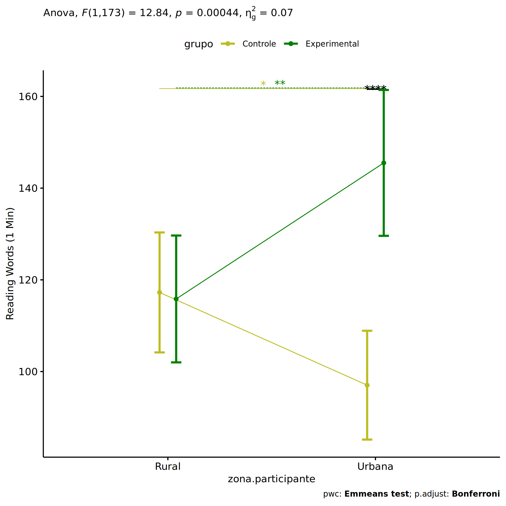
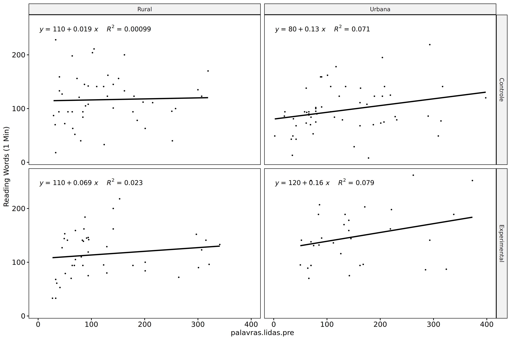
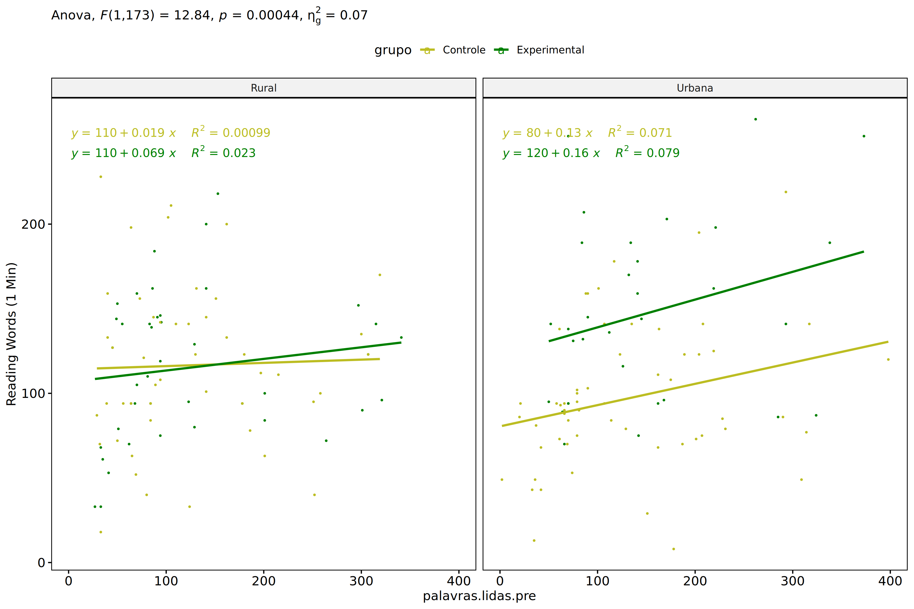
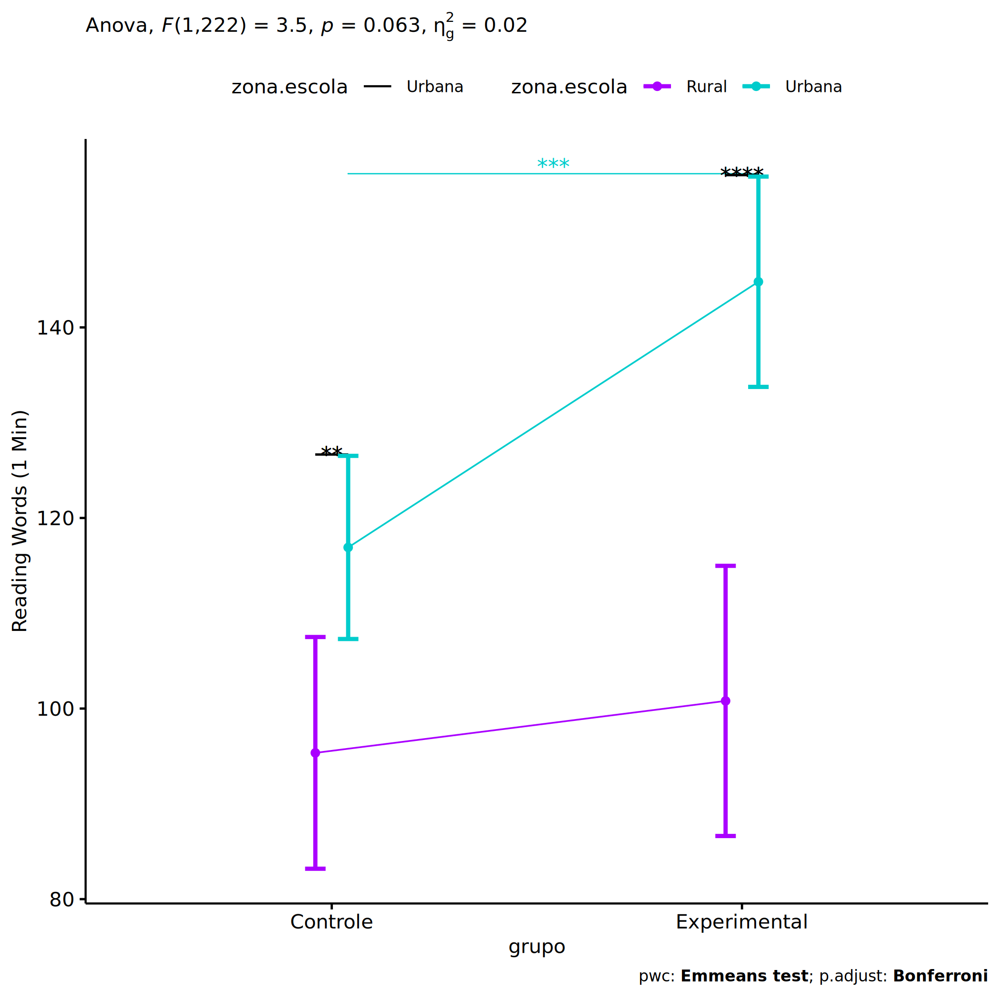
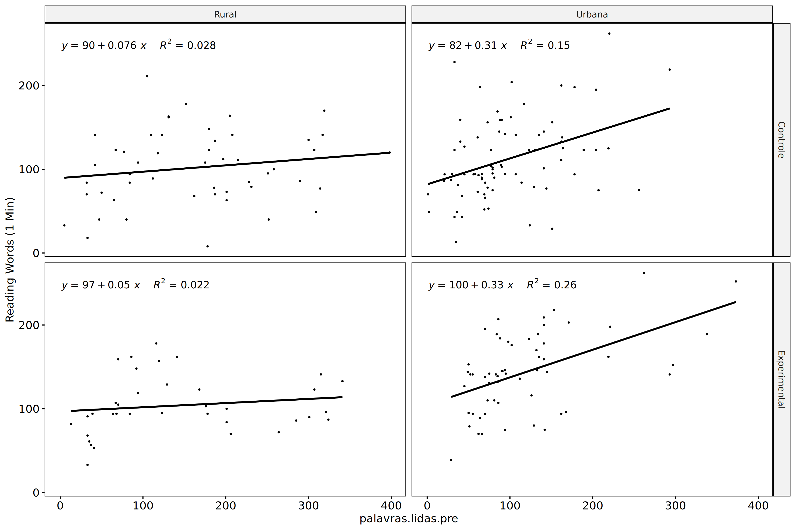
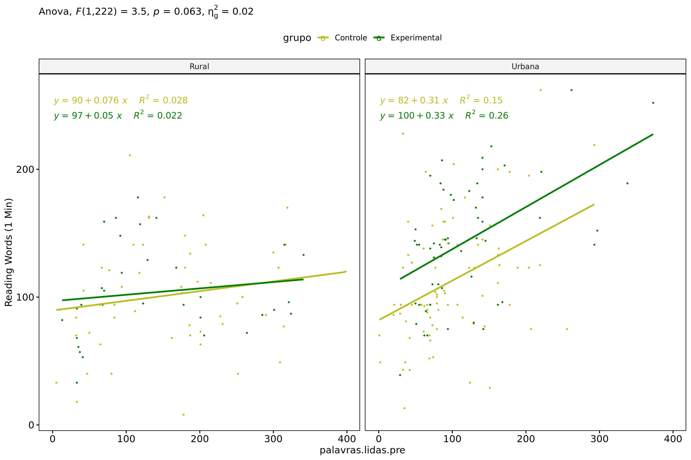
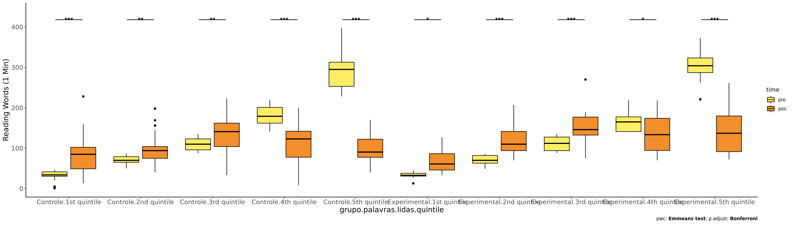
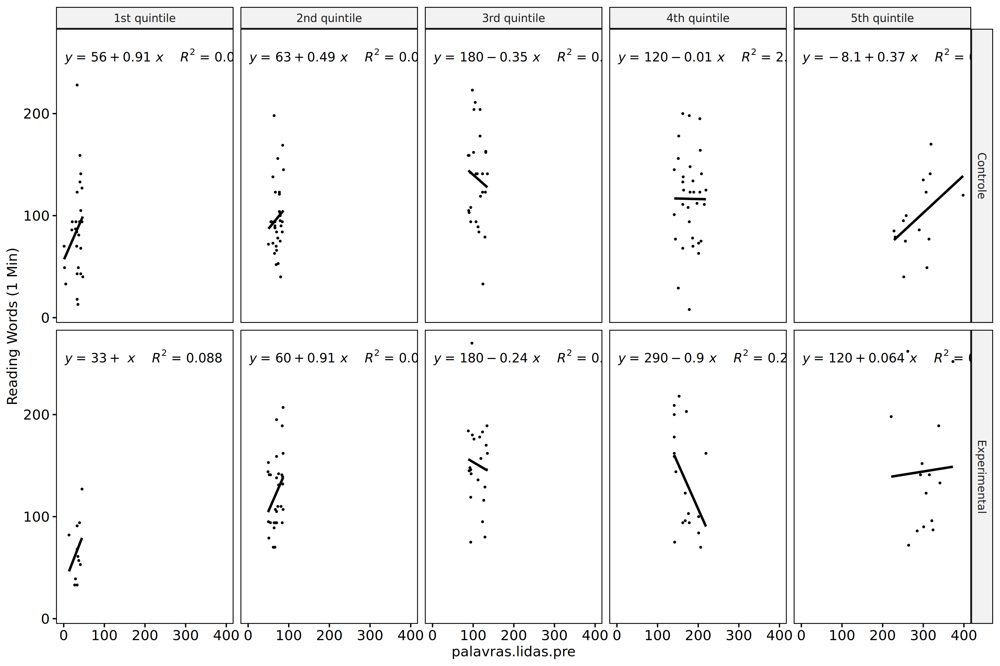

ANCOVA in Reading Words (1 Min) (Reading Words (1 Min))
================
Geiser C. Challco <geiser@alumni.usp.br>

- [Setting Initial Variables](#setting-initial-variables)
- [Descriptive Statistics of Initial
  Data](#descriptive-statistics-of-initial-data)
- [ANCOVA and Pairwise for one factor:
  **grupo**](#ancova-and-pairwise-for-one-factor-grupo)
  - [Without remove non-normal data](#without-remove-non-normal-data)
  - [Computing ANCOVA and PairWise After removing non-normal data
    (OK)](#computing-ancova-and-pairwise-after-removing-non-normal-data-ok)
    - [Plots for ancova](#plots-for-ancova)
    - [Checking linearity assumption](#checking-linearity-assumption)
    - [Checking normality and
      homogeneity](#checking-normality-and-homogeneity)
- [ANCOVA and Pairwise for two factors
  **grupo:genero**](#ancova-and-pairwise-for-two-factors-grupogenero)
  - [Without remove non-normal data](#without-remove-non-normal-data-1)
  - [Computing ANCOVA and PairWise After removing non-normal data
    (OK)](#computing-ancova-and-pairwise-after-removing-non-normal-data-ok-1)
    - [Plots for ancova](#plots-for-ancova-1)
    - [Checking linearity assumption](#checking-linearity-assumption-1)
    - [Checking normality and
      homogeneity](#checking-normality-and-homogeneity-1)
- [ANCOVA and Pairwise for two factors
  **grupo:zona.participante**](#ancova-and-pairwise-for-two-factors-grupozonaparticipante)
  - [Without remove non-normal data](#without-remove-non-normal-data-2)
  - [Computing ANCOVA and PairWise After removing non-normal data
    (OK)](#computing-ancova-and-pairwise-after-removing-non-normal-data-ok-2)
    - [Plots for ancova](#plots-for-ancova-2)
    - [Checking linearity assumption](#checking-linearity-assumption-2)
    - [Checking normality and
      homogeneity](#checking-normality-and-homogeneity-2)
- [ANCOVA and Pairwise for two factors
  **grupo:zona.escola**](#ancova-and-pairwise-for-two-factors-grupozonaescola)
  - [Without remove non-normal data](#without-remove-non-normal-data-3)
  - [Computing ANCOVA and PairWise After removing non-normal data
    (OK)](#computing-ancova-and-pairwise-after-removing-non-normal-data-ok-3)
    - [Plots for ancova](#plots-for-ancova-3)
    - [Checking linearity assumption](#checking-linearity-assumption-3)
    - [Checking normality and
      homogeneity](#checking-normality-and-homogeneity-3)
- [ANCOVA and Pairwise for two factors
  **grupo:palavras.lidas.quintile**](#ancova-and-pairwise-for-two-factors-grupopalavraslidasquintile)
  - [Without remove non-normal data](#without-remove-non-normal-data-4)
  - [Computing ANCOVA and PairWise After removing non-normal data
    (OK)](#computing-ancova-and-pairwise-after-removing-non-normal-data-ok-4)
    - [Plots for ancova](#plots-for-ancova-4)
    - [Checking linearity assumption](#checking-linearity-assumption-4)
    - [Checking normality and
      homogeneity](#checking-normality-and-homogeneity-4)
- [Summary of Results](#summary-of-results)
  - [Descriptive Statistics](#descriptive-statistics)
  - [ANCOVA Table Comparison](#ancova-table-comparison)
  - [PairWise Table Comparison](#pairwise-table-comparison)
  - [EMMS Table Comparison](#emms-table-comparison)

**NOTE**:

- Teste ANCOVA para determinar se houve diferenças significativas no
  Reading Words (1 Min) (medido usando pre- e pos-testes).
- ANCOVA test to determine whether there were significant differences in
  Reading Words (1 Min) (measured using pre- and post-tests).

# Setting Initial Variables

``` r
dv = "palavras.lidas"
dv.pos = "palavras.lidas.pos"
dv.pre = "palavras.lidas.pre"

fatores2 <- c("genero","zona.participante","zona.escola","palavras.lidas.quintile")
lfatores2 <- as.list(fatores2)
names(lfatores2) <- fatores2

fatores1 <- c("grupo", fatores2)
lfatores1 <- as.list(fatores1)
names(lfatores1) <- fatores1

lfatores <- c(lfatores1)

color <- list()
color[["prepost"]] = c("#ffee65","#f28e2B")
color[["grupo"]] = c("#bcbd22","#008000")
color[["genero"]] = c("#FF007F","#4D4DFF")
color[["zona.escola"]] = c("#AA00FF","#00CCCC")
color[["zona.participante"]] = c("#AA00FF","#00CCCC")

level <- list()
level[["grupo"]] = c("Controle","Experimental")
level[["genero"]] = c("F","M")
level[["zona.escola"]] = c("Rural","Urbana")
level[["zona.participante"]] = c("Rural","Urbana")

# ..

ymin <- 0
ymax <- 0

ymin.ci <- 0
ymax.ci <- 0


color[["grupo:genero"]] = c(
  "Controle:F"="#ff99cb", "Controle:M"="#b7b7ff",
  "Experimental:F"="#FF007F", "Experimental:M"="#4D4DFF",
  "Controle.F"="#ff99cb", "Controle.M"="#b7b7ff",
  "Experimental.F"="#FF007F", "Experimental.M"="#4D4DFF"
)
color[["grupo:zona.escola"]] = c(
  "Controle:Rural"="#b2efef","Controle:Urbana"="#e5b2ff",
  "Experimental:Rural"="#00CCCC", "Experimental:Urbana"="#AA00FF",
  "Controle.Rural"="#b2efef","Controle.Urbana"="#e5b2ff",
  "Experimental.Rural"="#00CCCC", "Experimental.Urbana"="#AA00FF"
)
color[["grupo:zona.participante"]] = c(
  "Controle:Rural"="#b2efef","Controle:Urbana"="#e5b2ff",
  "Experimental:Rural"="#00CCCC", "Experimental:Urbana"="#AA00FF",
  "Controle.Rural"="#b2efef","Controle.Urbana"="#e5b2ff",
  "Experimental.Rural"="#00CCCC", "Experimental.Urbana"="#AA00FF"
)

for (coln in c(
  "palavras.lidas","score.compreensao","tri.compreensao",
  "score.vocab","tri.vocab",
  "score.vocab.ensinado","tri.vocab.ensinado","score.vocab.nao.ensinado","tri.vocab.nao.ensinado",
  "score.CLPP","tri.CLPP","score.CR","tri.CR",
  "score.CI","tri.CI","score.TV","tri.TV","score.TF","tri.TF","score.TO","tri.TO")) {
  color[[paste0(coln,".quintile")]] = c("#BF0040","#FF0000","#800080","#0000FF","#4000BF")
  level[[paste0(coln,".quintile")]] = c("1st quintile","2nd quintile","3rd quintile","4th quintile","5th quintile")
  color[[paste0("grupo:",coln,".quintile")]] = c(
    "Experimental.1st quintile"="#BF0040", "Controle.1st quintile"="#d8668c",
    "Experimental.2nd quintile"="#FF0000", "Controle.2nd quintile"="#ff7f7f",
    "Experimental.3rd quintile"="#8fce00", "Controle.3rd quintile"="#ddf0b2",
    "Experimental.4th quintile"="#0000FF", "Controle.4th quintile"="#b2b2ff",
    "Experimental.5th quintile"="#4000BF", "Controle.5th quintile"="#b299e5",
    
    "Experimental:1st quintile"="#BF0040", "Controle:1st quintile"="#d8668c",
    "Experimental:2nd quintile"="#FF0000", "Controle:2nd quintile"="#ff7f7f",
    "Experimental:3rd quintile"="#8fce00", "Controle:3rd quintile"="#ddf0b2",
    "Experimental:4th quintile"="#0000FF", "Controle:4th quintile"="#b2b2ff",
    "Experimental:5th quintile"="#4000BF", "Controle:5th quintile"="#b299e5")
}


gdat <- read_excel("../data/data.xlsx", sheet = "triagem.wg.wo.st")


dat <- gdat
dat$grupo <- factor(dat[["grupo"]], level[["grupo"]])
for (coln in c(names(lfatores))) {
  dat[[coln]] <- factor(dat[[coln]], level[[coln]][level[[coln]] %in% unique(dat[[coln]])])
}
dat <- dat[which(!is.na(dat[[dv.pre]]) & !is.na(dat[[dv.pos]])),]
dat <- dat[,c("id",names(lfatores),dv.pre,dv.pos)]

dat.long <- rbind(dat, dat)
dat.long$time <- c(rep("pre", nrow(dat)), rep("pos", nrow(dat)))
dat.long$time <- factor(dat.long$time, c("pre","pos"))
dat.long[[dv]] <- c(dat[[dv.pre]], dat[[dv.pos]])


for (f in c("grupo", names(lfatores))) {
  if (is.null(color[[f]]) && length(unique(dat[[f]])) > 0) 
      color[[f]] <- distinctColorPalette(length(unique(dat[[f]])))
}
for (f in c(fatores2)) {
  if (is.null(color[[paste0("grupo:",f)]]) && length(unique(dat[[f]])) > 0)
    color[[paste0("grupo:",f)]] <- distinctColorPalette(length(unique(dat[["grupo"]]))*length(unique(dat[[f]])))
}

ldat <- list()
laov <- list()
lpwc <- list()
lemms <- list()
```

# Descriptive Statistics of Initial Data

``` r
df <- get.descriptives(dat, c(dv.pre, dv.pos), c("grupo"), 
                       include.global = T, symmetry.test = T, normality.test = F)
df <- plyr::rbind.fill(
  df, do.call(plyr::rbind.fill, lapply(lfatores2, FUN = function(f) {
    if (nrow(dat) > 0 && sum(!is.na(unique(dat[[f]]))) > 1)
      get.descriptives(dat, c(dv.pre,dv.pos), c("grupo", f),
                       symmetry.test = T, normality.test = F)
    }))
)
df <- df[,c(fatores1[fatores1 %in% colnames(df)],"variable",
            colnames(df)[!colnames(df) %in% c(fatores1,"variable")])]
```

| grupo        | genero | zona.participante | zona.escola | palavras.lidas.quintile | variable           |   n |    mean | median | min | max |      sd |     se |     ci |    iqr | symmetry | skewness | kurtosis |
|:-------------|:-------|:------------------|:------------|:------------------------|:-------------------|----:|--------:|-------:|----:|----:|--------:|-------:|-------:|-------:|:---------|---------:|---------:|
| Controle     |        |                   |             |                         | palavras.lidas.pre | 137 | 122.562 |   98.0 |   1 | 398 |  80.931 |  6.914 | 13.674 | 113.00 | NO       |    0.915 |    0.315 |
| Experimental |        |                   |             |                         | palavras.lidas.pre | 104 | 127.077 |   94.0 |  13 | 373 |  85.781 |  8.412 | 16.682 |  85.25 | NO       |    1.164 |    0.386 |
|              |        |                   |             |                         | palavras.lidas.pre | 241 | 124.510 |   94.0 |   1 | 398 |  82.913 |  5.341 | 10.521 | 101.00 | NO       |    1.045 |    0.412 |
| Controle     |        |                   |             |                         | palavras.lidas.pos | 137 | 114.993 |  102.0 |   8 | 430 |  60.072 |  5.132 | 10.149 |  63.00 | NO       |    1.755 |    6.056 |
| Experimental |        |                   |             |                         | palavras.lidas.pos | 104 | 142.096 |  137.0 |  33 | 430 |  70.439 |  6.907 | 13.699 |  77.50 | NO       |    1.557 |    3.594 |
|              |        |                   |             |                         | palavras.lidas.pos | 241 | 126.689 |  116.0 |   8 | 430 |  65.994 |  4.251 |  8.374 |  70.00 | NO       |    1.664 |    4.706 |
| Controle     | F      |                   |             |                         | palavras.lidas.pre |  73 | 123.466 |   94.0 |  20 | 319 |  82.731 |  9.683 | 19.303 | 119.00 | NO       |    0.860 |   -0.240 |
| Controle     | M      |                   |             |                         | palavras.lidas.pre |  64 | 121.531 |  100.0 |   1 | 398 |  79.468 |  9.934 | 19.851 | 100.00 | NO       |    0.960 |    0.933 |
| Experimental | F      |                   |             |                         | palavras.lidas.pre |  50 | 139.780 |  117.5 |  13 | 373 |  87.988 | 12.443 | 25.006 |  98.50 | NO       |    0.966 |   -0.006 |
| Experimental | M      |                   |             |                         | palavras.lidas.pre |  54 | 115.315 |   85.0 |  27 | 338 |  82.761 | 11.262 | 22.589 |  68.50 | NO       |    1.368 |    0.838 |
| Controle     | F      |                   |             |                         | palavras.lidas.pos |  73 | 115.973 |  100.0 |  13 | 262 |  47.235 |  5.528 | 11.021 |  55.00 | NO       |    0.850 |    0.718 |
| Controle     | M      |                   |             |                         | palavras.lidas.pos |  64 | 113.875 |  104.5 |   8 | 430 |  72.372 |  9.047 | 18.078 |  71.00 | NO       |    1.905 |    5.533 |
| Experimental | F      |                   |             |                         | palavras.lidas.pos |  50 | 162.560 |  145.5 |  57 | 430 |  75.532 | 10.682 | 21.466 |  96.00 | NO       |    1.187 |    1.563 |
| Experimental | M      |                   |             |                         | palavras.lidas.pos |  54 | 123.148 |  110.0 |  33 | 419 |  60.059 |  8.173 | 16.393 |  54.75 | NO       |    2.108 |    8.534 |
| Controle     |        | Rural             |             |                         | palavras.lidas.pre |  47 | 124.404 |  102.0 |  29 | 319 |  79.055 | 11.531 | 23.211 | 105.50 | NO       |    0.858 |   -0.210 |
| Controle     |        | Urbana            |             |                         | palavras.lidas.pre |  61 | 132.492 |  107.0 |   2 | 398 |  88.066 | 11.276 | 22.555 | 123.00 | NO       |    0.857 |    0.082 |
| Controle     |        |                   |             |                         | palavras.lidas.pre |  29 |  98.690 |   85.0 |   1 | 256 |  64.159 | 11.914 | 24.405 |  99.00 | NO       |    0.520 |   -0.591 |
| Experimental |        | Rural             |             |                         | palavras.lidas.pre |  43 | 124.814 |   91.0 |  27 | 341 |  91.589 | 13.967 | 28.187 |  84.00 | NO       |    1.134 |   -0.040 |
| Experimental |        | Urbana            |             |                         | palavras.lidas.pre |  36 | 146.083 |  129.0 |  29 | 373 |  92.586 | 15.431 | 31.327 | 111.50 | NO       |    0.910 |   -0.363 |
| Experimental |        |                   |             |                         | palavras.lidas.pre |  25 | 103.600 |   92.0 |  13 | 262 |  57.214 | 11.443 | 23.617 |  63.00 | NO       |    0.829 |    0.464 |
| Controle     |        | Rural             |             |                         | palavras.lidas.pos |  47 | 116.553 |  112.0 |  18 | 228 |  48.159 |  7.025 | 14.140 |  53.00 | YES      |    0.223 |   -0.358 |
| Controle     |        | Urbana            |             |                         | palavras.lidas.pos |  61 | 112.098 |   94.0 |   8 | 430 |  72.869 |  9.330 | 18.662 |  63.00 | NO       |    2.178 |    6.116 |
| Controle     |        |                   |             |                         | palavras.lidas.pos |  29 | 118.552 |  119.0 |  33 | 223 |  47.996 |  8.913 | 18.257 |  64.00 | YES      |    0.349 |   -0.675 |
| Experimental |        | Rural             |             |                         | palavras.lidas.pos |  43 | 118.837 |  119.0 |  33 | 270 |  48.009 |  7.321 | 14.775 |  57.50 | NO       |    0.671 |    0.781 |
| Experimental |        | Urbana            |             |                         | palavras.lidas.pos |  36 | 161.417 |  142.5 |  39 | 430 |  81.056 | 13.509 | 27.425 |  96.50 | NO       |    1.226 |    1.638 |
| Experimental |        |                   |             |                         | palavras.lidas.pos |  25 | 154.280 |  146.0 |  57 | 419 |  77.429 | 15.486 | 31.961 |  77.00 | NO       |    1.576 |    3.037 |
| Controle     |        |                   | Rural       |                         | palavras.lidas.pre |  52 | 162.173 |  168.5 |   5 | 398 |  94.788 | 13.145 | 26.389 | 135.25 | YES      |    0.356 |   -0.779 |
| Controle     |        |                   | Urbana      |                         | palavras.lidas.pre |  85 |  98.329 |   81.0 |   1 | 293 |  59.867 |  6.493 | 12.913 |  74.00 | NO       |    0.884 |    0.383 |
| Experimental |        |                   | Rural       |                         | palavras.lidas.pre |  36 | 143.750 |  117.5 |  13 | 341 | 103.202 | 17.200 | 34.918 | 136.00 | NO       |    0.598 |   -1.081 |
| Experimental |        |                   | Urbana      |                         | palavras.lidas.pre |  68 | 118.250 |   91.0 |  27 | 373 |  74.296 |  9.010 | 17.984 |  71.00 | NO       |    1.571 |    2.020 |
| Controle     |        |                   | Rural       |                         | palavras.lidas.pos |  52 | 103.827 |  102.5 |   8 | 211 |  45.228 |  6.272 | 12.592 |  63.75 | YES      |    0.161 |   -0.376 |
| Controle     |        |                   | Urbana      |                         | palavras.lidas.pos |  85 | 121.824 |  102.0 |  13 | 430 |  66.904 |  7.257 | 14.431 |  61.00 | NO       |    1.854 |    5.306 |
| Experimental |        |                   | Rural       |                         | palavras.lidas.pos |  36 | 104.000 |   94.5 |  33 | 178 |  34.420 |  5.737 | 11.646 |  39.00 | YES      |    0.320 |   -0.587 |
| Experimental |        |                   | Urbana      |                         | palavras.lidas.pos |  68 | 162.265 |  145.0 |  33 | 430 |  76.264 |  9.248 | 18.460 |  80.50 | NO       |    1.284 |    2.352 |
| Controle     |        |                   |             | 1st quintile            | palavras.lidas.pre |  26 |  32.154 |   34.0 |   1 |  47 |  12.746 |  2.500 |  5.148 |  11.00 | NO       |   -1.265 |    0.645 |
| Controle     |        |                   |             | 2nd quintile            | palavras.lidas.pre |  34 |  71.235 |   70.0 |  50 |  87 |   9.049 |  1.552 |  3.157 |  13.75 | YES      |   -0.204 |   -0.761 |
| Controle     |        |                   |             | 3rd quintile            | palavras.lidas.pre |  28 | 109.536 |  108.5 |  88 | 135 |  14.980 |  2.831 |  5.809 |  29.00 | YES      |    0.111 |   -1.419 |
| Controle     |        |                   |             | 4th quintile            | palavras.lidas.pre |  33 | 179.485 |  180.0 | 141 | 219 |  22.483 |  3.914 |  7.972 |  39.00 | YES      |   -0.082 |   -1.183 |
| Controle     |        |                   |             | 5th quintile            | palavras.lidas.pre |  16 | 283.938 |  291.5 | 220 | 398 |  45.717 | 11.429 | 24.361 |  58.50 | NO       |    0.609 |    0.021 |
| Experimental |        |                   |             | 1st quintile            | palavras.lidas.pre |  11 |  33.182 |   33.0 |  13 |  45 |   8.460 |  2.551 |  5.683 |   7.00 | NO       |   -0.922 |    0.413 |
| Experimental |        |                   |             | 2nd quintile            | palavras.lidas.pre |  35 |  70.086 |   70.0 |  49 |  86 |  11.668 |  1.972 |  4.008 |  16.50 | YES      |   -0.314 |   -1.006 |
| Experimental |        |                   |             | 3rd quintile            | palavras.lidas.pre |  24 | 109.875 |  107.0 |  88 | 135 |  17.384 |  3.548 |  7.341 |  32.75 | YES      |    0.157 |   -1.769 |
| Experimental |        |                   |             | 4th quintile            | palavras.lidas.pre |  18 | 166.389 |  165.0 | 141 | 219 |  25.964 |  6.120 | 12.912 |  36.25 | NO       |    0.586 |   -1.082 |
| Experimental |        |                   |             | 5th quintile            | palavras.lidas.pre |  16 | 297.875 |  299.0 | 221 | 373 |  38.145 |  9.536 | 20.326 |  58.25 | YES      |   -0.033 |   -0.639 |
| Controle     |        |                   |             | 1st quintile            | palavras.lidas.pos |  26 |  85.615 |   85.0 |  13 | 228 |  47.569 |  9.329 | 19.214 |  53.25 | NO       |    0.890 |    0.986 |
| Controle     |        |                   |             | 2nd quintile            | palavras.lidas.pos |  34 | 105.235 |   94.0 |  40 | 363 |  56.675 |  9.720 | 19.775 |  41.00 | NO       |    2.830 |   10.002 |
| Controle     |        |                   |             | 3rd quintile            | palavras.lidas.pos |  28 | 140.607 |  141.0 |  33 | 252 |  49.480 |  9.351 | 19.186 |  57.75 | YES      |    0.218 |   -0.377 |
| Controle     |        |                   |             | 4th quintile            | palavras.lidas.pos |  33 | 125.970 |  123.0 |   8 | 430 |  70.882 | 12.339 | 25.134 |  67.00 | NO       |    2.188 |    7.781 |
| Controle     |        |                   |             | 5th quintile            | palavras.lidas.pos |  16 | 116.000 |   97.5 |  40 | 262 |  59.602 | 14.901 | 31.760 |  58.00 | NO       |    1.003 |    0.162 |
| Experimental |        |                   |             | 1st quintile            | palavras.lidas.pos |  11 |  67.091 |   61.0 |  33 | 127 |  29.256 |  8.821 | 19.654 |  40.50 | NO       |    0.530 |   -0.871 |
| Experimental |        |                   |             | 2nd quintile            | palavras.lidas.pos |  35 | 141.771 |  132.0 |  70 | 335 |  63.222 | 10.687 | 21.718 |  62.00 | NO       |    1.380 |    1.335 |
| Experimental |        |                   |             | 3rd quintile            | palavras.lidas.pos |  24 | 155.542 |  147.0 |  75 | 270 |  46.335 |  9.458 | 19.566 |  44.25 | NO       |    0.631 |    0.583 |
| Experimental |        |                   |             | 4th quintile            | palavras.lidas.pos |  18 | 137.444 |  133.5 |  70 | 218 |  50.160 | 11.823 | 24.944 |  79.50 | YES      |    0.215 |   -1.567 |
| Experimental |        |                   |             | 5th quintile            | palavras.lidas.pos |  16 | 179.438 |  141.0 |  72 | 430 | 111.211 | 27.803 | 59.260 | 117.00 | NO       |    1.176 |    0.156 |

# ANCOVA and Pairwise for one factor: **grupo**

## Without remove non-normal data

``` r
pdat = remove_group_data(dat[!is.na(dat[["grupo"]]),], "palavras.lidas.pos", "grupo")

pdat.long <- rbind(pdat[,c("id","grupo")], pdat[,c("id","grupo")])
pdat.long[["time"]] <- c(rep("pre", nrow(pdat)), rep("pos", nrow(pdat)))
pdat.long[["time"]] <- factor(pdat.long[["time"]], c("pre","pos"))
pdat.long[["palavras.lidas"]] <- c(pdat[["palavras.lidas.pre"]], pdat[["palavras.lidas.pos"]])

aov = anova_test(pdat, palavras.lidas.pos ~ palavras.lidas.pre + grupo)
laov[["grupo"]] <- get_anova_table(aov)
```

``` r
pwc <- emmeans_test(pdat, palavras.lidas.pos ~ grupo, covariate = palavras.lidas.pre,
                    p.adjust.method = "bonferroni")
```

``` r
pwc.long <- emmeans_test(dplyr::group_by_at(pdat.long, "grupo"),
                          palavras.lidas ~ time,
                          p.adjust.method = "bonferroni")
lpwc[["grupo"]] <- plyr::rbind.fill(pwc, pwc.long)
```

``` r
ds <- get.descriptives(pdat, "palavras.lidas.pos", "grupo", covar = "palavras.lidas.pre")
ds <- merge(ds[ds$variable != "palavras.lidas.pre",],
            ds[ds$variable == "palavras.lidas.pre", !colnames(ds) %in% c("variable")],
            by = "grupo", all.x = T, suffixes = c("", ".palavras.lidas.pre"))
ds <- merge(get_emmeans(pwc), ds, by = "grupo", suffixes = c(".emms", ""))
ds <- ds[,c("grupo","n","mean.palavras.lidas.pre","se.palavras.lidas.pre","mean","se",
            "emmean","se.emms","conf.low","conf.high")]

colnames(ds) <- c("grupo", "N", paste0(c("M","SE")," (pre)"),
                  paste0(c("M","SE"), " (unadj)"),
                  paste0(c("M", "SE"), " (adj)"), "conf.low", "conf.high")

lemms[["grupo"]] <- ds
```

## Computing ANCOVA and PairWise After removing non-normal data (OK)

``` r
wdat = pdat 

res = residuals(lm(palavras.lidas.pos ~ palavras.lidas.pre + grupo, data = wdat))
non.normal = getNonNormal(res, wdat$id, plimit = 0.05)

wdat = wdat[!wdat$id %in% non.normal,]

wdat.long <- rbind(wdat[,c("id","grupo")], wdat[,c("id","grupo")])
wdat.long[["time"]] <- c(rep("pre", nrow(wdat)), rep("pos", nrow(wdat)))
wdat.long[["time"]] <- factor(wdat.long[["time"]], c("pre","pos"))
wdat.long[["palavras.lidas"]] <- c(wdat[["palavras.lidas.pre"]], wdat[["palavras.lidas.pos"]])

ldat[["grupo"]] = wdat

(non.normal)
```

    ##  [1] "P96"  "P171" "P24"  "P172" "P68"  "P40"  "P229" "P37"  "P318" "P180" "P283" "P16"  "P90" 
    ## [14] "P94"  "P353"

``` r
aov = anova_test(wdat, palavras.lidas.pos ~ palavras.lidas.pre + grupo)
laov[["grupo"]] <- merge(get_anova_table(aov), laov[["grupo"]],
                            by="Effect", suffixes = c("","'"))

(df = get_anova_table(aov))
```

    ## ANOVA Table (type II tests)
    ## 
    ##               Effect DFn DFd      F        p p<.05   ges
    ## 1 palavras.lidas.pre   1 223 13.569 0.000289     * 0.057
    ## 2              grupo   1 223 10.571 0.001000     * 0.045

| Effect             | DFn | DFd |      F |     p | p\<.05 |   ges |
|:-------------------|----:|----:|-------:|------:|:-------|------:|
| palavras.lidas.pre |   1 | 223 | 13.569 | 0.000 | \*     | 0.057 |
| grupo              |   1 | 223 | 10.571 | 0.001 | \*     | 0.045 |

``` r
pwc <- emmeans_test(wdat, palavras.lidas.pos ~ grupo, covariate = palavras.lidas.pre,
                    p.adjust.method = "bonferroni")
```

| term                      | .y.                | group1   | group2       |  df | statistic |     p | p.adj | p.adj.signif |
|:--------------------------|:-------------------|:---------|:-------------|----:|----------:|------:|------:|:-------------|
| palavras.lidas.pre\*grupo | palavras.lidas.pos | Controle | Experimental | 223 |    -3.251 | 0.001 | 0.001 | \*\*         |

``` r
pwc.long <- emmeans_test(dplyr::group_by_at(wdat.long, "grupo"),
                         palavras.lidas ~ time,
                         p.adjust.method = "bonferroni")
lpwc[["grupo"]] <- merge(plyr::rbind.fill(pwc, pwc.long), lpwc[["grupo"]],
                            by=c("grupo","term",".y.","group1","group2"),
                            suffixes = c("","'"))
```

| grupo        | term | .y.            | group1 | group2 |  df | statistic |     p | p.adj | p.adj.signif |
|:-------------|:-----|:---------------|:-------|:-------|----:|----------:|------:|------:|:-------------|
| Controle     | time | palavras.lidas | pre    | pos    | 448 |     1.615 | 0.107 | 0.107 | ns           |
| Experimental | time | palavras.lidas | pre    | pos    | 448 |    -0.052 | 0.959 | 0.959 | ns           |

``` r
ds <- get.descriptives(wdat, "palavras.lidas.pos", "grupo", covar = "palavras.lidas.pre")
ds <- merge(ds[ds$variable != "palavras.lidas.pre",],
            ds[ds$variable == "palavras.lidas.pre", !colnames(ds) %in% c("variable")],
            by = "grupo", all.x = T, suffixes = c("", ".palavras.lidas.pre"))
ds <- merge(get_emmeans(pwc), ds, by = "grupo", suffixes = c(".emms", ""))
ds <- ds[,c("grupo","n","mean.palavras.lidas.pre","se.palavras.lidas.pre","mean","se",
            "emmean","se.emms","conf.low","conf.high")]

colnames(ds) <- c("grupo", "N", paste0(c("M","SE")," (pre)"),
                  paste0(c("M","SE"), " (unadj)"),
                  paste0(c("M", "SE"), " (adj)"), "conf.low", "conf.high")

lemms[["grupo"]] <- merge(ds, lemms[["grupo"]], by=c("grupo"), suffixes = c("","'"))
```

| grupo        |   N | M (pre) | SE (pre) | M (unadj) | SE (unadj) | M (adj) | SE (adj) | conf.low | conf.high |
|:-------------|----:|--------:|---------:|----------:|-----------:|--------:|---------:|---------:|----------:|
| Controle     | 131 | 121.626 |    7.058 |   108.237 |      3.947 | 108.599 |    3.898 |  100.918 |   116.280 |
| Experimental |  95 | 128.147 |    8.848 |   128.653 |      4.794 | 128.153 |    4.578 |  119.133 |   137.174 |

### Plots for ancova

``` r
plots <- oneWayAncovaPlots(
  wdat, "palavras.lidas.pos", "grupo", aov, list("grupo"=pwc), addParam = c("mean_ci"),
  font.label.size=10, step.increase=0.05, p.label="p.adj",
  subtitle = which(aov$Effect == "grupo"))
```

``` r
if (!is.null(nrow(plots[["grupo"]]$data)))
  plots[["grupo"]] + ggplot2::ylab("Reading Words (1 Min)") + 
  if (ymin.ci < ymax.ci) ggplot2::ylim(ymin.ci, ymax.ci)
```

<!-- -->

``` r
plots <- oneWayAncovaBoxPlots(
  wdat, "palavras.lidas.pos", "grupo", aov, pwc, covar = "palavras.lidas.pre",
  theme = "classic", color = color[["grupo"]],
  subtitle = which(aov$Effect == "grupo"))
```

``` r
if (length(unique(wdat[["grupo"]])) > 1)
  plots[["grupo"]] + ggplot2::ylab("Reading Words (1 Min)") +
  ggplot2::scale_x_discrete(labels=c('pre', 'pos')) +
  if (ymin < ymax) ggplot2::ylim(ymin, ymax)
```

<!-- -->

``` r
if (length(unique(wdat.long[["grupo"]])) > 1)
  plots <- oneWayAncovaBoxPlots(
    wdat.long, "palavras.lidas", "grupo", aov, pwc.long,
    pre.post = "time", theme = "classic", color = color$prepost)
```

``` r
if (length(unique(wdat.long[["grupo"]])) > 1)
  plots[["grupo"]] + ggplot2::ylab("Reading Words (1 Min)") +
  if (ymin < ymax) ggplot2::ylim(ymin, ymax) 
```

<!-- -->

### Checking linearity assumption

``` r
ggscatter(wdat, x = "palavras.lidas.pre", y = "palavras.lidas.pos", size = 0.5,
          color = "grupo", add = "reg.line")+
  stat_regline_equation(
    aes(label =  paste(..eq.label.., ..rr.label.., sep = "~~~~"), color = grupo)
  ) +
  ggplot2::labs(subtitle = rstatix::get_test_label(aov, detailed = T, row = which(aov$Effect == "grupo"))) +
  ggplot2::scale_color_manual(values = color[["grupo"]]) +
  ggplot2::ylab("Reading Words (1 Min)")  +
  if (ymin < ymax) ggplot2::ylim(ymin, ymax)
```

<!-- -->

### Checking normality and homogeneity

``` r
res <- augment(lm(palavras.lidas.pos ~ palavras.lidas.pre + grupo, data = wdat))
```

``` r
shapiro_test(res$.resid)
```

    ## # A tibble: 1 × 3
    ##   variable   statistic p.value
    ##   <chr>          <dbl>   <dbl>
    ## 1 res$.resid     0.988  0.0565

``` r
levene_test(res, .resid ~ grupo)
```

    ## # A tibble: 1 × 4
    ##     df1   df2 statistic     p
    ##   <int> <int>     <dbl> <dbl>
    ## 1     1   224      1.37 0.243

# ANCOVA and Pairwise for two factors **grupo:genero**

## Without remove non-normal data

``` r
pdat = remove_group_data(dat[!is.na(dat[["grupo"]]) & !is.na(dat[["genero"]]),],
                         "palavras.lidas.pos", c("grupo","genero"))
pdat = pdat[pdat[["genero"]] %in% do.call(
  intersect, lapply(unique(pdat[["grupo"]]), FUN = function(x) {
    unique(pdat[["genero"]][which(pdat[["grupo"]] == x)])
  })),]
pdat[["grupo"]] = factor(pdat[["grupo"]], level[["grupo"]])
pdat[["genero"]] = factor(
  pdat[["genero"]],
  level[["genero"]][level[["genero"]] %in% unique(pdat[["genero"]])])

pdat.long <- rbind(pdat[,c("id","grupo","genero")], pdat[,c("id","grupo","genero")])
pdat.long[["time"]] <- c(rep("pre", nrow(pdat)), rep("pos", nrow(pdat)))
pdat.long[["time"]] <- factor(pdat.long[["time"]], c("pre","pos"))
pdat.long[["palavras.lidas"]] <- c(pdat[["palavras.lidas.pre"]], pdat[["palavras.lidas.pos"]])

if (length(unique(pdat[["genero"]])) >= 2) {
  aov = anova_test(pdat, palavras.lidas.pos ~ palavras.lidas.pre + grupo*genero)
  laov[["grupo:genero"]] <- get_anova_table(aov)
}
```

``` r
if (length(unique(pdat[["genero"]])) >= 2) {
  pwcs <- list()
  pwcs[["genero"]] <- emmeans_test(
    group_by(pdat, grupo), palavras.lidas.pos ~ genero,
    covariate = palavras.lidas.pre, p.adjust.method = "bonferroni")
  pwcs[["grupo"]] <- emmeans_test(
    group_by(pdat, genero), palavras.lidas.pos ~ grupo,
    covariate = palavras.lidas.pre, p.adjust.method = "bonferroni")
  
  pwc <- plyr::rbind.fill(pwcs[["grupo"]], pwcs[["genero"]])
  pwc <- pwc[,c("grupo","genero", colnames(pwc)[!colnames(pwc) %in% c("grupo","genero")])]
}
```

``` r
if (length(unique(pdat[["genero"]])) >= 2) {
  pwc.long <- emmeans_test(dplyr::group_by_at(pdat.long, c("grupo","genero")),
                           palavras.lidas ~ time,
                           p.adjust.method = "bonferroni")
  lpwc[["grupo:genero"]] <- plyr::rbind.fill(pwc, pwc.long)
}
```

``` r
if (length(unique(pdat[["genero"]])) >= 2) {
  ds <- get.descriptives(pdat, "palavras.lidas.pos", c("grupo","genero"), covar = "palavras.lidas.pre")
  ds <- merge(ds[ds$variable != "palavras.lidas.pre",],
              ds[ds$variable == "palavras.lidas.pre", !colnames(ds) %in% c("variable")],
              by = c("grupo","genero"), all.x = T, suffixes = c("", ".palavras.lidas.pre"))
  ds <- merge(get_emmeans(pwcs[["grupo"]]), ds,
              by = c("grupo","genero"), suffixes = c(".emms", ""))
  ds <- ds[,c("grupo","genero","n","mean.palavras.lidas.pre","se.palavras.lidas.pre","mean","se",
              "emmean","se.emms","conf.low","conf.high")]
  
  colnames(ds) <- c("grupo","genero", "N", paste0(c("M","SE")," (pre)"),
                    paste0(c("M","SE"), " (unadj)"),
                    paste0(c("M", "SE"), " (adj)"), "conf.low", "conf.high")
  
  lemms[["grupo:genero"]] <- ds
}
```

## Computing ANCOVA and PairWise After removing non-normal data (OK)

``` r
if (length(unique(pdat[["genero"]])) >= 2) {
  wdat = pdat 
  
  res = residuals(lm(palavras.lidas.pos ~ palavras.lidas.pre + grupo*genero, data = wdat))
  non.normal = getNonNormal(res, wdat$id, plimit = 0.05)
  
  wdat = wdat[!wdat$id %in% non.normal,]
  
  wdat.long <- rbind(wdat[,c("id","grupo","genero")], wdat[,c("id","grupo","genero")])
  wdat.long[["time"]] <- c(rep("pre", nrow(wdat)), rep("pos", nrow(wdat)))
  wdat.long[["time"]] <- factor(wdat.long[["time"]], c("pre","pos"))
  wdat.long[["palavras.lidas"]] <- c(wdat[["palavras.lidas.pre"]], wdat[["palavras.lidas.pos"]])
  
  
  ldat[["grupo:genero"]] = wdat
  
  (non.normal)
}
```

    ##   [1] "P96"  "P172" "P24"  "P171" "P68"  "P127" "P283" "P48"  "P56"  "P277" "P152" "P66"  "P373"
    ##  [14] "P333" "P282" "P173" "P318" "P2"   "P360" "P341" "P39"  "P321" "P126" "P156" "P348" "P305"
    ##  [27] "P53"  "P236" "P351" "P61"  "P347" "P151" "P69"  "P338" "P316" "P203" "P113" "P343" "P64" 
    ##  [40] "P180" "P344" "P26"  "P63"  "P353" "P182" "P337" "P369" "P178" "P288" "P40"  "P186" "P141"
    ##  [53] "P144" "P229" "P166" "P123" "P325" "P147" "P94"  "P165" "P315" "P142" "P356" "P7"   "P334"
    ##  [66] "P42"  "P8"   "P286" "P352" "P324" "P150" "P51"  "P374" "P211" "P197" "P153" "P340" "P70" 
    ##  [79] "P329" "P275" "P167" "P1"   "P145" "P370" "P86"  "P287" "P82"  "P363" "P284" "P154" "P191"
    ##  [92] "P323" "P222" "P67"  "P207" "P248" "P326" "P134" "P163" "P274" "P357" "P319" "P332" "P303"
    ## [105] "P245" "P354" "P47"  "P159" "P183" "P65"  "P204" "P71"  "P136" "P174" "P158" "P276" "P17" 
    ## [118] "P185" "P302" "P33"  "P160" "P149" "P84"  "P73"  "P216" "P295" "P14"  "P139" "P368" "P297"
    ## [131] "P367" "P301" "P293" "P95"  "P58"  "P365" "P200" "P13"  "P164" "P49"  "P294" "P198" "P16" 
    ## [144] "P102" "P133" "P32"  "P220" "P155" "P219" "P90"  "P371" "P52"  "P161" "P162" "P132" "P290"
    ## [157] "P148" "P241" "P317" "P98"  "P184" "P243" "P322" "P199" "P217" "P232" "P176" "P88"  "P146"
    ## [170] "P37"  "P238" "P124" "P130" "P366" "P34"  "P213" "P44"  "P189" "P143" "P304" "P87"  "P54" 
    ## [183] "P296" "P15"  "P57"  "P30"  "P28"  "P298" "P249" "P201" "P138" "P99"  "P11"  "P101" "P25" 
    ## [196] "P137" "P129" "P291" "P175" "P350"

``` r
if (length(unique(pdat[["genero"]])) >= 2) {
  aov = anova_test(wdat, palavras.lidas.pos ~ palavras.lidas.pre + grupo*genero)
  laov[["grupo:genero"]] <- merge(get_anova_table(aov), laov[["grupo:genero"]],
                                         by="Effect", suffixes = c("","'"))
  df = get_anova_table(aov)
}
```

| Effect             | DFn | DFd |      F |     p | p\<.05 |   ges |
|:-------------------|----:|----:|-------:|------:|:-------|------:|
| palavras.lidas.pre |   1 |  36 | 42.765 | 0.000 | \*     | 0.543 |
| grupo              |   1 |  36 | 21.498 | 0.000 | \*     | 0.374 |
| genero             |   1 |  36 |  7.586 | 0.009 | \*     | 0.174 |
| grupo:genero       |   1 |  36 |  7.757 | 0.008 | \*     | 0.177 |

``` r
if (length(unique(pdat[["genero"]])) >= 2) {
  pwcs <- list()
  pwcs[["genero"]] <- emmeans_test(
    group_by(wdat, grupo), palavras.lidas.pos ~ genero,
    covariate = palavras.lidas.pre, p.adjust.method = "bonferroni")
  pwcs[["grupo"]] <- emmeans_test(
    group_by(wdat, genero), palavras.lidas.pos ~ grupo,
    covariate = palavras.lidas.pre, p.adjust.method = "bonferroni")
  
  pwc <- plyr::rbind.fill(pwcs[["grupo"]], pwcs[["genero"]])
  pwc <- pwc[,c("grupo","genero", colnames(pwc)[!colnames(pwc) %in% c("grupo","genero")])]
}
```

| grupo        | genero | term                       | .y.                | group1   | group2       |  df | statistic |     p | p.adj | p.adj.signif |
|:-------------|:-------|:---------------------------|:-------------------|:---------|:-------------|----:|----------:|------:|------:|:-------------|
|              | F      | palavras.lidas.pre\*grupo  | palavras.lidas.pos | Controle | Experimental |  36 |    -5.210 | 0.000 | 0.000 | \*\*\*\*     |
|              | M      | palavras.lidas.pre\*grupo  | palavras.lidas.pos | Controle | Experimental |  36 |    -1.456 | 0.154 | 0.154 | ns           |
| Controle     |        | palavras.lidas.pre\*genero | palavras.lidas.pos | F        | M            |  36 |     0.071 | 0.943 | 0.943 | ns           |
| Experimental |        | palavras.lidas.pre\*genero | palavras.lidas.pos | F        | M            |  36 |     3.916 | 0.000 | 0.000 | \*\*\*       |

``` r
if (length(unique(pdat[["genero"]])) >= 2) {
  pwc.long <- emmeans_test(dplyr::group_by_at(wdat.long, c("grupo","genero")),
                           palavras.lidas ~ time,
                           p.adjust.method = "bonferroni")
  lpwc[["grupo:genero"]] <- merge(plyr::rbind.fill(pwc, pwc.long),
                                         lpwc[["grupo:genero"]],
                                         by=c("grupo","genero","term",".y.","group1","group2"),
                                         suffixes = c("","'"))
}
```

| grupo        | genero | term | .y.            | group1 | group2 |  df | statistic |     p | p.adj | p.adj.signif |
|:-------------|:-------|:-----|:---------------|:-------|:-------|----:|----------:|------:|------:|:-------------|
| Controle     | F      | time | palavras.lidas | pre    | pos    |  74 |    -2.026 | 0.046 | 0.046 | \*           |
| Controle     | M      | time | palavras.lidas | pre    | pos    |  74 |    -1.431 | 0.157 | 0.157 | ns           |
| Experimental | F      | time | palavras.lidas | pre    | pos    |  74 |    -1.761 | 0.082 | 0.082 | ns           |
| Experimental | M      | time | palavras.lidas | pre    | pos    |  74 |    -2.217 | 0.030 | 0.030 | \*           |

``` r
if (length(unique(pdat[["genero"]])) >= 2) {
  ds <- get.descriptives(wdat, "palavras.lidas.pos", c("grupo","genero"), covar = "palavras.lidas.pre")
  ds <- merge(ds[ds$variable != "palavras.lidas.pre",],
              ds[ds$variable == "palavras.lidas.pre", !colnames(ds) %in% c("variable")],
              by = c("grupo","genero"), all.x = T, suffixes = c("", ".palavras.lidas.pre"))
  ds <- merge(get_emmeans(pwcs[["grupo"]]), ds,
              by = c("grupo","genero"), suffixes = c(".emms", ""))
  ds <- ds[,c("grupo","genero","n","mean.palavras.lidas.pre","se.palavras.lidas.pre",
              "mean","se","emmean","se.emms","conf.low","conf.high")]
  
  colnames(ds) <- c("grupo","genero", "N", paste0(c("M","SE")," (pre)"),
                    paste0(c("M","SE"), " (unadj)"),
                    paste0(c("M", "SE"), " (adj)"), "conf.low", "conf.high")
  
  lemms[["grupo:genero"]] <- merge(ds, lemms[["grupo:genero"]],
                                          by=c("grupo","genero"), suffixes = c("","'"))
}
```

| grupo        | genero |   N | M (pre) | SE (pre) | M (unadj) | SE (unadj) | M (adj) | SE (adj) | conf.low | conf.high |
|:-------------|:-------|----:|--------:|---------:|----------:|-----------:|--------:|---------:|---------:|----------:|
| Controle     | F      |  13 | 121.538 |   11.897 |   165.692 |      5.804 | 167.529 |    4.037 |  159.341 |   175.717 |
| Controle     | M      |   8 | 126.500 |   30.689 |   166.250 |      8.776 | 167.063 |    5.136 |  156.647 |   177.478 |
| Experimental | F      |   7 | 156.571 |   38.500 |   208.857 |      8.444 | 203.464 |    5.550 |  192.208 |   214.721 |
| Experimental | M      |  13 | 127.692 |   21.881 |   176.000 |      5.093 | 176.567 |    4.028 |  168.397 |   184.737 |

### Plots for ancova

``` r
if (length(unique(pdat[["genero"]])) >= 2) {
  ggPlotAoC2(pwcs, "grupo", "genero", aov, ylab = "Reading Words (1 Min)",
             subtitle = which(aov$Effect == "grupo:genero"), addParam = "errorbar") +
    ggplot2::scale_color_manual(values = color[["genero"]]) +
    ggplot2::ylab("Reading Words (1 Min)") +
    if (ymin.ci < ymax.ci) ggplot2::ylim(ymin.ci, ymax.ci)
}
```

    ## Scale for colour is already present.
    ## Adding another scale for colour, which will replace the existing scale.

<!-- -->

``` r
if (length(unique(pdat[["genero"]])) >= 2) {
  ggPlotAoC2(pwcs, "genero", "grupo", aov, ylab = "Reading Words (1 Min)",
               subtitle = which(aov$Effect == "grupo:genero"), addParam = "errorbar") +
    ggplot2::scale_color_manual(values = color[["grupo"]]) +
    ggplot2::ylab("Reading Words (1 Min)") +
    if (ymin.ci < ymax.ci) ggplot2::ylim(ymin.ci, ymax.ci)
}
```

    ## Scale for colour is already present.
    ## Adding another scale for colour, which will replace the existing scale.

<!-- -->

``` r
if (length(unique(pdat[["genero"]])) >= 2) {
  plots <- twoWayAncovaBoxPlots(
    wdat, "palavras.lidas.pos", c("grupo","genero"), aov, pwcs, covar = "palavras.lidas.pre",
    theme = "classic", color = color[["grupo:genero"]],
    subtitle = which(aov$Effect == "grupo:genero"))
}
```

``` r
if (length(unique(pdat[["genero"]])) >= 2) {
  plots[["grupo:genero"]] + ggplot2::ylab("Reading Words (1 Min)") +
  ggplot2::scale_x_discrete(labels=c('pre', 'pos')) +
  if (ymin < ymax) ggplot2::ylim(ymin, ymax)
}
```

    ## Warning: No shared levels found between `names(values)` of the manual scale and the data's colour
    ## values.

<!-- -->

``` r
if (length(unique(pdat[["genero"]])) >= 2) {
  plots <- twoWayAncovaBoxPlots(
    wdat.long, "palavras.lidas", c("grupo","genero"), aov, pwc.long,
    pre.post = "time",
    theme = "classic", color = color$prepost)
}
```

``` r
if (length(unique(pdat[["genero"]])) >= 2) 
  plots[["grupo:genero"]] + ggplot2::ylab("Reading Words (1 Min)") +
    if (ymin < ymax) ggplot2::ylim(ymin, ymax)
```

<!-- -->

### Checking linearity assumption

``` r
if (length(unique(pdat[["genero"]])) >= 2) {
  ggscatter(wdat, x = "palavras.lidas.pre", y = "palavras.lidas.pos", size = 0.5,
            facet.by = c("grupo","genero"), add = "reg.line")+
    stat_regline_equation(
      aes(label =  paste(..eq.label.., ..rr.label.., sep = "~~~~"))
    ) + ggplot2::ylab("Reading Words (1 Min)") +
    if (ymin < ymax) ggplot2::ylim(ymin, ymax)
}
```

<!-- -->

``` r
if (length(unique(pdat[["genero"]])) >= 2) {
  ggscatter(wdat, x = "palavras.lidas.pre", y = "palavras.lidas.pos", size = 0.5,
            color = "grupo", facet.by = "genero", add = "reg.line")+
    stat_regline_equation(
      aes(label =  paste(..eq.label.., ..rr.label.., sep = "~~~~"), color = grupo)
    ) +
    ggplot2::labs(subtitle = rstatix::get_test_label(aov, detailed = T, row = which(aov$Effect == "grupo:genero"))) +
    ggplot2::scale_color_manual(values = color[["grupo"]]) +
    ggplot2::ylab("Reading Words (1 Min)") +
    if (ymin < ymax) ggplot2::ylim(ymin, ymax)
}
```

<!-- -->

``` r
if (length(unique(pdat[["genero"]])) >= 2) {
  ggscatter(wdat, x = "palavras.lidas.pre", y = "palavras.lidas.pos", size = 0.5,
            color = "genero", facet.by = "grupo", add = "reg.line")+
    stat_regline_equation(
      aes(label =  paste(..eq.label.., ..rr.label.., sep = "~~~~"), color = genero)
    ) +
    ggplot2::labs(subtitle = rstatix::get_test_label(aov, detailed = T, row = which(aov$Effect == "grupo:genero"))) +
    ggplot2::scale_color_manual(values = color[["genero"]]) +
    ggplot2::ylab("Reading Words (1 Min)") +
    if (ymin < ymax) ggplot2::ylim(ymin, ymax)
}
```

<!-- -->

### Checking normality and homogeneity

``` r
if (length(unique(pdat[["genero"]])) >= 2) 
  res <- augment(lm(palavras.lidas.pos ~ palavras.lidas.pre + grupo*genero, data = wdat))
```

``` r
if (length(unique(pdat[["genero"]])) >= 2)
  shapiro_test(res$.resid)
```

    ## # A tibble: 1 × 3
    ##   variable   statistic p.value
    ##   <chr>          <dbl>   <dbl>
    ## 1 res$.resid     0.989   0.958

``` r
if (length(unique(pdat[["genero"]])) >= 2) 
  levene_test(res, .resid ~ grupo*genero)
```

    ## # A tibble: 1 × 4
    ##     df1   df2 statistic     p
    ##   <int> <int>     <dbl> <dbl>
    ## 1     3    37     0.577 0.634

# ANCOVA and Pairwise for two factors **grupo:zona.participante**

## Without remove non-normal data

``` r
pdat = remove_group_data(dat[!is.na(dat[["grupo"]]) & !is.na(dat[["zona.participante"]]),],
                         "palavras.lidas.pos", c("grupo","zona.participante"))
pdat = pdat[pdat[["zona.participante"]] %in% do.call(
  intersect, lapply(unique(pdat[["grupo"]]), FUN = function(x) {
    unique(pdat[["zona.participante"]][which(pdat[["grupo"]] == x)])
  })),]
pdat[["grupo"]] = factor(pdat[["grupo"]], level[["grupo"]])
pdat[["zona.participante"]] = factor(
  pdat[["zona.participante"]],
  level[["zona.participante"]][level[["zona.participante"]] %in% unique(pdat[["zona.participante"]])])

pdat.long <- rbind(pdat[,c("id","grupo","zona.participante")], pdat[,c("id","grupo","zona.participante")])
pdat.long[["time"]] <- c(rep("pre", nrow(pdat)), rep("pos", nrow(pdat)))
pdat.long[["time"]] <- factor(pdat.long[["time"]], c("pre","pos"))
pdat.long[["palavras.lidas"]] <- c(pdat[["palavras.lidas.pre"]], pdat[["palavras.lidas.pos"]])

if (length(unique(pdat[["zona.participante"]])) >= 2) {
  aov = anova_test(pdat, palavras.lidas.pos ~ palavras.lidas.pre + grupo*zona.participante)
  laov[["grupo:zona.participante"]] <- get_anova_table(aov)
}
```

``` r
if (length(unique(pdat[["zona.participante"]])) >= 2) {
  pwcs <- list()
  pwcs[["zona.participante"]] <- emmeans_test(
    group_by(pdat, grupo), palavras.lidas.pos ~ zona.participante,
    covariate = palavras.lidas.pre, p.adjust.method = "bonferroni")
  pwcs[["grupo"]] <- emmeans_test(
    group_by(pdat, zona.participante), palavras.lidas.pos ~ grupo,
    covariate = palavras.lidas.pre, p.adjust.method = "bonferroni")
  
  pwc <- plyr::rbind.fill(pwcs[["grupo"]], pwcs[["zona.participante"]])
  pwc <- pwc[,c("grupo","zona.participante", colnames(pwc)[!colnames(pwc) %in% c("grupo","zona.participante")])]
}
```

``` r
if (length(unique(pdat[["zona.participante"]])) >= 2) {
  pwc.long <- emmeans_test(dplyr::group_by_at(pdat.long, c("grupo","zona.participante")),
                           palavras.lidas ~ time,
                           p.adjust.method = "bonferroni")
  lpwc[["grupo:zona.participante"]] <- plyr::rbind.fill(pwc, pwc.long)
}
```

``` r
if (length(unique(pdat[["zona.participante"]])) >= 2) {
  ds <- get.descriptives(pdat, "palavras.lidas.pos", c("grupo","zona.participante"), covar = "palavras.lidas.pre")
  ds <- merge(ds[ds$variable != "palavras.lidas.pre",],
              ds[ds$variable == "palavras.lidas.pre", !colnames(ds) %in% c("variable")],
              by = c("grupo","zona.participante"), all.x = T, suffixes = c("", ".palavras.lidas.pre"))
  ds <- merge(get_emmeans(pwcs[["grupo"]]), ds,
              by = c("grupo","zona.participante"), suffixes = c(".emms", ""))
  ds <- ds[,c("grupo","zona.participante","n","mean.palavras.lidas.pre","se.palavras.lidas.pre","mean","se",
              "emmean","se.emms","conf.low","conf.high")]
  
  colnames(ds) <- c("grupo","zona.participante", "N", paste0(c("M","SE")," (pre)"),
                    paste0(c("M","SE"), " (unadj)"),
                    paste0(c("M", "SE"), " (adj)"), "conf.low", "conf.high")
  
  lemms[["grupo:zona.participante"]] <- ds
}
```

## Computing ANCOVA and PairWise After removing non-normal data (OK)

``` r
if (length(unique(pdat[["zona.participante"]])) >= 2) {
  wdat = pdat 
  
  res = residuals(lm(palavras.lidas.pos ~ palavras.lidas.pre + grupo*zona.participante, data = wdat))
  non.normal = getNonNormal(res, wdat$id, plimit = 0.05)
  
  wdat = wdat[!wdat$id %in% non.normal,]
  
  wdat.long <- rbind(wdat[,c("id","grupo","zona.participante")], wdat[,c("id","grupo","zona.participante")])
  wdat.long[["time"]] <- c(rep("pre", nrow(wdat)), rep("pos", nrow(wdat)))
  wdat.long[["time"]] <- factor(wdat.long[["time"]], c("pre","pos"))
  wdat.long[["palavras.lidas"]] <- c(wdat[["palavras.lidas.pre"]], wdat[["palavras.lidas.pos"]])
  
  
  ldat[["grupo:zona.participante"]] = wdat
  
  (non.normal)
}
```

    ## [1] "P96"  "P24"  "P171" "P68"  "P353" "P180" "P360" "P94"  "P90"

``` r
if (length(unique(pdat[["zona.participante"]])) >= 2) {
  aov = anova_test(wdat, palavras.lidas.pos ~ palavras.lidas.pre + grupo*zona.participante)
  laov[["grupo:zona.participante"]] <- merge(get_anova_table(aov), laov[["grupo:zona.participante"]],
                                         by="Effect", suffixes = c("","'"))
  df = get_anova_table(aov)
}
```

| Effect                  | DFn | DFd |      F |     p | p\<.05 |   ges |
|:------------------------|----:|----:|-------:|------:|:-------|------:|
| palavras.lidas.pre      |   1 | 173 |  5.984 | 0.015 | \*     | 0.033 |
| grupo                   |   1 | 173 | 10.431 | 0.001 | \*     | 0.057 |
| zona.participante       |   1 | 173 |  0.002 | 0.964 |        | 0.000 |
| grupo:zona.participante |   1 | 173 | 12.836 | 0.000 | \*     | 0.069 |

``` r
if (length(unique(pdat[["zona.participante"]])) >= 2) {
  pwcs <- list()
  pwcs[["zona.participante"]] <- emmeans_test(
    group_by(wdat, grupo), palavras.lidas.pos ~ zona.participante,
    covariate = palavras.lidas.pre, p.adjust.method = "bonferroni")
  pwcs[["grupo"]] <- emmeans_test(
    group_by(wdat, zona.participante), palavras.lidas.pos ~ grupo,
    covariate = palavras.lidas.pre, p.adjust.method = "bonferroni")
  
  pwc <- plyr::rbind.fill(pwcs[["grupo"]], pwcs[["zona.participante"]])
  pwc <- pwc[,c("grupo","zona.participante", colnames(pwc)[!colnames(pwc) %in% c("grupo","zona.participante")])]
}
```

| grupo        | zona.participante | term                                  | .y.                | group1   | group2       |  df | statistic |     p | p.adj | p.adj.signif |
|:-------------|:------------------|:--------------------------------------|:-------------------|:---------|:-------------|----:|----------:|------:|------:|:-------------|
|              | Rural             | palavras.lidas.pre\*grupo             | palavras.lidas.pos | Controle | Experimental | 173 |     0.147 | 0.883 | 0.883 | ns           |
|              | Urbana            | palavras.lidas.pre\*grupo             | palavras.lidas.pos | Controle | Experimental | 173 |    -4.821 | 0.000 | 0.000 | \*\*\*\*     |
| Controle     |                   | palavras.lidas.pre\*zona.participante | palavras.lidas.pos | Rural    | Urbana       | 173 |     2.260 | 0.025 | 0.025 | \*           |
| Experimental |                   | palavras.lidas.pre\*zona.participante | palavras.lidas.pos | Rural    | Urbana       | 173 |    -2.774 | 0.006 | 0.006 | \*\*         |

``` r
if (length(unique(pdat[["zona.participante"]])) >= 2) {
  pwc.long <- emmeans_test(dplyr::group_by_at(wdat.long, c("grupo","zona.participante")),
                           palavras.lidas ~ time,
                           p.adjust.method = "bonferroni")
  lpwc[["grupo:zona.participante"]] <- merge(plyr::rbind.fill(pwc, pwc.long),
                                         lpwc[["grupo:zona.participante"]],
                                         by=c("grupo","zona.participante","term",".y.","group1","group2"),
                                         suffixes = c("","'"))
}
```

| grupo        | zona.participante | term | .y.            | group1 | group2 |  df | statistic |     p | p.adj | p.adj.signif |
|:-------------|:------------------|:-----|:---------------|:-------|:-------|----:|----------:|------:|------:|:-------------|
| Controle     | Rural             | time | palavras.lidas | pre    | pos    | 348 |     0.542 | 0.588 | 0.588 | ns           |
| Controle     | Urbana            | time | palavras.lidas | pre    | pos    | 348 |     2.636 | 0.009 | 0.009 | \*\*         |
| Experimental | Rural             | time | palavras.lidas | pre    | pos    | 348 |     0.668 | 0.505 | 0.505 | ns           |
| Experimental | Urbana            | time | palavras.lidas | pre    | pos    | 348 |     0.190 | 0.849 | 0.849 | ns           |

``` r
if (length(unique(pdat[["zona.participante"]])) >= 2) {
  ds <- get.descriptives(wdat, "palavras.lidas.pos", c("grupo","zona.participante"), covar = "palavras.lidas.pre")
  ds <- merge(ds[ds$variable != "palavras.lidas.pre",],
              ds[ds$variable == "palavras.lidas.pre", !colnames(ds) %in% c("variable")],
              by = c("grupo","zona.participante"), all.x = T, suffixes = c("", ".palavras.lidas.pre"))
  ds <- merge(get_emmeans(pwcs[["grupo"]]), ds,
              by = c("grupo","zona.participante"), suffixes = c(".emms", ""))
  ds <- ds[,c("grupo","zona.participante","n","mean.palavras.lidas.pre","se.palavras.lidas.pre",
              "mean","se","emmean","se.emms","conf.low","conf.high")]
  
  colnames(ds) <- c("grupo","zona.participante", "N", paste0(c("M","SE")," (pre)"),
                    paste0(c("M","SE"), " (unadj)"),
                    paste0(c("M", "SE"), " (adj)"), "conf.low", "conf.high")
  
  lemms[["grupo:zona.participante"]] <- merge(ds, lemms[["grupo:zona.participante"]],
                                          by=c("grupo","zona.participante"), suffixes = c("","'"))
}
```

| grupo        | zona.participante |   N | M (pre) | SE (pre) | M (unadj) | SE (unadj) | M (adj) | SE (adj) | conf.low | conf.high |
|:-------------|:------------------|----:|--------:|---------:|----------:|-----------:|--------:|---------:|---------:|----------:|
| Controle     | Rural             |  47 | 124.404 |   11.531 |   116.553 |      7.025 | 117.253 |    6.627 |  104.173 |   130.332 |
| Controle     | Urbana            |  57 | 131.737 |   11.861 |    97.035 |      5.586 |  97.034 |    6.012 |   85.168 |   108.900 |
| Experimental | Rural             |  42 | 125.476 |   14.288 |   115.238 |      6.529 | 115.835 |    7.008 |  102.004 |   129.667 |
| Experimental | Urbana            |  32 | 150.656 |   16.241 |   147.312 |      9.473 | 145.503 |    8.058 |  129.600 |   161.407 |

### Plots for ancova

``` r
if (length(unique(pdat[["zona.participante"]])) >= 2) {
  ggPlotAoC2(pwcs, "grupo", "zona.participante", aov, ylab = "Reading Words (1 Min)",
             subtitle = which(aov$Effect == "grupo:zona.participante"), addParam = "errorbar") +
    ggplot2::scale_color_manual(values = color[["zona.participante"]]) +
    ggplot2::ylab("Reading Words (1 Min)") +
    if (ymin.ci < ymax.ci) ggplot2::ylim(ymin.ci, ymax.ci)
}
```

    ## Scale for colour is already present.
    ## Adding another scale for colour, which will replace the existing scale.

<!-- -->

``` r
if (length(unique(pdat[["zona.participante"]])) >= 2) {
  ggPlotAoC2(pwcs, "zona.participante", "grupo", aov, ylab = "Reading Words (1 Min)",
               subtitle = which(aov$Effect == "grupo:zona.participante"), addParam = "errorbar") +
    ggplot2::scale_color_manual(values = color[["grupo"]]) +
    ggplot2::ylab("Reading Words (1 Min)") +
    if (ymin.ci < ymax.ci) ggplot2::ylim(ymin.ci, ymax.ci)
}
```

    ## Scale for colour is already present.
    ## Adding another scale for colour, which will replace the existing scale.

<!-- -->

``` r
if (length(unique(pdat[["zona.participante"]])) >= 2) {
  plots <- twoWayAncovaBoxPlots(
    wdat, "palavras.lidas.pos", c("grupo","zona.participante"), aov, pwcs, covar = "palavras.lidas.pre",
    theme = "classic", color = color[["grupo:zona.participante"]],
    subtitle = which(aov$Effect == "grupo:zona.participante"))
}
```

``` r
if (length(unique(pdat[["zona.participante"]])) >= 2) {
  plots[["grupo:zona.participante"]] + ggplot2::ylab("Reading Words (1 Min)") +
  ggplot2::scale_x_discrete(labels=c('pre', 'pos')) +
  if (ymin < ymax) ggplot2::ylim(ymin, ymax)
}
```

    ## Warning: No shared levels found between `names(values)` of the manual scale and the data's colour
    ## values.

<!-- -->

``` r
if (length(unique(pdat[["zona.participante"]])) >= 2) {
  plots <- twoWayAncovaBoxPlots(
    wdat.long, "palavras.lidas", c("grupo","zona.participante"), aov, pwc.long,
    pre.post = "time",
    theme = "classic", color = color$prepost)
}
```

``` r
if (length(unique(pdat[["zona.participante"]])) >= 2) 
  plots[["grupo:zona.participante"]] + ggplot2::ylab("Reading Words (1 Min)") +
    if (ymin < ymax) ggplot2::ylim(ymin, ymax)
```

<!-- -->

### Checking linearity assumption

``` r
if (length(unique(pdat[["zona.participante"]])) >= 2) {
  ggscatter(wdat, x = "palavras.lidas.pre", y = "palavras.lidas.pos", size = 0.5,
            facet.by = c("grupo","zona.participante"), add = "reg.line")+
    stat_regline_equation(
      aes(label =  paste(..eq.label.., ..rr.label.., sep = "~~~~"))
    ) + ggplot2::ylab("Reading Words (1 Min)") +
    if (ymin < ymax) ggplot2::ylim(ymin, ymax)
}
```

<!-- -->

``` r
if (length(unique(pdat[["zona.participante"]])) >= 2) {
  ggscatter(wdat, x = "palavras.lidas.pre", y = "palavras.lidas.pos", size = 0.5,
            color = "grupo", facet.by = "zona.participante", add = "reg.line")+
    stat_regline_equation(
      aes(label =  paste(..eq.label.., ..rr.label.., sep = "~~~~"), color = grupo)
    ) +
    ggplot2::labs(subtitle = rstatix::get_test_label(aov, detailed = T, row = which(aov$Effect == "grupo:zona.participante"))) +
    ggplot2::scale_color_manual(values = color[["grupo"]]) +
    ggplot2::ylab("Reading Words (1 Min)") +
    if (ymin < ymax) ggplot2::ylim(ymin, ymax)
}
```

<!-- -->

``` r
if (length(unique(pdat[["zona.participante"]])) >= 2) {
  ggscatter(wdat, x = "palavras.lidas.pre", y = "palavras.lidas.pos", size = 0.5,
            color = "zona.participante", facet.by = "grupo", add = "reg.line")+
    stat_regline_equation(
      aes(label =  paste(..eq.label.., ..rr.label.., sep = "~~~~"), color = zona.participante)
    ) +
    ggplot2::labs(subtitle = rstatix::get_test_label(aov, detailed = T, row = which(aov$Effect == "grupo:zona.participante"))) +
    ggplot2::scale_color_manual(values = color[["zona.participante"]]) +
    ggplot2::ylab("Reading Words (1 Min)") +
    if (ymin < ymax) ggplot2::ylim(ymin, ymax)
}
```

<!-- -->

### Checking normality and homogeneity

``` r
if (length(unique(pdat[["zona.participante"]])) >= 2) 
  res <- augment(lm(palavras.lidas.pos ~ palavras.lidas.pre + grupo*zona.participante, data = wdat))
```

``` r
if (length(unique(pdat[["zona.participante"]])) >= 2)
  shapiro_test(res$.resid)
```

    ## # A tibble: 1 × 3
    ##   variable   statistic p.value
    ##   <chr>          <dbl>   <dbl>
    ## 1 res$.resid     0.985  0.0510

``` r
if (length(unique(pdat[["zona.participante"]])) >= 2) 
  levene_test(res, .resid ~ grupo*zona.participante)
```

    ## # A tibble: 1 × 4
    ##     df1   df2 statistic     p
    ##   <int> <int>     <dbl> <dbl>
    ## 1     3   174      1.17 0.322

# ANCOVA and Pairwise for two factors **grupo:zona.escola**

## Without remove non-normal data

``` r
pdat = remove_group_data(dat[!is.na(dat[["grupo"]]) & !is.na(dat[["zona.escola"]]),],
                         "palavras.lidas.pos", c("grupo","zona.escola"))
pdat = pdat[pdat[["zona.escola"]] %in% do.call(
  intersect, lapply(unique(pdat[["grupo"]]), FUN = function(x) {
    unique(pdat[["zona.escola"]][which(pdat[["grupo"]] == x)])
  })),]
pdat[["grupo"]] = factor(pdat[["grupo"]], level[["grupo"]])
pdat[["zona.escola"]] = factor(
  pdat[["zona.escola"]],
  level[["zona.escola"]][level[["zona.escola"]] %in% unique(pdat[["zona.escola"]])])

pdat.long <- rbind(pdat[,c("id","grupo","zona.escola")], pdat[,c("id","grupo","zona.escola")])
pdat.long[["time"]] <- c(rep("pre", nrow(pdat)), rep("pos", nrow(pdat)))
pdat.long[["time"]] <- factor(pdat.long[["time"]], c("pre","pos"))
pdat.long[["palavras.lidas"]] <- c(pdat[["palavras.lidas.pre"]], pdat[["palavras.lidas.pos"]])

if (length(unique(pdat[["zona.escola"]])) >= 2) {
  aov = anova_test(pdat, palavras.lidas.pos ~ palavras.lidas.pre + grupo*zona.escola)
  laov[["grupo:zona.escola"]] <- get_anova_table(aov)
}
```

``` r
if (length(unique(pdat[["zona.escola"]])) >= 2) {
  pwcs <- list()
  pwcs[["zona.escola"]] <- emmeans_test(
    group_by(pdat, grupo), palavras.lidas.pos ~ zona.escola,
    covariate = palavras.lidas.pre, p.adjust.method = "bonferroni")
  pwcs[["grupo"]] <- emmeans_test(
    group_by(pdat, zona.escola), palavras.lidas.pos ~ grupo,
    covariate = palavras.lidas.pre, p.adjust.method = "bonferroni")
  
  pwc <- plyr::rbind.fill(pwcs[["grupo"]], pwcs[["zona.escola"]])
  pwc <- pwc[,c("grupo","zona.escola", colnames(pwc)[!colnames(pwc) %in% c("grupo","zona.escola")])]
}
```

``` r
if (length(unique(pdat[["zona.escola"]])) >= 2) {
  pwc.long <- emmeans_test(dplyr::group_by_at(pdat.long, c("grupo","zona.escola")),
                           palavras.lidas ~ time,
                           p.adjust.method = "bonferroni")
  lpwc[["grupo:zona.escola"]] <- plyr::rbind.fill(pwc, pwc.long)
}
```

``` r
if (length(unique(pdat[["zona.escola"]])) >= 2) {
  ds <- get.descriptives(pdat, "palavras.lidas.pos", c("grupo","zona.escola"), covar = "palavras.lidas.pre")
  ds <- merge(ds[ds$variable != "palavras.lidas.pre",],
              ds[ds$variable == "palavras.lidas.pre", !colnames(ds) %in% c("variable")],
              by = c("grupo","zona.escola"), all.x = T, suffixes = c("", ".palavras.lidas.pre"))
  ds <- merge(get_emmeans(pwcs[["grupo"]]), ds,
              by = c("grupo","zona.escola"), suffixes = c(".emms", ""))
  ds <- ds[,c("grupo","zona.escola","n","mean.palavras.lidas.pre","se.palavras.lidas.pre","mean","se",
              "emmean","se.emms","conf.low","conf.high")]
  
  colnames(ds) <- c("grupo","zona.escola", "N", paste0(c("M","SE")," (pre)"),
                    paste0(c("M","SE"), " (unadj)"),
                    paste0(c("M", "SE"), " (adj)"), "conf.low", "conf.high")
  
  lemms[["grupo:zona.escola"]] <- ds
}
```

## Computing ANCOVA and PairWise After removing non-normal data (OK)

``` r
if (length(unique(pdat[["zona.escola"]])) >= 2) {
  wdat = pdat 
  
  res = residuals(lm(palavras.lidas.pos ~ palavras.lidas.pre + grupo*zona.escola, data = wdat))
  non.normal = getNonNormal(res, wdat$id, plimit = 0.05)
  
  wdat = wdat[!wdat$id %in% non.normal,]
  
  wdat.long <- rbind(wdat[,c("id","grupo","zona.escola")], wdat[,c("id","grupo","zona.escola")])
  wdat.long[["time"]] <- c(rep("pre", nrow(wdat)), rep("pos", nrow(wdat)))
  wdat.long[["time"]] <- factor(wdat.long[["time"]], c("pre","pos"))
  wdat.long[["palavras.lidas"]] <- c(wdat[["palavras.lidas.pre"]], wdat[["palavras.lidas.pos"]])
  
  
  ldat[["grupo:zona.escola"]] = wdat
  
  (non.normal)
}
```

    ##  [1] "P96"  "P171" "P24"  "P172" "P68"  "P353" "P94"  "P2"   "P37"  "P40"  "P16"  "P102" "P241"
    ## [14] "P90"

``` r
if (length(unique(pdat[["zona.escola"]])) >= 2) {
  aov = anova_test(wdat, palavras.lidas.pos ~ palavras.lidas.pre + grupo*zona.escola)
  laov[["grupo:zona.escola"]] <- merge(get_anova_table(aov), laov[["grupo:zona.escola"]],
                                         by="Effect", suffixes = c("","'"))
  df = get_anova_table(aov)
}
```

| Effect             | DFn | DFd |      F |     p | p\<.05 |   ges |
|:-------------------|----:|----:|-------:|------:|:-------|------:|
| palavras.lidas.pre |   1 | 222 | 22.864 | 0.000 | \*     | 0.093 |
| grupo              |   1 | 222 | 11.091 | 0.001 | \*     | 0.048 |
| zona.escola        |   1 | 222 | 26.182 | 0.000 | \*     | 0.105 |
| grupo:zona.escola  |   1 | 222 |  3.501 | 0.063 |        | 0.016 |

``` r
if (length(unique(pdat[["zona.escola"]])) >= 2) {
  pwcs <- list()
  pwcs[["zona.escola"]] <- emmeans_test(
    group_by(wdat, grupo), palavras.lidas.pos ~ zona.escola,
    covariate = palavras.lidas.pre, p.adjust.method = "bonferroni")
  pwcs[["grupo"]] <- emmeans_test(
    group_by(wdat, zona.escola), palavras.lidas.pos ~ grupo,
    covariate = palavras.lidas.pre, p.adjust.method = "bonferroni")
  
  pwc <- plyr::rbind.fill(pwcs[["grupo"]], pwcs[["zona.escola"]])
  pwc <- pwc[,c("grupo","zona.escola", colnames(pwc)[!colnames(pwc) %in% c("grupo","zona.escola")])]
}
```

| grupo        | zona.escola | term                            | .y.                | group1   | group2       |  df | statistic |     p | p.adj | p.adj.signif |
|:-------------|:------------|:--------------------------------|:-------------------|:---------|:-------------|----:|----------:|------:|------:|:-------------|
|              | Rural       | palavras.lidas.pre\*grupo       | palavras.lidas.pos | Controle | Experimental | 222 |    -0.581 | 0.562 | 0.562 | ns           |
|              | Urbana      | palavras.lidas.pre\*grupo       | palavras.lidas.pos | Controle | Experimental | 222 |    -3.771 | 0.000 | 0.000 | \*\*\*       |
| Controle     |             | palavras.lidas.pre\*zona.escola | palavras.lidas.pos | Rural    | Urbana       | 222 |    -2.684 | 0.008 | 0.008 | \*\*         |
| Experimental |             | palavras.lidas.pre\*zona.escola | palavras.lidas.pos | Rural    | Urbana       | 222 |    -4.817 | 0.000 | 0.000 | \*\*\*\*     |

``` r
if (length(unique(pdat[["zona.escola"]])) >= 2) {
  pwc.long <- emmeans_test(dplyr::group_by_at(wdat.long, c("grupo","zona.escola")),
                           palavras.lidas ~ time,
                           p.adjust.method = "bonferroni")
  lpwc[["grupo:zona.escola"]] <- merge(plyr::rbind.fill(pwc, pwc.long),
                                         lpwc[["grupo:zona.escola"]],
                                         by=c("grupo","zona.escola","term",".y.","group1","group2"),
                                         suffixes = c("","'"))
}
```

| grupo        | zona.escola | term | .y.            | group1 | group2 |  df | statistic |     p | p.adj | p.adj.signif |
|:-------------|:------------|:-----|:---------------|:-------|:-------|----:|----------:|------:|------:|:-------------|
| Controle     | Rural       | time | palavras.lidas | pre    | pos    | 446 |     4.754 | 0.000 | 0.000 | \*\*\*\*     |
| Controle     | Urbana      | time | palavras.lidas | pre    | pos    | 446 |    -1.426 | 0.154 | 0.154 | ns           |
| Experimental | Rural       | time | palavras.lidas | pre    | pos    | 446 |     2.595 | 0.010 | 0.010 | \*\*         |
| Experimental | Urbana      | time | palavras.lidas | pre    | pos    | 446 |    -2.086 | 0.038 | 0.038 | \*           |

``` r
if (length(unique(pdat[["zona.escola"]])) >= 2) {
  ds <- get.descriptives(wdat, "palavras.lidas.pos", c("grupo","zona.escola"), covar = "palavras.lidas.pre")
  ds <- merge(ds[ds$variable != "palavras.lidas.pre",],
              ds[ds$variable == "palavras.lidas.pre", !colnames(ds) %in% c("variable")],
              by = c("grupo","zona.escola"), all.x = T, suffixes = c("", ".palavras.lidas.pre"))
  ds <- merge(get_emmeans(pwcs[["grupo"]]), ds,
              by = c("grupo","zona.escola"), suffixes = c(".emms", ""))
  ds <- ds[,c("grupo","zona.escola","n","mean.palavras.lidas.pre","se.palavras.lidas.pre",
              "mean","se","emmean","se.emms","conf.low","conf.high")]
  
  colnames(ds) <- c("grupo","zona.escola", "N", paste0(c("M","SE")," (pre)"),
                    paste0(c("M","SE"), " (unadj)"),
                    paste0(c("M", "SE"), " (adj)"), "conf.low", "conf.high")
  
  lemms[["grupo:zona.escola"]] <- merge(ds, lemms[["grupo:zona.escola"]],
                                          by=c("grupo","zona.escola"), suffixes = c("","'"))
}
```

| grupo        | zona.escola |   N | M (pre) | SE (pre) | M (unadj) | SE (unadj) | M (adj) | SE (adj) | conf.low | conf.high |
|:-------------|:------------|----:|--------:|---------:|----------:|-----------:|--------:|---------:|---------:|----------:|
| Controle     | Rural       |  51 | 163.059 |   13.375 |   101.863 |      6.074 |  95.348 |    6.170 |   83.189 |   107.508 |
| Controle     | Urbana      |  81 |  97.617 |    6.713 |   112.185 |      5.388 | 116.909 |    4.876 |  107.299 |   126.518 |
| Experimental | Rural       |  36 | 143.750 |   17.200 |   104.000 |      5.737 | 100.801 |    7.194 |   86.624 |   114.979 |
| Experimental | Urbana      |  59 | 118.729 |    9.536 |   143.695 |      6.129 | 144.793 |    5.600 |  133.757 |   155.829 |

### Plots for ancova

``` r
if (length(unique(pdat[["zona.escola"]])) >= 2) {
  ggPlotAoC2(pwcs, "grupo", "zona.escola", aov, ylab = "Reading Words (1 Min)",
             subtitle = which(aov$Effect == "grupo:zona.escola"), addParam = "errorbar") +
    ggplot2::scale_color_manual(values = color[["zona.escola"]]) +
    ggplot2::ylab("Reading Words (1 Min)") +
    if (ymin.ci < ymax.ci) ggplot2::ylim(ymin.ci, ymax.ci)
}
```

    ## Scale for colour is already present.
    ## Adding another scale for colour, which will replace the existing scale.

<!-- -->

``` r
if (length(unique(pdat[["zona.escola"]])) >= 2) {
  ggPlotAoC2(pwcs, "zona.escola", "grupo", aov, ylab = "Reading Words (1 Min)",
               subtitle = which(aov$Effect == "grupo:zona.escola"), addParam = "errorbar") +
    ggplot2::scale_color_manual(values = color[["grupo"]]) +
    ggplot2::ylab("Reading Words (1 Min)") +
    if (ymin.ci < ymax.ci) ggplot2::ylim(ymin.ci, ymax.ci)
}
```

    ## Scale for colour is already present.
    ## Adding another scale for colour, which will replace the existing scale.

<!-- -->

``` r
if (length(unique(pdat[["zona.escola"]])) >= 2) {
  plots <- twoWayAncovaBoxPlots(
    wdat, "palavras.lidas.pos", c("grupo","zona.escola"), aov, pwcs, covar = "palavras.lidas.pre",
    theme = "classic", color = color[["grupo:zona.escola"]],
    subtitle = which(aov$Effect == "grupo:zona.escola"))
}
```

``` r
if (length(unique(pdat[["zona.escola"]])) >= 2) {
  plots[["grupo:zona.escola"]] + ggplot2::ylab("Reading Words (1 Min)") +
  ggplot2::scale_x_discrete(labels=c('pre', 'pos')) +
  if (ymin < ymax) ggplot2::ylim(ymin, ymax)
}
```

    ## Warning: No shared levels found between `names(values)` of the manual scale and the data's colour
    ## values.

<!-- -->

``` r
if (length(unique(pdat[["zona.escola"]])) >= 2) {
  plots <- twoWayAncovaBoxPlots(
    wdat.long, "palavras.lidas", c("grupo","zona.escola"), aov, pwc.long,
    pre.post = "time",
    theme = "classic", color = color$prepost)
}
```

``` r
if (length(unique(pdat[["zona.escola"]])) >= 2) 
  plots[["grupo:zona.escola"]] + ggplot2::ylab("Reading Words (1 Min)") +
    if (ymin < ymax) ggplot2::ylim(ymin, ymax)
```

<!-- -->

### Checking linearity assumption

``` r
if (length(unique(pdat[["zona.escola"]])) >= 2) {
  ggscatter(wdat, x = "palavras.lidas.pre", y = "palavras.lidas.pos", size = 0.5,
            facet.by = c("grupo","zona.escola"), add = "reg.line")+
    stat_regline_equation(
      aes(label =  paste(..eq.label.., ..rr.label.., sep = "~~~~"))
    ) + ggplot2::ylab("Reading Words (1 Min)") +
    if (ymin < ymax) ggplot2::ylim(ymin, ymax)
}
```

<!-- -->

``` r
if (length(unique(pdat[["zona.escola"]])) >= 2) {
  ggscatter(wdat, x = "palavras.lidas.pre", y = "palavras.lidas.pos", size = 0.5,
            color = "grupo", facet.by = "zona.escola", add = "reg.line")+
    stat_regline_equation(
      aes(label =  paste(..eq.label.., ..rr.label.., sep = "~~~~"), color = grupo)
    ) +
    ggplot2::labs(subtitle = rstatix::get_test_label(aov, detailed = T, row = which(aov$Effect == "grupo:zona.escola"))) +
    ggplot2::scale_color_manual(values = color[["grupo"]]) +
    ggplot2::ylab("Reading Words (1 Min)") +
    if (ymin < ymax) ggplot2::ylim(ymin, ymax)
}
```

<!-- -->

``` r
if (length(unique(pdat[["zona.escola"]])) >= 2) {
  ggscatter(wdat, x = "palavras.lidas.pre", y = "palavras.lidas.pos", size = 0.5,
            color = "zona.escola", facet.by = "grupo", add = "reg.line")+
    stat_regline_equation(
      aes(label =  paste(..eq.label.., ..rr.label.., sep = "~~~~"), color = zona.escola)
    ) +
    ggplot2::labs(subtitle = rstatix::get_test_label(aov, detailed = T, row = which(aov$Effect == "grupo:zona.escola"))) +
    ggplot2::scale_color_manual(values = color[["zona.escola"]]) +
    ggplot2::ylab("Reading Words (1 Min)") +
    if (ymin < ymax) ggplot2::ylim(ymin, ymax)
}
```

<!-- -->

### Checking normality and homogeneity

``` r
if (length(unique(pdat[["zona.escola"]])) >= 2) 
  res <- augment(lm(palavras.lidas.pos ~ palavras.lidas.pre + grupo*zona.escola, data = wdat))
```

``` r
if (length(unique(pdat[["zona.escola"]])) >= 2)
  shapiro_test(res$.resid)
```

    ## # A tibble: 1 × 3
    ##   variable   statistic p.value
    ##   <chr>          <dbl>   <dbl>
    ## 1 res$.resid     0.988  0.0586

``` r
if (length(unique(pdat[["zona.escola"]])) >= 2) 
  levene_test(res, .resid ~ grupo*zona.escola)
```

    ## # A tibble: 1 × 4
    ##     df1   df2 statistic     p
    ##   <int> <int>     <dbl> <dbl>
    ## 1     3   223     0.474 0.701

# ANCOVA and Pairwise for two factors **grupo:palavras.lidas.quintile**

## Without remove non-normal data

``` r
pdat = remove_group_data(dat[!is.na(dat[["grupo"]]) & !is.na(dat[["palavras.lidas.quintile"]]),],
                         "palavras.lidas.pos", c("grupo","palavras.lidas.quintile"))
pdat = pdat[pdat[["palavras.lidas.quintile"]] %in% do.call(
  intersect, lapply(unique(pdat[["grupo"]]), FUN = function(x) {
    unique(pdat[["palavras.lidas.quintile"]][which(pdat[["grupo"]] == x)])
  })),]
pdat[["grupo"]] = factor(pdat[["grupo"]], level[["grupo"]])
pdat[["palavras.lidas.quintile"]] = factor(
  pdat[["palavras.lidas.quintile"]],
  level[["palavras.lidas.quintile"]][level[["palavras.lidas.quintile"]] %in% unique(pdat[["palavras.lidas.quintile"]])])

pdat.long <- rbind(pdat[,c("id","grupo","palavras.lidas.quintile")], pdat[,c("id","grupo","palavras.lidas.quintile")])
pdat.long[["time"]] <- c(rep("pre", nrow(pdat)), rep("pos", nrow(pdat)))
pdat.long[["time"]] <- factor(pdat.long[["time"]], c("pre","pos"))
pdat.long[["palavras.lidas"]] <- c(pdat[["palavras.lidas.pre"]], pdat[["palavras.lidas.pos"]])

if (length(unique(pdat[["palavras.lidas.quintile"]])) >= 2) {
  aov = anova_test(pdat, palavras.lidas.pos ~ palavras.lidas.pre + grupo*palavras.lidas.quintile)
  laov[["grupo:palavras.lidas.quintile"]] <- get_anova_table(aov)
}
```

``` r
if (length(unique(pdat[["palavras.lidas.quintile"]])) >= 2) {
  pwcs <- list()
  pwcs[["palavras.lidas.quintile"]] <- emmeans_test(
    group_by(pdat, grupo), palavras.lidas.pos ~ palavras.lidas.quintile,
    covariate = palavras.lidas.pre, p.adjust.method = "bonferroni")
  pwcs[["grupo"]] <- emmeans_test(
    group_by(pdat, palavras.lidas.quintile), palavras.lidas.pos ~ grupo,
    covariate = palavras.lidas.pre, p.adjust.method = "bonferroni")
  
  pwc <- plyr::rbind.fill(pwcs[["grupo"]], pwcs[["palavras.lidas.quintile"]])
  pwc <- pwc[,c("grupo","palavras.lidas.quintile", colnames(pwc)[!colnames(pwc) %in% c("grupo","palavras.lidas.quintile")])]
}
```

``` r
if (length(unique(pdat[["palavras.lidas.quintile"]])) >= 2) {
  pwc.long <- emmeans_test(dplyr::group_by_at(pdat.long, c("grupo","palavras.lidas.quintile")),
                           palavras.lidas ~ time,
                           p.adjust.method = "bonferroni")
  lpwc[["grupo:palavras.lidas.quintile"]] <- plyr::rbind.fill(pwc, pwc.long)
}
```

``` r
if (length(unique(pdat[["palavras.lidas.quintile"]])) >= 2) {
  ds <- get.descriptives(pdat, "palavras.lidas.pos", c("grupo","palavras.lidas.quintile"), covar = "palavras.lidas.pre")
  ds <- merge(ds[ds$variable != "palavras.lidas.pre",],
              ds[ds$variable == "palavras.lidas.pre", !colnames(ds) %in% c("variable")],
              by = c("grupo","palavras.lidas.quintile"), all.x = T, suffixes = c("", ".palavras.lidas.pre"))
  ds <- merge(get_emmeans(pwcs[["grupo"]]), ds,
              by = c("grupo","palavras.lidas.quintile"), suffixes = c(".emms", ""))
  ds <- ds[,c("grupo","palavras.lidas.quintile","n","mean.palavras.lidas.pre","se.palavras.lidas.pre","mean","se",
              "emmean","se.emms","conf.low","conf.high")]
  
  colnames(ds) <- c("grupo","palavras.lidas.quintile", "N", paste0(c("M","SE")," (pre)"),
                    paste0(c("M","SE"), " (unadj)"),
                    paste0(c("M", "SE"), " (adj)"), "conf.low", "conf.high")
  
  lemms[["grupo:palavras.lidas.quintile"]] <- ds
}
```

## Computing ANCOVA and PairWise After removing non-normal data (OK)

``` r
if (length(unique(pdat[["palavras.lidas.quintile"]])) >= 2) {
  wdat = pdat 
  
  res = residuals(lm(palavras.lidas.pos ~ palavras.lidas.pre + grupo*palavras.lidas.quintile, data = wdat))
  non.normal = getNonNormal(res, wdat$id, plimit = 0.05)
  
  wdat = wdat[!wdat$id %in% non.normal,]
  
  wdat.long <- rbind(wdat[,c("id","grupo","palavras.lidas.quintile")], wdat[,c("id","grupo","palavras.lidas.quintile")])
  wdat.long[["time"]] <- c(rep("pre", nrow(wdat)), rep("pos", nrow(wdat)))
  wdat.long[["time"]] <- factor(wdat.long[["time"]], c("pre","pos"))
  wdat.long[["palavras.lidas"]] <- c(wdat[["palavras.lidas.pre"]], wdat[["palavras.lidas.pos"]])
  
  
  ldat[["grupo:palavras.lidas.quintile"]] = wdat
  
  (non.normal)
}
```

    ##  [1] "P96"  "P171" "P24"  "P172" "P68"  "P353" "P180" "P40"  "P16"  "P94"  "P192" "P37"

``` r
if (length(unique(pdat[["palavras.lidas.quintile"]])) >= 2) {
  aov = anova_test(wdat, palavras.lidas.pos ~ palavras.lidas.pre + grupo*palavras.lidas.quintile)
  laov[["grupo:palavras.lidas.quintile"]] <- merge(get_anova_table(aov), laov[["grupo:palavras.lidas.quintile"]],
                                         by="Effect", suffixes = c("","'"))
  df = get_anova_table(aov)
}
```

| Effect                        | DFn | DFd |      F |     p | p\<.05 |   ges |
|:------------------------------|----:|----:|-------:|------:|:-------|------:|
| palavras.lidas.pre            |   1 | 218 |  0.272 | 0.603 |        | 0.001 |
| grupo                         |   1 | 218 | 10.217 | 0.002 | \*     | 0.045 |
| palavras.lidas.quintile       |   4 | 218 |  8.898 | 0.000 | \*     | 0.140 |
| grupo:palavras.lidas.quintile |   4 | 218 |  2.261 | 0.064 |        | 0.040 |

``` r
if (length(unique(pdat[["palavras.lidas.quintile"]])) >= 2) {
  pwcs <- list()
  pwcs[["palavras.lidas.quintile"]] <- emmeans_test(
    group_by(wdat, grupo), palavras.lidas.pos ~ palavras.lidas.quintile,
    covariate = palavras.lidas.pre, p.adjust.method = "bonferroni")
  pwcs[["grupo"]] <- emmeans_test(
    group_by(wdat, palavras.lidas.quintile), palavras.lidas.pos ~ grupo,
    covariate = palavras.lidas.pre, p.adjust.method = "bonferroni")
  
  pwc <- plyr::rbind.fill(pwcs[["grupo"]], pwcs[["palavras.lidas.quintile"]])
  pwc <- pwc[,c("grupo","palavras.lidas.quintile", colnames(pwc)[!colnames(pwc) %in% c("grupo","palavras.lidas.quintile")])]
}
```

| grupo        | palavras.lidas.quintile | term                                        | .y.                | group1       | group2       |  df | statistic |     p | p.adj | p.adj.signif |
|:-------------|:------------------------|:--------------------------------------------|:-------------------|:-------------|:-------------|----:|----------:|------:|------:|:-------------|
|              | 1st quintile            | palavras.lidas.pre\*grupo                   | palavras.lidas.pos | Controle     | Experimental | 218 |     1.200 | 0.231 | 0.231 | ns           |
|              | 2nd quintile            | palavras.lidas.pre\*grupo                   | palavras.lidas.pos | Controle     | Experimental | 218 |    -2.405 | 0.017 | 0.017 | \*           |
|              | 3rd quintile            | palavras.lidas.pre\*grupo                   | palavras.lidas.pos | Controle     | Experimental | 218 |    -1.177 | 0.241 | 0.241 | ns           |
|              | 4th quintile            | palavras.lidas.pre\*grupo                   | palavras.lidas.pos | Controle     | Experimental | 218 |    -1.708 | 0.089 | 0.089 | ns           |
|              | 5th quintile            | palavras.lidas.pre\*grupo                   | palavras.lidas.pos | Controle     | Experimental | 218 |    -2.748 | 0.006 | 0.006 | \*\*         |
| Controle     |                         | palavras.lidas.pre\*palavras.lidas.quintile | palavras.lidas.pos | 1st quintile | 2nd quintile | 218 |    -0.719 | 0.473 | 1.000 | ns           |
| Controle     |                         | palavras.lidas.pre\*palavras.lidas.quintile | palavras.lidas.pos | 1st quintile | 3rd quintile | 218 |    -2.831 | 0.005 | 0.051 | ns           |
| Controle     |                         | palavras.lidas.pre\*palavras.lidas.quintile | palavras.lidas.pos | 1st quintile | 4th quintile | 218 |    -0.873 | 0.383 | 1.000 | ns           |
| Controle     |                         | palavras.lidas.pre\*palavras.lidas.quintile | palavras.lidas.pos | 1st quintile | 5th quintile | 218 |     0.152 | 0.880 | 1.000 | ns           |
| Controle     |                         | palavras.lidas.pre\*palavras.lidas.quintile | palavras.lidas.pos | 2nd quintile | 3rd quintile | 218 |    -2.926 | 0.004 | 0.038 | \*           |
| Controle     |                         | palavras.lidas.pre\*palavras.lidas.quintile | palavras.lidas.pos | 2nd quintile | 4th quintile | 218 |    -0.617 | 0.538 | 1.000 | ns           |
| Controle     |                         | palavras.lidas.pre\*palavras.lidas.quintile | palavras.lidas.pos | 2nd quintile | 5th quintile | 218 |     0.449 | 0.654 | 1.000 | ns           |
| Controle     |                         | palavras.lidas.pre\*palavras.lidas.quintile | palavras.lidas.pos | 3rd quintile | 4th quintile | 218 |     1.694 | 0.092 | 0.917 | ns           |
| Controle     |                         | palavras.lidas.pre\*palavras.lidas.quintile | palavras.lidas.pos | 3rd quintile | 5th quintile | 218 |     1.803 | 0.073 | 0.728 | ns           |
| Controle     |                         | palavras.lidas.pre\*palavras.lidas.quintile | palavras.lidas.pos | 4th quintile | 5th quintile | 218 |     1.279 | 0.202 | 1.000 | ns           |
| Experimental |                         | palavras.lidas.pre\*palavras.lidas.quintile | palavras.lidas.pos | 1st quintile | 2nd quintile | 218 |    -3.360 | 0.001 | 0.009 | \*\*         |
| Experimental |                         | palavras.lidas.pre\*palavras.lidas.quintile | palavras.lidas.pos | 1st quintile | 3rd quintile | 218 |    -4.104 | 0.000 | 0.001 | \*\*\*       |
| Experimental |                         | palavras.lidas.pre\*palavras.lidas.quintile | palavras.lidas.pos | 1st quintile | 4th quintile | 218 |    -2.463 | 0.015 | 0.145 | ns           |
| Experimental |                         | palavras.lidas.pre\*palavras.lidas.quintile | palavras.lidas.pos | 1st quintile | 5th quintile | 218 |    -1.412 | 0.159 | 1.000 | ns           |
| Experimental |                         | palavras.lidas.pre\*palavras.lidas.quintile | palavras.lidas.pos | 2nd quintile | 3rd quintile | 218 |    -1.882 | 0.061 | 0.612 | ns           |
| Experimental |                         | palavras.lidas.pre\*palavras.lidas.quintile | palavras.lidas.pos | 2nd quintile | 4th quintile | 218 |    -0.393 | 0.695 | 1.000 | ns           |
| Experimental |                         | palavras.lidas.pre\*palavras.lidas.quintile | palavras.lidas.pos | 2nd quintile | 5th quintile | 218 |    -0.127 | 0.899 | 1.000 | ns           |
| Experimental |                         | palavras.lidas.pre\*palavras.lidas.quintile | palavras.lidas.pos | 3rd quintile | 4th quintile | 218 |     1.121 | 0.263 | 1.000 | ns           |
| Experimental |                         | palavras.lidas.pre\*palavras.lidas.quintile | palavras.lidas.pos | 3rd quintile | 5th quintile | 218 |     0.671 | 0.503 | 1.000 | ns           |
| Experimental |                         | palavras.lidas.pre\*palavras.lidas.quintile | palavras.lidas.pos | 4th quintile | 5th quintile | 218 |     0.116 | 0.907 | 1.000 | ns           |

``` r
if (length(unique(pdat[["palavras.lidas.quintile"]])) >= 2) {
  pwc.long <- emmeans_test(dplyr::group_by_at(wdat.long, c("grupo","palavras.lidas.quintile")),
                           palavras.lidas ~ time,
                           p.adjust.method = "bonferroni")
  lpwc[["grupo:palavras.lidas.quintile"]] <- merge(plyr::rbind.fill(pwc, pwc.long),
                                         lpwc[["grupo:palavras.lidas.quintile"]],
                                         by=c("grupo","palavras.lidas.quintile","term",".y.","group1","group2"),
                                         suffixes = c("","'"))
}
```

| grupo        | palavras.lidas.quintile | term | .y.            | group1 | group2 |  df | statistic |     p | p.adj | p.adj.signif |
|:-------------|:------------------------|:-----|:---------------|:-------|:-------|----:|----------:|------:|------:|:-------------|
| Controle     | 1st quintile            | time | palavras.lidas | pre    | pos    | 438 |    -5.688 | 0.000 | 0.000 | \*\*\*\*     |
| Controle     | 2nd quintile            | time | palavras.lidas | pre    | pos    | 438 |    -3.135 | 0.002 | 0.002 | \*\*         |
| Controle     | 3rd quintile            | time | palavras.lidas | pre    | pos    | 438 |    -2.859 | 0.004 | 0.004 | \*\*         |
| Controle     | 4th quintile            | time | palavras.lidas | pre    | pos    | 438 |     7.403 | 0.000 | 0.000 | \*\*\*\*     |
| Controle     | 5th quintile            | time | palavras.lidas | pre    | pos    | 438 |    14.806 | 0.000 | 0.000 | \*\*\*\*     |
| Experimental | 1st quintile            | time | palavras.lidas | pre    | pos    | 438 |    -2.347 | 0.019 | 0.019 | \*           |
| Experimental | 2nd quintile            | time | palavras.lidas | pre    | pos    | 438 |    -6.236 | 0.000 | 0.000 | \*\*\*\*     |
| Experimental | 3rd quintile            | time | palavras.lidas | pre    | pos    | 438 |    -4.025 | 0.000 | 0.000 | \*\*\*\*     |
| Experimental | 4th quintile            | time | palavras.lidas | pre    | pos    | 438 |     2.562 | 0.011 | 0.011 | \*           |
| Experimental | 5th quintile            | time | palavras.lidas | pre    | pos    | 438 |    12.380 | 0.000 | 0.000 | \*\*\*\*     |

``` r
if (length(unique(pdat[["palavras.lidas.quintile"]])) >= 2) {
  ds <- get.descriptives(wdat, "palavras.lidas.pos", c("grupo","palavras.lidas.quintile"), covar = "palavras.lidas.pre")
  ds <- merge(ds[ds$variable != "palavras.lidas.pre",],
              ds[ds$variable == "palavras.lidas.pre", !colnames(ds) %in% c("variable")],
              by = c("grupo","palavras.lidas.quintile"), all.x = T, suffixes = c("", ".palavras.lidas.pre"))
  ds <- merge(get_emmeans(pwcs[["grupo"]]), ds,
              by = c("grupo","palavras.lidas.quintile"), suffixes = c(".emms", ""))
  ds <- ds[,c("grupo","palavras.lidas.quintile","n","mean.palavras.lidas.pre","se.palavras.lidas.pre",
              "mean","se","emmean","se.emms","conf.low","conf.high")]
  
  colnames(ds) <- c("grupo","palavras.lidas.quintile", "N", paste0(c("M","SE")," (pre)"),
                    paste0(c("M","SE"), " (unadj)"),
                    paste0(c("M", "SE"), " (adj)"), "conf.low", "conf.high")
  
  lemms[["grupo:palavras.lidas.quintile"]] <- merge(ds, lemms[["grupo:palavras.lidas.quintile"]],
                                          by=c("grupo","palavras.lidas.quintile"), suffixes = c("","'"))
}
```

| grupo        | palavras.lidas.quintile |   N | M (pre) | SE (pre) | M (unadj) | SE (unadj) | M (adj) | SE (adj) | conf.low | conf.high |
|:-------------|:------------------------|----:|--------:|---------:|----------:|-----------:|--------:|---------:|---------:|----------:|
| Controle     | 1st quintile            |  26 |  32.154 |    2.500 |    85.615 |      9.329 |  92.160 |   15.136 |   62.329 |   121.991 |
| Controle     | 2nd quintile            |  33 |  71.273 |    1.599 |    97.424 |      5.962 | 101.159 |   10.374 |   80.714 |   121.604 |
| Controle     | 3rd quintile            |  27 | 110.111 |    2.877 |   136.481 |      8.708 | 137.427 |    8.488 |  120.697 |   154.156 |
| Controle     | 4th quintile            |  32 | 179.188 |    4.026 |   116.469 |      8.123 | 112.452 |   10.835 |   91.097 |   133.807 |
| Controle     | 5th quintile            |  14 | 287.857 |   12.172 |    98.214 |      9.645 |  86.393 |   25.438 |   36.257 |   136.528 |
| Experimental | 1st quintile            |  11 |  33.182 |    2.551 |    67.091 |      8.821 |  73.562 |   17.970 |   38.145 |   108.979 |
| Experimental | 2nd quintile            |  31 |  69.548 |    2.198 |   123.226 |      6.428 | 127.084 |   10.710 |  105.976 |   148.193 |
| Experimental | 3rd quintile            |  23 | 110.696 |    3.606 |   150.913 |      8.615 | 151.816 |    9.150 |  133.783 |   169.850 |
| Experimental | 4th quintile            |  18 | 166.389 |    6.120 |   137.444 |     11.823 | 134.347 |   11.767 |  111.157 |   157.538 |
| Experimental | 5th quintile            |  14 | 303.000 |   10.186 |   144.429 |     16.272 | 131.519 |   27.315 |   77.684 |   185.355 |

### Plots for ancova

``` r
if (length(unique(pdat[["palavras.lidas.quintile"]])) >= 2) {
  ggPlotAoC2(pwcs, "grupo", "palavras.lidas.quintile", aov, ylab = "Reading Words (1 Min)",
             subtitle = which(aov$Effect == "grupo:palavras.lidas.quintile"), addParam = "errorbar") +
    ggplot2::scale_color_manual(values = color[["palavras.lidas.quintile"]]) +
    ggplot2::ylab("Reading Words (1 Min)") +
    if (ymin.ci < ymax.ci) ggplot2::ylim(ymin.ci, ymax.ci)
}
```

    ## Scale for colour is already present.
    ## Adding another scale for colour, which will replace the existing scale.

<!-- -->

``` r
if (length(unique(pdat[["palavras.lidas.quintile"]])) >= 2) {
  ggPlotAoC2(pwcs, "palavras.lidas.quintile", "grupo", aov, ylab = "Reading Words (1 Min)",
               subtitle = which(aov$Effect == "grupo:palavras.lidas.quintile"), addParam = "errorbar") +
    ggplot2::scale_color_manual(values = color[["grupo"]]) +
    ggplot2::ylab("Reading Words (1 Min)") +
    if (ymin.ci < ymax.ci) ggplot2::ylim(ymin.ci, ymax.ci)
}
```

    ## Scale for colour is already present.
    ## Adding another scale for colour, which will replace the existing scale.

<!-- -->

``` r
if (length(unique(pdat[["palavras.lidas.quintile"]])) >= 2) {
  plots <- twoWayAncovaBoxPlots(
    wdat, "palavras.lidas.pos", c("grupo","palavras.lidas.quintile"), aov, pwcs, covar = "palavras.lidas.pre",
    theme = "classic", color = color[["grupo:palavras.lidas.quintile"]],
    subtitle = which(aov$Effect == "grupo:palavras.lidas.quintile"))
}
```

``` r
if (length(unique(pdat[["palavras.lidas.quintile"]])) >= 2) {
  plots[["grupo:palavras.lidas.quintile"]] + ggplot2::ylab("Reading Words (1 Min)") +
  ggplot2::scale_x_discrete(labels=c('pre', 'pos')) +
  if (ymin < ymax) ggplot2::ylim(ymin, ymax)
}
```

    ## Warning: No shared levels found between `names(values)` of the manual scale and the data's colour
    ## values.

<!-- -->

``` r
if (length(unique(pdat[["palavras.lidas.quintile"]])) >= 2) {
  plots <- twoWayAncovaBoxPlots(
    wdat.long, "palavras.lidas", c("grupo","palavras.lidas.quintile"), aov, pwc.long,
    pre.post = "time",
    theme = "classic", color = color$prepost)
}
```

``` r
if (length(unique(pdat[["palavras.lidas.quintile"]])) >= 2) 
  plots[["grupo:palavras.lidas.quintile"]] + ggplot2::ylab("Reading Words (1 Min)") +
    if (ymin < ymax) ggplot2::ylim(ymin, ymax)
```

<!-- -->

### Checking linearity assumption

``` r
if (length(unique(pdat[["palavras.lidas.quintile"]])) >= 2) {
  ggscatter(wdat, x = "palavras.lidas.pre", y = "palavras.lidas.pos", size = 0.5,
            facet.by = c("grupo","palavras.lidas.quintile"), add = "reg.line")+
    stat_regline_equation(
      aes(label =  paste(..eq.label.., ..rr.label.., sep = "~~~~"))
    ) + ggplot2::ylab("Reading Words (1 Min)") +
    if (ymin < ymax) ggplot2::ylim(ymin, ymax)
}
```

<!-- -->

``` r
if (length(unique(pdat[["palavras.lidas.quintile"]])) >= 2) {
  ggscatter(wdat, x = "palavras.lidas.pre", y = "palavras.lidas.pos", size = 0.5,
            color = "grupo", facet.by = "palavras.lidas.quintile", add = "reg.line")+
    stat_regline_equation(
      aes(label =  paste(..eq.label.., ..rr.label.., sep = "~~~~"), color = grupo)
    ) +
    ggplot2::labs(subtitle = rstatix::get_test_label(aov, detailed = T, row = which(aov$Effect == "grupo:palavras.lidas.quintile"))) +
    ggplot2::scale_color_manual(values = color[["grupo"]]) +
    ggplot2::ylab("Reading Words (1 Min)") +
    if (ymin < ymax) ggplot2::ylim(ymin, ymax)
}
```

<!-- -->

``` r
if (length(unique(pdat[["palavras.lidas.quintile"]])) >= 2) {
  ggscatter(wdat, x = "palavras.lidas.pre", y = "palavras.lidas.pos", size = 0.5,
            color = "palavras.lidas.quintile", facet.by = "grupo", add = "reg.line")+
    stat_regline_equation(
      aes(label =  paste(..eq.label.., ..rr.label.., sep = "~~~~"), color = palavras.lidas.quintile)
    ) +
    ggplot2::labs(subtitle = rstatix::get_test_label(aov, detailed = T, row = which(aov$Effect == "grupo:palavras.lidas.quintile"))) +
    ggplot2::scale_color_manual(values = color[["palavras.lidas.quintile"]]) +
    ggplot2::ylab("Reading Words (1 Min)") +
    if (ymin < ymax) ggplot2::ylim(ymin, ymax)
}
```

<!-- -->

### Checking normality and homogeneity

``` r
if (length(unique(pdat[["palavras.lidas.quintile"]])) >= 2) 
  res <- augment(lm(palavras.lidas.pos ~ palavras.lidas.pre + grupo*palavras.lidas.quintile, data = wdat))
```

``` r
if (length(unique(pdat[["palavras.lidas.quintile"]])) >= 2)
  shapiro_test(res$.resid)
```

    ## # A tibble: 1 × 3
    ##   variable   statistic p.value
    ##   <chr>          <dbl>   <dbl>
    ## 1 res$.resid     0.985  0.0137

``` r
if (length(unique(pdat[["palavras.lidas.quintile"]])) >= 2) 
  levene_test(res, .resid ~ grupo*palavras.lidas.quintile)
```

    ## # A tibble: 1 × 4
    ##     df1   df2 statistic     p
    ##   <int> <int>     <dbl> <dbl>
    ## 1     9   219      1.64 0.105

# Summary of Results

## Descriptive Statistics

``` r
df <- get.descriptives(ldat[["grupo"]], c(dv.pre, dv.pos), c("grupo"), 
                       include.global = T, symmetry.test = T, normality.test = F)
df <- plyr::rbind.fill(
  df, do.call(plyr::rbind.fill, lapply(lfatores2, FUN = function(f) {
    if (nrow(dat) > 0 && sum(!is.na(unique(dat[[f]]))) > 1 && paste0("grupo:",f) %in% names(ldat))
      get.descriptives(ldat[[paste0("grupo:",f)]], c(dv.pre,dv.pos), c("grupo", f),
                       symmetry.test = T, normality.test = F)
    }))
)
df <- df[,c(fatores1[fatores1 %in% colnames(df)],"variable",
             colnames(df)[!colnames(df) %in% c(fatores1,"variable")])]
```

| grupo        | genero | zona.participante | zona.escola | palavras.lidas.quintile | variable           |   n |    mean | median | min | max |      sd |     se |     ci |    iqr | symmetry | skewness | kurtosis |
|:-------------|:-------|:------------------|:------------|:------------------------|:-------------------|----:|--------:|-------:|----:|----:|--------:|-------:|-------:|-------:|:---------|---------:|---------:|
| Controle     |        |                   |             |                         | palavras.lidas.pre | 131 | 121.626 |   98.0 |   1 | 398 |  80.785 |  7.058 | 13.964 | 112.00 | NO       |    0.961 |    0.453 |
| Experimental |        |                   |             |                         | palavras.lidas.pre |  95 | 128.147 |   94.0 |  13 | 373 |  86.241 |  8.848 | 17.568 |  87.50 | NO       |    1.162 |    0.422 |
|              |        |                   |             |                         | palavras.lidas.pre | 226 | 124.367 |   94.5 |   1 | 398 |  82.996 |  5.521 | 10.879 | 101.00 | NO       |    1.069 |    0.515 |
| Controle     |        |                   |             |                         | palavras.lidas.pos | 131 | 108.237 |  100.0 |   8 | 223 |  45.173 |  3.947 |  7.808 |  61.50 | YES      |    0.353 |   -0.152 |
| Experimental |        |                   |             |                         | palavras.lidas.pos |  95 | 128.653 |  131.0 |  33 | 262 |  46.727 |  4.794 |  9.519 |  65.00 | YES      |    0.394 |   -0.260 |
|              |        |                   |             |                         | palavras.lidas.pos | 226 | 116.819 |  109.0 |   8 | 262 |  46.832 |  3.115 |  6.139 |  60.75 | YES      |    0.371 |   -0.129 |
| Controle     | F      |                   |             |                         | palavras.lidas.pre |  13 | 121.538 |  117.0 |  61 | 204 |  42.896 | 11.897 | 25.922 |  61.00 | YES      |    0.386 |   -1.137 |
| Controle     | M      |                   |             |                         | palavras.lidas.pre |   8 | 126.500 |   97.5 |  40 | 293 |  86.802 | 30.689 | 72.568 |  91.00 | NO       |    0.713 |   -0.976 |
| Experimental | F      |                   |             |                         | palavras.lidas.pre |   7 | 156.571 |  141.0 |  84 | 373 | 101.861 | 38.500 | 94.206 |  75.00 | NO       |    1.227 |    0.011 |
| Experimental | M      |                   |             |                         | palavras.lidas.pre |  13 | 127.692 |  123.0 |  49 | 338 |  78.893 | 21.881 | 47.674 |  71.00 | NO       |    1.361 |    1.234 |
| Controle     | F      |                   |             |                         | palavras.lidas.pos |  13 | 165.692 |  162.0 | 138 | 200 |  20.926 |  5.804 | 12.645 |  22.00 | YES      |    0.466 |   -1.258 |
| Controle     | M      |                   |             |                         | palavras.lidas.pos |   8 | 166.250 |  161.5 | 141 | 219 |  24.824 |  8.776 | 20.753 |  16.75 | NO       |    0.943 |   -0.175 |
| Experimental | F      |                   |             |                         | palavras.lidas.pos |   7 | 208.857 |  207.0 | 184 | 252 |  22.342 |  8.444 | 20.662 |  17.50 | NO       |    0.739 |   -0.701 |
| Experimental | M      |                   |             |                         | palavras.lidas.pos |  13 | 176.000 |  178.0 | 144 | 200 |  18.362 |  5.093 | 11.096 |  27.00 | YES      |   -0.239 |   -1.481 |
| Controle     |        | Rural             |             |                         | palavras.lidas.pre |  47 | 124.404 |  102.0 |  29 | 319 |  79.055 | 11.531 | 23.211 | 105.50 | NO       |    0.858 |   -0.210 |
| Controle     |        | Urbana            |             |                         | palavras.lidas.pre |  57 | 131.737 |  107.0 |   2 | 398 |  89.550 | 11.861 | 23.761 | 123.00 | NO       |    0.884 |    0.091 |
| Experimental |        | Rural             |             |                         | palavras.lidas.pre |  42 | 125.476 |   89.5 |  27 | 341 |  92.595 | 14.288 | 28.855 |  87.50 | NO       |    1.103 |   -0.131 |
| Experimental |        | Urbana            |             |                         | palavras.lidas.pre |  32 | 150.656 |  133.0 |  50 | 373 |  91.875 | 16.241 | 33.125 | 109.25 | NO       |    0.936 |   -0.327 |
| Controle     |        | Rural             |             |                         | palavras.lidas.pos |  47 | 116.553 |  112.0 |  18 | 228 |  48.159 |  7.025 | 14.140 |  53.00 | YES      |    0.223 |   -0.358 |
| Controle     |        | Urbana            |             |                         | palavras.lidas.pos |  57 |  97.035 |   90.0 |   8 | 219 |  42.173 |  5.586 | 11.190 |  50.00 | YES      |    0.487 |    0.337 |
| Experimental |        | Rural             |             |                         | palavras.lidas.pos |  42 | 115.238 |  114.5 |  33 | 218 |  42.315 |  6.529 | 13.186 |  58.00 | YES      |    0.167 |   -0.449 |
| Experimental |        | Urbana            |             |                         | palavras.lidas.pos |  32 | 147.312 |  141.0 |  70 | 262 |  53.587 |  9.473 | 19.320 |  94.25 | YES      |    0.471 |   -0.748 |
| Controle     |        |                   | Rural       |                         | palavras.lidas.pre |  51 | 163.059 |  175.0 |   5 | 398 |  95.514 | 13.375 | 26.864 | 139.50 | YES      |    0.330 |   -0.818 |
| Controle     |        |                   | Urbana      |                         | palavras.lidas.pre |  81 |  97.617 |   79.0 |   1 | 293 |  60.413 |  6.713 | 13.358 |  77.00 | NO       |    0.897 |    0.402 |
| Experimental |        |                   | Rural       |                         | palavras.lidas.pre |  36 | 143.750 |  117.5 |  13 | 341 | 103.202 | 17.200 | 34.918 | 136.00 | NO       |    0.598 |   -1.081 |
| Experimental |        |                   | Urbana      |                         | palavras.lidas.pre |  59 | 118.729 |   94.0 |  29 | 373 |  73.246 |  9.536 | 19.088 |  71.00 | NO       |    1.663 |    2.528 |
| Controle     |        |                   | Rural       |                         | palavras.lidas.pos |  51 | 101.863 |  100.0 |   8 | 211 |  43.380 |  6.074 | 12.201 |  62.00 | YES      |    0.077 |   -0.394 |
| Controle     |        |                   | Urbana      |                         | palavras.lidas.pos |  81 | 112.185 |  100.0 |  13 | 262 |  48.496 |  5.388 | 10.723 |  60.00 | NO       |    0.667 |    0.308 |
| Experimental |        |                   | Rural       |                         | palavras.lidas.pos |  36 | 104.000 |   94.5 |  33 | 178 |  34.420 |  5.737 | 11.646 |  39.00 | YES      |    0.320 |   -0.587 |
| Experimental |        |                   | Urbana      |                         | palavras.lidas.pos |  59 | 143.695 |  142.0 |  39 | 262 |  47.078 |  6.129 | 12.269 |  70.50 | YES      |    0.155 |   -0.358 |
| Controle     |        |                   |             | 1st quintile            | palavras.lidas.pre |  26 |  32.154 |   34.0 |   1 |  47 |  12.746 |  2.500 |  5.148 |  11.00 | NO       |   -1.265 |    0.645 |
| Controle     |        |                   |             | 2nd quintile            | palavras.lidas.pre |  33 |  71.273 |   70.0 |  50 |  87 |   9.187 |  1.599 |  3.257 |  14.00 | YES      |   -0.212 |   -0.825 |
| Controle     |        |                   |             | 3rd quintile            | palavras.lidas.pre |  27 | 110.111 |  110.0 |  88 | 135 |  14.947 |  2.877 |  5.913 |  27.00 | YES      |    0.046 |   -1.405 |
| Controle     |        |                   |             | 4th quintile            | palavras.lidas.pre |  32 | 179.188 |  179.0 | 141 | 219 |  22.777 |  4.026 |  8.212 |  39.00 | YES      |   -0.045 |   -1.225 |
| Controle     |        |                   |             | 5th quintile            | palavras.lidas.pre |  14 | 287.857 |  295.0 | 228 | 398 |  45.544 | 12.172 | 26.297 |  59.75 | NO       |    0.661 |   -0.041 |
| Experimental |        |                   |             | 1st quintile            | palavras.lidas.pre |  11 |  33.182 |   33.0 |  13 |  45 |   8.460 |  2.551 |  5.683 |   7.00 | NO       |   -0.922 |    0.413 |
| Experimental |        |                   |             | 2nd quintile            | palavras.lidas.pre |  31 |  69.548 |   70.0 |  49 |  86 |  12.239 |  2.198 |  4.489 |  19.00 | YES      |   -0.199 |   -1.201 |
| Experimental |        |                   |             | 3rd quintile            | palavras.lidas.pre |  23 | 110.696 |  112.0 |  88 | 135 |  17.293 |  3.606 |  7.478 |  33.50 | YES      |    0.086 |   -1.780 |
| Experimental |        |                   |             | 4th quintile            | palavras.lidas.pre |  18 | 166.389 |  165.0 | 141 | 219 |  25.964 |  6.120 | 12.912 |  36.25 | NO       |    0.586 |   -1.082 |
| Experimental |        |                   |             | 5th quintile            | palavras.lidas.pre |  14 | 303.000 |  304.0 | 221 | 373 |  38.113 | 10.186 | 22.006 |  36.25 | YES      |   -0.295 |   -0.347 |
| Controle     |        |                   |             | 1st quintile            | palavras.lidas.pos |  26 |  85.615 |   85.0 |  13 | 228 |  47.569 |  9.329 | 19.214 |  53.25 | NO       |    0.890 |    0.986 |
| Controle     |        |                   |             | 2nd quintile            | palavras.lidas.pos |  33 |  97.424 |   94.0 |  40 | 198 |  34.251 |  5.962 | 12.145 |  29.00 | NO       |    0.971 |    0.800 |
| Controle     |        |                   |             | 3rd quintile            | palavras.lidas.pos |  27 | 136.481 |  141.0 |  33 | 223 |  45.249 |  8.708 | 17.900 |  58.00 | YES      |    0.008 |   -0.517 |
| Controle     |        |                   |             | 4th quintile            | palavras.lidas.pos |  32 | 116.469 |  123.0 |   8 | 200 |  45.950 |  8.123 | 16.567 |  64.25 | YES      |   -0.160 |   -0.322 |
| Controle     |        |                   |             | 5th quintile            | palavras.lidas.pos |  14 |  98.214 |   90.5 |  40 | 170 |  36.090 |  9.645 | 20.838 |  44.75 | YES      |    0.264 |   -0.879 |
| Experimental |        |                   |             | 1st quintile            | palavras.lidas.pos |  11 |  67.091 |   61.0 |  33 | 127 |  29.256 |  8.821 | 19.654 |  40.50 | NO       |    0.530 |   -0.871 |
| Experimental |        |                   |             | 2nd quintile            | palavras.lidas.pos |  31 | 123.226 |  110.0 |  70 | 207 |  35.789 |  6.428 | 13.127 |  47.50 | NO       |    0.559 |   -0.513 |
| Experimental |        |                   |             | 3rd quintile            | palavras.lidas.pos |  23 | 150.913 |  146.0 |  75 | 270 |  41.316 |  8.615 | 17.866 |  44.50 | NO       |    0.507 |    1.154 |
| Experimental |        |                   |             | 4th quintile            | palavras.lidas.pos |  18 | 137.444 |  133.5 |  70 | 218 |  50.160 | 11.823 | 24.944 |  79.50 | YES      |    0.215 |   -1.567 |
| Experimental |        |                   |             | 5th quintile            | palavras.lidas.pos |  14 | 144.429 |  137.0 |  72 | 262 |  60.883 | 16.272 | 35.153 |  88.25 | NO       |    0.651 |   -0.912 |

## ANCOVA Table Comparison

``` r
df <- do.call(plyr::rbind.fill, laov)
df <- df[!duplicated(df$Effect),]
```

|     | Effect                        | DFn | DFd |      F |     p | p\<.05 |   ges | DFn’ | DFd’ |     F’ |    p’ | p\<.05’ |  ges’ |
|:----|:------------------------------|----:|----:|-------:|------:|:-------|------:|-----:|-----:|-------:|------:|:--------|------:|
| 1   | grupo                         |   1 | 223 | 10.571 | 0.001 | \*     | 0.045 |    1 |  238 | 10.181 | 0.002 | \*      | 0.041 |
| 2   | palavras.lidas.pre            |   1 | 223 | 13.569 | 0.000 | \*     | 0.057 |    1 |  238 |  9.375 | 0.002 | \*      | 0.038 |
| 3   | genero                        |   1 |  36 |  7.586 | 0.009 | \*     | 0.174 |    1 |  236 |  4.146 | 0.043 | \*      | 0.017 |
| 5   | grupo:genero                  |   1 |  36 |  7.757 | 0.008 | \*     | 0.177 |    1 |  236 |  4.356 | 0.038 | \*      | 0.018 |
| 8   | grupo:zona.participante       |   1 | 173 | 12.836 | 0.000 | \*     | 0.069 |    1 |  182 |  5.791 | 0.017 | \*      | 0.031 |
| 10  | zona.participante             |   1 | 173 |  0.002 | 0.964 |        | 0.000 |    1 |  182 |  2.204 | 0.139 |         | 0.012 |
| 12  | grupo:zona.escola             |   1 | 222 |  3.501 | 0.063 |        | 0.016 |    1 |  236 |  3.863 | 0.051 |         | 0.016 |
| 14  | zona.escola                   |   1 | 222 | 26.182 | 0.000 | \*     | 0.105 |    1 |  236 | 30.186 | 0.000 | \*      | 0.113 |
| 16  | grupo:palavras.lidas.quintile |   4 | 218 |  2.261 | 0.064 |        | 0.040 |    4 |  230 |  2.270 | 0.063 |         | 0.038 |
| 18  | palavras.lidas.quintile       |   4 | 218 |  8.898 | 0.000 | \*     | 0.140 |    4 |  230 |  4.624 | 0.001 | \*      | 0.074 |

## PairWise Table Comparison

``` r
df <- do.call(plyr::rbind.fill, lpwc)
df <- df[,c(names(lfatores)[names(lfatores) %in% colnames(df)],
            names(df)[!names(df) %in% c(names(lfatores),"term",".y.")])]
```

| grupo        | genero | zona.participante | zona.escola | palavras.lidas.quintile | group1       | group2       |  df | statistic |     p | p.adj | p.adj.signif | df’ | statistic’ |    p’ | p.adj’ | p.adj.signif’ |
|:-------------|:-------|:------------------|:------------|:------------------------|:-------------|:-------------|----:|----------:|------:|------:|:-------------|----:|-----------:|------:|-------:|:--------------|
| Controle     |        |                   |             |                         | pre          | pos          | 448 |     1.615 | 0.107 | 0.107 | ns           | 478 |      0.841 | 0.401 |  0.401 | ns            |
| Experimental |        |                   |             |                         | pre          | pos          | 448 |    -0.052 | 0.959 | 0.959 | ns           | 478 |     -1.454 | 0.146 |  0.146 | ns            |
|              |        |                   |             |                         | Controle     | Experimental | 223 |    -3.251 | 0.001 | 0.001 | \*\*         | 238 |     -3.191 | 0.002 |  0.002 | \*\*          |
| Controle     | F      |                   |             |                         | pre          | pos          |  74 |    -2.026 | 0.046 | 0.046 | \*           | 474 |      0.612 | 0.541 |  0.541 | ns            |
| Controle     | M      |                   |             |                         | pre          | pos          |  74 |    -1.431 | 0.157 | 0.157 | ns           | 474 |      0.585 | 0.559 |  0.559 | ns            |
| Controle     |        |                   |             |                         | F            | M            |  36 |     0.071 | 0.943 | 0.943 | ns           | 236 |      0.170 | 0.865 |  0.865 | ns            |
| Experimental | F      |                   |             |                         | pre          | pos          |  74 |    -1.761 | 0.082 | 0.082 | ns           | 474 |     -1.540 | 0.124 |  0.124 | ns            |
| Experimental | M      |                   |             |                         | pre          | pos          |  74 |    -2.217 | 0.030 | 0.030 | \*           | 474 |     -0.550 | 0.582 |  0.582 | ns            |
| Experimental |        |                   |             |                         | F            | M            |  36 |     3.916 | 0.000 | 0.000 | \*\*\*       | 236 |      2.911 | 0.004 |  0.004 | \*\*          |
|              | F      |                   |             |                         | Controle     | Experimental |  36 |    -5.210 | 0.000 | 0.000 | \*\*\*\*     | 236 |     -3.838 | 0.000 |  0.000 | \*\*\*        |
|              | M      |                   |             |                         | Controle     | Experimental |  36 |    -1.456 | 0.154 | 0.154 | ns           | 236 |     -0.873 | 0.384 |  0.384 | ns            |
| Controle     |        |                   |             |                         | Rural        | Urbana       | 173 |     2.260 | 0.025 | 0.025 | \*           | 182 |      0.434 | 0.665 |  0.665 | ns            |
| Controle     |        | Rural             |             |                         | pre          | pos          | 348 |     0.542 | 0.588 | 0.588 | ns           | 366 |      0.496 | 0.620 |  0.620 | ns            |
| Controle     |        | Urbana            |             |                         | pre          | pos          | 348 |     2.636 | 0.009 | 0.009 | \*\*         | 366 |      1.467 | 0.143 |  0.143 | ns            |
| Experimental |        |                   |             |                         | Rural        | Urbana       | 173 |    -2.774 | 0.006 | 0.006 | \*\*         | 182 |     -2.793 | 0.006 |  0.006 | \*\*          |
| Experimental |        | Rural             |             |                         | pre          | pos          | 348 |     0.668 | 0.505 | 0.505 | ns           | 366 |      0.361 | 0.718 |  0.718 | ns            |
| Experimental |        | Urbana            |             |                         | pre          | pos          | 348 |     0.190 | 0.849 | 0.849 | ns           | 366 |     -0.847 | 0.397 |  0.397 | ns            |
|              |        | Rural             |             |                         | Controle     | Experimental | 173 |     0.147 | 0.883 | 0.883 | ns           | 182 |     -0.167 | 0.868 |  0.868 | ns            |
|              |        | Urbana            |             |                         | Controle     | Experimental | 173 |    -4.821 | 0.000 | 0.000 | \*\*\*\*     | 182 |     -3.575 | 0.000 |  0.000 | \*\*\*        |
| Controle     |        |                   |             |                         | Rural        | Urbana       | 222 |    -2.684 | 0.008 | 0.008 | \*\*         | 236 |     -2.890 | 0.004 |  0.004 | \*\*          |
| Controle     |        |                   | Rural       |                         | pre          | pos          | 446 |     4.754 | 0.000 | 0.000 | \*\*\*\*     | 474 |      4.169 | 0.000 |  0.000 | \*\*\*\*      |
| Controle     |        |                   | Urbana      |                         | pre          | pos          | 446 |    -1.426 | 0.154 | 0.154 | ns           | 474 |     -2.147 | 0.032 |  0.032 | \*            |
| Experimental |        |                   |             |                         | Rural        | Urbana       | 222 |    -4.817 | 0.000 | 0.000 | \*\*\*\*     | 236 |     -5.150 | 0.000 |  0.000 | \*\*\*\*      |
| Experimental |        |                   | Rural       |                         | pre          | pos          | 446 |     2.595 | 0.010 | 0.010 | \*\*         | 474 |      2.363 | 0.019 |  0.019 | \*            |
| Experimental |        |                   | Urbana      |                         | pre          | pos          | 446 |    -2.086 | 0.038 | 0.038 | \*           | 474 |     -3.597 | 0.000 |  0.000 | \*\*\*        |
|              |        |                   | Rural       |                         | Controle     | Experimental | 222 |    -0.581 | 0.562 | 0.562 | ns           | 236 |     -0.318 | 0.751 |  0.751 | ns            |
|              |        |                   | Urbana      |                         | Controle     | Experimental | 222 |    -3.771 | 0.000 | 0.000 | \*\*\*       | 236 |     -3.702 | 0.000 |  0.000 | \*\*\*        |
| Controle     |        |                   |             | 1st quintile            | pre          | pos          | 438 |    -5.688 | 0.000 | 0.000 | \*\*\*\*     | 462 |     -4.205 | 0.000 |  0.000 | \*\*\*\*      |
| Controle     |        |                   |             | 2nd quintile            | pre          | pos          | 438 |    -3.135 | 0.002 | 0.002 | \*\*         | 462 |     -3.058 | 0.002 |  0.002 | \*\*          |
| Controle     |        |                   |             | 3rd quintile            | pre          | pos          | 438 |    -2.859 | 0.004 | 0.004 | \*\*         | 462 |     -2.536 | 0.012 |  0.012 | \*            |
| Controle     |        |                   |             | 4th quintile            | pre          | pos          | 438 |     7.403 | 0.000 | 0.000 | \*\*\*\*     | 462 |      4.742 | 0.000 |  0.000 | \*\*\*\*      |
| Controle     |        |                   |             | 5th quintile            | pre          | pos          | 438 |    14.806 | 0.000 | 0.000 | \*\*\*\*     | 462 |     10.362 | 0.000 |  0.000 | \*\*\*\*      |
| Controle     |        |                   |             |                         | 1st quintile | 2nd quintile | 218 |    -0.719 | 0.473 | 1.000 | ns           | 230 |     -1.561 | 0.120 |  1.000 | ns            |
| Controle     |        |                   |             |                         | 1st quintile | 3rd quintile | 218 |    -2.831 | 0.005 | 0.051 | ns           | 230 |     -3.183 | 0.002 |  0.017 | \*            |
| Controle     |        |                   |             |                         | 1st quintile | 4th quintile | 218 |    -0.873 | 0.383 | 1.000 | ns           | 230 |     -2.177 | 0.030 |  0.305 | ns            |
| Controle     |        |                   |             |                         | 1st quintile | 5th quintile | 218 |     0.152 | 0.880 | 1.000 | ns           | 230 |     -1.573 | 0.117 |  1.000 | ns            |
| Controle     |        |                   |             |                         | 2nd quintile | 3rd quintile | 218 |    -2.926 | 0.004 | 0.038 | \*           | 230 |     -2.501 | 0.013 |  0.131 | ns            |
| Controle     |        |                   |             |                         | 2nd quintile | 4th quintile | 218 |    -0.617 | 0.538 | 1.000 | ns           | 230 |     -1.675 | 0.095 |  0.954 | ns            |
| Controle     |        |                   |             |                         | 2nd quintile | 5th quintile | 218 |     0.449 | 0.654 | 1.000 | ns           | 230 |     -1.205 | 0.229 |  1.000 | ns            |
| Controle     |        |                   |             |                         | 3rd quintile | 4th quintile | 218 |     1.694 | 0.092 | 0.917 | ns           | 230 |      0.035 | 0.972 |  1.000 | ns            |
| Controle     |        |                   |             |                         | 3rd quintile | 5th quintile | 218 |     1.803 | 0.073 | 0.728 | ns           | 230 |     -0.266 | 0.790 |  1.000 | ns            |
| Controle     |        |                   |             |                         | 4th quintile | 5th quintile | 218 |     1.279 | 0.202 | 1.000 | ns           | 230 |     -0.400 | 0.690 |  1.000 | ns            |
| Experimental |        |                   |             | 1st quintile            | pre          | pos          | 438 |    -2.347 | 0.019 | 0.019 | \*           | 462 |     -1.735 | 0.083 |  0.083 | ns            |
| Experimental |        |                   |             | 2nd quintile            | pre          | pos          | 438 |    -6.236 | 0.000 | 0.000 | \*\*\*\*     | 462 |     -6.542 | 0.000 |  0.000 | \*\*\*\*      |
| Experimental |        |                   |             | 3rd quintile            | pre          | pos          | 438 |    -4.025 | 0.000 | 0.000 | \*\*\*\*     | 462 |     -3.451 | 0.001 |  0.001 | \*\*\*        |
| Experimental |        |                   |             | 4th quintile            | pre          | pos          | 438 |     2.562 | 0.011 | 0.011 | \*           | 462 |      1.894 | 0.059 |  0.059 | ns            |
| Experimental |        |                   |             | 5th quintile            | pre          | pos          | 438 |    12.380 | 0.000 | 0.000 | \*\*\*\*     | 462 |      7.308 | 0.000 |  0.000 | \*\*\*\*      |
| Experimental |        |                   |             |                         | 1st quintile | 2nd quintile | 218 |    -3.360 | 0.001 | 0.009 | \*\*         | 230 |     -3.686 | 0.000 |  0.003 | \*\*          |
| Experimental |        |                   |             |                         | 1st quintile | 3rd quintile | 218 |    -4.104 | 0.000 | 0.001 | \*\*\*       | 230 |     -3.909 | 0.000 |  0.001 | \*\*          |
| Experimental |        |                   |             |                         | 1st quintile | 4th quintile | 218 |    -2.463 | 0.015 | 0.145 | ns           | 230 |     -2.826 | 0.005 |  0.051 | ns            |
| Experimental |        |                   |             |                         | 1st quintile | 5th quintile | 218 |    -1.412 | 0.159 | 1.000 | ns           | 230 |     -2.989 | 0.003 |  0.031 | \*            |
| Experimental |        |                   |             |                         | 2nd quintile | 3rd quintile | 218 |    -1.882 | 0.061 | 0.612 | ns           | 230 |     -1.215 | 0.226 |  1.000 | ns            |
| Experimental |        |                   |             |                         | 2nd quintile | 4th quintile | 218 |    -0.393 | 0.695 | 1.000 | ns           | 230 |     -0.585 | 0.559 |  1.000 | ns            |
| Experimental |        |                   |             |                         | 2nd quintile | 5th quintile | 218 |    -0.127 | 0.899 | 1.000 | ns           | 230 |     -1.780 | 0.076 |  0.764 | ns            |
| Experimental |        |                   |             |                         | 3rd quintile | 4th quintile | 218 |     1.121 | 0.263 | 1.000 | ns           | 230 |      0.314 | 0.754 |  1.000 | ns            |
| Experimental |        |                   |             |                         | 3rd quintile | 5th quintile | 218 |     0.671 | 0.503 | 1.000 | ns           | 230 |     -1.515 | 0.131 |  1.000 | ns            |
| Experimental |        |                   |             |                         | 4th quintile | 5th quintile | 218 |     0.116 | 0.907 | 1.000 | ns           | 230 |     -2.101 | 0.037 |  0.367 | ns            |
|              |        |                   |             | 1st quintile            | Controle     | Experimental | 218 |     1.200 | 0.231 | 0.231 | ns           | 230 |      0.833 | 0.406 |  0.406 | ns            |
|              |        |                   |             | 2nd quintile            | Controle     | Experimental | 218 |    -2.405 | 0.017 | 0.017 | \*           | 230 |     -2.465 | 0.014 |  0.014 | \*            |
|              |        |                   |             | 3rd quintile            | Controle     | Experimental | 218 |    -1.177 | 0.241 | 0.241 | ns           | 230 |     -0.882 | 0.379 |  0.379 | ns            |
|              |        |                   |             | 4th quintile            | Controle     | Experimental | 218 |    -1.708 | 0.089 | 0.089 | ns           | 230 |     -0.490 | 0.624 |  0.624 | ns            |
|              |        |                   |             | 5th quintile            | Controle     | Experimental | 218 |    -2.748 | 0.006 | 0.006 | \*\*         | 230 |     -3.039 | 0.003 |  0.003 | \*\*          |

## EMMS Table Comparison

``` r
df <- do.call(plyr::rbind.fill, lemms)
df[["N-N'"]] <- df[["N"]] - df[["N'"]]
df <- df[,c(names(lfatores)[names(lfatores) %in% colnames(df)],
            names(df)[!names(df) %in% names(lfatores)])]
```

| grupo        | genero | zona.participante | zona.escola | palavras.lidas.quintile |   N | M (pre) | SE (pre) | M (unadj) | SE (unadj) | M (adj) | SE (adj) | conf.low | conf.high |  N’ | M (pre)’ | SE (pre)’ | M (unadj)’ | SE (unadj)’ | M (adj)’ | SE (adj)’ | conf.low’ | conf.high’ | N-N’ |
|:-------------|:-------|:------------------|:------------|:------------------------|----:|--------:|---------:|----------:|-----------:|--------:|---------:|---------:|----------:|----:|---------:|----------:|-----------:|------------:|---------:|----------:|----------:|-----------:|-----:|
| Controle     |        |                   |             |                         | 131 | 121.626 |    7.058 |   108.237 |      3.947 | 108.599 |    3.898 |  100.918 |   116.280 | 137 |  122.562 |     6.914 |    114.993 |       5.132 |  115.288 |     5.438 |   104.576 |    126.001 |   -6 |
| Experimental |        |                   |             |                         |  95 | 128.147 |    8.848 |   128.653 |      4.794 | 128.153 |    4.578 |  119.133 |   137.174 | 104 |  127.077 |     8.412 |    142.096 |       6.907 |  141.707 |     6.242 |   129.411 |    154.002 |   -9 |
| Controle     | F      |                   |             |                         |  13 | 121.538 |   11.897 |   165.692 |      5.804 | 167.529 |    4.037 |  159.341 |   175.717 |  73 |  123.466 |     9.683 |    115.973 |       5.528 |  116.117 |     7.349 |   101.639 |    130.594 |  -60 |
| Controle     | M      |                   |             |                         |   8 | 126.500 |   30.689 |   166.250 |      8.776 | 167.063 |    5.136 |  156.647 |   177.478 |  64 |  121.531 |     9.934 |    113.875 |       9.047 |  114.286 |     7.850 |    98.821 |    129.750 |  -56 |
| Experimental | F      |                   |             |                         |   7 | 156.571 |   38.500 |   208.857 |      8.444 | 203.464 |    5.550 |  192.208 |   214.721 |  50 |  139.780 |    12.443 |    162.560 |      10.682 |  160.456 |     8.911 |   142.901 |    178.011 |  -43 |
| Experimental | M      |                   |             |                         |  13 | 127.692 |   21.881 |   176.000 |      5.093 | 176.567 |    4.028 |  168.397 |   184.737 |  54 |  115.315 |    11.262 |    123.148 |       8.173 |  124.415 |     8.556 |   107.559 |    141.271 |  -41 |
| Controle     |        | Rural             |             |                         |  47 | 124.404 |   11.531 |   116.553 |      7.025 | 117.253 |    6.627 |  104.173 |   130.332 |  47 |  124.404 |    11.531 |    116.553 |       7.025 |  117.323 |     9.274 |    99.023 |    135.622 |    0 |
| Controle     |        | Urbana            |             |                         |  57 | 131.737 |   11.861 |    97.035 |      5.586 |  97.034 |    6.012 |   85.168 |   108.900 |  61 |  132.492 |    11.276 |    112.098 |       9.330 |  111.967 |     8.135 |    95.916 |    128.017 |   -4 |
| Experimental |        | Rural             |             |                         |  42 | 125.476 |   14.288 |   115.238 |      6.529 | 115.835 |    7.008 |  102.004 |   129.667 |  43 |  124.814 |    13.967 |    118.837 |       7.321 |  119.561 |     9.695 |   100.432 |    138.689 |   -1 |
| Experimental |        | Urbana            |             |                         |  32 | 150.656 |   16.241 |   147.312 |      9.473 | 145.503 |    8.058 |  129.600 |   161.407 |  36 |  146.083 |    15.431 |    161.417 |      13.509 |  159.771 |    10.618 |   138.820 |    180.721 |   -4 |
| Controle     |        |                   | Rural       |                         |  51 | 163.059 |   13.375 |   101.863 |      6.074 |  95.348 |    6.170 |   83.189 |   107.508 |  52 |  162.173 |    13.145 |    103.827 |       6.272 |   95.746 |     8.486 |    79.029 |    112.464 |   -1 |
| Controle     |        |                   | Urbana      |                         |  81 |  97.617 |    6.713 |   112.185 |      5.388 | 116.909 |    4.876 |  107.299 |   126.518 |  85 |   98.329 |     6.493 |    121.824 |       7.257 |  127.441 |     6.605 |   114.429 |    140.452 |   -4 |
| Experimental |        |                   | Rural       |                         |  36 | 143.750 |   17.200 |   104.000 |      5.737 | 100.801 |    7.194 |   86.624 |   114.979 |  36 |  143.750 |    17.200 |    104.000 |       5.737 |   99.872 |    10.001 |    80.169 |    119.575 |    0 |
| Experimental |        |                   | Urbana      |                         |  59 | 118.729 |    9.536 |   143.695 |      6.129 | 144.793 |    5.600 |  133.757 |   155.829 |  68 |  118.250 |     9.010 |    162.265 |       9.248 |  163.608 |     7.251 |   149.322 |    177.893 |   -9 |
| Controle     |        |                   |             | 1st quintile            |  26 |  32.154 |    2.500 |    85.615 |      9.329 |  92.160 |   15.136 |   62.329 |   121.991 |  26 |   32.154 |     2.500 |     85.615 |       9.329 |   67.234 |    21.101 |    25.659 |    108.809 |    0 |
| Controle     |        |                   |             | 2nd quintile            |  33 |  71.273 |    1.599 |    97.424 |      5.962 | 101.159 |   10.374 |   80.714 |   121.604 |  34 |   71.235 |     1.552 |    105.235 |       9.720 |   94.632 |    14.502 |    66.057 |    123.207 |   -1 |
| Controle     |        |                   |             | 3rd quintile            |  27 | 110.111 |    2.877 |   136.481 |      8.708 | 137.427 |    8.488 |  120.697 |   154.156 |  28 |  109.536 |     2.831 |    140.607 |       9.351 |  137.627 |    11.898 |   114.184 |    161.070 |   -1 |
| Controle     |        |                   |             | 4th quintile            |  32 | 179.188 |    4.026 |   116.469 |      8.123 | 112.452 |   10.835 |   91.097 |   133.807 |  33 |  179.485 |     3.914 |    125.970 |      12.339 |  136.911 |    14.838 |   107.676 |    166.146 |   -1 |
| Controle     |        |                   |             | 5th quintile            |  14 | 287.857 |   12.172 |    98.214 |      9.645 |  86.393 |   25.438 |   36.257 |   136.528 |  16 |  283.938 |    11.429 |    116.000 |      14.901 |  147.730 |    33.641 |    81.446 |    214.015 |   -2 |
| Experimental |        |                   |             | 1st quintile            |  11 |  33.182 |    2.551 |    67.091 |      8.821 |  73.562 |   17.970 |   38.145 |   108.979 |  11 |   33.182 |     2.551 |     67.091 |       8.821 |   48.914 |    25.196 |    -0.730 |     98.558 |    0 |
| Experimental |        |                   |             | 2nd quintile            |  31 |  69.548 |    2.198 |   123.226 |      6.428 | 127.084 |   10.710 |  105.976 |   148.193 |  35 |   70.086 |     1.972 |    141.771 |      10.687 |  130.939 |    14.545 |   102.281 |    159.597 |   -4 |
| Experimental |        |                   |             | 3rd quintile            |  23 | 110.696 |    3.606 |   150.913 |      8.615 | 151.816 |    9.150 |  133.783 |   169.850 |  24 |  109.875 |     3.548 |    155.542 |       9.458 |  152.629 |    12.786 |   127.436 |    177.822 |   -1 |
| Experimental |        |                   |             | 4th quintile            |  18 | 166.389 |    6.120 |   137.444 |     11.823 | 134.347 |   11.767 |  111.157 |   157.538 |  18 |  166.389 |     6.120 |    137.444 |      11.823 |  145.779 |    16.427 |   113.413 |    178.146 |    0 |
| Experimental |        |                   |             | 5th quintile            |  14 | 303.000 |   10.186 |   144.429 |     16.272 | 131.519 |   27.315 |   77.684 |   185.355 |  16 |  297.875 |     9.536 |    179.438 |      27.803 |  213.942 |    35.994 |   143.021 |    284.862 |   -2 |
