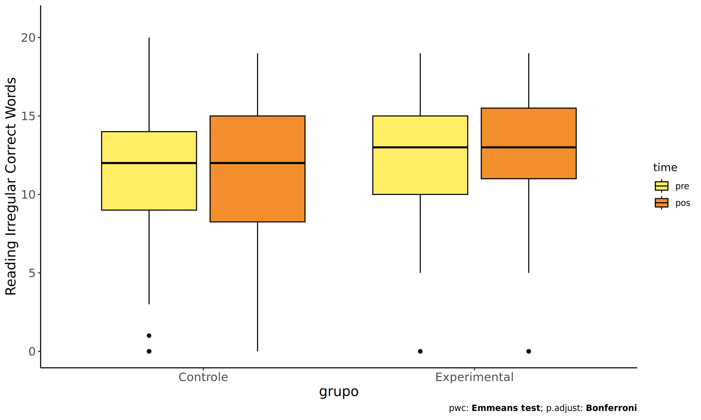
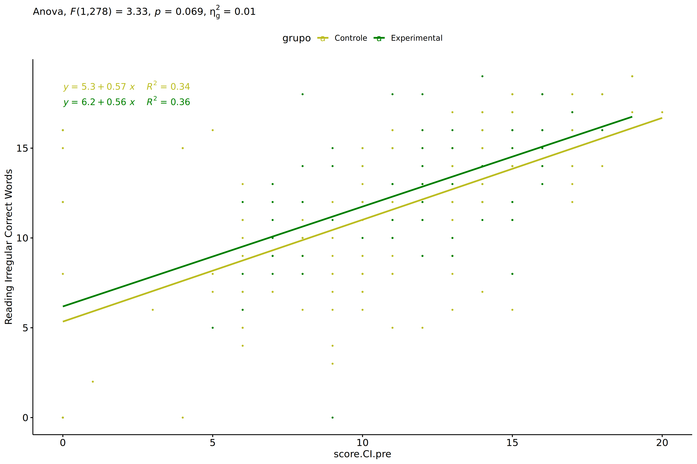
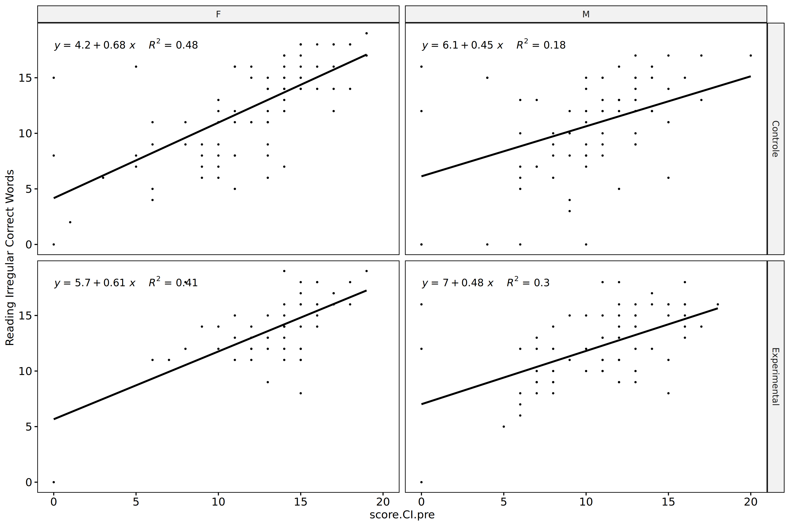
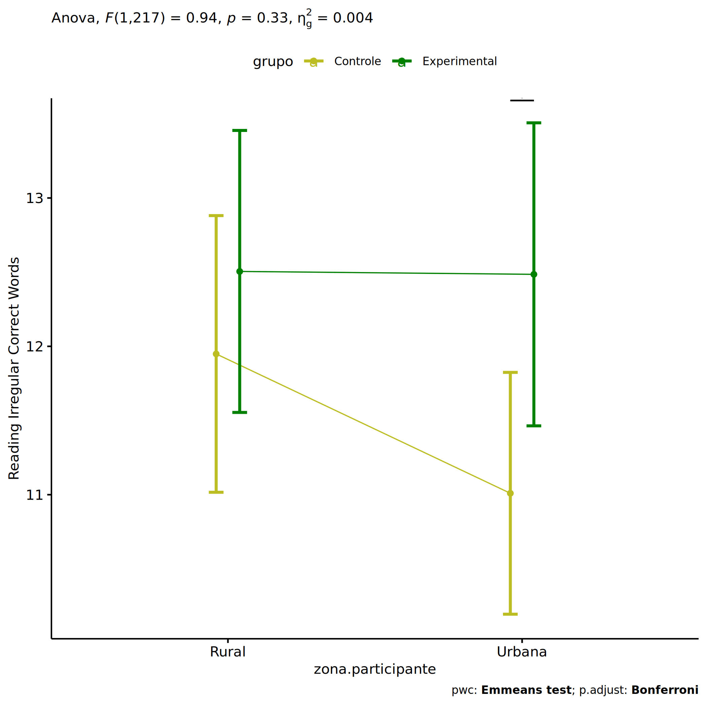
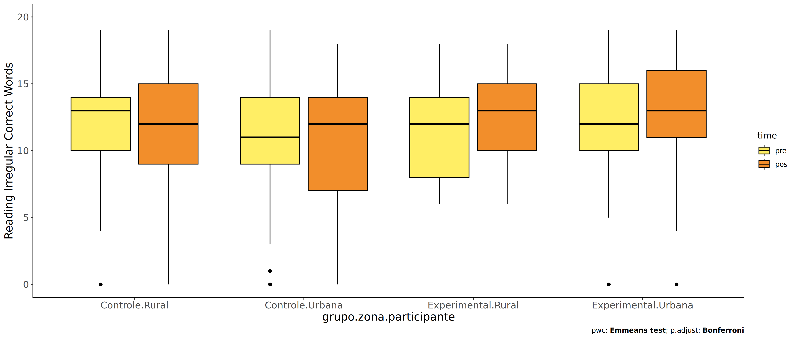
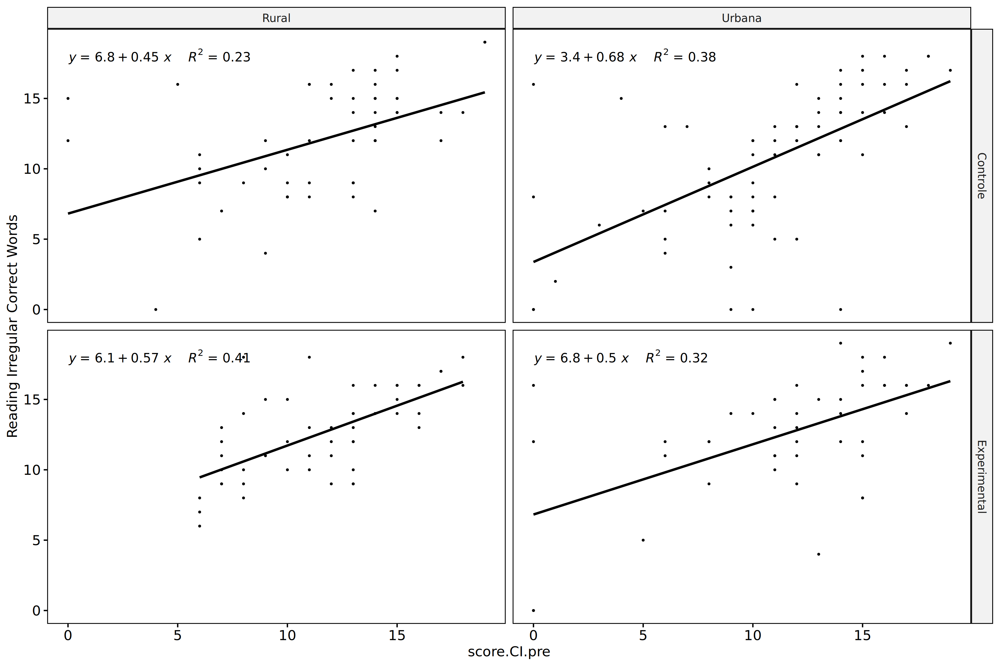
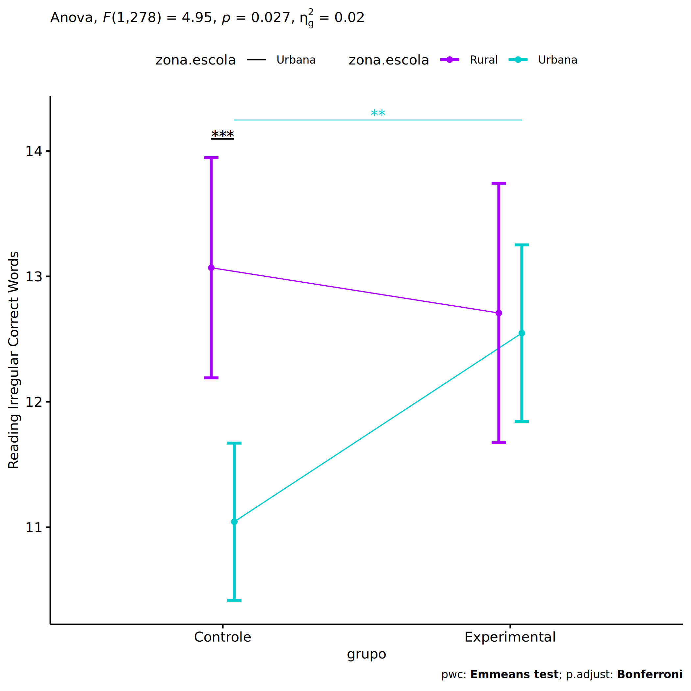
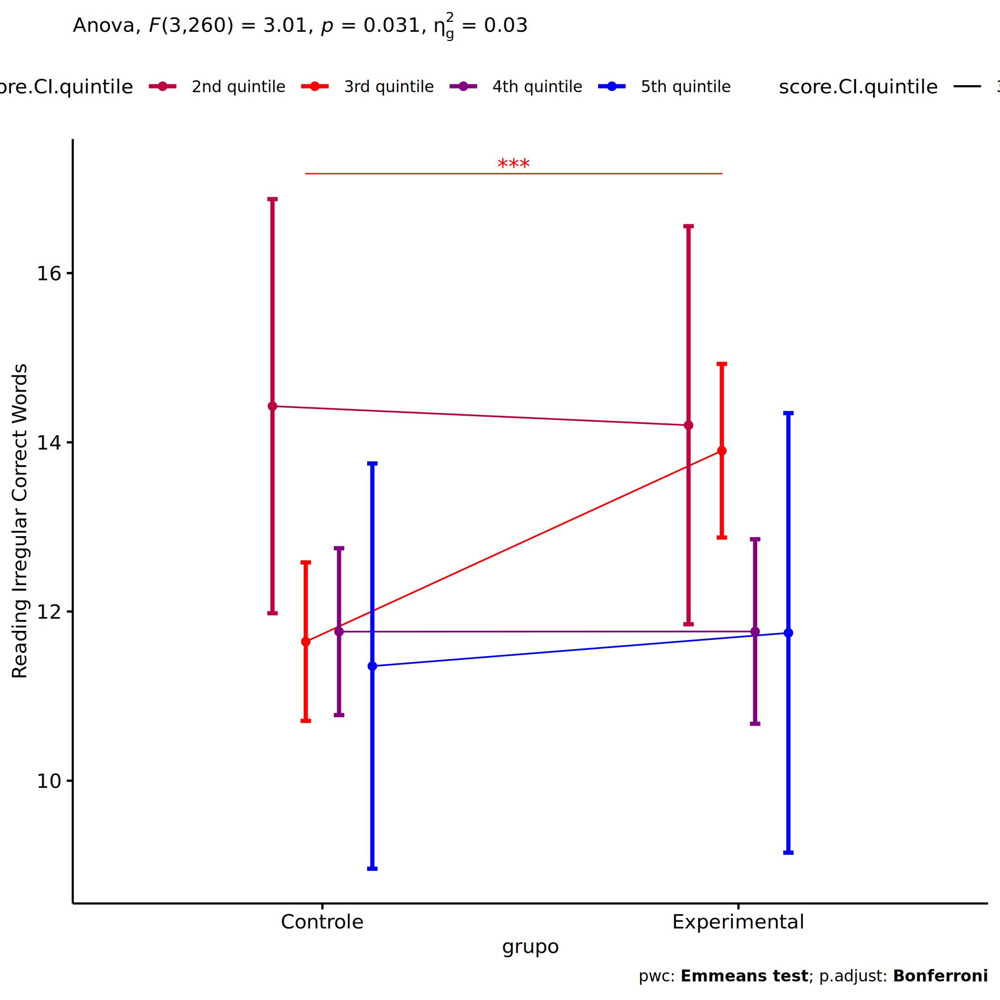

ANCOVA in Reading Irregular Correct Words (Reading Irregular Correct
Words)
================
Geiser C. Challco <geiser@alumni.usp.br>

- [Setting Initial Variables](#setting-initial-variables)
- [Descriptive Statistics of Initial
  Data](#descriptive-statistics-of-initial-data)
- [ANCOVA and Pairwise for one factor:
  **grupo**](#ancova-and-pairwise-for-one-factor-grupo)
  - [Without remove non-normal data](#without-remove-non-normal-data)
  - [Computing ANCOVA and PairWise After removing non-normal data
    (OK)](#computing-ancova-and-pairwise-after-removing-non-normal-data-ok)
    - [Plots for ancova](#plots-for-ancova)
    - [Checking linearity assumption](#checking-linearity-assumption)
    - [Checking normality and
      homogeneity](#checking-normality-and-homogeneity)
- [ANCOVA and Pairwise for two factors
  **grupo:genero**](#ancova-and-pairwise-for-two-factors-grupogenero)
  - [Without remove non-normal data](#without-remove-non-normal-data-1)
  - [Computing ANCOVA and PairWise After removing non-normal data
    (OK)](#computing-ancova-and-pairwise-after-removing-non-normal-data-ok-1)
    - [Plots for ancova](#plots-for-ancova-1)
    - [Checking linearity assumption](#checking-linearity-assumption-1)
    - [Checking normality and
      homogeneity](#checking-normality-and-homogeneity-1)
- [ANCOVA and Pairwise for two factors
  **grupo:zona.participante**](#ancova-and-pairwise-for-two-factors-grupozonaparticipante)
  - [Without remove non-normal data](#without-remove-non-normal-data-2)
  - [Computing ANCOVA and PairWise After removing non-normal data
    (OK)](#computing-ancova-and-pairwise-after-removing-non-normal-data-ok-2)
    - [Plots for ancova](#plots-for-ancova-2)
    - [Checking linearity assumption](#checking-linearity-assumption-2)
    - [Checking normality and
      homogeneity](#checking-normality-and-homogeneity-2)
- [ANCOVA and Pairwise for two factors
  **grupo:zona.escola**](#ancova-and-pairwise-for-two-factors-grupozonaescola)
  - [Without remove non-normal data](#without-remove-non-normal-data-3)
  - [Computing ANCOVA and PairWise After removing non-normal data
    (OK)](#computing-ancova-and-pairwise-after-removing-non-normal-data-ok-3)
    - [Plots for ancova](#plots-for-ancova-3)
    - [Checking linearity assumption](#checking-linearity-assumption-3)
    - [Checking normality and
      homogeneity](#checking-normality-and-homogeneity-3)
- [ANCOVA and Pairwise for two factors
  **grupo:score.CI.quintile**](#ancova-and-pairwise-for-two-factors-gruposcoreciquintile)
  - [Without remove non-normal data](#without-remove-non-normal-data-4)
  - [Computing ANCOVA and PairWise After removing non-normal data
    (OK)](#computing-ancova-and-pairwise-after-removing-non-normal-data-ok-4)
    - [Plots for ancova](#plots-for-ancova-4)
    - [Checking linearity assumption](#checking-linearity-assumption-4)
    - [Checking normality and
      homogeneity](#checking-normality-and-homogeneity-4)
- [Summary of Results](#summary-of-results)
  - [Descriptive Statistics](#descriptive-statistics)
  - [ANCOVA Table Comparison](#ancova-table-comparison)
  - [PairWise Table Comparison](#pairwise-table-comparison)
  - [EMMS Table Comparison](#emms-table-comparison)

**NOTE**:

- Teste ANCOVA para determinar se houve diferenças significativas no
  Reading Irregular Correct Words (medido usando pre- e pos-testes).
- ANCOVA test to determine whether there were significant differences in
  Reading Irregular Correct Words (measured using pre- and post-tests).

# Setting Initial Variables

``` r
dv = "score.CI"
dv.pos = "score.CI.pos"
dv.pre = "score.CI.pre"

fatores2 <- c("genero","zona.participante","zona.escola","score.CI.quintile")
lfatores2 <- as.list(fatores2)
names(lfatores2) <- fatores2

fatores1 <- c("grupo", fatores2)
lfatores1 <- as.list(fatores1)
names(lfatores1) <- fatores1

lfatores <- c(lfatores1)

color <- list()
color[["prepost"]] = c("#ffee65","#f28e2B")
color[["grupo"]] = c("#bcbd22","#008000")
color[["genero"]] = c("#FF007F","#4D4DFF")
color[["zona.escola"]] = c("#AA00FF","#00CCCC")
color[["zona.participante"]] = c("#AA00FF","#00CCCC")

level <- list()
level[["grupo"]] = c("Controle","Experimental")
level[["genero"]] = c("F","M")
level[["zona.escola"]] = c("Rural","Urbana")
level[["zona.participante"]] = c("Rural","Urbana")

# ..

ymin <- 0
ymax <- 0

ymin.ci <- 0
ymax.ci <- 0


color[["grupo:genero"]] = c(
  "Controle:F"="#ff99cb", "Controle:M"="#b7b7ff",
  "Experimental:F"="#FF007F", "Experimental:M"="#4D4DFF",
  "Controle.F"="#ff99cb", "Controle.M"="#b7b7ff",
  "Experimental.F"="#FF007F", "Experimental.M"="#4D4DFF"
)
color[["grupo:zona.escola"]] = c(
  "Controle:Rural"="#b2efef","Controle:Urbana"="#e5b2ff",
  "Experimental:Rural"="#00CCCC", "Experimental:Urbana"="#AA00FF",
  "Controle.Rural"="#b2efef","Controle.Urbana"="#e5b2ff",
  "Experimental.Rural"="#00CCCC", "Experimental.Urbana"="#AA00FF"
)
color[["grupo:zona.participante"]] = c(
  "Controle:Rural"="#b2efef","Controle:Urbana"="#e5b2ff",
  "Experimental:Rural"="#00CCCC", "Experimental:Urbana"="#AA00FF",
  "Controle.Rural"="#b2efef","Controle.Urbana"="#e5b2ff",
  "Experimental.Rural"="#00CCCC", "Experimental.Urbana"="#AA00FF"
)

for (coln in c(
  "palavras.lidas","score.compreensao","tri.compreensao",
  "score.vocab","tri.vocab",
  "score.vocab.ensinado","tri.vocab.ensinado","score.vocab.nao.ensinado","tri.vocab.nao.ensinado",
  "score.CLPP","tri.CLPP","score.CR","tri.CR",
  "score.CI","tri.CI","score.TV","tri.TV","score.TF","tri.TF","score.TO","tri.TO")) {
  color[[paste0(coln,".quintile")]] = c("#BF0040","#FF0000","#800080","#0000FF","#4000BF")
  level[[paste0(coln,".quintile")]] = c("1st quintile","2nd quintile","3rd quintile","4th quintile","5th quintile")
  color[[paste0("grupo:",coln,".quintile")]] = c(
    "Experimental.1st quintile"="#BF0040", "Controle.1st quintile"="#d8668c",
    "Experimental.2nd quintile"="#FF0000", "Controle.2nd quintile"="#ff7f7f",
    "Experimental.3rd quintile"="#8fce00", "Controle.3rd quintile"="#ddf0b2",
    "Experimental.4th quintile"="#0000FF", "Controle.4th quintile"="#b2b2ff",
    "Experimental.5th quintile"="#4000BF", "Controle.5th quintile"="#b299e5",
    
    "Experimental:1st quintile"="#BF0040", "Controle:1st quintile"="#d8668c",
    "Experimental:2nd quintile"="#FF0000", "Controle:2nd quintile"="#ff7f7f",
    "Experimental:3rd quintile"="#8fce00", "Controle:3rd quintile"="#ddf0b2",
    "Experimental:4th quintile"="#0000FF", "Controle:4th quintile"="#b2b2ff",
    "Experimental:5th quintile"="#4000BF", "Controle:5th quintile"="#b299e5")
}


gdat <- read_excel("../data/data.xlsx", sheet = "leitura.wg.wo.st")


dat <- gdat
dat$grupo <- factor(dat[["grupo"]], level[["grupo"]])
for (coln in c(names(lfatores))) {
  dat[[coln]] <- factor(dat[[coln]], level[[coln]][level[[coln]] %in% unique(dat[[coln]])])
}
dat <- dat[which(!is.na(dat[[dv.pre]]) & !is.na(dat[[dv.pos]])),]
dat <- dat[,c("id",names(lfatores),dv.pre,dv.pos)]

dat.long <- rbind(dat, dat)
dat.long$time <- c(rep("pre", nrow(dat)), rep("pos", nrow(dat)))
dat.long$time <- factor(dat.long$time, c("pre","pos"))
dat.long[[dv]] <- c(dat[[dv.pre]], dat[[dv.pos]])


for (f in c("grupo", names(lfatores))) {
  if (is.null(color[[f]]) && length(unique(dat[[f]])) > 0) 
      color[[f]] <- distinctColorPalette(length(unique(dat[[f]])))
}
for (f in c(fatores2)) {
  if (is.null(color[[paste0("grupo:",f)]]) && length(unique(dat[[f]])) > 0)
    color[[paste0("grupo:",f)]] <- distinctColorPalette(length(unique(dat[["grupo"]]))*length(unique(dat[[f]])))
}

ldat <- list()
laov <- list()
lpwc <- list()
lemms <- list()
```

# Descriptive Statistics of Initial Data

``` r
df <- get.descriptives(dat, c(dv.pre, dv.pos), c("grupo"), 
                       include.global = T, symmetry.test = T, normality.test = F)
df <- plyr::rbind.fill(
  df, do.call(plyr::rbind.fill, lapply(lfatores2, FUN = function(f) {
    if (nrow(dat) > 0 && sum(!is.na(unique(dat[[f]]))) > 1)
      get.descriptives(dat, c(dv.pre,dv.pos), c("grupo", f),
                       symmetry.test = T, normality.test = F)
    }))
)
```

    ## Warning: There was 1 warning in `mutate()`.
    ## ℹ In argument: `ci = abs(stats::qt(alpha/2, .data$n - 1) * .data$se)`.
    ## Caused by warning:
    ## ! There was 1 warning in `mutate()`.
    ## ℹ In argument: `ci = abs(stats::qt(alpha/2, .data$n - 1) * .data$se)`.
    ## Caused by warning in `stats::qt()`:
    ## ! NaNs produced
    ## There was 1 warning in `mutate()`.
    ## ℹ In argument: `ci = abs(stats::qt(alpha/2, .data$n - 1) * .data$se)`.
    ## Caused by warning:
    ## ! There was 1 warning in `mutate()`.
    ## ℹ In argument: `ci = abs(stats::qt(alpha/2, .data$n - 1) * .data$se)`.
    ## Caused by warning in `stats::qt()`:
    ## ! NaNs produced

``` r
df <- df[,c(fatores1[fatores1 %in% colnames(df)],"variable",
            colnames(df)[!colnames(df) %in% c(fatores1,"variable")])]
```

| grupo | genero | zona.participante | zona.escola | score.CI.quintile | variable | n | mean | median | min | max | sd | se | ci | iqr | symmetry | skewness | kurtosis |
|:---|:---|:---|:---|:---|:---|---:|---:|---:|---:|---:|---:|---:|---:|---:|:---|---:|---:|
| Controle |  |  |  |  | score.CI.pre | 176 | 11.250 | 12.0 | 0 | 20 | 4.231 | 0.319 | 0.629 | 5.00 | NO | -0.805 | 0.611 |
| Experimental |  |  |  |  | score.CI.pre | 135 | 12.044 | 13.0 | 0 | 19 | 3.783 | 0.326 | 0.644 | 5.00 | NO | -0.989 | 1.156 |
|  |  |  |  |  | score.CI.pre | 311 | 11.595 | 12.0 | 0 | 20 | 4.056 | 0.230 | 0.453 | 4.00 | NO | -0.897 | 0.862 |
| Controle |  |  |  |  | score.CI.pos | 176 | 10.483 | 12.0 | 0 | 19 | 5.386 | 0.406 | 0.801 | 8.00 | NO | -0.626 | -0.577 |
| Experimental |  |  |  |  | score.CI.pos | 135 | 11.711 | 13.0 | 0 | 19 | 4.973 | 0.428 | 0.847 | 5.00 | NO | -1.125 | 0.644 |
|  |  |  |  |  | score.CI.pos | 311 | 11.016 | 12.0 | 0 | 19 | 5.238 | 0.297 | 0.584 | 7.00 | NO | -0.830 | -0.169 |
| Controle | F |  |  |  | score.CI.pre | 87 | 11.977 | 13.0 | 0 | 19 | 4.348 | 0.466 | 0.927 | 5.00 | NO | -0.900 | 0.615 |
| Controle | M |  |  |  | score.CI.pre | 89 | 10.539 | 11.0 | 0 | 20 | 4.012 | 0.425 | 0.845 | 4.00 | NO | -0.841 | 0.764 |
| Experimental | F |  |  |  | score.CI.pre | 59 | 13.441 | 14.0 | 0 | 19 | 3.239 | 0.422 | 0.844 | 3.00 | NO | -1.477 | 3.589 |
| Experimental | M |  |  |  | score.CI.pre | 75 | 10.960 | 12.0 | 0 | 18 | 3.864 | 0.446 | 0.889 | 5.00 | NO | -0.759 | 0.539 |
| Experimental |  |  |  |  | score.CI.pre | 1 | 11.000 | 11.0 | 11 | 11 |  |  |  | 0.00 | few data | 0.000 | 0.000 |
| Controle | F |  |  |  | score.CI.pos | 87 | 11.414 | 12.0 | 0 | 19 | 5.266 | 0.565 | 1.122 | 8.00 | NO | -0.651 | -0.455 |
| Controle | M |  |  |  | score.CI.pos | 89 | 9.573 | 11.0 | 0 | 17 | 5.374 | 0.570 | 1.132 | 6.00 | NO | -0.626 | -0.810 |
| Experimental | F |  |  |  | score.CI.pos | 59 | 12.746 | 14.0 | 0 | 19 | 4.809 | 0.626 | 1.253 | 4.50 | NO | -1.438 | 1.674 |
| Experimental | M |  |  |  | score.CI.pos | 75 | 11.053 | 12.0 | 0 | 18 | 4.849 | 0.560 | 1.116 | 6.00 | NO | -0.984 | 0.336 |
| Experimental |  |  |  |  | score.CI.pos | 1 | 0.000 | 0.0 | 0 | 0 |  |  |  | 0.00 | few data | 0.000 | 0.000 |
| Controle |  | Rural |  |  | score.CI.pre | 56 | 11.643 | 13.0 | 0 | 19 | 4.101 | 0.548 | 1.098 | 4.00 | NO | -0.801 | 0.617 |
| Controle |  | Urbana |  |  | score.CI.pre | 77 | 11.013 | 12.0 | 0 | 19 | 4.390 | 0.500 | 0.997 | 5.00 | NO | -0.809 | 0.377 |
| Controle |  |  |  |  | score.CI.pre | 43 | 11.163 | 12.0 | 0 | 20 | 4.169 | 0.636 | 1.283 | 3.50 | NO | -0.717 | 0.658 |
| Experimental |  | Rural |  |  | score.CI.pre | 52 | 11.673 | 12.0 | 6 | 18 | 3.468 | 0.481 | 0.966 | 6.00 | YES | -0.050 | -1.158 |
| Experimental |  | Urbana |  |  | score.CI.pre | 49 | 11.816 | 13.0 | 0 | 19 | 4.746 | 0.678 | 1.363 | 4.00 | NO | -1.121 | 0.683 |
| Experimental |  |  |  |  | score.CI.pre | 34 | 12.941 | 13.0 | 7 | 16 | 2.373 | 0.407 | 0.828 | 3.00 | NO | -0.751 | 0.142 |
| Controle |  | Rural |  |  | score.CI.pos | 56 | 11.661 | 12.0 | 0 | 19 | 4.510 | 0.603 | 1.208 | 6.00 | NO | -0.748 | 0.271 |
| Controle |  | Urbana |  |  | score.CI.pos | 77 | 9.870 | 11.0 | 0 | 18 | 5.595 | 0.638 | 1.270 | 8.00 | YES | -0.458 | -0.942 |
| Controle |  |  |  |  | score.CI.pos | 43 | 10.047 | 11.0 | 0 | 18 | 5.904 | 0.900 | 1.817 | 9.00 | NO | -0.556 | -0.978 |
| Experimental |  | Rural |  |  | score.CI.pos | 52 | 12.673 | 13.0 | 6 | 18 | 3.072 | 0.426 | 0.855 | 5.00 | YES | -0.111 | -0.963 |
| Experimental |  | Urbana |  |  | score.CI.pos | 49 | 11.571 | 12.0 | 0 | 19 | 5.416 | 0.774 | 1.556 | 6.00 | NO | -0.989 | 0.020 |
| Experimental |  |  |  |  | score.CI.pos | 34 | 10.441 | 12.5 | 0 | 18 | 6.325 | 1.085 | 2.207 | 6.75 | NO | -0.762 | -0.954 |
| Controle |  |  | Rural |  | score.CI.pre | 58 | 11.069 | 12.0 | 0 | 20 | 4.491 | 0.590 | 1.181 | 5.75 | NO | -0.582 | -0.046 |
| Controle |  |  | Urbana |  | score.CI.pre | 118 | 11.339 | 12.0 | 0 | 19 | 4.114 | 0.379 | 0.750 | 4.00 | NO | -0.923 | 0.968 |
| Experimental |  |  | Rural |  | score.CI.pre | 40 | 12.275 | 13.0 | 0 | 18 | 3.762 | 0.595 | 1.203 | 4.25 | NO | -1.032 | 0.937 |
| Experimental |  |  | Urbana |  | score.CI.pre | 95 | 11.947 | 12.0 | 0 | 19 | 3.808 | 0.391 | 0.776 | 5.00 | NO | -0.957 | 1.167 |
| Controle |  |  | Rural |  | score.CI.pos | 58 | 11.948 | 14.0 | 0 | 19 | 5.066 | 0.665 | 1.332 | 5.75 | NO | -1.084 | 0.369 |
| Controle |  |  | Urbana |  | score.CI.pos | 118 | 9.763 | 11.0 | 0 | 19 | 5.412 | 0.498 | 0.987 | 7.75 | YES | -0.438 | -0.782 |
| Experimental |  |  | Rural |  | score.CI.pos | 40 | 12.825 | 14.0 | 0 | 18 | 3.755 | 0.594 | 1.201 | 4.50 | NO | -1.006 | 1.452 |
| Experimental |  |  | Urbana |  | score.CI.pos | 95 | 11.242 | 12.0 | 0 | 19 | 5.353 | 0.549 | 1.090 | 5.50 | NO | -1.005 | 0.074 |
| Controle |  |  |  | 1st quintile | score.CI.pre | 10 | 0.400 | 0.0 | 0 | 3 | 0.966 | 0.306 | 0.691 | 0.00 | few data | 0.000 | 0.000 |
| Controle |  |  |  | 2nd quintile | score.CI.pre | 19 | 5.684 | 6.0 | 4 | 7 | 0.946 | 0.217 | 0.456 | 1.00 | NO | -0.506 | -0.772 |
| Controle |  |  |  | 3rd quintile | score.CI.pre | 66 | 10.318 | 10.0 | 8 | 12 | 1.242 | 0.153 | 0.305 | 1.75 | YES | -0.228 | -0.951 |
| Controle |  |  |  | 4th quintile | score.CI.pre | 67 | 13.985 | 14.0 | 13 | 16 | 0.945 | 0.115 | 0.231 | 2.00 | NO | 0.559 | -0.742 |
| Controle |  |  |  | 5th quintile | score.CI.pre | 14 | 17.857 | 17.5 | 17 | 20 | 1.027 | 0.275 | 0.593 | 1.75 | NO | 0.654 | -1.076 |
| Experimental |  |  |  | 1st quintile | score.CI.pre | 4 | 0.000 | 0.0 | 0 | 0 | 0.000 | 0.000 | 0.000 | 0.00 | few data | 0.000 | 0.000 |
| Experimental |  |  |  | 2nd quintile | score.CI.pre | 14 | 6.500 | 7.0 | 5 | 7 | 0.650 | 0.174 | 0.376 | 1.00 | few data | 0.000 | 0.000 |
| Experimental |  |  |  | 3rd quintile | score.CI.pre | 47 | 10.574 | 11.0 | 8 | 12 | 1.485 | 0.217 | 0.436 | 2.50 | NO | -0.668 | -1.045 |
| Experimental |  |  |  | 4th quintile | score.CI.pre | 61 | 14.426 | 14.0 | 13 | 16 | 1.117 | 0.143 | 0.286 | 2.00 | YES | 0.041 | -1.398 |
| Experimental |  |  |  | 5th quintile | score.CI.pre | 9 | 17.556 | 17.0 | 17 | 19 | 0.726 | 0.242 | 0.558 | 1.00 | few data | 0.000 | 0.000 |
| Controle |  |  |  | 1st quintile | score.CI.pos | 10 | 7.500 | 7.0 | 0 | 16 | 6.852 | 2.167 | 4.901 | 13.75 | YES | 0.095 | -1.892 |
| Controle |  |  |  | 2nd quintile | score.CI.pos | 19 | 8.316 | 7.0 | 0 | 16 | 4.679 | 1.073 | 2.255 | 6.50 | YES | -0.023 | -0.947 |
| Controle |  |  |  | 3rd quintile | score.CI.pos | 66 | 9.303 | 9.5 | 0 | 16 | 4.493 | 0.553 | 1.104 | 4.75 | NO | -0.589 | -0.311 |
| Controle |  |  |  | 4th quintile | score.CI.pos | 67 | 11.463 | 14.0 | 0 | 18 | 5.574 | 0.681 | 1.360 | 5.50 | NO | -1.079 | -0.044 |
| Controle |  |  |  | 5th quintile | score.CI.pos | 14 | 16.429 | 17.0 | 12 | 19 | 2.277 | 0.609 | 1.315 | 3.50 | NO | -0.640 | -1.129 |
| Experimental |  |  |  | 1st quintile | score.CI.pos | 4 | 7.000 | 6.0 | 0 | 16 | 8.246 | 4.123 | 13.122 | 13.00 | few data | 0.000 | 0.000 |
| Experimental |  |  |  | 2nd quintile | score.CI.pos | 14 | 9.286 | 9.0 | 5 | 13 | 2.367 | 0.633 | 1.367 | 3.00 | YES | -0.155 | -1.174 |
| Experimental |  |  |  | 3rd quintile | score.CI.pos | 47 | 11.191 | 12.0 | 0 | 18 | 4.567 | 0.666 | 1.341 | 4.00 | NO | -1.253 | 1.259 |
| Experimental |  |  |  | 4th quintile | score.CI.pos | 61 | 12.262 | 14.0 | 0 | 19 | 5.241 | 0.671 | 1.342 | 5.00 | NO | -1.330 | 0.779 |
| Experimental |  |  |  | 5th quintile | score.CI.pos | 9 | 16.556 | 16.0 | 14 | 19 | 1.424 | 0.475 | 1.095 | 1.00 | YES | 0.016 | -0.753 |

# ANCOVA and Pairwise for one factor: **grupo**

## Without remove non-normal data

``` r
pdat = remove_group_data(dat[!is.na(dat[["grupo"]]),], "score.CI.pos", "grupo")

pdat.long <- rbind(pdat[,c("id","grupo")], pdat[,c("id","grupo")])
pdat.long[["time"]] <- c(rep("pre", nrow(pdat)), rep("pos", nrow(pdat)))
pdat.long[["time"]] <- factor(pdat.long[["time"]], c("pre","pos"))
pdat.long[["score.CI"]] <- c(pdat[["score.CI.pre"]], pdat[["score.CI.pos"]])

aov = anova_test(pdat, score.CI.pos ~ score.CI.pre + grupo)
laov[["grupo"]] <- get_anova_table(aov)
```

``` r
pwc <- emmeans_test(pdat, score.CI.pos ~ grupo, covariate = score.CI.pre,
                    p.adjust.method = "bonferroni")
```

``` r
pwc.long <- emmeans_test(dplyr::group_by_at(pdat.long, "grupo"),
                          score.CI ~ time,
                          p.adjust.method = "bonferroni")
lpwc[["grupo"]] <- plyr::rbind.fill(pwc, pwc.long)
```

``` r
ds <- get.descriptives(pdat, "score.CI.pos", "grupo", covar = "score.CI.pre")
ds <- merge(ds[ds$variable != "score.CI.pre",],
            ds[ds$variable == "score.CI.pre", !colnames(ds) %in% c("variable")],
            by = "grupo", all.x = T, suffixes = c("", ".score.CI.pre"))
ds <- merge(get_emmeans(pwc), ds, by = "grupo", suffixes = c(".emms", ""))
ds <- ds[,c("grupo","n","mean.score.CI.pre","se.score.CI.pre","mean","se",
            "emmean","se.emms","conf.low","conf.high")]

colnames(ds) <- c("grupo", "N", paste0(c("M","SE")," (pre)"),
                  paste0(c("M","SE"), " (unadj)"),
                  paste0(c("M", "SE"), " (adj)"), "conf.low", "conf.high")

lemms[["grupo"]] <- ds
```

## Computing ANCOVA and PairWise After removing non-normal data (OK)

``` r
wdat = pdat 

res = residuals(lm(score.CI.pos ~ score.CI.pre + grupo, data = wdat))
non.normal = getNonNormal(res, wdat$id, plimit = 0.05)

wdat = wdat[!wdat$id %in% non.normal,]

wdat.long <- rbind(wdat[,c("id","grupo")], wdat[,c("id","grupo")])
wdat.long[["time"]] <- c(rep("pre", nrow(wdat)), rep("pos", nrow(wdat)))
wdat.long[["time"]] <- factor(wdat.long[["time"]], c("pre","pos"))
wdat.long[["score.CI"]] <- c(wdat[["score.CI.pre"]], wdat[["score.CI.pos"]])

ldat[["grupo"]] = wdat

(non.normal)
```

    ##  [1] "P59"  "P232" "P20"  "P202" "P103" "P17"  "P190" "P198" "P169" "P80"  "P195" "P83"  "P12"  "P87"  "P106" "P179"
    ## [17] "P5"   "P242" "P356" "P79"  "P312" "P46"  "P94"  "P300" "P231" "P282" "P294" "P117" "P68"  "P305"

``` r
aov = anova_test(wdat, score.CI.pos ~ score.CI.pre + grupo)
laov[["grupo"]] <- merge(get_anova_table(aov), laov[["grupo"]],
                            by="Effect", suffixes = c("","'"))

(df = get_anova_table(aov))
```

    ## ANOVA Table (type II tests)
    ## 
    ##         Effect DFn DFd       F       p p<.05   ges
    ## 1 score.CI.pre   1 278 147.758 1.5e-27     * 0.347
    ## 2        grupo   1 278   3.332 6.9e-02       0.012

| Effect       | DFn | DFd |       F |     p | p\<.05 |   ges |
|:-------------|----:|----:|--------:|------:|:-------|------:|
| score.CI.pre |   1 | 278 | 147.758 | 0.000 | \*     | 0.347 |
| grupo        |   1 | 278 |   3.332 | 0.069 |        | 0.012 |

``` r
pwc <- emmeans_test(wdat, score.CI.pos ~ grupo, covariate = score.CI.pre,
                    p.adjust.method = "bonferroni")
```

| term | .y. | group1 | group2 | df | statistic | p | p.adj | p.adj.signif |
|:---|:---|:---|:---|---:|---:|---:|---:|:---|
| score.CI.pre\*grupo | score.CI.pos | Controle | Experimental | 278 | -1.825 | 0.069 | 0.069 | ns |

``` r
pwc.long <- emmeans_test(dplyr::group_by_at(wdat.long, "grupo"),
                         score.CI ~ time,
                         p.adjust.method = "bonferroni")
lpwc[["grupo"]] <- merge(plyr::rbind.fill(pwc, pwc.long), lpwc[["grupo"]],
                            by=c("grupo","term",".y.","group1","group2"),
                            suffixes = c("","'"))
```

| grupo        | term | .y.      | group1 | group2 |  df | statistic |     p | p.adj | p.adj.signif |
|:-------------|:-----|:---------|:-------|:-------|----:|----------:|------:|------:|:-------------|
| Controle     | time | score.CI | pre    | pos    | 558 |    -1.099 | 0.272 | 0.272 | ns           |
| Experimental | time | score.CI | pre    | pos    | 558 |    -1.697 | 0.090 | 0.090 | ns           |

``` r
ds <- get.descriptives(wdat, "score.CI.pos", "grupo", covar = "score.CI.pre")
ds <- merge(ds[ds$variable != "score.CI.pre",],
            ds[ds$variable == "score.CI.pre", !colnames(ds) %in% c("variable")],
            by = "grupo", all.x = T, suffixes = c("", ".score.CI.pre"))
ds <- merge(get_emmeans(pwc), ds, by = "grupo", suffixes = c(".emms", ""))
ds <- ds[,c("grupo","n","mean.score.CI.pre","se.score.CI.pre","mean","se",
            "emmean","se.emms","conf.low","conf.high")]

colnames(ds) <- c("grupo", "N", paste0(c("M","SE")," (pre)"),
                  paste0(c("M","SE"), " (unadj)"),
                  paste0(c("M", "SE"), " (adj)"), "conf.low", "conf.high")

lemms[["grupo"]] <- merge(ds, lemms[["grupo"]], by=c("grupo"), suffixes = c("","'"))
```

| grupo | N | M (pre) | SE (pre) | M (unadj) | SE (unadj) | M (adj) | SE (adj) | conf.low | conf.high |
|:---|---:|---:|---:|---:|---:|---:|---:|---:|---:|
| Controle | 158 | 11.171 | 0.349 | 11.677 | 0.340 | 11.865 | 0.258 | 11.357 | 12.374 |
| Experimental | 123 | 11.935 | 0.353 | 12.821 | 0.326 | 12.579 | 0.293 | 12.003 | 13.156 |

### Plots for ancova

``` r
plots <- oneWayAncovaPlots(
  wdat, "score.CI.pos", "grupo", aov, list("grupo"=pwc), addParam = c("mean_ci"),
  font.label.size=10, step.increase=0.05, p.label="p.adj",
  subtitle = which(aov$Effect == "grupo"))
```

``` r
if (!is.null(nrow(plots[["grupo"]]$data)))
  plots[["grupo"]] + ggplot2::ylab("Reading Irregular Correct Words") + 
  if (ymin.ci < ymax.ci) ggplot2::ylim(ymin.ci, ymax.ci)
```

<!-- -->

``` r
plots <- oneWayAncovaBoxPlots(
  wdat, "score.CI.pos", "grupo", aov, pwc, covar = "score.CI.pre",
  theme = "classic", color = color[["grupo"]],
  subtitle = which(aov$Effect == "grupo"))
```

``` r
if (length(unique(wdat[["grupo"]])) > 1)
  plots[["grupo"]] + ggplot2::ylab("Reading Irregular Correct Words") +
  ggplot2::scale_x_discrete(labels=c('pre', 'pos')) +
  if (ymin < ymax) ggplot2::ylim(ymin, ymax)
```

<!-- -->

``` r
if (length(unique(wdat.long[["grupo"]])) > 1)
  plots <- oneWayAncovaBoxPlots(
    wdat.long, "score.CI", "grupo", aov, pwc.long,
    pre.post = "time", theme = "classic", color = color$prepost)
```

``` r
if (length(unique(wdat.long[["grupo"]])) > 1)
  plots[["grupo"]] + ggplot2::ylab("Reading Irregular Correct Words") +
  if (ymin < ymax) ggplot2::ylim(ymin, ymax) 
```

<!-- -->

### Checking linearity assumption

``` r
ggscatter(wdat, x = "score.CI.pre", y = "score.CI.pos", size = 0.5,
          color = "grupo", add = "reg.line")+
  stat_regline_equation(
    aes(label =  paste(..eq.label.., ..rr.label.., sep = "~~~~"), color = grupo)
  ) +
  ggplot2::labs(subtitle = rstatix::get_test_label(aov, detailed = T, row = which(aov$Effect == "grupo"))) +
  ggplot2::scale_color_manual(values = color[["grupo"]]) +
  ggplot2::ylab("Reading Irregular Correct Words")  +
  if (ymin < ymax) ggplot2::ylim(ymin, ymax)
```

<!-- -->

### Checking normality and homogeneity

``` r
res <- augment(lm(score.CI.pos ~ score.CI.pre + grupo, data = wdat))
```

``` r
shapiro_test(res$.resid)
```

    ## # A tibble: 1 × 3
    ##   variable   statistic p.value
    ##   <chr>          <dbl>   <dbl>
    ## 1 res$.resid     0.986 0.00631

``` r
levene_test(res, .resid ~ grupo)
```

    ## # A tibble: 1 × 4
    ##     df1   df2 statistic      p
    ##   <int> <int>     <dbl>  <dbl>
    ## 1     1   279      5.59 0.0187

# ANCOVA and Pairwise for two factors **grupo:genero**

## Without remove non-normal data

``` r
pdat = remove_group_data(dat[!is.na(dat[["grupo"]]) & !is.na(dat[["genero"]]),],
                         "score.CI.pos", c("grupo","genero"))
pdat = pdat[pdat[["genero"]] %in% do.call(
  intersect, lapply(unique(pdat[["grupo"]]), FUN = function(x) {
    unique(pdat[["genero"]][which(pdat[["grupo"]] == x)])
  })),]
pdat[["grupo"]] = factor(pdat[["grupo"]], level[["grupo"]])
pdat[["genero"]] = factor(
  pdat[["genero"]],
  level[["genero"]][level[["genero"]] %in% unique(pdat[["genero"]])])

pdat.long <- rbind(pdat[,c("id","grupo","genero")], pdat[,c("id","grupo","genero")])
pdat.long[["time"]] <- c(rep("pre", nrow(pdat)), rep("pos", nrow(pdat)))
pdat.long[["time"]] <- factor(pdat.long[["time"]], c("pre","pos"))
pdat.long[["score.CI"]] <- c(pdat[["score.CI.pre"]], pdat[["score.CI.pos"]])

if (length(unique(pdat[["genero"]])) >= 2) {
  aov = anova_test(pdat, score.CI.pos ~ score.CI.pre + grupo*genero)
  laov[["grupo:genero"]] <- get_anova_table(aov)
}
```

``` r
if (length(unique(pdat[["genero"]])) >= 2) {
  pwcs <- list()
  pwcs[["genero"]] <- emmeans_test(
    group_by(pdat, grupo), score.CI.pos ~ genero,
    covariate = score.CI.pre, p.adjust.method = "bonferroni")
  pwcs[["grupo"]] <- emmeans_test(
    group_by(pdat, genero), score.CI.pos ~ grupo,
    covariate = score.CI.pre, p.adjust.method = "bonferroni")
  
  pwc <- plyr::rbind.fill(pwcs[["grupo"]], pwcs[["genero"]])
  pwc <- pwc[,c("grupo","genero", colnames(pwc)[!colnames(pwc) %in% c("grupo","genero")])]
}
```

``` r
if (length(unique(pdat[["genero"]])) >= 2) {
  pwc.long <- emmeans_test(dplyr::group_by_at(pdat.long, c("grupo","genero")),
                           score.CI ~ time,
                           p.adjust.method = "bonferroni")
  lpwc[["grupo:genero"]] <- plyr::rbind.fill(pwc, pwc.long)
}
```

``` r
if (length(unique(pdat[["genero"]])) >= 2) {
  ds <- get.descriptives(pdat, "score.CI.pos", c("grupo","genero"), covar = "score.CI.pre")
  ds <- merge(ds[ds$variable != "score.CI.pre",],
              ds[ds$variable == "score.CI.pre", !colnames(ds) %in% c("variable")],
              by = c("grupo","genero"), all.x = T, suffixes = c("", ".score.CI.pre"))
  ds <- merge(get_emmeans(pwcs[["grupo"]]), ds,
              by = c("grupo","genero"), suffixes = c(".emms", ""))
  ds <- ds[,c("grupo","genero","n","mean.score.CI.pre","se.score.CI.pre","mean","se",
              "emmean","se.emms","conf.low","conf.high")]
  
  colnames(ds) <- c("grupo","genero", "N", paste0(c("M","SE")," (pre)"),
                    paste0(c("M","SE"), " (unadj)"),
                    paste0(c("M", "SE"), " (adj)"), "conf.low", "conf.high")
  
  lemms[["grupo:genero"]] <- ds
}
```

## Computing ANCOVA and PairWise After removing non-normal data (OK)

``` r
if (length(unique(pdat[["genero"]])) >= 2) {
  wdat = pdat 
  
  res = residuals(lm(score.CI.pos ~ score.CI.pre + grupo*genero, data = wdat))
  non.normal = getNonNormal(res, wdat$id, plimit = 0.05)
  
  wdat = wdat[!wdat$id %in% non.normal,]
  
  wdat.long <- rbind(wdat[,c("id","grupo","genero")], wdat[,c("id","grupo","genero")])
  wdat.long[["time"]] <- c(rep("pre", nrow(wdat)), rep("pos", nrow(wdat)))
  wdat.long[["time"]] <- factor(wdat.long[["time"]], c("pre","pos"))
  wdat.long[["score.CI"]] <- c(wdat[["score.CI.pre"]], wdat[["score.CI.pos"]])
  
  
  ldat[["grupo:genero"]] = wdat
  
  (non.normal)
}
```

    ##  [1] "P83"  "P179" "P79"  "P198" "P356" "P195" "P12"  "P17"  "P312" "P5"   "P232" "P202" "P242" "P59"  "P169" "P46" 
    ## [17] "P87"  "P294" "P80"  "P314" "P106" "P94"  "P103" "P300" "P190" "P282" "P231" "P68"

``` r
if (length(unique(pdat[["genero"]])) >= 2) {
  aov = anova_test(wdat, score.CI.pos ~ score.CI.pre + grupo*genero)
  laov[["grupo:genero"]] <- merge(get_anova_table(aov), laov[["grupo:genero"]],
                                         by="Effect", suffixes = c("","'"))
  df = get_anova_table(aov)
}
```

| Effect       | DFn | DFd |       F |     p | p\<.05 |   ges |
|:-------------|----:|----:|--------:|------:|:-------|------:|
| score.CI.pre |   1 | 277 | 133.233 | 0.000 | \*     | 0.325 |
| grupo        |   1 | 277 |   5.879 | 0.016 | \*     | 0.021 |
| genero       |   1 | 277 |   1.153 | 0.284 |        | 0.004 |
| grupo:genero |   1 | 277 |   0.269 | 0.604 |        | 0.001 |

``` r
if (length(unique(pdat[["genero"]])) >= 2) {
  pwcs <- list()
  pwcs[["genero"]] <- emmeans_test(
    group_by(wdat, grupo), score.CI.pos ~ genero,
    covariate = score.CI.pre, p.adjust.method = "bonferroni")
  pwcs[["grupo"]] <- emmeans_test(
    group_by(wdat, genero), score.CI.pos ~ grupo,
    covariate = score.CI.pre, p.adjust.method = "bonferroni")
  
  pwc <- plyr::rbind.fill(pwcs[["grupo"]], pwcs[["genero"]])
  pwc <- pwc[,c("grupo","genero", colnames(pwc)[!colnames(pwc) %in% c("grupo","genero")])]
}
```

| grupo | genero | term | .y. | group1 | group2 | df | statistic | p | p.adj | p.adj.signif |
|:---|:---|:---|:---|:---|:---|---:|---:|---:|---:|:---|
|  | F | score.CI.pre\*grupo | score.CI.pos | Controle | Experimental | 277 | -1.282 | 0.201 | 0.201 | ns |
|  | M | score.CI.pre\*grupo | score.CI.pos | Controle | Experimental | 277 | -2.129 | 0.034 | 0.034 | \* |
| Controle |  | score.CI.pre\*genero | score.CI.pos | F | M | 277 | 1.158 | 0.248 | 0.248 | ns |
| Experimental |  | score.CI.pre\*genero | score.CI.pos | F | M | 277 | 0.319 | 0.750 | 0.750 | ns |

``` r
if (length(unique(pdat[["genero"]])) >= 2) {
  pwc.long <- emmeans_test(dplyr::group_by_at(wdat.long, c("grupo","genero")),
                           score.CI ~ time,
                           p.adjust.method = "bonferroni")
  lpwc[["grupo:genero"]] <- merge(plyr::rbind.fill(pwc, pwc.long),
                                         lpwc[["grupo:genero"]],
                                         by=c("grupo","genero","term",".y.","group1","group2"),
                                         suffixes = c("","'"))
}
```

| grupo | genero | term | .y. | group1 | group2 | df | statistic | p | p.adj | p.adj.signif |
|:---|:---|:---|:---|:---|:---|---:|---:|---:|---:|:---|
| Controle | F | time | score.CI | pre | pos | 556 | -0.566 | 0.572 | 0.572 | ns |
| Controle | M | time | score.CI | pre | pos | 556 | -0.692 | 0.489 | 0.489 | ns |
| Experimental | F | time | score.CI | pre | pos | 556 | -0.550 | 0.583 | 0.583 | ns |
| Experimental | M | time | score.CI | pre | pos | 556 | -2.024 | 0.043 | 0.043 | \* |

``` r
if (length(unique(pdat[["genero"]])) >= 2) {
  ds <- get.descriptives(wdat, "score.CI.pos", c("grupo","genero"), covar = "score.CI.pre")
  ds <- merge(ds[ds$variable != "score.CI.pre",],
              ds[ds$variable == "score.CI.pre", !colnames(ds) %in% c("variable")],
              by = c("grupo","genero"), all.x = T, suffixes = c("", ".score.CI.pre"))
  ds <- merge(get_emmeans(pwcs[["grupo"]]), ds,
              by = c("grupo","genero"), suffixes = c(".emms", ""))
  ds <- ds[,c("grupo","genero","n","mean.score.CI.pre","se.score.CI.pre",
              "mean","se","emmean","se.emms","conf.low","conf.high")]
  
  colnames(ds) <- c("grupo","genero", "N", paste0(c("M","SE")," (pre)"),
                    paste0(c("M","SE"), " (unadj)"),
                    paste0(c("M", "SE"), " (adj)"), "conf.low", "conf.high")
  
  lemms[["grupo:genero"]] <- merge(ds, lemms[["grupo:genero"]],
                                          by=c("grupo","genero"), suffixes = c("","'"))
}
```

| grupo | genero | N | M (pre) | SE (pre) | M (unadj) | SE (unadj) | M (adj) | SE (adj) | conf.low | conf.high |
|:---|:---|---:|---:|---:|---:|---:|---:|---:|---:|---:|
| Controle | F | 81 | 11.901 | 0.496 | 12.259 | 0.488 | 12.030 | 0.364 | 11.312 | 12.747 |
| Controle | M | 79 | 10.342 | 0.470 | 10.785 | 0.495 | 11.424 | 0.373 | 10.690 | 12.157 |
| Experimental | F | 54 | 13.426 | 0.458 | 13.852 | 0.438 | 12.773 | 0.455 | 11.877 | 13.670 |
| Experimental | M | 68 | 10.794 | 0.482 | 12.191 | 0.418 | 12.578 | 0.399 | 11.794 | 13.363 |

### Plots for ancova

``` r
if (length(unique(pdat[["genero"]])) >= 2) {
  ggPlotAoC2(pwcs, "grupo", "genero", aov, ylab = "Reading Irregular Correct Words",
             subtitle = which(aov$Effect == "grupo:genero"), addParam = "errorbar") +
    ggplot2::scale_color_manual(values = color[["genero"]]) +
    ggplot2::ylab("Reading Irregular Correct Words") +
    if (ymin.ci < ymax.ci) ggplot2::ylim(ymin.ci, ymax.ci)
}
```

    ## Scale for colour is already present.
    ## Adding another scale for colour, which will replace the existing scale.

<!-- -->

``` r
if (length(unique(pdat[["genero"]])) >= 2) {
  ggPlotAoC2(pwcs, "genero", "grupo", aov, ylab = "Reading Irregular Correct Words",
               subtitle = which(aov$Effect == "grupo:genero"), addParam = "errorbar") +
    ggplot2::scale_color_manual(values = color[["grupo"]]) +
    ggplot2::ylab("Reading Irregular Correct Words") +
    if (ymin.ci < ymax.ci) ggplot2::ylim(ymin.ci, ymax.ci)
}
```

    ## Scale for colour is already present.
    ## Adding another scale for colour, which will replace the existing scale.

<!-- -->

``` r
if (length(unique(pdat[["genero"]])) >= 2) {
  plots <- twoWayAncovaBoxPlots(
    wdat, "score.CI.pos", c("grupo","genero"), aov, pwcs, covar = "score.CI.pre",
    theme = "classic", color = color[["grupo:genero"]],
    subtitle = which(aov$Effect == "grupo:genero"))
}
```

``` r
if (length(unique(pdat[["genero"]])) >= 2) {
  plots[["grupo:genero"]] + ggplot2::ylab("Reading Irregular Correct Words") +
  ggplot2::scale_x_discrete(labels=c('pre', 'pos')) +
  if (ymin < ymax) ggplot2::ylim(ymin, ymax)
}
```

    ## Warning: No shared levels found between `names(values)` of the manual scale and the data's colour values.

<!-- -->

``` r
if (length(unique(pdat[["genero"]])) >= 2) {
  plots <- twoWayAncovaBoxPlots(
    wdat.long, "score.CI", c("grupo","genero"), aov, pwc.long,
    pre.post = "time",
    theme = "classic", color = color$prepost)
}
```

``` r
if (length(unique(pdat[["genero"]])) >= 2) 
  plots[["grupo:genero"]] + ggplot2::ylab("Reading Irregular Correct Words") +
    if (ymin < ymax) ggplot2::ylim(ymin, ymax)
```

<!-- -->

### Checking linearity assumption

``` r
if (length(unique(pdat[["genero"]])) >= 2) {
  ggscatter(wdat, x = "score.CI.pre", y = "score.CI.pos", size = 0.5,
            facet.by = c("grupo","genero"), add = "reg.line")+
    stat_regline_equation(
      aes(label =  paste(..eq.label.., ..rr.label.., sep = "~~~~"))
    ) + ggplot2::ylab("Reading Irregular Correct Words") +
    if (ymin < ymax) ggplot2::ylim(ymin, ymax)
}
```

<!-- -->

``` r
if (length(unique(pdat[["genero"]])) >= 2) {
  ggscatter(wdat, x = "score.CI.pre", y = "score.CI.pos", size = 0.5,
            color = "grupo", facet.by = "genero", add = "reg.line")+
    stat_regline_equation(
      aes(label =  paste(..eq.label.., ..rr.label.., sep = "~~~~"), color = grupo)
    ) +
    ggplot2::labs(subtitle = rstatix::get_test_label(aov, detailed = T, row = which(aov$Effect == "grupo:genero"))) +
    ggplot2::scale_color_manual(values = color[["grupo"]]) +
    ggplot2::ylab("Reading Irregular Correct Words") +
    if (ymin < ymax) ggplot2::ylim(ymin, ymax)
}
```

<!-- -->

``` r
if (length(unique(pdat[["genero"]])) >= 2) {
  ggscatter(wdat, x = "score.CI.pre", y = "score.CI.pos", size = 0.5,
            color = "genero", facet.by = "grupo", add = "reg.line")+
    stat_regline_equation(
      aes(label =  paste(..eq.label.., ..rr.label.., sep = "~~~~"), color = genero)
    ) +
    ggplot2::labs(subtitle = rstatix::get_test_label(aov, detailed = T, row = which(aov$Effect == "grupo:genero"))) +
    ggplot2::scale_color_manual(values = color[["genero"]]) +
    ggplot2::ylab("Reading Irregular Correct Words") +
    if (ymin < ymax) ggplot2::ylim(ymin, ymax)
}
```

<!-- -->

### Checking normality and homogeneity

``` r
if (length(unique(pdat[["genero"]])) >= 2) 
  res <- augment(lm(score.CI.pos ~ score.CI.pre + grupo*genero, data = wdat))
```

``` r
if (length(unique(pdat[["genero"]])) >= 2)
  shapiro_test(res$.resid)
```

    ## # A tibble: 1 × 3
    ##   variable   statistic p.value
    ##   <chr>          <dbl>   <dbl>
    ## 1 res$.resid     0.985 0.00580

``` r
if (length(unique(pdat[["genero"]])) >= 2) 
  levene_test(res, .resid ~ grupo*genero)
```

    ## # A tibble: 1 × 4
    ##     df1   df2 statistic       p
    ##   <int> <int>     <dbl>   <dbl>
    ## 1     3   278      4.12 0.00696

# ANCOVA and Pairwise for two factors **grupo:zona.participante**

## Without remove non-normal data

``` r
pdat = remove_group_data(dat[!is.na(dat[["grupo"]]) & !is.na(dat[["zona.participante"]]),],
                         "score.CI.pos", c("grupo","zona.participante"))
pdat = pdat[pdat[["zona.participante"]] %in% do.call(
  intersect, lapply(unique(pdat[["grupo"]]), FUN = function(x) {
    unique(pdat[["zona.participante"]][which(pdat[["grupo"]] == x)])
  })),]
pdat[["grupo"]] = factor(pdat[["grupo"]], level[["grupo"]])
pdat[["zona.participante"]] = factor(
  pdat[["zona.participante"]],
  level[["zona.participante"]][level[["zona.participante"]] %in% unique(pdat[["zona.participante"]])])

pdat.long <- rbind(pdat[,c("id","grupo","zona.participante")], pdat[,c("id","grupo","zona.participante")])
pdat.long[["time"]] <- c(rep("pre", nrow(pdat)), rep("pos", nrow(pdat)))
pdat.long[["time"]] <- factor(pdat.long[["time"]], c("pre","pos"))
pdat.long[["score.CI"]] <- c(pdat[["score.CI.pre"]], pdat[["score.CI.pos"]])

if (length(unique(pdat[["zona.participante"]])) >= 2) {
  aov = anova_test(pdat, score.CI.pos ~ score.CI.pre + grupo*zona.participante)
  laov[["grupo:zona.participante"]] <- get_anova_table(aov)
}
```

``` r
if (length(unique(pdat[["zona.participante"]])) >= 2) {
  pwcs <- list()
  pwcs[["zona.participante"]] <- emmeans_test(
    group_by(pdat, grupo), score.CI.pos ~ zona.participante,
    covariate = score.CI.pre, p.adjust.method = "bonferroni")
  pwcs[["grupo"]] <- emmeans_test(
    group_by(pdat, zona.participante), score.CI.pos ~ grupo,
    covariate = score.CI.pre, p.adjust.method = "bonferroni")
  
  pwc <- plyr::rbind.fill(pwcs[["grupo"]], pwcs[["zona.participante"]])
  pwc <- pwc[,c("grupo","zona.participante", colnames(pwc)[!colnames(pwc) %in% c("grupo","zona.participante")])]
}
```

``` r
if (length(unique(pdat[["zona.participante"]])) >= 2) {
  pwc.long <- emmeans_test(dplyr::group_by_at(pdat.long, c("grupo","zona.participante")),
                           score.CI ~ time,
                           p.adjust.method = "bonferroni")
  lpwc[["grupo:zona.participante"]] <- plyr::rbind.fill(pwc, pwc.long)
}
```

``` r
if (length(unique(pdat[["zona.participante"]])) >= 2) {
  ds <- get.descriptives(pdat, "score.CI.pos", c("grupo","zona.participante"), covar = "score.CI.pre")
  ds <- merge(ds[ds$variable != "score.CI.pre",],
              ds[ds$variable == "score.CI.pre", !colnames(ds) %in% c("variable")],
              by = c("grupo","zona.participante"), all.x = T, suffixes = c("", ".score.CI.pre"))
  ds <- merge(get_emmeans(pwcs[["grupo"]]), ds,
              by = c("grupo","zona.participante"), suffixes = c(".emms", ""))
  ds <- ds[,c("grupo","zona.participante","n","mean.score.CI.pre","se.score.CI.pre","mean","se",
              "emmean","se.emms","conf.low","conf.high")]
  
  colnames(ds) <- c("grupo","zona.participante", "N", paste0(c("M","SE")," (pre)"),
                    paste0(c("M","SE"), " (unadj)"),
                    paste0(c("M", "SE"), " (adj)"), "conf.low", "conf.high")
  
  lemms[["grupo:zona.participante"]] <- ds
}
```

## Computing ANCOVA and PairWise After removing non-normal data (OK)

``` r
if (length(unique(pdat[["zona.participante"]])) >= 2) {
  wdat = pdat 
  
  res = residuals(lm(score.CI.pos ~ score.CI.pre + grupo*zona.participante, data = wdat))
  non.normal = getNonNormal(res, wdat$id, plimit = 0.05)
  
  wdat = wdat[!wdat$id %in% non.normal,]
  
  wdat.long <- rbind(wdat[,c("id","grupo","zona.participante")], wdat[,c("id","grupo","zona.participante")])
  wdat.long[["time"]] <- c(rep("pre", nrow(wdat)), rep("pos", nrow(wdat)))
  wdat.long[["time"]] <- factor(wdat.long[["time"]], c("pre","pos"))
  wdat.long[["score.CI"]] <- c(wdat[["score.CI.pre"]], wdat[["score.CI.pos"]])
  
  
  ldat[["grupo:zona.participante"]] = wdat
  
  (non.normal)
}
```

    ##  [1] "P5"   "P169" "P79"  "P80"  "P198" "P195" "P356" "P83"  "P87"  "P46"  "P94"  "P282"

``` r
if (length(unique(pdat[["zona.participante"]])) >= 2) {
  aov = anova_test(wdat, score.CI.pos ~ score.CI.pre + grupo*zona.participante)
  laov[["grupo:zona.participante"]] <- merge(get_anova_table(aov), laov[["grupo:zona.participante"]],
                                         by="Effect", suffixes = c("","'"))
  df = get_anova_table(aov)
}
```

| Effect                  | DFn | DFd |       F |     p | p\<.05 |   ges |
|:------------------------|----:|----:|--------:|------:|:-------|------:|
| score.CI.pre            |   1 | 217 | 104.910 | 0.000 | \*     | 0.326 |
| grupo                   |   1 | 217 |   4.682 | 0.032 | \*     | 0.021 |
| zona.participante       |   1 | 217 |   1.286 | 0.258 |        | 0.006 |
| grupo:zona.participante |   1 | 217 |   0.944 | 0.332 |        | 0.004 |

``` r
if (length(unique(pdat[["zona.participante"]])) >= 2) {
  pwcs <- list()
  pwcs[["zona.participante"]] <- emmeans_test(
    group_by(wdat, grupo), score.CI.pos ~ zona.participante,
    covariate = score.CI.pre, p.adjust.method = "bonferroni")
  pwcs[["grupo"]] <- emmeans_test(
    group_by(wdat, zona.participante), score.CI.pos ~ grupo,
    covariate = score.CI.pre, p.adjust.method = "bonferroni")
  
  pwc <- plyr::rbind.fill(pwcs[["grupo"]], pwcs[["zona.participante"]])
  pwc <- pwc[,c("grupo","zona.participante", colnames(pwc)[!colnames(pwc) %in% c("grupo","zona.participante")])]
}
```

| grupo | zona.participante | term | .y. | group1 | group2 | df | statistic | p | p.adj | p.adj.signif |
|:---|:---|:---|:---|:---|:---|---:|---:|---:|---:|:---|
|  | Rural | score.CI.pre\*grupo | score.CI.pos | Controle | Experimental | 217 | -0.824 | 0.411 | 0.411 | ns |
|  | Urbana | score.CI.pre\*grupo | score.CI.pos | Controle | Experimental | 217 | -2.225 | 0.027 | 0.027 | \* |
| Controle |  | score.CI.pre\*zona.participante | score.CI.pos | Rural | Urbana | 217 | 1.493 | 0.137 | 0.137 | ns |
| Experimental |  | score.CI.pre\*zona.participante | score.CI.pos | Rural | Urbana | 217 | 0.028 | 0.978 | 0.978 | ns |

``` r
if (length(unique(pdat[["zona.participante"]])) >= 2) {
  pwc.long <- emmeans_test(dplyr::group_by_at(wdat.long, c("grupo","zona.participante")),
                           score.CI ~ time,
                           p.adjust.method = "bonferroni")
  lpwc[["grupo:zona.participante"]] <- merge(plyr::rbind.fill(pwc, pwc.long),
                                         lpwc[["grupo:zona.participante"]],
                                         by=c("grupo","zona.participante","term",".y.","group1","group2"),
                                         suffixes = c("","'"))
}
```

| grupo | zona.participante | term | .y. | group1 | group2 | df | statistic | p | p.adj | p.adj.signif |
|:---|:---|:---|:---|:---|:---|---:|---:|---:|---:|:---|
| Controle | Rural | time | score.CI | pre | pos | 436 | -0.565 | 0.572 | 0.572 | ns |
| Controle | Urbana | time | score.CI | pre | pos | 436 | 0.177 | 0.859 | 0.859 | ns |
| Experimental | Rural | time | score.CI | pre | pos | 436 | -1.198 | 0.231 | 0.231 | ns |
| Experimental | Urbana | time | score.CI | pre | pos | 436 | -1.140 | 0.255 | 0.255 | ns |

``` r
if (length(unique(pdat[["zona.participante"]])) >= 2) {
  ds <- get.descriptives(wdat, "score.CI.pos", c("grupo","zona.participante"), covar = "score.CI.pre")
  ds <- merge(ds[ds$variable != "score.CI.pre",],
              ds[ds$variable == "score.CI.pre", !colnames(ds) %in% c("variable")],
              by = c("grupo","zona.participante"), all.x = T, suffixes = c("", ".score.CI.pre"))
  ds <- merge(get_emmeans(pwcs[["grupo"]]), ds,
              by = c("grupo","zona.participante"), suffixes = c(".emms", ""))
  ds <- ds[,c("grupo","zona.participante","n","mean.score.CI.pre","se.score.CI.pre",
              "mean","se","emmean","se.emms","conf.low","conf.high")]
  
  colnames(ds) <- c("grupo","zona.participante", "N", paste0(c("M","SE")," (pre)"),
                    paste0(c("M","SE"), " (unadj)"),
                    paste0(c("M", "SE"), " (adj)"), "conf.low", "conf.high")
  
  lemms[["grupo:zona.participante"]] <- merge(ds, lemms[["grupo:zona.participante"]],
                                          by=c("grupo","zona.participante"), suffixes = c("","'"))
}
```

| grupo | zona.participante | N | M (pre) | SE (pre) | M (unadj) | SE (unadj) | M (adj) | SE (adj) | conf.low | conf.high |
|:---|:---|---:|---:|---:|---:|---:|---:|---:|---:|---:|
| Controle | Rural | 54 | 11.630 | 0.566 | 12.093 | 0.541 | 11.949 | 0.473 | 11.016 | 12.881 |
| Controle | Urbana | 71 | 10.831 | 0.537 | 10.704 | 0.593 | 11.009 | 0.413 | 10.195 | 11.824 |
| Experimental | Rural | 52 | 11.673 | 0.481 | 12.673 | 0.426 | 12.505 | 0.482 | 11.554 | 13.455 |
| Experimental | Urbana | 45 | 11.578 | 0.726 | 12.600 | 0.645 | 12.485 | 0.518 | 11.464 | 13.507 |

### Plots for ancova

``` r
if (length(unique(pdat[["zona.participante"]])) >= 2) {
  ggPlotAoC2(pwcs, "grupo", "zona.participante", aov, ylab = "Reading Irregular Correct Words",
             subtitle = which(aov$Effect == "grupo:zona.participante"), addParam = "errorbar") +
    ggplot2::scale_color_manual(values = color[["zona.participante"]]) +
    ggplot2::ylab("Reading Irregular Correct Words") +
    if (ymin.ci < ymax.ci) ggplot2::ylim(ymin.ci, ymax.ci)
}
```

    ## Scale for colour is already present.
    ## Adding another scale for colour, which will replace the existing scale.

<!-- -->

``` r
if (length(unique(pdat[["zona.participante"]])) >= 2) {
  ggPlotAoC2(pwcs, "zona.participante", "grupo", aov, ylab = "Reading Irregular Correct Words",
               subtitle = which(aov$Effect == "grupo:zona.participante"), addParam = "errorbar") +
    ggplot2::scale_color_manual(values = color[["grupo"]]) +
    ggplot2::ylab("Reading Irregular Correct Words") +
    if (ymin.ci < ymax.ci) ggplot2::ylim(ymin.ci, ymax.ci)
}
```

    ## Scale for colour is already present.
    ## Adding another scale for colour, which will replace the existing scale.

<!-- -->

``` r
if (length(unique(pdat[["zona.participante"]])) >= 2) {
  plots <- twoWayAncovaBoxPlots(
    wdat, "score.CI.pos", c("grupo","zona.participante"), aov, pwcs, covar = "score.CI.pre",
    theme = "classic", color = color[["grupo:zona.participante"]],
    subtitle = which(aov$Effect == "grupo:zona.participante"))
}
```

``` r
if (length(unique(pdat[["zona.participante"]])) >= 2) {
  plots[["grupo:zona.participante"]] + ggplot2::ylab("Reading Irregular Correct Words") +
  ggplot2::scale_x_discrete(labels=c('pre', 'pos')) +
  if (ymin < ymax) ggplot2::ylim(ymin, ymax)
}
```

    ## Warning: No shared levels found between `names(values)` of the manual scale and the data's colour values.

<!-- -->

``` r
if (length(unique(pdat[["zona.participante"]])) >= 2) {
  plots <- twoWayAncovaBoxPlots(
    wdat.long, "score.CI", c("grupo","zona.participante"), aov, pwc.long,
    pre.post = "time",
    theme = "classic", color = color$prepost)
}
```

``` r
if (length(unique(pdat[["zona.participante"]])) >= 2) 
  plots[["grupo:zona.participante"]] + ggplot2::ylab("Reading Irregular Correct Words") +
    if (ymin < ymax) ggplot2::ylim(ymin, ymax)
```

<!-- -->

### Checking linearity assumption

``` r
if (length(unique(pdat[["zona.participante"]])) >= 2) {
  ggscatter(wdat, x = "score.CI.pre", y = "score.CI.pos", size = 0.5,
            facet.by = c("grupo","zona.participante"), add = "reg.line")+
    stat_regline_equation(
      aes(label =  paste(..eq.label.., ..rr.label.., sep = "~~~~"))
    ) + ggplot2::ylab("Reading Irregular Correct Words") +
    if (ymin < ymax) ggplot2::ylim(ymin, ymax)
}
```

<!-- -->

``` r
if (length(unique(pdat[["zona.participante"]])) >= 2) {
  ggscatter(wdat, x = "score.CI.pre", y = "score.CI.pos", size = 0.5,
            color = "grupo", facet.by = "zona.participante", add = "reg.line")+
    stat_regline_equation(
      aes(label =  paste(..eq.label.., ..rr.label.., sep = "~~~~"), color = grupo)
    ) +
    ggplot2::labs(subtitle = rstatix::get_test_label(aov, detailed = T, row = which(aov$Effect == "grupo:zona.participante"))) +
    ggplot2::scale_color_manual(values = color[["grupo"]]) +
    ggplot2::ylab("Reading Irregular Correct Words") +
    if (ymin < ymax) ggplot2::ylim(ymin, ymax)
}
```

<!-- -->

``` r
if (length(unique(pdat[["zona.participante"]])) >= 2) {
  ggscatter(wdat, x = "score.CI.pre", y = "score.CI.pos", size = 0.5,
            color = "zona.participante", facet.by = "grupo", add = "reg.line")+
    stat_regline_equation(
      aes(label =  paste(..eq.label.., ..rr.label.., sep = "~~~~"), color = zona.participante)
    ) +
    ggplot2::labs(subtitle = rstatix::get_test_label(aov, detailed = T, row = which(aov$Effect == "grupo:zona.participante"))) +
    ggplot2::scale_color_manual(values = color[["zona.participante"]]) +
    ggplot2::ylab("Reading Irregular Correct Words") +
    if (ymin < ymax) ggplot2::ylim(ymin, ymax)
}
```

<!-- -->

### Checking normality and homogeneity

``` r
if (length(unique(pdat[["zona.participante"]])) >= 2) 
  res <- augment(lm(score.CI.pos ~ score.CI.pre + grupo*zona.participante, data = wdat))
```

``` r
if (length(unique(pdat[["zona.participante"]])) >= 2)
  shapiro_test(res$.resid)
```

    ## # A tibble: 1 × 3
    ##   variable   statistic p.value
    ##   <chr>          <dbl>   <dbl>
    ## 1 res$.resid     0.981 0.00440

``` r
if (length(unique(pdat[["zona.participante"]])) >= 2) 
  levene_test(res, .resid ~ grupo*zona.participante)
```

    ## # A tibble: 1 × 4
    ##     df1   df2 statistic      p
    ##   <int> <int>     <dbl>  <dbl>
    ## 1     3   218      2.94 0.0342

# ANCOVA and Pairwise for two factors **grupo:zona.escola**

## Without remove non-normal data

``` r
pdat = remove_group_data(dat[!is.na(dat[["grupo"]]) & !is.na(dat[["zona.escola"]]),],
                         "score.CI.pos", c("grupo","zona.escola"))
pdat = pdat[pdat[["zona.escola"]] %in% do.call(
  intersect, lapply(unique(pdat[["grupo"]]), FUN = function(x) {
    unique(pdat[["zona.escola"]][which(pdat[["grupo"]] == x)])
  })),]
pdat[["grupo"]] = factor(pdat[["grupo"]], level[["grupo"]])
pdat[["zona.escola"]] = factor(
  pdat[["zona.escola"]],
  level[["zona.escola"]][level[["zona.escola"]] %in% unique(pdat[["zona.escola"]])])

pdat.long <- rbind(pdat[,c("id","grupo","zona.escola")], pdat[,c("id","grupo","zona.escola")])
pdat.long[["time"]] <- c(rep("pre", nrow(pdat)), rep("pos", nrow(pdat)))
pdat.long[["time"]] <- factor(pdat.long[["time"]], c("pre","pos"))
pdat.long[["score.CI"]] <- c(pdat[["score.CI.pre"]], pdat[["score.CI.pos"]])

if (length(unique(pdat[["zona.escola"]])) >= 2) {
  aov = anova_test(pdat, score.CI.pos ~ score.CI.pre + grupo*zona.escola)
  laov[["grupo:zona.escola"]] <- get_anova_table(aov)
}
```

``` r
if (length(unique(pdat[["zona.escola"]])) >= 2) {
  pwcs <- list()
  pwcs[["zona.escola"]] <- emmeans_test(
    group_by(pdat, grupo), score.CI.pos ~ zona.escola,
    covariate = score.CI.pre, p.adjust.method = "bonferroni")
  pwcs[["grupo"]] <- emmeans_test(
    group_by(pdat, zona.escola), score.CI.pos ~ grupo,
    covariate = score.CI.pre, p.adjust.method = "bonferroni")
  
  pwc <- plyr::rbind.fill(pwcs[["grupo"]], pwcs[["zona.escola"]])
  pwc <- pwc[,c("grupo","zona.escola", colnames(pwc)[!colnames(pwc) %in% c("grupo","zona.escola")])]
}
```

``` r
if (length(unique(pdat[["zona.escola"]])) >= 2) {
  pwc.long <- emmeans_test(dplyr::group_by_at(pdat.long, c("grupo","zona.escola")),
                           score.CI ~ time,
                           p.adjust.method = "bonferroni")
  lpwc[["grupo:zona.escola"]] <- plyr::rbind.fill(pwc, pwc.long)
}
```

``` r
if (length(unique(pdat[["zona.escola"]])) >= 2) {
  ds <- get.descriptives(pdat, "score.CI.pos", c("grupo","zona.escola"), covar = "score.CI.pre")
  ds <- merge(ds[ds$variable != "score.CI.pre",],
              ds[ds$variable == "score.CI.pre", !colnames(ds) %in% c("variable")],
              by = c("grupo","zona.escola"), all.x = T, suffixes = c("", ".score.CI.pre"))
  ds <- merge(get_emmeans(pwcs[["grupo"]]), ds,
              by = c("grupo","zona.escola"), suffixes = c(".emms", ""))
  ds <- ds[,c("grupo","zona.escola","n","mean.score.CI.pre","se.score.CI.pre","mean","se",
              "emmean","se.emms","conf.low","conf.high")]
  
  colnames(ds) <- c("grupo","zona.escola", "N", paste0(c("M","SE")," (pre)"),
                    paste0(c("M","SE"), " (unadj)"),
                    paste0(c("M", "SE"), " (adj)"), "conf.low", "conf.high")
  
  lemms[["grupo:zona.escola"]] <- ds
}
```

## Computing ANCOVA and PairWise After removing non-normal data (OK)

``` r
if (length(unique(pdat[["zona.escola"]])) >= 2) {
  wdat = pdat 
  
  res = residuals(lm(score.CI.pos ~ score.CI.pre + grupo*zona.escola, data = wdat))
  non.normal = getNonNormal(res, wdat$id, plimit = 0.05)
  
  wdat = wdat[!wdat$id %in% non.normal,]
  
  wdat.long <- rbind(wdat[,c("id","grupo","zona.escola")], wdat[,c("id","grupo","zona.escola")])
  wdat.long[["time"]] <- c(rep("pre", nrow(wdat)), rep("pos", nrow(wdat)))
  wdat.long[["time"]] <- factor(wdat.long[["time"]], c("pre","pos"))
  wdat.long[["score.CI"]] <- c(wdat[["score.CI.pre"]], wdat[["score.CI.pos"]])
  
  
  ldat[["grupo:zona.escola"]] = wdat
  
  (non.normal)
}
```

    ##  [1] "P198" "P202" "P169" "P195" "P12"  "P87"  "P17"  "P59"  "P356" "P5"   "P179" "P312" "P232" "P46"  "P242" "P80" 
    ## [17] "P83"  "P20"  "P103" "P106" "P190" "P282" "P314" "P300" "P79"  "P128" "P231" "P94"

``` r
if (length(unique(pdat[["zona.escola"]])) >= 2) {
  aov = anova_test(wdat, score.CI.pos ~ score.CI.pre + grupo*zona.escola)
  laov[["grupo:zona.escola"]] <- merge(get_anova_table(aov), laov[["grupo:zona.escola"]],
                                         by="Effect", suffixes = c("","'"))
  df = get_anova_table(aov)
}
```

| Effect            | DFn | DFd |       F |     p | p\<.05 |   ges |
|:------------------|----:|----:|--------:|------:|:-------|------:|
| score.CI.pre      |   1 | 278 | 142.477 | 0.000 | \*     | 0.339 |
| grupo             |   1 | 278 |   5.196 | 0.023 | \*     | 0.018 |
| zona.escola       |   1 | 278 |   8.801 | 0.003 | \*     | 0.031 |
| grupo:zona.escola |   1 | 278 |   4.946 | 0.027 | \*     | 0.017 |

``` r
if (length(unique(pdat[["zona.escola"]])) >= 2) {
  pwcs <- list()
  pwcs[["zona.escola"]] <- emmeans_test(
    group_by(wdat, grupo), score.CI.pos ~ zona.escola,
    covariate = score.CI.pre, p.adjust.method = "bonferroni")
  pwcs[["grupo"]] <- emmeans_test(
    group_by(wdat, zona.escola), score.CI.pos ~ grupo,
    covariate = score.CI.pre, p.adjust.method = "bonferroni")
  
  pwc <- plyr::rbind.fill(pwcs[["grupo"]], pwcs[["zona.escola"]])
  pwc <- pwc[,c("grupo","zona.escola", colnames(pwc)[!colnames(pwc) %in% c("grupo","zona.escola")])]
}
```

| grupo | zona.escola | term | .y. | group1 | group2 | df | statistic | p | p.adj | p.adj.signif |
|:---|:---|:---|:---|:---|:---|---:|---:|---:|---:|:---|
|  | Rural | score.CI.pre\*grupo | score.CI.pos | Controle | Experimental | 278 | 0.522 | 0.602 | 0.602 | ns |
|  | Urbana | score.CI.pre\*grupo | score.CI.pos | Controle | Experimental | 278 | -3.139 | 0.002 | 0.002 | \*\* |
| Controle |  | score.CI.pre\*zona.escola | score.CI.pos | Rural | Urbana | 278 | 3.699 | 0.000 | 0.000 | \*\*\* |
| Experimental |  | score.CI.pre\*zona.escola | score.CI.pos | Rural | Urbana | 278 | 0.253 | 0.801 | 0.801 | ns |

``` r
if (length(unique(pdat[["zona.escola"]])) >= 2) {
  pwc.long <- emmeans_test(dplyr::group_by_at(wdat.long, c("grupo","zona.escola")),
                           score.CI ~ time,
                           p.adjust.method = "bonferroni")
  lpwc[["grupo:zona.escola"]] <- merge(plyr::rbind.fill(pwc, pwc.long),
                                         lpwc[["grupo:zona.escola"]],
                                         by=c("grupo","zona.escola","term",".y.","group1","group2"),
                                         suffixes = c("","'"))
}
```

| grupo | zona.escola | term | .y. | group1 | group2 | df | statistic | p | p.adj | p.adj.signif |
|:---|:---|:---|:---|:---|:---|---:|---:|---:|---:|:---|
| Controle | Rural | time | score.CI | pre | pos | 558 | -2.208 | 0.028 | 0.028 | \* |
| Controle | Urbana | time | score.CI | pre | pos | 558 | 0.587 | 0.558 | 0.558 | ns |
| Experimental | Rural | time | score.CI | pre | pos | 558 | -0.912 | 0.362 | 0.362 | ns |
| Experimental | Urbana | time | score.CI | pre | pos | 558 | -1.431 | 0.153 | 0.153 | ns |

``` r
if (length(unique(pdat[["zona.escola"]])) >= 2) {
  ds <- get.descriptives(wdat, "score.CI.pos", c("grupo","zona.escola"), covar = "score.CI.pre")
  ds <- merge(ds[ds$variable != "score.CI.pre",],
              ds[ds$variable == "score.CI.pre", !colnames(ds) %in% c("variable")],
              by = c("grupo","zona.escola"), all.x = T, suffixes = c("", ".score.CI.pre"))
  ds <- merge(get_emmeans(pwcs[["grupo"]]), ds,
              by = c("grupo","zona.escola"), suffixes = c(".emms", ""))
  ds <- ds[,c("grupo","zona.escola","n","mean.score.CI.pre","se.score.CI.pre",
              "mean","se","emmean","se.emms","conf.low","conf.high")]
  
  colnames(ds) <- c("grupo","zona.escola", "N", paste0(c("M","SE")," (pre)"),
                    paste0(c("M","SE"), " (unadj)"),
                    paste0(c("M", "SE"), " (adj)"), "conf.low", "conf.high")
  
  lemms[["grupo:zona.escola"]] <- merge(ds, lemms[["grupo:zona.escola"]],
                                          by=c("grupo","zona.escola"), suffixes = c("","'"))
}
```

| grupo | zona.escola | N | M (pre) | SE (pre) | M (unadj) | SE (unadj) | M (adj) | SE (adj) | conf.low | conf.high |
|:---|:---|---:|---:|---:|---:|---:|---:|---:|---:|---:|
| Controle | Rural | 54 | 11.093 | 0.612 | 12.833 | 0.545 | 13.069 | 0.446 | 12.191 | 13.946 |
| Controle | Urbana | 106 | 11.198 | 0.417 | 10.868 | 0.440 | 11.044 | 0.318 | 10.417 | 11.671 |
| Experimental | Rural | 39 | 12.308 | 0.609 | 13.154 | 0.507 | 12.708 | 0.526 | 11.674 | 13.743 |
| Experimental | Urbana | 84 | 11.810 | 0.433 | 12.714 | 0.401 | 12.548 | 0.357 | 11.844 | 13.251 |

### Plots for ancova

``` r
if (length(unique(pdat[["zona.escola"]])) >= 2) {
  ggPlotAoC2(pwcs, "grupo", "zona.escola", aov, ylab = "Reading Irregular Correct Words",
             subtitle = which(aov$Effect == "grupo:zona.escola"), addParam = "errorbar") +
    ggplot2::scale_color_manual(values = color[["zona.escola"]]) +
    ggplot2::ylab("Reading Irregular Correct Words") +
    if (ymin.ci < ymax.ci) ggplot2::ylim(ymin.ci, ymax.ci)
}
```

    ## Scale for colour is already present.
    ## Adding another scale for colour, which will replace the existing scale.

<!-- -->

``` r
if (length(unique(pdat[["zona.escola"]])) >= 2) {
  ggPlotAoC2(pwcs, "zona.escola", "grupo", aov, ylab = "Reading Irregular Correct Words",
               subtitle = which(aov$Effect == "grupo:zona.escola"), addParam = "errorbar") +
    ggplot2::scale_color_manual(values = color[["grupo"]]) +
    ggplot2::ylab("Reading Irregular Correct Words") +
    if (ymin.ci < ymax.ci) ggplot2::ylim(ymin.ci, ymax.ci)
}
```

    ## Scale for colour is already present.
    ## Adding another scale for colour, which will replace the existing scale.

<!-- -->

``` r
if (length(unique(pdat[["zona.escola"]])) >= 2) {
  plots <- twoWayAncovaBoxPlots(
    wdat, "score.CI.pos", c("grupo","zona.escola"), aov, pwcs, covar = "score.CI.pre",
    theme = "classic", color = color[["grupo:zona.escola"]],
    subtitle = which(aov$Effect == "grupo:zona.escola"))
}
```

``` r
if (length(unique(pdat[["zona.escola"]])) >= 2) {
  plots[["grupo:zona.escola"]] + ggplot2::ylab("Reading Irregular Correct Words") +
  ggplot2::scale_x_discrete(labels=c('pre', 'pos')) +
  if (ymin < ymax) ggplot2::ylim(ymin, ymax)
}
```

    ## Warning: No shared levels found between `names(values)` of the manual scale and the data's colour values.

<!-- -->

``` r
if (length(unique(pdat[["zona.escola"]])) >= 2) {
  plots <- twoWayAncovaBoxPlots(
    wdat.long, "score.CI", c("grupo","zona.escola"), aov, pwc.long,
    pre.post = "time",
    theme = "classic", color = color$prepost)
}
```

``` r
if (length(unique(pdat[["zona.escola"]])) >= 2) 
  plots[["grupo:zona.escola"]] + ggplot2::ylab("Reading Irregular Correct Words") +
    if (ymin < ymax) ggplot2::ylim(ymin, ymax)
```

<!-- -->

### Checking linearity assumption

``` r
if (length(unique(pdat[["zona.escola"]])) >= 2) {
  ggscatter(wdat, x = "score.CI.pre", y = "score.CI.pos", size = 0.5,
            facet.by = c("grupo","zona.escola"), add = "reg.line")+
    stat_regline_equation(
      aes(label =  paste(..eq.label.., ..rr.label.., sep = "~~~~"))
    ) + ggplot2::ylab("Reading Irregular Correct Words") +
    if (ymin < ymax) ggplot2::ylim(ymin, ymax)
}
```

<!-- -->

``` r
if (length(unique(pdat[["zona.escola"]])) >= 2) {
  ggscatter(wdat, x = "score.CI.pre", y = "score.CI.pos", size = 0.5,
            color = "grupo", facet.by = "zona.escola", add = "reg.line")+
    stat_regline_equation(
      aes(label =  paste(..eq.label.., ..rr.label.., sep = "~~~~"), color = grupo)
    ) +
    ggplot2::labs(subtitle = rstatix::get_test_label(aov, detailed = T, row = which(aov$Effect == "grupo:zona.escola"))) +
    ggplot2::scale_color_manual(values = color[["grupo"]]) +
    ggplot2::ylab("Reading Irregular Correct Words") +
    if (ymin < ymax) ggplot2::ylim(ymin, ymax)
}
```

<!-- -->

``` r
if (length(unique(pdat[["zona.escola"]])) >= 2) {
  ggscatter(wdat, x = "score.CI.pre", y = "score.CI.pos", size = 0.5,
            color = "zona.escola", facet.by = "grupo", add = "reg.line")+
    stat_regline_equation(
      aes(label =  paste(..eq.label.., ..rr.label.., sep = "~~~~"), color = zona.escola)
    ) +
    ggplot2::labs(subtitle = rstatix::get_test_label(aov, detailed = T, row = which(aov$Effect == "grupo:zona.escola"))) +
    ggplot2::scale_color_manual(values = color[["zona.escola"]]) +
    ggplot2::ylab("Reading Irregular Correct Words") +
    if (ymin < ymax) ggplot2::ylim(ymin, ymax)
}
```

<!-- -->

### Checking normality and homogeneity

``` r
if (length(unique(pdat[["zona.escola"]])) >= 2) 
  res <- augment(lm(score.CI.pos ~ score.CI.pre + grupo*zona.escola, data = wdat))
```

``` r
if (length(unique(pdat[["zona.escola"]])) >= 2)
  shapiro_test(res$.resid)
```

    ## # A tibble: 1 × 3
    ##   variable   statistic p.value
    ##   <chr>          <dbl>   <dbl>
    ## 1 res$.resid     0.987  0.0105

``` r
if (length(unique(pdat[["zona.escola"]])) >= 2) 
  levene_test(res, .resid ~ grupo*zona.escola)
```

    ## # A tibble: 1 × 4
    ##     df1   df2 statistic     p
    ##   <int> <int>     <dbl> <dbl>
    ## 1     3   279      2.09 0.102

# ANCOVA and Pairwise for two factors **grupo:score.CI.quintile**

## Without remove non-normal data

``` r
pdat = remove_group_data(dat[!is.na(dat[["grupo"]]) & !is.na(dat[["score.CI.quintile"]]),],
                         "score.CI.pos", c("grupo","score.CI.quintile"))
pdat = pdat[pdat[["score.CI.quintile"]] %in% do.call(
  intersect, lapply(unique(pdat[["grupo"]]), FUN = function(x) {
    unique(pdat[["score.CI.quintile"]][which(pdat[["grupo"]] == x)])
  })),]
pdat[["grupo"]] = factor(pdat[["grupo"]], level[["grupo"]])
pdat[["score.CI.quintile"]] = factor(
  pdat[["score.CI.quintile"]],
  level[["score.CI.quintile"]][level[["score.CI.quintile"]] %in% unique(pdat[["score.CI.quintile"]])])

pdat.long <- rbind(pdat[,c("id","grupo","score.CI.quintile")], pdat[,c("id","grupo","score.CI.quintile")])
pdat.long[["time"]] <- c(rep("pre", nrow(pdat)), rep("pos", nrow(pdat)))
pdat.long[["time"]] <- factor(pdat.long[["time"]], c("pre","pos"))
pdat.long[["score.CI"]] <- c(pdat[["score.CI.pre"]], pdat[["score.CI.pos"]])

if (length(unique(pdat[["score.CI.quintile"]])) >= 2) {
  aov = anova_test(pdat, score.CI.pos ~ score.CI.pre + grupo*score.CI.quintile)
  laov[["grupo:score.CI.quintile"]] <- get_anova_table(aov)
}
```

``` r
if (length(unique(pdat[["score.CI.quintile"]])) >= 2) {
  pwcs <- list()
  pwcs[["score.CI.quintile"]] <- emmeans_test(
    group_by(pdat, grupo), score.CI.pos ~ score.CI.quintile,
    covariate = score.CI.pre, p.adjust.method = "bonferroni")
  pwcs[["grupo"]] <- emmeans_test(
    group_by(pdat, score.CI.quintile), score.CI.pos ~ grupo,
    covariate = score.CI.pre, p.adjust.method = "bonferroni")
  
  pwc <- plyr::rbind.fill(pwcs[["grupo"]], pwcs[["score.CI.quintile"]])
  pwc <- pwc[,c("grupo","score.CI.quintile", colnames(pwc)[!colnames(pwc) %in% c("grupo","score.CI.quintile")])]
}
```

``` r
if (length(unique(pdat[["score.CI.quintile"]])) >= 2) {
  pwc.long <- emmeans_test(dplyr::group_by_at(pdat.long, c("grupo","score.CI.quintile")),
                           score.CI ~ time,
                           p.adjust.method = "bonferroni")
  lpwc[["grupo:score.CI.quintile"]] <- plyr::rbind.fill(pwc, pwc.long)
}
```

``` r
if (length(unique(pdat[["score.CI.quintile"]])) >= 2) {
  ds <- get.descriptives(pdat, "score.CI.pos", c("grupo","score.CI.quintile"), covar = "score.CI.pre")
  ds <- merge(ds[ds$variable != "score.CI.pre",],
              ds[ds$variable == "score.CI.pre", !colnames(ds) %in% c("variable")],
              by = c("grupo","score.CI.quintile"), all.x = T, suffixes = c("", ".score.CI.pre"))
  ds <- merge(get_emmeans(pwcs[["grupo"]]), ds,
              by = c("grupo","score.CI.quintile"), suffixes = c(".emms", ""))
  ds <- ds[,c("grupo","score.CI.quintile","n","mean.score.CI.pre","se.score.CI.pre","mean","se",
              "emmean","se.emms","conf.low","conf.high")]
  
  colnames(ds) <- c("grupo","score.CI.quintile", "N", paste0(c("M","SE")," (pre)"),
                    paste0(c("M","SE"), " (unadj)"),
                    paste0(c("M", "SE"), " (adj)"), "conf.low", "conf.high")
  
  lemms[["grupo:score.CI.quintile"]] <- ds
}
```

## Computing ANCOVA and PairWise After removing non-normal data (OK)

``` r
if (length(unique(pdat[["score.CI.quintile"]])) >= 2) {
  wdat = pdat 
  
  res = residuals(lm(score.CI.pos ~ score.CI.pre + grupo*score.CI.quintile, data = wdat))
  non.normal = getNonNormal(res, wdat$id, plimit = 0.05)
  
  wdat = wdat[!wdat$id %in% non.normal,]
  
  wdat.long <- rbind(wdat[,c("id","grupo","score.CI.quintile")], wdat[,c("id","grupo","score.CI.quintile")])
  wdat.long[["time"]] <- c(rep("pre", nrow(wdat)), rep("pos", nrow(wdat)))
  wdat.long[["time"]] <- factor(wdat.long[["time"]], c("pre","pos"))
  wdat.long[["score.CI"]] <- c(wdat[["score.CI.pre"]], wdat[["score.CI.pos"]])
  
  
  ldat[["grupo:score.CI.quintile"]] = wdat
  
  (non.normal)
}
```

    ##  [1] "P232" "P202" "P198" "P169" "P12"  "P80"  "P195" "P17"  "P87"  "P106" "P179" "P103" "P59"  "P356" "P190" "P312"
    ## [17] "P242" "P5"   "P20"  "P79"  "P83"  "P46"  "P94"  "P300" "P314" "P305" "P282" "P231"

``` r
if (length(unique(pdat[["score.CI.quintile"]])) >= 2) {
  aov = anova_test(wdat, score.CI.pos ~ score.CI.pre + grupo*score.CI.quintile)
  laov[["grupo:score.CI.quintile"]] <- merge(get_anova_table(aov), laov[["grupo:score.CI.quintile"]],
                                         by="Effect", suffixes = c("","'"))
  df = get_anova_table(aov)
}
```

| Effect                  | DFn | DFd |      F |     p | p\<.05 |   ges |
|:------------------------|----:|----:|-------:|------:|:-------|------:|
| score.CI.pre            |   1 | 260 | 30.169 | 0.000 | \*     | 0.104 |
| grupo                   |   1 | 260 |  5.519 | 0.020 | \*     | 0.021 |
| score.CI.quintile       |   3 | 260 |  1.355 | 0.257 |        | 0.015 |
| grupo:score.CI.quintile |   3 | 260 |  3.011 | 0.031 | \*     | 0.034 |

``` r
if (length(unique(pdat[["score.CI.quintile"]])) >= 2) {
  pwcs <- list()
  pwcs[["score.CI.quintile"]] <- emmeans_test(
    group_by(wdat, grupo), score.CI.pos ~ score.CI.quintile,
    covariate = score.CI.pre, p.adjust.method = "bonferroni")
  pwcs[["grupo"]] <- emmeans_test(
    group_by(wdat, score.CI.quintile), score.CI.pos ~ grupo,
    covariate = score.CI.pre, p.adjust.method = "bonferroni")
  
  pwc <- plyr::rbind.fill(pwcs[["grupo"]], pwcs[["score.CI.quintile"]])
  pwc <- pwc[,c("grupo","score.CI.quintile", colnames(pwc)[!colnames(pwc) %in% c("grupo","score.CI.quintile")])]
}
```

| grupo | score.CI.quintile | term | .y. | group1 | group2 | df | statistic | p | p.adj | p.adj.signif |
|:---|:---|:---|:---|:---|:---|---:|---:|---:|---:|:---|
|  | 2nd quintile | score.CI.pre\*grupo | score.CI.pos | Controle | Experimental | 260 | 0.212 | 0.833 | 0.833 | ns |
|  | 3rd quintile | score.CI.pre\*grupo | score.CI.pos | Controle | Experimental | 260 | -3.794 | 0.000 | 0.000 | \*\*\* |
|  | 4th quintile | score.CI.pre\*grupo | score.CI.pos | Controle | Experimental | 260 | -0.003 | 0.997 | 0.997 | ns |
|  | 5th quintile | score.CI.pre\*grupo | score.CI.pos | Controle | Experimental | 260 | -0.310 | 0.757 | 0.757 | ns |
| Controle |  | score.CI.pre\*score.CI.quintile | score.CI.pos | 2nd quintile | 3rd quintile | 260 | 2.562 | 0.011 | 0.066 | ns |
| Controle |  | score.CI.pre\*score.CI.quintile | score.CI.pos | 2nd quintile | 4th quintile | 260 | 1.707 | 0.089 | 0.534 | ns |
| Controle |  | score.CI.pre\*score.CI.quintile | score.CI.pos | 2nd quintile | 5th quintile | 260 | 1.384 | 0.167 | 1.000 | ns |
| Controle |  | score.CI.pre\*score.CI.quintile | score.CI.pos | 3rd quintile | 4th quintile | 260 | -0.146 | 0.884 | 1.000 | ns |
| Controle |  | score.CI.pre\*score.CI.quintile | score.CI.pos | 3rd quintile | 5th quintile | 260 | 0.193 | 0.847 | 1.000 | ns |
| Controle |  | score.CI.pre\*score.CI.quintile | score.CI.pos | 4th quintile | 5th quintile | 260 | 0.379 | 0.705 | 1.000 | ns |
| Experimental |  | score.CI.pre\*score.CI.quintile | score.CI.pos | 2nd quintile | 3rd quintile | 260 | 0.270 | 0.788 | 1.000 | ns |
| Experimental |  | score.CI.pre\*score.CI.quintile | score.CI.pos | 2nd quintile | 4th quintile | 260 | 1.569 | 0.118 | 0.707 | ns |
| Experimental |  | score.CI.pre\*score.CI.quintile | score.CI.pos | 2nd quintile | 5th quintile | 260 | 1.128 | 0.260 | 1.000 | ns |
| Experimental |  | score.CI.pre\*score.CI.quintile | score.CI.pos | 3rd quintile | 4th quintile | 260 | 2.437 | 0.015 | 0.093 | ns |
| Experimental |  | score.CI.pre\*score.CI.quintile | score.CI.pos | 3rd quintile | 5th quintile | 260 | 1.376 | 0.170 | 1.000 | ns |
| Experimental |  | score.CI.pre\*score.CI.quintile | score.CI.pos | 4th quintile | 5th quintile | 260 | 0.014 | 0.989 | 1.000 | ns |

``` r
if (length(unique(pdat[["score.CI.quintile"]])) >= 2) {
  pwc.long <- emmeans_test(dplyr::group_by_at(wdat.long, c("grupo","score.CI.quintile")),
                           score.CI ~ time,
                           p.adjust.method = "bonferroni")
  lpwc[["grupo:score.CI.quintile"]] <- merge(plyr::rbind.fill(pwc, pwc.long),
                                         lpwc[["grupo:score.CI.quintile"]],
                                         by=c("grupo","score.CI.quintile","term",".y.","group1","group2"),
                                         suffixes = c("","'"))
}
```

| grupo | score.CI.quintile | term | .y. | group1 | group2 | df | statistic | p | p.adj | p.adj.signif |
|:---|:---|:---|:---|:---|:---|---:|---:|---:|---:|:---|
| Controle | 2nd quintile | time | score.CI | pre | pos | 522 | -3.969 | 0.000 | 0.000 | \*\*\*\* |
| Controle | 3rd quintile | time | score.CI | pre | pos | 522 | 0.539 | 0.590 | 0.590 | ns |
| Controle | 4th quintile | time | score.CI | pre | pos | 522 | 1.274 | 0.203 | 0.203 | ns |
| Controle | 5th quintile | time | score.CI | pre | pos | 522 | 1.607 | 0.109 | 0.109 | ns |
| Experimental | 2nd quintile | time | score.CI | pre | pos | 522 | -3.134 | 0.002 | 0.002 | \*\* |
| Experimental | 3rd quintile | time | score.CI | pre | pos | 522 | -3.897 | 0.000 | 0.000 | \*\*\* |
| Experimental | 4th quintile | time | score.CI | pre | pos | 522 | 1.350 | 0.178 | 0.178 | ns |
| Experimental | 5th quintile | time | score.CI | pre | pos | 522 | 0.902 | 0.367 | 0.367 | ns |

``` r
if (length(unique(pdat[["score.CI.quintile"]])) >= 2) {
  ds <- get.descriptives(wdat, "score.CI.pos", c("grupo","score.CI.quintile"), covar = "score.CI.pre")
  ds <- merge(ds[ds$variable != "score.CI.pre",],
              ds[ds$variable == "score.CI.pre", !colnames(ds) %in% c("variable")],
              by = c("grupo","score.CI.quintile"), all.x = T, suffixes = c("", ".score.CI.pre"))
  ds <- merge(get_emmeans(pwcs[["grupo"]]), ds,
              by = c("grupo","score.CI.quintile"), suffixes = c(".emms", ""))
  ds <- ds[,c("grupo","score.CI.quintile","n","mean.score.CI.pre","se.score.CI.pre",
              "mean","se","emmean","se.emms","conf.low","conf.high")]
  
  colnames(ds) <- c("grupo","score.CI.quintile", "N", paste0(c("M","SE")," (pre)"),
                    paste0(c("M","SE"), " (unadj)"),
                    paste0(c("M", "SE"), " (adj)"), "conf.low", "conf.high")
  
  lemms[["grupo:score.CI.quintile"]] <- merge(ds, lemms[["grupo:score.CI.quintile"]],
                                          by=c("grupo","score.CI.quintile"), suffixes = c("","'"))
}
```

| grupo | score.CI.quintile | N | M (pre) | SE (pre) | M (unadj) | SE (unadj) | M (adj) | SE (adj) | conf.low | conf.high |
|:---|:---|---:|---:|---:|---:|---:|---:|---:|---:|---:|
| Controle | 2nd quintile | 18 | 5.667 | 0.229 | 8.778 | 1.024 | 14.427 | 1.243 | 11.980 | 16.875 |
| Controle | 3rd quintile | 61 | 10.295 | 0.159 | 10.066 | 0.480 | 11.644 | 0.476 | 10.707 | 12.581 |
| Controle | 4th quintile | 57 | 14.035 | 0.125 | 13.474 | 0.398 | 11.762 | 0.501 | 10.776 | 12.749 |
| Controle | 5th quintile | 14 | 17.857 | 0.275 | 16.429 | 0.609 | 11.355 | 1.216 | 8.960 | 13.750 |
| Experimental | 2nd quintile | 14 | 6.500 | 0.174 | 9.286 | 0.633 | 14.202 | 1.195 | 11.849 | 16.555 |
| Experimental | 3rd quintile | 42 | 10.524 | 0.234 | 12.524 | 0.387 | 13.901 | 0.521 | 12.874 | 14.927 |
| Experimental | 4th quintile | 54 | 14.463 | 0.151 | 13.852 | 0.400 | 11.764 | 0.554 | 10.673 | 12.855 |
| Experimental | 5th quintile | 9 | 17.556 | 0.242 | 16.556 | 0.475 | 11.747 | 1.319 | 9.149 | 14.345 |

### Plots for ancova

``` r
if (length(unique(pdat[["score.CI.quintile"]])) >= 2) {
  ggPlotAoC2(pwcs, "grupo", "score.CI.quintile", aov, ylab = "Reading Irregular Correct Words",
             subtitle = which(aov$Effect == "grupo:score.CI.quintile"), addParam = "errorbar") +
    ggplot2::scale_color_manual(values = color[["score.CI.quintile"]]) +
    ggplot2::ylab("Reading Irregular Correct Words") +
    if (ymin.ci < ymax.ci) ggplot2::ylim(ymin.ci, ymax.ci)
}
```

    ## Scale for colour is already present.
    ## Adding another scale for colour, which will replace the existing scale.

<!-- -->

``` r
if (length(unique(pdat[["score.CI.quintile"]])) >= 2) {
  ggPlotAoC2(pwcs, "score.CI.quintile", "grupo", aov, ylab = "Reading Irregular Correct Words",
               subtitle = which(aov$Effect == "grupo:score.CI.quintile"), addParam = "errorbar") +
    ggplot2::scale_color_manual(values = color[["grupo"]]) +
    ggplot2::ylab("Reading Irregular Correct Words") +
    if (ymin.ci < ymax.ci) ggplot2::ylim(ymin.ci, ymax.ci)
}
```

    ## Scale for colour is already present.
    ## Adding another scale for colour, which will replace the existing scale.

<!-- -->

``` r
if (length(unique(pdat[["score.CI.quintile"]])) >= 2) {
  plots <- twoWayAncovaBoxPlots(
    wdat, "score.CI.pos", c("grupo","score.CI.quintile"), aov, pwcs, covar = "score.CI.pre",
    theme = "classic", color = color[["grupo:score.CI.quintile"]],
    subtitle = which(aov$Effect == "grupo:score.CI.quintile"))
}
```

``` r
if (length(unique(pdat[["score.CI.quintile"]])) >= 2) {
  plots[["grupo:score.CI.quintile"]] + ggplot2::ylab("Reading Irregular Correct Words") +
  ggplot2::scale_x_discrete(labels=c('pre', 'pos')) +
  if (ymin < ymax) ggplot2::ylim(ymin, ymax)
}
```

    ## Warning: No shared levels found between `names(values)` of the manual scale and the data's colour values.

<!-- -->

``` r
if (length(unique(pdat[["score.CI.quintile"]])) >= 2) {
  plots <- twoWayAncovaBoxPlots(
    wdat.long, "score.CI", c("grupo","score.CI.quintile"), aov, pwc.long,
    pre.post = "time",
    theme = "classic", color = color$prepost)
}
```

``` r
if (length(unique(pdat[["score.CI.quintile"]])) >= 2) 
  plots[["grupo:score.CI.quintile"]] + ggplot2::ylab("Reading Irregular Correct Words") +
    if (ymin < ymax) ggplot2::ylim(ymin, ymax)
```

<!-- -->

### Checking linearity assumption

``` r
if (length(unique(pdat[["score.CI.quintile"]])) >= 2) {
  ggscatter(wdat, x = "score.CI.pre", y = "score.CI.pos", size = 0.5,
            facet.by = c("grupo","score.CI.quintile"), add = "reg.line")+
    stat_regline_equation(
      aes(label =  paste(..eq.label.., ..rr.label.., sep = "~~~~"))
    ) + ggplot2::ylab("Reading Irregular Correct Words") +
    if (ymin < ymax) ggplot2::ylim(ymin, ymax)
}
```

<!-- -->

``` r
if (length(unique(pdat[["score.CI.quintile"]])) >= 2) {
  ggscatter(wdat, x = "score.CI.pre", y = "score.CI.pos", size = 0.5,
            color = "grupo", facet.by = "score.CI.quintile", add = "reg.line")+
    stat_regline_equation(
      aes(label =  paste(..eq.label.., ..rr.label.., sep = "~~~~"), color = grupo)
    ) +
    ggplot2::labs(subtitle = rstatix::get_test_label(aov, detailed = T, row = which(aov$Effect == "grupo:score.CI.quintile"))) +
    ggplot2::scale_color_manual(values = color[["grupo"]]) +
    ggplot2::ylab("Reading Irregular Correct Words") +
    if (ymin < ymax) ggplot2::ylim(ymin, ymax)
}
```

<!-- -->

``` r
if (length(unique(pdat[["score.CI.quintile"]])) >= 2) {
  ggscatter(wdat, x = "score.CI.pre", y = "score.CI.pos", size = 0.5,
            color = "score.CI.quintile", facet.by = "grupo", add = "reg.line")+
    stat_regline_equation(
      aes(label =  paste(..eq.label.., ..rr.label.., sep = "~~~~"), color = score.CI.quintile)
    ) +
    ggplot2::labs(subtitle = rstatix::get_test_label(aov, detailed = T, row = which(aov$Effect == "grupo:score.CI.quintile"))) +
    ggplot2::scale_color_manual(values = color[["score.CI.quintile"]]) +
    ggplot2::ylab("Reading Irregular Correct Words") +
    if (ymin < ymax) ggplot2::ylim(ymin, ymax)
}
```

<!-- -->

### Checking normality and homogeneity

``` r
if (length(unique(pdat[["score.CI.quintile"]])) >= 2) 
  res <- augment(lm(score.CI.pos ~ score.CI.pre + grupo*score.CI.quintile, data = wdat))
```

``` r
if (length(unique(pdat[["score.CI.quintile"]])) >= 2)
  shapiro_test(res$.resid)
```

    ## # A tibble: 1 × 3
    ##   variable   statistic p.value
    ##   <chr>          <dbl>   <dbl>
    ## 1 res$.resid     0.986 0.00883

``` r
if (length(unique(pdat[["score.CI.quintile"]])) >= 2) 
  levene_test(res, .resid ~ grupo*score.CI.quintile)
```

    ## # A tibble: 1 × 4
    ##     df1   df2 statistic       p
    ##   <int> <int>     <dbl>   <dbl>
    ## 1     7   261      2.87 0.00667

# Summary of Results

## Descriptive Statistics

``` r
df <- get.descriptives(ldat[["grupo"]], c(dv.pre, dv.pos), c("grupo"), 
                       include.global = T, symmetry.test = T, normality.test = F)
df <- plyr::rbind.fill(
  df, do.call(plyr::rbind.fill, lapply(lfatores2, FUN = function(f) {
    if (nrow(dat) > 0 && sum(!is.na(unique(dat[[f]]))) > 1 && paste0("grupo:",f) %in% names(ldat))
      get.descriptives(ldat[[paste0("grupo:",f)]], c(dv.pre,dv.pos), c("grupo", f),
                       symmetry.test = T, normality.test = F)
    }))
)
df <- df[,c(fatores1[fatores1 %in% colnames(df)],"variable",
             colnames(df)[!colnames(df) %in% c(fatores1,"variable")])]
```

| grupo | genero | zona.participante | zona.escola | score.CI.quintile | variable | n | mean | median | min | max | sd | se | ci | iqr | symmetry | skewness | kurtosis |
|:---|:---|:---|:---|:---|:---|---:|---:|---:|---:|---:|---:|---:|---:|---:|:---|---:|---:|
| Controle |  |  |  |  | score.CI.pre | 158 | 11.171 | 12.0 | 0 | 20 | 4.386 | 0.349 | 0.689 | 5.00 | NO | -0.755 | 0.399 |
| Experimental |  |  |  |  | score.CI.pre | 123 | 11.935 | 13.0 | 0 | 19 | 3.919 | 0.353 | 0.699 | 5.00 | NO | -0.910 | 0.841 |
|  |  |  |  |  | score.CI.pre | 281 | 11.505 | 12.0 | 0 | 20 | 4.198 | 0.250 | 0.493 | 5.00 | NO | -0.838 | 0.623 |
| Controle |  |  |  |  | score.CI.pos | 158 | 11.677 | 12.0 | 0 | 19 | 4.277 | 0.340 | 0.672 | 6.75 | NO | -0.569 | -0.163 |
| Experimental |  |  |  |  | score.CI.pos | 123 | 12.821 | 13.0 | 0 | 19 | 3.615 | 0.326 | 0.645 | 4.50 | NO | -1.038 | 2.009 |
|  |  |  |  |  | score.CI.pos | 281 | 12.178 | 13.0 | 0 | 19 | 4.034 | 0.241 | 0.474 | 5.00 | NO | -0.774 | 0.522 |
| Controle | F |  |  |  | score.CI.pre | 81 | 11.901 | 13.0 | 0 | 19 | 4.460 | 0.496 | 0.986 | 5.00 | NO | -0.853 | 0.437 |
| Controle | M |  |  |  | score.CI.pre | 79 | 10.342 | 11.0 | 0 | 20 | 4.175 | 0.470 | 0.935 | 5.00 | NO | -0.725 | 0.444 |
| Experimental | F |  |  |  | score.CI.pre | 54 | 13.426 | 14.0 | 0 | 19 | 3.362 | 0.458 | 0.918 | 3.00 | NO | -1.437 | 3.168 |
| Experimental | M |  |  |  | score.CI.pre | 68 | 10.794 | 11.5 | 0 | 18 | 3.972 | 0.482 | 0.961 | 5.00 | NO | -0.681 | 0.337 |
| Controle | F |  |  |  | score.CI.pos | 81 | 12.259 | 13.0 | 0 | 19 | 4.395 | 0.488 | 0.972 | 7.00 | YES | -0.483 | -0.584 |
| Controle | M |  |  |  | score.CI.pos | 79 | 10.785 | 12.0 | 0 | 17 | 4.399 | 0.495 | 0.985 | 6.00 | NO | -0.819 | 0.106 |
| Experimental | F |  |  |  | score.CI.pos | 54 | 13.852 | 14.0 | 0 | 19 | 3.218 | 0.438 | 0.878 | 4.00 | NO | -1.323 | 4.333 |
| Experimental | M |  |  |  | score.CI.pos | 68 | 12.191 | 12.0 | 0 | 18 | 3.448 | 0.418 | 0.835 | 5.00 | NO | -0.637 | 0.702 |
| Controle |  | Rural |  |  | score.CI.pre | 54 | 11.630 | 13.0 | 0 | 19 | 4.159 | 0.566 | 1.135 | 4.00 | NO | -0.790 | 0.533 |
| Controle |  | Urbana |  |  | score.CI.pre | 71 | 10.831 | 11.0 | 0 | 19 | 4.523 | 0.537 | 1.071 | 5.00 | NO | -0.695 | 0.124 |
| Experimental |  | Rural |  |  | score.CI.pre | 52 | 11.673 | 12.0 | 6 | 18 | 3.468 | 0.481 | 0.966 | 6.00 | YES | -0.050 | -1.158 |
| Experimental |  | Urbana |  |  | score.CI.pre | 45 | 11.578 | 12.0 | 0 | 19 | 4.873 | 0.726 | 1.464 | 5.00 | NO | -1.007 | 0.381 |
| Controle |  | Rural |  |  | score.CI.pos | 54 | 12.093 | 12.0 | 0 | 19 | 3.973 | 0.541 | 1.084 | 6.00 | NO | -0.519 | 0.039 |
| Controle |  | Urbana |  |  | score.CI.pos | 71 | 10.704 | 12.0 | 0 | 18 | 4.993 | 0.593 | 1.182 | 7.00 | NO | -0.545 | -0.573 |
| Experimental |  | Rural |  |  | score.CI.pos | 52 | 12.673 | 13.0 | 6 | 18 | 3.072 | 0.426 | 0.855 | 5.00 | YES | -0.111 | -0.963 |
| Experimental |  | Urbana |  |  | score.CI.pos | 45 | 12.600 | 13.0 | 0 | 19 | 4.330 | 0.645 | 1.301 | 5.00 | NO | -1.121 | 1.248 |
| Controle |  |  | Rural |  | score.CI.pre | 54 | 11.093 | 12.0 | 0 | 20 | 4.494 | 0.612 | 1.227 | 5.75 | NO | -0.593 | 0.035 |
| Controle |  |  | Urbana |  | score.CI.pre | 106 | 11.198 | 12.0 | 0 | 19 | 4.288 | 0.417 | 0.826 | 5.00 | NO | -0.819 | 0.621 |
| Experimental |  |  | Rural |  | score.CI.pre | 39 | 12.308 | 13.0 | 0 | 18 | 3.805 | 0.609 | 1.234 | 4.50 | NO | -1.046 | 0.892 |
| Experimental |  |  | Urbana |  | score.CI.pre | 84 | 11.810 | 12.0 | 0 | 19 | 3.971 | 0.433 | 0.862 | 5.00 | NO | -0.871 | 0.828 |
| Controle |  |  | Rural |  | score.CI.pos | 54 | 12.833 | 14.0 | 0 | 19 | 4.004 | 0.545 | 1.093 | 4.00 | NO | -1.052 | 1.041 |
| Controle |  |  | Urbana |  | score.CI.pos | 106 | 10.868 | 12.0 | 0 | 19 | 4.529 | 0.440 | 0.872 | 6.00 | YES | -0.438 | -0.340 |
| Experimental |  |  | Rural |  | score.CI.pos | 39 | 13.154 | 14.0 | 6 | 18 | 3.167 | 0.507 | 1.027 | 4.50 | YES | -0.321 | -0.804 |
| Experimental |  |  | Urbana |  | score.CI.pos | 84 | 12.714 | 13.0 | 0 | 19 | 3.675 | 0.401 | 0.798 | 4.25 | NO | -1.015 | 1.829 |
| Controle |  |  |  | 2nd quintile | score.CI.pre | 18 | 5.667 | 6.0 | 4 | 7 | 0.970 | 0.229 | 0.482 | 1.00 | YES | -0.446 | -0.909 |
| Controle |  |  |  | 3rd quintile | score.CI.pre | 61 | 10.295 | 10.0 | 8 | 12 | 1.243 | 0.159 | 0.318 | 2.00 | YES | -0.253 | -0.939 |
| Controle |  |  |  | 4th quintile | score.CI.pre | 57 | 14.035 | 14.0 | 13 | 16 | 0.944 | 0.125 | 0.251 | 2.00 | YES | 0.432 | -0.910 |
| Controle |  |  |  | 5th quintile | score.CI.pre | 14 | 17.857 | 17.5 | 17 | 20 | 1.027 | 0.275 | 0.593 | 1.75 | NO | 0.654 | -1.076 |
| Experimental |  |  |  | 2nd quintile | score.CI.pre | 14 | 6.500 | 7.0 | 5 | 7 | 0.650 | 0.174 | 0.376 | 1.00 | few data | 0.000 | 0.000 |
| Experimental |  |  |  | 3rd quintile | score.CI.pre | 42 | 10.524 | 11.0 | 8 | 12 | 1.518 | 0.234 | 0.473 | 2.75 | NO | -0.616 | -1.148 |
| Experimental |  |  |  | 4th quintile | score.CI.pre | 54 | 14.463 | 14.5 | 13 | 16 | 1.111 | 0.151 | 0.303 | 1.75 | YES | 0.010 | -1.384 |
| Experimental |  |  |  | 5th quintile | score.CI.pre | 9 | 17.556 | 17.0 | 17 | 19 | 0.726 | 0.242 | 0.558 | 1.00 | few data | 0.000 | 0.000 |
| Controle |  |  |  | 2nd quintile | score.CI.pos | 18 | 8.778 | 7.5 | 0 | 16 | 4.346 | 1.024 | 2.161 | 6.25 | YES | 0.057 | -0.922 |
| Controle |  |  |  | 3rd quintile | score.CI.pos | 61 | 10.066 | 10.0 | 0 | 16 | 3.750 | 0.480 | 0.960 | 5.00 | YES | -0.453 | 0.013 |
| Controle |  |  |  | 4th quintile | score.CI.pos | 57 | 13.474 | 14.0 | 6 | 18 | 3.007 | 0.398 | 0.798 | 3.00 | NO | -0.629 | -0.171 |
| Controle |  |  |  | 5th quintile | score.CI.pos | 14 | 16.429 | 17.0 | 12 | 19 | 2.277 | 0.609 | 1.315 | 3.50 | NO | -0.640 | -1.129 |
| Experimental |  |  |  | 2nd quintile | score.CI.pos | 14 | 9.286 | 9.0 | 5 | 13 | 2.367 | 0.633 | 1.367 | 3.00 | YES | -0.155 | -1.174 |
| Experimental |  |  |  | 3rd quintile | score.CI.pos | 42 | 12.524 | 12.0 | 8 | 18 | 2.511 | 0.387 | 0.782 | 3.00 | YES | 0.406 | -0.429 |
| Experimental |  |  |  | 4th quintile | score.CI.pos | 54 | 13.852 | 14.0 | 4 | 19 | 2.942 | 0.400 | 0.803 | 4.00 | NO | -0.852 | 0.895 |
| Experimental |  |  |  | 5th quintile | score.CI.pos | 9 | 16.556 | 16.0 | 14 | 19 | 1.424 | 0.475 | 1.095 | 1.00 | YES | 0.016 | -0.753 |

## ANCOVA Table Comparison

``` r
df <- do.call(plyr::rbind.fill, laov)
df <- df[!duplicated(df$Effect),]
```

|  | Effect | DFn | DFd | F | p | p\<.05 | ges | DFn’ | DFd’ | F’ | p’ | p\<.05’ | ges’ |
|:---|:---|---:|---:|---:|---:|:---|---:|---:|---:|---:|---:|:---|---:|
| 1 | grupo | 1 | 278 | 3.332 | 0.069 |  | 0.012 | 1 | 308 | 2.305 | 0.130 |  | 0.007 |
| 2 | score.CI.pre | 1 | 278 | 147.758 | 0.000 | \* | 0.347 | 1 | 308 | 50.324 | 0.000 | \* | 0.140 |
| 3 | genero | 1 | 277 | 1.153 | 0.284 |  | 0.004 | 1 | 305 | 2.687 | 0.102 |  | 0.009 |
| 5 | grupo:genero | 1 | 277 | 0.269 | 0.604 |  | 0.001 | 1 | 305 | 0.319 | 0.573 |  | 0.001 |
| 8 | grupo:zona.participante | 1 | 217 | 0.944 | 0.332 |  | 0.004 | 1 | 229 | 0.073 | 0.787 |  | 0.000 |
| 10 | zona.participante | 1 | 217 | 1.286 | 0.258 |  | 0.006 | 1 | 229 | 5.403 | 0.021 | \* | 0.023 |
| 12 | grupo:zona.escola | 1 | 278 | 4.946 | 0.027 | \* | 0.017 | 1 | 306 | 0.573 | 0.450 |  | 0.002 |
| 14 | zona.escola | 1 | 278 | 8.801 | 0.003 | \* | 0.031 | 1 | 306 | 11.135 | 0.001 | \* | 0.035 |
| 16 | grupo:score.CI.quintile | 3 | 260 | 3.011 | 0.031 | \* | 0.034 | 3 | 288 | 0.432 | 0.730 |  | 0.004 |
| 18 | score.CI.quintile | 3 | 260 | 1.355 | 0.257 |  | 0.015 | 3 | 288 | 3.233 | 0.023 | \* | 0.033 |

## PairWise Table Comparison

``` r
df <- do.call(plyr::rbind.fill, lpwc)
df <- df[,c(names(lfatores)[names(lfatores) %in% colnames(df)],
            names(df)[!names(df) %in% c(names(lfatores),"term",".y.")])]
```

| grupo | genero | zona.participante | zona.escola | score.CI.quintile | group1 | group2 | df | statistic | p | p.adj | p.adj.signif | df’ | statistic’ | p’ | p.adj’ | p.adj.signif’ |
|:---|:---|:---|:---|:---|:---|:---|---:|---:|---:|---:|:---|---:|---:|---:|---:|:---|
| Controle |  |  |  |  | pre | pos | 558 | -1.099 | 0.272 | 0.272 | ns | 618 | 1.543 | 0.123 | 0.123 | ns |
| Experimental |  |  |  |  | pre | pos | 558 | -1.697 | 0.090 | 0.090 | ns | 618 | 0.587 | 0.557 | 0.557 | ns |
|  |  |  |  |  | Controle | Experimental | 278 | -1.825 | 0.069 | 0.069 | ns | 308 | -1.518 | 0.130 | 0.130 | ns |
| Controle | F |  |  |  | pre | pos | 556 | -0.566 | 0.572 | 0.572 | ns | 612 | 0.813 | 0.416 | 0.416 | ns |
| Controle | M |  |  |  | pre | pos | 556 | -0.692 | 0.489 | 0.489 | ns | 612 | 1.412 | 0.159 | 0.159 | ns |
| Controle |  |  |  |  | F | M | 277 | 1.158 | 0.248 | 0.248 | ns | 305 | 1.622 | 0.106 | 0.106 | ns |
| Experimental | F |  |  |  | pre | pos | 556 | -0.550 | 0.583 | 0.583 | ns | 612 | 0.826 | 0.409 | 0.409 | ns |
| Experimental | M |  |  |  | pre | pos | 556 | -2.024 | 0.043 | 0.043 | \* | 612 | -0.125 | 0.900 | 0.900 | ns |
| Experimental |  |  |  |  | F | M | 277 | 0.319 | 0.750 | 0.750 | ns | 305 | 0.656 | 0.512 | 0.512 | ns |
|  | F |  |  |  | Controle | Experimental | 277 | -1.282 | 0.201 | 0.201 | ns | 305 | -0.814 | 0.416 | 0.416 | ns |
|  | M |  |  |  | Controle | Experimental | 277 | -2.129 | 0.034 | 0.034 | \* | 305 | -1.712 | 0.088 | 0.088 | ns |
| Controle |  |  |  |  | Rural | Urbana | 217 | 1.493 | 0.137 | 0.137 | ns | 229 | 1.920 | 0.056 | 0.056 | ns |
| Controle |  | Rural |  |  | pre | pos | 436 | -0.565 | 0.572 | 0.572 | ns | 460 | -0.021 | 0.983 | 0.983 | ns |
| Controle |  | Urbana |  |  | pre | pos | 436 | 0.177 | 0.859 | 0.859 | ns | 460 | 1.563 | 0.119 | 0.119 | ns |
| Experimental |  |  |  |  | Rural | Urbana | 217 | 0.028 | 0.978 | 0.978 | ns | 229 | 1.336 | 0.183 | 0.183 | ns |
| Experimental |  | Rural |  |  | pre | pos | 436 | -1.198 | 0.231 | 0.231 | ns | 460 | -1.124 | 0.262 | 0.262 | ns |
| Experimental |  | Urbana |  |  | pre | pos | 436 | -1.140 | 0.255 | 0.255 | ns | 460 | 0.267 | 0.789 | 0.789 | ns |
|  |  | Rural |  |  | Controle | Experimental | 217 | -0.824 | 0.411 | 0.411 | ns | 229 | -1.177 | 0.240 | 0.240 | ns |
|  |  | Urbana |  |  | Controle | Experimental | 217 | -2.225 | 0.027 | 0.027 | \* | 229 | -1.630 | 0.105 | 0.105 | ns |
| Controle |  |  |  |  | Rural | Urbana | 278 | 3.699 | 0.000 | 0.000 | \*\*\* | 306 | 3.031 | 0.003 | 0.003 | \*\* |
| Controle |  |  | Rural |  | pre | pos | 558 | -2.208 | 0.028 | 0.028 | \* | 614 | -1.022 | 0.307 | 0.307 | ns |
| Controle |  |  | Urbana |  | pre | pos | 558 | 0.587 | 0.558 | 0.558 | ns | 614 | 2.613 | 0.009 | 0.009 | \*\* |
| Experimental |  |  |  |  | Rural | Urbana | 278 | 0.253 | 0.801 | 0.801 | ns | 306 | 1.585 | 0.114 | 0.114 | ns |
| Experimental |  |  | Rural |  | pre | pos | 558 | -0.912 | 0.362 | 0.362 | ns | 614 | -0.531 | 0.596 | 0.596 | ns |
| Experimental |  |  | Urbana |  | pre | pos | 558 | -1.431 | 0.153 | 0.153 | ns | 614 | 1.049 | 0.295 | 0.295 | ns |
|  |  |  | Rural |  | Controle | Experimental | 278 | 0.522 | 0.602 | 0.602 | ns | 306 | -0.297 | 0.767 | 0.767 | ns |
|  |  |  | Urbana |  | Controle | Experimental | 278 | -3.139 | 0.002 | 0.002 | \*\* | 306 | -1.800 | 0.073 | 0.073 | ns |
| Controle |  |  |  | 2nd quintile | pre | pos | 522 | -3.969 | 0.000 | 0.000 | \*\*\*\* | 578 | -2.348 | 0.019 | 0.019 | \* |
| Controle |  |  |  | 3rd quintile | pre | pos | 522 | 0.539 | 0.590 | 0.590 | ns | 578 | 1.688 | 0.092 | 0.092 | ns |
| Controle |  |  |  | 4th quintile | pre | pos | 522 | 1.274 | 0.203 | 0.203 | ns | 578 | 4.227 | 0.000 | 0.000 | \*\*\*\* |
| Controle |  |  |  | 5th quintile | pre | pos | 522 | 1.607 | 0.109 | 0.109 | ns | 578 | 1.094 | 0.274 | 0.274 | ns |
| Controle |  |  |  |  | 2nd quintile | 3rd quintile | 260 | 2.562 | 0.011 | 0.066 | ns | 288 | 1.824 | 0.069 | 0.415 | ns |
| Controle |  |  |  |  | 2nd quintile | 4th quintile | 260 | 1.707 | 0.089 | 0.534 | ns | 288 | 1.714 | 0.088 | 0.525 | ns |
| Controle |  |  |  |  | 2nd quintile | 5th quintile | 260 | 1.384 | 0.167 | 1.000 | ns | 288 | 0.706 | 0.481 | 1.000 | ns |
| Controle |  |  |  |  | 3rd quintile | 4th quintile | 260 | -0.146 | 0.884 | 1.000 | ns | 288 | 0.835 | 0.405 | 1.000 | ns |
| Controle |  |  |  |  | 3rd quintile | 5th quintile | 260 | 0.193 | 0.847 | 1.000 | ns | 288 | -0.279 | 0.780 | 1.000 | ns |
| Controle |  |  |  |  | 4th quintile | 5th quintile | 260 | 0.379 | 0.705 | 1.000 | ns | 288 | -0.986 | 0.325 | 1.000 | ns |
| Experimental |  |  |  | 2nd quintile | pre | pos | 522 | -3.134 | 0.002 | 0.002 | \*\* | 578 | -2.134 | 0.033 | 0.033 | \* |
| Experimental |  |  |  | 3rd quintile | pre | pos | 522 | -3.897 | 0.000 | 0.000 | \*\*\* | 578 | -0.866 | 0.387 | 0.387 | ns |
| Experimental |  |  |  | 4th quintile | pre | pos | 522 | 1.350 | 0.178 | 0.178 | ns | 578 | 3.460 | 0.001 | 0.001 | \*\*\* |
| Experimental |  |  |  | 5th quintile | pre | pos | 522 | 0.902 | 0.367 | 0.367 | ns | 578 | 0.614 | 0.539 | 0.539 | ns |
| Experimental |  |  |  |  | 2nd quintile | 3rd quintile | 260 | 0.270 | 0.788 | 1.000 | ns | 288 | 0.930 | 0.353 | 1.000 | ns |
| Experimental |  |  |  |  | 2nd quintile | 4th quintile | 260 | 1.569 | 0.118 | 0.707 | ns | 288 | 1.636 | 0.103 | 0.618 | ns |
| Experimental |  |  |  |  | 2nd quintile | 5th quintile | 260 | 1.128 | 0.260 | 1.000 | ns | 288 | 0.678 | 0.499 | 1.000 | ns |
| Experimental |  |  |  |  | 3rd quintile | 4th quintile | 260 | 2.437 | 0.015 | 0.093 | ns | 288 | 1.736 | 0.084 | 0.502 | ns |
| Experimental |  |  |  |  | 3rd quintile | 5th quintile | 260 | 1.376 | 0.170 | 1.000 | ns | 288 | 0.271 | 0.786 | 1.000 | ns |
| Experimental |  |  |  |  | 4th quintile | 5th quintile | 260 | 0.014 | 0.989 | 1.000 | ns | 288 | -0.876 | 0.382 | 1.000 | ns |
|  |  |  |  | 2nd quintile | Controle | Experimental | 260 | 0.212 | 0.833 | 0.833 | ns | 288 | -0.162 | 0.871 | 0.871 | ns |
|  |  |  |  | 3rd quintile | Controle | Experimental | 260 | -3.794 | 0.000 | 0.000 | \*\*\* | 288 | -1.872 | 0.062 | 0.062 | ns |
|  |  |  |  | 4th quintile | Controle | Experimental | 260 | -0.003 | 0.997 | 0.997 | ns | 288 | -0.505 | 0.614 | 0.614 | ns |
|  |  |  |  | 5th quintile | Controle | Experimental | 260 | -0.310 | 0.757 | 0.757 | ns | 288 | -0.194 | 0.846 | 0.846 | ns |

## EMMS Table Comparison

``` r
df <- do.call(plyr::rbind.fill, lemms)
df[["N-N'"]] <- df[["N"]] - df[["N'"]]
df <- df[,c(names(lfatores)[names(lfatores) %in% colnames(df)],
            names(df)[!names(df) %in% names(lfatores)])]
```

| grupo | genero | zona.participante | zona.escola | score.CI.quintile | N | M (pre) | SE (pre) | M (unadj) | SE (unadj) | M (adj) | SE (adj) | conf.low | conf.high | N’ | M (pre)’ | SE (pre)’ | M (unadj)’ | SE (unadj)’ | M (adj)’ | SE (adj)’ | conf.low’ | conf.high’ | N-N’ |
|:---|:---|:---|:---|:---|---:|---:|---:|---:|---:|---:|---:|---:|---:|---:|---:|---:|---:|---:|---:|---:|---:|---:|---:|
| Controle |  |  |  |  | 158 | 11.171 | 0.349 | 11.677 | 0.340 | 11.865 | 0.258 | 11.357 | 12.374 | 176 | 11.250 | 0.319 | 10.483 | 0.406 | 10.650 | 0.365 | 9.930 | 11.369 | -18 |
| Experimental |  |  |  |  | 123 | 11.935 | 0.353 | 12.821 | 0.326 | 12.579 | 0.293 | 12.003 | 13.156 | 135 | 12.044 | 0.326 | 11.711 | 0.428 | 11.494 | 0.418 | 10.672 | 12.316 | -12 |
| Controle | F |  |  |  | 81 | 11.901 | 0.496 | 12.259 | 0.488 | 12.030 | 0.364 | 11.312 | 12.747 | 87 | 11.977 | 0.466 | 11.414 | 0.565 | 11.240 | 0.515 | 10.227 | 12.253 | -6 |
| Controle | M |  |  |  | 79 | 10.342 | 0.470 | 10.785 | 0.495 | 11.424 | 0.373 | 10.690 | 12.157 | 89 | 10.539 | 0.425 | 9.573 | 0.570 | 10.056 | 0.514 | 9.045 | 11.067 | -10 |
| Experimental | F |  |  |  | 54 | 13.426 | 0.458 | 13.852 | 0.438 | 12.773 | 0.455 | 11.877 | 13.670 | 59 | 13.441 | 0.422 | 12.746 | 0.626 | 11.904 | 0.637 | 10.649 | 13.158 | -5 |
| Experimental | M |  |  |  | 68 | 10.794 | 0.482 | 12.191 | 0.418 | 12.578 | 0.399 | 11.794 | 13.363 | 75 | 10.960 | 0.446 | 11.053 | 0.560 | 11.344 | 0.556 | 10.251 | 12.437 | -7 |
| Controle |  | Rural |  |  | 54 | 11.630 | 0.566 | 12.093 | 0.541 | 11.949 | 0.473 | 11.016 | 12.881 | 56 | 11.643 | 0.548 | 11.661 | 0.603 | 11.581 | 0.588 | 10.422 | 12.741 | -2 |
| Controle |  | Urbana |  |  | 71 | 10.831 | 0.537 | 10.704 | 0.593 | 11.009 | 0.413 | 10.195 | 11.824 | 77 | 11.013 | 0.500 | 9.870 | 0.638 | 10.095 | 0.503 | 9.105 | 11.085 | -6 |
| Experimental |  | Rural |  |  | 52 | 11.673 | 0.481 | 12.673 | 0.426 | 12.505 | 0.482 | 11.554 | 13.455 | 52 | 11.673 | 0.481 | 12.673 | 0.426 | 12.579 | 0.610 | 11.376 | 13.782 | 0 |
| Experimental |  | Urbana |  |  | 45 | 11.578 | 0.726 | 12.600 | 0.645 | 12.485 | 0.518 | 11.464 | 13.507 | 49 | 11.816 | 0.678 | 11.571 | 0.774 | 11.408 | 0.629 | 10.169 | 12.648 | -4 |
| Controle |  |  | Rural |  | 54 | 11.093 | 0.612 | 12.833 | 0.545 | 13.069 | 0.446 | 12.191 | 13.946 | 58 | 11.069 | 0.590 | 11.948 | 0.665 | 12.203 | 0.627 | 10.971 | 13.436 | -4 |
| Controle |  |  | Urbana |  | 106 | 11.198 | 0.417 | 10.868 | 0.440 | 11.044 | 0.318 | 10.417 | 11.671 | 118 | 11.339 | 0.379 | 9.763 | 0.498 | 9.887 | 0.439 | 9.023 | 10.751 | -12 |
| Experimental |  |  | Rural |  | 39 | 12.308 | 0.609 | 13.154 | 0.507 | 12.708 | 0.526 | 11.674 | 13.743 | 40 | 12.275 | 0.595 | 12.825 | 0.594 | 12.495 | 0.755 | 11.010 | 13.980 | -1 |
| Experimental |  |  | Urbana |  | 84 | 11.810 | 0.433 | 12.714 | 0.401 | 12.548 | 0.357 | 11.844 | 13.251 | 95 | 11.947 | 0.391 | 11.242 | 0.549 | 11.071 | 0.489 | 10.108 | 12.034 | -11 |
| Controle |  |  |  | 2nd quintile | 18 | 5.667 | 0.229 | 8.778 | 1.024 | 14.427 | 1.243 | 11.980 | 16.875 | 19 | 5.684 | 0.217 | 8.316 | 1.073 | 13.864 | 1.881 | 10.161 | 17.566 | -1 |
| Controle |  |  |  | 3rd quintile | 61 | 10.295 | 0.159 | 10.066 | 0.480 | 11.644 | 0.476 | 10.707 | 12.581 | 66 | 10.318 | 0.153 | 9.303 | 0.553 | 10.861 | 0.719 | 9.445 | 12.277 | -5 |
| Controle |  |  |  | 4th quintile | 57 | 14.035 | 0.125 | 13.474 | 0.398 | 11.762 | 0.501 | 10.776 | 12.749 | 67 | 13.985 | 0.115 | 11.463 | 0.681 | 9.864 | 0.723 | 8.441 | 11.287 | -10 |
| Controle |  |  |  | 5th quintile | 14 | 17.857 | 0.275 | 16.429 | 0.609 | 11.355 | 1.216 | 8.960 | 13.750 | 14 | 17.857 | 0.275 | 16.429 | 0.609 | 11.496 | 1.856 | 7.843 | 15.149 | 0 |
| Experimental |  |  |  | 2nd quintile | 14 | 6.500 | 0.174 | 9.286 | 0.633 | 14.202 | 1.195 | 11.849 | 16.555 | 14 | 6.500 | 0.174 | 9.286 | 0.633 | 14.131 | 1.838 | 10.514 | 17.748 | 0 |
| Experimental |  |  |  | 3rd quintile | 42 | 10.524 | 0.234 | 12.524 | 0.387 | 13.901 | 0.521 | 12.874 | 14.927 | 47 | 10.574 | 0.217 | 11.191 | 0.666 | 12.529 | 0.775 | 11.004 | 14.054 | -5 |
| Experimental |  |  |  | 4th quintile | 54 | 14.463 | 0.151 | 13.852 | 0.400 | 11.764 | 0.554 | 10.673 | 12.855 | 61 | 14.426 | 0.143 | 12.262 | 0.671 | 10.284 | 0.813 | 8.684 | 11.883 | -7 |
| Experimental |  |  |  | 5th quintile | 9 | 17.556 | 0.242 | 16.556 | 0.475 | 11.747 | 1.319 | 9.149 | 14.345 | 9 | 17.556 | 0.242 | 16.556 | 0.475 | 11.883 | 2.027 | 7.892 | 15.873 | 0 |
