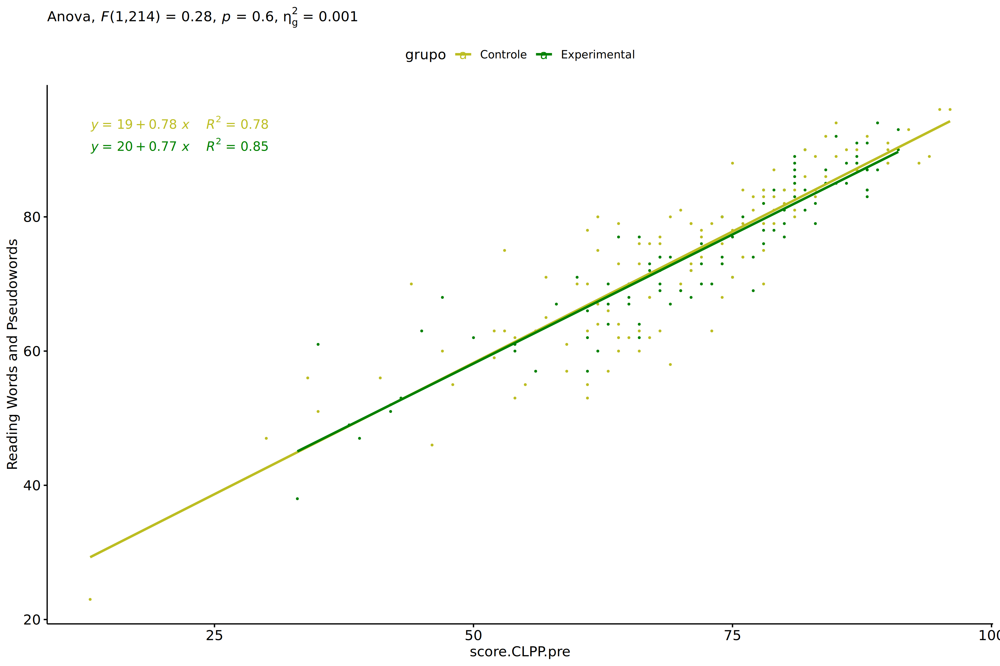
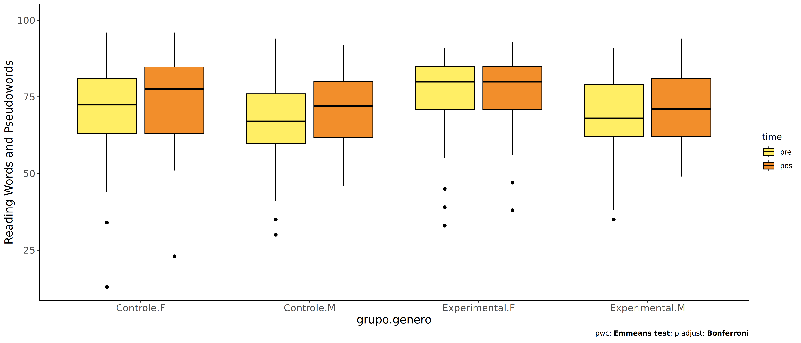
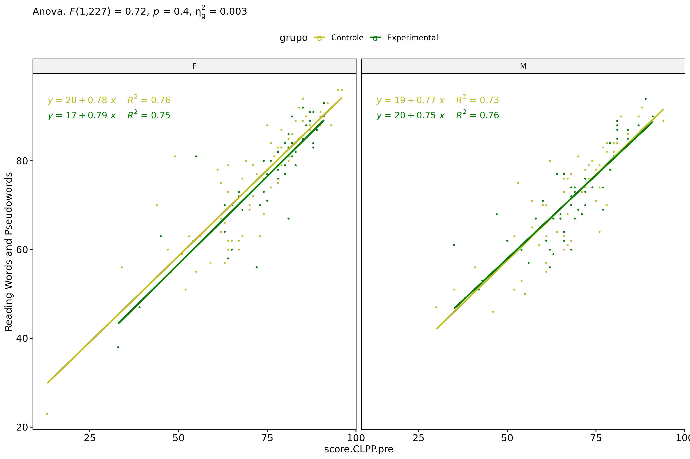
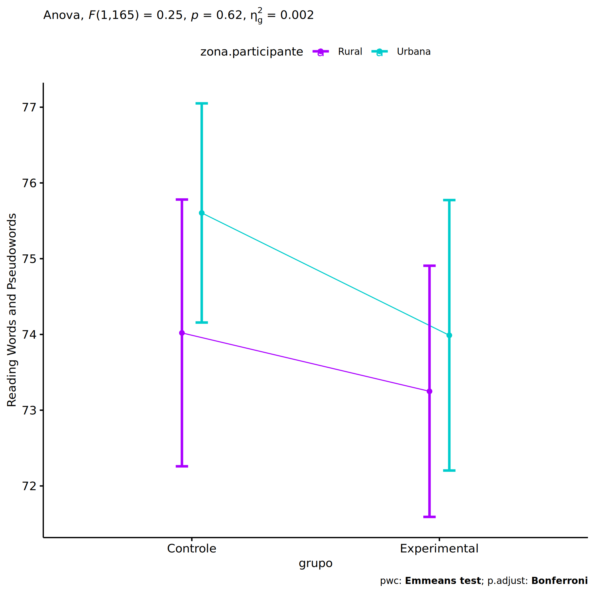
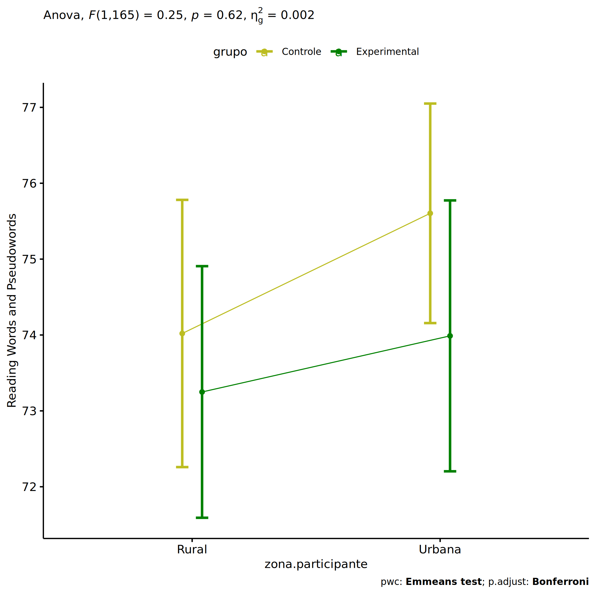
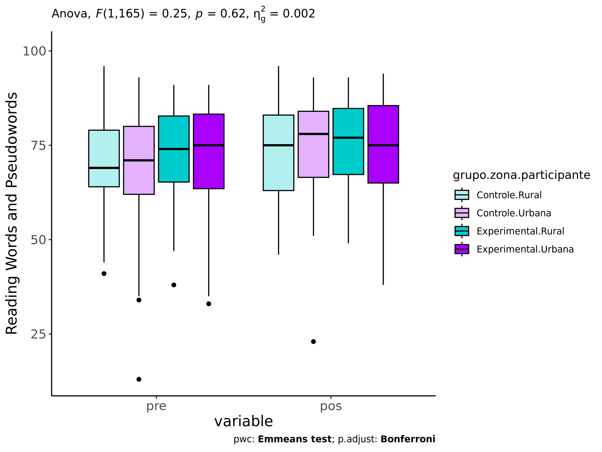
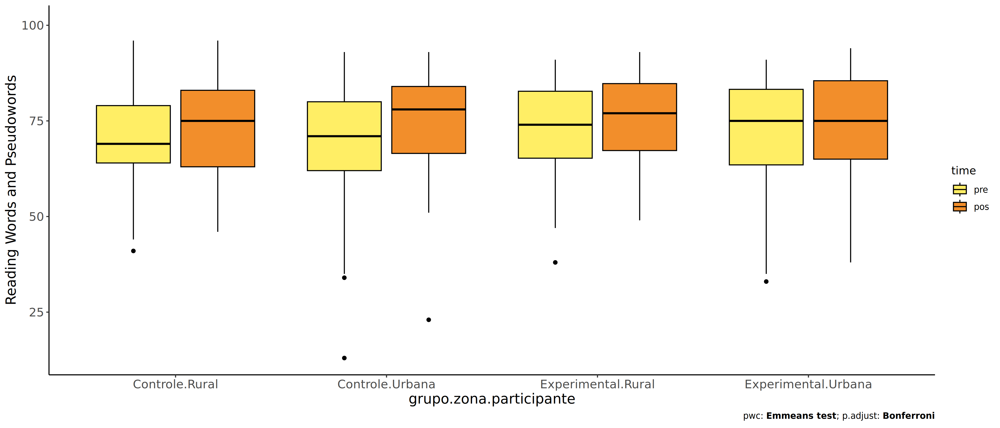
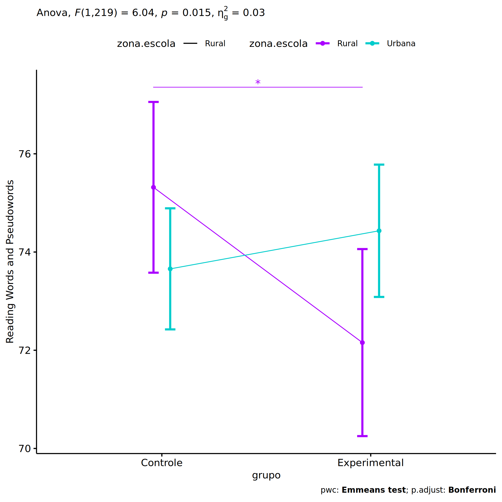
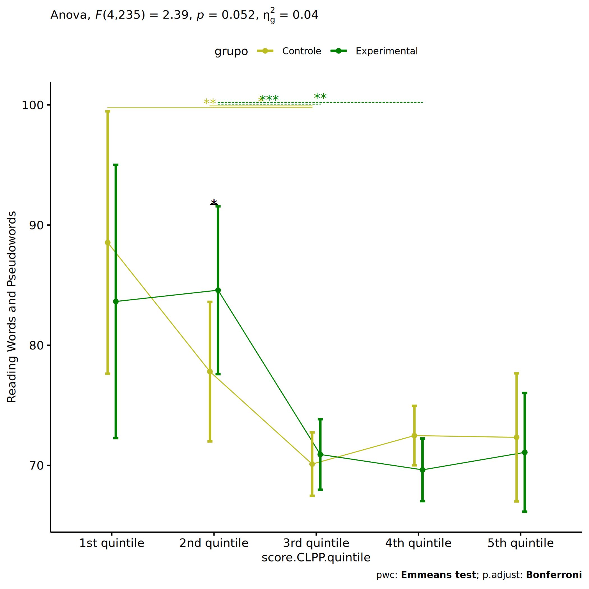

ANCOVA in Reading Words and Pseudowords (Reading Words and Pseudowords)
================
Geiser C. Challco <geiser@alumni.usp.br>

- [Setting Initial Variables](#setting-initial-variables)
- [Descriptive Statistics of Initial
  Data](#descriptive-statistics-of-initial-data)
- [ANCOVA and Pairwise for one factor:
  **grupo**](#ancova-and-pairwise-for-one-factor-grupo)
  - [Without remove non-normal data](#without-remove-non-normal-data)
  - [Computing ANCOVA and PairWise After removing non-normal data
    (OK)](#computing-ancova-and-pairwise-after-removing-non-normal-data-ok)
    - [Plots for ancova](#plots-for-ancova)
    - [Checking linearity assumption](#checking-linearity-assumption)
    - [Checking normality and
      homogeneity](#checking-normality-and-homogeneity)
- [ANCOVA and Pairwise for two factors
  **grupo:genero**](#ancova-and-pairwise-for-two-factors-grupogenero)
  - [Without remove non-normal data](#without-remove-non-normal-data-1)
  - [Computing ANCOVA and PairWise After removing non-normal data
    (OK)](#computing-ancova-and-pairwise-after-removing-non-normal-data-ok-1)
    - [Plots for ancova](#plots-for-ancova-1)
    - [Checking linearity assumption](#checking-linearity-assumption-1)
    - [Checking normality and
      homogeneity](#checking-normality-and-homogeneity-1)
- [ANCOVA and Pairwise for two factors
  **grupo:zona.participante**](#ancova-and-pairwise-for-two-factors-grupozonaparticipante)
  - [Without remove non-normal data](#without-remove-non-normal-data-2)
  - [Computing ANCOVA and PairWise After removing non-normal data
    (OK)](#computing-ancova-and-pairwise-after-removing-non-normal-data-ok-2)
    - [Plots for ancova](#plots-for-ancova-2)
    - [Checking linearity assumption](#checking-linearity-assumption-2)
    - [Checking normality and
      homogeneity](#checking-normality-and-homogeneity-2)
- [ANCOVA and Pairwise for two factors
  **grupo:zona.escola**](#ancova-and-pairwise-for-two-factors-grupozonaescola)
  - [Without remove non-normal data](#without-remove-non-normal-data-3)
  - [Computing ANCOVA and PairWise After removing non-normal data
    (OK)](#computing-ancova-and-pairwise-after-removing-non-normal-data-ok-3)
    - [Plots for ancova](#plots-for-ancova-3)
    - [Checking linearity assumption](#checking-linearity-assumption-3)
    - [Checking normality and
      homogeneity](#checking-normality-and-homogeneity-3)
- [ANCOVA and Pairwise for two factors
  **grupo:score.CLPP.quintile**](#ancova-and-pairwise-for-two-factors-gruposcoreclppquintile)
  - [Without remove non-normal data](#without-remove-non-normal-data-4)
  - [Computing ANCOVA and PairWise After removing non-normal data
    (OK)](#computing-ancova-and-pairwise-after-removing-non-normal-data-ok-4)
    - [Plots for ancova](#plots-for-ancova-4)
    - [Checking linearity assumption](#checking-linearity-assumption-4)
    - [Checking normality and
      homogeneity](#checking-normality-and-homogeneity-4)
- [Summary of Results](#summary-of-results)
  - [Descriptive Statistics](#descriptive-statistics)
  - [ANCOVA Table Comparison](#ancova-table-comparison)
  - [PairWise Table Comparison](#pairwise-table-comparison)
  - [EMMS Table Comparison](#emms-table-comparison)

**NOTE**:

- Teste ANCOVA para determinar se houve diferenças significativas no
  Reading Words and Pseudowords (medido usando pre- e pos-testes).
- ANCOVA test to determine whether there were significant differences in
  Reading Words and Pseudowords (measured using pre- and post-tests).

# Setting Initial Variables

``` r
dv = "score.CLPP"
dv.pos = "score.CLPP.pos"
dv.pre = "score.CLPP.pre"

fatores2 <- c("genero","zona.participante","zona.escola","score.CLPP.quintile")
lfatores2 <- as.list(fatores2)
names(lfatores2) <- fatores2

fatores1 <- c("grupo", fatores2)
lfatores1 <- as.list(fatores1)
names(lfatores1) <- fatores1

lfatores <- c(lfatores1)

color <- list()
color[["prepost"]] = c("#ffee65","#f28e2B")
color[["grupo"]] = c("#bcbd22","#008000")
color[["genero"]] = c("#FF007F","#4D4DFF")
color[["zona.escola"]] = c("#AA00FF","#00CCCC")
color[["zona.participante"]] = c("#AA00FF","#00CCCC")

level <- list()
level[["grupo"]] = c("Controle","Experimental")
level[["genero"]] = c("F","M")
level[["zona.escola"]] = c("Rural","Urbana")
level[["zona.participante"]] = c("Rural","Urbana")

# ..

ymin <- 0
ymax <- 0

ymin.ci <- 0
ymax.ci <- 0


color[["grupo:genero"]] = c(
  "Controle:F"="#ff99cb", "Controle:M"="#b7b7ff",
  "Experimental:F"="#FF007F", "Experimental:M"="#4D4DFF",
  "Controle.F"="#ff99cb", "Controle.M"="#b7b7ff",
  "Experimental.F"="#FF007F", "Experimental.M"="#4D4DFF"
)
color[["grupo:zona.escola"]] = c(
  "Controle:Rural"="#b2efef","Controle:Urbana"="#e5b2ff",
  "Experimental:Rural"="#00CCCC", "Experimental:Urbana"="#AA00FF",
  "Controle.Rural"="#b2efef","Controle.Urbana"="#e5b2ff",
  "Experimental.Rural"="#00CCCC", "Experimental.Urbana"="#AA00FF"
)
color[["grupo:zona.participante"]] = c(
  "Controle:Rural"="#b2efef","Controle:Urbana"="#e5b2ff",
  "Experimental:Rural"="#00CCCC", "Experimental:Urbana"="#AA00FF",
  "Controle.Rural"="#b2efef","Controle.Urbana"="#e5b2ff",
  "Experimental.Rural"="#00CCCC", "Experimental.Urbana"="#AA00FF"
)

for (coln in c(
  "palavras.lidas","score.compreensao","tri.compreensao",
  "score.vocab","tri.vocab",
  "score.vocab.ensinado","tri.vocab.ensinado","score.vocab.nao.ensinado","tri.vocab.nao.ensinado",
  "score.CLPP","tri.CLPP","score.CR","tri.CR",
  "score.CI","tri.CI","score.TV","tri.TV","score.TF","tri.TF","score.TO","tri.TO")) {
  color[[paste0(coln,".quintile")]] = c("#BF0040","#FF0000","#800080","#0000FF","#4000BF")
  level[[paste0(coln,".quintile")]] = c("1st quintile","2nd quintile","3rd quintile","4th quintile","5th quintile")
  color[[paste0("grupo:",coln,".quintile")]] = c(
    "Experimental.1st quintile"="#BF0040", "Controle.1st quintile"="#d8668c",
    "Experimental.2nd quintile"="#FF0000", "Controle.2nd quintile"="#ff7f7f",
    "Experimental.3rd quintile"="#8fce00", "Controle.3rd quintile"="#ddf0b2",
    "Experimental.4th quintile"="#0000FF", "Controle.4th quintile"="#b2b2ff",
    "Experimental.5th quintile"="#4000BF", "Controle.5th quintile"="#b299e5",
    
    "Experimental:1st quintile"="#BF0040", "Controle:1st quintile"="#d8668c",
    "Experimental:2nd quintile"="#FF0000", "Controle:2nd quintile"="#ff7f7f",
    "Experimental:3rd quintile"="#8fce00", "Controle:3rd quintile"="#ddf0b2",
    "Experimental:4th quintile"="#0000FF", "Controle:4th quintile"="#b2b2ff",
    "Experimental:5th quintile"="#4000BF", "Controle:5th quintile"="#b299e5")
}


gdat <- read_excel("../data/data.xlsx", sheet = "leitura.wg.wo.st")


dat <- gdat
dat$grupo <- factor(dat[["grupo"]], level[["grupo"]])
for (coln in c(names(lfatores))) {
  dat[[coln]] <- factor(dat[[coln]], level[[coln]][level[[coln]] %in% unique(dat[[coln]])])
}
dat <- dat[which(!is.na(dat[[dv.pre]]) & !is.na(dat[[dv.pos]])),]
dat <- dat[,c("id",names(lfatores),dv.pre,dv.pos)]

dat.long <- rbind(dat, dat)
dat.long$time <- c(rep("pre", nrow(dat)), rep("pos", nrow(dat)))
dat.long$time <- factor(dat.long$time, c("pre","pos"))
dat.long[[dv]] <- c(dat[[dv.pre]], dat[[dv.pos]])


for (f in c("grupo", names(lfatores))) {
  if (is.null(color[[f]]) && length(unique(dat[[f]])) > 0) 
      color[[f]] <- distinctColorPalette(length(unique(dat[[f]])))
}
for (f in c(fatores2)) {
  if (is.null(color[[paste0("grupo:",f)]]) && length(unique(dat[[f]])) > 0)
    color[[paste0("grupo:",f)]] <- distinctColorPalette(length(unique(dat[["grupo"]]))*length(unique(dat[[f]])))
}

ldat <- list()
laov <- list()
lpwc <- list()
lemms <- list()
```

# Descriptive Statistics of Initial Data

``` r
df <- get.descriptives(dat, c(dv.pre, dv.pos), c("grupo"), 
                       include.global = T, symmetry.test = T, normality.test = F)
df <- plyr::rbind.fill(
  df, do.call(plyr::rbind.fill, lapply(lfatores2, FUN = function(f) {
    if (nrow(dat) > 0 && sum(!is.na(unique(dat[[f]]))) > 1)
      get.descriptives(dat, c(dv.pre,dv.pos), c("grupo", f),
                       symmetry.test = T, normality.test = F)
    }))
)
df <- df[,c(fatores1[fatores1 %in% colnames(df)],"variable",
            colnames(df)[!colnames(df) %in% c(fatores1,"variable")])]
```

| grupo | genero | zona.participante | zona.escola | score.CLPP.quintile | variable | n | mean | median | min | max | sd | se | ci | iqr | symmetry | skewness | kurtosis |
|:---|:---|:---|:---|:---|:---|---:|---:|---:|---:|---:|---:|---:|---:|---:|:---|---:|---:|
| Controle |  |  |  |  | score.CLPP.pre | 149 | 68.101 | 68.0 | 11 | 96 | 14.666 | 1.201 | 2.374 | 17.00 | NO | -0.936 | 1.852 |
| Experimental |  |  |  |  | score.CLPP.pre | 119 | 71.529 | 72.0 | 33 | 92 | 13.448 | 1.233 | 2.441 | 16.00 | NO | -0.811 | 0.297 |
|  |  |  |  |  | score.CLPP.pre | 268 | 69.623 | 71.0 | 11 | 96 | 14.215 | 0.868 | 1.710 | 17.25 | NO | -0.907 | 1.394 |
| Controle |  |  |  |  | score.CLPP.pos | 149 | 69.597 | 71.0 | 23 | 96 | 15.069 | 1.234 | 2.439 | 22.00 | YES | -0.450 | -0.322 |
| Experimental |  |  |  |  | score.CLPP.pos | 119 | 72.151 | 73.0 | 16 | 94 | 14.042 | 1.287 | 2.549 | 22.00 | NO | -0.834 | 0.946 |
|  |  |  |  |  | score.CLPP.pos | 268 | 70.731 | 73.0 | 16 | 96 | 14.650 | 0.895 | 1.762 | 23.00 | NO | -0.616 | 0.147 |
| Controle | F |  |  |  | score.CLPP.pre | 78 | 70.205 | 71.5 | 13 | 96 | 15.002 | 1.699 | 3.383 | 18.25 | NO | -0.941 | 1.570 |
| Controle | M |  |  |  | score.CLPP.pre | 71 | 65.789 | 67.0 | 11 | 94 | 14.028 | 1.665 | 3.320 | 14.50 | NO | -1.051 | 2.330 |
| Experimental | F |  |  |  | score.CLPP.pre | 54 | 74.944 | 78.0 | 33 | 91 | 13.397 | 1.823 | 3.657 | 16.50 | NO | -1.385 | 1.665 |
| Experimental | M |  |  |  | score.CLPP.pre | 65 | 68.692 | 69.0 | 35 | 92 | 12.915 | 1.602 | 3.200 | 17.00 | YES | -0.445 | -0.083 |
| Controle | F |  |  |  | score.CLPP.pos | 78 | 72.692 | 75.5 | 23 | 96 | 14.418 | 1.633 | 3.251 | 21.75 | NO | -0.620 | 0.308 |
| Controle | M |  |  |  | score.CLPP.pos | 71 | 66.197 | 68.0 | 29 | 92 | 15.133 | 1.796 | 3.582 | 24.50 | YES | -0.281 | -0.789 |
| Experimental | F |  |  |  | score.CLPP.pos | 54 | 74.889 | 79.5 | 16 | 93 | 15.507 | 2.110 | 4.233 | 15.00 | NO | -1.521 | 2.565 |
| Experimental | M |  |  |  | score.CLPP.pos | 65 | 69.877 | 69.0 | 42 | 94 | 12.362 | 1.533 | 3.063 | 17.00 | YES | -0.055 | -0.832 |
| Controle |  | Rural |  |  | score.CLPP.pre | 51 | 68.137 | 67.0 | 35 | 96 | 13.458 | 1.885 | 3.785 | 16.50 | YES | -0.216 | -0.168 |
| Controle |  | Urbana |  |  | score.CLPP.pre | 64 | 68.594 | 71.0 | 13 | 93 | 15.010 | 1.876 | 3.749 | 18.00 | NO | -0.972 | 1.676 |
| Controle |  |  |  |  | score.CLPP.pre | 34 | 67.118 | 69.5 | 11 | 94 | 16.081 | 2.758 | 5.611 | 17.00 | NO | -1.412 | 2.753 |
| Experimental |  | Rural |  |  | score.CLPP.pre | 52 | 71.500 | 71.5 | 38 | 91 | 12.770 | 1.771 | 3.555 | 16.25 | NO | -0.659 | 0.049 |
| Experimental |  | Urbana |  |  | score.CLPP.pre | 41 | 70.268 | 72.0 | 33 | 91 | 15.600 | 2.436 | 4.924 | 18.00 | NO | -0.846 | -0.202 |
| Experimental |  |  |  |  | score.CLPP.pre | 26 | 73.577 | 74.0 | 45 | 92 | 11.165 | 2.190 | 4.510 | 14.00 | YES | -0.378 | -0.295 |
| Controle |  | Rural |  |  | score.CLPP.pos | 51 | 69.824 | 70.0 | 45 | 96 | 13.995 | 1.960 | 3.936 | 22.00 | YES | -0.036 | -1.158 |
| Controle |  | Urbana |  |  | score.CLPP.pos | 64 | 70.859 | 75.5 | 23 | 93 | 15.614 | 1.952 | 3.900 | 23.25 | NO | -0.767 | 0.048 |
| Controle |  |  |  |  | score.CLPP.pos | 34 | 66.882 | 64.0 | 29 | 94 | 15.665 | 2.686 | 5.466 | 21.50 | YES | -0.275 | -0.351 |
| Experimental |  | Rural |  |  | score.CLPP.pos | 52 | 72.058 | 73.0 | 42 | 93 | 13.455 | 1.866 | 3.746 | 22.25 | YES | -0.357 | -0.956 |
| Experimental |  | Urbana |  |  | score.CLPP.pos | 41 | 71.049 | 74.0 | 16 | 94 | 17.097 | 2.670 | 5.396 | 24.00 | NO | -0.978 | 0.824 |
| Experimental |  |  |  |  | score.CLPP.pos | 26 | 74.077 | 72.5 | 56 | 88 | 9.372 | 1.838 | 3.785 | 15.50 | YES | -0.031 | -1.253 |
| Controle |  |  | Rural |  | score.CLPP.pre | 51 | 65.549 | 67.0 | 11 | 96 | 18.219 | 2.551 | 5.124 | 20.50 | NO | -0.961 | 0.963 |
| Controle |  |  | Urbana |  | score.CLPP.pre | 98 | 69.429 | 69.5 | 30 | 95 | 12.323 | 1.245 | 2.471 | 16.00 | YES | -0.407 | 0.424 |
| Experimental |  |  | Rural |  | score.CLPP.pre | 38 | 71.500 | 71.0 | 38 | 91 | 12.719 | 2.063 | 4.181 | 15.50 | NO | -0.792 | 0.538 |
| Experimental |  |  | Urbana |  | score.CLPP.pre | 81 | 71.543 | 73.0 | 33 | 92 | 13.855 | 1.539 | 3.064 | 18.00 | NO | -0.804 | 0.122 |
| Controle |  |  | Rural |  | score.CLPP.pos | 51 | 71.373 | 75.0 | 23 | 96 | 14.620 | 2.047 | 4.112 | 19.50 | NO | -0.721 | 0.501 |
| Controle |  |  | Urbana |  | score.CLPP.pos | 98 | 68.673 | 70.0 | 29 | 96 | 15.289 | 1.544 | 3.065 | 23.00 | YES | -0.311 | -0.664 |
| Experimental |  |  | Rural |  | score.CLPP.pos | 38 | 72.395 | 71.0 | 49 | 93 | 11.289 | 1.831 | 3.711 | 14.00 | YES | -0.043 | -0.810 |
| Experimental |  |  | Urbana |  | score.CLPP.pos | 81 | 72.037 | 74.0 | 16 | 94 | 15.227 | 1.692 | 3.367 | 23.00 | NO | -0.942 | 0.854 |
| Controle |  |  |  | 1st quintile | score.CLPP.pre | 7 | 28.429 | 34.0 | 11 | 41 | 11.688 | 4.418 | 10.810 | 13.50 | NO | -0.558 | -1.633 |
| Controle |  |  |  | 2nd quintile | score.CLPP.pre | 18 | 50.278 | 52.0 | 42 | 55 | 3.923 | 0.925 | 1.951 | 5.75 | NO | -0.594 | -0.986 |
| Controle |  |  |  | 3rd quintile | score.CLPP.pre | 50 | 63.700 | 64.0 | 56 | 68 | 3.309 | 0.468 | 0.940 | 6.00 | YES | -0.490 | -0.853 |
| Controle |  |  |  | 4th quintile | score.CLPP.pre | 53 | 75.585 | 76.0 | 69 | 82 | 3.744 | 0.514 | 1.032 | 7.00 | YES | -0.060 | -1.233 |
| Controle |  |  |  | 5th quintile | score.CLPP.pre | 21 | 88.190 | 87.0 | 83 | 96 | 4.106 | 0.896 | 1.869 | 5.00 | YES | 0.365 | -1.187 |
| Experimental |  |  |  | 1st quintile | score.CLPP.pre | 5 | 36.600 | 38.0 | 33 | 39 | 2.510 | 1.122 | 3.117 | 3.00 | YES | -0.398 | -1.915 |
| Experimental |  |  |  | 2nd quintile | score.CLPP.pre | 9 | 48.667 | 48.0 | 42 | 55 | 4.899 | 1.633 | 3.766 | 9.00 | YES | 0.026 | -1.761 |
| Experimental |  |  |  | 3rd quintile | score.CLPP.pre | 32 | 64.281 | 65.0 | 56 | 68 | 3.265 | 0.577 | 1.177 | 5.25 | NO | -0.577 | -0.522 |
| Experimental |  |  |  | 4th quintile | score.CLPP.pre | 47 | 75.915 | 77.0 | 69 | 82 | 4.427 | 0.646 | 1.300 | 8.00 | YES | -0.180 | -1.483 |
| Experimental |  |  |  | 5th quintile | score.CLPP.pre | 26 | 87.154 | 87.0 | 83 | 92 | 2.493 | 0.489 | 1.007 | 2.75 | YES | 0.100 | -0.836 |
| Controle |  |  |  | 1st quintile | score.CLPP.pos | 7 | 53.143 | 56.0 | 23 | 76 | 16.263 | 6.147 | 15.041 | 10.50 | YES | -0.488 | -0.734 |
| Controle |  |  |  | 2nd quintile | score.CLPP.pos | 18 | 57.444 | 57.0 | 29 | 81 | 11.516 | 2.714 | 5.727 | 11.50 | YES | -0.175 | 0.506 |
| Controle |  |  |  | 3rd quintile | score.CLPP.pos | 50 | 61.980 | 62.5 | 34 | 87 | 11.905 | 1.684 | 3.383 | 14.50 | YES | -0.369 | -0.276 |
| Controle |  |  |  | 4th quintile | score.CLPP.pos | 53 | 75.132 | 79.0 | 49 | 90 | 9.855 | 1.354 | 2.716 | 11.00 | NO | -0.999 | 0.123 |
| Controle |  |  |  | 5th quintile | score.CLPP.pos | 21 | 89.667 | 89.0 | 83 | 96 | 3.411 | 0.744 | 1.553 | 4.00 | YES | 0.106 | -0.528 |
| Experimental |  |  |  | 1st quintile | score.CLPP.pos | 5 | 57.000 | 49.0 | 38 | 90 | 20.187 | 9.028 | 25.065 | 14.00 | NO | 0.672 | -1.397 |
| Experimental |  |  |  | 2nd quintile | score.CLPP.pos | 9 | 64.111 | 62.0 | 51 | 81 | 10.130 | 3.377 | 7.786 | 8.00 | YES | 0.408 | -1.269 |
| Experimental |  |  |  | 3rd quintile | score.CLPP.pos | 32 | 64.469 | 66.5 | 40 | 77 | 8.696 | 1.537 | 3.135 | 10.50 | NO | -0.966 | 0.899 |
| Experimental |  |  |  | 4th quintile | score.CLPP.pos | 47 | 72.723 | 76.0 | 16 | 90 | 13.784 | 2.011 | 4.047 | 12.50 | NO | -1.746 | 4.172 |
| Experimental |  |  |  | 5th quintile | score.CLPP.pos | 26 | 86.269 | 87.0 | 62 | 94 | 6.057 | 1.188 | 2.446 | 4.75 | NO | -2.339 | 7.243 |

# ANCOVA and Pairwise for one factor: **grupo**

## Without remove non-normal data

``` r
pdat = remove_group_data(dat[!is.na(dat[["grupo"]]),], "score.CLPP.pos", "grupo")

pdat.long <- rbind(pdat[,c("id","grupo")], pdat[,c("id","grupo")])
pdat.long[["time"]] <- c(rep("pre", nrow(pdat)), rep("pos", nrow(pdat)))
pdat.long[["time"]] <- factor(pdat.long[["time"]], c("pre","pos"))
pdat.long[["score.CLPP"]] <- c(pdat[["score.CLPP.pre"]], pdat[["score.CLPP.pos"]])

aov = anova_test(pdat, score.CLPP.pos ~ score.CLPP.pre + grupo)
laov[["grupo"]] <- get_anova_table(aov)
```

``` r
pwc <- emmeans_test(pdat, score.CLPP.pos ~ grupo, covariate = score.CLPP.pre,
                    p.adjust.method = "bonferroni")
```

``` r
pwc.long <- emmeans_test(dplyr::group_by_at(pdat.long, "grupo"),
                          score.CLPP ~ time,
                          p.adjust.method = "bonferroni")
lpwc[["grupo"]] <- plyr::rbind.fill(pwc, pwc.long)
```

``` r
ds <- get.descriptives(pdat, "score.CLPP.pos", "grupo", covar = "score.CLPP.pre")
ds <- merge(ds[ds$variable != "score.CLPP.pre",],
            ds[ds$variable == "score.CLPP.pre", !colnames(ds) %in% c("variable")],
            by = "grupo", all.x = T, suffixes = c("", ".score.CLPP.pre"))
ds <- merge(get_emmeans(pwc), ds, by = "grupo", suffixes = c(".emms", ""))
ds <- ds[,c("grupo","n","mean.score.CLPP.pre","se.score.CLPP.pre","mean","se",
            "emmean","se.emms","conf.low","conf.high")]

colnames(ds) <- c("grupo", "N", paste0(c("M","SE")," (pre)"),
                  paste0(c("M","SE"), " (unadj)"),
                  paste0(c("M", "SE"), " (adj)"), "conf.low", "conf.high")

lemms[["grupo"]] <- ds
```

## Computing ANCOVA and PairWise After removing non-normal data (OK)

``` r
wdat = pdat 

res = residuals(lm(score.CLPP.pos ~ score.CLPP.pre + grupo, data = wdat))
non.normal = getNonNormal(res, wdat$id, plimit = 0.05)

wdat = wdat[!wdat$id %in% non.normal,]

wdat.long <- rbind(wdat[,c("id","grupo")], wdat[,c("id","grupo")])
wdat.long[["time"]] <- c(rep("pre", nrow(wdat)), rep("pos", nrow(wdat)))
wdat.long[["time"]] <- factor(wdat.long[["time"]], c("pre","pos"))
wdat.long[["score.CLPP"]] <- c(wdat[["score.CLPP.pre"]], wdat[["score.CLPP.pos"]])

ldat[["grupo"]] = wdat

(non.normal)
```

    ##  [1] "P68"  "P329" "P118" "P146" "P186" "P281" "P110" "P308" "P307" "P304" "P133" "P249" "P119" "P216" "P22"  "P109"
    ## [17] "P351" "P211" "P15"  "P116" "P330" "P126" "P84"  "P289" "P229" "P98"  "P134" "P165" "P136" "P207" "P16"  "P205"
    ## [33] "P213" "P316" "P354" "P25"  "P278" "P173" "P325" "P285" "P61"  "P174" "P362" "P2"   "P151" "P332" "P280" "P49" 
    ## [49] "P57"  "P123" "P298"

``` r
aov = anova_test(wdat, score.CLPP.pos ~ score.CLPP.pre + grupo)
laov[["grupo"]] <- merge(get_anova_table(aov), laov[["grupo"]],
                            by="Effect", suffixes = c("","'"))

(df = get_anova_table(aov))
```

    ## ANOVA Table (type II tests)
    ## 
    ##           Effect DFn DFd       F        p p<.05   ges
    ## 1 score.CLPP.pre   1 214 914.904 3.17e-79     * 0.810
    ## 2          grupo   1 214   0.283 5.96e-01       0.001

| Effect         | DFn | DFd |       F |     p | p\<.05 |   ges |
|:---------------|----:|----:|--------:|------:|:-------|------:|
| score.CLPP.pre |   1 | 214 | 914.904 | 0.000 | \*     | 0.810 |
| grupo          |   1 | 214 |   0.283 | 0.596 |        | 0.001 |

``` r
pwc <- emmeans_test(wdat, score.CLPP.pos ~ grupo, covariate = score.CLPP.pre,
                    p.adjust.method = "bonferroni")
```

| term | .y. | group1 | group2 | df | statistic | p | p.adj | p.adj.signif |
|:---|:---|:---|:---|---:|---:|---:|---:|:---|
| score.CLPP.pre\*grupo | score.CLPP.pos | Controle | Experimental | 214 | 0.532 | 0.596 | 0.596 | ns |

``` r
pwc.long <- emmeans_test(dplyr::group_by_at(wdat.long, "grupo"),
                         score.CLPP ~ time,
                         p.adjust.method = "bonferroni")
lpwc[["grupo"]] <- merge(plyr::rbind.fill(pwc, pwc.long), lpwc[["grupo"]],
                            by=c("grupo","term",".y.","group1","group2"),
                            suffixes = c("","'"))
```

| grupo        | term | .y.        | group1 | group2 |  df | statistic |     p | p.adj | p.adj.signif |
|:-------------|:-----|:-----------|:-------|:-------|----:|----------:|------:|------:|:-------------|
| Controle     | time | score.CLPP | pre    | pos    | 430 |    -2.327 | 0.020 | 0.020 | \*           |
| Experimental | time | score.CLPP | pre    | pos    | 430 |    -1.571 | 0.117 | 0.117 | ns           |

``` r
ds <- get.descriptives(wdat, "score.CLPP.pos", "grupo", covar = "score.CLPP.pre")
ds <- merge(ds[ds$variable != "score.CLPP.pre",],
            ds[ds$variable == "score.CLPP.pre", !colnames(ds) %in% c("variable")],
            by = "grupo", all.x = T, suffixes = c("", ".score.CLPP.pre"))
ds <- merge(get_emmeans(pwc), ds, by = "grupo", suffixes = c(".emms", ""))
ds <- ds[,c("grupo","n","mean.score.CLPP.pre","se.score.CLPP.pre","mean","se",
            "emmean","se.emms","conf.low","conf.high")]

colnames(ds) <- c("grupo", "N", paste0(c("M","SE")," (pre)"),
                  paste0(c("M","SE"), " (unadj)"),
                  paste0(c("M", "SE"), " (adj)"), "conf.low", "conf.high")

lemms[["grupo"]] <- merge(ds, lemms[["grupo"]], by=c("grupo"), suffixes = c("","'"))
```

| grupo | N | M (pre) | SE (pre) | M (unadj) | SE (unadj) | M (adj) | SE (adj) | conf.low | conf.high |
|:---|---:|---:|---:|---:|---:|---:|---:|---:|---:|
| Controle | 119 | 69.597 | 1.332 | 73.588 | 1.177 | 74.586 | 0.490 | 73.619 | 75.552 |
| Experimental | 98 | 72.439 | 1.385 | 75.408 | 1.156 | 74.197 | 0.541 | 73.131 | 75.262 |

### Plots for ancova

``` r
plots <- oneWayAncovaPlots(
  wdat, "score.CLPP.pos", "grupo", aov, list("grupo"=pwc), addParam = c("mean_ci"),
  font.label.size=10, step.increase=0.05, p.label="p.adj",
  subtitle = which(aov$Effect == "grupo"))
```

``` r
if (!is.null(nrow(plots[["grupo"]]$data)))
  plots[["grupo"]] + ggplot2::ylab("Reading Words and Pseudowords") + 
  if (ymin.ci < ymax.ci) ggplot2::ylim(ymin.ci, ymax.ci)
```

<!-- -->

``` r
plots <- oneWayAncovaBoxPlots(
  wdat, "score.CLPP.pos", "grupo", aov, pwc, covar = "score.CLPP.pre",
  theme = "classic", color = color[["grupo"]],
  subtitle = which(aov$Effect == "grupo"))
```

``` r
if (length(unique(wdat[["grupo"]])) > 1)
  plots[["grupo"]] + ggplot2::ylab("Reading Words and Pseudowords") +
  ggplot2::scale_x_discrete(labels=c('pre', 'pos')) +
  if (ymin < ymax) ggplot2::ylim(ymin, ymax)
```

<!-- -->

``` r
if (length(unique(wdat.long[["grupo"]])) > 1)
  plots <- oneWayAncovaBoxPlots(
    wdat.long, "score.CLPP", "grupo", aov, pwc.long,
    pre.post = "time", theme = "classic", color = color$prepost)
```

``` r
if (length(unique(wdat.long[["grupo"]])) > 1)
  plots[["grupo"]] + ggplot2::ylab("Reading Words and Pseudowords") +
  if (ymin < ymax) ggplot2::ylim(ymin, ymax) 
```

<!-- -->

### Checking linearity assumption

``` r
ggscatter(wdat, x = "score.CLPP.pre", y = "score.CLPP.pos", size = 0.5,
          color = "grupo", add = "reg.line")+
  stat_regline_equation(
    aes(label =  paste(..eq.label.., ..rr.label.., sep = "~~~~"), color = grupo)
  ) +
  ggplot2::labs(subtitle = rstatix::get_test_label(aov, detailed = T, row = which(aov$Effect == "grupo"))) +
  ggplot2::scale_color_manual(values = color[["grupo"]]) +
  ggplot2::ylab("Reading Words and Pseudowords")  +
  if (ymin < ymax) ggplot2::ylim(ymin, ymax)
```

<!-- -->

### Checking normality and homogeneity

``` r
res <- augment(lm(score.CLPP.pos ~ score.CLPP.pre + grupo, data = wdat))
```

``` r
shapiro_test(res$.resid)
```

    ## # A tibble: 1 × 3
    ##   variable   statistic p.value
    ##   <chr>          <dbl>   <dbl>
    ## 1 res$.resid     0.990   0.165

``` r
levene_test(res, .resid ~ grupo)
```

    ## # A tibble: 1 × 4
    ##     df1   df2 statistic       p
    ##   <int> <int>     <dbl>   <dbl>
    ## 1     1   215      7.29 0.00747

# ANCOVA and Pairwise for two factors **grupo:genero**

## Without remove non-normal data

``` r
pdat = remove_group_data(dat[!is.na(dat[["grupo"]]) & !is.na(dat[["genero"]]),],
                         "score.CLPP.pos", c("grupo","genero"))
pdat = pdat[pdat[["genero"]] %in% do.call(
  intersect, lapply(unique(pdat[["grupo"]]), FUN = function(x) {
    unique(pdat[["genero"]][which(pdat[["grupo"]] == x)])
  })),]
pdat[["grupo"]] = factor(pdat[["grupo"]], level[["grupo"]])
pdat[["genero"]] = factor(
  pdat[["genero"]],
  level[["genero"]][level[["genero"]] %in% unique(pdat[["genero"]])])

pdat.long <- rbind(pdat[,c("id","grupo","genero")], pdat[,c("id","grupo","genero")])
pdat.long[["time"]] <- c(rep("pre", nrow(pdat)), rep("pos", nrow(pdat)))
pdat.long[["time"]] <- factor(pdat.long[["time"]], c("pre","pos"))
pdat.long[["score.CLPP"]] <- c(pdat[["score.CLPP.pre"]], pdat[["score.CLPP.pos"]])

if (length(unique(pdat[["genero"]])) >= 2) {
  aov = anova_test(pdat, score.CLPP.pos ~ score.CLPP.pre + grupo*genero)
  laov[["grupo:genero"]] <- get_anova_table(aov)
}
```

``` r
if (length(unique(pdat[["genero"]])) >= 2) {
  pwcs <- list()
  pwcs[["genero"]] <- emmeans_test(
    group_by(pdat, grupo), score.CLPP.pos ~ genero,
    covariate = score.CLPP.pre, p.adjust.method = "bonferroni")
  pwcs[["grupo"]] <- emmeans_test(
    group_by(pdat, genero), score.CLPP.pos ~ grupo,
    covariate = score.CLPP.pre, p.adjust.method = "bonferroni")
  
  pwc <- plyr::rbind.fill(pwcs[["grupo"]], pwcs[["genero"]])
  pwc <- pwc[,c("grupo","genero", colnames(pwc)[!colnames(pwc) %in% c("grupo","genero")])]
}
```

``` r
if (length(unique(pdat[["genero"]])) >= 2) {
  pwc.long <- emmeans_test(dplyr::group_by_at(pdat.long, c("grupo","genero")),
                           score.CLPP ~ time,
                           p.adjust.method = "bonferroni")
  lpwc[["grupo:genero"]] <- plyr::rbind.fill(pwc, pwc.long)
}
```

``` r
if (length(unique(pdat[["genero"]])) >= 2) {
  ds <- get.descriptives(pdat, "score.CLPP.pos", c("grupo","genero"), covar = "score.CLPP.pre")
  ds <- merge(ds[ds$variable != "score.CLPP.pre",],
              ds[ds$variable == "score.CLPP.pre", !colnames(ds) %in% c("variable")],
              by = c("grupo","genero"), all.x = T, suffixes = c("", ".score.CLPP.pre"))
  ds <- merge(get_emmeans(pwcs[["grupo"]]), ds,
              by = c("grupo","genero"), suffixes = c(".emms", ""))
  ds <- ds[,c("grupo","genero","n","mean.score.CLPP.pre","se.score.CLPP.pre","mean","se",
              "emmean","se.emms","conf.low","conf.high")]
  
  colnames(ds) <- c("grupo","genero", "N", paste0(c("M","SE")," (pre)"),
                    paste0(c("M","SE"), " (unadj)"),
                    paste0(c("M", "SE"), " (adj)"), "conf.low", "conf.high")
  
  lemms[["grupo:genero"]] <- ds
}
```

## Computing ANCOVA and PairWise After removing non-normal data (OK)

``` r
if (length(unique(pdat[["genero"]])) >= 2) {
  wdat = pdat 
  
  res = residuals(lm(score.CLPP.pos ~ score.CLPP.pre + grupo*genero, data = wdat))
  non.normal = getNonNormal(res, wdat$id, plimit = 0.05)
  
  wdat = wdat[!wdat$id %in% non.normal,]
  
  wdat.long <- rbind(wdat[,c("id","grupo","genero")], wdat[,c("id","grupo","genero")])
  wdat.long[["time"]] <- c(rep("pre", nrow(wdat)), rep("pos", nrow(wdat)))
  wdat.long[["time"]] <- factor(wdat.long[["time"]], c("pre","pos"))
  wdat.long[["score.CLPP"]] <- c(wdat[["score.CLPP.pre"]], wdat[["score.CLPP.pos"]])
  
  
  ldat[["grupo:genero"]] = wdat
  
  (non.normal)
}
```

    ##  [1] "P68"  "P329" "P146" "P186" "P281" "P216" "P110" "P118" "P304" "P22"  "P249" "P307" "P119" "P308" "P109" "P330"
    ## [17] "P211" "P116" "P126" "P134" "P351" "P229" "P84"  "P316" "P289" "P133" "P15"  "P98"  "P25"  "P111" "P165" "P301"
    ## [33] "P57"  "P207" "P205" "P213"

``` r
if (length(unique(pdat[["genero"]])) >= 2) {
  aov = anova_test(wdat, score.CLPP.pos ~ score.CLPP.pre + grupo*genero)
  laov[["grupo:genero"]] <- merge(get_anova_table(aov), laov[["grupo:genero"]],
                                         by="Effect", suffixes = c("","'"))
  df = get_anova_table(aov)
}
```

| Effect         | DFn | DFd |       F |     p | p\<.05 |   ges |
|:---------------|----:|----:|--------:|------:|:-------|------:|
| score.CLPP.pre |   1 | 227 | 678.459 | 0.000 | \*     | 0.749 |
| grupo          |   1 | 227 |   0.723 | 0.396 |        | 0.003 |
| genero         |   1 | 227 |   0.236 | 0.627 |        | 0.001 |
| grupo:genero   |   1 | 227 |   0.722 | 0.396 |        | 0.003 |

``` r
if (length(unique(pdat[["genero"]])) >= 2) {
  pwcs <- list()
  pwcs[["genero"]] <- emmeans_test(
    group_by(wdat, grupo), score.CLPP.pos ~ genero,
    covariate = score.CLPP.pre, p.adjust.method = "bonferroni")
  pwcs[["grupo"]] <- emmeans_test(
    group_by(wdat, genero), score.CLPP.pos ~ grupo,
    covariate = score.CLPP.pre, p.adjust.method = "bonferroni")
  
  pwc <- plyr::rbind.fill(pwcs[["grupo"]], pwcs[["genero"]])
  pwc <- pwc[,c("grupo","genero", colnames(pwc)[!colnames(pwc) %in% c("grupo","genero")])]
}
```

| grupo | genero | term | .y. | group1 | group2 | df | statistic | p | p.adj | p.adj.signif |
|:---|:---|:---|:---|:---|:---|---:|---:|---:|---:|:---|
|  | F | score.CLPP.pre\*grupo | score.CLPP.pos | Controle | Experimental | 227 | 1.202 | 0.231 | 0.231 | ns |
|  | M | score.CLPP.pre\*grupo | score.CLPP.pos | Controle | Experimental | 227 | 0.002 | 0.998 | 0.998 | ns |
| Controle |  | score.CLPP.pre\*genero | score.CLPP.pos | F | M | 227 | 0.928 | 0.354 | 0.354 | ns |
| Experimental |  | score.CLPP.pre\*genero | score.CLPP.pos | F | M | 227 | -0.293 | 0.770 | 0.770 | ns |

``` r
if (length(unique(pdat[["genero"]])) >= 2) {
  pwc.long <- emmeans_test(dplyr::group_by_at(wdat.long, c("grupo","genero")),
                           score.CLPP ~ time,
                           p.adjust.method = "bonferroni")
  lpwc[["grupo:genero"]] <- merge(plyr::rbind.fill(pwc, pwc.long),
                                         lpwc[["grupo:genero"]],
                                         by=c("grupo","genero","term",".y.","group1","group2"),
                                         suffixes = c("","'"))
}
```

| grupo | genero | term | .y. | group1 | group2 | df | statistic | p | p.adj | p.adj.signif |
|:---|:---|:---|:---|:---|:---|---:|---:|---:|---:|:---|
| Controle | F | time | score.CLPP | pre | pos | 456 | -1.769 | 0.078 | 0.078 | ns |
| Controle | M | time | score.CLPP | pre | pos | 456 | -1.529 | 0.127 | 0.127 | ns |
| Experimental | F | time | score.CLPP | pre | pos | 456 | -0.503 | 0.615 | 0.615 | ns |
| Experimental | M | time | score.CLPP | pre | pos | 456 | -1.386 | 0.166 | 0.166 | ns |

``` r
if (length(unique(pdat[["genero"]])) >= 2) {
  ds <- get.descriptives(wdat, "score.CLPP.pos", c("grupo","genero"), covar = "score.CLPP.pre")
  ds <- merge(ds[ds$variable != "score.CLPP.pre",],
              ds[ds$variable == "score.CLPP.pre", !colnames(ds) %in% c("variable")],
              by = c("grupo","genero"), all.x = T, suffixes = c("", ".score.CLPP.pre"))
  ds <- merge(get_emmeans(pwcs[["grupo"]]), ds,
              by = c("grupo","genero"), suffixes = c(".emms", ""))
  ds <- ds[,c("grupo","genero","n","mean.score.CLPP.pre","se.score.CLPP.pre",
              "mean","se","emmean","se.emms","conf.low","conf.high")]
  
  colnames(ds) <- c("grupo","genero", "N", paste0(c("M","SE")," (pre)"),
                    paste0(c("M","SE"), " (unadj)"),
                    paste0(c("M", "SE"), " (adj)"), "conf.low", "conf.high")
  
  lemms[["grupo:genero"]] <- merge(ds, lemms[["grupo:genero"]],
                                          by=c("grupo","genero"), suffixes = c("","'"))
}
```

| grupo | genero | N | M (pre) | SE (pre) | M (unadj) | SE (unadj) | M (adj) | SE (adj) | conf.low | conf.high |
|:---|:---|---:|---:|---:|---:|---:|---:|---:|---:|---:|
| Controle | F | 70 | 70.800 | 1.803 | 74.700 | 1.607 | 74.375 | 0.737 | 72.923 | 75.827 |
| Controle | M | 56 | 66.839 | 1.801 | 70.607 | 1.634 | 73.343 | 0.830 | 71.707 | 74.979 |
| Experimental | F | 49 | 76.000 | 1.842 | 77.327 | 1.686 | 72.982 | 0.896 | 71.216 | 74.748 |
| Experimental | M | 57 | 68.509 | 1.724 | 71.895 | 1.484 | 73.340 | 0.818 | 71.728 | 74.953 |

### Plots for ancova

``` r
if (length(unique(pdat[["genero"]])) >= 2) {
  ggPlotAoC2(pwcs, "grupo", "genero", aov, ylab = "Reading Words and Pseudowords",
             subtitle = which(aov$Effect == "grupo:genero"), addParam = "errorbar") +
    ggplot2::scale_color_manual(values = color[["genero"]]) +
    ggplot2::ylab("Reading Words and Pseudowords") +
    if (ymin.ci < ymax.ci) ggplot2::ylim(ymin.ci, ymax.ci)
}
```

    ## Scale for colour is already present.
    ## Adding another scale for colour, which will replace the existing scale.

<!-- -->

``` r
if (length(unique(pdat[["genero"]])) >= 2) {
  ggPlotAoC2(pwcs, "genero", "grupo", aov, ylab = "Reading Words and Pseudowords",
               subtitle = which(aov$Effect == "grupo:genero"), addParam = "errorbar") +
    ggplot2::scale_color_manual(values = color[["grupo"]]) +
    ggplot2::ylab("Reading Words and Pseudowords") +
    if (ymin.ci < ymax.ci) ggplot2::ylim(ymin.ci, ymax.ci)
}
```

    ## Scale for colour is already present.
    ## Adding another scale for colour, which will replace the existing scale.

<!-- -->

``` r
if (length(unique(pdat[["genero"]])) >= 2) {
  plots <- twoWayAncovaBoxPlots(
    wdat, "score.CLPP.pos", c("grupo","genero"), aov, pwcs, covar = "score.CLPP.pre",
    theme = "classic", color = color[["grupo:genero"]],
    subtitle = which(aov$Effect == "grupo:genero"))
}
```

``` r
if (length(unique(pdat[["genero"]])) >= 2) {
  plots[["grupo:genero"]] + ggplot2::ylab("Reading Words and Pseudowords") +
  ggplot2::scale_x_discrete(labels=c('pre', 'pos')) +
  if (ymin < ymax) ggplot2::ylim(ymin, ymax)
}
```

    ## Warning: No shared levels found between `names(values)` of the manual scale and the data's colour values.

<!-- -->

``` r
if (length(unique(pdat[["genero"]])) >= 2) {
  plots <- twoWayAncovaBoxPlots(
    wdat.long, "score.CLPP", c("grupo","genero"), aov, pwc.long,
    pre.post = "time",
    theme = "classic", color = color$prepost)
}
```

``` r
if (length(unique(pdat[["genero"]])) >= 2) 
  plots[["grupo:genero"]] + ggplot2::ylab("Reading Words and Pseudowords") +
    if (ymin < ymax) ggplot2::ylim(ymin, ymax)
```

<!-- -->

### Checking linearity assumption

``` r
if (length(unique(pdat[["genero"]])) >= 2) {
  ggscatter(wdat, x = "score.CLPP.pre", y = "score.CLPP.pos", size = 0.5,
            facet.by = c("grupo","genero"), add = "reg.line")+
    stat_regline_equation(
      aes(label =  paste(..eq.label.., ..rr.label.., sep = "~~~~"))
    ) + ggplot2::ylab("Reading Words and Pseudowords") +
    if (ymin < ymax) ggplot2::ylim(ymin, ymax)
}
```

<!-- -->

``` r
if (length(unique(pdat[["genero"]])) >= 2) {
  ggscatter(wdat, x = "score.CLPP.pre", y = "score.CLPP.pos", size = 0.5,
            color = "grupo", facet.by = "genero", add = "reg.line")+
    stat_regline_equation(
      aes(label =  paste(..eq.label.., ..rr.label.., sep = "~~~~"), color = grupo)
    ) +
    ggplot2::labs(subtitle = rstatix::get_test_label(aov, detailed = T, row = which(aov$Effect == "grupo:genero"))) +
    ggplot2::scale_color_manual(values = color[["grupo"]]) +
    ggplot2::ylab("Reading Words and Pseudowords") +
    if (ymin < ymax) ggplot2::ylim(ymin, ymax)
}
```

<!-- -->

``` r
if (length(unique(pdat[["genero"]])) >= 2) {
  ggscatter(wdat, x = "score.CLPP.pre", y = "score.CLPP.pos", size = 0.5,
            color = "genero", facet.by = "grupo", add = "reg.line")+
    stat_regline_equation(
      aes(label =  paste(..eq.label.., ..rr.label.., sep = "~~~~"), color = genero)
    ) +
    ggplot2::labs(subtitle = rstatix::get_test_label(aov, detailed = T, row = which(aov$Effect == "grupo:genero"))) +
    ggplot2::scale_color_manual(values = color[["genero"]]) +
    ggplot2::ylab("Reading Words and Pseudowords") +
    if (ymin < ymax) ggplot2::ylim(ymin, ymax)
}
```

<!-- -->

### Checking normality and homogeneity

``` r
if (length(unique(pdat[["genero"]])) >= 2) 
  res <- augment(lm(score.CLPP.pos ~ score.CLPP.pre + grupo*genero, data = wdat))
```

``` r
if (length(unique(pdat[["genero"]])) >= 2)
  shapiro_test(res$.resid)
```

    ## # A tibble: 1 × 3
    ##   variable   statistic p.value
    ##   <chr>          <dbl>   <dbl>
    ## 1 res$.resid     0.981 0.00391

``` r
if (length(unique(pdat[["genero"]])) >= 2) 
  levene_test(res, .resid ~ grupo*genero)
```

    ## # A tibble: 1 × 4
    ##     df1   df2 statistic     p
    ##   <int> <int>     <dbl> <dbl>
    ## 1     3   228     0.977 0.404

# ANCOVA and Pairwise for two factors **grupo:zona.participante**

## Without remove non-normal data

``` r
pdat = remove_group_data(dat[!is.na(dat[["grupo"]]) & !is.na(dat[["zona.participante"]]),],
                         "score.CLPP.pos", c("grupo","zona.participante"))
pdat = pdat[pdat[["zona.participante"]] %in% do.call(
  intersect, lapply(unique(pdat[["grupo"]]), FUN = function(x) {
    unique(pdat[["zona.participante"]][which(pdat[["grupo"]] == x)])
  })),]
pdat[["grupo"]] = factor(pdat[["grupo"]], level[["grupo"]])
pdat[["zona.participante"]] = factor(
  pdat[["zona.participante"]],
  level[["zona.participante"]][level[["zona.participante"]] %in% unique(pdat[["zona.participante"]])])

pdat.long <- rbind(pdat[,c("id","grupo","zona.participante")], pdat[,c("id","grupo","zona.participante")])
pdat.long[["time"]] <- c(rep("pre", nrow(pdat)), rep("pos", nrow(pdat)))
pdat.long[["time"]] <- factor(pdat.long[["time"]], c("pre","pos"))
pdat.long[["score.CLPP"]] <- c(pdat[["score.CLPP.pre"]], pdat[["score.CLPP.pos"]])

if (length(unique(pdat[["zona.participante"]])) >= 2) {
  aov = anova_test(pdat, score.CLPP.pos ~ score.CLPP.pre + grupo*zona.participante)
  laov[["grupo:zona.participante"]] <- get_anova_table(aov)
}
```

``` r
if (length(unique(pdat[["zona.participante"]])) >= 2) {
  pwcs <- list()
  pwcs[["zona.participante"]] <- emmeans_test(
    group_by(pdat, grupo), score.CLPP.pos ~ zona.participante,
    covariate = score.CLPP.pre, p.adjust.method = "bonferroni")
  pwcs[["grupo"]] <- emmeans_test(
    group_by(pdat, zona.participante), score.CLPP.pos ~ grupo,
    covariate = score.CLPP.pre, p.adjust.method = "bonferroni")
  
  pwc <- plyr::rbind.fill(pwcs[["grupo"]], pwcs[["zona.participante"]])
  pwc <- pwc[,c("grupo","zona.participante", colnames(pwc)[!colnames(pwc) %in% c("grupo","zona.participante")])]
}
```

``` r
if (length(unique(pdat[["zona.participante"]])) >= 2) {
  pwc.long <- emmeans_test(dplyr::group_by_at(pdat.long, c("grupo","zona.participante")),
                           score.CLPP ~ time,
                           p.adjust.method = "bonferroni")
  lpwc[["grupo:zona.participante"]] <- plyr::rbind.fill(pwc, pwc.long)
}
```

``` r
if (length(unique(pdat[["zona.participante"]])) >= 2) {
  ds <- get.descriptives(pdat, "score.CLPP.pos", c("grupo","zona.participante"), covar = "score.CLPP.pre")
  ds <- merge(ds[ds$variable != "score.CLPP.pre",],
              ds[ds$variable == "score.CLPP.pre", !colnames(ds) %in% c("variable")],
              by = c("grupo","zona.participante"), all.x = T, suffixes = c("", ".score.CLPP.pre"))
  ds <- merge(get_emmeans(pwcs[["grupo"]]), ds,
              by = c("grupo","zona.participante"), suffixes = c(".emms", ""))
  ds <- ds[,c("grupo","zona.participante","n","mean.score.CLPP.pre","se.score.CLPP.pre","mean","se",
              "emmean","se.emms","conf.low","conf.high")]
  
  colnames(ds) <- c("grupo","zona.participante", "N", paste0(c("M","SE")," (pre)"),
                    paste0(c("M","SE"), " (unadj)"),
                    paste0(c("M", "SE"), " (adj)"), "conf.low", "conf.high")
  
  lemms[["grupo:zona.participante"]] <- ds
}
```

## Computing ANCOVA and PairWise After removing non-normal data (OK)

``` r
if (length(unique(pdat[["zona.participante"]])) >= 2) {
  wdat = pdat 
  
  res = residuals(lm(score.CLPP.pos ~ score.CLPP.pre + grupo*zona.participante, data = wdat))
  non.normal = getNonNormal(res, wdat$id, plimit = 0.05)
  
  wdat = wdat[!wdat$id %in% non.normal,]
  
  wdat.long <- rbind(wdat[,c("id","grupo","zona.participante")], wdat[,c("id","grupo","zona.participante")])
  wdat.long[["time"]] <- c(rep("pre", nrow(wdat)), rep("pos", nrow(wdat)))
  wdat.long[["time"]] <- factor(wdat.long[["time"]], c("pre","pos"))
  wdat.long[["score.CLPP"]] <- c(wdat[["score.CLPP.pre"]], wdat[["score.CLPP.pos"]])
  
  
  ldat[["grupo:zona.participante"]] = wdat
  
  (non.normal)
}
```

    ##  [1] "P68"  "P329" "P186" "P146" "P110" "P308" "P281" "P133" "P15"  "P289" "P229" "P116" "P330" "P84"  "P307" "P98" 
    ## [17] "P216" "P109" "P25"  "P134" "P136" "P316" "P351" "P126" "P354" "P165" "P155" "P175" "P340" "P280" "P123" "P57" 
    ## [33] "P325" "P173" "P285" "P167" "P111" "P298"

``` r
if (length(unique(pdat[["zona.participante"]])) >= 2) {
  aov = anova_test(wdat, score.CLPP.pos ~ score.CLPP.pre + grupo*zona.participante)
  laov[["grupo:zona.participante"]] <- merge(get_anova_table(aov), laov[["grupo:zona.participante"]],
                                         by="Effect", suffixes = c("","'"))
  df = get_anova_table(aov)
}
```

| Effect                  | DFn | DFd |       F |     p | p\<.05 |   ges |
|:------------------------|----:|----:|--------:|------:|:-------|------:|
| score.CLPP.pre          |   1 | 165 | 760.261 | 0.000 | \*     | 0.822 |
| grupo                   |   1 | 165 |   2.069 | 0.152 |        | 0.012 |
| zona.participante       |   1 | 165 |   1.990 | 0.160 |        | 0.012 |
| grupo:zona.participante |   1 | 165 |   0.250 | 0.618 |        | 0.002 |

``` r
if (length(unique(pdat[["zona.participante"]])) >= 2) {
  pwcs <- list()
  pwcs[["zona.participante"]] <- emmeans_test(
    group_by(wdat, grupo), score.CLPP.pos ~ zona.participante,
    covariate = score.CLPP.pre, p.adjust.method = "bonferroni")
  pwcs[["grupo"]] <- emmeans_test(
    group_by(wdat, zona.participante), score.CLPP.pos ~ grupo,
    covariate = score.CLPP.pre, p.adjust.method = "bonferroni")
  
  pwc <- plyr::rbind.fill(pwcs[["grupo"]], pwcs[["zona.participante"]])
  pwc <- pwc[,c("grupo","zona.participante", colnames(pwc)[!colnames(pwc) %in% c("grupo","zona.participante")])]
}
```

| grupo | zona.participante | term | .y. | group1 | group2 | df | statistic | p | p.adj | p.adj.signif |
|:---|:---|:---|:---|:---|:---|---:|---:|---:|---:|:---|
|  | Rural | score.CLPP.pre\*grupo | score.CLPP.pos | Controle | Experimental | 165 | 0.629 | 0.530 | 0.530 | ns |
|  | Urbana | score.CLPP.pre\*grupo | score.CLPP.pos | Controle | Experimental | 165 | 1.388 | 0.167 | 0.167 | ns |
| Controle |  | score.CLPP.pre\*zona.participante | score.CLPP.pos | Rural | Urbana | 165 | -1.373 | 0.172 | 0.172 | ns |
| Experimental |  | score.CLPP.pre\*zona.participante | score.CLPP.pos | Rural | Urbana | 165 | -0.599 | 0.550 | 0.550 | ns |

``` r
if (length(unique(pdat[["zona.participante"]])) >= 2) {
  pwc.long <- emmeans_test(dplyr::group_by_at(wdat.long, c("grupo","zona.participante")),
                           score.CLPP ~ time,
                           p.adjust.method = "bonferroni")
  lpwc[["grupo:zona.participante"]] <- merge(plyr::rbind.fill(pwc, pwc.long),
                                         lpwc[["grupo:zona.participante"]],
                                         by=c("grupo","zona.participante","term",".y.","group1","group2"),
                                         suffixes = c("","'"))
}
```

| grupo | zona.participante | term | .y. | group1 | group2 | df | statistic | p | p.adj | p.adj.signif |
|:---|:---|:---|:---|:---|:---|---:|---:|---:|---:|:---|
| Controle | Rural | time | score.CLPP | pre | pos | 332 | -1.039 | 0.300 | 0.300 | ns |
| Controle | Urbana | time | score.CLPP | pre | pos | 332 | -1.961 | 0.051 | 0.051 | ns |
| Experimental | Rural | time | score.CLPP | pre | pos | 332 | -0.666 | 0.506 | 0.506 | ns |
| Experimental | Urbana | time | score.CLPP | pre | pos | 332 | -1.002 | 0.317 | 0.317 | ns |

``` r
if (length(unique(pdat[["zona.participante"]])) >= 2) {
  ds <- get.descriptives(wdat, "score.CLPP.pos", c("grupo","zona.participante"), covar = "score.CLPP.pre")
  ds <- merge(ds[ds$variable != "score.CLPP.pre",],
              ds[ds$variable == "score.CLPP.pre", !colnames(ds) %in% c("variable")],
              by = c("grupo","zona.participante"), all.x = T, suffixes = c("", ".score.CLPP.pre"))
  ds <- merge(get_emmeans(pwcs[["grupo"]]), ds,
              by = c("grupo","zona.participante"), suffixes = c(".emms", ""))
  ds <- ds[,c("grupo","zona.participante","n","mean.score.CLPP.pre","se.score.CLPP.pre",
              "mean","se","emmean","se.emms","conf.low","conf.high")]
  
  colnames(ds) <- c("grupo","zona.participante", "N", paste0(c("M","SE")," (pre)"),
                    paste0(c("M","SE"), " (unadj)"),
                    paste0(c("M", "SE"), " (adj)"), "conf.low", "conf.high")
  
  lemms[["grupo:zona.participante"]] <- merge(ds, lemms[["grupo:zona.participante"]],
                                          by=c("grupo","zona.participante"), suffixes = c("","'"))
}
```

| grupo | zona.participante | N | M (pre) | SE (pre) | M (unadj) | SE (unadj) | M (adj) | SE (adj) | conf.low | conf.high |
|:---|:---|---:|---:|---:|---:|---:|---:|---:|---:|---:|
| Controle | Rural | 37 | 70.432 | 2.227 | 73.757 | 2.023 | 74.020 | 0.892 | 72.259 | 75.781 |
| Controle | Urbana | 55 | 69.291 | 2.124 | 74.436 | 1.804 | 75.604 | 0.733 | 74.157 | 77.050 |
| Experimental | Rural | 42 | 73.095 | 1.900 | 75.095 | 1.727 | 73.249 | 0.840 | 71.591 | 74.907 |
| Experimental | Urbana | 36 | 70.639 | 2.735 | 73.889 | 2.352 | 73.989 | 0.904 | 72.203 | 75.774 |

### Plots for ancova

``` r
if (length(unique(pdat[["zona.participante"]])) >= 2) {
  ggPlotAoC2(pwcs, "grupo", "zona.participante", aov, ylab = "Reading Words and Pseudowords",
             subtitle = which(aov$Effect == "grupo:zona.participante"), addParam = "errorbar") +
    ggplot2::scale_color_manual(values = color[["zona.participante"]]) +
    ggplot2::ylab("Reading Words and Pseudowords") +
    if (ymin.ci < ymax.ci) ggplot2::ylim(ymin.ci, ymax.ci)
}
```

    ## Scale for colour is already present.
    ## Adding another scale for colour, which will replace the existing scale.

<!-- -->

``` r
if (length(unique(pdat[["zona.participante"]])) >= 2) {
  ggPlotAoC2(pwcs, "zona.participante", "grupo", aov, ylab = "Reading Words and Pseudowords",
               subtitle = which(aov$Effect == "grupo:zona.participante"), addParam = "errorbar") +
    ggplot2::scale_color_manual(values = color[["grupo"]]) +
    ggplot2::ylab("Reading Words and Pseudowords") +
    if (ymin.ci < ymax.ci) ggplot2::ylim(ymin.ci, ymax.ci)
}
```

    ## Scale for colour is already present.
    ## Adding another scale for colour, which will replace the existing scale.

<!-- -->

``` r
if (length(unique(pdat[["zona.participante"]])) >= 2) {
  plots <- twoWayAncovaBoxPlots(
    wdat, "score.CLPP.pos", c("grupo","zona.participante"), aov, pwcs, covar = "score.CLPP.pre",
    theme = "classic", color = color[["grupo:zona.participante"]],
    subtitle = which(aov$Effect == "grupo:zona.participante"))
}
```

``` r
if (length(unique(pdat[["zona.participante"]])) >= 2) {
  plots[["grupo:zona.participante"]] + ggplot2::ylab("Reading Words and Pseudowords") +
  ggplot2::scale_x_discrete(labels=c('pre', 'pos')) +
  if (ymin < ymax) ggplot2::ylim(ymin, ymax)
}
```

    ## Warning: No shared levels found between `names(values)` of the manual scale and the data's colour values.

<!-- -->

``` r
if (length(unique(pdat[["zona.participante"]])) >= 2) {
  plots <- twoWayAncovaBoxPlots(
    wdat.long, "score.CLPP", c("grupo","zona.participante"), aov, pwc.long,
    pre.post = "time",
    theme = "classic", color = color$prepost)
}
```

``` r
if (length(unique(pdat[["zona.participante"]])) >= 2) 
  plots[["grupo:zona.participante"]] + ggplot2::ylab("Reading Words and Pseudowords") +
    if (ymin < ymax) ggplot2::ylim(ymin, ymax)
```

<!-- -->

### Checking linearity assumption

``` r
if (length(unique(pdat[["zona.participante"]])) >= 2) {
  ggscatter(wdat, x = "score.CLPP.pre", y = "score.CLPP.pos", size = 0.5,
            facet.by = c("grupo","zona.participante"), add = "reg.line")+
    stat_regline_equation(
      aes(label =  paste(..eq.label.., ..rr.label.., sep = "~~~~"))
    ) + ggplot2::ylab("Reading Words and Pseudowords") +
    if (ymin < ymax) ggplot2::ylim(ymin, ymax)
}
```

<!-- -->

``` r
if (length(unique(pdat[["zona.participante"]])) >= 2) {
  ggscatter(wdat, x = "score.CLPP.pre", y = "score.CLPP.pos", size = 0.5,
            color = "grupo", facet.by = "zona.participante", add = "reg.line")+
    stat_regline_equation(
      aes(label =  paste(..eq.label.., ..rr.label.., sep = "~~~~"), color = grupo)
    ) +
    ggplot2::labs(subtitle = rstatix::get_test_label(aov, detailed = T, row = which(aov$Effect == "grupo:zona.participante"))) +
    ggplot2::scale_color_manual(values = color[["grupo"]]) +
    ggplot2::ylab("Reading Words and Pseudowords") +
    if (ymin < ymax) ggplot2::ylim(ymin, ymax)
}
```

<!-- -->

``` r
if (length(unique(pdat[["zona.participante"]])) >= 2) {
  ggscatter(wdat, x = "score.CLPP.pre", y = "score.CLPP.pos", size = 0.5,
            color = "zona.participante", facet.by = "grupo", add = "reg.line")+
    stat_regline_equation(
      aes(label =  paste(..eq.label.., ..rr.label.., sep = "~~~~"), color = zona.participante)
    ) +
    ggplot2::labs(subtitle = rstatix::get_test_label(aov, detailed = T, row = which(aov$Effect == "grupo:zona.participante"))) +
    ggplot2::scale_color_manual(values = color[["zona.participante"]]) +
    ggplot2::ylab("Reading Words and Pseudowords") +
    if (ymin < ymax) ggplot2::ylim(ymin, ymax)
}
```

<!-- -->

### Checking normality and homogeneity

``` r
if (length(unique(pdat[["zona.participante"]])) >= 2) 
  res <- augment(lm(score.CLPP.pos ~ score.CLPP.pre + grupo*zona.participante, data = wdat))
```

``` r
if (length(unique(pdat[["zona.participante"]])) >= 2)
  shapiro_test(res$.resid)
```

    ## # A tibble: 1 × 3
    ##   variable   statistic p.value
    ##   <chr>          <dbl>   <dbl>
    ## 1 res$.resid     0.983  0.0394

``` r
if (length(unique(pdat[["zona.participante"]])) >= 2) 
  levene_test(res, .resid ~ grupo*zona.participante)
```

    ## # A tibble: 1 × 4
    ##     df1   df2 statistic      p
    ##   <int> <int>     <dbl>  <dbl>
    ## 1     3   166      2.14 0.0977

# ANCOVA and Pairwise for two factors **grupo:zona.escola**

## Without remove non-normal data

``` r
pdat = remove_group_data(dat[!is.na(dat[["grupo"]]) & !is.na(dat[["zona.escola"]]),],
                         "score.CLPP.pos", c("grupo","zona.escola"))
pdat = pdat[pdat[["zona.escola"]] %in% do.call(
  intersect, lapply(unique(pdat[["grupo"]]), FUN = function(x) {
    unique(pdat[["zona.escola"]][which(pdat[["grupo"]] == x)])
  })),]
pdat[["grupo"]] = factor(pdat[["grupo"]], level[["grupo"]])
pdat[["zona.escola"]] = factor(
  pdat[["zona.escola"]],
  level[["zona.escola"]][level[["zona.escola"]] %in% unique(pdat[["zona.escola"]])])

pdat.long <- rbind(pdat[,c("id","grupo","zona.escola")], pdat[,c("id","grupo","zona.escola")])
pdat.long[["time"]] <- c(rep("pre", nrow(pdat)), rep("pos", nrow(pdat)))
pdat.long[["time"]] <- factor(pdat.long[["time"]], c("pre","pos"))
pdat.long[["score.CLPP"]] <- c(pdat[["score.CLPP.pre"]], pdat[["score.CLPP.pos"]])

if (length(unique(pdat[["zona.escola"]])) >= 2) {
  aov = anova_test(pdat, score.CLPP.pos ~ score.CLPP.pre + grupo*zona.escola)
  laov[["grupo:zona.escola"]] <- get_anova_table(aov)
}
```

``` r
if (length(unique(pdat[["zona.escola"]])) >= 2) {
  pwcs <- list()
  pwcs[["zona.escola"]] <- emmeans_test(
    group_by(pdat, grupo), score.CLPP.pos ~ zona.escola,
    covariate = score.CLPP.pre, p.adjust.method = "bonferroni")
  pwcs[["grupo"]] <- emmeans_test(
    group_by(pdat, zona.escola), score.CLPP.pos ~ grupo,
    covariate = score.CLPP.pre, p.adjust.method = "bonferroni")
  
  pwc <- plyr::rbind.fill(pwcs[["grupo"]], pwcs[["zona.escola"]])
  pwc <- pwc[,c("grupo","zona.escola", colnames(pwc)[!colnames(pwc) %in% c("grupo","zona.escola")])]
}
```

``` r
if (length(unique(pdat[["zona.escola"]])) >= 2) {
  pwc.long <- emmeans_test(dplyr::group_by_at(pdat.long, c("grupo","zona.escola")),
                           score.CLPP ~ time,
                           p.adjust.method = "bonferroni")
  lpwc[["grupo:zona.escola"]] <- plyr::rbind.fill(pwc, pwc.long)
}
```

``` r
if (length(unique(pdat[["zona.escola"]])) >= 2) {
  ds <- get.descriptives(pdat, "score.CLPP.pos", c("grupo","zona.escola"), covar = "score.CLPP.pre")
  ds <- merge(ds[ds$variable != "score.CLPP.pre",],
              ds[ds$variable == "score.CLPP.pre", !colnames(ds) %in% c("variable")],
              by = c("grupo","zona.escola"), all.x = T, suffixes = c("", ".score.CLPP.pre"))
  ds <- merge(get_emmeans(pwcs[["grupo"]]), ds,
              by = c("grupo","zona.escola"), suffixes = c(".emms", ""))
  ds <- ds[,c("grupo","zona.escola","n","mean.score.CLPP.pre","se.score.CLPP.pre","mean","se",
              "emmean","se.emms","conf.low","conf.high")]
  
  colnames(ds) <- c("grupo","zona.escola", "N", paste0(c("M","SE")," (pre)"),
                    paste0(c("M","SE"), " (unadj)"),
                    paste0(c("M", "SE"), " (adj)"), "conf.low", "conf.high")
  
  lemms[["grupo:zona.escola"]] <- ds
}
```

## Computing ANCOVA and PairWise After removing non-normal data (OK)

``` r
if (length(unique(pdat[["zona.escola"]])) >= 2) {
  wdat = pdat 
  
  res = residuals(lm(score.CLPP.pos ~ score.CLPP.pre + grupo*zona.escola, data = wdat))
  non.normal = getNonNormal(res, wdat$id, plimit = 0.05)
  
  wdat = wdat[!wdat$id %in% non.normal,]
  
  wdat.long <- rbind(wdat[,c("id","grupo","zona.escola")], wdat[,c("id","grupo","zona.escola")])
  wdat.long[["time"]] <- c(rep("pre", nrow(wdat)), rep("pos", nrow(wdat)))
  wdat.long[["time"]] <- factor(wdat.long[["time"]], c("pre","pos"))
  wdat.long[["score.CLPP"]] <- c(wdat[["score.CLPP.pre"]], wdat[["score.CLPP.pos"]])
  
  
  ldat[["grupo:zona.escola"]] = wdat
  
  (non.normal)
}
```

    ##  [1] "P68"  "P329" "P186" "P118" "P110" "P119" "P308" "P249" "P146" "P281" "P330" "P126" "P304" "P116" "P211" "P316"
    ## [17] "P84"  "P229" "P351" "P289" "P98"  "P216" "P15"  "P307" "P22"  "P133" "P134" "P354" "P136" "P57"  "P152" "P283"
    ## [33] "P165" "P123" "P207" "P16"  "P25"  "P109" "P111" "P280" "P155" "P332" "P301" "P362"

``` r
if (length(unique(pdat[["zona.escola"]])) >= 2) {
  aov = anova_test(wdat, score.CLPP.pos ~ score.CLPP.pre + grupo*zona.escola)
  laov[["grupo:zona.escola"]] <- merge(get_anova_table(aov), laov[["grupo:zona.escola"]],
                                         by="Effect", suffixes = c("","'"))
  df = get_anova_table(aov)
}
```

| Effect            | DFn | DFd |       F |     p | p\<.05 |   ges |
|:------------------|----:|----:|--------:|------:|:-------|------:|
| score.CLPP.pre    |   1 | 219 | 837.233 | 0.000 | \*     | 0.793 |
| grupo             |   1 | 219 |   0.497 | 0.482 |        | 0.002 |
| zona.escola       |   1 | 219 |   0.027 | 0.869 |        | 0.000 |
| grupo:zona.escola |   1 | 219 |   6.042 | 0.015 | \*     | 0.027 |

``` r
if (length(unique(pdat[["zona.escola"]])) >= 2) {
  pwcs <- list()
  pwcs[["zona.escola"]] <- emmeans_test(
    group_by(wdat, grupo), score.CLPP.pos ~ zona.escola,
    covariate = score.CLPP.pre, p.adjust.method = "bonferroni")
  pwcs[["grupo"]] <- emmeans_test(
    group_by(wdat, zona.escola), score.CLPP.pos ~ grupo,
    covariate = score.CLPP.pre, p.adjust.method = "bonferroni")
  
  pwc <- plyr::rbind.fill(pwcs[["grupo"]], pwcs[["zona.escola"]])
  pwc <- pwc[,c("grupo","zona.escola", colnames(pwc)[!colnames(pwc) %in% c("grupo","zona.escola")])]
}
```

| grupo | zona.escola | term | .y. | group1 | group2 | df | statistic | p | p.adj | p.adj.signif |
|:---|:---|:---|:---|:---|:---|---:|---:|---:|---:|:---|
|  | Rural | score.CLPP.pre\*grupo | score.CLPP.pos | Controle | Experimental | 219 | 2.412 | 0.017 | 0.017 | \* |
|  | Urbana | score.CLPP.pre\*grupo | score.CLPP.pos | Controle | Experimental | 219 | -0.836 | 0.404 | 0.404 | ns |
| Controle |  | score.CLPP.pre\*zona.escola | score.CLPP.pos | Rural | Urbana | 219 | 1.537 | 0.126 | 0.126 | ns |
| Experimental |  | score.CLPP.pre\*zona.escola | score.CLPP.pos | Rural | Urbana | 219 | -1.926 | 0.055 | 0.055 | ns |

``` r
if (length(unique(pdat[["zona.escola"]])) >= 2) {
  pwc.long <- emmeans_test(dplyr::group_by_at(wdat.long, c("grupo","zona.escola")),
                           score.CLPP ~ time,
                           p.adjust.method = "bonferroni")
  lpwc[["grupo:zona.escola"]] <- merge(plyr::rbind.fill(pwc, pwc.long),
                                         lpwc[["grupo:zona.escola"]],
                                         by=c("grupo","zona.escola","term",".y.","group1","group2"),
                                         suffixes = c("","'"))
}
```

| grupo | zona.escola | term | .y. | group1 | group2 | df | statistic | p | p.adj | p.adj.signif |
|:---|:---|:---|:---|:---|:---|---:|---:|---:|---:|:---|
| Controle | Rural | time | score.CLPP | pre | pos | 440 | -1.756 | 0.080 | 0.080 | ns |
| Controle | Urbana | time | score.CLPP | pre | pos | 440 | -1.433 | 0.152 | 0.152 | ns |
| Experimental | Rural | time | score.CLPP | pre | pos | 440 | -0.321 | 0.748 | 0.748 | ns |
| Experimental | Urbana | time | score.CLPP | pre | pos | 440 | -1.474 | 0.141 | 0.141 | ns |

``` r
if (length(unique(pdat[["zona.escola"]])) >= 2) {
  ds <- get.descriptives(wdat, "score.CLPP.pos", c("grupo","zona.escola"), covar = "score.CLPP.pre")
  ds <- merge(ds[ds$variable != "score.CLPP.pre",],
              ds[ds$variable == "score.CLPP.pre", !colnames(ds) %in% c("variable")],
              by = c("grupo","zona.escola"), all.x = T, suffixes = c("", ".score.CLPP.pre"))
  ds <- merge(get_emmeans(pwcs[["grupo"]]), ds,
              by = c("grupo","zona.escola"), suffixes = c(".emms", ""))
  ds <- ds[,c("grupo","zona.escola","n","mean.score.CLPP.pre","se.score.CLPP.pre",
              "mean","se","emmean","se.emms","conf.low","conf.high")]
  
  colnames(ds) <- c("grupo","zona.escola", "N", paste0(c("M","SE")," (pre)"),
                    paste0(c("M","SE"), " (unadj)"),
                    paste0(c("M", "SE"), " (adj)"), "conf.low", "conf.high")
  
  lemms[["grupo:zona.escola"]] <- merge(ds, lemms[["grupo:zona.escola"]],
                                          by=c("grupo","zona.escola"), suffixes = c("","'"))
}
```

| grupo | zona.escola | N | M (pre) | SE (pre) | M (unadj) | SE (unadj) | M (adj) | SE (adj) | conf.low | conf.high |
|:---|:---|---:|---:|---:|---:|---:|---:|---:|---:|---:|
| Controle | Rural | 41 | 68.073 | 2.635 | 73.195 | 2.262 | 75.318 | 0.882 | 73.579 | 77.056 |
| Controle | Urbana | 81 | 70.309 | 1.436 | 73.284 | 1.336 | 73.657 | 0.626 | 72.424 | 74.890 |
| Experimental | Rural | 34 | 72.353 | 2.058 | 73.382 | 1.757 | 72.156 | 0.966 | 70.252 | 74.060 |
| Experimental | Urbana | 68 | 72.206 | 1.741 | 75.544 | 1.485 | 74.433 | 0.684 | 73.085 | 75.780 |

### Plots for ancova

``` r
if (length(unique(pdat[["zona.escola"]])) >= 2) {
  ggPlotAoC2(pwcs, "grupo", "zona.escola", aov, ylab = "Reading Words and Pseudowords",
             subtitle = which(aov$Effect == "grupo:zona.escola"), addParam = "errorbar") +
    ggplot2::scale_color_manual(values = color[["zona.escola"]]) +
    ggplot2::ylab("Reading Words and Pseudowords") +
    if (ymin.ci < ymax.ci) ggplot2::ylim(ymin.ci, ymax.ci)
}
```

    ## Scale for colour is already present.
    ## Adding another scale for colour, which will replace the existing scale.

<!-- -->

``` r
if (length(unique(pdat[["zona.escola"]])) >= 2) {
  ggPlotAoC2(pwcs, "zona.escola", "grupo", aov, ylab = "Reading Words and Pseudowords",
               subtitle = which(aov$Effect == "grupo:zona.escola"), addParam = "errorbar") +
    ggplot2::scale_color_manual(values = color[["grupo"]]) +
    ggplot2::ylab("Reading Words and Pseudowords") +
    if (ymin.ci < ymax.ci) ggplot2::ylim(ymin.ci, ymax.ci)
}
```

    ## Scale for colour is already present.
    ## Adding another scale for colour, which will replace the existing scale.

<!-- -->

``` r
if (length(unique(pdat[["zona.escola"]])) >= 2) {
  plots <- twoWayAncovaBoxPlots(
    wdat, "score.CLPP.pos", c("grupo","zona.escola"), aov, pwcs, covar = "score.CLPP.pre",
    theme = "classic", color = color[["grupo:zona.escola"]],
    subtitle = which(aov$Effect == "grupo:zona.escola"))
}
```

``` r
if (length(unique(pdat[["zona.escola"]])) >= 2) {
  plots[["grupo:zona.escola"]] + ggplot2::ylab("Reading Words and Pseudowords") +
  ggplot2::scale_x_discrete(labels=c('pre', 'pos')) +
  if (ymin < ymax) ggplot2::ylim(ymin, ymax)
}
```

    ## Warning: No shared levels found between `names(values)` of the manual scale and the data's colour values.

<!-- -->

``` r
if (length(unique(pdat[["zona.escola"]])) >= 2) {
  plots <- twoWayAncovaBoxPlots(
    wdat.long, "score.CLPP", c("grupo","zona.escola"), aov, pwc.long,
    pre.post = "time",
    theme = "classic", color = color$prepost)
}
```

``` r
if (length(unique(pdat[["zona.escola"]])) >= 2) 
  plots[["grupo:zona.escola"]] + ggplot2::ylab("Reading Words and Pseudowords") +
    if (ymin < ymax) ggplot2::ylim(ymin, ymax)
```

<!-- -->

### Checking linearity assumption

``` r
if (length(unique(pdat[["zona.escola"]])) >= 2) {
  ggscatter(wdat, x = "score.CLPP.pre", y = "score.CLPP.pos", size = 0.5,
            facet.by = c("grupo","zona.escola"), add = "reg.line")+
    stat_regline_equation(
      aes(label =  paste(..eq.label.., ..rr.label.., sep = "~~~~"))
    ) + ggplot2::ylab("Reading Words and Pseudowords") +
    if (ymin < ymax) ggplot2::ylim(ymin, ymax)
}
```

<!-- -->

``` r
if (length(unique(pdat[["zona.escola"]])) >= 2) {
  ggscatter(wdat, x = "score.CLPP.pre", y = "score.CLPP.pos", size = 0.5,
            color = "grupo", facet.by = "zona.escola", add = "reg.line")+
    stat_regline_equation(
      aes(label =  paste(..eq.label.., ..rr.label.., sep = "~~~~"), color = grupo)
    ) +
    ggplot2::labs(subtitle = rstatix::get_test_label(aov, detailed = T, row = which(aov$Effect == "grupo:zona.escola"))) +
    ggplot2::scale_color_manual(values = color[["grupo"]]) +
    ggplot2::ylab("Reading Words and Pseudowords") +
    if (ymin < ymax) ggplot2::ylim(ymin, ymax)
}
```

<!-- -->

``` r
if (length(unique(pdat[["zona.escola"]])) >= 2) {
  ggscatter(wdat, x = "score.CLPP.pre", y = "score.CLPP.pos", size = 0.5,
            color = "zona.escola", facet.by = "grupo", add = "reg.line")+
    stat_regline_equation(
      aes(label =  paste(..eq.label.., ..rr.label.., sep = "~~~~"), color = zona.escola)
    ) +
    ggplot2::labs(subtitle = rstatix::get_test_label(aov, detailed = T, row = which(aov$Effect == "grupo:zona.escola"))) +
    ggplot2::scale_color_manual(values = color[["zona.escola"]]) +
    ggplot2::ylab("Reading Words and Pseudowords") +
    if (ymin < ymax) ggplot2::ylim(ymin, ymax)
}
```

<!-- -->

### Checking normality and homogeneity

``` r
if (length(unique(pdat[["zona.escola"]])) >= 2) 
  res <- augment(lm(score.CLPP.pos ~ score.CLPP.pre + grupo*zona.escola, data = wdat))
```

``` r
if (length(unique(pdat[["zona.escola"]])) >= 2)
  shapiro_test(res$.resid)
```

    ## # A tibble: 1 × 3
    ##   variable   statistic p.value
    ##   <chr>          <dbl>   <dbl>
    ## 1 res$.resid     0.987  0.0430

``` r
if (length(unique(pdat[["zona.escola"]])) >= 2) 
  levene_test(res, .resid ~ grupo*zona.escola)
```

    ## # A tibble: 1 × 4
    ##     df1   df2 statistic      p
    ##   <int> <int>     <dbl>  <dbl>
    ## 1     3   220      2.52 0.0592

# ANCOVA and Pairwise for two factors **grupo:score.CLPP.quintile**

## Without remove non-normal data

``` r
pdat = remove_group_data(dat[!is.na(dat[["grupo"]]) & !is.na(dat[["score.CLPP.quintile"]]),],
                         "score.CLPP.pos", c("grupo","score.CLPP.quintile"))
pdat = pdat[pdat[["score.CLPP.quintile"]] %in% do.call(
  intersect, lapply(unique(pdat[["grupo"]]), FUN = function(x) {
    unique(pdat[["score.CLPP.quintile"]][which(pdat[["grupo"]] == x)])
  })),]
pdat[["grupo"]] = factor(pdat[["grupo"]], level[["grupo"]])
pdat[["score.CLPP.quintile"]] = factor(
  pdat[["score.CLPP.quintile"]],
  level[["score.CLPP.quintile"]][level[["score.CLPP.quintile"]] %in% unique(pdat[["score.CLPP.quintile"]])])

pdat.long <- rbind(pdat[,c("id","grupo","score.CLPP.quintile")], pdat[,c("id","grupo","score.CLPP.quintile")])
pdat.long[["time"]] <- c(rep("pre", nrow(pdat)), rep("pos", nrow(pdat)))
pdat.long[["time"]] <- factor(pdat.long[["time"]], c("pre","pos"))
pdat.long[["score.CLPP"]] <- c(pdat[["score.CLPP.pre"]], pdat[["score.CLPP.pos"]])

if (length(unique(pdat[["score.CLPP.quintile"]])) >= 2) {
  aov = anova_test(pdat, score.CLPP.pos ~ score.CLPP.pre + grupo*score.CLPP.quintile)
  laov[["grupo:score.CLPP.quintile"]] <- get_anova_table(aov)
}
```

``` r
if (length(unique(pdat[["score.CLPP.quintile"]])) >= 2) {
  pwcs <- list()
  pwcs[["score.CLPP.quintile"]] <- emmeans_test(
    group_by(pdat, grupo), score.CLPP.pos ~ score.CLPP.quintile,
    covariate = score.CLPP.pre, p.adjust.method = "bonferroni")
  pwcs[["grupo"]] <- emmeans_test(
    group_by(pdat, score.CLPP.quintile), score.CLPP.pos ~ grupo,
    covariate = score.CLPP.pre, p.adjust.method = "bonferroni")
  
  pwc <- plyr::rbind.fill(pwcs[["grupo"]], pwcs[["score.CLPP.quintile"]])
  pwc <- pwc[,c("grupo","score.CLPP.quintile", colnames(pwc)[!colnames(pwc) %in% c("grupo","score.CLPP.quintile")])]
}
```

``` r
if (length(unique(pdat[["score.CLPP.quintile"]])) >= 2) {
  pwc.long <- emmeans_test(dplyr::group_by_at(pdat.long, c("grupo","score.CLPP.quintile")),
                           score.CLPP ~ time,
                           p.adjust.method = "bonferroni")
  lpwc[["grupo:score.CLPP.quintile"]] <- plyr::rbind.fill(pwc, pwc.long)
}
```

``` r
if (length(unique(pdat[["score.CLPP.quintile"]])) >= 2) {
  ds <- get.descriptives(pdat, "score.CLPP.pos", c("grupo","score.CLPP.quintile"), covar = "score.CLPP.pre")
  ds <- merge(ds[ds$variable != "score.CLPP.pre",],
              ds[ds$variable == "score.CLPP.pre", !colnames(ds) %in% c("variable")],
              by = c("grupo","score.CLPP.quintile"), all.x = T, suffixes = c("", ".score.CLPP.pre"))
  ds <- merge(get_emmeans(pwcs[["grupo"]]), ds,
              by = c("grupo","score.CLPP.quintile"), suffixes = c(".emms", ""))
  ds <- ds[,c("grupo","score.CLPP.quintile","n","mean.score.CLPP.pre","se.score.CLPP.pre","mean","se",
              "emmean","se.emms","conf.low","conf.high")]
  
  colnames(ds) <- c("grupo","score.CLPP.quintile", "N", paste0(c("M","SE")," (pre)"),
                    paste0(c("M","SE"), " (unadj)"),
                    paste0(c("M", "SE"), " (adj)"), "conf.low", "conf.high")
  
  lemms[["grupo:score.CLPP.quintile"]] <- ds
}
```

## Computing ANCOVA and PairWise After removing non-normal data (OK)

``` r
if (length(unique(pdat[["score.CLPP.quintile"]])) >= 2) {
  wdat = pdat 
  
  res = residuals(lm(score.CLPP.pos ~ score.CLPP.pre + grupo*score.CLPP.quintile, data = wdat))
  non.normal = getNonNormal(res, wdat$id, plimit = 0.05)
  
  wdat = wdat[!wdat$id %in% non.normal,]
  
  wdat.long <- rbind(wdat[,c("id","grupo","score.CLPP.quintile")], wdat[,c("id","grupo","score.CLPP.quintile")])
  wdat.long[["time"]] <- c(rep("pre", nrow(wdat)), rep("pos", nrow(wdat)))
  wdat.long[["time"]] <- factor(wdat.long[["time"]], c("pre","pos"))
  wdat.long[["score.CLPP"]] <- c(wdat[["score.CLPP.pre"]], wdat[["score.CLPP.pos"]])
  
  
  ldat[["grupo:score.CLPP.quintile"]] = wdat
  
  (non.normal)
}
```

    ##  [1] "P68"  "P146" "P22"  "P186" "P329" "P134" "P110" "P249" "P118" "P216" "P330" "P109" "P126" "P119" "P205" "P135"
    ## [17] "P281" "P351" "P84"  "P304" "P15"  "P229"

``` r
if (length(unique(pdat[["score.CLPP.quintile"]])) >= 2) {
  aov = anova_test(wdat, score.CLPP.pos ~ score.CLPP.pre + grupo*score.CLPP.quintile)
  laov[["grupo:score.CLPP.quintile"]] <- merge(get_anova_table(aov), laov[["grupo:score.CLPP.quintile"]],
                                         by="Effect", suffixes = c("","'"))
  df = get_anova_table(aov)
}
```

| Effect                    | DFn | DFd |      F |     p | p\<.05 |   ges |
|:--------------------------|----:|----:|-------:|------:|:-------|------:|
| score.CLPP.pre            |   1 | 235 | 62.716 | 0.000 | \*     | 0.211 |
| grupo                     |   1 | 235 |  0.353 | 0.553 |        | 0.002 |
| score.CLPP.quintile       |   4 | 235 |  9.609 | 0.000 | \*     | 0.141 |
| grupo:score.CLPP.quintile |   4 | 235 |  2.390 | 0.052 |        | 0.039 |

``` r
if (length(unique(pdat[["score.CLPP.quintile"]])) >= 2) {
  pwcs <- list()
  pwcs[["score.CLPP.quintile"]] <- emmeans_test(
    group_by(wdat, grupo), score.CLPP.pos ~ score.CLPP.quintile,
    covariate = score.CLPP.pre, p.adjust.method = "bonferroni")
  pwcs[["grupo"]] <- emmeans_test(
    group_by(wdat, score.CLPP.quintile), score.CLPP.pos ~ grupo,
    covariate = score.CLPP.pre, p.adjust.method = "bonferroni")
  
  pwc <- plyr::rbind.fill(pwcs[["grupo"]], pwcs[["score.CLPP.quintile"]])
  pwc <- pwc[,c("grupo","score.CLPP.quintile", colnames(pwc)[!colnames(pwc) %in% c("grupo","score.CLPP.quintile")])]
}
```

| grupo | score.CLPP.quintile | term | .y. | group1 | group2 | df | statistic | p | p.adj | p.adj.signif |
|:---|:---|:---|:---|:---|:---|---:|---:|---:|---:|:---|
|  | 1st quintile | score.CLPP.pre\*grupo | score.CLPP.pos | Controle | Experimental | 235 | 0.944 | 0.346 | 0.346 | ns |
|  | 2nd quintile | score.CLPP.pre\*grupo | score.CLPP.pos | Controle | Experimental | 235 | -2.252 | 0.025 | 0.025 | \* |
|  | 3rd quintile | score.CLPP.pre\*grupo | score.CLPP.pos | Controle | Experimental | 235 | -0.468 | 0.640 | 0.640 | ns |
|  | 4th quintile | score.CLPP.pre\*grupo | score.CLPP.pos | Controle | Experimental | 235 | 1.855 | 0.065 | 0.065 | ns |
|  | 5th quintile | score.CLPP.pre\*grupo | score.CLPP.pos | Controle | Experimental | 235 | 0.579 | 0.563 | 0.563 | ns |
| Controle |  | score.CLPP.pre\*score.CLPP.quintile | score.CLPP.pos | 1st quintile | 2nd quintile | 235 | 2.581 | 0.010 | 0.105 | ns |
| Controle |  | score.CLPP.pre\*score.CLPP.quintile | score.CLPP.pos | 1st quintile | 3rd quintile | 235 | 3.666 | 0.000 | 0.003 | \*\* |
| Controle |  | score.CLPP.pre\*score.CLPP.quintile | score.CLPP.pos | 1st quintile | 4th quintile | 235 | 2.588 | 0.010 | 0.103 | ns |
| Controle |  | score.CLPP.pre\*score.CLPP.quintile | score.CLPP.pos | 1st quintile | 5th quintile | 235 | 2.120 | 0.035 | 0.351 | ns |
| Controle |  | score.CLPP.pre\*score.CLPP.quintile | score.CLPP.pos | 2nd quintile | 3rd quintile | 235 | 2.942 | 0.004 | 0.036 | \* |
| Controle |  | score.CLPP.pre\*score.CLPP.quintile | score.CLPP.pos | 2nd quintile | 4th quintile | 235 | 1.453 | 0.147 | 1.000 | ns |
| Controle |  | score.CLPP.pre\*score.CLPP.quintile | score.CLPP.pos | 2nd quintile | 5th quintile | 235 | 1.066 | 0.287 | 1.000 | ns |
| Controle |  | score.CLPP.pre\*score.CLPP.quintile | score.CLPP.pos | 3rd quintile | 4th quintile | 235 | -1.130 | 0.260 | 1.000 | ns |
| Controle |  | score.CLPP.pre\*score.CLPP.quintile | score.CLPP.pos | 3rd quintile | 5th quintile | 235 | -0.630 | 0.529 | 1.000 | ns |
| Controle |  | score.CLPP.pre\*score.CLPP.quintile | score.CLPP.pos | 4th quintile | 5th quintile | 235 | 0.060 | 0.952 | 1.000 | ns |
| Experimental |  | score.CLPP.pre\*score.CLPP.quintile | score.CLPP.pos | 1st quintile | 2nd quintile | 235 | -0.186 | 0.853 | 1.000 | ns |
| Experimental |  | score.CLPP.pre\*score.CLPP.quintile | score.CLPP.pos | 1st quintile | 3rd quintile | 235 | 2.330 | 0.021 | 0.206 | ns |
| Experimental |  | score.CLPP.pre\*score.CLPP.quintile | score.CLPP.pos | 1st quintile | 4th quintile | 235 | 2.196 | 0.029 | 0.291 | ns |
| Experimental |  | score.CLPP.pre\*score.CLPP.quintile | score.CLPP.pos | 1st quintile | 5th quintile | 235 | 1.683 | 0.094 | 0.938 | ns |
| Experimental |  | score.CLPP.pre\*score.CLPP.quintile | score.CLPP.pos | 2nd quintile | 3rd quintile | 235 | 4.104 | 0.000 | 0.001 | \*\*\* |
| Experimental |  | score.CLPP.pre\*score.CLPP.quintile | score.CLPP.pos | 2nd quintile | 4th quintile | 235 | 3.521 | 0.001 | 0.005 | \*\* |
| Experimental |  | score.CLPP.pre\*score.CLPP.quintile | score.CLPP.pos | 2nd quintile | 5th quintile | 235 | 2.489 | 0.013 | 0.135 | ns |
| Experimental |  | score.CLPP.pre\*score.CLPP.quintile | score.CLPP.pos | 3rd quintile | 4th quintile | 235 | 0.572 | 0.568 | 1.000 | ns |
| Experimental |  | score.CLPP.pre\*score.CLPP.quintile | score.CLPP.pos | 3rd quintile | 5th quintile | 235 | -0.052 | 0.958 | 1.000 | ns |
| Experimental |  | score.CLPP.pre\*score.CLPP.quintile | score.CLPP.pos | 4th quintile | 5th quintile | 235 | -0.644 | 0.520 | 1.000 | ns |

``` r
if (length(unique(pdat[["score.CLPP.quintile"]])) >= 2) {
  pwc.long <- emmeans_test(dplyr::group_by_at(wdat.long, c("grupo","score.CLPP.quintile")),
                           score.CLPP ~ time,
                           p.adjust.method = "bonferroni")
  lpwc[["grupo:score.CLPP.quintile"]] <- merge(plyr::rbind.fill(pwc, pwc.long),
                                         lpwc[["grupo:score.CLPP.quintile"]],
                                         by=c("grupo","score.CLPP.quintile","term",".y.","group1","group2"),
                                         suffixes = c("","'"))
}
```

| grupo | score.CLPP.quintile | term | .y. | group1 | group2 | df | statistic | p | p.adj | p.adj.signif |
|:---|:---|:---|:---|:---|:---|---:|---:|---:|---:|:---|
| Controle | 1st quintile | time | score.CLPP | pre | pos | 472 | -5.448 | 0.000 | 0.000 | \*\*\*\* |
| Controle | 2nd quintile | time | score.CLPP | pre | pos | 472 | -3.905 | 0.000 | 0.000 | \*\*\* |
| Controle | 3rd quintile | time | score.CLPP | pre | pos | 472 | -0.233 | 0.816 | 0.816 | ns |
| Controle | 4th quintile | time | score.CLPP | pre | pos | 472 | -1.641 | 0.102 | 0.102 | ns |
| Controle | 5th quintile | time | score.CLPP | pre | pos | 472 | -0.746 | 0.456 | 0.456 | ns |
| Experimental | 1st quintile | time | score.CLPP | pre | pos | 472 | -2.865 | 0.004 | 0.004 | \*\* |
| Experimental | 2nd quintile | time | score.CLPP | pre | pos | 472 | -5.110 | 0.000 | 0.000 | \*\*\*\* |
| Experimental | 3rd quintile | time | score.CLPP | pre | pos | 472 | -0.673 | 0.501 | 0.501 | ns |
| Experimental | 4th quintile | time | score.CLPP | pre | pos | 472 | 0.505 | 0.614 | 0.614 | ns |
| Experimental | 5th quintile | time | score.CLPP | pre | pos | 472 | -0.154 | 0.877 | 0.877 | ns |

``` r
if (length(unique(pdat[["score.CLPP.quintile"]])) >= 2) {
  ds <- get.descriptives(wdat, "score.CLPP.pos", c("grupo","score.CLPP.quintile"), covar = "score.CLPP.pre")
  ds <- merge(ds[ds$variable != "score.CLPP.pre",],
              ds[ds$variable == "score.CLPP.pre", !colnames(ds) %in% c("variable")],
              by = c("grupo","score.CLPP.quintile"), all.x = T, suffixes = c("", ".score.CLPP.pre"))
  ds <- merge(get_emmeans(pwcs[["grupo"]]), ds,
              by = c("grupo","score.CLPP.quintile"), suffixes = c(".emms", ""))
  ds <- ds[,c("grupo","score.CLPP.quintile","n","mean.score.CLPP.pre","se.score.CLPP.pre",
              "mean","se","emmean","se.emms","conf.low","conf.high")]
  
  colnames(ds) <- c("grupo","score.CLPP.quintile", "N", paste0(c("M","SE")," (pre)"),
                    paste0(c("M","SE"), " (unadj)"),
                    paste0(c("M", "SE"), " (adj)"), "conf.low", "conf.high")
  
  lemms[["grupo:score.CLPP.quintile"]] <- merge(ds, lemms[["grupo:score.CLPP.quintile"]],
                                          by=c("grupo","score.CLPP.quintile"), suffixes = c("","'"))
}
```

| grupo | score.CLPP.quintile | N | M (pre) | SE (pre) | M (unadj) | SE (unadj) | M (adj) | SE (adj) | conf.low | conf.high |
|:---|:---|---:|---:|---:|---:|---:|---:|---:|---:|---:|
| Controle | 1st quintile | 6 | 31.333 | 3.938 | 51.500 | 7.008 | 88.549 | 5.542 | 77.630 | 99.468 |
| Controle | 2nd quintile | 17 | 50.529 | 0.944 | 59.118 | 2.267 | 77.806 | 2.947 | 72.000 | 83.613 |
| Controle | 3rd quintile | 44 | 63.682 | 0.495 | 64.000 | 1.348 | 70.109 | 1.341 | 67.467 | 72.752 |
| Controle | 4th quintile | 47 | 75.617 | 0.552 | 77.787 | 0.979 | 72.481 | 1.255 | 70.008 | 74.954 |
| Controle | 5th quintile | 21 | 88.190 | 0.896 | 89.667 | 0.744 | 72.334 | 2.704 | 67.007 | 77.662 |
| Experimental | 1st quintile | 3 | 37.333 | 1.202 | 52.333 | 4.372 | 83.643 | 5.770 | 72.276 | 95.011 |
| Experimental | 2nd quintile | 9 | 48.667 | 1.633 | 64.111 | 3.377 | 84.581 | 3.545 | 77.597 | 91.566 |
| Experimental | 3rd quintile | 31 | 64.161 | 0.583 | 65.258 | 1.362 | 70.909 | 1.489 | 67.974 | 73.843 |
| Experimental | 4th quintile | 43 | 76.023 | 0.673 | 75.326 | 1.524 | 69.631 | 1.323 | 67.025 | 72.236 |
| Experimental | 5th quintile | 25 | 86.960 | 0.467 | 87.240 | 0.712 | 71.085 | 2.506 | 66.147 | 76.022 |

### Plots for ancova

``` r
if (length(unique(pdat[["score.CLPP.quintile"]])) >= 2) {
  ggPlotAoC2(pwcs, "grupo", "score.CLPP.quintile", aov, ylab = "Reading Words and Pseudowords",
             subtitle = which(aov$Effect == "grupo:score.CLPP.quintile"), addParam = "errorbar") +
    ggplot2::scale_color_manual(values = color[["score.CLPP.quintile"]]) +
    ggplot2::ylab("Reading Words and Pseudowords") +
    if (ymin.ci < ymax.ci) ggplot2::ylim(ymin.ci, ymax.ci)
}
```

    ## Scale for colour is already present.
    ## Adding another scale for colour, which will replace the existing scale.

<!-- -->

``` r
if (length(unique(pdat[["score.CLPP.quintile"]])) >= 2) {
  ggPlotAoC2(pwcs, "score.CLPP.quintile", "grupo", aov, ylab = "Reading Words and Pseudowords",
               subtitle = which(aov$Effect == "grupo:score.CLPP.quintile"), addParam = "errorbar") +
    ggplot2::scale_color_manual(values = color[["grupo"]]) +
    ggplot2::ylab("Reading Words and Pseudowords") +
    if (ymin.ci < ymax.ci) ggplot2::ylim(ymin.ci, ymax.ci)
}
```

    ## Scale for colour is already present.
    ## Adding another scale for colour, which will replace the existing scale.

<!-- -->

``` r
if (length(unique(pdat[["score.CLPP.quintile"]])) >= 2) {
  plots <- twoWayAncovaBoxPlots(
    wdat, "score.CLPP.pos", c("grupo","score.CLPP.quintile"), aov, pwcs, covar = "score.CLPP.pre",
    theme = "classic", color = color[["grupo:score.CLPP.quintile"]],
    subtitle = which(aov$Effect == "grupo:score.CLPP.quintile"))
}
```

``` r
if (length(unique(pdat[["score.CLPP.quintile"]])) >= 2) {
  plots[["grupo:score.CLPP.quintile"]] + ggplot2::ylab("Reading Words and Pseudowords") +
  ggplot2::scale_x_discrete(labels=c('pre', 'pos')) +
  if (ymin < ymax) ggplot2::ylim(ymin, ymax)
}
```

    ## Warning: No shared levels found between `names(values)` of the manual scale and the data's colour values.

<!-- -->

``` r
if (length(unique(pdat[["score.CLPP.quintile"]])) >= 2) {
  plots <- twoWayAncovaBoxPlots(
    wdat.long, "score.CLPP", c("grupo","score.CLPP.quintile"), aov, pwc.long,
    pre.post = "time",
    theme = "classic", color = color$prepost)
}
```

``` r
if (length(unique(pdat[["score.CLPP.quintile"]])) >= 2) 
  plots[["grupo:score.CLPP.quintile"]] + ggplot2::ylab("Reading Words and Pseudowords") +
    if (ymin < ymax) ggplot2::ylim(ymin, ymax)
```

<!-- -->

### Checking linearity assumption

``` r
if (length(unique(pdat[["score.CLPP.quintile"]])) >= 2) {
  ggscatter(wdat, x = "score.CLPP.pre", y = "score.CLPP.pos", size = 0.5,
            facet.by = c("grupo","score.CLPP.quintile"), add = "reg.line")+
    stat_regline_equation(
      aes(label =  paste(..eq.label.., ..rr.label.., sep = "~~~~"))
    ) + ggplot2::ylab("Reading Words and Pseudowords") +
    if (ymin < ymax) ggplot2::ylim(ymin, ymax)
}
```

<!-- -->

``` r
if (length(unique(pdat[["score.CLPP.quintile"]])) >= 2) {
  ggscatter(wdat, x = "score.CLPP.pre", y = "score.CLPP.pos", size = 0.5,
            color = "grupo", facet.by = "score.CLPP.quintile", add = "reg.line")+
    stat_regline_equation(
      aes(label =  paste(..eq.label.., ..rr.label.., sep = "~~~~"), color = grupo)
    ) +
    ggplot2::labs(subtitle = rstatix::get_test_label(aov, detailed = T, row = which(aov$Effect == "grupo:score.CLPP.quintile"))) +
    ggplot2::scale_color_manual(values = color[["grupo"]]) +
    ggplot2::ylab("Reading Words and Pseudowords") +
    if (ymin < ymax) ggplot2::ylim(ymin, ymax)
}
```

<!-- -->

``` r
if (length(unique(pdat[["score.CLPP.quintile"]])) >= 2) {
  ggscatter(wdat, x = "score.CLPP.pre", y = "score.CLPP.pos", size = 0.5,
            color = "score.CLPP.quintile", facet.by = "grupo", add = "reg.line")+
    stat_regline_equation(
      aes(label =  paste(..eq.label.., ..rr.label.., sep = "~~~~"), color = score.CLPP.quintile)
    ) +
    ggplot2::labs(subtitle = rstatix::get_test_label(aov, detailed = T, row = which(aov$Effect == "grupo:score.CLPP.quintile"))) +
    ggplot2::scale_color_manual(values = color[["score.CLPP.quintile"]]) +
    ggplot2::ylab("Reading Words and Pseudowords") +
    if (ymin < ymax) ggplot2::ylim(ymin, ymax)
}
```

<!-- -->

### Checking normality and homogeneity

``` r
if (length(unique(pdat[["score.CLPP.quintile"]])) >= 2) 
  res <- augment(lm(score.CLPP.pos ~ score.CLPP.pre + grupo*score.CLPP.quintile, data = wdat))
```

``` r
if (length(unique(pdat[["score.CLPP.quintile"]])) >= 2)
  shapiro_test(res$.resid)
```

    ## # A tibble: 1 × 3
    ##   variable   statistic p.value
    ##   <chr>          <dbl>   <dbl>
    ## 1 res$.resid     0.983 0.00498

``` r
if (length(unique(pdat[["score.CLPP.quintile"]])) >= 2) 
  levene_test(res, .resid ~ grupo*score.CLPP.quintile)
```

    ## # A tibble: 1 × 4
    ##     df1   df2 statistic         p
    ##   <int> <int>     <dbl>     <dbl>
    ## 1     9   236      4.06 0.0000739

# Summary of Results

## Descriptive Statistics

``` r
df <- get.descriptives(ldat[["grupo"]], c(dv.pre, dv.pos), c("grupo"), 
                       include.global = T, symmetry.test = T, normality.test = F)
df <- plyr::rbind.fill(
  df, do.call(plyr::rbind.fill, lapply(lfatores2, FUN = function(f) {
    if (nrow(dat) > 0 && sum(!is.na(unique(dat[[f]]))) > 1 && paste0("grupo:",f) %in% names(ldat))
      get.descriptives(ldat[[paste0("grupo:",f)]], c(dv.pre,dv.pos), c("grupo", f),
                       symmetry.test = T, normality.test = F)
    }))
)
df <- df[,c(fatores1[fatores1 %in% colnames(df)],"variable",
             colnames(df)[!colnames(df) %in% c(fatores1,"variable")])]
```

| grupo | genero | zona.participante | zona.escola | score.CLPP.quintile | variable | n | mean | median | min | max | sd | se | ci | iqr | symmetry | skewness | kurtosis |
|:---|:---|:---|:---|:---|:---|---:|---:|---:|---:|---:|---:|---:|---:|---:|:---|---:|---:|
| Controle |  |  |  |  | score.CLPP.pre | 119 | 69.597 | 71.0 | 13 | 96 | 14.529 | 1.332 | 2.637 | 17.00 | NO | -0.831 | 1.242 |
| Experimental |  |  |  |  | score.CLPP.pre | 98 | 72.439 | 74.5 | 33 | 91 | 13.712 | 1.385 | 2.749 | 17.50 | NO | -0.934 | 0.386 |
|  |  |  |  |  | score.CLPP.pre | 217 | 70.880 | 73.0 | 13 | 96 | 14.204 | 0.964 | 1.901 | 18.00 | NO | -0.884 | 0.942 |
| Controle |  |  |  |  | score.CLPP.pos | 119 | 73.588 | 76.0 | 23 | 96 | 12.844 | 1.177 | 2.332 | 20.00 | NO | -0.640 | 0.616 |
| Experimental |  |  |  |  | score.CLPP.pos | 98 | 75.408 | 76.5 | 38 | 94 | 11.440 | 1.156 | 2.293 | 16.75 | NO | -0.657 | 0.133 |
|  |  |  |  |  | score.CLPP.pos | 217 | 74.410 | 76.0 | 23 | 96 | 12.235 | 0.831 | 1.637 | 17.00 | NO | -0.674 | 0.550 |
| Controle | F |  |  |  | score.CLPP.pre | 70 | 70.800 | 72.5 | 13 | 96 | 15.086 | 1.803 | 3.597 | 18.00 | NO | -0.961 | 1.691 |
| Controle | M |  |  |  | score.CLPP.pre | 56 | 66.839 | 67.0 | 30 | 94 | 13.478 | 1.801 | 3.610 | 16.25 | YES | -0.495 | 0.071 |
| Experimental | F |  |  |  | score.CLPP.pre | 49 | 76.000 | 80.0 | 33 | 91 | 12.891 | 1.842 | 3.703 | 14.00 | NO | -1.468 | 2.060 |
| Experimental | M |  |  |  | score.CLPP.pre | 57 | 68.509 | 68.0 | 35 | 91 | 13.013 | 1.724 | 3.453 | 17.00 | YES | -0.491 | -0.107 |
| Controle | F |  |  |  | score.CLPP.pos | 70 | 74.700 | 77.5 | 23 | 96 | 13.442 | 1.607 | 3.205 | 21.75 | NO | -0.821 | 1.262 |
| Controle | M |  |  |  | score.CLPP.pos | 56 | 70.607 | 72.0 | 46 | 92 | 12.228 | 1.634 | 3.275 | 18.25 | YES | -0.227 | -0.977 |
| Experimental | F |  |  |  | score.CLPP.pos | 49 | 77.327 | 80.0 | 38 | 93 | 11.801 | 1.686 | 3.390 | 14.00 | NO | -1.170 | 1.305 |
| Experimental | M |  |  |  | score.CLPP.pos | 57 | 71.895 | 71.0 | 49 | 94 | 11.202 | 1.484 | 2.972 | 19.00 | YES | 0.044 | -0.963 |
| Controle |  | Rural |  |  | score.CLPP.pre | 37 | 70.432 | 69.0 | 41 | 96 | 13.545 | 2.227 | 4.516 | 15.00 | YES | -0.234 | -0.408 |
| Controle |  | Urbana |  |  | score.CLPP.pre | 55 | 69.291 | 71.0 | 13 | 93 | 15.755 | 2.124 | 4.259 | 18.00 | NO | -1.082 | 1.631 |
| Experimental |  | Rural |  |  | score.CLPP.pre | 42 | 73.095 | 74.0 | 38 | 91 | 12.317 | 1.900 | 3.838 | 17.50 | NO | -0.629 | -0.058 |
| Experimental |  | Urbana |  |  | score.CLPP.pre | 36 | 70.639 | 75.0 | 33 | 91 | 16.409 | 2.735 | 5.552 | 19.75 | NO | -0.874 | -0.344 |
| Controle |  | Rural |  |  | score.CLPP.pos | 37 | 73.757 | 75.0 | 46 | 96 | 12.305 | 2.023 | 4.103 | 20.00 | YES | -0.186 | -0.836 |
| Controle |  | Urbana |  |  | score.CLPP.pos | 55 | 74.436 | 78.0 | 23 | 93 | 13.382 | 1.804 | 3.618 | 17.50 | NO | -1.169 | 2.063 |
| Experimental |  | Rural |  |  | score.CLPP.pos | 42 | 75.095 | 77.0 | 49 | 93 | 11.194 | 1.727 | 3.488 | 17.50 | YES | -0.335 | -0.950 |
| Experimental |  | Urbana |  |  | score.CLPP.pos | 36 | 73.889 | 75.0 | 38 | 94 | 14.109 | 2.352 | 4.774 | 20.50 | NO | -0.598 | -0.504 |
| Controle |  |  | Rural |  | score.CLPP.pre | 41 | 68.073 | 68.0 | 13 | 96 | 16.871 | 2.635 | 5.325 | 17.00 | NO | -0.933 | 1.124 |
| Controle |  |  | Urbana |  | score.CLPP.pre | 81 | 70.309 | 71.0 | 30 | 95 | 12.927 | 1.436 | 2.858 | 16.00 | NO | -0.533 | 0.369 |
| Experimental |  |  | Rural |  | score.CLPP.pre | 34 | 72.353 | 71.5 | 38 | 91 | 12.002 | 2.058 | 4.188 | 15.75 | NO | -0.630 | 0.344 |
| Experimental |  |  | Urbana |  | score.CLPP.pre | 68 | 72.206 | 75.5 | 33 | 91 | 14.355 | 1.741 | 3.475 | 18.50 | NO | -0.943 | 0.187 |
| Controle |  |  | Rural |  | score.CLPP.pos | 41 | 73.195 | 76.0 | 23 | 96 | 14.481 | 2.262 | 4.571 | 19.00 | NO | -1.054 | 1.527 |
| Controle |  |  | Urbana |  | score.CLPP.pos | 81 | 73.284 | 74.0 | 47 | 96 | 12.025 | 1.336 | 2.659 | 20.00 | YES | -0.098 | -1.082 |
| Experimental |  |  | Rural |  | score.CLPP.pos | 34 | 73.382 | 71.5 | 49 | 93 | 10.246 | 1.757 | 3.575 | 13.00 | YES | -0.040 | -0.518 |
| Experimental |  |  | Urbana |  | score.CLPP.pos | 68 | 75.544 | 77.0 | 38 | 94 | 12.243 | 1.485 | 2.963 | 18.25 | NO | -0.751 | -0.018 |
| Controle |  |  |  | 1st quintile | score.CLPP.pre | 6 | 31.333 | 34.5 | 13 | 41 | 9.647 | 3.938 | 10.124 | 4.00 | NO | -0.955 | -0.650 |
| Controle |  |  |  | 2nd quintile | score.CLPP.pre | 17 | 50.529 | 52.0 | 42 | 55 | 3.891 | 0.944 | 2.001 | 5.00 | NO | -0.749 | -0.712 |
| Controle |  |  |  | 3rd quintile | score.CLPP.pre | 44 | 63.682 | 64.0 | 56 | 68 | 3.283 | 0.495 | 0.998 | 6.00 | YES | -0.475 | -0.738 |
| Controle |  |  |  | 4th quintile | score.CLPP.pre | 47 | 75.617 | 76.0 | 69 | 82 | 3.785 | 0.552 | 1.111 | 6.00 | YES | -0.064 | -1.190 |
| Controle |  |  |  | 5th quintile | score.CLPP.pre | 21 | 88.190 | 87.0 | 83 | 96 | 4.106 | 0.896 | 1.869 | 5.00 | YES | 0.365 | -1.187 |
| Experimental |  |  |  | 1st quintile | score.CLPP.pre | 3 | 37.333 | 38.0 | 35 | 39 | 2.082 | 1.202 | 5.171 | 2.00 | few data | 0.000 | 0.000 |
| Experimental |  |  |  | 2nd quintile | score.CLPP.pre | 9 | 48.667 | 48.0 | 42 | 55 | 4.899 | 1.633 | 3.766 | 9.00 | YES | 0.026 | -1.761 |
| Experimental |  |  |  | 3rd quintile | score.CLPP.pre | 31 | 64.161 | 65.0 | 56 | 68 | 3.247 | 0.583 | 1.191 | 5.00 | NO | -0.547 | -0.528 |
| Experimental |  |  |  | 4th quintile | score.CLPP.pre | 43 | 76.023 | 77.0 | 69 | 82 | 4.410 | 0.673 | 1.357 | 8.00 | YES | -0.186 | -1.475 |
| Experimental |  |  |  | 5th quintile | score.CLPP.pre | 25 | 86.960 | 87.0 | 83 | 91 | 2.336 | 0.467 | 0.964 | 3.00 | YES | 0.009 | -0.858 |
| Controle |  |  |  | 1st quintile | score.CLPP.pos | 6 | 51.500 | 53.5 | 23 | 76 | 17.167 | 7.008 | 18.015 | 8.00 | YES | -0.275 | -1.040 |
| Controle |  |  |  | 2nd quintile | score.CLPP.pos | 17 | 59.118 | 59.0 | 46 | 81 | 9.347 | 2.267 | 4.806 | 11.00 | NO | 0.800 | -0.247 |
| Controle |  |  |  | 3rd quintile | score.CLPP.pos | 44 | 64.000 | 63.0 | 45 | 80 | 8.939 | 1.348 | 2.718 | 11.00 | YES | -0.064 | -0.750 |
| Controle |  |  |  | 4th quintile | score.CLPP.pos | 47 | 77.787 | 79.0 | 58 | 90 | 6.711 | 0.979 | 1.970 | 8.50 | NO | -0.759 | 0.373 |
| Controle |  |  |  | 5th quintile | score.CLPP.pos | 21 | 89.667 | 89.0 | 83 | 96 | 3.411 | 0.744 | 1.553 | 4.00 | YES | 0.106 | -0.528 |
| Experimental |  |  |  | 1st quintile | score.CLPP.pos | 3 | 52.333 | 49.0 | 47 | 61 | 7.572 | 4.372 | 18.810 | 7.00 | few data | 0.000 | 0.000 |
| Experimental |  |  |  | 2nd quintile | score.CLPP.pos | 9 | 64.111 | 62.0 | 51 | 81 | 10.130 | 3.377 | 7.786 | 8.00 | YES | 0.408 | -1.269 |
| Experimental |  |  |  | 3rd quintile | score.CLPP.pos | 31 | 65.258 | 67.0 | 42 | 77 | 7.585 | 1.362 | 2.782 | 10.50 | NO | -0.722 | 0.695 |
| Experimental |  |  |  | 4th quintile | score.CLPP.pos | 43 | 75.326 | 77.0 | 45 | 90 | 9.995 | 1.524 | 3.076 | 12.00 | NO | -1.074 | 1.054 |
| Experimental |  |  |  | 5th quintile | score.CLPP.pos | 25 | 87.240 | 87.0 | 79 | 94 | 3.562 | 0.712 | 1.470 | 5.00 | YES | -0.115 | -0.457 |

## ANCOVA Table Comparison

``` r
df <- do.call(plyr::rbind.fill, laov)
df <- df[!duplicated(df$Effect),]
```

|  | Effect | DFn | DFd | F | p | p\<.05 | ges | DFn’ | DFd’ | F’ | p’ | p\<.05’ | ges’ |
|:---|:---|---:|---:|---:|---:|:---|---:|---:|---:|---:|---:|:---|---:|
| 1 | grupo | 1 | 214 | 0.283 | 0.596 |  | 0.001 | 1 | 265 | 0.025 | 0.874 |  | 0.000 |
| 2 | score.CLPP.pre | 1 | 214 | 914.904 | 0.000 | \* | 0.810 | 1 | 265 | 203.664 | 0.000 | \* | 0.435 |
| 3 | genero | 1 | 227 | 0.236 | 0.627 |  | 0.001 | 1 | 263 | 2.964 | 0.086 |  | 0.011 |
| 5 | grupo:genero | 1 | 227 | 0.722 | 0.396 |  | 0.003 | 1 | 263 | 1.001 | 0.318 |  | 0.004 |
| 8 | grupo:zona.participante | 1 | 165 | 0.250 | 0.618 |  | 0.002 | 1 | 203 | 0.072 | 0.788 |  | 0.000 |
| 10 | zona.participante | 1 | 165 | 1.990 | 0.160 |  | 0.012 | 1 | 203 | 0.047 | 0.829 |  | 0.000 |
| 12 | grupo:zona.escola | 1 | 219 | 6.042 | 0.015 | \* | 0.027 | 1 | 263 | 3.076 | 0.081 |  | 0.012 |
| 14 | zona.escola | 1 | 219 | 0.027 | 0.869 |  | 0.000 | 1 | 263 | 5.113 | 0.025 | \* | 0.019 |
| 16 | grupo:score.CLPP.quintile | 4 | 235 | 2.390 | 0.052 |  | 0.039 | 4 | 257 | 1.701 | 0.150 |  | 0.026 |
| 18 | score.CLPP.quintile | 4 | 235 | 9.609 | 0.000 | \* | 0.141 | 4 | 257 | 8.777 | 0.000 | \* | 0.120 |

## PairWise Table Comparison

``` r
df <- do.call(plyr::rbind.fill, lpwc)
df <- df[,c(names(lfatores)[names(lfatores) %in% colnames(df)],
            names(df)[!names(df) %in% c(names(lfatores),"term",".y.")])]
```

| grupo | genero | zona.participante | zona.escola | score.CLPP.quintile | group1 | group2 | df | statistic | p | p.adj | p.adj.signif | df’ | statistic’ | p’ | p.adj’ | p.adj.signif’ |
|:---|:---|:---|:---|:---|:---|:---|---:|---:|---:|---:|:---|---:|---:|---:|---:|:---|
| Controle |  |  |  |  | pre | pos | 430 | -2.327 | 0.020 | 0.020 | \* | 532 | -0.898 | 0.369 | 0.369 | ns |
| Experimental |  |  |  |  | pre | pos | 430 | -1.571 | 0.117 | 0.117 | ns | 532 | -0.334 | 0.739 | 0.739 | ns |
|  |  |  |  |  | Controle | Experimental | 214 | 0.532 | 0.596 | 0.596 | ns | 265 | -0.159 | 0.874 | 0.874 | ns |
| Controle | F |  |  |  | pre | pos | 456 | -1.769 | 0.078 | 0.078 | ns | 528 | -1.097 | 0.273 | 0.273 | ns |
| Controle | M |  |  |  | pre | pos | 456 | -1.529 | 0.127 | 0.127 | ns | 528 | -0.172 | 0.864 | 0.864 | ns |
| Controle |  |  |  |  | F | M | 227 | 0.928 | 0.354 | 0.354 | ns | 263 | 1.956 | 0.052 | 0.052 | ns |
| Experimental | F |  |  |  | pre | pos | 456 | -0.503 | 0.615 | 0.615 | ns | 528 | 0.020 | 0.984 | 0.984 | ns |
| Experimental | M |  |  |  | pre | pos | 456 | -1.386 | 0.166 | 0.166 | ns | 528 | -0.477 | 0.634 | 0.634 | ns |
| Experimental |  |  |  |  | F | M | 227 | -0.293 | 0.770 | 0.770 | ns | 263 | 0.409 | 0.683 | 0.683 | ns |
|  | F |  |  |  | Controle | Experimental | 227 | 1.202 | 0.231 | 0.231 | ns | 263 | 0.495 | 0.621 | 0.621 | ns |
|  | M |  |  |  | Controle | Experimental | 227 | 0.002 | 0.998 | 0.998 | ns | 263 | -0.921 | 0.358 | 0.358 | ns |
| Controle |  |  |  |  | Rural | Urbana | 165 | -1.373 | 0.172 | 0.172 | ns | 203 | -0.341 | 0.734 | 0.734 | ns |
| Controle |  | Rural |  |  | pre | pos | 332 | -1.039 | 0.300 | 0.300 | ns | 408 | -0.582 | 0.561 | 0.561 | ns |
| Controle |  | Urbana |  |  | pre | pos | 332 | -1.961 | 0.051 | 0.051 | ns | 408 | -0.876 | 0.382 | 0.382 | ns |
| Experimental |  |  |  |  | Rural | Urbana | 165 | -0.599 | 0.550 | 0.550 | ns | 203 | 0.056 | 0.956 | 0.956 | ns |
| Experimental |  | Rural |  |  | pre | pos | 332 | -0.666 | 0.506 | 0.506 | ns | 408 | -0.194 | 0.846 | 0.846 | ns |
| Experimental |  | Urbana |  |  | pre | pos | 332 | -1.002 | 0.317 | 0.317 | ns | 408 | -0.241 | 0.809 | 0.809 | ns |
|  |  | Rural |  |  | Controle | Experimental | 165 | 0.629 | 0.530 | 0.530 | ns | 203 | 0.076 | 0.939 | 0.939 | ns |
|  |  | Urbana |  |  | Controle | Experimental | 165 | 1.388 | 0.167 | 0.167 | ns | 203 | 0.453 | 0.651 | 0.651 | ns |
| Controle |  |  |  |  | Rural | Urbana | 219 | 1.537 | 0.126 | 0.126 | ns | 263 | 2.856 | 0.005 | 0.005 | \*\* |
| Controle |  |  | Rural |  | pre | pos | 440 | -1.756 | 0.080 | 0.080 | ns | 528 | -2.044 | 0.041 | 0.041 | \* |
| Controle |  |  | Urbana |  | pre | pos | 440 | -1.433 | 0.152 | 0.152 | ns | 528 | 0.367 | 0.713 | 0.713 | ns |
| Experimental |  |  |  |  | Rural | Urbana | 219 | -1.926 | 0.055 | 0.055 | ns | 263 | 0.181 | 0.856 | 0.856 | ns |
| Experimental |  |  | Rural |  | pre | pos | 440 | -0.321 | 0.748 | 0.748 | ns | 528 | -0.271 | 0.786 | 0.786 | ns |
| Experimental |  |  | Urbana |  | pre | pos | 440 | -1.474 | 0.141 | 0.141 | ns | 528 | -0.218 | 0.827 | 0.827 | ns |
|  |  |  | Rural |  | Controle | Experimental | 219 | 2.412 | 0.017 | 0.017 | \* | 263 | 1.325 | 0.186 | 0.186 | ns |
|  |  |  | Urbana |  | Controle | Experimental | 219 | -0.836 | 0.404 | 0.404 | ns | 263 | -1.156 | 0.249 | 0.249 | ns |
| Controle |  |  |  | 1st quintile | pre | pos | 472 | -5.448 | 0.000 | 0.000 | \*\*\*\* | 516 | -5.629 | 0.000 | 0.000 | \*\*\*\* |
| Controle |  |  |  | 2nd quintile | pre | pos | 472 | -3.905 | 0.000 | 0.000 | \*\*\* | 516 | -2.618 | 0.009 | 0.009 | \*\* |
| Controle |  |  |  | 3rd quintile | pre | pos | 472 | -0.233 | 0.816 | 0.816 | ns | 516 | 1.047 | 0.296 | 0.296 | ns |
| Controle |  |  |  | 4th quintile | pre | pos | 472 | -1.641 | 0.102 | 0.102 | ns | 516 | 0.284 | 0.777 | 0.777 | ns |
| Controle |  |  |  | 5th quintile | pre | pos | 472 | -0.746 | 0.456 | 0.456 | ns | 516 | -0.582 | 0.561 | 0.561 | ns |
| Controle |  |  |  |  | 1st quintile | 2nd quintile | 235 | 2.581 | 0.010 | 0.105 | ns | 257 | 2.352 | 0.019 | 0.194 | ns |
| Controle |  |  |  |  | 1st quintile | 3rd quintile | 235 | 3.666 | 0.000 | 0.003 | \*\* | 257 | 2.869 | 0.004 | 0.045 | \* |
| Controle |  |  |  |  | 1st quintile | 4th quintile | 235 | 2.588 | 0.010 | 0.103 | ns | 257 | 1.940 | 0.053 | 0.535 | ns |
| Controle |  |  |  |  | 1st quintile | 5th quintile | 235 | 2.120 | 0.035 | 0.351 | ns | 257 | 1.180 | 0.239 | 1.000 | ns |
| Controle |  |  |  |  | 2nd quintile | 3rd quintile | 235 | 2.942 | 0.004 | 0.036 | \* | 257 | 1.813 | 0.071 | 0.710 | ns |
| Controle |  |  |  |  | 2nd quintile | 4th quintile | 235 | 1.453 | 0.147 | 1.000 | ns | 257 | 0.616 | 0.539 | 1.000 | ns |
| Controle |  |  |  |  | 2nd quintile | 5th quintile | 235 | 1.066 | 0.287 | 1.000 | ns | 257 | -0.175 | 0.861 | 1.000 | ns |
| Controle |  |  |  |  | 3rd quintile | 4th quintile | 235 | -1.130 | 0.260 | 1.000 | ns | 257 | -1.233 | 0.219 | 1.000 | ns |
| Controle |  |  |  |  | 3rd quintile | 5th quintile | 235 | -0.630 | 0.529 | 1.000 | ns | 257 | -1.619 | 0.107 | 1.000 | ns |
| Controle |  |  |  |  | 4th quintile | 5th quintile | 235 | 0.060 | 0.952 | 1.000 | ns | 257 | -1.264 | 0.207 | 1.000 | ns |
| Experimental |  |  |  | 1st quintile | pre | pos | 472 | -2.865 | 0.004 | 0.004 | \*\* | 516 | -3.927 | 0.000 | 0.000 | \*\*\*\* |
| Experimental |  |  |  | 2nd quintile | pre | pos | 472 | -5.110 | 0.000 | 0.000 | \*\*\*\* | 516 | -3.989 | 0.000 | 0.000 | \*\*\*\* |
| Experimental |  |  |  | 3rd quintile | pre | pos | 472 | -0.673 | 0.501 | 0.501 | ns | 516 | -0.091 | 0.927 | 0.927 | ns |
| Experimental |  |  |  | 4th quintile | pre | pos | 472 | 0.505 | 0.614 | 0.614 | ns | 516 | 1.884 | 0.060 | 0.060 | ns |
| Experimental |  |  |  | 5th quintile | pre | pos | 472 | -0.154 | 0.877 | 0.877 | ns | 516 | 0.388 | 0.698 | 0.698 | ns |
| Experimental |  |  |  |  | 1st quintile | 2nd quintile | 235 | -0.186 | 0.853 | 1.000 | ns | 257 | 0.453 | 0.651 | 1.000 | ns |
| Experimental |  |  |  |  | 1st quintile | 3rd quintile | 235 | 2.330 | 0.021 | 0.206 | ns | 257 | 2.286 | 0.023 | 0.231 | ns |
| Experimental |  |  |  |  | 1st quintile | 4th quintile | 235 | 2.196 | 0.029 | 0.291 | ns | 257 | 2.079 | 0.039 | 0.386 | ns |
| Experimental |  |  |  |  | 1st quintile | 5th quintile | 235 | 1.683 | 0.094 | 0.938 | ns | 257 | 1.277 | 0.203 | 1.000 | ns |
| Experimental |  |  |  |  | 2nd quintile | 3rd quintile | 235 | 4.104 | 0.000 | 0.001 | \*\*\* | 257 | 2.683 | 0.008 | 0.078 | ns |
| Experimental |  |  |  |  | 2nd quintile | 4th quintile | 235 | 3.521 | 0.001 | 0.005 | \*\* | 257 | 2.387 | 0.018 | 0.177 | ns |
| Experimental |  |  |  |  | 2nd quintile | 5th quintile | 235 | 2.489 | 0.013 | 0.135 | ns | 257 | 1.279 | 0.202 | 1.000 | ns |
| Experimental |  |  |  |  | 3rd quintile | 4th quintile | 235 | 0.572 | 0.568 | 1.000 | ns | 257 | 0.420 | 0.674 | 1.000 | ns |
| Experimental |  |  |  |  | 3rd quintile | 5th quintile | 235 | -0.052 | 0.958 | 1.000 | ns | 257 | -0.679 | 0.498 | 1.000 | ns |
| Experimental |  |  |  |  | 4th quintile | 5th quintile | 235 | -0.644 | 0.520 | 1.000 | ns | 257 | -1.404 | 0.161 | 1.000 | ns |
|  |  |  |  | 1st quintile | Controle | Experimental | 235 | 0.944 | 0.346 | 0.346 | ns | 257 | 0.456 | 0.649 | 0.649 | ns |
|  |  |  |  | 2nd quintile | Controle | Experimental | 235 | -2.252 | 0.025 | 0.025 | \* | 257 | -1.882 | 0.061 | 0.061 | ns |
|  |  |  |  | 3rd quintile | Controle | Experimental | 235 | -0.468 | 0.640 | 0.640 | ns | 257 | -0.857 | 0.392 | 0.392 | ns |
|  |  |  |  | 4th quintile | Controle | Experimental | 235 | 1.855 | 0.065 | 0.065 | ns | 257 | 1.289 | 0.199 | 0.199 | ns |
|  |  |  |  | 5th quintile | Controle | Experimental | 235 | 0.579 | 0.563 | 0.563 | ns | 257 | 0.836 | 0.404 | 0.404 | ns |

## EMMS Table Comparison

``` r
df <- do.call(plyr::rbind.fill, lemms)
df[["N-N'"]] <- df[["N"]] - df[["N'"]]
df <- df[,c(names(lfatores)[names(lfatores) %in% colnames(df)],
            names(df)[!names(df) %in% names(lfatores)])]
```

| grupo | genero | zona.participante | zona.escola | score.CLPP.quintile | N | M (pre) | SE (pre) | M (unadj) | SE (unadj) | M (adj) | SE (adj) | conf.low | conf.high | N’ | M (pre)’ | SE (pre)’ | M (unadj)’ | SE (unadj)’ | M (adj)’ | SE (adj)’ | conf.low’ | conf.high’ | N-N’ |
|:---|:---|:---|:---|:---|---:|---:|---:|---:|---:|---:|---:|---:|---:|---:|---:|---:|---:|---:|---:|---:|---:|---:|---:|
| Controle |  |  |  |  | 119 | 69.597 | 1.332 | 73.588 | 1.177 | 74.586 | 0.490 | 73.619 | 75.552 | 149 | 68.101 | 1.201 | 69.597 | 1.234 | 70.635 | 0.905 | 68.853 | 72.418 | -30 |
| Experimental |  |  |  |  | 98 | 72.439 | 1.385 | 75.408 | 1.156 | 74.197 | 0.541 | 73.131 | 75.262 | 119 | 71.529 | 1.233 | 72.151 | 1.287 | 70.852 | 1.014 | 68.855 | 72.848 | -21 |
| Controle | F |  |  |  | 70 | 70.800 | 1.803 | 74.700 | 1.607 | 74.375 | 0.737 | 72.923 | 75.827 | 78 | 70.205 | 1.699 | 72.692 | 1.633 | 72.304 | 1.243 | 69.856 | 74.751 | -8 |
| Controle | M |  |  |  | 56 | 66.839 | 1.801 | 70.607 | 1.634 | 73.343 | 0.830 | 71.707 | 74.979 | 71 | 65.789 | 1.665 | 66.197 | 1.796 | 68.758 | 1.316 | 66.168 | 71.349 | -15 |
| Experimental | F |  |  |  | 49 | 76.000 | 1.842 | 77.327 | 1.686 | 72.982 | 0.896 | 71.216 | 74.748 | 54 | 74.944 | 1.823 | 74.889 | 2.110 | 71.335 | 1.516 | 68.350 | 74.319 | -5 |
| Experimental | M |  |  |  | 57 | 68.509 | 1.724 | 71.895 | 1.484 | 73.340 | 0.818 | 71.728 | 74.953 | 65 | 68.692 | 1.602 | 69.877 | 1.533 | 70.499 | 1.362 | 67.817 | 73.181 | -8 |
| Controle |  | Rural |  |  | 37 | 70.432 | 2.227 | 73.757 | 2.023 | 74.020 | 0.892 | 72.259 | 75.781 | 51 | 68.137 | 1.885 | 69.824 | 1.960 | 70.824 | 1.556 | 67.755 | 73.893 | -14 |
| Controle |  | Urbana |  |  | 55 | 69.291 | 2.124 | 74.436 | 1.804 | 75.604 | 0.733 | 74.157 | 77.050 | 64 | 68.594 | 1.876 | 70.859 | 1.952 | 71.534 | 1.389 | 68.796 | 74.272 | -9 |
| Experimental |  | Rural |  |  | 42 | 73.095 | 1.900 | 75.095 | 1.727 | 73.249 | 0.840 | 71.591 | 74.907 | 52 | 71.500 | 1.771 | 72.058 | 1.866 | 70.657 | 1.543 | 67.614 | 73.700 | -10 |
| Experimental |  | Urbana |  |  | 36 | 70.639 | 2.735 | 73.889 | 2.352 | 73.989 | 0.904 | 72.203 | 75.774 | 41 | 70.268 | 2.436 | 71.049 | 2.670 | 70.528 | 1.734 | 67.108 | 73.947 | -5 |
| Controle |  |  | Rural |  | 41 | 68.073 | 2.635 | 73.195 | 2.262 | 75.318 | 0.882 | 73.579 | 77.056 | 51 | 65.549 | 2.551 | 71.373 | 2.047 | 74.204 | 1.537 | 71.177 | 77.230 | -10 |
| Controle |  |  | Urbana |  | 81 | 70.309 | 1.436 | 73.284 | 1.336 | 73.657 | 0.626 | 72.424 | 74.890 | 98 | 69.429 | 1.245 | 68.673 | 1.544 | 68.809 | 1.100 | 66.643 | 70.975 | -17 |
| Experimental |  |  | Rural |  | 34 | 72.353 | 2.058 | 73.382 | 1.757 | 72.156 | 0.966 | 70.252 | 74.060 | 38 | 71.500 | 2.063 | 72.395 | 1.831 | 71.090 | 1.769 | 67.608 | 74.573 | -4 |
| Experimental |  |  | Urbana |  | 68 | 72.206 | 1.741 | 75.544 | 1.485 | 74.433 | 0.684 | 73.085 | 75.780 | 81 | 71.543 | 1.539 | 72.037 | 1.692 | 70.703 | 1.213 | 68.313 | 73.092 | -13 |
| Controle |  |  |  | 1st quintile | 6 | 31.333 | 3.938 | 51.500 | 7.008 | 88.549 | 5.542 | 77.630 | 99.468 | 7 | 28.429 | 4.418 | 53.143 | 6.147 | 86.851 | 7.612 | 71.861 | 101.840 | -1 |
| Controle |  |  |  | 2nd quintile | 17 | 50.529 | 0.944 | 59.118 | 2.267 | 77.806 | 2.947 | 72.000 | 83.613 | 18 | 50.278 | 0.925 | 57.444 | 2.714 | 73.274 | 3.920 | 65.555 | 80.993 | -1 |
| Controle |  |  |  | 3rd quintile | 44 | 63.682 | 0.495 | 64.000 | 1.348 | 70.109 | 1.341 | 67.467 | 72.752 | 50 | 63.700 | 0.468 | 61.980 | 1.684 | 66.827 | 1.741 | 63.398 | 70.255 | -6 |
| Controle |  |  |  | 4th quintile | 47 | 75.617 | 0.552 | 77.787 | 0.979 | 72.481 | 1.255 | 70.008 | 74.954 | 53 | 75.585 | 0.514 | 75.132 | 1.354 | 70.254 | 1.709 | 66.888 | 73.620 | -6 |
| Controle |  |  |  | 5th quintile | 21 | 88.190 | 0.896 | 89.667 | 0.744 | 72.334 | 2.704 | 67.007 | 77.662 | 21 | 88.190 | 0.896 | 89.667 | 0.744 | 74.474 | 3.711 | 67.166 | 81.782 | 0 |
| Experimental |  |  |  | 1st quintile | 3 | 37.333 | 1.202 | 52.333 | 4.372 | 83.643 | 5.770 | 72.276 | 95.011 | 5 | 36.600 | 1.122 | 57.000 | 9.028 | 84.021 | 6.991 | 70.255 | 97.788 | -2 |
| Experimental |  |  |  | 2nd quintile | 9 | 48.667 | 1.633 | 64.111 | 3.377 | 84.581 | 3.545 | 77.597 | 91.566 | 9 | 48.667 | 1.633 | 64.111 | 3.377 | 81.259 | 4.793 | 71.821 | 90.697 | 0 |
| Experimental |  |  |  | 3rd quintile | 31 | 64.161 | 0.583 | 65.258 | 1.362 | 70.909 | 1.489 | 67.974 | 73.843 | 32 | 64.281 | 0.577 | 64.469 | 1.537 | 68.840 | 2.019 | 64.863 | 72.816 | -1 |
| Experimental |  |  |  | 4th quintile | 43 | 76.023 | 0.673 | 75.326 | 1.524 | 69.631 | 1.323 | 67.025 | 72.236 | 47 | 75.915 | 0.646 | 72.723 | 2.011 | 67.575 | 1.812 | 64.008 | 71.143 | -4 |
| Experimental |  |  |  | 5th quintile | 25 | 86.960 | 0.467 | 87.240 | 0.712 | 71.085 | 2.506 | 66.147 | 76.022 | 26 | 87.154 | 0.489 | 86.269 | 1.188 | 71.925 | 3.442 | 65.146 | 78.703 | -1 |
