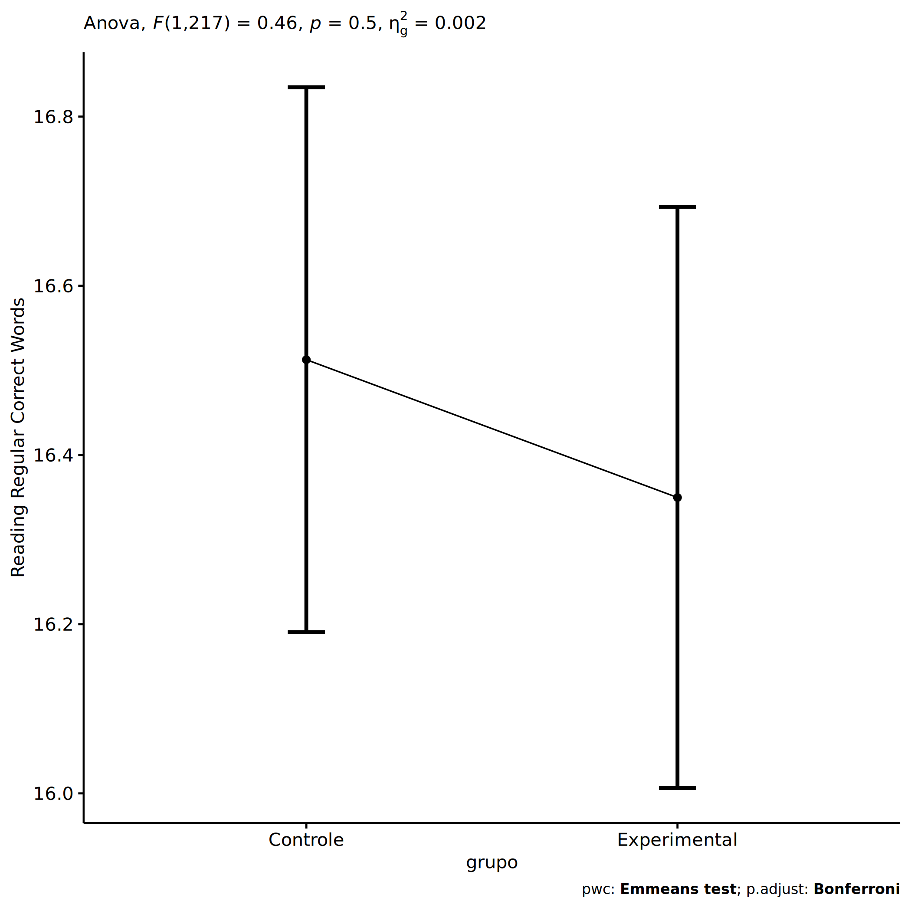
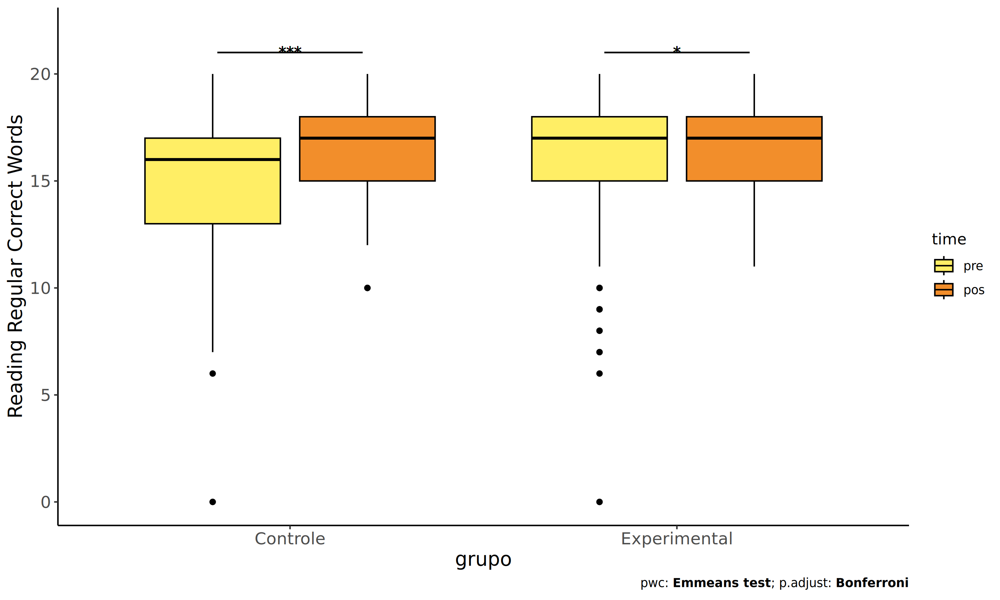
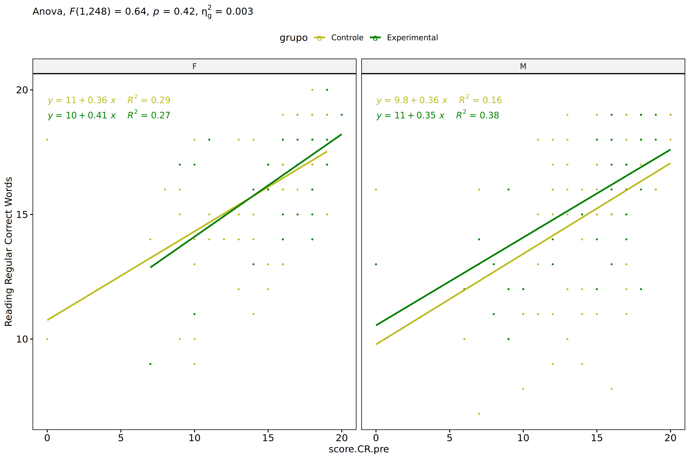
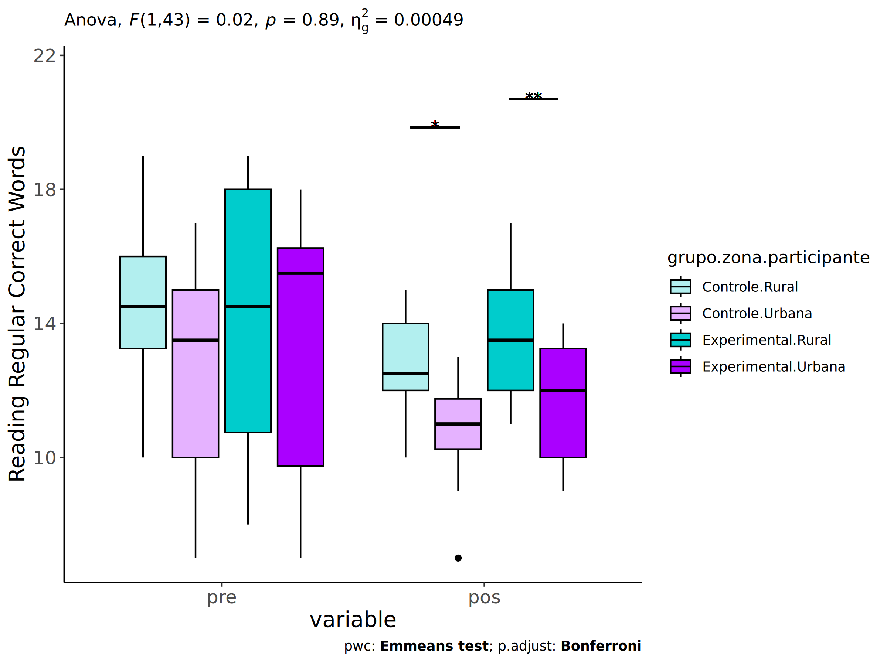
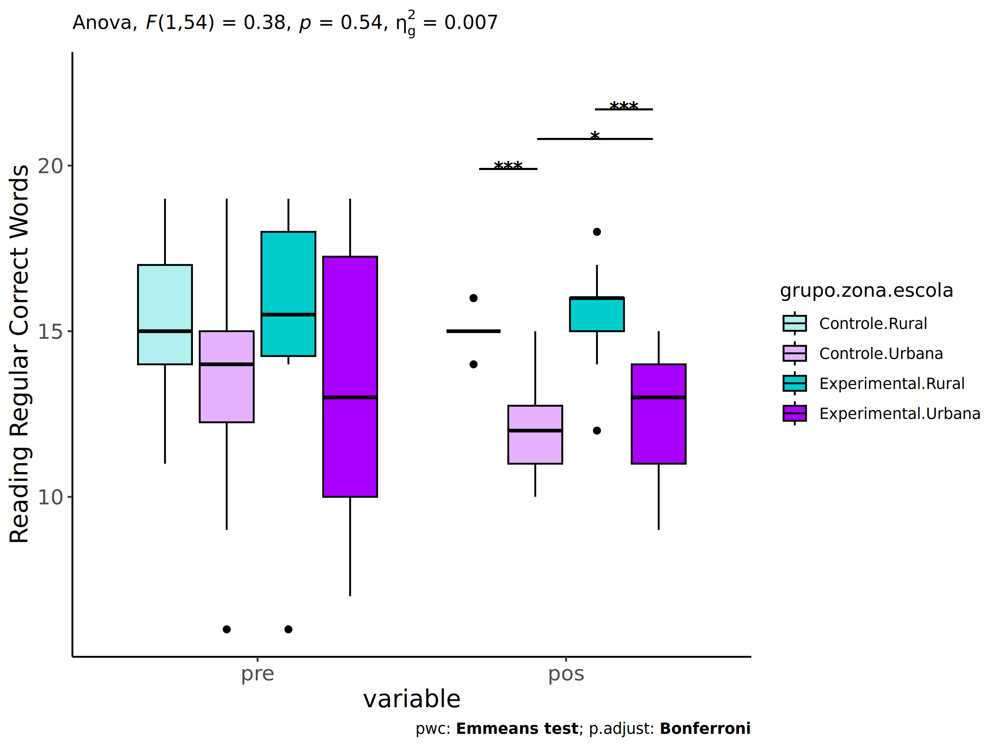
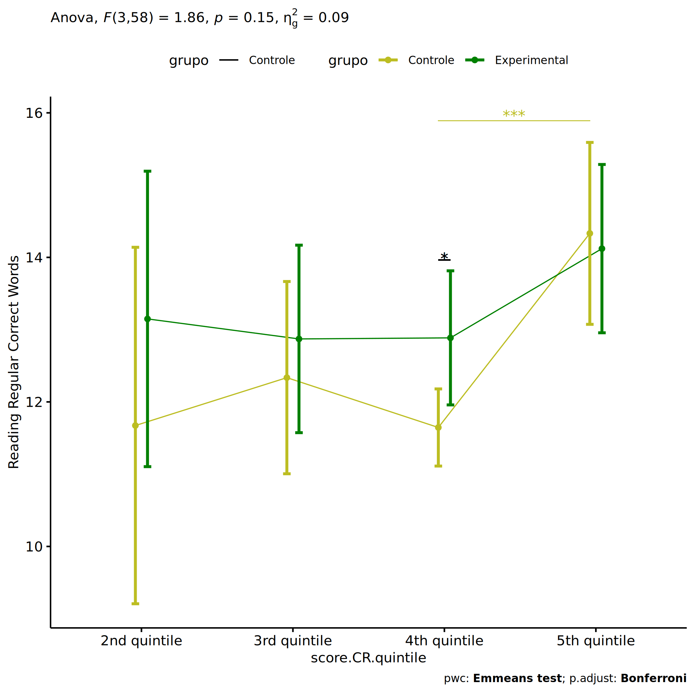
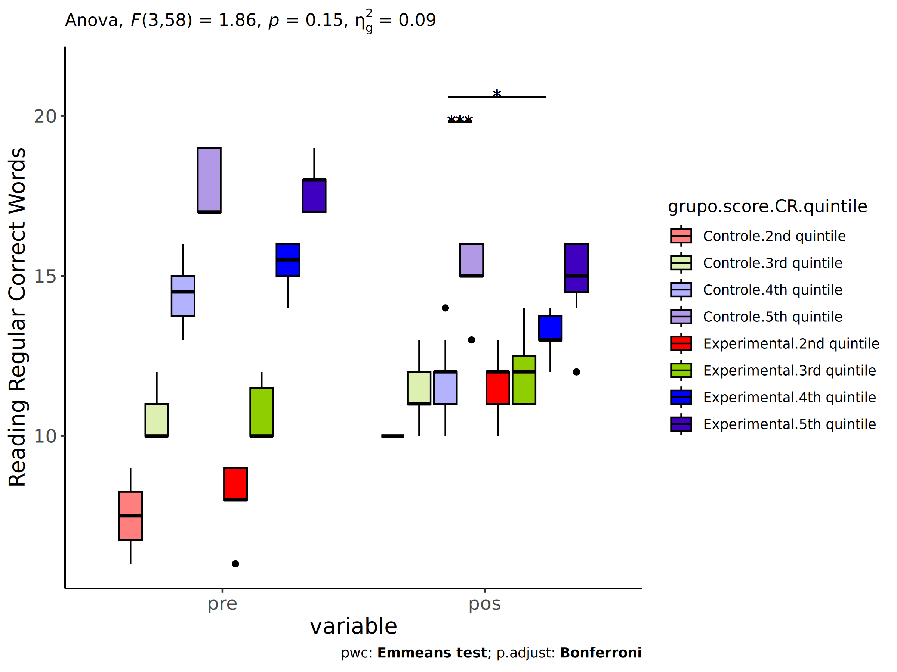

ANCOVA in Reading Regular Correct Words (Reading Regular Correct Words)
================
Geiser C. Challco <geiser@alumni.usp.br>

- [Setting Initial Variables](#setting-initial-variables)
- [Descriptive Statistics of Initial
  Data](#descriptive-statistics-of-initial-data)
- [ANCOVA and Pairwise for one factor:
  **grupo**](#ancova-and-pairwise-for-one-factor-grupo)
  - [Without remove non-normal data](#without-remove-non-normal-data)
  - [Computing ANCOVA and PairWise After removing non-normal data
    (OK)](#computing-ancova-and-pairwise-after-removing-non-normal-data-ok)
    - [Plots for ancova](#plots-for-ancova)
    - [Checking linearity assumption](#checking-linearity-assumption)
    - [Checking normality and
      homogeneity](#checking-normality-and-homogeneity)
- [ANCOVA and Pairwise for two factors
  **grupo:genero**](#ancova-and-pairwise-for-two-factors-grupogenero)
  - [Without remove non-normal data](#without-remove-non-normal-data-1)
  - [Computing ANCOVA and PairWise After removing non-normal data
    (OK)](#computing-ancova-and-pairwise-after-removing-non-normal-data-ok-1)
    - [Plots for ancova](#plots-for-ancova-1)
    - [Checking linearity assumption](#checking-linearity-assumption-1)
    - [Checking normality and
      homogeneity](#checking-normality-and-homogeneity-1)
- [ANCOVA and Pairwise for two factors
  **grupo:zona.participante**](#ancova-and-pairwise-for-two-factors-grupozonaparticipante)
  - [Without remove non-normal data](#without-remove-non-normal-data-2)
  - [Computing ANCOVA and PairWise After removing non-normal data
    (OK)](#computing-ancova-and-pairwise-after-removing-non-normal-data-ok-2)
    - [Plots for ancova](#plots-for-ancova-2)
    - [Checking linearity assumption](#checking-linearity-assumption-2)
    - [Checking normality and
      homogeneity](#checking-normality-and-homogeneity-2)
- [ANCOVA and Pairwise for two factors
  **grupo:zona.escola**](#ancova-and-pairwise-for-two-factors-grupozonaescola)
  - [Without remove non-normal data](#without-remove-non-normal-data-3)
  - [Computing ANCOVA and PairWise After removing non-normal data
    (OK)](#computing-ancova-and-pairwise-after-removing-non-normal-data-ok-3)
    - [Plots for ancova](#plots-for-ancova-3)
    - [Checking linearity assumption](#checking-linearity-assumption-3)
    - [Checking normality and
      homogeneity](#checking-normality-and-homogeneity-3)
- [ANCOVA and Pairwise for two factors
  **grupo:score.CR.quintile**](#ancova-and-pairwise-for-two-factors-gruposcorecrquintile)
  - [Without remove non-normal data](#without-remove-non-normal-data-4)
  - [Computing ANCOVA and PairWise After removing non-normal data
    (OK)](#computing-ancova-and-pairwise-after-removing-non-normal-data-ok-4)
    - [Plots for ancova](#plots-for-ancova-4)
    - [Checking linearity assumption](#checking-linearity-assumption-4)
    - [Checking normality and
      homogeneity](#checking-normality-and-homogeneity-4)
- [Summary of Results](#summary-of-results)
  - [Descriptive Statistics](#descriptive-statistics)
  - [ANCOVA Table Comparison](#ancova-table-comparison)
  - [PairWise Table Comparison](#pairwise-table-comparison)
  - [EMMS Table Comparison](#emms-table-comparison)

**NOTE**:

- Teste ANCOVA para determinar se houve diferenças significativas no
  Reading Regular Correct Words (medido usando pre- e pos-testes).
- ANCOVA test to determine whether there were significant differences in
  Reading Regular Correct Words (measured using pre- and post-tests).

# Setting Initial Variables

``` r
dv = "score.CR"
dv.pos = "score.CR.pos"
dv.pre = "score.CR.pre"

fatores2 <- c("genero","zona.participante","zona.escola","score.CR.quintile")
lfatores2 <- as.list(fatores2)
names(lfatores2) <- fatores2

fatores1 <- c("grupo", fatores2)
lfatores1 <- as.list(fatores1)
names(lfatores1) <- fatores1

lfatores <- c(lfatores1)

color <- list()
color[["prepost"]] = c("#ffee65","#f28e2B")
color[["grupo"]] = c("#bcbd22","#008000")
color[["genero"]] = c("#FF007F","#4D4DFF")
color[["zona.escola"]] = c("#AA00FF","#00CCCC")
color[["zona.participante"]] = c("#AA00FF","#00CCCC")

level <- list()
level[["grupo"]] = c("Controle","Experimental")
level[["genero"]] = c("F","M")
level[["zona.escola"]] = c("Rural","Urbana")
level[["zona.participante"]] = c("Rural","Urbana")

# ..

ymin <- 0
ymax <- 0

ymin.ci <- 0
ymax.ci <- 0


color[["grupo:genero"]] = c(
  "Controle:F"="#ff99cb", "Controle:M"="#b7b7ff",
  "Experimental:F"="#FF007F", "Experimental:M"="#4D4DFF",
  "Controle.F"="#ff99cb", "Controle.M"="#b7b7ff",
  "Experimental.F"="#FF007F", "Experimental.M"="#4D4DFF"
)
color[["grupo:zona.escola"]] = c(
  "Controle:Rural"="#b2efef","Controle:Urbana"="#e5b2ff",
  "Experimental:Rural"="#00CCCC", "Experimental:Urbana"="#AA00FF",
  "Controle.Rural"="#b2efef","Controle.Urbana"="#e5b2ff",
  "Experimental.Rural"="#00CCCC", "Experimental.Urbana"="#AA00FF"
)
color[["grupo:zona.participante"]] = c(
  "Controle:Rural"="#b2efef","Controle:Urbana"="#e5b2ff",
  "Experimental:Rural"="#00CCCC", "Experimental:Urbana"="#AA00FF",
  "Controle.Rural"="#b2efef","Controle.Urbana"="#e5b2ff",
  "Experimental.Rural"="#00CCCC", "Experimental.Urbana"="#AA00FF"
)

for (coln in c(
  "palavras.lidas","score.compreensao","tri.compreensao",
  "score.vocab","tri.vocab",
  "score.vocab.ensinado","tri.vocab.ensinado","score.vocab.nao.ensinado","tri.vocab.nao.ensinado",
  "score.CLPP","tri.CLPP","score.CR","tri.CR",
  "score.CI","tri.CI","score.TV","tri.TV","score.TF","tri.TF","score.TO","tri.TO")) {
  color[[paste0(coln,".quintile")]] = c("#BF0040","#FF0000","#800080","#0000FF","#4000BF")
  level[[paste0(coln,".quintile")]] = c("1st quintile","2nd quintile","3rd quintile","4th quintile","5th quintile")
  color[[paste0("grupo:",coln,".quintile")]] = c(
    "Experimental.1st quintile"="#BF0040", "Controle.1st quintile"="#d8668c",
    "Experimental.2nd quintile"="#FF0000", "Controle.2nd quintile"="#ff7f7f",
    "Experimental.3rd quintile"="#8fce00", "Controle.3rd quintile"="#ddf0b2",
    "Experimental.4th quintile"="#0000FF", "Controle.4th quintile"="#b2b2ff",
    "Experimental.5th quintile"="#4000BF", "Controle.5th quintile"="#b299e5",
    
    "Experimental:1st quintile"="#BF0040", "Controle:1st quintile"="#d8668c",
    "Experimental:2nd quintile"="#FF0000", "Controle:2nd quintile"="#ff7f7f",
    "Experimental:3rd quintile"="#8fce00", "Controle:3rd quintile"="#ddf0b2",
    "Experimental:4th quintile"="#0000FF", "Controle:4th quintile"="#b2b2ff",
    "Experimental:5th quintile"="#4000BF", "Controle:5th quintile"="#b299e5")
}


gdat <- read_excel("../data/data.xlsx", sheet = "leitura.wg.wo.st")


dat <- gdat
dat$grupo <- factor(dat[["grupo"]], level[["grupo"]])
for (coln in c(names(lfatores))) {
  dat[[coln]] <- factor(dat[[coln]], level[[coln]][level[[coln]] %in% unique(dat[[coln]])])
}
dat <- dat[which(!is.na(dat[[dv.pre]]) & !is.na(dat[[dv.pos]])),]
dat <- dat[,c("id",names(lfatores),dv.pre,dv.pos)]

dat.long <- rbind(dat, dat)
dat.long$time <- c(rep("pre", nrow(dat)), rep("pos", nrow(dat)))
dat.long$time <- factor(dat.long$time, c("pre","pos"))
dat.long[[dv]] <- c(dat[[dv.pre]], dat[[dv.pos]])


for (f in c("grupo", names(lfatores))) {
  if (is.null(color[[f]]) && length(unique(dat[[f]])) > 0) 
      color[[f]] <- distinctColorPalette(length(unique(dat[[f]])))
}
for (f in c(fatores2)) {
  if (is.null(color[[paste0("grupo:",f)]]) && length(unique(dat[[f]])) > 0)
    color[[paste0("grupo:",f)]] <- distinctColorPalette(length(unique(dat[["grupo"]]))*length(unique(dat[[f]])))
}

ldat <- list()
laov <- list()
lpwc <- list()
lemms <- list()
```

# Descriptive Statistics of Initial Data

``` r
df <- get.descriptives(dat, c(dv.pre, dv.pos), c("grupo"), 
                       include.global = T, symmetry.test = T, normality.test = F)
df <- plyr::rbind.fill(
  df, do.call(plyr::rbind.fill, lapply(lfatores2, FUN = function(f) {
    if (nrow(dat) > 0 && sum(!is.na(unique(dat[[f]]))) > 1)
      get.descriptives(dat, c(dv.pre,dv.pos), c("grupo", f),
                       symmetry.test = T, normality.test = F)
    }))
)
```

    ## Warning: There was 1 warning in `mutate()`.
    ## ℹ In argument: `ci = abs(stats::qt(alpha/2, .data$n - 1) * .data$se)`.
    ## Caused by warning:
    ## ! There was 1 warning in `mutate()`.
    ## ℹ In argument: `ci = abs(stats::qt(alpha/2, .data$n - 1) * .data$se)`.
    ## Caused by warning in `stats::qt()`:
    ## ! NaNs produced
    ## There was 1 warning in `mutate()`.
    ## ℹ In argument: `ci = abs(stats::qt(alpha/2, .data$n - 1) * .data$se)`.
    ## Caused by warning:
    ## ! There was 1 warning in `mutate()`.
    ## ℹ In argument: `ci = abs(stats::qt(alpha/2, .data$n - 1) * .data$se)`.
    ## Caused by warning in `stats::qt()`:
    ## ! NaNs produced

``` r
df <- df[,c(fatores1[fatores1 %in% colnames(df)],"variable",
            colnames(df)[!colnames(df) %in% c(fatores1,"variable")])]
```

| grupo        | genero | zona.participante | zona.escola | score.CR.quintile | variable     |   n |   mean | median | min | max |    sd |    se |     ci |   iqr | symmetry | skewness | kurtosis |
|:-------------|:-------|:------------------|:------------|:------------------|:-------------|----:|-------:|-------:|----:|----:|------:|------:|-------:|------:|:---------|---------:|---------:|
| Controle     |        |                   |             |                   | score.CR.pre | 176 | 13.949 |   15.0 |   0 |  20 | 4.435 | 0.334 |  0.660 |  5.00 | NO       |   -1.570 |    2.577 |
| Experimental |        |                   |             |                   | score.CR.pre | 135 | 15.119 |   16.0 |   0 |  20 | 4.141 | 0.356 |  0.705 |  4.00 | NO       |   -1.799 |    3.360 |
|              |        |                   |             |                   | score.CR.pre | 311 | 14.457 |   16.0 |   0 |  20 | 4.342 | 0.246 |  0.484 |  4.00 | NO       |   -1.650 |    2.853 |
| Controle     |        |                   |             |                   | score.CR.pos | 176 | 13.131 |   15.0 |   0 |  20 | 5.968 | 0.450 |  0.888 |  6.00 | NO       |   -1.181 |    0.247 |
| Experimental |        |                   |             |                   | score.CR.pos | 135 | 13.837 |   16.0 |   0 |  20 | 5.647 | 0.486 |  0.961 |  6.00 | NO       |   -1.442 |    1.068 |
|              |        |                   |             |                   | score.CR.pos | 311 | 13.437 |   15.0 |   0 |  20 | 5.832 | 0.331 |  0.651 |  7.00 | NO       |   -1.294 |    0.583 |
| Controle     | F      |                   |             |                   | score.CR.pre |  87 | 14.471 |   16.0 |   0 |  19 | 4.350 | 0.466 |  0.927 |  4.50 | NO       |   -1.719 |    3.144 |
| Controle     | M      |                   |             |                   | score.CR.pre |  89 | 13.438 |   15.0 |   0 |  20 | 4.482 | 0.475 |  0.944 |  4.00 | NO       |   -1.452 |    2.148 |
| Experimental | F      |                   |             |                   | score.CR.pre |  59 | 16.068 |   17.0 |   0 |  20 | 3.413 | 0.444 |  0.890 |  3.00 | NO       |   -2.335 |    7.063 |
| Experimental | M      |                   |             |                   | score.CR.pre |  75 | 14.333 |   16.0 |   0 |  20 | 4.524 | 0.522 |  1.041 |  5.50 | NO       |   -1.463 |    1.820 |
| Experimental |        |                   |             |                   | score.CR.pre |   1 | 18.000 |   18.0 |  18 |  18 |       |       |        |  0.00 | few data |    0.000 |    0.000 |
| Controle     | F      |                   |             |                   | score.CR.pos |  87 | 14.184 |   16.0 |   0 |  20 | 5.290 | 0.567 |  1.128 |  5.00 | NO       |   -1.540 |    1.624 |
| Controle     | M      |                   |             |                   | score.CR.pos |  89 | 12.101 |   15.0 |   0 |  19 | 6.428 | 0.681 |  1.354 |  8.00 | NO       |   -0.878 |   -0.573 |
| Experimental | F      |                   |             |                   | score.CR.pos |  59 | 14.746 |   17.0 |   0 |  20 | 5.463 | 0.711 |  1.424 |  4.00 | NO       |   -1.752 |    2.022 |
| Experimental | M      |                   |             |                   | score.CR.pos |  75 | 13.307 |   15.0 |   0 |  19 | 5.551 | 0.641 |  1.277 |  6.00 | NO       |   -1.299 |    0.807 |
| Experimental |        |                   |             |                   | score.CR.pos |   1 |  0.000 |    0.0 |   0 |   0 |       |       |        |  0.00 | few data |    0.000 |    0.000 |
| Controle     |        | Rural             |             |                   | score.CR.pre |  56 | 14.000 |   15.0 |   0 |  20 | 4.125 | 0.551 |  1.105 |  5.00 | NO       |   -1.399 |    2.430 |
| Controle     |        | Urbana            |             |                   | score.CR.pre |  77 | 13.948 |   15.0 |   0 |  20 | 4.724 | 0.538 |  1.072 |  5.00 | NO       |   -1.603 |    2.349 |
| Controle     |        |                   |             |                   | score.CR.pre |  43 | 13.884 |   15.0 |   0 |  19 | 4.393 | 0.670 |  1.352 |  4.00 | NO       |   -1.529 |    2.393 |
| Experimental |        | Rural             |             |                   | score.CR.pre |  52 | 15.231 |   16.0 |   6 |  20 | 3.473 | 0.482 |  0.967 |  4.00 | NO       |   -0.956 |    0.037 |
| Experimental |        | Urbana            |             |                   | score.CR.pre |  49 | 14.265 |   17.0 |   0 |  19 | 5.484 | 0.783 |  1.575 |  6.00 | NO       |   -1.457 |    1.090 |
| Experimental |        |                   |             |                   | score.CR.pre |  34 | 16.176 |   16.5 |  10 |  19 | 2.236 | 0.383 |  0.780 |  3.00 | NO       |   -1.146 |    0.954 |
| Controle     |        | Rural             |             |                   | score.CR.pos |  56 | 14.161 |   15.0 |   0 |  20 | 4.600 | 0.615 |  1.232 |  5.25 | NO       |   -1.543 |    2.327 |
| Controle     |        | Urbana            |             |                   | score.CR.pos |  77 | 12.935 |   16.0 |   0 |  20 | 6.319 | 0.720 |  1.434 |  6.00 | NO       |   -1.074 |   -0.187 |
| Controle     |        |                   |             |                   | score.CR.pos |  43 | 12.140 |   15.0 |   0 |  20 | 6.781 | 1.034 |  2.087 |  7.50 | NO       |   -0.822 |   -0.785 |
| Experimental |        | Rural             |             |                   | score.CR.pos |  52 | 15.288 |   16.0 |   7 |  19 | 3.327 | 0.461 |  0.926 |  6.00 | NO       |   -0.705 |   -0.670 |
| Experimental |        | Urbana            |             |                   | score.CR.pos |  49 | 13.245 |   15.0 |   0 |  19 | 5.988 | 0.855 |  1.720 |  5.00 | NO       |   -1.251 |    0.318 |
| Experimental |        |                   |             |                   | score.CR.pos |  34 | 12.471 |   15.5 |   0 |  20 | 7.378 | 1.265 |  2.574 |  8.75 | NO       |   -0.925 |   -0.908 |
| Controle     |        |                   | Rural       |                   | score.CR.pre |  58 | 13.759 |   15.0 |   0 |  20 | 4.758 | 0.625 |  1.251 |  6.00 | NO       |   -1.252 |    1.212 |
| Controle     |        |                   | Urbana      |                   | score.CR.pre | 118 | 14.042 |   15.0 |   0 |  20 | 4.286 | 0.395 |  0.781 |  4.00 | NO       |   -1.738 |    3.390 |
| Experimental |        |                   | Rural       |                   | score.CR.pre |  40 | 15.300 |   16.0 |   0 |  20 | 4.134 | 0.654 |  1.322 |  3.25 | NO       |   -1.805 |    3.290 |
| Experimental |        |                   | Urbana      |                   | score.CR.pre |  95 | 15.042 |   16.0 |   0 |  20 | 4.164 | 0.427 |  0.848 |  4.00 | NO       |   -1.769 |    3.264 |
| Controle     |        |                   | Rural       |                   | score.CR.pos |  58 | 14.293 |   16.0 |   0 |  20 | 5.560 | 0.730 |  1.462 |  4.75 | NO       |   -1.509 |    1.253 |
| Controle     |        |                   | Urbana      |                   | score.CR.pos | 118 | 12.559 |   15.0 |   0 |  20 | 6.101 | 0.562 |  1.112 |  7.00 | NO       |   -1.042 |   -0.109 |
| Experimental |        |                   | Rural       |                   | score.CR.pos |  40 | 15.650 |   16.0 |   0 |  20 | 3.759 | 0.594 |  1.202 |  3.25 | NO       |   -2.012 |    5.379 |
| Experimental |        |                   | Urbana      |                   | score.CR.pos |  95 | 13.074 |   15.0 |   0 |  19 | 6.132 | 0.629 |  1.249 |  7.00 | NO       |   -1.181 |    0.125 |
| Controle     |        |                   |             | 1st quintile      | score.CR.pre |   9 |  0.000 |    0.0 |   0 |   0 | 0.000 | 0.000 |  0.000 |  0.00 | few data |    0.000 |    0.000 |
| Controle     |        |                   |             | 2nd quintile      | score.CR.pre |  11 |  7.727 |    8.0 |   6 |   9 | 1.009 | 0.304 |  0.678 |  1.50 | YES      |   -0.039 |   -1.430 |
| Controle     |        |                   |             | 3rd quintile      | score.CR.pre |  26 | 11.000 |   11.0 |  10 |  12 | 0.849 | 0.166 |  0.343 |  2.00 | few data |    0.000 |    0.000 |
| Controle     |        |                   |             | 4th quintile      | score.CR.pre |  75 | 14.680 |   15.0 |  13 |  16 | 1.080 | 0.125 |  0.248 |  2.00 | YES      |   -0.240 |   -1.244 |
| Controle     |        |                   |             | 5th quintile      | score.CR.pre |  55 | 17.873 |   18.0 |  17 |  20 | 0.840 | 0.113 |  0.227 |  1.00 | NO       |    0.603 |   -0.470 |
| Experimental |        |                   |             | 1st quintile      | score.CR.pre |   4 |  0.000 |    0.0 |   0 |   0 | 0.000 | 0.000 |  0.000 |  0.00 | few data |    0.000 |    0.000 |
| Experimental |        |                   |             | 2nd quintile      | score.CR.pre |  11 |  8.000 |    8.0 |   6 |   9 | 1.095 | 0.330 |  0.736 |  2.00 | YES      |   -0.415 |   -1.485 |
| Experimental |        |                   |             | 3rd quintile      | score.CR.pre |  11 | 10.727 |   10.0 |  10 |  12 | 0.905 | 0.273 |  0.608 |  1.50 | few data |    0.000 |    0.000 |
| Experimental |        |                   |             | 4th quintile      | score.CR.pre |  43 | 15.163 |   15.0 |  13 |  16 | 0.843 | 0.129 |  0.259 |  1.00 | NO       |   -0.534 |   -0.829 |
| Experimental |        |                   |             | 5th quintile      | score.CR.pre |  66 | 17.924 |   18.0 |  17 |  20 | 0.829 | 0.102 |  0.204 |  1.00 | YES      |    0.457 |   -0.664 |
| Controle     |        |                   |             | 1st quintile      | score.CR.pos |   9 |  9.333 |   10.0 |   0 |  18 | 8.367 | 2.789 |  6.431 | 18.00 | YES      |   -0.065 |   -2.037 |
| Controle     |        |                   |             | 2nd quintile      | score.CR.pos |  11 | 10.636 |   13.0 |   0 |  16 | 6.021 | 1.815 |  4.045 |  7.00 | NO       |   -0.774 |   -1.010 |
| Controle     |        |                   |             | 3rd quintile      | score.CR.pos |  26 | 12.500 |   13.5 |   0 |  18 | 4.420 | 0.867 |  1.785 |  4.75 | NO       |   -0.835 |    0.390 |
| Controle     |        |                   |             | 4th quintile      | score.CR.pos |  75 | 12.627 |   15.0 |   0 |  19 | 5.579 | 0.644 |  1.284 |  5.50 | NO       |   -1.222 |    0.439 |
| Controle     |        |                   |             | 5th quintile      | score.CR.pos |  55 | 15.236 |   17.0 |   0 |  20 | 6.158 | 0.830 |  1.665 |  3.50 | NO       |   -1.828 |    1.842 |
| Experimental |        |                   |             | 1st quintile      | score.CR.pos |   4 |  7.250 |    6.5 |   0 |  16 | 8.461 | 4.230 | 13.463 | 13.75 | few data |    0.000 |    0.000 |
| Experimental |        |                   |             | 2nd quintile      | score.CR.pos |  11 | 12.273 |   12.0 |   7 |  17 | 2.970 | 0.895 |  1.995 |  3.50 | YES      |   -0.095 |   -1.097 |
| Experimental |        |                   |             | 3rd quintile      | score.CR.pos |  11 | 12.273 |   12.0 |   0 |  18 | 4.777 | 1.440 |  3.209 |  4.00 | NO       |   -1.254 |    1.273 |
| Experimental |        |                   |             | 4th quintile      | score.CR.pos |  43 | 13.163 |   15.0 |   0 |  19 | 5.446 | 0.831 |  1.676 |  6.00 | NO       |   -1.341 |    0.693 |
| Experimental |        |                   |             | 5th quintile      | score.CR.pos |  66 | 15.197 |   17.0 |   0 |  20 | 5.720 | 0.704 |  1.406 |  4.00 | NO       |   -1.915 |    2.394 |

# ANCOVA and Pairwise for one factor: **grupo**

## Without remove non-normal data

``` r
pdat = remove_group_data(dat[!is.na(dat[["grupo"]]),], "score.CR.pos", "grupo")

pdat.long <- rbind(pdat[,c("id","grupo")], pdat[,c("id","grupo")])
pdat.long[["time"]] <- c(rep("pre", nrow(pdat)), rep("pos", nrow(pdat)))
pdat.long[["time"]] <- factor(pdat.long[["time"]], c("pre","pos"))
pdat.long[["score.CR"]] <- c(pdat[["score.CR.pre"]], pdat[["score.CR.pos"]])

aov = anova_test(pdat, score.CR.pos ~ score.CR.pre + grupo)
laov[["grupo"]] <- get_anova_table(aov)
```

``` r
pwc <- emmeans_test(pdat, score.CR.pos ~ grupo, covariate = score.CR.pre,
                    p.adjust.method = "bonferroni")
```

``` r
pwc.long <- emmeans_test(dplyr::group_by_at(pdat.long, "grupo"),
                          score.CR ~ time,
                          p.adjust.method = "bonferroni")
lpwc[["grupo"]] <- plyr::rbind.fill(pwc, pwc.long)
```

``` r
ds <- get.descriptives(pdat, "score.CR.pos", "grupo", covar = "score.CR.pre")
ds <- merge(ds[ds$variable != "score.CR.pre",],
            ds[ds$variable == "score.CR.pre", !colnames(ds) %in% c("variable")],
            by = "grupo", all.x = T, suffixes = c("", ".score.CR.pre"))
ds <- merge(get_emmeans(pwc), ds, by = "grupo", suffixes = c(".emms", ""))
ds <- ds[,c("grupo","n","mean.score.CR.pre","se.score.CR.pre","mean","se",
            "emmean","se.emms","conf.low","conf.high")]

colnames(ds) <- c("grupo", "N", paste0(c("M","SE")," (pre)"),
                  paste0(c("M","SE"), " (unadj)"),
                  paste0(c("M", "SE"), " (adj)"), "conf.low", "conf.high")

lemms[["grupo"]] <- ds
```

## Computing ANCOVA and PairWise After removing non-normal data (OK)

``` r
wdat = pdat 

res = residuals(lm(score.CR.pos ~ score.CR.pre + grupo, data = wdat))
non.normal = getNonNormal(res, wdat$id, plimit = 0.05)

wdat = wdat[!wdat$id %in% non.normal,]

wdat.long <- rbind(wdat[,c("id","grupo")], wdat[,c("id","grupo")])
wdat.long[["time"]] <- c(rep("pre", nrow(wdat)), rep("pos", nrow(wdat)))
wdat.long[["time"]] <- factor(wdat.long[["time"]], c("pre","pos"))
wdat.long[["score.CR"]] <- c(wdat[["score.CR.pre"]], wdat[["score.CR.pos"]])

ldat[["grupo"]] = wdat

(non.normal)
```

    ##  [1] "P59"  "P231" "P190" "P202" "P169" "P46"  "P103" "P232" "P294" "P195" "P179" "P356" "P80" 
    ## [14] "P117" "P17"  "P87"  "P20"  "P312" "P106" "P79"  "P83"  "P242" "P198" "P94"  "P12"  "P282"
    ## [27] "P5"   "P314" "P305" "P68"  "P128" "P300" "P226" "P214" "P35"  "P75"  "P119" "P286" "P330"
    ## [40] "P186" "P229" "P307" "P364" "P281" "P22"  "P370" "P274" "P16"  "P121" "P308" "P118" "P131"
    ## [53] "P173" "P216" "P127" "P205" "P283" "P289" "P332" "P84"  "P167" "P146" "P297" "P306" "P15" 
    ## [66] "P165" "P291" "P66"  "P293" "P365" "P288" "P151" "P89"  "P150" "P136" "P44"  "P174" "P320"
    ## [79] "P298" "P213" "P362" "P296" "P126" "P207" "P358" "P98"  "P137" "P116" "P135" "P110" "P328"

``` r
aov = anova_test(wdat, score.CR.pos ~ score.CR.pre + grupo)
laov[["grupo"]] <- merge(get_anova_table(aov), laov[["grupo"]],
                            by="Effect", suffixes = c("","'"))

(df = get_anova_table(aov))
```

    ## ANOVA Table (type II tests)
    ## 
    ##         Effect DFn DFd      F        p p<.05   ges
    ## 1 score.CR.pre   1 217 98.022 2.62e-19     * 0.311
    ## 2        grupo   1 217  0.463 4.97e-01       0.002

| Effect       | DFn | DFd |      F |     p | p\<.05 |   ges |
|:-------------|----:|----:|-------:|------:|:-------|------:|
| score.CR.pre |   1 | 217 | 98.022 | 0.000 | \*     | 0.311 |
| grupo        |   1 | 217 |  0.463 | 0.497 |        | 0.002 |

``` r
pwc <- emmeans_test(wdat, score.CR.pos ~ grupo, covariate = score.CR.pre,
                    p.adjust.method = "bonferroni")
```

| term                | .y.          | group1   | group2       |  df | statistic |     p | p.adj | p.adj.signif |
|:--------------------|:-------------|:---------|:-------------|----:|----------:|------:|------:|:-------------|
| score.CR.pre\*grupo | score.CR.pos | Controle | Experimental | 217 |      0.68 | 0.497 | 0.497 | ns           |

``` r
pwc.long <- emmeans_test(dplyr::group_by_at(wdat.long, "grupo"),
                         score.CR ~ time,
                         p.adjust.method = "bonferroni")
lpwc[["grupo"]] <- merge(plyr::rbind.fill(pwc, pwc.long), lpwc[["grupo"]],
                            by=c("grupo","term",".y.","group1","group2"),
                            suffixes = c("","'"))
```

| grupo        | term | .y.      | group1 | group2 |  df | statistic |     p | p.adj | p.adj.signif |
|:-------------|:-----|:---------|:-------|:-------|----:|----------:|------:|------:|:-------------|
| Controle     | time | score.CR | pre    | pos    | 436 |    -3.979 | 0.000 | 0.000 | \*\*\*\*     |
| Experimental | time | score.CR | pre    | pos    | 436 |    -2.144 | 0.033 | 0.033 | \*           |

``` r
ds <- get.descriptives(wdat, "score.CR.pos", "grupo", covar = "score.CR.pre")
ds <- merge(ds[ds$variable != "score.CR.pre",],
            ds[ds$variable == "score.CR.pre", !colnames(ds) %in% c("variable")],
            by = "grupo", all.x = T, suffixes = c("", ".score.CR.pre"))
ds <- merge(get_emmeans(pwc), ds, by = "grupo", suffixes = c(".emms", ""))
ds <- ds[,c("grupo","n","mean.score.CR.pre","se.score.CR.pre","mean","se",
            "emmean","se.emms","conf.low","conf.high")]

colnames(ds) <- c("grupo", "N", paste0(c("M","SE")," (pre)"),
                  paste0(c("M","SE"), " (unadj)"),
                  paste0(c("M", "SE"), " (adj)"), "conf.low", "conf.high")

lemms[["grupo"]] <- merge(ds, lemms[["grupo"]], by=c("grupo"), suffixes = c("","'"))
```

| grupo        |   N | M (pre) | SE (pre) | M (unadj) | SE (unadj) | M (adj) | SE (adj) | conf.low | conf.high |
|:-------------|----:|--------:|---------:|----------:|-----------:|--------:|---------:|---------:|----------:|
| Controle     | 117 |  14.829 |    0.334 |    16.402 |      0.198 |  16.513 |    0.163 |   16.191 |    16.835 |
| Experimental | 103 |  15.573 |    0.376 |    16.476 |      0.207 |  16.350 |    0.174 |   16.006 |    16.693 |

### Plots for ancova

``` r
plots <- oneWayAncovaPlots(
  wdat, "score.CR.pos", "grupo", aov, list("grupo"=pwc), addParam = c("mean_ci"),
  font.label.size=10, step.increase=0.05, p.label="p.adj",
  subtitle = which(aov$Effect == "grupo"))
```

``` r
if (!is.null(nrow(plots[["grupo"]]$data)))
  plots[["grupo"]] + ggplot2::ylab("Reading Regular Correct Words") + 
  if (ymin.ci < ymax.ci) ggplot2::ylim(ymin.ci, ymax.ci)
```

<!-- -->

``` r
plots <- oneWayAncovaBoxPlots(
  wdat, "score.CR.pos", "grupo", aov, pwc, covar = "score.CR.pre",
  theme = "classic", color = color[["grupo"]],
  subtitle = which(aov$Effect == "grupo"))
```

``` r
if (length(unique(wdat[["grupo"]])) > 1)
  plots[["grupo"]] + ggplot2::ylab("Reading Regular Correct Words") +
  ggplot2::scale_x_discrete(labels=c('pre', 'pos')) +
  if (ymin < ymax) ggplot2::ylim(ymin, ymax)
```

<!-- -->

``` r
if (length(unique(wdat.long[["grupo"]])) > 1)
  plots <- oneWayAncovaBoxPlots(
    wdat.long, "score.CR", "grupo", aov, pwc.long,
    pre.post = "time", theme = "classic", color = color$prepost)
```

``` r
if (length(unique(wdat.long[["grupo"]])) > 1)
  plots[["grupo"]] + ggplot2::ylab("Reading Regular Correct Words") +
  if (ymin < ymax) ggplot2::ylim(ymin, ymax) 
```

<!-- -->

### Checking linearity assumption

``` r
ggscatter(wdat, x = "score.CR.pre", y = "score.CR.pos", size = 0.5,
          color = "grupo", add = "reg.line")+
  stat_regline_equation(
    aes(label =  paste(..eq.label.., ..rr.label.., sep = "~~~~"), color = grupo)
  ) +
  ggplot2::labs(subtitle = rstatix::get_test_label(aov, detailed = T, row = which(aov$Effect == "grupo"))) +
  ggplot2::scale_color_manual(values = color[["grupo"]]) +
  ggplot2::ylab("Reading Regular Correct Words")  +
  if (ymin < ymax) ggplot2::ylim(ymin, ymax)
```

<!-- -->

### Checking normality and homogeneity

``` r
res <- augment(lm(score.CR.pos ~ score.CR.pre + grupo, data = wdat))
```

``` r
shapiro_test(res$.resid)
```

    ## # A tibble: 1 × 3
    ##   variable   statistic p.value
    ##   <chr>          <dbl>   <dbl>
    ## 1 res$.resid     0.984  0.0159

``` r
levene_test(res, .resid ~ grupo)
```

    ## # A tibble: 1 × 4
    ##     df1   df2 statistic     p
    ##   <int> <int>     <dbl> <dbl>
    ## 1     1   218   0.00265 0.959

# ANCOVA and Pairwise for two factors **grupo:genero**

## Without remove non-normal data

``` r
pdat = remove_group_data(dat[!is.na(dat[["grupo"]]) & !is.na(dat[["genero"]]),],
                         "score.CR.pos", c("grupo","genero"))
pdat = pdat[pdat[["genero"]] %in% do.call(
  intersect, lapply(unique(pdat[["grupo"]]), FUN = function(x) {
    unique(pdat[["genero"]][which(pdat[["grupo"]] == x)])
  })),]
pdat[["grupo"]] = factor(pdat[["grupo"]], level[["grupo"]])
pdat[["genero"]] = factor(
  pdat[["genero"]],
  level[["genero"]][level[["genero"]] %in% unique(pdat[["genero"]])])

pdat.long <- rbind(pdat[,c("id","grupo","genero")], pdat[,c("id","grupo","genero")])
pdat.long[["time"]] <- c(rep("pre", nrow(pdat)), rep("pos", nrow(pdat)))
pdat.long[["time"]] <- factor(pdat.long[["time"]], c("pre","pos"))
pdat.long[["score.CR"]] <- c(pdat[["score.CR.pre"]], pdat[["score.CR.pos"]])

if (length(unique(pdat[["genero"]])) >= 2) {
  aov = anova_test(pdat, score.CR.pos ~ score.CR.pre + grupo*genero)
  laov[["grupo:genero"]] <- get_anova_table(aov)
}
```

``` r
if (length(unique(pdat[["genero"]])) >= 2) {
  pwcs <- list()
  pwcs[["genero"]] <- emmeans_test(
    group_by(pdat, grupo), score.CR.pos ~ genero,
    covariate = score.CR.pre, p.adjust.method = "bonferroni")
  pwcs[["grupo"]] <- emmeans_test(
    group_by(pdat, genero), score.CR.pos ~ grupo,
    covariate = score.CR.pre, p.adjust.method = "bonferroni")
  
  pwc <- plyr::rbind.fill(pwcs[["grupo"]], pwcs[["genero"]])
  pwc <- pwc[,c("grupo","genero", colnames(pwc)[!colnames(pwc) %in% c("grupo","genero")])]
}
```

``` r
if (length(unique(pdat[["genero"]])) >= 2) {
  pwc.long <- emmeans_test(dplyr::group_by_at(pdat.long, c("grupo","genero")),
                           score.CR ~ time,
                           p.adjust.method = "bonferroni")
  lpwc[["grupo:genero"]] <- plyr::rbind.fill(pwc, pwc.long)
}
```

``` r
if (length(unique(pdat[["genero"]])) >= 2) {
  ds <- get.descriptives(pdat, "score.CR.pos", c("grupo","genero"), covar = "score.CR.pre")
  ds <- merge(ds[ds$variable != "score.CR.pre",],
              ds[ds$variable == "score.CR.pre", !colnames(ds) %in% c("variable")],
              by = c("grupo","genero"), all.x = T, suffixes = c("", ".score.CR.pre"))
  ds <- merge(get_emmeans(pwcs[["grupo"]]), ds,
              by = c("grupo","genero"), suffixes = c(".emms", ""))
  ds <- ds[,c("grupo","genero","n","mean.score.CR.pre","se.score.CR.pre","mean","se",
              "emmean","se.emms","conf.low","conf.high")]
  
  colnames(ds) <- c("grupo","genero", "N", paste0(c("M","SE")," (pre)"),
                    paste0(c("M","SE"), " (unadj)"),
                    paste0(c("M", "SE"), " (adj)"), "conf.low", "conf.high")
  
  lemms[["grupo:genero"]] <- ds
}
```

## Computing ANCOVA and PairWise After removing non-normal data (OK)

``` r
if (length(unique(pdat[["genero"]])) >= 2) {
  wdat = pdat 
  
  res = residuals(lm(score.CR.pos ~ score.CR.pre + grupo*genero, data = wdat))
  non.normal = getNonNormal(res, wdat$id, plimit = 0.05)
  
  wdat = wdat[!wdat$id %in% non.normal,]
  
  wdat.long <- rbind(wdat[,c("id","grupo","genero")], wdat[,c("id","grupo","genero")])
  wdat.long[["time"]] <- c(rep("pre", nrow(wdat)), rep("pos", nrow(wdat)))
  wdat.long[["time"]] <- factor(wdat.long[["time"]], c("pre","pos"))
  wdat.long[["score.CR"]] <- c(wdat[["score.CR.pre"]], wdat[["score.CR.pos"]])
  
  
  ldat[["grupo:genero"]] = wdat
  
  (non.normal)
}
```

    ##  [1] "P356" "P312" "P195" "P17"  "P242" "P231" "P169" "P198" "P232" "P83"  "P79"  "P94"  "P117"
    ## [14] "P59"  "P294" "P46"  "P202" "P106" "P190" "P87"  "P5"   "P80"  "P12"  "P282" "P179" "P314"
    ## [27] "P103" "P305" "P300" "P128" "P68"  "P226" "P35"  "P364" "P307" "P119" "P286" "P214" "P308"
    ## [40] "P288" "P281" "P186" "P75"  "P121" "P22"  "P118" "P16"  "P216" "P306" "P330" "P274" "P332"
    ## [53] "P15"  "P146" "P205" "P289" "P370"

``` r
if (length(unique(pdat[["genero"]])) >= 2) {
  aov = anova_test(wdat, score.CR.pos ~ score.CR.pre + grupo*genero)
  laov[["grupo:genero"]] <- merge(get_anova_table(aov), laov[["grupo:genero"]],
                                         by="Effect", suffixes = c("","'"))
  df = get_anova_table(aov)
}
```

| Effect       | DFn | DFd |      F |     p | p\<.05 |   ges |
|:-------------|----:|----:|-------:|------:|:-------|------:|
| score.CR.pre |   1 | 248 | 84.526 | 0.000 | \*     | 0.254 |
| grupo        |   1 | 248 |  1.573 | 0.211 |        | 0.006 |
| genero       |   1 | 248 |  4.850 | 0.029 | \*     | 0.019 |
| grupo:genero |   1 | 248 |  0.638 | 0.425 |        | 0.003 |

``` r
if (length(unique(pdat[["genero"]])) >= 2) {
  pwcs <- list()
  pwcs[["genero"]] <- emmeans_test(
    group_by(wdat, grupo), score.CR.pos ~ genero,
    covariate = score.CR.pre, p.adjust.method = "bonferroni")
  pwcs[["grupo"]] <- emmeans_test(
    group_by(wdat, genero), score.CR.pos ~ grupo,
    covariate = score.CR.pre, p.adjust.method = "bonferroni")
  
  pwc <- plyr::rbind.fill(pwcs[["grupo"]], pwcs[["genero"]])
  pwc <- pwc[,c("grupo","genero", colnames(pwc)[!colnames(pwc) %in% c("grupo","genero")])]
}
```

| grupo        | genero | term                 | .y.          | group1   | group2       |  df | statistic |     p | p.adj | p.adj.signif |
|:-------------|:-------|:---------------------|:-------------|:---------|:-------------|----:|----------:|------:|------:|:-------------|
|              | F      | score.CR.pre\*grupo  | score.CR.pos | Controle | Experimental | 248 |    -0.294 | 0.769 | 0.769 | ns           |
|              | M      | score.CR.pre\*grupo  | score.CR.pos | Controle | Experimental | 248 |    -1.459 | 0.146 | 0.146 | ns           |
| Controle     |        | score.CR.pre\*genero | score.CR.pos | F        | M            | 248 |     2.194 | 0.029 | 0.029 | \*           |
| Experimental |        | score.CR.pre\*genero | score.CR.pos | F        | M            | 248 |     0.843 | 0.400 | 0.400 | ns           |

``` r
if (length(unique(pdat[["genero"]])) >= 2) {
  pwc.long <- emmeans_test(dplyr::group_by_at(wdat.long, c("grupo","genero")),
                           score.CR ~ time,
                           p.adjust.method = "bonferroni")
  lpwc[["grupo:genero"]] <- merge(plyr::rbind.fill(pwc, pwc.long),
                                         lpwc[["grupo:genero"]],
                                         by=c("grupo","genero","term",".y.","group1","group2"),
                                         suffixes = c("","'"))
}
```

| grupo        | genero | term | .y.      | group1 | group2 |  df | statistic |     p | p.adj | p.adj.signif |
|:-------------|:-------|:-----|:---------|:-------|:-------|----:|----------:|------:|------:|:-------------|
| Controle     | F      | time | score.CR | pre    | pos    | 498 |    -2.483 | 0.013 | 0.013 | \*           |
| Controle     | M      | time | score.CR | pre    | pos    | 498 |    -1.486 | 0.138 | 0.138 | ns           |
| Experimental | F      | time | score.CR | pre    | pos    | 498 |    -0.517 | 0.605 | 0.605 | ns           |
| Experimental | M      | time | score.CR | pre    | pos    | 498 |    -2.082 | 0.038 | 0.038 | \*           |

``` r
if (length(unique(pdat[["genero"]])) >= 2) {
  ds <- get.descriptives(wdat, "score.CR.pos", c("grupo","genero"), covar = "score.CR.pre")
  ds <- merge(ds[ds$variable != "score.CR.pre",],
              ds[ds$variable == "score.CR.pre", !colnames(ds) %in% c("variable")],
              by = c("grupo","genero"), all.x = T, suffixes = c("", ".score.CR.pre"))
  ds <- merge(get_emmeans(pwcs[["grupo"]]), ds,
              by = c("grupo","genero"), suffixes = c(".emms", ""))
  ds <- ds[,c("grupo","genero","n","mean.score.CR.pre","se.score.CR.pre",
              "mean","se","emmean","se.emms","conf.low","conf.high")]
  
  colnames(ds) <- c("grupo","genero", "N", paste0(c("M","SE")," (pre)"),
                    paste0(c("M","SE"), " (unadj)"),
                    paste0(c("M", "SE"), " (adj)"), "conf.low", "conf.high")
  
  lemms[["grupo:genero"]] <- merge(ds, lemms[["grupo:genero"]],
                                          by=c("grupo","genero"), suffixes = c("","'"))
}
```

| grupo        | genero |   N | M (pre) | SE (pre) | M (unadj) | SE (unadj) | M (adj) | SE (adj) | conf.low | conf.high |
|:-------------|:-------|----:|--------:|---------:|----------:|-----------:|--------:|---------:|---------:|----------:|
| Controle     | F      |  75 |  14.640 |    0.450 |    15.973 |      0.299 |  16.019 |    0.272 |   15.485 |    16.554 |
| Controle     | M      |  68 |  14.059 |    0.433 |    14.897 |      0.398 |  15.154 |    0.286 |   14.590 |    15.718 |
| Experimental | F      |  50 |  16.400 |    0.395 |    16.740 |      0.311 |  16.147 |    0.339 |   15.480 |    16.814 |
| Experimental | M      |  60 |  14.367 |    0.579 |    15.617 |      0.329 |  15.762 |    0.304 |   15.163 |    16.361 |

### Plots for ancova

``` r
if (length(unique(pdat[["genero"]])) >= 2) {
  ggPlotAoC2(pwcs, "grupo", "genero", aov, ylab = "Reading Regular Correct Words",
             subtitle = which(aov$Effect == "grupo:genero"), addParam = "errorbar") +
    ggplot2::scale_color_manual(values = color[["genero"]]) +
    ggplot2::ylab("Reading Regular Correct Words") +
    if (ymin.ci < ymax.ci) ggplot2::ylim(ymin.ci, ymax.ci)
}
```

    ## Scale for colour is already present.
    ## Adding another scale for colour, which will replace the existing scale.

<!-- -->

``` r
if (length(unique(pdat[["genero"]])) >= 2) {
  ggPlotAoC2(pwcs, "genero", "grupo", aov, ylab = "Reading Regular Correct Words",
               subtitle = which(aov$Effect == "grupo:genero"), addParam = "errorbar") +
    ggplot2::scale_color_manual(values = color[["grupo"]]) +
    ggplot2::ylab("Reading Regular Correct Words") +
    if (ymin.ci < ymax.ci) ggplot2::ylim(ymin.ci, ymax.ci)
}
```

    ## Scale for colour is already present.
    ## Adding another scale for colour, which will replace the existing scale.

<!-- -->

``` r
if (length(unique(pdat[["genero"]])) >= 2) {
  plots <- twoWayAncovaBoxPlots(
    wdat, "score.CR.pos", c("grupo","genero"), aov, pwcs, covar = "score.CR.pre",
    theme = "classic", color = color[["grupo:genero"]],
    subtitle = which(aov$Effect == "grupo:genero"))
}
```

``` r
if (length(unique(pdat[["genero"]])) >= 2) {
  plots[["grupo:genero"]] + ggplot2::ylab("Reading Regular Correct Words") +
  ggplot2::scale_x_discrete(labels=c('pre', 'pos')) +
  if (ymin < ymax) ggplot2::ylim(ymin, ymax)
}
```

    ## Warning: No shared levels found between `names(values)` of the manual scale and the data's colour
    ## values.

<!-- -->

``` r
if (length(unique(pdat[["genero"]])) >= 2) {
  plots <- twoWayAncovaBoxPlots(
    wdat.long, "score.CR", c("grupo","genero"), aov, pwc.long,
    pre.post = "time",
    theme = "classic", color = color$prepost)
}
```

``` r
if (length(unique(pdat[["genero"]])) >= 2) 
  plots[["grupo:genero"]] + ggplot2::ylab("Reading Regular Correct Words") +
    if (ymin < ymax) ggplot2::ylim(ymin, ymax)
```

<!-- -->

### Checking linearity assumption

``` r
if (length(unique(pdat[["genero"]])) >= 2) {
  ggscatter(wdat, x = "score.CR.pre", y = "score.CR.pos", size = 0.5,
            facet.by = c("grupo","genero"), add = "reg.line")+
    stat_regline_equation(
      aes(label =  paste(..eq.label.., ..rr.label.., sep = "~~~~"))
    ) + ggplot2::ylab("Reading Regular Correct Words") +
    if (ymin < ymax) ggplot2::ylim(ymin, ymax)
}
```

<!-- -->

``` r
if (length(unique(pdat[["genero"]])) >= 2) {
  ggscatter(wdat, x = "score.CR.pre", y = "score.CR.pos", size = 0.5,
            color = "grupo", facet.by = "genero", add = "reg.line")+
    stat_regline_equation(
      aes(label =  paste(..eq.label.., ..rr.label.., sep = "~~~~"), color = grupo)
    ) +
    ggplot2::labs(subtitle = rstatix::get_test_label(aov, detailed = T, row = which(aov$Effect == "grupo:genero"))) +
    ggplot2::scale_color_manual(values = color[["grupo"]]) +
    ggplot2::ylab("Reading Regular Correct Words") +
    if (ymin < ymax) ggplot2::ylim(ymin, ymax)
}
```

<!-- -->

``` r
if (length(unique(pdat[["genero"]])) >= 2) {
  ggscatter(wdat, x = "score.CR.pre", y = "score.CR.pos", size = 0.5,
            color = "genero", facet.by = "grupo", add = "reg.line")+
    stat_regline_equation(
      aes(label =  paste(..eq.label.., ..rr.label.., sep = "~~~~"), color = genero)
    ) +
    ggplot2::labs(subtitle = rstatix::get_test_label(aov, detailed = T, row = which(aov$Effect == "grupo:genero"))) +
    ggplot2::scale_color_manual(values = color[["genero"]]) +
    ggplot2::ylab("Reading Regular Correct Words") +
    if (ymin < ymax) ggplot2::ylim(ymin, ymax)
}
```

<!-- -->

### Checking normality and homogeneity

``` r
if (length(unique(pdat[["genero"]])) >= 2) 
  res <- augment(lm(score.CR.pos ~ score.CR.pre + grupo*genero, data = wdat))
```

``` r
if (length(unique(pdat[["genero"]])) >= 2)
  shapiro_test(res$.resid)
```

    ## # A tibble: 1 × 3
    ##   variable   statistic p.value
    ##   <chr>          <dbl>   <dbl>
    ## 1 res$.resid     0.983 0.00353

``` r
if (length(unique(pdat[["genero"]])) >= 2) 
  levene_test(res, .resid ~ grupo*genero)
```

    ## # A tibble: 1 × 4
    ##     df1   df2 statistic       p
    ##   <int> <int>     <dbl>   <dbl>
    ## 1     3   249      5.11 0.00191

# ANCOVA and Pairwise for two factors **grupo:zona.participante**

## Without remove non-normal data

``` r
pdat = remove_group_data(dat[!is.na(dat[["grupo"]]) & !is.na(dat[["zona.participante"]]),],
                         "score.CR.pos", c("grupo","zona.participante"))
pdat = pdat[pdat[["zona.participante"]] %in% do.call(
  intersect, lapply(unique(pdat[["grupo"]]), FUN = function(x) {
    unique(pdat[["zona.participante"]][which(pdat[["grupo"]] == x)])
  })),]
pdat[["grupo"]] = factor(pdat[["grupo"]], level[["grupo"]])
pdat[["zona.participante"]] = factor(
  pdat[["zona.participante"]],
  level[["zona.participante"]][level[["zona.participante"]] %in% unique(pdat[["zona.participante"]])])

pdat.long <- rbind(pdat[,c("id","grupo","zona.participante")], pdat[,c("id","grupo","zona.participante")])
pdat.long[["time"]] <- c(rep("pre", nrow(pdat)), rep("pos", nrow(pdat)))
pdat.long[["time"]] <- factor(pdat.long[["time"]], c("pre","pos"))
pdat.long[["score.CR"]] <- c(pdat[["score.CR.pre"]], pdat[["score.CR.pos"]])

if (length(unique(pdat[["zona.participante"]])) >= 2) {
  aov = anova_test(pdat, score.CR.pos ~ score.CR.pre + grupo*zona.participante)
  laov[["grupo:zona.participante"]] <- get_anova_table(aov)
}
```

``` r
if (length(unique(pdat[["zona.participante"]])) >= 2) {
  pwcs <- list()
  pwcs[["zona.participante"]] <- emmeans_test(
    group_by(pdat, grupo), score.CR.pos ~ zona.participante,
    covariate = score.CR.pre, p.adjust.method = "bonferroni")
  pwcs[["grupo"]] <- emmeans_test(
    group_by(pdat, zona.participante), score.CR.pos ~ grupo,
    covariate = score.CR.pre, p.adjust.method = "bonferroni")
  
  pwc <- plyr::rbind.fill(pwcs[["grupo"]], pwcs[["zona.participante"]])
  pwc <- pwc[,c("grupo","zona.participante", colnames(pwc)[!colnames(pwc) %in% c("grupo","zona.participante")])]
}
```

``` r
if (length(unique(pdat[["zona.participante"]])) >= 2) {
  pwc.long <- emmeans_test(dplyr::group_by_at(pdat.long, c("grupo","zona.participante")),
                           score.CR ~ time,
                           p.adjust.method = "bonferroni")
  lpwc[["grupo:zona.participante"]] <- plyr::rbind.fill(pwc, pwc.long)
}
```

``` r
if (length(unique(pdat[["zona.participante"]])) >= 2) {
  ds <- get.descriptives(pdat, "score.CR.pos", c("grupo","zona.participante"), covar = "score.CR.pre")
  ds <- merge(ds[ds$variable != "score.CR.pre",],
              ds[ds$variable == "score.CR.pre", !colnames(ds) %in% c("variable")],
              by = c("grupo","zona.participante"), all.x = T, suffixes = c("", ".score.CR.pre"))
  ds <- merge(get_emmeans(pwcs[["grupo"]]), ds,
              by = c("grupo","zona.participante"), suffixes = c(".emms", ""))
  ds <- ds[,c("grupo","zona.participante","n","mean.score.CR.pre","se.score.CR.pre","mean","se",
              "emmean","se.emms","conf.low","conf.high")]
  
  colnames(ds) <- c("grupo","zona.participante", "N", paste0(c("M","SE")," (pre)"),
                    paste0(c("M","SE"), " (unadj)"),
                    paste0(c("M", "SE"), " (adj)"), "conf.low", "conf.high")
  
  lemms[["grupo:zona.participante"]] <- ds
}
```

## Computing ANCOVA and PairWise After removing non-normal data (OK)

``` r
if (length(unique(pdat[["zona.participante"]])) >= 2) {
  wdat = pdat 
  
  res = residuals(lm(score.CR.pos ~ score.CR.pre + grupo*zona.participante, data = wdat))
  non.normal = getNonNormal(res, wdat$id, plimit = 0.05)
  
  wdat = wdat[!wdat$id %in% non.normal,]
  
  wdat.long <- rbind(wdat[,c("id","grupo","zona.participante")], wdat[,c("id","grupo","zona.participante")])
  wdat.long[["time"]] <- c(rep("pre", nrow(wdat)), rep("pos", nrow(wdat)))
  wdat.long[["time"]] <- factor(wdat.long[["time"]], c("pre","pos"))
  wdat.long[["score.CR"]] <- c(wdat[["score.CR.pre"]], wdat[["score.CR.pos"]])
  
  
  ldat[["grupo:zona.participante"]] = wdat
  
  (non.normal)
}
```

    ##   [1] "P169" "P294" "P83"  "P282" "P80"  "P117" "P46"  "P87"  "P356" "P106" "P79"  "P198" "P94" 
    ##  [14] "P5"   "P195" "P128" "P68"  "P226" "P229" "P307" "P308" "P75"  "P186" "P286" "P35"  "P330"
    ##  [27] "P364" "P370" "P283" "P288" "P144" "P64"  "P354" "P163" "P173" "P289" "P136" "P277" "P164"
    ##  [40] "P187" "P181" "P281" "P290" "P306" "P134" "P332" "P132" "P131" "P371" "P368" "P295" "P82" 
    ##  [53] "P170" "P99"  "P88"  "P115" "P67"  "P357" "P355" "P10"  "P125" "P107" "P160" "P374" "P352"
    ##  [66] "P268" "P86"  "P192" "P329" "P225" "P228" "P180" "P154" "P143" "P108" "P70"  "P162" "P133"
    ##  [79] "P373" "P34"  "P369" "P191" "P145" "P101" "P275" "P71"  "P156" "P309" "P114" "P235" "P153"
    ##  [92] "P246" "P24"  "P334" "P338" "P274" "P321" "P323" "P112" "P95"  "P184" "P188" "P147" "P77" 
    ## [105] "P25"  "P41"  "P4"   "P113" "P129" "P331" "P310" "P91"  "P149" "P111" "P171" "P182" "P217"
    ## [118] "P138" "P38"  "P8"   "P322" "P302" "P96"  "P37"  "P65"  "P177" "P148" "P224" "P363" "P343"
    ## [131] "P141" "P303" "P69"  "P161" "P168" "P215" "P223" "P276" "P366" "P257" "P326" "P189" "P90" 
    ## [144] "P158" "P367" "P42"  "P337" "P342" "P152" "P318" "P285" "P350" "P1"   "P221" "P159" "P140"
    ## [157] "P33"  "P319" "P333" "P178" "P183" "P284" "P287" "P11"  "P176" "P220" "P9"   "P19"  "P280"
    ## [170] "P73"  "P351" "P348" "P15"  "P315" "P279" "P344" "P360" "P359" "P175" "P150" "P194" "P139"
    ## [183] "P130" "P142" "P216" "P327"

``` r
if (length(unique(pdat[["zona.participante"]])) >= 2) {
  aov = anova_test(wdat, score.CR.pos ~ score.CR.pre + grupo*zona.participante)
  laov[["grupo:zona.participante"]] <- merge(get_anova_table(aov), laov[["grupo:zona.participante"]],
                                         by="Effect", suffixes = c("","'"))
  df = get_anova_table(aov)
}
```

| Effect                  | DFn | DFd |      F |     p | p\<.05 |   ges |
|:------------------------|----:|----:|-------:|------:|:-------|------:|
| score.CR.pre            |   1 |  43 | 57.007 | 0.000 | \*     | 0.570 |
| grupo                   |   1 |  43 |  4.972 | 0.031 | \*     | 0.104 |
| zona.participante       |   1 |  43 | 14.381 | 0.000 | \*     | 0.251 |
| grupo:zona.participante |   1 |  43 |  0.021 | 0.885 |        | 0.000 |

``` r
if (length(unique(pdat[["zona.participante"]])) >= 2) {
  pwcs <- list()
  pwcs[["zona.participante"]] <- emmeans_test(
    group_by(wdat, grupo), score.CR.pos ~ zona.participante,
    covariate = score.CR.pre, p.adjust.method = "bonferroni")
  pwcs[["grupo"]] <- emmeans_test(
    group_by(wdat, zona.participante), score.CR.pos ~ grupo,
    covariate = score.CR.pre, p.adjust.method = "bonferroni")
  
  pwc <- plyr::rbind.fill(pwcs[["grupo"]], pwcs[["zona.participante"]])
  pwc <- pwc[,c("grupo","zona.participante", colnames(pwc)[!colnames(pwc) %in% c("grupo","zona.participante")])]
}
```

| grupo        | zona.participante | term                            | .y.          | group1   | group2       |  df | statistic |     p | p.adj | p.adj.signif |
|:-------------|:------------------|:--------------------------------|:-------------|:---------|:-------------|----:|----------:|------:|------:|:-------------|
|              | Rural             | score.CR.pre\*grupo             | score.CR.pos | Controle | Experimental |  43 |    -1.852 | 0.071 | 0.071 | ns           |
|              | Urbana            | score.CR.pre\*grupo             | score.CR.pos | Controle | Experimental |  43 |    -1.243 | 0.221 | 0.221 | ns           |
| Controle     |                   | score.CR.pre\*zona.participante | score.CR.pos | Rural    | Urbana       |  43 |     2.635 | 0.012 | 0.012 | \*           |
| Experimental |                   | score.CR.pre\*zona.participante | score.CR.pos | Rural    | Urbana       |  43 |     2.769 | 0.008 | 0.008 | \*\*         |

``` r
if (length(unique(pdat[["zona.participante"]])) >= 2) {
  pwc.long <- emmeans_test(dplyr::group_by_at(wdat.long, c("grupo","zona.participante")),
                           score.CR ~ time,
                           p.adjust.method = "bonferroni")
  lpwc[["grupo:zona.participante"]] <- merge(plyr::rbind.fill(pwc, pwc.long),
                                         lpwc[["grupo:zona.participante"]],
                                         by=c("grupo","zona.participante","term",".y.","group1","group2"),
                                         suffixes = c("","'"))
}
```

| grupo        | zona.participante | term | .y.      | group1 | group2 |  df | statistic |     p | p.adj | p.adj.signif |
|:-------------|:------------------|:-----|:---------|:-------|:-------|----:|----------:|------:|------:|:-------------|
| Controle     | Rural             | time | score.CR | pre    | pos    |  88 |     1.729 | 0.087 | 0.087 | ns           |
| Controle     | Urbana            | time | score.CR | pre    | pos    |  88 |     1.637 | 0.105 | 0.105 | ns           |
| Experimental | Rural             | time | score.CR | pre    | pos    |  88 |     0.712 | 0.479 | 0.479 | ns           |
| Experimental | Urbana            | time | score.CR | pre    | pos    |  88 |     1.281 | 0.204 | 0.204 | ns           |

``` r
if (length(unique(pdat[["zona.participante"]])) >= 2) {
  ds <- get.descriptives(wdat, "score.CR.pos", c("grupo","zona.participante"), covar = "score.CR.pre")
  ds <- merge(ds[ds$variable != "score.CR.pre",],
              ds[ds$variable == "score.CR.pre", !colnames(ds) %in% c("variable")],
              by = c("grupo","zona.participante"), all.x = T, suffixes = c("", ".score.CR.pre"))
  ds <- merge(get_emmeans(pwcs[["grupo"]]), ds,
              by = c("grupo","zona.participante"), suffixes = c(".emms", ""))
  ds <- ds[,c("grupo","zona.participante","n","mean.score.CR.pre","se.score.CR.pre",
              "mean","se","emmean","se.emms","conf.low","conf.high")]
  
  colnames(ds) <- c("grupo","zona.participante", "N", paste0(c("M","SE")," (pre)"),
                    paste0(c("M","SE"), " (unadj)"),
                    paste0(c("M", "SE"), " (adj)"), "conf.low", "conf.high")
  
  lemms[["grupo:zona.participante"]] <- merge(ds, lemms[["grupo:zona.participante"]],
                                          by=c("grupo","zona.participante"), suffixes = c("","'"))
}
```

| grupo        | zona.participante |   N | M (pre) | SE (pre) | M (unadj) | SE (unadj) | M (adj) | SE (adj) | conf.low | conf.high |
|:-------------|:------------------|----:|--------:|---------:|----------:|-----------:|--------:|---------:|---------:|----------:|
| Controle     | Rural             |  14 |  14.643 |    0.617 |    12.857 |      0.443 |  12.551 |    0.329 |   11.888 |    13.215 |
| Controle     | Urbana            |  10 |  12.700 |    1.106 |    10.700 |      0.539 |  11.190 |    0.392 |   10.399 |    11.980 |
| Experimental | Rural             |  16 |  14.188 |    0.927 |    13.500 |      0.500 |  13.381 |    0.306 |   12.764 |    13.997 |
| Experimental | Urbana            |   8 |  13.500 |    1.476 |    11.750 |      0.701 |  11.912 |    0.433 |   11.040 |    12.784 |

### Plots for ancova

``` r
if (length(unique(pdat[["zona.participante"]])) >= 2) {
  ggPlotAoC2(pwcs, "grupo", "zona.participante", aov, ylab = "Reading Regular Correct Words",
             subtitle = which(aov$Effect == "grupo:zona.participante"), addParam = "errorbar") +
    ggplot2::scale_color_manual(values = color[["zona.participante"]]) +
    ggplot2::ylab("Reading Regular Correct Words") +
    if (ymin.ci < ymax.ci) ggplot2::ylim(ymin.ci, ymax.ci)
}
```

    ## Scale for colour is already present.
    ## Adding another scale for colour, which will replace the existing scale.

<!-- -->

``` r
if (length(unique(pdat[["zona.participante"]])) >= 2) {
  ggPlotAoC2(pwcs, "zona.participante", "grupo", aov, ylab = "Reading Regular Correct Words",
               subtitle = which(aov$Effect == "grupo:zona.participante"), addParam = "errorbar") +
    ggplot2::scale_color_manual(values = color[["grupo"]]) +
    ggplot2::ylab("Reading Regular Correct Words") +
    if (ymin.ci < ymax.ci) ggplot2::ylim(ymin.ci, ymax.ci)
}
```

    ## Scale for colour is already present.
    ## Adding another scale for colour, which will replace the existing scale.

<!-- -->

``` r
if (length(unique(pdat[["zona.participante"]])) >= 2) {
  plots <- twoWayAncovaBoxPlots(
    wdat, "score.CR.pos", c("grupo","zona.participante"), aov, pwcs, covar = "score.CR.pre",
    theme = "classic", color = color[["grupo:zona.participante"]],
    subtitle = which(aov$Effect == "grupo:zona.participante"))
}
```

``` r
if (length(unique(pdat[["zona.participante"]])) >= 2) {
  plots[["grupo:zona.participante"]] + ggplot2::ylab("Reading Regular Correct Words") +
  ggplot2::scale_x_discrete(labels=c('pre', 'pos')) +
  if (ymin < ymax) ggplot2::ylim(ymin, ymax)
}
```

    ## Warning: No shared levels found between `names(values)` of the manual scale and the data's colour
    ## values.

<!-- -->

``` r
if (length(unique(pdat[["zona.participante"]])) >= 2) {
  plots <- twoWayAncovaBoxPlots(
    wdat.long, "score.CR", c("grupo","zona.participante"), aov, pwc.long,
    pre.post = "time",
    theme = "classic", color = color$prepost)
}
```

``` r
if (length(unique(pdat[["zona.participante"]])) >= 2) 
  plots[["grupo:zona.participante"]] + ggplot2::ylab("Reading Regular Correct Words") +
    if (ymin < ymax) ggplot2::ylim(ymin, ymax)
```

<!-- -->

### Checking linearity assumption

``` r
if (length(unique(pdat[["zona.participante"]])) >= 2) {
  ggscatter(wdat, x = "score.CR.pre", y = "score.CR.pos", size = 0.5,
            facet.by = c("grupo","zona.participante"), add = "reg.line")+
    stat_regline_equation(
      aes(label =  paste(..eq.label.., ..rr.label.., sep = "~~~~"))
    ) + ggplot2::ylab("Reading Regular Correct Words") +
    if (ymin < ymax) ggplot2::ylim(ymin, ymax)
}
```

<!-- -->

``` r
if (length(unique(pdat[["zona.participante"]])) >= 2) {
  ggscatter(wdat, x = "score.CR.pre", y = "score.CR.pos", size = 0.5,
            color = "grupo", facet.by = "zona.participante", add = "reg.line")+
    stat_regline_equation(
      aes(label =  paste(..eq.label.., ..rr.label.., sep = "~~~~"), color = grupo)
    ) +
    ggplot2::labs(subtitle = rstatix::get_test_label(aov, detailed = T, row = which(aov$Effect == "grupo:zona.participante"))) +
    ggplot2::scale_color_manual(values = color[["grupo"]]) +
    ggplot2::ylab("Reading Regular Correct Words") +
    if (ymin < ymax) ggplot2::ylim(ymin, ymax)
}
```

<!-- -->

``` r
if (length(unique(pdat[["zona.participante"]])) >= 2) {
  ggscatter(wdat, x = "score.CR.pre", y = "score.CR.pos", size = 0.5,
            color = "zona.participante", facet.by = "grupo", add = "reg.line")+
    stat_regline_equation(
      aes(label =  paste(..eq.label.., ..rr.label.., sep = "~~~~"), color = zona.participante)
    ) +
    ggplot2::labs(subtitle = rstatix::get_test_label(aov, detailed = T, row = which(aov$Effect == "grupo:zona.participante"))) +
    ggplot2::scale_color_manual(values = color[["zona.participante"]]) +
    ggplot2::ylab("Reading Regular Correct Words") +
    if (ymin < ymax) ggplot2::ylim(ymin, ymax)
}
```

<!-- -->

### Checking normality and homogeneity

``` r
if (length(unique(pdat[["zona.participante"]])) >= 2) 
  res <- augment(lm(score.CR.pos ~ score.CR.pre + grupo*zona.participante, data = wdat))
```

``` r
if (length(unique(pdat[["zona.participante"]])) >= 2)
  shapiro_test(res$.resid)
```

    ## # A tibble: 1 × 3
    ##   variable   statistic p.value
    ##   <chr>          <dbl>   <dbl>
    ## 1 res$.resid     0.961   0.107

``` r
if (length(unique(pdat[["zona.participante"]])) >= 2) 
  levene_test(res, .resid ~ grupo*zona.participante)
```

    ## # A tibble: 1 × 4
    ##     df1   df2 statistic     p
    ##   <int> <int>     <dbl> <dbl>
    ## 1     3    44      1.36 0.267

# ANCOVA and Pairwise for two factors **grupo:zona.escola**

## Without remove non-normal data

``` r
pdat = remove_group_data(dat[!is.na(dat[["grupo"]]) & !is.na(dat[["zona.escola"]]),],
                         "score.CR.pos", c("grupo","zona.escola"))
pdat = pdat[pdat[["zona.escola"]] %in% do.call(
  intersect, lapply(unique(pdat[["grupo"]]), FUN = function(x) {
    unique(pdat[["zona.escola"]][which(pdat[["grupo"]] == x)])
  })),]
pdat[["grupo"]] = factor(pdat[["grupo"]], level[["grupo"]])
pdat[["zona.escola"]] = factor(
  pdat[["zona.escola"]],
  level[["zona.escola"]][level[["zona.escola"]] %in% unique(pdat[["zona.escola"]])])

pdat.long <- rbind(pdat[,c("id","grupo","zona.escola")], pdat[,c("id","grupo","zona.escola")])
pdat.long[["time"]] <- c(rep("pre", nrow(pdat)), rep("pos", nrow(pdat)))
pdat.long[["time"]] <- factor(pdat.long[["time"]], c("pre","pos"))
pdat.long[["score.CR"]] <- c(pdat[["score.CR.pre"]], pdat[["score.CR.pos"]])

if (length(unique(pdat[["zona.escola"]])) >= 2) {
  aov = anova_test(pdat, score.CR.pos ~ score.CR.pre + grupo*zona.escola)
  laov[["grupo:zona.escola"]] <- get_anova_table(aov)
}
```

``` r
if (length(unique(pdat[["zona.escola"]])) >= 2) {
  pwcs <- list()
  pwcs[["zona.escola"]] <- emmeans_test(
    group_by(pdat, grupo), score.CR.pos ~ zona.escola,
    covariate = score.CR.pre, p.adjust.method = "bonferroni")
  pwcs[["grupo"]] <- emmeans_test(
    group_by(pdat, zona.escola), score.CR.pos ~ grupo,
    covariate = score.CR.pre, p.adjust.method = "bonferroni")
  
  pwc <- plyr::rbind.fill(pwcs[["grupo"]], pwcs[["zona.escola"]])
  pwc <- pwc[,c("grupo","zona.escola", colnames(pwc)[!colnames(pwc) %in% c("grupo","zona.escola")])]
}
```

``` r
if (length(unique(pdat[["zona.escola"]])) >= 2) {
  pwc.long <- emmeans_test(dplyr::group_by_at(pdat.long, c("grupo","zona.escola")),
                           score.CR ~ time,
                           p.adjust.method = "bonferroni")
  lpwc[["grupo:zona.escola"]] <- plyr::rbind.fill(pwc, pwc.long)
}
```

``` r
if (length(unique(pdat[["zona.escola"]])) >= 2) {
  ds <- get.descriptives(pdat, "score.CR.pos", c("grupo","zona.escola"), covar = "score.CR.pre")
  ds <- merge(ds[ds$variable != "score.CR.pre",],
              ds[ds$variable == "score.CR.pre", !colnames(ds) %in% c("variable")],
              by = c("grupo","zona.escola"), all.x = T, suffixes = c("", ".score.CR.pre"))
  ds <- merge(get_emmeans(pwcs[["grupo"]]), ds,
              by = c("grupo","zona.escola"), suffixes = c(".emms", ""))
  ds <- ds[,c("grupo","zona.escola","n","mean.score.CR.pre","se.score.CR.pre","mean","se",
              "emmean","se.emms","conf.low","conf.high")]
  
  colnames(ds) <- c("grupo","zona.escola", "N", paste0(c("M","SE")," (pre)"),
                    paste0(c("M","SE"), " (unadj)"),
                    paste0(c("M", "SE"), " (adj)"), "conf.low", "conf.high")
  
  lemms[["grupo:zona.escola"]] <- ds
}
```

## Computing ANCOVA and PairWise After removing non-normal data (OK)

``` r
if (length(unique(pdat[["zona.escola"]])) >= 2) {
  wdat = pdat 
  
  res = residuals(lm(score.CR.pos ~ score.CR.pre + grupo*zona.escola, data = wdat))
  non.normal = getNonNormal(res, wdat$id, plimit = 0.05)
  
  wdat = wdat[!wdat$id %in% non.normal,]
  
  wdat.long <- rbind(wdat[,c("id","grupo","zona.escola")], wdat[,c("id","grupo","zona.escola")])
  wdat.long[["time"]] <- c(rep("pre", nrow(wdat)), rep("pos", nrow(wdat)))
  wdat.long[["time"]] <- factor(wdat.long[["time"]], c("pre","pos"))
  wdat.long[["score.CR"]] <- c(wdat[["score.CR.pre"]], wdat[["score.CR.pos"]])
  
  
  ldat[["grupo:zona.escola"]] = wdat
  
  (non.normal)
}
```

    ##   [1] "P231" "P169" "P202" "P195" "P294" "P103" "P46"  "P356" "P87"  "P17"  "P80"  "P117" "P20" 
    ##  [14] "P179" "P312" "P198" "P79"  "P94"  "P232" "P59"  "P282" "P242" "P5"   "P305" "P128" "P190"
    ##  [27] "P83"  "P12"  "P106" "P300" "P314" "P68"  "P330" "P286" "P226" "P214" "P75"  "P119" "P186"
    ##  [40] "P35"  "P332" "P229" "P364" "P22"  "P281" "P308" "P316" "P274" "P16"  "P127" "P288" "P338"
    ##  [53] "P199" "P354" "P283" "P64"  "P26"  "P163" "P277" "P197" "P164" "P101" "P187" "P225" "P181"
    ##  [66] "P357" "P172" "P371" "P368" "P112" "P295" "P82"  "P25"  "P121" "P136" "P118" "P191" "P170"
    ##  [79] "P99"  "P88"  "P115" "P67"  "P331" "P355" "P10"  "P310" "P114" "P134" "P132" "P107" "P38" 
    ##  [92] "P8"   "P374" "P352" "P268" "P86"  "P192" "P189" "P236" "P182" "P238" "P125" "P228" "P363"
    ## [105] "P304" "P180" "P108" "P70"  "P162" "P217" "P144" "P131" "P275" "P373" "P201" "P90"  "P160"
    ## [118] "P367" "P42"  "P14"  "P34"  "P369" "P18"  "P342" "P71"  "P306" "P309" "P177" "P204" "P203"
    ## [131] "P329" "P33"  "P235" "P240" "P290" "P215" "P95"  "P307" "P246" "P24"  "P102" "P133" "P184"
    ## [144] "P222" "P188" "P9"   "P77"  "P19"  "P27"  "P41"  "P4"   "P113" "P239" "P145" "P91"  "P111"
    ## [157] "P51"  "P221" "P171" "P279" "P100" "P153" "P248" "P302" "P334" "P321" "P323" "P209" "P176"
    ## [170] "P220" "P96"  "P65"  "P120" "P37"  "P32"  "P244" "P129" "P224" "P303" "P69"  "P276" "P126"
    ## [183] "P168" "P48"  "P50"  "P161" "P223" "P15"  "P154" "P143" "P366" "P257" "P138" "P175" "P63" 
    ## [196] "P54"  "P194" "P219" "P322" "P7"   "P13"  "P148" "P156" "P178" "P350" "P1"   "P200" "P292"
    ## [209] "P52"  "P343" "P183" "P23"  "P11"  "P147" "P326" "P123" "P289" "P280" "P158" "P211" "P185"
    ## [222] "P328" "P73"  "P173" "P53"  "P58"  "P167" "P337" "P216" "P370" "P137" "P109" "P285" "P318"
    ## [235] "P149" "P351" "P311" "P159" "P140" "P284" "P324" "P49"  "P297" "P150" "P278" "P319" "P205"
    ## [248] "P151" "P360" "P146" "P84"  "P287"

``` r
if (length(unique(pdat[["zona.escola"]])) >= 2) {
  aov = anova_test(wdat, score.CR.pos ~ score.CR.pre + grupo*zona.escola)
  laov[["grupo:zona.escola"]] <- merge(get_anova_table(aov), laov[["grupo:zona.escola"]],
                                         by="Effect", suffixes = c("","'"))
  df = get_anova_table(aov)
}
```

| Effect            | DFn | DFd |       F |     p | p\<.05 |   ges |
|:------------------|----:|----:|--------:|------:|:-------|------:|
| score.CR.pre      |   1 |  54 | 153.666 | 0.000 | \*     | 0.740 |
| grupo             |   1 |  54 |   7.604 | 0.008 | \*     | 0.123 |
| zona.escola       |   1 |  54 | 145.538 | 0.000 | \*     | 0.729 |
| grupo:zona.escola |   1 |  54 |   0.380 | 0.540 |        | 0.007 |

``` r
if (length(unique(pdat[["zona.escola"]])) >= 2) {
  pwcs <- list()
  pwcs[["zona.escola"]] <- emmeans_test(
    group_by(wdat, grupo), score.CR.pos ~ zona.escola,
    covariate = score.CR.pre, p.adjust.method = "bonferroni")
  pwcs[["grupo"]] <- emmeans_test(
    group_by(wdat, zona.escola), score.CR.pos ~ grupo,
    covariate = score.CR.pre, p.adjust.method = "bonferroni")
  
  pwc <- plyr::rbind.fill(pwcs[["grupo"]], pwcs[["zona.escola"]])
  pwc <- pwc[,c("grupo","zona.escola", colnames(pwc)[!colnames(pwc) %in% c("grupo","zona.escola")])]
}
```

| grupo        | zona.escola | term                      | .y.          | group1   | group2       |  df | statistic |     p | p.adj | p.adj.signif |
|:-------------|:------------|:--------------------------|:-------------|:---------|:-------------|----:|----------:|------:|------:|:-------------|
|              | Rural       | score.CR.pre\*grupo       | score.CR.pos | Controle | Experimental |  54 |    -1.320 | 0.192 | 0.192 | ns           |
|              | Urbana      | score.CR.pre\*grupo       | score.CR.pos | Controle | Experimental |  54 |    -2.498 | 0.016 | 0.016 | \*           |
| Controle     |             | score.CR.pre\*zona.escola | score.CR.pos | Rural    | Urbana       |  54 |     9.004 | 0.000 | 0.000 | \*\*\*\*     |
| Experimental |             | score.CR.pre\*zona.escola | score.CR.pos | Rural    | Urbana       |  54 |     8.468 | 0.000 | 0.000 | \*\*\*\*     |

``` r
if (length(unique(pdat[["zona.escola"]])) >= 2) {
  pwc.long <- emmeans_test(dplyr::group_by_at(wdat.long, c("grupo","zona.escola")),
                           score.CR ~ time,
                           p.adjust.method = "bonferroni")
  lpwc[["grupo:zona.escola"]] <- merge(plyr::rbind.fill(pwc, pwc.long),
                                         lpwc[["grupo:zona.escola"]],
                                         by=c("grupo","zona.escola","term",".y.","group1","group2"),
                                         suffixes = c("","'"))
}
```

| grupo        | zona.escola | term | .y.      | group1 | group2 |  df | statistic |     p | p.adj | p.adj.signif |
|:-------------|:------------|:-----|:---------|:-------|:-------|----:|----------:|------:|------:|:-------------|
| Controle     | Rural       | time | score.CR | pre    | pos    | 110 |     0.251 | 0.803 | 0.803 | ns           |
| Controle     | Urbana      | time | score.CR | pre    | pos    | 110 |     1.829 | 0.070 | 0.070 | ns           |
| Experimental | Rural       | time | score.CR | pre    | pos    | 110 |     0.074 | 0.941 | 0.941 | ns           |
| Experimental | Urbana      | time | score.CR | pre    | pos    | 110 |     1.039 | 0.301 | 0.301 | ns           |

``` r
if (length(unique(pdat[["zona.escola"]])) >= 2) {
  ds <- get.descriptives(wdat, "score.CR.pos", c("grupo","zona.escola"), covar = "score.CR.pre")
  ds <- merge(ds[ds$variable != "score.CR.pre",],
              ds[ds$variable == "score.CR.pre", !colnames(ds) %in% c("variable")],
              by = c("grupo","zona.escola"), all.x = T, suffixes = c("", ".score.CR.pre"))
  ds <- merge(get_emmeans(pwcs[["grupo"]]), ds,
              by = c("grupo","zona.escola"), suffixes = c(".emms", ""))
  ds <- ds[,c("grupo","zona.escola","n","mean.score.CR.pre","se.score.CR.pre",
              "mean","se","emmean","se.emms","conf.low","conf.high")]
  
  colnames(ds) <- c("grupo","zona.escola", "N", paste0(c("M","SE")," (pre)"),
                    paste0(c("M","SE"), " (unadj)"),
                    paste0(c("M", "SE"), " (adj)"), "conf.low", "conf.high")
  
  lemms[["grupo:zona.escola"]] <- merge(ds, lemms[["grupo:zona.escola"]],
                                          by=c("grupo","zona.escola"), suffixes = c("","'"))
}
```

| grupo        | zona.escola |   N | M (pre) | SE (pre) | M (unadj) | SE (unadj) | M (adj) | SE (adj) | conf.low | conf.high |
|:-------------|:------------|----:|--------:|---------:|----------:|-----------:|--------:|---------:|---------:|----------:|
| Controle     | Rural       |  11 |  15.364 |    0.717 |    15.091 |      0.163 |  14.717 |    0.218 |   14.281 |    15.154 |
| Controle     | Urbana      |  18 |  13.444 |    0.742 |    11.889 |      0.312 |  12.204 |    0.170 |   11.862 |    12.545 |
| Experimental | Rural       |  14 |  15.643 |    0.905 |    15.571 |      0.388 |  15.098 |    0.195 |   14.707 |    15.488 |
| Experimental | Urbana      |  16 |  13.438 |    0.992 |    12.500 |      0.438 |  12.817 |    0.181 |   12.455 |    13.179 |

### Plots for ancova

``` r
if (length(unique(pdat[["zona.escola"]])) >= 2) {
  ggPlotAoC2(pwcs, "grupo", "zona.escola", aov, ylab = "Reading Regular Correct Words",
             subtitle = which(aov$Effect == "grupo:zona.escola"), addParam = "errorbar") +
    ggplot2::scale_color_manual(values = color[["zona.escola"]]) +
    ggplot2::ylab("Reading Regular Correct Words") +
    if (ymin.ci < ymax.ci) ggplot2::ylim(ymin.ci, ymax.ci)
}
```

    ## Scale for colour is already present.
    ## Adding another scale for colour, which will replace the existing scale.

<!-- -->

``` r
if (length(unique(pdat[["zona.escola"]])) >= 2) {
  ggPlotAoC2(pwcs, "zona.escola", "grupo", aov, ylab = "Reading Regular Correct Words",
               subtitle = which(aov$Effect == "grupo:zona.escola"), addParam = "errorbar") +
    ggplot2::scale_color_manual(values = color[["grupo"]]) +
    ggplot2::ylab("Reading Regular Correct Words") +
    if (ymin.ci < ymax.ci) ggplot2::ylim(ymin.ci, ymax.ci)
}
```

    ## Scale for colour is already present.
    ## Adding another scale for colour, which will replace the existing scale.

<!-- -->

``` r
if (length(unique(pdat[["zona.escola"]])) >= 2) {
  plots <- twoWayAncovaBoxPlots(
    wdat, "score.CR.pos", c("grupo","zona.escola"), aov, pwcs, covar = "score.CR.pre",
    theme = "classic", color = color[["grupo:zona.escola"]],
    subtitle = which(aov$Effect == "grupo:zona.escola"))
}
```

``` r
if (length(unique(pdat[["zona.escola"]])) >= 2) {
  plots[["grupo:zona.escola"]] + ggplot2::ylab("Reading Regular Correct Words") +
  ggplot2::scale_x_discrete(labels=c('pre', 'pos')) +
  if (ymin < ymax) ggplot2::ylim(ymin, ymax)
}
```

    ## Warning: No shared levels found between `names(values)` of the manual scale and the data's colour
    ## values.

<!-- -->

``` r
if (length(unique(pdat[["zona.escola"]])) >= 2) {
  plots <- twoWayAncovaBoxPlots(
    wdat.long, "score.CR", c("grupo","zona.escola"), aov, pwc.long,
    pre.post = "time",
    theme = "classic", color = color$prepost)
}
```

``` r
if (length(unique(pdat[["zona.escola"]])) >= 2) 
  plots[["grupo:zona.escola"]] + ggplot2::ylab("Reading Regular Correct Words") +
    if (ymin < ymax) ggplot2::ylim(ymin, ymax)
```

<!-- -->

### Checking linearity assumption

``` r
if (length(unique(pdat[["zona.escola"]])) >= 2) {
  ggscatter(wdat, x = "score.CR.pre", y = "score.CR.pos", size = 0.5,
            facet.by = c("grupo","zona.escola"), add = "reg.line")+
    stat_regline_equation(
      aes(label =  paste(..eq.label.., ..rr.label.., sep = "~~~~"))
    ) + ggplot2::ylab("Reading Regular Correct Words") +
    if (ymin < ymax) ggplot2::ylim(ymin, ymax)
}
```

<!-- -->

``` r
if (length(unique(pdat[["zona.escola"]])) >= 2) {
  ggscatter(wdat, x = "score.CR.pre", y = "score.CR.pos", size = 0.5,
            color = "grupo", facet.by = "zona.escola", add = "reg.line")+
    stat_regline_equation(
      aes(label =  paste(..eq.label.., ..rr.label.., sep = "~~~~"), color = grupo)
    ) +
    ggplot2::labs(subtitle = rstatix::get_test_label(aov, detailed = T, row = which(aov$Effect == "grupo:zona.escola"))) +
    ggplot2::scale_color_manual(values = color[["grupo"]]) +
    ggplot2::ylab("Reading Regular Correct Words") +
    if (ymin < ymax) ggplot2::ylim(ymin, ymax)
}
```

<!-- -->

``` r
if (length(unique(pdat[["zona.escola"]])) >= 2) {
  ggscatter(wdat, x = "score.CR.pre", y = "score.CR.pos", size = 0.5,
            color = "zona.escola", facet.by = "grupo", add = "reg.line")+
    stat_regline_equation(
      aes(label =  paste(..eq.label.., ..rr.label.., sep = "~~~~"), color = zona.escola)
    ) +
    ggplot2::labs(subtitle = rstatix::get_test_label(aov, detailed = T, row = which(aov$Effect == "grupo:zona.escola"))) +
    ggplot2::scale_color_manual(values = color[["zona.escola"]]) +
    ggplot2::ylab("Reading Regular Correct Words") +
    if (ymin < ymax) ggplot2::ylim(ymin, ymax)
}
```

<!-- -->

### Checking normality and homogeneity

``` r
if (length(unique(pdat[["zona.escola"]])) >= 2) 
  res <- augment(lm(score.CR.pos ~ score.CR.pre + grupo*zona.escola, data = wdat))
```

``` r
if (length(unique(pdat[["zona.escola"]])) >= 2)
  shapiro_test(res$.resid)
```

    ## # A tibble: 1 × 3
    ##   variable   statistic p.value
    ##   <chr>          <dbl>   <dbl>
    ## 1 res$.resid     0.975   0.274

``` r
if (length(unique(pdat[["zona.escola"]])) >= 2) 
  levene_test(res, .resid ~ grupo*zona.escola)
```

    ## # A tibble: 1 × 4
    ##     df1   df2 statistic     p
    ##   <int> <int>     <dbl> <dbl>
    ## 1     3    55     0.424 0.737

# ANCOVA and Pairwise for two factors **grupo:score.CR.quintile**

## Without remove non-normal data

``` r
pdat = remove_group_data(dat[!is.na(dat[["grupo"]]) & !is.na(dat[["score.CR.quintile"]]),],
                         "score.CR.pos", c("grupo","score.CR.quintile"))
pdat = pdat[pdat[["score.CR.quintile"]] %in% do.call(
  intersect, lapply(unique(pdat[["grupo"]]), FUN = function(x) {
    unique(pdat[["score.CR.quintile"]][which(pdat[["grupo"]] == x)])
  })),]
pdat[["grupo"]] = factor(pdat[["grupo"]], level[["grupo"]])
pdat[["score.CR.quintile"]] = factor(
  pdat[["score.CR.quintile"]],
  level[["score.CR.quintile"]][level[["score.CR.quintile"]] %in% unique(pdat[["score.CR.quintile"]])])

pdat.long <- rbind(pdat[,c("id","grupo","score.CR.quintile")], pdat[,c("id","grupo","score.CR.quintile")])
pdat.long[["time"]] <- c(rep("pre", nrow(pdat)), rep("pos", nrow(pdat)))
pdat.long[["time"]] <- factor(pdat.long[["time"]], c("pre","pos"))
pdat.long[["score.CR"]] <- c(pdat[["score.CR.pre"]], pdat[["score.CR.pos"]])

if (length(unique(pdat[["score.CR.quintile"]])) >= 2) {
  aov = anova_test(pdat, score.CR.pos ~ score.CR.pre + grupo*score.CR.quintile)
  laov[["grupo:score.CR.quintile"]] <- get_anova_table(aov)
}
```

``` r
if (length(unique(pdat[["score.CR.quintile"]])) >= 2) {
  pwcs <- list()
  pwcs[["score.CR.quintile"]] <- emmeans_test(
    group_by(pdat, grupo), score.CR.pos ~ score.CR.quintile,
    covariate = score.CR.pre, p.adjust.method = "bonferroni")
  pwcs[["grupo"]] <- emmeans_test(
    group_by(pdat, score.CR.quintile), score.CR.pos ~ grupo,
    covariate = score.CR.pre, p.adjust.method = "bonferroni")
  
  pwc <- plyr::rbind.fill(pwcs[["grupo"]], pwcs[["score.CR.quintile"]])
  pwc <- pwc[,c("grupo","score.CR.quintile", colnames(pwc)[!colnames(pwc) %in% c("grupo","score.CR.quintile")])]
}
```

``` r
if (length(unique(pdat[["score.CR.quintile"]])) >= 2) {
  pwc.long <- emmeans_test(dplyr::group_by_at(pdat.long, c("grupo","score.CR.quintile")),
                           score.CR ~ time,
                           p.adjust.method = "bonferroni")
  lpwc[["grupo:score.CR.quintile"]] <- plyr::rbind.fill(pwc, pwc.long)
}
```

``` r
if (length(unique(pdat[["score.CR.quintile"]])) >= 2) {
  ds <- get.descriptives(pdat, "score.CR.pos", c("grupo","score.CR.quintile"), covar = "score.CR.pre")
  ds <- merge(ds[ds$variable != "score.CR.pre",],
              ds[ds$variable == "score.CR.pre", !colnames(ds) %in% c("variable")],
              by = c("grupo","score.CR.quintile"), all.x = T, suffixes = c("", ".score.CR.pre"))
  ds <- merge(get_emmeans(pwcs[["grupo"]]), ds,
              by = c("grupo","score.CR.quintile"), suffixes = c(".emms", ""))
  ds <- ds[,c("grupo","score.CR.quintile","n","mean.score.CR.pre","se.score.CR.pre","mean","se",
              "emmean","se.emms","conf.low","conf.high")]
  
  colnames(ds) <- c("grupo","score.CR.quintile", "N", paste0(c("M","SE")," (pre)"),
                    paste0(c("M","SE"), " (unadj)"),
                    paste0(c("M", "SE"), " (adj)"), "conf.low", "conf.high")
  
  lemms[["grupo:score.CR.quintile"]] <- ds
}
```

## Computing ANCOVA and PairWise After removing non-normal data (OK)

``` r
if (length(unique(pdat[["score.CR.quintile"]])) >= 2) {
  wdat = pdat 
  
  res = residuals(lm(score.CR.pos ~ score.CR.pre + grupo*score.CR.quintile, data = wdat))
  non.normal = getNonNormal(res, wdat$id, plimit = 0.05)
  
  wdat = wdat[!wdat$id %in% non.normal,]
  
  wdat.long <- rbind(wdat[,c("id","grupo","score.CR.quintile")], wdat[,c("id","grupo","score.CR.quintile")])
  wdat.long[["time"]] <- c(rep("pre", nrow(wdat)), rep("pos", nrow(wdat)))
  wdat.long[["time"]] <- factor(wdat.long[["time"]], c("pre","pos"))
  wdat.long[["score.CR"]] <- c(wdat[["score.CR.pre"]], wdat[["score.CR.pos"]])
  
  
  ldat[["grupo:score.CR.quintile"]] = wdat
  
  (non.normal)
}
```

    ##   [1] "P356" "P46"  "P80"  "P17"  "P20"  "P312" "P79"  "P232" "P195" "P87"  "P5"   "P242" "P202"
    ##  [14] "P103" "P198" "P83"  "P282" "P59"  "P12"  "P231" "P300" "P94"  "P169" "P190" "P294" "P117"
    ##  [27] "P314" "P106" "P179" "P305" "P128" "P68"  "P119" "P100" "P236" "P197" "P160" "P144" "P286"
    ##  [40] "P64"  "P229" "P330" "P136" "P354" "P304" "P118" "P22"  "P164" "P370" "P101" "P134" "P132"
    ##  [53] "P277" "P307" "P82"  "P133" "P199" "P26"  "P153" "P114" "P331" "P355" "P238" "P125" "P63" 
    ##  [66] "P54"  "P38"  "P8"   "P51"  "P329" "P163" "P180" "P154" "P143" "P108" "P295" "P112" "P172"
    ##  [79] "P371" "P368" "P334" "P274" "P321" "P323" "P240" "P187" "P225" "P181" "P290" "P182" "P308"
    ##  [92] "P177" "P204" "P203" "P148" "P156" "P71"  "P373" "P201" "P90"  "P48"  "P50"  "P10"  "P186"
    ## [105] "P310" "P239" "P191" "P170" "P145" "P99"  "P88"  "P115" "P67"  "P275" "P102" "P33"  "P319"
    ## [118] "P235" "P374" "P352" "P322" "P268" "P25"  "P248" "P107" "P326" "P149" "P111" "P56"  "P228"
    ## [131] "P363" "P343" "P52"  "P192" "P244" "P129" "P86"  "P209" "P176" "P220" "P96"  "P65"  "P243"
    ## [144] "P245" "P302" "P61"  "P315" "P279" "P53"  "P58"  "P367" "P42"  "P14"  "P34"  "P369" "P18" 
    ## [157] "P337" "P342" "P70"  "P162" "P217" "P138" "P284" "P303" "P69"  "P37"  "P32"  "P215" "P95" 
    ## [170] "P333" "P246" "P24"  "P194" "P219" "P152" "P139" "P130" "P223" "P60"  "P325" "P285" "P91" 
    ## [183] "P9"   "P19"  "P27"  "P41"  "P4"   "P113" "P158" "P318" "P309" "P184" "P222" "P188" "P147"
    ## [196] "P77"  "P233" "P200" "P292" "P13"  "P287" "P344" "P135" "P221" "P171" "P159" "P332" "P173"
    ## [209] "P127" "P123" "P140" "P211" "P289" "P185" "P84"  "P146" "P167" "P73"  "P47"  "P16"  "P283"
    ## [222] "P23"  "P297" "P15"  "P11"  "P141" "P347" "P281" "P224" "P120" "P175"

``` r
if (length(unique(pdat[["score.CR.quintile"]])) >= 2) {
  aov = anova_test(wdat, score.CR.pos ~ score.CR.pre + grupo*score.CR.quintile)
  laov[["grupo:score.CR.quintile"]] <- merge(get_anova_table(aov), laov[["grupo:score.CR.quintile"]],
                                         by="Effect", suffixes = c("","'"))
  df = get_anova_table(aov)
}
```

| Effect                  | DFn | DFd |     F |     p | p\<.05 |   ges |
|:------------------------|----:|----:|------:|------:|:-------|------:|
| score.CR.pre            |   1 |  58 | 2.934 | 0.092 |        | 0.048 |
| grupo                   |   1 |  58 | 3.561 | 0.064 |        | 0.058 |
| score.CR.quintile       |   3 |  58 | 8.555 | 0.000 | \*     | 0.307 |
| grupo:score.CR.quintile |   3 |  58 | 1.865 | 0.146 |        | 0.088 |

``` r
if (length(unique(pdat[["score.CR.quintile"]])) >= 2) {
  pwcs <- list()
  pwcs[["score.CR.quintile"]] <- emmeans_test(
    group_by(wdat, grupo), score.CR.pos ~ score.CR.quintile,
    covariate = score.CR.pre, p.adjust.method = "bonferroni")
  pwcs[["grupo"]] <- emmeans_test(
    group_by(wdat, score.CR.quintile), score.CR.pos ~ grupo,
    covariate = score.CR.pre, p.adjust.method = "bonferroni")
  
  pwc <- plyr::rbind.fill(pwcs[["grupo"]], pwcs[["score.CR.quintile"]])
  pwc <- pwc[,c("grupo","score.CR.quintile", colnames(pwc)[!colnames(pwc) %in% c("grupo","score.CR.quintile")])]
}
```

| grupo        | score.CR.quintile | term                            | .y.          | group1       | group2       |  df | statistic |     p | p.adj | p.adj.signif |
|:-------------|:------------------|:--------------------------------|:-------------|:-------------|:-------------|----:|----------:|------:|------:|:-------------|
|              | 2nd quintile      | score.CR.pre\*grupo             | score.CR.pos | Controle     | Experimental |  58 |    -1.655 | 0.103 | 0.103 | ns           |
|              | 3rd quintile      | score.CR.pre\*grupo             | score.CR.pos | Controle     | Experimental |  58 |    -0.943 | 0.350 | 0.350 | ns           |
|              | 4th quintile      | score.CR.pre\*grupo             | score.CR.pos | Controle     | Experimental |  58 |    -2.352 | 0.022 | 0.022 | \*           |
|              | 5th quintile      | score.CR.pre\*grupo             | score.CR.pos | Controle     | Experimental |  58 |     0.471 | 0.639 | 0.639 | ns           |
| Controle     |                   | score.CR.pre\*score.CR.quintile | score.CR.pos | 2nd quintile | 3rd quintile |  58 |    -0.689 | 0.494 | 1.000 | ns           |
| Controle     |                   | score.CR.pre\*score.CR.quintile | score.CR.pos | 2nd quintile | 4th quintile |  58 |     0.021 | 0.983 | 1.000 | ns           |
| Controle     |                   | score.CR.pre\*score.CR.quintile | score.CR.pos | 2nd quintile | 5th quintile |  58 |    -1.554 | 0.126 | 0.754 | ns           |
| Controle     |                   | score.CR.pre\*score.CR.quintile | score.CR.pos | 3rd quintile | 4th quintile |  58 |     0.940 | 0.351 | 1.000 | ns           |
| Controle     |                   | score.CR.pre\*score.CR.quintile | score.CR.pos | 3rd quintile | 5th quintile |  58 |    -1.695 | 0.095 | 0.573 | ns           |
| Controle     |                   | score.CR.pre\*score.CR.quintile | score.CR.pos | 4th quintile | 5th quintile |  58 |    -4.043 | 0.000 | 0.001 | \*\*\*       |
| Experimental |                   | score.CR.pre\*score.CR.quintile | score.CR.pos | 2nd quintile | 3rd quintile |  58 |     0.376 | 0.708 | 1.000 | ns           |
| Experimental |                   | score.CR.pre\*score.CR.quintile | score.CR.pos | 2nd quintile | 4th quintile |  58 |     0.210 | 0.834 | 1.000 | ns           |
| Experimental |                   | score.CR.pre\*score.CR.quintile | score.CR.pos | 2nd quintile | 5th quintile |  58 |    -0.640 | 0.525 | 1.000 | ns           |
| Experimental |                   | score.CR.pre\*score.CR.quintile | score.CR.pos | 3rd quintile | 4th quintile |  58 |    -0.016 | 0.987 | 1.000 | ns           |
| Experimental |                   | score.CR.pre\*score.CR.quintile | score.CR.pos | 3rd quintile | 5th quintile |  58 |    -1.104 | 0.274 | 1.000 | ns           |
| Experimental |                   | score.CR.pre\*score.CR.quintile | score.CR.pos | 4th quintile | 5th quintile |  58 |    -1.989 | 0.051 | 0.308 | ns           |

``` r
if (length(unique(pdat[["score.CR.quintile"]])) >= 2) {
  pwc.long <- emmeans_test(dplyr::group_by_at(wdat.long, c("grupo","score.CR.quintile")),
                           score.CR ~ time,
                           p.adjust.method = "bonferroni")
  lpwc[["grupo:score.CR.quintile"]] <- merge(plyr::rbind.fill(pwc, pwc.long),
                                         lpwc[["grupo:score.CR.quintile"]],
                                         by=c("grupo","score.CR.quintile","term",".y.","group1","group2"),
                                         suffixes = c("","'"))
}
```

| grupo        | score.CR.quintile | term | .y.      | group1 | group2 |  df | statistic |     p | p.adj | p.adj.signif |
|:-------------|:------------------|:-----|:---------|:-------|:-------|----:|----------:|------:|------:|:-------------|
| Controle     | 2nd quintile      | time | score.CR | pre    | pos    | 118 |    -2.459 | 0.015 | 0.015 | \*           |
| Controle     | 3rd quintile      | time | score.CR | pre    | pos    | 118 |    -1.577 | 0.117 | 0.117 | ns           |
| Controle     | 4th quintile      | time | score.CR | pre    | pos    | 118 |     7.477 | 0.000 | 0.000 | \*\*\*\*     |
| Controle     | 5th quintile      | time | score.CR | pre    | pos    | 118 |     5.333 | 0.000 | 0.000 | \*\*\*\*     |
| Experimental | 2nd quintile      | time | score.CR | pre    | pos    | 118 |    -5.599 | 0.000 | 0.000 | \*\*\*\*     |
| Experimental | 3rd quintile      | time | score.CR | pre    | pos    | 118 |    -2.366 | 0.020 | 0.020 | \*           |
| Experimental | 4th quintile      | time | score.CR | pre    | pos    | 118 |     3.691 | 0.000 | 0.000 | \*\*\*       |
| Experimental | 5th quintile      | time | score.CR | pre    | pos    | 118 |     7.363 | 0.000 | 0.000 | \*\*\*\*     |

``` r
if (length(unique(pdat[["score.CR.quintile"]])) >= 2) {
  ds <- get.descriptives(wdat, "score.CR.pos", c("grupo","score.CR.quintile"), covar = "score.CR.pre")
  ds <- merge(ds[ds$variable != "score.CR.pre",],
              ds[ds$variable == "score.CR.pre", !colnames(ds) %in% c("variable")],
              by = c("grupo","score.CR.quintile"), all.x = T, suffixes = c("", ".score.CR.pre"))
  ds <- merge(get_emmeans(pwcs[["grupo"]]), ds,
              by = c("grupo","score.CR.quintile"), suffixes = c(".emms", ""))
  ds <- ds[,c("grupo","score.CR.quintile","n","mean.score.CR.pre","se.score.CR.pre",
              "mean","se","emmean","se.emms","conf.low","conf.high")]
  
  colnames(ds) <- c("grupo","score.CR.quintile", "N", paste0(c("M","SE")," (pre)"),
                    paste0(c("M","SE"), " (unadj)"),
                    paste0(c("M", "SE"), " (adj)"), "conf.low", "conf.high")
  
  lemms[["grupo:score.CR.quintile"]] <- merge(ds, lemms[["grupo:score.CR.quintile"]],
                                          by=c("grupo","score.CR.quintile"), suffixes = c("","'"))
}
```

| grupo        | score.CR.quintile |   N | M (pre) | SE (pre) | M (unadj) | SE (unadj) | M (adj) | SE (adj) | conf.low | conf.high |
|:-------------|:------------------|----:|--------:|---------:|----------:|-----------:|--------:|---------:|---------:|----------:|
| Controle     | 2nd quintile      |   2 |   7.500 |    1.500 |    10.000 |      0.000 |  11.673 |    1.232 |    9.207 |    14.140 |
| Controle     | 3rd quintile      |   7 |  10.571 |    0.297 |    11.429 |      0.429 |  12.336 |    0.665 |   11.005 |    13.666 |
| Controle     | 4th quintile      |  16 |  14.375 |    0.256 |    11.688 |      0.285 |  11.646 |    0.267 |   11.112 |    12.180 |
| Controle     | 5th quintile      |   9 |  17.778 |    0.324 |    15.222 |      0.324 |  14.332 |    0.629 |   13.074 |    15.591 |
| Experimental | 2nd quintile      |   5 |   8.000 |    0.548 |    11.600 |      0.510 |  13.149 |    1.021 |   11.104 |    15.193 |
| Experimental | 3rd quintile      |   7 |  10.714 |    0.360 |    12.000 |      0.436 |  12.872 |    0.648 |   11.574 |    14.169 |
| Experimental | 4th quintile      |   6 |  15.333 |    0.333 |    13.167 |      0.307 |  12.886 |    0.463 |   11.958 |    13.814 |
| Experimental | 5th quintile      |  15 |  17.733 |    0.182 |    15.000 |      0.293 |  14.121 |    0.582 |   12.956 |    15.286 |

### Plots for ancova

``` r
if (length(unique(pdat[["score.CR.quintile"]])) >= 2) {
  ggPlotAoC2(pwcs, "grupo", "score.CR.quintile", aov, ylab = "Reading Regular Correct Words",
             subtitle = which(aov$Effect == "grupo:score.CR.quintile"), addParam = "errorbar") +
    ggplot2::scale_color_manual(values = color[["score.CR.quintile"]]) +
    ggplot2::ylab("Reading Regular Correct Words") +
    if (ymin.ci < ymax.ci) ggplot2::ylim(ymin.ci, ymax.ci)
}
```

    ## Scale for colour is already present.
    ## Adding another scale for colour, which will replace the existing scale.

<!-- -->

``` r
if (length(unique(pdat[["score.CR.quintile"]])) >= 2) {
  ggPlotAoC2(pwcs, "score.CR.quintile", "grupo", aov, ylab = "Reading Regular Correct Words",
               subtitle = which(aov$Effect == "grupo:score.CR.quintile"), addParam = "errorbar") +
    ggplot2::scale_color_manual(values = color[["grupo"]]) +
    ggplot2::ylab("Reading Regular Correct Words") +
    if (ymin.ci < ymax.ci) ggplot2::ylim(ymin.ci, ymax.ci)
}
```

    ## Scale for colour is already present.
    ## Adding another scale for colour, which will replace the existing scale.

<!-- -->

``` r
if (length(unique(pdat[["score.CR.quintile"]])) >= 2) {
  plots <- twoWayAncovaBoxPlots(
    wdat, "score.CR.pos", c("grupo","score.CR.quintile"), aov, pwcs, covar = "score.CR.pre",
    theme = "classic", color = color[["grupo:score.CR.quintile"]],
    subtitle = which(aov$Effect == "grupo:score.CR.quintile"))
}
```

``` r
if (length(unique(pdat[["score.CR.quintile"]])) >= 2) {
  plots[["grupo:score.CR.quintile"]] + ggplot2::ylab("Reading Regular Correct Words") +
  ggplot2::scale_x_discrete(labels=c('pre', 'pos')) +
  if (ymin < ymax) ggplot2::ylim(ymin, ymax)
}
```

    ## Warning: No shared levels found between `names(values)` of the manual scale and the data's colour
    ## values.

<!-- -->

``` r
if (length(unique(pdat[["score.CR.quintile"]])) >= 2) {
  plots <- twoWayAncovaBoxPlots(
    wdat.long, "score.CR", c("grupo","score.CR.quintile"), aov, pwc.long,
    pre.post = "time",
    theme = "classic", color = color$prepost)
}
```

``` r
if (length(unique(pdat[["score.CR.quintile"]])) >= 2) 
  plots[["grupo:score.CR.quintile"]] + ggplot2::ylab("Reading Regular Correct Words") +
    if (ymin < ymax) ggplot2::ylim(ymin, ymax)
```

<!-- -->

### Checking linearity assumption

``` r
if (length(unique(pdat[["score.CR.quintile"]])) >= 2) {
  ggscatter(wdat, x = "score.CR.pre", y = "score.CR.pos", size = 0.5,
            facet.by = c("grupo","score.CR.quintile"), add = "reg.line")+
    stat_regline_equation(
      aes(label =  paste(..eq.label.., ..rr.label.., sep = "~~~~"))
    ) + ggplot2::ylab("Reading Regular Correct Words") +
    if (ymin < ymax) ggplot2::ylim(ymin, ymax)
}
```

<!-- -->

``` r
if (length(unique(pdat[["score.CR.quintile"]])) >= 2) {
  ggscatter(wdat, x = "score.CR.pre", y = "score.CR.pos", size = 0.5,
            color = "grupo", facet.by = "score.CR.quintile", add = "reg.line")+
    stat_regline_equation(
      aes(label =  paste(..eq.label.., ..rr.label.., sep = "~~~~"), color = grupo)
    ) +
    ggplot2::labs(subtitle = rstatix::get_test_label(aov, detailed = T, row = which(aov$Effect == "grupo:score.CR.quintile"))) +
    ggplot2::scale_color_manual(values = color[["grupo"]]) +
    ggplot2::ylab("Reading Regular Correct Words") +
    if (ymin < ymax) ggplot2::ylim(ymin, ymax)
}
```

<!-- -->

``` r
if (length(unique(pdat[["score.CR.quintile"]])) >= 2) {
  ggscatter(wdat, x = "score.CR.pre", y = "score.CR.pos", size = 0.5,
            color = "score.CR.quintile", facet.by = "grupo", add = "reg.line")+
    stat_regline_equation(
      aes(label =  paste(..eq.label.., ..rr.label.., sep = "~~~~"), color = score.CR.quintile)
    ) +
    ggplot2::labs(subtitle = rstatix::get_test_label(aov, detailed = T, row = which(aov$Effect == "grupo:score.CR.quintile"))) +
    ggplot2::scale_color_manual(values = color[["score.CR.quintile"]]) +
    ggplot2::ylab("Reading Regular Correct Words") +
    if (ymin < ymax) ggplot2::ylim(ymin, ymax)
}
```

<!-- -->

### Checking normality and homogeneity

``` r
if (length(unique(pdat[["score.CR.quintile"]])) >= 2) 
  res <- augment(lm(score.CR.pos ~ score.CR.pre + grupo*score.CR.quintile, data = wdat))
```

``` r
if (length(unique(pdat[["score.CR.quintile"]])) >= 2)
  shapiro_test(res$.resid)
```

    ## # A tibble: 1 × 3
    ##   variable   statistic p.value
    ##   <chr>          <dbl>   <dbl>
    ## 1 res$.resid     0.978   0.294

``` r
if (length(unique(pdat[["score.CR.quintile"]])) >= 2) 
  levene_test(res, .resid ~ grupo*score.CR.quintile)
```

    ## # A tibble: 1 × 4
    ##     df1   df2 statistic     p
    ##   <int> <int>     <dbl> <dbl>
    ## 1     7    59     0.247 0.971

# Summary of Results

## Descriptive Statistics

``` r
df <- get.descriptives(ldat[["grupo"]], c(dv.pre, dv.pos), c("grupo"), 
                       include.global = T, symmetry.test = T, normality.test = F)
df <- plyr::rbind.fill(
  df, do.call(plyr::rbind.fill, lapply(lfatores2, FUN = function(f) {
    if (nrow(dat) > 0 && sum(!is.na(unique(dat[[f]]))) > 1 && paste0("grupo:",f) %in% names(ldat))
      get.descriptives(ldat[[paste0("grupo:",f)]], c(dv.pre,dv.pos), c("grupo", f),
                       symmetry.test = T, normality.test = F)
    }))
)
df <- df[,c(fatores1[fatores1 %in% colnames(df)],"variable",
             colnames(df)[!colnames(df) %in% c(fatores1,"variable")])]
```

| grupo        | genero | zona.participante | zona.escola | score.CR.quintile | variable     |   n |   mean | median | min | max |    sd |    se |     ci |  iqr | symmetry | skewness | kurtosis |
|:-------------|:-------|:------------------|:------------|:------------------|:-------------|----:|-------:|-------:|----:|----:|------:|------:|-------:|-----:|:---------|---------:|---------:|
| Controle     |        |                   |             |                   | score.CR.pre | 117 | 14.829 |   16.0 |   0 |  20 | 3.613 | 0.334 |  0.662 | 4.00 | NO       |   -1.548 |    3.384 |
| Experimental |        |                   |             |                   | score.CR.pre | 103 | 15.573 |   17.0 |   0 |  20 | 3.821 | 0.376 |  0.747 | 3.00 | NO       |   -1.941 |    4.111 |
|              |        |                   |             |                   | score.CR.pre | 220 | 15.177 |   16.0 |   0 |  20 | 3.722 | 0.251 |  0.495 | 4.00 | NO       |   -1.720 |    3.636 |
| Controle     |        |                   |             |                   | score.CR.pos | 117 | 16.402 |   17.0 |  10 |  20 | 2.138 | 0.198 |  0.391 | 3.00 | NO       |   -0.656 |    0.379 |
| Experimental |        |                   |             |                   | score.CR.pos | 103 | 16.476 |   17.0 |  11 |  20 | 2.100 | 0.207 |  0.410 | 3.00 | NO       |   -0.602 |   -0.506 |
|              |        |                   |             |                   | score.CR.pos | 220 | 16.436 |   17.0 |  10 |  20 | 2.116 | 0.143 |  0.281 | 3.00 | NO       |   -0.636 |    0.012 |
| Controle     | F      |                   |             |                   | score.CR.pre |  75 | 14.640 |   16.0 |   0 |  19 | 3.896 | 0.450 |  0.896 | 4.00 | NO       |   -1.608 |    3.188 |
| Controle     | M      |                   |             |                   | score.CR.pre |  68 | 14.059 |   15.0 |   0 |  20 | 3.574 | 0.433 |  0.865 | 5.00 | NO       |   -1.118 |    2.225 |
| Experimental | F      |                   |             |                   | score.CR.pre |  50 | 16.400 |   17.0 |   7 |  20 | 2.792 | 0.395 |  0.794 | 2.00 | NO       |   -1.569 |    2.183 |
| Experimental | M      |                   |             |                   | score.CR.pre |  60 | 14.367 |   16.0 |   0 |  20 | 4.483 | 0.579 |  1.158 | 5.25 | NO       |   -1.365 |    1.454 |
| Controle     | F      |                   |             |                   | score.CR.pos |  75 | 15.973 |   16.0 |   9 |  20 | 2.589 | 0.299 |  0.596 | 3.50 | NO       |   -0.653 |   -0.095 |
| Controle     | M      |                   |             |                   | score.CR.pos |  68 | 14.897 |   16.0 |   7 |  19 | 3.279 | 0.398 |  0.794 | 6.00 | NO       |   -0.573 |   -0.767 |
| Experimental | F      |                   |             |                   | score.CR.pos |  50 | 16.740 |   17.0 |   9 |  20 | 2.202 | 0.311 |  0.626 | 2.00 | NO       |   -1.260 |    1.824 |
| Experimental | M      |                   |             |                   | score.CR.pos |  60 | 15.617 |   16.0 |  10 |  19 | 2.552 | 0.329 |  0.659 | 4.00 | YES      |   -0.377 |   -1.022 |
| Controle     |        | Rural             |             |                   | score.CR.pre |  14 | 14.643 |   14.5 |  10 |  19 | 2.307 | 0.617 |  1.332 | 2.75 | YES      |   -0.083 |   -0.587 |
| Controle     |        | Urbana            |             |                   | score.CR.pre |  10 | 12.700 |   13.5 |   7 |  17 | 3.498 | 1.106 |  2.502 | 5.00 | YES      |   -0.210 |   -1.602 |
| Experimental |        | Rural             |             |                   | score.CR.pre |  16 | 14.188 |   14.5 |   8 |  19 | 3.710 | 0.927 |  1.977 | 7.25 | YES      |   -0.065 |   -1.499 |
| Experimental |        | Urbana            |             |                   | score.CR.pre |   8 | 13.500 |   15.5 |   7 |  18 | 4.175 | 1.476 |  3.490 | 6.50 | YES      |   -0.412 |   -1.770 |
| Controle     |        | Rural             |             |                   | score.CR.pos |  14 | 12.857 |   12.5 |  10 |  15 | 1.657 | 0.443 |  0.957 | 2.00 | YES      |   -0.073 |   -1.477 |
| Controle     |        | Urbana            |             |                   | score.CR.pos |  10 | 10.700 |   11.0 |   7 |  13 | 1.703 | 0.539 |  1.218 | 1.50 | NO       |   -0.795 |   -0.268 |
| Experimental |        | Rural             |             |                   | score.CR.pos |  16 | 13.500 |   13.5 |  11 |  17 | 2.000 | 0.500 |  1.066 | 3.00 | YES      |    0.188 |   -1.512 |
| Experimental |        | Urbana            |             |                   | score.CR.pos |   8 | 11.750 |   12.0 |   9 |  14 | 1.982 | 0.701 |  1.657 | 3.25 | YES      |   -0.084 |   -1.928 |
| Controle     |        |                   | Rural       |                   | score.CR.pre |  11 | 15.364 |   15.0 |  11 |  19 | 2.378 | 0.717 |  1.598 | 3.00 | YES      |   -0.231 |   -1.116 |
| Controle     |        |                   | Urbana      |                   | score.CR.pre |  18 | 13.444 |   14.0 |   6 |  19 | 3.148 | 0.742 |  1.565 | 2.75 | NO       |   -0.570 |   -0.188 |
| Experimental |        |                   | Rural       |                   | score.CR.pre |  14 | 15.643 |   15.5 |   6 |  19 | 3.388 | 0.905 |  1.956 | 3.75 | NO       |   -1.412 |    1.942 |
| Experimental |        |                   | Urbana      |                   | score.CR.pre |  16 | 13.438 |   13.0 |   7 |  19 | 3.966 | 0.992 |  2.113 | 7.25 | YES      |    0.002 |   -1.684 |
| Controle     |        |                   | Rural       |                   | score.CR.pos |  11 | 15.091 |   15.0 |  14 |  16 | 0.539 | 0.163 |  0.362 | 0.00 | few data |    0.000 |    0.000 |
| Controle     |        |                   | Urbana      |                   | score.CR.pos |  18 | 11.889 |   12.0 |  10 |  15 | 1.323 | 0.312 |  0.658 | 1.75 | NO       |    0.622 |   -0.332 |
| Experimental |        |                   | Rural       |                   | score.CR.pos |  14 | 15.571 |   16.0 |  12 |  18 | 1.453 | 0.388 |  0.839 | 1.00 | NO       |   -0.691 |    0.410 |
| Experimental |        |                   | Urbana      |                   | score.CR.pos |  16 | 12.500 |   13.0 |   9 |  15 | 1.751 | 0.438 |  0.933 | 3.00 | YES      |   -0.314 |   -1.020 |
| Controle     |        |                   |             | 2nd quintile      | score.CR.pre |   2 |  7.500 |    7.5 |   6 |   9 | 2.121 | 1.500 | 19.059 | 1.50 | few data |    0.000 |    0.000 |
| Controle     |        |                   |             | 3rd quintile      | score.CR.pre |   7 | 10.571 |   10.0 |  10 |  12 | 0.787 | 0.297 |  0.728 | 1.00 | few data |    0.000 |    0.000 |
| Controle     |        |                   |             | 4th quintile      | score.CR.pre |  16 | 14.375 |   14.5 |  13 |  16 | 1.025 | 0.256 |  0.546 | 1.25 | YES      |   -0.033 |   -1.343 |
| Controle     |        |                   |             | 5th quintile      | score.CR.pre |   9 | 17.778 |   17.0 |  17 |  19 | 0.972 | 0.324 |  0.747 | 2.00 | few data |    0.000 |    0.000 |
| Experimental |        |                   |             | 2nd quintile      | score.CR.pre |   5 |  8.000 |    8.0 |   6 |   9 | 1.225 | 0.548 |  1.521 | 1.00 | few data |    0.000 |    0.000 |
| Experimental |        |                   |             | 3rd quintile      | score.CR.pre |   7 | 10.714 |   10.0 |  10 |  12 | 0.951 | 0.360 |  0.880 | 1.50 | few data |    0.000 |    0.000 |
| Experimental |        |                   |             | 4th quintile      | score.CR.pre |   6 | 15.333 |   15.5 |  14 |  16 | 0.816 | 0.333 |  0.857 | 1.00 | few data |    0.000 |    0.000 |
| Experimental |        |                   |             | 5th quintile      | score.CR.pre |  15 | 17.733 |   18.0 |  17 |  19 | 0.704 | 0.182 |  0.390 | 1.00 | few data |    0.000 |    0.000 |
| Controle     |        |                   |             | 2nd quintile      | score.CR.pos |   2 | 10.000 |   10.0 |  10 |  10 | 0.000 | 0.000 |  0.000 | 0.00 | few data |    0.000 |    0.000 |
| Controle     |        |                   |             | 3rd quintile      | score.CR.pos |   7 | 11.429 |   11.0 |  10 |  13 | 1.134 | 0.429 |  1.049 | 1.00 | few data |    0.000 |    0.000 |
| Controle     |        |                   |             | 4th quintile      | score.CR.pos |  16 | 11.688 |   12.0 |  10 |  14 | 1.138 | 0.285 |  0.607 | 1.00 | YES      |    0.072 |   -0.782 |
| Controle     |        |                   |             | 5th quintile      | score.CR.pos |   9 | 15.222 |   15.0 |  13 |  16 | 0.972 | 0.324 |  0.747 | 1.00 | few data |    0.000 |    0.000 |
| Experimental |        |                   |             | 2nd quintile      | score.CR.pos |   5 | 11.600 |   12.0 |  10 |  13 | 1.140 | 0.510 |  1.416 | 1.00 | YES      |   -0.194 |   -1.748 |
| Experimental |        |                   |             | 3rd quintile      | score.CR.pos |   7 | 12.000 |   12.0 |  11 |  14 | 1.155 | 0.436 |  1.068 | 1.50 | NO       |    0.557 |   -1.393 |
| Experimental |        |                   |             | 4th quintile      | score.CR.pos |   6 | 13.167 |   13.0 |  12 |  14 | 0.753 | 0.307 |  0.790 | 0.75 | few data |    0.000 |    0.000 |
| Experimental |        |                   |             | 5th quintile      | score.CR.pos |  15 | 15.000 |   15.0 |  12 |  16 | 1.134 | 0.293 |  0.628 | 1.50 | NO       |   -1.097 |    0.630 |

## ANCOVA Table Comparison

``` r
df <- do.call(plyr::rbind.fill, laov)
df <- df[!duplicated(df$Effect),]
```

|     | Effect                  | DFn | DFd |       F |     p | p\<.05 |   ges | DFn’ | DFd’ |     F’ |    p’ | p\<.05’ |  ges’ |
|:----|:------------------------|----:|----:|--------:|------:|:-------|------:|-----:|-----:|-------:|------:|:--------|------:|
| 1   | grupo                   |   1 | 217 |   0.463 | 0.497 |        | 0.002 |    1 |  308 |  0.198 | 0.657 |         | 0.001 |
| 2   | score.CR.pre            |   1 | 217 |  98.022 | 0.000 | \*     | 0.311 |    1 |  308 | 23.014 | 0.000 | \*      | 0.070 |
| 3   | genero                  |   1 | 248 |   4.850 | 0.029 | \*     | 0.019 |    1 |  305 |  4.467 | 0.035 | \*      | 0.014 |
| 5   | grupo:genero            |   1 | 248 |   0.638 | 0.425 |        | 0.003 |    1 |  305 |  0.477 | 0.490 |         | 0.002 |
| 8   | grupo:zona.participante |   1 |  43 |   0.021 | 0.885 |        | 0.000 |    1 |  229 |  0.140 | 0.709 |         | 0.001 |
| 10  | zona.participante       |   1 |  43 |  14.381 | 0.000 | \*     | 0.251 |    1 |  229 |  4.527 | 0.034 | \*      | 0.019 |
| 12  | grupo:zona.escola       |   1 |  54 |   0.380 | 0.540 |        | 0.007 |    1 |  306 |  0.222 | 0.638 |         | 0.001 |
| 14  | zona.escola             |   1 |  54 | 145.538 | 0.000 | \*     | 0.729 |    1 |  306 |  9.621 | 0.002 | \*      | 0.030 |
| 16  | grupo:score.CR.quintile |   3 |  58 |   1.865 | 0.146 |        | 0.088 |    3 |  289 |  0.148 | 0.931 |         | 0.002 |
| 18  | score.CR.quintile       |   3 |  58 |   8.555 | 0.000 | \*     | 0.307 |    3 |  289 |  1.084 | 0.356 |         | 0.011 |

## PairWise Table Comparison

``` r
df <- do.call(plyr::rbind.fill, lpwc)
df <- df[,c(names(lfatores)[names(lfatores) %in% colnames(df)],
            names(df)[!names(df) %in% c(names(lfatores),"term",".y.")])]
```

| grupo        | genero | zona.participante | zona.escola | score.CR.quintile | group1       | group2       |  df | statistic |     p | p.adj | p.adj.signif | df’ | statistic’ |    p’ | p.adj’ | p.adj.signif’ |
|:-------------|:-------|:------------------|:------------|:------------------|:-------------|:-------------|----:|----------:|------:|------:|:-------------|----:|-----------:|------:|-------:|:--------------|
| Controle     |        |                   |             |                   | pre          | pos          | 436 |    -3.979 | 0.000 | 0.000 | \*\*\*\*     | 618 |      1.497 | 0.135 |  0.135 | ns            |
| Experimental |        |                   |             |                   | pre          | pos          | 436 |    -2.144 | 0.033 | 0.033 | \*           | 618 |      2.053 | 0.040 |  0.040 | \*            |
|              |        |                   |             |                   | Controle     | Experimental | 217 |     0.680 | 0.497 | 0.497 | ns           | 308 |     -0.445 | 0.657 |  0.657 | ns            |
| Controle     | F      |                   |             |                   | pre          | pos          | 498 |    -2.483 | 0.013 | 0.013 | \*           | 612 |      0.375 | 0.708 |  0.708 | ns            |
| Controle     | M      |                   |             |                   | pre          | pos          | 498 |    -1.486 | 0.138 | 0.138 | ns           | 612 |      1.764 | 0.078 |  0.078 | ns            |
| Controle     |        |                   |             |                   | F            | M            | 248 |     2.194 | 0.029 | 0.029 | \*           | 305 |      2.058 | 0.040 |  0.040 | \*            |
| Experimental | F      |                   |             |                   | pre          | pos          | 498 |    -0.517 | 0.605 | 0.605 | ns           | 612 |      1.420 | 0.156 |  0.156 | ns            |
| Experimental | M      |                   |             |                   | pre          | pos          | 498 |    -2.082 | 0.038 | 0.038 | \*           | 612 |      1.244 | 0.214 |  0.214 | ns            |
| Experimental |        |                   |             |                   | F            | M            | 248 |     0.843 | 0.400 | 0.400 | ns           | 305 |      0.868 | 0.386 |  0.386 | ns            |
|              | F      |                   |             |                   | Controle     | Experimental | 248 |    -0.294 | 0.769 | 0.769 | ns           | 305 |     -0.017 | 0.987 |  0.987 | ns            |
|              | M      |                   |             |                   | Controle     | Experimental | 248 |    -1.459 | 0.146 | 0.146 | ns           | 305 |     -1.030 | 0.304 |  0.304 | ns            |
| Controle     |        |                   |             |                   | Rural        | Urbana       |  43 |     2.635 | 0.012 | 0.012 | \*           | 229 |      1.351 | 0.178 |  0.178 | ns            |
| Controle     |        | Rural             |             |                   | pre          | pos          |  88 |     1.729 | 0.087 | 0.087 | ns           | 460 |     -0.173 | 0.863 |  0.863 | ns            |
| Controle     |        | Urbana            |             |                   | pre          | pos          |  88 |     1.637 | 0.105 | 0.105 | ns           | 460 |      1.275 | 0.203 |  0.203 | ns            |
| Experimental |        |                   |             |                   | Rural        | Urbana       |  43 |     2.769 | 0.008 | 0.008 | \*\*         | 229 |      1.686 | 0.093 |  0.093 | ns            |
| Experimental |        | Rural             |             |                   | pre          | pos          |  88 |     0.712 | 0.479 | 0.479 | ns           | 460 |     -0.060 | 0.952 |  0.952 | ns            |
| Experimental |        | Urbana            |             |                   | pre          | pos          |  88 |     1.281 | 0.204 | 0.204 | ns           | 460 |      1.025 | 0.306 |  0.306 | ns            |
|              |        | Rural             |             |                   | Controle     | Experimental |  43 |    -1.852 | 0.071 | 0.071 | ns           | 229 |     -0.718 | 0.473 |  0.473 | ns            |
|              |        | Urbana            |             |                   | Controle     | Experimental |  43 |    -1.243 | 0.221 | 0.221 | ns           | 229 |     -0.216 | 0.829 |  0.829 | ns            |
| Controle     |        |                   |             |                   | Rural        | Urbana       |  54 |     9.004 | 0.000 | 0.000 | \*\*\*\*     | 306 |      2.056 | 0.041 |  0.041 | \*            |
| Controle     |        |                   | Rural       |                   | pre          | pos          | 110 |     0.251 | 0.803 | 0.803 | ns           | 614 |     -0.565 | 0.572 |  0.572 | ns            |
| Controle     |        |                   | Urbana      |                   | pre          | pos          | 110 |     1.829 | 0.070 | 0.070 | ns           | 614 |      2.236 | 0.026 |  0.026 | \*            |
| Experimental |        |                   |             |                   | Rural        | Urbana       |  54 |     8.468 | 0.000 | 0.000 | \*\*\*\*     | 306 |      2.369 | 0.018 |  0.018 | \*            |
| Experimental |        |                   | Rural       |                   | pre          | pos          | 110 |     0.074 | 0.941 | 0.941 | ns           | 614 |     -0.307 | 0.759 |  0.759 | ns            |
| Experimental |        |                   | Urbana      |                   | pre          | pos          | 110 |     1.039 | 0.301 | 0.301 | ns           | 614 |      2.663 | 0.008 |  0.008 | \*\*          |
|              |        |                   | Rural       |                   | Controle     | Experimental |  54 |    -1.320 | 0.192 | 0.192 | ns           | 306 |     -0.702 | 0.483 |  0.483 | ns            |
|              |        |                   | Urbana      |                   | Controle     | Experimental |  54 |    -2.498 | 0.016 | 0.016 | \*           | 306 |     -0.204 | 0.838 |  0.838 | ns            |
| Controle     |        |                   |             | 2nd quintile      | pre          | pos          | 118 |    -2.459 | 0.015 | 0.015 | \*           | 580 |     -1.719 | 0.086 |  0.086 | ns            |
| Controle     |        |                   |             | 3rd quintile      | pre          | pos          | 118 |    -1.577 | 0.117 | 0.117 | ns           | 580 |     -1.363 | 0.174 |  0.174 | ns            |
| Controle     |        |                   |             | 4th quintile      | pre          | pos          | 118 |     7.477 | 0.000 | 0.000 | \*\*\*\*     | 580 |      3.168 | 0.002 |  0.002 | \*\*          |
| Controle     |        |                   |             | 5th quintile      | pre          | pos          | 118 |     5.333 | 0.000 | 0.000 | \*\*\*\*     | 580 |      3.483 | 0.001 |  0.001 | \*\*\*        |
| Controle     |        |                   |             |                   | 2nd quintile | 3rd quintile |  58 |    -0.689 | 0.494 | 1.000 | ns           | 289 |     -0.360 | 0.719 |  1.000 | ns            |
| Controle     |        |                   |             |                   | 2nd quintile | 4th quintile |  58 |     0.021 | 0.983 | 1.000 | ns           | 289 |      0.069 | 0.945 |  1.000 | ns            |
| Controle     |        |                   |             |                   | 2nd quintile | 5th quintile |  58 |    -1.554 | 0.126 | 0.754 | ns           | 289 |     -0.346 | 0.730 |  1.000 | ns            |
| Controle     |        |                   |             |                   | 3rd quintile | 4th quintile |  58 |     0.940 | 0.351 | 1.000 | ns           | 289 |      0.574 | 0.566 |  1.000 | ns            |
| Controle     |        |                   |             |                   | 3rd quintile | 5th quintile |  58 |    -1.695 | 0.095 | 0.573 | ns           | 289 |     -0.204 | 0.839 |  1.000 | ns            |
| Controle     |        |                   |             |                   | 4th quintile | 5th quintile |  58 |    -4.043 | 0.000 | 0.001 | \*\*\*       | 289 |     -1.070 | 0.285 |  1.000 | ns            |
| Experimental |        |                   |             | 2nd quintile      | pre          | pos          | 118 |    -5.599 | 0.000 | 0.000 | \*\*\*\*     | 580 |     -2.524 | 0.012 |  0.012 | \*            |
| Experimental |        |                   |             | 3rd quintile      | pre          | pos          | 118 |    -2.366 | 0.020 | 0.020 | \*           | 580 |     -0.913 | 0.362 |  0.362 | ns            |
| Experimental |        |                   |             | 4th quintile      | pre          | pos          | 118 |     3.691 | 0.000 | 0.000 | \*\*\*       | 580 |      2.336 | 0.020 |  0.020 | \*            |
| Experimental |        |                   |             | 5th quintile      | pre          | pos          | 118 |     7.363 | 0.000 | 0.000 | \*\*\*\*     | 580 |      3.947 | 0.000 |  0.000 | \*\*\*\*      |
| Experimental |        |                   |             |                   | 2nd quintile | 3rd quintile |  58 |     0.376 | 0.708 | 1.000 | ns           | 289 |      0.339 | 0.735 |  1.000 | ns            |
| Experimental |        |                   |             |                   | 2nd quintile | 4th quintile |  58 |     0.210 | 0.834 | 1.000 | ns           | 289 |      0.438 | 0.661 |  1.000 | ns            |
| Experimental |        |                   |             |                   | 2nd quintile | 5th quintile |  58 |    -0.640 | 0.525 | 1.000 | ns           | 289 |      0.055 | 0.956 |  1.000 | ns            |
| Experimental |        |                   |             |                   | 3rd quintile | 4th quintile |  58 |    -0.016 | 0.987 | 1.000 | ns           | 289 |      0.211 | 0.833 |  1.000 | ns            |
| Experimental |        |                   |             |                   | 3rd quintile | 5th quintile |  58 |    -1.104 | 0.274 | 1.000 | ns           | 289 |     -0.208 | 0.836 |  1.000 | ns            |
| Experimental |        |                   |             |                   | 4th quintile | 5th quintile |  58 |    -1.989 | 0.051 | 0.308 | ns           | 289 |     -0.796 | 0.427 |  1.000 | ns            |
|              |        |                   |             | 2nd quintile      | Controle     | Experimental |  58 |    -1.655 | 0.103 | 0.103 | ns           | 289 |     -0.656 | 0.513 |  0.513 | ns            |
|              |        |                   |             | 3rd quintile      | Controle     | Experimental |  58 |    -0.943 | 0.350 | 0.350 | ns           | 289 |      0.071 | 0.944 |  0.944 | ns            |
|              |        |                   |             | 4th quintile      | Controle     | Experimental |  58 |    -2.352 | 0.022 | 0.022 | \*           | 289 |     -0.357 | 0.721 |  0.721 | ns            |
|              |        |                   |             | 5th quintile      | Controle     | Experimental |  58 |     0.471 | 0.639 | 0.639 | ns           | 289 |      0.055 | 0.956 |  0.956 | ns            |

## EMMS Table Comparison

``` r
df <- do.call(plyr::rbind.fill, lemms)
df[["N-N'"]] <- df[["N"]] - df[["N'"]]
df <- df[,c(names(lfatores)[names(lfatores) %in% colnames(df)],
            names(df)[!names(df) %in% names(lfatores)])]
```

| grupo        | genero | zona.participante | zona.escola | score.CR.quintile |   N | M (pre) | SE (pre) | M (unadj) | SE (unadj) | M (adj) | SE (adj) | conf.low | conf.high |  N’ | M (pre)’ | SE (pre)’ | M (unadj)’ | SE (unadj)’ | M (adj)’ | SE (adj)’ | conf.low’ | conf.high’ | N-N’ |
|:-------------|:-------|:------------------|:------------|:------------------|----:|--------:|---------:|----------:|-----------:|--------:|---------:|---------:|----------:|----:|---------:|----------:|-----------:|------------:|---------:|----------:|----------:|-----------:|-----:|
| Controle     |        |                   |             |                   | 117 |  14.829 |    0.334 |    16.402 |      0.198 |  16.513 |    0.163 |   16.191 |    16.835 | 176 |   13.949 |     0.334 |     13.131 |       0.450 |   13.312 |     0.426 |    12.473 |     14.151 |  -59 |
| Experimental |        |                   |             |                   | 103 |  15.573 |    0.376 |    16.476 |      0.207 |  16.350 |    0.174 |   16.006 |    16.693 | 135 |   15.119 |     0.356 |     13.837 |       0.486 |   13.601 |     0.487 |    12.642 |     14.560 |  -32 |
| Controle     | F      |                   |             |                   |  75 |  14.640 |    0.450 |    15.973 |      0.299 |  16.019 |    0.272 |   15.485 |    16.554 |  87 |   14.471 |     0.466 |     14.184 |       0.567 |   14.175 |     0.595 |    13.004 |     15.346 |  -12 |
| Controle     | M      |                   |             |                   |  68 |  14.059 |    0.433 |    14.897 |      0.398 |  15.154 |    0.286 |   14.590 |    15.718 |  89 |   13.438 |     0.475 |     12.101 |       0.681 |   12.446 |     0.593 |    11.278 |     13.613 |  -21 |
| Experimental | F      |                   |             |                   |  50 |  16.400 |    0.395 |    16.740 |      0.311 |  16.147 |    0.339 |   15.480 |    16.814 |  59 |   16.068 |     0.444 |     14.746 |       0.711 |   14.191 |     0.733 |    12.749 |     15.633 |   -9 |
| Experimental | M      |                   |             |                   |  60 |  14.367 |    0.579 |    15.617 |      0.329 |  15.762 |    0.304 |   15.163 |    16.361 |  75 |   14.333 |     0.522 |     13.307 |       0.641 |   13.345 |     0.641 |    12.083 |     14.606 |  -15 |
| Controle     |        | Rural             |             |                   |  14 |  14.643 |    0.617 |    12.857 |      0.443 |  12.551 |    0.329 |   11.888 |    13.215 |  56 |   14.000 |     0.551 |     14.161 |       0.615 |   14.267 |     0.681 |    12.926 |     15.609 |  -42 |
| Controle     |        | Urbana            |             |                   |  10 |  12.700 |    1.106 |    10.700 |      0.539 |  11.190 |    0.392 |   10.399 |    11.980 |  77 |   13.948 |     0.538 |     12.935 |       0.720 |   13.059 |     0.581 |    11.915 |     14.204 |  -67 |
| Experimental |        | Rural             |             |                   |  16 |  14.188 |    0.927 |    13.500 |      0.500 |  13.381 |    0.306 |   12.764 |    13.997 |  52 |   15.231 |     0.482 |     15.288 |       0.461 |   14.975 |     0.709 |    13.577 |     16.372 |  -36 |
| Experimental |        | Urbana            |             |                   |   8 |  13.500 |    1.476 |    11.750 |      0.701 |  11.912 |    0.433 |   11.040 |    12.784 |  49 |   14.265 |     0.783 |     13.245 |       0.855 |   13.261 |     0.727 |    11.828 |     14.694 |  -41 |
| Controle     |        |                   | Rural       |                   |  11 |  15.364 |    0.717 |    15.091 |      0.163 |  14.717 |    0.218 |   14.281 |    15.154 |  58 |   13.759 |     0.625 |     14.293 |       0.730 |   14.542 |     0.732 |    13.101 |     15.983 |  -47 |
| Controle     |        |                   | Urbana      |                   |  18 |  13.444 |    0.742 |    11.889 |      0.312 |  12.204 |    0.170 |   11.862 |    12.545 | 118 |   14.042 |     0.395 |     12.559 |       0.562 |   12.707 |     0.513 |    11.698 |     13.717 | -100 |
| Experimental |        |                   | Rural       |                   |  14 |  15.643 |    0.905 |    15.571 |      0.388 |  15.098 |    0.195 |   14.707 |    15.488 |  40 |   15.300 |     0.654 |     15.650 |       0.594 |   15.349 |     0.882 |    13.614 |     17.084 |  -26 |
| Experimental |        |                   | Urbana      |                   |  16 |  13.438 |    0.992 |    12.500 |      0.438 |  12.817 |    0.181 |   12.455 |    13.179 |  95 |   15.042 |     0.427 |     13.074 |       0.629 |   12.865 |     0.572 |    11.738 |     13.991 |  -79 |
| Controle     |        |                   |             | 2nd quintile      |   2 |   7.500 |    1.500 |    10.000 |      0.000 |  11.673 |    1.232 |    9.207 |    14.140 |  11 |    7.727 |     0.304 |     10.636 |       1.815 |   12.966 |     3.084 |     6.896 |     19.036 |   -9 |
| Controle     |        |                   |             | 3rd quintile      |   7 |  10.571 |    0.297 |    11.429 |      0.429 |  12.336 |    0.665 |   11.005 |    13.666 |  26 |   11.000 |     0.166 |     12.500 |       0.867 |   13.794 |     1.804 |    10.244 |     17.343 |  -19 |
| Controle     |        |                   |             | 4th quintile      |  16 |  14.375 |    0.256 |    11.688 |      0.285 |  11.646 |    0.267 |   11.112 |    12.180 |  75 |   14.680 |     0.125 |     12.627 |       0.644 |   12.756 |     0.655 |    11.465 |     14.046 |  -59 |
| Controle     |        |                   |             | 5th quintile      |   9 |  17.778 |    0.324 |    15.222 |      0.324 |  14.332 |    0.629 |   13.074 |    15.591 |  55 |   17.873 |     0.113 |     15.236 |       0.830 |   14.355 |     1.233 |    11.928 |     16.782 |  -46 |
| Experimental |        |                   |             | 2nd quintile      |   5 |   8.000 |    0.548 |    11.600 |      0.510 |  13.149 |    1.021 |   11.104 |    15.193 |  11 |    8.000 |     0.330 |     12.273 |       0.895 |   14.516 |     3.004 |     8.604 |     20.427 |   -6 |
| Experimental |        |                   |             | 3rd quintile      |   7 |  10.714 |    0.360 |    12.000 |      0.436 |  12.872 |    0.648 |   11.574 |    14.169 |  11 |   10.727 |     0.273 |     12.273 |       1.440 |   13.653 |     2.269 |     9.187 |     18.118 |   -4 |
| Experimental |        |                   |             | 4th quintile      |   6 |  15.333 |    0.333 |    13.167 |      0.307 |  12.886 |    0.463 |   11.958 |    13.814 |  43 |   15.163 |     0.129 |     13.163 |       0.831 |   13.139 |     0.845 |    11.476 |     14.802 |  -37 |
| Experimental |        |                   |             | 5th quintile      |  15 |  17.733 |    0.182 |    15.000 |      0.293 |  14.121 |    0.582 |   12.956 |    15.286 |  66 |   17.924 |     0.102 |     15.197 |       0.704 |   14.299 |     1.210 |    11.918 |     16.680 |  -51 |
