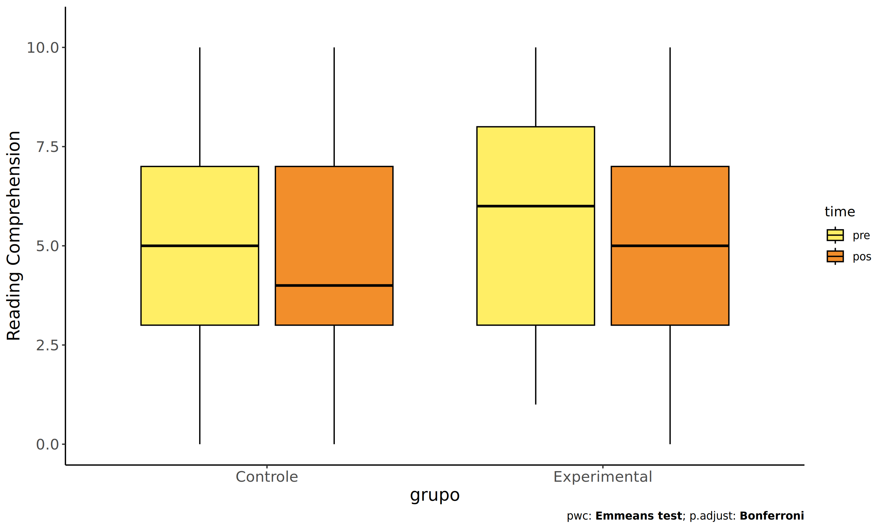
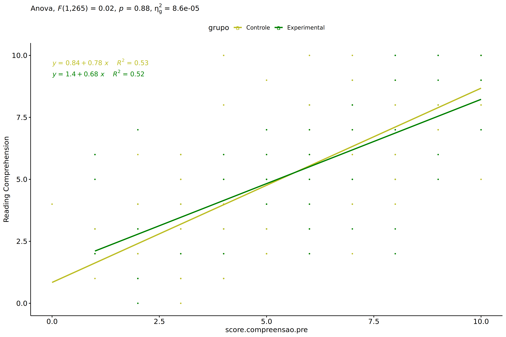
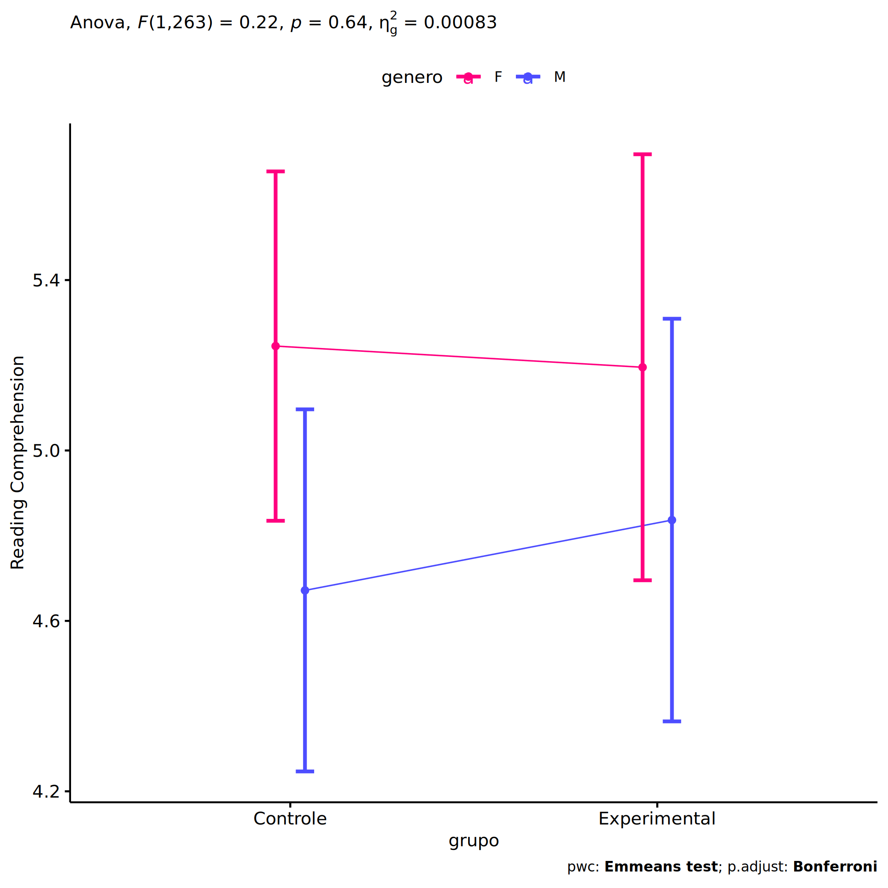
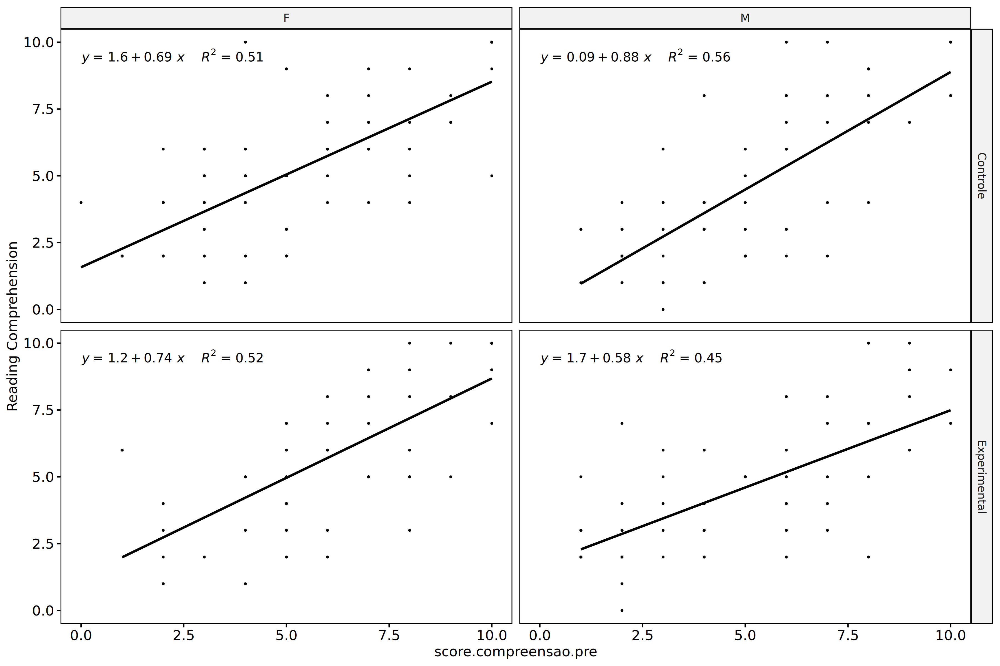
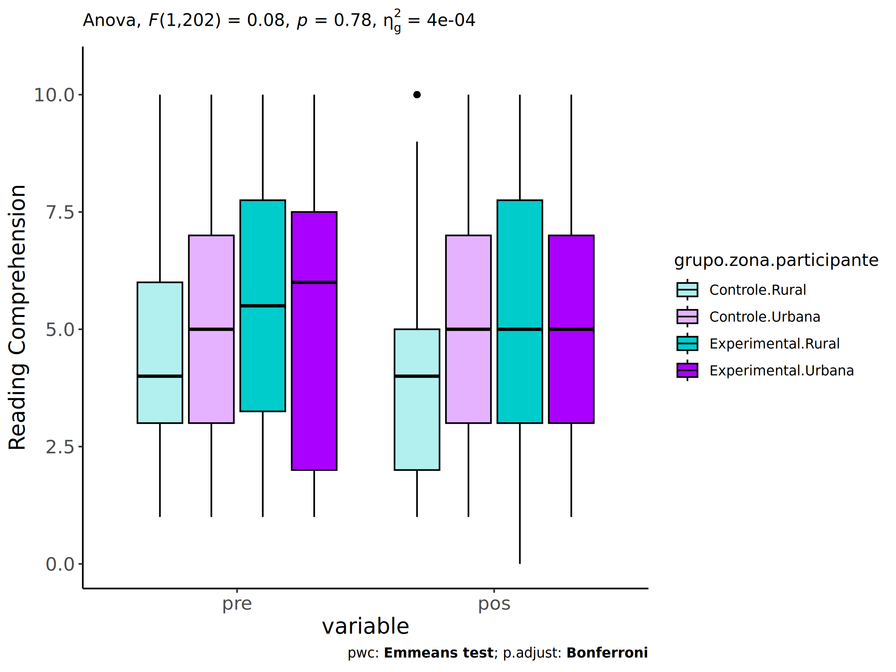
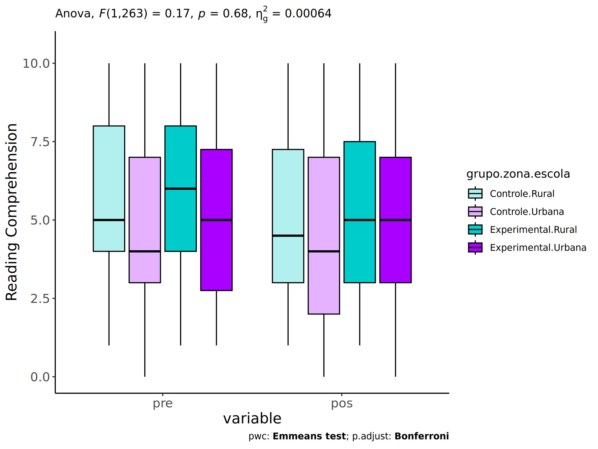

ANCOVA in Reading Comprehension (Reading Comprehension)
================
Geiser C. Challco <geiser@alumni.usp.br>

- [Setting Initial Variables](#setting-initial-variables)
- [Descriptive Statistics of Initial
  Data](#descriptive-statistics-of-initial-data)
- [ANCOVA and Pairwise for one factor:
  **grupo**](#ancova-and-pairwise-for-one-factor-grupo)
  - [Without remove non-normal data](#without-remove-non-normal-data)
  - [Computing ANCOVA and PairWise After removing non-normal data
    (OK)](#computing-ancova-and-pairwise-after-removing-non-normal-data-ok)
    - [Plots for ancova](#plots-for-ancova)
    - [Checking linearity assumption](#checking-linearity-assumption)
    - [Checking normality and
      homogeneity](#checking-normality-and-homogeneity)
- [ANCOVA and Pairwise for two factors
  **grupo:genero**](#ancova-and-pairwise-for-two-factors-grupogenero)
  - [Without remove non-normal data](#without-remove-non-normal-data-1)
  - [Computing ANCOVA and PairWise After removing non-normal data
    (OK)](#computing-ancova-and-pairwise-after-removing-non-normal-data-ok-1)
    - [Plots for ancova](#plots-for-ancova-1)
    - [Checking linearity assumption](#checking-linearity-assumption-1)
    - [Checking normality and
      homogeneity](#checking-normality-and-homogeneity-1)
- [ANCOVA and Pairwise for two factors
  **grupo:zona.participante**](#ancova-and-pairwise-for-two-factors-grupozonaparticipante)
  - [Without remove non-normal data](#without-remove-non-normal-data-2)
  - [Computing ANCOVA and PairWise After removing non-normal data
    (OK)](#computing-ancova-and-pairwise-after-removing-non-normal-data-ok-2)
    - [Plots for ancova](#plots-for-ancova-2)
    - [Checking linearity assumption](#checking-linearity-assumption-2)
    - [Checking normality and
      homogeneity](#checking-normality-and-homogeneity-2)
- [ANCOVA and Pairwise for two factors
  **grupo:zona.escola**](#ancova-and-pairwise-for-two-factors-grupozonaescola)
  - [Without remove non-normal data](#without-remove-non-normal-data-3)
  - [Computing ANCOVA and PairWise After removing non-normal data
    (OK)](#computing-ancova-and-pairwise-after-removing-non-normal-data-ok-3)
    - [Plots for ancova](#plots-for-ancova-3)
    - [Checking linearity assumption](#checking-linearity-assumption-3)
    - [Checking normality and
      homogeneity](#checking-normality-and-homogeneity-3)
- [ANCOVA and Pairwise for two factors
  **grupo:score.compreensao.quintile**](#ancova-and-pairwise-for-two-factors-gruposcorecompreensaoquintile)
  - [Without remove non-normal data](#without-remove-non-normal-data-4)
  - [Computing ANCOVA and PairWise After removing non-normal data
    (OK)](#computing-ancova-and-pairwise-after-removing-non-normal-data-ok-4)
    - [Plots for ancova](#plots-for-ancova-4)
    - [Checking linearity assumption](#checking-linearity-assumption-4)
    - [Checking normality and
      homogeneity](#checking-normality-and-homogeneity-4)
- [Summary of Results](#summary-of-results)
  - [Descriptive Statistics](#descriptive-statistics)
  - [ANCOVA Table Comparison](#ancova-table-comparison)
  - [PairWise Table Comparison](#pairwise-table-comparison)
  - [EMMS Table Comparison](#emms-table-comparison)

**NOTE**:

- Teste ANCOVA para determinar se houve diferenças significativas no
  Reading Comprehension (medido usando pre- e pos-testes).
- ANCOVA test to determine whether there were significant differences in
  Reading Comprehension (measured using pre- and post-tests).

# Setting Initial Variables

``` r
dv = "score.compreensao"
dv.pos = "score.compreensao.pos"
dv.pre = "score.compreensao.pre"

fatores2 <- c("genero","zona.participante","zona.escola","score.compreensao.quintile")
lfatores2 <- as.list(fatores2)
names(lfatores2) <- fatores2

fatores1 <- c("grupo", fatores2)
lfatores1 <- as.list(fatores1)
names(lfatores1) <- fatores1

lfatores <- c(lfatores1)

color <- list()
color[["prepost"]] = c("#ffee65","#f28e2B")
color[["grupo"]] = c("#bcbd22","#008000")
color[["genero"]] = c("#FF007F","#4D4DFF")
color[["zona.escola"]] = c("#AA00FF","#00CCCC")
color[["zona.participante"]] = c("#AA00FF","#00CCCC")

level <- list()
level[["grupo"]] = c("Controle","Experimental")
level[["genero"]] = c("F","M")
level[["zona.escola"]] = c("Rural","Urbana")
level[["zona.participante"]] = c("Rural","Urbana")

# ..

ymin <- 0
ymax <- 0

ymin.ci <- 0
ymax.ci <- 0


color[["grupo:genero"]] = c(
  "Controle:F"="#ff99cb", "Controle:M"="#b7b7ff",
  "Experimental:F"="#FF007F", "Experimental:M"="#4D4DFF",
  "Controle.F"="#ff99cb", "Controle.M"="#b7b7ff",
  "Experimental.F"="#FF007F", "Experimental.M"="#4D4DFF"
)
color[["grupo:zona.escola"]] = c(
  "Controle:Rural"="#b2efef","Controle:Urbana"="#e5b2ff",
  "Experimental:Rural"="#00CCCC", "Experimental:Urbana"="#AA00FF",
  "Controle.Rural"="#b2efef","Controle.Urbana"="#e5b2ff",
  "Experimental.Rural"="#00CCCC", "Experimental.Urbana"="#AA00FF"
)
color[["grupo:zona.participante"]] = c(
  "Controle:Rural"="#b2efef","Controle:Urbana"="#e5b2ff",
  "Experimental:Rural"="#00CCCC", "Experimental:Urbana"="#AA00FF",
  "Controle.Rural"="#b2efef","Controle.Urbana"="#e5b2ff",
  "Experimental.Rural"="#00CCCC", "Experimental.Urbana"="#AA00FF"
)

for (coln in c(
  "palavras.lidas","score.compreensao","tri.compreensao",
  "score.vocab","tri.vocab",
  "score.vocab.ensinado","tri.vocab.ensinado","score.vocab.nao.ensinado","tri.vocab.nao.ensinado",
  "score.CLPP","tri.CLPP","score.CR","tri.CR",
  "score.CI","tri.CI","score.TV","tri.TV","score.TF","tri.TF","score.TO","tri.TO")) {
  color[[paste0(coln,".quintile")]] = c("#BF0040","#FF0000","#800080","#0000FF","#4000BF")
  level[[paste0(coln,".quintile")]] = c("1st quintile","2nd quintile","3rd quintile","4th quintile","5th quintile")
  color[[paste0("grupo:",coln,".quintile")]] = c(
    "Experimental.1st quintile"="#BF0040", "Controle.1st quintile"="#d8668c",
    "Experimental.2nd quintile"="#FF0000", "Controle.2nd quintile"="#ff7f7f",
    "Experimental.3rd quintile"="#8fce00", "Controle.3rd quintile"="#ddf0b2",
    "Experimental.4th quintile"="#0000FF", "Controle.4th quintile"="#b2b2ff",
    "Experimental.5th quintile"="#4000BF", "Controle.5th quintile"="#b299e5",
    
    "Experimental:1st quintile"="#BF0040", "Controle:1st quintile"="#d8668c",
    "Experimental:2nd quintile"="#FF0000", "Controle:2nd quintile"="#ff7f7f",
    "Experimental:3rd quintile"="#8fce00", "Controle:3rd quintile"="#ddf0b2",
    "Experimental:4th quintile"="#0000FF", "Controle:4th quintile"="#b2b2ff",
    "Experimental:5th quintile"="#4000BF", "Controle:5th quintile"="#b299e5")
}


gdat <- read_excel("../data/data.xlsx", sheet = "triagem.wg.wo.st")


dat <- gdat
dat$grupo <- factor(dat[["grupo"]], level[["grupo"]])
for (coln in c(names(lfatores))) {
  dat[[coln]] <- factor(dat[[coln]], level[[coln]][level[[coln]] %in% unique(dat[[coln]])])
}
dat <- dat[which(!is.na(dat[[dv.pre]]) & !is.na(dat[[dv.pos]])),]
dat <- dat[,c("id",names(lfatores),dv.pre,dv.pos)]

dat.long <- rbind(dat, dat)
dat.long$time <- c(rep("pre", nrow(dat)), rep("pos", nrow(dat)))
dat.long$time <- factor(dat.long$time, c("pre","pos"))
dat.long[[dv]] <- c(dat[[dv.pre]], dat[[dv.pos]])


for (f in c("grupo", names(lfatores))) {
  if (is.null(color[[f]]) && length(unique(dat[[f]])) > 0) 
      color[[f]] <- distinctColorPalette(length(unique(dat[[f]])))
}
for (f in c(fatores2)) {
  if (is.null(color[[paste0("grupo:",f)]]) && length(unique(dat[[f]])) > 0)
    color[[paste0("grupo:",f)]] <- distinctColorPalette(length(unique(dat[["grupo"]]))*length(unique(dat[[f]])))
}

ldat <- list()
laov <- list()
lpwc <- list()
lemms <- list()
```

# Descriptive Statistics of Initial Data

``` r
df <- get.descriptives(dat, c(dv.pre, dv.pos), c("grupo"), 
                       include.global = T, symmetry.test = T, normality.test = F)
df <- plyr::rbind.fill(
  df, do.call(plyr::rbind.fill, lapply(lfatores2, FUN = function(f) {
    if (nrow(dat) > 0 && sum(!is.na(unique(dat[[f]]))) > 1)
      get.descriptives(dat, c(dv.pre,dv.pos), c("grupo", f),
                       symmetry.test = T, normality.test = F)
    }))
)
df <- df[,c(fatores1[fatores1 %in% colnames(df)],"variable",
            colnames(df)[!colnames(df) %in% c(fatores1,"variable")])]
```

| grupo | genero | zona.participante | zona.escola | score.compreensao.quintile | variable | n | mean | median | min | max | sd | se | ci | iqr | symmetry | skewness | kurtosis |
|:---|:---|:---|:---|:---|:---|---:|---:|---:|---:|---:|---:|---:|---:|---:|:---|---:|---:|
| Controle |  |  |  |  | score.compreensao.pre | 153 | 5.098 | 5.0 | 0 | 10 | 2.533 | 0.205 | 0.405 | 4.00 | YES | 0.419 | -0.742 |
| Experimental |  |  |  |  | score.compreensao.pre | 115 | 5.522 | 6.0 | 1 | 10 | 2.773 | 0.259 | 0.512 | 5.00 | YES | -0.008 | -1.121 |
|  |  |  |  |  | score.compreensao.pre | 268 | 5.280 | 5.0 | 0 | 10 | 2.642 | 0.161 | 0.318 | 4.00 | YES | 0.228 | -0.953 |
| Controle |  |  |  |  | score.compreensao.pos | 153 | 4.837 | 4.0 | 0 | 10 | 2.728 | 0.221 | 0.436 | 4.00 | YES | 0.430 | -0.917 |
| Experimental |  |  |  |  | score.compreensao.pos | 115 | 5.183 | 5.0 | 0 | 10 | 2.624 | 0.245 | 0.485 | 4.00 | YES | 0.305 | -0.954 |
|  |  |  |  |  | score.compreensao.pos | 268 | 4.985 | 5.0 | 0 | 10 | 2.684 | 0.164 | 0.323 | 4.00 | YES | 0.372 | -0.927 |
| Controle | F |  |  |  | score.compreensao.pre | 79 | 5.291 | 5.0 | 0 | 10 | 2.646 | 0.298 | 0.593 | 4.00 | YES | 0.320 | -0.902 |
| Controle | M |  |  |  | score.compreensao.pre | 74 | 4.892 | 4.0 | 1 | 10 | 2.408 | 0.280 | 0.558 | 3.00 | NO | 0.503 | -0.613 |
| Experimental | F |  |  |  | score.compreensao.pre | 55 | 6.345 | 6.0 | 1 | 10 | 2.654 | 0.358 | 0.718 | 3.00 | YES | -0.245 | -0.919 |
| Experimental | M |  |  |  | score.compreensao.pre | 60 | 4.767 | 4.0 | 1 | 10 | 2.683 | 0.346 | 0.693 | 5.00 | YES | 0.214 | -1.189 |
| Controle | F |  |  |  | score.compreensao.pos | 79 | 5.253 | 5.0 | 1 | 10 | 2.574 | 0.290 | 0.577 | 4.00 | YES | 0.359 | -0.866 |
| Controle | M |  |  |  | score.compreensao.pos | 74 | 4.392 | 4.0 | 0 | 10 | 2.832 | 0.329 | 0.656 | 5.00 | NO | 0.586 | -0.912 |
| Experimental | F |  |  |  | score.compreensao.pos | 55 | 5.964 | 6.0 | 1 | 10 | 2.742 | 0.370 | 0.741 | 4.50 | YES | -0.079 | -1.137 |
| Experimental | M |  |  |  | score.compreensao.pos | 60 | 4.467 | 4.0 | 0 | 10 | 2.310 | 0.298 | 0.597 | 3.00 | NO | 0.601 | -0.406 |
| Controle |  | Rural |  |  | score.compreensao.pre | 51 | 4.608 | 4.0 | 1 | 10 | 2.359 | 0.330 | 0.663 | 3.00 | NO | 0.813 | -0.092 |
| Controle |  | Urbana |  |  | score.compreensao.pre | 67 | 5.194 | 5.0 | 1 | 10 | 2.439 | 0.298 | 0.595 | 4.00 | YES | 0.321 | -0.815 |
| Controle |  |  |  |  | score.compreensao.pre | 35 | 5.629 | 6.0 | 0 | 10 | 2.881 | 0.487 | 0.990 | 4.50 | YES | 0.040 | -1.161 |
| Experimental |  | Rural |  |  | score.compreensao.pre | 46 | 5.457 | 5.5 | 1 | 10 | 2.730 | 0.403 | 0.811 | 4.50 | YES | -0.037 | -1.146 |
| Experimental |  | Urbana |  |  | score.compreensao.pre | 43 | 5.256 | 6.0 | 1 | 10 | 2.821 | 0.430 | 0.868 | 5.50 | YES | -0.069 | -1.251 |
| Experimental |  |  |  |  | score.compreensao.pre | 26 | 6.077 | 6.0 | 2 | 10 | 2.799 | 0.549 | 1.131 | 5.00 | YES | 0.145 | -1.431 |
| Controle |  | Rural |  |  | score.compreensao.pos | 51 | 4.353 | 4.0 | 1 | 10 | 2.644 | 0.370 | 0.744 | 3.00 | NO | 0.890 | -0.151 |
| Controle |  | Urbana |  |  | score.compreensao.pos | 67 | 5.194 | 5.0 | 1 | 10 | 2.693 | 0.329 | 0.657 | 4.00 | YES | 0.205 | -1.062 |
| Controle |  |  |  |  | score.compreensao.pos | 35 | 4.857 | 4.0 | 0 | 10 | 2.881 | 0.487 | 0.990 | 5.50 | YES | 0.246 | -1.311 |
| Experimental |  | Rural |  |  | score.compreensao.pos | 46 | 5.217 | 5.0 | 0 | 10 | 2.724 | 0.402 | 0.809 | 4.75 | YES | 0.163 | -1.146 |
| Experimental |  | Urbana |  |  | score.compreensao.pos | 43 | 5.326 | 5.0 | 1 | 10 | 2.598 | 0.396 | 0.799 | 4.00 | YES | 0.294 | -0.966 |
| Experimental |  |  |  |  | score.compreensao.pos | 26 | 4.885 | 5.0 | 1 | 10 | 2.566 | 0.503 | 1.037 | 3.00 | NO | 0.574 | -0.773 |
| Controle |  |  | Rural |  | score.compreensao.pre | 52 | 5.654 | 5.0 | 1 | 10 | 2.351 | 0.326 | 0.654 | 4.00 | YES | 0.392 | -0.947 |
| Controle |  |  | Urbana |  | score.compreensao.pre | 101 | 4.812 | 4.0 | 0 | 10 | 2.587 | 0.257 | 0.511 | 4.00 | NO | 0.500 | -0.674 |
| Experimental |  |  | Rural |  | score.compreensao.pre | 35 | 6.229 | 6.0 | 1 | 10 | 2.734 | 0.462 | 0.939 | 4.00 | YES | -0.158 | -1.011 |
| Experimental |  |  | Urbana |  | score.compreensao.pre | 80 | 5.213 | 5.0 | 1 | 10 | 2.750 | 0.307 | 0.612 | 4.50 | YES | 0.059 | -1.204 |
| Controle |  |  | Rural |  | score.compreensao.pos | 52 | 5.173 | 4.5 | 1 | 10 | 2.728 | 0.378 | 0.759 | 4.25 | YES | 0.362 | -1.128 |
| Controle |  |  | Urbana |  | score.compreensao.pos | 101 | 4.663 | 4.0 | 0 | 10 | 2.725 | 0.271 | 0.538 | 5.00 | YES | 0.467 | -0.844 |
| Experimental |  |  | Rural |  | score.compreensao.pos | 35 | 5.486 | 5.0 | 1 | 10 | 2.853 | 0.482 | 0.980 | 4.50 | YES | 0.147 | -1.269 |
| Experimental |  |  | Urbana |  | score.compreensao.pos | 80 | 5.050 | 5.0 | 0 | 10 | 2.525 | 0.282 | 0.562 | 4.00 | YES | 0.359 | -0.836 |
| Controle |  |  |  | 1st quintile | score.compreensao.pre | 6 | 0.833 | 1.0 | 0 | 1 | 0.408 | 0.167 | 0.428 | 0.00 | few data | 0.000 | 0.000 |
| Controle |  |  |  | 2nd quintile | score.compreensao.pre | 42 | 2.595 | 3.0 | 2 | 3 | 0.497 | 0.077 | 0.155 | 1.00 | few data | 0.000 | 0.000 |
| Controle |  |  |  | 3rd quintile | score.compreensao.pre | 61 | 4.852 | 5.0 | 4 | 6 | 0.813 | 0.104 | 0.208 | 2.00 | few data | 0.000 | 0.000 |
| Controle |  |  |  | 4th quintile | score.compreensao.pre | 26 | 7.462 | 7.0 | 7 | 8 | 0.508 | 0.100 | 0.205 | 1.00 | few data | 0.000 | 0.000 |
| Controle |  |  |  | 5th quintile | score.compreensao.pre | 18 | 9.778 | 10.0 | 9 | 10 | 0.428 | 0.101 | 0.213 | 0.00 | few data | 0.000 | 0.000 |
| Experimental |  |  |  | 1st quintile | score.compreensao.pre | 9 | 1.000 | 1.0 | 1 | 1 | 0.000 | 0.000 | 0.000 | 0.00 | few data | 0.000 | 0.000 |
| Experimental |  |  |  | 2nd quintile | score.compreensao.pre | 21 | 2.286 | 2.0 | 2 | 3 | 0.463 | 0.101 | 0.211 | 1.00 | few data | 0.000 | 0.000 |
| Experimental |  |  |  | 3rd quintile | score.compreensao.pre | 41 | 5.049 | 5.0 | 4 | 6 | 0.835 | 0.130 | 0.264 | 2.00 | few data | 0.000 | 0.000 |
| Experimental |  |  |  | 4th quintile | score.compreensao.pre | 25 | 7.520 | 8.0 | 7 | 8 | 0.510 | 0.102 | 0.210 | 1.00 | few data | 0.000 | 0.000 |
| Experimental |  |  |  | 5th quintile | score.compreensao.pre | 19 | 9.632 | 10.0 | 9 | 10 | 0.496 | 0.114 | 0.239 | 1.00 | few data | 0.000 | 0.000 |
| Controle |  |  |  | 1st quintile | score.compreensao.pos | 6 | 2.500 | 2.5 | 1 | 4 | 1.049 | 0.428 | 1.101 | 1.00 | YES | 0.000 | -1.571 |
| Controle |  |  |  | 2nd quintile | score.compreensao.pos | 42 | 3.048 | 3.0 | 0 | 6 | 1.592 | 0.246 | 0.496 | 2.00 | YES | 0.207 | -0.865 |
| Controle |  |  |  | 3rd quintile | score.compreensao.pos | 61 | 4.279 | 4.0 | 1 | 10 | 2.259 | 0.289 | 0.579 | 3.00 | NO | 0.690 | -0.222 |
| Controle |  |  |  | 4th quintile | score.compreensao.pos | 26 | 6.808 | 7.0 | 2 | 10 | 2.000 | 0.392 | 0.808 | 2.00 | NO | -0.553 | -0.545 |
| Controle |  |  |  | 5th quintile | score.compreensao.pos | 18 | 8.833 | 10.0 | 5 | 10 | 1.543 | 0.364 | 0.768 | 2.00 | NO | -0.917 | -0.359 |
| Experimental |  |  |  | 1st quintile | score.compreensao.pos | 9 | 3.556 | 3.0 | 2 | 6 | 1.667 | 0.556 | 1.281 | 3.00 | YES | 0.490 | -1.652 |
| Experimental |  |  |  | 2nd quintile | score.compreensao.pos | 21 | 2.952 | 3.0 | 0 | 7 | 1.717 | 0.375 | 0.782 | 2.00 | NO | 0.522 | -0.256 |
| Experimental |  |  |  | 3rd quintile | score.compreensao.pos | 41 | 4.341 | 4.0 | 1 | 8 | 1.741 | 0.272 | 0.549 | 2.00 | YES | 0.260 | -0.738 |
| Experimental |  |  |  | 4th quintile | score.compreensao.pos | 25 | 6.360 | 7.0 | 2 | 10 | 2.215 | 0.443 | 0.914 | 3.00 | YES | -0.086 | -1.022 |
| Experimental |  |  |  | 5th quintile | score.compreensao.pos | 19 | 8.684 | 9.0 | 5 | 10 | 1.493 | 0.342 | 0.719 | 2.00 | NO | -1.003 | -0.098 |

# ANCOVA and Pairwise for one factor: **grupo**

## Without remove non-normal data

``` r
pdat = remove_group_data(dat[!is.na(dat[["grupo"]]),], "score.compreensao.pos", "grupo")

pdat.long <- rbind(pdat[,c("id","grupo")], pdat[,c("id","grupo")])
pdat.long[["time"]] <- c(rep("pre", nrow(pdat)), rep("pos", nrow(pdat)))
pdat.long[["time"]] <- factor(pdat.long[["time"]], c("pre","pos"))
pdat.long[["score.compreensao"]] <- c(pdat[["score.compreensao.pre"]], pdat[["score.compreensao.pos"]])

aov = anova_test(pdat, score.compreensao.pos ~ score.compreensao.pre + grupo)
laov[["grupo"]] <- get_anova_table(aov)
```

``` r
pwc <- emmeans_test(pdat, score.compreensao.pos ~ grupo, covariate = score.compreensao.pre,
                    p.adjust.method = "bonferroni")
```

``` r
pwc.long <- emmeans_test(dplyr::group_by_at(pdat.long, "grupo"),
                          score.compreensao ~ time,
                          p.adjust.method = "bonferroni")
lpwc[["grupo"]] <- plyr::rbind.fill(pwc, pwc.long)
```

``` r
ds <- get.descriptives(pdat, "score.compreensao.pos", "grupo", covar = "score.compreensao.pre")
ds <- merge(ds[ds$variable != "score.compreensao.pre",],
            ds[ds$variable == "score.compreensao.pre", !colnames(ds) %in% c("variable")],
            by = "grupo", all.x = T, suffixes = c("", ".score.compreensao.pre"))
ds <- merge(get_emmeans(pwc), ds, by = "grupo", suffixes = c(".emms", ""))
ds <- ds[,c("grupo","n","mean.score.compreensao.pre","se.score.compreensao.pre","mean","se",
            "emmean","se.emms","conf.low","conf.high")]

colnames(ds) <- c("grupo", "N", paste0(c("M","SE")," (pre)"),
                  paste0(c("M","SE"), " (unadj)"),
                  paste0(c("M", "SE"), " (adj)"), "conf.low", "conf.high")

lemms[["grupo"]] <- ds
```

## Computing ANCOVA and PairWise After removing non-normal data (OK)

``` r
wdat = pdat 

res = residuals(lm(score.compreensao.pos ~ score.compreensao.pre + grupo, data = wdat))
non.normal = getNonNormal(res, wdat$id, plimit = 0.05)

wdat = wdat[!wdat$id %in% non.normal,]

wdat.long <- rbind(wdat[,c("id","grupo")], wdat[,c("id","grupo")])
wdat.long[["time"]] <- c(rep("pre", nrow(wdat)), rep("pos", nrow(wdat)))
wdat.long[["time"]] <- factor(wdat.long[["time"]], c("pre","pos"))
wdat.long[["score.compreensao"]] <- c(wdat[["score.compreensao.pre"]], wdat[["score.compreensao.pos"]])

ldat[["grupo"]] = wdat

(non.normal)
```

    ## NULL

``` r
aov = anova_test(wdat, score.compreensao.pos ~ score.compreensao.pre + grupo)
laov[["grupo"]] <- merge(get_anova_table(aov), laov[["grupo"]],
                            by="Effect", suffixes = c("","'"))

(df = get_anova_table(aov))
```

    ## ANOVA Table (type II tests)
    ## 
    ##                  Effect DFn DFd       F        p p<.05      ges
    ## 1 score.compreensao.pre   1 265 288.858 2.57e-44     * 5.22e-01
    ## 2                 grupo   1 265   0.023 8.80e-01       8.61e-05

| Effect                | DFn | DFd |       F |    p | p\<.05 |   ges |
|:----------------------|----:|----:|--------:|-----:|:-------|------:|
| score.compreensao.pre |   1 | 265 | 288.858 | 0.00 | \*     | 0.522 |
| grupo                 |   1 | 265 |   0.023 | 0.88 |        | 0.000 |

``` r
pwc <- emmeans_test(wdat, score.compreensao.pos ~ grupo, covariate = score.compreensao.pre,
                    p.adjust.method = "bonferroni")
```

| term | .y. | group1 | group2 | df | statistic | p | p.adj | p.adj.signif |
|:---|:---|:---|:---|---:|---:|---:|---:|:---|
| score.compreensao.pre\*grupo | score.compreensao.pos | Controle | Experimental | 265 | -0.151 | 0.88 | 0.88 | ns |

``` r
pwc.long <- emmeans_test(dplyr::group_by_at(wdat.long, "grupo"),
                         score.compreensao ~ time,
                         p.adjust.method = "bonferroni")
lpwc[["grupo"]] <- merge(plyr::rbind.fill(pwc, pwc.long), lpwc[["grupo"]],
                            by=c("grupo","term",".y.","group1","group2"),
                            suffixes = c("","'"))
```

| grupo | term | .y. | group1 | group2 | df | statistic | p | p.adj | p.adj.signif |
|:---|:---|:---|:---|:---|---:|---:|---:|---:|:---|
| Controle | time | score.compreensao | pre | pos | 532 | 0.859 | 0.391 | 0.391 | ns |
| Experimental | time | score.compreensao | pre | pos | 532 | 0.966 | 0.334 | 0.334 | ns |

``` r
ds <- get.descriptives(wdat, "score.compreensao.pos", "grupo", covar = "score.compreensao.pre")
ds <- merge(ds[ds$variable != "score.compreensao.pre",],
            ds[ds$variable == "score.compreensao.pre", !colnames(ds) %in% c("variable")],
            by = "grupo", all.x = T, suffixes = c("", ".score.compreensao.pre"))
ds <- merge(get_emmeans(pwc), ds, by = "grupo", suffixes = c(".emms", ""))
ds <- ds[,c("grupo","n","mean.score.compreensao.pre","se.score.compreensao.pre","mean","se",
            "emmean","se.emms","conf.low","conf.high")]

colnames(ds) <- c("grupo", "N", paste0(c("M","SE")," (pre)"),
                  paste0(c("M","SE"), " (unadj)"),
                  paste0(c("M", "SE"), " (adj)"), "conf.low", "conf.high")

lemms[["grupo"]] <- merge(ds, lemms[["grupo"]], by=c("grupo"), suffixes = c("","'"))
```

| grupo | N | M (pre) | SE (pre) | M (unadj) | SE (unadj) | M (adj) | SE (adj) | conf.low | conf.high |
|:---|---:|---:|---:|---:|---:|---:|---:|---:|---:|
| Controle | 153 | 5.098 | 0.205 | 4.837 | 0.221 | 4.970 | 0.151 | 4.674 | 5.267 |
| Experimental | 115 | 5.522 | 0.259 | 5.183 | 0.245 | 5.005 | 0.174 | 4.663 | 5.347 |

### Plots for ancova

``` r
plots <- oneWayAncovaPlots(
  wdat, "score.compreensao.pos", "grupo", aov, list("grupo"=pwc), addParam = c("mean_ci"),
  font.label.size=10, step.increase=0.05, p.label="p.adj",
  subtitle = which(aov$Effect == "grupo"))
```

``` r
if (!is.null(nrow(plots[["grupo"]]$data)))
  plots[["grupo"]] + ggplot2::ylab("Reading Comprehension") + 
  if (ymin.ci < ymax.ci) ggplot2::ylim(ymin.ci, ymax.ci)
```

<!-- -->

``` r
plots <- oneWayAncovaBoxPlots(
  wdat, "score.compreensao.pos", "grupo", aov, pwc, covar = "score.compreensao.pre",
  theme = "classic", color = color[["grupo"]],
  subtitle = which(aov$Effect == "grupo"))
```

``` r
if (length(unique(wdat[["grupo"]])) > 1)
  plots[["grupo"]] + ggplot2::ylab("Reading Comprehension") +
  ggplot2::scale_x_discrete(labels=c('pre', 'pos')) +
  if (ymin < ymax) ggplot2::ylim(ymin, ymax)
```

<!-- -->

``` r
if (length(unique(wdat.long[["grupo"]])) > 1)
  plots <- oneWayAncovaBoxPlots(
    wdat.long, "score.compreensao", "grupo", aov, pwc.long,
    pre.post = "time", theme = "classic", color = color$prepost)
```

``` r
if (length(unique(wdat.long[["grupo"]])) > 1)
  plots[["grupo"]] + ggplot2::ylab("Reading Comprehension") +
  if (ymin < ymax) ggplot2::ylim(ymin, ymax) 
```

<!-- -->

### Checking linearity assumption

``` r
ggscatter(wdat, x = "score.compreensao.pre", y = "score.compreensao.pos", size = 0.5,
          color = "grupo", add = "reg.line")+
  stat_regline_equation(
    aes(label =  paste(..eq.label.., ..rr.label.., sep = "~~~~"), color = grupo)
  ) +
  ggplot2::labs(subtitle = rstatix::get_test_label(aov, detailed = T, row = which(aov$Effect == "grupo"))) +
  ggplot2::scale_color_manual(values = color[["grupo"]]) +
  ggplot2::ylab("Reading Comprehension")  +
  if (ymin < ymax) ggplot2::ylim(ymin, ymax)
```

<!-- -->

### Checking normality and homogeneity

``` r
res <- augment(lm(score.compreensao.pos ~ score.compreensao.pre + grupo, data = wdat))
```

``` r
shapiro_test(res$.resid)
```

    ## # A tibble: 1 × 3
    ##   variable   statistic p.value
    ##   <chr>          <dbl>   <dbl>
    ## 1 res$.resid     0.993   0.199

``` r
levene_test(res, .resid ~ grupo)
```

    ## # A tibble: 1 × 4
    ##     df1   df2 statistic     p
    ##   <int> <int>     <dbl> <dbl>
    ## 1     1   266    0.0795 0.778

# ANCOVA and Pairwise for two factors **grupo:genero**

## Without remove non-normal data

``` r
pdat = remove_group_data(dat[!is.na(dat[["grupo"]]) & !is.na(dat[["genero"]]),],
                         "score.compreensao.pos", c("grupo","genero"))
pdat = pdat[pdat[["genero"]] %in% do.call(
  intersect, lapply(unique(pdat[["grupo"]]), FUN = function(x) {
    unique(pdat[["genero"]][which(pdat[["grupo"]] == x)])
  })),]
pdat[["grupo"]] = factor(pdat[["grupo"]], level[["grupo"]])
pdat[["genero"]] = factor(
  pdat[["genero"]],
  level[["genero"]][level[["genero"]] %in% unique(pdat[["genero"]])])

pdat.long <- rbind(pdat[,c("id","grupo","genero")], pdat[,c("id","grupo","genero")])
pdat.long[["time"]] <- c(rep("pre", nrow(pdat)), rep("pos", nrow(pdat)))
pdat.long[["time"]] <- factor(pdat.long[["time"]], c("pre","pos"))
pdat.long[["score.compreensao"]] <- c(pdat[["score.compreensao.pre"]], pdat[["score.compreensao.pos"]])

if (length(unique(pdat[["genero"]])) >= 2) {
  aov = anova_test(pdat, score.compreensao.pos ~ score.compreensao.pre + grupo*genero)
  laov[["grupo:genero"]] <- get_anova_table(aov)
}
```

``` r
if (length(unique(pdat[["genero"]])) >= 2) {
  pwcs <- list()
  pwcs[["genero"]] <- emmeans_test(
    group_by(pdat, grupo), score.compreensao.pos ~ genero,
    covariate = score.compreensao.pre, p.adjust.method = "bonferroni")
  pwcs[["grupo"]] <- emmeans_test(
    group_by(pdat, genero), score.compreensao.pos ~ grupo,
    covariate = score.compreensao.pre, p.adjust.method = "bonferroni")
  
  pwc <- plyr::rbind.fill(pwcs[["grupo"]], pwcs[["genero"]])
  pwc <- pwc[,c("grupo","genero", colnames(pwc)[!colnames(pwc) %in% c("grupo","genero")])]
}
```

``` r
if (length(unique(pdat[["genero"]])) >= 2) {
  pwc.long <- emmeans_test(dplyr::group_by_at(pdat.long, c("grupo","genero")),
                           score.compreensao ~ time,
                           p.adjust.method = "bonferroni")
  lpwc[["grupo:genero"]] <- plyr::rbind.fill(pwc, pwc.long)
}
```

``` r
if (length(unique(pdat[["genero"]])) >= 2) {
  ds <- get.descriptives(pdat, "score.compreensao.pos", c("grupo","genero"), covar = "score.compreensao.pre")
  ds <- merge(ds[ds$variable != "score.compreensao.pre",],
              ds[ds$variable == "score.compreensao.pre", !colnames(ds) %in% c("variable")],
              by = c("grupo","genero"), all.x = T, suffixes = c("", ".score.compreensao.pre"))
  ds <- merge(get_emmeans(pwcs[["grupo"]]), ds,
              by = c("grupo","genero"), suffixes = c(".emms", ""))
  ds <- ds[,c("grupo","genero","n","mean.score.compreensao.pre","se.score.compreensao.pre","mean","se",
              "emmean","se.emms","conf.low","conf.high")]
  
  colnames(ds) <- c("grupo","genero", "N", paste0(c("M","SE")," (pre)"),
                    paste0(c("M","SE"), " (unadj)"),
                    paste0(c("M", "SE"), " (adj)"), "conf.low", "conf.high")
  
  lemms[["grupo:genero"]] <- ds
}
```

## Computing ANCOVA and PairWise After removing non-normal data (OK)

``` r
if (length(unique(pdat[["genero"]])) >= 2) {
  wdat = pdat 
  
  res = residuals(lm(score.compreensao.pos ~ score.compreensao.pre + grupo*genero, data = wdat))
  non.normal = getNonNormal(res, wdat$id, plimit = 0.05)
  
  wdat = wdat[!wdat$id %in% non.normal,]
  
  wdat.long <- rbind(wdat[,c("id","grupo","genero")], wdat[,c("id","grupo","genero")])
  wdat.long[["time"]] <- c(rep("pre", nrow(wdat)), rep("pos", nrow(wdat)))
  wdat.long[["time"]] <- factor(wdat.long[["time"]], c("pre","pos"))
  wdat.long[["score.compreensao"]] <- c(wdat[["score.compreensao.pre"]], wdat[["score.compreensao.pos"]])
  
  
  ldat[["grupo:genero"]] = wdat
  
  (non.normal)
}
```

    ## NULL

``` r
if (length(unique(pdat[["genero"]])) >= 2) {
  aov = anova_test(wdat, score.compreensao.pos ~ score.compreensao.pre + grupo*genero)
  laov[["grupo:genero"]] <- merge(get_anova_table(aov), laov[["grupo:genero"]],
                                         by="Effect", suffixes = c("","'"))
  df = get_anova_table(aov)
}
```

| Effect                | DFn | DFd |       F |     p | p\<.05 |   ges |
|:----------------------|----:|----:|--------:|------:|:-------|------:|
| score.compreensao.pre |   1 | 263 | 269.342 | 0.000 | \*     | 0.506 |
| grupo                 |   1 | 263 |   0.068 | 0.794 |        | 0.000 |
| genero                |   1 | 263 |   4.429 | 0.036 | \*     | 0.017 |
| grupo:genero          |   1 | 263 |   0.218 | 0.641 |        | 0.001 |

``` r
if (length(unique(pdat[["genero"]])) >= 2) {
  pwcs <- list()
  pwcs[["genero"]] <- emmeans_test(
    group_by(wdat, grupo), score.compreensao.pos ~ genero,
    covariate = score.compreensao.pre, p.adjust.method = "bonferroni")
  pwcs[["grupo"]] <- emmeans_test(
    group_by(wdat, genero), score.compreensao.pos ~ grupo,
    covariate = score.compreensao.pre, p.adjust.method = "bonferroni")
  
  pwc <- plyr::rbind.fill(pwcs[["grupo"]], pwcs[["genero"]])
  pwc <- pwc[,c("grupo","genero", colnames(pwc)[!colnames(pwc) %in% c("grupo","genero")])]
}
```

| grupo | genero | term | .y. | group1 | group2 | df | statistic | p | p.adj | p.adj.signif |
|:---|:---|:---|:---|:---|:---|---:|---:|---:|---:|:---|
|  | F | score.compreensao.pre\*grupo | score.compreensao.pos | Controle | Experimental | 263 | 0.151 | 0.880 | 0.880 | ns |
|  | M | score.compreensao.pre\*grupo | score.compreensao.pos | Controle | Experimental | 263 | -0.513 | 0.608 | 0.608 | ns |
| Controle |  | score.compreensao.pre\*genero | score.compreensao.pos | F | M | 263 | 1.912 | 0.057 | 0.057 | ns |
| Experimental |  | score.compreensao.pre\*genero | score.compreensao.pos | F | M | 263 | 1.018 | 0.310 | 0.310 | ns |

``` r
if (length(unique(pdat[["genero"]])) >= 2) {
  pwc.long <- emmeans_test(dplyr::group_by_at(wdat.long, c("grupo","genero")),
                           score.compreensao ~ time,
                           p.adjust.method = "bonferroni")
  lpwc[["grupo:genero"]] <- merge(plyr::rbind.fill(pwc, pwc.long),
                                         lpwc[["grupo:genero"]],
                                         by=c("grupo","genero","term",".y.","group1","group2"),
                                         suffixes = c("","'"))
}
```

| grupo | genero | term | .y. | group1 | group2 | df | statistic | p | p.adj | p.adj.signif |
|:---|:---|:---|:---|:---|:---|---:|---:|---:|---:|:---|
| Controle | F | time | score.compreensao | pre | pos | 528 | 0.091 | 0.927 | 0.927 | ns |
| Controle | M | time | score.compreensao | pre | pos | 528 | 1.165 | 0.245 | 0.245 | ns |
| Experimental | F | time | score.compreensao | pre | pos | 528 | 0.767 | 0.443 | 0.443 | ns |
| Experimental | M | time | score.compreensao | pre | pos | 528 | 0.629 | 0.529 | 0.529 | ns |

``` r
if (length(unique(pdat[["genero"]])) >= 2) {
  ds <- get.descriptives(wdat, "score.compreensao.pos", c("grupo","genero"), covar = "score.compreensao.pre")
  ds <- merge(ds[ds$variable != "score.compreensao.pre",],
              ds[ds$variable == "score.compreensao.pre", !colnames(ds) %in% c("variable")],
              by = c("grupo","genero"), all.x = T, suffixes = c("", ".score.compreensao.pre"))
  ds <- merge(get_emmeans(pwcs[["grupo"]]), ds,
              by = c("grupo","genero"), suffixes = c(".emms", ""))
  ds <- ds[,c("grupo","genero","n","mean.score.compreensao.pre","se.score.compreensao.pre",
              "mean","se","emmean","se.emms","conf.low","conf.high")]
  
  colnames(ds) <- c("grupo","genero", "N", paste0(c("M","SE")," (pre)"),
                    paste0(c("M","SE"), " (unadj)"),
                    paste0(c("M", "SE"), " (adj)"), "conf.low", "conf.high")
  
  lemms[["grupo:genero"]] <- merge(ds, lemms[["grupo:genero"]],
                                          by=c("grupo","genero"), suffixes = c("","'"))
}
```

| grupo | genero | N | M (pre) | SE (pre) | M (unadj) | SE (unadj) | M (adj) | SE (adj) | conf.low | conf.high |
|:---|:---|---:|---:|---:|---:|---:|---:|---:|---:|---:|
| Controle | F | 79 | 5.291 | 0.298 | 5.253 | 0.290 | 5.245 | 0.208 | 4.835 | 5.655 |
| Controle | M | 74 | 4.892 | 0.280 | 4.392 | 0.329 | 4.672 | 0.216 | 4.247 | 5.097 |
| Experimental | F | 55 | 6.345 | 0.358 | 5.964 | 0.370 | 5.195 | 0.254 | 4.695 | 5.695 |
| Experimental | M | 60 | 4.767 | 0.346 | 4.467 | 0.298 | 4.837 | 0.240 | 4.364 | 5.309 |

### Plots for ancova

``` r
if (length(unique(pdat[["genero"]])) >= 2) {
  ggPlotAoC2(pwcs, "grupo", "genero", aov, ylab = "Reading Comprehension",
             subtitle = which(aov$Effect == "grupo:genero"), addParam = "errorbar") +
    ggplot2::scale_color_manual(values = color[["genero"]]) +
    ggplot2::ylab("Reading Comprehension") +
    if (ymin.ci < ymax.ci) ggplot2::ylim(ymin.ci, ymax.ci)
}
```

    ## Scale for colour is already present.
    ## Adding another scale for colour, which will replace the existing scale.

<!-- -->

``` r
if (length(unique(pdat[["genero"]])) >= 2) {
  ggPlotAoC2(pwcs, "genero", "grupo", aov, ylab = "Reading Comprehension",
               subtitle = which(aov$Effect == "grupo:genero"), addParam = "errorbar") +
    ggplot2::scale_color_manual(values = color[["grupo"]]) +
    ggplot2::ylab("Reading Comprehension") +
    if (ymin.ci < ymax.ci) ggplot2::ylim(ymin.ci, ymax.ci)
}
```

    ## Scale for colour is already present.
    ## Adding another scale for colour, which will replace the existing scale.

<!-- -->

``` r
if (length(unique(pdat[["genero"]])) >= 2) {
  plots <- twoWayAncovaBoxPlots(
    wdat, "score.compreensao.pos", c("grupo","genero"), aov, pwcs, covar = "score.compreensao.pre",
    theme = "classic", color = color[["grupo:genero"]],
    subtitle = which(aov$Effect == "grupo:genero"))
}
```

``` r
if (length(unique(pdat[["genero"]])) >= 2) {
  plots[["grupo:genero"]] + ggplot2::ylab("Reading Comprehension") +
  ggplot2::scale_x_discrete(labels=c('pre', 'pos')) +
  if (ymin < ymax) ggplot2::ylim(ymin, ymax)
}
```

    ## Warning: No shared levels found between `names(values)` of the manual scale and the data's colour values.

<!-- -->

``` r
if (length(unique(pdat[["genero"]])) >= 2) {
  plots <- twoWayAncovaBoxPlots(
    wdat.long, "score.compreensao", c("grupo","genero"), aov, pwc.long,
    pre.post = "time",
    theme = "classic", color = color$prepost)
}
```

``` r
if (length(unique(pdat[["genero"]])) >= 2) 
  plots[["grupo:genero"]] + ggplot2::ylab("Reading Comprehension") +
    if (ymin < ymax) ggplot2::ylim(ymin, ymax)
```

<!-- -->

### Checking linearity assumption

``` r
if (length(unique(pdat[["genero"]])) >= 2) {
  ggscatter(wdat, x = "score.compreensao.pre", y = "score.compreensao.pos", size = 0.5,
            facet.by = c("grupo","genero"), add = "reg.line")+
    stat_regline_equation(
      aes(label =  paste(..eq.label.., ..rr.label.., sep = "~~~~"))
    ) + ggplot2::ylab("Reading Comprehension") +
    if (ymin < ymax) ggplot2::ylim(ymin, ymax)
}
```

<!-- -->

``` r
if (length(unique(pdat[["genero"]])) >= 2) {
  ggscatter(wdat, x = "score.compreensao.pre", y = "score.compreensao.pos", size = 0.5,
            color = "grupo", facet.by = "genero", add = "reg.line")+
    stat_regline_equation(
      aes(label =  paste(..eq.label.., ..rr.label.., sep = "~~~~"), color = grupo)
    ) +
    ggplot2::labs(subtitle = rstatix::get_test_label(aov, detailed = T, row = which(aov$Effect == "grupo:genero"))) +
    ggplot2::scale_color_manual(values = color[["grupo"]]) +
    ggplot2::ylab("Reading Comprehension") +
    if (ymin < ymax) ggplot2::ylim(ymin, ymax)
}
```

<!-- -->

``` r
if (length(unique(pdat[["genero"]])) >= 2) {
  ggscatter(wdat, x = "score.compreensao.pre", y = "score.compreensao.pos", size = 0.5,
            color = "genero", facet.by = "grupo", add = "reg.line")+
    stat_regline_equation(
      aes(label =  paste(..eq.label.., ..rr.label.., sep = "~~~~"), color = genero)
    ) +
    ggplot2::labs(subtitle = rstatix::get_test_label(aov, detailed = T, row = which(aov$Effect == "grupo:genero"))) +
    ggplot2::scale_color_manual(values = color[["genero"]]) +
    ggplot2::ylab("Reading Comprehension") +
    if (ymin < ymax) ggplot2::ylim(ymin, ymax)
}
```

<!-- -->

### Checking normality and homogeneity

``` r
if (length(unique(pdat[["genero"]])) >= 2) 
  res <- augment(lm(score.compreensao.pos ~ score.compreensao.pre + grupo*genero, data = wdat))
```

``` r
if (length(unique(pdat[["genero"]])) >= 2)
  shapiro_test(res$.resid)
```

    ## # A tibble: 1 × 3
    ##   variable   statistic p.value
    ##   <chr>          <dbl>   <dbl>
    ## 1 res$.resid     0.993   0.246

``` r
if (length(unique(pdat[["genero"]])) >= 2) 
  levene_test(res, .resid ~ grupo*genero)
```

    ## # A tibble: 1 × 4
    ##     df1   df2 statistic     p
    ##   <int> <int>     <dbl> <dbl>
    ## 1     3   264     0.535 0.658

# ANCOVA and Pairwise for two factors **grupo:zona.participante**

## Without remove non-normal data

``` r
pdat = remove_group_data(dat[!is.na(dat[["grupo"]]) & !is.na(dat[["zona.participante"]]),],
                         "score.compreensao.pos", c("grupo","zona.participante"))
pdat = pdat[pdat[["zona.participante"]] %in% do.call(
  intersect, lapply(unique(pdat[["grupo"]]), FUN = function(x) {
    unique(pdat[["zona.participante"]][which(pdat[["grupo"]] == x)])
  })),]
pdat[["grupo"]] = factor(pdat[["grupo"]], level[["grupo"]])
pdat[["zona.participante"]] = factor(
  pdat[["zona.participante"]],
  level[["zona.participante"]][level[["zona.participante"]] %in% unique(pdat[["zona.participante"]])])

pdat.long <- rbind(pdat[,c("id","grupo","zona.participante")], pdat[,c("id","grupo","zona.participante")])
pdat.long[["time"]] <- c(rep("pre", nrow(pdat)), rep("pos", nrow(pdat)))
pdat.long[["time"]] <- factor(pdat.long[["time"]], c("pre","pos"))
pdat.long[["score.compreensao"]] <- c(pdat[["score.compreensao.pre"]], pdat[["score.compreensao.pos"]])

if (length(unique(pdat[["zona.participante"]])) >= 2) {
  aov = anova_test(pdat, score.compreensao.pos ~ score.compreensao.pre + grupo*zona.participante)
  laov[["grupo:zona.participante"]] <- get_anova_table(aov)
}
```

``` r
if (length(unique(pdat[["zona.participante"]])) >= 2) {
  pwcs <- list()
  pwcs[["zona.participante"]] <- emmeans_test(
    group_by(pdat, grupo), score.compreensao.pos ~ zona.participante,
    covariate = score.compreensao.pre, p.adjust.method = "bonferroni")
  pwcs[["grupo"]] <- emmeans_test(
    group_by(pdat, zona.participante), score.compreensao.pos ~ grupo,
    covariate = score.compreensao.pre, p.adjust.method = "bonferroni")
  
  pwc <- plyr::rbind.fill(pwcs[["grupo"]], pwcs[["zona.participante"]])
  pwc <- pwc[,c("grupo","zona.participante", colnames(pwc)[!colnames(pwc) %in% c("grupo","zona.participante")])]
}
```

``` r
if (length(unique(pdat[["zona.participante"]])) >= 2) {
  pwc.long <- emmeans_test(dplyr::group_by_at(pdat.long, c("grupo","zona.participante")),
                           score.compreensao ~ time,
                           p.adjust.method = "bonferroni")
  lpwc[["grupo:zona.participante"]] <- plyr::rbind.fill(pwc, pwc.long)
}
```

``` r
if (length(unique(pdat[["zona.participante"]])) >= 2) {
  ds <- get.descriptives(pdat, "score.compreensao.pos", c("grupo","zona.participante"), covar = "score.compreensao.pre")
  ds <- merge(ds[ds$variable != "score.compreensao.pre",],
              ds[ds$variable == "score.compreensao.pre", !colnames(ds) %in% c("variable")],
              by = c("grupo","zona.participante"), all.x = T, suffixes = c("", ".score.compreensao.pre"))
  ds <- merge(get_emmeans(pwcs[["grupo"]]), ds,
              by = c("grupo","zona.participante"), suffixes = c(".emms", ""))
  ds <- ds[,c("grupo","zona.participante","n","mean.score.compreensao.pre","se.score.compreensao.pre","mean","se",
              "emmean","se.emms","conf.low","conf.high")]
  
  colnames(ds) <- c("grupo","zona.participante", "N", paste0(c("M","SE")," (pre)"),
                    paste0(c("M","SE"), " (unadj)"),
                    paste0(c("M", "SE"), " (adj)"), "conf.low", "conf.high")
  
  lemms[["grupo:zona.participante"]] <- ds
}
```

## Computing ANCOVA and PairWise After removing non-normal data (OK)

``` r
if (length(unique(pdat[["zona.participante"]])) >= 2) {
  wdat = pdat 
  
  res = residuals(lm(score.compreensao.pos ~ score.compreensao.pre + grupo*zona.participante, data = wdat))
  non.normal = getNonNormal(res, wdat$id, plimit = 0.05)
  
  wdat = wdat[!wdat$id %in% non.normal,]
  
  wdat.long <- rbind(wdat[,c("id","grupo","zona.participante")], wdat[,c("id","grupo","zona.participante")])
  wdat.long[["time"]] <- c(rep("pre", nrow(wdat)), rep("pos", nrow(wdat)))
  wdat.long[["time"]] <- factor(wdat.long[["time"]], c("pre","pos"))
  wdat.long[["score.compreensao"]] <- c(wdat[["score.compreensao.pre"]], wdat[["score.compreensao.pos"]])
  
  
  ldat[["grupo:zona.participante"]] = wdat
  
  (non.normal)
}
```

    ## NULL

``` r
if (length(unique(pdat[["zona.participante"]])) >= 2) {
  aov = anova_test(wdat, score.compreensao.pos ~ score.compreensao.pre + grupo*zona.participante)
  laov[["grupo:zona.participante"]] <- merge(get_anova_table(aov), laov[["grupo:zona.participante"]],
                                         by="Effect", suffixes = c("","'"))
  df = get_anova_table(aov)
}
```

| Effect                  | DFn | DFd |       F |     p | p\<.05 |   ges |
|:------------------------|----:|----:|--------:|------:|:-------|------:|
| score.compreensao.pre   |   1 | 202 | 208.042 | 0.000 | \*     | 0.507 |
| grupo                   |   1 | 202 |   0.353 | 0.553 |        | 0.002 |
| zona.participante       |   1 | 202 |   1.692 | 0.195 |        | 0.008 |
| grupo:zona.participante |   1 | 202 |   0.081 | 0.777 |        | 0.000 |

``` r
if (length(unique(pdat[["zona.participante"]])) >= 2) {
  pwcs <- list()
  pwcs[["zona.participante"]] <- emmeans_test(
    group_by(wdat, grupo), score.compreensao.pos ~ zona.participante,
    covariate = score.compreensao.pre, p.adjust.method = "bonferroni")
  pwcs[["grupo"]] <- emmeans_test(
    group_by(wdat, zona.participante), score.compreensao.pos ~ grupo,
    covariate = score.compreensao.pre, p.adjust.method = "bonferroni")
  
  pwc <- plyr::rbind.fill(pwcs[["grupo"]], pwcs[["zona.participante"]])
  pwc <- pwc[,c("grupo","zona.participante", colnames(pwc)[!colnames(pwc) %in% c("grupo","zona.participante")])]
}
```

| grupo | zona.participante | term | .y. | group1 | group2 | df | statistic | p | p.adj | p.adj.signif |
|:---|:---|:---|:---|:---|:---|---:|---:|---:|---:|:---|
|  | Rural | score.compreensao.pre\*grupo | score.compreensao.pos | Controle | Experimental | 202 | -0.616 | 0.539 | 0.539 | ns |
|  | Urbana | score.compreensao.pre\*grupo | score.compreensao.pos | Controle | Experimental | 202 | -0.234 | 0.815 | 0.815 | ns |
| Controle |  | score.compreensao.pre\*zona.participante | score.compreensao.pos | Rural | Urbana | 202 | -1.164 | 0.246 | 0.246 | ns |
| Experimental |  | score.compreensao.pre\*zona.participante | score.compreensao.pos | Rural | Urbana | 202 | -0.644 | 0.520 | 0.520 | ns |

``` r
if (length(unique(pdat[["zona.participante"]])) >= 2) {
  pwc.long <- emmeans_test(dplyr::group_by_at(wdat.long, c("grupo","zona.participante")),
                           score.compreensao ~ time,
                           p.adjust.method = "bonferroni")
  lpwc[["grupo:zona.participante"]] <- merge(plyr::rbind.fill(pwc, pwc.long),
                                         lpwc[["grupo:zona.participante"]],
                                         by=c("grupo","zona.participante","term",".y.","group1","group2"),
                                         suffixes = c("","'"))
}
```

| grupo | zona.participante | term | .y. | group1 | group2 | df | statistic | p | p.adj | p.adj.signif |
|:---|:---|:---|:---|:---|:---|---:|---:|---:|---:|:---|
| Controle | Rural | time | score.compreensao | pre | pos | 406 | 0.491 | 0.623 | 0.623 | ns |
| Controle | Urbana | time | score.compreensao | pre | pos | 406 | 0.000 | 1.000 | 1.000 | ns |
| Experimental | Rural | time | score.compreensao | pre | pos | 406 | 0.438 | 0.662 | 0.662 | ns |
| Experimental | Urbana | time | score.compreensao | pre | pos | 406 | -0.124 | 0.902 | 0.902 | ns |

``` r
if (length(unique(pdat[["zona.participante"]])) >= 2) {
  ds <- get.descriptives(wdat, "score.compreensao.pos", c("grupo","zona.participante"), covar = "score.compreensao.pre")
  ds <- merge(ds[ds$variable != "score.compreensao.pre",],
              ds[ds$variable == "score.compreensao.pre", !colnames(ds) %in% c("variable")],
              by = c("grupo","zona.participante"), all.x = T, suffixes = c("", ".score.compreensao.pre"))
  ds <- merge(get_emmeans(pwcs[["grupo"]]), ds,
              by = c("grupo","zona.participante"), suffixes = c(".emms", ""))
  ds <- ds[,c("grupo","zona.participante","n","mean.score.compreensao.pre","se.score.compreensao.pre",
              "mean","se","emmean","se.emms","conf.low","conf.high")]
  
  colnames(ds) <- c("grupo","zona.participante", "N", paste0(c("M","SE")," (pre)"),
                    paste0(c("M","SE"), " (unadj)"),
                    paste0(c("M", "SE"), " (adj)"), "conf.low", "conf.high")
  
  lemms[["grupo:zona.participante"]] <- merge(ds, lemms[["grupo:zona.participante"]],
                                          by=c("grupo","zona.participante"), suffixes = c("","'"))
}
```

| grupo | zona.participante | N | M (pre) | SE (pre) | M (unadj) | SE (unadj) | M (adj) | SE (adj) | conf.low | conf.high |
|:---|:---|---:|---:|---:|---:|---:|---:|---:|---:|---:|
| Controle | Rural | 51 | 4.608 | 0.330 | 4.353 | 0.370 | 4.732 | 0.264 | 4.211 | 5.253 |
| Controle | Urbana | 67 | 5.194 | 0.298 | 5.194 | 0.329 | 5.140 | 0.229 | 4.688 | 5.592 |
| Experimental | Rural | 46 | 5.457 | 0.403 | 5.217 | 0.402 | 4.969 | 0.277 | 4.422 | 5.516 |
| Experimental | Urbana | 43 | 5.256 | 0.430 | 5.326 | 0.396 | 5.226 | 0.286 | 4.661 | 5.790 |

### Plots for ancova

``` r
if (length(unique(pdat[["zona.participante"]])) >= 2) {
  ggPlotAoC2(pwcs, "grupo", "zona.participante", aov, ylab = "Reading Comprehension",
             subtitle = which(aov$Effect == "grupo:zona.participante"), addParam = "errorbar") +
    ggplot2::scale_color_manual(values = color[["zona.participante"]]) +
    ggplot2::ylab("Reading Comprehension") +
    if (ymin.ci < ymax.ci) ggplot2::ylim(ymin.ci, ymax.ci)
}
```

    ## Scale for colour is already present.
    ## Adding another scale for colour, which will replace the existing scale.

<!-- -->

``` r
if (length(unique(pdat[["zona.participante"]])) >= 2) {
  ggPlotAoC2(pwcs, "zona.participante", "grupo", aov, ylab = "Reading Comprehension",
               subtitle = which(aov$Effect == "grupo:zona.participante"), addParam = "errorbar") +
    ggplot2::scale_color_manual(values = color[["grupo"]]) +
    ggplot2::ylab("Reading Comprehension") +
    if (ymin.ci < ymax.ci) ggplot2::ylim(ymin.ci, ymax.ci)
}
```

    ## Scale for colour is already present.
    ## Adding another scale for colour, which will replace the existing scale.

<!-- -->

``` r
if (length(unique(pdat[["zona.participante"]])) >= 2) {
  plots <- twoWayAncovaBoxPlots(
    wdat, "score.compreensao.pos", c("grupo","zona.participante"), aov, pwcs, covar = "score.compreensao.pre",
    theme = "classic", color = color[["grupo:zona.participante"]],
    subtitle = which(aov$Effect == "grupo:zona.participante"))
}
```

``` r
if (length(unique(pdat[["zona.participante"]])) >= 2) {
  plots[["grupo:zona.participante"]] + ggplot2::ylab("Reading Comprehension") +
  ggplot2::scale_x_discrete(labels=c('pre', 'pos')) +
  if (ymin < ymax) ggplot2::ylim(ymin, ymax)
}
```

    ## Warning: No shared levels found between `names(values)` of the manual scale and the data's colour values.

<!-- -->

``` r
if (length(unique(pdat[["zona.participante"]])) >= 2) {
  plots <- twoWayAncovaBoxPlots(
    wdat.long, "score.compreensao", c("grupo","zona.participante"), aov, pwc.long,
    pre.post = "time",
    theme = "classic", color = color$prepost)
}
```

``` r
if (length(unique(pdat[["zona.participante"]])) >= 2) 
  plots[["grupo:zona.participante"]] + ggplot2::ylab("Reading Comprehension") +
    if (ymin < ymax) ggplot2::ylim(ymin, ymax)
```

<!-- -->

### Checking linearity assumption

``` r
if (length(unique(pdat[["zona.participante"]])) >= 2) {
  ggscatter(wdat, x = "score.compreensao.pre", y = "score.compreensao.pos", size = 0.5,
            facet.by = c("grupo","zona.participante"), add = "reg.line")+
    stat_regline_equation(
      aes(label =  paste(..eq.label.., ..rr.label.., sep = "~~~~"))
    ) + ggplot2::ylab("Reading Comprehension") +
    if (ymin < ymax) ggplot2::ylim(ymin, ymax)
}
```

<!-- -->

``` r
if (length(unique(pdat[["zona.participante"]])) >= 2) {
  ggscatter(wdat, x = "score.compreensao.pre", y = "score.compreensao.pos", size = 0.5,
            color = "grupo", facet.by = "zona.participante", add = "reg.line")+
    stat_regline_equation(
      aes(label =  paste(..eq.label.., ..rr.label.., sep = "~~~~"), color = grupo)
    ) +
    ggplot2::labs(subtitle = rstatix::get_test_label(aov, detailed = T, row = which(aov$Effect == "grupo:zona.participante"))) +
    ggplot2::scale_color_manual(values = color[["grupo"]]) +
    ggplot2::ylab("Reading Comprehension") +
    if (ymin < ymax) ggplot2::ylim(ymin, ymax)
}
```

<!-- -->

``` r
if (length(unique(pdat[["zona.participante"]])) >= 2) {
  ggscatter(wdat, x = "score.compreensao.pre", y = "score.compreensao.pos", size = 0.5,
            color = "zona.participante", facet.by = "grupo", add = "reg.line")+
    stat_regline_equation(
      aes(label =  paste(..eq.label.., ..rr.label.., sep = "~~~~"), color = zona.participante)
    ) +
    ggplot2::labs(subtitle = rstatix::get_test_label(aov, detailed = T, row = which(aov$Effect == "grupo:zona.participante"))) +
    ggplot2::scale_color_manual(values = color[["zona.participante"]]) +
    ggplot2::ylab("Reading Comprehension") +
    if (ymin < ymax) ggplot2::ylim(ymin, ymax)
}
```

<!-- -->

### Checking normality and homogeneity

``` r
if (length(unique(pdat[["zona.participante"]])) >= 2) 
  res <- augment(lm(score.compreensao.pos ~ score.compreensao.pre + grupo*zona.participante, data = wdat))
```

``` r
if (length(unique(pdat[["zona.participante"]])) >= 2)
  shapiro_test(res$.resid)
```

    ## # A tibble: 1 × 3
    ##   variable   statistic p.value
    ##   <chr>          <dbl>   <dbl>
    ## 1 res$.resid     0.992   0.312

``` r
if (length(unique(pdat[["zona.participante"]])) >= 2) 
  levene_test(res, .resid ~ grupo*zona.participante)
```

    ## # A tibble: 1 × 4
    ##     df1   df2 statistic     p
    ##   <int> <int>     <dbl> <dbl>
    ## 1     3   203     0.327 0.806

# ANCOVA and Pairwise for two factors **grupo:zona.escola**

## Without remove non-normal data

``` r
pdat = remove_group_data(dat[!is.na(dat[["grupo"]]) & !is.na(dat[["zona.escola"]]),],
                         "score.compreensao.pos", c("grupo","zona.escola"))
pdat = pdat[pdat[["zona.escola"]] %in% do.call(
  intersect, lapply(unique(pdat[["grupo"]]), FUN = function(x) {
    unique(pdat[["zona.escola"]][which(pdat[["grupo"]] == x)])
  })),]
pdat[["grupo"]] = factor(pdat[["grupo"]], level[["grupo"]])
pdat[["zona.escola"]] = factor(
  pdat[["zona.escola"]],
  level[["zona.escola"]][level[["zona.escola"]] %in% unique(pdat[["zona.escola"]])])

pdat.long <- rbind(pdat[,c("id","grupo","zona.escola")], pdat[,c("id","grupo","zona.escola")])
pdat.long[["time"]] <- c(rep("pre", nrow(pdat)), rep("pos", nrow(pdat)))
pdat.long[["time"]] <- factor(pdat.long[["time"]], c("pre","pos"))
pdat.long[["score.compreensao"]] <- c(pdat[["score.compreensao.pre"]], pdat[["score.compreensao.pos"]])

if (length(unique(pdat[["zona.escola"]])) >= 2) {
  aov = anova_test(pdat, score.compreensao.pos ~ score.compreensao.pre + grupo*zona.escola)
  laov[["grupo:zona.escola"]] <- get_anova_table(aov)
}
```

``` r
if (length(unique(pdat[["zona.escola"]])) >= 2) {
  pwcs <- list()
  pwcs[["zona.escola"]] <- emmeans_test(
    group_by(pdat, grupo), score.compreensao.pos ~ zona.escola,
    covariate = score.compreensao.pre, p.adjust.method = "bonferroni")
  pwcs[["grupo"]] <- emmeans_test(
    group_by(pdat, zona.escola), score.compreensao.pos ~ grupo,
    covariate = score.compreensao.pre, p.adjust.method = "bonferroni")
  
  pwc <- plyr::rbind.fill(pwcs[["grupo"]], pwcs[["zona.escola"]])
  pwc <- pwc[,c("grupo","zona.escola", colnames(pwc)[!colnames(pwc) %in% c("grupo","zona.escola")])]
}
```

``` r
if (length(unique(pdat[["zona.escola"]])) >= 2) {
  pwc.long <- emmeans_test(dplyr::group_by_at(pdat.long, c("grupo","zona.escola")),
                           score.compreensao ~ time,
                           p.adjust.method = "bonferroni")
  lpwc[["grupo:zona.escola"]] <- plyr::rbind.fill(pwc, pwc.long)
}
```

``` r
if (length(unique(pdat[["zona.escola"]])) >= 2) {
  ds <- get.descriptives(pdat, "score.compreensao.pos", c("grupo","zona.escola"), covar = "score.compreensao.pre")
  ds <- merge(ds[ds$variable != "score.compreensao.pre",],
              ds[ds$variable == "score.compreensao.pre", !colnames(ds) %in% c("variable")],
              by = c("grupo","zona.escola"), all.x = T, suffixes = c("", ".score.compreensao.pre"))
  ds <- merge(get_emmeans(pwcs[["grupo"]]), ds,
              by = c("grupo","zona.escola"), suffixes = c(".emms", ""))
  ds <- ds[,c("grupo","zona.escola","n","mean.score.compreensao.pre","se.score.compreensao.pre","mean","se",
              "emmean","se.emms","conf.low","conf.high")]
  
  colnames(ds) <- c("grupo","zona.escola", "N", paste0(c("M","SE")," (pre)"),
                    paste0(c("M","SE"), " (unadj)"),
                    paste0(c("M", "SE"), " (adj)"), "conf.low", "conf.high")
  
  lemms[["grupo:zona.escola"]] <- ds
}
```

## Computing ANCOVA and PairWise After removing non-normal data (OK)

``` r
if (length(unique(pdat[["zona.escola"]])) >= 2) {
  wdat = pdat 
  
  res = residuals(lm(score.compreensao.pos ~ score.compreensao.pre + grupo*zona.escola, data = wdat))
  non.normal = getNonNormal(res, wdat$id, plimit = 0.05)
  
  wdat = wdat[!wdat$id %in% non.normal,]
  
  wdat.long <- rbind(wdat[,c("id","grupo","zona.escola")], wdat[,c("id","grupo","zona.escola")])
  wdat.long[["time"]] <- c(rep("pre", nrow(wdat)), rep("pos", nrow(wdat)))
  wdat.long[["time"]] <- factor(wdat.long[["time"]], c("pre","pos"))
  wdat.long[["score.compreensao"]] <- c(wdat[["score.compreensao.pre"]], wdat[["score.compreensao.pos"]])
  
  
  ldat[["grupo:zona.escola"]] = wdat
  
  (non.normal)
}
```

    ## NULL

``` r
if (length(unique(pdat[["zona.escola"]])) >= 2) {
  aov = anova_test(wdat, score.compreensao.pos ~ score.compreensao.pre + grupo*zona.escola)
  laov[["grupo:zona.escola"]] <- merge(get_anova_table(aov), laov[["grupo:zona.escola"]],
                                         by="Effect", suffixes = c("","'"))
  df = get_anova_table(aov)
}
```

| Effect                | DFn | DFd |       F |     p | p\<.05 |   ges |
|:----------------------|----:|----:|--------:|------:|:-------|------:|
| score.compreensao.pre |   1 | 263 | 284.478 | 0.000 | \*     | 0.520 |
| grupo                 |   1 | 263 |   0.012 | 0.913 |        | 0.000 |
| zona.escola           |   1 | 263 |   0.643 | 0.423 |        | 0.002 |
| grupo:zona.escola     |   1 | 263 |   0.169 | 0.682 |        | 0.001 |

``` r
if (length(unique(pdat[["zona.escola"]])) >= 2) {
  pwcs <- list()
  pwcs[["zona.escola"]] <- emmeans_test(
    group_by(wdat, grupo), score.compreensao.pos ~ zona.escola,
    covariate = score.compreensao.pre, p.adjust.method = "bonferroni")
  pwcs[["grupo"]] <- emmeans_test(
    group_by(wdat, zona.escola), score.compreensao.pos ~ grupo,
    covariate = score.compreensao.pre, p.adjust.method = "bonferroni")
  
  pwc <- plyr::rbind.fill(pwcs[["grupo"]], pwcs[["zona.escola"]])
  pwc <- pwc[,c("grupo","zona.escola", colnames(pwc)[!colnames(pwc) %in% c("grupo","zona.escola")])]
}
```

| grupo | zona.escola | term | .y. | group1 | group2 | df | statistic | p | p.adj | p.adj.signif |
|:---|:---|:---|:---|:---|:---|---:|---:|---:|---:|:---|
|  | Rural | score.compreensao.pre\*grupo | score.compreensao.pos | Controle | Experimental | 263 | 0.277 | 0.782 | 0.782 | ns |
|  | Urbana | score.compreensao.pre\*grupo | score.compreensao.pos | Controle | Experimental | 263 | -0.322 | 0.748 | 0.748 | ns |
| Controle |  | score.compreensao.pre\*zona.escola | score.compreensao.pos | Rural | Urbana | 263 | -0.355 | 0.723 | 0.723 | ns |
| Experimental |  | score.compreensao.pre\*zona.escola | score.compreensao.pos | Rural | Urbana | 263 | -0.833 | 0.406 | 0.406 | ns |

``` r
if (length(unique(pdat[["zona.escola"]])) >= 2) {
  pwc.long <- emmeans_test(dplyr::group_by_at(wdat.long, c("grupo","zona.escola")),
                           score.compreensao ~ time,
                           p.adjust.method = "bonferroni")
  lpwc[["grupo:zona.escola"]] <- merge(plyr::rbind.fill(pwc, pwc.long),
                                         lpwc[["grupo:zona.escola"]],
                                         by=c("grupo","zona.escola","term",".y.","group1","group2"),
                                         suffixes = c("","'"))
}
```

| grupo | zona.escola | term | .y. | group1 | group2 | df | statistic | p | p.adj | p.adj.signif |
|:---|:---|:---|:---|:---|:---|---:|---:|---:|---:|:---|
| Controle | Rural | time | score.compreensao | pre | pos | 528 | 0.925 | 0.355 | 0.355 | ns |
| Controle | Urbana | time | score.compreensao | pre | pos | 528 | 0.398 | 0.690 | 0.690 | ns |
| Experimental | Rural | time | score.compreensao | pre | pos | 528 | 1.173 | 0.241 | 0.241 | ns |
| Experimental | Urbana | time | score.compreensao | pre | pos | 528 | 0.388 | 0.698 | 0.698 | ns |

``` r
if (length(unique(pdat[["zona.escola"]])) >= 2) {
  ds <- get.descriptives(wdat, "score.compreensao.pos", c("grupo","zona.escola"), covar = "score.compreensao.pre")
  ds <- merge(ds[ds$variable != "score.compreensao.pre",],
              ds[ds$variable == "score.compreensao.pre", !colnames(ds) %in% c("variable")],
              by = c("grupo","zona.escola"), all.x = T, suffixes = c("", ".score.compreensao.pre"))
  ds <- merge(get_emmeans(pwcs[["grupo"]]), ds,
              by = c("grupo","zona.escola"), suffixes = c(".emms", ""))
  ds <- ds[,c("grupo","zona.escola","n","mean.score.compreensao.pre","se.score.compreensao.pre",
              "mean","se","emmean","se.emms","conf.low","conf.high")]
  
  colnames(ds) <- c("grupo","zona.escola", "N", paste0(c("M","SE")," (pre)"),
                    paste0(c("M","SE"), " (unadj)"),
                    paste0(c("M", "SE"), " (adj)"), "conf.low", "conf.high")
  
  lemms[["grupo:zona.escola"]] <- merge(ds, lemms[["grupo:zona.escola"]],
                                          by=c("grupo","zona.escola"), suffixes = c("","'"))
}
```

| grupo | zona.escola | N | M (pre) | SE (pre) | M (unadj) | SE (unadj) | M (adj) | SE (adj) | conf.low | conf.high |
|:---|:---|---:|---:|---:|---:|---:|---:|---:|---:|---:|
| Controle | Rural | 52 | 5.654 | 0.326 | 5.173 | 0.378 | 4.896 | 0.259 | 4.386 | 5.406 |
| Controle | Urbana | 101 | 4.812 | 0.257 | 4.663 | 0.271 | 5.010 | 0.187 | 4.642 | 5.377 |
| Experimental | Rural | 35 | 6.229 | 0.462 | 5.486 | 0.482 | 4.783 | 0.318 | 4.157 | 5.409 |
| Experimental | Urbana | 80 | 5.213 | 0.307 | 5.050 | 0.282 | 5.100 | 0.208 | 4.689 | 5.510 |

### Plots for ancova

``` r
if (length(unique(pdat[["zona.escola"]])) >= 2) {
  ggPlotAoC2(pwcs, "grupo", "zona.escola", aov, ylab = "Reading Comprehension",
             subtitle = which(aov$Effect == "grupo:zona.escola"), addParam = "errorbar") +
    ggplot2::scale_color_manual(values = color[["zona.escola"]]) +
    ggplot2::ylab("Reading Comprehension") +
    if (ymin.ci < ymax.ci) ggplot2::ylim(ymin.ci, ymax.ci)
}
```

    ## Scale for colour is already present.
    ## Adding another scale for colour, which will replace the existing scale.

<!-- -->

``` r
if (length(unique(pdat[["zona.escola"]])) >= 2) {
  ggPlotAoC2(pwcs, "zona.escola", "grupo", aov, ylab = "Reading Comprehension",
               subtitle = which(aov$Effect == "grupo:zona.escola"), addParam = "errorbar") +
    ggplot2::scale_color_manual(values = color[["grupo"]]) +
    ggplot2::ylab("Reading Comprehension") +
    if (ymin.ci < ymax.ci) ggplot2::ylim(ymin.ci, ymax.ci)
}
```

    ## Scale for colour is already present.
    ## Adding another scale for colour, which will replace the existing scale.

<!-- -->

``` r
if (length(unique(pdat[["zona.escola"]])) >= 2) {
  plots <- twoWayAncovaBoxPlots(
    wdat, "score.compreensao.pos", c("grupo","zona.escola"), aov, pwcs, covar = "score.compreensao.pre",
    theme = "classic", color = color[["grupo:zona.escola"]],
    subtitle = which(aov$Effect == "grupo:zona.escola"))
}
```

``` r
if (length(unique(pdat[["zona.escola"]])) >= 2) {
  plots[["grupo:zona.escola"]] + ggplot2::ylab("Reading Comprehension") +
  ggplot2::scale_x_discrete(labels=c('pre', 'pos')) +
  if (ymin < ymax) ggplot2::ylim(ymin, ymax)
}
```

    ## Warning: No shared levels found between `names(values)` of the manual scale and the data's colour values.

<!-- -->

``` r
if (length(unique(pdat[["zona.escola"]])) >= 2) {
  plots <- twoWayAncovaBoxPlots(
    wdat.long, "score.compreensao", c("grupo","zona.escola"), aov, pwc.long,
    pre.post = "time",
    theme = "classic", color = color$prepost)
}
```

``` r
if (length(unique(pdat[["zona.escola"]])) >= 2) 
  plots[["grupo:zona.escola"]] + ggplot2::ylab("Reading Comprehension") +
    if (ymin < ymax) ggplot2::ylim(ymin, ymax)
```

<!-- -->

### Checking linearity assumption

``` r
if (length(unique(pdat[["zona.escola"]])) >= 2) {
  ggscatter(wdat, x = "score.compreensao.pre", y = "score.compreensao.pos", size = 0.5,
            facet.by = c("grupo","zona.escola"), add = "reg.line")+
    stat_regline_equation(
      aes(label =  paste(..eq.label.., ..rr.label.., sep = "~~~~"))
    ) + ggplot2::ylab("Reading Comprehension") +
    if (ymin < ymax) ggplot2::ylim(ymin, ymax)
}
```

<!-- -->

``` r
if (length(unique(pdat[["zona.escola"]])) >= 2) {
  ggscatter(wdat, x = "score.compreensao.pre", y = "score.compreensao.pos", size = 0.5,
            color = "grupo", facet.by = "zona.escola", add = "reg.line")+
    stat_regline_equation(
      aes(label =  paste(..eq.label.., ..rr.label.., sep = "~~~~"), color = grupo)
    ) +
    ggplot2::labs(subtitle = rstatix::get_test_label(aov, detailed = T, row = which(aov$Effect == "grupo:zona.escola"))) +
    ggplot2::scale_color_manual(values = color[["grupo"]]) +
    ggplot2::ylab("Reading Comprehension") +
    if (ymin < ymax) ggplot2::ylim(ymin, ymax)
}
```

<!-- -->

``` r
if (length(unique(pdat[["zona.escola"]])) >= 2) {
  ggscatter(wdat, x = "score.compreensao.pre", y = "score.compreensao.pos", size = 0.5,
            color = "zona.escola", facet.by = "grupo", add = "reg.line")+
    stat_regline_equation(
      aes(label =  paste(..eq.label.., ..rr.label.., sep = "~~~~"), color = zona.escola)
    ) +
    ggplot2::labs(subtitle = rstatix::get_test_label(aov, detailed = T, row = which(aov$Effect == "grupo:zona.escola"))) +
    ggplot2::scale_color_manual(values = color[["zona.escola"]]) +
    ggplot2::ylab("Reading Comprehension") +
    if (ymin < ymax) ggplot2::ylim(ymin, ymax)
}
```

<!-- -->

### Checking normality and homogeneity

``` r
if (length(unique(pdat[["zona.escola"]])) >= 2) 
  res <- augment(lm(score.compreensao.pos ~ score.compreensao.pre + grupo*zona.escola, data = wdat))
```

``` r
if (length(unique(pdat[["zona.escola"]])) >= 2)
  shapiro_test(res$.resid)
```

    ## # A tibble: 1 × 3
    ##   variable   statistic p.value
    ##   <chr>          <dbl>   <dbl>
    ## 1 res$.resid     0.994   0.315

``` r
if (length(unique(pdat[["zona.escola"]])) >= 2) 
  levene_test(res, .resid ~ grupo*zona.escola)
```

    ## # A tibble: 1 × 4
    ##     df1   df2 statistic     p
    ##   <int> <int>     <dbl> <dbl>
    ## 1     3   264     0.271 0.846

# ANCOVA and Pairwise for two factors **grupo:score.compreensao.quintile**

## Without remove non-normal data

``` r
pdat = remove_group_data(dat[!is.na(dat[["grupo"]]) & !is.na(dat[["score.compreensao.quintile"]]),],
                         "score.compreensao.pos", c("grupo","score.compreensao.quintile"))
pdat = pdat[pdat[["score.compreensao.quintile"]] %in% do.call(
  intersect, lapply(unique(pdat[["grupo"]]), FUN = function(x) {
    unique(pdat[["score.compreensao.quintile"]][which(pdat[["grupo"]] == x)])
  })),]
pdat[["grupo"]] = factor(pdat[["grupo"]], level[["grupo"]])
pdat[["score.compreensao.quintile"]] = factor(
  pdat[["score.compreensao.quintile"]],
  level[["score.compreensao.quintile"]][level[["score.compreensao.quintile"]] %in% unique(pdat[["score.compreensao.quintile"]])])

pdat.long <- rbind(pdat[,c("id","grupo","score.compreensao.quintile")], pdat[,c("id","grupo","score.compreensao.quintile")])
pdat.long[["time"]] <- c(rep("pre", nrow(pdat)), rep("pos", nrow(pdat)))
pdat.long[["time"]] <- factor(pdat.long[["time"]], c("pre","pos"))
pdat.long[["score.compreensao"]] <- c(pdat[["score.compreensao.pre"]], pdat[["score.compreensao.pos"]])

if (length(unique(pdat[["score.compreensao.quintile"]])) >= 2) {
  aov = anova_test(pdat, score.compreensao.pos ~ score.compreensao.pre + grupo*score.compreensao.quintile)
  laov[["grupo:score.compreensao.quintile"]] <- get_anova_table(aov)
}
```

``` r
if (length(unique(pdat[["score.compreensao.quintile"]])) >= 2) {
  pwcs <- list()
  pwcs[["score.compreensao.quintile"]] <- emmeans_test(
    group_by(pdat, grupo), score.compreensao.pos ~ score.compreensao.quintile,
    covariate = score.compreensao.pre, p.adjust.method = "bonferroni")
  pwcs[["grupo"]] <- emmeans_test(
    group_by(pdat, score.compreensao.quintile), score.compreensao.pos ~ grupo,
    covariate = score.compreensao.pre, p.adjust.method = "bonferroni")
  
  pwc <- plyr::rbind.fill(pwcs[["grupo"]], pwcs[["score.compreensao.quintile"]])
  pwc <- pwc[,c("grupo","score.compreensao.quintile", colnames(pwc)[!colnames(pwc) %in% c("grupo","score.compreensao.quintile")])]
}
```

``` r
if (length(unique(pdat[["score.compreensao.quintile"]])) >= 2) {
  pwc.long <- emmeans_test(dplyr::group_by_at(pdat.long, c("grupo","score.compreensao.quintile")),
                           score.compreensao ~ time,
                           p.adjust.method = "bonferroni")
  lpwc[["grupo:score.compreensao.quintile"]] <- plyr::rbind.fill(pwc, pwc.long)
}
```

``` r
if (length(unique(pdat[["score.compreensao.quintile"]])) >= 2) {
  ds <- get.descriptives(pdat, "score.compreensao.pos", c("grupo","score.compreensao.quintile"), covar = "score.compreensao.pre")
  ds <- merge(ds[ds$variable != "score.compreensao.pre",],
              ds[ds$variable == "score.compreensao.pre", !colnames(ds) %in% c("variable")],
              by = c("grupo","score.compreensao.quintile"), all.x = T, suffixes = c("", ".score.compreensao.pre"))
  ds <- merge(get_emmeans(pwcs[["grupo"]]), ds,
              by = c("grupo","score.compreensao.quintile"), suffixes = c(".emms", ""))
  ds <- ds[,c("grupo","score.compreensao.quintile","n","mean.score.compreensao.pre","se.score.compreensao.pre","mean","se",
              "emmean","se.emms","conf.low","conf.high")]
  
  colnames(ds) <- c("grupo","score.compreensao.quintile", "N", paste0(c("M","SE")," (pre)"),
                    paste0(c("M","SE"), " (unadj)"),
                    paste0(c("M", "SE"), " (adj)"), "conf.low", "conf.high")
  
  lemms[["grupo:score.compreensao.quintile"]] <- ds
}
```

## Computing ANCOVA and PairWise After removing non-normal data (OK)

``` r
if (length(unique(pdat[["score.compreensao.quintile"]])) >= 2) {
  wdat = pdat 
  
  res = residuals(lm(score.compreensao.pos ~ score.compreensao.pre + grupo*score.compreensao.quintile, data = wdat))
  non.normal = getNonNormal(res, wdat$id, plimit = 0.05)
  
  wdat = wdat[!wdat$id %in% non.normal,]
  
  wdat.long <- rbind(wdat[,c("id","grupo","score.compreensao.quintile")], wdat[,c("id","grupo","score.compreensao.quintile")])
  wdat.long[["time"]] <- c(rep("pre", nrow(wdat)), rep("pos", nrow(wdat)))
  wdat.long[["time"]] <- factor(wdat.long[["time"]], c("pre","pos"))
  wdat.long[["score.compreensao"]] <- c(wdat[["score.compreensao.pre"]], wdat[["score.compreensao.pos"]])
  
  
  ldat[["grupo:score.compreensao.quintile"]] = wdat
  
  (non.normal)
}
```

    ## NULL

``` r
if (length(unique(pdat[["score.compreensao.quintile"]])) >= 2) {
  aov = anova_test(wdat, score.compreensao.pos ~ score.compreensao.pre + grupo*score.compreensao.quintile)
  laov[["grupo:score.compreensao.quintile"]] <- merge(get_anova_table(aov), laov[["grupo:score.compreensao.quintile"]],
                                         by="Effect", suffixes = c("","'"))
  df = get_anova_table(aov)
}
```

| Effect                           | DFn | DFd |      F |     p | p\<.05 |   ges |
|:---------------------------------|----:|----:|-------:|------:|:-------|------:|
| score.compreensao.pre            |   1 | 257 | 18.769 | 0.000 | \*     | 0.068 |
| grupo                            |   1 | 257 |  0.056 | 0.814 |        | 0.000 |
| score.compreensao.quintile       |   4 | 257 |  4.226 | 0.002 | \*     | 0.062 |
| grupo:score.compreensao.quintile |   4 | 257 |  0.489 | 0.744 |        | 0.008 |

``` r
if (length(unique(pdat[["score.compreensao.quintile"]])) >= 2) {
  pwcs <- list()
  pwcs[["score.compreensao.quintile"]] <- emmeans_test(
    group_by(wdat, grupo), score.compreensao.pos ~ score.compreensao.quintile,
    covariate = score.compreensao.pre, p.adjust.method = "bonferroni")
  pwcs[["grupo"]] <- emmeans_test(
    group_by(wdat, score.compreensao.quintile), score.compreensao.pos ~ grupo,
    covariate = score.compreensao.pre, p.adjust.method = "bonferroni")
  
  pwc <- plyr::rbind.fill(pwcs[["grupo"]], pwcs[["score.compreensao.quintile"]])
  pwc <- pwc[,c("grupo","score.compreensao.quintile", colnames(pwc)[!colnames(pwc) %in% c("grupo","score.compreensao.quintile")])]
}
```

| grupo | score.compreensao.quintile | term | .y. | group1 | group2 | df | statistic | p | p.adj | p.adj.signif |
|:---|:---|:---|:---|:---|:---|---:|---:|---:|---:|:---|
|  | 1st quintile | score.compreensao.pre\*grupo | score.compreensao.pos | Controle | Experimental | 257 | -0.963 | 0.336 | 0.336 | ns |
|  | 2nd quintile | score.compreensao.pre\*grupo | score.compreensao.pos | Controle | Experimental | 257 | -0.297 | 0.767 | 0.767 | ns |
|  | 3rd quintile | score.compreensao.pre\*grupo | score.compreensao.pos | Controle | Experimental | 257 | 0.243 | 0.808 | 0.808 | ns |
|  | 4th quintile | score.compreensao.pre\*grupo | score.compreensao.pos | Controle | Experimental | 257 | 0.966 | 0.335 | 0.335 | ns |
|  | 5th quintile | score.compreensao.pre\*grupo | score.compreensao.pos | Controle | Experimental | 257 | 0.059 | 0.953 | 0.953 | ns |
| Controle |  | score.compreensao.pre\*score.compreensao.quintile | score.compreensao.pos | 1st quintile | 2nd quintile | 257 | 0.961 | 0.337 | 1.000 | ns |
| Controle |  | score.compreensao.pre\*score.compreensao.quintile | score.compreensao.pos | 1st quintile | 3rd quintile | 257 | 1.269 | 0.206 | 1.000 | ns |
| Controle |  | score.compreensao.pre\*score.compreensao.quintile | score.compreensao.pos | 1st quintile | 4th quintile | 257 | 0.586 | 0.558 | 1.000 | ns |
| Controle |  | score.compreensao.pre\*score.compreensao.quintile | score.compreensao.pos | 1st quintile | 5th quintile | 257 | 0.343 | 0.732 | 1.000 | ns |
| Controle |  | score.compreensao.pre\*score.compreensao.quintile | score.compreensao.pos | 2nd quintile | 3rd quintile | 257 | 0.962 | 0.337 | 1.000 | ns |
| Controle |  | score.compreensao.pre\*score.compreensao.quintile | score.compreensao.pos | 2nd quintile | 4th quintile | 257 | 0.026 | 0.979 | 1.000 | ns |
| Controle |  | score.compreensao.pre\*score.compreensao.quintile | score.compreensao.pos | 2nd quintile | 5th quintile | 257 | -0.142 | 0.887 | 1.000 | ns |
| Controle |  | score.compreensao.pre\*score.compreensao.quintile | score.compreensao.pos | 3rd quintile | 4th quintile | 257 | -0.787 | 0.432 | 1.000 | ns |
| Controle |  | score.compreensao.pre\*score.compreensao.quintile | score.compreensao.pos | 3rd quintile | 5th quintile | 257 | -0.715 | 0.475 | 1.000 | ns |
| Controle |  | score.compreensao.pre\*score.compreensao.quintile | score.compreensao.pos | 4th quintile | 5th quintile | 257 | -0.321 | 0.749 | 1.000 | ns |
| Experimental |  | score.compreensao.pre\*score.compreensao.quintile | score.compreensao.pos | 1st quintile | 2nd quintile | 257 | 2.104 | 0.036 | 0.364 | ns |
| Experimental |  | score.compreensao.pre\*score.compreensao.quintile | score.compreensao.pos | 1st quintile | 3rd quintile | 257 | 2.389 | 0.018 | 0.176 | ns |
| Experimental |  | score.compreensao.pre\*score.compreensao.quintile | score.compreensao.pos | 1st quintile | 4th quintile | 257 | 1.657 | 0.099 | 0.987 | ns |
| Experimental |  | score.compreensao.pre\*score.compreensao.quintile | score.compreensao.pos | 1st quintile | 5th quintile | 257 | 0.924 | 0.356 | 1.000 | ns |
| Experimental |  | score.compreensao.pre\*score.compreensao.quintile | score.compreensao.pos | 2nd quintile | 3rd quintile | 257 | 1.092 | 0.276 | 1.000 | ns |
| Experimental |  | score.compreensao.pre\*score.compreensao.quintile | score.compreensao.pos | 2nd quintile | 4th quintile | 257 | 0.613 | 0.540 | 1.000 | ns |
| Experimental |  | score.compreensao.pre\*score.compreensao.quintile | score.compreensao.pos | 2nd quintile | 5th quintile | 257 | -0.012 | 0.991 | 1.000 | ns |
| Experimental |  | score.compreensao.pre\*score.compreensao.quintile | score.compreensao.pos | 3rd quintile | 4th quintile | 257 | -0.150 | 0.881 | 1.000 | ns |
| Experimental |  | score.compreensao.pre\*score.compreensao.quintile | score.compreensao.pos | 3rd quintile | 5th quintile | 257 | -0.805 | 0.422 | 1.000 | ns |
| Experimental |  | score.compreensao.pre\*score.compreensao.quintile | score.compreensao.pos | 4th quintile | 5th quintile | 257 | -1.014 | 0.312 | 1.000 | ns |

``` r
if (length(unique(pdat[["score.compreensao.quintile"]])) >= 2) {
  pwc.long <- emmeans_test(dplyr::group_by_at(wdat.long, c("grupo","score.compreensao.quintile")),
                           score.compreensao ~ time,
                           p.adjust.method = "bonferroni")
  lpwc[["grupo:score.compreensao.quintile"]] <- merge(plyr::rbind.fill(pwc, pwc.long),
                                         lpwc[["grupo:score.compreensao.quintile"]],
                                         by=c("grupo","score.compreensao.quintile","term",".y.","group1","group2"),
                                         suffixes = c("","'"))
}
```

| grupo | score.compreensao.quintile | term | .y. | group1 | group2 | df | statistic | p | p.adj | p.adj.signif |
|:---|:---|:---|:---|:---|:---|---:|---:|---:|---:|:---|
| Controle | 1st quintile | time | score.compreensao | pre | pos | 516 | -2.054 | 0.041 | 0.041 | \* |
| Controle | 2nd quintile | time | score.compreensao | pre | pos | 516 | -1.475 | 0.141 | 0.141 | ns |
| Controle | 3rd quintile | time | score.compreensao | pre | pos | 516 | 2.254 | 0.025 | 0.025 | \* |
| Controle | 4th quintile | time | score.compreensao | pre | pos | 516 | 1.677 | 0.094 | 0.094 | ns |
| Controle | 5th quintile | time | score.compreensao | pre | pos | 516 | 2.016 | 0.044 | 0.044 | \* |
| Experimental | 1st quintile | time | score.compreensao | pre | pos | 516 | -3.857 | 0.000 | 0.000 | \*\*\* |
| Experimental | 2nd quintile | time | score.compreensao | pre | pos | 516 | -1.537 | 0.125 | 0.125 | ns |
| Experimental | 3rd quintile | time | score.compreensao | pre | pos | 516 | 2.278 | 0.023 | 0.023 | \* |
| Experimental | 4th quintile | time | score.compreensao | pre | pos | 516 | 2.918 | 0.004 | 0.004 | \*\* |
| Experimental | 5th quintile | time | score.compreensao | pre | pos | 516 | 2.077 | 0.038 | 0.038 | \* |

``` r
if (length(unique(pdat[["score.compreensao.quintile"]])) >= 2) {
  ds <- get.descriptives(wdat, "score.compreensao.pos", c("grupo","score.compreensao.quintile"), covar = "score.compreensao.pre")
  ds <- merge(ds[ds$variable != "score.compreensao.pre",],
              ds[ds$variable == "score.compreensao.pre", !colnames(ds) %in% c("variable")],
              by = c("grupo","score.compreensao.quintile"), all.x = T, suffixes = c("", ".score.compreensao.pre"))
  ds <- merge(get_emmeans(pwcs[["grupo"]]), ds,
              by = c("grupo","score.compreensao.quintile"), suffixes = c(".emms", ""))
  ds <- ds[,c("grupo","score.compreensao.quintile","n","mean.score.compreensao.pre","se.score.compreensao.pre",
              "mean","se","emmean","se.emms","conf.low","conf.high")]
  
  colnames(ds) <- c("grupo","score.compreensao.quintile", "N", paste0(c("M","SE")," (pre)"),
                    paste0(c("M","SE"), " (unadj)"),
                    paste0(c("M", "SE"), " (adj)"), "conf.low", "conf.high")
  
  lemms[["grupo:score.compreensao.quintile"]] <- merge(ds, lemms[["grupo:score.compreensao.quintile"]],
                                          by=c("grupo","score.compreensao.quintile"), suffixes = c("","'"))
}
```

| grupo | score.compreensao.quintile | N | M (pre) | SE (pre) | M (unadj) | SE (unadj) | M (adj) | SE (adj) | conf.low | conf.high |
|:---|:---|---:|---:|---:|---:|---:|---:|---:|---:|---:|
| Controle | 1st quintile | 6 | 0.833 | 0.167 | 2.500 | 0.428 | 5.959 | 1.092 | 3.810 | 8.109 |
| Controle | 2nd quintile | 42 | 2.595 | 0.077 | 3.048 | 0.246 | 5.136 | 0.558 | 4.037 | 6.235 |
| Controle | 3rd quintile | 61 | 4.852 | 0.104 | 4.279 | 0.289 | 4.611 | 0.246 | 4.127 | 5.095 |
| Controle | 4th quintile | 26 | 7.462 | 0.100 | 6.808 | 0.392 | 5.110 | 0.530 | 4.066 | 6.155 |
| Controle | 5th quintile | 18 | 9.778 | 0.101 | 8.833 | 0.364 | 5.334 | 0.915 | 3.532 | 7.136 |
| Experimental | 1st quintile | 9 | 1.000 | 0.000 | 3.556 | 0.556 | 6.885 | 0.980 | 4.956 | 8.815 |
| Experimental | 2nd quintile | 21 | 2.286 | 0.101 | 2.952 | 0.375 | 5.282 | 0.669 | 3.965 | 6.599 |
| Experimental | 3rd quintile | 41 | 5.049 | 0.130 | 4.341 | 0.272 | 4.521 | 0.288 | 3.955 | 5.088 |
| Experimental | 4th quintile | 25 | 7.520 | 0.102 | 6.360 | 0.443 | 4.617 | 0.543 | 3.548 | 5.686 |
| Experimental | 5th quintile | 19 | 9.632 | 0.114 | 8.684 | 0.342 | 5.299 | 0.886 | 3.553 | 7.044 |

### Plots for ancova

``` r
if (length(unique(pdat[["score.compreensao.quintile"]])) >= 2) {
  ggPlotAoC2(pwcs, "grupo", "score.compreensao.quintile", aov, ylab = "Reading Comprehension",
             subtitle = which(aov$Effect == "grupo:score.compreensao.quintile"), addParam = "errorbar") +
    ggplot2::scale_color_manual(values = color[["score.compreensao.quintile"]]) +
    ggplot2::ylab("Reading Comprehension") +
    if (ymin.ci < ymax.ci) ggplot2::ylim(ymin.ci, ymax.ci)
}
```

    ## Scale for colour is already present.
    ## Adding another scale for colour, which will replace the existing scale.

<!-- -->

``` r
if (length(unique(pdat[["score.compreensao.quintile"]])) >= 2) {
  ggPlotAoC2(pwcs, "score.compreensao.quintile", "grupo", aov, ylab = "Reading Comprehension",
               subtitle = which(aov$Effect == "grupo:score.compreensao.quintile"), addParam = "errorbar") +
    ggplot2::scale_color_manual(values = color[["grupo"]]) +
    ggplot2::ylab("Reading Comprehension") +
    if (ymin.ci < ymax.ci) ggplot2::ylim(ymin.ci, ymax.ci)
}
```

    ## Scale for colour is already present.
    ## Adding another scale for colour, which will replace the existing scale.

<!-- -->

``` r
if (length(unique(pdat[["score.compreensao.quintile"]])) >= 2) {
  plots <- twoWayAncovaBoxPlots(
    wdat, "score.compreensao.pos", c("grupo","score.compreensao.quintile"), aov, pwcs, covar = "score.compreensao.pre",
    theme = "classic", color = color[["grupo:score.compreensao.quintile"]],
    subtitle = which(aov$Effect == "grupo:score.compreensao.quintile"))
}
```

``` r
if (length(unique(pdat[["score.compreensao.quintile"]])) >= 2) {
  plots[["grupo:score.compreensao.quintile"]] + ggplot2::ylab("Reading Comprehension") +
  ggplot2::scale_x_discrete(labels=c('pre', 'pos')) +
  if (ymin < ymax) ggplot2::ylim(ymin, ymax)
}
```

    ## Warning: No shared levels found between `names(values)` of the manual scale and the data's colour values.

<!-- -->

``` r
if (length(unique(pdat[["score.compreensao.quintile"]])) >= 2) {
  plots <- twoWayAncovaBoxPlots(
    wdat.long, "score.compreensao", c("grupo","score.compreensao.quintile"), aov, pwc.long,
    pre.post = "time",
    theme = "classic", color = color$prepost)
}
```

``` r
if (length(unique(pdat[["score.compreensao.quintile"]])) >= 2) 
  plots[["grupo:score.compreensao.quintile"]] + ggplot2::ylab("Reading Comprehension") +
    if (ymin < ymax) ggplot2::ylim(ymin, ymax)
```

<!-- -->

### Checking linearity assumption

``` r
if (length(unique(pdat[["score.compreensao.quintile"]])) >= 2) {
  ggscatter(wdat, x = "score.compreensao.pre", y = "score.compreensao.pos", size = 0.5,
            facet.by = c("grupo","score.compreensao.quintile"), add = "reg.line")+
    stat_regline_equation(
      aes(label =  paste(..eq.label.., ..rr.label.., sep = "~~~~"))
    ) + ggplot2::ylab("Reading Comprehension") +
    if (ymin < ymax) ggplot2::ylim(ymin, ymax)
}
```

<!-- -->

``` r
if (length(unique(pdat[["score.compreensao.quintile"]])) >= 2) {
  ggscatter(wdat, x = "score.compreensao.pre", y = "score.compreensao.pos", size = 0.5,
            color = "grupo", facet.by = "score.compreensao.quintile", add = "reg.line")+
    stat_regline_equation(
      aes(label =  paste(..eq.label.., ..rr.label.., sep = "~~~~"), color = grupo)
    ) +
    ggplot2::labs(subtitle = rstatix::get_test_label(aov, detailed = T, row = which(aov$Effect == "grupo:score.compreensao.quintile"))) +
    ggplot2::scale_color_manual(values = color[["grupo"]]) +
    ggplot2::ylab("Reading Comprehension") +
    if (ymin < ymax) ggplot2::ylim(ymin, ymax)
}
```

<!-- -->

``` r
if (length(unique(pdat[["score.compreensao.quintile"]])) >= 2) {
  ggscatter(wdat, x = "score.compreensao.pre", y = "score.compreensao.pos", size = 0.5,
            color = "score.compreensao.quintile", facet.by = "grupo", add = "reg.line")+
    stat_regline_equation(
      aes(label =  paste(..eq.label.., ..rr.label.., sep = "~~~~"), color = score.compreensao.quintile)
    ) +
    ggplot2::labs(subtitle = rstatix::get_test_label(aov, detailed = T, row = which(aov$Effect == "grupo:score.compreensao.quintile"))) +
    ggplot2::scale_color_manual(values = color[["score.compreensao.quintile"]]) +
    ggplot2::ylab("Reading Comprehension") +
    if (ymin < ymax) ggplot2::ylim(ymin, ymax)
}
```

<!-- -->

### Checking normality and homogeneity

``` r
if (length(unique(pdat[["score.compreensao.quintile"]])) >= 2) 
  res <- augment(lm(score.compreensao.pos ~ score.compreensao.pre + grupo*score.compreensao.quintile, data = wdat))
```

``` r
if (length(unique(pdat[["score.compreensao.quintile"]])) >= 2)
  shapiro_test(res$.resid)
```

    ## # A tibble: 1 × 3
    ##   variable   statistic p.value
    ##   <chr>          <dbl>   <dbl>
    ## 1 res$.resid     0.993   0.196

``` r
if (length(unique(pdat[["score.compreensao.quintile"]])) >= 2) 
  levene_test(res, .resid ~ grupo*score.compreensao.quintile)
```

    ## # A tibble: 1 × 4
    ##     df1   df2 statistic     p
    ##   <int> <int>     <dbl> <dbl>
    ## 1     9   258      1.44 0.173

# Summary of Results

## Descriptive Statistics

``` r
df <- get.descriptives(ldat[["grupo"]], c(dv.pre, dv.pos), c("grupo"), 
                       include.global = T, symmetry.test = T, normality.test = F)
df <- plyr::rbind.fill(
  df, do.call(plyr::rbind.fill, lapply(lfatores2, FUN = function(f) {
    if (nrow(dat) > 0 && sum(!is.na(unique(dat[[f]]))) > 1 && paste0("grupo:",f) %in% names(ldat))
      get.descriptives(ldat[[paste0("grupo:",f)]], c(dv.pre,dv.pos), c("grupo", f),
                       symmetry.test = T, normality.test = F)
    }))
)
df <- df[,c(fatores1[fatores1 %in% colnames(df)],"variable",
             colnames(df)[!colnames(df) %in% c(fatores1,"variable")])]
```

| grupo | genero | zona.participante | zona.escola | score.compreensao.quintile | variable | n | mean | median | min | max | sd | se | ci | iqr | symmetry | skewness | kurtosis |
|:---|:---|:---|:---|:---|:---|---:|---:|---:|---:|---:|---:|---:|---:|---:|:---|---:|---:|
| Controle |  |  |  |  | score.compreensao.pre | 153 | 5.098 | 5.0 | 0 | 10 | 2.533 | 0.205 | 0.405 | 4.00 | YES | 0.419 | -0.742 |
| Experimental |  |  |  |  | score.compreensao.pre | 115 | 5.522 | 6.0 | 1 | 10 | 2.773 | 0.259 | 0.512 | 5.00 | YES | -0.008 | -1.121 |
|  |  |  |  |  | score.compreensao.pre | 268 | 5.280 | 5.0 | 0 | 10 | 2.642 | 0.161 | 0.318 | 4.00 | YES | 0.228 | -0.953 |
| Controle |  |  |  |  | score.compreensao.pos | 153 | 4.837 | 4.0 | 0 | 10 | 2.728 | 0.221 | 0.436 | 4.00 | YES | 0.430 | -0.917 |
| Experimental |  |  |  |  | score.compreensao.pos | 115 | 5.183 | 5.0 | 0 | 10 | 2.624 | 0.245 | 0.485 | 4.00 | YES | 0.305 | -0.954 |
|  |  |  |  |  | score.compreensao.pos | 268 | 4.985 | 5.0 | 0 | 10 | 2.684 | 0.164 | 0.323 | 4.00 | YES | 0.372 | -0.927 |
| Controle | F |  |  |  | score.compreensao.pre | 79 | 5.291 | 5.0 | 0 | 10 | 2.646 | 0.298 | 0.593 | 4.00 | YES | 0.320 | -0.902 |
| Controle | M |  |  |  | score.compreensao.pre | 74 | 4.892 | 4.0 | 1 | 10 | 2.408 | 0.280 | 0.558 | 3.00 | NO | 0.503 | -0.613 |
| Experimental | F |  |  |  | score.compreensao.pre | 55 | 6.345 | 6.0 | 1 | 10 | 2.654 | 0.358 | 0.718 | 3.00 | YES | -0.245 | -0.919 |
| Experimental | M |  |  |  | score.compreensao.pre | 60 | 4.767 | 4.0 | 1 | 10 | 2.683 | 0.346 | 0.693 | 5.00 | YES | 0.214 | -1.189 |
| Controle | F |  |  |  | score.compreensao.pos | 79 | 5.253 | 5.0 | 1 | 10 | 2.574 | 0.290 | 0.577 | 4.00 | YES | 0.359 | -0.866 |
| Controle | M |  |  |  | score.compreensao.pos | 74 | 4.392 | 4.0 | 0 | 10 | 2.832 | 0.329 | 0.656 | 5.00 | NO | 0.586 | -0.912 |
| Experimental | F |  |  |  | score.compreensao.pos | 55 | 5.964 | 6.0 | 1 | 10 | 2.742 | 0.370 | 0.741 | 4.50 | YES | -0.079 | -1.137 |
| Experimental | M |  |  |  | score.compreensao.pos | 60 | 4.467 | 4.0 | 0 | 10 | 2.310 | 0.298 | 0.597 | 3.00 | NO | 0.601 | -0.406 |
| Controle |  | Rural |  |  | score.compreensao.pre | 51 | 4.608 | 4.0 | 1 | 10 | 2.359 | 0.330 | 0.663 | 3.00 | NO | 0.813 | -0.092 |
| Controle |  | Urbana |  |  | score.compreensao.pre | 67 | 5.194 | 5.0 | 1 | 10 | 2.439 | 0.298 | 0.595 | 4.00 | YES | 0.321 | -0.815 |
| Experimental |  | Rural |  |  | score.compreensao.pre | 46 | 5.457 | 5.5 | 1 | 10 | 2.730 | 0.403 | 0.811 | 4.50 | YES | -0.037 | -1.146 |
| Experimental |  | Urbana |  |  | score.compreensao.pre | 43 | 5.256 | 6.0 | 1 | 10 | 2.821 | 0.430 | 0.868 | 5.50 | YES | -0.069 | -1.251 |
| Controle |  | Rural |  |  | score.compreensao.pos | 51 | 4.353 | 4.0 | 1 | 10 | 2.644 | 0.370 | 0.744 | 3.00 | NO | 0.890 | -0.151 |
| Controle |  | Urbana |  |  | score.compreensao.pos | 67 | 5.194 | 5.0 | 1 | 10 | 2.693 | 0.329 | 0.657 | 4.00 | YES | 0.205 | -1.062 |
| Experimental |  | Rural |  |  | score.compreensao.pos | 46 | 5.217 | 5.0 | 0 | 10 | 2.724 | 0.402 | 0.809 | 4.75 | YES | 0.163 | -1.146 |
| Experimental |  | Urbana |  |  | score.compreensao.pos | 43 | 5.326 | 5.0 | 1 | 10 | 2.598 | 0.396 | 0.799 | 4.00 | YES | 0.294 | -0.966 |
| Controle |  |  | Rural |  | score.compreensao.pre | 52 | 5.654 | 5.0 | 1 | 10 | 2.351 | 0.326 | 0.654 | 4.00 | YES | 0.392 | -0.947 |
| Controle |  |  | Urbana |  | score.compreensao.pre | 101 | 4.812 | 4.0 | 0 | 10 | 2.587 | 0.257 | 0.511 | 4.00 | NO | 0.500 | -0.674 |
| Experimental |  |  | Rural |  | score.compreensao.pre | 35 | 6.229 | 6.0 | 1 | 10 | 2.734 | 0.462 | 0.939 | 4.00 | YES | -0.158 | -1.011 |
| Experimental |  |  | Urbana |  | score.compreensao.pre | 80 | 5.213 | 5.0 | 1 | 10 | 2.750 | 0.307 | 0.612 | 4.50 | YES | 0.059 | -1.204 |
| Controle |  |  | Rural |  | score.compreensao.pos | 52 | 5.173 | 4.5 | 1 | 10 | 2.728 | 0.378 | 0.759 | 4.25 | YES | 0.362 | -1.128 |
| Controle |  |  | Urbana |  | score.compreensao.pos | 101 | 4.663 | 4.0 | 0 | 10 | 2.725 | 0.271 | 0.538 | 5.00 | YES | 0.467 | -0.844 |
| Experimental |  |  | Rural |  | score.compreensao.pos | 35 | 5.486 | 5.0 | 1 | 10 | 2.853 | 0.482 | 0.980 | 4.50 | YES | 0.147 | -1.269 |
| Experimental |  |  | Urbana |  | score.compreensao.pos | 80 | 5.050 | 5.0 | 0 | 10 | 2.525 | 0.282 | 0.562 | 4.00 | YES | 0.359 | -0.836 |
| Controle |  |  |  | 1st quintile | score.compreensao.pre | 6 | 0.833 | 1.0 | 0 | 1 | 0.408 | 0.167 | 0.428 | 0.00 | few data | 0.000 | 0.000 |
| Controle |  |  |  | 2nd quintile | score.compreensao.pre | 42 | 2.595 | 3.0 | 2 | 3 | 0.497 | 0.077 | 0.155 | 1.00 | few data | 0.000 | 0.000 |
| Controle |  |  |  | 3rd quintile | score.compreensao.pre | 61 | 4.852 | 5.0 | 4 | 6 | 0.813 | 0.104 | 0.208 | 2.00 | few data | 0.000 | 0.000 |
| Controle |  |  |  | 4th quintile | score.compreensao.pre | 26 | 7.462 | 7.0 | 7 | 8 | 0.508 | 0.100 | 0.205 | 1.00 | few data | 0.000 | 0.000 |
| Controle |  |  |  | 5th quintile | score.compreensao.pre | 18 | 9.778 | 10.0 | 9 | 10 | 0.428 | 0.101 | 0.213 | 0.00 | few data | 0.000 | 0.000 |
| Experimental |  |  |  | 1st quintile | score.compreensao.pre | 9 | 1.000 | 1.0 | 1 | 1 | 0.000 | 0.000 | 0.000 | 0.00 | few data | 0.000 | 0.000 |
| Experimental |  |  |  | 2nd quintile | score.compreensao.pre | 21 | 2.286 | 2.0 | 2 | 3 | 0.463 | 0.101 | 0.211 | 1.00 | few data | 0.000 | 0.000 |
| Experimental |  |  |  | 3rd quintile | score.compreensao.pre | 41 | 5.049 | 5.0 | 4 | 6 | 0.835 | 0.130 | 0.264 | 2.00 | few data | 0.000 | 0.000 |
| Experimental |  |  |  | 4th quintile | score.compreensao.pre | 25 | 7.520 | 8.0 | 7 | 8 | 0.510 | 0.102 | 0.210 | 1.00 | few data | 0.000 | 0.000 |
| Experimental |  |  |  | 5th quintile | score.compreensao.pre | 19 | 9.632 | 10.0 | 9 | 10 | 0.496 | 0.114 | 0.239 | 1.00 | few data | 0.000 | 0.000 |
| Controle |  |  |  | 1st quintile | score.compreensao.pos | 6 | 2.500 | 2.5 | 1 | 4 | 1.049 | 0.428 | 1.101 | 1.00 | YES | 0.000 | -1.571 |
| Controle |  |  |  | 2nd quintile | score.compreensao.pos | 42 | 3.048 | 3.0 | 0 | 6 | 1.592 | 0.246 | 0.496 | 2.00 | YES | 0.207 | -0.865 |
| Controle |  |  |  | 3rd quintile | score.compreensao.pos | 61 | 4.279 | 4.0 | 1 | 10 | 2.259 | 0.289 | 0.579 | 3.00 | NO | 0.690 | -0.222 |
| Controle |  |  |  | 4th quintile | score.compreensao.pos | 26 | 6.808 | 7.0 | 2 | 10 | 2.000 | 0.392 | 0.808 | 2.00 | NO | -0.553 | -0.545 |
| Controle |  |  |  | 5th quintile | score.compreensao.pos | 18 | 8.833 | 10.0 | 5 | 10 | 1.543 | 0.364 | 0.768 | 2.00 | NO | -0.917 | -0.359 |
| Experimental |  |  |  | 1st quintile | score.compreensao.pos | 9 | 3.556 | 3.0 | 2 | 6 | 1.667 | 0.556 | 1.281 | 3.00 | YES | 0.490 | -1.652 |
| Experimental |  |  |  | 2nd quintile | score.compreensao.pos | 21 | 2.952 | 3.0 | 0 | 7 | 1.717 | 0.375 | 0.782 | 2.00 | NO | 0.522 | -0.256 |
| Experimental |  |  |  | 3rd quintile | score.compreensao.pos | 41 | 4.341 | 4.0 | 1 | 8 | 1.741 | 0.272 | 0.549 | 2.00 | YES | 0.260 | -0.738 |
| Experimental |  |  |  | 4th quintile | score.compreensao.pos | 25 | 6.360 | 7.0 | 2 | 10 | 2.215 | 0.443 | 0.914 | 3.00 | YES | -0.086 | -1.022 |
| Experimental |  |  |  | 5th quintile | score.compreensao.pos | 19 | 8.684 | 9.0 | 5 | 10 | 1.493 | 0.342 | 0.719 | 2.00 | NO | -1.003 | -0.098 |

## ANCOVA Table Comparison

``` r
df <- do.call(plyr::rbind.fill, laov)
df <- df[!duplicated(df$Effect),]
```

|  | Effect | DFn | DFd | F | p | p\<.05 | ges | DFn’ | DFd’ | F’ | p’ | p\<.05’ | ges’ |
|:---|:---|---:|---:|---:|---:|:---|---:|---:|---:|---:|---:|:---|---:|
| 1 | grupo | 1 | 265 | 0.023 | 0.880 |  | 0.000 | 1 | 265 | 0.023 | 0.880 |  | 0.000 |
| 2 | score.compreensao.pre | 1 | 265 | 288.858 | 0.000 | \* | 0.522 | 1 | 265 | 288.858 | 0.000 | \* | 0.522 |
| 3 | genero | 1 | 263 | 4.429 | 0.036 | \* | 0.017 | 1 | 263 | 4.429 | 0.036 | \* | 0.017 |
| 5 | grupo:genero | 1 | 263 | 0.218 | 0.641 |  | 0.001 | 1 | 263 | 0.218 | 0.641 |  | 0.001 |
| 8 | grupo:zona.participante | 1 | 202 | 0.081 | 0.777 |  | 0.000 | 1 | 202 | 0.081 | 0.777 |  | 0.000 |
| 10 | zona.participante | 1 | 202 | 1.692 | 0.195 |  | 0.008 | 1 | 202 | 1.692 | 0.195 |  | 0.008 |
| 12 | grupo:zona.escola | 1 | 263 | 0.169 | 0.682 |  | 0.001 | 1 | 263 | 0.169 | 0.682 |  | 0.001 |
| 14 | zona.escola | 1 | 263 | 0.643 | 0.423 |  | 0.002 | 1 | 263 | 0.643 | 0.423 |  | 0.002 |
| 16 | grupo:score.compreensao.quintile | 4 | 257 | 0.489 | 0.744 |  | 0.008 | 4 | 257 | 0.489 | 0.744 |  | 0.008 |
| 18 | score.compreensao.quintile | 4 | 257 | 4.226 | 0.002 | \* | 0.062 | 4 | 257 | 4.226 | 0.002 | \* | 0.062 |

## PairWise Table Comparison

``` r
df <- do.call(plyr::rbind.fill, lpwc)
df <- df[,c(names(lfatores)[names(lfatores) %in% colnames(df)],
            names(df)[!names(df) %in% c(names(lfatores),"term",".y.")])]
```

| grupo | genero | zona.participante | zona.escola | score.compreensao.quintile | group1 | group2 | df | statistic | p | p.adj | p.adj.signif | df’ | statistic’ | p’ | p.adj’ | p.adj.signif’ |
|:---|:---|:---|:---|:---|:---|:---|---:|---:|---:|---:|:---|---:|---:|---:|---:|:---|
| Controle |  |  |  |  | pre | pos | 532 | 0.859 | 0.391 | 0.391 | ns | 532 | 0.859 | 0.391 | 0.391 | ns |
| Experimental |  |  |  |  | pre | pos | 532 | 0.966 | 0.334 | 0.334 | ns | 532 | 0.966 | 0.334 | 0.334 | ns |
|  |  |  |  |  | Controle | Experimental | 265 | -0.151 | 0.880 | 0.880 | ns | 265 | -0.151 | 0.880 | 0.880 | ns |
| Controle | F |  |  |  | pre | pos | 528 | 0.091 | 0.927 | 0.927 | ns | 528 | 0.091 | 0.927 | 0.927 | ns |
| Controle | M |  |  |  | pre | pos | 528 | 1.165 | 0.245 | 0.245 | ns | 528 | 1.165 | 0.245 | 0.245 | ns |
| Controle |  |  |  |  | F | M | 263 | 1.912 | 0.057 | 0.057 | ns | 263 | 1.912 | 0.057 | 0.057 | ns |
| Experimental | F |  |  |  | pre | pos | 528 | 0.767 | 0.443 | 0.443 | ns | 528 | 0.767 | 0.443 | 0.443 | ns |
| Experimental | M |  |  |  | pre | pos | 528 | 0.629 | 0.529 | 0.529 | ns | 528 | 0.629 | 0.529 | 0.529 | ns |
| Experimental |  |  |  |  | F | M | 263 | 1.018 | 0.310 | 0.310 | ns | 263 | 1.018 | 0.310 | 0.310 | ns |
|  | F |  |  |  | Controle | Experimental | 263 | 0.151 | 0.880 | 0.880 | ns | 263 | 0.151 | 0.880 | 0.880 | ns |
|  | M |  |  |  | Controle | Experimental | 263 | -0.513 | 0.608 | 0.608 | ns | 263 | -0.513 | 0.608 | 0.608 | ns |
| Controle |  |  |  |  | Rural | Urbana | 202 | -1.164 | 0.246 | 0.246 | ns | 202 | -1.164 | 0.246 | 0.246 | ns |
| Controle |  | Rural |  |  | pre | pos | 406 | 0.491 | 0.623 | 0.623 | ns | 406 | 0.491 | 0.623 | 0.623 | ns |
| Controle |  | Urbana |  |  | pre | pos | 406 | 0.000 | 1.000 | 1.000 | ns | 406 | 0.000 | 1.000 | 1.000 | ns |
| Experimental |  |  |  |  | Rural | Urbana | 202 | -0.644 | 0.520 | 0.520 | ns | 202 | -0.644 | 0.520 | 0.520 | ns |
| Experimental |  | Rural |  |  | pre | pos | 406 | 0.438 | 0.662 | 0.662 | ns | 406 | 0.438 | 0.662 | 0.662 | ns |
| Experimental |  | Urbana |  |  | pre | pos | 406 | -0.124 | 0.902 | 0.902 | ns | 406 | -0.124 | 0.902 | 0.902 | ns |
|  |  | Rural |  |  | Controle | Experimental | 202 | -0.616 | 0.539 | 0.539 | ns | 202 | -0.616 | 0.539 | 0.539 | ns |
|  |  | Urbana |  |  | Controle | Experimental | 202 | -0.234 | 0.815 | 0.815 | ns | 202 | -0.234 | 0.815 | 0.815 | ns |
| Controle |  |  |  |  | Rural | Urbana | 263 | -0.355 | 0.723 | 0.723 | ns | 263 | -0.355 | 0.723 | 0.723 | ns |
| Controle |  |  | Rural |  | pre | pos | 528 | 0.925 | 0.355 | 0.355 | ns | 528 | 0.925 | 0.355 | 0.355 | ns |
| Controle |  |  | Urbana |  | pre | pos | 528 | 0.398 | 0.690 | 0.690 | ns | 528 | 0.398 | 0.690 | 0.690 | ns |
| Experimental |  |  |  |  | Rural | Urbana | 263 | -0.833 | 0.406 | 0.406 | ns | 263 | -0.833 | 0.406 | 0.406 | ns |
| Experimental |  |  | Rural |  | pre | pos | 528 | 1.173 | 0.241 | 0.241 | ns | 528 | 1.173 | 0.241 | 0.241 | ns |
| Experimental |  |  | Urbana |  | pre | pos | 528 | 0.388 | 0.698 | 0.698 | ns | 528 | 0.388 | 0.698 | 0.698 | ns |
|  |  |  | Rural |  | Controle | Experimental | 263 | 0.277 | 0.782 | 0.782 | ns | 263 | 0.277 | 0.782 | 0.782 | ns |
|  |  |  | Urbana |  | Controle | Experimental | 263 | -0.322 | 0.748 | 0.748 | ns | 263 | -0.322 | 0.748 | 0.748 | ns |
| Controle |  |  |  | 1st quintile | pre | pos | 516 | -2.054 | 0.041 | 0.041 | \* | 516 | -2.054 | 0.041 | 0.041 | \* |
| Controle |  |  |  | 2nd quintile | pre | pos | 516 | -1.475 | 0.141 | 0.141 | ns | 516 | -1.475 | 0.141 | 0.141 | ns |
| Controle |  |  |  | 3rd quintile | pre | pos | 516 | 2.254 | 0.025 | 0.025 | \* | 516 | 2.254 | 0.025 | 0.025 | \* |
| Controle |  |  |  | 4th quintile | pre | pos | 516 | 1.677 | 0.094 | 0.094 | ns | 516 | 1.677 | 0.094 | 0.094 | ns |
| Controle |  |  |  | 5th quintile | pre | pos | 516 | 2.016 | 0.044 | 0.044 | \* | 516 | 2.016 | 0.044 | 0.044 | \* |
| Controle |  |  |  |  | 1st quintile | 2nd quintile | 257 | 0.961 | 0.337 | 1.000 | ns | 257 | 0.961 | 0.337 | 1.000 | ns |
| Controle |  |  |  |  | 1st quintile | 3rd quintile | 257 | 1.269 | 0.206 | 1.000 | ns | 257 | 1.269 | 0.206 | 1.000 | ns |
| Controle |  |  |  |  | 1st quintile | 4th quintile | 257 | 0.586 | 0.558 | 1.000 | ns | 257 | 0.586 | 0.558 | 1.000 | ns |
| Controle |  |  |  |  | 1st quintile | 5th quintile | 257 | 0.343 | 0.732 | 1.000 | ns | 257 | 0.343 | 0.732 | 1.000 | ns |
| Controle |  |  |  |  | 2nd quintile | 3rd quintile | 257 | 0.962 | 0.337 | 1.000 | ns | 257 | 0.962 | 0.337 | 1.000 | ns |
| Controle |  |  |  |  | 2nd quintile | 4th quintile | 257 | 0.026 | 0.979 | 1.000 | ns | 257 | 0.026 | 0.979 | 1.000 | ns |
| Controle |  |  |  |  | 2nd quintile | 5th quintile | 257 | -0.142 | 0.887 | 1.000 | ns | 257 | -0.142 | 0.887 | 1.000 | ns |
| Controle |  |  |  |  | 3rd quintile | 4th quintile | 257 | -0.787 | 0.432 | 1.000 | ns | 257 | -0.787 | 0.432 | 1.000 | ns |
| Controle |  |  |  |  | 3rd quintile | 5th quintile | 257 | -0.715 | 0.475 | 1.000 | ns | 257 | -0.715 | 0.475 | 1.000 | ns |
| Controle |  |  |  |  | 4th quintile | 5th quintile | 257 | -0.321 | 0.749 | 1.000 | ns | 257 | -0.321 | 0.749 | 1.000 | ns |
| Experimental |  |  |  | 1st quintile | pre | pos | 516 | -3.857 | 0.000 | 0.000 | \*\*\* | 516 | -3.857 | 0.000 | 0.000 | \*\*\* |
| Experimental |  |  |  | 2nd quintile | pre | pos | 516 | -1.537 | 0.125 | 0.125 | ns | 516 | -1.537 | 0.125 | 0.125 | ns |
| Experimental |  |  |  | 3rd quintile | pre | pos | 516 | 2.278 | 0.023 | 0.023 | \* | 516 | 2.278 | 0.023 | 0.023 | \* |
| Experimental |  |  |  | 4th quintile | pre | pos | 516 | 2.918 | 0.004 | 0.004 | \*\* | 516 | 2.918 | 0.004 | 0.004 | \*\* |
| Experimental |  |  |  | 5th quintile | pre | pos | 516 | 2.077 | 0.038 | 0.038 | \* | 516 | 2.077 | 0.038 | 0.038 | \* |
| Experimental |  |  |  |  | 1st quintile | 2nd quintile | 257 | 2.104 | 0.036 | 0.364 | ns | 257 | 2.104 | 0.036 | 0.364 | ns |
| Experimental |  |  |  |  | 1st quintile | 3rd quintile | 257 | 2.389 | 0.018 | 0.176 | ns | 257 | 2.389 | 0.018 | 0.176 | ns |
| Experimental |  |  |  |  | 1st quintile | 4th quintile | 257 | 1.657 | 0.099 | 0.987 | ns | 257 | 1.657 | 0.099 | 0.987 | ns |
| Experimental |  |  |  |  | 1st quintile | 5th quintile | 257 | 0.924 | 0.356 | 1.000 | ns | 257 | 0.924 | 0.356 | 1.000 | ns |
| Experimental |  |  |  |  | 2nd quintile | 3rd quintile | 257 | 1.092 | 0.276 | 1.000 | ns | 257 | 1.092 | 0.276 | 1.000 | ns |
| Experimental |  |  |  |  | 2nd quintile | 4th quintile | 257 | 0.613 | 0.540 | 1.000 | ns | 257 | 0.613 | 0.540 | 1.000 | ns |
| Experimental |  |  |  |  | 2nd quintile | 5th quintile | 257 | -0.012 | 0.991 | 1.000 | ns | 257 | -0.012 | 0.991 | 1.000 | ns |
| Experimental |  |  |  |  | 3rd quintile | 4th quintile | 257 | -0.150 | 0.881 | 1.000 | ns | 257 | -0.150 | 0.881 | 1.000 | ns |
| Experimental |  |  |  |  | 3rd quintile | 5th quintile | 257 | -0.805 | 0.422 | 1.000 | ns | 257 | -0.805 | 0.422 | 1.000 | ns |
| Experimental |  |  |  |  | 4th quintile | 5th quintile | 257 | -1.014 | 0.312 | 1.000 | ns | 257 | -1.014 | 0.312 | 1.000 | ns |
|  |  |  |  | 1st quintile | Controle | Experimental | 257 | -0.963 | 0.336 | 0.336 | ns | 257 | -0.963 | 0.336 | 0.336 | ns |
|  |  |  |  | 2nd quintile | Controle | Experimental | 257 | -0.297 | 0.767 | 0.767 | ns | 257 | -0.297 | 0.767 | 0.767 | ns |
|  |  |  |  | 3rd quintile | Controle | Experimental | 257 | 0.243 | 0.808 | 0.808 | ns | 257 | 0.243 | 0.808 | 0.808 | ns |
|  |  |  |  | 4th quintile | Controle | Experimental | 257 | 0.966 | 0.335 | 0.335 | ns | 257 | 0.966 | 0.335 | 0.335 | ns |
|  |  |  |  | 5th quintile | Controle | Experimental | 257 | 0.059 | 0.953 | 0.953 | ns | 257 | 0.059 | 0.953 | 0.953 | ns |

## EMMS Table Comparison

``` r
df <- do.call(plyr::rbind.fill, lemms)
df[["N-N'"]] <- df[["N"]] - df[["N'"]]
df <- df[,c(names(lfatores)[names(lfatores) %in% colnames(df)],
            names(df)[!names(df) %in% names(lfatores)])]
```

| grupo | genero | zona.participante | zona.escola | score.compreensao.quintile | N | M (pre) | SE (pre) | M (unadj) | SE (unadj) | M (adj) | SE (adj) | conf.low | conf.high | N’ | M (pre)’ | SE (pre)’ | M (unadj)’ | SE (unadj)’ | M (adj)’ | SE (adj)’ | conf.low’ | conf.high’ | N-N’ |
|:---|:---|:---|:---|:---|---:|---:|---:|---:|---:|---:|---:|---:|---:|---:|---:|---:|---:|---:|---:|---:|---:|---:|---:|
| Controle |  |  |  |  | 153 | 5.098 | 0.205 | 4.837 | 0.221 | 4.970 | 0.151 | 4.674 | 5.267 | 153 | 5.098 | 0.205 | 4.837 | 0.221 | 4.970 | 0.151 | 4.674 | 5.267 | 0 |
| Experimental |  |  |  |  | 115 | 5.522 | 0.259 | 5.183 | 0.245 | 5.005 | 0.174 | 4.663 | 5.347 | 115 | 5.522 | 0.259 | 5.183 | 0.245 | 5.005 | 0.174 | 4.663 | 5.347 | 0 |
| Controle | F |  |  |  | 79 | 5.291 | 0.298 | 5.253 | 0.290 | 5.245 | 0.208 | 4.835 | 5.655 | 79 | 5.291 | 0.298 | 5.253 | 0.290 | 5.245 | 0.208 | 4.835 | 5.655 | 0 |
| Controle | M |  |  |  | 74 | 4.892 | 0.280 | 4.392 | 0.329 | 4.672 | 0.216 | 4.247 | 5.097 | 74 | 4.892 | 0.280 | 4.392 | 0.329 | 4.672 | 0.216 | 4.247 | 5.097 | 0 |
| Experimental | F |  |  |  | 55 | 6.345 | 0.358 | 5.964 | 0.370 | 5.195 | 0.254 | 4.695 | 5.695 | 55 | 6.345 | 0.358 | 5.964 | 0.370 | 5.195 | 0.254 | 4.695 | 5.695 | 0 |
| Experimental | M |  |  |  | 60 | 4.767 | 0.346 | 4.467 | 0.298 | 4.837 | 0.240 | 4.364 | 5.309 | 60 | 4.767 | 0.346 | 4.467 | 0.298 | 4.837 | 0.240 | 4.364 | 5.309 | 0 |
| Controle |  | Rural |  |  | 51 | 4.608 | 0.330 | 4.353 | 0.370 | 4.732 | 0.264 | 4.211 | 5.253 | 51 | 4.608 | 0.330 | 4.353 | 0.370 | 4.732 | 0.264 | 4.211 | 5.253 | 0 |
| Controle |  | Urbana |  |  | 67 | 5.194 | 0.298 | 5.194 | 0.329 | 5.140 | 0.229 | 4.688 | 5.592 | 67 | 5.194 | 0.298 | 5.194 | 0.329 | 5.140 | 0.229 | 4.688 | 5.592 | 0 |
| Experimental |  | Rural |  |  | 46 | 5.457 | 0.403 | 5.217 | 0.402 | 4.969 | 0.277 | 4.422 | 5.516 | 46 | 5.457 | 0.403 | 5.217 | 0.402 | 4.969 | 0.277 | 4.422 | 5.516 | 0 |
| Experimental |  | Urbana |  |  | 43 | 5.256 | 0.430 | 5.326 | 0.396 | 5.226 | 0.286 | 4.661 | 5.790 | 43 | 5.256 | 0.430 | 5.326 | 0.396 | 5.226 | 0.286 | 4.661 | 5.790 | 0 |
| Controle |  |  | Rural |  | 52 | 5.654 | 0.326 | 5.173 | 0.378 | 4.896 | 0.259 | 4.386 | 5.406 | 52 | 5.654 | 0.326 | 5.173 | 0.378 | 4.896 | 0.259 | 4.386 | 5.406 | 0 |
| Controle |  |  | Urbana |  | 101 | 4.812 | 0.257 | 4.663 | 0.271 | 5.010 | 0.187 | 4.642 | 5.377 | 101 | 4.812 | 0.257 | 4.663 | 0.271 | 5.010 | 0.187 | 4.642 | 5.377 | 0 |
| Experimental |  |  | Rural |  | 35 | 6.229 | 0.462 | 5.486 | 0.482 | 4.783 | 0.318 | 4.157 | 5.409 | 35 | 6.229 | 0.462 | 5.486 | 0.482 | 4.783 | 0.318 | 4.157 | 5.409 | 0 |
| Experimental |  |  | Urbana |  | 80 | 5.213 | 0.307 | 5.050 | 0.282 | 5.100 | 0.208 | 4.689 | 5.510 | 80 | 5.213 | 0.307 | 5.050 | 0.282 | 5.100 | 0.208 | 4.689 | 5.510 | 0 |
| Controle |  |  |  | 1st quintile | 6 | 0.833 | 0.167 | 2.500 | 0.428 | 5.959 | 1.092 | 3.810 | 8.109 | 6 | 0.833 | 0.167 | 2.500 | 0.428 | 5.959 | 1.092 | 3.810 | 8.109 | 0 |
| Controle |  |  |  | 2nd quintile | 42 | 2.595 | 0.077 | 3.048 | 0.246 | 5.136 | 0.558 | 4.037 | 6.235 | 42 | 2.595 | 0.077 | 3.048 | 0.246 | 5.136 | 0.558 | 4.037 | 6.235 | 0 |
| Controle |  |  |  | 3rd quintile | 61 | 4.852 | 0.104 | 4.279 | 0.289 | 4.611 | 0.246 | 4.127 | 5.095 | 61 | 4.852 | 0.104 | 4.279 | 0.289 | 4.611 | 0.246 | 4.127 | 5.095 | 0 |
| Controle |  |  |  | 4th quintile | 26 | 7.462 | 0.100 | 6.808 | 0.392 | 5.110 | 0.530 | 4.066 | 6.155 | 26 | 7.462 | 0.100 | 6.808 | 0.392 | 5.110 | 0.530 | 4.066 | 6.155 | 0 |
| Controle |  |  |  | 5th quintile | 18 | 9.778 | 0.101 | 8.833 | 0.364 | 5.334 | 0.915 | 3.532 | 7.136 | 18 | 9.778 | 0.101 | 8.833 | 0.364 | 5.334 | 0.915 | 3.532 | 7.136 | 0 |
| Experimental |  |  |  | 1st quintile | 9 | 1.000 | 0.000 | 3.556 | 0.556 | 6.885 | 0.980 | 4.956 | 8.815 | 9 | 1.000 | 0.000 | 3.556 | 0.556 | 6.885 | 0.980 | 4.956 | 8.815 | 0 |
| Experimental |  |  |  | 2nd quintile | 21 | 2.286 | 0.101 | 2.952 | 0.375 | 5.282 | 0.669 | 3.965 | 6.599 | 21 | 2.286 | 0.101 | 2.952 | 0.375 | 5.282 | 0.669 | 3.965 | 6.599 | 0 |
| Experimental |  |  |  | 3rd quintile | 41 | 5.049 | 0.130 | 4.341 | 0.272 | 4.521 | 0.288 | 3.955 | 5.088 | 41 | 5.049 | 0.130 | 4.341 | 0.272 | 4.521 | 0.288 | 3.955 | 5.088 | 0 |
| Experimental |  |  |  | 4th quintile | 25 | 7.520 | 0.102 | 6.360 | 0.443 | 4.617 | 0.543 | 3.548 | 5.686 | 25 | 7.520 | 0.102 | 6.360 | 0.443 | 4.617 | 0.543 | 3.548 | 5.686 | 0 |
| Experimental |  |  |  | 5th quintile | 19 | 9.632 | 0.114 | 8.684 | 0.342 | 5.299 | 0.886 | 3.553 | 7.044 | 19 | 9.632 | 0.114 | 8.684 | 0.342 | 5.299 | 0.886 | 3.553 | 7.044 | 0 |
