ANCOVA in Vocabulary taught (Vocabulary taught)
================
Geiser C. Challco <geiser@alumni.usp.br>

- [Setting Initial Variables](#setting-initial-variables)
- [Descriptive Statistics of Initial
  Data](#descriptive-statistics-of-initial-data)
- [ANCOVA and Pairwise for one factor:
  **grupo**](#ancova-and-pairwise-for-one-factor-grupo)
  - [Without remove non-normal data](#without-remove-non-normal-data)
  - [Computing ANCOVA and PairWise After removing non-normal data
    (OK)](#computing-ancova-and-pairwise-after-removing-non-normal-data-ok)
    - [Plots for ancova](#plots-for-ancova)
    - [Checking linearity assumption](#checking-linearity-assumption)
    - [Checking normality and
      homogeneity](#checking-normality-and-homogeneity)
- [ANCOVA and Pairwise for two factors
  **grupo:genero**](#ancova-and-pairwise-for-two-factors-grupogenero)
  - [Without remove non-normal data](#without-remove-non-normal-data-1)
  - [Computing ANCOVA and PairWise After removing non-normal data
    (OK)](#computing-ancova-and-pairwise-after-removing-non-normal-data-ok-1)
    - [Plots for ancova](#plots-for-ancova-1)
    - [Checking linearity assumption](#checking-linearity-assumption-1)
    - [Checking normality and
      homogeneity](#checking-normality-and-homogeneity-1)
- [ANCOVA and Pairwise for two factors
  **grupo:zona.participante**](#ancova-and-pairwise-for-two-factors-grupozonaparticipante)
  - [Without remove non-normal data](#without-remove-non-normal-data-2)
  - [Computing ANCOVA and PairWise After removing non-normal data
    (OK)](#computing-ancova-and-pairwise-after-removing-non-normal-data-ok-2)
    - [Plots for ancova](#plots-for-ancova-2)
    - [Checking linearity assumption](#checking-linearity-assumption-2)
    - [Checking normality and
      homogeneity](#checking-normality-and-homogeneity-2)
- [ANCOVA and Pairwise for two factors
  **grupo:zona.escola**](#ancova-and-pairwise-for-two-factors-grupozonaescola)
  - [Without remove non-normal data](#without-remove-non-normal-data-3)
  - [Computing ANCOVA and PairWise After removing non-normal data
    (OK)](#computing-ancova-and-pairwise-after-removing-non-normal-data-ok-3)
    - [Plots for ancova](#plots-for-ancova-3)
    - [Checking linearity assumption](#checking-linearity-assumption-3)
    - [Checking normality and
      homogeneity](#checking-normality-and-homogeneity-3)
- [ANCOVA and Pairwise for two factors
  **grupo:score.vocab.ensinado.quintile**](#ancova-and-pairwise-for-two-factors-gruposcorevocabensinadoquintile)
  - [Without remove non-normal data](#without-remove-non-normal-data-4)
  - [Computing ANCOVA and PairWise After removing non-normal data
    (OK)](#computing-ancova-and-pairwise-after-removing-non-normal-data-ok-4)
    - [Plots for ancova](#plots-for-ancova-4)
    - [Checking linearity assumption](#checking-linearity-assumption-4)
    - [Checking normality and
      homogeneity](#checking-normality-and-homogeneity-4)
- [Summary of Results](#summary-of-results)
  - [Descriptive Statistics](#descriptive-statistics)
  - [ANCOVA Table Comparison](#ancova-table-comparison)
  - [PairWise Table Comparison](#pairwise-table-comparison)
  - [EMMS Table Comparison](#emms-table-comparison)

**NOTE**:

- Teste ANCOVA para determinar se houve diferenças significativas no
  Vocabulary taught (medido usando pre- e pos-testes).
- ANCOVA test to determine whether there were significant differences in
  Vocabulary taught (measured using pre- and post-tests).

# Setting Initial Variables

``` r
dv = "score.vocab.ensinado"
dv.pos = "score.vocab.ensinado.pos"
dv.pre = "score.vocab.ensinado.pre"

fatores2 <- c("genero","zona.participante","zona.escola","score.vocab.ensinado.quintile")
lfatores2 <- as.list(fatores2)
names(lfatores2) <- fatores2

fatores1 <- c("grupo", fatores2)
lfatores1 <- as.list(fatores1)
names(lfatores1) <- fatores1

lfatores <- c(lfatores1)

color <- list()
color[["prepost"]] = c("#ffee65","#f28e2B")
color[["grupo"]] = c("#bcbd22","#008000")
color[["genero"]] = c("#FF007F","#4D4DFF")
color[["zona.escola"]] = c("#AA00FF","#00CCCC")
color[["zona.participante"]] = c("#AA00FF","#00CCCC")

level <- list()
level[["grupo"]] = c("Controle","Experimental")
level[["genero"]] = c("F","M")
level[["zona.escola"]] = c("Rural","Urbana")
level[["zona.participante"]] = c("Rural","Urbana")

# ..

ymin <- 0
ymax <- 0

ymin.ci <- 0
ymax.ci <- 0


color[["grupo:genero"]] = c(
  "Controle:F"="#ff99cb", "Controle:M"="#b7b7ff",
  "Experimental:F"="#FF007F", "Experimental:M"="#4D4DFF",
  "Controle.F"="#ff99cb", "Controle.M"="#b7b7ff",
  "Experimental.F"="#FF007F", "Experimental.M"="#4D4DFF"
)
color[["grupo:zona.escola"]] = c(
  "Controle:Rural"="#b2efef","Controle:Urbana"="#e5b2ff",
  "Experimental:Rural"="#00CCCC", "Experimental:Urbana"="#AA00FF",
  "Controle.Rural"="#b2efef","Controle.Urbana"="#e5b2ff",
  "Experimental.Rural"="#00CCCC", "Experimental.Urbana"="#AA00FF"
)
color[["grupo:zona.participante"]] = c(
  "Controle:Rural"="#b2efef","Controle:Urbana"="#e5b2ff",
  "Experimental:Rural"="#00CCCC", "Experimental:Urbana"="#AA00FF",
  "Controle.Rural"="#b2efef","Controle.Urbana"="#e5b2ff",
  "Experimental.Rural"="#00CCCC", "Experimental.Urbana"="#AA00FF"
)

for (coln in c(
  "palavras.lidas","score.compreensao","tri.compreensao",
  "score.vocab","tri.vocab",
  "score.vocab.ensinado","tri.vocab.ensinado","score.vocab.nao.ensinado","tri.vocab.nao.ensinado",
  "score.CLPP","tri.CLPP","score.CR","tri.CR",
  "score.CI","tri.CI","score.TV","tri.TV","score.TF","tri.TF","score.TO","tri.TO")) {
  color[[paste0(coln,".quintile")]] = c("#BF0040","#FF0000","#800080","#0000FF","#4000BF")
  level[[paste0(coln,".quintile")]] = c("1st quintile","2nd quintile","3rd quintile","4th quintile","5th quintile")
  color[[paste0("grupo:",coln,".quintile")]] = c(
    "Experimental.1st quintile"="#BF0040", "Controle.1st quintile"="#d8668c",
    "Experimental.2nd quintile"="#FF0000", "Controle.2nd quintile"="#ff7f7f",
    "Experimental.3rd quintile"="#8fce00", "Controle.3rd quintile"="#ddf0b2",
    "Experimental.4th quintile"="#0000FF", "Controle.4th quintile"="#b2b2ff",
    "Experimental.5th quintile"="#4000BF", "Controle.5th quintile"="#b299e5",
    
    "Experimental:1st quintile"="#BF0040", "Controle:1st quintile"="#d8668c",
    "Experimental:2nd quintile"="#FF0000", "Controle:2nd quintile"="#ff7f7f",
    "Experimental:3rd quintile"="#8fce00", "Controle:3rd quintile"="#ddf0b2",
    "Experimental:4th quintile"="#0000FF", "Controle:4th quintile"="#b2b2ff",
    "Experimental:5th quintile"="#4000BF", "Controle:5th quintile"="#b299e5")
}


gdat <- read_excel("../data/data.xlsx", sheet = "vocabulario.wg.wo.st")


dat <- gdat
dat$grupo <- factor(dat[["grupo"]], level[["grupo"]])
for (coln in c(names(lfatores))) {
  dat[[coln]] <- factor(dat[[coln]], level[[coln]][level[[coln]] %in% unique(dat[[coln]])])
}
dat <- dat[which(!is.na(dat[[dv.pre]]) & !is.na(dat[[dv.pos]])),]
dat <- dat[,c("id",names(lfatores),dv.pre,dv.pos)]

dat.long <- rbind(dat, dat)
dat.long$time <- c(rep("pre", nrow(dat)), rep("pos", nrow(dat)))
dat.long$time <- factor(dat.long$time, c("pre","pos"))
dat.long[[dv]] <- c(dat[[dv.pre]], dat[[dv.pos]])


for (f in c("grupo", names(lfatores))) {
  if (is.null(color[[f]]) && length(unique(dat[[f]])) > 0) 
      color[[f]] <- distinctColorPalette(length(unique(dat[[f]])))
}
for (f in c(fatores2)) {
  if (is.null(color[[paste0("grupo:",f)]]) && length(unique(dat[[f]])) > 0)
    color[[paste0("grupo:",f)]] <- distinctColorPalette(length(unique(dat[["grupo"]]))*length(unique(dat[[f]])))
}

ldat <- list()
laov <- list()
lpwc <- list()
lemms <- list()
```

# Descriptive Statistics of Initial Data

``` r
df <- get.descriptives(dat, c(dv.pre, dv.pos), c("grupo"), 
                       include.global = T, symmetry.test = T, normality.test = F)
df <- plyr::rbind.fill(
  df, do.call(plyr::rbind.fill, lapply(lfatores2, FUN = function(f) {
    if (nrow(dat) > 0 && sum(!is.na(unique(dat[[f]]))) > 1)
      get.descriptives(dat, c(dv.pre,dv.pos), c("grupo", f),
                       symmetry.test = T, normality.test = F)
    }))
)
```

    ## Warning: There was 1 warning in `mutate()`.
    ## ℹ In argument: `ci = abs(stats::qt(alpha/2, .data$n - 1) * .data$se)`.
    ## Caused by warning:
    ## ! There was 1 warning in `mutate()`.
    ## ℹ In argument: `ci = abs(stats::qt(alpha/2, .data$n - 1) * .data$se)`.
    ## Caused by warning in `stats::qt()`:
    ## ! NaNs produced
    ## There was 1 warning in `mutate()`.
    ## ℹ In argument: `ci = abs(stats::qt(alpha/2, .data$n - 1) * .data$se)`.
    ## Caused by warning:
    ## ! There was 1 warning in `mutate()`.
    ## ℹ In argument: `ci = abs(stats::qt(alpha/2, .data$n - 1) * .data$se)`.
    ## Caused by warning in `stats::qt()`:
    ## ! NaNs produced

``` r
df <- df[,c(fatores1[fatores1 %in% colnames(df)],"variable",
            colnames(df)[!colnames(df) %in% c(fatores1,"variable")])]
```

| grupo | genero | zona.participante | zona.escola | score.vocab.ensinado.quintile | variable | n | mean | median | min | max | sd | se | ci | iqr | symmetry | skewness | kurtosis |
|:---|:---|:---|:---|:---|:---|---:|---:|---:|---:|---:|---:|---:|---:|---:|:---|---:|---:|
| Controle |  |  |  |  | score.vocab.ensinado.pre | 176 | 3.807 | 4.0 | 0 | 10 | 2.327 | 0.175 | 0.346 | 3.00 | YES | 0.328 | -0.438 |
| Experimental |  |  |  |  | score.vocab.ensinado.pre | 135 | 4.104 | 4.0 | 0 | 10 | 2.180 | 0.188 | 0.371 | 3.00 | YES | 0.358 | -0.067 |
|  |  |  |  |  | score.vocab.ensinado.pre | 311 | 3.936 | 4.0 | 0 | 10 | 2.265 | 0.128 | 0.253 | 3.00 | YES | 0.327 | -0.275 |
| Controle |  |  |  |  | score.vocab.ensinado.pos | 176 | 3.795 | 4.0 | 0 | 10 | 2.276 | 0.172 | 0.339 | 4.00 | YES | 0.228 | -0.735 |
| Experimental |  |  |  |  | score.vocab.ensinado.pos | 135 | 4.215 | 4.0 | 0 | 10 | 2.389 | 0.206 | 0.407 | 3.00 | YES | 0.047 | -0.472 |
|  |  |  |  |  | score.vocab.ensinado.pos | 311 | 3.977 | 4.0 | 0 | 10 | 2.331 | 0.132 | 0.260 | 4.00 | YES | 0.155 | -0.606 |
| Controle | F |  |  |  | score.vocab.ensinado.pre | 87 | 3.954 | 4.0 | 0 | 10 | 2.401 | 0.257 | 0.512 | 3.00 | YES | 0.437 | -0.336 |
| Controle | M |  |  |  | score.vocab.ensinado.pre | 89 | 3.663 | 4.0 | 0 | 9 | 2.256 | 0.239 | 0.475 | 3.00 | YES | 0.171 | -0.750 |
| Experimental | F |  |  |  | score.vocab.ensinado.pre | 59 | 4.576 | 4.0 | 0 | 10 | 2.313 | 0.301 | 0.603 | 3.00 | YES | 0.479 | -0.187 |
| Experimental | M |  |  |  | score.vocab.ensinado.pre | 75 | 3.680 | 4.0 | 0 | 8 | 1.960 | 0.226 | 0.451 | 3.00 | YES | 0.020 | -0.671 |
| Experimental |  |  |  |  | score.vocab.ensinado.pre | 1 | 8.000 | 8.0 | 8 | 8 |  |  |  | 0.00 | few data | 0.000 | 0.000 |
| Controle | F |  |  |  | score.vocab.ensinado.pos | 87 | 4.057 | 4.0 | 0 | 10 | 2.364 | 0.253 | 0.504 | 4.00 | YES | 0.224 | -0.888 |
| Controle | M |  |  |  | score.vocab.ensinado.pos | 89 | 3.539 | 3.0 | 0 | 9 | 2.169 | 0.230 | 0.457 | 3.00 | YES | 0.172 | -0.724 |
| Experimental | F |  |  |  | score.vocab.ensinado.pos | 59 | 4.542 | 5.0 | 0 | 10 | 2.514 | 0.327 | 0.655 | 3.00 | YES | -0.139 | -0.643 |
| Experimental | M |  |  |  | score.vocab.ensinado.pos | 75 | 4.013 | 4.0 | 0 | 10 | 2.239 | 0.259 | 0.515 | 2.00 | YES | 0.183 | -0.236 |
| Experimental |  |  |  |  | score.vocab.ensinado.pos | 1 | 0.000 | 0.0 | 0 | 0 |  |  |  | 0.00 | few data | 0.000 | 0.000 |
| Controle |  | Rural |  |  | score.vocab.ensinado.pre | 56 | 3.696 | 3.0 | 0 | 10 | 2.536 | 0.339 | 0.679 | 3.00 | NO | 0.598 | -0.231 |
| Controle |  | Urbana |  |  | score.vocab.ensinado.pre | 77 | 3.896 | 4.0 | 0 | 9 | 2.303 | 0.262 | 0.523 | 3.00 | YES | 0.074 | -0.796 |
| Controle |  |  |  |  | score.vocab.ensinado.pre | 43 | 3.791 | 4.0 | 0 | 9 | 2.122 | 0.324 | 0.653 | 3.00 | YES | 0.312 | -0.471 |
| Experimental |  | Rural |  |  | score.vocab.ensinado.pre | 52 | 3.808 | 4.0 | 0 | 10 | 2.232 | 0.310 | 0.621 | 3.00 | NO | 0.517 | -0.054 |
| Experimental |  | Urbana |  |  | score.vocab.ensinado.pre | 49 | 4.163 | 4.0 | 0 | 10 | 2.115 | 0.302 | 0.607 | 3.00 | YES | 0.269 | -0.192 |
| Experimental |  |  |  |  | score.vocab.ensinado.pre | 34 | 4.471 | 4.5 | 0 | 10 | 2.191 | 0.376 | 0.765 | 1.75 | YES | 0.248 | -0.058 |
| Controle |  | Rural |  |  | score.vocab.ensinado.pos | 56 | 4.161 | 4.0 | 1 | 8 | 1.980 | 0.265 | 0.530 | 3.00 | YES | 0.444 | -0.978 |
| Controle |  | Urbana |  |  | score.vocab.ensinado.pos | 77 | 3.935 | 4.0 | 0 | 10 | 2.478 | 0.282 | 0.562 | 4.00 | YES | 0.171 | -0.821 |
| Controle |  |  |  |  | score.vocab.ensinado.pos | 43 | 3.070 | 3.0 | 0 | 7 | 2.142 | 0.327 | 0.659 | 3.50 | YES | 0.195 | -1.203 |
| Experimental |  | Rural |  |  | score.vocab.ensinado.pos | 52 | 4.712 | 4.0 | 1 | 9 | 1.934 | 0.268 | 0.538 | 3.00 | YES | 0.370 | -0.430 |
| Experimental |  | Urbana |  |  | score.vocab.ensinado.pos | 49 | 4.286 | 4.0 | 0 | 10 | 2.458 | 0.351 | 0.706 | 3.00 | YES | -0.126 | -0.737 |
| Experimental |  |  |  |  | score.vocab.ensinado.pos | 34 | 3.353 | 3.0 | 0 | 10 | 2.729 | 0.468 | 0.952 | 3.75 | YES | 0.498 | -0.493 |
| Controle |  |  | Rural |  | score.vocab.ensinado.pre | 58 | 3.897 | 4.0 | 0 | 9 | 2.330 | 0.306 | 0.613 | 2.75 | YES | 0.246 | -0.616 |
| Controle |  |  | Urbana |  | score.vocab.ensinado.pre | 118 | 3.763 | 4.0 | 0 | 10 | 2.334 | 0.215 | 0.426 | 3.00 | YES | 0.365 | -0.385 |
| Experimental |  |  | Rural |  | score.vocab.ensinado.pre | 40 | 4.350 | 4.5 | 0 | 10 | 2.497 | 0.395 | 0.798 | 3.25 | YES | 0.487 | -0.441 |
| Experimental |  |  | Urbana |  | score.vocab.ensinado.pre | 95 | 4.000 | 4.0 | 0 | 10 | 2.037 | 0.209 | 0.415 | 2.00 | YES | 0.172 | -0.186 |
| Controle |  |  | Rural |  | score.vocab.ensinado.pos | 58 | 4.052 | 3.5 | 0 | 8 | 2.164 | 0.284 | 0.569 | 4.00 | YES | 0.323 | -1.087 |
| Controle |  |  | Urbana |  | score.vocab.ensinado.pos | 118 | 3.669 | 4.0 | 0 | 10 | 2.328 | 0.214 | 0.424 | 3.00 | YES | 0.214 | -0.673 |
| Experimental |  |  | Rural |  | score.vocab.ensinado.pos | 40 | 4.300 | 4.0 | 0 | 10 | 2.267 | 0.358 | 0.725 | 2.00 | YES | 0.332 | -0.063 |
| Experimental |  |  | Urbana |  | score.vocab.ensinado.pos | 95 | 4.179 | 4.0 | 0 | 10 | 2.449 | 0.251 | 0.499 | 3.00 | YES | -0.042 | -0.678 |
| Controle |  |  |  | 1st quintile | score.vocab.ensinado.pre | 32 | 0.562 | 1.0 | 0 | 1 | 0.504 | 0.089 | 0.182 | 1.00 | few data | 0.000 | 0.000 |
| Controle |  |  |  | 2nd quintile | score.vocab.ensinado.pre | 50 | 2.600 | 3.0 | 2 | 3 | 0.495 | 0.070 | 0.141 | 1.00 | few data | 0.000 | 0.000 |
| Controle |  |  |  | 3rd quintile | score.vocab.ensinado.pre | 71 | 4.789 | 5.0 | 4 | 6 | 0.791 | 0.094 | 0.187 | 1.00 | few data | 0.000 | 0.000 |
| Controle |  |  |  | 4th quintile | score.vocab.ensinado.pre | 17 | 7.471 | 7.0 | 7 | 8 | 0.514 | 0.125 | 0.265 | 1.00 | few data | 0.000 | 0.000 |
| Controle |  |  |  | 5th quintile | score.vocab.ensinado.pre | 6 | 9.167 | 9.0 | 9 | 10 | 0.408 | 0.167 | 0.428 | 0.00 | few data | 0.000 | 0.000 |
| Experimental |  |  |  | 1st quintile | score.vocab.ensinado.pre | 15 | 0.667 | 1.0 | 0 | 1 | 0.488 | 0.126 | 0.270 | 1.00 | few data | 0.000 | 0.000 |
| Experimental |  |  |  | 2nd quintile | score.vocab.ensinado.pre | 37 | 2.459 | 2.0 | 2 | 3 | 0.505 | 0.083 | 0.168 | 1.00 | few data | 0.000 | 0.000 |
| Experimental |  |  |  | 3rd quintile | score.vocab.ensinado.pre | 65 | 4.785 | 5.0 | 4 | 6 | 0.760 | 0.094 | 0.188 | 1.00 | few data | 0.000 | 0.000 |
| Experimental |  |  |  | 4th quintile | score.vocab.ensinado.pre | 14 | 7.357 | 7.0 | 7 | 8 | 0.497 | 0.133 | 0.287 | 1.00 | few data | 0.000 | 0.000 |
| Experimental |  |  |  | 5th quintile | score.vocab.ensinado.pre | 4 | 9.750 | 10.0 | 9 | 10 | 0.500 | 0.250 | 0.796 | 0.25 | few data | 0.000 | 0.000 |
| Controle |  |  |  | 1st quintile | score.vocab.ensinado.pos | 32 | 2.781 | 2.0 | 0 | 8 | 1.930 | 0.341 | 0.696 | 2.00 | NO | 0.692 | 0.070 |
| Controle |  |  |  | 2nd quintile | score.vocab.ensinado.pos | 50 | 2.940 | 3.0 | 0 | 8 | 2.064 | 0.292 | 0.587 | 2.75 | NO | 0.733 | -0.284 |
| Controle |  |  |  | 3rd quintile | score.vocab.ensinado.pos | 71 | 4.070 | 4.0 | 0 | 9 | 2.024 | 0.240 | 0.479 | 2.00 | YES | -0.074 | -0.377 |
| Controle |  |  |  | 4th quintile | score.vocab.ensinado.pos | 17 | 6.118 | 6.0 | 0 | 10 | 2.233 | 0.542 | 1.148 | 2.00 | NO | -0.963 | 1.182 |
| Controle |  |  |  | 5th quintile | score.vocab.ensinado.pos | 6 | 6.500 | 6.5 | 5 | 8 | 1.049 | 0.428 | 1.101 | 1.00 | YES | 0.000 | -1.571 |
| Experimental |  |  |  | 1st quintile | score.vocab.ensinado.pos | 15 | 3.467 | 4.0 | 0 | 7 | 2.066 | 0.533 | 1.144 | 3.00 | YES | -0.047 | -1.346 |
| Experimental |  |  |  | 2nd quintile | score.vocab.ensinado.pos | 37 | 3.919 | 4.0 | 0 | 8 | 2.073 | 0.341 | 0.691 | 2.00 | YES | -0.150 | -0.313 |
| Experimental |  |  |  | 3rd quintile | score.vocab.ensinado.pos | 65 | 3.969 | 4.0 | 0 | 9 | 2.291 | 0.284 | 0.568 | 4.00 | YES | -0.047 | -0.719 |
| Experimental |  |  |  | 4th quintile | score.vocab.ensinado.pos | 14 | 5.929 | 6.0 | 0 | 10 | 2.702 | 0.722 | 1.560 | 3.25 | NO | -0.603 | -0.449 |
| Experimental |  |  |  | 5th quintile | score.vocab.ensinado.pos | 4 | 7.750 | 7.5 | 6 | 10 | 2.062 | 1.031 | 3.280 | 3.25 | few data | 0.000 | 0.000 |

# ANCOVA and Pairwise for one factor: **grupo**

## Without remove non-normal data

``` r
pdat = remove_group_data(dat[!is.na(dat[["grupo"]]),], "score.vocab.ensinado.pos", "grupo")

pdat.long <- rbind(pdat[,c("id","grupo")], pdat[,c("id","grupo")])
pdat.long[["time"]] <- c(rep("pre", nrow(pdat)), rep("pos", nrow(pdat)))
pdat.long[["time"]] <- factor(pdat.long[["time"]], c("pre","pos"))
pdat.long[["score.vocab.ensinado"]] <- c(pdat[["score.vocab.ensinado.pre"]], pdat[["score.vocab.ensinado.pos"]])

aov = anova_test(pdat, score.vocab.ensinado.pos ~ score.vocab.ensinado.pre + grupo)
laov[["grupo"]] <- get_anova_table(aov)
```

``` r
pwc <- emmeans_test(pdat, score.vocab.ensinado.pos ~ grupo, covariate = score.vocab.ensinado.pre,
                    p.adjust.method = "bonferroni")
```

``` r
pwc.long <- emmeans_test(dplyr::group_by_at(pdat.long, "grupo"),
                          score.vocab.ensinado ~ time,
                          p.adjust.method = "bonferroni")
lpwc[["grupo"]] <- plyr::rbind.fill(pwc, pwc.long)
```

``` r
ds <- get.descriptives(pdat, "score.vocab.ensinado.pos", "grupo", covar = "score.vocab.ensinado.pre")
ds <- merge(ds[ds$variable != "score.vocab.ensinado.pre",],
            ds[ds$variable == "score.vocab.ensinado.pre", !colnames(ds) %in% c("variable")],
            by = "grupo", all.x = T, suffixes = c("", ".score.vocab.ensinado.pre"))
ds <- merge(get_emmeans(pwc), ds, by = "grupo", suffixes = c(".emms", ""))
ds <- ds[,c("grupo","n","mean.score.vocab.ensinado.pre","se.score.vocab.ensinado.pre","mean","se",
            "emmean","se.emms","conf.low","conf.high")]

colnames(ds) <- c("grupo", "N", paste0(c("M","SE")," (pre)"),
                  paste0(c("M","SE"), " (unadj)"),
                  paste0(c("M", "SE"), " (adj)"), "conf.low", "conf.high")

lemms[["grupo"]] <- ds
```

## Computing ANCOVA and PairWise After removing non-normal data (OK)

``` r
wdat = pdat 

res = residuals(lm(score.vocab.ensinado.pos ~ score.vocab.ensinado.pre + grupo, data = wdat))
non.normal = getNonNormal(res, wdat$id, plimit = 0.05)

wdat = wdat[!wdat$id %in% non.normal,]

wdat.long <- rbind(wdat[,c("id","grupo")], wdat[,c("id","grupo")])
wdat.long[["time"]] <- c(rep("pre", nrow(wdat)), rep("pos", nrow(wdat)))
wdat.long[["time"]] <- factor(wdat.long[["time"]], c("pre","pos"))
wdat.long[["score.vocab.ensinado"]] <- c(wdat[["score.vocab.ensinado.pre"]], wdat[["score.vocab.ensinado.pos"]])

ldat[["grupo"]] = wdat

(non.normal)
```

    ## NULL

``` r
aov = anova_test(wdat, score.vocab.ensinado.pos ~ score.vocab.ensinado.pre + grupo)
laov[["grupo"]] <- merge(get_anova_table(aov), laov[["grupo"]],
                            by="Effect", suffixes = c("","'"))

(df = get_anova_table(aov))
```

    ## ANOVA Table (type II tests)
    ## 
    ##                     Effect DFn DFd      F        p p<.05   ges
    ## 1 score.vocab.ensinado.pre   1 308 65.187 1.55e-14     * 0.175
    ## 2                    grupo   1 308  1.447 2.30e-01       0.005

| Effect                   | DFn | DFd |      F |    p | p\<.05 |   ges |
|:-------------------------|----:|----:|-------:|-----:|:-------|------:|
| score.vocab.ensinado.pre |   1 | 308 | 65.187 | 0.00 | \*     | 0.175 |
| grupo                    |   1 | 308 |  1.447 | 0.23 |        | 0.005 |

``` r
pwc <- emmeans_test(wdat, score.vocab.ensinado.pos ~ grupo, covariate = score.vocab.ensinado.pre,
                    p.adjust.method = "bonferroni")
```

| term | .y. | group1 | group2 | df | statistic | p | p.adj | p.adj.signif |
|:---|:---|:---|:---|---:|---:|---:|---:|:---|
| score.vocab.ensinado.pre\*grupo | score.vocab.ensinado.pos | Controle | Experimental | 308 | -1.203 | 0.23 | 0.23 | ns |

``` r
pwc.long <- emmeans_test(dplyr::group_by_at(wdat.long, "grupo"),
                         score.vocab.ensinado ~ time,
                         p.adjust.method = "bonferroni")
lpwc[["grupo"]] <- merge(plyr::rbind.fill(pwc, pwc.long), lpwc[["grupo"]],
                            by=c("grupo","term",".y.","group1","group2"),
                            suffixes = c("","'"))
```

| grupo | term | .y. | group1 | group2 | df | statistic | p | p.adj | p.adj.signif |
|:---|:---|:---|:---|:---|---:|---:|---:|---:|:---|
| Controle | time | score.vocab.ensinado | pre | pos | 618 | 0.046 | 0.963 | 0.963 | ns |
| Experimental | time | score.vocab.ensinado | pre | pos | 618 | -0.398 | 0.691 | 0.691 | ns |

``` r
ds <- get.descriptives(wdat, "score.vocab.ensinado.pos", "grupo", covar = "score.vocab.ensinado.pre")
ds <- merge(ds[ds$variable != "score.vocab.ensinado.pre",],
            ds[ds$variable == "score.vocab.ensinado.pre", !colnames(ds) %in% c("variable")],
            by = "grupo", all.x = T, suffixes = c("", ".score.vocab.ensinado.pre"))
ds <- merge(get_emmeans(pwc), ds, by = "grupo", suffixes = c(".emms", ""))
ds <- ds[,c("grupo","n","mean.score.vocab.ensinado.pre","se.score.vocab.ensinado.pre","mean","se",
            "emmean","se.emms","conf.low","conf.high")]

colnames(ds) <- c("grupo", "N", paste0(c("M","SE")," (pre)"),
                  paste0(c("M","SE"), " (unadj)"),
                  paste0(c("M", "SE"), " (adj)"), "conf.low", "conf.high")

lemms[["grupo"]] <- merge(ds, lemms[["grupo"]], by=c("grupo"), suffixes = c("","'"))
```

| grupo | N | M (pre) | SE (pre) | M (unadj) | SE (unadj) | M (adj) | SE (adj) | conf.low | conf.high |
|:---|---:|---:|---:|---:|---:|---:|---:|---:|---:|
| Controle | 176 | 3.807 | 0.175 | 3.795 | 0.172 | 3.851 | 0.160 | 3.537 | 4.165 |
| Experimental | 135 | 4.104 | 0.188 | 4.215 | 0.206 | 4.143 | 0.182 | 3.784 | 4.502 |

### Plots for ancova

``` r
plots <- oneWayAncovaPlots(
  wdat, "score.vocab.ensinado.pos", "grupo", aov, list("grupo"=pwc), addParam = c("mean_ci"),
  font.label.size=10, step.increase=0.05, p.label="p.adj",
  subtitle = which(aov$Effect == "grupo"))
```

``` r
if (!is.null(nrow(plots[["grupo"]]$data)))
  plots[["grupo"]] + ggplot2::ylab("Vocabulary taught") + 
  if (ymin.ci < ymax.ci) ggplot2::ylim(ymin.ci, ymax.ci)
```

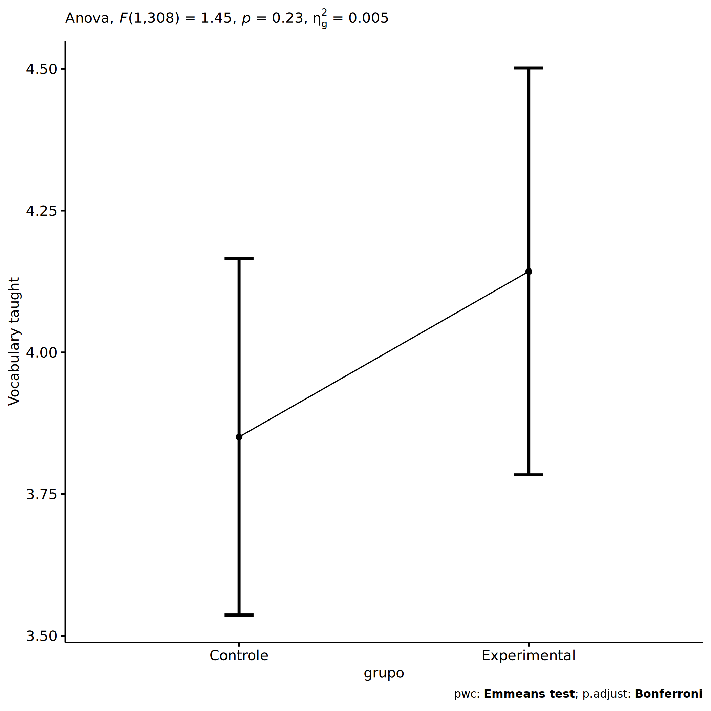<!-- -->

``` r
plots <- oneWayAncovaBoxPlots(
  wdat, "score.vocab.ensinado.pos", "grupo", aov, pwc, covar = "score.vocab.ensinado.pre",
  theme = "classic", color = color[["grupo"]],
  subtitle = which(aov$Effect == "grupo"))
```

``` r
if (length(unique(wdat[["grupo"]])) > 1)
  plots[["grupo"]] + ggplot2::ylab("Vocabulary taught") +
  ggplot2::scale_x_discrete(labels=c('pre', 'pos')) +
  if (ymin < ymax) ggplot2::ylim(ymin, ymax)
```

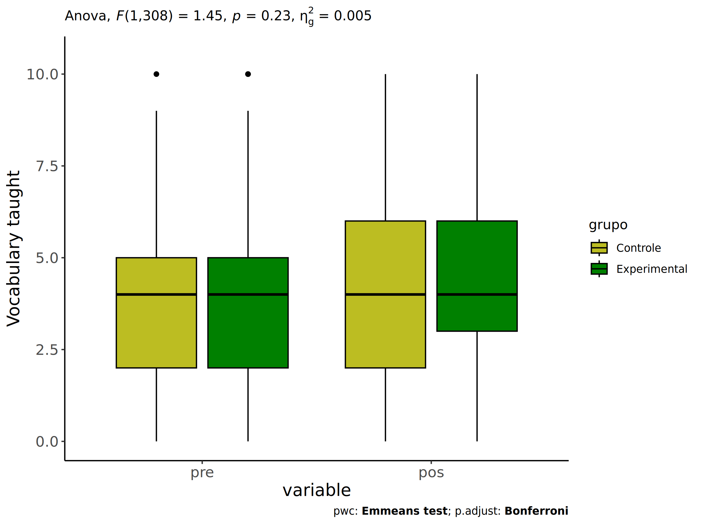<!-- -->

``` r
if (length(unique(wdat.long[["grupo"]])) > 1)
  plots <- oneWayAncovaBoxPlots(
    wdat.long, "score.vocab.ensinado", "grupo", aov, pwc.long,
    pre.post = "time", theme = "classic", color = color$prepost)
```

``` r
if (length(unique(wdat.long[["grupo"]])) > 1)
  plots[["grupo"]] + ggplot2::ylab("Vocabulary taught") +
  if (ymin < ymax) ggplot2::ylim(ymin, ymax) 
```

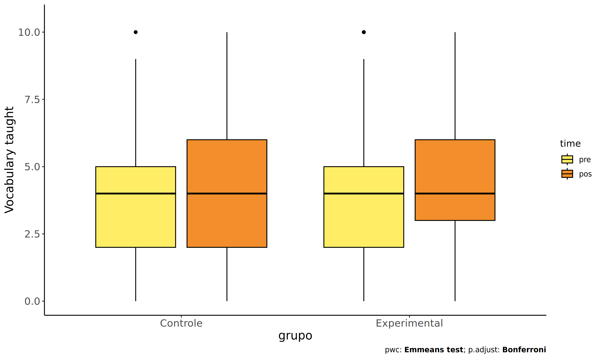<!-- -->

### Checking linearity assumption

``` r
ggscatter(wdat, x = "score.vocab.ensinado.pre", y = "score.vocab.ensinado.pos", size = 0.5,
          color = "grupo", add = "reg.line")+
  stat_regline_equation(
    aes(label =  paste(..eq.label.., ..rr.label.., sep = "~~~~"), color = grupo)
  ) +
  ggplot2::labs(subtitle = rstatix::get_test_label(aov, detailed = T, row = which(aov$Effect == "grupo"))) +
  ggplot2::scale_color_manual(values = color[["grupo"]]) +
  ggplot2::ylab("Vocabulary taught")  +
  if (ymin < ymax) ggplot2::ylim(ymin, ymax)
```

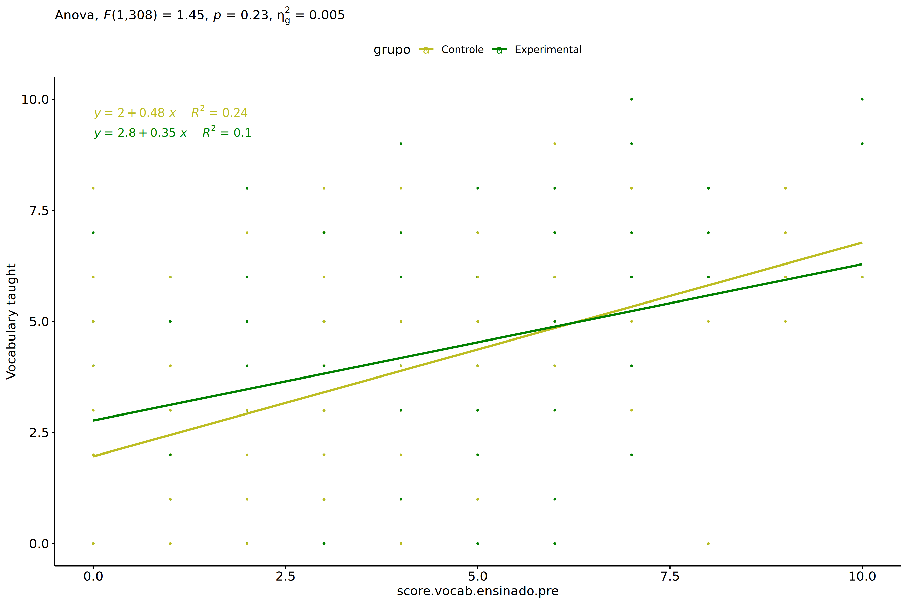<!-- -->

### Checking normality and homogeneity

``` r
res <- augment(lm(score.vocab.ensinado.pos ~ score.vocab.ensinado.pre + grupo, data = wdat))
```

``` r
shapiro_test(res$.resid)
```

    ## # A tibble: 1 × 3
    ##   variable   statistic p.value
    ##   <chr>          <dbl>   <dbl>
    ## 1 res$.resid     0.997   0.733

``` r
levene_test(res, .resid ~ grupo)
```

    ## # A tibble: 1 × 4
    ##     df1   df2 statistic      p
    ##   <int> <int>     <dbl>  <dbl>
    ## 1     1   309      2.84 0.0931

# ANCOVA and Pairwise for two factors **grupo:genero**

## Without remove non-normal data

``` r
pdat = remove_group_data(dat[!is.na(dat[["grupo"]]) & !is.na(dat[["genero"]]),],
                         "score.vocab.ensinado.pos", c("grupo","genero"))
pdat = pdat[pdat[["genero"]] %in% do.call(
  intersect, lapply(unique(pdat[["grupo"]]), FUN = function(x) {
    unique(pdat[["genero"]][which(pdat[["grupo"]] == x)])
  })),]
pdat[["grupo"]] = factor(pdat[["grupo"]], level[["grupo"]])
pdat[["genero"]] = factor(
  pdat[["genero"]],
  level[["genero"]][level[["genero"]] %in% unique(pdat[["genero"]])])

pdat.long <- rbind(pdat[,c("id","grupo","genero")], pdat[,c("id","grupo","genero")])
pdat.long[["time"]] <- c(rep("pre", nrow(pdat)), rep("pos", nrow(pdat)))
pdat.long[["time"]] <- factor(pdat.long[["time"]], c("pre","pos"))
pdat.long[["score.vocab.ensinado"]] <- c(pdat[["score.vocab.ensinado.pre"]], pdat[["score.vocab.ensinado.pos"]])

if (length(unique(pdat[["genero"]])) >= 2) {
  aov = anova_test(pdat, score.vocab.ensinado.pos ~ score.vocab.ensinado.pre + grupo*genero)
  laov[["grupo:genero"]] <- get_anova_table(aov)
}
```

``` r
if (length(unique(pdat[["genero"]])) >= 2) {
  pwcs <- list()
  pwcs[["genero"]] <- emmeans_test(
    group_by(pdat, grupo), score.vocab.ensinado.pos ~ genero,
    covariate = score.vocab.ensinado.pre, p.adjust.method = "bonferroni")
  pwcs[["grupo"]] <- emmeans_test(
    group_by(pdat, genero), score.vocab.ensinado.pos ~ grupo,
    covariate = score.vocab.ensinado.pre, p.adjust.method = "bonferroni")
  
  pwc <- plyr::rbind.fill(pwcs[["grupo"]], pwcs[["genero"]])
  pwc <- pwc[,c("grupo","genero", colnames(pwc)[!colnames(pwc) %in% c("grupo","genero")])]
}
```

``` r
if (length(unique(pdat[["genero"]])) >= 2) {
  pwc.long <- emmeans_test(dplyr::group_by_at(pdat.long, c("grupo","genero")),
                           score.vocab.ensinado ~ time,
                           p.adjust.method = "bonferroni")
  lpwc[["grupo:genero"]] <- plyr::rbind.fill(pwc, pwc.long)
}
```

``` r
if (length(unique(pdat[["genero"]])) >= 2) {
  ds <- get.descriptives(pdat, "score.vocab.ensinado.pos", c("grupo","genero"), covar = "score.vocab.ensinado.pre")
  ds <- merge(ds[ds$variable != "score.vocab.ensinado.pre",],
              ds[ds$variable == "score.vocab.ensinado.pre", !colnames(ds) %in% c("variable")],
              by = c("grupo","genero"), all.x = T, suffixes = c("", ".score.vocab.ensinado.pre"))
  ds <- merge(get_emmeans(pwcs[["grupo"]]), ds,
              by = c("grupo","genero"), suffixes = c(".emms", ""))
  ds <- ds[,c("grupo","genero","n","mean.score.vocab.ensinado.pre","se.score.vocab.ensinado.pre","mean","se",
              "emmean","se.emms","conf.low","conf.high")]
  
  colnames(ds) <- c("grupo","genero", "N", paste0(c("M","SE")," (pre)"),
                    paste0(c("M","SE"), " (unadj)"),
                    paste0(c("M", "SE"), " (adj)"), "conf.low", "conf.high")
  
  lemms[["grupo:genero"]] <- ds
}
```

## Computing ANCOVA and PairWise After removing non-normal data (OK)

``` r
if (length(unique(pdat[["genero"]])) >= 2) {
  wdat = pdat 
  
  res = residuals(lm(score.vocab.ensinado.pos ~ score.vocab.ensinado.pre + grupo*genero, data = wdat))
  non.normal = getNonNormal(res, wdat$id, plimit = 0.05)
  
  wdat = wdat[!wdat$id %in% non.normal,]
  
  wdat.long <- rbind(wdat[,c("id","grupo","genero")], wdat[,c("id","grupo","genero")])
  wdat.long[["time"]] <- c(rep("pre", nrow(wdat)), rep("pos", nrow(wdat)))
  wdat.long[["time"]] <- factor(wdat.long[["time"]], c("pre","pos"))
  wdat.long[["score.vocab.ensinado"]] <- c(wdat[["score.vocab.ensinado.pre"]], wdat[["score.vocab.ensinado.pos"]])
  
  
  ldat[["grupo:genero"]] = wdat
  
  (non.normal)
}
```

    ## NULL

``` r
if (length(unique(pdat[["genero"]])) >= 2) {
  aov = anova_test(wdat, score.vocab.ensinado.pos ~ score.vocab.ensinado.pre + grupo*genero)
  laov[["grupo:genero"]] <- merge(get_anova_table(aov), laov[["grupo:genero"]],
                                         by="Effect", suffixes = c("","'"))
  df = get_anova_table(aov)
}
```

| Effect                   | DFn | DFd |      F |     p | p\<.05 |   ges |
|:-------------------------|----:|----:|-------:|------:|:-------|------:|
| score.vocab.ensinado.pre |   1 | 305 | 67.423 | 0.000 | \*     | 0.181 |
| grupo                    |   1 | 305 |  2.101 | 0.148 |        | 0.007 |
| genero                   |   1 | 305 |  1.382 | 0.241 |        | 0.005 |
| grupo:genero             |   1 | 305 |  0.277 | 0.599 |        | 0.001 |

``` r
if (length(unique(pdat[["genero"]])) >= 2) {
  pwcs <- list()
  pwcs[["genero"]] <- emmeans_test(
    group_by(wdat, grupo), score.vocab.ensinado.pos ~ genero,
    covariate = score.vocab.ensinado.pre, p.adjust.method = "bonferroni")
  pwcs[["grupo"]] <- emmeans_test(
    group_by(wdat, genero), score.vocab.ensinado.pos ~ grupo,
    covariate = score.vocab.ensinado.pre, p.adjust.method = "bonferroni")
  
  pwc <- plyr::rbind.fill(pwcs[["grupo"]], pwcs[["genero"]])
  pwc <- pwc[,c("grupo","genero", colnames(pwc)[!colnames(pwc) %in% c("grupo","genero")])]
}
```

| grupo | genero | term | .y. | group1 | group2 | df | statistic | p | p.adj | p.adj.signif |
|:---|:---|:---|:---|:---|:---|---:|---:|---:|---:|:---|
|  | F | score.vocab.ensinado.pre\*grupo | score.vocab.ensinado.pos | Controle | Experimental | 305 | -0.598 | 0.550 | 0.550 | ns |
|  | M | score.vocab.ensinado.pre\*grupo | score.vocab.ensinado.pos | Controle | Experimental | 305 | -1.422 | 0.156 | 0.156 | ns |
| Controle |  | score.vocab.ensinado.pre\*genero | score.vocab.ensinado.pos | F | M | 305 | 1.236 | 0.217 | 0.217 | ns |
| Experimental |  | score.vocab.ensinado.pre\*genero | score.vocab.ensinado.pos | F | M | 305 | 0.371 | 0.711 | 0.711 | ns |

``` r
if (length(unique(pdat[["genero"]])) >= 2) {
  pwc.long <- emmeans_test(dplyr::group_by_at(wdat.long, c("grupo","genero")),
                           score.vocab.ensinado ~ time,
                           p.adjust.method = "bonferroni")
  lpwc[["grupo:genero"]] <- merge(plyr::rbind.fill(pwc, pwc.long),
                                         lpwc[["grupo:genero"]],
                                         by=c("grupo","genero","term",".y.","group1","group2"),
                                         suffixes = c("","'"))
}
```

| grupo | genero | term | .y. | group1 | group2 | df | statistic | p | p.adj | p.adj.signif |
|:---|:---|:---|:---|:---|:---|---:|---:|---:|---:|:---|
| Controle | F | time | score.vocab.ensinado | pre | pos | 612 | -0.300 | 0.764 | 0.764 | ns |
| Controle | M | time | score.vocab.ensinado | pre | pos | 612 | 0.362 | 0.717 | 0.717 | ns |
| Experimental | F | time | score.vocab.ensinado | pre | pos | 612 | 0.081 | 0.936 | 0.936 | ns |
| Experimental | M | time | score.vocab.ensinado | pre | pos | 612 | -0.897 | 0.370 | 0.370 | ns |

``` r
if (length(unique(pdat[["genero"]])) >= 2) {
  ds <- get.descriptives(wdat, "score.vocab.ensinado.pos", c("grupo","genero"), covar = "score.vocab.ensinado.pre")
  ds <- merge(ds[ds$variable != "score.vocab.ensinado.pre",],
              ds[ds$variable == "score.vocab.ensinado.pre", !colnames(ds) %in% c("variable")],
              by = c("grupo","genero"), all.x = T, suffixes = c("", ".score.vocab.ensinado.pre"))
  ds <- merge(get_emmeans(pwcs[["grupo"]]), ds,
              by = c("grupo","genero"), suffixes = c(".emms", ""))
  ds <- ds[,c("grupo","genero","n","mean.score.vocab.ensinado.pre","se.score.vocab.ensinado.pre",
              "mean","se","emmean","se.emms","conf.low","conf.high")]
  
  colnames(ds) <- c("grupo","genero", "N", paste0(c("M","SE")," (pre)"),
                    paste0(c("M","SE"), " (unadj)"),
                    paste0(c("M", "SE"), " (adj)"), "conf.low", "conf.high")
  
  lemms[["grupo:genero"]] <- merge(ds, lemms[["grupo:genero"]],
                                          by=c("grupo","genero"), suffixes = c("","'"))
}
```

| grupo | genero | N | M (pre) | SE (pre) | M (unadj) | SE (unadj) | M (adj) | SE (adj) | conf.low | conf.high |
|:---|:---|---:|---:|---:|---:|---:|---:|---:|---:|---:|
| Controle | F | 87 | 3.954 | 0.257 | 4.057 | 0.253 | 4.044 | 0.224 | 3.602 | 4.485 |
| Controle | M | 89 | 3.663 | 0.239 | 3.539 | 0.230 | 3.653 | 0.222 | 3.216 | 4.091 |
| Experimental | F | 59 | 4.576 | 0.301 | 4.542 | 0.327 | 4.256 | 0.275 | 3.715 | 4.797 |
| Experimental | M | 75 | 3.680 | 0.226 | 4.013 | 0.259 | 4.120 | 0.242 | 3.643 | 4.596 |

### Plots for ancova

``` r
if (length(unique(pdat[["genero"]])) >= 2) {
  ggPlotAoC2(pwcs, "grupo", "genero", aov, ylab = "Vocabulary taught",
             subtitle = which(aov$Effect == "grupo:genero"), addParam = "errorbar") +
    ggplot2::scale_color_manual(values = color[["genero"]]) +
    ggplot2::ylab("Vocabulary taught") +
    if (ymin.ci < ymax.ci) ggplot2::ylim(ymin.ci, ymax.ci)
}
```

    ## Scale for colour is already present.
    ## Adding another scale for colour, which will replace the existing scale.

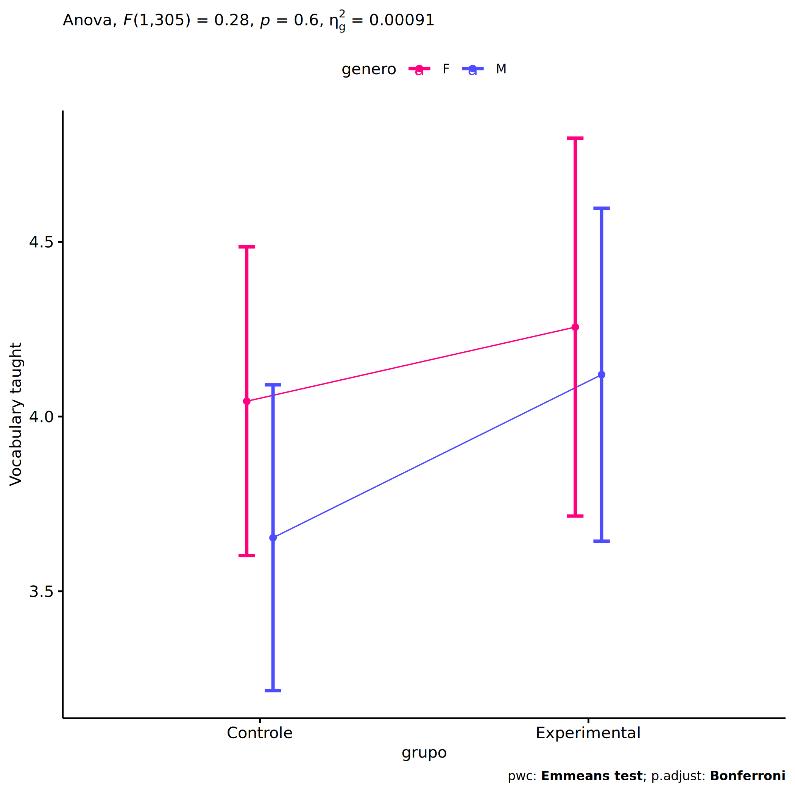<!-- -->

``` r
if (length(unique(pdat[["genero"]])) >= 2) {
  ggPlotAoC2(pwcs, "genero", "grupo", aov, ylab = "Vocabulary taught",
               subtitle = which(aov$Effect == "grupo:genero"), addParam = "errorbar") +
    ggplot2::scale_color_manual(values = color[["grupo"]]) +
    ggplot2::ylab("Vocabulary taught") +
    if (ymin.ci < ymax.ci) ggplot2::ylim(ymin.ci, ymax.ci)
}
```

    ## Scale for colour is already present.
    ## Adding another scale for colour, which will replace the existing scale.

<!-- -->

``` r
if (length(unique(pdat[["genero"]])) >= 2) {
  plots <- twoWayAncovaBoxPlots(
    wdat, "score.vocab.ensinado.pos", c("grupo","genero"), aov, pwcs, covar = "score.vocab.ensinado.pre",
    theme = "classic", color = color[["grupo:genero"]],
    subtitle = which(aov$Effect == "grupo:genero"))
}
```

``` r
if (length(unique(pdat[["genero"]])) >= 2) {
  plots[["grupo:genero"]] + ggplot2::ylab("Vocabulary taught") +
  ggplot2::scale_x_discrete(labels=c('pre', 'pos')) +
  if (ymin < ymax) ggplot2::ylim(ymin, ymax)
}
```

    ## Warning: No shared levels found between `names(values)` of the manual scale and the data's colour values.

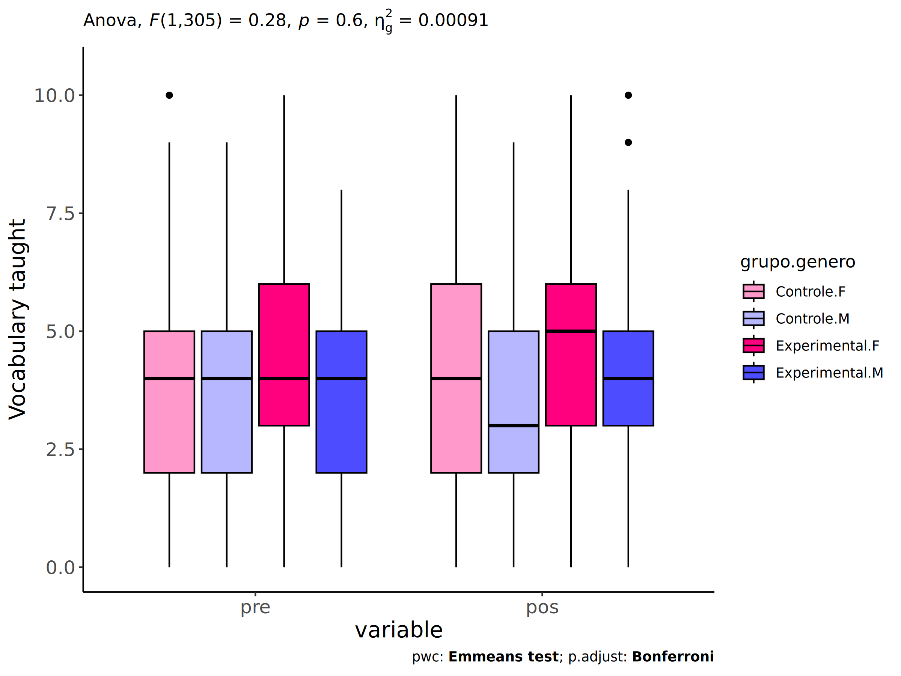<!-- -->

``` r
if (length(unique(pdat[["genero"]])) >= 2) {
  plots <- twoWayAncovaBoxPlots(
    wdat.long, "score.vocab.ensinado", c("grupo","genero"), aov, pwc.long,
    pre.post = "time",
    theme = "classic", color = color$prepost)
}
```

``` r
if (length(unique(pdat[["genero"]])) >= 2) 
  plots[["grupo:genero"]] + ggplot2::ylab("Vocabulary taught") +
    if (ymin < ymax) ggplot2::ylim(ymin, ymax)
```

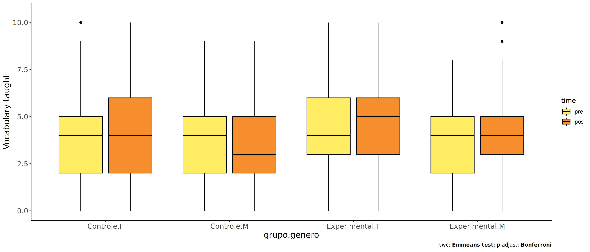<!-- -->

### Checking linearity assumption

``` r
if (length(unique(pdat[["genero"]])) >= 2) {
  ggscatter(wdat, x = "score.vocab.ensinado.pre", y = "score.vocab.ensinado.pos", size = 0.5,
            facet.by = c("grupo","genero"), add = "reg.line")+
    stat_regline_equation(
      aes(label =  paste(..eq.label.., ..rr.label.., sep = "~~~~"))
    ) + ggplot2::ylab("Vocabulary taught") +
    if (ymin < ymax) ggplot2::ylim(ymin, ymax)
}
```

<!-- -->

``` r
if (length(unique(pdat[["genero"]])) >= 2) {
  ggscatter(wdat, x = "score.vocab.ensinado.pre", y = "score.vocab.ensinado.pos", size = 0.5,
            color = "grupo", facet.by = "genero", add = "reg.line")+
    stat_regline_equation(
      aes(label =  paste(..eq.label.., ..rr.label.., sep = "~~~~"), color = grupo)
    ) +
    ggplot2::labs(subtitle = rstatix::get_test_label(aov, detailed = T, row = which(aov$Effect == "grupo:genero"))) +
    ggplot2::scale_color_manual(values = color[["grupo"]]) +
    ggplot2::ylab("Vocabulary taught") +
    if (ymin < ymax) ggplot2::ylim(ymin, ymax)
}
```

<!-- -->

``` r
if (length(unique(pdat[["genero"]])) >= 2) {
  ggscatter(wdat, x = "score.vocab.ensinado.pre", y = "score.vocab.ensinado.pos", size = 0.5,
            color = "genero", facet.by = "grupo", add = "reg.line")+
    stat_regline_equation(
      aes(label =  paste(..eq.label.., ..rr.label.., sep = "~~~~"), color = genero)
    ) +
    ggplot2::labs(subtitle = rstatix::get_test_label(aov, detailed = T, row = which(aov$Effect == "grupo:genero"))) +
    ggplot2::scale_color_manual(values = color[["genero"]]) +
    ggplot2::ylab("Vocabulary taught") +
    if (ymin < ymax) ggplot2::ylim(ymin, ymax)
}
```

<!-- -->

### Checking normality and homogeneity

``` r
if (length(unique(pdat[["genero"]])) >= 2) 
  res <- augment(lm(score.vocab.ensinado.pos ~ score.vocab.ensinado.pre + grupo*genero, data = wdat))
```

``` r
if (length(unique(pdat[["genero"]])) >= 2)
  shapiro_test(res$.resid)
```

    ## # A tibble: 1 × 3
    ##   variable   statistic p.value
    ##   <chr>          <dbl>   <dbl>
    ## 1 res$.resid     0.996   0.709

``` r
if (length(unique(pdat[["genero"]])) >= 2) 
  levene_test(res, .resid ~ grupo*genero)
```

    ## # A tibble: 1 × 4
    ##     df1   df2 statistic     p
    ##   <int> <int>     <dbl> <dbl>
    ## 1     3   306      1.43 0.235

# ANCOVA and Pairwise for two factors **grupo:zona.participante**

## Without remove non-normal data

``` r
pdat = remove_group_data(dat[!is.na(dat[["grupo"]]) & !is.na(dat[["zona.participante"]]),],
                         "score.vocab.ensinado.pos", c("grupo","zona.participante"))
pdat = pdat[pdat[["zona.participante"]] %in% do.call(
  intersect, lapply(unique(pdat[["grupo"]]), FUN = function(x) {
    unique(pdat[["zona.participante"]][which(pdat[["grupo"]] == x)])
  })),]
pdat[["grupo"]] = factor(pdat[["grupo"]], level[["grupo"]])
pdat[["zona.participante"]] = factor(
  pdat[["zona.participante"]],
  level[["zona.participante"]][level[["zona.participante"]] %in% unique(pdat[["zona.participante"]])])

pdat.long <- rbind(pdat[,c("id","grupo","zona.participante")], pdat[,c("id","grupo","zona.participante")])
pdat.long[["time"]] <- c(rep("pre", nrow(pdat)), rep("pos", nrow(pdat)))
pdat.long[["time"]] <- factor(pdat.long[["time"]], c("pre","pos"))
pdat.long[["score.vocab.ensinado"]] <- c(pdat[["score.vocab.ensinado.pre"]], pdat[["score.vocab.ensinado.pos"]])

if (length(unique(pdat[["zona.participante"]])) >= 2) {
  aov = anova_test(pdat, score.vocab.ensinado.pos ~ score.vocab.ensinado.pre + grupo*zona.participante)
  laov[["grupo:zona.participante"]] <- get_anova_table(aov)
}
```

``` r
if (length(unique(pdat[["zona.participante"]])) >= 2) {
  pwcs <- list()
  pwcs[["zona.participante"]] <- emmeans_test(
    group_by(pdat, grupo), score.vocab.ensinado.pos ~ zona.participante,
    covariate = score.vocab.ensinado.pre, p.adjust.method = "bonferroni")
  pwcs[["grupo"]] <- emmeans_test(
    group_by(pdat, zona.participante), score.vocab.ensinado.pos ~ grupo,
    covariate = score.vocab.ensinado.pre, p.adjust.method = "bonferroni")
  
  pwc <- plyr::rbind.fill(pwcs[["grupo"]], pwcs[["zona.participante"]])
  pwc <- pwc[,c("grupo","zona.participante", colnames(pwc)[!colnames(pwc) %in% c("grupo","zona.participante")])]
}
```

``` r
if (length(unique(pdat[["zona.participante"]])) >= 2) {
  pwc.long <- emmeans_test(dplyr::group_by_at(pdat.long, c("grupo","zona.participante")),
                           score.vocab.ensinado ~ time,
                           p.adjust.method = "bonferroni")
  lpwc[["grupo:zona.participante"]] <- plyr::rbind.fill(pwc, pwc.long)
}
```

``` r
if (length(unique(pdat[["zona.participante"]])) >= 2) {
  ds <- get.descriptives(pdat, "score.vocab.ensinado.pos", c("grupo","zona.participante"), covar = "score.vocab.ensinado.pre")
  ds <- merge(ds[ds$variable != "score.vocab.ensinado.pre",],
              ds[ds$variable == "score.vocab.ensinado.pre", !colnames(ds) %in% c("variable")],
              by = c("grupo","zona.participante"), all.x = T, suffixes = c("", ".score.vocab.ensinado.pre"))
  ds <- merge(get_emmeans(pwcs[["grupo"]]), ds,
              by = c("grupo","zona.participante"), suffixes = c(".emms", ""))
  ds <- ds[,c("grupo","zona.participante","n","mean.score.vocab.ensinado.pre","se.score.vocab.ensinado.pre","mean","se",
              "emmean","se.emms","conf.low","conf.high")]
  
  colnames(ds) <- c("grupo","zona.participante", "N", paste0(c("M","SE")," (pre)"),
                    paste0(c("M","SE"), " (unadj)"),
                    paste0(c("M", "SE"), " (adj)"), "conf.low", "conf.high")
  
  lemms[["grupo:zona.participante"]] <- ds
}
```

## Computing ANCOVA and PairWise After removing non-normal data (OK)

``` r
if (length(unique(pdat[["zona.participante"]])) >= 2) {
  wdat = pdat 
  
  res = residuals(lm(score.vocab.ensinado.pos ~ score.vocab.ensinado.pre + grupo*zona.participante, data = wdat))
  non.normal = getNonNormal(res, wdat$id, plimit = 0.05)
  
  wdat = wdat[!wdat$id %in% non.normal,]
  
  wdat.long <- rbind(wdat[,c("id","grupo","zona.participante")], wdat[,c("id","grupo","zona.participante")])
  wdat.long[["time"]] <- c(rep("pre", nrow(wdat)), rep("pos", nrow(wdat)))
  wdat.long[["time"]] <- factor(wdat.long[["time"]], c("pre","pos"))
  wdat.long[["score.vocab.ensinado"]] <- c(wdat[["score.vocab.ensinado.pre"]], wdat[["score.vocab.ensinado.pos"]])
  
  
  ldat[["grupo:zona.participante"]] = wdat
  
  (non.normal)
}
```

    ## NULL

``` r
if (length(unique(pdat[["zona.participante"]])) >= 2) {
  aov = anova_test(wdat, score.vocab.ensinado.pos ~ score.vocab.ensinado.pre + grupo*zona.participante)
  laov[["grupo:zona.participante"]] <- merge(get_anova_table(aov), laov[["grupo:zona.participante"]],
                                         by="Effect", suffixes = c("","'"))
  df = get_anova_table(aov)
}
```

| Effect                   | DFn | DFd |      F |     p | p\<.05 |   ges |
|:-------------------------|----:|----:|-------:|------:|:-------|------:|
| score.vocab.ensinado.pre |   1 | 229 | 57.816 | 0.000 | \*     | 0.202 |
| grupo                    |   1 | 229 |  1.827 | 0.178 |        | 0.008 |
| zona.participante        |   1 | 229 |  2.623 | 0.107 |        | 0.011 |
| grupo:zona.participante  |   1 | 229 |  0.252 | 0.616 |        | 0.001 |

``` r
if (length(unique(pdat[["zona.participante"]])) >= 2) {
  pwcs <- list()
  pwcs[["zona.participante"]] <- emmeans_test(
    group_by(wdat, grupo), score.vocab.ensinado.pos ~ zona.participante,
    covariate = score.vocab.ensinado.pre, p.adjust.method = "bonferroni")
  pwcs[["grupo"]] <- emmeans_test(
    group_by(wdat, zona.participante), score.vocab.ensinado.pos ~ grupo,
    covariate = score.vocab.ensinado.pre, p.adjust.method = "bonferroni")
  
  pwc <- plyr::rbind.fill(pwcs[["grupo"]], pwcs[["zona.participante"]])
  pwc <- pwc[,c("grupo","zona.participante", colnames(pwc)[!colnames(pwc) %in% c("grupo","zona.participante")])]
}
```

| grupo | zona.participante | term | .y. | group1 | group2 | df | statistic | p | p.adj | p.adj.signif |
|:---|:---|:---|:---|:---|:---|---:|---:|---:|---:|:---|
|  | Rural | score.vocab.ensinado.pre\*grupo | score.vocab.ensinado.pos | Controle | Experimental | 229 | -1.295 | 0.197 | 0.197 | ns |
|  | Urbana | score.vocab.ensinado.pre\*grupo | score.vocab.ensinado.pos | Controle | Experimental | 229 | -0.635 | 0.526 | 0.526 | ns |
| Controle |  | score.vocab.ensinado.pre\*zona.participante | score.vocab.ensinado.pos | Rural | Urbana | 229 | 0.885 | 0.377 | 0.377 | ns |
| Experimental |  | score.vocab.ensinado.pre\*zona.participante | score.vocab.ensinado.pos | Rural | Urbana | 229 | 1.448 | 0.149 | 0.149 | ns |

``` r
if (length(unique(pdat[["zona.participante"]])) >= 2) {
  pwc.long <- emmeans_test(dplyr::group_by_at(wdat.long, c("grupo","zona.participante")),
                           score.vocab.ensinado ~ time,
                           p.adjust.method = "bonferroni")
  lpwc[["grupo:zona.participante"]] <- merge(plyr::rbind.fill(pwc, pwc.long),
                                         lpwc[["grupo:zona.participante"]],
                                         by=c("grupo","zona.participante","term",".y.","group1","group2"),
                                         suffixes = c("","'"))
}
```

| grupo | zona.participante | term | .y. | group1 | group2 | df | statistic | p | p.adj | p.adj.signif |
|:---|:---|:---|:---|:---|:---|---:|---:|---:|---:|:---|
| Controle | Rural | time | score.vocab.ensinado | pre | pos | 460 | -1.078 | 0.282 | 0.282 | ns |
| Controle | Urbana | time | score.vocab.ensinado | pre | pos | 460 | -0.106 | 0.916 | 0.916 | ns |
| Experimental | Rural | time | score.vocab.ensinado | pre | pos | 460 | -2.022 | 0.044 | 0.044 | \* |
| Experimental | Urbana | time | score.vocab.ensinado | pre | pos | 460 | -0.266 | 0.790 | 0.790 | ns |

``` r
if (length(unique(pdat[["zona.participante"]])) >= 2) {
  ds <- get.descriptives(wdat, "score.vocab.ensinado.pos", c("grupo","zona.participante"), covar = "score.vocab.ensinado.pre")
  ds <- merge(ds[ds$variable != "score.vocab.ensinado.pre",],
              ds[ds$variable == "score.vocab.ensinado.pre", !colnames(ds) %in% c("variable")],
              by = c("grupo","zona.participante"), all.x = T, suffixes = c("", ".score.vocab.ensinado.pre"))
  ds <- merge(get_emmeans(pwcs[["grupo"]]), ds,
              by = c("grupo","zona.participante"), suffixes = c(".emms", ""))
  ds <- ds[,c("grupo","zona.participante","n","mean.score.vocab.ensinado.pre","se.score.vocab.ensinado.pre",
              "mean","se","emmean","se.emms","conf.low","conf.high")]
  
  colnames(ds) <- c("grupo","zona.participante", "N", paste0(c("M","SE")," (pre)"),
                    paste0(c("M","SE"), " (unadj)"),
                    paste0(c("M", "SE"), " (adj)"), "conf.low", "conf.high")
  
  lemms[["grupo:zona.participante"]] <- merge(ds, lemms[["grupo:zona.participante"]],
                                          by=c("grupo","zona.participante"), suffixes = c("","'"))
}
```

| grupo | zona.participante | N | M (pre) | SE (pre) | M (unadj) | SE (unadj) | M (adj) | SE (adj) | conf.low | conf.high |
|:---|:---|---:|---:|---:|---:|---:|---:|---:|---:|---:|
| Controle | Rural | 56 | 3.696 | 0.339 | 4.161 | 0.265 | 4.243 | 0.269 | 3.712 | 4.774 |
| Controle | Urbana | 77 | 3.896 | 0.262 | 3.935 | 0.282 | 3.930 | 0.229 | 3.478 | 4.382 |
| Experimental | Rural | 52 | 3.808 | 0.310 | 4.712 | 0.268 | 4.745 | 0.279 | 4.195 | 5.295 |
| Experimental | Urbana | 49 | 4.163 | 0.302 | 4.286 | 0.351 | 4.164 | 0.288 | 3.596 | 4.732 |

### Plots for ancova

``` r
if (length(unique(pdat[["zona.participante"]])) >= 2) {
  ggPlotAoC2(pwcs, "grupo", "zona.participante", aov, ylab = "Vocabulary taught",
             subtitle = which(aov$Effect == "grupo:zona.participante"), addParam = "errorbar") +
    ggplot2::scale_color_manual(values = color[["zona.participante"]]) +
    ggplot2::ylab("Vocabulary taught") +
    if (ymin.ci < ymax.ci) ggplot2::ylim(ymin.ci, ymax.ci)
}
```

    ## Scale for colour is already present.
    ## Adding another scale for colour, which will replace the existing scale.

<!-- -->

``` r
if (length(unique(pdat[["zona.participante"]])) >= 2) {
  ggPlotAoC2(pwcs, "zona.participante", "grupo", aov, ylab = "Vocabulary taught",
               subtitle = which(aov$Effect == "grupo:zona.participante"), addParam = "errorbar") +
    ggplot2::scale_color_manual(values = color[["grupo"]]) +
    ggplot2::ylab("Vocabulary taught") +
    if (ymin.ci < ymax.ci) ggplot2::ylim(ymin.ci, ymax.ci)
}
```

    ## Scale for colour is already present.
    ## Adding another scale for colour, which will replace the existing scale.

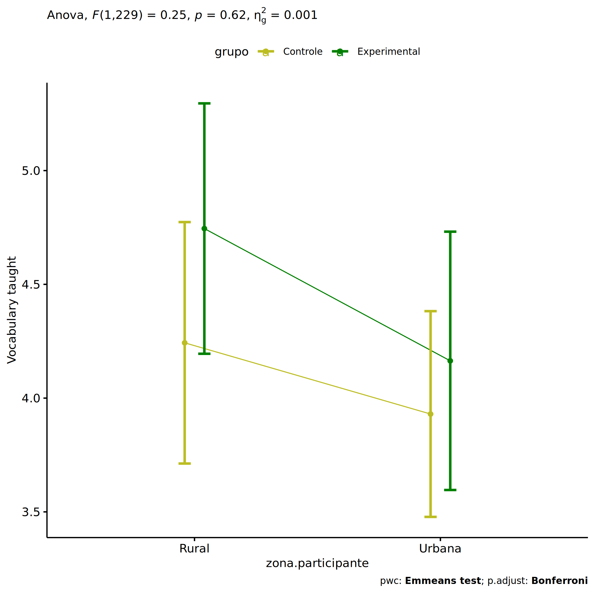<!-- -->

``` r
if (length(unique(pdat[["zona.participante"]])) >= 2) {
  plots <- twoWayAncovaBoxPlots(
    wdat, "score.vocab.ensinado.pos", c("grupo","zona.participante"), aov, pwcs, covar = "score.vocab.ensinado.pre",
    theme = "classic", color = color[["grupo:zona.participante"]],
    subtitle = which(aov$Effect == "grupo:zona.participante"))
}
```

``` r
if (length(unique(pdat[["zona.participante"]])) >= 2) {
  plots[["grupo:zona.participante"]] + ggplot2::ylab("Vocabulary taught") +
  ggplot2::scale_x_discrete(labels=c('pre', 'pos')) +
  if (ymin < ymax) ggplot2::ylim(ymin, ymax)
}
```

    ## Warning: No shared levels found between `names(values)` of the manual scale and the data's colour values.

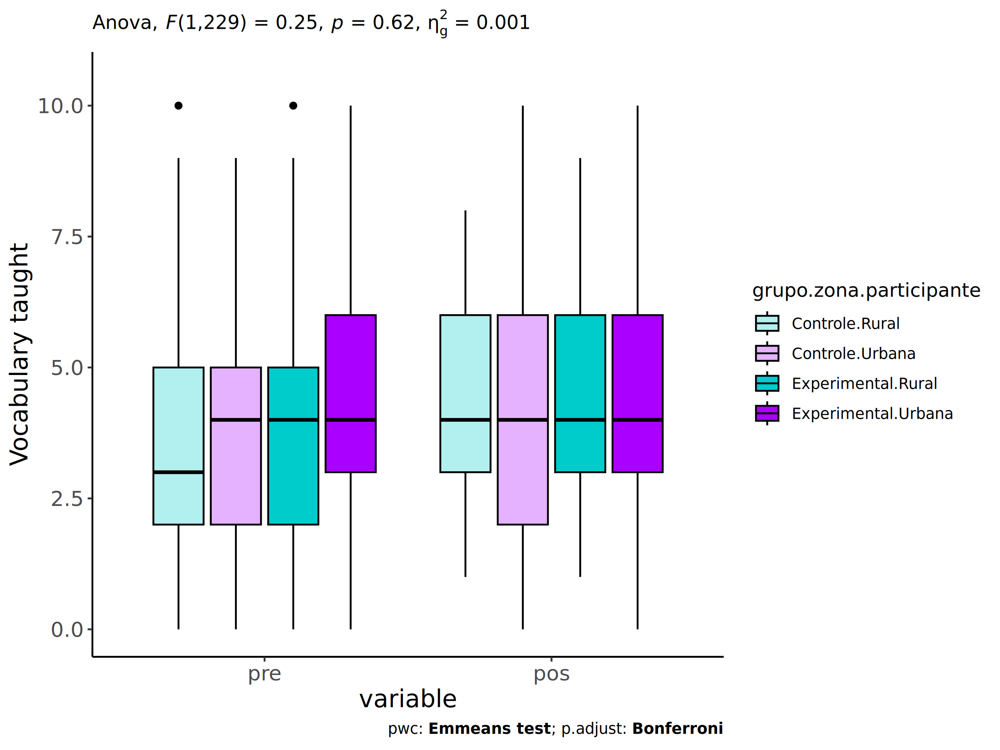<!-- -->

``` r
if (length(unique(pdat[["zona.participante"]])) >= 2) {
  plots <- twoWayAncovaBoxPlots(
    wdat.long, "score.vocab.ensinado", c("grupo","zona.participante"), aov, pwc.long,
    pre.post = "time",
    theme = "classic", color = color$prepost)
}
```

``` r
if (length(unique(pdat[["zona.participante"]])) >= 2) 
  plots[["grupo:zona.participante"]] + ggplot2::ylab("Vocabulary taught") +
    if (ymin < ymax) ggplot2::ylim(ymin, ymax)
```

<!-- -->

### Checking linearity assumption

``` r
if (length(unique(pdat[["zona.participante"]])) >= 2) {
  ggscatter(wdat, x = "score.vocab.ensinado.pre", y = "score.vocab.ensinado.pos", size = 0.5,
            facet.by = c("grupo","zona.participante"), add = "reg.line")+
    stat_regline_equation(
      aes(label =  paste(..eq.label.., ..rr.label.., sep = "~~~~"))
    ) + ggplot2::ylab("Vocabulary taught") +
    if (ymin < ymax) ggplot2::ylim(ymin, ymax)
}
```

<!-- -->

``` r
if (length(unique(pdat[["zona.participante"]])) >= 2) {
  ggscatter(wdat, x = "score.vocab.ensinado.pre", y = "score.vocab.ensinado.pos", size = 0.5,
            color = "grupo", facet.by = "zona.participante", add = "reg.line")+
    stat_regline_equation(
      aes(label =  paste(..eq.label.., ..rr.label.., sep = "~~~~"), color = grupo)
    ) +
    ggplot2::labs(subtitle = rstatix::get_test_label(aov, detailed = T, row = which(aov$Effect == "grupo:zona.participante"))) +
    ggplot2::scale_color_manual(values = color[["grupo"]]) +
    ggplot2::ylab("Vocabulary taught") +
    if (ymin < ymax) ggplot2::ylim(ymin, ymax)
}
```

<!-- -->

``` r
if (length(unique(pdat[["zona.participante"]])) >= 2) {
  ggscatter(wdat, x = "score.vocab.ensinado.pre", y = "score.vocab.ensinado.pos", size = 0.5,
            color = "zona.participante", facet.by = "grupo", add = "reg.line")+
    stat_regline_equation(
      aes(label =  paste(..eq.label.., ..rr.label.., sep = "~~~~"), color = zona.participante)
    ) +
    ggplot2::labs(subtitle = rstatix::get_test_label(aov, detailed = T, row = which(aov$Effect == "grupo:zona.participante"))) +
    ggplot2::scale_color_manual(values = color[["zona.participante"]]) +
    ggplot2::ylab("Vocabulary taught") +
    if (ymin < ymax) ggplot2::ylim(ymin, ymax)
}
```

<!-- -->

### Checking normality and homogeneity

``` r
if (length(unique(pdat[["zona.participante"]])) >= 2) 
  res <- augment(lm(score.vocab.ensinado.pos ~ score.vocab.ensinado.pre + grupo*zona.participante, data = wdat))
```

``` r
if (length(unique(pdat[["zona.participante"]])) >= 2)
  shapiro_test(res$.resid)
```

    ## # A tibble: 1 × 3
    ##   variable   statistic p.value
    ##   <chr>          <dbl>   <dbl>
    ## 1 res$.resid     0.995   0.604

``` r
if (length(unique(pdat[["zona.participante"]])) >= 2) 
  levene_test(res, .resid ~ grupo*zona.participante)
```

    ## # A tibble: 1 × 4
    ##     df1   df2 statistic      p
    ##   <int> <int>     <dbl>  <dbl>
    ## 1     3   230      2.41 0.0675

# ANCOVA and Pairwise for two factors **grupo:zona.escola**

## Without remove non-normal data

``` r
pdat = remove_group_data(dat[!is.na(dat[["grupo"]]) & !is.na(dat[["zona.escola"]]),],
                         "score.vocab.ensinado.pos", c("grupo","zona.escola"))
pdat = pdat[pdat[["zona.escola"]] %in% do.call(
  intersect, lapply(unique(pdat[["grupo"]]), FUN = function(x) {
    unique(pdat[["zona.escola"]][which(pdat[["grupo"]] == x)])
  })),]
pdat[["grupo"]] = factor(pdat[["grupo"]], level[["grupo"]])
pdat[["zona.escola"]] = factor(
  pdat[["zona.escola"]],
  level[["zona.escola"]][level[["zona.escola"]] %in% unique(pdat[["zona.escola"]])])

pdat.long <- rbind(pdat[,c("id","grupo","zona.escola")], pdat[,c("id","grupo","zona.escola")])
pdat.long[["time"]] <- c(rep("pre", nrow(pdat)), rep("pos", nrow(pdat)))
pdat.long[["time"]] <- factor(pdat.long[["time"]], c("pre","pos"))
pdat.long[["score.vocab.ensinado"]] <- c(pdat[["score.vocab.ensinado.pre"]], pdat[["score.vocab.ensinado.pos"]])

if (length(unique(pdat[["zona.escola"]])) >= 2) {
  aov = anova_test(pdat, score.vocab.ensinado.pos ~ score.vocab.ensinado.pre + grupo*zona.escola)
  laov[["grupo:zona.escola"]] <- get_anova_table(aov)
}
```

``` r
if (length(unique(pdat[["zona.escola"]])) >= 2) {
  pwcs <- list()
  pwcs[["zona.escola"]] <- emmeans_test(
    group_by(pdat, grupo), score.vocab.ensinado.pos ~ zona.escola,
    covariate = score.vocab.ensinado.pre, p.adjust.method = "bonferroni")
  pwcs[["grupo"]] <- emmeans_test(
    group_by(pdat, zona.escola), score.vocab.ensinado.pos ~ grupo,
    covariate = score.vocab.ensinado.pre, p.adjust.method = "bonferroni")
  
  pwc <- plyr::rbind.fill(pwcs[["grupo"]], pwcs[["zona.escola"]])
  pwc <- pwc[,c("grupo","zona.escola", colnames(pwc)[!colnames(pwc) %in% c("grupo","zona.escola")])]
}
```

``` r
if (length(unique(pdat[["zona.escola"]])) >= 2) {
  pwc.long <- emmeans_test(dplyr::group_by_at(pdat.long, c("grupo","zona.escola")),
                           score.vocab.ensinado ~ time,
                           p.adjust.method = "bonferroni")
  lpwc[["grupo:zona.escola"]] <- plyr::rbind.fill(pwc, pwc.long)
}
```

``` r
if (length(unique(pdat[["zona.escola"]])) >= 2) {
  ds <- get.descriptives(pdat, "score.vocab.ensinado.pos", c("grupo","zona.escola"), covar = "score.vocab.ensinado.pre")
  ds <- merge(ds[ds$variable != "score.vocab.ensinado.pre",],
              ds[ds$variable == "score.vocab.ensinado.pre", !colnames(ds) %in% c("variable")],
              by = c("grupo","zona.escola"), all.x = T, suffixes = c("", ".score.vocab.ensinado.pre"))
  ds <- merge(get_emmeans(pwcs[["grupo"]]), ds,
              by = c("grupo","zona.escola"), suffixes = c(".emms", ""))
  ds <- ds[,c("grupo","zona.escola","n","mean.score.vocab.ensinado.pre","se.score.vocab.ensinado.pre","mean","se",
              "emmean","se.emms","conf.low","conf.high")]
  
  colnames(ds) <- c("grupo","zona.escola", "N", paste0(c("M","SE")," (pre)"),
                    paste0(c("M","SE"), " (unadj)"),
                    paste0(c("M", "SE"), " (adj)"), "conf.low", "conf.high")
  
  lemms[["grupo:zona.escola"]] <- ds
}
```

## Computing ANCOVA and PairWise After removing non-normal data (OK)

``` r
if (length(unique(pdat[["zona.escola"]])) >= 2) {
  wdat = pdat 
  
  res = residuals(lm(score.vocab.ensinado.pos ~ score.vocab.ensinado.pre + grupo*zona.escola, data = wdat))
  non.normal = getNonNormal(res, wdat$id, plimit = 0.05)
  
  wdat = wdat[!wdat$id %in% non.normal,]
  
  wdat.long <- rbind(wdat[,c("id","grupo","zona.escola")], wdat[,c("id","grupo","zona.escola")])
  wdat.long[["time"]] <- c(rep("pre", nrow(wdat)), rep("pos", nrow(wdat)))
  wdat.long[["time"]] <- factor(wdat.long[["time"]], c("pre","pos"))
  wdat.long[["score.vocab.ensinado"]] <- c(wdat[["score.vocab.ensinado.pre"]], wdat[["score.vocab.ensinado.pos"]])
  
  
  ldat[["grupo:zona.escola"]] = wdat
  
  (non.normal)
}
```

    ## NULL

``` r
if (length(unique(pdat[["zona.escola"]])) >= 2) {
  aov = anova_test(wdat, score.vocab.ensinado.pos ~ score.vocab.ensinado.pre + grupo*zona.escola)
  laov[["grupo:zona.escola"]] <- merge(get_anova_table(aov), laov[["grupo:zona.escola"]],
                                         by="Effect", suffixes = c("","'"))
  df = get_anova_table(aov)
}
```

| Effect                   | DFn | DFd |      F |     p | p\<.05 |   ges |
|:-------------------------|----:|----:|-------:|------:|:-------|------:|
| score.vocab.ensinado.pre |   1 | 306 | 64.520 | 0.000 | \*     | 0.174 |
| grupo                    |   1 | 306 |  1.504 | 0.221 |        | 0.005 |
| zona.escola              |   1 | 306 |  0.464 | 0.496 |        | 0.002 |
| grupo:zona.escola        |   1 | 306 |  0.455 | 0.501 |        | 0.001 |

``` r
if (length(unique(pdat[["zona.escola"]])) >= 2) {
  pwcs <- list()
  pwcs[["zona.escola"]] <- emmeans_test(
    group_by(wdat, grupo), score.vocab.ensinado.pos ~ zona.escola,
    covariate = score.vocab.ensinado.pre, p.adjust.method = "bonferroni")
  pwcs[["grupo"]] <- emmeans_test(
    group_by(wdat, zona.escola), score.vocab.ensinado.pos ~ grupo,
    covariate = score.vocab.ensinado.pre, p.adjust.method = "bonferroni")
  
  pwc <- plyr::rbind.fill(pwcs[["grupo"]], pwcs[["zona.escola"]])
  pwc <- pwc[,c("grupo","zona.escola", colnames(pwc)[!colnames(pwc) %in% c("grupo","zona.escola")])]
}
```

| grupo | zona.escola | term | .y. | group1 | group2 | df | statistic | p | p.adj | p.adj.signif |
|:---|:---|:---|:---|:---|:---|---:|---:|---:|---:|:---|
|  | Rural | score.vocab.ensinado.pre\*grupo | score.vocab.ensinado.pos | Controle | Experimental | 306 | -0.124 | 0.902 | 0.902 | ns |
|  | Urbana | score.vocab.ensinado.pre\*grupo | score.vocab.ensinado.pos | Controle | Experimental | 306 | -1.394 | 0.164 | 0.164 | ns |
| Controle |  | score.vocab.ensinado.pre\*zona.escola | score.vocab.ensinado.pos | Rural | Urbana | 306 | 0.955 | 0.340 | 0.340 | ns |
| Experimental |  | score.vocab.ensinado.pre\*zona.escola | score.vocab.ensinado.pos | Rural | Urbana | 306 | -0.072 | 0.942 | 0.942 | ns |

``` r
if (length(unique(pdat[["zona.escola"]])) >= 2) {
  pwc.long <- emmeans_test(dplyr::group_by_at(wdat.long, c("grupo","zona.escola")),
                           score.vocab.ensinado ~ time,
                           p.adjust.method = "bonferroni")
  lpwc[["grupo:zona.escola"]] <- merge(plyr::rbind.fill(pwc, pwc.long),
                                         lpwc[["grupo:zona.escola"]],
                                         by=c("grupo","zona.escola","term",".y.","group1","group2"),
                                         suffixes = c("","'"))
}
```

| grupo | zona.escola | term | .y. | group1 | group2 | df | statistic | p | p.adj | p.adj.signif |
|:---|:---|:---|:---|:---|:---|---:|---:|---:|---:|:---|
| Controle | Rural | time | score.vocab.ensinado | pre | pos | 614 | -0.363 | 0.716 | 0.716 | ns |
| Controle | Urbana | time | score.vocab.ensinado | pre | pos | 614 | 0.311 | 0.756 | 0.756 | ns |
| Experimental | Rural | time | score.vocab.ensinado | pre | pos | 614 | 0.097 | 0.923 | 0.923 | ns |
| Experimental | Urbana | time | score.vocab.ensinado | pre | pos | 614 | -0.536 | 0.592 | 0.592 | ns |

``` r
if (length(unique(pdat[["zona.escola"]])) >= 2) {
  ds <- get.descriptives(wdat, "score.vocab.ensinado.pos", c("grupo","zona.escola"), covar = "score.vocab.ensinado.pre")
  ds <- merge(ds[ds$variable != "score.vocab.ensinado.pre",],
              ds[ds$variable == "score.vocab.ensinado.pre", !colnames(ds) %in% c("variable")],
              by = c("grupo","zona.escola"), all.x = T, suffixes = c("", ".score.vocab.ensinado.pre"))
  ds <- merge(get_emmeans(pwcs[["grupo"]]), ds,
              by = c("grupo","zona.escola"), suffixes = c(".emms", ""))
  ds <- ds[,c("grupo","zona.escola","n","mean.score.vocab.ensinado.pre","se.score.vocab.ensinado.pre",
              "mean","se","emmean","se.emms","conf.low","conf.high")]
  
  colnames(ds) <- c("grupo","zona.escola", "N", paste0(c("M","SE")," (pre)"),
                    paste0(c("M","SE"), " (unadj)"),
                    paste0(c("M", "SE"), " (adj)"), "conf.low", "conf.high")
  
  lemms[["grupo:zona.escola"]] <- merge(ds, lemms[["grupo:zona.escola"]],
                                          by=c("grupo","zona.escola"), suffixes = c("","'"))
}
```

| grupo | zona.escola | N | M (pre) | SE (pre) | M (unadj) | SE (unadj) | M (adj) | SE (adj) | conf.low | conf.high |
|:---|:---|---:|---:|---:|---:|---:|---:|---:|---:|---:|
| Controle | Rural | 58 | 3.897 | 0.306 | 4.052 | 0.284 | 4.068 | 0.278 | 3.521 | 4.616 |
| Controle | Urbana | 118 | 3.763 | 0.215 | 3.669 | 0.214 | 3.744 | 0.195 | 3.359 | 4.128 |
| Experimental | Rural | 40 | 4.350 | 0.395 | 4.300 | 0.358 | 4.122 | 0.336 | 3.461 | 4.784 |
| Experimental | Urbana | 95 | 4.000 | 0.209 | 4.179 | 0.251 | 4.151 | 0.218 | 3.723 | 4.579 |

### Plots for ancova

``` r
if (length(unique(pdat[["zona.escola"]])) >= 2) {
  ggPlotAoC2(pwcs, "grupo", "zona.escola", aov, ylab = "Vocabulary taught",
             subtitle = which(aov$Effect == "grupo:zona.escola"), addParam = "errorbar") +
    ggplot2::scale_color_manual(values = color[["zona.escola"]]) +
    ggplot2::ylab("Vocabulary taught") +
    if (ymin.ci < ymax.ci) ggplot2::ylim(ymin.ci, ymax.ci)
}
```

    ## Scale for colour is already present.
    ## Adding another scale for colour, which will replace the existing scale.

<!-- -->

``` r
if (length(unique(pdat[["zona.escola"]])) >= 2) {
  ggPlotAoC2(pwcs, "zona.escola", "grupo", aov, ylab = "Vocabulary taught",
               subtitle = which(aov$Effect == "grupo:zona.escola"), addParam = "errorbar") +
    ggplot2::scale_color_manual(values = color[["grupo"]]) +
    ggplot2::ylab("Vocabulary taught") +
    if (ymin.ci < ymax.ci) ggplot2::ylim(ymin.ci, ymax.ci)
}
```

    ## Scale for colour is already present.
    ## Adding another scale for colour, which will replace the existing scale.

<!-- -->

``` r
if (length(unique(pdat[["zona.escola"]])) >= 2) {
  plots <- twoWayAncovaBoxPlots(
    wdat, "score.vocab.ensinado.pos", c("grupo","zona.escola"), aov, pwcs, covar = "score.vocab.ensinado.pre",
    theme = "classic", color = color[["grupo:zona.escola"]],
    subtitle = which(aov$Effect == "grupo:zona.escola"))
}
```

``` r
if (length(unique(pdat[["zona.escola"]])) >= 2) {
  plots[["grupo:zona.escola"]] + ggplot2::ylab("Vocabulary taught") +
  ggplot2::scale_x_discrete(labels=c('pre', 'pos')) +
  if (ymin < ymax) ggplot2::ylim(ymin, ymax)
}
```

    ## Warning: No shared levels found between `names(values)` of the manual scale and the data's colour values.

<!-- -->

``` r
if (length(unique(pdat[["zona.escola"]])) >= 2) {
  plots <- twoWayAncovaBoxPlots(
    wdat.long, "score.vocab.ensinado", c("grupo","zona.escola"), aov, pwc.long,
    pre.post = "time",
    theme = "classic", color = color$prepost)
}
```

``` r
if (length(unique(pdat[["zona.escola"]])) >= 2) 
  plots[["grupo:zona.escola"]] + ggplot2::ylab("Vocabulary taught") +
    if (ymin < ymax) ggplot2::ylim(ymin, ymax)
```

<!-- -->

### Checking linearity assumption

``` r
if (length(unique(pdat[["zona.escola"]])) >= 2) {
  ggscatter(wdat, x = "score.vocab.ensinado.pre", y = "score.vocab.ensinado.pos", size = 0.5,
            facet.by = c("grupo","zona.escola"), add = "reg.line")+
    stat_regline_equation(
      aes(label =  paste(..eq.label.., ..rr.label.., sep = "~~~~"))
    ) + ggplot2::ylab("Vocabulary taught") +
    if (ymin < ymax) ggplot2::ylim(ymin, ymax)
}
```

<!-- -->

``` r
if (length(unique(pdat[["zona.escola"]])) >= 2) {
  ggscatter(wdat, x = "score.vocab.ensinado.pre", y = "score.vocab.ensinado.pos", size = 0.5,
            color = "grupo", facet.by = "zona.escola", add = "reg.line")+
    stat_regline_equation(
      aes(label =  paste(..eq.label.., ..rr.label.., sep = "~~~~"), color = grupo)
    ) +
    ggplot2::labs(subtitle = rstatix::get_test_label(aov, detailed = T, row = which(aov$Effect == "grupo:zona.escola"))) +
    ggplot2::scale_color_manual(values = color[["grupo"]]) +
    ggplot2::ylab("Vocabulary taught") +
    if (ymin < ymax) ggplot2::ylim(ymin, ymax)
}
```

<!-- -->

``` r
if (length(unique(pdat[["zona.escola"]])) >= 2) {
  ggscatter(wdat, x = "score.vocab.ensinado.pre", y = "score.vocab.ensinado.pos", size = 0.5,
            color = "zona.escola", facet.by = "grupo", add = "reg.line")+
    stat_regline_equation(
      aes(label =  paste(..eq.label.., ..rr.label.., sep = "~~~~"), color = zona.escola)
    ) +
    ggplot2::labs(subtitle = rstatix::get_test_label(aov, detailed = T, row = which(aov$Effect == "grupo:zona.escola"))) +
    ggplot2::scale_color_manual(values = color[["zona.escola"]]) +
    ggplot2::ylab("Vocabulary taught") +
    if (ymin < ymax) ggplot2::ylim(ymin, ymax)
}
```

<!-- -->

### Checking normality and homogeneity

``` r
if (length(unique(pdat[["zona.escola"]])) >= 2) 
  res <- augment(lm(score.vocab.ensinado.pos ~ score.vocab.ensinado.pre + grupo*zona.escola, data = wdat))
```

``` r
if (length(unique(pdat[["zona.escola"]])) >= 2)
  shapiro_test(res$.resid)
```

    ## # A tibble: 1 × 3
    ##   variable   statistic p.value
    ##   <chr>          <dbl>   <dbl>
    ## 1 res$.resid     0.997   0.796

``` r
if (length(unique(pdat[["zona.escola"]])) >= 2) 
  levene_test(res, .resid ~ grupo*zona.escola)
```

    ## # A tibble: 1 × 4
    ##     df1   df2 statistic     p
    ##   <int> <int>     <dbl> <dbl>
    ## 1     3   307      1.60 0.190

# ANCOVA and Pairwise for two factors **grupo:score.vocab.ensinado.quintile**

## Without remove non-normal data

``` r
pdat = remove_group_data(dat[!is.na(dat[["grupo"]]) & !is.na(dat[["score.vocab.ensinado.quintile"]]),],
                         "score.vocab.ensinado.pos", c("grupo","score.vocab.ensinado.quintile"))
pdat = pdat[pdat[["score.vocab.ensinado.quintile"]] %in% do.call(
  intersect, lapply(unique(pdat[["grupo"]]), FUN = function(x) {
    unique(pdat[["score.vocab.ensinado.quintile"]][which(pdat[["grupo"]] == x)])
  })),]
pdat[["grupo"]] = factor(pdat[["grupo"]], level[["grupo"]])
pdat[["score.vocab.ensinado.quintile"]] = factor(
  pdat[["score.vocab.ensinado.quintile"]],
  level[["score.vocab.ensinado.quintile"]][level[["score.vocab.ensinado.quintile"]] %in% unique(pdat[["score.vocab.ensinado.quintile"]])])

pdat.long <- rbind(pdat[,c("id","grupo","score.vocab.ensinado.quintile")], pdat[,c("id","grupo","score.vocab.ensinado.quintile")])
pdat.long[["time"]] <- c(rep("pre", nrow(pdat)), rep("pos", nrow(pdat)))
pdat.long[["time"]] <- factor(pdat.long[["time"]], c("pre","pos"))
pdat.long[["score.vocab.ensinado"]] <- c(pdat[["score.vocab.ensinado.pre"]], pdat[["score.vocab.ensinado.pos"]])

if (length(unique(pdat[["score.vocab.ensinado.quintile"]])) >= 2) {
  aov = anova_test(pdat, score.vocab.ensinado.pos ~ score.vocab.ensinado.pre + grupo*score.vocab.ensinado.quintile)
  laov[["grupo:score.vocab.ensinado.quintile"]] <- get_anova_table(aov)
}
```

``` r
if (length(unique(pdat[["score.vocab.ensinado.quintile"]])) >= 2) {
  pwcs <- list()
  pwcs[["score.vocab.ensinado.quintile"]] <- emmeans_test(
    group_by(pdat, grupo), score.vocab.ensinado.pos ~ score.vocab.ensinado.quintile,
    covariate = score.vocab.ensinado.pre, p.adjust.method = "bonferroni")
  pwcs[["grupo"]] <- emmeans_test(
    group_by(pdat, score.vocab.ensinado.quintile), score.vocab.ensinado.pos ~ grupo,
    covariate = score.vocab.ensinado.pre, p.adjust.method = "bonferroni")
  
  pwc <- plyr::rbind.fill(pwcs[["grupo"]], pwcs[["score.vocab.ensinado.quintile"]])
  pwc <- pwc[,c("grupo","score.vocab.ensinado.quintile", colnames(pwc)[!colnames(pwc) %in% c("grupo","score.vocab.ensinado.quintile")])]
}
```

``` r
if (length(unique(pdat[["score.vocab.ensinado.quintile"]])) >= 2) {
  pwc.long <- emmeans_test(dplyr::group_by_at(pdat.long, c("grupo","score.vocab.ensinado.quintile")),
                           score.vocab.ensinado ~ time,
                           p.adjust.method = "bonferroni")
  lpwc[["grupo:score.vocab.ensinado.quintile"]] <- plyr::rbind.fill(pwc, pwc.long)
}
```

``` r
if (length(unique(pdat[["score.vocab.ensinado.quintile"]])) >= 2) {
  ds <- get.descriptives(pdat, "score.vocab.ensinado.pos", c("grupo","score.vocab.ensinado.quintile"), covar = "score.vocab.ensinado.pre")
  ds <- merge(ds[ds$variable != "score.vocab.ensinado.pre",],
              ds[ds$variable == "score.vocab.ensinado.pre", !colnames(ds) %in% c("variable")],
              by = c("grupo","score.vocab.ensinado.quintile"), all.x = T, suffixes = c("", ".score.vocab.ensinado.pre"))
  ds <- merge(get_emmeans(pwcs[["grupo"]]), ds,
              by = c("grupo","score.vocab.ensinado.quintile"), suffixes = c(".emms", ""))
  ds <- ds[,c("grupo","score.vocab.ensinado.quintile","n","mean.score.vocab.ensinado.pre","se.score.vocab.ensinado.pre","mean","se",
              "emmean","se.emms","conf.low","conf.high")]
  
  colnames(ds) <- c("grupo","score.vocab.ensinado.quintile", "N", paste0(c("M","SE")," (pre)"),
                    paste0(c("M","SE"), " (unadj)"),
                    paste0(c("M", "SE"), " (adj)"), "conf.low", "conf.high")
  
  lemms[["grupo:score.vocab.ensinado.quintile"]] <- ds
}
```

## Computing ANCOVA and PairWise After removing non-normal data (OK)

``` r
if (length(unique(pdat[["score.vocab.ensinado.quintile"]])) >= 2) {
  wdat = pdat 
  
  res = residuals(lm(score.vocab.ensinado.pos ~ score.vocab.ensinado.pre + grupo*score.vocab.ensinado.quintile, data = wdat))
  non.normal = getNonNormal(res, wdat$id, plimit = 0.05)
  
  wdat = wdat[!wdat$id %in% non.normal,]
  
  wdat.long <- rbind(wdat[,c("id","grupo","score.vocab.ensinado.quintile")], wdat[,c("id","grupo","score.vocab.ensinado.quintile")])
  wdat.long[["time"]] <- c(rep("pre", nrow(wdat)), rep("pos", nrow(wdat)))
  wdat.long[["time"]] <- factor(wdat.long[["time"]], c("pre","pos"))
  wdat.long[["score.vocab.ensinado"]] <- c(wdat[["score.vocab.ensinado.pre"]], wdat[["score.vocab.ensinado.pos"]])
  
  
  ldat[["grupo:score.vocab.ensinado.quintile"]] = wdat
  
  (non.normal)
}
```

    ## NULL

``` r
if (length(unique(pdat[["score.vocab.ensinado.quintile"]])) >= 2) {
  aov = anova_test(wdat, score.vocab.ensinado.pos ~ score.vocab.ensinado.pre + grupo*score.vocab.ensinado.quintile)
  laov[["grupo:score.vocab.ensinado.quintile"]] <- merge(get_anova_table(aov), laov[["grupo:score.vocab.ensinado.quintile"]],
                                         by="Effect", suffixes = c("","'"))
  df = get_anova_table(aov)
}
```

| Effect                              | DFn | DFd |     F |     p | p\<.05 |   ges |
|:------------------------------------|----:|----:|------:|------:|:-------|------:|
| score.vocab.ensinado.pre            |   1 | 292 | 8.490 | 0.004 | \*     | 0.028 |
| grupo                               |   1 | 292 | 1.851 | 0.175 |        | 0.006 |
| score.vocab.ensinado.quintile       |   3 | 292 | 2.725 | 0.044 | \*     | 0.027 |
| grupo:score.vocab.ensinado.quintile |   3 | 292 | 1.497 | 0.215 |        | 0.015 |

``` r
if (length(unique(pdat[["score.vocab.ensinado.quintile"]])) >= 2) {
  pwcs <- list()
  pwcs[["score.vocab.ensinado.quintile"]] <- emmeans_test(
    group_by(wdat, grupo), score.vocab.ensinado.pos ~ score.vocab.ensinado.quintile,
    covariate = score.vocab.ensinado.pre, p.adjust.method = "bonferroni")
  pwcs[["grupo"]] <- emmeans_test(
    group_by(wdat, score.vocab.ensinado.quintile), score.vocab.ensinado.pos ~ grupo,
    covariate = score.vocab.ensinado.pre, p.adjust.method = "bonferroni")
  
  pwc <- plyr::rbind.fill(pwcs[["grupo"]], pwcs[["score.vocab.ensinado.quintile"]])
  pwc <- pwc[,c("grupo","score.vocab.ensinado.quintile", colnames(pwc)[!colnames(pwc) %in% c("grupo","score.vocab.ensinado.quintile")])]
}
```

| grupo | score.vocab.ensinado.quintile | term | .y. | group1 | group2 | df | statistic | p | p.adj | p.adj.signif |
|:---|:---|:---|:---|:---|:---|---:|---:|---:|---:|:---|
|  | 1st quintile | score.vocab.ensinado.pre\*grupo | score.vocab.ensinado.pos | Controle | Experimental | 292 | -0.950 | 0.343 | 0.343 | ns |
|  | 2nd quintile | score.vocab.ensinado.pre\*grupo | score.vocab.ensinado.pos | Controle | Experimental | 292 | -2.309 | 0.022 | 0.022 | \* |
|  | 3rd quintile | score.vocab.ensinado.pre\*grupo | score.vocab.ensinado.pos | Controle | Experimental | 292 | 0.273 | 0.785 | 0.785 | ns |
|  | 4th quintile | score.vocab.ensinado.pre\*grupo | score.vocab.ensinado.pos | Controle | Experimental | 292 | 0.165 | 0.869 | 0.869 | ns |
| Controle |  | score.vocab.ensinado.pre\*score.vocab.ensinado.quintile | score.vocab.ensinado.pos | 1st quintile | 2nd quintile | 292 | 1.589 | 0.113 | 0.678 | ns |
| Controle |  | score.vocab.ensinado.pre\*score.vocab.ensinado.quintile | score.vocab.ensinado.pos | 1st quintile | 3rd quintile | 292 | 1.159 | 0.247 | 1.000 | ns |
| Controle |  | score.vocab.ensinado.pre\*score.vocab.ensinado.quintile | score.vocab.ensinado.pos | 1st quintile | 4th quintile | 292 | 0.359 | 0.720 | 1.000 | ns |
| Controle |  | score.vocab.ensinado.pre\*score.vocab.ensinado.quintile | score.vocab.ensinado.pos | 2nd quintile | 3rd quintile | 292 | 0.164 | 0.870 | 1.000 | ns |
| Controle |  | score.vocab.ensinado.pre\*score.vocab.ensinado.quintile | score.vocab.ensinado.pos | 2nd quintile | 4th quintile | 292 | -0.410 | 0.682 | 1.000 | ns |
| Controle |  | score.vocab.ensinado.pre\*score.vocab.ensinado.quintile | score.vocab.ensinado.pos | 3rd quintile | 4th quintile | 292 | -0.713 | 0.477 | 1.000 | ns |
| Experimental |  | score.vocab.ensinado.pre\*score.vocab.ensinado.quintile | score.vocab.ensinado.pos | 1st quintile | 2nd quintile | 292 | 0.753 | 0.452 | 1.000 | ns |
| Experimental |  | score.vocab.ensinado.pre\*score.vocab.ensinado.quintile | score.vocab.ensinado.pos | 1st quintile | 3rd quintile | 292 | 1.810 | 0.071 | 0.428 | ns |
| Experimental |  | score.vocab.ensinado.pre\*score.vocab.ensinado.quintile | score.vocab.ensinado.pos | 1st quintile | 4th quintile | 292 | 0.851 | 0.395 | 1.000 | ns |
| Experimental |  | score.vocab.ensinado.pre\*score.vocab.ensinado.quintile | score.vocab.ensinado.pos | 2nd quintile | 3rd quintile | 292 | 2.008 | 0.046 | 0.274 | ns |
| Experimental |  | score.vocab.ensinado.pre\*score.vocab.ensinado.quintile | score.vocab.ensinado.pos | 2nd quintile | 4th quintile | 292 | 0.635 | 0.526 | 1.000 | ns |
| Experimental |  | score.vocab.ensinado.pre\*score.vocab.ensinado.quintile | score.vocab.ensinado.pos | 3rd quintile | 4th quintile | 292 | -0.656 | 0.512 | 1.000 | ns |

``` r
if (length(unique(pdat[["score.vocab.ensinado.quintile"]])) >= 2) {
  pwc.long <- emmeans_test(dplyr::group_by_at(wdat.long, c("grupo","score.vocab.ensinado.quintile")),
                           score.vocab.ensinado ~ time,
                           p.adjust.method = "bonferroni")
  lpwc[["grupo:score.vocab.ensinado.quintile"]] <- merge(plyr::rbind.fill(pwc, pwc.long),
                                         lpwc[["grupo:score.vocab.ensinado.quintile"]],
                                         by=c("grupo","score.vocab.ensinado.quintile","term",".y.","group1","group2"),
                                         suffixes = c("","'"))
}
```

| grupo | score.vocab.ensinado.quintile | term | .y. | group1 | group2 | df | statistic | p | p.adj | p.adj.signif |
|:---|:---|:---|:---|:---|:---|---:|---:|---:|---:|:---|
| Controle | 1st quintile | time | score.vocab.ensinado | pre | pos | 586 | -5.629 | 0.000 | 0.000 | \*\*\*\* |
| Controle | 2nd quintile | time | score.vocab.ensinado | pre | pos | 586 | -1.078 | 0.281 | 0.281 | ns |
| Controle | 3rd quintile | time | score.vocab.ensinado | pre | pos | 586 | 2.714 | 0.007 | 0.007 | \*\* |
| Controle | 4th quintile | time | score.vocab.ensinado | pre | pos | 586 | 2.502 | 0.013 | 0.013 | \* |
| Experimental | 1st quintile | time | score.vocab.ensinado | pre | pos | 586 | -4.864 | 0.000 | 0.000 | \*\*\*\* |
| Experimental | 2nd quintile | time | score.vocab.ensinado | pre | pos | 586 | -3.981 | 0.000 | 0.000 | \*\*\*\* |
| Experimental | 3rd quintile | time | score.vocab.ensinado | pre | pos | 586 | 2.948 | 0.003 | 0.003 | \*\* |
| Experimental | 4th quintile | time | score.vocab.ensinado | pre | pos | 586 | 2.397 | 0.017 | 0.017 | \* |

``` r
if (length(unique(pdat[["score.vocab.ensinado.quintile"]])) >= 2) {
  ds <- get.descriptives(wdat, "score.vocab.ensinado.pos", c("grupo","score.vocab.ensinado.quintile"), covar = "score.vocab.ensinado.pre")
  ds <- merge(ds[ds$variable != "score.vocab.ensinado.pre",],
              ds[ds$variable == "score.vocab.ensinado.pre", !colnames(ds) %in% c("variable")],
              by = c("grupo","score.vocab.ensinado.quintile"), all.x = T, suffixes = c("", ".score.vocab.ensinado.pre"))
  ds <- merge(get_emmeans(pwcs[["grupo"]]), ds,
              by = c("grupo","score.vocab.ensinado.quintile"), suffixes = c(".emms", ""))
  ds <- ds[,c("grupo","score.vocab.ensinado.quintile","n","mean.score.vocab.ensinado.pre","se.score.vocab.ensinado.pre",
              "mean","se","emmean","se.emms","conf.low","conf.high")]
  
  colnames(ds) <- c("grupo","score.vocab.ensinado.quintile", "N", paste0(c("M","SE")," (pre)"),
                    paste0(c("M","SE"), " (unadj)"),
                    paste0(c("M", "SE"), " (adj)"), "conf.low", "conf.high")
  
  lemms[["grupo:score.vocab.ensinado.quintile"]] <- merge(ds, lemms[["grupo:score.vocab.ensinado.quintile"]],
                                          by=c("grupo","score.vocab.ensinado.quintile"), suffixes = c("","'"))
}
```

| grupo | score.vocab.ensinado.quintile | N | M (pre) | SE (pre) | M (unadj) | SE (unadj) | M (adj) | SE (adj) | conf.low | conf.high |
|:---|:---|---:|---:|---:|---:|---:|---:|---:|---:|---:|
| Controle | 1st quintile | 32 | 0.562 | 0.089 | 2.781 | 0.341 | 4.566 | 0.717 | 3.155 | 5.978 |
| Controle | 2nd quintile | 50 | 2.600 | 0.070 | 2.940 | 0.292 | 3.586 | 0.371 | 2.854 | 4.317 |
| Controle | 3rd quintile | 71 | 4.789 | 0.094 | 4.070 | 0.240 | 3.492 | 0.319 | 2.863 | 4.121 |
| Controle | 4th quintile | 17 | 7.471 | 0.125 | 6.118 | 0.542 | 4.039 | 0.878 | 2.311 | 5.766 |
| Experimental | 1st quintile | 15 | 0.667 | 0.126 | 3.467 | 0.533 | 5.194 | 0.805 | 3.610 | 6.778 |
| Experimental | 2nd quintile | 37 | 2.459 | 0.083 | 3.919 | 0.341 | 4.643 | 0.427 | 3.804 | 5.483 |
| Experimental | 3rd quintile | 65 | 4.785 | 0.094 | 3.969 | 0.284 | 3.393 | 0.328 | 2.747 | 4.038 |
| Experimental | 4th quintile | 14 | 7.357 | 0.133 | 5.929 | 0.722 | 3.913 | 0.892 | 2.157 | 5.669 |

### Plots for ancova

``` r
if (length(unique(pdat[["score.vocab.ensinado.quintile"]])) >= 2) {
  ggPlotAoC2(pwcs, "grupo", "score.vocab.ensinado.quintile", aov, ylab = "Vocabulary taught",
             subtitle = which(aov$Effect == "grupo:score.vocab.ensinado.quintile"), addParam = "errorbar") +
    ggplot2::scale_color_manual(values = color[["score.vocab.ensinado.quintile"]]) +
    ggplot2::ylab("Vocabulary taught") +
    if (ymin.ci < ymax.ci) ggplot2::ylim(ymin.ci, ymax.ci)
}
```

    ## Scale for colour is already present.
    ## Adding another scale for colour, which will replace the existing scale.

<!-- -->

``` r
if (length(unique(pdat[["score.vocab.ensinado.quintile"]])) >= 2) {
  ggPlotAoC2(pwcs, "score.vocab.ensinado.quintile", "grupo", aov, ylab = "Vocabulary taught",
               subtitle = which(aov$Effect == "grupo:score.vocab.ensinado.quintile"), addParam = "errorbar") +
    ggplot2::scale_color_manual(values = color[["grupo"]]) +
    ggplot2::ylab("Vocabulary taught") +
    if (ymin.ci < ymax.ci) ggplot2::ylim(ymin.ci, ymax.ci)
}
```

    ## Scale for colour is already present.
    ## Adding another scale for colour, which will replace the existing scale.

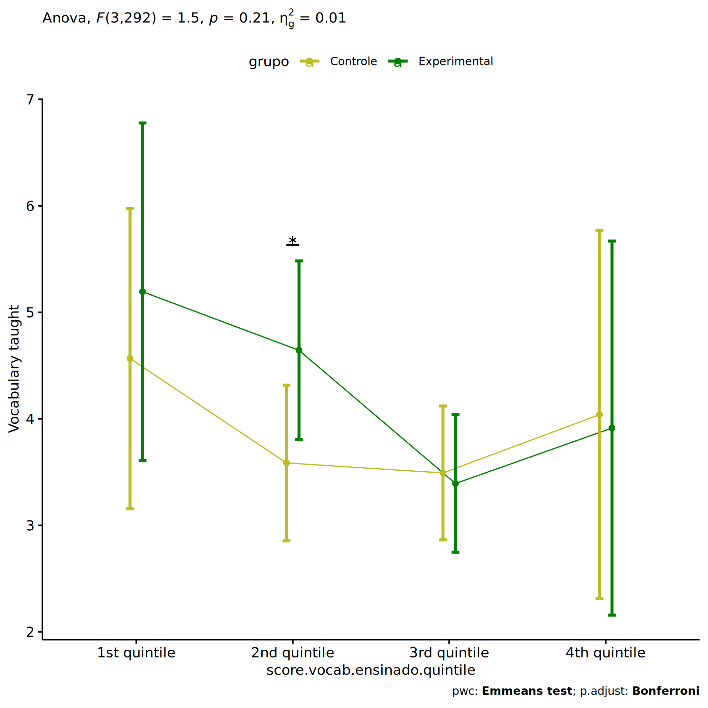<!-- -->

``` r
if (length(unique(pdat[["score.vocab.ensinado.quintile"]])) >= 2) {
  plots <- twoWayAncovaBoxPlots(
    wdat, "score.vocab.ensinado.pos", c("grupo","score.vocab.ensinado.quintile"), aov, pwcs, covar = "score.vocab.ensinado.pre",
    theme = "classic", color = color[["grupo:score.vocab.ensinado.quintile"]],
    subtitle = which(aov$Effect == "grupo:score.vocab.ensinado.quintile"))
}
```

``` r
if (length(unique(pdat[["score.vocab.ensinado.quintile"]])) >= 2) {
  plots[["grupo:score.vocab.ensinado.quintile"]] + ggplot2::ylab("Vocabulary taught") +
  ggplot2::scale_x_discrete(labels=c('pre', 'pos')) +
  if (ymin < ymax) ggplot2::ylim(ymin, ymax)
}
```

    ## Warning: No shared levels found between `names(values)` of the manual scale and the data's colour values.

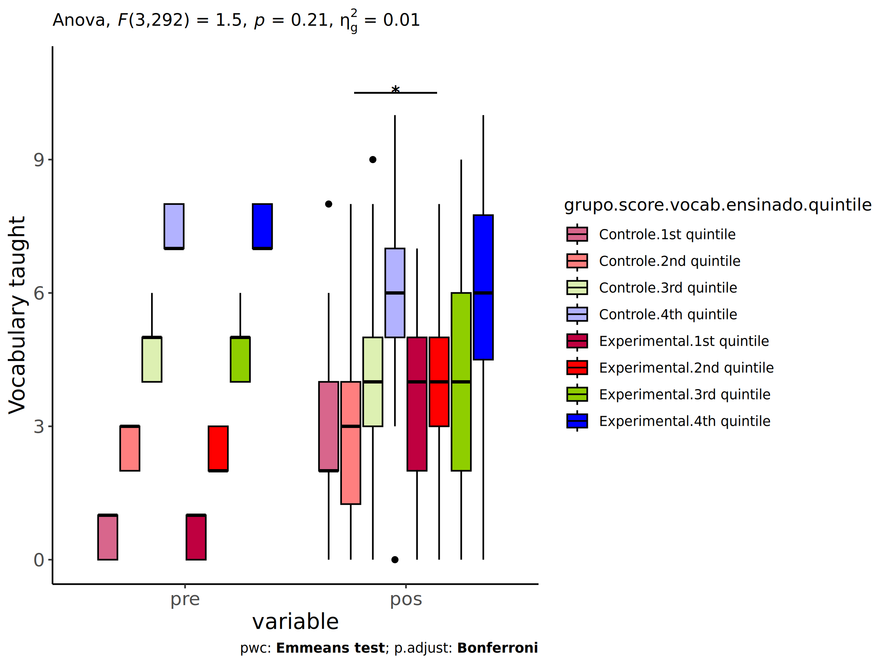<!-- -->

``` r
if (length(unique(pdat[["score.vocab.ensinado.quintile"]])) >= 2) {
  plots <- twoWayAncovaBoxPlots(
    wdat.long, "score.vocab.ensinado", c("grupo","score.vocab.ensinado.quintile"), aov, pwc.long,
    pre.post = "time",
    theme = "classic", color = color$prepost)
}
```

``` r
if (length(unique(pdat[["score.vocab.ensinado.quintile"]])) >= 2) 
  plots[["grupo:score.vocab.ensinado.quintile"]] + ggplot2::ylab("Vocabulary taught") +
    if (ymin < ymax) ggplot2::ylim(ymin, ymax)
```

<!-- -->

### Checking linearity assumption

``` r
if (length(unique(pdat[["score.vocab.ensinado.quintile"]])) >= 2) {
  ggscatter(wdat, x = "score.vocab.ensinado.pre", y = "score.vocab.ensinado.pos", size = 0.5,
            facet.by = c("grupo","score.vocab.ensinado.quintile"), add = "reg.line")+
    stat_regline_equation(
      aes(label =  paste(..eq.label.., ..rr.label.., sep = "~~~~"))
    ) + ggplot2::ylab("Vocabulary taught") +
    if (ymin < ymax) ggplot2::ylim(ymin, ymax)
}
```

<!-- -->

``` r
if (length(unique(pdat[["score.vocab.ensinado.quintile"]])) >= 2) {
  ggscatter(wdat, x = "score.vocab.ensinado.pre", y = "score.vocab.ensinado.pos", size = 0.5,
            color = "grupo", facet.by = "score.vocab.ensinado.quintile", add = "reg.line")+
    stat_regline_equation(
      aes(label =  paste(..eq.label.., ..rr.label.., sep = "~~~~"), color = grupo)
    ) +
    ggplot2::labs(subtitle = rstatix::get_test_label(aov, detailed = T, row = which(aov$Effect == "grupo:score.vocab.ensinado.quintile"))) +
    ggplot2::scale_color_manual(values = color[["grupo"]]) +
    ggplot2::ylab("Vocabulary taught") +
    if (ymin < ymax) ggplot2::ylim(ymin, ymax)
}
```

<!-- -->

``` r
if (length(unique(pdat[["score.vocab.ensinado.quintile"]])) >= 2) {
  ggscatter(wdat, x = "score.vocab.ensinado.pre", y = "score.vocab.ensinado.pos", size = 0.5,
            color = "score.vocab.ensinado.quintile", facet.by = "grupo", add = "reg.line")+
    stat_regline_equation(
      aes(label =  paste(..eq.label.., ..rr.label.., sep = "~~~~"), color = score.vocab.ensinado.quintile)
    ) +
    ggplot2::labs(subtitle = rstatix::get_test_label(aov, detailed = T, row = which(aov$Effect == "grupo:score.vocab.ensinado.quintile"))) +
    ggplot2::scale_color_manual(values = color[["score.vocab.ensinado.quintile"]]) +
    ggplot2::ylab("Vocabulary taught") +
    if (ymin < ymax) ggplot2::ylim(ymin, ymax)
}
```

<!-- -->

### Checking normality and homogeneity

``` r
if (length(unique(pdat[["score.vocab.ensinado.quintile"]])) >= 2) 
  res <- augment(lm(score.vocab.ensinado.pos ~ score.vocab.ensinado.pre + grupo*score.vocab.ensinado.quintile, data = wdat))
```

``` r
if (length(unique(pdat[["score.vocab.ensinado.quintile"]])) >= 2)
  shapiro_test(res$.resid)
```

    ## # A tibble: 1 × 3
    ##   variable   statistic p.value
    ##   <chr>          <dbl>   <dbl>
    ## 1 res$.resid     0.995   0.415

``` r
if (length(unique(pdat[["score.vocab.ensinado.quintile"]])) >= 2) 
  levene_test(res, .resid ~ grupo*score.vocab.ensinado.quintile)
```

    ## # A tibble: 1 × 4
    ##     df1   df2 statistic     p
    ##   <int> <int>     <dbl> <dbl>
    ## 1     7   293     0.438 0.878

# Summary of Results

## Descriptive Statistics

``` r
df <- get.descriptives(ldat[["grupo"]], c(dv.pre, dv.pos), c("grupo"), 
                       include.global = T, symmetry.test = T, normality.test = F)
df <- plyr::rbind.fill(
  df, do.call(plyr::rbind.fill, lapply(lfatores2, FUN = function(f) {
    if (nrow(dat) > 0 && sum(!is.na(unique(dat[[f]]))) > 1 && paste0("grupo:",f) %in% names(ldat))
      get.descriptives(ldat[[paste0("grupo:",f)]], c(dv.pre,dv.pos), c("grupo", f),
                       symmetry.test = T, normality.test = F)
    }))
)
df <- df[,c(fatores1[fatores1 %in% colnames(df)],"variable",
             colnames(df)[!colnames(df) %in% c(fatores1,"variable")])]
```

| grupo | genero | zona.participante | zona.escola | score.vocab.ensinado.quintile | variable | n | mean | median | min | max | sd | se | ci | iqr | symmetry | skewness | kurtosis |
|:---|:---|:---|:---|:---|:---|---:|---:|---:|---:|---:|---:|---:|---:|---:|:---|---:|---:|
| Controle |  |  |  |  | score.vocab.ensinado.pre | 176 | 3.807 | 4.0 | 0 | 10 | 2.327 | 0.175 | 0.346 | 3.00 | YES | 0.328 | -0.438 |
| Experimental |  |  |  |  | score.vocab.ensinado.pre | 135 | 4.104 | 4.0 | 0 | 10 | 2.180 | 0.188 | 0.371 | 3.00 | YES | 0.358 | -0.067 |
|  |  |  |  |  | score.vocab.ensinado.pre | 311 | 3.936 | 4.0 | 0 | 10 | 2.265 | 0.128 | 0.253 | 3.00 | YES | 0.327 | -0.275 |
| Controle |  |  |  |  | score.vocab.ensinado.pos | 176 | 3.795 | 4.0 | 0 | 10 | 2.276 | 0.172 | 0.339 | 4.00 | YES | 0.228 | -0.735 |
| Experimental |  |  |  |  | score.vocab.ensinado.pos | 135 | 4.215 | 4.0 | 0 | 10 | 2.389 | 0.206 | 0.407 | 3.00 | YES | 0.047 | -0.472 |
|  |  |  |  |  | score.vocab.ensinado.pos | 311 | 3.977 | 4.0 | 0 | 10 | 2.331 | 0.132 | 0.260 | 4.00 | YES | 0.155 | -0.606 |
| Controle | F |  |  |  | score.vocab.ensinado.pre | 87 | 3.954 | 4.0 | 0 | 10 | 2.401 | 0.257 | 0.512 | 3.00 | YES | 0.437 | -0.336 |
| Controle | M |  |  |  | score.vocab.ensinado.pre | 89 | 3.663 | 4.0 | 0 | 9 | 2.256 | 0.239 | 0.475 | 3.00 | YES | 0.171 | -0.750 |
| Experimental | F |  |  |  | score.vocab.ensinado.pre | 59 | 4.576 | 4.0 | 0 | 10 | 2.313 | 0.301 | 0.603 | 3.00 | YES | 0.479 | -0.187 |
| Experimental | M |  |  |  | score.vocab.ensinado.pre | 75 | 3.680 | 4.0 | 0 | 8 | 1.960 | 0.226 | 0.451 | 3.00 | YES | 0.020 | -0.671 |
| Controle | F |  |  |  | score.vocab.ensinado.pos | 87 | 4.057 | 4.0 | 0 | 10 | 2.364 | 0.253 | 0.504 | 4.00 | YES | 0.224 | -0.888 |
| Controle | M |  |  |  | score.vocab.ensinado.pos | 89 | 3.539 | 3.0 | 0 | 9 | 2.169 | 0.230 | 0.457 | 3.00 | YES | 0.172 | -0.724 |
| Experimental | F |  |  |  | score.vocab.ensinado.pos | 59 | 4.542 | 5.0 | 0 | 10 | 2.514 | 0.327 | 0.655 | 3.00 | YES | -0.139 | -0.643 |
| Experimental | M |  |  |  | score.vocab.ensinado.pos | 75 | 4.013 | 4.0 | 0 | 10 | 2.239 | 0.259 | 0.515 | 2.00 | YES | 0.183 | -0.236 |
| Controle |  | Rural |  |  | score.vocab.ensinado.pre | 56 | 3.696 | 3.0 | 0 | 10 | 2.536 | 0.339 | 0.679 | 3.00 | NO | 0.598 | -0.231 |
| Controle |  | Urbana |  |  | score.vocab.ensinado.pre | 77 | 3.896 | 4.0 | 0 | 9 | 2.303 | 0.262 | 0.523 | 3.00 | YES | 0.074 | -0.796 |
| Experimental |  | Rural |  |  | score.vocab.ensinado.pre | 52 | 3.808 | 4.0 | 0 | 10 | 2.232 | 0.310 | 0.621 | 3.00 | NO | 0.517 | -0.054 |
| Experimental |  | Urbana |  |  | score.vocab.ensinado.pre | 49 | 4.163 | 4.0 | 0 | 10 | 2.115 | 0.302 | 0.607 | 3.00 | YES | 0.269 | -0.192 |
| Controle |  | Rural |  |  | score.vocab.ensinado.pos | 56 | 4.161 | 4.0 | 1 | 8 | 1.980 | 0.265 | 0.530 | 3.00 | YES | 0.444 | -0.978 |
| Controle |  | Urbana |  |  | score.vocab.ensinado.pos | 77 | 3.935 | 4.0 | 0 | 10 | 2.478 | 0.282 | 0.562 | 4.00 | YES | 0.171 | -0.821 |
| Experimental |  | Rural |  |  | score.vocab.ensinado.pos | 52 | 4.712 | 4.0 | 1 | 9 | 1.934 | 0.268 | 0.538 | 3.00 | YES | 0.370 | -0.430 |
| Experimental |  | Urbana |  |  | score.vocab.ensinado.pos | 49 | 4.286 | 4.0 | 0 | 10 | 2.458 | 0.351 | 0.706 | 3.00 | YES | -0.126 | -0.737 |
| Controle |  |  | Rural |  | score.vocab.ensinado.pre | 58 | 3.897 | 4.0 | 0 | 9 | 2.330 | 0.306 | 0.613 | 2.75 | YES | 0.246 | -0.616 |
| Controle |  |  | Urbana |  | score.vocab.ensinado.pre | 118 | 3.763 | 4.0 | 0 | 10 | 2.334 | 0.215 | 0.426 | 3.00 | YES | 0.365 | -0.385 |
| Experimental |  |  | Rural |  | score.vocab.ensinado.pre | 40 | 4.350 | 4.5 | 0 | 10 | 2.497 | 0.395 | 0.798 | 3.25 | YES | 0.487 | -0.441 |
| Experimental |  |  | Urbana |  | score.vocab.ensinado.pre | 95 | 4.000 | 4.0 | 0 | 10 | 2.037 | 0.209 | 0.415 | 2.00 | YES | 0.172 | -0.186 |
| Controle |  |  | Rural |  | score.vocab.ensinado.pos | 58 | 4.052 | 3.5 | 0 | 8 | 2.164 | 0.284 | 0.569 | 4.00 | YES | 0.323 | -1.087 |
| Controle |  |  | Urbana |  | score.vocab.ensinado.pos | 118 | 3.669 | 4.0 | 0 | 10 | 2.328 | 0.214 | 0.424 | 3.00 | YES | 0.214 | -0.673 |
| Experimental |  |  | Rural |  | score.vocab.ensinado.pos | 40 | 4.300 | 4.0 | 0 | 10 | 2.267 | 0.358 | 0.725 | 2.00 | YES | 0.332 | -0.063 |
| Experimental |  |  | Urbana |  | score.vocab.ensinado.pos | 95 | 4.179 | 4.0 | 0 | 10 | 2.449 | 0.251 | 0.499 | 3.00 | YES | -0.042 | -0.678 |
| Controle |  |  |  | 1st quintile | score.vocab.ensinado.pre | 32 | 0.562 | 1.0 | 0 | 1 | 0.504 | 0.089 | 0.182 | 1.00 | few data | 0.000 | 0.000 |
| Controle |  |  |  | 2nd quintile | score.vocab.ensinado.pre | 50 | 2.600 | 3.0 | 2 | 3 | 0.495 | 0.070 | 0.141 | 1.00 | few data | 0.000 | 0.000 |
| Controle |  |  |  | 3rd quintile | score.vocab.ensinado.pre | 71 | 4.789 | 5.0 | 4 | 6 | 0.791 | 0.094 | 0.187 | 1.00 | few data | 0.000 | 0.000 |
| Controle |  |  |  | 4th quintile | score.vocab.ensinado.pre | 17 | 7.471 | 7.0 | 7 | 8 | 0.514 | 0.125 | 0.265 | 1.00 | few data | 0.000 | 0.000 |
| Experimental |  |  |  | 1st quintile | score.vocab.ensinado.pre | 15 | 0.667 | 1.0 | 0 | 1 | 0.488 | 0.126 | 0.270 | 1.00 | few data | 0.000 | 0.000 |
| Experimental |  |  |  | 2nd quintile | score.vocab.ensinado.pre | 37 | 2.459 | 2.0 | 2 | 3 | 0.505 | 0.083 | 0.168 | 1.00 | few data | 0.000 | 0.000 |
| Experimental |  |  |  | 3rd quintile | score.vocab.ensinado.pre | 65 | 4.785 | 5.0 | 4 | 6 | 0.760 | 0.094 | 0.188 | 1.00 | few data | 0.000 | 0.000 |
| Experimental |  |  |  | 4th quintile | score.vocab.ensinado.pre | 14 | 7.357 | 7.0 | 7 | 8 | 0.497 | 0.133 | 0.287 | 1.00 | few data | 0.000 | 0.000 |
| Controle |  |  |  | 1st quintile | score.vocab.ensinado.pos | 32 | 2.781 | 2.0 | 0 | 8 | 1.930 | 0.341 | 0.696 | 2.00 | NO | 0.692 | 0.070 |
| Controle |  |  |  | 2nd quintile | score.vocab.ensinado.pos | 50 | 2.940 | 3.0 | 0 | 8 | 2.064 | 0.292 | 0.587 | 2.75 | NO | 0.733 | -0.284 |
| Controle |  |  |  | 3rd quintile | score.vocab.ensinado.pos | 71 | 4.070 | 4.0 | 0 | 9 | 2.024 | 0.240 | 0.479 | 2.00 | YES | -0.074 | -0.377 |
| Controle |  |  |  | 4th quintile | score.vocab.ensinado.pos | 17 | 6.118 | 6.0 | 0 | 10 | 2.233 | 0.542 | 1.148 | 2.00 | NO | -0.963 | 1.182 |
| Experimental |  |  |  | 1st quintile | score.vocab.ensinado.pos | 15 | 3.467 | 4.0 | 0 | 7 | 2.066 | 0.533 | 1.144 | 3.00 | YES | -0.047 | -1.346 |
| Experimental |  |  |  | 2nd quintile | score.vocab.ensinado.pos | 37 | 3.919 | 4.0 | 0 | 8 | 2.073 | 0.341 | 0.691 | 2.00 | YES | -0.150 | -0.313 |
| Experimental |  |  |  | 3rd quintile | score.vocab.ensinado.pos | 65 | 3.969 | 4.0 | 0 | 9 | 2.291 | 0.284 | 0.568 | 4.00 | YES | -0.047 | -0.719 |
| Experimental |  |  |  | 4th quintile | score.vocab.ensinado.pos | 14 | 5.929 | 6.0 | 0 | 10 | 2.702 | 0.722 | 1.560 | 3.25 | NO | -0.603 | -0.449 |

## ANCOVA Table Comparison

``` r
df <- do.call(plyr::rbind.fill, laov)
df <- df[!duplicated(df$Effect),]
```

|  | Effect | DFn | DFd | F | p | p\<.05 | ges | DFn’ | DFd’ | F’ | p’ | p\<.05’ | ges’ |
|:---|:---|---:|---:|---:|---:|:---|---:|---:|---:|---:|---:|:---|---:|
| 1 | grupo | 1 | 308 | 1.447 | 0.230 |  | 0.005 | 1 | 308 | 1.447 | 0.230 |  | 0.005 |
| 2 | score.vocab.ensinado.pre | 1 | 308 | 65.187 | 0.000 | \* | 0.175 | 1 | 308 | 65.187 | 0.000 | \* | 0.175 |
| 3 | genero | 1 | 305 | 1.382 | 0.241 |  | 0.005 | 1 | 305 | 1.382 | 0.241 |  | 0.005 |
| 5 | grupo:genero | 1 | 305 | 0.277 | 0.599 |  | 0.001 | 1 | 305 | 0.277 | 0.599 |  | 0.001 |
| 8 | grupo:zona.participante | 1 | 229 | 0.252 | 0.616 |  | 0.001 | 1 | 229 | 0.252 | 0.616 |  | 0.001 |
| 10 | zona.participante | 1 | 229 | 2.623 | 0.107 |  | 0.011 | 1 | 229 | 2.623 | 0.107 |  | 0.011 |
| 12 | grupo:zona.escola | 1 | 306 | 0.455 | 0.501 |  | 0.001 | 1 | 306 | 0.455 | 0.501 |  | 0.001 |
| 14 | zona.escola | 1 | 306 | 0.464 | 0.496 |  | 0.002 | 1 | 306 | 0.464 | 0.496 |  | 0.002 |
| 16 | grupo:score.vocab.ensinado.quintile | 3 | 292 | 1.497 | 0.215 |  | 0.015 | 3 | 292 | 1.497 | 0.215 |  | 0.015 |
| 18 | score.vocab.ensinado.quintile | 3 | 292 | 2.725 | 0.044 | \* | 0.027 | 3 | 292 | 2.725 | 0.044 | \* | 0.027 |

## PairWise Table Comparison

``` r
df <- do.call(plyr::rbind.fill, lpwc)
df <- df[,c(names(lfatores)[names(lfatores) %in% colnames(df)],
            names(df)[!names(df) %in% c(names(lfatores),"term",".y.")])]
```

| grupo | genero | zona.participante | zona.escola | score.vocab.ensinado.quintile | group1 | group2 | df | statistic | p | p.adj | p.adj.signif | df’ | statistic’ | p’ | p.adj’ | p.adj.signif’ |
|:---|:---|:---|:---|:---|:---|:---|---:|---:|---:|---:|:---|---:|---:|---:|---:|:---|
| Controle |  |  |  |  | pre | pos | 618 | 0.046 | 0.963 | 0.963 | ns | 618 | 0.046 | 0.963 | 0.963 | ns |
| Experimental |  |  |  |  | pre | pos | 618 | -0.398 | 0.691 | 0.691 | ns | 618 | -0.398 | 0.691 | 0.691 | ns |
|  |  |  |  |  | Controle | Experimental | 308 | -1.203 | 0.230 | 0.230 | ns | 308 | -1.203 | 0.230 | 0.230 | ns |
| Controle | F |  |  |  | pre | pos | 612 | -0.300 | 0.764 | 0.764 | ns | 612 | -0.300 | 0.764 | 0.764 | ns |
| Controle | M |  |  |  | pre | pos | 612 | 0.362 | 0.717 | 0.717 | ns | 612 | 0.362 | 0.717 | 0.717 | ns |
| Controle |  |  |  |  | F | M | 305 | 1.236 | 0.217 | 0.217 | ns | 305 | 1.236 | 0.217 | 0.217 | ns |
| Experimental | F |  |  |  | pre | pos | 612 | 0.081 | 0.936 | 0.936 | ns | 612 | 0.081 | 0.936 | 0.936 | ns |
| Experimental | M |  |  |  | pre | pos | 612 | -0.897 | 0.370 | 0.370 | ns | 612 | -0.897 | 0.370 | 0.370 | ns |
| Experimental |  |  |  |  | F | M | 305 | 0.371 | 0.711 | 0.711 | ns | 305 | 0.371 | 0.711 | 0.711 | ns |
|  | F |  |  |  | Controle | Experimental | 305 | -0.598 | 0.550 | 0.550 | ns | 305 | -0.598 | 0.550 | 0.550 | ns |
|  | M |  |  |  | Controle | Experimental | 305 | -1.422 | 0.156 | 0.156 | ns | 305 | -1.422 | 0.156 | 0.156 | ns |
| Controle |  |  |  |  | Rural | Urbana | 229 | 0.885 | 0.377 | 0.377 | ns | 229 | 0.885 | 0.377 | 0.377 | ns |
| Controle |  | Rural |  |  | pre | pos | 460 | -1.078 | 0.282 | 0.282 | ns | 460 | -1.078 | 0.282 | 0.282 | ns |
| Controle |  | Urbana |  |  | pre | pos | 460 | -0.106 | 0.916 | 0.916 | ns | 460 | -0.106 | 0.916 | 0.916 | ns |
| Experimental |  |  |  |  | Rural | Urbana | 229 | 1.448 | 0.149 | 0.149 | ns | 229 | 1.448 | 0.149 | 0.149 | ns |
| Experimental |  | Rural |  |  | pre | pos | 460 | -2.022 | 0.044 | 0.044 | \* | 460 | -2.022 | 0.044 | 0.044 | \* |
| Experimental |  | Urbana |  |  | pre | pos | 460 | -0.266 | 0.790 | 0.790 | ns | 460 | -0.266 | 0.790 | 0.790 | ns |
|  |  | Rural |  |  | Controle | Experimental | 229 | -1.295 | 0.197 | 0.197 | ns | 229 | -1.295 | 0.197 | 0.197 | ns |
|  |  | Urbana |  |  | Controle | Experimental | 229 | -0.635 | 0.526 | 0.526 | ns | 229 | -0.635 | 0.526 | 0.526 | ns |
| Controle |  |  |  |  | Rural | Urbana | 306 | 0.955 | 0.340 | 0.340 | ns | 306 | 0.955 | 0.340 | 0.340 | ns |
| Controle |  |  | Rural |  | pre | pos | 614 | -0.363 | 0.716 | 0.716 | ns | 614 | -0.363 | 0.716 | 0.716 | ns |
| Controle |  |  | Urbana |  | pre | pos | 614 | 0.311 | 0.756 | 0.756 | ns | 614 | 0.311 | 0.756 | 0.756 | ns |
| Experimental |  |  |  |  | Rural | Urbana | 306 | -0.072 | 0.942 | 0.942 | ns | 306 | -0.072 | 0.942 | 0.942 | ns |
| Experimental |  |  | Rural |  | pre | pos | 614 | 0.097 | 0.923 | 0.923 | ns | 614 | 0.097 | 0.923 | 0.923 | ns |
| Experimental |  |  | Urbana |  | pre | pos | 614 | -0.536 | 0.592 | 0.592 | ns | 614 | -0.536 | 0.592 | 0.592 | ns |
|  |  |  | Rural |  | Controle | Experimental | 306 | -0.124 | 0.902 | 0.902 | ns | 306 | -0.124 | 0.902 | 0.902 | ns |
|  |  |  | Urbana |  | Controle | Experimental | 306 | -1.394 | 0.164 | 0.164 | ns | 306 | -1.394 | 0.164 | 0.164 | ns |
| Controle |  |  |  | 1st quintile | pre | pos | 586 | -5.629 | 0.000 | 0.000 | \*\*\*\* | 586 | -5.629 | 0.000 | 0.000 | \*\*\*\* |
| Controle |  |  |  | 2nd quintile | pre | pos | 586 | -1.078 | 0.281 | 0.281 | ns | 586 | -1.078 | 0.281 | 0.281 | ns |
| Controle |  |  |  | 3rd quintile | pre | pos | 586 | 2.714 | 0.007 | 0.007 | \*\* | 586 | 2.714 | 0.007 | 0.007 | \*\* |
| Controle |  |  |  | 4th quintile | pre | pos | 586 | 2.502 | 0.013 | 0.013 | \* | 586 | 2.502 | 0.013 | 0.013 | \* |
| Controle |  |  |  |  | 1st quintile | 2nd quintile | 292 | 1.589 | 0.113 | 0.678 | ns | 292 | 1.589 | 0.113 | 0.678 | ns |
| Controle |  |  |  |  | 1st quintile | 3rd quintile | 292 | 1.159 | 0.247 | 1.000 | ns | 292 | 1.159 | 0.247 | 1.000 | ns |
| Controle |  |  |  |  | 1st quintile | 4th quintile | 292 | 0.359 | 0.720 | 1.000 | ns | 292 | 0.359 | 0.720 | 1.000 | ns |
| Controle |  |  |  |  | 2nd quintile | 3rd quintile | 292 | 0.164 | 0.870 | 1.000 | ns | 292 | 0.164 | 0.870 | 1.000 | ns |
| Controle |  |  |  |  | 2nd quintile | 4th quintile | 292 | -0.410 | 0.682 | 1.000 | ns | 292 | -0.410 | 0.682 | 1.000 | ns |
| Controle |  |  |  |  | 3rd quintile | 4th quintile | 292 | -0.713 | 0.477 | 1.000 | ns | 292 | -0.713 | 0.477 | 1.000 | ns |
| Experimental |  |  |  | 1st quintile | pre | pos | 586 | -4.864 | 0.000 | 0.000 | \*\*\*\* | 586 | -4.864 | 0.000 | 0.000 | \*\*\*\* |
| Experimental |  |  |  | 2nd quintile | pre | pos | 586 | -3.981 | 0.000 | 0.000 | \*\*\*\* | 586 | -3.981 | 0.000 | 0.000 | \*\*\*\* |
| Experimental |  |  |  | 3rd quintile | pre | pos | 586 | 2.948 | 0.003 | 0.003 | \*\* | 586 | 2.948 | 0.003 | 0.003 | \*\* |
| Experimental |  |  |  | 4th quintile | pre | pos | 586 | 2.397 | 0.017 | 0.017 | \* | 586 | 2.397 | 0.017 | 0.017 | \* |
| Experimental |  |  |  |  | 1st quintile | 2nd quintile | 292 | 0.753 | 0.452 | 1.000 | ns | 292 | 0.753 | 0.452 | 1.000 | ns |
| Experimental |  |  |  |  | 1st quintile | 3rd quintile | 292 | 1.810 | 0.071 | 0.428 | ns | 292 | 1.810 | 0.071 | 0.428 | ns |
| Experimental |  |  |  |  | 1st quintile | 4th quintile | 292 | 0.851 | 0.395 | 1.000 | ns | 292 | 0.851 | 0.395 | 1.000 | ns |
| Experimental |  |  |  |  | 2nd quintile | 3rd quintile | 292 | 2.008 | 0.046 | 0.274 | ns | 292 | 2.008 | 0.046 | 0.274 | ns |
| Experimental |  |  |  |  | 2nd quintile | 4th quintile | 292 | 0.635 | 0.526 | 1.000 | ns | 292 | 0.635 | 0.526 | 1.000 | ns |
| Experimental |  |  |  |  | 3rd quintile | 4th quintile | 292 | -0.656 | 0.512 | 1.000 | ns | 292 | -0.656 | 0.512 | 1.000 | ns |
|  |  |  |  | 1st quintile | Controle | Experimental | 292 | -0.950 | 0.343 | 0.343 | ns | 292 | -0.950 | 0.343 | 0.343 | ns |
|  |  |  |  | 2nd quintile | Controle | Experimental | 292 | -2.309 | 0.022 | 0.022 | \* | 292 | -2.309 | 0.022 | 0.022 | \* |
|  |  |  |  | 3rd quintile | Controle | Experimental | 292 | 0.273 | 0.785 | 0.785 | ns | 292 | 0.273 | 0.785 | 0.785 | ns |
|  |  |  |  | 4th quintile | Controle | Experimental | 292 | 0.165 | 0.869 | 0.869 | ns | 292 | 0.165 | 0.869 | 0.869 | ns |

## EMMS Table Comparison

``` r
df <- do.call(plyr::rbind.fill, lemms)
df[["N-N'"]] <- df[["N"]] - df[["N'"]]
df <- df[,c(names(lfatores)[names(lfatores) %in% colnames(df)],
            names(df)[!names(df) %in% names(lfatores)])]
```

| grupo | genero | zona.participante | zona.escola | score.vocab.ensinado.quintile | N | M (pre) | SE (pre) | M (unadj) | SE (unadj) | M (adj) | SE (adj) | conf.low | conf.high | N’ | M (pre)’ | SE (pre)’ | M (unadj)’ | SE (unadj)’ | M (adj)’ | SE (adj)’ | conf.low’ | conf.high’ | N-N’ |
|:---|:---|:---|:---|:---|---:|---:|---:|---:|---:|---:|---:|---:|---:|---:|---:|---:|---:|---:|---:|---:|---:|---:|---:|
| Controle |  |  |  |  | 176 | 3.807 | 0.175 | 3.795 | 0.172 | 3.851 | 0.160 | 3.537 | 4.165 | 176 | 3.807 | 0.175 | 3.795 | 0.172 | 3.851 | 0.160 | 3.537 | 4.165 | 0 |
| Experimental |  |  |  |  | 135 | 4.104 | 0.188 | 4.215 | 0.206 | 4.143 | 0.182 | 3.784 | 4.502 | 135 | 4.104 | 0.188 | 4.215 | 0.206 | 4.143 | 0.182 | 3.784 | 4.502 | 0 |
| Controle | F |  |  |  | 87 | 3.954 | 0.257 | 4.057 | 0.253 | 4.044 | 0.224 | 3.602 | 4.485 | 87 | 3.954 | 0.257 | 4.057 | 0.253 | 4.044 | 0.224 | 3.602 | 4.485 | 0 |
| Controle | M |  |  |  | 89 | 3.663 | 0.239 | 3.539 | 0.230 | 3.653 | 0.222 | 3.216 | 4.091 | 89 | 3.663 | 0.239 | 3.539 | 0.230 | 3.653 | 0.222 | 3.216 | 4.091 | 0 |
| Experimental | F |  |  |  | 59 | 4.576 | 0.301 | 4.542 | 0.327 | 4.256 | 0.275 | 3.715 | 4.797 | 59 | 4.576 | 0.301 | 4.542 | 0.327 | 4.256 | 0.275 | 3.715 | 4.797 | 0 |
| Experimental | M |  |  |  | 75 | 3.680 | 0.226 | 4.013 | 0.259 | 4.120 | 0.242 | 3.643 | 4.596 | 75 | 3.680 | 0.226 | 4.013 | 0.259 | 4.120 | 0.242 | 3.643 | 4.596 | 0 |
| Controle |  | Rural |  |  | 56 | 3.696 | 0.339 | 4.161 | 0.265 | 4.243 | 0.269 | 3.712 | 4.774 | 56 | 3.696 | 0.339 | 4.161 | 0.265 | 4.243 | 0.269 | 3.712 | 4.774 | 0 |
| Controle |  | Urbana |  |  | 77 | 3.896 | 0.262 | 3.935 | 0.282 | 3.930 | 0.229 | 3.478 | 4.382 | 77 | 3.896 | 0.262 | 3.935 | 0.282 | 3.930 | 0.229 | 3.478 | 4.382 | 0 |
| Experimental |  | Rural |  |  | 52 | 3.808 | 0.310 | 4.712 | 0.268 | 4.745 | 0.279 | 4.195 | 5.295 | 52 | 3.808 | 0.310 | 4.712 | 0.268 | 4.745 | 0.279 | 4.195 | 5.295 | 0 |
| Experimental |  | Urbana |  |  | 49 | 4.163 | 0.302 | 4.286 | 0.351 | 4.164 | 0.288 | 3.596 | 4.732 | 49 | 4.163 | 0.302 | 4.286 | 0.351 | 4.164 | 0.288 | 3.596 | 4.732 | 0 |
| Controle |  |  | Rural |  | 58 | 3.897 | 0.306 | 4.052 | 0.284 | 4.068 | 0.278 | 3.521 | 4.616 | 58 | 3.897 | 0.306 | 4.052 | 0.284 | 4.068 | 0.278 | 3.521 | 4.616 | 0 |
| Controle |  |  | Urbana |  | 118 | 3.763 | 0.215 | 3.669 | 0.214 | 3.744 | 0.195 | 3.359 | 4.128 | 118 | 3.763 | 0.215 | 3.669 | 0.214 | 3.744 | 0.195 | 3.359 | 4.128 | 0 |
| Experimental |  |  | Rural |  | 40 | 4.350 | 0.395 | 4.300 | 0.358 | 4.122 | 0.336 | 3.461 | 4.784 | 40 | 4.350 | 0.395 | 4.300 | 0.358 | 4.122 | 0.336 | 3.461 | 4.784 | 0 |
| Experimental |  |  | Urbana |  | 95 | 4.000 | 0.209 | 4.179 | 0.251 | 4.151 | 0.218 | 3.723 | 4.579 | 95 | 4.000 | 0.209 | 4.179 | 0.251 | 4.151 | 0.218 | 3.723 | 4.579 | 0 |
| Controle |  |  |  | 1st quintile | 32 | 0.562 | 0.089 | 2.781 | 0.341 | 4.566 | 0.717 | 3.155 | 5.978 | 32 | 0.562 | 0.089 | 2.781 | 0.341 | 4.566 | 0.717 | 3.155 | 5.978 | 0 |
| Controle |  |  |  | 2nd quintile | 50 | 2.600 | 0.070 | 2.940 | 0.292 | 3.586 | 0.371 | 2.854 | 4.317 | 50 | 2.600 | 0.070 | 2.940 | 0.292 | 3.586 | 0.371 | 2.854 | 4.317 | 0 |
| Controle |  |  |  | 3rd quintile | 71 | 4.789 | 0.094 | 4.070 | 0.240 | 3.492 | 0.319 | 2.863 | 4.121 | 71 | 4.789 | 0.094 | 4.070 | 0.240 | 3.492 | 0.319 | 2.863 | 4.121 | 0 |
| Controle |  |  |  | 4th quintile | 17 | 7.471 | 0.125 | 6.118 | 0.542 | 4.039 | 0.878 | 2.311 | 5.766 | 17 | 7.471 | 0.125 | 6.118 | 0.542 | 4.039 | 0.878 | 2.311 | 5.766 | 0 |
| Experimental |  |  |  | 1st quintile | 15 | 0.667 | 0.126 | 3.467 | 0.533 | 5.194 | 0.805 | 3.610 | 6.778 | 15 | 0.667 | 0.126 | 3.467 | 0.533 | 5.194 | 0.805 | 3.610 | 6.778 | 0 |
| Experimental |  |  |  | 2nd quintile | 37 | 2.459 | 0.083 | 3.919 | 0.341 | 4.643 | 0.427 | 3.804 | 5.483 | 37 | 2.459 | 0.083 | 3.919 | 0.341 | 4.643 | 0.427 | 3.804 | 5.483 | 0 |
| Experimental |  |  |  | 3rd quintile | 65 | 4.785 | 0.094 | 3.969 | 0.284 | 3.393 | 0.328 | 2.747 | 4.038 | 65 | 4.785 | 0.094 | 3.969 | 0.284 | 3.393 | 0.328 | 2.747 | 4.038 | 0 |
| Experimental |  |  |  | 4th quintile | 14 | 7.357 | 0.133 | 5.929 | 0.722 | 3.913 | 0.892 | 2.157 | 5.669 | 14 | 7.357 | 0.133 | 5.929 | 0.722 | 3.913 | 0.892 | 2.157 | 5.669 | 0 |
