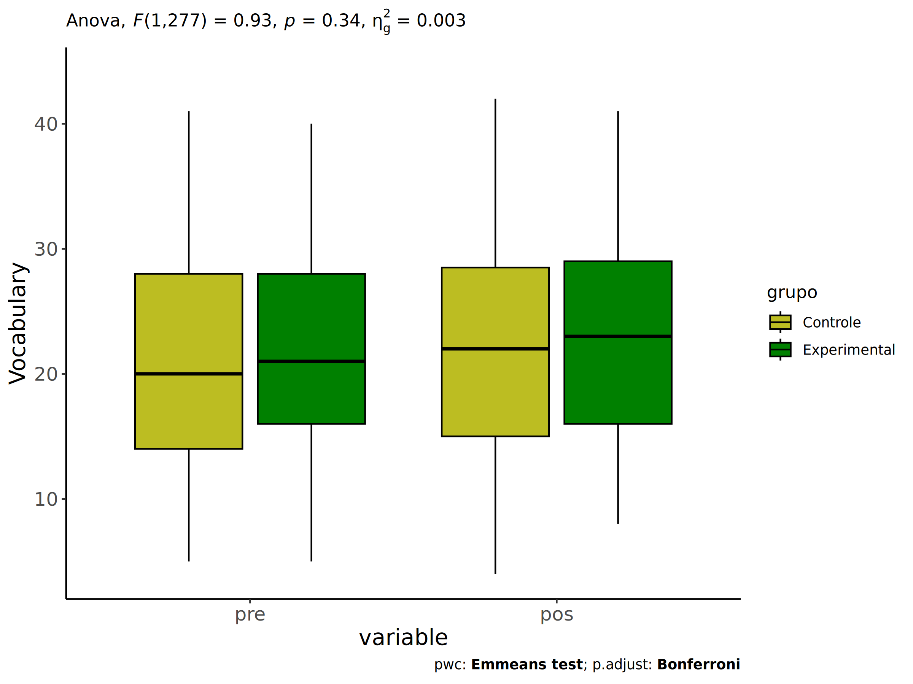
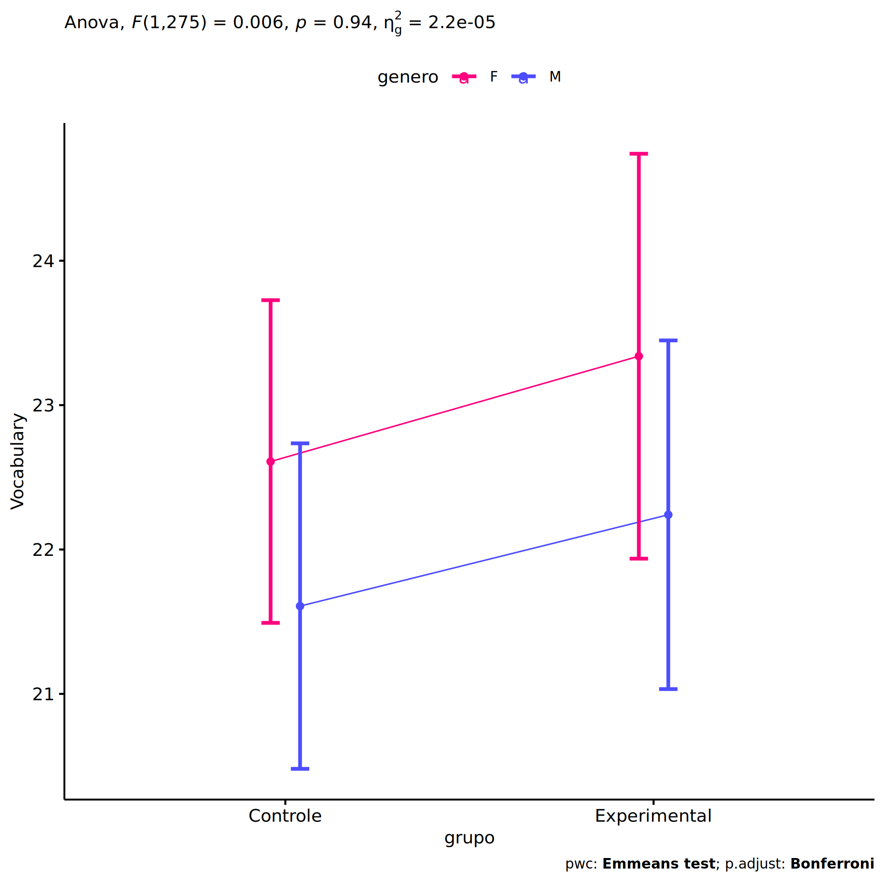
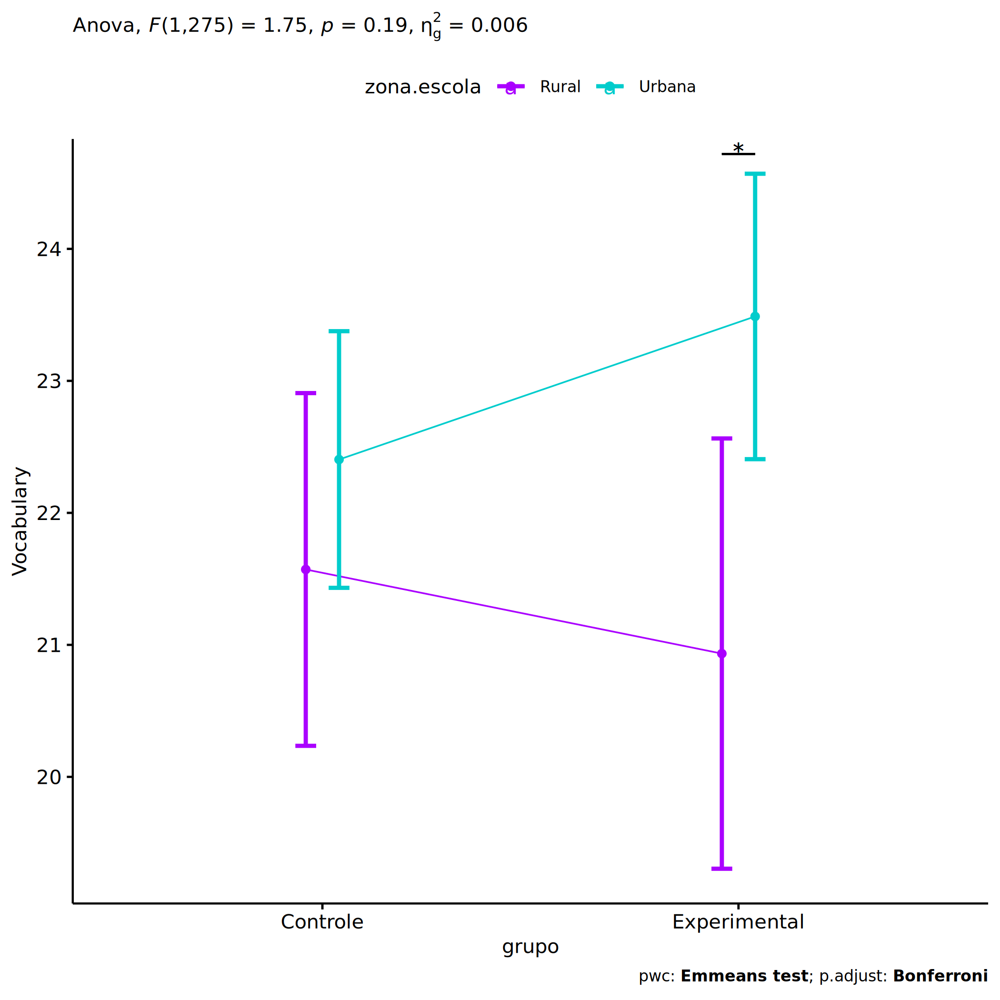
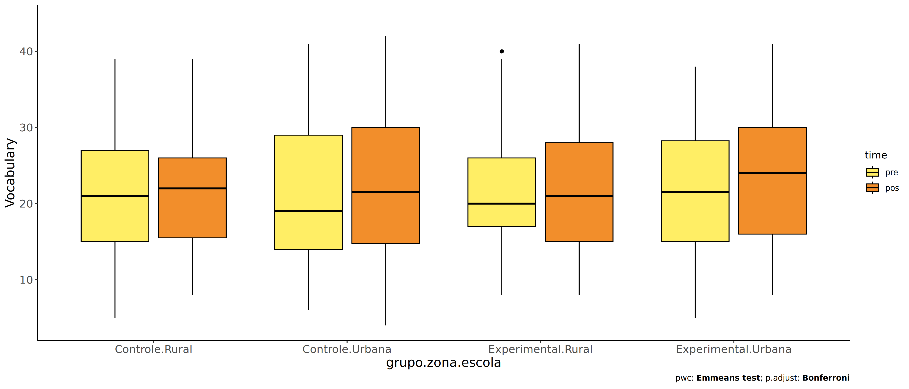
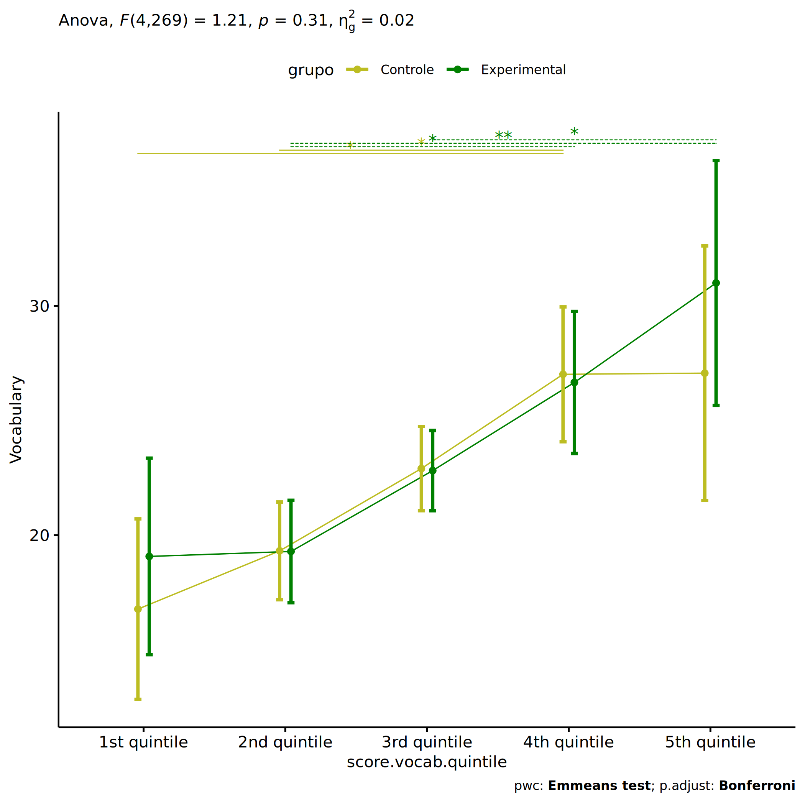
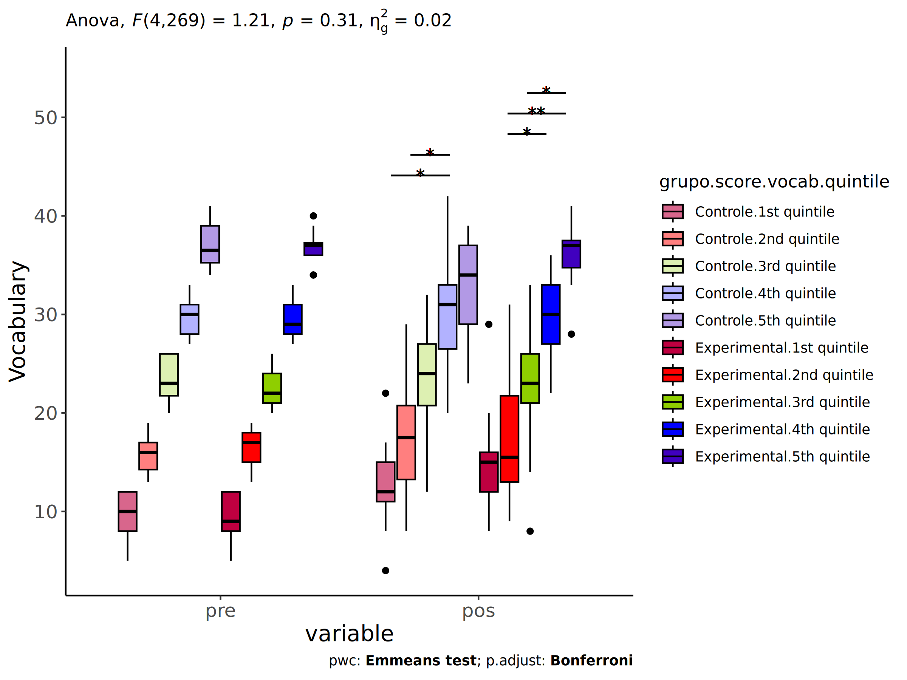

ANCOVA in Vocabulary (Vocabulary)
================
Geiser C. Challco <geiser@alumni.usp.br>

- [Setting Initial Variables](#setting-initial-variables)
- [Descriptive Statistics of Initial
  Data](#descriptive-statistics-of-initial-data)
- [ANCOVA and Pairwise for one factor:
  **grupo**](#ancova-and-pairwise-for-one-factor-grupo)
  - [Without remove non-normal data](#without-remove-non-normal-data)
  - [Computing ANCOVA and PairWise After removing non-normal data
    (OK)](#computing-ancova-and-pairwise-after-removing-non-normal-data-ok)
    - [Plots for ancova](#plots-for-ancova)
    - [Checking linearity assumption](#checking-linearity-assumption)
    - [Checking normality and
      homogeneity](#checking-normality-and-homogeneity)
- [ANCOVA and Pairwise for two factors
  **grupo:genero**](#ancova-and-pairwise-for-two-factors-grupogenero)
  - [Without remove non-normal data](#without-remove-non-normal-data-1)
  - [Computing ANCOVA and PairWise After removing non-normal data
    (OK)](#computing-ancova-and-pairwise-after-removing-non-normal-data-ok-1)
    - [Plots for ancova](#plots-for-ancova-1)
    - [Checking linearity assumption](#checking-linearity-assumption-1)
    - [Checking normality and
      homogeneity](#checking-normality-and-homogeneity-1)
- [ANCOVA and Pairwise for two factors
  **grupo:zona.participante**](#ancova-and-pairwise-for-two-factors-grupozonaparticipante)
  - [Without remove non-normal data](#without-remove-non-normal-data-2)
  - [Computing ANCOVA and PairWise After removing non-normal data
    (OK)](#computing-ancova-and-pairwise-after-removing-non-normal-data-ok-2)
    - [Plots for ancova](#plots-for-ancova-2)
    - [Checking linearity assumption](#checking-linearity-assumption-2)
    - [Checking normality and
      homogeneity](#checking-normality-and-homogeneity-2)
- [ANCOVA and Pairwise for two factors
  **grupo:zona.escola**](#ancova-and-pairwise-for-two-factors-grupozonaescola)
  - [Without remove non-normal data](#without-remove-non-normal-data-3)
  - [Computing ANCOVA and PairWise After removing non-normal data
    (OK)](#computing-ancova-and-pairwise-after-removing-non-normal-data-ok-3)
    - [Plots for ancova](#plots-for-ancova-3)
    - [Checking linearity assumption](#checking-linearity-assumption-3)
    - [Checking normality and
      homogeneity](#checking-normality-and-homogeneity-3)
- [ANCOVA and Pairwise for two factors
  **grupo:score.vocab.quintile**](#ancova-and-pairwise-for-two-factors-gruposcorevocabquintile)
  - [Without remove non-normal data](#without-remove-non-normal-data-4)
  - [Computing ANCOVA and PairWise After removing non-normal data
    (OK)](#computing-ancova-and-pairwise-after-removing-non-normal-data-ok-4)
    - [Plots for ancova](#plots-for-ancova-4)
    - [Checking linearity assumption](#checking-linearity-assumption-4)
    - [Checking normality and
      homogeneity](#checking-normality-and-homogeneity-4)
- [Summary of Results](#summary-of-results)
  - [Descriptive Statistics](#descriptive-statistics)
  - [ANCOVA Table Comparison](#ancova-table-comparison)
  - [PairWise Table Comparison](#pairwise-table-comparison)
  - [EMMS Table Comparison](#emms-table-comparison)

**NOTE**:

- Teste ANCOVA para determinar se houve diferenças significativas no
  Vocabulary (medido usando pre- e pos-testes).
- ANCOVA test to determine whether there were significant differences in
  Vocabulary (measured using pre- and post-tests).

# Setting Initial Variables

``` r
dv = "score.vocab"
dv.pos = "score.vocab.pos"
dv.pre = "score.vocab.pre"

fatores2 <- c("genero","zona.participante","zona.escola","score.vocab.quintile")
lfatores2 <- as.list(fatores2)
names(lfatores2) <- fatores2

fatores1 <- c("grupo", fatores2)
lfatores1 <- as.list(fatores1)
names(lfatores1) <- fatores1

lfatores <- c(lfatores1)

color <- list()
color[["prepost"]] = c("#ffee65","#f28e2B")
color[["grupo"]] = c("#bcbd22","#008000")
color[["genero"]] = c("#FF007F","#4D4DFF")
color[["zona.escola"]] = c("#AA00FF","#00CCCC")
color[["zona.participante"]] = c("#AA00FF","#00CCCC")

level <- list()
level[["grupo"]] = c("Controle","Experimental")
level[["genero"]] = c("F","M")
level[["zona.escola"]] = c("Rural","Urbana")
level[["zona.participante"]] = c("Rural","Urbana")

# ..

ymin <- 0
ymax <- 0

ymin.ci <- 0
ymax.ci <- 0


color[["grupo:genero"]] = c(
  "Controle:F"="#ff99cb", "Controle:M"="#b7b7ff",
  "Experimental:F"="#FF007F", "Experimental:M"="#4D4DFF",
  "Controle.F"="#ff99cb", "Controle.M"="#b7b7ff",
  "Experimental.F"="#FF007F", "Experimental.M"="#4D4DFF"
)
color[["grupo:zona.escola"]] = c(
  "Controle:Rural"="#b2efef","Controle:Urbana"="#e5b2ff",
  "Experimental:Rural"="#00CCCC", "Experimental:Urbana"="#AA00FF",
  "Controle.Rural"="#b2efef","Controle.Urbana"="#e5b2ff",
  "Experimental.Rural"="#00CCCC", "Experimental.Urbana"="#AA00FF"
)
color[["grupo:zona.participante"]] = c(
  "Controle:Rural"="#b2efef","Controle:Urbana"="#e5b2ff",
  "Experimental:Rural"="#00CCCC", "Experimental:Urbana"="#AA00FF",
  "Controle.Rural"="#b2efef","Controle.Urbana"="#e5b2ff",
  "Experimental.Rural"="#00CCCC", "Experimental.Urbana"="#AA00FF"
)

for (coln in c(
  "palavras.lidas","score.compreensao","tri.compreensao",
  "score.vocab","tri.vocab",
  "score.vocab.ensinado","tri.vocab.ensinado","score.vocab.nao.ensinado","tri.vocab.nao.ensinado",
  "score.CLPP","tri.CLPP","score.CR","tri.CR",
  "score.CI","tri.CI","score.TV","tri.TV","score.TF","tri.TF","score.TO","tri.TO")) {
  color[[paste0(coln,".quintile")]] = c("#BF0040","#FF0000","#800080","#0000FF","#4000BF")
  level[[paste0(coln,".quintile")]] = c("1st quintile","2nd quintile","3rd quintile","4th quintile","5th quintile")
  color[[paste0("grupo:",coln,".quintile")]] = c(
    "Experimental.1st quintile"="#BF0040", "Controle.1st quintile"="#d8668c",
    "Experimental.2nd quintile"="#FF0000", "Controle.2nd quintile"="#ff7f7f",
    "Experimental.3rd quintile"="#8fce00", "Controle.3rd quintile"="#ddf0b2",
    "Experimental.4th quintile"="#0000FF", "Controle.4th quintile"="#b2b2ff",
    "Experimental.5th quintile"="#4000BF", "Controle.5th quintile"="#b299e5",
    
    "Experimental:1st quintile"="#BF0040", "Controle:1st quintile"="#d8668c",
    "Experimental:2nd quintile"="#FF0000", "Controle:2nd quintile"="#ff7f7f",
    "Experimental:3rd quintile"="#8fce00", "Controle:3rd quintile"="#ddf0b2",
    "Experimental:4th quintile"="#0000FF", "Controle:4th quintile"="#b2b2ff",
    "Experimental:5th quintile"="#4000BF", "Controle:5th quintile"="#b299e5")
}


gdat <- read_excel("../data/data.xlsx", sheet = "vocabulario.wg.wo.st")


dat <- gdat
dat$grupo <- factor(dat[["grupo"]], level[["grupo"]])
for (coln in c(names(lfatores))) {
  dat[[coln]] <- factor(dat[[coln]], level[[coln]][level[[coln]] %in% unique(dat[[coln]])])
}
dat <- dat[which(!is.na(dat[[dv.pre]]) & !is.na(dat[[dv.pos]])),]
dat <- dat[,c("id",names(lfatores),dv.pre,dv.pos)]

dat.long <- rbind(dat, dat)
dat.long$time <- c(rep("pre", nrow(dat)), rep("pos", nrow(dat)))
dat.long$time <- factor(dat.long$time, c("pre","pos"))
dat.long[[dv]] <- c(dat[[dv.pre]], dat[[dv.pos]])


for (f in c("grupo", names(lfatores))) {
  if (is.null(color[[f]]) && length(unique(dat[[f]])) > 0) 
      color[[f]] <- distinctColorPalette(length(unique(dat[[f]])))
}
for (f in c(fatores2)) {
  if (is.null(color[[paste0("grupo:",f)]]) && length(unique(dat[[f]])) > 0)
    color[[paste0("grupo:",f)]] <- distinctColorPalette(length(unique(dat[["grupo"]]))*length(unique(dat[[f]])))
}

ldat <- list()
laov <- list()
lpwc <- list()
lemms <- list()
```

# Descriptive Statistics of Initial Data

``` r
df <- get.descriptives(dat, c(dv.pre, dv.pos), c("grupo"), 
                       include.global = T, symmetry.test = T, normality.test = F)
df <- plyr::rbind.fill(
  df, do.call(plyr::rbind.fill, lapply(lfatores2, FUN = function(f) {
    if (nrow(dat) > 0 && sum(!is.na(unique(dat[[f]]))) > 1)
      get.descriptives(dat, c(dv.pre,dv.pos), c("grupo", f),
                       symmetry.test = T, normality.test = F)
    }))
)
df <- df[,c(fatores1[fatores1 %in% colnames(df)],"variable",
            colnames(df)[!colnames(df) %in% c(fatores1,"variable")])]
```

| grupo        | genero | zona.participante | zona.escola | score.vocab.quintile | variable        |   n |   mean | median | min | max |    sd |    se |    ci |   iqr | symmetry | skewness | kurtosis |
|:-------------|:-------|:------------------|:------------|:---------------------|:----------------|----:|-------:|-------:|----:|----:|------:|------:|------:|------:|:---------|---------:|---------:|
| Controle     |        |                   |             |                      | score.vocab.pre | 159 | 21.044 |   20.0 |   5 |  41 | 8.491 | 0.673 | 1.330 | 14.00 | YES      |    0.188 |   -0.952 |
| Experimental |        |                   |             |                      | score.vocab.pre | 122 | 21.730 |   21.0 |   5 |  40 | 8.352 | 0.756 | 1.497 | 12.75 | YES      |    0.153 |   -0.726 |
|              |        |                   |             |                      | score.vocab.pre | 281 | 21.342 |   21.0 |   5 |  41 | 8.423 | 0.502 | 0.989 | 13.00 | YES      |    0.171 |   -0.842 |
| Controle     |        |                   |             |                      | score.vocab.pos | 159 | 21.849 |   22.0 |   4 |  42 | 8.186 | 0.649 | 1.282 | 13.50 | YES      |    0.153 |   -0.912 |
| Experimental |        |                   |             |                      | score.vocab.pos | 122 | 23.189 |   23.0 |   8 |  41 | 8.514 | 0.771 | 1.526 | 13.75 | YES      |    0.127 |   -1.028 |
|              |        |                   |             |                      | score.vocab.pos | 281 | 22.431 |   22.0 |   4 |  42 | 8.342 | 0.498 | 0.980 | 14.00 | YES      |    0.149 |   -0.939 |
| Controle     | F      |                   |             |                      | score.vocab.pre |  80 | 21.812 |   21.0 |   7 |  41 | 8.105 | 0.906 | 1.804 | 13.00 | YES      |    0.156 |   -0.900 |
| Controle     | M      |                   |             |                      | score.vocab.pre |  79 | 20.266 |   19.0 |   5 |  39 | 8.847 | 0.995 | 1.982 | 14.00 | YES      |    0.254 |   -1.038 |
| Experimental | F      |                   |             |                      | score.vocab.pre |  53 | 24.057 |   24.0 |   6 |  40 | 8.690 | 1.194 | 2.395 | 11.00 | YES      |   -0.125 |   -0.744 |
| Experimental | M      |                   |             |                      | score.vocab.pre |  69 | 19.942 |   19.0 |   5 |  37 | 7.675 | 0.924 | 1.844 | 11.00 | YES      |    0.288 |   -0.637 |
| Controle     | F      |                   |             |                      | score.vocab.pos |  80 | 22.938 |   23.0 |   8 |  42 | 7.492 | 0.838 | 1.667 | 12.00 | YES      |    0.184 |   -0.750 |
| Controle     | M      |                   |             |                      | score.vocab.pos |  79 | 20.747 |   20.0 |   4 |  39 | 8.743 | 0.984 | 1.958 | 14.00 | YES      |    0.234 |   -1.103 |
| Experimental | F      |                   |             |                      | score.vocab.pos |  53 | 25.868 |   27.0 |   8 |  41 | 8.658 | 1.189 | 2.386 | 16.00 | YES      |   -0.207 |   -1.152 |
| Experimental | M      |                   |             |                      | score.vocab.pos |  69 | 21.130 |   22.0 |   8 |  41 | 7.859 | 0.946 | 1.888 | 12.00 | YES      |    0.324 |   -0.718 |
| Controle     |        | Rural             |             |                      | score.vocab.pre |  53 | 20.075 |   18.0 |   5 |  41 | 8.799 | 1.209 | 2.425 | 13.00 | YES      |    0.362 |   -0.758 |
| Controle     |        | Urbana            |             |                      | score.vocab.pre |  69 | 22.087 |   22.0 |   7 |  39 | 7.963 | 0.959 | 1.913 | 13.00 | YES      |    0.058 |   -0.966 |
| Controle     |        |                   |             |                      | score.vocab.pre |  37 | 20.486 |   19.0 |   6 |  37 | 9.002 | 1.480 | 3.001 | 14.00 | YES      |    0.231 |   -1.288 |
| Experimental |        | Rural             |             |                      | score.vocab.pre |  51 | 20.373 |   20.0 |   5 |  39 | 8.488 | 1.188 | 2.387 | 11.00 | YES      |    0.305 |   -0.575 |
| Experimental |        | Urbana            |             |                      | score.vocab.pre |  45 | 22.978 |   23.0 |   6 |  38 | 8.178 | 1.219 | 2.457 | 12.00 | YES      |   -0.080 |   -0.997 |
| Experimental |        |                   |             |                      | score.vocab.pre |  26 | 22.231 |   21.5 |   8 |  40 | 8.306 | 1.629 | 3.355 | 10.50 | YES      |    0.294 |   -0.681 |
| Controle     |        | Rural             |             |                      | score.vocab.pos |  53 | 21.340 |   21.0 |   9 |  38 | 7.550 | 1.037 | 2.081 | 12.00 | YES      |    0.177 |   -0.907 |
| Controle     |        | Urbana            |             |                      | score.vocab.pos |  69 | 22.739 |   24.0 |   4 |  42 | 8.562 | 1.031 | 2.057 | 15.00 | YES      |   -0.026 |   -0.844 |
| Controle     |        |                   |             |                      | score.vocab.pos |  37 | 20.919 |   19.0 |   8 |  37 | 8.398 | 1.381 | 2.800 | 13.00 | YES      |    0.397 |   -1.186 |
| Experimental |        | Rural             |             |                      | score.vocab.pos |  51 | 23.549 |   23.0 |   8 |  41 | 8.249 | 1.155 | 2.320 | 14.00 | YES      |    0.200 |   -0.926 |
| Experimental |        | Urbana            |             |                      | score.vocab.pos |  45 | 23.600 |   24.0 |   8 |  41 | 8.869 | 1.322 | 2.664 | 14.00 | YES      |   -0.060 |   -1.183 |
| Experimental |        |                   |             |                      | score.vocab.pos |  26 | 21.769 |   21.0 |   9 |  37 | 8.580 | 1.683 | 3.466 | 12.50 | YES      |    0.345 |   -1.107 |
| Controle     |        |                   | Rural       |                      | score.vocab.pre |  55 | 21.236 |   21.0 |   5 |  39 | 8.457 | 1.140 | 2.286 | 12.00 | YES      |    0.081 |   -0.739 |
| Controle     |        |                   | Urbana      |                      | score.vocab.pre | 104 | 20.942 |   19.0 |   6 |  41 | 8.548 | 0.838 | 1.662 | 15.00 | YES      |    0.240 |   -1.091 |
| Experimental |        |                   | Rural       |                      | score.vocab.pre |  38 | 21.816 |   20.0 |   8 |  40 | 8.491 | 1.377 | 2.791 |  9.75 | YES      |    0.464 |   -0.611 |
| Experimental |        |                   | Urbana      |                      | score.vocab.pre |  84 | 21.690 |   21.5 |   5 |  38 | 8.339 | 0.910 | 1.810 | 13.25 | YES      |    0.001 |   -0.849 |
| Controle     |        |                   | Rural       |                      | score.vocab.pos |  55 | 21.455 |   22.0 |   8 |  39 | 7.513 | 1.013 | 2.031 | 10.50 | YES      |    0.122 |   -0.631 |
| Controle     |        |                   | Urbana      |                      | score.vocab.pos | 104 | 22.058 |   21.5 |   4 |  42 | 8.549 | 0.838 | 1.663 | 15.25 | YES      |    0.144 |   -1.078 |
| Experimental |        |                   | Rural       |                      | score.vocab.pos |  38 | 22.000 |   21.5 |   8 |  41 | 8.804 | 1.428 | 2.894 | 13.75 | YES      |    0.436 |   -0.885 |
| Experimental |        |                   | Urbana      |                      | score.vocab.pos |  84 | 23.726 |   24.0 |   8 |  41 | 8.377 | 0.914 | 1.818 | 14.00 | YES      |   -0.017 |   -1.060 |
| Controle     |        |                   |             | 1st quintile         | score.vocab.pre |  28 |  9.607 |   10.0 |   5 |  12 | 2.217 | 0.419 | 0.860 |  4.00 | NO       |   -0.541 |   -1.021 |
| Controle     |        |                   |             | 2nd quintile         | score.vocab.pre |  50 | 15.900 |   16.0 |  13 |  19 | 2.013 | 0.285 | 0.572 |  2.75 | YES      |    0.119 |   -1.213 |
| Controle     |        |                   |             | 3rd quintile         | score.vocab.pre |  32 | 23.406 |   23.0 |  20 |  26 | 2.198 | 0.388 | 0.792 |  4.25 | YES      |   -0.152 |   -1.497 |
| Controle     |        |                   |             | 4th quintile         | score.vocab.pre |  39 | 29.821 |   30.0 |  27 |  33 | 1.945 | 0.311 | 0.630 |  3.00 | YES      |   -0.130 |   -1.247 |
| Controle     |        |                   |             | 5th quintile         | score.vocab.pre |  10 | 37.000 |   36.5 |  34 |  41 | 2.404 | 0.760 | 1.720 |  3.75 | YES      |    0.173 |   -1.550 |
| Experimental |        |                   |             | 1st quintile         | score.vocab.pre |  18 |  9.278 |    9.0 |   5 |  12 | 2.347 | 0.553 | 1.167 |  3.75 | YES      |   -0.238 |   -1.364 |
| Experimental |        |                   |             | 2nd quintile         | score.vocab.pre |  34 | 16.412 |   17.0 |  13 |  19 | 1.877 | 0.322 | 0.655 |  3.00 | YES      |   -0.027 |   -1.349 |
| Experimental |        |                   |             | 3rd quintile         | score.vocab.pre |  33 | 22.636 |   22.0 |  20 |  26 | 1.950 | 0.339 | 0.691 |  3.00 | YES      |    0.230 |   -1.283 |
| Experimental |        |                   |             | 4th quintile         | score.vocab.pre |  25 | 29.520 |   29.0 |  27 |  33 | 1.711 | 0.342 | 0.706 |  3.00 | YES      |    0.255 |   -1.025 |
| Experimental |        |                   |             | 5th quintile         | score.vocab.pre |  12 | 36.750 |   37.0 |  34 |  40 | 1.765 | 0.509 | 1.121 |  1.25 | YES      |    0.074 |   -0.808 |
| Controle     |        |                   |             | 1st quintile         | score.vocab.pos |  28 | 12.750 |   12.0 |   4 |  22 | 3.340 | 0.631 | 1.295 |  4.00 | YES      |    0.176 |    1.266 |
| Controle     |        |                   |             | 2nd quintile         | score.vocab.pos |  50 | 17.440 |   17.5 |   8 |  29 | 5.211 | 0.737 | 1.481 |  7.50 | YES      |    0.151 |   -0.723 |
| Controle     |        |                   |             | 3rd quintile         | score.vocab.pos |  32 | 23.594 |   24.0 |  12 |  32 | 5.117 | 0.905 | 1.845 |  6.25 | YES      |   -0.416 |   -0.456 |
| Controle     |        |                   |             | 4th quintile         | score.vocab.pos |  39 | 29.897 |   31.0 |  20 |  42 | 4.604 | 0.737 | 1.493 |  6.50 | YES      |    0.006 |   -0.151 |
| Controle     |        |                   |             | 5th quintile         | score.vocab.pos |  10 | 32.400 |   34.0 |  23 |  39 | 5.892 | 1.863 | 4.215 |  8.00 | YES      |   -0.390 |   -1.589 |
| Experimental |        |                   |             | 1st quintile         | score.vocab.pos |  18 | 16.278 |   15.0 |   8 |  39 | 7.274 | 1.715 | 3.618 |  4.75 | NO       |    1.828 |    2.963 |
| Experimental |        |                   |             | 2nd quintile         | score.vocab.pos |  34 | 17.588 |   15.5 |   9 |  31 | 6.130 | 1.051 | 2.139 |  8.75 | NO       |    0.513 |   -0.834 |
| Experimental |        |                   |             | 3rd quintile         | score.vocab.pos |  33 | 23.242 |   23.0 |   8 |  33 | 5.895 | 1.026 | 2.090 |  5.00 | YES      |   -0.229 |   -0.219 |
| Experimental |        |                   |             | 4th quintile         | score.vocab.pos |  25 | 29.440 |   30.0 |  22 |  36 | 4.224 | 0.845 | 1.743 |  6.00 | YES      |   -0.190 |   -1.154 |
| Experimental |        |                   |             | 5th quintile         | score.vocab.pos |  12 | 36.250 |   37.0 |  28 |  41 | 3.571 | 1.031 | 2.269 |  2.75 | NO       |   -0.682 |   -0.002 |

# ANCOVA and Pairwise for one factor: **grupo**

## Without remove non-normal data

``` r
pdat = remove_group_data(dat[!is.na(dat[["grupo"]]),], "score.vocab.pos", "grupo")

pdat.long <- rbind(pdat[,c("id","grupo")], pdat[,c("id","grupo")])
pdat.long[["time"]] <- c(rep("pre", nrow(pdat)), rep("pos", nrow(pdat)))
pdat.long[["time"]] <- factor(pdat.long[["time"]], c("pre","pos"))
pdat.long[["score.vocab"]] <- c(pdat[["score.vocab.pre"]], pdat[["score.vocab.pos"]])

aov = anova_test(pdat, score.vocab.pos ~ score.vocab.pre + grupo)
laov[["grupo"]] <- get_anova_table(aov)
```

``` r
pwc <- emmeans_test(pdat, score.vocab.pos ~ grupo, covariate = score.vocab.pre,
                    p.adjust.method = "bonferroni")
```

``` r
pwc.long <- emmeans_test(dplyr::group_by_at(pdat.long, "grupo"),
                          score.vocab ~ time,
                          p.adjust.method = "bonferroni")
lpwc[["grupo"]] <- plyr::rbind.fill(pwc, pwc.long)
```

``` r
ds <- get.descriptives(pdat, "score.vocab.pos", "grupo", covar = "score.vocab.pre")
ds <- merge(ds[ds$variable != "score.vocab.pre",],
            ds[ds$variable == "score.vocab.pre", !colnames(ds) %in% c("variable")],
            by = "grupo", all.x = T, suffixes = c("", ".score.vocab.pre"))
ds <- merge(get_emmeans(pwc), ds, by = "grupo", suffixes = c(".emms", ""))
ds <- ds[,c("grupo","n","mean.score.vocab.pre","se.score.vocab.pre","mean","se",
            "emmean","se.emms","conf.low","conf.high")]

colnames(ds) <- c("grupo", "N", paste0(c("M","SE")," (pre)"),
                  paste0(c("M","SE"), " (unadj)"),
                  paste0(c("M", "SE"), " (adj)"), "conf.low", "conf.high")

lemms[["grupo"]] <- ds
```

## Computing ANCOVA and PairWise After removing non-normal data (OK)

``` r
wdat = pdat 

res = residuals(lm(score.vocab.pos ~ score.vocab.pre + grupo, data = wdat))
non.normal = getNonNormal(res, wdat$id, plimit = 0.05)

wdat = wdat[!wdat$id %in% non.normal,]

wdat.long <- rbind(wdat[,c("id","grupo")], wdat[,c("id","grupo")])
wdat.long[["time"]] <- c(rep("pre", nrow(wdat)), rep("pos", nrow(wdat)))
wdat.long[["time"]] <- factor(wdat.long[["time"]], c("pre","pos"))
wdat.long[["score.vocab"]] <- c(wdat[["score.vocab.pre"]], wdat[["score.vocab.pos"]])

ldat[["grupo"]] = wdat

(non.normal)
```

    ## [1] "P329"

``` r
aov = anova_test(wdat, score.vocab.pos ~ score.vocab.pre + grupo)
laov[["grupo"]] <- merge(get_anova_table(aov), laov[["grupo"]],
                            by="Effect", suffixes = c("","'"))

(df = get_anova_table(aov))
```

    ## ANOVA Table (type II tests)
    ## 
    ##            Effect DFn DFd       F        p p<.05   ges
    ## 1 score.vocab.pre   1 277 462.294 5.41e-61     * 0.625
    ## 2           grupo   1 277   0.931 3.35e-01       0.003

| Effect          | DFn | DFd |       F |     p | p\<.05 |   ges |
|:----------------|----:|----:|--------:|------:|:-------|------:|
| score.vocab.pre |   1 | 277 | 462.294 | 0.000 | \*     | 0.625 |
| grupo           |   1 | 277 |   0.931 | 0.335 |        | 0.003 |

``` r
pwc <- emmeans_test(wdat, score.vocab.pos ~ grupo, covariate = score.vocab.pre,
                    p.adjust.method = "bonferroni")
```

| term                   | .y.             | group1   | group2       |  df | statistic |     p | p.adj | p.adj.signif |
|:-----------------------|:----------------|:---------|:-------------|----:|----------:|------:|------:|:-------------|
| score.vocab.pre\*grupo | score.vocab.pos | Controle | Experimental | 277 |    -0.965 | 0.335 | 0.335 | ns           |

``` r
pwc.long <- emmeans_test(dplyr::group_by_at(wdat.long, "grupo"),
                         score.vocab ~ time,
                         p.adjust.method = "bonferroni")
lpwc[["grupo"]] <- merge(plyr::rbind.fill(pwc, pwc.long), lpwc[["grupo"]],
                            by=c("grupo","term",".y.","group1","group2"),
                            suffixes = c("","'"))
```

| grupo        | term | .y.         | group1 | group2 |  df | statistic |     p | p.adj | p.adj.signif |
|:-------------|:-----|:------------|:-------|:-------|----:|----------:|------:|------:|:-------------|
| Controle     | time | score.vocab | pre    | pos    | 556 |    -0.860 | 0.390 | 0.390 | ns           |
| Experimental | time | score.vocab | pre    | pos    | 556 |    -1.139 | 0.255 | 0.255 | ns           |

``` r
ds <- get.descriptives(wdat, "score.vocab.pos", "grupo", covar = "score.vocab.pre")
ds <- merge(ds[ds$variable != "score.vocab.pre",],
            ds[ds$variable == "score.vocab.pre", !colnames(ds) %in% c("variable")],
            by = "grupo", all.x = T, suffixes = c("", ".score.vocab.pre"))
ds <- merge(get_emmeans(pwc), ds, by = "grupo", suffixes = c(".emms", ""))
ds <- ds[,c("grupo","n","mean.score.vocab.pre","se.score.vocab.pre","mean","se",
            "emmean","se.emms","conf.low","conf.high")]

colnames(ds) <- c("grupo", "N", paste0(c("M","SE")," (pre)"),
                  paste0(c("M","SE"), " (unadj)"),
                  paste0(c("M", "SE"), " (adj)"), "conf.low", "conf.high")

lemms[["grupo"]] <- merge(ds, lemms[["grupo"]], by=c("grupo"), suffixes = c("","'"))
```

| grupo        |   N | M (pre) | SE (pre) | M (unadj) | SE (unadj) | M (adj) | SE (adj) | conf.low | conf.high |
|:-------------|----:|--------:|---------:|----------:|-----------:|--------:|---------:|---------:|----------:|
| Controle     | 159 |  21.044 |    0.673 |    21.849 |      0.649 |  22.115 |    0.403 |   21.321 |    22.909 |
| Experimental | 121 |  21.835 |    0.755 |    23.058 |      0.766 |  22.708 |    0.462 |   21.798 |    23.618 |

### Plots for ancova

``` r
plots <- oneWayAncovaPlots(
  wdat, "score.vocab.pos", "grupo", aov, list("grupo"=pwc), addParam = c("mean_ci"),
  font.label.size=10, step.increase=0.05, p.label="p.adj",
  subtitle = which(aov$Effect == "grupo"))
```

``` r
if (!is.null(nrow(plots[["grupo"]]$data)))
  plots[["grupo"]] + ggplot2::ylab("Vocabulary") + 
  if (ymin.ci < ymax.ci) ggplot2::ylim(ymin.ci, ymax.ci)
```

<!-- -->

``` r
plots <- oneWayAncovaBoxPlots(
  wdat, "score.vocab.pos", "grupo", aov, pwc, covar = "score.vocab.pre",
  theme = "classic", color = color[["grupo"]],
  subtitle = which(aov$Effect == "grupo"))
```

``` r
if (length(unique(wdat[["grupo"]])) > 1)
  plots[["grupo"]] + ggplot2::ylab("Vocabulary") +
  ggplot2::scale_x_discrete(labels=c('pre', 'pos')) +
  if (ymin < ymax) ggplot2::ylim(ymin, ymax)
```

<!-- -->

``` r
if (length(unique(wdat.long[["grupo"]])) > 1)
  plots <- oneWayAncovaBoxPlots(
    wdat.long, "score.vocab", "grupo", aov, pwc.long,
    pre.post = "time", theme = "classic", color = color$prepost)
```

``` r
if (length(unique(wdat.long[["grupo"]])) > 1)
  plots[["grupo"]] + ggplot2::ylab("Vocabulary") +
  if (ymin < ymax) ggplot2::ylim(ymin, ymax) 
```

<!-- -->

### Checking linearity assumption

``` r
ggscatter(wdat, x = "score.vocab.pre", y = "score.vocab.pos", size = 0.5,
          color = "grupo", add = "reg.line")+
  stat_regline_equation(
    aes(label =  paste(..eq.label.., ..rr.label.., sep = "~~~~"), color = grupo)
  ) +
  ggplot2::labs(subtitle = rstatix::get_test_label(aov, detailed = T, row = which(aov$Effect == "grupo"))) +
  ggplot2::scale_color_manual(values = color[["grupo"]]) +
  ggplot2::ylab("Vocabulary")  +
  if (ymin < ymax) ggplot2::ylim(ymin, ymax)
```

<!-- -->

### Checking normality and homogeneity

``` r
res <- augment(lm(score.vocab.pos ~ score.vocab.pre + grupo, data = wdat))
```

``` r
shapiro_test(res$.resid)
```

    ## # A tibble: 1 × 3
    ##   variable   statistic p.value
    ##   <chr>          <dbl>   <dbl>
    ## 1 res$.resid     0.995   0.535

``` r
levene_test(res, .resid ~ grupo)
```

    ## # A tibble: 1 × 4
    ##     df1   df2 statistic     p
    ##   <int> <int>     <dbl> <dbl>
    ## 1     1   278      1.71 0.192

# ANCOVA and Pairwise for two factors **grupo:genero**

## Without remove non-normal data

``` r
pdat = remove_group_data(dat[!is.na(dat[["grupo"]]) & !is.na(dat[["genero"]]),],
                         "score.vocab.pos", c("grupo","genero"))
pdat = pdat[pdat[["genero"]] %in% do.call(
  intersect, lapply(unique(pdat[["grupo"]]), FUN = function(x) {
    unique(pdat[["genero"]][which(pdat[["grupo"]] == x)])
  })),]
pdat[["grupo"]] = factor(pdat[["grupo"]], level[["grupo"]])
pdat[["genero"]] = factor(
  pdat[["genero"]],
  level[["genero"]][level[["genero"]] %in% unique(pdat[["genero"]])])

pdat.long <- rbind(pdat[,c("id","grupo","genero")], pdat[,c("id","grupo","genero")])
pdat.long[["time"]] <- c(rep("pre", nrow(pdat)), rep("pos", nrow(pdat)))
pdat.long[["time"]] <- factor(pdat.long[["time"]], c("pre","pos"))
pdat.long[["score.vocab"]] <- c(pdat[["score.vocab.pre"]], pdat[["score.vocab.pos"]])

if (length(unique(pdat[["genero"]])) >= 2) {
  aov = anova_test(pdat, score.vocab.pos ~ score.vocab.pre + grupo*genero)
  laov[["grupo:genero"]] <- get_anova_table(aov)
}
```

``` r
if (length(unique(pdat[["genero"]])) >= 2) {
  pwcs <- list()
  pwcs[["genero"]] <- emmeans_test(
    group_by(pdat, grupo), score.vocab.pos ~ genero,
    covariate = score.vocab.pre, p.adjust.method = "bonferroni")
  pwcs[["grupo"]] <- emmeans_test(
    group_by(pdat, genero), score.vocab.pos ~ grupo,
    covariate = score.vocab.pre, p.adjust.method = "bonferroni")
  
  pwc <- plyr::rbind.fill(pwcs[["grupo"]], pwcs[["genero"]])
  pwc <- pwc[,c("grupo","genero", colnames(pwc)[!colnames(pwc) %in% c("grupo","genero")])]
}
```

``` r
if (length(unique(pdat[["genero"]])) >= 2) {
  pwc.long <- emmeans_test(dplyr::group_by_at(pdat.long, c("grupo","genero")),
                           score.vocab ~ time,
                           p.adjust.method = "bonferroni")
  lpwc[["grupo:genero"]] <- plyr::rbind.fill(pwc, pwc.long)
}
```

``` r
if (length(unique(pdat[["genero"]])) >= 2) {
  ds <- get.descriptives(pdat, "score.vocab.pos", c("grupo","genero"), covar = "score.vocab.pre")
  ds <- merge(ds[ds$variable != "score.vocab.pre",],
              ds[ds$variable == "score.vocab.pre", !colnames(ds) %in% c("variable")],
              by = c("grupo","genero"), all.x = T, suffixes = c("", ".score.vocab.pre"))
  ds <- merge(get_emmeans(pwcs[["grupo"]]), ds,
              by = c("grupo","genero"), suffixes = c(".emms", ""))
  ds <- ds[,c("grupo","genero","n","mean.score.vocab.pre","se.score.vocab.pre","mean","se",
              "emmean","se.emms","conf.low","conf.high")]
  
  colnames(ds) <- c("grupo","genero", "N", paste0(c("M","SE")," (pre)"),
                    paste0(c("M","SE"), " (unadj)"),
                    paste0(c("M", "SE"), " (adj)"), "conf.low", "conf.high")
  
  lemms[["grupo:genero"]] <- ds
}
```

## Computing ANCOVA and PairWise After removing non-normal data (OK)

``` r
if (length(unique(pdat[["genero"]])) >= 2) {
  wdat = pdat 
  
  res = residuals(lm(score.vocab.pos ~ score.vocab.pre + grupo*genero, data = wdat))
  non.normal = getNonNormal(res, wdat$id, plimit = 0.05)
  
  wdat = wdat[!wdat$id %in% non.normal,]
  
  wdat.long <- rbind(wdat[,c("id","grupo","genero")], wdat[,c("id","grupo","genero")])
  wdat.long[["time"]] <- c(rep("pre", nrow(wdat)), rep("pos", nrow(wdat)))
  wdat.long[["time"]] <- factor(wdat.long[["time"]], c("pre","pos"))
  wdat.long[["score.vocab"]] <- c(wdat[["score.vocab.pre"]], wdat[["score.vocab.pos"]])
  
  
  ldat[["grupo:genero"]] = wdat
  
  (non.normal)
}
```

    ## [1] "P329"

``` r
if (length(unique(pdat[["genero"]])) >= 2) {
  aov = anova_test(wdat, score.vocab.pos ~ score.vocab.pre + grupo*genero)
  laov[["grupo:genero"]] <- merge(get_anova_table(aov), laov[["grupo:genero"]],
                                         by="Effect", suffixes = c("","'"))
  df = get_anova_table(aov)
}
```

| Effect          | DFn | DFd |       F |     p | p\<.05 |   ges |
|:----------------|----:|----:|--------:|------:|:-------|------:|
| score.vocab.pre |   1 | 275 | 436.015 | 0.000 | \*     | 0.613 |
| grupo           |   1 | 275 |   1.212 | 0.272 |        | 0.004 |
| genero          |   1 | 275 |   2.845 | 0.093 |        | 0.010 |
| grupo:genero    |   1 | 275 |   0.006 | 0.938 |        | 0.000 |

``` r
if (length(unique(pdat[["genero"]])) >= 2) {
  pwcs <- list()
  pwcs[["genero"]] <- emmeans_test(
    group_by(wdat, grupo), score.vocab.pos ~ genero,
    covariate = score.vocab.pre, p.adjust.method = "bonferroni")
  pwcs[["grupo"]] <- emmeans_test(
    group_by(wdat, genero), score.vocab.pos ~ grupo,
    covariate = score.vocab.pre, p.adjust.method = "bonferroni")
  
  pwc <- plyr::rbind.fill(pwcs[["grupo"]], pwcs[["genero"]])
  pwc <- pwc[,c("grupo","genero", colnames(pwc)[!colnames(pwc) %in% c("grupo","genero")])]
}
```

| grupo        | genero | term                    | .y.             | group1   | group2       |  df | statistic |     p | p.adj | p.adj.signif |
|:-------------|:-------|:------------------------|:----------------|:---------|:-------------|----:|----------:|------:|------:|:-------------|
|              | F      | score.vocab.pre\*grupo  | score.vocab.pos | Controle | Experimental | 275 |    -0.803 | 0.423 | 0.423 | ns           |
|              | M      | score.vocab.pre\*grupo  | score.vocab.pos | Controle | Experimental | 275 |    -0.756 | 0.450 | 0.450 | ns           |
| Controle     |        | score.vocab.pre\*genero | score.vocab.pos | F        | M            | 275 |     1.241 | 0.216 | 0.216 | ns           |
| Experimental |        | score.vocab.pre\*genero | score.vocab.pos | F        | M            | 275 |     1.161 | 0.247 | 0.247 | ns           |

``` r
if (length(unique(pdat[["genero"]])) >= 2) {
  pwc.long <- emmeans_test(dplyr::group_by_at(wdat.long, c("grupo","genero")),
                           score.vocab ~ time,
                           p.adjust.method = "bonferroni")
  lpwc[["grupo:genero"]] <- merge(plyr::rbind.fill(pwc, pwc.long),
                                         lpwc[["grupo:genero"]],
                                         by=c("grupo","genero","term",".y.","group1","group2"),
                                         suffixes = c("","'"))
}
```

| grupo        | genero | term | .y.         | group1 | group2 |  df | statistic |     p | p.adj | p.adj.signif |
|:-------------|:-------|:-----|:------------|:-------|:-------|----:|----------:|------:|------:|:-------------|
| Controle     | F      | time | score.vocab | pre    | pos    | 552 |    -0.865 | 0.387 | 0.387 | ns           |
| Controle     | M      | time | score.vocab | pre    | pos    | 552 |    -0.368 | 0.713 | 0.713 | ns           |
| Experimental | F      | time | score.vocab | pre    | pos    | 552 |    -0.787 | 0.432 | 0.432 | ns           |
| Experimental | M      | time | score.vocab | pre    | pos    | 552 |    -0.849 | 0.396 | 0.396 | ns           |

``` r
if (length(unique(pdat[["genero"]])) >= 2) {
  ds <- get.descriptives(wdat, "score.vocab.pos", c("grupo","genero"), covar = "score.vocab.pre")
  ds <- merge(ds[ds$variable != "score.vocab.pre",],
              ds[ds$variable == "score.vocab.pre", !colnames(ds) %in% c("variable")],
              by = c("grupo","genero"), all.x = T, suffixes = c("", ".score.vocab.pre"))
  ds <- merge(get_emmeans(pwcs[["grupo"]]), ds,
              by = c("grupo","genero"), suffixes = c(".emms", ""))
  ds <- ds[,c("grupo","genero","n","mean.score.vocab.pre","se.score.vocab.pre",
              "mean","se","emmean","se.emms","conf.low","conf.high")]
  
  colnames(ds) <- c("grupo","genero", "N", paste0(c("M","SE")," (pre)"),
                    paste0(c("M","SE"), " (unadj)"),
                    paste0(c("M", "SE"), " (adj)"), "conf.low", "conf.high")
  
  lemms[["grupo:genero"]] <- merge(ds, lemms[["grupo:genero"]],
                                          by=c("grupo","genero"), suffixes = c("","'"))
}
```

| grupo        | genero |   N | M (pre) | SE (pre) | M (unadj) | SE (unadj) | M (adj) | SE (adj) | conf.low | conf.high |
|:-------------|:-------|----:|--------:|---------:|----------:|-----------:|--------:|---------:|---------:|----------:|
| Controle     | F      |  80 |  21.812 |    0.906 |    22.938 |      0.838 |  22.609 |    0.568 |   21.492 |    23.727 |
| Controle     | M      |  79 |  20.266 |    0.995 |    20.747 |      0.984 |  21.608 |    0.573 |   20.481 |    22.735 |
| Experimental | F      |  52 |  24.346 |    1.180 |    25.615 |      1.185 |  23.339 |    0.712 |   21.937 |    24.741 |
| Experimental | M      |  69 |  19.942 |    0.924 |    21.130 |      0.946 |  22.241 |    0.613 |   21.033 |    23.448 |

### Plots for ancova

``` r
if (length(unique(pdat[["genero"]])) >= 2) {
  ggPlotAoC2(pwcs, "grupo", "genero", aov, ylab = "Vocabulary",
             subtitle = which(aov$Effect == "grupo:genero"), addParam = "errorbar") +
    ggplot2::scale_color_manual(values = color[["genero"]]) +
    ggplot2::ylab("Vocabulary") +
    if (ymin.ci < ymax.ci) ggplot2::ylim(ymin.ci, ymax.ci)
}
```

    ## Scale for colour is already present.
    ## Adding another scale for colour, which will replace the existing scale.

<!-- -->

``` r
if (length(unique(pdat[["genero"]])) >= 2) {
  ggPlotAoC2(pwcs, "genero", "grupo", aov, ylab = "Vocabulary",
               subtitle = which(aov$Effect == "grupo:genero"), addParam = "errorbar") +
    ggplot2::scale_color_manual(values = color[["grupo"]]) +
    ggplot2::ylab("Vocabulary") +
    if (ymin.ci < ymax.ci) ggplot2::ylim(ymin.ci, ymax.ci)
}
```

    ## Scale for colour is already present.
    ## Adding another scale for colour, which will replace the existing scale.

<!-- -->

``` r
if (length(unique(pdat[["genero"]])) >= 2) {
  plots <- twoWayAncovaBoxPlots(
    wdat, "score.vocab.pos", c("grupo","genero"), aov, pwcs, covar = "score.vocab.pre",
    theme = "classic", color = color[["grupo:genero"]],
    subtitle = which(aov$Effect == "grupo:genero"))
}
```

``` r
if (length(unique(pdat[["genero"]])) >= 2) {
  plots[["grupo:genero"]] + ggplot2::ylab("Vocabulary") +
  ggplot2::scale_x_discrete(labels=c('pre', 'pos')) +
  if (ymin < ymax) ggplot2::ylim(ymin, ymax)
}
```

    ## Warning: No shared levels found between `names(values)` of the manual scale and the data's colour
    ## values.

<!-- -->

``` r
if (length(unique(pdat[["genero"]])) >= 2) {
  plots <- twoWayAncovaBoxPlots(
    wdat.long, "score.vocab", c("grupo","genero"), aov, pwc.long,
    pre.post = "time",
    theme = "classic", color = color$prepost)
}
```

``` r
if (length(unique(pdat[["genero"]])) >= 2) 
  plots[["grupo:genero"]] + ggplot2::ylab("Vocabulary") +
    if (ymin < ymax) ggplot2::ylim(ymin, ymax)
```

<!-- -->

### Checking linearity assumption

``` r
if (length(unique(pdat[["genero"]])) >= 2) {
  ggscatter(wdat, x = "score.vocab.pre", y = "score.vocab.pos", size = 0.5,
            facet.by = c("grupo","genero"), add = "reg.line")+
    stat_regline_equation(
      aes(label =  paste(..eq.label.., ..rr.label.., sep = "~~~~"))
    ) + ggplot2::ylab("Vocabulary") +
    if (ymin < ymax) ggplot2::ylim(ymin, ymax)
}
```

<!-- -->

``` r
if (length(unique(pdat[["genero"]])) >= 2) {
  ggscatter(wdat, x = "score.vocab.pre", y = "score.vocab.pos", size = 0.5,
            color = "grupo", facet.by = "genero", add = "reg.line")+
    stat_regline_equation(
      aes(label =  paste(..eq.label.., ..rr.label.., sep = "~~~~"), color = grupo)
    ) +
    ggplot2::labs(subtitle = rstatix::get_test_label(aov, detailed = T, row = which(aov$Effect == "grupo:genero"))) +
    ggplot2::scale_color_manual(values = color[["grupo"]]) +
    ggplot2::ylab("Vocabulary") +
    if (ymin < ymax) ggplot2::ylim(ymin, ymax)
}
```

<!-- -->

``` r
if (length(unique(pdat[["genero"]])) >= 2) {
  ggscatter(wdat, x = "score.vocab.pre", y = "score.vocab.pos", size = 0.5,
            color = "genero", facet.by = "grupo", add = "reg.line")+
    stat_regline_equation(
      aes(label =  paste(..eq.label.., ..rr.label.., sep = "~~~~"), color = genero)
    ) +
    ggplot2::labs(subtitle = rstatix::get_test_label(aov, detailed = T, row = which(aov$Effect == "grupo:genero"))) +
    ggplot2::scale_color_manual(values = color[["genero"]]) +
    ggplot2::ylab("Vocabulary") +
    if (ymin < ymax) ggplot2::ylim(ymin, ymax)
}
```

<!-- -->

### Checking normality and homogeneity

``` r
if (length(unique(pdat[["genero"]])) >= 2) 
  res <- augment(lm(score.vocab.pos ~ score.vocab.pre + grupo*genero, data = wdat))
```

``` r
if (length(unique(pdat[["genero"]])) >= 2)
  shapiro_test(res$.resid)
```

    ## # A tibble: 1 × 3
    ##   variable   statistic p.value
    ##   <chr>          <dbl>   <dbl>
    ## 1 res$.resid     0.995   0.446

``` r
if (length(unique(pdat[["genero"]])) >= 2) 
  levene_test(res, .resid ~ grupo*genero)
```

    ## # A tibble: 1 × 4
    ##     df1   df2 statistic     p
    ##   <int> <int>     <dbl> <dbl>
    ## 1     3   276      1.92 0.127

# ANCOVA and Pairwise for two factors **grupo:zona.participante**

## Without remove non-normal data

``` r
pdat = remove_group_data(dat[!is.na(dat[["grupo"]]) & !is.na(dat[["zona.participante"]]),],
                         "score.vocab.pos", c("grupo","zona.participante"))
pdat = pdat[pdat[["zona.participante"]] %in% do.call(
  intersect, lapply(unique(pdat[["grupo"]]), FUN = function(x) {
    unique(pdat[["zona.participante"]][which(pdat[["grupo"]] == x)])
  })),]
pdat[["grupo"]] = factor(pdat[["grupo"]], level[["grupo"]])
pdat[["zona.participante"]] = factor(
  pdat[["zona.participante"]],
  level[["zona.participante"]][level[["zona.participante"]] %in% unique(pdat[["zona.participante"]])])

pdat.long <- rbind(pdat[,c("id","grupo","zona.participante")], pdat[,c("id","grupo","zona.participante")])
pdat.long[["time"]] <- c(rep("pre", nrow(pdat)), rep("pos", nrow(pdat)))
pdat.long[["time"]] <- factor(pdat.long[["time"]], c("pre","pos"))
pdat.long[["score.vocab"]] <- c(pdat[["score.vocab.pre"]], pdat[["score.vocab.pos"]])

if (length(unique(pdat[["zona.participante"]])) >= 2) {
  aov = anova_test(pdat, score.vocab.pos ~ score.vocab.pre + grupo*zona.participante)
  laov[["grupo:zona.participante"]] <- get_anova_table(aov)
}
```

``` r
if (length(unique(pdat[["zona.participante"]])) >= 2) {
  pwcs <- list()
  pwcs[["zona.participante"]] <- emmeans_test(
    group_by(pdat, grupo), score.vocab.pos ~ zona.participante,
    covariate = score.vocab.pre, p.adjust.method = "bonferroni")
  pwcs[["grupo"]] <- emmeans_test(
    group_by(pdat, zona.participante), score.vocab.pos ~ grupo,
    covariate = score.vocab.pre, p.adjust.method = "bonferroni")
  
  pwc <- plyr::rbind.fill(pwcs[["grupo"]], pwcs[["zona.participante"]])
  pwc <- pwc[,c("grupo","zona.participante", colnames(pwc)[!colnames(pwc) %in% c("grupo","zona.participante")])]
}
```

``` r
if (length(unique(pdat[["zona.participante"]])) >= 2) {
  pwc.long <- emmeans_test(dplyr::group_by_at(pdat.long, c("grupo","zona.participante")),
                           score.vocab ~ time,
                           p.adjust.method = "bonferroni")
  lpwc[["grupo:zona.participante"]] <- plyr::rbind.fill(pwc, pwc.long)
}
```

``` r
if (length(unique(pdat[["zona.participante"]])) >= 2) {
  ds <- get.descriptives(pdat, "score.vocab.pos", c("grupo","zona.participante"), covar = "score.vocab.pre")
  ds <- merge(ds[ds$variable != "score.vocab.pre",],
              ds[ds$variable == "score.vocab.pre", !colnames(ds) %in% c("variable")],
              by = c("grupo","zona.participante"), all.x = T, suffixes = c("", ".score.vocab.pre"))
  ds <- merge(get_emmeans(pwcs[["grupo"]]), ds,
              by = c("grupo","zona.participante"), suffixes = c(".emms", ""))
  ds <- ds[,c("grupo","zona.participante","n","mean.score.vocab.pre","se.score.vocab.pre","mean","se",
              "emmean","se.emms","conf.low","conf.high")]
  
  colnames(ds) <- c("grupo","zona.participante", "N", paste0(c("M","SE")," (pre)"),
                    paste0(c("M","SE"), " (unadj)"),
                    paste0(c("M", "SE"), " (adj)"), "conf.low", "conf.high")
  
  lemms[["grupo:zona.participante"]] <- ds
}
```

## Computing ANCOVA and PairWise After removing non-normal data (OK)

``` r
if (length(unique(pdat[["zona.participante"]])) >= 2) {
  wdat = pdat 
  
  res = residuals(lm(score.vocab.pos ~ score.vocab.pre + grupo*zona.participante, data = wdat))
  non.normal = getNonNormal(res, wdat$id, plimit = 0.05)
  
  wdat = wdat[!wdat$id %in% non.normal,]
  
  wdat.long <- rbind(wdat[,c("id","grupo","zona.participante")], wdat[,c("id","grupo","zona.participante")])
  wdat.long[["time"]] <- c(rep("pre", nrow(wdat)), rep("pos", nrow(wdat)))
  wdat.long[["time"]] <- factor(wdat.long[["time"]], c("pre","pos"))
  wdat.long[["score.vocab"]] <- c(wdat[["score.vocab.pre"]], wdat[["score.vocab.pos"]])
  
  
  ldat[["grupo:zona.participante"]] = wdat
  
  (non.normal)
}
```

    ## [1] "P329"

``` r
if (length(unique(pdat[["zona.participante"]])) >= 2) {
  aov = anova_test(wdat, score.vocab.pos ~ score.vocab.pre + grupo*zona.participante)
  laov[["grupo:zona.participante"]] <- merge(get_anova_table(aov), laov[["grupo:zona.participante"]],
                                         by="Effect", suffixes = c("","'"))
  df = get_anova_table(aov)
}
```

| Effect                  | DFn | DFd |       F |     p | p\<.05 |   ges |
|:------------------------|----:|----:|--------:|------:|:-------|------:|
| score.vocab.pre         |   1 | 212 | 321.460 | 0.000 | \*     | 0.603 |
| grupo                   |   1 | 212 |   1.289 | 0.257 |        | 0.006 |
| zona.participante       |   1 | 212 |   1.043 | 0.308 |        | 0.005 |
| grupo:zona.participante |   1 | 212 |   0.847 | 0.359 |        | 0.004 |

``` r
if (length(unique(pdat[["zona.participante"]])) >= 2) {
  pwcs <- list()
  pwcs[["zona.participante"]] <- emmeans_test(
    group_by(wdat, grupo), score.vocab.pos ~ zona.participante,
    covariate = score.vocab.pre, p.adjust.method = "bonferroni")
  pwcs[["grupo"]] <- emmeans_test(
    group_by(wdat, zona.participante), score.vocab.pos ~ grupo,
    covariate = score.vocab.pre, p.adjust.method = "bonferroni")
  
  pwc <- plyr::rbind.fill(pwcs[["grupo"]], pwcs[["zona.participante"]])
  pwc <- pwc[,c("grupo","zona.participante", colnames(pwc)[!colnames(pwc) %in% c("grupo","zona.participante")])]
}
```

| grupo        | zona.participante | term                               | .y.             | group1   | group2       |  df | statistic |     p | p.adj | p.adj.signif |
|:-------------|:------------------|:-----------------------------------|:----------------|:---------|:-------------|----:|----------:|------:|------:|:-------------|
|              | Rural             | score.vocab.pre\*grupo             | score.vocab.pos | Controle | Experimental | 212 |    -1.451 | 0.148 | 0.148 | ns           |
|              | Urbana            | score.vocab.pre\*grupo             | score.vocab.pos | Controle | Experimental | 212 |    -0.173 | 0.863 | 0.863 | ns           |
| Controle     |                   | score.vocab.pre\*zona.participante | score.vocab.pos | Rural    | Urbana       | 212 |     0.159 | 0.874 | 0.874 | ns           |
| Experimental |                   | score.vocab.pre\*zona.participante | score.vocab.pos | Rural    | Urbana       | 212 |     1.367 | 0.173 | 0.173 | ns           |

``` r
if (length(unique(pdat[["zona.participante"]])) >= 2) {
  pwc.long <- emmeans_test(dplyr::group_by_at(wdat.long, c("grupo","zona.participante")),
                           score.vocab ~ time,
                           p.adjust.method = "bonferroni")
  lpwc[["grupo:zona.participante"]] <- merge(plyr::rbind.fill(pwc, pwc.long),
                                         lpwc[["grupo:zona.participante"]],
                                         by=c("grupo","zona.participante","term",".y.","group1","group2"),
                                         suffixes = c("","'"))
}
```

| grupo        | zona.participante | term | .y.         | group1 | group2 |  df | statistic |     p | p.adj | p.adj.signif |
|:-------------|:------------------|:-----|:------------|:-------|:-------|----:|----------:|------:|------:|:-------------|
| Controle     | Rural             | time | score.vocab | pre    | pos    | 426 |    -0.784 | 0.433 | 0.433 | ns           |
| Controle     | Urbana            | time | score.vocab | pre    | pos    | 426 |    -0.462 | 0.645 | 0.645 | ns           |
| Experimental | Rural             | time | score.vocab | pre    | pos    | 426 |    -1.591 | 0.112 | 0.112 | ns           |
| Experimental | Urbana            | time | score.vocab | pre    | pos    | 426 |    -0.356 | 0.722 | 0.722 | ns           |

``` r
if (length(unique(pdat[["zona.participante"]])) >= 2) {
  ds <- get.descriptives(wdat, "score.vocab.pos", c("grupo","zona.participante"), covar = "score.vocab.pre")
  ds <- merge(ds[ds$variable != "score.vocab.pre",],
              ds[ds$variable == "score.vocab.pre", !colnames(ds) %in% c("variable")],
              by = c("grupo","zona.participante"), all.x = T, suffixes = c("", ".score.vocab.pre"))
  ds <- merge(get_emmeans(pwcs[["grupo"]]), ds,
              by = c("grupo","zona.participante"), suffixes = c(".emms", ""))
  ds <- ds[,c("grupo","zona.participante","n","mean.score.vocab.pre","se.score.vocab.pre",
              "mean","se","emmean","se.emms","conf.low","conf.high")]
  
  colnames(ds) <- c("grupo","zona.participante", "N", paste0(c("M","SE")," (pre)"),
                    paste0(c("M","SE"), " (unadj)"),
                    paste0(c("M", "SE"), " (adj)"), "conf.low", "conf.high")
  
  lemms[["grupo:zona.participante"]] <- merge(ds, lemms[["grupo:zona.participante"]],
                                          by=c("grupo","zona.participante"), suffixes = c("","'"))
}
```

| grupo        | zona.participante |   N | M (pre) | SE (pre) | M (unadj) | SE (unadj) | M (adj) | SE (adj) | conf.low | conf.high |
|:-------------|:------------------|----:|--------:|---------:|----------:|-----------:|--------:|---------:|---------:|----------:|
| Controle     | Rural             |  53 |  20.075 |    1.209 |    21.340 |      1.037 |  22.391 |    0.720 |   20.971 |    23.810 |
| Controle     | Urbana            |  69 |  22.087 |    0.959 |    22.739 |      1.031 |  22.238 |    0.630 |   20.997 |    23.480 |
| Experimental | Rural             |  50 |  20.600 |    1.190 |    23.240 |      1.136 |  23.886 |    0.740 |   22.428 |    25.345 |
| Experimental | Urbana            |  45 |  22.978 |    1.219 |    23.600 |      1.322 |  22.412 |    0.782 |   20.871 |    23.953 |

### Plots for ancova

``` r
if (length(unique(pdat[["zona.participante"]])) >= 2) {
  ggPlotAoC2(pwcs, "grupo", "zona.participante", aov, ylab = "Vocabulary",
             subtitle = which(aov$Effect == "grupo:zona.participante"), addParam = "errorbar") +
    ggplot2::scale_color_manual(values = color[["zona.participante"]]) +
    ggplot2::ylab("Vocabulary") +
    if (ymin.ci < ymax.ci) ggplot2::ylim(ymin.ci, ymax.ci)
}
```

    ## Scale for colour is already present.
    ## Adding another scale for colour, which will replace the existing scale.

<!-- -->

``` r
if (length(unique(pdat[["zona.participante"]])) >= 2) {
  ggPlotAoC2(pwcs, "zona.participante", "grupo", aov, ylab = "Vocabulary",
               subtitle = which(aov$Effect == "grupo:zona.participante"), addParam = "errorbar") +
    ggplot2::scale_color_manual(values = color[["grupo"]]) +
    ggplot2::ylab("Vocabulary") +
    if (ymin.ci < ymax.ci) ggplot2::ylim(ymin.ci, ymax.ci)
}
```

    ## Scale for colour is already present.
    ## Adding another scale for colour, which will replace the existing scale.

<!-- -->

``` r
if (length(unique(pdat[["zona.participante"]])) >= 2) {
  plots <- twoWayAncovaBoxPlots(
    wdat, "score.vocab.pos", c("grupo","zona.participante"), aov, pwcs, covar = "score.vocab.pre",
    theme = "classic", color = color[["grupo:zona.participante"]],
    subtitle = which(aov$Effect == "grupo:zona.participante"))
}
```

``` r
if (length(unique(pdat[["zona.participante"]])) >= 2) {
  plots[["grupo:zona.participante"]] + ggplot2::ylab("Vocabulary") +
  ggplot2::scale_x_discrete(labels=c('pre', 'pos')) +
  if (ymin < ymax) ggplot2::ylim(ymin, ymax)
}
```

    ## Warning: No shared levels found between `names(values)` of the manual scale and the data's colour
    ## values.

<!-- -->

``` r
if (length(unique(pdat[["zona.participante"]])) >= 2) {
  plots <- twoWayAncovaBoxPlots(
    wdat.long, "score.vocab", c("grupo","zona.participante"), aov, pwc.long,
    pre.post = "time",
    theme = "classic", color = color$prepost)
}
```

``` r
if (length(unique(pdat[["zona.participante"]])) >= 2) 
  plots[["grupo:zona.participante"]] + ggplot2::ylab("Vocabulary") +
    if (ymin < ymax) ggplot2::ylim(ymin, ymax)
```

<!-- -->

### Checking linearity assumption

``` r
if (length(unique(pdat[["zona.participante"]])) >= 2) {
  ggscatter(wdat, x = "score.vocab.pre", y = "score.vocab.pos", size = 0.5,
            facet.by = c("grupo","zona.participante"), add = "reg.line")+
    stat_regline_equation(
      aes(label =  paste(..eq.label.., ..rr.label.., sep = "~~~~"))
    ) + ggplot2::ylab("Vocabulary") +
    if (ymin < ymax) ggplot2::ylim(ymin, ymax)
}
```

<!-- -->

``` r
if (length(unique(pdat[["zona.participante"]])) >= 2) {
  ggscatter(wdat, x = "score.vocab.pre", y = "score.vocab.pos", size = 0.5,
            color = "grupo", facet.by = "zona.participante", add = "reg.line")+
    stat_regline_equation(
      aes(label =  paste(..eq.label.., ..rr.label.., sep = "~~~~"), color = grupo)
    ) +
    ggplot2::labs(subtitle = rstatix::get_test_label(aov, detailed = T, row = which(aov$Effect == "grupo:zona.participante"))) +
    ggplot2::scale_color_manual(values = color[["grupo"]]) +
    ggplot2::ylab("Vocabulary") +
    if (ymin < ymax) ggplot2::ylim(ymin, ymax)
}
```

<!-- -->

``` r
if (length(unique(pdat[["zona.participante"]])) >= 2) {
  ggscatter(wdat, x = "score.vocab.pre", y = "score.vocab.pos", size = 0.5,
            color = "zona.participante", facet.by = "grupo", add = "reg.line")+
    stat_regline_equation(
      aes(label =  paste(..eq.label.., ..rr.label.., sep = "~~~~"), color = zona.participante)
    ) +
    ggplot2::labs(subtitle = rstatix::get_test_label(aov, detailed = T, row = which(aov$Effect == "grupo:zona.participante"))) +
    ggplot2::scale_color_manual(values = color[["zona.participante"]]) +
    ggplot2::ylab("Vocabulary") +
    if (ymin < ymax) ggplot2::ylim(ymin, ymax)
}
```

<!-- -->

### Checking normality and homogeneity

``` r
if (length(unique(pdat[["zona.participante"]])) >= 2) 
  res <- augment(lm(score.vocab.pos ~ score.vocab.pre + grupo*zona.participante, data = wdat))
```

``` r
if (length(unique(pdat[["zona.participante"]])) >= 2)
  shapiro_test(res$.resid)
```

    ## # A tibble: 1 × 3
    ##   variable   statistic p.value
    ##   <chr>          <dbl>   <dbl>
    ## 1 res$.resid     0.994   0.569

``` r
if (length(unique(pdat[["zona.participante"]])) >= 2) 
  levene_test(res, .resid ~ grupo*zona.participante)
```

    ## # A tibble: 1 × 4
    ##     df1   df2 statistic     p
    ##   <int> <int>     <dbl> <dbl>
    ## 1     3   213     0.872 0.456

# ANCOVA and Pairwise for two factors **grupo:zona.escola**

## Without remove non-normal data

``` r
pdat = remove_group_data(dat[!is.na(dat[["grupo"]]) & !is.na(dat[["zona.escola"]]),],
                         "score.vocab.pos", c("grupo","zona.escola"))
pdat = pdat[pdat[["zona.escola"]] %in% do.call(
  intersect, lapply(unique(pdat[["grupo"]]), FUN = function(x) {
    unique(pdat[["zona.escola"]][which(pdat[["grupo"]] == x)])
  })),]
pdat[["grupo"]] = factor(pdat[["grupo"]], level[["grupo"]])
pdat[["zona.escola"]] = factor(
  pdat[["zona.escola"]],
  level[["zona.escola"]][level[["zona.escola"]] %in% unique(pdat[["zona.escola"]])])

pdat.long <- rbind(pdat[,c("id","grupo","zona.escola")], pdat[,c("id","grupo","zona.escola")])
pdat.long[["time"]] <- c(rep("pre", nrow(pdat)), rep("pos", nrow(pdat)))
pdat.long[["time"]] <- factor(pdat.long[["time"]], c("pre","pos"))
pdat.long[["score.vocab"]] <- c(pdat[["score.vocab.pre"]], pdat[["score.vocab.pos"]])

if (length(unique(pdat[["zona.escola"]])) >= 2) {
  aov = anova_test(pdat, score.vocab.pos ~ score.vocab.pre + grupo*zona.escola)
  laov[["grupo:zona.escola"]] <- get_anova_table(aov)
}
```

``` r
if (length(unique(pdat[["zona.escola"]])) >= 2) {
  pwcs <- list()
  pwcs[["zona.escola"]] <- emmeans_test(
    group_by(pdat, grupo), score.vocab.pos ~ zona.escola,
    covariate = score.vocab.pre, p.adjust.method = "bonferroni")
  pwcs[["grupo"]] <- emmeans_test(
    group_by(pdat, zona.escola), score.vocab.pos ~ grupo,
    covariate = score.vocab.pre, p.adjust.method = "bonferroni")
  
  pwc <- plyr::rbind.fill(pwcs[["grupo"]], pwcs[["zona.escola"]])
  pwc <- pwc[,c("grupo","zona.escola", colnames(pwc)[!colnames(pwc) %in% c("grupo","zona.escola")])]
}
```

``` r
if (length(unique(pdat[["zona.escola"]])) >= 2) {
  pwc.long <- emmeans_test(dplyr::group_by_at(pdat.long, c("grupo","zona.escola")),
                           score.vocab ~ time,
                           p.adjust.method = "bonferroni")
  lpwc[["grupo:zona.escola"]] <- plyr::rbind.fill(pwc, pwc.long)
}
```

``` r
if (length(unique(pdat[["zona.escola"]])) >= 2) {
  ds <- get.descriptives(pdat, "score.vocab.pos", c("grupo","zona.escola"), covar = "score.vocab.pre")
  ds <- merge(ds[ds$variable != "score.vocab.pre",],
              ds[ds$variable == "score.vocab.pre", !colnames(ds) %in% c("variable")],
              by = c("grupo","zona.escola"), all.x = T, suffixes = c("", ".score.vocab.pre"))
  ds <- merge(get_emmeans(pwcs[["grupo"]]), ds,
              by = c("grupo","zona.escola"), suffixes = c(".emms", ""))
  ds <- ds[,c("grupo","zona.escola","n","mean.score.vocab.pre","se.score.vocab.pre","mean","se",
              "emmean","se.emms","conf.low","conf.high")]
  
  colnames(ds) <- c("grupo","zona.escola", "N", paste0(c("M","SE")," (pre)"),
                    paste0(c("M","SE"), " (unadj)"),
                    paste0(c("M", "SE"), " (adj)"), "conf.low", "conf.high")
  
  lemms[["grupo:zona.escola"]] <- ds
}
```

## Computing ANCOVA and PairWise After removing non-normal data (OK)

``` r
if (length(unique(pdat[["zona.escola"]])) >= 2) {
  wdat = pdat 
  
  res = residuals(lm(score.vocab.pos ~ score.vocab.pre + grupo*zona.escola, data = wdat))
  non.normal = getNonNormal(res, wdat$id, plimit = 0.05)
  
  wdat = wdat[!wdat$id %in% non.normal,]
  
  wdat.long <- rbind(wdat[,c("id","grupo","zona.escola")], wdat[,c("id","grupo","zona.escola")])
  wdat.long[["time"]] <- c(rep("pre", nrow(wdat)), rep("pos", nrow(wdat)))
  wdat.long[["time"]] <- factor(wdat.long[["time"]], c("pre","pos"))
  wdat.long[["score.vocab"]] <- c(wdat[["score.vocab.pre"]], wdat[["score.vocab.pos"]])
  
  
  ldat[["grupo:zona.escola"]] = wdat
  
  (non.normal)
}
```

    ## [1] "P329"

``` r
if (length(unique(pdat[["zona.escola"]])) >= 2) {
  aov = anova_test(wdat, score.vocab.pos ~ score.vocab.pre + grupo*zona.escola)
  laov[["grupo:zona.escola"]] <- merge(get_anova_table(aov), laov[["grupo:zona.escola"]],
                                         by="Effect", suffixes = c("","'"))
  df = get_anova_table(aov)
}
```

| Effect            | DFn | DFd |       F |     p | p\<.05 |   ges |
|:------------------|----:|----:|--------:|------:|:-------|------:|
| score.vocab.pre   |   1 | 275 | 473.873 | 0.000 | \*     | 0.633 |
| grupo             |   1 | 275 |   0.756 | 0.385 |        | 0.003 |
| zona.escola       |   1 | 275 |   5.844 | 0.016 | \*     | 0.021 |
| grupo:zona.escola |   1 | 275 |   1.753 | 0.187 |        | 0.006 |

``` r
if (length(unique(pdat[["zona.escola"]])) >= 2) {
  pwcs <- list()
  pwcs[["zona.escola"]] <- emmeans_test(
    group_by(wdat, grupo), score.vocab.pos ~ zona.escola,
    covariate = score.vocab.pre, p.adjust.method = "bonferroni")
  pwcs[["grupo"]] <- emmeans_test(
    group_by(wdat, zona.escola), score.vocab.pos ~ grupo,
    covariate = score.vocab.pre, p.adjust.method = "bonferroni")
  
  pwc <- plyr::rbind.fill(pwcs[["grupo"]], pwcs[["zona.escola"]])
  pwc <- pwc[,c("grupo","zona.escola", colnames(pwc)[!colnames(pwc) %in% c("grupo","zona.escola")])]
}
```

| grupo        | zona.escola | term                         | .y.             | group1   | group2       |  df | statistic |     p | p.adj | p.adj.signif |
|:-------------|:------------|:-----------------------------|:----------------|:---------|:-------------|----:|----------:|------:|------:|:-------------|
|              | Rural       | score.vocab.pre\*grupo       | score.vocab.pos | Controle | Experimental | 275 |     0.595 | 0.552 | 0.552 | ns           |
|              | Urbana      | score.vocab.pre\*grupo       | score.vocab.pos | Controle | Experimental | 275 |    -1.467 | 0.144 | 0.144 | ns           |
| Controle     |             | score.vocab.pre\*zona.escola | score.vocab.pos | Rural    | Urbana       | 275 |    -0.993 | 0.322 | 0.322 | ns           |
| Experimental |             | score.vocab.pre\*zona.escola | score.vocab.pos | Rural    | Urbana       | 275 |    -2.572 | 0.011 | 0.011 | \*           |

``` r
if (length(unique(pdat[["zona.escola"]])) >= 2) {
  pwc.long <- emmeans_test(dplyr::group_by_at(wdat.long, c("grupo","zona.escola")),
                           score.vocab ~ time,
                           p.adjust.method = "bonferroni")
  lpwc[["grupo:zona.escola"]] <- merge(plyr::rbind.fill(pwc, pwc.long),
                                         lpwc[["grupo:zona.escola"]],
                                         by=c("grupo","zona.escola","term",".y.","group1","group2"),
                                         suffixes = c("","'"))
}
```

| grupo        | zona.escola | term | .y.         | group1 | group2 |  df | statistic |     p | p.adj | p.adj.signif |
|:-------------|:------------|:-----|:------------|:-------|:-------|----:|----------:|------:|------:|:-------------|
| Controle     | Rural       | time | score.vocab | pre    | pos    | 552 |    -0.137 | 0.891 | 0.891 | ns           |
| Controle     | Urbana      | time | score.vocab | pre    | pos    | 552 |    -0.961 | 0.337 | 0.337 | ns           |
| Experimental | Rural       | time | score.vocab | pre    | pos    | 552 |     0.320 | 0.749 | 0.749 | ns           |
| Experimental | Urbana      | time | score.vocab | pre    | pos    | 552 |    -1.577 | 0.115 | 0.115 | ns           |

``` r
if (length(unique(pdat[["zona.escola"]])) >= 2) {
  ds <- get.descriptives(wdat, "score.vocab.pos", c("grupo","zona.escola"), covar = "score.vocab.pre")
  ds <- merge(ds[ds$variable != "score.vocab.pre",],
              ds[ds$variable == "score.vocab.pre", !colnames(ds) %in% c("variable")],
              by = c("grupo","zona.escola"), all.x = T, suffixes = c("", ".score.vocab.pre"))
  ds <- merge(get_emmeans(pwcs[["grupo"]]), ds,
              by = c("grupo","zona.escola"), suffixes = c(".emms", ""))
  ds <- ds[,c("grupo","zona.escola","n","mean.score.vocab.pre","se.score.vocab.pre",
              "mean","se","emmean","se.emms","conf.low","conf.high")]
  
  colnames(ds) <- c("grupo","zona.escola", "N", paste0(c("M","SE")," (pre)"),
                    paste0(c("M","SE"), " (unadj)"),
                    paste0(c("M", "SE"), " (adj)"), "conf.low", "conf.high")
  
  lemms[["grupo:zona.escola"]] <- merge(ds, lemms[["grupo:zona.escola"]],
                                          by=c("grupo","zona.escola"), suffixes = c("","'"))
}
```

| grupo        | zona.escola |   N | M (pre) | SE (pre) | M (unadj) | SE (unadj) | M (adj) | SE (adj) | conf.low | conf.high |
|:-------------|:------------|----:|--------:|---------:|----------:|-----------:|--------:|---------:|---------:|----------:|
| Controle     | Rural       |  55 |  21.236 |    1.140 |    21.455 |      1.013 |  21.571 |    0.679 |   20.235 |    22.907 |
| Controle     | Urbana      | 104 |  20.942 |    0.838 |    22.058 |      0.838 |  22.404 |    0.494 |   21.432 |    23.376 |
| Experimental | Rural       |  37 |  22.162 |    1.370 |    21.541 |      1.389 |  20.934 |    0.828 |   19.304 |    22.564 |
| Experimental | Urbana      |  84 |  21.690 |    0.910 |    23.726 |      0.914 |  23.488 |    0.549 |   22.407 |    24.569 |

### Plots for ancova

``` r
if (length(unique(pdat[["zona.escola"]])) >= 2) {
  ggPlotAoC2(pwcs, "grupo", "zona.escola", aov, ylab = "Vocabulary",
             subtitle = which(aov$Effect == "grupo:zona.escola"), addParam = "errorbar") +
    ggplot2::scale_color_manual(values = color[["zona.escola"]]) +
    ggplot2::ylab("Vocabulary") +
    if (ymin.ci < ymax.ci) ggplot2::ylim(ymin.ci, ymax.ci)
}
```

    ## Scale for colour is already present.
    ## Adding another scale for colour, which will replace the existing scale.

<!-- -->

``` r
if (length(unique(pdat[["zona.escola"]])) >= 2) {
  ggPlotAoC2(pwcs, "zona.escola", "grupo", aov, ylab = "Vocabulary",
               subtitle = which(aov$Effect == "grupo:zona.escola"), addParam = "errorbar") +
    ggplot2::scale_color_manual(values = color[["grupo"]]) +
    ggplot2::ylab("Vocabulary") +
    if (ymin.ci < ymax.ci) ggplot2::ylim(ymin.ci, ymax.ci)
}
```

    ## Scale for colour is already present.
    ## Adding another scale for colour, which will replace the existing scale.

<!-- -->

``` r
if (length(unique(pdat[["zona.escola"]])) >= 2) {
  plots <- twoWayAncovaBoxPlots(
    wdat, "score.vocab.pos", c("grupo","zona.escola"), aov, pwcs, covar = "score.vocab.pre",
    theme = "classic", color = color[["grupo:zona.escola"]],
    subtitle = which(aov$Effect == "grupo:zona.escola"))
}
```

``` r
if (length(unique(pdat[["zona.escola"]])) >= 2) {
  plots[["grupo:zona.escola"]] + ggplot2::ylab("Vocabulary") +
  ggplot2::scale_x_discrete(labels=c('pre', 'pos')) +
  if (ymin < ymax) ggplot2::ylim(ymin, ymax)
}
```

    ## Warning: No shared levels found between `names(values)` of the manual scale and the data's colour
    ## values.

<!-- -->

``` r
if (length(unique(pdat[["zona.escola"]])) >= 2) {
  plots <- twoWayAncovaBoxPlots(
    wdat.long, "score.vocab", c("grupo","zona.escola"), aov, pwc.long,
    pre.post = "time",
    theme = "classic", color = color$prepost)
}
```

``` r
if (length(unique(pdat[["zona.escola"]])) >= 2) 
  plots[["grupo:zona.escola"]] + ggplot2::ylab("Vocabulary") +
    if (ymin < ymax) ggplot2::ylim(ymin, ymax)
```

<!-- -->

### Checking linearity assumption

``` r
if (length(unique(pdat[["zona.escola"]])) >= 2) {
  ggscatter(wdat, x = "score.vocab.pre", y = "score.vocab.pos", size = 0.5,
            facet.by = c("grupo","zona.escola"), add = "reg.line")+
    stat_regline_equation(
      aes(label =  paste(..eq.label.., ..rr.label.., sep = "~~~~"))
    ) + ggplot2::ylab("Vocabulary") +
    if (ymin < ymax) ggplot2::ylim(ymin, ymax)
}
```

<!-- -->

``` r
if (length(unique(pdat[["zona.escola"]])) >= 2) {
  ggscatter(wdat, x = "score.vocab.pre", y = "score.vocab.pos", size = 0.5,
            color = "grupo", facet.by = "zona.escola", add = "reg.line")+
    stat_regline_equation(
      aes(label =  paste(..eq.label.., ..rr.label.., sep = "~~~~"), color = grupo)
    ) +
    ggplot2::labs(subtitle = rstatix::get_test_label(aov, detailed = T, row = which(aov$Effect == "grupo:zona.escola"))) +
    ggplot2::scale_color_manual(values = color[["grupo"]]) +
    ggplot2::ylab("Vocabulary") +
    if (ymin < ymax) ggplot2::ylim(ymin, ymax)
}
```

<!-- -->

``` r
if (length(unique(pdat[["zona.escola"]])) >= 2) {
  ggscatter(wdat, x = "score.vocab.pre", y = "score.vocab.pos", size = 0.5,
            color = "zona.escola", facet.by = "grupo", add = "reg.line")+
    stat_regline_equation(
      aes(label =  paste(..eq.label.., ..rr.label.., sep = "~~~~"), color = zona.escola)
    ) +
    ggplot2::labs(subtitle = rstatix::get_test_label(aov, detailed = T, row = which(aov$Effect == "grupo:zona.escola"))) +
    ggplot2::scale_color_manual(values = color[["zona.escola"]]) +
    ggplot2::ylab("Vocabulary") +
    if (ymin < ymax) ggplot2::ylim(ymin, ymax)
}
```

<!-- -->

### Checking normality and homogeneity

``` r
if (length(unique(pdat[["zona.escola"]])) >= 2) 
  res <- augment(lm(score.vocab.pos ~ score.vocab.pre + grupo*zona.escola, data = wdat))
```

``` r
if (length(unique(pdat[["zona.escola"]])) >= 2)
  shapiro_test(res$.resid)
```

    ## # A tibble: 1 × 3
    ##   variable   statistic p.value
    ##   <chr>          <dbl>   <dbl>
    ## 1 res$.resid     0.996   0.615

``` r
if (length(unique(pdat[["zona.escola"]])) >= 2) 
  levene_test(res, .resid ~ grupo*zona.escola)
```

    ## # A tibble: 1 × 4
    ##     df1   df2 statistic     p
    ##   <int> <int>     <dbl> <dbl>
    ## 1     3   276     0.577 0.630

# ANCOVA and Pairwise for two factors **grupo:score.vocab.quintile**

## Without remove non-normal data

``` r
pdat = remove_group_data(dat[!is.na(dat[["grupo"]]) & !is.na(dat[["score.vocab.quintile"]]),],
                         "score.vocab.pos", c("grupo","score.vocab.quintile"))
pdat = pdat[pdat[["score.vocab.quintile"]] %in% do.call(
  intersect, lapply(unique(pdat[["grupo"]]), FUN = function(x) {
    unique(pdat[["score.vocab.quintile"]][which(pdat[["grupo"]] == x)])
  })),]
pdat[["grupo"]] = factor(pdat[["grupo"]], level[["grupo"]])
pdat[["score.vocab.quintile"]] = factor(
  pdat[["score.vocab.quintile"]],
  level[["score.vocab.quintile"]][level[["score.vocab.quintile"]] %in% unique(pdat[["score.vocab.quintile"]])])

pdat.long <- rbind(pdat[,c("id","grupo","score.vocab.quintile")], pdat[,c("id","grupo","score.vocab.quintile")])
pdat.long[["time"]] <- c(rep("pre", nrow(pdat)), rep("pos", nrow(pdat)))
pdat.long[["time"]] <- factor(pdat.long[["time"]], c("pre","pos"))
pdat.long[["score.vocab"]] <- c(pdat[["score.vocab.pre"]], pdat[["score.vocab.pos"]])

if (length(unique(pdat[["score.vocab.quintile"]])) >= 2) {
  aov = anova_test(pdat, score.vocab.pos ~ score.vocab.pre + grupo*score.vocab.quintile)
  laov[["grupo:score.vocab.quintile"]] <- get_anova_table(aov)
}
```

``` r
if (length(unique(pdat[["score.vocab.quintile"]])) >= 2) {
  pwcs <- list()
  pwcs[["score.vocab.quintile"]] <- emmeans_test(
    group_by(pdat, grupo), score.vocab.pos ~ score.vocab.quintile,
    covariate = score.vocab.pre, p.adjust.method = "bonferroni")
  pwcs[["grupo"]] <- emmeans_test(
    group_by(pdat, score.vocab.quintile), score.vocab.pos ~ grupo,
    covariate = score.vocab.pre, p.adjust.method = "bonferroni")
  
  pwc <- plyr::rbind.fill(pwcs[["grupo"]], pwcs[["score.vocab.quintile"]])
  pwc <- pwc[,c("grupo","score.vocab.quintile", colnames(pwc)[!colnames(pwc) %in% c("grupo","score.vocab.quintile")])]
}
```

``` r
if (length(unique(pdat[["score.vocab.quintile"]])) >= 2) {
  pwc.long <- emmeans_test(dplyr::group_by_at(pdat.long, c("grupo","score.vocab.quintile")),
                           score.vocab ~ time,
                           p.adjust.method = "bonferroni")
  lpwc[["grupo:score.vocab.quintile"]] <- plyr::rbind.fill(pwc, pwc.long)
}
```

``` r
if (length(unique(pdat[["score.vocab.quintile"]])) >= 2) {
  ds <- get.descriptives(pdat, "score.vocab.pos", c("grupo","score.vocab.quintile"), covar = "score.vocab.pre")
  ds <- merge(ds[ds$variable != "score.vocab.pre",],
              ds[ds$variable == "score.vocab.pre", !colnames(ds) %in% c("variable")],
              by = c("grupo","score.vocab.quintile"), all.x = T, suffixes = c("", ".score.vocab.pre"))
  ds <- merge(get_emmeans(pwcs[["grupo"]]), ds,
              by = c("grupo","score.vocab.quintile"), suffixes = c(".emms", ""))
  ds <- ds[,c("grupo","score.vocab.quintile","n","mean.score.vocab.pre","se.score.vocab.pre","mean","se",
              "emmean","se.emms","conf.low","conf.high")]
  
  colnames(ds) <- c("grupo","score.vocab.quintile", "N", paste0(c("M","SE")," (pre)"),
                    paste0(c("M","SE"), " (unadj)"),
                    paste0(c("M", "SE"), " (adj)"), "conf.low", "conf.high")
  
  lemms[["grupo:score.vocab.quintile"]] <- ds
}
```

## Computing ANCOVA and PairWise After removing non-normal data (OK)

``` r
if (length(unique(pdat[["score.vocab.quintile"]])) >= 2) {
  wdat = pdat 
  
  res = residuals(lm(score.vocab.pos ~ score.vocab.pre + grupo*score.vocab.quintile, data = wdat))
  non.normal = getNonNormal(res, wdat$id, plimit = 0.05)
  
  wdat = wdat[!wdat$id %in% non.normal,]
  
  wdat.long <- rbind(wdat[,c("id","grupo","score.vocab.quintile")], wdat[,c("id","grupo","score.vocab.quintile")])
  wdat.long[["time"]] <- c(rep("pre", nrow(wdat)), rep("pos", nrow(wdat)))
  wdat.long[["time"]] <- factor(wdat.long[["time"]], c("pre","pos"))
  wdat.long[["score.vocab"]] <- c(wdat[["score.vocab.pre"]], wdat[["score.vocab.pos"]])
  
  
  ldat[["grupo:score.vocab.quintile"]] = wdat
  
  (non.normal)
}
```

    ## [1] "P329"

``` r
if (length(unique(pdat[["score.vocab.quintile"]])) >= 2) {
  aov = anova_test(wdat, score.vocab.pos ~ score.vocab.pre + grupo*score.vocab.quintile)
  laov[["grupo:score.vocab.quintile"]] <- merge(get_anova_table(aov), laov[["grupo:score.vocab.quintile"]],
                                         by="Effect", suffixes = c("","'"))
  df = get_anova_table(aov)
}
```

| Effect                     | DFn | DFd |     F |     p | p\<.05 |   ges |
|:---------------------------|----:|----:|------:|------:|:-------|------:|
| score.vocab.pre            |   1 | 269 | 5.207 | 0.023 | \*     | 0.019 |
| grupo                      |   1 | 269 | 0.870 | 0.352 |        | 0.003 |
| score.vocab.quintile       |   4 | 269 | 3.343 | 0.011 | \*     | 0.047 |
| grupo:score.vocab.quintile |   4 | 269 | 1.210 | 0.307 |        | 0.018 |

``` r
if (length(unique(pdat[["score.vocab.quintile"]])) >= 2) {
  pwcs <- list()
  pwcs[["score.vocab.quintile"]] <- emmeans_test(
    group_by(wdat, grupo), score.vocab.pos ~ score.vocab.quintile,
    covariate = score.vocab.pre, p.adjust.method = "bonferroni")
  pwcs[["grupo"]] <- emmeans_test(
    group_by(wdat, score.vocab.quintile), score.vocab.pos ~ grupo,
    covariate = score.vocab.pre, p.adjust.method = "bonferroni")
  
  pwc <- plyr::rbind.fill(pwcs[["grupo"]], pwcs[["score.vocab.quintile"]])
  pwc <- pwc[,c("grupo","score.vocab.quintile", colnames(pwc)[!colnames(pwc) %in% c("grupo","score.vocab.quintile")])]
}
```

| grupo        | score.vocab.quintile | term                                  | .y.             | group1       | group2       |  df | statistic |     p | p.adj | p.adj.signif |
|:-------------|:---------------------|:--------------------------------------|:----------------|:-------------|:-------------|----:|----------:|------:|------:|:-------------|
|              | 1st quintile         | score.vocab.pre\*grupo                | score.vocab.pos | Controle     | Experimental | 269 |    -1.496 | 0.136 | 0.136 | ns           |
|              | 2nd quintile         | score.vocab.pre\*grupo                | score.vocab.pos | Controle     | Experimental | 269 |     0.024 | 0.981 | 0.981 | ns           |
|              | 3rd quintile         | score.vocab.pre\*grupo                | score.vocab.pos | Controle     | Experimental | 269 |     0.071 | 0.943 | 0.943 | ns           |
|              | 4th quintile         | score.vocab.pre\*grupo                | score.vocab.pos | Controle     | Experimental | 269 |     0.277 | 0.782 | 0.782 | ns           |
|              | 5th quintile         | score.vocab.pre\*grupo                | score.vocab.pos | Controle     | Experimental | 269 |    -1.841 | 0.067 | 0.067 | ns           |
| Controle     |                      | score.vocab.pre\*score.vocab.quintile | score.vocab.pos | 1st quintile | 2nd quintile | 269 |    -1.684 | 0.093 | 0.933 | ns           |
| Controle     |                      | score.vocab.pre\*score.vocab.quintile | score.vocab.pos | 1st quintile | 3rd quintile | 269 |    -2.516 | 0.012 | 0.124 | ns           |
| Controle     |                      | score.vocab.pre\*score.vocab.quintile | score.vocab.pos | 1st quintile | 4th quintile | 269 |    -3.134 | 0.002 | 0.019 | \*           |
| Controle     |                      | score.vocab.pre\*score.vocab.quintile | score.vocab.pos | 1st quintile | 5th quintile | 269 |    -2.291 | 0.023 | 0.228 | ns           |
| Controle     |                      | score.vocab.pre\*score.vocab.quintile | score.vocab.pos | 2nd quintile | 3rd quintile | 269 |    -2.253 | 0.025 | 0.251 | ns           |
| Controle     |                      | score.vocab.pre\*score.vocab.quintile | score.vocab.pos | 2nd quintile | 4th quintile | 269 |    -3.291 | 0.001 | 0.011 | \*           |
| Controle     |                      | score.vocab.pre\*score.vocab.quintile | score.vocab.pos | 2nd quintile | 5th quintile | 269 |    -2.153 | 0.032 | 0.322 | ns           |
| Controle     |                      | score.vocab.pre\*score.vocab.quintile | score.vocab.pos | 3rd quintile | 4th quintile | 269 |    -2.689 | 0.008 | 0.076 | ns           |
| Controle     |                      | score.vocab.pre\*score.vocab.quintile | score.vocab.pos | 3rd quintile | 5th quintile | 269 |    -1.529 | 0.127 | 1.000 | ns           |
| Controle     |                      | score.vocab.pre\*score.vocab.quintile | score.vocab.pos | 4th quintile | 5th quintile | 269 |    -0.024 | 0.981 | 1.000 | ns           |
| Experimental |                      | score.vocab.pre\*score.vocab.quintile | score.vocab.pos | 1st quintile | 2nd quintile | 269 |    -0.118 | 0.906 | 1.000 | ns           |
| Experimental |                      | score.vocab.pre\*score.vocab.quintile | score.vocab.pos | 1st quintile | 3rd quintile | 269 |    -1.502 | 0.134 | 1.000 | ns           |
| Experimental |                      | score.vocab.pre\*score.vocab.quintile | score.vocab.pos | 1st quintile | 4th quintile | 269 |    -2.226 | 0.027 | 0.269 | ns           |
| Experimental |                      | score.vocab.pre\*score.vocab.quintile | score.vocab.pos | 1st quintile | 5th quintile | 269 |    -2.639 | 0.009 | 0.088 | ns           |
| Experimental |                      | score.vocab.pre\*score.vocab.quintile | score.vocab.pos | 2nd quintile | 3rd quintile | 269 |    -2.298 | 0.022 | 0.223 | ns           |
| Experimental |                      | score.vocab.pre\*score.vocab.quintile | score.vocab.pos | 2nd quintile | 4th quintile | 269 |    -3.122 | 0.002 | 0.020 | \*           |
| Experimental |                      | score.vocab.pre\*score.vocab.quintile | score.vocab.pos | 2nd quintile | 5th quintile | 269 |    -3.371 | 0.001 | 0.009 | \*\*         |
| Experimental |                      | score.vocab.pre\*score.vocab.quintile | score.vocab.pos | 3rd quintile | 4th quintile | 269 |    -2.293 | 0.023 | 0.226 | ns           |
| Experimental |                      | score.vocab.pre\*score.vocab.quintile | score.vocab.pos | 3rd quintile | 5th quintile | 269 |    -3.031 | 0.003 | 0.027 | \*           |
| Experimental |                      | score.vocab.pre\*score.vocab.quintile | score.vocab.pos | 4th quintile | 5th quintile | 269 |    -2.107 | 0.036 | 0.361 | ns           |

``` r
if (length(unique(pdat[["score.vocab.quintile"]])) >= 2) {
  pwc.long <- emmeans_test(dplyr::group_by_at(wdat.long, c("grupo","score.vocab.quintile")),
                           score.vocab ~ time,
                           p.adjust.method = "bonferroni")
  lpwc[["grupo:score.vocab.quintile"]] <- merge(plyr::rbind.fill(pwc, pwc.long),
                                         lpwc[["grupo:score.vocab.quintile"]],
                                         by=c("grupo","score.vocab.quintile","term",".y.","group1","group2"),
                                         suffixes = c("","'"))
}
```

| grupo        | score.vocab.quintile | term | .y.         | group1 | group2 |  df | statistic |     p | p.adj | p.adj.signif |
|:-------------|:---------------------|:-----|:------------|:-------|:-------|----:|----------:|------:|------:|:-------------|
| Controle     | 1st quintile         | time | score.vocab | pre    | pos    | 540 |    -3.065 | 0.002 | 0.002 | \*\*         |
| Controle     | 2nd quintile         | time | score.vocab | pre    | pos    | 540 |    -2.007 | 0.045 | 0.045 | \*           |
| Controle     | 3rd quintile         | time | score.vocab | pre    | pos    | 540 |    -0.195 | 0.845 | 0.845 | ns           |
| Controle     | 4th quintile         | time | score.vocab | pre    | pos    | 540 |    -0.089 | 0.929 | 0.929 | ns           |
| Controle     | 5th quintile         | time | score.vocab | pre    | pos    | 540 |     2.681 | 0.008 | 0.008 | \*\*         |
| Experimental | 1st quintile         | time | score.vocab | pre    | pos    | 540 |    -4.292 | 0.000 | 0.000 | \*\*\*\*     |
| Experimental | 2nd quintile         | time | score.vocab | pre    | pos    | 540 |    -1.264 | 0.207 | 0.207 | ns           |
| Experimental | 3rd quintile         | time | score.vocab | pre    | pos    | 540 |    -0.642 | 0.521 | 0.521 | ns           |
| Experimental | 4th quintile         | time | score.vocab | pre    | pos    | 540 |     0.074 | 0.941 | 0.941 | ns           |
| Experimental | 5th quintile         | time | score.vocab | pre    | pos    | 540 |     0.319 | 0.750 | 0.750 | ns           |

``` r
if (length(unique(pdat[["score.vocab.quintile"]])) >= 2) {
  ds <- get.descriptives(wdat, "score.vocab.pos", c("grupo","score.vocab.quintile"), covar = "score.vocab.pre")
  ds <- merge(ds[ds$variable != "score.vocab.pre",],
              ds[ds$variable == "score.vocab.pre", !colnames(ds) %in% c("variable")],
              by = c("grupo","score.vocab.quintile"), all.x = T, suffixes = c("", ".score.vocab.pre"))
  ds <- merge(get_emmeans(pwcs[["grupo"]]), ds,
              by = c("grupo","score.vocab.quintile"), suffixes = c(".emms", ""))
  ds <- ds[,c("grupo","score.vocab.quintile","n","mean.score.vocab.pre","se.score.vocab.pre",
              "mean","se","emmean","se.emms","conf.low","conf.high")]
  
  colnames(ds) <- c("grupo","score.vocab.quintile", "N", paste0(c("M","SE")," (pre)"),
                    paste0(c("M","SE"), " (unadj)"),
                    paste0(c("M", "SE"), " (adj)"), "conf.low", "conf.high")
  
  lemms[["grupo:score.vocab.quintile"]] <- merge(ds, lemms[["grupo:score.vocab.quintile"]],
                                          by=c("grupo","score.vocab.quintile"), suffixes = c("","'"))
}
```

| grupo        | score.vocab.quintile |   N | M (pre) | SE (pre) | M (unadj) | SE (unadj) | M (adj) | SE (adj) | conf.low | conf.high |
|:-------------|:---------------------|----:|--------:|---------:|----------:|-----------:|--------:|---------:|---------:|----------:|
| Controle     | 1st quintile         |  28 |   9.607 |    0.419 |    12.750 |      0.631 |  16.773 |    2.000 |   12.836 |    20.710 |
| Controle     | 2nd quintile         |  50 |  15.900 |    0.285 |    17.440 |      0.737 |  19.314 |    1.083 |   17.182 |    21.446 |
| Controle     | 3rd quintile         |  32 |  23.406 |    0.388 |    23.594 |      0.905 |  22.904 |    0.933 |   21.067 |    24.740 |
| Controle     | 4th quintile         |  39 |  29.821 |    0.311 |    29.897 |      0.737 |  27.016 |    1.494 |   24.074 |    29.958 |
| Controle     | 5th quintile         |  10 |  37.000 |    0.760 |    32.400 |      1.863 |  27.067 |    2.820 |   21.514 |    32.620 |
| Experimental | 1st quintile         |  17 |   9.294 |    0.586 |    14.941 |      1.139 |  19.071 |    2.178 |   14.784 |    23.359 |
| Experimental | 2nd quintile         |  34 |  16.412 |    0.322 |    17.588 |      1.051 |  19.287 |    1.135 |   17.053 |    21.521 |
| Experimental | 3rd quintile         |  33 |  22.636 |    0.339 |    23.242 |      1.026 |  22.815 |    0.889 |   21.065 |    24.566 |
| Experimental | 4th quintile         |  25 |  29.520 |    0.342 |    29.440 |      0.845 |  26.662 |    1.575 |   23.561 |    29.762 |
| Experimental | 5th quintile         |  12 |  36.750 |    0.509 |    36.250 |      1.031 |  31.002 |    2.714 |   25.658 |    36.345 |

### Plots for ancova

``` r
if (length(unique(pdat[["score.vocab.quintile"]])) >= 2) {
  ggPlotAoC2(pwcs, "grupo", "score.vocab.quintile", aov, ylab = "Vocabulary",
             subtitle = which(aov$Effect == "grupo:score.vocab.quintile"), addParam = "errorbar") +
    ggplot2::scale_color_manual(values = color[["score.vocab.quintile"]]) +
    ggplot2::ylab("Vocabulary") +
    if (ymin.ci < ymax.ci) ggplot2::ylim(ymin.ci, ymax.ci)
}
```

    ## Scale for colour is already present.
    ## Adding another scale for colour, which will replace the existing scale.

<!-- -->

``` r
if (length(unique(pdat[["score.vocab.quintile"]])) >= 2) {
  ggPlotAoC2(pwcs, "score.vocab.quintile", "grupo", aov, ylab = "Vocabulary",
               subtitle = which(aov$Effect == "grupo:score.vocab.quintile"), addParam = "errorbar") +
    ggplot2::scale_color_manual(values = color[["grupo"]]) +
    ggplot2::ylab("Vocabulary") +
    if (ymin.ci < ymax.ci) ggplot2::ylim(ymin.ci, ymax.ci)
}
```

    ## Scale for colour is already present.
    ## Adding another scale for colour, which will replace the existing scale.

<!-- -->

``` r
if (length(unique(pdat[["score.vocab.quintile"]])) >= 2) {
  plots <- twoWayAncovaBoxPlots(
    wdat, "score.vocab.pos", c("grupo","score.vocab.quintile"), aov, pwcs, covar = "score.vocab.pre",
    theme = "classic", color = color[["grupo:score.vocab.quintile"]],
    subtitle = which(aov$Effect == "grupo:score.vocab.quintile"))
}
```

``` r
if (length(unique(pdat[["score.vocab.quintile"]])) >= 2) {
  plots[["grupo:score.vocab.quintile"]] + ggplot2::ylab("Vocabulary") +
  ggplot2::scale_x_discrete(labels=c('pre', 'pos')) +
  if (ymin < ymax) ggplot2::ylim(ymin, ymax)
}
```

    ## Warning: No shared levels found between `names(values)` of the manual scale and the data's colour
    ## values.

<!-- -->

``` r
if (length(unique(pdat[["score.vocab.quintile"]])) >= 2) {
  plots <- twoWayAncovaBoxPlots(
    wdat.long, "score.vocab", c("grupo","score.vocab.quintile"), aov, pwc.long,
    pre.post = "time",
    theme = "classic", color = color$prepost)
}
```

``` r
if (length(unique(pdat[["score.vocab.quintile"]])) >= 2) 
  plots[["grupo:score.vocab.quintile"]] + ggplot2::ylab("Vocabulary") +
    if (ymin < ymax) ggplot2::ylim(ymin, ymax)
```

<!-- -->

### Checking linearity assumption

``` r
if (length(unique(pdat[["score.vocab.quintile"]])) >= 2) {
  ggscatter(wdat, x = "score.vocab.pre", y = "score.vocab.pos", size = 0.5,
            facet.by = c("grupo","score.vocab.quintile"), add = "reg.line")+
    stat_regline_equation(
      aes(label =  paste(..eq.label.., ..rr.label.., sep = "~~~~"))
    ) + ggplot2::ylab("Vocabulary") +
    if (ymin < ymax) ggplot2::ylim(ymin, ymax)
}
```

<!-- -->

``` r
if (length(unique(pdat[["score.vocab.quintile"]])) >= 2) {
  ggscatter(wdat, x = "score.vocab.pre", y = "score.vocab.pos", size = 0.5,
            color = "grupo", facet.by = "score.vocab.quintile", add = "reg.line")+
    stat_regline_equation(
      aes(label =  paste(..eq.label.., ..rr.label.., sep = "~~~~"), color = grupo)
    ) +
    ggplot2::labs(subtitle = rstatix::get_test_label(aov, detailed = T, row = which(aov$Effect == "grupo:score.vocab.quintile"))) +
    ggplot2::scale_color_manual(values = color[["grupo"]]) +
    ggplot2::ylab("Vocabulary") +
    if (ymin < ymax) ggplot2::ylim(ymin, ymax)
}
```

<!-- -->

``` r
if (length(unique(pdat[["score.vocab.quintile"]])) >= 2) {
  ggscatter(wdat, x = "score.vocab.pre", y = "score.vocab.pos", size = 0.5,
            color = "score.vocab.quintile", facet.by = "grupo", add = "reg.line")+
    stat_regline_equation(
      aes(label =  paste(..eq.label.., ..rr.label.., sep = "~~~~"), color = score.vocab.quintile)
    ) +
    ggplot2::labs(subtitle = rstatix::get_test_label(aov, detailed = T, row = which(aov$Effect == "grupo:score.vocab.quintile"))) +
    ggplot2::scale_color_manual(values = color[["score.vocab.quintile"]]) +
    ggplot2::ylab("Vocabulary") +
    if (ymin < ymax) ggplot2::ylim(ymin, ymax)
}
```

<!-- -->

### Checking normality and homogeneity

``` r
if (length(unique(pdat[["score.vocab.quintile"]])) >= 2) 
  res <- augment(lm(score.vocab.pos ~ score.vocab.pre + grupo*score.vocab.quintile, data = wdat))
```

``` r
if (length(unique(pdat[["score.vocab.quintile"]])) >= 2)
  shapiro_test(res$.resid)
```

    ## # A tibble: 1 × 3
    ##   variable   statistic p.value
    ##   <chr>          <dbl>   <dbl>
    ## 1 res$.resid     0.996   0.688

``` r
if (length(unique(pdat[["score.vocab.quintile"]])) >= 2) 
  levene_test(res, .resid ~ grupo*score.vocab.quintile)
```

    ## # A tibble: 1 × 4
    ##     df1   df2 statistic      p
    ##   <int> <int>     <dbl>  <dbl>
    ## 1     9   270      1.98 0.0417

# Summary of Results

## Descriptive Statistics

``` r
df <- get.descriptives(ldat[["grupo"]], c(dv.pre, dv.pos), c("grupo"), 
                       include.global = T, symmetry.test = T, normality.test = F)
df <- plyr::rbind.fill(
  df, do.call(plyr::rbind.fill, lapply(lfatores2, FUN = function(f) {
    if (nrow(dat) > 0 && sum(!is.na(unique(dat[[f]]))) > 1 && paste0("grupo:",f) %in% names(ldat))
      get.descriptives(ldat[[paste0("grupo:",f)]], c(dv.pre,dv.pos), c("grupo", f),
                       symmetry.test = T, normality.test = F)
    }))
)
df <- df[,c(fatores1[fatores1 %in% colnames(df)],"variable",
             colnames(df)[!colnames(df) %in% c(fatores1,"variable")])]
```

| grupo        | genero | zona.participante | zona.escola | score.vocab.quintile | variable        |   n |   mean | median | min | max |    sd |    se |    ci |   iqr | symmetry | skewness | kurtosis |
|:-------------|:-------|:------------------|:------------|:---------------------|:----------------|----:|-------:|-------:|----:|----:|------:|------:|------:|------:|:---------|---------:|---------:|
| Controle     |        |                   |             |                      | score.vocab.pre | 159 | 21.044 |   20.0 |   5 |  41 | 8.491 | 0.673 | 1.330 | 14.00 | YES      |    0.188 |   -0.952 |
| Experimental |        |                   |             |                      | score.vocab.pre | 121 | 21.835 |   21.0 |   5 |  40 | 8.305 | 0.755 | 1.495 | 12.00 | YES      |    0.149 |   -0.709 |
|              |        |                   |             |                      | score.vocab.pre | 280 | 21.386 |   21.0 |   5 |  41 | 8.405 | 0.502 | 0.989 | 13.00 | YES      |    0.169 |   -0.837 |
| Controle     |        |                   |             |                      | score.vocab.pos | 159 | 21.849 |   22.0 |   4 |  42 | 8.186 | 0.649 | 1.282 | 13.50 | YES      |    0.153 |   -0.912 |
| Experimental |        |                   |             |                      | score.vocab.pos | 121 | 23.058 |   23.0 |   8 |  41 | 8.425 | 0.766 | 1.517 | 13.00 | YES      |    0.124 |   -1.023 |
|              |        |                   |             |                      | score.vocab.pos | 280 | 22.371 |   22.0 |   4 |  42 | 8.297 | 0.496 | 0.976 | 14.00 | YES      |    0.145 |   -0.939 |
| Controle     | F      |                   |             |                      | score.vocab.pre |  80 | 21.812 |   21.0 |   7 |  41 | 8.105 | 0.906 | 1.804 | 13.00 | YES      |    0.156 |   -0.900 |
| Controle     | M      |                   |             |                      | score.vocab.pre |  79 | 20.266 |   19.0 |   5 |  39 | 8.847 | 0.995 | 1.982 | 14.00 | YES      |    0.254 |   -1.038 |
| Experimental | F      |                   |             |                      | score.vocab.pre |  52 | 24.346 |   24.5 |   6 |  40 | 8.513 | 1.180 | 2.370 | 11.25 | YES      |   -0.129 |   -0.680 |
| Experimental | M      |                   |             |                      | score.vocab.pre |  69 | 19.942 |   19.0 |   5 |  37 | 7.675 | 0.924 | 1.844 | 11.00 | YES      |    0.288 |   -0.637 |
| Controle     | F      |                   |             |                      | score.vocab.pos |  80 | 22.938 |   23.0 |   8 |  42 | 7.492 | 0.838 | 1.667 | 12.00 | YES      |    0.184 |   -0.750 |
| Controle     | M      |                   |             |                      | score.vocab.pos |  79 | 20.747 |   20.0 |   4 |  39 | 8.743 | 0.984 | 1.958 | 14.00 | YES      |    0.234 |   -1.103 |
| Experimental | F      |                   |             |                      | score.vocab.pos |  52 | 25.615 |   26.5 |   8 |  41 | 8.543 | 1.185 | 2.378 | 16.00 | YES      |   -0.202 |   -1.149 |
| Experimental | M      |                   |             |                      | score.vocab.pos |  69 | 21.130 |   22.0 |   8 |  41 | 7.859 | 0.946 | 1.888 | 12.00 | YES      |    0.324 |   -0.718 |
| Controle     |        | Rural             |             |                      | score.vocab.pre |  53 | 20.075 |   18.0 |   5 |  41 | 8.799 | 1.209 | 2.425 | 13.00 | YES      |    0.362 |   -0.758 |
| Controle     |        | Urbana            |             |                      | score.vocab.pre |  69 | 22.087 |   22.0 |   7 |  39 | 7.963 | 0.959 | 1.913 | 13.00 | YES      |    0.058 |   -0.966 |
| Experimental |        | Rural             |             |                      | score.vocab.pre |  50 | 20.600 |   20.0 |   5 |  39 | 8.415 | 1.190 | 2.392 | 10.75 | YES      |    0.289 |   -0.542 |
| Experimental |        | Urbana            |             |                      | score.vocab.pre |  45 | 22.978 |   23.0 |   6 |  38 | 8.178 | 1.219 | 2.457 | 12.00 | YES      |   -0.080 |   -0.997 |
| Controle     |        | Rural             |             |                      | score.vocab.pos |  53 | 21.340 |   21.0 |   9 |  38 | 7.550 | 1.037 | 2.081 | 12.00 | YES      |    0.177 |   -0.907 |
| Controle     |        | Urbana            |             |                      | score.vocab.pos |  69 | 22.739 |   24.0 |   4 |  42 | 8.562 | 1.031 | 2.057 | 15.00 | YES      |   -0.026 |   -0.844 |
| Experimental |        | Rural             |             |                      | score.vocab.pos |  50 | 23.240 |   23.0 |   8 |  41 | 8.029 | 1.136 | 2.282 | 13.00 | YES      |    0.191 |   -0.896 |
| Experimental |        | Urbana            |             |                      | score.vocab.pos |  45 | 23.600 |   24.0 |   8 |  41 | 8.869 | 1.322 | 2.664 | 14.00 | YES      |   -0.060 |   -1.183 |
| Controle     |        |                   | Rural       |                      | score.vocab.pre |  55 | 21.236 |   21.0 |   5 |  39 | 8.457 | 1.140 | 2.286 | 12.00 | YES      |    0.081 |   -0.739 |
| Controle     |        |                   | Urbana      |                      | score.vocab.pre | 104 | 20.942 |   19.0 |   6 |  41 | 8.548 | 0.838 | 1.662 | 15.00 | YES      |    0.240 |   -1.091 |
| Experimental |        |                   | Rural       |                      | score.vocab.pre |  37 | 22.162 |   20.0 |   8 |  40 | 8.332 | 1.370 | 2.778 |  9.00 | YES      |    0.481 |   -0.594 |
| Experimental |        |                   | Urbana      |                      | score.vocab.pre |  84 | 21.690 |   21.5 |   5 |  38 | 8.339 | 0.910 | 1.810 | 13.25 | YES      |    0.001 |   -0.849 |
| Controle     |        |                   | Rural       |                      | score.vocab.pos |  55 | 21.455 |   22.0 |   8 |  39 | 7.513 | 1.013 | 2.031 | 10.50 | YES      |    0.122 |   -0.631 |
| Controle     |        |                   | Urbana      |                      | score.vocab.pos | 104 | 22.058 |   21.5 |   4 |  42 | 8.549 | 0.838 | 1.663 | 15.25 | YES      |    0.144 |   -1.078 |
| Experimental |        |                   | Rural       |                      | score.vocab.pos |  37 | 21.541 |   21.0 |   8 |  41 | 8.451 | 1.389 | 2.818 | 13.00 | YES      |    0.445 |   -0.805 |
| Experimental |        |                   | Urbana      |                      | score.vocab.pos |  84 | 23.726 |   24.0 |   8 |  41 | 8.377 | 0.914 | 1.818 | 14.00 | YES      |   -0.017 |   -1.060 |
| Controle     |        |                   |             | 1st quintile         | score.vocab.pre |  28 |  9.607 |   10.0 |   5 |  12 | 2.217 | 0.419 | 0.860 |  4.00 | NO       |   -0.541 |   -1.021 |
| Controle     |        |                   |             | 2nd quintile         | score.vocab.pre |  50 | 15.900 |   16.0 |  13 |  19 | 2.013 | 0.285 | 0.572 |  2.75 | YES      |    0.119 |   -1.213 |
| Controle     |        |                   |             | 3rd quintile         | score.vocab.pre |  32 | 23.406 |   23.0 |  20 |  26 | 2.198 | 0.388 | 0.792 |  4.25 | YES      |   -0.152 |   -1.497 |
| Controle     |        |                   |             | 4th quintile         | score.vocab.pre |  39 | 29.821 |   30.0 |  27 |  33 | 1.945 | 0.311 | 0.630 |  3.00 | YES      |   -0.130 |   -1.247 |
| Controle     |        |                   |             | 5th quintile         | score.vocab.pre |  10 | 37.000 |   36.5 |  34 |  41 | 2.404 | 0.760 | 1.720 |  3.75 | YES      |    0.173 |   -1.550 |
| Experimental |        |                   |             | 1st quintile         | score.vocab.pre |  17 |  9.294 |    9.0 |   5 |  12 | 2.418 | 0.586 | 1.243 |  4.00 | YES      |   -0.250 |   -1.456 |
| Experimental |        |                   |             | 2nd quintile         | score.vocab.pre |  34 | 16.412 |   17.0 |  13 |  19 | 1.877 | 0.322 | 0.655 |  3.00 | YES      |   -0.027 |   -1.349 |
| Experimental |        |                   |             | 3rd quintile         | score.vocab.pre |  33 | 22.636 |   22.0 |  20 |  26 | 1.950 | 0.339 | 0.691 |  3.00 | YES      |    0.230 |   -1.283 |
| Experimental |        |                   |             | 4th quintile         | score.vocab.pre |  25 | 29.520 |   29.0 |  27 |  33 | 1.711 | 0.342 | 0.706 |  3.00 | YES      |    0.255 |   -1.025 |
| Experimental |        |                   |             | 5th quintile         | score.vocab.pre |  12 | 36.750 |   37.0 |  34 |  40 | 1.765 | 0.509 | 1.121 |  1.25 | YES      |    0.074 |   -0.808 |
| Controle     |        |                   |             | 1st quintile         | score.vocab.pos |  28 | 12.750 |   12.0 |   4 |  22 | 3.340 | 0.631 | 1.295 |  4.00 | YES      |    0.176 |    1.266 |
| Controle     |        |                   |             | 2nd quintile         | score.vocab.pos |  50 | 17.440 |   17.5 |   8 |  29 | 5.211 | 0.737 | 1.481 |  7.50 | YES      |    0.151 |   -0.723 |
| Controle     |        |                   |             | 3rd quintile         | score.vocab.pos |  32 | 23.594 |   24.0 |  12 |  32 | 5.117 | 0.905 | 1.845 |  6.25 | YES      |   -0.416 |   -0.456 |
| Controle     |        |                   |             | 4th quintile         | score.vocab.pos |  39 | 29.897 |   31.0 |  20 |  42 | 4.604 | 0.737 | 1.493 |  6.50 | YES      |    0.006 |   -0.151 |
| Controle     |        |                   |             | 5th quintile         | score.vocab.pos |  10 | 32.400 |   34.0 |  23 |  39 | 5.892 | 1.863 | 4.215 |  8.00 | YES      |   -0.390 |   -1.589 |
| Experimental |        |                   |             | 1st quintile         | score.vocab.pos |  17 | 14.941 |   15.0 |   8 |  29 | 4.697 | 1.139 | 2.415 |  4.00 | NO       |    1.357 |    2.190 |
| Experimental |        |                   |             | 2nd quintile         | score.vocab.pos |  34 | 17.588 |   15.5 |   9 |  31 | 6.130 | 1.051 | 2.139 |  8.75 | NO       |    0.513 |   -0.834 |
| Experimental |        |                   |             | 3rd quintile         | score.vocab.pos |  33 | 23.242 |   23.0 |   8 |  33 | 5.895 | 1.026 | 2.090 |  5.00 | YES      |   -0.229 |   -0.219 |
| Experimental |        |                   |             | 4th quintile         | score.vocab.pos |  25 | 29.440 |   30.0 |  22 |  36 | 4.224 | 0.845 | 1.743 |  6.00 | YES      |   -0.190 |   -1.154 |
| Experimental |        |                   |             | 5th quintile         | score.vocab.pos |  12 | 36.250 |   37.0 |  28 |  41 | 3.571 | 1.031 | 2.269 |  2.75 | NO       |   -0.682 |   -0.002 |

## ANCOVA Table Comparison

``` r
df <- do.call(plyr::rbind.fill, laov)
df <- df[!duplicated(df$Effect),]
```

|     | Effect                     | DFn | DFd |       F |     p | p\<.05 |   ges | DFn’ | DFd’ |      F’ |    p’ | p\<.05’ |  ges’ |
|:----|:---------------------------|----:|----:|--------:|------:|:-------|------:|-----:|-----:|--------:|------:|:--------|------:|
| 1   | grupo                      |   1 | 277 |   0.931 | 0.335 |        | 0.003 |    1 |  278 |   1.634 | 0.202 |         | 0.006 |
| 2   | score.vocab.pre            |   1 | 277 | 462.294 | 0.000 | \*     | 0.625 |    1 |  278 | 410.106 | 0.000 | \*      | 0.596 |
| 3   | genero                     |   1 | 275 |   2.845 | 0.093 |        | 0.010 |    1 |  276 |   4.092 | 0.044 | \*      | 0.015 |
| 5   | grupo:genero               |   1 | 275 |   0.006 | 0.938 |        | 0.000 |    1 |  276 |   0.236 | 0.627 |         | 0.001 |
| 8   | grupo:zona.participante    |   1 | 212 |   0.847 | 0.359 |        | 0.004 |    1 |  213 |   1.430 | 0.233 |         | 0.007 |
| 10  | zona.participante          |   1 | 212 |   1.043 | 0.308 |        | 0.005 |    1 |  213 |   1.458 | 0.229 |         | 0.007 |
| 12  | grupo:zona.escola          |   1 | 275 |   1.753 | 0.187 |        | 0.006 |    1 |  276 |   0.536 | 0.465 |         | 0.002 |
| 14  | zona.escola                |   1 | 275 |   5.844 | 0.016 | \*     | 0.021 |    1 |  276 |   3.455 | 0.064 |         | 0.012 |
| 16  | grupo:score.vocab.quintile |   4 | 269 |   1.210 | 0.307 |        | 0.018 |    4 |  270 |   1.757 | 0.138 |         | 0.025 |
| 18  | score.vocab.quintile       |   4 | 269 |   3.343 | 0.011 | \*     | 0.047 |    4 |  270 |   3.498 | 0.008 | \*      | 0.049 |

## PairWise Table Comparison

``` r
df <- do.call(plyr::rbind.fill, lpwc)
df <- df[,c(names(lfatores)[names(lfatores) %in% colnames(df)],
            names(df)[!names(df) %in% c(names(lfatores),"term",".y.")])]
```

| grupo        | genero | zona.participante | zona.escola | score.vocab.quintile | group1       | group2       |  df | statistic |     p | p.adj | p.adj.signif | df’ | statistic’ |    p’ | p.adj’ | p.adj.signif’ |
|:-------------|:-------|:------------------|:------------|:---------------------|:-------------|:-------------|----:|----------:|------:|------:|:-------------|----:|-----------:|------:|-------:|:--------------|
| Controle     |        |                   |             |                      | pre          | pos          | 556 |    -0.860 | 0.390 | 0.390 | ns           | 558 |     -0.856 | 0.392 |  0.392 | ns            |
| Experimental |        |                   |             |                      | pre          | pos          | 556 |    -1.139 | 0.255 | 0.255 | ns           | 558 |     -1.360 | 0.174 |  0.174 | ns            |
|              |        |                   |             |                      | Controle     | Experimental | 277 |    -0.965 | 0.335 | 0.335 | ns           | 278 |     -1.278 | 0.202 |  0.202 | ns            |
| Controle     | F      |                   |             |                      | pre          | pos          | 552 |    -0.865 | 0.387 | 0.387 | ns           | 554 |     -0.862 | 0.389 |  0.389 | ns            |
| Controle     | M      |                   |             |                      | pre          | pos          | 552 |    -0.368 | 0.713 | 0.713 | ns           | 554 |     -0.366 | 0.714 |  0.714 | ns            |
| Controle     |        |                   |             |                      | F            | M            | 275 |     1.241 | 0.216 | 0.216 | ns           | 276 |      1.228 | 0.220 |  0.220 | ns            |
| Experimental | F      |                   |             |                      | pre          | pos          | 552 |    -0.787 | 0.432 | 0.432 | ns           | 554 |     -1.130 | 0.259 |  0.259 | ns            |
| Experimental | M      |                   |             |                      | pre          | pos          | 552 |    -0.849 | 0.396 | 0.396 | ns           | 554 |     -0.846 | 0.398 |  0.398 | ns            |
| Experimental |        |                   |             |                      | F            | M            | 275 |     1.161 | 0.247 | 0.247 | ns           | 276 |      1.693 | 0.092 |  0.092 | ns            |
|              | F      |                   |             |                      | Controle     | Experimental | 275 |    -0.803 | 0.423 | 0.423 | ns           | 276 |     -1.330 | 0.185 |  0.185 | ns            |
|              | M      |                   |             |                      | Controle     | Experimental | 275 |    -0.756 | 0.450 | 0.450 | ns           | 276 |     -0.719 | 0.472 |  0.472 | ns            |
| Controle     |        |                   |             |                      | Rural        | Urbana       | 212 |     0.159 | 0.874 | 0.874 | ns           | 213 |      0.114 | 0.909 |  0.909 | ns            |
| Controle     |        | Rural             |             |                      | pre          | pos          | 426 |    -0.784 | 0.433 | 0.433 | ns           | 428 |     -0.781 | 0.435 |  0.435 | ns            |
| Controle     |        | Urbana            |             |                      | pre          | pos          | 426 |    -0.462 | 0.645 | 0.645 | ns           | 428 |     -0.460 | 0.646 |  0.646 | ns            |
| Experimental |        |                   |             |                      | Rural        | Urbana       | 212 |     1.367 | 0.173 | 0.173 | ns           | 213 |      1.696 | 0.091 |  0.091 | ns            |
| Experimental |        | Rural             |             |                      | pre          | pos          | 426 |    -1.591 | 0.112 | 0.112 | ns           | 428 |     -1.926 | 0.055 |  0.055 | ns            |
| Experimental |        | Urbana            |             |                      | pre          | pos          | 426 |    -0.356 | 0.722 | 0.722 | ns           | 428 |     -0.354 | 0.723 |  0.723 | ns            |
|              |        | Rural             |             |                      | Controle     | Experimental | 212 |    -1.451 | 0.148 | 0.148 | ns           | 213 |     -1.849 | 0.066 |  0.066 | ns            |
|              |        | Urbana            |             |                      | Controle     | Experimental | 212 |    -0.173 | 0.863 | 0.863 | ns           | 213 |     -0.181 | 0.856 |  0.856 | ns            |
| Controle     |        |                   |             |                      | Rural        | Urbana       | 275 |    -0.993 | 0.322 | 0.322 | ns           | 276 |     -0.939 | 0.348 |  0.348 | ns            |
| Controle     |        |                   | Rural       |                      | pre          | pos          | 552 |    -0.137 | 0.891 | 0.891 | ns           | 554 |     -0.136 | 0.892 |  0.892 | ns            |
| Controle     |        |                   | Urbana      |                      | pre          | pos          | 552 |    -0.961 | 0.337 | 0.337 | ns           | 554 |     -0.957 | 0.339 |  0.339 | ns            |
| Experimental |        |                   |             |                      | Rural        | Urbana       | 275 |    -2.572 | 0.011 | 0.011 | \*           | 276 |     -1.763 | 0.079 |  0.079 | ns            |
| Experimental |        |                   | Rural       |                      | pre          | pos          | 552 |     0.320 | 0.749 | 0.749 | ns           | 554 |     -0.096 | 0.924 |  0.924 | ns            |
| Experimental |        |                   | Urbana      |                      | pre          | pos          | 552 |    -1.577 | 0.115 | 0.115 | ns           | 554 |     -1.570 | 0.117 |  0.117 | ns            |
|              |        |                   | Rural       |                      | Controle     | Experimental | 275 |     0.595 | 0.552 | 0.552 | ns           | 276 |     -0.092 | 0.926 |  0.926 | ns            |
|              |        |                   | Urbana      |                      | Controle     | Experimental | 275 |    -1.467 | 0.144 | 0.144 | ns           | 276 |     -1.414 | 0.158 |  0.158 | ns            |
| Controle     |        |                   |             | 1st quintile         | pre          | pos          | 540 |    -3.065 | 0.002 | 0.002 | \*\*         | 542 |     -2.970 | 0.003 |  0.003 | \*\*          |
| Controle     |        |                   |             | 2nd quintile         | pre          | pos          | 540 |    -2.007 | 0.045 | 0.045 | \*           | 542 |     -1.945 | 0.052 |  0.052 | ns            |
| Controle     |        |                   |             | 3rd quintile         | pre          | pos          | 540 |    -0.195 | 0.845 | 0.845 | ns           | 542 |     -0.189 | 0.850 |  0.850 | ns            |
| Controle     |        |                   |             | 4th quintile         | pre          | pos          | 540 |    -0.089 | 0.929 | 0.929 | ns           | 542 |     -0.086 | 0.932 |  0.932 | ns            |
| Controle     |        |                   |             | 5th quintile         | pre          | pos          | 540 |     2.681 | 0.008 | 0.008 | \*\*         | 542 |      2.598 | 0.010 |  0.010 | \*\*          |
| Controle     |        |                   |             |                      | 1st quintile | 2nd quintile | 269 |    -1.684 | 0.093 | 0.933 | ns           | 270 |     -1.646 | 0.101 |  1.000 | ns            |
| Controle     |        |                   |             |                      | 1st quintile | 3rd quintile | 269 |    -2.516 | 0.012 | 0.124 | ns           | 270 |     -2.456 | 0.015 |  0.147 | ns            |
| Controle     |        |                   |             |                      | 1st quintile | 4th quintile | 269 |    -3.134 | 0.002 | 0.019 | \*           | 270 |     -3.054 | 0.002 |  0.025 | \*            |
| Controle     |        |                   |             |                      | 1st quintile | 5th quintile | 269 |    -2.291 | 0.023 | 0.228 | ns           | 270 |     -2.241 | 0.026 |  0.258 | ns            |
| Controle     |        |                   |             |                      | 2nd quintile | 3rd quintile | 269 |    -2.253 | 0.025 | 0.251 | ns           | 270 |     -2.197 | 0.029 |  0.289 | ns            |
| Controle     |        |                   |             |                      | 2nd quintile | 4th quintile | 269 |    -3.291 | 0.001 | 0.011 | \*           | 270 |     -3.204 | 0.002 |  0.015 | \*            |
| Controle     |        |                   |             |                      | 2nd quintile | 5th quintile | 269 |    -2.153 | 0.032 | 0.322 | ns           | 270 |     -2.108 | 0.036 |  0.360 | ns            |
| Controle     |        |                   |             |                      | 3rd quintile | 4th quintile | 269 |    -2.689 | 0.008 | 0.076 | ns           | 270 |     -2.614 | 0.009 |  0.095 | ns            |
| Controle     |        |                   |             |                      | 3rd quintile | 5th quintile | 269 |    -1.529 | 0.127 | 1.000 | ns           | 270 |     -1.502 | 0.134 |  1.000 | ns            |
| Controle     |        |                   |             |                      | 4th quintile | 5th quintile | 269 |    -0.024 | 0.981 | 1.000 | ns           | 270 |     -0.044 | 0.965 |  1.000 | ns            |
| Experimental |        |                   |             | 1st quintile         | pre          | pos          | 540 |    -4.292 | 0.000 | 0.000 | \*\*\*\*     | 542 |     -5.305 | 0.000 |  0.000 | \*\*\*\*      |
| Experimental |        |                   |             | 2nd quintile         | pre          | pos          | 540 |    -1.264 | 0.207 | 0.207 | ns           | 542 |     -1.225 | 0.221 |  0.221 | ns            |
| Experimental |        |                   |             | 3rd quintile         | pre          | pos          | 540 |    -0.642 | 0.521 | 0.521 | ns           | 542 |     -0.622 | 0.534 |  0.534 | ns            |
| Experimental |        |                   |             | 4th quintile         | pre          | pos          | 540 |     0.074 | 0.941 | 0.941 | ns           | 542 |      0.071 | 0.943 |  0.943 | ns            |
| Experimental |        |                   |             | 5th quintile         | pre          | pos          | 540 |     0.319 | 0.750 | 0.750 | ns           | 542 |      0.309 | 0.757 |  0.757 | ns            |
| Experimental |        |                   |             |                      | 1st quintile | 2nd quintile | 269 |    -0.118 | 0.906 | 1.000 | ns           | 270 |      0.578 | 0.564 |  1.000 | ns            |
| Experimental |        |                   |             |                      | 1st quintile | 3rd quintile | 269 |    -1.502 | 0.134 | 1.000 | ns           | 270 |     -0.965 | 0.335 |  1.000 | ns            |
| Experimental |        |                   |             |                      | 1st quintile | 4th quintile | 269 |    -2.226 | 0.027 | 0.269 | ns           | 270 |     -1.804 | 0.072 |  0.723 | ns            |
| Experimental |        |                   |             |                      | 1st quintile | 5th quintile | 269 |    -2.639 | 0.009 | 0.088 | ns           | 270 |     -2.295 | 0.023 |  0.225 | ns            |
| Experimental |        |                   |             |                      | 2nd quintile | 3rd quintile | 269 |    -2.298 | 0.022 | 0.223 | ns           | 270 |     -2.237 | 0.026 |  0.261 | ns            |
| Experimental |        |                   |             |                      | 2nd quintile | 4th quintile | 269 |    -3.122 | 0.002 | 0.020 | \*           | 270 |     -3.039 | 0.003 |  0.026 | \*            |
| Experimental |        |                   |             |                      | 2nd quintile | 5th quintile | 269 |    -3.371 | 0.001 | 0.009 | \*\*         | 270 |     -3.280 | 0.001 |  0.012 | \*            |
| Experimental |        |                   |             |                      | 3rd quintile | 4th quintile | 269 |    -2.293 | 0.023 | 0.226 | ns           | 270 |     -2.232 | 0.026 |  0.264 | ns            |
| Experimental |        |                   |             |                      | 3rd quintile | 5th quintile | 269 |    -3.031 | 0.003 | 0.027 | \*           | 270 |     -2.949 | 0.003 |  0.035 | \*            |
| Experimental |        |                   |             |                      | 4th quintile | 5th quintile | 269 |    -2.107 | 0.036 | 0.361 | ns           | 270 |     -2.049 | 0.041 |  0.414 | ns            |
|              |        |                   |             | 1st quintile         | Controle     | Experimental | 269 |    -1.496 | 0.136 | 0.136 | ns           | 270 |     -2.322 | 0.021 |  0.021 | \*            |
|              |        |                   |             | 2nd quintile         | Controle     | Experimental | 269 |     0.024 | 0.981 | 0.981 | ns           | 270 |      0.020 | 0.984 |  0.984 | ns            |
|              |        |                   |             | 3rd quintile         | Controle     | Experimental | 269 |     0.071 | 0.943 | 0.943 | ns           | 270 |      0.072 | 0.943 |  0.943 | ns            |
|              |        |                   |             | 4th quintile         | Controle     | Experimental | 269 |     0.277 | 0.782 | 0.782 | ns           | 270 |      0.268 | 0.789 |  0.789 | ns            |
|              |        |                   |             | 5th quintile         | Controle     | Experimental | 269 |    -1.841 | 0.067 | 0.067 | ns           | 270 |     -1.772 | 0.078 |  0.078 | ns            |

## EMMS Table Comparison

``` r
df <- do.call(plyr::rbind.fill, lemms)
df[["N-N'"]] <- df[["N"]] - df[["N'"]]
df <- df[,c(names(lfatores)[names(lfatores) %in% colnames(df)],
            names(df)[!names(df) %in% names(lfatores)])]
```

| grupo        | genero | zona.participante | zona.escola | score.vocab.quintile |   N | M (pre) | SE (pre) | M (unadj) | SE (unadj) | M (adj) | SE (adj) | conf.low | conf.high |  N’ | M (pre)’ | SE (pre)’ | M (unadj)’ | SE (unadj)’ | M (adj)’ | SE (adj)’ | conf.low’ | conf.high’ | N-N’ |
|:-------------|:-------|:------------------|:------------|:---------------------|----:|--------:|---------:|----------:|-----------:|--------:|---------:|---------:|----------:|----:|---------:|----------:|-----------:|------------:|---------:|----------:|----------:|-----------:|-----:|
| Controle     |        |                   |             |                      | 159 |  21.044 |    0.673 |    21.849 |      0.649 |  22.115 |    0.403 |   21.321 |    22.909 | 159 |   21.044 |     0.673 |     21.849 |       0.649 |   22.076 |     0.421 |    21.248 |     22.904 |    0 |
| Experimental |        |                   |             |                      | 121 |  21.835 |    0.755 |    23.058 |      0.766 |  22.708 |    0.462 |   21.798 |    23.618 | 122 |   21.730 |     0.756 |     23.189 |       0.771 |   22.893 |     0.480 |    21.947 |     23.838 |   -1 |
| Controle     | F      |                   |             |                      |  80 |  21.812 |    0.906 |    22.938 |      0.838 |  22.609 |    0.568 |   21.492 |    23.727 |  80 |   21.812 |     0.906 |     22.938 |       0.838 |   22.585 |     0.591 |    21.422 |     23.748 |    0 |
| Controle     | M      |                   |             |                      |  79 |  20.266 |    0.995 |    20.747 |      0.984 |  21.608 |    0.573 |   20.481 |    22.735 |  79 |   20.266 |     0.995 |     20.747 |       0.984 |   21.553 |     0.596 |    20.380 |     22.726 |    0 |
| Experimental | F      |                   |             |                      |  52 |  24.346 |    1.180 |    25.615 |      1.185 |  23.339 |    0.712 |   21.937 |    24.741 |  53 |   24.057 |     1.194 |     25.868 |       1.189 |   23.834 |     0.733 |    22.391 |     25.276 |   -1 |
| Experimental | M      |                   |             |                      |  69 |  19.942 |    0.924 |    21.130 |      0.946 |  22.241 |    0.613 |   21.033 |    23.448 |  69 |   19.942 |     0.924 |     21.130 |       0.946 |   22.179 |     0.638 |    20.923 |     23.435 |    0 |
| Controle     |        | Rural             |             |                      |  53 |  20.075 |    1.209 |    21.340 |      1.037 |  22.391 |    0.720 |   20.971 |    23.810 |  53 |   20.075 |     1.209 |     21.340 |       1.037 |   22.322 |     0.754 |    20.835 |     23.809 |    0 |
| Controle     |        | Urbana            |             |                      |  69 |  22.087 |    0.959 |    22.739 |      1.031 |  22.238 |    0.630 |   20.997 |    23.480 |  69 |   22.087 |     0.959 |     22.739 |       1.031 |   22.208 |     0.660 |    20.907 |     23.508 |    0 |
| Experimental |        | Rural             |             |                      |  50 |  20.600 |    1.190 |    23.240 |      1.136 |  23.886 |    0.740 |   22.428 |    25.345 |  51 |   20.373 |     1.188 |     23.549 |       1.155 |   24.308 |     0.768 |    22.794 |     25.821 |   -1 |
| Experimental |        | Urbana            |             |                      |  45 |  22.978 |    1.219 |    23.600 |      1.322 |  22.412 |    0.782 |   20.871 |    23.953 |  45 |   22.978 |     1.219 |     23.600 |       1.322 |   22.398 |     0.819 |    20.783 |     24.013 |    0 |
| Controle     |        |                   | Rural       |                      |  55 |  21.236 |    1.140 |    21.455 |      1.013 |  21.571 |    0.679 |   20.235 |    22.907 |  55 |   21.236 |     1.140 |     21.455 |       1.013 |   21.535 |     0.713 |    20.132 |     22.938 |    0 |
| Controle     |        |                   | Urbana      |                      | 104 |  20.942 |    0.838 |    22.058 |      0.838 |  22.404 |    0.494 |   21.432 |    23.376 | 104 |   20.942 |     0.838 |     22.058 |       0.838 |   22.363 |     0.518 |    21.342 |     23.383 |    0 |
| Experimental |        |                   | Rural       |                      |  37 |  22.162 |    1.370 |    21.541 |      1.389 |  20.934 |    0.828 |   19.304 |    22.564 |  38 |   21.816 |     1.377 |     22.000 |       1.428 |   21.638 |     0.858 |    19.950 |     23.326 |   -1 |
| Experimental |        |                   | Urbana      |                      |  84 |  21.690 |    0.910 |    23.726 |      0.914 |  23.488 |    0.549 |   22.407 |    24.569 |  84 |   21.690 |     0.910 |     23.726 |       0.914 |   23.460 |     0.577 |    22.324 |     24.595 |    0 |
| Controle     |        |                   |             | 1st quintile         |  28 |   9.607 |    0.419 |    12.750 |      0.631 |  16.773 |    2.000 |   12.836 |    20.710 |  28 |    9.607 |     0.419 |     12.750 |       0.631 |   16.687 |     2.070 |    12.612 |     20.763 |    0 |
| Controle     |        |                   |             | 2nd quintile         |  50 |  15.900 |    0.285 |    17.440 |      0.737 |  19.314 |    1.083 |   17.182 |    21.446 |  50 |   15.900 |     0.285 |     17.440 |       0.737 |   19.266 |     1.119 |    17.062 |     21.470 |    0 |
| Controle     |        |                   |             | 3rd quintile         |  32 |  23.406 |    0.388 |    23.594 |      0.905 |  22.904 |    0.933 |   21.067 |    24.740 |  32 |   23.406 |     0.388 |     23.594 |       0.905 |   22.901 |     0.971 |    20.989 |     24.813 |    0 |
| Controle     |        |                   |             | 4th quintile         |  39 |  29.821 |    0.311 |    29.897 |      0.737 |  27.016 |    1.494 |   24.074 |    29.958 |  39 |   29.821 |     0.311 |     29.897 |       0.737 |   27.052 |     1.557 |    23.986 |     30.119 |    0 |
| Controle     |        |                   |             | 5th quintile         |  10 |  37.000 |    0.760 |    32.400 |      1.863 |  27.067 |    2.820 |   21.514 |    32.620 |  10 |   37.000 |     0.760 |     32.400 |       1.863 |   27.146 |     2.934 |    21.369 |     32.923 |    0 |
| Experimental |        |                   |             | 1st quintile         |  17 |   9.294 |    0.586 |    14.941 |      1.139 |  19.071 |    2.178 |   14.784 |    23.359 |  18 |    9.278 |     0.553 |     16.278 |       1.715 |   20.326 |     2.238 |    15.920 |     24.732 |   -1 |
| Experimental |        |                   |             | 2nd quintile         |  34 |  16.412 |    0.322 |    17.588 |      1.051 |  19.287 |    1.135 |   17.053 |    21.521 |  34 |   16.412 |     0.322 |     17.588 |       1.051 |   19.242 |     1.174 |    16.932 |     21.553 |    0 |
| Experimental |        |                   |             | 3rd quintile         |  33 |  22.636 |    0.339 |    23.242 |      1.026 |  22.815 |    0.889 |   21.065 |    24.566 |  33 |   22.636 |     0.339 |     23.242 |       1.026 |   22.808 |     0.925 |    20.988 |     24.628 |    0 |
| Experimental |        |                   |             | 4th quintile         |  25 |  29.520 |    0.342 |    29.440 |      0.845 |  26.662 |    1.575 |   23.561 |    29.762 |  25 |   29.520 |     0.342 |     29.440 |       0.845 |   26.696 |     1.640 |    23.466 |     29.925 |    0 |
| Experimental |        |                   |             | 5th quintile         |  12 |  36.750 |    0.509 |    36.250 |      1.031 |  31.002 |    2.714 |   25.658 |    36.345 |  12 |   36.750 |     0.509 |     36.250 |       1.031 |   31.080 |     2.824 |    25.520 |     36.640 |    0 |
