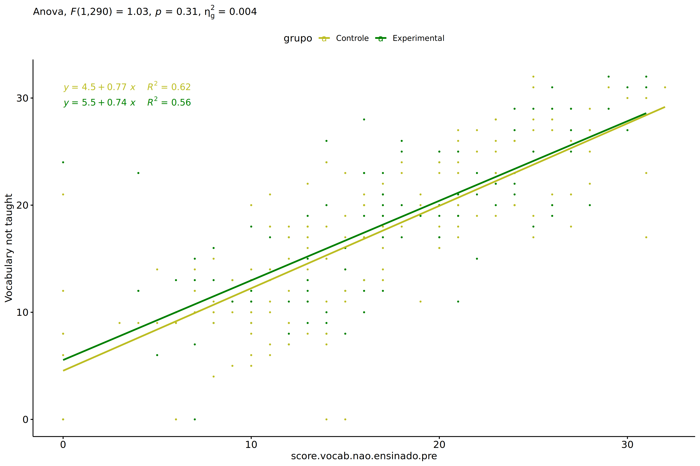
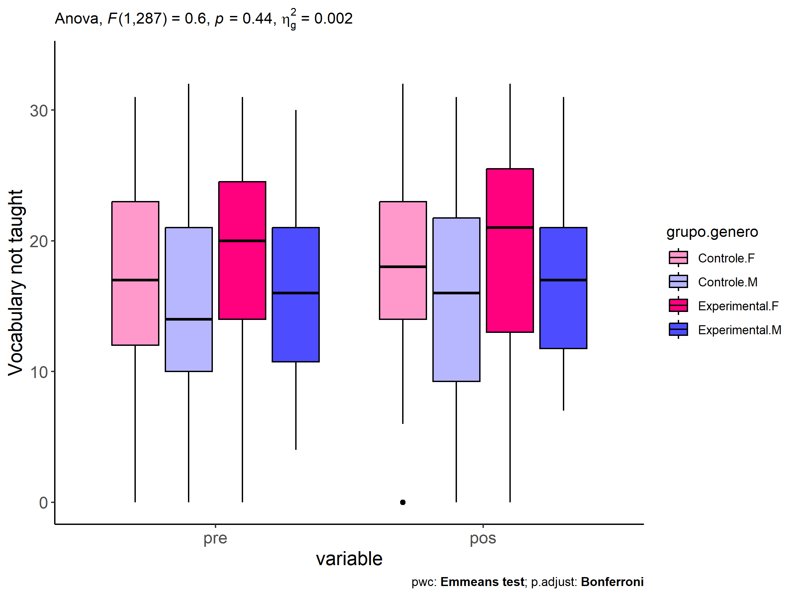
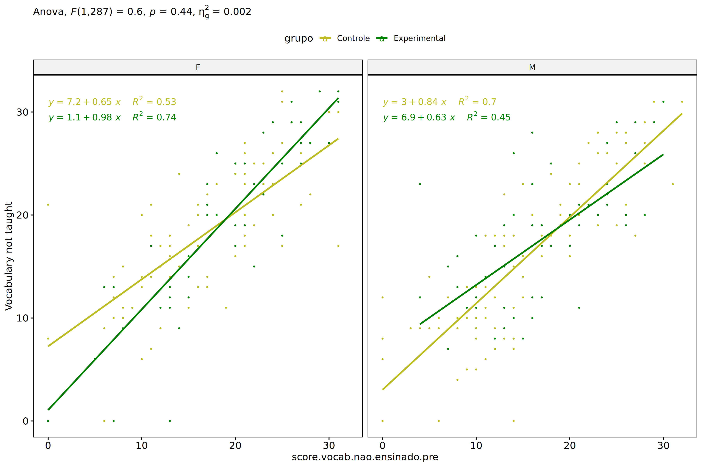
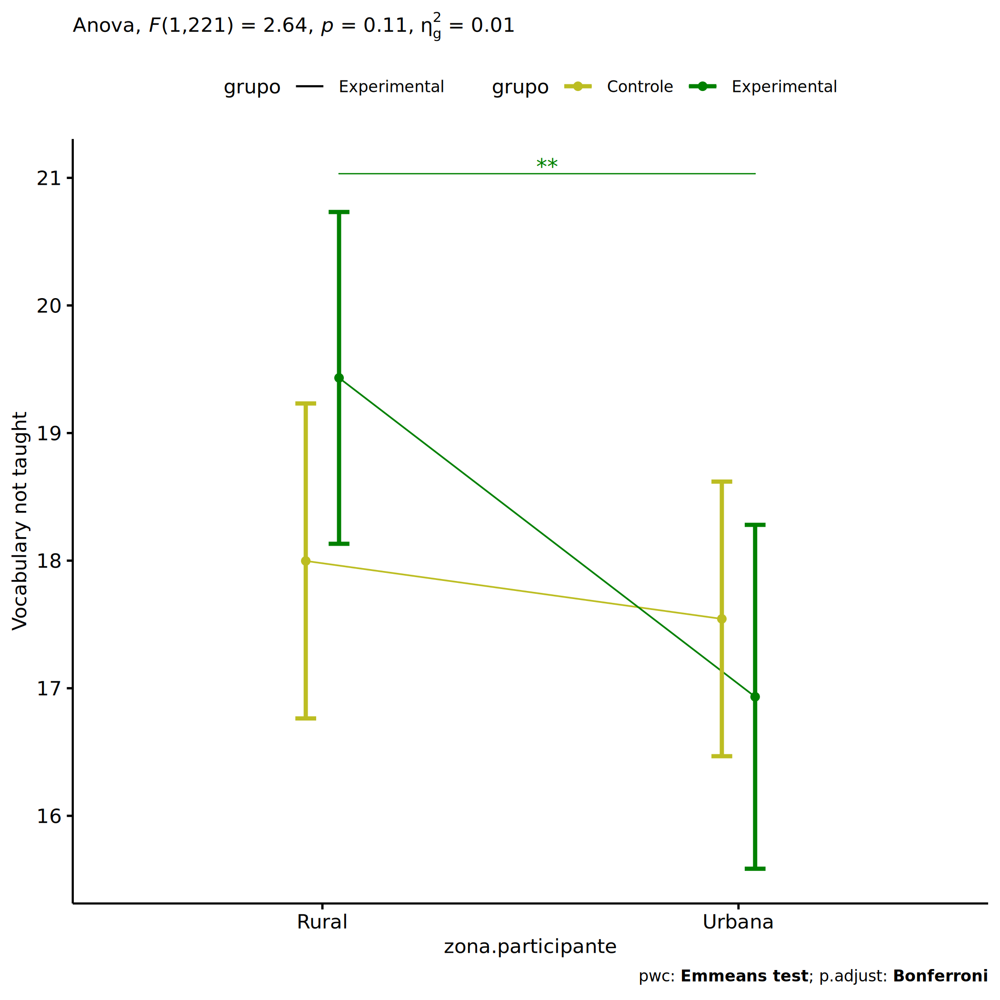
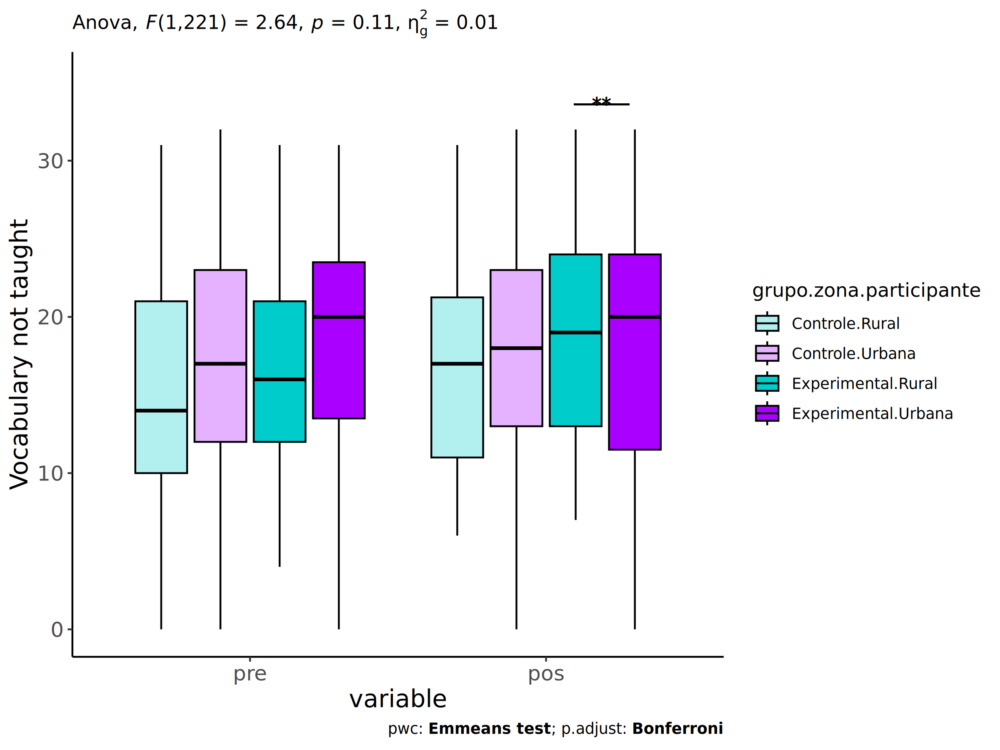
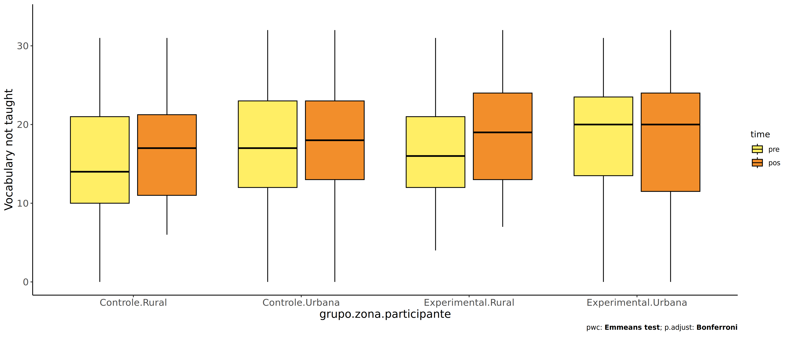
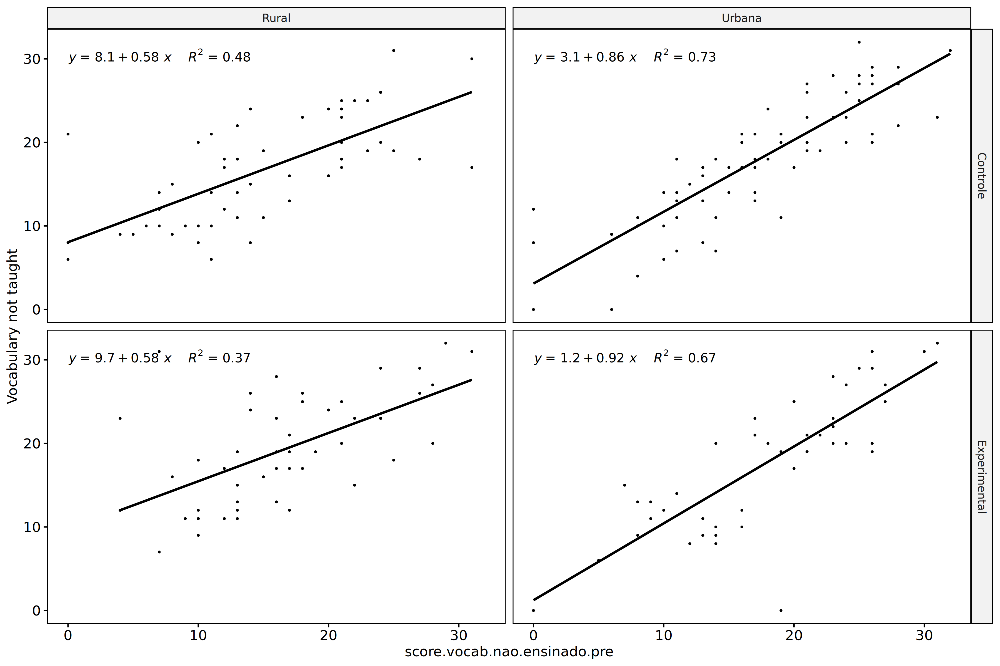
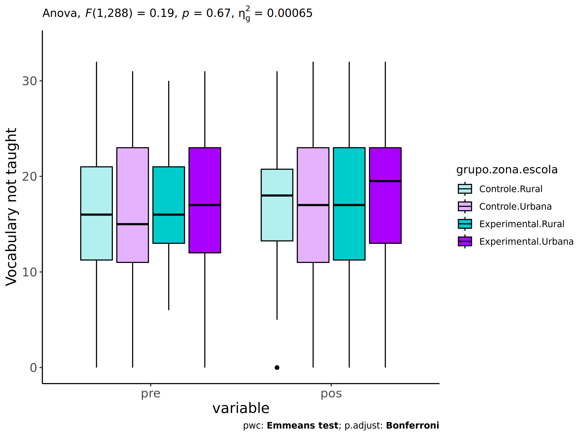
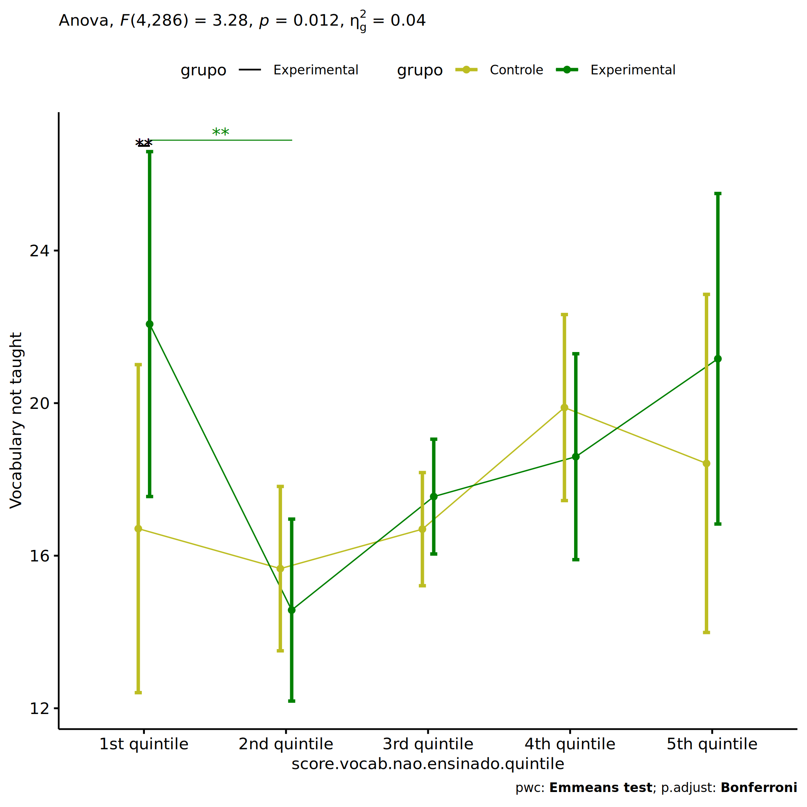

ANCOVA in Vocabulary not taught (Vocabulary not taught)
================
Geiser C. Challco <geiser@alumni.usp.br>

- [Setting Initial Variables](#setting-initial-variables)
- [Descriptive Statistics of Initial
  Data](#descriptive-statistics-of-initial-data)
- [ANCOVA and Pairwise for one factor:
  **grupo**](#ancova-and-pairwise-for-one-factor-grupo)
  - [Without remove non-normal data](#without-remove-non-normal-data)
  - [Computing ANCOVA and PairWise After removing non-normal data
    (OK)](#computing-ancova-and-pairwise-after-removing-non-normal-data-ok)
    - [Plots for ancova](#plots-for-ancova)
    - [Checking linearity assumption](#checking-linearity-assumption)
    - [Checking normality and
      homogeneity](#checking-normality-and-homogeneity)
- [ANCOVA and Pairwise for two factors
  **grupo:genero**](#ancova-and-pairwise-for-two-factors-grupogenero)
  - [Without remove non-normal data](#without-remove-non-normal-data-1)
  - [Computing ANCOVA and PairWise After removing non-normal data
    (OK)](#computing-ancova-and-pairwise-after-removing-non-normal-data-ok-1)
    - [Plots for ancova](#plots-for-ancova-1)
    - [Checking linearity assumption](#checking-linearity-assumption-1)
    - [Checking normality and
      homogeneity](#checking-normality-and-homogeneity-1)
- [ANCOVA and Pairwise for two factors
  **grupo:zona.participante**](#ancova-and-pairwise-for-two-factors-grupozonaparticipante)
  - [Without remove non-normal data](#without-remove-non-normal-data-2)
  - [Computing ANCOVA and PairWise After removing non-normal data
    (OK)](#computing-ancova-and-pairwise-after-removing-non-normal-data-ok-2)
    - [Plots for ancova](#plots-for-ancova-2)
    - [Checking linearity assumption](#checking-linearity-assumption-2)
    - [Checking normality and
      homogeneity](#checking-normality-and-homogeneity-2)
- [ANCOVA and Pairwise for two factors
  **grupo:zona.escola**](#ancova-and-pairwise-for-two-factors-grupozonaescola)
  - [Without remove non-normal data](#without-remove-non-normal-data-3)
  - [Computing ANCOVA and PairWise After removing non-normal data
    (OK)](#computing-ancova-and-pairwise-after-removing-non-normal-data-ok-3)
    - [Plots for ancova](#plots-for-ancova-3)
    - [Checking linearity assumption](#checking-linearity-assumption-3)
    - [Checking normality and
      homogeneity](#checking-normality-and-homogeneity-3)
- [ANCOVA and Pairwise for two factors
  **grupo:score.vocab.nao.ensinado.quintile**](#ancova-and-pairwise-for-two-factors-gruposcorevocabnaoensinadoquintile)
  - [Without remove non-normal data](#without-remove-non-normal-data-4)
  - [Computing ANCOVA and PairWise After removing non-normal data
    (OK)](#computing-ancova-and-pairwise-after-removing-non-normal-data-ok-4)
    - [Plots for ancova](#plots-for-ancova-4)
    - [Checking linearity assumption](#checking-linearity-assumption-4)
    - [Checking normality and
      homogeneity](#checking-normality-and-homogeneity-4)
- [Summary of Results](#summary-of-results)
  - [Descriptive Statistics](#descriptive-statistics)
  - [ANCOVA Table Comparison](#ancova-table-comparison)
  - [PairWise Table Comparison](#pairwise-table-comparison)
  - [EMMS Table Comparison](#emms-table-comparison)

**NOTE**:

- Teste ANCOVA para determinar se houve diferenças significativas no
  Vocabulary not taught (medido usando pre- e pos-testes).
- ANCOVA test to determine whether there were significant differences in
  Vocabulary not taught (measured using pre- and post-tests).

# Setting Initial Variables

``` r
dv = "score.vocab.nao.ensinado"
dv.pos = "score.vocab.nao.ensinado.pos"
dv.pre = "score.vocab.nao.ensinado.pre"

fatores2 <- c("genero","zona.participante","zona.escola","score.vocab.nao.ensinado.quintile")
lfatores2 <- as.list(fatores2)
names(lfatores2) <- fatores2

fatores1 <- c("grupo", fatores2)
lfatores1 <- as.list(fatores1)
names(lfatores1) <- fatores1

lfatores <- c(lfatores1)

color <- list()
color[["prepost"]] = c("#ffee65","#f28e2B")
color[["grupo"]] = c("#bcbd22","#008000")
color[["genero"]] = c("#FF007F","#4D4DFF")
color[["zona.escola"]] = c("#AA00FF","#00CCCC")
color[["zona.participante"]] = c("#AA00FF","#00CCCC")

level <- list()
level[["grupo"]] = c("Controle","Experimental")
level[["genero"]] = c("F","M")
level[["zona.escola"]] = c("Rural","Urbana")
level[["zona.participante"]] = c("Rural","Urbana")

# ..

ymin <- 0
ymax <- 0

ymin.ci <- 0
ymax.ci <- 0


color[["grupo:genero"]] = c(
  "Controle:F"="#ff99cb", "Controle:M"="#b7b7ff",
  "Experimental:F"="#FF007F", "Experimental:M"="#4D4DFF",
  "Controle.F"="#ff99cb", "Controle.M"="#b7b7ff",
  "Experimental.F"="#FF007F", "Experimental.M"="#4D4DFF"
)
color[["grupo:zona.escola"]] = c(
  "Controle:Rural"="#b2efef","Controle:Urbana"="#e5b2ff",
  "Experimental:Rural"="#00CCCC", "Experimental:Urbana"="#AA00FF",
  "Controle.Rural"="#b2efef","Controle.Urbana"="#e5b2ff",
  "Experimental.Rural"="#00CCCC", "Experimental.Urbana"="#AA00FF"
)
color[["grupo:zona.participante"]] = c(
  "Controle:Rural"="#b2efef","Controle:Urbana"="#e5b2ff",
  "Experimental:Rural"="#00CCCC", "Experimental:Urbana"="#AA00FF",
  "Controle.Rural"="#b2efef","Controle.Urbana"="#e5b2ff",
  "Experimental.Rural"="#00CCCC", "Experimental.Urbana"="#AA00FF"
)

for (coln in c(
  "palavras.lidas","score.compreensao","tri.compreensao",
  "score.vocab","tri.vocab",
  "score.vocab.ensinado","tri.vocab.ensinado","score.vocab.nao.ensinado","tri.vocab.nao.ensinado",
  "score.CLPP","tri.CLPP","score.CR","tri.CR",
  "score.CI","tri.CI","score.TV","tri.TV","score.TF","tri.TF","score.TO","tri.TO")) {
  color[[paste0(coln,".quintile")]] = c("#BF0040","#FF0000","#800080","#0000FF","#4000BF")
  level[[paste0(coln,".quintile")]] = c("1st quintile","2nd quintile","3rd quintile","4th quintile","5th quintile")
  color[[paste0("grupo:",coln,".quintile")]] = c(
    "Experimental.1st quintile"="#BF0040", "Controle.1st quintile"="#d8668c",
    "Experimental.2nd quintile"="#FF0000", "Controle.2nd quintile"="#ff7f7f",
    "Experimental.3rd quintile"="#8fce00", "Controle.3rd quintile"="#ddf0b2",
    "Experimental.4th quintile"="#0000FF", "Controle.4th quintile"="#b2b2ff",
    "Experimental.5th quintile"="#4000BF", "Controle.5th quintile"="#b299e5",
    
    "Experimental:1st quintile"="#BF0040", "Controle:1st quintile"="#d8668c",
    "Experimental:2nd quintile"="#FF0000", "Controle:2nd quintile"="#ff7f7f",
    "Experimental:3rd quintile"="#8fce00", "Controle:3rd quintile"="#ddf0b2",
    "Experimental:4th quintile"="#0000FF", "Controle:4th quintile"="#b2b2ff",
    "Experimental:5th quintile"="#4000BF", "Controle:5th quintile"="#b299e5")
}


gdat <- read_excel("../data/data.xlsx", sheet = "vocabulario.wg.wo.st")


dat <- gdat
dat$grupo <- factor(dat[["grupo"]], level[["grupo"]])
for (coln in c(names(lfatores))) {
  dat[[coln]] <- factor(dat[[coln]], level[[coln]][level[[coln]] %in% unique(dat[[coln]])])
}
dat <- dat[which(!is.na(dat[[dv.pre]]) & !is.na(dat[[dv.pos]])),]
dat <- dat[,c("id",names(lfatores),dv.pre,dv.pos)]

dat.long <- rbind(dat, dat)
dat.long$time <- c(rep("pre", nrow(dat)), rep("pos", nrow(dat)))
dat.long$time <- factor(dat.long$time, c("pre","pos"))
dat.long[[dv]] <- c(dat[[dv.pre]], dat[[dv.pos]])


for (f in c("grupo", names(lfatores))) {
  if (is.null(color[[f]]) && length(unique(dat[[f]])) > 0) 
      color[[f]] <- distinctColorPalette(length(unique(dat[[f]])))
}
for (f in c(fatores2)) {
  if (is.null(color[[paste0("grupo:",f)]]) && length(unique(dat[[f]])) > 0)
    color[[paste0("grupo:",f)]] <- distinctColorPalette(length(unique(dat[["grupo"]]))*length(unique(dat[[f]])))
}

ldat <- list()
laov <- list()
lpwc <- list()
lemms <- list()
```

# Descriptive Statistics of Initial Data

``` r
df <- get.descriptives(dat, c(dv.pre, dv.pos), c("grupo"), 
                       include.global = T, symmetry.test = T, normality.test = F)
df <- plyr::rbind.fill(
  df, do.call(plyr::rbind.fill, lapply(lfatores2, FUN = function(f) {
    if (nrow(dat) > 0 && sum(!is.na(unique(dat[[f]]))) > 1)
      get.descriptives(dat, c(dv.pre,dv.pos), c("grupo", f),
                       symmetry.test = T, normality.test = F)
    }))
)
```

    ## Warning: There was 1 warning in `mutate()`.
    ## ℹ In argument: `ci = abs(stats::qt(alpha/2, .data$n - 1) * .data$se)`.
    ## Caused by warning:
    ## ! There was 1 warning in `mutate()`.
    ## ℹ In argument: `ci = abs(stats::qt(alpha/2, .data$n - 1) * .data$se)`.
    ## Caused by warning in `stats::qt()`:
    ## ! NaNs produced
    ## There was 1 warning in `mutate()`.
    ## ℹ In argument: `ci = abs(stats::qt(alpha/2, .data$n - 1) * .data$se)`.
    ## Caused by warning:
    ## ! There was 1 warning in `mutate()`.
    ## ℹ In argument: `ci = abs(stats::qt(alpha/2, .data$n - 1) * .data$se)`.
    ## Caused by warning in `stats::qt()`:
    ## ! NaNs produced

``` r
df <- df[,c(fatores1[fatores1 %in% colnames(df)],"variable",
            colnames(df)[!colnames(df) %in% c(fatores1,"variable")])]
```

| grupo        | genero | zona.participante | zona.escola | score.vocab.nao.ensinado.quintile | variable                     |   n |   mean | median | min | max |     sd |    se |    ci |   iqr | symmetry | skewness | kurtosis |
|:-------------|:-------|:------------------|:------------|:----------------------------------|:-----------------------------|----:|-------:|-------:|----:|----:|-------:|------:|------:|------:|:---------|---------:|---------:|
| Controle     |        |                   |             |                                   | score.vocab.nao.ensinado.pre | 176 | 16.176 |   15.5 |   0 |  32 |  7.573 | 0.571 | 1.127 | 11.25 | YES      |   -0.096 |   -0.656 |
| Experimental |        |                   |             |                                   | score.vocab.nao.ensinado.pre | 135 | 17.333 |   17.0 |   0 |  31 |  7.250 | 0.624 | 1.234 | 10.00 | YES      |   -0.168 |   -0.648 |
|              |        |                   |             |                                   | score.vocab.nao.ensinado.pre | 311 | 16.678 |   16.0 |   0 |  32 |  7.445 | 0.422 | 0.831 | 12.00 | YES      |   -0.135 |   -0.635 |
| Controle     |        |                   |             |                                   | score.vocab.nao.ensinado.pos | 176 | 16.545 |   17.0 |   0 |  32 |  7.810 | 0.589 | 1.162 | 12.00 | YES      |   -0.255 |   -0.546 |
| Experimental |        |                   |             |                                   | score.vocab.nao.ensinado.pos | 135 | 17.200 |   19.0 |   0 |  32 |  8.349 | 0.719 | 1.421 | 12.00 | YES      |   -0.332 |   -0.564 |
|              |        |                   |             |                                   | score.vocab.nao.ensinado.pos | 311 | 16.830 |   17.0 |   0 |  32 |  8.042 | 0.456 | 0.897 | 12.00 | YES      |   -0.286 |   -0.537 |
| Controle     | F      |                   |             |                                   | score.vocab.nao.ensinado.pre |  87 | 16.989 |   17.0 |   0 |  31 |  7.183 | 0.770 | 1.531 | 11.00 | YES      |   -0.193 |   -0.559 |
| Controle     | M      |                   |             |                                   | score.vocab.nao.ensinado.pre |  89 | 15.382 |   14.0 |   0 |  32 |  7.896 | 0.837 | 1.663 | 11.00 | YES      |    0.025 |   -0.754 |
| Experimental | F      |                   |             |                                   | score.vocab.nao.ensinado.pre |  59 | 18.763 |   20.0 |   0 |  31 |  7.347 | 0.956 | 1.915 | 11.00 | YES      |   -0.330 |   -0.645 |
| Experimental | M      |                   |             |                                   | score.vocab.nao.ensinado.pre |  75 | 16.067 |   16.0 |   0 |  30 |  6.935 | 0.801 | 1.596 | 10.50 | YES      |   -0.082 |   -0.576 |
| Experimental |        |                   |             |                                   | score.vocab.nao.ensinado.pre |   1 | 28.000 |   28.0 |  28 |  28 |        |       |       |  0.00 | few data |    0.000 |    0.000 |
| Controle     | F      |                   |             |                                   | score.vocab.nao.ensinado.pos |  87 | 17.828 |   18.0 |   0 |  32 |  7.043 | 0.755 | 1.501 |  9.00 | YES      |   -0.441 |    0.129 |
| Controle     | M      |                   |             |                                   | score.vocab.nao.ensinado.pos |  89 | 15.292 |   16.0 |   0 |  31 |  8.342 | 0.884 | 1.757 | 12.00 | YES      |   -0.026 |   -0.915 |
| Experimental | F      |                   |             |                                   | score.vocab.nao.ensinado.pos |  59 | 18.712 |   20.0 |   0 |  32 |  9.212 | 1.199 | 2.401 | 12.50 | NO       |   -0.571 |   -0.610 |
| Experimental | M      |                   |             |                                   | score.vocab.nao.ensinado.pos |  75 | 16.240 |   17.0 |   0 |  31 |  7.278 | 0.840 | 1.675 | 10.00 | YES      |   -0.202 |   -0.423 |
| Experimental |        |                   |             |                                   | score.vocab.nao.ensinado.pos |   1 |  0.000 |    0.0 |   0 |   0 |        |       |       |  0.00 | few data |    0.000 |    0.000 |
| Controle     |        | Rural             |             |                                   | score.vocab.nao.ensinado.pre |  56 | 15.304 |   14.0 |   0 |  31 |  7.608 | 1.017 | 2.038 | 11.00 | YES      |   -0.046 |   -0.741 |
| Controle     |        | Urbana            |             |                                   | score.vocab.nao.ensinado.pre |  77 | 17.026 |   17.0 |   0 |  32 |  7.511 | 0.856 | 1.705 | 11.00 | YES      |   -0.314 |   -0.439 |
| Controle     |        |                   |             |                                   | score.vocab.nao.ensinado.pre |  43 | 15.791 |   14.0 |   0 |  30 |  7.655 | 1.167 | 2.356 | 12.50 | YES      |    0.221 |   -0.917 |
| Experimental |        | Rural             |             |                                   | score.vocab.nao.ensinado.pre |  52 | 16.173 |   16.0 |   0 |  31 |  7.172 | 0.995 | 1.997 |  9.75 | YES      |    0.034 |   -0.615 |
| Experimental |        | Urbana            |             |                                   | score.vocab.nao.ensinado.pre |  49 | 18.612 |   20.0 |   0 |  31 |  7.202 | 1.029 | 2.069 | 10.00 | YES      |   -0.418 |   -0.598 |
| Experimental |        |                   |             |                                   | score.vocab.nao.ensinado.pre |  34 | 17.265 |   16.5 |   0 |  30 |  7.346 | 1.260 | 2.563 | 10.25 | YES      |   -0.127 |   -0.692 |
| Controle     |        | Rural             |             |                                   | score.vocab.nao.ensinado.pos |  56 | 16.929 |   17.0 |   6 |  31 |  6.361 | 0.850 | 1.704 | 10.25 | YES      |    0.142 |   -0.946 |
| Controle     |        | Urbana            |             |                                   | score.vocab.nao.ensinado.pos |  77 | 17.169 |   18.0 |   0 |  32 |  7.999 | 0.912 | 1.816 | 12.00 | YES      |   -0.364 |   -0.514 |
| Controle     |        |                   |             |                                   | score.vocab.nao.ensinado.pos |  43 | 14.930 |   15.0 |   0 |  31 |  9.043 | 1.379 | 2.783 | 13.50 | YES      |   -0.124 |   -1.001 |
| Experimental |        | Rural             |             |                                   | score.vocab.nao.ensinado.pos |  52 | 19.019 |   19.0 |   6 |  32 |  6.732 | 0.933 | 1.874 | 11.50 | YES      |    0.074 |   -1.039 |
| Experimental |        | Urbana            |             |                                   | score.vocab.nao.ensinado.pos |  49 | 17.388 |   19.0 |   0 |  32 |  8.705 | 1.244 | 2.500 | 12.00 | YES      |   -0.325 |   -0.771 |
| Experimental |        |                   |             |                                   | score.vocab.nao.ensinado.pos |  34 | 14.147 |   13.5 |   0 |  29 |  9.378 | 1.608 | 3.272 | 12.00 | YES      |   -0.149 |   -1.109 |
| Controle     |        |                   | Rural       |                                   | score.vocab.nao.ensinado.pre |  58 | 16.379 |   16.0 |   0 |  32 |  7.504 | 0.985 | 1.973 |  9.75 | YES      |   -0.155 |   -0.590 |
| Controle     |        |                   | Urbana      |                                   | score.vocab.nao.ensinado.pre | 118 | 16.076 |   15.0 |   0 |  31 |  7.637 | 0.703 | 1.392 | 12.00 | YES      |   -0.066 |   -0.722 |
| Experimental |        |                   | Rural       |                                   | score.vocab.nao.ensinado.pre |  40 | 16.775 |   16.0 |   0 |  30 |  7.029 | 1.111 | 2.248 |  8.00 | YES      |    0.065 |   -0.546 |
| Experimental |        |                   | Urbana      |                                   | score.vocab.nao.ensinado.pre |  95 | 17.568 |   18.0 |   0 |  31 |  7.365 | 0.756 | 1.500 | 11.00 | YES      |   -0.261 |   -0.697 |
| Controle     |        |                   | Rural       |                                   | score.vocab.nao.ensinado.pos |  58 | 16.983 |   18.0 |   0 |  31 |  6.381 | 0.838 | 1.678 |  7.50 | YES      |   -0.178 |   -0.182 |
| Controle     |        |                   | Urbana      |                                   | score.vocab.nao.ensinado.pos | 118 | 16.331 |   17.0 |   0 |  32 |  8.441 | 0.777 | 1.539 | 12.75 | YES      |   -0.230 |   -0.794 |
| Experimental |        |                   | Rural       |                                   | score.vocab.nao.ensinado.pos |  40 | 17.400 |   17.0 |   0 |  32 |  7.551 | 1.194 | 2.415 | 13.25 | YES      |    0.079 |   -0.760 |
| Experimental |        |                   | Urbana      |                                   | score.vocab.nao.ensinado.pos |  95 | 17.116 |   19.0 |   0 |  32 |  8.701 | 0.893 | 1.772 | 11.50 | YES      |   -0.432 |   -0.620 |
| Controle     |        |                   |             | 1st quintile                      | score.vocab.nao.ensinado.pre |  21 |  3.571 |    5.0 |   0 |   7 |  3.026 | 0.660 | 1.377 |  6.00 | YES      |   -0.216 |   -1.843 |
| Controle     |        |                   |             | 2nd quintile                      | score.vocab.nao.ensinado.pre |  48 | 10.854 |   11.0 |   8 |  13 |  1.663 | 0.240 | 0.483 |  2.00 | YES      |   -0.235 |   -1.104 |
| Controle     |        |                   |             | 3rd quintile                      | score.vocab.nao.ensinado.pre |  47 | 16.447 |   16.0 |  14 |  20 |  2.094 | 0.305 | 0.615 |  3.00 | YES      |    0.442 |   -1.127 |
| Controle     |        |                   |             | 4th quintile                      | score.vocab.nao.ensinado.pre |  45 | 23.244 |   23.0 |  21 |  26 |  1.798 | 0.268 | 0.540 |  4.00 | YES      |    0.053 |   -1.402 |
| Controle     |        |                   |             | 5th quintile                      | score.vocab.nao.ensinado.pre |  15 | 28.800 |   28.0 |  27 |  32 |  1.740 | 0.449 | 0.964 |  3.00 | NO       |    0.513 |   -1.392 |
| Experimental |        |                   |             | 1st quintile                      | score.vocab.nao.ensinado.pre |  13 |  4.462 |    5.0 |   0 |   7 |  2.817 | 0.781 | 1.702 |  3.00 | NO       |   -0.623 |   -1.287 |
| Experimental |        |                   |             | 2nd quintile                      | score.vocab.nao.ensinado.pre |  30 | 11.000 |   11.0 |   8 |  13 |  1.800 | 0.329 | 0.672 |  3.00 | YES      |   -0.206 |   -1.483 |
| Experimental |        |                   |             | 3rd quintile                      | score.vocab.nao.ensinado.pre |  45 | 17.044 |   17.0 |  14 |  20 |  2.044 | 0.305 | 0.614 |  3.00 | YES      |    0.113 |   -1.267 |
| Experimental |        |                   |             | 4th quintile                      | score.vocab.nao.ensinado.pre |  30 | 23.400 |   23.5 |  21 |  26 |  1.734 | 0.317 | 0.648 |  2.75 | YES      |    0.048 |   -1.291 |
| Experimental |        |                   |             | 5th quintile                      | score.vocab.nao.ensinado.pre |  17 | 28.412 |   28.0 |  27 |  31 |  1.417 | 0.344 | 0.728 |  2.00 | NO       |    0.541 |   -1.149 |
| Controle     |        |                   |             | 1st quintile                      | score.vocab.nao.ensinado.pos |  21 |  9.333 |    9.0 |   0 |  24 |  6.248 | 1.363 | 2.844 |  4.00 | YES      |    0.334 |    0.012 |
| Controle     |        |                   |             | 2nd quintile                      | score.vocab.nao.ensinado.pos |  48 | 12.438 |   12.5 |   4 |  22 |  4.524 | 0.653 | 1.314 |  7.25 | YES      |    0.142 |   -0.898 |
| Controle     |        |                   |             | 3rd quintile                      | score.vocab.nao.ensinado.pos |  47 | 15.277 |   17.0 |   0 |  24 |  6.714 | 0.979 | 1.971 |  7.00 | NO       |   -1.003 |    0.317 |
| Controle     |        |                   |             | 4th quintile                      | score.vocab.nao.ensinado.pos |  45 | 23.200 |   24.0 |   0 |  32 |  5.234 | 0.780 | 1.572 |  7.00 | NO       |   -1.766 |    6.189 |
| Controle     |        |                   |             | 5th quintile                      | score.vocab.nao.ensinado.pos |  15 | 23.800 |   26.0 |   0 |  31 |  7.984 | 2.061 | 4.421 |  8.00 | NO       |   -1.648 |    2.472 |
| Experimental |        |                   |             | 1st quintile                      | score.vocab.nao.ensinado.pos |  13 | 13.923 |   13.0 |   0 |  31 |  9.604 | 2.664 | 5.804 | 16.00 | YES      |    0.162 |   -1.204 |
| Experimental |        |                   |             | 2nd quintile                      | score.vocab.nao.ensinado.pos |  30 | 11.433 |   11.0 |   0 |  19 |  4.248 | 0.776 | 1.586 |  2.00 | NO       |   -0.839 |    1.352 |
| Experimental |        |                   |             | 3rd quintile                      | score.vocab.nao.ensinado.pos |  45 | 16.578 |   19.0 |   0 |  28 |  7.328 | 1.092 | 2.202 |  9.00 | NO       |   -0.785 |   -0.055 |
| Experimental |        |                   |             | 4th quintile                      | score.vocab.nao.ensinado.pos |  30 | 22.000 |   22.0 |   6 |  31 |  5.408 | 0.987 | 2.019 |  5.00 | NO       |   -0.727 |    0.953 |
| Experimental |        |                   |             | 5th quintile                      | score.vocab.nao.ensinado.pos |  17 | 23.059 |   27.0 |   0 |  32 | 11.377 | 2.759 | 5.849 |  4.00 | NO       |   -1.337 |    0.068 |

# ANCOVA and Pairwise for one factor: **grupo**

## Without remove non-normal data

``` r
pdat = remove_group_data(dat[!is.na(dat[["grupo"]]),], "score.vocab.nao.ensinado.pos", "grupo")

pdat.long <- rbind(pdat[,c("id","grupo")], pdat[,c("id","grupo")])
pdat.long[["time"]] <- c(rep("pre", nrow(pdat)), rep("pos", nrow(pdat)))
pdat.long[["time"]] <- factor(pdat.long[["time"]], c("pre","pos"))
pdat.long[["score.vocab.nao.ensinado"]] <- c(pdat[["score.vocab.nao.ensinado.pre"]], pdat[["score.vocab.nao.ensinado.pos"]])

aov = anova_test(pdat, score.vocab.nao.ensinado.pos ~ score.vocab.nao.ensinado.pre + grupo)
laov[["grupo"]] <- get_anova_table(aov)
```

``` r
pwc <- emmeans_test(pdat, score.vocab.nao.ensinado.pos ~ grupo, covariate = score.vocab.nao.ensinado.pre,
                    p.adjust.method = "bonferroni")
```

``` r
pwc.long <- emmeans_test(dplyr::group_by_at(pdat.long, "grupo"),
                          score.vocab.nao.ensinado ~ time,
                          p.adjust.method = "bonferroni")
lpwc[["grupo"]] <- plyr::rbind.fill(pwc, pwc.long)
```

``` r
ds <- get.descriptives(pdat, "score.vocab.nao.ensinado.pos", "grupo", covar = "score.vocab.nao.ensinado.pre")
ds <- merge(ds[ds$variable != "score.vocab.nao.ensinado.pre",],
            ds[ds$variable == "score.vocab.nao.ensinado.pre", !colnames(ds) %in% c("variable")],
            by = "grupo", all.x = T, suffixes = c("", ".score.vocab.nao.ensinado.pre"))
ds <- merge(get_emmeans(pwc), ds, by = "grupo", suffixes = c(".emms", ""))
ds <- ds[,c("grupo","n","mean.score.vocab.nao.ensinado.pre","se.score.vocab.nao.ensinado.pre","mean","se",
            "emmean","se.emms","conf.low","conf.high")]

colnames(ds) <- c("grupo", "N", paste0(c("M","SE")," (pre)"),
                  paste0(c("M","SE"), " (unadj)"),
                  paste0(c("M", "SE"), " (adj)"), "conf.low", "conf.high")

lemms[["grupo"]] <- ds
```

## Computing ANCOVA and PairWise After removing non-normal data (OK)

``` r
wdat = pdat 

res = residuals(lm(score.vocab.nao.ensinado.pos ~ score.vocab.nao.ensinado.pre + grupo, data = wdat))
non.normal = getNonNormal(res, wdat$id, plimit = 0.05)

wdat = wdat[!wdat$id %in% non.normal,]

wdat.long <- rbind(wdat[,c("id","grupo")], wdat[,c("id","grupo")])
wdat.long[["time"]] <- c(rep("pre", nrow(wdat)), rep("pos", nrow(wdat)))
wdat.long[["time"]] <- factor(wdat.long[["time"]], c("pre","pos"))
wdat.long[["score.vocab.nao.ensinado"]] <- c(wdat[["score.vocab.nao.ensinado.pre"]], wdat[["score.vocab.nao.ensinado.pos"]])

ldat[["grupo"]] = wdat

(non.normal)
```

    ##  [1] "P314" "P187" "P20"  "P37"  "P190" "P179" "P79"  "P46"  "P84"  "P226" "P63"  "P202" "P300"
    ## [14] "P337" "P329" "P323" "P204" "P17"

``` r
aov = anova_test(wdat, score.vocab.nao.ensinado.pos ~ score.vocab.nao.ensinado.pre + grupo)
laov[["grupo"]] <- merge(get_anova_table(aov), laov[["grupo"]],
                            by="Effect", suffixes = c("","'"))

(df = get_anova_table(aov))
```

    ## ANOVA Table (type II tests)
    ## 
    ##                         Effect DFn DFd       F        p p<.05   ges
    ## 1 score.vocab.nao.ensinado.pre   1 290 423.517 1.22e-58     * 0.594
    ## 2                        grupo   1 290   1.029 3.11e-01       0.004

| Effect                       | DFn | DFd |       F |     p | p\<.05 |   ges |
|:-----------------------------|----:|----:|--------:|------:|:-------|------:|
| score.vocab.nao.ensinado.pre |   1 | 290 | 423.517 | 0.000 | \*     | 0.594 |
| grupo                        |   1 | 290 |   1.029 | 0.311 |        | 0.004 |

``` r
pwc <- emmeans_test(wdat, score.vocab.nao.ensinado.pos ~ grupo, covariate = score.vocab.nao.ensinado.pre,
                    p.adjust.method = "bonferroni")
```

| term                                | .y.                          | group1   | group2       |  df | statistic |     p | p.adj | p.adj.signif |
|:------------------------------------|:-----------------------------|:---------|:-------------|----:|----------:|------:|------:|:-------------|
| score.vocab.nao.ensinado.pre\*grupo | score.vocab.nao.ensinado.pos | Controle | Experimental | 290 |    -1.014 | 0.311 | 0.311 | ns           |

``` r
pwc.long <- emmeans_test(dplyr::group_by_at(wdat.long, "grupo"),
                         score.vocab.nao.ensinado ~ time,
                         p.adjust.method = "bonferroni")
lpwc[["grupo"]] <- merge(plyr::rbind.fill(pwc, pwc.long), lpwc[["grupo"]],
                            by=c("grupo","term",".y.","group1","group2"),
                            suffixes = c("","'"))
```

| grupo        | term | .y.                      | group1 | group2 |  df | statistic |     p | p.adj | p.adj.signif |
|:-------------|:-----|:-------------------------|:-------|:-------|----:|----------:|------:|------:|:-------------|
| Controle     | time | score.vocab.nao.ensinado | pre    | pos    | 582 |    -1.030 | 0.303 | 0.303 | ns           |
| Experimental | time | score.vocab.nao.ensinado | pre    | pos    | 582 |    -1.194 | 0.233 | 0.233 | ns           |

``` r
ds <- get.descriptives(wdat, "score.vocab.nao.ensinado.pos", "grupo", covar = "score.vocab.nao.ensinado.pre")
ds <- merge(ds[ds$variable != "score.vocab.nao.ensinado.pre",],
            ds[ds$variable == "score.vocab.nao.ensinado.pre", !colnames(ds) %in% c("variable")],
            by = "grupo", all.x = T, suffixes = c("", ".score.vocab.nao.ensinado.pre"))
ds <- merge(get_emmeans(pwc), ds, by = "grupo", suffixes = c(".emms", ""))
ds <- ds[,c("grupo","n","mean.score.vocab.nao.ensinado.pre","se.score.vocab.nao.ensinado.pre","mean","se",
            "emmean","se.emms","conf.low","conf.high")]

colnames(ds) <- c("grupo", "N", paste0(c("M","SE")," (pre)"),
                  paste0(c("M","SE"), " (unadj)"),
                  paste0(c("M", "SE"), " (adj)"), "conf.low", "conf.high")

lemms[["grupo"]] <- merge(ds, lemms[["grupo"]], by=c("grupo"), suffixes = c("","'"))
```

| grupo        |   N | M (pre) | SE (pre) | M (unadj) | SE (unadj) | M (adj) | SE (adj) | conf.low | conf.high |
|:-------------|----:|--------:|---------:|----------:|-----------:|--------:|---------:|---------:|----------:|
| Controle     | 170 |  16.171 |    0.578 |    16.988 |      0.566 |  17.336 |    0.356 |   16.635 |    18.036 |
| Experimental | 123 |  17.260 |    0.643 |    18.374 |      0.639 |  17.894 |    0.419 |   17.070 |    18.718 |

### Plots for ancova

``` r
plots <- oneWayAncovaPlots(
  wdat, "score.vocab.nao.ensinado.pos", "grupo", aov, list("grupo"=pwc), addParam = c("mean_ci"),
  font.label.size=10, step.increase=0.05, p.label="p.adj",
  subtitle = which(aov$Effect == "grupo"))
```

``` r
if (!is.null(nrow(plots[["grupo"]]$data)))
  plots[["grupo"]] + ggplot2::ylab("Vocabulary not taught") + 
  if (ymin.ci < ymax.ci) ggplot2::ylim(ymin.ci, ymax.ci)
```

<!-- -->

``` r
plots <- oneWayAncovaBoxPlots(
  wdat, "score.vocab.nao.ensinado.pos", "grupo", aov, pwc, covar = "score.vocab.nao.ensinado.pre",
  theme = "classic", color = color[["grupo"]],
  subtitle = which(aov$Effect == "grupo"))
```

``` r
if (length(unique(wdat[["grupo"]])) > 1)
  plots[["grupo"]] + ggplot2::ylab("Vocabulary not taught") +
  ggplot2::scale_x_discrete(labels=c('pre', 'pos')) +
  if (ymin < ymax) ggplot2::ylim(ymin, ymax)
```

<!-- -->

``` r
if (length(unique(wdat.long[["grupo"]])) > 1)
  plots <- oneWayAncovaBoxPlots(
    wdat.long, "score.vocab.nao.ensinado", "grupo", aov, pwc.long,
    pre.post = "time", theme = "classic", color = color$prepost)
```

``` r
if (length(unique(wdat.long[["grupo"]])) > 1)
  plots[["grupo"]] + ggplot2::ylab("Vocabulary not taught") +
  if (ymin < ymax) ggplot2::ylim(ymin, ymax) 
```

<!-- -->

### Checking linearity assumption

``` r
ggscatter(wdat, x = "score.vocab.nao.ensinado.pre", y = "score.vocab.nao.ensinado.pos", size = 0.5,
          color = "grupo", add = "reg.line")+
  stat_regline_equation(
    aes(label =  paste(..eq.label.., ..rr.label.., sep = "~~~~"), color = grupo)
  ) +
  ggplot2::labs(subtitle = rstatix::get_test_label(aov, detailed = T, row = which(aov$Effect == "grupo"))) +
  ggplot2::scale_color_manual(values = color[["grupo"]]) +
  ggplot2::ylab("Vocabulary not taught")  +
  if (ymin < ymax) ggplot2::ylim(ymin, ymax)
```

<!-- -->

### Checking normality and homogeneity

``` r
res <- augment(lm(score.vocab.nao.ensinado.pos ~ score.vocab.nao.ensinado.pre + grupo, data = wdat))
```

``` r
shapiro_test(res$.resid)
```

    ## # A tibble: 1 × 3
    ##   variable   statistic  p.value
    ##   <chr>          <dbl>    <dbl>
    ## 1 res$.resid     0.982 0.000924

``` r
levene_test(res, .resid ~ grupo)
```

    ## # A tibble: 1 × 4
    ##     df1   df2 statistic     p
    ##   <int> <int>     <dbl> <dbl>
    ## 1     1   291   0.00921 0.924

# ANCOVA and Pairwise for two factors **grupo:genero**

## Without remove non-normal data

``` r
pdat = remove_group_data(dat[!is.na(dat[["grupo"]]) & !is.na(dat[["genero"]]),],
                         "score.vocab.nao.ensinado.pos", c("grupo","genero"))
pdat = pdat[pdat[["genero"]] %in% do.call(
  intersect, lapply(unique(pdat[["grupo"]]), FUN = function(x) {
    unique(pdat[["genero"]][which(pdat[["grupo"]] == x)])
  })),]
pdat[["grupo"]] = factor(pdat[["grupo"]], level[["grupo"]])
pdat[["genero"]] = factor(
  pdat[["genero"]],
  level[["genero"]][level[["genero"]] %in% unique(pdat[["genero"]])])

pdat.long <- rbind(pdat[,c("id","grupo","genero")], pdat[,c("id","grupo","genero")])
pdat.long[["time"]] <- c(rep("pre", nrow(pdat)), rep("pos", nrow(pdat)))
pdat.long[["time"]] <- factor(pdat.long[["time"]], c("pre","pos"))
pdat.long[["score.vocab.nao.ensinado"]] <- c(pdat[["score.vocab.nao.ensinado.pre"]], pdat[["score.vocab.nao.ensinado.pos"]])

if (length(unique(pdat[["genero"]])) >= 2) {
  aov = anova_test(pdat, score.vocab.nao.ensinado.pos ~ score.vocab.nao.ensinado.pre + grupo*genero)
  laov[["grupo:genero"]] <- get_anova_table(aov)
}
```

``` r
if (length(unique(pdat[["genero"]])) >= 2) {
  pwcs <- list()
  pwcs[["genero"]] <- emmeans_test(
    group_by(pdat, grupo), score.vocab.nao.ensinado.pos ~ genero,
    covariate = score.vocab.nao.ensinado.pre, p.adjust.method = "bonferroni")
  pwcs[["grupo"]] <- emmeans_test(
    group_by(pdat, genero), score.vocab.nao.ensinado.pos ~ grupo,
    covariate = score.vocab.nao.ensinado.pre, p.adjust.method = "bonferroni")
  
  pwc <- plyr::rbind.fill(pwcs[["grupo"]], pwcs[["genero"]])
  pwc <- pwc[,c("grupo","genero", colnames(pwc)[!colnames(pwc) %in% c("grupo","genero")])]
}
```

``` r
if (length(unique(pdat[["genero"]])) >= 2) {
  pwc.long <- emmeans_test(dplyr::group_by_at(pdat.long, c("grupo","genero")),
                           score.vocab.nao.ensinado ~ time,
                           p.adjust.method = "bonferroni")
  lpwc[["grupo:genero"]] <- plyr::rbind.fill(pwc, pwc.long)
}
```

``` r
if (length(unique(pdat[["genero"]])) >= 2) {
  ds <- get.descriptives(pdat, "score.vocab.nao.ensinado.pos", c("grupo","genero"), covar = "score.vocab.nao.ensinado.pre")
  ds <- merge(ds[ds$variable != "score.vocab.nao.ensinado.pre",],
              ds[ds$variable == "score.vocab.nao.ensinado.pre", !colnames(ds) %in% c("variable")],
              by = c("grupo","genero"), all.x = T, suffixes = c("", ".score.vocab.nao.ensinado.pre"))
  ds <- merge(get_emmeans(pwcs[["grupo"]]), ds,
              by = c("grupo","genero"), suffixes = c(".emms", ""))
  ds <- ds[,c("grupo","genero","n","mean.score.vocab.nao.ensinado.pre","se.score.vocab.nao.ensinado.pre","mean","se",
              "emmean","se.emms","conf.low","conf.high")]
  
  colnames(ds) <- c("grupo","genero", "N", paste0(c("M","SE")," (pre)"),
                    paste0(c("M","SE"), " (unadj)"),
                    paste0(c("M", "SE"), " (adj)"), "conf.low", "conf.high")
  
  lemms[["grupo:genero"]] <- ds
}
```

## Computing ANCOVA and PairWise After removing non-normal data (OK)

``` r
if (length(unique(pdat[["genero"]])) >= 2) {
  wdat = pdat 
  
  res = residuals(lm(score.vocab.nao.ensinado.pos ~ score.vocab.nao.ensinado.pre + grupo*genero, data = wdat))
  non.normal = getNonNormal(res, wdat$id, plimit = 0.05)
  
  wdat = wdat[!wdat$id %in% non.normal,]
  
  wdat.long <- rbind(wdat[,c("id","grupo","genero")], wdat[,c("id","grupo","genero")])
  wdat.long[["time"]] <- c(rep("pre", nrow(wdat)), rep("pos", nrow(wdat)))
  wdat.long[["time"]] <- factor(wdat.long[["time"]], c("pre","pos"))
  wdat.long[["score.vocab.nao.ensinado"]] <- c(wdat[["score.vocab.nao.ensinado.pre"]], wdat[["score.vocab.nao.ensinado.pos"]])
  
  
  ldat[["grupo:genero"]] = wdat
  
  (non.normal)
}
```

    ##  [1] "P187" "P314" "P37"  "P84"  "P46"  "P190" "P79"  "P300" "P294" "P204" "P63"  "P202" "P337"
    ## [14] "P312" "P179" "P226" "P329" "P323"

``` r
if (length(unique(pdat[["genero"]])) >= 2) {
  aov = anova_test(wdat, score.vocab.nao.ensinado.pos ~ score.vocab.nao.ensinado.pre + grupo*genero)
  laov[["grupo:genero"]] <- merge(get_anova_table(aov), laov[["grupo:genero"]],
                                         by="Effect", suffixes = c("","'"))
  df = get_anova_table(aov)
}
```

| Effect                       | DFn | DFd |       F |     p | p\<.05 |   ges |
|:-----------------------------|----:|----:|--------:|------:|:-------|------:|
| score.vocab.nao.ensinado.pre |   1 | 287 | 452.632 | 0.000 | \*     | 0.612 |
| grupo                        |   1 | 287 |   0.144 | 0.705 |        | 0.001 |
| genero                       |   1 | 287 |   2.099 | 0.148 |        | 0.007 |
| grupo:genero                 |   1 | 287 |   0.596 | 0.441 |        | 0.002 |

``` r
if (length(unique(pdat[["genero"]])) >= 2) {
  pwcs <- list()
  pwcs[["genero"]] <- emmeans_test(
    group_by(wdat, grupo), score.vocab.nao.ensinado.pos ~ genero,
    covariate = score.vocab.nao.ensinado.pre, p.adjust.method = "bonferroni")
  pwcs[["grupo"]] <- emmeans_test(
    group_by(wdat, genero), score.vocab.nao.ensinado.pos ~ grupo,
    covariate = score.vocab.nao.ensinado.pre, p.adjust.method = "bonferroni")
  
  pwc <- plyr::rbind.fill(pwcs[["grupo"]], pwcs[["genero"]])
  pwc <- pwc[,c("grupo","genero", colnames(pwc)[!colnames(pwc) %in% c("grupo","genero")])]
}
```

| grupo        | genero | term                                 | .y.                          | group1   | group2       |  df | statistic |     p | p.adj | p.adj.signif |
|:-------------|:-------|:-------------------------------------|:-----------------------------|:---------|:-------------|----:|----------:|------:|------:|:-------------|
|              | F      | score.vocab.nao.ensinado.pre\*grupo  | score.vocab.nao.ensinado.pos | Controle | Experimental | 287 |     0.305 | 0.760 | 0.760 | ns           |
|              | M      | score.vocab.nao.ensinado.pre\*grupo  | score.vocab.nao.ensinado.pos | Controle | Experimental | 287 |    -0.803 | 0.423 | 0.423 | ns           |
| Controle     |        | score.vocab.nao.ensinado.pre\*genero | score.vocab.nao.ensinado.pos | F        | M            | 287 |     1.607 | 0.109 | 0.109 | ns           |
| Experimental |        | score.vocab.nao.ensinado.pre\*genero | score.vocab.nao.ensinado.pos | F        | M            | 287 |     0.355 | 0.723 | 0.723 | ns           |

``` r
if (length(unique(pdat[["genero"]])) >= 2) {
  pwc.long <- emmeans_test(dplyr::group_by_at(wdat.long, c("grupo","genero")),
                           score.vocab.nao.ensinado ~ time,
                           p.adjust.method = "bonferroni")
  lpwc[["grupo:genero"]] <- merge(plyr::rbind.fill(pwc, pwc.long),
                                         lpwc[["grupo:genero"]],
                                         by=c("grupo","genero","term",".y.","group1","group2"),
                                         suffixes = c("","'"))
}
```

| grupo        | genero | term | .y.                      | group1 | group2 |  df | statistic |     p | p.adj | p.adj.signif |
|:-------------|:-------|:-----|:-------------------------|:-------|:-------|----:|----------:|------:|------:|:-------------|
| Controle     | F      | time | score.vocab.nao.ensinado | pre    | pos    | 576 |    -1.128 | 0.260 | 0.260 | ns           |
| Controle     | M      | time | score.vocab.nao.ensinado | pre    | pos    | 576 |    -0.517 | 0.605 | 0.605 | ns           |
| Experimental | F      | time | score.vocab.nao.ensinado | pre    | pos    | 576 |    -0.462 | 0.644 | 0.644 | ns           |
| Experimental | M      | time | score.vocab.nao.ensinado | pre    | pos    | 576 |    -0.772 | 0.441 | 0.441 | ns           |

``` r
if (length(unique(pdat[["genero"]])) >= 2) {
  ds <- get.descriptives(wdat, "score.vocab.nao.ensinado.pos", c("grupo","genero"), covar = "score.vocab.nao.ensinado.pre")
  ds <- merge(ds[ds$variable != "score.vocab.nao.ensinado.pre",],
              ds[ds$variable == "score.vocab.nao.ensinado.pre", !colnames(ds) %in% c("variable")],
              by = c("grupo","genero"), all.x = T, suffixes = c("", ".score.vocab.nao.ensinado.pre"))
  ds <- merge(get_emmeans(pwcs[["grupo"]]), ds,
              by = c("grupo","genero"), suffixes = c(".emms", ""))
  ds <- ds[,c("grupo","genero","n","mean.score.vocab.nao.ensinado.pre","se.score.vocab.nao.ensinado.pre",
              "mean","se","emmean","se.emms","conf.low","conf.high")]
  
  colnames(ds) <- c("grupo","genero", "N", paste0(c("M","SE")," (pre)"),
                    paste0(c("M","SE"), " (unadj)"),
                    paste0(c("M", "SE"), " (adj)"), "conf.low", "conf.high")
  
  lemms[["grupo:genero"]] <- merge(ds, lemms[["grupo:genero"]],
                                          by=c("grupo","genero"), suffixes = c("","'"))
}
```

| grupo        | genero |   N | M (pre) | SE (pre) | M (unadj) | SE (unadj) | M (adj) | SE (adj) | conf.low | conf.high |
|:-------------|:-------|----:|--------:|---------:|----------:|-----------:|--------:|---------:|---------:|----------:|
| Controle     | F      |  83 |  17.133 |    0.770 |    18.398 |      0.691 |  18.045 |    0.493 |   17.075 |    19.015 |
| Controle     | M      |  86 |  15.256 |    0.860 |    15.826 |      0.859 |  16.929 |    0.487 |   15.971 |    17.888 |
| Experimental | F      |  55 |  18.873 |    0.980 |    19.509 |      1.114 |  17.806 |    0.611 |   16.604 |    19.008 |
| Experimental | M      |  68 |  16.147 |    0.792 |    17.103 |      0.751 |  17.515 |    0.545 |   16.443 |    18.587 |

### Plots for ancova

``` r
if (length(unique(pdat[["genero"]])) >= 2) {
  ggPlotAoC2(pwcs, "grupo", "genero", aov, ylab = "Vocabulary not taught",
             subtitle = which(aov$Effect == "grupo:genero"), addParam = "errorbar") +
    ggplot2::scale_color_manual(values = color[["genero"]]) +
    ggplot2::ylab("Vocabulary not taught") +
    if (ymin.ci < ymax.ci) ggplot2::ylim(ymin.ci, ymax.ci)
}
```

    ## Scale for colour is already present.
    ## Adding another scale for colour, which will replace the existing scale.

<!-- -->

``` r
if (length(unique(pdat[["genero"]])) >= 2) {
  ggPlotAoC2(pwcs, "genero", "grupo", aov, ylab = "Vocabulary not taught",
               subtitle = which(aov$Effect == "grupo:genero"), addParam = "errorbar") +
    ggplot2::scale_color_manual(values = color[["grupo"]]) +
    ggplot2::ylab("Vocabulary not taught") +
    if (ymin.ci < ymax.ci) ggplot2::ylim(ymin.ci, ymax.ci)
}
```

    ## Scale for colour is already present.
    ## Adding another scale for colour, which will replace the existing scale.

<!-- -->

``` r
if (length(unique(pdat[["genero"]])) >= 2) {
  plots <- twoWayAncovaBoxPlots(
    wdat, "score.vocab.nao.ensinado.pos", c("grupo","genero"), aov, pwcs, covar = "score.vocab.nao.ensinado.pre",
    theme = "classic", color = color[["grupo:genero"]],
    subtitle = which(aov$Effect == "grupo:genero"))
}
```

``` r
if (length(unique(pdat[["genero"]])) >= 2) {
  plots[["grupo:genero"]] + ggplot2::ylab("Vocabulary not taught") +
  ggplot2::scale_x_discrete(labels=c('pre', 'pos')) +
  if (ymin < ymax) ggplot2::ylim(ymin, ymax)
}
```

    ## Warning: No shared levels found between `names(values)` of the manual scale and the data's colour
    ## values.

<!-- -->

``` r
if (length(unique(pdat[["genero"]])) >= 2) {
  plots <- twoWayAncovaBoxPlots(
    wdat.long, "score.vocab.nao.ensinado", c("grupo","genero"), aov, pwc.long,
    pre.post = "time",
    theme = "classic", color = color$prepost)
}
```

``` r
if (length(unique(pdat[["genero"]])) >= 2) 
  plots[["grupo:genero"]] + ggplot2::ylab("Vocabulary not taught") +
    if (ymin < ymax) ggplot2::ylim(ymin, ymax)
```

<!-- -->

### Checking linearity assumption

``` r
if (length(unique(pdat[["genero"]])) >= 2) {
  ggscatter(wdat, x = "score.vocab.nao.ensinado.pre", y = "score.vocab.nao.ensinado.pos", size = 0.5,
            facet.by = c("grupo","genero"), add = "reg.line")+
    stat_regline_equation(
      aes(label =  paste(..eq.label.., ..rr.label.., sep = "~~~~"))
    ) + ggplot2::ylab("Vocabulary not taught") +
    if (ymin < ymax) ggplot2::ylim(ymin, ymax)
}
```

<!-- -->

``` r
if (length(unique(pdat[["genero"]])) >= 2) {
  ggscatter(wdat, x = "score.vocab.nao.ensinado.pre", y = "score.vocab.nao.ensinado.pos", size = 0.5,
            color = "grupo", facet.by = "genero", add = "reg.line")+
    stat_regline_equation(
      aes(label =  paste(..eq.label.., ..rr.label.., sep = "~~~~"), color = grupo)
    ) +
    ggplot2::labs(subtitle = rstatix::get_test_label(aov, detailed = T, row = which(aov$Effect == "grupo:genero"))) +
    ggplot2::scale_color_manual(values = color[["grupo"]]) +
    ggplot2::ylab("Vocabulary not taught") +
    if (ymin < ymax) ggplot2::ylim(ymin, ymax)
}
```

<!-- -->

``` r
if (length(unique(pdat[["genero"]])) >= 2) {
  ggscatter(wdat, x = "score.vocab.nao.ensinado.pre", y = "score.vocab.nao.ensinado.pos", size = 0.5,
            color = "genero", facet.by = "grupo", add = "reg.line")+
    stat_regline_equation(
      aes(label =  paste(..eq.label.., ..rr.label.., sep = "~~~~"), color = genero)
    ) +
    ggplot2::labs(subtitle = rstatix::get_test_label(aov, detailed = T, row = which(aov$Effect == "grupo:genero"))) +
    ggplot2::scale_color_manual(values = color[["genero"]]) +
    ggplot2::ylab("Vocabulary not taught") +
    if (ymin < ymax) ggplot2::ylim(ymin, ymax)
}
```

<!-- -->

### Checking normality and homogeneity

``` r
if (length(unique(pdat[["genero"]])) >= 2) 
  res <- augment(lm(score.vocab.nao.ensinado.pos ~ score.vocab.nao.ensinado.pre + grupo*genero, data = wdat))
```

``` r
if (length(unique(pdat[["genero"]])) >= 2)
  shapiro_test(res$.resid)
```

    ## # A tibble: 1 × 3
    ##   variable   statistic p.value
    ##   <chr>          <dbl>   <dbl>
    ## 1 res$.resid     0.988  0.0185

``` r
if (length(unique(pdat[["genero"]])) >= 2) 
  levene_test(res, .resid ~ grupo*genero)
```

    ## # A tibble: 1 × 4
    ##     df1   df2 statistic     p
    ##   <int> <int>     <dbl> <dbl>
    ## 1     3   288    0.0793 0.971

# ANCOVA and Pairwise for two factors **grupo:zona.participante**

## Without remove non-normal data

``` r
pdat = remove_group_data(dat[!is.na(dat[["grupo"]]) & !is.na(dat[["zona.participante"]]),],
                         "score.vocab.nao.ensinado.pos", c("grupo","zona.participante"))
pdat = pdat[pdat[["zona.participante"]] %in% do.call(
  intersect, lapply(unique(pdat[["grupo"]]), FUN = function(x) {
    unique(pdat[["zona.participante"]][which(pdat[["grupo"]] == x)])
  })),]
pdat[["grupo"]] = factor(pdat[["grupo"]], level[["grupo"]])
pdat[["zona.participante"]] = factor(
  pdat[["zona.participante"]],
  level[["zona.participante"]][level[["zona.participante"]] %in% unique(pdat[["zona.participante"]])])

pdat.long <- rbind(pdat[,c("id","grupo","zona.participante")], pdat[,c("id","grupo","zona.participante")])
pdat.long[["time"]] <- c(rep("pre", nrow(pdat)), rep("pos", nrow(pdat)))
pdat.long[["time"]] <- factor(pdat.long[["time"]], c("pre","pos"))
pdat.long[["score.vocab.nao.ensinado"]] <- c(pdat[["score.vocab.nao.ensinado.pre"]], pdat[["score.vocab.nao.ensinado.pos"]])

if (length(unique(pdat[["zona.participante"]])) >= 2) {
  aov = anova_test(pdat, score.vocab.nao.ensinado.pos ~ score.vocab.nao.ensinado.pre + grupo*zona.participante)
  laov[["grupo:zona.participante"]] <- get_anova_table(aov)
}
```

``` r
if (length(unique(pdat[["zona.participante"]])) >= 2) {
  pwcs <- list()
  pwcs[["zona.participante"]] <- emmeans_test(
    group_by(pdat, grupo), score.vocab.nao.ensinado.pos ~ zona.participante,
    covariate = score.vocab.nao.ensinado.pre, p.adjust.method = "bonferroni")
  pwcs[["grupo"]] <- emmeans_test(
    group_by(pdat, zona.participante), score.vocab.nao.ensinado.pos ~ grupo,
    covariate = score.vocab.nao.ensinado.pre, p.adjust.method = "bonferroni")
  
  pwc <- plyr::rbind.fill(pwcs[["grupo"]], pwcs[["zona.participante"]])
  pwc <- pwc[,c("grupo","zona.participante", colnames(pwc)[!colnames(pwc) %in% c("grupo","zona.participante")])]
}
```

``` r
if (length(unique(pdat[["zona.participante"]])) >= 2) {
  pwc.long <- emmeans_test(dplyr::group_by_at(pdat.long, c("grupo","zona.participante")),
                           score.vocab.nao.ensinado ~ time,
                           p.adjust.method = "bonferroni")
  lpwc[["grupo:zona.participante"]] <- plyr::rbind.fill(pwc, pwc.long)
}
```

``` r
if (length(unique(pdat[["zona.participante"]])) >= 2) {
  ds <- get.descriptives(pdat, "score.vocab.nao.ensinado.pos", c("grupo","zona.participante"), covar = "score.vocab.nao.ensinado.pre")
  ds <- merge(ds[ds$variable != "score.vocab.nao.ensinado.pre",],
              ds[ds$variable == "score.vocab.nao.ensinado.pre", !colnames(ds) %in% c("variable")],
              by = c("grupo","zona.participante"), all.x = T, suffixes = c("", ".score.vocab.nao.ensinado.pre"))
  ds <- merge(get_emmeans(pwcs[["grupo"]]), ds,
              by = c("grupo","zona.participante"), suffixes = c(".emms", ""))
  ds <- ds[,c("grupo","zona.participante","n","mean.score.vocab.nao.ensinado.pre","se.score.vocab.nao.ensinado.pre","mean","se",
              "emmean","se.emms","conf.low","conf.high")]
  
  colnames(ds) <- c("grupo","zona.participante", "N", paste0(c("M","SE")," (pre)"),
                    paste0(c("M","SE"), " (unadj)"),
                    paste0(c("M", "SE"), " (adj)"), "conf.low", "conf.high")
  
  lemms[["grupo:zona.participante"]] <- ds
}
```

## Computing ANCOVA and PairWise After removing non-normal data (OK)

``` r
if (length(unique(pdat[["zona.participante"]])) >= 2) {
  wdat = pdat 
  
  res = residuals(lm(score.vocab.nao.ensinado.pos ~ score.vocab.nao.ensinado.pre + grupo*zona.participante, data = wdat))
  non.normal = getNonNormal(res, wdat$id, plimit = 0.05)
  
  wdat = wdat[!wdat$id %in% non.normal,]
  
  wdat.long <- rbind(wdat[,c("id","grupo","zona.participante")], wdat[,c("id","grupo","zona.participante")])
  wdat.long[["time"]] <- c(rep("pre", nrow(wdat)), rep("pos", nrow(wdat)))
  wdat.long[["time"]] <- factor(wdat.long[["time"]], c("pre","pos"))
  wdat.long[["score.vocab.nao.ensinado"]] <- c(wdat[["score.vocab.nao.ensinado.pre"]], wdat[["score.vocab.nao.ensinado.pos"]])
  
  
  ldat[["grupo:zona.participante"]] = wdat
  
  (non.normal)
}
```

    ## [1] "P187" "P37"  "P84"  "P46"  "P226" "P294" "P323" "P337"

``` r
if (length(unique(pdat[["zona.participante"]])) >= 2) {
  aov = anova_test(wdat, score.vocab.nao.ensinado.pos ~ score.vocab.nao.ensinado.pre + grupo*zona.participante)
  laov[["grupo:zona.participante"]] <- merge(get_anova_table(aov), laov[["grupo:zona.participante"]],
                                         by="Effect", suffixes = c("","'"))
  df = get_anova_table(aov)
}
```

| Effect                       | DFn | DFd |       F |     p | p\<.05 |   ges |
|:-----------------------------|----:|----:|--------:|------:|:-------|------:|
| score.vocab.nao.ensinado.pre |   1 | 221 | 295.905 | 0.000 | \*     | 0.572 |
| grupo                        |   1 | 221 |   0.348 | 0.556 |        | 0.002 |
| zona.participante            |   1 | 221 |   4.537 | 0.034 | \*     | 0.020 |
| grupo:zona.participante      |   1 | 221 |   2.640 | 0.106 |        | 0.012 |

``` r
if (length(unique(pdat[["zona.participante"]])) >= 2) {
  pwcs <- list()
  pwcs[["zona.participante"]] <- emmeans_test(
    group_by(wdat, grupo), score.vocab.nao.ensinado.pos ~ zona.participante,
    covariate = score.vocab.nao.ensinado.pre, p.adjust.method = "bonferroni")
  pwcs[["grupo"]] <- emmeans_test(
    group_by(wdat, zona.participante), score.vocab.nao.ensinado.pos ~ grupo,
    covariate = score.vocab.nao.ensinado.pre, p.adjust.method = "bonferroni")
  
  pwc <- plyr::rbind.fill(pwcs[["grupo"]], pwcs[["zona.participante"]])
  pwc <- pwc[,c("grupo","zona.participante", colnames(pwc)[!colnames(pwc) %in% c("grupo","zona.participante")])]
}
```

| grupo        | zona.participante | term                                            | .y.                          | group1   | group2       |  df | statistic |     p | p.adj | p.adj.signif |
|:-------------|:------------------|:------------------------------------------------|:-----------------------------|:---------|:-------------|----:|----------:|------:|------:|:-------------|
|              | Rural             | score.vocab.nao.ensinado.pre\*grupo             | score.vocab.nao.ensinado.pos | Controle | Experimental | 221 |    -1.579 | 0.116 | 0.116 | ns           |
|              | Urbana            | score.vocab.nao.ensinado.pre\*grupo             | score.vocab.nao.ensinado.pos | Controle | Experimental | 221 |     0.698 | 0.486 | 0.486 | ns           |
| Controle     |                   | score.vocab.nao.ensinado.pre\*zona.participante | score.vocab.nao.ensinado.pos | Rural    | Urbana       | 221 |     0.546 | 0.586 | 0.586 | ns           |
| Experimental |                   | score.vocab.nao.ensinado.pre\*zona.participante | score.vocab.nao.ensinado.pos | Rural    | Urbana       | 221 |     2.627 | 0.009 | 0.009 | \*\*         |

``` r
if (length(unique(pdat[["zona.participante"]])) >= 2) {
  pwc.long <- emmeans_test(dplyr::group_by_at(wdat.long, c("grupo","zona.participante")),
                           score.vocab.nao.ensinado ~ time,
                           p.adjust.method = "bonferroni")
  lpwc[["grupo:zona.participante"]] <- merge(plyr::rbind.fill(pwc, pwc.long),
                                         lpwc[["grupo:zona.participante"]],
                                         by=c("grupo","zona.participante","term",".y.","group1","group2"),
                                         suffixes = c("","'"))
}
```

| grupo        | zona.participante | term | .y.                      | group1 | group2 |  df | statistic |     p | p.adj | p.adj.signif |
|:-------------|:------------------|:-----|:-------------------------|:-------|:-------|----:|----------:|------:|------:|:-------------|
| Controle     | Rural             | time | score.vocab.nao.ensinado | pre    | pos    | 444 |    -1.195 | 0.233 | 0.233 | ns           |
| Controle     | Urbana            | time | score.vocab.nao.ensinado | pre    | pos    | 444 |    -0.598 | 0.550 | 0.550 | ns           |
| Experimental | Rural             | time | score.vocab.nao.ensinado | pre    | pos    | 444 |    -1.932 | 0.054 | 0.054 | ns           |
| Experimental | Urbana            | time | score.vocab.nao.ensinado | pre    | pos    | 444 |     0.158 | 0.875 | 0.875 | ns           |

``` r
if (length(unique(pdat[["zona.participante"]])) >= 2) {
  ds <- get.descriptives(wdat, "score.vocab.nao.ensinado.pos", c("grupo","zona.participante"), covar = "score.vocab.nao.ensinado.pre")
  ds <- merge(ds[ds$variable != "score.vocab.nao.ensinado.pre",],
              ds[ds$variable == "score.vocab.nao.ensinado.pre", !colnames(ds) %in% c("variable")],
              by = c("grupo","zona.participante"), all.x = T, suffixes = c("", ".score.vocab.nao.ensinado.pre"))
  ds <- merge(get_emmeans(pwcs[["grupo"]]), ds,
              by = c("grupo","zona.participante"), suffixes = c(".emms", ""))
  ds <- ds[,c("grupo","zona.participante","n","mean.score.vocab.nao.ensinado.pre","se.score.vocab.nao.ensinado.pre",
              "mean","se","emmean","se.emms","conf.low","conf.high")]
  
  colnames(ds) <- c("grupo","zona.participante", "N", paste0(c("M","SE")," (pre)"),
                    paste0(c("M","SE"), " (unadj)"),
                    paste0(c("M", "SE"), " (adj)"), "conf.low", "conf.high")
  
  lemms[["grupo:zona.participante"]] <- merge(ds, lemms[["grupo:zona.participante"]],
                                          by=c("grupo","zona.participante"), suffixes = c("","'"))
}
```

| grupo        | zona.participante |   N | M (pre) | SE (pre) | M (unadj) | SE (unadj) | M (adj) | SE (adj) | conf.low | conf.high |
|:-------------|:------------------|----:|--------:|---------:|----------:|-----------:|--------:|---------:|---------:|----------:|
| Controle     | Rural             |  56 |  15.304 |    1.017 |    16.929 |      0.850 |  17.998 |    0.626 |   16.763 |    19.232 |
| Controle     | Urbana            |  73 |  17.068 |    0.857 |    17.781 |      0.862 |  17.543 |    0.546 |   16.467 |    18.619 |
| Experimental | Rural             |  50 |  16.380 |    0.974 |    19.160 |      0.927 |  19.432 |    0.660 |   18.132 |    20.732 |
| Experimental | Urbana            |  47 |  18.362 |    1.049 |    18.128 |      1.179 |  16.933 |    0.684 |   15.585 |    18.281 |

### Plots for ancova

``` r
if (length(unique(pdat[["zona.participante"]])) >= 2) {
  ggPlotAoC2(pwcs, "grupo", "zona.participante", aov, ylab = "Vocabulary not taught",
             subtitle = which(aov$Effect == "grupo:zona.participante"), addParam = "errorbar") +
    ggplot2::scale_color_manual(values = color[["zona.participante"]]) +
    ggplot2::ylab("Vocabulary not taught") +
    if (ymin.ci < ymax.ci) ggplot2::ylim(ymin.ci, ymax.ci)
}
```

    ## Scale for colour is already present.
    ## Adding another scale for colour, which will replace the existing scale.

<!-- -->

``` r
if (length(unique(pdat[["zona.participante"]])) >= 2) {
  ggPlotAoC2(pwcs, "zona.participante", "grupo", aov, ylab = "Vocabulary not taught",
               subtitle = which(aov$Effect == "grupo:zona.participante"), addParam = "errorbar") +
    ggplot2::scale_color_manual(values = color[["grupo"]]) +
    ggplot2::ylab("Vocabulary not taught") +
    if (ymin.ci < ymax.ci) ggplot2::ylim(ymin.ci, ymax.ci)
}
```

    ## Scale for colour is already present.
    ## Adding another scale for colour, which will replace the existing scale.

<!-- -->

``` r
if (length(unique(pdat[["zona.participante"]])) >= 2) {
  plots <- twoWayAncovaBoxPlots(
    wdat, "score.vocab.nao.ensinado.pos", c("grupo","zona.participante"), aov, pwcs, covar = "score.vocab.nao.ensinado.pre",
    theme = "classic", color = color[["grupo:zona.participante"]],
    subtitle = which(aov$Effect == "grupo:zona.participante"))
}
```

``` r
if (length(unique(pdat[["zona.participante"]])) >= 2) {
  plots[["grupo:zona.participante"]] + ggplot2::ylab("Vocabulary not taught") +
  ggplot2::scale_x_discrete(labels=c('pre', 'pos')) +
  if (ymin < ymax) ggplot2::ylim(ymin, ymax)
}
```

    ## Warning: No shared levels found between `names(values)` of the manual scale and the data's colour
    ## values.

<!-- -->

``` r
if (length(unique(pdat[["zona.participante"]])) >= 2) {
  plots <- twoWayAncovaBoxPlots(
    wdat.long, "score.vocab.nao.ensinado", c("grupo","zona.participante"), aov, pwc.long,
    pre.post = "time",
    theme = "classic", color = color$prepost)
}
```

``` r
if (length(unique(pdat[["zona.participante"]])) >= 2) 
  plots[["grupo:zona.participante"]] + ggplot2::ylab("Vocabulary not taught") +
    if (ymin < ymax) ggplot2::ylim(ymin, ymax)
```

<!-- -->

### Checking linearity assumption

``` r
if (length(unique(pdat[["zona.participante"]])) >= 2) {
  ggscatter(wdat, x = "score.vocab.nao.ensinado.pre", y = "score.vocab.nao.ensinado.pos", size = 0.5,
            facet.by = c("grupo","zona.participante"), add = "reg.line")+
    stat_regline_equation(
      aes(label =  paste(..eq.label.., ..rr.label.., sep = "~~~~"))
    ) + ggplot2::ylab("Vocabulary not taught") +
    if (ymin < ymax) ggplot2::ylim(ymin, ymax)
}
```

<!-- -->

``` r
if (length(unique(pdat[["zona.participante"]])) >= 2) {
  ggscatter(wdat, x = "score.vocab.nao.ensinado.pre", y = "score.vocab.nao.ensinado.pos", size = 0.5,
            color = "grupo", facet.by = "zona.participante", add = "reg.line")+
    stat_regline_equation(
      aes(label =  paste(..eq.label.., ..rr.label.., sep = "~~~~"), color = grupo)
    ) +
    ggplot2::labs(subtitle = rstatix::get_test_label(aov, detailed = T, row = which(aov$Effect == "grupo:zona.participante"))) +
    ggplot2::scale_color_manual(values = color[["grupo"]]) +
    ggplot2::ylab("Vocabulary not taught") +
    if (ymin < ymax) ggplot2::ylim(ymin, ymax)
}
```

<!-- -->

``` r
if (length(unique(pdat[["zona.participante"]])) >= 2) {
  ggscatter(wdat, x = "score.vocab.nao.ensinado.pre", y = "score.vocab.nao.ensinado.pos", size = 0.5,
            color = "zona.participante", facet.by = "grupo", add = "reg.line")+
    stat_regline_equation(
      aes(label =  paste(..eq.label.., ..rr.label.., sep = "~~~~"), color = zona.participante)
    ) +
    ggplot2::labs(subtitle = rstatix::get_test_label(aov, detailed = T, row = which(aov$Effect == "grupo:zona.participante"))) +
    ggplot2::scale_color_manual(values = color[["zona.participante"]]) +
    ggplot2::ylab("Vocabulary not taught") +
    if (ymin < ymax) ggplot2::ylim(ymin, ymax)
}
```

<!-- -->

### Checking normality and homogeneity

``` r
if (length(unique(pdat[["zona.participante"]])) >= 2) 
  res <- augment(lm(score.vocab.nao.ensinado.pos ~ score.vocab.nao.ensinado.pre + grupo*zona.participante, data = wdat))
```

``` r
if (length(unique(pdat[["zona.participante"]])) >= 2)
  shapiro_test(res$.resid)
```

    ## # A tibble: 1 × 3
    ##   variable   statistic p.value
    ##   <chr>          <dbl>   <dbl>
    ## 1 res$.resid     0.980 0.00320

``` r
if (length(unique(pdat[["zona.participante"]])) >= 2) 
  levene_test(res, .resid ~ grupo*zona.participante)
```

    ## # A tibble: 1 × 4
    ##     df1   df2 statistic     p
    ##   <int> <int>     <dbl> <dbl>
    ## 1     3   222      1.01 0.388

# ANCOVA and Pairwise for two factors **grupo:zona.escola**

## Without remove non-normal data

``` r
pdat = remove_group_data(dat[!is.na(dat[["grupo"]]) & !is.na(dat[["zona.escola"]]),],
                         "score.vocab.nao.ensinado.pos", c("grupo","zona.escola"))
pdat = pdat[pdat[["zona.escola"]] %in% do.call(
  intersect, lapply(unique(pdat[["grupo"]]), FUN = function(x) {
    unique(pdat[["zona.escola"]][which(pdat[["grupo"]] == x)])
  })),]
pdat[["grupo"]] = factor(pdat[["grupo"]], level[["grupo"]])
pdat[["zona.escola"]] = factor(
  pdat[["zona.escola"]],
  level[["zona.escola"]][level[["zona.escola"]] %in% unique(pdat[["zona.escola"]])])

pdat.long <- rbind(pdat[,c("id","grupo","zona.escola")], pdat[,c("id","grupo","zona.escola")])
pdat.long[["time"]] <- c(rep("pre", nrow(pdat)), rep("pos", nrow(pdat)))
pdat.long[["time"]] <- factor(pdat.long[["time"]], c("pre","pos"))
pdat.long[["score.vocab.nao.ensinado"]] <- c(pdat[["score.vocab.nao.ensinado.pre"]], pdat[["score.vocab.nao.ensinado.pos"]])

if (length(unique(pdat[["zona.escola"]])) >= 2) {
  aov = anova_test(pdat, score.vocab.nao.ensinado.pos ~ score.vocab.nao.ensinado.pre + grupo*zona.escola)
  laov[["grupo:zona.escola"]] <- get_anova_table(aov)
}
```

``` r
if (length(unique(pdat[["zona.escola"]])) >= 2) {
  pwcs <- list()
  pwcs[["zona.escola"]] <- emmeans_test(
    group_by(pdat, grupo), score.vocab.nao.ensinado.pos ~ zona.escola,
    covariate = score.vocab.nao.ensinado.pre, p.adjust.method = "bonferroni")
  pwcs[["grupo"]] <- emmeans_test(
    group_by(pdat, zona.escola), score.vocab.nao.ensinado.pos ~ grupo,
    covariate = score.vocab.nao.ensinado.pre, p.adjust.method = "bonferroni")
  
  pwc <- plyr::rbind.fill(pwcs[["grupo"]], pwcs[["zona.escola"]])
  pwc <- pwc[,c("grupo","zona.escola", colnames(pwc)[!colnames(pwc) %in% c("grupo","zona.escola")])]
}
```

``` r
if (length(unique(pdat[["zona.escola"]])) >= 2) {
  pwc.long <- emmeans_test(dplyr::group_by_at(pdat.long, c("grupo","zona.escola")),
                           score.vocab.nao.ensinado ~ time,
                           p.adjust.method = "bonferroni")
  lpwc[["grupo:zona.escola"]] <- plyr::rbind.fill(pwc, pwc.long)
}
```

``` r
if (length(unique(pdat[["zona.escola"]])) >= 2) {
  ds <- get.descriptives(pdat, "score.vocab.nao.ensinado.pos", c("grupo","zona.escola"), covar = "score.vocab.nao.ensinado.pre")
  ds <- merge(ds[ds$variable != "score.vocab.nao.ensinado.pre",],
              ds[ds$variable == "score.vocab.nao.ensinado.pre", !colnames(ds) %in% c("variable")],
              by = c("grupo","zona.escola"), all.x = T, suffixes = c("", ".score.vocab.nao.ensinado.pre"))
  ds <- merge(get_emmeans(pwcs[["grupo"]]), ds,
              by = c("grupo","zona.escola"), suffixes = c(".emms", ""))
  ds <- ds[,c("grupo","zona.escola","n","mean.score.vocab.nao.ensinado.pre","se.score.vocab.nao.ensinado.pre","mean","se",
              "emmean","se.emms","conf.low","conf.high")]
  
  colnames(ds) <- c("grupo","zona.escola", "N", paste0(c("M","SE")," (pre)"),
                    paste0(c("M","SE"), " (unadj)"),
                    paste0(c("M", "SE"), " (adj)"), "conf.low", "conf.high")
  
  lemms[["grupo:zona.escola"]] <- ds
}
```

## Computing ANCOVA and PairWise After removing non-normal data (OK)

``` r
if (length(unique(pdat[["zona.escola"]])) >= 2) {
  wdat = pdat 
  
  res = residuals(lm(score.vocab.nao.ensinado.pos ~ score.vocab.nao.ensinado.pre + grupo*zona.escola, data = wdat))
  non.normal = getNonNormal(res, wdat$id, plimit = 0.05)
  
  wdat = wdat[!wdat$id %in% non.normal,]
  
  wdat.long <- rbind(wdat[,c("id","grupo","zona.escola")], wdat[,c("id","grupo","zona.escola")])
  wdat.long[["time"]] <- c(rep("pre", nrow(wdat)), rep("pos", nrow(wdat)))
  wdat.long[["time"]] <- factor(wdat.long[["time"]], c("pre","pos"))
  wdat.long[["score.vocab.nao.ensinado"]] <- c(wdat[["score.vocab.nao.ensinado.pre"]], wdat[["score.vocab.nao.ensinado.pos"]])
  
  
  ldat[["grupo:zona.escola"]] = wdat
  
  (non.normal)
}
```

    ##  [1] "P314" "P187" "P20"  "P84"  "P37"  "P179" "P190" "P79"  "P46"  "P202" "P323" "P204" "P226"
    ## [14] "P300" "P312" "P103" "P337" "P17"

``` r
if (length(unique(pdat[["zona.escola"]])) >= 2) {
  aov = anova_test(wdat, score.vocab.nao.ensinado.pos ~ score.vocab.nao.ensinado.pre + grupo*zona.escola)
  laov[["grupo:zona.escola"]] <- merge(get_anova_table(aov), laov[["grupo:zona.escola"]],
                                         by="Effect", suffixes = c("","'"))
  df = get_anova_table(aov)
}
```

| Effect                       | DFn | DFd |       F |     p | p\<.05 |   ges |
|:-----------------------------|----:|----:|--------:|------:|:-------|------:|
| score.vocab.nao.ensinado.pre |   1 | 288 | 423.801 | 0.000 | \*     | 0.595 |
| grupo                        |   1 | 288 |   0.348 | 0.555 |        | 0.001 |
| zona.escola                  |   1 | 288 |   1.066 | 0.303 |        | 0.004 |
| grupo:zona.escola            |   1 | 288 |   0.188 | 0.665 |        | 0.001 |

``` r
if (length(unique(pdat[["zona.escola"]])) >= 2) {
  pwcs <- list()
  pwcs[["zona.escola"]] <- emmeans_test(
    group_by(wdat, grupo), score.vocab.nao.ensinado.pos ~ zona.escola,
    covariate = score.vocab.nao.ensinado.pre, p.adjust.method = "bonferroni")
  pwcs[["grupo"]] <- emmeans_test(
    group_by(wdat, zona.escola), score.vocab.nao.ensinado.pos ~ grupo,
    covariate = score.vocab.nao.ensinado.pre, p.adjust.method = "bonferroni")
  
  pwc <- plyr::rbind.fill(pwcs[["grupo"]], pwcs[["zona.escola"]])
  pwc <- pwc[,c("grupo","zona.escola", colnames(pwc)[!colnames(pwc) %in% c("grupo","zona.escola")])]
}
```

| grupo        | zona.escola | term                                      | .y.                          | group1   | group2       |  df | statistic |     p | p.adj | p.adj.signif |
|:-------------|:------------|:------------------------------------------|:-----------------------------|:---------|:-------------|----:|----------:|------:|------:|:-------------|
|              | Rural       | score.vocab.nao.ensinado.pre\*grupo       | score.vocab.nao.ensinado.pos | Controle | Experimental | 288 |     0.021 | 0.983 | 0.983 | ns           |
|              | Urbana      | score.vocab.nao.ensinado.pre\*grupo       | score.vocab.nao.ensinado.pos | Controle | Experimental | 288 |    -0.732 | 0.465 | 0.465 | ns           |
| Controle     |             | score.vocab.nao.ensinado.pre\*zona.escola | score.vocab.nao.ensinado.pos | Rural    | Urbana       | 288 |    -0.517 | 0.606 | 0.606 | ns           |
| Experimental |             | score.vocab.nao.ensinado.pre\*zona.escola | score.vocab.nao.ensinado.pos | Rural    | Urbana       | 288 |    -0.993 | 0.321 | 0.321 | ns           |

``` r
if (length(unique(pdat[["zona.escola"]])) >= 2) {
  pwc.long <- emmeans_test(dplyr::group_by_at(wdat.long, c("grupo","zona.escola")),
                           score.vocab.nao.ensinado ~ time,
                           p.adjust.method = "bonferroni")
  lpwc[["grupo:zona.escola"]] <- merge(plyr::rbind.fill(pwc, pwc.long),
                                         lpwc[["grupo:zona.escola"]],
                                         by=c("grupo","zona.escola","term",".y.","group1","group2"),
                                         suffixes = c("","'"))
}
```

| grupo        | zona.escola | term | .y.                      | group1 | group2 |  df | statistic |     p | p.adj | p.adj.signif |
|:-------------|:------------|:-----|:-------------------------|:-------|:-------|----:|----------:|------:|------:|:-------------|
| Controle     | Rural       | time | score.vocab.nao.ensinado | pre    | pos    | 578 |    -0.443 | 0.658 | 0.658 | ns           |
| Controle     | Urbana      | time | score.vocab.nao.ensinado | pre    | pos    | 578 |    -1.080 | 0.281 | 0.281 | ns           |
| Experimental | Rural       | time | score.vocab.nao.ensinado | pre    | pos    | 578 |    -0.250 | 0.803 | 0.803 | ns           |
| Experimental | Urbana      | time | score.vocab.nao.ensinado | pre    | pos    | 578 |    -1.123 | 0.262 | 0.262 | ns           |

``` r
if (length(unique(pdat[["zona.escola"]])) >= 2) {
  ds <- get.descriptives(wdat, "score.vocab.nao.ensinado.pos", c("grupo","zona.escola"), covar = "score.vocab.nao.ensinado.pre")
  ds <- merge(ds[ds$variable != "score.vocab.nao.ensinado.pre",],
              ds[ds$variable == "score.vocab.nao.ensinado.pre", !colnames(ds) %in% c("variable")],
              by = c("grupo","zona.escola"), all.x = T, suffixes = c("", ".score.vocab.nao.ensinado.pre"))
  ds <- merge(get_emmeans(pwcs[["grupo"]]), ds,
              by = c("grupo","zona.escola"), suffixes = c(".emms", ""))
  ds <- ds[,c("grupo","zona.escola","n","mean.score.vocab.nao.ensinado.pre","se.score.vocab.nao.ensinado.pre",
              "mean","se","emmean","se.emms","conf.low","conf.high")]
  
  colnames(ds) <- c("grupo","zona.escola", "N", paste0(c("M","SE")," (pre)"),
                    paste0(c("M","SE"), " (unadj)"),
                    paste0(c("M", "SE"), " (adj)"), "conf.low", "conf.high")
  
  lemms[["grupo:zona.escola"]] <- merge(ds, lemms[["grupo:zona.escola"]],
                                          by=c("grupo","zona.escola"), suffixes = c("","'"))
}
```

| grupo        | zona.escola |   N | M (pre) | SE (pre) | M (unadj) | SE (unadj) | M (adj) | SE (adj) | conf.low | conf.high |
|:-------------|:------------|----:|--------:|---------:|----------:|-----------:|--------:|---------:|---------:|----------:|
| Controle     | Rural       |  58 |  16.379 |    0.985 |    16.983 |      0.838 |  17.190 |    0.613 |   15.984 |    18.395 |
| Controle     | Urbana      | 111 |  16.081 |    0.722 |    17.144 |      0.735 |  17.580 |    0.443 |   16.708 |    18.453 |
| Experimental | Rural       |  38 |  17.079 |    1.072 |    17.500 |      1.203 |  17.169 |    0.757 |   15.679 |    18.659 |
| Experimental | Urbana      |  86 |  17.372 |    0.778 |    18.628 |      0.787 |  18.072 |    0.504 |   17.080 |    19.063 |

### Plots for ancova

``` r
if (length(unique(pdat[["zona.escola"]])) >= 2) {
  ggPlotAoC2(pwcs, "grupo", "zona.escola", aov, ylab = "Vocabulary not taught",
             subtitle = which(aov$Effect == "grupo:zona.escola"), addParam = "errorbar") +
    ggplot2::scale_color_manual(values = color[["zona.escola"]]) +
    ggplot2::ylab("Vocabulary not taught") +
    if (ymin.ci < ymax.ci) ggplot2::ylim(ymin.ci, ymax.ci)
}
```

    ## Scale for colour is already present.
    ## Adding another scale for colour, which will replace the existing scale.

<!-- -->

``` r
if (length(unique(pdat[["zona.escola"]])) >= 2) {
  ggPlotAoC2(pwcs, "zona.escola", "grupo", aov, ylab = "Vocabulary not taught",
               subtitle = which(aov$Effect == "grupo:zona.escola"), addParam = "errorbar") +
    ggplot2::scale_color_manual(values = color[["grupo"]]) +
    ggplot2::ylab("Vocabulary not taught") +
    if (ymin.ci < ymax.ci) ggplot2::ylim(ymin.ci, ymax.ci)
}
```

    ## Scale for colour is already present.
    ## Adding another scale for colour, which will replace the existing scale.

<!-- -->

``` r
if (length(unique(pdat[["zona.escola"]])) >= 2) {
  plots <- twoWayAncovaBoxPlots(
    wdat, "score.vocab.nao.ensinado.pos", c("grupo","zona.escola"), aov, pwcs, covar = "score.vocab.nao.ensinado.pre",
    theme = "classic", color = color[["grupo:zona.escola"]],
    subtitle = which(aov$Effect == "grupo:zona.escola"))
}
```

``` r
if (length(unique(pdat[["zona.escola"]])) >= 2) {
  plots[["grupo:zona.escola"]] + ggplot2::ylab("Vocabulary not taught") +
  ggplot2::scale_x_discrete(labels=c('pre', 'pos')) +
  if (ymin < ymax) ggplot2::ylim(ymin, ymax)
}
```

    ## Warning: No shared levels found between `names(values)` of the manual scale and the data's colour
    ## values.

<!-- -->

``` r
if (length(unique(pdat[["zona.escola"]])) >= 2) {
  plots <- twoWayAncovaBoxPlots(
    wdat.long, "score.vocab.nao.ensinado", c("grupo","zona.escola"), aov, pwc.long,
    pre.post = "time",
    theme = "classic", color = color$prepost)
}
```

``` r
if (length(unique(pdat[["zona.escola"]])) >= 2) 
  plots[["grupo:zona.escola"]] + ggplot2::ylab("Vocabulary not taught") +
    if (ymin < ymax) ggplot2::ylim(ymin, ymax)
```

<!-- -->

### Checking linearity assumption

``` r
if (length(unique(pdat[["zona.escola"]])) >= 2) {
  ggscatter(wdat, x = "score.vocab.nao.ensinado.pre", y = "score.vocab.nao.ensinado.pos", size = 0.5,
            facet.by = c("grupo","zona.escola"), add = "reg.line")+
    stat_regline_equation(
      aes(label =  paste(..eq.label.., ..rr.label.., sep = "~~~~"))
    ) + ggplot2::ylab("Vocabulary not taught") +
    if (ymin < ymax) ggplot2::ylim(ymin, ymax)
}
```

<!-- -->

``` r
if (length(unique(pdat[["zona.escola"]])) >= 2) {
  ggscatter(wdat, x = "score.vocab.nao.ensinado.pre", y = "score.vocab.nao.ensinado.pos", size = 0.5,
            color = "grupo", facet.by = "zona.escola", add = "reg.line")+
    stat_regline_equation(
      aes(label =  paste(..eq.label.., ..rr.label.., sep = "~~~~"), color = grupo)
    ) +
    ggplot2::labs(subtitle = rstatix::get_test_label(aov, detailed = T, row = which(aov$Effect == "grupo:zona.escola"))) +
    ggplot2::scale_color_manual(values = color[["grupo"]]) +
    ggplot2::ylab("Vocabulary not taught") +
    if (ymin < ymax) ggplot2::ylim(ymin, ymax)
}
```

<!-- -->

``` r
if (length(unique(pdat[["zona.escola"]])) >= 2) {
  ggscatter(wdat, x = "score.vocab.nao.ensinado.pre", y = "score.vocab.nao.ensinado.pos", size = 0.5,
            color = "zona.escola", facet.by = "grupo", add = "reg.line")+
    stat_regline_equation(
      aes(label =  paste(..eq.label.., ..rr.label.., sep = "~~~~"), color = zona.escola)
    ) +
    ggplot2::labs(subtitle = rstatix::get_test_label(aov, detailed = T, row = which(aov$Effect == "grupo:zona.escola"))) +
    ggplot2::scale_color_manual(values = color[["zona.escola"]]) +
    ggplot2::ylab("Vocabulary not taught") +
    if (ymin < ymax) ggplot2::ylim(ymin, ymax)
}
```

<!-- -->

### Checking normality and homogeneity

``` r
if (length(unique(pdat[["zona.escola"]])) >= 2) 
  res <- augment(lm(score.vocab.nao.ensinado.pos ~ score.vocab.nao.ensinado.pre + grupo*zona.escola, data = wdat))
```

``` r
if (length(unique(pdat[["zona.escola"]])) >= 2)
  shapiro_test(res$.resid)
```

    ## # A tibble: 1 × 3
    ##   variable   statistic  p.value
    ##   <chr>          <dbl>    <dbl>
    ## 1 res$.resid     0.977 0.000108

``` r
if (length(unique(pdat[["zona.escola"]])) >= 2) 
  levene_test(res, .resid ~ grupo*zona.escola)
```

    ## # A tibble: 1 × 4
    ##     df1   df2 statistic     p
    ##   <int> <int>     <dbl> <dbl>
    ## 1     3   289      1.22 0.304

# ANCOVA and Pairwise for two factors **grupo:score.vocab.nao.ensinado.quintile**

## Without remove non-normal data

``` r
pdat = remove_group_data(dat[!is.na(dat[["grupo"]]) & !is.na(dat[["score.vocab.nao.ensinado.quintile"]]),],
                         "score.vocab.nao.ensinado.pos", c("grupo","score.vocab.nao.ensinado.quintile"))
pdat = pdat[pdat[["score.vocab.nao.ensinado.quintile"]] %in% do.call(
  intersect, lapply(unique(pdat[["grupo"]]), FUN = function(x) {
    unique(pdat[["score.vocab.nao.ensinado.quintile"]][which(pdat[["grupo"]] == x)])
  })),]
pdat[["grupo"]] = factor(pdat[["grupo"]], level[["grupo"]])
pdat[["score.vocab.nao.ensinado.quintile"]] = factor(
  pdat[["score.vocab.nao.ensinado.quintile"]],
  level[["score.vocab.nao.ensinado.quintile"]][level[["score.vocab.nao.ensinado.quintile"]] %in% unique(pdat[["score.vocab.nao.ensinado.quintile"]])])

pdat.long <- rbind(pdat[,c("id","grupo","score.vocab.nao.ensinado.quintile")], pdat[,c("id","grupo","score.vocab.nao.ensinado.quintile")])
pdat.long[["time"]] <- c(rep("pre", nrow(pdat)), rep("pos", nrow(pdat)))
pdat.long[["time"]] <- factor(pdat.long[["time"]], c("pre","pos"))
pdat.long[["score.vocab.nao.ensinado"]] <- c(pdat[["score.vocab.nao.ensinado.pre"]], pdat[["score.vocab.nao.ensinado.pos"]])

if (length(unique(pdat[["score.vocab.nao.ensinado.quintile"]])) >= 2) {
  aov = anova_test(pdat, score.vocab.nao.ensinado.pos ~ score.vocab.nao.ensinado.pre + grupo*score.vocab.nao.ensinado.quintile)
  laov[["grupo:score.vocab.nao.ensinado.quintile"]] <- get_anova_table(aov)
}
```

``` r
if (length(unique(pdat[["score.vocab.nao.ensinado.quintile"]])) >= 2) {
  pwcs <- list()
  pwcs[["score.vocab.nao.ensinado.quintile"]] <- emmeans_test(
    group_by(pdat, grupo), score.vocab.nao.ensinado.pos ~ score.vocab.nao.ensinado.quintile,
    covariate = score.vocab.nao.ensinado.pre, p.adjust.method = "bonferroni")
  pwcs[["grupo"]] <- emmeans_test(
    group_by(pdat, score.vocab.nao.ensinado.quintile), score.vocab.nao.ensinado.pos ~ grupo,
    covariate = score.vocab.nao.ensinado.pre, p.adjust.method = "bonferroni")
  
  pwc <- plyr::rbind.fill(pwcs[["grupo"]], pwcs[["score.vocab.nao.ensinado.quintile"]])
  pwc <- pwc[,c("grupo","score.vocab.nao.ensinado.quintile", colnames(pwc)[!colnames(pwc) %in% c("grupo","score.vocab.nao.ensinado.quintile")])]
}
```

``` r
if (length(unique(pdat[["score.vocab.nao.ensinado.quintile"]])) >= 2) {
  pwc.long <- emmeans_test(dplyr::group_by_at(pdat.long, c("grupo","score.vocab.nao.ensinado.quintile")),
                           score.vocab.nao.ensinado ~ time,
                           p.adjust.method = "bonferroni")
  lpwc[["grupo:score.vocab.nao.ensinado.quintile"]] <- plyr::rbind.fill(pwc, pwc.long)
}
```

``` r
if (length(unique(pdat[["score.vocab.nao.ensinado.quintile"]])) >= 2) {
  ds <- get.descriptives(pdat, "score.vocab.nao.ensinado.pos", c("grupo","score.vocab.nao.ensinado.quintile"), covar = "score.vocab.nao.ensinado.pre")
  ds <- merge(ds[ds$variable != "score.vocab.nao.ensinado.pre",],
              ds[ds$variable == "score.vocab.nao.ensinado.pre", !colnames(ds) %in% c("variable")],
              by = c("grupo","score.vocab.nao.ensinado.quintile"), all.x = T, suffixes = c("", ".score.vocab.nao.ensinado.pre"))
  ds <- merge(get_emmeans(pwcs[["grupo"]]), ds,
              by = c("grupo","score.vocab.nao.ensinado.quintile"), suffixes = c(".emms", ""))
  ds <- ds[,c("grupo","score.vocab.nao.ensinado.quintile","n","mean.score.vocab.nao.ensinado.pre","se.score.vocab.nao.ensinado.pre","mean","se",
              "emmean","se.emms","conf.low","conf.high")]
  
  colnames(ds) <- c("grupo","score.vocab.nao.ensinado.quintile", "N", paste0(c("M","SE")," (pre)"),
                    paste0(c("M","SE"), " (unadj)"),
                    paste0(c("M", "SE"), " (adj)"), "conf.low", "conf.high")
  
  lemms[["grupo:score.vocab.nao.ensinado.quintile"]] <- ds
}
```

## Computing ANCOVA and PairWise After removing non-normal data (OK)

``` r
if (length(unique(pdat[["score.vocab.nao.ensinado.quintile"]])) >= 2) {
  wdat = pdat 
  
  res = residuals(lm(score.vocab.nao.ensinado.pos ~ score.vocab.nao.ensinado.pre + grupo*score.vocab.nao.ensinado.quintile, data = wdat))
  non.normal = getNonNormal(res, wdat$id, plimit = 0.05)
  
  wdat = wdat[!wdat$id %in% non.normal,]
  
  wdat.long <- rbind(wdat[,c("id","grupo","score.vocab.nao.ensinado.quintile")], wdat[,c("id","grupo","score.vocab.nao.ensinado.quintile")])
  wdat.long[["time"]] <- c(rep("pre", nrow(wdat)), rep("pos", nrow(wdat)))
  wdat.long[["time"]] <- factor(wdat.long[["time"]], c("pre","pos"))
  wdat.long[["score.vocab.nao.ensinado"]] <- c(wdat[["score.vocab.nao.ensinado.pre"]], wdat[["score.vocab.nao.ensinado.pos"]])
  
  
  ldat[["grupo:score.vocab.nao.ensinado.quintile"]] = wdat
  
  (non.normal)
}
```

    ##  [1] "P187" "P314" "P20"  "P84"  "P37"  "P190" "P179" "P300" "P79"  "P323" "P202" "P204" "P294"
    ## [14] "P12"

``` r
if (length(unique(pdat[["score.vocab.nao.ensinado.quintile"]])) >= 2) {
  aov = anova_test(wdat, score.vocab.nao.ensinado.pos ~ score.vocab.nao.ensinado.pre + grupo*score.vocab.nao.ensinado.quintile)
  laov[["grupo:score.vocab.nao.ensinado.quintile"]] <- merge(get_anova_table(aov), laov[["grupo:score.vocab.nao.ensinado.quintile"]],
                                         by="Effect", suffixes = c("","'"))
  df = get_anova_table(aov)
}
```

| Effect                                  | DFn | DFd |      F |     p | p\<.05 |   ges |
|:----------------------------------------|----:|----:|-------:|------:|:-------|------:|
| score.vocab.nao.ensinado.pre            |   1 | 286 | 15.071 | 0.000 | \*     | 0.050 |
| grupo                                   |   1 | 286 |  0.718 | 0.397 |        | 0.003 |
| score.vocab.nao.ensinado.quintile       |   4 | 286 |  5.715 | 0.000 | \*     | 0.074 |
| grupo:score.vocab.nao.ensinado.quintile |   4 | 286 |  3.284 | 0.012 | \*     | 0.044 |

``` r
if (length(unique(pdat[["score.vocab.nao.ensinado.quintile"]])) >= 2) {
  pwcs <- list()
  pwcs[["score.vocab.nao.ensinado.quintile"]] <- emmeans_test(
    group_by(wdat, grupo), score.vocab.nao.ensinado.pos ~ score.vocab.nao.ensinado.quintile,
    covariate = score.vocab.nao.ensinado.pre, p.adjust.method = "bonferroni")
  pwcs[["grupo"]] <- emmeans_test(
    group_by(wdat, score.vocab.nao.ensinado.quintile), score.vocab.nao.ensinado.pos ~ grupo,
    covariate = score.vocab.nao.ensinado.pre, p.adjust.method = "bonferroni")
  
  pwc <- plyr::rbind.fill(pwcs[["grupo"]], pwcs[["score.vocab.nao.ensinado.quintile"]])
  pwc <- pwc[,c("grupo","score.vocab.nao.ensinado.quintile", colnames(pwc)[!colnames(pwc) %in% c("grupo","score.vocab.nao.ensinado.quintile")])]
}
```

| grupo        | score.vocab.nao.ensinado.quintile | term                                                            | .y.                          | group1       | group2       |  df | statistic |     p | p.adj | p.adj.signif |
|:-------------|:----------------------------------|:----------------------------------------------------------------|:-----------------------------|:-------------|:-------------|----:|----------:|------:|------:|:-------------|
|              | 1st quintile                      | score.vocab.nao.ensinado.pre\*grupo                             | score.vocab.nao.ensinado.pos | Controle     | Experimental | 286 |    -2.994 | 0.003 | 0.003 | \*\*         |
|              | 2nd quintile                      | score.vocab.nao.ensinado.pre\*grupo                             | score.vocab.nao.ensinado.pos | Controle     | Experimental | 286 |     0.945 | 0.345 | 0.345 | ns           |
|              | 3rd quintile                      | score.vocab.nao.ensinado.pre\*grupo                             | score.vocab.nao.ensinado.pos | Controle     | Experimental | 286 |    -0.795 | 0.427 | 0.427 | ns           |
|              | 4th quintile                      | score.vocab.nao.ensinado.pre\*grupo                             | score.vocab.nao.ensinado.pos | Controle     | Experimental | 286 |     1.090 | 0.277 | 0.277 | ns           |
|              | 5th quintile                      | score.vocab.nao.ensinado.pre\*grupo                             | score.vocab.nao.ensinado.pos | Controle     | Experimental | 286 |    -1.468 | 0.143 | 0.143 | ns           |
| Controle     |                                   | score.vocab.nao.ensinado.pre\*score.vocab.nao.ensinado.quintile | score.vocab.nao.ensinado.pos | 1st quintile | 2nd quintile | 286 |     0.625 | 0.533 | 1.000 | ns           |
| Controle     |                                   | score.vocab.nao.ensinado.pre\*score.vocab.nao.ensinado.quintile | score.vocab.nao.ensinado.pos | 1st quintile | 3rd quintile | 286 |     0.006 | 0.995 | 1.000 | ns           |
| Controle     |                                   | score.vocab.nao.ensinado.pre\*score.vocab.nao.ensinado.quintile | score.vocab.nao.ensinado.pos | 1st quintile | 4th quintile | 286 |    -1.000 | 0.318 | 1.000 | ns           |
| Controle     |                                   | score.vocab.nao.ensinado.pre\*score.vocab.nao.ensinado.quintile | score.vocab.nao.ensinado.pos | 1st quintile | 5th quintile | 286 |    -0.417 | 0.677 | 1.000 | ns           |
| Controle     |                                   | score.vocab.nao.ensinado.pre\*score.vocab.nao.ensinado.quintile | score.vocab.nao.ensinado.pos | 2nd quintile | 3rd quintile | 286 |    -0.778 | 0.437 | 1.000 | ns           |
| Controle     |                                   | score.vocab.nao.ensinado.pre\*score.vocab.nao.ensinado.quintile | score.vocab.nao.ensinado.pos | 2nd quintile | 4th quintile | 286 |    -2.018 | 0.045 | 0.445 | ns           |
| Controle     |                                   | score.vocab.nao.ensinado.pre\*score.vocab.nao.ensinado.quintile | score.vocab.nao.ensinado.pos | 2nd quintile | 5th quintile | 286 |    -0.904 | 0.367 | 1.000 | ns           |
| Controle     |                                   | score.vocab.nao.ensinado.pre\*score.vocab.nao.ensinado.quintile | score.vocab.nao.ensinado.pos | 3rd quintile | 4th quintile | 286 |    -2.199 | 0.029 | 0.287 | ns           |
| Controle     |                                   | score.vocab.nao.ensinado.pre\*score.vocab.nao.ensinado.quintile | score.vocab.nao.ensinado.pos | 3rd quintile | 5th quintile | 286 |    -0.726 | 0.469 | 1.000 | ns           |
| Controle     |                                   | score.vocab.nao.ensinado.pre\*score.vocab.nao.ensinado.quintile | score.vocab.nao.ensinado.pos | 4th quintile | 5th quintile | 286 |     0.846 | 0.398 | 1.000 | ns           |
| Experimental |                                   | score.vocab.nao.ensinado.pre\*score.vocab.nao.ensinado.quintile | score.vocab.nao.ensinado.pos | 1st quintile | 2nd quintile | 286 |     3.831 | 0.000 | 0.002 | \*\*         |
| Experimental |                                   | score.vocab.nao.ensinado.pre\*score.vocab.nao.ensinado.quintile | score.vocab.nao.ensinado.pos | 1st quintile | 3rd quintile | 286 |     1.838 | 0.067 | 0.672 | ns           |
| Experimental |                                   | score.vocab.nao.ensinado.pre\*score.vocab.nao.ensinado.quintile | score.vocab.nao.ensinado.pos | 1st quintile | 4th quintile | 286 |     1.057 | 0.292 | 1.000 | ns           |
| Experimental |                                   | score.vocab.nao.ensinado.pre\*score.vocab.nao.ensinado.quintile | score.vocab.nao.ensinado.pos | 1st quintile | 5th quintile | 286 |     0.224 | 0.823 | 1.000 | ns           |
| Experimental |                                   | score.vocab.nao.ensinado.pre\*score.vocab.nao.ensinado.quintile | score.vocab.nao.ensinado.pos | 2nd quintile | 3rd quintile | 286 |    -2.033 | 0.043 | 0.429 | ns           |
| Experimental |                                   | score.vocab.nao.ensinado.pre\*score.vocab.nao.ensinado.quintile | score.vocab.nao.ensinado.pos | 2nd quintile | 4th quintile | 286 |    -1.799 | 0.073 | 0.731 | ns           |
| Experimental |                                   | score.vocab.nao.ensinado.pre\*score.vocab.nao.ensinado.quintile | score.vocab.nao.ensinado.pos | 2nd quintile | 5th quintile | 286 |    -2.177 | 0.030 | 0.303 | ns           |
| Experimental |                                   | score.vocab.nao.ensinado.pre\*score.vocab.nao.ensinado.quintile | score.vocab.nao.ensinado.pos | 3rd quintile | 4th quintile | 286 |    -0.682 | 0.496 | 1.000 | ns           |
| Experimental |                                   | score.vocab.nao.ensinado.pre\*score.vocab.nao.ensinado.quintile | score.vocab.nao.ensinado.pos | 3rd quintile | 5th quintile | 286 |    -1.579 | 0.115 | 1.000 | ns           |
| Experimental |                                   | score.vocab.nao.ensinado.pre\*score.vocab.nao.ensinado.quintile | score.vocab.nao.ensinado.pos | 4th quintile | 5th quintile | 286 |    -1.450 | 0.148 | 1.000 | ns           |

``` r
if (length(unique(pdat[["score.vocab.nao.ensinado.quintile"]])) >= 2) {
  pwc.long <- emmeans_test(dplyr::group_by_at(wdat.long, c("grupo","score.vocab.nao.ensinado.quintile")),
                           score.vocab.nao.ensinado ~ time,
                           p.adjust.method = "bonferroni")
  lpwc[["grupo:score.vocab.nao.ensinado.quintile"]] <- merge(plyr::rbind.fill(pwc, pwc.long),
                                         lpwc[["grupo:score.vocab.nao.ensinado.quintile"]],
                                         by=c("grupo","score.vocab.nao.ensinado.quintile","term",".y.","group1","group2"),
                                         suffixes = c("","'"))
}
```

| grupo        | score.vocab.nao.ensinado.quintile | term | .y.                      | group1 | group2 |  df | statistic |     p | p.adj | p.adj.signif |
|:-------------|:----------------------------------|:-----|:-------------------------|:-------|:-------|----:|----------:|------:|------:|:-------------|
| Controle     | 1st quintile                      | time | score.vocab.nao.ensinado | pre    | pos    | 574 |    -4.856 | 0.000 | 0.000 | \*\*\*\*     |
| Controle     | 2nd quintile                      | time | score.vocab.nao.ensinado | pre    | pos    | 574 |    -2.017 | 0.044 | 0.044 | \*           |
| Controle     | 3rd quintile                      | time | score.vocab.nao.ensinado | pre    | pos    | 574 |    -0.224 | 0.823 | 0.823 | ns           |
| Controle     | 4th quintile                      | time | score.vocab.nao.ensinado | pre    | pos    | 574 |    -0.582 | 0.561 | 0.561 | ns           |
| Controle     | 5th quintile                      | time | score.vocab.nao.ensinado | pre    | pos    | 574 |     2.359 | 0.019 | 0.019 | \*           |
| Experimental | 1st quintile                      | time | score.vocab.nao.ensinado | pre    | pos    | 574 |    -6.902 | 0.000 | 0.000 | \*\*\*\*     |
| Experimental | 2nd quintile                      | time | score.vocab.nao.ensinado | pre    | pos    | 574 |    -0.437 | 0.663 | 0.663 | ns           |
| Experimental | 3rd quintile                      | time | score.vocab.nao.ensinado | pre    | pos    | 574 |    -1.050 | 0.294 | 0.294 | ns           |
| Experimental | 4th quintile                      | time | score.vocab.nao.ensinado | pre    | pos    | 574 |     0.888 | 0.375 | 0.375 | ns           |
| Experimental | 5th quintile                      | time | score.vocab.nao.ensinado | pre    | pos    | 574 |     0.344 | 0.731 | 0.731 | ns           |

``` r
if (length(unique(pdat[["score.vocab.nao.ensinado.quintile"]])) >= 2) {
  ds <- get.descriptives(wdat, "score.vocab.nao.ensinado.pos", c("grupo","score.vocab.nao.ensinado.quintile"), covar = "score.vocab.nao.ensinado.pre")
  ds <- merge(ds[ds$variable != "score.vocab.nao.ensinado.pre",],
              ds[ds$variable == "score.vocab.nao.ensinado.pre", !colnames(ds) %in% c("variable")],
              by = c("grupo","score.vocab.nao.ensinado.quintile"), all.x = T, suffixes = c("", ".score.vocab.nao.ensinado.pre"))
  ds <- merge(get_emmeans(pwcs[["grupo"]]), ds,
              by = c("grupo","score.vocab.nao.ensinado.quintile"), suffixes = c(".emms", ""))
  ds <- ds[,c("grupo","score.vocab.nao.ensinado.quintile","n","mean.score.vocab.nao.ensinado.pre","se.score.vocab.nao.ensinado.pre",
              "mean","se","emmean","se.emms","conf.low","conf.high")]
  
  colnames(ds) <- c("grupo","score.vocab.nao.ensinado.quintile", "N", paste0(c("M","SE")," (pre)"),
                    paste0(c("M","SE"), " (unadj)"),
                    paste0(c("M", "SE"), " (adj)"), "conf.low", "conf.high")
  
  lemms[["grupo:score.vocab.nao.ensinado.quintile"]] <- merge(ds, lemms[["grupo:score.vocab.nao.ensinado.quintile"]],
                                          by=c("grupo","score.vocab.nao.ensinado.quintile"), suffixes = c("","'"))
}
```

| grupo        | score.vocab.nao.ensinado.quintile |   N | M (pre) | SE (pre) | M (unadj) | SE (unadj) | M (adj) | SE (adj) | conf.low | conf.high |
|:-------------|:----------------------------------|----:|--------:|---------:|----------:|-----------:|--------:|---------:|---------:|----------:|
| Controle     | 1st quintile                      |  21 |   3.571 |    0.660 |     9.333 |      1.363 |  16.709 |    2.185 |   12.409 |    21.009 |
| Controle     | 2nd quintile                      |  48 |  10.854 |    0.240 |    12.438 |      0.653 |  15.661 |    1.095 |   13.507 |    17.816 |
| Controle     | 3rd quintile                      |  43 |  16.512 |    0.311 |    16.698 |      0.764 |  16.696 |    0.754 |   15.212 |    18.179 |
| Controle     | 4th quintile                      |  44 |  23.250 |    0.274 |    23.727 |      0.588 |  19.884 |    1.239 |   17.445 |    22.323 |
| Controle     | 5th quintile                      |  14 |  28.929 |    0.462 |    25.500 |      1.252 |  18.419 |    2.252 |   13.986 |    22.851 |
| Experimental | 1st quintile                      |  12 |   4.250 |    0.818 |    15.083 |      2.607 |  22.072 |    2.297 |   17.551 |    26.593 |
| Experimental | 2nd quintile                      |  30 |  11.000 |    0.329 |    11.433 |      0.776 |  14.574 |    1.212 |   12.189 |    16.959 |
| Experimental | 3rd quintile                      |  42 |  16.881 |    0.311 |    17.762 |      0.927 |  17.550 |    0.765 |   16.045 |    19.054 |
| Experimental | 4th quintile                      |  29 |  23.448 |    0.324 |    22.552 |      0.847 |  18.595 |    1.371 |   15.896 |    21.295 |
| Experimental | 5th quintile                      |  14 |  28.500 |    0.403 |    28.000 |      0.858 |  21.163 |    2.201 |   16.830 |    25.496 |

### Plots for ancova

``` r
if (length(unique(pdat[["score.vocab.nao.ensinado.quintile"]])) >= 2) {
  ggPlotAoC2(pwcs, "grupo", "score.vocab.nao.ensinado.quintile", aov, ylab = "Vocabulary not taught",
             subtitle = which(aov$Effect == "grupo:score.vocab.nao.ensinado.quintile"), addParam = "errorbar") +
    ggplot2::scale_color_manual(values = color[["score.vocab.nao.ensinado.quintile"]]) +
    ggplot2::ylab("Vocabulary not taught") +
    if (ymin.ci < ymax.ci) ggplot2::ylim(ymin.ci, ymax.ci)
}
```

    ## Scale for colour is already present.
    ## Adding another scale for colour, which will replace the existing scale.

<!-- -->

``` r
if (length(unique(pdat[["score.vocab.nao.ensinado.quintile"]])) >= 2) {
  ggPlotAoC2(pwcs, "score.vocab.nao.ensinado.quintile", "grupo", aov, ylab = "Vocabulary not taught",
               subtitle = which(aov$Effect == "grupo:score.vocab.nao.ensinado.quintile"), addParam = "errorbar") +
    ggplot2::scale_color_manual(values = color[["grupo"]]) +
    ggplot2::ylab("Vocabulary not taught") +
    if (ymin.ci < ymax.ci) ggplot2::ylim(ymin.ci, ymax.ci)
}
```

    ## Scale for colour is already present.
    ## Adding another scale for colour, which will replace the existing scale.

<!-- -->

``` r
if (length(unique(pdat[["score.vocab.nao.ensinado.quintile"]])) >= 2) {
  plots <- twoWayAncovaBoxPlots(
    wdat, "score.vocab.nao.ensinado.pos", c("grupo","score.vocab.nao.ensinado.quintile"), aov, pwcs, covar = "score.vocab.nao.ensinado.pre",
    theme = "classic", color = color[["grupo:score.vocab.nao.ensinado.quintile"]],
    subtitle = which(aov$Effect == "grupo:score.vocab.nao.ensinado.quintile"))
}
```

``` r
if (length(unique(pdat[["score.vocab.nao.ensinado.quintile"]])) >= 2) {
  plots[["grupo:score.vocab.nao.ensinado.quintile"]] + ggplot2::ylab("Vocabulary not taught") +
  ggplot2::scale_x_discrete(labels=c('pre', 'pos')) +
  if (ymin < ymax) ggplot2::ylim(ymin, ymax)
}
```

    ## Warning: No shared levels found between `names(values)` of the manual scale and the data's colour
    ## values.

<!-- -->

``` r
if (length(unique(pdat[["score.vocab.nao.ensinado.quintile"]])) >= 2) {
  plots <- twoWayAncovaBoxPlots(
    wdat.long, "score.vocab.nao.ensinado", c("grupo","score.vocab.nao.ensinado.quintile"), aov, pwc.long,
    pre.post = "time",
    theme = "classic", color = color$prepost)
}
```

``` r
if (length(unique(pdat[["score.vocab.nao.ensinado.quintile"]])) >= 2) 
  plots[["grupo:score.vocab.nao.ensinado.quintile"]] + ggplot2::ylab("Vocabulary not taught") +
    if (ymin < ymax) ggplot2::ylim(ymin, ymax)
```

<!-- -->

### Checking linearity assumption

``` r
if (length(unique(pdat[["score.vocab.nao.ensinado.quintile"]])) >= 2) {
  ggscatter(wdat, x = "score.vocab.nao.ensinado.pre", y = "score.vocab.nao.ensinado.pos", size = 0.5,
            facet.by = c("grupo","score.vocab.nao.ensinado.quintile"), add = "reg.line")+
    stat_regline_equation(
      aes(label =  paste(..eq.label.., ..rr.label.., sep = "~~~~"))
    ) + ggplot2::ylab("Vocabulary not taught") +
    if (ymin < ymax) ggplot2::ylim(ymin, ymax)
}
```

<!-- -->

``` r
if (length(unique(pdat[["score.vocab.nao.ensinado.quintile"]])) >= 2) {
  ggscatter(wdat, x = "score.vocab.nao.ensinado.pre", y = "score.vocab.nao.ensinado.pos", size = 0.5,
            color = "grupo", facet.by = "score.vocab.nao.ensinado.quintile", add = "reg.line")+
    stat_regline_equation(
      aes(label =  paste(..eq.label.., ..rr.label.., sep = "~~~~"), color = grupo)
    ) +
    ggplot2::labs(subtitle = rstatix::get_test_label(aov, detailed = T, row = which(aov$Effect == "grupo:score.vocab.nao.ensinado.quintile"))) +
    ggplot2::scale_color_manual(values = color[["grupo"]]) +
    ggplot2::ylab("Vocabulary not taught") +
    if (ymin < ymax) ggplot2::ylim(ymin, ymax)
}
```

<!-- -->

``` r
if (length(unique(pdat[["score.vocab.nao.ensinado.quintile"]])) >= 2) {
  ggscatter(wdat, x = "score.vocab.nao.ensinado.pre", y = "score.vocab.nao.ensinado.pos", size = 0.5,
            color = "score.vocab.nao.ensinado.quintile", facet.by = "grupo", add = "reg.line")+
    stat_regline_equation(
      aes(label =  paste(..eq.label.., ..rr.label.., sep = "~~~~"), color = score.vocab.nao.ensinado.quintile)
    ) +
    ggplot2::labs(subtitle = rstatix::get_test_label(aov, detailed = T, row = which(aov$Effect == "grupo:score.vocab.nao.ensinado.quintile"))) +
    ggplot2::scale_color_manual(values = color[["score.vocab.nao.ensinado.quintile"]]) +
    ggplot2::ylab("Vocabulary not taught") +
    if (ymin < ymax) ggplot2::ylim(ymin, ymax)
}
```

<!-- -->

### Checking normality and homogeneity

``` r
if (length(unique(pdat[["score.vocab.nao.ensinado.quintile"]])) >= 2) 
  res <- augment(lm(score.vocab.nao.ensinado.pos ~ score.vocab.nao.ensinado.pre + grupo*score.vocab.nao.ensinado.quintile, data = wdat))
```

``` r
if (length(unique(pdat[["score.vocab.nao.ensinado.quintile"]])) >= 2)
  shapiro_test(res$.resid)
```

    ## # A tibble: 1 × 3
    ##   variable   statistic p.value
    ##   <chr>          <dbl>   <dbl>
    ## 1 res$.resid     0.987 0.00811

``` r
if (length(unique(pdat[["score.vocab.nao.ensinado.quintile"]])) >= 2) 
  levene_test(res, .resid ~ grupo*score.vocab.nao.ensinado.quintile)
```

    ## # A tibble: 1 × 4
    ##     df1   df2 statistic      p
    ##   <int> <int>     <dbl>  <dbl>
    ## 1     9   287      2.37 0.0134

# Summary of Results

## Descriptive Statistics

``` r
df <- get.descriptives(ldat[["grupo"]], c(dv.pre, dv.pos), c("grupo"), 
                       include.global = T, symmetry.test = T, normality.test = F)
df <- plyr::rbind.fill(
  df, do.call(plyr::rbind.fill, lapply(lfatores2, FUN = function(f) {
    if (nrow(dat) > 0 && sum(!is.na(unique(dat[[f]]))) > 1 && paste0("grupo:",f) %in% names(ldat))
      get.descriptives(ldat[[paste0("grupo:",f)]], c(dv.pre,dv.pos), c("grupo", f),
                       symmetry.test = T, normality.test = F)
    }))
)
df <- df[,c(fatores1[fatores1 %in% colnames(df)],"variable",
             colnames(df)[!colnames(df) %in% c(fatores1,"variable")])]
```

| grupo        | genero | zona.participante | zona.escola | score.vocab.nao.ensinado.quintile | variable                     |   n |   mean | median | min | max |    sd |    se |    ci |   iqr | symmetry | skewness | kurtosis |
|:-------------|:-------|:------------------|:------------|:----------------------------------|:-----------------------------|----:|-------:|-------:|----:|----:|------:|------:|------:|------:|:---------|---------:|---------:|
| Controle     |        |                   |             |                                   | score.vocab.nao.ensinado.pre | 170 | 16.171 |   15.5 |   0 |  32 | 7.532 | 0.578 | 1.140 | 11.00 | YES      |   -0.063 |   -0.674 |
| Experimental |        |                   |             |                                   | score.vocab.nao.ensinado.pre | 123 | 17.260 |   17.0 |   0 |  31 | 7.137 | 0.643 | 1.274 | 10.50 | YES      |   -0.104 |   -0.703 |
|              |        |                   |             |                                   | score.vocab.nao.ensinado.pre | 293 | 16.628 |   16.0 |   0 |  32 | 7.376 | 0.431 | 0.848 | 12.00 | YES      |   -0.090 |   -0.661 |
| Controle     |        |                   |             |                                   | score.vocab.nao.ensinado.pos | 170 | 16.988 |   17.0 |   0 |  32 | 7.385 | 0.566 | 1.118 | 12.00 | YES      |   -0.166 |   -0.550 |
| Experimental |        |                   |             |                                   | score.vocab.nao.ensinado.pos | 123 | 18.374 |   19.0 |   0 |  32 | 7.090 | 0.639 | 1.266 | 11.50 | YES      |   -0.087 |   -0.678 |
|              |        |                   |             |                                   | score.vocab.nao.ensinado.pos | 293 | 17.570 |   18.0 |   0 |  32 | 7.282 | 0.425 | 0.837 | 11.00 | YES      |   -0.145 |   -0.552 |
| Controle     | F      |                   |             |                                   | score.vocab.nao.ensinado.pre |  83 | 17.133 |   17.0 |   0 |  31 | 7.014 | 0.770 | 1.531 | 11.00 | YES      |   -0.140 |   -0.641 |
| Controle     | M      |                   |             |                                   | score.vocab.nao.ensinado.pre |  86 | 15.256 |   14.0 |   0 |  32 | 7.974 | 0.860 | 1.710 | 11.00 | YES      |    0.060 |   -0.773 |
| Experimental | F      |                   |             |                                   | score.vocab.nao.ensinado.pre |  55 | 18.873 |   20.0 |   0 |  31 | 7.268 | 0.980 | 1.965 | 10.50 | YES      |   -0.375 |   -0.544 |
| Experimental | M      |                   |             |                                   | score.vocab.nao.ensinado.pre |  68 | 16.147 |   16.0 |   4 |  30 | 6.527 | 0.792 | 1.580 | 10.25 | YES      |    0.208 |   -0.813 |
| Controle     | F      |                   |             |                                   | score.vocab.nao.ensinado.pos |  83 | 18.398 |   18.0 |   0 |  32 | 6.294 | 0.691 | 1.374 |  9.00 | YES      |   -0.108 |   -0.203 |
| Controle     | M      |                   |             |                                   | score.vocab.nao.ensinado.pos |  86 | 15.826 |   16.0 |   0 |  31 | 7.969 | 0.859 | 1.709 | 12.50 | YES      |    0.017 |   -0.912 |
| Experimental | F      |                   |             |                                   | score.vocab.nao.ensinado.pos |  55 | 19.509 |   21.0 |   0 |  32 | 8.262 | 1.114 | 2.233 | 12.50 | NO       |   -0.560 |   -0.399 |
| Experimental | M      |                   |             |                                   | score.vocab.nao.ensinado.pos |  68 | 17.103 |   17.0 |   7 |  31 | 6.196 | 0.751 | 1.500 |  9.25 | YES      |    0.279 |   -0.841 |
| Controle     |        | Rural             |             |                                   | score.vocab.nao.ensinado.pre |  56 | 15.304 |   14.0 |   0 |  31 | 7.608 | 1.017 | 2.038 | 11.00 | YES      |   -0.046 |   -0.741 |
| Controle     |        | Urbana            |             |                                   | score.vocab.nao.ensinado.pre |  73 | 17.068 |   17.0 |   0 |  32 | 7.321 | 0.857 | 1.708 | 11.00 | YES      |   -0.244 |   -0.455 |
| Experimental |        | Rural             |             |                                   | score.vocab.nao.ensinado.pre |  50 | 16.380 |   16.0 |   4 |  31 | 6.889 | 0.974 | 1.958 |  9.00 | YES      |    0.198 |   -0.733 |
| Experimental |        | Urbana            |             |                                   | score.vocab.nao.ensinado.pre |  47 | 18.362 |   20.0 |   0 |  31 | 7.188 | 1.049 | 2.111 | 10.00 | YES      |   -0.401 |   -0.632 |
| Controle     |        | Rural             |             |                                   | score.vocab.nao.ensinado.pos |  56 | 16.929 |   17.0 |   6 |  31 | 6.361 | 0.850 | 1.704 | 10.25 | YES      |    0.142 |   -0.946 |
| Controle     |        | Urbana            |             |                                   | score.vocab.nao.ensinado.pos |  73 | 17.781 |   18.0 |   0 |  32 | 7.364 | 0.862 | 1.718 | 10.00 | YES      |   -0.228 |   -0.539 |
| Experimental |        | Rural             |             |                                   | score.vocab.nao.ensinado.pos |  50 | 19.160 |   19.0 |   7 |  32 | 6.554 | 0.927 | 1.863 | 11.00 | YES      |    0.162 |   -1.073 |
| Experimental |        | Urbana            |             |                                   | score.vocab.nao.ensinado.pos |  47 | 18.128 |   20.0 |   0 |  32 | 8.085 | 1.179 | 2.374 | 12.50 | YES      |   -0.270 |   -0.738 |
| Controle     |        |                   | Rural       |                                   | score.vocab.nao.ensinado.pre |  58 | 16.379 |   16.0 |   0 |  32 | 7.504 | 0.985 | 1.973 |  9.75 | YES      |   -0.155 |   -0.590 |
| Controle     |        |                   | Urbana      |                                   | score.vocab.nao.ensinado.pre | 111 | 16.081 |   15.0 |   0 |  31 | 7.610 | 0.722 | 1.431 | 12.00 | YES      |   -0.022 |   -0.768 |
| Experimental |        |                   | Rural       |                                   | score.vocab.nao.ensinado.pre |  38 | 17.079 |   16.0 |   6 |  30 | 6.606 | 1.072 | 2.171 |  8.00 | YES      |    0.365 |   -0.872 |
| Experimental |        |                   | Urbana      |                                   | score.vocab.nao.ensinado.pre |  86 | 17.372 |   17.0 |   0 |  31 | 7.213 | 0.778 | 1.546 | 11.00 | YES      |   -0.164 |   -0.826 |
| Controle     |        |                   | Rural       |                                   | score.vocab.nao.ensinado.pos |  58 | 16.983 |   18.0 |   0 |  31 | 6.381 | 0.838 | 1.678 |  7.50 | YES      |   -0.178 |   -0.182 |
| Controle     |        |                   | Urbana      |                                   | score.vocab.nao.ensinado.pos | 111 | 17.144 |   17.0 |   0 |  32 | 7.748 | 0.735 | 1.457 | 12.00 | YES      |   -0.133 |   -0.782 |
| Experimental |        |                   | Rural       |                                   | score.vocab.nao.ensinado.pos |  38 | 17.500 |   17.0 |   0 |  32 | 7.417 | 1.203 | 2.438 | 11.75 | YES      |    0.116 |   -0.651 |
| Experimental |        |                   | Urbana      |                                   | score.vocab.nao.ensinado.pos |  86 | 18.628 |   19.5 |   0 |  32 | 7.299 | 0.787 | 1.565 | 10.00 | YES      |   -0.241 |   -0.570 |
| Controle     |        |                   |             | 1st quintile                      | score.vocab.nao.ensinado.pre |  21 |  3.571 |    5.0 |   0 |   7 | 3.026 | 0.660 | 1.377 |  6.00 | YES      |   -0.216 |   -1.843 |
| Controle     |        |                   |             | 2nd quintile                      | score.vocab.nao.ensinado.pre |  48 | 10.854 |   11.0 |   8 |  13 | 1.663 | 0.240 | 0.483 |  2.00 | YES      |   -0.235 |   -1.104 |
| Controle     |        |                   |             | 3rd quintile                      | score.vocab.nao.ensinado.pre |  43 | 16.512 |   16.0 |  14 |  20 | 2.040 | 0.311 | 0.628 |  3.00 | YES      |    0.395 |   -1.101 |
| Controle     |        |                   |             | 4th quintile                      | score.vocab.nao.ensinado.pre |  44 | 23.250 |   23.0 |  21 |  26 | 1.819 | 0.274 | 0.553 |  4.00 | YES      |    0.044 |   -1.439 |
| Controle     |        |                   |             | 5th quintile                      | score.vocab.nao.ensinado.pre |  14 | 28.929 |   28.0 |  27 |  32 | 1.730 | 0.462 | 0.999 |  2.75 | YES      |    0.432 |   -1.480 |
| Experimental |        |                   |             | 1st quintile                      | score.vocab.nao.ensinado.pre |  12 |  4.250 |    4.5 |   0 |   7 | 2.832 | 0.818 | 1.800 |  4.00 | NO       |   -0.518 |   -1.424 |
| Experimental |        |                   |             | 2nd quintile                      | score.vocab.nao.ensinado.pre |  30 | 11.000 |   11.0 |   8 |  13 | 1.800 | 0.329 | 0.672 |  3.00 | YES      |   -0.206 |   -1.483 |
| Experimental |        |                   |             | 3rd quintile                      | score.vocab.nao.ensinado.pre |  42 | 16.881 |   17.0 |  14 |  20 | 2.015 | 0.311 | 0.628 |  2.75 | YES      |    0.246 |   -1.143 |
| Experimental |        |                   |             | 4th quintile                      | score.vocab.nao.ensinado.pre |  29 | 23.448 |   24.0 |  21 |  26 | 1.744 | 0.324 | 0.663 |  3.00 | YES      |   -0.014 |   -1.289 |
| Experimental |        |                   |             | 5th quintile                      | score.vocab.nao.ensinado.pre |  14 | 28.500 |   28.0 |  27 |  31 | 1.506 | 0.403 | 0.870 |  2.75 | YES      |    0.439 |   -1.420 |
| Controle     |        |                   |             | 1st quintile                      | score.vocab.nao.ensinado.pos |  21 |  9.333 |    9.0 |   0 |  24 | 6.248 | 1.363 | 2.844 |  4.00 | YES      |    0.334 |    0.012 |
| Controle     |        |                   |             | 2nd quintile                      | score.vocab.nao.ensinado.pos |  48 | 12.438 |   12.5 |   4 |  22 | 4.524 | 0.653 | 1.314 |  7.25 | YES      |    0.142 |   -0.898 |
| Controle     |        |                   |             | 3rd quintile                      | score.vocab.nao.ensinado.pos |  43 | 16.698 |   17.0 |   0 |  24 | 5.007 | 0.764 | 1.541 |  6.00 | NO       |   -0.856 |    1.152 |
| Controle     |        |                   |             | 4th quintile                      | score.vocab.nao.ensinado.pos |  44 | 23.727 |   24.5 |  17 |  32 | 3.902 | 0.588 | 1.186 |  7.00 | YES      |    0.019 |   -1.106 |
| Controle     |        |                   |             | 5th quintile                      | score.vocab.nao.ensinado.pos |  14 | 25.500 |   26.5 |  17 |  31 | 4.686 | 1.252 | 2.706 |  7.50 | YES      |   -0.431 |   -1.253 |
| Experimental |        |                   |             | 1st quintile                      | score.vocab.nao.ensinado.pos |  12 | 15.083 |   13.0 |   0 |  31 | 9.030 | 2.607 | 5.737 | 12.50 | YES      |    0.161 |   -1.156 |
| Experimental |        |                   |             | 2nd quintile                      | score.vocab.nao.ensinado.pos |  30 | 11.433 |   11.0 |   0 |  19 | 4.248 | 0.776 | 1.586 |  2.00 | NO       |   -0.839 |    1.352 |
| Experimental |        |                   |             | 3rd quintile                      | score.vocab.nao.ensinado.pos |  42 | 17.762 |   19.0 |   0 |  28 | 6.007 | 0.927 | 1.872 |  9.25 | NO       |   -0.610 |    0.098 |
| Experimental |        |                   |             | 4th quintile                      | score.vocab.nao.ensinado.pos |  29 | 22.552 |   22.0 |  11 |  31 | 4.564 | 0.847 | 1.736 |  5.00 | YES      |   -0.118 |   -0.177 |
| Experimental |        |                   |             | 5th quintile                      | score.vocab.nao.ensinado.pos |  14 | 28.000 |   28.0 |  20 |  32 | 3.211 | 0.858 | 1.854 |  3.50 | NO       |   -0.790 |    0.277 |

## ANCOVA Table Comparison

``` r
df <- do.call(plyr::rbind.fill, laov)
df <- df[!duplicated(df$Effect),]
```

|     | Effect                                  | DFn | DFd |       F |     p | p\<.05 |   ges | DFn’ | DFd’ |      F’ |    p’ | p\<.05’ |  ges’ |
|:----|:----------------------------------------|----:|----:|--------:|------:|:-------|------:|-----:|-----:|--------:|------:|:--------|------:|
| 1   | grupo                                   |   1 | 290 |   1.029 | 0.311 |        | 0.004 |    1 |  308 |   0.009 | 0.926 |         | 0.000 |
| 2   | score.vocab.nao.ensinado.pre            |   1 | 290 | 423.517 | 0.000 | \*     | 0.594 |    1 |  308 | 155.204 | 0.000 | \*      | 0.335 |
| 3   | genero                                  |   1 | 287 |   2.099 | 0.148 |        | 0.007 |    1 |  305 |   2.634 | 0.106 |         | 0.009 |
| 5   | grupo:genero                            |   1 | 287 |   0.596 | 0.441 |        | 0.002 |    1 |  305 |   0.257 | 0.612 |         | 0.001 |
| 8   | grupo:zona.participante                 |   1 | 221 |   2.640 | 0.106 |        | 0.012 |    1 |  229 |   2.192 | 0.140 |         | 0.009 |
| 10  | zona.participante                       |   1 | 221 |   4.537 | 0.034 | \*     | 0.020 |    1 |  229 |   5.611 | 0.019 | \*      | 0.024 |
| 12  | grupo:zona.escola                       |   1 | 288 |   0.188 | 0.665 |        | 0.001 |    1 |  306 |   0.038 | 0.845 |         | 0.000 |
| 14  | zona.escola                             |   1 | 288 |   1.066 | 0.303 |        | 0.004 |    1 |  306 |   0.549 | 0.459 |         | 0.002 |
| 16  | grupo:score.vocab.nao.ensinado.quintile |   4 | 286 |   3.284 | 0.012 | \*     | 0.044 |    4 |  300 |   1.258 | 0.287 |         | 0.016 |
| 18  | score.vocab.nao.ensinado.quintile       |   4 | 286 |   5.715 | 0.000 | \*     | 0.074 |    4 |  300 |   3.719 | 0.006 | \*      | 0.047 |

## PairWise Table Comparison

``` r
df <- do.call(plyr::rbind.fill, lpwc)
df <- df[,c(names(lfatores)[names(lfatores) %in% colnames(df)],
            names(df)[!names(df) %in% c(names(lfatores),"term",".y.")])]
```

| grupo        | genero | zona.participante | zona.escola | score.vocab.nao.ensinado.quintile | group1       | group2       |  df | statistic |     p | p.adj | p.adj.signif | df’ | statistic’ |    p’ | p.adj’ | p.adj.signif’ |
|:-------------|:-------|:------------------|:------------|:----------------------------------|:-------------|:-------------|----:|----------:|------:|------:|:-------------|----:|-----------:|------:|-------:|:--------------|
| Controle     |        |                   |             |                                   | pre          | pos          | 582 |    -1.030 | 0.303 | 0.303 | ns           | 618 |     -0.447 | 0.655 |  0.655 | ns            |
| Experimental |        |                   |             |                                   | pre          | pos          | 582 |    -1.194 | 0.233 | 0.233 | ns           | 618 |      0.141 | 0.888 |  0.888 | ns            |
|              |        |                   |             |                                   | Controle     | Experimental | 290 |    -1.014 | 0.311 | 0.311 | ns           | 308 |      0.094 | 0.926 |  0.926 | ns            |
| Controle     | F      |                   |             |                                   | pre          | pos          | 576 |    -1.128 | 0.260 | 0.260 | ns           | 612 |     -0.723 | 0.470 |  0.470 | ns            |
| Controle     | M      |                   |             |                                   | pre          | pos          | 576 |    -0.517 | 0.605 | 0.605 | ns           | 612 |      0.078 | 0.938 |  0.938 | ns            |
| Controle     |        |                   |             |                                   | F            | M            | 287 |     1.607 | 0.109 | 0.109 | ns           | 305 |      1.564 | 0.119 |  0.119 | ns            |
| Experimental | F      |                   |             |                                   | pre          | pos          | 576 |    -0.462 | 0.644 | 0.644 | ns           | 612 |      0.036 | 0.971 |  0.971 | ns            |
| Experimental | M      |                   |             |                                   | pre          | pos          | 576 |    -0.772 | 0.441 | 0.441 | ns           | 612 |     -0.139 | 0.890 |  0.890 | ns            |
| Experimental |        |                   |             |                                   | F            | M            | 287 |     0.355 | 0.723 | 0.723 | ns           | 305 |      0.683 | 0.495 |  0.495 | ns            |
|              | F      |                   |             |                                   | Controle     | Experimental | 287 |     0.305 | 0.760 | 0.760 | ns           | 305 |      0.217 | 0.829 |  0.829 | ns            |
|              | M      |                   |             |                                   | Controle     | Experimental | 287 |    -0.803 | 0.423 | 0.423 | ns           | 305 |     -0.511 | 0.610 |  0.610 | ns            |
| Controle     |        |                   |             |                                   | Rural        | Urbana       | 221 |     0.546 | 0.586 | 0.586 | ns           | 229 |      0.814 | 0.416 |  0.416 | ns            |
| Controle     |        | Rural             |             |                                   | pre          | pos          | 444 |    -1.195 | 0.233 | 0.233 | ns           | 460 |     -1.152 | 0.250 |  0.250 | ns            |
| Controle     |        | Urbana            |             |                                   | pre          | pos          | 444 |    -0.598 | 0.550 | 0.550 | ns           | 460 |     -0.119 | 0.906 |  0.906 | ns            |
| Experimental |        |                   |             |                                   | Rural        | Urbana       | 221 |     2.627 | 0.009 | 0.009 | \*\*         | 229 |      2.680 | 0.008 |  0.008 | \*\*          |
| Experimental |        | Rural             |             |                                   | pre          | pos          | 444 |    -1.932 | 0.054 | 0.054 | ns           | 460 |     -1.945 | 0.052 |  0.052 | ns            |
| Experimental |        | Urbana            |             |                                   | pre          | pos          | 444 |     0.158 | 0.875 | 0.875 | ns           | 460 |      0.812 | 0.417 |  0.417 | ns            |
|              |        | Rural             |             |                                   | Controle     | Experimental | 221 |    -1.579 | 0.116 | 0.116 | ns           | 229 |     -1.352 | 0.178 |  0.178 | ns            |
|              |        | Urbana            |             |                                   | Controle     | Experimental | 221 |     0.698 | 0.486 | 0.486 | ns           | 229 |      0.723 | 0.470 |  0.470 | ns            |
| Controle     |        |                   |             |                                   | Rural        | Urbana       | 288 |    -0.517 | 0.606 | 0.606 | ns           | 306 |      0.437 | 0.662 |  0.662 | ns            |
| Controle     |        |                   | Rural       |                                   | pre          | pos          | 578 |    -0.443 | 0.658 | 0.658 | ns           | 614 |     -0.418 | 0.676 |  0.676 | ns            |
| Controle     |        |                   | Urbana      |                                   | pre          | pos          | 578 |    -1.080 | 0.281 | 0.281 | ns           | 614 |     -0.251 | 0.802 |  0.802 | ns            |
| Experimental |        |                   |             |                                   | Rural        | Urbana       | 288 |    -0.993 | 0.321 | 0.321 | ns           | 306 |      0.629 | 0.530 |  0.530 | ns            |
| Experimental |        |                   | Rural       |                                   | pre          | pos          | 578 |    -0.250 | 0.803 | 0.803 | ns           | 614 |     -0.360 | 0.719 |  0.719 | ns            |
| Experimental |        |                   | Urbana      |                                   | pre          | pos          | 578 |    -1.123 | 0.262 | 0.262 | ns           | 614 |      0.402 | 0.688 |  0.688 | ns            |
|              |        |                   | Rural       |                                   | Controle     | Experimental | 288 |     0.021 | 0.983 | 0.983 | ns           | 306 |     -0.125 | 0.901 |  0.901 | ns            |
|              |        |                   | Urbana      |                                   | Controle     | Experimental | 288 |    -0.732 | 0.465 | 0.465 | ns           | 306 |      0.165 | 0.869 |  0.869 | ns            |
| Controle     |        |                   |             | 1st quintile                      | pre          | pos          | 574 |    -4.856 | 0.000 | 0.000 | \*\*\*\*     | 602 |     -3.869 | 0.000 |  0.000 | \*\*\*        |
| Controle     |        |                   |             | 2nd quintile                      | pre          | pos          | 574 |    -2.017 | 0.044 | 0.044 | \*           | 602 |     -1.607 | 0.108 |  0.108 | ns            |
| Controle     |        |                   |             | 3rd quintile                      | pre          | pos          | 574 |    -0.224 | 0.823 | 0.823 | ns           | 602 |      1.176 | 0.240 |  0.240 | ns            |
| Controle     |        |                   |             | 4th quintile                      | pre          | pos          | 574 |    -0.582 | 0.561 | 0.561 | ns           | 602 |      0.044 | 0.965 |  0.965 | ns            |
| Controle     |        |                   |             | 5th quintile                      | pre          | pos          | 574 |     2.359 | 0.019 | 0.019 | \*           | 602 |      2.838 | 0.005 |  0.005 | \*\*          |
| Controle     |        |                   |             |                                   | 1st quintile | 2nd quintile | 286 |     0.625 | 0.533 | 1.000 | ns           | 300 |      0.376 | 0.707 |  1.000 | ns            |
| Controle     |        |                   |             |                                   | 1st quintile | 3rd quintile | 286 |     0.006 | 0.995 | 1.000 | ns           | 300 |      0.335 | 0.738 |  1.000 | ns            |
| Controle     |        |                   |             |                                   | 1st quintile | 4th quintile | 286 |    -1.000 | 0.318 | 1.000 | ns           | 300 |     -0.810 | 0.419 |  1.000 | ns            |
| Controle     |        |                   |             |                                   | 1st quintile | 5th quintile | 286 |    -0.417 | 0.677 | 1.000 | ns           | 300 |     -0.172 | 0.864 |  1.000 | ns            |
| Controle     |        |                   |             |                                   | 2nd quintile | 3rd quintile | 286 |    -0.778 | 0.437 | 1.000 | ns           | 300 |      0.101 | 0.920 |  1.000 | ns            |
| Controle     |        |                   |             |                                   | 2nd quintile | 4th quintile | 286 |    -2.018 | 0.045 | 0.445 | ns           | 300 |     -1.532 | 0.127 |  1.000 | ns            |
| Controle     |        |                   |             |                                   | 2nd quintile | 5th quintile | 286 |    -0.904 | 0.367 | 1.000 | ns           | 300 |     -0.442 | 0.659 |  1.000 | ns            |
| Controle     |        |                   |             |                                   | 3rd quintile | 4th quintile | 286 |    -2.199 | 0.029 | 0.287 | ns           | 300 |     -2.306 | 0.022 |  0.218 | ns            |
| Controle     |        |                   |             |                                   | 3rd quintile | 5th quintile | 286 |    -0.726 | 0.469 | 1.000 | ns           | 300 |     -0.626 | 0.532 |  1.000 | ns            |
| Controle     |        |                   |             |                                   | 4th quintile | 5th quintile | 286 |     0.846 | 0.398 | 1.000 | ns           | 300 |      1.093 | 0.275 |  1.000 | ns            |
| Experimental |        |                   |             | 1st quintile                      | pre          | pos          | 574 |    -6.902 | 0.000 | 0.000 | \*\*\*\*     | 602 |     -4.999 | 0.000 |  0.000 | \*\*\*\*      |
| Experimental |        |                   |             | 2nd quintile                      | pre          | pos          | 574 |    -0.437 | 0.663 | 0.663 | ns           | 602 |     -0.348 | 0.728 |  0.728 | ns            |
| Experimental |        |                   |             | 3rd quintile                      | pre          | pos          | 574 |    -1.050 | 0.294 | 0.294 | ns           | 602 |      0.459 | 0.647 |  0.647 | ns            |
| Experimental |        |                   |             | 4th quintile                      | pre          | pos          | 574 |     0.888 | 0.375 | 0.375 | ns           | 602 |      1.124 | 0.262 |  0.262 | ns            |
| Experimental |        |                   |             | 5th quintile                      | pre          | pos          | 574 |     0.344 | 0.731 | 0.731 | ns           | 602 |      3.234 | 0.001 |  0.001 | \*\*          |
| Experimental |        |                   |             |                                   | 1st quintile | 2nd quintile | 286 |     3.831 | 0.000 | 0.002 | \*\*         | 300 |      2.437 | 0.015 |  0.154 | ns            |
| Experimental |        |                   |             |                                   | 1st quintile | 3rd quintile | 286 |     1.838 | 0.067 | 0.672 | ns           | 300 |      1.325 | 0.186 |  1.000 | ns            |
| Experimental |        |                   |             |                                   | 1st quintile | 4th quintile | 286 |     1.057 | 0.292 | 1.000 | ns           | 300 |      0.511 | 0.610 |  1.000 | ns            |
| Experimental |        |                   |             |                                   | 1st quintile | 5th quintile | 286 |     0.224 | 0.823 | 1.000 | ns           | 300 |      0.740 | 0.460 |  1.000 | ns            |
| Experimental |        |                   |             |                                   | 2nd quintile | 3rd quintile | 286 |    -2.033 | 0.043 | 0.429 | ns           | 300 |     -0.999 | 0.319 |  1.000 | ns            |
| Experimental |        |                   |             |                                   | 2nd quintile | 4th quintile | 286 |    -1.799 | 0.073 | 0.731 | ns           | 300 |     -1.365 | 0.173 |  1.000 | ns            |
| Experimental |        |                   |             |                                   | 2nd quintile | 5th quintile | 286 |    -2.177 | 0.030 | 0.303 | ns           | 300 |     -0.594 | 0.553 |  1.000 | ns            |
| Experimental |        |                   |             |                                   | 3rd quintile | 4th quintile | 286 |    -0.682 | 0.496 | 1.000 | ns           | 300 |     -1.038 | 0.300 |  1.000 | ns            |
| Experimental |        |                   |             |                                   | 3rd quintile | 5th quintile | 286 |    -1.579 | 0.115 | 1.000 | ns           | 300 |     -0.130 | 0.897 |  1.000 | ns            |
| Experimental |        |                   |             |                                   | 4th quintile | 5th quintile | 286 |    -1.450 | 0.148 | 1.000 | ns           | 300 |      0.755 | 0.451 |  1.000 | ns            |
|              |        |                   |             | 1st quintile                      | Controle     | Experimental | 286 |    -2.994 | 0.003 | 0.003 | \*\*         | 300 |     -1.801 | 0.073 |  0.073 | ns            |
|              |        |                   |             | 2nd quintile                      | Controle     | Experimental | 286 |     0.945 | 0.345 | 0.345 | ns           | 300 |      0.721 | 0.471 |  0.471 | ns            |
|              |        |                   |             | 3rd quintile                      | Controle     | Experimental | 286 |    -0.795 | 0.427 | 0.427 | ns           | 300 |     -0.726 | 0.469 |  0.469 | ns            |
|              |        |                   |             | 4th quintile                      | Controle     | Experimental | 286 |     1.090 | 0.277 | 0.277 | ns           | 300 |      0.844 | 0.399 |  0.399 | ns            |
|              |        |                   |             | 5th quintile                      | Controle     | Experimental | 286 |    -1.468 | 0.143 | 0.143 | ns           | 300 |      0.233 | 0.816 |  0.816 | ns            |

## EMMS Table Comparison

``` r
df <- do.call(plyr::rbind.fill, lemms)
df[["N-N'"]] <- df[["N"]] - df[["N'"]]
df <- df[,c(names(lfatores)[names(lfatores) %in% colnames(df)],
            names(df)[!names(df) %in% names(lfatores)])]
```

| grupo        | genero | zona.participante | zona.escola | score.vocab.nao.ensinado.quintile |   N | M (pre) | SE (pre) | M (unadj) | SE (unadj) | M (adj) | SE (adj) | conf.low | conf.high |  N’ | M (pre)’ | SE (pre)’ | M (unadj)’ | SE (unadj)’ | M (adj)’ | SE (adj)’ | conf.low’ | conf.high’ | N-N’ |
|:-------------|:-------|:------------------|:------------|:----------------------------------|----:|--------:|---------:|----------:|-----------:|--------:|---------:|---------:|----------:|----:|---------:|----------:|-----------:|------------:|---------:|----------:|----------:|-----------:|-----:|
| Controle     |        |                   |             |                                   | 170 |  16.171 |    0.578 |    16.988 |      0.566 |  17.336 |    0.356 |   16.635 |    18.036 | 176 |   16.176 |     0.571 |     16.545 |       0.589 |   16.860 |     0.496 |    15.884 |     17.836 |   -6 |
| Experimental |        |                   |             |                                   | 123 |  17.260 |    0.643 |    18.374 |      0.639 |  17.894 |    0.419 |   17.070 |    18.718 | 135 |   17.333 |     0.624 |     17.200 |       0.719 |   16.790 |     0.567 |    15.675 |     17.905 |  -12 |
| Controle     | F      |                   |             |                                   |  83 |  17.133 |    0.770 |    18.398 |      0.691 |  18.045 |    0.493 |   17.075 |    19.015 |  87 |   16.989 |     0.770 |     17.828 |       0.755 |   17.609 |     0.690 |    16.252 |     18.966 |   -4 |
| Controle     | M      |                   |             |                                   |  86 |  15.256 |    0.860 |    15.826 |      0.859 |  16.929 |    0.487 |   15.971 |    17.888 |  89 |   15.382 |     0.837 |     15.292 |       0.884 |   16.088 |     0.684 |    14.741 |     17.434 |   -3 |
| Experimental | F      |                   |             |                                   |  55 |  18.873 |    0.980 |    19.509 |      1.114 |  17.806 |    0.611 |   16.604 |    19.008 |  59 |   18.763 |     0.956 |     18.712 |       1.199 |   17.373 |     0.844 |    15.713 |     19.033 |   -4 |
| Experimental | M      |                   |             |                                   |  68 |  16.147 |    0.792 |    17.103 |      0.751 |  17.515 |    0.545 |   16.443 |    18.587 |  75 |   16.067 |     0.801 |     16.240 |       0.840 |   16.603 |     0.743 |    15.141 |     18.065 |   -7 |
| Controle     |        | Rural             |             |                                   |  56 |  15.304 |    1.017 |    16.929 |      0.850 |  17.998 |    0.626 |   16.763 |    19.232 |  56 |   15.304 |     1.017 |     16.929 |       0.850 |   17.847 |     0.794 |    16.283 |     19.411 |    0 |
| Controle     |        | Urbana            |             |                                   |  73 |  17.068 |    0.857 |    17.781 |      0.862 |  17.543 |    0.546 |   16.467 |    18.619 |  77 |   17.026 |     0.856 |     17.169 |       0.912 |   16.998 |     0.674 |    15.670 |     18.327 |   -4 |
| Experimental |        | Rural             |             |                                   |  50 |  16.380 |    0.974 |    19.160 |      0.927 |  19.432 |    0.660 |   18.132 |    20.732 |  52 |   16.173 |     0.995 |     19.019 |       0.933 |   19.388 |     0.821 |    17.771 |     21.005 |   -2 |
| Experimental |        | Urbana            |             |                                   |  47 |  18.362 |    1.049 |    18.128 |      1.179 |  16.933 |    0.684 |   15.585 |    18.281 |  49 |   18.612 |     1.029 |     17.388 |       1.244 |   16.215 |     0.850 |    14.539 |     17.890 |   -2 |
| Controle     |        |                   | Rural       |                                   |  58 |  16.379 |    0.985 |    16.983 |      0.838 |  17.190 |    0.613 |   15.984 |    18.395 |  58 |   16.379 |     0.985 |     16.983 |       0.838 |   17.170 |     0.865 |    15.468 |     18.873 |    0 |
| Controle     |        |                   | Urbana      |                                   | 111 |  16.081 |    0.722 |    17.144 |      0.735 |  17.580 |    0.443 |   16.708 |    18.453 | 118 |   16.076 |     0.703 |     16.331 |       0.777 |   16.708 |     0.607 |    15.513 |     17.903 |   -7 |
| Experimental |        |                   | Rural       |                                   |  38 |  17.079 |    1.072 |    17.500 |      1.203 |  17.169 |    0.757 |   15.679 |    18.659 |  40 |   16.775 |     1.111 |     17.400 |       1.194 |   17.339 |     1.042 |    15.290 |     19.389 |   -2 |
| Experimental |        |                   | Urbana      |                                   |  86 |  17.372 |    0.778 |    18.628 |      0.787 |  18.072 |    0.504 |   17.080 |    19.063 |  95 |   17.568 |     0.756 |     17.116 |       0.893 |   16.558 |     0.677 |    15.224 |     17.891 |   -9 |
| Controle     |        |                   |             | 1st quintile                      |  21 |   3.571 |    0.660 |     9.333 |      1.363 |  16.709 |    2.185 |   12.409 |    21.009 |  21 |    3.571 |     0.660 |      9.333 |       1.363 |   16.386 |     2.824 |    10.828 |     21.944 |    0 |
| Controle     |        |                   |             | 2nd quintile                      |  48 |  10.854 |    0.240 |    12.438 |      0.653 |  15.661 |    1.095 |   13.507 |    17.816 |  48 |   10.854 |     0.240 |     12.438 |       0.653 |   15.571 |     1.432 |    12.753 |     18.390 |    0 |
| Controle     |        |                   |             | 3rd quintile                      |  43 |  16.512 |    0.311 |    16.698 |      0.764 |  16.696 |    0.754 |   15.212 |    18.179 |  47 |   16.447 |     0.305 |     15.277 |       0.979 |   15.401 |     0.942 |    13.548 |     17.255 |   -4 |
| Controle     |        |                   |             | 4th quintile                      |  44 |  23.250 |    0.274 |    23.727 |      0.588 |  19.884 |    1.239 |   17.445 |    22.323 |  45 |   23.244 |     0.268 |     23.200 |       0.780 |   19.667 |     1.559 |    16.600 |     22.734 |   -1 |
| Controle     |        |                   |             | 5th quintile                      |  14 |  28.929 |    0.462 |    25.500 |      1.252 |  18.419 |    2.252 |   13.986 |    22.851 |  15 |   28.800 |     0.449 |     23.800 |       2.061 |   17.278 |     2.811 |    11.746 |     22.809 |   -1 |
| Experimental |        |                   |             | 1st quintile                      |  12 |   4.250 |    0.818 |    15.083 |      2.607 |  22.072 |    2.297 |   17.551 |    26.593 |  13 |    4.462 |     0.781 |     13.923 |       2.664 |   20.497 |     2.900 |    14.790 |     26.204 |   -1 |
| Experimental |        |                   |             | 2nd quintile                      |  30 |  11.000 |    0.329 |    11.433 |      0.776 |  14.574 |    1.212 |   12.189 |    16.959 |  30 |   11.000 |     0.329 |     11.433 |       0.776 |   14.489 |     1.585 |    11.370 |     17.608 |    0 |
| Experimental |        |                   |             | 3rd quintile                      |  42 |  16.881 |    0.311 |    17.762 |      0.927 |  17.550 |    0.765 |   16.045 |    19.054 |  45 |   17.044 |     0.305 |     16.578 |       1.092 |   16.381 |     0.964 |    14.484 |     18.278 |   -3 |
| Experimental |        |                   |             | 4th quintile                      |  29 |  23.448 |    0.324 |    22.552 |      0.847 |  18.595 |    1.371 |   15.896 |    21.295 |  30 |   23.400 |     0.317 |     22.000 |       0.987 |   18.383 |     1.722 |    14.995 |     21.771 |   -1 |
| Experimental |        |                   |             | 5th quintile                      |  14 |  28.500 |    0.403 |    28.000 |      0.858 |  21.163 |    2.201 |   16.830 |    25.496 |  17 |   28.412 |     0.344 |     23.059 |       2.759 |   16.745 |     2.693 |    11.446 |     22.045 |   -3 |
