ANCOVA test for flow.textual (engajamento na prod. textual)
================
Geiser C. Challco <geiser@alumni.usp.br>

- [Descriptive Statistics of Initial
  Data](#descriptive-statistics-of-initial-data)
- [Checking of Assumptions](#checking-of-assumptions)
  - [Identify and dealing with outliers (performing treatment of
    outliers)](#identify-and-dealing-with-outliers-performing-treatment-of-outliers)
  - [Assumption: Normality distribution of
    data](#assumption-normality-distribution-of-data)
    - [Para fatores de:
      **intervention:genero**](#para-fatores-de-interventiongenero)
    - [Para fatores de:
      **intervention:idade**](#para-fatores-de-interventionidade)
    - [Para fatores de:
      **intervention:zona.escola**](#para-fatores-de-interventionzonaescola)
    - [Para fatores de:
      **intervention:zona.participante**](#para-fatores-de-interventionzonaparticipante)
    - [Para fatores de:
      **intervention:escola**](#para-fatores-de-interventionescola)
    - [Para fatores de:
      **intervention:monitor**](#para-fatores-de-interventionmonitor)
  - [Assumption: Homogeneity of data
    distribution](#assumption-homogeneity-of-data-distribution)
    - [Para fatores de:
      **intervention:genero**](#para-fatores-de-interventiongenero-1)
    - [Para fatores de:
      **intervention:idade**](#para-fatores-de-interventionidade-1)
    - [Para fatores de:
      **intervention:zona.escola**](#para-fatores-de-interventionzonaescola-1)
    - [Para fatores de:
      **intervention:zona.participante**](#para-fatores-de-interventionzonaparticipante-1)
    - [Para fatores de:
      **intervention:escola**](#para-fatores-de-interventionescola-1)
    - [Para fatores de:
      **intervention:monitor**](#para-fatores-de-interventionmonitor-1)
- [Computation of ANCOVA test and Pairwise
  Comparison](#computation-of-ancova-test-and-pairwise-comparison)
  - [ANCOVA test](#ancova-test)
  - [Pairwise comparisons for one
    factor](#pairwise-comparisons-for-one-factor)
    - [factor: **intervention**](#factor-intervention)
    - [factor: **genero**](#factor-genero)
    - [factor: **idade**](#factor-idade)
    - [factor: **zona.escola**](#factor-zonaescola)
    - [factor: **zona.participante**](#factor-zonaparticipante)
    - [factor: **escola**](#factor-escola)
    - [factor: **monitor**](#factor-monitor)
    - [factor: **monitor.genero**](#factor-monitorgenero)
    - [factor: **monitor.formacao**](#factor-monitorformacao)
    - [factor: **monitor.titulacao**](#factor-monitortitulacao)
    - [factor: **monitor.experiencia**](#factor-monitorexperiencia)
  - [Pairwise comparisons for two
    factors](#pairwise-comparisons-for-two-factors)
    - [factores: **intervention:genero**](#factores-interventiongenero)
    - [factores: **intervention:idade**](#factores-interventionidade)
    - [factores:
      **intervention:zona.escola**](#factores-interventionzonaescola)
    - [factores:
      **intervention:zona.participante**](#factores-interventionzonaparticipante)
    - [factores: **intervention:escola**](#factores-interventionescola)
    - [factores:
      **intervention:monitor**](#factores-interventionmonitor)
    - [factores:
      **intervention:monitor.genero**](#factores-interventionmonitorgenero)
    - [factores:
      **intervention:monitor.formacao**](#factores-interventionmonitorformacao)
    - [factores:
      **intervention:monitor.titulacao**](#factores-interventionmonitortitulacao)
    - [factores:
      **intervention:monitor.experiencia**](#factores-interventionmonitorexperiencia)

Teste ANCOVA para determinar se houve diferenças significativas em
referência ao engajamento nas atividades de produção textual (medido
como estado de fluxo).

ANCOVA test to determine whether there were significant differences in
reference to engagement in textual writting activities (measured as flow
state).

# Descriptive Statistics of Initial Data

| intervention      | genero | variable    |   n |  mean | median |   min |   max |    sd |    se |    ci |   iqr |
|:------------------|:-------|:------------|----:|------:|-------:|------:|------:|------:|------:|------:|------:|
| Controle          | F      | fss.textual |  59 | 3.542 |  3.556 | 2.222 | 4.778 | 0.605 | 0.079 | 0.158 | 0.722 |
| Controle          | M      | fss.textual |  63 | 3.437 |  3.444 | 2.444 | 5.000 | 0.546 | 0.069 | 0.138 | 0.722 |
| Stari             | F      | fss.textual |   3 | 3.056 |  3.333 | 2.333 | 3.500 | 0.631 | 0.364 | 1.567 | 0.583 |
| Stari             | M      | fss.textual |   6 | 2.778 |  2.722 | 2.667 | 3.111 | 0.172 | 0.070 | 0.181 | 0.111 |
| WordGen           | F      | fss.textual |  53 | 3.732 |  3.778 | 2.222 | 5.000 | 0.548 | 0.075 | 0.151 | 0.667 |
| WordGen           | M      | fss.textual |  61 | 3.380 |  3.333 | 1.750 | 4.667 | 0.615 | 0.079 | 0.158 | 0.778 |
| Stari and WordGen | F      | fss.textual |   4 | 3.250 |  3.000 | 2.667 | 4.333 | 0.739 | 0.370 | 1.176 | 0.417 |
| Stari and WordGen | M      | fss.textual |  12 | 3.454 |  3.444 | 2.889 | 4.222 | 0.433 | 0.125 | 0.275 | 0.722 |
| Controle          | F      | dfs.textual |  59 | 3.536 |  3.556 | 2.222 | 4.556 | 0.593 | 0.077 | 0.155 | 0.889 |
| Controle          | M      | dfs.textual |  63 | 3.505 |  3.444 | 2.000 | 4.667 | 0.546 | 0.069 | 0.137 | 0.833 |
| Stari             | F      | dfs.textual |   3 | 2.968 |  2.889 | 2.889 | 3.125 | 0.136 | 0.079 | 0.339 | 0.118 |
| Stari             | M      | dfs.textual |   6 | 2.611 |  2.667 | 1.111 | 3.667 | 0.971 | 0.396 | 1.019 | 1.222 |
| WordGen           | F      | dfs.textual |  53 | 3.601 |  3.556 | 2.333 | 4.714 | 0.537 | 0.074 | 0.148 | 0.667 |
| WordGen           | M      | dfs.textual |  61 | 3.411 |  3.333 | 2.444 | 4.778 | 0.556 | 0.071 | 0.142 | 0.778 |
| Stari and WordGen | F      | dfs.textual |   4 | 2.802 |  2.714 | 2.222 | 3.556 | 0.601 | 0.300 | 0.956 | 0.762 |
| Stari and WordGen | M      | dfs.textual |  12 | 3.278 |  3.056 | 2.778 | 4.222 | 0.448 | 0.129 | 0.285 | 0.611 |

| intervention      | escola | variable    |   n |  mean | median |   min |   max |    sd |    se |    ci |   iqr |
|:------------------|:-------|:------------|----:|------:|-------:|------:|------:|------:|------:|------:|------:|
| Controle          | E1     | fss.textual |  11 | 3.465 |  3.444 | 2.889 | 4.444 | 0.516 | 0.156 | 0.347 | 0.556 |
| Controle          | E2     | fss.textual |  23 | 3.497 |  3.500 | 2.222 | 5.000 | 0.731 | 0.152 | 0.316 | 1.000 |
| Controle          | E3     | fss.textual |  14 | 3.348 |  3.333 | 2.556 | 4.222 | 0.410 | 0.110 | 0.237 | 0.306 |
| Controle          | E4     | fss.textual |  16 | 3.331 |  3.333 | 2.444 | 4.111 | 0.513 | 0.128 | 0.273 | 0.552 |
| Controle          | E5     | fss.textual |  47 | 3.551 |  3.556 | 2.556 | 4.778 | 0.582 | 0.085 | 0.171 | 1.056 |
| Controle          | E6     | fss.textual |  11 | 3.626 |  3.667 | 2.222 | 4.222 | 0.536 | 0.162 | 0.360 | 0.389 |
| Stari             | E1     | fss.textual |   3 | 2.741 |  2.778 | 2.667 | 2.778 | 0.064 | 0.037 | 0.159 | 0.056 |
| Stari             | E2     | fss.textual |   1 | 3.333 |  3.333 | 3.333 | 3.333 |    NA |    NA |   NaN | 0.000 |
| Stari             | E5     | fss.textual |   5 | 2.856 |  2.667 | 2.333 | 3.500 | 0.454 | 0.203 | 0.564 | 0.444 |
| WordGen           | E1     | fss.textual |  10 | 4.003 |  3.889 | 3.333 | 5.000 | 0.596 | 0.189 | 0.426 | 0.896 |
| WordGen           | E2     | fss.textual |  24 | 3.341 |  3.444 | 1.750 | 4.111 | 0.534 | 0.109 | 0.225 | 0.528 |
| WordGen           | E3     | fss.textual |  14 | 3.440 |  3.389 | 2.000 | 4.333 | 0.690 | 0.184 | 0.398 | 1.111 |
| WordGen           | E4     | fss.textual |   9 | 3.691 |  3.778 | 2.778 | 4.444 | 0.605 | 0.202 | 0.465 | 1.000 |
| WordGen           | E5     | fss.textual |  46 | 3.532 |  3.556 | 2.222 | 4.667 | 0.586 | 0.086 | 0.174 | 0.778 |
| WordGen           | E6     | fss.textual |  11 | 3.626 |  3.667 | 2.556 | 4.556 | 0.631 | 0.190 | 0.424 | 0.778 |
| Stari and WordGen | E2     | fss.textual |   2 | 3.111 |  3.111 | 2.889 | 3.333 | 0.314 | 0.222 | 2.824 | 0.222 |
| Stari and WordGen | E4     | fss.textual |   5 | 3.444 |  3.444 | 3.000 | 4.222 | 0.478 | 0.214 | 0.593 | 0.333 |
| Stari and WordGen | E5     | fss.textual |   7 | 3.333 |  3.000 | 2.667 | 4.333 | 0.609 | 0.230 | 0.563 | 0.778 |
| Stari and WordGen | E6     | fss.textual |   2 | 3.833 |  3.833 | 3.778 | 3.889 | 0.079 | 0.056 | 0.706 | 0.056 |
| Controle          | E1     | dfs.textual |  11 | 3.278 |  3.444 | 2.000 | 4.111 | 0.625 | 0.188 | 0.420 | 0.750 |
| Controle          | E2     | dfs.textual |  23 | 3.536 |  3.556 | 2.667 | 4.667 | 0.568 | 0.118 | 0.246 | 0.889 |
| Controle          | E3     | dfs.textual |  14 | 3.588 |  3.667 | 2.778 | 4.444 | 0.544 | 0.145 | 0.314 | 0.740 |
| Controle          | E4     | dfs.textual |  16 | 3.512 |  3.444 | 2.778 | 4.375 | 0.386 | 0.096 | 0.205 | 0.472 |
| Controle          | E5     | dfs.textual |  47 | 3.513 |  3.500 | 2.222 | 4.556 | 0.652 | 0.095 | 0.192 | 1.111 |
| Controle          | E6     | dfs.textual |  11 | 3.686 |  3.875 | 3.000 | 4.111 | 0.350 | 0.106 | 0.235 | 0.500 |
| Stari             | E1     | dfs.textual |   3 | 1.815 |  2.111 | 1.111 | 2.222 | 0.612 | 0.353 | 1.520 | 0.556 |
| Stari             | E2     | dfs.textual |   1 | 3.125 |  3.125 | 3.125 | 3.125 |    NA |    NA |   NaN | 0.000 |
| Stari             | E5     | dfs.textual |   5 | 3.200 |  3.111 | 2.889 | 3.667 | 0.346 | 0.155 | 0.430 | 0.556 |
| WordGen           | E1     | dfs.textual |  10 | 3.510 |  3.500 | 2.750 | 4.222 | 0.470 | 0.149 | 0.336 | 0.556 |
| WordGen           | E2     | dfs.textual |  24 | 3.426 |  3.444 | 2.444 | 4.222 | 0.471 | 0.096 | 0.199 | 0.639 |
| WordGen           | E3     | dfs.textual |  14 | 3.531 |  3.667 | 2.444 | 4.556 | 0.730 | 0.195 | 0.422 | 1.344 |
| WordGen           | E4     | dfs.textual |   9 | 3.704 |  3.444 | 3.000 | 4.444 | 0.611 | 0.204 | 0.470 | 1.111 |
| WordGen           | E5     | dfs.textual |  46 | 3.467 |  3.444 | 2.333 | 4.778 | 0.577 | 0.085 | 0.171 | 0.778 |
| WordGen           | E6     | dfs.textual |  11 | 3.577 |  3.667 | 2.778 | 4.222 | 0.433 | 0.130 | 0.291 | 0.500 |
| Stari and WordGen | E2     | dfs.textual |   2 | 3.278 |  3.278 | 3.000 | 3.556 | 0.393 | 0.278 | 3.530 | 0.278 |
| Stari and WordGen | E4     | dfs.textual |   5 | 3.511 |  3.667 | 2.889 | 4.222 | 0.559 | 0.250 | 0.694 | 0.778 |
| Stari and WordGen | E5     | dfs.textual |   7 | 2.918 |  3.000 | 2.222 | 3.556 | 0.490 | 0.185 | 0.453 | 0.619 |
| Stari and WordGen | E6     | dfs.textual |   2 | 3.000 |  3.000 | 2.889 | 3.111 | 0.157 | 0.111 | 1.412 | 0.111 |

| intervention      | zona.escola | variable    |   n |  mean | median |   min |   max |    sd |    se |    ci |   iqr |
|:------------------|:------------|:------------|----:|------:|-------:|------:|------:|------:|------:|------:|------:|
| Controle          | Urbana      | fss.textual |  81 | 3.524 |  3.556 | 2.222 | 5.000 | 0.613 | 0.068 | 0.136 | 1.000 |
| Controle          | Rural       | fss.textual |  41 | 3.416 |  3.444 | 2.222 | 4.222 | 0.492 | 0.077 | 0.155 | 0.444 |
| Stari             | Urbana      | fss.textual |   9 | 2.870 |  2.778 | 2.333 | 3.500 | 0.371 | 0.124 | 0.285 | 0.444 |
| WordGen           | Urbana      | fss.textual |  80 | 3.534 |  3.556 | 1.750 | 5.000 | 0.598 | 0.067 | 0.133 | 0.694 |
| WordGen           | Rural       | fss.textual |  34 | 3.567 |  3.611 | 2.000 | 4.556 | 0.640 | 0.110 | 0.223 | 1.167 |
| Stari and WordGen | Urbana      | fss.textual |   9 | 3.284 |  3.000 | 2.667 | 4.333 | 0.547 | 0.182 | 0.421 | 0.667 |
| Stari and WordGen | Rural       | fss.textual |   7 | 3.556 |  3.444 | 3.000 | 4.222 | 0.435 | 0.164 | 0.402 | 0.556 |
| Controle          | Urbana      | dfs.textual |  81 | 3.487 |  3.444 | 2.000 | 4.667 | 0.624 | 0.069 | 0.138 | 1.000 |
| Controle          | Rural       | dfs.textual |  41 | 3.585 |  3.556 | 2.778 | 4.444 | 0.433 | 0.068 | 0.137 | 0.556 |
| Stari             | Urbana      | dfs.textual |   9 | 2.730 |  2.889 | 1.111 | 3.667 | 0.791 | 0.264 | 0.608 | 0.903 |
| WordGen           | Urbana      | dfs.textual |  80 | 3.460 |  3.444 | 2.333 | 4.778 | 0.529 | 0.059 | 0.118 | 0.806 |
| WordGen           | Rural       | dfs.textual |  34 | 3.592 |  3.619 | 2.444 | 4.556 | 0.602 | 0.103 | 0.210 | 1.083 |
| Stari and WordGen | Urbana      | dfs.textual |   9 | 2.998 |  3.000 | 2.222 | 3.556 | 0.474 | 0.158 | 0.364 | 0.667 |
| Stari and WordGen | Rural       | dfs.textual |   7 | 3.365 |  3.111 | 2.889 | 4.222 | 0.524 | 0.198 | 0.485 | 0.778 |

| intervention      | zona.participante | variable    |   n |  mean | median |   min |   max |    sd |    se |    ci |   iqr |
|:------------------|:------------------|:------------|----:|------:|-------:|------:|------:|------:|------:|------:|------:|
| Controle          | Urbana            | fss.textual |  53 | 3.553 |  3.556 | 2.222 | 5.000 | 0.589 | 0.081 | 0.162 | 0.667 |
| Controle          | Rural             | fss.textual |  42 | 3.370 |  3.333 | 2.444 | 4.778 | 0.576 | 0.089 | 0.179 | 0.750 |
| Controle          | NA                | fss.textual |  27 | 3.543 |  3.556 | 2.222 | 4.556 | 0.539 | 0.104 | 0.213 | 0.556 |
| Stari             | Urbana            | fss.textual |   3 | 2.741 |  2.778 | 2.667 | 2.778 | 0.064 | 0.037 | 0.159 | 0.056 |
| Stari             | Rural             | fss.textual |   4 | 2.958 |  3.000 | 2.333 | 3.500 | 0.551 | 0.275 | 0.876 | 0.792 |
| Stari             | NA                | fss.textual |   2 | 2.889 |  2.889 | 2.667 | 3.111 | 0.314 | 0.222 | 2.824 | 0.222 |
| WordGen           | Urbana            | fss.textual |  43 | 3.548 |  3.556 | 1.750 | 4.778 | 0.549 | 0.084 | 0.169 | 0.611 |
| WordGen           | Rural             | fss.textual |  47 | 3.557 |  3.444 | 2.000 | 5.000 | 0.656 | 0.096 | 0.193 | 1.167 |
| WordGen           | NA                | fss.textual |  24 | 3.509 |  3.556 | 2.222 | 4.556 | 0.637 | 0.130 | 0.269 | 0.861 |
| Stari and WordGen | Urbana            | fss.textual |   6 | 3.463 |  3.444 | 2.667 | 4.333 | 0.598 | 0.244 | 0.628 | 0.667 |
| Stari and WordGen | Rural             | fss.textual |   5 | 3.444 |  3.333 | 3.000 | 4.222 | 0.484 | 0.217 | 0.601 | 0.444 |
| Stari and WordGen | NA                | fss.textual |   5 | 3.289 |  3.000 | 2.889 | 3.889 | 0.501 | 0.224 | 0.622 | 0.889 |
| Controle          | Urbana            | dfs.textual |  53 | 3.535 |  3.500 | 2.000 | 4.667 | 0.596 | 0.082 | 0.164 | 0.889 |
| Controle          | Rural             | dfs.textual |  42 | 3.514 |  3.500 | 2.444 | 4.556 | 0.573 | 0.088 | 0.179 | 0.889 |
| Controle          | NA                | dfs.textual |  27 | 3.501 |  3.444 | 2.444 | 4.444 | 0.518 | 0.100 | 0.205 | 0.722 |
| Stari             | Urbana            | dfs.textual |   3 | 1.815 |  2.111 | 1.111 | 2.222 | 0.612 | 0.353 | 1.520 | 0.556 |
| Stari             | Rural             | dfs.textual |   4 | 3.003 |  3.000 | 2.889 | 3.125 | 0.132 | 0.066 | 0.211 | 0.226 |
| Stari             | NA                | dfs.textual |   2 | 3.556 |  3.556 | 3.444 | 3.667 | 0.157 | 0.111 | 1.412 | 0.111 |
| WordGen           | Urbana            | dfs.textual |  43 | 3.432 |  3.444 | 2.333 | 4.714 | 0.585 | 0.089 | 0.180 | 1.000 |
| WordGen           | Rural             | dfs.textual |  47 | 3.515 |  3.444 | 2.444 | 4.778 | 0.596 | 0.087 | 0.175 | 1.000 |
| WordGen           | NA                | dfs.textual |  24 | 3.589 |  3.667 | 2.778 | 4.444 | 0.386 | 0.079 | 0.163 | 0.444 |
| Stari and WordGen | Urbana            | dfs.textual |   6 | 3.463 |  3.500 | 2.889 | 4.222 | 0.484 | 0.198 | 0.508 | 0.528 |
| Stari and WordGen | Rural             | dfs.textual |   5 | 3.152 |  3.000 | 2.429 | 3.778 | 0.530 | 0.237 | 0.658 | 0.556 |
| Stari and WordGen | NA                | dfs.textual |   5 | 2.800 |  2.889 | 2.222 | 3.111 | 0.346 | 0.155 | 0.430 | 0.222 |

| intervention      | monitor | variable    |   n |  mean | median |   min |   max |    sd |    se |    ci |   iqr |
|:------------------|:--------|:------------|----:|------:|-------:|------:|------:|------:|------:|------:|------:|
| Controle          | NA      | fss.textual | 122 | 3.488 |  3.528 | 2.222 | 5.000 | 0.575 | 0.052 | 0.103 | 0.778 |
| Stari             | EA      | fss.textual |   2 | 2.917 |  2.917 | 2.333 | 3.500 | 0.825 | 0.583 | 7.412 | 0.583 |
| Stari             | GR,JC   | fss.textual |   1 | 2.667 |  2.667 | 2.667 | 2.667 |    NA |    NA |   NaN | 0.000 |
| Stari             | MF      | fss.textual |   2 | 2.889 |  2.889 | 2.667 | 3.111 | 0.314 | 0.222 | 2.824 | 0.222 |
| Stari             | MM      | fss.textual |   1 | 3.333 |  3.333 | 3.333 | 3.333 |    NA |    NA |   NaN | 0.000 |
| Stari             | PR      | fss.textual |   3 | 2.741 |  2.778 | 2.667 | 2.778 | 0.064 | 0.037 | 0.159 | 0.056 |
| WordGen           | AC      | fss.textual |  11 | 3.505 |  3.556 | 2.556 | 4.111 | 0.414 | 0.125 | 0.278 | 0.278 |
| WordGen           | AC,MM   | fss.textual |   1 | 3.000 |  3.000 | 3.000 | 3.000 |    NA |    NA |   NaN | 0.000 |
| WordGen           | CE      | fss.textual |   9 | 3.691 |  3.778 | 2.778 | 4.444 | 0.605 | 0.202 | 0.465 | 1.000 |
| WordGen           | EA      | fss.textual |  10 | 3.792 |  3.722 | 2.889 | 4.667 | 0.593 | 0.188 | 0.424 | 1.007 |
| WordGen           | EA,MF   | fss.textual |   1 | 2.222 |  2.222 | 2.222 | 2.222 |    NA |    NA |   NaN | 0.000 |
| WordGen           | GR      | fss.textual |  14 | 3.429 |  3.500 | 2.556 | 4.111 | 0.397 | 0.106 | 0.229 | 0.306 |
| WordGen           | GR,JC   | fss.textual |   1 | 3.333 |  3.333 | 3.333 | 3.333 |    NA |    NA |   NaN | 0.000 |
| WordGen           | JC      | fss.textual |   9 | 3.543 |  3.556 | 2.889 | 4.444 | 0.507 | 0.169 | 0.390 | 0.778 |
| WordGen           | MF      | fss.textual |  11 | 3.556 |  3.556 | 2.222 | 4.667 | 0.747 | 0.225 | 0.502 | 1.111 |
| WordGen           | ML      | fss.textual |  14 | 3.440 |  3.389 | 2.000 | 4.333 | 0.690 | 0.184 | 0.398 | 1.111 |
| WordGen           | MM      | fss.textual |  12 | 3.220 |  3.333 | 1.750 | 4.000 | 0.622 | 0.180 | 0.395 | 0.722 |
| WordGen           | PR      | fss.textual |  10 | 4.003 |  3.889 | 3.333 | 5.000 | 0.596 | 0.189 | 0.426 | 0.896 |
| WordGen           | VL      | fss.textual |  11 | 3.626 |  3.667 | 2.556 | 4.556 | 0.631 | 0.190 | 0.424 | 0.778 |
| Stari and WordGen | AC,MM   | fss.textual |   1 | 2.889 |  2.889 | 2.889 | 2.889 |    NA |    NA |   NaN | 0.000 |
| Stari and WordGen | CE      | fss.textual |   5 | 3.444 |  3.444 | 3.000 | 4.222 | 0.478 | 0.214 | 0.593 | 0.333 |
| Stari and WordGen | EA      | fss.textual |   1 | 3.556 |  3.556 | 3.556 | 3.556 |    NA |    NA |   NaN | 0.000 |
| Stari and WordGen | EA,GR   | fss.textual |   1 | 4.333 |  4.333 | 4.333 | 4.333 |    NA |    NA |   NaN | 0.000 |
| Stari and WordGen | EA,MF   | fss.textual |   2 | 2.944 |  2.944 | 2.889 | 3.000 | 0.079 | 0.056 | 0.706 | 0.056 |
| Stari and WordGen | GR,JC   | fss.textual |   1 | 3.889 |  3.889 | 3.889 | 3.889 |    NA |    NA |   NaN | 0.000 |
| Stari and WordGen | JC      | fss.textual |   1 | 2.667 |  2.667 | 2.667 | 2.667 |    NA |    NA |   NaN | 0.000 |
| Stari and WordGen | MF      | fss.textual |   1 | 3.000 |  3.000 | 3.000 | 3.000 |    NA |    NA |   NaN | 0.000 |
| Stari and WordGen | MM      | fss.textual |   1 | 3.333 |  3.333 | 3.333 | 3.333 |    NA |    NA |   NaN | 0.000 |
| Stari and WordGen | VL      | fss.textual |   2 | 3.833 |  3.833 | 3.778 | 3.889 | 0.079 | 0.056 | 0.706 | 0.056 |
| Controle          | NA      | dfs.textual | 122 | 3.520 |  3.500 | 2.000 | 4.667 | 0.567 | 0.051 | 0.102 | 0.861 |
| Stari             | EA      | dfs.textual |   2 | 2.889 |  2.889 | 2.889 | 2.889 | 0.000 | 0.000 | 0.000 | 0.000 |
| Stari             | GR,JC   | dfs.textual |   1 | 3.111 |  3.111 | 3.111 | 3.111 |    NA |    NA |   NaN | 0.000 |
| Stari             | MF      | dfs.textual |   2 | 3.556 |  3.556 | 3.444 | 3.667 | 0.157 | 0.111 | 1.412 | 0.111 |
| Stari             | MM      | dfs.textual |   1 | 3.125 |  3.125 | 3.125 | 3.125 |    NA |    NA |   NaN | 0.000 |
| Stari             | PR      | dfs.textual |   3 | 1.815 |  2.111 | 1.111 | 2.222 | 0.612 | 0.353 | 1.520 | 0.556 |
| WordGen           | AC      | dfs.textual |  11 | 3.636 |  3.667 | 2.889 | 4.222 | 0.388 | 0.117 | 0.261 | 0.444 |
| WordGen           | AC,MM   | dfs.textual |   1 | 3.111 |  3.111 | 3.111 | 3.111 |    NA |    NA |   NaN | 0.000 |
| WordGen           | CE      | dfs.textual |   9 | 3.704 |  3.444 | 3.000 | 4.444 | 0.611 | 0.204 | 0.470 | 1.111 |
| WordGen           | EA      | dfs.textual |  10 | 3.444 |  3.333 | 2.778 | 4.778 | 0.602 | 0.190 | 0.430 | 0.611 |
| WordGen           | EA,MF   | dfs.textual |   1 | 3.222 |  3.222 | 3.222 | 3.222 |    NA |    NA |   NaN | 0.000 |
| WordGen           | GR      | dfs.textual |  14 | 3.405 |  3.333 | 2.444 | 4.333 | 0.610 | 0.163 | 0.352 | 0.944 |
| WordGen           | GR,JC   | dfs.textual |   1 | 3.556 |  3.556 | 3.556 | 3.556 |    NA |    NA |   NaN | 0.000 |
| WordGen           | JC      | dfs.textual |   9 | 3.474 |  3.444 | 2.333 | 4.714 | 0.708 | 0.236 | 0.544 | 0.778 |
| WordGen           | MF      | dfs.textual |  11 | 3.576 |  3.667 | 2.667 | 4.444 | 0.514 | 0.155 | 0.345 | 0.611 |
| WordGen           | ML      | dfs.textual |  14 | 3.531 |  3.667 | 2.444 | 4.556 | 0.730 | 0.195 | 0.422 | 1.344 |
| WordGen           | MM      | dfs.textual |  12 | 3.259 |  3.333 | 2.444 | 4.000 | 0.493 | 0.142 | 0.313 | 0.667 |
| WordGen           | PR      | dfs.textual |  10 | 3.510 |  3.500 | 2.750 | 4.222 | 0.470 | 0.149 | 0.336 | 0.556 |
| WordGen           | VL      | dfs.textual |  11 | 3.577 |  3.667 | 2.778 | 4.222 | 0.433 | 0.130 | 0.291 | 0.500 |
| Stari and WordGen | AC,MM   | dfs.textual |   1 | 3.000 |  3.000 | 3.000 | 3.000 |    NA |    NA |   NaN | 0.000 |
| Stari and WordGen | CE      | dfs.textual |   5 | 3.511 |  3.667 | 2.889 | 4.222 | 0.559 | 0.250 | 0.694 | 0.778 |
| Stari and WordGen | EA      | dfs.textual |   1 | 3.000 |  3.000 | 3.000 | 3.000 |    NA |    NA |   NaN | 0.000 |
| Stari and WordGen | EA,GR   | dfs.textual |   1 | 3.556 |  3.556 | 3.556 | 3.556 |    NA |    NA |   NaN | 0.000 |
| Stari and WordGen | EA,MF   | dfs.textual |   2 | 2.603 |  2.603 | 2.429 | 2.778 | 0.247 | 0.175 | 2.219 | 0.175 |
| Stari and WordGen | GR,JC   | dfs.textual |   1 | 3.444 |  3.444 | 3.444 | 3.444 |    NA |    NA |   NaN | 0.000 |
| Stari and WordGen | JC      | dfs.textual |   1 | 3.000 |  3.000 | 3.000 | 3.000 |    NA |    NA |   NaN | 0.000 |
| Stari and WordGen | MF      | dfs.textual |   1 | 2.222 |  2.222 | 2.222 | 2.222 |    NA |    NA |   NaN | 0.000 |
| Stari and WordGen | MM      | dfs.textual |   1 | 3.556 |  3.556 | 3.556 | 3.556 |    NA |    NA |   NaN | 0.000 |
| Stari and WordGen | VL      | dfs.textual |   2 | 3.000 |  3.000 | 2.889 | 3.111 | 0.157 | 0.111 | 1.412 | 0.111 |

# Checking of Assumptions

## Identify and dealing with outliers (performing treatment of outliers)

| intervention | genero | escola | zona.escola | zona.participante | id   | fss.textual | dfs.textual | is.outlier | is.extreme |
|:-------------|:-------|:-------|:------------|:------------------|:-----|------------:|------------:|:-----------|:-----------|
| Controle     | F      | E1     | Urbana      | Urbana            | s164 |    4.444444 |    3.444444 | TRUE       | FALSE      |
| Controle     | F      | E6     | Rural       | NA                | s313 |    2.222222 |    3.888889 | TRUE       | FALSE      |
| Controle     | M      | E2     | Urbana      | NA                | s207 |    4.555556 |    3.888889 | TRUE       | FALSE      |
| Controle     | M      | E5     | Urbana      | NA                | s299 |    4.333333 |    3.666667 | TRUE       | FALSE      |
| WordGen      | F      | E4     | Rural       | Rural             | s61  |    3.777778 |    4.333333 | TRUE       | FALSE      |
| WordGen      | F      | E5     | Urbana      | NA                | s123 |    2.222222 |    3.111111 | TRUE       | FALSE      |
| WordGen      | M      | E2     | Urbana      | Urbana            | s25  |    1.750000 |    2.888889 | TRUE       | TRUE       |
| WordGen      | M      | E3     | Rural       | Rural             | s48  |    2.000000 |    2.444444 | TRUE       | FALSE      |
| WordGen      | M      | E3     | Rural       | Rural             | s54  |    4.333333 |    2.888889 | TRUE       | FALSE      |
| WordGen      | M      | E5     | Urbana      | Urbana            | s101 |    4.444444 |    3.777778 | TRUE       | FALSE      |
| WordGen      | M      | E5     | Urbana      | Urbana            | s84  |    2.555556 |    3.222222 | TRUE       | FALSE      |
| WordGen      | M      | E5     | Urbana      | Rural             | s115 |    4.666667 |    4.111111 | TRUE       | TRUE       |
| WordGen      | M      | E5     | Urbana      | Rural             | s125 |    2.222222 |    3.222222 | TRUE       | FALSE      |
| WordGen      | M      | E5     | Urbana      | Rural             | s136 |    4.444444 |    3.111111 | TRUE       | TRUE       |

*Note*: No one of outliers is extreme then we don’t need to remove data

## Assumption: Normality distribution of data

*Note*: All data satisfy normality

### Para fatores de: **intervention:genero**

| var         |   n |  skewness |  kurtosis | symmetry | statistic | method     |         p | p.signif | normality |
|:------------|----:|----------:|----------:|:---------|----------:|:-----------|----------:|:---------|:----------|
| fss.textual | 261 | 0.0363983 | 0.2766729 | YES      |   1.31919 | D’Agostino | 0.5170606 | ns       | \-        |

### Para fatores de: **intervention:idade**

| var         |   n |   skewness |  kurtosis | symmetry | statistic | method     |         p | p.signif | normality |
|:------------|----:|-----------:|----------:|:---------|----------:|:-----------|----------:|:---------|:----------|
| fss.textual | 253 | -0.0548082 | 0.4514071 | YES      |  2.524947 | D’Agostino | 0.2829532 | ns       | \-        |

### Para fatores de: **intervention:zona.escola**

| var         |   n | skewness |  kurtosis | symmetry | statistic | method     |         p | p.signif | normality |
|:------------|----:|---------:|----------:|:---------|----------:|:-----------|----------:|:---------|:----------|
| fss.textual | 261 | 0.002943 | 0.1404687 | YES      | 0.5433964 | D’Agostino | 0.7620842 | ns       | \-        |

### Para fatores de: **intervention:zona.participante**

| var         |   n |  skewness |  kurtosis | symmetry | statistic | method     |         p | p.signif | normality |
|:------------|----:|----------:|----------:|:---------|----------:|:-----------|----------:|:---------|:----------|
| fss.textual | 203 | 0.1596701 | 0.5341283 | YES      |  3.568071 | D’Agostino | 0.1679589 | ns       | \-        |

### Para fatores de: **intervention:escola**

| var         |   n |   skewness |  kurtosis | symmetry | statistic | method     |         p | p.signif | normality |
|:------------|----:|-----------:|----------:|:---------|----------:|:-----------|----------:|:---------|:----------|
| fss.textual | 261 | -0.0275118 | 0.1534722 | YES      | 0.6364378 | D’Agostino | 0.7274435 | ns       | \-        |

### Para fatores de: **intervention:monitor**

| var         |   n | skewness |   kurtosis | symmetry | statistic | method     |         p | p.signif | normality |
|:------------|----:|---------:|-----------:|:---------|----------:|:-----------|----------:|:---------|:----------|
| fss.textual | 139 | -0.05558 | -0.0402054 | YES      | 0.1630559 | D’Agostino | 0.9217069 | ns       | QQ        |

## Assumption: Homogeneity of data distribution

*Note*: Can be applied parametric tests, all data satisfied homogeneity
tests

### Para fatores de: **intervention:genero**

| var         | method         | formula                         |   n | DFn.df1 | DFd.df2 | statistic |         p | p.signif |
|:------------|:---------------|:--------------------------------|----:|--------:|--------:|----------:|----------:|:---------|
| fss.textual | Levene’s test  | `.res`~`intervention`\*`genero` | 261 |       7 |     253 |  0.364908 | 0.9220017 | ns       |
| fss.textual | Anova’s slopes | `.res`~`intervention`\*`genero` | 261 |       7 |     245 |  1.038000 | 0.4050000 | ns       |

### Para fatores de: **intervention:idade**

| var         | method         | formula                        |   n | DFn.df1 | DFd.df2 | statistic |         p | p.signif |
|:------------|:---------------|:-------------------------------|----:|--------:|--------:|----------:|----------:|:---------|
| fss.textual | Levene’s test  | `.res`~`intervention`\*`idade` | 253 |      18 |     234 | 0.9871054 | 0.4753379 | ns       |
| fss.textual | Anova’s slopes | `.res`~`intervention`\*`idade` | 253 |      13 |     220 | 0.7600000 | 0.7020000 | ns       |

### Para fatores de: **intervention:zona.escola**

| var         | method         | formula                              |   n | DFn.df1 | DFd.df2 | statistic |         p | p.signif |
|:------------|:---------------|:-------------------------------------|----:|--------:|--------:|----------:|----------:|:---------|
| fss.textual | Levene’s test  | `.res`~`intervention`\*`zona.escola` | 261 |       6 |     254 | 0.7162241 | 0.6368469 | ns       |
| fss.textual | Anova’s slopes | `.res`~`intervention`\*`zona.escola` | 261 |       6 |     247 | 1.9730000 | 0.0700000 | ns       |

### Para fatores de: **intervention:zona.participante**

| var         | method         | formula                                    |   n | DFn.df1 | DFd.df2 | statistic |       p | p.signif |
|:------------|:---------------|:-------------------------------------------|----:|--------:|--------:|----------:|--------:|:---------|
| fss.textual | Levene’s test  | `.res`~`intervention`\*`zona.participante` | 203 |       7 |     195 |  0.837741 | 0.55721 | ns       |
| fss.textual | Anova’s slopes | `.res`~`intervention`\*`zona.participante` | 203 |       7 |     187 |  0.205000 | 0.98400 | ns       |

### Para fatores de: **intervention:escola**

| var         | method         | formula                         |   n | DFn.df1 | DFd.df2 | statistic |         p | p.signif |
|:------------|:---------------|:--------------------------------|----:|--------:|--------:|----------:|----------:|:---------|
| fss.textual | Levene’s test  | `.res`~`intervention`\*`escola` | 261 |      18 |     242 |  1.099439 | 0.3532825 | ns       |
| fss.textual | Anova’s slopes | `.res`~`intervention`\*`escola` | 261 |      17 |     224 |  0.951000 | 0.5150000 | ns       |

### Para fatores de: **intervention:monitor**

| var         | method         | formula                          |   n | DFn.df1 | DFd.df2 | statistic |        p | p.signif |
|:------------|:---------------|:---------------------------------|----:|--------:|--------:|----------:|---------:|:---------|
| fss.textual | Levene’s test  | `.res`~`intervention`\*`monitor` | 139 |      27 |     111 |  1.039559 | 0.424845 | ns       |
| fss.textual | Anova’s slopes | `.res`~`intervention`\*`monitor` | 139 |      14 |      96 |  1.269000 | 0.241000 | ns       |

# Computation of ANCOVA test and Pairwise Comparison

## ANCOVA test

| Effect                           | DFn | DFd |    SSn |    SSd |      F | p       |   ges | p\<.05 |
|:---------------------------------|----:|----:|-------:|-------:|-------:|:--------|------:|:-------|
| dfs.textual                      |   1 | 256 | 12.411 | 74.394 | 42.708 | \<0.001 | 0.143 | \*     |
| intervention                     |   3 | 256 |  1.225 | 74.394 |  1.405 | 0.242   | 0.016 |        |
| genero                           |   1 | 258 |  1.872 | 73.747 |  6.550 | 0.011   | 0.025 | \*     |
| idade                            |   6 | 245 |  4.294 | 69.714 |  2.515 | 0.022   | 0.058 | \*     |
| zona.escola                      |   1 | 258 |  0.187 | 75.432 |  0.640 | 0.425   | 0.002 |        |
| zona.participante                |   1 | 200 |  0.413 | 58.851 |  1.403 | 0.238   | 0.007 |        |
| escola                           |   5 | 254 |  2.555 | 73.064 |  1.776 | 0.118   | 0.034 |        |
| monitor                          |  13 | 124 |  5.053 | 34.724 |  1.388 | 0.174   | 0.127 |        |
| monitor.genero                   |   3 | 134 |  1.649 | 38.128 |  1.932 | 0.127   | 0.041 |        |
| monitor.formacao                 |  11 | 126 |  4.146 | 35.631 |  1.333 | 0.214   | 0.104 |        |
| monitor.experiencia              |   2 | 135 |  0.965 | 38.812 |  1.679 | 0.19    | 0.024 |        |
| monitor.titulacao                |   3 | 134 |  0.479 | 39.299 |  0.544 | 0.653   | 0.012 |        |
| intervention:genero              |   3 | 252 |  0.651 | 71.869 |  0.760 | 0.517   | 0.009 |        |
| intervention:idade               |   9 | 233 |  3.187 | 64.951 |  1.270 | 0.254   | 0.047 |        |
| intervention:zona.escola         |   2 | 253 |  0.375 | 73.741 |  0.643 | 0.526   | 0.005 |        |
| intervention:zona.participante   |   3 | 194 |  0.411 | 57.518 |  0.462 | 0.709   | 0.007 |        |
| intervention:escola              |  10 | 241 |  2.335 | 69.028 |  0.815 | 0.614   | 0.033 |        |
| intervention:monitor             |  12 | 110 |  2.188 | 30.614 |  0.655 | 0.79    | 0.067 |        |
| intervention:monitor.genero      |   5 | 127 |  2.397 | 34.529 |  1.764 | 0.125   | 0.065 |        |
| intervention:monitor.formacao    |  12 | 112 |  2.348 | 31.459 |  0.697 | 0.752   | 0.069 |        |
| intervention:monitor.experiencia |   2 | 131 |  0.081 | 37.508 |  0.141 | 0.868   | 0.002 |        |
| intervention:monitor.titulacao   |   4 | 128 |  0.833 | 37.287 |  0.715 | 0.583   | 0.022 |        |

## Pairwise comparisons for one factor

### factor: **intervention**

| var         | intervention      |   n | M (pre) | SE (pre) | M (unadj) | SE (unadj) | M (adj) | SE (adj) |
|:------------|:------------------|----:|--------:|---------:|----------:|-----------:|--------:|---------:|
| fss.textual | Controle          | 122 |   3.520 |    0.051 |     3.488 |      0.052 |   3.465 |    0.049 |
| fss.textual | Stari             |   9 |   2.730 |    0.264 |     2.870 |      0.124 |   3.154 |    0.185 |
| fss.textual | Stari and WordGen |  16 |   3.159 |    0.129 |     3.403 |      0.126 |   3.520 |    0.136 |
| fss.textual | WordGen           | 114 |   3.499 |    0.052 |     3.544 |      0.057 |   3.529 |    0.051 |

| .y.         | group1   | group2            | estimate | conf.low | conf.high |    se | statistic | p       | p.adj   | p.adj.signif |
|:------------|:---------|:------------------|---------:|---------:|----------:|------:|----------:|:--------|:--------|:-------------|
| fss.textual | Controle | Stari             |    0.311 |   -0.067 |     0.689 | 0.192 |     1.618 | 0.107   | 0.641   | ns           |
| fss.textual | Controle | WordGen           |   -0.064 |   -0.202 |     0.074 | 0.070 |    -0.909 | 0.364   | 1       | ns           |
| fss.textual | Controle | Stari and WordGen |   -0.055 |   -0.341 |     0.230 | 0.145 |    -0.381 | 0.703   | 1       | ns           |
| fss.textual | Stari    | WordGen           |   -0.375 |   -0.753 |     0.004 | 0.192 |    -1.949 | 0.052   | 0.314   | ns           |
| fss.textual | Stari    | Stari and WordGen |   -0.366 |   -0.811 |     0.079 | 0.226 |    -1.619 | 0.107   | 0.64    | ns           |
| fss.textual | WordGen  | Stari and WordGen |    0.009 |   -0.278 |     0.295 | 0.145 |     0.059 | 0.953   | 1       | ns           |
| dfs.textual | Controle | Stari             |    0.790 |    0.405 |     1.175 | 0.196 |     4.040 | \<0.001 | \<0.001 | \*\*\*       |
| dfs.textual | Controle | WordGen           |    0.021 |   -0.124 |     0.166 | 0.074 |     0.282 | 0.778   | 1       | ns           |
| dfs.textual | Controle | Stari and WordGen |    0.361 |    0.065 |     0.658 | 0.151 |     2.401 | 0.017   | 0.102   | ns           |
| dfs.textual | Stari    | WordGen           |   -0.769 |   -1.155 |    -0.383 | 0.196 |    -3.924 | \<0.001 | \<0.001 | \*\*\*       |
| dfs.textual | Stari    | Stari and WordGen |   -0.429 |   -0.893 |     0.036 | 0.236 |    -1.817 | 0.07    | 0.422   | ns           |
| dfs.textual | WordGen  | Stari and WordGen |    0.341 |    0.043 |     0.638 | 0.151 |     2.253 | 0.025   | 0.151   | ns           |

| intervention      | group1 | group2 | estimate | conf.low | conf.high |    se | statistic |     p | p.adj | p.adj.signif |
|:------------------|:-------|:-------|---------:|---------:|----------:|------:|----------:|------:|------:|:-------------|
| Controle          | pre    | pos    |    0.041 |   -0.097 |     0.179 | 0.070 |     0.579 | 0.563 | 0.563 | ns           |
| Stari             | pre    | pos    |    0.094 |   -0.372 |     0.559 | 0.237 |     0.395 | 0.693 | 0.693 | ns           |
| WordGen           | pre    | pos    |   -0.076 |   -0.220 |     0.068 | 0.073 |    -1.036 | 0.301 | 0.301 | ns           |
| Stari and WordGen | pre    | pos    |   -0.201 |   -0.583 |     0.181 | 0.194 |    -1.034 | 0.302 | 0.302 | ns           |

    ## Scale for colour is already present.
    ## Adding another scale for colour, which will replace the existing scale.

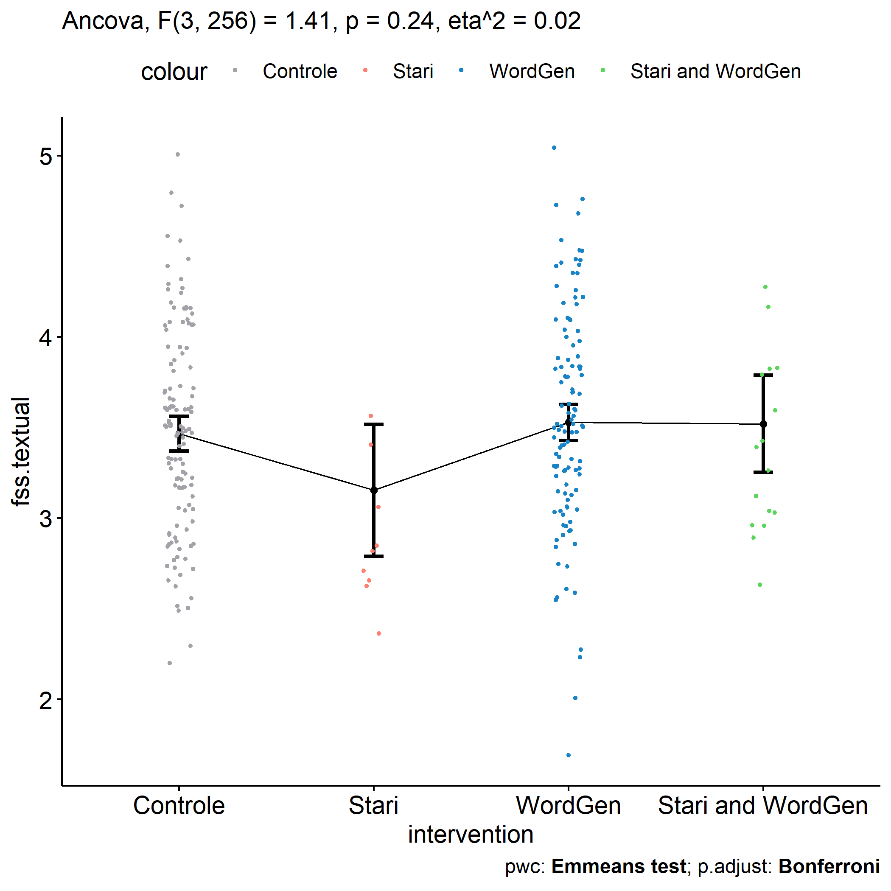<!-- -->

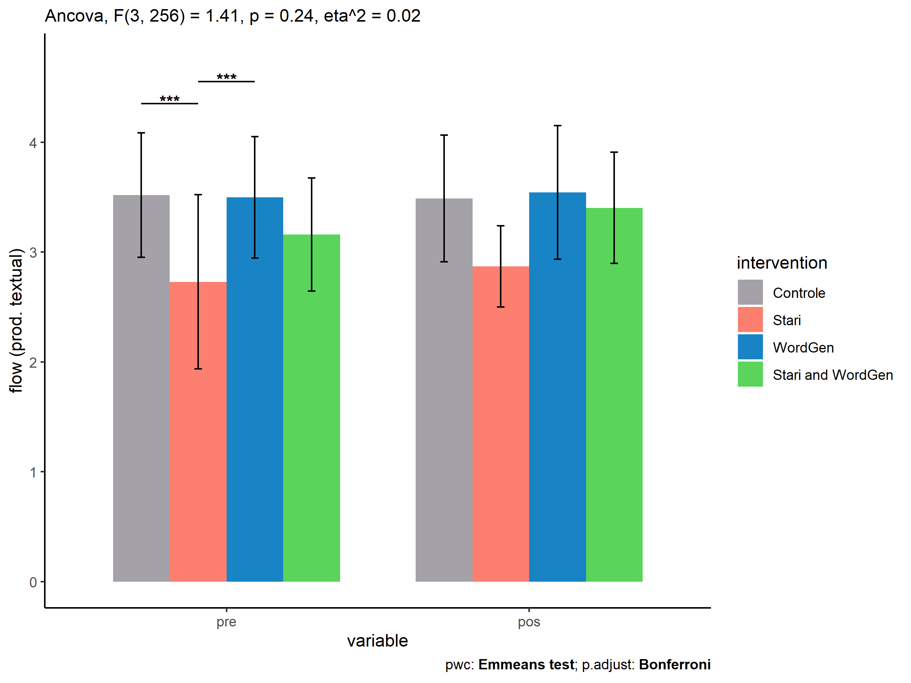<!-- -->

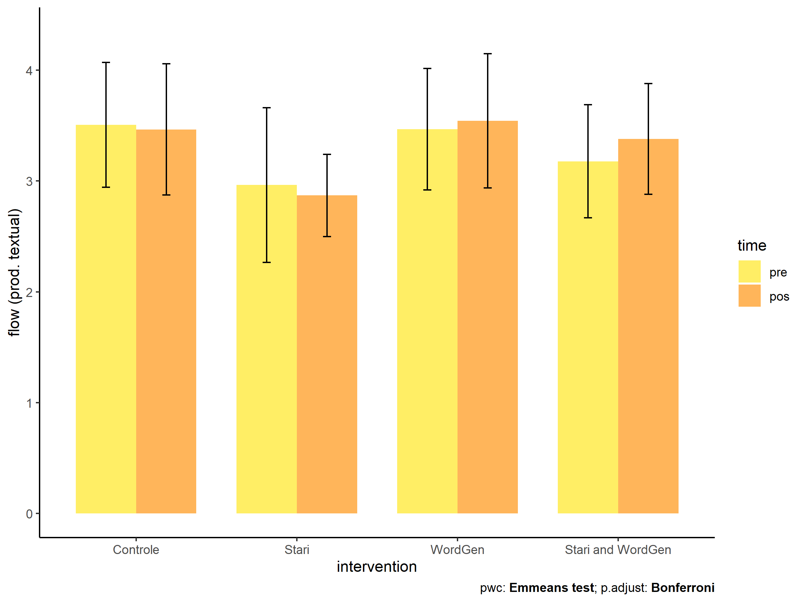<!-- -->

### factor: **genero**

| var         | genero |   n | M (pre) | SE (pre) | M (unadj) | SE (unadj) | M (adj) | SE (adj) |
|:------------|:-------|----:|--------:|---------:|----------:|-----------:|--------:|---------:|
| fss.textual | F      | 119 |   3.526 |    0.053 |     3.604 |      0.055 |   3.579 |    0.049 |
| fss.textual | M      | 142 |   3.408 |    0.049 |     3.386 |      0.048 |   3.408 |    0.045 |

| .y.         | group1 | group2 | estimate | conf.low | conf.high |    se | statistic |     p | p.adj | p.adj.signif |
|:------------|:-------|:-------|---------:|---------:|----------:|------:|----------:|------:|------:|:-------------|
| fss.textual | F      | M      |    0.171 |    0.039 |     0.302 | 0.067 |     2.559 | 0.011 | 0.011 | \*           |
| dfs.textual | F      | M      |    0.118 |   -0.025 |     0.261 | 0.073 |     1.631 | 0.104 | 0.104 | ns           |

| genero | group1 | group2 | estimate | conf.low | conf.high |    se | statistic |     p | p.adj | p.adj.signif |
|:-------|:-------|:-------|---------:|---------:|----------:|------:|----------:|------:|------:|:-------------|
| F      | pre    | pos    |   -0.096 |   -0.239 |     0.048 | 0.073 |    -1.309 | 0.191 | 0.191 | ns           |
| M      | pre    | pos    |    0.012 |   -0.116 |     0.140 | 0.065 |     0.185 | 0.853 | 0.853 | ns           |

    ## Scale for colour is already present.
    ## Adding another scale for colour, which will replace the existing scale.

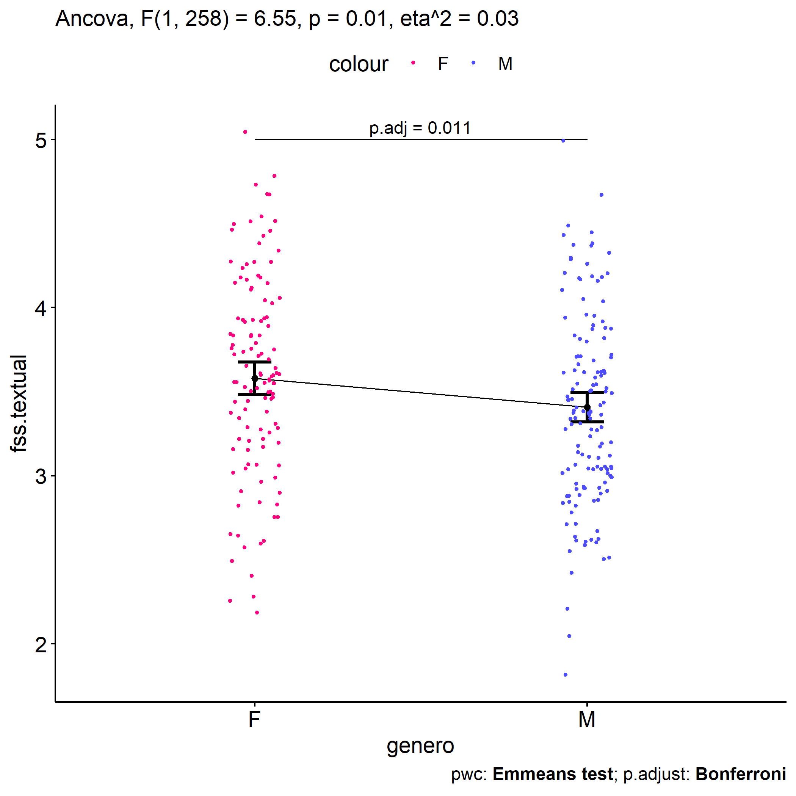<!-- -->

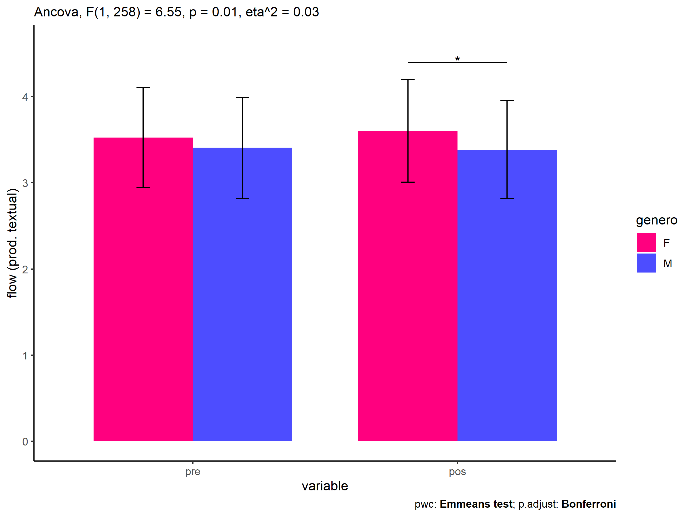<!-- -->

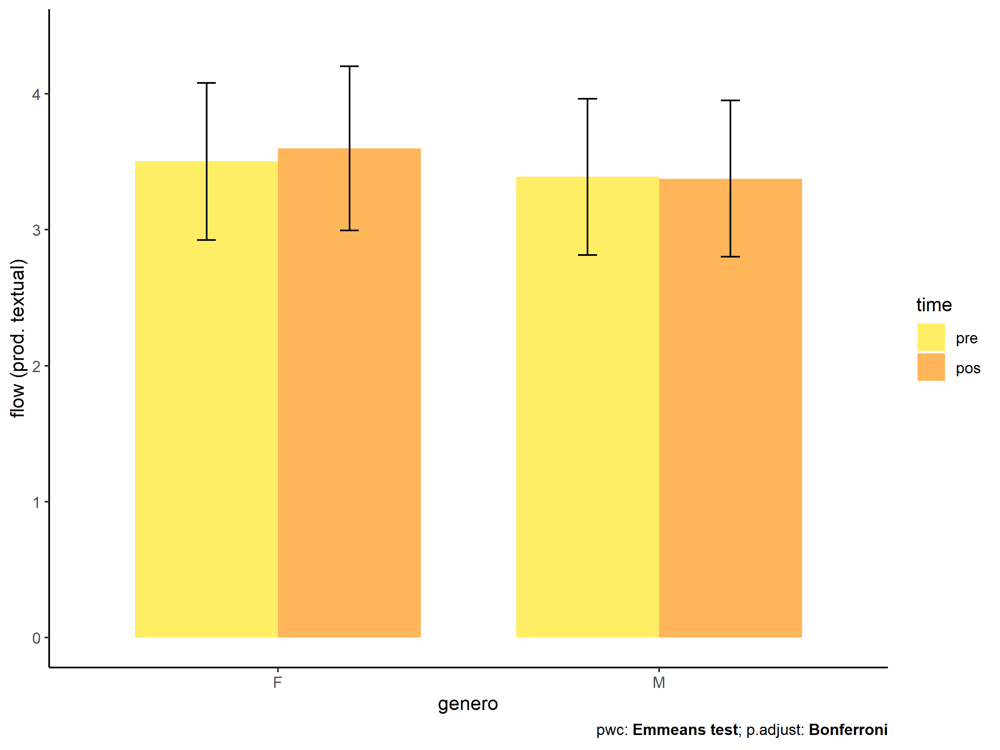<!-- -->

### factor: **idade**

| var         | idade |   n | M (pre) | SE (pre) | M (unadj) | SE (unadj) | M (adj) | SE (adj) |
|:------------|:------|----:|--------:|---------:|----------:|-----------:|--------:|---------:|
| fss.textual | 10y   |  49 |   3.438 |    0.086 |     3.526 |      0.084 |    3.54 |    0.076 |
| fss.textual | 11y   | 147 |   3.547 |    0.046 |     3.558 |      0.048 |    3.53 |    0.044 |
| fss.textual | 12y   |  37 |   3.334 |    0.110 |     3.414 |      0.099 |    3.47 |    0.088 |
| fss.textual | 13y   |  16 |   3.273 |    0.117 |     2.970 |      0.101 |    3.05 |    0.134 |

| .y.         | group1 | group2 | estimate | conf.low | conf.high |    se | statistic | p       | p.adj | p.adj.signif |
|:------------|:-------|:-------|---------:|---------:|----------:|------:|----------:|:--------|------:|:-------------|
| fss.textual | 10y    | 11y    |    0.010 |   -0.163 |     0.183 | 0.088 |     0.113 | 0.91    | 1.000 | ns           |
| fss.textual | 10y    | 12y    |    0.071 |   -0.158 |     0.299 | 0.116 |     0.610 | 0.542   | 1.000 | ns           |
| fss.textual | 10y    | 13y    |    0.490 |    0.188 |     0.793 | 0.154 |     3.194 | 0.002   | 0.010 | \*\*         |
| fss.textual | 11y    | 12y    |    0.061 |   -0.133 |     0.255 | 0.099 |     0.617 | 0.538   | 1.000 | ns           |
| fss.textual | 11y    | 13y    |    0.481 |    0.203 |     0.758 | 0.141 |     3.408 | \<0.001 | 0.005 | \*\*         |
| fss.textual | 12y    | 13y    |    0.420 |    0.106 |     0.733 | 0.159 |     2.635 | 0.009   | 0.054 | ns           |
| dfs.textual | 10y    | 11y    |   -0.109 |   -0.297 |     0.080 | 0.096 |    -1.135 | 0.257   | 1.000 | ns           |
| dfs.textual | 10y    | 12y    |    0.104 |   -0.145 |     0.353 | 0.126 |     0.821 | 0.412   | 1.000 | ns           |
| dfs.textual | 10y    | 13y    |    0.165 |   -0.164 |     0.494 | 0.167 |     0.987 | 0.325   | 1.000 | ns           |
| dfs.textual | 11y    | 12y    |    0.212 |    0.002 |     0.422 | 0.107 |     1.990 | 0.048   | 0.286 | ns           |
| dfs.textual | 11y    | 13y    |    0.273 |   -0.027 |     0.574 | 0.153 |     1.790 | 0.075   | 0.448 | ns           |
| dfs.textual | 12y    | 13y    |    0.061 |   -0.281 |     0.403 | 0.174 |     0.352 | 0.725   | 1.000 | ns           |

| idade | group1 | group2 | estimate | conf.low | conf.high |    se | statistic |     p | p.adj | p.adj.signif |
|:------|:-------|:-------|---------:|---------:|----------:|------:|----------:|------:|------:|:-------------|
| 10y   | pre    | pos    |   -0.050 |   -0.270 |     0.169 | 0.112 |    -0.451 | 0.652 | 0.652 | ns           |
| 11y   | pre    | pos    |   -0.037 |   -0.164 |     0.089 | 0.064 |    -0.581 | 0.561 | 0.561 | ns           |
| 12y   | pre    | pos    |   -0.086 |   -0.336 |     0.164 | 0.127 |    -0.673 | 0.501 | 0.501 | ns           |
| 13y   | pre    | pos    |    0.293 |   -0.086 |     0.672 | 0.193 |     1.517 | 0.130 | 0.130 | ns           |

    ## Scale for colour is already present.
    ## Adding another scale for colour, which will replace the existing scale.

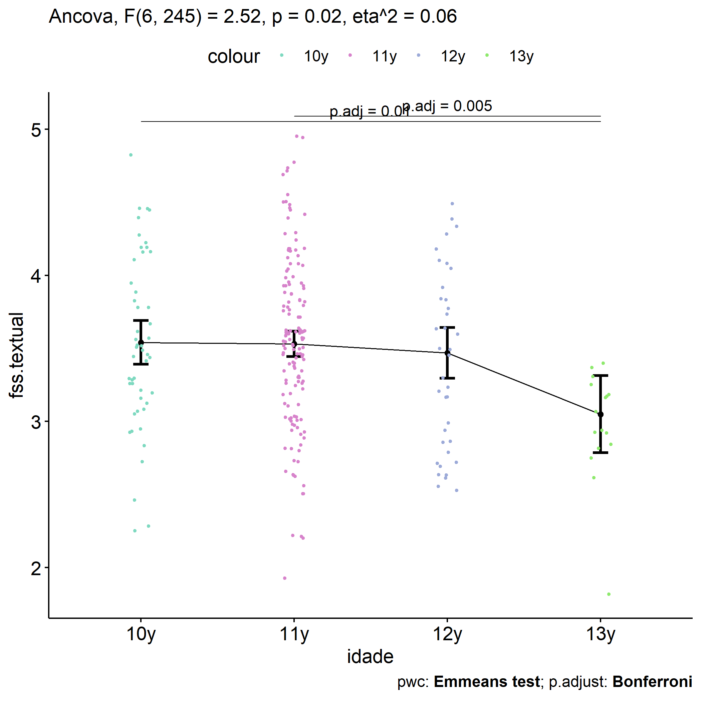<!-- -->

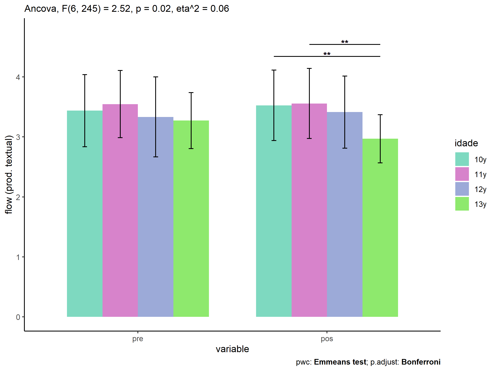<!-- -->

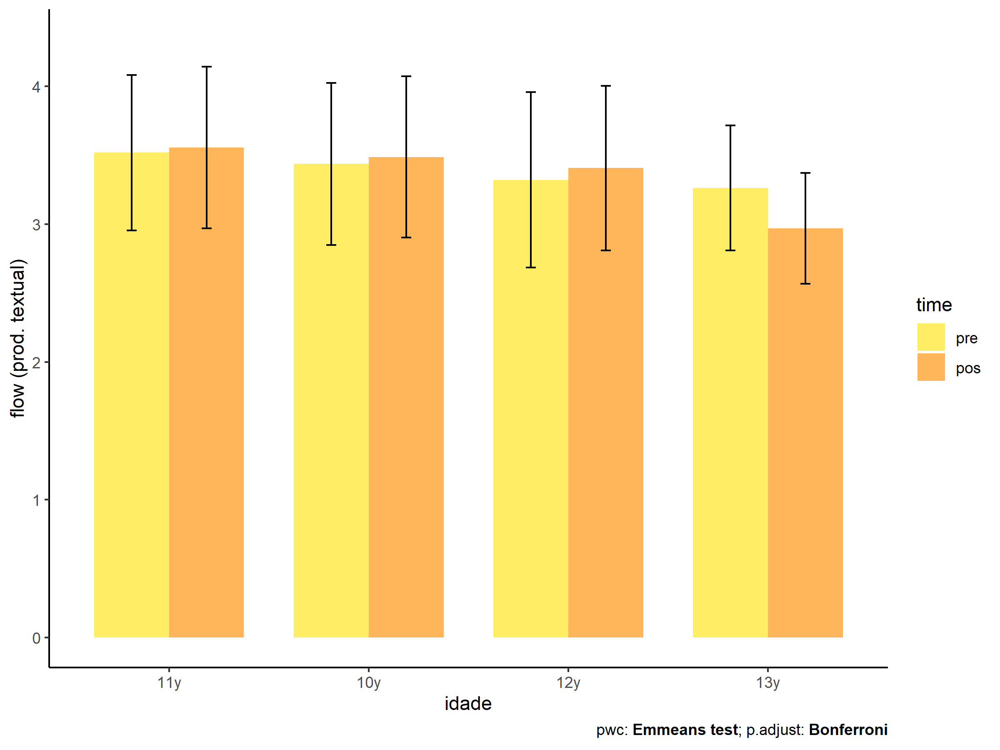<!-- -->

### factor: **zona.escola**

| var         | zona.escola |   n | M (pre) | SE (pre) | M (unadj) | SE (unadj) | M (adj) | SE (adj) |
|:------------|:------------|----:|--------:|---------:|----------:|-----------:|--------:|---------:|
| fss.textual | Rural       |  82 |   3.569 |    0.057 |     3.490 |      0.061 |   3.446 |    0.060 |
| fss.textual | Urbana      | 179 |   3.413 |    0.046 |     3.483 |      0.045 |   3.504 |    0.041 |

| .y.         | group1 | group2 | estimate | conf.low | conf.high |    se | statistic |     p | p.adj | p.adj.signif |
|:------------|:-------|:-------|---------:|---------:|----------:|------:|----------:|------:|------:|:-------------|
| fss.textual | Urbana | Rural  |    0.058 |   -0.085 |     0.201 | 0.073 |     0.800 | 0.425 | 0.425 | ns           |
| dfs.textual | Urbana | Rural  |   -0.156 |   -0.309 |    -0.003 | 0.078 |    -2.011 | 0.045 | 0.045 | \*           |

| zona.escola | group1 | group2 | estimate | conf.low | conf.high |    se | statistic |     p | p.adj | p.adj.signif |
|:------------|:-------|:-------|---------:|---------:|----------:|------:|----------:|------:|------:|:-------------|
| Urbana      | pre    | pos    |   -0.074 |   -0.189 |     0.042 | 0.059 |    -1.248 | 0.213 | 0.213 | ns           |
| Rural       | pre    | pos    |    0.056 |   -0.117 |     0.228 | 0.088 |     0.633 | 0.527 | 0.527 | ns           |

    ## Scale for colour is already present.
    ## Adding another scale for colour, which will replace the existing scale.

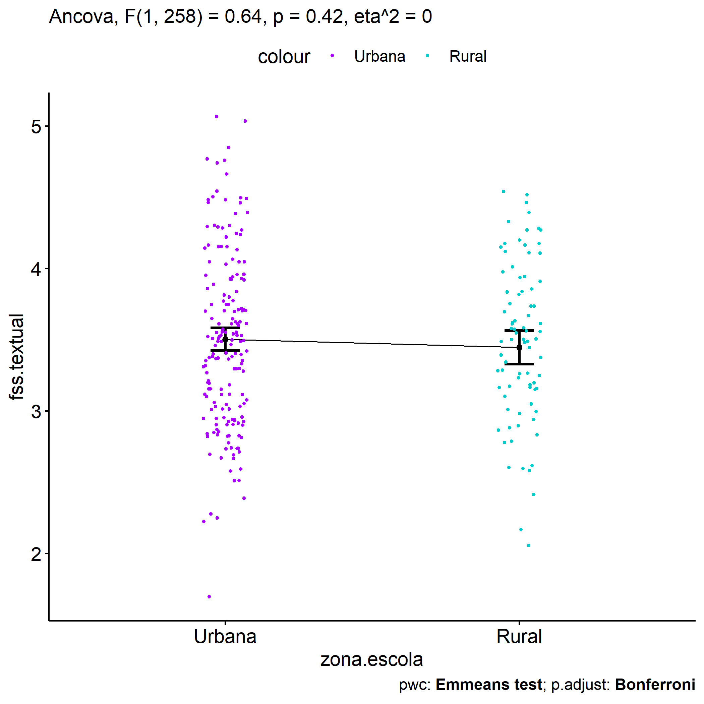<!-- -->

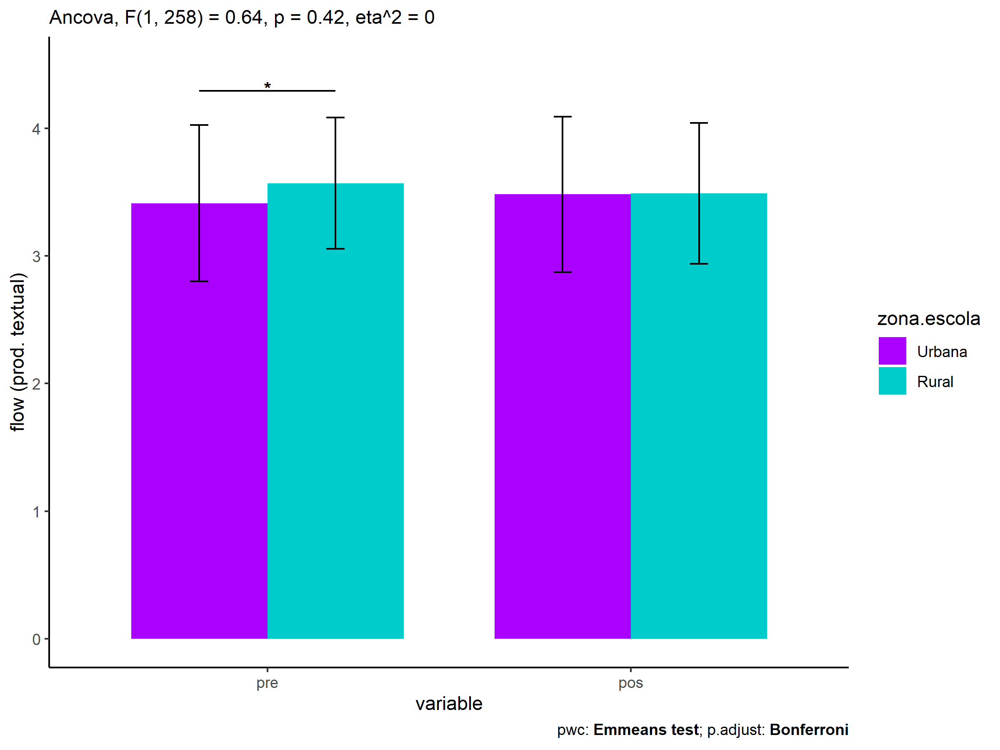<!-- -->

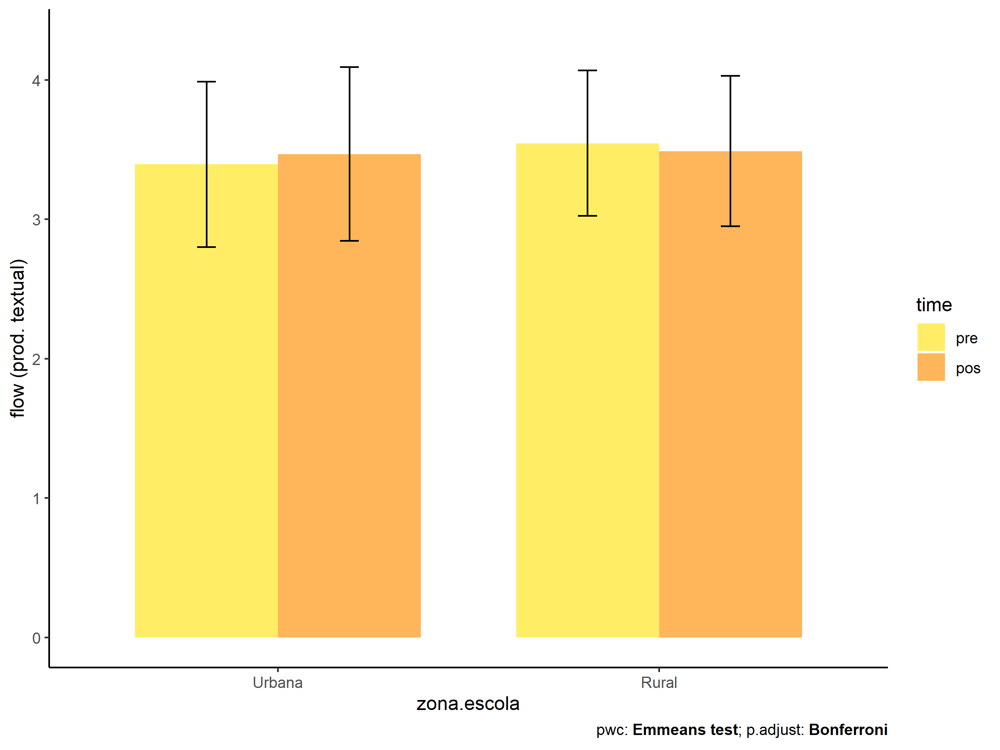<!-- -->

### factor: **zona.participante**

| var         | zona.participante |   n | M (pre) | SE (pre) | M (unadj) | SE (unadj) | M (adj) | SE (adj) |
|:------------|:------------------|----:|--------:|---------:|----------:|-----------:|--------:|---------:|
| fss.textual | Rural             |  98 |   3.475 |    0.058 |     3.447 |      0.062 |   3.439 |    0.055 |
| fss.textual | Urbana            | 105 |   3.439 |    0.063 |     3.522 |      0.056 |   3.529 |    0.053 |

| .y.         | group1 | group2 | estimate | conf.low | conf.high |    se | statistic |     p | p.adj | p.adj.signif |
|:------------|:-------|:-------|---------:|---------:|----------:|------:|----------:|------:|------:|:-------------|
| fss.textual | Urbana | Rural  |    0.090 |   -0.060 |     0.241 | 0.076 |     1.185 | 0.238 | 0.238 | ns           |
| dfs.textual | Urbana | Rural  |   -0.036 |   -0.206 |     0.134 | 0.086 |    -0.418 | 0.677 | 0.677 | ns           |

| zona.participante | group1 | group2 | estimate | conf.low | conf.high |    se | statistic |     p | p.adj | p.adj.signif |
|:------------------|:-------|:-------|---------:|---------:|----------:|------:|----------:|------:|------:|:-------------|
| Urbana            | pre    | pos    |   -0.067 |   -0.224 |     0.090 | 0.080 |    -0.840 | 0.401 | 0.401 | ns           |
| Rural             | pre    | pos    |    0.007 |   -0.157 |     0.172 | 0.084 |     0.087 | 0.931 | 0.931 | ns           |

    ## Scale for colour is already present.
    ## Adding another scale for colour, which will replace the existing scale.

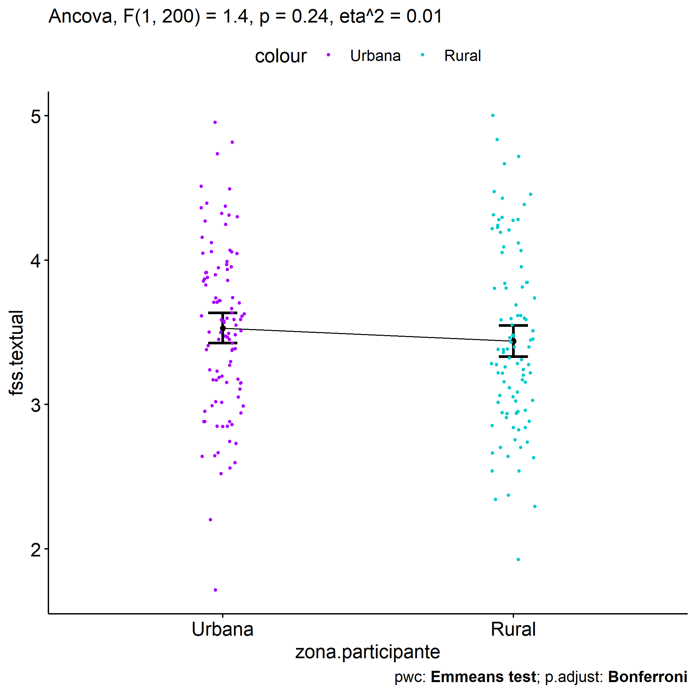<!-- -->

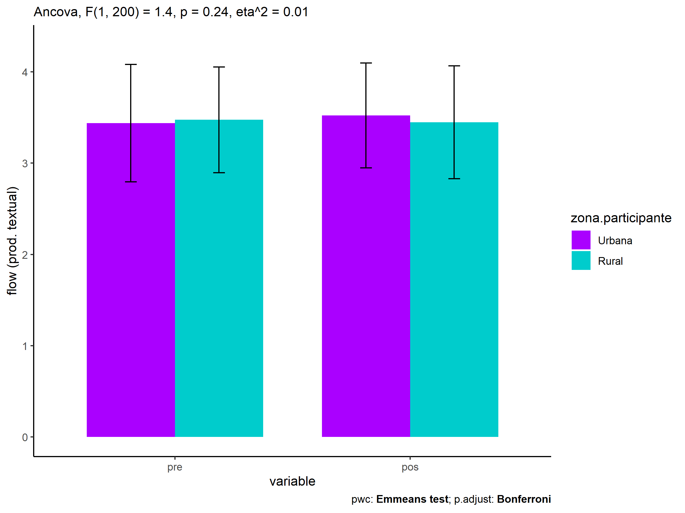<!-- -->

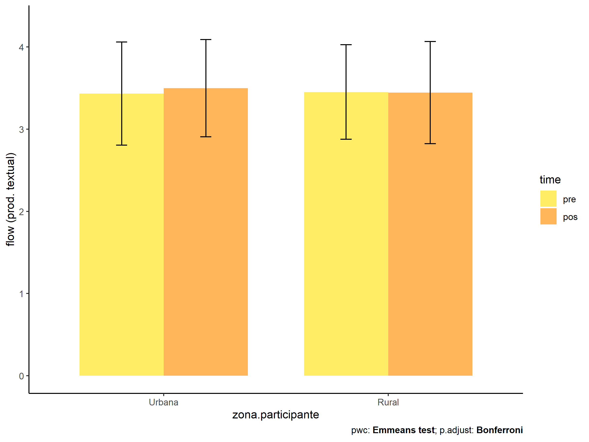<!-- -->

### factor: **escola**

| var         | escola |   n | M (pre) | SE (pre) | M (unadj) | SE (unadj) | M (adj) | SE (adj) |
|:------------|:-------|----:|--------:|---------:|----------:|-----------:|--------:|---------:|
| fss.textual | E1     |  24 |   3.192 |    0.156 |     3.598 |      0.134 |   3.715 |    0.111 |
| fss.textual | E2     |  50 |   3.465 |    0.072 |     3.404 |      0.088 |   3.402 |    0.076 |
| fss.textual | E3     |  28 |   3.560 |    0.120 |     3.394 |      0.106 |   3.352 |    0.102 |
| fss.textual | E4     |  30 |   3.569 |    0.088 |     3.458 |      0.099 |   3.411 |    0.098 |
| fss.textual | E5     | 105 |   3.438 |    0.060 |     3.495 |      0.058 |   3.505 |    0.052 |
| fss.textual | E6     |  24 |   3.579 |    0.084 |     3.644 |      0.112 |   3.593 |    0.110 |

| .y.         | group1 | group2 | estimate | conf.low | conf.high |    se | statistic |     p | p.adj | p.adj.signif |
|:------------|:-------|:-------|---------:|---------:|----------:|------:|----------:|------:|------:|:-------------|
| fss.textual | E1     | E2     |    0.313 |    0.049 |     0.577 | 0.134 |     2.331 | 0.021 | 0.308 | ns           |
| fss.textual | E1     | E3     |    0.363 |    0.066 |     0.660 | 0.151 |     2.410 | 0.017 | 0.250 | ns           |
| fss.textual | E1     | E4     |    0.304 |    0.011 |     0.596 | 0.148 |     2.045 | 0.042 | 0.628 | ns           |
| fss.textual | E1     | E5     |    0.210 |   -0.031 |     0.450 | 0.122 |     1.717 | 0.087 | 1.000 | ns           |
| fss.textual | E1     | E6     |    0.122 |   -0.186 |     0.430 | 0.156 |     0.780 | 0.436 | 1.000 | ns           |
| fss.textual | E2     | E3     |    0.051 |   -0.199 |     0.300 | 0.127 |     0.399 | 0.690 | 1.000 | ns           |
| fss.textual | E2     | E4     |   -0.009 |   -0.253 |     0.235 | 0.124 |    -0.072 | 0.943 | 1.000 | ns           |
| fss.textual | E2     | E5     |   -0.103 |   -0.284 |     0.079 | 0.092 |    -1.115 | 0.266 | 1.000 | ns           |
| fss.textual | E2     | E6     |   -0.191 |   -0.453 |     0.072 | 0.133 |    -1.429 | 0.154 | 1.000 | ns           |
| fss.textual | E3     | E4     |   -0.060 |   -0.337 |     0.218 | 0.141 |    -0.422 | 0.673 | 1.000 | ns           |
| fss.textual | E3     | E5     |   -0.153 |   -0.378 |     0.072 | 0.114 |    -1.342 | 0.181 | 1.000 | ns           |
| fss.textual | E3     | E6     |   -0.241 |   -0.535 |     0.053 | 0.149 |    -1.616 | 0.107 | 1.000 | ns           |
| fss.textual | E4     | E5     |   -0.094 |   -0.313 |     0.125 | 0.111 |    -0.844 | 0.400 | 1.000 | ns           |
| fss.textual | E4     | E6     |   -0.182 |   -0.471 |     0.108 | 0.147 |    -1.236 | 0.217 | 1.000 | ns           |
| fss.textual | E5     | E6     |   -0.088 |   -0.327 |     0.152 | 0.122 |    -0.721 | 0.471 | 1.000 | ns           |
| dfs.textual | E1     | E2     |   -0.273 |   -0.558 |     0.012 | 0.145 |    -1.889 | 0.060 | 0.901 | ns           |
| dfs.textual | E1     | E3     |   -0.368 |   -0.687 |    -0.049 | 0.162 |    -2.271 | 0.024 | 0.360 | ns           |
| dfs.textual | E1     | E4     |   -0.378 |   -0.692 |    -0.064 | 0.160 |    -2.369 | 0.019 | 0.279 | ns           |
| dfs.textual | E1     | E5     |   -0.247 |   -0.506 |     0.013 | 0.132 |    -1.872 | 0.062 | 0.935 | ns           |
| dfs.textual | E1     | E6     |   -0.387 |   -0.718 |    -0.056 | 0.168 |    -2.303 | 0.022 | 0.331 | ns           |
| dfs.textual | E2     | E3     |   -0.095 |   -0.366 |     0.176 | 0.137 |    -0.690 | 0.491 | 1.000 | ns           |
| dfs.textual | E2     | E4     |   -0.105 |   -0.370 |     0.160 | 0.135 |    -0.779 | 0.437 | 1.000 | ns           |
| dfs.textual | E2     | E5     |    0.026 |   -0.171 |     0.224 | 0.100 |     0.264 | 0.792 | 1.000 | ns           |
| dfs.textual | E2     | E6     |   -0.114 |   -0.399 |     0.171 | 0.145 |    -0.789 | 0.431 | 1.000 | ns           |
| dfs.textual | E3     | E4     |   -0.010 |   -0.311 |     0.291 | 0.153 |    -0.065 | 0.948 | 1.000 | ns           |
| dfs.textual | E3     | E5     |    0.121 |   -0.123 |     0.365 | 0.124 |     0.979 | 0.329 | 1.000 | ns           |
| dfs.textual | E3     | E6     |   -0.019 |   -0.338 |     0.300 | 0.162 |    -0.119 | 0.905 | 1.000 | ns           |
| dfs.textual | E4     | E5     |    0.131 |   -0.106 |     0.369 | 0.121 |     1.088 | 0.278 | 1.000 | ns           |
| dfs.textual | E4     | E6     |   -0.009 |   -0.323 |     0.305 | 0.160 |    -0.059 | 0.953 | 1.000 | ns           |
| dfs.textual | E5     | E6     |   -0.141 |   -0.400 |     0.119 | 0.132 |    -1.066 | 0.287 | 1.000 | ns           |

| escola | group1 | group2 | estimate | conf.low | conf.high |    se | statistic |     p | p.adj | p.adj.signif |
|:-------|:-------|:-------|---------:|---------:|----------:|------:|----------:|------:|------:|:-------------|
| E1     | pre    | pos    |   -0.377 |   -0.685 |    -0.069 | 0.157 |    -2.407 | 0.016 | 0.016 | \*           |
| E2     | pre    | pos    |    0.043 |   -0.178 |     0.263 | 0.112 |     0.382 | 0.702 | 0.702 | ns           |
| E3     | pre    | pos    |    0.132 |   -0.165 |     0.430 | 0.151 |     0.874 | 0.383 | 0.383 | ns           |
| E4     | pre    | pos    |    0.107 |   -0.181 |     0.395 | 0.147 |     0.727 | 0.467 | 0.467 | ns           |
| E5     | pre    | pos    |   -0.054 |   -0.206 |     0.097 | 0.077 |    -0.705 | 0.481 | 0.481 | ns           |
| E6     | pre    | pos    |   -0.078 |   -0.391 |     0.236 | 0.159 |    -0.486 | 0.627 | 0.627 | ns           |

    ## Scale for colour is already present.
    ## Adding another scale for colour, which will replace the existing scale.

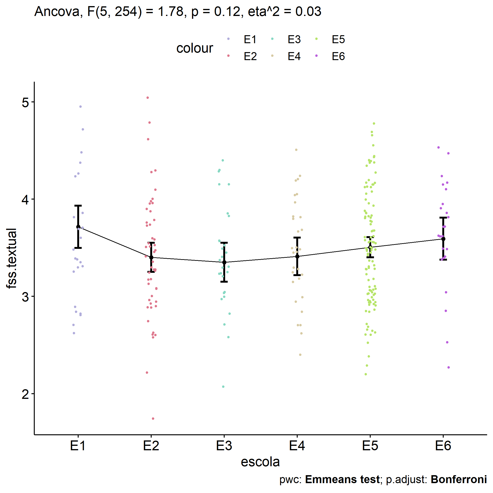<!-- -->

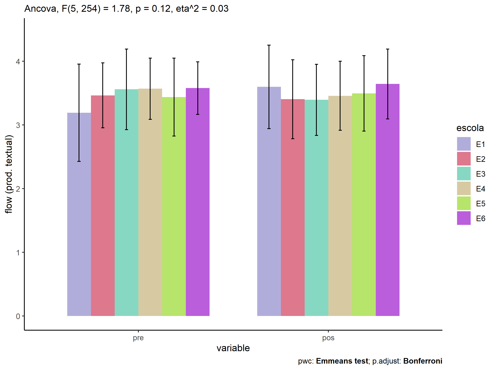<!-- -->

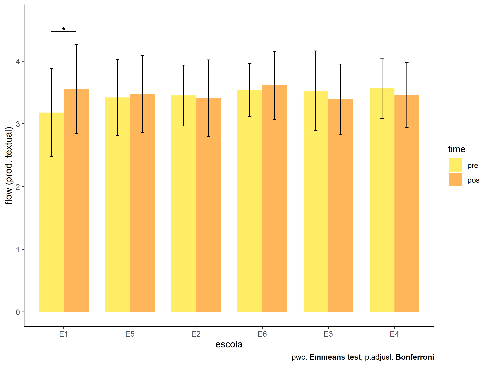<!-- -->

### factor: **monitor**

| var         | monitor |   n | M (pre) | SE (pre) | M (unadj) | SE (unadj) | M (adj) | SE (adj) |
|:------------|:--------|----:|--------:|---------:|----------:|-----------:|--------:|---------:|
| fss.textual | AC      |  11 |   3.636 |    0.117 |     3.505 |      0.125 |   3.406 |    0.161 |
| fss.textual | CE      |  14 |   3.635 |    0.155 |     3.603 |      0.149 |   3.505 |    0.143 |
| fss.textual | EA      |  13 |   3.325 |    0.158 |     3.639 |      0.181 |   3.689 |    0.147 |
| fss.textual | GR      |  14 |   3.405 |    0.163 |     3.429 |      0.106 |   3.440 |    0.142 |
| fss.textual | JC      |  10 |   3.427 |    0.216 |     3.456 |      0.175 |   3.457 |    0.168 |
| fss.textual | MF      |  14 |   3.476 |    0.155 |     3.421 |      0.191 |   3.398 |    0.142 |
| fss.textual | ML      |  14 |   3.531 |    0.195 |     3.440 |      0.184 |   3.391 |    0.142 |
| fss.textual | MM      |  14 |   3.271 |    0.124 |     3.236 |      0.153 |   3.312 |    0.142 |
| fss.textual | PR      |  13 |   3.119 |    0.245 |     3.712 |      0.210 |   3.861 |    0.149 |
| fss.textual | VL      |  13 |   3.488 |    0.126 |     3.658 |      0.161 |   3.630 |    0.147 |

| .y.         | group1 | group2 | estimate | conf.low | conf.high |    se | statistic |     p | p.adj | p.adj.signif |
|:------------|:-------|:-------|---------:|---------:|----------:|------:|----------:|------:|------:|:-------------|
| fss.textual | AC     | CE     |   -0.099 |   -0.522 |     0.324 | 0.214 |    -0.463 | 0.644 | 1.000 | ns           |
| fss.textual | AC     | EA     |   -0.283 |   -0.716 |     0.149 | 0.219 |    -1.296 | 0.197 | 1.000 | ns           |
| fss.textual | AC     | GR     |   -0.035 |   -0.459 |     0.390 | 0.214 |    -0.162 | 0.872 | 1.000 | ns           |
| fss.textual | AC     | JC     |   -0.051 |   -0.511 |     0.409 | 0.232 |    -0.219 | 0.827 | 1.000 | ns           |
| fss.textual | AC     | MF     |    0.008 |   -0.416 |     0.431 | 0.214 |     0.035 | 0.972 | 1.000 | ns           |
| fss.textual | AC     | ML     |    0.014 |   -0.409 |     0.438 | 0.214 |     0.068 | 0.946 | 1.000 | ns           |
| fss.textual | AC     | MM     |    0.094 |   -0.333 |     0.520 | 0.215 |     0.434 | 0.665 | 1.000 | ns           |
| fss.textual | AC     | PR     |   -0.455 |   -0.892 |    -0.017 | 0.221 |    -2.059 | 0.042 | 1.000 | ns           |
| fss.textual | AC     | VL     |   -0.224 |   -0.655 |     0.207 | 0.217 |    -1.030 | 0.305 | 1.000 | ns           |
| fss.textual | CE     | EA     |   -0.184 |   -0.592 |     0.223 | 0.206 |    -0.897 | 0.371 | 1.000 | ns           |
| fss.textual | CE     | GR     |    0.064 |   -0.334 |     0.462 | 0.201 |     0.319 | 0.750 | 1.000 | ns           |
| fss.textual | CE     | JC     |    0.048 |   -0.388 |     0.484 | 0.220 |     0.218 | 0.828 | 1.000 | ns           |
| fss.textual | CE     | MF     |    0.106 |   -0.291 |     0.504 | 0.201 |     0.530 | 0.597 | 1.000 | ns           |
| fss.textual | CE     | ML     |    0.113 |   -0.284 |     0.510 | 0.200 |     0.565 | 0.573 | 1.000 | ns           |
| fss.textual | CE     | MM     |    0.192 |   -0.208 |     0.593 | 0.202 |     0.951 | 0.344 | 1.000 | ns           |
| fss.textual | CE     | PR     |   -0.356 |   -0.768 |     0.056 | 0.208 |    -1.710 | 0.090 | 1.000 | ns           |
| fss.textual | CE     | VL     |   -0.125 |   -0.530 |     0.280 | 0.204 |    -0.612 | 0.541 | 1.000 | ns           |
| fss.textual | EA     | GR     |    0.249 |   -0.156 |     0.653 | 0.204 |     1.218 | 0.226 | 1.000 | ns           |
| fss.textual | EA     | JC     |    0.232 |   -0.209 |     0.674 | 0.223 |     1.042 | 0.300 | 1.000 | ns           |
| fss.textual | EA     | MF     |    0.291 |   -0.114 |     0.696 | 0.204 |     1.423 | 0.157 | 1.000 | ns           |
| fss.textual | EA     | ML     |    0.298 |   -0.108 |     0.703 | 0.205 |     1.454 | 0.149 | 1.000 | ns           |
| fss.textual | EA     | MM     |    0.377 |   -0.027 |     0.781 | 0.204 |     1.846 | 0.067 | 1.000 | ns           |
| fss.textual | EA     | PR     |   -0.172 |   -0.584 |     0.241 | 0.209 |    -0.823 | 0.412 | 1.000 | ns           |
| fss.textual | EA     | VL     |    0.059 |   -0.353 |     0.472 | 0.208 |     0.284 | 0.777 | 1.000 | ns           |
| fss.textual | GR     | JC     |   -0.016 |   -0.451 |     0.418 | 0.219 |    -0.074 | 0.941 | 1.000 | ns           |
| fss.textual | GR     | MF     |    0.042 |   -0.355 |     0.439 | 0.200 |     0.211 | 0.834 | 1.000 | ns           |
| fss.textual | GR     | ML     |    0.049 |   -0.348 |     0.446 | 0.201 |     0.245 | 0.807 | 1.000 | ns           |
| fss.textual | GR     | MM     |    0.128 |   -0.269 |     0.525 | 0.201 |     0.639 | 0.524 | 1.000 | ns           |
| fss.textual | GR     | PR     |   -0.420 |   -0.827 |    -0.014 | 0.205 |    -2.046 | 0.043 | 1.000 | ns           |
| fss.textual | GR     | VL     |   -0.189 |   -0.594 |     0.215 | 0.204 |    -0.927 | 0.356 | 1.000 | ns           |
| fss.textual | JC     | MF     |    0.059 |   -0.376 |     0.493 | 0.219 |     0.267 | 0.790 | 1.000 | ns           |
| fss.textual | JC     | ML     |    0.065 |   -0.369 |     0.500 | 0.220 |     0.298 | 0.766 | 1.000 | ns           |
| fss.textual | JC     | MM     |    0.145 |   -0.291 |     0.580 | 0.220 |     0.658 | 0.512 | 1.000 | ns           |
| fss.textual | JC     | PR     |   -0.404 |   -0.848 |     0.040 | 0.224 |    -1.801 | 0.074 | 1.000 | ns           |
| fss.textual | JC     | VL     |   -0.173 |   -0.615 |     0.268 | 0.223 |    -0.776 | 0.439 | 1.000 | ns           |
| fss.textual | MF     | ML     |    0.007 |   -0.390 |     0.404 | 0.200 |     0.034 | 0.973 | 1.000 | ns           |
| fss.textual | MF     | MM     |    0.086 |   -0.312 |     0.484 | 0.201 |     0.428 | 0.669 | 1.000 | ns           |
| fss.textual | MF     | PR     |   -0.462 |   -0.871 |    -0.054 | 0.206 |    -2.244 | 0.027 | 1.000 | ns           |
| fss.textual | MF     | VL     |   -0.232 |   -0.636 |     0.173 | 0.204 |    -1.135 | 0.259 | 1.000 | ns           |
| fss.textual | ML     | MM     |    0.079 |   -0.320 |     0.478 | 0.201 |     0.393 | 0.695 | 1.000 | ns           |
| fss.textual | ML     | PR     |   -0.469 |   -0.879 |    -0.060 | 0.207 |    -2.270 | 0.025 | 1.000 | ns           |
| fss.textual | ML     | VL     |   -0.239 |   -0.643 |     0.166 | 0.204 |    -1.168 | 0.245 | 1.000 | ns           |
| fss.textual | MM     | PR     |   -0.548 |   -0.953 |    -0.144 | 0.204 |    -2.682 | 0.008 | 0.376 | ns           |
| fss.textual | MM     | VL     |   -0.318 |   -0.723 |     0.088 | 0.205 |    -1.551 | 0.124 | 1.000 | ns           |
| fss.textual | PR     | VL     |    0.231 |   -0.185 |     0.647 | 0.210 |     1.099 | 0.274 | 1.000 | ns           |
| dfs.textual | AC     | CE     |    0.001 |   -0.485 |     0.488 | 0.246 |     0.006 | 0.995 | 1.000 | ns           |
| dfs.textual | AC     | EA     |    0.312 |   -0.183 |     0.807 | 0.250 |     1.246 | 0.215 | 1.000 | ns           |
| dfs.textual | AC     | GR     |    0.232 |   -0.255 |     0.718 | 0.246 |     0.942 | 0.348 | 1.000 | ns           |
| dfs.textual | AC     | JC     |    0.209 |   -0.319 |     0.737 | 0.267 |     0.785 | 0.434 | 1.000 | ns           |
| dfs.textual | AC     | MF     |    0.160 |   -0.327 |     0.647 | 0.246 |     0.651 | 0.516 | 1.000 | ns           |
| dfs.textual | AC     | ML     |    0.106 |   -0.381 |     0.592 | 0.246 |     0.429 | 0.668 | 1.000 | ns           |
| dfs.textual | AC     | MM     |    0.366 |   -0.121 |     0.852 | 0.246 |     1.487 | 0.140 | 1.000 | ns           |
| dfs.textual | AC     | PR     |    0.518 |    0.023 |     1.013 | 0.250 |     2.071 | 0.041 | 1.000 | ns           |
| dfs.textual | AC     | VL     |    0.148 |   -0.347 |     0.643 | 0.250 |     0.592 | 0.555 | 1.000 | ns           |
| dfs.textual | CE     | EA     |    0.310 |   -0.155 |     0.776 | 0.235 |     1.319 | 0.190 | 1.000 | ns           |
| dfs.textual | CE     | GR     |    0.230 |   -0.227 |     0.687 | 0.231 |     0.998 | 0.320 | 1.000 | ns           |
| dfs.textual | CE     | JC     |    0.208 |   -0.292 |     0.708 | 0.253 |     0.823 | 0.412 | 1.000 | ns           |
| dfs.textual | CE     | MF     |    0.159 |   -0.298 |     0.615 | 0.231 |     0.688 | 0.493 | 1.000 | ns           |
| dfs.textual | CE     | ML     |    0.104 |   -0.353 |     0.561 | 0.231 |     0.452 | 0.652 | 1.000 | ns           |
| dfs.textual | CE     | MM     |    0.364 |   -0.093 |     0.821 | 0.231 |     1.578 | 0.117 | 1.000 | ns           |
| dfs.textual | CE     | PR     |    0.516 |    0.051 |     0.982 | 0.235 |     2.197 | 0.030 | 1.000 | ns           |
| dfs.textual | CE     | VL     |    0.147 |   -0.319 |     0.612 | 0.235 |     0.623 | 0.534 | 1.000 | ns           |
| dfs.textual | EA     | GR     |   -0.080 |   -0.545 |     0.385 | 0.235 |    -0.340 | 0.734 | 1.000 | ns           |
| dfs.textual | EA     | JC     |   -0.102 |   -0.610 |     0.406 | 0.257 |    -0.398 | 0.691 | 1.000 | ns           |
| dfs.textual | EA     | MF     |   -0.151 |   -0.617 |     0.314 | 0.235 |    -0.644 | 0.521 | 1.000 | ns           |
| dfs.textual | EA     | ML     |   -0.206 |   -0.671 |     0.259 | 0.235 |    -0.876 | 0.383 | 1.000 | ns           |
| dfs.textual | EA     | MM     |    0.054 |   -0.411 |     0.519 | 0.235 |     0.230 | 0.819 | 1.000 | ns           |
| dfs.textual | EA     | PR     |    0.206 |   -0.268 |     0.680 | 0.239 |     0.861 | 0.391 | 1.000 | ns           |
| dfs.textual | EA     | VL     |   -0.164 |   -0.638 |     0.310 | 0.239 |    -0.683 | 0.496 | 1.000 | ns           |
| dfs.textual | GR     | JC     |   -0.022 |   -0.523 |     0.478 | 0.253 |    -0.088 | 0.930 | 1.000 | ns           |
| dfs.textual | GR     | MF     |   -0.071 |   -0.528 |     0.385 | 0.231 |    -0.310 | 0.757 | 1.000 | ns           |
| dfs.textual | GR     | ML     |   -0.126 |   -0.583 |     0.331 | 0.231 |    -0.546 | 0.586 | 1.000 | ns           |
| dfs.textual | GR     | MM     |    0.134 |   -0.323 |     0.591 | 0.231 |     0.581 | 0.563 | 1.000 | ns           |
| dfs.textual | GR     | PR     |    0.286 |   -0.179 |     0.752 | 0.235 |     1.217 | 0.226 | 1.000 | ns           |
| dfs.textual | GR     | VL     |   -0.084 |   -0.549 |     0.382 | 0.235 |    -0.356 | 0.723 | 1.000 | ns           |
| dfs.textual | JC     | MF     |   -0.049 |   -0.550 |     0.451 | 0.253 |    -0.195 | 0.846 | 1.000 | ns           |
| dfs.textual | JC     | ML     |   -0.104 |   -0.604 |     0.397 | 0.253 |    -0.411 | 0.682 | 1.000 | ns           |
| dfs.textual | JC     | MM     |    0.156 |   -0.344 |     0.656 | 0.253 |     0.618 | 0.538 | 1.000 | ns           |
| dfs.textual | JC     | PR     |    0.308 |   -0.200 |     0.817 | 0.257 |     1.201 | 0.232 | 1.000 | ns           |
| dfs.textual | JC     | VL     |   -0.061 |   -0.570 |     0.447 | 0.257 |    -0.239 | 0.811 | 1.000 | ns           |
| dfs.textual | MF     | ML     |   -0.055 |   -0.511 |     0.402 | 0.231 |    -0.237 | 0.813 | 1.000 | ns           |
| dfs.textual | MF     | MM     |    0.205 |   -0.251 |     0.662 | 0.231 |     0.890 | 0.375 | 1.000 | ns           |
| dfs.textual | MF     | PR     |    0.358 |   -0.108 |     0.823 | 0.235 |     1.521 | 0.131 | 1.000 | ns           |
| dfs.textual | MF     | VL     |   -0.012 |   -0.478 |     0.453 | 0.235 |    -0.052 | 0.959 | 1.000 | ns           |
| dfs.textual | ML     | MM     |    0.260 |   -0.197 |     0.717 | 0.231 |     1.127 | 0.262 | 1.000 | ns           |
| dfs.textual | ML     | PR     |    0.412 |   -0.053 |     0.878 | 0.235 |     1.753 | 0.082 | 1.000 | ns           |
| dfs.textual | ML     | VL     |    0.042 |   -0.423 |     0.508 | 0.235 |     0.180 | 0.857 | 1.000 | ns           |
| dfs.textual | MM     | PR     |    0.152 |   -0.313 |     0.618 | 0.235 |     0.648 | 0.518 | 1.000 | ns           |
| dfs.textual | MM     | VL     |   -0.218 |   -0.683 |     0.248 | 0.235 |    -0.926 | 0.357 | 1.000 | ns           |
| dfs.textual | PR     | VL     |   -0.370 |   -0.844 |     0.104 | 0.239 |    -1.545 | 0.125 | 1.000 | ns           |

| monitor | group1 | group2 | estimate | conf.low | conf.high |    se | statistic |     p | p.adj | p.adj.signif |
|:--------|:-------|:-------|---------:|---------:|----------:|------:|----------:|------:|------:|:-------------|
| AC      | pre    | pos    |    0.131 |   -0.370 |     0.633 | 0.255 |     0.516 | 0.606 | 0.606 | ns           |
| CE      | pre    | pos    |    0.031 |   -0.399 |     0.461 | 0.218 |     0.141 | 0.888 | 0.888 | ns           |
| EA      | pre    | pos    |   -0.314 |   -0.775 |     0.147 | 0.234 |    -1.342 | 0.181 | 0.181 | ns           |
| GR      | pre    | pos    |    0.043 |   -0.394 |     0.480 | 0.222 |     0.193 | 0.847 | 0.847 | ns           |
| JC      | pre    | pos    |   -0.007 |   -0.510 |     0.496 | 0.256 |    -0.028 | 0.978 | 0.978 | ns           |
| MF      | pre    | pos    |   -0.002 |   -0.427 |     0.422 | 0.215 |    -0.011 | 0.991 | 0.991 | ns           |
| ML      | pre    | pos    |   -0.006 |   -0.436 |     0.424 | 0.218 |    -0.028 | 0.978 | 0.978 | ns           |
| MM      | pre    | pos    |    0.029 |   -0.402 |     0.459 | 0.218 |     0.131 | 0.896 | 0.896 | ns           |
| PR      | pre    | pos    |   -0.616 |   -1.046 |    -0.186 | 0.218 |    -2.820 | 0.005 | 0.005 | \*\*         |
| VL      | pre    | pos    |   -0.231 |   -0.653 |     0.192 | 0.215 |    -1.076 | 0.283 | 0.283 | ns           |

    ## Scale for colour is already present.
    ## Adding another scale for colour, which will replace the existing scale.

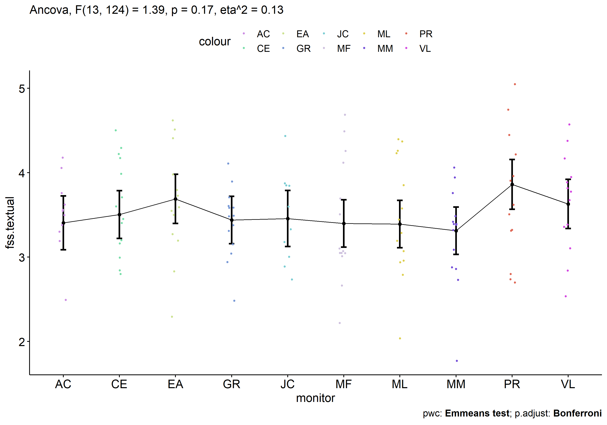<!-- -->

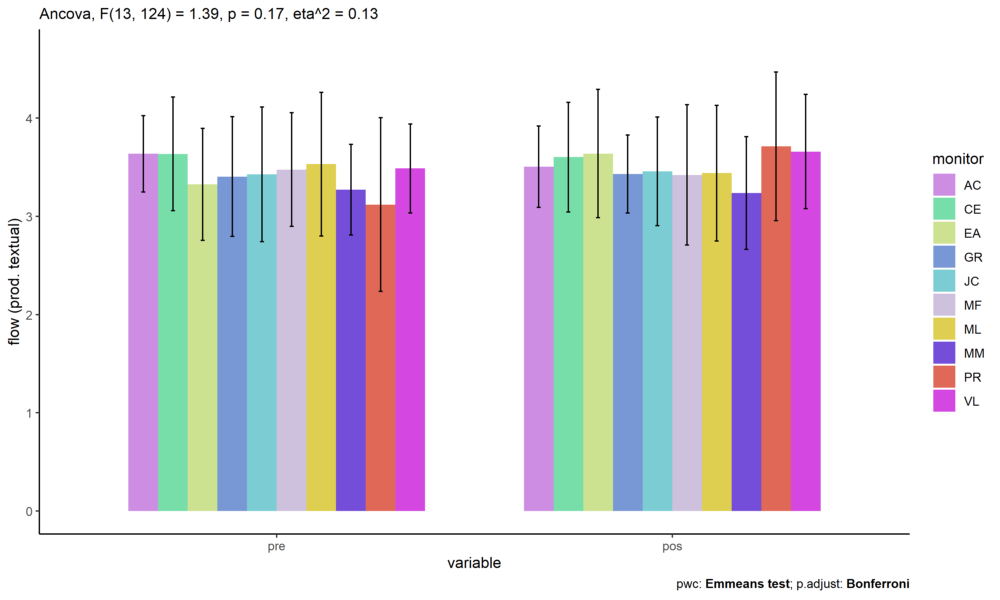<!-- -->

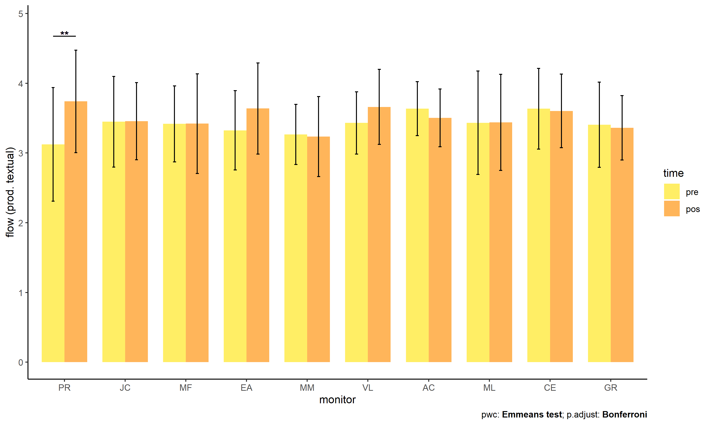<!-- -->

### factor: **monitor.genero**

| var         | monitor.genero |   n | M (pre) | SE (pre) | M (unadj) | SE (unadj) | M (adj) | SE (adj) |
|:------------|:---------------|----:|--------:|---------:|----------:|-----------:|--------:|---------:|
| fss.textual | F              |  80 |   3.461 |    0.061 |     3.443 |      0.064 |   3.429 |    0.059 |
| fss.textual | M              |  50 |   3.378 |    0.098 |     3.611 |      0.089 |   3.634 |    0.075 |

| .y.         | group1 | group2 | estimate | conf.low | conf.high |    se | statistic |     p | p.adj | p.adj.signif |
|:------------|:-------|:-------|---------:|---------:|----------:|------:|----------:|------:|------:|:-------------|
| fss.textual | F      | M      |   -0.206 |   -0.394 |    -0.017 | 0.095 |    -2.156 | 0.033 | 0.033 | \*           |
| dfs.textual | F      | M      |    0.083 |   -0.134 |     0.300 | 0.110 |     0.754 | 0.452 | 0.452 | ns           |

| monitor.genero | group1 | group2 | estimate | conf.low | conf.high |    se | statistic |     p | p.adj | p.adj.signif |
|:---------------|:-------|:-------|---------:|---------:|----------:|------:|----------:|------:|------:|:-------------|
| F              | pre    | pos    |   -0.019 |   -0.197 |     0.159 | 0.090 |    -0.211 | 0.833 | 0.833 | ns           |
| M              | pre    | pos    |   -0.248 |   -0.474 |    -0.023 | 0.114 |    -2.169 | 0.031 | 0.031 | \*           |

    ## Scale for colour is already present.
    ## Adding another scale for colour, which will replace the existing scale.

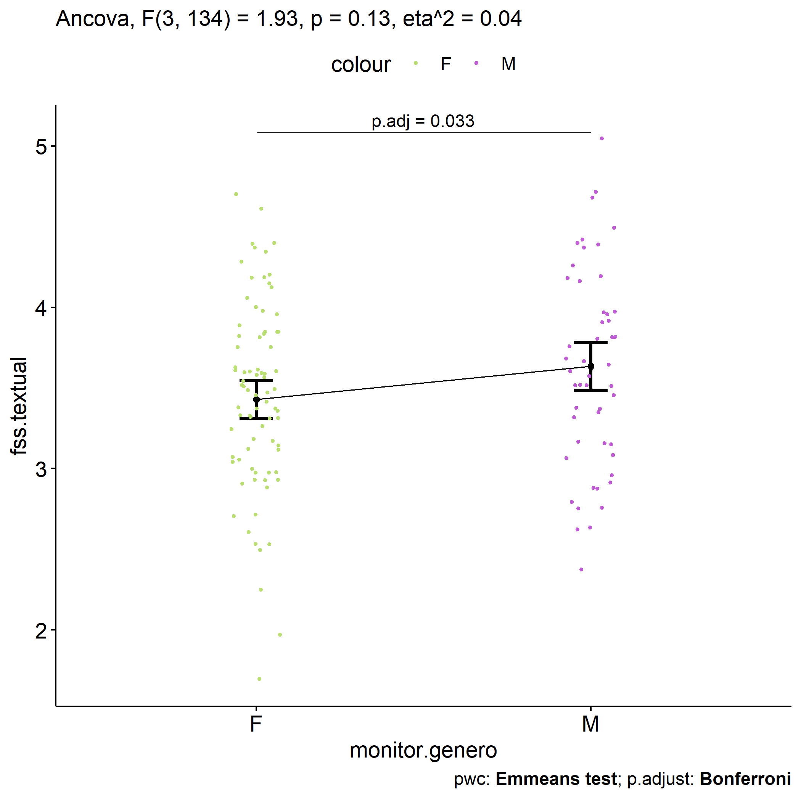<!-- -->

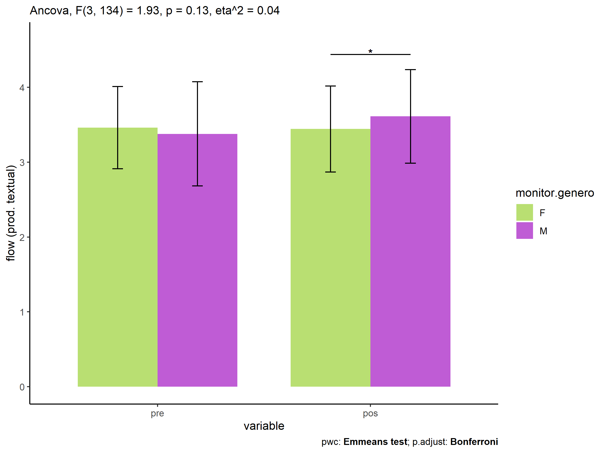<!-- -->

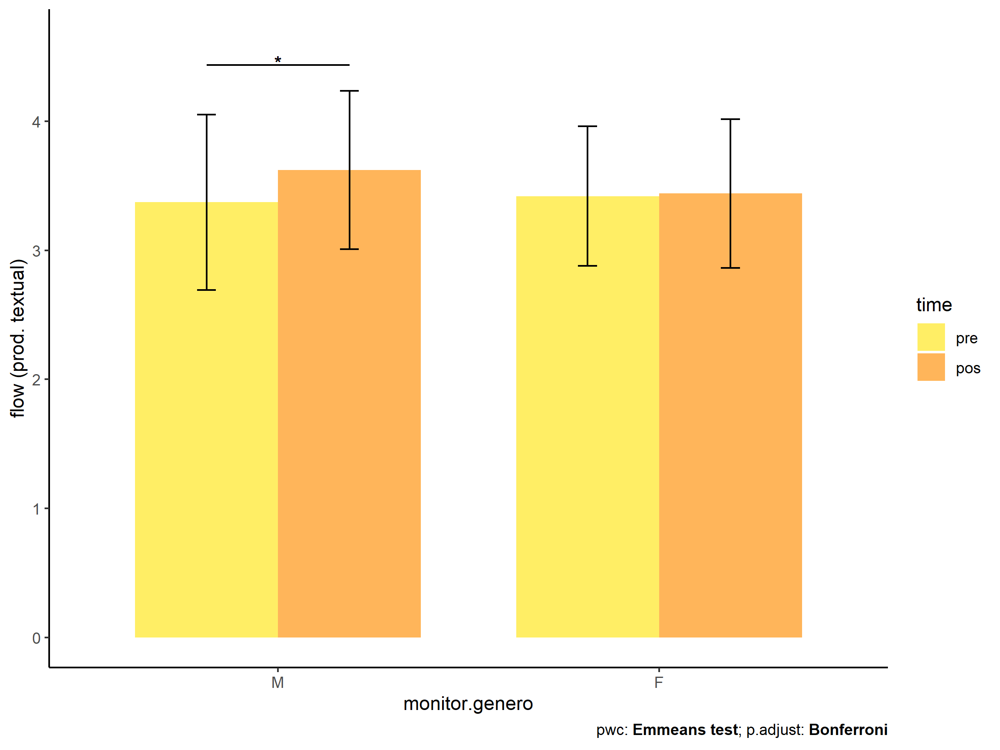<!-- -->

### factor: **monitor.formacao**

| var         | monitor.formacao           |   n | M (pre) | SE (pre) | M (unadj) | SE (unadj) | M (adj) | SE (adj) |
|:------------|:---------------------------|----:|--------:|---------:|----------:|-----------:|--------:|---------:|
| fss.textual | Arquitetura e Urbanismo    |  10 |   3.427 |    0.216 |     3.456 |      0.175 |   3.457 |    0.168 |
| fss.textual | Ciencias Biologicas        |  14 |   3.531 |    0.195 |     3.440 |      0.184 |   3.392 |    0.142 |
| fss.textual | Comunicacao Social         |  14 |   3.635 |    0.155 |     3.603 |      0.149 |   3.505 |    0.143 |
| fss.textual | Historia                   |  13 |   3.119 |    0.245 |     3.712 |      0.210 |   3.860 |    0.149 |
| fss.textual | Letras - Lingua Portuguesa |  14 |   3.476 |    0.155 |     3.421 |      0.191 |   3.398 |    0.142 |
| fss.textual | Matematica                 |  27 |   3.366 |    0.112 |     3.530 |      0.103 |   3.560 |    0.102 |
| fss.textual | Nutricao                   |  14 |   3.271 |    0.124 |     3.236 |      0.153 |   3.312 |    0.142 |
| fss.textual | Pedagogia                  |  11 |   3.636 |    0.117 |     3.505 |      0.125 |   3.406 |    0.161 |
| fss.textual | Servico Social             |  13 |   3.488 |    0.126 |     3.658 |      0.161 |   3.630 |    0.147 |

| .y.         | group1                  | group2              | estimate | conf.low | conf.high |    se | statistic |     p | p.adj | p.adj.signif |
|:------------|:------------------------|:--------------------|---------:|---------:|----------:|------:|----------:|------:|------:|:-------------|
| fss.textual | Arquitetura e Urbanismo | Ciencias Biologicas |    0.065 |   -0.371 |     0.501 | 0.220 |     0.296 | 0.768 | 1.000 | ns           |
| fss.textual | Arquitetura e Urbanismo | Comunicacao Social  |   -0.048 |   -0.485 |     0.388 | 0.220 |    -0.220 | 0.826 | 1.000 | ns           |
| fss.textual | Arquitetura e Urbanismo | Historia            |   -0.403 |   -0.848 |     0.042 | 0.225 |    -1.793 | 0.075 | 1.000 | ns           |
| fss.textual | Arquitetura e Urbanismo | Letras              |    0.058 |   -0.377 |     0.494 | 0.220 |     0.265 | 0.791 | 1.000 | ns           |
| fss.textual | Arquitetura e Urbanismo | Matematica          |   -0.103 |   -0.493 |     0.286 | 0.197 |    -0.525 | 0.601 | 1.000 | ns           |
| fss.textual | Arquitetura e Urbanismo | Nutricao            |    0.145 |   -0.291 |     0.581 | 0.220 |     0.658 | 0.512 | 1.000 | ns           |
| fss.textual | Arquitetura e Urbanismo | Pedagogia           |    0.050 |   -0.410 |     0.511 | 0.233 |     0.216 | 0.829 | 1.000 | ns           |
| fss.textual | Arquitetura e Urbanismo | Servico Social      |   -0.173 |   -0.616 |     0.269 | 0.223 |    -0.776 | 0.440 | 1.000 | ns           |
| fss.textual | Ciencias Biologicas     | Comunicacao Social  |   -0.114 |   -0.511 |     0.284 | 0.201 |    -0.566 | 0.573 | 1.000 | ns           |
| fss.textual | Ciencias Biologicas     | Historia            |   -0.468 |   -0.878 |    -0.058 | 0.207 |    -2.260 | 0.026 | 0.923 | ns           |
| fss.textual | Ciencias Biologicas     | Letras              |   -0.007 |   -0.404 |     0.391 | 0.201 |    -0.034 | 0.973 | 1.000 | ns           |
| fss.textual | Ciencias Biologicas     | Matematica          |   -0.168 |   -0.516 |     0.179 | 0.175 |    -0.960 | 0.339 | 1.000 | ns           |
| fss.textual | Ciencias Biologicas     | Nutricao            |    0.080 |   -0.320 |     0.479 | 0.202 |     0.396 | 0.693 | 1.000 | ns           |
| fss.textual | Ciencias Biologicas     | Pedagogia           |   -0.015 |   -0.439 |     0.409 | 0.214 |    -0.069 | 0.945 | 1.000 | ns           |
| fss.textual | Ciencias Biologicas     | Servico Social      |   -0.238 |   -0.643 |     0.167 | 0.205 |    -1.165 | 0.246 | 1.000 | ns           |
| fss.textual | Comunicacao Social      | Historia            |   -0.354 |   -0.768 |     0.059 | 0.209 |    -1.699 | 0.092 | 1.000 | ns           |
| fss.textual | Comunicacao Social      | Letras              |    0.107 |   -0.291 |     0.505 | 0.201 |     0.531 | 0.596 | 1.000 | ns           |
| fss.textual | Comunicacao Social      | Matematica          |   -0.055 |   -0.404 |     0.294 | 0.176 |    -0.311 | 0.757 | 1.000 | ns           |
| fss.textual | Comunicacao Social      | Nutricao            |    0.194 |   -0.208 |     0.595 | 0.203 |     0.954 | 0.342 | 1.000 | ns           |
| fss.textual | Comunicacao Social      | Pedagogia           |    0.099 |   -0.325 |     0.522 | 0.214 |     0.462 | 0.645 | 1.000 | ns           |
| fss.textual | Comunicacao Social      | Servico Social      |   -0.125 |   -0.530 |     0.281 | 0.205 |    -0.609 | 0.544 | 1.000 | ns           |
| fss.textual | Historia                | Letras              |    0.461 |    0.053 |     0.870 | 0.207 |     2.234 | 0.027 | 0.984 | ns           |
| fss.textual | Historia                | Matematica          |    0.300 |   -0.057 |     0.657 | 0.180 |     1.662 | 0.099 | 1.000 | ns           |
| fss.textual | Historia                | Nutricao            |    0.548 |    0.142 |     0.954 | 0.205 |     2.675 | 0.009 | 0.307 | ns           |
| fss.textual | Historia                | Pedagogia           |    0.453 |    0.015 |     0.892 | 0.221 |     2.047 | 0.043 | 1.000 | ns           |
| fss.textual | Historia                | Servico Social      |    0.230 |   -0.187 |     0.646 | 0.210 |     1.092 | 0.277 | 1.000 | ns           |
| fss.textual | Letras                  | Lingua Portuguesa   |   -0.162 |   -0.508 |     0.185 | 0.175 |    -0.923 | 0.358 | 1.000 | ns           |
| fss.textual | Letras                  | Lingua Portuguesa   |    0.087 |   -0.312 |     0.485 | 0.201 |     0.430 | 0.668 | 1.000 | ns           |
| fss.textual | Letras                  | Lingua Portuguesa   |   -0.008 |   -0.432 |     0.416 | 0.214 |    -0.038 | 0.970 | 1.000 | ns           |
| fss.textual | Letras                  | Lingua Portuguesa   |   -0.232 |   -0.637 |     0.173 | 0.205 |    -1.133 | 0.260 | 1.000 | ns           |
| fss.textual | Matematica              | Nutricao            |    0.248 |   -0.098 |     0.595 | 0.175 |     1.418 | 0.159 | 1.000 | ns           |
| fss.textual | Matematica              | Pedagogia           |    0.154 |   -0.225 |     0.532 | 0.191 |     0.803 | 0.423 | 1.000 | ns           |
| fss.textual | Matematica              | Servico Social      |   -0.070 |   -0.426 |     0.285 | 0.180 |    -0.390 | 0.697 | 1.000 | ns           |
| fss.textual | Nutricao                | Pedagogia           |   -0.095 |   -0.522 |     0.333 | 0.216 |    -0.439 | 0.662 | 1.000 | ns           |
| fss.textual | Nutricao                | Servico Social      |   -0.318 |   -0.725 |     0.088 | 0.205 |    -1.551 | 0.124 | 1.000 | ns           |
| fss.textual | Pedagogia               | Servico Social      |   -0.224 |   -0.655 |     0.208 | 0.218 |    -1.026 | 0.307 | 1.000 | ns           |
| dfs.textual | Arquitetura e Urbanismo | Ciencias Biologicas |   -0.104 |   -0.602 |     0.395 | 0.252 |    -0.412 | 0.681 | 1.000 | ns           |
| dfs.textual | Arquitetura e Urbanismo | Comunicacao Social  |   -0.208 |   -0.706 |     0.290 | 0.252 |    -0.826 | 0.410 | 1.000 | ns           |
| dfs.textual | Arquitetura e Urbanismo | Historia            |    0.308 |   -0.198 |     0.815 | 0.256 |     1.206 | 0.230 | 1.000 | ns           |
| dfs.textual | Arquitetura e Urbanismo | Letras              |   -0.049 |   -0.548 |     0.449 | 0.252 |    -0.195 | 0.845 | 1.000 | ns           |
| dfs.textual | Arquitetura e Urbanismo | Matematica          |    0.061 |   -0.385 |     0.506 | 0.225 |     0.270 | 0.788 | 1.000 | ns           |
| dfs.textual | Arquitetura e Urbanismo | Nutricao            |    0.156 |   -0.342 |     0.655 | 0.252 |     0.620 | 0.536 | 1.000 | ns           |
| dfs.textual | Arquitetura e Urbanismo | Pedagogia           |   -0.209 |   -0.735 |     0.317 | 0.266 |    -0.788 | 0.432 | 1.000 | ns           |
| dfs.textual | Arquitetura e Urbanismo | Servico Social      |   -0.061 |   -0.568 |     0.445 | 0.256 |    -0.240 | 0.811 | 1.000 | ns           |
| dfs.textual | Ciencias Biologicas     | Comunicacao Social  |   -0.104 |   -0.559 |     0.351 | 0.230 |    -0.453 | 0.651 | 1.000 | ns           |
| dfs.textual | Ciencias Biologicas     | Historia            |    0.412 |   -0.052 |     0.876 | 0.234 |     1.760 | 0.081 | 1.000 | ns           |
| dfs.textual | Ciencias Biologicas     | Letras              |    0.055 |   -0.400 |     0.510 | 0.230 |     0.237 | 0.813 | 1.000 | ns           |
| dfs.textual | Ciencias Biologicas     | Matematica          |    0.164 |   -0.232 |     0.561 | 0.200 |     0.821 | 0.413 | 1.000 | ns           |
| dfs.textual | Ciencias Biologicas     | Nutricao            |    0.260 |   -0.195 |     0.715 | 0.230 |     1.131 | 0.260 | 1.000 | ns           |
| dfs.textual | Ciencias Biologicas     | Pedagogia           |   -0.106 |   -0.591 |     0.379 | 0.245 |    -0.431 | 0.667 | 1.000 | ns           |
| dfs.textual | Ciencias Biologicas     | Servico Social      |    0.042 |   -0.421 |     0.506 | 0.234 |     0.181 | 0.857 | 1.000 | ns           |
| dfs.textual | Comunicacao Social      | Historia            |    0.516 |    0.053 |     0.980 | 0.234 |     2.205 | 0.029 | 1.000 | ns           |
| dfs.textual | Comunicacao Social      | Letras              |    0.159 |   -0.296 |     0.614 | 0.230 |     0.691 | 0.491 | 1.000 | ns           |
| dfs.textual | Comunicacao Social      | Matematica          |    0.269 |   -0.128 |     0.665 | 0.200 |     1.342 | 0.182 | 1.000 | ns           |
| dfs.textual | Comunicacao Social      | Nutricao            |    0.364 |   -0.091 |     0.819 | 0.230 |     1.584 | 0.116 | 1.000 | ns           |
| dfs.textual | Comunicacao Social      | Pedagogia           |   -0.001 |   -0.486 |     0.484 | 0.245 |    -0.006 | 0.995 | 1.000 | ns           |
| dfs.textual | Comunicacao Social      | Servico Social      |    0.147 |   -0.317 |     0.610 | 0.234 |     0.626 | 0.533 | 1.000 | ns           |
| dfs.textual | Historia                | Letras              |   -0.358 |   -0.821 |     0.106 | 0.234 |    -1.527 | 0.129 | 1.000 | ns           |
| dfs.textual | Historia                | Matematica          |   -0.248 |   -0.654 |     0.159 | 0.205 |    -1.207 | 0.230 | 1.000 | ns           |
| dfs.textual | Historia                | Nutricao            |   -0.152 |   -0.616 |     0.311 | 0.234 |    -0.650 | 0.517 | 1.000 | ns           |
| dfs.textual | Historia                | Pedagogia           |   -0.518 |   -1.011 |    -0.025 | 0.249 |    -2.079 | 0.040 | 1.000 | ns           |
| dfs.textual | Historia                | Servico Social      |   -0.370 |   -0.842 |     0.102 | 0.239 |    -1.551 | 0.124 | 1.000 | ns           |
| dfs.textual | Letras                  | Lingua Portuguesa   |    0.110 |   -0.287 |     0.506 | 0.200 |     0.549 | 0.584 | 1.000 | ns           |
| dfs.textual | Letras                  | Lingua Portuguesa   |    0.205 |   -0.250 |     0.660 | 0.230 |     0.894 | 0.373 | 1.000 | ns           |
| dfs.textual | Letras                  | Lingua Portuguesa   |   -0.160 |   -0.645 |     0.325 | 0.245 |    -0.654 | 0.514 | 1.000 | ns           |
| dfs.textual | Letras                  | Lingua Portuguesa   |   -0.012 |   -0.476 |     0.451 | 0.234 |    -0.052 | 0.959 | 1.000 | ns           |
| dfs.textual | Matematica              | Nutricao            |    0.095 |   -0.301 |     0.492 | 0.200 |     0.476 | 0.635 | 1.000 | ns           |
| dfs.textual | Matematica              | Pedagogia           |   -0.270 |   -0.701 |     0.160 | 0.218 |    -1.242 | 0.217 | 1.000 | ns           |
| dfs.textual | Matematica              | Servico Social      |   -0.122 |   -0.529 |     0.284 | 0.205 |    -0.595 | 0.553 | 1.000 | ns           |
| dfs.textual | Nutricao                | Pedagogia           |   -0.366 |   -0.851 |     0.120 | 0.245 |    -1.492 | 0.138 | 1.000 | ns           |
| dfs.textual | Nutricao                | Servico Social      |   -0.218 |   -0.681 |     0.246 | 0.234 |    -0.929 | 0.355 | 1.000 | ns           |
| dfs.textual | Pedagogia               | Servico Social      |    0.148 |   -0.345 |     0.641 | 0.249 |     0.594 | 0.554 | 1.000 | ns           |

| monitor.formacao           | group1 | group2 | estimate | conf.low | conf.high |    se | statistic |     p | p.adj | p.adj.signif |
|:---------------------------|:-------|:-------|---------:|---------:|----------:|------:|----------:|------:|------:|:-------------|
| Arquitetura e Urbanismo    | pre    | pos    |   -0.007 |   -0.510 |     0.496 | 0.255 |    -0.028 | 0.978 | 0.978 | ns           |
| Ciencias Biologicas        | pre    | pos    |   -0.006 |   -0.436 |     0.424 | 0.218 |    -0.028 | 0.978 | 0.978 | ns           |
| Comunicacao Social         | pre    | pos    |    0.031 |   -0.399 |     0.461 | 0.218 |     0.141 | 0.888 | 0.888 | ns           |
| Historia                   | pre    | pos    |   -0.616 |   -1.046 |    -0.186 | 0.218 |    -2.822 | 0.005 | 0.005 | \*\*         |
| Letras - Lingua Portuguesa | pre    | pos    |   -0.002 |   -0.426 |     0.422 | 0.215 |    -0.011 | 0.991 | 0.991 | ns           |
| Matematica                 | pre    | pos    |   -0.124 |   -0.441 |     0.193 | 0.161 |    -0.772 | 0.441 | 0.441 | ns           |
| Nutricao                   | pre    | pos    |    0.029 |   -0.401 |     0.458 | 0.218 |     0.131 | 0.896 | 0.896 | ns           |
| Pedagogia                  | pre    | pos    |    0.131 |   -0.370 |     0.632 | 0.254 |     0.516 | 0.606 | 0.606 | ns           |
| Servico Social             | pre    | pos    |   -0.231 |   -0.653 |     0.191 | 0.214 |    -1.076 | 0.283 | 0.283 | ns           |

    ## Scale for colour is already present.
    ## Adding another scale for colour, which will replace the existing scale.

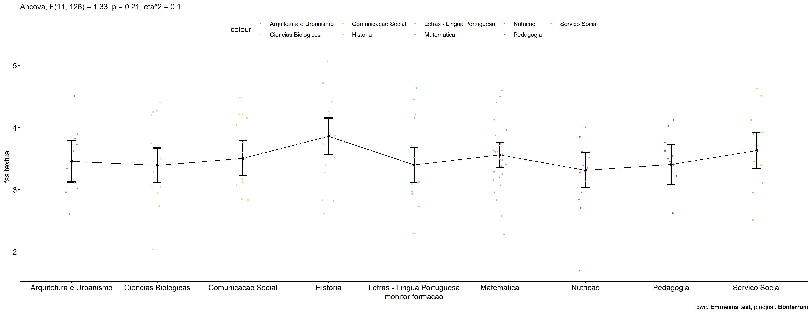<!-- -->

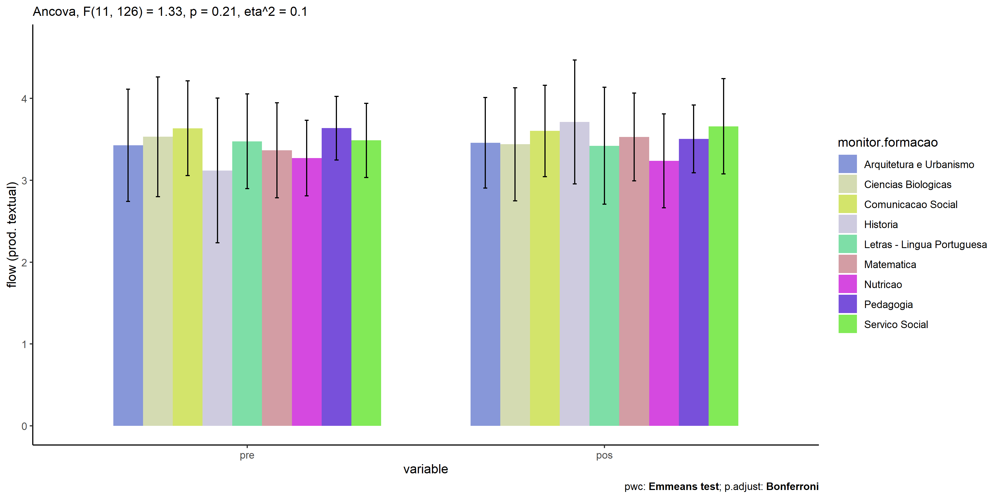<!-- -->

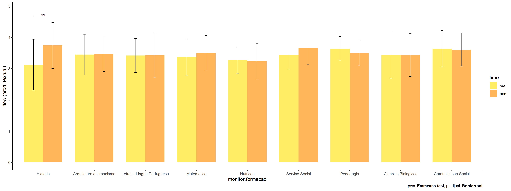<!-- -->

### factor: **monitor.titulacao**

| var         | monitor.titulacao |   n | M (pre) | SE (pre) | M (unadj) | SE (unadj) | M (adj) | SE (adj) |
|:------------|:------------------|----:|--------:|---------:|----------:|-----------:|--------:|---------:|
| fss.textual | ensino medio      |  92 |   3.388 |    0.066 |     3.475 |      0.065 |   3.493 |    0.056 |
| fss.textual | especializacao    |  14 |   3.635 |    0.155 |     3.603 |      0.149 |   3.512 |    0.145 |
| fss.textual | graduacao         |  24 |   3.468 |    0.104 |     3.578 |      0.112 |   3.561 |    0.110 |

| .y.         | group1         | group2         | estimate | conf.low | conf.high |    se | statistic |     p | p.adj | p.adj.signif |
|:------------|:---------------|:---------------|---------:|---------:|----------:|------:|----------:|------:|------:|:-------------|
| fss.textual | ensino medio   | especializacao |   -0.019 |   -0.327 |     0.290 | 0.156 |    -0.119 | 0.906 | 1.000 | ns           |
| fss.textual | ensino medio   | graduacao      |   -0.067 |   -0.312 |     0.178 | 0.124 |    -0.543 | 0.588 | 1.000 | ns           |
| fss.textual | especializacao | graduacao      |   -0.049 |   -0.408 |     0.311 | 0.182 |    -0.268 | 0.790 | 1.000 | ns           |
| dfs.textual | ensino medio   | especializacao |   -0.247 |   -0.592 |     0.098 | 0.174 |    -1.414 | 0.160 | 0.479 | ns           |
| dfs.textual | ensino medio   | graduacao      |   -0.079 |   -0.355 |     0.196 | 0.139 |    -0.570 | 0.570 | 1.000 | ns           |
| dfs.textual | especializacao | graduacao      |    0.167 |   -0.237 |     0.572 | 0.204 |     0.818 | 0.415 | 1.000 | ns           |

| monitor.titulacao | group1 | group2 | estimate | conf.low | conf.high |    se | statistic |     p | p.adj | p.adj.signif |
|:------------------|:-------|:-------|---------:|---------:|----------:|------:|----------:|------:|------:|:-------------|
| ensino medio      | pre    | pos    |   -0.121 |   -0.286 |     0.044 | 0.084 |    -1.441 | 0.151 | 0.151 | ns           |
| especializacao    | pre    | pos    |    0.031 |   -0.399 |     0.460 | 0.218 |     0.141 | 0.888 | 0.888 | ns           |
| graduacao         | pre    | pos    |   -0.110 |   -0.449 |     0.229 | 0.172 |    -0.639 | 0.523 | 0.523 | ns           |

    ## Scale for colour is already present.
    ## Adding another scale for colour, which will replace the existing scale.

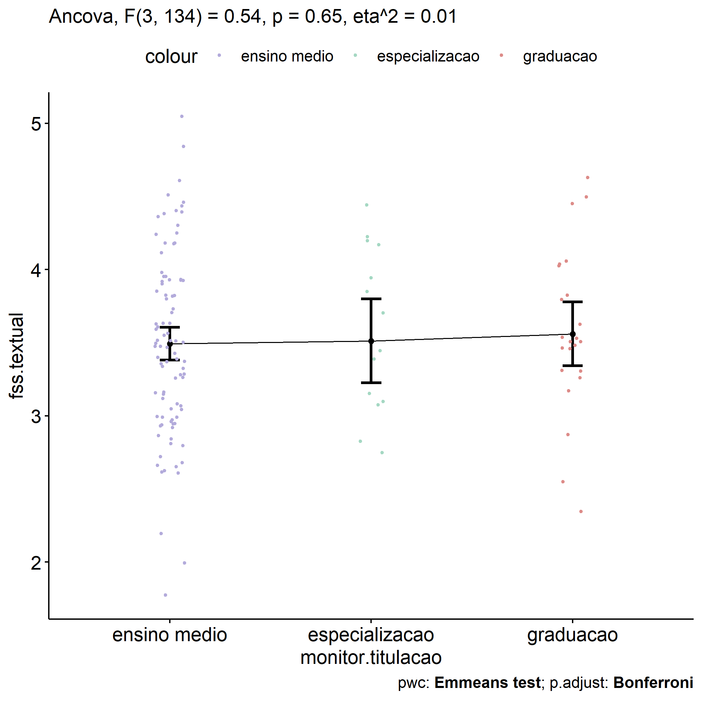<!-- -->

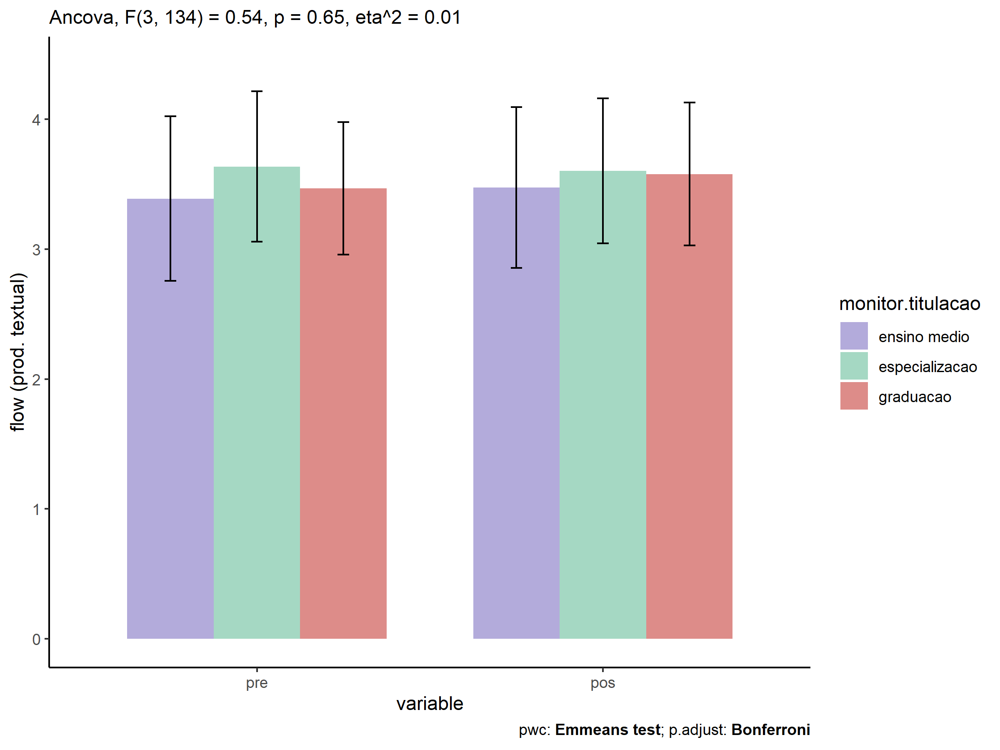<!-- -->

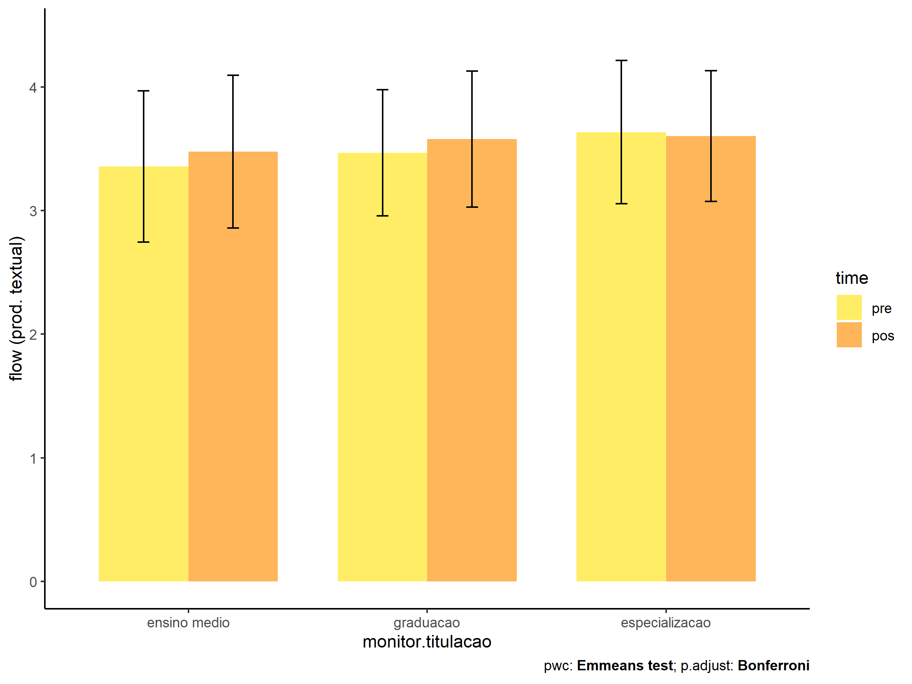<!-- -->

### factor: **monitor.experiencia**

| var         | monitor.experiencia |   n | M (pre) | SE (pre) | M (unadj) | SE (unadj) | M (adj) | SE (adj) |
|:------------|:--------------------|----:|--------:|---------:|----------:|-----------:|--------:|---------:|
| fss.textual | \> 01 ano           |  24 |   3.356 |    0.150 |     3.617 |      0.127 |   3.650 |    0.109 |
| fss.textual | até 01 ano          | 106 |   3.446 |    0.056 |     3.483 |      0.058 |   3.476 |    0.052 |

| .y.         | group1    | group2     | estimate | conf.low | conf.high |    se | statistic |     p | p.adj | p.adj.signif |
|:------------|:----------|:-----------|---------:|---------:|----------:|------:|----------:|------:|------:|:-------------|
| fss.textual | \> 01 ano | até 01 ano |    0.175 |   -0.064 |     0.414 | 0.121 |     1.446 | 0.151 | 0.151 | ns           |
| dfs.textual | \> 01 ano | até 01 ano |   -0.090 |   -0.363 |     0.183 | 0.138 |    -0.654 | 0.514 | 0.514 | ns           |

| monitor.experiencia | group1 | group2 | estimate | conf.low | conf.high |    se | statistic |     p | p.adj | p.adj.signif |
|:--------------------|:-------|:-------|---------:|---------:|----------:|------:|----------:|------:|------:|:-------------|
| \> 01 ano           | pre    | pos    |   -0.304 |   -0.630 |     0.022 | 0.165 |    -1.836 | 0.067 | 0.067 | ns           |
| até 01 ano          | pre    | pos    |   -0.063 |   -0.218 |     0.092 | 0.079 |    -0.802 | 0.423 | 0.423 | ns           |

    ## Scale for colour is already present.
    ## Adding another scale for colour, which will replace the existing scale.

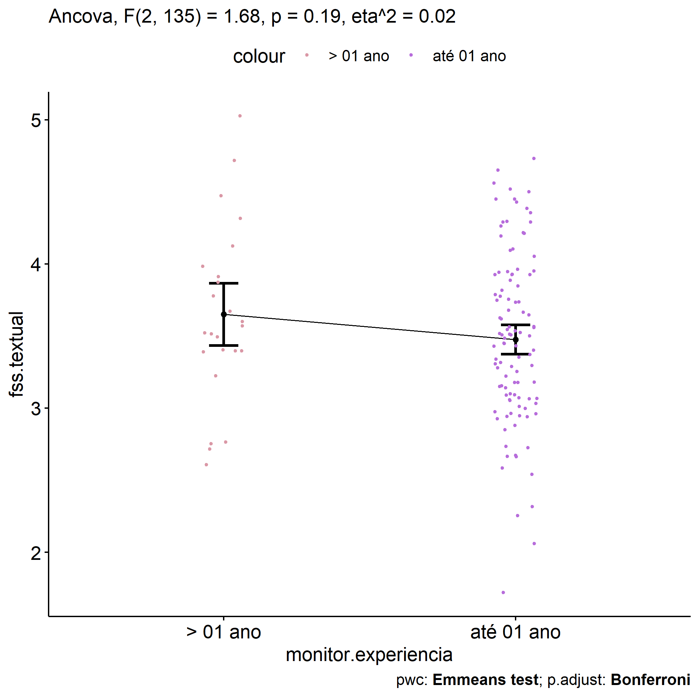<!-- -->

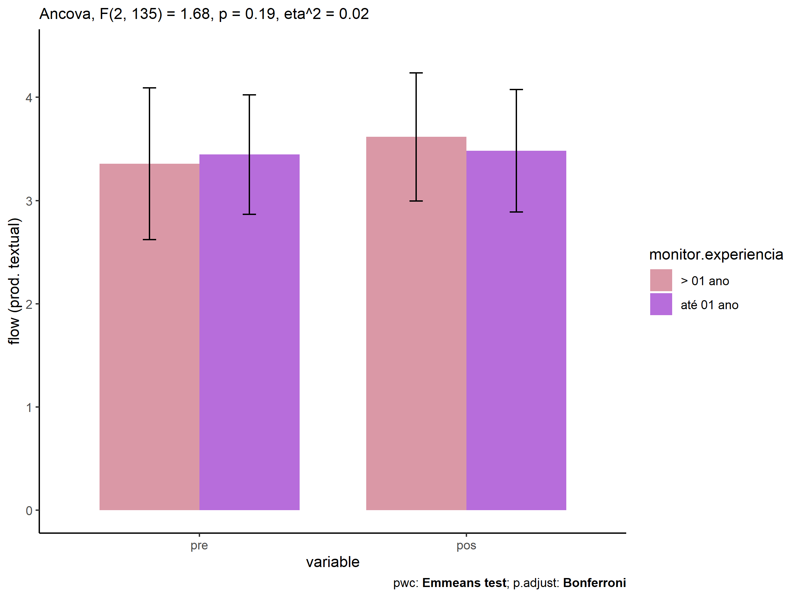<!-- -->

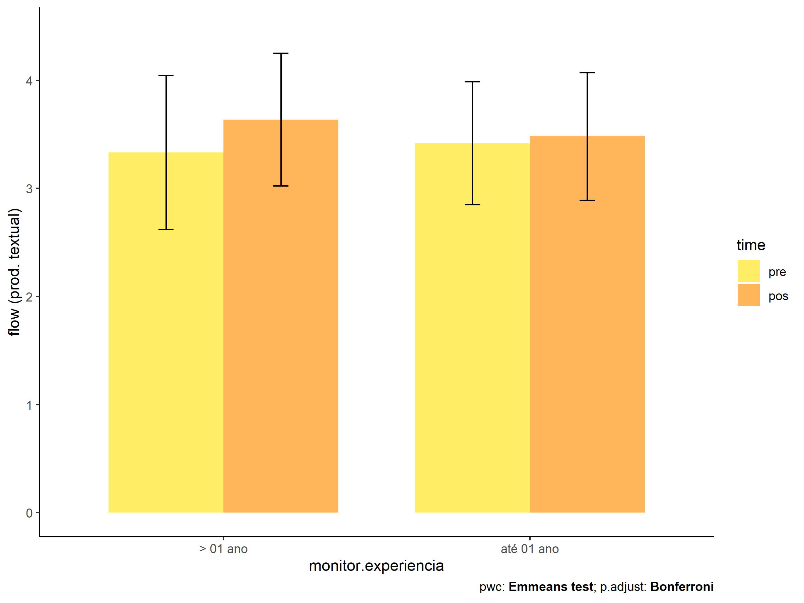<!-- -->

## Pairwise comparisons for two factors

### factores: **intervention:genero**

| var         | intervention      | genero |   n | M (pre) | SE (pre) | M (unadj) | SE (unadj) | M (adj) | SE (adj) |
|:------------|:------------------|:-------|----:|--------:|---------:|----------:|-----------:|--------:|---------:|
| fss.textual | Controle          | F      |  59 |   3.536 |    0.077 |     3.542 |      0.079 |   3.520 |    0.069 |
| fss.textual | Controle          | M      |  63 |   3.505 |    0.069 |     3.437 |      0.069 |   3.428 |    0.067 |
| fss.textual | Stari and WordGen | M      |  12 |   3.278 |    0.129 |     3.454 |      0.125 |   3.526 |    0.154 |
| fss.textual | Stari             | M      |   6 |   2.611 |    0.396 |     2.778 |      0.070 |   3.089 |    0.223 |
| fss.textual | WordGen           | F      |  53 |   3.601 |    0.074 |     3.732 |      0.075 |   3.687 |    0.074 |
| fss.textual | WordGen           | M      |  61 |   3.411 |    0.071 |     3.380 |      0.079 |   3.404 |    0.068 |

|     | intervention | genero | group1   | group2            | estimate | conf.low | conf.high |    se | statistic | p       | p.adj | p.adj.signif |
|:----|:-------------|:-------|:---------|:------------------|---------:|---------:|----------:|------:|----------:|:--------|------:|:-------------|
| 2   | NA           | F      | Controle | WordGen           |   -0.167 |   -0.366 |     0.032 | 0.101 |    -1.656 | 0.099   | 0.099 | ns           |
| 7   | NA           | M      | Controle | Stari             |    0.338 |   -0.122 |     0.799 | 0.234 |     1.448 | 0.149   | 0.893 | ns           |
| 8   | NA           | M      | Controle | WordGen           |    0.024 |   -0.165 |     0.212 | 0.096 |     0.247 | 0.805   | 1.000 | ns           |
| 9   | NA           | M      | Controle | Stari and WordGen |   -0.098 |   -0.429 |     0.233 | 0.168 |    -0.582 | 0.561   | 1.000 | ns           |
| 10  | NA           | M      | Stari    | WordGen           |   -0.315 |   -0.773 |     0.144 | 0.233 |    -1.352 | 0.177   | 1.000 | ns           |
| 11  | NA           | M      | Stari    | Stari and WordGen |   -0.436 |   -0.967 |     0.094 | 0.269 |    -1.621 | 0.106   | 0.638 | ns           |
| 12  | NA           | M      | WordGen  | Stari and WordGen |   -0.122 |   -0.453 |     0.210 | 0.168 |    -0.722 | 0.471   | 1.000 | ns           |
| 14  | NA           | F      | Controle | WordGen           |   -0.064 |   -0.275 |     0.146 | 0.107 |    -0.601 | 0.549   | 0.549 | ns           |
| 19  | NA           | M      | Controle | Stari             |    0.894 |    0.418 |     1.370 | 0.242 |     3.699 | \<0.001 | 0.002 | \*\*         |
| 20  | NA           | M      | Controle | WordGen           |    0.094 |   -0.106 |     0.294 | 0.102 |     0.922 | 0.357   | 1.000 | ns           |
| 21  | NA           | M      | Controle | Stari and WordGen |    0.227 |   -0.124 |     0.578 | 0.178 |     1.275 | 0.204   | 1.000 | ns           |
| 22  | NA           | M      | Stari    | WordGen           |   -0.800 |   -1.277 |    -0.324 | 0.242 |    -3.307 | 0.001   | 0.006 | \*\*         |
| 23  | NA           | M      | Stari    | Stari and WordGen |   -0.667 |   -1.224 |    -0.110 | 0.283 |    -2.358 | 0.019   | 0.115 | ns           |
| 24  | NA           | M      | WordGen  | Stari and WordGen |    0.133 |   -0.218 |     0.485 | 0.179 |     0.747 | 0.456   | 1.000 | ns           |
| 25  | Controle     | NA     | F        | M                 |    0.093 |   -0.097 |     0.283 | 0.096 |     0.962 | 0.337   | 0.337 | ns           |
| 27  | WordGen      | NA     | F        | M                 |    0.283 |    0.085 |     0.482 | 0.101 |     2.817 | 0.005   | 0.005 | \*\*         |
| 29  | Controle     | NA     | F        | M                 |    0.032 |   -0.170 |     0.233 | 0.102 |     0.309 | 0.758   | 0.758 | ns           |
| 31  | WordGen      | NA     | F        | M                 |    0.190 |   -0.020 |     0.399 | 0.106 |     1.785 | 0.075   | 0.075 | ns           |

| intervention      | genero | group1 | group2 | estimate | conf.low | conf.high |    se | statistic |     p | p.adj | p.adj.signif |
|:------------------|:-------|:-------|:-------|---------:|---------:|----------:|------:|----------:|------:|------:|:-------------|
| Controle          | F      | pre    | pos    |   -0.022 |   -0.220 |     0.176 | 0.101 |    -0.220 | 0.826 | 0.826 | ns           |
| Controle          | M      | pre    | pos    |    0.098 |   -0.090 |     0.287 | 0.096 |     1.022 | 0.307 | 0.307 | ns           |
| Stari             | M      | pre    | pos    |    0.124 |   -0.434 |     0.681 | 0.284 |     0.436 | 0.663 | 0.663 | ns           |
| WordGen           | F      | pre    | pos    |   -0.152 |   -0.364 |     0.059 | 0.108 |    -1.414 | 0.158 | 0.158 | ns           |
| WordGen           | M      | pre    | pos    |   -0.019 |   -0.212 |     0.174 | 0.098 |    -0.193 | 0.847 | 0.847 | ns           |
| Stari and WordGen | M      | pre    | pos    |   -0.133 |   -0.563 |     0.296 | 0.219 |    -0.609 | 0.543 | 0.543 | ns           |

    ## Scale for colour is already present.
    ## Adding another scale for colour, which will replace the existing scale.

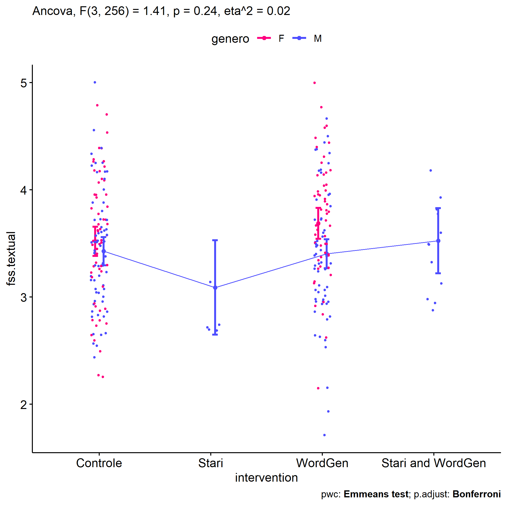<!-- -->

<!-- -->

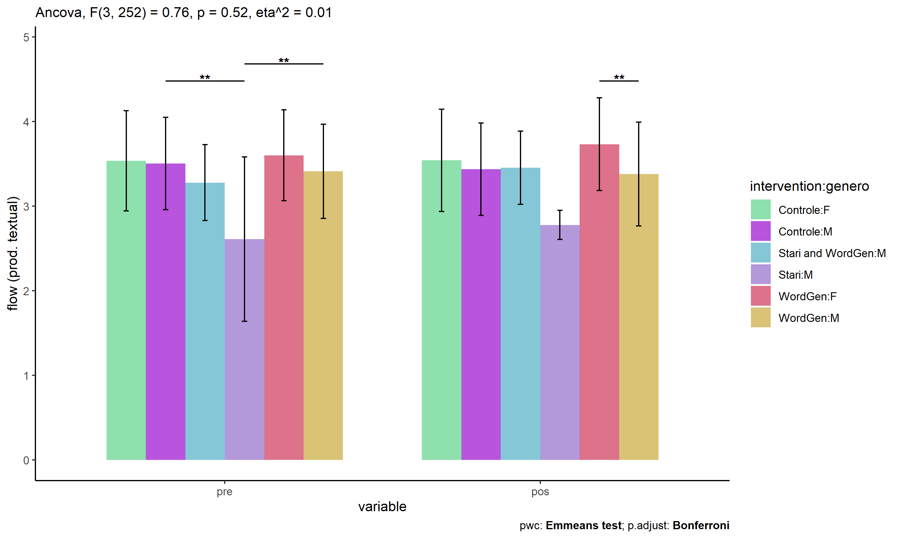<!-- -->

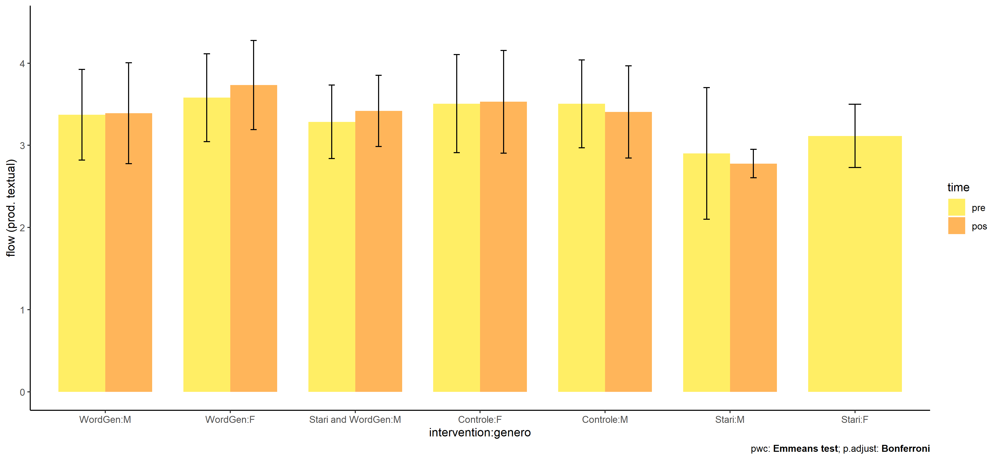<!-- -->

### factores: **intervention:idade**

| var         | intervention      | idade |   n | M (pre) | SE (pre) | M (unadj) | SE (unadj) | M (adj) | SE (adj) |
|:------------|:------------------|:------|----:|--------:|---------:|----------:|-----------:|--------:|---------:|
| fss.textual | Controle          | 10y   |  23 |   3.572 |    0.114 |     3.580 |      0.134 |   3.558 |    0.111 |
| fss.textual | Controle          | 11y   |  65 |   3.612 |    0.070 |     3.552 |      0.072 |   3.515 |    0.066 |
| fss.textual | Controle          | 12y   |  18 |   3.367 |    0.121 |     3.351 |      0.136 |   3.407 |    0.126 |
| fss.textual | Controle          | 13y   |   7 |   3.450 |    0.217 |     3.190 |      0.079 |   3.215 |    0.202 |
| fss.textual | Stari and WordGen | 11y   |   9 |   3.171 |    0.214 |     3.272 |      0.122 |   3.401 |    0.179 |
| fss.textual | WordGen           | 10y   |  22 |   3.393 |    0.142 |     3.481 |      0.108 |   3.527 |    0.114 |
| fss.textual | WordGen           | 11y   |  69 |   3.569 |    0.062 |     3.636 |      0.072 |   3.615 |    0.064 |
| fss.textual | WordGen           | 12y   |  14 |   3.508 |    0.161 |     3.548 |      0.156 |   3.550 |    0.143 |
| fss.textual | WordGen           | 13y   |   6 |   3.130 |    0.126 |     2.736 |      0.222 |   2.881 |    0.219 |

|     | intervention | idade | group1   | group2            | estimate | conf.low | conf.high |    se | statistic |     p | p.adj | p.adj.signif |
|:----|:-------------|:------|:---------|:------------------|---------:|---------:|----------:|------:|----------:|------:|------:|:-------------|
| 1   | NA           | 10y   | Controle | WordGen           |    0.031 |   -0.283 |     0.346 | 0.159 |     0.196 | 0.844 | 0.844 | ns           |
| 4   | NA           | 11y   | Controle | WordGen           |   -0.100 |   -0.282 |     0.082 | 0.092 |    -1.085 | 0.279 | 0.837 | ns           |
| 5   | NA           | 11y   | Controle | Stari and WordGen |    0.114 |   -0.264 |     0.492 | 0.192 |     0.593 | 0.554 | 1.000 | ns           |
| 6   | NA           | 11y   | WordGen  | Stari and WordGen |    0.214 |   -0.162 |     0.590 | 0.191 |     1.121 | 0.263 | 0.790 | ns           |
| 7   | NA           | 12y   | Controle | WordGen           |   -0.143 |   -0.518 |     0.232 | 0.190 |    -0.753 | 0.452 | 0.452 | ns           |
| 10  | NA           | 13y   | Controle | WordGen           |    0.333 |   -0.253 |     0.920 | 0.297 |     1.121 | 0.263 | 0.263 | ns           |
| 13  | NA           | 10y   | Controle | WordGen           |    0.179 |   -0.148 |     0.505 | 0.166 |     1.077 | 0.283 | 0.283 | ns           |
| 16  | NA           | 11y   | Controle | WordGen           |    0.043 |   -0.147 |     0.232 | 0.096 |     0.446 | 0.656 | 1.000 | ns           |
| 17  | NA           | 11y   | Controle | Stari and WordGen |    0.441 |    0.051 |     0.830 | 0.198 |     2.230 | 0.027 | 0.080 | ns           |
| 18  | NA           | 11y   | WordGen  | Stari and WordGen |    0.398 |    0.010 |     0.786 | 0.197 |     2.021 | 0.044 | 0.133 | ns           |
| 19  | NA           | 12y   | Controle | WordGen           |   -0.141 |   -0.532 |     0.249 | 0.198 |    -0.714 | 0.476 | 0.476 | ns           |
| 22  | NA           | 13y   | Controle | WordGen           |    0.321 |   -0.289 |     0.930 | 0.309 |     1.037 | 0.301 | 0.301 | ns           |
| 25  | Controle     | NA    | 10y      | 11y               |    0.043 |   -0.212 |     0.298 | 0.129 |     0.334 | 0.739 | 1.000 | ns           |
| 26  | Controle     | NA    | 10y      | 12y               |    0.151 |   -0.181 |     0.483 | 0.168 |     0.898 | 0.370 | 1.000 | ns           |
| 27  | Controle     | NA    | 10y      | 13y               |    0.343 |   -0.111 |     0.797 | 0.230 |     1.491 | 0.137 | 0.824 | ns           |
| 28  | Controle     | NA    | 11y      | 12y               |    0.108 |   -0.174 |     0.390 | 0.143 |     0.755 | 0.451 | 1.000 | ns           |
| 29  | Controle     | NA    | 11y      | 13y               |    0.300 |   -0.118 |     0.719 | 0.212 |     1.413 | 0.159 | 0.954 | ns           |
| 30  | Controle     | NA    | 12y      | 13y               |    0.192 |   -0.276 |     0.661 | 0.238 |     0.809 | 0.419 | 1.000 | ns           |
| 31  | WordGen      | NA    | 10y      | 11y               |   -0.088 |   -0.346 |     0.170 | 0.131 |    -0.673 | 0.502 | 1.000 | ns           |
| 32  | WordGen      | NA    | 10y      | 12y               |   -0.023 |   -0.383 |     0.336 | 0.182 |    -0.128 | 0.898 | 1.000 | ns           |
| 33  | WordGen      | NA    | 10y      | 13y               |    0.646 |    0.160 |     1.131 | 0.246 |     2.622 | 0.009 | 0.056 | ns           |
| 34  | WordGen      | NA    | 11y      | 12y               |    0.065 |   -0.243 |     0.373 | 0.156 |     0.415 | 0.679 | 1.000 | ns           |
| 35  | WordGen      | NA    | 11y      | 13y               |    0.734 |    0.283 |     1.184 | 0.229 |     3.208 | 0.002 | 0.009 | \*\*         |
| 36  | WordGen      | NA    | 12y      | 13y               |    0.669 |    0.154 |     1.184 | 0.261 |     2.559 | 0.011 | 0.067 | ns           |
| 43  | Controle     | NA    | 10y      | 11y               |   -0.040 |   -0.306 |     0.226 | 0.135 |    -0.297 | 0.766 | 1.000 | ns           |
| 44  | Controle     | NA    | 10y      | 12y               |    0.205 |   -0.139 |     0.550 | 0.175 |     1.174 | 0.242 | 1.000 | ns           |
| 45  | Controle     | NA    | 10y      | 13y               |    0.121 |   -0.351 |     0.594 | 0.240 |     0.506 | 0.613 | 1.000 | ns           |
| 46  | Controle     | NA    | 11y      | 12y               |    0.245 |   -0.046 |     0.537 | 0.148 |     1.658 | 0.099 | 0.592 | ns           |
| 47  | Controle     | NA    | 11y      | 13y               |    0.162 |   -0.274 |     0.597 | 0.221 |     0.731 | 0.466 | 1.000 | ns           |
| 48  | Controle     | NA    | 12y      | 13y               |   -0.084 |   -0.572 |     0.404 | 0.248 |    -0.339 | 0.735 | 1.000 | ns           |
| 49  | WordGen      | NA    | 10y      | 11y               |   -0.176 |   -0.444 |     0.092 | 0.136 |    -1.292 | 0.198 | 1.000 | ns           |
| 50  | WordGen      | NA    | 10y      | 12y               |   -0.115 |   -0.489 |     0.260 | 0.190 |    -0.603 | 0.547 | 1.000 | ns           |
| 51  | WordGen      | NA    | 10y      | 13y               |    0.264 |   -0.241 |     0.768 | 0.256 |     1.030 | 0.304 | 1.000 | ns           |
| 52  | WordGen      | NA    | 11y      | 12y               |    0.061 |   -0.260 |     0.382 | 0.163 |     0.376 | 0.707 | 1.000 | ns           |
| 53  | WordGen      | NA    | 11y      | 13y               |    0.440 |   -0.027 |     0.906 | 0.237 |     1.858 | 0.065 | 0.387 | ns           |
| 54  | WordGen      | NA    | 12y      | 13y               |    0.378 |   -0.156 |     0.913 | 0.271 |     1.395 | 0.164 | 0.987 | ns           |

| intervention      | idade | group1 | group2 | estimate | conf.low | conf.high |    se | statistic |     p | p.adj | p.adj.signif |
|:------------------|:------|:-------|:-------|---------:|---------:|----------:|------:|----------:|------:|------:|:-------------|
| Controle          | 10y   | pre    | pos    |    0.011 |   -0.304 |     0.327 | 0.161 |     0.071 | 0.944 | 0.944 | ns           |
| Controle          | 11y   | pre    | pos    |    0.052 |   -0.133 |     0.237 | 0.094 |     0.550 | 0.583 | 0.583 | ns           |
| Controle          | 12y   | pre    | pos    |    0.036 |   -0.314 |     0.385 | 0.178 |     0.200 | 0.842 | 0.842 | ns           |
| Controle          | 13y   | pre    | pos    |    0.260 |   -0.330 |     0.850 | 0.300 |     0.865 | 0.387 | 0.387 | ns           |
| WordGen           | 10y   | pre    | pos    |   -0.038 |   -0.364 |     0.288 | 0.166 |    -0.228 | 0.820 | 0.820 | ns           |
| WordGen           | 11y   | pre    | pos    |   -0.099 |   -0.281 |     0.083 | 0.093 |    -1.064 | 0.288 | 0.288 | ns           |
| WordGen           | 12y   | pre    | pos    |   -0.091 |   -0.488 |     0.306 | 0.202 |    -0.449 | 0.653 | 0.653 | ns           |
| WordGen           | 13y   | pre    | pos    |    0.375 |   -0.221 |     0.971 | 0.303 |     1.236 | 0.217 | 0.217 | ns           |
| Stari and WordGen | 11y   | pre    | pos    |   -0.040 |   -0.547 |     0.467 | 0.258 |    -0.154 | 0.877 | 0.877 | ns           |

    ## Scale for colour is already present.
    ## Adding another scale for colour, which will replace the existing scale.

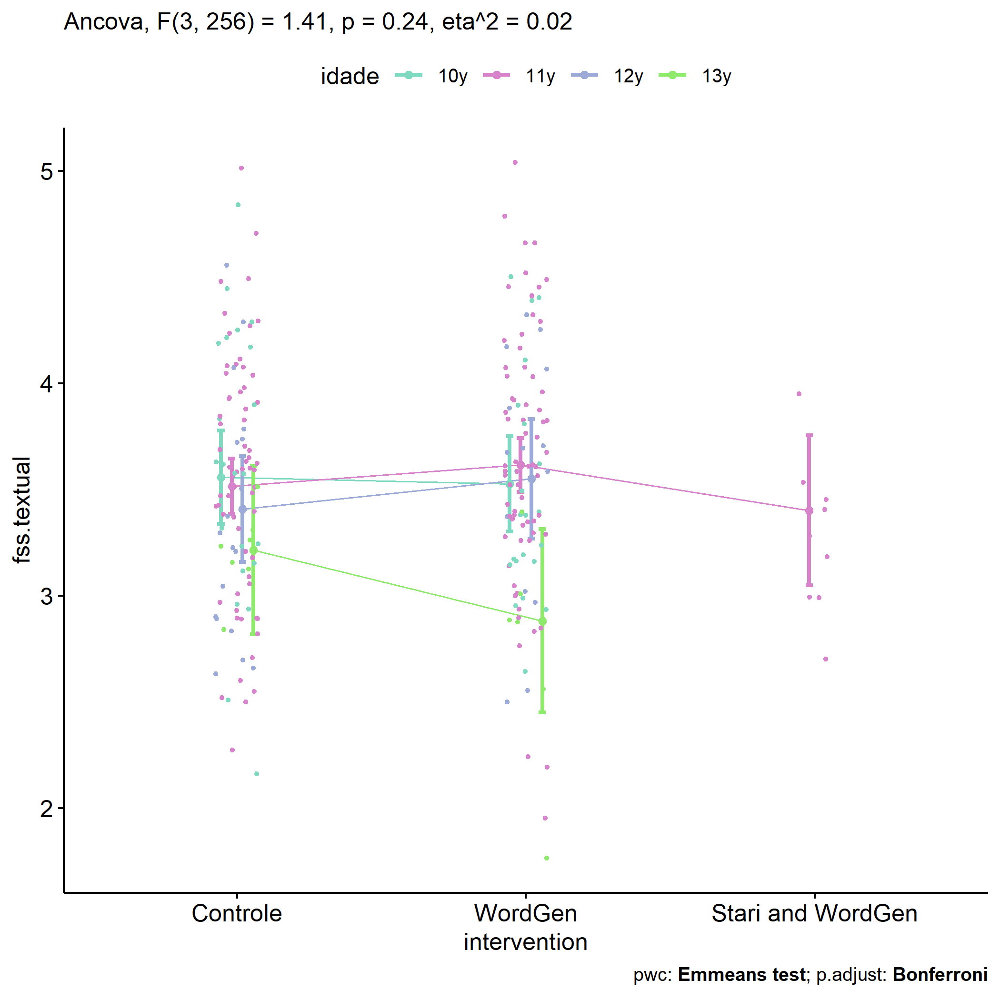<!-- -->

<!-- -->

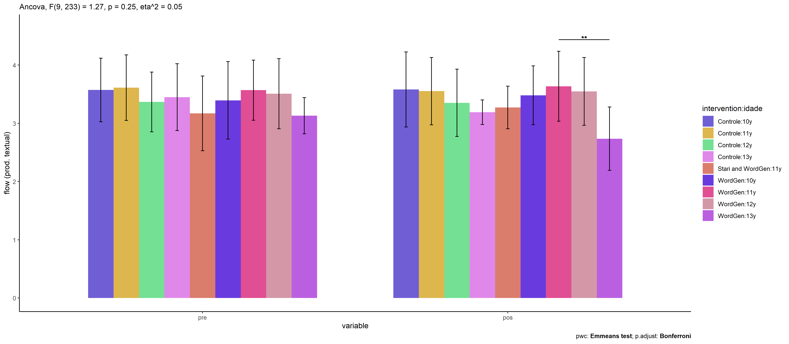<!-- -->

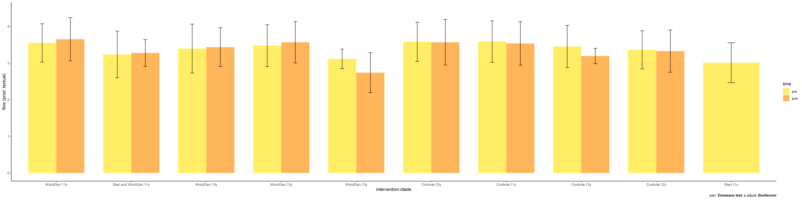<!-- -->

### factores: **intervention:zona.escola**

| var         | intervention      | zona.escola |   n | M (pre) | SE (pre) | M (unadj) | SE (unadj) | M (adj) | SE (adj) |
|:------------|:------------------|:------------|----:|--------:|---------:|----------:|-----------:|--------:|---------:|
| fss.textual | Controle          | Rural       |  41 |   3.585 |    0.068 |     3.416 |      0.077 |   3.368 |    0.085 |
| fss.textual | Controle          | Urbana      |  81 |   3.487 |    0.069 |     3.524 |      0.068 |   3.514 |    0.060 |
| fss.textual | Stari and WordGen | Rural       |   7 |   3.365 |    0.198 |     3.556 |      0.164 |   3.593 |    0.204 |
| fss.textual | Stari and WordGen | Urbana      |   9 |   2.998 |    0.158 |     3.284 |      0.182 |   3.465 |    0.182 |
| fss.textual | Stari             | Urbana      |   9 |   2.730 |    0.264 |     2.870 |      0.124 |   3.157 |    0.185 |
| fss.textual | WordGen           | Rural       |  34 |   3.592 |    0.103 |     3.567 |      0.110 |   3.516 |    0.093 |
| fss.textual | WordGen           | Urbana      |  80 |   3.460 |    0.059 |     3.534 |      0.067 |   3.534 |    0.060 |

|     | intervention      | zona.escola | group1   | group2            | estimate | conf.low | conf.high |    se | statistic | p       | p.adj | p.adj.signif |
|:----|:------------------|:------------|:---------|:------------------|---------:|---------:|----------:|------:|----------:|:--------|------:|:-------------|
| 1   | NA                | Urbana      | Controle | Stari             |    0.357 |   -0.027 |     0.741 | 0.195 |     1.832 | 0.068   | 0.409 | ns           |
| 2   | NA                | Urbana      | Controle | WordGen           |   -0.020 |   -0.188 |     0.147 | 0.085 |    -0.238 | 0.812   | 1.000 | ns           |
| 3   | NA                | Urbana      | Controle | Stari and WordGen |    0.049 |   -0.329 |     0.427 | 0.192 |     0.254 | 0.8     | 1.000 | ns           |
| 4   | NA                | Urbana      | Stari    | WordGen           |   -0.378 |   -0.761 |     0.006 | 0.195 |    -1.939 | 0.054   | 0.322 | ns           |
| 5   | NA                | Urbana      | Stari    | Stari and WordGen |   -0.309 |   -0.811 |     0.194 | 0.255 |    -1.210 | 0.227   | 1.000 | ns           |
| 6   | NA                | Urbana      | WordGen  | Stari and WordGen |    0.069 |   -0.309 |     0.447 | 0.192 |     0.360 | 0.719   | 1.000 | ns           |
| 8   | NA                | Rural       | Controle | WordGen           |   -0.148 |   -0.395 |     0.099 | 0.125 |    -1.183 | 0.238   | 0.714 | ns           |
| 9   | NA                | Rural       | Controle | Stari and WordGen |   -0.225 |   -0.661 |     0.210 | 0.221 |    -1.019 | 0.309   | 0.927 | ns           |
| 12  | NA                | Rural       | WordGen  | Stari and WordGen |   -0.077 |   -0.520 |     0.365 | 0.224 |    -0.345 | 0.731   | 1.000 | ns           |
| 13  | NA                | Urbana      | Controle | Stari             |    0.758 |    0.366 |     1.149 | 0.199 |     3.813 | \<0.001 | 0.001 | \*\*         |
| 14  | NA                | Urbana      | Controle | WordGen           |    0.027 |   -0.148 |     0.203 | 0.089 |     0.307 | 0.759   | 1.000 | ns           |
| 15  | NA                | Urbana      | Controle | Stari and WordGen |    0.489 |    0.098 |     0.880 | 0.199 |     2.463 | 0.014   | 0.087 | ns           |
| 16  | NA                | Urbana      | Stari    | WordGen           |   -0.730 |   -1.122 |    -0.339 | 0.199 |    -3.673 | \<0.001 | 0.002 | \*\*         |
| 17  | NA                | Urbana      | Stari    | Stari and WordGen |   -0.268 |   -0.793 |     0.257 | 0.267 |    -1.007 | 0.315   | 1.000 | ns           |
| 18  | NA                | Urbana      | WordGen  | Stari and WordGen |    0.462 |    0.070 |     0.853 | 0.199 |     2.324 | 0.021   | 0.126 | ns           |
| 20  | NA                | Rural       | Controle | WordGen           |   -0.007 |   -0.265 |     0.251 | 0.131 |    -0.052 | 0.958   | 1.000 | ns           |
| 21  | NA                | Rural       | Controle | Stari and WordGen |    0.220 |   -0.236 |     0.675 | 0.231 |     0.950 | 0.343   | 1.000 | ns           |
| 24  | NA                | Rural       | WordGen  | Stari and WordGen |    0.226 |   -0.236 |     0.689 | 0.235 |     0.965 | 0.335   | 1.000 | ns           |
| 25  | Controle          | NA          | Urbana   | Rural             |    0.146 |   -0.058 |     0.350 | 0.104 |     1.410 | 0.16    | 0.160 | ns           |
| 27  | WordGen           | NA          | Urbana   | Rural             |    0.018 |   -0.200 |     0.237 | 0.111 |     0.165 | 0.869   | 0.869 | ns           |
| 28  | Stari and WordGen | NA          | Urbana   | Rural             |   -0.128 |   -0.666 |     0.409 | 0.273 |    -0.469 | 0.639   | 0.639 | ns           |
| 29  | Controle          | NA          | Urbana   | Rural             |   -0.097 |   -0.311 |     0.116 | 0.108 |    -0.897 | 0.371   | 0.371 | ns           |
| 31  | WordGen           | NA          | Urbana   | Rural             |   -0.131 |   -0.359 |     0.097 | 0.116 |    -1.135 | 0.257   | 0.257 | ns           |
| 32  | Stari and WordGen | NA          | Urbana   | Rural             |   -0.367 |   -0.928 |     0.194 | 0.285 |    -1.287 | 0.199   | 0.199 | ns           |

| intervention      | zona.escola | group1 | group2 | estimate | conf.low | conf.high |    se | statistic |     p | p.adj | p.adj.signif |
|:------------------|:------------|:-------|:-------|---------:|---------:|----------:|------:|----------:|------:|------:|:-------------|
| Controle          | Urbana      | pre    | pos    |   -0.034 |   -0.203 |     0.135 | 0.086 |    -0.393 | 0.694 | 0.694 | ns           |
| Controle          | Rural       | pre    | pos    |    0.196 |   -0.046 |     0.438 | 0.123 |     1.588 | 0.113 | 0.113 | ns           |
| Stari             | Urbana      | pre    | pos    |    0.081 |   -0.395 |     0.558 | 0.243 |     0.336 | 0.737 | 0.737 | ns           |
| WordGen           | Urbana      | pre    | pos    |   -0.091 |   -0.264 |     0.082 | 0.088 |    -1.035 | 0.301 | 0.301 | ns           |
| WordGen           | Rural       | pre    | pos    |   -0.032 |   -0.294 |     0.229 | 0.133 |    -0.243 | 0.808 | 0.808 | ns           |
| Stari and WordGen | Urbana      | pre    | pos    |   -0.196 |   -0.690 |     0.298 | 0.252 |    -0.781 | 0.435 | 0.435 | ns           |
| Stari and WordGen | Rural       | pre    | pos    |   -0.190 |   -0.795 |     0.414 | 0.308 |    -0.619 | 0.536 | 0.536 | ns           |

    ## Scale for colour is already present.
    ## Adding another scale for colour, which will replace the existing scale.

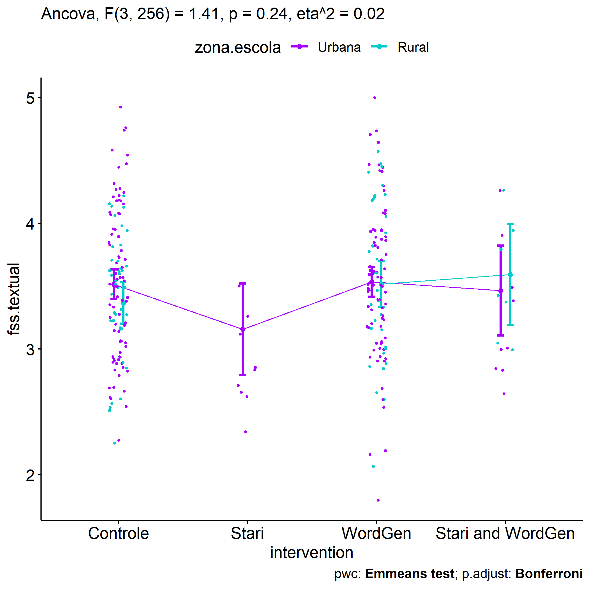<!-- -->

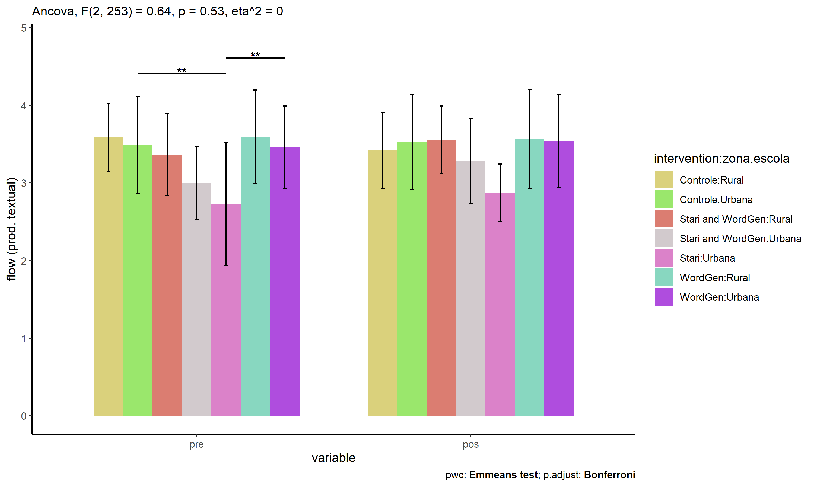<!-- -->

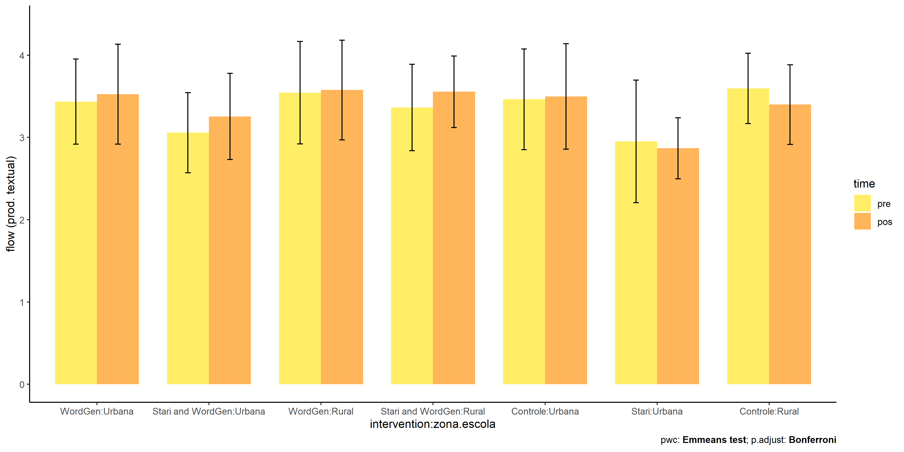<!-- -->

### factores: **intervention:zona.participante**

| var         | intervention      | zona.participante |   n | M (pre) | SE (pre) | M (unadj) | SE (unadj) | M (adj) | SE (adj) |
|:------------|:------------------|:------------------|----:|--------:|---------:|----------:|-----------:|--------:|---------:|
| fss.textual | Controle          | Rural             |  42 |   3.514 |    0.088 |     3.370 |      0.089 |   3.361 |    0.084 |
| fss.textual | Controle          | Urbana            |  53 |   3.535 |    0.082 |     3.553 |      0.081 |   3.535 |    0.075 |
| fss.textual | Stari and WordGen | Rural             |   5 |   3.152 |    0.237 |     3.444 |      0.217 |   3.579 |    0.246 |
| fss.textual | Stari and WordGen | Urbana            |   6 |   3.463 |    0.198 |     3.463 |      0.244 |   3.474 |    0.223 |
| fss.textual | WordGen           | Rural             |  47 |   3.515 |    0.087 |     3.557 |      0.096 |   3.548 |    0.080 |
| fss.textual | WordGen           | Urbana            |  43 |   3.432 |    0.089 |     3.548 |      0.084 |   3.571 |    0.084 |

| intervention      | zona.participante | group1   | group2            | estimate | conf.low | conf.high |    se | statistic |     p | p.adj | p.adj.signif |
|:------------------|:------------------|:---------|:------------------|---------:|---------:|----------:|------:|----------:|------:|------:|:-------------|
| NA                | Urbana            | Controle | WordGen           |   -0.036 |   -0.258 |     0.186 | 0.112 |    -0.319 | 0.750 | 1.000 | ns           |
| NA                | Urbana            | Controle | Stari and WordGen |    0.061 |   -0.404 |     0.526 | 0.236 |     0.260 | 0.795 | 1.000 | ns           |
| NA                | Urbana            | WordGen  | Stari and WordGen |    0.097 |   -0.373 |     0.567 | 0.238 |     0.407 | 0.684 | 1.000 | ns           |
| NA                | Rural             | Controle | WordGen           |   -0.187 |   -0.416 |     0.042 | 0.116 |    -1.607 | 0.110 | 0.329 | ns           |
| NA                | Rural             | Controle | Stari and WordGen |   -0.218 |   -0.731 |     0.295 | 0.260 |    -0.839 | 0.403 | 1.000 | ns           |
| NA                | Rural             | WordGen  | Stari and WordGen |   -0.031 |   -0.541 |     0.479 | 0.258 |    -0.121 | 0.903 | 1.000 | ns           |
| NA                | Urbana            | Controle | WordGen           |    0.103 |   -0.134 |     0.339 | 0.120 |     0.858 | 0.392 | 1.000 | ns           |
| NA                | Urbana            | Controle | Stari and WordGen |    0.072 |   -0.425 |     0.568 | 0.252 |     0.286 | 0.776 | 1.000 | ns           |
| NA                | Urbana            | WordGen  | Stari and WordGen |   -0.031 |   -0.533 |     0.471 | 0.255 |    -0.122 | 0.903 | 1.000 | ns           |
| NA                | Rural             | Controle | WordGen           |   -0.001 |   -0.246 |     0.244 | 0.124 |    -0.009 | 0.993 | 1.000 | ns           |
| NA                | Rural             | Controle | Stari and WordGen |    0.362 |   -0.184 |     0.907 | 0.277 |     1.309 | 0.192 | 0.577 | ns           |
| NA                | Rural             | WordGen  | Stari and WordGen |    0.363 |   -0.179 |     0.905 | 0.275 |     1.320 | 0.188 | 0.565 | ns           |
| Controle          | NA                | Urbana   | Rural             |    0.175 |   -0.048 |     0.397 | 0.113 |     1.545 | 0.124 | 0.124 | ns           |
| WordGen           | NA                | Urbana   | Rural             |    0.024 |   -0.204 |     0.252 | 0.116 |     0.205 | 0.837 | 0.837 | ns           |
| Stari and WordGen | NA                | Urbana   | Rural             |   -0.105 |   -0.760 |     0.550 | 0.332 |    -0.316 | 0.753 | 0.753 | ns           |
| Controle          | NA                | Urbana   | Rural             |    0.021 |   -0.218 |     0.259 | 0.121 |     0.171 | 0.864 | 0.864 | ns           |
| WordGen           | NA                | Urbana   | Rural             |   -0.083 |   -0.327 |     0.160 | 0.123 |    -0.676 | 0.500 | 0.500 | ns           |
| Stari and WordGen | NA                | Urbana   | Rural             |    0.311 |   -0.388 |     1.009 | 0.354 |     0.878 | 0.381 | 0.381 | ns           |

| intervention      | zona.participante | group1 | group2 | estimate | conf.low | conf.high |    se | statistic |     p | p.adj | p.adj.signif |
|:------------------|:------------------|:-------|:-------|---------:|---------:|----------:|------:|----------:|------:|------:|:-------------|
| Controle          | Urbana            | pre    | pos    |   -0.028 |   -0.246 |     0.190 | 0.111 |    -0.252 | 0.801 | 0.801 | ns           |
| Controle          | Rural             | pre    | pos    |    0.176 |   -0.074 |     0.425 | 0.127 |     1.380 | 0.168 | 0.168 | ns           |
| WordGen           | Urbana            | pre    | pos    |   -0.101 |   -0.347 |     0.145 | 0.125 |    -0.808 | 0.419 | 0.419 | ns           |
| WordGen           | Rural             | pre    | pos    |   -0.094 |   -0.328 |     0.141 | 0.119 |    -0.784 | 0.434 | 0.434 | ns           |
| Stari and WordGen | Urbana            | pre    | pos    |    0.111 |   -0.516 |     0.738 | 0.319 |     0.348 | 0.728 | 0.728 | ns           |
| Stari and WordGen | Rural             | pre    | pos    |   -0.336 |   -1.046 |     0.374 | 0.361 |    -0.930 | 0.353 | 0.353 | ns           |

    ## Scale for colour is already present.
    ## Adding another scale for colour, which will replace the existing scale.

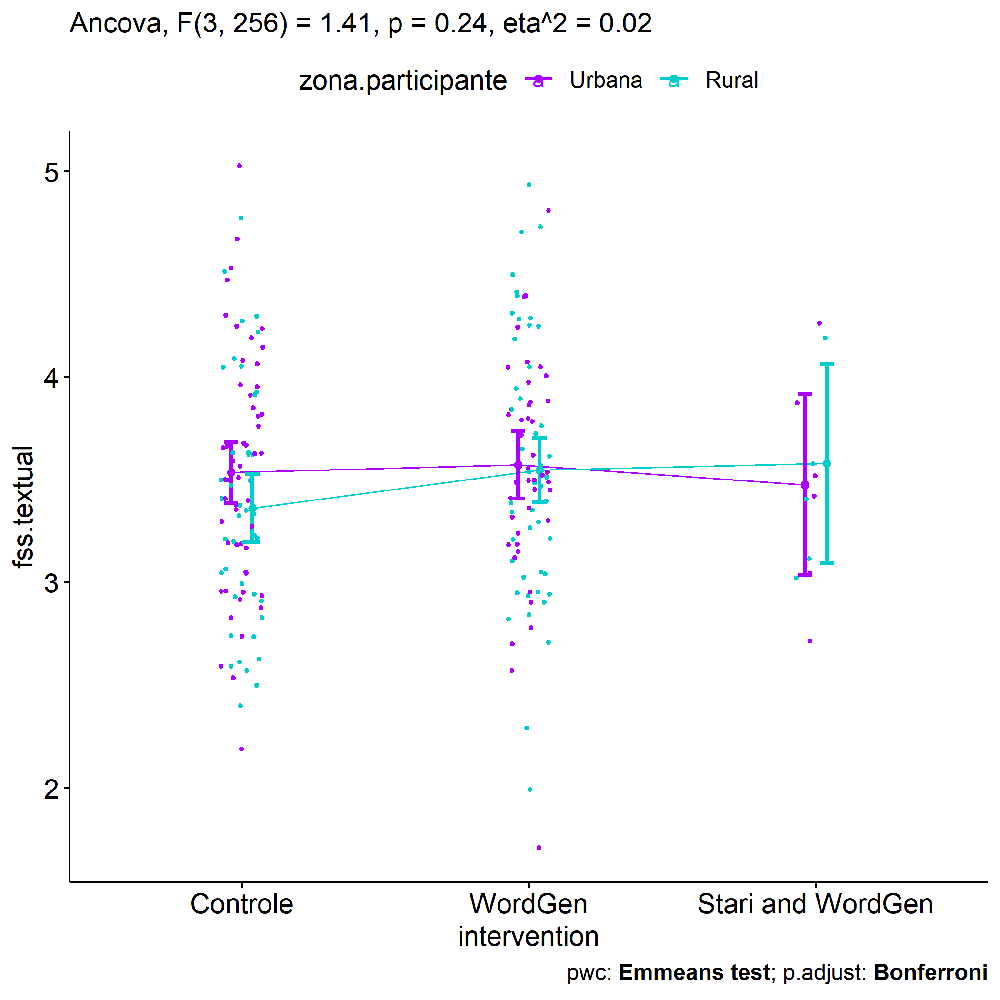<!-- -->

    ## Scale for colour is already present.
    ## Adding another scale for colour, which will replace the existing scale.

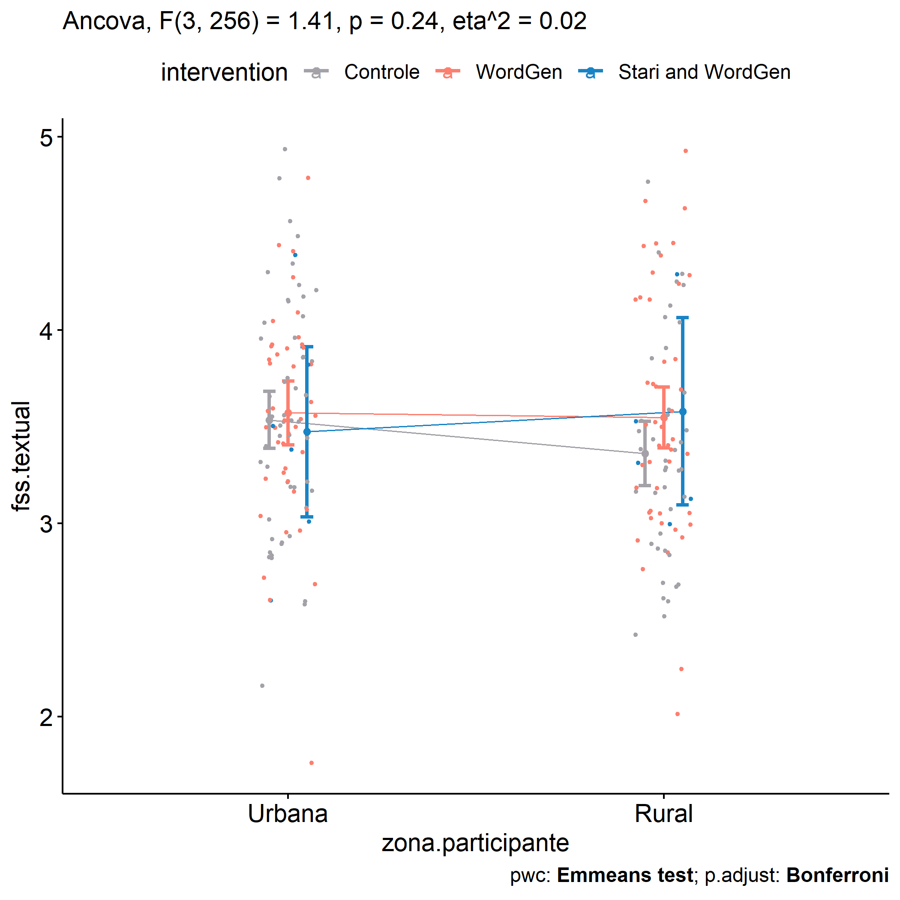<!-- -->

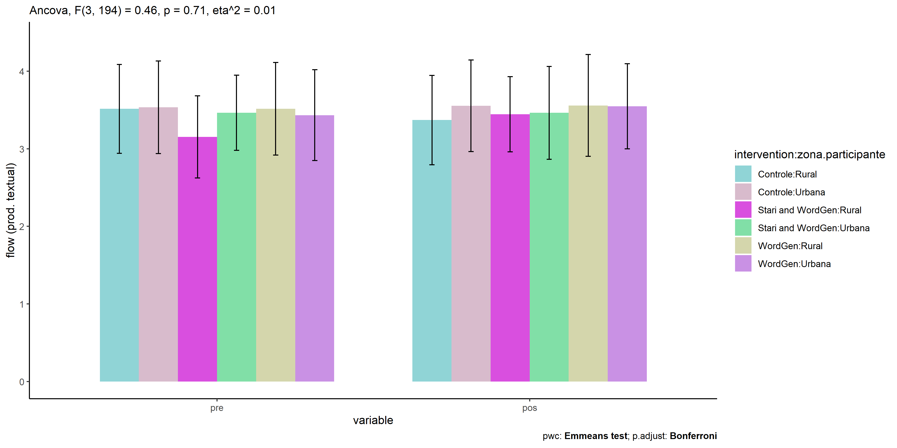<!-- -->

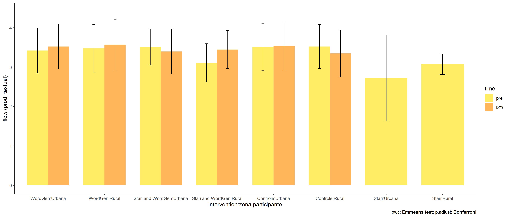<!-- -->

### factores: **intervention:escola**

| var         | intervention      | escola |   n | M (pre) | SE (pre) | M (unadj) | SE (unadj) | M (adj) | SE (adj) |
|:------------|:------------------|:-------|----:|--------:|---------:|----------:|-----------:|--------:|---------:|
| fss.textual | Controle          | E1     |  11 |   3.278 |    0.188 |     3.465 |      0.156 |   3.550 |    0.163 |
| fss.textual | Controle          | E2     |  23 |   3.536 |    0.118 |     3.497 |      0.152 |   3.478 |    0.112 |
| fss.textual | Controle          | E3     |  14 |   3.588 |    0.145 |     3.348 |      0.110 |   3.307 |    0.144 |
| fss.textual | Controle          | E4     |  16 |   3.512 |    0.096 |     3.331 |      0.128 |   3.321 |    0.135 |
| fss.textual | Controle          | E5     |  47 |   3.513 |    0.095 |     3.551 |      0.085 |   3.541 |    0.079 |
| fss.textual | Controle          | E6     |  11 |   3.686 |    0.106 |     3.626 |      0.162 |   3.546 |    0.163 |
| fss.textual | Stari and WordGen | E4     |   5 |   3.511 |    0.250 |     3.444 |      0.214 |   3.435 |    0.241 |
| fss.textual | Stari and WordGen | E5     |   7 |   2.918 |    0.185 |     3.333 |      0.230 |   3.564 |    0.207 |
| fss.textual | Stari             | E5     |   5 |   3.200 |    0.155 |     2.856 |      0.203 |   2.972 |    0.242 |
| fss.textual | WordGen           | E1     |  10 |   3.510 |    0.149 |     4.003 |      0.189 |   3.994 |    0.171 |
| fss.textual | WordGen           | E2     |  24 |   3.426 |    0.096 |     3.341 |      0.109 |   3.366 |    0.110 |
| fss.textual | WordGen           | E3     |  14 |   3.531 |    0.195 |     3.440 |      0.184 |   3.422 |    0.144 |
| fss.textual | WordGen           | E4     |   9 |   3.704 |    0.204 |     3.691 |      0.202 |   3.604 |    0.180 |
| fss.textual | WordGen           | E5     |  46 |   3.467 |    0.085 |     3.532 |      0.086 |   3.540 |    0.080 |
| fss.textual | WordGen           | E6     |  11 |   3.577 |    0.130 |     3.626 |      0.190 |   3.590 |    0.163 |

|     | intervention      | escola | group1   | group2            | estimate | conf.low | conf.high |    se | statistic |     p | p.adj | p.adj.signif |
|:----|:------------------|:-------|:---------|:------------------|---------:|---------:|----------:|------:|----------:|------:|------:|:-------------|
| 2   | NA                | E1     | Controle | WordGen           |   -0.444 |   -0.909 |     0.021 | 0.236 |    -1.881 | 0.061 | 0.061 | ns           |
| 8   | NA                | E2     | Controle | WordGen           |    0.111 |   -0.199 |     0.421 | 0.158 |     0.705 | 0.481 | 0.481 | ns           |
| 14  | NA                | E3     | Controle | WordGen           |   -0.115 |   -0.517 |     0.287 | 0.204 |    -0.564 | 0.573 | 0.573 | ns           |
| 20  | NA                | E4     | Controle | WordGen           |   -0.283 |   -0.726 |     0.160 | 0.225 |    -1.257 | 0.210 | 0.629 | ns           |
| 21  | NA                | E4     | Controle | Stari and WordGen |   -0.114 |   -0.658 |     0.430 | 0.276 |    -0.413 | 0.680 | 1.000 | ns           |
| 24  | NA                | E4     | WordGen  | Stari and WordGen |    0.169 |   -0.424 |     0.762 | 0.301 |     0.561 | 0.575 | 1.000 | ns           |
| 25  | NA                | E5     | Controle | Stari             |    0.569 |    0.068 |     1.070 | 0.254 |     2.235 | 0.026 | 0.158 | ns           |
| 26  | NA                | E5     | Controle | WordGen           |    0.001 |   -0.220 |     0.221 | 0.112 |     0.006 | 0.995 | 1.000 | ns           |
| 27  | NA                | E5     | Controle | Stari and WordGen |   -0.023 |   -0.460 |     0.413 | 0.222 |    -0.104 | 0.917 | 1.000 | ns           |
| 28  | NA                | E5     | Stari    | WordGen           |   -0.568 |   -1.070 |    -0.067 | 0.255 |    -2.232 | 0.027 | 0.159 | ns           |
| 29  | NA                | E5     | Stari    | Stari and WordGen |   -0.592 |   -1.215 |     0.031 | 0.316 |    -1.872 | 0.062 | 0.375 | ns           |
| 30  | NA                | E5     | WordGen  | Stari and WordGen |   -0.024 |   -0.460 |     0.412 | 0.221 |    -0.108 | 0.914 | 1.000 | ns           |
| 32  | NA                | E6     | Controle | WordGen           |   -0.044 |   -0.497 |     0.409 | 0.230 |    -0.191 | 0.849 | 0.849 | ns           |
| 38  | NA                | E1     | Controle | WordGen           |   -0.232 |   -0.715 |     0.251 | 0.245 |    -0.946 | 0.345 | 0.345 | ns           |
| 44  | NA                | E2     | Controle | WordGen           |    0.110 |   -0.212 |     0.433 | 0.164 |     0.674 | 0.501 | 0.501 | ns           |
| 50  | NA                | E3     | Controle | WordGen           |    0.058 |   -0.360 |     0.475 | 0.212 |     0.271 | 0.786 | 0.786 | ns           |
| 56  | NA                | E4     | Controle | WordGen           |   -0.192 |   -0.652 |     0.269 | 0.234 |    -0.819 | 0.413 | 1.000 | ns           |
| 57  | NA                | E4     | Controle | Stari and WordGen |    0.001 |   -0.565 |     0.567 | 0.287 |     0.004 | 0.997 | 1.000 | ns           |
| 60  | NA                | E4     | WordGen  | Stari and WordGen |    0.193 |   -0.424 |     0.809 | 0.313 |     0.615 | 0.539 | 1.000 | ns           |
| 61  | NA                | E5     | Controle | Stari             |    0.313 |   -0.207 |     0.833 | 0.264 |     1.185 | 0.237 | 1.000 | ns           |
| 62  | NA                | E5     | Controle | WordGen           |    0.045 |   -0.184 |     0.275 | 0.116 |     0.391 | 0.696 | 1.000 | ns           |
| 63  | NA                | E5     | Controle | Stari and WordGen |    0.594 |    0.147 |     1.042 | 0.227 |     2.614 | 0.010 | 0.057 | ns           |
| 64  | NA                | E5     | Stari    | WordGen           |   -0.267 |   -0.788 |     0.253 | 0.264 |    -1.011 | 0.313 | 1.000 | ns           |
| 65  | NA                | E5     | Stari    | Stari and WordGen |    0.282 |   -0.366 |     0.929 | 0.329 |     0.857 | 0.392 | 1.000 | ns           |
| 66  | NA                | E5     | WordGen  | Stari and WordGen |    0.549 |    0.100 |     0.997 | 0.228 |     2.411 | 0.017 | 0.100 | ns           |
| 68  | NA                | E6     | Controle | WordGen           |    0.108 |   -0.363 |     0.580 | 0.239 |     0.453 | 0.651 | 0.651 | ns           |
| 73  | Controle          | NA     | E1       | E2                |    0.072 |   -0.319 |     0.463 | 0.198 |     0.364 | 0.716 | 1.000 | ns           |
| 74  | Controle          | NA     | E1       | E3                |    0.242 |   -0.187 |     0.672 | 0.218 |     1.111 | 0.268 | 1.000 | ns           |
| 75  | Controle          | NA     | E1       | E4                |    0.229 |   -0.188 |     0.646 | 0.212 |     1.081 | 0.281 | 1.000 | ns           |
| 76  | Controle          | NA     | E1       | E5                |    0.009 |   -0.348 |     0.366 | 0.181 |     0.048 | 0.962 | 1.000 | ns           |
| 77  | Controle          | NA     | E1       | E6                |    0.004 |   -0.452 |     0.460 | 0.231 |     0.016 | 0.987 | 1.000 | ns           |
| 78  | Controle          | NA     | E2       | E3                |    0.170 |   -0.190 |     0.530 | 0.183 |     0.930 | 0.353 | 1.000 | ns           |
| 79  | Controle          | NA     | E2       | E4                |    0.157 |   -0.189 |     0.503 | 0.176 |     0.893 | 0.373 | 1.000 | ns           |
| 80  | Controle          | NA     | E2       | E5                |   -0.063 |   -0.334 |     0.207 | 0.137 |    -0.462 | 0.644 | 1.000 | ns           |
| 81  | Controle          | NA     | E2       | E6                |   -0.068 |   -0.458 |     0.321 | 0.198 |    -0.346 | 0.730 | 1.000 | ns           |
| 82  | Controle          | NA     | E3       | E4                |   -0.013 |   -0.402 |     0.376 | 0.197 |    -0.068 | 0.946 | 1.000 | ns           |
| 83  | Controle          | NA     | E3       | E5                |   -0.234 |   -0.557 |     0.090 | 0.164 |    -1.422 | 0.156 | 1.000 | ns           |
| 84  | Controle          | NA     | E3       | E6                |   -0.239 |   -0.667 |     0.190 | 0.217 |    -1.098 | 0.273 | 1.000 | ns           |
| 85  | Controle          | NA     | E4       | E5                |   -0.220 |   -0.528 |     0.087 | 0.156 |    -1.410 | 0.160 | 1.000 | ns           |
| 86  | Controle          | NA     | E4       | E6                |   -0.225 |   -0.642 |     0.191 | 0.212 |    -1.065 | 0.288 | 1.000 | ns           |
| 87  | Controle          | NA     | E5       | E6                |   -0.005 |   -0.362 |     0.351 | 0.181 |    -0.028 | 0.978 | 1.000 | ns           |
| 103 | WordGen           | NA     | E1       | E2                |    0.627 |    0.227 |     1.027 | 0.203 |     3.090 | 0.002 | 0.034 | \*           |
| 104 | WordGen           | NA     | E1       | E3                |    0.571 |    0.131 |     1.011 | 0.223 |     2.559 | 0.011 | 0.167 | ns           |
| 105 | WordGen           | NA     | E1       | E4                |    0.390 |   -0.099 |     0.879 | 0.248 |     1.572 | 0.117 | 1.000 | ns           |
| 106 | WordGen           | NA     | E1       | E5                |    0.454 |    0.083 |     0.824 | 0.188 |     2.410 | 0.017 | 0.251 | ns           |
| 107 | WordGen           | NA     | E1       | E6                |    0.404 |   -0.060 |     0.868 | 0.236 |     1.714 | 0.088 | 1.000 | ns           |
| 108 | WordGen           | NA     | E2       | E3                |   -0.056 |   -0.414 |     0.302 | 0.181 |    -0.308 | 0.758 | 1.000 | ns           |
| 109 | WordGen           | NA     | E2       | E4                |   -0.237 |   -0.654 |     0.179 | 0.212 |    -1.122 | 0.263 | 1.000 | ns           |
| 110 | WordGen           | NA     | E2       | E5                |   -0.174 |   -0.441 |     0.094 | 0.136 |    -1.280 | 0.202 | 1.000 | ns           |
| 111 | WordGen           | NA     | E2       | E6                |   -0.224 |   -0.611 |     0.164 | 0.197 |    -1.137 | 0.257 | 1.000 | ns           |
| 112 | WordGen           | NA     | E3       | E4                |   -0.181 |   -0.636 |     0.273 | 0.231 |    -0.786 | 0.433 | 1.000 | ns           |
| 113 | WordGen           | NA     | E3       | E5                |   -0.118 |   -0.442 |     0.207 | 0.165 |    -0.716 | 0.475 | 1.000 | ns           |
| 114 | WordGen           | NA     | E3       | E6                |   -0.168 |   -0.596 |     0.261 | 0.217 |    -0.771 | 0.442 | 1.000 | ns           |
| 115 | WordGen           | NA     | E4       | E5                |    0.063 |   -0.325 |     0.452 | 0.197 |     0.322 | 0.748 | 1.000 | ns           |
| 116 | WordGen           | NA     | E4       | E6                |    0.014 |   -0.464 |     0.492 | 0.243 |     0.057 | 0.955 | 1.000 | ns           |
| 117 | WordGen           | NA     | E5       | E6                |   -0.050 |   -0.407 |     0.307 | 0.181 |    -0.274 | 0.784 | 1.000 | ns           |
| 130 | Stari and WordGen | NA     | E4       | E5                |   -0.129 |   -0.756 |     0.497 | 0.318 |    -0.406 | 0.685 | 0.685 | ns           |
| 133 | Controle          | NA     | E1       | E2                |   -0.258 |   -0.664 |     0.147 | 0.206 |    -1.256 | 0.210 | 1.000 | ns           |
| 134 | Controle          | NA     | E1       | E3                |   -0.311 |   -0.756 |     0.135 | 0.226 |    -1.373 | 0.171 | 1.000 | ns           |
| 135 | Controle          | NA     | E1       | E4                |   -0.234 |   -0.667 |     0.199 | 0.220 |    -1.066 | 0.287 | 1.000 | ns           |
| 136 | Controle          | NA     | E1       | E5                |   -0.235 |   -0.605 |     0.135 | 0.188 |    -1.250 | 0.213 | 1.000 | ns           |
| 137 | Controle          | NA     | E1       | E6                |   -0.408 |   -0.879 |     0.064 | 0.239 |    -1.705 | 0.090 | 1.000 | ns           |
| 138 | Controle          | NA     | E2       | E3                |   -0.052 |   -0.427 |     0.323 | 0.190 |    -0.274 | 0.785 | 1.000 | ns           |
| 139 | Controle          | NA     | E2       | E4                |    0.024 |   -0.336 |     0.384 | 0.183 |     0.132 | 0.895 | 1.000 | ns           |
| 140 | Controle          | NA     | E2       | E5                |    0.024 |   -0.258 |     0.305 | 0.143 |     0.165 | 0.869 | 1.000 | ns           |
| 141 | Controle          | NA     | E2       | E6                |   -0.149 |   -0.555 |     0.256 | 0.206 |    -0.726 | 0.468 | 1.000 | ns           |
| 142 | Controle          | NA     | E3       | E4                |    0.076 |   -0.328 |     0.481 | 0.205 |     0.371 | 0.711 | 1.000 | ns           |
| 143 | Controle          | NA     | E3       | E5                |    0.076 |   -0.261 |     0.412 | 0.171 |     0.442 | 0.659 | 1.000 | ns           |
| 144 | Controle          | NA     | E3       | E6                |   -0.097 |   -0.543 |     0.348 | 0.226 |    -0.430 | 0.667 | 1.000 | ns           |
| 145 | Controle          | NA     | E4       | E5                |   -0.001 |   -0.321 |     0.319 | 0.162 |    -0.003 | 0.997 | 1.000 | ns           |
| 146 | Controle          | NA     | E4       | E6                |   -0.173 |   -0.606 |     0.260 | 0.220 |    -0.789 | 0.431 | 1.000 | ns           |
| 147 | Controle          | NA     | E5       | E6                |   -0.173 |   -0.543 |     0.197 | 0.188 |    -0.920 | 0.359 | 1.000 | ns           |
| 163 | WordGen           | NA     | E1       | E2                |    0.084 |   -0.332 |     0.500 | 0.211 |     0.397 | 0.692 | 1.000 | ns           |
| 164 | WordGen           | NA     | E1       | E3                |   -0.021 |   -0.479 |     0.437 | 0.232 |    -0.091 | 0.928 | 1.000 | ns           |
| 165 | WordGen           | NA     | E1       | E4                |   -0.194 |   -0.702 |     0.314 | 0.258 |    -0.752 | 0.453 | 1.000 | ns           |
| 166 | WordGen           | NA     | E1       | E5                |    0.043 |   -0.343 |     0.428 | 0.196 |     0.217 | 0.828 | 1.000 | ns           |
| 167 | WordGen           | NA     | E1       | E6                |   -0.067 |   -0.550 |     0.416 | 0.245 |    -0.275 | 0.783 | 1.000 | ns           |
| 168 | WordGen           | NA     | E2       | E3                |   -0.105 |   -0.477 |     0.267 | 0.189 |    -0.556 | 0.579 | 1.000 | ns           |
| 169 | WordGen           | NA     | E2       | E4                |   -0.278 |   -0.710 |     0.154 | 0.219 |    -1.267 | 0.207 | 1.000 | ns           |
| 170 | WordGen           | NA     | E2       | E5                |   -0.041 |   -0.320 |     0.237 | 0.141 |    -0.292 | 0.770 | 1.000 | ns           |
| 171 | WordGen           | NA     | E2       | E6                |   -0.151 |   -0.554 |     0.251 | 0.204 |    -0.740 | 0.460 | 1.000 | ns           |
| 172 | WordGen           | NA     | E3       | E4                |   -0.173 |   -0.645 |     0.299 | 0.240 |    -0.721 | 0.471 | 1.000 | ns           |
| 173 | WordGen           | NA     | E3       | E5                |    0.064 |   -0.274 |     0.401 | 0.171 |     0.371 | 0.711 | 1.000 | ns           |
| 174 | WordGen           | NA     | E3       | E6                |   -0.046 |   -0.492 |     0.399 | 0.226 |    -0.205 | 0.837 | 1.000 | ns           |
| 175 | WordGen           | NA     | E4       | E5                |    0.236 |   -0.166 |     0.639 | 0.205 |     1.156 | 0.249 | 1.000 | ns           |
| 176 | WordGen           | NA     | E4       | E6                |    0.127 |   -0.370 |     0.623 | 0.252 |     0.502 | 0.616 | 1.000 | ns           |
| 177 | WordGen           | NA     | E5       | E6                |   -0.110 |   -0.481 |     0.261 | 0.188 |    -0.584 | 0.560 | 1.000 | ns           |
| 190 | Stari and WordGen | NA     | E4       | E5                |    0.593 |   -0.055 |     1.240 | 0.329 |     1.804 | 0.072 | 0.072 | ns           |

| intervention      | escola | group1 | group2 | estimate | conf.low | conf.high |    se | statistic |     p | p.adj | p.adj.signif |
|:------------------|:-------|:-------|:-------|---------:|---------:|----------:|------:|----------:|------:|------:|:-------------|
| Controle          | E1     | pre    | pos    |   -0.101 |   -0.546 |     0.345 | 0.227 |    -0.443 | 0.658 | 0.658 | ns           |
| Controle          | E2     | pre    | pos    |    0.011 |   -0.306 |     0.328 | 0.162 |     0.068 | 0.946 | 0.946 | ns           |
| Controle          | E3     | pre    | pos    |    0.271 |   -0.144 |     0.685 | 0.211 |     1.283 | 0.200 | 0.200 | ns           |
| Controle          | E4     | pre    | pos    |    0.175 |   -0.214 |     0.564 | 0.198 |     0.883 | 0.378 | 0.378 | ns           |
| Controle          | E5     | pre    | pos    |   -0.036 |   -0.259 |     0.188 | 0.114 |    -0.314 | 0.754 | 0.754 | ns           |
| Controle          | E6     | pre    | pos    |    0.130 |   -0.343 |     0.603 | 0.241 |     0.540 | 0.589 | 0.589 | ns           |
| Stari             | E5     | pre    | pos    |    0.277 |   -0.386 |     0.941 | 0.338 |     0.822 | 0.412 | 0.412 | ns           |
| WordGen           | E1     | pre    | pos    |   -0.569 |   -1.052 |    -0.086 | 0.246 |    -2.316 | 0.021 | 0.021 | \*           |
| WordGen           | E2     | pre    | pos    |    0.069 |   -0.252 |     0.389 | 0.163 |     0.422 | 0.673 | 0.673 | ns           |
| WordGen           | E3     | pre    | pos    |   -0.006 |   -0.421 |     0.408 | 0.211 |    -0.029 | 0.977 | 0.977 | ns           |
| WordGen           | E4     | pre    | pos    |    0.027 |   -0.482 |     0.536 | 0.259 |     0.104 | 0.917 | 0.917 | ns           |
| WordGen           | E5     | pre    | pos    |   -0.061 |   -0.289 |     0.167 | 0.116 |    -0.526 | 0.599 | 0.599 | ns           |
| WordGen           | E6     | pre    | pos    |   -0.060 |   -0.516 |     0.397 | 0.232 |    -0.257 | 0.797 | 0.797 | ns           |
| Stari and WordGen | E4     | pre    | pos    |    0.067 |   -0.650 |     0.783 | 0.365 |     0.183 | 0.855 | 0.855 | ns           |
| Stari and WordGen | E5     | pre    | pos    |   -0.281 |   -0.832 |     0.269 | 0.280 |    -1.003 | 0.316 | 0.316 | ns           |

    ## Scale for colour is already present.
    ## Adding another scale for colour, which will replace the existing scale.

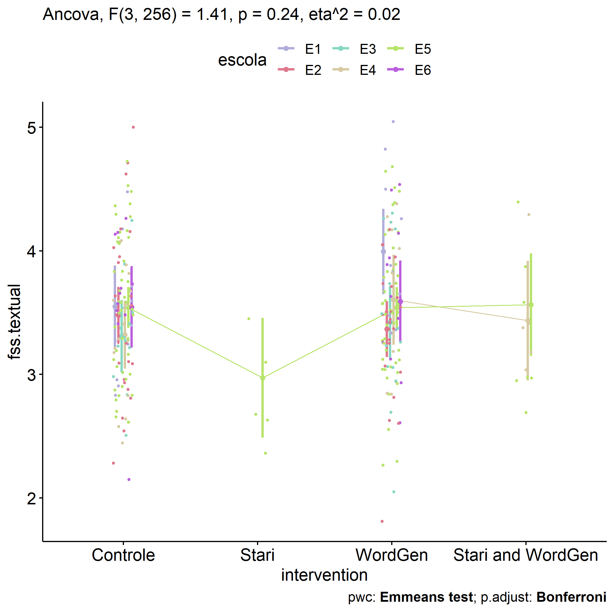<!-- -->

<!-- -->

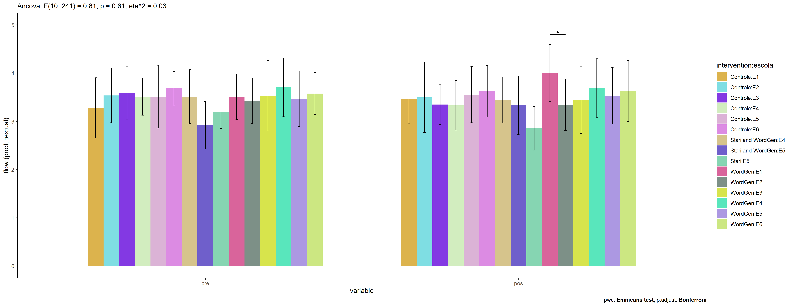<!-- -->

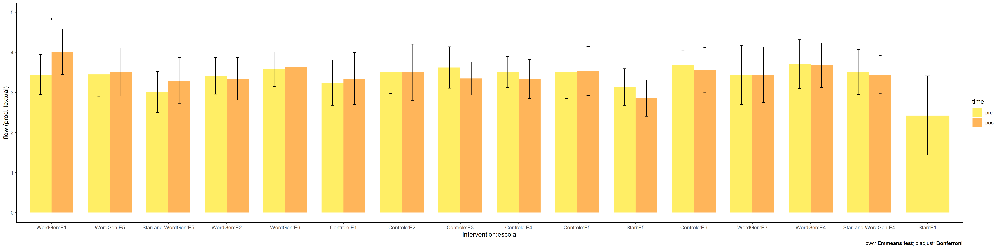<!-- -->

### factores: **intervention:monitor**

| var         | intervention      | monitor |   n | M (pre) | SE (pre) | M (unadj) | SE (unadj) | M (adj) | SE (adj) |
|:------------|:------------------|:--------|----:|--------:|---------:|----------:|-----------:|--------:|---------:|
| fss.textual | Stari and WordGen | CE      |   5 |   3.511 |    0.250 |     3.444 |      0.214 |   3.442 |    0.239 |
| fss.textual | WordGen           | AC      |  11 |   3.636 |    0.117 |     3.505 |      0.125 |   3.448 |    0.162 |
| fss.textual | WordGen           | CE      |   9 |   3.704 |    0.204 |     3.691 |      0.202 |   3.605 |    0.179 |
| fss.textual | WordGen           | EA      |  10 |   3.444 |    0.190 |     3.792 |      0.188 |   3.818 |    0.169 |
| fss.textual | WordGen           | GR      |  14 |   3.405 |    0.163 |     3.429 |      0.106 |   3.472 |    0.143 |
| fss.textual | WordGen           | JC      |   9 |   3.474 |    0.236 |     3.543 |      0.169 |   3.556 |    0.178 |
| fss.textual | WordGen           | MF      |  11 |   3.576 |    0.155 |     3.556 |      0.225 |   3.525 |    0.161 |
| fss.textual | WordGen           | ML      |  14 |   3.531 |    0.195 |     3.440 |      0.184 |   3.429 |    0.143 |
| fss.textual | WordGen           | MM      |  12 |   3.259 |    0.142 |     3.220 |      0.180 |   3.326 |    0.156 |
| fss.textual | WordGen           | PR      |  10 |   3.510 |    0.149 |     4.003 |      0.189 |   4.001 |    0.169 |
| fss.textual | WordGen           | VL      |  11 |   3.577 |    0.130 |     3.626 |      0.190 |   3.595 |    0.161 |

|     | intervention | monitor | group1  | group2            | estimate | conf.low | conf.high |    se | statistic |     p | p.adj | p.adj.signif |
|:----|:-------------|:--------|:--------|:------------------|---------:|---------:|----------:|------:|----------:|------:|------:|:-------------|
| 2   | NA           | CE      | WordGen | Stari and WordGen |    0.164 |   -0.428 |     0.755 | 0.298 |     0.548 | 0.585 | 0.585 | ns           |
| 12  | NA           | CE      | WordGen | Stari and WordGen |    0.193 |   -0.436 |     0.822 | 0.317 |     0.607 | 0.545 | 0.545 | ns           |
| 21  | WordGen      | NA      | AC      | CE                |   -0.157 |   -0.633 |     0.319 | 0.240 |    -0.654 | 0.514 | 1.000 | ns           |
| 22  | WordGen      | NA      | AC      | EA                |   -0.370 |   -0.834 |     0.094 | 0.234 |    -1.579 | 0.117 | 1.000 | ns           |
| 23  | WordGen      | NA      | AC      | GR                |   -0.024 |   -0.453 |     0.405 | 0.216 |    -0.110 | 0.913 | 1.000 | ns           |
| 24  | WordGen      | NA      | AC      | JC                |   -0.108 |   -0.585 |     0.369 | 0.241 |    -0.450 | 0.654 | 1.000 | ns           |
| 25  | WordGen      | NA      | AC      | MF                |   -0.077 |   -0.529 |     0.375 | 0.228 |    -0.337 | 0.737 | 1.000 | ns           |
| 26  | WordGen      | NA      | AC      | ML                |    0.019 |   -0.408 |     0.447 | 0.215 |     0.090 | 0.928 | 1.000 | ns           |
| 27  | WordGen      | NA      | AC      | MM                |    0.122 |   -0.325 |     0.569 | 0.226 |     0.541 | 0.590 | 1.000 | ns           |
| 28  | WordGen      | NA      | AC      | PR                |   -0.553 |   -1.016 |    -0.089 | 0.234 |    -2.364 | 0.020 | 0.896 | ns           |
| 29  | WordGen      | NA      | AC      | VL                |   -0.147 |   -0.599 |     0.305 | 0.228 |    -0.644 | 0.521 | 1.000 | ns           |
| 30  | WordGen      | NA      | CE      | EA                |   -0.212 |   -0.701 |     0.277 | 0.247 |    -0.862 | 0.391 | 1.000 | ns           |
| 31  | WordGen      | NA      | CE      | GR                |    0.133 |   -0.322 |     0.589 | 0.230 |     0.581 | 0.563 | 1.000 | ns           |
| 32  | WordGen      | NA      | CE      | JC                |    0.049 |   -0.452 |     0.550 | 0.253 |     0.194 | 0.847 | 1.000 | ns           |
| 33  | WordGen      | NA      | CE      | MF                |    0.080 |   -0.396 |     0.557 | 0.240 |     0.335 | 0.739 | 1.000 | ns           |
| 34  | WordGen      | NA      | CE      | ML                |    0.177 |   -0.277 |     0.630 | 0.229 |     0.772 | 0.442 | 1.000 | ns           |
| 35  | WordGen      | NA      | CE      | MM                |    0.279 |   -0.195 |     0.753 | 0.239 |     1.168 | 0.246 | 1.000 | ns           |
| 36  | WordGen      | NA      | CE      | PR                |   -0.395 |   -0.883 |     0.093 | 0.246 |    -1.607 | 0.111 | 1.000 | ns           |
| 37  | WordGen      | NA      | CE      | VL                |    0.010 |   -0.466 |     0.487 | 0.240 |     0.043 | 0.966 | 1.000 | ns           |
| 38  | WordGen      | NA      | EA      | GR                |    0.346 |   -0.093 |     0.785 | 0.221 |     1.564 | 0.121 | 1.000 | ns           |
| 39  | WordGen      | NA      | EA      | JC                |    0.261 |   -0.225 |     0.748 | 0.245 |     1.065 | 0.289 | 1.000 | ns           |
| 40  | WordGen      | NA      | EA      | MF                |    0.293 |   -0.171 |     0.756 | 0.234 |     1.253 | 0.213 | 1.000 | ns           |
| 41  | WordGen      | NA      | EA      | ML                |    0.389 |   -0.050 |     0.828 | 0.221 |     1.758 | 0.082 | 1.000 | ns           |
| 42  | WordGen      | NA      | EA      | MM                |    0.492 |    0.037 |     0.946 | 0.229 |     2.144 | 0.034 | 1.000 | ns           |
| 43  | WordGen      | NA      | EA      | PR                |   -0.183 |   -0.657 |     0.291 | 0.239 |    -0.765 | 0.446 | 1.000 | ns           |
| 44  | WordGen      | NA      | EA      | VL                |    0.223 |   -0.241 |     0.686 | 0.234 |     0.953 | 0.343 | 1.000 | ns           |
| 45  | WordGen      | NA      | GR      | JC                |   -0.084 |   -0.537 |     0.368 | 0.228 |    -0.370 | 0.712 | 1.000 | ns           |
| 46  | WordGen      | NA      | GR      | MF                |   -0.053 |   -0.481 |     0.375 | 0.216 |    -0.246 | 0.806 | 1.000 | ns           |
| 47  | WordGen      | NA      | GR      | ML                |    0.043 |   -0.358 |     0.444 | 0.202 |     0.214 | 0.831 | 1.000 | ns           |
| 48  | WordGen      | NA      | GR      | MM                |    0.146 |   -0.272 |     0.563 | 0.211 |     0.692 | 0.490 | 1.000 | ns           |
| 49  | WordGen      | NA      | GR      | PR                |   -0.529 |   -0.968 |    -0.090 | 0.221 |    -2.389 | 0.019 | 0.842 | ns           |
| 50  | WordGen      | NA      | GR      | VL                |   -0.123 |   -0.551 |     0.305 | 0.216 |    -0.570 | 0.570 | 1.000 | ns           |
| 51  | WordGen      | NA      | JC      | MF                |    0.031 |   -0.445 |     0.508 | 0.240 |     0.131 | 0.896 | 1.000 | ns           |
| 52  | WordGen      | NA      | JC      | ML                |    0.128 |   -0.325 |     0.580 | 0.228 |     0.559 | 0.577 | 1.000 | ns           |
| 53  | WordGen      | NA      | JC      | MM                |    0.230 |   -0.239 |     0.699 | 0.236 |     0.974 | 0.332 | 1.000 | ns           |
| 54  | WordGen      | NA      | JC      | PR                |   -0.444 |   -0.931 |     0.042 | 0.245 |    -1.810 | 0.073 | 1.000 | ns           |
| 55  | WordGen      | NA      | JC      | VL                |   -0.039 |   -0.515 |     0.438 | 0.240 |    -0.161 | 0.873 | 1.000 | ns           |
| 56  | WordGen      | NA      | MF      | ML                |    0.096 |   -0.331 |     0.523 | 0.215 |     0.447 | 0.656 | 1.000 | ns           |
| 57  | WordGen      | NA      | MF      | MM                |    0.199 |   -0.247 |     0.645 | 0.225 |     0.884 | 0.379 | 1.000 | ns           |
| 58  | WordGen      | NA      | MF      | PR                |   -0.476 |   -0.939 |    -0.013 | 0.233 |    -2.038 | 0.044 | 1.000 | ns           |
| 59  | WordGen      | NA      | MF      | VL                |   -0.070 |   -0.522 |     0.382 | 0.228 |    -0.308 | 0.759 | 1.000 | ns           |
| 60  | WordGen      | NA      | ML      | MM                |    0.103 |   -0.317 |     0.522 | 0.212 |     0.485 | 0.629 | 1.000 | ns           |
| 61  | WordGen      | NA      | ML      | PR                |   -0.572 |   -1.011 |    -0.133 | 0.221 |    -2.586 | 0.011 | 0.499 | ns           |
| 62  | WordGen      | NA      | ML      | VL                |   -0.166 |   -0.593 |     0.261 | 0.215 |    -0.772 | 0.442 | 1.000 | ns           |
| 63  | WordGen      | NA      | MM      | PR                |   -0.675 |   -1.130 |    -0.219 | 0.230 |    -2.934 | 0.004 | 0.185 | ns           |
| 64  | WordGen      | NA      | MM      | VL                |   -0.269 |   -0.715 |     0.177 | 0.225 |    -1.195 | 0.235 | 1.000 | ns           |
| 65  | WordGen      | NA      | PR      | VL                |    0.406 |   -0.057 |     0.869 | 0.233 |     1.738 | 0.085 | 1.000 | ns           |
| 111 | WordGen      | NA      | AC      | CE                |   -0.067 |   -0.574 |     0.439 | 0.256 |    -0.263 | 0.793 | 1.000 | ns           |
| 112 | WordGen      | NA      | AC      | EA                |    0.192 |   -0.301 |     0.685 | 0.248 |     0.772 | 0.442 | 1.000 | ns           |
| 113 | WordGen      | NA      | AC      | GR                |    0.232 |   -0.223 |     0.686 | 0.229 |     1.011 | 0.314 | 1.000 | ns           |
| 114 | WordGen      | NA      | AC      | JC                |    0.162 |   -0.345 |     0.669 | 0.256 |     0.634 | 0.528 | 1.000 | ns           |
| 115 | WordGen      | NA      | AC      | MF                |    0.061 |   -0.420 |     0.541 | 0.242 |     0.250 | 0.803 | 1.000 | ns           |
| 116 | WordGen      | NA      | AC      | ML                |    0.106 |   -0.349 |     0.560 | 0.229 |     0.461 | 0.646 | 1.000 | ns           |
| 117 | WordGen      | NA      | AC      | MM                |    0.377 |   -0.094 |     0.848 | 0.237 |     1.589 | 0.115 | 1.000 | ns           |
| 118 | WordGen      | NA      | AC      | PR                |    0.127 |   -0.366 |     0.619 | 0.248 |     0.510 | 0.611 | 1.000 | ns           |
| 119 | WordGen      | NA      | AC      | VL                |    0.059 |   -0.422 |     0.540 | 0.242 |     0.244 | 0.808 | 1.000 | ns           |
| 120 | WordGen      | NA      | CE      | EA                |    0.259 |   -0.259 |     0.777 | 0.261 |     0.992 | 0.323 | 1.000 | ns           |
| 121 | WordGen      | NA      | CE      | GR                |    0.299 |   -0.183 |     0.781 | 0.243 |     1.230 | 0.221 | 1.000 | ns           |
| 122 | WordGen      | NA      | CE      | JC                |    0.229 |   -0.302 |     0.761 | 0.268 |     0.855 | 0.394 | 1.000 | ns           |
| 123 | WordGen      | NA      | CE      | MF                |    0.128 |   -0.379 |     0.635 | 0.256 |     0.501 | 0.618 | 1.000 | ns           |
| 124 | WordGen      | NA      | CE      | ML                |    0.173 |   -0.309 |     0.655 | 0.243 |     0.712 | 0.478 | 1.000 | ns           |
| 125 | WordGen      | NA      | CE      | MM                |    0.444 |   -0.053 |     0.942 | 0.251 |     1.772 | 0.079 | 1.000 | ns           |
| 126 | WordGen      | NA      | CE      | PR                |    0.194 |   -0.324 |     0.712 | 0.261 |     0.742 | 0.459 | 1.000 | ns           |
| 127 | WordGen      | NA      | CE      | VL                |    0.127 |   -0.380 |     0.633 | 0.256 |     0.495 | 0.622 | 1.000 | ns           |
| 128 | WordGen      | NA      | EA      | GR                |    0.040 |   -0.427 |     0.507 | 0.235 |     0.169 | 0.866 | 1.000 | ns           |
| 129 | WordGen      | NA      | EA      | JC                |   -0.030 |   -0.548 |     0.488 | 0.261 |    -0.115 | 0.909 | 1.000 | ns           |
| 130 | WordGen      | NA      | EA      | MF                |   -0.131 |   -0.624 |     0.361 | 0.248 |    -0.528 | 0.598 | 1.000 | ns           |
| 131 | WordGen      | NA      | EA      | ML                |   -0.086 |   -0.553 |     0.381 | 0.235 |    -0.367 | 0.715 | 1.000 | ns           |
| 132 | WordGen      | NA      | EA      | MM                |    0.185 |   -0.298 |     0.668 | 0.243 |     0.761 | 0.449 | 1.000 | ns           |
| 133 | WordGen      | NA      | EA      | PR                |   -0.065 |   -0.570 |     0.439 | 0.254 |    -0.257 | 0.798 | 1.000 | ns           |
| 134 | WordGen      | NA      | EA      | VL                |   -0.133 |   -0.625 |     0.360 | 0.248 |    -0.534 | 0.594 | 1.000 | ns           |
| 135 | WordGen      | NA      | GR      | JC                |   -0.070 |   -0.551 |     0.412 | 0.243 |    -0.287 | 0.775 | 1.000 | ns           |
| 136 | WordGen      | NA      | GR      | MF                |   -0.171 |   -0.625 |     0.283 | 0.229 |    -0.746 | 0.457 | 1.000 | ns           |
| 137 | WordGen      | NA      | GR      | ML                |   -0.126 |   -0.552 |     0.300 | 0.215 |    -0.586 | 0.559 | 1.000 | ns           |
| 138 | WordGen      | NA      | GR      | MM                |    0.146 |   -0.298 |     0.589 | 0.224 |     0.650 | 0.517 | 1.000 | ns           |
| 139 | WordGen      | NA      | GR      | PR                |   -0.105 |   -0.572 |     0.362 | 0.235 |    -0.446 | 0.657 | 1.000 | ns           |
| 140 | WordGen      | NA      | GR      | VL                |   -0.172 |   -0.627 |     0.282 | 0.229 |    -0.753 | 0.453 | 1.000 | ns           |
| 141 | WordGen      | NA      | JC      | MF                |   -0.101 |   -0.608 |     0.405 | 0.256 |    -0.396 | 0.693 | 1.000 | ns           |
| 142 | WordGen      | NA      | JC      | ML                |   -0.056 |   -0.538 |     0.425 | 0.243 |    -0.232 | 0.817 | 1.000 | ns           |
| 143 | WordGen      | NA      | JC      | MM                |    0.215 |   -0.282 |     0.712 | 0.251 |     0.858 | 0.393 | 1.000 | ns           |
| 144 | WordGen      | NA      | JC      | PR                |   -0.035 |   -0.553 |     0.483 | 0.261 |    -0.135 | 0.893 | 1.000 | ns           |
| 145 | WordGen      | NA      | JC      | VL                |   -0.103 |   -0.610 |     0.404 | 0.256 |    -0.402 | 0.688 | 1.000 | ns           |
| 146 | WordGen      | NA      | MF      | ML                |    0.045 |   -0.409 |     0.499 | 0.229 |     0.196 | 0.845 | 1.000 | ns           |
| 147 | WordGen      | NA      | MF      | MM                |    0.316 |   -0.154 |     0.787 | 0.237 |     1.333 | 0.185 | 1.000 | ns           |
| 148 | WordGen      | NA      | MF      | PR                |    0.066 |   -0.427 |     0.559 | 0.248 |     0.266 | 0.791 | 1.000 | ns           |
| 149 | WordGen      | NA      | MF      | VL                |   -0.001 |   -0.482 |     0.479 | 0.242 |    -0.006 | 0.995 | 1.000 | ns           |
| 150 | WordGen      | NA      | ML      | MM                |    0.271 |   -0.172 |     0.715 | 0.224 |     1.214 | 0.228 | 1.000 | ns           |
| 151 | WordGen      | NA      | ML      | PR                |    0.021 |   -0.446 |     0.488 | 0.235 |     0.089 | 0.929 | 1.000 | ns           |
| 152 | WordGen      | NA      | ML      | VL                |   -0.046 |   -0.501 |     0.408 | 0.229 |    -0.203 | 0.840 | 1.000 | ns           |
| 153 | WordGen      | NA      | MM      | PR                |   -0.250 |   -0.733 |     0.232 | 0.243 |    -1.029 | 0.306 | 1.000 | ns           |
| 154 | WordGen      | NA      | MM      | VL                |   -0.318 |   -0.789 |     0.153 | 0.237 |    -1.339 | 0.183 | 1.000 | ns           |
| 155 | WordGen      | NA      | PR      | VL                |   -0.067 |   -0.560 |     0.425 | 0.248 |    -0.272 | 0.786 | 1.000 | ns           |

| intervention      | monitor | group1 | group2 | estimate | conf.low | conf.high |    se | statistic |     p | p.adj | p.adj.signif |
|:------------------|:--------|:-------|:-------|---------:|---------:|----------:|------:|----------:|------:|------:|:-------------|
| WordGen           | AC      | pre    | pos    |    0.131 |   -0.357 |     0.620 | 0.248 |     0.530 | 0.597 | 0.597 | ns           |
| WordGen           | CE      | pre    | pos    |    0.027 |   -0.488 |     0.542 | 0.261 |     0.103 | 0.918 | 0.918 | ns           |
| WordGen           | EA      | pre    | pos    |   -0.347 |   -0.859 |     0.165 | 0.260 |    -1.336 | 0.183 | 0.183 | ns           |
| WordGen           | GR      | pre    | pos    |    0.043 |   -0.383 |     0.469 | 0.216 |     0.198 | 0.843 | 0.843 | ns           |
| WordGen           | JC      | pre    | pos    |   -0.054 |   -0.569 |     0.461 | 0.261 |    -0.207 | 0.836 | 0.836 | ns           |
| WordGen           | MF      | pre    | pos    |   -0.071 |   -0.533 |     0.390 | 0.234 |    -0.305 | 0.761 | 0.761 | ns           |
| WordGen           | ML      | pre    | pos    |   -0.006 |   -0.425 |     0.413 | 0.213 |    -0.028 | 0.977 | 0.977 | ns           |
| WordGen           | MM      | pre    | pos    |    0.034 |   -0.417 |     0.485 | 0.229 |     0.149 | 0.882 | 0.882 | ns           |
| WordGen           | PR      | pre    | pos    |   -0.569 |   -1.058 |    -0.081 | 0.248 |    -2.297 | 0.023 | 0.023 | \*           |
| WordGen           | VL      | pre    | pos    |   -0.060 |   -0.521 |     0.402 | 0.234 |    -0.255 | 0.799 | 0.799 | ns           |
| Stari and WordGen | CE      | pre    | pos    |    0.067 |   -0.658 |     0.791 | 0.368 |     0.181 | 0.856 | 0.856 | ns           |

<!-- -->

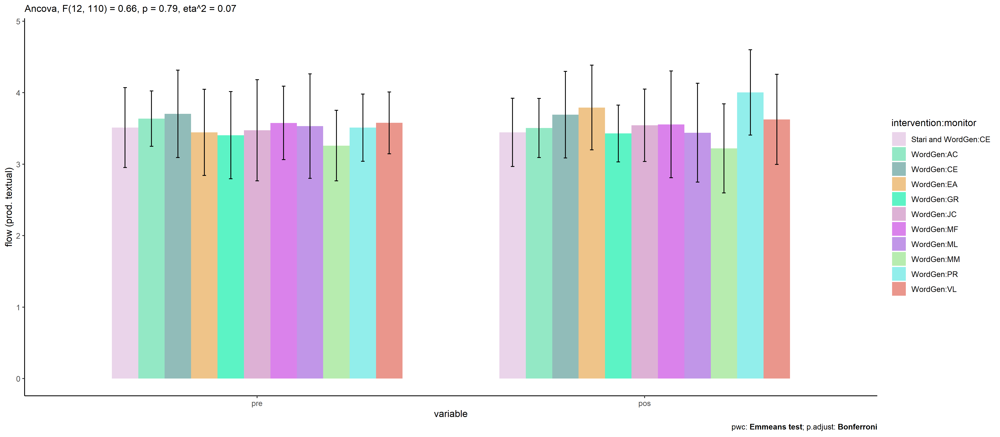<!-- -->

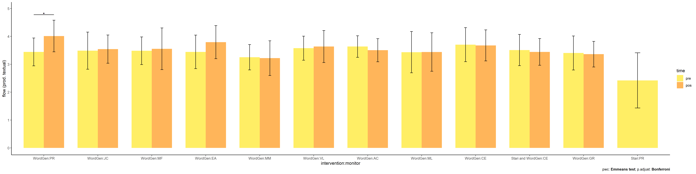<!-- -->

### factores: **intervention:monitor.genero**

| var         | intervention      | monitor.genero |   n | M (pre) | SE (pre) | M (unadj) | SE (unadj) | M (adj) | SE (adj) |
|:------------|:------------------|:---------------|----:|--------:|---------:|----------:|-----------:|--------:|---------:|
| fss.textual | Stari and WordGen | M              |   7 |   3.365 |    0.197 |     3.349 |      0.187 |   3.384 |    0.199 |
| fss.textual | Stari             | M              |   5 |   2.244 |    0.327 |     2.811 |      0.191 |   3.322 |    0.257 |
| fss.textual | WordGen           | F              |  73 |   3.492 |    0.064 |     3.457 |      0.069 |   3.437 |    0.062 |
| fss.textual | WordGen           | M              |  38 |   3.530 |    0.095 |     3.765 |      0.094 |   3.729 |    0.086 |

|     | intervention | monitor.genero | group1  | group2            | estimate | conf.low | conf.high |    se | statistic | p       | p.adj   | p.adj.signif |
|:----|:-------------|:---------------|:--------|:------------------|---------:|---------:|----------:|------:|----------:|:--------|:--------|:-------------|
| 4   | NA           | M              | Stari   | WordGen           |   -0.406 |   -0.947 |     0.135 | 0.273 |    -1.487 | 0.14    | 0.419   | ns           |
| 5   | NA           | M              | Stari   | Stari and WordGen |   -0.061 |   -0.699 |     0.577 | 0.322 |    -0.189 | 0.85    | 1       | ns           |
| 6   | NA           | M              | WordGen | Stari and WordGen |    0.345 |   -0.084 |     0.774 | 0.217 |     1.593 | 0.114   | 0.342   | ns           |
| 10  | NA           | M              | Stari   | WordGen           |   -1.286 |   -1.818 |    -0.753 | 0.269 |    -4.782 | \<0.001 | \<0.001 | \*\*\*\*     |
| 11  | NA           | M              | Stari   | Stari and WordGen |   -1.121 |   -1.776 |    -0.465 | 0.331 |    -3.387 | \<0.001 | 0.003   | \*\*         |
| 12  | NA           | M              | WordGen | Stari and WordGen |    0.165 |   -0.295 |     0.625 | 0.232 |     0.710 | 0.479   | 1       | ns           |
| 14  | WordGen      | NA             | F       | M                 |   -0.291 |   -0.500 |    -0.083 | 0.105 |    -2.769 | 0.007   | 0.007   | \*\*         |
| 17  | WordGen      | NA             | F       | M                 |   -0.038 |   -0.262 |     0.185 | 0.113 |    -0.340 | 0.734   | 0.734   | ns           |

| intervention      | monitor.genero | group1 | group2 | estimate | conf.low | conf.high |    se | statistic |     p | p.adj | p.adj.signif |
|:------------------|:---------------|:-------|:-------|---------:|---------:|----------:|------:|----------:|------:|------:|:-------------|
| Stari             | M              | pre    | pos    |   -0.256 |   -0.912 |     0.401 | 0.333 |    -0.767 | 0.444 | 0.444 | ns           |
| WordGen           | F              | pre    | pos    |    0.002 |   -0.177 |     0.180 | 0.091 |     0.017 | 0.986 | 0.986 | ns           |
| WordGen           | M              | pre    | pos    |   -0.253 |   -0.500 |    -0.005 | 0.126 |    -2.009 | 0.046 | 0.046 | \*           |
| Stari and WordGen | M              | pre    | pos    |    0.016 |   -0.583 |     0.615 | 0.304 |     0.052 | 0.958 | 0.958 | ns           |

<!-- -->

<!-- -->

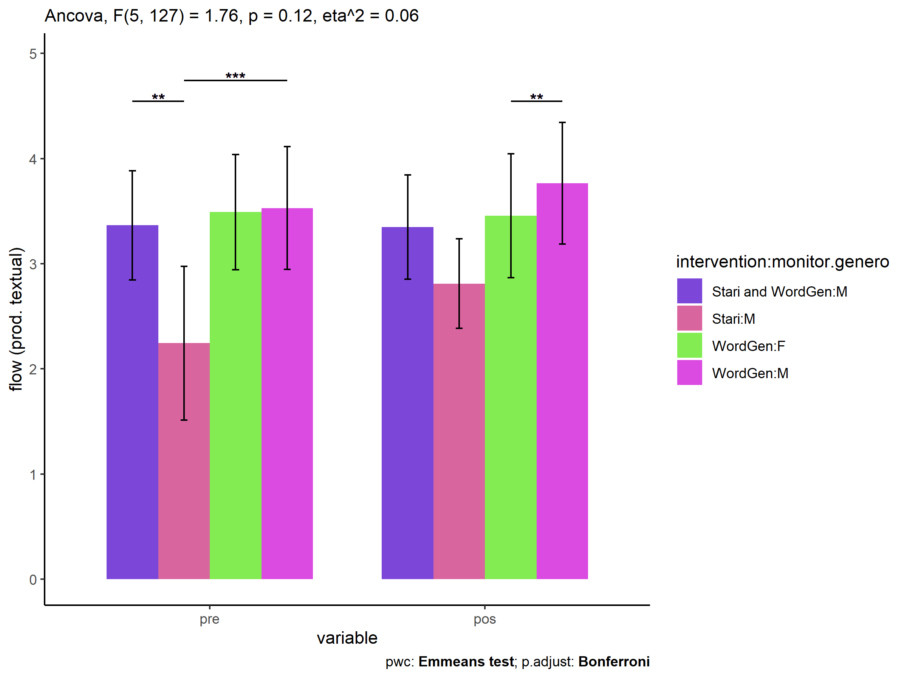<!-- -->

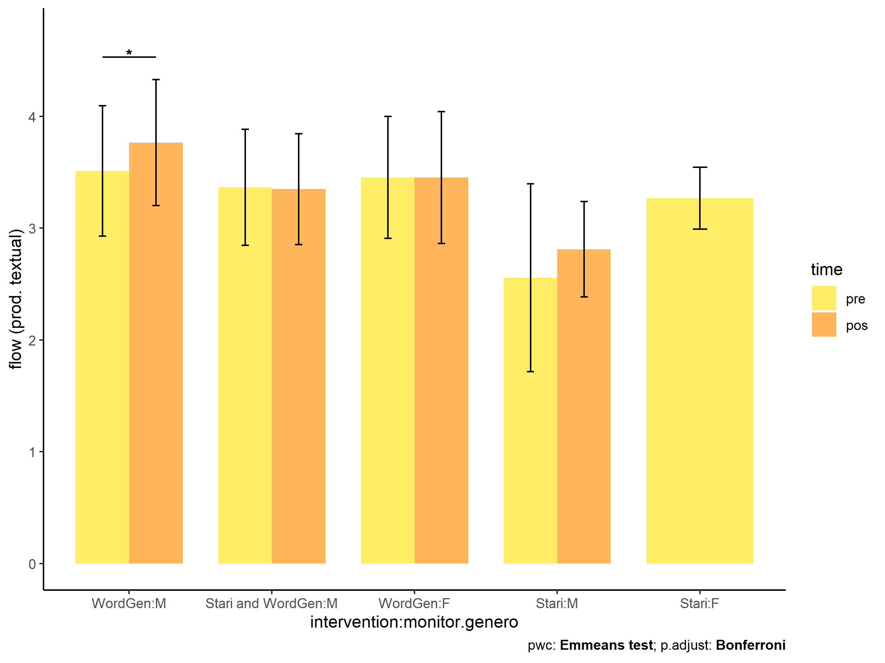<!-- -->

### factores: **intervention:monitor.formacao**

| var         | intervention      | monitor.formacao           |   n | M (pre) | SE (pre) | M (unadj) | SE (unadj) | M (adj) | SE (adj) |
|:------------|:------------------|:---------------------------|----:|--------:|---------:|----------:|-----------:|--------:|---------:|
| fss.textual | Stari and WordGen | Comunicacao Social         |   5 |   3.511 |    0.250 |     3.444 |      0.214 |   3.442 |    0.241 |
| fss.textual | WordGen           | Arquitetura e Urbanismo    |   9 |   3.474 |    0.236 |     3.543 |      0.169 |   3.557 |    0.179 |
| fss.textual | WordGen           | Ciencias Biologicas        |  14 |   3.531 |    0.195 |     3.440 |      0.184 |   3.429 |    0.144 |
| fss.textual | WordGen           | Comunicacao Social         |   9 |   3.704 |    0.204 |     3.691 |      0.202 |   3.605 |    0.180 |
| fss.textual | WordGen           | Historia                   |  10 |   3.510 |    0.149 |     4.003 |      0.189 |   4.001 |    0.170 |
| fss.textual | WordGen           | Letras - Lingua Portuguesa |  11 |   3.576 |    0.155 |     3.556 |      0.225 |   3.525 |    0.162 |
| fss.textual | WordGen           | Matematica                 |  24 |   3.421 |    0.121 |     3.580 |      0.104 |   3.616 |    0.110 |
| fss.textual | WordGen           | Nutricao                   |  12 |   3.259 |    0.142 |     3.220 |      0.180 |   3.327 |    0.157 |
| fss.textual | WordGen           | Pedagogia                  |  11 |   3.636 |    0.117 |     3.505 |      0.125 |   3.448 |    0.163 |
| fss.textual | WordGen           | Servico Social             |  11 |   3.577 |    0.130 |     3.626 |      0.190 |   3.595 |    0.162 |

|     | intervention | monitor.formacao   | group1                  | group2              | estimate | conf.low | conf.high |    se | statistic |     p | p.adj | p.adj.signif |
|:----|:-------------|:-------------------|:------------------------|:--------------------|---------:|---------:|----------:|------:|----------:|------:|------:|:-------------|
| 3   | NA           | Comunicacao Social | WordGen                 | Stari and WordGen   |    0.163 |   -0.433 |     0.759 | 0.301 |     0.543 | 0.588 | 0.588 | ns           |
| 12  | NA           | Comunicacao Social | WordGen                 | Stari and WordGen   |    0.193 |   -0.433 |     0.819 | 0.316 |     0.610 | 0.543 | 0.543 | ns           |
| 19  | WordGen      | NA                 | Arquitetura e Urbanismo | Ciencias Biologicas |    0.128 |   -0.328 |     0.584 | 0.230 |     0.556 | 0.579 | 1.000 | ns           |
| 20  | WordGen      | NA                 | Arquitetura e Urbanismo | Comunicacao Social  |   -0.048 |   -0.553 |     0.456 | 0.254 |    -0.190 | 0.849 | 1.000 | ns           |
| 21  | WordGen      | NA                 | Arquitetura e Urbanismo | Historia            |   -0.444 |   -0.934 |     0.046 | 0.247 |    -1.797 | 0.075 | 1.000 | ns           |
| 22  | WordGen      | NA                 | Arquitetura e Urbanismo | Letras              |    0.032 |   -0.448 |     0.511 | 0.242 |     0.131 | 0.896 | 1.000 | ns           |
| 23  | WordGen      | NA                 | Arquitetura e Urbanismo | Matematica          |   -0.060 |   -0.477 |     0.357 | 0.210 |    -0.284 | 0.777 | 1.000 | ns           |
| 24  | WordGen      | NA                 | Arquitetura e Urbanismo | Nutricao            |    0.230 |   -0.242 |     0.702 | 0.238 |     0.965 | 0.337 | 1.000 | ns           |
| 25  | WordGen      | NA                 | Arquitetura e Urbanismo | Pedagogia           |    0.109 |   -0.372 |     0.589 | 0.242 |     0.448 | 0.655 | 1.000 | ns           |
| 26  | WordGen      | NA                 | Arquitetura e Urbanismo | Servico Social      |   -0.038 |   -0.518 |     0.441 | 0.242 |    -0.158 | 0.874 | 1.000 | ns           |
| 27  | WordGen      | NA                 | Ciencias Biologicas     | Comunicacao Social  |   -0.176 |   -0.633 |     0.281 | 0.230 |    -0.765 | 0.446 | 1.000 | ns           |
| 28  | WordGen      | NA                 | Ciencias Biologicas     | Historia            |   -0.572 |   -1.014 |    -0.130 | 0.223 |    -2.569 | 0.012 | 0.418 | ns           |
| 29  | WordGen      | NA                 | Ciencias Biologicas     | Letras              |   -0.096 |   -0.526 |     0.334 | 0.217 |    -0.443 | 0.659 | 1.000 | ns           |
| 30  | WordGen      | NA                 | Ciencias Biologicas     | Matematica          |   -0.188 |   -0.547 |     0.172 | 0.181 |    -1.035 | 0.303 | 1.000 | ns           |
| 31  | WordGen      | NA                 | Ciencias Biologicas     | Nutricao            |    0.102 |   -0.321 |     0.524 | 0.213 |     0.478 | 0.633 | 1.000 | ns           |
| 32  | WordGen      | NA                 | Ciencias Biologicas     | Pedagogia           |   -0.019 |   -0.449 |     0.411 | 0.217 |    -0.089 | 0.930 | 1.000 | ns           |
| 33  | WordGen      | NA                 | Ciencias Biologicas     | Servico Social      |   -0.166 |   -0.596 |     0.264 | 0.217 |    -0.767 | 0.445 | 1.000 | ns           |
| 34  | WordGen      | NA                 | Comunicacao Social      | Historia            |   -0.396 |   -0.887 |     0.095 | 0.248 |    -1.598 | 0.113 | 1.000 | ns           |
| 35  | WordGen      | NA                 | Comunicacao Social      | Letras              |    0.080 |   -0.400 |     0.560 | 0.242 |     0.331 | 0.741 | 1.000 | ns           |
| 36  | WordGen      | NA                 | Comunicacao Social      | Matematica          |   -0.011 |   -0.431 |     0.409 | 0.212 |    -0.054 | 0.957 | 1.000 | ns           |
| 37  | WordGen      | NA                 | Comunicacao Social      | Nutricao            |    0.278 |   -0.199 |     0.755 | 0.241 |     1.155 | 0.251 | 1.000 | ns           |
| 38  | WordGen      | NA                 | Comunicacao Social      | Pedagogia           |    0.157 |   -0.322 |     0.636 | 0.242 |     0.649 | 0.518 | 1.000 | ns           |
| 39  | WordGen      | NA                 | Comunicacao Social      | Servico Social      |    0.010 |   -0.470 |     0.490 | 0.242 |     0.042 | 0.967 | 1.000 | ns           |
| 40  | WordGen      | NA                 | Historia                | Letras              |    0.476 |    0.010 |     0.942 | 0.235 |     2.025 | 0.045 | 1.000 | ns           |
| 41  | WordGen      | NA                 | Historia                | Matematica          |    0.384 |   -0.017 |     0.786 | 0.203 |     1.898 | 0.060 | 1.000 | ns           |
| 42  | WordGen      | NA                 | Historia                | Nutricao            |    0.674 |    0.215 |     1.133 | 0.231 |     2.912 | 0.004 | 0.158 | ns           |
| 43  | WordGen      | NA                 | Historia                | Pedagogia           |    0.553 |    0.086 |     1.019 | 0.235 |     2.350 | 0.021 | 0.744 | ns           |
| 44  | WordGen      | NA                 | Historia                | Servico Social      |    0.406 |   -0.060 |     0.872 | 0.235 |     1.727 | 0.087 | 1.000 | ns           |
| 45  | WordGen      | NA                 | Letras                  | Lingua Portuguesa   |   -0.092 |   -0.481 |     0.298 | 0.196 |    -0.466 | 0.642 | 1.000 | ns           |
| 46  | WordGen      | NA                 | Letras                  | Lingua Portuguesa   |    0.198 |   -0.251 |     0.647 | 0.226 |     0.874 | 0.384 | 1.000 | ns           |
| 47  | WordGen      | NA                 | Letras                  | Lingua Portuguesa   |    0.077 |   -0.378 |     0.532 | 0.229 |     0.335 | 0.738 | 1.000 | ns           |
| 48  | WordGen      | NA                 | Letras                  | Lingua Portuguesa   |   -0.070 |   -0.525 |     0.385 | 0.229 |    -0.306 | 0.761 | 1.000 | ns           |
| 49  | WordGen      | NA                 | Matematica              | Nutricao            |    0.289 |   -0.089 |     0.668 | 0.191 |     1.518 | 0.132 | 1.000 | ns           |
| 50  | WordGen      | NA                 | Matematica              | Pedagogia           |    0.168 |   -0.222 |     0.559 | 0.197 |     0.855 | 0.394 | 1.000 | ns           |
| 51  | WordGen      | NA                 | Matematica              | Servico Social      |    0.021 |   -0.368 |     0.411 | 0.196 |     0.109 | 0.913 | 1.000 | ns           |
| 52  | WordGen      | NA                 | Nutricao                | Pedagogia           |   -0.121 |   -0.572 |     0.329 | 0.227 |    -0.533 | 0.595 | 1.000 | ns           |
| 53  | WordGen      | NA                 | Nutricao                | Servico Social      |   -0.268 |   -0.717 |     0.181 | 0.226 |    -1.184 | 0.239 | 1.000 | ns           |
| 54  | WordGen      | NA                 | Pedagogia               | Servico Social      |   -0.147 |   -0.602 |     0.308 | 0.229 |    -0.641 | 0.523 | 1.000 | ns           |
| 91  | WordGen      | NA                 | Arquitetura e Urbanismo | Ciencias Biologicas |   -0.056 |   -0.536 |     0.423 | 0.242 |    -0.233 | 0.816 | 1.000 | ns           |
| 92  | WordGen      | NA                 | Arquitetura e Urbanismo | Comunicacao Social  |   -0.229 |   -0.758 |     0.300 | 0.267 |    -0.859 | 0.392 | 1.000 | ns           |
| 93  | WordGen      | NA                 | Arquitetura e Urbanismo | Historia            |   -0.035 |   -0.551 |     0.480 | 0.260 |    -0.136 | 0.892 | 1.000 | ns           |
| 94  | WordGen      | NA                 | Arquitetura e Urbanismo | Letras              |   -0.101 |   -0.606 |     0.403 | 0.254 |    -0.398 | 0.691 | 1.000 | ns           |
| 95  | WordGen      | NA                 | Arquitetura e Urbanismo | Matematica          |    0.053 |   -0.386 |     0.492 | 0.221 |     0.240 | 0.811 | 1.000 | ns           |
| 96  | WordGen      | NA                 | Arquitetura e Urbanismo | Nutricao            |    0.215 |   -0.280 |     0.710 | 0.250 |     0.862 | 0.391 | 1.000 | ns           |
| 97  | WordGen      | NA                 | Arquitetura e Urbanismo | Pedagogia           |   -0.162 |   -0.666 |     0.342 | 0.254 |    -0.636 | 0.526 | 1.000 | ns           |
| 98  | WordGen      | NA                 | Arquitetura e Urbanismo | Servico Social      |   -0.103 |   -0.607 |     0.402 | 0.254 |    -0.404 | 0.687 | 1.000 | ns           |
| 99  | WordGen      | NA                 | Ciencias Biologicas     | Comunicacao Social  |   -0.173 |   -0.652 |     0.307 | 0.242 |    -0.715 | 0.476 | 1.000 | ns           |
| 100 | WordGen      | NA                 | Ciencias Biologicas     | Historia            |    0.021 |   -0.444 |     0.486 | 0.234 |     0.090 | 0.929 | 1.000 | ns           |
| 101 | WordGen      | NA                 | Ciencias Biologicas     | Letras              |   -0.045 |   -0.497 |     0.407 | 0.228 |    -0.197 | 0.844 | 1.000 | ns           |
| 102 | WordGen      | NA                 | Ciencias Biologicas     | Matematica          |    0.109 |   -0.268 |     0.487 | 0.190 |     0.575 | 0.567 | 1.000 | ns           |
| 103 | WordGen      | NA                 | Ciencias Biologicas     | Nutricao            |    0.271 |   -0.170 |     0.713 | 0.223 |     1.219 | 0.225 | 1.000 | ns           |
| 104 | WordGen      | NA                 | Ciencias Biologicas     | Pedagogia           |   -0.106 |   -0.558 |     0.347 | 0.228 |    -0.463 | 0.644 | 1.000 | ns           |
| 105 | WordGen      | NA                 | Ciencias Biologicas     | Servico Social      |   -0.046 |   -0.499 |     0.406 | 0.228 |    -0.204 | 0.839 | 1.000 | ns           |
| 106 | WordGen      | NA                 | Comunicacao Social      | Historia            |    0.194 |   -0.322 |     0.710 | 0.260 |     0.746 | 0.457 | 1.000 | ns           |
| 107 | WordGen      | NA                 | Comunicacao Social      | Letras              |    0.128 |   -0.376 |     0.632 | 0.254 |     0.503 | 0.616 | 1.000 | ns           |
| 108 | WordGen      | NA                 | Comunicacao Social      | Matematica          |    0.282 |   -0.156 |     0.721 | 0.221 |     1.276 | 0.205 | 1.000 | ns           |
| 109 | WordGen      | NA                 | Comunicacao Social      | Nutricao            |    0.444 |   -0.050 |     0.939 | 0.250 |     1.781 | 0.078 | 1.000 | ns           |
| 110 | WordGen      | NA                 | Comunicacao Social      | Pedagogia           |    0.067 |   -0.437 |     0.572 | 0.254 |     0.265 | 0.792 | 1.000 | ns           |
| 111 | WordGen      | NA                 | Comunicacao Social      | Servico Social      |    0.127 |   -0.378 |     0.631 | 0.254 |     0.497 | 0.620 | 1.000 | ns           |
| 112 | WordGen      | NA                 | Historia                | Letras              |   -0.066 |   -0.556 |     0.424 | 0.247 |    -0.267 | 0.790 | 1.000 | ns           |
| 113 | WordGen      | NA                 | Historia                | Matematica          |    0.088 |   -0.334 |     0.511 | 0.213 |     0.415 | 0.679 | 1.000 | ns           |
| 114 | WordGen      | NA                 | Historia                | Nutricao            |    0.250 |   -0.230 |     0.731 | 0.242 |     1.033 | 0.304 | 1.000 | ns           |
| 115 | WordGen      | NA                 | Historia                | Pedagogia           |   -0.127 |   -0.617 |     0.364 | 0.247 |    -0.512 | 0.610 | 1.000 | ns           |
| 116 | WordGen      | NA                 | Historia                | Servico Social      |   -0.067 |   -0.558 |     0.423 | 0.247 |    -0.273 | 0.786 | 1.000 | ns           |
| 117 | WordGen      | NA                 | Letras                  | Lingua Portuguesa   |    0.154 |   -0.254 |     0.563 | 0.206 |     0.749 | 0.455 | 1.000 | ns           |
| 118 | WordGen      | NA                 | Letras                  | Lingua Portuguesa   |    0.316 |   -0.152 |     0.785 | 0.236 |     1.339 | 0.183 | 1.000 | ns           |
| 119 | WordGen      | NA                 | Letras                  | Lingua Portuguesa   |   -0.061 |   -0.539 |     0.418 | 0.241 |    -0.251 | 0.802 | 1.000 | ns           |
| 120 | WordGen      | NA                 | Letras                  | Lingua Portuguesa   |   -0.001 |   -0.480 |     0.477 | 0.241 |    -0.006 | 0.995 | 1.000 | ns           |
| 121 | WordGen      | NA                 | Matematica              | Nutricao            |    0.162 |   -0.235 |     0.559 | 0.200 |     0.810 | 0.420 | 1.000 | ns           |
| 122 | WordGen      | NA                 | Matematica              | Pedagogia           |   -0.215 |   -0.624 |     0.194 | 0.206 |    -1.043 | 0.299 | 1.000 | ns           |
| 123 | WordGen      | NA                 | Matematica              | Servico Social      |   -0.156 |   -0.565 |     0.253 | 0.206 |    -0.756 | 0.451 | 1.000 | ns           |
| 124 | WordGen      | NA                 | Nutricao                | Pedagogia           |   -0.377 |   -0.846 |     0.091 | 0.236 |    -1.596 | 0.113 | 1.000 | ns           |
| 125 | WordGen      | NA                 | Nutricao                | Servico Social      |   -0.318 |   -0.786 |     0.151 | 0.236 |    -1.346 | 0.181 | 1.000 | ns           |
| 126 | WordGen      | NA                 | Pedagogia               | Servico Social      |    0.059 |   -0.419 |     0.538 | 0.241 |     0.245 | 0.807 | 1.000 | ns           |

| intervention      | monitor.formacao           | group1 | group2 | estimate | conf.low | conf.high |    se | statistic |     p | p.adj | p.adj.signif |
|:------------------|:---------------------------|:-------|:-------|---------:|---------:|----------:|------:|----------:|------:|------:|:-------------|
| WordGen           | Arquitetura e Urbanismo    | pre    | pos    |   -0.054 |   -0.570 |     0.462 | 0.262 |    -0.206 | 0.837 | 0.837 | ns           |
| WordGen           | Ciencias Biologicas        | pre    | pos    |   -0.006 |   -0.426 |     0.414 | 0.213 |    -0.028 | 0.977 | 0.977 | ns           |
| WordGen           | Comunicacao Social         | pre    | pos    |    0.027 |   -0.489 |     0.543 | 0.262 |     0.103 | 0.918 | 0.918 | ns           |
| WordGen           | Historia                   | pre    | pos    |   -0.569 |   -1.059 |    -0.080 | 0.249 |    -2.291 | 0.023 | 0.023 | \*           |
| WordGen           | Letras - Lingua Portuguesa | pre    | pos    |   -0.071 |   -0.534 |     0.391 | 0.235 |    -0.304 | 0.761 | 0.761 | ns           |
| WordGen           | Matematica                 | pre    | pos    |   -0.113 |   -0.441 |     0.216 | 0.167 |    -0.675 | 0.500 | 0.500 | ns           |
| WordGen           | Nutricao                   | pre    | pos    |    0.034 |   -0.418 |     0.486 | 0.229 |     0.149 | 0.882 | 0.882 | ns           |
| WordGen           | Pedagogia                  | pre    | pos    |    0.131 |   -0.358 |     0.621 | 0.249 |     0.528 | 0.598 | 0.598 | ns           |
| WordGen           | Servico Social             | pre    | pos    |   -0.060 |   -0.522 |     0.403 | 0.235 |    -0.254 | 0.800 | 0.800 | ns           |
| Stari and WordGen | Comunicacao Social         | pre    | pos    |    0.067 |   -0.660 |     0.793 | 0.369 |     0.181 | 0.857 | 0.857 | ns           |

<!-- -->

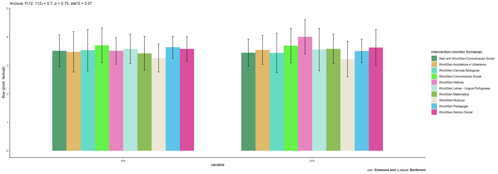<!-- -->

<!-- -->

### factores: **intervention:monitor.titulacao**

| var         | intervention      | monitor.titulacao |   n | M (pre) | SE (pre) | M (unadj) | SE (unadj) | M (adj) | SE (adj) |
|:------------|:------------------|:------------------|----:|--------:|---------:|----------:|-----------:|--------:|---------:|
| fss.textual | Stari and WordGen | ensino medio      |   5 |   2.956 |    0.215 |     3.333 |      0.230 |   3.529 |    0.245 |
| fss.textual | Stari and WordGen | especializacao    |   5 |   3.511 |    0.250 |     3.444 |      0.214 |   3.416 |    0.242 |
| fss.textual | Stari             | ensino medio      |   6 |   2.613 |    0.397 |     2.889 |      0.111 |   3.223 |    0.231 |
| fss.textual | WordGen           | ensino medio      |  81 |   3.472 |    0.063 |     3.527 |      0.069 |   3.515 |    0.060 |
| fss.textual | WordGen           | especializacao    |   9 |   3.704 |    0.204 |     3.691 |      0.202 |   3.586 |    0.181 |
| fss.textual | WordGen           | graduacao         |  21 |   3.545 |    0.109 |     3.642 |      0.112 |   3.600 |    0.118 |

|     | intervention      | monitor.titulacao | group1         | group2            | estimate | conf.low | conf.high |    se | statistic | p       | p.adj | p.adj.signif |
|:----|:------------------|:------------------|:---------------|:------------------|---------:|---------:|----------:|------:|----------:|:--------|------:|:-------------|
| 1   | NA                | ensino medio      | Stari          | WordGen           |   -0.292 |   -0.767 |     0.183 | 0.240 |    -1.217 | 0.226   | 0.677 | ns           |
| 2   | NA                | ensino medio      | Stari          | Stari and WordGen |   -0.306 |   -0.957 |     0.344 | 0.328 |    -0.933 | 0.353   | 1.000 | ns           |
| 3   | NA                | ensino medio      | WordGen        | Stari and WordGen |   -0.014 |   -0.515 |     0.486 | 0.253 |    -0.057 | 0.955   | 1.000 | ns           |
| 6   | NA                | especializacao    | WordGen        | Stari and WordGen |    0.169 |   -0.428 |     0.767 | 0.302 |     0.561 | 0.576   | 0.576 | ns           |
| 10  | NA                | ensino medio      | Stari          | WordGen           |   -0.859 |   -1.345 |    -0.373 | 0.245 |    -3.500 | \<0.001 | 0.002 | \*\*         |
| 11  | NA                | ensino medio      | Stari          | Stari and WordGen |   -0.342 |   -1.037 |     0.353 | 0.351 |    -0.974 | 0.332   | 0.996 | ns           |
| 12  | NA                | ensino medio      | WordGen        | Stari and WordGen |    0.517 |   -0.012 |     1.046 | 0.267 |     1.933 | 0.056   | 0.167 | ns           |
| 15  | NA                | especializacao    | WordGen        | Stari and WordGen |    0.193 |   -0.448 |     0.833 | 0.324 |     0.595 | 0.553   | 0.553 | ns           |
| 22  | WordGen           | NA                | ensino medio   | especializacao    |   -0.071 |   -0.449 |     0.307 | 0.191 |    -0.370 | 0.712   | 1.000 | ns           |
| 23  | WordGen           | NA                | ensino medio   | graduacao         |   -0.085 |   -0.347 |     0.177 | 0.132 |    -0.641 | 0.523   | 1.000 | ns           |
| 24  | WordGen           | NA                | especializacao | graduacao         |   -0.014 |   -0.441 |     0.413 | 0.216 |    -0.066 | 0.948   | 1.000 | ns           |
| 25  | Stari and WordGen | NA                | ensino medio   | especializacao    |    0.113 |   -0.570 |     0.796 | 0.345 |     0.327 | 0.744   | 0.744 | ns           |
| 31  | WordGen           | NA                | ensino medio   | especializacao    |   -0.231 |   -0.635 |     0.172 | 0.204 |    -1.135 | 0.258   | 0.775 | ns           |
| 32  | WordGen           | NA                | ensino medio   | graduacao         |   -0.073 |   -0.354 |     0.209 | 0.142 |    -0.512 | 0.61    | 1.000 | ns           |
| 33  | WordGen           | NA                | especializacao | graduacao         |    0.159 |   -0.299 |     0.616 | 0.231 |     0.687 | 0.493   | 1.000 | ns           |
| 34  | Stari and WordGen | NA                | ensino medio   | especializacao    |   -0.556 |   -1.282 |     0.171 | 0.367 |    -1.514 | 0.133   | 0.133 | ns           |

| intervention      | monitor.titulacao | group1 | group2 | estimate | conf.low | conf.high |    se | statistic |     p | p.adj | p.adj.signif |
|:------------------|:------------------|:-------|:-------|---------:|---------:|----------:|------:|----------:|------:|------:|:-------------|
| Stari             | ensino medio      | pre    | pos    |   -0.043 |   -0.632 |     0.546 | 0.299 |    -0.144 | 0.886 | 0.886 | ns           |
| WordGen           | ensino medio      | pre    | pos    |   -0.092 |   -0.264 |     0.080 | 0.087 |    -1.055 | 0.292 | 0.292 | ns           |
| WordGen           | especializacao    | pre    | pos    |    0.027 |   -0.486 |     0.540 | 0.260 |     0.103 | 0.918 | 0.918 | ns           |
| WordGen           | graduacao         | pre    | pos    |   -0.097 |   -0.449 |     0.256 | 0.179 |    -0.540 | 0.590 | 0.590 | ns           |
| Stari and WordGen | ensino medio      | pre    | pos    |   -0.378 |   -1.100 |     0.344 | 0.367 |    -1.031 | 0.304 | 0.304 | ns           |
| Stari and WordGen | especializacao    | pre    | pos    |    0.067 |   -0.655 |     0.788 | 0.367 |     0.182 | 0.856 | 0.856 | ns           |

<!-- -->

<!-- -->

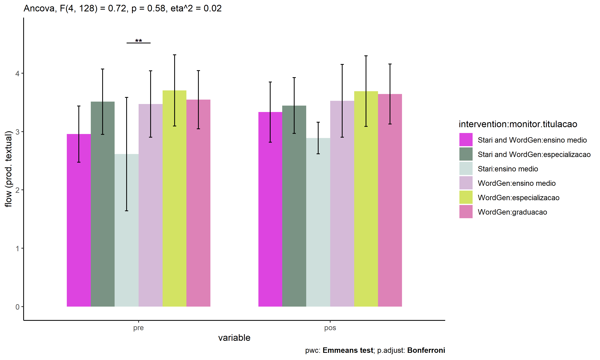<!-- -->

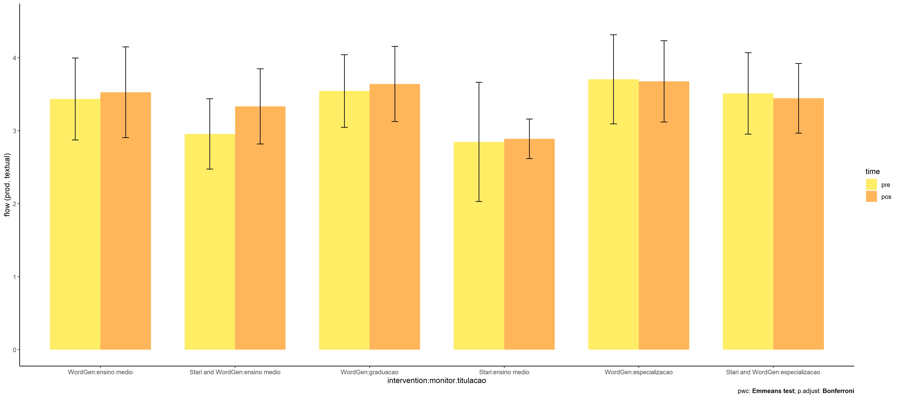<!-- -->

### factores: **intervention:monitor.experiencia**

| var         | intervention      | monitor.experiencia |   n | M (pre) | SE (pre) | M (unadj) | SE (unadj) | M (adj) | SE (adj) |
|:------------|:------------------|:--------------------|----:|--------:|---------:|----------:|-----------:|--------:|---------:|
| fss.textual | Stari and WordGen | até 01 ano          |  11 |   3.212 |    0.165 |     3.404 |      0.136 |   3.512 |    0.163 |
| fss.textual | Stari             | até 01 ano          |   5 |   3.203 |    0.154 |     2.989 |      0.215 |   3.101 |    0.241 |
| fss.textual | WordGen           | \> 01 ano           |  21 |   3.576 |    0.092 |     3.742 |      0.122 |   3.696 |    0.117 |
| fss.textual | WordGen           | até 01 ano          |  90 |   3.488 |    0.062 |     3.520 |      0.064 |   3.512 |    0.057 |

|     | intervention | monitor.experiencia | group1    | group2            | estimate | conf.low | conf.high |    se | statistic |     p | p.adj | p.adj.signif |
|:----|:-------------|:--------------------|:----------|:------------------|---------:|---------:|----------:|------:|----------:|------:|------:|:-------------|
| 4   | NA           | até 01 ano          | Stari     | WordGen           |   -0.411 |   -0.901 |     0.079 | 0.248 |    -1.659 | 0.100 | 0.299 | ns           |
| 5   | NA           | até 01 ano          | Stari     | Stari and WordGen |   -0.411 |   -0.984 |     0.162 | 0.289 |    -1.421 | 0.158 | 0.473 | ns           |
| 6   | NA           | até 01 ano          | WordGen   | Stari and WordGen |    0.000 |   -0.343 |     0.342 | 0.173 |    -0.002 | 0.999 | 1.000 | ns           |
| 10  | NA           | até 01 ano          | Stari     | WordGen           |   -0.285 |   -0.788 |     0.218 | 0.254 |    -1.123 | 0.264 | 0.791 | ns           |
| 11  | NA           | até 01 ano          | Stari     | Stari and WordGen |   -0.009 |   -0.600 |     0.581 | 0.298 |    -0.031 | 0.975 | 1.000 | ns           |
| 12  | NA           | até 01 ano          | WordGen   | Stari and WordGen |    0.276 |   -0.074 |     0.626 | 0.177 |     1.563 | 0.121 | 0.362 | ns           |
| 14  | WordGen      | NA                  | \> 01 ano | até 01 ano        |    0.185 |   -0.073 |     0.442 | 0.130 |     1.418 | 0.159 | 0.159 | ns           |
| 17  | WordGen      | NA                  | \> 01 ano | até 01 ano        |    0.088 |   -0.177 |     0.353 | 0.134 |     0.655 | 0.513 | 0.513 | ns           |

| intervention      | monitor.experiencia | group1 | group2 | estimate | conf.low | conf.high |    se | statistic |     p | p.adj | p.adj.signif |
|:------------------|:--------------------|:-------|:-------|---------:|---------:|----------:|------:|----------:|------:|------:|:-------------|
| Stari             | até 01 ano          | pre    | pos    |    0.172 |   -0.488 |     0.832 | 0.335 |     0.513 | 0.609 | 0.609 | ns           |
| WordGen           | \> 01 ano           | pre    | pos    |   -0.219 |   -0.559 |     0.121 | 0.173 |    -1.269 | 0.205 | 0.205 | ns           |
| WordGen           | até 01 ano          | pre    | pos    |   -0.057 |   -0.218 |     0.105 | 0.082 |    -0.690 | 0.491 | 0.491 | ns           |
| Stari and WordGen | até 01 ano          | pre    | pos    |   -0.192 |   -0.672 |     0.289 | 0.244 |    -0.786 | 0.432 | 0.432 | ns           |

<!-- -->

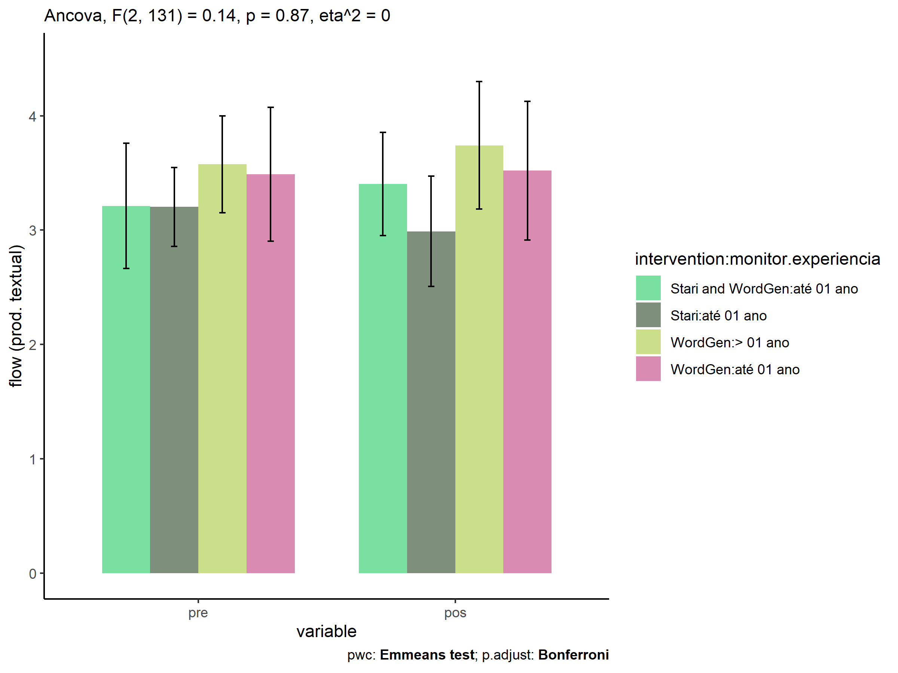<!-- -->

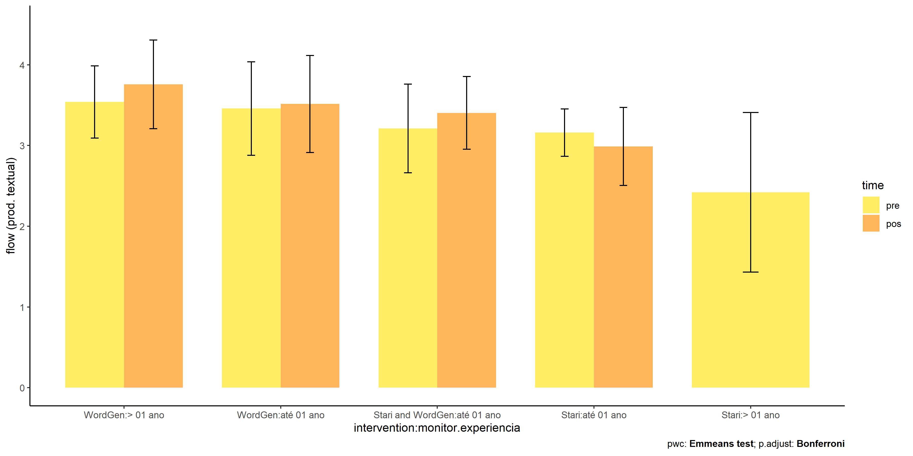<!-- -->
