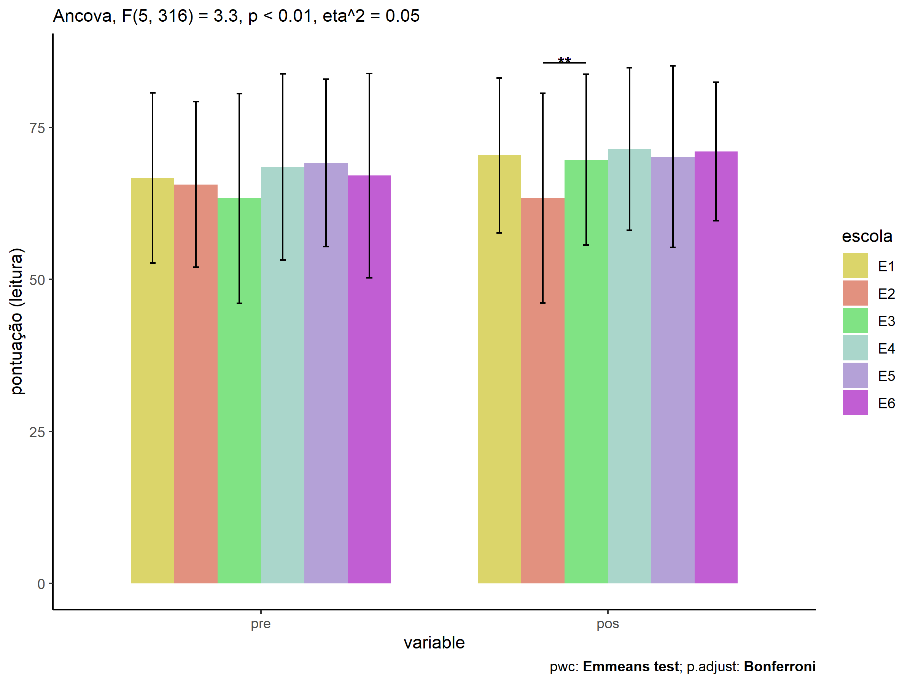
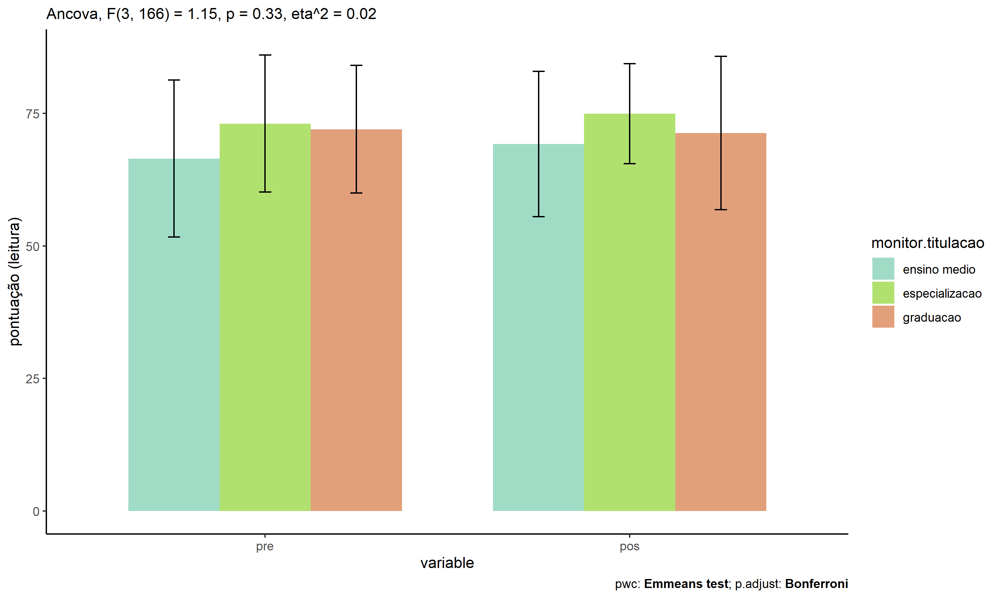
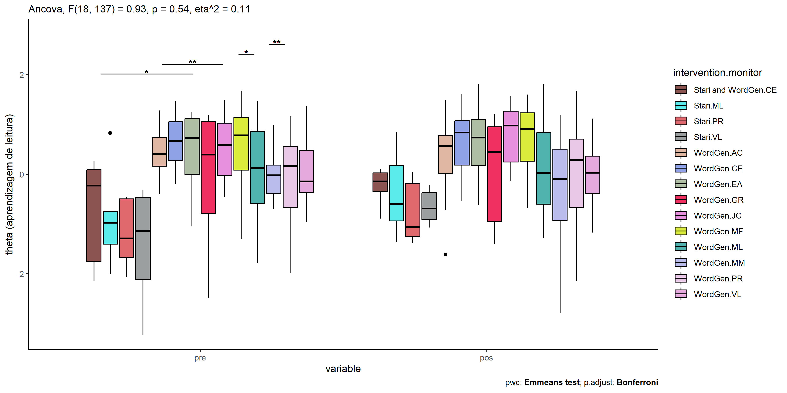

ANCOVA test for reading (competência de leitura de palavras e
pseudopalavras)
================
Geiser C. Challco <geiser@alumni.usp.br>

- [Descriptive Statistics of Initial
  Data](#descriptive-statistics-of-initial-data)
  - [Baseado nos acertos (score) da
    prova](#baseado-nos-acertos-score-da-prova)
  - [Baseado nas estimativas da aprendizagem (theta - traço latente)
    mediante TRI aplicado as respostas da
    prova](#baseado-nas-estimativas-da-aprendizagem-theta---traço-latente-mediante-tri-aplicado-as-respostas-da-prova)
- [Checking of Assumptions](#checking-of-assumptions)
  - [Identify and dealing with outliers (performing treatment of
    outliers)](#identify-and-dealing-with-outliers-performing-treatment-of-outliers)
  - [Assumption: Normality distribution of
    data](#assumption-normality-distribution-of-data)
    - [Para fatores de: **intervention**](#para-fatores-de-intervention)
    - [Para fatores de: **genero**](#para-fatores-de-genero)
    - [Para fatores de: **idade**](#para-fatores-de-idade)
    - [Para fatores de: **zona.escola**](#para-fatores-de-zonaescola)
    - [Para fatores de:
      **zona.participante**](#para-fatores-de-zonaparticipante)
    - [Para fatores de: **escola**](#para-fatores-de-escola)
    - [Para fatores de: **monitor**](#para-fatores-de-monitor)
  - [Assumption: Homogeneity of data
    distribution](#assumption-homogeneity-of-data-distribution)
    - [Para fatores de:
      **intervention:genero**](#para-fatores-de-interventiongenero)
    - [Para fatores de:
      **intervention:idade**](#para-fatores-de-interventionidade)
    - [Para fatores de:
      **intervention:zona.escola**](#para-fatores-de-interventionzonaescola)
    - [Para fatores de:
      **intervention:zona.participante**](#para-fatores-de-interventionzonaparticipante)
    - [Para fatores de:
      **intervention:escola**](#para-fatores-de-interventionescola)
    - [Para fatores de:
      **intervention:monitor**](#para-fatores-de-interventionmonitor)
- [Computation of ANCOVA test and Pairwise
  Comparison](#computation-of-ancova-test-and-pairwise-comparison)
  - [ANCOVA test](#ancova-test)
    - [ANCOVA test usando acertos (pontuação - score) da
      prova](#ancova-test-usando-acertos-pontuação---score-da-prova)
    - [ANCOVA test usando as estimativas da aprendizagem (theta - traço
      latente) mediante TRI aplicado as respostas da
      prova](#ancova-test-usando-as-estimativas-da-aprendizagem-theta---traço-latente-mediante-tri-aplicado-as-respostas-da-prova)
  - [Pairwise comparisons for one
    factor](#pairwise-comparisons-for-one-factor)
    - [factor: **intervention**](#factor-intervention)
    - [factor: **genero**](#factor-genero)
    - [factor: **idade**](#factor-idade)
    - [factor: **zona.escola**](#factor-zonaescola)
    - [factor: **zona.participante**](#factor-zonaparticipante)
    - [factor: **escola**](#factor-escola)
    - [factor: **monitor**](#factor-monitor)
    - [factor: **monitor.genero**](#factor-monitorgenero)
    - [factor: **monitor.formacao**](#factor-monitorformacao)
    - [factor: **monitor.titulacao**](#factor-monitortitulacao)
    - [factor: **monitor.experiencia**](#factor-monitorexperiencia)
  - [Pairwise comparisons for two
    factor](#pairwise-comparisons-for-two-factor)
    - [factores: **intervention:genero**](#factores-interventiongenero)
    - [factores: **intervention:idade**](#factores-interventionidade)
    - [factores:
      **intervention:zona.escola**](#factores-interventionzonaescola)
    - [factores:
      **intervention:zona.participante**](#factores-interventionzonaparticipante)
    - [factores: **intervention:escola**](#factores-interventionescola)
    - [factores:
      **intervention:monitor**](#factores-interventionmonitor)
    - [factores:
      **intervention:monitor.genero**](#factores-interventionmonitorgenero)
    - [factores:
      **intervention:monitor.formacao**](#factores-interventionmonitorformacao)
    - [factores:
      **intervention:monitor.titulacao**](#factores-interventionmonitortitulacao)
    - [factores:
      **intervention:monitor.experiencia**](#factores-interventionmonitorexperiencia)

Teste ANCOVA para determinar se houve diferenças significativas em
referência ao desenvolvimento de competências da leitura de palavras e
pseudopalavras (medido usando pre- e pos-testes).

ANCOVA test to determine whether there were significant differences in
reference to the development of word and pseudowords reading skills
(measured using pre- and post-tests).

# Descriptive Statistics of Initial Data

## Baseado nos acertos (score) da prova

| intervention      | genero | variable          |   n |   mean | median | min | max |     sd |    se |      ci |  iqr |
|:------------------|:-------|:------------------|----:|-------:|-------:|----:|----:|-------:|------:|--------:|-----:|
| Controle          | F      | pos_score.leitura |  79 | 72.253 |     75 |  23 |  96 | 14.847 | 1.670 |   3.326 | 21.5 |
| Controle          | M      | pos_score.leitura |  73 | 66.233 |     68 |  13 |  92 | 15.687 | 1.836 |   3.660 | 23.0 |
| Stari             | F      | pos_score.leitura |  17 | 65.235 |     66 |  47 |  85 | 10.121 | 2.455 |   5.204 | 10.0 |
| Stari             | M      | pos_score.leitura |  21 | 59.143 |     56 |  32 |  82 | 11.650 | 2.542 |   5.303 | 13.0 |
| WordGen           | F      | pos_score.leitura |  53 | 75.547 |     80 |  16 |  93 | 14.815 | 2.035 |   4.084 | 15.0 |
| WordGen           | M      | pos_score.leitura |  65 | 70.015 |     69 |  42 |  94 | 12.542 | 1.556 |   3.108 | 19.0 |
| Stari and WordGen | F      | pos_score.leitura |   2 | 58.000 |     58 |  56 |  60 |  2.828 | 2.000 |  25.412 |  2.0 |
| Stari and WordGen | M      | pos_score.leitura |  13 | 58.308 |     61 |  33 |  75 | 13.117 | 3.638 |   7.927 | 13.0 |
| Controle          | F      | pre_score.leitura |  79 | 69.734 |     71 |  13 |  96 | 15.483 | 1.742 |   3.468 | 18.0 |
| Controle          | M      | pre_score.leitura |  73 | 65.658 |     67 |  11 |  94 | 14.023 | 1.641 |   3.272 | 15.0 |
| Stari             | F      | pre_score.leitura |  17 | 58.941 |     61 |  42 |  72 |  9.162 | 2.222 |   4.710 | 10.0 |
| Stari             | M      | pre_score.leitura |  21 | 52.048 |     54 |  28 |  75 |  9.831 | 2.145 |   4.475 | 10.0 |
| WordGen           | F      | pre_score.leitura |  53 | 75.736 |     78 |  38 |  91 | 12.185 | 1.674 |   3.359 | 16.0 |
| WordGen           | M      | pre_score.leitura |  65 | 68.908 |     69 |  35 |  92 | 13.121 | 1.627 |   3.251 | 17.0 |
| Stari and WordGen | F      | pre_score.leitura |   2 | 48.000 |     48 |  40 |  56 | 11.314 | 8.000 | 101.650 |  8.0 |
| Stari and WordGen | M      | pre_score.leitura |  13 | 57.692 |     59 |  24 |  75 | 14.097 | 3.910 |   8.519 | 15.0 |

| intervention      | escola | variable          |   n |   mean | median | min | max |     sd |    se |      ci |   iqr |
|:------------------|:-------|:------------------|----:|-------:|-------:|----:|----:|-------:|------:|--------:|------:|
| Controle          | E1     | pos_score.leitura |  12 | 75.250 |   77.0 |  57 |  93 | 10.830 | 3.126 |   6.881 | 11.75 |
| Controle          | E2     | pos_score.leitura |  29 | 61.310 |   62.0 |  13 |  92 | 18.813 | 3.494 |   7.156 | 27.00 |
| Controle          | E3     | pos_score.leitura |  19 | 71.105 |   76.0 |  46 |  96 | 14.689 | 3.370 |   7.080 | 22.00 |
| Controle          | E4     | pos_score.leitura |  20 | 68.700 |   73.5 |  23 |  87 | 15.482 | 3.462 |   7.246 | 20.00 |
| Controle          | E5     | pos_score.leitura |  60 | 70.367 |   70.5 |  38 |  96 | 14.164 | 1.829 |   3.659 | 22.50 |
| Controle          | E6     | pos_score.leitura |  12 | 76.250 |   80.0 |  54 |  94 | 12.864 | 3.713 |   8.173 | 23.00 |
| Stari             | E1     | pos_score.leitura |   5 | 57.000 |   57.0 |  47 |  70 |  9.138 | 4.087 |  11.346 | 11.00 |
| Stari             | E2     | pos_score.leitura |   9 | 62.667 |   63.0 |  53 |  72 |  6.727 | 2.242 |   5.171 | 11.00 |
| Stari             | E3     | pos_score.leitura |   5 | 66.000 |   62.0 |  49 |  85 | 13.838 | 6.189 |  17.183 | 14.00 |
| Stari             | E4     | pos_score.leitura |   1 | 69.000 |   69.0 |  69 |  69 |     NA |    NA |     NaN |  0.00 |
| Stari             | E5     | pos_score.leitura |  13 | 62.615 |   66.0 |  32 |  82 | 15.119 | 4.193 |   9.136 | 21.00 |
| Stari             | E6     | pos_score.leitura |   5 | 57.800 |   57.0 |  52 |  65 |  6.058 | 2.709 |   7.522 | 11.00 |
| WordGen           | E1     | pos_score.leitura |  11 | 71.182 |   74.0 |  51 |  91 | 12.448 | 3.753 |   8.363 | 17.00 |
| WordGen           | E2     | pos_score.leitura |  21 | 66.524 |   73.0 |  16 |  88 | 18.662 | 4.072 |   8.495 | 21.00 |
| WordGen           | E3     | pos_score.leitura |  16 | 69.188 |   68.0 |  49 |  93 | 14.039 | 3.510 |   7.481 | 23.25 |
| WordGen           | E4     | pos_score.leitura |  10 | 79.500 |   81.0 |  68 |  91 |  8.985 | 2.841 |   6.427 | 16.50 |
| WordGen           | E5     | pos_score.leitura |  47 | 75.213 |   80.0 |  47 |  94 | 12.985 | 1.894 |   3.812 | 24.00 |
| WordGen           | E6     | pos_score.leitura |  13 | 72.154 |   70.0 |  60 |  87 |  7.290 | 2.022 |   4.405 | 10.00 |
| Stari and WordGen | E2     | pos_score.leitura |   1 | 63.000 |   63.0 |  63 |  63 |     NA |    NA |     NaN |  0.00 |
| Stari and WordGen | E4     | pos_score.leitura |   5 | 67.000 |   67.0 |  61 |  70 |  3.674 | 1.643 |   4.562 |  3.00 |
| Stari and WordGen | E5     | pos_score.leitura |   7 | 49.143 |   54.0 |  33 |  60 | 11.187 | 4.228 |  10.346 | 16.50 |
| Stari and WordGen | E6     | pos_score.leitura |   2 | 66.000 |   66.0 |  57 |  75 | 12.728 | 9.000 | 114.356 |  9.00 |
| Controle          | E1     | pre_score.leitura |  12 | 71.583 |   71.5 |  52 |  92 | 10.698 | 3.088 |   6.797 | 12.50 |
| Controle          | E2     | pre_score.leitura |  29 | 64.586 |   67.0 |  30 |  88 | 15.070 | 2.798 |   5.732 | 15.00 |
| Controle          | E3     | pre_score.leitura |  19 | 63.263 |   67.0 |  35 |  96 | 17.770 | 4.077 |   8.565 | 27.00 |
| Controle          | E4     | pre_score.leitura |  20 | 64.850 |   66.0 |  13 |  84 | 16.359 | 3.658 |   7.656 | 14.25 |
| Controle          | E5     | pre_score.leitura |  60 | 70.450 |   69.5 |  48 |  95 | 11.732 | 1.515 |   3.031 | 15.25 |
| Controle          | E6     | pre_score.leitura |  12 | 70.333 |   79.0 |  11 |  94 | 22.248 | 6.422 |  14.136 | 20.50 |
| Stari             | E1     | pre_score.leitura |   5 | 54.000 |   52.0 |  48 |  65 |  6.671 | 2.983 |   8.283 |  5.00 |
| Stari             | E2     | pre_score.leitura |   9 | 53.889 |   54.0 |  42 |  70 | 10.822 | 3.607 |   8.318 | 16.00 |
| Stari             | E3     | pre_score.leitura |   5 | 49.200 |   55.0 |  28 |  61 | 13.027 | 5.826 |  16.175 | 10.00 |
| Stari             | E4     | pre_score.leitura |   1 | 56.000 |   56.0 |  56 |  56 |     NA |    NA |     NaN |  0.00 |
| Stari             | E5     | pre_score.leitura |  13 | 60.154 |   60.0 |  48 |  75 |  7.915 | 2.195 |   4.783 |  8.00 |
| Stari             | E6     | pre_score.leitura |   5 | 51.200 |   54.0 |  36 |  65 | 11.987 | 5.361 |  14.884 | 17.00 |
| WordGen           | E1     | pre_score.leitura |  11 | 67.182 |   69.0 |  35 |  87 | 16.594 | 5.003 |  11.148 | 17.50 |
| WordGen           | E2     | pre_score.leitura |  21 | 72.190 |   73.0 |  50 |  87 |  8.675 | 1.893 |   3.949 | 10.00 |
| WordGen           | E3     | pre_score.leitura |  16 | 67.812 |   69.5 |  38 |  91 | 16.130 | 4.032 |   8.595 | 17.50 |
| WordGen           | E4     | pre_score.leitura |  10 | 79.700 |   80.0 |  68 |  88 |  7.119 | 2.251 |   5.093 | 11.00 |
| WordGen           | E5     | pre_score.leitura |  47 | 73.043 |   78.0 |  39 |  92 | 14.205 | 2.072 |   4.171 | 20.50 |
| WordGen           | E6     | pre_score.leitura |  13 | 71.000 |   69.0 |  58 |  89 |  9.156 | 2.539 |   5.533 | 11.00 |
| Stari and WordGen | E2     | pre_score.leitura |   1 | 64.000 |   64.0 |  64 |  64 |     NA |    NA |     NaN |  0.00 |
| Stari and WordGen | E4     | pre_score.leitura |   5 | 63.200 |   68.0 |  40 |  75 | 14.446 | 6.461 |  17.938 | 15.00 |
| Stari and WordGen | E5     | pre_score.leitura |   7 | 48.857 |   53.0 |  24 |  62 | 12.864 | 4.862 |  11.897 | 10.50 |
| Stari and WordGen | E6     | pre_score.leitura |   2 | 62.000 |   62.0 |  55 |  69 |  9.899 | 7.000 |  88.943 |  7.00 |

| intervention      | zona.escola | variable          |   n |   mean | median | min | max |     sd |    se |     ci |   iqr |
|:------------------|:------------|:------------------|----:|-------:|-------:|----:|----:|-------:|------:|-------:|------:|
| Controle          | Urbana      | pos_score.leitura | 101 | 68.347 |   70.0 |  13 |  96 | 15.902 | 1.582 |  3.139 | 23.00 |
| Controle          | Rural       | pos_score.leitura |  51 | 71.373 |   75.0 |  23 |  96 | 14.620 | 2.047 |  4.112 | 19.50 |
| Stari             | Urbana      | pos_score.leitura |  27 | 61.593 |   63.0 |  32 |  82 | 11.715 | 2.255 |  4.634 | 15.50 |
| Stari             | Rural       | pos_score.leitura |  11 | 62.545 |   62.0 |  49 |  85 | 10.615 | 3.200 |  7.131 | 12.50 |
| WordGen           | Urbana      | pos_score.leitura |  79 | 72.342 |   74.0 |  16 |  94 | 14.929 | 1.680 |  3.344 | 23.50 |
| WordGen           | Rural       | pos_score.leitura |  39 | 72.821 |   71.0 |  49 |  93 | 11.452 | 1.834 |  3.712 | 15.50 |
| Stari and WordGen | Urbana      | pos_score.leitura |   8 | 50.875 |   55.0 |  33 |  63 | 11.457 | 4.051 |  9.578 | 15.25 |
| Stari and WordGen | Rural       | pos_score.leitura |   7 | 66.714 |   67.0 |  57 |  75 |  6.020 | 2.275 |  5.567 |  6.00 |
| Controle          | Urbana      | pre_score.leitura | 101 | 68.901 |   69.0 |  30 |  95 | 12.849 | 1.278 |  2.537 | 16.00 |
| Controle          | Rural       | pre_score.leitura |  51 | 65.549 |   67.0 |  11 |  96 | 18.219 | 2.551 |  5.124 | 20.50 |
| Stari             | Urbana      | pre_score.leitura |  27 | 56.926 |   55.0 |  42 |  75 |  9.047 | 1.741 |  3.579 | 12.50 |
| Stari             | Rural       | pre_score.leitura |  11 | 50.727 |   55.0 |  28 |  65 | 11.376 | 3.430 |  7.643 | 13.50 |
| WordGen           | Urbana      | pre_score.leitura |  79 | 72.000 |   73.0 |  35 |  92 | 13.324 | 1.499 |  2.984 | 18.00 |
| WordGen           | Rural       | pre_score.leitura |  39 | 71.923 |   71.0 |  38 |  91 | 12.826 | 2.054 |  4.158 | 15.50 |
| Stari and WordGen | Urbana      | pre_score.leitura |   8 | 50.750 |   54.5 |  24 |  64 | 13.058 | 4.617 | 10.916 |  9.25 |
| Stari and WordGen | Rural       | pre_score.leitura |   7 | 62.857 |   68.0 |  40 |  75 | 12.482 | 4.718 | 11.544 | 14.50 |

| intervention      | zona.participante | variable          |   n |   mean | median | min | max |     sd |    se |     ci |   iqr |
|:------------------|:------------------|:------------------|----:|-------:|-------:|----:|----:|-------:|------:|-------:|------:|
| Controle          | Urbana            | pos_score.leitura |  65 | 70.354 |   75.0 |  23 |  93 | 16.019 | 1.987 |  3.969 | 24.00 |
| Controle          | Rural             | pos_score.leitura |  52 | 69.981 |   71.5 |  45 |  96 | 13.904 | 1.928 |  3.871 | 21.50 |
| Controle          | NA                | pos_score.leitura |  35 | 66.600 |   64.0 |  13 |  94 | 16.851 | 2.848 |  5.788 | 20.00 |
| Stari             | Urbana            | pos_score.leitura |  14 | 64.000 |   67.0 |  47 |  77 |  9.438 | 2.522 |  5.449 | 14.25 |
| Stari             | Rural             | pos_score.leitura |  14 | 64.571 |   64.0 |  47 |  85 | 12.829 | 3.429 |  7.407 | 20.00 |
| Stari             | NA                | pos_score.leitura |  10 | 55.100 |   56.0 |  32 |  65 |  9.315 | 2.946 |  6.663 |  8.75 |
| WordGen           | Urbana            | pos_score.leitura |  40 | 71.875 |   74.0 |  16 |  94 | 16.465 | 2.603 |  5.266 | 23.50 |
| WordGen           | Rural             | pos_score.leitura |  53 | 72.264 |   73.0 |  42 |  93 | 13.504 | 1.855 |  3.722 | 22.00 |
| WordGen           | NA                | pos_score.leitura |  25 | 74.000 |   72.0 |  56 |  88 |  9.670 | 1.934 |  3.991 | 16.00 |
| Stari and WordGen | Urbana            | pos_score.leitura |   6 | 57.333 |   60.0 |  33 |  70 | 13.216 | 5.395 | 13.870 | 10.25 |
| Stari and WordGen | Rural             | pos_score.leitura |   5 | 61.400 |   63.0 |  47 |  70 |  8.905 | 3.982 | 11.057 |  7.00 |
| Stari and WordGen | NA                | pos_score.leitura |   4 | 55.750 |   56.5 |  35 |  75 | 16.358 | 8.179 | 26.029 | 10.75 |
| Controle          | Urbana            | pre_score.leitura |  65 | 68.046 |   71.0 |  13 |  93 | 15.533 | 1.927 |  3.849 | 18.00 |
| Controle          | Rural             | pre_score.leitura |  52 | 67.750 |   67.0 |  35 |  96 | 13.615 | 1.888 |  3.790 | 17.00 |
| Controle          | NA                | pre_score.leitura |  35 | 67.314 |   71.0 |  11 |  94 | 15.885 | 2.685 |  5.457 | 16.00 |
| Stari             | Urbana            | pre_score.leitura |  14 | 53.071 |   53.0 |  42 |  69 |  7.810 | 2.087 |  4.509 |  7.75 |
| Stari             | Rural             | pre_score.leitura |  14 | 58.714 |   61.5 |  28 |  75 | 11.964 | 3.198 |  6.908 |  9.50 |
| Stari             | NA                | pre_score.leitura |  10 | 53.000 |   56.0 |  36 |  65 |  9.333 | 2.951 |  6.677 | 12.50 |
| WordGen           | Urbana            | pre_score.leitura |  40 | 71.200 |   72.5 |  35 |  91 | 14.598 | 2.308 |  4.669 | 17.50 |
| WordGen           | Rural             | pre_score.leitura |  53 | 71.811 |   72.0 |  38 |  91 | 12.848 | 1.765 |  3.541 | 16.00 |
| WordGen           | NA                | pre_score.leitura |  25 | 73.560 |   74.0 |  45 |  92 | 11.395 | 2.279 |  4.704 | 14.00 |
| Stari and WordGen | Urbana            | pre_score.leitura |   6 | 50.667 |   55.0 |  24 |  68 | 16.269 | 6.642 | 17.073 | 18.50 |
| Stari and WordGen | Rural             | pre_score.leitura |   5 | 61.800 |   64.0 |  40 |  75 | 14.464 | 6.468 | 17.959 | 18.00 |
| Stari and WordGen | NA                | pre_score.leitura |   4 | 58.250 |   55.5 |  53 |  69 |  7.274 | 3.637 | 11.575 |  4.75 |

| intervention      | monitor | variable          |   n |   mean | median | min | max |     sd |     se |      ci |   iqr |
|:------------------|:--------|:------------------|----:|-------:|-------:|----:|----:|-------:|-------:|--------:|------:|
| Controle          | NA      | pos_score.leitura | 152 | 69.362 |   71.5 |  13 |  96 | 15.502 |  1.257 |   2.484 | 22.25 |
| Stari             | AC      | pos_score.leitura |   3 | 63.667 |   65.0 |  56 |  70 |  7.095 |  4.096 |  17.624 |  7.00 |
| Stari             | AC,MM   | pos_score.leitura |   3 | 62.667 |   63.0 |  53 |  72 |  9.504 |  5.487 |  23.610 |  9.50 |
| Stari             | CE      | pos_score.leitura |   1 | 69.000 |   69.0 |  69 |  69 |     NA |     NA |     NaN |  0.00 |
| Stari             | EA      | pos_score.leitura |   3 | 53.333 |   47.0 |  47 |  66 | 10.970 |  6.333 |  27.250 |  9.50 |
| Stari             | EA,MF   | pos_score.leitura |   2 | 57.000 |   57.0 |  32 |  82 | 35.355 | 25.000 | 317.655 | 25.00 |
| Stari             | GR      | pos_score.leitura |   2 | 74.000 |   74.0 |  71 |  77 |  4.243 |  3.000 |  38.119 |  3.00 |
| Stari             | GR,JC   | pos_score.leitura |   1 | 55.000 |   55.0 |  55 |  55 |     NA |     NA |     NaN |  0.00 |
| Stari             | JC      | pos_score.leitura |   3 | 75.333 |   76.0 |  73 |  77 |  2.082 |  1.202 |   5.171 |  2.00 |
| Stari             | MF      | pos_score.leitura |   2 | 55.500 |   55.5 |  55 |  56 |  0.707 |  0.500 |   6.353 |  0.50 |
| Stari             | ML      | pos_score.leitura |   5 | 66.000 |   62.0 |  49 |  85 | 13.838 |  6.189 |  17.183 | 14.00 |
| Stari             | MM      | pos_score.leitura |   3 | 61.667 |   63.0 |  55 |  67 |  6.110 |  3.528 |  15.178 |  6.00 |
| Stari             | PR      | pos_score.leitura |   5 | 57.000 |   57.0 |  47 |  70 |  9.138 |  4.087 |  11.346 | 11.00 |
| Stari             | VL      | pos_score.leitura |   5 | 57.800 |   57.0 |  52 |  65 |  6.058 |  2.709 |   7.522 | 11.00 |
| WordGen           | AC      | pos_score.leitura |  11 | 72.909 |   76.0 |  45 |  88 | 13.917 |  4.196 |   9.350 | 11.50 |
| WordGen           | AC,MM   | pos_score.leitura |   1 | 42.000 |   42.0 |  42 |  42 |     NA |     NA |     NaN |  0.00 |
| WordGen           | CE      | pos_score.leitura |  10 | 79.500 |   81.0 |  68 |  91 |  8.985 |  2.841 |   6.427 | 16.50 |
| WordGen           | EA      | pos_score.leitura |  10 | 79.600 |   83.0 |  61 |  94 | 10.024 |  3.170 |   7.171 |  7.00 |
| WordGen           | EA,MF   | pos_score.leitura |   1 | 60.000 |   60.0 |  60 |  60 |     NA |     NA |     NaN |  0.00 |
| WordGen           | GR      | pos_score.leitura |  13 | 71.000 |   74.0 |  47 |  89 | 14.983 |  4.156 |   9.054 | 26.00 |
| WordGen           | GR,JC   | pos_score.leitura |   2 | 66.500 |   66.5 |  60 |  73 |  9.192 |  6.500 |  82.590 |  6.50 |
| WordGen           | JC      | pos_score.leitura |  10 | 81.000 |   84.5 |  64 |  92 | 10.088 |  3.190 |   7.217 | 17.75 |
| WordGen           | MF      | pos_score.leitura |  11 | 73.909 |   72.0 |  53 |  90 | 14.131 |  4.261 |   9.493 | 25.50 |
| WordGen           | ML      | pos_score.leitura |  16 | 69.188 |   68.0 |  49 |  93 | 14.039 |  3.510 |   7.481 | 23.25 |
| WordGen           | MM      | pos_score.leitura |   9 | 61.444 |   67.0 |  16 |  86 | 21.640 |  7.213 |  16.634 | 16.00 |
| WordGen           | PR      | pos_score.leitura |  11 | 71.182 |   74.0 |  51 |  91 | 12.448 |  3.753 |   8.363 | 17.00 |
| WordGen           | VL      | pos_score.leitura |  13 | 72.154 |   70.0 |  60 |  87 |  7.290 |  2.022 |   4.405 | 10.00 |
| Stari and WordGen | CE      | pos_score.leitura |   5 | 67.000 |   67.0 |  61 |  70 |  3.674 |  1.643 |   4.562 |  3.00 |
| Stari and WordGen | EA      | pos_score.leitura |   1 | 47.000 |   47.0 |  47 |  47 |     NA |     NA |     NaN |  0.00 |
| Stari and WordGen | EA,MF   | pos_score.leitura |   3 | 42.667 |   35.0 |  33 |  60 | 15.044 |  8.686 |  37.372 | 13.50 |
| Stari and WordGen | GR,JC   | pos_score.leitura |   2 | 56.500 |   56.5 |  54 |  59 |  3.536 |  2.500 |  31.766 |  2.50 |
| Stari and WordGen | MF      | pos_score.leitura |   1 | 56.000 |   56.0 |  56 |  56 |     NA |     NA |     NaN |  0.00 |
| Stari and WordGen | MM      | pos_score.leitura |   1 | 63.000 |   63.0 |  63 |  63 |     NA |     NA |     NaN |  0.00 |
| Stari and WordGen | VL      | pos_score.leitura |   2 | 66.000 |   66.0 |  57 |  75 | 12.728 |  9.000 | 114.356 |  9.00 |
| Controle          | NA      | pre_score.leitura | 152 | 67.776 |   68.0 |  11 |  96 | 14.892 |  1.208 |   2.387 | 17.00 |
| Stari             | AC      | pre_score.leitura |   3 | 57.333 |   61.0 |  42 |  69 | 13.868 |  8.007 |  34.451 | 13.50 |
| Stari             | AC,MM   | pre_score.leitura |   3 | 51.333 |   54.0 |  45 |  55 |  5.508 |  3.180 |  13.682 |  5.00 |
| Stari             | CE      | pre_score.leitura |   1 | 56.000 |   56.0 |  56 |  56 |     NA |     NA |     NaN |  0.00 |
| Stari             | EA      | pre_score.leitura |   3 | 62.000 |   63.0 |  51 |  72 | 10.536 |  6.083 |  26.172 | 10.50 |
| Stari             | EA,MF   | pre_score.leitura |   2 | 57.000 |   57.0 |  55 |  59 |  2.828 |  2.000 |  25.412 |  2.00 |
| Stari             | GR      | pre_score.leitura |   2 | 61.500 |   61.5 |  60 |  63 |  2.121 |  1.500 |  19.059 |  1.50 |
| Stari             | GR,JC   | pre_score.leitura |   1 | 62.000 |   62.0 |  62 |  62 |     NA |     NA |     NaN |  0.00 |
| Stari             | JC      | pre_score.leitura |   3 | 62.667 |   65.0 |  48 |  75 | 13.650 |  7.881 |  33.909 | 13.50 |
| Stari             | MF      | pre_score.leitura |   2 | 54.500 |   54.5 |  51 |  58 |  4.950 |  3.500 |  44.472 |  3.50 |
| Stari             | ML      | pre_score.leitura |   5 | 49.200 |   55.0 |  28 |  61 | 13.027 |  5.826 |  16.175 | 10.00 |
| Stari             | MM      | pre_score.leitura |   3 | 53.000 |   45.0 |  44 |  70 | 14.731 |  8.505 |  36.594 | 13.00 |
| Stari             | PR      | pre_score.leitura |   5 | 54.000 |   52.0 |  48 |  65 |  6.671 |  2.983 |   8.283 |  5.00 |
| Stari             | VL      | pre_score.leitura |   5 | 51.200 |   54.0 |  36 |  65 | 11.987 |  5.361 |  14.884 | 17.00 |
| WordGen           | AC      | pre_score.leitura |  11 | 76.364 |   78.0 |  63 |  87 |  6.903 |  2.081 |   4.638 |  8.50 |
| WordGen           | AC,MM   | pre_score.leitura |   1 | 60.000 |   60.0 |  60 |  60 |     NA |     NA |     NaN |  0.00 |
| WordGen           | CE      | pre_score.leitura |  10 | 79.700 |   80.0 |  68 |  88 |  7.119 |  2.251 |   5.093 | 11.00 |
| WordGen           | EA      | pre_score.leitura |  10 | 76.200 |   80.0 |  54 |  89 | 11.698 |  3.699 |   8.368 | 16.00 |
| WordGen           | EA,MF   | pre_score.leitura |   1 | 54.000 |   54.0 |  54 |  54 |     NA |     NA |     NaN |  0.00 |
| WordGen           | GR      | pre_score.leitura |  13 | 68.385 |   68.0 |  39 |  88 | 16.914 |  4.691 |  10.221 | 27.00 |
| WordGen           | GR,JC   | pre_score.leitura |   2 | 65.500 |   65.5 |  62 |  69 |  4.950 |  3.500 |  44.472 |  3.50 |
| WordGen           | JC      | pre_score.leitura |  10 | 77.400 |   80.0 |  64 |  91 |  9.958 |  3.149 |   7.123 | 17.25 |
| WordGen           | MF      | pre_score.leitura |  11 | 74.818 |   81.0 |  45 |  92 | 16.179 |  4.878 |  10.869 | 17.50 |
| WordGen           | ML      | pre_score.leitura |  16 | 67.812 |   69.5 |  38 |  91 | 16.130 |  4.032 |   8.595 | 17.50 |
| WordGen           | MM      | pre_score.leitura |   9 | 68.444 |   68.0 |  50 |  81 |  8.383 |  2.794 |   6.444 |  5.00 |
| WordGen           | PR      | pre_score.leitura |  11 | 67.182 |   69.0 |  35 |  87 | 16.594 |  5.003 |  11.148 | 17.50 |
| WordGen           | VL      | pre_score.leitura |  13 | 71.000 |   69.0 |  58 |  89 |  9.156 |  2.539 |   5.533 | 11.00 |
| Stari and WordGen | CE      | pre_score.leitura |   5 | 63.200 |   68.0 |  40 |  75 | 14.446 |  6.461 |  17.938 | 15.00 |
| Stari and WordGen | EA      | pre_score.leitura |   1 | 56.000 |   56.0 |  56 |  56 |     NA |     NA |     NaN |  0.00 |
| Stari and WordGen | EA,MF   | pre_score.leitura |   3 | 39.000 |   40.0 |  24 |  53 | 14.526 |  8.386 |  36.084 | 14.50 |
| Stari and WordGen | GR,JC   | pre_score.leitura |   2 | 56.500 |   56.5 |  51 |  62 |  7.778 |  5.500 |  69.884 |  5.50 |
| Stari and WordGen | MF      | pre_score.leitura |   1 | 56.000 |   56.0 |  56 |  56 |     NA |     NA |     NaN |  0.00 |
| Stari and WordGen | MM      | pre_score.leitura |   1 | 64.000 |   64.0 |  64 |  64 |     NA |     NA |     NaN |  0.00 |
| Stari and WordGen | VL      | pre_score.leitura |   2 | 62.000 |   62.0 |  55 |  69 |  9.899 |  7.000 |  88.943 |  7.00 |

## Baseado nas estimativas da aprendizagem (theta - traço latente) mediante TRI aplicado as respostas da prova

| intervention      | genero | variable              |   n |   mean | median |    min |    max |    sd |    se |    ci |   iqr |
|:------------------|:-------|:----------------------|----:|-------:|-------:|-------:|-------:|------:|------:|------:|------:|
| Controle          | F      | pos_score_tri.leitura |  79 |  0.140 |  0.331 | -2.780 |  2.478 | 0.998 | 0.112 | 0.224 | 1.314 |
| Controle          | M      | pos_score_tri.leitura |  73 | -0.178 |  0.096 | -3.184 |  1.802 | 1.068 | 0.125 | 0.249 | 1.341 |
| Stari             | F      | pos_score_tri.leitura |  17 | -0.317 | -0.197 | -1.609 |  0.848 | 0.669 | 0.162 | 0.344 | 0.594 |
| Stari             | M      | pos_score_tri.leitura |  21 | -0.667 | -0.831 | -2.139 |  0.820 | 0.768 | 0.168 | 0.349 | 0.900 |
| WordGen           | F      | pos_score_tri.leitura |  53 |  0.493 |  0.625 | -2.781 |  1.813 | 0.900 | 0.124 | 0.248 | 0.923 |
| WordGen           | M      | pos_score_tri.leitura |  65 |  0.056 |  0.116 | -2.141 |  1.811 | 0.865 | 0.107 | 0.214 | 1.319 |
| Stari and WordGen | F      | pos_score_tri.leitura |   2 | -0.844 | -0.844 | -1.365 | -0.322 | 0.738 | 0.522 | 6.632 | 0.522 |
| Stari and WordGen | M      | pos_score_tri.leitura |  13 | -0.556 | -0.343 | -1.795 |  0.222 | 0.615 | 0.171 | 0.372 | 0.836 |
| Controle          | F      | pre_score_tri.leitura |  79 |  0.111 |  0.094 | -1.988 |  2.357 | 0.922 | 0.104 | 0.207 | 1.149 |
| Controle          | M      | pre_score_tri.leitura |  73 | -0.132 | -0.021 | -2.883 |  1.747 | 0.882 | 0.103 | 0.206 | 0.876 |
| Stari             | F      | pre_score_tri.leitura |  17 | -0.615 | -0.459 | -2.368 |  0.828 | 0.753 | 0.183 | 0.387 | 0.987 |
| Stari             | M      | pre_score_tri.leitura |  21 | -1.059 | -0.976 | -3.226 |  0.371 | 1.039 | 0.227 | 0.473 | 1.222 |
| WordGen           | F      | pre_score_tri.leitura |  53 |  0.483 |  0.699 | -2.274 |  1.494 | 0.781 | 0.107 | 0.215 | 1.116 |
| WordGen           | M      | pre_score_tri.leitura |  65 | -0.009 |  0.051 | -2.479 |  1.682 | 0.885 | 0.110 | 0.219 | 1.212 |
| Stari and WordGen | F      | pre_score_tri.leitura |   2 | -0.672 | -0.672 | -0.834 | -0.510 | 0.229 | 0.162 | 2.060 | 0.162 |
| Stari and WordGen | M      | pre_score_tri.leitura |  13 | -0.808 | -0.870 | -2.141 |  0.263 | 0.790 | 0.219 | 0.477 | 0.995 |

| intervention      | escola | variable              |   n |   mean | median |    min |    max |    sd |    se |    ci |   iqr |
|:------------------|:-------|:----------------------|----:|-------:|-------:|-------:|-------:|------:|------:|------:|------:|
| Controle          | E1     | pos_score_tri.leitura |  12 |  0.472 |  0.551 | -1.139 |  1.807 | 0.714 | 0.206 | 0.454 | 0.527 |
| Controle          | E2     | pos_score_tri.leitura |  29 | -0.587 | -0.601 | -3.184 |  1.537 | 1.161 | 0.216 | 0.442 | 1.913 |
| Controle          | E3     | pos_score_tri.leitura |  19 |  0.095 |  0.343 | -2.029 |  2.478 | 1.103 | 0.253 | 0.531 | 1.623 |
| Controle          | E4     | pos_score_tri.leitura |  20 | -0.131 |  0.121 | -2.780 |  1.198 | 1.038 | 0.232 | 0.486 | 1.165 |
| Controle          | E5     | pos_score_tri.leitura |  60 |  0.125 |  0.296 | -2.123 |  2.332 | 0.935 | 0.121 | 0.241 | 1.314 |
| Controle          | E6     | pos_score_tri.leitura |  12 |  0.228 |  0.432 | -1.926 |  1.802 | 1.032 | 0.298 | 0.656 | 0.934 |
| Stari             | E1     | pos_score_tri.leitura |   5 | -0.769 | -1.062 | -1.387 |  0.044 | 0.653 | 0.292 | 0.811 | 1.072 |
| Stari             | E2     | pos_score_tri.leitura |   9 | -0.668 | -0.550 | -1.785 |  0.274 | 0.763 | 0.254 | 0.586 | 1.187 |
| Stari             | E3     | pos_score_tri.leitura |   5 | -0.376 | -0.596 | -1.371 |  0.848 | 0.889 | 0.398 | 1.104 | 1.120 |
| Stari             | E4     | pos_score_tri.leitura |   1 | -0.223 | -0.223 | -0.223 | -0.223 |    NA |    NA |   NaN | 0.000 |
| Stari             | E5     | pos_score_tri.leitura |  13 | -0.320 | -0.197 | -2.139 |  0.820 | 0.855 | 0.237 | 0.516 | 1.157 |
| Stari             | E6     | pos_score_tri.leitura |   5 | -0.652 | -0.689 | -1.070 | -0.220 | 0.355 | 0.159 | 0.441 | 0.535 |
| WordGen           | E1     | pos_score_tri.leitura |  11 |  0.024 |  0.289 | -2.141 |  1.681 | 1.097 | 0.331 | 0.737 | 1.379 |
| WordGen           | E2     | pos_score_tri.leitura |  21 | -0.032 |  0.301 | -2.781 |  1.490 | 1.043 | 0.228 | 0.475 | 1.325 |
| WordGen           | E3     | pos_score_tri.leitura |  16 |  0.104 |  0.025 | -1.277 |  1.813 | 0.928 | 0.232 | 0.495 | 1.438 |
| WordGen           | E4     | pos_score_tri.leitura |  10 |  0.650 |  0.837 | -0.534 |  1.604 | 0.668 | 0.211 | 0.478 | 0.891 |
| WordGen           | E5     | pos_score_tri.leitura |  47 |  0.459 |  0.625 | -1.407 |  1.811 | 0.856 | 0.125 | 0.251 | 1.198 |
| WordGen           | E6     | pos_score_tri.leitura |  13 |  0.035 |  0.028 | -1.174 |  1.117 | 0.594 | 0.165 | 0.359 | 0.754 |
| Stari and WordGen | E2     | pos_score_tri.leitura |   1 | -0.162 | -0.162 | -0.162 | -0.162 |    NA |    NA |   NaN | 0.000 |
| Stari and WordGen | E4     | pos_score_tri.leitura |   5 | -0.249 | -0.146 | -0.893 |  0.109 | 0.400 | 0.179 | 0.496 | 0.369 |
| Stari and WordGen | E5     | pos_score_tri.leitura |   7 | -1.019 | -1.119 | -1.795 | -0.258 | 0.559 | 0.211 | 0.517 | 0.678 |
| Stari and WordGen | E6     | pos_score_tri.leitura |   2 | -0.185 | -0.185 | -0.592 |  0.222 | 0.576 | 0.407 | 5.171 | 0.407 |
| Controle          | E1     | pre_score_tri.leitura |  12 |  0.130 |  0.200 | -1.747 |  1.538 | 0.793 | 0.229 | 0.504 | 0.526 |
| Controle          | E2     | pre_score_tri.leitura |  29 | -0.293 | -0.036 | -2.345 |  1.064 | 0.865 | 0.161 | 0.329 | 1.244 |
| Controle          | E3     | pre_score_tri.leitura |  19 |  0.193 |  0.219 | -1.850 |  2.357 | 0.977 | 0.224 | 0.471 | 1.121 |
| Controle          | E4     | pre_score_tri.leitura |  20 | -0.224 | -0.108 | -2.026 |  0.899 | 0.803 | 0.180 | 0.376 | 0.761 |
| Controle          | E5     | pre_score_tri.leitura |  60 |  0.078 |  0.060 | -2.883 |  2.344 | 0.923 | 0.119 | 0.239 | 1.085 |
| Controle          | E6     | pre_score_tri.leitura |  12 |  0.186 |  0.514 | -2.208 |  1.747 | 1.040 | 0.300 | 0.661 | 1.067 |
| Stari             | E1     | pre_score_tri.leitura |   5 | -1.196 | -1.291 | -2.059 | -0.459 | 0.711 | 0.318 | 0.883 | 1.182 |
| Stari             | E2     | pre_score_tri.leitura |   9 | -0.884 | -0.831 | -2.368 |  0.158 | 0.838 | 0.279 | 0.644 | 1.257 |
| Stari             | E3     | pre_score_tri.leitura |   5 | -0.861 | -0.976 | -2.006 |  0.828 | 1.059 | 0.474 | 1.315 | 0.657 |
| Stari             | E4     | pre_score_tri.leitura |   1 | -0.712 | -0.712 | -0.712 | -0.712 |    NA |    NA |   NaN | 0.000 |
| Stari             | E5     | pre_score_tri.leitura |  13 | -0.499 | -0.346 | -3.034 |  0.371 | 0.931 | 0.258 | 0.562 | 0.759 |
| Stari             | E6     | pre_score_tri.leitura |   5 | -1.454 | -1.137 | -3.226 | -0.323 | 1.218 | 0.545 | 1.513 | 1.652 |
| WordGen           | E1     | pre_score_tri.leitura |  11 | -0.117 |  0.163 | -1.985 |  1.162 | 1.036 | 0.312 | 0.696 | 1.235 |
| WordGen           | E2     | pre_score_tri.leitura |  21 |  0.184 |  0.183 | -0.886 |  1.282 | 0.567 | 0.124 | 0.258 | 0.824 |
| WordGen           | E3     | pre_score_tri.leitura |  16 |  0.155 |  0.124 | -1.791 |  1.475 | 0.908 | 0.227 | 0.484 | 1.455 |
| WordGen           | E4     | pre_score_tri.leitura |  10 |  0.674 |  0.664 | -0.196 |  1.478 | 0.535 | 0.169 | 0.383 | 0.778 |
| WordGen           | E5     | pre_score_tri.leitura |  47 |  0.276 |  0.543 | -2.479 |  1.682 | 1.010 | 0.147 | 0.296 | 1.228 |
| WordGen           | E6     | pre_score_tri.leitura |  13 |  0.023 | -0.143 | -0.959 |  1.374 | 0.694 | 0.193 | 0.420 | 0.848 |
| Stari and WordGen | E2     | pre_score_tri.leitura |   1 | -0.297 | -0.297 | -0.297 | -0.297 |    NA |    NA |   NaN | 0.000 |
| Stari and WordGen | E4     | pre_score_tri.leitura |   5 | -0.754 | -0.231 | -2.141 |  0.263 | 1.112 | 0.497 | 1.380 | 1.844 |
| Stari and WordGen | E5     | pre_score_tri.leitura |   7 | -1.004 | -1.068 | -1.745 | -0.434 | 0.455 | 0.172 | 0.421 | 0.546 |
| Stari and WordGen | E6     | pre_score_tri.leitura |   2 | -0.380 | -0.380 | -0.870 |  0.110 | 0.693 | 0.490 | 6.227 | 0.490 |

| intervention      | zona.escola | variable              |   n |   mean | median |    min |    max |    sd |    se |    ci |   iqr |
|:------------------|:------------|:----------------------|----:|-------:|-------:|-------:|-------:|------:|------:|------:|------:|
| Controle          | Urbana      | pos_score_tri.leitura | 101 | -0.038 |  0.205 | -3.184 |  2.332 | 1.041 | 0.104 | 0.205 | 1.422 |
| Controle          | Rural       | pos_score_tri.leitura |  51 |  0.038 |  0.326 | -2.780 |  2.478 | 1.050 | 0.147 | 0.295 | 1.322 |
| Stari             | Urbana      | pos_score_tri.leitura |  27 | -0.519 | -0.457 | -2.139 |  0.820 | 0.788 | 0.152 | 0.312 | 1.242 |
| Stari             | Rural       | pos_score_tri.leitura |  11 | -0.487 | -0.596 | -1.371 |  0.848 | 0.627 | 0.189 | 0.422 | 0.702 |
| WordGen           | Urbana      | pos_score_tri.leitura |  79 |  0.268 |  0.446 | -2.781 |  1.811 | 0.959 | 0.108 | 0.215 | 1.324 |
| WordGen           | Rural       | pos_score_tri.leitura |  39 |  0.221 |  0.282 | -1.277 |  1.813 | 0.790 | 0.126 | 0.256 | 1.267 |
| Stari and WordGen | Urbana      | pos_score_tri.leitura |   8 | -0.912 | -1.050 | -1.795 | -0.162 | 0.600 | 0.212 | 0.501 | 1.006 |
| Stari and WordGen | Rural       | pos_score_tri.leitura |   7 | -0.231 | -0.146 | -0.893 |  0.222 | 0.403 | 0.152 | 0.373 | 0.535 |
| Controle          | Urbana      | pre_score_tri.leitura | 101 | -0.022 |  0.020 | -2.883 |  2.344 | 0.901 | 0.090 | 0.178 | 1.044 |
| Controle          | Rural       | pre_score_tri.leitura |  51 |  0.028 |  0.112 | -2.208 |  2.357 | 0.932 | 0.130 | 0.262 | 1.062 |
| Stari             | Urbana      | pre_score_tri.leitura |  27 | -0.756 | -0.494 | -3.034 |  0.371 | 0.877 | 0.169 | 0.347 | 1.198 |
| Stari             | Rural       | pre_score_tri.leitura |  11 | -1.117 | -0.976 | -3.226 |  0.828 | 1.072 | 0.323 | 0.720 | 1.116 |
| WordGen           | Urbana      | pre_score_tri.leitura |  79 |  0.197 |  0.324 | -2.479 |  1.682 | 0.916 | 0.103 | 0.205 | 1.202 |
| WordGen           | Rural       | pre_score_tri.leitura |  39 |  0.244 |  0.267 | -1.791 |  1.478 | 0.784 | 0.126 | 0.254 | 1.059 |
| Stari and WordGen | Urbana      | pre_score_tri.leitura |   8 | -0.916 | -0.951 | -1.745 | -0.297 | 0.490 | 0.173 | 0.410 | 0.724 |
| Stari and WordGen | Rural       | pre_score_tri.leitura |   7 | -0.647 | -0.231 | -2.141 |  0.263 | 0.968 | 0.366 | 0.895 | 1.412 |

| intervention      | zona.participante | variable              |   n |   mean | median |    min |    max |    sd |    se |    ci |   iqr |
|:------------------|:------------------|:----------------------|----:|-------:|-------:|-------:|-------:|------:|------:|------:|------:|
| Controle          | Urbana            | pos_score_tri.leitura |  65 |  0.082 |  0.368 | -2.780 |  1.807 | 1.043 | 0.129 | 0.259 | 1.427 |
| Controle          | Rural             | pos_score_tri.leitura |  52 | -0.001 |  0.114 | -2.171 |  2.478 | 1.032 | 0.143 | 0.287 | 1.317 |
| Controle          | NA                | pos_score_tri.leitura |  35 | -0.206 | -0.116 | -3.184 |  1.802 | 1.055 | 0.178 | 0.362 | 1.280 |
| Stari             | Urbana            | pos_score_tri.leitura |  14 | -0.551 | -0.196 | -1.785 |  0.396 | 0.797 | 0.213 | 0.460 | 1.399 |
| Stari             | Rural             | pos_score_tri.leitura |  14 | -0.249 | -0.191 | -1.371 |  0.848 | 0.754 | 0.201 | 0.435 | 1.143 |
| Stari             | NA                | pos_score_tri.leitura |  10 | -0.819 | -0.760 | -2.139 | -0.220 | 0.531 | 0.168 | 0.380 | 0.352 |
| WordGen           | Urbana            | pos_score_tri.leitura |  40 |  0.180 |  0.441 | -2.781 |  1.811 | 1.091 | 0.173 | 0.349 | 1.696 |
| WordGen           | Rural             | pos_score_tri.leitura |  53 |  0.270 |  0.364 | -1.615 |  1.813 | 0.847 | 0.116 | 0.234 | 1.336 |
| WordGen           | NA                | pos_score_tri.leitura |  25 |  0.331 |  0.282 | -1.174 |  1.482 | 0.690 | 0.138 | 0.285 | 1.183 |
| Stari and WordGen | Urbana            | pos_score_tri.leitura |   6 | -0.647 | -0.618 | -1.294 |  0.026 | 0.529 | 0.216 | 0.555 | 0.783 |
| Stari and WordGen | Rural             | pos_score_tri.leitura |   5 | -0.300 | -0.162 | -0.981 |  0.109 | 0.411 | 0.184 | 0.510 | 0.176 |
| Stari and WordGen | NA                | pos_score_tri.leitura |   4 | -0.883 | -0.979 | -1.795 |  0.222 | 0.889 | 0.444 | 1.414 | 1.084 |
| Controle          | Urbana            | pre_score_tri.leitura |  65 |  0.007 |  0.142 | -2.883 |  1.712 | 0.924 | 0.115 | 0.229 | 1.125 |
| Controle          | Rural             | pre_score_tri.leitura |  52 |  0.092 |  0.024 | -1.850 |  2.357 | 0.882 | 0.122 | 0.246 | 1.054 |
| Controle          | NA                | pre_score_tri.leitura |  35 | -0.174 | -0.021 | -2.345 |  1.747 | 0.921 | 0.156 | 0.316 | 1.153 |
| Stari             | Urbana            | pre_score_tri.leitura |  14 | -0.853 | -0.772 | -2.368 |  0.318 | 0.830 | 0.222 | 0.479 | 1.179 |
| Stari             | Rural             | pre_score_tri.leitura |  14 | -0.510 | -0.409 | -2.006 |  0.828 | 0.801 | 0.214 | 0.462 | 1.168 |
| Stari             | NA                | pre_score_tri.leitura |  10 | -1.363 | -0.896 | -3.226 | -0.323 | 1.105 | 0.349 | 0.790 | 1.545 |
| WordGen           | Urbana            | pre_score_tri.leitura |  40 |  0.133 |  0.353 | -2.479 |  1.494 | 1.029 | 0.163 | 0.329 | 1.104 |
| WordGen           | Rural             | pre_score_tri.leitura |  53 |  0.272 |  0.243 | -1.791 |  1.478 | 0.774 | 0.106 | 0.213 | 1.104 |
| WordGen           | NA                | pre_score_tri.leitura |  25 |  0.212 |  0.183 | -1.293 |  1.682 | 0.817 | 0.163 | 0.337 | 1.152 |
| Stari and WordGen | Urbana            | pre_score_tri.leitura |   6 | -1.255 | -1.485 | -2.141 | -0.231 | 0.774 | 0.316 | 0.812 | 1.118 |
| Stari and WordGen | Rural             | pre_score_tri.leitura |   5 | -0.333 | -0.297 | -1.211 |  0.263 | 0.579 | 0.259 | 0.719 | 0.602 |
| Stari and WordGen | NA                | pre_score_tri.leitura |   4 | -0.665 | -0.852 | -1.068 |  0.110 | 0.527 | 0.264 | 0.839 | 0.322 |

| intervention      | monitor | variable              |   n |   mean | median |    min |    max |    sd |    se |     ci |   iqr |
|:------------------|:--------|:----------------------|----:|-------:|-------:|-------:|-------:|------:|------:|-------:|------:|
| Controle          | NA      | pos_score_tri.leitura | 152 | -0.013 |  0.217 | -3.184 |  2.478 | 1.041 | 0.084 |  0.167 | 1.417 |
| Stari             | AC      | pos_score_tri.leitura |   3 | -0.733 | -0.864 | -1.609 |  0.274 | 0.948 | 0.548 |  2.356 | 0.942 |
| Stari             | AC,MM   | pos_score_tri.leitura |   3 | -0.611 | -0.170 | -1.785 |  0.122 | 1.027 | 0.593 |  2.552 | 0.953 |
| Stari             | CE      | pos_score_tri.leitura |   1 | -0.223 | -0.223 | -0.223 | -0.223 |    NA |    NA |    NaN | 0.000 |
| Stari             | EA      | pos_score_tri.leitura |   3 | -0.669 | -0.457 | -1.354 | -0.197 | 0.607 | 0.350 |  1.508 | 0.578 |
| Stari             | EA,MF   | pos_score_tri.leitura |   2 | -0.005 | -0.005 | -0.831 |  0.820 | 1.167 | 0.826 | 10.489 | 0.826 |
| Stari             | GR      | pos_score_tri.leitura |   2 |  0.185 |  0.185 |  0.043 |  0.326 | 0.200 | 0.141 |  1.796 | 0.141 |
| Stari             | GR,JC   | pos_score_tri.leitura |   1 | -1.052 | -1.052 | -1.052 | -1.052 |    NA |    NA |    NaN | 0.000 |
| Stari             | JC      | pos_score_tri.leitura |   3 |  0.405 |  0.396 |  0.213 |  0.607 | 0.197 | 0.114 |  0.490 | 0.197 |
| Stari             | MF      | pos_score_tri.leitura |   2 | -1.341 | -1.341 | -2.139 | -0.542 | 1.129 | 0.798 | 10.145 | 0.798 |
| Stari             | ML      | pos_score_tri.leitura |   5 | -0.376 | -0.596 | -1.371 |  0.848 | 0.889 | 0.398 |  1.104 | 1.120 |
| Stari             | MM      | pos_score_tri.leitura |   3 | -0.661 | -0.550 | -1.309 | -0.123 | 0.601 | 0.347 |  1.493 | 0.593 |
| Stari             | PR      | pos_score_tri.leitura |   5 | -0.769 | -1.062 | -1.387 |  0.044 | 0.653 | 0.292 |  0.811 | 1.072 |
| Stari             | VL      | pos_score_tri.leitura |   5 | -0.652 | -0.689 | -1.070 | -0.220 | 0.355 | 0.159 |  0.441 | 0.535 |
| WordGen           | AC      | pos_score_tri.leitura |  11 |  0.300 |  0.569 | -1.615 |  1.490 | 0.879 | 0.265 |  0.590 | 0.762 |
| WordGen           | AC,MM   | pos_score_tri.leitura |   1 | -0.985 | -0.985 | -0.985 | -0.985 |    NA |    NA |    NaN | 0.000 |
| WordGen           | CE      | pos_score_tri.leitura |  10 |  0.650 |  0.837 | -0.534 |  1.604 | 0.668 | 0.211 |  0.478 | 0.891 |
| WordGen           | EA      | pos_score_tri.leitura |  10 |  0.639 |  0.738 | -0.614 |  1.811 | 0.706 | 0.223 |  0.505 | 0.924 |
| WordGen           | EA,MF   | pos_score_tri.leitura |   1 | -1.097 | -1.097 | -1.097 | -1.097 |    NA |    NA |    NaN | 0.000 |
| WordGen           | GR      | pos_score_tri.leitura |  13 |  0.057 |  0.446 | -1.407 |  1.205 | 1.036 | 0.287 |  0.626 | 1.910 |
| WordGen           | GR,JC   | pos_score_tri.leitura |   2 | -0.164 | -0.164 | -0.632 |  0.304 | 0.662 | 0.468 |  5.946 | 0.468 |
| WordGen           | JC      | pos_score_tri.leitura |  10 |  0.793 |  0.979 | -0.133 |  1.567 | 0.628 | 0.199 |  0.449 | 1.025 |
| WordGen           | MF      | pos_score_tri.leitura |  11 |  0.723 |  0.909 | -0.685 |  1.602 | 0.698 | 0.210 |  0.469 | 0.974 |
| WordGen           | ML      | pos_score_tri.leitura |  16 |  0.104 |  0.025 | -1.277 |  1.813 | 0.928 | 0.232 |  0.495 | 1.438 |
| WordGen           | MM      | pos_score_tri.leitura |   9 | -0.332 | -0.093 | -2.781 |  1.191 | 1.179 | 0.393 |  0.907 | 1.432 |
| WordGen           | PR      | pos_score_tri.leitura |  11 |  0.024 |  0.289 | -2.141 |  1.681 | 1.097 | 0.331 |  0.737 | 1.379 |
| WordGen           | VL      | pos_score_tri.leitura |  13 |  0.035 |  0.028 | -1.174 |  1.117 | 0.594 | 0.165 |  0.359 | 0.754 |
| Stari and WordGen | CE      | pos_score_tri.leitura |   5 | -0.249 | -0.146 | -0.893 |  0.109 | 0.400 | 0.179 |  0.496 | 0.369 |
| Stari and WordGen | EA      | pos_score_tri.leitura |   1 | -0.981 | -0.981 | -0.981 | -0.981 |    NA |    NA |    NaN | 0.000 |
| Stari and WordGen | EA,MF   | pos_score_tri.leitura |   3 | -1.137 | -1.294 | -1.795 | -0.322 | 0.749 | 0.432 |  1.861 | 0.737 |
| Stari and WordGen | GR,JC   | pos_score_tri.leitura |   2 | -0.689 | -0.689 | -1.119 | -0.258 | 0.608 | 0.430 |  5.467 | 0.430 |
| Stari and WordGen | MF      | pos_score_tri.leitura |   1 | -1.365 | -1.365 | -1.365 | -1.365 |    NA |    NA |    NaN | 0.000 |
| Stari and WordGen | MM      | pos_score_tri.leitura |   1 | -0.162 | -0.162 | -0.162 | -0.162 |    NA |    NA |    NaN | 0.000 |
| Stari and WordGen | VL      | pos_score_tri.leitura |   2 | -0.185 | -0.185 | -0.592 |  0.222 | 0.576 | 0.407 |  5.171 | 0.407 |
| Controle          | NA      | pre_score_tri.leitura | 152 | -0.006 |  0.056 | -2.883 |  2.357 | 0.909 | 0.074 |  0.146 | 1.063 |
| Stari             | AC      | pre_score_tri.leitura |   3 | -0.993 | -0.495 | -2.368 | -0.116 | 1.206 | 0.696 |  2.995 | 1.126 |
| Stari             | AC,MM   | pre_score_tri.leitura |   3 | -0.682 | -0.831 | -1.373 |  0.158 | 0.776 | 0.448 |  1.928 | 0.765 |
| Stari             | CE      | pre_score_tri.leitura |   1 | -0.712 | -0.712 | -0.712 | -0.712 |    NA |    NA |    NaN | 0.000 |
| Stari             | EA      | pre_score_tri.leitura |   3 | -0.528 | -0.360 | -1.328 |  0.104 | 0.731 | 0.422 |  1.816 | 0.716 |
| Stari             | EA,MF   | pre_score_tri.leitura |   2 | -0.042 | -0.042 | -0.454 |  0.371 | 0.583 | 0.412 |  5.239 | 0.412 |
| Stari             | GR      | pre_score_tri.leitura |   2 | -0.755 | -0.755 | -1.164 | -0.346 | 0.579 | 0.409 |  5.199 | 0.409 |
| Stari             | GR,JC   | pre_score_tri.leitura |   1 | -0.225 | -0.225 | -0.225 | -0.225 |    NA |    NA |    NaN | 0.000 |
| Stari             | JC      | pre_score_tri.leitura |   3 |  0.203 |  0.318 | -0.044 |  0.335 | 0.214 | 0.123 |  0.531 | 0.189 |
| Stari             | MF      | pre_score_tri.leitura |   2 | -1.845 | -1.845 | -3.034 | -0.655 | 1.683 | 1.190 | 15.117 | 1.190 |
| Stari             | ML      | pre_score_tri.leitura |   5 | -0.861 | -0.976 | -2.006 |  0.828 | 1.059 | 0.474 |  1.315 | 0.657 |
| Stari             | MM      | pre_score_tri.leitura |   3 | -0.977 | -1.103 | -1.720 | -0.107 | 0.814 | 0.470 |  2.022 | 0.807 |
| Stari             | PR      | pre_score_tri.leitura |   5 | -1.196 | -1.291 | -2.059 | -0.459 | 0.711 | 0.318 |  0.883 | 1.182 |
| Stari             | VL      | pre_score_tri.leitura |   5 | -1.454 | -1.137 | -3.226 | -0.323 | 1.218 | 0.545 |  1.513 | 1.652 |
| WordGen           | AC      | pre_score_tri.leitura |  11 |  0.446 |  0.407 | -0.403 |  1.282 | 0.470 | 0.142 |  0.316 | 0.573 |
| WordGen           | AC,MM   | pre_score_tri.leitura |   1 | -0.886 | -0.886 | -0.886 | -0.886 |    NA |    NA |    NaN | 0.000 |
| WordGen           | CE      | pre_score_tri.leitura |  10 |  0.674 |  0.664 | -0.196 |  1.478 | 0.535 | 0.169 |  0.383 | 0.778 |
| WordGen           | EA      | pre_score_tri.leitura |  10 |  0.475 |  0.730 | -1.049 |  1.251 | 0.771 | 0.244 |  0.552 | 1.127 |
| WordGen           | EA,MF   | pre_score_tri.leitura |   1 | -1.302 | -1.302 | -1.302 | -1.302 |    NA |    NA |    NaN | 0.000 |
| WordGen           | GR      | pre_score_tri.leitura |  13 | -0.054 |  0.394 | -2.479 |  1.193 | 1.395 | 0.387 |  0.843 | 1.862 |
| WordGen           | GR,JC   | pre_score_tri.leitura |   2 | -0.134 | -0.134 | -0.181 | -0.087 | 0.067 | 0.047 |  0.598 | 0.047 |
| WordGen           | JC      | pre_score_tri.leitura |  10 |  0.524 |  0.587 | -0.452 |  1.494 | 0.645 | 0.204 |  0.461 | 1.056 |
| WordGen           | MF      | pre_score_tri.leitura |  11 |  0.477 |  0.779 | -1.293 |  1.682 | 0.935 | 0.282 |  0.628 | 1.065 |
| WordGen           | ML      | pre_score_tri.leitura |  16 |  0.155 |  0.124 | -1.791 |  1.475 | 0.908 | 0.227 |  0.484 | 1.455 |
| WordGen           | MM      | pre_score_tri.leitura |   9 | -0.019 | -0.025 | -0.698 |  0.984 | 0.494 | 0.165 |  0.380 | 0.567 |
| WordGen           | PR      | pre_score_tri.leitura |  11 | -0.117 |  0.163 | -1.985 |  1.162 | 1.036 | 0.312 |  0.696 | 1.235 |
| WordGen           | VL      | pre_score_tri.leitura |  13 |  0.023 | -0.143 | -0.959 |  1.374 | 0.694 | 0.193 |  0.420 | 0.848 |
| Stari and WordGen | CE      | pre_score_tri.leitura |   5 | -0.754 | -0.231 | -2.141 |  0.263 | 1.112 | 0.497 |  1.380 | 1.844 |
| Stari and WordGen | EA      | pre_score_tri.leitura |   1 | -1.211 | -1.211 | -1.211 | -1.211 |    NA |    NA |    NaN | 0.000 |
| Stari and WordGen | EA,MF   | pre_score_tri.leitura |   3 | -1.108 | -1.068 | -1.745 | -0.510 | 0.619 | 0.357 |  1.537 | 0.618 |
| Stari and WordGen | GR,JC   | pre_score_tri.leitura |   2 | -0.830 | -0.830 | -1.225 | -0.434 | 0.559 | 0.396 |  5.026 | 0.396 |
| Stari and WordGen | MF      | pre_score_tri.leitura |   1 | -0.834 | -0.834 | -0.834 | -0.834 |    NA |    NA |    NaN | 0.000 |
| Stari and WordGen | MM      | pre_score_tri.leitura |   1 | -0.297 | -0.297 | -0.297 | -0.297 |    NA |    NA |    NaN | 0.000 |
| Stari and WordGen | VL      | pre_score_tri.leitura |   2 | -0.380 | -0.380 | -0.870 |  0.110 | 0.693 | 0.490 |  6.227 | 0.490 |

# Checking of Assumptions

## Identify and dealing with outliers (performing treatment of outliers)

| intervention | genero | escola | zona.escola | zona.participante | id   | pos_score.leitura | pre_score.leitura | is.outlier | is.extreme |
|:-------------|:-------|:-------|:------------|:------------------|:-----|------------------:|------------------:|:-----------|:-----------|
| WordGen      | F      | E4     | Rural       | Rural             | s61  |                71 |                75 | TRUE       | FALSE      |
| WordGen      | F      | E5     | Urbana      | Rural             | s133 |                64 |                63 | TRUE       | FALSE      |
| WordGen      | M      | E5     | Urbana      | NA                | s118 |                62 |                92 | TRUE       | TRUE       |

| intervention | genero | escola | zona.escola | zona.participante | id   | pos_score_tri.leitura | pre_score_tri.leitura | is.outlier | is.extreme |
|:-------------|:-------|:-------|:------------|:------------------|:-----|----------------------:|----------------------:|:-----------|:-----------|
| Controle     | F      | E3     | Rural       | Rural             | s214 |              2.478310 |             2.3572428 | TRUE       | FALSE      |
| Controle     | F      | E4     | Rural       | Urbana            | s359 |             -2.780048 |            -1.9879352 | TRUE       | FALSE      |
| Controle     | F      | E5     | Urbana      | Rural             | s362 |             -2.122580 |            -1.4514313 | TRUE       | FALSE      |
| Controle     | F      | E6     | Rural       | NA                | s322 |             -1.926078 |             0.3688335 | TRUE       | FALSE      |
| Controle     | M      | E1     | Urbana      | Urbana            | s158 |             -1.139489 |            -1.7470754 | TRUE       | FALSE      |
| Controle     | M      | E6     | Rural       | NA                | s318 |              1.802294 |             1.7469637 | TRUE       | FALSE      |
| WordGen      | F      | E2     | Urbana      | Urbana            | s23  |             -2.780994 |            -0.4697430 | TRUE       | FALSE      |
| WordGen      | F      | E6     | Rural       | NA                | s153 |             -1.173870 |            -0.6151345 | TRUE       | FALSE      |

*Note*: There are no extreme values

## Assumption: Normality distribution of data

### Para fatores de: **intervention**

| var                   | variable              | intervention      |   n |   skewness |   kurtosis | symmetry | statistic | method       |         p | p.signif | normality |
|:----------------------|:----------------------|:------------------|----:|-----------:|-----------:|:---------|----------:|:-------------|----------:|:---------|:----------|
| pos_score_tri.leitura | pos_score_tri.leitura | Controle          | 152 | -0.4929508 | -0.0131213 | YES      | 6.3328898 | D’Agostino   | 0.0421532 | ns       | QQ        |
| pos_score_tri.leitura | pos_score_tri.leitura | Stari             |  38 | -0.1125345 | -0.8214116 | YES      | 0.9836169 | Shapiro-Wilk | 0.8399298 | ns       | YES       |
| pos_score_tri.leitura | pos_score_tri.leitura | WordGen           | 118 | -0.5855490 |  0.0031307 | NO       | 6.9674043 | D’Agostino   | 0.0306936 | ns       | QQ        |
| pos_score_tri.leitura | pos_score_tri.leitura | Stari and WordGen |  15 | -0.4051519 | -1.2230160 | YES      | 0.9406268 | Shapiro-Wilk | 0.3903174 | ns       | YES       |

### Para fatores de: **genero**

| var                   | variable              | genero |   n |   skewness |   kurtosis | symmetry | statistic | method     |         p | p.signif | normality |
|:----------------------|:----------------------|:-------|----:|-----------:|-----------:|:---------|----------:|:-----------|----------:|:---------|:----------|
| pos_score_tri.leitura | pos_score_tri.leitura | F      | 151 | -0.5374984 |  0.2737457 | NO       |  8.255479 | D’Agostino | 0.0161193 | ns       | QQ        |
| pos_score_tri.leitura | pos_score_tri.leitura | M      | 172 | -0.3069316 | -0.3837858 | YES      |  3.713463 | D’Agostino | 0.1561823 | ns       | QQ        |

### Para fatores de: **idade**

| var                   | variable              | idade |   n |   skewness |   kurtosis | symmetry |  statistic | method       |         p | p.signif | normality |
|:----------------------|:----------------------|:------|----:|-----------:|-----------:|:---------|-----------:|:-------------|----------:|:---------|:----------|
| pos_score_tri.leitura | pos_score_tri.leitura | 10y   |  62 | -0.0274834 | -0.2429975 | YES      |  0.0193934 | D’Agostino   | 0.9903502 | ns       | YES       |
| pos_score_tri.leitura | pos_score_tri.leitura | 11y   | 187 | -0.5882313 |  0.0379943 | NO       | 10.4919915 | D’Agostino   | 0.0052686 | \*       | QQ        |
| pos_score_tri.leitura | pos_score_tri.leitura | 12y   |  45 | -0.2705251 |  0.2450256 | YES      |  0.9815943 | Shapiro-Wilk | 0.6846692 | ns       | YES       |
| pos_score_tri.leitura | pos_score_tri.leitura | 13y   |  17 | -0.1009253 | -1.3291271 | YES      |  0.9326081 | Shapiro-Wilk | 0.2405735 | ns       | YES       |
| pos_score_tri.leitura | pos_score_tri.leitura | 14y   |   3 |  0.0000000 |  0.0000000 | few data |         NA | NA           | 1.0000000 | NA       | NO        |
| pos_score_tri.leitura | pos_score_tri.leitura | 15y   |   1 |  0.0000000 |  0.0000000 | few data |         NA | NA           | 1.0000000 | NA       | NO        |
| pos_score_tri.leitura | pos_score_tri.leitura | NA    |   8 |  0.3435172 | -1.9263939 | YES      |  0.8313323 | Shapiro-Wilk | 0.0612904 | ns       | YES       |

### Para fatores de: **zona.escola**

| var                   | variable              | zona.escola |   n |   skewness |   kurtosis | symmetry | statistic | method     |         p | p.signif | normality |
|:----------------------|:----------------------|:------------|----:|-----------:|-----------:|:---------|----------:|:-----------|----------:|:---------|:----------|
| pos_score_tri.leitura | pos_score_tri.leitura | Urbana      | 215 | -0.4150892 | -0.3340456 | YES      |  6.999655 | D’Agostino | 0.0302026 | ns       | \-        |
| pos_score_tri.leitura | pos_score_tri.leitura | Rural       | 108 | -0.2872989 |  0.2316460 | YES      |  2.483781 | D’Agostino | 0.2888376 | ns       | QQ        |

### Para fatores de: **zona.participante**

| var                   | variable              | zona.participante |   n |   skewness |   kurtosis | symmetry | statistic | method     |         p | p.signif | normality |
|:----------------------|:----------------------|:------------------|----:|-----------:|-----------:|:---------|----------:|:-----------|----------:|:---------|:----------|
| pos_score_tri.leitura | pos_score_tri.leitura | Urbana            | 125 | -0.5128850 | -0.4784829 | NO       | 6.6787325 | D’Agostino | 0.0354594 | ns       | QQ        |
| pos_score_tri.leitura | pos_score_tri.leitura | Rural             | 124 | -0.1420244 | -0.2124954 | YES      | 0.4900945 | D’Agostino | 0.7826676 | ns       | QQ        |
| pos_score_tri.leitura | pos_score_tri.leitura | NA                |  74 | -0.4708034 |  0.2623531 | YES      | 4.0136086 | D’Agostino | 0.1344175 | ns       | YES       |

### Para fatores de: **escola**

| var                   | variable              | escola |   n |   skewness |   kurtosis | symmetry | statistic | method       |         p | p.signif | normality |
|:----------------------|:----------------------|:-------|----:|-----------:|-----------:|:---------|----------:|:-------------|----------:|:---------|:----------|
| pos_score_tri.leitura | pos_score_tri.leitura | E1     |  28 | -0.3925616 | -0.5580149 | YES      | 0.9571092 | Shapiro-Wilk | 0.2971681 | ns       | YES       |
| pos_score_tri.leitura | pos_score_tri.leitura | E2     |  60 | -0.3815791 | -0.5440750 | YES      | 2.1205452 | D’Agostino   | 0.3463614 | ns       | YES       |
| pos_score_tri.leitura | pos_score_tri.leitura | E3     |  40 |  0.0794751 | -0.6121577 | YES      | 0.9801907 | Shapiro-Wilk | 0.6966346 | ns       | YES       |
| pos_score_tri.leitura | pos_score_tri.leitura | E4     |  36 | -0.9636796 |  1.1866134 | NO       | 0.9371051 | Shapiro-Wilk | 0.0413104 | \*       | NO        |
| pos_score_tri.leitura | pos_score_tri.leitura | E5     | 127 | -0.3092349 | -0.6271846 | YES      | 5.0101174 | D’Agostino   | 0.0816708 | ns       | QQ        |
| pos_score_tri.leitura | pos_score_tri.leitura | E6     |  32 | -0.0147660 | -0.1092088 | YES      | 0.9924440 | Shapiro-Wilk | 0.9978883 | ns       | YES       |

### Para fatores de: **monitor**

| var                   | variable              | monitor |   n |   skewness |   kurtosis | symmetry | statistic | method       |         p | p.signif | normality |
|:----------------------|:----------------------|:--------|----:|-----------:|-----------:|:---------|----------:|:-------------|----------:|:---------|:----------|
| pos_score_tri.leitura | pos_score_tri.leitura | AC      |  14 | -0.4934197 | -1.0587769 | YES      | 0.9247173 | Shapiro-Wilk | 0.2569118 | ns       | YES       |
| pos_score_tri.leitura | pos_score_tri.leitura | AC,MM   |   4 | -0.2233553 | -2.1205374 | YES      | 0.9441669 | Shapiro-Wilk | 0.6798899 | ns       | YES       |
| pos_score_tri.leitura | pos_score_tri.leitura | CE      |  16 |  0.1957348 | -1.2328635 | YES      | 0.9612144 | Shapiro-Wilk | 0.6838860 | ns       | YES       |
| pos_score_tri.leitura | pos_score_tri.leitura | EA      |  14 | -0.0955958 | -1.1975475 | YES      | 0.9783389 | Shapiro-Wilk | 0.9640380 | ns       | YES       |
| pos_score_tri.leitura | pos_score_tri.leitura | EA,MF   |   6 |  0.5798074 | -1.2121587 | NO       | 0.9395538 | Shapiro-Wilk | 0.6556056 | ns       | YES       |
| pos_score_tri.leitura | pos_score_tri.leitura | GR      |  15 | -0.2877434 | -1.6313184 | YES      | 0.8874982 | Shapiro-Wilk | 0.0614719 | ns       | YES       |
| pos_score_tri.leitura | pos_score_tri.leitura | GR,JC   |   5 |  0.3321153 | -1.8360818 | YES      | 0.9261311 | Shapiro-Wilk | 0.5702353 | ns       | YES       |
| pos_score_tri.leitura | pos_score_tri.leitura | JC      |  13 |  0.0326431 | -1.6001642 | YES      | 0.9441045 | Shapiro-Wilk | 0.5121947 | ns       | YES       |
| pos_score_tri.leitura | pos_score_tri.leitura | MF      |  14 | -0.6830519 | -0.7000051 | NO       | 0.9204450 | Shapiro-Wilk | 0.2231595 | ns       | YES       |
| pos_score_tri.leitura | pos_score_tri.leitura | ML      |  21 |  0.2659625 | -1.1974437 | YES      | 0.9556911 | Shapiro-Wilk | 0.4339213 | ns       | YES       |
| pos_score_tri.leitura | pos_score_tri.leitura | MM      |  13 | -0.6785427 |  0.1143775 | NO       | 0.9515053 | Shapiro-Wilk | 0.6212655 | ns       | YES       |
| pos_score_tri.leitura | pos_score_tri.leitura | PR      |  16 | -0.0460324 | -1.0520401 | YES      | 0.9753677 | Shapiro-Wilk | 0.9162555 | ns       | YES       |
| pos_score_tri.leitura | pos_score_tri.leitura | VL      |  20 |  0.1981051 | -0.7452296 | YES      | 0.9829615 | Shapiro-Wilk | 0.9663770 | ns       | YES       |
| pos_score_tri.leitura | pos_score_tri.leitura | NA      | 152 | -0.4929508 | -0.0131213 | YES      | 6.3328898 | D’Agostino   | 0.0421532 | ns       | QQ        |

## Assumption: Homogeneity of data distribution

*Note*: Can be applied parametric tests, all data satisfied homogeneity
tests

### Para fatores de: **intervention:genero**

| var                   | method         | formula                         |   n | DFn.df1 | DFd.df2 | statistic |         p | p.signif |
|:----------------------|:---------------|:--------------------------------|----:|--------:|--------:|----------:|----------:|:---------|
| pos_score_tri.leitura | Levene’s test  | `.res`~`intervention`\*`genero` | 323 |       7 |     315 |   2.60722 | 0.0125175 | ns       |
| pos_score_tri.leitura | Anova’s slopes | `.res`~`intervention`\*`genero` | 323 |       7 |     307 |   2.54600 | 0.0150000 | ns       |

### Para fatores de: **intervention:idade**

| var                   | method         | formula                        |   n | DFn.df1 | DFd.df2 | statistic |         p | p.signif |
|:----------------------|:---------------|:-------------------------------|----:|--------:|--------:|----------:|----------:|:---------|
| pos_score_tri.leitura | Levene’s test  | `.res`~`intervention`\*`idade` | 315 |      18 |     296 |   1.16847 | 0.2864403 | ns       |
| pos_score_tri.leitura | Anova’s slopes | `.res`~`intervention`\*`idade` | 315 |      15 |     280 |   1.76600 | 0.0390000 | ns       |

### Para fatores de: **intervention:zona.escola**

| var                   | method         | formula                              |   n | DFn.df1 | DFd.df2 | statistic |         p | p.signif |
|:----------------------|:---------------|:-------------------------------------|----:|--------:|--------:|----------:|----------:|:---------|
| pos_score_tri.leitura | Levene’s test  | `.res`~`intervention`\*`zona.escola` | 323 |       7 |     315 |  1.944502 | 0.0622829 | ns       |
| pos_score_tri.leitura | Anova’s slopes | `.res`~`intervention`\*`zona.escola` | 323 |       7 |     307 |  2.978000 | 0.0050000 | \*       |

### Para fatores de: **intervention:zona.participante**

| var                   | method         | formula                                    |   n | DFn.df1 | DFd.df2 | statistic |         p | p.signif |
|:----------------------|:---------------|:-------------------------------------------|----:|--------:|--------:|----------:|----------:|:---------|
| pos_score_tri.leitura | Levene’s test  | `.res`~`intervention`\*`zona.participante` | 249 |       7 |     241 |  1.481915 | 0.1742579 | ns       |
| pos_score_tri.leitura | Anova’s slopes | `.res`~`intervention`\*`zona.participante` | 249 |       7 |     233 |  1.112000 | 0.3570000 | ns       |

### Para fatores de: **intervention:escola**

| var                   | method         | formula                         |   n | DFn.df1 | DFd.df2 | statistic |         p | p.signif |
|:----------------------|:---------------|:--------------------------------|----:|--------:|--------:|----------:|----------:|:---------|
| pos_score_tri.leitura | Levene’s test  | `.res`~`intervention`\*`escola` | 323 |      21 |     301 |  2.302853 | 0.0011887 | \*       |
| pos_score_tri.leitura | Anova’s slopes | `.res`~`intervention`\*`escola` | 323 |      19 |     281 |  1.946000 | 0.0110000 | ns       |

### Para fatores de: **intervention:monitor**

| var                   | method         | formula                          |   n | DFn.df1 | DFd.df2 | statistic |         p | p.signif |
|:----------------------|:---------------|:---------------------------------|----:|--------:|--------:|----------:|----------:|:---------|
| pos_score_tri.leitura | Levene’s test  | `.res`~`intervention`\*`monitor` | 171 |      32 |     138 | 0.9644111 | 0.5286221 | ns       |
| pos_score_tri.leitura | Anova’s slopes | `.res`~`intervention`\*`monitor` | 171 |      25 |     112 | 2.2220000 | 0.0020000 | \*       |

# Computation of ANCOVA test and Pairwise Comparison

## ANCOVA test

### ANCOVA test usando acertos (pontuação - score) da prova

| Effect                           | DFn | DFd |       SSn |      SSd |       F | p       |   ges | p\<.05 |
|:---------------------------------|----:|----:|----------:|---------:|--------:|:--------|------:|:-------|
| pre_score.leitura                |   1 | 318 | 25102.663 | 40333.21 | 197.917 | \<0.001 | 0.384 | \*     |
| intervention                     |   3 | 318 |   243.105 | 40333.21 |   0.639 | 0.59    | 0.006 |        |
| genero                           |   1 | 320 |   518.933 | 40057.38 |   4.146 | 0.043   | 0.013 | \*     |
| idade                            |   5 | 308 |  2072.093 | 38016.55 |   3.358 | 0.006   | 0.052 | \*     |
| zona.escola                      |   1 | 320 |   876.506 | 39699.81 |   7.065 | 0.008   | 0.022 | \*     |
| zona.participante                |   1 | 246 |    23.178 | 30129.96 |   0.189 | 0.664   | 0.001 |        |
| escola                           |   5 | 316 |  2015.193 | 38561.12 |   3.303 | 0.006   | 0.050 | \*     |
| monitor                          |  12 | 157 |  1781.239 | 18730.69 |   1.244 | 0.258   | 0.087 |        |
| monitor.genero                   |   3 | 166 |   727.169 | 19784.76 |   2.034 | 0.111   | 0.035 |        |
| monitor.formacao                 |  11 | 158 |  1748.982 | 18762.94 |   1.339 | 0.208   | 0.085 |        |
| monitor.experiencia              |   2 | 167 |    54.306 | 20457.62 |   0.222 | 0.801   | 0.003 |        |
| monitor.titulacao                |   3 | 166 |   416.999 | 20094.93 |   1.148 | 0.331   | 0.020 |        |
| intervention:genero              |   3 | 314 |   106.385 | 39766.21 |   0.280 | 0.84    | 0.003 |        |
| intervention:idade               |  10 | 295 |  1098.702 | 36626.47 |   0.885 | 0.548   | 0.029 |        |
| intervention:zona.escola         |   3 | 314 |   420.160 | 38975.93 |   1.128 | 0.338   | 0.011 |        |
| intervention:zona.participante   |   3 | 240 |    81.618 | 29814.98 |   0.219 | 0.883   | 0.003 |        |
| intervention:escola              |  13 | 300 |  1777.878 | 36468.22 |   1.125 | 0.337   | 0.046 |        |
| intervention:monitor             |  18 | 137 |  2351.448 | 16177.61 |   1.106 | 0.353   | 0.127 |        |
| intervention:monitor.genero      |   6 | 158 |   622.173 | 18947.37 |   0.865 | 0.522   | 0.032 |        |
| intervention:monitor.formacao    |  17 | 139 |  1727.812 | 16819.43 |   0.840 | 0.645   | 0.093 |        |
| intervention:monitor.experiencia |   2 | 163 |   553.655 | 19544.00 |   2.309 | 0.103   | 0.028 |        |
| intervention:monitor.titulacao   |   6 | 158 |   639.528 | 19098.02 |   0.882 | 0.51    | 0.032 |        |

### ANCOVA test usando as estimativas da aprendizagem (theta - traço latente) mediante TRI aplicado as respostas da prova

| Effect                           | DFn | DFd |     SSn |     SSd |       F | p       |   ges | p\<.05 |
|:---------------------------------|----:|----:|--------:|--------:|--------:|:--------|------:|:-------|
| pre_score_tri.leitura            |   1 | 318 | 166.619 | 117.949 | 449.216 | \<0.001 | 0.586 | \*     |
| intervention                     |   3 | 318 |   1.298 | 117.949 |   1.166 | 0.323   | 0.011 |        |
| genero                           |   1 | 320 |   0.287 | 118.960 |   0.773 | 0.38    | 0.002 |        |
| idade                            |   5 | 308 |   3.960 | 113.551 |   2.148 | 0.06    | 0.034 |        |
| zona.escola                      |   1 | 320 |   0.122 | 119.125 |   0.329 | 0.567   | 0.001 |        |
| zona.participante                |   1 | 246 |   0.585 |  82.851 |   1.736 | 0.189   | 0.007 |        |
| escola                           |   5 | 316 |   6.528 | 112.719 |   3.660 | 0.003   | 0.055 | \*     |
| monitor                          |  12 | 157 |   4.288 |  43.079 |   1.302 | 0.222   | 0.091 |        |
| monitor.genero                   |   3 | 166 |   1.731 |  45.636 |   2.099 | 0.102   | 0.037 |        |
| monitor.formacao                 |  11 | 158 |   4.278 |  43.090 |   1.426 | 0.166   | 0.090 |        |
| monitor.experiencia              |   2 | 167 |   0.342 |  47.025 |   0.608 | 0.546   | 0.007 |        |
| monitor.titulacao                |   3 | 166 |   0.933 |  46.434 |   1.112 | 0.346   | 0.020 |        |
| intervention:genero              |   3 | 314 |   0.564 | 117.064 |   0.504 | 0.68    | 0.005 |        |
| intervention:idade               |  10 | 295 |   6.999 | 105.430 |   1.958 | 0.038   | 0.062 | \*     |
| intervention:zona.escola         |   3 | 314 |   1.715 | 116.090 |   1.546 | 0.203   | 0.015 |        |
| intervention:zona.participante   |   3 | 240 |   0.624 |  81.079 |   0.616 | 0.605   | 0.008 |        |
| intervention:escola              |  13 | 300 |   3.782 | 107.545 |   0.812 | 0.648   | 0.034 |        |
| intervention:monitor             |  18 | 137 |   4.681 |  38.201 |   0.933 | 0.541   | 0.109 |        |
| intervention:monitor.genero      |   6 | 158 |   1.616 |  43.921 |   0.969 | 0.448   | 0.035 |        |
| intervention:monitor.formacao    |  17 | 139 |   3.228 |  39.667 |   0.665 | 0.832   | 0.075 |        |
| intervention:monitor.experiencia |   2 | 163 |   0.020 |  46.669 |   0.034 | 0.966   | 0.000 |        |
| intervention:monitor.titulacao   |   6 | 158 |   0.885 |  45.245 |   0.515 | 0.796   | 0.019 |        |

## Pairwise comparisons for one factor

### factor: **intervention**

#### Baseado nos acertos (score) da prova

| var               | intervention      |   n | M (pre) | SE (pre) | M (unadj) | SE (unadj) | M (adj) | SE (adj) |
|:------------------|:------------------|----:|--------:|---------:|----------:|-----------:|--------:|---------:|
| pos_score.leitura | Controle          | 152 |  67.776 |    1.208 |    69.362 |      1.257 |  69.050 |    0.914 |
| pos_score.leitura | Stari             |  38 |  55.132 |    1.627 |    61.868 |      1.829 |  69.737 |    1.911 |
| pos_score.leitura | Stari and WordGen |  15 |  56.400 |    3.569 |    58.267 |      3.142 |  65.314 |    2.951 |
| pos_score.leitura | WordGen           | 118 |  71.975 |    1.207 |    72.500 |      1.273 |  69.472 |    1.059 |

| .y.               | group1   | group2            | estimate | conf.low | conf.high |    se | statistic | p       | p.adj   | p.adj.signif |
|:------------------|:---------|:------------------|---------:|---------:|----------:|------:|----------:|:--------|:--------|:-------------|
| pos_score.leitura | Controle | Stari             |   -0.687 |   -4.865 |     3.492 | 2.124 |    -0.323 | 0.747   | 1       | ns           |
| pos_score.leitura | Controle | WordGen           |   -0.422 |   -3.167 |     2.323 | 1.395 |    -0.303 | 0.762   | 1       | ns           |
| pos_score.leitura | Controle | Stari and WordGen |    3.736 |   -2.349 |     9.820 | 3.093 |     1.208 | 0.228   | 1       | ns           |
| pos_score.leitura | Stari    | WordGen           |    0.264 |   -4.140 |     4.669 | 2.239 |     0.118 | 0.906   | 1       | ns           |
| pos_score.leitura | Stari    | Stari and WordGen |    4.422 |   -2.335 |    11.180 | 3.435 |     1.288 | 0.199   | 1       | ns           |
| pos_score.leitura | WordGen  | Stari and WordGen |    4.158 |   -2.077 |    10.393 | 3.169 |     1.312 | 0.19    | 1       | ns           |
| pre_score.leitura | Controle | Stari             |   12.645 |    7.752 |    17.538 | 2.487 |     5.084 | \<0.001 | \<0.001 | \*\*\*\*     |
| pre_score.leitura | Controle | WordGen           |   -4.198 |   -7.508 |    -0.888 | 1.682 |    -2.495 | 0.013   | 0.079   | ns           |
| pre_score.leitura | Controle | Stari and WordGen |   11.376 |    4.075 |    18.678 | 3.711 |     3.065 | 0.002   | 0.014   | \*           |
| pre_score.leitura | Stari    | WordGen           |  -16.843 |  -21.875 |   -11.811 | 2.558 |    -6.585 | \<0.001 | \<0.001 | \*\*\*\*     |
| pre_score.leitura | Stari    | Stari and WordGen |   -1.268 |   -9.495 |     6.958 | 4.181 |    -0.303 | 0.762   | 1       | ns           |
| pre_score.leitura | WordGen  | Stari and WordGen |   15.575 |    8.179 |    22.970 | 3.759 |     4.143 | \<0.001 | \<0.001 | \*\*\*       |

| intervention      | group1 | group2 | estimate | conf.low | conf.high |    se | statistic |     p | p.adj | p.adj.signif |
|:------------------|:-------|:-------|---------:|---------:|----------:|------:|----------:|------:|------:|:-------------|
| Controle          | pre    | pos    |   -1.586 |   -4.744 |     1.573 | 1.608 |    -0.986 | 0.325 | 0.325 | ns           |
| Stari             | pre    | pos    |   -6.737 |  -13.053 |    -0.420 | 3.217 |    -2.094 | 0.037 | 0.037 | \*           |
| WordGen           | pre    | pos    |   -0.525 |   -4.110 |     3.059 | 1.825 |    -0.288 | 0.774 | 0.774 | ns           |
| Stari and WordGen | pre    | pos    |   -1.867 |  -11.920 |     8.187 | 5.120 |    -0.365 | 0.716 | 0.716 | ns           |

    ## Scale for colour is already present.
    ## Adding another scale for colour, which will replace the existing scale.

<!-- -->

<!-- -->

<!-- -->

#### Baseado nas estimativas da aprendizagem (theta - traço latente) mediante TRI aplicado as respostas da prova

| var                   | intervention      |   n | M (pre) | SE (pre) | M (unadj) | SE (unadj) | M (adj) | SE (adj) |
|:----------------------|:------------------|----:|--------:|---------:|----------:|-----------:|--------:|---------:|
| pos_score_tri.leitura | Controle          | 152 |  -0.006 |    0.074 |    -0.013 |      0.084 |  -0.059 |    0.049 |
| pos_score_tri.leitura | Stari             |  38 |  -0.861 |    0.152 |    -0.510 |      0.120 |   0.136 |    0.103 |
| pos_score_tri.leitura | Stari and WordGen |  15 |  -0.790 |    0.190 |    -0.594 |      0.158 |  -0.005 |    0.160 |
| pos_score_tri.leitura | WordGen           | 118 |   0.212 |    0.080 |     0.252 |      0.083 |   0.029 |    0.057 |

| .y.                   | group1   | group2            | estimate | conf.low | conf.high |    se | statistic | p       | p.adj   | p.adj.signif |
|:----------------------|:---------|:------------------|---------:|---------:|----------:|------:|----------:|:--------|:--------|:-------------|
| pos_score_tri.leitura | Controle | Stari             |   -0.196 |   -0.422 |     0.031 | 0.115 |    -1.699 | 0.09    | 0.542   | ns           |
| pos_score_tri.leitura | Controle | WordGen           |   -0.089 |   -0.237 |     0.059 | 0.075 |    -1.179 | 0.239   | 1       | ns           |
| pos_score_tri.leitura | Controle | Stari and WordGen |   -0.054 |   -0.384 |     0.275 | 0.168 |    -0.325 | 0.746   | 1       | ns           |
| pos_score_tri.leitura | Stari    | WordGen           |    0.107 |   -0.131 |     0.345 | 0.121 |     0.887 | 0.376   | 1       | ns           |
| pos_score_tri.leitura | Stari    | Stari and WordGen |    0.141 |   -0.224 |     0.507 | 0.186 |     0.761 | 0.447   | 1       | ns           |
| pos_score_tri.leitura | WordGen  | Stari and WordGen |    0.034 |   -0.303 |     0.371 | 0.171 |     0.200 | 0.842   | 1       | ns           |
| pre_score_tri.leitura | Controle | Stari             |    0.855 |    0.537 |     1.173 | 0.162 |     5.289 | \<0.001 | \<0.001 | \*\*\*\*     |
| pre_score_tri.leitura | Controle | WordGen           |   -0.218 |   -0.433 |    -0.003 | 0.109 |    -1.990 | 0.047   | 0.284   | ns           |
| pre_score_tri.leitura | Controle | Stari and WordGen |    0.785 |    0.310 |     1.259 | 0.241 |     3.252 | 0.001   | 0.008   | \*\*         |
| pre_score_tri.leitura | Stari    | WordGen           |   -1.073 |   -1.400 |    -0.746 | 0.166 |    -6.452 | \<0.001 | \<0.001 | \*\*\*\*     |
| pre_score_tri.leitura | Stari    | Stari and WordGen |   -0.071 |   -0.605 |     0.464 | 0.272 |    -0.259 | 0.795   | 1       | ns           |
| pre_score_tri.leitura | WordGen  | Stari and WordGen |    1.002 |    0.522 |     1.483 | 0.244 |     4.101 | \<0.001 | \<0.001 | \*\*\*       |

| intervention      | group1 | group2 | estimate | conf.low | conf.high |    se | statistic |     p | p.adj | p.adj.signif |
|:------------------|:-------|:-------|---------:|---------:|----------:|------:|----------:|------:|------:|:-------------|
| Controle          | pre    | pos    |    0.007 |   -0.200 |     0.214 | 0.105 |     0.068 | 0.946 | 0.946 | ns           |
| Stari             | pre    | pos    |   -0.351 |   -0.764 |     0.063 | 0.211 |    -1.664 | 0.097 | 0.097 | ns           |
| WordGen           | pre    | pos    |   -0.040 |   -0.275 |     0.195 | 0.120 |    -0.337 | 0.737 | 0.737 | ns           |
| Stari and WordGen | pre    | pos    |   -0.196 |   -0.854 |     0.463 | 0.335 |    -0.584 | 0.559 | 0.559 | ns           |

    ## Scale for colour is already present.
    ## Adding another scale for colour, which will replace the existing scale.

<!-- -->

<!-- -->

<!-- -->

### factor: **genero**

#### Baseado nos acertos (score) da prova

| var               | genero |   n | M (pre) | SE (pre) | M (unadj) | SE (unadj) | M (adj) | SE (adj) |
|:------------------|:-------|----:|--------:|---------:|----------:|-----------:|--------:|---------:|
| pos_score.leitura | F      | 151 |  70.338 |    1.201 |    72.430 |      1.190 |  70.490 |    0.920 |
| pos_score.leitura | M      | 172 |  64.622 |    1.086 |    66.198 |      1.097 |  67.901 |    0.861 |

| .y.               | group1 | group2 | estimate | conf.low | conf.high |    se | statistic | p       | p.adj   | p.adj.signif |
|:------------------|:-------|:-------|---------:|---------:|----------:|------:|----------:|:--------|:--------|:-------------|
| pos_score.leitura | F      | M      |    2.589 |    0.087 |     5.092 | 1.272 |     2.036 | 0.043   | 0.043   | \*           |
| pre_score.leitura | F      | M      |    5.716 |    2.537 |     8.894 | 1.616 |     3.538 | \<0.001 | \<0.001 | \*\*\*       |

| genero | group1 | group2 | estimate | conf.low | conf.high |    se | statistic |     p | p.adj | p.adj.signif |
|:-------|:-------|:-------|---------:|---------:|----------:|------:|----------:|------:|------:|:-------------|
| F      | pre    | pos    |   -2.093 |   -5.368 |     1.182 | 1.668 |    -1.255 | 0.210 | 0.210 | ns           |
| M      | pre    | pos    |   -1.576 |   -4.644 |     1.493 | 1.563 |    -1.008 | 0.314 | 0.314 | ns           |

    ## Scale for colour is already present.
    ## Adding another scale for colour, which will replace the existing scale.

<!-- -->

<!-- -->

<!-- -->

#### Baseado nas estimativas da aprendizagem (theta - traço latente) mediante TRI aplicado as respostas da prova

| var                   | genero |   n | M (pre) | SE (pre) | M (unadj) | SE (unadj) | M (adj) | SE (adj) |
|:----------------------|:-------|----:|--------:|---------:|----------:|-----------:|--------:|---------:|
| pos_score_tri.leitura | F      | 151 |    0.15 |    0.074 |     0.200 |      0.078 |   0.031 |    0.050 |
| pos_score_tri.leitura | M      | 172 |   -0.25 |    0.073 |    -0.178 |      0.073 |  -0.030 |    0.047 |

| .y.                   | group1 | group2 | estimate | conf.low | conf.high |    se | statistic | p       | p.adj   | p.adj.signif |
|:----------------------|:-------|:-------|---------:|---------:|----------:|------:|----------:|:--------|:--------|:-------------|
| pos_score_tri.leitura | F      | M      |    0.061 |   -0.076 |     0.198 | 0.070 |     0.879 | 0.38    | 0.38    | ns           |
| pre_score_tri.leitura | F      | M      |    0.399 |    0.194 |     0.605 | 0.105 |     3.818 | \<0.001 | \<0.001 | \*\*\*       |

| genero | group1 | group2 | estimate | conf.low | conf.high |    se | statistic |     p | p.adj | p.adj.signif |
|:-------|:-------|:-------|---------:|---------:|----------:|------:|----------:|------:|------:|:-------------|
| F      | pre    | pos    |   -0.050 |   -0.264 |     0.165 | 0.109 |    -0.457 | 0.648 | 0.648 | ns           |
| M      | pre    | pos    |   -0.072 |   -0.273 |     0.129 | 0.102 |    -0.704 | 0.482 | 0.482 | ns           |

    ## Scale for colour is already present.
    ## Adding another scale for colour, which will replace the existing scale.

<!-- -->

<!-- -->

<!-- -->

### factor: **idade**

#### Baseado nos acertos (score) da prova

| var               | idade |   n | M (pre) | SE (pre) | M (unadj) | SE (unadj) | M (adj) | SE (adj) |
|:------------------|:------|----:|--------:|---------:|----------:|-----------:|--------:|---------:|
| pos_score.leitura | 10y   |  62 |  68.790 |    1.647 |    68.371 |      1.942 |  67.567 |    1.415 |
| pos_score.leitura | 11y   | 187 |  68.904 |    1.086 |    71.893 |      1.014 |  71.017 |    0.816 |
| pos_score.leitura | 12y   |  45 |  62.578 |    2.235 |    61.489 |      2.312 |  64.630 |    1.674 |
| pos_score.leitura | 13y   |  17 |  60.824 |    2.629 |    62.529 |      3.172 |  66.784 |    2.716 |

| .y.               | group1 | group2 | estimate | conf.low | conf.high |    se | statistic | p       | p.adj | p.adj.signif |
|:------------------|:-------|:-------|---------:|---------:|----------:|------:|----------:|:--------|------:|:-------------|
| pos_score.leitura | 10y    | 11y    |   -3.450 |   -6.660 |    -0.240 | 1.631 |    -2.115 | 0.035   | 0.212 | ns           |
| pos_score.leitura | 10y    | 12y    |    2.937 |   -1.387 |     7.261 | 2.197 |     1.337 | 0.182   | 1.000 | ns           |
| pos_score.leitura | 10y    | 13y    |    0.783 |   -5.255 |     6.820 | 3.068 |     0.255 | 0.799   | 1.000 | ns           |
| pos_score.leitura | 11y    | 12y    |    6.387 |    2.708 |    10.066 | 1.870 |     3.416 | \<0.001 | 0.004 | \*\*         |
| pos_score.leitura | 11y    | 13y    |    4.233 |   -1.361 |     9.827 | 2.843 |     1.489 | 0.138   | 0.825 | ns           |
| pos_score.leitura | 12y    | 13y    |   -2.154 |   -8.393 |     4.084 | 3.170 |    -0.680 | 0.497   | 1.000 | ns           |
| pre_score.leitura | 10y    | 11y    |   -0.113 |   -4.246 |     4.020 | 2.100 |    -0.054 | 0.957   | 1.000 | ns           |
| pre_score.leitura | 10y    | 12y    |    6.213 |    0.690 |    11.736 | 2.807 |     2.213 | 0.028   | 0.166 | ns           |
| pre_score.leitura | 10y    | 13y    |    7.967 |    0.246 |    15.688 | 3.924 |     2.030 | 0.043   | 0.259 | ns           |
| pre_score.leitura | 11y    | 12y    |    6.326 |    1.643 |    11.009 | 2.380 |     2.658 | 0.008   | 0.050 | \*           |
| pre_score.leitura | 11y    | 13y    |    8.080 |    0.936 |    15.224 | 3.631 |     2.226 | 0.027   | 0.161 | ns           |
| pre_score.leitura | 12y    | 13y    |    1.754 |   -6.275 |     9.783 | 4.080 |     0.430 | 0.668   | 1.000 | ns           |

| idade | group1 | group2 | estimate | conf.low | conf.high |    se | statistic |     p | p.adj | p.adj.signif |
|:------|:-------|:-------|---------:|---------:|----------:|------:|----------:|------:|------:|:-------------|
| 10y   | pre    | pos    |    0.419 |   -4.642 |     5.480 | 2.577 |     0.163 | 0.871 | 0.871 | ns           |
| 11y   | pre    | pos    |   -2.989 |   -5.903 |    -0.075 | 1.484 |    -2.014 | 0.044 | 0.044 | \*           |
| 12y   | pre    | pos    |    1.089 |   -4.852 |     7.029 | 3.025 |     0.360 | 0.719 | 0.719 | ns           |
| 13y   | pre    | pos    |   -1.706 |  -11.371 |     7.959 | 4.922 |    -0.347 | 0.729 | 0.729 | ns           |

    ## Scale for colour is already present.
    ## Adding another scale for colour, which will replace the existing scale.

<!-- -->

<!-- -->

<!-- -->

#### Baseado nas estimativas da aprendizagem (theta - traço latente) mediante TRI aplicado as respostas da prova

| var                   | idade |   n | M (pre) | SE (pre) | M (unadj) | SE (unadj) | M (adj) | SE (adj) |
|:----------------------|:------|----:|--------:|---------:|----------:|-----------:|--------:|---------:|
| pos_score_tri.leitura | 10y   |  62 |  -0.021 |    0.115 |     0.100 |      0.102 |   0.075 |    0.077 |
| pos_score_tri.leitura | 11y   | 187 |   0.073 |    0.068 |     0.159 |      0.072 |   0.063 |    0.044 |
| pos_score_tri.leitura | 12y   |  45 |  -0.407 |    0.153 |    -0.492 |      0.139 |  -0.220 |    0.091 |
| pos_score_tri.leitura | 13y   |  17 |  -0.603 |    0.191 |    -0.582 |      0.199 |  -0.159 |    0.148 |

| .y.                   | group1 | group2 | estimate | conf.low | conf.high |    se | statistic |     p | p.adj | p.adj.signif |
|:----------------------|:-------|:-------|---------:|---------:|----------:|------:|----------:|------:|------:|:-------------|
| pos_score_tri.leitura | 10y    | 11y    |    0.012 |   -0.162 |     0.186 | 0.089 |     0.135 | 0.893 | 1.000 | ns           |
| pos_score_tri.leitura | 10y    | 12y    |    0.296 |    0.061 |     0.530 | 0.119 |     2.482 | 0.014 | 0.082 | ns           |
| pos_score_tri.leitura | 10y    | 13y    |    0.235 |   -0.094 |     0.563 | 0.167 |     1.406 | 0.161 | 0.964 | ns           |
| pos_score_tri.leitura | 11y    | 12y    |    0.284 |    0.083 |     0.484 | 0.102 |     2.786 | 0.006 | 0.034 | \*           |
| pos_score_tri.leitura | 11y    | 13y    |    0.223 |   -0.083 |     0.528 | 0.155 |     1.436 | 0.152 | 0.913 | ns           |
| pos_score_tri.leitura | 12y    | 13y    |   -0.061 |   -0.400 |     0.277 | 0.172 |    -0.356 | 0.722 | 1.000 | ns           |
| pre_score_tri.leitura | 10y    | 11y    |   -0.093 |   -0.362 |     0.176 | 0.137 |    -0.682 | 0.496 | 1.000 | ns           |
| pre_score_tri.leitura | 10y    | 12y    |    0.387 |    0.027 |     0.746 | 0.183 |     2.116 | 0.035 | 0.211 | ns           |
| pre_score_tri.leitura | 10y    | 13y    |    0.583 |    0.080 |     1.085 | 0.255 |     2.282 | 0.023 | 0.139 | ns           |
| pre_score_tri.leitura | 11y    | 12y    |    0.480 |    0.175 |     0.784 | 0.155 |     3.098 | 0.002 | 0.013 | \*           |
| pre_score_tri.leitura | 11y    | 13y    |    0.676 |    0.211 |     1.141 | 0.236 |     2.861 | 0.005 | 0.027 | \*           |
| pre_score_tri.leitura | 12y    | 13y    |    0.196 |   -0.326 |     0.719 | 0.265 |     0.739 | 0.460 | 1.000 | ns           |

| idade | group1 | group2 | estimate | conf.low | conf.high |    se | statistic |     p | p.adj | p.adj.signif |
|:------|:-------|:-------|---------:|---------:|----------:|------:|----------:|------:|------:|:-------------|
| 10y   | pre    | pos    |   -0.120 |   -0.450 |     0.209 | 0.168 |    -0.718 | 0.473 | 0.473 | ns           |
| 11y   | pre    | pos    |   -0.087 |   -0.276 |     0.103 | 0.097 |    -0.897 | 0.370 | 0.370 | ns           |
| 12y   | pre    | pos    |    0.085 |   -0.302 |     0.472 | 0.197 |     0.432 | 0.666 | 0.666 | ns           |
| 13y   | pre    | pos    |   -0.022 |   -0.651 |     0.607 | 0.320 |    -0.068 | 0.946 | 0.946 | ns           |

    ## Scale for colour is already present.
    ## Adding another scale for colour, which will replace the existing scale.

<!-- -->

<!-- -->

<!-- -->

### factor: **zona.escola**

#### Baseado nos acertos (score) da prova

| var               | zona.escola |   n | M (pre) | SE (pre) | M (unadj) | SE (unadj) | M (adj) | SE (adj) |
|:------------------|:------------|----:|--------:|---------:|----------:|-----------:|--------:|---------:|
| pos_score.leitura | Rural       | 108 |  66.167 |    1.587 |    70.694 |      1.250 |  71.439 |    1.073 |
| pos_score.leitura | Urbana      | 215 |  67.860 |    0.941 |    68.316 |      1.064 |  67.942 |    0.760 |

| .y.               | group1 | group2 | estimate | conf.low | conf.high |    se | statistic |     p | p.adj | p.adj.signif |
|:------------------|:-------|:-------|---------:|---------:|----------:|------:|----------:|------:|------:|:-------------|
| pos_score.leitura | Urbana | Rural  |   -3.497 |   -6.085 |    -0.909 | 1.316 |    -2.658 | 0.008 | 0.008 | \*\*         |
| pre_score.leitura | Urbana | Rural  |    1.694 |   -1.728 |     5.115 | 1.739 |     0.974 | 0.331 | 0.331 | ns           |

| zona.escola | group1 | group2 | estimate | conf.low | conf.high |    se | statistic |     p | p.adj | p.adj.signif |
|:------------|:-------|:-------|---------:|---------:|----------:|------:|----------:|------:|------:|:-------------|
| Urbana      | pre    | pos    |   -0.456 |   -3.252 |     2.340 | 1.424 |    -0.320 | 0.749 | 0.749 | ns           |
| Rural       | pre    | pos    |   -4.528 |   -8.473 |    -0.582 | 2.009 |    -2.254 | 0.025 | 0.025 | \*           |

    ## Scale for colour is already present.
    ## Adding another scale for colour, which will replace the existing scale.

<!-- -->

<!-- -->

<!-- -->

#### Baseado nas estimativas da aprendizagem (theta - traço latente) mediante TRI aplicado as respostas da prova

| var                   | zona.escola |   n | M (pre) | SE (pre) | M (unadj) | SE (unadj) | M (adj) | SE (adj) |
|:----------------------|:------------|----:|--------:|---------:|----------:|-----------:|--------:|---------:|
| pos_score_tri.leitura | Rural       | 108 |  -0.054 |    0.094 |     0.033 |      0.088 |   0.026 |    0.059 |
| pos_score_tri.leitura | Urbana      | 215 |  -0.067 |    0.065 |    -0.019 |      0.069 |  -0.015 |    0.042 |

| .y.                   | group1 | group2 | estimate | conf.low | conf.high |    se | statistic |     p | p.adj | p.adj.signif |
|:----------------------|:-------|:-------|---------:|---------:|----------:|------:|----------:|------:|------:|:-------------|
| pos_score_tri.leitura | Urbana | Rural  |   -0.041 |   -0.183 |      0.10 | 0.072 |    -0.573 | 0.567 | 0.567 | ns           |
| pre_score_tri.leitura | Urbana | Rural  |   -0.013 |   -0.235 |      0.21 | 0.113 |    -0.114 | 0.909 | 0.909 | ns           |

| zona.escola | group1 | group2 | estimate | conf.low | conf.high |    se | statistic |     p | p.adj | p.adj.signif |
|:------------|:-------|:-------|---------:|---------:|----------:|------:|----------:|------:|------:|:-------------|
| Urbana      | pre    | pos    |   -0.049 |   -0.232 |     0.135 | 0.093 |    -0.522 | 0.602 | 0.602 | ns           |
| Rural       | pre    | pos    |   -0.087 |   -0.346 |     0.171 | 0.132 |    -0.663 | 0.507 | 0.507 | ns           |

    ## Scale for colour is already present.
    ## Adding another scale for colour, which will replace the existing scale.

<!-- -->

<!-- -->

<!-- -->

### factor: **zona.participante**

#### Baseado nos acertos (score) da prova

| var               | zona.participante |   n | M (pre) | SE (pre) | M (unadj) | SE (unadj) | M (adj) | SE (adj) |
|:------------------|:------------------|----:|--------:|---------:|----------:|-----------:|--------:|---------:|
| pos_score.leitura | Rural             | 124 |  68.226 |    1.225 |    70.000 |      1.224 |  69.444 |    0.995 |
| pos_score.leitura | Urbana            | 125 |  66.544 |    1.413 |    69.504 |      1.405 |  70.055 |    0.991 |

| .y.               | group1 | group2 | estimate | conf.low | conf.high |    se | statistic |     p | p.adj | p.adj.signif |
|:------------------|:-------|:-------|---------:|---------:|----------:|------:|----------:|------:|------:|:-------------|
| pos_score.leitura | Urbana | Rural  |    0.611 |   -2.156 |     3.379 | 1.405 |     0.435 | 0.664 | 0.664 | ns           |
| pre_score.leitura | Urbana | Rural  |   -1.682 |   -5.367 |     2.004 | 1.871 |    -0.899 | 0.370 | 0.370 | ns           |

| zona.participante | group1 | group2 | estimate | conf.low | conf.high |    se | statistic |     p | p.adj | p.adj.signif |
|:------------------|:-------|:-------|---------:|---------:|----------:|------:|----------:|------:|------:|:-------------|
| Urbana            | pre    | pos    |   -2.960 |   -6.623 |     0.703 | 1.864 |    -1.588 | 0.113 | 0.113 | ns           |
| Rural             | pre    | pos    |   -1.774 |   -5.452 |     1.903 | 1.872 |    -0.948 | 0.344 | 0.344 | ns           |

    ## Scale for colour is already present.
    ## Adding another scale for colour, which will replace the existing scale.

<!-- -->

<!-- -->

<!-- -->

#### Baseado nas estimativas da aprendizagem (theta - traço latente) mediante TRI aplicado as respostas da prova

| var                   | zona.participante |   n | M (pre) | SE (pre) | M (unadj) | SE (unadj) | M (adj) | SE (adj) |
|:----------------------|:------------------|----:|--------:|---------:|----------:|-----------:|--------:|---------:|
| pos_score_tri.leitura | Rural             | 124 |   0.084 |    0.076 |     0.075 |      0.083 |  -0.008 |    0.052 |
| pos_score_tri.leitura | Urbana            | 125 |  -0.109 |    0.090 |     0.008 |      0.093 |   0.090 |    0.052 |

| .y.                   | group1 | group2 | estimate | conf.low | conf.high |    se | statistic |     p | p.adj | p.adj.signif |
|:----------------------|:-------|:-------|---------:|---------:|----------:|------:|----------:|------:|------:|:-------------|
| pos_score_tri.leitura | Urbana | Rural  |    0.097 |   -0.048 |     0.243 | 0.074 |     1.318 | 0.189 | 0.189 | ns           |
| pre_score_tri.leitura | Urbana | Rural  |   -0.193 |   -0.426 |     0.039 | 0.118 |    -1.635 | 0.103 | 0.103 | ns           |

| zona.participante | group1 | group2 | estimate | conf.low | conf.high |    se | statistic |     p | p.adj | p.adj.signif |
|:------------------|:-------|:-------|---------:|---------:|----------:|------:|----------:|------:|------:|:-------------|
| Urbana            | pre    | pos    |   -0.117 |   -0.355 |     0.121 | 0.121 |    -0.967 | 0.334 | 0.334 | ns           |
| Rural             | pre    | pos    |    0.009 |   -0.230 |     0.248 | 0.122 |     0.075 | 0.940 | 0.940 | ns           |

    ## Scale for colour is already present.
    ## Adding another scale for colour, which will replace the existing scale.

<!-- -->

<!-- -->

<!-- -->

### factor: **escola**

#### Baseado nos acertos (score) da prova

| var               | escola |   n | M (pre) | SE (pre) | M (unadj) | SE (unadj) | M (adj) | SE (adj) |
|:------------------|:-------|----:|--------:|---------:|----------:|-----------:|--------:|---------:|
| pos_score.leitura | E1     |  28 |  66.714 |    2.644 |    70.393 |      2.402 |  70.773 |    2.088 |
| pos_score.leitura | E2     |  60 |  65.633 |    1.761 |    63.367 |      2.228 |  64.455 |    1.428 |
| pos_score.leitura | E3     |  40 |  63.325 |    2.725 |    69.700 |      2.224 |  72.300 |    1.755 |
| pos_score.leitura | E4     |  36 |  68.500 |    2.550 |    71.472 |      2.225 |  70.682 |    1.842 |
| pos_score.leitura | E5     | 127 |  69.165 |    1.222 |    70.197 |      1.326 |  68.971 |    0.983 |
| pos_score.leitura | E6     |  32 |  67.094 |    2.972 |    71.062 |      2.017 |  71.194 |    1.953 |

| .y.               | group1 | group2 | estimate | conf.low | conf.high |    se | statistic | p       | p.adj | p.adj.signif |
|:------------------|:-------|:-------|---------:|---------:|----------:|------:|----------:|:--------|------:|:-------------|
| pos_score.leitura | E1     | E2     |    6.318 |    1.343 |    11.293 | 2.529 |     2.499 | 0.013   | 0.195 | ns           |
| pos_score.leitura | E1     | E3     |   -1.528 |   -6.890 |     3.835 | 2.726 |    -0.560 | 0.576   | 1.000 | ns           |
| pos_score.leitura | E1     | E4     |    0.090 |   -5.388 |     5.569 | 2.785 |     0.032 | 0.974   | 1.000 | ns           |
| pos_score.leitura | E1     | E5     |    1.802 |   -2.740 |     6.344 | 2.309 |     0.780 | 0.436   | 1.000 | ns           |
| pos_score.leitura | E1     | E6     |   -0.421 |   -6.045 |     5.203 | 2.859 |    -0.147 | 0.883   | 1.000 | ns           |
| pos_score.leitura | E2     | E3     |   -7.846 |  -12.286 |    -3.405 | 2.257 |    -3.476 | \<0.001 | 0.009 | \*\*         |
| pos_score.leitura | E2     | E4     |   -6.228 |  -10.816 |    -1.639 | 2.332 |    -2.671 | 0.008   | 0.119 | ns           |
| pos_score.leitura | E2     | E5     |   -4.516 |   -7.934 |    -1.099 | 1.737 |    -2.600 | 0.01    | 0.146 | ns           |
| pos_score.leitura | E2     | E6     |   -6.739 |  -11.498 |    -1.980 | 2.419 |    -2.786 | 0.006   | 0.085 | ns           |
| pos_score.leitura | E3     | E4     |    1.618 |   -3.394 |     6.630 | 2.547 |     0.635 | 0.526   | 1.000 | ns           |
| pos_score.leitura | E3     | E5     |    3.329 |   -0.641 |     7.300 | 2.018 |     1.650 | 0.1     | 1.000 | ns           |
| pos_score.leitura | E3     | E6     |    1.106 |   -4.058 |     6.271 | 2.625 |     0.422 | 0.674   | 1.000 | ns           |
| pos_score.leitura | E4     | E5     |    1.711 |   -2.393 |     5.815 | 2.086 |     0.820 | 0.413   | 1.000 | ns           |
| pos_score.leitura | E4     | E6     |   -0.512 |   -5.793 |     4.770 | 2.685 |    -0.191 | 0.849   | 1.000 | ns           |
| pos_score.leitura | E5     | E6     |   -2.223 |   -6.525 |     2.080 | 2.187 |    -1.016 | 0.31    | 1.000 | ns           |
| pre_score.leitura | E1     | E2     |    1.081 |   -5.548 |     7.710 | 3.369 |     0.321 | 0.749   | 1.000 | ns           |
| pre_score.leitura | E1     | E3     |    3.389 |   -3.748 |    10.526 | 3.627 |     0.934 | 0.351   | 1.000 | ns           |
| pre_score.leitura | E1     | E4     |   -1.786 |   -9.084 |     5.513 | 3.709 |    -0.481 | 0.631   | 1.000 | ns           |
| pre_score.leitura | E1     | E5     |   -2.451 |   -8.498 |     3.596 | 3.074 |    -0.797 | 0.426   | 1.000 | ns           |
| pre_score.leitura | E1     | E6     |   -0.379 |   -7.875 |     7.116 | 3.810 |    -0.100 | 0.921   | 1.000 | ns           |
| pre_score.leitura | E2     | E3     |    2.308 |   -3.604 |     8.221 | 3.005 |     0.768 | 0.443   | 1.000 | ns           |
| pre_score.leitura | E2     | E4     |   -2.867 |   -8.973 |     3.240 | 3.104 |    -0.924 | 0.356   | 1.000 | ns           |
| pre_score.leitura | E2     | E5     |   -3.532 |   -8.069 |     1.005 | 2.306 |    -1.532 | 0.127   | 1.000 | ns           |
| pre_score.leitura | E2     | E6     |   -1.460 |   -7.801 |     4.880 | 3.223 |    -0.453 | 0.651   | 1.000 | ns           |
| pre_score.leitura | E3     | E4     |   -5.175 |  -11.829 |     1.479 | 3.382 |    -1.530 | 0.127   | 1.000 | ns           |
| pre_score.leitura | E3     | E5     |   -5.840 |  -11.092 |    -0.589 | 2.669 |    -2.188 | 0.029   | 0.441 | ns           |
| pre_score.leitura | E3     | E6     |   -3.769 |  -10.638 |     3.101 | 3.492 |    -1.079 | 0.281   | 1.000 | ns           |
| pre_score.leitura | E4     | E5     |   -0.665 |   -6.134 |     4.804 | 2.780 |    -0.239 | 0.811   | 1.000 | ns           |
| pre_score.leitura | E4     | E6     |    1.406 |   -5.631 |     8.443 | 3.577 |     0.393 | 0.694   | 1.000 | ns           |
| pre_score.leitura | E5     | E6     |    2.072 |   -3.657 |     7.801 | 2.912 |     0.711 | 0.477   | 1.000 | ns           |

| escola | group1 | group2 | estimate | conf.low | conf.high |    se | statistic |     p | p.adj | p.adj.signif |
|:-------|:-------|:-------|---------:|---------:|----------:|------:|----------:|------:|------:|:-------------|
| E1     | pre    | pos    |   -3.679 |  -11.386 |     4.029 | 3.925 |    -0.937 | 0.349 | 0.349 | ns           |
| E2     | pre    | pos    |    2.267 |   -2.999 |     7.532 | 2.681 |     0.845 | 0.398 | 0.398 | ns           |
| E3     | pre    | pos    |   -6.375 |  -12.824 |     0.074 | 3.284 |    -1.941 | 0.053 | 0.053 | ns           |
| E4     | pre    | pos    |   -2.972 |   -9.770 |     3.825 | 3.462 |    -0.859 | 0.391 | 0.391 | ns           |
| E5     | pre    | pos    |   -1.031 |   -4.651 |     2.588 | 1.843 |    -0.560 | 0.576 | 0.576 | ns           |
| E6     | pre    | pos    |   -3.969 |  -11.179 |     3.241 | 3.672 |    -1.081 | 0.280 | 0.280 | ns           |

    ## Scale for colour is already present.
    ## Adding another scale for colour, which will replace the existing scale.

<!-- -->

<!-- -->

<!-- -->

#### Baseado nas estimativas da aprendizagem (theta - traço latente) mediante TRI aplicado as respostas da prova

| var                   | escola |   n | M (pre) | SE (pre) | M (unadj) | SE (unadj) | M (adj) | SE (adj) |
|:----------------------|:-------|----:|--------:|---------:|----------:|-----------:|--------:|---------:|
| pos_score_tri.leitura | E1     |  28 |  -0.204 |    0.185 |     0.075 |      0.181 |   0.186 |    0.113 |
| pos_score_tri.leitura | E2     |  60 |  -0.215 |    0.107 |    -0.398 |      0.139 |  -0.278 |    0.077 |
| pos_score_tri.leitura | E3     |  40 |   0.046 |    0.158 |     0.040 |      0.158 |  -0.047 |    0.095 |
| pos_score_tri.leitura | E4     |  36 |  -0.062 |    0.150 |     0.067 |      0.154 |   0.066 |    0.100 |
| pos_score_tri.leitura | E5     | 127 |   0.032 |    0.088 |     0.140 |      0.084 |   0.065 |    0.053 |
| pos_score_tri.leitura | E6     |  32 |  -0.172 |    0.186 |    -0.014 |      0.141 |   0.072 |    0.106 |

| .y.                   | group1 | group2 | estimate | conf.low | conf.high |    se | statistic | p       | p.adj | p.adj.signif |
|:----------------------|:-------|:-------|---------:|---------:|----------:|------:|----------:|:--------|------:|:-------------|
| pos_score_tri.leitura | E1     | E2     |    0.464 |    0.195 |     0.733 | 0.137 |     3.394 | \<0.001 | 0.012 | \*           |
| pos_score_tri.leitura | E1     | E3     |    0.233 |   -0.057 |     0.523 | 0.147 |     1.578 | 0.116   | 1.000 | ns           |
| pos_score_tri.leitura | E1     | E4     |    0.120 |   -0.176 |     0.417 | 0.151 |     0.799 | 0.425   | 1.000 | ns           |
| pos_score_tri.leitura | E1     | E5     |    0.121 |   -0.124 |     0.367 | 0.125 |     0.972 | 0.332   | 1.000 | ns           |
| pos_score_tri.leitura | E1     | E6     |    0.114 |   -0.190 |     0.418 | 0.155 |     0.735 | 0.463   | 1.000 | ns           |
| pos_score_tri.leitura | E2     | E3     |   -0.231 |   -0.472 |     0.009 | 0.122 |    -1.893 | 0.059   | 0.890 | ns           |
| pos_score_tri.leitura | E2     | E4     |   -0.344 |   -0.592 |    -0.096 | 0.126 |    -2.727 | 0.007   | 0.101 | ns           |
| pos_score_tri.leitura | E2     | E5     |   -0.342 |   -0.527 |    -0.158 | 0.094 |    -3.645 | \<0.001 | 0.005 | \*\*         |
| pos_score_tri.leitura | E2     | E6     |   -0.350 |   -0.608 |    -0.093 | 0.131 |    -2.680 | 0.008   | 0.116 | ns           |
| pos_score_tri.leitura | E3     | E4     |   -0.112 |   -0.382 |     0.158 | 0.137 |    -0.818 | 0.414   | 1.000 | ns           |
| pos_score_tri.leitura | E3     | E5     |   -0.111 |   -0.324 |     0.102 | 0.108 |    -1.026 | 0.306   | 1.000 | ns           |
| pos_score_tri.leitura | E3     | E6     |   -0.119 |   -0.398 |     0.160 | 0.142 |    -0.839 | 0.402   | 1.000 | ns           |
| pos_score_tri.leitura | E4     | E5     |    0.001 |   -0.221 |     0.223 | 0.113 |     0.011 | 0.991   | 1.000 | ns           |
| pos_score_tri.leitura | E4     | E6     |   -0.007 |   -0.292 |     0.279 | 0.145 |    -0.046 | 0.964   | 1.000 | ns           |
| pos_score_tri.leitura | E5     | E6     |   -0.008 |   -0.241 |     0.225 | 0.118 |    -0.066 | 0.947   | 1.000 | ns           |
| pre_score_tri.leitura | E1     | E2     |    0.011 |   -0.421 |     0.442 | 0.219 |     0.049 | 0.961   | 1.000 | ns           |
| pre_score_tri.leitura | E1     | E3     |   -0.250 |   -0.715 |     0.215 | 0.236 |    -1.059 | 0.291   | 1.000 | ns           |
| pre_score_tri.leitura | E1     | E4     |   -0.142 |   -0.618 |     0.333 | 0.242 |    -0.590 | 0.556   | 1.000 | ns           |
| pre_score_tri.leitura | E1     | E5     |   -0.237 |   -0.630 |     0.157 | 0.200 |    -1.182 | 0.238   | 1.000 | ns           |
| pre_score_tri.leitura | E1     | E6     |   -0.032 |   -0.520 |     0.456 | 0.248 |    -0.130 | 0.897   | 1.000 | ns           |
| pre_score_tri.leitura | E2     | E3     |   -0.261 |   -0.646 |     0.124 | 0.196 |    -1.333 | 0.183   | 1.000 | ns           |
| pre_score_tri.leitura | E2     | E4     |   -0.153 |   -0.551 |     0.244 | 0.202 |    -0.758 | 0.449   | 1.000 | ns           |
| pre_score_tri.leitura | E2     | E5     |   -0.247 |   -0.543 |     0.048 | 0.150 |    -1.647 | 0.101   | 1.000 | ns           |
| pre_score_tri.leitura | E2     | E6     |   -0.043 |   -0.456 |     0.370 | 0.210 |    -0.204 | 0.838   | 1.000 | ns           |
| pre_score_tri.leitura | E3     | E4     |    0.108 |   -0.326 |     0.541 | 0.220 |     0.488 | 0.626   | 1.000 | ns           |
| pre_score_tri.leitura | E3     | E5     |    0.013 |   -0.328 |     0.355 | 0.174 |     0.078 | 0.938   | 1.000 | ns           |
| pre_score_tri.leitura | E3     | E6     |    0.218 |   -0.229 |     0.665 | 0.227 |     0.959 | 0.338   | 1.000 | ns           |
| pre_score_tri.leitura | E4     | E5     |   -0.094 |   -0.450 |     0.262 | 0.181 |    -0.520 | 0.604   | 1.000 | ns           |
| pre_score_tri.leitura | E4     | E6     |    0.110 |   -0.348 |     0.569 | 0.233 |     0.474 | 0.636   | 1.000 | ns           |
| pre_score_tri.leitura | E5     | E6     |    0.204 |   -0.169 |     0.577 | 0.190 |     1.078 | 0.282   | 1.000 | ns           |

| escola | group1 | group2 | estimate | conf.low | conf.high |    se | statistic |     p | p.adj | p.adj.signif |
|:-------|:-------|:-------|---------:|---------:|----------:|------:|----------:|------:|------:|:-------------|
| E1     | pre    | pos    |   -0.279 |   -0.783 |     0.226 | 0.257 |    -1.084 | 0.279 | 0.279 | ns           |
| E2     | pre    | pos    |    0.183 |   -0.162 |     0.528 | 0.176 |     1.043 | 0.297 | 0.297 | ns           |
| E3     | pre    | pos    |    0.006 |   -0.416 |     0.428 | 0.215 |     0.029 | 0.977 | 0.977 | ns           |
| E4     | pre    | pos    |   -0.129 |   -0.574 |     0.316 | 0.227 |    -0.567 | 0.571 | 0.571 | ns           |
| E5     | pre    | pos    |   -0.108 |   -0.345 |     0.129 | 0.121 |    -0.892 | 0.373 | 0.373 | ns           |
| E6     | pre    | pos    |   -0.158 |   -0.630 |     0.314 | 0.240 |    -0.658 | 0.511 | 0.511 | ns           |

    ## Scale for colour is already present.
    ## Adding another scale for colour, which will replace the existing scale.

<!-- -->

<!-- -->

<!-- -->

### factor: **monitor**

#### Baseado nos acertos (score) da prova

| var               | monitor |   n | M (pre) | SE (pre) | M (unadj) | SE (unadj) | M (adj) | SE (adj) |
|:------------------|:--------|----:|--------:|---------:|----------:|-----------:|--------:|---------:|
| pos_score.leitura | AC      |  14 |  72.286 |    3.070 |    70.929 |      3.507 |  68.573 |    2.809 |
| pos_score.leitura | CE      |  16 |  73.062 |    3.233 |    74.938 |      2.362 |  72.141 |    2.634 |
| pos_score.leitura | EA      |  14 |  71.714 |    3.465 |    71.643 |      4.317 |  69.612 |    2.806 |
| pos_score.leitura | GR      |  15 |  67.467 |    4.094 |    71.400 |      3.604 |  71.779 |    2.703 |
| pos_score.leitura | JC      |  13 |  74.000 |    3.365 |    79.692 |      2.530 |  76.364 |    2.925 |
| pos_score.leitura | MF      |  14 |  70.571 |    4.429 |    70.000 |      3.910 |  68.617 |    2.802 |
| pos_score.leitura | ML      |  21 |  63.381 |    3.748 |    68.429 |      2.993 |  71.126 |    2.303 |
| pos_score.leitura | MM      |  13 |  64.538 |    3.135 |    61.615 |      4.950 |  63.656 |    2.912 |
| pos_score.leitura | PR      |  16 |  63.062 |    3.835 |    66.750 |      3.276 |  69.628 |    2.635 |
| pos_score.leitura | VL      |  20 |  65.150 |    2.864 |    67.950 |      2.114 |  69.644 |    2.348 |

| .y.               | group1 | group2 | estimate | conf.low | conf.high |    se | statistic |     p | p.adj | p.adj.signif |
|:------------------|:-------|:-------|---------:|---------:|----------:|------:|----------:|------:|------:|:-------------|
| pos_score.leitura | AC     | CE     |   -3.568 |  -11.140 |     4.004 | 3.831 |    -0.931 | 0.353 | 1.000 | ns           |
| pos_score.leitura | AC     | EA     |   -1.039 |   -8.859 |     6.782 | 3.957 |    -0.262 | 0.793 | 1.000 | ns           |
| pos_score.leitura | AC     | GR     |   -3.206 |  -10.916 |     4.505 | 3.901 |    -0.822 | 0.413 | 1.000 | ns           |
| pos_score.leitura | AC     | JC     |   -7.791 |  -15.762 |     0.180 | 4.033 |    -1.932 | 0.055 | 1.000 | ns           |
| pos_score.leitura | AC     | MF     |   -0.044 |   -7.867 |     7.778 | 3.958 |    -0.011 | 0.991 | 1.000 | ns           |
| pos_score.leitura | AC     | ML     |   -2.553 |   -9.772 |     4.666 | 3.652 |    -0.699 | 0.486 | 1.000 | ns           |
| pos_score.leitura | AC     | MM     |    4.917 |   -3.106 |    12.941 | 4.060 |     1.211 | 0.228 | 1.000 | ns           |
| pos_score.leitura | AC     | PR     |   -1.055 |   -8.708 |     6.598 | 3.872 |    -0.272 | 0.786 | 1.000 | ns           |
| pos_score.leitura | AC     | VL     |   -1.070 |   -8.331 |     6.191 | 3.674 |    -0.291 | 0.771 | 1.000 | ns           |
| pos_score.leitura | CE     | EA     |    2.530 |   -5.044 |    10.103 | 3.832 |     0.660 | 0.510 | 1.000 | ns           |
| pos_score.leitura | CE     | GR     |    0.362 |   -7.104 |     7.829 | 3.778 |     0.096 | 0.924 | 1.000 | ns           |
| pos_score.leitura | CE     | JC     |   -4.223 |  -11.949 |     3.503 | 3.909 |    -1.080 | 0.282 | 1.000 | ns           |
| pos_score.leitura | CE     | MF     |    3.524 |   -4.053 |    11.101 | 3.834 |     0.919 | 0.360 | 1.000 | ns           |
| pos_score.leitura | CE     | ML     |    1.016 |   -5.949 |     7.980 | 3.524 |     0.288 | 0.774 | 1.000 | ns           |
| pos_score.leitura | CE     | MM     |    8.485 |    0.692 |    16.279 | 3.943 |     2.152 | 0.033 | 1.000 | ns           |
| pos_score.leitura | CE     | PR     |    2.513 |   -4.900 |     9.927 | 3.751 |     0.670 | 0.504 | 1.000 | ns           |
| pos_score.leitura | CE     | VL     |    2.498 |   -4.507 |     9.503 | 3.544 |     0.705 | 0.482 | 1.000 | ns           |
| pos_score.leitura | EA     | GR     |   -2.167 |   -9.873 |     5.538 | 3.899 |    -0.556 | 0.579 | 1.000 | ns           |
| pos_score.leitura | EA     | JC     |   -6.753 |  -14.726 |     1.221 | 4.034 |    -1.674 | 0.096 | 1.000 | ns           |
| pos_score.leitura | EA     | MF     |    0.994 |   -6.827 |     8.815 | 3.957 |     0.251 | 0.802 | 1.000 | ns           |
| pos_score.leitura | EA     | ML     |   -1.514 |   -8.723 |     5.695 | 3.647 |    -0.415 | 0.679 | 1.000 | ns           |
| pos_score.leitura | EA     | MM     |    5.956 |   -2.060 |    13.972 | 4.056 |     1.469 | 0.144 | 1.000 | ns           |
| pos_score.leitura | EA     | PR     |   -0.016 |   -7.659 |     7.627 | 3.867 |    -0.004 | 0.997 | 1.000 | ns           |
| pos_score.leitura | EA     | VL     |   -0.032 |   -7.285 |     7.221 | 3.670 |    -0.009 | 0.993 | 1.000 | ns           |
| pos_score.leitura | GR     | JC     |   -4.585 |  -12.465 |     3.294 | 3.987 |    -1.150 | 0.252 | 1.000 | ns           |
| pos_score.leitura | GR     | MF     |    3.162 |   -4.536 |    10.859 | 3.895 |     0.812 | 0.418 | 1.000 | ns           |
| pos_score.leitura | GR     | ML     |    0.653 |   -6.358 |     7.665 | 3.548 |     0.184 | 0.854 | 1.000 | ns           |
| pos_score.leitura | GR     | MM     |    8.123 |    0.275 |    15.971 | 3.971 |     2.046 | 0.043 | 1.000 | ns           |
| pos_score.leitura | GR     | PR     |    2.151 |   -5.304 |     9.606 | 3.772 |     0.570 | 0.569 | 1.000 | ns           |
| pos_score.leitura | GR     | VL     |    2.136 |   -4.937 |     9.208 | 3.578 |     0.597 | 0.552 | 1.000 | ns           |
| pos_score.leitura | JC     | MF     |    7.747 |   -0.233 |    15.726 | 4.037 |     1.919 | 0.057 | 1.000 | ns           |
| pos_score.leitura | JC     | ML     |    5.238 |   -2.175 |    12.651 | 3.751 |     1.397 | 0.165 | 1.000 | ns           |
| pos_score.leitura | JC     | MM     |   12.708 |    4.513 |    20.903 | 4.146 |     3.065 | 0.003 | 0.117 | ns           |
| pos_score.leitura | JC     | PR     |    6.736 |   -1.101 |    14.574 | 3.965 |     1.699 | 0.092 | 1.000 | ns           |
| pos_score.leitura | JC     | VL     |    6.721 |   -0.727 |    14.169 | 3.768 |     1.783 | 0.077 | 1.000 | ns           |
| pos_score.leitura | MF     | ML     |   -2.509 |   -9.700 |     4.683 | 3.638 |    -0.689 | 0.492 | 1.000 | ns           |
| pos_score.leitura | MF     | MM     |    4.961 |   -3.041 |    12.963 | 4.049 |     1.225 | 0.222 | 1.000 | ns           |
| pos_score.leitura | MF     | PR     |   -1.011 |   -8.636 |     6.615 | 3.858 |    -0.262 | 0.794 | 1.000 | ns           |
| pos_score.leitura | MF     | VL     |   -1.026 |   -8.265 |     6.213 | 3.663 |    -0.280 | 0.780 | 1.000 | ns           |
| pos_score.leitura | ML     | MM     |    7.470 |    0.167 |    14.773 | 3.695 |     2.022 | 0.045 | 1.000 | ns           |
| pos_score.leitura | ML     | PR     |    1.498 |   -5.368 |     8.364 | 3.474 |     0.431 | 0.667 | 1.000 | ns           |
| pos_score.leitura | ML     | VL     |    1.482 |   -4.985 |     7.950 | 3.272 |     0.453 | 0.651 | 1.000 | ns           |
| pos_score.leitura | MM     | PR     |   -5.972 |  -13.699 |     1.755 | 3.910 |    -1.528 | 0.129 | 1.000 | ns           |
| pos_score.leitura | MM     | VL     |   -5.988 |  -13.359 |     1.384 | 3.729 |    -1.605 | 0.111 | 1.000 | ns           |
| pos_score.leitura | PR     | VL     |   -0.016 |   -6.959 |     6.928 | 3.513 |    -0.004 | 0.996 | 1.000 | ns           |
| pre_score.leitura | AC     | CE     |   -0.777 |  -11.030 |     9.477 | 5.188 |    -0.150 | 0.881 | 1.000 | ns           |
| pre_score.leitura | AC     | EA     |    0.571 |  -10.019 |    11.161 | 5.358 |     0.107 | 0.915 | 1.000 | ns           |
| pre_score.leitura | AC     | GR     |    4.819 |   -5.593 |    15.231 | 5.268 |     0.915 | 0.362 | 1.000 | ns           |
| pre_score.leitura | AC     | JC     |   -1.714 |  -12.506 |     9.077 | 5.460 |    -0.314 | 0.754 | 1.000 | ns           |
| pre_score.leitura | AC     | MF     |    1.714 |   -8.876 |    12.304 | 5.358 |     0.320 | 0.749 | 1.000 | ns           |
| pre_score.leitura | AC     | ML     |    8.905 |   -0.762 |    18.572 | 4.891 |     1.820 | 0.071 | 1.000 | ns           |
| pre_score.leitura | AC     | MM     |    7.747 |   -3.044 |    18.539 | 5.460 |     1.419 | 0.158 | 1.000 | ns           |
| pre_score.leitura | AC     | PR     |    9.223 |   -1.030 |    19.477 | 5.188 |     1.778 | 0.078 | 1.000 | ns           |
| pre_score.leitura | AC     | VL     |    7.136 |   -2.628 |    16.899 | 4.940 |     1.444 | 0.151 | 1.000 | ns           |
| pre_score.leitura | CE     | EA     |    1.348 |   -8.905 |    11.602 | 5.188 |     0.260 | 0.795 | 1.000 | ns           |
| pre_score.leitura | CE     | GR     |    5.596 |   -4.474 |    15.666 | 5.095 |     1.098 | 0.274 | 1.000 | ns           |
| pre_score.leitura | CE     | JC     |   -0.938 |  -11.399 |     9.524 | 5.294 |    -0.177 | 0.860 | 1.000 | ns           |
| pre_score.leitura | CE     | MF     |    2.491 |   -7.763 |    12.745 | 5.188 |     0.480 | 0.632 | 1.000 | ns           |
| pre_score.leitura | CE     | ML     |    9.682 |    0.384 |    18.979 | 4.704 |     2.058 | 0.041 | 1.000 | ns           |
| pre_score.leitura | CE     | MM     |    8.524 |   -1.938 |    18.986 | 5.294 |     1.610 | 0.109 | 1.000 | ns           |
| pre_score.leitura | CE     | PR     |   10.000 |    0.094 |    19.906 | 5.012 |     1.995 | 0.048 | 1.000 | ns           |
| pre_score.leitura | CE     | VL     |    7.913 |   -1.485 |    17.310 | 4.755 |     1.664 | 0.098 | 1.000 | ns           |
| pre_score.leitura | EA     | GR     |    4.248 |   -6.164 |    14.660 | 5.268 |     0.806 | 0.421 | 1.000 | ns           |
| pre_score.leitura | EA     | JC     |   -2.286 |  -13.077 |     8.506 | 5.460 |    -0.419 | 0.676 | 1.000 | ns           |
| pre_score.leitura | EA     | MF     |    1.143 |   -9.447 |    11.733 | 5.358 |     0.213 | 0.831 | 1.000 | ns           |
| pre_score.leitura | EA     | ML     |    8.333 |   -1.334 |    18.001 | 4.891 |     1.704 | 0.091 | 1.000 | ns           |
| pre_score.leitura | EA     | MM     |    7.176 |   -3.616 |    17.967 | 5.460 |     1.314 | 0.191 | 1.000 | ns           |
| pre_score.leitura | EA     | PR     |    8.652 |   -1.602 |    18.905 | 5.188 |     1.668 | 0.098 | 1.000 | ns           |
| pre_score.leitura | EA     | VL     |    6.564 |   -3.199 |    16.328 | 4.940 |     1.329 | 0.186 | 1.000 | ns           |
| pre_score.leitura | GR     | JC     |   -6.533 |  -17.150 |     4.084 | 5.372 |    -1.216 | 0.226 | 1.000 | ns           |
| pre_score.leitura | GR     | MF     |   -3.105 |  -13.517 |     7.307 | 5.268 |    -0.589 | 0.557 | 1.000 | ns           |
| pre_score.leitura | GR     | ML     |    4.086 |   -5.386 |    13.558 | 4.793 |     0.852 | 0.395 | 1.000 | ns           |
| pre_score.leitura | GR     | MM     |    2.928 |   -7.689 |    13.545 | 5.372 |     0.545 | 0.587 | 1.000 | ns           |
| pre_score.leitura | GR     | PR     |    4.404 |   -5.666 |    14.474 | 5.095 |     0.864 | 0.389 | 1.000 | ns           |
| pre_score.leitura | GR     | VL     |    2.317 |   -7.253 |    11.887 | 4.842 |     0.478 | 0.633 | 1.000 | ns           |
| pre_score.leitura | JC     | MF     |    3.429 |   -7.363 |    14.220 | 5.460 |     0.628 | 0.531 | 1.000 | ns           |
| pre_score.leitura | JC     | ML     |   10.619 |    0.731 |    20.507 | 5.003 |     2.123 | 0.035 | 1.000 | ns           |
| pre_score.leitura | JC     | MM     |    9.462 |   -1.528 |    20.451 | 5.561 |     1.702 | 0.091 | 1.000 | ns           |
| pre_score.leitura | JC     | PR     |   10.938 |    0.476 |    21.399 | 5.294 |     2.066 | 0.041 | 1.000 | ns           |
| pre_score.leitura | JC     | VL     |    8.850 |   -1.132 |    18.832 | 5.051 |     1.752 | 0.082 | 1.000 | ns           |
| pre_score.leitura | MF     | ML     |    7.190 |   -2.477 |    16.858 | 4.891 |     1.470 | 0.144 | 1.000 | ns           |
| pre_score.leitura | MF     | MM     |    6.033 |   -4.759 |    16.825 | 5.460 |     1.105 | 0.271 | 1.000 | ns           |
| pre_score.leitura | MF     | PR     |    7.509 |   -2.745 |    17.763 | 5.188 |     1.447 | 0.150 | 1.000 | ns           |
| pre_score.leitura | MF     | VL     |    5.421 |   -4.342 |    15.185 | 4.940 |     1.097 | 0.274 | 1.000 | ns           |
| pre_score.leitura | ML     | MM     |   -1.158 |  -11.045 |     8.730 | 5.003 |    -0.231 | 0.817 | 1.000 | ns           |
| pre_score.leitura | ML     | PR     |    0.318 |   -8.979 |     9.616 | 4.704 |     0.068 | 0.946 | 1.000 | ns           |
| pre_score.leitura | ML     | VL     |   -1.769 |  -10.523 |     6.985 | 4.429 |    -0.399 | 0.690 | 1.000 | ns           |
| pre_score.leitura | MM     | PR     |    1.476 |   -8.986 |    11.938 | 5.294 |     0.279 | 0.781 | 1.000 | ns           |
| pre_score.leitura | MM     | VL     |   -0.612 |  -10.593 |     9.370 | 5.051 |    -0.121 | 0.904 | 1.000 | ns           |
| pre_score.leitura | PR     | VL     |   -2.088 |  -11.485 |     7.310 | 4.755 |    -0.439 | 0.661 | 1.000 | ns           |

| monitor | group1 | group2 | estimate | conf.low | conf.high |    se | statistic |     p | p.adj | p.adj.signif |
|:--------|:-------|:-------|---------:|---------:|----------:|------:|----------:|------:|------:|:-------------|
| AC      | pre    | pos    |    1.357 |   -8.822 |    11.537 | 5.172 |     0.262 | 0.793 | 0.793 | ns           |
| CE      | pre    | pos    |   -1.875 |  -11.397 |     7.647 | 4.838 |    -0.388 | 0.699 | 0.699 | ns           |
| EA      | pre    | pos    |    0.071 |  -10.108 |    10.251 | 5.172 |     0.014 | 0.989 | 0.989 | ns           |
| GR      | pre    | pos    |   -3.933 |  -13.768 |     5.901 | 4.997 |    -0.787 | 0.432 | 0.432 | ns           |
| JC      | pre    | pos    |   -5.692 |  -16.256 |     4.871 | 5.367 |    -1.061 | 0.290 | 0.290 | ns           |
| MF      | pre    | pos    |    0.571 |   -9.608 |    10.751 | 5.172 |     0.110 | 0.912 | 0.912 | ns           |
| ML      | pre    | pos    |   -5.048 |  -13.359 |     3.264 | 4.223 |    -1.195 | 0.233 | 0.233 | ns           |
| MM      | pre    | pos    |    2.923 |   -7.641 |    13.487 | 5.367 |     0.545 | 0.586 | 0.586 | ns           |
| PR      | pre    | pos    |   -3.687 |  -13.209 |     5.834 | 4.838 |    -0.762 | 0.447 | 0.447 | ns           |
| VL      | pre    | pos    |   -2.800 |  -11.317 |     5.717 | 4.327 |    -0.647 | 0.518 | 0.518 | ns           |

    ## Scale for colour is already present.
    ## Adding another scale for colour, which will replace the existing scale.

<!-- -->

<!-- -->

<!-- -->

#### Baseado nas estimativas da aprendizagem (theta - traço latente) mediante TRI aplicado as respostas da prova

| var                   | monitor |   n | M (pre) | SE (pre) | M (unadj) | SE (unadj) | M (adj) | SE (adj) |
|:----------------------|:--------|----:|--------:|---------:|----------:|-----------:|--------:|---------:|
| pos_score_tri.leitura | AC      |  14 |   0.138 |    0.234 |     0.078 |      0.257 |  -0.066 |    0.138 |
| pos_score_tri.leitura | CE      |  16 |   0.141 |    0.251 |     0.315 |      0.179 |   0.169 |    0.129 |
| pos_score_tri.leitura | EA      |  14 |   0.139 |    0.243 |     0.243 |      0.243 |   0.098 |    0.138 |
| pos_score_tri.leitura | GR      |  15 |  -0.147 |    0.342 |     0.074 |      0.248 |   0.135 |    0.133 |
| pos_score_tri.leitura | JC      |  13 |   0.450 |    0.162 |     0.703 |      0.160 |   0.335 |    0.145 |
| pos_score_tri.leitura | MF      |  14 |   0.052 |    0.344 |     0.279 |      0.299 |   0.197 |    0.138 |
| pos_score_tri.leitura | ML      |  21 |  -0.087 |    0.223 |    -0.010 |      0.201 |   0.007 |    0.113 |
| pos_score_tri.leitura | MM      |  13 |  -0.261 |    0.185 |    -0.394 |      0.279 |  -0.252 |    0.143 |
| pos_score_tri.leitura | PR      |  16 |  -0.454 |    0.264 |    -0.224 |      0.258 |   0.058 |    0.130 |
| pos_score_tri.leitura | VL      |  20 |  -0.387 |    0.230 |    -0.159 |      0.134 |   0.074 |    0.116 |

| .y.                   | group1 | group2 | estimate | conf.low | conf.high |    se | statistic |     p | p.adj | p.adj.signif |
|:----------------------|:-------|:-------|---------:|---------:|----------:|------:|----------:|------:|------:|:-------------|
| pos_score_tri.leitura | AC     | CE     |   -0.234 |   -0.607 |     0.139 | 0.189 |    -1.239 | 0.217 | 1.000 | ns           |
| pos_score_tri.leitura | AC     | EA     |   -0.164 |   -0.549 |     0.222 | 0.195 |    -0.839 | 0.403 | 1.000 | ns           |
| pos_score_tri.leitura | AC     | GR     |   -0.200 |   -0.580 |     0.180 | 0.192 |    -1.042 | 0.299 | 1.000 | ns           |
| pos_score_tri.leitura | AC     | JC     |   -0.401 |   -0.795 |    -0.007 | 0.199 |    -2.013 | 0.046 | 1.000 | ns           |
| pos_score_tri.leitura | AC     | MF     |   -0.263 |   -0.648 |     0.123 | 0.195 |    -1.345 | 0.181 | 1.000 | ns           |
| pos_score_tri.leitura | AC     | ML     |   -0.073 |   -0.425 |     0.280 | 0.178 |    -0.408 | 0.684 | 1.000 | ns           |
| pos_score_tri.leitura | AC     | MM     |    0.186 |   -0.208 |     0.580 | 0.200 |     0.932 | 0.353 | 1.000 | ns           |
| pos_score_tri.leitura | AC     | PR     |   -0.123 |   -0.500 |     0.253 | 0.191 |    -0.648 | 0.518 | 1.000 | ns           |
| pos_score_tri.leitura | AC     | VL     |   -0.140 |   -0.498 |     0.218 | 0.181 |    -0.771 | 0.442 | 1.000 | ns           |
| pos_score_tri.leitura | CE     | EA     |    0.070 |   -0.303 |     0.444 | 0.189 |     0.373 | 0.710 | 1.000 | ns           |
| pos_score_tri.leitura | CE     | GR     |    0.034 |   -0.334 |     0.401 | 0.186 |     0.182 | 0.856 | 1.000 | ns           |
| pos_score_tri.leitura | CE     | JC     |   -0.167 |   -0.549 |     0.215 | 0.193 |    -0.864 | 0.389 | 1.000 | ns           |
| pos_score_tri.leitura | CE     | MF     |   -0.028 |   -0.402 |     0.345 | 0.189 |    -0.151 | 0.880 | 1.000 | ns           |
| pos_score_tri.leitura | CE     | ML     |    0.161 |   -0.178 |     0.500 | 0.172 |     0.940 | 0.349 | 1.000 | ns           |
| pos_score_tri.leitura | CE     | MM     |    0.420 |    0.038 |     0.802 | 0.193 |     2.171 | 0.032 | 1.000 | ns           |
| pos_score_tri.leitura | CE     | PR     |    0.111 |   -0.253 |     0.475 | 0.184 |     0.601 | 0.549 | 1.000 | ns           |
| pos_score_tri.leitura | CE     | VL     |    0.094 |   -0.251 |     0.439 | 0.175 |     0.540 | 0.590 | 1.000 | ns           |
| pos_score_tri.leitura | EA     | GR     |   -0.037 |   -0.416 |     0.343 | 0.192 |    -0.191 | 0.849 | 1.000 | ns           |
| pos_score_tri.leitura | EA     | JC     |   -0.237 |   -0.631 |     0.156 | 0.199 |    -1.191 | 0.236 | 1.000 | ns           |
| pos_score_tri.leitura | EA     | MF     |   -0.099 |   -0.485 |     0.287 | 0.195 |    -0.507 | 0.613 | 1.000 | ns           |
| pos_score_tri.leitura | EA     | ML     |    0.091 |   -0.262 |     0.443 | 0.178 |     0.509 | 0.611 | 1.000 | ns           |
| pos_score_tri.leitura | EA     | MM     |    0.350 |   -0.045 |     0.744 | 0.200 |     1.752 | 0.082 | 1.000 | ns           |
| pos_score_tri.leitura | EA     | PR     |    0.040 |   -0.336 |     0.417 | 0.191 |     0.211 | 0.833 | 1.000 | ns           |
| pos_score_tri.leitura | EA     | VL     |    0.024 |   -0.334 |     0.382 | 0.181 |     0.132 | 0.895 | 1.000 | ns           |
| pos_score_tri.leitura | GR     | JC     |   -0.201 |   -0.590 |     0.189 | 0.197 |    -1.018 | 0.310 | 1.000 | ns           |
| pos_score_tri.leitura | GR     | MF     |   -0.062 |   -0.442 |     0.317 | 0.192 |    -0.324 | 0.746 | 1.000 | ns           |
| pos_score_tri.leitura | GR     | ML     |    0.127 |   -0.217 |     0.472 | 0.175 |     0.730 | 0.466 | 1.000 | ns           |
| pos_score_tri.leitura | GR     | MM     |    0.386 |    0.000 |     0.773 | 0.196 |     1.974 | 0.050 | 1.000 | ns           |
| pos_score_tri.leitura | GR     | PR     |    0.077 |   -0.291 |     0.444 | 0.186 |     0.413 | 0.680 | 1.000 | ns           |
| pos_score_tri.leitura | GR     | VL     |    0.060 |   -0.289 |     0.410 | 0.177 |     0.343 | 0.732 | 1.000 | ns           |
| pos_score_tri.leitura | JC     | MF     |    0.138 |   -0.256 |     0.533 | 0.200 |     0.694 | 0.489 | 1.000 | ns           |
| pos_score_tri.leitura | JC     | ML     |    0.328 |   -0.035 |     0.691 | 0.184 |     1.788 | 0.076 | 1.000 | ns           |
| pos_score_tri.leitura | JC     | MM     |    0.587 |    0.182 |     0.992 | 0.205 |     2.868 | 0.005 | 0.214 | ns           |
| pos_score_tri.leitura | JC     | PR     |    0.278 |   -0.111 |     0.666 | 0.196 |     1.413 | 0.160 | 1.000 | ns           |
| pos_score_tri.leitura | JC     | VL     |    0.261 |   -0.109 |     0.631 | 0.187 |     1.395 | 0.165 | 1.000 | ns           |
| pos_score_tri.leitura | MF     | ML     |    0.190 |   -0.162 |     0.542 | 0.178 |     1.065 | 0.289 | 1.000 | ns           |
| pos_score_tri.leitura | MF     | MM     |    0.449 |    0.055 |     0.842 | 0.199 |     2.251 | 0.026 | 1.000 | ns           |
| pos_score_tri.leitura | MF     | PR     |    0.139 |   -0.237 |     0.515 | 0.190 |     0.732 | 0.465 | 1.000 | ns           |
| pos_score_tri.leitura | MF     | VL     |    0.123 |   -0.235 |     0.480 | 0.181 |     0.679 | 0.498 | 1.000 | ns           |
| pos_score_tri.leitura | ML     | MM     |    0.259 |   -0.101 |     0.619 | 0.182 |     1.420 | 0.158 | 1.000 | ns           |
| pos_score_tri.leitura | ML     | PR     |   -0.051 |   -0.390 |     0.289 | 0.172 |    -0.294 | 0.769 | 1.000 | ns           |
| pos_score_tri.leitura | ML     | VL     |   -0.067 |   -0.387 |     0.253 | 0.162 |    -0.414 | 0.679 | 1.000 | ns           |
| pos_score_tri.leitura | MM     | PR     |   -0.309 |   -0.691 |     0.072 | 0.193 |    -1.604 | 0.111 | 1.000 | ns           |
| pos_score_tri.leitura | MM     | VL     |   -0.326 |   -0.689 |     0.038 | 0.184 |    -1.771 | 0.079 | 1.000 | ns           |
| pos_score_tri.leitura | PR     | VL     |   -0.016 |   -0.359 |     0.326 | 0.173 |    -0.095 | 0.925 | 1.000 | ns           |
| pre_score_tri.leitura | AC     | CE     |   -0.003 |   -0.733 |     0.728 | 0.370 |    -0.008 | 0.994 | 1.000 | ns           |
| pre_score_tri.leitura | AC     | EA     |   -0.001 |   -0.756 |     0.753 | 0.382 |    -0.004 | 0.997 | 1.000 | ns           |
| pre_score_tri.leitura | AC     | GR     |    0.285 |   -0.457 |     1.027 | 0.375 |     0.760 | 0.449 | 1.000 | ns           |
| pre_score_tri.leitura | AC     | JC     |   -0.312 |   -1.081 |     0.457 | 0.389 |    -0.801 | 0.424 | 1.000 | ns           |
| pre_score_tri.leitura | AC     | MF     |    0.086 |   -0.668 |     0.841 | 0.382 |     0.226 | 0.822 | 1.000 | ns           |
| pre_score_tri.leitura | AC     | ML     |    0.225 |   -0.464 |     0.914 | 0.348 |     0.645 | 0.520 | 1.000 | ns           |
| pre_score_tri.leitura | AC     | MM     |    0.399 |   -0.370 |     1.168 | 0.389 |     1.026 | 0.306 | 1.000 | ns           |
| pre_score_tri.leitura | AC     | PR     |    0.592 |   -0.138 |     1.323 | 0.370 |     1.602 | 0.111 | 1.000 | ns           |
| pre_score_tri.leitura | AC     | VL     |    0.525 |   -0.171 |     1.220 | 0.352 |     1.491 | 0.138 | 1.000 | ns           |
| pre_score_tri.leitura | CE     | EA     |    0.001 |   -0.729 |     0.732 | 0.370 |     0.004 | 0.997 | 1.000 | ns           |
| pre_score_tri.leitura | CE     | GR     |    0.288 |   -0.429 |     1.006 | 0.363 |     0.794 | 0.428 | 1.000 | ns           |
| pre_score_tri.leitura | CE     | JC     |   -0.309 |   -1.054 |     0.437 | 0.377 |    -0.819 | 0.414 | 1.000 | ns           |
| pre_score_tri.leitura | CE     | MF     |    0.089 |   -0.641 |     0.820 | 0.370 |     0.241 | 0.810 | 1.000 | ns           |
| pre_score_tri.leitura | CE     | ML     |    0.228 |   -0.435 |     0.890 | 0.335 |     0.680 | 0.498 | 1.000 | ns           |
| pre_score_tri.leitura | CE     | MM     |    0.402 |   -0.343 |     1.148 | 0.377 |     1.067 | 0.288 | 1.000 | ns           |
| pre_score_tri.leitura | CE     | PR     |    0.595 |   -0.110 |     1.301 | 0.357 |     1.667 | 0.098 | 1.000 | ns           |
| pre_score_tri.leitura | CE     | VL     |    0.528 |   -0.142 |     1.197 | 0.339 |     1.558 | 0.121 | 1.000 | ns           |
| pre_score_tri.leitura | EA     | GR     |    0.287 |   -0.455 |     1.029 | 0.375 |     0.764 | 0.446 | 1.000 | ns           |
| pre_score_tri.leitura | EA     | JC     |   -0.310 |   -1.079 |     0.459 | 0.389 |    -0.797 | 0.427 | 1.000 | ns           |
| pre_score_tri.leitura | EA     | MF     |    0.088 |   -0.667 |     0.842 | 0.382 |     0.230 | 0.819 | 1.000 | ns           |
| pre_score_tri.leitura | EA     | ML     |    0.226 |   -0.462 |     0.915 | 0.348 |     0.649 | 0.517 | 1.000 | ns           |
| pre_score_tri.leitura | EA     | MM     |    0.401 |   -0.368 |     1.170 | 0.389 |     1.030 | 0.305 | 1.000 | ns           |
| pre_score_tri.leitura | EA     | PR     |    0.594 |   -0.137 |     1.324 | 0.370 |     1.606 | 0.110 | 1.000 | ns           |
| pre_score_tri.leitura | EA     | VL     |    0.526 |   -0.169 |     1.222 | 0.352 |     1.495 | 0.137 | 1.000 | ns           |
| pre_score_tri.leitura | GR     | JC     |   -0.597 |   -1.353 |     0.159 | 0.383 |    -1.560 | 0.121 | 1.000 | ns           |
| pre_score_tri.leitura | GR     | MF     |   -0.199 |   -0.941 |     0.543 | 0.375 |    -0.530 | 0.597 | 1.000 | ns           |
| pre_score_tri.leitura | GR     | ML     |   -0.060 |   -0.735 |     0.614 | 0.341 |    -0.177 | 0.860 | 1.000 | ns           |
| pre_score_tri.leitura | GR     | MM     |    0.114 |   -0.642 |     0.870 | 0.383 |     0.298 | 0.766 | 1.000 | ns           |
| pre_score_tri.leitura | GR     | PR     |    0.307 |   -0.410 |     1.024 | 0.363 |     0.846 | 0.399 | 1.000 | ns           |
| pre_score_tri.leitura | GR     | VL     |    0.240 |   -0.442 |     0.921 | 0.345 |     0.694 | 0.489 | 1.000 | ns           |
| pre_score_tri.leitura | JC     | MF     |    0.398 |   -0.371 |     1.167 | 0.389 |     1.023 | 0.308 | 1.000 | ns           |
| pre_score_tri.leitura | JC     | ML     |    0.537 |   -0.168 |     1.241 | 0.356 |     1.505 | 0.134 | 1.000 | ns           |
| pre_score_tri.leitura | JC     | MM     |    0.711 |   -0.072 |     1.494 | 0.396 |     1.795 | 0.075 | 1.000 | ns           |
| pre_score_tri.leitura | JC     | PR     |    0.904 |    0.159 |     1.649 | 0.377 |     2.397 | 0.018 | 0.801 | ns           |
| pre_score_tri.leitura | JC     | VL     |    0.836 |    0.125 |     1.548 | 0.360 |     2.325 | 0.021 | 0.966 | ns           |
| pre_score_tri.leitura | MF     | ML     |    0.139 |   -0.550 |     0.827 | 0.348 |     0.398 | 0.691 | 1.000 | ns           |
| pre_score_tri.leitura | MF     | MM     |    0.313 |   -0.456 |     1.082 | 0.389 |     0.805 | 0.422 | 1.000 | ns           |
| pre_score_tri.leitura | MF     | PR     |    0.506 |   -0.224 |     1.237 | 0.370 |     1.369 | 0.173 | 1.000 | ns           |
| pre_score_tri.leitura | MF     | VL     |    0.439 |   -0.257 |     1.134 | 0.352 |     1.246 | 0.215 | 1.000 | ns           |
| pre_score_tri.leitura | ML     | MM     |    0.174 |   -0.530 |     0.879 | 0.356 |     0.489 | 0.625 | 1.000 | ns           |
| pre_score_tri.leitura | ML     | PR     |    0.367 |   -0.295 |     1.030 | 0.335 |     1.096 | 0.275 | 1.000 | ns           |
| pre_score_tri.leitura | ML     | VL     |    0.300 |   -0.324 |     0.924 | 0.316 |     0.950 | 0.343 | 1.000 | ns           |
| pre_score_tri.leitura | MM     | PR     |    0.193 |   -0.552 |     0.938 | 0.377 |     0.512 | 0.610 | 1.000 | ns           |
| pre_score_tri.leitura | MM     | VL     |    0.125 |   -0.586 |     0.837 | 0.360 |     0.349 | 0.728 | 1.000 | ns           |
| pre_score_tri.leitura | PR     | VL     |   -0.068 |   -0.737 |     0.602 | 0.339 |    -0.199 | 0.842 | 1.000 | ns           |

| monitor | group1 | group2 | estimate | conf.low | conf.high |    se | statistic |     p | p.adj | p.adj.signif |
|:--------|:-------|:-------|---------:|---------:|----------:|------:|----------:|------:|------:|:-------------|
| AC      | pre    | pos    |    0.060 |   -0.648 |     0.768 | 0.360 |     0.166 | 0.868 | 0.868 | ns           |
| CE      | pre    | pos    |   -0.174 |   -0.836 |     0.489 | 0.336 |    -0.516 | 0.606 | 0.606 | ns           |
| EA      | pre    | pos    |   -0.104 |   -0.811 |     0.604 | 0.360 |    -0.288 | 0.774 | 0.774 | ns           |
| GR      | pre    | pos    |   -0.221 |   -0.905 |     0.463 | 0.347 |    -0.636 | 0.525 | 0.525 | ns           |
| JC      | pre    | pos    |   -0.254 |   -0.988 |     0.481 | 0.373 |    -0.679 | 0.497 | 0.497 | ns           |
| MF      | pre    | pos    |   -0.227 |   -0.935 |     0.481 | 0.360 |    -0.632 | 0.528 | 0.528 | ns           |
| ML      | pre    | pos    |   -0.077 |   -0.654 |     0.501 | 0.294 |    -0.261 | 0.795 | 0.795 | ns           |
| MM      | pre    | pos    |    0.133 |   -0.601 |     0.868 | 0.373 |     0.357 | 0.722 | 0.722 | ns           |
| PR      | pre    | pos    |   -0.231 |   -0.893 |     0.432 | 0.336 |    -0.685 | 0.494 | 0.494 | ns           |
| VL      | pre    | pos    |   -0.228 |   -0.820 |     0.364 | 0.301 |    -0.758 | 0.449 | 0.449 | ns           |

    ## Scale for colour is already present.
    ## Adding another scale for colour, which will replace the existing scale.

<!-- -->

<!-- -->

<!-- -->

### factor: **monitor.genero**

#### Baseado nos acertos (score) da prova

| var               | monitor.genero |   n | M (pre) | SE (pre) | M (unadj) | SE (unadj) | M (adj) | SE (adj) |
|:------------------|:---------------|----:|--------:|---------:|----------:|-----------:|--------:|---------:|
| pos_score.leitura | F              |  97 |  66.856 |    1.478 |    68.464 |      1.386 |  69.206 |    1.069 |
| pos_score.leitura | M              |  59 |  70.237 |    1.805 |    72.983 |      1.675 |  71.763 |    1.374 |

| .y.               | group1 | group2 | estimate | conf.low | conf.high |    se | statistic |     p | p.adj | p.adj.signif |
|:------------------|:-------|:-------|---------:|---------:|----------:|------:|----------:|------:|------:|:-------------|
| pos_score.leitura | F      | M      |   -2.557 |   -6.007 |     0.892 | 1.746 |    -1.465 | 0.145 | 0.145 | ns           |
| pre_score.leitura | F      | M      |   -3.382 |   -8.046 |     1.283 | 2.361 |    -1.432 | 0.154 | 0.154 | ns           |

| monitor.genero | group1 | group2 | estimate | conf.low | conf.high |    se | statistic |     p | p.adj | p.adj.signif |
|:---------------|:-------|:-------|---------:|---------:|----------:|------:|----------:|------:|------:|:-------------|
| F              | pre    | pos    |   -1.608 |   -5.519 |     2.302 | 1.987 |    -0.809 | 0.419 | 0.419 | ns           |
| M              | pre    | pos    |   -2.746 |   -7.760 |     2.268 | 2.548 |    -1.078 | 0.282 | 0.282 | ns           |

    ## Scale for colour is already present.
    ## Adding another scale for colour, which will replace the existing scale.

<!-- -->

<!-- -->

<!-- -->

#### Baseado nas estimativas da aprendizagem (theta - traço latente) mediante TRI aplicado as respostas da prova

| var                   | monitor.genero |   n | M (pre) | SE (pre) | M (unadj) | SE (unadj) | M (adj) | SE (adj) |
|:----------------------|:---------------|----:|--------:|---------:|----------:|-----------:|--------:|---------:|
| pos_score_tri.leitura | F              |  97 |  -0.129 |    0.106 |    -0.025 |      0.093 |   0.024 |    0.053 |
| pos_score_tri.leitura | M              |  59 |   0.047 |    0.124 |     0.237 |      0.114 |   0.157 |    0.068 |

| .y.                   | group1 | group2 | estimate | conf.low | conf.high |    se | statistic |     p | p.adj | p.adj.signif |
|:----------------------|:-------|:-------|---------:|---------:|----------:|------:|----------:|------:|------:|:-------------|
| pos_score_tri.leitura | F      | M      |   -0.133 |   -0.303 |     0.036 | 0.086 |    -1.556 | 0.122 | 0.122 | ns           |
| pre_score_tri.leitura | F      | M      |   -0.176 |   -0.507 |     0.155 | 0.167 |    -1.052 | 0.294 | 0.294 | ns           |

| monitor.genero | group1 | group2 | estimate | conf.low | conf.high |    se | statistic |     p | p.adj | p.adj.signif |
|:---------------|:-------|:-------|---------:|---------:|----------:|------:|----------:|------:|------:|:-------------|
| F              | pre    | pos    |   -0.104 |   -0.375 |     0.167 | 0.138 |    -0.755 | 0.451 | 0.451 | ns           |
| M              | pre    | pos    |   -0.190 |   -0.538 |     0.158 | 0.177 |    -1.075 | 0.283 | 0.283 | ns           |

    ## Scale for colour is already present.
    ## Adding another scale for colour, which will replace the existing scale.

<!-- -->

<!-- -->

<!-- -->

### factor: **monitor.formacao**

#### Baseado nos acertos (score) da prova

| var               | monitor.formacao           |   n | M (pre) | SE (pre) | M (unadj) | SE (unadj) | M (adj) | SE (adj) |
|:------------------|:---------------------------|----:|--------:|---------:|----------:|-----------:|--------:|---------:|
| pos_score.leitura | Arquitetura e Urbanismo    |  13 |  74.000 |    3.365 |    79.692 |      2.530 |  76.377 |    2.918 |
| pos_score.leitura | Ciencias Biologicas        |  21 |  63.381 |    3.748 |    68.429 |      2.993 |  71.115 |    2.297 |
| pos_score.leitura | Comunicacao Social         |  16 |  73.062 |    3.233 |    74.938 |      2.362 |  72.153 |    2.628 |
| pos_score.leitura | Historia                   |  16 |  63.062 |    3.835 |    66.750 |      3.276 |  69.616 |    2.629 |
| pos_score.leitura | Letras - Lingua Portuguesa |  14 |  70.571 |    4.429 |    70.000 |      3.910 |  68.623 |    2.795 |
| pos_score.leitura | Matematica                 |  29 |  69.517 |    2.681 |    71.517 |      2.745 |  70.736 |    1.941 |
| pos_score.leitura | Nutricao                   |  13 |  64.538 |    3.135 |    61.615 |      4.950 |  63.648 |    2.905 |
| pos_score.leitura | Pedagogia                  |  14 |  72.286 |    3.070 |    70.929 |      3.507 |  68.583 |    2.802 |
| pos_score.leitura | Servico Social             |  20 |  65.150 |    2.864 |    67.950 |      2.114 |  69.637 |    2.342 |

| .y.               | group1                  | group2              | estimate | conf.low | conf.high |    se | statistic |     p | p.adj | p.adj.signif |
|:------------------|:------------------------|:--------------------|---------:|---------:|----------:|------:|----------:|------:|------:|:-------------|
| pos_score.leitura | Arquitetura e Urbanismo | Ciencias Biologicas |    5.262 |   -2.132 |    12.657 | 3.742 |     1.406 | 0.162 |  1.00 | ns           |
| pos_score.leitura | Arquitetura e Urbanismo | Comunicacao Social  |    4.225 |   -3.482 |    11.932 | 3.900 |     1.083 | 0.280 |  1.00 | ns           |
| pos_score.leitura | Arquitetura e Urbanismo | Historia            |    6.761 |   -1.057 |    14.579 | 3.956 |     1.709 | 0.090 |  1.00 | ns           |
| pos_score.leitura | Arquitetura e Urbanismo | Letras              |    7.755 |   -0.205 |    15.715 | 4.028 |     1.925 | 0.056 |  1.00 | ns           |
| pos_score.leitura | Arquitetura e Urbanismo | Matematica          |    5.642 |   -1.268 |    12.551 | 3.496 |     1.614 | 0.109 |  1.00 | ns           |
| pos_score.leitura | Arquitetura e Urbanismo | Nutricao            |   12.730 |    4.555 |    20.905 | 4.136 |     3.078 | 0.002 |  0.09 | ns           |
| pos_score.leitura | Arquitetura e Urbanismo | Pedagogia           |    7.795 |   -0.157 |    15.747 | 4.024 |     1.937 | 0.055 |  1.00 | ns           |
| pos_score.leitura | Arquitetura e Urbanismo | Servico Social      |    6.741 |   -0.689 |    14.170 | 3.759 |     1.793 | 0.075 |  1.00 | ns           |
| pos_score.leitura | Ciencias Biologicas     | Comunicacao Social  |   -1.037 |   -7.984 |     5.910 | 3.515 |    -0.295 | 0.768 |  1.00 | ns           |
| pos_score.leitura | Ciencias Biologicas     | Historia            |    1.499 |   -5.350 |     8.348 | 3.465 |     0.432 | 0.666 |  1.00 | ns           |
| pos_score.leitura | Ciencias Biologicas     | Letras              |    2.492 |   -4.681 |     9.666 | 3.630 |     0.687 | 0.493 |  1.00 | ns           |
| pos_score.leitura | Ciencias Biologicas     | Matematica          |    0.379 |   -5.580 |     6.339 | 3.015 |     0.126 | 0.900 |  1.00 | ns           |
| pos_score.leitura | Ciencias Biologicas     | Nutricao            |    7.467 |    0.182 |    14.752 | 3.686 |     2.026 | 0.045 |  1.00 | ns           |
| pos_score.leitura | Ciencias Biologicas     | Pedagogia           |    2.533 |   -4.669 |     9.734 | 3.644 |     0.695 | 0.488 |  1.00 | ns           |
| pos_score.leitura | Ciencias Biologicas     | Servico Social      |    1.478 |   -4.974 |     7.930 | 3.265 |     0.453 | 0.651 |  1.00 | ns           |
| pos_score.leitura | Comunicacao Social      | Historia            |    2.536 |   -4.859 |     9.931 | 3.742 |     0.678 | 0.499 |  1.00 | ns           |
| pos_score.leitura | Comunicacao Social      | Letras              |    3.530 |   -4.029 |    11.089 | 3.825 |     0.923 | 0.358 |  1.00 | ns           |
| pos_score.leitura | Comunicacao Social      | Matematica          |    1.417 |   -5.025 |     7.858 | 3.259 |     0.435 | 0.664 |  1.00 | ns           |
| pos_score.leitura | Comunicacao Social      | Nutricao            |    8.505 |    0.730 |    16.279 | 3.934 |     2.162 | 0.032 |  1.00 | ns           |
| pos_score.leitura | Comunicacao Social      | Pedagogia           |    3.570 |   -3.984 |    11.124 | 3.822 |     0.934 | 0.352 |  1.00 | ns           |
| pos_score.leitura | Comunicacao Social      | Servico Social      |    2.516 |   -4.472 |     9.503 | 3.536 |     0.712 | 0.478 |  1.00 | ns           |
| pos_score.leitura | Historia                | Letras              |    0.994 |   -6.613 |     8.601 | 3.849 |     0.258 | 0.797 |  1.00 | ns           |
| pos_score.leitura | Historia                | Matematica          |   -1.119 |   -7.593 |     5.355 | 3.276 |    -0.342 | 0.733 |  1.00 | ns           |
| pos_score.leitura | Historia                | Nutricao            |    5.969 |   -1.740 |    13.677 | 3.900 |     1.530 | 0.128 |  1.00 | ns           |
| pos_score.leitura | Historia                | Pedagogia           |    1.034 |   -6.600 |     8.668 | 3.863 |     0.268 | 0.789 |  1.00 | ns           |
| pos_score.leitura | Historia                | Servico Social      |   -0.020 |   -6.947 |     6.907 | 3.505 |    -0.006 | 0.995 |  1.00 | ns           |
| pos_score.leitura | Letras                  | Lingua Portuguesa   |   -2.113 |   -8.831 |     4.605 | 3.399 |    -0.622 | 0.535 |  1.00 | ns           |
| pos_score.leitura | Letras                  | Lingua Portuguesa   |    4.975 |   -3.007 |    12.958 | 4.039 |     1.232 | 0.220 |  1.00 | ns           |
| pos_score.leitura | Letras                  | Lingua Portuguesa   |    0.040 |   -7.763 |     7.844 | 3.948 |     0.010 | 0.992 |  1.00 | ns           |
| pos_score.leitura | Letras                  | Lingua Portuguesa   |   -1.014 |   -8.235 |     6.208 | 3.654 |    -0.277 | 0.782 |  1.00 | ns           |
| pos_score.leitura | Matematica              | Nutricao            |    7.088 |    0.173 |    14.003 | 3.499 |     2.026 | 0.045 |  1.00 | ns           |
| pos_score.leitura | Matematica              | Pedagogia           |    2.153 |   -4.572 |     8.878 | 3.403 |     0.633 | 0.528 |  1.00 | ns           |
| pos_score.leitura | Matematica              | Servico Social      |    1.099 |   -4.923 |     7.121 | 3.047 |     0.361 | 0.719 |  1.00 | ns           |
| pos_score.leitura | Nutricao                | Pedagogia           |   -4.935 |  -12.939 |     3.069 | 4.050 |    -1.219 | 0.225 |  1.00 | ns           |
| pos_score.leitura | Nutricao                | Servico Social      |   -5.989 |  -13.342 |     1.364 | 3.721 |    -1.610 | 0.110 |  1.00 | ns           |
| pos_score.leitura | Pedagogia               | Servico Social      |   -1.054 |   -8.297 |     6.189 | 3.665 |    -0.288 | 0.774 |  1.00 | ns           |
| pre_score.leitura | Arquitetura e Urbanismo | Ciencias Biologicas |   10.619 |    0.744 |    20.495 | 4.997 |     2.125 | 0.035 |  1.00 | ns           |
| pre_score.leitura | Arquitetura e Urbanismo | Comunicacao Social  |    0.938 |   -9.511 |    11.386 | 5.287 |     0.177 | 0.860 |  1.00 | ns           |
| pre_score.leitura | Arquitetura e Urbanismo | Historia            |   10.938 |    0.489 |    21.386 | 5.287 |     2.069 | 0.040 |  1.00 | ns           |
| pre_score.leitura | Arquitetura e Urbanismo | Letras              |    3.429 |   -7.350 |    14.207 | 5.454 |     0.629 | 0.531 |  1.00 | ns           |
| pre_score.leitura | Arquitetura e Urbanismo | Matematica          |    4.483 |   -4.857 |    13.823 | 4.726 |     0.948 | 0.344 |  1.00 | ns           |
| pre_score.leitura | Arquitetura e Urbanismo | Nutricao            |    9.462 |   -1.514 |    20.438 | 5.554 |     1.704 | 0.091 |  1.00 | ns           |
| pre_score.leitura | Arquitetura e Urbanismo | Pedagogia           |    1.714 |   -9.064 |    12.492 | 5.454 |     0.314 | 0.754 |  1.00 | ns           |
| pre_score.leitura | Arquitetura e Urbanismo | Servico Social      |    8.850 |   -1.119 |    18.819 | 5.045 |     1.754 | 0.081 |  1.00 | ns           |
| pre_score.leitura | Ciencias Biologicas     | Comunicacao Social  |   -9.682 |  -18.968 |    -0.395 | 4.699 |    -2.060 | 0.041 |  1.00 | ns           |
| pre_score.leitura | Ciencias Biologicas     | Historia            |    0.318 |   -8.968 |     9.605 | 4.699 |     0.068 | 0.946 |  1.00 | ns           |
| pre_score.leitura | Ciencias Biologicas     | Letras              |   -7.190 |  -16.846 |     2.465 | 4.886 |    -1.472 | 0.143 |  1.00 | ns           |
| pre_score.leitura | Ciencias Biologicas     | Matematica          |   -6.136 |  -14.154 |     1.882 | 4.057 |    -1.512 | 0.133 |  1.00 | ns           |
| pre_score.leitura | Ciencias Biologicas     | Nutricao            |   -1.158 |  -11.033 |     8.718 | 4.997 |    -0.232 | 0.817 |  1.00 | ns           |
| pre_score.leitura | Ciencias Biologicas     | Pedagogia           |   -8.905 |  -18.560 |     0.750 | 4.886 |    -1.823 | 0.070 |  1.00 | ns           |
| pre_score.leitura | Ciencias Biologicas     | Servico Social      |   -1.769 |  -10.512 |     6.974 | 4.424 |    -0.400 | 0.690 |  1.00 | ns           |
| pre_score.leitura | Comunicacao Social      | Historia            |   10.000 |    0.106 |    19.894 | 5.006 |     1.997 | 0.048 |  1.00 | ns           |
| pre_score.leitura | Comunicacao Social      | Letras              |    2.491 |   -7.750 |    12.732 | 5.182 |     0.481 | 0.631 |  1.00 | ns           |
| pre_score.leitura | Comunicacao Social      | Matematica          |    3.545 |   -5.169 |    12.260 | 4.410 |     0.804 | 0.423 |  1.00 | ns           |
| pre_score.leitura | Comunicacao Social      | Nutricao            |    8.524 |   -1.925 |    18.973 | 5.287 |     1.612 | 0.109 |  1.00 | ns           |
| pre_score.leitura | Comunicacao Social      | Pedagogia           |    0.777 |   -9.464 |    11.018 | 5.182 |     0.150 | 0.881 |  1.00 | ns           |
| pre_score.leitura | Comunicacao Social      | Servico Social      |    7.912 |   -1.473 |    17.298 | 4.749 |     1.666 | 0.098 |  1.00 | ns           |
| pre_score.leitura | Historia                | Letras              |   -7.509 |  -17.750 |     2.732 | 5.182 |    -1.449 | 0.149 |  1.00 | ns           |
| pre_score.leitura | Historia                | Matematica          |   -6.455 |  -15.169 |     2.260 | 4.410 |    -1.464 | 0.145 |  1.00 | ns           |
| pre_score.leitura | Historia                | Nutricao            |   -1.476 |  -11.925 |     8.973 | 5.287 |    -0.279 | 0.781 |  1.00 | ns           |
| pre_score.leitura | Historia                | Pedagogia           |   -9.223 |  -19.464 |     1.018 | 5.182 |    -1.780 | 0.077 |  1.00 | ns           |
| pre_score.leitura | Historia                | Servico Social      |   -2.088 |  -11.473 |     7.298 | 4.749 |    -0.440 | 0.661 |  1.00 | ns           |
| pre_score.leitura | Letras                  | Lingua Portuguesa   |    1.054 |   -8.053 |    10.161 | 4.608 |     0.229 | 0.819 |  1.00 | ns           |
| pre_score.leitura | Letras                  | Lingua Portuguesa   |    6.033 |   -4.745 |    16.811 | 5.454 |     1.106 | 0.270 |  1.00 | ns           |
| pre_score.leitura | Letras                  | Lingua Portuguesa   |   -1.714 |  -12.291 |     8.862 | 5.352 |    -0.320 | 0.749 |  1.00 | ns           |
| pre_score.leitura | Letras                  | Lingua Portuguesa   |    5.421 |   -4.330 |    15.173 | 4.934 |     1.099 | 0.274 |  1.00 | ns           |
| pre_score.leitura | Matematica              | Nutricao            |    4.979 |   -4.361 |    14.319 | 4.726 |     1.053 | 0.294 |  1.00 | ns           |
| pre_score.leitura | Matematica              | Pedagogia           |   -2.768 |  -11.875 |     6.338 | 4.608 |    -0.601 | 0.549 |  1.00 | ns           |
| pre_score.leitura | Matematica              | Servico Social      |    4.367 |   -3.766 |    12.501 | 4.116 |     1.061 | 0.290 |  1.00 | ns           |
| pre_score.leitura | Nutricao                | Pedagogia           |   -7.747 |  -18.525 |     3.031 | 5.454 |    -1.420 | 0.158 |  1.00 | ns           |
| pre_score.leitura | Nutricao                | Servico Social      |   -0.612 |  -10.581 |     9.358 | 5.045 |    -0.121 | 0.904 |  1.00 | ns           |
| pre_score.leitura | Pedagogia               | Servico Social      |    7.136 |   -2.616 |    16.887 | 4.934 |     1.446 | 0.150 |  1.00 | ns           |

| monitor.formacao           | group1 | group2 | estimate | conf.low | conf.high |    se | statistic |     p | p.adj | p.adj.signif |
|:---------------------------|:-------|:-------|---------:|---------:|----------:|------:|----------:|------:|------:|:-------------|
| Arquitetura e Urbanismo    | pre    | pos    |   -5.692 |  -16.232 |     4.848 | 5.356 |    -1.063 | 0.289 | 0.289 | ns           |
| Ciencias Biologicas        | pre    | pos    |   -5.048 |  -13.340 |     3.245 | 4.214 |    -1.198 | 0.232 | 0.232 | ns           |
| Comunicacao Social         | pre    | pos    |   -1.875 |  -11.376 |     7.626 | 4.827 |    -0.388 | 0.698 | 0.698 | ns           |
| Historia                   | pre    | pos    |   -3.688 |  -13.188 |     5.813 | 4.827 |    -0.764 | 0.446 | 0.446 | ns           |
| Letras - Lingua Portuguesa | pre    | pos    |    0.571 |   -9.585 |    10.728 | 5.161 |     0.111 | 0.912 | 0.912 | ns           |
| Matematica                 | pre    | pos    |   -2.000 |   -9.057 |     5.057 | 3.586 |    -0.558 | 0.577 | 0.577 | ns           |
| Nutricao                   | pre    | pos    |    2.923 |   -7.617 |    13.463 | 5.356 |     0.546 | 0.586 | 0.586 | ns           |
| Pedagogia                  | pre    | pos    |    1.357 |   -8.799 |    11.514 | 5.161 |     0.263 | 0.793 | 0.793 | ns           |
| Servico Social             | pre    | pos    |   -2.800 |  -11.298 |     5.698 | 4.318 |    -0.648 | 0.517 | 0.517 | ns           |

    ## Scale for colour is already present.
    ## Adding another scale for colour, which will replace the existing scale.

<!-- -->

<!-- -->

<!-- -->

#### Baseado nas estimativas da aprendizagem (theta - traço latente) mediante TRI aplicado as respostas da prova

| var                   | monitor.formacao           |   n | M (pre) | SE (pre) | M (unadj) | SE (unadj) | M (adj) | SE (adj) |
|:----------------------|:---------------------------|----:|--------:|---------:|----------:|-----------:|--------:|---------:|
| pos_score_tri.leitura | Arquitetura e Urbanismo    |  13 |   0.450 |    0.162 |     0.703 |      0.160 |   0.336 |    0.144 |
| pos_score_tri.leitura | Ciencias Biologicas        |  21 |  -0.087 |    0.223 |    -0.010 |      0.201 |   0.007 |    0.112 |
| pos_score_tri.leitura | Comunicacao Social         |  16 |   0.141 |    0.251 |     0.315 |      0.179 |   0.169 |    0.129 |
| pos_score_tri.leitura | Historia                   |  16 |  -0.454 |    0.264 |    -0.224 |      0.258 |   0.058 |    0.130 |
| pos_score_tri.leitura | Letras - Lingua Portuguesa |  14 |   0.052 |    0.344 |     0.279 |      0.299 |   0.197 |    0.138 |
| pos_score_tri.leitura | Matematica                 |  29 |  -0.009 |    0.210 |     0.155 |      0.172 |   0.117 |    0.096 |
| pos_score_tri.leitura | Nutricao                   |  13 |  -0.261 |    0.185 |    -0.394 |      0.279 |  -0.252 |    0.143 |
| pos_score_tri.leitura | Pedagogia                  |  14 |   0.138 |    0.234 |     0.078 |      0.257 |  -0.065 |    0.138 |
| pos_score_tri.leitura | Servico Social             |  20 |  -0.387 |    0.230 |    -0.159 |      0.134 |   0.074 |    0.116 |

| .y.                   | group1                  | group2              | estimate | conf.low | conf.high |    se | statistic |     p | p.adj | p.adj.signif |
|:----------------------|:------------------------|:--------------------|---------:|---------:|----------:|------:|----------:|------:|------:|:-------------|
| pos_score_tri.leitura | Arquitetura e Urbanismo | Ciencias Biologicas |    0.328 |   -0.033 |     0.690 | 0.183 |     1.795 | 0.075 | 1.000 | ns           |
| pos_score_tri.leitura | Arquitetura e Urbanismo | Comunicacao Social  |    0.167 |   -0.213 |     0.548 | 0.193 |     0.868 | 0.387 | 1.000 | ns           |
| pos_score_tri.leitura | Arquitetura e Urbanismo | Historia            |    0.278 |   -0.109 |     0.665 | 0.196 |     1.420 | 0.158 | 1.000 | ns           |
| pos_score_tri.leitura | Arquitetura e Urbanismo | Letras              |    0.139 |   -0.254 |     0.532 | 0.199 |     0.697 | 0.487 | 1.000 | ns           |
| pos_score_tri.leitura | Arquitetura e Urbanismo | Matematica          |    0.219 |   -0.123 |     0.560 | 0.173 |     1.265 | 0.208 | 1.000 | ns           |
| pos_score_tri.leitura | Arquitetura e Urbanismo | Nutricao            |    0.587 |    0.184 |     0.991 | 0.204 |     2.879 | 0.005 | 0.165 | ns           |
| pos_score_tri.leitura | Arquitetura e Urbanismo | Pedagogia           |    0.401 |    0.009 |     0.794 | 0.199 |     2.020 | 0.045 | 1.000 | ns           |
| pos_score_tri.leitura | Arquitetura e Urbanismo | Servico Social      |    0.262 |   -0.107 |     0.630 | 0.187 |     1.402 | 0.163 | 1.000 | ns           |
| pos_score_tri.leitura | Ciencias Biologicas     | Comunicacao Social  |   -0.161 |   -0.499 |     0.177 | 0.171 |    -0.944 | 0.347 | 1.000 | ns           |
| pos_score_tri.leitura | Ciencias Biologicas     | Historia            |   -0.050 |   -0.389 |     0.288 | 0.171 |    -0.294 | 0.769 | 1.000 | ns           |
| pos_score_tri.leitura | Ciencias Biologicas     | Letras              |   -0.190 |   -0.541 |     0.161 | 0.178 |    -1.069 | 0.287 | 1.000 | ns           |
| pos_score_tri.leitura | Ciencias Biologicas     | Matematica          |   -0.110 |   -0.401 |     0.182 | 0.147 |    -0.745 | 0.458 | 1.000 | ns           |
| pos_score_tri.leitura | Ciencias Biologicas     | Nutricao            |    0.259 |   -0.100 |     0.618 | 0.182 |     1.425 | 0.156 | 1.000 | ns           |
| pos_score_tri.leitura | Ciencias Biologicas     | Pedagogia           |    0.073 |   -0.279 |     0.424 | 0.178 |     0.409 | 0.683 | 1.000 | ns           |
| pos_score_tri.leitura | Ciencias Biologicas     | Servico Social      |   -0.067 |   -0.385 |     0.252 | 0.161 |    -0.414 | 0.679 | 1.000 | ns           |
| pos_score_tri.leitura | Comunicacao Social      | Historia            |    0.111 |   -0.252 |     0.474 | 0.184 |     0.604 | 0.546 | 1.000 | ns           |
| pos_score_tri.leitura | Comunicacao Social      | Letras              |   -0.028 |   -0.401 |     0.344 | 0.188 |    -0.151 | 0.880 | 1.000 | ns           |
| pos_score_tri.leitura | Comunicacao Social      | Matematica          |    0.052 |   -0.265 |     0.368 | 0.160 |     0.321 | 0.748 | 1.000 | ns           |
| pos_score_tri.leitura | Comunicacao Social      | Nutricao            |    0.420 |    0.039 |     0.801 | 0.193 |     2.179 | 0.031 | 1.000 | ns           |
| pos_score_tri.leitura | Comunicacao Social      | Pedagogia           |    0.234 |   -0.138 |     0.606 | 0.188 |     1.243 | 0.216 | 1.000 | ns           |
| pos_score_tri.leitura | Comunicacao Social      | Servico Social      |    0.095 |   -0.249 |     0.438 | 0.174 |     0.543 | 0.588 | 1.000 | ns           |
| pos_score_tri.leitura | Historia                | Letras              |   -0.139 |   -0.514 |     0.235 | 0.189 |    -0.736 | 0.463 | 1.000 | ns           |
| pos_score_tri.leitura | Historia                | Matematica          |   -0.059 |   -0.378 |     0.259 | 0.161 |    -0.368 | 0.713 | 1.000 | ns           |
| pos_score_tri.leitura | Historia                | Nutricao            |    0.309 |   -0.071 |     0.689 | 0.192 |     1.609 | 0.110 | 1.000 | ns           |
| pos_score_tri.leitura | Historia                | Pedagogia           |    0.123 |   -0.252 |     0.498 | 0.190 |     0.648 | 0.518 | 1.000 | ns           |
| pos_score_tri.leitura | Historia                | Servico Social      |   -0.016 |   -0.358 |     0.325 | 0.173 |    -0.095 | 0.924 | 1.000 | ns           |
| pos_score_tri.leitura | Letras                  | Lingua Portuguesa   |    0.080 |   -0.251 |     0.411 | 0.167 |     0.478 | 0.634 | 1.000 | ns           |
| pos_score_tri.leitura | Letras                  | Lingua Portuguesa   |    0.449 |    0.056 |     0.841 | 0.199 |     2.259 | 0.025 | 0.912 | ns           |
| pos_score_tri.leitura | Letras                  | Lingua Portuguesa   |    0.262 |   -0.122 |     0.647 | 0.194 |     1.350 | 0.179 | 1.000 | ns           |
| pos_score_tri.leitura | Letras                  | Lingua Portuguesa   |    0.123 |   -0.233 |     0.479 | 0.180 |     0.682 | 0.496 | 1.000 | ns           |
| pos_score_tri.leitura | Matematica              | Nutricao            |    0.369 |    0.029 |     0.709 | 0.172 |     2.143 | 0.034 | 1.000 | ns           |
| pos_score_tri.leitura | Matematica              | Pedagogia           |    0.183 |   -0.149 |     0.514 | 0.168 |     1.089 | 0.278 | 1.000 | ns           |
| pos_score_tri.leitura | Matematica              | Servico Social      |    0.043 |   -0.254 |     0.340 | 0.150 |     0.286 | 0.775 | 1.000 | ns           |
| pos_score_tri.leitura | Nutricao                | Pedagogia           |   -0.186 |   -0.579 |     0.207 | 0.199 |    -0.936 | 0.351 | 1.000 | ns           |
| pos_score_tri.leitura | Nutricao                | Servico Social      |   -0.326 |   -0.688 |     0.037 | 0.183 |    -1.777 | 0.078 | 1.000 | ns           |
| pos_score_tri.leitura | Pedagogia               | Servico Social      |   -0.140 |   -0.496 |     0.217 | 0.181 |    -0.772 | 0.441 | 1.000 | ns           |
| pre_score_tri.leitura | Arquitetura e Urbanismo | Ciencias Biologicas |    0.537 |   -0.167 |     1.240 | 0.356 |     1.507 | 0.134 | 1.000 | ns           |
| pre_score_tri.leitura | Arquitetura e Urbanismo | Comunicacao Social  |    0.309 |   -0.436 |     1.053 | 0.377 |     0.820 | 0.414 | 1.000 | ns           |
| pre_score_tri.leitura | Arquitetura e Urbanismo | Historia            |    0.904 |    0.160 |     1.648 | 0.377 |     2.400 | 0.018 | 0.635 | ns           |
| pre_score_tri.leitura | Arquitetura e Urbanismo | Letras              |    0.398 |   -0.370 |     1.166 | 0.388 |     1.024 | 0.307 | 1.000 | ns           |
| pre_score_tri.leitura | Arquitetura e Urbanismo | Matematica          |    0.458 |   -0.207 |     1.124 | 0.337 |     1.362 | 0.175 | 1.000 | ns           |
| pre_score_tri.leitura | Arquitetura e Urbanismo | Nutricao            |    0.711 |   -0.071 |     1.493 | 0.396 |     1.797 | 0.074 | 1.000 | ns           |
| pre_score_tri.leitura | Arquitetura e Urbanismo | Pedagogia           |    0.312 |   -0.456 |     1.079 | 0.388 |     0.802 | 0.424 | 1.000 | ns           |
| pre_score_tri.leitura | Arquitetura e Urbanismo | Servico Social      |    0.836 |    0.126 |     1.547 | 0.359 |     2.328 | 0.021 | 0.766 | ns           |
| pre_score_tri.leitura | Ciencias Biologicas     | Comunicacao Social  |   -0.228 |   -0.889 |     0.434 | 0.335 |    -0.681 | 0.497 | 1.000 | ns           |
| pre_score_tri.leitura | Ciencias Biologicas     | Historia            |    0.367 |   -0.294 |     1.029 | 0.335 |     1.098 | 0.274 | 1.000 | ns           |
| pre_score_tri.leitura | Ciencias Biologicas     | Letras              |   -0.139 |   -0.826 |     0.549 | 0.348 |    -0.399 | 0.691 | 1.000 | ns           |
| pre_score_tri.leitura | Ciencias Biologicas     | Matematica          |   -0.078 |   -0.649 |     0.493 | 0.289 |    -0.270 | 0.788 | 1.000 | ns           |
| pre_score_tri.leitura | Ciencias Biologicas     | Nutricao            |    0.174 |   -0.529 |     0.878 | 0.356 |     0.490 | 0.625 | 1.000 | ns           |
| pre_score_tri.leitura | Ciencias Biologicas     | Pedagogia           |   -0.225 |   -0.913 |     0.463 | 0.348 |    -0.646 | 0.519 | 1.000 | ns           |
| pre_score_tri.leitura | Ciencias Biologicas     | Servico Social      |    0.300 |   -0.323 |     0.923 | 0.315 |     0.952 | 0.343 | 1.000 | ns           |
| pre_score_tri.leitura | Comunicacao Social      | Historia            |    0.595 |   -0.109 |     1.300 | 0.357 |     1.669 | 0.097 | 1.000 | ns           |
| pre_score_tri.leitura | Comunicacao Social      | Letras              |    0.089 |   -0.640 |     0.819 | 0.369 |     0.241 | 0.810 | 1.000 | ns           |
| pre_score_tri.leitura | Comunicacao Social      | Matematica          |    0.150 |   -0.471 |     0.771 | 0.314 |     0.477 | 0.634 | 1.000 | ns           |
| pre_score_tri.leitura | Comunicacao Social      | Nutricao            |    0.402 |   -0.342 |     1.147 | 0.377 |     1.068 | 0.287 | 1.000 | ns           |
| pre_score_tri.leitura | Comunicacao Social      | Pedagogia           |    0.003 |   -0.726 |     0.732 | 0.369 |     0.008 | 0.994 | 1.000 | ns           |
| pre_score_tri.leitura | Comunicacao Social      | Servico Social      |    0.528 |   -0.141 |     1.196 | 0.338 |     1.560 | 0.121 | 1.000 | ns           |
| pre_score_tri.leitura | Historia                | Letras              |   -0.506 |   -1.236 |     0.223 | 0.369 |    -1.371 | 0.172 | 1.000 | ns           |
| pre_score_tri.leitura | Historia                | Matematica          |   -0.445 |   -1.066 |     0.175 | 0.314 |    -1.418 | 0.158 | 1.000 | ns           |
| pre_score_tri.leitura | Historia                | Nutricao            |   -0.193 |   -0.937 |     0.551 | 0.377 |    -0.513 | 0.609 | 1.000 | ns           |
| pre_score_tri.leitura | Historia                | Pedagogia           |   -0.592 |   -1.322 |     0.137 | 0.369 |    -1.605 | 0.111 | 1.000 | ns           |
| pre_score_tri.leitura | Historia                | Servico Social      |   -0.068 |   -0.736 |     0.601 | 0.338 |    -0.200 | 0.842 | 1.000 | ns           |
| pre_score_tri.leitura | Letras                  | Lingua Portuguesa   |    0.061 |   -0.588 |     0.709 | 0.328 |     0.185 | 0.854 | 1.000 | ns           |
| pre_score_tri.leitura | Letras                  | Lingua Portuguesa   |    0.313 |   -0.455 |     1.081 | 0.388 |     0.806 | 0.422 | 1.000 | ns           |
| pre_score_tri.leitura | Letras                  | Lingua Portuguesa   |   -0.086 |   -0.840 |     0.667 | 0.381 |    -0.226 | 0.822 | 1.000 | ns           |
| pre_score_tri.leitura | Letras                  | Lingua Portuguesa   |    0.439 |   -0.256 |     1.133 | 0.351 |     1.248 | 0.214 | 1.000 | ns           |
| pre_score_tri.leitura | Matematica              | Nutricao            |    0.252 |   -0.413 |     0.918 | 0.337 |     0.750 | 0.454 | 1.000 | ns           |
| pre_score_tri.leitura | Matematica              | Pedagogia           |   -0.147 |   -0.795 |     0.502 | 0.328 |    -0.447 | 0.655 | 1.000 | ns           |
| pre_score_tri.leitura | Matematica              | Servico Social      |    0.378 |   -0.201 |     0.957 | 0.293 |     1.289 | 0.199 | 1.000 | ns           |
| pre_score_tri.leitura | Nutricao                | Pedagogia           |   -0.399 |   -1.167 |     0.368 | 0.388 |    -1.028 | 0.306 | 1.000 | ns           |
| pre_score_tri.leitura | Nutricao                | Servico Social      |    0.125 |   -0.585 |     0.836 | 0.359 |     0.349 | 0.727 | 1.000 | ns           |
| pre_score_tri.leitura | Pedagogia               | Servico Social      |    0.525 |   -0.170 |     1.219 | 0.351 |     1.493 | 0.138 | 1.000 | ns           |

| monitor.formacao           | group1 | group2 | estimate | conf.low | conf.high |    se | statistic |     p | p.adj | p.adj.signif |
|:---------------------------|:-------|:-------|---------:|---------:|----------:|------:|----------:|------:|------:|:-------------|
| Arquitetura e Urbanismo    | pre    | pos    |   -0.254 |   -0.987 |     0.480 | 0.373 |    -0.681 | 0.497 | 0.497 | ns           |
| Ciencias Biologicas        | pre    | pos    |   -0.077 |   -0.653 |     0.500 | 0.293 |    -0.261 | 0.794 | 0.794 | ns           |
| Comunicacao Social         | pre    | pos    |   -0.174 |   -0.834 |     0.487 | 0.336 |    -0.517 | 0.606 | 0.606 | ns           |
| Historia                   | pre    | pos    |   -0.231 |   -0.891 |     0.430 | 0.336 |    -0.687 | 0.493 | 0.493 | ns           |
| Letras - Lingua Portuguesa | pre    | pos    |   -0.227 |   -0.934 |     0.479 | 0.359 |    -0.633 | 0.527 | 0.527 | ns           |
| Matematica                 | pre    | pos    |   -0.164 |   -0.655 |     0.327 | 0.249 |    -0.659 | 0.511 | 0.511 | ns           |
| Nutricao                   | pre    | pos    |    0.133 |   -0.600 |     0.866 | 0.373 |     0.357 | 0.721 | 0.721 | ns           |
| Pedagogia                  | pre    | pos    |    0.060 |   -0.647 |     0.766 | 0.359 |     0.166 | 0.868 | 0.868 | ns           |
| Servico Social             | pre    | pos    |   -0.228 |   -0.819 |     0.363 | 0.300 |    -0.759 | 0.448 | 0.448 | ns           |

    ## Scale for colour is already present.
    ## Adding another scale for colour, which will replace the existing scale.

<!-- -->

<!-- -->

<!-- -->

### factor: **monitor.titulacao**

#### Baseado nos acertos (score) da prova

| var               | monitor.titulacao |   n | M (pre) | SE (pre) | M (unadj) | SE (unadj) | M (adj) | SE (adj) |
|:------------------|:------------------|----:|--------:|---------:|----------:|-----------:|--------:|---------:|
| pos_score.leitura | ensino medio      | 112 |  66.464 |    1.401 |    69.214 |      1.292 |  70.199 |    1.005 |
| pos_score.leitura | especializacao    |  16 |  73.062 |    3.233 |    74.938 |      2.362 |  72.032 |    2.663 |
| pos_score.leitura | graduacao         |  28 |  72.000 |    2.272 |    71.286 |      2.730 |  69.007 |    2.014 |

| .y.               | group1         | group2         | estimate | conf.low | conf.high |    se | statistic |     p | p.adj | p.adj.signif |
|:------------------|:---------------|:---------------|---------:|---------:|----------:|------:|----------:|------:|------:|:-------------|
| pos_score.leitura | ensino medio   | especializacao |   -1.833 |   -7.478 |     3.811 | 2.857 |    -0.642 | 0.522 | 1.000 | ns           |
| pos_score.leitura | ensino medio   | graduacao      |    1.192 |   -3.276 |     5.660 | 2.261 |     0.527 | 0.599 | 1.000 | ns           |
| pos_score.leitura | especializacao | graduacao      |    3.025 |   -3.530 |     9.581 | 3.318 |     0.912 | 0.363 | 1.000 | ns           |
| pre_score.leitura | ensino medio   | especializacao |   -6.598 |  -14.090 |     0.894 | 3.792 |    -1.740 | 0.084 | 0.252 | ns           |
| pre_score.leitura | ensino medio   | graduacao      |   -5.536 |  -11.458 |     0.387 | 2.998 |    -1.846 | 0.067 | 0.200 | ns           |
| pre_score.leitura | especializacao | graduacao      |    1.063 |   -7.722 |     9.847 | 4.447 |     0.239 | 0.811 | 1.000 | ns           |

| monitor.titulacao | group1 | group2 | estimate | conf.low | conf.high |    se | statistic |     p | p.adj | p.adj.signif |
|:------------------|:-------|:-------|---------:|---------:|----------:|------:|----------:|------:|------:|:-------------|
| ensino medio      | pre    | pos    |   -2.750 |   -6.387 |     0.887 | 1.848 |    -1.488 | 0.138 | 0.138 | ns           |
| especializacao    | pre    | pos    |   -1.875 |  -11.498 |     7.748 | 4.890 |    -0.383 | 0.702 | 0.702 | ns           |
| graduacao         | pre    | pos    |    0.714 |   -6.560 |     7.988 | 3.697 |     0.193 | 0.847 | 0.847 | ns           |

    ## Scale for colour is already present.
    ## Adding another scale for colour, which will replace the existing scale.

<!-- -->

<!-- -->

<!-- -->

#### Baseado nas estimativas da aprendizagem (theta - traço latente) mediante TRI aplicado as respostas da prova

| var                   | monitor.titulacao |   n | M (pre) | SE (pre) | M (unadj) | SE (unadj) | M (adj) | SE (adj) |
|:----------------------|:------------------|----:|--------:|---------:|----------:|-----------:|--------:|---------:|
| pos_score_tri.leitura | ensino medio      | 112 |  -0.142 |    0.099 |     0.018 |      0.088 |   0.077 |    0.049 |
| pos_score_tri.leitura | especializacao    |  16 |   0.141 |    0.251 |     0.315 |      0.179 |   0.165 |    0.131 |
| pos_score_tri.leitura | graduacao         |  28 |   0.139 |    0.166 |     0.161 |      0.174 |   0.013 |    0.099 |

| .y.                   | group1         | group2         | estimate | conf.low | conf.high |    se | statistic |     p | p.adj | p.adj.signif |
|:----------------------|:---------------|:---------------|---------:|---------:|----------:|------:|----------:|------:|------:|:-------------|
| pos_score_tri.leitura | ensino medio   | especializacao |   -0.088 |   -0.365 |     0.188 | 0.140 |    -0.629 | 0.530 | 1.000 | ns           |
| pos_score_tri.leitura | ensino medio   | graduacao      |    0.064 |   -0.155 |     0.283 | 0.111 |     0.578 | 0.564 | 1.000 | ns           |
| pos_score_tri.leitura | especializacao | graduacao      |    0.152 |   -0.171 |     0.475 | 0.164 |     0.931 | 0.354 | 1.000 | ns           |
| pre_score_tri.leitura | ensino medio   | especializacao |   -0.283 |   -0.817 |     0.252 | 0.271 |    -1.044 | 0.298 | 0.895 | ns           |
| pre_score_tri.leitura | ensino medio   | graduacao      |   -0.280 |   -0.703 |     0.143 | 0.214 |    -1.310 | 0.192 | 0.577 | ns           |
| pre_score_tri.leitura | especializacao | graduacao      |    0.002 |   -0.625 |     0.629 | 0.317 |     0.007 | 0.994 | 1.000 | ns           |

| monitor.titulacao | group1 | group2 | estimate | conf.low | conf.high |    se | statistic |     p | p.adj | p.adj.signif |
|:------------------|:-------|:-------|---------:|---------:|----------:|------:|----------:|------:|------:|:-------------|
| ensino medio      | pre    | pos    |   -0.160 |   -0.413 |     0.093 | 0.129 |    -1.243 | 0.215 | 0.215 | ns           |
| especializacao    | pre    | pos    |   -0.174 |   -0.843 |     0.496 | 0.340 |    -0.510 | 0.610 | 0.610 | ns           |
| graduacao         | pre    | pos    |   -0.022 |   -0.528 |     0.484 | 0.257 |    -0.085 | 0.932 | 0.932 | ns           |

    ## Scale for colour is already present.
    ## Adding another scale for colour, which will replace the existing scale.

<!-- -->

<!-- -->

<!-- -->

### factor: **monitor.experiencia**

#### Baseado nos acertos (score) da prova

| var               | monitor.experiencia |   n | M (pre) | SE (pre) | M (unadj) | SE (unadj) | M (adj) | SE (adj) |
|:------------------|:--------------------|----:|--------:|---------:|----------:|-----------:|--------:|---------:|
| pos_score.leitura | \> 01 ano           |  30 |  67.367 |    2.600 |    68.700 |      2.384 |  69.152 |    1.930 |
| pos_score.leitura | até 01 ano          | 126 |  68.317 |    1.285 |    70.524 |      1.214 |  70.416 |    0.942 |

| .y.               | group1    | group2     | estimate | conf.low | conf.high |    se | statistic |     p | p.adj | p.adj.signif |
|:------------------|:----------|:-----------|---------:|---------:|----------:|------:|----------:|------:|------:|:-------------|
| pos_score.leitura | \> 01 ano | até 01 ano |   -1.264 |   -5.507 |     2.979 | 2.148 |    -0.588 | 0.557 | 0.557 | ns           |
| pre_score.leitura | \> 01 ano | até 01 ano |   -0.951 |   -6.727 |     4.825 | 2.924 |    -0.325 | 0.745 | 0.745 | ns           |

| monitor.experiencia | group1 | group2 | estimate | conf.low | conf.high |    se | statistic |     p | p.adj | p.adj.signif |
|:--------------------|:-------|:-------|---------:|---------:|----------:|------:|----------:|------:|------:|:-------------|
| \> 01 ano           | pre    | pos    |   -1.333 |   -8.428 |     5.761 | 3.606 |    -0.370 | 0.712 | 0.712 | ns           |
| até 01 ano          | pre    | pos    |   -2.206 |   -5.668 |     1.255 | 1.759 |    -1.254 | 0.211 | 0.211 | ns           |

    ## Scale for colour is already present.
    ## Adding another scale for colour, which will replace the existing scale.

<!-- -->

<!-- -->

<!-- -->

#### Baseado nas estimativas da aprendizagem (theta - traço latente) mediante TRI aplicado as respostas da prova

| var                   | monitor.experiencia |   n | M (pre) | SE (pre) | M (unadj) | SE (unadj) | M (adj) | SE (adj) |
|:----------------------|:--------------------|----:|--------:|---------:|----------:|-----------:|--------:|---------:|
| pos_score_tri.leitura | \> 01 ano           |  30 |  -0.178 |    0.184 |    -0.083 |      0.181 |   0.002 |    0.095 |
| pos_score_tri.leitura | até 01 ano          | 126 |  -0.035 |    0.091 |     0.112 |      0.079 |   0.091 |    0.046 |

| .y.                   | group1    | group2     | estimate | conf.low | conf.high |    se | statistic |     p | p.adj | p.adj.signif |
|:----------------------|:----------|:-----------|---------:|---------:|----------:|------:|----------:|------:|------:|:-------------|
| pos_score_tri.leitura | \> 01 ano | até 01 ano |   -0.089 |   -0.299 |     0.120 | 0.106 |    -0.844 | 0.400 | 0.400 | ns           |
| pre_score_tri.leitura | \> 01 ano | até 01 ano |   -0.143 |   -0.551 |     0.265 | 0.206 |    -0.693 | 0.489 | 0.489 | ns           |

| monitor.experiencia | group1 | group2 | estimate | conf.low | conf.high |    se | statistic |     p | p.adj | p.adj.signif |
|:--------------------|:-------|:-------|---------:|---------:|----------:|------:|----------:|------:|------:|:-------------|
| \> 01 ano           | pre    | pos    |   -0.095 |   -0.585 |     0.395 | 0.249 |    -0.382 | 0.702 | 0.702 | ns           |
| até 01 ano          | pre    | pos    |   -0.146 |   -0.385 |     0.092 | 0.121 |    -1.206 | 0.229 | 0.229 | ns           |

    ## Scale for colour is already present.
    ## Adding another scale for colour, which will replace the existing scale.

<!-- -->

<!-- -->

<!-- -->

## Pairwise comparisons for two factor

### factores: **intervention:genero**

#### Baseado nos acertos (score) da prova

| var               | intervention      | genero |   n | M (pre) | SE (pre) | M (unadj) | SE (unadj) | M (adj) | SE (adj) |
|:------------------|:------------------|:-------|----:|--------:|---------:|----------:|-----------:|--------:|---------:|
| pos_score.leitura | Controle          | F      |  79 |  69.734 |    1.742 |    72.253 |      1.670 |  70.778 |    1.271 |
| pos_score.leitura | Controle          | M      |  73 |  65.658 |    1.641 |    66.233 |      1.836 |  67.350 |    1.320 |
| pos_score.leitura | Stari and WordGen | M      |  13 |  57.692 |    3.910 |    58.308 |      3.638 |  64.489 |    3.156 |
| pos_score.leitura | Stari             | F      |  17 |  58.941 |    2.222 |    65.235 |      2.455 |  70.623 |    2.759 |
| pos_score.leitura | Stari             | M      |  21 |  52.048 |    2.145 |    59.143 |      2.542 |  68.913 |    2.561 |
| pos_score.leitura | WordGen           | F      |  53 |  75.736 |    1.674 |    75.547 |      2.035 |  70.256 |    1.595 |
| pos_score.leitura | WordGen           | M      |  65 |  68.908 |    1.627 |    70.015 |      1.556 |  69.066 |    1.398 |

|     | intervention | genero | group1   | group2            | estimate | conf.low | conf.high |    se | statistic | p       | p.adj   | p.adj.signif |
|:----|:-------------|:-------|:---------|:------------------|---------:|---------:|----------:|------:|----------:|:--------|:--------|:-------------|
| 1   | NA           | F      | Controle | Stari             |    0.156 |   -5.850 |     6.161 | 3.052 |     0.051 | 0.959   | 1       | ns           |
| 2   | NA           | F      | Controle | WordGen           |    0.522 |   -3.450 |     4.494 | 2.019 |     0.259 | 0.796   | 1       | ns           |
| 4   | NA           | F      | Stari    | WordGen           |    0.366 |   -6.000 |     6.733 | 3.236 |     0.113 | 0.91    | 1       | ns           |
| 7   | NA           | M      | Controle | Stari             |   -1.563 |   -7.191 |     4.064 | 2.860 |    -0.547 | 0.585   | 1       | ns           |
| 8   | NA           | M      | Controle | WordGen           |   -1.716 |   -5.505 |     2.073 | 1.926 |    -0.891 | 0.374   | 1       | ns           |
| 9   | NA           | M      | Controle | Stari and WordGen |    2.861 |   -3.848 |     9.569 | 3.410 |     0.839 | 0.402   | 1       | ns           |
| 10  | NA           | M      | Stari    | WordGen           |   -0.153 |   -5.928 |     5.622 | 2.935 |    -0.052 | 0.958   | 1       | ns           |
| 11  | NA           | M      | Stari    | Stari and WordGen |    4.424 |   -3.410 |    12.258 | 3.982 |     1.111 | 0.267   | 1       | ns           |
| 12  | NA           | M      | WordGen  | Stari and WordGen |    4.577 |   -2.232 |    11.386 | 3.461 |     1.323 | 0.187   | 1       | ns           |
| 13  | NA           | F      | Controle | Stari             |   10.793 |    3.690 |    17.896 | 3.610 |     2.990 | 0.003   | 0.009   | \*\*         |
| 14  | NA           | F      | Controle | WordGen           |   -6.002 |  -10.719 |    -1.284 | 2.398 |    -2.503 | 0.013   | 0.038   | \*           |
| 16  | NA           | F      | Stari    | WordGen           |  -16.795 |  -24.200 |    -9.389 | 3.764 |    -4.462 | \<0.001 | \<0.001 | \*\*\*\*     |
| 19  | NA           | M      | Controle | Stari             |   13.610 |    7.031 |    20.189 | 3.344 |     4.070 | \<0.001 | \<0.001 | \*\*\*       |
| 20  | NA           | M      | Controle | WordGen           |   -3.250 |   -7.781 |     1.281 | 2.303 |    -1.411 | 0.159   | 0.955   | ns           |
| 21  | NA           | M      | Controle | Stari and WordGen |    7.965 |   -0.033 |    15.963 | 4.065 |     1.959 | 0.051   | 0.306   | ns           |
| 22  | NA           | M      | Stari    | WordGen           |  -16.860 |  -23.529 |   -10.191 | 3.389 |    -4.974 | \<0.001 | \<0.001 | \*\*\*\*     |
| 23  | NA           | M      | Stari    | Stari and WordGen |   -5.645 |  -15.021 |     3.731 | 4.765 |    -1.185 | 0.237   | 1       | ns           |
| 24  | NA           | M      | WordGen  | Stari and WordGen |   11.215 |    3.143 |    19.287 | 4.103 |     2.734 | 0.007   | 0.04    | \*           |
| 25  | Controle     | NA     | F        | M                 |    3.428 |   -0.187 |     7.044 | 1.838 |     1.866 | 0.063   | 0.063   | ns           |
| 26  | Stari        | NA     | F        | M                 |    1.710 |   -5.545 |     8.964 | 3.687 |     0.464 | 0.643   | 0.643   | ns           |
| 27  | WordGen      | NA     | F        | M                 |    1.190 |   -2.957 |     5.338 | 2.108 |     0.565 | 0.573   | 0.573   | ns           |
| 29  | Controle     | NA     | F        | M                 |    4.077 |   -0.237 |     8.390 | 2.192 |     1.860 | 0.064   | 0.064   | ns           |
| 30  | Stari        | NA     | F        | M                 |    6.894 |   -1.775 |    15.562 | 4.406 |     1.565 | 0.119   | 0.119   | ns           |
| 31  | WordGen      | NA     | F        | M                 |    6.828 |    1.911 |    11.745 | 2.499 |     2.732 | 0.007   | 0.007   | \*\*         |

| genero | group1 | group2 | estimate | conf.low | conf.high |    se | statistic |     p | p.adj | p.adj.signif |
|:-------|:-------|:-------|---------:|---------:|----------:|------:|----------:|------:|------:|:-------------|
| F      | pre    | pos    |   -2.519 |   -6.839 |     1.801 | 2.200 |    -1.145 | 0.253 | 0.253 | ns           |
| M      | pre    | pos    |   -0.575 |   -5.070 |     3.919 | 2.289 |    -0.251 | 0.802 | 0.802 | ns           |
| F      | pre    | pos    |   -6.294 |  -15.607 |     3.019 | 4.743 |    -1.327 | 0.185 | 0.185 | ns           |
| M      | pre    | pos    |   -7.095 |  -15.475 |     1.284 | 4.267 |    -1.663 | 0.097 | 0.097 | ns           |
| F      | pre    | pos    |    0.189 |   -5.086 |     5.463 | 2.686 |     0.070 | 0.944 | 0.944 | ns           |
| M      | pre    | pos    |   -1.108 |   -5.871 |     3.655 | 2.425 |    -0.457 | 0.648 | 0.648 | ns           |
| M      | pre    | pos    |   -0.615 |  -11.266 |    10.035 | 5.423 |    -0.113 | 0.910 | 0.910 | ns           |

<!-- -->

    ## Scale for colour is already present.
    ## Adding another scale for colour, which will replace the existing scale.

<!-- -->

<!-- -->

<!-- -->

#### Baseado nas estimativas da aprendizagem (theta - traço latente) mediante TRI aplicado as respostas da prova

| var                   | intervention      | genero |   n | M (pre) | SE (pre) | M (unadj) | SE (unadj) | M (adj) | SE (adj) |
|:----------------------|:------------------|:-------|----:|--------:|---------:|----------:|-----------:|--------:|---------:|
| pos_score_tri.leitura | Controle          | F      |  79 |   0.111 |    0.104 |     0.140 |      0.112 |   0.003 |    0.069 |
| pos_score_tri.leitura | Controle          | M      |  73 |  -0.132 |    0.103 |    -0.178 |      0.125 |  -0.120 |    0.072 |
| pos_score_tri.leitura | Stari and WordGen | M      |  13 |  -0.808 |    0.219 |    -0.556 |      0.171 |   0.046 |    0.172 |
| pos_score_tri.leitura | Stari             | F      |  17 |  -0.615 |    0.183 |    -0.317 |      0.162 |   0.130 |    0.150 |
| pos_score_tri.leitura | Stari             | M      |  21 |  -1.059 |    0.227 |    -0.667 |      0.168 |   0.137 |    0.139 |
| pos_score_tri.leitura | WordGen           | F      |  53 |   0.483 |    0.107 |     0.493 |      0.124 |   0.057 |    0.087 |
| pos_score_tri.leitura | WordGen           | M      |  65 |  -0.009 |    0.110 |     0.056 |      0.107 |   0.016 |    0.076 |

|     | intervention | genero | group1   | group2            | estimate | conf.low | conf.high |    se | statistic | p       | p.adj   | p.adj.signif |
|:----|:-------------|:-------|:---------|:------------------|---------:|---------:|----------:|------:|----------:|:--------|:--------|:-------------|
| 1   | NA           | F      | Controle | Stari             |   -0.127 |   -0.453 |     0.199 | 0.166 |    -0.765 | 0.445   | 1       | ns           |
| 2   | NA           | F      | Controle | WordGen           |   -0.054 |   -0.269 |     0.162 | 0.109 |    -0.491 | 0.624   | 1       | ns           |
| 4   | NA           | F      | Stari    | WordGen           |    0.073 |   -0.272 |     0.419 | 0.176 |     0.416 | 0.678   | 1       | ns           |
| 7   | NA           | M      | Controle | Stari             |   -0.257 |   -0.563 |     0.049 | 0.156 |    -1.653 | 0.099   | 0.597   | ns           |
| 8   | NA           | M      | Controle | WordGen           |   -0.136 |   -0.341 |     0.070 | 0.104 |    -1.300 | 0.195   | 1       | ns           |
| 9   | NA           | M      | Controle | Stari and WordGen |   -0.166 |   -0.531 |     0.200 | 0.186 |    -0.893 | 0.372   | 1       | ns           |
| 10  | NA           | M      | Stari    | WordGen           |    0.122 |   -0.191 |     0.434 | 0.159 |     0.766 | 0.444   | 1       | ns           |
| 11  | NA           | M      | Stari    | Stari and WordGen |    0.091 |   -0.333 |     0.516 | 0.216 |     0.422 | 0.673   | 1       | ns           |
| 12  | NA           | M      | WordGen  | Stari and WordGen |   -0.030 |   -0.401 |     0.340 | 0.188 |    -0.162 | 0.872   | 1       | ns           |
| 13  | NA           | F      | Controle | Stari             |    0.727 |    0.264 |     1.189 | 0.235 |     3.093 | 0.002   | 0.006   | \*\*         |
| 14  | NA           | F      | Controle | WordGen           |   -0.372 |   -0.679 |    -0.065 | 0.156 |    -2.383 | 0.018   | 0.053   | ns           |
| 16  | NA           | F      | Stari    | WordGen           |   -1.098 |   -1.580 |    -0.616 | 0.245 |    -4.485 | \<0.001 | \<0.001 | \*\*\*\*     |
| 19  | NA           | M      | Controle | Stari             |    0.927 |    0.499 |     1.355 | 0.218 |     4.263 | \<0.001 | \<0.001 | \*\*\*       |
| 20  | NA           | M      | Controle | WordGen           |   -0.123 |   -0.418 |     0.171 | 0.150 |    -0.824 | 0.411   | 1       | ns           |
| 21  | NA           | M      | Controle | Stari and WordGen |    0.676 |    0.156 |     1.197 | 0.264 |     2.558 | 0.011   | 0.066   | ns           |
| 22  | NA           | M      | Stari    | WordGen           |   -1.051 |   -1.485 |    -0.617 | 0.221 |    -4.766 | \<0.001 | \<0.001 | \*\*\*\*     |
| 23  | NA           | M      | Stari    | Stari and WordGen |   -0.251 |   -0.861 |     0.359 | 0.310 |    -0.810 | 0.419   | 1       | ns           |
| 24  | NA           | M      | WordGen  | Stari and WordGen |    0.800 |    0.275 |     1.325 | 0.267 |     2.996 | 0.003   | 0.018   | \*           |
| 25  | Controle     | NA     | F        | M                 |    0.123 |   -0.073 |     0.319 | 0.100 |     1.234 | 0.218   | 0.218   | ns           |
| 26  | Stari        | NA     | F        | M                 |   -0.007 |   -0.401 |     0.386 | 0.200 |    -0.037 | 0.971   | 0.971   | ns           |
| 27  | WordGen      | NA     | F        | M                 |    0.041 |   -0.184 |     0.267 | 0.115 |     0.359 | 0.72    | 0.72    | ns           |
| 29  | Controle     | NA     | F        | M                 |    0.243 |   -0.037 |     0.524 | 0.143 |     1.706 | 0.089   | 0.089   | ns           |
| 30  | Stari        | NA     | F        | M                 |    0.444 |   -0.120 |     1.008 | 0.287 |     1.550 | 0.122   | 0.122   | ns           |
| 31  | WordGen      | NA     | F        | M                 |    0.492 |    0.172 |     0.812 | 0.163 |     3.024 | 0.003   | 0.003   | \*\*         |

| intervention      | genero | group1 | group2 | estimate | conf.low | conf.high |    se | statistic |     p | p.adj | p.adj.signif |
|:------------------|:-------|:-------|:-------|---------:|---------:|----------:|------:|----------:|------:|------:|:-------------|
| Controle          | F      | pre    | pos    |   -0.029 |   -0.312 |     0.254 | 0.144 |    -0.201 | 0.841 | 0.841 | ns           |
| Controle          | M      | pre    | pos    |    0.046 |   -0.248 |     0.341 | 0.150 |     0.308 | 0.758 | 0.758 | ns           |
| Stari             | F      | pre    | pos    |   -0.298 |   -0.909 |     0.312 | 0.311 |    -0.960 | 0.337 | 0.337 | ns           |
| Stari             | M      | pre    | pos    |   -0.393 |   -0.942 |     0.156 | 0.280 |    -1.405 | 0.161 | 0.161 | ns           |
| WordGen           | F      | pre    | pos    |   -0.010 |   -0.355 |     0.336 | 0.176 |    -0.056 | 0.956 | 0.956 | ns           |
| WordGen           | M      | pre    | pos    |   -0.065 |   -0.377 |     0.247 | 0.159 |    -0.409 | 0.682 | 0.682 | ns           |
| Stari and WordGen | M      | pre    | pos    |   -0.252 |   -0.950 |     0.446 | 0.355 |    -0.710 | 0.478 | 0.478 | ns           |

<!-- -->

    ## Scale for colour is already present.
    ## Adding another scale for colour, which will replace the existing scale.

<!-- -->

<!-- -->

<!-- -->

### factores: **intervention:idade**

#### Baseado nos acertos (score) da prova

| var               | intervention      | idade |   n | M (pre) | SE (pre) | M (unadj) | SE (unadj) | M (adj) | SE (adj) |
|:------------------|:------------------|:------|----:|--------:|---------:|----------:|-----------:|--------:|---------:|
| pos_score.leitura | Controle          | 10y   |  28 |  71.643 |    1.921 |    70.429 |      2.665 |  68.042 |    2.115 |
| pos_score.leitura | Controle          | 11y   |  86 |  68.733 |    1.728 |    72.500 |      1.570 |  71.936 |    1.203 |
| pos_score.leitura | Controle          | 12y   |  21 |  63.143 |    2.935 |    57.667 |      3.933 |  60.603 |    2.443 |
| pos_score.leitura | Controle          | 13y   |   8 |  60.875 |    4.430 |    65.500 |      3.268 |  69.857 |    3.956 |
| pos_score.leitura | Stari and WordGen | 11y   |   9 |  56.889 |    3.970 |    60.000 |      2.449 |  66.853 |    3.755 |
| pos_score.leitura | Stari             | 10y   |   7 |  54.429 |    4.639 |    62.857 |      5.440 |  71.251 |    4.265 |
| pos_score.leitura | Stari             | 11y   |  20 |  57.500 |    1.958 |    64.400 |      2.650 |  70.871 |    2.544 |
| pos_score.leitura | Stari             | 12y   |   9 |  50.111 |    3.732 |    57.556 |      2.082 |  68.654 |    3.817 |
| pos_score.leitura | WordGen           | 10y   |  24 |  71.292 |    2.215 |    68.833 |      3.303 |  66.666 |    2.282 |
| pos_score.leitura | WordGen           | 11y   |  72 |  73.778 |    1.467 |    74.736 |      1.509 |  71.012 |    1.346 |
| pos_score.leitura | WordGen           | 12y   |  14 |  70.286 |    4.043 |    70.071 |      3.535 |  68.535 |    2.982 |
| pos_score.leitura | WordGen           | 13y   |   5 |  64.400 |    5.492 |    66.400 |      7.118 |  68.549 |    4.988 |

|     | intervention | idade | group1   | group2            | estimate | conf.low | conf.high |    se | statistic | p       | p.adj   | p.adj.signif |
|:----|:-------------|:------|:---------|:------------------|---------:|---------:|----------:|------:|----------:|:--------|:--------|:-------------|
| 1   | NA           | 10y   | Controle | Stari             |   -3.210 |  -12.630 |     6.211 | 4.786 |    -0.671 | 0.503   | 1       | ns           |
| 2   | NA           | 10y   | Controle | WordGen           |    1.375 |   -4.728 |     7.478 | 3.101 |     0.444 | 0.658   | 1       | ns           |
| 4   | NA           | 10y   | Stari    | WordGen           |    4.585 |   -4.980 |    14.150 | 4.860 |     0.943 | 0.346   | 1       | ns           |
| 7   | NA           | 11y   | Controle | Stari             |    1.065 |   -4.489 |     6.620 | 2.822 |     0.377 | 0.706   | 1       | ns           |
| 8   | NA           | 11y   | Controle | WordGen           |    0.924 |   -2.615 |     4.462 | 1.798 |     0.514 | 0.608   | 1       | ns           |
| 9   | NA           | 11y   | Controle | Stari and WordGen |    5.083 |   -2.689 |    12.854 | 3.949 |     1.287 | 0.199   | 1       | ns           |
| 10  | NA           | 11y   | Stari    | WordGen           |   -0.142 |   -5.908 |     5.624 | 2.930 |    -0.048 | 0.961   | 1       | ns           |
| 11  | NA           | 11y   | Stari    | Stari and WordGen |    4.017 |   -4.789 |    12.823 | 4.474 |     0.898 | 0.37    | 1       | ns           |
| 12  | NA           | 11y   | WordGen  | Stari and WordGen |    4.159 |   -3.769 |    12.087 | 4.028 |     1.033 | 0.303   | 1       | ns           |
| 13  | NA           | 12y   | Controle | Stari             |   -8.050 |  -16.882 |     0.781 | 4.487 |    -1.794 | 0.074   | 0.222   | ns           |
| 14  | NA           | 12y   | Controle | WordGen           |   -7.931 |  -15.533 |    -0.330 | 3.862 |    -2.054 | 0.041   | 0.123   | ns           |
| 16  | NA           | 12y   | Stari    | WordGen           |    0.119 |   -9.456 |     9.695 | 4.865 |     0.024 | 0.98    | 1       | ns           |
| 20  | NA           | 13y   | Controle | WordGen           |    1.308 |  -11.204 |    13.819 | 6.357 |     0.206 | 0.837   | 0.837   | ns           |
| 25  | NA           | 10y   | Controle | Stari             |   17.214 |    6.191 |    28.238 | 5.601 |     3.073 | 0.002   | 0.007   | \*\*         |
| 26  | NA           | 10y   | Controle | WordGen           |    0.351 |   -6.905 |     7.608 | 3.687 |     0.095 | 0.924   | 1       | ns           |
| 28  | NA           | 10y   | Stari    | WordGen           |  -16.863 |  -28.069 |    -5.657 | 5.694 |    -2.962 | 0.003   | 0.01    | \*\*         |
| 31  | NA           | 11y   | Controle | Stari             |   11.233 |    4.757 |    17.709 | 3.290 |     3.414 | \<0.001 | 0.004   | \*\*         |
| 32  | NA           | 11y   | Controle | WordGen           |   -5.045 |   -9.212 |    -0.878 | 2.117 |    -2.383 | 0.018   | 0.107   | ns           |
| 33  | NA           | 11y   | Controle | Stari and WordGen |   11.844 |    2.704 |    20.983 | 4.644 |     2.551 | 0.011   | 0.068   | ns           |
| 34  | NA           | 11y   | Stari    | WordGen           |  -16.278 |  -22.872 |    -9.684 | 3.350 |    -4.859 | \<0.001 | \<0.001 | \*\*\*\*     |
| 35  | NA           | 11y   | Stari    | Stari and WordGen |    0.611 |   -9.860 |    11.082 | 5.320 |     0.115 | 0.909   | 1       | ns           |
| 36  | NA           | 11y   | WordGen  | Stari and WordGen |   16.889 |    7.666 |    26.112 | 4.686 |     3.604 | \<0.001 | 0.002   | \*\*         |
| 37  | NA           | 12y   | Controle | Stari             |   13.032 |    2.639 |    23.425 | 5.281 |     2.468 | 0.014   | 0.043   | \*           |
| 38  | NA           | 12y   | Controle | WordGen           |   -7.143 |  -16.144 |     1.858 | 4.573 |    -1.562 | 0.119   | 0.358   | ns           |
| 40  | NA           | 12y   | Stari    | WordGen           |  -20.175 |  -31.320 |    -9.029 | 5.663 |    -3.563 | \<0.001 | 0.001   | \*\*         |
| 44  | NA           | 13y   | Controle | WordGen           |   -3.525 |  -18.397 |    11.347 | 7.556 |    -0.467 | 0.641   | 0.641   | ns           |
| 49  | Controle     | NA    | 10y      | 11y               |   -3.894 |   -8.676 |     0.888 | 2.430 |    -1.603 | 0.11    | 0.66    | ns           |
| 50  | Controle     | NA    | 10y      | 12y               |    7.439 |    1.052 |    13.825 | 3.245 |     2.292 | 0.023   | 0.136   | ns           |
| 51  | Controle     | NA    | 10y      | 13y               |   -1.815 |  -10.672 |     7.042 | 4.500 |    -0.403 | 0.687   | 1       | ns           |
| 52  | Controle     | NA    | 11y      | 12y               |   11.333 |    5.965 |    16.700 | 2.727 |     4.155 | \<0.001 | \<0.001 | \*\*\*       |
| 53  | Controle     | NA    | 11y      | 13y               |    2.079 |   -6.066 |    10.224 | 4.138 |     0.502 | 0.616   | 1       | ns           |
| 54  | Controle     | NA    | 12y      | 13y               |   -9.254 |  -18.371 |    -0.136 | 4.633 |    -1.998 | 0.047   | 0.28    | ns           |
| 55  | Stari        | NA    | 10y      | 11y               |    0.381 |   -9.258 |    10.020 | 4.898 |     0.078 | 0.938   | 1       | ns           |
| 56  | Stari        | NA    | 10y      | 12y               |    2.598 |   -8.466 |    13.662 | 5.621 |     0.462 | 0.644   | 1       | ns           |
| 58  | Stari        | NA    | 11y      | 12y               |    2.217 |   -6.618 |    11.052 | 4.489 |     0.494 | 0.622   | 1       | ns           |
| 61  | WordGen      | NA    | 10y      | 11y               |   -4.346 |   -9.522 |     0.831 | 2.630 |    -1.652 | 0.1     | 0.597   | ns           |
| 62  | WordGen      | NA    | 10y      | 12y               |   -1.868 |   -9.247 |     5.511 | 3.749 |    -0.498 | 0.619   | 1       | ns           |
| 63  | WordGen      | NA    | 10y      | 13y               |   -1.883 |  -12.689 |     8.923 | 5.490 |    -0.343 | 0.732   | 1       | ns           |
| 64  | WordGen      | NA    | 11y      | 12y               |    2.478 |   -3.939 |     8.895 | 3.260 |     0.760 | 0.448   | 1       | ns           |
| 65  | WordGen      | NA    | 11y      | 13y               |    2.463 |   -7.724 |    12.650 | 5.176 |     0.476 | 0.635   | 1       | ns           |
| 66  | WordGen      | NA    | 12y      | 13y               |   -0.015 |  -11.459 |    11.429 | 5.815 |    -0.003 | 0.998   | 1       | ns           |
| 73  | Controle     | NA    | 10y      | 11y               |    2.910 |   -2.766 |     8.586 | 2.884 |     1.009 | 0.314   | 1       | ns           |
| 74  | Controle     | NA    | 10y      | 12y               |    8.500 |    0.969 |    16.031 | 3.826 |     2.222 | 0.027   | 0.163   | ns           |
| 75  | Controle     | NA    | 10y      | 13y               |   10.768 |    0.310 |    21.226 | 5.314 |     2.026 | 0.044   | 0.262   | ns           |
| 76  | Controle     | NA    | 11y      | 12y               |    5.590 |   -0.760 |    11.939 | 3.226 |     1.733 | 0.084   | 0.505   | ns           |
| 77  | Controle     | NA    | 11y      | 13y               |    7.858 |   -1.785 |    17.500 | 4.899 |     1.604 | 0.11    | 0.659   | ns           |
| 78  | Controle     | NA    | 12y      | 13y               |    2.268 |   -8.570 |    13.106 | 5.507 |     0.412 | 0.681   | 1       | ns           |
| 79  | Stari        | NA    | 10y      | 11y               |   -3.071 |  -14.528 |     8.385 | 5.821 |    -0.528 | 0.598   | 1       | ns           |
| 80  | Stari        | NA    | 10y      | 12y               |    4.317 |   -8.829 |    17.464 | 6.680 |     0.646 | 0.519   | 1       | ns           |
| 82  | Stari        | NA    | 11y      | 12y               |    7.389 |   -3.082 |    17.860 | 5.320 |     1.389 | 0.166   | 0.498   | ns           |
| 85  | WordGen      | NA    | 10y      | 11y               |   -2.486 |   -8.635 |     3.663 | 3.124 |    -0.796 | 0.427   | 1       | ns           |
| 86  | WordGen      | NA    | 10y      | 12y               |    1.006 |   -7.767 |     9.779 | 4.457 |     0.226 | 0.822   | 1       | ns           |
| 87  | WordGen      | NA    | 10y      | 13y               |    6.892 |   -5.932 |    19.716 | 6.516 |     1.058 | 0.291   | 1       | ns           |
| 88  | WordGen      | NA    | 11y      | 12y               |    3.492 |   -4.128 |    11.112 | 3.871 |     0.902 | 0.368   | 1       | ns           |
| 89  | WordGen      | NA    | 11y      | 13y               |    9.378 |   -2.687 |    21.442 | 6.130 |     1.530 | 0.127   | 0.763   | ns           |
| 90  | WordGen      | NA    | 12y      | 13y               |    5.886 |   -7.705 |    19.477 | 6.905 |     0.852 | 0.395   | 1       | ns           |

| idade | group1 | group2 | estimate | conf.low | conf.high |    se | statistic |     p | p.adj | p.adj.signif |
|:------|:-------|:-------|---------:|---------:|----------:|------:|----------:|------:|------:|:-------------|
| 10y   | pre    | pos    |    1.214 |   -5.910 |     8.339 | 3.627 |     0.335 | 0.738 | 0.738 | ns           |
| 11y   | pre    | pos    |   -3.767 |   -7.833 |     0.298 | 2.070 |    -1.820 | 0.069 | 0.069 | ns           |
| 12y   | pre    | pos    |    5.476 |   -2.750 |    13.703 | 4.188 |     1.307 | 0.192 | 0.192 | ns           |
| 13y   | pre    | pos    |   -4.625 |  -17.953 |     8.703 | 6.786 |    -0.682 | 0.496 | 0.496 | ns           |
| 10y   | pre    | pos    |   -8.429 |  -22.677 |     5.820 | 7.255 |    -1.162 | 0.246 | 0.246 | ns           |
| 11y   | pre    | pos    |   -6.900 |  -15.330 |     1.530 | 4.292 |    -1.608 | 0.108 | 0.108 | ns           |
| 12y   | pre    | pos    |   -7.444 |  -20.010 |     5.122 | 6.398 |    -1.164 | 0.245 | 0.245 | ns           |
| 10y   | pre    | pos    |    2.458 |   -5.237 |    10.153 | 3.918 |     0.627 | 0.531 | 0.531 | ns           |
| 11y   | pre    | pos    |   -0.958 |   -5.401 |     3.484 | 2.262 |    -0.424 | 0.672 | 0.672 | ns           |
| 12y   | pre    | pos    |    0.214 |   -9.861 |    10.289 | 5.130 |     0.042 | 0.967 | 0.967 | ns           |
| 13y   | pre    | pos    |   -2.000 |  -18.859 |    14.859 | 8.584 |    -0.233 | 0.816 | 0.816 | ns           |
| 11y   | pre    | pos    |   -3.111 |  -15.677 |     9.455 | 6.398 |    -0.486 | 0.627 | 0.627 | ns           |

    ## Scale for colour is already present.
    ## Adding another scale for colour, which will replace the existing scale.

<!-- -->

<!-- -->

<!-- -->

#### Baseado nas estimativas da aprendizagem (theta - traço latente) mediante TRI aplicado as respostas da prova

| var                   | intervention      | idade |   n | M (pre) | SE (pre) | M (unadj) | SE (unadj) | M (adj) | SE (adj) |
|:----------------------|:------------------|:------|----:|--------:|---------:|----------:|-----------:|--------:|---------:|
| pos_score_tri.leitura | Controle          | 10y   |  28 |   0.174 |    0.134 |     0.188 |      0.156 |   0.025 |    0.112 |
| pos_score_tri.leitura | Controle          | 11y   |  86 |   0.058 |    0.104 |     0.152 |      0.113 |   0.082 |    0.064 |
| pos_score_tri.leitura | Controle          | 12y   |  21 |  -0.212 |    0.176 |    -0.696 |      0.231 |  -0.552 |    0.130 |
| pos_score_tri.leitura | Controle          | 13y   |   8 |  -0.528 |    0.292 |    -0.379 |      0.279 |   0.017 |    0.211 |
| pos_score_tri.leitura | Stari and WordGen | 11y   |   9 |  -0.692 |    0.207 |    -0.491 |      0.176 |   0.036 |    0.200 |
| pos_score_tri.leitura | Stari             | 10y   |   7 |  -0.975 |    0.495 |    -0.230 |      0.300 |   0.521 |    0.227 |
| pos_score_tri.leitura | Stari             | 11y   |  20 |  -0.607 |    0.190 |    -0.371 |      0.171 |   0.088 |    0.135 |
| pos_score_tri.leitura | Stari             | 12y   |   9 |  -1.382 |    0.251 |    -0.852 |      0.140 |   0.223 |    0.205 |
| pos_score_tri.leitura | WordGen           | 10y   |  24 |   0.092 |    0.167 |     0.156 |      0.158 |   0.058 |    0.121 |
| pos_score_tri.leitura | WordGen           | 11y   |  72 |   0.375 |    0.092 |     0.396 |      0.108 |   0.073 |    0.072 |
| pos_score_tri.leitura | WordGen           | 12y   |  14 |  -0.041 |    0.307 |     0.052 |      0.216 |   0.059 |    0.159 |
| pos_score_tri.leitura | WordGen           | 13y   |   5 |  -0.305 |    0.322 |    -0.295 |      0.354 |  -0.077 |    0.266 |

|     | intervention | idade | group1   | group2            | estimate | conf.low | conf.high |    se | statistic | p       | p.adj   | p.adj.signif |
|:----|:-------------|:------|:---------|:------------------|---------:|---------:|----------:|------:|----------:|:--------|:--------|:-------------|
| 1   | NA           | 10y   | Controle | Stari             |   -0.496 |   -0.998 |     0.006 | 0.255 |    -1.946 | 0.053   | 0.158   | ns           |
| 2   | NA           | 10y   | Controle | WordGen           |   -0.032 |   -0.357 |     0.293 | 0.165 |    -0.196 | 0.845   | 1       | ns           |
| 4   | NA           | 10y   | Stari    | WordGen           |    0.464 |   -0.045 |     0.972 | 0.258 |     1.794 | 0.074   | 0.222   | ns           |
| 7   | NA           | 11y   | Controle | Stari             |   -0.007 |   -0.301 |     0.288 | 0.150 |    -0.045 | 0.964   | 1       | ns           |
| 8   | NA           | 11y   | Controle | WordGen           |    0.009 |   -0.179 |     0.197 | 0.096 |     0.092 | 0.926   | 1       | ns           |
| 9   | NA           | 11y   | Controle | Stari and WordGen |    0.046 |   -0.368 |     0.459 | 0.210 |     0.217 | 0.828   | 1       | ns           |
| 10  | NA           | 11y   | Stari    | WordGen           |    0.016 |   -0.290 |     0.321 | 0.155 |     0.101 | 0.92    | 1       | ns           |
| 11  | NA           | 11y   | Stari    | Stari and WordGen |    0.052 |   -0.416 |     0.521 | 0.238 |     0.220 | 0.826   | 1       | ns           |
| 12  | NA           | 11y   | WordGen  | Stari and WordGen |    0.037 |   -0.385 |     0.458 | 0.214 |     0.172 | 0.864   | 1       | ns           |
| 13  | NA           | 12y   | Controle | Stari             |   -0.775 |   -1.250 |    -0.301 | 0.241 |    -3.217 | 0.001   | 0.004   | \*\*         |
| 14  | NA           | 12y   | Controle | WordGen           |   -0.611 |   -1.015 |    -0.208 | 0.205 |    -2.984 | 0.003   | 0.009   | \*\*         |
| 16  | NA           | 12y   | Stari    | WordGen           |    0.164 |   -0.346 |     0.674 | 0.259 |     0.633 | 0.527   | 1       | ns           |
| 20  | NA           | 13y   | Controle | WordGen           |    0.094 |   -0.573 |     0.760 | 0.338 |     0.276 | 0.783   | 0.783   | ns           |
| 25  | NA           | 10y   | Controle | Stari             |    1.148 |    0.424 |     1.873 | 0.368 |     3.122 | 0.002   | 0.006   | \*\*         |
| 26  | NA           | 10y   | Controle | WordGen           |    0.082 |   -0.395 |     0.558 | 0.242 |     0.337 | 0.737   | 1       | ns           |
| 28  | NA           | 10y   | Stari    | WordGen           |   -1.067 |   -1.803 |    -0.331 | 0.374 |    -2.853 | 0.005   | 0.014   | \*           |
| 31  | NA           | 11y   | Controle | Stari             |    0.665 |    0.240 |     1.090 | 0.216 |     3.077 | 0.002   | 0.014   | \*           |
| 32  | NA           | 11y   | Controle | WordGen           |   -0.317 |   -0.591 |    -0.044 | 0.139 |    -2.281 | 0.023   | 0.14    | ns           |
| 33  | NA           | 11y   | Controle | Stari and WordGen |    0.750 |    0.150 |     1.350 | 0.305 |     2.459 | 0.015   | 0.087   | ns           |
| 34  | NA           | 11y   | Stari    | WordGen           |   -0.982 |   -1.415 |    -0.549 | 0.220 |    -4.463 | \<0.001 | \<0.001 | \*\*\*\*     |
| 35  | NA           | 11y   | Stari    | Stari and WordGen |    0.085 |   -0.603 |     0.773 | 0.349 |     0.243 | 0.808   | 1       | ns           |
| 36  | NA           | 11y   | WordGen  | Stari and WordGen |    1.067 |    0.461 |     1.673 | 0.308 |     3.467 | \<0.001 | 0.004   | \*\*         |
| 37  | NA           | 12y   | Controle | Stari             |    1.170 |    0.488 |     1.853 | 0.347 |     3.374 | \<0.001 | 0.003   | \*\*         |
| 38  | NA           | 12y   | Controle | WordGen           |   -0.171 |   -0.763 |     0.420 | 0.300 |    -0.571 | 0.569   | 1       | ns           |
| 40  | NA           | 12y   | Stari    | WordGen           |   -1.342 |   -2.074 |    -0.610 | 0.372 |    -3.607 | \<0.001 | 0.001   | \*\*         |
| 44  | NA           | 13y   | Controle | WordGen           |   -0.223 |   -1.200 |     0.754 | 0.496 |    -0.450 | 0.653   | 0.653   | ns           |
| 49  | Controle     | NA    | 10y      | 11y               |   -0.056 |   -0.311 |     0.198 | 0.129 |    -0.437 | 0.663   | 1       | ns           |
| 50  | Controle     | NA    | 10y      | 12y               |    0.577 |    0.239 |     0.916 | 0.172 |     3.356 | \<0.001 | 0.005   | \*\*         |
| 51  | Controle     | NA    | 10y      | 13y               |    0.008 |   -0.463 |     0.480 | 0.240 |     0.034 | 0.973   | 1       | ns           |
| 52  | Controle     | NA    | 11y      | 12y               |    0.634 |    0.349 |     0.919 | 0.145 |     4.375 | \<0.001 | \<0.001 | \*\*\*       |
| 53  | Controle     | NA    | 11y      | 13y               |    0.065 |   -0.370 |     0.499 | 0.221 |     0.293 | 0.77    | 1       | ns           |
| 54  | Controle     | NA    | 12y      | 13y               |   -0.569 |   -1.055 |    -0.083 | 0.247 |    -2.305 | 0.022   | 0.131   | ns           |
| 55  | Stari        | NA    | 10y      | 11y               |    0.433 |   -0.081 |     0.947 | 0.261 |     1.658 | 0.098   | 0.295   | ns           |
| 56  | Stari        | NA    | 10y      | 12y               |    0.298 |   -0.292 |     0.887 | 0.300 |     0.995 | 0.321   | 0.962   | ns           |
| 58  | Stari        | NA    | 11y      | 12y               |   -0.135 |   -0.608 |     0.338 | 0.240 |    -0.562 | 0.575   | 1       | ns           |
| 61  | WordGen      | NA    | 10y      | 11y               |   -0.015 |   -0.291 |     0.261 | 0.140 |    -0.109 | 0.914   | 1       | ns           |
| 62  | WordGen      | NA    | 10y      | 12y               |   -0.002 |   -0.395 |     0.391 | 0.200 |    -0.009 | 0.993   | 1       | ns           |
| 63  | WordGen      | NA    | 10y      | 13y               |    0.134 |   -0.441 |     0.709 | 0.292 |     0.459 | 0.647   | 1       | ns           |
| 64  | WordGen      | NA    | 11y      | 12y               |    0.013 |   -0.329 |     0.356 | 0.174 |     0.077 | 0.938   | 1       | ns           |
| 65  | WordGen      | NA    | 11y      | 13y               |    0.149 |   -0.394 |     0.692 | 0.276 |     0.542 | 0.589   | 1       | ns           |
| 66  | WordGen      | NA    | 12y      | 13y               |    0.136 |   -0.473 |     0.745 | 0.309 |     0.439 | 0.661   | 1       | ns           |
| 73  | Controle     | NA    | 10y      | 11y               |    0.116 |   -0.257 |     0.489 | 0.189 |     0.613 | 0.54    | 1       | ns           |
| 74  | Controle     | NA    | 10y      | 12y               |    0.386 |   -0.109 |     0.880 | 0.251 |     1.535 | 0.126   | 0.756   | ns           |
| 75  | Controle     | NA    | 10y      | 13y               |    0.702 |    0.015 |     1.389 | 0.349 |     2.012 | 0.045   | 0.271   | ns           |
| 76  | Controle     | NA    | 11y      | 12y               |    0.269 |   -0.148 |     0.687 | 0.212 |     1.272 | 0.205   | 1       | ns           |
| 77  | Controle     | NA    | 11y      | 13y               |    0.586 |   -0.047 |     1.219 | 0.322 |     1.821 | 0.07    | 0.418   | ns           |
| 78  | Controle     | NA    | 12y      | 13y               |    0.316 |   -0.395 |     1.028 | 0.362 |     0.875 | 0.382   | 1       | ns           |
| 79  | Stari        | NA    | 10y      | 11y               |   -0.367 |   -1.120 |     0.385 | 0.382 |    -0.961 | 0.338   | 1       | ns           |
| 80  | Stari        | NA    | 10y      | 12y               |    0.407 |   -0.456 |     1.271 | 0.439 |     0.929 | 0.354   | 1       | ns           |
| 82  | Stari        | NA    | 11y      | 12y               |    0.775 |    0.087 |     1.463 | 0.349 |     2.217 | 0.027   | 0.082   | ns           |
| 85  | WordGen      | NA    | 10y      | 11y               |   -0.283 |   -0.686 |     0.121 | 0.205 |    -1.377 | 0.17    | 1       | ns           |
| 86  | WordGen      | NA    | 10y      | 12y               |    0.133 |   -0.444 |     0.709 | 0.293 |     0.453 | 0.651   | 1       | ns           |
| 87  | WordGen      | NA    | 10y      | 13y               |    0.397 |   -0.445 |     1.240 | 0.428 |     0.929 | 0.354   | 1       | ns           |
| 88  | WordGen      | NA    | 11y      | 12y               |    0.415 |   -0.085 |     0.916 | 0.254 |     1.633 | 0.104   | 0.621   | ns           |
| 89  | WordGen      | NA    | 11y      | 13y               |    0.680 |   -0.112 |     1.472 | 0.403 |     1.689 | 0.092   | 0.554   | ns           |
| 90  | WordGen      | NA    | 12y      | 13y               |    0.265 |   -0.628 |     1.157 | 0.454 |     0.583 | 0.56    | 1       | ns           |

| intervention      | idade | group1 | group2 | estimate | conf.low | conf.high |    se | statistic |     p | p.adj | p.adj.signif |
|:------------------|:------|:-------|:-------|---------:|---------:|----------:|------:|----------:|------:|------:|:-------------|
| Controle          | 10y   | pre    | pos    |   -0.014 |   -0.482 |     0.454 | 0.238 |    -0.061 | 0.952 | 0.952 | ns           |
| Controle          | 11y   | pre    | pos    |   -0.095 |   -0.362 |     0.172 | 0.136 |    -0.696 | 0.487 | 0.487 | ns           |
| Controle          | 12y   | pre    | pos    |    0.484 |   -0.056 |     1.025 | 0.275 |     1.760 | 0.079 | 0.079 | ns           |
| Controle          | 13y   | pre    | pos    |   -0.149 |   -1.025 |     0.726 | 0.446 |    -0.335 | 0.738 | 0.738 | ns           |
| Stari             | 10y   | pre    | pos    |   -0.745 |   -1.680 |     0.191 | 0.477 |    -1.562 | 0.119 | 0.119 | ns           |
| Stari             | 11y   | pre    | pos    |   -0.237 |   -0.791 |     0.317 | 0.282 |    -0.840 | 0.401 | 0.401 | ns           |
| Stari             | 12y   | pre    | pos    |   -0.530 |   -1.355 |     0.296 | 0.420 |    -1.260 | 0.208 | 0.208 | ns           |
| WordGen           | 10y   | pre    | pos    |   -0.063 |   -0.569 |     0.442 | 0.257 |    -0.246 | 0.805 | 0.805 | ns           |
| WordGen           | 11y   | pre    | pos    |   -0.021 |   -0.313 |     0.271 | 0.149 |    -0.142 | 0.887 | 0.887 | ns           |
| WordGen           | 12y   | pre    | pos    |   -0.092 |   -0.754 |     0.570 | 0.337 |    -0.274 | 0.784 | 0.784 | ns           |
| WordGen           | 13y   | pre    | pos    |   -0.010 |   -1.118 |     1.097 | 0.564 |    -0.018 | 0.985 | 0.985 | ns           |
| Stari and WordGen | 11y   | pre    | pos    |   -0.202 |   -1.027 |     0.624 | 0.420 |    -0.480 | 0.631 | 0.631 | ns           |

    ## Scale for colour is already present.
    ## Adding another scale for colour, which will replace the existing scale.

<!-- -->

<!-- -->

<!-- -->

### factores: **intervention:zona.escola**

#### Baseado nos acertos (score) da prova

| var               | intervention      | zona.escola |   n | M (pre) | SE (pre) | M (unadj) | SE (unadj) | M (adj) | SE (adj) |
|:------------------|:------------------|:------------|----:|--------:|---------:|----------:|-----------:|--------:|---------:|
| pos_score.leitura | Controle          | Rural       |  51 |  65.549 |    2.551 |    71.373 |      2.047 |  72.515 |    1.562 |
| pos_score.leitura | Controle          | Urbana      | 101 |  68.901 |    1.278 |    68.347 |      1.582 |  67.294 |    1.111 |
| pos_score.leitura | Stari and WordGen | Rural       |   7 |  62.857 |    4.718 |    66.714 |      2.275 |  69.620 |    4.216 |
| pos_score.leitura | Stari and WordGen | Urbana      |   8 |  50.750 |    4.617 |    50.875 |      4.051 |  61.710 |    4.012 |
| pos_score.leitura | Stari             | Rural       |  11 |  50.727 |    3.430 |    62.545 |      3.200 |  73.395 |    3.444 |
| pos_score.leitura | Stari             | Urbana      |  27 |  56.926 |    1.741 |    61.593 |      2.255 |  68.383 |    2.196 |
| pos_score.leitura | WordGen           | Rural       |  39 |  71.923 |    2.054 |    72.821 |      1.834 |  69.789 |    1.797 |
| pos_score.leitura | WordGen           | Urbana      |  79 |  72.000 |    1.499 |    72.342 |      1.680 |  69.260 |    1.272 |

| intervention      | zona.escola | group1   | group2            | estimate | conf.low | conf.high |    se | statistic | p       | p.adj   | p.adj.signif |
|:------------------|:------------|:---------|:------------------|---------:|---------:|----------:|------:|----------:|:--------|:--------|:-------------|
| NA                | Urbana      | Controle | Stari             |   -1.089 |   -5.960 |     3.783 | 2.476 |    -0.440 | 0.66    | 1       | ns           |
| NA                | Urbana      | Controle | WordGen           |   -1.966 |   -5.270 |     1.339 | 1.679 |    -1.170 | 0.243   | 1       | ns           |
| NA                | Urbana      | Controle | Stari and WordGen |    5.584 |   -2.633 |    13.801 | 4.176 |     1.337 | 0.182   | 1       | ns           |
| NA                | Urbana      | Stari    | WordGen           |   -0.877 |   -5.950 |     4.196 | 2.578 |    -0.340 | 0.734   | 1       | ns           |
| NA                | Urbana      | Stari    | Stari and WordGen |    6.673 |   -2.169 |    15.515 | 4.494 |     1.485 | 0.139   | 0.831   | ns           |
| NA                | Urbana      | WordGen  | Stari and WordGen |    7.550 |   -0.807 |    15.907 | 4.247 |     1.778 | 0.076   | 0.459   | ns           |
| NA                | Rural       | Controle | Stari             |   -0.880 |   -8.289 |     6.530 | 3.766 |    -0.234 | 0.815   | 1       | ns           |
| NA                | Rural       | Controle | WordGen           |    2.726 |   -1.972 |     7.425 | 2.388 |     1.142 | 0.254   | 1       | ns           |
| NA                | Rural       | Controle | Stari and WordGen |    2.895 |   -5.944 |    11.734 | 4.492 |     0.644 | 0.52    | 1       | ns           |
| NA                | Rural       | Stari    | WordGen           |    3.606 |   -4.119 |    11.331 | 3.926 |     0.918 | 0.359   | 1       | ns           |
| NA                | Rural       | Stari    | Stari and WordGen |    3.775 |   -6.880 |    14.430 | 5.415 |     0.697 | 0.486   | 1       | ns           |
| NA                | Rural       | WordGen  | Stari and WordGen |    0.169 |   -8.867 |     9.204 | 4.592 |     0.037 | 0.971   | 1       | ns           |
| NA                | Urbana      | Controle | Stari             |   11.975 |    6.153 |    17.797 | 2.959 |     4.047 | \<0.001 | \<0.001 | \*\*\*       |
| NA                | Urbana      | Controle | WordGen           |   -3.099 |   -7.135 |     0.937 | 2.051 |    -1.511 | 0.132   | 0.791   | ns           |
| NA                | Urbana      | Controle | Stari and WordGen |   18.151 |    8.282 |    28.020 | 5.016 |     3.618 | \<0.001 | 0.002   | \*\*         |
| NA                | Urbana      | Stari    | WordGen           |  -15.074 |  -21.064 |    -9.084 | 3.045 |    -4.951 | \<0.001 | \<0.001 | \*\*\*\*     |
| NA                | Urbana      | Stari    | Stari and WordGen |    6.176 |   -4.641 |    16.993 | 5.498 |     1.123 | 0.262   | 1       | ns           |
| NA                | Urbana      | WordGen  | Stari and WordGen |   21.250 |   11.280 |    31.220 | 5.067 |     4.194 | \<0.001 | \<0.001 | \*\*\*       |
| NA                | Rural       | Controle | Stari             |   14.822 |    5.889 |    23.755 | 4.540 |     3.265 | 0.001   | 0.007   | \*\*         |
| NA                | Rural       | Controle | WordGen           |   -6.374 |  -12.090 |    -0.658 | 2.905 |    -2.194 | 0.029   | 0.174   | ns           |
| NA                | Rural       | Controle | Stari and WordGen |    2.692 |   -8.139 |    13.523 | 5.505 |     0.489 | 0.625   | 1       | ns           |
| NA                | Rural       | Stari    | WordGen           |  -21.196 |  -30.369 |   -12.022 | 4.663 |    -4.546 | \<0.001 | \<0.001 | \*\*\*\*     |
| NA                | Rural       | Stari    | Stari and WordGen |  -12.130 |  -25.122 |     0.862 | 6.603 |    -1.837 | 0.067   | 0.403   | ns           |
| NA                | Rural       | WordGen  | Stari and WordGen |    9.066 |   -1.964 |    20.096 | 5.606 |     1.617 | 0.107   | 0.641   | ns           |
| Controle          | NA          | Urbana   | Rural             |   -5.221 |   -8.999 |    -1.443 | 1.920 |    -2.719 | 0.007   | 0.007   | \*\*         |
| Stari             | NA          | Urbana   | Rural             |   -5.012 |  -12.873 |     2.849 | 3.995 |    -1.255 | 0.211   | 0.211   | ns           |
| WordGen           | NA          | Urbana   | Rural             |   -0.529 |   -4.819 |     3.761 | 2.180 |    -0.243 | 0.808   | 0.808   | ns           |
| Stari and WordGen | NA          | Urbana   | Rural             |   -7.910 |  -19.308 |     3.488 | 5.793 |    -1.366 | 0.173   | 0.173   | ns           |
| Controle          | NA          | Urbana   | Rural             |    3.352 |   -1.264 |     7.968 | 2.346 |     1.429 | 0.154   | 0.154   | ns           |
| Stari             | NA          | Urbana   | Rural             |    6.199 |   -3.413 |    15.810 | 4.885 |     1.269 | 0.205   | 0.205   | ns           |
| WordGen           | NA          | Urbana   | Rural             |    0.077 |   -5.182 |     5.336 | 2.673 |     0.029 | 0.977   | 0.977   | ns           |
| Stari and WordGen | NA          | Urbana   | Rural             |  -12.107 |  -26.014 |     1.800 | 7.068 |    -1.713 | 0.088   | 0.088   | ns           |

| zona.escola | group1 | group2 | estimate | conf.low | conf.high |    se | statistic |     p | p.adj | p.adj.signif |
|:------------|:-------|:-------|---------:|---------:|----------:|------:|----------:|------:|------:|:-------------|
| Urbana      | pre    | pos    |    0.554 |   -3.306 |     4.415 | 1.966 |     0.282 | 0.778 | 0.778 | ns           |
| Rural       | pre    | pos    |   -5.824 |  -11.256 |    -0.391 | 2.766 |    -2.105 | 0.036 | 0.036 | \*           |
| Urbana      | pre    | pos    |   -4.667 |  -12.132 |     2.799 | 3.802 |    -1.227 | 0.220 | 0.220 | ns           |
| Rural       | pre    | pos    |  -11.818 |  -23.515 |    -0.122 | 5.956 |    -1.984 | 0.048 | 0.048 | \*           |
| Urbana      | pre    | pos    |   -0.342 |   -4.706 |     4.023 | 2.223 |    -0.154 | 0.878 | 0.878 | ns           |
| Rural       | pre    | pos    |   -0.897 |   -7.109 |     5.314 | 3.163 |    -0.284 | 0.777 | 0.777 | ns           |
| Urbana      | pre    | pos    |   -0.125 |  -13.841 |    13.591 | 6.984 |    -0.018 | 0.986 | 0.986 | ns           |
| Rural       | pre    | pos    |   -3.857 |  -18.520 |    10.805 | 7.467 |    -0.517 | 0.606 | 0.606 | ns           |

    ## Scale for colour is already present.
    ## Adding another scale for colour, which will replace the existing scale.

<!-- -->

    ## Scale for colour is already present.
    ## Adding another scale for colour, which will replace the existing scale.

<!-- -->

<!-- -->

<!-- -->

#### Baseado nas estimativas da aprendizagem (theta - traço latente) mediante TRI aplicado as respostas da prova

| var                   | intervention      | zona.escola |   n | M (pre) | SE (pre) | M (unadj) | SE (unadj) | M (adj) | SE (adj) |
|:----------------------|:------------------|:------------|----:|--------:|---------:|----------:|-----------:|--------:|---------:|
| pos_score_tri.leitura | Controle          | Rural       |  51 |   0.028 |    0.130 |     0.038 |      0.147 |  -0.036 |    0.085 |
| pos_score_tri.leitura | Controle          | Urbana      | 101 |  -0.022 |    0.090 |    -0.038 |      0.104 |  -0.071 |    0.061 |
| pos_score_tri.leitura | Stari and WordGen | Rural       |   7 |  -0.647 |    0.366 |    -0.231 |      0.152 |   0.243 |    0.231 |
| pos_score_tri.leitura | Stari and WordGen | Urbana      |   8 |  -0.916 |    0.173 |    -0.912 |      0.212 |  -0.219 |    0.217 |
| pos_score_tri.leitura | Stari             | Rural       |  11 |  -1.117 |    0.323 |    -0.487 |      0.189 |   0.369 |    0.188 |
| pos_score_tri.leitura | Stari             | Urbana      |  27 |  -0.756 |    0.169 |    -0.519 |      0.152 |   0.044 |    0.120 |
| pos_score_tri.leitura | WordGen           | Rural       |  39 |   0.244 |    0.126 |     0.221 |      0.126 |  -0.029 |    0.098 |
| pos_score_tri.leitura | WordGen           | Urbana      |  79 |   0.197 |    0.103 |     0.268 |      0.108 |   0.057 |    0.069 |

| intervention      | zona.escola | group1   | group2            | estimate | conf.low | conf.high |    se | statistic | p       | p.adj   | p.adj.signif |
|:------------------|:------------|:---------|:------------------|---------:|---------:|----------:|------:|----------:|:--------|:--------|:-------------|
| NA                | Urbana      | Controle | Stari             |   -0.115 |   -0.380 |     0.150 | 0.135 |    -0.852 | 0.395   | 1       | ns           |
| NA                | Urbana      | Controle | WordGen           |   -0.128 |   -0.309 |     0.052 | 0.092 |    -1.398 | 0.163   | 0.979   | ns           |
| NA                | Urbana      | Controle | Stari and WordGen |    0.148 |   -0.296 |     0.593 | 0.226 |     0.656 | 0.512   | 1       | ns           |
| NA                | Urbana      | Stari    | WordGen           |   -0.013 |   -0.290 |     0.263 | 0.140 |    -0.095 | 0.924   | 1       | ns           |
| NA                | Urbana      | Stari    | Stari and WordGen |    0.263 |   -0.219 |     0.745 | 0.245 |     1.074 | 0.284   | 1       | ns           |
| NA                | Urbana      | WordGen  | Stari and WordGen |    0.276 |   -0.175 |     0.728 | 0.230 |     1.204 | 0.23    | 1       | ns           |
| NA                | Rural       | Controle | Stari             |   -0.406 |   -0.813 |     0.001 | 0.207 |    -1.961 | 0.051   | 0.304   | ns           |
| NA                | Rural       | Controle | WordGen           |   -0.008 |   -0.263 |     0.247 | 0.130 |    -0.060 | 0.953   | 1       | ns           |
| NA                | Rural       | Controle | Stari and WordGen |   -0.280 |   -0.764 |     0.205 | 0.246 |    -1.134 | 0.258   | 1       | ns           |
| NA                | Rural       | Stari    | WordGen           |    0.398 |   -0.023 |     0.819 | 0.214 |     1.859 | 0.064   | 0.384   | ns           |
| NA                | Rural       | Stari    | Stari and WordGen |    0.126 |   -0.453 |     0.706 | 0.295 |     0.428 | 0.669   | 1       | ns           |
| NA                | Rural       | WordGen  | Stari and WordGen |   -0.272 |   -0.767 |     0.224 | 0.252 |    -1.079 | 0.281   | 1       | ns           |
| NA                | Urbana      | Controle | Stari             |    0.734 |    0.352 |     1.115 | 0.194 |     3.785 | \<0.001 | 0.001   | \*\*         |
| NA                | Urbana      | Controle | WordGen           |   -0.219 |   -0.483 |     0.045 | 0.134 |    -1.630 | 0.104   | 0.625   | ns           |
| NA                | Urbana      | Controle | Stari and WordGen |    0.893 |    0.247 |     1.540 | 0.329 |     2.718 | 0.007   | 0.042   | \*           |
| NA                | Urbana      | Stari    | WordGen           |   -0.953 |   -1.345 |    -0.560 | 0.199 |    -4.777 | \<0.001 | \<0.001 | \*\*\*\*     |
| NA                | Urbana      | Stari    | Stari and WordGen |    0.160 |   -0.549 |     0.868 | 0.360 |     0.443 | 0.658   | 1       | ns           |
| NA                | Urbana      | WordGen  | Stari and WordGen |    1.112 |    0.459 |     1.765 | 0.332 |     3.351 | \<0.001 | 0.005   | \*\*         |
| NA                | Rural       | Controle | Stari             |    1.145 |    0.560 |     1.731 | 0.297 |     3.851 | \<0.001 | \<0.001 | \*\*\*       |
| NA                | Rural       | Controle | WordGen           |   -0.216 |   -0.590 |     0.158 | 0.190 |    -1.135 | 0.257   | 1       | ns           |
| NA                | Rural       | Controle | Stari and WordGen |    0.675 |   -0.035 |     1.384 | 0.361 |     1.871 | 0.062   | 0.374   | ns           |
| NA                | Rural       | Stari    | WordGen           |   -1.361 |   -1.962 |    -0.760 | 0.305 |    -4.457 | \<0.001 | \<0.001 | \*\*\*\*     |
| NA                | Rural       | Stari    | Stari and WordGen |   -0.471 |   -1.322 |     0.380 | 0.433 |    -1.088 | 0.277   | 1       | ns           |
| NA                | Rural       | WordGen  | Stari and WordGen |    0.891 |    0.168 |     1.613 | 0.367 |     2.425 | 0.016   | 0.095   | ns           |
| Controle          | NA          | Urbana   | Rural             |   -0.035 |   -0.240 |     0.171 | 0.104 |    -0.334 | 0.739   | 0.739   | ns           |
| Stari             | NA          | Urbana   | Rural             |   -0.326 |   -0.754 |     0.103 | 0.218 |    -1.494 | 0.136   | 0.136   | ns           |
| WordGen           | NA          | Urbana   | Rural             |    0.086 |   -0.149 |     0.320 | 0.119 |     0.719 | 0.472   | 0.472   | ns           |
| Stari and WordGen | NA          | Urbana   | Rural             |   -0.463 |   -1.082 |     0.157 | 0.315 |    -1.469 | 0.143   | 0.143   | ns           |
| Controle          | NA          | Urbana   | Rural             |   -0.050 |   -0.353 |     0.252 | 0.154 |    -0.328 | 0.743   | 0.743   | ns           |
| Stari             | NA          | Urbana   | Rural             |    0.361 |   -0.268 |     0.991 | 0.320 |     1.129 | 0.26    | 0.26    | ns           |
| WordGen           | NA          | Urbana   | Rural             |   -0.047 |   -0.392 |     0.297 | 0.175 |    -0.271 | 0.787   | 0.787   | ns           |
| Stari and WordGen | NA          | Urbana   | Rural             |   -0.269 |   -1.180 |     0.642 | 0.463 |    -0.581 | 0.562   | 0.562   | ns           |

| intervention      | zona.escola | group1 | group2 | estimate | conf.low | conf.high |    se | statistic |     p | p.adj | p.adj.signif |
|:------------------|:------------|:-------|:-------|---------:|---------:|----------:|------:|----------:|------:|------:|:-------------|
| Controle          | Urbana      | pre    | pos    |    0.016 |   -0.239 |     0.270 | 0.130 |     0.121 | 0.904 | 0.904 | ns           |
| Controle          | Rural       | pre    | pos    |   -0.010 |   -0.368 |     0.349 | 0.182 |    -0.053 | 0.957 | 0.957 | ns           |
| Stari             | Urbana      | pre    | pos    |   -0.237 |   -0.729 |     0.256 | 0.251 |    -0.944 | 0.346 | 0.346 | ns           |
| Stari             | Rural       | pre    | pos    |   -0.630 |   -1.402 |     0.141 | 0.393 |    -1.604 | 0.109 | 0.109 | ns           |
| WordGen           | Urbana      | pre    | pos    |   -0.071 |   -0.359 |     0.216 | 0.147 |    -0.488 | 0.626 | 0.626 | ns           |
| WordGen           | Rural       | pre    | pos    |    0.023 |   -0.387 |     0.433 | 0.209 |     0.110 | 0.912 | 0.912 | ns           |
| Stari and WordGen | Urbana      | pre    | pos    |   -0.004 |   -0.908 |     0.901 | 0.461 |    -0.008 | 0.994 | 0.994 | ns           |
| Stari and WordGen | Rural       | pre    | pos    |   -0.416 |   -1.383 |     0.551 | 0.492 |    -0.844 | 0.399 | 0.399 | ns           |

    ## Scale for colour is already present.
    ## Adding another scale for colour, which will replace the existing scale.

<!-- -->

    ## Scale for colour is already present.
    ## Adding another scale for colour, which will replace the existing scale.

<!-- -->

<!-- -->

<!-- -->

### factores: **intervention:zona.participante**

#### Baseado nos acertos (score) da prova

| var               | intervention      | zona.participante |   n | M (pre) | SE (pre) | M (unadj) | SE (unadj) | M (adj) | SE (adj) |
|:------------------|:------------------|:------------------|----:|--------:|---------:|----------:|-----------:|--------:|---------:|
| pos_score.leitura | Controle          | Rural             |  52 |  67.750 |    1.888 |    69.981 |      1.928 |  69.733 |    1.546 |
| pos_score.leitura | Controle          | Urbana            |  65 |  68.046 |    1.927 |    70.354 |      1.987 |  69.908 |    1.383 |
| pos_score.leitura | Stari and WordGen | Rural             |   5 |  61.800 |    6.468 |    61.400 |      3.982 |  65.148 |    4.993 |
| pos_score.leitura | Stari and WordGen | Urbana            |   6 |  50.667 |    6.642 |    57.333 |      5.395 |  68.556 |    4.631 |
| pos_score.leitura | Stari             | Rural             |  14 |  58.714 |    3.198 |    64.571 |      3.429 |  70.391 |    3.012 |
| pos_score.leitura | Stari             | Urbana            |  14 |  53.071 |    2.087 |    64.000 |      2.522 |  73.608 |    3.069 |
| pos_score.leitura | WordGen           | Rural             |  53 |  71.811 |    1.765 |    72.264 |      1.855 |  69.290 |    1.548 |
| pos_score.leitura | WordGen           | Urbana            |  40 |  71.200 |    2.308 |    71.875 |      2.603 |  69.311 |    1.773 |

| intervention      | zona.participante | group1   | group2            | estimate | conf.low | conf.high |    se | statistic | p       | p.adj   | p.adj.signif |
|:------------------|:------------------|:---------|:------------------|---------:|---------:|----------:|------:|----------:|:--------|:--------|:-------------|
| NA                | Urbana            | Controle | Stari             |   -3.701 |  -10.347 |     2.945 | 3.374 |    -1.097 | 0.274   | 1       | ns           |
| NA                | Urbana            | Controle | WordGen           |    0.596 |   -3.827 |     5.020 | 2.246 |     0.266 | 0.791   | 1       | ns           |
| NA                | Urbana            | Controle | Stari and WordGen |    1.351 |   -8.182 |    10.885 | 4.840 |     0.279 | 0.78    | 1       | ns           |
| NA                | Urbana            | Stari    | WordGen           |    4.297 |   -2.766 |    11.360 | 3.585 |     1.198 | 0.232   | 1       | ns           |
| NA                | Urbana            | Stari    | Stari and WordGen |    5.052 |   -5.664 |    15.768 | 5.440 |     0.929 | 0.354   | 1       | ns           |
| NA                | Urbana            | WordGen  | Stari and WordGen |    0.755 |   -9.082 |    10.592 | 4.993 |     0.151 | 0.88    | 1       | ns           |
| NA                | Rural             | Controle | Stari             |   -0.658 |   -7.332 |     6.017 | 3.388 |    -0.194 | 0.846   | 1       | ns           |
| NA                | Rural             | Controle | WordGen           |    0.444 |   -3.862 |     4.749 | 2.186 |     0.203 | 0.839   | 1       | ns           |
| NA                | Rural             | Controle | Stari and WordGen |    4.586 |   -5.712 |    14.884 | 5.228 |     0.877 | 0.381   | 1       | ns           |
| NA                | Rural             | Stari    | WordGen           |    1.101 |   -5.630 |     7.832 | 3.417 |     0.322 | 0.748   | 1       | ns           |
| NA                | Rural             | Stari    | Stari and WordGen |    5.243 |   -6.200 |    16.686 | 5.809 |     0.903 | 0.368   | 1       | ns           |
| NA                | Rural             | WordGen  | Stari and WordGen |    4.142 |   -6.180 |    14.464 | 5.240 |     0.791 | 0.43    | 1       | ns           |
| NA                | Urbana            | Controle | Stari             |   14.975 |    6.904 |    23.046 | 4.097 |     3.655 | \<0.001 | 0.002   | \*\*         |
| NA                | Urbana            | Controle | WordGen           |   -3.154 |   -8.659 |     2.351 | 2.795 |    -1.129 | 0.26    | 1       | ns           |
| NA                | Urbana            | Controle | Stari and WordGen |   17.379 |    5.692 |    29.067 | 5.933 |     2.929 | 0.004   | 0.022   | \*           |
| NA                | Urbana            | Stari    | WordGen           |  -18.129 |  -26.635 |    -9.622 | 4.318 |    -4.198 | \<0.001 | \<0.001 | \*\*\*       |
| NA                | Urbana            | Stari    | Stari and WordGen |    2.405 |  -10.961 |    15.771 | 6.785 |     0.354 | 0.723   | 1       | ns           |
| NA                | Urbana            | WordGen  | Stari and WordGen |   20.533 |    8.541 |    32.526 | 6.088 |     3.373 | \<0.001 | 0.005   | \*\*         |
| NA                | Rural             | Controle | Stari             |    9.036 |    0.788 |    17.284 | 4.187 |     2.158 | 0.032   | 0.191   | ns           |
| NA                | Rural             | Controle | WordGen           |   -4.061 |   -9.408 |     1.285 | 2.714 |    -1.496 | 0.136   | 0.815   | ns           |
| NA                | Rural             | Controle | Stari and WordGen |    5.950 |   -6.876 |    18.776 | 6.511 |     0.914 | 0.362   | 1       | ns           |
| NA                | Rural             | Stari    | WordGen           |  -13.097 |  -21.328 |    -4.866 | 4.179 |    -3.134 | 0.002   | 0.012   | \*           |
| NA                | Rural             | Stari    | Stari and WordGen |   -3.086 |  -17.357 |    11.185 | 7.245 |    -0.426 | 0.671   | 1       | ns           |
| NA                | Rural             | WordGen  | Stari and WordGen |   10.011 |   -2.804 |    22.826 | 6.506 |     1.539 | 0.125   | 0.751   | ns           |
| Controle          | NA                | Urbana   | Rural             |    0.174 |   -3.911 |     4.259 | 2.074 |     0.084 | 0.933   | 0.933   | ns           |
| Stari             | NA                | Urbana   | Rural             |    3.217 |   -5.101 |    11.536 | 4.223 |     0.762 | 0.447   | 0.447   | ns           |
| WordGen           | NA                | Urbana   | Rural             |    0.021 |   -4.578 |     4.620 | 2.335 |     0.009 | 0.993   | 0.993   | ns           |
| Stari and WordGen | NA                | Urbana   | Rural             |    3.409 |   -9.935 |    16.752 | 6.774 |     0.503 | 0.615   | 0.615   | ns           |
| Controle          | NA                | Urbana   | Rural             |    0.296 |   -4.800 |     5.393 | 2.587 |     0.114 | 0.909   | 0.909   | ns           |
| Stari             | NA                | Urbana   | Rural             |   -5.643 |  -15.996 |     4.711 | 5.256 |    -1.074 | 0.284   | 0.284   | ns           |
| WordGen           | NA                | Urbana   | Rural             |   -0.611 |   -6.349 |     5.126 | 2.913 |    -0.210 | 0.834   | 0.834   | ns           |
| Stari and WordGen | NA                | Urbana   | Rural             |  -11.133 |  -27.720 |     5.454 | 8.420 |    -1.322 | 0.187   | 0.187   | ns           |

| zona.participante | group1 | group2 | estimate | conf.low | conf.high |    se | statistic |     p | p.adj | p.adj.signif |
|:------------------|:-------|:-------|---------:|---------:|----------:|------:|----------:|------:|------:|:-------------|
| Urbana            | pre    | pos    |   -2.308 |   -7.208 |     2.593 | 2.494 |    -0.925 | 0.355 | 0.355 | ns           |
| Rural             | pre    | pos    |   -2.231 |   -7.709 |     3.248 | 2.788 |    -0.800 | 0.424 | 0.424 | ns           |
| Urbana            | pre    | pos    |  -10.929 |  -21.487 |    -0.370 | 5.374 |    -2.034 | 0.043 | 0.043 | \*           |
| Rural             | pre    | pos    |   -5.857 |  -16.416 |     4.702 | 5.374 |    -1.090 | 0.276 | 0.276 | ns           |
| Urbana            | pre    | pos    |   -0.675 |   -6.922 |     5.572 | 3.179 |    -0.212 | 0.832 | 0.832 | ns           |
| Rural             | pre    | pos    |   -0.453 |   -5.880 |     4.974 | 2.762 |    -0.164 | 0.870 | 0.870 | ns           |
| Urbana            | pre    | pos    |   -6.667 |  -22.795 |     9.462 | 8.208 |    -0.812 | 0.417 | 0.417 | ns           |
| Rural             | pre    | pos    |    0.400 |  -17.268 |    18.068 | 8.992 |     0.044 | 0.965 | 0.965 | ns           |

    ## Scale for colour is already present.
    ## Adding another scale for colour, which will replace the existing scale.

<!-- -->

    ## Scale for colour is already present.
    ## Adding another scale for colour, which will replace the existing scale.

<!-- -->

<!-- -->

<!-- -->

#### Baseado nas estimativas da aprendizagem (theta - traço latente) mediante TRI aplicado as respostas da prova

| var                   | intervention      | zona.participante |   n | M (pre) | SE (pre) | M (unadj) | SE (unadj) | M (adj) | SE (adj) |
|:----------------------|:------------------|:------------------|----:|--------:|---------:|----------:|-----------:|--------:|---------:|
| pos_score_tri.leitura | Controle          | Rural             |  52 |   0.092 |    0.122 |    -0.001 |      0.143 |  -0.093 |    0.081 |
| pos_score_tri.leitura | Controle          | Urbana            |  65 |   0.007 |    0.115 |     0.082 |      0.129 |   0.065 |    0.072 |
| pos_score_tri.leitura | Stari and WordGen | Rural             |   5 |  -0.333 |    0.259 |    -0.300 |      0.184 |  -0.021 |    0.260 |
| pos_score_tri.leitura | Stari and WordGen | Urbana            |   6 |  -1.255 |    0.316 |    -0.647 |      0.216 |   0.440 |    0.243 |
| pos_score_tri.leitura | Stari             | Rural             |  14 |  -0.510 |    0.214 |    -0.249 |      0.201 |   0.186 |    0.157 |
| pos_score_tri.leitura | Stari             | Urbana            |  14 |  -0.853 |    0.222 |    -0.551 |      0.213 |   0.184 |    0.159 |
| pos_score_tri.leitura | WordGen           | Rural             |  53 |   0.272 |    0.106 |     0.270 |      0.116 |   0.020 |    0.081 |
| pos_score_tri.leitura | WordGen           | Urbana            |  40 |   0.133 |    0.163 |     0.180 |      0.173 |   0.052 |    0.092 |

| intervention      | zona.participante | group1   | group2            | estimate | conf.low | conf.high |    se | statistic | p       | p.adj | p.adj.signif |
|:------------------|:------------------|:---------|:------------------|---------:|---------:|----------:|------:|----------:|:--------|------:|:-------------|
| NA                | Urbana            | Controle | Stari             |   -0.120 |   -0.465 |     0.225 | 0.175 |    -0.684 | 0.495   | 1.000 | ns           |
| NA                | Urbana            | Controle | WordGen           |    0.012 |   -0.218 |     0.243 | 0.117 |     0.106 | 0.916   | 1.000 | ns           |
| NA                | Urbana            | Controle | Stari and WordGen |   -0.375 |   -0.875 |     0.124 | 0.254 |    -1.480 | 0.14    | 0.841 | ns           |
| NA                | Urbana            | Stari    | WordGen           |    0.132 |   -0.233 |     0.497 | 0.185 |     0.713 | 0.476   | 1.000 | ns           |
| NA                | Urbana            | Stari    | Stari and WordGen |   -0.256 |   -0.815 |     0.304 | 0.284 |    -0.900 | 0.369   | 1.000 | ns           |
| NA                | Urbana            | WordGen  | Stari and WordGen |   -0.388 |   -0.902 |     0.127 | 0.261 |    -1.485 | 0.139   | 0.833 | ns           |
| NA                | Rural             | Controle | Stari             |   -0.279 |   -0.627 |     0.070 | 0.177 |    -1.575 | 0.117   | 0.699 | ns           |
| NA                | Rural             | Controle | WordGen           |   -0.113 |   -0.337 |     0.111 | 0.114 |    -0.998 | 0.32    | 1.000 | ns           |
| NA                | Rural             | Controle | Stari and WordGen |   -0.072 |   -0.610 |     0.465 | 0.273 |    -0.265 | 0.791   | 1.000 | ns           |
| NA                | Rural             | Stari    | WordGen           |    0.165 |   -0.185 |     0.515 | 0.178 |     0.929 | 0.354   | 1.000 | ns           |
| NA                | Rural             | Stari    | Stari and WordGen |    0.206 |   -0.390 |     0.803 | 0.303 |     0.681 | 0.497   | 1.000 | ns           |
| NA                | Rural             | WordGen  | Stari and WordGen |    0.041 |   -0.497 |     0.579 | 0.273 |     0.151 | 0.88    | 1.000 | ns           |
| NA                | Urbana            | Controle | Stari             |    0.860 |    0.347 |     1.373 | 0.260 |     3.301 | 0.001   | 0.007 | \*\*         |
| NA                | Urbana            | Controle | WordGen           |   -0.126 |   -0.476 |     0.224 | 0.178 |    -0.708 | 0.48    | 1.000 | ns           |
| NA                | Urbana            | Controle | Stari and WordGen |    1.262 |    0.519 |     2.005 | 0.377 |     3.345 | \<0.001 | 0.006 | \*\*         |
| NA                | Urbana            | Stari    | WordGen           |   -0.986 |   -1.526 |    -0.445 | 0.275 |    -3.590 | \<0.001 | 0.002 | \*\*         |
| NA                | Urbana            | Stari    | Stari and WordGen |    0.402 |   -0.448 |     1.252 | 0.431 |     0.932 | 0.352   | 1.000 | ns           |
| NA                | Urbana            | WordGen  | Stari and WordGen |    1.388 |    0.625 |     2.150 | 0.387 |     3.585 | \<0.001 | 0.002 | \*\*         |
| NA                | Rural             | Controle | Stari             |    0.602 |    0.078 |     1.126 | 0.266 |     2.262 | 0.025   | 0.148 | ns           |
| NA                | Rural             | Controle | WordGen           |   -0.180 |   -0.520 |     0.160 | 0.173 |    -1.044 | 0.298   | 1.000 | ns           |
| NA                | Rural             | Controle | Stari and WordGen |    0.425 |   -0.391 |     1.240 | 0.414 |     1.026 | 0.306   | 1.000 | ns           |
| NA                | Rural             | Stari    | WordGen           |   -0.782 |   -1.305 |    -0.259 | 0.266 |    -2.944 | 0.004   | 0.021 | \*           |
| NA                | Rural             | Stari    | Stari and WordGen |   -0.177 |   -1.085 |     0.730 | 0.461 |    -0.385 | 0.7     | 1.000 | ns           |
| NA                | Rural             | WordGen  | Stari and WordGen |    0.605 |   -0.210 |     1.419 | 0.414 |     1.462 | 0.145   | 0.870 | ns           |
| Controle          | NA                | Urbana   | Rural             |    0.158 |   -0.056 |     0.371 | 0.108 |     1.456 | 0.147   | 0.147 | ns           |
| Stari             | NA                | Urbana   | Rural             |   -0.001 |   -0.435 |     0.432 | 0.220 |    -0.005 | 0.996   | 0.996 | ns           |
| WordGen           | NA                | Urbana   | Rural             |    0.032 |   -0.208 |     0.272 | 0.122 |     0.261 | 0.795   | 0.795 | ns           |
| Stari and WordGen | NA                | Urbana   | Rural             |    0.461 |   -0.237 |     1.158 | 0.354 |     1.301 | 0.195   | 0.195 | ns           |
| Controle          | NA                | Urbana   | Rural             |   -0.085 |   -0.409 |     0.239 | 0.164 |    -0.516 | 0.606   | 0.606 | ns           |
| Stari             | NA                | Urbana   | Rural             |   -0.343 |   -1.001 |     0.316 | 0.334 |    -1.026 | 0.306   | 0.306 | ns           |
| WordGen           | NA                | Urbana   | Rural             |   -0.139 |   -0.504 |     0.226 | 0.185 |    -0.751 | 0.453   | 0.453 | ns           |
| Stari and WordGen | NA                | Urbana   | Rural             |   -0.922 |   -1.977 |     0.132 | 0.535 |    -1.723 | 0.086   | 0.086 | ns           |

| intervention      | zona.participante | group1 | group2 | estimate | conf.low | conf.high |    se | statistic |     p | p.adj | p.adj.signif |
|:------------------|:------------------|:-------|:-------|---------:|---------:|----------:|------:|----------:|------:|------:|:-------------|
| Controle          | Urbana            | pre    | pos    |   -0.075 |   -0.394 |     0.244 | 0.163 |    -0.462 | 0.644 | 0.644 | ns           |
| Controle          | Rural             | pre    | pos    |    0.093 |   -0.264 |     0.450 | 0.182 |     0.512 | 0.609 | 0.609 | ns           |
| Stari             | Urbana            | pre    | pos    |   -0.302 |   -0.990 |     0.386 | 0.350 |    -0.863 | 0.389 | 0.389 | ns           |
| Stari             | Rural             | pre    | pos    |   -0.261 |   -0.949 |     0.428 | 0.350 |    -0.744 | 0.457 | 0.457 | ns           |
| WordGen           | Urbana            | pre    | pos    |   -0.047 |   -0.454 |     0.360 | 0.207 |    -0.227 | 0.820 | 0.820 | ns           |
| WordGen           | Rural             | pre    | pos    |    0.002 |   -0.352 |     0.356 | 0.180 |     0.011 | 0.991 | 0.991 | ns           |
| Stari and WordGen | Urbana            | pre    | pos    |   -0.608 |   -1.659 |     0.443 | 0.535 |    -1.136 | 0.256 | 0.256 | ns           |
| Stari and WordGen | Rural             | pre    | pos    |   -0.032 |   -1.184 |     1.119 | 0.586 |    -0.055 | 0.956 | 0.956 | ns           |

    ## Scale for colour is already present.
    ## Adding another scale for colour, which will replace the existing scale.

<!-- -->

    ## Scale for colour is already present.
    ## Adding another scale for colour, which will replace the existing scale.

<!-- -->

<!-- -->

<!-- -->

### factores: **intervention:escola**

#### Baseado nos acertos (score) da prova

| var               | intervention      | escola |   n | M (pre) | SE (pre) | M (unadj) | SE (unadj) | M (adj) | SE (adj) |
|:------------------|:------------------|:-------|----:|--------:|---------:|----------:|-----------:|--------:|---------:|
| pos_score.leitura | Controle          | E1     |  12 |  71.583 |    3.088 |    75.250 |      3.126 |  72.570 |    3.192 |
| pos_score.leitura | Controle          | E2     |  29 |  64.586 |    2.798 |    61.310 |      3.494 |  63.084 |    2.054 |
| pos_score.leitura | Controle          | E3     |  19 |  63.263 |    4.077 |    71.105 |      3.370 |  73.722 |    2.539 |
| pos_score.leitura | Controle          | E4     |  20 |  64.850 |    3.658 |    68.700 |      3.462 |  70.306 |    2.471 |
| pos_score.leitura | Controle          | E5     |  60 |  70.450 |    1.515 |    70.367 |      1.829 |  68.408 |    1.432 |
| pos_score.leitura | Controle          | E6     |  12 |  70.333 |    6.422 |    76.250 |      3.713 |  74.365 |    3.189 |
| pos_score.leitura | Stari and WordGen | E4     |   5 |  63.200 |    6.461 |    67.000 |      1.643 |  69.657 |    4.940 |
| pos_score.leitura | Stari and WordGen | E5     |   7 |  48.857 |    4.862 |    49.143 |      4.228 |  60.930 |    4.261 |
| pos_score.leitura | Stari             | E1     |   5 |  54.000 |    2.983 |    57.000 |      4.087 |  65.513 |    4.976 |
| pos_score.leitura | Stari             | E2     |   9 |  53.889 |    3.607 |    62.667 |      2.242 |  71.251 |    3.733 |
| pos_score.leitura | Stari             | E3     |   5 |  49.200 |    5.826 |    66.000 |      6.189 |  77.569 |    5.009 |
| pos_score.leitura | Stari             | E5     |  13 |  60.154 |    2.195 |    62.615 |      4.193 |  67.211 |    3.080 |
| pos_score.leitura | Stari             | E6     |   5 |  51.200 |    5.361 |    57.800 |      2.709 |  68.096 |    4.994 |
| pos_score.leitura | WordGen           | E1     |  11 |  67.182 |    5.003 |    71.182 |      3.753 |  71.304 |    3.328 |
| pos_score.leitura | WordGen           | E2     |  21 |  72.190 |    1.893 |    66.524 |      4.072 |  63.457 |    2.419 |
| pos_score.leitura | WordGen           | E3     |  16 |  67.812 |    4.032 |    69.188 |      3.510 |  68.908 |    2.759 |
| pos_score.leitura | WordGen           | E4     |  10 |  79.700 |    2.251 |    79.500 |      2.841 |  71.653 |    3.538 |
| pos_score.leitura | WordGen           | E5     |  47 |  73.043 |    2.072 |    75.213 |      1.894 |  71.604 |    1.632 |
| pos_score.leitura | WordGen           | E6     |  13 |  71.000 |    2.539 |    72.154 |      2.022 |  69.845 |    3.066 |

|     | intervention      | escola | group1   | group2            | estimate | conf.low | conf.high |    se | statistic | p       | p.adj   | p.adj.signif |
|:----|:------------------|:-------|:---------|:------------------|---------:|---------:|----------:|------:|----------:|:--------|:--------|:-------------|
| 1   | NA                | E1     | Controle | Stari             |    7.056 |   -4.618 |    18.731 | 5.932 |     1.189 | 0.235   | 0.706   | ns           |
| 2   | NA                | E1     | Controle | WordGen           |    1.266 |   -7.810 |    10.342 | 4.612 |     0.275 | 0.784   | 1       | ns           |
| 4   | NA                | E1     | Stari    | WordGen           |   -5.790 |  -17.568 |     5.988 | 5.985 |    -0.967 | 0.334   | 1       | ns           |
| 7   | NA                | E2     | Controle | Stari             |   -8.166 |  -16.513 |     0.180 | 4.241 |    -1.925 | 0.055   | 0.165   | ns           |
| 8   | NA                | E2     | Controle | WordGen           |   -0.373 |   -6.636 |     5.890 | 3.183 |    -0.117 | 0.907   | 1       | ns           |
| 10  | NA                | E2     | Stari    | WordGen           |    7.794 |   -1.022 |    16.610 | 4.480 |     1.740 | 0.083   | 0.249   | ns           |
| 13  | NA                | E3     | Controle | Stari             |   -3.847 |  -14.841 |     7.147 | 5.587 |    -0.689 | 0.492   | 1       | ns           |
| 14  | NA                | E3     | Controle | WordGen           |    4.814 |   -2.568 |    12.196 | 3.751 |     1.283 | 0.2     | 0.601   | ns           |
| 16  | NA                | E3     | Stari    | WordGen           |    8.661 |   -2.598 |    19.921 | 5.722 |     1.514 | 0.131   | 0.393   | ns           |
| 20  | NA                | E4     | Controle | WordGen           |   -1.346 |   -9.869 |     7.176 | 4.331 |    -0.311 | 0.756   | 1       | ns           |
| 21  | NA                | E4     | Controle | Stari and WordGen |    0.650 |  -10.212 |    11.511 | 5.519 |     0.118 | 0.906   | 1       | ns           |
| 24  | NA                | E4     | WordGen  | Stari and WordGen |    1.996 |   -9.998 |    13.990 | 6.095 |     0.328 | 0.744   | 1       | ns           |
| 25  | NA                | E5     | Controle | Stari             |    1.197 |   -5.515 |     7.909 | 3.411 |     0.351 | 0.726   | 1       | ns           |
| 26  | NA                | E5     | Controle | WordGen           |   -3.196 |   -7.433 |     1.042 | 2.153 |    -1.484 | 0.139   | 0.833   | ns           |
| 27  | NA                | E5     | Controle | Stari and WordGen |    7.478 |   -1.422 |    16.378 | 4.522 |     1.653 | 0.099   | 0.596   | ns           |
| 28  | NA                | E5     | Stari    | WordGen           |   -4.392 |  -11.302 |     2.517 | 3.511 |    -1.251 | 0.212   | 1       | ns           |
| 29  | NA                | E5     | Stari    | Stari and WordGen |    6.281 |   -3.955 |    16.517 | 5.201 |     1.208 | 0.228   | 1       | ns           |
| 30  | NA                | E5     | WordGen  | Stari and WordGen |   10.673 |    1.597 |    19.750 | 4.612 |     2.314 | 0.021   | 0.128   | ns           |
| 31  | NA                | E6     | Controle | Stari             |    6.270 |   -5.425 |    17.965 | 5.943 |     1.055 | 0.292   | 0.877   | ns           |
| 32  | NA                | E6     | Controle | WordGen           |    4.521 |   -4.175 |    13.216 | 4.419 |     1.023 | 0.307   | 0.921   | ns           |
| 34  | NA                | E6     | Stari    | WordGen           |   -1.749 |  -13.324 |     9.825 | 5.882 |    -0.297 | 0.766   | 1       | ns           |
| 37  | NA                | E1     | Controle | Stari             |   17.583 |    3.297 |    31.870 | 7.260 |     2.422 | 0.016   | 0.048   | \*           |
| 38  | NA                | E1     | Controle | WordGen           |    4.402 |   -6.802 |    15.605 | 5.693 |     0.773 | 0.44    | 1       | ns           |
| 40  | NA                | E1     | Stari    | WordGen           |  -13.182 |  -27.658 |     1.294 | 7.356 |    -1.792 | 0.074   | 0.222   | ns           |
| 43  | NA                | E2     | Controle | Stari             |   10.697 |    0.456 |    20.939 | 5.204 |     2.056 | 0.041   | 0.122   | ns           |
| 44  | NA                | E2     | Controle | WordGen           |   -7.604 |  -15.295 |     0.086 | 3.908 |    -1.946 | 0.053   | 0.158   | ns           |
| 46  | NA                | E2     | Stari    | WordGen           |  -18.302 |  -28.995 |    -7.608 | 5.434 |    -3.368 | \<0.001 | 0.003   | \*\*         |
| 49  | NA                | E3     | Controle | Stari             |   14.063 |    0.573 |    27.553 | 6.855 |     2.051 | 0.041   | 0.123   | ns           |
| 50  | NA                | E3     | Controle | WordGen           |   -4.549 |  -13.656 |     4.558 | 4.628 |    -0.983 | 0.326   | 0.979   | ns           |
| 52  | NA                | E3     | Stari    | WordGen           |  -18.613 |  -32.364 |    -4.861 | 6.988 |    -2.664 | 0.008   | 0.024   | \*           |
| 56  | NA                | E4     | Controle | WordGen           |  -14.850 |  -25.245 |    -4.455 | 5.282 |    -2.811 | 0.005   | 0.016   | \*           |
| 57  | NA                | E4     | Controle | Stari and WordGen |    1.650 |  -11.770 |    15.070 | 6.819 |     0.242 | 0.809   | 1       | ns           |
| 60  | NA                | E4     | WordGen  | Stari and WordGen |   16.500 |    1.799 |    31.201 | 7.470 |     2.209 | 0.028   | 0.084   | ns           |
| 61  | NA                | E5     | Controle | Stari             |   10.296 |    2.085 |    18.507 | 4.172 |     2.468 | 0.014   | 0.085   | ns           |
| 62  | NA                | E5     | Controle | WordGen           |   -2.593 |   -7.821 |     2.636 | 2.657 |    -0.976 | 0.33    | 1       | ns           |
| 63  | NA                | E5     | Controle | Stari and WordGen |   21.593 |   10.873 |    32.313 | 5.447 |     3.964 | \<0.001 | \<0.001 | \*\*\*       |
| 64  | NA                | E5     | Stari    | WordGen           |  -12.889 |  -21.299 |    -4.478 | 4.274 |    -3.016 | 0.003   | 0.017   | \*           |
| 65  | NA                | E5     | Stari    | Stari and WordGen |   11.297 |   -1.286 |    23.879 | 6.394 |     1.767 | 0.078   | 0.47    | ns           |
| 66  | NA                | E5     | WordGen  | Stari and WordGen |   24.185 |   13.312 |    35.059 | 5.526 |     4.377 | \<0.001 | \<0.001 | \*\*\*\*     |
| 67  | NA                | E6     | Controle | Stari             |   19.133 |    4.847 |    33.420 | 7.260 |     2.636 | 0.009   | 0.027   | \*           |
| 68  | NA                | E6     | Controle | WordGen           |   -0.667 |  -11.411 |    10.078 | 5.460 |    -0.122 | 0.903   | 1       | ns           |
| 70  | NA                | E6     | Stari    | WordGen           |  -19.800 |  -33.924 |    -5.676 | 7.177 |    -2.759 | 0.006   | 0.018   | \*           |
| 73  | Controle          | NA     | E1       | E2                |    9.485 |    2.002 |    16.969 | 3.803 |     2.494 | 0.013   | 0.197   | ns           |
| 74  | Controle          | NA     | E1       | E3                |   -1.152 |   -9.198 |     6.894 | 4.088 |    -0.282 | 0.778   | 1       | ns           |
| 75  | Controle          | NA     | E1       | E4                |    2.264 |   -5.692 |    10.219 | 4.043 |     0.560 | 0.576   | 1       | ns           |
| 76  | Controle          | NA     | E1       | E5                |    4.162 |   -2.708 |    11.032 | 3.491 |     1.192 | 0.234   | 1       | ns           |
| 77  | Controle          | NA     | E1       | E6                |   -1.796 |  -10.664 |     7.073 | 4.506 |    -0.398 | 0.691   | 1       | ns           |
| 78  | Controle          | NA     | E2       | E3                |  -10.637 |  -17.049 |    -4.225 | 3.258 |    -3.265 | 0.001   | 0.018   | \*           |
| 79  | Controle          | NA     | E2       | E4                |   -7.222 |  -13.535 |    -0.908 | 3.208 |    -2.251 | 0.025   | 0.377   | ns           |
| 80  | Controle          | NA     | E2       | E5                |   -5.323 |  -10.265 |    -0.381 | 2.511 |    -2.120 | 0.035   | 0.523   | ns           |
| 81  | Controle          | NA     | E2       | E6                |  -11.281 |  -18.755 |    -3.807 | 3.798 |    -2.970 | 0.003   | 0.048   | \*           |
| 82  | Controle          | NA     | E3       | E4                |    3.415 |   -3.545 |    10.376 | 3.537 |     0.966 | 0.335   | 1       | ns           |
| 83  | Controle          | NA     | E3       | E5                |    5.314 |   -0.442 |    11.070 | 2.925 |     1.817 | 0.07    | 1       | ns           |
| 84  | Controle          | NA     | E3       | E6                |   -0.644 |   -8.680 |     7.392 | 4.083 |    -0.158 | 0.875   | 1       | ns           |
| 85  | Controle          | NA     | E4       | E5                |    1.898 |   -3.734 |     7.530 | 2.862 |     0.663 | 0.508   | 1       | ns           |
| 86  | Controle          | NA     | E4       | E6                |   -4.059 |  -12.007 |     3.888 | 4.039 |    -1.005 | 0.316   | 1       | ns           |
| 87  | Controle          | NA     | E5       | E6                |   -5.958 |  -12.826 |     0.911 | 3.490 |    -1.707 | 0.089   | 1       | ns           |
| 88  | Stari             | NA     | E1       | E2                |   -5.737 |  -17.853 |     6.378 | 6.157 |    -0.932 | 0.352   | 1       | ns           |
| 89  | Stari             | NA     | E1       | E3                |  -12.056 |  -25.801 |     1.689 | 6.984 |    -1.726 | 0.085   | 0.854   | ns           |
| 91  | Stari             | NA     | E1       | E5                |   -1.698 |  -13.142 |     9.747 | 5.816 |    -0.292 | 0.771   | 1       | ns           |
| 92  | Stari             | NA     | E1       | E6                |   -2.582 |  -16.323 |    11.158 | 6.982 |    -0.370 | 0.712   | 1       | ns           |
| 93  | Stari             | NA     | E2       | E3                |   -6.318 |  -18.442 |     5.805 | 6.160 |    -1.026 | 0.306   | 1       | ns           |
| 95  | Stari             | NA     | E2       | E5                |    4.040 |   -5.397 |    13.476 | 4.795 |     0.842 | 0.4     | 1       | ns           |
| 96  | Stari             | NA     | E2       | E6                |    3.155 |   -8.963 |    15.273 | 6.158 |     0.512 | 0.609   | 1       | ns           |
| 98  | Stari             | NA     | E3       | E5                |   10.358 |   -1.117 |    21.833 | 5.831 |     1.776 | 0.077   | 0.767   | ns           |
| 99  | Stari             | NA     | E3       | E6                |    9.473 |   -4.266 |    23.212 | 6.981 |     1.357 | 0.176   | 1       | ns           |
| 102 | Stari             | NA     | E5       | E6                |   -0.885 |  -12.345 |    10.575 | 5.823 |    -0.152 | 0.879   | 1       | ns           |
| 103 | WordGen           | NA     | E1       | E2                |    7.847 |   -0.251 |    15.944 | 4.115 |     1.907 | 0.057   | 0.862   | ns           |
| 104 | WordGen           | NA     | E1       | E3                |    2.396 |   -6.112 |    10.904 | 4.323 |     0.554 | 0.58    | 1       | ns           |
| 105 | WordGen           | NA     | E1       | E4                |   -0.349 |   -9.909 |     9.211 | 4.858 |    -0.072 | 0.943   | 1       | ns           |
| 106 | WordGen           | NA     | E1       | E5                |   -0.300 |   -7.595 |     6.995 | 3.707 |    -0.081 | 0.936   | 1       | ns           |
| 107 | WordGen           | NA     | E1       | E6                |    1.459 |   -7.447 |    10.364 | 4.525 |     0.322 | 0.747   | 1       | ns           |
| 108 | WordGen           | NA     | E2       | E3                |   -5.451 |  -12.670 |     1.769 | 3.668 |    -1.486 | 0.138   | 1       | ns           |
| 109 | WordGen           | NA     | E2       | E4                |   -8.196 |  -16.570 |     0.179 | 4.255 |    -1.926 | 0.055   | 0.826   | ns           |
| 110 | WordGen           | NA     | E2       | E5                |   -8.147 |  -13.848 |    -2.445 | 2.897 |    -2.812 | 0.005   | 0.079   | ns           |
| 111 | WordGen           | NA     | E2       | E6                |   -6.388 |  -14.054 |     1.278 | 3.896 |    -1.640 | 0.102   | 1       | ns           |
| 112 | WordGen           | NA     | E3       | E4                |   -2.745 |  -11.569 |     6.079 | 4.484 |    -0.612 | 0.541   | 1       | ns           |
| 113 | WordGen           | NA     | E3       | E5                |   -2.696 |   -9.001 |     3.610 | 3.204 |    -0.841 | 0.401   | 1       | ns           |
| 114 | WordGen           | NA     | E3       | E6                |   -0.937 |   -9.053 |     7.179 | 4.124 |    -0.227 | 0.82    | 1       | ns           |
| 115 | WordGen           | NA     | E4       | E5                |    0.049 |   -7.540 |     7.638 | 3.856 |     0.013 | 0.99    | 1       | ns           |
| 116 | WordGen           | NA     | E4       | E6                |    1.808 |   -7.364 |    10.979 | 4.660 |     0.388 | 0.698   | 1       | ns           |
| 117 | WordGen           | NA     | E5       | E6                |    1.759 |   -5.051 |     8.568 | 3.460 |     0.508 | 0.612   | 1       | ns           |
| 130 | Stari and WordGen | NA     | E4       | E5                |    8.726 |   -4.060 |    21.513 | 6.498 |     1.343 | 0.18    | 0.18    | ns           |
| 133 | Controle          | NA     | E1       | E2                |    6.997 |   -2.215 |    16.210 | 4.681 |     1.495 | 0.136   | 1       | ns           |
| 134 | Controle          | NA     | E1       | E3                |    8.320 |   -1.577 |    18.217 | 5.029 |     1.654 | 0.099   | 1       | ns           |
| 135 | Controle          | NA     | E1       | E4                |    6.733 |   -3.067 |    16.534 | 4.980 |     1.352 | 0.177   | 1       | ns           |
| 136 | Controle          | NA     | E1       | E5                |    1.133 |   -7.354 |     9.621 | 4.313 |     0.263 | 0.793   | 1       | ns           |
| 137 | Controle          | NA     | E1       | E6                |    1.250 |   -9.707 |    12.207 | 5.568 |     0.224 | 0.823   | 1       | ns           |
| 138 | Controle          | NA     | E2       | E3                |    1.323 |   -6.599 |     9.245 | 4.026 |     0.329 | 0.743   | 1       | ns           |
| 139 | Controle          | NA     | E2       | E4                |   -0.264 |   -8.065 |     7.537 | 3.964 |    -0.067 | 0.947   | 1       | ns           |
| 140 | Controle          | NA     | E2       | E5                |   -5.864 |  -11.934 |     0.206 | 3.085 |    -1.901 | 0.058   | 0.874   | ns           |
| 141 | Controle          | NA     | E2       | E6                |   -5.747 |  -14.960 |     3.465 | 4.681 |    -1.228 | 0.221   | 1       | ns           |
| 142 | Controle          | NA     | E3       | E4                |   -1.587 |  -10.185 |     7.012 | 4.369 |    -0.363 | 0.717   | 1       | ns           |
| 143 | Controle          | NA     | E3       | E5                |   -7.187 |  -14.252 |    -0.121 | 3.590 |    -2.002 | 0.046   | 0.693   | ns           |
| 144 | Controle          | NA     | E3       | E6                |   -7.070 |  -16.967 |     2.827 | 5.029 |    -1.406 | 0.161   | 1       | ns           |
| 145 | Controle          | NA     | E4       | E5                |   -5.600 |  -12.530 |     1.330 | 3.522 |    -1.590 | 0.113   | 1       | ns           |
| 146 | Controle          | NA     | E4       | E6                |   -5.483 |  -15.284 |     4.317 | 4.980 |    -1.101 | 0.272   | 1       | ns           |
| 147 | Controle          | NA     | E5       | E6                |    0.117 |   -8.371 |     8.604 | 4.313 |     0.027 | 0.978   | 1       | ns           |
| 148 | Stari             | NA     | E1       | E2                |    0.111 |  -14.859 |    15.082 | 7.607 |     0.015 | 0.988   | 1       | ns           |
| 149 | Stari             | NA     | E1       | E3                |    4.800 |  -12.175 |    21.775 | 8.626 |     0.556 | 0.578   | 1       | ns           |
| 151 | Stari             | NA     | E1       | E5                |   -6.154 |  -20.278 |     7.970 | 7.177 |    -0.857 | 0.392   | 1       | ns           |
| 152 | Stari             | NA     | E1       | E6                |    2.800 |  -14.175 |    19.775 | 8.626 |     0.325 | 0.746   | 1       | ns           |
| 153 | Stari             | NA     | E2       | E3                |    4.689 |  -10.282 |    19.659 | 7.607 |     0.616 | 0.538   | 1       | ns           |
| 155 | Stari             | NA     | E2       | E5                |   -6.265 |  -17.903 |     5.374 | 5.914 |    -1.059 | 0.29    | 1       | ns           |
| 156 | Stari             | NA     | E2       | E6                |    2.689 |  -12.282 |    17.659 | 7.607 |     0.353 | 0.724   | 1       | ns           |
| 158 | Stari             | NA     | E3       | E5                |  -10.954 |  -25.078 |     3.170 | 7.177 |    -1.526 | 0.128   | 1       | ns           |
| 159 | Stari             | NA     | E3       | E6                |   -2.000 |  -18.975 |    14.975 | 8.626 |    -0.232 | 0.817   | 1       | ns           |
| 162 | Stari             | NA     | E5       | E6                |    8.954 |   -5.170 |    23.078 | 7.177 |     1.248 | 0.213   | 1       | ns           |
| 163 | WordGen           | NA     | E1       | E2                |   -5.009 |  -14.998 |     4.981 | 5.076 |    -0.987 | 0.325   | 1       | ns           |
| 164 | WordGen           | NA     | E1       | E3                |   -0.631 |  -11.143 |     9.882 | 5.342 |    -0.118 | 0.906   | 1       | ns           |
| 165 | WordGen           | NA     | E1       | E4                |  -12.518 |  -24.245 |    -0.791 | 5.959 |    -2.101 | 0.037   | 0.548   | ns           |
| 166 | WordGen           | NA     | E1       | E5                |   -5.861 |  -14.850 |     3.129 | 4.568 |    -1.283 | 0.201   | 1       | ns           |
| 167 | WordGen           | NA     | E1       | E6                |   -3.818 |  -14.814 |     7.177 | 5.587 |    -0.683 | 0.495   | 1       | ns           |
| 168 | WordGen           | NA     | E2       | E3                |    4.378 |   -4.529 |    13.285 | 4.526 |     0.967 | 0.334   | 1       | ns           |
| 169 | WordGen           | NA     | E2       | E4                |   -7.510 |  -17.822 |     2.803 | 5.240 |    -1.433 | 0.153   | 1       | ns           |
| 170 | WordGen           | NA     | E2       | E5                |   -0.852 |   -7.897 |     6.193 | 3.580 |    -0.238 | 0.812   | 1       | ns           |
| 171 | WordGen           | NA     | E2       | E6                |    1.190 |   -8.281 |    10.662 | 4.813 |     0.247 | 0.805   | 1       | ns           |
| 172 | WordGen           | NA     | E3       | E4                |  -11.888 |  -22.707 |    -1.068 | 5.498 |    -2.162 | 0.031   | 0.471   | ns           |
| 173 | WordGen           | NA     | E3       | E5                |   -5.230 |  -12.999 |     2.539 | 3.948 |    -1.325 | 0.186   | 1       | ns           |
| 174 | WordGen           | NA     | E3       | E6                |   -3.187 |  -13.209 |     6.834 | 5.093 |    -0.626 | 0.532   | 1       | ns           |
| 175 | WordGen           | NA     | E4       | E5                |    6.657 |   -2.689 |    16.004 | 4.750 |     1.402 | 0.162   | 1       | ns           |
| 176 | WordGen           | NA     | E4       | E6                |    8.700 |   -2.589 |    19.989 | 5.737 |     1.517 | 0.13    | 1       | ns           |
| 177 | WordGen           | NA     | E5       | E6                |    2.043 |   -6.368 |    10.453 | 4.274 |     0.478 | 0.633   | 1       | ns           |
| 190 | Stari and WordGen | NA     | E4       | E5                |   14.343 |   -1.373 |    30.059 | 7.986 |     1.796 | 0.074   | 0.074   | ns           |

| escola | group1 | group2 | estimate | conf.low | conf.high |    se | statistic |     p | p.adj | p.adj.signif |
|:-------|:-------|:-------|---------:|---------:|----------:|------:|----------:|------:|------:|:-------------|
| E1     | pre    | pos    |   -3.667 |  -14.759 |     7.426 | 5.648 |    -0.649 | 0.516 | 0.516 | ns           |
| E2     | pre    | pos    |    3.276 |   -3.860 |    10.411 | 3.633 |     0.902 | 0.368 | 0.368 | ns           |
| E3     | pre    | pos    |   -7.842 |  -16.658 |     0.973 | 4.489 |    -1.747 | 0.081 | 0.081 | ns           |
| E4     | pre    | pos    |   -3.850 |  -12.442 |     4.742 | 4.375 |    -0.880 | 0.379 | 0.379 | ns           |
| E5     | pre    | pos    |    0.083 |   -4.877 |     5.044 | 2.526 |     0.033 | 0.974 | 0.974 | ns           |
| E6     | pre    | pos    |   -5.917 |  -17.009 |     5.176 | 5.648 |    -1.048 | 0.295 | 0.295 | ns           |
| E1     | pre    | pos    |   -3.000 |  -20.185 |    14.185 | 8.750 |    -0.343 | 0.732 | 0.732 | ns           |
| E2     | pre    | pos    |   -8.778 |  -21.586 |     4.031 | 6.522 |    -1.346 | 0.179 | 0.179 | ns           |
| E3     | pre    | pos    |  -16.800 |  -33.985 |     0.385 | 8.750 |    -1.920 | 0.055 | 0.055 | ns           |
| E5     | pre    | pos    |   -2.462 |  -13.119 |     8.196 | 5.427 |    -0.454 | 0.650 | 0.650 | ns           |
| E6     | pre    | pos    |   -6.600 |  -23.785 |    10.585 | 8.750 |    -0.754 | 0.451 | 0.451 | ns           |
| E1     | pre    | pos    |   -4.000 |  -15.586 |     7.586 | 5.899 |    -0.678 | 0.498 | 0.498 | ns           |
| E2     | pre    | pos    |    5.667 |   -2.719 |    14.052 | 4.270 |     1.327 | 0.185 | 0.185 | ns           |
| E3     | pre    | pos    |   -1.375 |  -10.982 |     8.232 | 4.891 |    -0.281 | 0.779 | 0.779 | ns           |
| E4     | pre    | pos    |    0.200 |  -11.951 |    12.351 | 6.187 |     0.032 | 0.974 | 0.974 | ns           |
| E5     | pre    | pos    |   -2.170 |   -7.775 |     3.435 | 2.854 |    -0.760 | 0.447 | 0.447 | ns           |
| E6     | pre    | pos    |   -1.154 |  -11.811 |     9.504 | 5.427 |    -0.213 | 0.832 | 0.832 | ns           |
| E4     | pre    | pos    |   -3.800 |  -20.985 |    13.385 | 8.750 |    -0.434 | 0.664 | 0.664 | ns           |
| E5     | pre    | pos    |   -0.286 |  -14.809 |    14.238 | 7.395 |    -0.039 | 0.969 | 0.969 | ns           |

    ## Scale for colour is already present.
    ## Adding another scale for colour, which will replace the existing scale.

<!-- -->

    ## Scale for colour is already present.
    ## Adding another scale for colour, which will replace the existing scale.

<!-- -->

<!-- -->

<!-- -->

#### Baseado nas estimativas da aprendizagem (theta - traço latente) mediante TRI aplicado as respostas da prova

| var                   | intervention      | escola |   n | M (pre) | SE (pre) | M (unadj) | SE (unadj) | M (adj) | SE (adj) |
|:----------------------|:------------------|:-------|----:|--------:|---------:|----------:|-----------:|--------:|---------:|
| pos_score_tri.leitura | Controle          | E1     |  12 |   0.130 |    0.229 |     0.472 |      0.206 |   0.323 |    0.173 |
| pos_score_tri.leitura | Controle          | E2     |  29 |  -0.293 |    0.161 |    -0.587 |      0.216 |  -0.400 |    0.112 |
| pos_score_tri.leitura | Controle          | E3     |  19 |   0.193 |    0.224 |     0.095 |      0.253 |  -0.105 |    0.138 |
| pos_score_tri.leitura | Controle          | E4     |  20 |  -0.224 |    0.180 |    -0.131 |      0.232 |   0.001 |    0.134 |
| pos_score_tri.leitura | Controle          | E5     |  60 |   0.078 |    0.119 |     0.125 |      0.121 |   0.017 |    0.078 |
| pos_score_tri.leitura | Controle          | E6     |  12 |   0.186 |    0.300 |     0.228 |      0.298 |   0.034 |    0.173 |
| pos_score_tri.leitura | Stari and WordGen | E4     |   5 |  -0.754 |    0.497 |    -0.249 |      0.179 |   0.304 |    0.270 |
| pos_score_tri.leitura | Stari and WordGen | E5     |   7 |  -1.004 |    0.172 |    -1.019 |      0.211 |  -0.266 |    0.230 |
| pos_score_tri.leitura | Stari             | E1     |   5 |  -1.196 |    0.318 |    -0.769 |      0.292 |   0.137 |    0.272 |
| pos_score_tri.leitura | Stari             | E2     |   9 |  -0.884 |    0.279 |    -0.668 |      0.254 |  -0.011 |    0.202 |
| pos_score_tri.leitura | Stari             | E3     |   5 |  -0.861 |    0.474 |    -0.376 |      0.398 |   0.264 |    0.270 |
| pos_score_tri.leitura | Stari             | E5     |  13 |  -0.499 |    0.258 |    -0.320 |      0.237 |   0.030 |    0.167 |
| pos_score_tri.leitura | Stari             | E6     |   5 |  -1.454 |    0.545 |    -0.652 |      0.159 |   0.460 |    0.274 |
| pos_score_tri.leitura | WordGen           | E1     |  11 |  -0.117 |    0.312 |     0.024 |      0.331 |   0.071 |    0.181 |
| pos_score_tri.leitura | WordGen           | E2     |  21 |   0.184 |    0.124 |    -0.032 |      0.228 |  -0.225 |    0.131 |
| pos_score_tri.leitura | WordGen           | E3     |  16 |   0.155 |    0.227 |     0.104 |      0.232 |  -0.066 |    0.150 |
| pos_score_tri.leitura | WordGen           | E4     |  10 |   0.674 |    0.169 |     0.650 |      0.211 |   0.068 |    0.192 |
| pos_score_tri.leitura | WordGen           | E5     |  47 |   0.276 |    0.147 |     0.459 |      0.125 |   0.193 |    0.088 |
| pos_score_tri.leitura | WordGen           | E6     |  13 |   0.023 |    0.193 |     0.035 |      0.165 |  -0.030 |    0.166 |

|     | intervention      | escola | group1   | group2            | estimate | conf.low | conf.high |    se | statistic | p       | p.adj | p.adj.signif |
|:----|:------------------|:-------|:---------|:------------------|---------:|---------:|----------:|------:|----------:|:--------|------:|:-------------|
| 1   | NA                | E1     | Controle | Stari             |    0.186 |   -0.450 |     0.822 | 0.323 |     0.575 | 0.566   | 1.000 | ns           |
| 2   | NA                | E1     | Controle | WordGen           |    0.252 |   -0.242 |     0.745 | 0.251 |     1.004 | 0.316   | 0.949 | ns           |
| 4   | NA                | E1     | Stari    | WordGen           |    0.066 |   -0.576 |     0.707 | 0.326 |     0.201 | 0.841   | 1.000 | ns           |
| 7   | NA                | E2     | Controle | Stari             |   -0.390 |   -0.842 |     0.063 | 0.230 |    -1.694 | 0.091   | 0.274 | ns           |
| 8   | NA                | E2     | Controle | WordGen           |   -0.176 |   -0.516 |     0.164 | 0.173 |    -1.018 | 0.31    | 0.929 | ns           |
| 10  | NA                | E2     | Stari    | WordGen           |    0.214 |   -0.264 |     0.691 | 0.243 |     0.881 | 0.379   | 1.000 | ns           |
| 13  | NA                | E3     | Controle | Stari             |   -0.368 |   -0.967 |     0.230 | 0.304 |    -1.211 | 0.227   | 0.680 | ns           |
| 14  | NA                | E3     | Controle | WordGen           |   -0.039 |   -0.439 |     0.362 | 0.204 |    -0.190 | 0.849   | 1.000 | ns           |
| 16  | NA                | E3     | Stari    | WordGen           |    0.330 |   -0.280 |     0.939 | 0.310 |     1.064 | 0.288   | 0.864 | ns           |
| 20  | NA                | E4     | Controle | WordGen           |   -0.067 |   -0.529 |     0.395 | 0.235 |    -0.285 | 0.776   | 1.000 | ns           |
| 21  | NA                | E4     | Controle | Stari and WordGen |   -0.304 |   -0.895 |     0.288 | 0.301 |    -1.010 | 0.313   | 0.940 | ns           |
| 24  | NA                | E4     | WordGen  | Stari and WordGen |   -0.237 |   -0.892 |     0.419 | 0.333 |    -0.710 | 0.478   | 1.000 | ns           |
| 25  | NA                | E5     | Controle | Stari             |   -0.013 |   -0.377 |     0.351 | 0.185 |    -0.071 | 0.943   | 1.000 | ns           |
| 26  | NA                | E5     | Controle | WordGen           |   -0.176 |   -0.407 |     0.054 | 0.117 |    -1.506 | 0.133   | 0.799 | ns           |
| 27  | NA                | E5     | Controle | Stari and WordGen |    0.283 |   -0.195 |     0.762 | 0.243 |     1.164 | 0.245   | 1.000 | ns           |
| 28  | NA                | E5     | Stari    | WordGen           |   -0.163 |   -0.538 |     0.211 | 0.190 |    -0.857 | 0.392   | 1.000 | ns           |
| 29  | NA                | E5     | Stari    | Stari and WordGen |    0.296 |   -0.258 |     0.851 | 0.282 |     1.052 | 0.294   | 1.000 | ns           |
| 30  | NA                | E5     | WordGen  | Stari and WordGen |    0.460 |   -0.029 |     0.948 | 0.248 |     1.853 | 0.065   | 0.389 | ns           |
| 31  | NA                | E6     | Controle | Stari             |   -0.426 |   -1.067 |     0.214 | 0.326 |    -1.309 | 0.191   | 0.574 | ns           |
| 32  | NA                | E6     | Controle | WordGen           |    0.063 |   -0.409 |     0.536 | 0.240 |     0.263 | 0.792   | 1.000 | ns           |
| 34  | NA                | E6     | Stari    | WordGen           |    0.489 |   -0.142 |     1.121 | 0.321 |     1.526 | 0.128   | 0.384 | ns           |
| 37  | NA                | E1     | Controle | Stari             |    1.326 |    0.391 |     2.260 | 0.475 |     2.791 | 0.006   | 0.017 | \*           |
| 38  | NA                | E1     | Controle | WordGen           |    0.247 |   -0.486 |     0.980 | 0.373 |     0.663 | 0.508   | 1.000 | ns           |
| 40  | NA                | E1     | Stari    | WordGen           |   -1.079 |   -2.026 |    -0.131 | 0.481 |    -2.241 | 0.026   | 0.077 | ns           |
| 43  | NA                | E2     | Controle | Stari             |    0.591 |   -0.079 |     1.261 | 0.341 |     1.736 | 0.084   | 0.251 | ns           |
| 44  | NA                | E2     | Controle | WordGen           |   -0.476 |   -0.980 |     0.027 | 0.256 |    -1.863 | 0.063   | 0.190 | ns           |
| 46  | NA                | E2     | Stari    | WordGen           |   -1.067 |   -1.767 |    -0.368 | 0.356 |    -3.002 | 0.003   | 0.009 | \*\*         |
| 49  | NA                | E3     | Controle | Stari             |    1.054 |    0.171 |     1.937 | 0.449 |     2.350 | 0.019   | 0.058 | ns           |
| 50  | NA                | E3     | Controle | WordGen           |    0.038 |   -0.558 |     0.634 | 0.303 |     0.124 | 0.901   | 1.000 | ns           |
| 52  | NA                | E3     | Stari    | WordGen           |   -1.017 |   -1.916 |    -0.117 | 0.457 |    -2.223 | 0.027   | 0.081 | ns           |
| 56  | NA                | E4     | Controle | WordGen           |   -0.897 |   -1.577 |    -0.217 | 0.346 |    -2.595 | 0.01    | 0.030 | \*           |
| 57  | NA                | E4     | Controle | Stari and WordGen |    0.530 |   -0.348 |     1.408 | 0.446 |     1.188 | 0.236   | 0.708 | ns           |
| 60  | NA                | E4     | WordGen  | Stari and WordGen |    1.427 |    0.465 |     2.389 | 0.489 |     2.919 | 0.004   | 0.011 | \*           |
| 61  | NA                | E5     | Controle | Stari             |    0.576 |    0.039 |     1.114 | 0.273 |     2.111 | 0.036   | 0.213 | ns           |
| 62  | NA                | E5     | Controle | WordGen           |   -0.198 |   -0.540 |     0.144 | 0.174 |    -1.139 | 0.256   | 1.000 | ns           |
| 63  | NA                | E5     | Controle | Stari and WordGen |    1.082 |    0.380 |     1.783 | 0.356 |     3.035 | 0.003   | 0.016 | \*           |
| 64  | NA                | E5     | Stari    | WordGen           |   -0.774 |   -1.325 |    -0.224 | 0.280 |    -2.769 | 0.006   | 0.036 | \*           |
| 65  | NA                | E5     | Stari    | Stari and WordGen |    0.505 |   -0.318 |     1.329 | 0.418 |     1.208 | 0.228   | 1.000 | ns           |
| 66  | NA                | E5     | WordGen  | Stari and WordGen |    1.280 |    0.568 |     1.991 | 0.362 |     3.540 | \<0.001 | 0.003 | \*\*         |
| 67  | NA                | E6     | Controle | Stari             |    1.641 |    0.706 |     2.575 | 0.475 |     3.454 | \<0.001 | 0.002 | \*\*         |
| 68  | NA                | E6     | Controle | WordGen           |    0.163 |   -0.540 |     0.866 | 0.357 |     0.457 | 0.648   | 1.000 | ns           |
| 70  | NA                | E6     | Stari    | WordGen           |   -1.477 |   -2.401 |    -0.553 | 0.470 |    -3.145 | 0.002   | 0.005 | \*\*         |
| 73  | Controle          | NA     | E1       | E2                |    0.723 |    0.317 |     1.129 | 0.207 |     3.502 | \<0.001 | 0.008 | \*\*         |
| 74  | Controle          | NA     | E1       | E3                |    0.427 |   -0.008 |     0.863 | 0.221 |     1.933 | 0.054   | 0.813 | ns           |
| 75  | Controle          | NA     | E1       | E4                |    0.322 |   -0.110 |     0.754 | 0.219 |     1.468 | 0.143   | 1.000 | ns           |
| 76  | Controle          | NA     | E1       | E5                |    0.306 |   -0.068 |     0.679 | 0.190 |     1.612 | 0.108   | 1.000 | ns           |
| 77  | Controle          | NA     | E1       | E6                |    0.289 |   -0.193 |     0.771 | 0.245 |     1.180 | 0.239   | 1.000 | ns           |
| 78  | Controle          | NA     | E2       | E3                |   -0.296 |   -0.646 |     0.055 | 0.178 |    -1.661 | 0.098   | 1.000 | ns           |
| 79  | Controle          | NA     | E2       | E4                |   -0.401 |   -0.744 |    -0.058 | 0.174 |    -2.300 | 0.022   | 0.332 | ns           |
| 80  | Controle          | NA     | E2       | E5                |   -0.417 |   -0.686 |    -0.149 | 0.136 |    -3.060 | 0.002   | 0.036 | \*           |
| 81  | Controle          | NA     | E2       | E6                |   -0.434 |   -0.841 |    -0.027 | 0.207 |    -2.100 | 0.037   | 0.548 | ns           |
| 82  | Controle          | NA     | E3       | E4                |   -0.105 |   -0.485 |     0.274 | 0.193 |    -0.547 | 0.585   | 1.000 | ns           |
| 83  | Controle          | NA     | E3       | E5                |   -0.122 |   -0.433 |     0.189 | 0.158 |    -0.771 | 0.441   | 1.000 | ns           |
| 84  | Controle          | NA     | E3       | E6                |   -0.138 |   -0.574 |     0.297 | 0.221 |    -0.626 | 0.532   | 1.000 | ns           |
| 85  | Controle          | NA     | E4       | E5                |   -0.016 |   -0.322 |     0.289 | 0.155 |    -0.105 | 0.916   | 1.000 | ns           |
| 86  | Controle          | NA     | E4       | E6                |   -0.033 |   -0.465 |     0.399 | 0.220 |    -0.150 | 0.88    | 1.000 | ns           |
| 87  | Controle          | NA     | E5       | E6                |   -0.017 |   -0.390 |     0.357 | 0.190 |    -0.088 | 0.93    | 1.000 | ns           |
| 88  | Stari             | NA     | E1       | E2                |    0.148 |   -0.511 |     0.806 | 0.335 |     0.441 | 0.66    | 1.000 | ns           |
| 89  | Stari             | NA     | E1       | E3                |   -0.127 |   -0.874 |     0.620 | 0.380 |    -0.335 | 0.738   | 1.000 | ns           |
| 91  | Stari             | NA     | E1       | E5                |    0.107 |   -0.517 |     0.730 | 0.317 |     0.336 | 0.737   | 1.000 | ns           |
| 92  | Stari             | NA     | E1       | E6                |   -0.323 |   -1.070 |     0.424 | 0.379 |    -0.851 | 0.395   | 1.000 | ns           |
| 93  | Stari             | NA     | E2       | E3                |   -0.275 |   -0.933 |     0.384 | 0.335 |    -0.821 | 0.412   | 1.000 | ns           |
| 95  | Stari             | NA     | E2       | E5                |   -0.041 |   -0.554 |     0.472 | 0.260 |    -0.157 | 0.875   | 1.000 | ns           |
| 96  | Stari             | NA     | E2       | E6                |   -0.471 |   -1.130 |     0.189 | 0.335 |    -1.404 | 0.161   | 1.000 | ns           |
| 98  | Stari             | NA     | E3       | E5                |    0.234 |   -0.388 |     0.855 | 0.316 |     0.739 | 0.46    | 1.000 | ns           |
| 99  | Stari             | NA     | E3       | E6                |   -0.196 |   -0.944 |     0.552 | 0.380 |    -0.516 | 0.606   | 1.000 | ns           |
| 102 | Stari             | NA     | E5       | E6                |   -0.430 |   -1.055 |     0.196 | 0.318 |    -1.352 | 0.177   | 1.000 | ns           |
| 103 | WordGen           | NA     | E1       | E2                |    0.296 |   -0.144 |     0.736 | 0.224 |     1.323 | 0.187   | 1.000 | ns           |
| 104 | WordGen           | NA     | E1       | E3                |    0.137 |   -0.326 |     0.600 | 0.235 |     0.583 | 0.56    | 1.000 | ns           |
| 105 | WordGen           | NA     | E1       | E4                |    0.004 |   -0.516 |     0.523 | 0.264 |     0.013 | 0.989   | 1.000 | ns           |
| 106 | WordGen           | NA     | E1       | E5                |   -0.122 |   -0.519 |     0.274 | 0.201 |    -0.606 | 0.545   | 1.000 | ns           |
| 107 | WordGen           | NA     | E1       | E6                |    0.101 |   -0.383 |     0.584 | 0.246 |     0.410 | 0.682   | 1.000 | ns           |
| 108 | WordGen           | NA     | E2       | E3                |   -0.158 |   -0.550 |     0.233 | 0.199 |    -0.796 | 0.427   | 1.000 | ns           |
| 109 | WordGen           | NA     | E2       | E4                |   -0.292 |   -0.747 |     0.163 | 0.231 |    -1.264 | 0.207   | 1.000 | ns           |
| 110 | WordGen           | NA     | E2       | E5                |   -0.418 |   -0.728 |    -0.108 | 0.157 |    -2.653 | 0.008   | 0.126 | ns           |
| 111 | WordGen           | NA     | E2       | E6                |   -0.195 |   -0.612 |     0.222 | 0.212 |    -0.920 | 0.358   | 1.000 | ns           |
| 112 | WordGen           | NA     | E3       | E4                |   -0.134 |   -0.611 |     0.344 | 0.243 |    -0.551 | 0.582   | 1.000 | ns           |
| 113 | WordGen           | NA     | E3       | E5                |   -0.259 |   -0.601 |     0.082 | 0.174 |    -1.493 | 0.136   | 1.000 | ns           |
| 114 | WordGen           | NA     | E3       | E6                |   -0.036 |   -0.477 |     0.404 | 0.224 |    -0.163 | 0.871   | 1.000 | ns           |
| 115 | WordGen           | NA     | E4       | E5                |   -0.126 |   -0.538 |     0.286 | 0.209 |    -0.600 | 0.549   | 1.000 | ns           |
| 116 | WordGen           | NA     | E4       | E6                |    0.097 |   -0.402 |     0.596 | 0.254 |     0.384 | 0.702   | 1.000 | ns           |
| 117 | WordGen           | NA     | E5       | E6                |    0.223 |   -0.147 |     0.593 | 0.188 |     1.184 | 0.237   | 1.000 | ns           |
| 130 | Stari and WordGen | NA     | E4       | E5                |    0.570 |   -0.121 |     1.262 | 0.351 |     1.624 | 0.105   | 0.105 | ns           |
| 133 | Controle          | NA     | E1       | E2                |    0.422 |   -0.180 |     1.025 | 0.306 |     1.379 | 0.169   | 1.000 | ns           |
| 134 | Controle          | NA     | E1       | E3                |   -0.063 |   -0.711 |     0.584 | 0.329 |    -0.192 | 0.848   | 1.000 | ns           |
| 135 | Controle          | NA     | E1       | E4                |    0.353 |   -0.288 |     0.995 | 0.326 |     1.084 | 0.279   | 1.000 | ns           |
| 136 | Controle          | NA     | E1       | E5                |    0.052 |   -0.504 |     0.607 | 0.282 |     0.184 | 0.854   | 1.000 | ns           |
| 137 | Controle          | NA     | E1       | E6                |   -0.057 |   -0.773 |     0.660 | 0.364 |    -0.155 | 0.877   | 1.000 | ns           |
| 138 | Controle          | NA     | E2       | E3                |   -0.486 |   -1.004 |     0.033 | 0.263 |    -1.844 | 0.066   | 0.993 | ns           |
| 139 | Controle          | NA     | E2       | E4                |   -0.069 |   -0.580 |     0.441 | 0.259 |    -0.267 | 0.79    | 1.000 | ns           |
| 140 | Controle          | NA     | E2       | E5                |   -0.371 |   -0.768 |     0.027 | 0.202 |    -1.837 | 0.067   | 1.000 | ns           |
| 141 | Controle          | NA     | E2       | E6                |   -0.479 |   -1.082 |     0.124 | 0.306 |    -1.564 | 0.119   | 1.000 | ns           |
| 142 | Controle          | NA     | E3       | E4                |    0.416 |   -0.146 |     0.979 | 0.286 |     1.456 | 0.146   | 1.000 | ns           |
| 143 | Controle          | NA     | E3       | E5                |    0.115 |   -0.347 |     0.577 | 0.235 |     0.489 | 0.625   | 1.000 | ns           |
| 144 | Controle          | NA     | E3       | E6                |    0.007 |   -0.641 |     0.654 | 0.329 |     0.020 | 0.984   | 1.000 | ns           |
| 145 | Controle          | NA     | E4       | E5                |   -0.301 |   -0.755 |     0.152 | 0.230 |    -1.308 | 0.192   | 1.000 | ns           |
| 146 | Controle          | NA     | E4       | E6                |   -0.410 |   -1.051 |     0.232 | 0.326 |    -1.257 | 0.21    | 1.000 | ns           |
| 147 | Controle          | NA     | E5       | E6                |   -0.108 |   -0.664 |     0.447 | 0.282 |    -0.384 | 0.701   | 1.000 | ns           |
| 148 | Stari             | NA     | E1       | E2                |   -0.312 |   -1.292 |     0.667 | 0.498 |    -0.627 | 0.531   | 1.000 | ns           |
| 149 | Stari             | NA     | E1       | E3                |   -0.335 |   -1.445 |     0.776 | 0.564 |    -0.593 | 0.554   | 1.000 | ns           |
| 151 | Stari             | NA     | E1       | E5                |   -0.697 |   -1.622 |     0.227 | 0.470 |    -1.485 | 0.139   | 1.000 | ns           |
| 152 | Stari             | NA     | E1       | E6                |    0.258 |   -0.852 |     1.369 | 0.564 |     0.458 | 0.647   | 1.000 | ns           |
| 153 | Stari             | NA     | E2       | E3                |   -0.022 |   -1.002 |     0.957 | 0.498 |    -0.045 | 0.964   | 1.000 | ns           |
| 155 | Stari             | NA     | E2       | E5                |   -0.385 |   -1.147 |     0.376 | 0.387 |    -0.996 | 0.32    | 1.000 | ns           |
| 156 | Stari             | NA     | E2       | E6                |    0.571 |   -0.409 |     1.550 | 0.498 |     1.146 | 0.253   | 1.000 | ns           |
| 158 | Stari             | NA     | E3       | E5                |   -0.363 |   -1.287 |     0.561 | 0.470 |    -0.773 | 0.44    | 1.000 | ns           |
| 159 | Stari             | NA     | E3       | E6                |    0.593 |   -0.518 |     1.704 | 0.564 |     1.051 | 0.294   | 1.000 | ns           |
| 162 | Stari             | NA     | E5       | E6                |    0.956 |    0.032 |     1.880 | 0.470 |     2.035 | 0.043   | 0.427 | ns           |
| 163 | WordGen           | NA     | E1       | E2                |   -0.301 |   -0.954 |     0.353 | 0.332 |    -0.906 | 0.366   | 1.000 | ns           |
| 164 | WordGen           | NA     | E1       | E3                |   -0.272 |   -0.960 |     0.415 | 0.350 |    -0.779 | 0.436   | 1.000 | ns           |
| 165 | WordGen           | NA     | E1       | E4                |   -0.791 |   -1.558 |    -0.023 | 0.390 |    -2.028 | 0.043   | 0.652 | ns           |
| 166 | WordGen           | NA     | E1       | E5                |   -0.393 |   -0.981 |     0.195 | 0.299 |    -1.315 | 0.19    | 1.000 | ns           |
| 167 | WordGen           | NA     | E1       | E6                |   -0.140 |   -0.859 |     0.579 | 0.366 |    -0.383 | 0.702   | 1.000 | ns           |
| 168 | WordGen           | NA     | E2       | E3                |    0.028 |   -0.554 |     0.611 | 0.296 |     0.096 | 0.924   | 1.000 | ns           |
| 169 | WordGen           | NA     | E2       | E4                |   -0.490 |   -1.165 |     0.185 | 0.343 |    -1.429 | 0.154   | 1.000 | ns           |
| 170 | WordGen           | NA     | E2       | E5                |   -0.092 |   -0.553 |     0.369 | 0.234 |    -0.394 | 0.694   | 1.000 | ns           |
| 171 | WordGen           | NA     | E2       | E6                |    0.161 |   -0.459 |     0.781 | 0.315 |     0.511 | 0.61    | 1.000 | ns           |
| 172 | WordGen           | NA     | E3       | E4                |   -0.518 |   -1.226 |     0.190 | 0.360 |    -1.441 | 0.151   | 1.000 | ns           |
| 173 | WordGen           | NA     | E3       | E5                |   -0.121 |   -0.629 |     0.388 | 0.258 |    -0.467 | 0.641   | 1.000 | ns           |
| 174 | WordGen           | NA     | E3       | E6                |    0.132 |   -0.523 |     0.788 | 0.333 |     0.397 | 0.691   | 1.000 | ns           |
| 175 | WordGen           | NA     | E4       | E5                |    0.398 |   -0.214 |     1.009 | 0.311 |     1.280 | 0.202   | 1.000 | ns           |
| 176 | WordGen           | NA     | E4       | E6                |    0.651 |   -0.088 |     1.389 | 0.375 |     1.734 | 0.084   | 1.000 | ns           |
| 177 | WordGen           | NA     | E5       | E6                |    0.253 |   -0.297 |     0.803 | 0.280 |     0.905 | 0.366   | 1.000 | ns           |
| 190 | Stari and WordGen | NA     | E4       | E5                |    0.250 |   -0.778 |     1.279 | 0.523 |     0.479 | 0.632   | 0.632 | ns           |

| intervention      | escola | group1 | group2 | estimate | conf.low | conf.high |    se | statistic |     p | p.adj | p.adj.signif |
|:------------------|:-------|:-------|:-------|---------:|---------:|----------:|------:|----------:|------:|------:|:-------------|
| Controle          | E1     | pre    | pos    |   -0.343 |   -1.073 |     0.388 | 0.372 |    -0.921 | 0.357 | 0.357 | ns           |
| Controle          | E2     | pre    | pos    |    0.294 |   -0.175 |     0.764 | 0.239 |     1.231 | 0.219 | 0.219 | ns           |
| Controle          | E3     | pre    | pos    |    0.098 |   -0.483 |     0.678 | 0.296 |     0.331 | 0.741 | 0.741 | ns           |
| Controle          | E4     | pre    | pos    |   -0.093 |   -0.658 |     0.473 | 0.288 |    -0.321 | 0.748 | 0.748 | ns           |
| Controle          | E5     | pre    | pos    |   -0.047 |   -0.374 |     0.279 | 0.166 |    -0.285 | 0.776 | 0.776 | ns           |
| Controle          | E6     | pre    | pos    |   -0.042 |   -0.772 |     0.688 | 0.372 |    -0.113 | 0.910 | 0.910 | ns           |
| Stari             | E1     | pre    | pos    |   -0.427 |   -1.558 |     0.705 | 0.576 |    -0.741 | 0.459 | 0.459 | ns           |
| Stari             | E2     | pre    | pos    |   -0.216 |   -1.059 |     0.628 | 0.429 |    -0.502 | 0.616 | 0.616 | ns           |
| Stari             | E3     | pre    | pos    |   -0.486 |   -1.617 |     0.646 | 0.576 |    -0.843 | 0.400 | 0.400 | ns           |
| Stari             | E5     | pre    | pos    |   -0.178 |   -0.880 |     0.524 | 0.357 |    -0.498 | 0.618 | 0.618 | ns           |
| Stari             | E6     | pre    | pos    |   -0.803 |   -1.934 |     0.329 | 0.576 |    -1.393 | 0.164 | 0.164 | ns           |
| WordGen           | E1     | pre    | pos    |   -0.141 |   -0.904 |     0.621 | 0.388 |    -0.364 | 0.716 | 0.716 | ns           |
| WordGen           | E2     | pre    | pos    |    0.216 |   -0.337 |     0.768 | 0.281 |     0.767 | 0.443 | 0.443 | ns           |
| WordGen           | E3     | pre    | pos    |    0.051 |   -0.581 |     0.684 | 0.322 |     0.159 | 0.873 | 0.873 | ns           |
| WordGen           | E4     | pre    | pos    |    0.023 |   -0.777 |     0.823 | 0.407 |     0.057 | 0.954 | 0.954 | ns           |
| WordGen           | E5     | pre    | pos    |   -0.183 |   -0.552 |     0.186 | 0.188 |    -0.976 | 0.330 | 0.330 | ns           |
| WordGen           | E6     | pre    | pos    |   -0.012 |   -0.714 |     0.690 | 0.357 |    -0.034 | 0.973 | 0.973 | ns           |
| Stari and WordGen | E4     | pre    | pos    |   -0.504 |   -1.636 |     0.627 | 0.576 |    -0.875 | 0.382 | 0.382 | ns           |
| Stari and WordGen | E5     | pre    | pos    |    0.015 |   -0.941 |     0.972 | 0.487 |     0.031 | 0.975 | 0.975 | ns           |

    ## Scale for colour is already present.
    ## Adding another scale for colour, which will replace the existing scale.

<!-- -->

    ## Scale for colour is already present.
    ## Adding another scale for colour, which will replace the existing scale.

<!-- -->

<!-- -->

<!-- -->

### factores: **intervention:monitor**

#### Baseado nos acertos (score) da prova

| var               | intervention      | monitor |   n | M (pre) | SE (pre) | M (unadj) | SE (unadj) | M (adj) | SE (adj) |
|:------------------|:------------------|:--------|----:|--------:|---------:|----------:|-----------:|--------:|---------:|
| pos_score.leitura | Stari and WordGen | CE      |   5 |  63.200 |    6.461 |    67.000 |      1.643 |  70.540 |    4.789 |
| pos_score.leitura | Stari             | ML      |   5 |  49.200 |    5.826 |    66.000 |      6.189 |  77.197 |    5.012 |
| pos_score.leitura | Stari             | PR      |   5 |  54.000 |    2.983 |    57.000 |      4.087 |  65.572 |    4.911 |
| pos_score.leitura | Stari             | VL      |   5 |  51.200 |    5.361 |    57.800 |      2.709 |  67.903 |    4.967 |
| pos_score.leitura | WordGen           | AC      |  11 |  76.364 |    2.081 |    72.909 |      4.196 |  69.249 |    3.252 |
| pos_score.leitura | WordGen           | CE      |  10 |  79.700 |    2.251 |    79.500 |      2.841 |  74.015 |    3.454 |
| pos_score.leitura | WordGen           | EA      |  10 |  76.200 |    3.699 |    79.600 |      3.170 |  76.029 |    3.405 |
| pos_score.leitura | WordGen           | GR      |  13 |  68.385 |    4.691 |    71.000 |      4.156 |  71.704 |    2.956 |
| pos_score.leitura | WordGen           | JC      |  10 |  77.400 |    3.149 |    81.000 |      3.190 |  76.773 |    3.419 |
| pos_score.leitura | WordGen           | MF      |  11 |  74.818 |    4.878 |    73.909 |      4.261 |  71.094 |    3.236 |
| pos_score.leitura | WordGen           | ML      |  16 |  67.812 |    4.032 |    69.188 |      3.510 |  70.204 |    2.667 |
| pos_score.leitura | WordGen           | MM      |   9 |  68.444 |    2.794 |    61.444 |      7.213 |  62.116 |    3.552 |
| pos_score.leitura | WordGen           | PR      |  11 |  67.182 |    5.003 |    71.182 |      3.753 |  72.544 |    3.217 |
| pos_score.leitura | WordGen           | VL      |  13 |  71.000 |    2.539 |    72.154 |      2.022 |  71.427 |    2.956 |

|     | intervention | monitor | group1  | group2            | estimate | conf.low | conf.high |    se | statistic |     p | p.adj | p.adj.signif |
|:----|:-------------|:--------|:--------|:------------------|---------:|---------:|----------:|------:|----------:|------:|------:|:-------------|
| 6   | NA           | CE      | WordGen | Stari and WordGen |    3.475 |   -8.342 |    15.293 | 5.968 |     0.582 | 0.561 | 0.561 | ns           |
| 19  | NA           | ML      | Stari   | WordGen           |    6.993 |   -4.172 |    18.157 | 5.638 |     1.240 | 0.217 | 0.217 | ns           |
| 25  | NA           | PR      | Stari   | WordGen           |   -6.972 |  -18.520 |     4.576 | 5.832 |    -1.195 | 0.234 | 0.234 | ns           |
| 28  | NA           | VL      | Stari   | WordGen           |   -3.524 |  -15.018 |     7.969 | 5.804 |    -0.607 | 0.545 | 0.545 | ns           |
| 36  | NA           | CE      | WordGen | Stari and WordGen |   16.500 |    2.641 |    30.359 | 7.000 |     2.357 | 0.020 | 0.020 | \*           |
| 49  | NA           | ML      | Stari   | WordGen           |  -18.613 |  -31.576 |    -5.649 | 6.548 |    -2.843 | 0.005 | 0.005 | \*\*         |
| 55  | NA           | PR      | Stari   | WordGen           |  -13.182 |  -26.829 |     0.465 | 6.893 |    -1.912 | 0.058 | 0.058 | ns           |
| 58  | NA           | VL      | Stari   | WordGen           |  -19.800 |  -33.115 |    -6.485 | 6.725 |    -2.944 | 0.004 | 0.004 | \*\*         |
| 101 | Stari        | NA      | ML      | PR                |   11.625 |   -1.734 |    24.985 | 6.747 |     1.723 | 0.087 | 0.262 | ns           |
| 102 | Stari        | NA      | ML      | VL                |    9.294 |   -4.049 |    22.637 | 6.739 |     1.379 | 0.170 | 0.511 | ns           |
| 105 | Stari        | NA      | PR      | VL                |   -2.331 |  -15.678 |    11.015 | 6.740 |    -0.346 | 0.730 | 1.000 | ns           |
| 106 | WordGen      | NA      | AC      | CE                |   -4.766 |  -13.996 |     4.464 | 4.661 |    -1.023 | 0.309 | 1.000 | ns           |
| 107 | WordGen      | NA      | AC      | EA                |   -6.780 |  -15.996 |     2.436 | 4.654 |    -1.457 | 0.148 | 1.000 | ns           |
| 108 | WordGen      | NA      | AC      | GR                |   -2.455 |  -11.179 |     6.269 | 4.406 |    -0.557 | 0.578 | 1.000 | ns           |
| 109 | WordGen      | NA      | AC      | JC                |   -7.524 |  -16.741 |     1.693 | 4.655 |    -1.616 | 0.109 | 1.000 | ns           |
| 110 | WordGen      | NA      | AC      | MF                |   -1.845 |  -10.842 |     7.152 | 4.544 |    -0.406 | 0.685 | 1.000 | ns           |
| 111 | WordGen      | NA      | AC      | ML                |   -0.955 |   -9.317 |     7.406 | 4.223 |    -0.226 | 0.821 | 1.000 | ns           |
| 112 | WordGen      | NA      | AC      | MM                |    7.133 |   -2.422 |    16.688 | 4.826 |     1.478 | 0.142 | 1.000 | ns           |
| 113 | WordGen      | NA      | AC      | PR                |   -3.295 |  -12.394 |     5.805 | 4.596 |    -0.717 | 0.475 | 1.000 | ns           |
| 114 | WordGen      | NA      | AC      | VL                |   -2.178 |  -10.857 |     6.500 | 4.383 |    -0.497 | 0.620 | 1.000 | ns           |
| 115 | WordGen      | NA      | CE      | EA                |   -2.014 |  -11.462 |     7.433 | 4.771 |    -0.422 | 0.674 | 1.000 | ns           |
| 116 | WordGen      | NA      | CE      | GR                |    2.311 |   -6.723 |    11.345 | 4.563 |     0.507 | 0.613 | 1.000 | ns           |
| 117 | WordGen      | NA      | CE      | JC                |   -2.758 |  -12.197 |     6.681 | 4.767 |    -0.579 | 0.564 | 1.000 | ns           |
| 118 | WordGen      | NA      | CE      | MF                |    2.921 |   -6.324 |    12.166 | 4.669 |     0.626 | 0.533 | 1.000 | ns           |
| 119 | WordGen      | NA      | CE      | ML                |    3.811 |   -4.879 |    12.500 | 4.388 |     0.868 | 0.387 | 1.000 | ns           |
| 120 | WordGen      | NA      | CE      | MM                |   11.899 |    2.061 |    21.738 | 4.969 |     2.395 | 0.018 | 0.818 | ns           |
| 121 | WordGen      | NA      | CE      | PR                |    1.471 |   -7.936 |    10.878 | 4.751 |     0.310 | 0.757 | 1.000 | ns           |
| 122 | WordGen      | NA      | CE      | VL                |    2.588 |   -6.380 |    11.556 | 4.529 |     0.571 | 0.569 | 1.000 | ns           |
| 123 | WordGen      | NA      | EA      | GR                |    4.325 |   -4.624 |    13.275 | 4.520 |     0.957 | 0.341 | 1.000 | ns           |
| 124 | WordGen      | NA      | EA      | JC                |   -0.744 |  -10.178 |     8.691 | 4.765 |    -0.156 | 0.876 | 1.000 | ns           |
| 125 | WordGen      | NA      | EA      | MF                |    4.935 |   -4.283 |    14.153 | 4.655 |     1.060 | 0.291 | 1.000 | ns           |
| 126 | WordGen      | NA      | EA      | ML                |    5.825 |   -2.771 |    14.421 | 4.341 |     1.342 | 0.182 | 1.000 | ns           |
| 127 | WordGen      | NA      | EA      | MM                |   13.914 |    4.152 |    23.675 | 4.930 |     2.822 | 0.006 | 0.251 | ns           |
| 128 | WordGen      | NA      | EA      | PR                |    3.486 |   -5.830 |    12.801 | 4.705 |     0.741 | 0.460 | 1.000 | ns           |
| 129 | WordGen      | NA      | EA      | VL                |    4.602 |   -4.304 |    13.508 | 4.498 |     1.023 | 0.308 | 1.000 | ns           |
| 130 | WordGen      | NA      | GR      | JC                |   -5.069 |  -14.044 |     3.906 | 4.533 |    -1.118 | 0.266 | 1.000 | ns           |
| 131 | WordGen      | NA      | GR      | MF                |    0.610 |   -8.085 |     9.305 | 4.391 |     0.139 | 0.890 | 1.000 | ns           |
| 132 | WordGen      | NA      | GR      | ML                |    1.500 |   -6.377 |     9.376 | 3.978 |     0.377 | 0.707 | 1.000 | ns           |
| 133 | WordGen      | NA      | GR      | MM                |    9.588 |    0.442 |    18.735 | 4.619 |     2.076 | 0.040 | 1.000 | ns           |
| 134 | WordGen      | NA      | GR      | PR                |   -0.840 |   -9.483 |     7.803 | 4.365 |    -0.192 | 0.848 | 1.000 | ns           |
| 135 | WordGen      | NA      | GR      | VL                |    0.277 |   -8.006 |     8.559 | 4.183 |     0.066 | 0.947 | 1.000 | ns           |
| 136 | WordGen      | NA      | JC      | MF                |    5.679 |   -3.545 |    14.903 | 4.658 |     1.219 | 0.225 | 1.000 | ns           |
| 137 | WordGen      | NA      | JC      | ML                |    6.569 |   -2.056 |    15.193 | 4.356 |     1.508 | 0.134 | 1.000 | ns           |
| 138 | WordGen      | NA      | JC      | MM                |   14.657 |    4.873 |    24.442 | 4.942 |     2.966 | 0.004 | 0.164 | ns           |
| 139 | WordGen      | NA      | JC      | PR                |    4.229 |   -5.114 |    13.573 | 4.719 |     0.896 | 0.372 | 1.000 | ns           |
| 140 | WordGen      | NA      | JC      | VL                |    5.346 |   -3.578 |    14.270 | 4.507 |     1.186 | 0.238 | 1.000 | ns           |
| 141 | WordGen      | NA      | MF      | ML                |    0.890 |   -7.439 |     9.218 | 4.206 |     0.212 | 0.833 | 1.000 | ns           |
| 142 | WordGen      | NA      | MF      | MM                |    8.979 |   -0.550 |    18.507 | 4.812 |     1.866 | 0.065 | 1.000 | ns           |
| 143 | WordGen      | NA      | MF      | PR                |   -1.449 |  -10.517 |     7.618 | 4.579 |    -0.317 | 0.752 | 1.000 | ns           |
| 144 | WordGen      | NA      | MF      | VL                |   -0.333 |   -8.993 |     8.327 | 4.374 |    -0.076 | 0.939 | 1.000 | ns           |
| 145 | WordGen      | NA      | ML      | MM                |    8.089 |   -0.700 |    16.878 | 4.439 |     1.822 | 0.071 | 1.000 | ns           |
| 146 | WordGen      | NA      | ML      | PR                |   -2.339 |  -10.601 |     5.923 | 4.172 |    -0.561 | 0.576 | 1.000 | ns           |
| 147 | WordGen      | NA      | ML      | VL                |   -1.223 |   -9.113 |     6.667 | 3.985 |    -0.307 | 0.759 | 1.000 | ns           |
| 148 | WordGen      | NA      | MM      | PR                |  -10.428 |  -19.910 |    -0.946 | 4.789 |    -2.178 | 0.031 | 1.000 | ns           |
| 149 | WordGen      | NA      | MM      | VL                |   -9.312 |  -18.466 |    -0.157 | 4.623 |    -2.014 | 0.046 | 1.000 | ns           |
| 150 | WordGen      | NA      | PR      | VL                |    1.116 |   -7.544 |     9.776 | 4.374 |     0.255 | 0.799 | 1.000 | ns           |
| 236 | Stari        | NA      | ML      | PR                |   -4.800 |  -20.803 |    11.203 | 8.083 |    -0.594 | 0.554 | 1.000 | ns           |
| 237 | Stari        | NA      | ML      | VL                |   -2.000 |  -18.003 |    14.003 | 8.083 |    -0.247 | 0.805 | 1.000 | ns           |
| 240 | Stari        | NA      | PR      | VL                |    2.800 |  -13.203 |    18.803 | 8.083 |     0.346 | 0.730 | 1.000 | ns           |
| 241 | WordGen      | NA      | AC      | CE                |   -3.336 |  -14.392 |     7.719 | 5.584 |    -0.598 | 0.551 | 1.000 | ns           |
| 242 | WordGen      | NA      | AC      | EA                |    0.164 |  -10.892 |    11.219 | 5.584 |     0.029 | 0.977 | 1.000 | ns           |
| 243 | WordGen      | NA      | AC      | GR                |    7.979 |   -2.387 |    18.345 | 5.235 |     1.524 | 0.130 | 1.000 | ns           |
| 244 | WordGen      | NA      | AC      | JC                |   -1.036 |  -12.092 |    10.019 | 5.584 |    -0.186 | 0.853 | 1.000 | ns           |
| 245 | WordGen      | NA      | AC      | MF                |    1.545 |   -9.244 |    12.335 | 5.449 |     0.284 | 0.777 | 1.000 | ns           |
| 246 | WordGen      | NA      | AC      | ML                |    8.551 |   -1.359 |    18.462 | 5.005 |     1.708 | 0.090 | 1.000 | ns           |
| 247 | WordGen      | NA      | AC      | MM                |    7.919 |   -3.453 |    19.292 | 5.744 |     1.379 | 0.171 | 1.000 | ns           |
| 248 | WordGen      | NA      | AC      | PR                |    9.182 |   -1.607 |    19.971 | 5.449 |     1.685 | 0.095 | 1.000 | ns           |
| 249 | WordGen      | NA      | AC      | VL                |    5.364 |   -5.002 |    15.729 | 5.235 |     1.024 | 0.308 | 1.000 | ns           |
| 250 | WordGen      | NA      | CE      | EA                |    3.500 |   -7.816 |    14.816 | 5.715 |     0.612 | 0.541 | 1.000 | ns           |
| 251 | WordGen      | NA      | CE      | GR                |   11.315 |    0.673 |    21.958 | 5.375 |     2.105 | 0.037 | 1.000 | ns           |
| 252 | WordGen      | NA      | CE      | JC                |    2.300 |   -9.016 |    13.616 | 5.715 |     0.402 | 0.688 | 1.000 | ns           |
| 253 | WordGen      | NA      | CE      | MF                |    4.882 |   -6.174 |    15.937 | 5.584 |     0.874 | 0.384 | 1.000 | ns           |
| 254 | WordGen      | NA      | CE      | ML                |   11.887 |    1.688 |    22.087 | 5.152 |     2.308 | 0.023 | 1.000 | ns           |
| 255 | WordGen      | NA      | CE      | MM                |   11.256 |   -0.370 |    22.881 | 5.872 |     1.917 | 0.058 | 1.000 | ns           |
| 256 | WordGen      | NA      | CE      | PR                |   12.518 |    1.463 |    23.574 | 5.584 |     2.242 | 0.027 | 1.000 | ns           |
| 257 | WordGen      | NA      | CE      | VL                |    8.700 |   -1.943 |    19.343 | 5.375 |     1.618 | 0.108 | 1.000 | ns           |
| 258 | WordGen      | NA      | EA      | GR                |    7.815 |   -2.827 |    18.458 | 5.375 |     1.454 | 0.149 | 1.000 | ns           |
| 259 | WordGen      | NA      | EA      | JC                |   -1.200 |  -12.516 |    10.116 | 5.715 |    -0.210 | 0.834 | 1.000 | ns           |
| 260 | WordGen      | NA      | EA      | MF                |    1.382 |   -9.674 |    12.437 | 5.584 |     0.247 | 0.805 | 1.000 | ns           |
| 261 | WordGen      | NA      | EA      | ML                |    8.387 |   -1.812 |    18.587 | 5.152 |     1.628 | 0.106 | 1.000 | ns           |
| 262 | WordGen      | NA      | EA      | MM                |    7.756 |   -3.870 |    19.381 | 5.872 |     1.321 | 0.189 | 1.000 | ns           |
| 263 | WordGen      | NA      | EA      | PR                |    9.018 |   -2.037 |    20.074 | 5.584 |     1.615 | 0.109 | 1.000 | ns           |
| 264 | WordGen      | NA      | EA      | VL                |    5.200 |   -5.443 |    15.843 | 5.375 |     0.967 | 0.335 | 1.000 | ns           |
| 265 | WordGen      | NA      | GR      | JC                |   -9.015 |  -19.658 |     1.627 | 5.375 |    -1.677 | 0.096 | 1.000 | ns           |
| 266 | WordGen      | NA      | GR      | MF                |   -6.434 |  -16.799 |     3.932 | 5.235 |    -1.229 | 0.222 | 1.000 | ns           |
| 267 | WordGen      | NA      | GR      | ML                |    0.572 |   -8.876 |    10.020 | 4.772 |     0.120 | 0.905 | 1.000 | ns           |
| 268 | WordGen      | NA      | GR      | MM                |   -0.060 |  -11.032 |    10.912 | 5.542 |    -0.011 | 0.991 | 1.000 | ns           |
| 269 | WordGen      | NA      | GR      | PR                |    1.203 |   -9.163 |    11.569 | 5.235 |     0.230 | 0.819 | 1.000 | ns           |
| 270 | WordGen      | NA      | GR      | VL                |   -2.615 |  -12.540 |     7.309 | 5.013 |    -0.522 | 0.603 | 1.000 | ns           |
| 271 | WordGen      | NA      | JC      | MF                |    2.582 |   -8.474 |    13.637 | 5.584 |     0.462 | 0.645 | 1.000 | ns           |
| 272 | WordGen      | NA      | JC      | ML                |    9.588 |   -0.612 |    19.787 | 5.152 |     1.861 | 0.065 | 1.000 | ns           |
| 273 | WordGen      | NA      | JC      | MM                |    8.956 |   -2.670 |    20.581 | 5.872 |     1.525 | 0.130 | 1.000 | ns           |
| 274 | WordGen      | NA      | JC      | PR                |   10.218 |   -0.837 |    21.274 | 5.584 |     1.830 | 0.070 | 1.000 | ns           |
| 275 | WordGen      | NA      | JC      | VL                |    6.400 |   -4.243 |    17.043 | 5.375 |     1.191 | 0.236 | 1.000 | ns           |
| 276 | WordGen      | NA      | MF      | ML                |    7.006 |   -2.905 |    16.916 | 5.005 |     1.400 | 0.164 | 1.000 | ns           |
| 277 | WordGen      | NA      | MF      | MM                |    6.374 |   -4.999 |    17.746 | 5.744 |     1.110 | 0.269 | 1.000 | ns           |
| 278 | WordGen      | NA      | MF      | PR                |    7.636 |   -3.153 |    18.425 | 5.449 |     1.401 | 0.164 | 1.000 | ns           |
| 279 | WordGen      | NA      | MF      | VL                |    3.818 |   -6.548 |    14.184 | 5.235 |     0.729 | 0.467 | 1.000 | ns           |
| 280 | WordGen      | NA      | ML      | MM                |   -0.632 |  -11.175 |     9.911 | 5.325 |    -0.119 | 0.906 | 1.000 | ns           |
| 281 | WordGen      | NA      | ML      | PR                |    0.631 |   -9.280 |    10.541 | 5.005 |     0.126 | 0.900 | 1.000 | ns           |
| 282 | WordGen      | NA      | ML      | VL                |   -3.187 |  -12.635 |     6.260 | 4.772 |    -0.668 | 0.505 | 1.000 | ns           |
| 283 | WordGen      | NA      | MM      | PR                |    1.263 |  -10.110 |    12.635 | 5.744 |     0.220 | 0.826 | 1.000 | ns           |
| 284 | WordGen      | NA      | MM      | VL                |   -2.556 |  -13.528 |     8.416 | 5.542 |    -0.461 | 0.646 | 1.000 | ns           |
| 285 | WordGen      | NA      | PR      | VL                |   -3.818 |  -14.184 |     6.548 | 5.235 |    -0.729 | 0.467 | 1.000 | ns           |

| monitor | group1 | group2 | estimate | conf.low | conf.high |    se | statistic |     p | p.adj | p.adj.signif |
|:--------|:-------|:-------|---------:|---------:|----------:|------:|----------:|------:|------:|:-------------|
| ML      | pre    | pos    |  -16.800 |  -32.674 |    -0.926 | 8.058 |    -2.085 | 0.038 | 0.038 | \*           |
| PR      | pre    | pos    |   -3.000 |  -18.874 |    12.874 | 8.058 |    -0.372 | 0.710 | 0.710 | ns           |
| VL      | pre    | pos    |   -6.600 |  -22.474 |     9.274 | 8.058 |    -0.819 | 0.414 | 0.414 | ns           |
| AC      | pre    | pos    |    3.455 |   -7.248 |    14.157 | 5.433 |     0.636 | 0.525 | 0.525 | ns           |
| CE      | pre    | pos    |    0.200 |  -11.025 |    11.425 | 5.698 |     0.035 | 0.972 | 0.972 | ns           |
| EA      | pre    | pos    |   -3.400 |  -14.625 |     7.825 | 5.698 |    -0.597 | 0.551 | 0.551 | ns           |
| GR      | pre    | pos    |   -2.615 |  -12.460 |     7.230 | 4.998 |    -0.523 | 0.601 | 0.601 | ns           |
| JC      | pre    | pos    |   -3.600 |  -14.825 |     7.625 | 5.698 |    -0.632 | 0.528 | 0.528 | ns           |
| MF      | pre    | pos    |    0.909 |   -9.793 |    11.612 | 5.433 |     0.167 | 0.867 | 0.867 | ns           |
| ML      | pre    | pos    |   -1.375 |  -10.249 |     7.499 | 4.505 |    -0.305 | 0.760 | 0.760 | ns           |
| MM      | pre    | pos    |    7.000 |   -4.832 |    18.832 | 6.006 |     1.165 | 0.245 | 0.245 | ns           |
| PR      | pre    | pos    |   -4.000 |  -14.703 |     6.703 | 5.433 |    -0.736 | 0.462 | 0.462 | ns           |
| VL      | pre    | pos    |   -1.154 |  -10.999 |     8.691 | 4.998 |    -0.231 | 0.818 | 0.818 | ns           |
| CE      | pre    | pos    |   -3.800 |  -19.674 |    12.074 | 8.058 |    -0.472 | 0.638 | 0.638 | ns           |

<!-- -->

<!-- -->

#### Baseado nas estimativas da aprendizagem (theta - traço latente) mediante TRI aplicado as respostas da prova

| var                   | intervention      | monitor |   n | M (pre) | SE (pre) | M (unadj) | SE (unadj) | M (adj) | SE (adj) |
|:----------------------|:------------------|:--------|----:|--------:|---------:|----------:|-----------:|--------:|---------:|
| pos_score_tri.leitura | Stari and WordGen | CE      |   5 |  -0.754 |    0.497 |    -0.249 |      0.179 |   0.339 |    0.239 |
| pos_score_tri.leitura | Stari             | ML      |   5 |  -0.861 |    0.474 |    -0.376 |      0.398 |   0.292 |    0.240 |
| pos_score_tri.leitura | Stari             | PR      |   5 |  -1.196 |    0.318 |    -0.769 |      0.292 |   0.145 |    0.244 |
| pos_score_tri.leitura | Stari             | VL      |   5 |  -1.454 |    0.545 |    -0.652 |      0.159 |   0.453 |    0.248 |
| pos_score_tri.leitura | WordGen           | AC      |  11 |   0.446 |    0.142 |     0.300 |      0.265 |   0.005 |    0.160 |
| pos_score_tri.leitura | WordGen           | CE      |  10 |   0.674 |    0.169 |     0.650 |      0.211 |   0.188 |    0.169 |
| pos_score_tri.leitura | WordGen           | EA      |  10 |   0.475 |    0.244 |     0.639 |      0.223 |   0.324 |    0.168 |
| pos_score_tri.leitura | WordGen           | GR      |  13 |  -0.054 |    0.387 |     0.057 |      0.287 |   0.130 |    0.146 |
| pos_score_tri.leitura | WordGen           | JC      |  10 |   0.524 |    0.204 |     0.793 |      0.199 |   0.441 |    0.168 |
| pos_score_tri.leitura | WordGen           | MF      |  11 |   0.477 |    0.282 |     0.723 |      0.210 |   0.406 |    0.160 |
| pos_score_tri.leitura | WordGen           | ML      |  16 |   0.155 |    0.227 |     0.104 |      0.232 |   0.023 |    0.131 |
| pos_score_tri.leitura | WordGen           | MM      |   9 |  -0.019 |    0.165 |    -0.332 |      0.393 |  -0.284 |    0.175 |
| pos_score_tri.leitura | WordGen           | PR      |  11 |  -0.117 |    0.312 |     0.024 |      0.331 |   0.144 |    0.159 |
| pos_score_tri.leitura | WordGen           | VL      |  13 |   0.023 |    0.193 |     0.035 |      0.165 |   0.052 |    0.146 |

|     | intervention | monitor | group1  | group2            | estimate | conf.low | conf.high |    se | statistic |     p | p.adj | p.adj.signif |
|:----|:-------------|:--------|:--------|:------------------|---------:|---------:|----------:|------:|----------:|------:|------:|:-------------|
| 6   | NA           | CE      | WordGen | Stari and WordGen |   -0.151 |   -0.741 |     0.438 | 0.298 |    -0.508 | 0.613 | 0.613 | ns           |
| 19  | NA           | ML      | Stari   | WordGen           |    0.269 |   -0.275 |     0.812 | 0.275 |     0.979 | 0.330 | 0.330 | ns           |
| 25  | NA           | PR      | Stari   | WordGen           |    0.001 |   -0.572 |     0.573 | 0.289 |     0.003 | 0.997 | 0.997 | ns           |
| 28  | NA           | VL      | Stari   | WordGen           |    0.401 |   -0.169 |     0.970 | 0.288 |     1.394 | 0.166 | 0.166 | ns           |
| 36  | NA           | CE      | WordGen | Stari and WordGen |    1.427 |    0.466 |     2.388 | 0.485 |     2.940 | 0.004 | 0.004 | \*\*         |
| 49  | NA           | ML      | Stari   | WordGen           |   -1.017 |   -1.915 |    -0.118 | 0.454 |    -2.239 | 0.027 | 0.027 | \*           |
| 55  | NA           | PR      | Stari   | WordGen           |   -1.079 |   -2.025 |    -0.132 | 0.478 |    -2.257 | 0.026 | 0.026 | \*           |
| 58  | NA           | VL      | Stari   | WordGen           |   -1.477 |   -2.400 |    -0.554 | 0.466 |    -3.168 | 0.002 | 0.002 | \*\*         |
| 101 | Stari        | NA      | ML      | PR                |    0.147 |   -0.511 |     0.805 | 0.333 |     0.442 | 0.659 | 1.000 | ns           |
| 102 | Stari        | NA      | ML      | VL                |   -0.161 |   -0.821 |     0.500 | 0.334 |    -0.481 | 0.631 | 1.000 | ns           |
| 105 | Stari        | NA      | PR      | VL                |   -0.308 |   -0.966 |     0.350 | 0.332 |    -0.926 | 0.357 | 1.000 | ns           |
| 106 | WordGen      | NA      | AC      | CE                |   -0.183 |   -0.638 |     0.272 | 0.230 |    -0.798 | 0.426 | 1.000 | ns           |
| 107 | WordGen      | NA      | AC      | EA                |   -0.319 |   -0.773 |     0.136 | 0.229 |    -1.389 | 0.167 | 1.000 | ns           |
| 108 | WordGen      | NA      | AC      | GR                |   -0.125 |   -0.554 |     0.304 | 0.217 |    -0.578 | 0.564 | 1.000 | ns           |
| 109 | WordGen      | NA      | AC      | JC                |   -0.436 |   -0.890 |     0.018 | 0.229 |    -1.901 | 0.060 | 1.000 | ns           |
| 110 | WordGen      | NA      | AC      | MF                |   -0.401 |   -0.844 |     0.043 | 0.224 |    -1.790 | 0.076 | 1.000 | ns           |
| 111 | WordGen      | NA      | AC      | ML                |   -0.019 |   -0.427 |     0.390 | 0.206 |    -0.090 | 0.928 | 1.000 | ns           |
| 112 | WordGen      | NA      | AC      | MM                |    0.289 |   -0.181 |     0.759 | 0.237 |     1.216 | 0.226 | 1.000 | ns           |
| 113 | WordGen      | NA      | AC      | PR                |   -0.139 |   -0.587 |     0.308 | 0.226 |    -0.617 | 0.538 | 1.000 | ns           |
| 114 | WordGen      | NA      | AC      | VL                |   -0.047 |   -0.475 |     0.381 | 0.216 |    -0.218 | 0.828 | 1.000 | ns           |
| 115 | WordGen      | NA      | CE      | EA                |   -0.135 |   -0.601 |     0.330 | 0.235 |    -0.576 | 0.566 | 1.000 | ns           |
| 116 | WordGen      | NA      | CE      | GR                |    0.058 |   -0.386 |     0.502 | 0.224 |     0.259 | 0.796 | 1.000 | ns           |
| 117 | WordGen      | NA      | CE      | JC                |   -0.253 |   -0.718 |     0.212 | 0.235 |    -1.076 | 0.284 | 1.000 | ns           |
| 118 | WordGen      | NA      | CE      | MF                |   -0.217 |   -0.672 |     0.237 | 0.230 |    -0.947 | 0.346 | 1.000 | ns           |
| 119 | WordGen      | NA      | CE      | ML                |    0.165 |   -0.258 |     0.587 | 0.213 |     0.772 | 0.442 | 1.000 | ns           |
| 120 | WordGen      | NA      | CE      | MM                |    0.472 |   -0.011 |     0.955 | 0.244 |     1.934 | 0.056 | 1.000 | ns           |
| 121 | WordGen      | NA      | CE      | PR                |    0.044 |   -0.418 |     0.506 | 0.233 |     0.188 | 0.851 | 1.000 | ns           |
| 122 | WordGen      | NA      | CE      | VL                |    0.136 |   -0.307 |     0.579 | 0.224 |     0.609 | 0.544 | 1.000 | ns           |
| 123 | WordGen      | NA      | EA      | GR                |    0.193 |   -0.248 |     0.634 | 0.223 |     0.869 | 0.387 | 1.000 | ns           |
| 124 | WordGen      | NA      | EA      | JC                |   -0.117 |   -0.582 |     0.347 | 0.235 |    -0.500 | 0.618 | 1.000 | ns           |
| 125 | WordGen      | NA      | EA      | MF                |   -0.082 |   -0.536 |     0.372 | 0.229 |    -0.358 | 0.721 | 1.000 | ns           |
| 126 | WordGen      | NA      | EA      | ML                |    0.300 |   -0.120 |     0.721 | 0.212 |     1.413 | 0.160 | 1.000 | ns           |
| 127 | WordGen      | NA      | EA      | MM                |    0.607 |    0.127 |     1.088 | 0.243 |     2.502 | 0.014 | 0.616 | ns           |
| 128 | WordGen      | NA      | EA      | PR                |    0.179 |   -0.279 |     0.638 | 0.232 |     0.774 | 0.441 | 1.000 | ns           |
| 129 | WordGen      | NA      | EA      | VL                |    0.272 |   -0.168 |     0.712 | 0.222 |     1.222 | 0.224 | 1.000 | ns           |
| 130 | WordGen      | NA      | GR      | JC                |   -0.311 |   -0.752 |     0.131 | 0.223 |    -1.394 | 0.166 | 1.000 | ns           |
| 131 | WordGen      | NA      | GR      | MF                |   -0.275 |   -0.705 |     0.154 | 0.217 |    -1.269 | 0.207 | 1.000 | ns           |
| 132 | WordGen      | NA      | GR      | ML                |    0.107 |   -0.282 |     0.495 | 0.196 |     0.543 | 0.588 | 1.000 | ns           |
| 133 | WordGen      | NA      | GR      | MM                |    0.414 |   -0.037 |     0.865 | 0.228 |     1.818 | 0.072 | 1.000 | ns           |
| 134 | WordGen      | NA      | GR      | PR                |   -0.014 |   -0.440 |     0.412 | 0.215 |    -0.066 | 0.947 | 1.000 | ns           |
| 135 | WordGen      | NA      | GR      | VL                |    0.078 |   -0.330 |     0.486 | 0.206 |     0.380 | 0.705 | 1.000 | ns           |
| 136 | WordGen      | NA      | JC      | MF                |    0.035 |   -0.419 |     0.490 | 0.229 |     0.155 | 0.877 | 1.000 | ns           |
| 137 | WordGen      | NA      | JC      | ML                |    0.418 |   -0.003 |     0.838 | 0.213 |     1.964 | 0.052 | 1.000 | ns           |
| 138 | WordGen      | NA      | JC      | MM                |    0.725 |    0.244 |     1.206 | 0.243 |     2.983 | 0.003 | 0.156 | ns           |
| 139 | WordGen      | NA      | JC      | PR                |    0.297 |   -0.163 |     0.756 | 0.232 |     1.279 | 0.203 | 1.000 | ns           |
| 140 | WordGen      | NA      | JC      | VL                |    0.389 |   -0.051 |     0.830 | 0.222 |     1.749 | 0.083 | 1.000 | ns           |
| 141 | WordGen      | NA      | MF      | ML                |    0.382 |   -0.027 |     0.791 | 0.206 |     1.851 | 0.067 | 1.000 | ns           |
| 142 | WordGen      | NA      | MF      | MM                |    0.689 |    0.219 |     1.160 | 0.237 |     2.903 | 0.004 | 0.198 | ns           |
| 143 | WordGen      | NA      | MF      | PR                |    0.261 |   -0.187 |     0.709 | 0.226 |     1.155 | 0.250 | 1.000 | ns           |
| 144 | WordGen      | NA      | MF      | VL                |    0.354 |   -0.075 |     0.782 | 0.216 |     1.633 | 0.105 | 1.000 | ns           |
| 145 | WordGen      | NA      | ML      | MM                |    0.307 |   -0.126 |     0.741 | 0.219 |     1.403 | 0.163 | 1.000 | ns           |
| 146 | WordGen      | NA      | ML      | PR                |   -0.121 |   -0.529 |     0.287 | 0.206 |    -0.586 | 0.559 | 1.000 | ns           |
| 147 | WordGen      | NA      | ML      | VL                |   -0.028 |   -0.417 |     0.360 | 0.196 |    -0.145 | 0.885 | 1.000 | ns           |
| 148 | WordGen      | NA      | MM      | PR                |   -0.428 |   -0.895 |     0.039 | 0.236 |    -1.814 | 0.072 | 1.000 | ns           |
| 149 | WordGen      | NA      | MM      | VL                |   -0.336 |   -0.787 |     0.115 | 0.228 |    -1.475 | 0.143 | 1.000 | ns           |
| 150 | WordGen      | NA      | PR      | VL                |    0.092 |   -0.334 |     0.519 | 0.215 |     0.429 | 0.669 | 1.000 | ns           |
| 236 | Stari        | NA      | ML      | PR                |    0.335 |   -0.775 |     1.444 | 0.560 |     0.597 | 0.552 | 1.000 | ns           |
| 237 | Stari        | NA      | ML      | VL                |    0.593 |   -0.517 |     1.703 | 0.560 |     1.058 | 0.292 | 0.876 | ns           |
| 240 | Stari        | NA      | PR      | VL                |    0.258 |   -0.851 |     1.368 | 0.560 |     0.461 | 0.645 | 1.000 | ns           |
| 241 | WordGen      | NA      | AC      | CE                |   -0.227 |   -0.994 |     0.539 | 0.387 |    -0.587 | 0.559 | 1.000 | ns           |
| 242 | WordGen      | NA      | AC      | EA                |   -0.028 |   -0.795 |     0.738 | 0.387 |    -0.073 | 0.942 | 1.000 | ns           |
| 243 | WordGen      | NA      | AC      | GR                |    0.500 |   -0.219 |     1.219 | 0.363 |     1.378 | 0.171 | 1.000 | ns           |
| 244 | WordGen      | NA      | AC      | JC                |   -0.077 |   -0.844 |     0.689 | 0.387 |    -0.200 | 0.842 | 1.000 | ns           |
| 245 | WordGen      | NA      | AC      | MF                |   -0.031 |   -0.779 |     0.717 | 0.378 |    -0.081 | 0.935 | 1.000 | ns           |
| 246 | WordGen      | NA      | AC      | ML                |    0.291 |   -0.396 |     0.978 | 0.347 |     0.839 | 0.403 | 1.000 | ns           |
| 247 | WordGen      | NA      | AC      | MM                |    0.465 |   -0.323 |     1.254 | 0.398 |     1.168 | 0.245 | 1.000 | ns           |
| 248 | WordGen      | NA      | AC      | PR                |    0.564 |   -0.185 |     1.312 | 0.378 |     1.492 | 0.138 | 1.000 | ns           |
| 249 | WordGen      | NA      | AC      | VL                |    0.424 |   -0.295 |     1.142 | 0.363 |     1.167 | 0.246 | 1.000 | ns           |
| 250 | WordGen      | NA      | CE      | EA                |    0.199 |   -0.586 |     0.983 | 0.396 |     0.502 | 0.617 | 1.000 | ns           |
| 251 | WordGen      | NA      | CE      | GR                |    0.727 |   -0.011 |     1.465 | 0.373 |     1.951 | 0.053 | 1.000 | ns           |
| 252 | WordGen      | NA      | CE      | JC                |    0.150 |   -0.635 |     0.935 | 0.396 |     0.378 | 0.706 | 1.000 | ns           |
| 253 | WordGen      | NA      | CE      | MF                |    0.196 |   -0.570 |     0.963 | 0.387 |     0.507 | 0.613 | 1.000 | ns           |
| 254 | WordGen      | NA      | CE      | ML                |    0.518 |   -0.189 |     1.226 | 0.357 |     1.451 | 0.149 | 1.000 | ns           |
| 255 | WordGen      | NA      | CE      | MM                |    0.692 |   -0.114 |     1.498 | 0.407 |     1.700 | 0.092 | 1.000 | ns           |
| 256 | WordGen      | NA      | CE      | PR                |    0.791 |    0.024 |     1.557 | 0.387 |     2.042 | 0.043 | 1.000 | ns           |
| 257 | WordGen      | NA      | CE      | VL                |    0.651 |   -0.087 |     1.389 | 0.373 |     1.746 | 0.083 | 1.000 | ns           |
| 258 | WordGen      | NA      | EA      | GR                |    0.529 |   -0.209 |     1.267 | 0.373 |     1.418 | 0.159 | 1.000 | ns           |
| 259 | WordGen      | NA      | EA      | JC                |   -0.049 |   -0.833 |     0.736 | 0.396 |    -0.123 | 0.902 | 1.000 | ns           |
| 260 | WordGen      | NA      | EA      | MF                |   -0.002 |   -0.769 |     0.764 | 0.387 |    -0.006 | 0.995 | 1.000 | ns           |
| 261 | WordGen      | NA      | EA      | ML                |    0.320 |   -0.388 |     1.027 | 0.357 |     0.895 | 0.373 | 1.000 | ns           |
| 262 | WordGen      | NA      | EA      | MM                |    0.494 |   -0.313 |     1.300 | 0.407 |     1.212 | 0.228 | 1.000 | ns           |
| 263 | WordGen      | NA      | EA      | PR                |    0.592 |   -0.175 |     1.359 | 0.387 |     1.529 | 0.129 | 1.000 | ns           |
| 264 | WordGen      | NA      | EA      | VL                |    0.452 |   -0.286 |     1.190 | 0.373 |     1.213 | 0.228 | 1.000 | ns           |
| 265 | WordGen      | NA      | GR      | JC                |   -0.577 |   -1.315 |     0.161 | 0.373 |    -1.549 | 0.124 | 1.000 | ns           |
| 266 | WordGen      | NA      | GR      | MF                |   -0.531 |   -1.250 |     0.188 | 0.363 |    -1.463 | 0.146 | 1.000 | ns           |
| 267 | WordGen      | NA      | GR      | ML                |   -0.209 |   -0.864 |     0.446 | 0.331 |    -0.632 | 0.529 | 1.000 | ns           |
| 268 | WordGen      | NA      | GR      | MM                |   -0.035 |   -0.796 |     0.726 | 0.384 |    -0.091 | 0.928 | 1.000 | ns           |
| 269 | WordGen      | NA      | GR      | PR                |    0.063 |   -0.655 |     0.782 | 0.363 |     0.175 | 0.862 | 1.000 | ns           |
| 270 | WordGen      | NA      | GR      | VL                |   -0.077 |   -0.765 |     0.612 | 0.348 |    -0.220 | 0.826 | 1.000 | ns           |
| 271 | WordGen      | NA      | JC      | MF                |    0.046 |   -0.720 |     0.813 | 0.387 |     0.120 | 0.905 | 1.000 | ns           |
| 272 | WordGen      | NA      | JC      | ML                |    0.368 |   -0.339 |     1.076 | 0.357 |     1.031 | 0.304 | 1.000 | ns           |
| 273 | WordGen      | NA      | JC      | MM                |    0.542 |   -0.264 |     1.349 | 0.407 |     1.332 | 0.185 | 1.000 | ns           |
| 274 | WordGen      | NA      | JC      | PR                |    0.641 |   -0.126 |     1.407 | 0.387 |     1.655 | 0.101 | 1.000 | ns           |
| 275 | WordGen      | NA      | JC      | VL                |    0.501 |   -0.237 |     1.239 | 0.373 |     1.344 | 0.182 | 1.000 | ns           |
| 276 | WordGen      | NA      | MF      | ML                |    0.322 |   -0.365 |     1.009 | 0.347 |     0.928 | 0.355 | 1.000 | ns           |
| 277 | WordGen      | NA      | MF      | MM                |    0.496 |   -0.293 |     1.285 | 0.398 |     1.245 | 0.215 | 1.000 | ns           |
| 278 | WordGen      | NA      | MF      | PR                |    0.594 |   -0.154 |     1.342 | 0.378 |     1.573 | 0.118 | 1.000 | ns           |
| 279 | WordGen      | NA      | MF      | VL                |    0.454 |   -0.264 |     1.173 | 0.363 |     1.252 | 0.213 | 1.000 | ns           |
| 280 | WordGen      | NA      | ML      | MM                |    0.174 |   -0.557 |     0.905 | 0.369 |     0.471 | 0.638 | 1.000 | ns           |
| 281 | WordGen      | NA      | ML      | PR                |    0.272 |   -0.415 |     0.960 | 0.347 |     0.785 | 0.434 | 1.000 | ns           |
| 282 | WordGen      | NA      | ML      | VL                |    0.132 |   -0.523 |     0.787 | 0.331 |     0.400 | 0.690 | 1.000 | ns           |
| 283 | WordGen      | NA      | MM      | PR                |    0.098 |   -0.690 |     0.887 | 0.398 |     0.247 | 0.805 | 1.000 | ns           |
| 284 | WordGen      | NA      | MM      | VL                |   -0.042 |   -0.802 |     0.719 | 0.384 |    -0.108 | 0.914 | 1.000 | ns           |
| 285 | WordGen      | NA      | PR      | VL                |   -0.140 |   -0.859 |     0.579 | 0.363 |    -0.386 | 0.700 | 1.000 | ns           |

| intervention      | monitor | group1 | group2 | estimate | conf.low | conf.high |    se | statistic |     p | p.adj | p.adj.signif |
|:------------------|:--------|:-------|:-------|---------:|---------:|----------:|------:|----------:|------:|------:|:-------------|
| Stari             | ML      | pre    | pos    |   -0.486 |   -1.559 |     0.588 | 0.545 |    -0.891 | 0.374 | 0.374 | ns           |
| Stari             | PR      | pre    | pos    |   -0.427 |   -1.500 |     0.646 | 0.545 |    -0.783 | 0.434 | 0.434 | ns           |
| Stari             | VL      | pre    | pos    |   -0.803 |   -1.876 |     0.271 | 0.545 |    -1.473 | 0.142 | 0.142 | ns           |
| WordGen           | AC      | pre    | pos    |    0.147 |   -0.577 |     0.870 | 0.367 |     0.399 | 0.690 | 0.690 | ns           |
| WordGen           | CE      | pre    | pos    |    0.023 |   -0.736 |     0.782 | 0.385 |     0.061 | 0.952 | 0.952 | ns           |
| WordGen           | EA      | pre    | pos    |   -0.164 |   -0.923 |     0.594 | 0.385 |    -0.427 | 0.670 | 0.670 | ns           |
| WordGen           | GR      | pre    | pos    |   -0.110 |   -0.776 |     0.555 | 0.338 |    -0.327 | 0.744 | 0.744 | ns           |
| WordGen           | JC      | pre    | pos    |   -0.269 |   -1.028 |     0.490 | 0.385 |    -0.698 | 0.486 | 0.486 | ns           |
| WordGen           | MF      | pre    | pos    |   -0.246 |   -0.969 |     0.478 | 0.367 |    -0.669 | 0.504 | 0.504 | ns           |
| WordGen           | ML      | pre    | pos    |    0.051 |   -0.549 |     0.651 | 0.305 |     0.169 | 0.866 | 0.866 | ns           |
| WordGen           | MM      | pre    | pos    |    0.313 |   -0.487 |     1.113 | 0.406 |     0.770 | 0.442 | 0.442 | ns           |
| WordGen           | PR      | pre    | pos    |   -0.141 |   -0.865 |     0.582 | 0.367 |    -0.385 | 0.701 | 0.701 | ns           |
| WordGen           | VL      | pre    | pos    |   -0.012 |   -0.678 |     0.654 | 0.338 |    -0.036 | 0.972 | 0.972 | ns           |
| Stari and WordGen | CE      | pre    | pos    |   -0.504 |   -1.577 |     0.569 | 0.545 |    -0.925 | 0.356 | 0.356 | ns           |

<!-- -->

<!-- -->

### factores: **intervention:monitor.genero**

#### Baseado nos acertos (score) da prova

| var               | intervention      | monitor.genero |   n | M (pre) | SE (pre) | M (unadj) | SE (unadj) | M (adj) | SE (adj) |
|:------------------|:------------------|:---------------|----:|--------:|---------:|----------:|-----------:|--------:|---------:|
| pos_score.leitura | Stari and WordGen | M              |   6 |  62.000 |    5.410 |    63.667 |      3.593 |  67.155 |    4.316 |
| pos_score.leitura | Stari             | F              |  20 |  53.250 |    2.510 |    62.700 |      2.081 |  71.017 |    2.571 |
| pos_score.leitura | Stari             | M              |  12 |  58.333 |    2.709 |    61.667 |      3.387 |  67.179 |    3.113 |
| pos_score.leitura | WordGen           | F              |  73 |  70.904 |    1.560 |    70.356 |      1.687 |  68.932 |    1.244 |
| pos_score.leitura | WordGen           | M              |  41 |  74.927 |    1.960 |    77.659 |      1.700 |  74.014 |    1.704 |

|     | intervention | monitor.genero | group1  | group2            | estimate | conf.low | conf.high |    se | statistic | p       | p.adj   | p.adj.signif |
|:----|:-------------|:---------------|:--------|:------------------|---------:|---------:|----------:|------:|----------:|:--------|:--------|:-------------|
| 1   | NA           | F              | Stari   | WordGen           |    2.086 |   -3.685 |     7.856 | 2.920 |     0.714 | 0.476   | 0.476   | ns           |
| 4   | NA           | M              | Stari   | WordGen           |   -6.835 |  -14.022 |     0.351 | 3.636 |    -1.880 | 0.062   | 0.186   | ns           |
| 5   | NA           | M              | Stari   | Stari and WordGen |    0.023 |  -10.382 |    10.428 | 5.265 |     0.004 | 0.996   | 1       | ns           |
| 6   | NA           | M              | WordGen | Stari and WordGen |    6.859 |   -2.396 |    16.113 | 4.683 |     1.465 | 0.145   | 0.435   | ns           |
| 7   | NA           | F              | Stari   | WordGen           |  -17.654 |  -23.937 |   -11.371 | 3.179 |    -5.553 | \<0.001 | \<0.001 | \*\*\*\*     |
| 10  | NA           | M              | Stari   | WordGen           |  -16.593 |  -24.764 |    -8.423 | 4.134 |    -4.014 | \<0.001 | \<0.001 | \*\*\*       |
| 11  | NA           | M              | Stari   | Stari and WordGen |   -3.667 |  -16.113 |     8.780 | 6.298 |    -0.582 | 0.561   | 1       | ns           |
| 12  | NA           | M              | WordGen | Stari and WordGen |   12.927 |    2.046 |    23.808 | 5.506 |     2.348 | 0.02    | 0.061   | ns           |
| 13  | Stari        | NA             | F       | M                 |    3.838 |   -3.783 |    11.460 | 3.856 |     0.995 | 0.321   | 0.321   | ns           |
| 14  | WordGen      | NA             | F       | M                 |   -5.083 |   -9.176 |    -0.989 | 2.071 |    -2.454 | 0.015   | 0.015   | \*           |
| 16  | Stari        | NA             | F       | M                 |   -5.083 |  -14.173 |     4.006 | 4.599 |    -1.105 | 0.271   | 0.271   | ns           |
| 17  | WordGen      | NA             | F       | M                 |   -4.023 |   -8.881 |     0.835 | 2.458 |    -1.636 | 0.104   | 0.104   | ns           |

| monitor.genero | group1 | group2 | estimate | conf.low | conf.high |    se | statistic |     p | p.adj | p.adj.signif |
|:---------------|:-------|:-------|---------:|---------:|----------:|------:|----------:|------:|------:|:-------------|
| F              | pre    | pos    |   -9.450 |  -17.283 |    -1.617 | 3.980 |    -2.374 | 0.018 | 0.018 | \*           |
| M              | pre    | pos    |   -3.333 |  -13.446 |     6.779 | 5.138 |    -0.649 | 0.517 | 0.517 | ns           |
| F              | pre    | pos    |    0.548 |   -3.552 |     4.648 | 2.083 |     0.263 | 0.793 | 0.793 | ns           |
| M              | pre    | pos    |   -2.732 |   -8.203 |     2.739 | 2.780 |    -0.983 | 0.327 | 0.327 | ns           |
| M              | pre    | pos    |   -1.667 |  -15.968 |    12.635 | 7.267 |    -0.229 | 0.819 | 0.819 | ns           |

    ## Scale for colour is already present.
    ## Adding another scale for colour, which will replace the existing scale.

<!-- -->

<!-- -->

<!-- -->

#### Baseado nas estimativas da aprendizagem (theta - traço latente) mediante TRI aplicado as respostas da prova

| var                   | intervention      | monitor.genero |   n | M (pre) | SE (pre) | M (unadj) | SE (unadj) | M (adj) | SE (adj) |
|:----------------------|:------------------|:---------------|----:|--------:|---------:|----------:|-----------:|--------:|---------:|
| pos_score_tri.leitura | Stari and WordGen | M              |   6 |  -0.830 |    0.413 |    -0.371 |      0.190 |   0.213 |    0.215 |
| pos_score_tri.leitura | Stari             | F              |  20 |  -1.134 |    0.230 |    -0.582 |      0.163 |   0.231 |    0.127 |
| pos_score_tri.leitura | Stari             | M              |  12 |  -0.639 |    0.229 |    -0.405 |      0.202 |   0.036 |    0.152 |
| pos_score_tri.leitura | WordGen           | F              |  73 |   0.165 |    0.105 |     0.152 |      0.107 |  -0.010 |    0.062 |
| pos_score_tri.leitura | WordGen           | M              |  41 |   0.376 |    0.127 |     0.514 |      0.130 |   0.193 |    0.084 |

|     | intervention | monitor.genero | group1  | group2            | estimate | conf.low | conf.high |    se | statistic | p       | p.adj   | p.adj.signif |
|:----|:-------------|:---------------|:--------|:------------------|---------:|---------:|----------:|------:|----------:|:--------|:--------|:-------------|
| 1   | NA           | F              | Stari   | WordGen           |    0.241 |   -0.045 |     0.528 | 0.145 |     1.664 | 0.098   | 0.098   | ns           |
| 4   | NA           | M              | Stari   | WordGen           |   -0.158 |   -0.507 |     0.192 | 0.177 |    -0.891 | 0.375   | 1       | ns           |
| 5   | NA           | M              | Stari   | Stari and WordGen |   -0.177 |   -0.689 |     0.336 | 0.259 |    -0.682 | 0.496   | 1       | ns           |
| 6   | NA           | M              | WordGen | Stari and WordGen |   -0.019 |   -0.481 |     0.443 | 0.234 |    -0.083 | 0.934   | 1       | ns           |
| 7   | NA           | F              | Stari   | WordGen           |   -1.300 |   -1.743 |    -0.857 | 0.224 |    -5.797 | \<0.001 | \<0.001 | \*\*\*\*     |
| 10  | NA           | M              | Stari   | WordGen           |   -1.015 |   -1.591 |    -0.439 | 0.292 |    -3.482 | \<0.001 | 0.002   | \*\*         |
| 11  | NA           | M              | Stari   | Stari and WordGen |    0.191 |   -0.687 |     1.069 | 0.444 |     0.430 | 0.668   | 1       | ns           |
| 12  | NA           | M              | WordGen | Stari and WordGen |    1.206 |    0.439 |     1.973 | 0.388 |     3.106 | 0.002   | 0.007   | \*\*         |
| 13  | Stari        | NA             | F       | M                 |    0.195 |   -0.182 |     0.572 | 0.191 |     1.023 | 0.308   | 0.308   | ns           |
| 14  | WordGen      | NA             | F       | M                 |   -0.204 |   -0.405 |    -0.003 | 0.102 |    -2.004 | 0.047   | 0.047   | \*           |
| 16  | Stari        | NA             | F       | M                 |   -0.495 |   -1.136 |     0.146 | 0.324 |    -1.527 | 0.129   | 0.129   | ns           |
| 17  | WordGen      | NA             | F       | M                 |   -0.211 |   -0.554 |     0.132 | 0.173 |    -1.217 | 0.226   | 0.226   | ns           |

| intervention      | monitor.genero | group1 | group2 | estimate | conf.low | conf.high |    se | statistic |     p | p.adj | p.adj.signif |
|:------------------|:---------------|:-------|:-------|---------:|---------:|----------:|------:|----------:|------:|------:|:-------------|
| Stari             | F              | pre    | pos    |   -0.553 |   -1.092 |    -0.014 | 0.274 |    -2.018 | 0.044 | 0.044 | \*           |
| Stari             | M              | pre    | pos    |   -0.234 |   -0.930 |     0.462 | 0.354 |    -0.661 | 0.509 | 0.509 | ns           |
| WordGen           | F              | pre    | pos    |    0.013 |   -0.269 |     0.295 | 0.143 |     0.091 | 0.928 | 0.928 | ns           |
| WordGen           | M              | pre    | pos    |   -0.138 |   -0.514 |     0.238 | 0.191 |    -0.721 | 0.471 | 0.471 | ns           |
| Stari and WordGen | M              | pre    | pos    |   -0.458 |   -1.443 |     0.526 | 0.500 |    -0.917 | 0.360 | 0.360 | ns           |

    ## Scale for colour is already present.
    ## Adding another scale for colour, which will replace the existing scale.

<!-- -->

<!-- -->

<!-- -->

### factores: **intervention:monitor.formacao**

#### Baseado nos acertos (score) da prova

| var               | intervention      | monitor.formacao           |   n | M (pre) | SE (pre) | M (unadj) | SE (unadj) | M (adj) | SE (adj) |
|:------------------|:------------------|:---------------------------|----:|--------:|---------:|----------:|-----------:|--------:|---------:|
| pos_score.leitura | Stari and WordGen | Comunicacao Social         |   5 |  63.200 |    6.461 |    67.000 |      1.643 |  70.463 |    4.815 |
| pos_score.leitura | Stari             | Ciencias Biologicas        |   5 |  49.200 |    5.826 |    66.000 |      6.189 |  77.296 |    5.029 |
| pos_score.leitura | Stari             | Historia                   |   5 |  54.000 |    2.983 |    57.000 |      4.087 |  65.610 |    4.931 |
| pos_score.leitura | Stari             | Matematica                 |   5 |  61.800 |    3.367 |    61.600 |      6.210 |  65.846 |    4.827 |
| pos_score.leitura | Stari             | Servico Social             |   5 |  51.200 |    5.361 |    57.800 |      2.709 |  67.977 |    4.985 |
| pos_score.leitura | WordGen           | Arquitetura e Urbanismo    |  10 |  77.400 |    3.149 |    81.000 |      3.190 |  76.517 |    3.442 |
| pos_score.leitura | WordGen           | Ciencias Biologicas        |  16 |  67.812 |    4.032 |    69.188 |      3.510 |  70.069 |    2.682 |
| pos_score.leitura | WordGen           | Comunicacao Social         |  10 |  79.700 |    2.251 |    79.500 |      2.841 |  73.730 |    3.477 |
| pos_score.leitura | WordGen           | Historia                   |  11 |  67.182 |    5.003 |    71.182 |      3.753 |  72.416 |    3.235 |
| pos_score.leitura | WordGen           | Letras - Lingua Portuguesa |  11 |  74.818 |    4.878 |    73.909 |      4.261 |  70.871 |    3.257 |
| pos_score.leitura | WordGen           | Matematica                 |  23 |  71.783 |    3.147 |    74.739 |      2.817 |  73.400 |    2.242 |
| pos_score.leitura | WordGen           | Nutricao                   |   9 |  68.444 |    2.794 |    61.444 |      7.213 |  61.973 |    3.573 |
| pos_score.leitura | WordGen           | Pedagogia                  |  11 |  76.364 |    2.081 |    72.909 |      4.196 |  69.006 |    3.274 |
| pos_score.leitura | WordGen           | Servico Social             |  13 |  71.000 |    2.539 |    72.154 |      2.022 |  71.252 |    2.975 |

|     | intervention | monitor.formacao    | group1                  | group2              | estimate | conf.low | conf.high |    se | statistic |     p | p.adj | p.adj.signif |
|:----|:-------------|:--------------------|:------------------------|:--------------------|---------:|---------:|----------:|------:|----------:|------:|------:|:-------------|
| 4   | NA           | Ciencias Biologicas | Stari                   | WordGen             |    7.227 |   -3.991 |    18.444 | 5.667 |     1.275 | 0.205 | 0.205 | ns           |
| 9   | NA           | Comunicacao Social  | WordGen                 | Stari and WordGen   |    3.268 |   -8.608 |    15.144 | 6.000 |     0.545 | 0.587 | 0.587 | ns           |
| 10  | NA           | Historia            | Stari                   | WordGen             |   -6.806 |  -18.415 |     4.802 | 5.865 |    -1.161 | 0.248 | 0.248 | ns           |
| 16  | NA           | Matematica          | Stari                   | WordGen             |   -7.554 |  -18.125 |     3.018 | 5.341 |    -1.414 | 0.160 | 0.160 | ns           |
| 25  | NA           | Servico Social      | Stari                   | WordGen             |   -3.275 |  -14.822 |     8.272 | 5.834 |    -0.561 | 0.576 | 0.576 | ns           |
| 31  | NA           | Ciencias Biologicas | Stari                   | WordGen             |  -18.613 |  -31.493 |    -5.732 | 6.508 |    -2.860 | 0.005 | 0.005 | \*\*         |
| 36  | NA           | Comunicacao Social  | WordGen                 | Stari and WordGen   |   16.500 |    2.730 |    30.270 | 6.958 |     2.372 | 0.019 | 0.019 | \*           |
| 37  | NA           | Historia            | Stari                   | WordGen             |  -13.182 |  -26.742 |     0.378 | 6.851 |    -1.924 | 0.057 | 0.057 | ns           |
| 43  | NA           | Matematica          | Stari                   | WordGen             |   -9.983 |  -22.388 |     2.423 | 6.268 |    -1.593 | 0.114 | 0.114 | ns           |
| 52  | NA           | Servico Social      | Stari                   | WordGen             |  -19.800 |  -33.030 |    -6.570 | 6.685 |    -2.962 | 0.004 | 0.004 | \*\*         |
| 64  | Stari        | NA                  | Ciencias Biologicas     | Historia            |   11.686 |   -1.748 |    25.120 | 6.787 |     1.722 | 0.088 | 0.526 | ns           |
| 66  | Stari        | NA                  | Ciencias Biologicas     | Matematica          |   11.450 |   -2.096 |    24.996 | 6.844 |     1.673 | 0.097 | 0.581 | ns           |
| 69  | Stari        | NA                  | Ciencias Biologicas     | Servico Social      |    9.319 |   -4.099 |    22.737 | 6.779 |     1.375 | 0.172 | 1.000 | ns           |
| 77  | Stari        | NA                  | Historia                | Matematica          |   -0.236 |  -13.701 |    13.230 | 6.803 |    -0.035 | 0.972 | 1.000 | ns           |
| 80  | Stari        | NA                  | Historia                | Servico Social      |   -2.367 |  -15.788 |    11.055 | 6.781 |    -0.349 | 0.728 | 1.000 | ns           |
| 87  | Stari        | NA                  | Matematica              | Servico Social      |   -2.131 |  -15.639 |    11.377 | 6.825 |    -0.312 | 0.755 | 1.000 | ns           |
| 91  | WordGen      | NA                  | Arquitetura e Urbanismo | Ciencias Biologicas |    6.448 |   -2.221 |    15.117 | 4.380 |     1.472 | 0.144 | 1.000 | ns           |
| 92  | WordGen      | NA                  | Arquitetura e Urbanismo | Comunicacao Social  |    2.787 |   -6.705 |    12.279 | 4.796 |     0.581 | 0.562 | 1.000 | ns           |
| 93  | WordGen      | NA                  | Arquitetura e Urbanismo | Historia            |    4.101 |   -5.292 |    13.493 | 4.745 |     0.864 | 0.389 | 1.000 | ns           |
| 94  | WordGen      | NA                  | Arquitetura e Urbanismo | Letras              |    5.646 |   -3.629 |    14.922 | 4.686 |     1.205 | 0.231 | 1.000 | ns           |
| 95  | WordGen      | NA                  | Arquitetura e Urbanismo | Matematica          |    3.118 |   -4.960 |    11.196 | 4.081 |     0.764 | 0.446 | 1.000 | ns           |
| 96  | WordGen      | NA                  | Arquitetura e Urbanismo | Nutricao            |   14.545 |    4.708 |    24.382 | 4.970 |     2.927 | 0.004 | 0.147 | ns           |
| 97  | WordGen      | NA                  | Arquitetura e Urbanismo | Pedagogia           |    7.511 |   -1.758 |    16.780 | 4.683 |     1.604 | 0.111 | 1.000 | ns           |
| 98  | WordGen      | NA                  | Arquitetura e Urbanismo | Servico Social      |    5.265 |   -3.708 |    14.238 | 4.533 |     1.161 | 0.248 | 1.000 | ns           |
| 99  | WordGen      | NA                  | Ciencias Biologicas     | Comunicacao Social  |   -3.661 |  -12.394 |     5.071 | 4.412 |    -0.830 | 0.408 | 1.000 | ns           |
| 100 | WordGen      | NA                  | Ciencias Biologicas     | Historia            |   -2.347 |  -10.655 |     5.961 | 4.198 |    -0.559 | 0.577 | 1.000 | ns           |
| 101 | WordGen      | NA                  | Ciencias Biologicas     | Letras              |   -0.802 |   -9.175 |     7.572 | 4.230 |    -0.190 | 0.850 | 1.000 | ns           |
| 102 | WordGen      | NA                  | Ciencias Biologicas     | Matematica          |   -3.330 |  -10.261 |     3.600 | 3.501 |    -0.951 | 0.343 | 1.000 | ns           |
| 103 | WordGen      | NA                  | Ciencias Biologicas     | Nutricao            |    8.097 |   -0.742 |    16.935 | 4.465 |     1.813 | 0.072 | 1.000 | ns           |
| 104 | WordGen      | NA                  | Ciencias Biologicas     | Pedagogia           |    1.063 |   -7.342 |     9.468 | 4.247 |     0.250 | 0.803 | 1.000 | ns           |
| 105 | WordGen      | NA                  | Ciencias Biologicas     | Servico Social      |   -1.183 |   -9.117 |     6.751 | 4.009 |    -0.295 | 0.768 | 1.000 | ns           |
| 106 | WordGen      | NA                  | Comunicacao Social      | Historia            |    1.314 |   -8.140 |    10.768 | 4.777 |     0.275 | 0.784 | 1.000 | ns           |
| 107 | WordGen      | NA                  | Comunicacao Social      | Letras              |    2.859 |   -6.437 |    12.156 | 4.697 |     0.609 | 0.544 | 1.000 | ns           |
| 108 | WordGen      | NA                  | Comunicacao Social      | Matematica          |    0.331 |   -7.790 |     8.452 | 4.103 |     0.081 | 0.936 | 1.000 | ns           |
| 109 | WordGen      | NA                  | Comunicacao Social      | Nutricao            |   11.758 |    1.868 |    21.647 | 4.997 |     2.353 | 0.020 | 0.727 | ns           |
| 110 | WordGen      | NA                  | Comunicacao Social      | Pedagogia           |    4.724 |   -4.557 |    14.005 | 4.689 |     1.007 | 0.316 | 1.000 | ns           |
| 111 | WordGen      | NA                  | Comunicacao Social      | Servico Social      |    2.478 |   -6.537 |    11.494 | 4.555 |     0.544 | 0.587 | 1.000 | ns           |
| 112 | WordGen      | NA                  | Historia                | Letras              |    1.545 |   -7.570 |    10.661 | 4.606 |     0.336 | 0.738 | 1.000 | ns           |
| 113 | WordGen      | NA                  | Historia                | Matematica          |   -0.983 |   -8.789 |     6.823 | 3.944 |    -0.249 | 0.804 | 1.000 | ns           |
| 114 | WordGen      | NA                  | Historia                | Nutricao            |   10.444 |    0.908 |    19.979 | 4.818 |     2.168 | 0.032 | 1.000 | ns           |
| 115 | WordGen      | NA                  | Historia                | Pedagogia           |    3.410 |   -5.737 |    12.558 | 4.622 |     0.738 | 0.462 | 1.000 | ns           |
| 116 | WordGen      | NA                  | Historia                | Servico Social      |    1.164 |   -7.544 |     9.872 | 4.400 |     0.265 | 0.792 | 1.000 | ns           |
| 117 | WordGen      | NA                  | Letras                  | Lingua Portuguesa   |   -2.529 |  -10.317 |     5.260 | 3.935 |    -0.643 | 0.522 | 1.000 | ns           |
| 118 | WordGen      | NA                  | Letras                  | Lingua Portuguesa   |    8.898 |   -0.682 |    18.479 | 4.841 |     1.838 | 0.068 | 1.000 | ns           |
| 119 | WordGen      | NA                  | Letras                  | Lingua Portuguesa   |    1.865 |   -7.182 |    10.912 | 4.571 |     0.408 | 0.684 | 1.000 | ns           |
| 120 | WordGen      | NA                  | Letras                  | Lingua Portuguesa   |   -0.381 |   -9.089 |     8.327 | 4.400 |    -0.087 | 0.931 | 1.000 | ns           |
| 121 | WordGen      | NA                  | Matematica              | Nutricao            |   11.427 |    3.072 |    19.781 | 4.221 |     2.707 | 0.008 | 0.279 | ns           |
| 122 | WordGen      | NA                  | Matematica              | Pedagogia           |    4.393 |   -3.412 |    12.199 | 3.944 |     1.114 | 0.267 | 1.000 | ns           |
| 123 | WordGen      | NA                  | Matematica              | Servico Social      |    2.147 |   -5.213 |     9.508 | 3.719 |     0.577 | 0.565 | 1.000 | ns           |
| 124 | WordGen      | NA                  | Nutricao                | Pedagogia           |   -7.034 |  -16.640 |     2.573 | 4.854 |    -1.449 | 0.150 | 1.000 | ns           |
| 125 | WordGen      | NA                  | Nutricao                | Servico Social      |   -9.280 |  -18.485 |    -0.074 | 4.651 |    -1.995 | 0.048 | 1.000 | ns           |
| 126 | WordGen      | NA                  | Pedagogia               | Servico Social      |   -2.246 |  -10.972 |     6.480 | 4.409 |    -0.509 | 0.611 | 1.000 | ns           |
| 172 | Stari        | NA                  | Ciencias Biologicas     | Historia            |   -4.800 |  -20.700 |    11.100 | 8.034 |    -0.597 | 0.551 | 1.000 | ns           |
| 174 | Stari        | NA                  | Ciencias Biologicas     | Matematica          |  -12.600 |  -28.500 |     3.300 | 8.034 |    -1.568 | 0.119 | 0.716 | ns           |
| 177 | Stari        | NA                  | Ciencias Biologicas     | Servico Social      |   -2.000 |  -17.900 |    13.900 | 8.034 |    -0.249 | 0.804 | 1.000 | ns           |
| 185 | Stari        | NA                  | Historia                | Matematica          |   -7.800 |  -23.700 |     8.100 | 8.034 |    -0.971 | 0.333 | 1.000 | ns           |
| 188 | Stari        | NA                  | Historia                | Servico Social      |    2.800 |  -13.100 |    18.700 | 8.034 |     0.349 | 0.728 | 1.000 | ns           |
| 195 | Stari        | NA                  | Matematica              | Servico Social      |   10.600 |   -5.300 |    26.500 | 8.034 |     1.319 | 0.189 | 1.000 | ns           |
| 199 | WordGen      | NA                  | Arquitetura e Urbanismo | Ciencias Biologicas |    9.587 |   -0.547 |    19.722 | 5.121 |     1.872 | 0.063 | 1.000 | ns           |
| 200 | WordGen      | NA                  | Arquitetura e Urbanismo | Comunicacao Social  |   -2.300 |  -13.543 |     8.943 | 5.681 |    -0.405 | 0.686 | 1.000 | ns           |
| 201 | WordGen      | NA                  | Arquitetura e Urbanismo | Historia            |   10.218 |   -0.766 |    21.203 | 5.550 |     1.841 | 0.068 | 1.000 | ns           |
| 202 | WordGen      | NA                  | Arquitetura e Urbanismo | Letras              |    2.582 |   -8.403 |    13.566 | 5.550 |     0.465 | 0.643 | 1.000 | ns           |
| 203 | WordGen      | NA                  | Arquitetura e Urbanismo | Matematica          |    5.617 |   -3.905 |    15.140 | 4.812 |     1.167 | 0.245 | 1.000 | ns           |
| 204 | WordGen      | NA                  | Arquitetura e Urbanismo | Nutricao            |    8.956 |   -2.596 |    20.507 | 5.837 |     1.534 | 0.127 | 1.000 | ns           |
| 205 | WordGen      | NA                  | Arquitetura e Urbanismo | Pedagogia           |    1.036 |   -9.948 |    12.021 | 5.550 |     0.187 | 0.852 | 1.000 | ns           |
| 206 | WordGen      | NA                  | Arquitetura e Urbanismo | Servico Social      |    6.400 |   -4.175 |    16.975 | 5.343 |     1.198 | 0.233 | 1.000 | ns           |
| 207 | WordGen      | NA                  | Ciencias Biologicas     | Comunicacao Social  |  -11.887 |  -22.022 |    -1.753 | 5.121 |    -2.321 | 0.022 | 0.788 | ns           |
| 208 | WordGen      | NA                  | Ciencias Biologicas     | Historia            |    0.631 |   -9.216 |    10.478 | 4.975 |     0.127 | 0.899 | 1.000 | ns           |
| 209 | WordGen      | NA                  | Ciencias Biologicas     | Letras              |   -7.006 |  -16.853 |     2.841 | 4.975 |    -1.408 | 0.162 | 1.000 | ns           |
| 210 | WordGen      | NA                  | Ciencias Biologicas     | Matematica          |   -3.970 |  -12.154 |     4.214 | 4.135 |    -0.960 | 0.339 | 1.000 | ns           |
| 211 | WordGen      | NA                  | Ciencias Biologicas     | Nutricao            |   -0.632 |  -11.107 |     9.843 | 5.293 |    -0.119 | 0.905 | 1.000 | ns           |
| 212 | WordGen      | NA                  | Ciencias Biologicas     | Pedagogia           |   -8.551 |  -18.398 |     1.296 | 4.975 |    -1.719 | 0.088 | 1.000 | ns           |
| 213 | WordGen      | NA                  | Ciencias Biologicas     | Servico Social      |   -3.188 |  -12.575 |     6.200 | 4.743 |    -0.672 | 0.503 | 1.000 | ns           |
| 214 | WordGen      | NA                  | Comunicacao Social      | Historia            |   12.518 |    1.534 |    23.503 | 5.550 |     2.255 | 0.026 | 0.930 | ns           |
| 215 | WordGen      | NA                  | Comunicacao Social      | Letras              |    4.882 |   -6.103 |    15.866 | 5.550 |     0.880 | 0.381 | 1.000 | ns           |
| 216 | WordGen      | NA                  | Comunicacao Social      | Matematica          |    7.917 |   -1.605 |    17.440 | 4.812 |     1.645 | 0.102 | 1.000 | ns           |
| 217 | WordGen      | NA                  | Comunicacao Social      | Nutricao            |   11.256 |   -0.296 |    22.807 | 5.837 |     1.928 | 0.056 | 1.000 | ns           |
| 218 | WordGen      | NA                  | Comunicacao Social      | Pedagogia           |    3.336 |   -7.648 |    14.321 | 5.550 |     0.601 | 0.549 | 1.000 | ns           |
| 219 | WordGen      | NA                  | Comunicacao Social      | Servico Social      |    8.700 |   -1.875 |    19.275 | 5.343 |     1.628 | 0.106 | 1.000 | ns           |
| 220 | WordGen      | NA                  | Historia                | Letras              |   -7.636 |  -18.356 |     3.084 | 5.416 |    -1.410 | 0.161 | 1.000 | ns           |
| 221 | WordGen      | NA                  | Historia                | Matematica          |   -4.601 |  -13.817 |     4.615 | 4.657 |    -0.988 | 0.325 | 1.000 | ns           |
| 222 | WordGen      | NA                  | Historia                | Nutricao            |   -1.263 |  -12.562 |    10.037 | 5.709 |    -0.221 | 0.825 | 1.000 | ns           |
| 223 | WordGen      | NA                  | Historia                | Pedagogia           |   -9.182 |  -19.902 |     1.538 | 5.416 |    -1.695 | 0.093 | 1.000 | ns           |
| 224 | WordGen      | NA                  | Historia                | Servico Social      |   -3.818 |  -14.118 |     6.481 | 5.204 |    -0.734 | 0.465 | 1.000 | ns           |
| 225 | WordGen      | NA                  | Letras                  | Lingua Portuguesa   |    3.036 |   -6.181 |    12.252 | 4.657 |     0.652 | 0.516 | 1.000 | ns           |
| 226 | WordGen      | NA                  | Letras                  | Lingua Portuguesa   |    6.374 |   -4.926 |    17.674 | 5.709 |     1.116 | 0.266 | 1.000 | ns           |
| 227 | WordGen      | NA                  | Letras                  | Lingua Portuguesa   |   -1.545 |  -12.265 |     9.174 | 5.416 |    -0.285 | 0.776 | 1.000 | ns           |
| 228 | WordGen      | NA                  | Letras                  | Lingua Portuguesa   |    3.818 |   -6.481 |    14.118 | 5.204 |     0.734 | 0.465 | 1.000 | ns           |
| 229 | WordGen      | NA                  | Matematica              | Nutricao            |    3.338 |   -6.546 |    13.223 | 4.994 |     0.668 | 0.505 | 1.000 | ns           |
| 230 | WordGen      | NA                  | Matematica              | Pedagogia           |   -4.581 |  -13.797 |     4.635 | 4.657 |    -0.984 | 0.327 | 1.000 | ns           |
| 231 | WordGen      | NA                  | Matematica              | Servico Social      |    0.783 |   -7.941 |     9.506 | 4.408 |     0.178 | 0.859 | 1.000 | ns           |
| 232 | WordGen      | NA                  | Nutricao                | Pedagogia           |   -7.919 |  -19.219 |     3.381 | 5.709 |    -1.387 | 0.168 | 1.000 | ns           |
| 233 | WordGen      | NA                  | Nutricao                | Servico Social      |   -2.556 |  -13.457 |     8.346 | 5.508 |    -0.464 | 0.643 | 1.000 | ns           |
| 234 | WordGen      | NA                  | Pedagogia               | Servico Social      |    5.364 |   -4.936 |    15.663 | 5.204 |     1.031 | 0.305 | 1.000 | ns           |

| monitor.formacao           | group1 | group2 | estimate | conf.low | conf.high |    se | statistic |     p | p.adj | p.adj.signif |
|:---------------------------|:-------|:-------|---------:|---------:|----------:|------:|----------:|------:|------:|:-------------|
| Ciencias Biologicas        | pre    | pos    |  -16.800 |  -32.698 |    -0.902 | 8.072 |    -2.081 | 0.038 | 0.038 | \*           |
| Historia                   | pre    | pos    |   -3.000 |  -18.898 |    12.898 | 8.072 |    -0.372 | 0.710 | 0.710 | ns           |
| Matematica                 | pre    | pos    |    0.200 |  -15.698 |    16.098 | 8.072 |     0.025 | 0.980 | 0.980 | ns           |
| Servico Social             | pre    | pos    |   -6.600 |  -22.498 |     9.298 | 8.072 |    -0.818 | 0.414 | 0.414 | ns           |
| Arquitetura e Urbanismo    | pre    | pos    |   -3.600 |  -14.842 |     7.642 | 5.708 |    -0.631 | 0.529 | 0.529 | ns           |
| Ciencias Biologicas        | pre    | pos    |   -1.375 |  -10.262 |     7.512 | 4.512 |    -0.305 | 0.761 | 0.761 | ns           |
| Comunicacao Social         | pre    | pos    |    0.200 |  -11.042 |    11.442 | 5.708 |     0.035 | 0.972 | 0.972 | ns           |
| Historia                   | pre    | pos    |   -4.000 |  -14.718 |     6.718 | 5.442 |    -0.735 | 0.463 | 0.463 | ns           |
| Letras - Lingua Portuguesa | pre    | pos    |    0.909 |   -9.809 |    11.628 | 5.442 |     0.167 | 0.867 | 0.867 | ns           |
| Matematica                 | pre    | pos    |   -2.957 |  -10.369 |     4.456 | 3.764 |    -0.786 | 0.433 | 0.433 | ns           |
| Nutricao                   | pre    | pos    |    7.000 |   -4.850 |    18.850 | 6.017 |     1.163 | 0.246 | 0.246 | ns           |
| Pedagogia                  | pre    | pos    |    3.455 |   -7.264 |    14.173 | 5.442 |     0.635 | 0.526 | 0.526 | ns           |
| Servico Social             | pre    | pos    |   -1.154 |  -11.013 |     8.706 | 5.006 |    -0.230 | 0.818 | 0.818 | ns           |
| Comunicacao Social         | pre    | pos    |   -3.800 |  -19.698 |    12.098 | 8.072 |    -0.471 | 0.638 | 0.638 | ns           |

<!-- -->

<!-- -->

#### Baseado nas estimativas da aprendizagem (theta - traço latente) mediante TRI aplicado as respostas da prova

| var                   | intervention      | monitor.formacao           |   n | M (pre) | SE (pre) | M (unadj) | SE (unadj) | M (adj) | SE (adj) |
|:----------------------|:------------------|:---------------------------|----:|--------:|---------:|----------:|-----------:|--------:|---------:|
| pos_score_tri.leitura | Stari and WordGen | Comunicacao Social         |   5 |  -0.754 |    0.497 |    -0.249 |      0.179 |   0.322 |    0.240 |
| pos_score_tri.leitura | Stari             | Ciencias Biologicas        |   5 |  -0.861 |    0.474 |    -0.376 |      0.398 |   0.275 |    0.241 |
| pos_score_tri.leitura | Stari             | Historia                   |   5 |  -1.196 |    0.318 |    -0.769 |      0.292 |   0.128 |    0.245 |
| pos_score_tri.leitura | Stari             | Matematica                 |   5 |  -0.619 |    0.271 |    -0.328 |      0.287 |   0.144 |    0.239 |
| pos_score_tri.leitura | Stari             | Servico Social             |   5 |  -1.454 |    0.545 |    -0.652 |      0.159 |   0.436 |    0.249 |
| pos_score_tri.leitura | WordGen           | Arquitetura e Urbanismo    |  10 |   0.524 |    0.204 |     0.793 |      0.199 |   0.423 |    0.169 |
| pos_score_tri.leitura | WordGen           | Ciencias Biologicas        |  16 |   0.155 |    0.227 |     0.104 |      0.232 |   0.006 |    0.132 |
| pos_score_tri.leitura | WordGen           | Comunicacao Social         |  10 |   0.674 |    0.169 |     0.650 |      0.211 |   0.170 |    0.171 |
| pos_score_tri.leitura | WordGen           | Historia                   |  11 |  -0.117 |    0.312 |     0.024 |      0.331 |   0.127 |    0.160 |
| pos_score_tri.leitura | WordGen           | Letras - Lingua Portuguesa |  11 |   0.477 |    0.282 |     0.723 |      0.210 |   0.388 |    0.161 |
| pos_score_tri.leitura | WordGen           | Matematica                 |  23 |   0.176 |    0.245 |     0.310 |      0.195 |   0.197 |    0.111 |
| pos_score_tri.leitura | WordGen           | Nutricao                   |   9 |  -0.019 |    0.165 |    -0.332 |      0.393 |  -0.301 |    0.176 |
| pos_score_tri.leitura | WordGen           | Pedagogia                  |  11 |   0.446 |    0.142 |     0.300 |      0.265 |  -0.013 |    0.161 |
| pos_score_tri.leitura | WordGen           | Servico Social             |  13 |   0.023 |    0.193 |     0.035 |      0.165 |   0.034 |    0.147 |

|     | intervention | monitor.formacao    | group1                  | group2              | estimate | conf.low | conf.high |    se | statistic |     p | p.adj | p.adj.signif |
|:----|:-------------|:--------------------|:------------------------|:--------------------|---------:|---------:|----------:|------:|----------:|------:|------:|:-------------|
| 4   | NA           | Ciencias Biologicas | Stari                   | WordGen             |    0.269 |   -0.278 |     0.816 | 0.276 |     0.974 | 0.332 | 0.332 | ns           |
| 9   | NA           | Comunicacao Social  | WordGen                 | Stari and WordGen   |   -0.152 |   -0.745 |     0.441 | 0.300 |    -0.506 | 0.614 | 0.614 | ns           |
| 10  | NA           | Historia            | Stari                   | WordGen             |    0.001 |   -0.575 |     0.577 | 0.291 |     0.004 | 0.996 | 0.996 | ns           |
| 16  | NA           | Matematica          | Stari                   | WordGen             |   -0.052 |   -0.576 |     0.471 | 0.264 |    -0.198 | 0.844 | 0.844 | ns           |
| 25  | NA           | Servico Social      | Stari                   | WordGen             |    0.401 |   -0.171 |     0.974 | 0.289 |     1.387 | 0.168 | 0.168 | ns           |
| 31  | NA           | Ciencias Biologicas | Stari                   | WordGen             |   -1.017 |   -1.911 |    -0.122 | 0.452 |    -2.249 | 0.026 | 0.026 | \*           |
| 36  | NA           | Comunicacao Social  | WordGen                 | Stari and WordGen   |    1.427 |    0.471 |     2.383 | 0.483 |     2.953 | 0.004 | 0.004 | \*\*         |
| 37  | NA           | Historia            | Stari                   | WordGen             |   -1.079 |   -2.020 |    -0.137 | 0.476 |    -2.267 | 0.025 | 0.025 | \*           |
| 43  | NA           | Matematica          | Stari                   | WordGen             |   -0.795 |   -1.656 |     0.067 | 0.435 |    -1.826 | 0.070 | 0.070 | ns           |
| 52  | NA           | Servico Social      | Stari                   | WordGen             |   -1.477 |   -2.396 |    -0.558 | 0.464 |    -3.182 | 0.002 | 0.002 | \*\*         |
| 64  | Stari        | NA                  | Ciencias Biologicas     | Historia            |    0.147 |   -0.516 |     0.810 | 0.335 |     0.439 | 0.662 | 1.000 | ns           |
| 66  | Stari        | NA                  | Ciencias Biologicas     | Matematica          |    0.131 |   -0.532 |     0.793 | 0.335 |     0.390 | 0.697 | 1.000 | ns           |
| 69  | Stari        | NA                  | Ciencias Biologicas     | Servico Social      |   -0.161 |   -0.826 |     0.504 | 0.336 |    -0.479 | 0.633 | 1.000 | ns           |
| 77  | Stari        | NA                  | Historia                | Matematica          |   -0.016 |   -0.681 |     0.649 | 0.336 |    -0.048 | 0.961 | 1.000 | ns           |
| 80  | Stari        | NA                  | Historia                | Servico Social      |   -0.308 |   -0.970 |     0.355 | 0.335 |    -0.919 | 0.360 | 1.000 | ns           |
| 87  | Stari        | NA                  | Matematica              | Servico Social      |   -0.291 |   -0.959 |     0.376 | 0.337 |    -0.864 | 0.389 | 1.000 | ns           |
| 91  | WordGen      | NA                  | Arquitetura e Urbanismo | Ciencias Biologicas |    0.417 |   -0.006 |     0.841 | 0.214 |     1.950 | 0.053 | 1.000 | ns           |
| 92  | WordGen      | NA                  | Arquitetura e Urbanismo | Comunicacao Social  |    0.253 |   -0.215 |     0.721 | 0.237 |     1.069 | 0.287 | 1.000 | ns           |
| 93  | WordGen      | NA                  | Arquitetura e Urbanismo | Historia            |    0.296 |   -0.166 |     0.759 | 0.234 |     1.269 | 0.207 | 1.000 | ns           |
| 94  | WordGen      | NA                  | Arquitetura e Urbanismo | Letras              |    0.035 |   -0.422 |     0.493 | 0.231 |     0.153 | 0.878 | 1.000 | ns           |
| 95  | WordGen      | NA                  | Arquitetura e Urbanismo | Matematica          |    0.227 |   -0.171 |     0.625 | 0.201 |     1.127 | 0.262 | 1.000 | ns           |
| 96  | WordGen      | NA                  | Arquitetura e Urbanismo | Nutricao            |    0.725 |    0.240 |     1.209 | 0.245 |     2.961 | 0.004 | 0.132 | ns           |
| 97  | WordGen      | NA                  | Arquitetura e Urbanismo | Pedagogia           |    0.436 |   -0.021 |     0.893 | 0.231 |     1.887 | 0.061 | 1.000 | ns           |
| 98  | WordGen      | NA                  | Arquitetura e Urbanismo | Servico Social      |    0.389 |   -0.055 |     0.832 | 0.224 |     1.736 | 0.085 | 1.000 | ns           |
| 99  | WordGen      | NA                  | Ciencias Biologicas     | Comunicacao Social  |   -0.165 |   -0.590 |     0.261 | 0.215 |    -0.765 | 0.445 | 1.000 | ns           |
| 100 | WordGen      | NA                  | Ciencias Biologicas     | Historia            |   -0.121 |   -0.532 |     0.290 | 0.208 |    -0.583 | 0.561 | 1.000 | ns           |
| 101 | WordGen      | NA                  | Ciencias Biologicas     | Letras              |   -0.382 |   -0.793 |     0.029 | 0.208 |    -1.838 | 0.068 | 1.000 | ns           |
| 102 | WordGen      | NA                  | Ciencias Biologicas     | Matematica          |   -0.191 |   -0.531 |     0.150 | 0.172 |    -1.108 | 0.270 | 1.000 | ns           |
| 103 | WordGen      | NA                  | Ciencias Biologicas     | Nutricao            |    0.307 |   -0.129 |     0.744 | 0.221 |     1.393 | 0.166 | 1.000 | ns           |
| 104 | WordGen      | NA                  | Ciencias Biologicas     | Pedagogia           |    0.019 |   -0.392 |     0.430 | 0.208 |     0.090 | 0.928 | 1.000 | ns           |
| 105 | WordGen      | NA                  | Ciencias Biologicas     | Servico Social      |   -0.029 |   -0.420 |     0.363 | 0.198 |    -0.144 | 0.885 | 1.000 | ns           |
| 106 | WordGen      | NA                  | Comunicacao Social      | Historia            |    0.044 |   -0.421 |     0.509 | 0.235 |     0.186 | 0.853 | 1.000 | ns           |
| 107 | WordGen      | NA                  | Comunicacao Social      | Letras              |   -0.217 |   -0.675 |     0.240 | 0.231 |    -0.940 | 0.349 | 1.000 | ns           |
| 108 | WordGen      | NA                  | Comunicacao Social      | Matematica          |   -0.026 |   -0.426 |     0.374 | 0.202 |    -0.130 | 0.897 | 1.000 | ns           |
| 109 | WordGen      | NA                  | Comunicacao Social      | Nutricao            |    0.472 |   -0.015 |     0.958 | 0.246 |     1.919 | 0.057 | 1.000 | ns           |
| 110 | WordGen      | NA                  | Comunicacao Social      | Pedagogia           |    0.183 |   -0.275 |     0.641 | 0.231 |     0.792 | 0.430 | 1.000 | ns           |
| 111 | WordGen      | NA                  | Comunicacao Social      | Servico Social      |    0.136 |   -0.310 |     0.582 | 0.225 |     0.604 | 0.547 | 1.000 | ns           |
| 112 | WordGen      | NA                  | Historia                | Letras              |   -0.261 |   -0.712 |     0.190 | 0.228 |    -1.146 | 0.254 | 1.000 | ns           |
| 113 | WordGen      | NA                  | Historia                | Matematica          |   -0.070 |   -0.455 |     0.315 | 0.194 |    -0.359 | 0.720 | 1.000 | ns           |
| 114 | WordGen      | NA                  | Historia                | Nutricao            |    0.428 |   -0.042 |     0.899 | 0.238 |     1.801 | 0.074 | 1.000 | ns           |
| 115 | WordGen      | NA                  | Historia                | Pedagogia           |    0.140 |   -0.311 |     0.590 | 0.227 |     0.614 | 0.540 | 1.000 | ns           |
| 116 | WordGen      | NA                  | Historia                | Servico Social      |    0.092 |   -0.337 |     0.521 | 0.217 |     0.426 | 0.671 | 1.000 | ns           |
| 117 | WordGen      | NA                  | Letras                  | Lingua Portuguesa   |    0.191 |   -0.194 |     0.576 | 0.195 |     0.983 | 0.327 | 1.000 | ns           |
| 118 | WordGen      | NA                  | Letras                  | Lingua Portuguesa   |    0.689 |    0.216 |     1.163 | 0.239 |     2.882 | 0.005 | 0.168 | ns           |
| 119 | WordGen      | NA                  | Letras                  | Lingua Portuguesa   |    0.401 |   -0.046 |     0.847 | 0.225 |     1.777 | 0.078 | 1.000 | ns           |
| 120 | WordGen      | NA                  | Letras                  | Lingua Portuguesa   |    0.353 |   -0.078 |     0.785 | 0.218 |     1.621 | 0.107 | 1.000 | ns           |
| 121 | WordGen      | NA                  | Matematica              | Nutricao            |    0.498 |    0.086 |     0.910 | 0.208 |     2.392 | 0.018 | 0.657 | ns           |
| 122 | WordGen      | NA                  | Matematica              | Pedagogia           |    0.209 |   -0.175 |     0.594 | 0.194 |     1.077 | 0.283 | 1.000 | ns           |
| 123 | WordGen      | NA                  | Matematica              | Servico Social      |    0.162 |   -0.201 |     0.526 | 0.184 |     0.883 | 0.379 | 1.000 | ns           |
| 124 | WordGen      | NA                  | Nutricao                | Pedagogia           |   -0.289 |   -0.762 |     0.184 | 0.239 |    -1.207 | 0.230 | 1.000 | ns           |
| 125 | WordGen      | NA                  | Nutricao                | Servico Social      |   -0.336 |   -0.790 |     0.118 | 0.229 |    -1.464 | 0.146 | 1.000 | ns           |
| 126 | WordGen      | NA                  | Pedagogia               | Servico Social      |   -0.047 |   -0.478 |     0.384 | 0.218 |    -0.217 | 0.829 | 1.000 | ns           |
| 172 | Stari        | NA                  | Ciencias Biologicas     | Historia            |    0.335 |   -0.770 |     1.439 | 0.558 |     0.600 | 0.550 | 1.000 | ns           |
| 174 | Stari        | NA                  | Ciencias Biologicas     | Matematica          |   -0.243 |   -1.347 |     0.861 | 0.558 |    -0.435 | 0.664 | 1.000 | ns           |
| 177 | Stari        | NA                  | Ciencias Biologicas     | Servico Social      |    0.593 |   -0.511 |     1.697 | 0.558 |     1.063 | 0.290 | 1.000 | ns           |
| 185 | Stari        | NA                  | Historia                | Matematica          |   -0.577 |   -1.681 |     0.527 | 0.558 |    -1.035 | 0.303 | 1.000 | ns           |
| 188 | Stari        | NA                  | Historia                | Servico Social      |    0.258 |   -0.846 |     1.363 | 0.558 |     0.463 | 0.644 | 1.000 | ns           |
| 195 | Stari        | NA                  | Matematica              | Servico Social      |    0.836 |   -0.268 |     1.940 | 0.558 |     1.498 | 0.137 | 0.820 | ns           |
| 199 | WordGen      | NA                  | Arquitetura e Urbanismo | Ciencias Biologicas |    0.368 |   -0.335 |     1.072 | 0.356 |     1.036 | 0.302 | 1.000 | ns           |
| 200 | WordGen      | NA                  | Arquitetura e Urbanismo | Comunicacao Social  |   -0.150 |   -0.931 |     0.631 | 0.395 |    -0.380 | 0.705 | 1.000 | ns           |
| 201 | WordGen      | NA                  | Arquitetura e Urbanismo | Historia            |    0.641 |   -0.122 |     1.404 | 0.385 |     1.663 | 0.099 | 1.000 | ns           |
| 202 | WordGen      | NA                  | Arquitetura e Urbanismo | Letras              |    0.046 |   -0.716 |     0.809 | 0.385 |     0.121 | 0.904 | 1.000 | ns           |
| 203 | WordGen      | NA                  | Arquitetura e Urbanismo | Matematica          |    0.348 |   -0.314 |     1.009 | 0.334 |     1.040 | 0.300 | 1.000 | ns           |
| 204 | WordGen      | NA                  | Arquitetura e Urbanismo | Nutricao            |    0.542 |   -0.260 |     1.345 | 0.405 |     1.338 | 0.183 | 1.000 | ns           |
| 205 | WordGen      | NA                  | Arquitetura e Urbanismo | Pedagogia           |    0.077 |   -0.686 |     0.840 | 0.385 |     0.200 | 0.841 | 1.000 | ns           |
| 206 | WordGen      | NA                  | Arquitetura e Urbanismo | Servico Social      |    0.501 |   -0.234 |     1.235 | 0.371 |     1.350 | 0.180 | 1.000 | ns           |
| 207 | WordGen      | NA                  | Ciencias Biologicas     | Comunicacao Social  |   -0.518 |   -1.222 |     0.185 | 0.356 |    -1.458 | 0.147 | 1.000 | ns           |
| 208 | WordGen      | NA                  | Ciencias Biologicas     | Historia            |    0.272 |   -0.411 |     0.956 | 0.346 |     0.788 | 0.432 | 1.000 | ns           |
| 209 | WordGen      | NA                  | Ciencias Biologicas     | Letras              |   -0.322 |   -1.006 |     0.362 | 0.346 |    -0.932 | 0.353 | 1.000 | ns           |
| 210 | WordGen      | NA                  | Ciencias Biologicas     | Matematica          |   -0.021 |   -0.589 |     0.548 | 0.287 |    -0.073 | 0.942 | 1.000 | ns           |
| 211 | WordGen      | NA                  | Ciencias Biologicas     | Nutricao            |    0.174 |   -0.553 |     0.901 | 0.368 |     0.473 | 0.637 | 1.000 | ns           |
| 212 | WordGen      | NA                  | Ciencias Biologicas     | Pedagogia           |   -0.291 |   -0.975 |     0.393 | 0.346 |    -0.843 | 0.401 | 1.000 | ns           |
| 213 | WordGen      | NA                  | Ciencias Biologicas     | Servico Social      |    0.132 |   -0.520 |     0.784 | 0.329 |     0.402 | 0.688 | 1.000 | ns           |
| 214 | WordGen      | NA                  | Comunicacao Social      | Historia            |    0.791 |    0.028 |     1.554 | 0.385 |     2.052 | 0.042 | 1.000 | ns           |
| 215 | WordGen      | NA                  | Comunicacao Social      | Letras              |    0.196 |   -0.566 |     0.959 | 0.385 |     0.510 | 0.611 | 1.000 | ns           |
| 216 | WordGen      | NA                  | Comunicacao Social      | Matematica          |    0.498 |   -0.164 |     1.159 | 0.334 |     1.489 | 0.139 | 1.000 | ns           |
| 217 | WordGen      | NA                  | Comunicacao Social      | Nutricao            |    0.692 |   -0.110 |     1.494 | 0.405 |     1.708 | 0.090 | 1.000 | ns           |
| 218 | WordGen      | NA                  | Comunicacao Social      | Pedagogia           |    0.227 |   -0.536 |     0.990 | 0.385 |     0.589 | 0.557 | 1.000 | ns           |
| 219 | WordGen      | NA                  | Comunicacao Social      | Servico Social      |    0.651 |   -0.084 |     1.385 | 0.371 |     1.754 | 0.082 | 1.000 | ns           |
| 220 | WordGen      | NA                  | Historia                | Letras              |   -0.594 |   -1.339 |     0.150 | 0.376 |    -1.580 | 0.117 | 1.000 | ns           |
| 221 | WordGen      | NA                  | Historia                | Matematica          |   -0.293 |   -0.933 |     0.347 | 0.323 |    -0.907 | 0.366 | 1.000 | ns           |
| 222 | WordGen      | NA                  | Historia                | Nutricao            |   -0.098 |   -0.883 |     0.686 | 0.396 |    -0.248 | 0.804 | 1.000 | ns           |
| 223 | WordGen      | NA                  | Historia                | Pedagogia           |   -0.564 |   -1.308 |     0.181 | 0.376 |    -1.498 | 0.137 | 1.000 | ns           |
| 224 | WordGen      | NA                  | Historia                | Servico Social      |   -0.140 |   -0.855 |     0.575 | 0.361 |    -0.387 | 0.699 | 1.000 | ns           |
| 225 | WordGen      | NA                  | Letras                  | Lingua Portuguesa   |    0.301 |   -0.339 |     0.941 | 0.323 |     0.931 | 0.354 | 1.000 | ns           |
| 226 | WordGen      | NA                  | Letras                  | Lingua Portuguesa   |    0.496 |   -0.289 |     1.281 | 0.396 |     1.251 | 0.213 | 1.000 | ns           |
| 227 | WordGen      | NA                  | Letras                  | Lingua Portuguesa   |    0.031 |   -0.714 |     0.775 | 0.376 |     0.082 | 0.935 | 1.000 | ns           |
| 228 | WordGen      | NA                  | Letras                  | Lingua Portuguesa   |    0.454 |   -0.261 |     1.170 | 0.361 |     1.257 | 0.211 | 1.000 | ns           |
| 229 | WordGen      | NA                  | Matematica              | Nutricao            |    0.195 |   -0.492 |     0.881 | 0.347 |     0.562 | 0.575 | 1.000 | ns           |
| 230 | WordGen      | NA                  | Matematica              | Pedagogia           |   -0.270 |   -0.910 |     0.370 | 0.323 |    -0.836 | 0.405 | 1.000 | ns           |
| 231 | WordGen      | NA                  | Matematica              | Servico Social      |    0.153 |   -0.453 |     0.759 | 0.306 |     0.501 | 0.618 | 1.000 | ns           |
| 232 | WordGen      | NA                  | Nutricao                | Pedagogia           |   -0.465 |   -1.250 |     0.320 | 0.396 |    -1.173 | 0.243 | 1.000 | ns           |
| 233 | WordGen      | NA                  | Nutricao                | Servico Social      |   -0.042 |   -0.799 |     0.715 | 0.383 |    -0.109 | 0.914 | 1.000 | ns           |
| 234 | WordGen      | NA                  | Pedagogia               | Servico Social      |    0.424 |   -0.292 |     1.139 | 0.361 |     1.172 | 0.243 | 1.000 | ns           |

| intervention      | monitor.formacao           | group1 | group2 | estimate | conf.low | conf.high |    se | statistic |     p | p.adj | p.adj.signif |
|:------------------|:---------------------------|:-------|:-------|---------:|---------:|----------:|------:|----------:|------:|------:|:-------------|
| Stari             | Ciencias Biologicas        | pre    | pos    |   -0.486 |   -1.556 |     0.585 | 0.544 |    -0.893 | 0.373 | 0.373 | ns           |
| Stari             | Historia                   | pre    | pos    |   -0.427 |   -1.498 |     0.644 | 0.544 |    -0.785 | 0.433 | 0.433 | ns           |
| Stari             | Matematica                 | pre    | pos    |   -0.291 |   -1.362 |     0.780 | 0.544 |    -0.535 | 0.593 | 0.593 | ns           |
| Stari             | Servico Social             | pre    | pos    |   -0.803 |   -1.873 |     0.268 | 0.544 |    -1.476 | 0.141 | 0.141 | ns           |
| WordGen           | Arquitetura e Urbanismo    | pre    | pos    |   -0.269 |   -1.026 |     0.488 | 0.384 |    -0.700 | 0.485 | 0.485 | ns           |
| WordGen           | Ciencias Biologicas        | pre    | pos    |    0.051 |   -0.547 |     0.650 | 0.304 |     0.169 | 0.866 | 0.866 | ns           |
| WordGen           | Comunicacao Social         | pre    | pos    |    0.023 |   -0.734 |     0.780 | 0.384 |     0.061 | 0.952 | 0.952 | ns           |
| WordGen           | Historia                   | pre    | pos    |   -0.141 |   -0.863 |     0.580 | 0.367 |    -0.386 | 0.700 | 0.700 | ns           |
| WordGen           | Letras - Lingua Portuguesa | pre    | pos    |   -0.246 |   -0.968 |     0.476 | 0.367 |    -0.671 | 0.503 | 0.503 | ns           |
| WordGen           | Matematica                 | pre    | pos    |   -0.134 |   -0.633 |     0.365 | 0.253 |    -0.528 | 0.598 | 0.598 | ns           |
| WordGen           | Nutricao                   | pre    | pos    |    0.313 |   -0.485 |     1.111 | 0.405 |     0.772 | 0.441 | 0.441 | ns           |
| WordGen           | Pedagogia                  | pre    | pos    |    0.147 |   -0.575 |     0.869 | 0.367 |     0.400 | 0.689 | 0.689 | ns           |
| WordGen           | Servico Social             | pre    | pos    |   -0.012 |   -0.676 |     0.652 | 0.337 |    -0.036 | 0.971 | 0.971 | ns           |
| Stari and WordGen | Comunicacao Social         | pre    | pos    |   -0.504 |   -1.575 |     0.566 | 0.544 |    -0.927 | 0.355 | 0.355 | ns           |

<!-- -->

<!-- -->

### factores: **intervention:monitor.titulacao**

#### Baseado nos acertos (score) da prova

| var               | intervention      | monitor.titulacao |   n | M (pre) | SE (pre) | M (unadj) | SE (unadj) | M (adj) | SE (adj) |
|:------------------|:------------------|:------------------|----:|--------:|---------:|----------:|-----------:|--------:|---------:|
| pos_score.leitura | Stari and WordGen | especializacao    |   5 |  63.200 |    6.461 |    67.000 |      1.643 |  69.953 |    4.790 |
| pos_score.leitura | Stari             | ensino medio      |  25 |  54.040 |    2.146 |    62.960 |      2.051 |  71.030 |    2.369 |
| pos_score.leitura | Stari             | graduacao         |   6 |  59.667 |    4.616 |    58.500 |      4.089 |  63.427 |    4.404 |
| pos_score.leitura | WordGen           | ensino medio      |  83 |  70.470 |    1.542 |    71.410 |      1.556 |  70.302 |    1.180 |
| pos_score.leitura | WordGen           | especializacao    |  10 |  79.700 |    2.251 |    79.500 |      2.841 |  73.237 |    3.469 |
| pos_score.leitura | WordGen           | graduacao         |  21 |  76.286 |    2.017 |    76.095 |      2.706 |  71.739 |    2.395 |

|     | intervention | monitor.titulacao | group1         | group2            | estimate | conf.low | conf.high |    se | statistic | p       | p.adj   | p.adj.signif |
|:----|:-------------|:------------------|:---------------|:------------------|---------:|---------:|----------:|------:|----------:|:--------|:--------|:-------------|
| 1   | NA           | ensino medio      | Stari          | WordGen           |    0.728 |   -4.612 |     6.067 | 2.701 |     0.269 | 0.788   | 0.788   | ns           |
| 6   | NA           | especializacao    | WordGen        | Stari and WordGen |    3.284 |   -8.507 |    15.074 | 5.965 |     0.550 | 0.583   | 0.583   | ns           |
| 7   | NA           | graduacao         | Stari          | WordGen           |   -8.312 |  -18.358 |     1.733 | 5.082 |    -1.636 | 0.104   | 0.104   | ns           |
| 10  | NA           | ensino medio      | Stari          | WordGen           |  -16.430 |  -22.077 |   -10.782 | 2.857 |    -5.750 | \<0.001 | \<0.001 | \*\*\*\*     |
| 15  | NA           | especializacao    | WordGen        | Stari and WordGen |   16.500 |    2.941 |    30.059 | 6.860 |     2.405 | 0.017   | 0.017   | \*           |
| 16  | NA           | graduacao         | Stari          | WordGen           |  -16.619 |  -28.078 |    -5.160 | 5.797 |    -2.867 | 0.005   | 0.005   | \*\*         |
| 20  | Stari        | NA                | ensino medio   | graduacao         |    7.603 |   -2.025 |    17.231 | 4.871 |     1.561 | 0.121   | 0.121   | ns           |
| 22  | WordGen      | NA                | ensino medio   | especializacao    |   -2.935 |  -10.118 |     4.248 | 3.634 |    -0.808 | 0.421   | 1       | ns           |
| 23  | WordGen      | NA                | ensino medio   | graduacao         |   -1.437 |   -6.657 |     3.783 | 2.641 |    -0.544 | 0.587   | 1       | ns           |
| 24  | WordGen      | NA                | especializacao | graduacao         |    1.498 |   -6.626 |     9.621 | 4.110 |     0.364 | 0.716   | 1       | ns           |
| 29  | Stari        | NA                | ensino medio   | graduacao         |   -5.627 |  -16.880 |     5.627 | 5.693 |    -0.988 | 0.325   | 0.325   | ns           |
| 31  | WordGen      | NA                | ensino medio   | especializacao    |   -9.230 |  -17.516 |    -0.944 | 4.192 |    -2.202 | 0.029   | 0.088   | ns           |
| 32  | WordGen      | NA                | ensino medio   | graduacao         |   -5.816 |  -11.863 |     0.231 | 3.059 |    -1.901 | 0.059   | 0.178   | ns           |
| 33  | WordGen      | NA                | especializacao | graduacao         |    3.414 |   -6.097 |    12.925 | 4.812 |     0.710 | 0.479   | 1       | ns           |

| monitor.titulacao | group1 | group2 | estimate | conf.low | conf.high |    se | statistic |     p | p.adj | p.adj.signif |
|:------------------|:-------|:-------|---------:|---------:|----------:|------:|----------:|------:|------:|:-------------|
| ensino medio      | pre    | pos    |   -8.920 |  -15.951 |    -1.889 | 3.572 |    -2.497 | 0.013 | 0.013 | \*           |
| graduacao         | pre    | pos    |    1.167 |  -13.185 |    15.518 | 7.292 |     0.160 | 0.873 | 0.873 | ns           |
| ensino medio      | pre    | pos    |   -0.940 |   -4.798 |     2.919 | 1.960 |    -0.479 | 0.632 | 0.632 | ns           |
| especializacao    | pre    | pos    |    0.200 |  -10.917 |    11.317 | 5.648 |     0.035 | 0.972 | 0.972 | ns           |
| graduacao         | pre    | pos    |    0.190 |   -7.481 |     7.862 | 3.898 |     0.049 | 0.961 | 0.961 | ns           |
| especializacao    | pre    | pos    |   -3.800 |  -19.521 |    11.921 | 7.988 |    -0.476 | 0.635 | 0.635 | ns           |

    ## Scale for colour is already present.
    ## Adding another scale for colour, which will replace the existing scale.

<!-- -->

<!-- -->

<!-- -->

#### Baseado nas estimativas da aprendizagem (theta - traço latente) mediante TRI aplicado as respostas da prova

| var                   | intervention      | monitor.titulacao |   n | M (pre) | SE (pre) | M (unadj) | SE (unadj) | M (adj) | SE (adj) |
|:----------------------|:------------------|:------------------|----:|--------:|---------:|----------:|-----------:|--------:|---------:|
| pos_score_tri.leitura | Stari and WordGen | especializacao    |   5 |  -0.754 |    0.497 |    -0.249 |      0.179 |   0.289 |    0.238 |
| pos_score_tri.leitura | Stari             | ensino medio      |  25 |  -1.003 |    0.201 |    -0.482 |      0.147 |   0.244 |    0.115 |
| pos_score_tri.leitura | Stari             | graduacao         |   6 |  -0.760 |    0.379 |    -0.701 |      0.291 |  -0.158 |    0.218 |
| pos_score_tri.leitura | WordGen           | ensino medio      |  83 |   0.134 |    0.102 |     0.193 |      0.103 |   0.062 |    0.058 |
| pos_score_tri.leitura | WordGen           | especializacao    |  10 |   0.674 |    0.169 |     0.650 |      0.211 |   0.113 |    0.170 |
| pos_score_tri.leitura | WordGen           | graduacao         |  21 |   0.460 |    0.134 |     0.461 |      0.175 |   0.085 |    0.117 |

|     | intervention | monitor.titulacao | group1         | group2            | estimate | conf.low | conf.high |    se | statistic | p       | p.adj   | p.adj.signif |
|:----|:-------------|:------------------|:---------------|:------------------|---------:|---------:|----------:|------:|----------:|:--------|:--------|:-------------|
| 1   | NA           | ensino medio      | Stari          | WordGen           |    0.181 |   -0.081 |     0.443 | 0.132 |     1.368 | 0.174   | 0.174   | ns           |
| 6   | NA           | especializacao    | WordGen        | Stari and WordGen |   -0.176 |   -0.762 |     0.411 | 0.297 |    -0.592 | 0.555   | 0.555   | ns           |
| 7   | NA           | graduacao         | Stari          | WordGen           |   -0.243 |   -0.739 |     0.253 | 0.251 |    -0.968 | 0.334   | 0.334   | ns           |
| 10  | NA           | ensino medio      | Stari          | WordGen           |   -1.137 |   -1.539 |    -0.735 | 0.204 |    -5.585 | \<0.001 | \<0.001 | \*\*\*\*     |
| 15  | NA           | especializacao    | WordGen        | Stari and WordGen |    1.427 |    0.461 |     2.393 | 0.489 |     2.920 | 0.004   | 0.004   | \*\*         |
| 16  | NA           | graduacao         | Stari          | WordGen           |   -1.220 |   -2.037 |    -0.404 | 0.413 |    -2.954 | 0.004   | 0.004   | \*\*         |
| 20  | Stari        | NA                | ensino medio   | graduacao         |    0.402 |   -0.072 |     0.875 | 0.240 |     1.675 | 0.096   | 0.096   | ns           |
| 22  | WordGen      | NA                | ensino medio   | especializacao    |   -0.051 |   -0.403 |     0.302 | 0.178 |    -0.284 | 0.777   | 1       | ns           |
| 23  | WordGen      | NA                | ensino medio   | graduacao         |   -0.023 |   -0.279 |     0.233 | 0.130 |    -0.175 | 0.861   | 1       | ns           |
| 24  | WordGen      | NA                | especializacao | graduacao         |    0.028 |   -0.373 |     0.428 | 0.203 |     0.138 | 0.891   | 1       | ns           |
| 29  | Stari        | NA                | ensino medio   | graduacao         |   -0.243 |   -1.045 |     0.559 | 0.406 |    -0.598 | 0.551   | 0.551   | ns           |
| 31  | WordGen      | NA                | ensino medio   | especializacao    |   -0.540 |   -1.130 |     0.051 | 0.299 |    -1.807 | 0.073   | 0.219   | ns           |
| 32  | WordGen      | NA                | ensino medio   | graduacao         |   -0.326 |   -0.757 |     0.105 | 0.218 |    -1.496 | 0.137   | 0.411   | ns           |
| 33  | WordGen      | NA                | especializacao | graduacao         |    0.214 |   -0.464 |     0.891 | 0.343 |     0.623 | 0.534   | 1       | ns           |

| intervention      | monitor.titulacao | group1 | group2 | estimate | conf.low | conf.high |    se | statistic |     p | p.adj | p.adj.signif |
|:------------------|:------------------|:-------|:-------|---------:|---------:|----------:|------:|----------:|------:|------:|:-------------|
| Stari             | ensino medio      | pre    | pos    |   -0.521 |   -1.007 |    -0.035 | 0.247 |    -2.109 | 0.036 | 0.036 | \*           |
| Stari             | graduacao         | pre    | pos    |   -0.059 |   -1.051 |     0.933 | 0.504 |    -0.118 | 0.906 | 0.906 | ns           |
| WordGen           | ensino medio      | pre    | pos    |   -0.059 |   -0.326 |     0.208 | 0.135 |    -0.436 | 0.663 | 0.663 | ns           |
| WordGen           | especializacao    | pre    | pos    |    0.023 |   -0.745 |     0.792 | 0.390 |     0.060 | 0.952 | 0.952 | ns           |
| WordGen           | graduacao         | pre    | pos    |   -0.001 |   -0.532 |     0.529 | 0.269 |    -0.005 | 0.996 | 0.996 | ns           |
| Stari and WordGen | especializacao    | pre    | pos    |   -0.504 |   -1.591 |     0.582 | 0.552 |    -0.913 | 0.362 | 0.362 | ns           |

    ## Scale for colour is already present.
    ## Adding another scale for colour, which will replace the existing scale.

<!-- -->

<!-- -->

<!-- -->

### factores: **intervention:monitor.experiencia**

#### Baseado nos acertos (score) da prova

| var               | intervention      | monitor.experiencia |   n | M (pre) | SE (pre) | M (unadj) | SE (unadj) | M (adj) | SE (adj) |
|:------------------|:------------------|:--------------------|----:|--------:|---------:|----------:|-----------:|--------:|---------:|
| pos_score.leitura | Stari and WordGen | até 01 ano          |  10 |  61.600 |    3.357 |    63.300 |      2.621 |  67.036 |    3.388 |
| pos_score.leitura | Stari             | \> 01 ano           |   8 |  55.250 |    3.228 |    59.500 |      3.041 |  66.866 |    3.857 |
| pos_score.leitura | Stari             | até 01 ano          |  24 |  55.125 |    2.321 |    63.250 |      2.156 |  70.687 |    2.344 |
| pos_score.leitura | WordGen           | \> 01 ano           |  22 |  71.773 |    2.828 |    72.045 |      2.754 |  69.966 |    2.278 |
| pos_score.leitura | WordGen           | até 01 ano          |  92 |  72.489 |    1.374 |    73.207 |      1.449 |  70.717 |    1.147 |

|     | intervention | monitor.experiencia | group1    | group2            | estimate | conf.low | conf.high |    se | statistic | p       | p.adj   | p.adj.signif |
|:----|:-------------|:--------------------|:----------|:------------------|---------:|---------:|----------:|------:|----------:|:--------|:--------|:-------------|
| 1   | NA           | \> 01 ano           | Stari     | WordGen           |   -3.100 |  -12.047 |     5.847 | 4.528 |    -0.685 | 0.495   | 0.495   | ns           |
| 4   | NA           | até 01 ano          | Stari     | WordGen           |   -0.030 |   -5.383 |     5.322 | 2.709 |    -0.011 | 0.991   | 1       | ns           |
| 5   | NA           | até 01 ano          | Stari     | Stari and WordGen |    3.651 |   -4.295 |    11.598 | 4.022 |     0.908 | 0.365   | 1       | ns           |
| 6   | NA           | até 01 ano          | WordGen   | Stari and WordGen |    3.682 |   -3.459 |    10.822 | 3.614 |     1.019 | 0.31    | 0.93    | ns           |
| 7   | NA           | \> 01 ano           | Stari     | WordGen           |  -16.523 |  -26.822 |    -6.224 | 5.213 |    -3.170 | 0.002   | 0.002   | \*\*         |
| 10  | NA           | até 01 ano          | Stari     | WordGen           |  -17.364 |  -23.082 |   -11.646 | 2.894 |    -6.000 | \<0.001 | \<0.001 | \*\*\*\*     |
| 11  | NA           | até 01 ano          | Stari     | Stari and WordGen |   -6.475 |  -15.864 |     2.914 | 4.752 |    -1.363 | 0.175   | 0.525   | ns           |
| 12  | NA           | até 01 ano          | WordGen   | Stari and WordGen |   10.889 |    2.583 |    19.195 | 4.204 |     2.590 | 0.011   | 0.032   | \*           |
| 13  | Stari        | NA                  | \> 01 ano | até 01 ano        |   -3.821 |  -12.388 |     4.745 | 4.336 |    -0.881 | 0.379   | 0.379   | ns           |
| 14  | WordGen      | NA                  | \> 01 ano | até 01 ano        |   -0.752 |   -5.732 |     4.229 | 2.521 |    -0.298 | 0.766   | 0.766   | ns           |
| 16  | Stari        | NA                  | \> 01 ano | até 01 ano        |    0.125 |  -10.059 |    10.309 | 5.154 |     0.024 | 0.981   | 0.981   | ns           |
| 17  | WordGen      | NA                  | \> 01 ano | até 01 ano        |   -0.716 |   -6.637 |     5.204 | 2.996 |    -0.239 | 0.811   | 0.811   | ns           |

| monitor.experiencia | group1 | group2 | estimate | conf.low | conf.high |    se | statistic |     p | p.adj | p.adj.signif |
|:--------------------|:-------|:-------|---------:|---------:|----------:|------:|----------:|------:|------:|:-------------|
| \> 01 ano           | pre    | pos    |   -4.250 |  -16.764 |     8.264 | 6.359 |    -0.668 | 0.504 | 0.504 | ns           |
| até 01 ano          | pre    | pos    |   -8.125 |  -15.350 |    -0.900 | 3.672 |    -2.213 | 0.028 | 0.028 | \*           |
| \> 01 ano           | pre    | pos    |   -0.273 |   -7.819 |     7.274 | 3.835 |    -0.071 | 0.943 | 0.943 | ns           |
| até 01 ano          | pre    | pos    |   -0.717 |   -4.408 |     2.973 | 1.875 |    -0.383 | 0.702 | 0.702 | ns           |
| até 01 ano          | pre    | pos    |   -1.700 |  -12.893 |     9.493 | 5.688 |    -0.299 | 0.765 | 0.765 | ns           |

    ## Scale for colour is already present.
    ## Adding another scale for colour, which will replace the existing scale.

<!-- -->

<!-- -->

<!-- -->

#### Baseado nas estimativas da aprendizagem (theta - traço latente) mediante TRI aplicado as respostas da prova

| var                   | intervention      | monitor.experiencia |   n | M (pre) | SE (pre) | M (unadj) | SE (unadj) | M (adj) | SE (adj) |
|:----------------------|:------------------|:--------------------|----:|--------:|---------:|----------:|-----------:|--------:|---------:|
| pos_score_tri.leitura | Stari and WordGen | até 01 ano          |  10 |  -0.687 |    0.260 |    -0.413 |      0.167 |   0.056 |    0.168 |
| pos_score_tri.leitura | Stari             | \> 01 ano           |   8 |  -1.120 |    0.299 |    -0.756 |      0.250 |   0.039 |    0.192 |
| pos_score_tri.leitura | Stari             | até 01 ano          |  24 |  -0.891 |    0.207 |    -0.435 |      0.145 |   0.187 |    0.114 |
| pos_score_tri.leitura | WordGen           | \> 01 ano           |  22 |   0.165 |    0.178 |     0.162 |      0.209 |  -0.009 |    0.112 |
| pos_score_tri.leitura | WordGen           | até 01 ano          |  92 |   0.260 |    0.092 |     0.311 |      0.092 |   0.070 |    0.057 |

|     | intervention | monitor.experiencia | group1    | group2            | estimate | conf.low | conf.high |    se | statistic | p       | p.adj   | p.adj.signif |
|:----|:-------------|:--------------------|:----------|:------------------|---------:|---------:|----------:|------:|----------:|:--------|:--------|:-------------|
| 1   | NA           | \> 01 ano           | Stari     | WordGen           |    0.047 |   -0.397 |     0.492 | 0.225 |     0.209 | 0.835   | 0.835   | ns           |
| 4   | NA           | até 01 ano          | Stari     | WordGen           |    0.118 |   -0.143 |     0.379 | 0.132 |     0.891 | 0.374   | 1       | ns           |
| 5   | NA           | até 01 ano          | Stari     | Stari and WordGen |    0.131 |   -0.259 |     0.521 | 0.197 |     0.663 | 0.509   | 1       | ns           |
| 6   | NA           | até 01 ano          | WordGen   | Stari and WordGen |    0.013 |   -0.343 |     0.369 | 0.180 |     0.073 | 0.942   | 1       | ns           |
| 7   | NA           | \> 01 ano           | Stari     | WordGen           |   -1.284 |   -2.010 |    -0.559 | 0.367 |    -3.497 | \<0.001 | \<0.001 | \*\*\*       |
| 10  | NA           | até 01 ano          | Stari     | WordGen           |   -1.151 |   -1.554 |    -0.748 | 0.204 |    -5.645 | \<0.001 | \<0.001 | \*\*\*\*     |
| 11  | NA           | até 01 ano          | Stari     | Stari and WordGen |   -0.204 |   -0.866 |     0.457 | 0.335 |    -0.611 | 0.542   | 1       | ns           |
| 12  | NA           | até 01 ano          | WordGen   | Stari and WordGen |    0.947 |    0.361 |     1.532 | 0.296 |     3.195 | 0.002   | 0.005   | \*\*         |
| 13  | Stari        | NA                  | \> 01 ano | até 01 ano        |   -0.149 |   -0.572 |     0.274 | 0.214 |    -0.695 | 0.488   | 0.488   | ns           |
| 14  | WordGen      | NA                  | \> 01 ano | até 01 ano        |   -0.078 |   -0.324 |     0.168 | 0.124 |    -0.627 | 0.531   | 0.531   | ns           |
| 16  | Stari        | NA                  | \> 01 ano | até 01 ano        |   -0.228 |   -0.946 |     0.489 | 0.363 |    -0.629 | 0.531   | 0.531   | ns           |
| 17  | WordGen      | NA                  | \> 01 ano | até 01 ano        |   -0.095 |   -0.512 |     0.322 | 0.211 |    -0.450 | 0.653   | 0.653   | ns           |

| intervention      | monitor.experiencia | group1 | group2 | estimate | conf.low | conf.high |    se | statistic |     p | p.adj | p.adj.signif |
|:------------------|:--------------------|:-------|:-------|---------:|---------:|----------:|------:|----------:|------:|------:|:-------------|
| Stari             | \> 01 ano           | pre    | pos    |   -0.364 |   -1.219 |     0.491 | 0.435 |    -0.838 | 0.403 | 0.403 | ns           |
| Stari             | até 01 ano          | pre    | pos    |   -0.456 |   -0.950 |     0.038 | 0.251 |    -1.818 | 0.070 | 0.070 | ns           |
| WordGen           | \> 01 ano           | pre    | pos    |    0.003 |   -0.513 |     0.518 | 0.262 |     0.010 | 0.992 | 0.992 | ns           |
| WordGen           | até 01 ano          | pre    | pos    |   -0.052 |   -0.304 |     0.200 | 0.128 |    -0.404 | 0.687 | 0.687 | ns           |
| Stari and WordGen | até 01 ano          | pre    | pos    |   -0.274 |   -1.039 |     0.490 | 0.389 |    -0.706 | 0.481 | 0.481 | ns           |

    ## Scale for colour is already present.
    ## Adding another scale for colour, which will replace the existing scale.

<!-- -->

<!-- -->

<!-- -->
